# 6. 深度 Q 学习（DQN）

本章深入探讨了结合神经网络进行函数逼近的 Q 学习。在深度学习背景下使用神经网络进行 Q 学习也被称为**深度 Q 网络**（DQN）。本章首先总结了我之前关于 Q 学习的讨论。然后，你将查看 DQN 在简单问题上的代码实现。接着，你将了解 Gymnasium，并学习它与 OpenAI Gym 的不同之处。接下来的重点是 Stable Baselines 3（SB3）库及其相关生态系统。你还将探索在 SB3 背景下使用 Optuna 进行超参数优化和绘图。在基本工具就位后，我将扩展 DQN 以涵盖 Atari 游戏代理。在 DQN 主题之后，将快速探索各种其他强化学习环境及其相关库，涵盖在金融市场交易和机器人领域的 RL 应用。然而，请注意，这些仍然是用于获取更多见解的研究环境。由于其中一些具有多维连续值动作，对于训练代理来说，比 DQN 更好的算法。本章的重点是了解这些环境及其设置方法。你将在适当的地方应用 DQN，而这些算法的详细内容将在未来的章节中介绍。

最后，这些算法的大部分内容将使用 PyTorch 进行讲解，近年来 PyTorch 已经成为了替代 TensorFlow 的深度学习框架。TensorFlow 在过去四到五年中一直呈稳步下降趋势。本章包含了一个 TensorFlow 的示例，通过这个示例，你将意识到在强化学习（RL）中，大部分专业知识在于问题框架的构建和对训练算法的良好理解。深度学习框架的作用相对有限。一旦你掌握了某个框架的概念，切换到另一个框架如 TensorFlow 或 JAX 就非常容易了。

## 深度 Q 网络

为了介绍 DQN，我首先回顾一下你之前学到的内容。第四章讨论了 Q 学习作为一种无模型的离线 TD 控制方法。你首先看到了在线版本，其中你使用了一种探索性行为策略（ε-greedy）在状态*S*下采取一步（即采取动作*A*）。然后使用奖励*R*和下一个状态*S*^’来更新 q 值*Q*(*S*, *A*)。图 4-16 以伪代码解释了这种方法，列表 4-6 展示了实现相同功能的代码。更新规则，如图 4-10 所示，在此处重现。在继续之前，鼓励你回顾第四章中的“Q 学习：离线 TD 控制”部分。

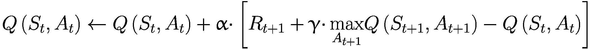

(6-1)

我简要介绍了最大化偏差和双 Q 学习的方法，其中你使用两张 q 值表。随后，你研究了使用样本多次来将在线 TD 更新转换为批量 TD 更新的方法，这使得样本效率更高。这引入了重放缓冲区的概念。虽然这仅关于离散状态和状态动作空间中的样本效率，但在使用神经网络进行函数逼近的情况下，几乎成为必须的，以便使深度学习神经网络收敛。你将再次回顾这一点，当我谈到优先级重放时，你将考虑从重放缓冲区中采样其他选项。

继续前进，在第五章中，你研究了各种函数逼近方法。你研究了瓦片编码作为实现线性函数逼近的方法。然后我谈到了 DQN，即使用神经网络作为函数逼近器的批量 Q 学习。我通过一个漫长的推导过程得到了一个权重（即神经网络参数）更新方程，如公式 5-25 所示。该方程在此重现：

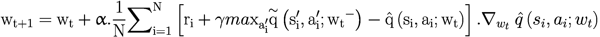

(6-2)

注意，我使用下标*i*表示迷你批次的样本，*t*表示更新权重的时间/循环索引。方程 6-2 是你在本章和下一章中将广泛使用的方程。当你阅读关于不同修改的内容并研究它们的影响时，你将对这个方程进行各种调整。

我还提到了在非线性函数近似和梯度更新下没有收敛的理论保证。关于这一点，我在本章中还有更多要说的。Q-learning 方法适用于离散状态和动作，其中 q 值的更新使用方程 6-1，与 DQN 中基于深度学习的方法调整权重参数相比。Q-learning 情况下有收敛的保证，而 DQN 则没有这样的保证。DQN 的计算量也很大。然而，尽管存在这些缺点，DQN 使得使用原始图像而不是仅使用特定的观察向量（如位置、速度、角度、网格编号等）来训练智能体成为可能。这在普通的 Q-learning 情况下是完全不可想象的。现在，让我们将方程 6-2 应用到实践中，以在各种环境中训练 DQN 智能体。

让我们回顾一下 `CartPole` 问题，它有一个四维的连续状态，包括当前小车位置、速度、杆的角度和杆的角速度的值。动作有两种类型：将小车推向左边或右边，目的是尽可能长时间地保持杆的平衡。这个环境是 OpenAI Gym 库的一部分，如前所述，现在已经被分叉到 Gymnasium。以下是该环境的详细信息：

```py
Observation:
Type: Box(4)
Num     Observation               Min              Max
0       Cart Position             -4.8             4.8
1       Cart Velocity             -Inf             Inf
2       Pole Angle                -0.418 rad       0.418 rad
3       Pole Angular Velocity     -Inf             Inf
Actions:
Type: Discrete(2)
Num        Action
0          Push cart to the left
1          Push cart to the right
```

由于状态/观察向量是四维的，因此你将构建一个输入维度为四的小型神经网络。有两个隐藏层，随后是一个维度为二的输出层，因为可能采取的动作有两个。有两个输出 q 值，即 *Q*(*S*, *A*)，每个动作一个。图 6-1 展示了网络图。

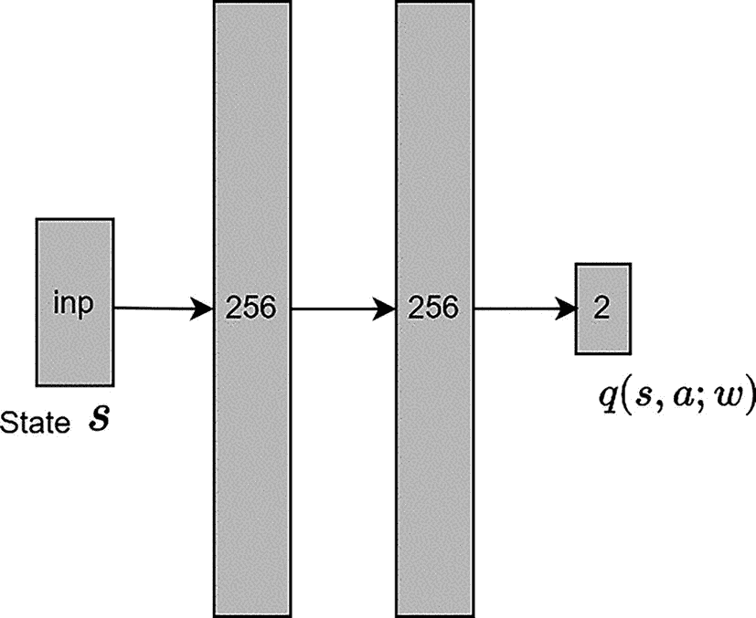

模型图具有以下流程，状态 S 输入，256，256，输出为 2 的 q 值，括号内的分号 w。

图 6-1

简单的神经网络

在 PyTorch 中构建神经网络有许多方法。最灵活的方法是子类化 `torch.nn` 模块。在子类的 `init` 方法中，你定义构建块，如线性层、激活函数等。然后你实现 `forward` 方法，这是一个父抽象方法，它接受输入，通过 `init` 方法中定义的网络层传递输入，并返回最终输出。第二种方法定义了一个从输入到输出的所有层的列表，并将其传递给 `nn.Sequential`。第二种方法是一个更快捷的方法，代码量最小，但它不提供灵活性，尤其是在涉及多个输入、输出和跳跃连接时。

本章采用第一种方法，第二种方法嵌入在`init`函数中，如列表 6-1 所示。您还定义了一些额外的便利方法作为网络的一部分。您将定义三种这样的方法。第一个是`get_qvalues`，它接受状态/观察作为`numpy`数组，而不是`forward`期望的`torch`张量。然后它将`numpy`数组转换为 torch `tensor`，通过`forward`方法传递，然后再将`forward`返回的 PyTorch 张量转换回`numpy`。这样的方法使得在环境`step`函数代码中使用网络变得更加容易，否则您在实现通过环境步骤的逻辑时需要将`tensor`转换为`NumPy`或 Python 数组。理想情况下，这类操作最好被抽象出来，并保持靠近网络 PyTorch 代码。如果您使用 GPU，这种代码结构使得从 CPU 到 GPU 移动观察数据的批次、通过网络处理它，然后再将其移回 CPU 变得更加容易，使得 CPU 到 GPU 的来回移动对其他代码来说是透明的。您可以在列表 6-1 中`get_qvalues`函数的第一行和第三行代码中看到这种模式。在从`NumPy`到`tensor`的转换过程中，您使用`device`参数将观察数据移动到托管神经网络的适当设备。在第三行，您使用`Tensor.cpu()`链式调用将网络输出的 q 值移回 CPU。`get_qvalues`函数接受一批状态/观察数据作为输入，即一个维度为(*N* × 4)的张量，其中*N*是样本数量。它将状态值通过网络传递以产生 q 值。输出向量的大小为(*N* × 2)；每行对应一个输入。每行有两个 q 值，一个对应左推动作，另一个对应右推动作。

您将要实现的第二个函数是`sample_actions`。它实现了ε-greedy 策略。它使用`get_qvalues`函数返回的`q-values`作为`NumPy`数组来选择最佳动作，(1 - ϵ)的分数次数，以及选择随机动作ϵ的分数次数。这是您在学习过程中用来保持探索未访问状态的方法。如前所述，您从一个高的ϵ值开始，如 0.6-0.8，然后逐渐减少到接近 0，0.05 是一个流行的选择。该函数接受一批 q 值(*N* × 2)。它使用ε-greedy 策略（方程 4-3）来选择动作。输出是一个(*N* × 1)的向量。

第三个函数，称为 `get_action`，是 `sample_actions` 的截断版本。你使用没有探索的贪婪策略。这已在 `get_action` 函数中实现。没有随机选择。在这个函数中，你确定性地并且没有探索地总是返回具有最大 *q*- 值的最佳动作。与 `sample_actions` 一样，`get_action` 函数也接收一个 *q*- 值批（*N* × 2）并生成 (*N* × 1) 动作向量，每个批次的 *N* 个观察值对应一个动作。这个函数用于训练后获取给定状态的最佳动作。

列表 6-1 展示了 PyTorch 中的代码，完整代码可在 `6.a-dqn-pytorch.ipynb` 笔记本中找到。

```py
class DQNAgent(nn.Module):
def __init__(self, state_shape, n_actions, epsilon=0):
#... boiler plate code omitted
# ...
# a simple NN
self.network = nn.Sequential()
self.network.add_module('layer1', nn.Linear(state_dim, 256))
# code omitted ---- all other layers of network come here
self.network.add_module('layer3', nn.Linear(256, n_actions))
self.parameters = self.network.parameters
def forward(self, state_t):
# pass the state at time t through the network to get Q(s,a)
qvalues = self.network(state_t)
return qvalues
def get_qvalues(self, states):
# input is an array of states in numpy and output is Qvals as numpy array
states = torch.tensor(np.array(states), device=device, dtype=torch.float32)
qvalues = self.forward(states)
return qvalues.data.cpu().numpy()
def get_action(self, states):
states = torch.tensor(np.array(states), device=device, dtype=torch.float32)
qvalues = self.forward(states)
best_actions = qvalues.argmax(axis=-1)
return best_actions
def sample_actions(self, qvalues):
# sample actions from a batch of q_values using epsilon greedy policy
epsilon = self.epsilon
batch_size, n_actions = qvalues.shape
random_actions = np.random.choice(n_actions, size=batch_size)
best_actions = qvalues.argmax(axis=-1)
should_explore = np.random.choice(
[0, 1], batch_size, p=[1-epsilon, epsilon])
return np.where(should_explore, random_actions, best_actions)
Listing 6-1
DQN Network from 6.a-dqn-pytorch.ipynb
```

注意

虽然不是必需的，但如果你对 PyTorch 或 TensorFlow 有一些先前的了解，你将能从代码讨论中获得更多收获。你应该能够创建基本网络，定义损失函数，并执行基本的训练步骤以进行优化。

接下来，你将了解在 TensorFlow 中创建类似结构的方式。TensorFlow 的 eager 模式非常类似于 PyTorch。在 TensorFlow 中，你有一个类似的顺序模型，它可以在 `tf.keras.models.Sequential` 下找到。在 TensorFlow 中，你必须实现 `a __call__` 方法，而不是你在 PyTorch 中使用的 `forward` 方法。其余的代码看起来非常相似，因此这里没有列出代码。感兴趣的读者可以参考 `6.b-dqn-tensorflow.ipynb` 笔记本以获取完整细节。

重放缓冲区的代码很简单。你有一个名为 `self.buffer` 的数组来存储之前的示例。`add` 函数接收 `state, action, reward, next_state, and done`，即智能体单步/转换的值，并将其作为元组添加到缓冲区中。如果缓冲区已达到其最大长度，它将丢弃最旧的转换/元组以为新添加的内容腾出空间。`sample` 函数接收一个整数 `batch_size` 并从缓冲区返回 `batch_size` 个样本/转换。在这个基本实现中，缓冲区中存储的每个转换被采样的概率是相等的。列表 6-2 展示了来自 `6.a-dqn-pytorch.ipynb` 笔记本的重放缓冲区代码。

```py
class ReplayBuffer:
def __init__(self, size):
self.size = size #max number of items in buffer
self.buffer =[] #array to hold buffer
self.next_id = 0
#... boiler plate code omitted
def add(self, state, action, reward, next_state, done):
item = (state, action, reward, next_state, done)
if len(self.buffer) < self.size:
self.buffer.append(item)
else:
self.buffer[self.next_id] = item
self.next_id = (self.next_id + 1) % self.size
def sample(self, batch_size):
idxs = np.random.choice(len(self.buffer), batch_size)
samples = [self.buffer[i] for i in idxs]
states, actions, rewards, next_states, done_flags = list(zip(*samples))
return np.array(states), np.array(actions),
np.array(rewards), np.array(next_states), np.array(done_flags)
Listing 6-2
Replay Buffer (Same in PyTorch or TensorFlow) from 6.a-dqn-pytorch.ipynb
```

接下来，你有一个名为 `play_and_record` 的实用函数，它接收一个 `env`（例如，`CartPole`），一个 `agent`（例如，`DQNAgent`），一个 `exp_replay`（`ReplayBuffer`），智能体的 `start_state`，以及 `n_steps`（即在环境中采取的步骤/动作的数量）。该函数使 `agent` 从初始状态 `start_state` 开始采取 `n_steps` 个步骤，根据智能体当前遵循的 ε-贪婪策略使用 `agent.sample_actions` 并将这些 `n_steps` 个转换记录在缓冲区中。有关如何实现的详细代码，请参阅列表 6-1（`6.a-dqn-pytorch.ipynb`）中的笔记本。

接下来，你来看一下学习过程。你首先构建你想要最小化的损失表达式，*L*。它是使用一步 TD 值计算当前状态动作的目标值与当前状态值之间的平均平方误差。如第五章所述，你使用一个具有权重 *w*^−（*w* 上标 -）的原版神经网络的副本。你使用损失来计算代理（在线/原始）网络的权重 *w* 的梯度，并在梯度的负方向上迈出一步以减少损失。注意，如第五章所述，你保持具有权重 *w*^− 的目标网络冻结，并且以较低的频率更新这些权重。引用第五章中关于 DQN 批处理方法的章节：

在这里，你使用了一个不同的权重向量  来计算目标值的估计。本质上，你有两个网络，一个称为在线网络，具有权重 *w*，它根据方程 5-24 进行更新，另一个类似的网络称为目标网络，但具有一个称为 *w*^− 的权重副本。权重向量 *w*^− 的更新频率较低，例如，在在线网络权重 *w* 更新后的每 100 次更新。这种方法使目标网络保持不变，并允许你使用监督学习的技术。

损失函数 L 如下：

![$$ \mathrm{L}=\frac{1}{\mathrm{N}}{\sum}_{i=1}^N{\left[{r}_i+\left(\left(1- don{e}_i\right).\gamma .\underset{a^{\prime }}{\max}\hat{q}\left({s}_i^{\prime },{a}^{\prime };{w}_t^{-}\right)\right)\hbox{--} \hat{q}\left({s}_i,{a}_i;{w}_t\right)\right]}² $$](img/502835_2_En_6_Chapter/502835_2_En_6_Chapter_TeX_Equ3.png)

(6-3)

你对损失 *L* 关于 *w* 求梯度（导数），然后使用这个梯度来更新在线网络的权重 *w*。你沿着梯度的负方向更新权重，因为你希望通过调整权重 *w* 的值来减少损失。这个概念来自微积分，即函数对其变量的梯度（也称为导数或斜率）给出了最大增加的方向，因此通过在梯度的负方向上调整 *w*，你走向一个提供函数值最快减少的新 *w*。

这个概念可以转化为以下方程：

![$$ {\nabla}_wL=-\frac{1}{N}{\sum}_{i=1}^N\left[{r}_i+\left(\left(1- don{e}_i\right).\gamma .\underset{a^{\prime }}{\max}\hat{q}\left({s}_i^{\prime },{a}^{\prime };{w}_t^{-}\right)\right)\hbox{--} \hat{q}\left({s}_i,{a}_i;{w}_t\right)\right]\nabla \hat{q}\left({s}_i,{a}_i;{w}_t\right) $$](img/502835_2_En_6_Chapter/502835_2_En_6_Chapter_TeX_Equ4.png)

(6-4)

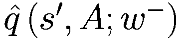 是使用目标网络计算的，该网络的权重保持不变，并定期从学习代理网络刷新。

目标值由以下给出：

+   非终止状态：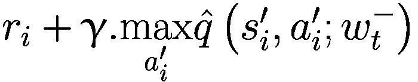

+   终止状态：*r*[*i*]

当环境因动作 *a*[*i*] 终止时，*done*[*i*] 的值为 1。在方程 6-4 中，通过乘以 (1 − *done*[*i*])，你可以得到根据 *done*[*i*] 标志的状态的两个目标值。

梯度 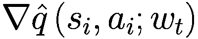 是通过神经网络输出的损失反向传播计算得到的，这也是使用 PyTorch 和 TensorFlow 等深度学习框架的主要原因之一，这些框架自动化了这些梯度的计算，并使得这些框架变得如此强大。

基本流程是设计网络以输出 ，然后编写一个损失函数来计算损失 *L*，如方程 6-3 所示，该函数使用网络输出  和目标值来计算平均平方损失，如方程 6-3 所示。方程 6-4 的实现由深度学习框架通过简单的调用如 `loss.backward()` 自动完成。一旦计算出了梯度，你就有方程 6-4 中给出的值。接下来，你通过调整当前网络的权重来应用这个梯度的缩放量。缩放因子 α 是学习率，它控制你在每次更新中进行的调整量。通常，在训练初期，你使用较高的 α，随着网络训练的进行，逐渐降低它。

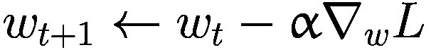

(6-5)

列表 6-3 展示了之前讨论过的计算 *L* 的代码。这是通过 `compute_td_loss` 函数完成的。它接收一个包含 `states, actions, rewards, next_states` 和 `done_flags` 的批次。它还接收折扣参数 *γ* 以及代理/在线和目标网络。函数首先将 `NumPy` 数组转换为 `PyTorch` 张量并将它们移动到 CPU 或 GPU 设备。接下来，将状态张量批次通过 `agent` 网络传递以输出所有动作的 `predicted_qvalues`。您选择动作张量批次 *a*[*i*] 的特定 q-value 以产生 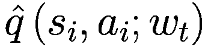，在代码中显示为张量 `predicted_qvalues_for_actions`。接下来，通过将 `next_states` 的批次通过目标网络传递来计算所有动作的 `predicted_next_qvalues`。然后，通过取动作的最大值来产生 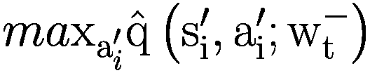，在代码中显示为 `next_state_values`。接下来，计算目标值 ，在代码中显示为 `target_qvalues_for_actions`。代码的最后一行通过取 `target_qvalues` 和 `predicted q_values` 的差值、平方、相加，然后在整个批次上平均来计算并返回计算出的损失 *L*。

```py
def compute_td_loss(agent, target_network, states, actions, rewards, next_states, done_flags, gamma=0.99, device=device):
# convert numpy array to torch tensors
states = torch.tensor(states, device=device, dtype=torch.float)
actions = torch.tensor(actions, device=device, dtype=torch.long)
rewards = torch.tensor(rewards, device=device, dtype=torch.float)
next_states = torch.tensor(next_states, device=device, dtype=torch.float)
done_flags = torch.tensor(done_flags.astype('float32'),device=device,dtype=torch.float)
# get q-values for all actions in current states
# use agent network
predicted_qvalues = agent(states)
# compute q-values for all actions in next states
# use target network
predicted_next_qvalues = target_network(next_states)
# select q-values for chosen actions
predicted_qvalues_for_actions = predicted_qvalues[range(
len(actions)), actions]
# compute Qmax(next_states, actions) using predicted next q-values
next_state_values,_ = torch.max(predicted_next_qvalues, dim=1)
# compute "target q-values"
target_qvalues_for_actions = rewards + gamma * next_state_values * (1-done_flags)
# mean squared error loss to minimize
loss = torch.mean((predicted_qvalues_for_actions -
target_qvalues_for_actions.detach()) ** 2)
return loss
Listing 6-3
Compute TD Loss in PyTorch from 6.a-dqn-pytorch.ipynb
```

在这个阶段，你已经拥有了训练代理平衡杆所需的所有机制。但首先，你需要定义一些超参数，例如`batch_size`、总训练步数`total_steps`以及探索率 ϵ 的衰减速率。它从 1.0 开始，随着代理学习到最优策略，逐渐减少到 0.05。你还需要定义一个`optimizer`，它接受代理网络的参数，即权重向量 *w*。这是通过将`agent.parameters()`传递给优化器的构造函数来实现的。有众多优化器，其中 Adam 是一个流行的选择。其名称来源于自适应矩估计。优化器被称为 Adam，因为它使用梯度的一阶和二阶矩的估计来调整神经网络每个权重的学习率。你可以在 PyTorch 和 TensorFlow 的文档中了解更多相关信息。你设置的另一个重要训练参数是目标网络更新的频率——即权重 *w*^− 的网络。在这种情况下，你将其设置为 100，使用`refresh_target_network_freq = 100`，这意味着对于代理网络权重 *w* 的每 100 次更新，你将更新目标网络。这样，目标网络为权重 *w* 提供了一个稳定的靶点，以便收敛，同时也不至于过于频繁，导致目标网络权重变得过时。这是一个超参数，在现实生活中你可能需要调整它。你还需要定义用于绘图的训练损失日志频率以及评估训练代理的频率，以评估代理学习策略的质量。最后，你定义`max_grad_norm`来剪辑梯度的值。这同样是深度学习中的一个标准实践，也是一个超参数。所有这些参数都在列表 6-4 中展示。

```py
#setup some parameters for training
timesteps_per_epoch = 1
batch_size = 32
total_steps = 50000
#init Optimizer
opt = torch.optim.Adam(agent.parameters(), lr=1e-4)
# set exploration epsilon
start_epsilon = 1
end_epsilon = 0.05
eps_decay_final_step = 2 * 10**4
# setup some frequency for logging and updating target network
loss_freq = 20
refresh_target_network_freq = 100
eval_freq = 1000
# to clip the gradients
max_grad_norm = 5000
Listing 6-4
Training Parameters from 6.a-dqn-pytorch.ipynb
```

现在您已经准备好开始训练智能体了。列表 6-5 展示了相应的代码。您首先将环境重置以获取初始状态。在此之后，您将运行一个循环，循环次数等于`total_steps`——即智能体将被训练的训练步数。这是列表 6-4 中定义的参数之一。在循环中，您首先根据列表 6-4 中定义的设置设置探索率 ϵ。您使用一个名为`epsilon_schedule`的一行辅助函数来完成此操作。该函数的实现如列表 6-5 所示。您使用前面讨论过的`play_and_record`函数来填充列表 6-1 中显示的回放缓冲区。您使用一个称为`timesteps_per_epoch`的超参数来控制每个训练步骤中您将采取的步数。通常，这个值设置为 1，这样每次运行训练步骤时，您就会将一个额外的训练数据元组添加到缓冲区中。这样，随着智能体学习和探索新的*状态*、*动作*空间，回放缓冲区就会更新。接下来，您从回放缓冲区中采样一批存储的转换，其大小由`batch_size`参数控制。收集到的这批训练数据被传递到列表 6-3 中讨论的`compute_td_loss`函数。存储在变量`loss`中的返回值在方程 6-3 中解释。接下来，您调用`loss.backward()`，它几乎神奇地计算了梯度 ∇[*w*]*L*，如方程 6-4 中定义。这是深度学习框架的力量，它们实现了自动微分。如前所述，您剪辑梯度以确保梯度向量 ∇[*w*]*L*中的每个单独的梯度值都在您定义的界限内。接下来，您调用`opt.step()`来运行方程 6-5 中定义的权重更新。这完成了训练循环中的核心代码。在训练循环的进一步中，您有一些小的维护代码。您需要在权重向量 *w* 更新后清零梯度向量 ∇[*w*]*L*。您还需要根据`refresh_target_network_freq`参数刷新目标网络。最后，您必须记录训练损失，确定每集的平均回报作为验证的一部分，并将所有这些值绘制出来以显示训练的进度。列表 6-5 显示了所有讨论的代码。为了使重点更加突出，一些维护代码已被从列表中省略。对完整代码感兴趣的读者可以参考`6.a-dqn-pytorch.ipynb`笔记本。

```py
def epsilon_schedule(start_eps, end_eps, step, final_step):
return start_eps + (end_eps-start_eps)*min(step, final_step)/final_step
state,_ = env.reset()
for step in trange(total_steps + 1):
# reduce exploration as we progress
agent.epsilon = epsilon_schedule(start_epsilon, end_epsilon, step, eps_decay_final_step)
# take timesteps_per_epoch and update experience replay buffer
_, state = play_and_record(state, agent, env, exp_replay, timesteps_per_epoch)
# train by sampling batch_size of data from experience replay
states, actions, rewards, next_states, done_flags = exp_replay.sample(batch_size)
# loss = 
loss = compute_td_loss(agent, target_network,
states, actions, rewards, next_states, done_flags,
gamma=0.99,
device=device)
loss.backward()
grad_norm = nn.utils.clip_grad_norm_(agent.parameters(), max_grad_norm)
opt.step()
opt.zero_grad()
if step % loss_freq == 0:
td_loss_history.append(loss.data.cpu().item())
if step % refresh_target_network_freq == 0:
# Load agent weights into target_network
target_network.load_state_dict(agent.state_dict())
if step % eval_freq == 0:
# eval the agent
mean_rw_history.append(evaluate(
make_env(env_name), agent, n_games=3, greedy=True, t_max=1000)
)
# plotting code omitted
Listing 6-5
Main Training Loop from 6.a-dqn-pytorch.ipynb
```

您现在拥有了一个完全训练好的智能体。您在训练智能体时，每隔一段时间就绘制出每轮的平均奖励，当您为智能体训练了 50,000 步时，情况也是如此。在图 6-2 中左边的平均回报每轮的图表中，x 轴上的 10 对应于第 10,000 步。您还每 20 步绘制一次 TD 损失，这就是为什么右边的 x 轴从 0 到 2500，即 0 到 2500x20=50,000 步。与监督学习不同，目标不是固定的。保持目标网络在短时间内固定，并通过刷新目标网络权重以在线网络定期更新它。此外，正如所讨论的，使用离线学习（Q 学习）和自举目标（目标网络只是实际价值的估计，以及使用当前其他 q 值的估计形成的估计）的非线性函数逼近（神经网络）没有收敛保证。训练可能会看到损失上升并爆炸或波动。与通常监督学习中的损失图相比，这个损失图是反直觉的。图 6-2 显示了训练 DQN 的图表。

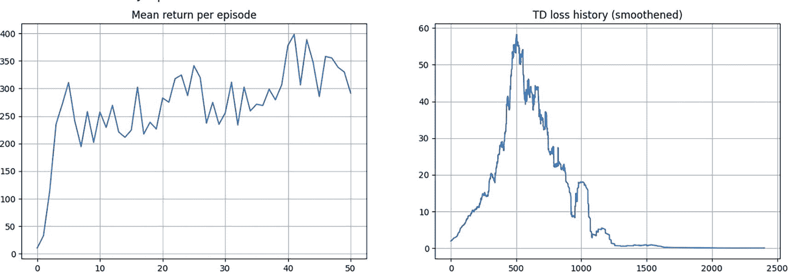

2 张平均回报每轮和 TD 损失历史平滑的图表。平均回报图绘制了一条波动线，具有上升趋势和尖锐的峰值和低谷。TD 图绘制了一条波动线，在结束时变得线性。它在 x 轴的 250 到 750 之间有最高的峰值。这些值是估计的。

图 6-2

DQN 的训练曲线

我还有更多关于使用 Stable Baselines3（SB3）、RL Baselines3 Zoo（SB3 Zoo）、weights and biases 等框架进行 DQN 训练和日志记录的其他选项要说的。然而，在涵盖这些问题之前，我简要地偏离一下，解释一下 OpenAI 环境 API 的起源及其在 Gymnasium 下的分支版本。这种理解将是有帮助的，因为一些环境库和框架（如 SB3、SB3 Zoo 和少数其他）仍然遵循较旧的 API 版本。

## OpenAI Gym 与 Farma Gymnasium

OpenAI 对核心 API 进行了一些重大更改。它影响了工作流程，例如如何创建环境、重置环境时返回什么值、如何设置随机种子、步函数返回什么值等等。这些更改最初在 2022 年 7 月的 OpenAI Gym v0.25.0 中引入，作为可选和破坏性更改，在 2022 年 9 月的 v0.26.0 中实施.^(1) 详细情况如下：

+   `Step`：步骤函数被修改为返回五个值：`obs`、`reward`、`termination`、`truncation`和`info`。原始返回值是`obs`、`reward`、`done`和`info`。这种更改的原因是为了区分终止和截断。`done=True`无法区分环境终止和剧集截断。在大多数时间限制不是因素的情况下，您可以设置`done = truncation or termination`。您可以在此处了解更多信息.^(2)

+   渲染：渲染 API 已更改，必须在`gym.make`中使用`render_mode`关键字指定模式，之后渲染模式就固定了。您可以参考 Gym v0.25.0 的发布注释。

+   重置信息：`Env.reset`函数被修改为返回两个值（`obs`和`info`），而旧的 API 只返回`obs`。

+   没有种子函数：虽然`Env.seed`是一个有用的函数，但这几乎仅用于剧集的开始，因此被添加到`gym.reset(seed=...)`中。

到 2022 年 10 月，Gym 的维护和更新工作转移到了一个新的非营利组织——Farma 基金会。代码被转移到名为`Gymnasium`的新 Python 包中，该包继承了 OpenAI Gym 0.26.0 中引入的新 API 版本。

然而，故事还没有结束。一些第三方环境和库，如 SB3 和 RL SB3 Zoo，使用了部分或全部旧版本的 API。SB3 和 SB3 Zoo 使用旧 API 的`step`和`reset`。它们保留了新的`render`方法，需要在`gymnasium.make`调用中指定`render_mode`。

还有其他一些环境库仍在使用 0.25.0 之前的版本——流行的`gym v0.21`版本的 API。根据你计划使用的环境框架，你应该阅读文档，确保你理解库支持的版本，以及库是否与 OpenAI Gym 或 Frama Gymnasium 兼容。

Gymnasium 还提供了一些环境包装器，可以将遵循旧 API 的环境包装起来，以兼容新的 v0.26 之后的 API。以下是需要此兼容性的关键包装器：

+   包装器`gymnasium.wrappers.EnvCompatibility`将旧版本的环境包装起来，以兼容新的 API。

+   包装器`gymnasium.wrappers.StepAPICompatibility`可以将环境从新的步骤 API 转换为旧的，反之亦然。

+   包装器`gymnasium.wrappers.PassiveEnvChecker`是一个被动环境检查包装器，它围绕`step`、`reset`和`render`函数，以确定它们是否遵循 Gymnasium API。

## 记录训练代理的视频

现在你已经了解了 Gym 和 Gymnasium 之间的 API 变化，让我们继续探讨 DQN 训练的话题。在训练了智能体并通过图表审查了其性能之后，接下来你想要生成训练智能体在行动中的视频。我在第二章 2 中简要地提到了这一点。然而，这次我会深入一些，这将帮助你更好地理解 Stable-Baselines3（SB3）库。SB3 为所有流行的强化学习算法提供了一个统一的架构。它对大多数用于训练智能体的流行强化学习算法进行了优化实现。它集成了各种实验共享、跟踪和日志服务，例如 Weights and Biases、HuggingFace 和 MLFlow。SB3 还提供了向量化环境。向量化环境将多个独立的环境堆叠成一个单一的环境。与每个步骤在单个环境中训练强化学习智能体相比，向量化环境允许你每个步骤在*n*个环境中进行训练。你将使用两个这样的向量环境类——`DummyVecEnv`和`VecVideoRecorder`——来帮助你记录训练智能体的视频。

`DummyVecEnv`为多个环境创建了一个简单的向量化包装器，在当前的 Python 进程中按顺序调用每个环境。这也可以用于需要向量化环境但你想使用单个环境进行训练的强化学习方法。你将使用`DummyVecEnv`包装单个环境的后者目的。原因是录制 API 期望一个向量化环境。列表 6-6 显示了`record_video`函数的代码。代码的第一行创建了一个包含单个`CartPole`环境的数组。你将使用`Gymnasium`（导入为`gym`）调用其`make`函数，并将数组传递给`DummyVecEnv`的`init`函数。

接下来，你使用`VecVideoRecorder`包装向量化环境，提供诸如你想要记录视频的向量化环境、视频将被记录的文件夹路径、触发回调以开始录制以及用于指定视频文件前缀的名称前缀等参数。

一旦`vec_env`被`VecVideoRecorder`包装，你将运行标准的回合 rollout，从环境的重置开始，使用`obs = vec_env.reset()`。请注意，SB3 向量化环境的`reset`函数返回一个值——符合较旧版本 Gym API 的观察值。接下来，你将运行一个循环，通过策略（训练智能体）遍历环境。

你提取生成的视频文件名，以便它可以由`record_video`函数返回并由`play_video`函数消费。你可以参考附带的笔记本以了解`play_video`函数的实现。最后，你调用`vec_env.close()`函数来关闭环境、停止视频并释放所有资源。

```py
def record_video(env_id, video_folder, video_length, agent):
vec_env = DummyVecEnv([lambda: gym.make(env_id, render_mode="rgb_array")])
# Record the video starting at the first step
vec_env = VecVideoRecorder(vec_env, video_folder,
record_video_trigger=lambda x: x == 0, video_length=video_length,
name_prefix=f"{type(agent).__name__}-{env_id}")
obs = vec_env.reset()
for _ in range(video_length + 1):
action = agent.get_action(obs).detach().cpu().numpy()
obs, _, _, _ = vec_env.step(action)
# video filename
file_path = "./"+video_folder+vec_env.video_recorder.path.split("/")[-1]
# Save the video
vec_env.close()
return file_path
Listing 6-6
Video Recording Code from 6.a-dqn-pytorch.ipynb
```

令人困惑的是，Gymnasium 还有一组遵循新 API 的向量化环境，该 API 的 `step` 函数返回一个包含 `observations, rewards, terminations, truncations` 和 `infos` 的批次。即使是 Gymnasium 向量化环境的 `reset` 函数也遵循新版本，返回来自向量化环境的观察和信息的批次。您可以使用 Gymnasium API 实现相同的视频录制代码。感兴趣的读者可以参考 Gymnasium 文档以获取更多详细信息。

接下来，您利用在第二章 2 中看到的相同代码，可以将训练好的代理、网络权重以及视频推送到 HuggingFace。代码与第二章 2 中看到的内容类似。在 `6.a-dqn-pytorch.ipynb` 笔记本中，您可以查看名为“使用 HuggingFace 分享代理”的部分，并探索传递给 `package_to_hub()` 函数调用的参数。

## 使用 SB3 的端到端训练

到目前为止，您已经手动制作了代理网络、损失计算和 DQN 算法的训练代码。虽然这对学习很有帮助，但在项目中，您最终希望利用实现良好且可扩展的 DQN 算法，并包含所有功能。SB3 为您提供了大多数流行的算法，并提供了参数来控制行为。让我们看看使用 SB3 创建和训练代理的完整代码。

在实际代码方面，您首先创建 `CartPole` 环境，这段代码与您在前面章节中手动制作 DQN 算法时使用的代码类似。接下来，您创建 `policy_kwargs` 来定义神经网络内部使用的网络层和激活函数。您创建了一个与之前类似的网络，包含两个各有 256 个节点的隐藏层，并使用 ReLU 作为激活函数。定义网络有多种方式。最基本的方法是采用默认设置，不创建 `policy_kwargs`，即策略配置字典。这种方法创建了一个默认网络，包含两个各有 64 个节点的隐藏层和 ReLU 激活。最复杂且灵活的方法是创建自己的自定义网络，类似于列表 6-1。有关详细信息，请参阅 SB3 下的“自定义策略”主题文档。

一旦定义了 `policy_kwargs`，您就可以通过调用 SB3 提供的 DQN 类来实例化 `model`。它接受 `MlpPolicy` 作为策略类型，`env` 作为包含环境的变量，以及 `policy_kwargs` 作为该策略的自定义配置。您可能还需要调整许多其他参数以适应您的特定用例。

这基本上完成了创建代码。接下来，您使用训练时间步数、日志间隔和用于控制训练进度显示的标志等参数调用`model.learn()`。训练完成后，您通过调用`model.save()`来保存模型，提供您希望模型保存的路径。列表 6-7 中给出的六行代码足以实例化和训练`CartPole`环境上的 DQN。

```py
# create the DQN agent
from stable_baselines3 import DQN
# create the environment
env_name = env_name = 'CartPole-v1'
env = gym.make(env_name, render_mode="rgb_array")
#define a policy matching ours
#define the activation function and the network layers size
policy_kwargs = dict(activation_fn=torch.nn.ReLU,
net_arch=[256, 256])
model = DQN("MlpPolicy", env, policy_kwargs=policy_kwargs, verbose=1)
model.learn(total_timesteps=1e5, log_interval=500, progress_bar=True)
model.save("logs/6_a/sb3/dqn_cartpole")
Listing 6-7
End-to-End DQN with SB3 from 6.a-dqn-pytorch.ipynb
```

## 使用 SB3 Zoo 进行端到端训练

如前所述，RL Baselines3 Zoo 是强化学习（RL）的训练框架。它提供了用于训练、评估智能体、调整超参数、绘制结果和录制视频的脚本。此外，它还包括针对常见环境和 RL 算法的调整好的超参数集合，以及使用这些设置训练的智能体。

为了让您熟悉各种选项，此示例使用权重和偏差(`wandb`)集成来记录这些实验。使用`wandb`，您可以捕获日志并与团队成员共享。它还有助于您跟踪所有实验、给定运行中使用的特定参数、训练日志以及各种其他系统级细节。您首先需要通过访问[`www.wandb.ai`](http://www.wandb.ai)创建一个`wandb`账户。一旦创建了账户并登录，点击页面右上角的您的名字/照片，然后导航到“用户设置”。一旦进入设置页面，导航到页面末尾，在“危险区域”部分下查找名为“API 密钥”的子部分。点击“新建密钥”按钮来创建密钥，并将生成的密钥复制到某个地方，因为您需要在 Python 代码中使用它来允许它访问您的`wandb`账户。

同样，您还需要在 HuggingFace 上创建一个账户并生成一个 API 密钥/令牌，您可以在第二章中这样做。您可以在本章以及所有后续章节中重用相同的令牌。列表 6-8 显示了使用 RL SB3 Zoo 训练智能体、播放/上传训练智能体性能的代码。

首先，您需要登录到您的`wandb`账户，以便您可以在那里记录实验结果。接下来，您在命令行上使用各种参数运行`rl_zoo3.train`来训练和跟踪智能体。大多数命令行参数根据其名称即可解释。命令行参数超出了列表 6-8 中可以看到的内容。您可以参考 RL SB3 Zoo 文档以获取更多详细信息.^(3)有时，我们发现参考脚本代码来理解所有参数更容易。例如，`Train`脚本代码可以在 GitHub 上通过参考文献中给出的位置浏览.^(4)

一旦您训练了智能体，您可以使用`rl_zoo3.enjoy`调用对其进行评估，并使用`rl_zoo3.record_video`的帮助录制视频。最后，可以使用`rl_zoo3.push_to_hub`将训练智能体的权重、视频和其他相关细节推送到 HuggingFace。

```py
# login to wandb
import wandb
wandb.login()
# Train the agent
!python -m rl_zoo3.train --algo dqn --env CartPole-v1 --save-freq 10000 \
--eval-freq 10000 --eval-episodes 10 --log-interval 400 --progress \
--track --wandb-project-name dqn-cartpole -f logs/6_a/rlzoo3/
# Evaluate trained agent
!python -m rl_zoo3.enjoy --algo dqn --env CartPole-v1 --no-render --n-timesteps 5000 --folder logs/6_a/rlzoo3
# Record a video
!python -m rl_zoo3.record_video --algo dqn --env CartPole-v1 --exp-id 0 -f logs/6_a/rlzoo3/ -n 1000
# Login into Hugging face if not done so earlier
# To log to our Hugging Face account to be able to upload models to the Hub.
from huggingface_sb3 import load_from_hub, package_to_hub, push_to_hub
from huggingface_hub import notebook_login
notebook_login()
!git config --global credential.helper store
# Share on HuggingFace
!python -m rl_zoo3.push_to_hub --algo dqn --env CartPole-v1 --exp-id 0 \
--folder logs/6_a/rlzoo3 --n-timesteps 1000 --verbose 1 --load-best  \
--organization nsanghi --repo-name dqn-cart-pole-rlzoo -m "Push to Hub"
Listing 6-8
End-to-end DQN with SB3 Zoo from 6.a-dqn-pytorch.ipynb
```

## 超参数优化**

在前面的例子中，您已经看到有很多超参数可以影响模型的性能。在实际的 RL 训练项目中，您可能会花费大量时间微调这些参数中的许多。初次阅读者可以跳过这一节，在需要时再回来阅读。这并不是理解 RL 算法所必需的阅读内容。

RL SB3 Zoo 与 Optuna 集成.^(5) Optuna 提供了三个关键特性：1) 使用 Python 的条件、循环和语法自动搜索最优超参数，2) 高效地搜索大空间并剪枝无望的试验以获得更快的结果，3) 在不修改代码的情况下，通过多个线程或进程并行化超参数搜索。我介绍了 Optuna 与 RL SB3 Zoo 协同工作的高级概念。更多详情，请参阅 Optuna 的文档。

为了优化，您首先需要定义您想要调整超参数的范围。您还需要定义这些值如何随范围变化——例如，它们会通过整数值变化，还是变化为浮点数，以及变化是否遵循对数域，其中参数值是从对数域中采样的。当取对数时，超参数值在 0.1、1、10、100、1000 之间等距。以 10 为底的对数范围计算为-1、0、1、2、3，这也是等距的。对数空间采样是调整学习率*α*时的首选选择。变化也可以是分类的，这意味着它有一个定义好的值集可以取——例如，`batch_size` = [8, 16, 32, 64]。在 RL SB3 Zoo 中，有一个名为`rl_zoo3/hyperparams_opt.py`^(6)的文件，它提供了一个建议的可调整超参数列表以及每个超参数的范围。列表和范围是为每个 RL 算法单独定义的。列表 6-9 显示了 DQN 的设置。

超参数采样器接受一个类型为`optuna.Trial`的`trial`参数，它定义了运行的单个实例。对于实验运行的给定实例，您选择一组特定的超参数值，并将其返回以供优化管道的其余部分使用。关键部分是超参数值采样是通过调用`trial.suggest()`完成的，而用于采样的算法由调用`rl_zoo3.train`时使用的`--sampler`命令行参数确定。有三个可能的值：`random`、`tpe`和`skopt`。随机搜索在大多数情况下都是一个相当好的选择。TPE 代表树结构帕累托估计器算法。这个采样器基于独立采样。在每次试验中，对于每个参数，TPE 将一个高斯混合模型（GMM）`l(x)`拟合到与最佳目标值相关的参数值集合，并将另一个 GMM `g(x)`拟合到剩余的参数值。它选择最大化比率`l(x)/g(x)`的参数值`x`。7 Scikit-Optimize，或`skopt`，是一个简单且高效的库，用于最小化（非常）昂贵和嘈杂的黑盒函数。它实现了几种基于序列模型优化的方法。`skopt`旨在在许多环境中易于访问和使用。8

```py
def sample_dqn_params(trial: optuna.Trial, n_actions: int, n_envs: int, additional_args: dict) -> Dict[str, Any]:
"""
Sampler for DQN hyperparams.
:param trial:
:return:
"""
gamma = trial.suggest_categorical("gamma", [0.9, 0.95, 0.98, 0.99, 0.995, 0.999, 0.9999])
learning_rate = trial.suggest_float("learning_rate", 1e-5, 1, log=True)
batch_size = trial.suggest_categorical("batch_size", [16, 32, 64, 100, 128, 256, 512])
buffer_size = trial.suggest_categorical("buffer_size", [int(1e4), int(5e4), int(1e5), int(1e6)])
exploration_final_eps = trial.suggest_float("exploration_final_eps", 0, 0.2)
exploration_fraction = trial.suggest_float("exploration_fraction", 0, 0.5)
target_update_interval = trial.suggest_categorical("target_update_interval", [1, 1000, 5000, 10000, 15000, 20000])
learning_starts = trial.suggest_categorical("learning_starts", [0, 1000, 5000, 10000, 20000])
train_freq = trial.suggest_categorical("train_freq", [1, 4, 8, 16, 128, 256, 1000])
subsample_steps = trial.suggest_categorical("subsample_steps", [1, 2, 4, 8])
gradient_steps = max(train_freq // subsample_steps, 1)
net_arch_type = trial.suggest_categorical("net_arch", ["tiny", "small", "medium"])
net_arch = {"tiny": [64], "small": [64, 64], "medium": [256, 256]}[net_arch_type]
hyperparams = {
"gamma": gamma,
"learning_rate": learning_rate,
"batch_size": batch_size,
"buffer_size": buffer_size,
"train_freq": train_freq,
"gradient_steps": gradient_steps,
"exploration_fraction": exploration_fraction,
"exploration_final_eps": exploration_final_eps,
"target_update_interval": target_update_interval,
"learning_starts": learning_starts,
"policy_kwargs": dict(net_arch=net_arch),
}
if additional_args["using_her_replay_buffer"]:
hyperparams = sample_her_params(trial, hyperparams, additional_args["her_kwargs"])
return hyperparams
Listing 6-9
Hyperparameter Search Space for DQN from hyperparams_opt.py
```

超参数优化的重要部分还包括剪枝的概念，这指的是终止无望试验的策略。在某些文献中，它也被称为提前停止。在 SB3 Zoo 中，剪枝通过`--prunner`命令行参数进行控制，它可以取三个可能值之一：`halving`、`median`或`none`。连续减半或减半背后的算法思想很简单。给定一个输入预算，将训练预算均匀分配到一组臂（参数组合的数量）上，进行预定义的迭代次数，评估其性能，丢弃最差的半数，并重复此过程，直到只剩下一个超参数配置。您可以在凯文·贾米森（Kevin Jamieson）和阿米特·塔尔瓦尔卡（Ameet Talwalkar）撰写的题为“非随机最佳臂识别和超参数优化”（“Non-stochastic Best Arm Identification and Hyperparameter Optimization”）的论文中了解更多关于剪枝的概念。9 中间剪枝指的是，如果一个试验的最佳中间结果比同一步骤之前试验的中间结果的中间值还要差，则该试验将被剪枝。

`rl_zoo.train` 提供了一些其他优化控制。命令行参数 `--n-startup-trials` 定义了 Optuna 样本器开始之前的试验次数。命令行参数 `--n-trials` 定义了优化超参数的试验次数。命令行参数 `--max-total-trials` 定义了优化超参数的（可能被剪枝的）试验次数。最后一个参数适用于整个优化过程，并优先于 `--n-trials`。还有一些其他参数，你可以在 `rl_zoo3.train` 脚本中了解它们.^(10)

不要忘记——最重要的命令行参数是 `--optimize`。它以超参数优化模式启动 `rl_zoo3.train`。

最后，有多种方式来指定 `hyperparams_opt.py`。列表 6-10 展示了使用 DQN 和 `CartPole` 环境的 `rl_zoo.train` 的一个示例调用。

```py
!python -m rl_zoo3.train --algo dqn --env CartPole-v1 --save-freq 10000 \
--eval-episodes 10 --log-interval 100 --progress --track \
--wandb-project-name dqn-cartpole \
--optimization-log-path logs/optimization/ --log-folder logs --optimize-hyperparameters --n-jobs 2 \
--study-name dqn-test --max-total-trials 25
Listing 6-10
Hyperparameter Optimization with rl_zoo3.train from 6.a-dqn-pytorch.ipynb
```

注意，根据设置，优化运行可能需要很长时间才能完成。接下来是绘制优化结果，`rl_zoo3 rep`ository 中的 `rl_zoo3/plots` 和 `scripts` 文件夹提供了一些脚本，用于绘制结果。在 `scripts` 文件夹中，`parse_study.py` 帮助解析优化运行并保存 *n* 个最佳超参数配置。列表 6-11 展示了在列表 6-10 中的优化运行完成后运行此脚本的一个示例。

```py
!python -m rl_z003.scripts.parse_study -i ./logs/dqn/report_CartPole-v1_500-trials-50000-tpe-median_1698290229.pkl --print-n-best-trials 10 \
--save-n-best-hyperparameters 10 --folder ./logs/dqn/6.a/best-params/
Listing 6-11
Saving “n” Best Configurations After an Optimization Run from the 6.a-dqn-pytorch.ipynb notebook
```

## 与 Rliable 库的集成(**)

在 2021 年，Agarwal 等人发表的一篇名为“Deep Reinforcement Learning at the Edge of the Statistical Precipice”的论文获得了 NeurlPS 2021 的杰出奖。以下是论文中的引用：

> “深度强化学习（RL）算法主要通过比较它们在大量任务上的相对性能来评估。大多数关于深度强化学习基准测试的已发布结果都比较了任务平均和中位数等综合性能的点估计，而忽略了使用有限次训练运行所隐含的统计不确定性……”

作者继续说，转向计算密集型基准测试的趋势，特别是基于 ALE（Arcade Learning Environments）等环境的基准测试，越来越导致只对少量任务进行评估的做法，这加剧了点估计的统计不确定性。作者使用 ALE 来说明这一点，然后建议使用

> “……综合性能的区间估计，并提出性能配置文件来解释结果的可变性，以及呈现更稳健和高效的聚合指标，如四分位数均值分数，以实现结果的小不确定性。”

你可以在论文附带的博客链接中了解更多相关信息。作者还发布了一个名为`rliable`的 Python 库，该库已被集成到 RL SB3 Zoo 中。SB3 Zoo 提供了三个关键的脚本用于绘图。`scripts/all_plots.py`和`scripts/plot_from_file.py`用于绘图评估，而`scripts/plot_train.py`用于绘图训练奖励/成功。`6.a-dqn-pytorch.ipynb`笔记本包含了一些示例。

首先，你需要进行多次训练运行以收集多样化的数据点进行有意义的绘图。为此，你可以多次重新运行列表 6-8 中的训练脚本，并对超参数进行一些随机变化。你将创建各种训练轨迹，并获得多个验证结果。一旦你进行了足够的运行，下一步就是准备结果文件。列表 6-12 包含了运行这些和其他绘图脚本的代码。列表 6-12 中的第一条命令是关于为所有绘图准备文件。它需要诸如算法、环境、训练运行数据存储的位置以及你希望存储由该脚本生成的文件输出位置等参数。在结果保存到文件后，你将相同的文件输入到第二个命令中，如列表 6-12 所示。`plot_from_file`将作为输入从前一个`all_plots`命令生成的文件，并根据命令行参数，使用`rliable`或其他绘图库来创建图表。一些命令行参数与`rliable`库相关。你可能需要探索`rliable`文档以更好地理解它们控制的内容以及每个参数的意义。你可以查看 SB3 Zoo 文档的绘图部分，以了解这些脚本具有的各种命令行选项。与`all_plots`类似，还有一个名为`plot_train`的脚本，用于绘制训练图表。

```py
!python -m rl_zoo3.plots.all_plots --algo dqn --env CartPole-v1 \
-f logs/6_a/rlzoo3/ -o logs/6_a/rlzoo3/dqn_results
!python -m rl_zoo3.plots.plot_from_file -i logs/6_a/rlzoo3/dqn_results.pkl \
-latex -l DQN --output logs/6_a/rlzoo3/dqn_test_plot.svg
!python -m rl_zoo3.plots.plot_from_file -i logs/6_a/rlzoo3/dqn_results.pkl \
--rliable --versus --iqm --boxplot \
-latex -l DQN --output logs/6_a/rlzoo3/dqn_test1_plot.svg
Listing 6-12
Plotting from Notebook 6.a-dqn-pytorch.ipynb
```

这完成了训练一个代理的完整 DQN 实现。核心思想是专注于算法，并教你如何编写一个 DQN 学习代理。现在，你将使用相同的实现进行一些小的调整，以便代理可以使用游戏图像像素值作为状态来玩 Atari 游戏。请注意，你将构建一个更强大的神经网络，并且需要训练代理超过更多的时间步，达到数百万步。因此，除非你本地有 GPU 访问，否则你可能需要考虑在 Google Colab 上运行 Atari DQN 笔记本。该笔记本包含在 Google Colab 上运行笔记本所需的全部包安装命令，因此是自包含的。

## 使用 DQN 的 Atari 游戏代理

在 2013 年一篇题为“使用深度强化学习玩 Atari”（^(12））的开创性论文中，作者使用深度学习模型创建了一个基于神经网络的 Q 学习算法。他们将之命名为深度 Q 网络。这正是你在上一节中实现的内容。现在，你将简要了解作者为训练智能体玩 Atari 游戏所采取的额外步骤。这基本上与上一节相同，有两个关键区别：1) 使用游戏图像像素值作为状态输入，这需要一些预处理，2) 在智能体内部使用卷积网络而不是上一节中看到的线性层。计算损失*L*和执行训练的其他方法保持不变。请注意，使用卷积网络进行训练需要很长时间，尤其是在普通的 PC/笔记本电脑上。准备好观看训练代码运行数小时，即使在中等性能的基于 GPU 的机器上也是如此。

你可以在名为`6.c-dqn_atari_pytorch.ipynb`的 Python 笔记本中找到训练智能体的完整 PyTorch 代码。Gymnasium 库已经实现了为 Atari 游戏图像所需的许多转换，并且尽可能使用这些示例。

### 健身房中的 Atari 环境

让我们先谈谈 Gymnasium 中提供的 Atari 游戏环境以及为将图像像素值准备好输入深度学习网络而进行的图像预处理。Gymnasium 提供了一套通过 Stella 和 Arcade Learning Environment 模拟的 Atari 2600 环境。

Atari 2600 视频计算机系统（VCS）于 1977 年推出，是 20 世纪 80 年代初最受欢迎的家庭视频游戏系统。你可以通过 Stella 在你的 PC 上享受所有流行的 Atari 2600 游戏。Stella 是一个多平台 Atari 2600 VCS 模拟器，在 GNU 通用公共许可证（GPL）下发布。

Arcade Learning Environment（ALE）是一个简单的框架，允许研究人员和爱好者开发用于 Atari 2600 游戏的 AI 智能体。它建立在名为 Stella 的 Atari 2600 模拟器之上，将模拟的细节与智能体设计分离。ALE 提供 Python 绑定，并支持 OpenAI Gym 和 Farma Gymnasium。

ALE-py 不包含 Atari ROMs（`pip install gymnasium[atari]`），这是在健身房`make`函数中创建 Atari 环境所必需的。本书开头部分的 Python 安装说明已经处理了这个问题。

Atari 游戏的动作空间由 18 个动作组成，编号从 0 到 17。默认情况下，大多数环境使用合法动作的较小子集，排除了在特定游戏中没有效果的那些动作。如果用户有兴趣使用所有可能的动作，请将关键字参数`full_action_space=True`传递给`gymnasium.make`。我不会使用这个，因为神经网络将只输出特定游戏的相关动作。

Atari 游戏有三种类型的观察空间：最常见的是 1) 大小为 210x160 的 RGB 图像，类型为 `Box(0, 255, (210, 160, 3), np.uint8)`，2) 图像的灰度版本，3) 128 字节的 RAM 状态。你可以通过将 `obs_type` 参数传递给 `gym.make` 函数调用来控制这一点。

由于 Atari 游戏完全是确定性的，智能体可以通过简单地记住一个最优动作序列并完全忽略来自环境的观察来实现最先进的性能。有几种方法可以避免这种情况。引用自 Gymnasium 文档：

+   *粘性动作*：不是总是模拟传递给环境的动作，而是有很小概率使用之前执行的动作。在 v0 和 v5 环境中，重复动作的概率是 25%，而在 v4 环境中，概率是 0%。用户可以使用 `repeat_action_probability` 参数来指定重复动作的概率 `gymnasium.make`。

+   *帧跳过*：在环境每一步中，动作可以重复随机数量的帧。这种行为可以通过将 `frameskip` 关键字设置为正整数或两个正整数的元组来改变。如果 `frameskip` 是一个整数，帧跳过是确定的，并且在每个步骤中动作会重复 `frameskip` 次数。否则，如果 `frameskip` 是一个元组，则在每个环境步骤中，跳过的帧数将在 `frameskip[0]`（包含）和 `frameskip[1]`（排除）之间均匀随机选择。

一些游戏允许用户设置难度级别和游戏模式。不同的模式/难度可能有不同的游戏动态和不同的动作空间。此示例不改变这些。它使用默认值 0。

你将实现 Breakout 游戏的智能体。在 Breakout 游戏中，底部有一个挡板，目标是移动挡板以确保球不会掉到下面。玩家需要使用挡板击打球并尽可能多地摧毁砖块。每次球未击中挡板，玩家就会失去一条生命。玩家开始时有五条生命。Breakout 有一个 0-3 的动作空间 `['NOOP', 'FIRE', 'RIGHT', 'LEFT']`，其中 0 表示“无操作 (NOOP)，1 表示开始游戏，2 表示向右移动挡板，3 表示向左移动挡板。你可以参考 Gymnasium 文档获取更多详细信息.^(13) 图 6-3 展示了游戏的三个帧。

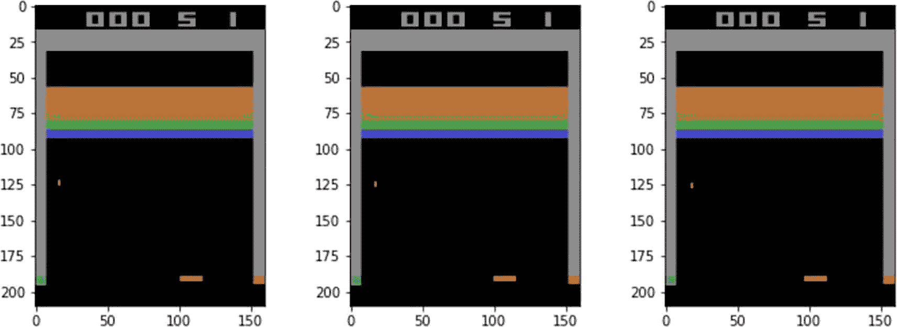

三张视频游戏截图突出了得分、颜色渐变区域、从上到下的垂直下落条和水平条。

图 6-3

Atari Breakout 游戏图像

Atari 游戏图像是 210×160 像素的图像，使用 128 色调色板。列表 6-13 展示了创建环境和打印游戏几帧的代码。

```py
def make_env(env_name, frameskip=5, repeat_action_probability=0.25, render_mode='rgb_array', mode=0, difficulty=0):
# remove time limit wrapper from environment
env = gym.make(env_name,
render_mode=render_mode,
frameskip=frameskip,
repeat_action_probability=repeat_action_probability,
mode=mode,
difficulty=difficulty
).unwrapped
return env
env_name = "ALE/Breakout-v5"
env = make_env(env_name)
env.reset(seed=127)
n_cols = 4
n_rows = 2
fig = plt.figure(figsize=(16, 9))
for row in range(n_rows):
for col in range(n_cols):
ax = fig.add_subplot(n_rows, n_cols, row * n_cols + col + 1)
ax.imshow(env.render())
env.step(env.action_space.sample())
plt.show()
Listing 6-13
Creating an Atari Breakout Game Instance from notebook 6.c-dqn_atari_pytorch.ipynb
```

### 预处理和训练

你需要对图像进行预处理以减小图像大小并使卷积神经网络运行得更快。你还会缩小图像的尺寸。你可以将图像再次转换为灰度，以减小输入向量的尺寸，用灰度的一个通道代替 RGB（红色、绿色和蓝色通道）的三个通道。在 PyTorch 中，一个预处理后的图像单帧，大小为（1×84×84—通道，宽度，高度），只提供静态状态。球或桨的位置并不能告诉你它们移动的方向。因此，你将堆叠几个连续的游戏图像帧来训练智能体。你将堆叠四个缩小尺寸的灰度图像，这些图像将作为状态 *S* 输入到神经网络中。输入（即状态 *S*）在 PyTorch 中大小为 4×84×84，在 TensorFlow 中为 84×84×4，其中 4 指的是游戏图像的四个帧，84×84 是每帧的灰度图像大小。将四个帧堆叠在一起将允许智能体网络推断球和桨的移动方向。

列表 6-14 展示了创建环境并包括预处理步骤的代码。当你对预处理后的环境进行单次观察绘图后，你会看到状态/观察的形状为 4x84x84。在 `make_env` 函数中，你首先使用 `frameskip=1` 调用 `gym.make`，这是默认行为，意味着下一次调用 `step` 将产生下一个游戏帧。你这样做的原因是因为你将用额外的包装器包装这个函数，这些包装器将负责堆叠多个帧。因此，你不想在调用 `gym.make` 时有任何帧跳过。请注意，在整个过程中，你将 Gymnasium 作为 `gym` 导入。因此，在这段代码中，我将这个包称为 `Gymnasium` 或 `Gym`，例如，`gymnasium.make` 或 `gym.make`。两者都指的是 Gymnasium 库，调用 `make` 函数。

接下来，你使用 `AtariPreprocessing` 将 Gymnasium Breakout 环境包装起来，将 `screen_size` 设置为 84 像素，并在 `scale_obs=True` 的帮助下将像素值映射到 0-1 范围，而不是 0-255 范围。`AtariPreProcessing` 的完整参数列表可以在 Gymnasium 文档中查看.^(14) 同样的文档页面还提供了有关许多其他包装器的详细信息，这些包装器可以用来包装原始环境以增强或改变默认行为。你将使用 `frame_skip=4` 的默认值，因为你需要堆叠四个帧来提供球和垫子方向的前置上下文，在将观察值输入到神经网络之前。因此，你将使用 `FrameStack` 包装器，`num_stack=4` 来堆叠四个游戏图像帧。最后，根据 `clip_rewards` 标志，你进一步使用 `TransformReward` 包装器包装环境。此包装器接受输入环境和用于转换奖励的函数。在这种情况下，你使用简单的 lambda 函数 `lambda r: np.sign(r)` 来仅返回奖励的符号，丢弃其大小。这与原始论文中遵循的过程一致。

```py
from gymnasium.wrappers import AtariPreprocessing
from gymnasium.wrappers import FrameStack
from gymnasium.wrappers import TransformReward
def make_env(env_name,
clip_rewards=True):
env = gym.make(env_name,
render_mode='rgb_array',
frameskip=1
)
env = AtariPreprocessing(env, screen_size=84, scale_obs=True)
env = FrameStack(env, num_stack=4)
if clip_rewards:
env = TransformReward(env, lambda r: np.sign(r))
return env
env = make_env(env_name)
obs, _ = env.reset()
n_actions = env.action_space.n
state_shape = env.observation_space.shape
print("Observation Shape:", state_shape) #prints 4x84x84
obs = obs[:] #unpack lazyframe
obs = np.transpose(obs,[1,0,2]) #move axes
obs = obs.reshape((obs.shape[0], -1))
plt.figure(figsize=[15,15])
plt.title("Agent observation (4 frames left to right)")
plt.imshow(obs, cmap='gray')
plt.show()
Listing 6-14
Creating an Atari Breakout Game Instance with Required Wrappers to Train the Agent from notebook 6.c-dqn_atari_pytorch.ipynb
```

前一个预处理步骤产生最终状态，你将将其输入到网络中。这是 PyTorch 中的 4×84×84，其中 4 表示游戏图像的四个帧，84×84 是每个帧的灰度图像大小。图 6-4 展示了由代码清单 6-14 生成的观察值，并将其用作神经网络的输入。

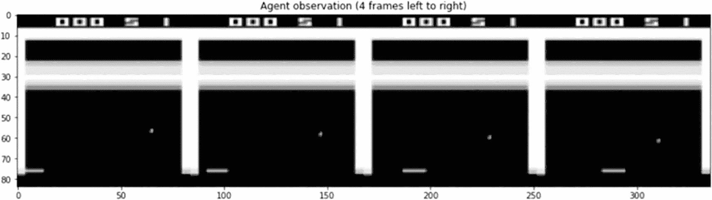

一组 4 张视频游戏的截图，标题为从左到右的 4 个帧的代理观察，突出显示了分数、颜色渐变区域、垂直下降条和从上到下的水平条。

图 6-4

处理后的图像将用作状态输入到神经网络中

接下来，你将构建一个神经网络，该网络将接收前面的图像，即状态/观察值 *S*，并为这四种动作生成 q 值。你将构建的网络的形状如下所示：

+   输入：PyTorch 张量，形状为 [batch_size, 4, 84, 84]

+   第一个隐藏卷积层：16 个 8x8 的滤波器，步长 4，ReLU 激活函数，输出形状为 [batch_size, 16, 20, 20]

+   第二个隐藏卷积层：32 个 4x4 的滤波器，步长为 2，ReLU 激活函数，输出形状为 [batch-size, 32, 9, 9]

+   将观察值展平到形状 [batch, 32x9x9] = [batch_size, 2592]

+   第三个隐藏全连接线性层，具有 256 个输出和 ReLU 激活函数，输出形状为 [batch_size, 256]

+   输出层是一个具有“n_actions”个单位的线性层，没有激活函数，输出形状为 [batch_size, 4]

你实现了通常的函数——`forward`、`get_qvalues`和`sample_actions`。这些与你在`6.a-dqn_pytorch.ipynb`笔记本中对`CartPole`环境所做的操作类似。列表 6-15 展示了实现你所阅读的创建针对特定 Atari 游戏的`DQNAgent`的代码。

```py
class DQNAgent(nn.Module):
def __init__(self, state_shape, n_actions, epsilon=0):
super().__init__()
self.epsilon = epsilon
self.n_actions = n_actions
self.state_shape = state_shape
state_dim = state_shape[0]
# a simple NN with state_dim as input vector (input is state s)
# and self.n_actions as output vector of logits of q(s, a)
self.network = nn.Sequential()
self.network.add_module('conv1', nn.Conv2d(4,16,kernel_size=8, stride=4))
self.network.add_module('relu1', nn.ReLU())
self.network.add_module('conv2', nn.Conv2d(16,32,kernel_size=4, stride=2))
self.network.add_module('relu2', nn.ReLU())
self.network.add_module('flatten', nn.Flatten())
self.network.add_module('linear3', nn.Linear(2592, 256)) #2592 calculated above
self.network.add_module('relu3', nn.ReLU())
self.network.add_module('linear4', nn.Linear(256, n_actions))
self.parameters = self.network.parameters
def forward(self, state_t):
# pass the state at time t through the network to get Q(s,a)
qvalues = self.network(state_t)
return qvalues
def get_qvalues(self, states):
# input is an array of states in numpy and outout is Qvals as numpy array
states = torch.tensor(states, device=device, dtype=torch.float32)
qvalues = self.forward(states)
return qvalues.data.cpu().numpy()
def sample_actions(self, qvalues):
# sample actions from a batch of q_values using epsilon greedy policy
epsilon = self.epsilon
batch_size, n_actions = qvalues.shape
random_actions = np.random.choice(n_actions, size=batch_size)
best_actions = qvalues.argmax(axis=-1)
should_explore = np.random.choice(
[0, 1], batch_size, p=[1-epsilon, epsilon])
return np.where(should_explore, random_actions, best_actions)
Listing 6-15
DQNAgent Implementation from Notebook 6.c-dqn_atari_pytorch.ipynb
```

接下来是通常的经验回放实现、用于玩游戏和记录游戏的函数、创建目标网络的初始副本作为代理网络的深度副本、`compute_td_loss`函数来计算 TD 损失、实例化代理、目标网络和回放缓冲区等所有机制。

完成这些后，你通过让代理随机选择动作来填充回放缓冲区中的初始动作集。然后你继续创建超参数，如列表 6-16 所示。

到目前为止，代理已经准备好进行训练。请注意，为了获得有意义的行为，你需要训练代理接近一百万步。网络也比在`CartPole`环境中使用的网络复杂得多。因此，训练 Atari 游戏代理一百万步需要很长时间。建议你在 Google Colab 上运行代码或在具有 GPU 计算能力的本地计算机上运行代码。

```py
#set up some parameters for training
timesteps_per_epoch = 1
batch_size = 32
total_steps = 100
# total_steps = 3 * 10**6
# We will train only for a sample of 100 steps
# To train the full network on a CPU will take hours.
# in fact even GPU training will be fairly long
# Those who have access to powerful machines with GPU could
# try training it over 3-5 million steps or so
#init Optimizer
opt = torch.optim.Adam(agent.parameters(), lr=1e-4)
# set exploration epsilon
start_epsilon = 1
end_epsilon = 0.05
eps_decay_final_step = 1 * 10**6
# setup some frequency for logging and updating target network
loss_freq = 20
refresh_target_network_freq = 100
eval_freq = 1000
# to clip the gradients
max_grad_norm = 5000
Listing 6-16
Hyperparameters from Notebook 6.c-dqn_atari_pytorch.ipynb
```

训练代理的代码与你在`6.a-dqn_pytorch.ipynb`笔记本中看到的`CartPole`的代码类似。记录和播放训练代理视频、将训练代理参数和视频推送到 HuggingFace 等操作，与之前非常相似。因此，我这里没有明确展示代码列表。感兴趣的读者可以参考`6.c-dqn_atari_pytorch.ipynb`笔记本。你也可以使用 Stable Baselines3 (SB3)或 RL SB3 Zoo 来训练相同的代理。鼓励你以`CartPole`笔记本代码作为起点来编写这段代码。你需要特别注意的关键区别是，使用特定 Atari 包装器对 Breakout 环境进行预处理，正如本节前面所讨论的。默认策略也必须从`MLPPolicy`切换到`CnnPolicy`，可以是默认值，也可以根据你的需求自定义网络。

这完成了 Atari 游戏的 DQN 实现和训练。现在你知道如何训练 DQN 代理，在第七章，一个可选章节中，你将探讨一些问题和你可以采取的各种方法来修改 DQN。我在本章结束时回顾了与 Gymnasium 和/或 Stable Baselines3 集成的各种其他环境，包括它们解决的问题和使用这些环境的技术考虑因素。

## 各种强化学习环境和库概述

到目前为止，在这本书中，你已经了解了 Gymnasium 及其早期版本 OpenAI Gym。它们两者，除了在章节开头讨论的一些细微差别外，都指定了一个标准接口来定义强化学习环境——这些环境需要具有`reset`、`step`、`render`等函数。

你还研究了特定的环境，如 Cart Pole、Mountain Car、Lunar Lander 和 Atari Breakout。这些环境遵循 Gymnasium/Gym 的规范，并在 Gymnasium 库内部提供。还有许多其他第三方、开源环境，针对不同的用例，这些环境要么由维护 Gymnasium 代码库的团队集成，要么由其他开源库集成。为了帮助您理解强化学习不仅用于玩游戏，还用于非常庞大和多样化的场景，下一节将探讨一些其他环境。我接下来要讨论的绝非详尽无遗，而只是个样本。读者可以根据自己的兴趣决定深入研究库/环境的细节。

### PyGame

PyGame 是一个基于 Python 的库。这个库包括几个模块，用于播放声音、绘制图形、处理鼠标输入等。gymnasium 中的许多环境使用 PyGame 来实现环境中的渲染逻辑，用于人类和/或视觉空间的游戏状态表示。

PyGame 不仅仅用于强化学习。它是一个更广泛的库，用于使用 Python 编程语言实现独立游戏和交互式环境。你可能会选择上一门完整的 PyGame 课程来了解其细节；它具有一套广泛的功能。

作为强化学习工程师，你不需要深入了解细节。即使你设计自己的客户环境，你也会使用其他高级库，这些库可能内部使用 PyGame 来实现图形。

### MuJoCo

MuJoCo 代表多关节动力学与接触。它是一个物理引擎，用于促进机器人学、生物力学、图形和动画以及其他需要快速和精确模拟的领域的研究和开发。这些环境的独特依赖项可以通过`pip install gymnasium[mujoco]`安装。

Gymnasium 有十一个 MuJoCo 环境：Ant、HalfCheetah、Hopper、Humanoid、HumanoidStandup、InvertedDoublePendulum、InvertedPendulum、Pusher、Reacher、Swimmer 和 Walker2d。这些环境的示例截图如图 6-5 所示。

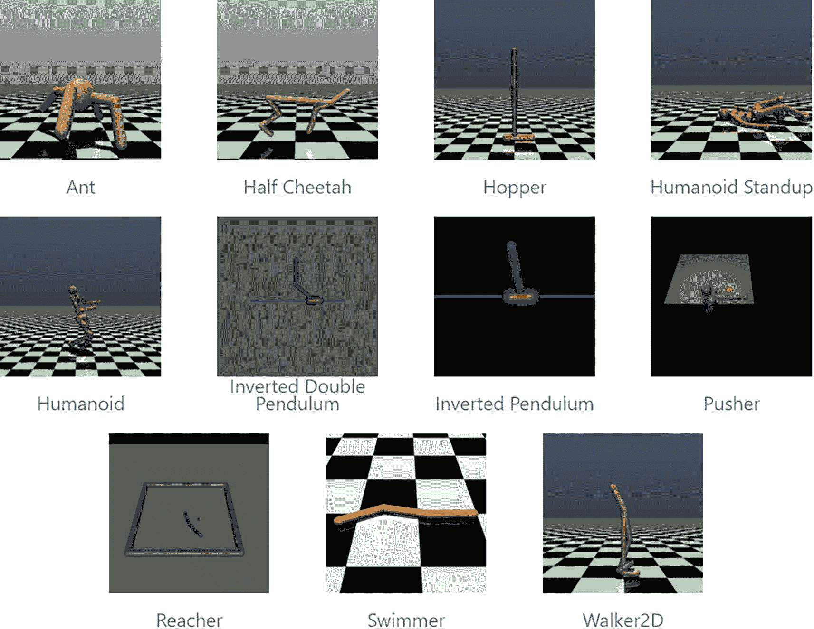

11 个 3D 蚂蚁模型、半猎豹、跳跃者、直立人、人类、倒立双摆、倒立摆、推拉器、抓取器、游泳者和 2D 的步行者。其中一些模型位于棋盘格表面上。

图 6-5

Gymnasium 中的 MuJoCo 环境

所有这些环境在初始状态方面都是随机的，通过向固定的初始状态添加高斯噪声来增加随机性。Gymnasium 中 MuJoCo 环境的状态空间由两部分组成，这两部分被展平并连接在一起：一个身体部分的位姿（`mujoco-py.mjsim.qpos`）或关节及其相应的速度（`mujoco-py.mjsim.qvel`）。通常，一些最初的位置元素会被省略在状态空间之外，因为奖励是基于它们的值计算的，这留给强化学习算法间接推断这些隐藏值。

如果你想要从 gymnasium 使用这些环境，你还需要安装 MuJoCo 引擎。DeepMind 在 2021 年晚些时候收购了 MuJoCo 并开源了代码，使其对每个人都是免费的。安装 MuJoCo 引擎的说明可以在网站^(15) 和 GitHub 仓库.^(16) 上找到。

使用 MuJoCo 与 Gymnasium 一起还需要安装 `mujoco` 框架（这个依赖项可以通过之前的 `pip` 命令安装）。可以通过更改 XML 文件或调整其类别的参数来配置环境。

与 Atari 类似，你可以使用 RL Zoo 来训练代理。列表 6-17 展示了训练代理的终端命令。包含所需安装步骤的完整代码可以在 `6.d-robotic-env.ipynb` 笔记本中找到。

```py
!python -m rl_zoo3.train --algo ppo --env Reacher-v4 --progress \
--log-interval 400 --save-freq 10000 --eval-freq 10000 --eval-episodes 10 \
--n-timesteps 100000 --conf-file ppo_config_6e.py \
--track --wandb-project-name ppo-reacher-v4 -f logs/6_e/rlzoo3/
Listing 6-17
Training the MuJoCo Environment 6.d-robotic-env.ipynb
```

### Unity ML Agents

Unity 机器学习代理工具包（ML-Agents^(17）是一个开源项目，它使得游戏和模拟可以作为训练智能代理的环境。ML-Agents 提供了基于 PyTorch 的最先进算法的实现，以便游戏开发者和爱好者能够轻松地为 2D、3D 和 VR/AR 游戏训练智能代理。研究人员也可以使用提供的简单易用的 Python API，通过强化学习、模仿学习、神经进化或其他任何方法来训练代理。这些训练好的代理可以用于多种目的，包括控制非玩家角色（NPC）的行为（在多种设置中，如多代理和对抗性），自动测试游戏构建，以及评估发布前的不同游戏设计决策。

`ML-agents` 工具包附带 17+ 个样本 Unity 环境。它支持通过几种深度强化学习算法训练单代理、多代理合作和多代理竞争场景。你可以非常容易地添加自己的自定义环境或自定义训练算法。

它还提供了一种将 Unity 学习环境包装成 OpenAI Gym 环境的方法，以便您可以在代码中将它作为任何其他环境的直接替换使用。您可以在 GitHub 上阅读有关`ml-agents`的文档，该链接位于本子节的开头。不幸的是，截至撰写本书时，`ml-agents`支持 OpenAI gym API 版本，而不是 Gymnasium 的最新 API 版本，并且代码维护者没有关于从 Gym 迁移到 Gymnasium 的明确方向。

您可以参考`ml-agent`教程或访问[`huggingface.co/docs/hub/ml-agents`](https://huggingface.co/docs/hub/ml-agents)链接，该链接介绍了`ml-agents`在 HuggingFace 生态系统中的应用方式。

### PettingZoo

PettingZoo 是一个简单、Python 风格的接口，能够表示通用的**多智能体强化学习**（MARL）问题。PettingZoo 包含多种参考环境、有用的工具以及创建自定义环境的工具。虽然我在这里提到这个库是为了完整性，并将所有与环境相关的话题集中在一起讨论，但我将在后续关于多智能体强化学习（RL）的章节中更详细地介绍 PettingZoo。一些常见的多智能体环境包括：

+   雅达利多人游戏

+   棋盘游戏，如国际象棋和围棋

+   卡牌游戏，如鲁米牌

+   多粒子环境（MPEs），其中粒子智能体可以移动、交流、相互可见、相互推挤，并与固定地标进行交互

+   SISL 环境，这是一套由 SISL（斯坦福智能系统实验室）创建的三个合作多智能体基准环境，作为“使用深度强化学习的合作多智能体控制”的一部分发布。

### Bullet 物理引擎和相关环境

Bullet 是一个物理引擎，它模拟碰撞检测以及软体和刚体动力学。它被用于视频游戏和电影中的视觉效果。其主要作者 Erwin Coumans 因其对 Bullet 的工作而获得了科学和技术学院奖[4]。（^(18）

PyBullet 是一个快速且易于使用的 Python 模块，用于机器人仿真和机器学习，重点在于模拟到现实的迁移。PyBullet 封装了 Bullet API。PyBullet 可以轻松与 TensorFlow 和 OpenAI Gym 一起使用。来自 Google Brain、斯坦福 AI 实验室、OpenAI 以及许多其他实验室的研究人员使用 PyBullet。

然后是各种强化学习（RL）环境，它们进一步封装 PyBullet 以创建遵循 OpenAI gym API 签名的自定义 RL 环境。以下是一些常见的例子：

+   `Pandas-gym`：基于 PyBullet 的机器人臂移动物体的模拟。

+   `并行游戏引擎（PGE）`：旨在快速且美观地进行 3D 人工智能实验。然而，这个开源项目自 2018 年以来没有更新，可能已经过时。

+   `PyFlyt`：用于强化学习研究的无人机飞行模拟环境。它是一个用于测试各种无人机强化学习算法的库。基于 Bullet 物理引擎构建，它提供了灵活的渲染选项、时间离散的步进物理、Python 绑定以及支持任何配置的自定义无人机，无论是双翼机、四旋翼机、火箭还是你能想到的任何东西。它仍在开发中，并支持最新的 Gymnasium API 签名。

在 Gymnasium 文档的第三方环境部分还提到了一些其他的内容。

### CleanRL

CleanRL 是一个深度强化学习库，它提供了具有研究友好特性的高质量、单文件实现。实现方式简洁明了。通过单文件实现，每个算法变体的所有细节都被放入一个单独的独立文件中。例如，`ppo_atari.py`有 340 行代码，包含了如何使用 PPO 与 Atari 游戏工作的所有实现细节，因此它是一个很好的参考实现，值得阅读。

CleanRL 只包含在线深度强化学习算法的实现。参考[`https://github.com/corl-team/CORL`](https://github.com/corl-team/CORL)，它具有与 CleanRL 相似的设计理念，但针对的是离线强化学习算法。

CleanRL 使用“Poetry”，这是另一种 Python 打包和依赖管理工具，与`venv`或`conda`具有类似的目的。你可以通过访问 Poetry 文档来探索其依赖管理及其优缺点。19

列表 6-18 显示了你可以运行的安装 Poetry 的命令集，然后是 CleanRL，接着是训练一个 DQN 智能体。列表 6-18 中的代码在 Windows 11 的 WSL2 Ubuntu 上测试过，也应该在 Ubuntu 和 macOS 上直接运行。对于 macOS，你可能需要使用 Homebrew 包管理器来安装 Python 和其他库。

```py
# to install python and pip followed by poetry
sudo apt install python3-pip
python3 -m pip install --user -U pipx
pipx install poetry
# install CleanRL and associated python packages
git clone https://github.com/vwxyzjn/cleanrl.git && cd cleanrl
poetry install
# if you get some error during the execution, you may want to install specific version of SB3
poetry run pip install "stable_baselines3==2.0.0a1"
# to enter poetry shell which is like conda activate
poetry shell
# to login into wandb and huggingface
# You will need api-key/token from your wandb and huggingface accounts
wandb login
huggingface-cli login
# train CartPole with DQN implementation by CleanRL
# please use your HuggingFace name instead of "nsanghi" for parameter "--hf-entity"
python -m cleanrl.dqn  --seed 1  --env-id CartPole-v1     --total-timesteps 50000 --track --capture-video --save-model --upload-model --hf-entity nsanghi
# See your results
# replace "nsanghi" with your hf-account name
https://wandb.ai/nsanghi/cleanRL/runs/99rex9ov
https://huggingface.co/nsanghi/CartPole-v1-dqn-seed1
# please look at clearn_rl/dqn.py in the github repo
# for more command line options and default values
# see https://docs.cleanrl.dev/get-started/installation/#prerequisitesmore
# for additional environments and different algos and backends
# to leave poetry shell
exit
Listing 6-18
Running DQN Using CleanRL
```

### MineRL

MineRL 是一个 Python 3 库，它为与视频游戏 Minecraft 交互提供了 OpenAI Gym 接口，并附带人类游戏数据集。MineRL 最初是卡内基梅隆大学的一个研究项目，旨在帮助开发 Minecraft 中的人工智能的各个方面。

参考文档^(20)以获取更多关于如何安装和使用此工具的详细信息。你还可以参考文档的教程部分，了解如何在 Colab 上运行 MineRL 的示例。

### FinRL

FinRL 是一个开源的金融强化学习框架。FinRL 提供了一个支持各种市场、最先进的（SOTA）深度学习强化学习（DRL）算法、许多量化金融任务基准、实时交易等的框架。

通过与未知环境交互进行学习，DRL 框架在解决动态决策问题方面非常强大，从而展现出两个主要优势：投资组合可扩展性和市场模型独立性。自动交易本质上是在一个高度随机和复杂的股票市场上做出动态决策，即决定在哪里交易、以什么价格交易以及交易多少。考虑到许多复杂的金融因素，DRL 交易代理构建了一个多因素模型并提供算法交易策略，这对于人类交易者来说很难。感兴趣的读者可以在 GitHub 上了解更多信息^(21)。文档还包含一些展示其使用的笔记本。

### FlappyBird 环境

GitHub 仓库`markub3327/flappy-bird-gymnasium`^(22)包含了 FlappyBird 游戏的 Gymnasium 环境的实现。

FlappyBird，`FlappyBird-v0`，有 12 维观察空间，其含义如下：

1.  最后一个管道的水平位置

1.  最后一个顶部管道的垂直位置

1.  最后一个底部管道的垂直位置

1.  下一个管道的水平位置

1.  下一个管道的垂直位置

1.  下一个底部管道的垂直位置

1.  下一个下一个管道的水平位置

1.  下一个下一个顶部管道的垂直位置

1.  下一个下一个底部管道的垂直位置

1.  玩家的垂直位置

1.  玩家的垂直速度

1.  玩家的旋转

动作空间是离散的，有两个值：

1.  不做任何事情 - “0”

1.  挥动翅膀 - “1”

并且奖励由以下组成：

+   +0.1 - 每一帧它都保持存活

+   +1.0 - 成功通过管道

+   -1.0 - 死亡

感兴趣的读者可以参考`6.e-dqn_flappy_pytorch.ipynb`笔记本，用于使用 DQN 训练和评估 FlappyBird 环境。这与您看到的 Atari DQN 非常相似。这标志着本章的结束。

## 概述

这是一个内容丰富的章节，您深入了解了 DQN 和各种 RL 环境。它从对 Q-learning 的快速回顾和对 DQN 更新公式的推导开始。然后，您看到了在 PyTorch 和 TensorFlow 中实现 DQN 的简单`CartPole`环境的完整代码。

您随后回顾了 Gymnasium API，并比较了它与 OpenAI Gym 原始版本之间的变化。您还看到了如何使用 Stable Baselines3 (SB3)和 RL SB3 Zoo (SB3 Zoo)进行代理训练，其中您利用了预实现的 DQN 和其他各种算法。还讨论了记录训练代理动作视频的过程。

下面的两个部分是关于使用 Optuna 和 SB3 进行超参数优化以及使用 Rliable 库进行绘图。

这完成了对 DQN 及其相关概念的全面了解。接下来，我谈到了将 DQN 应用于 Atari 游戏，这导致了讨论这类游戏通常需要的预处理步骤。

最后一部分专注于各种强化学习环境，从 MuJoCo 用于简单的关节机器人，到基于 Unity 的机器学习代理，以及 FinRL 库下的金融等领域。
