# 7. DQN 的改进**

本章探讨了 DQN 的各种增强和变体。具体来说，它探讨了优先回放、DDQN（双重 Q 学习）、Dueling DQN、NoisyNets DQN、C-51（分类 51 原子 DQN）、分位数回归 DQN 和 Hindsight Experience Replay。本章中的所有示例都使用 PyTorch 编写。这是一个可选章节，每个 DQN 变体都是一个独立的话题。您可以在第一次阅读时跳过这一章，并在您想要探索 DQN 特定变体时再回来。

本章介绍的第一种 DQN 变体是优先回放。

## 优先回放

在上一章中，您看到了如何使用 DQN 的批量更新版本来解决在线版本中的某些关键问题，例如每次转换后进行更新，以及在学习步骤之后立即丢弃转换。以下是在线版本中的关键问题：

+   训练样本（转换）是相关的，违反了 i.i.d.（独立同分布）假设。在在线学习中，您有一个序列中的相关转换。每个转换都与前一个转换相关联。这违反了应用梯度下降所需的 i.i.d.假设。

+   随着智能体学习和丢弃，它可能永远不会访问初始的探索性转换。如果智能体走错了路，它将不断看到来自该状态空间部分的示例。它可能会在一个次优解上定居。

+   使用神经网络，基于单个转换的学习既困难又低效。对于神经网络来说，学习太多的方差将导致无法学习到任何有效的东西。神经网络在以训练样本批次学习时表现最佳。

在 DQN 中，这些问题通过使用经验回放来解决，其中存储了所有转换。每个转换是一个包含`状态、动作、奖励、下一个状态和完成`的元组。随着缓冲区变满，你会丢弃旧样本以添加新的样本。然后，你从当前缓冲区中采样一个批次，其中缓冲区中的每个转换在批次中被选中的概率相等。这允许从缓冲区中多次选择罕见和更具探索性的转换。然而，普通的*经验回放*没有选择重要转换的优先级的方法。是否通过将重要性分数分配给存储在回放缓冲区中的每个转换，并使用这些重要性分数作为选择的概率来采样批次，从而将重要转换的选择概率赋予更高的概率会有所帮助？

这就是 DeepMind 论文“Prioritized Experience Replay”^(1)的作者在 2016 年所探索的内容。本章遵循该论文的主要概念，以创建自己的经验回放实现，并将其应用于`CartPole`环境的 DQN 代理。我首先简要谈谈这些重要性分数是如何分配的，以及损失*L*是如何修改的。

这篇论文的关键方法是为缓冲区中的训练样本分配重要性分数，这些分数基于它们的 TD 误差。当从缓冲区中选取一批样本时，你将计算 TD 误差作为损失*L*计算的一部分。TD 误差由以下方程给出：

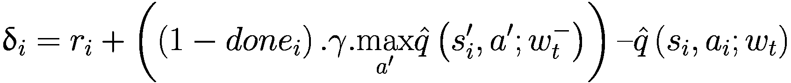

(7-1)

这出现在方程 6-3 中，其中你计算损失。错误平方并平均所有样本以计算权重向量更新的幅度，如方程 6-4 和 6-5 所示。TD 误差Δ[i]的幅度表示样本转换(i)对更新的贡献。作者使用这种推理为每个样本分配一个重要性分数 p[i]，其中 p[i]由以下方程给出：

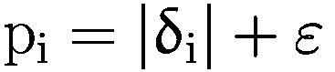

(7-2)

为了避免当 TD 误差Δ[i]为 0 时，p[i]也为 0 的边缘情况，添加了一个小的常数ε。当将新的转换添加到缓冲区时，你将其分配给缓冲区中所有当前转换的 p[i]的最大值。这样做的原因是增加在采样一批转换进行 TD 学习时选择此转换的概率。当选择一批样本进行训练时，你将计算每个样本的 TD 误差Δ[i]作为损失/梯度计算的一部分。计算出的 TD 误差随后用于更新缓冲区中这些样本的重要性分数。

论文中还提到了另一种基于排名的优先级排序方法。使用这种方法，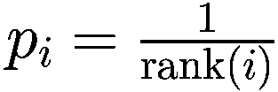，其中 rank(i)是当回放缓冲区的转换根据|Δ[i]|排序时的转换(i)的排名。

在示例代码中，你将使用第一种方法，称为*比例优先级*。接下来，在采样时，你使用以下方程将 p[i]转换为概率：

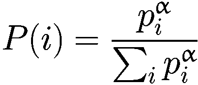

(7-3)

在这里，*P*(*i*) 表示在挑选训练批次时，缓冲区中转换 (i) 被采样的概率。这为具有更高 TD 错误的转换分配了更高的采样概率。在这里，*α* 是一个超参数，它使用网格搜索进行了调整，作者发现 α = 0.6 对于您将要实施的成比例变体来说是最优的。

之前通过某种基于重要性的采样来打破均匀采样的方法引入了偏差。您需要在计算损失 *L* 的同时纠正这个偏差。在论文中，这是通过使用 *重要性采样* 来纠正的，即通过用权重 *w*[*i*] 加权每个样本，然后将其加总以得到修正后的损失函数 *L*。计算权重的方程如下：

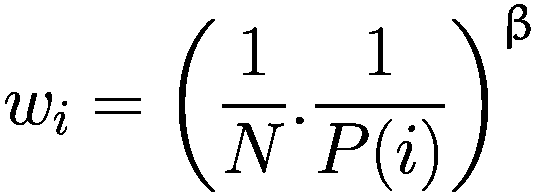

(7-4)

在这里，*N* 是训练批次的样本数量，而 *P*(*i*) 是根据前一个表达式计算出的选择样本的概率。*β* 是另一个超参数。*β* = 1 可以完全补偿前一步中由 *P*(*i*) 重要性采样引入的非均匀采样。您还可以通过定义一个在学习的最后才达到 1 的指数 *β* 的计划，来利用随时间调整重要性采样校正量的灵活性。在实践中，您可以线性地将 *β* 从其初始值 *β*[0] 线性衰减到 1。请注意，此超参数的选择与优先级指数 *α* 的选择相互作用；同时增加两者会同时更积极地优先采样，并更强烈地对其进行校正。在这个例子中，您使用了一个常数值 0.4，该值取自论文中的一些实验。

权重进一步通过 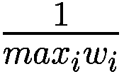 进行归一化，以确保权重保持在界限内：

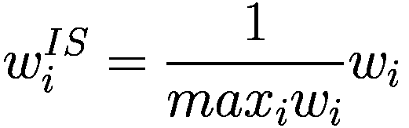

(7-5)

在这些变化实施后，损失 *L* 方程也进行了更新，以便使用 *w*[*i*] 权重来衡量批处理中的每个转换，如下所示：

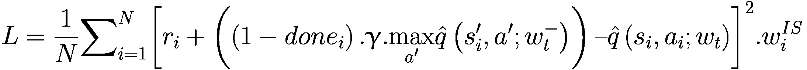

(7-6)

注意方程中的 。在计算 *L* 后，您将遵循常规的梯度步骤，使用损失梯度相对于在线神经网络权重 *w*（表示为 *w*[*t*]，下标 *t* 强调权重随着迭代批次进行训练而变化）的反向传播。

记住，前一个方程中的 TD 误差用于更新回放缓冲区中当前训练批次中这些转换的重要性分数。这完成了对优先级回放的理论讨论。

现在您将查看实现过程。训练一个具有优先级回放的 DQN 代理的完整代码在`7.a-dqn_prioritized_replay.ipynb`中给出。建议您在阅读这里的解释后，详细研究代码以及参考的论文。能够跟随学术论文并匹配论文中的细节到实际代码中，是成为一名优秀实践者的重要部分。本节中的解释只是为了让您开始。为了牢固掌握材料，您应该详细跟随附带的代码。如果您在检查代码如何工作之后尝试自己编写代码，那就更好了。

回到解释部分，您首先查看优先级回放的实现，这是与之前的 DQN 训练笔记本代码的主要变化。列表 7-1 显示了优先级回放的代码。大部分代码与您之前看到的普通`ReplayBuffer`相似。现在您有一个额外的数组`self.priorities`，用于存储每个样本的重要性/优先级分数*p*[*i*]。`add`函数被修改为将*p*[*i*]分配给新添加的样本。它只是数组`self.priorities`中值的最大值。`sample`函数是经过最大变化的函数。首先使用方程 7-3 计算概率，然后使用方程 7-4 和 7-5 计算权重。该函数现在返回两个额外的数组：权重数组`np.array(weights)`和索引数组`np.array(idxs)`。索引数组包含在批次中采样的样本在缓冲区中的索引。这是必需的，以便在损失步骤中计算 TD 误差后，您可以在缓冲区中更新优先级/重要性。`update_priorities(idxs, new_priorities)`函数正是为此目的。

```py
class PrioritizedReplayBuffer:
def __init__(self, size, alpha=0.6, beta=0.4):
### init code omitted from this listing
def add(self, state, action, reward, next_state, done):
item = (state, action, reward, next_state, done)
max_priority = self.priorities.max()
if len(self.buffer) < self.size:
self.buffer.append(item)
else:
self.buffer[self.next_id] = item
self.priorities[self.next_id] = max_priority
self.next_id = (self.next_id + 1) % self.size
def sample(self, batch_size):
N = len(self.buffer)
priorities = self.priorities[:N]
probabilities = priorities ** self.alpha
probabilities /= probabilities.sum()
weights = (N * probabilities) ** (-self.beta)
weights /= weights.max()
idxs = np.random.choice(len(self.buffer), batch_size, p=probabilities)
samples = [self.buffer[i] for i in idxs]
states, actions, rewards, next_states, done_flags = list(zip(*samples))
weights = weights[idxs]
return  (np.array(states), np.array(actions), np.array(rewards),
np.array(next_states), np.array(done_flags), np.array(weights), np.array(idxs))
def update_priorities(self, idxs, new_priorities):
self.priorities[idxs] = new_priorities+self.epsilon
Listing 7-1
Prioritized Replay from 7.a-dqn-prioritized-replay.ipynb
```

接下来，让我们看看损失计算。代码几乎与您在列表 6-3 中看到的 TD 损失计算相似。有两个变化。第一个是将 TD 误差与权重相乘，符合方程 7-6。第二个变化是在函数内部调用`update_priorities`以更新缓冲区中的优先级。该函数现在接受两个新的参数。第一个是`weights`，在方程 7-6 中表示为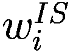。第二个参数是`buffer_idxs`，用于更新构成训练批次的转换的优先级。列表 7-2 突出了修订的`compute_td_loss_priority_replay`函数的代码更改。

```py
def compute_td_loss_priority_replay(agent, target_network, replay_buffer,
tates, actions, rewards, next_states, done_flags, weights, buffer_idxs,
gamma=0.99, device=device):
# portions of the code similar to plain DQN omitted
#compute each sample TD error. Notice multiplication by weights
loss = ((predicted_qvalues_for_actions - target_qvalues_for_actions.detach()) ** 2) * weights
# code omitted
# new code to update back the priorities of the batch data
with torch.no_grad():
new_priorities = (predicted_qvalues_for_actions.detach()
- target_qvalues_for_actions.detach())
new_priorities = np.absolute(new_priorities.detach().numpy())
replay_buffer.update_priorities(buffer_idxs, new_priorities)
return loss
Listing 7-2
TD Loss with Prioritized Replay from 7.a-dqn-prioritized-replay.ipynb
```

训练代码与之前相同。您可以通过查看`7.a-dqn-prioritized-replay.ipynb`笔记本来了解详细信息。与之前一样，您训练代理，可以看到代理通过这种方法很好地学会了平衡杆。图 7-1 显示了训练曲线。

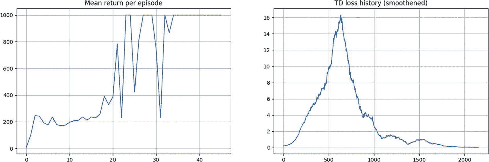

2 个图表。左图：每集的平均回报。曲线在(0, 0)和(47, 1000)之间波动，有三个最低点在(22, 220)、(25, 420)和(31, 220)。右图：呈钟形，波动在(0, 0)和(2000, 0)之间，峰值在(600, 17)。数值为近似值。

图 7-1

在 CartPole 上使用优先经验重放的 DQN 代理的训练曲线

论文还详细讨论了优先重放的理论背景以及为什么它有帮助。此外，论文还讨论了它对 Atari 游戏的影响，以及如何使用这种方法来解决带有类别不平衡的监督学习问题。这完成了优先重放的部分。建议您参考原始论文和代码笔记本以获取更多详细信息。

## 双 DQN (DDQN)

论文“使用双 Q 学习的深度强化学习”的作者(2)探讨了 DQN 算法的可能性，并表明结合 Q 学习和深度神经网络的 DQN 算法存在显著的过估计，尤其是在一些 Atari 游戏中。然后，作者提出了将双 Q 学习应用于 DQN 的想法，称之为*双 DQN*。双 Q 学习的想法是通过将目标函数中的最大操作分解为两个独立的步骤来减少过估计：选择动作和评估所选动作。尽管没有完全解耦，但 DQN 架构中的目标网络为第二个价值函数提供了一个自然的候选者，无需引入额外的网络。因此，作者建议根据在线网络评估贪婪策略，但使用目标网络来估计其价值。

让我们来看看常规 DQN 中的最大操作。你计算 TD 目标如下：

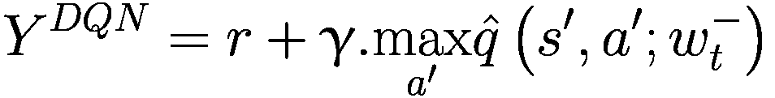

(7-7)

我通过省略下标(*i*)以及移除`(1-done)`乘数来简化了方程，这消除了终端状态的第二个项。这样做是为了保持解释的清晰。现在，让我们通过将*max*移到方程内部来展开这个方程。之前的更新可以等价地写成以下形式：

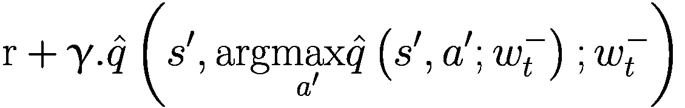

我首先采取最大动作，然后为该最大动作取 q 值，将`max`操作移到了内部。这与直接取最大 q 值类似。在之前的未展开方程中，你可以清楚地看到你使用相同的网络权重 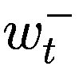，首先用于选择最佳动作，然后用于获取该动作的 q 值。这就是导致最大化偏差的原因。论文的作者提出了一种他们称之为双 DQN（DDQN）的方法，其中选择最佳动作的权重 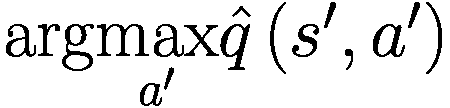 来自在线网络权重 *w*[*t*]，然后使用权重  的目标网络来选择该最佳动作的 q 值。这种变化导致更新的 TD 目标如下：

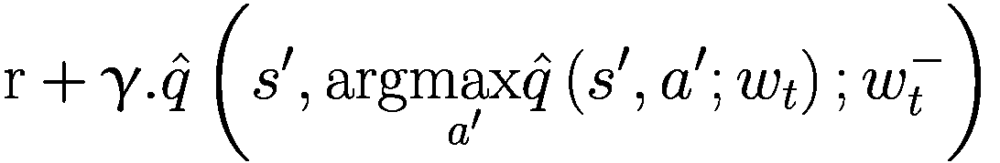

(7-8)

注意，现在用于选择最佳动作的内部网络正在使用在线网络权重 *w*[*t*]。其他一切保持不变。你像以前一样计算损失，然后使用梯度步来更新在线网络的权重。你还会定期使用在线网络的权重更新目标网络权重。你使用的更新损失函数如下（恢复*done*标志和索引*i*）：

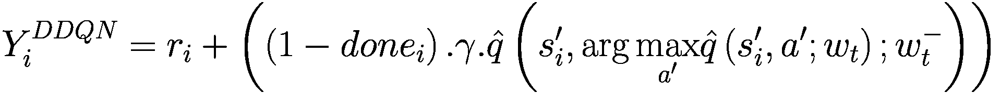

(7-9)

![$$ L=\frac{1}{N}{\sum}_{i=1}^N{\left[{Y}_i^{DDQN}\hbox{--} \hat{q}\left({s}_i,{a}_i;{w}_t\right)\right]}² $$](../images/502835_2_En_7_Chapter/502835_2_En_7_Chapter_TeX_Equ10.png)

(7-10)

作者表明，双 DQN 方法导致过度估计偏差显著减少，这反过来又导致更好的策略。现在让我们看看实现细节。与 DQN 实现相比，唯一会改变的是损失计算的方式。您使用方程式 7-9 和 7-10 来计算损失。其他所有内容——包括 DQN 策略代理代码、重放缓冲区以及进行梯度反向传播的训练方式——保持不变。列表 7-3 展示了修订后的损失函数计算。您使用`q_s = agent(states)`计算当前的 q 值，然后，对于每一行，选择对应动作*a*[*i*]的 q 值。这些动作值存储在`q_s_a`中。然后，您使用权重*w*（迭代时间索引*w*[*t*]）的代理网络来计算下一个状态的 q 值：`q_s1 = agent(next_states)`。`q_s1`张量用于通过`a1_max = torch.max(q_s1, dim=1)`找到每一行的最佳动作，然后您使用具有最佳动作的目标网络来找到目标 q 值：`q_s1=agent(next_states)`然后`q_s1_a1max = q_s1_target[range(len(a1max)), a1max]`。TD 损失计算的其余代码保持不变。

```py
def td_loss_ddqn(agent, target_network, states, actions, rewards, next_states, done_flags,
gamma=0.99, device=device):
# convert numpy array to torch tensors
# code omitted – same as DQN loss
# get q-values for all actions in current states
# use agent network
q_s = agent(states)
# select q-values for chosen actions
q_s_a = q_s[range(
len(actions)), actions]
# compute q-values for all actions in next states
# use agent network (online network)
q_s1 = agent(next_states).detach()
# compute Q argmax(next_states, actions) using predicted next q-values
_,a1max = torch.max(q_s1, dim=1)
#use target network to calculate the q value for best action chosen above
q_s1_target = target_network(next_states)
q_s1_a1max = q_s1_target[range(len(a1max)), a1max]
# compute "target q-values"
target_q = rewards + gamma * q_s1_a1max * (1-done_flags)
# mean squared error loss to minimize
loss = torch.mean((q_s_a - target_q).pow(2))
return loss
Listing 7-3
TD Loss with Double DQN (DDQN) from 7.b-ddqn.ipynb
```

在`CartPole`上运行 DDQN 会产生图 7-2 所示的训练图。您可能不会注意到太大的差异，因为`CartPole`是一个过于简单的问题，无法展示其优势。此外，训练算法正在运行少量剧集以展示算法。要了解该方法的量化优势，您应查看引用的论文。

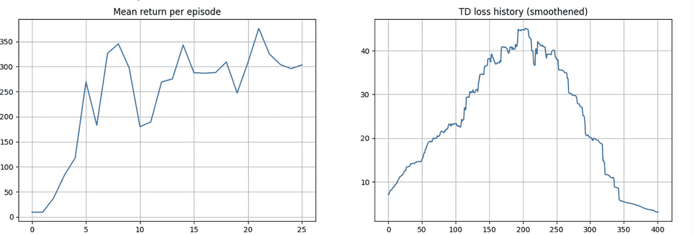

2 个图表。左图：每集平均回报。曲线呈上升趋势，在(0, 0)和(25, 300)之间波动更大。右图：TD 损失历史。在(0, 8)和(400, 3)之间有一个波动的钟形曲线，峰值在(200, 47)。数值为近似值。

图 7-2

DDQN 在 CartPole 上的训练曲线来自`7.b-ddqn.ipynb`

这完成了对 DDQN 的讨论。下一节将介绍对抗性 DQN。

## 对抗性 DQN

到目前为止，你所有的网络都接受状态 *S* 并为状态 *S* 中的所有行动 *A* 生成 q-values *Q*(*S*, *A*)。图 6-1 显示了这样一个网络的示例。然而，在特定状态下，采取任何特定行动往往没有影响。考虑这种情况：一辆车在道路中间行驶，周围没有其他车辆。在这种情况下，稍微向左或向右行驶，或者稍微加速或减速，都没有影响；这些行动都产生相似的 q-values。有没有一种方法可以分离状态中的平均价值和采取特定行动相对于平均价值的优势？这就是 2016 年论文“用于深度强化学习的对抗网络架构”^(3)的作者所采取的方法。他们展示了这导致了显著的改进，并且随着状态中可能采取的行动数量的增加，改进程度更高。

让我们推导出对抗 DQN 网络执行的计算。你在第二章 2 中的方程 2-9 和 2-10 中看到了状态价值和行动价值的函数定义，这些方程在此处重现：

![$$ {v}_{\uppi}(s)={E}_{\uppi}\left[{G}_t|{S}_t=s\right] $$](../images/502835_2_En_7_Chapter/502835_2_En_7_Chapter_TeX_Equb.png)

![$$ {q}_{\pi}\left(s,a\right)={E}_{\pi }\ \left[\ {G}_t\ \right|\ {S}_t=s,{A}_t=a\ \Big] $$](../images/502835_2_En_7_Chapter/502835_2_En_7_Chapter_TeX_Equ11.png)

(7-11)

然后，在关于函数逼近的第五章 5 中，你看到当将状态/行动值表示为参数化函数时，随着参数 *w* 的引入，这些方程有所变化：


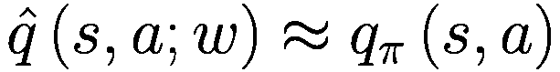

(7-12)

两个方程组 7-11 和 7-12 表明 *v*[π]衡量的是处于一般状态的价值，而 *q*[π]显示了从状态 *S* 中采取特定行动的价值。如果你从 *V* 中减去 *Q*，你得到一个被称为 *advantage A* 的东西。请注意，这里有一些符号的重复使用。*A* 在 *Q*(*S*, *A*) 中代表行动，而方程左侧的 *A*[π]代表采取行动 *a* 的优势。

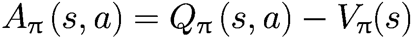

作者创建了一个网络，该网络接受状态 *S* 作为输入，并在经过几层网络处理后，产生两个流——一个提供状态值 *V*，另一个提供优势 *A*，其中部分网络是单独的层集，一个用于 *V*，一个用于 *A*。最后，最后一层通过重新排列方程 7-13 来组合优势 *A* 和状态值 *V* 以恢复 *Q*：

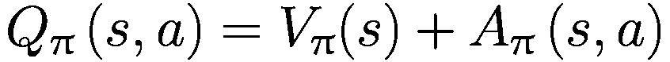

(7-13)

图 7-3 展示了相同问题的代表性网络架构。

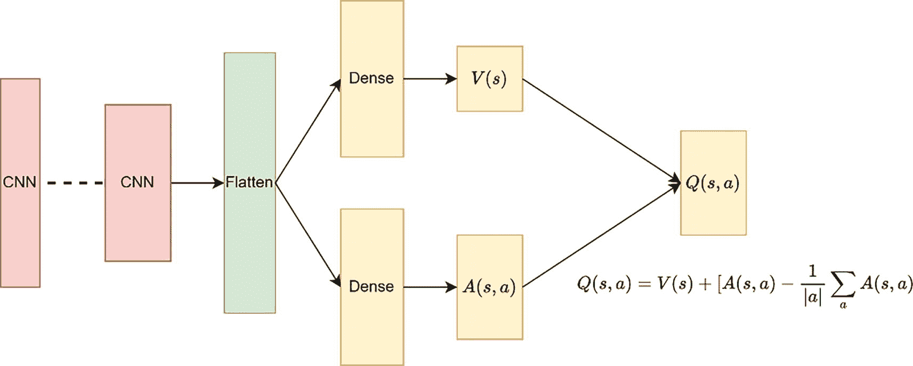

一个网络模型有 2 个 C N N 与一个展平层连接。它们被分配到 2 个密集层中。它们分别连接到 s 的 V 和 A，并收敛到 s, a 的 Q。函数读作，Q(s,a) = V(s) + A(s,a) - 1/模 a, sigma a, A(s,a)。

图 7-3

对抗网络。该网络在初始层具有一组共同的权重，记为 *w*[1]，然后分支出来，有一组权重 *w*[2]，产生值 *V*，另一组权重 *w*[3]，产生优势 *A*

在你继续之前，让我们用权重 *w*[1]，*w*[2]，*w*[3] 明确地重写方程 7-13。修改后的方程看起来像这样：

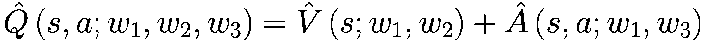

(7-14)

你是否注意到在学习这种独立估计 *V* 和 *A* 的表达式时存在一个问题？没有唯一的 *V* 和 *A* 来代表 *Q*。如果你向 *V* 添加一个常数项，并从 *A* 中减去相同的项，*Q*[π] 的表达式保持不变。因此，这个网络将不会学习到唯一的 *V*，即状态值。联合网络可以学习到所有状态的正确 *Q*，但每个状态的状态值 *V* 可能会因随机量而单独偏移，这使得很难将 *V* 作为状态值的真正代表来使用。

作者建议的一种强制性问题可识别性/唯一性的方法是将优势设置为所选动作的零值，即具有最大优势的动作。

![^Q(s,a;w_1,w_2,w_3) = ^V(s;w_1,w_2) + (^A(s,a;w_1,w_3) - max_a' ^A(s,a';w_1,w_3))] (../images/502835_2_En_7_Chapter/502835_2_En_7_Chapter_TeX_Equ15.png)

(7-15)

研究中的作者发现了一种替代公式，通过将最大值操作替换为平均值来提供更好的稳定性。

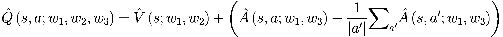

(7-16)

一方面，这失去了 V 和 A 的原始语义，因为它们现在偏离目标一个常数，但另一方面，它增加了优化的稳定性。使用方程 7-16，优势只需要像均值一样快速变化，而不是像 7-15 中那样需要补偿最优动作优势的任何变化。

在前面的方程中，权重*w*[1]对应于网络的初始共同部分，*w*[2]对应于预测状态值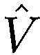的部分，最后*w*[3]对应于预测优势的部分。

作者将这种架构命名为*对抗网络*，因为它由两个网络融合在一起，具有一个初始的共同部分。由于对抗网络处于代理网络级别，因此它独立于其他组件，如重放缓冲区类型或权重学习方式（即简单的 DQN 或双 DQN）。因此，你可以独立于重放缓冲区类型或学习类型使用对抗网络。在本教程中，你将使用一个简单的重放缓冲区，其中每个缓冲区中的转换选择具有均匀的概率。此外，你将使用 DQN 代理。

作者研究了这种方法相对于基线单网络的改进，如图 7-4 所示。它清楚地显示了对抗架构的好处。

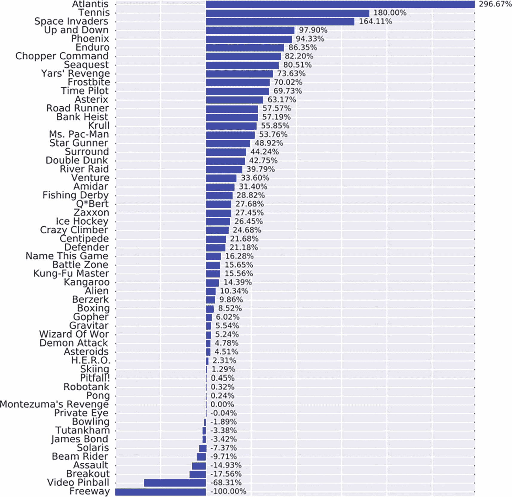

一个水平条形图，显示了游戏名称及其相应的百分比。从上到下呈下降趋势。最高的是大西洋，为 296.67%，最低的是高速公路，为负 100%。

图 7-4

对抗架构相对于基线单网络的改进来源：论文图 4^(4)

与 vanilla DQN 的笔记本——`6.a-dqn_pytorch.ipynb`——相比，唯一的改变是网络构建的方式。列表 7-4 显示了对抗代理网络的代码。

```py
class DuelingDQNAgent(nn.Module):
def __init__(self, state_shape, n_actions, epsilon=0):
super().__init__()
self.epsilon = epsilon
self.n_actions = n_actions
self.state_shape = state_shape
state_dim = state_shape[0]
# a simple NN with state_dim as input vector (input is state s)
# and self.n_actions as output vector of logits of q(s, a)
self.fc1 = nn.Linear(state_dim, 64)
self.fc2 = nn.Linear(64, 128)
self.fc_value = nn.Linear(128, 32)
self.fc_adv = nn.Linear(128, 32)
self.value = nn.Linear(32, 1)
self.adv = nn.Linear(32, n_actions)
def forward(self, state_t):
# pass the state at time t through the network to get Q(s,a)
x = F.relu(self.fc1(state_t))
x = F.relu(self.fc2(x))
v = F.relu(self.fc_value(x))
v = self.value(v)
adv = F.relu(self.fc_adv(x))
adv = self.adv(adv)
adv_avg = torch.mean(adv, dim=1, keepdim=True)
qvalues = v + adv - adv_avg
return qvalues
# rest of the code is similar to that of DQN
Listing 7-4
Dueling Network from 7.c-dueling_dqn.ipynb
```

在一个常见的网络中，你有两层（`self.fc1` 和 `self.fc2`）。对于 *V* 预测，你在 `fc1` 和 `fc2` 之上还有另外两层（`self.fc_value` 和 `self.value`）。同样，对于优势估计，你再次在 `fc1` 和 `fc2` 之上有一组单独的两层（`self.fc_adv` 和 `self.adv`）。这些输出根据方程 7-16 结合，以给出修改后的 q 值。其余的代码，即 TD 损失的计算和权重更新的梯度下降，与 DQN 相同。图 7-5 展示了在 `CartPole` 上训练前述网络的结果。

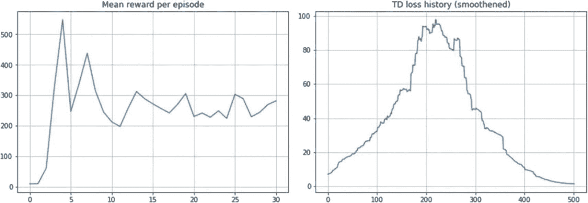

2 个图表。左图：每集平均奖励。它有一个从 (0, 0) 到 (4, 540) 上升然后下降，并在 (30,290) 处保持稳定的波动曲线。右图：TD 损失历史。它在 (0, 10) 和 (500, 1) 之间有一个波动的钟形曲线，峰值在 (220, 99)。数值是近似的。

图 7-5

来自 .c-dueling_dqn.ipynb 的对抗网络的训练曲线

如所述，你可以尝试将 `ReplayBuffer` 替换为 `PrioritizedReplayBuffer`。你也可以使用 DDQN 而不是 DQN 作为学习代理。这结束了关于对抗 DQN 的讨论。下一节将讨论一个非常不同的变体。

## NoisyNets DQN

记住，你需要探索状态空间的一部分。你一直使用 ε-greedy 策略来做这件事。在这种探索下，你以 (1- ε) 的概率采取最大 q 值动作，以 ε 的概率采取随机动作。最近一篇标题为“用于探索的噪声网络”的 2018 年论文的作者使用了一种不同的方法，即在线性层作为参数添加随机扰动，就像网络权重一样，这些也是学习到的。

常规线性层是仿射变换，如下所示：

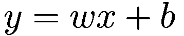

在噪声线性版本中，你根据以下方程在权重中引入随机扰动：

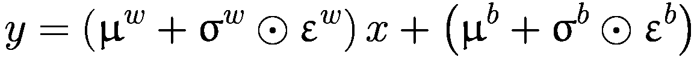

(7-17)

在前一个方程中，μ^(*w*), σ^(*w*), μ^(*b*), 和 σ^(*b*) 是学习到的网络权重。ϵ^(*w*) 和 ϵ^(*b*) 是引入随机性的随机噪声，导致探索。图 7-6 展示了线性层的噪声版本示意图，它解释了方程 7-17。

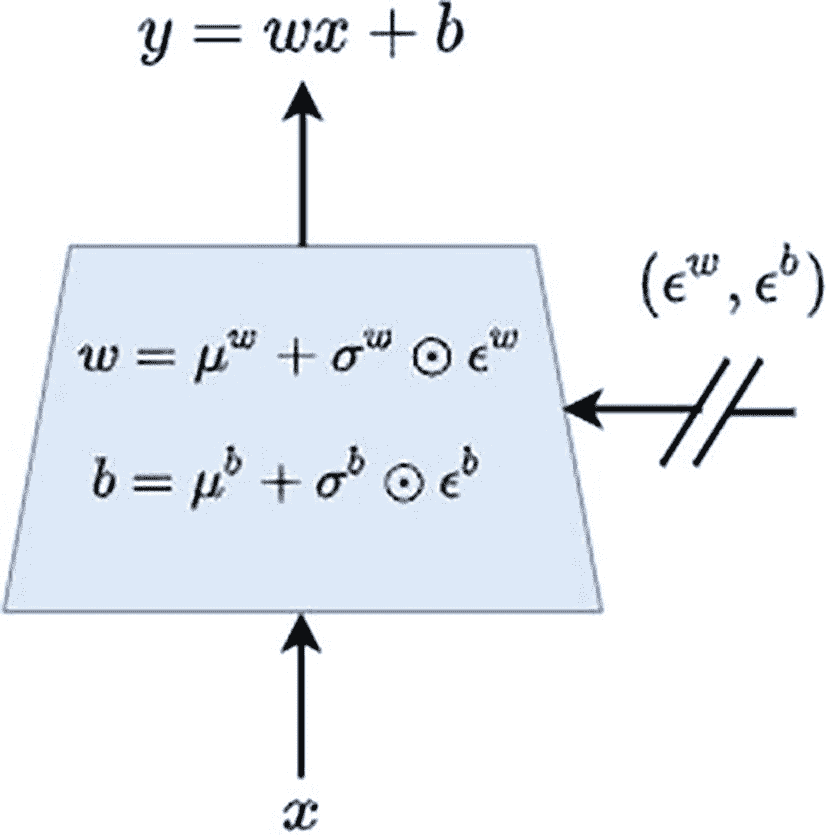

一个输入 x 和 epsilon 上标 w，epsilon 上标 b 的系统示意图。函数读作 w = mu 上标 w + sigma 上标 w, 圆点, epsilon 上标 w，和 b = mu 上标 b + sigma 上标 b, 圆点, epsilon 上标 b p。输出是 y = w x + b。

图 7-6

噪声线性层。权重和偏置是均值和标准差的线性组合，就像常规线性层中的权重和偏置一样被学习（参考论文中的图 4，见[`https://arxiv.org/pdf/1706.10295.pdf`](https://arxiv.org/pdf/1706.10295.pdf)）

在考虑噪声网络线性层中的特定噪声分布时，作者采样了两种类型：独立高斯噪声，其中每个权重都有自己的高斯噪声，以及分解高斯噪声，它为每个输出和输入引入了单独的噪声。分解高斯噪声的主要优势在于其降低各种算法中随机数生成所需时间的特性。这种减少对于像 DQN 和 dueling 这样的单线程代理来说尤其重要，因为计算开销可能很大。因此，分解噪声被用于 DQN 和 dueling，而独立噪声被用于计算时间不是主要问题的分布式 A3C。

按照作者的建议，你将实现论文中讨论的分解版本，其中矩阵ϵ^(*w*)的每个元素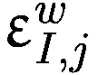被分解。假设你有*p*个输入单元和*q*个输出单元。相应地，你生成一个*p*-大小的高斯噪声向量ϵ[*i*]和一个*q*-大小的高斯噪声向量ϵ[*j*]。每个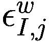和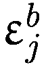现在可以写成以下形式：

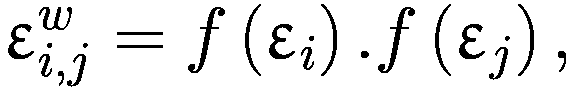

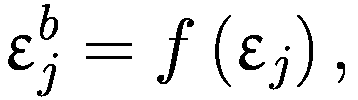

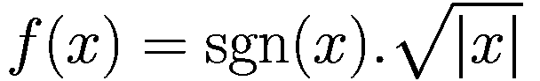

(7-18)

对于像这里使用的分解网络，作者建议如下初始化权重：

+   μ^(*w*)和μ^(*b*)的每个元素μ[*i*, *j*]都是从范围在![$$ U\left[-\frac{1}{\sqrt{p}},\frac{1}{\sqrt{p}}\right] $$](../images/502835_2_En_7_Chapter/502835_2_En_7_Chapter_TeX_IEq13.png)的均匀分布中采样的，其中*p*是输入单元的数量。

+   同样，σ^(*w*)和σ^(*b*)的每个元素σ[*i*, *j*]被初始化为常数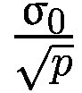，其中超参数σ[0]设置为 0.5。

在高层次上，对之前的 DQN 算法进行了以下修改：a) 你将不会使用ε-greedy 探索。相反，策略贪婪地优化（随机化）动作值函数；2）全连接层被参数化为一个有噪声的网络，其中参数在每次重放步骤后从有噪声网络参数分布中抽取，这意味着相同的噪声网络被固定用于一批转换，计算梯度，并调整权重。在下一步之前，网络权重再次从这个修改后的权重中采样。

论文的 C 节提供了 NoisyNet-DQN 和 NoisyNet-Dueling 的伪代码，即 DQN 和 Dueling DQN 的噪声网络版本。

现在我们来看一下实现 NoisyNet-DQN 所需的代码。你创建一个与 PyTorch 提供的线性层类似的噪声层。你是通过扩展 PyTorch 的`nn.Module`来做到这一点的。这是一个简单且标准的实现，你在`init`函数中创建权重向量和噪声向量。你从方程 7-17 创建线性层参数μ^(*w*)、σ^(*w*)、μ^(*b*)和σ^(*b*)。这些是通过四次单独调用`nn.Parameter`来创建的。你还创建了一个缓冲区来存储噪声张量ϵ^(*w*)和ϵ^(*b*)。它们不是使用`nn.Parameter`创建的，因为它们不是模型的参数。它们是从标准高斯分布中采样的，并存储在`forward`函数中使用。因此，你使用 PyTorch 的`register_buffer`函数为这些张量创建内存空间。然后你编写一个`forward`函数，它接受一个输入并通过一系列噪声线性层和常规线性层进行转换，如方程 7-17 所示。在训练期间，你使用 7-17 的噪声版本，在推理期间，你使用没有添加任何噪声的常规线性层的通常版本。

你还需要一些额外的函数。在这种情况下，我编写了一个名为`reset_noise`的函数来生成噪声ϵ^(*w*)和ϵ^(*b*)。这个函数内部使用一个名为`_noise`的辅助函数来生成标准高斯噪声。`reset_parameters`函数根据方程 7-18 中概述的策略重置参数。列表 7-5 显示了噪声线性层的代码。

```py
class NoisyLinear(nn.Module):
def __init__(self, in_features, out_features, sigma_0 = 0.4):
#boilerplate code omitted
self.mu_w = nn.Parameter(torch.FloatTensor(out_features, in_features))
self.sigma_w = nn.Parameter(torch.FloatTensor(out_features, in_features))
self.mu_b = nn.Parameter(torch.FloatTensor(out_features))
self.sigma_b = nn.Parameter(torch.FloatTensor(out_features))
self.register_buffer('epsilon_w', torch.FloatTensor(out_features, in_features))
self.register_buffer('epsilon_b', torch.FloatTensor(out_features))
self.reset_noise()
self.reset_params()
def forward(self, x, training=False):
if training:
w = self.mu_w + self.sigma_w * self.epsilon_w
b = self.mu_b + self.sigma_b * self.epsilon_b
else:
w = self.mu_w
b = self.mu_b
return F.linear(x, w, b)
def reset_params(self):
k = 1/self.in_features
k_sqrt = math.sqrt(k)
self.mu_w.data.uniform_(-k_sqrt, k_sqrt)
self.sigma_w.data.fill_(k_sqrt*self.sigma_0)
self.mu_b.data.uniform_(-k_sqrt, k_sqrt)
self.sigma_b.data.fill_(k_sqrt*self.sigma_0)
def reset_noise(self):
eps_in = self._noise(self.in_features)
eps_out = self._noise(self.out_features)
self.epsilon_w.copy_(eps_out.ger(eps_in))
self.epsilon_b.copy_(self._noise(self.out_features))
def _noise(self, size):
x = torch.randn(size)
x = torch.sign(x)*torch.sqrt(torch.abs(x))
return x
Listing 7-5
Noisy Linear Layer from 7.d-noisynet_dqn.ipynb
```

您可以使用带噪声的网与 DQN、DDQN、dueling DQN 和优先级重放以各种组合使用。然而，为了进行说明，我专注于使用常规的重放缓冲区与 DQN 一起使用。您也可以使用常规的 DQN 方法进行训练，而不使用 DDQN。NoisyDQN 的实现与上一章中的 DQN 相似。唯一的区别是您现在需要使用一个带噪声的线性层，如列表 7-5 所示。您还将 `training` 作为附加参数传递给 NoisyDQN 的前向函数，在训练期间为 `true`，在推理期间为 `false`。列表 7-6 显示了 NoisyDQN 的初始化和前向函数。在 DQN 代理的 `sample_actions` 函数中没有 ϵ-greedy 选择。`reset_noise` 函数也在每个批次之后重置噪声。这与论文中推荐的解相关联的建议一致。列表 7-6 包含了这些修改的 NoisyDQN 版本。其余的实现与原始 DQN 代理类似。

```py
class NoisyDQN(nn.Module):
def __init__(self, state_shape, n_actions):
super(NoisyDQN, self).__init__()
self.n_actions = n_actions
self.state_shape = state_shape
state_dim = state_shape[0]
# a simple NN with state_dim as input vector (input is state s)
# and self.n_actions as output vector of logits of q(s, a)
self.fc1 = NoisyLinear(state_dim, 64)
self.fc2 = NoisyLinear(64, 128)
self.fc3 = NoisyLinear(128, 32)
self.q = NoisyLinear(32, n_actions)
self.training=False
def forward(self, state_t):
# pass the state at time t through the network to get Q(s,a)
x = F.relu(self.fc1(state_t, training=self.training))
x = F.relu(self.fc2(x, training=self.training))
x = F.relu(self.fc3(x, training=self.training))
qvalues = self.q(x)
return qvalues
def get_qvalues(self, states):
# input is an array of states in numpy and output is Qvals as numpy array
states = torch.tensor(states, device=device, dtype=torch.float32)
qvalues = self.forward(states)
return qvalues.data.cpu().numpy()
def get_action(self, states):
states = torch.tensor(np.array(states), device=device, dtype=torch.float32)
qvalues = self.forward(states)
best_actions = qvalues.argmax(axis=-1)
return best_actions
def sample_actions(self, qvalues):
# sample actions from a batch of q_values using greedy policy
batch_size, n_actions = qvalues.shape
best_actions = qvalues.argmax(axis=-1)
return best_actions
def reset_noise(self):
self.fc1.reset_noise()
self.fc2.reset_noise()
self.fc3.reset_noise()
self.q.reset_noise()
Listing 7-6
NoisyDQN Agent from 7.d-noisynet_dqn.ipynb
```

训练代码也有一些小的修改。您在处理完每一批样本后通过调用 `reset_noise` 来重置噪声。列表 7-7 显示了带有此更改的代码。请参阅 `7.d-noisynet_dqn.ipynb` 笔记本以获取完整的代码。

```py
def train_agent_noisy(env, agent, target_network, optimizer, td_loss_fn):
# code omitted
# Fill experience replay using full random policy
# reset noise at each action
# also initiaize housekeeping array
state, _ = env.reset(seed=seed)
#enable training flag
agent.training = True
target_network.training = True
for step in trange(total_steps + 1):
# take timesteps_per_epoch and update experience replay buffer
# train by sampling batch_size of data from experience replay
states, actions, rewards, next_states, done_flags = exp_replay.sample(batch_size)
# loss = 
optimizer.zero_grad()
agent.reset_noise()
target_network.reset_noise()
loss = td_loss_fn(agent, target_network,
states, actions, rewards, next_states, done_flags,
gamma=0.99, device=device)
loss.backward()
grad_norm = nn.utils.clip_grad_norm_(agent.parameters(), max_grad_norm)
optimizer.step()
if step % refresh_target_network_freq == 0:
# Load agent weights into target_network
target_network.load_state_dict(agent.state_dict())
# logging and evaluation code
# log using noise equal to zero i.e. training=False
state, _ = env.reset(seed=seed)
#disable training flag
agent.training = False
target_network.training = False
Listing 7-7
NoisyDQN Batch Training Step from 7.d-noisynet_dqn.ipynb
```

在 `CartPole` 环境中训练 NoisyDQN 产生如图 7-7 所示的训练曲线。您可能看不到这个变体与 DQN（或者更确切地说，所有变体）之间有任何显著的区别。原因是您使用了一个简单的问题，并且只训练了少量回合。您也没有优化参数。书中介绍的想法是向您展示特定变体的内部细节。

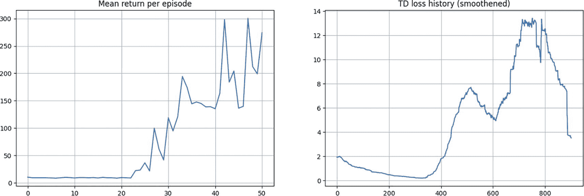

2 张图表。左图。每回合的平均回报。它有一个从 (0, 10) 到 (22, 10) 保持恒定的波动增加曲线，并增加到 (50, 275)。右图。T D 损失历史显示了一个不规则的左偏曲线，波动在 (0, 2) 和 (900, 3.8) 之间。数值是近似的。

图 7-7

NoisyNet DQN 训练图

为了彻底研究改进和其他观察结果，建议您参考本章中引用的原始论文。您还应该详细阅读配套的 Python 笔记本，在掌握细节后，您应该尝试重新编写示例代码。图 7-8 显示了论文中的训练曲线，其中将 NoisyNet DQN 和 NoisyNet dueling 学习进度与基线版本进行了比较。

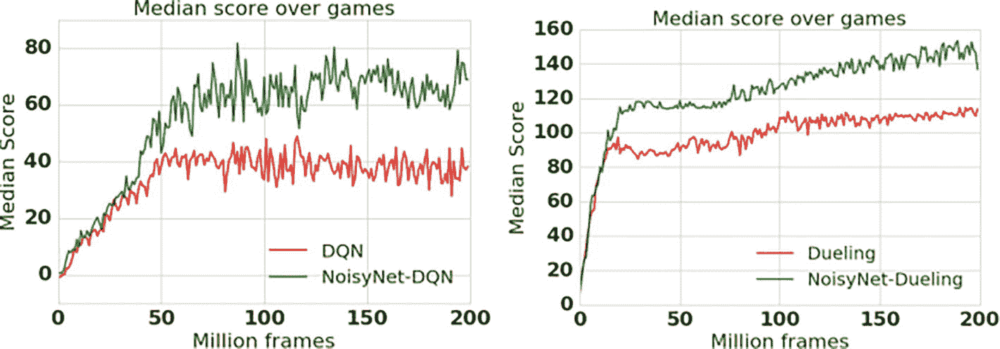

2 条中值分数与百万帧的线图。左图。它显示了 D Q N 和 Noisy Net D Q N 的 2 种增加的波动模式。它们在 (0, 0) 和 (40, 30) 之间重叠。右图。它显示了对抗和 Noisy net 对抗的 2 种增加和波动模式。它们在 (0, 0) 和 (15, 95) 之间重叠。

图 7-8

将 NoisyNet 与论文图 2 的基线进行比较[`https://arxiv.org/pdf/1706.10295.pdf`](https://arxiv.org/pdf/1706.10295.pdf)

鼓励你尝试编写一个带噪声的 dueling DQN 版本。此外，你也可以尝试学习 DDQN 变体。换句话说，利用你到目前为止所学到的知识，你可以尝试以下组合：

+   DQN

+   DDQN（影响学习方式）

+   Dueling DQN（影响训练架构）

+   Dueling DDQN

+   将原始的 `ReplayBuffer` 替换为优先级回放缓冲区

+   在任何先前的方法中将 ε-探索替换为 NoisyNets

+   编写所有组合

+   尝试许多其他的 Gymnasium 环境，如果需要，对网络进行适当的调整

+   在 Atari 上运行其中一些，特别是如果你有访问 GPU 机器的话

## 分类 51-Atom DQN（C51）

在 2017 年的一篇题为“强化学习的分布视角”（^(6））的论文中，作者们支持强化学习的分布性质。他们不像看 q 值的期望值那样，而是看 *Z*，这是一个随机分布，其期望值是 *Q*。

到目前为止，你已经为输入状态 *s* 输出了 *Q*(*s*, *a*) 值。输出单元的数量为 `n_action` 的大小。从某种意义上说，输出值是如这里所示预期的 *Q*(*s*, *a*)：

![$$ Q\left(s,a\right)=E\left[R\left(s,a\right)\right]+\upgamma E\left[Q\left({s}^{'},{a}^{'}\right)\right] $$](../images/502835_2_En_7_Chapter/502835_2_En_7_Chapter_TeX_Equh.png)

在实践中，你一直使用蒙特卡洛技术，通过平均单个样本或多个样本来估计实际的期望值 *E*[*Q*(*s*, *a*)]，正如在关于 TD 学习的章节中之前讨论的那样。

在 51-Atom DQN 中，对于每个 *Q*(*s*, *a*)（即每个动作一个，总共 `n_action` 个），你产生一个 *Q*(*s*, *a*) 值的分布估计：每个 *Q*(*s*, *a*) 有 `n_atom` 个值（精确到 51 个）。现在网络正在预测整个分布，将其建模为分类概率分布，而不是仅仅估计 *Q*(*s*, *a*) 的平均值。

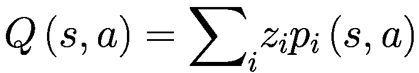

*p**i* 是在 (*s*, *a*) 处的动作值将是 *z*[*i*] 的概率。

你现在有 `n_action * n_atom` 个输出，即对于每个 `n_action` 值，有 `n_atom` 个输出。进一步来说，这些输出是概率。对于一种动作，你有 `n_atom` 个概率，这些是 q 值在 `V_min` 到 `V_max` 范围内任何 `n_atom` 个离散值中的概率。有关更多详细信息，请参阅论文。

在 C51 版本的分布式强化学习（RL）中，作者将*i*取为 51 个原子（支撑点），覆盖的值从-10 到 10。你将在代码中使用相同的设置。由于这些值在代码中是参数化的，你可以随意更改它们并探索它们的影响。

在应用 Bellman 更新后，值会发生变化，可能不会落在 51 个支撑点上。有一个投影步骤将概率分布带回 51 个原子的支撑点，即*z*[*i*]的即时值。

损失也被从均方误差替换为交叉熵损失。代理使用与 DQN 类似的*ε*-贪婪策略进行训练。数学相当复杂，因此，与代码一起阅读论文，将每一行代码与论文中的具体细节联系起来，将是一个很好的练习。这是 RL 从业者需要具备的重要技能。

现在我们来看看代码。与 DQN 方法类似，你有一个`CategoricalDQN`类，如列表 7-8 所示，这是一个神经网络，它以状态*s*作为输入来产生*Q*(*s*, *a*)的分布*Z*。有一个计算 TD 损失的函数：`td_loss_categorical_dqn`。如前所述，你需要一个投影步骤将值带回`n_atom`支撑点，这在`compute_projection`函数中完成。`compute_projection`函数在计算损失时被用在`td_loss_categorical_dqn`内部。其余的训练与之前相同。

```py
class CategoricalDQN(nn.Module):
def __init__(self, state_shape, n_actions, n_atoms=51, Vmin=-10, Vmax=10, epsilon=0):
# code omitted
# a simple NN with state_dim as input vector (input is state s)
# and self.n_actions as output vector of logits of q(s, a)
self.fc1 = nn.Linear(state_dim, 64)
self.fc2 = nn.Linear(64, 128)
self.fc3 = nn.Linear(128, 32)
self.probs = nn.Linear(32, n_actions * n_atoms)
def forward(self, state_t):
# pass the state at time t through the network to get Q(s,a)
x = F.relu(self.fc1(state_t))
x = F.relu(self.fc2(x))
x = F.relu(self.fc3(x))
probs = F.softmax(self.probs(x).view(-1, self.n_actions, self.n_atoms), dim=-1)
return probs
def get_probs(self, states):
# input is an array of states in numpy and output is Qvals as numpy array
# code omitted
def get_qvalues(self, states):
# input is an array of states in numpy and output is Qvals as numpy array
states = torch.tensor(states, device=device, dtype=torch.float32)
probs = self.forward(states)
support = torch.linspace(self.Vmin, self.Vmax, self.n_atoms)
qvals = support * probs
qvals = qvals.sum(-1)
return qvals.data.cpu().numpy()
def get_action(self, states):
# similar to get_qvalues just that it returns the best action
return best_actions
def sample_actions(self, qvalues):
# similar to get_action with added e-greedy exploration
should_explore = np.random.choice(
[0, 1], batch_size, p=[1-epsilon, epsilon])
return np.where(should_explore, random_actions, best_actions)
Listing 7-8
CategoricalDQN from 7.e-c51_ dqn.ipynb
```

图 7-9 展示了通过`CartPole`环境运行此算法的训练曲线。

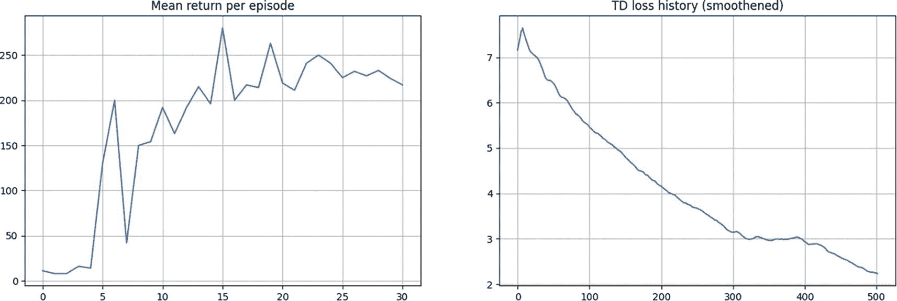

2 个图表。左图：每集平均回报随着曲线在(0, 10)和(30, 220)之间波动。右图：TD 损失历史记录，曲线开始于(0, 7.2)，在(10, 7.6)处达到峰值，并在(500, 2.25)处下降。数值是近似的。

图 7-9

Categorical 51 Atom DQN (C51)训练图

## 分位数回归 DQN

在 2017 年中期 C51 算法论文发表后不久，一些原始作者以及一些额外的作者，他们都是 DeepMind 的成员，提出了一种他们称之为*分位数回归 DQN*的变体。在题为“使用分位数回归的分布式强化学习”的论文中，作者们采用了与原始 C51 略有不同的方法，然而，它们都在分布 RL 的相同焦点领域。

与分布式 RL 的 C51 方法类似，QR-DQN 方法也依赖于使用分位数来预测*Q*(*s*, *a*)的分布，而不是预测*Q*(*s*, *a*)平均值的估计。C51 和 QR-DQN 都是分布式 RL 的变体，由 DeepMind 的科学家们提出。

C51 方法将 *Q*^(*π*)(*s*, *a*) 的分布建模为在 *V*[*min*] 到 *V*[*max*] 范围内的固定点的概率分布，称为 *Z*^(*π*)(*s*, *a*)。这些点的概率由网络学习。这种方法导致在贝尔曼更新之后使用 *投影* 步骤，将新的概率带回到 `n_atoms` 的固定支持点，这些点在 *V*[*min*] 到 *V*[*max*] 上均匀分布。虽然结果有效，但与算法推导的理论基础之间有些脱节。

在 QR-DQN 中，方法略有不同。支持点仍然是 N 个，但现在这些点的概率被固定为 1/N，而这些点的位置由网络学习。正如作者所说：

> *我们将 C51 的参数化“转置”：而前者使用 N 个固定的位置来近似其概率分布，并调整它们的概率，我们则分配给 N 个可调整的位置固定的、均匀的概率*

QR DQN 的 DQN 网络类似于 C51 DQN，如列表 7-9 所示。网络接收一批状态以产生 *Q*(*s*, *a*) 的分布 *Z*。

```py
class QRDQN(nn.Module):
def __init__(self, state_shape, n_actions, N=51, epsilon=0):
# code omitted
# a simple NN with state_dim as input vector (input is state s)
# and self.n_actions as output vector of logits of q(s, a)
self.fc1 = nn.Linear(state_dim, 64)
self.fc2 = nn.Linear(64, 128)
self.fc3 = nn.Linear(128, 32)
self.q = nn.Linear(32, n_actions*N)
def forward(self, state_t):
# pass the state at time t through the network to get Q(s,a)
x = F.relu(self.fc1(state_t))
x = F.relu(self.fc2(x))
x = F.relu(self.fc3(x))
qvalues = self.q(x)
qvalues= qvalues.view(-1, self.n_actions, self.N)
return qvalues
def get_qvalues(self, states):
# input is an array of states in numpy and output is Qvals as numpy array
def get_action(self, states):
# return best action from a batch of states
def sample_actions(self, qvalues):
# sample actions from a batch of q_values using epsilon greedy policy
Listing 7-9
QRDQN from 7.f-qr_ dqn.ipynb
```

QR DQN 中使用的损失是分位数回归损失与 Huber 损失混合的，称为 *分位数 Huber 损失*。相关论文中的方程 9 和 10 提供了详细信息。我不提供代码列表，因为我希望您阅读论文，并将论文中的方程与 `7.f- qr_dqn.ipynb` 笔记本中的代码相对应。这篇论文数学密集，所以除非您非常熟悉高级数学，否则您应该尝试关注方法的高级细节。

图 7-10 展示了训练奖励和损失曲线。

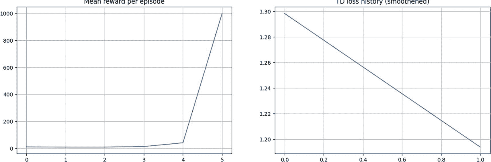

2 个图表。左图：每集平均奖励随着从 (0, 0) 到 (5, 1000) 的增加而增加，在 (4, 25) 处有一个尖锐的弯曲。右图：T D 损失历史在 (0, 1.3) 到 (1, 1.195) 之间呈下降趋势。数值是近似的。

图 7-10

分位数回归 DQN

## 事后经验回放

在 OpenAI 2018 年发表的论文“Hindsight Experience Replay”中，作者提出了一种在奖励稀疏的环境中学习的样本高效方法。常见的方法是调整奖励函数，以引导代理向优化方向前进。这并不具有普遍性。

与从成功结果中学习的 RL 代理相比，人类似乎不仅从成功的结果中学习，还从失败的结果中学习。这是事后回放方法（称为 *事后经验回放*，HER）提出的基础思想。虽然 HER 可以与各种 RL 方法结合使用，但在本代码讲解中，你将使用 HER 与对抗 DQN 结合，称为 HER-DQN。

在 HER 方法中，在场景（比如一个不成功的场景）结束后，你将形成一个次要目标，其中原始目标被替换为终止前的最后一个状态作为这个轨迹的目标。

假设一个场景已经进行了*s*[0]，*s*[1]，…，*s*[*T*]。通常你会在重放缓冲区中存储一个元组(*s*[*t*]，*a*[*t*]，*r*，*s*[*t* + 1]，*done*)。假设这个场景的目标是*g*，在这个运行中无法实现。在 HER 方法中，你将在重放缓冲区中存储以下内容：

+   (*s*[*t*]| |*g*, *a*[*t*], *r*, *s*[*t* + 1]| ∣ *g*, *done*)

+   (*s*[*t*]| |*g*^′, *a*[*t*], *r*(*s*[*t*], *a*[*t*], *g*^′), *s*[*t* + 1]| ∣ *g*^′, *done*)：基于合成目标（如场景的最后一个状态作为子目标 g’）的其他状态转换。奖励被修改以显示状态转换*s*[*t*] → *s*[*t* + 1]对于子目标*g*^′是好是坏。

原始论文讨论了形成这些子目标的各种策略。你将使用被称为`future`的策略：

+   `future`重放使用 k 个随机状态，这些状态来自与正在重放转换相同的场景，并且在它之后被观察到。

你还将使用与过去笔记本不同的环境。你将使用位翻转实验的环境。比如说，你有一个 n 位的向量，每个位都是范围{0,1}中的二进制数。因此，可能的组合有 2^(*n*)种。在重置时，环境以随机选择的 n 位配置开始，目标也是随机选择的某个不同的 n 位配置。每个动作是翻转一个位。要翻转的位是代理试图学习的策略π(*a*| *s*)。如果代理找到了匹配目标的正确配置，或者当代理在一个场景中耗尽了*n*个动作时，场景结束。

列表 7-10 包含了环境的代码。完整的代码在`7.g-her_dqn.ipynb`笔记本中。

```py
class BitFlipEnvironment:
def __init__(self, bits):
self.bits = bits
self.state = np.zeros((self.bits, ))
self.goal = np.zeros((self.bits, ))
self.reset()
def reset(self):
self.state = np.random.randint(2, size=self.bits).astype(np.float32)
self.goal = np.random.randint(2, size=self.bits).astype(np.float32)
if np.allclose(self.state, self.goal):
self.reset()
return self.state.copy(), self.goal.copy()
def step(self, action):
self.state[action] = 1 - self.state[action]  # Flip the bit on position of the action
reward, done = self.compute_reward(self.state, self.goal)
return self.state.copy(), reward, done
def render(self):
print("State: {}".format(self.state.tolist()))
print("Goal : {}\n".format(self.goal.tolist()))
@staticmethod
def compute_reward(state, goal):
done = np.allclose(state, goal)
return 0.0 if done else -1.0, done
Listing 7-10
Bit-Flipping Environment from 7.g-her_dqn.ipynb
```

你已经实现了自己的`render`和`step`函数，以便这个环境的接口与 Gymnasium 中的类似，这样你就可以使用之前开发的工具。自定义的`compute_reward`函数在给定状态和目标输入时返回`reward`和`done`标志。

作者表明，在常规的 DQN 中，其中状态（n 位配置）被表示为深度网络，常规 DQN 代理几乎不可能学习超过 15 位组合。然而，结合 HER-DQN 方法，代理能够轻松学习，即使是像 50 位左右这样的大数字组合。图 7-11 展示了论文中的完整伪代码，并进行了某些修改以使其与符号匹配。

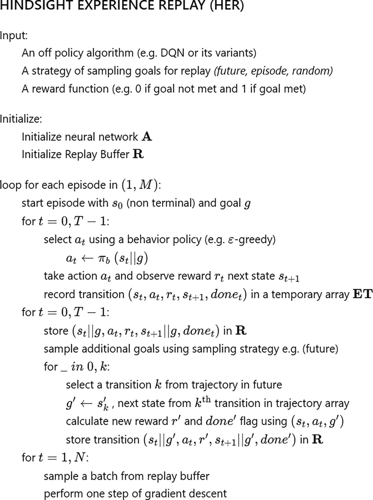

后见之明的经验重放算法。输入是一个离线策略算法、用于重放的目标采样策略和奖励函数。它初始化神经网络 A 和重放缓冲区 R，使用各种循环和命令，并最终执行一次梯度下降步骤。

图 7-11

使用未来策略的 HER

你使用了与本章早期用于 `CartPole` 的类似的 dueling DQN。对于 BitFlipping 环境，你使用相同网络的较小版本。代码中最有趣的部分是实现 HER 算法，如图 7-11 中给出的伪代码所示。

让我们看看如何填充重放缓冲区。正如之前讨论的那样，有两种方式。第一种是以通常的方式填充重放缓冲区，只是增加了状态，包括目标，如图 (*s*[*t*]| |*g*, *a*[*t*], *r*, *s*[*t* + 1]| ∣ *g*, *done*) 所示。更有趣的部分是将使用合成目标填充到缓冲区中的额外转换，即 (*s*[*t*]| |*g*^′, *a*[*t*], *r*(*s*[*t*], *a*[*t*], *g*^′), *s*[*t* + 1]| ∣ *g*^′, *done*)。您在论文中讨论的许多选项中使用 *future* 样本策略。未来策略涉及使用 k 个随机状态作为合成目标 *g*^′ 进行重放，这些状态来自与正在重放的转换相同的剧集，并且在它之后观察到。如果 *s*[*t*] 和 *g*^′ 的位相同，则奖励 *r*(*s*[*t*], *a*[*t*], *g*^′) 为 0。如果这两个不匹配，则奖励为 -1。列表 7-11 展示了如何实现这一点。这是 `7.g-her_dqn.ipynb` 笔记本中 `train_her` 代理训练函数的一部分。

```py
for t in range(steps_taken):
# Usual experience replay
state, action, reward, next_state, done = episode_trajectory[t]
state_, next_state_ = np.concatenate((state, goal)), np.concatenate((next_state, goal))
exp_replay.add(state_, action, reward, next_state_, done)
# Hindsight experience replay
for _ in range(future_k):
future = random.randint(t, steps_taken)  # index of future time step
# take future next_state from (s,a,r,s',d) and set as goal
new_goal = episode_trajectory[future][3]
new_reward, new_done = env.compute_reward(next_state, new_goal)
state_, next_state_ = np.concatenate((state, new_goal)), \
np.concatenate((next_state, new_goal))
exp_replay.add(state_, action, new_reward, next_state_, new_done)
Listing 7-11
HER Replay Buffer Filling Using a Future Strategy from 7.g-her_dqn.ipynb
```

图 7-12 展示了训练曲线。对于一个 50 位的 `BitFlipping` 环境，带有 HER 的代理可以 100% 成功解决环境。记住，环境从 50 位的随机组合开始，并且有一个作为目标的另一个随机组合。代理有最多 50 次翻转操作才能达到目标组合。穷举搜索将需要代理尝试除了它开始时的那个之外的所有 2⁵⁰ 种组合。

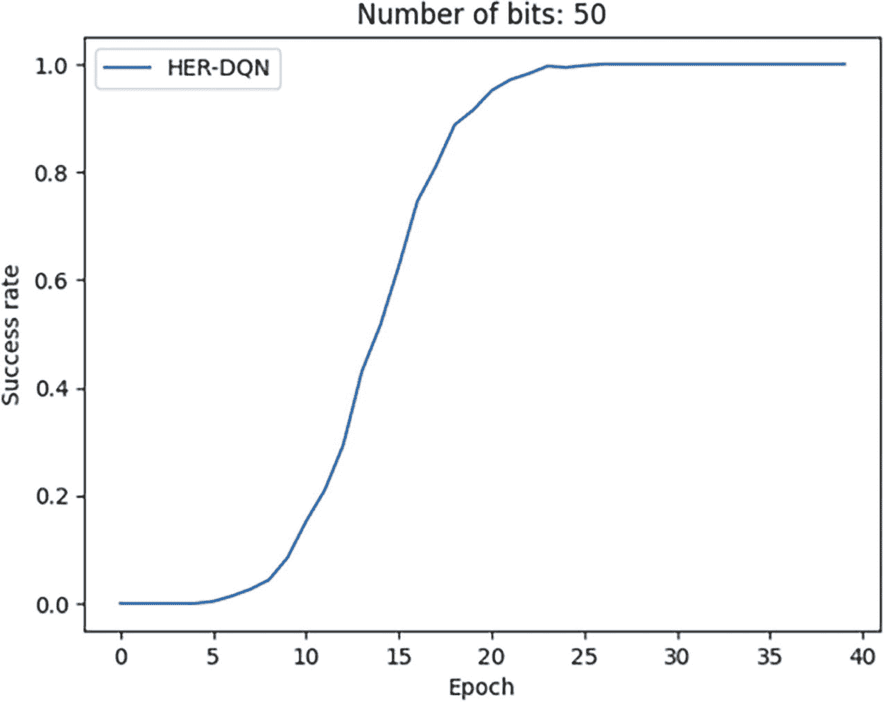

一个表示成功率与比特数 = 50 的 epoch 数量的图表显示了一个上升曲线。它从 (0, 0) 到 (5, 0) 保持稳定，增加到 (22.5, 1)，然后稳定到 (40, 1)。这些值是近似的。

图 7-12

成功率图表：使用未来策略的 HER 的位翻转环境

这使你结束了关于 HER 的讨论，也结束了本章。

## 概述

这是一个简短但内容丰富的章节，其中你研究了 vanilla DQN 的各种修改。

本章开始时，你研究了优先级重放，其中根据分配给缓冲区样本的与 TD 错误幅度成比例的重要性分数来选择样本。

随后，你回顾了在 DQN（深度 Q 网络）背景下使用的双 Q 学习，称为双 DQN。这是一种影响学习方式并试图减少最大化偏差的方法。

然后，你研究了对抗式 DQN，其中使用了两个具有初始共享网络的网络。这之后是 NoisyNets，其中ε-贪婪探索被噪声层所取代。

接下来，你研究了两种分布式强化学习（Distributional RL）的变体，其中网络产生了 *Z*，即 q 值的分布。在分布式强化学习中，不是产生预期的动作值 *Q*(*S*, *A*)，而是产生整个分布，具体来说是一个分类分布。你还看到了投影步骤的使用以及像 *交叉熵* 和 *分位数 Huber 损失* 这样的损失。

最后一节是关于事后经验重放，它解决了在稀疏奖励环境中学习的问题。之前的学习方法主要集中在只从成功的成果中学习，但事后重放允许你从失败的结果中学习同样。

本章中你看到的大多数算法和方法都是最前沿的研究。通过查看原始论文以及逐行阅读代码，你将获得很多收获。我还建议了你可以尝试的各种组合，以进一步巩固你心中的概念。

本章总结了基于价值的探索方法，其中你通过首先使用 *V* 或 *Q* 函数学习来学习策略，然后使用这些函数来找到一个最优策略。下一章将转向基于策略的方法，其中你将找到最优策略，而不涉及学习 *V*/*Q* 函数的中间步骤。
