# 8. 策略梯度算法

到目前为止，本书一直专注于基于模型和无模型的方法。所有使用这些方法的算法都将估计给定当前策略的状态或状态-动作值作为第一步。在第二步中，这些估计的值被用来通过在给定状态下选择最佳动作来找到更好的策略。这两个步骤在一个循环中执行，直到观察到值的进一步改进。在本章中，你将探讨一种不同的学习方法，即直接在策略空间中操作，以学习最优策略。你将学习如何在不显式学习或使用状态或状态-动作值的情况下改进策略。

你还将了解到基于策略的方法和基于价值的方法并不是两种完全分离的方法。有一些方法结合了基于价值和基于策略的方法，例如演员-评论家方法。

本章的核心是建立定义并从数学上推导出基于策略优化的关键部分。基于策略的方法是目前解决强化学习中大型和连续空间问题最受欢迎的方法族之一。

## 引言

你开始你的旅程是通过首先查看简单的基于模型的方法，其中你通过迭代贝尔曼方程来解决小的、离散的状态空间问题。随后，本书讨论了使用蒙特卡洛和时序差分方法的基于无模型的环境。然后，我扩展了分析以涵盖使用函数逼近的大或连续状态空间。特别是，你学习了 DQN 及其许多变体作为策略学习的方法。

所有这些方法的核心思想是首先学习当前策略的价值，然后通过迭代改进策略以获得更好的奖励。这是通过使用广义策略迭代（GPI）的通用框架来完成的。如果你思考一分钟，你会意识到真正的目标是学习一个好的策略。你使用价值函数作为找到好策略的中间步骤。

这种通过学习值函数来改进策略的方法是间接的。与直接学习良好的策略相比，学习值并不总是容易。考虑在慢跑小径上遇到熊的情况。你首先想到的是什么？你的大脑是否试图评估状态（你面前的熊）和可能采取的行动（“冻结”、“抚摸熊”、“逃跑”或“攻击熊”）？或者你几乎肯定地“跑”起来，即以 1.0 的概率遵循`action="run"`的策略？我相信答案是后者。再考虑另一个例子，玩 Atari Breakout 游戏，这是在前一章 DQN 示例中使用的。考虑球靠近你的挡板右边并远离挡板（“状态”）的情况。作为一个人类玩家，你会怎么做？你会尝试评估*Q*(*s*, *a*)，两个动作的状态-动作值，以决定挡板是否需要向右或左移动吗？或者你只是观察状态，学会将挡板向右移动以避免球掉落？我相信答案是后者。在这两个例子中，后者和更简单的方法是直接学习行动，而不是首先学习值，然后使用状态值在可能的选择中找到最佳行动。

### 基于策略方法的优缺点

之前的例子表明，在许多情况下，学习策略（在给定状态下采取什么行动）比学习值函数然后使用它们来学习策略要容易。那么，为什么我还要经历像 SARSA、Q-learning、DQN 等值方法的方法呢？因为策略学习虽然容易，但并非一帆风顺。它有其自身的一套挑战，特别是基于你当前的知识和可用的算法，这些挑战如下。

优点：

+   **更好的收敛性**：对于基于策略的方法，在训练过程中向预期行为的收敛性更好，因为它们直接优化策略，而不是像基于值的方法那样通过两个步骤的过程——值函数学习到策略优化。

+   **在高维和连续动作空间中有效**：基于策略的方法可以处理高维和连续的动作空间。

+   **适应复杂环境的能力**：基于策略的方法能够适应复杂和动态的环境，允许在最优策略可能随时间变化的情况下进行有效的决策。

+   **学习随机策略**：学习随机策略的基于策略方法本质上包含了探索，从而在探索和利用之间提供了更好的平衡。

缺点：

+   **样本效率低和计算负担重**：基于策略的方法需要更多的回合来学习最优行为。因此，这些方法可能需要更长的运行时间和额外的计算负担。

+   **收敛问题**：传统的基于策略的方法有时会收敛到局部最大值而不是全局最大值。然而，在很大程度上，这些问题可以通过 PPO 等方法来解决。

+   **策略评估效率低下且方差大**：传统的基于策略的方法不维护值函数，导致策略评估效率低下。因此，必须进行大量剧集的评估，以保持策略估计的方差在合理的范围内。

详细说明这些观点，还记得 DQN 的学习曲线吗？你看到了策略值在训练过程中变化很大。在“小车杆”问题中，你看到了分数（如前一章所有训练进度图的左侧图形所示）波动很大。没有稳定地向更好的策略收敛。基于策略的方法，特别是我在本章末尾介绍的一些额外控制，确保在学习过程中向更好的策略平稳且稳定地进步。

行动空间始终是一组可能动作的小集合。即使在像 DQN 这样的函数近似和深度学习的情况下，动作空间也限制在个位数。动作是一维的。想象一下尝试控制一个行走机器人的各个关节。你需要对机器人的每个关节做出决策，这些个别选择共同构成了给定状态下机器人的一个完整动作。此外，每个关节的个别动作不会是离散的。很可能是动作，如电机速度或手臂或腿部需要移动的角度，将处于一个连续的范围内。基于策略的方法更适合处理这些动作。

在你迄今为止看到的所有基于值的方法中，你总是学习到一个最优策略——一个确定性策略，其中你确信在给定状态下采取的最佳动作。我必须引入探索的概念，使用*ε*-贪婪策略尝试不同的动作，其中你从一个非零的探索概率开始，随着训练的进行和智能体学会采取更好的动作，这个概率稳步减少到一个非常小的值。最终的输出始终是一个确定性策略。

然而，确定性策略并不总是**最优的**。在某些情况下，最优策略是按照某种概率分布采取多个动作，尤其是在多智能体环境中。如果你对博弈论有所了解，你会立即从囚徒困境和相应的纳什均衡等设置中意识到这一点。无论如何，让我们看看一个简单的情况。

你玩过剪刀石头布的游戏吗？这是一个两人游戏。在单次回合中，每个玩家必须选择三种选项之一——剪刀、石头或布。两位玩家同时选择并同时揭示他们的选择。规则规定，剪刀胜过布，因为剪刀可以剪布，石头胜过剪刀，因为石头可以用来砸剪刀，布胜过石头，因为布可以覆盖石头。

什么是最优策略？没有明显的胜者。如果你总是选择，比如说，石头，那么作为你的对手，我会利用这个知识总是选择布。你能想到任何其他的确定性策略（即，总是选择三种之一）吗？为了防止对手利用你的策略，你必须完全随机地做出选择。你必须随机地选择剪刀、石头或布，概率相等，即使用随机策略。确定性策略是随机策略的一种特殊形式，其中一种选择具有 1.0 的概率，而所有其他动作的概率为 0。随机策略更通用，这就是基于策略的方法所学习的。

这里是确定性策略：

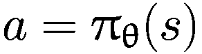

换句话说，这是在状态*s*下要采取的具体动作*a*。

这里是随机策略：

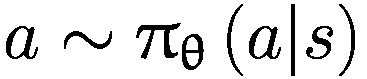

换句话说，这是给定状态*s*中动作概率的分布。为了选择一个动作，你从这个概率分布中采样给定状态的动作分布。

同样也存在一些缺点。基于策略的方法，虽然收敛性好，但可能会收敛到局部最大值。第二个大缺点是，基于策略的方法不学习任何价值函数的直接表示，这使得评估给定策略的价值效率低下。评估策略通常需要通过使用策略多次运行代理并汇总每次运行的奖励序列来形成一个对状态或状态-动作价值的估计，本质上就是蒙特卡洛方法。蒙特卡洛方法的问题在于估计的高方差，需要多次运行以取平均值并得到方差较低的估计。我讨论了通过结合基于价值的方法和基于策略的方法的优点来解决这一问题的方法。这被称为*演员-评论家*算法家族。

### 策略表示

在第五章中，该章涵盖了具有函数近似的无模型设置，我在方程 5-1 中将价值函数表示如下：

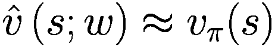


有一个模型（一个线性模型或神经网络）具有权重 *w*。它使用权重 *w* 参数化的函数表示状态值 *v* 和状态-动作值 *q*。相反，你现在将直接如下参数化策略：

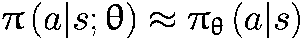

θ 是定义策略函数的函数的参数，学习算法将调整它，使代理能够以有意义的方式行动，生成期望的奖励。接下来，你将看到当动作是离散的以及动作形成一个连续值范围时，如何进行这种参数化。

#### 离散情况

对于不太大的离散动作空间，你可以为状态-动作对参数化另一个函数 *h*(*s*, *a*; *θ*)。概率分布是通过 *h* 的软最大值形成的。

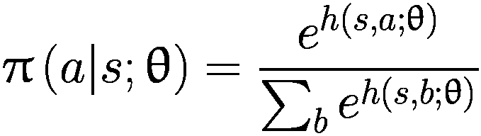

值 *h*(*s*, *a*; *θ*) 被称为 *logits* 或 *动作偏好*。它类似于在监督分类案例中使用的的方法。在监督学习中，你输入 *X*，即观察。在这里，在强化学习 (RL) 中，你将状态 *S* 输入到模型中。监督案例中模型的输出是输入 *X* 属于不同类别的 logits。在 RL 中，模型的输出是采取特定动作 *a* 的 *动作偏好 h*。

#### 连续情况

在连续动作空间中，策略的高斯表示是一个自然的选择。假设动作空间是连续的且是多维的，例如维度为 *d*。模型将状态 *S* 作为输入并产生多维均值向量 μ ∈ R^d。方差 σ²*I*[*d*] 也可以参数化或保持不变。代理将遵循的策略是一个具有均值 μ 和方差 σ²*I*[*d*] 的高斯策略。代理将从这个概率分布中抽取动作。

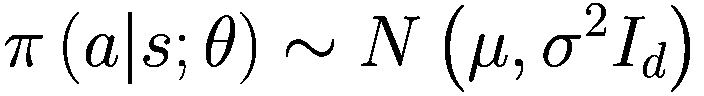

在这里，动作 *a* 和 μ ∈ R^d.

已经制定了如何将策略表示为参数化函数的符号，现在你将关注代理如何直接学习策略，而不需要求助于学习状态和状态-动作值。

## 政策梯度推导

推导基于策略的算法的方法与你在监督学习中所做的方法类似。以下是制定算法的步骤概述：

1.  形成一个您想要最大化的目标，就像在监督学习中一样。这将是通过遵循策略所获得的奖励总和。这就是您想要最大化的目标。

1.  推导梯度更新规则以执行梯度上升。您正在进行梯度上升而不是梯度下降，因为目标是最大化每场/迭代的平均总回报。

1.  您需要将梯度更新公式重写为一个期望值，以便可以使用样本近似梯度更新，例如使用蒙特卡洛方法估计期望值。

1.  现在您将更新规则正式转换为可以与 PyTorch、JAX 或 TensorFlow 等自动微分库一起使用的算法。

### 目标函数

让我们从您想要最大化的目标开始。正如之前提到的，这将是对策的价值，即通过遵循策略，智能体可以获得的回报。期望回报的表示有很多变体。您将查看其中的一些，并简要了解何时使用哪种表示。然而，算法的详细推导使用的是其中的一种变体，因为其他奖励公式的推导是相似的。奖励函数及其变体如下：

+   场次未折现：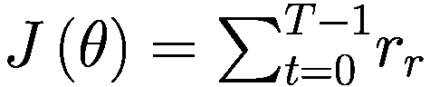

+   场次折现：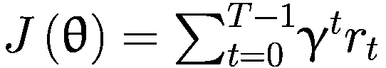

+   无限时域折现：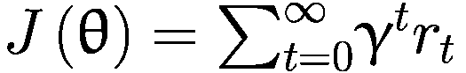

+   平均奖励：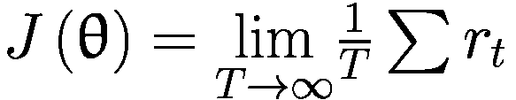

大部分推导将遵循奖励的场次未折现结构，只是为了使数学简单，并关注推导的关键方面。

**γ** 在其中扮演什么角色？

我还希望让您对折现因子 γ 有一个感觉。折现用于无限公式中，以保持总和有界。通常，您使用 0.99 或类似的折现值来保持总和在理论上有界。在某些公式中，折现因子还决定了利率在金融市场中的作用——也就是说，今天的奖励比明天的相同奖励更有价值。使用折现因子引入了今天奖励更受青睐的概念。

折扣因子还用于通过提供时间跨度的软截止来减少估计中的方差。假设你在每个时间步都获得 1 个奖励，并且你使用折扣因子γ。这个无穷级数的和是。比如说，γ = 0.99。那么无穷级数的和就是 100。因此，你可以将 0.99 的折扣看作是限制你的时间跨度为 100 步，在这 100 步中，你每步都收集到了 1 个奖励，从而获得总共 100 的回报。

总结来说，折扣因子γ意味着一个包含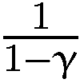步的时间跨度。

使用*γ*也确保了策略在轨迹初始部分改变动作对整体策略质量的影响比轨迹后期部分决策的影响更大。

回到推导过程，你现在可以计算用于改进策略的梯度更新。代理遵循由*θ*参数化的策略。这涉及到一些数学，如果你想要跳过，可以跳到方程 8-16 和 8-17，并从那个点开始跟随。

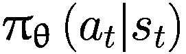

(8-1)

代理遵循策略并生成轨迹*τ*如下：

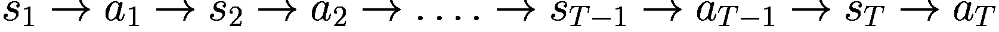

在这里，*s*[*T*]不一定是终止状态，而是一个时间跨度*T*，你考虑的轨迹可以到达这个时间跨度。

在一次运行中观察到轨迹*τ*的概率取决于转移概率*p*(*s*[*t* + 1]| *s*[*t*], *a*[*t*])和策略*π**θ*。它由以下表达式给出：

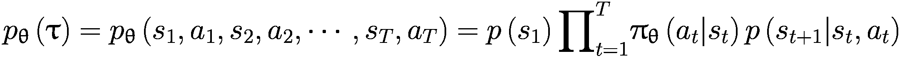

(8-2)

遵循策略的预期回报由以下公式给出：

![$$ J\left(\uptheta \right)={E}_{\uptau \sim {p}_{\uptheta}\left(\uptau \right)}\left[{\sum}_tr\left({s}_t,{a}_t\right)\right] $$](../images/502835_2_En_8_Chapter/502835_2_En_8_Chapter_TeX_Equ3.png)

(8-3)

你想要找到最大化预期回报*J*(*θ*)的*θ*。换句话说，最优的θ = θ^∗由以下表达式给出：

![$$ {\uptheta}^{\ast }={\mathit{\arg}\mathit{\max}}_{\uptheta}{E}_{\uptau \sim {p}_{\uptheta}\left(\uptau \right)}\left[{\sum}_tr\left({s}_t,{a}_t\right)\right] $$](../images/502835_2_En_8_Chapter/502835_2_En_8_Chapter_TeX_Equ4.png)

(8-4)

在继续前进之前，考虑你将如何评估目标 *J*(θ)。你将方程 8-3 中的期望转换为样本的平均值，也就是说，你多次运行代理通过策略，收集 *N* 条轨迹。你计算每条轨迹的总奖励（轨迹中的总奖励也称为一个 episode 或单个 rollout 的回报），并对 *N* 条轨迹的回报取平均值。这是对期望的蒙特卡洛（MC）估计。这就是我所说的评估策略的含义。你得到的表达式如下：

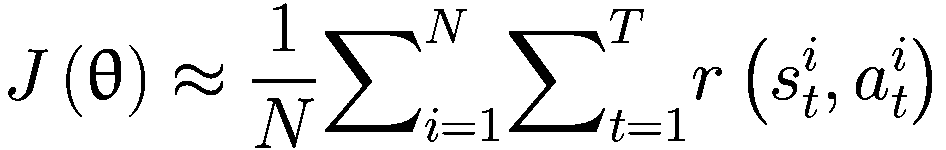

(8-5)

在方程 8-5 的符号中， 代表 rollout 实例 *i* 在步骤 *t* 的状态 *s*。一个 rollout 有 *T* 个步骤，总共有 *N* 个 rollout。

### 导数更新规则

接下来，让我们尝试找到最优的 *θ*。为了使符号更容易理解，我将 ∑[*t*]*r*(*s*[*t*], *a*[*t*]) 替换为 *r*(τ)。重写方程 8-3，你得到以下内容：

![J(θ) = E_τ~p_θ(τ)[r(τ)] = ∫p_θ(τ)r(τ) dτ](../images/502835_2_En_8_Chapter/502835_2_En_8_Chapter_TeX_Equ6.png)

(8-6)

对方程 8-6 关于 *θ* 求梯度/导数。

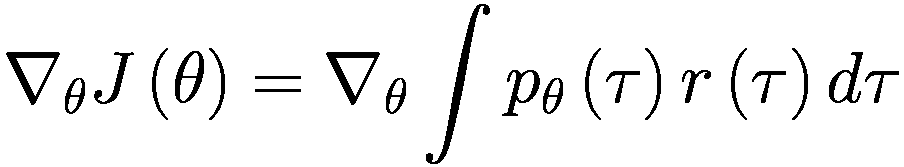

(8-7)

使用线性性质，你可以将梯度移到积分内部。

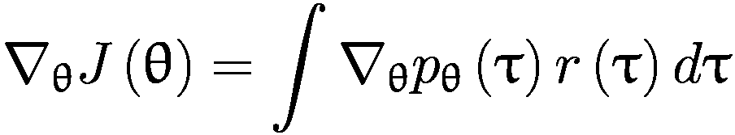

(8-8)

使用对数导数技巧，你知道 ∇[*x*]*f*(*x*) = *f*(*x*)∇[*x*]log*f*(*x*)。利用这一点，你可以将之前的方程 8-8 写成以下形式：

![∇_θJ(θ) = ∫p_θ(τ)[∇_θlogp_θ(τ)r(τ)]dτ](../images/502835_2_En_8_Chapter/502835_2_En_8_Chapter_TeX_Equ9.png)

(8-9)对数导数技巧

从一个概率分布 *p*θ 开始，其中 x 是随机变量，θ 代表概率分布的参数。比如说你有这个表达式：

![G(θ) = E_x~p_θ(x)[f(x)]](../images/502835_2_En_8_Chapter/502835_2_En_8_Chapter_TeX_Equi.png)

你现在想要计算*G*(θ)相对于θ的导数。为了简化，假设*x*和θ都是单变量。你通过将期望转换为积分来写出*G*(θ)。你可以将*G*(θ)重写为：

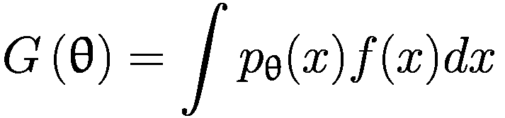

对θ进行求导，两边得到：

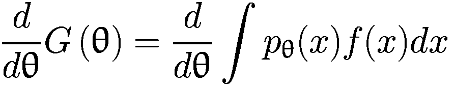

由于线性性质，对内部进行求导，你得到：

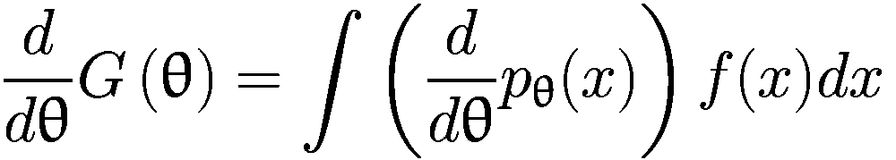

现在将右侧乘以*p*θ并除以*p*θ：

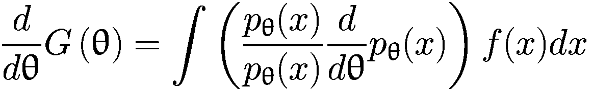

这给出：

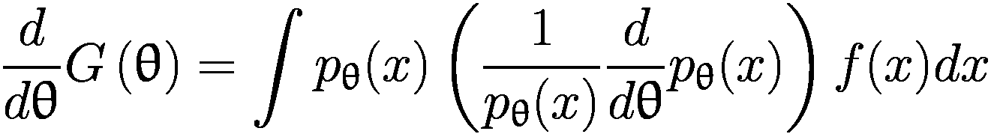

左侧括号内的表达式是 log*p*θ的导数：

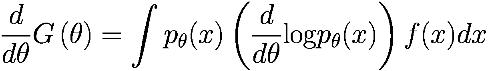

现在将积分转换回*p*θ的期望：

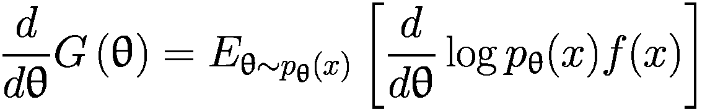

这是一种对数导数技巧，其中函数的导数是期望中的函数，并且你想要对概率分布的参数进行函数的求导。对数导数技巧允许你表示导数，从而允许你计算导数表达式的蒙特卡洛估计。

现在，你可以将积分重新写为期望，从而得到以下表达式：


(8-10)

现在通过写出从方程 8-2 中得到的*p*θ的完整表达式来展开项∇[*θ*] log *p**θ*。

![$$ {\nabla}_{\theta}\log {p}_{\theta}\left(\tau \right)={\nabla}_{\theta}\mathit{\log}\left[p\left({s}_1\right){\prod}_{t=1}^T{\pi}_{\theta}\left({a}_t|{s}_t\right)p\left({s}_{t+1}|{s}_t,{a}_t\right)\right] $$](../images/502835_2_En_8_Chapter/502835_2_En_8_Chapter_TeX_Equ11.png)

(8-11)

你知道项的乘积的对数可以写成项的对数之和。换句话说：

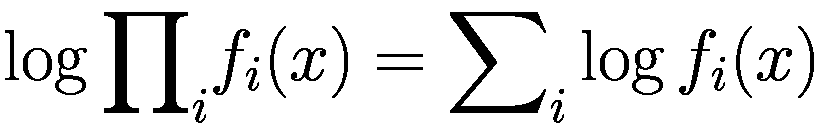

(8-12)

将方程 8-12 代入方程 8-11，得到以下结果：

![$$ {\nabla}_{\uptheta}\log {p}_{\uptheta}\left(\uptau \right)={\nabla}_{\uptheta}\left[\log p\left({s}_1\right)+{\sum}_{t=1}^T\left(\log {\uppi}_{\uptheta}\left({a}_t|{s}_t\right)+\log p\left({s}_{t+1}|{s}_t,{a}_t\right)\right)\right] $$](../images/502835_2_En_8_Chapter/502835_2_En_8_Chapter_TeX_Equ13.png)

(8-13)

方程 8-13 中唯一依赖于*θ*的项是*π**θ*. 其他两项——log*p*(*s*[1])和 log*p*(*s*[*t* + 1]| *s*[*t*], *a*[*t*])——不依赖于*θ*. 因此，你可以将方程 8-13 简化如下：

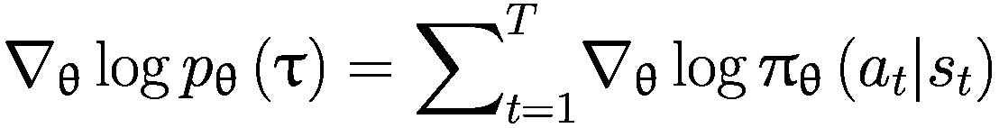

(8-14)

通过将方程 8-14 代入方程 8-10 中∇[*θ*]*J*(*θ*)的表达式，以及将回报 r(*τ*)展开为∑[*t*]*r*(*s*[*t*], *a*[*t*])，得到以下结果：

![$$ {\nabla}_{\uptheta}J\left(\uptheta \right)={E}_{\uptau \sim {p}_{\uptheta}\left(\uptau \right)}\left[\left({\sum}_{t=1}^T{\nabla}_{\uptheta}\log {\uppi}_{\uptheta}\left({a}_t|{s}_t\right)\right)\left({\sum}_{t=1}^Tr\left({s}_t,{a}_t\right)\right)\right] $$](../images/502835_2_En_8_Chapter/502835_2_En_8_Chapter_TeX_Equ15.png)

(8-15)

你现在可以用多个轨迹的估计/平均来替换外层期望，得到以下关于*策略目标梯度*的表达式：

![$$ {\nabla}_{\uptheta}J\left(\uptheta \right)\approx \frac{1}{N}{\sum}_{i=1}^N\left[\left({\sum}_{t=1}^T{\nabla}_{\uptheta}\log {\uppi}_{\uptheta}\left({a}_t^i|{s}_t^i\right)\right)\left({\sum}_{t=1}^Tr\left({s}_t^i,{a}_t^i\right)\right)\right] $$](../images/502835_2_En_8_Chapter/502835_2_En_8_Chapter_TeX_Equ16.png)

(8-16)

其中上标索引*i*表示第*i*条轨迹。

为了改进策略，沿着梯度∇[*θ*]*J*(*θ*)的方向采取正步，学习率α。

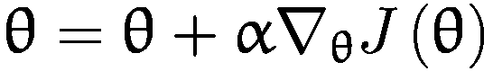

(8-17)

总结来说，你设计了一个模型，该模型以状态 *s* 作为输入，并产生模型的输出策略分布 *π**θ*。你使用由当前模型参数 *θ* 确定的策略来生成轨迹并计算每条轨迹的总回报。然后，你使用方程式 8-16 计算 ∇[*θ*]*J*(*θ*) 并使用方程式 8-17 中的表达式 *θ* = *θ* + *α*∇[*θ*]*J*(*θ*) 来改变模型参数 *θ*。

### 更新规则的直觉

本节通过文字解释方程式 8-16 来发展对其背后的直觉。你是对 *N* 条轨迹进行平均，这是最外层的求和。你在轨迹上平均的是什么？对于每条轨迹，你查看在该轨迹中获得的总奖励，即求和中的第二项。这个回报与第一项相乘，第一项是沿着该轨迹所有动作的对数概率之和。

假设一条轨迹的总奖励 *r*(*τ*^(*i*)) 是正值。第一个内层求和中的每个梯度，即 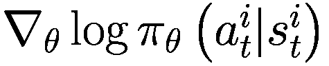，这是该动作对数概率的梯度——被总奖励 *r*(*τ*^(*i*)) 乘以。结果是，单个 *梯度-对数* 项被轨迹的总奖励放大，在方程式 8-17 中，其贡献是使模型参数 *θ* 向  的正值方向移动，即当系统处于状态  时，增加采取动作  的概率。然而，对于 *r*(*τ*^(*i*)) 是负值的情况，方程式 8-16 和 8-17 导致 *θ* 向负值方向移动，结果是当系统处于状态  时，减少采取动作  的概率。

你可以用一句话总结整个解释，那就是策略优化完全是关于试错。你推出了多个轨迹。对于好的轨迹，沿着轨迹的所有动作的概率都会增加。对于不好的轨迹，那些轨迹中所有动作的概率都会减少，如图 8-1 所示。

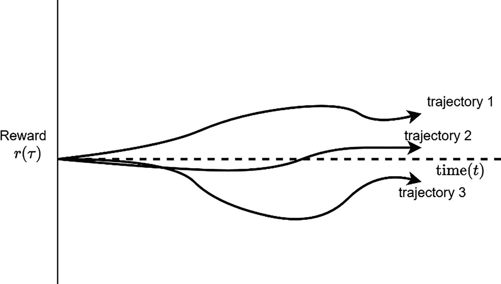

轨迹展开的示意图。它表示了奖励与时间相关的多个轨迹。轨迹 3 的概率较低，而轨迹 1 和轨迹 2 的概率较高。

图 8-1

轨迹展开。轨迹 1 很好，所以你希望模型产生更多这样的轨迹。轨迹 2 既不好也不坏，模型对此不必过于担心。轨迹 3 很糟糕，所以你希望模型降低其发生的概率。

通过比较方程 8-17 中的表达式与最大似然的表达式，考虑这种解释。如果你只想对观察到的轨迹的概率进行建模，你会得到最大似然估计——你观察到一些数据（轨迹），你希望构建一个模型，该模型具有产生观察到的数据/轨迹的最高概率。这是最大似然模型构建。在这种情况下，你会得到以下方程：

![$$ {\nabla}_{\uptheta}{J}_{MLE}\left(\uptheta \right)\approx \frac{1}{N}{\sum}_{i=1}^N\left[{\sum}_{t=1}^T{\nabla}_{\uptheta}\log {\uppi}_{\uptheta}\left({a}_t^i|{s}_t^i\right)\right] $$](../images/502835_2_En_8_Chapter/502835_2_En_8_Chapter_TeX_Equ18.png)

(8-18)

在方程 8-18 中，你只是在增加动作的概率，以增加观察到的轨迹的整体概率。你并没有对好轨迹和坏轨迹进行任何区分。在方程 8-16 中的策略梯度的情况下，你做的是类似于最大似然估计（MLE）的事情，但增加了对轨迹回报的加权，以增加好轨迹的概率，并降低坏轨迹的概率。

在结束本节之前，我想提出的一个观察是关于马尔可夫性质和部分可观测性。你实际上并没有在推导中使用马尔可夫假设。最终，方程 8-16 只是增加了好事发生的概率，减少了坏事发生的概率。到目前为止，你还没有使用贝尔曼方程。因此，策略梯度方法也可以用于非马尔可夫设置。

## REINFORCE 算法

现在，你将方程 8-16 转换为策略优化的算法。基本算法如图 8-2 所示。它被称为 REINFORCE。

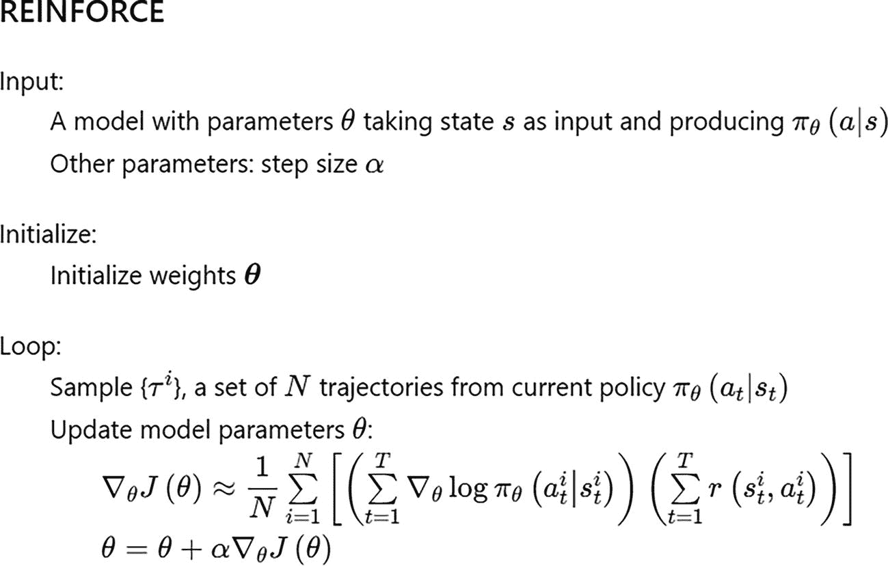

用于策略优化的 REINFORCE 算法。它包括输入、初始化、其他参数和一个循环。

图 8-2

REINFORCE 算法

考虑一些实现层面的细节。假设你使用一个神经网络作为模型，它接受状态值作为输入，并产生该状态下所有可能动作的*logit*（对数概率）。图 8-3 展示了这样一个模型的示意图。

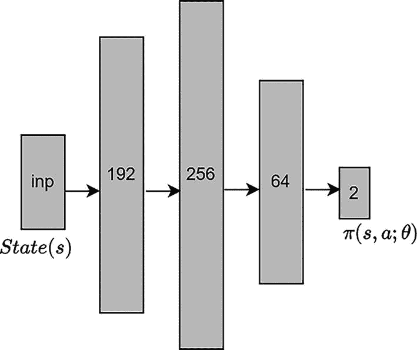

神经网络预测策略的网络模型。状态值作为输入提供，可能的动作提供对数概率。

图 8-3

预测策略的神经网络模型

您可以使用 PyTorch、JAX 或 TensorFlow 等自动微分库。您不需要显式地计算微分。方程 8-16 给出了 ∇[θ]*J*(*θ*) 的表达式。使用 PyTorch 或其他此类库时，您需要一个 *J*(θ) 表达式，在反向传播过程中，将使用自动微分来计算 ∇[θ]*J*(*θ*)，然后使用方程 8-17 更新神经网络权重 θ。神经网络模型将状态 *s* 作为输入，并产生 πθ。因此，您需要使用这个输出并执行进一步计算，以得到 *J*(θ) 的表达式。PyTorch 或 TensorFlow 等自动微分包将自动从 *J*(θ) 的表达式中计算梯度 ∇[θ]*J*(*θ*)。*J*(θ) 的正确表达式如下：

![J(θ)≈1/N∑i=1N[∑t=1Tlogπθ(aTi|st^i)∑t=1T∑t=1^Tr(st^i,at^i)]](../images/502835_2_En_8_Chapter/502835_2_En_8_Chapter_TeX_Equ19.png)

(8-19)

您可以检查并确认这个表达式的梯度将给出正确的 ∇[*θ*]*J*(*θ*) 值，正如方程 8-16 所示。从方程 8-19 开始，对 *J*(*θ*) 求导，相对于 *θ*。这将给出一个与方程 8-16 匹配的 ∇[*θ*]*J*(*θ*) 表达式。

注意，方程 8-19 中的 *J*(*θ*) 表达式与方程 8-6 中的不同。当从方程 8-6 中的 *J*(*θ*) 表达式移动到方程 8-16 中的导数 ∇[θ]*J*(θ) 并然后回到方程 8-19 中的 *J*(*θ*) 表达式时，您引入了对数技巧。您从与 θ 无关的项中移除了概率，这些项是环境的属性，即状态转移概率 *p*(*s*[*t* + 1]| *s*[*t*], *a*[*t*])。*J*(*θ*) 表达式被称为 *伪目标函数*。这是一个导数与正确的导数表达式 ∇[θ]*J*(θ) 匹配的表达式，如方程 8-16 所示。这个表达式在 PyTorch 等自动微分库中实现。它只是被用来调整智能体，因此没有物理意义。

然后你计算对数概率 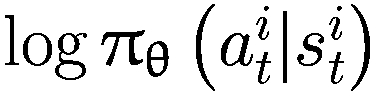，根据轨迹的总奖励 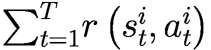 来权衡概率，然后计算加权量的负对数似然（NLL，或交叉熵损失），这给出了方程 8-20 中的表达式。这与在监督学习设置中训练多类分类模型的方案类似。唯一的区别是使用轨迹奖励来权衡对数概率。当动作是离散的时，你将采取这种方法。你在 PyTorch 中实现的损失如下：

![$$ {L}_{\mathrm{cross}-\mathrm{entropy}}\left(\uptheta \right)=-1\cdotp \frac{1}{N}{\sum}_{i=1}^N\left[\left({\sum}_{t=1}^T\log {\uppi}_{\uptheta}\left({a}_t^i|{s}_t^i\right)\right)\left({\sum}_{t=1}^Tr\left({s}_t^i,{a}_t^i\right)\right)\right] $$](../images/502835_2_En_8_Chapter/502835_2_En_8_Chapter_TeX_Equ20.png)

(8-20)

注意，PyTorch（以及其他自动微分库）通过在损失负方向上迈出一步来最小化损失。并且注意，由于方程 8-20 中存在一个 -1 的因子，方程 8-20 的负梯度是方程 8-19 的正梯度。因此，在梯度负方向上迈出一步是增加方程 8-19 中 *J*[(θ)] 值的方向。通过扩展，这增加了实际目标函数 *J*(θ) 的值，如方程 8-6 所示，它是每集回报的平均值。

在查看动作空间离散时的公式之后，你现在可以将注意力转向连续动作空间下的公式。如本章前面所述，由 *θ* 参数化的模型将状态 *s* 作为输入并产生多元正态分布的均值 *μ*。这考虑了正态分布的方差已知且固定为某个小值的情况，例如 σ²*I*[*d*]。

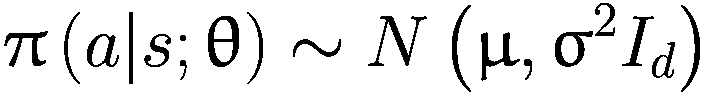

假设对于状态 ，模型产生的均值是 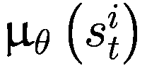。那么  的值由以下给出：

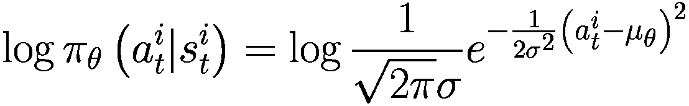

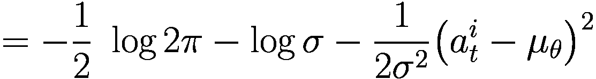

(8-21)

在前面的表达式中，唯一依赖于模型参数 *θ* 的值是 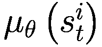。现在对等式 8-21 关于 *θ* 求梯度。你得到以下结果：

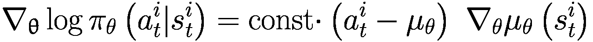

(8-22)

要在 PyTorch、JAX 或 TensorFlow 中实现这一点，您将形成一个修改后的均方误差，就像您在之前的离散动作案例中所采取的方法一样。您找到一个导数将产生上述 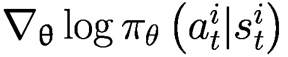 表达式的表达式。通过观察等式 8-22，您可以找到一个表达式，如等式 8-23 所示，其导数将等于等式 8-22 中的导数。

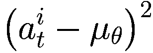

(8-23)

现在您将均方误差与轨迹回报相权衡，这将形成您在 PyTorch 中实现的损失方程，如等式 8-24 所示。

![$$ {L}_{MSE}\left(\uptheta \right)=\kern0.75em \frac{1}{N}{\sum}_{i=1}^N\left[\left({\sum}_{t=1}^T{\left({a}_t^i-{\mu}_{\theta}\right)}²\right)\left({\sum}_{t=1}^Tr\left({s}_t^i,{a}_t^i\right)\right)\right] $$](../images/502835_2_En_8_Chapter/502835_2_En_8_Chapter_TeX_Equ24.png)

(8-24)

再次注意，使用 *L**MSE* 的梯度，然后沿着梯度的负方向进行一步，将产生以下表达式：

![$$ -{\nabla}_{\theta }{L}_{MSE}\left(\uptheta \right)=\kern0.75em \frac{1}{N}{\sum}_{i=1}^N\left[\left({\sum}_{t=1}^T\left({a}_t^i-{\mu}_{\theta}\right)\ {\nabla}_{\theta }\ {\mu}_{\theta}\left({s}_t^i\right)\right)\left({\sum}_{t=1}^Tr\left({s}_t^i,{a}_t^i\right)\right)\right] $$](../images/502835_2_En_8_Chapter/502835_2_En_8_Chapter_TeX_Equ25.png)

(8-25)

在 −∇[*θ*]*L**MSE* 方向上的一个步长，等同于在 ∇[θ]*J*(θ) 方向上的一个步长，如等式 8-19 所示。这一步增加了等式 8-6 中 *J*(*θ*) 的值，即最大化策略的回报。

总结一下，在 PyTorch 等自动微分库中的实现要求你在离散动作空间中形成交叉熵损失，在连续动作空间中形成均方损失，其中损失项由该轨迹的总回报加权。这与你在监督学习中所采取的方法类似，只是额外的一步是按照轨迹回报加权！$$ \left({s}_t^i,{a}_t^i\right) $$。这类似于你在监督学习中所采取的方法，只是额外的一步是按照轨迹回报加权！$$ r\left({\uptau}^i\right)={\sum}_{t=1}^Tr\left({s}_t^i,{a}_t^i\right) $$。

再次强调，记住*加权交叉熵损失*或*加权均方损失*没有物理意义或重要性。它只是一个方便的表达式，允许你使用 PyTorch 的自动微分功能通过反向传播计算梯度，然后采取一步来改进策略。与这种方法相比，在监督学习中，损失确实表示预测的质量。在监督学习中，较低的损失意味着模型可以做出准确的预测。然而，在强化学习的策略梯度场景中，加权损失并没有这样的推断或意义。这就是为什么它们被称为伪损失/目标。

### 基于奖励的方差减少

方程 8-16 中推导出的表达式，如果以当前形式使用，存在一个问题。它具有高方差。你现在将利用问题的时序性质来执行一些方差减少。

当你滚动策略（即按照策略采取行动）以产生轨迹时，你计算轨迹的总奖励*r*(τ)。如方程 8-16 所示，轨迹中每个动作的概率项都由这个轨迹奖励加权。

然而，当智能体与环境交互时，世界是因果的。在时间步长*t*采取的动作，例如，只能影响该动作之后的奖励。在时间步长*t*之前看到的奖励不会受到你在时间步长*t*或任何后续动作采取的动作的影响。未来的动作不能影响过去的奖励。你将使用这个属性来删除方程 8-16 中的某些项。这将有助于你减少方差。

你可能会问为什么？记住，你正在使用样本轨迹作为期望轨迹奖励的蒙特卡洛估计。轨迹中的每个动作都来自一个概率分布。方程 8-16 中第一个求和项是将这些随机变量的所有样本相加。从基本的概率论知识，你知道当你将更多的随机变量添加到现有的随机变量序列中时，总和的总方差将线性增长。因此，通过删除不相关的项，你有助于减少序列的长度和方差。

在因果世界假设下推导修正公式的步骤在此展示。请注意，这并不是一个严格的数学证明。

从方程 8-15 开始。

![$$ {\nabla}_{\uptheta}J\left(\uptheta \right)={E}_{\uptau \sim {p}_{\uptheta}\left(\uptau \right)}\left[\left({\sum}_{t=1}^T{\nabla}_{\uptheta}\log {\uppi}_{\uptheta}\left({a}_t|{s}_t\right)\right)\left({\sum}_{t=1}^Tr\left({s}_t,{a}_t\right)\right)\right] $$](../images/502835_2_En_8_Chapter/502835_2_En_8_Chapter_TeX_Equs.png)

现在将奖励项的求和索引从 *t* 改为 *t*^′，并将奖励求和项移到策略 π[θ] 的第一个动作求和内部。这给出了以下表达式：

![$$ {\nabla}_{\uptheta}J\left(\uptheta \right)={E}_{\uptau \sim {p}_{\uptheta}\left(\uptau \right)}\left[\left({\sum}_{t=1}^T\left({\nabla}_{\uptheta}\log {\uppi}_{\uptheta}\left({a}_t|{s}_t\right){\sum}_{t^{\prime }=1}^Tr\left({s}_{t^{\prime }},{a}_{t^{\prime }}\right)\right)\right)\right] $$](../images/502835_2_En_8_Chapter/502835_2_En_8_Chapter_TeX_Equt.png)

在 *t* 的索引求和内部，您将时间 *t* 之前的奖励项丢弃。在时间 *t*，您采取的动作只能影响时间 *t* 以及之后到来的奖励。这导致第二个内部求和从 *t*^′ = *t* 开始，而不是从 *t*^′ = 1 开始。修正后的表达式如下：

![$$ {\nabla}_{\uptheta}J\left(\uptheta \right)={E}_{\uptau \sim {p}_{\uptheta}\left(\uptau \right)}\left[\left({\sum}_{t=1}^T\left({\nabla}_{\uptheta}\log {\uppi}_{\uptheta}\left({a}_t|{s}_t\right){\sum}_{t^{\prime }=t}^Tr\left({s}_{t^{\prime }},{a}_{t^{\prime }}\right)\right)\right)\right] $$](../images/502835_2_En_8_Chapter/502835_2_En_8_Chapter_TeX_Equu.png)

内部求和  已不再是轨迹的总奖励。相反，它是从时间 *t* 到 *T* 的剩余轨迹的奖励。如您所回忆的那样，这仅仅是当前策略在状态-动作对 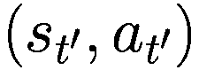 时的 q 值的样本。一个策略的 q 值是在时间 *t* 从状态 *s*[*t*] 开始采取一步/动作 *a*[*t*] 后，直到结束的预期奖励。您也可以称之为 *剩余奖励*。由于表达式 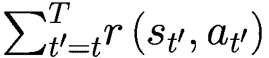 仅针对一条轨迹，因此您将其表示为预期剩余奖励的单个样本估计。更新的梯度方程如下：

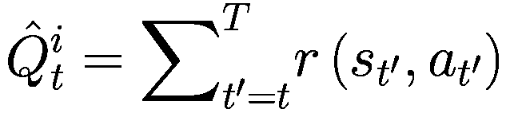

(8-26)

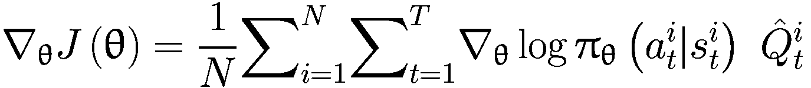

(8-27)

要在 PyTorch 中使用此方程，你只需要对图 8-2 中的朴素 REINFORCE 算法进行一些修改。现在，你将用那个时间步的奖励到去而不是总轨迹奖励来权衡每个对数概率项。图 8-4 展示了使用奖励到去的修改后的 REINFORCE 算法。

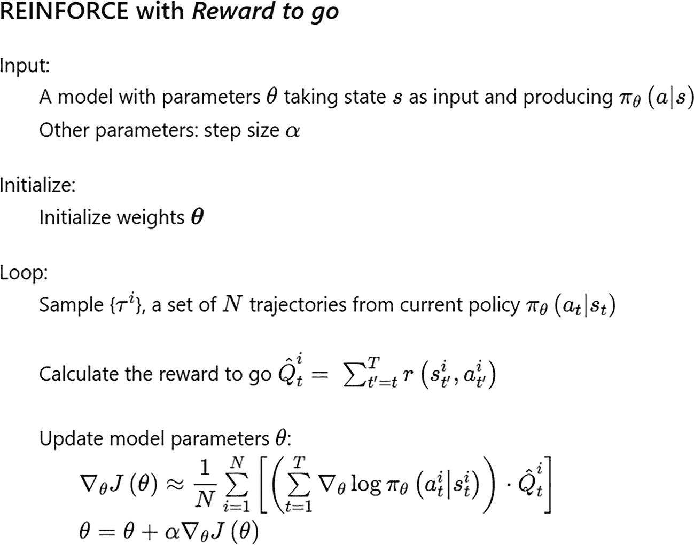

一种具有奖励到去的 R E I N F O R C E 方差减少算法。它包括输入、初始化、循环和模型参数。

图 8-4

使用奖励到去的 REINFORCE 算法

到目前为止，本章你已经做了很多理论，数学公式有点多。我已经尽量保持其最小化，如果从到目前为止的章节中有一个要点的话，那就是图 8-4 中的 REINFORCE 算法。现在让我们将这个方程应用到实践中。你将实现从图 8-4 到通常的 `CartPole` 问题，该问题具有连续状态空间和离散动作。

在此之前，我想介绍一个最后的数学术语。策略梯度算法中状态动作空间的探索来自于你学习了一个随机策略，该策略为给定状态的所有动作分配一些概率，而不是像 DQN 那样选择最佳可能动作。为了确保探索得以维持，并确保 πθ 不会以高概率塌缩为单个动作，你引入了一个称为 *熵* 的正则化项。

分布 *X* ∼ *p*(X) 的熵定义为如下：

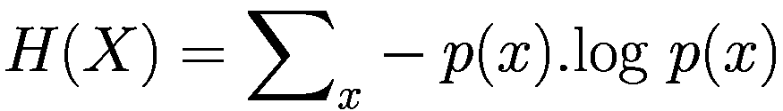

(8-28)

为了保持足够的探索，你希望概率分布是分散的，不要让概率分布过早地集中在单个值或小区域内。分布的分散程度越大，分布的熵 H(x) 就越高。因此，输入 PyTorch 最小化器的项如下：

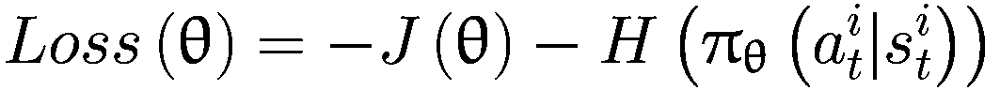

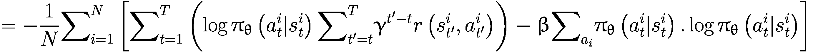

(8-29)

在这个代码示例中，你只取了一条轨迹，即*N* = 1。然而，你将平均这些动作的数量以获得平均损失。你将要实现的函数如下：

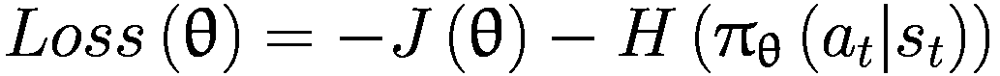


(8-30)

其中，


注意，折现因子γ在之前的表达式中被重新引入。你之前为了减少推导过程中的项的负担而省略了γ，现在为了实际实现而将其重新引入。γ的作用在章节的开头已经解释过了。

通过这个，你现在已经完成了实现第一个策略梯度算法的所有机械，该算法以 REINFORCE 和奖励到行为的形式。现在，你将查看一个实现示例以及它是如何用于训练在 cart-world gymnasium 环境中的代理的。

现在我们来逐步分析实现过程。你可以在`8.a-reinforce.ipynb`笔记本中找到完整的代码。我在前面的章节中解释了`CartPole`环境。它有一个四维的连续状态空间和两个动作的离散动作空间：向左移动和向右移动。你首先定义一个简单的策略网络，包含一个有 192 个单位的隐藏层和 ReLU 激活函数。最终输出没有激活函数。列表 8-1 展示了代码。

```py
model = nn.Sequential(
nn.Linear(state_dim,192),
nn.ReLU(),
nn.Linear(192,n_actions),
)
Listing 8-1
Policy Network in PyTorch
```

接下来，你定义一个`generate_trajectory`函数，它接受当前的策略来生成一个`(states, actions, rewards)`轨迹，用于一个回合。它使用一个名为`predict_probs`的辅助函数来完成这个任务。你将在`predict_probs`函数中使用`torch.no_grad`来避免在 PyTorch 训练步骤中额外累积梯度。列表 8-2 展示了代码。它从初始化环境开始，然后依次按照当前策略执行步骤，直到达到 1,000 步或当前回合结束，以先到者为准。它返回在回合期间观察到的`(states, actions, rewards)`元组的列表。

```py
def generate_trajectory(env, n_steps=1000):
"""
Play a session and generate a trajectory
returns: arrays of states, actions, rewards
"""
states, actions, rewards = [], [], []
# initialize the environment
s, _ = env.reset()
#generate n_steps of trajectory:
for t in range(n_steps):
action_probs = predict_probs(np.array([s]))[0]
#sample action based on action_probs
a = np.random.choice(n_actions, p=action_probs)
next_state, r, done, _, _ = env.step(a)
#update arrays
states.append(s)
actions.append(a)
rewards.append(r)
s = next_state
if done:
break
return np.array(states), np.array(actions), np.array(rewards)
def predict_probs(states):
"""
params: states: [batch, state_dim]
returns: probs: [batch, n_actions]
"""
states = torch.tensor(np.array(states), device=device, dtype=torch.float32)
with torch.no_grad():
logits = model(states)
probs = nn.functional.softmax(logits, -1).detach().numpy()
return probs
Listing 8-2
generate_trajectory and predict_probs from 8.a-reinforce.ipynb
```

您还有一个辅助函数，可以将单个步骤的回报  转换为奖励到去，按照以下表达式：。您使用一个从末尾开始的循环，在每一步计算带有折扣因子的累积和，同时从列表的末尾到开头。还有许多其他高效的方法可以做到这一点。看看您是否能想到其他矢量化方法来完成这个任务。作为一个提示，请检查 PyTorch 中 `cumsum` 函数的文档。列表 8-3 包含了这个函数的实现。

```py
def get_rewards_to_go(rewards, gamma=0.99):
T = len(rewards) # total number of individual rewards
# empty array to return the rewards to go
rewards_to_go = [0]*T
rewards_to_go[T-1] = rewards[T-1]
for i in range(T-2, -1, -1): #go from T-2 to 0
rewards_to_go[i] = gamma * rewards_to_go[i+1] + rewards[i]
return rewards_to_go
Listing 8-3
get_rewards_to_go from 8.a-reinforce.ipynb
```

您现在可以开始实现训练了。您构建将要输入 PyTorch 优化器的损失函数。如前所述，您将实现方程 8-29 中给出的表达式。列表 8-4 包含了用于单个训练步骤的代码。如前所述，我添加了一个表示动作概率分布熵的额外项。这防止策略塌缩为单个动作。熵使用以下表达式计算：*H*(*X*) = ∑[*x*] − *p*(*x*)。 *log p*(*x*)。该函数接受在轨迹中观察到的 (`states, actions, rewards`) 的元组，计算后续的奖励到去，然后计算训练损失，该损失由加权交叉熵损失和熵组成。优化器使用损失来改进神经网络的参数。

```py
#init Optimizer
optimizer = torch.optim.Adam(model.parameters(), lr=1e-3)
def train_one_episode(states, actions, rewards, gamma=0.99, entropy_coef=1e-2):
# get rewards to go
rewards_to_go = get_rewards_to_go(rewards, gamma)
# convert numpy array to torch tensors
states = torch.tensor(states, device=device, dtype=torch.float)
actions = torch.tensor(actions, device=device, dtype=torch.long)
rewards_to_go = torch.tensor(rewards_to_go, device=device, dtype=torch.float)
# get action probabilities from states
logits = model(states)
probs = nn.functional.softmax(logits, -1)
log_probs = nn.functional.log_softmax(logits, -1)
log_probs_for_actions = log_probs[range(len(actions)), actions]
#Compute loss to be minimized
J = torch.mean(log_probs_for_actions*rewards_to_go)
H = -(probs*log_probs).sum(-1).mean()
loss = -(J+entropy_coef*H)
optimizer.zero_grad()
loss.backward()
optimizer.step()
return loss.detach().cpu() #to show progress on training
Listing 8-4
Training for One Trajectory from 8.a-reinforce.ipynb
```

您现在可以开始进行训练了。列表 8-5 展示了如何对智能体进行 10,000 步的训练，并随着训练的进行绘制进度图。一旦您达到平均奖励 500，就可以停止训练。代码初始化了两个数组来跟踪每集的回报和损失。在循环内部，它遵循一个简单的流程，如图 8-4 中所示的 REINFORCE 带有奖励到去的算法所述。在循环的末尾，代码会定期检查智能体的性能，如果每集的平均分数超过 500，则停止训练。此外，还有代码通过显示每集的回报图和训练过程中的训练损失图来绘制性能。

```py
loss_history = []
return_history = []
for i in range(5000):
states, actions, rewards = generate_trajectory(env)
loss = train_one_episode(states, actions, rewards)
# return_history.append(np.sum(rewards))
loss_history.append(loss)
if i != 0 and i % eval_freq == 0:
mean_return = np.mean(return_history[-eval_freq:])
if mean_return > 500:
break
if i != 0 and i % eval_freq == 0:
# eval the agent
eval_env = make_env(env_name)
return_history.append(
evaluate(eval_env, model)
)
eval_env.close()
clear_output(True)
plt.figure(figsize=[16, 5])
plt.subplot(1, 2, 1)
plt.title("Mean return per episode")
plt.plot(return_history)
plt.grid()
assert not np.isnan(loss_history[-1])
plt.subplot(1, 2, 2)
plt.title("Loss history (smoothened)")
plt.plot(smoothen(loss_history))
plt.grid()
plt.show()
env.close()
Listing 8-5
Training the Agent from 8.a-reinforce.ipynb
```

到训练结束时，智能体已经学会了很好地平衡杆子。您还会注意到，与基于 DQN 的方法相比，程序需要更少的迭代和更少的时间来实现这一结果。图 8-5 展示了训练过程中观察到的图表。


两条线图。左图绘制了平均回报集，y 轴范围从 0 到 2000，x 轴范围从 0 到 300。右图绘制了损失历史。y 轴范围从 0 到 30，x 轴范围从 0 到 3000。它们表现出波动趋势。

图 8-5

从 8.a-reinforce.ipynb 的训练进度

如从图 8-5 中可以观察到的，训练非常不稳定，每集的回报波动很大。你可以尝试调整超参数，例如通过`entropy_coef`赋予动作熵的相对权重，概率分布函数中的数量，训练步数，网络等。你可以手动调整这些参数，或者使用第六章中解释的 Optuna。

这将你带到 REINFORCE 算法部分的结尾。请注意，REINFORCE 是一个**on-policy**算法。在每一步训练之后，你将重新生成一个新的轨迹，丢弃上一个轨迹的观察结果。对于像`CartPole`这样的环境，这无关紧要。然而，对于生成样本成本较高的环境，在每个轨迹结束时丢弃观察结果是非常低效的。你需要进一步探索并定义 off-policy 方法。

## 使用基线进一步减少方差

从方程 8-15 中的原始策略梯度更新表达式开始，你使用方程 8-16 中的平均值将期望转换为估计。随后，你学习了如何通过考虑奖励到达而不是完整轨迹奖励来减少方差。具有奖励到达的表达式在方程 8-27 中给出。

在本节中，你将看到另一个使策略梯度更加稳定的改变。考虑一下动机。假设你已经执行了三个遵循策略的轨迹的 rollout。假设轨迹的回报分别是 300、200 和 100。为了简化解释，考虑总奖励和总轨迹概率的梯度更新方程，如方程 8-10 所示，此处重新呈现：


梯度更新将如何操作？它将第一个轨迹的日志概率梯度乘以 300，第二个轨迹乘以 200，第三个轨迹乘以 100。这意味着这三个轨迹的概率将以不同的数量增加。图 8-6 展示了这一过程的图示。


一个多行图绘制了实际轨迹奖励随时间的变化。集的回报是 300、200 和 100。概率和更新后的概率曲线最初呈上升趋势，然后下降。

图 8-6

具有实际轨迹奖励的策略的梯度更新

如图 8-6 所示，你通过不同的加权因子增加了所有三个轨迹的概率，所有+ve 权重，使得所有轨迹的概率都上升。理想情况下，你会增加回报为 300 的轨迹的概率，并减少回报为 100 的轨迹的概率，因为它不是一个很好的轨迹。你希望策略改变，使其不会太频繁地生成回报为 100 的轨迹。然而，使用当前的方法，修正后的概率曲线正在变得平坦，因为它试图增加所有三个轨迹的概率，并且由于它是一个概率曲线，其下总面积必须为 1。

让我们考虑一个场景，你从每个奖励中减去三个轨迹的平均回报，即(300 + 200 + 100)/3 = 200。你得到修正后的轨迹回报为 100、0 和-100（300-200；200-200；100-200）。让我们使用修正后的轨迹回报作为权重来进行梯度更新。图 8-7 显示了这种更新的结果。你可以看到，随着其在 x 轴上的分布减少，概率曲线变得越来越窄和尖锐。


多行图绘制了实际轨迹奖励随时间的变化。一期的回报为 100、0 和-100。概率和更新后的概率曲线最初呈上升趋势，然后下降。

图 8-7

具有通过基线减少的轨迹奖励的策略的梯度更新

使用基线减少奖励可以减少更新的方差。在极限情况下，无论你是否使用基线，结果都将相同。引入基线不会改变最优解。它只是减少了方差并加快了学习速度。我将从数学上证明引入基线不会改变梯度更新的期望值。基线可以是所有轨迹和轨迹中所有步骤的固定基线，也可以是一个随状态变化的量。*然而，它不能依赖于动作。*让我们首先通过以下推导来了解基线是状态函数的情况 。

将方程 8-15 更新以引入基线。

![${\nabla}_{\uptheta}J\left(\uptheta \right)={E}_{\uptau \sim {p}_{\uptheta}\left(\uptau \right)}\left[\left({\sum}_{t=1}^T{\nabla}_{\uptheta}\log {\uppi}_{\uptheta}\left({a}_t|{s}_t\right)\right)\left(r\left(\tau \right)-\mathrm{b}\Big({\mathrm{s}}_t\right)\Big)\right]$](../images/502835_2_En_8_Chapter/502835_2_En_8_Chapter_TeX_Equz.png)

将*b*(*s*[*t*])项单独列出并评估其期望值。


现在利用期望的线性性质将第一个内部求和项移出，以获得表达式。


你已经将期望从 τ ∼ *p*θ 转换为 a[*t*] ∼ πθ。这是因为你将第一个内部求和项移出了期望之外，之后，唯一依赖于概率分布的项是具有概率 πθ 的动作 *a*[*t*]]。

现在只需关注内部期望：。你可以将其写成积分形式，如下所示：


由于 *b*(*s*[*t*]) 不依赖于 *a*[*t*]，你可以将其提出。再次，由于积分的线性性质，你可以交换梯度与积分。现在积分将等于 1，因为这是使用 πθ 的曲线计算出的总概率。因此，你得到以下结果：


之前的推导表明，减去依赖于状态或常数的基线不会改变期望值。*条件是它不应依赖于动作 a*[*t*]。

因此，带有基线的 REINFORCE 将按照以下方式进行更新：


(8-31)

您可以使用因果世界的相同推理进一步修改和组合“到达奖励”，在这个世界中，今天的动作不会影响过去的奖励，而只会影响当前和未来的奖励。您可以将方程 8-31 和 8-27 结合起来得到以下方程组：


(8-32)

方程 8-32 是带有基线和到达奖励的 REINFORCE。您使用了两个技巧来减少原始 REINFORCE 的方差。您使用时间结构来移除过去不受当前动作影响的奖励。然后您使用基线，使不良策略获得负奖励，而良好策略获得正奖励。这两个技巧都导致学习过程中的方差降低。

注意，REINFORCE 及其所有变体都是 *on-policy 算法*。在策略的权重更新后，您需要推出新的轨迹。旧的轨迹不再代表旧策略。这是像基于值函数的 on-policy 方法一样，REINFORCE 样本效率低下的原因之一。您不能使用早期策略的转换。您必须在每次权重更新后丢弃它们并生成新的转换。

## Actor-Critic 方法

在本节中，您将通过结合策略梯度与值函数来进一步优化算法，得到所谓的 *actor-critic* 算法系列（A2C/A3C）。您首先定义一个称为 *优势 A*(*s*, *a*) 的术语。

### 定义优势

我首先讨论方程 8-32 中的表达式 。它是给定轨迹 (*i*) 和给定状态 *s*[*t*] 中的“到达奖励”：


为了评估这个表达式中的  值，你使用蒙特卡洛模拟。换句话说，你将从这个时间步 *t* 到结束的所有奖励加起来，即直到 *T*。由于它只是期望的一个轨迹估计，所以它将再次具有高方差。在之前关于无模型策略学习的章节中，你看到 MC 方法具有零偏差但高方差。相比之下，TD 方法有一些偏差但方差低，并且由于方差低，可以导致更快地收敛。你在这里也能做类似的事情吗？这个“到达奖励”是什么？表达式  的期望是什么？这不过是状态-动作对 (*s*[*t*], *a*[*t*]) 的 q 值。如果你能访问 q 值，你可以用 q 估计值替换单个奖励的总和。


(8-33)

让我们将 *q*(*s*[*t*], *a*[*t*]) 的值向前滚动一个时间步。这与第五章中提到的 *TD*(0) 方法类似。你可以将  写成如下形式：


(8-34)

这是不折扣的滚动。正如本章开头所讨论的，你将在有限时间范围的不折扣设置中进行所有推导。分析可以很容易地扩展到其他设置。在算法的最终伪代码中，你将切换到更一般的情况，同时将分析限制在不折扣的情况下。

再次查看方程式 8-33，你能想到一个可以使用的良好基线  吗？使用状态值  如何？正如解释的那样，你可以使用任何值，因为提供的基线不依赖于动作 。


(8-35)

使用前面的表达式：


(8-36)

右侧被称为优势 。这是通过在状态  下遵循策略采取步骤  而获得的额外利益/奖励，该步骤给出了  的奖励，与在给定策略下状态  下获得的平均奖励  相比。现在，你可以将方程式 8-34 代入 8-36 中，得到以下结果：


(8-37)

你对基本强化算法方程所做的修改将为学习过程带来显著的好处。这些变化构成了被称为 *优势演员-评论家* 算法集的基础，你将在下一节学习。

### 优势演员-评论家 (A2C)

从上一节继续，你可以重新写方程 8-32 中给出的梯度更新。以下是方程 8-32 中的原始梯度更新：

![$$ {\nabla}_{\uptheta}J\left(\uptheta \right)=\frac{1}{N}{\sum}_{i=1}^N{\sum}_{t=1}^T{\nabla}_{\uptheta}\log {\uppi}_{\uptheta}\left({a}_t^i|{s}_t^i\right)\ \left[\hat{Q}\left({s}_t^i,{a}_t^i\right)-b\left({s}_t^i\right)\right] $$](../images/502835_2_En_8_Chapter/502835_2_En_8_Chapter_TeX_Equam.png)

代入方程 8-35 中的 ，你得到以下结果：

![$$ {\nabla}_{\uptheta}J\left(\uptheta \right)=\frac{1}{N}{\sum}_{i=1}^N{\sum}_{t=1}^T{\nabla}_{\uptheta}\log {\uppi}_{\uptheta}\left({a}_t^i|{s}_t^i\right)\ \left[\hat{Q}\left({s}_t^i,{a}_t^i\right)-V\left({s}_t^i\right)\right] $$](../images/502835_2_En_8_Chapter/502835_2_En_8_Chapter_TeX_Equ38.png)

(8-38)

看一下内层表达式 。*Q* 是使用当前策略跟随特定步骤 *a*[*t*] 的值。换句话说，*actor* 和 *V* 是当前策略的平均值，即 *critic*。*actor* 试图最大化奖励，而 *critic* 告诉算法该特定步骤相对于当前平均值的优劣。*actor-critic* 方法是一系列算法，其中 *actor* 使用策略梯度来改进动作，而 *critic* 通知算法当前策略的好坏。你有   作为特定动作  在当前策略下的状态值优势。

处理  有两种方法。你可以使用以下原始定义：


这是 MC 方法，其中你评估奖励到去作为单次运行的样本估计。由于你基于单次运行进行估计，因此具有高方差。在 MC 方法下，演员-评论家算法的梯度更新采用以下形式：


(8-39)

或者你可以采用*TD*(0)方法，如方程 8-34 所示，其中。*TD*(0)方法将带你到方程 8-37，如下所示：


你将这个代入梯度更新方程 8-32，以获得演员-评论家的梯度更新，如下更新方程：


(8-40)

这个表达式是你将实现更新的原因，它被称为*优势演员-评论家*（A2C）。请注意，演员-评论家是一系列方法，其中 A2C 和 A3C 是它的两个具体实例。有时在文献中，演员-评论家也互换地被称为 A2C。同时，一些论文将 A2C 称为 A3C 的同步版本，我将在下一节中讨论。

你必须有两个估计器。一个是具有参数θ的策略网络πθ，另一个是具有参数ϕ的网络来估计*V*ϕ。设计具有两个头部的小子网络的单个网络的一般方法——一个头部用于输出策略π，另一个用于输出状态值*V*。图 8-8 显示了这样一个网络的样本。这就是你将在代码演练中实现的架构。


演员评论家网络的网络图。它从状态 S 开始，具有 C N N 密集层，一个用于 A 2 C 伪代码优势的最终密集公共层。

图 8-8

初始层具有公共权重的演员-评论家网络

现在看看伪代码。图 8-9 展示了 Actor-Critic 算法（也称为 A2C，即优势 Actor-Critic）的完整伪代码。在一个循环中，你采样一条轨迹。你使用这条轨迹来计算剩余奖励，这将成为图 8-8 中显示的神经网络 *V*(*s*) 头的目标值。第二个产生策略 π(*a*| *s*) 的头使用优势加权的交叉熵损失进行调整，如公式 8-40 所示。请注意，在形成策略的交叉熵损失时，你也使用了由另一个头产生的 *V*(*s*) 的输出。


Actor-Critic 算法优势的说明。它包括输入、初始化、循环、拟合值函数、更新策略模型参数和执行随机梯度步骤。

图 8-9

优势 Actor-Critic 算法

图 8-9 中的伪代码使用了一步未折现的回报来计算优势 ：


有许多其他方式来表述优势 。折现的单步版本如下：


同样，折现的 n 步回报版本如下：


还有另一种方法，即使用蒙特卡洛方法。在该方法中，你直接使用剩余奖励。优势如下：


因此，你有多种方式来表述优势函数——你可以选择使用折现 *γ* 或不使用折现，这是你将在代码中实现的方式。你将实现公式 8-40 中给出的带有折现的版本，以及图 8-9 中伪代码中解释的版本。这引出了下一节，该节涵盖了 PyTorch 中 A2C 实现的代码解析。

### A2C 算法的实现

在这段代码讲解中，您将对图 8-9 中给出的 actor-critic 算法进行以下更改：

+   就像您在 REINFORCE 中所做的那样，您将引入熵正则化器。

+   您将使用奖励到去的 MC 方法，即  而不是 TD(0)方法 

+   而不是先训练第一个拟合*V*(*s*)的两个单独的损失训练步骤，然后进行策略梯度，您将形成一个单一的损失目标，该目标将执行*V*(*s*)的拟合以及策略梯度步骤，同时包含熵正则化器。

使用之前修改的 actor-critic 的损失如下：


![$$ =-\frac{1}{N}{\sum}_{i=1}^N\left[{\sum}_{t=1}^T\left(\log {\pi}_{\theta}\left({a}_t^i|{s}_t^i\right)\left[\hat{Q}\left({s}_t^i,{a}_t^i\right)-{V}_{\phi}\left({s}_t^i\right)\right]\right)-\beta {\sum}_a{\pi}_{\theta}\left(a|{s}_t^i\right).\log {\pi}_{\theta}\left(a|{s}_t^i\right)\right] $$](../images/502835_2_En_8_Chapter/502835_2_En_8_Chapter_TeX_Equau.png)

就像 REINFORCE 一样，您将在每条轨迹之后执行权重更新。因此，在先前的方程中，N 将等于 1。相反，您将平均它到动作的数量以获得平均损失。您将实现的函数如下：

![$$ Loss\left(\uptheta, \upphi \right)=-\frac{1}{T}\left[{\sum}_{t=1}^T\left(\log {\uppi}_{\uptheta}\left({a}_t|{s}_t\right)\left[\hat{Q}\left({s}_t,{a}_t\right)-{V}_{\upphi}\left({s}_t\right)\right]\right)-\upbeta {\sum}_a{\uppi}_{\uptheta}\left(a|{s}_t\right).\log {\uppi}_{\uptheta}\left(a|{s}_t\right)\right] $$](../images/502835_2_En_8_Chapter/502835_2_En_8_Chapter_TeX_Equav.png)

现在将您的注意力转向实际的 PyTorch 代码，您可以在`8.b-action_critic.ipynb`中找到它。让我们首先谈谈网络。您将有一个具有共享权重的联合网络，一个产生策略动作概率，另一个产生状态值。对于`CartPole`，它是一个简单的网络，如图 8-10 所示。


状态 s 的网络图，对于批量 1 和批量 2 的密集型。

图 8-10

来自 8.b-action_critic.ipynb 的 CartPole 环境 actor-critic 网络

列表 8-6 展示了该网络在 PyTorch 中的实现。它是对网络的直接实现，如图 8-10 所示。`CartPole` 的状态维度为 4。这个输入通过一个输出为 128 个单位的公共层，在代码中由 `self.fc1` 表示。这个层的输出随后通过两个独立的网络。一个是与动作数量相匹配的线性层，在代码中由 `self.actor` 密集层表示。另一个输出产生状态值 V(s)，由于状态值是一个标量量，其维度为 1。这个层在列表中标记为 `self.critic`。

```py
class ActorCritic(nn.Module):
def __init__(self):
super(ActorCritic, self).__init__()
self.fc1 = nn.Linear(state_dim, 128)
self.actor = nn.Linear(128,n_actions)
self.critic = nn.Linear(128,1)
def forward(self, s):
x = F.relu(self.fc1(s))
logits = self.actor(x)
state_value = self.critic(x)
return logits, state_value
model = ActorCritic()
Listing 8-6
Actor-Critic Network in PyTorch from 8.b-actor_critic.ipynb
```

另一个重大变化是您实现单个剧集训练代码的方式。它与列表 8-4 中 REINFORCE 的代码类似；然而，引入 *V*(*s*[*t*]) 作为基线值。列表 8-7 提供了 `train_one_episode` 的完整代码。您首先计算奖励到结束。接下来，将 (`状态，动作，奖励`) 的元组列表转换为适当的张量格式。然后，状态通过网络传递，产生状态值 *V*(*s*) 和 logπθ。这些值用于计算损失，如前所述。您还添加了动作分布的熵作为惩罚，以确保动作概率不会塌缩为单个动作。

```py
def train_one_episode(states, actions, rewards, gamma=0.99, entropy_coef=1e-2):
# get rewards to go
rewards_to_go = get_rewards_to_go(rewards, gamma)
# convert numpy array to torch tensors
states = torch.tensor(states, device=device, dtype=torch.float)
actions = torch.tensor(actions, device=device, dtype=torch.long)
rewards_to_go = torch.tensor(rewards_to_go, device=device, dtype=torch.float)
# get action probabilities from states
logits, state_values = model(states)
probs = nn.functional.softmax(logits, -1)
log_probs = nn.functional.log_softmax(logits, -1)
log_probs_for_actions = log_probs[range(len(actions)), actions]
advantage = rewards_to_go - state_values.squeeze(-1)
#Compute loss to be minimized
J = torch.mean(log_probs_for_actions*(advantage))
H = -(probs*log_probs).sum(-1).mean()
loss = -(J+entropy_coef*H)
optimizer.zero_grad()
loss.backward()
optimizer.step()
return loss.detach().cpu() #to show progress on training
Listing 8-7
train_one_episode for Actor-Critic Using MC Rewards-To-Go in PyTorch
```

注意，训练多个轨迹的代码与之前相同。训练过程中每一步的回报和损失曲线如图 8-11 所示。将此图中的图表与图 8-5 中 REINFORCE 的图表进行比较，你可以看到使用 A2C 的训练速度更快，并且政策向更好方向稳步进展。


两条线图。左图，绘制了平均回报剧集。y 轴范围从 0 到 3000，x 轴范围从 0 到 70。它表现出向上的波动趋势。右图，绘制了损失历史。y 轴范围从 -10 到 20，x 轴范围从 0 到 600。它表现出向上的波动趋势。

图 8-11

从 8.a-action_critic.ipynb 训练 A2C 进度

注意，演员-评论家也是一种 *on-policy* 方法，就像 REINFORCE 一样。

### 异步优势演员-评论家

在 2016 年，论文“异步深度强化学习方法”的作者^([1))引入了 A2C 的异步版本。基本思想很简单。你有一个全局服务器，它是“参数”服务器，提供网络参数*θ*和*ϕ*。有多个演员-评论员代理并行运行。每个演员-评论员代理从服务器获取参数，执行轨迹回放，并在*θ*，*ϕ*上进行梯度更新。代理将参数更新回服务器。这允许更快的学习，尤其是在使用模拟器（如机器人环境）的环境中。你可以首先使用 A3C 在模拟器的多个实例上训练一个算法。随后的学习是在真实环境中的物理机器人上进一步微调/训练算法。

图 8-12 展示了 A3C 的高级示意图。请注意，这是一个对方法简单化的解释。对于实际实现细节，建议您详细参考所引用的论文。


一个全局服务器的异步优势演员评论员（actor critic）的示例。它由状态 s 的网络、代理 1、代理 i、代理 n、刺激器 1、刺激器 i 和刺激器 n 组成。

图 8-12

异步优势演员-评论员（A3C）

如所述，一些论文将多个代理一起训练的同步版本称为 A3C 的 A2C 版本，即没有异步部分的 A3C。然而，有时一个代理的演员-评论员也被称作*优势演员-评论员*（A2C）。最终，演员-评论员是一系列算法，其中你使用两个网络一起：一个价值网络来估计*V*(*s*)，一个策略网络来估计策略πθ。你正在利用两者的优点：基于价值的方法和策略梯度方法。

接下来，你将了解一些其他策略算法的方法。这些方法及其变体被认为是当前最先进的，特别是 PPO 算法。PPO 已被用于大型语言模型中，以微调模型以实现安全性、指令和模仿人类偏好。这种方法被称为 RLHF（带人类反馈的强化学习）。我将在未来的章节中详细介绍这一内容。

## Trust Region Policy Optimization Algorithm

本章详细阐述的方法也被称为*香草策略梯度*（VPG）。使用 VPG 训练的策略是一个具有探索性的随机策略，它不需要显式地使用ε-greedy 探索。随着训练的进行，策略分布变得更加尖锐，集中在最优动作上。即使使用了熵惩罚项，这也可能发生，因为你可以添加的惩罚量是有限的。如果你给熵惩罚项赋予过多的权重，模型将受到显著约束，并开始对所有可能动作产生均匀分布的概率。

策略的峰值开始减少探索，使算法越来越多地利用它所学到的东西。这可能导致策略陷入局部最大值。使用熵作为正则化/惩罚并不是唯一的方法。

正如你在前几节中看到的策略梯度方法中，特别是在方程 8-17 中，你通过以下方程以一小量更新策略参数：


换句话说，梯度是在旧策略参数θ = θ[old]处评估的，然后通过以下步骤大小*α*进行更新。VPG 试图通过限制策略参数从θ[old]到θ[new]的变化来保持新旧策略在参数空间中的接近，使用学习率*α*。然而，仅仅因为策略参数接近，并不能保证新旧策略（即动作概率分布）在概率空间中接近。参数θ的微小变化可能导致策略概率的显著差异。理想情况下，你应该在概率空间中而不是在参数空间中保持新旧策略的接近。这是 2015 年发表的论文“信任域策略优化”的作者详细阐述的关键洞察。2 在深入细节之前，我花了几分钟时间讨论一个称为库尔巴克-利布勒散度（KL 散度）的度量。

库尔巴克-利布勒散度（KL 散度）

KL 散度是衡量两个概率差异的度量。它来自信息论领域，深入探讨它需要一本自己的书。我仅尝试解释公式和一些背后的直觉，而不涉及数学证明。

假设您有两个离散概率分布 *P* 和 *Q*，它们定义在某个值域上（称为 *支持*）。让支持是“*x*”从 1 到 6，就像掷骰子的例子一样。*P**X* 使用概率分布 *P* 定义 *X* = *x* 的概率。同样，您还有一个在相同支持上定义的另一个概率分布 *Q*。作为一个例子，考虑一个有六个面且概率分布的骰子。

| *x* | 1 | 2 | 3 | 4 | 5 | 6 |
| --- | --- | --- | --- | --- | --- | --- |
| *P*(*x*) | 1/6 | 1/6 | 1/6 | 1/6 | 1/6 | 1/6 |
| *Q*(*x*) | 2/9 | 1/6 | 1/6 | 1/6 | 1/6 | 1/9 |

骰子 *Q* 被加载以显示较少的 6 和更多的 1，而 *P* 是一个公平的骰子，显示任何面的概率相等。

*P* 和 *Q* 之间的 KL 散度表示如下：


(8-41)

计算前表中 *D**KL*。


您可以通过将 P = Q 来满足自己，以获得 *D**KL* = 0\. 当两个概率相等时，KL 散度是 0\. 对于任何其他两个不相等的概率分布，您总是会得到一个正值 KL 散度。分布之间的差距越大，KL 散度值就越高。有一个严格的数学证明可以证明 KL 散度总是正值，并且只有当两个分布相等时才为 0。

还要注意，KL 散度不是对称的。


KL 散度是概率空间中两个概率分布之间的一种伪度量。连续概率分布的 KL 散度公式如下所示：


(8-42)

在定义了 KL 散度的基本概念之后，现在是时候回到 TRPO 算法的讨论上了。

回到 TRPO，你需要保持新旧策略在概率空间中彼此接近，而不是在参数空间中。这意味着你希望在每次更新步骤中 KL 散度是有界的，以确保新旧策略不会相差太远。


在这里，θ[*k*] 是当前策略参数，而 θ 是更新策略的参数。

现在将注意力转向你试图最大化的目标。之前的指标 *J*(*θ*) 并没有对新旧策略参数有明确的依赖，比如说 θ[*k* + 1] 和 θ[*k*]。使用重要性采样，可以给出策略目标的另一种表述。你可以像这里一样陈述，而不需要数学推导：

![J(θ, θ_k) = E_{a~π_θ_k(a|s)}[π_θ(a|s)/π_θ_k(a|s)A_π_θ_k(s,a)]](../images/502835_2_En_8_Chapter/502835_2_En_8_Chapter_TeX_Equ43.png)

(8-43)

在这里，*θ* 是更新/修订策略的参数，而 *θ*[*k*] 是旧策略的参数。你试图从旧策略参数 *θ*[*k*] 到具有参数 *θ* 的修订策略迈出尽可能大的步伐，使得新旧策略之间的 KL 散度不是太大。换句话说，你需要找到一个新策略，在不超过由 *D**KL* ≤ *δ* 定义的旧策略信任区域的情况下，最大限度地提高目标函数。用数学术语来说，可以将最大化问题总结如下：


![其中，J(θ, θ_k) = E_{a~π_θ_k(a|s)}[π_θ(a|s)/π_θ_k(a|s)A_π_θ_k(s,a)]](../images/502835_2_En_8_Chapter/502835_2_En_8_Chapter_TeX_Equbh.png)

优势  的定义与之前相同：


或者，当你滚动一步并且 *V* 由另一个参数为 *ϕ* 的网络参数化时，这里是有方程的：


这是 TRPO 中目标最大化的理论表示。然而，通过目标函数的泰勒级数展开  和 KL 约束 *D**KL* ≤ *δ*，结合凸优化中的拉格朗日对偶性，可以得到一个近似的更新表达式。这种近似可能会破坏 KL 散度的有界性保证，因此更新规则中添加了回溯线搜索。最后，它涉及到一个 *n x n* 矩阵的求逆，这并不容易计算。在这种情况下，使用共轭梯度算法。到此，你就有了一个使用 TRPO 计算更新的实用算法。

该方法的数学推导相当复杂，最终的算法有很多微调以使其高效。我不会深入细节，因为这超出了本书的范围。感兴趣的读者可以参考原始论文以获取更多信息。

## 近端策略优化算法（PPO）

近端策略优化（PPO）同样受到与 TRPO 相同问题的启发。“我们如何在策略参数中采取最大可能的步长，而又不会走得太远，在更新之前得到比原始策略更差的政策？”

PPO-clip 变体没有 KL 散度。它依赖于在目标函数中对梯度进行裁剪，使得更新没有激励将策略移动得太远。这种裁剪的确切细节将在下一章中解释，该章将深入探讨 PPO 算法。

PPO 更容易实现，并且经验上已经证明其性能与 TRPO 相当。详细信息请参阅 2017 年发表的论文“Proximal Policy Optimization Algorithms。”^(3)

使用 PPO-clip 变体的目标如下：


其中：


当优势 *A* 为正值时，按照以下方式重写 *J*(*θ*, *θ*[*k*])：


当优势为正值时，你希望更新参数，使新的策略*π**θ*高于旧策略。但不是增加太多，你剪裁梯度以确保新的策略增加在旧策略的 1 + *ε*倍之内。

类似地，当优势为负值时，你得到以下结果：


换句话说，当优势为负值时，你希望参数更新以降低该(*s*, *a*)对的策略概率。然而，而不是完全降低，你剪裁梯度以确保新的策略概率不会低于旧策略概率的(1 − *ε*)倍。

换句话说，你剪裁梯度以确保策略更新使策略概率分布在旧概率分布的(1 − *ε*)到(1 + *ε*)倍之间。*ϵ*充当正则化器。与 TRPO 相比，实现 PPO 更容易。你可以遵循图 8-9 中给出的相同伪代码，只需将目标*J*(*θ*)与前面段落中的目标进行交换，以实现 A2C。

这次，你不需要再编写代码，可以使用之前介绍过的 SB3（`stable-Baselines3`）。如前所述，SB3 实现了许多流行和最新的算法。

这段代码将遵循之前的模式，但你将不会明确定义策略网络。你也不会编写计算损失和通过梯度的训练步骤。你可以在`8.c-ppo_sb3.ipynb`中找到使用 PPO 训练`CartPole`并记录性能的完整代码。

现在，我将逐步讲解创建代理、在`CartPole`上训练它以及评估性能的代码片段，如列表 8-8 所示。你将几乎使用 SB3 库中的所有内容。首先，你导入所需的包。接下来，创建环境。然后，你创建一个 SB3 中默认的 MLP 策略。在之前的一章中，你学习了如果需要如何定制策略。在这个阶段，你只需在模型上调用`learn`函数，这将启动所有必要的机制来训练，并可选择以多种不同的方式记录进度。一旦代理被训练，你将再次使用 SB3 提供的`evaluate_policy`函数来评估代理。`evaluate_policy`函数运行代理 100 个回合（`n_eval_episodes=100`），并计算两个指标：1）每个回合的回报平均值，表示代理整体性能的质量，2）标准差表示第一个指标的变化性，即每个回合的回报平均值。

你希望平均值尽可能高，而标准差尽可能低，这将表明代理的高质量（高平均值）和一致性（低标准差）表现。

在列表 8-8 中，你可以看到代理已经训练得很好。附带的笔记本包含了记录视频的额外代码，以便在 HuggingFace hub 上分享训练好的模型。

```py
import gymnasium as gym
from stable_baselines3 import PPO
from stable_baselines3.ppo.policies import MlpPolicy
from stable_baselines3.common.evaluation import evaluate_policy
from stable_baselines3.common.monitor import Monitor
# other imports omitted for brevity
def make_env(env_name):
env = gym.make(env_name, render_mode="rgb_array")
return env
env_name = 'CartPole-v1'
# create a SB3 default MLP policy
model = PPO(MlpPolicy, env, verbose=0)
# Train the agent for 30000 steps
model.learn(total_timesteps=30000)
# Evaluate the trained agent
mean_reward, std_reward = evaluate_policy(Monitor(model), env, n_eval_episodes=100)
print(f"mean_reward:{mean_reward:.2f} +/- {std_reward:.2f}")
Listing 8-8
PPO Agent for CartPole Using a Stable Baselines3 Implementation
```

如果你想了解更多关于 PPO 细节的信息，请继续阅读。我有一个专门关于 PPO 的章节，因为这个算法是当前最先进的，最近在 RLHF 方法下被用来微调大型语言模型。

我想利用这个机会再次强调熟悉流行的 RL 库的重要性。在本书中浏览各种算法的实现时，你应该注意，同样重要的是要熟悉流行的 RL 实现，并学会根据你的特定需求使用它们。本章中的代码突出了关键概念，而本书附带的笔记本帮助你深入理解这些概念，并包含一个完整的端到端训练过程。然而，这些绝对不是生产级别的。像 SB3 这样的库以及其他之前介绍的库具有高度优化的代码，能够利用 GPU 和多个核心并行运行多个代理。

## 好奇心驱动的学习

在研究了大多数流行的策略梯度算法之后，你现在可以专注于奖励质量如何影响所有这些算法中的学习。你已经看到，所有算法都使用奖励到未来来塑造策略，无论是 REINFORCE、actor-critic、TRPO 还是 PPO。

有时，这些*外部奖励*总是被给予，比如视频游戏中的得分或机器人臂试图触及的对象的接近程度。但通常，尤其是在现实生活场景中，这些外部奖励很少见或不存在，这使得智能体难以学习，因为它只有在达到特定目标时才会得到反馈。这就像试图通过随机猜测来找到目标，通常除非环境非常简单，否则通常不会成功。

人类也处理罕见的奖励。例如，企业家最终的目标是获得利润，但这可能需要几年时间。然而，他们仍然继续前进，受到他们自己的动机或好奇心的驱动。这种内在动力帮助他们探索和学习新事物，即使奖励很远。同样，在强化学习中，当外部奖励罕见时，智能体的自身/内在动机或好奇心变得至关重要。这种*内在奖励*鼓励智能体探索和学习，这可能会帮助它后来获得奖励。这就是 2017 年一篇题为“通过自监督预测驱动的探索”的论文的作者所展示的，该论文展示了添加内在奖励如何有助于提高学习效果。

有两种常见的建模内在奖励的方法 1) 鼓励智能体探索未见/新颖的状态，或 2) 鼓励智能体执行减少其预测自身行动后果的错误/不确定性的动作（即，其对环境的了解或转移函数 *p*(*s*[*t* + 1]| *s*[*t*], *a*[*t*])）。

作者提出了一种非常有趣的方法，如图 8-13 所示。


内在好奇心模块公式的模型图。I C M 包括以下组件的连接。前向模型、特征、逆模型

图 8-13

内在好奇心模块 (ICM) 公式来源：[`​arxiv.​org/​pdf/​1705.​05363.​pdf`](https://arxiv.org/pdf/1705.05363.pdf)

我首先关注图 8-13 右侧的内在好奇心模块 (ICM)。ICM 接受当前状态 *s*[*t*]、动作 *a*[*t*] 和观察到的下一个状态 *s*[*t* + 1] 作为输入。它将高维状态——游戏的图像——通过一个网络转换为较小的维度特征空间。状态 *s*[*t*] 被映射到 ϕ(*s*[*t*])，状态 *s*[*t* + 1] 被映射到 ϕ(*s*[*t* + 1]) 使用相同的特征提取器。ϕ(*s*[*t*]) 和 ϕ(*s*[*t* + 1]) 被作为输入输入到另一个网络，称为 *逆模型**，它使用这两个输入来预测使系统从 *s*[*t*] 转换到 *s*[*t* + 1] 的动作 *a*[*t*]。这样，特征提取器就学会了将状态表示为较小的维度空间，只关注与动作 *a*[*t*] 最相关或受其影响的部分。由于动作 *a*[*t*]，*s*[*t*] 中不相关的部分，在使系统从 *s*[*t*] 转换到 *s*[*t* + 1] 时不会产生任何影响，这些部分在训练过程中被从特征提取器子模块中剔除。从数学上讲，这可以表示为以下一组方程：


其中 θ[*I*] 是特征提取器和逆模型共同参数，如图 8-13 所示。*L*[*I*] 是一个依赖于动作性质的损失。例如，对于离散动作空间，它将是通常的交叉熵损失。

第三个子模块被称为前向模型，它接受特征 ϕ(*s*[*t*]) 和动作 *a*[*t*] 来预测下一个状态  的下一个状态特征 *s*[*t* + 1]. 预测的下一个状态特征与实际下一个状态特征之间的误差最小化，并称为内在奖励 *r*^(*i*). 这个误差或内在奖励对于已经访问过的状态会更低，而对于未访问的状态会更高。误差越高，对智能体通过动作 *a*[*t*] 探索新状态 *s*[*t* + 1] 的内在奖励就越高。从数学上讲，这可以表示如下：


其中 θ[*F*] 是 ICM 内部前向模型的参数。你最小化的损失和内在奖励如下所示：


它们是相同的量，除了内在奖励的缩放因子 η。

常规的策略梯度算法现在不仅训练于环境的外部奖励 *r*^(*e*)，还训练于结合了外部和内在奖励 *r*^(*e*) + *r*^(*i*)。在实践中，通过使用此方程的联合损失，ICM 模块的三个子模块和策略参数一起通过联合损失进行训练：

![$$ \underset{\uptheta_P,{\uptheta}_I,{\uptheta}_F}{\min}\left[-\uplambda {E}_{\uppi \left({s}_t;{\uptheta}_P\right)}\left[{\Sigma}_t{r}_t\right]+\left(1-\upbeta \right){L}_I+\upbeta {L}_F\right] $$](../images/502835_2_En_8_Chapter/502835_2_En_8_Chapter_TeX_Equbt.png)

其中 0 ≤ *β* ≤ 1 是一个标量，用于权衡逆模型损失与前向模型损失，*λ* > 0 是一个标量，用于权衡策略梯度损失与学习内在奖励信号的重要性。

在论文的第 5 图，作者展示了好奇心驱动的探索学习在密集奖励、稀疏奖励和非常稀疏奖励的所有设置中均提供了更好的性能。感兴趣的读者可以参考论文以获取更多详细信息。[`pathak22.github.io/noreward-rl/`](https://pathak22.github.io/noreward-rl/) 网站有一个使用 TensorFlow 和 OpenAI Gym 环境的演示和源代码实现。

在这篇论文发表一年后，OpenAI 的一个团队在 2018 年发表了一篇题为“Large-Scale Study of Curiosity-Driven Learning”^(5) 的论文，该论文进一步将结果扩展到零外部奖励的更极端情况。基于大规模研究，这篇论文缩小了几种良好特征空间应具备的品质：

+   **紧凑：** 特征应该是低维的，并过滤掉观察空间中的无关部分。

+   **充分：** 特征应包含所有重要信息。

+   **稳定：** 非平稳奖励使得强化学习代理难以学习。探索奖励引入了非平稳性，因为随着时间的推移，新的事物会变得陈旧和无聊。在基于动态的好奇心公式，如 ICM 方法中，存在两种非平稳性的来源：前向动力学模型在训练过程中随时间演变，特征在学习过程中发生变化。前者是方法固有的，后者应尽可能最小化。

特征空间由一个学习跟随随机初始化模型的模型来表示。通过随机模型产生的特征空间值与学习模型之间的误差，充当了指导，以判断状态是新的还是代理已经访问过的。对于旧状态，误差会较低，而对于较新的状态，误差会较高。与之前一样，当你减少这个误差来训练特征空间模型时，你也将误差作为一种内在奖励。这种方法即使在没有外部奖励的环境中也能工作。

这就结束了本章的内容。

## 摘要

本章介绍了直接学习策略而不是首先通过学习状态/动作值，然后再使用这些值来找到最优策略的替代方法。

首先，本章探讨了 REINFORCE 的推导，这是策略梯度方法中最基本的。在初步推导之后，你查看了一些方差减少技术，如奖励到去和基线使用。你还从头实现了一个 REINFORCE 版本。

这引导你查看演员-评论家家族，它结合了基于值的方法来学习状态值，在 REINFORCE 中使用奖励到去作为基线。本章展示了两种奖励到去估计方法——一种使用蒙特卡洛估计，另一种是*TD*(0)方法。具有状态值网络（评论家）的策略网络（演员）使你能够结合基于值的方法和策略梯度方法的优势。本章简要提到了异步版本 A3C。你从头实现了演员-评论家。本章还展示了与 REINFORCE 相比，演员-评论家算法具有的改进学习稳定性。

在讨论了基本的策略梯度方法之后，你查看了一些高级策略优化技术，例如信任域策略优化（TRPO）和近端策略优化（PPO）。我讨论了使用这两种技术时的关键动机和方法，并展示了如何使用标准强化学习库如 SB3 来利用这些技术。

最后，你将注意力转向了外部奖励可能稀疏或完全不存在的情况。我讨论了两篇将好奇心驱动学习概念应用于使用内在奖励以及外部奖励的论文。我详细讨论了这种方法的形式化，并解释了代理的性能如何显著提高，尤其是在外部奖励稀疏的情况下。
