# 9. 结合政策梯度与 Q-Learning

到目前为止，在这本书中，在深度学习与强化学习结合的背景下，第六章和第七章解释了深度 Q 学习及其变体。在第八章中，你了解了策略梯度。神经网络训练需要多次迭代，而 Q 学习作为一种离策略方法，使你能够多次重用样本转换，从而提高样本效率。然而，Q 学习有时可能不稳定。此外，它是一种间接的学习方式。不是直接学习最优策略，而是首先学习 q 值，然后使用这些动作值来学习最优行为。第八章探讨了直接学习策略的方法，这为你提供了更好的改进保证。然而，第七章中所有策略学习算法都是基于策略的。你使用策略与环境交互，并对策略权重进行更新，以增加良好轨迹/动作的概率，同时减少不良轨迹/动作的概率。每次更新后，策略都会改变，使得之前的样本回放变得无用。因此，你必须丢弃它们，并在每次更新后收集新的轨迹回放，使得整个过程成为基于策略的学习。

本章探讨了结合两种方法的好处——即在直接学习策略的同时进行离策略学习。我首先讨论了 Q 学习与政策梯度方法的权衡。之后，你将了解三种将 Q 学习与政策梯度结合的流行方法：深度确定性策略梯度（DDPG）、双延迟 DDPG（TD3）和软演员-评论家（SAC）。我主要遵循了 OpenAI Spinning Up 库中记录的符号、方法和示例代码。1 CleanRL2 是另一个探索这些代码实现的优秀库。

## 政策梯度与 Q-Learning 中的权衡

第六章探讨了深度 Q 网络（DQN），这是 Q 学习的深度学习版本。在 Q 学习中，作为一种离策略方法，你从探索性行为策略中收集转换，然后使用这些转换在批量随机梯度更新中学习 q 值。随着你学习 q 值，你通过在状态的所有可能动作的 q 值中取最大值来选择最佳动作，从而改进策略。这是方程：

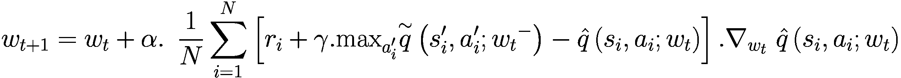

(9-1)

注意最大值。通过取最大值，即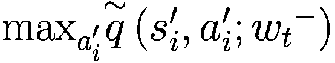，你定义了 TD(0)的目标值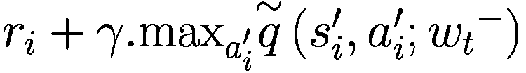，这是在最佳动作下的最大值。这迫使当前状态动作 q 值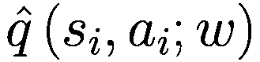更新权重以达到更高的目标。换句话说，你正在引导网络更新遵循 Bellman 最优方程。学习是离策略的，因为 Bellman 最优方程无论遵循什么策略都成立。它需要满足所有(*s*, *a*, *r*, *s*^’）转换，无论这些转换是从哪个策略生成的。你可以使用重放缓冲区重用这些转换，这使得这种学习非常高效。然而，Q 学习存在一些问题。

第一个问题是在当前形式下使用 Q 学习进行连续动作。看看。第六章和第七章的所有例子都有离散动作。你知道为什么吗？当动作空间是连续和多维的，例如移动机器人的多个关节时，你认为你会如何执行*max*？

当动作是离散时，取*max*很容易。你将状态*s*输入模型，然后得到所有可能动作的*Q*(*s*, *a*)，即*Q*(*s*, *a*[1])，⋯*Q*(*s*, *a*[*m*])。对于有限数量的离散动作，选择*max*很容易。图 9-1 显示了一个示例模型。

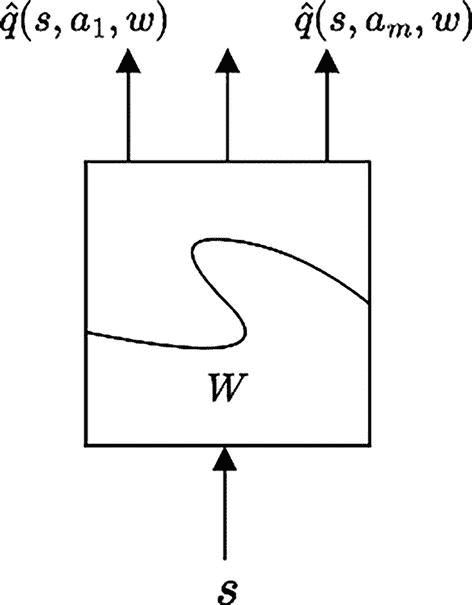

DQN 学习的框图。S 被发送到 W 块，该块输出 q̄s、a1、w 到 q̄s、a m、w。

图 9-1

DQN 学习的通用模型，具有离散动作

现在想象一下动作是连续的！你将如何取最大值？为了找到，你将不得不运行另一个优化算法，该算法将找到最大化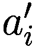的 q 值。你将不得不对训练样本中每个状态*s*的值都这样做。你可以想象这个过程将有多么昂贵——作为策略改进的一部分，对批处理中的每个转换运行最大化动作搜索。

第二个问题是学习错误的目标。你想要一个最优策略，但在 DQN 中你并不是直接这样做。你学习动作值函数，然后使用*max*来找到最优的 q 值/最优动作。

第三个问题是 DQN 有时也不稳定。没有理论保证，你试图使用第五章中提到的半梯度更新来更新权重。你本质上是在尝试跟随带有变化目标的监督学习过程。你所学的可能会影响新的轨迹生成，反过来又会影响你的学习质量。你之前章节中看到的 DQN 的平均每集回报训练进度曲线并没有持续改善。它们是断断续续的，需要仔细调整超参数以确保算法趋向于一个好的策略。

最后，第四个问题是 DQN 学习了一个确定性策略。你使用探索行为策略来生成样本，并在代理学习确定性策略的同时添加探索。实验，特别是在机器人领域，已经表明，一定程度的随机策略更好，因为对世界建模以及通过关节进行的操作并不总是完美的。你需要有一定的随机性来调整不完美的建模或动作值到实际机器人关节运动之间的转换。此外，确定性策略是随机策略的极限情况。

现在将注意力转向策略梯度方法。在策略梯度方法中，你输入状态，得到的输出是策略，即对于离散动作的动作概率，或者在连续动作的情况下，概率分布的参数。策略梯度允许你学习离散和连续动作的策略。然而，在 DQN 中学习连续动作是不可行的。图 9-2 展示了策略梯度中使用的模型。

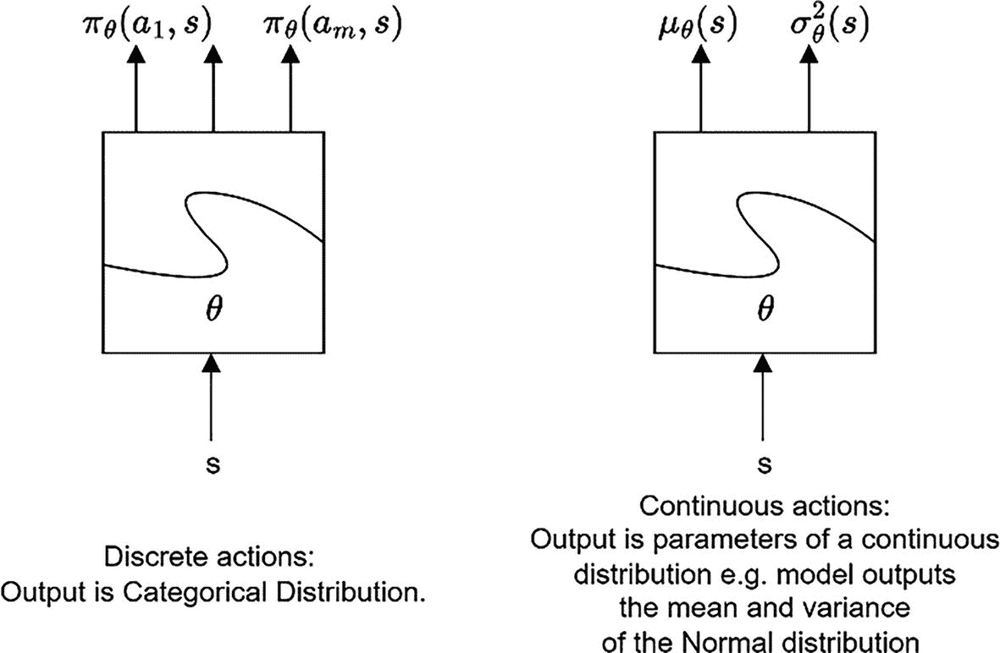

两个策略梯度方法的框图。对于离散动作，s 被发送到 theta 块，该块给出分类分布输出πθ(s)，即从πθ(s)到πθ(s)的 m 个 s。对于连续动作，s 被发送到 theta 块，该块给出输出μθ(s)和σθ²(s)。

图 9-2

政策梯度方法的政策网络

第八章展示了离散动作，但正如该章节所讨论的，这个过程对于连续动作同样适用。

此外，使用策略梯度方法，你直接学习改进策略，而不是首先学习价值函数，然后使用它们来找到最佳策略的迂回方式。原始策略梯度确实存在坍塌到不良区域的问题，你看到了像 TRPO 和 PPO 这样的方法，通过控制步长来提高策略梯度的保证，从而改善策略学习。

与 DQN 不同，政策梯度学习的是一个随机策略，因此探索性被内置到你试图学习的策略中。然而，政策梯度方法最大的缺陷是它是一个在线策略方法。一旦你使用转换来计算梯度更新，模型就移动到了一个新的策略。在这个更新的策略世界中，早期的转换不再相关。你需要在更新后丢弃之前的转换，并生成新的轨迹/转换来训练模型。这使得策略学习非常低效。

你确实使用了价值学习作为策略梯度的一部分，使用了 actor-critic 方法，其中策略网络是 actor，试图学习最佳动作，而价值网络是 critic，向策略网络告知动作的好坏。然而，即使使用了 actor-critic 方法，学习仍然是基于策略的。你使用了 critic 来指导 actor。critic 基于当前策略。因此，随着策略的更新，你需要保留丢弃所有当前样本转换，在每次更新策略（和/或价值）网络后。

有没有一种方法可以直接学习策略，同时利用 Q 学习来学习离线策略？你能否在连续动作空间中做到这一点？这在本章中有所介绍。你将学习如何将 Q 学习与策略梯度结合，以提出离线策略且适用于连续动作的算法。

## 将策略梯度与 Q 学习结合的通用框架

本节探讨了连续动作策略。有两个网络——一个用于学习给定状态的最佳动作，即 actor 网络。假设策略网络由*θ*参数化，该网络学习一个策略，产生动作*a* = *μ**θ*，该动作最大化*Q*(*s*, *a*)。用数学符号表示：

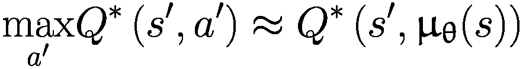

(9-2)

第二个网络，即评论家网络，也将状态 *s* 作为输入之一，并将第一个网络的最优动作 *μ**θ* 作为另一个输入来产生 q 值 *Q*ϕ)。图 9-3 展示了两个网络的概念性交互。

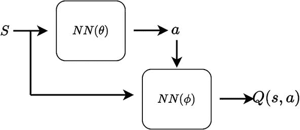

两个网络交互的框图。S 被发送到θ的 N N 和φ的 N N。θ的 N N 发送 a 到φ的 N N。φ的 N N 给出 s, a 的 Q。

图 9-3

结合策略和 Q 学习。你通过两个网络直接学习策略以及 Q，其中第一个网络（actor）的动作输出被输入到第二个网络（critic），该网络学习 *Q*(*s*, *a*)。

为了确保探索，采取探索性的动作 *a*。这与 Q 学习中的方法类似，在那里你学习了一个确定性策略，但生成了来自探索性 *ε*-贪婪策略的转换。同样，在这里，虽然你学习**a**，但你添加一点随机性 *ϵ*~*N*(0, *σ*²)，并使用**a** + **ε**动作来探索环境并生成轨迹。

与 Q 学习类似，你将使用重放缓冲区来存储转换并在学习期间重用这些转换。这是本章讨论的所有方法共有的一个重要好处。这将使策略学习离线，从而提高样本效率。

在 Q 学习中，你必须使用一个与 Q 网络相同的 Q 网络的目标网络。原因是提供某种类型的固定靶点，以便在学习 q 值时使用。你可以回顾第五章和 6 章中关于目标网络的讨论。在这些方法中，目标网络权重定期用在线/代理网络权重更新。这里，你也将使用一个目标网络。然而，本章中算法的目标网络权重更新方法为*Polyak 平均*（*指数平均*），如下方程所示：

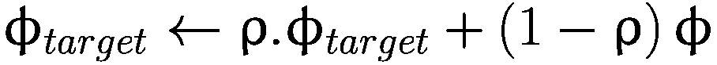

(9-3)

你还将使用目标网络来处理策略网络。这与 q 值网络中的原因相同，即提供稳定的靶点。有了稳定的靶点，你可以执行监督学习风格的梯度下降，并调整权重以近似 *Q*(*s*, *a*)。

在这个背景下，你准备好查看第一个算法——深度确定性策略梯度（DDPG）。

## 深度确定性策略梯度

在 2016 年，在一篇题为“使用深度强化学习的连续控制”的论文中，DeepMind 的研究人员介绍了 DDPG 算法。作者们对其方法有以下几点要说明：

+   虽然 DQN 解决了高维状态空间，但它只能处理离散和低维动作空间。DQN 不能应用于连续和高维动作域，例如机器人等物理控制任务。

+   由于**维度诅咒**，对动作空间进行离散化不是一个选择。假设你有一个拥有七个关节的机器人，每个关节可以在范围（−*k*，*k*）内移动。对每个关节进行粗略的离散化，使其有三个可能值{−*k*，0，*k*}。即使在这种粗略的离散化下，所有七个维度中离散动作的总组合数为 3⁷ = 2187。相反，如果你决定将每个关节的离散范围分成十个可能值（在范围（−*k*，*k*）内），你将得到 10⁷ = 10 *百万*种选择。这就是**维度诅咒**，其中可能动作组合的集合随着每个新维度/关节的加入而呈指数增长。

+   DDPG 算法如下：

    +   **无模型**：你不知道模型。你从代理与环境交互中学习它。

    +   **离线策略**：DDPG，与 DQN 类似，使用探索策略生成转换，并学习确定性策略。

    +   **连续和高维动作空间**：DDPG 仅适用于连续动作域，并且在高维动作空间中表现良好。

    +   **演员-评论家**：这意味着你有一个演员（策略网络）和评论家，即动作值（q 值）网络。

    +   **重放缓冲区**：与 DQN 类似，DDPG 使用重放缓冲区来存储转换并使用它们进行学习。这打破了训练样本的时间依赖性/相关性，否则可能会搞乱学习。

    +   **目标网络**：与 DQN 类似，DDPG 使用目标网络为 q 值学习提供稳定的目标。然而，与 DQN 不同，它不是通过定期复制在线/代理/主网络的权重来更新目标网络。相反，它使用 polyak/指数平均，在每次更新主网络后稍微移动目标网络。

现在将你的注意力转向网络架构和计算的损失。首先，你会查看 Q 学习部分，然后你会查看策略学习网络。

### DDPG 中的 Q-Learning（评论家）

在 DQN 中，你通过梯度下降计算了一个损失，该损失由方程 6-3 给出，此处重述如下：

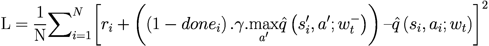

(9-4)

让我们重新写这个方程。去掉下标 **i** 和 **t** 以减少符号的混乱。将求和改为期望，以强调你通常想要的只是一个期望，但它是通过蒙特卡洛方法下的样本平均来估计的。最终在代码中你会得到求和，但它们是某些期望的蒙特卡洛估计。同时，将替换为 ϕ[*targ*]。类似地，将主要权重 *w*[*t*] 替换为 ϕ。进一步，将权重从函数参数内部移动到函数的子索引上，即 *Q*ϕ ← *Q*(...; ϕ)。经过这些符号变化后，方程 9-4 现在看起来是这样的：

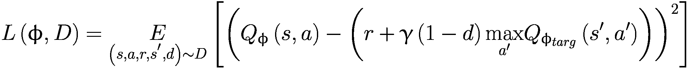

(9-5)

这仍然是 DQN 公式，你在状态 *s*^’ 中取离散动作的最大值以得到 。在连续空间中，你不能取最大值，因此你需要另一个网络（actor）来接收输入状态 *s* 并产生动作，该动作最大化 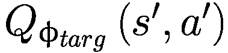。也就是说，你将 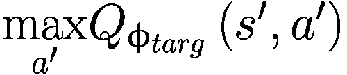 替换为 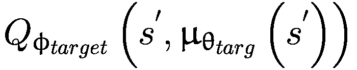，其中 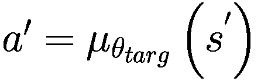 是目标策略。更新的损失表达式如下：

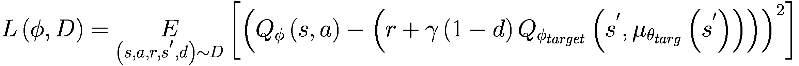

(9-6)

这是在代码中实现并用于反向传播以最小化损失函数的更新均方误差（MSBE）。请注意，这仅是 ϕ 的函数，因此 *L*(*ϕ*, *D*) 的梯度是相对于 *ϕ* 的。如前所述，在代码中，你将期望替换为样本平均，作为期望的蒙特卡洛估计。接下来，让我们看看策略学习部分。

### DDPG（Actor）中的策略学习

在策略学习部分，你试图学习 *a* = *μ**θ*，这是一个确定性策略，它给出最大化 *Q**ϕ* 的动作。由于动作空间是连续的，并且你假设 *Q* 函数相对于动作是可微的，因此你可以仅对策略参数进行梯度上升来解决。

![$$ \underset{\theta }{\mathit{\max}}\ J\left(\theta, D\right)=\underset{\theta }{\mathit{\max}}\underset{s\sim D}{E}\left[{Q}_{\upphi}\left(s,{\upmu}_{\uptheta}(s)\right)\right] $$](../images/502835_2_En_9_Chapter/502835_2_En_9_Chapter_TeX_Equ7.png)

(9-7)

由于策略是确定性的，方程 9-7 中的期望值不依赖于策略，这与你在上一章中看到的随机梯度不同。那里的期望操作符依赖于策略参数，因为策略是随机的，这反过来又影响了预期的 q 值。

你可以对 *J* 关于 *θ* 求梯度，得到以下结果：

![$$ {\nabla}_{\theta}\;J\left(\theta, D\right)=\underset{s\sim D}{E}\left[{\nabla}_a{Q}_{\phi}\left(s,a\right){\left.\kern0em \right|}_{a={\mu}_{\theta }(s)}{\nabla}_{\theta }{\mu}_{\theta }(s)\right] $$](../images/502835_2_En_9_Chapter/502835_2_En_9_Chapter_TeX_Equ8.png)

(9-8)

这就是链式法则的直接应用。此外，请注意，在期望内部没有任何 ∇ *log* (...) 项，因为期望所取的状态 *s* 来自回放缓冲区，并且它对梯度求取的参数 *θ* 没有依赖性。

此外，在 2014 年一篇题为“确定性策略梯度算法”的论文中，作者们表明方程 9-8 是策略梯度；即策略性能的梯度。建议你阅读这两篇论文，以获得 DDPG 数学背后的更深入的理论理解。

如前所述，为了帮助探索，当你学习确定性策略时，你将使用学习策略的噪声探索版本来探索和生成转换。你这样做是通过向学习策略添加均值为零的高斯噪声来实现的。在机器学习中添加噪声是一个标准过程，它充当正则化器，确保学习到的策略具有良好的泛化能力。

### 伪代码和实现

到这一点，你就可以看到完整的伪代码了。请参阅图 9-4。

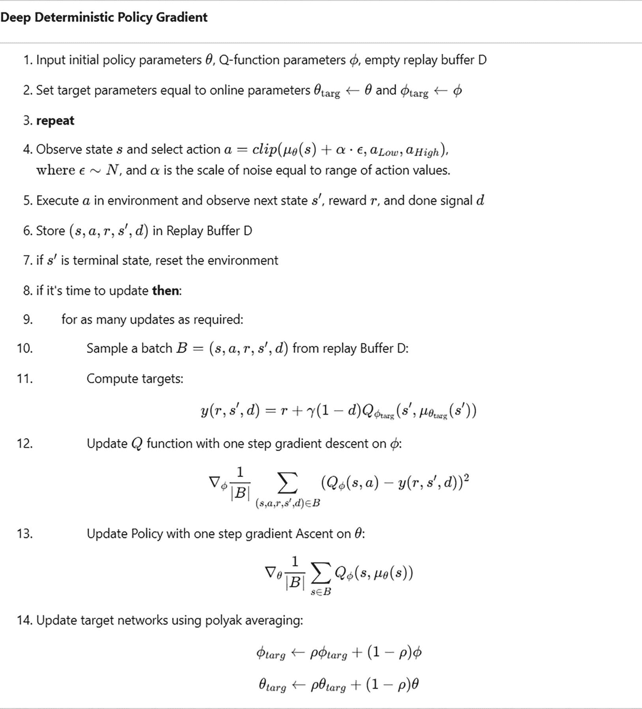

深度确定性策略梯度算法的 14 步伪代码。输入初始策略参数 theta，Q 函数参数 phi，以及空的回放缓冲区 D，然后设置目标参数等于在线参数，更新 Q 函数和策略，并使用 poly a k 平均法更新目标网络。

图 9-4

深度确定性策略梯度算法

#### 代码中使用的 Gymnasium 环境

在实现方面，您将在本章中使用两个环境来运行代码。第一个是一个称为 `Pendulum-v1` 的摆动环境。在这里，状态是一个三维向量，给出摆的角度（即其 *cos* 和 *sin* 分量），第三维是角速度（theta-dot）：`$$ \left[\mathit{\cos}\left(\uptheta \right),\mathit{\sin}\left(\uptheta \right),\kern0.5em \dot{\theta}\right]. $$` 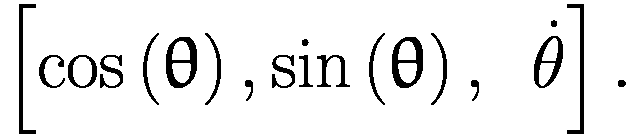

动作是一个范围在 [-2.0, 2.0] 的单一连续值——施加到摆上的扭矩。目标是尽可能长时间地将摆平衡在直立位置。见图 9-5。您也可以参考 Gymnasium 库内的文档.^(5)

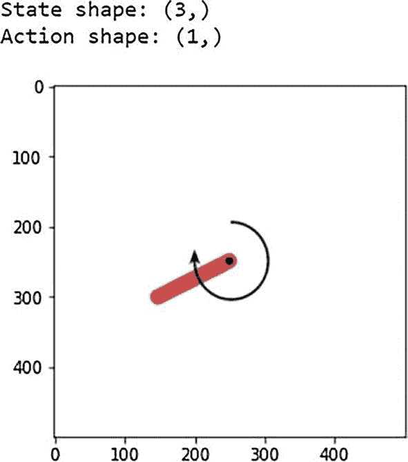

一个顺时针摆动的摆的图形表示。状态形状是 (3, )，动作形状是 (1, )。

图 9-5

来自 Gymnasium 库的摆环境

您将在另一个环境中训练算法——称为 `LunarLanderContinuous-v2` 的月球着陆器的连续版本。在这个环境中，您尝试将月球模块降落在旗帜之间的月球上。状态向量是八维的：`[x_pos, y_pos, x_vel, y_vel, lander_angle, lander_angular_vel, left_leg_ground_contact_flag, right_leg_ground_contact_flag]`。

动作是两个二维浮点数：`[主引擎，左右引擎]`。

+   主引擎：范围 (-1..0) 是引擎关闭，范围 (0,1) 是从 50% 到 100% 功率的引擎油门。引擎的功率不能低于 50%。

+   左/右——侧向助推器：范围 (-1.0, -0.5) 触发左侧助推器，范围 (+0.5, +1.0) 触发右侧助推器，范围 (-0.5, 0.5) 是两个助推器都关闭。

图 9-6 显示了环境的快照。

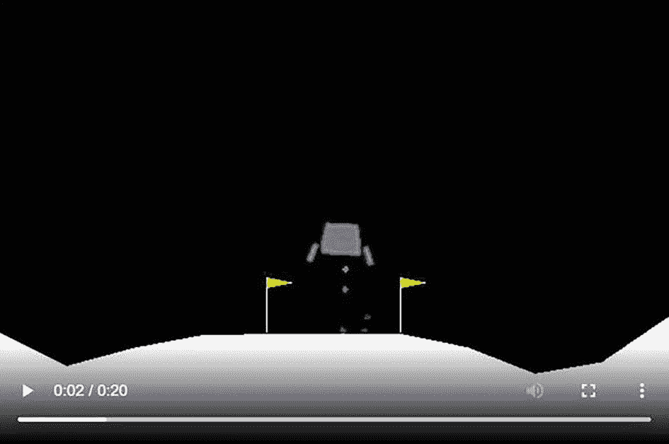

月球着陆器环境视频的截图。月球着陆器在两个旗帜之间悬停，在不规则的地面上方。

图 9-6

来自 Gymnasium 库的月球着陆器连续模式

### 代码列表

现在将注意力转向实现图 9-4 中 DDPG 模拟代码的实际代码。代码来自 `9.a-ddpg.ipynb` 文件。本节首先解释 Q 和策略网络，然后是损失计算，接着是训练循环。最后，您将了解代码并测试训练代理的性能。

#### 策略网络演员

首先，让我们看看 *actor/policy* 网络列表 9-1 展示了 PyTorch 中的策略网络代码。您定义了一个简单的神经网络，包含两个大小为 256 的隐藏层，每个层都使用 ReLU 激活。如果您查看 `forward` 函数，您会注意到最终层（`self.actor`）通过 `tanh` 激活传递。`Tanh` 是一个挤压函数；它将（-∞, ∞）中的值重新映射到挤压范围（-1, 1）。然后您将这个挤压值乘以动作限制（`self.act_limit`），这样 `MLPActor` 的连续输出就位于环境接受的有效动作值范围内。您通过扩展 PyTorch 的 `nn.Module` 类来创建一个网络类，这要求您定义一个 `forward` 函数，该函数以输入状态 *s* 作为输入，从而产生网络输出动作值 *a*。

```py
class MLPActor(nn.Module):
def __init__(self, state_dim, act_dim, act_limit):
super().__init__()
self.act_limit = act_limit
self.fc1 = nn.Linear(state_dim, 256)
self.fc2 = nn.Linear(256, 256)
self.actor = nn.Linear(256, act_dim)
def forward(self, s):
x = self.fc1(s)
x = F.relu(x)
x = self.fc2(x)
x = F.relu(x)
x = self.actor(x)
x = torch.tanh(x)  # to output in range(-1,1)
x = self.act_limit * x
return x
Listing 9-1
Policy Network in PyTorch from 9.a-ddpg.ipynb
```

#### Q-网络批评实现

接下来，您查看 Q-网络（*批评者*）。这也是一个简单的两层隐藏网络，使用 ReLU 激活，然后是一个输出维度等于环境的动作空间维度的最终层。最终层没有任何激活，使网络能够产生任何值作为网络的输出。这个网络正在输出 q 值，这就是为什么需要可能的范围（-∞, ∞）。

列表 9-2 展示了 PyTorch 中批评网络代码。这与 actor/policy 网络的实现非常相似，除了前面讨论的细微差异。

```py
class MLPQFunction(nn.Module):
def __init__(self, state_dim, act_dim):
super().__init__()
self.fc1 = nn.Linear(state_dim+act_dim, 256)
self.fc2 = nn.Linear(256, 256)
self.Q = nn.Linear(256, 1)
def forward(self, s, a):
x = torch.cat([s,a], dim=-1)
x = self.fc1(x)
x = F.relu(x)
x = self.fc2(x)
x = F.relu(x)
q = self.Q(x)
return q
Listing 9-2
Q Critic Network in PyTorch from 9.a-ddpg.ipynb
```

#### 结合模型-演员-批评实现

一旦定义了这两个网络，您将它们组合成一个类，允许您以更模块化的方式管理在线和目标网络。这只是为了更好的代码组织，没有其他原因。结合两个网络的类实现为 `MLPActorCritic`。在这个类中，您还定义了一个 `get_action` 函数，它接受状态和噪声尺度。它将状态通过策略网络传递以获取 *μ**θ*，然后添加噪声（零均值高斯噪声）以给出用于探索的噪声动作。此函数实现了算法的第 4 步：

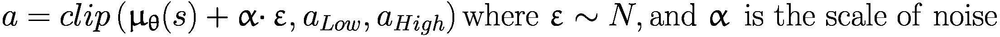

`The get_action` 方法是您将用于从策略中获取动作而不是直接从列表 9-1 中的 `MLPActor` 调用获取动作的方法。列表 9-3 展示了 `MLPActorCritic` 在 PyTorch 中的实现。

```py
class MLPActorCritic(nn.Module):
def __init__(self, observation_space, action_space):
super().__init__()
self.state_dim = observation_space.shape[0]
self.act_dim = action_space.shape[0]
self.act_limit = action_space.high[0]
#build Q and policy functions
self.q = MLPQFunction(self.state_dim, self.act_dim)
self.policy = MLPActor(self.state_dim, self.act_dim, self.act_limit)
def act(self, state):
with torch.no_grad():
return self.policy(state).numpy()
def get_action(self, s, noise_scale):
a = self.act(torch.as_tensor(s, dtype=torch.float32))
a += noise_scale * self.act_limit * np.random.randn(self.act_dim)
return np.clip(a, -self.act_limit, self.act_limit)
Listing 9-3
MLPActorCritic in PyTorch from 9.a-ddpg.ipynb
```

#### 经验回放

与 DQN 一样，您在 DDPG 中再次使用经验回放来存储先前的转换。经验回放的实施与 DQN 相同。我没有列出代码。感兴趣的读者可以查看名为 `9.a-ddpg.ipynb` 的 Jupyter 笔记本中的代码。

#### Q-Loss 实现

本节探讨了 Q 损失的计算。你实际上是在实现伪代码的第 11 步和第 12 步的方程。

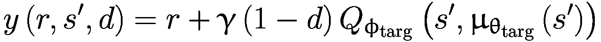

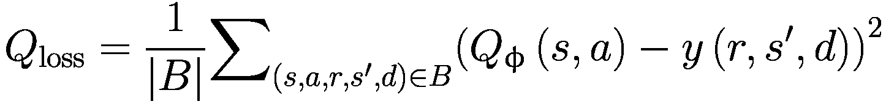

列表 9-4 给出了 PyTorch 的实现。你首先将(*s*, *a*, *r*, *s*^’， *d*)批处理转换为 PyTorch 张量。接下来，你使用(*s*, *a*)批处理通过策略网络计算*Q**ϕ*。实现这一点的代码是`predicted_qvalues = agent.q(states, actions)`。

接着，你根据前面的表达式计算目标*y*(*r*, *s*^′, *d*)。出于效率考虑，你使用`torch.no_grad()`来禁用计算目标时的梯度计算，因为你不想使用 PyTorch 的自动微分来调整目标网络权重。相反，你手动使用 Polyak 平均调整目标网络权重。停止计算不想要的梯度可以加快训练速度，并确保你没有任何意外的副作用影响你想要冻结或手动调整的权重。最后，你根据前面的表达式计算*Q*[损失]。

PyTorch 执行反向传播来计算梯度。你不需要在代码中显式地计算梯度。

```py
def compute_q_loss(agent, target_network, states, actions,
rewards, next_states, done_flags,
gamma=0.99):
# code for converting numpy array to torch tensors
...
...
# get q-values for all actions in current states
# use agent network
predicted_qvalues = agent.q(states, actions)
# Bellman backup for Q function
with torch.no_grad():
q_next_state_values = target_network.q(next_states,
target_network.policy(next_states))
target = rewards + gamma * (1 - done_flags) * q_next_state_values
# MSE loss against Bellman backup
loss_q = F.mse_loss(predicted_qvalues, target)
return loss_q
Listing 9-4
compute_q_loss function in PyTorch from 9.a-ddpg.ipynb
```

#### 策略损失实现

接下来，你需要根据伪代码的第 13 步计算策略损失。

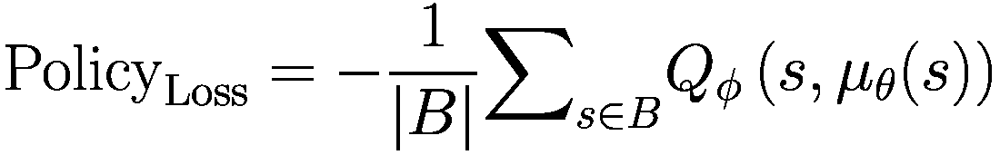

这是一个简单的计算。它只是在 PyTorch 中实现的三个代码行。列表 9-5 包含了 PyTorch 中的代码。注意损失中的负号。算法需要对策略目标进行梯度上升，但像 PyTorch 和 TensorFlow 这样的自动微分库实现的是梯度下降。将策略目标乘以-1.0 使其成为损失，对损失进行梯度下降与对策略目标进行梯度上升是相同的。

```py
def compute_policy_loss(agent, states):
# convert numpy array to torch tensors
states = torch.tensor(states, dtype=torch.float)
predicted_qvalues = agent.q(states, agent.policy(states))
loss_policy = - predicted_qvalues.mean()
Listing 9-5
compute_policy_loss function in PyTorch from 9.a-ddpg.ipynb
```

#### 单步更新实现

接下来，你定义一个名为`one_step_update`的函数，该函数获取一个包含(*s*, *a*, *r*, *s*^’， *d*)的批次，并计算 Q 损失，然后进行反向传播，接着是类似的策略损失计算步骤，然后进行梯度步骤。最后，使用 Polyak 平均法对目标网络权重进行更新。本质上，这一步与之前的两个函数`compute_q_loss`和`compute_policy_loss`一起实现了伪代码的第 11 步到第 14 步。

列表 9-6 展示了`one_step_update`的 PyTorch 代码。第一步是计算 Q 损失，并在评论家/Q 网络权重上进行梯度下降。接着计算策略损失，并在演员/策略网络权重上进行梯度下降。在 DDPG 的某些版本中，策略的更新相对于 Q 网络的更新是延迟的，也就是说，每进行“k”次 Q 网络的更新，才进行一次策略的更新。控制“k”的逻辑是通过使用名为`update_every`的函数输入参数来实现的。这种实现使用的是 1 的值，以确保每次 Q 的更新之后，策略也会进行更新。最后，使用 Polyak 平均法更新目标网络权重。

```py
def one_step_update(agent, target_network, q_optimizer, policy_optimizer,
states, actions, rewards, next_states, done_flags,
step, update_every=1, gamma=0.99, polyak=0.995):
#one step gradient for q-values
loss_q = compute_q_loss(agent, target_network, states,
actions, rewards, next_states,
done_flags, gamma)
q_optimizer.zero_grad()
loss_q.backward()
q_optimizer.step()
#one step gradient for policy network
if step % update_every == 0:
loss_policy = compute_policy_loss(agent, states)
policy_optimizer.zero_grad()
loss_policy.backward()
policy_optimizer.step()
# update target networks with polyak averaging
for params, params_target in zip(agent.parameters(), target_network.parameters()):
params_target.data.mul_(polyak)
params_target.data.add_((1-polyak)*params.data)
return loss_q.item(), loss_policy.item()
Listing 9-6
one_step_update function in PyTorch from 9.a-ddpg.ipynb
```

#### DDPG：主循环

最后一步是实现 DDPG 算法，该算法使用之前的`one_step_update`函数。它创建优化器并初始化环境。它使用当前的在线策略在环境中进行步进。它还维护`q_loss`、`policy_loss`和每集平均回报的历史记录，以便您可以在训练过程中绘制这三个关键指标的趋势。

初始时，对于前`start_steps=10000`步，它采取随机动作来探索环境，一旦收集到足够的转换，它就使用当前策略和缩放高斯噪声来选择动作。转换被添加到`ReplayBuffer`中，如果缓冲区已满，则丢弃最早的转换。一旦`start_steps`计数达到，它开始在主训练循环中进行梯度更新。这是通过在列表 9-6 中定义的`one_step_update`函数来实现的。然后你运行训练循环总共 20,000 步，前 10,000 步用于收集转换以填充重放缓冲区，接着是接下来的 10,000 步的梯度更新。

循环中还包括用于更新 Q 损失、策略损失和每集平均回报的进度图的代码。图的更新频率由`eval_freq`参数控制。训练循环的代码在列表 9-7 中展示。

```py
def ddpg(env_fn, seed=5,
total_steps=20000, replay_size=20000, gamma=0.98,
polyak=0.995, policy_lr=0.001, q_lr=0.001, batch_size=256, start_steps=10000,
update_every=1, act_noise=0.1, num_test_episodes=3, eval_freq = 500):
torch.manual_seed(seed)
np.random.seed(seed)
env, test_env = env_fn(), env_fn()
loss_q_history, loss_policy_history, return_history, length_history = [], [], [], []
state_dim = env.observation_space.shape
act_dim = env.action_space.shape[0]
act_limit = env.action_space.high[0]
agent = MLPActorCritic(env.observation_space, env.action_space)
target_network = deepcopy(agent)
# Experience buffer
replay_buffer = ReplayBuffer(replay_size)
#optimizers
q_optimizer = Adam(agent.q.parameters(), lr=q_lr)
policy_optimizer = Adam(agent.policy.parameters(), lr=policy_lr)
state, _ = env.reset(seed=seed)
for t in range(total_steps):
if t >= start_steps:
with torch.no_grad():
action = agent.get_action(state, act_noise)
else:
action = env.action_space.sample()
next_state, reward, terminated, truncated, _ = env.step(action)
# some environments do not terminate and therefore we get
# truncated signal from env
# we will use both terminated or truncated to reset the game
done = terminated
# Store experience to replay buffer
replay_buffer.add(state, action, reward, next_state, done)
# dont ever forget this step :)
state = next_state
# End of trajectory handling
if terminated or truncated:
state, _ = env.reset()
# Update handling
if t >= start_steps:
states, actions, rewards, next_states, done_flags = \
replay_buffer.sample(batch_size)
loss_q, loss_policy = one_step_update(
agent, target_network, q_optimizer, policy_optimizer,
states, actions, rewards, next_states, done_flags,
t, update_every, gamma, polyak)
loss_q_history.append(loss_q)
loss_policy_history.append(loss_policy)
# Statistic updates
if t >= start_steps and t % eval_freq == 0:
# Code to update the graphs
# refer to notebook 9.a-ddpg.ipynb for details
return agent, loss_q_history, loss_policy_history, \
return_history, length_history
Listing 9-7
DDPG main training loop in PyTorch from 9.a-ddpg.ipynb
```

有额外的实用代码用于记录训练智能体的视频。其余的代码训练智能体，然后记录训练智能体的性能。你首先为 Pendulum 环境运行算法。这些代码版本很有趣，但它们与学习 DDPG 的目标无关，因此我不深入探讨这些代码实现的细节。然而，感兴趣的读者可以查看相关库的文档并逐步查看代码。图 9-7 显示了随着训练进展的图表。如果你观看`9.a-ddpg.ipynb`笔记本中训练智能体的视频，你会看到智能体在 10,000 次梯度更新内快速学会将杆保持垂直位置。

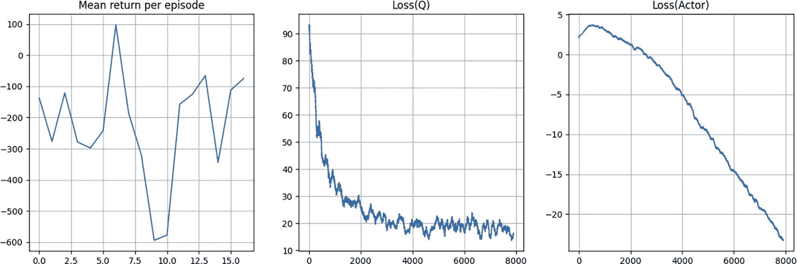

使用 DDPG 的 Pendulum 的 3 条线图。左。每集的平均回报线波动。中。Q 值损失的波动线以对数方式从(0, 95)减少到(8000, 15)。右。演员损失的波动线从(0, 2.5)减少到(8000, 负 24)。值是估计的。

图 9-7

使用 DDPG 的 Pendulum 的训练进度

你也可以运行相同的代码来训练一个针对 Lunar-Lander 连续环境的智能体。你可以参考笔记本来观察训练图和视频。

接下来，你将了解双延迟 DDPG，也称为 TD3。它有一些其他增强和技巧来解决 DDPG 中看到的一些稳定性和收敛速度问题。

## 双延迟 DDPG

双延迟 DDPG（TD3）于 2018 年在一篇题为“Addressing Function Approximation Error in Actor-Critic Methods.”的论文中提出。^(6) DDPG 存在你在第四章中看到的 Q-learning 中的过估计偏差。你看到了在第七章中通过解耦最大化动作和最大 q 值来处理偏差的双 DQN 方法。在之前提到的论文中，作者们表明 DDPG 也存在着相同的过估计偏差。他们提出了一种双 Q 学习的变体，用以解决 DDPG 中的过估计偏差。该方法采用了以下修改：

+   *裁剪双 Q 学习*：TD3 使用两个独立的 Q 函数，并在形成贝尔曼方程的目标时取两个中的最小值，即图 9-4 中 DDPG 伪代码的第 11 步中的目标。这种修改是算法被称为*twin*的原因。

+   *延迟策略更新*：TD3 相比于 Q 函数更新，更新策略和目标网络的频率较低。论文建议每更新两次 Q 函数，就对策略和目标网络进行一次更新。这意味着在图 9-4 中的 DDPG 伪代码的第 13 和 14 步中，每更新两次 Q 函数就执行一次更新。这种修改是将其称为 *延迟* 算法的原因。

+   *目标策略平滑*：TD3 向目标动作添加噪声，这使得策略更难利用 Q 函数估计误差并控制过估计偏差。

### Target-Policy Smoothing

用于计算目标 *y*(*r*, *s*′，*d*) 的动作基于目标网络。在 DDPG 中，你在图 9-4 的第 11 步计算了 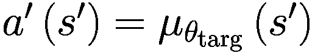。然而，在 TD3 中，你通过向动作添加噪声来执行目标策略平滑。对于确定性的动作 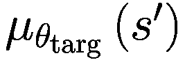，你添加一个均值为零的高斯噪声，并设置一些剪辑范围。然后，使用 *tanh* 进一步剪辑动作，并乘以 `max_action_range`，以确保动作值在可接受的动作值范围内。

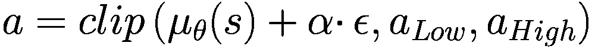

(9-9)

其中 *ϵ* ∼ *N*，且 *α* 是噪声的尺度，等于动作值的范围。

### Q-Loss (Critic)

你将使用两个独立的 Q 函数。两个 Q 函数中的最小值用于 TD(0) 目标，然后这个目标用于组合 Q 损失，该损失被最小化以更新两个智能体 Q 网络的参数。用数学表达式表示目标如下：

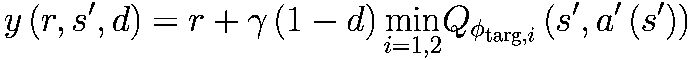

(9-10)

这首先使用方程 9-9 来找到噪声目标动作 *a*′(*s*′)。这反过来又用于计算目标 q 值：第一个和第二个 Q 目标网络的 q 值 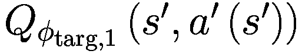 和 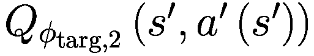

方程 9-10 中的公共目标随后用于找到两个 Q 网络的损失，如下所示：

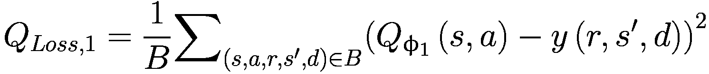

(9-11a)

以及，

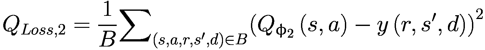

(9-11b)

损失被添加后，独立最小化以训练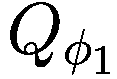 和 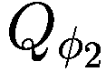 网络（即两个在线 Critic 网络）。

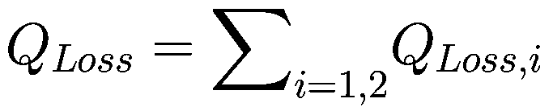

(9-12)

### 政策损失（Actor）

策略损失的计算保持不变，与 DDPG 中使用的相同。

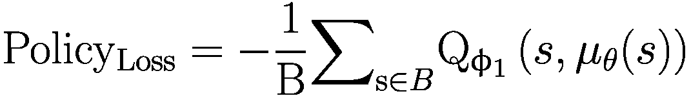

(9-13)

注意，您在方程中只使用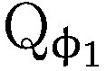。与 DDPG 类似，也请注意负号。您需要进行梯度上升，但 PyTorch 执行梯度下降。您可以使用负号将上升转换为下降。

### 延迟更新

延迟更新在线策略和代理网络权重——每两次在线 Q 网络更新进行一次更新！$$ {Q}_{\phi_1} $$ 和 。

### 模拟伪代码和实现

到目前为止，您已经准备好查看完整的伪代码。请参阅图 9-8。

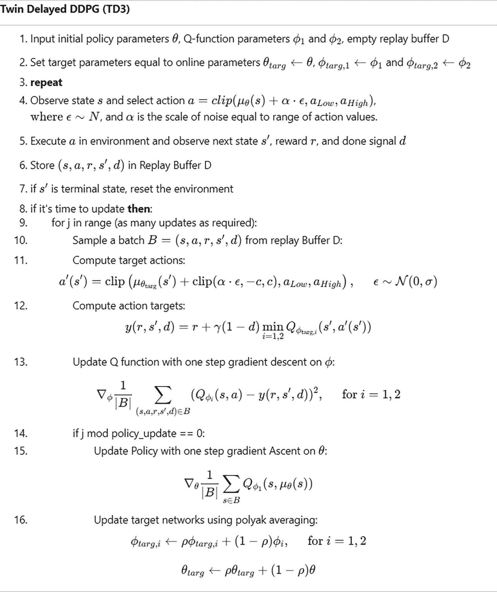

双延迟 DDPG 的伪代码。输入初始策略参数 theta，Q 函数参数 phi 1 和 2，以及空的中继缓冲区 D，然后设置目标参数，计算目标动作和动作目标，更新 Q 函数和策略，并使用 poly a k 平均更新目标网络。

图 9-8

双延迟 DDPG 算法

### 代码实现

现在您将遍历代码实现。与 DDPG 类似，您将在 Pendulum 和 Lunar-Lander 上运行该算法。大部分代码与 DDPG 类似，除了前面提到的三个修改。因此，我只会介绍一些重点。您可以在`9.b-td3.ipynb`文件中找到 PyTorch 版本的完整代码。

#### 模型-Actor-Critic 联合实现

你首先将查看代理网络。单个 Q 网络（评论家）`MLPQFunction` 和策略网络（演员）`MLPActor` 与之前相同。然而，将演员和评论家结合在一起的网络，即 `MLPActorCritic`，有一些小的变化。现在你有两个 Q 网络与 TD3 的“双胞胎”部分一致。列表 9-8 包含了 `MLPActorCritic` 的代码。

```py
class MLPActorCritic(nn.Module):
def __init__(self, observation_space, action_space):
super().__init__()
self.state_dim = observation_space.shape[0]
self.act_dim = action_space.shape[0]
self.act_limit = action_space.high[0]
#build Q and policy functions
self.q1 = MLPQFunction(self.state_dim, self.act_dim)
self.q2 = MLPQFunction(self.state_dim, self.act_dim)
self.policy = MLPActor(self.state_dim, self.act_dim, self.act_limit)
def act(self, state):
with torch.no_grad():
return self.policy(state).numpy()
def get_action(self, s, noise_scale):
a = self.act(torch.as_tensor(s, dtype=torch.float32))
a += noise_scale * self.act_limit * np.random.randn(self.act_dim)
return np.clip(a, -self.act_limit, self.act_limit)
Listing 9-8
MPLActorCritic in PyTorch from 9.b-td3.ipynb
```

#### Q 损失实现

重放缓冲区保持不变。下一个变化在于 Q 损失的计算方式。你根据方程 9-9 到 9-12 实现目标策略平滑和裁剪的双 Q 学习。列表 9-9 包含了 PyTorch 中 `compute_q_loss` 的代码。与 DDPG 类似，你首先将所有输入从 NumPy 数组转换为 PyTorch 张量，如果需要则移动到 GPU 上。`q1 = agent.q1(states, actions)` 和 `q2 = agent.q2(states, actions)` 将 `(state,action)` 元组的批次通过两个在线代理的 Q 网络传递，获得两个 q 值——TD3 的双胞胎部分。接下来，你将目标策略调整为 `action_target`，这是与方程 9-9 一致的带有平滑的噪声动作，用于下一个状态。然后，`action_target` 通过目标 Q 网络传递以获得 `q1_target` 和 `q2_target`，然后取两个值的最小值得到 `q_target`。一旦获得 `q_target`，你将形成 *TD*(0) 目标，如方程 9-10 所示。接下来，你根据方程 9-11 和 9-12 形成联合 MSE 损失，在 `q1` 和 `target` 之间以及 `q2` 和 `target` 之间。不涉及在线 q 网络的计算在 `torch.no_grad()` 下执行，以停止梯度累积，加快计算速度并节省内存。这是因为 `q_loss` 仅用于调整在线 q 网络的权重。

```py
def compute_q_loss(agent, target_network, states, actions,
rewards, next_states, done_flags,
gamma, target_noise, noise_clip, act_limit):
# code to convert numpy array to torch tensors
# refer to 9.b-td3.ipynb for actual code
# get q-values for all actions in current states
# use agent network
q1 = agent.q1(states, actions)
q2 = agent.q2(states, actions)
# Bellman backup for Q function
with torch.no_grad():
action_target = target_network.policy(next_states)
# Target policy smoothing
epsilon = torch.randn_like(action_target) * target_noise * act_limit
epsilon = torch.clamp(epsilon, -noise_clip, noise_clip)
action_target = action_target + epsilon
action_target = torch.clamp(action_target, -act_limit, act_limit)
q1_target = target_network.q1(next_states, action_target)
q2_target = target_network.q2(next_states, action_target)
q_target = torch.min(q1_target, q2_target)
target = rewards + gamma * (1 - done_flags) * q_target
# MSE loss against Bellman backup
loss_q1 = F.mse_loss(q1, target)
loss_q2 = F.mse_loss(q2, target)
loss_q = loss_q1+loss_q2
return loss_q
Listing 9-9
Q-Loss in PyTorch from 9.b-td3.ipynb
```

#### 策略损失实现

策略损失计算保持不变，只是你只使用一个 Q 网络即可，即权重为 *ϕ*[1] 的第一个网络。

#### 单步更新实现

`one_step_update` 函数的实现也非常相似，只是你需要执行 q 损失相对于 Q1 和 Q2 网络组合网络权重的梯度，这些权重作为 `q_params` 传递给函数。此外，你每更新两次在线 Q 网络更新，就执行一次在线策略更新和目标 Q 网络以及目标策略网络的更新。列表 9-10 包含了 PyTorch 中 `one_step_update` 的实现。

```py
def one_step_update(agent, target_network, q_optimizer, policy_optimizer,
states, actions, rewards, next_states, done_flags, step, update_every,
gamma, polyak, target_noise, noise_clip, act_limit):
#one step gradient for q-values
loss_q = compute_q_loss(agent, target_network, states, actions,
rewards, next_states, done_flags,
gamma, target_noise, noise_clip, act_limit)
q_optimizer.zero_grad()
loss_q.backward()
q_optimizer.step()
loss_policy_ret = None
# Update policy and all target networks after `update_every` gradient steps of Q-networks
if step % update_every == 0:
#one step gradient for policy network
loss_policy = compute_policy_loss(agent, states)
policy_optimizer.zero_grad()
loss_policy.backward()
policy_optimizer.step()
loss_policy_ret = loss_policy.item()
# update target networks with polyak averaging
for params, params_target in zip(agent.parameters(), target_network.parameters()):
params_target.data.mul_(polyak)
params_target.data.add_((1-polyak)*params.data)
return loss_q.item(), loss_policy_ret
Listing 9-10
one_step_update in PyTorch from 9.b-td3.ipynb
```

#### TD3 主循环

下一个变化是更新频率。与 DDPG 不同，在 TD3 中，你每更新两次 Q 网络就更新一次在线策略和目标权重，这由 `one_step_update` 函数控制，如列表 9-10 所示。

现在首先为摆锤环境运行 TD3，然后为月球着陆场环境运行。图 9-9 显示了随着训练的进行而变化的图表。如果你查看`9.b-td3.ipynb`笔记本中训练代理的视频，你会看到代理学会在 10,000 次梯度更新内相当快地平衡杆。此外，如果你比较 DDPG 的平均回报，如图 9-7 所示，与 TD3 在图 9-9 中显示的回报，你将看到在 TD3 下，回报随着训练的进行几乎单调递增，而在 DDPG 中，回报开始上升之前有一个初始下降。这表明 TD3 由于在 DDPG 版本上实施的多个增强而显示出的学习过程的稳定性。感兴趣的读者可以参考 TD3 的原始论文，以检查 TD3 的作者与其他算法进行的基准研究。

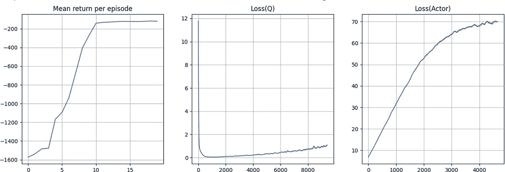

使用 TD3 的摆锤的 3 条线图。左图。每期的平均回报从(0, -1550)增加到(19, -150)。中图。Q 损失的线对数下降从(0, 11.5)到(9500, 1)。右图。演员的损失从(0, 5)增加到(4800, 70)。值是估计的。

图 9-9

使用 TD3 训练摆锤的训练进度

很快你将看到本章的最后一个算法，一个称为*软演员-评论家（SAC）*的算法。然而，在你这样做之前，本章将简要地偏离主题，解释 SAC 使用的*重参数化技巧*。

## 重参数化技巧

重参数化技巧是一种“变量改变”的方法，它在变分自编码器（VAEs）中得到了应用。在那里，它需要通过随机节点传播梯度。重参数化还用于降低梯度估计的方差。第二个原因在这里进行了探讨。这次深入探讨遵循了 Goker Erdogan 的博客文章^(7)，并增加了额外的分析和解释。

假设你有一个随机变量*x*，它遵循以θ为均值、单位方差的正态分布。让分布由均值*θ*如下参数化：

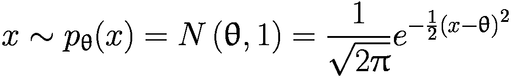

(9-14)

首先，你从它中抽取样本。接下来，你假设你不知道θ，并使用这些来自真实分布的样本，通过梯度下降法，使用均方误差（MSE）*J*(θ)来找到θ的估计值。

![J(θ)=E_x~p_θ(x)[x²]](../images/502835_2_En_9_Chapter/502835_2_En_9_Chapter_TeX_Eque.png)

重点在于找到两种不同的方法来确定导数/梯度的估计值∇[θ]*J*(θ)。

### 分数/强化方式

由于你想要找到梯度的参数 `\theta` 也会影响 *J*(θ) 表达式中期望值所涉及的分布，你可以遵循对数技巧，这与你在第八章节中使用的 REINFORCE 和策略梯度相同。你看到它具有高方差，这正是我想通过前面展示的简单示例分布来证明的。对 *J*(θ) 关于 *θ* 求导。


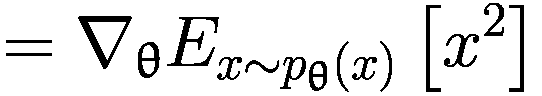

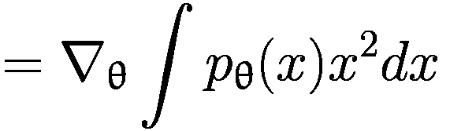

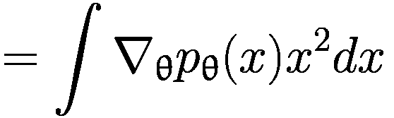

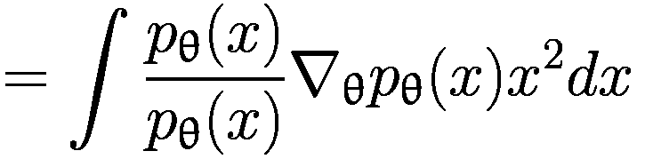

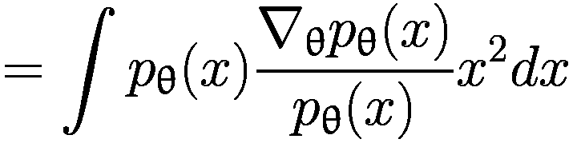

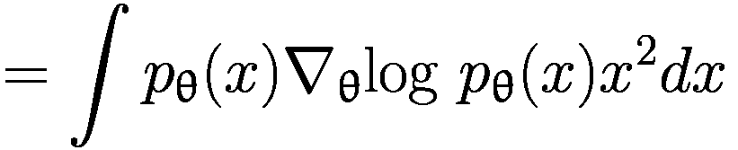

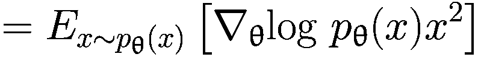

接下来，使用蒙特卡洛方法通过样本形成 ∇[θ]*J*(θ) 的估计。

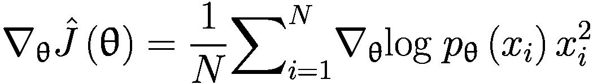

将方程 9-14 中的 *p**θ* 的表达式代入，并对 *θ* 求对数后求梯度，你得到以下结果：


(9-15)

### 重新参数化技巧和路径导数

第二种方法是重新参数化技巧。你将重新定义随机变量 *x* 为一个常数和一个没有参数 *θ* 的正态分布的组合。定义 *x* 如下：


注意，之前的重新参数化没有改变 *x* 的分布。


现在计算：


由于期望值不依赖于*θ*，因此可以将梯度移到内部，而不会遇到之前方法中出现的*对数*问题（即在导数中找到对数）。


接下来，将期望值转换为蒙特卡洛（MC）估计，得到以下结果：


(9-16)

抽空比较方程 9-15 和 9-16 中给出的 ∇[θ]*J*(θ) 的两个估计。记住这两个是真实梯度 ∇[θ]*J*(θ) 的估计，因此可能显示出不同的收敛性质。这种收敛将取决于你拥有的真实分布的样本数量。随着训练样本数量 N 的增加，两者都将收敛到真实分布。然而，其中一个将更快、更稳定地收敛到真实值，而另一个将需要大量的训练样本。你能猜到哪一个更好吗？在继续之前，花几分钟时间思考这个问题。

### 实验

方程 9-15 和 9-16 用于通过两种方法计算估计的均值和方差。它们使用不同的 *N* 值来根据方程 9-15 和 9-16 计算估计，然后对每个 *N* 值重复实验 10,000 次，以计算两种方法下梯度估计的均值和方差。这个实验将表明两个方程的均值相同。换句话说，它们估计了相同的值，但方程 9-15 中的估计方差比方程 9-16 中的估计方差高近一个数量级。在这种情况下，高出一个因子 21.75。

要进行这个实验，请遵循以下步骤：

+   Freeze: θ = 2

+   为 *x* ∼ *N*(θ, 1) 生成样本，并使用这些样本在方程 9-15 中计算 ∇[θ]*J*(θ) 的 REINFORCE 估计。

+   为 ϵ ∼ *N*(0, 1) 生成样本，并使用这些样本在方程 9-16 中计算 ∇[θ]*J*(θ) 的重新参数化估计。

你可以在 `9.c-reparam.ipynb` 中看到实验和代码的详细情况。当你运行代码并输入不同的 N 值时，你会得到不同 N 值下估计的均值和方差的收敛图，如图 9-10 所示。


2 条双线图。左图：梯度估计的均值与样本大小的关系。强化和重新参数化从 (10, 3.96) 和 (10, 3.995) 增加到 (100000, 4)。右图：梯度估计的方差与 N 的关系。强化和重新参数化从 (10, 8,5) 和 (10, 0.5) 减少到 (100000, 0)。数值已估计。

图 9-10

强化(log 技巧)和重新参数化方法在梯度估计中的收敛性

这些是否合理？你可以通过解析方法推导出方程 9-15 和 9-16 中给出的两个梯度估计的均值和方差。从方程 9-15 开始，这是在强化/log 技巧方法下对 ∇[θ]*J*(θ) 的估计，并找到它的期望值。


目前，假设 *x*[*i*] ∼ *N*(μ, σ²)。

在求和符号内进行期望运算，你得到：


使用正态分布 *x*[*i*] ∼ *N*(*μ*, *σ*²) 的标准结果，你得到：


在这种情况下，在强化学习中，样本 *x*[*i*] 来自 *N*(θ, 1)。相应地，代入 μ = θ 和 σ = 1，你得到：


在实验中，你取 θ = 2。相应地，进一步代入 θ = 2，你得到：


如从图 9-10 所见，在强化学习下，∇[θ]*J*(θ) 的估计值的均值收敛到解析得到的 4 的值。但这仅在较大的 Ns（样本数量）下成立。当 *N* = 100 时，均值是不正确的，并且远高于 4 的值。这表明强化估计的方差必须很高。现在解析地推导强化估计的方差以表明确实如此。


通过使用随机变量和的方差的性质，你得到：


使用正态分布的标准结果，你得到：

![公式 Var\left({\nabla}_{\uptheta}\hat{\mathrm{J}}\left(\uptheta \right)\right)=\frac{1}{\mathrm{N}}\left[{\upmu}⁶+15{\upmu}⁴{\upsigma}²+45{\upmu}²{\upsigma}⁴+15{\upsigma}⁶+{\uptheta}²\left({\upmu}⁴+6{\upmu}²{\upsigma}²+3{\upsigma}⁴\right)-2.\uptheta \left({\upmu}⁵+10{\upmu}³{\upsigma}²+15\upmu {\upsigma}⁴\right)-{\left({\upmu}³+3\upmu {\upsigma}²-\uptheta .\left({\upmu}²+{\upsigma}²\right)\right)}²\right] ](../images/502835_2_En_9_Chapter/502835_2_En_9_Chapter_TeX_Equaj.png)

将 μ = θ = 2 和 σ = 1 代入，得到：

![公式 Var\left({\nabla}_{\uptheta}\hat{J}\left(\uptheta \right)\right)=\frac{1}{N}\left[{2}⁶+{15.2}⁴+{45.2}²+15+4\left({2}⁴+{6.2}²+3\right)-4\left({2}⁵+{10.2}³+15.2\right)-{\left({2}³+3.2-2\left({2}²+1\right)\right)}²\right] ](../images/502835_2_En_9_Chapter/502835_2_En_9_Chapter_TeX_Equak.png)

![公式 =\frac{1}{N}\left[64+240+180+15+4\left(16+6.4+3\right)-4\left(32+10.8+15.2\right)-{\left(8+3.2-2\left(4+1\right)\right)}²\right] ](../images/502835_2_En_9_Chapter/502835_2_En_9_Chapter_TeX_Equal.png)

![公式 =\frac{1}{N}\left[64+240+180+15+4\left(16+6.4+3\right)-4\left(32+10.8+15.2\right)-{\left(8+3.2-2\left(4+1\right)\right)}²\right] ](../images/502835_2_En_9_Chapter/502835_2_En_9_Chapter_TeX_Equam.png)


参考图 9-10 的右侧图形，可以看到 N = 100。估计的方差约为 0.9，这与解析得到的 87/100 = 0.87 一致。

在解析地推导了方程 9-15 中给出的强化梯度估计的均值和方差之后，接下来关注对方程 9-16 中给出的重新参数化梯度估计的均值和方差进行类似的解析推导。首先计算估计的均值：

![公式 \mathrm{E}\left[{\nabla}_{\uptheta}\hat{J}\left(\uptheta \right)\right]=\mathrm{E}\left[\frac{1}{N}{\sum}_{i=1}^N2\left(\uptheta +{\upvarepsilon}_i\right)\right] ](../images/502835_2_En_9_Chapter/502835_2_En_9_Chapter_TeX_Equao.png)

注意，在重新参数化后，现在有 ϵ[*i*] ∼ *N*(0, 1) 且 θ 是一个等于 2 的常数。

![公式 \mathrm{E}\left[{\nabla}_{\uptheta}\hat{J}\left(\uptheta \right)\right]=\frac{1}{N}{\sum}_{i=1}^N2E\left[\left(\uptheta +{\upvarepsilon}_i\right)\right] ](../images/502835_2_En_9_Chapter/502835_2_En_9_Chapter_TeX_Equap.png)


![公式 \mathrm{E}\left[{\nabla}_{\uptheta}\hat{J}\left(\uptheta \right)\right]=2.\uptheta =4 ](../images/502835_2_En_9_Chapter/502835_2_En_9_Chapter_TeX_Equar.png)

估计值的均值为 4，这在图 9-10 左侧的图中可以看到。你还可以观察到，使用方程 9-16 中给出的重新参数化方法进行估计时，均值在 4 附近的收敛性比使用方程 9-15 和强化方法进行估计的均值收敛性要平滑得多。

你可以使用类似的分析来计算方程 9-16 中重新参数化梯度估计的方差。


再次，参考图 9-10 右侧的图。注意，在重新参数化方法下，估计的方差小于在强化/对数技巧方法下的方差。这正是解析推导所显示的。重新参数化方法的方差为 4/N，而强化方法的方差为 87/N。

总结来说，你已经表明对于 REINFORCE，使用方程 9-15 的梯度估计具有以下均值和方差：


在使用方程 9-16 的 REPARAMETERIZED 梯度下，梯度估计的均值和方差如下：


你可以看到，两种方法下梯度估计的均值相同。然而，在重新参数化方法中，方差小得多，大约小一个数量级。

读者可能会想知道这究竟如何帮助你，以及如何使用低方差方法。假设你有一个策略网络，它以状态 *s* 作为输入，并且该网络由 *θ* 参数化。策略网络产生策略的均值和方差，即一个具有正态分布的随机策略，其均值和方差是网络的输出，如图 9-11 所示。


随机策略网络的框图。连续动作 s 被输入到 theta 块中，该块给出 s 的 mu theta 和 sigma square theta。输出是连续分布的参数，即模型输出均值，以及正态分布的方差。

图 9-11

随机策略网络

按如下方式定义动作 *a*：


(9-17)

将动作 *a* 重新参数化以分解确定性和随机性部分，使得随机部分不依赖于网络参数 *θ*。


(9-18)

重新参数化允许你计算比使用非参数化方法的 log-trick 具有更低方差的策略梯度。此外，重新参数化通过将随机部分分离到非参数化部分，为你提供了一个通过网络反向传播梯度的替代方法。你将在软演员-评论家算法中使用这种方法。

当你需要使用随机节点构建神经网络并需要反向传播梯度时，这是一种非常常见的方法。将这一概念形式化的基础论文是 Schulman 等人于 2015 年发表的“使用随机计算图进行梯度估计”。在这篇论文发表之后，还有更多的工作。感兴趣的读者可以参考这篇论文，然后参考关于随机计算图主题的各种后续工作。

## 熵解释

在你开始深入研究 SAC 的细节之前，还有一件事需要回顾：熵。我在上一章的 REINFORCE 代码讲解中提到了熵作为正则化器。你将要做的事情与此类似。让我们看看熵是什么。

假设你有一个随机变量 *x* 遵循某种分布 *P*(*x*)。*x* 的熵定义为以下：

![$$ H(P)=\underset{x\sim P}{E}\left[- logP(x)\right] $$](../images/502835_2_En_9_Chapter/502835_2_En_9_Chapter_TeX_Equ20.png)

(9-19)

假设你有一个硬币，其正面出现的概率为 *P*(*Head*) = *ρ*，反面出现的概率为 *P*(*Tail*) = 1 − *ρ*。计算不同 *ρ* ∈ (0, 1) 值下的熵 *H*。


你可以绘制 *H*(*x*) 与 *ρ* 的曲线，如图 9-12 所示。


线形图绘制熵 H 与概率 p 的关系。H 的 p 的向下开口抛物线大约在 (0.0, 0.0)，(0.5, 0.68)，和 (1.0, 0.0) 之间。

图 9-12

二项分布的熵作为 p 的函数，其中 p 是在试验中得到 1 的概率

你可以看到，熵 *H* 在 *ρ* = 0.5 时达到最大值，即当你得到 1 或 0 的最大不确定性时。换句话说，通过最大化熵，你确保了随机动作策略具有广泛的分布，并且不会过早地坍缩成尖锐的峰值。尖锐的峰值会减少对状态动作空间的探索。读者可以参考 `9.d-entropy_bernoulli.ipynb` 笔记本中生成图 9-12 的代码。你可以修改代码来尝试其他不同的概率分布，并调整参数以找到最大化熵的点。

## Soft Actor-Critic

Soft Actor-Critic 与 TD3 大约在同一时间出现。像 DDPG 和 TD3 一样，SAC 也使用具有离策略学习的 actor-critic 构造来处理连续控制。然而，与 DDPG 和 TD3 不同，SAC 学习一个随机策略。因此，SAC 在确定性策略算法（如 DDPG 和 TD3）与随机策略优化之间架起了一座桥梁。该算法在 2018 年一篇题为“Soft Actor-Critic: Off-Policy Maximum Entropy Deep Reinforcement Learning with a Stochastic Actor”的论文中提出。^(9)

它使用类似于 TD3 的剪辑双 Q 技巧，由于其学习随机策略，它间接地从目标策略平滑中受益，而无需显式地向目标策略添加噪声。

SAC 的一个核心特性是使用熵作为最大化的一部分。引用论文的作者的话：

+   “在这个框架中，actor 旨在同时最大化预期回报和熵；也就是说，在尽可能随机行动的同时完成任务。”

### SAC 与 TD3

这里是相似之处：

+   两种方法都使用均方贝尔曼误差（MSBE）最小化以实现共同目标。

+   使用 polyack 平均法获得的目标 Q 网络计算共同目标。

+   两种方法都使用剪辑双 Q，它由至少两个 q 值的最小值组成，以避免高估。

这里是差异：

+   SAC 使用熵正则化，这在 TD3 中是不存在的。

+   TD3 的目标策略用于计算下一状态的动作，而在 SAC 中，你使用当前策略来获取下一状态的动作。

+   在 TD3 中，目标策略通过向动作添加随机噪声来实现平滑。然而，在 SAC 中，学习到的策略是随机的，它提供了平滑效果，而无需显式地添加噪声到目标策略。

### 带有熵正则化的 Q-Loss

熵衡量分布中的随机性。熵越高，分布越平坦。一个尖锐峰值的策略将所有概率集中在那个峰值周围，因此它将具有低熵。在熵正则化下，策略被训练以最大化预期回报和熵之间的权衡，其中 *α* 控制权衡。策略被训练以最大化预期回报和熵之间的权衡，熵是策略中随机性的度量。

![π∗=argmaxπEτ~π[∑t=0∞γt(R(st,at,st+1)+αH(π(⋅|st)))]](../images/502835_2_En_9_Chapter/502835_2_En_9_Chapter_TeX_Equ21.png)

(9-20)

在这种设置下，*V*^(*π*) 被修改为包含每个时间步的熵。

![Vπ(s)=Eτ~π[∑t=0∞γt(R(st,at,st+1)+αH(π(⋅|st)))|s0=s]](../images/502835_2_En_9_Chapter/502835_2_En_9_Chapter_TeX_Equ22.png)

(9-21)

此外，*Q*^(*π*) 被修改为除了第一个时间步之外，包含每个时间步的熵奖励。

![Qπ(s,a)=Eτ~π[∑t=0∞γtR(st,at,st+1)+α∑t=1∞γtH(π(⋅|st))]|s0=s,a0=a](../images/502835_2_En_9_Chapter/502835_2_En_9_Chapter_TeX_Equ23.png)

(9-22)

在这些定义下，*V*^(*π*) 和 *Q*^(*π*) 通过以下关系相连：

![Vπ(s)=E[a~π[Qπ(s,a)+αH(π(⋅|s))]]](../images/502835_2_En_9_Chapter/502835_2_En_9_Chapter_TeX_Equ24.png)

(9-23)

*Q*^(*π*) 的 Bellman 方程如下：

![Qπ(s,a)=E[s′~P,a′~π[R(s,a,s′)+γ(Qπ(s′,a′)+αH(π(⋅|s′)))]=E[s′~P[R(s,a,s′)+γVπ(s′)]]](../images/502835_2_En_9_Chapter/502835_2_En_9_Chapter_TeX_Equ25.png)

(9-24)

右侧是一个期望值，你需要将其转换为样本估计。


(9-25)

在这个方程中，(*s*, *a*, *r*, *s*^′) 都来自重放缓冲区，而  来自在线/代理策略的采样。*在 SAC 中，你根本不使用目标网络策略。*

与 TD3 类似，SAC 使用裁剪的双 Q 值并最小化均方贝尔曼误差（MSBE）。将所有这些放在一起，SAC 中 Q 网络的损失函数如下：


(9-26)

其中目标如下：


(9-27)

将期望转换为样本平均值。


(9-28)

你最终要最小化的最终 Q 损失如下：


(9-29)

### 带有重新参数化技巧的策略损失

策略应该选择动作以最大化期望的未来回报和未来熵，即 *V*^(*π*)(*s*).


将其重写如下：


(9-30)

论文的作者使用了重新参数化和压缩高斯策略。


(9-31)

将前两个方程 9-30 和 9-31 结合起来，并注意到策略网络由 *θ* 参数化，策略网络权重，你得到以下结果：


(9-32)

接下来，用函数逼近器替换 Q，取两个 Q 函数的最小值。


(9-33)

政策目标相应地转换为以下形式：


(9-34)

和之前一样，你应该在 PyTorch/TensorFlow 中使用最小化器。相应地，你将引入一个负号将最大化转换为损失最小化。


(9-35)

还可以将期望值转换为使用样本的估计，得到以下结果：


(9-36)

### 伪代码和实现

到这一点，你就可以看到完整的伪代码了。参见图 9-13。


软演员评论家或 S A C 的伪代码。输入初始策略参数 theta，Q 函数参数 phi 1 和 2，以及空的回传缓冲区 D，然后设置目标参数，计算 Q 函数的目标，更新 Q 函数和政策，并使用多项式 a k 平均更新目标网络。

图 9-13

软演员评论家算法

在所有数学推导和伪代码之后，是时候深入到 PyTorch 中的实现了。使用 PyTorch 的实现位于 `9.e-sac.ipynb` 文件中。和之前一样，你将使用 SAC 在摆锤和月球着陆器环境中训练智能体。

#### 政策网络-演员实现

让我们先看看演员网络。演员网络的实现以状态作为输入，与之前相同。然而，输出有两个组成部分：

+   要么是经过压缩的（即通过 tanh 函数传递动作值）的确定性动作 *a*，即 μθ，要么是从分布  中抽取的样本动作 *a*。采样使用重新参数化技巧，PyTorch 为你实现了 `distribution.rsample()`。你可以在“路径导数”主题下阅读有关内容，请访问[`https://pytorch.org/docs/stable/distributions.html`](https://pytorch.org/docs/stable/distributions.html)。

+   第二个输出是计算 Q 损失中熵所需的日志概率，如方程 9-27 所示。由于你使用了压缩的/tanh 变换，日志概率需要对随机分布应用变量变换，如下所示：

    

代码使用了一些技巧来计算数值稳定的版本。你可以在原始论文中找到更多细节。

列表 9-11 列出了之前讨论的 `SquashedGaussianMLPActor` 的代码。神经网络继续与之前相同：两个大小为 256 个单位的隐藏层，使用 ReLU 激活。

```py
LOG_STD_MAX = 2
LOG_STD_MIN = -5
class SquashedGaussianMLPActor(nn.Module):
def __init__(self, state_dim, act_dim, act_limit):
super().__init__()
self.act_limit = act_limit
self.fc1 = nn.Linear(state_dim, 256)
self.fc2 = nn.Linear(256, 256)
self.mu_layer = nn.Linear(256, act_dim)
self.log_std_layer = nn.Linear(256, act_dim)
def forward(self, s):
x = F.relu(self.fc1(s))
x = F.relu(self.fc2(x))
mu = self.mu_layer(x)
log_std = self.log_std_layer(x)
log_std = torch.tanh(log_std)
log_std = LOG_STD_MIN + 0.5 * (LOG_STD_MAX - LOG_STD_MIN) * (log_std + 1)
return mu, log_std
def get_action(self, x):
mean, log_std = self(x)
std = torch.exp(log_std)
# Pre-squash distribution and sample
pi_distribution = Normal(mean, std)
x_t = pi_distribution.rsample()
y_t = torch.tanh(x_t)
pi_action = self.act_limit * y_t
log_prob = pi_distribution.log_prob(x_t)
# Enforcing Action Bound
log_prob -= torch.log(self.act_limit * (1 - y_t.pow(2)) + 1e-6)
log_prob = log_prob.sum(-1, keepdim=True)
mean = torch.tanh(mean) * self.act_limit
return pi_action, log_prob, mean
Listing 9-11
SquashedGaussianMLPActor in PyTorch from 9.e-sac.ipynb
```

#### Q-Network，组合模型和经验回放

Q 函数网络 `MLPQFunction`，它将演员和评论家结合到 `MLPActorCritic` 类中的智能体，以及 `ReplayBuffer` 的实现，大部分是相同的。因此，我这里没有列出这些代码部分。

#### Q 损失和策略损失实现

接下来，你将查看 `compute_q_loss` 和 `compute_policy_loss`。这是 SAC 伪代码图 9-13 中步骤 11 到 13 的直接实现。如果你将这些步骤与图 9-8 中 TD3 的步骤 11 到 14 进行比较，你会看到很多相似之处，除了动作是从在线网络中抽取的这一事实。SAC 在两个损失中都额外包含了一个熵项。这些变化很小，因此我没有明确列出代码。

#### 单步更新和 SAC 主循环

再次，`one_step_update` 和整体训练算法遵循与之前相似的模式。对于 SAC，就像 TD3 一样，策略网络和目标网络在每次“x”更新在线 Q 网络时更新一次。然而，与 TD3 只更新一次不同，SAC 在循环中更新“x”次。

一旦运行并训练了智能体，你将看到与 DDPG 和 TD3 类似的输出。图 9-14 显示了随着训练进展的图表。你可以看到性能特征与图 9-9 中显示的 TD3 的性能特征相匹配。


使用 SAC（Soft Actor-Critic）的摆锤 3 线图。左侧。每期的平均回报从(0, -1300)增加到(19, -150)。中间。Q 值的损失对数减少从(0, 11.5)到(9500, 3.5)。右侧。actor 的损失从(0, 5)增加到(9500, 68)。数值为估算值。

图 9-14

使用 SAC 对摆锤的训练进度

本章使用简单环境，因此本章中的所有三个连续控制算法（DDPG、TD3 和 SAC）表现良好。请参考本章中引用的各种论文，以深入了解各种方法的官方性能比较。

这就带我们来到了本章关于 actor-critic 设置中连续控制的结束。到目前为止，你已经看到了基于模型的策略迭代方法、基于深度学习的 Q 学习（DPN）方法、离散动作的策略梯度以及连续控制策略梯度。这涵盖了强化学习的大部分流行方法。在你完成旅程之前，你还有另一个主要主题要学习：在无模型世界中使用模型学习和在已知模型但过于复杂或庞大而无法彻底探索的环境中进行的有效模型探索。

## 概述

在本章中，你学习了连续控制的 actor-critic 方法，其中离线 Q 学习类型与策略梯度相结合，以推导出离线连续控制 actor-critic 方法。Q 学习具有样本效率高、离线、间接等优点，但它也存在不稳定和难以应用于连续动作的缺点。策略梯度具有直接、稳定和适用于连续动作的优点，但它们也存在在线和样本效率低的缺点。

结合 Q 学习和策略梯度的通用框架包括两个网络：一个 actor 网络，它学习一个最大化 Q 值的确定性策略；一个 critic 网络，它使用 Bellman 方程学习 Q 值。该框架还采用了一个重放缓冲区、一个目标网络和一个探索策略。

你首先了解了深度确定性策略梯度（Deep Deterministic Policy Gradients），它是在 2016 年提出的，是第一个连续控制算法。DDPG 是一种具有确定性连续控制策略的 actor-critic 方法。

接下来，你了解了 TD3（双延迟 DDPG），它在 2018 年发布，解决了 DDPG 中发现的某些稳定性和效率问题。像 DDPG 一样，它也在离线策略设置中，使用 actor-critic 架构学习确定性策略。它使用了裁剪的双 Q 学习、延迟策略更新和目标策略平滑。

最后，你了解了软演员-评论家（Soft Actor-Critic，SAC）方法，它将 DDPG 风格的训练与使用熵的随机策略优化相结合。SAC 是一种使用演员-评论家设置的离策略随机策略优化方法。它使用熵正则化、重新参数化技巧和裁剪的双 Q 学习。
