# 10. 集成规划和学习

在这本书中，先分别研究主题，然后再一起学习它们，已经成为一个反复出现的主题。我们首先在第三章中研究了基于模型的算法。在这个设置中，我们知道代理所操作的世界的模型动态。代理使用模型动态的知识以及贝尔曼方程，首先执行评估/预测任务来学习状态或状态-动作值。然后，它通过改进策略来获得最佳行为，这被称为*策略改进/策略迭代*。一旦你知道了模型，你就可以提前规划来执行评估/改进步骤。这被称为*规划阶段*。

第四章开始探索无模型制度。*无模型*意味着你不知道模型。通过与之交互来学习模型。这被称为*学习*。在无模型设置中，你学习了蒙特卡洛（*MC*）和时间差分（*TD*）方法。我比较了使用这两种方法的优缺点。接下来，你使用*n 步*和*资格痕迹*将*MC*和*TD*结合成一个单一的综合方法。

第五章至第七章将第四章中的 MC 和 TD 方法扩展到非表格、连续空间、大规模问题，使用函数逼近和深度学习。第三章至第七章中涵盖的所有方法都称为*基于值的方法*，其中学习状态或状态-动作值，然后使用这些学习到的状态/状态-动作值进行策略改进。

第八章重点介绍了一种替代方法，即*基于策略的方法*。这种方法涉及直接学习最优策略，而不需要通过学习状态/动作值的中介步骤。你学习了强化学习、演员-评论家，以及 TRPO 和 PPO。最初，这给人一种基于值和基于策略的方法是不同的印象。然而，就像在资格痕迹下将*MC*和*TD*结合在一起一样，第九章将基于值的 Q 学习和策略学习结合起来，在演员-评论家（AC）方法如 DDPG、TD3 和 SAC 下实现两者的最佳结合。

本章继续重新组合不同的方法。具体来说，本章将基于模型的策略和基于模型的方法结合起来，使算法更强大、更高效地采样。这种方法利用了两者中的最佳之处，是本章的主要重点。

你还将更详细地研究探索-利用困境，以超越仅仅盲目遵循ε-贪婪策略。你将查看更简单的设置，以获得对探索-利用困境的更深入理解。这将由对“引导式前瞻性树搜索方法”的深入研究所跟随，称为*蒙特卡洛树搜索* (MCTS)。

最后，你将查看 AlphaGo 和 AlphaZero 方法，作为 MCTS 应用的例子。

## 基于模型的强化学习

什么是无模型 RL？在无模型 RL 中，你不知道模型。相反，通过让智能体与环境交互来学习价值函数和/或策略，即通过经验学习。这正是你在本书的第四章到第九章中看到的内容。相比之下，这里的基于模型的 RL 是通过让智能体与环境交互来学习模型，再次通过经验学习。学习到的模型用于规划价值函数和政策——这与你在第三章中看到的内容类似。第三章假设了对模型的先验知识，并假设它是完美的。然而，在基于模型的 RL 中，你学习模型然后使用该知识。然而，知识可能是不完整的；换句话说，你可能不知道确切的转移概率或完整的奖励分布。你学习到作为智能体与环境交互时体验到的系统动力学的一部分。你基于有限的交互建立这种知识，因此没有涵盖所有可能性的详尽交互，模型的知识是不完整的。

我在这里所说的“模型”是什么意思？这意味着要估计转移概率 *P*(*s*[*t* + 1]| *s*[*t*], *a*[*t*]) 和奖励 *R*(*s*[*t*], *a*[*t*])。智能体与世界/环境交互，形成对世界的印象。直观上，它可以表示如图 10-1 所示。

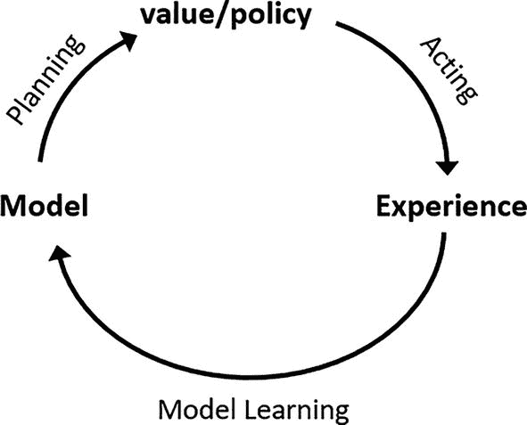

一个图表说明了基于模型的强化学习。其组成部分如下。模型。经验。价值或策略。模型学习。

图 10-1

基于模型的强化学习。智能体通过与环境的交互学习模型，并使用该模型进行规划。

优势在于学习变得更加高效。你可以使用学习到的模型进行有效规划，与无模型方法相比。此外，模型交互主要涉及在状态 *s*[*t*] 下采取动作 *a*[*t*] 并观察下一个状态 *s*[*t* + 1] 和奖励 *r*[*t* + 1] 的结果。你可以使用监督学习机制从与真实世界的交互中学习，其中给定的 (*s*[*t*], *a*[*t*]) 是样本输入，而 *s*[*t* + 1] 和/或 *r*[*t* + 1] 是样本目标。

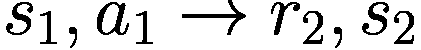

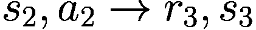

:     :         :

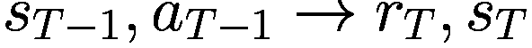

就像任何其他常规监督机器学习设置一样，你可以从代理与其环境交互中收集的前一个样本中学习。

+   学习 *s*[*t*]，*a*[*t*] → *r*[*t* + 1] 是一个具有类似均方损失的回归问题。

+   学习转移动态 *s*[*t*]，*a*[*t*] → *s*[*t* + 1] 是一个密度估计问题。你可以学习一个离散分类分布、高斯分布或高斯模型参数的混合模型。损失可以是 KL 散度损失。

如果你将学习扩展到贝叶斯学习，你还可以对模型的不确定性进行推理——你对学习到的模型转移和奖励函数有多确定或不确定。贝叶斯学习方法不仅产生一个点估计，还产生一个估计的整个分布，这使你能够对估计的强度进行推理。估计的狭窄概率分布意味着大部分概率集中在峰值周围；也就是说，你对估计有很强的信心。相反，估计的广泛分布反映了估计的不确定性更高。

然而，生活中没有免费的午餐。这种两步方法，首先学习模型的不完美表示，然后使用这种不完美的表示来规划或找到最优策略，引入了两种错误来源。首先，学习到的模型动态可能不准确。其次，从不完美的模型中学习价值函数可能有其自身的误差。

学习到的模型可以表示为“查找表”（类似于你在第二章和第三章中看到的），线性期望模型或线性高斯模型。还可以有更复杂的模型表示，如高斯过程模型或深度信念网络模型。这取决于问题的性质、数据收集的容易程度等因素。选择正确的表示需要领域专业知识。让我们看看学习查找表模型的一个简单例子。

首先，查看你将用于学习奖励和转移动态的表达式。这里使用的是一种简单的平均方法。为了估计转移概率，你将看到转移 *s*[*t*]，*a*[*t*] → *s*[*t* + 1] 的次数的平均值除以代理在 *s*[*t*]，*a*[*t*] 中看到自己的总次数。

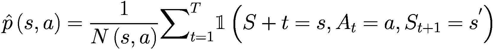

(10-1)

在这里，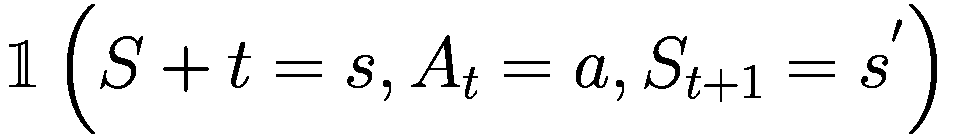 是一个指示函数。指示函数在其括号内的条件为真时取值为 1，否则为 0。总之，这个指示函数是计算 (*s*, *a*) 导致下一个状态转换 *S*[t+1] = *s*^’ 的次数。

同样，你可以将奖励学习定义为平均值。

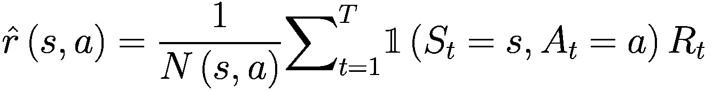

(10-2)

让我们看看一个简单的环境，如图 10-2 所示，其中只有两个状态，并且你观察到一组（八个）智能体与环境的交互。假设没有折现，即 *γ* = 1。

假设你看到 (*A*, 0, *B*, 0)。这意味着智能体从状态 *A* 开始，观察到奖励为 0，然后是状态 *B*，奖励为 0，最后过渡到终端状态。

假设智能体收集到的八个转换/交互如下：

+   A, 0, B, 0

+   B, 1

+   B, 1

+   B, 1

+   B, 1

+   B, 1

+   B, 1

+   B, 0

应用方程 10-1 和 10-2 构建以下模型。

你只从 *A* 到 *B* 看到了一个转换，并且获得了奖励 0。因此，你得出结论 *P*(*B*| *A*) = 1，*R*(*状态* = *A*) = 0。请注意，在前面的例子中，我没有明确显示动作以保持简单。你可以将其视为在每个状态下采取随机动作，或者你可以将其视为马尔可夫奖励过程（MRP）而不是完整的马尔可夫决策过程（MDP）。

你从 *B* 看到了八个转换，它们都导向终端状态。在两种情况下，奖励为 0，而在剩下的六种情况下为 1。这可以建模为说 *P*(终端 | *B*) = 1。奖励 *R*(*B*) = 1 的概率为 0.75（6/8），*R*(*B*) = 0 的概率为 0.25。

图 10-2 展示了从这八次交互中学习到的模型。

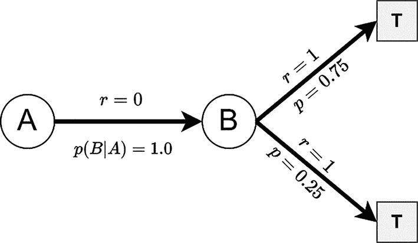

一个图示说明了查找模型。A 与 B 相连，然后分成 2 个 T。

图 10-2

从环境交互学习到的查找表模型

这是一种许多参数化模型表示方法之一，其中你明确学习模型动力学，然后丢弃与真实世界的样本交互。然而，还有另一种在 DQN 中使用的方法：非参数化模型。在非参数化模型中，你将交互存储在缓冲区中，然后从缓冲区进行采样。前八个交互的一个示例是将 `(状态，奖励，下一个状态)` 元组存储在列表中（记住在这个例子中，你没有动作，因为它是一个 MRP）。

![$$ D=\left[\left(A,0,B\right),\left(B,0,T\right),\left(B,1,T\right),\left(B,1,T\right),\left(B,1,T\right),\left(B,1,T\right),\left(B,1,T\right),\left(B,1,T\right),\left(B,0,T\right)\right] $$](img/502835_2_En_10_Chapter/502835_2_En_10_Chapter_TeX_Equd.png)

缓冲区 *D* 中的前两个值来自一个转换，即 *A*, 0, *B*, 0\. 缓冲区中剩余的七个条目是前一个示例中的剩余七个转换。

模型学习的广泛分类如下：

+   *参数化*:

    +   表查找模型

    +   线性期望模型

    +   线性高斯模型

    +   高斯过程模型

    +   深度信念网络模型

+   *非参数化*: 将所有交互（*s*, *a*, *r*, *s*^’）存储在缓冲区中，然后稍后从该缓冲区进行采样以生成示例转换。

## 使用学习模型进行规划

一旦你了解了模型，你可以使用它来执行第三章节中的价值或策略迭代进行规划。在这些方法中，你使用贝尔曼方程进行一步滚动。

然而，学习模型还可以有另一种用途。你可以从中采样，并使用这些样本在 *MC* 或 *TD* 学习方法下进行操作。在这种情况下，执行 *MC* 或 *TD* 风格的学习时，智能体不会与真实环境交互。相反，它与其从过去经验中近似的环境 *模型* 进行交互。在某种程度上，这仍然被称为 *规划*。你正在使用学习到的模型进行规划，而不是从与真实世界的直接交互中进行规划。

请记住，你学习的模型并不精确。它基于智能体与环境的部分交互。它通常不是完整或详尽的。我在前一个章节中谈到了这一点。学习模型中的错误会影响学习的质量。算法根据你形成的模型进行优化，而不是真实世界的模型。这可能会限制学习的质量。如果你的学习模型信心不高，你可以回到之前看到的模型无关的强化学习方法。或者，你可以使用贝叶斯方法来推理模型不确定性。贝叶斯方法不是我在这本书中更多涉及的内容。感兴趣的读者可以参考各种高级强化学习文本和论文，以了解更多关于它的信息。

到目前为止，你已经看到基于模型的强化学习提供了学习模型的好处，从而使得学习更加样本高效。然而，它以模型估计不准确为代价，这反过来又限制了学习的质量。有没有一种方法可以将基于模型和无模型的学习结合到一个单一的统一框架中，并利用两种方法的优势？这就是你接下来要看的。

## 集成学习和规划（Dyna）

你可以有两种经验：一种是在智能体与真实环境交互时获得下一个状态和奖励的真实经验，另一种是模拟经验，其中智能体使用它所学习的模型来创建更多的模拟经验。模拟经验更容易且成本更低，尤其是在机器人领域。快速的机器人模拟器可以产生可能与现实世界不完全匹配的样本，但允许你比机器人的真实世界交互更快地模拟和生成智能体行为。然而，模拟可能不够精确，这就是为什么从真实世界经验中学习有帮助。我们可以将图 10-1 的图表改为包括这一步骤，如图 10-3 所示。

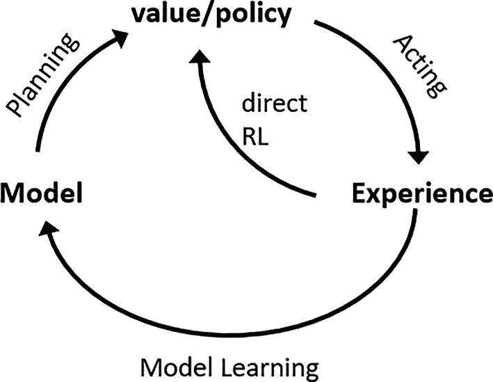

学习和规划的 dyna 架构。它们包括模型、经验、模型学习和价值或策略。

图 10-3

Dyna 架构

在 Dyna 中，智能体与环境（行动）交互以产生真实经验。这些真实经验用于学习世界模型，并直接改进价值/策略，就像无模型的强化学习设置一样。这与你在第 [4](http://dx.doi.org/10.1007/978-1-4842-6809-4_4) 章节到第 [8](http://dx.doi.org/10.1007/978-1-4842-6809-4_8) 章节中看到的方法相同。从现实世界交互中学习的模型用于生成模拟转换。这些模拟转换用于改进价值/策略。这被称为步骤规划，因为你正在使用世界模型来生成经验。你可以通过使用模拟经验多次进行“行动”的每一步来执行规划步骤，并从真实世界中生成新的样本。

让我们来看 Dyna—Tabular Dyna Q 的具体实现。在这里，你假设状态和动作是离散的，并形成一个小的集合，这样你就可以使用表格表示 *Q*(*s*, *a*)，即 q 值。你使用基于 *TD* 的 q-learning 方法来学习和改进策略。这与我们在第四章节中使用的 Q-learning 方法，即离线 *TD* 控制，类似。你还将有一些额外的步骤来从模拟经验中学习。在第四章节中，你只使用了真实经验来学习 q 值，但现在你将学习模型并使用它来生成额外的模拟经验以供学习。图 10-4 展示了完整的算法。

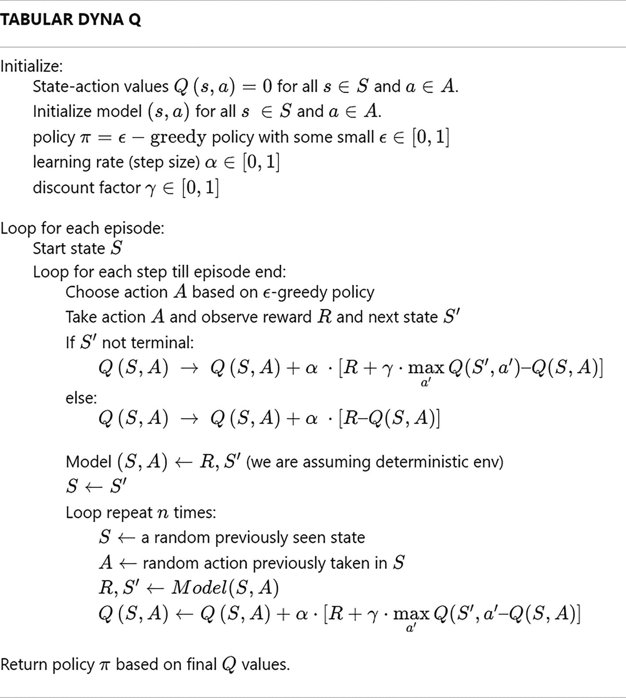

一个表格展示了 dyna Q。它包括初始化，每个回合的循环，然后返回策略

图 10-4

表格动态 Dyna Q

你可以从图 10-4 中的伪代码中看到，表格动态 Dyna Q 与图 4-16 中的表格 Q-learning 类似，但在 Dyna Q 中，对于真实环境中的每个步骤，你还会使用模拟经验执行额外的 *n* 步。在这种情况下，它从真实世界中看到的先前转换中进行采样。随着 *n* 的增加，收敛并学习最优值所需的回合数将减少。

考虑一个迷宫中每个转换都没有奖励的情况，除了最后一个终端/目标状态转换具有 1 的奖励值。这样的迷宫示例可以是图 10-5 左侧的迷宫。让我们还假设每个 (*s*, *a*) 对的初始 q 值都是 0。在常规 Q-learning 中，当第一个回合结束时，你会学习到目标值 1。然后，值 1 将缓慢传播——每个回合一个单元格/级别——最终达到起始状态。q 值和最优策略将在之后的回合中开始收敛。然而，在 Dyna Q 的情况下，你将根据环境中的每个真实步骤生成 *n* 个额外的示例。这将加快收敛速度。你将比纯 Q-learning 方法更早看到策略收敛。请参阅《强化学习：入门》一书中第 [8](http://dx.doi.org/10.1007/978-1-4842-6809-4_8) 章节中关于这种更快收敛的理论和详细解释。

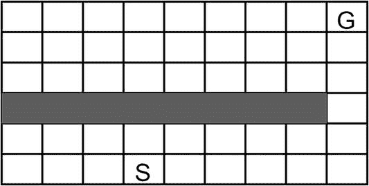

中间有障碍的网格。字母包括 G 和 S。

图 10-5

中间有障碍的迷宫。只有在智能体达到目标状态 G 时才给予奖励。所有其他转换的奖励都是 0

让我们将上一节中的表格动态 Dyna Q 伪代码应用到第四章中你看到的那个环境中。你需要修改 `4.d-qlearning.ipynb` 中的代码，以包含模型学习，然后为每个基于实际经验的直接强化学习步骤进行 *n* 步的计划（从模拟经验中学习）。完整的代码在 `10.a-dynaQ.ipynb` 中给出。在讲解过程中，我将突出 Dyna Q 代码和第四章中 Q-learning 代码的关键区别。

首先，将智能体从 `QLearningAgent` 重命名为 `DynaQAgent`。这只是名称的改变，代码保持不变，除了添加一个额外的字典来存储真实世界的转换。将以下两行代码添加到列表 10-1 中所示的粗体 `__init__` 函数中。

```py
class DynaQAgent:
def __init__(self, alpha, epsilon, gamma, get_possible_actions, n):
self.get_possible_actions = get_possible_actions
self.alpha = alpha
self.epsilon = epsilon
self.gamma = gamma
self.n = n
self._Q = defaultdict(lambda: defaultdict(lambda: 0))
self.buffer = {}
def get_Q(self, state, action):
return self._Q[state][action]
def set_Q(self, state, action, value):
self._Q[state][action] = value
# Q learning update step
# same as that of 4.d-qlearning.ipynb
def update(self, state, action, reward, next_state, done):
pass
# code omitted #
# get best A for Q(S,A) which maximizes the Q(S,a) for actions in state S
# same as that of 4.d-qlearning.ipynb
def max_action(self, state):
# code omitted #
return np.random.choice(np.array(best_action))
# choose action as per ε-greedy policy for exploration
# same as that of 4.d-qlearning.ipynb
def get_action(self, state):
# code omitted #
Listing 10-1
Dyna Q Agent from 10.a-dqnaQ.ipynb
```

第二步，添加逻辑以遵循图 10-4 中所示的伪代码的规划部分，如下所示：

循环重复 *n* 次：

+   *S*←一个随机之前看到的状态

+   *A*←在*S*中之前采取的随机动作

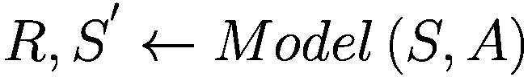

![$$ Q\left(S,A\right)\to Q\left(S,A\right)+\upalpha \cdotp \left[R+\upgamma \cdotp \max {1}_{a\prime }Q\left({S}^{\prime },{a}^{\prime}\right)\hbox{--} Q\left(S,A\right)\right] $$](img/502835_2_En_10_Chapter/502835_2_En_10_Chapter_TeX_Equf.png)

这段代码被添加到`train_agent`函数中，该函数用于训练智能体。列表 9-2 展示了该函数的修订版实现。代码的新增部分位于函数的末尾。首先是向智能体的缓冲区添加过渡，以便智能体可以使用先前经验缓冲区来估计模型过渡动力学。第二个变化是使用智能体从先前与真实环境的交互中收集的模拟经验进行*n*步规划。这些变化在列表 10-2 中以粗体突出显示。

```py
#training algorithm
def train_agent(env, agent, episode_cnt = 10000,
tmax=10000, anneal_eps=True):
episode_rewards = []
for i in range(episode_cnt):
G = 0
state,_ = env.reset()
for t in range(tmax):
action = agent.get_action(state)
next_state, reward, done, truncated, _ = env.step(action)
done = done or truncated
agent.update(state, action, reward, next_state, done)
G += reward
if done:
episode_rewards.append(G)
# to reduce the exploration probability epsilon over the
# training period.
if anneal_eps:
agent.epsilon = agent.epsilon * 0.99
break
# add the experience to agent’s buffer (i.e. agent’s model estimate)
agent.buffer[(state,action)] = (next_state, reward, done)
state = next_state
# plan n steps through simulated experience
for j in range(agent.n):
state_v, action_v = random.choice(list(agent.buffer))
next_state_v, reward_v, done_v = agent.buffer[(state_v,action_v)]
agent.update(state_v, action_v, reward_v, next_state_v, done_v)
return np.array(episode_rewards)
Listing 10-2
Function train_agent from 10.a-dynaQ.ipynb
```

接下来，运行 Dyna Q 对迷宫以及来自 Gymnasium 的出租车世界环境进行训练。查看 Python 笔记本中的训练曲线，注意与传统的 Q-learning 相比，Dyna Q 收敛所需的剧集更少。在`4.d-qlearning.ipynb`中给出的 Q-learning 训练曲线中，你可以看到智能体在大约 100-150 步之前达到最佳策略。而`10.a-dynaQ.ipynb`中的 Dyna Q 智能体大约需要 20 步左右。这证明了 Dyna Q（或更一般地，任何 Dyna 架构）是样本高效的。

## Dyna Q 和改变环境

现在让我们考虑这样一个情况，即你首先使用 Dyna Q 学习迷宫的最佳策略。经过一些步骤后，你改变环境并使其更难，如图 10-6 所示。左图显示了智能体学习的原始网格，智能体通过灰色砖墙右侧的开口从起点 S 导航到目标 G。在智能体学习到最佳行为后，网格发生了变化。右侧的开口关闭，左侧出现了一个新的开口。当智能体试图通过之前的路径导航到目标时，现在发现原始路径被阻挡了。原始迷宫右侧的开口现在已关闭。这是由于你刚才所做的更改。

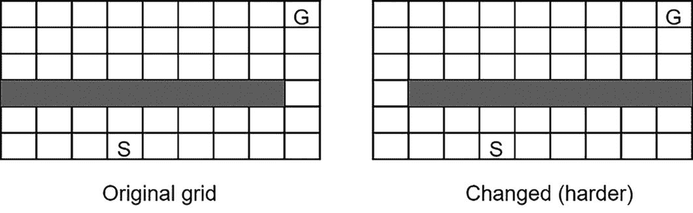

两个网格说明了导航。开口困难，智能体通过右侧的开口导航。

图 10-6

在智能体学会通过右侧的开口导航后，中间增加了更难网格的 Dyna Q。智能体学会通过砖墙左侧的新开口导航网格。

Sutton 和 Barto 在他们的书 *强化学习：入门* 中表明，Dyna Q 需要一段时间来学习变化后的环境。一旦环境在中间发生变化，就有许多场景，智能体一直向右走，但发现路径被阻挡，因此它需要大量的额外步骤在 *ε*-贪婪策略下学习通过左侧开口到达目标的替代路径。

让我们考虑他们在书中展示的第二种情况。在第二种情况下，环境在中间发生了变化并变得简单，也就是说，在右侧引入了一个新的开口，而没有关闭左侧的原始开口。图 10-7 展示了变化前后的迷宫。

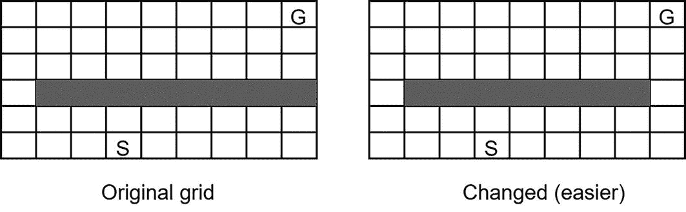

两个使用 dyna Q 的网格说明了导航。智能体未能通过新右侧缺口发现更短的路径。

图 10-7

在智能体学会了左侧网格的最优策略之后，Dyna Q 的网格变得简单。Dyna Q 智能体未能发现通过新右侧缺口更短的路径

通过在这个设置上运行 Dyna Q 学习算法，你可以看到 Dyna Q 没有学会砖墙右侧的新开口。通过砖墙右侧的新路径提供了到达目标状态的一条更短的路径。Dyna Q 已经学会了最优策略，它没有激励去探索变化后的环境。对新开口的随机/机会探索取决于探索策略，而探索策略又取决于 *ε* 探索。

有一个名为 Dyna Q+ 的改进算法可以解决这个问题，如下节所述。

## Dyna Q+

Dyna Q+ 是一个典型的探索/利用困境的例子，在所有强化学习设置中都需要仔细思考。如果你开始早期利用知识（即模型或策略），你可能会错过了解更好路径的机会。智能体贪婪地对其已经学会的内容感到满意。另一方面，如果智能体过度探索，即使它已经找到了最优解，它也会浪费时间查看次优路径/选项。不幸的是，智能体没有直接知道它已经达到了最优策略，因此它需要使用其他启发式方法/方式来平衡探索/利用困境。

在 Dyna Q+ 中，你通过向观察到的状态之外的状态添加奖励来鼓励探索未见过的状态。这个额外的奖励项鼓励探索在现实世界中一段时间没有访问过的状态。

在模拟规划部分，你需要在奖励中添加 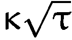；也就是说，奖励 *r* 变为 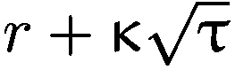，其中 κ 是一个小的常数，τ 是从问题中提到的过渡在现实世界探索中首次出现的时间。这鼓励智能体尝试这些过渡并有效地发现环境中的变化，同时有一些由 κ 控制的延迟。在图 10-7 中，智能体最初学会通过左侧的开口。它按照修订后的条款进行探索，但发现到达目标唯一的方式是通过左侧的开口。然而，当通过在右侧打开新的开口来改变环境后，智能体在随后的对这个迷宫部分的探索中会发现新的开口，并最终发现这是到达目标的一条更短的路径。智能体将修正其最优行为，跟随右侧的开口。随着时间的推移，最后一次访问网格的一部分，奖励中的  项增长。在某个阶段，它可能增长得如此之大，以至于它掩盖了当前最优行为的奖励，迫使智能体再次探索未访问的部分。

## 预期更新与样本更新

你已经看到了各种结合学习和规划的方法。你可以看到学习和规划都是关于价值函数更新的方式。第一个维度是关于更新什么，是状态值 (*v*) 还是动作值 (*q*)。另一个维度是更新的宽度。换句话说，更新是基于看到的单个样本（样本更新），还是基于所有可能的过渡（预期更新）使用给定当前状态和动作的下一个状态的概率转移，即 *p*(*s*[*t* + 1]| *s*[*t*], *a*[*t*])？第三个和最后一个维度是更新是否针对任何任意策略 *v*[*π*]，*q*[*π*] 或最优策略 *v*^∗，*q*^∗。让我们看看各种组合，并将它们映射回你在书中看到的内容。你将看到迄今为止你看到的七种不同类型的更新。

第一种是将 *v*π 使用预期更新进行更新。这是一个价值函数的更新，它是一个覆盖从给定状态到所有可能过渡的预期更新，使用转移概率分布 *p*(*s*^′, *r*| *s*, *a*)。动作是通过当前策略智能体执行的。这是使用动态规划进行的策略评估，正如你在方程 3-6 中看到的。

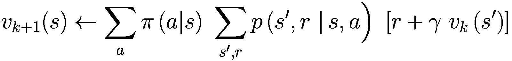

第二个是使用样本更新来更新*v**π*。这个更新是针对值函数的，并且基于代理遵循策略*π*后看到的样本。这是你在方程 4-5 中看到的*TD*(0)策略评估。状态(*s*)的值根据代理采取的动作、按照策略*π*的后续奖励(*r*)以及代理看到的下一个状态(*s*^’*)进行更新。我将方程 4-5 以迭代形式表达，以突出从步骤*k*到步骤*k*+1 的更新。

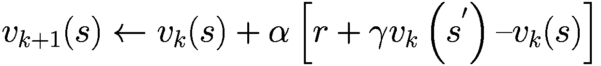

第三个是使用所有可能动作的最大值来更新*v*^∗(*s*)。状态(*s*)的值基于所有可能下一个状态和奖励的期望进行更新。更新是通过取所有可能动作的最大值来完成的，即在给定时间点的最优动作。这不是基于代理当前遵循的策略。这是根据方程 3-8 使用动态规划进行值迭代的途径。


接下来的内容是关于 Q 值的变化。第四种方法是使用期望更新来更新*q*π。正在更新的值是 q 值，并且基于从给定状态-动作对可能的所有下一个状态和奖励的期望进行更新。更新是基于代理当前遵循的策略。这是使用动态规划的 q 策略评估，如方程 3-2 所示。这里方程 3-2 以迭代形式表达。

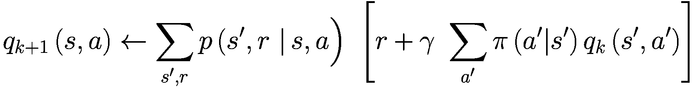

第五个是使用样本更新来更新*q*π。q 值的更新基于样本和代理当前遵循的策略——换句话说，这是一个在策略下的更新。这是使用动态规划的 q 值迭代。以下是方程 3-4 的迭代版本。

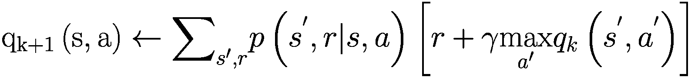

第六种方法是使用所有可能的状态更新 *q*^∗(*s*, *a*)，然后在下一个状态的所有可能动作中选择最大值。这是一种针对 q 值的更新，基于所有可能的后续状态和动作对的期望。它是通过选择最大动作来执行的，因此更新的是最优策略，而不是代理当前遵循的策略。这是使用无模型设置的 SARSA，如方程 4-7 所示。以下方程是同一方程的重新编写，以匹配本节的符号。

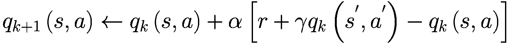

第七种方法涉及使用样本动作更新 *q*^∗(*s*, *a*)，然后从下一个状态的所有可能动作中选择最大值。这种更新是基于样本的 q 值更新。更新是基于对所有可能动作的最大值，即离线策略更新。这并不是针对代理当前遵循的策略的更新。这是你在第四章学习到的 Q-learning，然后在第六章的 DQN 下扩展到深度网络。以下是方程 4-10 重新编写以匹配本章的符号。

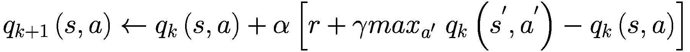

所有这些更新都展示了动态规划（DP）和无模型世界是如何相互关联的。在 DP 中，由于你知道模型动态，你会在所有可能的转换 *p*(*s*[*t* + 1]| *s*[*t*], *a*[*t*]) 上进行广泛的扫描。在无模型世界中，你不知道模型，因此你进行基于样本的 MC 或 TD 更新。DP 和无模型之间的区别完全在于更新是针对期望还是针对样本。

这也表明，一旦你开始学习模型动态，你可以在 Dyna 设置下混合和匹配任何先前的方法。就像之前一样，你可以在统一的单个设置中结合无模型和基于模型的策略。这类似于你在将基于价值的 DQN 和策略梯度结合到 actor-critic 下的统一方法中所做的那样，以及你如何通过资格迹将单步样本（TD）和多步样本（MC）结合到单个框架中。

另一种组织强化学习算法的方法是观察一个二维世界，其中垂直轴是更新的长度/深度，TD(0)在一端，MC 在另一端。第二个/水平维度可以表示为更新的宽度，基于预期的动态规划在一端，基于样本的 MC/TD 更新在另一端。图 10-8 展示了这种区别。

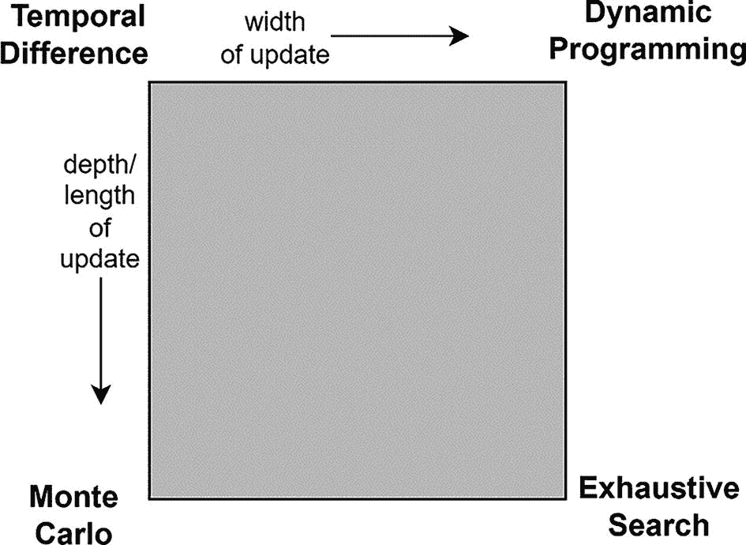

正方形图示说明了强化学习的方法。它包括动态规划、穷举搜索、蒙特卡洛，最后以时序差分结束。

图 10-8

强化学习方法的概述

你可以通过添加更多维度来进一步细化这种统一。一个可能的第三个维度，与更新的宽度和深度垂直，将是离线策略更新与在线策略更新的区别。你也可以添加一个第四个维度，即纯粹基于价值的策略或纯粹基于策略学习的策略，或者两者的混合，即演员-评论家。

到目前为止，你已经看到了在所谓的“向后视角”中结合学习和规划。你使用了规划（例如，Dyna Q）来更新价值函数，但在现实世界中选择动作时没有涉及规划。这有点像被动的规划方法，其中规划被用来生成额外的步骤/合成示例以训练和改进模型/策略/价值函数。在接下来的部分中，你将看到“向前规划”，即在决策时进行规划。换句话说，你使用模型知识（学习或给定）来展望未来，然后根据你认为的最佳动作采取行动。你将在蒙特卡洛树搜索算法（MCTS）的背景下查看这种方法。然而，在你这样做之前，下一节将重新审视探索与利用的问题。

## 探索与利用

在强化学习中，你总是需要在使用当前知识和探索更多以获得新知识之间取得平衡。最初你对世界（环境）的了解几乎没有或非常少。你进行大量探索，并开始改进你对世界的信念。随着你的信念不断改善和加强，智能体开始利用这种信念，同时逐渐减少其探索。

到目前为止，你已经看到了不同形式的探索。第一次遇到探索是在ε-greedy 策略的形式中，其中智能体根据其当前信念以概率(1 - *ε*)采取最佳动作，并以概率*ε*随机探索。随着学习的进展，你逐渐减少*ε*。你在所有的 DQN 方法中都看到了这一点。如果你查看第 6 和 7 笔记本，你会注意到一个`epsilon_schedule`函数，如列表 10-3 所示。在学习的开始，你从ε=1 开始，在一段时间内减少到 0.05，以在训练结束时进行少量探索。这被称为*epsilon 减少计划*。减少可以是线性的或遵循任何其他曲线，类似于你对α（学习率）所做的事情。在监督学习中，作为随机梯度下降的一部分，你根据称为*学习率计划*的计划来变化α。有各种方法来变化α。如果你有ε-greedy 策略，你可以使用这些方法中的大多数来变化ε。

```py
def epsilon_schedule(start_eps, end_eps, step, final_step):
return start_eps + (end_eps-start_eps)*min(step, final_step)/final_step
Listing 10-3
Epsilon Schedule for Exploration
```

探索的第二种方法是在策略梯度方法中学习随机策略，其中你总是学习一个策略分布 *π**θ*章。

在下一节中，你将研究一个简单的设置，更正式地研究探索与利用之间的权衡以及各种高效探索策略。

### 多臂老虎机

本节考虑了一个被称为*多臂老虎机*的环境。它基于多个老虎机堆叠在一起的概念。智能体不知道每个老虎机的个别奖励（成功率）。智能体的任务是选择一台机器并拉动老虎机的拉杆以获得奖励。这个周期可以持续到你想要的时间。智能体需要探索以尝试所有机器并形成对每台机器个别奖励分布的信念。随着信念的增强，它必须开始更多地利用其知识/信念来拉动最佳机器的拉杆并减少探索。图 10-9 展示了设置。


一幅插图展示了多臂老虎机。章鱼用它的所有触手工作。

图 10-9

非上下文多臂老虎机

我们研究多臂老虎机的原因在于它是一个简单的设置。进一步来说，它可以扩展到上下文多臂老虎机，其中每个老虎机的奖励分布不是固定的。相反，它取决于特定时间点的上下文，例如代理的“当前状态”。上下文多臂老虎机有许多实际应用场景。你将在这里看到一个这样的例子。

假设你是一位企业家，并决定建立一个与谷歌 AdWords 竞争的业务。作为设计的一部分，假设你有十个广告，你希望在浏览器窗口中根据页面（例如，内容）的上下文显示一个广告。当前页面是上下文，显示十个广告中的一个动作。当用户点击广告时，用户获得 1 的奖励；否则，奖励为 0。代理有用户在相同上下文中点击显示广告的历史记录，即点击具有相似内容的网页上显示的广告。代理希望通过一系列动作来增加/最大化用户点击显示广告的机会。这是一个上下文多臂老虎机的例子。

另一个例子是在线商店根据用户当前查看的内容显示其他产品推荐。在线商店希望用户会发现一些推荐有趣，可能会点击它们。另一个例子是从 *K* 个可能选项中选择药物，给患者服用以选择最佳药物，并在最多 *T* 次尝试中得出结论。

你可以将老虎机框架进一步扩展以考虑全规模马尔可夫决策过程（MDP）。但每一次扩展都会使形式分析变得更加繁琐和复杂。因此，本章研究非上下文老虎机的最简单设置，以帮助你理解基础知识。感兴趣的读者可以借助网络上许多优质资源进一步研究。

### 悲剧：衡量探索的质量

在这里，你定义探索的质量。假设系统处于状态 *S*。在非上下文老虎机中，这是一个冻结的初始状态，每次都保持不变。对于上下文老虎机，状态 *S* 可能会随时间变化。进一步，假设你在时间 *t* 遵循策略 *π**t* 来选择动作。同时考虑你知道最优策略 π^∗(*s*)。

时间 *t* 的悲剧，即从非最优策略中选择动作的悲剧，在方程 10-3 中定义。它是遵循最优策略的期望奖励减去遵循特定策略的奖励。

![$$ regret=\upeta ={E}_{a\sim {\pi}^{\ast }(s)}\left[r\left(s,a\right)\right]-{E}_{a\sim {\pi}_t(s)}\left[r\left(s,a\right)\right] $$](img/502835_2_En_10_Chapter/502835_2_En_10_Chapter_TeX_Equ3.png)

(10-3)

你可以将其对所有时间步进行求和，以获得 *T* 步的总后悔，从而得到方程 10-4 中给出的表达式。

![$$ \eta ={\sum}_{t=1}^T\left({E}_{a\sim {\pi}^{\ast }(s)}\left[r\left(s,a\right)\right]-{E}_{a\sim {\pi}_t(s)}\left[r\left(s,a\right)\right]\right) $$](img/502835_2_En_10_Chapter/502835_2_En_10_Chapter_TeX_Equ4.png)

(10-4)

这是一种非上下文赌博机，其中状态 (*s*) 在每个时间步都保持不变——它保持为初始状态。因此，你可以将方程 10-4 简化为方程 10-5 所示的形式。

![$$ \eta =T.\kern0.5em {E}_{a\sim {\pi}^{\ast }(s)}\left[r\left(s,a\right)\right]-{\sum}_{t=1}^T\left({E}_{a\sim {\pi}_t(s)}\left[r\left(s,a\right)\right]\right) $$](img/502835_2_En_10_Chapter/502835_2_En_10_Chapter_TeX_Equ5.png)

(10-5)

这个例子使用方程 10-5 来比较各种采样策略。你将在接下来的几节中看到三种常用的探索策略，通过代码示例的帮助。你可以在 `10.b-explore-vs-exploit.ipynb` 中找到完整的代码。

让我们先描述你将使用的设置。考虑多臂赌博机有 *K* 个动作。每个动作有一个固定的概率 θ[*k*]，*k* ∈ [1\. . *K*]，产生奖励 1，以及一个 (1 − θ[*k*]) 的概率产生奖励 0。最佳动作是 *k*（小写 *k*）的值，它具有最大的成功概率。

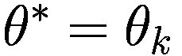

列表 10-4 展示了赌博机的代码。你将 *K* 存储为 `self.n_actions`，并将所有 θ[*k*] 存储为 `self._probs.`。`pull` 函数接受 *k* 动作作为输入，根据动作的概率分布（即 θ[*k*]）返回奖励 1 或 0。`optimal_reward` 函数返回 `self._probs.` 的 `max` 值。

```py
class Bandit:
def __init__(self, n_actions=5):
self._probs = np.random.random(n_actions)
self.n_actions = n_actions
def pull(self, action):
if np.random.random() > self._probs[action]:
return 0.0
return 1.0
def optimal_reward(self):
return np.max(self._probs)
Listing 10-4
Bandit Environment from 10.b-explore-exploit.ipynb
```

接下来，我们将探讨三种探索策略，从 *ε*-贪婪探索策略开始。

### Epsilon Greedy Exploration

这与你在前几章中看到的 *ϵ*-贪婪策略类似。智能体尝试不同的动作，并形成对赌博机环境不同动作的未知实际成功概率 θ[*k*] 的估计 。它以 (1 − *ϵ*) 的概率采取动作 *k*，其中 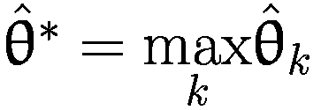。换句话说，它利用到目前为止获得的知识，根据  估计采取它认为最好的动作。此外，它以概率 *ϵ* 采取随机动作以进行探索。

让我们将 *ϵ* 设置为 0.01 作为探索概率，并在整个实验中保持其恒定。列表 10-5 展示了实现此策略的代码。首先，你将 `RandomAgent` 定义为基类。有两个数组用于存储每个动作的成功和失败结果的累积计数。你将这些计数存储在数组中：`self.success_cnt` 和 `self.failure_cnt`。

`update(action, reward)` 函数根据采取的动作和结果更新这些计数。`reset()` 函数重置这些计数。这样做是为了运行相同的实验多次，并绘制平均值以平滑方差。`get_action()` 函数是实现探索策略的地方。它将根据策略类型使用不同的方法来平衡探索与利用。对于 `RandomAgent`，动作总是从可能动作集中随机选择。

接下来，你在 `EGreedyAgent` 类中实现 *ε*-探索代理。这是通过扩展 `RandomAgent` 并重写 `get_action()` 函数来实现的。正如解释的那样，以概率 (1 − *ϵ*) 选择具有最高概率的动作，以概率 *ϵ* 选择随机动作。

```py
class RandomAgent:
def __init__(self, n_actions=5):
self.success_cnt = np.zeros(n_actions)
self.failure_cnt = np.zeros(n_actions)
self.total_pulls = 0
self.n_actions = n_actions
def reset(self):
self.success_cnt = np.zeros(n_actions)
self.failure_cnt = np.zeros(n_actions)
self.total_pulls = 0
def get_action(self):
return np.random.randint(0, self.n_actions)
def update(self, action, reward):
self.total_pulls += 1
if reward == 1:
self.success_cnt[action] += 1
else:
self.failure_cnt[action] += 1
class EGreedyAgent(RandomAgent):
def __init__(self, n_actions=5, epsilon=0.01):
super().__init__(n_actions)
self.epsilon = epsilon
def get_action(self):
estimates = self.success_cnt / (self.success_cnt+self.failure_cnt+1e-12)
if np.random.random() < self.epsilon:
return np.random.randint(0, self.n_actions)
else:
return np.argmax(estimates)
Listing 10-5
Epsilon Greedy Exploration Agent from 10.b-explore-vs-exploit.ipynb
```

在这个设置中，你不会改变 ϵ 值，因此代理永远不会学会执行完美的最优策略。它将永远以 ϵ 概率继续探索。因此，遗憾永远不会降到 0，你期望累积遗憾如公式 10-5 所示，将随着由 ϵ 值定义的增长斜率线性增长。ϵ 值越大，增长斜率越陡峭。

### 上置信界探索

本节探讨了称为 *上置信界* (UCB) 的策略。在此方法中，代理尝试不同的动作并记录成功次数 (α[*k*]) 或失败次数 (β[*k*])。

它计算了成功概率的估计值 ，这些值将用于选择具有最高成功估计值 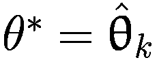 的动作。这是动作 *k* 的“利用”部分。

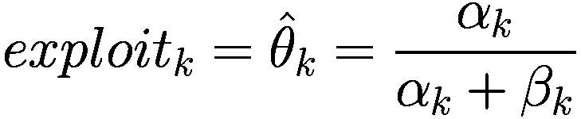

它还计算了有利于最少访问动作的探索需求，如下所示：

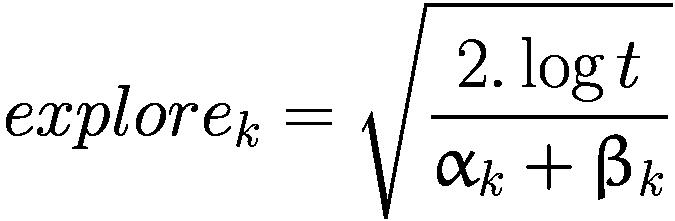

其中 *t* 是到目前为止所采取的总步数。通过探索和利用来定义每个动作 *k* 的分数，如公式 10-6 所示。

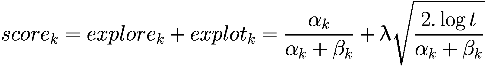

(10-6)

然后，智能体选择具有最大 *score*[*k*] 值的行动 *k*。在方程 10-6 中，λ 控制了探索与利用的相对重要性。你将在代码中使用 λ = 1。

UCB 中的方法是计算一个上置信界（上置信区间），以确保你有 0.95（或任何其他置信水平）的概率，实际估计值在 UCB 值内。随着试验次数的增加，以及你反复采取特定的行动，估计的不确定性会降低，方程 10-6 中的分数将接近估计值 。尚未访问过的行动将具有 *score* = ∞，因为在方程 10-6 中，α[*k*] + β[*k*] = 0，使得分数无限。UCB 已证明具有接近最优的增长界限。我不会深入到这个数学证明。你可以参考关于多臂老虎机问题的先进文本。

现在，你将了解 UCB 智能体的实现。列表 10-6 提供了代码。正如解释的那样，你再次扩展了列表 10-5 中所示的 `RandomAgent` 类，并重写 `get_action` 函数以根据 UCB 方程 10-6 选择行动。请注意，为了避免除以零，在 `self.success_cnt+self.failure_cnt (`*α*[*k*] + *β*[*k*]) 出现的分母中添加了一个小的常数 `1e-12`。

```py
class UCBAgent(RandomAgent):
def get_action(self):
exploit = self.success_cnt / (self.success_cnt+self.failure_cnt+1e-12)
explore = np.sqrt(2*np.log(np.maximum(self.total_pulls,1))/ \
(self.success_cnt+self.failure_cnt+1e-12))
estimates =  exploit + explore
return np.argmax(estimates)
Listing 10-6
UCB Exploration Agent from 10.b-explore-vs-exploit.ipynb
```

### 汤普森抽样探索

本节探讨了最终策略，即汤普森抽样。这是基于选择一个行动的想法，即它具有最大化预期奖励的概率。虽然 UCB 基于频率主义概率观念，但汤普森抽样基于贝叶斯思想。

初始时，你对哪种行动更好没有任何先验知识，也就是说，哪种行动具有最高的成功概率 θ[*k*]。因此，你形成了一个初始信念，即所有 *θ*[*k*] 值在范围 (0, 1) 内均匀分布。这在贝叶斯术语中被称为 *先验*。你用 Beta 分布^(2) 表示这一点，即 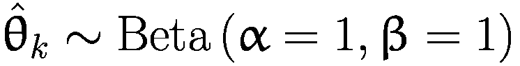。在第一次迭代中，智能体使用 Beta 分布  为每个行动 *k* 抽样一个值，并选择具有最大抽样值 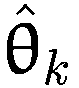 的行动 *k*。

接下来，它执行动作（即调用`pull`函数执行所选动作）并观察结果（成功或失败）。根据结果，它更新所选动作*k*的后验分布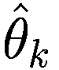。随着每一步中不同动作*k*的成功和失败次数更新，代理继续更新其在每一步*k*中对特定的信念。这是在贝叶斯框架下所有动作*k*∈*K*的未知值θ[*k*]的后验分布。

![$$ {\hat{\theta}}_k\sim Beta\left(\alpha ={\alpha}_k+1,\beta ={\beta}_k+1\right)\kern0.75em \forall k\in \left[1..K\right] $$](img/502835_2_En_10_Chapter/502835_2_En_10_Chapter_TeX_Equ7.png)

(10-7)

这个循环会继续。随着你通过多个步骤，α[*k*]和β[*k*]，动作*k*的成功和失败次数增加。Beta 分布变得更窄，峰值在α[*k*]/(α[*k*] + β[*k*])的均值附近。

现在看看 Thompson 采样在代码中的实现，如列表 10-7 所示。和之前一样，你扩展`RandomAgent`类并重写`get_action`方法来实现 Beta 分布方程 10-7。

```py
class ThompsonAgent(RandomAgent):
def get_action(self):
estimates = np.random.beta(self.success_cnt+1, self.failure_cnt+1)
return np.argmax(estimates)
Listing 10-7
Thompson Sampling Exploration from 10.b-explore-vs-exploit.ipynb
```

### 比较不同的探索策略

实现了各种探索策略后，你现在将评估这些策略中的每一个的遗憾值，并将这些遗憾值作为*t*（步数增加的次数）来绘制。你实现了一个`get_regret`函数，使用 bandit 环境和选定的探索策略进行`n_steps=10000`步，然后进行`n_trials=50`次实验以减少方差，并将平均累积遗憾值作为步数的函数存储。列表 10-8 显示了实现`get_regret`的代码，该代码作用于单个代理/策略。

```py
def get_regret(env, agent, n_steps=10000, n_trials=10):
score = np.zeros(n_steps)
optimal_r = env.optimal_reward()
for trial in range(n_trials):
agent.reset()
for t in range(n_steps):
action = agent.get_action()
reward = env.pull(action)
agent.update(action, reward)
score[t] += optimal_r - reward
score = score / n_trials
score = np.cumsum(score)
return score
Listing 10-8
get_regret Function from 10.b-explore-vs-exploit.ipynb
```

定义了所有机制后，你为三个探索-利用代理——ε-greedy、UCB 和 Thompson 探索——运行实验。这些代理的遗憾值作为步数的函数被绘制出来。绘图代码和运行实验的代码显示在列表 10-9 中。

```py
def plot_regret(scores):
for k,v in scores.items():
plt.plot(v)
plt.legend([k for k,v in scores.items()])
plt.ylabel("regret")
plt.xlabel("steps")
plt.show()
n_actions = 5
n_steps=10000
n_trials=50
epsilon = 0.01
agents = {
#"Random" : RandomAgent(n_actions),
"EpsilonGreedy(eps=0.01)" : EGreedyAgent(n_actions, epsilon),
"UCB": UCBAgent(n_actions),
"Thompson": ThompsonAgent(n_actions) }
env = Bandit(n_actions)
scores = {}
for name, agent in agents.items():
score = get_regret(env, agent, n_steps, n_trials)
scores[name] = score
plot_regret(scores)
Listing 10-9
Code to Run Experiment and Plot the Regret Graph from 10.b-explore-vs-exploit.ipynb
```

运行列表 10-9 中的实验会产生图 10-10 所示的遗憾值图。

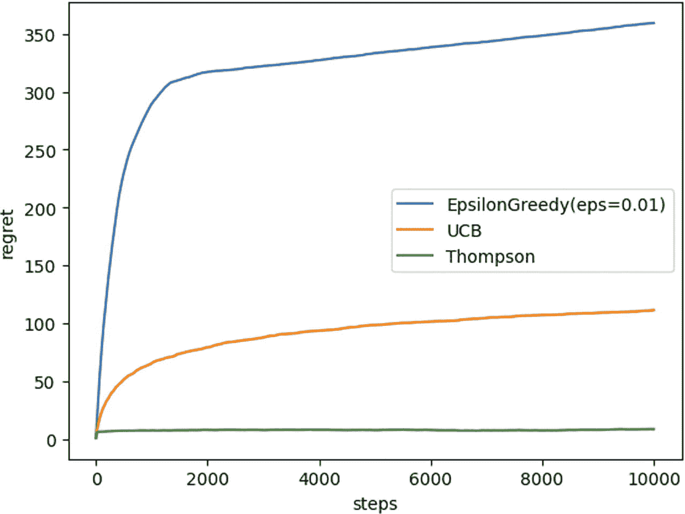

一个遗憾值与步数对比的线形图。ε的线从大约 0 开始然后垂直上升。然后它在 2000 之后保持水平。UCB 和 Thompson 的线遵循水平方向。

图 10-10

不同探索策略的遗憾曲线

你可以看到 UCB 和 Thompson 算法具有次线性增长，而ε-greedy 算法的遗憾值则以更快的速度增长（以线性增长，增长速率由ε的值决定）。

现在将进入蒙特卡洛树搜索的讨论，在那里将使用 UCB 来执行探索与利用决策。MCTS 中 UCB 的选择基于流行 MCTS 实现中显示的当前趋势。

## 决策时规划和蒙特卡洛树搜索

Dyna 使用规划的方式被称为 *背景规划*。模型用于生成模拟样本，然后将其输入到算法中，就像使用真实样本一样。这些额外的模拟样本有助于进一步改进价值估计，超过使用现实世界交互所做的估计。当在，比如说，状态 *S*[*t*] 中选择行动时，在这个决策时没有进行规划。

另一种规划方法是开始和结束规划时处于状态 *S*[*t*]，以便向前看，有点像使用到目前为止学到的模型在你的脑海中演绎各种场景，并使用这个规划来决定在时间 *t* 要采取的行动 *A*[*t*]。一旦采取了行动 *A*[*t*]，代理发现自己处于新的状态 *S*[*t* + 1]。代理再次向前看，规划并迈出一步。这个周期继续进行。这被称为 *决策时规划*。根据可用的时间，代理可以从当前状态规划得更远/更深，那么这个规划在决定在时间 *t* 采取什么行动时将更加强大和有帮助。因此，当不需要快速响应时，决策时规划最有帮助。在像国际象棋和围棋这样的棋类游戏中，决策时规划在决定采取什么行动之前可以向前看十几步。然而，如果需要快速响应，那么背景规划最为合适。

这些向前搜索算法通过向前看选择最佳可能行动。它们从代理当前处于的状态 *S*[*t*] 开始构建可能的选项搜索树。给定状态-行动对中的可能选项可能取决于代理从先前交互中学到的 MDP 模型，或者它可能基于代理一开始收到的 MDP 模型。例如，在像国际象棋和围棋这样的棋类游戏中，游戏的规则是明确定义的，因此你知道环境在完全、精确的细节。图 10-11 展示了一个搜索树的例子。

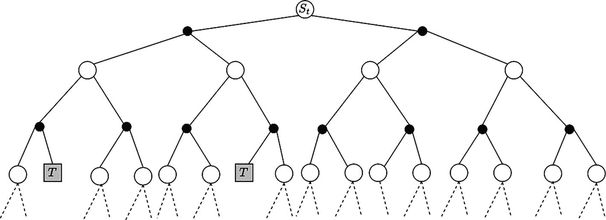

一棵树形图说明了当前状态 S i。

图 10-11

从当前状态 *S*[*t*] 开始的搜索树

然而，如果分支因子很高，你无法构建一个穷举搜索树。在围棋游戏中，平均分支因子约为 250。即使你构建一个三层的穷举树，第三层将有 250³ = 15,625,000 个节点（1500 万个节点）。而且为了充分利用远见，你将需要深入到两三个层次以下。这就是为什么需要形成一个基于模拟的搜索树而不是穷举搜索树。你使用 *rollout policy* 来模拟多个轨迹，并形成动作价值的 MC 估计。这些估计用于在根状态 *S*[*t*] 选择最佳动作。这有助于改进策略。在采取最佳动作后，代理发现自己处于一个新的状态，然后它从该新状态重新开始模拟树。这个循环会继续。尝试的 rollout 轨迹数量取决于代理在决定动作时的时间限制。

MCTS 是决策时间规划的例子。MCTS 与之前描述的完全一致，只是增加了一些增强功能来累积价值估计并指导搜索到树的最有回报的部分。MCTS 的基本版本包括四个步骤。

1.  *选择/树遍历*：从根节点开始，使用树策略遍历树并达到一个叶节点，即一个未完全扩展的节点。

1.  *扩展*：向叶节点添加子节点（动作）并从中选择一个。

1.  *模拟/rollout*：从之前选择的子节点开始玩游戏，直到终止。使用固定的 rollout 策略来玩，这也可以是一个随机 rollout 策略。

1.  *反向传播*：通过跟随（回溯）遍历的路径，使用 playout 的结果更新从终止状态到根节点路径上的所有节点。

循环会重复多次，始终从当前根节点开始，直到搜索时间耗尽或达到固定的迭代次数。这被称为 MCTS 的“任何时间算法”，因为它可以在任何时候停止，并且总是会返回一个有效的搜索答案。如果增加分配的时间，MCTS 返回的搜索质量将提高。此时，根据累积的统计数据选择价值最高的动作。图 10-12 展示了 MCTS 的示意图。

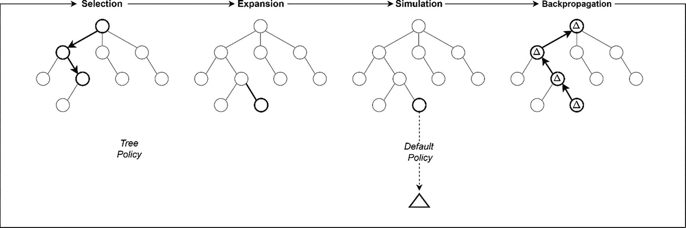

树状图包括以下迭代。它包括选择、扩展、模拟，然后以反向传播结束。

图 10-12

MCTS 的一次迭代包括四个步骤

接下来，代理在真实环境中执行所选动作。这使代理进入一个新的状态，然后之前的 MCTS 循环再次开始，这次以新状态作为根状态，从该状态构建模拟树。

让我们看看一个简单、虚构的例子。你将使用 UCB 来衡量以下形式：

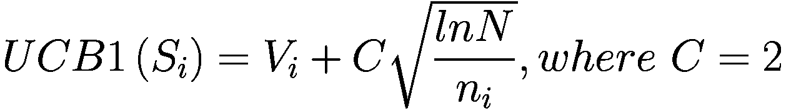

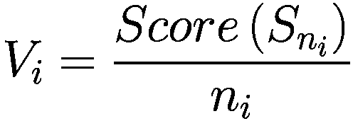

*UCB*1 将用于在扩展阶段决定选择哪个节点。你从根节点 *S*[0] 开始，对于每个节点，你保持两个统计数据——该节点的总分数 (*S*) 和访问次数 (*n*)。初始设置如下：

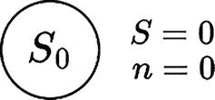

一个数学表达式如下。S = 0\. n = 0。

你通过添加从 *S*[0] 可用的所有动作来在根节点处扩展树，比如说 *a*[1] 和 *a*[2]。这些动作导致两个新的状态，*S*[1] 和 *S*[2]。你初始化这两个节点的分数和计数统计数据。此时树看起来如下所示：

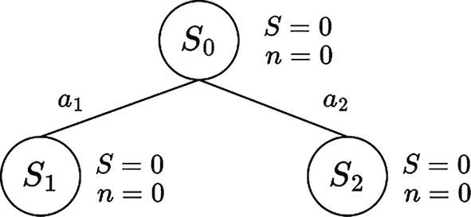

一棵树图用数据说明了 S 1 和 S 2 新状态。值如下。S = 0\. n = 0。

这是初始树。你现在开始执行 MCTS 的步骤。第一步是使用 *UCB*1 值进行树遍历。你处于 *S*[0] 状态，需要选择具有最高 *UCB*1 值的子节点。让我们计算 *S*[1] 的 *UCB*1。由于 *n* = 0，*UCB*1 中的探索项，即 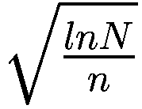，是无限的。对于 *S*[2] 也是如此。作为树策略的一部分，在出现平局时，我们选择具有较小子索引的节点，这导致选择 *S*[1]。由于 *S*[1] 之前没有被访问过，即对于 *S*[1]，*n* = 0，你不会扩展而是继续进行到回滚的第三步。你使用回滚策略从 *S*[1] 模拟随机动作直到终止。假设你观察到终止时的值为 20，如下所示：

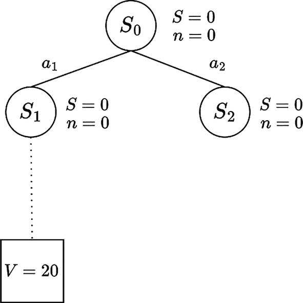

一棵树图说明了终止时的值为 20。S = 0\. n = 0\. V = 20。

下一步是第四步，即从终端状态反向传播值到根节点。你需要更新从终端状态到根节点的路径上所有节点的访问次数和总分数。然后你从 *S*[1] 中擦除回滚部分。此时，树看起来就像图中所示的那样。注意节点 *S*[1] 和 *S*[0] 的更新统计数据。

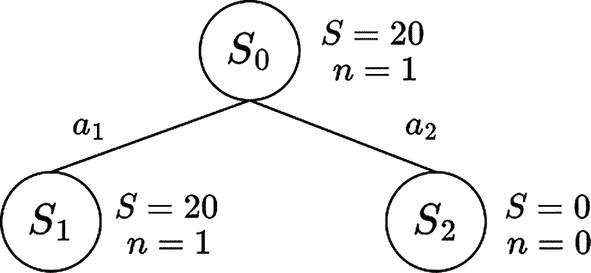

一棵树图说明了以下 S 值。S 1\. S = 20 n = 1\. S 2 S = 0 n = 0\. S 0 S = 20 n = 1。

这将你带到 MCTS 步骤的第一轮结束。现在你将运行 MCTS 步骤的下一轮，再次从 *S*[0] 开始。第一步是从 *S*[0] 开始的树遍历。你需要根据哪个具有更高的 *UCB*1 值来选择两个节点中的一个，即 *S*[1] 或 *S*[2]。对于 *S*[1]，*UCB*1 值由以下公式给出：

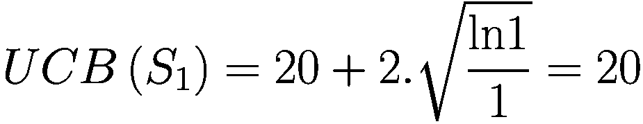

在 *ln* 1 中的 1 来自根节点处的 *n* 值，这告诉你到目前为止的总试验次数。平方根内部的分母中的 1 来自节点 *S*[1] 的 *n* 值。由于 *S*[2] 的 *n* 值仍然是 0，所以 *UCB*(*S*[2]) 继续为 ∞。因此，你选择节点 *S*[2]。这结束了树遍历步骤，因为 *S*[2] 是一个叶节点。你从 *S*[2] 执行一个 rollout。假设 rollout 从 *S*[2] 产生一个终端值为 10。这完成了 rollout 阶段。此时树看起来如下所示：

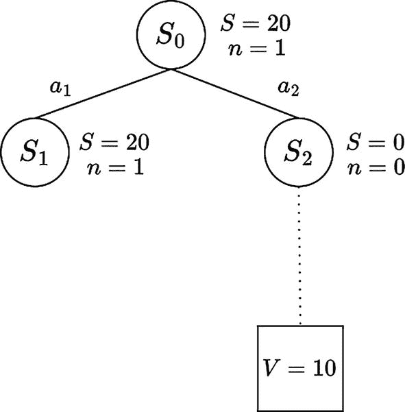

一张图说明了 S 0、S 1 和 S 2 的值。S = 20，n = 1 和 0，V = 10。

下一步是将终端值 10 反向传播到根状态，并在过程中更新路径上所有节点（在这种情况下为 *S*[2] 和 *S*[0]）的统计数据。然后你擦除 rollout 部分。在反向传播步骤结束时，更新的树看起来如下所示：

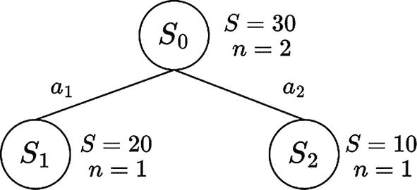

一张树图说明了更新的值。S = 30、20 和 10，n = 2 和 1。

让我们再进行一轮 MCTS，这将是最後一轮。再次从 *S*[0] 开始，并重新计算子节点的 *UCB*1 值。作为提醒，你计算 *V*[*i*] = (节点 *i* 的得分) *n*[*i*]

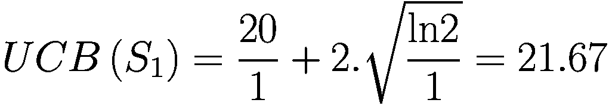


*S*[1] 的 UCB 值更高，你选择它。你已经到达了一个叶节点，这结束了 MCTS 的树遍历部分步骤。你现在位于 *S*[1]，它已经被访问过，所以你现在通过模拟从 *S*[1] 出发的所有可能动作及其产生的状态来扩展 *S*[1]。此时树看起来如下所示：

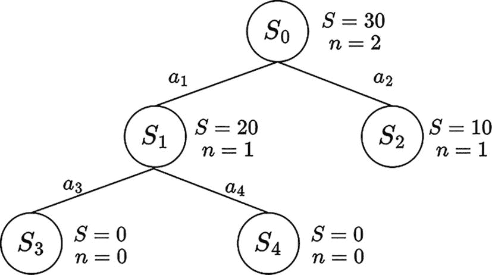

一张图说明了以下 S 值。S 0、S 1、S 2、S 3 和 S 4。S = 30、20、10 和 0，n = 2、1 和 0。

您需要在 *S*[3] 和 *S*[4] 之间选择一个叶子节点，然后从所选节点进行回滚。像之前一样，由于这些节点尚未被访问，*S*[3] 和 *S*[4] 的 *UCB*1 都是 ∞，因此这两个节点的 *n* = 0。根据树策略，在平局的情况下，您选择具有较低子索引的节点。这意味着您选择 *S*[3] 并从 *S*[3] 进行回滚。假设回滚结束时的终端状态产生终端值为 0。这完成了 MCTS 的回滚步骤。树看起来像这样：

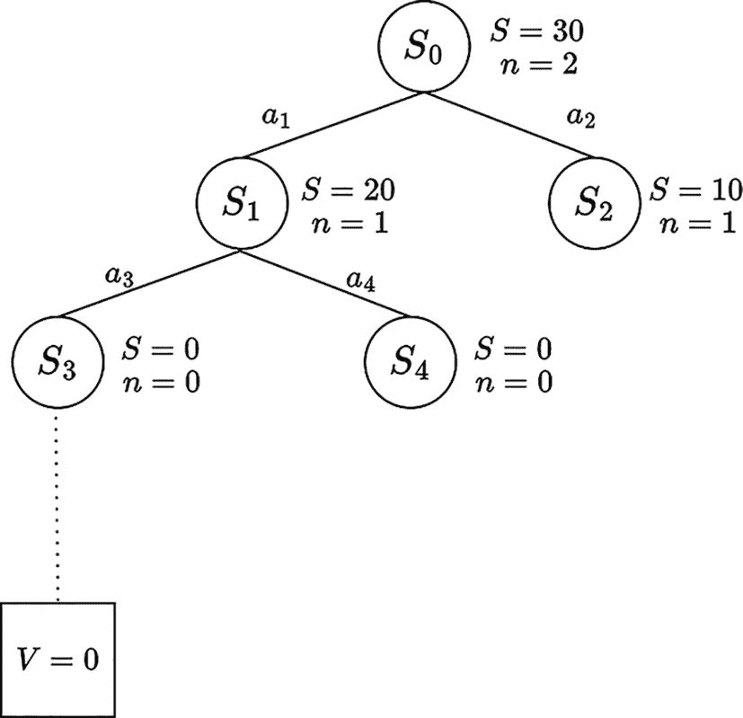

一个图表展示了以下 S 值和 V 值。S = 30, 20, 10, 0, 和 1。V = 0。

最后一步是将 *V* = 0 的值反向传播到根节点。您更新路径上节点的统计数据——节点 *S*[3]、*S*[1] 和 *S*[0]。树看起来像这样：

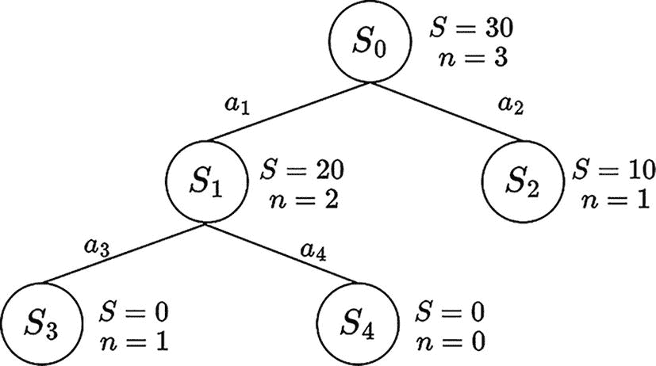

一个图表展示了以下节点值。S 3。S 2。S 1。S = 30, 20, 10, 0, 和 1。

到这一点，假设你用完了时间。现在算法需要在 *S*[0] 处选择最佳动作，并在现实世界中采取这一步。在这种情况下，你将只比较状态值（分数/n），对于 *S*[1] 和 *S*[2]，平均值都是 10。这是一个平局。你可以有额外的规则来打破平局。然而，假设你在做出最终选择最佳动作时总是随机选择一个动作来打破平局。假设你随机选择了 *S*[1]。智能体采取动作 *a*[1] 并到达 *S*[1]，假设是确定性设置。你现在将 *S*[1] 作为新的根节点，并从 *S*[1] 进行多次 MCTS 迭代，最终选择在 *S*[1] 处采取的最佳动作。这样，你就在现实世界中逐步前进。

这就是 MCTS 的本质。有许多 MCTS 的变体，我这里没有涉及。主要目标是让你熟悉一个简单和基本的 MCTS 设置，并通过计算过程来巩固你的理解。

## MCTS 的示例用途

在我总结这一章之前，本节简要讨论了最近和著名的 MCTS 应用案例——AlphaGo 和 AlphaZero，它们帮助设计了一个算法，使计算机在围棋游戏中击败了人类专家。本节还探讨了使用 MCTS 的 AlphaFold，它有助于预测大型蛋白质复合物的结构。它还简要提到了 MCTS 最近被应用的各个领域。

### AlphaGo

AlphaGo 由 Deep Mind 于 2016 年^(3)设计，旨在在围棋游戏中击败人类专家。标准的搜索树会从一个给定位置测试所有可能的情况。然而，具有高分支因子的游戏不能使用这种方法。如果一个游戏具有分支因子 *b*（即任何位置的合法移动数是 *b*）和总游戏长度（即深度或直到结束的连续移动数）是 *d*，那么就有 *b*^(*d*) 个可能的移动序列。评估所有选项对于任何中等规模的棋盘游戏都是不可行的。考虑一下具有(*b* ≈ 35, *d* ≈ 50)的国际象棋游戏或具有(*b* ≈ 250, *d* ≈ 150)的围棋游戏，穷举搜索是不可能的。但可以通过两种通用方法来减少有效的搜索空间。

+   **您可以通过位置评估来减少深度**。在扩展搜索树一定深度后，将叶节点的状态替换为近似评估函数 *v*(*s*) ≈ *v*^∗(*s*)。这种方法适用于像国际象棋、跳棋和五子棋这样的棋盘游戏，但由于围棋的复杂性，它不适用于围棋。

+   **您可以通过从策略** ***p***(***s***)** 中采样动作来减少节点的完全展开的树宽度**。蒙特卡洛滚动不进行分支；它们从叶节点开始播放一个场景，然后使用平均回报作为 *v*(*s*) 的估计。您在 MCTS 中看到了这种方法，其中滚动值被用来估计叶节点的 *v*(*s*)，并通过使用修订的 *v*(*s*) 估计进一步改进了策略。

在这篇关于 AlphaGo 的学术论文中，作者将 MCTS 与深度神经网络相结合，实现了超人类的表现。他们将棋盘图像作为 19×19 像素的图像传递给卷积神经网络（CNN），并使用它来构建棋盘位置的表示，即 *状态*。

他们使用专家人类动作进行监督学习，并学习了两条策略，即 *p*(*s*)。

+   **SL 策略网络** (*p*[*σ*])：作者使用监督学习来学习策略网络 *p*[*σ*]。这是使用 CNN 风格的网络训练的，输入状态 (*s*) 为 19x19 的棋盘位置，棋盘位置基于专家人类动作。

+   **滚动策略** (*p*[*π*])：使用相同的数据训练了另一个网络，称为快速策略 *p*[*π*]，它在 MCTS 的“滚动”阶段充当滚动策略。原始 MCTS 使用随机滚动策略。然而，如前所述，如果它非常快，您可以使用策略模型。

接下来，作者训练了一个强化学习（RL）网络 *p*[*ρ*]，从 SL 策略网络初始化，试图改进 SL 策略网络以获得更多胜利，即使用策略优化来提高目标，即获得更多胜利。这与您在第八章中学到的策略优化类似。

最后，还训练了另一个网络*v*[*θ*]来预测 RL 策略网络*p*[*ρ*]通过自我博弈的状态*v*(*s*)的值。图 10-13 显示了神经网络训练的高级图。

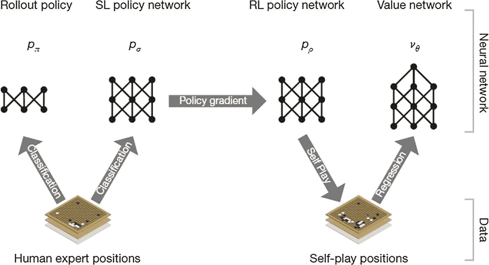

一个神经网络图说明了以下组件。滚动策略，S L 策略网络。R L 策略网络。价值网络。人类专家位置。自我博弈位置。

图 10-13

神经网络训练流程（来自 AlphaGo 论文中的图 1）⁴

最后，策略网络和价值网络结合以实现 MCTS 并执行向前搜索。作者使用类似于 UCB 的方法遍历树的扩展部分。一旦达到叶子节点(*S*[*L*])，他们使用 SL 策略网络的一个样本*p*[*σ*]来扩展叶子节点（MCTS 的第 2 步）。叶子节点以两种方式评估：一种是通过使用价值网络*v**θ*，另一种是通过使用滚动网络*p*[*π*]进行快速滚动直到终止来获取结果*z*[*L*]。这两个值通过混合参数*λ*结合。

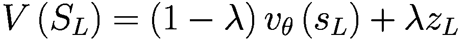

MCTS 的第四步执行以更新每个节点的分数和访问次数，正如你在上一节示例中看到的那样。

一旦搜索完成，算法从根节点选择最佳动作，然后从新状态开始 MCTS 的循环。

### AlphaGo Zero 和 AlphaZero

一年后，在 2017 年，作者在题为“无需人类知识掌握围棋”的论文中提出了进一步的改进。^(5)

为了引入一个仅基于强化学习算法，没有人类数据、指导或游戏规则之外的知识，进行了一些改进。AlphaGo 成为了自己的老师：一个神经网络被训练来预测 AlphaGo 自己的移动选择和 AlphaGo 游戏的胜者。这个神经网络提高了树搜索的强度，从而导致了更高质量的移动选择和下一次迭代中更强的自我博弈。图 10-14 显示了 AlphaGo Zero 下的设置的高级示意图。程序与自己玩一局游戏*s*[1]，…，*s*[*T*]。在每个位置*s*[*t*]中，使用最新的神经网络*f*[*θ*]执行蒙特卡洛树搜索(MCTS) *α*[*θ*]。根据 MCTS 计算出的搜索概率选择动作，*a*[*t*] ∼ *π*[*t*]。终端位置*s*[*T*]根据游戏规则评分以计算游戏胜者*z*。

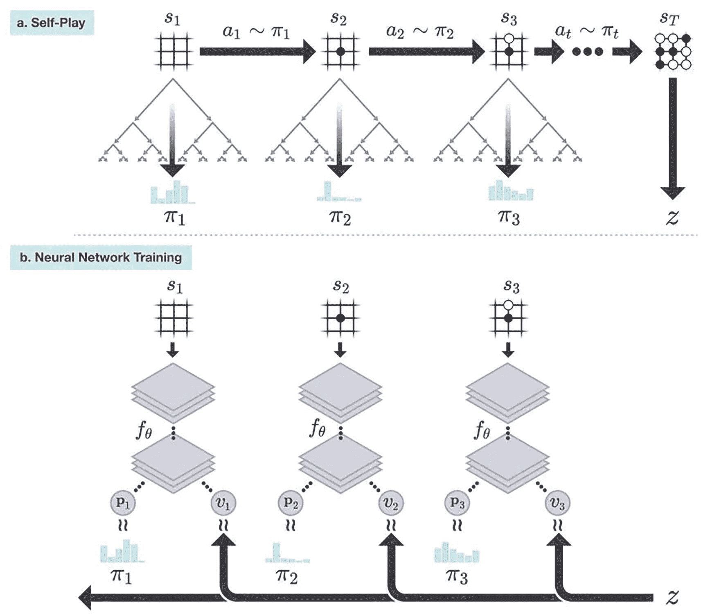

一个图说明了 Alpha Go Zero 中的自我博弈和神经网络训练。pi 1，pi 2 和 pi 3 是存在的值。

图 10-14

AlphaGo Zero 中的自我博弈强化学习（参考文献中的图 1）

接下来，你将查看 AlphaGo Zero 中的神经网络训练。神经网络将原始棋盘位置*s*[*t*]作为其输入，通过许多具有参数*θ*的卷积层传递，并输出一个向量*p*[*t*]，表示移动的概率分布，以及一个标量值*v*[*t*]，表示当前玩家在位置*s*[*t*]获胜的概率。神经网络参数*θ*被更新以最大化策略向量*p*[*t*]与搜索概率*π*[*t*]的相似性，并最小化预测赢家*v*[*t*]与游戏赢家*z*之间的误差。新参数用于下一次自玩迭代。

现在，将你的注意力转向 MCTS 部分，如图 10-15 所示。在步骤 a 中，每个模拟通过选择具有最大动作值 Q 的边来遍历树，加上一个依赖于该边的存储先验概率 P 和访问次数 N 的上置信界限 U（该值在遍历时增加一次）。

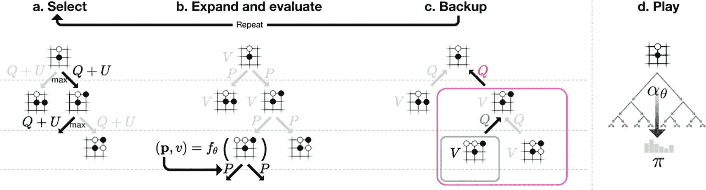

一张图说明了 Alpha Go Zero 中的蒙特卡洛树搜索。它包括选择、扩展和评估、回溯，然后是游戏。

图 10-15

AlphaGo Zero 中的蒙特卡洛树搜索（参考论文的第 2 图）

在步骤 b 中，叶节点被展开，并使用神经网络评估相关的位置*s*（*P*(*s*, ·), *V*(*s*)) = *f**θ*成比例，其中 N 是每个从根状态到移动的访问次数，τ是一个控制温度的参数。

在本文发表不久后，作者在题为“通过通用强化学习算法的自玩掌握国际象棋和将棋”的论文中推广了该方法。从随机游戏开始，除了游戏规则外没有领域知识，在 24 小时内 AlphaZero 在象棋、将棋（日本象棋）以及围棋游戏中达到了超人类水平的游戏能力，并在每种情况下都令人信服地击败了世界冠军程序。

大约两年后的 2019 年，DeepMind 团队在题为“通过学习模型规划掌握 Atari、围棋、国际象棋和将棋”的论文中提出了对相同方法的另一种变体，该变体扩展了 AlphaZero 的能力。

### AlphaFold 与 MCTS

AlphaFold^(8)是由 DeepMind 开发的一个 AI 系统，它可以从氨基酸序列预测蛋白质的 3D 结构。它通常达到与实验相媲美的准确性。AlphaFold 可以以非常高的准确性预测单链和多链蛋白质的结构。然而，准确性随着链数的增加而降低，可用的 GPU 内存限制了可以预测的蛋白质复合物的大小。

在一篇题为“使用 AlphaFold 和蒙特卡洛树搜索预测大型蛋白质复合物的结构”的论文中，作者使用 MCTS 寻找最佳路径，如图 10-15 所示。从一个随机选择的链（节点）开始，随机添加链来扩展路径，从而创建新的节点。从这些扩展中，模拟完整的组装。当无法添加更多亚基时，模拟停止。模拟的组装通过其累积的 mpDockQ（多界面预测 DockQ；平均界面 plDDT 乘以界面接触数的对数）得分进行评分，并将得分反向传播以支持前面的选择。支持最多的路径被选中，创建一个最有可能正确的复合体。请参阅论文中的图 2，了解此上下文中 MCTS 的示意图。

### MCTS 在其他领域的应用

MCTS 的一些其他用途如下：

+   化学合成，正如你在之前的 AlphaFold 子节中看到的那样。

+   规划：在物流和机器人技术中的最优规划中，自动化规划是 MCTS 算法在游戏之外的主要应用领域之一。规划问题通常被表述为 MDP。MCTS 也已被用于机器人的规划。已提出 MCTS 的分布式变体用于多机器人场景。压缩形式的树定期发送到其他机器人，这导致策略空间上的联合分布更新。

+   安全性：在攻击者-防御者场景中确定安全部队的最佳巡逻时间表。蒙特卡洛树搜索（MCTS）在安全游戏（SG）中的应用是最近的。本质上，SG 使用博弈论方法来找到安全部队（如警察、情报机构和保安）的最有效巡逻时间表。他们在保护一组潜在目标免受攻击者（如罪犯、恐怖分子和走私者）攻击的同时这样做。由于全球恐怖主义威胁的增加，SG 的重要性及其应用最近有所增加。

+   调度：将蒙特卡洛树搜索（MCTS）与额外的启发式方法相结合是解决大型计算问题的一种常见方法。MCTS 已被提出用于生成多模式资源受限多项目调度问题的初始解决方案。然后通过精心设计的超启发式方法进行局部搜索对这些解决方案进行修改。

+   车辆路径：运输问题，如容量限制车辆路径问题（CVRP），是通常涉及规划和调度的问题的特殊类别。

这就结束了本章的内容。AlphaGo 的解释是在概念层面上的。感兴趣的读者可能想参考原始论文。

## 摘要

本章实现了最后的统一，即将基于模型的规划与无模型学习相结合。在集成规划和学习的过程中，你学习了如何结合基于模型和无模型的方法来进行强化学习，以及如何平衡探索和利用。本章还讨论了通过调整更新的宽度和深度，如何将不同的基于价值和基于策略的方法进行统一。

你研究了从交互中学习环境动态和奖励模型的概念，并使用该模型进行规划和策略改进，涵盖了不同类型的模型表示，如查找表、线性模型和高斯模型，以及模型学习中的错误来源。

接下来，你查看了一个特定的算法，Dyna Q，它将 Q 学习和模型学习与规划相结合，以及其扩展 Dyna Q+，它鼓励探索长时间未访问的状态。

在整本书中，你都看到了所需利用和探索之间的平衡，当应用于具有非常大的状态空间的问题时，这种平衡对于集成规划尤为重要。在多臂老虎机的话题下，你看到了一个具有未知奖励概率的多个老虎机的简单设置，用于研究探索和利用之间的权衡，并比较了 epsilon 贪婪、UCB 和 Thompson 采样等不同策略。你还学习了遗憾的概念，作为探索质量的衡量标准，并看到了不同策略在累积遗憾上的表现。

在理解了平衡探索与利用的各种策略之后，你学习了蒙特卡洛树搜索（MCTS）。MCTS 是一种基于模拟的搜索算法，它使用树策略来引导探索，并使用滚动策略来估计叶节点的价值。你查看了一个简单的合成示例，以了解 MCTS 中涉及步骤的细节。

最后，你研究了 MCTS 的应用，展示了它如何应用于围棋和象棋等游戏。本章还简要提到了 AlphaGo 和 AlphaZero 方法，它们将 MCTS 与深度神经网络相结合，在各种游戏中实现了超人类的表现。
