# 11. 近端策略优化（PPO）和 RLHF

这是一个令人兴奋的章节。它从基础开始，逐步构建起强化学习（RL）中最激动人心的应用之一。你是否使用过 ChatGPT 或另一个大型语言模型（LLM），并发现这些模型似乎能跟随你的提示并完成你用英语描述的任务而感到惊奇？除了生成式 AI 和由变换器驱动的架构之外，RL 也扮演着非常重要的角色。使用人类标注（或机器标注）的偏好对句子对进行近端策略优化（PPO）被用作奖励模型，以微调 LLM 以遵循人类偏好。这使得 LLM 更安全、更好。本章从基础知识开始，逐步深入理解 PPO，即使经过这么多年，它仍然是 RL 中基于策略优化的最先进技术。接下来是对 LLM 的快速概述——其架构、训练过程以及整体 LLM 生态系统。本章通过一个使用最先进方法的 LLM 上 RLHF 调优的完整演示。

在此过程中，本章还涉及了诸如提示工程、微调、参数高效微调以及使用 LLM 进行更复杂和类似人类任务的多种方法等概念。这些任务使得大型语言模型被称为基础模型，甚至被称为新时代的 CPU。

第八章简要提到了策略问题，在梯度更新过程中出现大量偏差，从而显示出不稳定性。它简要讨论了控制策略空间中更新大小的直觉，这比控制网络参数空间中的更新要好。第八章介绍了两种遵循策略/概率空间控制概念的方法。首先，它讨论了信任区域策略优化（TRPO），然后简要讨论了近端策略优化（PPO）。这两种方法都通过确保每次更新都不会导致与当前策略显著不同的新策略来控制更新大小。

我首先讨论为什么这很重要。参考图 11-1 并想象代理正在尝试学习一个策略，以爬上表面非常不平的山。通往山顶的路上有陡峭的山谷。代理在探索邻域时需要谨慎并采取小心的步骤。错误方向的一步可能导致代理从悬崖上掉下来，这将很难恢复并爬回山顶或路径上的前一点。图 11-1 中的红色圆圈显示了当前策略周围的*信任区域*，这是一个安全的地方，不会导致任何灾难性的后果。如果策略的变化在这个圆圈之内，代理将继续在策略上看到改进，同时安全地避免掉入悬崖。


一座山峰侧视图的三维示意图，其上有波浪形的路径，有几个 U 形弯道。圆圈内的阴影点标记为当前点，U 形弯道标记为信任区域。

图 11-1

策略空间中某点的信任区域

这是 TRPO 和 PPO 所基于的概念。在 TRPO 中，你将其作为一个硬约束，如方程 11-1 所表达。首先，你形成一个依赖于当前策略和新策略参数 θ[*k*] 和 θ 的策略目标。为此，你必须求助于使用重要性抽样，这在前面章节中已有介绍。

![J(θ, θ_{k})={E}_{a\sim {\uppi}_{\uptheta_k}\left(a|s\right)}\left[\frac{\uppi_{\uptheta}\left(a|s\right)}{\uppi_{\uptheta_k}\left(a|s\right)}{A}^{\uppi_{\uptheta_k}}\left(s,a\right)\right]}(../images/502835_2_En_11_Chapter/502835_2_En_11_Chapter_TeX_Equ1.png)

(11-1)

为了确保新的策略 π[θ] 与当前策略 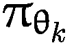（如图 11-1 所示）的中心信任区域保持一致，你使用了一个硬约束，即两个策略之间的 Kullback-Liebler 距离在某个小的值 δ 内。

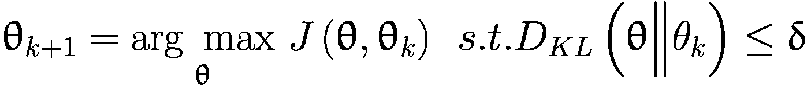

并且 *J*(θ, θ[*k*]) 在 11-1(11-2) 中定义

根据方程 11-1 和 11-2，TRPO 的理论更新并不容易实现。计算 KL 涉及到所有可能状态和动作的期望。通过使用二阶泰勒近似，并用基于样本的估计替换 KL 散度，最终的 TRPO 更新需要估计策略梯度，如方程 11-3 所示：

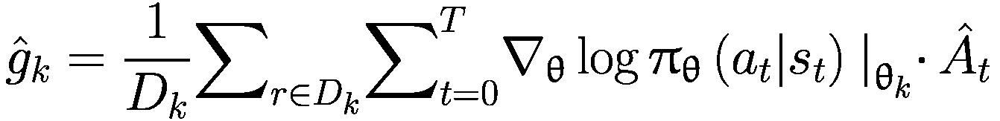

(11-3)

接下来，你计算 ，其中  是样本平均 KL 散度的 Hessian。需要注意的是，Hessian 是策略最大化目标函数的二阶导数。如果策略网络有 *n* 个参数， 将是一个 *n* × *n* 矩阵。你需要计算  的逆来得到 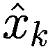，而这个逆是一个非常慢的过程，其计算量约为 *n*³。TRPO 的最后一部分是参数的更新，如方程 11-4 所示。

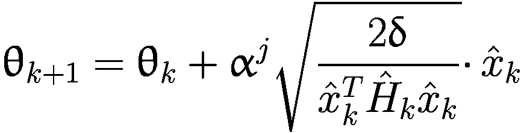

(11-4)

其中 *j* ∈ {0, 1, 2, …*K*} 是改善样本损失的最小值，并且满足 KL 散度约束。

TRPO 方程的推导相当复杂。如果您感兴趣，可以参考 TRPO 论文^(1) 获取更多细节。然而，有两个关键要点。首先，使用 KL 散度在信任区域内约束策略更新，确保每次策略更新都不会导致灾难性的跌入不良区域；而像 TRPO 那样将 KL 散度作为硬约束，则需要计算和求逆一个非常大的 *n* × *n* 矩阵 。

在 TRPO 论文之后不久，该论文的首席作者提出了 PPO 方法。论文的引言部分如下：

> *“我们提出了一组新的强化学习策略梯度方法，这些方法在通过与环境交互采样数据和通过随机梯度上升优化“代理”目标函数之间交替。与标准策略梯度方法每对数据样本执行一次梯度更新不同，我们提出了一种新的目标函数，它能够实现多个批次的更新。我们称之为近端策略优化（PPO），它具有信任区域策略优化（TRPO）的一些优点，但实现起来更简单，更通用，并且具有更好的样本复杂度（经验上）。我们的实验在一系列基准任务上测试了 PPO，包括模拟机器人运动和 Atari 游戏玩法，我们表明 PPO 比其他在线策略梯度方法表现更好，并且在样本复杂度、简单性和运行时间之间取得了良好的平衡。”*

如您所见，PPO 在策略空间上遵循一种类似于 TRPO 的信任区域策略更新。然而，PPO 更加简单，并且具有更好的样本效率。因此，它似乎结合了两者之长，自 2017 年引入以来，成为最先进的直接策略优化方法。

在介绍了 PPO 之后，下一节将逐步推导 PPO 及其理论基础。如果您想跳过这部分内容，可以跳过 PPO 部分，直接进入 RLHF 和 LLMs 微调的主题。

## PPO 的理论基础**

接下来的动作部分将向您介绍分数函数、Hessian 矩阵、Fisher 信息矩阵和自然梯度的核心基础，最终导致当前形式的 PPO。有一节专门讨论 PPO 的实际实现细节。这个深入探讨是可选的。您可以跳过这部分内容，直接进入基于 LLM 和 RLHF 的指令微调和 LLMs 的微调部分，而不会失去连贯性。然而，如果您进行 PPO 的深入探讨，这将是一段值得的时间，因为 PPO 是直接策略优化领域中的一个流行且非常高效的算法。

我必须介绍一些来自统计学和优化理论的关键概念，为自然策略优化算法家族（TRPO 和 PPO 属于此类）奠定基础。

### 分数函数和 MLE 估计器

大多数机器学习模型都围绕着寻找概率分布的参数，这些参数最大化了所有已见数据的联合概率——训练数据。本节推导了这一过程，并在此过程中介绍了分数函数。

假设您有一个表示未知参数θ的概率模型，用 *x* ∼ *p**X* 表示，其中 x 是一个随机变量，遵循这个分布。现在假设您知道分布的类型，唯一未知的是θ，它是概率分布的参数。您还有使用此分布抽取的一些样本，如 *x*[1]，*x*[2]，*x*[3]，…*x*[*n*]。计算在未知参数θ条件下此数据的联合概率，如方程 11-5 所示。

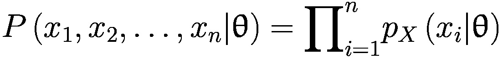

(11-5)

对方程 11-5 的两边取对数，得到：

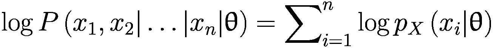

(11-6)

对数是观察到特定值 *x* = *x*[*i*]的概率。在机器学习中，你通常会形成一种称为负对数损失（NLL）的东西，这不过是方程 11-6 中表达式的负值，并且是在多个样本上取平均值。这显示在方程 11-7 中。

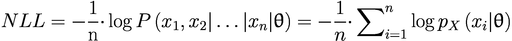

(11-7)

在大多数机器学习模型中，包括甚至大型语言模型和其他生成式 AI 模型，你应该尝试最大化证据，即最大化观察到的数据的概率，即训练数据中的θ。你使用 NLL 将最大化转换为最小化。换句话说，你使用随机梯度下降法最小化相对于θ的 NLL。这要求你取 NLL 相对于θ的梯度，如方程 11-8 所示。

![∇[θ] NLL = -1/n ⋅ ∑(i=1 to n) ∇[θ] log p_X(x_i|θ)](../images/502835_2_En_11_Chapter/502835_2_En_11_Chapter_TeX_Equ7.png)

(11-8)

在随机梯度下降中，你用α ⋅ ∇[θ]NLL 调整θ，其中α被称为学习率。更新表达式如方程 11-9 所示。

![θ = θ + α ⋅ ∇[θ] NLL](../images/502835_2_En_11_Chapter/502835_2_En_11_Chapter_TeX_Equ8.png)

(11-9)

这就是大多数机器学习模型是如何训练的。现在将你的注意力转向一个叫做得分函数的东西。再次看看方程 11-8 中的表达式——求和符号内的项，∇[θ] log pX，被称为*得分函数*。得分函数是对数似然函数的导数。在方程 11-8 中，你有一个特定样本的形式为*x[i]*。然而，在定义得分函数时，你使用未采样的随机变量 x。得分函数的定义如方程 11-10 所示。

![score(θ) = ∇[θ] log p(x|θ)](../images/502835_2_En_11_Chapter/502835_2_En_11_Chapter_TeX_Equ9.png)

(11-10)

在传统统计学中，你也使用得分函数来形成最大似然估计（MLE）。在 MLE 下，你取方程 11-8 的形式，并找到θ（解析地），这将使导数∇[θ]NLL = 0。这样找到的θ将最小化 NLL，从而最大化训练数据的概率。

得分函数在各个领域都具有重要意义，包括统计学、概率论和机器学习，这主要归因于它在估计和优化参数中的基本作用。在统计学中，得分函数——通常表示为对数似然函数关于参数的导数——对于评估似然函数对参数的敏感性至关重要。这种敏感性分析在最大似然估计中至关重要，其目标是找到最大化似然函数的参数值，从而为数据提供最佳拟合。在概率论中，得分函数有助于理解概率分布的行为，特别是在参数发生微小变化的情况下，从而增强对随机模型的理解。

在机器学习的领域，得分函数在基于梯度的优化算法中特别有用，如方程 11-6 到 11-10 所示。它作为导航参数空间以找到最小化或最大化所选目标函数（如监督学习中的损失函数）的优化参数的指南。这对于训练目标是通过调整参数从数据中学习的模型至关重要，以提高预测准确性。此外，在强化学习中，得分函数在策略梯度方法中起着关键作用，它有助于估计与策略参数相关的预期奖励的梯度，从而开发出最大化累积奖励的策略。总的来说，得分函数是一个多功能的工具，它增强了你进行统计推断、理解概率模型和开发高效机器学习算法的能力。

看一下得分函数的一个重要性质。它的期望值 *E*[*score*(θ)] 是什么？通过以下推导过程来了解：

![ E[score(θ)]=E[∇θlogp(x|θ)] ](../images/502835_2_En_11_Chapter/502835_2_En_11_Chapter_TeX_Equb.png)

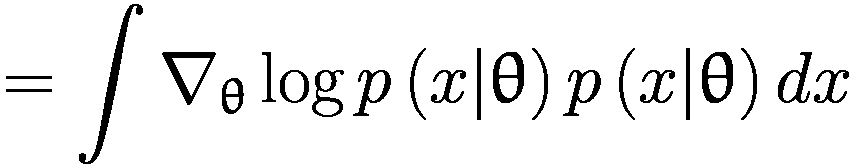

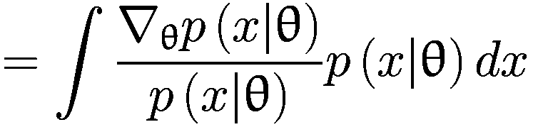

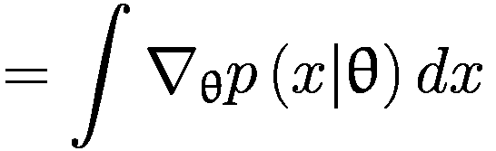

使用线性性质，你得到：

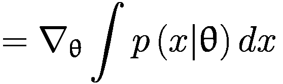

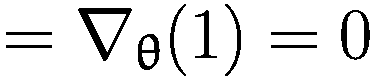

![即，E[∇θlogp(x|θ)]=0 ](../images/502835_2_En_11_Chapter/502835_2_En_11_Chapter_TeX_Equ10.png)

(11-11)

分数函数的期望值为零。从最大似然估计（MLE）的角度来看，你可以将这个结果理解为，在极限情况下，MLE 估计量将给出对生成数据的底层分布中未知参数θ的无偏估计。

θ的实际估计将取决于证据，即你看到的数据，而你使用 MLE 估计量来获取估计。在统计学中，无论何时你使用数据来形成某种估计，你总是对理解这个估计的方差感兴趣。当你看到新的数据或用另一批数据重复估计练习时，它会改变多少？因此，下一节将探讨分数函数∇[θ] log *p*(*x*| θ)的协方差。

### 费舍尔信息矩阵（FIM）和海森矩阵

本节关注分数函数的协方差。无论何时你使用 MLE 估计量，你也会对基于所使用的数据样本的估计敏感性感兴趣。这可以从分数函数的协方差中推断出来。记住，分数函数是一个向量——它是相对于分布的未知参数θ的对数似然函数的导数，一个向量 *θ*。分数函数和 *θ* 的维度将匹配。因此，协方差将是一个矩阵。推导出这个协方差的表达式，即费舍尔信息矩阵，F：

![协方差=F={E}_{p\left(x|\uptheta \right)}\left[\left(s\left(\uptheta \right)-0\right){\left(s\left(\uptheta \right)-0\right)}^T\right] ](../images/502835_2_En_11_Chapter/502835_2_En_11_Chapter_TeX_Equh.png)

![ F=E[p(x|θ)][∇θlogp(x|θ){∇θlogp(x|θ)}^T] ](../images/502835_2_En_11_Chapter/502835_2_En_11_Chapter_TeX_Equ11.png)

(11-12)

在机器学习中，当你用样本估计代替期望时，你可以得到如下的估计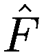：

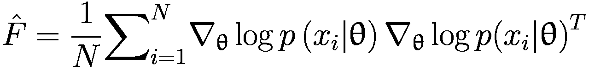

(11-13)

费舍尔矩阵有一个有趣的性质。对数似然函数的负期望海森矩阵等于费舍尔信息矩阵，*F*。如果你没有听说过海森矩阵 *H*，它是一个方阵，并且是标量函数的二阶偏导数——在这种情况下，似然函数。F 和 H 之间的关系如下所示：

![ E[p(x|θ)][H_{logp(x|θ)}]=-F ](../images/502835_2_En_11_Chapter/502835_2_En_11_Chapter_TeX_Equi.png)

或者用另一种方式写：

![$$ F=-{E}_{p\left(x|\uptheta \right)}\left[{H}_{\log p\left(x|\uptheta \right)}\right] $$](../images/502835_2_En_11_Chapter/502835_2_En_11_Chapter_TeX_Equ13.png)

(11-14)

这个属性的推导涉及到一些数学知识，感兴趣的读者可以参考任何关于统计学的标准文本以获取逐步推导。从方程 11-13 或 11-14 中的表达式，你可以得出两个见解。第一个见解是，Fisher 信息矩阵可以用来对 MLE 估计器的二阶导数或负损失函数（NLL）进行估计。二阶导数，即 Hessian H，告诉你使用 NLL 最小化在样本上找到的 θ 的敏感性，你可以使用 F 作为 hessian 的替代来计算这个敏感性。第二个见解是关于在机器学习中使用二阶近似而不是一阶近似进行梯度下降，如方程 11-9 所示。在方程 11-14 中使用这个属性将帮助你开发使用二阶近似和用 Fisher 矩阵代替 Hessian 进行梯度下降的实用算法。Fisher 信息矩阵也与 KL 散度有关。我将在下一节中探讨这些内容，当谈到自然梯度法时，它是 TRPO 和 PPO 的基础。

### 自然梯度法

为了回顾 TRPO 和 PPO 的动机，你之前在章节中看到，为了确保策略的更新保持在定义的差异范围内，你需要对概率分布空间（即策略）中的 delta 变化施加约束，而不是概率分布的参数。TRPO 通过对旧策略和新策略之间的 KL 散度施加硬约束来实现这一点，如方程 11-1 到 11-4 所描述。PPO 不使用硬约束来完成这项工作，而你正在朝着这个方向努力。为了进一步说明这一点，看看两个均值为 -2 和 +2，方差为 0.49（标准差为 0.7）的高斯分布。你将这两个分布绘制如图 11-2 左侧所示。你可以看到这两个分布相距甚远，重叠可以忽略不计。保持均值固定在 -2 和 +2，将方差从 0.49 改变为 4.0。你可以在图 11-2 右侧看到第二个版本的图形，并确认即使两个分布之间的均值距离保持不变，这两个分布仍然有显著的重叠。

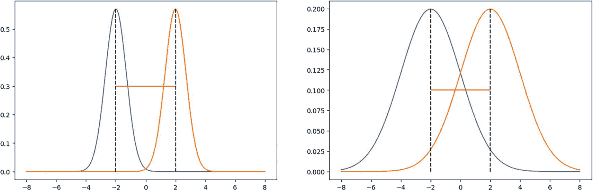

两个图形，每个图形有两个钟形曲线。左图。曲线的顶点是（-2，0.6）和（2，0.6）。它们在（-4，0），（0，0）和（4，0）相交。右图。顶点是（-2，0.2）和（2，2）。它们在（-8，0），（0，0.125）和（8，0）相交。数值是近似的。

图 11-2

KL 散度即使在均值距离保持不变的情况下也会改变

由于显著的重叠，图 11-2 右侧的分布中的 KL 散度将更低。因此，在参数空间中操作不会给你控制两个分布相似性或差异性的能力。对 KL 散度设置界限为你提供了一个更好的方法来控制更新参数时分布的变化。

现在你将逐步建立 KL 散度与 Fisher 信息矩阵之间的关系。看看两个策略之间的 KL 散度表达式，当前的一个参数为θ，修订的一个参数为θ^′。

![KL[ p(x|θ) || [ p(x|θ^′) ] = E[p(x|θ)][log p(x|θ)] - E[p(x|θ)][log p(x|θ^′)] ]](../images/502835_2_En_11_Chapter/502835_2_En_11_Chapter_TeX_Equj.png)

对该表达式关于θ^′，即更新分布的参数，求一阶导数，得到：

![∇_θ′ KL[p(x|θ) || [ p(x|θ^′) ] = ∇_θ′ E[p(x|θ)][log p(x|θ)] - ∇_θ′ E[p(x|θ)][log p(x|θ^′)] ]](../images/502835_2_En_11_Chapter/502835_2_En_11_Chapter_TeX_Equk.png)

表达式右侧的第一项将为 0，因为导数是相对于θ^′的，但表达式 *E*[*p*(*x*| θ)][log*p*(*x*| θ)] 对θ^′没有依赖性。

现在将右侧第二个项从期望操作展开为显式积分：

![∇_θ′ KL[p(x|θ) || [ p(x|θ^′) ] = -∫ p(x|θ) ∇_θ′ log p(x|θ^′) dx ]](../images/502835_2_En_11_Chapter/502835_2_En_11_Chapter_TeX_Equl.png)

对该表达式求二阶导数，得到：

![∇_θ′² KL[p(x|θ) || [ p(x|θ^′) ] = -∫ p(x|θ) ∇_θ′ log p(x|θ^′) dx ]](../images/502835_2_En_11_Chapter/502835_2_En_11_Chapter_TeX_Equm.png)

左边的表达式——标量值对参数向量的二阶导数——不过就是一个 Hessian，它是关于更新分布参数的老旧分布与 KL 散度的 Hessian。现在将 Hessian 在θ^′ = θ处求值，得到：

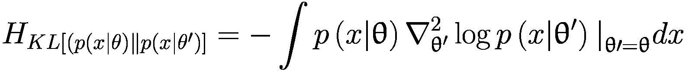

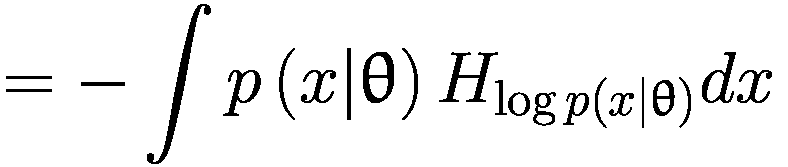

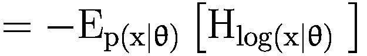

将方程 11-14 代入，你得到：

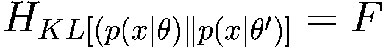

(11-15)

方程 11-15 是一个重要的结果。它告诉你，Fisher 信息矩阵 *F* 是在 *θ*^′ = *θ* 处，关于 *θ*^′ 的 KL 散度（两个分布 *p*(*x*| *θ*) 和 *p*(*x*| *θ*^′) 之间的 KL 散度）的海森矩阵。你将如何使用它？你能想到吗？

查看 *KL*[*p*(*x*| θ)‖ [*p*(*x*| θ^′)] 并交换变量，因为 θ^′ = θ + *d* 以显式定义从旧值 θ 到新值 θ^′ 的参数变化，其中 *d* 是变化向量。现在推导 KL 散度在原始参数向量 θ 附近的二阶泰勒展开。我将概率函数的符号简化，以保持对核心操作的聚焦：

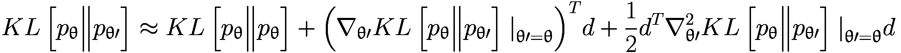

第一个项，*KL*[*p*[θ]‖*p*[θ]] 将会是 0，因为相同分布之间的 KL 距离是 0。第二个项有 ∇[θ′]*KL*[*p*[θ]‖*p*[θ′]]|[θ ′  = θ]，这等于 *E*[*p*(*x*| θ)][∇[θ] log *p*(*x*| θ)]，根据方程 11-11，这也是 0。根据方程 11-15，表达式 ![$$ {\nabla}_{\uptheta \prime}² KL\left[{p}_{\uptheta}\Big\Vert {p}_{\uptheta \prime}\right]{\left.\kern0em \right|}_{\uptheta \prime =\uptheta}, $$](../images/502835_2_En_11_Chapter/502835_2_En_11_Chapter_TeX_IEq9.png) 是 Fisher 信息矩阵 F。进行这些替换，你得到：

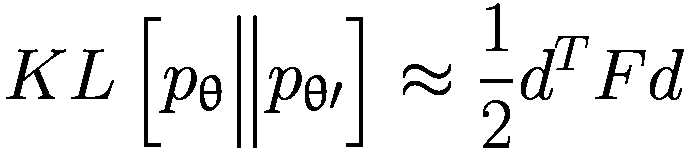

(11-16)

通过这个结果，你现在知道，如果你需要在参数更新期间约束 KL 散度，你可以借助方程 11-16 来实现。假设你的损失函数是 L(θ)，并且你想要找到一个最优的 θ，使得这个损失函数在 KL 散度保持在常数 *c* 的条件下最小化。你可以用以下方式数学地表达：

![**d**^* = arg min_{d s.t. KL[p_θ || p_θ + d] = c} L(θ + d)](../images/502835_2_En_11_Chapter/502835_2_En_11_Chapter_TeX_Equr.png)

你可以用拉格朗日形式将这个带有约束的最小化问题表达如下：

![$$ {d}^{\ast} = \arg \min_{d} L\left(\uptheta + d\right) + \uplambda \left( KL\left[{p}_{\uptheta} \Big\Vert {p}_{\uptheta + d}\right] - c\right) $$](../images/502835_2_En_11_Chapter/502835_2_En_11_Chapter_TeX_Equs.png)

使用方程 11-15 替换 KL[*p*[θ]‖*p*[θ + *d*]]，你得到：

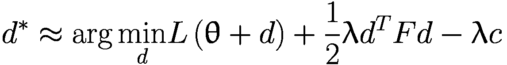

接下来，通过其一级泰勒展开来近似 *L*(θ + d) = *L*(θ) + ∇[θ]*L*(θ)^(*T*)*d，以得到：

![$$ {d}^{\ast}\approx \arg \min_{d} \left[L\left(\uptheta \right) + \nabla_{\uptheta}L{\left(\uptheta \right)}^Td + \frac{1}{2}\uplambda {d}^T Fd - \uplambda c\right] $$](../images/502835_2_En_11_Chapter/502835_2_En_11_Chapter_TeX_Equu.png)

为了找到 *d*^∗，你将右侧关于 *d* 的导数设为 0，以得到：

![$$ \frac{\partial }{\partial d}\left[L\left(\uptheta \right) + \nabla_{\uptheta}L{\left(\uptheta \right)}^Td + \frac{1}{2}\uplambda {d}^T Fd - \uplambda c\right] = 0 $$](../images/502835_2_En_11_Chapter/502835_2_En_11_Chapter_TeX_Equv.png)

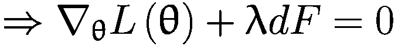

解 *d*，你得到：

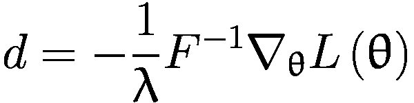

(11-17)

其中，自然梯度 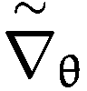 定义为：

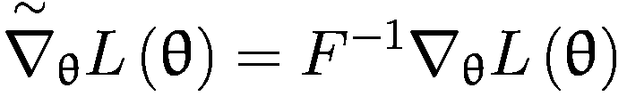

(11-18)

方程 11-18 是一个重要的结果，它是 TRPO 和 PPO 以及许多基于自然梯度的策略算法的基础。自然梯度通过使用 *F*^(−1) 将参数空间中的梯度转换为分布空间中的梯度，该 *F*^(−1) 捕获了参数 θ 附近概率图的曲率。

使用方程 11-18 的结果，你可以通过以下步骤定义自然梯度下降：

1.  进行正向传播并计算损失 *L*(θ)。

1.  使用方程 11-13 计算 Fisher 信息矩阵 F 的估计值。

1.  计算梯度 ∇[θ]*L*(θ)。

1.  使用方程 11-18 计算自然梯度 。

1.  更新参数 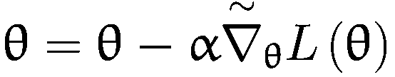。

使用自然梯度，更新的大小在分布空间中而不是在参数空间中受到控制，这是通过使用自然梯度实现的。

这已经是一个内容丰富的部分，充满了数学和推导。你不需要在第一次阅读时理解所有内容。你也可以跳过整个部分——只需记住自然梯度的概念以及它如何与常规梯度相关，如方程 11-18 所示。

下一个部分将在这种理解的基础上简要介绍 TRPO，然后深入探讨 PPO 如何实现 KL 约束，以及实现层面的细节等等。

### 信任区域策略优化（TRPO）

在推导出自然梯度之后，你现在可以更好地理解 TRPO 方程 11-1 到 11-3。它们实现了 KL 散度约束，并通过所谓的*线搜索*确保在每次更新时政策得到改进，如方程 11-4 中所述。TRPO 还通过计算样本平均 KL 散度的 Hessian 来计算 KL 散度的 Hessian 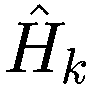。接下来，它使用共轭梯度法计算 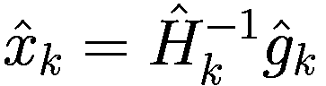，然后使用  来更新策略参数，如方程 11-4 所示。请注意，TRPO 计算样本平均 KL 散度的 Hessian，而不是使用 Fisher 信息矩阵作为替代。

即使在实现上进行了所有优化，TRPO 也是一个复杂且要求严格的算法。它可能并不非常受欢迎，但它为作者们提出了 PPO 奠定了基础，这将在下一部分介绍。

## PPO 深度解析**

PPO 受到与 TRPO 相同的挑战的启发：开发者如何尽可能多地使用他们现在拥有的数据来更新策略，而不至于走得太远，从而降低性能？虽然 TRPO 试图通过基于二阶导数的复杂方法来解决这个问题，但 PPO 是一组使用一阶导数和一些其他技术来保持新策略与旧策略相似的方法。PPO 方法更容易实现，并且在实践中似乎与 TRPO 一样好，甚至更好。PPO 主要有两种变体——PPO-Penalty 和 PPO-Clip。

与 TRPO 类似，PPO-Penalty 通过一个 KL 约束问题的近似解来更新策略网络，但它不是严格强制约束，而是在目标函数中添加一个 KL 散度的惩罚项，并在训练过程中自动调整惩罚系数，以便它具有正确的幅度。

与目标函数或约束中的 KL 散度项不同，PPO-Clip 在目标函数中使用一种特殊的剪辑技术来防止新策略与旧策略偏差过大。本章仅关注 PPO-Clip。读者在继续之前可能需要快速回顾第八章中关于 PPO 的部分。

### PPO CLIP 目标函数

本节首先讨论了 PPO 论文中定义的第 8 个方程的剪辑目标。^(2)此目标在方程 11-19 中重现。

![${L}^{\mathrm{CLIP}}\left(\uptheta \right)={\hat{E}}_t\left[\mathit{\min}\left({r}_t\left(\uptheta \right){\hat{A}}_t, clip\left({r}_t\left(\uptheta \right),1-\upvarepsilon, 1+\upvarepsilon \right){\hat{A}}_t\right)\right]$](../images/502835_2_En_11_Chapter/502835_2_En_11_Chapter_TeX_Equ18.png)

(11-19)

在方程 11-19 中，*r**t*是重要性采样比率，是通常的优势函数，这是你在第八章中学到的。优势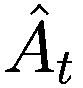有助于在策略优化算法中将奖励到去的值作为替代品时减少方差。*r**t*是在新策略和旧策略下给定状态下给定动作的概率比率，如方程 11-20 所示。Epsilon (ϵ)是超参数，通常保持 0.2 的值。

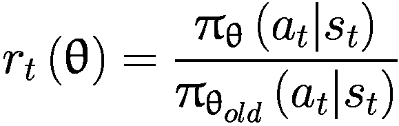

(11-20)

注意到当 θ = θ[old]，即旧策略和新策略相同时，*r**t* 为 1。让我们来分解表达式 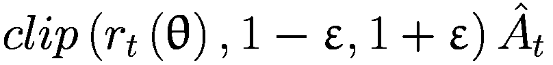。注意值的范围。*r**t*，作为两个概率的比率，将介于 0 和 1 之间。正如其名所示，*CLIP* 会将 *r**t* 的比率限制在 [1 - ϵ, 1 + ϵ] 的范围内，从而消除 *r*[*t*] 移出此范围的任何激励。这限制了策略更新在由参数 ϵ 控制的范围内。

在方程 11-19 中，你使用剪辑和非剪辑的最小值作为目标。根据  的值是正还是负，`min` 函数的行为会有所不同。

现在考虑  为正的情况。考虑 *r*[*t*] 的三个不同值；低于 1 - ϵ，位于 [1 - ϵ, 1 + ϵ] 范围内，以及高于 1 + ϵ。为了保持符号的简洁，你可以省略下标 *t*。当 *r* 低于 1 - ϵ 时，剪辑值将是 ，而未剪辑的值将是 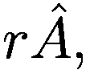，它低于剪辑值。因此，代理目标函数 *L*^(*CLIP*) 将是 。当 *r* 位于 [1 - ϵ, 1 + ϵ] 范围内时，剪辑和非剪辑部分将相同，因此 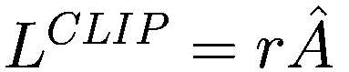。对于 *r* > 1 + ϵ，剪辑值将是 ，它将小于 ，使得 *L*^(*CLIP*) 等于 。你可以在下面的表格以及图 11-3 中看到这些情况。

您可以对负  进行类似的分析。再次考虑三个不同的 *r*[*t*] 值；低于 1 − ϵ，在 [1 − ϵ, 1 + ϵ] 范围内，以及高于 1 + ϵ。当 *r* 低于 1 − ϵ 时，裁剪值将是  而未裁剪值将是 。由于  是负的， 将会更小，将是 *L*^(*CLIP*)。当 *r* 位于 [1 − ϵ, 1 + ϵ] 范围内时，裁剪和未裁剪的部分将是相同的，使得 。对于 *r* > 1 + ϵ，裁剪值将是 ，并且它将大于 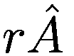，因为  是负的。因此，在这种情况下，*L*^(*CLIP*) 将等于 。再次，请参考以下表格以及图 11-3 以总结和展示 *L*^(*CLIP*) 随比率 *r* 的不同值如何变化。

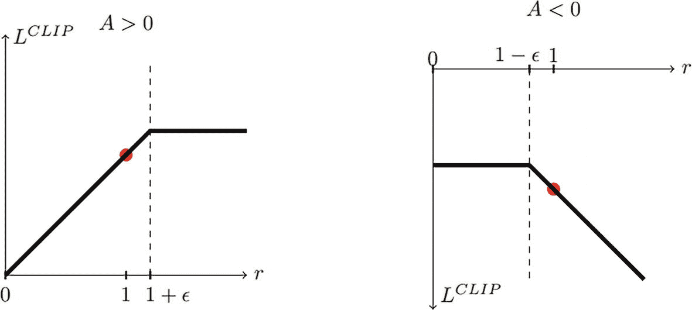

2 张 L clip 与 r 的图。左图。条件是 A 大于 0。线增加到 1 + epsilon 的虚线，然后变为常数。在 1 处标记了一个点。右图。条件是 A 小于 0。线最初保持不变，然后从 1 - epsilon 的虚线下降。

图 11-3

*L*^(*CLIP*) 图对于不同的比率 *r* 和优势 

|   | *r* < 1 − ϵ | *r* ∈ [1 − ϵ, 1 + ϵ] | *r* > 1 + ϵ |
| --- | --- | --- | --- |
| 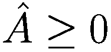 |  |  | 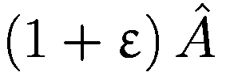 |
| 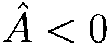 | 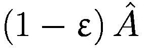 |  |  |

你可以看到，在图 11-3 中，每当概率比的变化会使 *L*^(*CLIP*) 改善时，你会忽略超过阈值的任何变化，对于正的  是 1 + *ϵ*，对于负的  是 1 - *ϵ*。当变化使目标变得更差时，你将包括没有剪裁的比率。

### 优势计算

与第八章中提到的其他策略梯度方法一样，计算优势的方法保持不变。有各种方法可以计算优势。原始 PPO 论文建议使用两种类型的优势函数，如方程 11-21 和 11-22 所示。

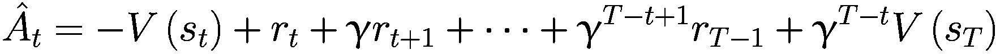

(11-21)

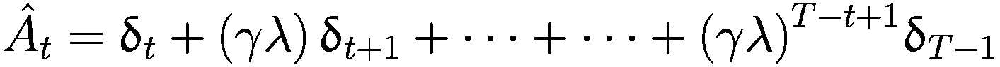

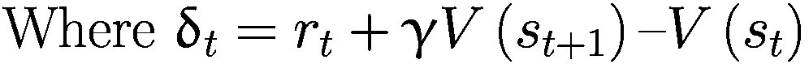

(11-22)

方程 11-21 是 n 步回报，其中在这种情况下 n = T。方程 11-22 是广义优势估计，当λ = 1 时，它简化为方程 11-21，而当λ = 0 时，它简化为 TD(0)。

### 价值和熵损失目标

与许多涉及优势计算的 Actor-Critic 算法一样，你需要一个可以接受状态并产生状态价值的网络。PPO 也有一个价值网络，它是作为损失目标的一部分进行调整的：

![L^{VF}=E_t[(V_φ(s_t)-V_t^{target})²]](../images/502835_2_En_11_Chapter/502835_2_En_11_Chapter_TeX_Equ22.png)

(11-23)

正如你之前看到几次的那样，你添加熵项 *S*[π[θ]](*s*[*t*]) 来鼓励探索。有了所有这些，你想要最大化的目标函数在方程 11-24 中给出。记住，方程 11-24 中的目标是最大化，可以通过乘以-1.0 转换为最小化。

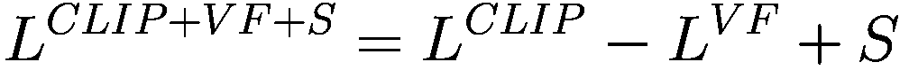

(11-24)

### PPO 的实现细节

在解释了 PPO 算法的理论基础之后，本节将介绍其在 CleanRL 中的实现，如所见。CleanRL 库文档^(3) 和实际代码文件^(4) 将是主要来源。

CleanRL 库的作者在博客中记录了所有实现细节，您可以在 ICLR 网站上阅读这些内容.^(5) 博客中讨论了 37 个细节，其中 13 个是核心细节，其余 24 个与特定变体相关，例如 Atari 环境、机器人任务、LSTM 版本等。本节将概述这 13 个核心细节。

#### 1. 向量化环境

PPO 利用一种称为 *向量化架构* 的有效范例，该架构具有一个收集样本并从多个环境中学习的单个学习者。您可以在实现文件 `ppo.py` 的第 162 到 164 行中看到这一点，如列表 11-1 所示。

根据 `args.num_envs` 命令行参数，并行创建了多个环境，并用 `gym.vector.SyncVectorEnv` 包装。Gymnasium 中的 `SyncVectorEnv` 是 `gymnasium.vector.VectorEnv` 的子类。`VectorEnv` 允许并行运行多个相同环境的独立副本。向量环境可以通过同时采样多个子环境来提供每秒步骤数的线性加速。为了防止已终止的环境等待所有子环境都终止或截断，向量环境在子环境终止或截断后会自动重置子环境。向量环境为每个并行环境批量收集观察结果、奖励、终止、截断和信息。此外，`step()` 函数期望为每个并行环境接收一个动作批处理。

```py
envs = gym.vector.SyncVectorEnv(
[make_env(args.env_id, i, args.capture_video, run_name) for i in range(args.num_envs)],
)
Listing 11-1
Vectorized Environment: Lines 162-164 - ppo.py
```

命令行参数 `num_envs` 和 `num_steps` 决定了每个策略运行中每个环境中要运行的步骤数，并且它们共同控制批处理大小。批处理大小定义为 `args.batch_size = int(args.num_envs * args.num_steps)`。`total_timesteps` 参数控制训练过程中将采取的总环境步骤数。这被分解为几个迭代，每个迭代有 `batch_size` 步。每个批处理被多次用于训练模型，重复次数由命令行参数 `args.update_epochs` 控制。这个训练循环的高级概述可以在列表 11-2 中看到。

```py
args.batch_size = int(args.num_envs * args.num_steps)
args.minibatch_size = int(args.batch_size // args.num_minibatches)
args.num_iterations = args.total_timesteps // args.batch_size
## initialize vectorized environment
## initialize Agent (actor and critic network)
## initialize optimizer, loggers etc.
for iteration in range(1, args.num_iterations + 1):
for step in range(0, args.num_steps):
## step through each of the environments (args.num_steps)
## add the step, action, reward and done flag to batch_size
## flatten (args.num_envs x args.num_steps) samples to args.batch_size
for epoch in range(args.update_epochs):
for start in range(0, args.batch_size, args.minibatch_size):
## use data from batch to train agents -
## actor and critic with exploration and entropy
Listing 11-2
PPO Training Loops from ppo.py
```

#### 2. 参数初始化

通常，隐藏层的权重使用 `scaling np.sqrt(2)` 的权重正交初始化，偏差设置为 0，如列表 11-3 所示。

```py
def layer_init(layer, std=np.sqrt(2), bias_const=0.0):
torch.nn.init.orthogonal_(layer.weight, std)
torch.nn.init.constant_(layer.bias, bias_const)
return layer
Listing 11-3
Parameter Initialization: Lines 94-97 – ppo.py
```

#### 3. Adam 优化器的 Epsilon 参数

PPO 将 epsilon 参数设置为 1e-5，这与 PyTorch 中的默认 epsilon 1e-8 和 TensorFlow 中的 1e-7 不同。请注意，PPO 使用相同的优化器来优化策略和价值网络，如列表 11-4 所示。

```py
optimizer = optim.Adam(agent.parameters(), lr=args.learning_rate, eps=1e-5)
Listing 11-4
Optimizer: Lines 168 – ppo.py
```

#### 4. Adam 学习率退火

Adam 优化器的学习率可以是常数或设置为衰减。默认情况下，训练玩 Atari 游戏的代理的超参数将学习率设置为随着时间步数的增加线性衰减从 2.5e-4 到 0。在 MuJoCo 中，学习率线性衰减从 3e-4 到 0。列表 11-5 显示了代码细节。

```py
if args.anneal_lr:
frac = 1.0 - (iteration - 1.0) / args.num_iterations
lrnow = frac * args.learning_rate
optimizer.param_groups[0]["lr"] = lrnow
Listing 11-5
Optimizer: Lines 187-190 – ppo.py
```

#### 5. 广义优势估计

虽然 PPO 论文在 PPO 的目标函数中使用了优势估计的抽象，如列表 11-6 所示，但 PPO 实现使用广义优势估计，如方程 11-22 所示。伽马(γ)设置为 0.99，lambda(λ)设置为 0.95。这两个都可以作为命令行参数进行控制。

```py
delta = rewards[t] + args.gamma * nextvalues * nextnonterminal - values[t]
advantages[t] = lastgaelam = delta + args.gamma * args.gae_lambda * nextnonterminal * lastgaelam
Listing 11-6
GAE: lines 229-230 – ppo.py
```

#### 6. 小批量更新

在学习过程中，PPO 实现随机排列大小为 N∗M 的训练数据，并将其分成更小的批次以计算梯度并改进策略。这体现在列表 11-3 中。

#### 7. 优势归一化

使用 GAE 计算优势后，PPO 通过减去它们的平均值并除以它们的标准差来对这些优势进行归一化。这种归一化是在小批量级别上进行的，而不是在整个批量级别上，如列表 11-7 所示。

```py
if args.norm_adv:
mb_advantages = (mb_advantages - mb_advantages.mean()) / \
(mb_advantages.std() + 1e-8)
Listing 11-7
Normalization: Lines 261-262 – ppo.py
```

#### 8. 剪裁代理目标

PPO 通过命令行参数`clip_coef`控制目标函数的剪裁，默认设置为 0.2。列表 11-8 显示了代码。

```py
# Policy loss
pg_loss1 = -mb_advantages * ratio
pg_loss2 = -mb_advantages * torch.clamp(ratio, 1 - args.clip_coef, 1 + args.clip_coef)
pg_loss = torch.max(pg_loss1, pg_loss2).mean()
# Value loss
newvalue = newvalue.view(-1)
if args.clip_vloss:
v_loss_unclipped = (newvalue - b_returns[mb_inds]) ** 2
v_clipped = b_values[mb_inds] + torch.clamp(
newvalue - b_values[mb_inds],
-args.clip_coef,
args.clip_coef,
)
v_loss_clipped = (v_clipped - b_returns[mb_inds]) ** 2
v_loss_max = torch.max(v_loss_unclipped, v_loss_clipped)
v_loss = 0.5 * v_loss_max.mean()
else:
v_loss = 0.5 * ((newvalue - b_returns[mb_inds]) ** 2).mean()
entropy_loss = entropy.mean()
loss = pg_loss - args.ent_coef * entropy_loss + v_loss * args.vf_coef
optimizer.zero_grad()
loss.backward()
nn.utils.clip_grad_norm_(agent.parameters(), args.max_grad_norm)
optimizer.step()
Listing 11-8
Clipping Objectives and Gradients: Lines 264-290 – ppo.py
```

#### 9. 值函数损失剪裁

PPO 像剪裁代理目标一样剪裁值函数，并且通过相同的命令行参数`clip_coef`进行控制。列表 11-8 显示了这种剪裁是如何进行的。

#### 10. 整体损失和熵奖励

如列表 11-8 所示，整体损失计算为`loss = policy_loss - entropy * entropy_coefficient + value_loss * value_coefficient`，这最大化了一个熵奖励项。请注意，策略参数和值参数使用相同的优化器。

#### 11. 全局梯度剪裁

对于每个 epoch 中的更新迭代，PPO 重新缩放策略和价值网络的梯度，使得“全局 l2 范数”（即所有参数连接梯度的大小）不超过 0.5，如列表 11-8 所示。0.5 的值可以通过命令行参数`max_grad_norm`进行控制。

#### 12. 调试变量

PPO 实现包含几个调试变量，包括：

+   `policy_loss`：所有数据点的平均策略损失

+   `value_loss`：所有数据点的平均值损失

+   `entropy_loss`：所有数据点的平均熵值

+   `clipfrac`：触发剪裁目标函数的训练数据比例

+   `approxkl`：通过`(-logratio).mean()`测量的近似 Kullback–Leibler 散度

在 CleanRL 实现中，如果从命令行启用了该选项，这些将记录到权重和偏差中。日志代码位于`ppo.py`文件的 300 到 309 行。

#### 13. 用于策略和价值函数的共享和分离的 MLP 网络

您可以选择使用具有独立头部的共享网络或独立网络。CleanRL 在`ppo.py`文件中实现了网络方法的分离，如列表 11-9 所示。

```py
class Agent(nn.Module):
def __init__(self, envs):
super().__init__()
self.critic = nn.Sequential(
layer_init(nn.Linear(np.array(envs.single_observation_space.shape).prod(), 64)),
nn.Tanh(),
layer_init(nn.Linear(64, 64)),
nn.Tanh(),
layer_init(nn.Linear(64, 1), std=1.0),
)
self.actor = nn.Sequential(
layer_init(nn.Linear(np.array(envs.single_observation_space.shape).prod(), 64)),
nn.Tanh(),
layer_init(nn.Linear(64, 64)),
nn.Tanh(),
layer_init(nn.Linear(64, envs.single_action_space.n), std=0.01),
)
def get_value(self, x):
return self.critic(x)
def get_action_and_value(self, x, action=None):
logits = self.actor(x)
probs = Categorical(logits=logits)
if action is None:
action = probs.sample()
return action, probs.log_prob(action), probs.entropy(), self.critic(x)
Listing 11-9
Actor-Critic Agent Networks Used in PPO: Lines 100-126 – ppo.py
```

### 运行 CleanRL PPO

您在第八章中看到了 PPO 的运行。请参考`8.c-ppo_sb3.ipynb`笔记本，以在`CartPole`上运行 PPO，记录视频，将训练细节记录到权重和偏差中，以及使用 HuggingFace 共享训练代理的方法。

### 异步 PPO

一篇题为“Sample Factory: Egocentric 3D Control from Pixels at 100000 FPS with Asynchronous Reinforcement Learning”的论文的作者群体介绍了一个高吞吐量训练系统，该系统专注于非常高效的策略梯度（PPO）的同步和异步实现。图 11-4 显示了库的示意图和主要组件。

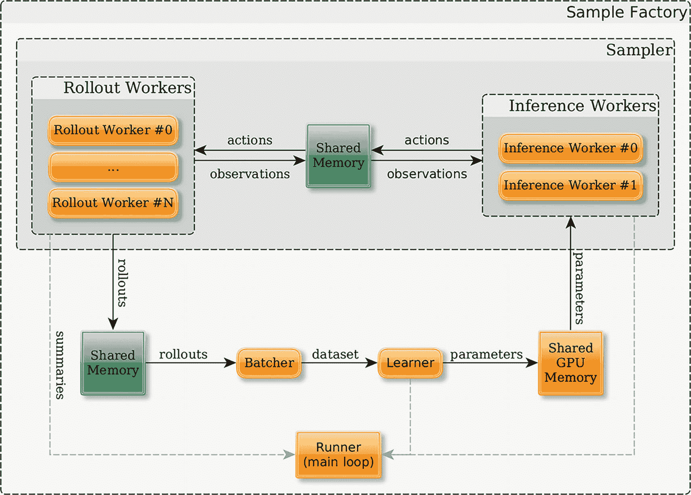

样本工厂的架构包含一个采样实体，从 0 到 N 的 rollout 工作者和从 0 到 1 的推理工作者。他们有一个共享内存来发送观察结果和接收动作。rollouts 被发送到共享内存、批处理器、学习者和共享 GPU 内存作为参数。

图 11-4

Simple Factory 库^(8)

Sample Factory 基于这样一个概念，即 RL 训练可以分成几个主要独立的组件，每个组件都专门用于一项特定任务。这允许进行模块化设计，其中这些组件可以分别加速/并行化，使您能够在任何 RL 任务上达到最高性能。组件通过发送和接收消息异步交互，这些消息通常在不同的进程中的不同事件循环上的组件之间传递。而不是在组件之间显式发送数据（即通过序列化观察结果并在进程间发送它们），库选择通过共享内存缓冲区发送数据。每次一个组件需要向另一个组件发送数据时，它将数据写入共享内存缓冲区，并发送一个包含缓冲区 ID（本质上是指向数据的指针）的信号。这大大减少了消息传递的开销。

每个组件专注于特定任务，可以被视为一个数据处理引擎（即每个组件通过获取信号获取一些输入，执行计算，并通过产生自己的信号发送结果）。这些是 Sample Factory 的主要组件：

+   **Rollout workers** 模拟环境。他们从策略中获取动作，执行环境步骤，在每个步骤后生成观察结果，并在`--rollout`步骤后完成轨迹。

+   **推理工作者**接收观察结果和隐藏状态并生成动作。学习者执行 SGD 步骤，然后在每个推理工作者上更新策略。

+   **Batcher**从 rollout 工作员接收轨迹，将它们组合起来，并为学习者生成数据集。

+   **Learner**从 batcher 接收数据批次，将它们分成更小的批次，并执行`--num_epochs`次随机梯度下降。每次 SGD 步骤后，它将新的权重写入共享内存缓冲区，并发送相关信号给其他人。

+   **Runner**负责启动整个系统，从其他组件接收各种统计数据，并负责日志记录和总结撰写。

+   **Sampler**虽然是一个可以与其他信号通信的独立组件，但通常作为 rollout/inference 工作员周围的一个简单层，并将它们连接到系统的其余部分。

感兴趣的读者可以参考 Sample Factory 文档^(9)的详细信息，了解如何使用这个库。列表 11-10 展示了示例运行。

```py
python -m sf_examples.mujoco.train_mujoco --env=mujoco_ant \
--experiment=Ant --train_dir=./train_dir
Listing 11-10
Asynchronous PPO with Sample Factory Library
```

这完成了 PPO 的深入研究。在接下来的章节中，您将看到 PPO 在大型语言模型中的应用。

## 大型语言模型(**)

详细了解了 PPO 之后，现在您将看到它通过遵循人类提示执行特定任务来制作大型语言模型的最新应用。OpenAI 在 2022 年 3 月发表了一篇开创性的论文，题为“通过人类反馈训练语言模型以遵循指令”，展示了使用 PPO 结合人类反馈进行 RL 的应用。目前 OpenAI 部署的模型，ChatGPT-3.5 和 ChatGPT-4 都采用了这种方法。甚至所有遵循提示——用户的指令以完成某些任务，如总结文本、生成新内容、识别主题或从文本中提取信息——的模型都使用某种形式的微调来使这些模型遵循这些指令。RLHF 是 OpenAI 首次成功演示的技术，并且仍然是微调模型以使这些模型遵循指令的非常流行的方法。

在深入探讨这篇论文的细节和 RLHF 方法之前，我简要回顾了大型语言模型。我还讨论了 LLM 领域的各种新兴趋势。本节的大部分信息与理解 RLHF 无关。因此，本节是可选的，对 LLMs 有先知或想直接进入 RLHF 的读者可以跳过 LLMs 这一节。

语言模型是一个可以学习自然语言统计模式并生成与输入数据相似文本的系统。语言模型有许多应用，如语音识别、机器翻译、文本摘要、问答和对话代理。然而，大多数传统语言模型受限于其词汇表的大小和输入输出序列的长度。它们还依赖于监督学习，这需要为每个特定任务提供大量标记数据。

大型语言模型是自然语言处理领域的一种新范式，其中单个模型在来自不同领域和来源的大量未标记文本数据上训练，例如书籍、网站、新闻文章、社交媒体帖子等。这些模型可以通过简单地使用文本本身作为监督，在无需对特定任务数据进行微调的情况下，在各种自然语言任务上实现令人印象深刻的性能。大型语言模型还可以生成不同体裁和风格的连贯流畅文本，展示了高水平的一般化和创造力。

使得大型语言模型的发展成为可能的关键创新之一是 Transformer 架构，该架构由 Vaswani 等人（2017）在论文“Attention Is All You Need”中引入。11 Transformer 架构引入了一种处理序列数据的新方法，摆脱了先前模型（如循环神经网络（RNNs）和长短期记忆（LSTM）网络）的限制。它通过自注意力机制实现了这一点，允许模型根据输入数据的不同部分的重要性进行不同的加权。这一创新使得 Transformer 能够并行处理输入数据的所有部分，显著提高了处理文本中长距离依赖关系的效率和效果。

Transformer 基于注意力的概念，允许模型关注输入和输出序列中最相关的部分，无论它们的长度或位置如何。Transformer 还使用自注意力机制，这使得模型能够学习序列中单词之间的依赖关系和关系。Transformer 由两个主要组件组成——一个编码器，它将输入序列编码为潜在表示，一个解码器，它从潜在表示生成输出序列。图 11-5 显示了论文中提出的 Transformer 模型的示意图。

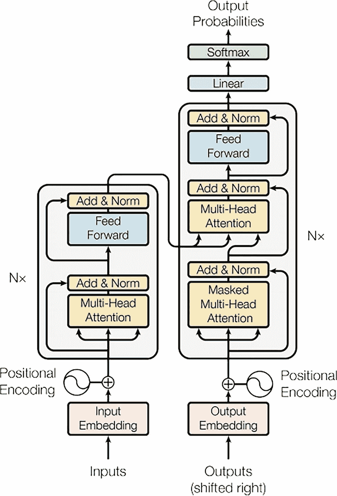

模型图包含 2N 个块。左侧块包含具有输入嵌入、多头注意力和带有加法和归一化的前馈的输入。右侧块包含具有输出嵌入、掩码和多头注意力以及带有加法和归一化、线性、softmax 和输出的输出。

图 11-5

Transformer 模型^(12)

在 Radford 等人（2018 年）的论文《Improving Language Understanding by Generative Pre-Training》中，Transformer 架构进一步得到了扩展，该论文标题为“通过生成预训练改进语言理解”，^(13) 他们提出了生成预训练 Transformer (GPT) 模型。GPT 是 Transformer 的一个变体，它只使用解码器组件，并作为自回归语言模型进行训练，这意味着它根据前面的单词预测序列中的下一个单词。GPT 使用掩码语言模型的目标在大规模文本语料库上进行预训练，其中输入序列中的某些单词被随机替换为特殊标记，模型必须恢复原始单词。这样，模型可以从数据中学习自然语言的通用模式和结构。

然而，GPT 仍然面临一些限制，例如其词汇表的固定大小以及扩展到更大模型和数据集的困难。这些问题在 Radford 等人（2019 年）的论文《Language Models Are Unsupervised Multitask Learners》中得到了解决，该论文标题为“语言模型是无监督多任务学习者”，^(14) 他们介绍了 GPT-2 模型，其参数和数据比 GPT 大一个数量级。GPT-2 使用子词标记化方法，这使得它能够处理更大、更多样化的词汇表，以及更有效的训练算法，这降低了计算成本和内存使用。GPT-2 能够在各种主题和领域生成高质量的文本，而无需任何特定任务的微调或数据，展示了显著的一般化和多功能性。

如布朗等人（2020 年）在论文《Language Models Are Few-Shot Learners》中所述，GPT-2 模型进一步进行了扩展，该论文标题为“语言模型是少样本学习者”，^(15) 他们介绍了 GPT-3 模型，这是当时发表时最大的语言模型，拥有 1750 亿个参数和 45 太字节文本数据。GPT-3 在多个自然语言基准测试中取得了最先进的成果，如自然语言理解、自然语言生成和常识推理，超过了在特定数据上微调的许多专业模型的表现。GPT-3 还展示了执行少样本学习的能力，即模型可以通过简单地提供查询中几个期望输入和输出的示例来适应新任务，而不需要进行任何显式的微调或数据。这被称为 *提示* 或 *提示工程*。

这种规模扩展到非常大的模型最终导致这些模型被称为 *大型语言模型* (LLMs) 或也称为 *基础模型*。这个术语不仅反映了它们在参数方面的物理大小，还反映了它们对语言的广泛理解以及执行各种自然语言处理任务的能力，这些任务几乎不需要特定任务的训练。

GPT 系列模型属于一个更广泛的 AI 模型类别，称为生成模型，其目标是学习数据的潜在分布并从中生成新的样本，模仿训练数据。生成模型在自然语言处理之外有许多应用，例如计算机视觉、音频合成，甚至代码。生成模型还可以用于数据增强、异常检测、领域适应等。一些常见的生成模型类型包括变分自编码器、生成对抗网络和自回归模型，如 GPT。大型语言模型的自回归训练示意图如图 11-6 所示。在自回归训练中，输入文本本身充当模型输出，没有手动步骤生成人类标签。将单词序列向右移动一个位置用作标签/输出序列。这样，LLM 就被训练去预测句子中迄今为止的单词序列之后的下一个单词。使用这种方法，一个非常大的模型在几乎接近 2-6 万亿个单词标记的大语料库上进行了训练。简而言之，这就是 LLMs 的全部内容。

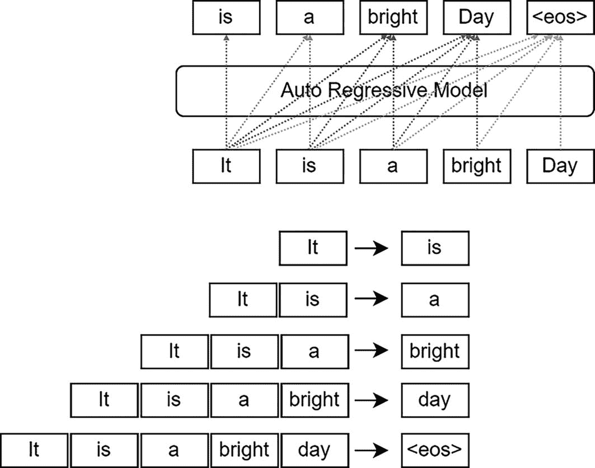

自回归模型图在其上方和下方有映射的一组单词，这些单词位于矩形中。它指向 is。它是，指向 a。它是，是一个指向 bright。它是，是一个，一个指向 day。它是，是一个，一个，一个指向 e o s 在括号内。

图 11-6

自回归训练风格

然而，在仅以自回归方式训练的原始形式中，LLMs 可以完成句子或文本，但它们不能有效地遵循模型给出的额外指令。RLHF 是通过进一步训练原始训练（预训练）的 LLM 来产生人类更喜欢的输出，使其能够更有效地遵循人类指令的过程。

目前，针对不同任务和领域的更新微调 LLMs 的发布速度呈指数级增长。几乎每周都有新的模型或技术宣布，使 LLMs 变得更加强大。

模型能够遵循人类指令（也称为“提示”）的能力（也称为“prompts”）使这些模型变得强大，并催生了一个新的专业领域，称为*提示工程*。研究人员正在花费无数小时来完善提示生成的方式。你将了解一些流行的方法，但在此章节中，我将不会深入细节，因为重点在于介绍性水平。

### 提示工程

由于大语言模型遵循指令/提示并执行各种自然语言处理任务的能力非常有效，提示工程已成为大语言模型领域的一门新学科。人工智能领域的一些专家甚至认为，英语是新的编程语言。同一个大语言模型，仅基于提示词，其输出质量可以从非常差到极高且相关。提示词是自然语言指令或问题，用于指定任务、输入、输出格式，有时还包括为大语言模型提供的额外信息或提示。提示工程旨在利用大语言模型的通用知识和能力，而无需或只需对特定任务数据进行极少量的微调。

例如，如果你想使用大语言模型对给定句子进行情感分析，可以使用不同类型的提示词，例如以下几种：

+   将句子“我喜欢这部电影”的情感分类为积极、消极或中性。

+   说话者对这部电影的感受如何？高兴、悲伤还是无所谓？

+   句子：我喜欢这部电影

+   情感：[MASK]

提示词的质量和效果可能因大语言模型、任务、输入和输出的不同而有所差异。提示工程涉及尝试不同的提示风格、格式和结构，以找到能最大化大语言模型性能和准确性的最优方案。一个提示词可能包含以下任意元素：

+   指令：要求模型执行的任务描述。

+   上下文：帮助模型产生更准确/相关响应的外部信息或额外上下文。

+   输入数据：你要求模型完成的实际问题或任务。

+   输出格式：输出的类型或格式。

### 提示技巧

使用这种结构，有多种方法可以引导大语言模型为给定任务提供期望类型的输出。这是一个快速变化的领域，每天都有新技术涌现。本节将介绍本书撰写时一些较为流行的实践方法。

*零样本提示*是最简单的类型，你只需提供指令和输入数据，没有额外的上下文或指导。零样本提示的一个例子是：

+   ““”指令：将句子的情感分类为积极或消极：

+   句子：我喜欢这部电影

+   情感：

+   ”””

模型将收到这三行输入，并根据句子内容用“积极”或“消极”来补全。在这个具体例子中，你期望大语言模型的响应是“积极”，因为“我喜欢这部电影”是一个表达积极情感的句子。

*少样本提示*也称为*上下文学习*。使用这种方法，向模型提供额外的上下文，形式为示例。在情感分类器的例子中，你可以提供以下示例，展示样本句子到这些句子所表示的情感的映射。使用这种方法的一个示例提示如下：

+   ““”指令：将句子的情感分类为正面或负面：

+   上下文：这笔钱花得值 // positive

+   What a waste of the time // negative

+   虽然有时很慢，但仍然值得一看 // positive

+   句子：我喜欢这部电影

+   情感：

+   ”””

我们通过提供“句子 -> 情感”的三个示例来扩展提示。

下一个例子是**思维链提示**。它来自 2022 年初的谷歌团队，在一篇题为“Chain-of-Thought Prompting Elicits Reasoning in Large Language Models.”的论文中。这是一个非常简单但蕴含着强大力量的想法。该想法增加了推理的中间步骤，为每个少样本示例得出最终解决方案，然后要求模型解决另一个用户定义的问题。LLM 使用示例的模式，通过提供中间推理步骤和未解决的问题的最终答案来完成提示。论文显示，这种方法与简单的少样本方法相比，显著提高了答案的正确性。以下是一个例子：

+   “““

+   这组中的奇数相加得到一个偶数：4, 8, 9, 15, 12, 2, 1。

+   A: 将所有奇数（9, 15, 1）相加得到 25。答案是错误的。

+   这组中的奇数相加得到一个偶数：15, 32, 5, 13, 82, 7, 1。

+   A:

+   ”””

论文中另一个例子如图 11-7 所示。

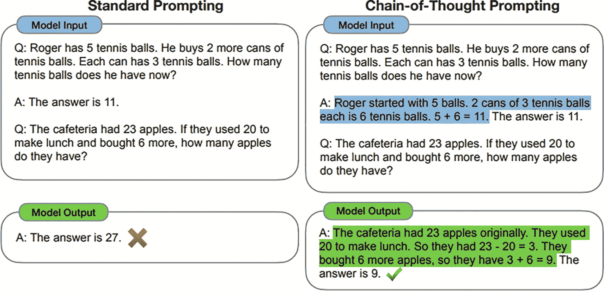

2 种提示类型。标准提示。它有一个包含两个问题和答案的模型输入。模型输出有一个错误符号指示的答案。思维链提示。它有一个包含两个问题和答案的模型输入。模型输出有一个正确符号指示的答案。

图 11-7

思维链（CoT）提示来源：CoT 论文^(17)

在这篇论文发表之后，扩展原始 CoT 想法的论文数量急剧增长，这些论文采用了不同的变体/增强。以下是一些例子：

+   **对 CoT 的自我一致性改进**：使用多个 CoT 遍历并采用多数投票。

+   **零样本思维链**：涉及在原始提示中添加“让我们一步步思考”。一个示例提示如下：

“””

Q: 一个杂技演员可以抛 16 个球。其中一半是高尔夫球，

和一半的高尔夫球是蓝色的。有多少个蓝色的高尔夫球

there?

A: 让我们一步步思考。

“””

+   **自动思维链**：原始的 CoT 需要手工制作的示例，而零样本 CoT 试图通过用指令“让我们一步步思考”来替换示例来消除这些示例。然而，它仍然可能产生错误。Auto-CoT^(18)使用自动方式选择多样化的示例，这有助于增加 LLM 的指导，形式为额外的上下文。

+   **更多方法**：还有更多方法。在撰写本书时，我统计了 CoT 方法的 20+种额外变化和改进。

在讨论了 CoT 之后，下一节将探讨另一种非常流行的方法，称为*检索增强生成*（RAG）。

### RAG 和聊天机器人

2020 年，Meta 在 LLM 出现之前引入了检索增强生成（RAG）。这种方法可以应用于涉及特定外部知识（如维基百科或其他大型语料库）的 LLM 任务，以增强 LLM 的文本生成。例如，要生成一个人的传记，可以使用如下 RAG 提示：

+   从维基百科或其他来源检索有关该人的相关信息。

+   使用检索到的信息撰写一篇连贯且信息丰富的传记，涵盖该人的生平、成就和遗产。

RAG 方法由两个主要组件组成——检索器和生成器。检索器负责根据查询或部分生成找到最相关的文档或段落。生成器是一个 LLM，它将检索到的信息作为上下文并生成最终的文本输出。

RAG 方法可以提高生成文本的质量、多样性和特异性，尤其是在需要事实或领域特定知识的任务中。然而，它也引入了一些挑战，例如如何选择最佳的知识来源，如何处理噪声或不完整的信息，以及如何确保生成文本的一致性和连贯性。

图 11-8 展示了 LangChain 库中的一个 RAG 示例图，LangChain 是一个帮助管理复杂多步骤、动态提示驱动的 LLM 交互的库。

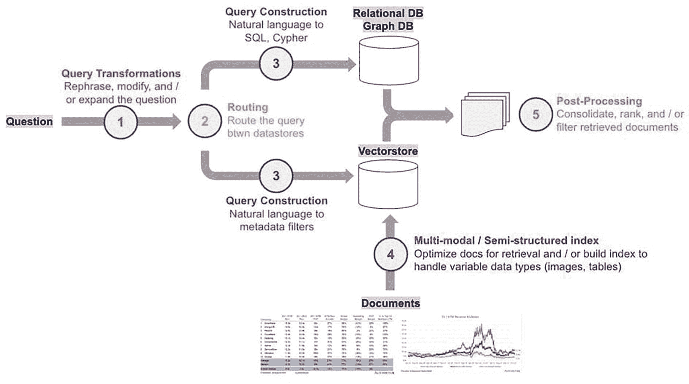

流程图有一个问题，它经过查询转换、路由构建，并在多模态或半结构化索引中的文档。文档被发送到向量存储和关系型数据库以及图数据库，并用于后续处理。

图 11-8

RAG 管道来源：LangChain 库博客^(20)

RAG 和 LLMs（Large Language Models）越来越多地被用于驱动聊天机器人，提供客户服务或回答特定查询。如果你今天使用 Bing 或 Google 搜索，除了链接外，你还会在页面顶部看到精心制作的响应。这是一个 RAG 驱动的搜索和响应的例子。它也可以用于提供客户服务，回答关于人力资源政策的内部员工查询等。让我们通过一个询问产品详细信息的客户查询的例子来了解一下。客户与聊天机器人的完整交互可以分为以下步骤：

+   接收客户查询并分析其意图和领域。例如，如果客户询问产品的功能，意图是信息搜索，领域是产品类别。

+   使用 RAG（Retrieval-Augmented Generation）从大规模知识源，如维基百科或产品数据库中检索相关文档或段落。RAG 使用一个神经检索器来找到与查询最相似的文档，并使用一个神经生成器根据它们对回答查询的有用性重新生成它们。目前一个非常流行的做法是使用基于 LLM（Large Language Model）的知识库项嵌入和查询的 LLM 基嵌入之间的余弦相似度。

+   使用检索到的文档作为 LLM 的额外上下文，生成针对客户查询的自然语言响应。LLM 可以使用文档提供事实或领域特定的信息，并根据客户档案或偏好个性化响应。

+   使用 ROUGE、BLEU 或人工反馈等指标评估生成的响应的质量和相关性。如果响应令人满意，将其发送给客户。如果不满意，则使用不同的一组文档或不同的 LLM 模型重复之前的步骤。

聊天机器人也有处理系统与用户之间多轮对话的方法，其中用户之前的查询和系统的响应被维护为一个过去交互的列表，并在与系统的每次交互回合中添加到上下文中。

### LLM 作为操作系统

所有这些方法都将 LLM 的使用提升到了如此多样化的任务集合中，以至于 LLMs 现在被称为“新时代的 CPU”。查看 Andrej Karpathy 的非常信息丰富的演讲，他是 AI 领域顶级声音和专家之一。^([21)] 图 11-9 展示了 Andrej 演讲中的一个幻灯片，提出了 LLMs 将成为新的操作系统的观点。


一个 LLM 操作系统在 CPU 的 RAM 中有一个 LLM 上下文窗口，该窗口被计算器、Python 解释器终端、磁盘中的文件系统、以太网浏览器、视频和音频外围设备以及其他 LLMs 访问。以下是未来 LLMs 的 10 种用途。

图 11-9

LLM 作为操作系统 来源：Andrej Karpathy 演讲

### 微调

LLM 微调涉及修改预训练 LLM 的参数，使其更适合特定下游任务。与依赖于使用自然语言或特殊标记作为输入和输出的提示工程不同，微调修改 LLM 的内部权重以优化其在任务上的性能。

当特定任务数据与 LLM 训练的通用领域数据非常不同时，或者当任务需要通过提示工程无法实现的高水平准确性和鲁棒性时，需要进行微调。例如，如果任务是分类法律文件或生成生物医学摘要，LLM 可能没有足够的知识或语言技能来处理这些领域和任务，除非进行微调。此外，某些任务可能具有复杂的输出格式或难以用提示工程实现的评估指标，例如机器翻译或问答。微调 LLM 的过程可以分解为以下高级步骤：

+   选择一个适合任务和数据的预训练 LLM。例如，如果任务是关于自然语言理解，那么像 BERT 这样的掩码语言模型可能是一个不错的选择。如果任务是关于自然语言生成，那么像 GPT 这样的自回归模型可能是一个更好的选择。

+   定义一个特定任务的架构，该架构包括一个输入层、一个输出层，以及可选的中间层，这些中间层将 LLM 与输入和输出连接起来。输入层应与 LLM 的格式和词汇匹配，输出层应与任务的格式和词汇匹配。中间层可以用来转换或增强 LLM 中的表示，例如添加注意力、池化或分类层。

+   准备一个特定任务的 dataset，该 dataset 包含表示任务示例和标签的输入-输出对。该 dataset 应分为训练集、验证集和测试集，并且应平衡且能代表任务领域和难度。

+   使用合适的优化算法，如随机梯度下降或 Adam，在训练集上微调 LLM 和特定任务的层。目标函数应根据任务定义，例如，对于分类或生成任务使用交叉熵损失，对于回归任务使用均方误差。学习率、批量大小、训练轮数和其他超参数应调整以优化验证集上的性能并避免过拟合或欠拟合。

+   使用适当的指标，如准确率、精确率、召回率、F1 分数、BLEU、ROUGE 或 METEOR，在测试集上评估微调模型。结果应与基线模型或最先进的方法进行比较，以评估微调技术的有效性。

微调 LLMs 有其自身的挑战。第一个挑战是**数据稀缺**。可能没有足够特定任务的数据来有效地微调 LLM，尤其是在低资源语言或领域。这可能会导致泛化能力差或 LLM 的通用知识发生灾难性遗忘。解决这一挑战的一些技术包括数据增强、迁移学习、多任务学习或元学习，这些技术可以增加数据的多样性和数量，利用相关任务或领域的知识，或快速有效地将模型适应新任务。

第二大挑战是**数据噪声**。特定任务的数据可能包含错误、不一致性或歧义，这可能会影响微调过程的质量和可靠性。这可能会导致输出错误或误导，或者降低模型的鲁棒性。解决这一挑战的一些技术包括数据清洗、数据过滤、数据验证或数据质量评估，这些技术可以移除或纠正噪声数据，选择或优先处理高质量数据，或在微调过程中监控和评估数据质量。

第三大挑战是**模型复杂性**。大型语言模型（LLMs）拥有大量参数，在有限的计算资源或合理的时间内难以进行微调。这可能会限制微调技术的可扩展性或可行性。解决这一挑战的一些技术包括模型压缩、模型剪枝、模型蒸馏和模型量化，这些技术可以减少模型的大小或复杂性，移除或简化冗余或不相关的参数，或者用更小或更快的模型来近似原模型。你将在下一节中研究其中一种方法，称为参数高效微调（PEFT）。

所有提供 LLM 服务的云平台，如 Azure、AWS、Databricks、Google Vertex AI 等，都在提供微调模型的能力。这是一个快速增长的供应商列表，它们提供低代码/无代码方法来提供 RAG、微调、RLHF 等能力。

### 参数高效微调（PEFT）

在上一节中，你学习了微调 LLMs 的挑战。当模型越来越大时，在常见硬件上进行完全微调是不可行的。此外，为每个下游任务分别存储和部署微调模型成本非常高，因为微调模型的大小与原始预训练模型相同。参数高效微调（PEFT）方法旨在解决这两个问题。

PEFT 方法只调整少量（额外的）模型参数，同时保持大多数预训练 LLM 的参数固定，从而大大降低了计算和存储成本。这也避免了在 LLM 完全微调过程中出现的灾难性遗忘问题。PEFT 方法在低数据环境下也已被证明比微调更好，并且更好地泛化到领域外场景。

PEFT 方法的另一个好处是它们使模型更具可移植性，因为用户可以使用仅占用几个 MB 存储空间的小检查点来修改模型，而不是使用完整微调的大检查点。PEFT 方法中训练的少量权重被添加到预训练 LLM 之上，因此可以通过添加小权重来使用相同的 LLM 执行多个任务，而无需更改整个模型。

PEFT 有两种常见的方法。第一种是基于提示的微调。提示可以解释一个任务，或者给出一个你希望模型学习的任务示例。软提示方法不需要手动创建这些提示，而是向输入嵌入中添加可学习的参数，这些参数可以针对特定任务进行调整，同时保持预训练模型的参数固定。这使得微调大型语言模型（LLMs）用于新的下游任务更快、更简单。参考这种方法的多种技术的好地方是 HuggingFace 的 PEFT 库文档。^(22)

另一个非常受欢迎的方法是 LoRA（低秩自适应），该方法于 2021 年在一篇题为“LoRA: Low-Rank Adaptation of Large Language Models.”的论文中提出。^(23) 这种方法有一个更高效的版本，称为 QLoRA（量化 LoRA）。QLoRA 于 2023 年在一篇题为“QLoRA: Efficient Finetuning of Quantized LLMs.”的论文中提出。^(24) 让我们简要地了解一下这两种方法。

低秩自适应（LoRA）冻结了预训练模型的权重，并将可训练的秩分解矩阵注入到 Transformer 架构的每一层，从而大大减少了下游任务的可训练参数数量。图 11-10 展示了论文中 LoRA 方法的示意图。


LoRA 方法的示意图有一个长度为 d 的矩形 x 指向预训练权重，W 属于 R 的 d 次方 d，B=0，B 属于 R 的 r 次方 d，A = N 的 0，sigma squared，A 属于 R 的 d 次方 r。它们组合形成一个宽度为 d 的矩形 h。

图 11-10

LoRA 方法

假设 Transformer 中的某个线性层有一个大小为*d* × *d*的权重矩阵*W*。作为微调的一部分，你冻结这个原始预训练权重矩阵*W*，并从输入向量*x* ∈ *R*^(*d*)到输出向量*h* ∈ *R*^(*d*)构建另一条路径。你通过将 x 额外通过两个权重矩阵*A* ∈ *R*^(*d* × *r*)，然后通过*B* ∈ *R*^(*r* × *d*)来实现这一点。这里*d*是输入和输出向量的维度，*r*是一个远小于*d*的数值。权重矩阵*W*和乘积*A*. *B*具有相同的维度，即*d* × *d*。

原始地，向量*x*可以表示为*h* = *W*. *x*. 通过添加如图 11-10 所示的新路径，*h*的新表达式为 h = (W + A. B). x = W. x + (A. B). x，即从*x*到*h*的原始流动和额外的流动。在微调期间，*W*保持不变，并且只允许*A*和*B*的权重在反向传播期间改变。*A*的权重以零均值高斯分布初始化，而*B*以零初始化。在微调开始时*B* = 0，你得到*h* = *W*. *x*。随着微调的进行，*A*和*B*矩阵的权重发生变化，允许 LLM 以高效的方式学习新任务。例如，假设*d* = 512 和*r* = 10。*W*中的参数数量将是*d* × *d* = 512 × 512 = 2,621,44。*A*和*B*的总参数数量是 2 × *d* × *r* = 2 × 512 × 10 = 10,240，这大约是*W*中参数数量的 3.9%。

注意，与推理期间模型的内存占用相比，训练期间模型参数的内存占用非常庞大。训练期间内存占用大的原因是，在训练过程中，你需要维护额外的信息以允许反向传播和优化器梯度历史跟踪，这些信息包括隐藏层激活、反向传播梯度以及一阶和二阶梯度值的运行平均值。尽管 LoRA 在推理期间略微增加了模型参数的内存占用，但在微调期间它提供了显著的内存优势和数据量需求。这是因为，在 LoRA 下，正在调整的参数数量是实际模型参数的 3-5%。简而言之，LoRA 提供了以下关键优势：

+   预训练模型可以共享并用于构建针对不同任务的许多小型 LoRA 模块。你可以冻结共享模型，并通过替换图 11-10 中的矩阵*A*和*B*来高效地切换任务，从而显著降低存储需求和任务切换开销。

+   LoRA 通过使用自适应优化器使训练更高效，并将硬件入门门槛降低多达三倍，因为您不需要计算大多数参数的梯度或维护优化器状态。相反，您只需优化注入的、远小的低秩矩阵。

+   简单的线性设计允许在部署时将可训练矩阵与冻结权重合并，与完全微调的模型相比，引入了零推理延迟。

+   LoRA 与许多先前的方法正交，并且可以与其中许多方法结合使用。

您可以参考该论文和其他详细的技术博客以获取更多信息。

QLoRA 是 LoRA 的一种进一步改进，其中模型参数以不同的精度和数值表示进行量化，以提供更高的内存效率。以下是论文中的引用：

> *QLoRA 将微调一个 65B 参数模型的平均内存需求从>780GB 的 GPU 内存降低到<48GB，与 16 位完全微调基线相比，没有降低运行时间或预测性能。这标志着 LLM 微调可访问性的重大转变：现在，迄今为止最大的公开模型可以在单个 GPU 上进行微调。*
> 
> 来源：QLoRA 论文

另一种名为“Weight-Decomposed LowRank Adaptation (DoRA)”的方法在 2024 年的一篇论文中提出，论文标题为“DoRA: Weight-Decomposed Low-Rank Adaptation。”^(25) 该方法将预训练权重分解为幅度和方向分量以进行微调，尤其是在使用 LoRA 时，可以有效地更新方向分量。感兴趣的读者可以参考论文以获取更多细节。

PEFT 正在看到许多额外的方法。希望这里的讨论能给您提供进一步探索的机会。

### 连接 LLMs

利用 LLMs 的力量进行各种下游任务的另一种方法是使用多步骤管道将它们连接起来。这意味着对于给定的任务，您可以使用多个 LLMs，每个 LLM 执行不同的子任务，并将一个 LLM 的输出作为另一个 LLM 的输入。例如，假设您想生成一篇长文档的摘要。您可以使用一个 LLM 从文档中提取最相关的句子，然后使用另一个 LLM 将这些句子改写成简洁的形式，最后使用另一个 LLM 将这些句子合并成一个连贯的摘要。这样，您就可以利用不同 LLMs 的不同优势和特长，并降低每个子任务的复杂性。

将 LLM 串联起来的一个关键好处是，它允许你根据任务的具体需求和特征定制管道。例如，你可以根据性能、领域、语言或架构选择每个子任务的最佳 LLM。你还可以使用特定于任务的资料或参数，如适配器层或提示嵌入，对每个 LLM 进行微调或调整，以提高其准确性和泛化能力。此外，你可以通过为每个 LLM 设置适当的超参数，如束大小、温度或长度惩罚，来控制中间输出的长度和质量。

然而，将大型语言模型（LLM）串联起来也带来了一些挑战和限制。其中主要挑战之一是如何确保不同 LLM 之间中间输出和输入的兼容性和连贯性。例如，如果一个 LLM 的输出包含另一个 LLM 的输入无法识别的标记或符号，可能会导致最终输出出现错误或退化。同样，如果一个 LLM 的输出不符合另一个 LLM 输入预期的格式或风格，可能会导致最终输出不一致或产生混淆。因此，重要的是要仔细选择和预处理构成管道的 LLM，并监控和评估中间输出和输入中可能出现的任何潜在问题。

另一个挑战是如何在速度、内存和质量之间权衡，以优化管道的整体性能和效率。例如，在管道中使用更多的 LLM 可能会提高最终输出的质量，但也可能增加延迟和任务的计算成本。同样，使用更大或更复杂的 LLM 可能会提高每个子任务的准确性，但也可能需要更多资源和时间来处理数据。因此，平衡管道中 LLM 的数量和大小，并利用缓存、剪枝或量化等技术来加速推理并减少 LLM 的内存占用，是非常重要的。

第三个挑战是如何解释和监控管道的行为和结果，考虑到涉及到的 LLM 的复杂性和不透明性。例如，追踪最终输出中错误或偏差的来源可能很困难，因为它们可能来自任何一个 LLM 或它们之间的交互。同样，理解 LLM 做出的决策或预测背后的理由或逻辑可能也很困难，因为它们可能依赖于人类无法解释的隐藏或潜在特征。因此，将可解释性和 MLOps 的方法和工具，如归因、可视化、调试或日志记录，应用于管道，并评估 LLM 在各种指标和基准上的性能和鲁棒性，是非常重要的。

LangChain^(26) 和 LlamaIndex^(27) 是目前两个流行的库，可以帮助您管理使用 LLM 构建的复杂多步解决方案，包括生产监控、日志记录、部署等。

### 自动智能体

自动智能体或 LLM 智能体是指能够通过集成 LLM 与规划、记忆等关键模块的架构来执行复杂任务的 LLM 应用。在 LLM 智能体中，LLM 充当主要控制器或“大脑”，指导完成任务或用户请求所需的一系列操作。LLM 智能体需要规划、记忆和工具使用等关键模块。

例如，看看 2023 年发表的一篇论文，标题为“ChemCrow: 使用化学工具增强大型语言模型。”^(28) 从论文中引用如下：

> *ChemCrow，一个旨在完成有机合成、药物发现和材料设计等任务的 LLM 化学智能体。通过整合 18 个专家设计的工具，ChemCrow 增强了 LLM 在化学领域的性能，并产生了新的功能。我们的智能体自主规划并执行了驱虫剂、三种有机催化剂的合成，并指导了新型发色团的发现……使用各种与化学相关的包和软件，创建了一套工具。然后，这些工具和用户输入被提供给 LLM。LLM 随后通过自动、迭代的思维链过程，决定其路径、工具选择和输入，最终得出答案。*
> 
> 来源：ChemCrow 论文

该过程的示意图如图 11-11 所示。该图的目的在于说明 LLM 被整合到各种过程中的复杂方式。在这些场景中，LLM 几乎像 CPU 或操作系统一样，如图 11-9 所示。


Chem Crow 概述。a. 专家设计的化学工具和用户定义的科学任务，指向思维链推理循环。它们指向基于化学信息的动作序列和自主实验。b. 工具类型包括分子、通用、安全和反应工具。

图 11-11

ChemCrow 概述

注意，将 LLM 链与 LLM 智能体结合的关键区别在于，在简单链中，信息流只有一个方向，即从第一个 LLM 到最后的 LLM。然而，在 LLM 智能体中，信息在各个 LLM 之间以及 LLM 与决策之间进行迭代流动。

本类别中另一篇有趣的论文是微软发表的“AutoGen: 通过多智能体对话实现下一代 LLM 应用。”^(29) 它附带了一个优秀的开源库，可以尝试各种功能。感兴趣的读者可以参考 GitHub 上的`autogen`库.^(30)

### 多模态生成式 AI

多模态生成人工智能是人工智能的一个分支，旨在创建能够在多个模态（如文本、图像、视频和音频）上生成多样化和复杂输出的系统。这样的系统可以利用大型语言模型（LLMs）理解自然语言指令和查询，并将它们与其他生成模型结合起来，这些模型可以在不同的领域和格式中产生高质量的内容。

多模态生成人工智能的主要组成部分是融合和转换来自不同来源和模态的信息，并保持它们之间的连贯性和一致性。例如，一个多模态生成系统可以接受场景的文本描述并生成相应的图像，或者反之亦然。或者，它可以接受一张图片和标题，并生成相关的音频叙述；或者接受一段音乐并生成与之情绪和风格相匹配的歌词。

多模态生成人工智能的另一个组成部分是推理和规划过于复杂场景和任务的能力，这些场景和任务涉及多个步骤和子目标。例如，一个多模态生成系统可以接受一个高级指令，如“制作一个关于如何制作纸飞机的简短视频教程”，并将其分解为一系列动作，如“找到合适的纸张”、“对折纸张”、“制作折痕”等。然后，它可以通过生成适当的视觉和口头输出来执行每个动作，例如在屏幕上显示纸张、叙述折叠步骤或突出折痕。

多模态生成人工智能的一些有趣的应用和例子包括：

+   **内容创作与编辑：** 多模态生成系统可以通过基于自然语言命令或查询提供建议、反馈或修正，帮助用户创建和编辑各种类型的内容，例如图像、视频、播客、博客或书籍。例如，用户可以要求系统“给图片添加日落滤镜”、“将叙述者的声音改为女性声音”，或者“重写句子使其更简洁”。

+   **教育与娱乐：** 多模态生成系统可以通过生成适应用户偏好、目标和反馈的内容，提供引人入胜且个性化的学习和娱乐体验，例如交互式游戏、模拟、故事或测验。例如，系统可以为用户创建一个定制的冒险游戏，用户可以在其中探索虚拟世界、与角色互动，并通过使用自然语言命令或查询来影响剧情。

+   **沟通与协作**：多模态生成系统可以通过提供跨不同语言和模态的翻译、摘要、转录或注释服务，促进用户之间或用户与机器之间的沟通和协作。例如，一个系统可以将一种语言的语音翻译成另一种语言，将长视频总结成简短文本，将音频对话转录成文本聊天，或用相关标签和标题注释图像。

这完成了关于 LLM 和 LLM 世界新兴趋势的可选部分。现在章节回到应用强化学习对 LLM 进行微调以遵循人类指令的应用。如前所述，LLM 的 RLHF 微调可以是全参数微调或基于 LoRA 的方法。

## 基于人类反馈的强化学习

训练大型语言模型（LLMs）的一个挑战是确保它们能够遵循自然语言指令并生成符合人类偏好和期望的输出。然而，为每个可能的指令和输出组合获取高质量标记数据是不切实际且昂贵的。此外，LLMs 在推理时可能会遇到新颖或模糊的指令，这需要从监督数据中难以单独学习的泛化和适应技能。

解决这一挑战的一个有希望的方案是利用人类反馈作为强化学习（RL）信号的一种形式，这可以指导大型语言模型（LLMs）通过根据人类判断对输出进行奖励或惩罚，来提高其在特定指令上的性能。这种被称为基于人类反馈的强化学习（RLHF）的技术，可以使 LLMs 从与人类的互动中学习，而不是依赖于预定义的标签或规则。

OpenAI 团队在 Ouyanf 等人（2022）的论文《通过人类反馈训练语言模型以遵循指令》中，介绍了这一概念及其结果 LLM 家族的成功应用，被称为 InstructGPT。所采用的方法是将 GPT-3 微调以遵循广泛的书面指令。这种技术使用人类偏好作为奖励信号来微调 LLM 模型。整体方法可以分解为三个步骤，如图 11-12 所示。


强化学习中涉及的三步的示意图。步骤 1：收集演示数据并训练监督策略。步骤 2：收集比较数据并训练奖励模型。步骤 3：使用强化学习优化策略以对抗奖励模型。

图 11-12

RLHF 的三个步骤^(32)

第一步是**监督微调（SFT）**，这涉及到从一个在互联网上非常庞大的数据集上训练过的预训练模型，如 GPT-3 开始。预训练数据通常是 1-2 万亿个文本标记，这些标记是从互联网和其他开源数据集中抓取的。预训练模型在人类编写的摘要数据集上进行微调。这些例子作为直接演示，展示了你希望模型执行的任务。模型通过调整其参数，使用监督学习方法来最小化其输出与数据集中正确摘要之间的差异，从而从这个数据集中学习。

第二步涉及**奖励建模（RM）**。奖励建模包括创建一个模型，该模型可以根据人类偏好预测模型输出的质量。这是通过收集一个新的数据集来实现的，其中人类比较模型生成的输出对，并指出他们更喜欢哪一个。然后，奖励模型被训练来预测这些人类偏好，有效地将“更好的”摘要作为二元分类任务来学习。最成功的奖励建模方法是从第一步中的 SFT 模型开始，并在最终的 transformer 层上添加一个额外的线性层，以生成表示奖励值的标量预测。

第三步是使用 PPO 或其他任何 RL 优化算法进行**强化学习微调（RL fine-tuning）**。第二步中学习的奖励模型为第一步中模型生成的输出提供奖励反馈。然后，使用 RL 中的 PPO 算法来使用这个奖励对第一步中的模型进行微调。为了确保在 RL 微调过程中，模型不会偏离原始的 SFT 微调模型太远，引入了来自第一步的参考 SFT 模型和在此步骤中正在微调的模型之间的 KL 惩罚。

为了更好地掌握这个概念，让我们通过一个例子来逐步分析。想象一下，你希望你的大型语言模型（LLM）能够生成文章的简洁摘要。目标是让模型理解文本的核心思想，并以几句话准确、连贯地呈现出来。

在第一步中，你收集了一个包含文章及其由人类专家编写的简洁摘要的数据集。然后，在这个数据集上对预训练的 LLM 进行微调，学习如何将文章压缩成几句话的信息。例如，如果一篇文章是关于太空探索中的新科学发现，其摘要可能会突出发现、其重要性以及潜在的影响，所有这些都在几句话中。

在 SFT 步骤之后，你向模型提供新的文章并生成摘要。然后，要求人类审稿人比较同一篇文章的摘要对，选择他们认为更简洁、更有信息量的摘要。这些偏好被用来训练一个奖励模型，该模型学习根据摘要的简洁性、准确性和连贯性来评分。

在奖励模型到位后，经过 SFT 微调的 LLM 为一系列新的文章生成摘要。然后，这些摘要由奖励模型进行评分。LLM 使用这些评分来调整其摘要策略，专注于生成根据奖励模型的标准更有可能简洁、准确和富有信息性的摘要。它使用 PPO 策略优化方法来完成这一任务。随着时间的推移，这个迭代过程导致了一个生成高质量摘要且与人类偏好高度一致的模型。

### LLM 对齐的最新进展

自 2022 年问世以来，RLHF 对人工智能模型的训练和改进方式产生了重大影响。如前文所述，RLHF 最初涉及监督微调（SFT）、奖励建模和政策优化等步骤。随着时间的推移，这个过程已经取得了实质性的进步，尤其是在自动化和提升效率方面，导致了直接偏好优化（DPO）的出现。

最初，RLHF 在很大程度上依赖于 SFT，即模型在人类标注示例的数据集上进行微调，以学习期望的行为。然而，随着该领域的发展，研究人员寻求自动化和改进这一过程的方法，减少对大量人类标注数据集的依赖，这些数据集资源密集且可能存在偏见。

一个显著的发展是将 SFT（自洽场论）替换为其他更先进模型的输出。这种方法利用了这些预训练模型中封装的知识，将其转移到正在训练的模型中。例如，使用更大或更专业的语言模型的输出作为微调的目标，可以提供对复杂任务的更丰富、更细腻的理解，而无需直接的人类标注。

在 RLHF（基于人类反馈的强化学习）中，奖励模型步骤，其中模型被训练来根据人类判断预测输出的奖励（或质量），也看到了显著的自动化进步。研究人员不再手动标注数据来训练这些奖励模型，而是开始使用其他大型语言模型（LLM）来自动生成奖励信号。这些 LLM 可以根据从大量数据集中学习到的标准评估输出的质量，有效地作为人类判断的代理。这种自动化不仅简化了训练过程，还扩大了规模，使得奖励模型能够进行更频繁的更新和改进。

最近，在一篇题为“直接偏好优化：你的语言模型其实是一个奖励模型”的论文中，Rafailov 等人（2023）^(33)提出了一项关键性的进步。直接偏好优化（DPO）直接优化模型的参数以与人类偏好一致，绕过了需要单独奖励模型的需求。这种方法将偏好建模直接集成到训练过程中，使优化更加高效，并可能更符合人类价值观。

DPO 从根本上依赖于比较模型生成的输出对，并调整模型参数以增加生成符合人类偏好的输出的概率。DPO 中的一个关键技术推导是使用基于偏好的梯度，其中计算了偏好分数相对于模型参数的梯度。这允许模型在更有可能产生期望结果的方向上进行直接优化。

DPO 相较于传统的 RLHF 及其组件（如 SFT 和独立的奖励模型）具有多方面的优势。首先，DPO 通过将偏好学习直接集成到模型优化中，简化了训练过程，消除了单独训练奖励模型的需求。这种集成可以导致计算资源的更有效利用和更快的迭代周期。

其次，通过直接优化人类偏好，DPO 可以使模型输出更接近人类认为有益或期望的结果，从而降低利益不一致的风险。此外，DPO 允许随着新偏好数据的可用而持续改进和调整模型，保持模型随时间推移的相关性和有效性。

微调 LLM 是一个非常活跃的研究领域。读者们最好在互联网和博客上搜索这个主题，以保持对最新进展的了解。

## RLHF 的库和框架

本节列出了提供 RLHF 微调的一些流行框架、库和云服务。这也是一个快速发展的生态系统，几乎每周都有新事物出现。因此，请将以下列表仅作为起始参考。

### Google 的 VertexAI

VertexAI 简化并优化了使用人类反馈的强化学习（RLHF）微调大型语言模型（LLM）的过程。它具有用户友好的界面和预构建的容器，消除了复杂本地设置的需求，让你可以专注于数据和任务。VertexAI 利用 Google Cloud 强大的计算资源，在大型数据集上高效地训练 LLM。它管理整个 RLHF 微调过程。你可以上传你的数据，定义你的微调目标，并通过中央仪表板跟踪进度。借助训练管道，VertexAI 自动化了训练，让你可以专注于数据质量和人类反馈循环。

你只需为使用的资源付费，你可以在一个安全的环境中共享你的项目并与团队成员协作，这有助于更顺畅的开发和迭代。

### AWS 使用 Trlx 的 SageMaker

AWS 通过名为 `trlX` 的开源库在 SageMaker 中提供 RLHF 功能。`trlX` 库作为一个用于使用来自人类反馈的强化学习（RLHF）微调大型语言模型（LLMs）的工具而脱颖而出。与通用框架不同，`trlX` 专注于 RLHF 的独特需求，简化并自动化了奖励模型训练、策略优化和分布式训练等关键任务。它还易于与流行的 LLM 库（如 HuggingFace Transformers）集成，消除了从头开始进行大量编码的需求。进一步利用跨多个 GPU 或 TPUs 的分布式训练能力，可以有效地处理大型数据集和模型。`trlX` 具有能够以 PPO 和隐式语言 Q-Learning ILQL 在 LLM 部署所需的规模进行生产就绪 RLHF 的 API（例如，33 亿参数）。

### HuggingFace 的 TRL 库

HuggingFace 的 TRL 是一个全栈库，提供了一套工具来使用强化学习训练 Transformer 语言模型，从监督微调步骤（SFT）、奖励建模步骤（RM）到近端策略优化（PPO）步骤。该库与 HuggingFace Transformers 库集成。`trlX` 是 TRL 库的一个分支。

## RLHF 调优流程

本节解释了一个使用 RLHF 调优 LLM 的代码示例。由于 LLM 微调需要具有大配置的 GPU，并且可能需要数小时才能训练，您可以直接浏览代码而不执行它。如果您可以通过 Google Colab 或任何其他云 GPU 提供商访问 GPU，您可以尝试运行代码。

这里使用的是 HuggingFace TRL 库附带的一个示例笔记本。您可以在 TRL 库文档的 `examples` 部分了解更多信息.^(34) 本节使用 `gpt2-sentiment.ipynb` 笔记本中的示例.^(35) 我还把这个笔记本复制到了这本书的配套代码中，作为 `11.b-gpt2-sentiment.ipynb`。

在这个笔记本中，您将 GPT-2 (小型) 进行微调以根据 IMDB 数据集生成正面的电影评论。模型获取一个真实评论的开头，并负责生成正面的后续内容。为了奖励正面的后续内容，您使用 BERT 分类器分析生成的句子的情感，并将分类器的输出用作 PPO 训练的奖励信号。

如您从笔记本的描述中注意到的，您不需要训练自己的奖励模型。相反，您使用一个预训练的分类器来对评论进行分类，并输出负类和正类的 logits。您将使用正类的 logits 作为语言模型的奖励信号。

在笔记本中，您将安装所需的库，导入您将要使用的模块，并登录到 Weights and Biases 以记录实验的运行统计数据。这在上面的列表 11-11 中展示。

```py
%pip install transformers trl wandb
import torch
from tqdm import tqdm
import pandas as pd
tqdm.pandas()
from transformers import pipeline, AutoTokenizer
from datasets import load_dataset
from trl import PPOTrainer, PPOConfig, AutoModelForCausalLMWithValueHead
from trl.core import LengthSampler
import wandb
wandb.init()
Listing 11-11
Install and Import Step from gpt2-sentiment.ipynb
```

你也可以为 PPO 训练器创建一个配置，如列表 11-12 所示。

```py
config = PPOConfig(
model_name="lvwerra/gpt2-imdb",
learning_rate=1.41e-5,
log_with="wandb",
)
sent_kwargs = {"return_all_scores": True, "function_to_apply": "none", "batch_size": 16}
Listing 11-12
PPO Configuration from gpt2-sentiment.ipynb
```

在这个笔记本中，你不会执行 RLHF 的 SFT 步骤。使用 HuggingFace (hf) Transformers 库和 HF model-hub，你加载了一个在 IMBD 数据集上额外训练了一个 epoch 的 GPT-2 模型。IMBD 数据集包含 50,000 条带有“正面/负面”反馈的标注电影评论，表示情感。IMBD 数据集是一个包含电影评论的数据集。如列表 11-12 所示，PPOConfig 初始化接受托管在 HF model hub 上的 `model_name="lvwerra/gpt2-imdb”`。关于微调数据集和脚本的详细信息，请参阅[`https://huggingface.co/lvwerra/gpt2-imdb`](https://huggingface.co/lvwerra/gpt2-imdb)。

要进行 RLHF 微调，你再次使用 IMBD 数据集。在 RLHF 训练期间，数据通过一个预训练的基于 BERT 的奖励模型传递。这些奖励用于使用 PPO 微调 `gpt2-imdb`。列表 11-13 展示了为训练准备 IMBD 数据集的代码。你首先加载 GPT-2 的分词器以对文本进行分词，然后再通过 GPT-2 LLM 传递。你下载 IMBD 数据集的 `train` 分割，将 `text` 列重命名为 `review`，并过滤掉小于 200 个字符的评论。接下来，对于数据集中的每个评论，你从评论的开头随机采样 2 到 8 个标记，然后将分词版本存储在名为 `input_ids` 的列中，将解码文本版本存储在名为 `query` 的列中。你还将保留数据集中的所有其他列，即 `review` 和 `label`。你可以探索 HuggingFace 数据集，网址为[`https://huggingface.co/datasets/imdb`](https://huggingface.co/datasets/imdb)。定义一个 `collator` 函数以将数据整理成适合 PPO 批量训练的格式。如果其中一些概念不清楚，请参阅 HuggingFace 文档。

```py
def build_dataset(config, dataset_name="imdb",
input_min_text_length=2, input_max_text_length=8):
tokenizer = AutoTokenizer.from_pretrained(config.model_name)
tokenizer.pad_token = tokenizer.eos_token
# load imdb with datasets
ds = load_dataset(dataset_name, split="train")
ds = ds.rename_columns({"text": "review"})
ds = ds.filter(lambda x: len(x["review"]) > 200, batched=False)
input_size = LengthSampler(input_min_text_length, input_max_text_length)
def tokenize(sample):
sample["input_ids"] = tokenizer.encode(sample["review"])[: input_size()]
sample["query"] = tokenizer.decode(sample["input_ids"])
return sample
ds = ds.map(tokenize, batched=False)
ds.set_format(type="torch")
return ds
dataset = build_dataset(config)
def collator(data):
return dict((key, [d[key] for d in data]) for key in data[0])
Listing 11-13
Dataset Preparation for RLHF from gpt2-sentiment.ipynb
```

现在你已经准备好执行 RLHF 的第三步，即 PPO 训练。你加载 `gpt2-imbd` 模型并制作两个副本——一个在 PPO 训练期间不会改变的参考模型，另一个将在 PPO 下进行微调。接下来，你使用 `PPOConfiguration`、两个 `GPT2-imdb` 模型和带有 `collator` 函数的数据集初始化 PPO 训练器，如列表 11-14 所示。你还加载了预训练的奖励模型，来自 HF model hub 的 `distilbert-imdb` 分类器，并准备情感管道。如前所述，`distilbert-imdb` 模型输出负类和正类的 logits，你使用正类的 logits 作为语言模型的奖励信号。

```py
# Load pretrained GPT2 language models
model = AutoModelForCausalLMWithValueHead.from_pretrained(config.model_name)
ref_model = AutoModelForCausalLMWithValueHead.from_pretrained(config.model_name)
tokenizer = AutoTokenizer.from_pretrained(config.model_name)
tokenizer.pad_token = tokenizer.eos_token
# Initialize PPO trainer
ppo_trainer = PPOTrainer(config, model, ref_model,
tokenizer, dataset=dataset, data_collator=collator)
#Load Bert Classifier
device = ppo_trainer.accelerator.device
if ppo_trainer.accelerator.num_processes == 1:
device = 0 if torch.cuda.is_available() else "cpu"
sentiment_pipe = pipeline("sentiment-analysis", model=”lvwerra/
distilbert-imdb", device=device)
Listing 11-14
Model Loading Including Reward Model and PPOtrainer Initialization from gpt2-sentiment.ipynb
```

你现在可以开始训练模型了。训练包括一个循环，以下为主要步骤：

1.  从策略网络（GPT-2）获取查询响应。

1.  从 BERT 获取查询/响应的情感。

1.  使用（`查询，响应，奖励`）三元组优化 PPO 策略。

列表 11-15 显示了训练循环的完整代码。

```py
output_min_length = 4
output_max_length = 16
output_length_sampler = LengthSampler(output_min_length, output_max_length)
generation_kwargs = {
"min_length": -1,
"top_k": 0.0,
"top_p": 1.0,
"do_sample": True,
"pad_token_id": tokenizer.eos_token_id,
}
for epoch, batch in tqdm(enumerate(ppo_trainer.dataloader)):
query_tensors = batch["input_ids"]
#### Get response from gpt2
response_tensors = []
for query in query_tensors:
gen_len = output_length_sampler()
generation_kwargs["max_new_tokens"] = gen_len
response = ppo_trainer.generate(query, **generation_kwargs)
response_tensors.append(response.squeeze()[-gen_len:])
batch["response"] = [tokenizer.decode(r.squeeze()) for r in response_tensors]
#### Compute sentiment score
texts = [q + r for q, r in zip(batch["query"], batch["response"])]
pipe_outputs = sentiment_pipe(texts, **sent_kwargs)
rewards = [torch.tensor(output[1]["score"]) for output in pipe_outputs]
#### Run PPO step
stats = ppo_trainer.step(query_tensors, response_tensors, rewards)
ppo_trainer.log_stats(stats, batch, rewards)
Listing 11-15
Training Loop from gpt2-sentiment.ipynb
```

由于我们已经初始化了 Weights and Biases（wandb），我们将在 wandb 上能够跟踪训练进度和各种其他指标。

一旦训练完成，你可以检查 PPO 训练模型的输出，并将其与`reference gpt2-imdb`模型的输出进行比较。笔记本包含了执行检查的代码。你可以看到，与参考模型相比，响应（之后）通常更好，并且倾向于积极语气。一个示例比较显示在图 11-13 中。对于详细说明，请参阅`gpt2-sentiment.ipynb`笔记本。


表格有 5 列和 16 行。列标题是查询、之前响应、之后响应、之前奖励和之后奖励。这 16 个字段包含文本和数值数据。

图 11-13

RLHF 的三步法^(37)

你可以看到，使用 PPO 训练的模型上的奖励高于使用参考`gpt2-imdb`模型对相同句子进行奖励。

这是一个 RLHF 如何工作的玩具示例，即使在玩具数据集上，也需要接近两到三小时。这应该让你意识到，即使在具有大量数据集的最先进 LLM 上进行微调，LLM 的微调也是一个昂贵的过程。几乎所有模型今天都要经历类似的过程，使 LLMs 遵循指令，即使是像 GitHub AutoPilot 这样的代码分析和代码补全。

这完成了本章，本章深入探讨了 PPO 及其在 RLHF 微调 LLMs 中的应用。

## 摘要

本章提供了对近端策略优化（PPO）算法的全面概述，这是一种用于强化学习的最先进的策略梯度方法。章节首先回顾了策略梯度方法的基础，如策略目标函数、重要性采样比率、信任区域和自然梯度。

章节随后逐步推导了 PPO 算法，解释了它如何使用剪裁的代理目标函数来控制策略更新大小并避免与当前策略的大偏差。章节还讨论了 PPO 的实际实现细节，例如向量化环境、参数初始化、Adam 优化器、广义优势估计、小批量更新、优势归一化、值函数损失剪裁、全局梯度剪裁和调试变量。

接着，介绍了人类反馈强化学习（RLHF）的概念。RLHF 是一种使用人类偏好作为奖励信号来微调大型语言模型（LLMs）的技术。本章简要概述了 Transformer 架构和 GPT 系列 LLMs，它们是能够从大量未标记文本数据中学习并生成不同领域和任务的高质量文本的生成模型。本章还讨论了诸如提示工程、微调和 PEFT、将 LLMs 链接在一起，甚至以类似操作系统的自主方式使多个 LLMs 协同工作等主题。

随后，讨论了 RLHF 及其如何应用于训练 LLMs 以遵循自然语言指令并生成符合人类期望的输出。本章讨论了 RLHF 的三个主要步骤：监督微调、奖励建模和政策优化。本章还描述了 LLM 对齐的最新进展，例如直接偏好优化（DPO），它绕过了需要单独奖励模型的需求，并直接优化模型参数以匹配人类偏好。

本章以使用 HuggingFace 的 TRL 库进行 RLHF 调优的演练结束，该库提供了一套用于使用 RLHF 训练 transformer 语言模型的工具。本章向您展示了如何使用 TRL 库微调 GPT-2 模型，根据 IMDB 数据集生成积极的电影评论。讨论还涵盖了使用预训练的 BERT 分类器作为奖励模型，根据其情感评分模型输出，以及如何使用 PPO 利用奖励信号优化模型参数。最后，本章对模型输出进行了检查，并比较了参考模型输出。
