# 12. 多智能体强化学习（MARL）

到目前为止，本书已经涵盖了大多数流行的强化学习方法，包括最先进的 PPO 及其在 RLHF 微调中的大型语言模型应用。你可能已经注意到，重点始终只集中在环境中学习使用 RL 训练算法以最优方式行动的单个智能体上。然而，存在许多包含多个智能体的设置。这些环境中的智能体——无论是单独还是以协作方式——都试图实现某些目标。涉及同一环境中多个智能体的设置是本章的重点。这被称为多智能体强化学习（MARL）。MARL 是一个非常吸引人和广泛的主题。要公正地对待这个主题，需要一本完全属于自己的书。本章通过简单的示例介绍了关键主题，并最终以一个在简单环境中应用 MARL 设置进行学习的示例结束章节。我将介绍各种术语和概念，并做出一些断言，而不深入探讨。主要目的是通过介绍 MARL，期望对 MARL 感兴趣的读者会参考其他详细的 MARL 相关书籍。

在存在多个决策者的环境中，智能体不仅需要理解和适应环境的动态，还需要预测和反应其他智能体的行为。这种能力对于任何需要合作、竞争或两者混合以实现最佳结果系统至关重要。MARL 的示意图如图 12-1 所示。

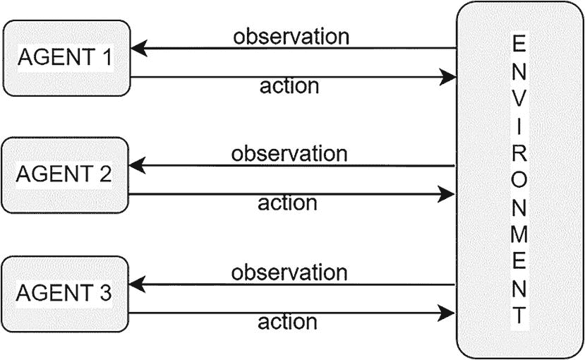

左侧有智能体 1 到 3，右侧是环境的架构。智能体向环境发送动作并接收观察结果。

图 12-1

多智能体强化学习（MARL）的示意图

让我们来看看不同领域中 MARL 的一些示例：

1.  *自动驾驶*：MARL 用于模拟和训练自动驾驶车辆在复杂交通场景中导航，每个车辆（智能体）都必须考虑其他车辆的行为以避免碰撞并优化交通流量。

1.  *机器人技术*：在协作机器人技术中，MARL 使多个机器人能够共同完成组装线或搜救任务等任务，协调它们的行为以提高效率和效果。

1.  *智能电网管理*：MARL 可以优化智能电网中的能源分配和消费，每个智能体代表消费者、生产者或存储系统，共同工作以平衡供需。

1.  *电子商务*：在线平台使用 MARL 来模拟买家、卖家和推荐系统之间的交互，优化用户满意度和收入。

1.  *多人在线游戏*：游戏开发者使用 MARL 来创建更智能和适应性强的非玩家角色（NPC），这些 NPC 可以在复杂游戏环境中与人类玩家或其他 NPC 互动。

1.  *金融市场*：多人强化学习（MARL）模拟了金融市场交易者的行为，有助于理解市场动态并制定交易和投资策略。

心中浮现的下一个问题是这些代理在这种设置下是如何学习的？实际上，这与你在书中迄今为止看到的强化学习（RL）非常相似。就像单个代理的情况一样，代理通过尝试不同的动作并为其结果获得奖励或回报来学习其行为。图 12-2 展示了基本的多人强化学习（MARL）训练循环。每个代理选择一个单独的动作，这些动作的组合被称为 *联合动作*。联合动作根据环境动力学影响环境状态，代理从这个变化中获得个人奖励，以及关于新环境状态的个体观察。这个循环会一直重复，直到满足停止标准，例如一个代理输掉游戏或所有代理共同达到一个终点目标，比如从地板上捡起所有文章，或者代理从送货卡车卸下所有物品并将它们正确放置在仓库货架上。从初始状态到最终状态的一次完整循环被称为 *一个回合*。从多个独立的回合中生成数据——即每个回合中观察到的观察、动作和奖励——用于不断改进代理的策略/奖励。在代理经过训练后，在实际运行中，代理可能仍然独立行动，如图 12-1 所示，或者联合行动，如图 12-2 所示。在随后的章节中，你将了解如何训练和训练后的执行的各种组合。

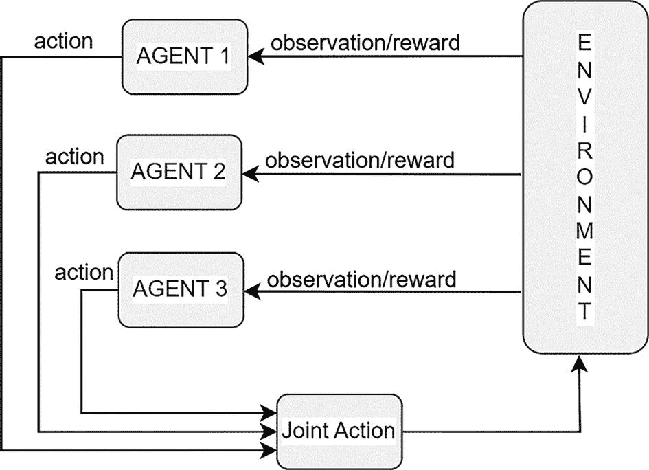

训练循环的圆形流程图。多代理 1 到 3 与联合动作相连。联合动作导致环境变化，而环境通过观察或奖励与代理 1 到 3 相连。

图 12-2

多代理强化学习（MARL）中的训练循环

再看看图 12-2。你还能用你迄今为止为单个代理设置学到的知识来解决它吗？从理论上讲，有一种方法。将三个代理视为一个组合的单个代理。将个人奖励组合成一个集体单奖励。同样的观点也可以扩展到观察和动作。采用这种方法，你可以将多人设置重铸为单个代理设置。虽然从理论上讲是可能的，但将其视为单个组合代理的强化学习时，存在一些挑战。我简要地谈到了这些挑战。

假设每个智能体只有一个维度动作，具有五个离散值，并且进一步假设你正在将三个这样的智能体组合在一起。组合智能体的动作空间是多少？它将是 5x5x5=125 个动作。同样，这也适用于状态/观察。因此，使用单个智能体强化学习（RL）方法会导致可能的动作空间和状态/观察空间呈指数增长。

另一个挑战是当智能体按顺序行动时，就像在棋类游戏或围棋游戏中一样。每个智能体轮流行动，行动取决于其他玩家的行动。在这种设置中，智能体的行动不是独立的。没有简单的方法将其视为单一智能体 RL 设置。

第三个挑战是与状态/观察的组合有关。考虑一下一群自动驾驶汽车的情况。如果它们被视为一个单一智能体 RL，你需要将每辆车的局部观察组合成一个大的观察向量。对于相距几公里的两辆车，转向每辆车的决策将主要取决于该车的局部状态。远离的车的状态/观察将没有任何影响（除非涉及到警察追捕！）。然而，通过将两辆车的状态组合在一起，你提供了大量的无关信息，这使得学习变得更加困难或几乎不可能。

因此，需要有一种单独的方法和一套算法来识别多个智能体的存在以及它们独特的挑战，并有效地进行规划。让我们来谈谈这些关键挑战。关键点是，将所有智能体视为一个大的组合单一智能体 RL 实体有一系列挑战。然而，根据所使用的抽象级别，在多智能体强化学习（MARL）中将每个智能体视为一个独立实体会有不同的挑战。

## MARL 中的关键挑战

*移动和改变目标*：我在介绍 RL 时提到了这个问题。在 RL 中，与监督学习不同，监督学习中的训练数据是在事先给出的，新的数据/观察随着智能体学习行为和探索环境而出现。训练数据不是固定的，因此学习目标就像瞄准一个移动的目标。你在自举方法的 TD(0) 方法中看到了这一点，以及你如何将目标视为常数。在多智能体强化学习（MARL）中，这个问题更大。由于存在多个智能体，每个智能体都试图调整到其他智能体的策略，反之亦然，形成一个循环。这创造了一个不稳定的循环学习动态，需要 MARL 算法以比单一智能体 RL 算法更可靠的方式处理这种非平稳方面。

*最佳策略和平衡*：在单个代理的强化学习中，最佳策略意味着在每个状态下获得最高的预期回报。但当有多个代理一起时，每个代理的回报取决于其他代理的回报。那么，最佳结果是什么？是针对单个代理，所有代理一起，还是相对于什么？如何结合不同代理的回报？可能有多个策略具有相同的总回报但不同的个体回报。如果环境是合作或竞争的，这会如何影响最佳的概念？最佳的整体想法取决于上下文，这需要在 MARL 中抽象出来。

*奖励分配*：在强化学习（RL）中，奖励分配，也称为 RL 中的时间信用分配，是确定哪些先前动作在特定实例中导致了代理收到的奖励的挑战。在多智能体强化学习（MARL）中，这个挑战更加复杂，因为它还要求识别出谁执行了导致奖励的动作。仅凭这种状态/动作/奖励信息，区分每个代理对收到的奖励的影响可能非常困难，尤其是如果某个代理由于其动作无关紧要而没有对奖励做出贡献。尽管基于反事实推理的理论想法可以解决这个问题，但如何以有效和可扩展的方式在多智能体中进行奖励分配仍然是一个开放性问题。

*针对代理数量的扩展性*：在多智能体强化学习环境中，随着代理数量的增加，代理动作的组合数量也会增加，并且可能以指数方式增加。目前最先进的 MARL 方法无法处理大量代理。这是一个活跃的研究领域。

除了这些方面，MARL 中还会出现一些其他问题。当系统中存在多个代理时，它们也可能相互通信。这种通信通常有助于稳定学习过程；然而，如果代理之间传递的消息/信息包含无关信息或噪声，可能会阻碍学习过程。另一个方面是学习过程的鲁棒性和稳定性。随着代理数量增加以及它们以多种方式相互影响，确保稳定性变得更加困难。MARL 算法必须特别注意这个方面。

## MARL 分类法

在继续介绍 MARL 及其组件之后，接下来将探讨 MARL 的层次结构。图 12-3 展示了这种可能分类的一个例子。你主要学习了第二章中介绍的马尔可夫决策过程（MDP），它涉及环境中的单个智能体。它基于智能体的动作和环境对动作的反应；智能体可以从一个状态移动到另一个状态。在第十章中，我介绍了多臂老虎机，它是具有一个智能体和一个状态的 MDP 的特殊情况。在智能体采取动作后，智能体根据动作获得奖励，然后智能体状态重置到开始位置。

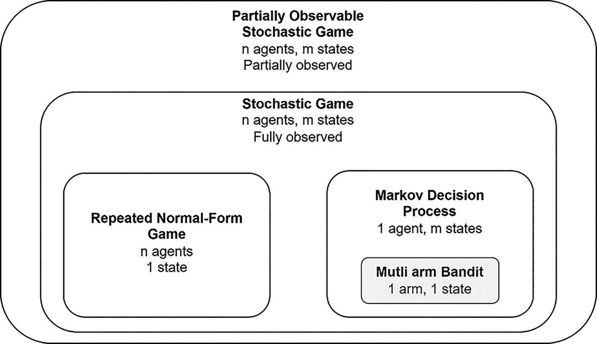

分类模型图由 4 个矩形组成。最外层的一个是部分可观察的，内层矩形是随机博弈。它由两个小矩形组成，分别读作重复的正常形式博弈和马尔可夫决策过程。马尔可夫由一个多臂老虎机的小矩形组成。

图 12-3

MARL 分类法

就像多臂老虎机是马尔可夫决策过程（MDP）的基础构建块一样，重复的正常形式博弈是多智能体强化学习（MARL）的基础构建块。顺便说一下，在本章中，我“环境”和“博弈”这两个词可以互换使用。“博弈”这个词来自“博弈论”这一学科，它是 MARL 模型建立的基础概念。正常形式博弈定义了两个或更多智能体之间的单一交互。其工作方式是，每个智能体 *i* 从智能体集合 *n* 中选择一个动作 *a*[*i*]，根据其策略 π[*i*]。所有智能体的结果动作形成一个联合动作，*a* = (*a*[*i*], *a*[2], …, *a*[*n*])。基于联合动作，每个智能体获得奖励 *r*[*i*]。你可以将这视为一次交互的一个循环，如图 12-3 所示。

正常形式博弈可以根据影响奖励结构的类型进一步细分。

+   *零和博弈*：智能体奖励的总和为零。在两个智能体的设置中，一个智能体的收益是另一个智能体相同数量的损失。

+   *共同奖励博弈*：所有智能体获得相同的奖励。大多数合作行为都会属于这一类别。

+   *总和博弈*：所有不符合前两种类型的其他类型。

双方标准形式博弈也被称为**矩阵博弈**，因为一个玩家的行动可以用矩阵的行来表示，而第二个代理的行动可以用矩阵的列来表示。在这种情况下，奖励以元组的形式显示在矩阵的单元格中，元组的第一个元素显示第一个代理的奖励，第二个元素显示第二个代理的奖励。你还记得第八章中讨论的剪刀石头布（RPS）游戏吗？图 12-4 显示了奖励和行动矩阵形式。它还显示了一个样本合作游戏的可能奖励结构以及著名的囚徒困境。囚徒困境是博弈论中一个著名的设置问题，可能值得一本完整的书。在合作/协调中，博弈对所有代理具有相同的奖励，并且每个单元格可以有一个单独的条目，即共同的奖励。

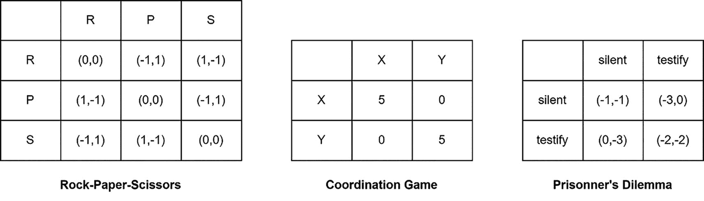

三个矩阵代表博弈。左。带有标题 R、P 和 S 的 4x4 剪刀石头布矩阵。中。带有标题 X 和 Y 的 3x3 协调博弈矩阵。右。带有标题 silent 和 testify 的 3x3 囚徒困境。

图 12-4

示例矩阵博弈

这是一个**标准形式博弈**。**重复的标准形式博弈**不过是循环重复这个过程，类似于多次重复行动，例如多臂老虎机。当我提到重复行动时，时间跨度也变得很重要。有限时间的博弈可能会随着游戏的进行和接近尾声而表现出不同的行为。代理在游戏接近尾声时可能选择不同的行动，与游戏开始时的行动不同。在无限时间内部行动的情况下，经过一段时间内的稳定后，代理的行动将收敛到与某种稳态相同的分布。如前所述，在无限间隔博弈中，你使用γ，即折现因子，的概念来添加奖励，以保持奖励总和有界。

在层次结构中，接下来是**随机博弈**的概念。这种设置将单状态下的重复正常形式扩展到多个状态，非常类似于将多臂老虎机扩展到 MDP。这是一个完整的多人代理系统，定义为多智能体强化学习（MARL）。就像单个代理的 MDP 一样，现在每个代理都会根据当前状态采取行动。这些行动组合起来得到**联合行动**。联合行动被传递到环境中，环境会对每个个体代理做出奖励和下一个状态的响应。然后，代理使用新的状态重新启动行动-奖励-下一个状态循环。与 MDP 类似，随机博弈具有马尔可夫属性——也就是说，给定当前状态和联合行动，一个代理的下一个状态和行动的概率条件独立于过去的状态和联合行动。这与你在强化学习和单个代理中看到的相同的马尔可夫属性。现在，它从单个代理扩展到多人设置。如图 12-3 所示，重复正常形式博弈是只有一个状态的随机博弈的特殊情况。此外，零和博弈、共同奖励博弈或一般和博弈的分类也适用于随机博弈。

在推广这一概念时，你可以从完全可观察的随机博弈转移到部分可观察的随机博弈。在随机博弈中，智能体能够直接观察到环境的状态，而在 *部分可观察的随机博弈* (POSG) 中，智能体获得的是一个观察结果，这是实际状态的完整信息。通常，对于每个智能体 *i*，定义一个单独的观察函数 *O*[*i*]，它指定了在给定实际环境状态 *s*^(*t*) 和前一时间步的联合行动 *a*^(*t* − 1) 的情况下，智能体可能观察到的概率 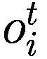。这表示为 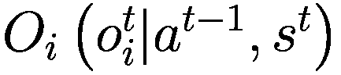。因此，每个智能体的行动/策略现在取决于观察的历史。这种区分也扩展到了零和博弈、共同收益博弈和一般收益博弈。共同收益博弈也被称为去中心化的 POMDP。观察函数 *O*[*i*] 可以用来呈现各种情况。考虑机器人足球的环境，其中每个机器人可能观察到整个比赛场地，但可能不会将其行动传达给其他机器人，尤其是来自对手球队的球员。因此，每个机器人必须猜测其他机器人的行动。一个例子就是同一球队机器人之间的球传递，基于对手球队机器人的位置和存在。在其他情况下，智能体可能只能观察到状态和联合行动的子集。一个例子是自动驾驶汽车。观察函数还可以通过添加一些随机噪声来建模观察中的不确定性。这将是大多数机器人和其他自主车辆使用的物理传感器来感知环境的情况。

### 智能体之间的通信

当环境中存在多个智能体时，它们之间的通信方式也需要被建模。建模的一种方法是将消息视为一种不会影响环境状态的行动类型。对于一个智能体 *i*，你可以将其行动 *a*[*i*] 视为两种行动的组合——一种是影响环境状态的环境行动 *x*[*i*]，另一种是消息行动 *m*[*i*]。*m*[*i*] 通常是一个离散集合，指定了智能体 *i* 向他人传递的信息结构。通过这种修改，智能体 *i* 的完整行动 *a*[*i*] 现在表示为一个元组 (*x*[*i*], *m*[*i*])。

与观察中的噪声一样，你还可以在智能体之间的通信和消息传递中引入不确定性。对于通信行动，智能体作为学习的一部分，需要理解他们收到的消息。这可能导致智能体之间某种抽象形式的共享语言的演变。

### 与博弈论映射

多智能体强化学习（MARL）领域从博弈论以及传统的单智能体强化学习中借鉴了许多基础设置。在强化学习中，“环境”被称为 *游戏*。我在定义 MARL 的层次结构时使用了“游戏”这个词。

在强化学习中，代理是一个实体或结构，它决定如何行动。在博弈论中，这样的实体被称为 *玩家*。在强化学习中称为奖励的，在博弈论中称为 *收益* 或 *效用*。策略定义了代理在强化学习中基于可用信息如何行动。这在博弈论中被称为 *策略*，它定义了代理/玩家基于可用信息如何行动。

## MARL 中的解决方案

多智能体强化学习（MARL）中的解决方案是什么？前一部分介绍了多智能体场景的基本环境设置——它们如何行动，它们可以传递消息的方式等等。然而，仅此并不能帮助开发学习过程。你需要一件额外的东西，那就是你试图优化的目标。在单智能体强化学习中，你使用了总折现奖励，也称为回报，作为要最大化的指标。同样，你需要在 MARL 设置中定义一个你想要最大化的目标。

由于在 MARL 中有多个代理参与，你需要优化的目标有其自身的特殊性。对于所有代理都获得相同奖励的常见奖励游戏，解决方案的定义可以是最大化所有代理收到的预期回报。当代理获得单独的奖励时，解决方案的概念变得更加复杂。让我们看看一些常见的例子。

让我们看看你在图 12-4 中看到的两个代理零和博弈的剪刀石头布设置。在零和博弈中，一个代理的奖励是另一个代理回报的相反数。许多两人棋类游戏，如象棋和国际象棋，也适合这种具有顺序移动的零和博弈类别。适用于这种情况的解决方案被称为 *最小-最大*。每个代理学习一个策略，该策略针对最坏情况的对手——即最高水平的专家。这也被称为 *最佳反应策略**，其中代理以最佳反应回应对手的移动。在剪刀石头布中，最佳反应策略是以相等的概率随机选择三种可能行动之一。这种方法给两个玩家/代理的预期奖励都是零。让我们考虑两个代理 *i* 和 *j*，它们的策略分别为 π[*i*] 和 π[*j*]。联合策略 π 表示为单个代理策略的元组：π = (π[*i*], π[*j*])。对于最小-最大联合策略，必须满足以下条件：

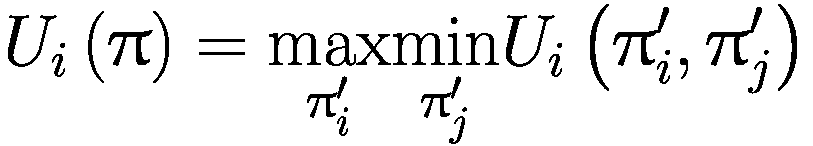

(12-1)

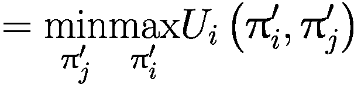

(12-2)

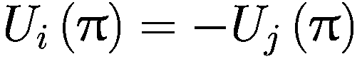

(12-3)

零和博弈可能有多个最小-最大解；然而，在这些不同的解中，效用或奖励，也称为博弈的最小-最大值，保持不变。对于非重复的零和正常形式博弈，可以通过线性规划获得最小-最大解。感兴趣的读者可以参考关于多智能体强化学习（MARL）的标准文本来了解这种方法。

下一种目标类型是**纳什均衡**，适用于两个或更多玩家的总和不定博弈。它是博弈论中一个研究得很好的概念。在纳什均衡中，代理*i*不能通过改变其策略来提高其期望回报。如果其他代理的策略发生变化，代理*i*可以找到一个新的固定点，即新的纳什均衡，并且是对所有其他代理当前策略的最佳反应。在具有*n*个代理的总和不定博弈中，如果联合策略π = (π[1], …, π[*n*])被认为是纳什均衡，则：

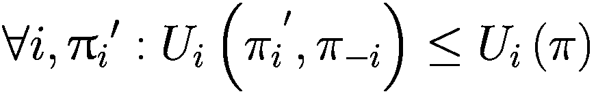

(12-4)

其中π[*i*]^′是代理*i*的策略，而*π*[−*i*]是除代理*i*之外所有其他代理的策略。方程 12-4 表明，如果策略π是代理*i*策略为π[*i*]的纳什均衡，那么π[*i*]在考虑其他代理的策略*π*[−*i*]保持不变的情况下，比代理*i*的任何其他策略π[*i*]^′都要好。

纳什均衡的概念也可以应用于零和博弈，因为它们是一般和博弈的特殊情况。在剪刀石头布中，唯一的纳什均衡是以均匀随机概率选择行动。在某些游戏中，均衡可能是唯一的，或者可能有多个纳什均衡。如图 12-5 所示的囚徒困境中，纳什均衡是唯一且确定性的，对于每个参与者来说，有一个最佳行动，例如“作证”。每个参与者采取的这种确定性策略满足方程 12-4。如果列囚徒选择保持沉默，行囚徒通过选择作证会更好，他们在“作证”行动下将获得 0 的奖励，而如果他们保持沉默，将获得-1 的奖励。同样，如果列囚徒选择作证，列囚徒再次通过作证会更好，因为这会给行囚徒带来-2 的奖励，而如果行囚徒选择保持沉默，将带来-3 的奖励。从列囚徒的角度来看，作证策略对他们来说也是最好的。因此，两个囚徒选择作证行动的联合策略是唯一的确定性策略。

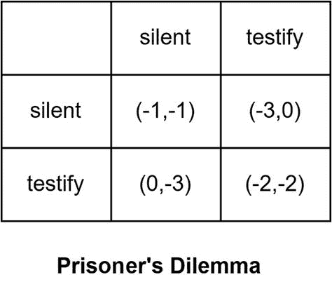

囚徒困境的 3x3 矩阵代表了沉默和作证的价值。第一行的坐标是（-1，-1）和（-3，0）。第二行的坐标是（0，-3）和（-2，-2）。

图 12-5

囚徒困境

然而，在剪刀石头布的情况下，并没有唯一的纳什均衡。相反，它是一个概率性的均衡，其中每个参与者选择以统一随机的方式行动，以相等的概率选择三种行动（石头、布、剪刀）。

通过允许参与者采取相关策略，可以进一步推广纳什均衡策略，其中每个参与者的策略不再相互独立。在这些情况下，可能有多种策略可以实现相同的预期联合奖励。在这些情况下，你通过添加额外的标准，如帕累托最优和社会福利以及公平性，来扩展均衡的概念，以区分不同的均衡解。

如果没有其他联合策略可以增加一个或多个参与者的预期回报，同时至少不减少一个参与者的预期回报，那么一个联合策略是*帕累托最优*的。这意味着没有任何一个参与者可以在不造成其他参与者损失的情况下获得收益。在所有玩家共享奖励的游戏中，任何帕累托最优的联合策略都具有相同的预期价值，这也是任何联合策略在游戏中可以达到的最高预期价值。

然而，帕累托最优解并没有对各种智能体之间联合奖励的相对分布做出任何声明。福利表示所有智能体获得的总收益数量，而公平性表示收益如何在智能体之间分配。在共同奖励游戏或零和游戏中，没有社会福利或公平性的概念。例如，在所有智能体都获得相同奖励的共同奖励游戏中，当个体智能体的预期回报最大化时，福利和公平性都达到最大化。在零和游戏中，一个智能体的奖励是另一个智能体奖励的负值。总预期联合回报为零，因此对于零和游戏，最小-最大解实现了总社会福利为零。

## 多智能体强化学习（MARL）和核心算法

在介绍了 MARL 概念之后，本节探讨了 MARL 的核心学习算法。在抽象层面上，它们大多遵循您迄今为止看到的单智能体 RL 的方法，但有一些修改。本节简要介绍了算法，主要在动作和状态有限空间中。

### 值迭代

单智能体的值迭代在第三章中介绍。图 12-6 重新生成了第三章中值迭代算法的伪代码。需要做一些小的修改来扩展此算法到 MARL 场景。计算 *v*^′(*s*) 的步骤需要改变——即 ![$$ {v}^{\prime }(s)\leftarrow \underset{a}{\max}\sum \limits_{s^{\prime },r}p\left({s}^{\prime },r|s,a\right)\left[r+\upgamma v\left({s}^{\prime}\right)\right] $$](../images/502835_2_En_12_Chapter/502835_2_En_12_Chapter_TeX_IEq3.png) 是需要改变的步骤。需要对此步骤进行两个修改。首先，为每个智能体 *i* 计算右侧表达式并将其存储在中间动作值向量 *M*[*i*, *s*] 中，如方程 12-5 所示。

![$$ {M}_{i,s}(a)\leftarrow \sum \limits_{s^{\prime },r}p\left({s}^{\prime },r|s,a\right)\left[{r}_i+\gamma {v}_i\left({s}^{\prime}\right)\right],\mathrm{for}\ \mathrm{state}\ s\in S,\mathrm{joint}\ \mathrm{action}\ a\in A $$](../images/502835_2_En_12_Chapter/502835_2_En_12_Chapter_TeX_Equ5.png)

(12-5)

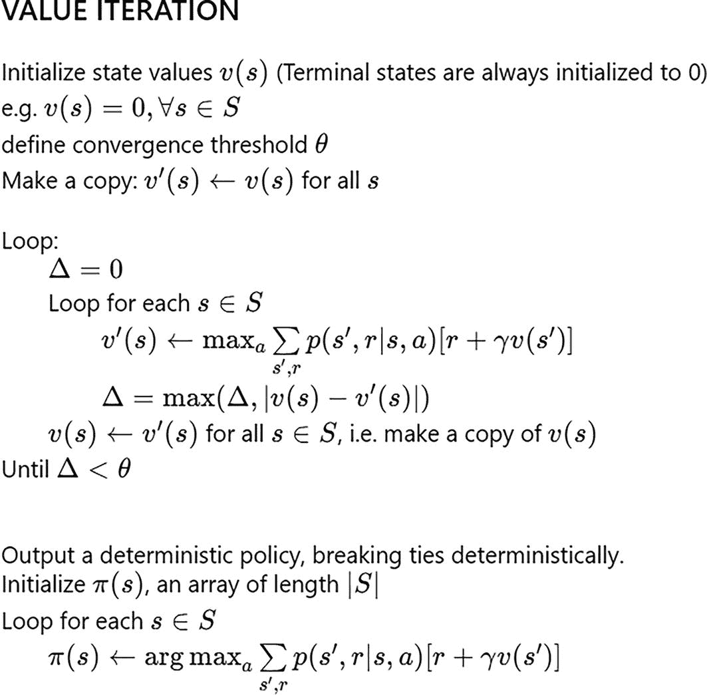

值迭代算法描述了状态值、循环过程和输出确定性策略。它包括 s 的 upsilon'、delta、upsilon 和 pi 的表达式。

图 12-6

单智能体强化学习的值迭代

下一个变化是将原始方程中的“max”替换为每个智能体*i*的值运算符*v*[*i*]，这是通过计算智能体*i*相对于环境中所有其他智能体的最小-最大解得到的。它可以表示为*v**i* = *Value**i*。其余的伪代码保持不变。请注意，对于多智能体强化学习（MARL）的价值迭代需要访问底层模型动力学，这与单智能体强化学习的要求相似。

你将看到这种模式被重复，其中用于 MARL 的基本结构将遵循与单智能体强化学习相似的方法。在 MARL 中，状态值和动作值的计算之后，会进行额外的后处理步骤，如最小-最大和纳什均衡，以计算更新。

### 联合动作学习的 TD 方法

第四章解释了单智能体强化学习的无模型方法。本节探讨了如何将类似的无模型方法应用于 MARL。一种简单的方法是让每个智能体在每一步都运行 TD(0)。换句话说，如果一个环境有*n*个智能体，你将在每一步运行*n*个独立的 TD(0)更新，本质上是将每个*n*个智能体视为独立的智能体，而不必担心其他智能体的动作。这种方法也被称为*独立 Q 学习*。这种方法引入了由于其他智能体的动作而改变目标、奖励分配以及最佳策略的概念等问题，这些问题我在“MARL 的挑战”一节中讨论过。

联合行动学习（JAL）是在无模型 TD 世界中的一个 TD 学习方法，其中算法估计联合行动的预期回报，并使用该回报来训练智能体。与单个智能体的 Q 学习 TD 方法类似，这些是离策略算法。一个关键的区别是涉及多个智能体，这引入了最优均衡解的概念。与单个智能体的 Q 值相比，仅仅学习给定状态和动作下每个智能体的 Q 值——即*Q**i*——是不够的。与单个智能体的 Q 值不同，你不能简单地对智能体*i*的 Q 值取最大值——即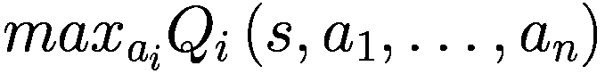，在给定状态*s*和联合行动*a* = (*a*[1], …, *a*[*n*])下，以获得该状态的最佳 Q 值。智能体*i*的最大值取决于环境中其他智能体的行动。你需要引入基于智能体如何交互的概念——它们是在竞争还是合作，相对奖励结构是什么，它们是否都获得相同的奖励，或者它们是否不同，等等。你在多智能体强化学习（MARL）解决方案部分的选项中了解了一些内容。我谈到了零和博弈中的*最小-最大*，以及*纳什均衡*和*相关均衡*解决方案目标。根据博弈论中的解决方案策略，JAL 学习在如何采取向最优均衡解的步骤上有不同的变体。这些具有博弈论解决方案目标的 JAL 家族通常被称为 JAL-GT 家族。

解决这类问题的高级方法是首先计算给定状态下每个智能体和所有可能的联合行动的 Q 值。假设你有两个智能体，每个智能体都有三个动作。Q 值将是：

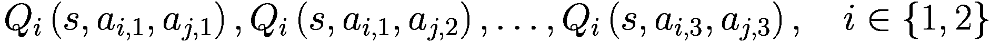

由于两个智能体各自有三个动作，因此可能的联合行动总数将是 3*x*3 = 9。因此，将有 9*x*2 = 18 个 Q 值，其中第一个智能体有九个 Q 值，第二个智能体也有九个 Q 值。

第二步是使用最小-最大或纳什均衡解决方案方法来更新两个智能体的策略。

第三步是使用更新的策略和常规的ε-贪婪策略生成一个新的转换，在环境中执行联合行动，并最终观察奖励和转换到新状态。这个循环会重复：Q 值计算，策略更新，以及采取ε-贪婪的联合步骤。

如您所见，这个过程与第四章中的表格 Q 学习非常相似。唯一的区别是 max 被替换为基于最小化或纳什均衡的策略更新。Q 学习的核心结构与单智能体强化学习方法相同，只是用一个简单的 max 替换为博弈论驱动的策略更新。

我将简要描述三种 Q 学习方法，即使用最小化、纳什均衡和相关均衡的方法，以及每种方法可以使用的游戏设置类型，以及一些关键的理论发现。

#### 最小-最大 Q 学习

最小-最大 Q 学习使用最小化方法来解决 Q 学习问题，并通过线性规划进行。它可以应用于两个智能体的零和博弈。像单智能体 Q 学习的通常假设一样，最小-最大 Q 学习保证在假设所有状态和联合行动组合都尝试足够次数的情况下找到最优解。最小化方法的一个常见挑战是它假设对手是一个专家最优智能体，其行为是为了击败其他玩家。如果对手不是最优的并且有弱点，最小-最大解不允许其他智能体利用对手策略中的这种弱点。

#### 纳什 Q 学习

纳什 Q 学习通过计算纳什均衡并使用该均衡来更新策略来解决多智能体 Q 学习问题。此算法可以应用于具有有限数量智能体的更一般类别的设置。然而，智能体越多，每一步计算纳什均衡的复杂性就越高。纳什 Q 学习保证在所有状态在所有智能体中都有全局最优解的条件下，学习到游戏的纳什均衡。这个条件非常严格，并且通常不在大多数实际游戏中存在。

#### 相关 Q 学习

就像其他两种方法一样，相关 Q 学习通过找到相关均衡来解决策略更新步骤。这种方法有两个关键优势——它可以应用于比纳什均衡更广泛的游戏空间，并且可以使用线性规划方法进行计算，而纳什均衡则需要二次规划。

#### 对智能体的假设

在 JAL-GT 智能体中，我们根据最小化、纳什或相关均衡的解决方案对智能体做出假设。但如果智能体偏离这些假设怎么办？以最小化为例，我们假设每个对手都是一个最优的最坏情况智能体。相应地，学习到的策略是对抗这种最优智能体的最佳行动。如果对手不是最优的，玩家将不会学会利用对手的弱点。还有另一种方法。不是对对手的行为做出假设，而是根据观察学习行为。这被称为*智能体建模*，一种常见的方法是策略重建。

将问题视为监督问题，你收集对手的状态和动作对来建模对手遵循的策略。你从一个假设对手具有均匀策略开始，并根据对手每次行动时的行为观察不断调整假设的对手策略。这一系列 JAL 算法被称为 JAL-AM（带有代理建模的 JAL）。

### 基于策略的学习

就像你在第八章和第九章中读到的单代理强化学习中的基于策略的算法一样，多智能体强化学习（MARL）也有一个基于策略的算法系列。你直接学习策略，而不是学习*V*或*Q*值，然后使用这些值来找到策略。这些都是基于梯度上升来推动环境中所有代理的动作，以实现每个代理更高的期望回报。让我们通过一个例子来说明。首先，考虑一个有两个动作的两个代理的场景。看看一个非重复的正常形式博弈，这意味着只有一个状态，并且两个代理都采取行动后，回合结束。让我们写出两个代理的奖励矩阵，如方程 12-6 所示。如果代理*i*选择动作 2，代理*j*选择动作 1，代理*i*的奖励将是*r*[2,1]，代理*j*的奖励将是*u*[2,1]。

![R_i= \left[\begin{array}{cc}r_{1,1}& r_{1,2}\\ r_{2,1}& r_{2,2}\end{array}\right],\kern0.36em R_j= \left[\begin{array}{cc}m_{1,1}& m_{1,2}\\ m_{2,1}& m_{2,2}\end{array}\right] ](../images/502835_2_En_12_Chapter/502835_2_En_12_Chapter_TeX_Equ6.png)

(12-6)

由于你处于一个非重复的正常形式博弈中，你可以定义两个代理的策略如下：

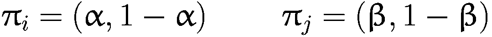

(12-7)

其中α代表代理*i*选择动作 1 的概率，1-α代表代理*i*选择动作 2 的概率。同样，β代表代理*j*选择动作 1 的概率，1-β代表代理*j*选择动作 2 的概率。在这个记法中，联合动作概率可以表示为π = (π[*i*], π[*j*])。现在让我们写出每个代理的期望奖励如下：

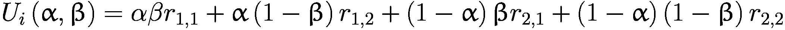

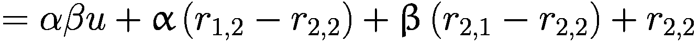

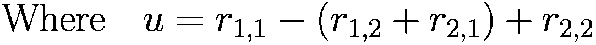

(12-8)

然后，

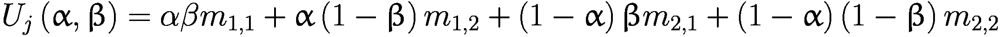

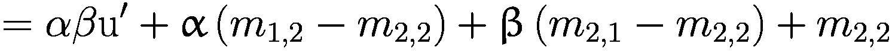

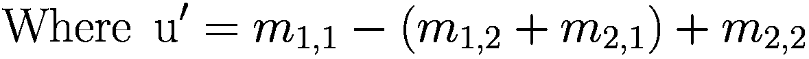

(12-9)

梯度上升方法将更新两个智能体的策略，以最大化两个智能体的预期奖励。假设你处于迭代 *k*，当前联合策略是 (α^(*k*), β^(*k*))。智能体 *i* 和 *j* 将采取梯度上升步骤来调整各自的策略，这可以表示如下：

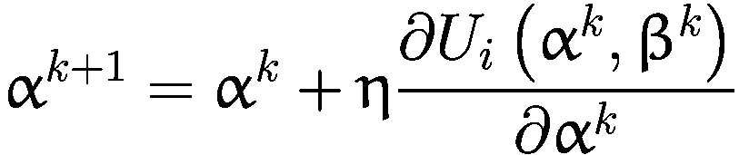

(12-10)

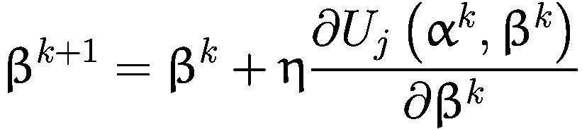

(12-11)

其中，

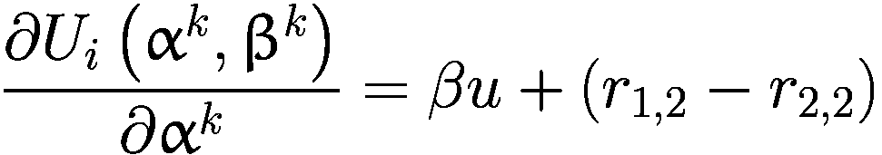

(12-12)

并且，

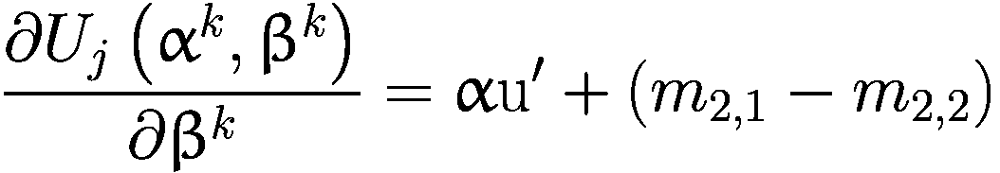

(12-13)

你可以将方程 12-12 和 12-13 结合成一个向量形式，如下所示：

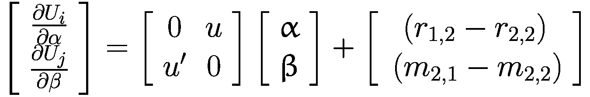

(12-14)

这种具有无穷小步长的策略学习算法被称为无穷小梯度上升（IGA）。将方程 12-14 的左侧设为零，求解 α 和 β 将给出固定/中心点 α = α^∗, β = β^∗。

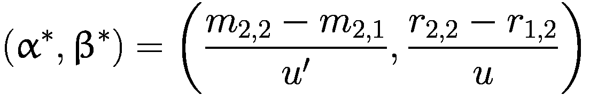

(12-15)

向这个固定点收敛的轨迹和速度取决于方程 12-6 中显示的相对奖励矩阵值。它可以进一步通过学习率 η 来控制，如方程 12-10 和 12-11 所示。感兴趣的读者可以参考博弈论和 MARL 的书籍以了解更详细的内容。这完成了两个代理两个行动非重复正常形式博弈的政策上升的例子。

IGA 可以推广到两个以上的代理和两个以上的行动，称为广义 IGA 或 *GIGA*。GIGA 不需要了解其他代理的策略，并假设它可以观察其他代理的过去行动。

### 无遗憾学习

到目前为止，你已经研究了两种学习方式，即单代理的 MARL 扩展——即基于价值的方法和策略学习方法。还有另一类方法被称为 *无遗憾学习者*。我现在将简要解释这些方法。

让我们先定义“遗憾”的概念，即在过去回合中没有选择最佳行动。你在查看探索-利用困境和平衡遗憾的各种方法时已经看到了这一点，以便你探索足够，但仅仅足够找到最佳行动。让我们看看一个具体的例子。图 12-7 重新呈现了囚徒困境。

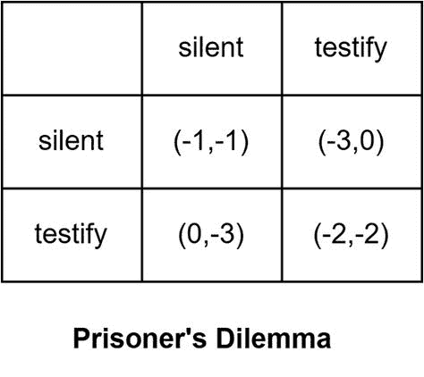

一个 3x3 的囚徒困境矩阵表示沉默和作证的值。第一行的坐标是（-1，-1）和（-3，0）。第二行的坐标是（0，-3）和（-2，-2）。

图 12-7

囚徒困境

让我们看看两个囚犯根据你不知道的一些行动选择策略分布选择沉默（S）或作证（T）的模拟。让我们看看一系列十个回合的玩法及其对囚犯 1 的奖励，如图 12-8 所示。基于当前的十个回合运行，囚犯 1 在十个回合中的奖励等于 -17。如果囚犯 1 选择始终保持沉默，基于观察到的囚犯 2 的行动，十个回合的总奖励将是 -20。同样，如果囚犯 1 选择始终作证反对囚犯 2，囚犯 1 在十个回合中的总奖励是 -10。因此，玩家 1 的“遗憾”是 -10+17=7。平均到十个回合，每回合的遗憾等于 0.7。

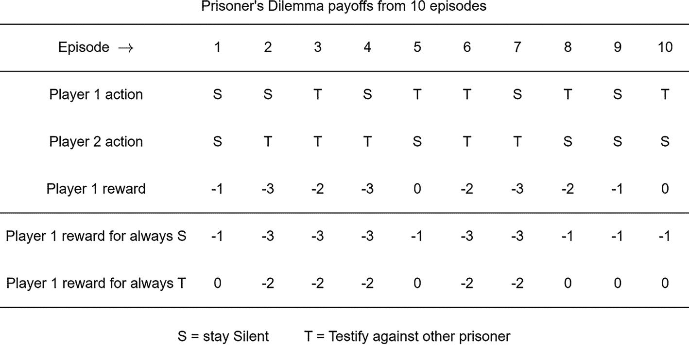

一个表格描述了十个回合的囚徒困境收益。它有 10 列和 5 行。第 1 和第 2 行表示玩家 1 和 2 的行动，S 表示保持沉默，T 表示作证反对其他囚犯。底部行表示玩家 1 的奖励和始终 S 和 T 的玩家 1 奖励。

图 12-8

十个回合后的囚徒困境收益

目标是最小化这种遗憾概念的算法被称为无遗憾学习器。学习方法围绕的是过去没有选择特定动作的遗憾，并更新其策略，将更高的概率分配给过去具有更高遗憾的动作。它们被广泛分为两类：a) 无条件遗憾匹配和 b) 有条件遗憾匹配。正如它们的名称所暗示的，无条件遗憾匹配基于计算无条件遗憾，而有条件遗憾匹配基于计算有条件遗憾匹配。

## 深度多智能体强化学习

就像您使用基于深度神经网络模型的模型将有限状态和动作表格强化学习算法扩展到具有实值状态和动作空间的更丰富环境一样，MARL 也可以从有限世界扩展到具有连续值的高维状态和动作空间。然而，当前的深度 MARL 算法仍然只适用于环境中有限的小/中等数量的智能体。

一种简单的方法是将每个智能体独立对待，并使用单智能体深度强化学习算法对其进行训练。然而，这些方法可能会遇到由于其他智能体的动作导致的非平稳环境、奖励分配以及均衡或最优动作的概念等挑战。尽管存在这些挑战，将当前的强化学习方法扩展到多智能体强化学习（MARL），如独立 DQN、独立 REINFORCE 以及其他独立策略梯度方法，仍然是一个非常常见的做法。甚至 A2C 和 PPO 也可以进行扩展。将其他智能体视为环境的一部分有利于在线学习方法，如 REINFORCE，因为它从最近的经验中学习，这些经验反映了其他智能体的最新行为。

如何使用深度网络作为状态或环境或/和政策模型的方案设计空间有许多更多的调节旋钮。策略或状态价值网络可以与所有智能体共享部分网络，同时每个智能体都有针对其自身的较小顶层。还存在共享经验的可能性。在零和游戏中，这种形式的一种是所谓的自我对弈，其中智能体与自己的副本玩游戏以收集经验和学习。

在高层次上，一个常见的分类 Deep MARL（也称为多智能体深度强化学习）算法的方法是基于训练和推理/执行阶段期间可用的信息。有四个广泛的类别。

第一种方法是**集中式训练和执行（CTCE**），其中学习过程和代理的策略共享某种集中式信息。本质上，它涉及将多智能体强化学习（RL）转换为一个大型的、组合的单智能体 RL。共享可以是以所有代理的观察结果、联合策略动作等形式。当这种共享可行或适用时，可以使用这种方法。然而，它存在一些问题，例如将单个代理的奖励转换为组合标量奖励、联合动作在单个代理动作组合时的指数级增长，或者这种通信的不可行性，例如在自动驾驶汽车车队之间共享信息。即使信息可以共享，单个代理的局部观察的相关性可能包含非常少的信息内容，反而增加了噪声。信号与噪声比越高，训练可能越困难、越长。

第二类是**分布式训练和执行（DTDE**）。我之前讨论的一种变体是每个代理独立学习，将其他所有代理视为环境的一部分。我也讨论了这种虽然可扩展但可能由于其他代理的动作是环境的一部分而导致环境非平稳性，可能会面临重大挑战的方法。考虑一个极端情况，代理在每个时间步都不采取任何行动，但由于其他代理的动作，它看到的环境/状态在每个时间步都会因为其他代理的动作而不断变化。然而，由于其可扩展性，它通常被用作开发更复杂和完整的 MARL 方法的第一步。

第三类是**集中式训练和分布式执行（CTDE**）。一种看待它的方法是，在训练期间，共享信息用于更新每个代理的策略；然而，每个代理的策略仅依赖于该代理的观察。还有一些其他的变体。CTDE 是深度多智能体强化学习（MARL）中非常流行的一种方法。还记得你在第八章中看到的演员-评论家策略学习算法吗？你可以使用 CTDE 版本的演员-评论家来训练 MARL 中的代理。

以单智能体 A2C 算法为例。演员是策略网络。你使用评论家（Critic）通过告诉哪个动作比平均好，哪个动作比平均差来帮助训练智能体。在智能体训练完毕并准备好在产品中执行后，你不再需要评论家。因此，将 A2C 扩展到 MARL 的一种方法是在每个个体智能体级别上使用集中的评论家，并继续将演员，即策略，分散化。每个智能体的评论家可以有两个组成部分，一个部分是有关该智能体观察历史的记录，以及一些在训练期间对所有智能体都可用的高度集中的信息。这可能是一些抽象的集中信息，或者在极端情况下，甚至可能是环境中所有智能体的状态/观察历史的记录。

将当前的深度强化学习算法扩展到 MARL 领域有许多其他方法。在做出这样的扩展时，你必须仔细考虑均衡的概念。深度 MARL 涉及具有大参数规模的神经网络。因此，随着环境中智能体数量的增加，你也必须考虑智能体特定的网络模型如何共享网络的一部分，以保持问题规模的可管理性。探索与利用的困境也需要谨慎处理，尤其是如果通常的单智能体设置没有产生结果。

这完成了对传统和深度 MARL 的高层次介绍，包括设置、独特的挑战以及如何将单智能体 RL 算法扩展到 MARL。接下来，你将了解一些提供 MARL 环境和训练算法的常见库，以及智能体训练的示例应用。

## Petting Zoo 库

MARL（多智能体强化学习）的一个挑战是寻找合适的环境和算法来测试和训练智能体。Petting Zoo 是一个旨在为各种 RL（强化学习）框架提供高质量 MARL 环境和易于使用的接口的库。该库由 Farama 研究组开发，该研究组专注于多智能体强化学习及其应用。Petting Zoo 提供了一系列多样化的环境，从经典的棋类和乒乓球游戏，到合作场景如捕食者-猎物和追击-逃避，再到社会困境如囚徒困境。Petting Zoo 还支持几个流行的 RL 库，如 Stable Baselines3、CleanRL、RLLib 等，使用户能够利用现有的算法和工具进行 MARL。

大多数现有的多智能体强化学习环境都是基于马尔可夫博弈模型，该模型假设智能体在每个时间步都同时和同步地行动。然而，这个假设并没有捕捉到许多现实场景的真实情况，在这些场景中，智能体可能按顺序和异步地行动，例如在回合制游戏、拍卖和谈判中。为了解决这一局限性，Petting Zoo 为多智能体强化学习环境引入了一个新颖的建模框架，称为智能体环境循环（AEC）。

这使得 Petting Zoo 能够表示多智能体强化学习可以考虑的任何类型的游戏。在这个模型中，智能体依次看到它们的观察结果，智能体采取行动，奖励由其他智能体发出，然后选择下一个采取行动的智能体。这实际上是一种顺序步进的 POSG 模式。示意图如图 12-9 所示。

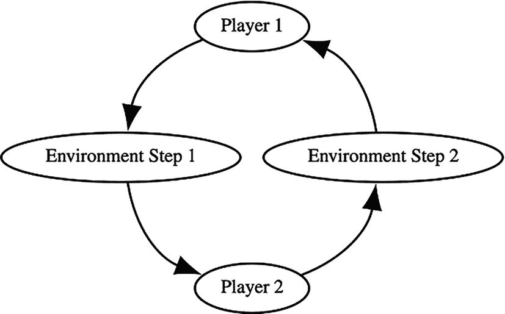

AEC 循环的周期图包括玩家 1、环境步骤 1、玩家 2 和环境步骤 2。

图 12-9

AEC 循环

循环会一直重复，直到环境达到终止状态，或者达到预定义的最大步数。AEC 环境可以看作是马尔可夫博弈模型的推广，其中调度函数可以实现不同类型的智能体交互，例如同时、顺序或混合。AEC 环境还可以处理可变数量的智能体，例如在智能体可以随时加入或离开的游戏中。此外，AEC 环境可以模拟部分可观察性、随机性和非平稳性，这些都是多智能体强化学习中的常见挑战。

Petting Zoo 提供了一个用于与 AEC 环境交互的标准 API，这与 OpenAI Gym API 用于单智能体强化学习环境类似。你可以在论文“PettingZoo: A Standard API for Multi-Agent Reinforcement Learning.”^(1) 中了解更多信息。具体可参考附录 C3，其中详细阐述了 AEC 的数学公式。

你将使用其中一个名为 *Knights Archers Zombies* (KAZ) 的环境，我将简要描述它。Knights Archers Zombies 是 Butterfly 环境的一部分。Butterfly 环境是由 Farama 创建的具有挑战性的场景，使用 PyGame 和视觉 Atari 空间。所有环境都需要高度协调，并需要学习涌现行为以实现最佳策略。因此，这些环境目前非常具有挑战性。环境可以通过其各自文档中指定的参数进行高度配置。

在 Knights Archers Zombies 中，僵尸从屏幕顶部边界向下到屏幕底部边界行走，路径不可预测。你控制的代理是骑士和弓箭手（默认情况下，有两个骑士和两个弓箭手），它们最初位于屏幕底部边界。每个代理可以顺时针或逆时针旋转，并向前或向后移动。每个代理还可以攻击以杀死僵尸。当骑士攻击时，它在当前航向方向前方挥舞战锤。当弓箭手攻击时，它沿着弓箭手的航向方向射出一支箭。游戏在所有代理死亡（与僵尸碰撞）或僵尸到达屏幕底部边界时结束。当骑士的战锤击中并杀死僵尸时，骑士获得 1 分。当弓箭手的箭击中并杀死僵尸时，弓箭手获得 1 分。此环境有两种可能的观察类型，向量化或基于图像。本例使用向量化空间。

| 代理 | `agents= ['archer_0', 'archer_1', 'knight_0', 'knight_1']` |
| --- | --- |
| 代理 | `4` |
| 动作形状 | `(1,)` |
| 动作值 | `[0,5]` |

你可以将`vector_state=True`参数传递给环境以获取向量化环境。观察结果是一个(N+1)x5 的数组，对于每个代理，其中`N = num_archers + num_knights + num_swords + max_arrows + max_zombies`。并且 1 指的是当前代理。总共将有 N+1 行。没有实体的行将全部为 0，但实体的顺序不会改变。

*向量分解**：所有距离都归一化到[0, 1]。请注意，对于位置，[0, 0]是图像的左上角。向下是正 y，向左是正 x。对于当前代理的向量中值的含义如下：

+   第一个值没有任何意义，始终为 0。

+   接下来的四个值是当前代理的位置和角度。

+   前两个值是位置值，分别归一化到图像的宽度和高度。

+   最后两个值是代理的航向，表示为单位向量。

对于当前代理以外的所有内容，相应的向量每个都是五个宽度，并且每一行都有以下分解：

+   第一个值是一个实体与当前代理之间的绝对距离。

+   接下来的四个值是每个实体相对于当前代理的相对位置和绝对角度。

    +   前两个值是相对于当前代理的位置值。

    +   最后两个值是实体相对于世界的方向单位向量的角度。

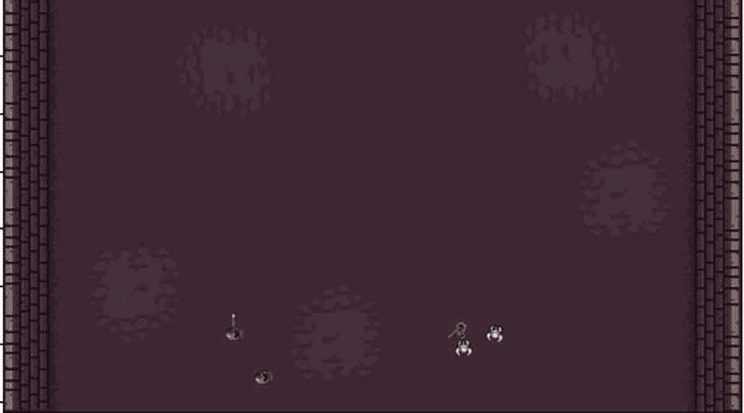

Knights Archers Zombies（KAZ）屏幕截图由随机位置上的弓箭手和僵尸组成，背景为深色。

图 12-10

骑士、弓箭手、僵尸（KAZ）

## 样本训练

本节探讨了在 *Knights Archers Zombies (KAZ)* 上运行 PPO 训练算法的示例。您将利用 SB3 库中的 PPO 算法。在 KAZ 环境中训练多个智能体的完整代码位于 `12.a-ppo_pettingzoo_kaz.ipynb` 笔记本中。列表 12-1 包含了训练代码。您首先使用 `env_fn` 创建环境，该函数被传递给 `train` 函数。对于 KAZ 环境中智能体死亡的特殊情况，您使用 `ss.black_death_v3(env)` 包装器，以确保智能体的数量保持恒定。如果您使用的是 KAZ 观察空间的图像版本，您将使用与之前章节中 Atari 环境类似的包装器集来减少图像大小、帧堆叠等。对于执行这些包装器处理，您使用 SuperSuit 库，而不是 Gymnasium 和/或 SB3 包装器，后者与 Atari 游戏一起使用。如果观察空间是向量化版本，您不需要这些预处理步骤。接下来，您将创建 PPO 学习智能体并运行训练。然后，将训练好的智能体权重保存到文件中，以便将来检索。

```py
def train(env_fn, steps: int = 10_000, seed: int | None = 0, **env_kwargs):
# Train a single model to play as each agent in an AEC environment
env = env_fn.parallel_env(**env_kwargs)
# Add black death wrapper so the number of agents stays constant
# MarkovVectorEnv does not support environments with varying
# numbers of active agents unless black_death is set to True
env = ss.black_death_v3(env)
# Pre-process using SuperSuit
visual_observation = not env.unwrapped.vector_state
if visual_observation:
# If the observation space is visual, reduce the color channels,
# resize from 512px to 84px, and apply frame stacking
env = ss.color_reduction_v0(env, mode="B")
env = ss.resize_v1(env, x_size=84, y_size=84)
env = ss.frame_stack_v1(env, 3)
env.reset(seed=seed)
print(f"Starting training on {str(env.metadata['name'])}.")
env = ss.pettingzoo_env_to_vec_env_v1(env)
env = ss.concat_vec_envs_v1(env, 8, num_cpus=1, base_class="stable_baselines3")
# Use a CNN policy if the observation space is visual
model = PPO(
CnnPolicy if visual_observation else MlpPolicy,
env,
verbose=3,
batch_size=256,
)
model.learn(total_timesteps=steps)
model.save(f"{env.unwrapped.metadata.get('name')}_{time.strftime('%Y%m%d-%H%M%S')}")
print("Model has been saved.")
print(f"Finished training on {str(env.unwrapped.metadata['name'])}.")
env.close()
Listing 12-1
The train(…) function from 12.a-ppo_pettingzoo_kaz.ipynb
```

您还有类似的代码来评估智能体的性能。它是使用训练 PPO 智能体和 KAZ 环境的观察/步骤/观察循环。评估函数收集奖励，并在评估结束时打印摘要。

训练和评估代码的示例显示在列表 12-2 中。这是一个简单的三步过程——首先训练智能体，评估指标，然后展示训练好的智能体在行动中的表现。

```py
env_fn = knights_archers_zombies_v10
# Set vector_state to false in order to use visual observations
# (significantly longer training time)
env_kwargs = dict(max_cycles=100, max_zombies=4, vector_state=True)
# Train a model
train(env_fn, steps=81_920, seed=0, **env_kwargs)
# Evaluate 10 games
eval(env_fn, num_games=10, render_mode=None, **env_kwargs)
# Watch 2 games
eval(env_fn, num_games=2, render_mode="human", **env_kwargs)
Listing 12-2
The train and evaluate Calls from 12.a-ppo_pettingzoo_kaz.ipynb
```

这结束了本章关于 MARL 的内容。这是一个对 MARL 的快速介绍，没有深入细节，因为目的是让读者熟悉当多个智能体在环境中参与时，所涉及到的额外复杂性和挑战。感兴趣的读者可以探索 MARL 特定的文献和 Petting Zoo 库文档，其中包含许多其他示例环境和示例教程。

## 摘要

本章介绍了多智能体强化学习（MARL）的概念，其中多个智能体在相同的环境中交互。MARL 提出了独特的挑战，例如智能体需要预测并对其他智能体的行为做出反应，以及动作和状态空间的指数级增长。本章展示了不同领域中的 MARL 例子，包括自动驾驶、机器人和智能电网管理。

本章还讨论了多智能体强化学习（MARL）中的关键挑战，例如移动和改变目标、最佳策略的定义、奖励分配以及智能体数量的扩展。提出了 MARL 的分类法，包括标准形式博弈、随机博弈和部分可观察随机博弈。

本章还涵盖了多智能体强化学习（MARL）的多种解决方案，包括最小-最大策略、纳什均衡和关联均衡。讨论了 MARL 的核心算法，包括价值迭代、联合动作学习的 TD 方法以及基于策略的学习。本章还介绍了无遗憾学习和深度多智能体强化学习的概念。

最后，本章提供了一个使用 Petting Zoo 库和 PPO 算法在 MARL 环境中训练智能体实例的示例。
