# 13. 其他主题和最新进展

这是本书的最后一章。在整个书中，我深入讨论了强化学习（RL）的许多基础方面。你学习了使用动态规划在马尔可夫决策过程（MDP）中进行规划和 MDP 中的模型方法。你学习了无模型价值方法。你学习了使用函数逼近来扩展解决方案技术，特别是使用基于深度学习的 DQN 等方法。本书还涵盖了基于策略的方法，如 REINFORCE、TRPO、PPO 等，以及演员-评论家（AC）方法中价值优化和策略优化的统一。你探讨了结合基于模型和无模型方法的可能性。本书还专门用一章来剖析 PPO 及其在 LLM 微调中使用 RLHF 方法中的应用。上一章介绍了多智能体强化学习（MARL）。

到目前为止，大部分讨论都是基础性的，专注于掌握强化学习。然而，强化学习是一个快速发展的领域，在自动驾驶汽车、机器人学以及类似的其他领域有许多专门的用例。这些用例超出了本书中用于解释概念的整个问题设置。

这最后一章涵盖了我认为你应该从高层次了解的一些主题。在适用的情况下，我保持讨论在概念层面，并提供相关研究/学术论文的链接。你可以使用这些参考文献根据你在 RL 领域的个人兴趣领域扩展你的知识视野。与之前的章节不同，你不会总是找到详细的伪代码或实际的代码实现。这是故意为之，以提供一些新兴领域和新进展的概述。你应该使用这一章来获得不同主题的 30,000 英尺的理解。根据你的具体兴趣，建议你使用这里提供的参考文献作为起点，深入探讨特定主题。

## 其他有趣的强化学习环境

到目前为止，本书使用了一些流行的强化学习环境来解释概念和算法。最常讨论的一个是 Gymnasium，它是 OpenAI Gym 的一个分支。我在第六章关于 DQN 的部分简要介绍了几种其他环境。在本节中，我将介绍更多环境，并重新审视一两个之前提到的环境。

### MineRL

在第六章中讨论了 MineRL。MineRL^(1) 是一个 Python 3 库，它提供了一个 OpenAI Gym 接口，用于与视频游戏 Minecraft 进行交互，并附带人类游戏数据集。MineRL 最初是卡内基梅隆大学的一个研究项目，旨在帮助 Minecraft 中人工智能的各个方面的发展。MineRL 主要包括 *BASALT 竞赛环境* 和 *MineRL 获取钻石环境*。

在“基准测试：解决近似真实任务的智能体”（BASALT）竞赛中，参与者根据人类判断解决任务，而不是预定义的奖励函数。目标是产生被真实人类判断为有效解决特定任务的智能体。这要求在人类反馈的基础上进行训练，无论是从演示中进行训练，还是在人类偏好上进行训练，或者使用人类来纠正智能体的行为。BASALT 提供了一套与人类演示配对的 Gym 环境，因为基于模仿的方法是解决难以指定任务的重要基石。

在`MineRLBasaltFindCave-v0`环境，BASALT 环境之一，智能体需要探索并找到一个洞穴。当智能体在洞穴内时，游戏结束。智能体不允许从地表挖下去寻找洞穴。

在第二个环境`MineRLBasaltCreateVillageAnimalPen-v0`中，智能体在村庄中生成后，在村庄中的一座房子旁边建造一个动物围栏。智能体使用栅栏柱建造一个至少包含两种相同动物的围栏。应该至少有一个门，允许玩家轻松进出。动物围栏不应包含超过一种动物。在建造围栏的过程中，智能体不应伤害村民或现有的村庄结构。

在第三个环境`MineRLBasaltMakeWaterfall-v0`中，智能体在极端山丘生物群落中生成后，使用水桶制作一个美丽的瀑布。然后智能体移动到一个好的位置，调整玩家的摄像头，以便从瀑布有一个美好的视角，拍下一幅美学的“照片”。

在最终和第四个 BASALT 环境`MineRLBasaltBuildVillageHouse-v0`中，智能体应该在不破坏村庄的情况下按照村庄风格建造一所房子。它应该位于适当的位置，例如在通往村庄的小路旁边。然后智能体对房子进行简短的参观，缓慢地旋转，以便所有墙壁和屋顶都可见。

在`MineRLObtainDiamondShovel-v0`环境中，智能体需要获得一把钻石铲。智能体从一个随机的起始位置开始，位于一个随机的生存地图上，没有任何物品，这与 Minecraft 中人类玩家的正常起始条件相匹配。在一场游戏中，智能体根据获得钻石铲所需的项目层级获得奖励。

MineRL 中的所有五个环境都以 RGB 图像作为观察。这是智能体第一人称视角的图像。

文档包含一系列优秀的教程，用于在 Google Colab 上设置 MineRL，以及使用 OpenAI VPT 库进行视频预训练 (VPT) 的入门步骤。VPT 是“通过观察未标记的在线视频进行行为克隆（BC）微调”的过程。您可以在文档的教程部分访问这些 Colab 笔记本。您还可以参考[`minerl.io/`](https://minerl.io/)网站获取更多信息。

### Donkey Car RL

Donkey Car^(2) 是一个开源的 DIY 自驾驶平台，适用于小型遥控车。Donkey Car 由几个组件组成：它是一个用 Python 编写的高级自驾驶库。它侧重于实现快速实验和易于贡献而开发。这是一个开源的硬件设计，使您能够轻松构建自己的汽车。它还包含一个模拟器，使您能够在没有硬件的情况下使用 Donkey Car。整个项目由一群热衷于赛车、编码和讨论机器学习、汽车未来以及谁将赢得下一场比赛的爱好者、开发者和数据科学家推动。

在模拟器之上构建了多个强化学习环境，以实现强化学习训练。我将讨论一个使用 Gymnasium/OpenAI-Gym 类型的 API 接口的具体环境，这使得将本书中学到的所有算法轻松移植到 Donkey Car 上变得容易。这个库被称为 OpenAI Gym Environments for Donkey Car.^(3) 您可以使用 `pip install gym-donkeycar` 命令安装此库。还需要安装您平台的模拟器二进制文件，具体细节可以在文档中找到。该模拟器大约有十一个赛车环境，具有不同类型的赛道设置。在这个环境中的汽车状态/观察是来自汽车视角的尺寸为 (120,160,3) 的图像。奖励是游戏结束标志、汽车与中心的距离以及速度的组合。动作由两个浮点值组成，`steer` 和 `throttle`。`Steer` 指的是汽车的转向方向，负值表示向左转向，正值表示向右转向。`Throttle` 指的是加速度。

该库还包含使用 StableBaselines3 和 DQN 以及 PPO 算法训练 Donkey Car 的代码。列表 13-1 展示了使用 PPO 训练汽车的部分代码。

```py
# make gym env
env = gym.make(args.env_name, conf=conf)
# create cnn policy
model = PPO("CnnPolicy", env, verbose=1)
# set up model in learning mode with goal number of timesteps to complete
model.learn(total_timesteps=10000)
obs = env.reset()
for i in range(1000):
action, _states = model.predict(obs, deterministic=True)
obs, reward, done, info = env.step(action)
try:
env.render()
except Exception as e:
print(e)
print("failure in render, continuing...")
if done:
obs = env.reset()
if i % 100 == 0:
print("saving...")
model.save("ppo_donkey")
# Save the agent
model.save("ppo_donkey")
print("done training")
Listing 13-1
PPO Training Code for DonkeyCar from https://github.com/tawnkramer/gym-donkeycar/tree/master/examples/reinforcement_learning
```

读者可以参考图书馆并运行训练代码来尝试其他算法。读者还可以添加 Weights and Biases (`wandb`) 日志记录以及将训练好的模型托管在 Hugging Face (HF) 中心。

### FinRL

强化学习也可以应用于金融领域，尤其是在交易和管理投资组合时。本节简要讨论了该概念以及该领域的其中一个库。这是一个入门级别的讨论。如果你对金融领域不熟悉，并想进一步探索金融领域的强化学习，你可能需要参加一些关于投资组合理论、市场交易、衍生品和期货等方面的课程。本讨论不提供投资建议，也不会让读者准备好使用这里讨论的金融强化学习方法进行交易。

为了激发讨论，考虑一个想要为单一股票或一组股票开发交易策略的交易者。他们的模式是每天交易一次。因此，“动作”频率是每天一次。他们得到股票的每日价格，通常每天有四个价格——开盘价（O）、收盘价（C）、最高价（H）和最低价（L）。这通常被称为 OHLC 数据。

注意，有时交易者一天内会进行多次交易，例如每五分钟、每分钟、每秒钟，甚至在中等/高频交易（MFT 或 HFT）实践中每秒的几分之一。交易频率越高，使用复杂机器学习算法开发交易策略的益处就越小。这有两个原因：a) 大多数交易决策需要处理多个时间序列数据，而复杂的机器学习模型可能具有的延迟大于交易时间间隔，b) 频率越高，由于信噪比降低，算法的预测能力就越低。

回到每天交易一次股票组合的例子，你将得到股票的每日 OHL 价格。你还会得到每日成交量数据，这是每天买卖的股票数量。一段时间内的数据（比如数月或数年）形成了一个时间序列。这种数据的样本如图 13-1 所示，它绘制了 NVIDIA 股票过去五年（截至 2023 年 3 月 19 日至 2024 年 2 月 24 日）的 OHL 价格和成交量数据。

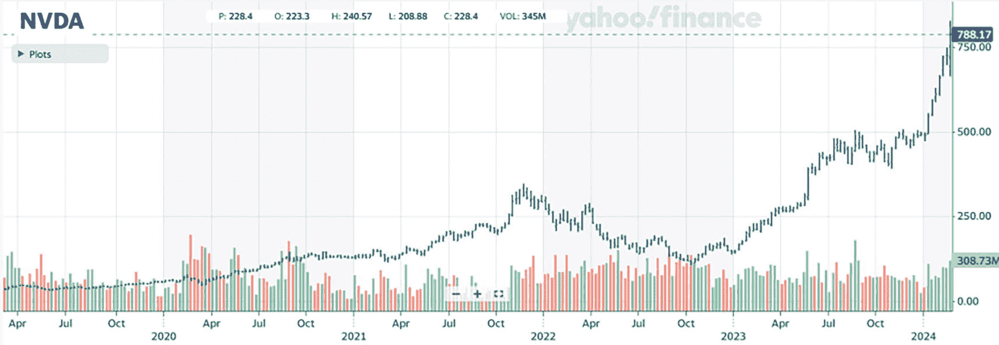

OHL C 图表展示了 2020 年至 2024 年间 NVIDIA 股票价格的趋势。它最初增长缓慢，2022 年后开始下降。2024 年趋势呈指数增长，达到 788.17 的值。

图 13-1

NVIDIA 价格（OHL 图表）五年（2023 年 3 月 19 日至 2024 年 2 月 24 日）来源：Yahoo Finance

如果你放大数据，你会注意到每一天的价格都用一个带有两条水平线的条形表示，如图 13-2 所示。每一天都由一个带有两个水平刻度的垂直条表示。垂直条代表当天的最高价和最低价。垂直条左侧的刻度表示开盘价，右侧的刻度表示收盘价。

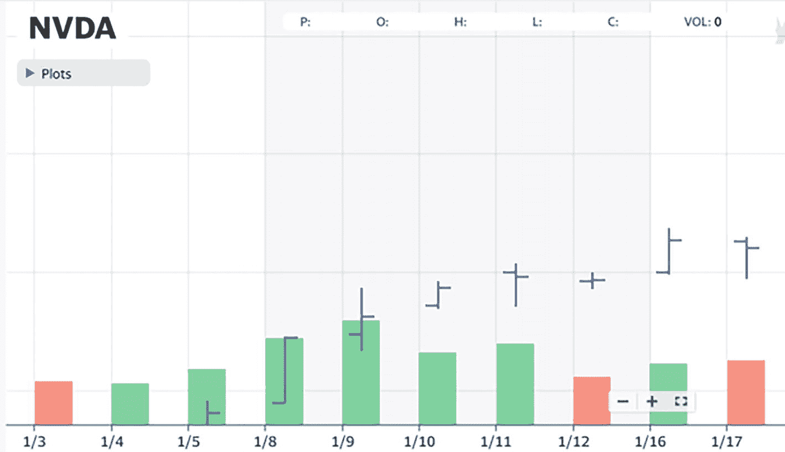

柱状图表示了 1 月 3 日至 1 月 17 日之间 10 个不同日期的 NVIDIA 股价。柱子代表价格的上升和下降。每个柱子有 2 个水平刻度指向左右，这表示当天的开盘价和收盘价。

图 13-2

NVIDIA 10 日图表来源：Yahoo Finance

在这个价格数据的时间序列之上，交易者进行特征分析，这在交易领域被称为*技术指标分析*。有许多指标，每个指标都有不同的目的。一些简单的指标包括简单移动平均（SMA），其平均是在 7 天、10 天、20 天等时间段内计算的，指数移动平均（EMA），移动平均收敛/发散（MACD），阿罗恩指标（阿罗恩在梵文中意味着黎明的曙光），相对强弱指数（RSI），平均方向指数（ADX）和商品通道指数（CCI）。你可以把价格和这些各种指标看作是强化学习世界中“状态”的一部分。状态的另一部分是当前投资组合的组成——投资组合中每种股票的当前数量以及交易者交易账户中的现金数量。

交易者使用这些过去的时间序列数据来设计一个算法，他们希望这个算法能帮助他们实现最大回报的金融目标。人们在投资时还会选择其他一些目标。我将简要地提及这些。第一个也是最常见的目标是在投资期间的投资回报率。它很容易定义，即（最终价格 - 初始价格）/初始价格：(*S*[*T*] − *S*[0])/*S*[0]。有时，你不仅仅寻找*最大回报*，而是寻找*最大化风险调整回报*，这是你期望的单位波动性的回报。股票的*波动性*是通过股票每日回报的标准差来衡量的。波动性表示风险。波动性越高，平均每日价格波动越大。因此，另一个好的优化目标是*夏普比率*，它是（股票回报 - 无风险回报）/波动率的比率：(*r* − *r*[*f*])/σ，其中无风险回报是投资者期望的无风险回报——通常是通过投资政府发行的债券和证券所能获得的回报。交易者通常还希望优化的另一个目标是*最大回撤*，这是投资组合价值最大百分比损失。他们希望最小化最大回撤。所有这些目标都是根据交易者基于他们当前的股票位置和一天到另一天的价格变化计算出的每日盈亏构建的。

每日的盈亏可以等同于强化学习中的每步奖励。这些目标可以被视为强化学习中一个片段的回报，强化学习代理将根据交易者的需求进行优化。

在强化学习（RL）中，“行动”映射到交易者每天采取的行动，即买入/持有/卖出。他们可以选择增加他们在股票中的头寸，或者什么都不做（持有或卖出部分或全部的股票数量）。

总结如图 13-3 所示的将交易映射到强化学习设置，你有：

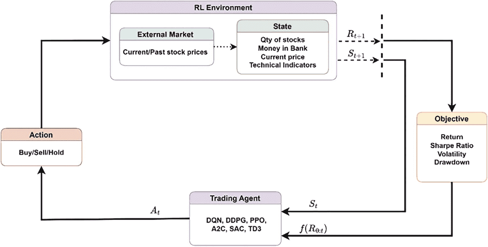

一个框图表示了 4 个单元之间的工作流程循环，这些单元包括 R L 环境、目标、交易代理和行动。R L 环境包括外部市场和状态。

图 13-3

将股票交易视为一个强化学习问题

+   状态：各种股票的价格和其他指标、银行现金和当前持有单个股票的数量、当前投资组合构成

+   行动：算法/代理/交易者的买入/持有/卖出决策

+   奖励：目标——终身回报、每日平均回报、投资组合波动性、夏普比率或最大回撤

将股票交易视为一个强化学习问题后，考虑涉及的数据。与游戏和其他强化学习环境不同，你拥有大量金融市场的历史数据。然而，与机器人不同，你没有办法构建一个能够紧密模拟实际市场运动的模拟器。因此，应用强化学习或任何其他机器学习算法的常见方法是用过去的市场数据来训练、验证和测试代理。假设你有五年的数据。你可以使用前四年的数据作为训练数据，在强化学习环境中进行给定交易策略的情节展开，并训练代理。接下来的六个月的数据可以用作验证集，以微调所有超参数，可以使用前面章节中讨论的任何超参数优化库和技术。最后六个月的数据可以用来测试最终策略的性能。在历史数据上运行策略进行超参数优化和/或最终测试被称为*回测*，因为它测试了算法在历史数据上的有效性。

一旦你准备好部署，有两个阶段。第一个阶段是进行所谓的*模拟交易*，在这个阶段，策略被部署以生成交易，并使用这些交易来更新状态；在市场上没有进行实际交易。换句话说，你只是在纸上部署了训练好的算法。部署的第二阶段和最终阶段是将代理连接到交易执行系统，以便使用真实货币和真实股票交易所执行对投资组合的行动。最终阶段涉及金钱，所以如果你的策略表现不佳，你将损失真实硬通货。

时间序列分析的一个非常棘手的问题是数据泄露，这是由于某些错误的时间索引设置或其他错误，导致未来的数据泄露到当前。有时很难找出这个问题。作为这个问题的例子，考虑当智能体在给定的一天*t*采取行动时，由于某些错误，它能够访问第二天—时间*t*+1 的价格。在这种情况下，智能体可以轻易地找到今天最理想的交易，因为它已经知道了未来。在训练后使用实时市场数据进行纸上交易可以缓解这个问题。如果你发现纸上交易给你带来了与训练和回测非常不同、次优的结果，那么这是未来数据泄露到过去的明确迹象。

这完成了对如何将强化学习应用于交易的介绍。你现在将从高层次探索如何使用 FinRL 实现所有这些步骤。4 FinRL 提供了一个支持各种市场、最先进的深度强化学习算法、许多量化金融任务基准、实时交易等的框架。FinRL 库由三个层次组成，如图 13-4 所示。

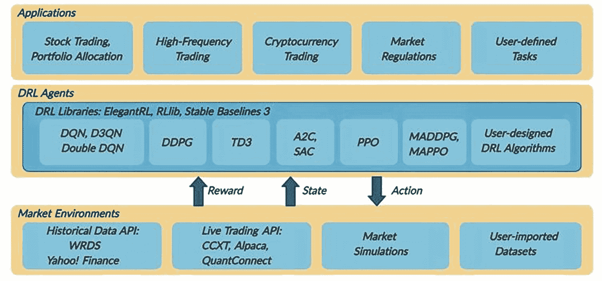

一个框图表示从上到下应用层、DRL 智能体和市场环境的层次。每一层都包含多个实体。底部的市场环境发送奖励和状态并采取行动。

图 13-4

FinRL 分层架构 来源：FinRL 文档

基础层被称为*市场环境*，位于一个名为*FinRL Meta*的独立库中。FinRL Meta 首先处理市场数据，然后创建股票市场环境。环境监控股价和多个特征的变化，智能体执行动作并从环境中获得奖励，然后智能体根据环境调整其策略。通过与环境的交互，智能体将发展出一种交易策略以最大化长期总奖励（也称为 Q 值）。FinRL 环境基于 OpenAI Gym，并使用真实市场数据模拟市场，采用时间驱动的模拟。FinRL 提供了跨多个证券交易所的交易环境。FinRL Meta 为强化学习中的金融数据工程建立了一个标准流程，确保来自不同来源的不同格式的数据可以纳入统一的框架。此外，它通过数据处理器自动化流程，可以访问数据、清理数据并从各种数据源中提取特征。

你了解到数据泄露的问题。FinRL 采用训练-测试-交易管道。DRL 代理首先从训练环境中学习，然后在验证环境中进行验证以进行进一步的调整。验证后的代理在历史数据集中进行测试。最后，测试后的代理将被部署在模拟交易或实时交易市场中。这个管道以更轻松的方式解决了信息泄露问题。

FinRL 的第二层是深度强化学习代理。FinRL 使用了三个标准库：a) StableBaselines3 b) RLlib，和 c) Elegant RL。Elegant RL 是由负责 FinRL 的团队开发的。

最后一层是建立在之上以执行不同市场和任何其他商业目的的实际应用。

FinRL 有一套精心编写的教程，包括 Python 笔记本。感兴趣的读者可以按照 FinRL 文档中建议的教程顺序进行学习。

### 星际争霸 II：PySc2

PySC2^(5)是 DeepMind 的 Python 组件，它是《星际争霸 II 学习环境》（SC2LE）的一部分。它将暴雪娱乐的《星际争霸 II 机器学习 API》^(6)作为 Python 强化学习环境暴露出来。这是 DeepMind 和暴雪合作，将《星际争霸 II》开发成一个强化学习研究环境的例子。PySC2 为强化学习代理提供了一个与《星际争霸 2》交互的接口，获取观察结果并发送动作。

在《星际争霸》中的目标是建立一个基地，管理经济，组建军队，并摧毁你的敌人。你从第三人称视角控制你的基地和军队，然后进行多任务处理和微观管理你的单位以获得最大效果。《星际争霸》有三个不同的种族——人类、神族和虫族，它们拥有不同的单位和策略。《星际争霸 II》主要是由确定性组成，但它确实有一些随机性，主要是为了视觉效果。两个主要的随机元素是武器速度和更新顺序。

《星际争霸 II》具有非常丰富的动作和观察空间。游戏输出空间/视觉和结构化元素。结构化元素给出是因为有很多文本和数字，代理不需要学习去阅读，尤其是在低分辨率下。这也是因为很难将回放反向回放到人类所看到的完全相同的视觉效果。

SC2 的动作空间非常大。它有数百种潜在的动作，其中许多需要屏幕上的一个点或小地图上的点，还有许多需要额外的修饰符。如果你将动作空间转换成单行，它将会有数百万甚至数十亿个选项，其中大多数都是无效的，而且许多都非常相似。因此，简单的离散动作空间并不非常合适。相反，该库创建了“功能动作”，这些动作可以很好地组合，而不需要随机层次结构的困难。这是基于 C 风格函数调用的想法，它可以接受一些特定类型的参数。感兴趣的读者可以在 PySc2 和 Blizzard ML API 的文档中了解更多相关信息。

### Godot RL Agents

Godot 引擎^(7) 是一个功能丰富的跨平台游戏引擎，可以从统一的界面创建 2D 和 3D 游戏。它提供了一套通用工具，使用户能够专注于制作游戏，而无需重新发明轮子。游戏可以被导出到多个平台，包括桌面平台（Linux、macOS、Windows）、移动平台（Android、iOS）以及基于网页的平台和游戏机。Godot 完全免费且开源。它由 Godot 基金会支持。

Godot 强化学习（RL）代理^(8) 是一个开源接口，用于在 Godot 游戏引擎中开发环境和代理。Godot RL 代理接口允许设计、创建和学习代理在具有各种在线策略和离线策略深度强化学习算法的具有挑战性的 2D 和 3D 环境中的行为。它提供了一个标准的 Gym 接口，并提供了 Ray RLlib、StableBaselines3、CleanRL 和 Sample Factory RL 框架的学习包装器。该框架功能多样，能够创建具有离散、连续和混合动作空间的环境。

感兴趣的读者可以在 2022 年发表的论文“Godot 强化学习代理”中了解更多关于 Godot RL 代理的信息^(9)。读者还可以参考 Godot RL 库或 Godot 引擎的文档，以获取更多关于如何创建自己的游戏以及如何进行 RL 训练的详细信息。这两个库的入门部分都详细介绍了安装和初始探索。

这完成了对 RL 环境的讨论。还有很多其他的，你总是可以根据你试图用 RL 解决的问题编写自己的客户环境。

## 基于模型的 RL：其他方法

在前一章中，你学习了基于模型的强化学习（RL），其中你通过让代理与环境交互来学习模型。然后，使用学到的模型生成额外的转换，即通过代理与真实世界的实际交互收集到的数据。这是 *Dyna 算法* 采用的方法。

虽然 Dyna 有助于加快学习过程并解决模型无关的强化学习中的一些样本效率问题，但它主要用于具有简单函数逼近器的问题。它没有在需要大量样本进行训练的深度学习函数逼近器中取得成功。来自模拟器的过多训练样本可能会由于模拟器在准确建模世界方面的不完美而降低学习质量。在下一节中，你将了解一些将学习模型与深度学习中的模型无关方法相结合的最近方法。你还将了解该领域的一些最新的理论进展。

### 世界模型

在 2018 年一篇题为“世界模型”的论文中，作者们提出了一种构建生成性神经网络模型的方法，这是一种对环境空间和时间方面的压缩表示，并使用它来训练智能体。

人类会发展出对周围世界的心理模型。他们不会存储所有可能的最小细节。相反，他们存储了一个抽象的、更高层次的世界表示，它压缩了世界的空间和时间方面以及世界不同实体之间的关系。他们只存储他们接触过或对他们相关的部分世界。

人类会观察当前任务的状态或上下文，思考他们想要采取的行动，并预测该行动将把他们带入的状态。基于这种预测性思维，他们选择最佳的行动。以棒球击球手为例。他们有毫秒级的时间来行动，需要在正确的时间和方向挥棒以击中球。你认为他们是如何做到的？经过多年的练习，击球手已经建立了一个强大的内部模型，其中他们可以预测球的未来轨迹，并能在当前时间点挥棒，在毫秒后达到轨迹上的精确点。优秀球员和普通球员之间的区别很大程度上归结于球员基于内部模型的这种预测能力。多年的练习使整个过程变得直观，无需太多有意识的计划。人类所做的决策和行动都是基于这个内部模型。系统动力学的创始人杰伊·赖特·福雷斯特描述了一个心理模型如下：

> “我们头脑中携带的世界图像只是一个模型。没有人会在头脑中想象整个世界、政府或国家。他们只选择了概念，以及它们之间的关系，并使用这些来代表真实系统。”^(11)

在论文中，作者展示了他们如何使用他们称之为“世界模型”的强大循环神经网络（RNN）模型和一个小控制器模型来实现预测性内部模型。小控制器模型的原因是保持信用分配问题在范围内，使策略在训练期间迭代更快，并能够使用像协方差矩阵适应进化策略（CMA-ES）这样的快速训练算法。我在本章的“无导数方法”概念下讨论了 CMA-Es。大的“世界模型”允许它保留所有必要的空间和时间表达性，以拥有一个良好的环境模型，并有一个小的控制器模型，以保持策略搜索在训练期间的快速迭代。

作者探讨了在生成的世界模型上训练代理的能力，完全取代了与真实世界的交互。一旦代理训练得很好，融合内部世界模型表示，学到的策略就被转移到真实世界中。他们还展示了向内部世界模型添加少量随机噪声的好处，以确保代理不会过度利用学到的模型的不完美之处。

接下来，让我们看看所使用模型的分解。图 13-5 给出了管道的高级概览。在每个瞬间，代理从环境中接收一个观察数据。

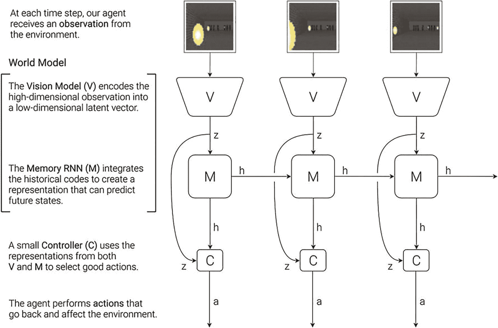

一个图表展示了代理模型的概览。它描绘了通过不同层的工作流程，其中接收到的观察数据通过世界模型，小控制器使用表示来选择好的动作，代理执行返回并影响环境的动作。

图 13-5

“世界视图”中使用的代理模型概览来源：“循环世界模型促进策略进化”，2018^(12)

世界模型由两个模块组成。

+   视觉模型（*V*）使用深度学习中的变分自编码器（VAE）将高维图像（观察向量）编码为低维潜在向量。潜在向量 *z*，模块 V 的输出，将观察数据的空间信息压缩到一个更小的向量中。

+   潜在向量 *z* 被输入到一个记忆 RNN (M) 模块中，以捕捉环境的时序方面。*M* 模型作为一个 RNN 网络，压缩了随时间发生的事情，并作为预测模型。由于许多复杂环境是随机的，并且由于学习的不完美，M 模型被训练来预测下一个状态 *P*(*z*[*t* + 1]) 的分布，而不是预测一个确定性的值 *z*[*t* + 1]。它是通过根据当前和过去（RNN 部分）预测下一个潜在向量 *z*[*t* + 1] 的分布来做到这一点的，这是一个高斯分布的混合 *p*(*z*[*t* + 1]| *a*[*t*], *z*[*t*], *h*[*t*])，其中 *h*[*t*]，RNN 的隐藏状态，捕捉了历史。这就是为什么它被称为基于循环神经网络的 *混合密度模型* (MDM-RNN)。

控制器模型负责获取空间信息 (*z*[*t*]) 和时序信息 (*h*[*t*])，将它们连接起来，并将它们输入到一个单层线性模型中。信息流的整体流程如图 13-6 所示，可以分解如下：

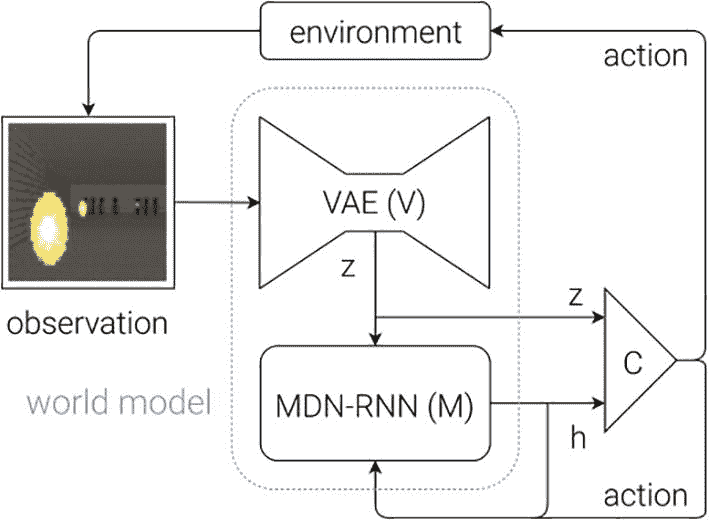

块图表示了智能体模型的概览，显示了世界模型、环境和观察之间的交互。V A E 和 M D N R N N 之间的通信在内部世界模型中表示。

图 13-6

世界观中使用的智能体模型概览 来源：“循环世界模型促进策略进化”，2018

1.  智能体在时间 *t* 获得一个观察。观察被输入到 *V* 模型中，将其编码成一个较小的潜在向量 *z*[*t*]。

1.  接下来，将潜在向量输入到 *M* 模型中，同时输入动作 *a*[*t*]，它更新其内部状态以产生隐藏状态 *h*[*t* + 1]。

1.  *V* (*z*[*t*]) 的输出和 *M* 模型的输出 (*h*[*t*]) 被连接起来，输入到 C 控制器，产生动作 *a*[*t*]。

1.  动作被输入到真实世界中，并由 *M* 模型用来更新其隐藏状态。

1.  真实世界中的动作产生下一个状态/观察，然后开始下一个周期。

对于其他细节，如伪代码、网络的实现细节以及训练中使用的损失，请参阅之前引用的论文。在论文中，作者还讨论了他们如何使用预测能力通过将预测 *z*[*t* + 1] 反馈作为下一个真实世界的观察来提出假设场景。他们进一步展示了他们如何能够在“梦境世界”中训练智能体，然后将学习转移到真实世界。

### 想象力增强智能体 (I2A)

如前所述，Dyna 提出了一种结合*无模型*和*基于模型*方法的方法。在复杂环境中，无模型方法在可扩展性方面更高，并且已被证明与深度学习结合得很好。然而，这些方法不是样本高效的，因为深度学习需要大量的训练样本才能有效。即使是简单的 Atari 游戏策略训练也可能需要数百万个示例才能训练。另一方面，基于模型的方法是样本高效的。Dyna 提供了一种结合两种优势的方法。除了使用现实世界的转换来训练代理外，现实世界的转换还用于学习一个模型，该模型用于生成/模拟额外的训练示例。然而，问题是*模型学习可能并不完美*，除非考虑到这一点，直接在复杂深度学习结合强化学习中使用 Dyna 不会得到好的结果。糟糕的模型知识可能导致过度乐观和代理性能不佳。

与使用世界模型的前一种方法一样，*想象增强代理*（I2A）方法以使结合方法在复杂环境中有效的方式结合了基于模型和无模型的方法。I2A 形成一个近似的环境模型，并通过“学习解释”学习到的模型不完美之处来利用它。它提供了一种端到端的学习方法，从模型模拟中提取有用的信息，而不完全依赖于模拟的回报。内部模型由代理使用，也被称为*想象*，以寻求积极的结果同时避免不利的结果。DeepMind 的作者们在 2018 年的论文《*“想象增强代理用于深度强化学习，”*》中表明，这种方法可以以更少的数据和不完美的模型学习得更好。图 13-7 展示了在参考论文中解释的 I2A 架构。I2A 具有以下组件：

+   图 13-7(a) 中的环境模型，基于当前信息，对未来进行预测。想象核心（IC）包含一个策略网络 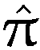，它接收当前观察 *o*[*t*]（实际观察）或 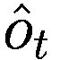（想象观察）作为输入，并产生一个滚动动作 。观察 *o*[*t*] 或  和滚动动作 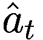 被输入到环境模型，一个基于 RNN 的网络，以预测下一个观察 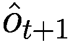 和奖励 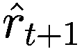。

+   许多这样的 IC 被串联起来，将前一个 IC 的输出传递给下一个 IC，并生成一个长度为 *τ* 的 *imaged rollout trajectory*，如图 13-7(b) 所示。产生了 *n* 个这样的轨迹 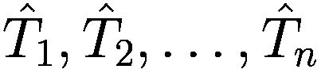。每个想象轨迹 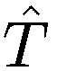 是一个特征序列 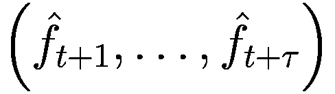，其中 *t* 是当前时间，*τ* 是滚动的长度，而 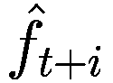 是环境模型的输出（即预测的观察和/或奖励）。由于学习到的模型不能假设是完美的，因此仅依赖于预测的奖励可能不是一个好主意。此外，轨迹可能包含超出奖励序列的信息。因此，每个滚动都通过顺序处理输出以在每个轨迹上获得嵌入来编码，如图 13-7(b) 的右侧所示，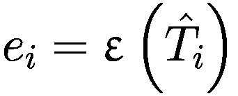。编码器是一个具有卷积编码器的 LSTM，它顺序处理轨迹 *T*。特征 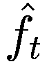 以相反的顺序输入到 LSTM 中，从 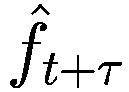 到 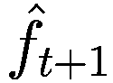，以模仿 Bellman 类的回溯操作。您可以在图 13-7(b) 的编码器块中看到这种方法的表示方式。

+   最后，图 13-7(c) 中的聚合器将这些单个 *n* 滚动合并，并将它们作为额外的上下文输入到策略网络中，同时还包括直接输入观察值的无模型路径。对于 I2A 的无模型路径，作者选择了一个标准的卷积层网络加上一个全连接层。因此，I2A 学习结合来自其无模型和想象增强路径的信息；请注意，如果没有基于模型的路径，I2As 就会简化为标准的无模型网络。因此，可以将 I2As 视为通过提供基于模型的规划额外信息来增强无模型智能体，并且它们比基础的无模型智能体具有更强的表达能力。

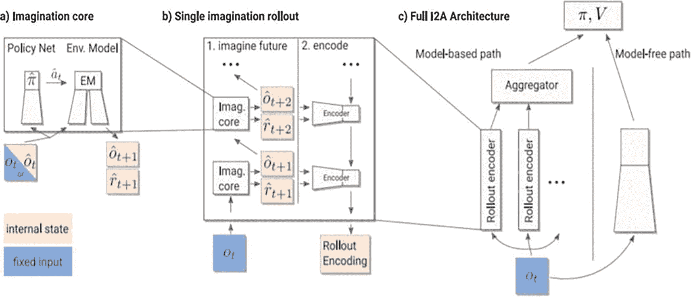

三个示例。a. 想象力核心包括策略网络和环境模型。b. 单个想象力展开包括未来想象和编码单元。c. 它代表了完整的 I2A 架构，表示基于模型的路径、自由路径、聚合器和展开编码器。

图 13-7

I2A 架构。它描绘了 (a) 中的 IC、(b) 中的单个想象力展开和 (c) 中的完整 I2A 架构。来源：2018 年论文“用于深度强化学习的想象增强代理”中的图 1^(14)

图 13-8 中所示的环境模型定义了一个分布，该分布通过使用负对数似然损失 *l*[*模型*] 进行优化。输入动作被广播并连接到观察结果。卷积网络将其转换为输出图像的像素级概率分布，以及奖励的分布。

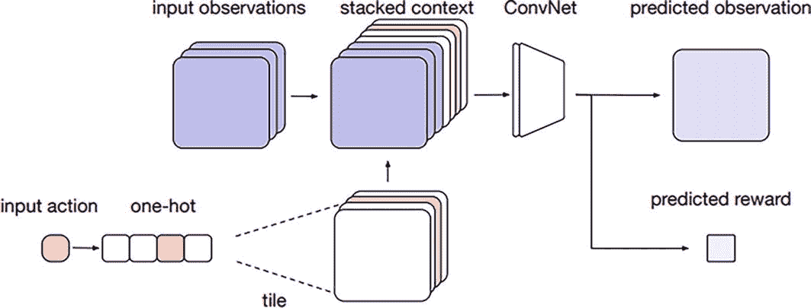

一个框图说明了从输入观察结果经过堆叠上下文、卷积网、预测观察结果和预测奖励的流程。

图 13-8

I2A 环境模型。来源：2018 年论文“用于深度强化学习的想象增强代理”中的图 2^(15)

*训练过程*：训练使用固定的预训练环境模型进行。训练涉及剩余的 I2A 参数，使用异步优势演员-评论家（A3C）。在策略 *π* 中添加了熵正则化器以鼓励探索，以及辅助损失将 *π* 纳入展开策略 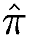。为了确保最佳性能，对每个代理架构进行了单独的超参数搜索。

作者使用拼图环境 Sokoban 来展示 I2A 在基线上的性能。Sokoban 是一个经典的规划问题，其中代理必须将多个箱子推到给定的目标位置。由于箱子只能被推动（而不是拉动），许多移动是不可逆的，错误可能导致拼图无法解决。因此，人类玩家被迫提前规划移动。这样做的目的是为了证实人工代理将同样从内部模拟中受益的预期。读者可以参考参考文献中的图 3 以获取 Sokoban 环境的样本渲染。

论文中展示的各种实验的学习曲线在图 13-9 中重现。

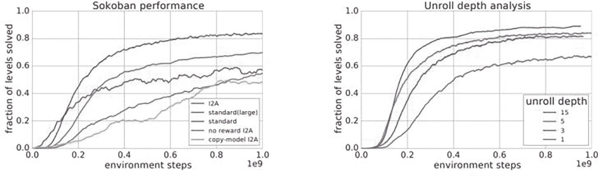

两条线图表示已解决级别与环境步骤的分数，代表 Sokoban 性能和展开深度分析下线条的上升趋势。a. 线条代表 I2A、标准大型、标准、无奖励 I2A 和复制模型 I2A。b. 线条代表展开深度为 1、3、5 和 15。

图 13-9

Sokoban 学习曲线。左图：I2A 和基线模型的训练曲线。右图：I2A 的训练曲线，展示了不同想象深度的值。来源：2018 年论文“用于深度强化学习的想象增强智能体”中的图 4^(16)

作者从这一研究中得出的有趣见解如下：

图 13-9（右图）显示，使用更长的 rollout，虽然不会增加参数数量，但可以提高性能。三个展开步骤显著提高了学习的速度和最高性能，超过了一个展开步骤；五个步骤优于三个；作为一个测试，15 个步骤优于五个，达到了超过 90% 的解决级别。然而，总的来说，图表显示了使用 I2A 和更长 rollout 的边际收益递减。作者还强调，与解决一个级别所需的步骤数相比，五个步骤相对较小，最好的智能体平均需要大约 50 个步骤。这表明，即使是短的 rollout 也可以提供高度信息。例如，它们允许智能体学习到它无法恢复的动作（例如，在特定情况下将箱子推到墙上）。

在数据效率方面，如图 13-9（左图）所示，需要注意的是，I2A 中的环境模型大约用 1e8 个帧进行了预训练。因此，即使考虑预训练，I2A 在总共看到约 3e8 个帧之后，也优于基线模型。

作者还展示了如何使用单个模型，该模型为 I2A 提供了对控制环境的动态的一般理解，可以用来解决一系列不同的任务。这种通过在相同环境中重复使用环境模型来解决多个任务的方法，使得数据效率得到了进一步的提升。

作者还表明，学习 rollout 编码器在能够很好地处理不完美的模型学习方面起着重要作用。

### 基于模型的强化学习（MBMF）

在 2017 年的一篇题为 *“*基于神经网络的模型强化学习动态与无模型微调，”^(17)* 的论文中，作者展示了将无模型和基于模型的强化学习结合的另一种方法。他们研究了运动任务领域。训练用于运动的机器人无模型方法存在高样本复杂度的问题，这在所有基于深度学习的模型中都有所见。作者将无模型和基于模型的方法结合起来，提出了样本高效的模型来学习具有不同任务目标的运动动力学。他们证明了中等规模的神经网络模型可以与模型预测控制（MPC）结合，在基于模型的强化学习算法中实现出色的样本复杂度，产生稳定且合理的步态来完成各种复杂的运动任务。他们还提出了使用深度神经网络动力学模型来初始化无模型学习器，以便将基于模型的方法的样本效率与无模型方法的高、特定于任务的表现结合起来。借助 MuJoCo 环境的实验和学习轨迹，作者还展示了在随机动作数据上训练的纯基于模型的方案可以跟随任意轨迹，具有出色的样本效率，并且混合算法可以进一步加速无模型学习。

我首先介绍模型预测控制（MPC）。在基于模型的强化学习中，使用机器人/环境动力学模型来根据当前状态和当前动作预测下一个状态。令 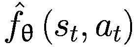 为学习到的动力学，它由参数 θ 参数化。它接受当前状态 *s*[*t*] 和当前动作 *a*[*t*]，输出下一个时间步 *t* + Δ*t* 的状态估计。假设奖励函数是已知的，表示为 *r*(*s*[*t*], *a*[*t*])。选择最优动作的强化学习优化问题将涉及解决以下方程：

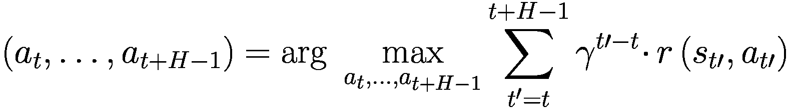

(13-1)

然而，由于学习模型中的错误，更好的选择是只执行序列中的第一个动作 *a*[*t*]，然后在下一个时间步使用更新的状态信息 *s*[*t* + 1] 重新规划，而不是让策略在开环中执行这个完整的动作序列。这种方法在每个步骤解决优化问题，被称为 *模型预测控制* (MPC)。

现在考虑奖励函数 *r*[*t*] = *r*(*s*[*t*], *a*[*t*])，它被认为是已知的，因为它可以根据机器人的状态来计算。论文给出了用于 *前进* 和 *轨迹跟随* 的奖励函数的例子。轨迹通过稀疏的 *航点* 来表示，这些航点定义了机器人需要遵循的路径。航点是给定轨迹上的点，当用线连接时，可以近似表示给定的轨迹，如图 13-10 所示。有关航点在轨迹规划中如何使用的更多详细信息，请参阅任何关于自动驾驶汽车和机器人的文本。

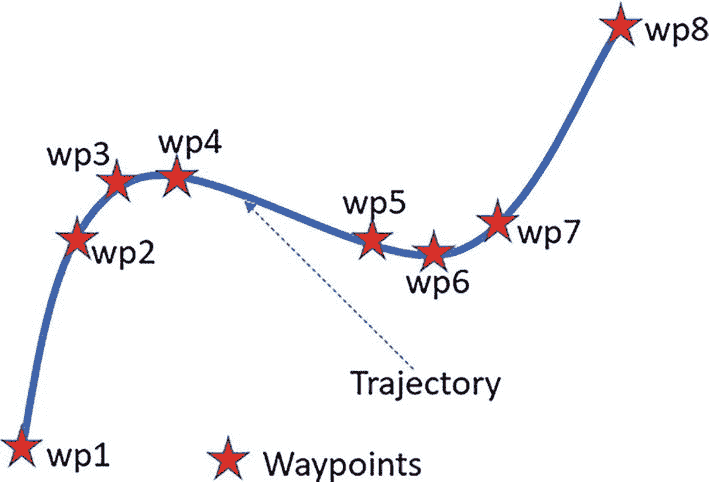

一个插图展示了一个从底部到顶部有多个点标记的 S 形曲线。曲线被标记为轨迹。从 w p 1 到 w p 8 的点被标记为波点。

图 13-10

轨迹和航点

在任何时刻，机器人的预期动作序列被认为是。对于每个动作，将当前状态 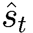 和估计的下一个状态  连接的线段投影到轨迹中两个连续航点最近的线段上。如果机器人的移动沿着航点线段，则奖励为正；如果移动垂直于航点线段，则奖励为负。同样，论文还有另一组用于 *前进* 目标的奖励函数。

神经网络正在学习动力学 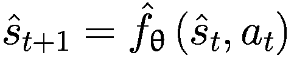。然而，当状态 *s*[*t*] 和 *s*[*t* + 1] 非常相似，因此动作 *a*[*t*] 对输出的影响看似微乎其微时，这个函数的学习可能会变得困难。当状态之间的时间 Δ*t* 变得更小，这个问题变得更加明显。因此，模型不是预测下一个状态，而是预测两个状态之间的差异 *s*[*t* + 1] − *s*[*t*]。有了这个，下一个状态就变成了 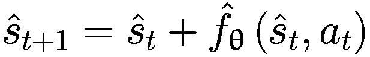。预测整个新状态的差异而不是差异放大了变化，并允许捕捉到小的变化。

现在将注意力转向基于模型的强化学习算法。图 13-11 说明了这个算法。

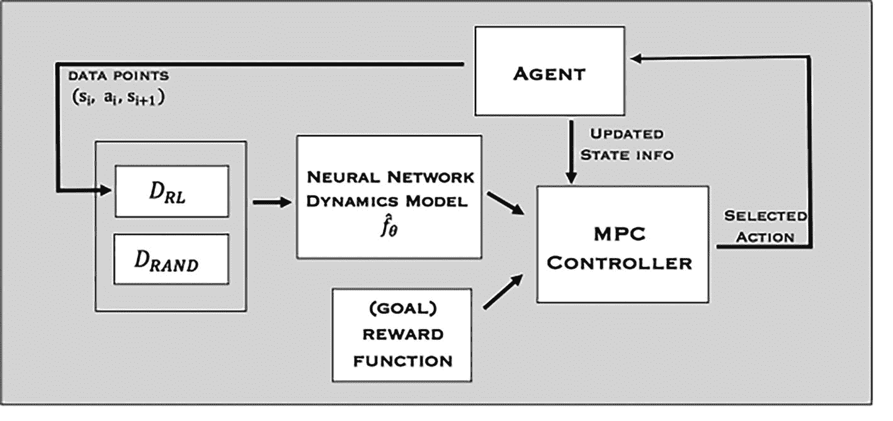

一个框图表示基于模型的强化学习下的工作流程周期。智能体的数据点通过神经网络动力学模型和 MPC 控制器，这些控制器也接收来自奖励函数和智能体的输入。控制器选定的动作返回到智能体。

图 13-11

基于模型的强化学习来源：MBMF 论文^(18)

该算法按以下方式工作。奖励函数和动力学模型被输入到 *模型预测控制器* (MPC)。MPC 接收奖励和下一个状态，使用预测的 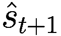 作为新的输入来预测 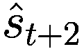 以及如此等等。随机生成 *K* 个长度为 *H* 步的动作序列，根据 *K* 个序列中累积奖励最高的动作在初始时间步 *t* 处找到最佳动作。机器人随后执行动作 *a*[*t*]。在此阶段，样本序列被丢弃，并在时间 *t* + 1 处对下一个 *K* 个长度为 *H* 的序列进行完整的重新规划。使用此模型的预测控制器（而不是开环方法）确保错误不会向前传播。每一步都会进行重新规划。图 13-12 展示了完整的算法。

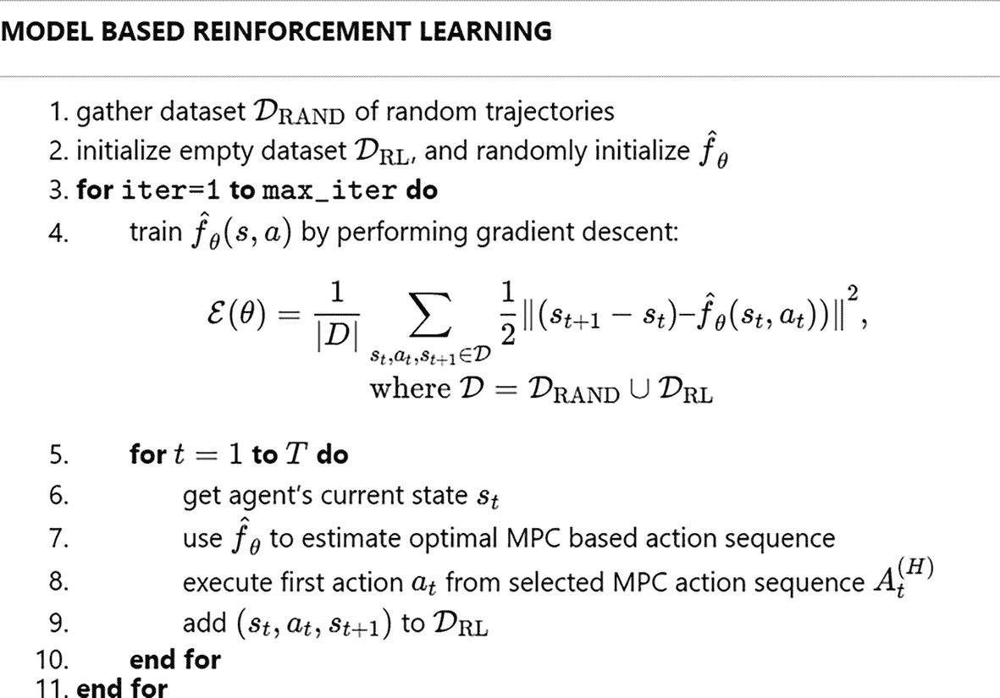

模拟代码片段表示基于模型的强化学习算法。从开始到结束共有 11 行。该算法在 For 循环下包括多个计算和动作。

图 13-12

MBMF 算法来源：MBMF 论文^(19)

一旦模型被训练，为了进一步提高模型，作者们通过初始化一个带有之前讨论过的基于模型学习者的模型无关智能体来微调它。模型无关的训练可以使用你之前学到的任何方法来完成。这就是为什么将其命名为 *基于模型且带有模型无关微调* (MBMF) 的原因。

### 基于模型的值扩展 (MBVE)

在 2018 年一篇题为“基于模型的值扩展用于高效的模型无关强化学习”的论文中^(20)，作者们采用将基于模型和模型无关方法与已知的奖励函数相结合的方法，以获得对价值估计更为严谨的方法。

上一节中介绍的 MBMF 方法通过使用 MB 作为训练代理的方式，然后使用学习到的策略来初始化 MF 代理，将基于模型的（MB）方法和无模型（MF）方法结合起来。无模型方法已知具有学习复杂行为的高容量，但非常样本效率低，当需要现实世界的交互时可能会成为问题。另一方面，基于模型的方法可以通过学习到的模型达到近最优解，但环境动力学相当受限，例如具有有限能力的简单机器人。在这篇论文中，作者通过结合两种方法来“*通过通过有纪律地使用模型进行价值估计，结合 MB 和 MF 学习技术来减少样本复杂度，同时支持复杂非线性动力学。*”

基于模型的值扩展（MBE）是一种混合算法，它使用动力学模型来模拟短期预测范围，并使用 Q 学习来估计模拟范围之外的长远价值。这通过提供高质量的训练目标值来改进 Q 学习。将值估计分为近未来 MB 组件和远未来 MF 组件，提供了一种基于模型的值估计，它（1）在价值估计和模型使用之间创建了一个解耦的接口，并且（2）不需要可微分的动力学。

MVE 通过假设它能够访问动力学模型\( \hat{f}:S\times A\to S \)以及真实的奖励函数*r*来改进策略π的价值估计。改进的价值估计可以用作任何 actor-critic 算法中的 critic（C）。论文中的作者通过将 MVE 改进的 critic 应用于 DDPG 来展示 MVE 方法带来的好处。至于动力学模型，算法假设它仅对一定深度 H 是准确的，这个深度可以根据对学习到的动力学的信心进行调整。换句话说，对于前 H 步，你可以使用动力学模型和给定的策略来估计下一个状态和奖励：\( {\hat{r}}_t=r\left({\hat{s}}_t,\uppi \left({\hat{s}}_t\right)\right) \)，\( {\hat{s}}_t={\hat{f}}^{\uppi}\left({\hat{s}}_{t-1}\right) \)。因此，对于策略π下给定状态的价值的 H 步模型值扩展（MVE）估计*V*^π(*s*[0])如下：

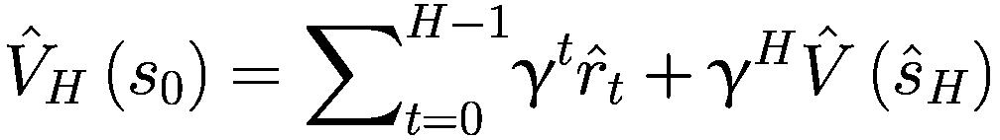

(13-2)

H 步 MVE 估计是由两个组件组成的——由学习到的动态估计的组件 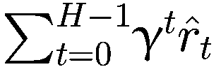 和尾部组件估计 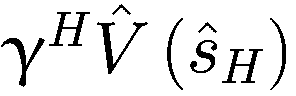。由于  是从动作 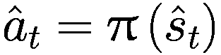 推导出来的，这是一个 on-policy。因此，在确定性和随机情况下，MVE 都不需要重要性权重。这与使用离策略轨迹生成的轨迹的痕迹形成对比。

图 13-13 展示了 MVE 算法的伪代码。如果你仔细观察，你会注意到它与常规的 Actor-Critic 算法非常相似，除了第 7 步，即学习环境动态，以及第 3 步，即如何使用方程 13-2 评估 critic。

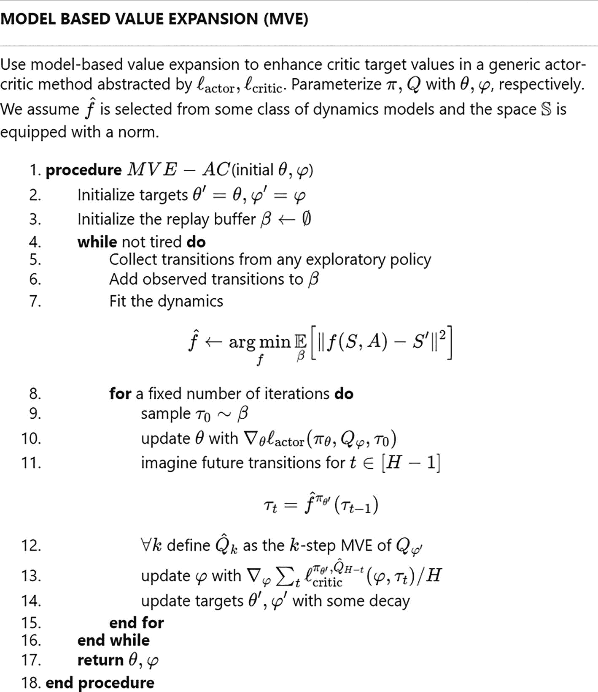

一段伪代码代表了基于模型的值扩展算法。从开始到结束共有 18 行。顶部的文本指示使用基于模型的值扩展来增强通用 actor-critic 方法中的 critic 目标值。在最后返回 theta 和 phi 的值。

图 13-13

MVE 算法的伪代码来源：MVE 论文^(21)

作者展示了将 MBVE 与 DDPG 结合的性能，与纯 DDPG 相比，结合 MBVE 与 DDPG 有显著的改进。读者可以参考所引用论文的图 3 以获取更多信息。

### IRIS：作为世界模型的 Transformer

Transformer 作为深度学习架构在 2017 年出现，如今是爆炸式 AI 增长的驱动力，尤其是以自回归预测为形式的 transformer 驱动的大型语言模型。这种架构被称为 GPT，第十一章对其进行了介绍。在过去四到五年中，Transformer 越来越多地取代了循环神经网络（RNN）架构，用于处理时间或序列驱动数据。在强化学习（RL）的情况下，时间序列是多步中的状态和动作序列。

为了学习系统动态并结合基于模型的方法和无模型方法的优点，你需要一种可以预测序列处理器的预测方法，该处理器可以接受过去和现在的状态以及动作来预测下一个状态和可选的奖励。你迄今为止看到的所有论文都采取了不同的方法，在控制解决方案质量的同时，由于模型内学习的动态与真实世界动态的不完美，带来了不同的样本效率。

你也看到了通过像蒙特卡洛树搜索（MCTS）这样的前瞻性方法来提高样本效率的必要性，即使已知动态但搜索空间太大而无法彻底探索。这是在合理数量的样本/计算处理中提高效率的另一种方式。

2023 年一篇题为“Transformers Are Sample-Efficient World Models”的论文的作者，受到“世界模型”论文中想象中学习方法的启发，用基于 transformer 的方法替换了该论文中使用的 RNN，并做了一些其他改变。作者将他们的方法称为 IRIS（基于内部言语的自动回归想象）。他们将这项技术应用于 Atari 游戏基准。在介绍 DQN 时，Atari 游戏被引入为 RL 环境，见第八章。

根据作者的说法，IRIS 在 Atari100k 基准测试中为无前瞻性搜索的方法设定了新的最高水平。他们声称，基于 IRIS 的世界模型对游戏机制有了深入的理解，在一些游戏中实现了像素级的预测。论文还展示了世界模型的生成能力，在想象中训练时提供了丰富的游戏体验。与现有的最先进代理相比，IRIS 进行了最小的调整，开辟了高效解决复杂环境的新途径。

作者还提出，在未来，IRIS 可以扩展到计算密集型和具有挑战性的任务，这些任务将从其世界模型的速度中受益。此外，其策略目前从重构的帧中学习，但它可能可以利用世界模型的内部表示。作者还提出一个研究领域，涉及将想象中的学习与 MCTS 相结合。

另一点需要强调的是构建样本效率的动机。你可能想知道，当大型语言模型（LLMs）在包含万亿个单词标记的数据集上训练数月时，为什么对强化学习（RL）中的样本效率如此着迷？一个答案是 LLMs 是一个更大的模型，当你将训练标记数与模型参数数的比例进行比较时，这个比例看起来并不大，而在 RL 世界中，训练数据作为模型参数的比例更高。然而，这并不是核心问题。还有一个更加根本的问题需要提出。LLMs 处理文本数据。在训练这些模型时，它们可能会犯错误，并通过某种梯度下降方法从这些错误中学习。训练过程中的错误不会造成任何伤害或对任何人构成威胁。相比之下，RL 作为一种方法，在自动驾驶汽车、机器人以及其他涉及人类行为的场景中与物理机器大量使用。RL 设计上需要随着智能体学习和探索环境的新状态而收集新的数据。现在，如果这些不完美的智能体需要作为收集新训练数据的一部分与真实世界互动，这些智能体可能会采取可能对自己、周围的人或与之互动的财产和资产造成伤害的行为。即使这种互动是可能的，与真实世界环境互动和收集样本的成本和速度也比使用基于软件的模拟模型要高得多。

此外，你已经看到，在 DQN 等方法中，样本效率比基于策略的学习方法更高。然而，基于策略的算法更容易实施。Actor-Critic 方法族是结合两种方法优点的一种方式。具有学习动态的基于模型的方法是另一个效率步骤。

现在简要考虑本文提出的 IRIS 方法的组成部分。图 13-14 展示了该方法。问题被表述为一个部分可观察马尔可夫决策过程（POMDP），具有图像观察 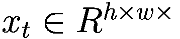，离散动作 *a*[*t*] ∈ {1, …, *A*}，标量奖励 *r*[*t*] ∈ *R*，剧集终止 *d*[*t*] ∈ {0, 1}，折现因子 *γ* ∈ (0, 1)，初始观察分布 *ρ*[0]，以及环境动态 *x*[*t* + 1]，*r*[*t*]，*d*[*t*] ∼ *p*(*x*[*t* + 1]，*r*[*t*]，*d*[*t*]∣ *x*[≤*t*]，*a*[≤*t*])。强化学习目标是训练一个策略 *π*，使其学会输出最大化预期奖励总和 *E*[*π*][∑[*t* ≥ 0]*γ*^(*t*)*r*[*t*]] 的动作。该方法依赖于三个组成部分在想象中学习：经验收集、世界模型学习以及行为学习。智能体学会在其世界模型内进行行动，并使用真实经验来学习环境动态。这三个步骤是：

+   `collect_experience`: 使用代理当前策略在真实环境中收集经验。

+   `update_world_model`: 训练模型以改善对奖励、剧集结束和下一个观察的预测。

+   `update_behavior`: 在想象中，改进策略和价值函数。

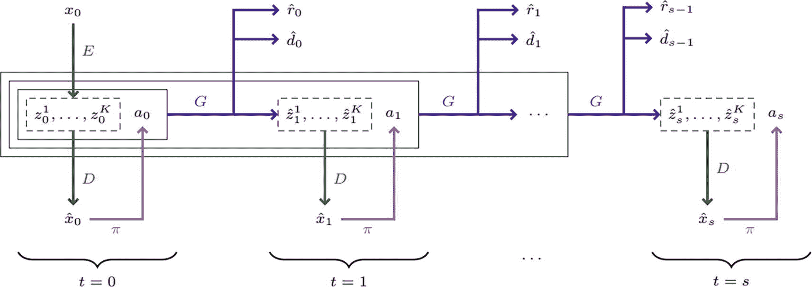

一张框图描述了基于 Transformer 的世界模型方法。3 个方块表示 t 值为 0、1，直到 s 的流动序列。图中标明了不同标签之间的交互，包括 x hat 0、x hat 1、x hat s、a 0、a 1、a s、pi、r hat 0、d hat 0、r hat 1 和 d hat 1。

图 13-14

IRIS: 基于 Transformer 的世界模型方法来源^(23)

考虑世界模型。它是如何构建的？要通过 Transformer 处理图像，你需要将图像转换为标记序列，就像 LLMs 将句子转换为标记序列一样。一种标准的方法是称为变分自动编码器（VAE）。从高层次来看，VAE 将图像传递到一个称为编码器 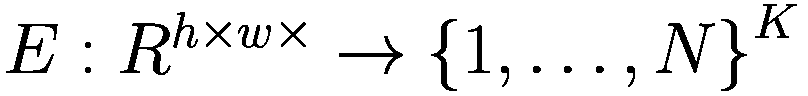 的神经网络。编码器将输入图像 *x*[*t*] 转换为来自大小为 *N* 的词汇表中的 *K* 个标记，将图像转换为更小的压缩表示 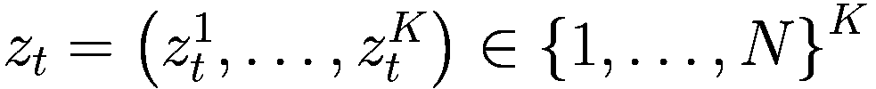，其中 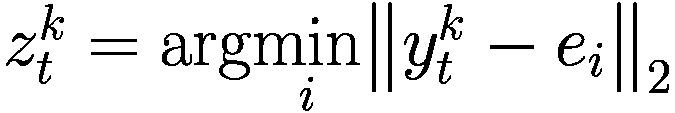，即 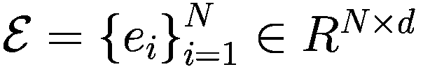 中最近嵌入向量的索引 *i*。VAE 的解码器部分 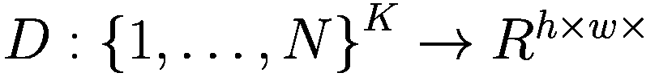 将 *K* 个标记转换回重建图像 。图像到潜在表示再到重建图像的流程由图 13-14 中的绿色箭头表示。

作者声称，这个离散自动编码器 (*E*, *D*) 学习了一种自己的符号语言来表示高维图像为少量标记。这个离散自动编码器在之前收集的帧上训练，结合了等权重的组合，包括 *L*[1] 重建损失、承诺损失和感知损失。

重建的图像 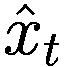 被用于策略网络，以输出动作 *a*[*t*]，如图 13-14 中的紫色箭头所示。

潜在表示*z*[*t*]与动作*a*[*t*]一起通过 Transformer 来预测下一个时间步的值，如下一个状态的潜在表示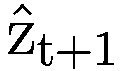，奖励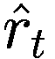，以及完成标志。这种下一个时间步的预测是以自回归的方式进行，目前最流行的 GPT 方式是从过去和现在预测未来。

下一个状态潜在值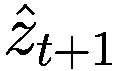是基于过去潜在值和动作的想象中的下一个状态潜在值。然后，它通过 VAE 的解码器得到游戏的想象中的下一个状态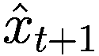，然后将其输入到策略网络以产生下一个状态动作*a*[*t* + 1]。如图 13-14 所示，除了作为*x*[*o*]描述的起始图像外，没有使用现实世界的图像。其余的动作是基于解码的想象图像进行的。这种流程在图 13-14 中用紫色箭头表示。

Transformer *G*在从过去经验中采样的*L*时间步段上以自监督的方式进行训练。对于转换和终止预测器使用交叉熵损失，对于奖励预测器使用均方误差损失或交叉熵损失，具体取决于奖励函数。

许多 Actor-Critic 方法可以用于在想象中训练*π*和*V*。基于在各种环境中进行的实验，作者记录了性能提升。

### 因果世界模型

DeepMind 于 2024 年发表的一篇题为“Robust Agents Learn Causal World Models”的论文^(24)，其前提是因果推理是人类智能的基础，并且已被推测为实现人类水平的人工智能所必需。他们进一步声明，近年来，这一推测受到了人工代理的发展的挑战，这些代理在没有明确学习或推理因果模型的情况下实现了强大的泛化。虽然因果模型对于解决因果推断任务的需要已经确立，但它们在决策任务（如分类或强化学习）中的作用尚不明确。

在论文中，作者以一种与模型无关的方式建立，任何能够稳健解决决策任务的智能体都必须已经学习到数据生成过程的因果模型，无论智能体的训练方式或其架构的细节如何。这暗示了因果性和通用智能之间更深层次的联系，因为智能体学习的因果模型可以反过来支持比原始训练目标更广泛范围的任务。作者以以下声明结束：

> *“…通过建立因果性和泛化之间的这种正式联系，我们的结果表明，因果推理是开发稳健和通用人工智能的基本要素。”*

感兴趣的读者可以参阅论文以获取详细信息。

## 离线强化学习

那么“在线”和“离线”这两个术语是什么意思呢？您已经看到了什么是策略算法和非策略算法。策略算法处理的是当智能体与环境交互、收集经验并使用这些经验来改进智能体的场景。紧接着，智能体丢弃所有先前经验，回到交互、收集和训练的循环中。智能体仅使用最新策略的数据样本进行训练。非策略方法处理的是用于收集经验的策略（如ε贪婪策略）与学习到的策略不同的场景。在 DQN 中，您也继续将所有先前经验存储在缓冲区中并使用这些经验。需要注意的是，在离线策略中，尽管您正在使用缓冲区中的旧经验数据，但您仍然通过与环境交互定期收集新数据。

另一种方法是智能体从过去的交互中获取数据，然后在训练期间不与环境交互；预计在实际部署中效果良好。本质上，它是一种离线算法的变体，在训练期间不再定期与环境交互。在训练开始之前收集的数据在整个训练过程中保持静态，不进行修改。

采用这种方法的动机主要在于，在某些场景中，例如在机器人和自动驾驶汽车中，当智能体正在接受训练时，同时训练和收集新的经验通常非常困难。同时，对于这样的环境，过去多年收集的大量数据可供使用。离线方法（称为*离线 RL*）可以使从过去数据中训练变得更加高效。这使得离线 RL 在机器人和自动驾驶汽车领域成为一个非常实用且吸引人的提议。然而，离线 RL 由于在线交互和记录交互的固定数据集之间的差异而变得困难，也就是说，当学习到的智能体采取与数据收集智能体不同的行动时，你无法确定应该给予的奖励。这个问题也被称为*分布偏移*。换句话说，当智能体随着训练的逐步深入所看到的数据与最初用于训练智能体的固定交互集的数据分布大相径庭时。

如图 13-15 所示的表格总结了三种方法——策略 RL、非策略 RL 和离线 RL。让我们花一分钟时间来明确术语。到目前为止，你在本书中学到的内容可以归类为在线算法，包括策略在线和非策略在线。这些都是在线算法，因为智能体在训练过程中持续收集数据。区别在于数据的重用。在在线策略中，在你收集数据并使用它一次来训练智能体之后，这些数据就变得过时了。你丢弃这些数据，智能体在下一个训练迭代中从环境中收集一组全新的交互数据/经验。在在线非策略中，当你收集新的交互数据时，你也会继续使用之前收集的数据——DQN 中回放缓冲区的使用。离线 RL 的前提是在训练过程中永远不收集新数据；仅使用先前收集的数据来训练智能体，然后在实际生活中部署这些智能体，无论是在生产中完全运行还是在任何在线方法进行短期微调之后。


一个包含 2 行 2 列的表格比较了离线 R L 和在线 R L。列标题如下。仅使用最新的策略数据来训练当前智能体，并混合过去和最新的策略数据。行表示当前智能体在训练期间收集数据，并不与环境交互。

图 13-15

离线 RL 与在线 RL

你可以在论文“离线强化学习：教程、综述和开放问题展望”中找到离线 RL 的全面教程^(25)。图 13-16 展示了三种方法之间的比较可视化。图 13-15 中的表格和图 13-16 中的图表代表了相同的概念——RL 中三种高级方法的比较。顺便说一下，离线 RL 也被称为数据驱动 RL 或批量 RL。


3 个框图说明了不同的在线和离线 RL 方法。a. 它描述了在线强化学习。b. 它代表了离策略强化学习。c. 它展示了离线强化学习，指明了数据收集、训练和部署阶段的顺序。

图 13-16

离线 RL 与在线 RL 来源：调查论文的第 1 图^(26)

让我们现在简要看看离线 RL 可能有益的场景。

+   **机器人技术**：虽然在网上收集数据在机器人训练期间可能是可行的，但我们希望训练机器人在各种技能上。在机器人技术中，通常每个技能的教学都需要非常大的交互量，而为更广泛的技能范围这样做会极大地增加问题。相反，如果你能够使用之前收集的所有数据以多任务离线强化学习的方式训练智能体，你就可以使训练更加高效。这样的预训练机器人可以轻松部署以执行新的任务，并且只需要非常少量的特定技能的在线智能体训练。

+   **医疗保健**：医疗保健中 RL 的一个例子可以是将医生和患者的整个交互建模为马尔可夫决策过程（MDP）。医生开具的诊断测试、药物和治疗可以建模为动作，而患者的过去病史可以被视为状态/观察。奖励可以是个人的寿命或健康分数。由于担心错误诊断导致的治疗和其他安全顾虑，通常无法使用在线数据训练这样的智能体。然而，医院有多年历史数据，可以在离线 RL 方法中使用，以在训练过程中无需任何在线交互来训练智能体。

+   **自动驾驶汽车**：它具有与医疗保健示例相同的挑战。由于安全和事故损害的顾虑，在线训练车辆并从错误和奖励中学习是不切实际的。然而，人类驾驶员可以驾驶汽车周围收集数据，以离线 RL 方式训练智能体。

离线 RL 使 RL 开始看起来像监督学习。许多这样的尖锐区别正在变得模糊，因为研究人员正在找到独特的方法来利用不同方法的好处，以克服任何单一方法的弱点。

现在让我们来讨论现有的离线强化学习（Offline RL）方法。从理论上讲，通常的离线策略算法可以通过在训练过程中关闭真实世界数据收集循环，仅依靠初始数据收集来实现离线强化学习。然而，这会导致数据分布不匹配问题，需要仔细处理以减少不匹配问题。然而，存在一个基本的不匹配问题无法处理，即初始数据和训练期间的观察结果截然不同，而不仅仅是微小的漂移。假设你正在对一个具有多个级别的游戏进行代理训练，每个级别都非常不同，并且包含具有未见行为的新的对抗性角色。进一步假设你已经找到了理想的最佳离线强化学习来训练代理，但只在该游戏的第一个级别上训练代理所看到的数据。你认为这样的代理在代理逐渐通过级别，遇到具有未见复杂行为的新的代理时，会表现良好吗？答案是肯定的。这些问题不能完全通过离线强化学习来解决。在这种情况下，在离线不同数据上训练的代理可以作为良好的起点，然后以在线方式逐步在新的数据上训练。

将焦点转回到将离线策略方法扩展到离线强化学习，考虑一个 DQN 已被扩展的例子。一篇题为“离线强化学习的乐观视角”的论文^(27)提供了一个解决方案。该论文还附有博客和代码库。作者使用一个*DQN 重放数据集**，它由在训练 DQN 代理期间遇到的（观察，动作，奖励，下一个观察）元组的集合组成（大约 5000 万个），在所有 60 个 Atari 2600 游戏上，启用了粘性动作的 200 百万帧，每个游戏重复五次。

将许多将 DQN 扩展到离线强化学习的方法与乐观 Q 估计的降低有关。首先，作者在数据集上尝试了 DQN 和 QR-DQN 的全离线设置。他们将这些方法的结果与训练后获得的最佳在线 DQN 代理进行了比较，即完全训练的 DQN。实验得出结论，离线 DQN 在大多数游戏中表现不如完全训练的在线 DQN。他们还发现，离线 QR-DQN 在大多数游戏中优于离线 DQN 和完全训练的 DQN。基于这些发现，他们提出了两个针对完全离线 DQN（离线强化学习）的变体。

第一个称为*Ensemble-DQN*，是 DQN 的一个简单扩展，它训练多个 Q 值估计并平均它们以进行评估。

第二个被称为*随机集成混合（REM）*，它是一种受 Dropout 启发的易于实现的 DQN 扩展。REM 背后的主要思想是，如果你有多个 Q 值估计可用，你可以使用 Q 值估计的加权混合作为另一个 Q 值估计。因此，在每次训练步骤中，REM 随机混合不同的 Q 值估计，并使用这种随机混合进行稳定训练。

图 13-17 展示了四种方法——DQN、QR-DQN、离线集成 DQN 和离线 REM——中 Q 值估计的图示比较。


一幅插图展示了 DQN、QR-DQN、集成 DQN 和 REM 的架构。DQN 通过神经网络进行处理，而其余的模型则通过共享神经网络来获取最终的动作和回报。

图 13-17

架构比较：离线 DQN 与在线 DQN Source^(28)

他们进行的实验发现，离线 REM 给出了最佳结果；它优于离线 DQN 和离线 QR-DQN。他们还发现，离线 REM 的收益超过了完全训练的在线 C51，一个强大的分布代理。

之前提到的教程论文中包含了许多正在尝试的其他方法。对于对离线强化学习感兴趣的人来说，这是一份漫长但非常有价值的起点。

## 决策转换器

在 2021 年的一篇题为“决策转换器：通过序列建模进行强化学习”的论文中，作者采用了在 LLMs 中使用 transformers 进行语言建模的方法。作者将决策转换器模型描述为一个将 RL 问题建模为条件序列建模的架构。与之前将值函数拟合或计算策略梯度的 RL 方法不同，决策转换器通过利用因果掩码的 transformer 简单地输出最佳动作。通过将自回归模型的条件设置为期望回报（奖励）、过去的状态和动作，决策转换器模型可以生成实现期望回报的未来动作。通过实验，作者表明决策转换器在 Atari、OpenAI Gym 和 Key-to-Door 任务上与最先进的模型无关的离线 RL 基线相匹配或超过其性能。决策转换器模型的示意图如图 13-18 所示。在决策转换器中，状态、动作和回报被输入到特定模态的线性嵌入中，并添加了位置性周期时间步编码。标记被输入到 GPT 架构中，该架构使用因果自注意力掩码自回归地预测动作。用作者的话说：

> *“与先前使用转换器作为传统强化学习算法内部组件的架构选择的工作相比，我们试图研究生成轨迹建模——即建模状态、动作和奖励序列的联合分布——是否可以作为传统强化学习算法的替代。”*


一张图说明了决策转换器方法。状态、动作和回报被输入到线性嵌入中，并添加了位置性剧集时间步编码，然后是因果转换器和线性解码器。

图 13-18

决策转换器方法 来源：决策转换器论文的图 1^(30)

考虑算法的高级架构及其伪代码。图 13-19 显示了算法的伪代码。架构的关键思想是轨迹表示的选择应该能够使转换器学习到有意义的模式，并且能够在测试时条件性地生成动作。


伪代码片段表示决策转换器算法。代码中指出了计算标记嵌入、使用转换器获取隐藏状态、选择隐藏状态进行动作预测、动作预测以及训练和评估循环的各个部分。

图 13-19

决策转换器伪代码 来源：论文的算法 1^(31)

由于想法是基于未来期望的奖励而不是依赖于过去的奖励来生成动作，因此作者将模型输入了“返回到去”的值 。因此，馈送到转换器的轨迹表示由方程 13-3 给出。由于“返回到去”捕捉了未来，它们适合自回归训练，引导自回归模型向期望的结果发展。


(13-3)

在测试时，可以指定所需的性能（例如，成功为 1 或失败为 0）以及环境起始状态作为条件信息以启动生成。执行当前状态的生成动作后，目标回报会因获得的奖励而减少，这个过程会重复进行，直到剧集结束。

关于训练，最后 *K* 个时间步被输入到决策转换器中，总共是 3*K* 个标记——每个模态一个：回报、状态或动作。每个模态使用一个线性层获得嵌入，该层将原始输入投影到决策转换器的嵌入维度。这之后是层归一化的常规做法。如果观察是视觉输入，则观察通过卷积编码器而不是线性层进行处理。您在“IRIS：Transformer 作为世界模型”的案例中看到了这种方法。时间步编码被学习并添加到每个标记中。然而，请注意，这与转换器使用的标准位置嵌入不同，因为在这里一个时间步对应三个标记。然后，标记通过一个 GPT 模型进行处理，该模型通过自回归建模预测未来的动作标记。

从给定的离线轨迹数据集中，采样了序列长度为 *K* 的迷你批次。最后一层——对应于输入标记 *s*[*t*] 的预测头——被训练来预测 *a*[*t*]。用于训练的损失是离散动作的交叉熵损失和连续动作的均方误差。

作者还指出，预测状态或回报并没有提高性能，尽管决策转换器架构允许轻松集成。他们将对此的进一步探索留给了未来的研究。

图 13-19 展示了决策转换器算法的伪代码。

在这篇论文中，作者进行了实验来回答以下问题：

*决策转换器模型是否在数据集的一个子集上执行* *行为克隆*？* 实验表明这是真的，因为发现决策转换器可以比仅仅在数据集的子集上执行模仿学习更有效。

*决策转换器模型如何建模* *回报分布*？* 实验表明，所需的目标回报和真实观察到的回报高度相关。他们进一步表明，可以用比数据集中最大剧集回报更高的回报来提示决策转换器，这表明决策转换器有时能够进行外推。

*使用更长的上下文长度有什么好处？* 通常认为，当使用帧堆叠时，对于强化学习算法来说，先前的状态（即，K = 1）就足够了。然而，结果显示，当 K = 1 时，决策转换器的性能显著较差，这表明过去的信息对雅达利游戏是有用的。一个假设是，当当前方法表示策略分布——就像序列建模一样——上下文允许转换器识别出哪个策略产生了动作，从而实现更好的学习或改善训练动态。

*决策转换器是否能够进行有效的长期**信用分配**？* 作者表明，在像钥匙开门这样的稀疏奖励环境中，决策转换器能够学习有效的策略，产生接近最优的路径，尽管只训练了随机游走。TD 学习无法有效地在涉及长期前景的情况下传播 Q 值，并得到较差的性能。由于训练过程的特点，延迟回报对决策转换器的影响最小。

*在稀疏奖励设置中，转换器能否成为准确的批评者**？* 由于决策转换器可以产生有效的策略（演员），作者还评估了决策转换器模型是否也能成为有效的批评者。他们的结果显示这是真的。

作者还表示，他们认为决策转换器可以作为行为生成的强大模型，有意义的改进在线强化学习（RL）方法。例如，决策转换器可以作为强大的“记忆引擎”，与强大的探索算法一起，有可能同时模拟和生成多样化的行为。

## 自动课程学习

课程学习是一种源于人类学习方式的训练策略，逐渐从简单概念过渡到更复杂的概念。这种方法在人工智能（AI）领域得到了应用，特别是在强化学习（RL）中，用于提高训练机器学习模型的效率和效果。在 RL 中的课程学习涉及将学习过程结构化为阶段或课程，这些阶段或课程逐渐变得更加具有挑战性或复杂，引导代理更有效地学习。

课程学习的核心思想是从更容易的任务或环境中开始，这些任务或环境捕捉到问题的基本方面，并逐渐引入更多的复杂性。这种方法与传统的方法形成对比，即从问题的全部复杂性开始训练代理。通过将学习过程分解为可管理的步骤，课程学习旨在实现以下目标：

+   **加速学习**：通过最初关注简单的任务，代理可以快速学习基本技能，这些技能是更复杂任务的基础，从而实现更快的整体学习。

+   **提高学习稳定性**：从简单的任务开始可以降低初始难度，通过提供更清晰的信号来帮助稳定学习过程。

+   **增强最终性能**：使用课程训练的代理在复杂任务上通常能取得更好的最终性能，因为难度的逐渐增加允许更有效的技能获取。

实施课程学习涉及几个关键组件：

+   **任务选择**：决定一系列从简单到逐渐增加复杂性的任务或环境。这可以基于各种因素，如障碍物的数量、环境的大小或所需交互的复杂性。

+   **进度标准**：建立指标或标准以确定智能体何时准备好进入下一个任务。这可能基于性能阈值，例如达到一定的平均奖励，或学习稳定性度量。

+   **课程设计**：设计课程本身，这不仅仅涉及选择任务和进度标准，还包括决定如何修改环境或任务参数以创建难度递增的进度。

虽然课程学习在多种强化学习应用中显示出希望，但也提出了几个挑战。第一个挑战是**课程设计**。设计一个有效的课程并非易事。它需要深入了解当前的任务以及理解构成“更容易”问题版本的因素。第二个问题是关于**适应性**。课程必须适应智能体的学习进度。一个固定的课程可能不适合所有智能体或学习场景。下一个问题是关于**迁移性**。在课程早期阶段学习的技能应该迁移到后期阶段和最终任务。确保这种迁移性对于课程学习的效果至关重要。

课程学习已经在强化学习的多个领域内取得了成功应用，例如在机器人领域，智能体在学习复杂操作任务之前先学习基本动作；或者在游戏领域，人工智能在学习更难的水平之前先学习简单的水平。这些应用展示了课程学习在强化学习中增强学习过程的灵活性和潜力。

在这个领域有两个非常好的资源可以帮助你入门。第一个是一篇综述论文，标题为“自动课程学习用于深度强化学习：简短综述”^(32)，第二个是一篇博客，标题为“强化学习的课程。”^(33)

总之，课程学习通过将学习过程结构化为难度递增的进度，为改善强化学习智能体的训练提供了一种有希望的方法。通过利用人类学习原理，它试图使学习过程更加高效、稳定和有效。然而，设计和实施有效课程中的挑战突出了在这个领域持续研究和发展的必要性。随着我们对人类学习和人工智能理解的加深，强化学习中的课程学习很可能会成为开发智能体的一种更强大的工具。

## 模仿学习和逆强化学习

另一种学习分支称为 *模仿学习*。你记录专家的交互，然后使用监督设置来学习可以模仿专家的行为。我在本章讨论各种世界模型方法时简要提到了这一点。

如图 13-20 所示，你有一个专家正在观察状态 *s*[*t*] 并产生动作 *a*[*t*]。你使用这些数据在监督设置中，将状态 *s*[*t*] 作为模型的输入，将动作 *a*[*t*] 作为目标来学习策略 πθ，如图 13-20 的中间部分所示。这是学习行为的最简单方法，称为 *行为克隆*。它甚至比整个强化学习学科都要简单。系统/学习者不会分析或推理任何事情；它只是盲目地学习模仿专家的行为。


状态与时间的关系的线图表示从原点出发的两个曲线箭头，呈上升趋势。上面的箭头标记为 pi theta 轨迹，下面的箭头标记为训练轨迹。

图 13-21

轨迹随时间漂移


一个插图展示了通过神经网络处理的一条道路的输入照片，并得到最终输出。输入标记为 S t，输出标记为 a t。输出中有一对向左和向右的箭头。

图 13-20

专家演示

然而，学习并不完美。假设你学习了一个几乎完美的策略，但存在一些小错误，并且假设你从一个状态 *s*[1] 开始。你遵循学习到的策略采取动作 *a*[1]，这可能是一个与专家采取的动作略有偏差的小偏差。你继续按顺序采取这些动作，一些与专家匹配，一些与专家的行为略有偏差。这些偏差在多个动作中累积起来，可能会让你的车辆（见图 13-20）开到路边。很可能是，专家不会开车开到路边这么糟糕。专家训练数据从未看到在这种情况下专家会做什么。策略没有用这类情况训练。学习到的策略很可能会采取一个可能是随机的动作，并且肯定不是设计用来纠正错误，将车辆带回道路中央。

这是一个 *开环问题*。每个动作的错误都会累积，使得实际轨迹从专家轨迹偏离，如图 13-21 所示。

这也被称为 *分布偏移*。换句话说，策略训练中的状态分布与代理在无纠正反馈的开环中执行策略时看到的状态分布不同。

在这种情况下，如果有加性误差，有一个称为*DAgger*（代表“数据集聚合”）的替代算法，其中智能体通过首先在专家演示的数据上训练智能体进行迭代训练。训练好的策略用于生成额外的状态。然后，专家为这些生成的状态提供正确的动作。增强后的数据，连同原始数据一起，再次用于微调策略。这个过程不断循环，智能体在遵循行为方面越来越接近专家。这可以归类为*直接策略学习*。图 13-22 显示了 DAgger 的伪代码。


一系列语句表示 Dagger 算法。这些语句指示从人类数据 D 中训练 pi theta，运行 pi theta 以获取数据集 D pi，要求人类或专家对 D pi 进行动作标记，并汇总。

图 13-22

DAgger 用于行为克隆

DAgger 在策略执行过程中让人类专家标记未见状态，从而训练智能体从错误/漂移中恢复。DAgger 简单且高效。然而，它只是行为克隆，而不是强化学习。它不会对除了试图学习跟随专家动作的行为之外的其他任何事情进行推理。如果专家覆盖了智能体可能看到的大部分状态空间，这个算法可以帮助智能体学习良好的行为。然而，任何需要长期规划的都不适合 DAgger。

如果它不是强化学习，我为什么在这里谈论它？实际上，在许多情况下，让专家进行演示是理解智能体试图实现的目标的好方法。当与其他增强措施结合使用时，模仿学习是一种有用的方法。

到目前为止，在这本书中，你已经学习了各种算法来训练智能体。在一些算法中，你了解了像基于模型的设置那样的动力学和转换。在其他情况下，你在无模型的设置中学习，没有明确地学习模型，最后在某些其他情况下，你通过与世界的交互来从交互中学习模型以增强无模型学习。然而，你总是认为奖励是简单、直观且众所周知的。在某些其他设置中，你可以手工制作一个简单的奖励函数，例如使用 MBMF 学习跟随轨迹。但所有现实世界的案例并不那么简单。有时奖励定义不明确且/或稀疏。许多以前的算法在没有明确定义的奖励的情况下将无法工作。

考虑这样一个案例，你试图训练一个机器人拿起一壶水并将其倒入玻璃杯中。整个序列中每个动作的奖励是什么？当机器人能够将水倒入玻璃杯而不会洒到桌子上或打破/掉落壶/玻璃时，奖励将是 1 吗？或者你会根据洒出的水量定义一系列奖励？你将如何诱导行为，使机器人学习像人类一样平滑的动作？你能想到一个可以提供正确反馈给机器人，告诉它什么动作是好的，什么动作是坏的动作的奖励吗？

现在看看另一种情况。机器人可以观看人类执行倒水的任务。机器人不是学习行为，而是首先学习一个奖励函数，将所有与人类行为匹配的动作视为好的，其他动作视为坏的，好坏取决于与人类所做行为的偏差程度。然后，机器人可以使用学到的奖励函数，作为下一步，学习执行类似动作的策略/动作序列。这是*反向强化学习（inverse RL）*与*模仿学习*相结合的领域。

表 13-1 比较了行为克隆、直接策略学习和反向强化学习。

表 13-1

模仿学习类型

|   | 直接策略学习 | 奖励学习 | 环境访问 | 交互式演示者/专家 | 预收集演示 |
| --- | --- | --- | --- | --- | --- |
| 行为克隆 | 是 | 否 | 否 | 否 | 是 |
| 直接策略学习 | 是 | 否 | 是 | 是 | 可选 |
| 反向强化学习 | 否 | 是 | 是 | 否 | 是 |

反向强化学习是 MDP 设置，其中你知道模型动力学，但你没有奖励函数的知识。数学上，它可以表示如下：

给定：

目标：学习奖励函数 *r*^∗

所以 π^∗ = *argmax*[π]*E*[π][*r*^∗(*s*, *a*)]

图 13-23 展示了反向强化学习的高级伪代码。你从专家那里收集样本轨迹，并使用它们来学习奖励函数。接下来，使用学到的奖励函数，你学习一个最大化奖励的策略。学到的策略与专家进行比较，差异用于调整学到的奖励。这个循环继续进行。


一系列语句表示了反向 RL 算法。专家人类数据在顶部表示。底部的语句指示学习奖励函数和策略，并比较学到的策略与专家。

图 13-23

反向强化学习

注意，内部的 *do 循环* 有一个步骤（步骤 2，“根据奖励函数学习策略”）是迭代地学习策略。这是一个抽象为单行伪代码的循环。当状态空间是连续和高度维度的，以及系统动力学未知时，为了扩展这种方法，你需要对之前的方法进行调整。在 2016 年的一篇题为“引导成本学习：通过策略优化进行深度逆最优控制”的论文中，作者使用了基于样本的 Max Entropy Inverse RL 近似。34 你可以查看引用的论文以获取更多详细信息。图 13-24 显示了该方法的总体图。


一个图表说明了生成器和判别器之间的工作流程循环。初始策略通过生成器生成策略样本。判别器使用样本和人类演示数据更新奖励。

图 13-24

引导成本学习：通过策略优化进行深度逆最优控制

该架构可以与深度学习中的 *生成对抗网络*（GANs）进行比较。在 GAN 中，一个 *生成网络* 尝试生成合成示例，而一个 *判别网络* 尝试对实际样本给出高评分，同时对合成示例给出低评分。生成器试图在生成越来越难以与“真实世界示例”区分的示例方面变得更好，而判别器在区分合成与真实世界示例方面越来越好。

同样地，图 13-24 中给出的引导成本学习可以被视为一个 GAN 设置，其中判别器在给予人类观察高奖励的同时，对策略网络生成的动作/轨迹给予低奖励。策略网络在产生类似于人类专家的动作方面越来越好。逆学习与模仿学习相结合的用途很多：

+   *动画电影中角色的制作*：你可以使角色的面部和嘴唇与角色说话的词语同步移动。首先记录（预期演示）人类专家的面部/嘴唇动作，然后训练一个策略使角色的面部/嘴唇动作像人类一样。

+   *词性标注*：这是基于一些专家/人类标签的。

+   *平滑模仿学习*：使一个自主相机跟随像篮球这样的游戏，类似于人类操作的方式，跟随球在球场上的移动，根据某些事件进行缩放和平移。

+   *协调多智能体模仿学习*：查看（例如）足球比赛的录像（人类专家演示），然后根据序列学习一个策略来预测球员的下一个位置。

模仿学习是一个不断发展的领域。我仅仅触及了表面，只是为了介绍这个话题。有很多好的地方可以开始探索这些主题。开始这个话题的一个好地方是 ICML2018 教程中的模仿学习.^(36) 这是一个由加州理工学院两位专家提供的两小时视频教程，包含幻灯片。

## 无导数方法

让我们回到书中主要部分看到的常规无模型 RL。本节简要介绍了允许你改进策略而不需要对策略πθ相对于策略参数*θ*求导的方法。

考虑**进化方法**。为什么它们被称为进化方法？因为它们的工作方式类似于自然进化。更好的/更适应的事物会生存下来，而较弱的事物会逐渐消失。

你首先看到的方法称为**交叉熵方法**。它非常简单。

1.  选择一个随机/随机的策略。

1.  滚动几个会话。

1.  选择一些具有更高奖励的会话百分比。

1.  改善策略以增加选择那些动作的概率。

图 13-25 给出了训练连续动作策略的交叉熵方法的伪代码，假设动作空间是 d 维度的正态分布。也可以使用其他分布，但许多研究表明，对于许多领域来说，正态分布是在平衡分布的表达能力和分布参数数量方面最好的。


六行语句代表了交叉熵方法。在最后更新 mu 和 sigma 值，它们是正态分布的均值和标准差。

图 13-25

交叉熵方法

类似的方法，称为**协方差矩阵适应进化策略**（CMA-ES），在图形世界中因其对角色最佳步态的优化而流行。在交叉熵方法中，你将一个对角高斯分布拟合到滚动结果的顶部 *k*%。然而，在 CMA-ES 中，你优化协方差矩阵，这相当于与通常的导数方法中一阶模型相比的第二阶模型学习。

交叉熵方法的一个主要缺点是，它们对于相对低维度的动作空间，如`CartPole, Lunar-Lander`等，效果很好。能否使进化策略（ES）适用于具有高维动作空间的深度网络策略？在 2017 年一篇题为“Evolution Strategies as a Scalable Alternative to Reinforcement Learning”的论文中，作者们表明 ES 可以可靠地训练神经网络策略，这种方式非常适合扩展到现代分布式计算机系统，用于控制 MuJoCo 物理模拟器中的机器人。

本节从概念上介绍了本文所采用的方法。考虑策略参数的概率分布：θ ∼ *P*μ。在这里，*θ* 表示策略的参数，这些参数遵循由 μ 参数化的概率分布 *P*μ。

目标是找到策略参数 *θ*，使其生成的轨迹最大化累积回报。这与策略梯度方法的目标类似。

目标：![$$ \operatorname{Maximize}\ {E}_{\uptheta \sim {P}_{\upmu}\left(\uptheta \right),\uptau \sim {\uppi}_{\uptheta}}\left[R\left(\uptau \right)\right] $$](../images/502835_2_En_13_Chapter/502835_2_En_13_Chapter_TeX_IEq47.png)

与策略梯度类似，你进行随机梯度上升，但与策略梯度不同，你不在 *θ* 空间中进行，而是在 *μ* 空间中进行。

![$$ {\nabla}_{\upmu}{E}_{\uptheta \sim {P}_{\upmu}\left(\uptheta \right),\uptau \sim {\uppi}_{\uptheta}}\left[R\left(\uptau \right)\right]={E}_{\uptheta \sim {P}_{\upmu}\left(\uptheta \right),\uptau \sim {\uppi}_{\uptheta}}\left[{\nabla}_{\upmu}\mathit{\log}{P}_{\upmu}\left(\uptheta \right)\cdotp R\left(\uptau \right)\right] $$](../images/502835_2_En_13_Chapter/502835_2_En_13_Chapter_TeX_Equ4.png)

(13-4)

前面的表达式与你在策略梯度中看到的内容类似。然而，有一个细微的差别。你不在 *θ* 上进行梯度步。因此，你不需要担心 πθ。你忽略了关于轨迹的大部分信息，即状态、动作和奖励。我们只关心策略参数 *θ* 和总轨迹奖励 *R*(*τ*)。这反过来又使得可扩展的分布式训练成为可能，类似于第八章中展示的 A3C 方法。

考虑一个具体的例子。假设 *θ* ∼ *P**μ* 是一个均值为 *μ*，协方差矩阵为 σ² · *I* 的高斯分布。在方程 13-4 中的“期望”内的 Log*P**μ* 可以表示如下：


对前面的表达式关于 *μ* 求梯度，你得到以下结果：


假设你抽取了两个参数样本 *θ*[1] 和 *θ*[2]，并获得了两个轨迹：*τ*[1] 和 *τ*[2]。

![$$ {E}_{\uptheta \sim {P}_{\upmu}\left(\uptheta \right),\uptau \sim {\uppi}_{\uptheta}}\left[{\nabla}_{\upmu}\mathit{\log}{P}_{\upmu}\left(\uptheta \right)R\left(\uptau \right)\right]\approx \frac{1}{2}\left[R\left({\uptau}_1\right)\frac{\uptheta_1-\upmu}{\upsigma¹}+R\left({\uptau}_2\right)\frac{\uptheta_2-\upmu}{\upsigma²}\right] $$](../images/502835_2_En_13_Chapter/502835_2_En_13_Chapter_TeX_Equ5.png)

(13-5)

这只是将方程 13-4 中的期望转换为基于两个样本的估计。你能解释方程 13-5 吗？分析类似于你在第八章中看到的。如果轨迹的奖励是正值，你调整均值*μ*使其接近那个*θ*。如果轨迹奖励是负值，你将*μ*移离那个采样的*θ*。换句话说，就像策略梯度一样，你调整*μ*以增加好轨迹的概率并减少坏轨迹的概率。然而，你是通过直接调整参数来源的分布来做到这一点的，而不是调整策略所依赖的*θ*。这种方法允许你忽略状态和动作的细节。

参考论文使用了**反演抽样**。换句话说，它采样了一对具有镜像噪声的策略（*θ*[+] = *μ* + *σϵ*, *θ*[−] = *μ* − *σϵ*），然后采样两个轨迹*τ*[+]和*τ*[−]来评估方程 13-5。将这些代入方程 13-5，表达式可以简化如下：


之前的操作允许在工作者和参数服务器之间高效地传递参数。一开始，*μ*是已知的，只需要通信*ϵ*，这减少了需要来回传递的参数数量。这为使方法并行化带来了显著的扩展性。

图 13-26 展示了并行化进化策略的伪代码。


一段伪代码表示了并行化进化策略的算法。输入包括学习率 alpha、噪声标准差 sigma 以及初始策略参数 theta 0。在不同的 For 循环下执行多个操作。

图 13-26

并行化进化策略算法 2^(38)

论文的作者报告了以下内容：

+   他们发现，使用虚拟批量归一化和神经网络策略的其他重新参数化大大提高了进化策略的可靠性。

+   他们发现进化策略方法高度可并行化（如前所述）。特别是，使用 1,440 个工作者，它能在不到十分钟内解决 MuJoCo 3D 类人任务。

+   进化策略的数据效率出奇地好。一小时的 ES 结果所需的计算量与已发表的异步优势演员-评论员（A3C）一天的成果相当。在 MuJoCo 任务中，它们能够匹配 TRPO 学习到的策略性能。

+   ES 在探索行为上优于 TRPO 等策略梯度方法。在 MuJoCo 类人任务中，ES 能够学习到多种多样的步态（如侧向行走或向后行走）。这些不寻常的步态在 TRPO 中从未观察到，这表明存在质的不同的探索行为。

+   他们发现进化策略方法很稳健。

如果你感兴趣，你应该阅读这篇论文以了解细节，并看看它与其他方法相比如何。

## 转移学习和多任务学习

在前面的章节中，你学习了如何使用 DQN 和策略梯度算法来训练智能体玩 Atari 游戏。如果你查看展示这些实验的论文，你会注意到一些 Atari 游戏更容易训练，而一些则更难。如果你看看图 13-27 中展示的 Atari Breakout 与 Montezuma 的复仇，你会发现与训练 Montezuma 相比，在 Breakout 上训练更容易。为什么？


两个截图展示了不同的游戏场景。左边的一个被标记为 Breakout Easy。右边的一个被标记为 Montezuma's revenge hard。

图 13-27

易于学习和难以学习的 Atari 游戏

Breakout 有简单的规则。然而，Montezuma 的复仇有复杂的规则，这些规则不容易学习。如果你第一次玩这个游戏，并且没有关于确切规则的先验知识，你知道“钥匙”是你通常用来打开新事物和/或获得大奖励的东西。你知道“梯子”可以用来上下爬升，而“骷髅”是应该避免的东西。换句话说，人类过去玩其他游戏或阅读关于寻宝游戏或观看电影的经验为他们提供了上下文，或先前的学习，使他们能够快速执行他们以前可能没有见过的新的任务。

对问题结构的先验理解可以帮助你快速解决新的复杂任务。当智能体解决先验任务时，它会获得有用的知识，这有助于智能体解决新任务。但这种知识存储在哪里？以下是一些可能的选择：

+   *Q 函数*：它们告诉你什么是一个好的状态和动作。

+   *策略*：它们告诉你哪些动作是有用的，哪些不是。

+   *模型*：它们将关于世界如何运作的学习知识编码化，例如牛顿定律、摩擦、重力、动量等物理定律。

+   *特征/隐藏状态*：神经网络中的隐藏层抽象出可以在不同领域/任务中推广的高级结构和知识。你可以在监督学习中的计算机视觉中看到这一点。

能够利用一组任务的经验，在新任务上获得更快、更有效的性能，这种能力被称为*迁移学习*。从过去经验中获得的知识被转移到解决新任务上。这在监督学习中得到了显著的应用，特别是在计算机视觉领域，当使用在 ImageNet 数据集上训练的流行卷积网络架构如 ResNet 作为预训练网络来训练新的视觉任务时。你还可以在大型语言模型中看到这些，其中在语言上预训练的模型可以使用非常小的数据集在新任务上进行进一步微调。本节将探讨这种技术如何应用于强化学习领域。首先，让我们定义一些在迁移学习文献中常见的术语。

+   *任务*：在强化学习（RL）中，你需要训练智能体去解决的问题的多智能体决策过程（MDP）问题。

+   *源域*：智能体首先训练的问题。

+   *目标域*：你希望通过利用“源域”的知识更快地解决的问题的多智能体决策过程（MDP）。

+   *样本数*：在目标域中的尝试次数。

+   *0 样本学习*：直接在目标域上运行在源域上训练好的策略。

+   *1 样本学习*：在目标域上对源域训练好的智能体进行一次重新训练。

+   *少样本学习*：在目标域上对源域训练好的智能体进行几次重新训练。

接下来，让我们看看在强化学习的背景下，如何将源域中获得的知识迁移到目标域。到目前为止，已经尝试了三种广泛的方法。

+   *正向迁移*：在一个任务上训练，并将训练结果迁移到新的任务上。

+   *多任务迁移*：在许多任务上训练，并将训练结果迁移到新的任务上。

+   *迁移模型和值函数*。

本节简要介绍了这些方法。*正向迁移*是监督学习中知识迁移最常见的方式之一，特别是在计算机视觉中。一个模型，如流行的架构 ResNet，被训练在 ImageNet 数据集上对图像进行分类。这被称为*预训练*。然后通过替换最后一层或最后几层来改变训练好的模型。网络在新任务上重新训练，这被称为*微调*。然而，在强化学习中的正向迁移可能会遇到一些领域偏移的问题。换句话说，在源域中学习到的表示可能在目标域中不起作用。此外，MDP 也存在差异。换句话说，在源域中可能发生某些在目标域中不可能发生的事情。还存在微调问题。例如，在源域上训练的策略可能在概率分布中具有尖锐的峰值，几乎接近确定性。这样的峰值分布可能会妨碍在目标域上的微调时的探索。

监督学习中的迁移学习似乎效果很好，可能是因为 ImageNet 数据集中大量多样化的图像帮助网络学习非常好的、通用的表示，然后可以微调到特定任务。然而，在强化学习中，任务通常要少得多，这使得代理学习高级概括变得更加困难。此外，还存在策略过于确定性的问题，这阻碍了在微调期间寻找更好的收敛。这个问题可以通过使策略在具有熵正则化项的目标域上学习来解决，这在前面章节的一些示例中已经看到，例如第九章节中的 Soft Actor-Critic (SAC)。熵正则化确保在源系统上学习的策略保留足够的随机性，以便在微调期间进行探索。

另一种使源域学习更具通用性的方法是添加一些随机化到源域中。比如说，你正在训练一个机器人来完成一些任务；你可以为机器人创建许多不同臂重的源域版本，或者摩擦系数。这将促使代理学习潜在的物理规律，而不是记住在特定配置中做得好。在另一个涉及图像的实际情况中，你还可以借鉴来自计算机视觉的“图像增强”实践，其中通过一些随机旋转、缩放等增强训练图像。

接下来，考虑*多任务迁移*，这是迁移学习的第二种方法。这个方法有两个关键点：加速执行的所有任务的 学习，并通过解决多个任务为目标领域提供更好的预训练。

在多个任务上训练代理的一个简单方法是通过添加表示特定任务的代码/指示符来增强状态，例如，将状态 *S* 扩展为 (*S* + *Indicator*)。当一幕开始时，系统随机选择一个 MDP（任务），然后根据初始状态分布选择初始状态。然后训练就像任何其他 MDP 一样运行。图 13-28 展示了这种方法的结构图。这种方法有时可能很困难。想象一下，一个策略在解决特定 MDP 方面变得更好；优化将开始优先学习该 MDP，以牺牲其他任务为代价。


一张图展示了同时解决多个任务的方法。在初始状态下，样本 MDP 是随机选择的。MDP 在运行过程中保持不变。样本最初标记为 S0，在初始状态分布后标记为 S1。MDP 从 MDP0 标记到 MDPn。

图 13-28

同时解决多个任务

你也可以训练智能体分别解决不同的任务，然后将这些学习成果结合起来解决新的任务。你需要以某种方式将不同任务学习的策略/知识蒸馏到单一策略中。为此有各种方法，这里不深入细节。

考虑多任务迁移的另一种变体：*单个智能体在同一环境中学习两个不同的任务*。一个例子就是一个机器人学习同时洗衣服和清洗餐具。在这种方法中，你通过增加任务上下文来扩展状态，并训练智能体。这被称为*上下文策略*。使用这种方法，状态表示如下：

![~s=[s ω]](../images/502835_2_En_13_Chapter/502835_2_En_13_Chapter_TeX_Equd.png)

你按照以下方式学习策略：


在这里，*ω*是上下文，即任务。

最后，还有第三种迁移学习方法，即*迁移模型或价值函数*。在这种设置中，你假设源域和目标域中的动力学*p*(s[t+1]|s[t], a[t])是相同的。然而，奖励函数是不同的；例如，自动驾驶汽车学习驾驶到一组小地方（源域）。然后它必须导航到一个新的目的地（目标域）。你可以迁移三种中的任何一种：模型、价值函数或策略。模型是一个合理的选项，并且简单易转移，因为模型*p*(s[t+1]|s[t], a[t])原则上与奖励函数无关。策略的迁移通常通过上下文策略进行，但否则并不容易，因为策略πθ包含关于动力学函数的最少信息。价值函数的迁移也不那么简单。价值函数将动力学、奖励和政策耦合在一起。

你可以使用后继特征和表示来进行价值迁移，具体细节可以在详细说明迁移学习的文本中找到。


一个数学表达式代表了 Q 的上标πs a 的公式。这些表达式被分为奖励、动力学和政策。

图 13-29

转移 Q 函数

## 元学习

你已经看到了让智能体从经验中学习的各种方法。但这是否就是人类学习的方式？当前的 AI 系统擅长掌握单一技能。像 AlphaGo 这样的智能体已经击败了最好的围棋选手。IBM Watson 击败了最好的 Jeopardy 选手。但 AlphaGo 能玩桥牌吗？Jeopardy 智能体能进行智能聊天吗？一个用于特技飞行的专家直升机控制器能用于执行救援任务吗？相比之下，人类能够从过去经验或当前专业知识中吸取教训，在许多新的情境中表现出智能的行为。

如果我们希望智能体能够在不同领域获得许多技能，我们不能以数据效率低下的方式为每个特定任务训练智能体——就像当前 RL 智能体那样。为了得到真正的 AI，我们需要智能体能够通过利用他们的过往经验快速学习新任务。这种*学习如何学习*的方法被称为*元学习*。它是使 RL 智能体像人类一样，始终基于经验和跨不同任务的效率进行学习和改进的关键步骤。

元学习系统在许多不同的任务（元训练集）上训练，然后在新任务上测试。术语*元学习*和*迁移学习*可能会令人困惑。这些是不断发展的学科，术语的使用并不一致。然而，区分它们的一个简单方法是将元学习视为学习优化模型的超参数（例如，节点数量、架构），而将迁移学习视为微调已经调整好的网络。

在元学习过程中，有两个优化在发挥作用——学习器，它学习（优化）任务，以及元学习器，它训练（优化）智能体。元学习方法有三种广泛的类别。

+   *循环模型*：这种方法通过元训练集中的任务片段来训练循环模型，如长短期记忆（LSTM）。

+   *度量学习*：在这种方法中，智能体学习一个新的度量空间，其中学习效率更高。

+   *学习优化器*：在这种方法中，存在两个网络：元学习和学习器。元学习器学习更新学习器网络。元学习器可以被视为学习优化模型的超参数（例如，节点数量、架构），而学习器网络可以被视为用于预测动作的常规网络。

这是一个有趣的研究领域，具有很大的潜力。感兴趣的读者可以参考国际机器学习会议（ICML-2019）的一个很好的教程。39

## 无监督零样本强化学习

沿着多任务学习的思想，一个好的智能体能够在领域内实现许多目标。他们能做的家务越多，家庭机器人就越有用；他们能去的地方越多，自动驾驶汽车就越好。基于这个想法，并受到最近在语言和视觉领域无监督学习成功——这表明一个在互联网数据上训练的单个模型可以在没有进一步训练或微调的情况下解决各种任务——的启发，最近一篇题为“通过功能奖励编码的无监督零样本强化学习”的论文的作者探索了一种类似的方法来从未标记的离线数据中训练一个通用智能体，以便它可以在不进行训练的情况下解决用户指定的新的任务。这被称为*零样本强化学习*（RL）问题。这个数据集的挑战是如何在没有标签的情况下找到对下游目标具有鲁棒性的任务表示，避免在训练之前需要人类提供良好形状的奖励函数。

论文的主要贡献是直接学习一个潜在表示，该表示可以根据状态-奖励对的样本捕获任何任意的奖励函数。论文将这个概念称为*功能奖励编码*（FRE）。这与之前在零样本 RL 或多任务 RL 中使用特定领域任务表示的工作不同。

使用奖励函数的先验分布来训练一个 FRE。当下游任务未知时，选择一个先验分布，以不依赖于特定领域的方式覆盖广泛的可能目标。在论文的实验中，作者展示了随机无监督奖励函数的组合，如达成目标和随机 MLP 奖励，是奖励先验的一个好选择。他们改进了适用于该空间中所有奖励的 FRE 条件策略。通过这样做，他们已经学到了许多下游任务的近似解，零样本 RL 问题就变成了简单地找到任务的 FRE 编码，这是学习到的编码器所完成的。

论文中提出的框架展示了一种简单且可扩展的方法，用于以无监督方式训练零样本 RL 智能体，如图 13-30 所示。主要思路是：(1) 在随机的无监督奖励函数上训练一个 FRE 网络，然后(2) 优化一个通用的 FRE 条件策略以最大化这些奖励，(3) 之后，通过简单地编码其奖励函数的样本，就可以解决新的任务，这样 FRE 智能体就可以立即行动而无需进一步训练。

![功能奖励编码的示意图表示随机奖励函数的先验分布，包括随机 MLP、目标达成、线性函数和新型任务。上部表示训练通用策略，下部用于零样本策略执行。]

功能奖励编码的示意图表示随机奖励函数的先验分布，包括随机 MLP、目标达成、线性函数和新型任务。上部表示训练通用策略，下部用于零样本策略执行。

图 13-30

FRE 在随机的无监督奖励函数上发现潜在表示。在评估时，用户给出的下游目标可以编码到潜在空间中，以实现零样本策略执行。来源：论文图 1^(41)

感兴趣的读者应参考该论文。在本章中，你已经看到了一些如何将 LLM 和扩散模型在无监督方式下训练的通用能力方面的进步应用于 RL 的例子。我期待在不久的将来看到更多这样的例子。

## REINFORCE Learning from Human Feedback in LLMs

在第十一章关于 PPL 和 RLHF 的内容中，你看到了基于 PPO 的 RL 微调在 LLM 中的应用。一篇 2024 年的论文题为“Back to Basics: Revisiting REINFORCE Style Optimization for Learning from Human Feedback in LLMs”^(42)展示了 REINFORCE 风格优化在 LLM 中从人类反馈中学习中的应用，并证明它在微调 LLM 方面优于基于 PPO 的 RLHF、无 RL 的 Direct Preference Optimization (DPO)以及 Reward Ranked Fine Tuning (RAFT)方法。

作者认为 PPO 方法计算成本高，需要仔细调整超参数。作者声称，许多推动 PPO 发展的原因在 RLHF 中不太相关，并提出了一种更简单的方法，该方法可以节省计算并提高性能。他们回顾了 RL 中从人类偏好中构建对齐公式的形式。遵循简单性作为关键原则，他们表明 PPO 的许多部分在 RLHF 环境中并不需要，而基本的 REINFORCE 风格优化变体表现更好，这表明针对 LLM 的对齐特征可以让你以低成本使用在线 RL 优化。以下总结了论文的关键发现：

1.  **PPO** **不是在 RLHF 中进行 RL 的正确工具**。论文分析了 PPO，并表明最“基本”的策略梯度算法，即 Vanilla Policy Gradient REINFORCE，在胜率方面始终优于 PPO，高出 3.2%至 20.3%。

1.  **REINFORCE Leave-One-Out (RLOO)** **优于关键基线**。建立在 REINFORCE 之上，RLOO 允许使用多个在线样本，作者通过实证表明，它始终优于基线，如 PPO、DPO 和 RAFT。论文显示，RLOO 比 RAFT 更好地利用在线样本，同时表现出更高的对噪声和 KL 惩罚程度的鲁棒性。

1.  **建模部分完成不是必要的**。论文有效地证明了对于 LLM 偏好训练来说，建模部分序列是一项不必要的任务。相反，建模完整的生成可以保持性能，同时在 RL 阶段降低复杂性，并显著加速学习。

1.  **RLOO** **对噪声和 KL 惩罚敏感度相对稳健**。论文展示了 RLOO 相较于 RAFT 在噪声和 KL 惩罚程度上的稳健性。

## 如何继续学习

深度强化学习正在经历快速增长，并且这是目前最受欢迎的方法，用于让智能体从经验中学习并表现出智能行为。我希望这本书只是你学习的起点。我希望你能继续深入了解这个令人兴奋的领域。你可以使用以下资源来继续学习。

寻找课程和在线视频来扩展你的知识。麻省理工学院、斯坦福大学和加州大学伯克利分校有许多在线课程，这是深入这个学科的下一个逻辑步骤。还有来自 DeepMind 和其他该领域专家的一些 YouTube 视频。

让定期访问 OpenAI 和 DeepMind 网站成为一种习惯。他们拥有大量的材料补充研究论文，并且是这本书中看到的大多数算法的基础。

订阅深度学习、强化学习和生成人工智能相关的新闻通讯和邮件列表。使用 Notions（或类似工具）来跟踪你阅读的内容。

为强化学习领域的新论文设置 Google 警报，并尝试跟踪这些论文。阅读研究论文是一种艺术，斯坦福大学的 Andrew Ng 教授有一些有用的提示，关于如何掌握一个主题。^([43)]

最后，跟随本书中涵盖的算法。深入研究构成这些算法基础的论文。尝试自己重新实现代码，无论是通过跟随本书笔记本中给出的代码，还是通过查看实现，特别是在 Baselines3 和 CleanRL 库中。选择一个领域，并开发应用强化学习的小型周末项目。

最后，每个读者都有独特的需求和风格。你应该遵循对你已经有效并且在这些建议中找到有趣的内容。

## 摘要

本章简要介绍了强化学习及其周边的一些新兴主题。

第一部分介绍了一些与先前章节中使用的不同的强化学习设置，例如 MineRL、Donkey Car RL、FinRL、PySC2 和 Godot RL 智能体。这些设置为强化学习的研究和应用带来了各种困难和可能性。

接下来，你了解了在深度学习背景下基于模型的强化学习中的额外方法，例如世界模型、想象增强智能体、基于模型的价值扩展和 IRIS。这些方法旨在利用基于模型方法的样本效率和无模型方法的可扩展性。因果世界模型简要提到了一篇论文，该论文在强化学习中的因果性和泛化之间建立了正式联系，并建议因果推理是开发可靠和通用人工智能的关键组成部分。

这一部分紧接着是对模仿学习和逆强化学习的快速介绍，这两种方法都是通过专家演示或观察来学习的方法。本章讨论了行为克隆、直接策略学习和逆强化学习之间的区别，并给出了一些它们应用的例子。

关于无导数方法的章节展示了不使用导数来优化策略的一些方法，例如交叉熵方法和协方差矩阵自适应进化策略。这些方法基于进化算法，从一组候选策略中选择并改进最佳策略。

接下来，本章涵盖了迁移学习和多任务学习方法，这些方法利用一个或多个任务的经验来提高新任务的学习，例如前向迁移、多任务迁移、迁移模型和值函数。这些方法旨在通过利用不同任务之间的相似性和泛化性，实现更快和更好的学习。

关于元学习的章节描述了元学习的概念，即从以往经验中学习。本章概述了元学习的三个广泛类别：循环模型、度量学习和学习优化器。元学习是使强化学习智能体更接近人类并适应新情况的关键步骤。

无监督零样本强化学习部分介绍了一种新的零样本强化学习方法，即从未标记的离线数据中学习通用智能体，该智能体可以在没有进一步训练的情况下解决新任务。这种方法基于功能奖励编码，这是一种潜在表示，可以捕获其样本中的任何任意奖励函数。

最后一个章节讨论了新的 RLHF 微调方法，即用更简单的 REINFORCE Leave-One-Out (RLOO)替换 PPO，这已被证明速度更快且性能更好。

最后，本章还介绍了一些继续探索这一领域的方法。
