# 2. 路径查找与导航

路径查找是对从给定源到目的地获取最短路径（或路径）的算法解释和实现。虽然这一范式属于通用图论，但关于不同启发式算法的研究已经很多。选择最佳（成本最低）路径的基本方面意味着需要遵循某些启发式方法。在本节中，我们将尝试理解启发式搜索算法的不同概念，从基本的迪杰斯特拉算法（Dijkstra Algorithm）到 A*（A 星）的变体。由于通用的穷举算法，如广度优先搜索（BFS）和深度优先搜索（DFS）对于游戏、模拟和机器人技术来说不可行，因此不同搜索算法的需求极为重要。随着我们深入到每个启发式算法的深处，我们将遇到不同的权衡指标，从时间复杂度到空间复杂度。我们还将探讨导航网格的基本方面以及如何创建一个在到达并找到目标对象时获得奖励的智能路径查找代理。

如果我们从上一章回顾，我们讨论了强化学习（RL）环境由状态、动作和奖励组成。我们将继续沿着类似的路线，但会改变通用路径查找中状态和动作的概念。路径查找中的状态概念源于智能体在寻找合适的轨迹时放置自己的不同平面坐标。如果我们考虑 GridWorld 环境的案例，其中智能体可以放置在网格中的任何位置，那么智能体在特定网格中的位置就是一个状态。我们在上一章的贝尔曼方程和 Q-learning 部分中看到，智能体决定前往特定的状态（网格或“轨道部分”）以实现奖励最大化。这里也应用了类似的概念。动作空间包括智能体可以移动到以检查到达目的地的替代较短路径的不同方向。在 2D GridWorld 环境中，智能体的动作空间可能包括包括上、下、左、右、左上、右上、左下和右下八个方向的集合，或者可能包括它们的子集。

状态和动作的概念对于启发式路径查找算法至关重要。由于大多数路径查找算法依赖于集中式距离最小化技术，因此对每个算法都添加了某些修改，包括动态加权、边选择、双向最小化和更多。图 2-1 展示了智能体如何使用路径查找到达其目的地的一个预览。

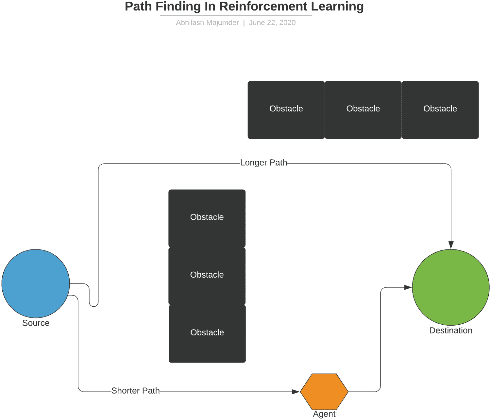

图 2-1

强化学习环境中的路径查找

当我们使用像 Bellman-Ford 这样的穷举搜索算法时，基于最优性的通用路径查找非常耗时。Bellman-Ford 算法可以从任何源点（或多个源点）到任何目标点（或多个目标点）确定最优轨迹，并考虑负权重边。这就是 Dijkstra、A*、B*和其他许多算法出现的地方，它们通过策略性地移除代理轨迹中的某些状态来避免次优路径。优化的度量可以包括权重最小化、时间最小化、奖励最大化以及其他策略，并且基于这些约束，不同的算法采用动态规划或启发式搜索来建模路径查找问题。在算法复杂度确定的背景下，我们使用 O()（大 O）作为复杂度分析的界限度量。如果我们考虑网格环境为图数据结构，其中节点代表状态，源点/目标节点提供，我们可以强调图中的顶点数用 V 表示，边数用 E 表示。在一般情况下，BFS 和 DFS 技术（基本搜索），时间复杂度可以看作是 O(|V| + |E|)，这是线性时间复杂度。这是因为贪婪穷举 BFS 算法依赖于在计算过程中选择所有的顶点 V 和边 E。对于最优性，不同的算法在运行时间复杂度方面将具有不同的 big-O()值，我们将在下一节中看到。这将与 Python 中实现的算法的运行时间相一致。在一般强化学习（RL）中，这些算法被用于机器人、自动驾驶汽车、自主搜索代理以及基于非玩家角色（NPC）导航的不同模拟。在这些情况下，RL 环境可能还涉及某些障碍或挑战，代理必须避免才能达到目标。这可能包括在网格中最短路径轨迹中的物理障碍，或者基于负奖励的虚拟障碍（n 维平面中的不同坐标，其中奖励为负），这可能会阻止代理进入特定的状态。第二个例子可能是一个机器人场景，其中当机器人代理试图远离目标时，它将获得负奖励。

## 路径查找算法

让我们尝试理解路径查找中涉及的不同算法。我们将开始强调算法实现，并观察这些算法的时间复杂度对比。最初，我们将从通用的穷举贪婪搜索算法开始，然后逐渐深入到 A*算法优化启发式家族的深处。

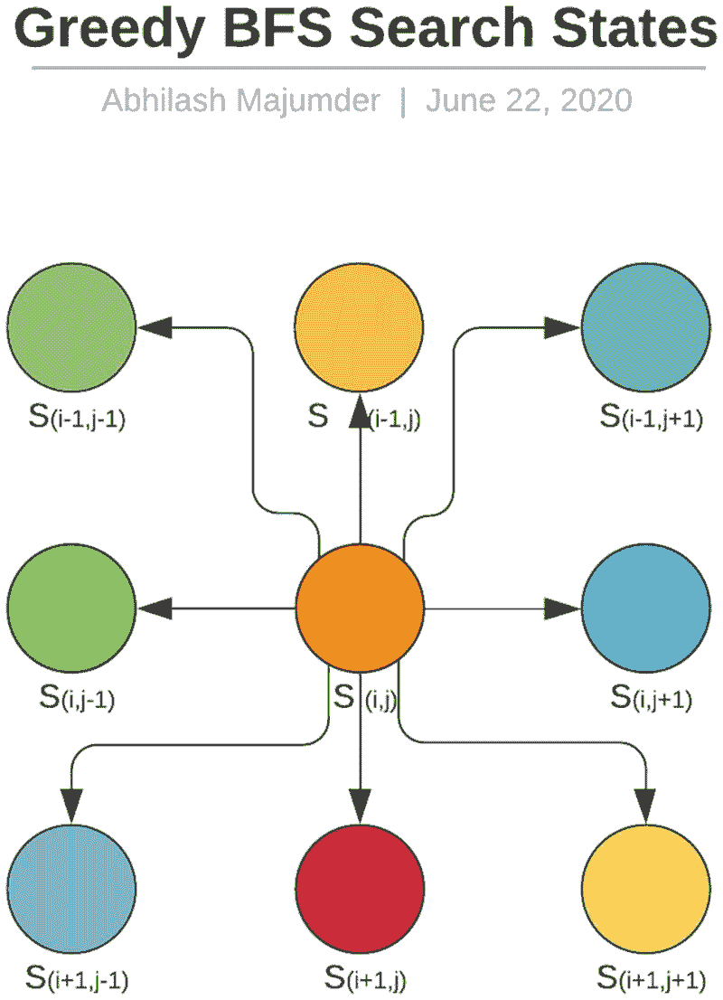

图 2-2

网格中的贪婪搜索状态空间

+   **贪婪算法**：这是一种穷举搜索技术，其中代理尝试探索所有可能的路径和状态，以选择一条最优路径到达目的地。我们考虑一个简化的网格世界环境，其中代理从一个特定的网格开始，必须以最优路径到达另一个网格；这为代理提供了八个方向的可移动状态，如前所述。由于它是一种穷举枚举技术，所有可能的状态都被探索，这与 BFS 或 DFS 算法非常相似。如果我们使用 BFS，这可以想象为一个代理从特定状态 S[i,j]选择所有可能的状态到 S[i,j+1]、S[i,j-1]、S[i+1,j]、S[i-1,j]、S[i+1,j+1]、S[i-1,j+1]、S[i+1,j-1]、S[i-1,j+1]。这可以在图 2-2 中可视化。

现在，让我们通过一个 Python 中的示例网格世界模拟来尝试理解贪婪算法的工作原理。我们创建了一个主要由 0 和 1 组成的简化网格世界，其中 0 是“可走”的网格，而 1 涉及有障碍的网格。代理提供了一个源网格和目标网格，并必须通过穷举搜索“可走”的网格来贪婪地搜索目的地。

打开 Jupyter 或 Colab 中的“Greedy.ipynb”笔记本，让我们查看此程序所需的导入。

```py
import numpy as np
import networkx as nx
import heapq
import sys
import time
```

我们需要`heapq`库，它实现了一个优先队列（最大堆数据结构），用于自动排序容器（数组、列表、元组），这在更新从特定状态或网格的最小距离时很有帮助。然后我们进入贪婪函数，这是搜索算法的主要部分。

```py
def Greedy(maze,src,dest):
pq=[(0,src)]
while (len(pq)>0):
dist_measure,node= heapq.heappop(pq)
#If destination is reached
if node==dest:
print("Reached")
break
```

源状态或网格（“src”）被插入到优先队列中，网格数据结构（元组）包含位置作为二维平面上特定网格的 x 和 y 位置的一个属性。搜索会继续，直到优先队列为空（BFS 工作原理的一个经典例子）。

初始时，我们检查从优先队列中提取的当前网格状态是否是目标网格状态（“dest”）。如果达到目的地，我们就会中断循环。

```py
#Look for child nodes (L,R,U,D,UL,UR,DL,DR)
for new_position in [(0, -1), (0, 1), (-1, 0), (1, 0), (-1, -1), (-1, 1), (1, -1), (1, 1)]:
new_node=(node[0] + new_position[0], node[1] + new_position[1])
#Check if new point is inside the maze
if new_node[0] > (len(maze) - 1) or new_node[0]  (len(maze[len(maze)-1]) -1) or new_node[1] < 0:
continue
#If not obstacle (maze index value==1)
if maze[new_node[0]][new_node[1]] != 0:
continue
#Update Distance
dist_temp=dist_measure+1
heapq.heappush(pq,(dist_temp,new_node))
path.append(new_node)
return path
```

在这段代码段中，我们遍历八个可能的可移动网格状态（上、下、左、右、左上、右上、左下、右下）并将网格位置添加到获取新的网格状态的位置。

由于贪婪算法是一种穷举搜索，它会将所有不同的网格位置重复多次以到达最终目的地。然后我们应用条件逻辑来检查迷宫或网格世界是否可走，通过阻止代理进入值为“1”的网格状态。我们还检查代理是否在迷宫或网格环境中，并且没有超出边界。然后我们将新的距离作为一个单位值添加，并将新的网格状态添加到优先队列中，以便根据位置距离再次对其进行排序。

Gridworld 或迷宫的实现如下：

```py
maze=[[0, 0, 0, 0, 1, 0, 0, 0, 0, 0],
[0, 0, 0, 0, 1, 0, 0, 0, 0, 0],
[0, 0, 0, 0, 1, 0, 0, 0, 0, 0],
[0, 0, 0, 0, 1, 0, 0, 0, 0, 0],
[0, 0, 0, 0, 1, 0, 0, 0, 0, 0],
[0, 0, 0, 0, 0, 0, 0, 0, 0, 0],
[0, 0, 0, 0, 1, 0, 0, 0, 0, 0],
[0, 0, 0, 0, 1, 0, 0, 0, 0, 0],
[0, 0, 0, 0, 1, 0, 0, 0, 0, 0],
[0, 0, 0, 0, 0, 0, 0, 0, 0, 0]]
```

主函数按照以下方式调用此特定迷宫或 GridWorld 上的 Greedy Search：

```py
src=(0,0)
dest=(7,6)
st=time.time()
path=Greedy(maze,src,dest)
print_path(path,dest)
et=time.time()
print("Time Taken for Computation of Greedy Path")
print(et-st)
```

这里源网格被选为(0, 0)，目的网格被选为(7, 6)；然而，这些可以根据我们的需求进行更改。然后调用 Greedy 函数，并使用 Python 的“time”库计算路径的计算时间。在 Notebook 中运行代码后，我们看到一系列不同的网格，其中智能体移动到(7, 6)。由于 Greedy 是穷举的，搜索次数可能会重复，路径可能会非常长。这可以与算法的巨大运行时间相关联，如图 2-3 所示。

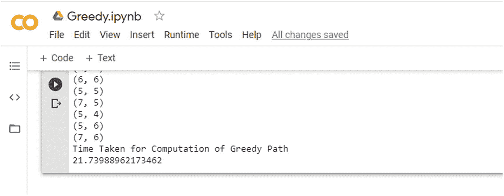

图 2-3

Greedy Search 算法的运行时间

由于时间复杂度相当大，我们尝试探索一个优化的、单源最短路径算法，称为 Dijkstra 算法。

+   **Dijkstra 算法**：Dijkstra 算法是一种基于图的算法，它提供了从源点到目的地的最优或最短路径。该算法通过重新排序距离度量来找到最优路径，路径长度的通用排序可以被认为是单调递增的。算法维护两个独立的列表，通常称为开放列表和关闭列表。开放列表包含当前正在使用相邻网格帮助分析的网格状态或节点。关闭列表包含已计算的网格状态。开放列表通过使用优先队列实现，该队列根据从源点到网格状态的排序非递减顺序存储网格状态。特别是，由于 Dijkstra 算法总是找到从源点到任何网格状态的最短路径，因此当网格状态是目的地时，算法停止。这条特定的路径是最优的，因为如果有任何其他“最优”路径，Dijkstra 算法会选择那条路径。这遵循图论中的一个一般引理，即如果存在从起点到目的节点之间的最优路径，那么该路径上的所有节点都将从起点或源节点具有最优距离。数学上，如果 U(s)是源节点，V(s)是目的节点，并且如果它们之间的路径是最优的，那么该路径上的任何节点 U1 也将从源节点具有最优距离。这可以推导如下：

V(s) = U(s) + d(u, v),

其中 V(s)是目的节点，U(s)是源节点，d(u, v)是节点之间的最优距离。然后对于路径上的任何点 U1：

V(s) = U(s) + d(u, u[1]) + U1 + d(u[1], v),

其中 d(u, u[1]) 是从源点 U(s) 到 U1 的距离，d(u[1], v) 是从 U1 到目的地 V(s) 的距离。因此，路径 d(u, u[1]) 是源点和节点 U1 之间的最优路径。这完成了证明。

Dijkstra 算法使用此原理来找到最优最短路径，并记录已访问的节点或网格状态，以避免回溯。然而，该算法适用于正权图和网格，并不提供负权边或网格路径的最优解（由 Bellman-Ford 解决）。算法存储每个网格状态或节点从源点或起始节点的距离，这通常是递增的顺序。这在图 2-4 中显示。

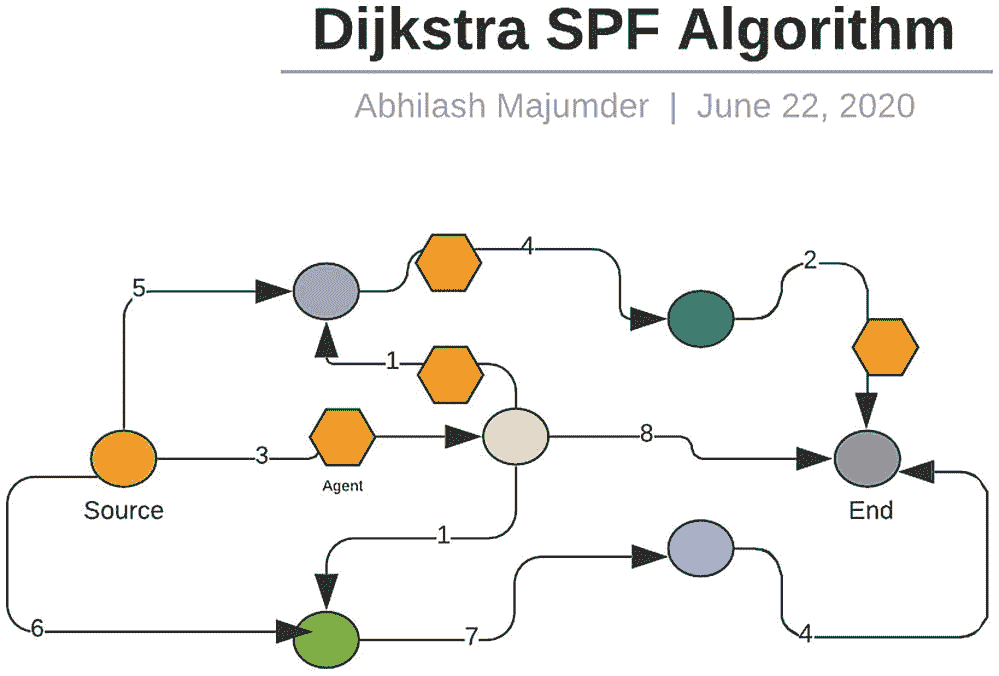

图 2-4

Dijkstra 最短路径优先算法

在图 2-4 中，智能体（橙色六边形形状）在图中找到源点（黄色圆形形状）和目的地（灰色圆形形状）之间的最短路径。

注意

Dijkstra 算法由计算机科学家 Edsger W. Dijkstra 在 1965 年设计。

“箭头”上的数字表示穿越该边的权重或成本（这可以与穿越该边所需的时间进行比较）。这个单向图有一个独特的最短路径，该路径的总成本为 10 个单位，由智能体显示。此路径也是从源点到该路径上任何节点的最短距离。我们可以尝试创建不同的图，然后应用 Dijkstra 算法，并始终检查证明的有效性。

现在我们已经涵盖了 Dijkstra 算法的重要方面，让我们尝试在 Python 中实现它，以便我们可以可视化算法的工作原理。在下一节中，我们将基于此算法广泛创建 Unity 项目，并创建一个使用此算法到达特定目的地的 AI 智能体。在 Jupyter 或 Colab 中打开“Dijkstra.ipynb”笔记本。代码库使用与之前相同的 GridWorld 环境（迷宫）的通用模板，我们将专注于实现逻辑的“dijkstra”函数。

我们将距离字典（包含两个实体 grid-Position.x 和 grid-Position.y）初始化为最大值，并使用该函数最小化此字典以获取最小距离。

```py
distance=dict()
#Initialization of Dictionary
# [(position.x,position.y),distance]
for i in range(0,9):
for j in range(0,9):
distance[(i,j)]=sys.maxsize
```

下一步是将起始网格或源网格包含在优先队列中，即我们的开放列表。只要优先队列中有元素（网格），这个循环就会继续。每个网格都是从优先队列或开放列表中提取出来的，并且用之前分配的距离来测量其距离。对于第一次迭代，因为我们包括了最大值的距离，所以新的值（1 个单位）小于距离，会替换它。对于后续步骤，基于相邻节点的不同距离计算，特定网格的这个距离值将会改变。如果距离大于之前观察到的值，则不会考虑它。如果当前网格是目的地，则循环中断，我们就以最小成本路径到达了目标网格。

这是通过以下几行代码实现的：

```py
def dijkstra(maze,src,dest):
pq=[(0,src)]
while(len(pq)>0):
dist_measure,node= heapq.heappop(pq)
#If distance of the node is greater
if(dist_measure>distance[(node[0],node[1])]):
continue
#If destination is reached
if node==dest:
print("Reached")
break
```

下一个部分处理的是沿着八个方向周围的网格或状态，以确定可能的下一个网格位置。我们假设所有方向上每个网格之间的距离为 1 个单位。我们检查八个可能的网格，并相应地更新新网格的位置；如果路径包含与之前情况类似的障碍物（标记为“1”），我们将避开这些网格。然后，我们将 1 个单位的成本值加到旧网格到新网格的距离上，并检查这个距离是否小于新网格当前的距离。如果满足最小性条件，我们将使用额外的值更新新网格的距离，并将其添加到优先队列或开放列表中，以便于下一个网格邻居。这个过程一直持续到达到目的地。一旦达到目的地，路径上的所有网格都将从起始网格或源网格具有最小成本。

```py
#Look for child nodes (L,R,U,D,UL,UR,DL,DR)
for new_position in [(0, -1), (0, 1), (-1, 0), (1, 0),
(-1, -1), (-1, 1), (1, -1), (1, 1)]:
new_node=(node[0] + new_position[0], node[1] +
new_position[1])
#Check if new point is inside the maze
if new_node[0] > (len(maze) - 1) or new_node[0]  (len(maze[len(maze)-1]) -1) or new_node[1] < 0:
continue
#If not obstacle (maze index value==1)
if maze[new_node[0]][new_node[1]] != 0:
continue
#Update Distance
dist_temp=dist_measure+1
if(dist_temp<distance[(new_node[0],new_node[1])]):
distance[(new_node[0],new_node[1])]=dist_temp
heapq.heappush(pq,(dist_temp,new_node))
path.append(new_node)
return path,distance
```

这是迪杰斯特拉算法的完整控制逻辑，我们将比较这个算法与之前创建的贪婪搜索算法的运行时间复杂度。运行此算法后，我们将看到与图 2-5 所示的运行时间相似。

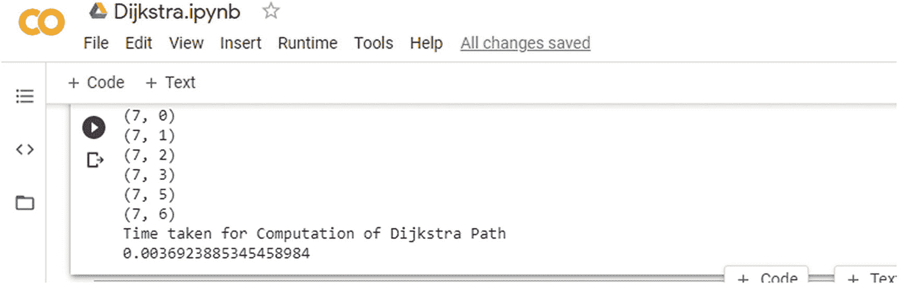

图 2-5

迪杰斯特拉算法的运行时间

在笔记本的下一个部分，我们将观察创建图和使用 Networkx 库在具有欧几里得距离作为成本度量标准的均匀加权图中创建迪杰斯特拉路径。Networkx 是一个包含与图遍历和最短路径查找（SPF）算法相关的多个算法的 Python 库，这里提供的只是一个使用其模拟迪杰斯特拉算法的示例。

```py
G=nx.grid_graph(dim=[4,5])
def eucli(a,b):
(x1,y1)=a
(x2,y2)=b
return ((x1-x2)**2 + (y1-y2)**2)**0.5
paths=nx.dijkstra_path(G,(1,2),(4,3))
print(paths)
path_length= nx.dijkstra_path_length(G,(1,2),(4,3))
print(path_length)
nx.draw_networkx(G)
```

此实现的模拟图看起来与图 2-6 所示的相似。

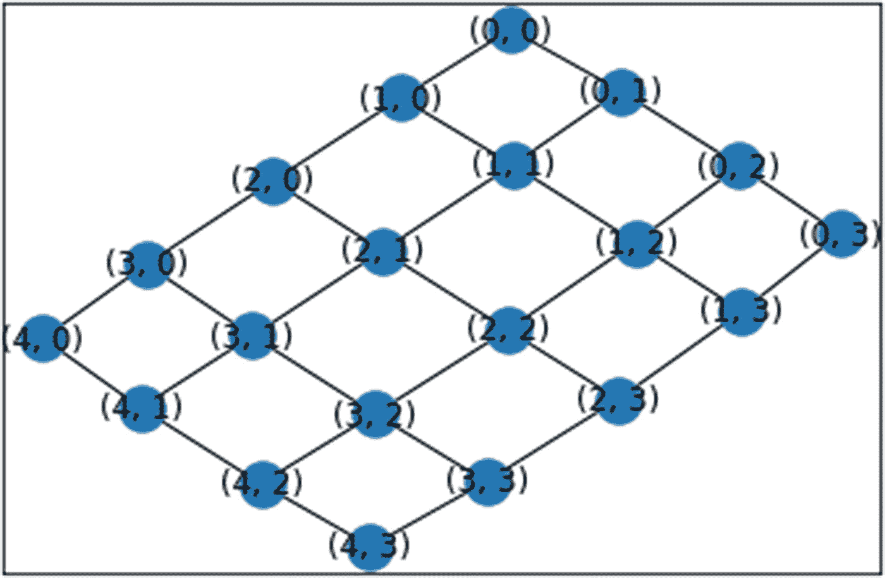

图 2-6

使用 Networkx 库可视化图

现在我们已经了解了迪杰斯特拉算法，我们将在下一节中创建一个在 Unity 中的相同模拟，其中 AI 代理尝试使用该算法达到目标。目前，我们将专注于被称为 A* 的不同类路径搜索算法的基本方面。当涉及到游戏、强化学习和机器人技术时，这是最重要的算法类别，因为它与迪杰斯特拉算法非常紧密相关，我们将了解差异以及算法的变体。

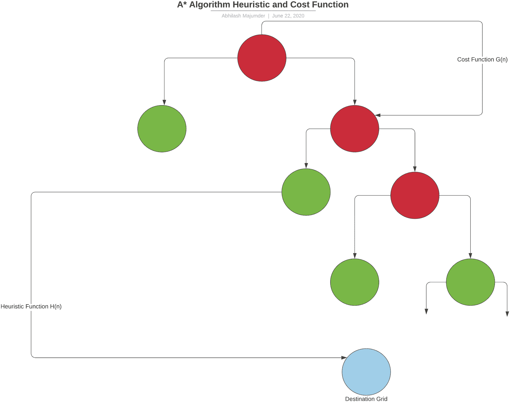

图 2-7

A*算法的启发式和成本函数

+   **A*算法**：A*是一种广泛用于游戏和模拟中的路径搜索算法，因为它具有计算灵活性、鲁棒性和最优性。然而，经典的 A*算法与存储先前网格或状态（图中的节点）的性质相关，其空间复杂度较高。A*的基本方面是其启发式性质。它结合了迪杰斯特拉算法使用的信息，涉及在最佳路径上优先考虑靠近目标网格或状态。算法使用启发式来排除某些网格或状态，这可能会增加路径的最优轨迹，并且只关注那些提供最低成本的州。这需要处理和存储网格信息，以其实际邻居的距离为依据。在 A* 中遵循某些重要的启发式，这依赖于每个网格或状态（节点）相关的权重。这可能包括从特定网格到目标的欧几里得距离或汉密尔顿距离度量。A*使用基于网格属性的优化策略。除了网格位置外，每个网格还有三个重要的属性：

    +   **g-Value:** 这是从起始网格或源到特定网格（节点）的路径成本。

    +   **h-Value:** 这是从当前网格到目标网格的启发式估计成本。

    +   **f-Value:** 这是特定网格（状态或节点）的 G-值和 H-值的总和。

    这可以数学上简化为：

    F(n) = G(n) + H(n)

    现在我们尝试理解启发式项在 A* 算法中为什么扮演着重要的角色。

    +   在一个极端情况下，如果 H(n) 的值为 0，那么 F(n) = G(n)。这意味着如果没有考虑启发式因素，A* 算法将简化为简化的迪杰斯特拉算法。

    +   如果 H(n) 的值始终小于从网格“n”移动到目标网格的成本，那么 A* 算法必然能找到最短路径。H(n) 的值越小，启发式越少，这意味着对更多不同网格的探索，这可能会导致更大的时间复杂度。

    +   如果 H(n)值等于从网格‘n’移动到目的地的成本，那么这总是 A*选择的最佳或最优路径。然而，这可以定义为 A*算法启发式提供与从网格到目的地优化路径的精确值作为特殊情况的定义。

    +   如果 H(n)值大于从网格‘n’移动到目的地的成本，那么就会在某个路径方向上进行探索。这将使 A*算法运行得更快，但会产生次优轨迹。

    +   在另一个极端情况下，如果 H(n)值大于 G(n)，那么 A*算法中只涉及启发式，这使得它与贪婪算法相似。

    +   通常，H(n)被选为可接受启发式函数，它从不高估实际成本。这使得启发式问题特定化。

    +   H(n)可以包括距离度量，如欧几里得距离、曼哈顿距离或平方欧几里得距离作为启发式度量。

    +   一致性或单调启发式是一种启发式方法，其中特定网格‘n’的值小于或等于该网格与下一个网格之间的距离以及下一个网格的启发式值，这表示为：

    H(n) ≤ d(n,n+1) + H(n+1)

    现在我们已经了解了启发式在 A*算法中的重要性，我们可以以树的形式可视化代理使用 A*的一般传播，如图 2-7 所示，其中红色节点表示网格的关闭列表，绿色节点在开放列表中。

让我们了解在 Python 中的实现细节，然后我们将模拟 Unity 中的 A*算法。在 Jupyter 或 Colab 中打开“A-star.ipynb”笔记本。我们将使用与所有之前 Python 搜索算法模拟相同的 GridWorld 模板，例如迷宫或 GridWorld 环境。在笔记本的开始处，我们初始化一个节点类，该类包含距离、以 x、y（在二维网格环境中）表示的位置，以及将在 A*算法中使用的 f-、g-和 h-值。

```py
class Node():
"""A node class for A* Pathfinding"""
def __init__(self, parent=None, position=None):
self.parent = parent
self.position = position
self.g = 0
self.h = 0
self.f = 0
def __eq__(self, other):
return self.position == other.position
```

下一个部分涉及实际的 A*算法。我们初始化两个列表，如前所述：开放列表和关闭列表。开放列表将包含所有当前正在分析的网格（节点），包括成本和启发式函数，而关闭列表则由已经分析的网格（节点）组成。

```py
def astar(maze, start, end):
"""Returns a list of tuples as a path from the given start to the given end in the given maze"""
# Create start and end node
start_node = Node(None, start)
start_node.g = start_node.h = start_node.f = 0
end_node = Node(None, end)
end_node.g = end_node.h = end_node.f = 0
# Initialize both open and closed list
open_list = []
closed_list = []
# Add the start node
open_list.append(start_node)
```

我们将源网格包含在优先队列或开放列表中。源网格和目标网格的 f-、g- 和 h- 值都初始化为 0。在循环内部，我们将提取每个网格。然后，我们将提取的网格（节点）的 f- 值与开放列表中网格的 f- 值进行比较。如果提取的网格的值更大，那么我们将它分配给开放列表中 f- 值小于提取网格的网格。我们将提取的网格从开放列表中弹出并添加到封闭列表中。如果提取的当前网格是目标网格，则搜索终止，变量“路径”包含从源到目标的最优路径。

```py
while len(open_list) > 0:
# Get the current node
current_node = open_list[0]
current_index = 0
for index, item in enumerate(open_list):
if item.f < current_node.f:
current_node = item
current_index = index
# Pop current off open list, add to closed list
open_list.pop(current_index)
closed_list.append(current_node)
# Found the goal
if current_node == end_node:
path = []
current = current_node
while current is not None:
path.append(current.position)
current = current.parent
return path[::-1] # Return reversed path
```

然后，我们创建一个子网格列表或邻居列表，其中启发式算法将计算网格到目标点的欧几里得距离。像之前一样，我们分析特定网格的八个方向的状态空间，并确保它是“可走的”（网格值不是 1）并且它位于迷宫或 GridWorld 环境内。然后我们将新的网格添加到子网格列表中。

```py
# Generate children
children = []
for new_position in [(0, -1), (0, 1), (-1, 0), (1, 0),
(-1, -1), (-1, 1), (1, -1), (1, 1)]: # Adjacent squares
# Get node position
node_position = (current_node.position[0]
+new_position[0], current_node.position[1]
+new_position[1])
# Make sure within range
if node_position[0] > (len(maze) - 1) or
node_position[0]  (len(maze[len(maze)-1]) -1) or
node_position[1] < 0:
continue
# Make sure walkable terrain
if maze[node_position[0]][node_position[1]] != 0:
continue
# Create new node
new_node = Node(current_node, node_position)
# Append
children.append(new_node)
```

下一步是计算 f-、g- 和 h- 值。首先检查子网格列表中的子网格是否已经在封闭列表中，如果是，则忽略它。我们将 1 单位作为距离成本 G（子网格；就像在 Dijkstra 算法中一样），因为我们认为每个网格之间的距离是 1 单位。然后，我们根据当前子网格和目标网格的 x 和 y 坐标的欧几里得平方距离来计算 H（子网格）值以获得启发式值。最后，我们将这两个值相加得到 F（子网格）值。如果当前网格在开放列表中，我们检查 G（子网格）值是否小于开放列表中网格的 g- 值。如果当前子网格的 g- 值更大，则我们不考虑它，因为我们需要最小成本值或优化成本值。最后，我们将子网格添加到优先队列或开放列表中，以便进行下一次迭代。整个工作流程在以下代码行中给出：

```py
# Loop through children
for child in children:
# Child is on the closed list
for closed_child in closed_list:
if child == closed_child:
continue
# Create the f, g, and h values
child.g = current_node.g + 1
child.h = ((child.position[0]
- end_node.position[0]) ** 2)
+ ((child.position[1] –
end_node.position[1]) ** 2)
child.f = child.g + child.h
# Child is already in the open list
for open_node in open_list:
if child == open_node
and child.g > open_node.g:
continue
# Add the child to the open list
open_list.append(child)
```

这就是 A* 算法的实现，如果我们运行这个模拟，我们将能够看到算法遵循的路径以及算法的运行时间，类似于图 2-8 所示。

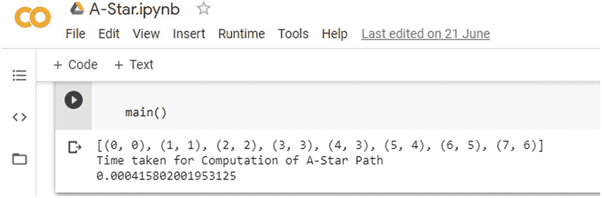

图 2-8

A* 算法的运行时间

一旦我们熟悉了算法的实现和工作流程，我们就可以尝试 Networkx 库的 A* 实现，该实现也已包含在同一笔记本中，供感兴趣的读者参考。

当我们使用 Unity 创建模拟时，我们将使用此算法，然后我们将看到 A*算法如何尝试使用此算法找到最优路径。我们详细讨论了经典的 A*算法，并且有许多 A*算法的变体我们将要查看。这些变化基于不同的启发式和算法修改，权衡了内存优化和时间优化。我们将在未来的 A*算法课程中使用相同的迷宫模板。

注意

A*算法是由 N.J.尼尔森（N.J. Nilsson）、P.E.哈特（P.E. Hart）和 B.拉斐尔（B. Raphael）提出的。

## A*算法的变体

我们讨论了 A*算法的细节，但有许多修改通过不同的方法来增加内存优化或减少时间复杂度。一些最流行的算法实现包括：

+   **动态加权 A*算法** **:** 这是一种经典的 A*算法的加权版本。权重被赋予 A*优化函数的启发式部分。这样做是因为在探索的开始阶段，我们通常需要一个更强的启发式来探索更多的网格（节点）以找到最优路径。随着代理接近目标网格，启发式需要最小化，以便达到到达目标的实际成本。这种降低每个网格传播到目标处的启发式权重的过程称为动态加权 A*。通用的公式如下所示：

    F(n) = G(n) + w(n) * H(n),

    其中 F(n)、G(n)、H(n)具有它们通常的含义，而 w(n)是动态权重部分。让我们尝试在我们的 Python 笔记本中可视化其在迷宫环境中的实现。打开“DynamicA-star.ipynb”笔记本，我们可以观察到节点类中有一个权重属性。

    ```py
    #Dynamic-A-Star Algorithm for Pathfinding
    import time
    class Node():
    def __init__(self, parent=None, position=None):
    self.parent = parent
    self.position = position
    self.g = 0
    self.h = 0
    self.f = 0
    self.w=1
    def __eq__(self, other):
    return self.position == other.position
    ```

    由于我们使用与 A*算法相同的源模板，因此在“dynamicastar”函数中只有细微的变化。我们初始化权重衰减，即衰减因子，随着搜索向目标继续进行。这种衰减对于减少启发式估计是必要的。

```py
def dynamicastar(maze, start, end):
weight_decay=0.99
```

下一个部分的大部分内容与 A*算法类似，涉及将起始网格放入开放列表，然后迭代直到开放列表不为空。然后我们抽象出八个方向上的子网格，并检查其距离，是否“可通行”以及是否在迷宫内。唯一的区别在于成本函数，如下所示：

```py
# Create the f, g, and h values
child.g = current_node.g + 1
#Compute distance towards end for dynamic weightmapping
child.h = ((child.position[0] - end_node.position[0]) **   2) + ((child.position[1] - end_node.position[1]) ** 2)
src_dest=((start_node.position[0]-end_node.position[0])**2) + ((start_node.position[1]-end_node.position[1])**2)
child.w= child.w*weight_decay*(child.h/src_dest)
child.f = child.g + child.w*child.h
```

我们首先记录实际成本 G（子网格）和启发式估计 H（子网格）的值，然后通过将搜索深度与衰减因子相乘来更新 W（子网格）因子。搜索深度表示代理在搜索轨迹上访问网格的距离。最后，我们使用动态加权 A* 的方程更新 F（子网格）值。其余的代码段与 A* 相同，包括更新封闭列表并将子网格添加到开放列表以进行下一次迭代。运行代码后，我们可以得到算法所需时间的估计，如图 2-9 所示。

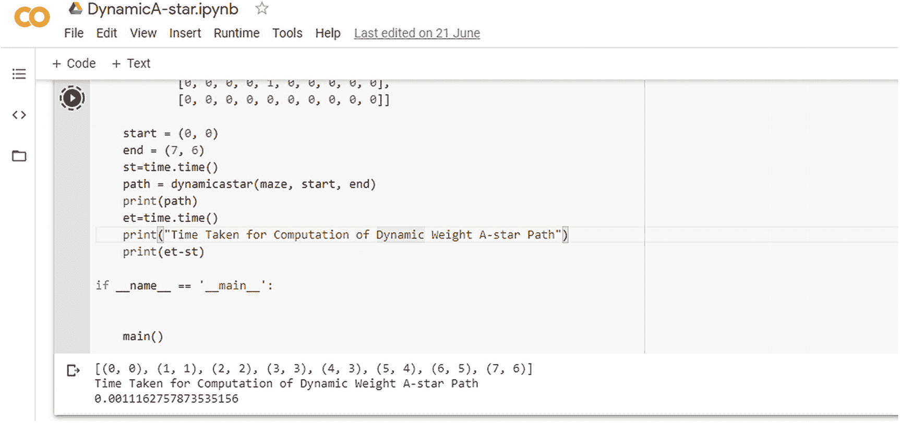

图 2-9

动态加权 A* 算法的运行时间

+   **迭代加深 A* (IDA*) 算法**：这是 A* 算法的另一种变体，它强调内存优化并执行递归。IDA* 算法的关键特性是它不像 A* 算法那样记录已访问的节点（开放列表）。相反，当达到具有更高 f 分数的新的网格节点时，它会从起点重新迭代网格节点。该算法使用一个阈值值，如果特定网格的 f 分数大于阈值，算法将从头开始再次从起点到新网格（新深度）重新开始。实现时需要一个无限循环，因为我们每次达到更高的 F（网格）值时都会递归跟踪网格节点。在递归阶段，每当达到更高的 F（网格）值时，启发式估计不会沿着该网格节点探索（因为它不太可能位于最优轨迹上），而是存储 F（网格）值。递归返回最小的 F（网格）值分数，将其设置为新的阈值，因为 f 值的减少意味着向目标的最优轨迹。让我们在笔记本中探索这个算法的一个变体。打开“IDA-star.ipynb”笔记本，我们只关注代码更改，因为正在使用相同的迷宫模板。节点类与 A* 节点类相同，具有 F(n)、G(n)、H(n)、位置和距离属性。唯一的不同之处在于“idastar”函数，其中有一个无限循环。我们最初将阈值值设置为从起点网格到目标网格的最大平方欧几里得距离或深度，即：

```py
threshold=((start_node.position[0]-
end_node.position[0])**2) + ((start_node.position[1]-
end_node.position[1])**2)
```

在无限循环内部，我们观察到大部分操作都是相同的，因为会创建一个新的子网格列表，并且对于每个新的子网格，都会探索所有可能的八个方向。不同之处在于每个子网格的成本估计更新规则。

```py
child.g = current_node.g + 1
child.h = ((child.position[0] - end_node.position[0]) ** 2) + ((child.position[1] - end_node.position[1]) ** 2)
child.f = child.g + child.h
if(child.f<threshold):
#Restart again from the start to the path of the child node
current_node=child
#check if child node is end node
if(child==end_node):
break
```

如果条件验证当前子网格 F (child) 值是否小于阈值，如果是，则子网格成为下一个要分析的网格。这是一种最小化技术，强调在所有子网格中选择最低可能的 F (child) 值作为新的阈值。同样，一旦子网格与目标网格相同，我们就中断。我们可以运行此程序以生成算法的运行时间效率。由于此算法中没有内存，路径可能包含多个重复的网格节点，这对于在游戏中和模拟中，为每个非玩家角色 (NPC) 分配内存成本高昂的场景来说是非常有用的。在单个 NPC 或机器人学的情况下，此算法可能无法提供适当的解决方案，因为迭代提供了时间开销。IDA* 的复杂度主要依赖于路径的深度，并且像 A* 一样返回最优路径，前提是启发式函数是可接受的（即 h 值不高估真实成本）。图 2-10 展示了算法的运行时间。

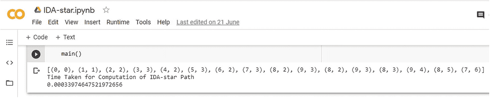

图 2-10

IDA* 算法的运行时间

+   **终身规划 A* (LPA*) 算法** **:** 该算法是一种增量 A* 算法，最适合动态图或动态强化学习环境。它最常用于游戏和模拟中，在这些场景中不需要重新计算整个网格或图节点。在动态环境中更新最优轨迹需要某些额外的组件。LPA* 算法维护一个前驱和后继网格节点的列表。这有助于在动态改变位于最优路径上的周围网格时更新特定网格节点的邻居。网格节点 n 的前驱是任何有边指向 n 的网格节点。网格节点 n 的后继是从 n 出发的边的终点。网格节点还有一个称为 Rhs (节点) 的属性。这个值是基于最小化 G (节点) 值的展望值，可以表示为：

    Rhs(Node) = minimum(G(node[1]) + d(node, node[1])),

    其中 d(node, node[1]) 是网格 N=node 和 node[1] 之间的距离，其中前者是后者的前驱。

    这是一个重要因素，因为如果 Rhs (n) 等于 G(n)，则网格 n 在局部上是自洽的。如果所有网格都是局部自洽的，那么在这些网格之间就隐含了一个最优轨迹。实际上，成本方程也发生了变化，是最小化以下属性：

    F(n) = minimum(( minimum ( G(n), Rhs(n)) + H(n) ), (minimum(G(n), Rhs(n))),

    其中符号具有其通常的含义。

    这种优化方法有一定的优势，因为每个网格节点在每个算法迭代中最多被访问两次。由于优先队列或开放列表包含一组更大的属性，因此这种数据结构的实现决定了算法的运行时间。网格节点以单调递增的方式扩展，并且不会探索局部不一致的节点。由于它基于 A*算法，启发式函数应该是可接受的，并且在动态图变化环境中，LPA*优于 A*算法。我们将简要概述算法的工作原理以及它在大多数用于动态强化学习环境的游戏引擎和模拟中的实现。打开“LPA-star.ipynb”笔记本，观察节点类中的变化。

    ```py
    class Node():
    """A node class for LPA* Pathfinding"""
    def __init__(self, parent=None, position=None):
    self.parent = parent
    self.position = position
    self.g = 0
    self.h = 0
    self.f = 0
    self.rhs=0
    def __eq__(self, other):
    return self.position == other.position
    ```

    已将 Rhs(n)前瞻属性添加到节点类中。我们创建了前驱和后继列表，如下所示：

    predecessor_list=[]

```py
successor_list=[]
```

“lpastar”函数的其余部分几乎与之前的算法相似，唯一的区别是，在探索八个方向中的每个子网格时，它们会按照以下方式进入后继列表：

```py
new_node = Node(current_node, node_position)
successor_list.append(new_node)
```

接下来，我们将转向成本更新方法，并尝试了解后继节点成本是如何更新的。我们更新当前子网格的 G(n)和 H(n)值。然后，更新子网格的 Rhs(n)值为 G(n)值与子网格前驱到网格的距离之和。

```py
child.g = current_node.g + 1
child.h = ((child.position[0] - end_node.position[0]) ** 2) + ((child.position[1] - end_node.position[1]) ** 2)
for i in range(len(children)):
if children[i]==child:
break
#Do rhs calculation
child.rhs= child.g + children[i-1].h
if child.rhs<child.g:
child.g=child.rhs
```

下一步涉及更新子节点的后继网格节点。这是通过使用“update_successor”函数来完成的，该函数使用前驱网格节点 G(n)和 H(n)之和与后继网格节点的 Rhs(n)之间的最小值来更新后继网格节点的 Rhs(n)值。如果后继网格已经在开放列表中，则从列表中删除。如果后继的 G(n)和 Rhs(n)值不匹配，我们根据 LPA*的成本最小化方程设置 F(n)。此函数更新所有后继网格节点，以具有最小成本值，以便探索继续沿着局部一致的后继网格节点进行。

```py
def update_successor(predecessor_list,successor,
successor_list,open_list,src):
for pred in predecessor_list:
successor.rhs=min(successor.rhs,pred.g+ pred.h)
if successor!=src:
successor.rhs=sys.maxsize
if successor in open_list:
open_list.remove(successor)
if successor.g!=successor.rhs:
successor.f=  min(min(child.g,child.rhs)
+ child.h,child.g + child.h)
open_list.append(successor)
```

在更新完子网格的所有后继网格节点后，根据以下方程更新当前子网格的 F(n)值：

```py
child.f = min(min(child.g,child.rhs) + child.h,child.g + child.h)
```

该算法在通用路径查找 AI 的任何模拟引擎中都有广泛的应用。原因可以归因于当网格环境变化时，F(n)、G(n)、H(n)和 Rhs(n)值的快速更新。这在动态环境中非常实用，在牺牲更多内存消耗的情况下，可以返回更快的最优轨迹。我们可以在笔记本或 Colab 中运行此代码，以检查算法的运行时间，如图 2-11 所示。

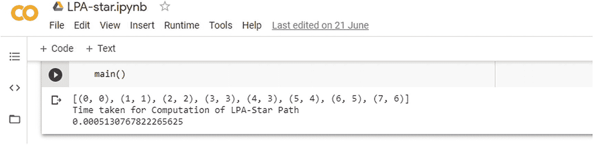

图 2-11

LPA*算法的运行时间

+   **D* (D-star)算法** **:** 这是 A*的另一种变体，它在经典 A*算法方面以类似的方式操作。此算法有三个变体：

    +   经典 D*算法

    +   聚焦 D*算法

    +   D* lite

    为了简化，我们将理解经典的 D*算法，因为聚焦 D*算法基于此并添加了某些启发式方法。D* lite 是之前提到的 LPA*算法的一种修改。此算法也有一个开放列表和一个关闭列表。除此之外，还需要两个属性：提升和降低。网格的提升属性表示其 F(n)值高于上次访问时的值。网格的降低属性表示当前 F(n)值低于上次访问网格节点时的值。在“扩展”阶段或路径探索阶段，算法将网格更新到开放列表，并更新所有相邻网格节点的变化。与 A*的主要区别在于，A*会选择从源网格到目标网格的最优路径，而 D*则从目标网格开始反向搜索。这可以通过每个网格节点在内存中都有一个回指来实现，它可以存储路径中的前一个网格。当遇到障碍时，当前网格节点的 F(n)值会提升。这反过来又提升了所有相邻网格节点的 F(n)值。当提升的网格节点可以通过选择另一条轨迹（另一个相邻网格）来降低时，这种变化也会反向传播到所有之前提升的相邻网格节点。这被认为是增量搜索的另一种变体，并在游戏和模拟中被广泛使用。我们可以尝试使用我们的 Python 笔记本来理解 D*算法的简化版本。在 Jupyter 或 Colab 中打开“D-star.ipynb”笔记本。由于大部分代码与 A*相似，我们只需考虑重要的部分。我们有类似的节点类初始化，在“dstar”函数中，我们有开放列表、关闭列表以及后继和前驱列表。最重要的方面是当子网格节点遇到障碍并调用“is_raise”函数时，基于迄今为止观察到的最小 F(n)值来最小化子网格节点的 F(n)值。

```py
#Raise Function for neighbouring successor nodes
def is_raise(children,child_node,mini):
if child_node.f < mini:
mini=child_node.f
return child_node
```

下一步是检查网格的开放列表，看是否有任何 F(n)值高于当前子网格的 F(n)值。这意味着开放列表中的网格节点遇到了障碍，并提升了所有节点的 F(n)值。因此需要降低。

```py
#Recalculate distance based on the Raise value of node
for open_node in open_list:
if child == open_node and child.g > open_node.g:
continue
if(open_node.f>child.f):
open_node=child
open_list.append(child)
```

一旦我们理解了 D*算法的这种简化版本，我们就可以检查该算法的运行时间。聚焦 D*算法依赖于提升和降低属性的启发式估计。运行时间的预览如图 2-12 所示。

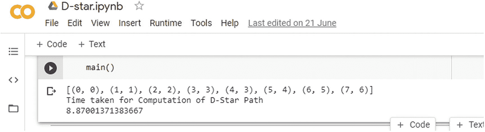

图 2-12

D*算法的运行时间

+   **B*（B-星）算法** **:** 这是一种最佳优先搜索算法，也是 A*算法的另一种变体。这种搜索的概念依赖于证明或反驳通过特定网格节点的路径是否是最佳路径。B*算法的功能类似于深度优先搜索树，它从根节点延伸到叶子节点，要么证明要么反驳。这使探索局限于网格节点，在这些节点上有可能生成最佳路径。这种方法通过创建一个最佳轨迹的网格节点子空间来微调 A*算法，而不是迭代所有等可能的节点。B*使用区间评估和启发式估计。该算法通过选择基于其 F(n)值上下限的节点来执行。这是一个相当简单的算法，所以让我们尝试在“B-star.ipynb”笔记本中理解其实现。在大多数代码段中，它们几乎相似，只是在“bstar”函数中，我们使用 Python 提供的最低最小值初始化最小值。

```py
mini=sys.maxsize
```

在沿着八个方向的子网格节点循环中，我们看到在 F(n)更新函数之后，我们比较所有子网格节点中的“mini”值（下限），并使用该下限最小值更新子网格节点的 F(n)值。这确保了探索继续沿着正确的子网格节点。

```py
child.f = child.g + child.h
if(child.f open_node.g:
continue
# Add the child to the open list
open_list.append(child)
```

我们可以运行此代码，并获得此算法的运行时间，如图 2-13 所示。

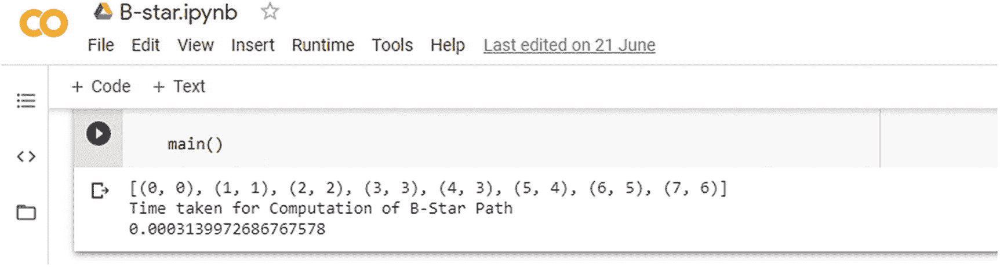

图 2-13

B*算法的运行时间

+   **简单记忆限制 A*（SMA*）算法** **:** 这是一种 A*算法的另一种算法变体，其中它沿着最有利的网格节点扩展，并剪枝非有利节点。如果允许的内存足以存储模拟的浅版本，则它是完全最优的。在给定的内存空间中，此算法比大多数 A*变体提供更好的解决方案。它不会重新访问旧的网格节点。类似于 A*，扩展会继续，同时考虑 F(n)启发式。最简单地说，这可以被视为带有剪枝的 B*算法的记忆限制版本。如果提供足够的内存，此算法将最佳优化内存。在“SMA-star.ipynb”笔记本中提供了一个包括 B*与 LPA*组合的 SMA*算法变体。由于代码已经被讨论过，我们将只通过 LPA*和内存优化 B*的链接进行说明。

```py
child.rhs= child.g + children[i-1].h
if child.rhs<child.g:
child.g=child.rhs
#Update the successor nodes in the path
for successor in successor_list:
update_successor(predecessor_list,successor,
successor_list,open_list)
```

这是更新后继者的 LPA*变体，以下代码段是 B*变体。

```py
child.f = child.g + child.h
if(child.f open_node.g:
continue
# Add the child to the open list
open_list.append(child)
```

运行此代码段为我们提供了路径以及运行时间，如图 2-14 所示。

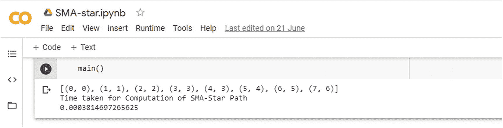

图 2-14

SMA*算法的运行时间

## 路径查找的其他变体

到目前为止，我们已经熟悉了通用路径查找中的启发式估计。这些算法在多个模拟引擎和游戏引擎中内部实现，并在启发式路径查找领域得到最广泛的应用。还有其他算法变体，如这里列出的。

+   **跳跃搜索算法** **:** 一种修改后的 A*算法，其中代理可以从一个网格跳到另一个网格以获得最佳路径。这可以理解为：不是选择相隔 1 个单位的八个可能方向，而是考虑相隔 2 个或 3 个单位的八个或更多方向。这大大增加了搜索空间，并在游戏中使用。

+   **Alpha-Beta 剪枝算法** **:** 在博弈论（两人零和博弈）中使用的经典算法，其中一个代理必须以牺牲另一个代理为代价最大化其奖励。该算法试图构建一个最小-最大树——一个最大化一个代理的奖励并最小化另一个代理的奖励的树。

+   **分支定界法** **:** 这是一种经典的算法，涉及生成所有可能状态的搜索树。这是一种用于组合优化问题的穷举搜索算法。

+   **贝尔曼-福特算法** **:** 一种涉及图中负权重的迪杰斯特拉算法变体和多源最短路径。

我们已经尝试理解所有路径查找算法和游戏中涉及的优化技术的变体。A*路径查找变体的详细描述是理解 Unity 游戏引擎内部如何优化搜索和 AI 路径查找的基本方面。虽然我们提供了启发式算法不同变体的 Python 实现，但现在我们将关注使用 Dijkstra 和 A*算法模拟 Unity 游戏。由于 A*被认为是游戏中的原始启发式算法，我们将尝试在 Unity 中理解和构建一个 A*搜索环境。稍后，我们将关注 Unity 中的导航网格并使用基于 NPC 的路径查找构建敌人 AI。

## Unity 中的路径查找

在本节中，我们将尝试在 Unity 中模拟 Dijkstra 和 A*算法，其中 AI 代理试图到达目标。由于我们已经理解了 Dijkstra 算法的工作原理，我们将研究 Unity 的模拟。

### Unity 中的 Dijkstra 算法

我们必须下载“DeepLearning”Unity 文件夹（来自与本书相关的 GitHub 项目），并且我们将使用这个文件夹来完成所有我们的项目。下载完成后，我们将打开“Assets”文件夹，并导航到“HeuristicPathfinding”文件夹。这个文件夹包含了 Dijkstra 和 A*算法模拟的设置场景。在 Unity 编辑器中打开“DijkstraAgent”场景文件。模拟的概念是让紫色代理立方体通过最低成本路径到达绿色目标立方体。路径中的障碍物由白色立方体块表示。我们将从我们在 Python 实现的 Dijkstra 算法中创建的 GridWorld 或 menvironment 中绘制我们的类比。模拟的平台或平面被划分为网格（如 Unity 场景中所示）。这些网格紧密排列形成一个迷宫（网格矩阵）。迷宫的尺寸是 6X6，其中我们在水平和垂直方向上有六个网格。像之前一样，对于可走的网格，我们将网格的值初始化为 0，而对于不可走的网格（有障碍物的网格），我们初始化一个值为 1 的值。我们将 Unity 场景转换为 Python 的迷宫模拟，通过将网格分配给平台，将障碍物作为白色立方体，将目标作为目标网格。场景的预览如图 2-15 所示。

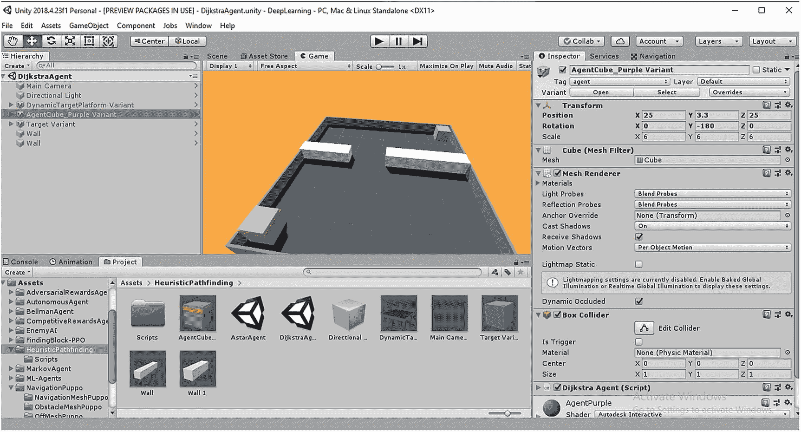

图 2-15

Unity 编辑器中的 Dijkstra 算法场景

让我们尝试理解这个模拟的源代码是如何工作的。打开“Scripts”文件夹，打开“DijkstraAgent.cs” C# 脚本。由于我们将尝试实现 Python 代码段的 C#版本，我们将通过某些数据结构和集合（容器）。我们首先初始化“Pair”类，这对于存储网格平台的 x 和 y 坐标很有用（因为它是一个 2D 平台）。这将有助于用 0 和 1 值填充矩阵或网格平台，根据网格是否可通行。一个网格坐标表示为一个包含 x 和 y 坐标的元组或容器，例如(0,0)，表示起始网格节点。同样，我们有目标网格节点为(5,5)，表示平台的右上角。网格平台矩阵的编号从 0 到 5（从左到右）在特定行中，对于每一列从 0 到 5（从下到上）。因此，代理立方体放置的左下角坐标的网格位置坐标为(0,0)，x 和 y 值，而目标代理位于位置(5,5)。障碍物可以表示为左侧的网格位置[(0,3), (1,3)]和右侧的[(3,3), (4,3), (5,3)]之间，只允许通过(2,3)网格位置。这是根据我们的规则实现的，即编号从左到右，从下到上。一旦我们能够将网格平台的结构映射到 Unity 场景和迷宫环境中，我们就可以创建类。

```py
public class Pair
{
public Pair()
{
}
public Pair(T first, U second)
{
this.First = first;
this.Second = second;
}
public T First { get; set; }
public U Second { get; set; }
};
```

我们转向主类“DijkstraAgent”，并初始化变量，如代理 GameObject、目标 GameObject、平台的网格矩阵以及字典，它将矩阵索引映射到网格变换位置，以及堆或优先队列数据结构的实现，这在网格距离排序中被广泛使用。

```py
float[][] grid;
Dictionary dictionary;
public GameObject agent;
public GameObject target;
Transform agent_transform;
Transform target_transform;
List, float>> heapq;
```

和之前一样，在 start 方法中，我们使用标签初始化我们的 GameObject，并根据矩阵网格坐标填充字典中的网格变换值。我们用 0 初始化网格矩阵，用 1 表示障碍物，并创建了一个堆数据结构（优先队列）的对象。然后，我们将协程函数作为单独的线程调用以启动模拟。这可以按以下方式实现：

```py
agent = GameObject.FindWithTag("agent");
target = GameObject.FindWithTag("target");
agent_transform = agent.GetComponent();
target_transform = target.GetComponent();
dictionary = new Dictionary();
dictionary.Add(-25f, 0);
dictionary.Add(-15f, 1);
dictionary.Add(-5f, 2);
dictionary.Add(5f, 3);
dictionary.Add(15f, 4);
dictionary.Add(25f, 5);
//sample states (-25,-15,-5,5,15,25 for x and y axes)
grid = create_mat(6);
for (int i = 0; i , float>>();
StartCoroutine(executeDijkstra(grid, dictionary, heapq, agent_transform, target_transform));
```

在这个案例中，我们实现了一个多线程模拟，因为协程调用“executedijkstra”枚举方法，该方法反过来将变量传递给另一个名为“dijkstra”的协程。这就是控制逻辑实现的地方，并创建了一个路径容器，用于存储代理所跟随路径上的网格的 x 和 y 坐标位置。

```py
private IEnumerator executeDijkstra(float[][] grid, Dictionary dictionary, List, float>> heapq,Transform agent_transform, Transform target_transform)
{
yield return new WaitForSeconds(2f);
List> path = new List
>();
yield return StartCoroutine(dijkstra(grid,
dictionary, heapq, agent_transform,
target_transform,   path));
}
```

在“dijkstra”方法中，我们首先创建一个名为“distance”的集合或容器。这个容器包含网格的 x 和 y 坐标以及一个表示该特定网格节点与源网格节点距离的浮点值。我们使用网格矩阵的值初始化这个“distance”容器，网格矩阵代表网格变换位置（其中 grid.x = 0 和 grid.y = 0 表示平台上的坐标(0,0)或起始网格）。在这种情况下，我们将目标手动放置在平台矩阵上的网格位置(5,5)。因此，我们有源位置(0,0)的代理立方体和目标位置(5,5)的目标立方体。我们通过遵循我们的平台规则初始化平台。

```py
List, float>> distance = new List, float>>();
for (int i = 0; i  ps = new Pair();
ps.First = i;
ps.Second = j;
distance.Add(new Pair, float>(ps, float.MaxValue));
}
}
```

一旦我们构建了“distance”容器，我们创建另一个名为“states”的位置容器，这在考虑特定网格节点的八个网格节点时将非常有用（类似于 Python 程序中的子网格）。我们创建源和目标网格，并分配其位置值，除了源节点外；所有其他网格节点的初始值都设置为系统的最大浮点值。这类似于我们在 Dijkstra 中使用的方法，因为我们必须根据最小化算法更新权重。然后我们将源节点分配到优先队列或堆中。

```py
Pair src = new Pair();
src.First = 0;
src.Second = 0;
Pair dest = new Pair();
dest.First = 5;
dest.Second = 5;
heapq.Add(new Pair, float>(src, 0f));
List> states = new List>();
states.Add(new Pair(0, -1));
states.Add(new Pair(0, 1));
states.Add(new Pair(-1, 0));
states.Add(new Pair(1, 0));
states.Add(new Pair(-1, -1));
states.Add(new Pair(-1, 1));
states.Add(new Pair(1, -1));
states.Add(new Pair(1, 1));
```

下一个部分是运行循环，直到优先队列为空。我们从队列顶部提取网格节点，然后检查网格的距离值是否小于之前观察到的相同网格的距离值。在第一次迭代中，由于所有网格距离值都初始化为 float.MaxValue（最大浮点值），它将被替换。我们不考虑当前网格距离是否超过相同网格的先前距离值，并且如果目的地和当前网格位置相同，我们退出循环。这是在经典的 Dijkstra Python 源代码中实现的相同算法工作流程。

```py
while (heapq.Count > 0)
{
float dist = 0f;
Pair coord = new Pair();
foreach (Pair, float> kv in heapq)
{
dist = kv.Second;
coord = kv.First;
break;
}
path.Add(coord);
Debug.Log("heapsize");
Debug.Log(heapq.Count);
heapq.RemoveAt(0);
float dist_measure = 0f;
foreach (Pair, float> kw in distance)
{
Pair old_coord = kw.First;
if (old_coord == coord)
{
dist_measure = kw.Second;
break;
}
}
```

下一个部分类似于检查当前网格的八个方向上的网格，并添加新的网格位置。然后我们检查新的位置是否在网格平台上，以及它是否可通行（值不为 1）。我们将 5.0f 的浮点值添加到新的网格距离中。然后我们检查更新后的网格距离值是否小于之前观察到的值。如果值更小，我们更新当前网格距离的距离值，并将新的子网格添加到优先队列和路径容器中。这个操作类似于 Python 笔记本中的子网格更新代码段。

```py
Debug.Log("inside the loop");
foreach (Pair sample_pair in states)
{
Debug.Log("inside the loop");
Pair new_coord = new Pair();
new_coord.First = coord.First + sample_pair.First;
new_coord.Second = coord.Second + sample_pair.Second;
int l = new_coord.First;
int r = new_coord.Second;
Debug.Log("inside the loop");
if (l  5 || r  5)
{
Debug.Log("Checking neighbours");
continue;
}
if (grid[l][r] == 1)
{
Debug.Log("notwalkable");
continue;
}
float temp_dist = dist_measure + 5f;
float dx = 0f;
Pair ps = new Pair();
ps = new_coord;
foreach (Pair, float> ds in distance)
{
if (ps.First == ds.First.First
&&  ps.Second==ds.First.Second)
{
Debug.Log("changing the  values");
dx = ds.Second;
if (dx > temp_dist)
{
Debug.Log("changing values");
ds.Second = dx;
#Add to heap
heapq.Add(new Pair,
float>(ds.First, ds.Second));
#Add the node to the path
path.Add(new Pair(ds.First.First, ds.First.Second));
}
break;
}
}
}
```

在 Unity 模拟中可视化这一点，在“dijkstra”函数完成后，并且填充了路径容器，该容器包含从源到目的地的路径上网格的(x, y)坐标，将调用另一个 Coroutine。 “move_agent”Coroutine 相当简单，因为它从路径容器中检索每个网格坐标(x, y)，然后使用字典映射该特定坐标的 transform 位置。然后根据字典中 Dijkstra 路径上网格的 transform 值更新代理的 transform。

```py
foreach (Pair ps in path)
{
int l = ps.First;
int r = ps.Second;
//Debug.Log(path.Count);
Debug.Log("grid values");
Debug.Log(l);
Debug.Log(r);
float x_vector = 0f;
float z_vector = 0f;
foreach (KeyValuePair kv in dictionary)
{
if (kv.Value == l)
{
x_vector = kv.Key;
}
if (kv.Value == r)
{
z_vector = kv.Key;
}
Debug.Log("Dictionary Values");
Debug.Log(kv.Value);
agent_transform.position = new
Vector3(x_vector,
agent_transform.position.y, z_vector);
yield return new WaitForSeconds(1f);
}
}
```

这完成了 Unity 中路径查找的 Dijkstra 算法的整个模拟代码段。在我们对代码的分析感到满意后，我们可以在 Unity 编辑器中尝试运行它。我们将观察到，对于每个迭代，代理立方体通过不同的网格到达目标。我们允许代理根据 Dijkstra 优化做出的每个决策等待 1 秒钟。我们还可以进入 DeepLearning 根文件夹下的环境文件夹，运行涉及 Dijkstra 算法的 Unity 可执行模拟。这为读者提供了一个粗略的模板，并且可以使用这个模板实现不同的图搜索算法。在下一部分，我们将考虑经典 A*算法的实现。由于我们现在已经熟悉了原始算法以及我们在本节中创建的 Unity 迷宫环境，因此理解 Unity 中的 A*模拟概念将相对容易。我们将使用专门的节点类来存储 F、G、H 值，就像算法中一样，并使用组合集合容器根据启发式估计和最小化成本函数来更新这些值。图 2-16 提供了场景的表示。

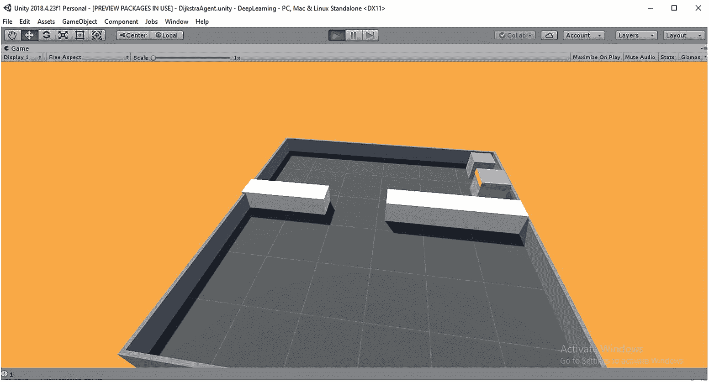

图 2-16

沿着 Dijkstra 路径跟随目标立方体的代理

### Unity 中的 A*算法模拟

让我们在相同的 Unity 迷宫环境或网格环境中创建 A*模拟。我们有与 Unity 场景相同的架构，代理和目标分别在(0, 0)和(5, 5)。图 2-17 提供了场景的视图。

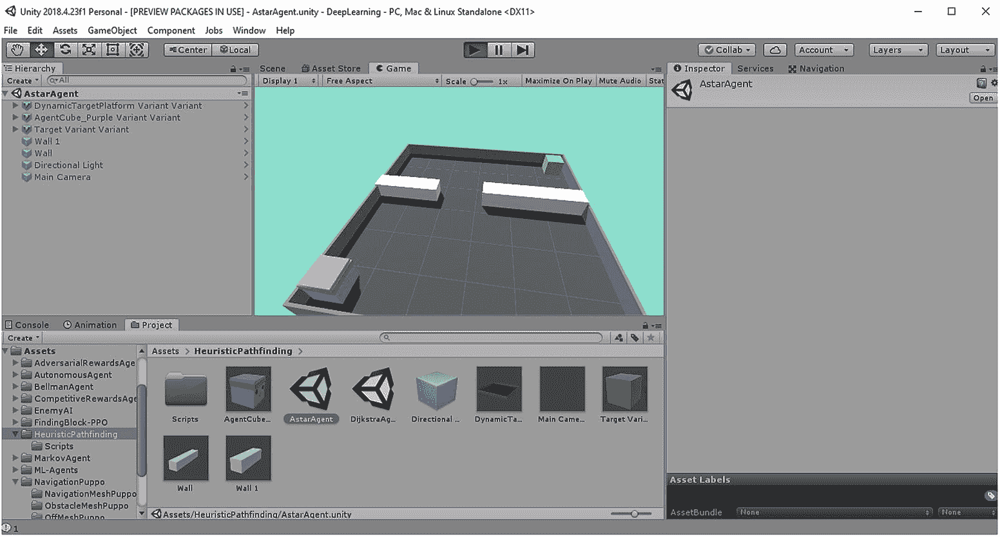

图 2-17

A*算法模拟 Unity 场景

由于我们已经提到了 Dijkstra 中模拟的工作流程，因此在这个算法中也遵循了类似的流程。最初我们创建了一个包含 F、G、H 值的节点类。

```py
public class Node
{
public float f = 0f;
public float g = 0f;
public float h = 0f;
public Node()
{
}
public Node(T f, U g, V h)
{
this.F = f;
this.G = g;
this.H = h;
}
public T F { get; set; }
public U G { get; set; }
public V H { get; set; }
}
```

在 monobehavior 类下，我们有与代理的 transform、目标 transform 以及字典类似的变量。由于现在我们必须考虑几个属性以最小化距离以获得最佳轨迹，因此优先队列的数据结构发生了变化。因此，堆或优先队列（在 A*算法中是开放列表）中的每个实体都将是一个不同容器的复合集合。

```py
float[][] grid;
Dictionary dictionary;
public GameObject agent;
public GameObject target;
Transform agent_transform;
Transform target_transform;
List, Node>
, float>> heapq;
//SortedDictionary> heapq;
// Start is called before the first frame update
List, Node>
, float>> closed_list;
```

开放列表堆中的每个网格节点实体都有一个位置坐标(x, y；由 Pair<int, int>给出)，随后是网格节点(F, G, H)和从起始节点的距离。因此，单个网格节点包含的信息发生了显著变化。与 Dijkstra 算法不同，它包含位置、节点属性和距离。此起始方法包含网格平台和 GameObjects 字典的类似实现和初始化。唯一增加的是开放列表（堆）和封闭列表复合容器，如下所示：

```py
heapq = new List,
Node>, float>>();
closed_list = new List,
Node>, float>>();
StartCoroutine(executeAstar(grid, dictionary,
heapq,  closed_list, agent_transform, target_transform));
```

然后，我们转到 Coroutine “executeAstar”，在那里调用另一个 Coroutine“Astar”，它实现了原始算法，并初始化路径容器并将其作为参数传递，类似于 Dijkstra 算法。

```py
yield return new WaitForSeconds(2f);
List> path = new List>();
yield return StartCoroutine(Astar(grid, dictionary, heapq, closed_list, agent_transform, target_transform, path));
```

在“Astar”函数内部，我们初始化距离容器，该容器包含网格节点位置坐标(x, y)和从起始节点的距离。我们还有一个类似的“状态”容器，其中包含每个网格节点八个可能的子网格节点位置坐标列表。我们最初将起始网格和结束网格的 F, G, H 值设置为 0。起始网格的位置坐标初始化为(0, 0)，目标网格的位置坐标为(5, 5)。起始网格的距离初始化为 0，所有其他网格初始化为 float.MaxValue，类似于 Dijkstra 算法。

然后，我们将起始网格节点添加到开放列表、优先队列或堆中。

```py
Pair src = new Pair();
src.First = 0;
src.Second = 0;
Pair dest = new Pair();
dest.First = 5;
dest.Second = 5;
Node src_node = new Node
();
Node dest_node = new Node
();
src_node.F = src_node.G = src_node.H = 0f;
dest_node.F = dest_node.G = dest_node.H = 0f;
Pair,
Node>  pair_dest =
new Pair, Node>
(dest, dest_node);
Pair,
Node> pair_src = new Pair
, Node>
(src,  src_node);
heapq.Add(new Pair,
Node>, float>(pair_src, 0f));
```

然后，只要开放列表不为空，我们就迭代并逐个提取一个网格节点。我们检查提取的网格节点的 F 值是否大于开放列表中其他网格节点的 F 值。一旦找到 F 值小于当前网格节点的网格节点，我们就将节点属性(F, G, H)分配给当前网格节点。如果当前网格节点是目标节点，我们终止过程并提供路径。

```py
Pair, Node> current_node = new Pair, Node>(coord, var_node);
Pair, Node>, float> current_sample = new Pair, Node>, float>(current_node, dist);
foreach (Pair, Node>, float> kv in heapq)
{
var_node = kv.First.Second;
Node cur_node = new
Node();
cur_node = current_node.Second;
if (var_node.F < cur_node.F)
{
cur_node.F = var_node.F;
cur_node.G = var_node.G;
cur_node.H = var_node.H;
current_node.Second = cur_node;
}
}
path.Add(coord);
if (current_sample.First.First == pair_dest.First)
{
Debug.Log("Found");
break;
}
```

在下一个部分中，我们遍历八个相邻的网格，并验证新网格位置是否位于网格或迷宫平台上，以及它是否“可通行”（值不为 1），类似于 Dijkstra 算法。然后，像 Dijkstra 算法一样，我们将新子网格的距离增加 5 个单位，并比较这是否是最小距离值，并将其添加到开放列表。这是距离更新的标准成本函数，类似于 Dijkstra 算法。

```py
List, Node>, float>> children_list = new List, Node>, float>>();
foreach (Pair sample_pair in states)
{
Debug.Log("inside the loop");
Pair new_coord = new Pair();
new_coord.First = coord.First + sample_pair.First;
new_coord.Second = coord.Second + sample_pair.Second;
int l = new_coord.First;
int r = new_coord.Second;
if (l  5 || r  5)
{
Debug.Log("Checking neighbours");
continue;
}
if (grid[l][r] == 1)
{
Debug.Log("notwalkable");
continue;
}
```

然后我们比较子网格的距离度量，如下所示：

```py
float temp_dist = dist_measure + 5f;
float dx = 0f;
Pair ps = new Pair();
ps = new_coord;
Node temp_node = new
Node(0f, 0f, 0f);
Pair,
Node>, float> new_node = new
Pair, Node>
, float>();
foreach (Pair, float> ds in distance)
{
if (ps.First == ds.First.First &&
ps.Second == ds.First.Second)
{
Debug.Log("changing the  values");
dx = ds.Second;
if (dx > temp_dist)
{
ds.Second = dx;
Pair,
Node> temp_n =
new Pair,
Node>
(ds.First, temp_node);
new_node = new
Pair,
Node>, float>
(temp_n, ds.Second);
children_list.Add(new_node);
}
break;
}
}
}
```

在当前子网格节点的下一步，我们检查它是否存在于关闭列表中。如果当前子网格节点是关闭列表的一部分，则不进行分析。下一步是更新 A*算法的最小化函数。我们通过添加一个浮点值 5 来更新基于距离成本 G 的值。然后，我们通过比较当前子网格到目标网格节点的平方欧几里得距离来更新启发式估计值 H。最后，我们将成本函数 G 的结果和启发式 H 估计值结合起来得到 F 值。这是 A*算法的标准启发式更新规则，如 Python 实现中所述。这可以通过以下行观察到。

```py
foreach (Pair, Node>, float> child in children_list)
{
#Check in closed list
foreach (Pair,
Node>, float> closed_child
in closed_list)
{
if (closed_child.First == child.First
&& closed_child.Second == child.Second)
{
continue;
}
}
#Update G,H, and F values
Pair,
Node>, float> var_test =
new Pair, Node>
, float>();
var_test = child;
Pair, Node> dc =
new Pair, Node>();
dc = var_test.First;
dc.Second.G = dc.Second.G + 5f;
Pair dist_pt = new Pair();
dist_pt = dc.First;
float end_cur_dist = ((5f - dist_pt.First) *
(5f - dist_pt.First)) + ((5f - dist_pt.Second) *
(5f - dist_pt.First));
dc.Second.H = end_cur_dist;
dc.Second.F = dc.Second.G + dc.Second.H;
var_test.First = dc;
```

如果网格节点的 G 成本大于开放列表中网格节点的 G 成本，我们也会忽略该网格节点。如果所有条件都通过，我们将这个子网格节点添加到开放列表中，以便进行下一次迭代。

```py
foreach (Pair, Node>, float> open_node in heapq)
{
if (var_test.First == open_node.First
&& var_test.Second == open_node.Second
&& var_test.First.Second.G > open_node.First.Second.G)
{
continue;
}
}
heapq.Add(var_test);
}
```

这是在 Unity 中 A*算法的完整实现。然后我们在“move_agent”Coroutine 中传递路径容器，就像在 Dijkstra 算法中一样，这样代理变换就可以沿着最优路径上的网格变换进行。我们可以在 Unity 编辑器中运行这段代码，并检查代理的运动路径。图 2-18 展示了 A*算法的工作表示。

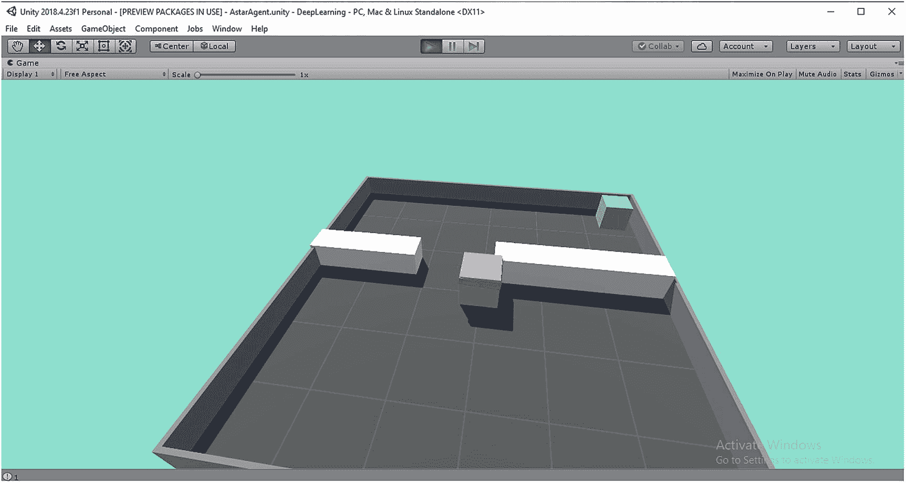

图 2-18

代理沿着 A*优化的路径向目标移动

到目前为止，我们对游戏引擎和仿真引擎内部路径查找算法的构建有了相当的了解。感兴趣的读者可以使用这些模板来构建他们自己的高效路径查找算法，这些算法属于 A*类别。理解这些算法的核心概念对于理解 Unity 的导航系统如何工作非常重要，我们将在下一节中关注导航网格和敌人 AI。

## 导航网格

导航网格被认为是控制代理可以行走和使用的优化路径查找算法以到达目标的网格。通常这些是凸多边形的集合，将区域划分为小三角形（最简单的多边形），代理可以在其中行走。通常在基于 AI 的导航中，这些是通过包含网格信息的数据结构来创建的，例如特定平台或模型的顶点和边数。简单来说，如果我们把“可行走”的区域划分为更小的三角形网格，我们可以将代理视为三角形内部的一个点，目标视为另一个在远处三角形中的点。现在的任务是找到这两个三角形之间的优化路径，其中使用了 A*算法等。由于导航网格也可以包含环境中各种障碍物，这些障碍物被认为是源点到目的地路径中某些三角形内的独立点。当代理或代理点接近包含障碍物点的三角形附近时，它根据距离测量判断出沿该路径发生碰撞的可能性很大。因此，避免了碰撞检测。由于在大多数情况下，这些三角形网格保持静态，导航网格在关卡设计中用于提供代理可以穿越的区域。然而，我们也可以创建动态导航网格，这些网格根据障碍物和可行走路径的性质而变化。由于我们将三角形视为通用网格数据结构中的基本组件，我们可以泛定义网格为沿 x、y 和 z 轴的三点的组合。有两种不同的方式将不同的三角形（多边形）链接起来以创建复合区域网格。

+   **三角形网格的边共享**：一个三角形网格的公共边与另一个相邻网格共享。

+   **三角形网格的顶点共享**：这包括拥有一个连接两个（两个）三角形网格的公共顶点。

凸复合导航网格可以由不同的形状组成，例如矩形或菱形，但任何复合凸网格的基本部分是一个三角形。通常为了降低复杂游戏场景中的细节级别（LOD），导航网格会以一个大矩形或凸多边形的形式显示，而不是单独的三角形，以减少渲染时的计算成本。图 2-19 所示的插图试图传达关于导航网格中路径查找的信息。导航网格的每个网格由两个三角形（黄色和黑色）组成。由于网格形状类似于矩形，每个矩形由两个三角形组成，它们是任何多边形的基本构建块。网格上的源网格点是蓝色圆圈，目的地是绿色圆圈。中心网格有一个障碍物（标记为红色）。我们可以看到，网格中的大多数网格都是由共享边的三角形组成的，除了障碍物左侧的一个网格。这个网格通过两个三角形之间的顶点共享模式连接。当代理遇到障碍物时，它会通过顶点共享模式连接的对角线网格重新定向。这就是代理如何重新规划其路径以避开包含网格的障碍物。箭头符号表示代理的运动方向。

注意

导航网格的概念始于 20 世纪 80 年代，当时主要用于机器人和游戏，被称为“草地地图”。

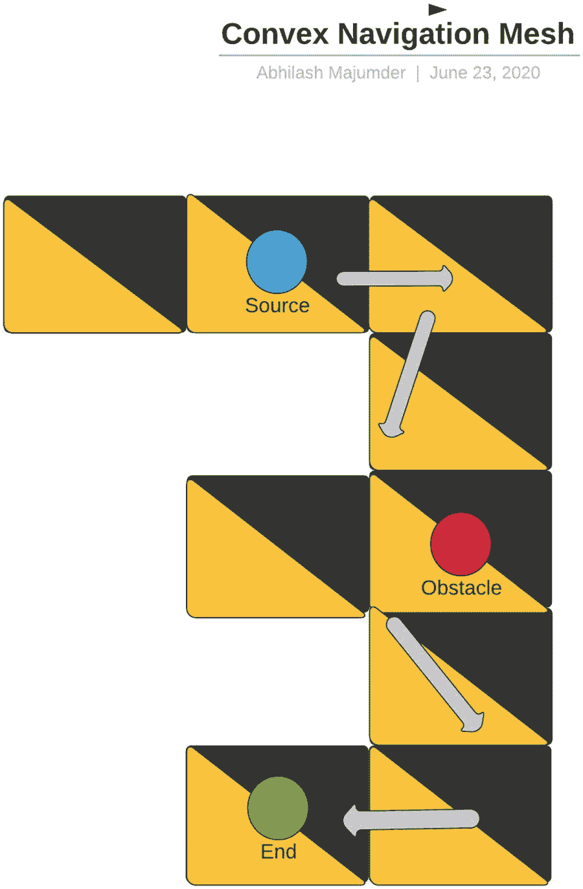

图 2-19

导航网格中的路径查找

在下一节中，我们将看到如何使用 Unity 引擎的 AI 模块在 Unity 中创建导航网格。我们将帮助我们的 Puppo 通过导航网格中的路径查找来收集木棍。

### 导航网格与 Puppo

打开“DeepLearning”根文件夹，导航到“environments。”然后导航到“NavigationPuppo”Unity 可执行文件。运行模拟或游戏。我们可以看到，如果我们点击绿色区域（平台）的任何地方，Puppo 会立即前往该位置。这是一个 AI 代理试图从当前位置找到我们屏幕上指出的位置的优化路径的例子。无论我们在地面上点击哪里，我们都会看到 Puppo 前往那个特定位置。图 2-20 提供了 Puppo 场景的视图。


图 2-20

使用 Unity 导航网格的导航 Puppo 场景

让我们尝试创建这个模拟游戏。打开 Assets 文件夹中的“NavigationPuppo”文件夹，然后点击“NavigationMeshPuppo”场景。在 Unity 中，我们可以非常快速地创建导航网格。我们可以进入 Unity 编辑器中的 Windows 选项卡，然后选择 AI。在 AI 中，我们有“Navigation”选项。这使我们能够使用 UnityEngine.NavMesh 组件，并将我们的强化学习平台环境转换为导航网格。因此，在 Unity 场景中添加导航组件的一般方法是遵循 **Windows ➤ AI ➤ Navigation**。这可以在图 2-21 中显示。

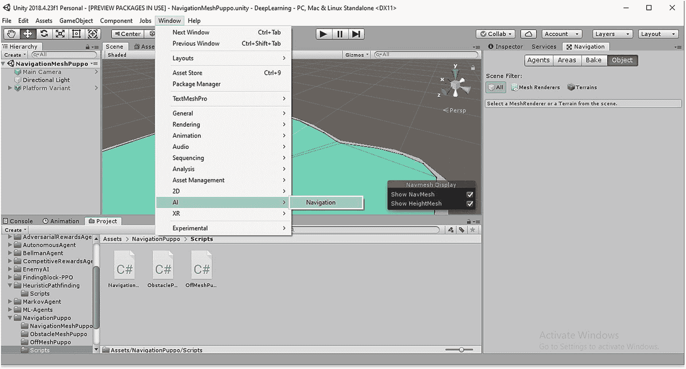

图 2-21

选择导航组件

然后我们选择我们想要导航网格出现的地形或地面环境。这个过程在 Unity 中被称为 NavMesh Baking。NavMesh Baking 过程收集所有标记为导航静态的凸多边形的渲染网格。这意味着导航网格将在环境中保持静态。在场景中选择“平台变体”后，我们转到检查器窗口中的导航选项卡（如图 2-21 右侧所示）并点击烘焙。导航网格随后以蓝色覆盖层的形式出现在地面平台上，如图 2-22 所示。导航选项卡下有四个主要子选项卡，我们将分别探讨这些子选项卡。

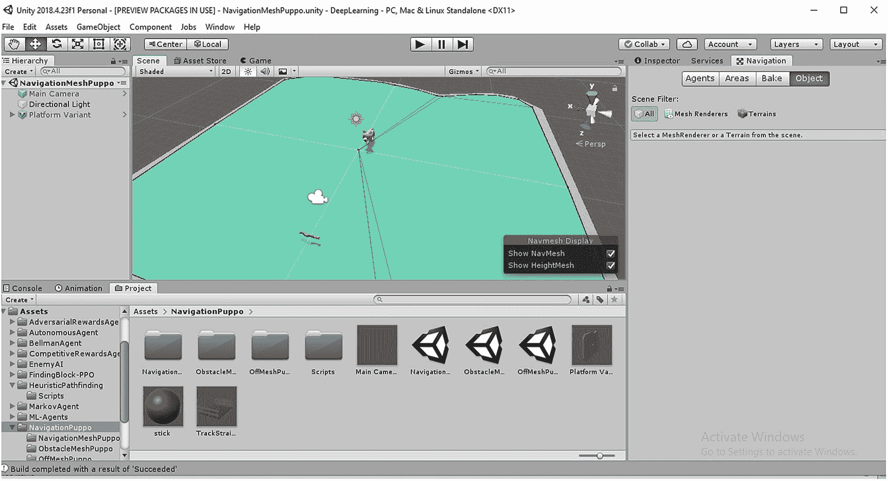

图 2-22

地面平台变为蓝色，表示导航网格创建

然后我们探索导航选项卡下放置的四个选项卡的详细信息。这里讨论了四个主要子选项卡。

+   **代理**：此选项卡包含代理类型，通常默认为人形。它还包括半径、高度、步高和最大坡度。

    +   **半径**：表示围绕代理的圆柱形碰撞器的半径

    +   **高度**：表示代理的高度

    +   **步高**：确定代理在运动过程中步子的高度

    +   **最大坡度**：代理在环境中可以检测和穿越的允许角度

代理选项卡可以像图 2-23 所示那样进行视觉观察和更改。当我们将 Puppo 分配为导航网格代理（NavMesh 代理）时，这是必需的。

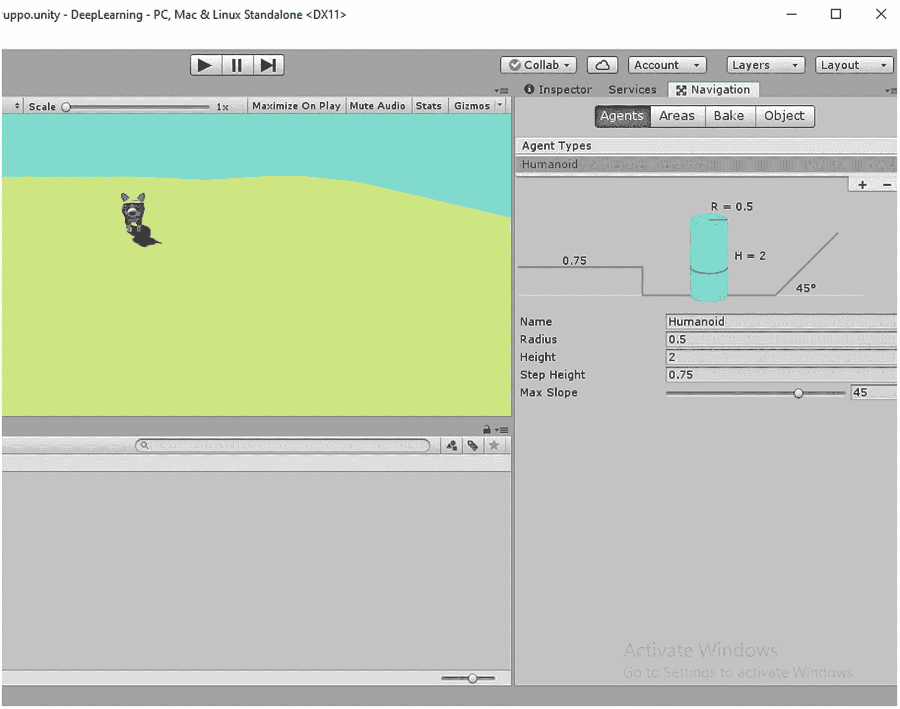

图 2-23

在检查器窗口下的导航选项卡中的“代理”选项卡

+   **区域:** 此选项卡专注于导航网格的不同部分。正如我们所观察到的，我们可以看到两个平行的选项卡，“名称”和“成本”。如果我们为代理创建一个多样化的环境，其中某些地形部分可以是水性的或泥泞的，而其他部分可以是平坦的，这将很有用。我们可以将不同的成本关联到以它们的名称突出显示的不同网格部分。由于 Unity 引擎内部使用 A*算法，成本因子决定了最小化函数的实际成本，这在之前的章节中已经看到，用 G(n)值表示。成本越高，代理沿着路径移动就越困难，因为根据我们对 A*的讨论，G(n)的较低值始终被考虑（开放列表）。从视觉上，这可以如图 2-24 所示。

    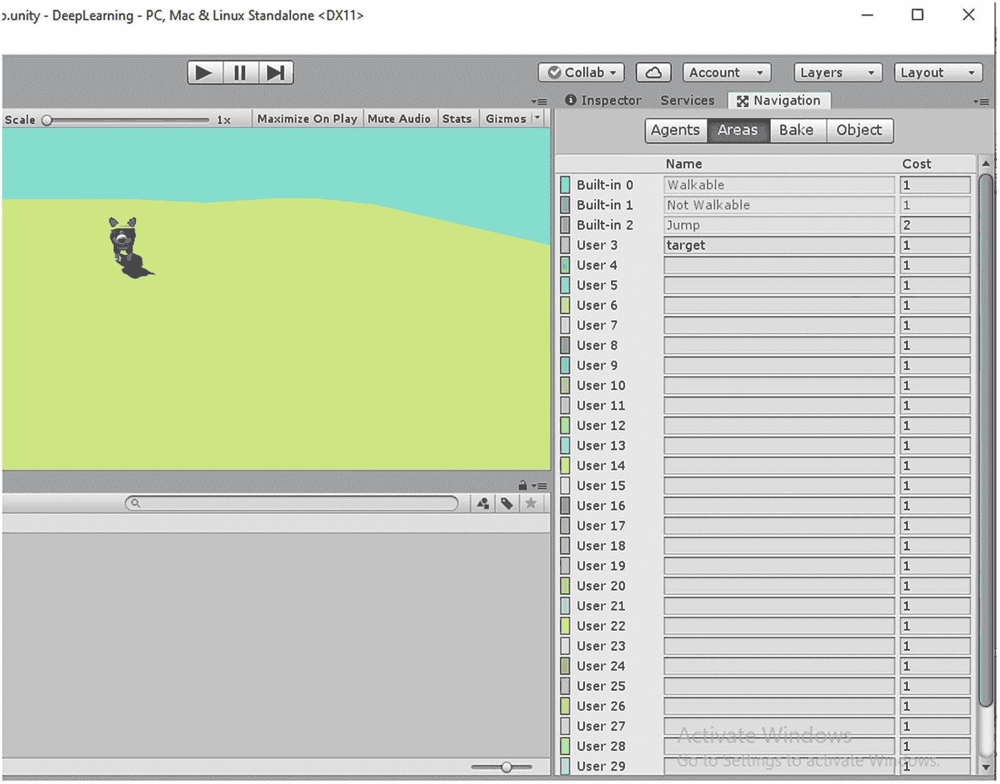

    图 2-24

    在检查器窗口中的导航选项卡下的“区域”选项卡

+   **烘焙:** 此选项卡控制导航网格的烘焙。烘焙意味着将地面平面网格与凸多边形导航网格拟合。拟合的准确性可能取决于“烘焙”选项卡下包含的几个因素：

    +   **代理半径:** 围绕代理的圆柱形碰撞器，决定了代理可以靠近墙壁或障碍物的距离

    +   **代理高度:** 决定了代理可以使用的空间以到达目的地

    +   **最大坡度:** 地面地形最大的倾斜度，以便代理可以爬上去

    +   **步高:** 代理可以踏上的障碍物的高度

        我们在“烘焙”选项卡下还有额外的设置，包括离网链接。我们将在下一节讨论离网链接时探讨这一点。

    +   **下降高度:** 这是代理在通过离网链接从一个导航网格移动到另一个导航网格时可以下降的最大高度

    +   **跳跃距离:** 代理在跨越离网链接到达相邻导航网格时可以跳过的最大距离。

        在“烘焙”选项卡下有一些高级设置，如图 2-25 所示，包括：

    +   **手动体素大小:** 这允许我们更改烘焙过程的精度。体素化是一个将屏幕光栅化并构建导航网格以最佳拟合任意级别几何形状的过程。体素大小决定了导航网格拟合场景几何形状的精度。默认值设置为每个代理半径 3 个体素（直径=6 个体素）。我们可以手动更改此值，在烘焙速度和精度之间进行权衡。

    +   **最小区域面积:** 这允许我们剔除导航网格上不直接连接的较小区域。总面积小于最小区域面积的表面将被移除。

    +   **高度网格:** 地形上方的导航网格的高度。

        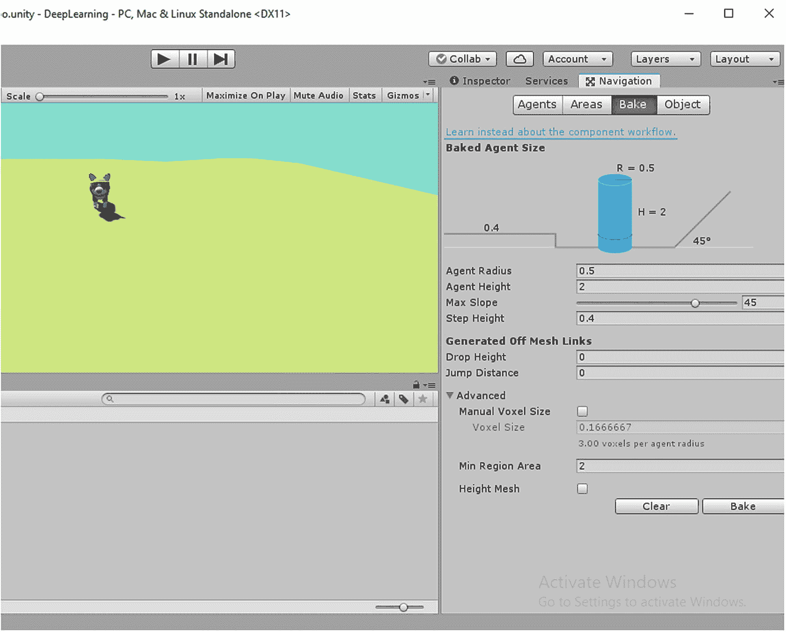

        图 2-25

        在检查器窗口中的导航选项卡下的烘焙选项卡

+   **对象**：此选项卡包含场景中预制体、网格渲染器和地形（包含导航网格）的详细信息。我们还有导航静态、离网链接和导航区域，在此选项卡中设置为可通行，如图 2-26 所示。在随后的章节中，我们将关注离网链接以在导航网格之间生成自动离网链接。

    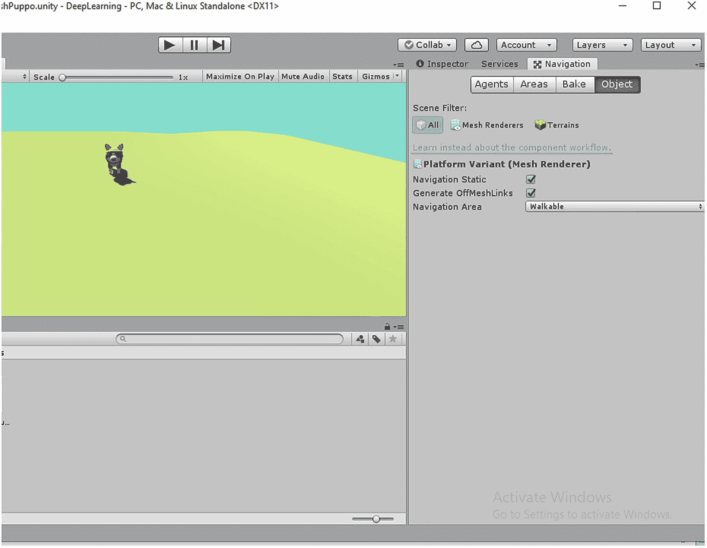

    图 2-26

    在检查器窗口中的导航选项卡下的对象选项卡

现在我们已经对 Unity 中的导航组件有了概述，下一步是将 NavMesh 代理组件附加到 Puppo 上。我们最初将所有值设置为默认值。在这个脚本中，我们有不同的组件需要添加，以便使代理遵循路径查找算法到达目的地。组件中包含如转向、避障和路径查找等。大多数转向和避障都有可修改的值，如角速度、加速度、停止距离、高度、半径等。最重要的方面是路径查找部分，其中自动重新规划路径和自动穿越离网默认勾选。自动重新规划路径会在目的地位置改变时自动计算从当前源到目的地的新的 A*路径（可以将其视为我们讨论过的 LPA*算法的扩展）。还有一个区域掩码组件，它指示导航网格的哪个部分具有哪种功能（默认有 3 个：可通行、不可通行和跳跃；可以有最多 29 个自定义）。在我们在场景中添加并完成必要的更改后，让我们探索源代码以创建我们的模拟游戏。

在任何编辑器中打开“NavigationPuppo.cs”C#脚本以查看创建 NavMesh 代理的通用模板并将其连接到目的地。我们会看到，通过我们常用的 Unity 导入（使用组件）；我们也在代码段中导入了 UnityEngine.AI 库。这个库包含了代理在导航网格中导航所必需的类和方法。

```py
using System.Collections;
using System.Collections.Generic;
using UnityEngine;
using UnityEngine.AI;
```

在 Unity 中创建导航网格代理非常简单。这是通过在变量声明部分使用 NavMeshAgent 类型来完成的。首先，我们初始化我们的 GameObject 变量，并创建一个我们将用于射线投射的相机变量。然后，相机射线投射将被转换为屏幕上我们点击的点，这将成为 Puppo 代理必须到达的新目的地。

```py
public NavMeshAgent navmesh_puppo;
Transform puppo_transform;
public Camera cam;
public GameObject puppo;
```

到目前为止，我们知道 start 方法用于初始化带有标签的变量和 GameObject。

```py
puppo = GameObject.FindWithTag("agent");
puppo_transform = puppo.GetComponent();
```

在更新方法中，该方法按帧调用，我们通过命令 Input.GetMouseButtonDown(0) 检查是否点击了左鼠标按钮，其中 0 是左鼠标按钮的代码。然后我们创建一个通过相机使用 ScreenPointToRay() 函数转换到屏幕上的射线的 Raycast。然后根据射线在屏幕上击中的位置，我们通过 NavMesh agent 的 SetDestination() 函数更新代理的新目的地。

```py
if (Input.GetMouseButtonDown(0))
{
Ray ray = cam.ScreenPointToRay(Input.mousePosition);
RaycastHit hit;
if (Physics.Raycast(ray, out hit))
{
navmesh_puppo.SetDestination(hit.point);
}
}
```

完成后，我们可以关闭编辑器并将脚本分配给 Puppo (CORGI) 游戏对象。然后我们可以在编辑器中运行游戏。图 2-27 展示了此场景。

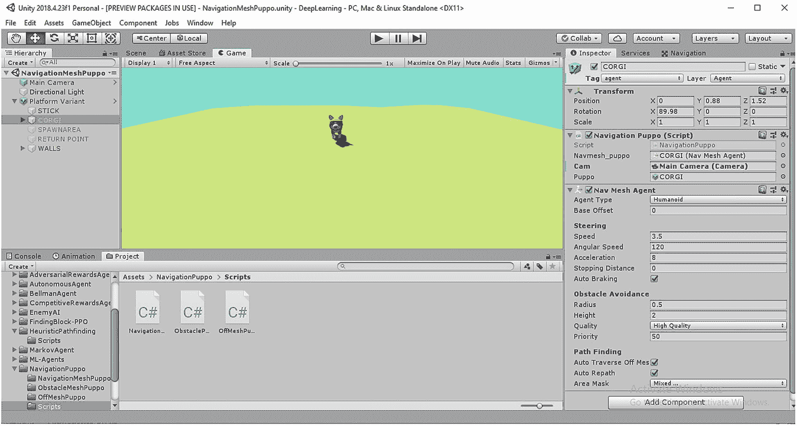

图 2-27

Unity 编辑器中的导航 Puppo 场景

### 障碍网格和 Puppo

在上一节中，我们概述了 Unity 中的导航组件及其创建一个可以使用 A* 移动到屏幕上点击的任何点的 AI 代理的方法。现在让我们回到一个经典的奖励和障碍物的强化学习环境。在“环境”文件夹中，我们将打开“ObstaclePuppo”Unity 可执行文件。当我们运行游戏时，我们看到 Puppo 现在放置在相同的地面上，但有一些障碍物以路障的形式存在，Puppo 无法通过。但是 Puppo 必须从地面上不同的位置收集所有三根棍子，并且还要遵循到三根棍子的最优组合路径。当我们玩游戏时，我们看到 Puppo 如何智能地导航场景，避开路障，并最终收集所有三根棍子。图 2-28 展示了 Puppo 在收集所有三根棍子后休息的情景。

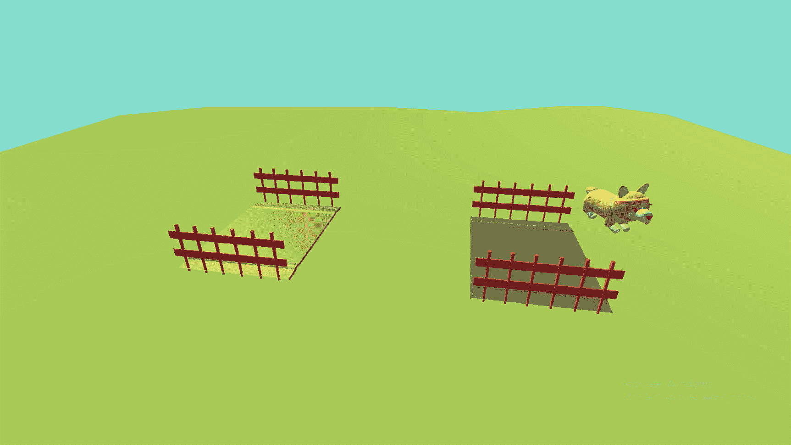

图 2-28

Unity 中的障碍 Puppo 游戏

在 Unity 中打开“ObstacleMeshPuppo”场景。我们有一个与之前相似的环境，增加了两个作为导航网格障碍物的路障和三个作为奖励或目标的棍子。我们像之前一样烘焙场景并可视化导航网格的蓝色覆盖。这里的区别在于我们必须初始化网格中存在的障碍物。标记为“Fence”的预制件是障碍物，我们必须将 NavMesh obstacle 组件添加到它们上。这使 Unity 引擎知道网格在那些特定的变换或位置包含障碍物。其余的所有值和其他组件，如 NavMesh agent 或 Bake 属性，与之前的场景相同。图 2-29 展示了导航网格障碍物场景。

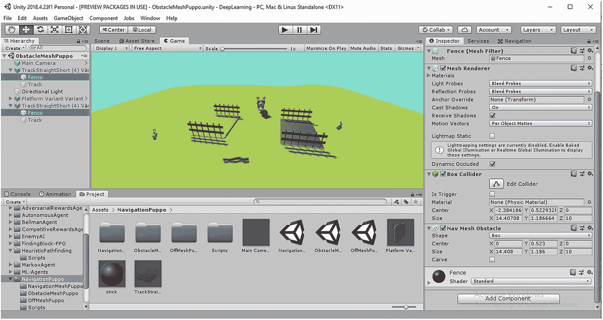

图 2-29

已将导航网格障碍物添加到 Obstacle Puppo 场景

让我们打开“ObstaclePuppo.cs” C# 脚本来创建这个模拟。像之前一样，我们使用 UnityEngine.AI 模块进行导航网格。我们还初始化了代理、目标 Gameobjects 及其变换，以及 Puppo（代理）的 NavMesh 代理变量。

```py
public GameObject puppo;
Transform puppo_transform;
public NavMeshAgent puppo_agent;
public float max_reward;
public List sticks;
public List stick_transform;
public GameObject[] st;
float initial_reward = 0f;
```

开始方法初始化变量，并填充目标棍子的变换列表，如下所示：

```py
float initial_reward = 0f;
puppo = GameObject.FindWithTag("agent");
sticks = new List();
st = GameObject.FindGameObjectsWithTag("target");
foreach (GameObject stick in st)
{
stick_transform.Add(stick.GetComponent());
sticks.Add(stick);
}
puppo_transform = puppo.GetComponent();
```

下一个步骤是调用名为“executeObstacleFind”的更新方法中的 Coroutine，它每帧都会被触发。

```py
StartCoroutine(executeObstacleFind());
```

我们运行模拟，直到所有棍子都被收集，并且 Puppo 获得了最大奖励。我们根据变换位置从列表中随机选择一根棍子，并将其位置指定为 Puppo 代理的新目的地。这是由 SetDestination 控制的，它接受棍子 GameObejct 的变换位置属性。

```py
if (initial_reward  0)
{
int idx = Random.Range(0, sticks.Count);
GameObject sample_stick = sticks[idx];
Transform tf = sample_stick.GetComponent();
puppo_agent.SetDestination(tf.position);
```

然后我们计算代理和棍子之间的距离。如果距离小于给定的阈值，则意味着 Puppo 已经到达棍子并收集了棍子。对于 Puppo 收集的每一根棍子，代理 Puppo 都会获得 10 分的奖励。为了完成模拟，Puppo 需要收集所有三根棍子，总共 30 分。

```py
float distance = (float)Vector3.Distance(tf.position, puppo_transform.position);
if (distance < 0.1f)
{
// Debug.Log(distance);
initial_reward += 10f;
Debug.Log("Stick Picked");
Destroy(sample_stick);
sticks.Remove(sample_stick);
Debug.Log(initial_reward);
}
}
if (initial_reward == max_reward)
{
Debug.Log(max_reward);
Debug.Log("Max Reward Picked");
}
yield return new WaitForSeconds(3.5f);
//After Episode Ends
yield return new WaitForSeconds(1f);
```

最后，我们让 Puppo 在收集每根棍子后以及收集完所有棍子后休息。这是 Puppo 在收集第一根棍子的过程中的样子，如图 2-30 所示。

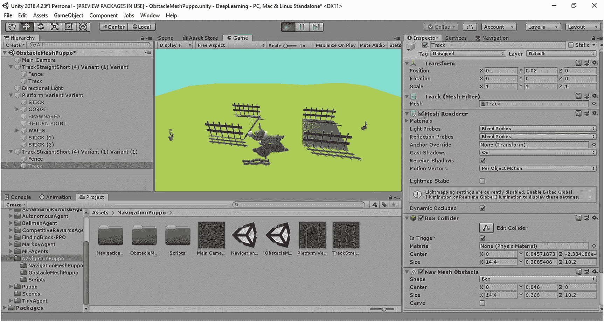

图 2-30

障碍物 Puppo Unity 场景

### Off Mesh Links 和 Puppo

导航网格的最终和最有趣的概念是 Off Mesh Links。这些是允许导航网格代理在平面凸多边形导航网格之外以及在不同网格之间移动的链接。有两种方法可以生成 Off Mesh Links 来连接分离的导航网格。打开“OffMeshPuppo” Unity 场景。生成 Off Mesh Links 的两种方法在此列出。

+   **自动生成**：这可以通过在检查器窗口中点击导航选项卡，然后点击对象选项卡来控制。我们必须点击“Generate OffMeshLinks”（勾选）以自动在两个导航网格之间生成链接。在这种情况下，必须注意更改“跳过”和“下落高度”，因为下落高度的轨迹设计为代理的水平移动：

    2* agentRadius + 4* voxelSize

    “跳过”的轨迹定义为水平移动距离超过 2* agentRadius 且小于跳跃距离。图 2-31 展示了 Off Mesh Links。

    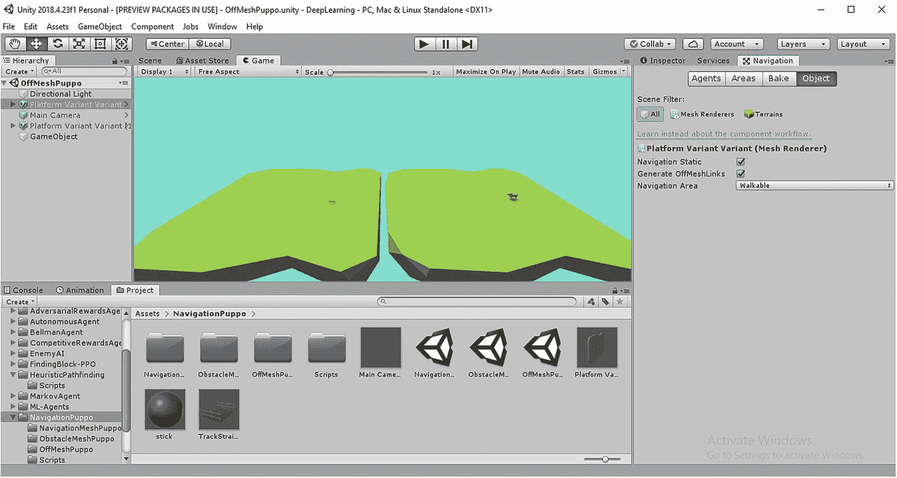

    图 2-31

    两个导航网格之间的自动 Off Mesh Links

+   **添加 Off Mesh 链接组件**：这是将 Off Mesh 链接手动添加到需要连接的平台或地形上的另一种方法。根据 Off Mesh 链接的宽度，代理始终选择源和目的地之间的最短路径，这些路径位于两个不同的导航网格中。

在添加 Off Mesh 链接后，我们将看到两个导航网格之间形成了链接。这也显示了代理 Puppo 可以穿越的路径，以到达下一个导航网格中的目标棍子，如图 2-32 和图 2-33 所示。

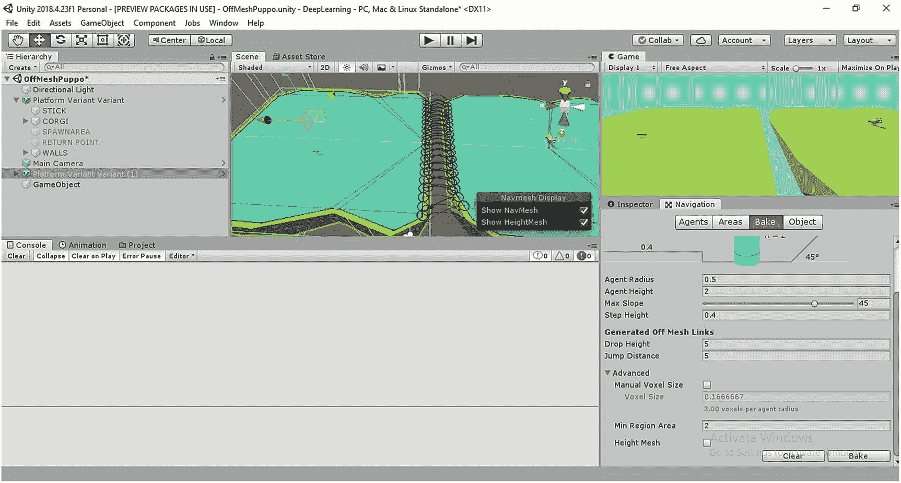

图 2-32

编辑场景视图中的 Off mesh 链接

现在我们创建一个非常简单的脚本，让 Puppo 使用 Off Mesh 链接并到达下一个导航网格（左侧的网格）中存在的目标棍子。打开“OffMeshPuppo, cs”C#脚本。由于大部分初始化和库包含与之前的代码类似，我们将集中精力在“Offmesh”协程上。我们使用 SetDestination 方法将代理的目标设置为目标棍子的位置，然后检查目标与 Puppo 之间的距离是否小于给定的阈值。如果满足此条件，我们给 Puppo 奖励 10 分，并收集棍子，让 Puppo 有时间休息。

```py
nav_agent.SetDestination(target_transform.position);
if (Vector3.Distance(puppo_transform.position, target_transform.position) < 0.5f)
{
initial_reward += 10f;
}
if (initial_reward == max_reward)
{
Debug.Log("Reached");
Debug.Log(initial_reward);
target.SetActive(false);
}
yield return new WaitForSeconds(1f);
```

运行场景（或我们可以从“环境”文件夹中选择“OffMeshPuppo”Unity.exe 文件来玩游戏），我们可以看到 Puppo 如何使用 Off Mesh 链接在不同导航网格之间进行连接。这如图 2-33 所示。

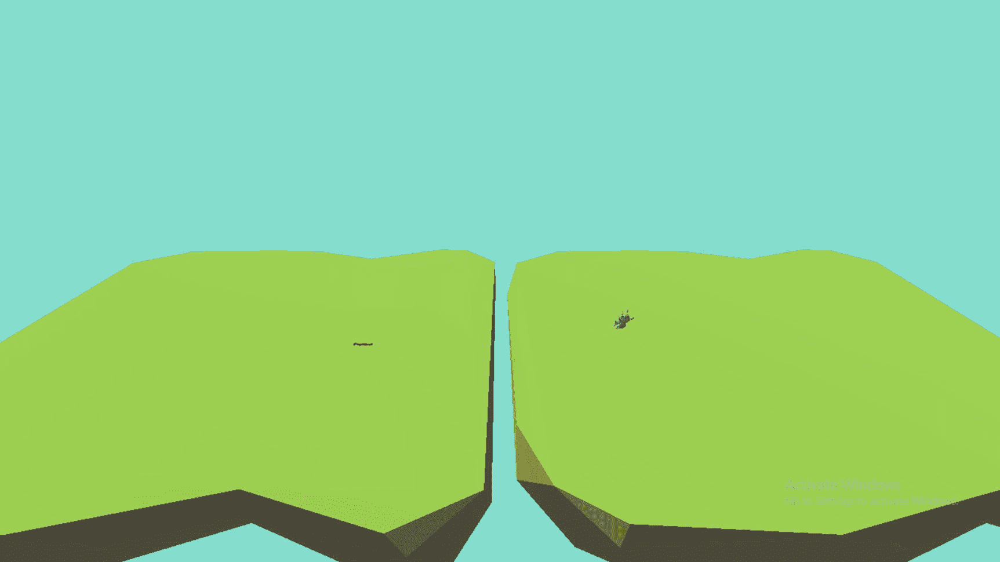

图 2-33

Unity 游戏场景中的 Off Mesh 链接

我们现在继续到本章的最后部分，我们将使用我们迄今为止学到的导航网格和路径查找算法来创建一个敌人 AI。

## 创建敌人 AI

现在我们已经对如何在导航网格同步中工作以及 Unity NavMesh 系统的易用性有了相当的了解，我们将创建一个非常简单的敌人 AI，其中代理立方体必须在充满障碍物的环境中找到一个目标立方体。一旦目标立方体进入代理立方体的视线范围内（即代理可以清楚地看到），代理就开始向目标射击以摧毁它。然而，有一个问题——我们可以将目标移动到场景中的任何位置以避免被代理射击。要玩游戏，请转到“环境”文件夹并运行“EnemyAI”Unity.exe 文件。点击屏幕上我们想要目标移动到的位置，目标就会移动到那里。一旦代理找到目标，它就开始射击，并在摧毁目标后获得奖励。

图 2-34 展示了带有导航网格的敌人 AI 的 Unity 场景。

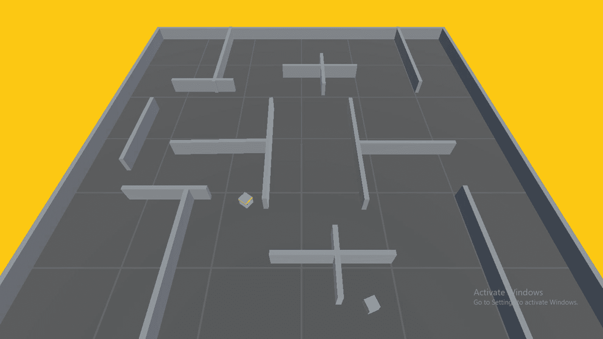

图 2-34

使用 NavMesh 代理和寻路功能的敌人 AI 游戏玩法

现在，让我们打开 Assets 中的“EnemyAI”文件夹，以探索场景和导航网格。我们有墙壁作为障碍物，平台作为导航网格的场景。我们使用之前提到的 Bake 方法创建这个场景。然后我们将 NavMesh 代理组件分配给紫色代理立方体。这是敌人代理，它使用启发式 A* 寻找到达目标立方体的最优路径。导航网格以及 NavMesh 代理的设置值默认设置。我们为此特定用例有两个不同的脚本。“PlayerAI”脚本控制目标（即我们）的运动，而“EnemyAI”脚本控制紫色代理。我们将探索“PlayerAI”，因为它类似于“NavigationPuppo.cs”脚本，该脚本使用相机和射线投射来确定屏幕上的击中点，并使目标相应地移动到那里。场景的预览如图 2-33 所示。

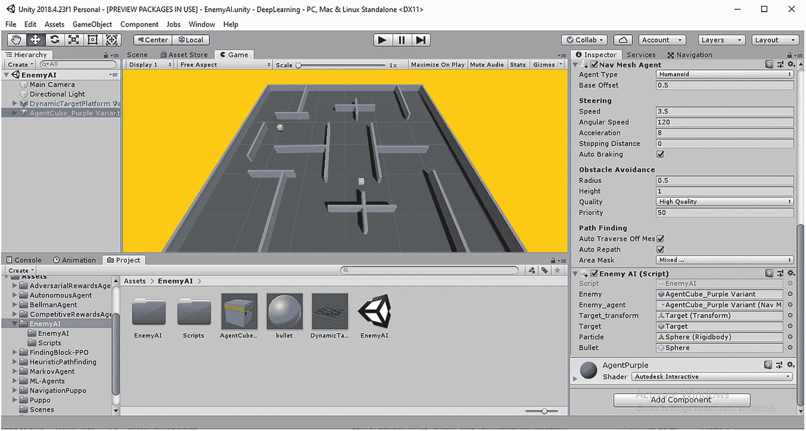

图 2-35

包含 NavMesh 代理组件的 Unity 场景视图

打开“PlayerAI”脚本。我们看到我们与之前相同的初始化，包含目标 GameObject、目标转换、NavMesh 代理变量以及将射线投射转换为屏幕点的相机变量。

```py
public Camera cam;
public NavMeshAgent player_agent;
Transform player_transform;
public GameObject player;
```

我们还有一个初始化为以下内容的 start 方法：

```py
void Start()
{
player=GameObject.FindWithTag("target");
player_transform=player.GetComponent();
}
```

然后我们有更新方法，类似于之前，我们检查用户是否点击了左鼠标按钮，然后触发一个使用 ScreenPointToRay() 函数转换成点的射线投射，以获取新的转换位置。然后我们将目标设置为这个新的转换位置。

```py
if (Input.GetMouseButtonDown(0))
{
Ray ray = cam.ScreenPointToRay(Input.mousePosition);
RaycastHit hit;
if (Physics.Raycast(ray, out hit))
{
player_agent.SetDestination(hit.point);
}
}
```

现在，让我们查看“EnemyAI”脚本。我们有某些变量需要初始化，例如目标、代理 GameObject、NavMesh 代理以及一个名为“bullet”的球形 GameObject。我们将 Rigidbody 组件分配给“bullet”GameObject，以便它在与目标 GameObject 发生碰撞时使用碰撞检测。

```py
public GameObject enemy;
Transform enemy_transform;
public NavMeshAgent enemy_agent;
public Transform target_transform;
public GameObject target;
public Rigidbody particle;
public GameObject bullet;
```

然后启动方法初始化以下变量：

```py
void Start()
{
target=GameObject.FindWithTag("target");
target_transform= GameObject.FindWithTag("target").
GetComponent();
enemy=GameObject.FindWithTag("agent");
enemy_transform= enemy.GetComponent();
bullet=GameObject.FindWithTag("bullet");
particle= GameObject.FindWithTag("bullet").
GetComponent();
}
```

然后我们有一个 OnTriggerEnter 方法，当子弹与目标 GameObject 发生碰撞时被触发。目标在碰撞时被子弹摧毁。

```py
void OnTriggerEnter(Collider col)
{
if(col.gameObject.tag=="target")
{
//Destroy(gameObject);
gameObject.SetActive(false);
col.gameObject.SetActive(false);
}
```

接下来我们来看更新方法。在这里，我们创建了一个沿着代理 z 轴向前移动的射线投射。这个射线投射有助于检查目标是否在代理的视线范围内。我们还有一个 SetDestination() 方法，用于更新代理的目标。

```py
RaycastHit hit;
var dir= enemy_transform.TransformDirection(Vector3.forward);
enemy_agent.SetDestination(target_transform.position);
var dist=Vector3.Distance(enemy_transform.position,
target_transform.position);
```

如果 Raycast 击中一个 GameObject，我们通过以下代码行检查击中的对象是否为目标：

```py
Rigidbody clone=null;
if(Physics.Raycast(enemy_transform.position,dir,
out hit) && dist>4.5f)
{
if(hit.collider.gameObject.tag=="target")
{
```

然后，我们让代理使用 Instantiate()方法发射子弹，该方法用于实例化子弹 GameObject 的预制件或克隆。这击中目标对象并调用 OnTriggerEnter，该方法导致目标被销毁。

```py
clone=Instantiate(particle,enemy_transform.position,enemy_transform.rotation);
clone.velocity= enemy_transform.TransformDirection(Vector3.forward*5);
```

如果子弹没有击中代理，我们还有另一个条件。这发生在代理远离目标视线并分配到新位置时。在这种情况下，如果代理立方体靠近目标立方体，后者将被销毁。

```py
else if(dist<=4.5f)
{
Debug.Log(dist);
target.SetActive(false);
//Destroy(target);
bullet.SetActive(false);
Destroy(clone);
}
```

这就是整个游戏的代码段。让我们回到 Unity，将“PlayerAI.cs”脚本分配给目标（绿色）和“EnemyAI.cs”脚本分配给代理（紫色）。这两个 GameObject 都附加了 NavMesh 代理。在 Unity 编辑器中点击播放，我们可以玩这个由 AI 驱动的路径查找游戏，如图 2-35 和 2-36 所示。

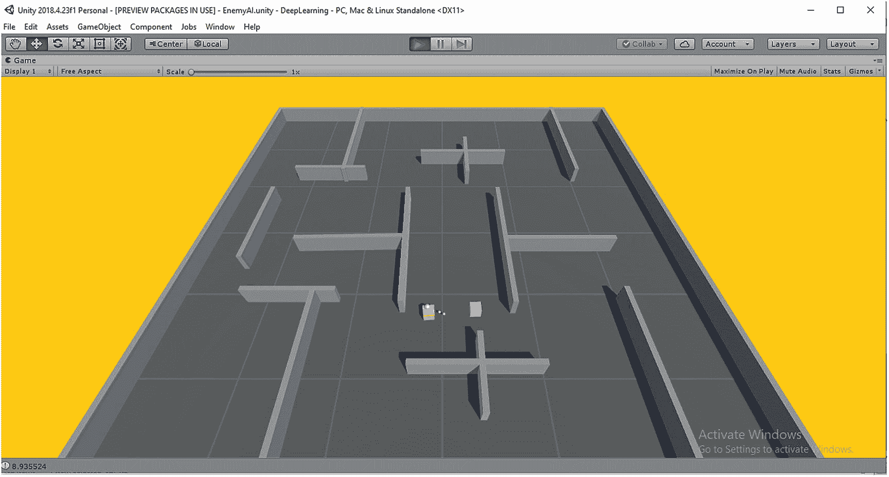

图 2-36

在 Unity 中使用 NavMesh 在游戏过程中对目标进行射击的代理

## 摘要

有了这些，我们就结束了这一章。我们简要探讨了经典强化学习和自主控制代理中路径查找算法的核心基本原理，并了解了导航网格。

+   我们从强化学习（RL）环境中路径查找的泛型概念开始。我们理解了自主代理必须从源点决定到目的地的适当最优路径的不同场景，即使路径中有障碍物。

+   然后，我们详细了解了在通用图论中使用的某些流行路径查找算法的细节，例如贪婪广度优先搜索和 Dijkstra。

+   下一个主题是通过对搜索算法添加启发式估计进行改进。我们介绍了用于路径查找的 A*算法的概念，并讨论了 Dijkstra 作为 A*算法的特殊情况。

+   我们探讨了基于时间复杂度和内存优化的 A*算法的不同变体，例如动态加权 A*、迭代加深 A*、终身规划 A*、D*、B*和内存受限的 A*算法。这有助于我们了解不同变体如何根据内存和速度在模拟和游戏引擎中使用。

+   然后，我们探索了在 Unity 中为 Dijkstra 和 A*算法创建模拟，并了解了 C#中类和复合容器的新基本概念。

+   我们试图理解导航网格的基本原理以及组成它们的凸多边形。

+   在 Unity 中，我们创建了导航网格并学习了 UnityEditor 中的 UnityEngine.AI 组件。此模块负责 Unity 中的导航和路径查找。

+   在 NavMesh 代理、NavMesh 障碍物和离网链接的帮助下，我们学习了离网链接和避障，并为这些内容创建了游戏和模拟。

+   在上一节中，我们将我们的知识和理解应用于创建了一个“EnemyAI”游戏，其中目标的主要任务是避免被 NavMesh 代理射击，该代理能够智能地避开障碍物并通过最优化路径找到目标。

现在我们已经理解了基于状态的重返学习（RL）以及通用游戏和自主代理中的路径查找。这构成了经典 RL 基本概念的基础。在接下来的步骤中，我们将开始缓慢地探索机器学习（ML）代理和深度 RL 的深度，使用 Unity。下一章将描述设置和安装 Unity ML 代理以及配置系统。我们将探讨 Unity ML 代理的核心概念以及为什么深度学习对于 RL 是必需的。

注意

这是我们微软 Word 写作模板，其中包含了关于如何应用样式到文本的简要指南。我们希望您使用它。然而，如果您对另一个写作应用有强烈的偏好，或者您有自己的 Word 模板，请告诉我们，我们将努力满足您的需求。
