# 4. 理解大脑智能体和学院

大脑架构是 ML Agents 工具包的一个重要方面。在前一章中，我们安装了 ML Agents 工具包，并简要了解了这一架构。内部，ML Agents 工具包使用三种不同类型的大脑，并增加了由用户控制的玩家大脑。我们关注理解 ML Agents 包中某些脚本的内部工作原理，这些脚本使用在 Unity Agents 中训练的 Tensorflow 神经网络。由于我们试图了解深度 Q-learning 作为目前唯一的深度强化学习算法，我们也可以使用此算法来训练智能体的大脑。而在 Unity ML Agents 中，内部大脑的默认算法是近端策略优化（PPO），它稳健且在实现简便、样本调整和复杂性之间有舒适的平衡，我们将探索将被用作智能体大脑的不同算法。在本节中，我们将深入了解大脑架构及其所有相关的 C# 脚本，包括模型训练和超参数调整的不同方面。我们将使用 Unity 中的 ML Agents 构建游戏。

在我们深入相关脚本之前，让我们回顾一下前一章中的一些方面，我们在那里强调了大脑-学院架构。由于大脑主要分为三种类型——内部、启发式和外部——我们将主要关注内部大脑的某些方面，它使用 Barracuda 推理引擎，以及外部大脑，它使用通信对象在 Tensorflow 中实时训练智能体。我们提到了某些脚本的用法，例如行为参数，我们将在本章中深入探讨。我们还将研究当引擎未通过端口 5004 连接到 Python API 进行外部训练时，它是如何配置自己的。从 C# 脚本的角度来看，大脑架构最重要的方面可以在“com.unity.ml-agents”包下的“Runtime”文件夹中找到。整个大脑架构的构建块，它使用多个策略，依赖于推理引擎、传感器、通信器、演示者和模型加载器。这些部分的每一个都构成了大脑的一个独立功能，例如推理引擎，它有助于在 Unity 中运行训练好的 Tensorflow 模型。由于所有这些组件都是 C# 脚本，大脑架构可以如图 4-1 所示进行可视化。

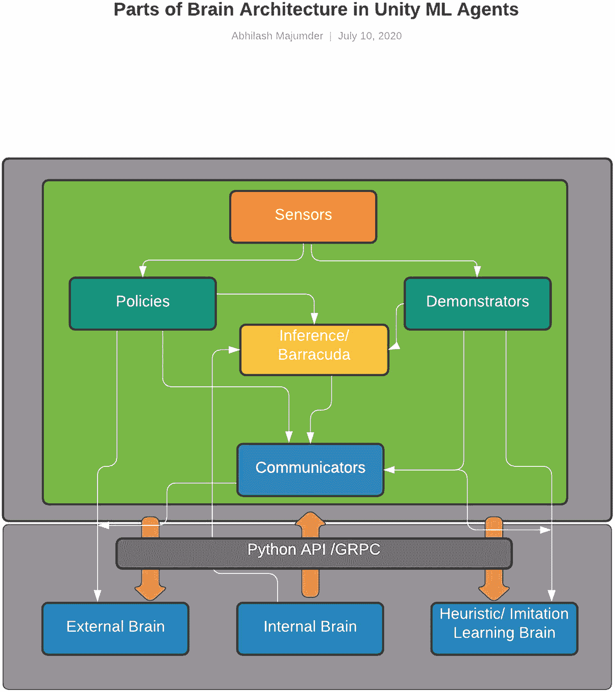

图 4-1

Unity ML Agents 中大脑架构的部分

传感器是大脑架构中最重要的方面，因为它控制着智能体进行决策和选择行动所需观察的空间。传感器是物理射线，以离散和连续向量的形式收集信息，并在模型训练部分中使用。传感器数据随后被控制深度强化学习算法（如 PPO 和（软演员评论家）SAC）的策略所使用，这些算法属于 Unity ML Agents。策略与通信者相关联，并与外部大脑相连。外部大脑在 Tensorflow 中运行时进行训练，就像我们在上一章中训练我们的模型一样。演示是一组不同的算法，这些算法依赖于模仿学习和行为克隆，它们也依赖于传感器数据。通过通信者，演示可以训练为采样的启发式/外部大脑，这实现了模仿学习的一组方法。然后我们有推理引擎，它用于预训练模型。推理引擎接收训练好的观察/行动空间向量。这随后用作内部大脑。推理引擎还有一个选择，即使用策略中通过深度强化学习算法处理的传感器数据以及来自预训练模型的观察数据。这个存储的最终神经网络模型可以用于 Unity 中的实时游戏。现在我们了解了大脑的重要方面，让我们深入了解其实现细节以及与不同 Python API 的通信。

## 理解大脑架构

要理解大脑架构的不同方面，我们将尝试理解与之相关的 C# 脚本。由于传感器在收集智能体观察数据方面起着重要作用，我们将讨论我们可以在场景中使用的不同类型的传感器。传感器是物理光线，当它们与场景中的另一个 GameObject 发生碰撞时用于收集观察数据。这些传感器控制观察空间的分布，决定它将是离散的还是连续的。我们将探讨用于获取 ML Agents 训练阶段所需观察的不同类型的传感器。然后，这些传感器数据将被编码以生成张量，例如使用 one-hot 编码技术，然后传递给用于不同策略的深度学习层。在传感器文件夹中，有几种传感器类型被 ML Agents 使用：摄像头传感器、光线传感器、2D 光线感知传感器，以及许多其他传感器。每种传感器类型都有独特的属性，我们将在本节中探讨所有这些属性。然后，我们将研究包含深度强化学习训练算法的策略。这还将包含我们在第三章节中简要研究的大脑架构的基本脚本，即行为参数 C# 脚本。我们还将深入探讨推理模块，以了解 Barracuda 在预训练模型运行期间如何对内部大脑进行推理。

### 传感器

传感器是整个 ML Agents 工具包中最重要的方面。这包含观察空间并控制空间的分布。根据这些观察结果，智能体必须选择策略并执行动作。这些传感器本质上是从 Unity 物理引擎中的光线传感器，在碰撞到标记的预制体时收集信息。首先，我们将查看 ISensor.cs 脚本，因为它包含将被光线传感器和摄像头传感器使用的主要方法。然后，我们将查看这个文件夹中存在的一些不同传感器变体。本质上，使用传感器收集观察数据的流程可以如图 4-2 所示进行可视化。

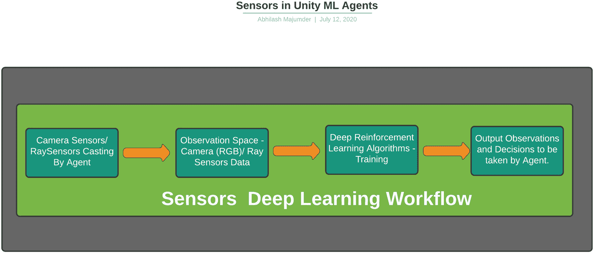

图 4-2

Unity ML Agents 中的传感器

**ISensor:** ISensor 是一个接口，包含用于 ML Agents 中不同传感器的所有函数声明。它包含影响摄像头传感器的函数，通过改变视觉观察数据的数据类型以及通过修改光线投射类型（2D 或 3D）来影响光线传感器。ISensor 脚本以一个枚举开始，定义了从摄像头传感器收集的视觉信息的存储可能性，它可以是浮点数组的形式，也可以是 PNG 格式（二进制格式）。

```py
public enum SensorCompressionType
{
None,
PNG
}
```

下一个部分有一个名为“GetObservationShape”的方法，它控制了 RayPerceptionSensor 脚本中将使用的观察空间的大小。例如，在光线传感器的情况下，如果传感器正在观察刚体的速度向量，那么其维度大小将是 3（x、y 和 z 轴）。然而，在相机传感器的情况下，如果使用 RGB 像素图像，那么观察空间将是 5（高度、宽度和 RGB 的三个通道）。关于后者，我们将在讨论卷积神经网络（Conv2D）如何帮助训练从相机传感器中采样的图像时进行详细讨论。它还有一个名为“Write”的方法，用于将观察写入输出容器（数组）。当输出维度或大小相当大时，“GetCompressedObservation”方法对于压缩结果数组的输出非常有用。除此之外，还有“Update”和“Reset”方法，它们指定了传感器的内部状态。“Update”方法在代理每次做出决策时更新传感器，而“Reset”方法在代理的每个回合结束时触发。还有“GetCompressionType”和“GetName”方法，分别控制压缩类型并提供所有代理中传感器的确定性排序顺序。

```py
int[] GetObservationShape();
int Write(ObservationWriter writer);
byte[] GetCompressedObservation();
void Update();
void Reset();
SensorCompressionType GetCompressionType();
string GetName();
```

它还包含在“SensorExtensions”类中的辅助函数，该类提供了 ISensor 观察空间中的元素数量。这涉及到将每个输入观察空间的形状元素相乘，如下所示：

```py
public static int ObservationSize(this ISensor sensor)
{
var shape = sensor.GetObservationShape();
var count = 1;
foreach (var dim in shape)
{
count *= dim;
}
return count;
}
```

这完成了 ISensor 接口脚本。接下来，我们将探讨这个脚本如何在相机和光线传感器中被使用，以创建代理的观察空间。让我们先了解光线传感器，然后我们将探讨相机传感器。

#### 光线传感器

**RayPerceptionSensor** **:** 在机器学习代理的上下文中，第一个重要的传感器是 RayPerceptionsensor.cs 脚本，该脚本位于“com.unity.ml-agents”包下的 Runtime 文件夹中。这个传感器本质上控制着光线将被投射的 2D 或 3D 维度。这是通过以下几行代码实现的：

```py
namespace Unity.MLAgents.Sensors
{
/// 
/// Determines which dimensions the sensor will perform the casts in.
/// 
public enum RayPerceptionCastType
{
Cast2D,
Cast3D,
}
```

“RayPerceptionCastType”包含射线的类型。下一部分包含一个数据结构（struct），其中包含“RayPerceptionInput”传感器内部的详细信息。它包含诸如射线长度、碰撞检测、偏移、射线投射半径、层掩码、角度、投射类型和变换等详细信息。层掩码是一个重要的属性，因为它允许射线穿过某些层来检测其他层中存在的对象。偏移允许射线从源点几单位距离处发射。碰撞检测属性用于检查射线传感器是否与标记的对象发生碰撞。角度控制射线的方向，通常 90 度被认为是相对于对象的“前方”方向。投射类型来自“RayPerceptionCastType”枚举，它控制是否是 2D 或 3D。变换表示从触发射线的对象的位置变换：代理。投射半径决定了球形射线投射的半径，通常如果提供 0 或更小的值，表示正常射线。

```py
public struct RayPerceptionInput
{
public float RayLength;
public IReadOnlyList DetectableTags;
public IReadOnlyList Angles;
public float StartOffset;
public float EndOffset;
public float CastRadius;
public Transform Transform;
public RayPerceptionCastType CastType;
public int LayerMask;
```

在这个类中，有一些方法，如“OutputSize”方法，控制传感器的大小。这个大小形成了观察空间的大小，这是行为参数脚本所必需的。这表示为：

```py
public int OutputSize()
{
return (DetectableTags.Count + 2) * Angles.Count;
},
```

其中，“DetectableTags.Count”控制场景中标记的 GameObject 的数量，该数量可以被代理的射线传感器检测到。“Angle.Count”属性返回从代理发射的传感器射线的不同角度的数量。

接下来，我们将了解其他方法，例如“PolarToCartesian3D”和“PolarToCartesian2D”。这些方法将 Unity 场景中极坐标的射线转换转换为笛卡尔坐标。本质上，这把射线从局部空间转换到世界空间。然后使用世界空间坐标来分析传感器射线击中的可检测 GameObject。这可以通过使用变换位置的正弦和余弦变换来完成。图示见图 4-3。

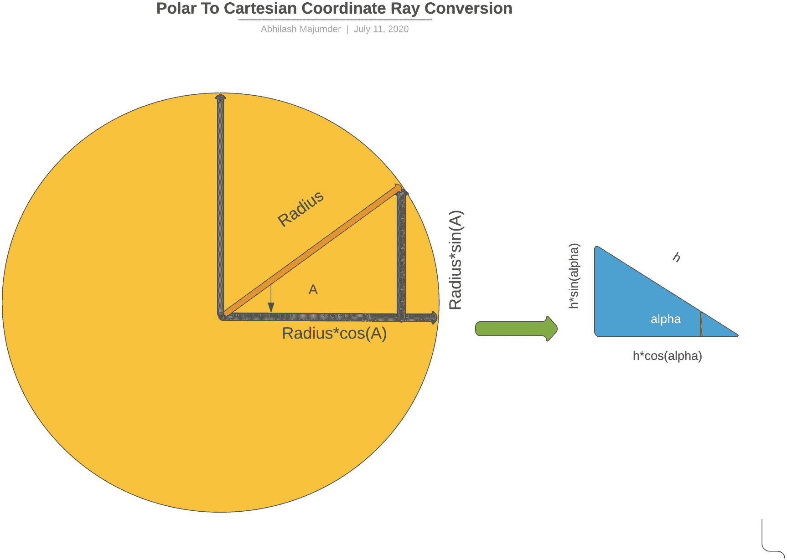

图 4-3

n 维射线的极坐标到笛卡尔坐标转换

“半径”在极坐标中表示射线长度。在 Unity 中，相关的轴是 x 轴和 z 轴。为了便于参考，我们将 x 轴视为水平面，z 轴视为垂直面。这由圆圈中 90 度间隔的轴表示。如果传感器射线的角度“A”相对于 x 轴，那么沿 x 轴的对应射线长度是“radius*cos(A)”，沿垂直的 z 轴是“radius*sin(A)”。现在让我们探索“PolarToCartesian2D”方法中的 2D 射线转换。这非常重要，因为我们将在场景中使用角度来指定射线之间的间隔。

```py
static internal Vector2 PolarToCartesian2D(float radius, float angleDegrees)
{
var x = radius *
Mathf.Cos(Mathf.Deg2Rad * angleDegrees);
var y = radius *
Mathf.Sin(Mathf.Deg2Rad * angleDegrees);
return new Vector2(x, y);
}
```

在 2D 射线传感器转换的情况下，我们考虑相互垂直的 x 和 y 轴。如果我们将其与之前的图进行比较，x 轴是水平线，y 轴是垂直线。角度被转换为弧度，用于正弦和余弦角度计算。类似地，如果我们查看 3D 的对应部分：

```py
static internal Vector3 PolarToCartesian3D
(float radius, float angleDegrees)
{
var x = radius *
Mathf.Cos(Mathf.Deg2Rad * angleDegrees);
var z = radius *
Mathf.Sin(Mathf.Deg2Rad * angleDegrees);
return new Vector3(x, 0f, z);
}
```

在这种情况下，我们以 x-z 轴作为相互垂直的轴，y 轴为 0。这是我们将在场景中使用的部分。对于下一部分，我们有“RayExtents”方法，它控制传感器射线的击中点坐标。这还估计了射线源到射线传感器之间的距离，并使用极坐标转换来完成此计算。此外，这里还有决定射线是在 2D 还是 3D 中的情况。

```py
var angle = Angles[rayIndex];
Vector3 startPositionLocal, endPositionLocal;
if (CastType == RayPerceptionCastType.Cast3D)
{
startPositionLocal = new Vector3(0, StartOffset, 0);
endPositionLocal = PolarToCartesian3D(RayLength, angle);
endPositionLocal.y += EndOffset;
}
else
{
// Vector2s here get converted to Vector3s (and back to Vector2s for casting)
startPositionLocal = new Vector2();
endPositionLocal = PolarToCartesian2D(RayLength, angle);
}
var startPositionWorld = Transform.TransformPoint(startPositionLocal);
var endPositionWorld = Transform.TransformPoint(endPositionLocal);
return (StartPositionWorld : startPositionWorld, EndPositionWorld : endPositionWorld);
```

下一部分包含名为“RayPerceptionOutput”的类，它控制传感器射线击中标记对象时的不同结果。在这个类中，有一个名为“RayOutput”的结构体，它包含多个属性，如“HasHit”、“HitTaggedObject”、“HitTagIndex”和“HitFraction”。这些属性包含有关传感器射线是否击中相关对象、击中对象的标签、对象标签在列表 DetectableTags 中的索引（如果击中其他任何内容或未指定，则为-1），以及击中对象的归一化距离的详细信息。

```py
public struct RayOutput
{
public bool HasHit;
public bool HitTaggedObject;
public int HitTagIndex;
public float HitFraction;
```

“ToFloatArray”方法将射线输出信息写入浮点数数组的子集。该列表包含观测数据，可以是以下内容：

+   可检测标签的一热编码数据。如果“DetectableTags.Length”等于“n”，则列表的前 n 个元素将是被击中的可检测标签的一热编码，如果没有击中，则为 0。

+   “numDetectableTags”将在传感器射线错过所有内容时设置为 1，或者在它击中某些内容（无论是“可检测”的还是不是）时设置为 0。

+   “numDetectableTags + 1”表示如果物体被击中，则为归一化距离，如果没有击中，则为 1.0。

还有一个控制输出缓冲区大小的浮点缓冲区数组，大小为(numDetectableTags+2) * RayOutputs.Length。

```py
public void ToFloatArray(int numDetectableTags, int rayIndex, float[] buffer)
{
var bufferOffset = (numDetectableTags + 2) * rayIndex;
if (HitTaggedObject)
{
buffer[bufferOffset + HitTagIndex] = 1f;
}
buffer[bufferOffset + numDetectableTags] =
HasHit ? 0f : 1f;
buffer[bufferOffset + numDetectableTags + 1] =
HitFraction;
}
}
```

存在一个名为“DebugDisplayInfo”的内部类，用于在屏幕上调试绘制的传感器射线的属性，并显示帧率。它还在射线击中任何可检测标签时显示信息，并由“RayPerceptionsensorComponent”使用。

```py
internal class DebugDisplayInfo
{
public struct RayInfo
{
public Vector3 worldStart;
public Vector3 worldEnd;
public float castRadius;
public RayPerceptionOutput.RayOutput rayOutput;
}
public void Reset()
{
m_Frame = Time.frameCount;
}
public int age
{
get { return Time.frameCount - m_Frame; }
}
public RayInfo[] rayInfos;
int m_Frame;
}
```

下一部分是射线传感器的实现，它继承自 ISensor 组件。这里实例化了“RayPerceptionInput”类和“DebugDisplayInfo”类的对象。公共函数 RayPerceptionSensor 使用初始化值设置类的对象，并分配传感器射线输入。

```py
float[] m_Observations;
int[] m_Shape;
string m_Name;
RayPerceptionInput m_RayPerceptionInput;
DebugDisplayInfo m_DebugDisplayInfo;
internal DebugDisplayInfo debugDisplayInfo
{
get { return m_DebugDisplayInfo; }
}
public RayPerceptionSensor(string name, RayPerceptionInput rayInput)
{
m_Name = name;
m_RayPerceptionInput = rayInput;
SetNumObservations(rayInput.OutputSize());
if (Application.isEditor)
{
m_DebugDisplayInfo = new DebugDisplayInfo();
}
}
```

“SetNumObservations”方法详细说明了传感器观察数组的尺寸。“SetRayPerceptionInput”方法检查在运行时是否修改了可检测标签的数量和传感器射线。它还检查“RayPerceptionInput”数组的尺寸是否与“rayInput”数组相同。这表明与传感器射线数组相关的所有形状都是一致的，并且在运行时没有修改。

```py
void SetNumObservations(int numObservations)
{
m_Shape = new[] { numObservations };
m_Observations = new float[numObservations];
}
internal void SetRayPerceptionInput(RayPerceptionInput rayInput)
{
if (m_RayPerceptionInput.OutputSize() != rayInput.OutputSize())
{
Debug.Log(
"Changing the number of tags or
rays at runtime is not " +
"supported and may cause errors
in training or inference."
);
SetNumObservations(rayInput.OutputSize());
}
m_RayPerceptionInput = rayInput;
}
```

下一部分通过收集传感器射线与可检测对象的碰撞信息来写入观察结果。首先它收集有关从代理发射的传感器射线和场景中的可检测标签数量的信息。如果关联的传感器数组形状不一致，它将重置信息并调整缓冲区大小。然后它使用“PerceiveSingleRay”方法触发射线的投射并将信息写入缓冲区。投射的输出随后写入“rayOutput”数组，该数组是“RayPerceptionOutput”类的一个对象。它还返回观察数组长度。

```py
public int Write(ObservationWriter writer)
{
using (TimerStack.Instance.Scoped("RayPerceptionSensor.Perceive"))
{
Array.Clear(m_Observations, 0, m_Observations.Length);
var numRays = m_RayPerceptionInput.Angles.Count;
var numDetectableTags
= m_RayPerceptionInput.DetectableTags.Count;
if (m_DebugDisplayInfo != null)
{
m_DebugDisplayInfo.Reset();
if (m_DebugDisplayInfo.rayInfos == null
|| m_DebugDisplayInfo.rayInfos.Length != numRays)
{
m_DebugDisplayInfo.rayInfos =
new DebugDisplayInfo.RayInfo[numRays];
}
}
for (var rayIndex = 0; rayIndex < numRays; rayIndex++)
{
DebugDisplayInfo.RayInfo debugRay;
var rayOutput
= PerceiveSingleRay(m_RayPerceptionInput,  rayIndex, out debugRay);
if (m_DebugDisplayInfo != null)
{
m_DebugDisplayInfo.rayInfos[rayIndex]
= debugRay;
}
rayOutput.ToFloatArray(numDetectableTags
, rayIndex, m_Observations);
}
writer.AddRange(m_Observations);
}
return m_Observations.Length;
}
```

我们接下来处理“PerceiveSingleRay”静态方法。该方法接受一个“RayPerceptionInput”类的对象，即“rayIndex”，它是射线数组中特定射线的索引，以及 DebugDisplayInfo 对象。然后它分配变量，如射线长度、投射半径、范围、起始和结束位置以及射线的方向。然而，如果比例与 Unity 中使用的比例不同，则“rayDirection”变量的绝对值将与“rayLength”不同。还有一些属性可以转换不同投射长度的射线长度，以及调整投射射线的球体或圆半径。还有预防措施以避免在未缩放的射线长度为 0 时进行除法。

```py
var unscaledRayLength = input.RayLength;
var unscaledCastRadius = input.CastRadius;
var extents = input.RayExtents(rayIndex);
var startPositionWorld = extents.StartPositionWorld;
var endPositionWorld = extents.EndPositionWorld;
var rayDirection = endPositionWorld - startPositionWorld;
var scaledRayLength = rayDirection.magnitude;
var scaledCastRadius = unscaledRayLength > 0 ?
unscaledCastRadius * scaledRayLength / unscaledRayLength :
unscaledCastRadius;
bool castHit;
float hitFraction;
GameObject hitObject;
```

代码段的下一段检查射线输入 ID 的类型是 2D 还是 3D。然后它检查投射半径是否大于 0，这表示它将是一个球形投射还是射线投射。然后它根据情况使用“Physics.RayCast”或“Physics.SphereCast”来发射射线。然后它检查缩放后的射线长度是否为 0，并且有检查以避免除以 0。

```py
if (input.CastType == RayPerceptionCastType.Cast3D)
{
RaycastHit rayHit;
if (scaledCastRadius > 0f)
{
castHit = Physics.SphereCast(startPositionWorld
, scaledCastRadius, rayDirection, out rayHit,
scaledRayLength, input.LayerMask);
}
else
{
castHit = Physics.Raycast(startPositionWorld
, rayDirection, out rayHit,
scaledRayLength, input.LayerMask);
}
hitFraction = castHit ? (scaledRayLength > 0
? rayHit.distance / scaledRayLength : 0.0f) : 1.0f;
hitObject = castHit ? rayHit.collider.gameObject : null;
}
else
{
RaycastHit2D rayHit;
if (scaledCastRadius > 0f)
{
rayHit = Physics2D.CircleCast(startPositionWorld
, scaledCastRadius, rayDirection,
scaledRayLength, input.LayerMask);
}
else
{
rayHit = Physics2D.Raycast(startPositionWorld
, rayDirection, scaledRayLength, input.LayerMask);
}
castHit = rayHit;
hitFraction = castHit ? rayHit.fraction : 1.0f;
hitObject = castHit ? rayHit.collider.gameObject : null;
}
```

在击中目标可检测标签后，它使用“CompareTag”方法并将“HitTagIndex”分配给击中目标的正确索引。它还计算 RayPerceptionOutput 对象的击中分数和其他属性。一旦击中一个可检测对象，循环就会中断。最后，它将 worldStart、worldEnd、rayOuput 和 castRadius 变量分配给计算值，并将输出射线返回到“Write”方法。

```py
var rayOutput = new RayPerceptionOutput.RayOutput
{
HasHit = castHit,
HitFraction = hitFraction,
HitTaggedObject = false,
HitTagIndex = -1
};
if (castHit)
{
for (var i = 0; i < input.DetectableTags.Count; i++)
{
if (hitObject.CompareTag(input.DetectableTags[i]))
{
rayOutput.HitTaggedObject = true;
rayOutput.HitTagIndex = i;
break;
}
}
}
debugRayOut.worldStart = startPositionWorld;
debugRayOut.worldEnd = endPositionWorld;
debugRayOut.rayOutput = rayOutput;
debugRayOut.castRadius = scaledCastRadius;
return rayOutput;
```

然而，“Write” 方法也使用 “Perceive” 方法来调用 “PerceoveSingleRay” 方法。这个 “Perceive” 方法接收射线输入数组和与射线相关的角度作为输入，并将它们传递给 “PerceiveSingleRay” 方法以获取射线输出数组和可检测标签。然后，它被传递给 “Write” 方法以作为观察空间写入。

```py
RayPerceptionOutput output = new RayPerceptionOutput();
output.RayOutputs = new RayPerceptionOutput.RayOutput[input.Angles.Count];
for (var rayIndex = 0; rayIndex < input.Angles.Count; rayIndex++)
{
DebugDisplayInfo.RayInfo debugRay;
output.RayOutputs[rayIndex] = PerceiveSingleRay(input
, rayIndex, out debugRay);
}
return output;
```

这就完成了 RayPerceptionsensor 脚本，它是控制代理发射的射线以获取可检测标签观察的最重要脚本。RayPerceptionsensor 脚本的工作流程如图 4-4 所示。

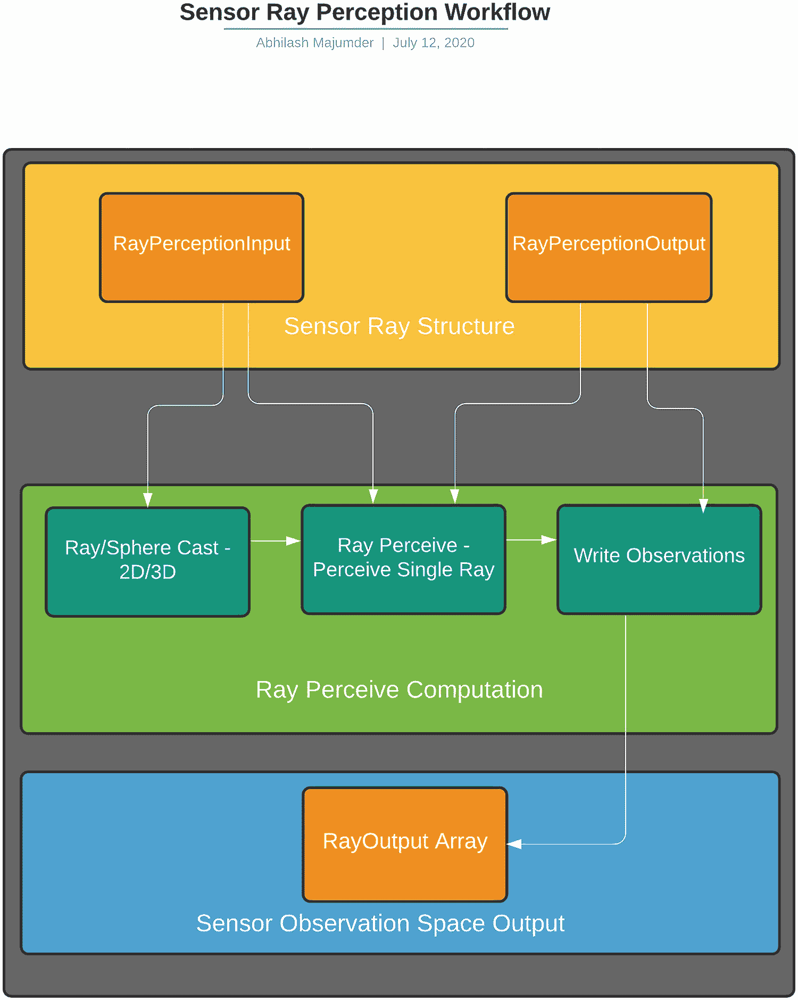

图 4-4

“RayPerceptionSensor” 脚本工作流程

此脚本有用于 2D 射线感知和 3D 射线感知的变体，我们将在后面探讨。

**RayPerceptionSensorComponent2D** **:** 此脚本用于将 2D 射线感知传感器组件添加到场景中的代理。它还声明了类型为 2D 的投射类型，并使用 “Physics.2D” 模块进行投射。尽管它使用 RayPerceptionSensorComponentBase.cs 脚本来声明其属性，但后者内部使用 RayPerceptionSensor 脚本。因此，所有像绘制球形/射线投射以及感知单个射线这样的功能都是通过 RayPerceptionSensor 脚本完成的，我们已在上一节中讨论过。此脚本特别声明射线投射的类型为 2D，并可以作为组件添加到特定代理的检查器窗口中。

```py
public class RayPerceptionSensorComponent2D : RayPerceptionSensorComponentBase
{
public RayPerceptionSensorComponent2D()
{
RayLayerMask = Physics2D.DefaultRaycastLayers;
}
public override RayPerceptionCastType GetCastType()
{
return RayPerceptionCastType.Cast2D;
}
}
```

**RayPerceptionSensorComponent3D** **:** 这与 2D 组件类似，但这里使用 3D 投射类型进行射线投射。最初，射线起始位置和结束位置提供了偏移量，如 “StartVerticalOffset” 和 “EndVerticalOffset” 方法中所述。此脚本从 “RayPerceptionSensorComponentBase” 脚本继承。偏移声明如下：

```py
[HideInInspector, SerializeField, FormerlySerializedAs("startVerticalOffset")]
[Range(-10f, 10f)]
[Tooltip("Ray start is offset up or down by this amount.")]
float m_StartVerticalOffset;
public float StartVerticalOffset
{
get => m_StartVerticalOffset;
set { m_StartVerticalOffset = value; UpdateSensor(); }
}
[HideInInspector, SerializeField, FormerlySerializedAs("endVerticalOffset")]
[Range(-10f, 10f)]
[Tooltip("Ray end is offset up or down by this amount.")]
float m_EndVerticalOffset;
public float EndVerticalOffset
{
get => m_EndVerticalOffset;
set { m_EndVerticalOffset = value; UpdateSensor(); }
}
```

下一个代码段包含类型转换，并为 StartVerticalOffset 和 EndVerticalOffset 变量赋值。

```py
public override RayPerceptionCastType GetCastType()
{
return RayPerceptionCastType.Cast3D;
}
public override float GetStartVerticalOffset()
{
return StartVerticalOffset;
}
public override float GetEndVerticalOffset()
{
return EndVerticalOffset;
}
```

**SensorComponent** **:** 这是 ISensor 脚本的变体，用于 Unity 编辑器。为了简单起见，特定的 ISensor 实现应该有一个相应的 SensorComponent 来构建它。内部它调用 “ISensor” 脚本的不同方法，当代理开始创建射线传感器或摄像头传感器时被触发。方法 “GetObservationShape” 和 “isVisual” 分别用于获取传感器向量的观察形状，检查传感器类型是否为视觉（具有五个参数）或 3D 向量化属性（例如 RigidBody 的速度/位置，具有三个参数）。方法 “isVector” 控制观察输出的形状是否向量化（离散或连续）。

```py
public abstract ISensor CreateSensor();
public abstract int[] GetObservationShape();
public virtual bool IsVisual()
{
var shape = GetObservationShape();
return shape.Length == 3;
}
public virtual bool IsVector()
{
var shape = GetObservationShape();
return shape.Length == 1;
}
```

**RayPerceptionSensorComponentBase** **:** 此脚本内部使用 RayPerceptionSensor 脚本的功能，并继承自 SensorComponent 脚本。当我们在场景中将“RayPerceptionSensorComponent2D”或 RayPerceptionSensorComponent3D 组件分配给我们的代理时，会调用此脚本。它具有传感器的名称，默认为“RayPerceptionSensor”。

```py
[HideInInspector, SerializeField, FormerlySerializedAs("sensorName")]
string m_SensorName = "RayPerceptionSensor";
public string SensorName
{
get { return m_SensorName; }
set { m_SensorName = value; }
}
```

此脚本有一些重要的属性，控制球体投射半径、射线长度和角度。默认情况下，从代理发射的射线之间的角度为 70 度；大于 90 度将允许射线穿过物体，而 90 度将严格限制为左右。默认的球体投射半径为 0.5 浮点单位，默认的射线长度为 20 浮点单位。它控制每个方向发射的射线数量，默认为三个（左、右和中心）。它列出了传感器射线可以检测到的可检测标签以及表示射线可以穿透哪些层的层掩码。

```py
[SerializeField, FormerlySerializedAs("detectableTags")]
[Tooltip("List of tags in the scene to compare against.")]
List m_DetectableTags;
public List DetectableTags
{
get { return m_DetectableTags; }
set { m_DetectableTags = value; }
}
[HideInInspector, SerializeField, FormerlySerializedAs("raysPerDirection")]
[Range(0, 50)]
[Tooltip("Number of rays to the left and right of center.")]
int m_RaysPerDirection = 3;
public int RaysPerDirection
{
get { return m_RaysPerDirection; }
set { m_RaysPerDirection = value;}
}
[HideInInspector, SerializeField, FormerlySerializedAs("maxRayDegrees")]
[Range(0, 180)]
[Tooltip("Cone size for rays. Using 90 degrees will cast rays to the left and right. " +
"Greater than 90 degrees will go backwards.")]
float m_MaxRayDegrees = 70;
public float MaxRayDegrees
{
get => m_MaxRayDegrees;
set { m_MaxRayDegrees = value; UpdateSensor(); }
}
public float SphereCastRadius
{
get => m_SphereCastRadius;
set { m_SphereCastRadius = value; UpdateSensor(); }
}
[HideInInspector, SerializeField, FormerlySerializedAs("rayLength")]
[Range(1, 1000)]
[Tooltip("Length of the rays to cast.")]
float m_RayLength = 20f;
public float RayLength
{
get => m_RayLength;
set { m_RayLength = value; UpdateSensor(); }
}
[HideInInspector, SerializeField, FormerlySerializedAs("rayLayerMask")]
[Tooltip("Controls which layers the rays can hit.")]
LayerMask m_RayLayerMask = Physics.DefaultRaycastLayers;
public LayerMask RayLayerMask
{
get => m_RayLayerMask;
set { m_RayLayerMask = value; UpdateSensor(); }
}
```

它还包含观察堆栈，表示我们希望堆叠多少个观察结果并将其传递给神经网络（默认为 1，表示不会使用之前的观察结果进行神经网络训练）。它还具有其他属性，例如射线击中颜色、未击中颜色、射线投射类型（2D/3D）以及起始和结束偏移位置（从 SensorComponent 脚本继承）。当我们将在 Unity 中将 RayPerceptionSensorComponent3D 组件/脚本分配给我们的代理时，所有这些组件都可以在检查器窗口中编辑。

```py
[HideInInspector, SerializeField, FormerlySerializedAs("observationStacks")]
[Range(1, 50)]
[Tooltip("Number of raycast results that will be stacked before being fed to the neural network.")]
int m_ObservationStacks = 1;
public int ObservationStacks
{
get { return m_ObservationStacks; }
set { m_ObservationStacks = value; }
}
[HideInInspector]
[SerializeField]
[Header("Debug Gizmos", order = 999)]
internal Color rayHitColor = Color.red;
[HideInInspector]
[SerializeField]
internal Color rayMissColor = Color.white;
[NonSerialized]
RayPerceptionSensor m_RaySensor;
public RayPerceptionSensor RaySensor
{
get => m_RaySensor;
}
public abstract RayPerceptionCastType GetCastType();
public virtual float GetStartVerticalOffset()
{
return 0f;
}
public virtual float GetEndVerticalOffset()
{
return 0f;
}
```

“CreateSensor”方法覆盖了“ISensor”脚本，并使用“RayPerceptionSensor”脚本中的方法初始化传感器。如果使用大于 1 的值，它还会堆叠观察结果。

```py
public override ISensor CreateSensor()
{
var rayPerceptionInput = GetRayPerceptionInput();
m_RaySensor = new RayPerceptionSensor(m_SensorName, rayPerceptionInput);
if (ObservationStacks != 1)
{
var stackingSensor = new StackingSensor(m_RaySensor, ObservationStacks);
return stackingSensor;
}
return m_RaySensor;
}
```

下一个代码段包含了 GetRayAngles float 数组方法，该方法返回传感器射线的角度和每个方向上的射线数量。每条射线之间的角度范围以“delta”为间隔呈算术级数。delta 变量是通过将最大射线角度除以每个方向上的射线数量来计算的。然后它以 { 90, 90 - delta, 90 + delta, 90 - 2*delta, 90 + 2*delta } 的形式插值射线。

```py
internal static float[] GetRayAngles(int raysPerDirection, float maxRayDegrees)
{
var anglesOut = new float[2 * raysPerDirection + 1];
var delta = maxRayDegrees / raysPerDirection;
anglesOut[0] = 90f;
for (var i = 0; i < raysPerDirection; i++)
{
anglesOut[2 * i + 1] = 90 - (i + 1) * delta;
anglesOut[2 * i + 2] = 90 + (i + 1) * delta;
}
return anglesOut;
}
```

下一个部分是 GetObservationShape，它也覆盖了来自“RayPerceptionSensor”的相同方法，并控制可检测的标签数量、射线数量、观察的堆栈大小和观察大小。

```py
public override int[] GetObservationShape()
{
var numRays = 2 * RaysPerDirection + 1;
var numTags = m_DetectableTags?.Count ?? 0;
var obsSize = (numTags + 2) * numRays;
var stacks = ObservationStacks > 1
? ObservationStacks : 1;
return new[] { obsSize * stacks };
}
```

在段落的最后部分，重写了“GetRayPerceptionInput”方法，并将所有变量分配给之前讨论过的“RayPerceptionInput”结构（结构）。

```py
public RayPerceptionInput GetRayPerceptionInput()
{
var rayAngles = GetRayAngles
(RaysPerDirection, MaxRayDegrees);
var rayPerceptionInput = new RayPerceptionInput();
rayPerceptionInput.RayLength = RayLength;
rayPerceptionInput.DetectableTags = DetectableTags;
rayPerceptionInput.Angles = rayAngles;
rayPerceptionInput.StartOffset = GetStartVerticalOffset();
rayPerceptionInput.EndOffset = GetEndVerticalOffset();
rayPerceptionInput.CastRadius = SphereCastRadius;
rayPerceptionInput.Transform = transform;
rayPerceptionInput.CastType = GetCastType();
rayPerceptionInput.LayerMask = RayLayerMask;
return rayPerceptionInput;
}
```

“OnDrawGizmosSelectedMethod”脚本接受输入射线，并对沿不同方向的每个射线调用“RayPerceptionSensor”脚本中的“PerceiveSingleRay”函数。根据射线是否为空，显示射线的颜色。较旧的观察结果以较浅的色调显示，以减少当前训练阶段的强调。

```py
var rayInput = GetRayPerceptionInput();
for (var rayIndex = 0; rayIndex < rayInput.Angles.Count; rayIndex++)
{
DebugDisplayInfo.RayInfo debugRay;
RayPerceptionSensor.PerceiveSingleRay(rayInput, rayIndex, out debugRay);
DrawRaycastGizmos(debugRay);
}
```

“DrawRaycastGizmos”方法使用来自 RayPerceptionSensor 脚本的 DisplayDebugInfo 变量（变量如偏移位置、射线方向、击中分数和击中半径）进行调试。图 4-5 展示了在“FindingBlock-PPO”Unity 场景中使用“RayPerceptionSensorComponent3D”的射线传感器，我们将在本章后面的部分中研究。

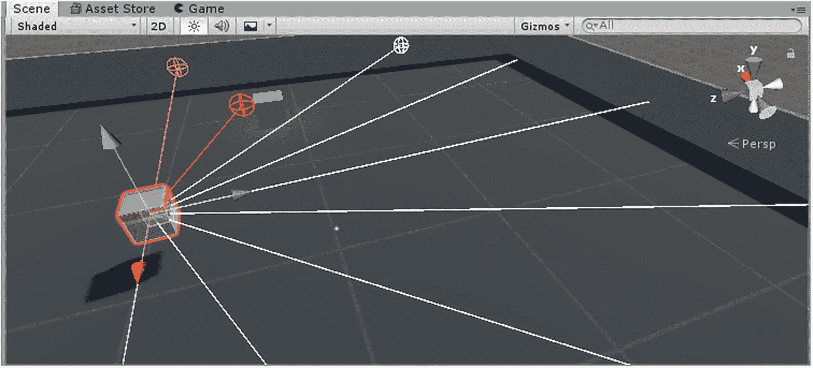

图 4-5

Unity 中使用传感器射线进行 3D 射线感知

这完成了射线传感器的基本方面。有一些相关的脚本，例如 VectorSensor 和 StackingSensor。

**VectorSensor** **:** 此脚本是射线传感器的向量实现。它有“AddObservation”的不同变体，这是一种方法重载技术。当观察大小可以是转换（Vector3/Vector2）、四元数（x, y, z, w）、布尔值或整数时，这很有用。这将在我们编写自己的代理脚本时使用。如果在训练期间预期的观察空间大小与接收到的观察空间大小不一致，则会显示警告。如果接收到的观察结果过多，则截断观察结果；如果接收到的观察结果少于预期，则用 0 填充。

```py
public int Write(ObservationWriter writer)
{
var expectedObservations = m_Shape[0];
if (m_Observations.Count > expectedObservations)
{
Debug.LogWarningFormat(
"More observations ({0}) made than vector observation size ({1}). The observations will be truncated.",
m_Observations.Count, expectedObservations
);
m_Observations.RemoveRange(expectedObservations, m_Observations.Count - expectedObservations);
}
else if (m_Observations.Count < expectedObservations)
{
Debug.LogWarningFormat(
"Fewer observations ({0}) made than vector observation size ({1}). The observations will be padded.",
m_Observations.Count, expectedObservations
);
for (int i = m_Observations.Count; i < expectedObservations; i++)
{
m_Observations.Add(0);
}
}
writer.AddRange(m_Observations);
return expectedObservations;
}
```

**StackingSensor** **:** 该传感器用于观察的时间堆叠，连续观察结果从左到右存储在数组（1D）中。这个特定传感器的细节是跨功能的，并用于需要记忆的深度强化学习算法。

这完成了整个射线传感器类别。代理在 Unity 中使用“RayPerceptionSensorComponent2D”或“RayPerceptionSensorComponent3D”。此脚本反过来调用 RayPerceptionSensorComponentBase 脚本，该脚本实现了 SensorComponent 脚本。后者是 Unity 编辑器中 ISensor 脚本的一个实现。RayPerceptionSensorComponentBase 脚本在检查器窗口中显示，用于控制观察、射线及其属性。此脚本内部调用“RayPerceptionSensor”脚本，其中包含“RayPerceptionInput”和“RayPerceptionOutput”结构。这是大脑中最重要的部分之一，用于从传感器射线收集观察结果。图 4-6 展示了这个架构。

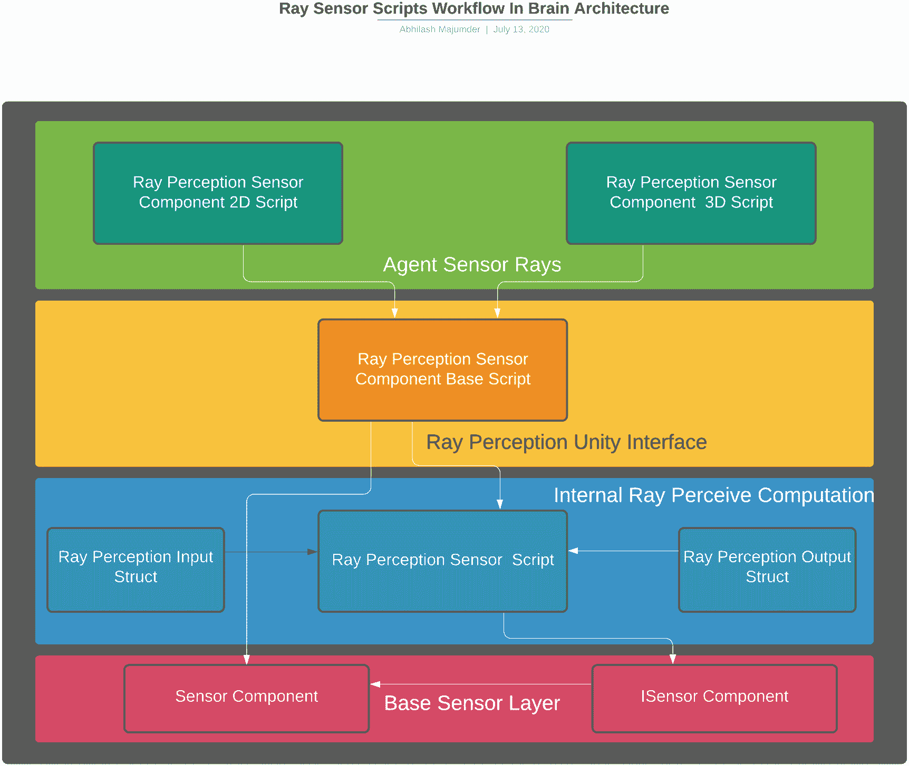

图 4-6

Unity ML Agents 中的射线传感器脚本

#### 摄像头传感器

在本节中，我们还将探讨由 CameraSensorComponent 和 CameraSensor 脚本控制的摄像头传感器。

**CameraSensorComponent** **:** 此脚本同样继承自 SensorComponent 脚本，如射线传感器，并控制视觉观察空间的各项属性。由于像 GridWorld 这样的环境依赖于压缩形式的视觉观察（PNG），然后将其传递给深度学习计算机视觉算法，因此此脚本用于分配输入观察空间的高度、宽度、压缩和向量分布。该脚本被分配给一个通过 Unity 场景中的摄像头来控制视觉观察的智能体。它还将摄像头设置为默认的视觉观察。生成的图像的宽度和高度也是一个默认为 84 个单位的属性。

```py
[AddComponentMenu("ML Agents/Camera Sensor", (int)MenuGroup.Sensors)]
public class CameraSensorComponent : SensorComponent
{
[HideInInspector, SerializeField
, FormerlySerializedAs("camera")]
Camera m_Camera;
CameraSensor m_Sensor;
public Camera Camera
{
get { return m_Camera;  }
set { m_Camera = value; UpdateSensor(); }
}
[HideInInspector, SerializeField
, FormerlySerializedAs("sensorName")]
string m_SensorName = "CameraSensor";
public string SensorName
{
get { return m_SensorName;  }
set { m_SensorName = value; }
}
[HideInInspector, SerializeField
, FormerlySerializedAs("width")]
int m_Width = 84;
public int Width
{
get { return m_Width;  }
set { m_Width = value; }
}
[HideInInspector, SerializeField
, FormerlySerializedAs("height")]
int m_Height = 84;
public int Height
{
get { return m_Height;  }
set { m_Height = value;  }
}
```

该脚本还具有控制图像是否以 RGB（三个通道）或灰度（一个通道）格式接收的属性。它还包含默认为“PNG”的图像压缩类型。此摄像头传感器对象可用于收集视觉信息（视觉传感器）。此对象是 ISensor 类型，它控制 Unity ML Agents 中的所有传感器。

```py
[HideInInspector, SerializeField, FormerlySerializedAs("grayscale")]
bool m_Grayscale;
public bool Grayscale
{
get { return m_Grayscale;  }
set { m_Grayscale = value; }
}
[HideInInspector, SerializeField, FormerlySerializedAs("compression")]
SensorCompressionType m_Compression = SensorCompressionType.PNG;
public SensorCompressionType CompressionType
{
get { return m_Compression;  }
set { m_Compression = value; UpdateSensor(); }
}
public override ISensor CreateSensor()
{
m_Sensor = new CameraSensor(m_Camera, m_Width, m_Height, Grayscale, m_SensorName, m_Compression);
return m_Sensor;
}
```

它还覆盖了“GetObservationShape”方法，类似于射线传感器的情况，该方法返回观察向量（容器），其形状由图像的高度、宽度和通道（RGB/灰度）控制。它还有一个名为“UpdateSensor”的方法，用于分配摄像头传感器的名称和压缩类型（无/PNG）。

```py
public override int[] GetObservationShape()
{
return CameraSensor.GenerateShape(m_Width
, m_Height, Grayscale);
}
internal void UpdateSensor()
{
if (m_Sensor != null)
{
m_Sensor.Camera = m_Camera;
m_Sensor.CompressionType = m_Compression;
}
}
```

**CameraSensor:** 此脚本继承自 ISensor 脚本并覆盖了其方法。此脚本的基本功能是将摄像头对象包装起来，为智能体生成视觉观察。它具有与 CameraSensorComponent 脚本中相同的属性，如高度、宽度、灰度、名称形状和压缩类型，并具有相关函数来分配它们。 “GetCompressedObservation”方法以 PNG 二进制格式编码图像。

```py
public byte[] GetCompressedObservation()
{
using (TimerStack.Instance.Scoped("CameraSensor.GetCompressedObservation"))
{
var texture = ObservationToTexture(m_Camera, m_Width
, m_Height);
// TODO support more types here, e.g. JPG
var compressed = texture.EncodeToPNG();
DestroyTexture(texture);
return compressed;
}
}
```

重要的方法包括覆盖的“Write”方法和“ObservationToTexture”方法。后者很重要，因为摄像头捕获的是渲染纹理（Texture 2D）上显示的图像。此函数将具有 Texture 2D 属性（如宽度、高度和纹理格式 RGB24）的变量分配给，并控制摄像头的变换和其视场深度。此脚本还可以帮助渲染到离屏纹理，这在 CPU 上训练 Resnet 模型时很有用。对于每个时间戳，都会捕获并激活图像，以便它可以被神经网络处理。处理完毕后，RenderTexture 变量被释放，并为下一个时间步分配一个新的图像。

```py
var texture2D = new Texture2D(width, height, TextureFormat.RGB24, false);
var oldRec = obsCamera.rect;
obsCamera.rect = new Rect(0f, 0f, 1f, 1f);
var depth = 24;
var format = RenderTextureFormat.Default;
var readWrite = RenderTextureReadWrite.Default;
var tempRt =RenderTexture.GetTemporary(width, height, depth, format, readWrite);
var prevActiveRt = RenderTexture.active;
var prevCameraRt = obsCamera.targetTexture;
RenderTexture.active = tempRt;
obsCamera.targetTexture = tempRt;
obsCamera.Render();
texture2D.ReadPixels(new Rect(0, 0, texture2D.width, texture2D.height), 0, 0);
obsCamera.targetTexture = prevCameraRt;
obsCamera.rect = oldRec;
RenderTexture.active = prevActiveRt;
RenderTexture.ReleaseTemporary(tempRt);
return texture2D;
```

“Write”方法随后将此“ObservationToTexture”方法调用到代理的观察空间。然而，在这种情况下，观察空间是在一个张量（我们将在下一章讨论）上写入的，可以假设为一个适合执行深度学习算法计算的密集矩阵。一旦外部大脑上运行的神经网络处理了观察空间中的视觉信息，相关的纹理就会被销毁。脚本通过以下行来完成这项工作：

```py
using (TimerStack.Instance.Scoped("CameraSensor.WriteToTensor"))
{
var texture = ObservationToTexture(m_Camera,
m_Width, m_Height);
var numWritten = Utilities.TextureToTensorProxy(texture
, writer, m_Grayscale);
DestroyTexture(texture);
return numWritten;
}
```

“GenerateShape”方法返回图像的形状及其相关通道：一个用于灰度，三个用于 RGB。

```py
internal static int[] GenerateShape(int width, int height, bool grayscale)
{
return new[] { height, width, grayscale ? 1 : 3 };
}
```

在 GridWorld 环境中，使用了相机传感器组件。这两个重要的脚本控制来自相机的视觉观察输入，并将此信息传递给神经网络进行训练。这如图 4-7 所示。

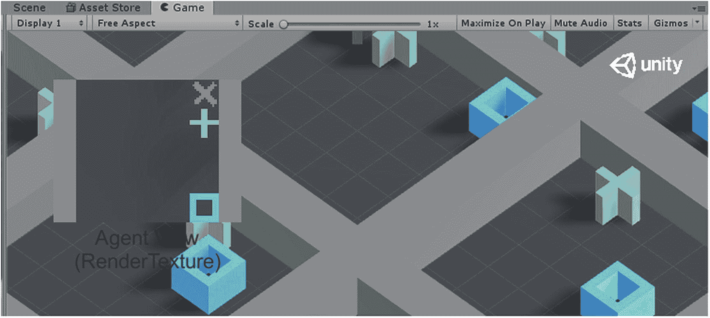

图 4-7

GridWorld 中的相机传感器

另有一个名为“RenderTextureSensor”的类，其中包含在 CameraSensor 脚本中使用的函数和方法初始化，例如创建 Texture 2D 格式并分配高度、宽度、通道、名称和压缩以进行训练。传感器部分控制代理的集中式观察空间，并为代理提供所有基于运行时政策的决策细节。我们已经深入探讨了两种不同的传感器变体：射线传感器和相机传感器。重要的结论是，这两种传感器在较低级别都继承自“ISensor”和“SensorComponent”脚本，并且具有各自的功能。与射线传感器工作流程相比，相机传感器工作流程可以如图 4-8 所示进行可视化。

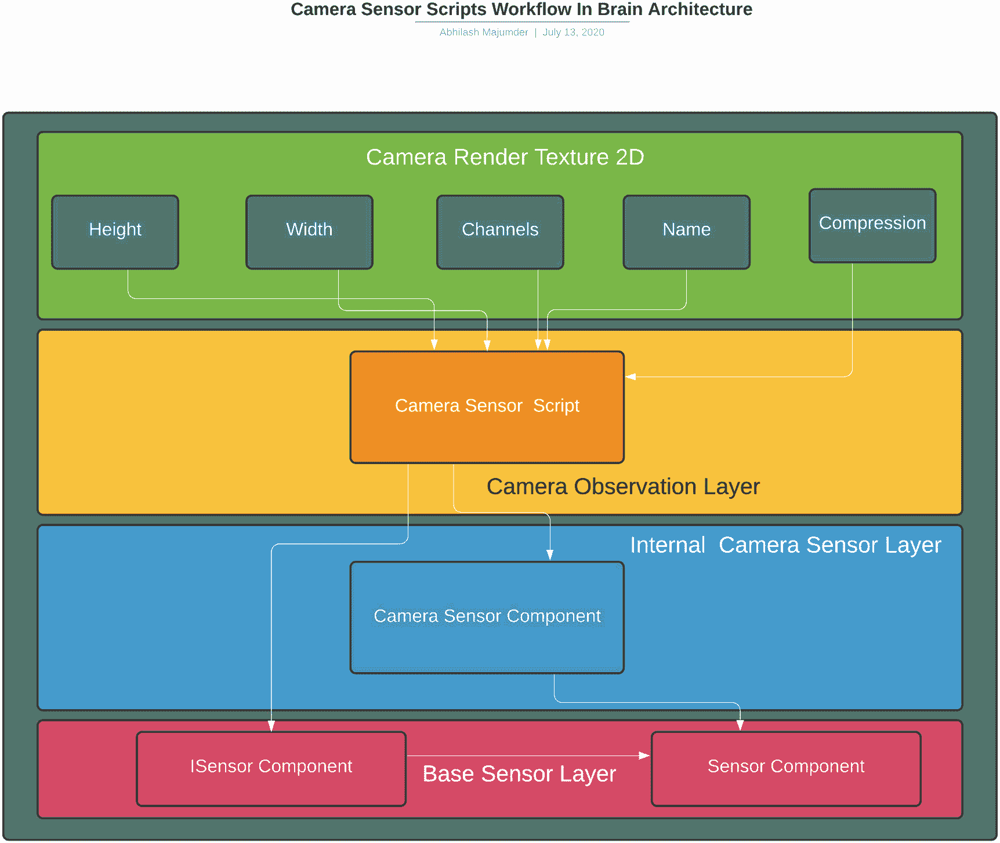

图 4-8

Unity ML Agents 中的相机传感器工作流程

### 政策

在本节中，我们将探讨代理在做出决策时遵循的政策。我们将探讨在上一章中简要提到的 BehaviorParameters 脚本，并了解这个脚本如何与传感器组件相关联，以获取代理的观察空间。BarracudaPolicy 脚本在运行内部大脑时提供有关推理引擎政策的详细信息。HeuristicPolicy 脚本在未对代理应用特定大脑（内部/外部）时参与制定启发式政策。

**行为参数**：如上一章所述，此脚本与代理在接收到传感器观察后的决策过程相关联。代理可以选择将其决策作为默认、内部或启发式。如果选择默认策略，脚本尝试获取当前策略。这可能是在推理引擎中运行的预训练策略或启发式策略。如果没有预训练模型（没有推理）且未实现启发式策略，则使用此默认策略使用 Tensorflow（外部大脑）实时训练神经网络。默认策略使用远程进程进行决策：实时训练。如果不存在外部大脑训练，它将使用推理引擎（内部大脑），如果没有提供模型，则默认为启发式策略。

```py
[Serializable]
public enum BehaviorType
{
Default,
HeuristicOnly,
InferenceOnly
}
```

下一个代码段在运行时实现策略，并生成代理的策略对象。此脚本使用 BrainParameters 脚本，该脚本具有观察大小、堆叠观察、向量动作大小和观察的离散或连续分布等属性。该段还包含一个神经网络模型变量，如果选择内部策略进行推理时使用。它还具有指定预训练模型将在 Unity 游戏中的游戏玩法期间运行的推理设备（如 CPU 或 GPU）的属性。

```py
[HideInInspector, SerializeField]
BrainParameters m_BrainParameters = new BrainParameters();
public BrainParameters BrainParameters
{
get { return m_BrainParameters; }
internal set { m_BrainParameters = value; }
}
[HideInInspector, SerializeField]
NNModel m_Model;
public NNModel Model
{
get { return m_Model; }
set { m_Model = value; UpdateAgentPolicy(); }
}
[HideInInspector, SerializeField]
InferenceDevice m_InferenceDevice;
public InferenceDevice InferenceDevice
{
get { return m_InferenceDevice; }
set { m_InferenceDevice = value; UpdateAgentPolicy();}
}
```

它还控制行为类型、行为名称和布尔变量，该布尔变量控制是否使用子传感器，并为行为分配一个团队 ID，表示为“FullyQualifiedBehaviorName”。子传感器表示附加到代理的子 GameObject 的传感器。

```py
[HideInInspector, SerializeField]
BehaviorType m_BehaviorType;
public BehaviorType BehaviorType
{
get { return m_BehaviorType; }
set { m_BehaviorType = value; UpdateAgentPolicy(); }
}
[HideInInspector, SerializeField]
string m_BehaviorName = "My Behavior";
public string BehaviorName
{
get { return m_BehaviorName; }
set { m_BehaviorName = value; UpdateAgentPolicy(); }
}
[HideInInspector, SerializeField, FormerlySerializedAs("m_TeamID")]
public int TeamId;
[FormerlySerializedAs("m_useChildSensors")]
[HideInInspector]
[SerializeField]
[Tooltip("Use all Sensor components attached to child GameObjects of this Agent.")]
bool m_UseChildSensors = true;
public bool UseChildSensors
{
get { return m_UseChildSensors; }
set { m_UseChildSensors = value; }
}
public string FullyQualifiedBehaviorName
{
get { return m_BehaviorName + "?team=" + TeamId; }
}
```

下一个方法是“GeneratePolicy”，它属于“IPolicy”类型。它接受大脑参数和行为类型作为参数。根据行为类型，应用一个 switch case。如果选择“HeuristicOnly”类型，则从“HeuristicPolicy”（我们将在后面讨论）中抽取其行为。如果使用“InferenceOnly”策略，则检查是否有一个有效的预训练模型可以通过 Barracuda 进行推理。如果没有，则提供警告以更改行为类型。如果存在预训练模型，则将其传递给“BarracudaPolicy”脚本来运行推理。

```py
case BehaviorType.HeuristicOnly:
return new HeuristicPolicy(heuristic
, m_BrainParameters.NumActions);
case BehaviorType.InferenceOnly:
{
if (m_Model == null)
{
var behaviorType = BehaviorType.InferenceOnly.
ToString();
throw new UnityAgentsException(
$"Can't use Behavior Type {behaviorType} without a model. " +
"Either assign a model, or change to a different Behavior Type."
);
}
return new BarracudaPolicy(m_BrainParameters, m_Model, m_InferenceDevice);
}
```

然后我们有“Default”策略，它最初检查通信器是否开启。这意味着端口 5004 已连接，用于使用 Tensorflow 进行模型的实时 Python 训练。这是外部大脑训练。如果端口未连接，策略将检查是否有可用于“推理”策略的有效预训练模型。否则，它默认为“启发式”策略。

```py
case BehaviorType.Default:
if (Academy.Instance.IsCommunicatorOn)
{
return new RemotePolicy(m_BrainParameters, FullyQualifiedBehaviorName);
}
if (m_Model != null)
{
return new BarracudaPolicy(m_BrainParameters, m_Model, m_InferenceDevice);
}
else
{
return new HeuristicPolicy(heuristic, m_BrainParameters.NumActions);
}
default:
return new HeuristicPolicy(heuristic, m_BrainParameters.NumActions);
}
```

此脚本的最后一个方法“UpdateAgentPolicy”在代理不为空的情况下更新代理的策略。

```py
internal void UpdateAgentPolicy()
{
var agent = GetComponent();
if (agent == null)
{
return;
}
agent.ReloadPolicy();
}
```

此 BehaviorParameter 脚本使用某些相邻脚本，例如 BrainParameters、BarracudaPolicy、“HeuristicPolicy” 和 “IPolicy” 脚本，这些脚本对其功能至关重要。在本章的下一节中，我们将使用 Unity 编辑器将“BehaviorParameters”脚本分配给智能体。

如果我们打开 DeepLearning Assets 文件夹中的任何场景，并导航到场景中的任何智能体，我们将看到附加在其上的行为参数脚本。例如，在此情况下，Hallway 的“BehaviorParameter”脚本如图 4-9 所示。

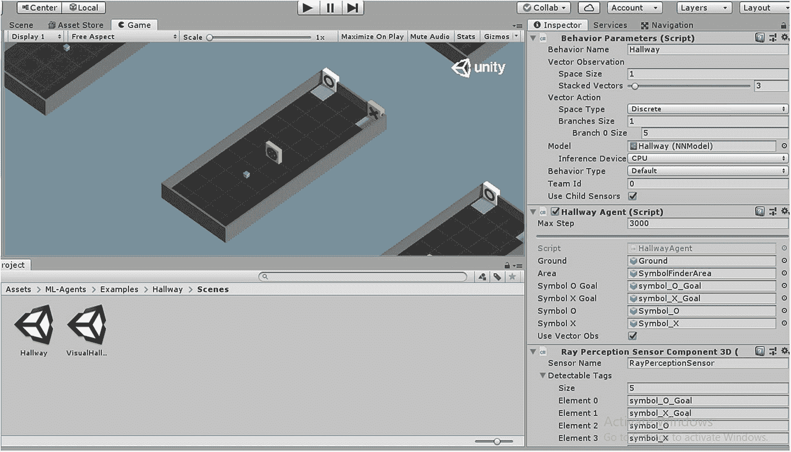

图 4-9

Hallway 场景中的 BehaviorParameters 脚本

一些参数，如 VectorObservation 和 VectorAction，是从 BrainParameters 脚本派生出来的，我们可以看到诸如 Model（控制神经网络模型）、Inference Device（CPU/GPU）、Behavior Type（HeuristicOnly、InferenceOnly、Default）、Team ID 和 Boolean Use Child Sensors（我们在此脚本中讨论的）等变量。

**BrainParameters** **:** 这控制观测输入和输出空间。它确定“BrainParameter”类内部动作空间是离散的还是连续的，并持有与向量观测空间大小相关的数据（默认为 1）。它还有诸如“stacked vectors”之类的属性，指的是用于训练的跨不同帧的观测值的连接。

```py
public enum SpaceType
{
Discrete,
Continuous
}
[FormerlySerializedAs("vectorObservationSize")]
public int VectorObservationSize = 1;
[FormerlySerializedAs("numStackedVectorObservations")]
[Range(1, 50)] public int NumStackedVectorObservations = 1;
```

“VectorActionSize”变量定义动作空间的大小。如果是连续空间，大小简单地定义为向量的长度。对于离散动作空间，大小取决于动作空间的分支。它还有“VectorActionDescriptions”，描述动作空间，“VectorActionSpaceType”，表示连续或离散。

```py
[FormerlySerializedAs("vectorActionSize")]
public int[] VectorActionSize = new[] {1};
[FormerlySerializedAs("vectorActionDescriptions")]
public string[] VectorActionDescriptions;
[FormerlySerializedAs("vectorActionSpaceType")]
public SpaceType VectorActionSpaceType = SpaceType.Discrete;
```

“NumActions” 返回向量动作空间内的动作数量。如果是离散的，则返回“VectorActionSize”数组长度（取决于分支因子）。对于连续空间，返回“VectorActionSize”数组第一个索引的值，因为观测值是堆叠的。

```py
public int NumActions
{
get
{
switch (VectorActionSpaceType)
{
case SpaceType.Discrete:
return VectorActionSize.Length;
case SpaceType.Continuous:
return VectorActionSize[0];
default:
return 0;
}
}
}
```

此脚本中的最后一个方法 Clone，使用在此上下文中讨论的值初始化 BrainParameter 对象。然后，将这些属性传递到出现在编辑器上的 BehaviorParameters 脚本中。

```py
public BrainParameters Clone()
{
return new BrainParameters
{
VectorObservationSize = VectorObservationSize,
NumStackedVectorObservations
= NumStackedVectorObservations,
VectorActionSize = (int[])VectorActionSize.Clone(),
VectorActionDescriptions
= (string[])VectorActionDescriptions.Clone(),
VectorActionSpaceType = VectorActionSpaceType
};
}
```

**BarracudaPolicy** **:** 这用于 Unity 中的推理引擎，以运行预训练的神经网络。内部此脚本使用“ModelRunner”类。此脚本的第一阶段包含不同类型“推理设备”的枚举，即 CPU 或 GPU（分别为 0 或 1）。“BarracudaPolicy”从“IPolicy”接口继承。它包含诸如智能体 ID 和传感器形状列表等属性。用于所有具有类似深度学习模型和相同推理设备的策略的“ModelRunner”脚本。

```py
public enum InferenceDevice
{
CPU = 0,
GPU = 1
}
protected ModelRunner m_ModelRunner;
int m_AgentId;
List m_SensorShapes;
```

此脚本还有一个名为 BarracudaPolicy 的方法，它接受来自 BrainParameters 类的属性、要使用的神经网络模型以及运行模型的推理设备作为参数。此方法使用 Academy 类的“GetOrCreateModel”方法，这意味着如果模型之前已用于推理，它将继续使用该模型。如果在此之前没有为该代理使用预训练模型，它将从资产文件夹获取分配的构建模型。

```py
public BarracudaPolicy(
BrainParameters brainParameters,
NNModel model,
InferenceDevice inferenceDevice)
{
var modelRunner = Academy.Instance.GetOrCreateModelRunner(model, brainParameters, inferenceDevice);
m_ModelRunner = modelRunner;
}
```

它包含一个“RequestDecision”方法，根据训练模型为代理做出决策。它接受传感器列表（ray/camera）作为输入，并为决策过程的每个阶段关联一个相关的事件 ID。

```py
public void RequestDecision(AgentInfo info, List sensors)
{
m_AgentId = info.episodeId;
m_ModelRunner?.PutObservations(info, sensors);
}
```

“DecideAction”方法使用 ModelRunner 脚本的“GetAction”方法，允许代理针对特定决策采取相应的行动。

```py
public float[] DecideAction()
{
m_ModelRunner?.DecideBatch();
return m_ModelRunner?.GetAction(m_AgentId);
}
```

**启发式策略** **:** 当在 BehaviorParameters 脚本中既没有提供 Default 也没有提供 InferenceOnly 选项时使用此策略。这是一个相当硬编码的启发式策略实现，使得代理每次调用“RequestDecision”方法时都会采取行动。它不使用 BrainParameters 脚本属性，并直接使用代理的输入传感器列表来做出决策。在此上下文中重要的方法是“RequestDecision”方法，它接受传感器列表作为输入，以及“DecideAction”方法，它接受策略之前做出的决策。

```py
public HeuristicPolicy(ActionGenerator heuristic, int numActions)
{
m_Heuristic = heuristic;
m_LastDecision = new float[numActions];
}
public void RequestDecision(AgentInfo info, List sensors)
{
StepSensors(sensors);
m_Done = info.done;
m_DecisionRequested = true;
}
public float[] DecideAction()
{
if (!m_Done && m_DecisionRequested)
{
m_Heuristic.Invoke(m_LastDecision);
}
m_DecisionRequested = false;
return m_LastDecision;
}
```

StepSensors 功能使用 ISensor.GetCompressedObservation，这使得传感器在训练和推理过程中的使用保持一致。如果没有使用压缩，则使用传感器观察空间数据（写入 ObservationWriter 类）；否则，以压缩数据的形式传递。

```py
void StepSensors(List sensors)
{
foreach (var sensor in sensors)
{
if (sensor.GetCompressionType()
== SensorCompressionType.None)
{
m_ObservationWriter.SetTarget(m_NullList
, sensor.GetObservationShape(), 0);
sensor.Write(m_ObservationWriter);
}
else
{
sensor.GetCompressedObservation();
}
}
}
```

**IPolicy** **:** 此接口在我们研究的所有策略脚本中使用，因为它连接到单个代理。它提供了本节中描述的其他策略脚本所需的方法，以提供代理可以采取的决策。它有两个独特的声明：一个是“RequestDecision”方法，它向大脑发出信号，表示代理需要根据其正在运行的策略做出决策，另一个是“DecideAction”方法，它意味着必须在调用此方法的时间步长做出决策。

```py
void RequestDecision(AgentInfo info, List sensors);
float[] DecideAction();
```

当调用“DecideAction”方法时，大脑预计会更新其决策。

这完成了策略部分，它涉及到代理的决策步骤。这部分以传感器数据为输入，作为不同类型大脑（内部、外部和启发式）的工作接口，并为代理提供决策。这是大脑的 C#部分，它内部与 Tensorflow 中的深度学习网络连接（我们将在第五章中讨论）。整个策略架构可以总结在图 4-10 中。

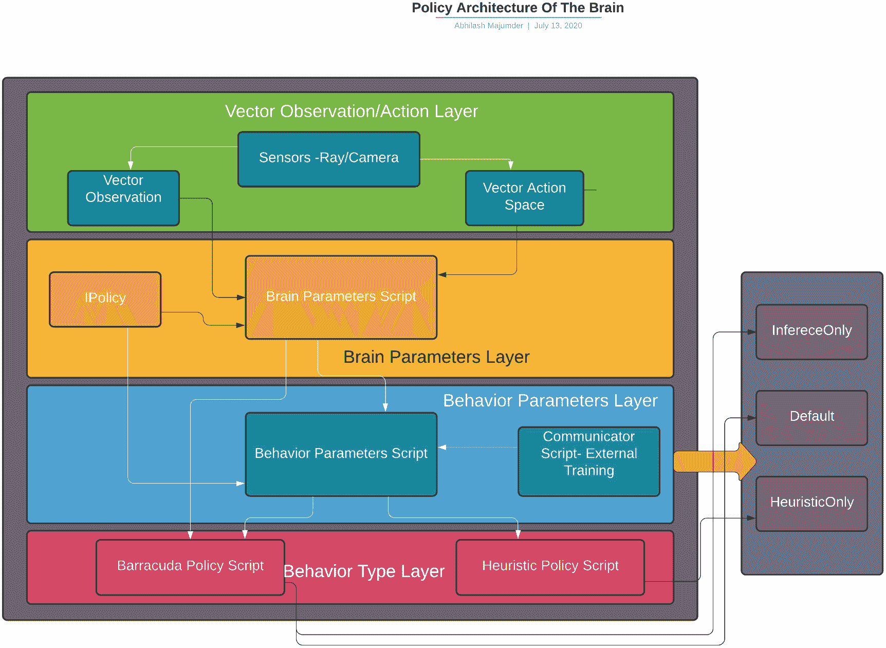

图 4-10

代理大脑中的传感器-策略架构

到目前为止，我们已经对大脑的两个主要部分有了很好的理解：传感器和政策。然而，这仅限于 ML Agents 软件开发工具包（SDK）的 C#层。大脑的其他重要部分包括推理、通信和演示。在这些部分中，推理模块与 Barracuda 引擎和 Tensorflow 预训练模型在堆叠观察数据上的使用过程相关。演示者是模仿学习算法集的一个重要方面。这两个方面将在这里简要讨论，因为它们与 ML Agents 的 Python 方面有更多关联。通信者是一个有趣的模块，它处理策略与 Tensorflow/Python API 之间的连接方式。

### 推理

这个部分用于 Unity 中运行预训练模型的推理引擎。本质上，它处理从 Tensorflow 训练中接收到的压缩张量数据。我们之前提到的 Barracuda 策略使用这个模块来连接观察和动作空间，并在游戏过程中提供决策。这个模块有一些重要的方面，例如“ModelRunner”脚本和“BarracudaModelParamLoader”脚本。处理张量处理数据的关联脚本包括 TensorApplier、TensorGenerator、TensorProxy 和 TensorNames 脚本。我们将学习这个模块的一些方面——特别是 ModelRunner 脚本——以了解 Barracuda 策略如何使用这个脚本做出决策。

**模型运行器** **:** 此脚本的属性包括代理信息、传感器以及包含代理执行的最后一个动作的字典。它还包括诸如用于推理的神经网络模型、推理设备、推理输入和输出以及传感器形状验证等属性。“ModelRunner”方法使用“BrainParameter”脚本中的参数，并具有“TensorAllocator”属性，用于缓存每个训练周期的 Tensor 结果。然后，它使用 ModelLoader.Load 语法加载要使用的模型，并将其分配为 Barracuda 模型。如果没有模型用于推理，则分配一个空值。

```py
public ModelRunner(
NNModel model,
BrainParameters brainParameters,
InferenceDevice inferenceDevice = InferenceDevice.CPU,
int seed = 0)
{
Model barracudaModel;
m_Model = model;
m_InferenceDevice = inferenceDevice;
m_TensorAllocator = new TensorCachingAllocator();
if (model != null)
{
#if BARRACUDA_VERBOSE
m_Verbose = true;
#endif
D.logEnabled = m_Verbose;
barracudaModel = ModelLoader.Load(model);
var executionDevice = inferenceDevice == InferenceDevice.GPU
? WorkerFactory.Type.ComputePrecompiled
: WorkerFactory.Type.CSharp;
m_Engine = WorkerFactory.CreateWorker(executionDevice, barracudaModel, m_Verbose);
}
else
{
barracudaModel = null;
m_Engine = null;
}
```

下一个部分涉及使用 BarracudaModelParamLoader.GetInputTensors 命令从加载的 Barracuda 模型中提取推理输入。同样，推理输出也来自 Barracuda 模型。然而，为了运行推理，还需要某些其他属性，例如 TensorGenerator 和 TensorApplier 类。TensorGenerator 实际上是一个字典，它将 Tensor 名称与生成器进行映射。生成器可以被视为专门的功能，通过将其作为迭代器传递，可以帮助分析大型数据集。在训练期间或使用预训练模型时，而不是加载整个数据集，生成器有助于根据允许更好数据流入处理的功能来划分数据。当我们学习下一章中的卷积神经网络时，我们将深入了解生成器的使用。目前，可以安全地假设“TensorGenerator”类是一个映射，它允许为推理提供适当的数据流管道。同样，TensorApplier 是输出 Tensor 名称与将使用该特定输出 Tensor 的方法之间的映射。它还存储模型信息和操作，并更新代理的内存（缓冲区）。

```py
m_InferenceInputs = BarracudaModelParamLoader.GetInputTensors(barracudaModel);
m_OutputNames = BarracudaModelParamLoader.GetOutputNames(barracudaModel);
m_TensorGenerator = new TensorGenerator(
seed, m_TensorAllocator, m_Memories, barracudaModel);
m_TensorApplier = new TensorApplier(
brainParameters, seed, m_TensorAllocator, m_Memories, barracudaModel);
```

PrepareBarracudaInputs 初始化来自 Barracuda 的推理输入，并在字典中创建名称与推理输入之间的映射。

FetchBarracudaOutputs 根据提供的特定“名称”获取输出。这对于获取与特定名称正确映射的推理输入非常重要，以便进行处理。

```py
static Dictionary PrepareBarracudaInputs(IEnumerable infInputs)
{
var inputs = new Dictionary();
foreach (var inp in infInputs)
{
inputs[inp.name] = inp.data;
}
return inputs;
}
List FetchBarracudaOutputs(string[] names)
{
var outputs = new List();
foreach (var n in names)
{
var output = m_Engine.PeekOutput(n);
outputs.Add(TensorUtils.TensorProxyFromBarracuda(output, n));
}
return outputs;
}
```

PutObservations 验证传感器的形状，并将一个 episode ID 与每个 episode 关联，以便代理所做的决策是有序的。如果代理通过遵循推理引擎模型达到目标，则从字典中删除最后一个动作，因为对于该 episode 不应采取进一步步骤。

```py
public void PutObservations(AgentInfo info, List sensors)
{
#if DEBUG
m_SensorShapeValidator.ValidateSensors(sensors);
#endif
m_Infos.Add(new AgentInfoSensorsPair
{
agentInfo = info,
sensors = sensors
});
m_OrderedAgentsRequestingDecisions.Add(info.episodeId);
if (!m_LastActionsReceived.ContainsKey(info.episodeId))
{
m_LastActionsReceived[info.episodeId] = null;
}
if (info.done)
{
m_LastActionsReceived.Remove(info.episodeId);
}
}
```

“DecideBatch” 方法实际上在推理引擎中以批量方式运行预训练模型。它检查当前批量大小，并通过“TensorGenerator”脚本中的生成函数传递，以产生可以传递给代理的信息的 Tensor。如前所述，生成器允许以顺序划分和处理的批量数据形式传递数据，而不是传递整个数据。这提高了性能，并在传递处理后的数据时占用大量内存的情况下提供帮助。“BeginSample” 方法将样本 Tensor 名称与推理输入关联起来。然后，使用“GenerateTensor”方法将输入张量馈送到推理引擎。此方法是批量处理的初始流程，涉及使用生成函数将 Tensor 数据传递给推理引擎。

```py
if (currentBatchSize == 0)
{
return;
}
if (!m_VisualObservationsInitialized)
{
var firstInfo = m_Infos[0];
m_TensorGenerator.InitializeObservations(firstInfo.sensors, m_TensorAllocator);
m_VisualObservationsInitialized = true;
}
Profiler.BeginSample("ModelRunner.DecideAction");
Profiler.BeginSample($"MLAgents.{m_Model.name}.GenerateTensors");
m_TensorGenerator.GenerateTensors(m_InferenceInputs, currentBatchSize, m_Infos);
Profiler.EndSample();
```

下一个阶段涉及准备与已准备的 Tensor 数据对应的 Barracuda 推理输入。在这里，TensorGenerator 脚本变得很有用，它包含 Tensor 名称（数据）与推理输入之间的映射。

```py
Profiler.BeginSample($"MLAgents.{m_Model.name}.PrepareBarracudaInputs");
var inputs = PrepareBarracudaInputs(m_InferenceInputs);
Profiler.EndSample();
```

然后，Barracuda/推理引擎执行模型。为此，它内部使用 WorkerFactory 类来执行模型。m_Engine 变量使用推理输入，并为代理分配一个特定的时间步动作，例如 3D 运动。这反过来又返回执行模型的输出，以内存、动作和代理采取的决定的形式。在这里，TensorApplier 脚本变得很有用；它控制关联的推理输出与代理采取的内存和动作之间的映射。

```py
Profiler.BeginSample($"MLAgents.{m_Model.name}.ExecuteGraph");
m_Engine.Execute(inputs);
Profiler.EndSample();
Profiler.BeginSample($"MLAgents.{m_Model.name}.FetchBarracudaOutputs");
m_InferenceOutputs = FetchBarracudaOutputs(m_OutputNames);
Profiler.EndSample();
Profiler.BeginSample($"MLAgents.{m_Model.name}.ApplyTensors");
m_TensorApplier.ApplyTensors(m_InferenceOutputs, m_OrderedAgentsRequestingDecisions, m_LastActionsReceived);
Profiler.EndSample();
Profiler.EndSample();
m_Infos.Clear();
m_OrderedAgentsRequestingDecisions.Clear();
```

“HasModel” 方法检查是否存在用于推理的有效预训练模型以及相关的推理设备。方法“GetAction”检索代理在决策向量排序中采取的最后一个动作。

总结来说，这个特定的脚本与使用代理的推理模式相关。该流程包括从预训练模型获取处理后的数据，根据生成函数将其划分为 Tensor 数据以实现更平滑的批量处理，将此 Tensor 数据及其 Tensor 名称作为推理输入传递给 Barracuda 引擎（“TensorGenerator”），执行模型，以内存形式提取结果，假设代理在推理输出格式中采取的动作，借助 TensorApplier 将推理输出与每个场景的结果关联起来，并提取下一个场景的最新输出。只要代理在推理训练中达到目标或场景被终止，这个过程就会继续。这可以通过图 4-11 来说明。

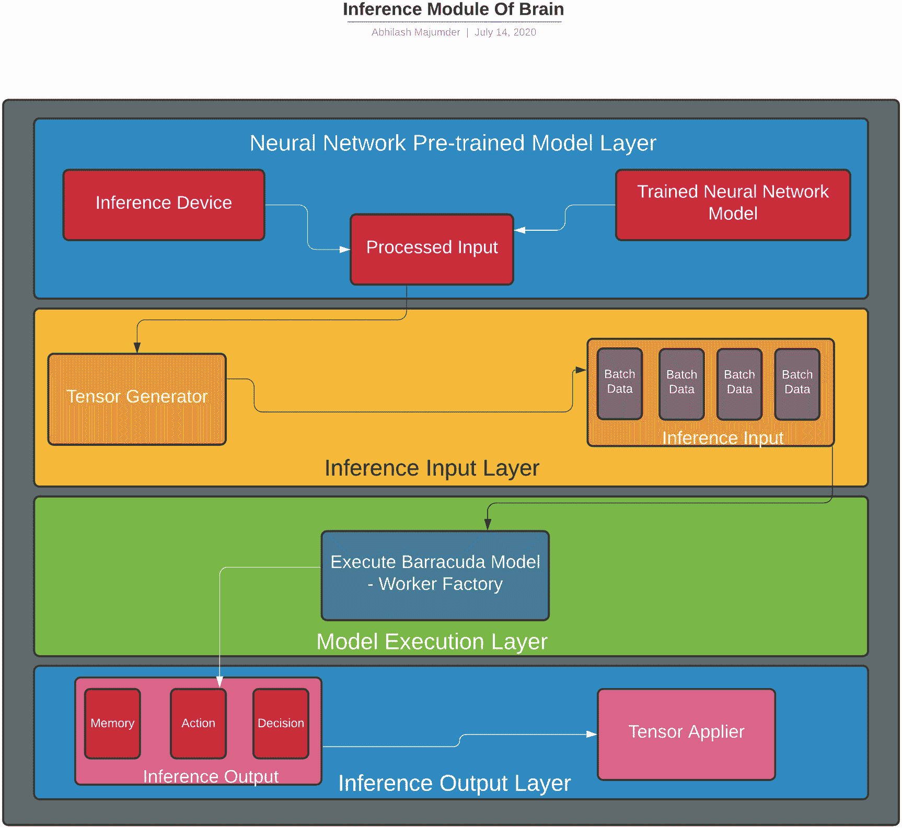

图 4-11

ML Agents 脑中的推理模块工作流程

与此推理模块关联的其他脚本包括此处提到的那些。

**TensorGenerator** **:** 如前所述，此脚本维护了张量名称与批量处理预处理数据的生成函数之间的映射。这很重要，因为在机器学习智能体中，我们将研究使用离散/多离散和连续观察空间的多种模型。根据预训练数据的 Tensor 性质，每个模型的生成函数是不同的。在这种情况下可能有不同的生成器，例如用于批量处理、序列长度或循环输入（用于循环神经网络）：

```py
m_Dict[TensorNames.BatchSizePlaceholder] =
new BatchSizeGenerator(allocator);
m_Dict[TensorNames.SequenceLengthPlaceholder] =
new SequenceLengthGenerator(allocator);
m_Dict[TensorNames.RecurrentInPlaceholder] =
new RecurrentInputGenerator(allocator, memories);
```

例如，如果我们使用一个使用视觉观察数据的模型（ConvD NN 模型），那么我们就使用 VisualObservationInputGenerator；如果我们使用向量化模型（离散/连续），我们就有 VectorObservationGenerator。根据使用的深度强化学习算法类型和相关神经网络模型，生成器是不同的。然而，为了不失一般性，此脚本与用于推理引擎模块工作的数据平滑批量处理相关联。

```py
if (isVectorSensor)
{
if (vecObsGen == null)
{
vecObsGen = new VectorObservationGenerator(allocator);
}
vecObsGen.AddSensorIndex(sensorIndex);
}
else
{
m_Dict[TensorNames.VisualObservationPlaceholderPrefix
+ visIndex] =
new VisualObservationInputGenerator(sensorIndex
, allocator);
visIndex++;
}
```

此外，Barracuda 还与其推理模型关联自己的生成函数，可以用于此。

**TensorApplier** **:** 此脚本是将张量输出与智能体的内存和动作进行映射。根据分布类型——连续或离散——映射是不同的。对于连续动作空间，使用 ContinuousActionOutputApplier，而对于离散空间则使用 DiscreteActionOutputApplier。它还通过执行智能体的每个回合来更新内存，并使用 BarracudaMemoryOutputApplier 方法来保存每个回合的内存内容。脚本还根据智能体采取的动作来更新智能体。

### 演示

大脑的另一个基本部分涉及通过启发式策略进行模仿学习并记录用户游戏玩法以训练智能体的演示模块。此模块不需要神经网络训练或推理引擎来允许智能体做出决策。相反，这是一个独立的模块，致力于通过模仿人类控制来使智能体学习。在本节中，我们将探讨的最重要脚本将是 DemonstrationRecorder 脚本。

**DemonstrationRecorder** **:** 为了通过启发式控制从智能体记录演示，我们必须将此脚本添加到智能体中。当在游戏过程中勾选“记录”选项时，演示将被记录在位于资产文件夹中的.demo 文件中。这个特定的演示文件包含了执行模仿学习算法的演示细节，根据环境的复杂度，可能需要几分钟到几个小时。图 4-12 显示了 Unity 中的 3D 球环境中的演示文件。

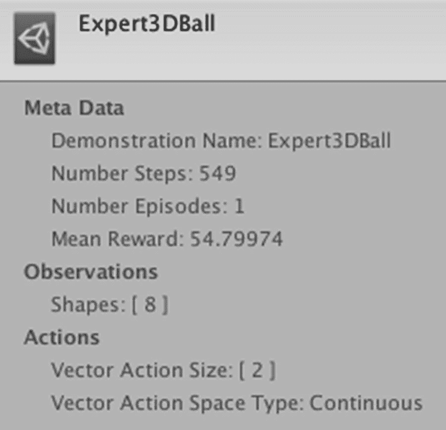

图 4-12

Unity 中的示例演示文件(.demo)

此脚本具有某些属性，例如演示者名称、名称的最大长度、文件的扩展类型（.demo）以及默认存储目录（Assets/Demonstrations）。

```py
[FormerlySerializedAs("demonstrationDirectory")]
[Tooltip("Directory to save the demo files. Will default to " +
"{Application.dataPath}/Demonstrations if not specified.")]
public string DemonstrationDirectory;
DemonstrationWriter m_DemoWriter;
internal const int MaxNameLength = 16;
const string k_ExtensionType = ".demo";
const string k_DefaultDirectoryName = "Demonstrations";
IFileSystem m_FileSystem;
Agent m_Agent;
```

在初始化时，而不是在懒加载期间，将代理的行为参数作为输入，并为演示文件提供关联的文件路径和文件名。

```py
internal DemonstrationWriter LazyInitialize(IFileSystem fileSystem = null)
{
if (m_DemoWriter != null)
{
return m_DemoWriter;
}
if (m_Agent == null)
{
m_Agent = GetComponent();
}
m_FileSystem = fileSystem ?? new FileSystem();
var behaviorParams
= GetComponent();
if (string.IsNullOrEmpty(DemonstrationName))
{
DemonstrationName
= behaviorParams.BehaviorName;
}
if (string.IsNullOrEmpty(DemonstrationDirectory))
{
DemonstrationDirectory
= Path.Combine(Application.dataPath
,  k_DefaultDirectoryName);
}
DemonstrationName
= SanitizeName(DemonstrationName, MaxNameLength);
var filePath = MakeDemonstrationFilePath
(m_FileSystem, DemonstrationDirectory,
DemonstrationName);
var stream = m_FileSystem.File.Create(filePath);
m_DemoWriter = new DemonstrationWriter(stream);
AddDemonstrationWriterToAgent(m_DemoWriter);
return m_DemoWriter;
}
```

“SanitizeName”方法从演示名称中移除所有字符，除了字母数字字符。它可以被认为是用于移除字符的正则表达式的类似物。

```py
internal static string SanitizeName(string demoName, int maxNameLength)
{
var rgx = new Regex("[^a-zA-Z0-9 -]");
demoName = rgx.Replace(demoName, "");
if (demoName.Length > maxNameLength)
{
demoName = demoName.Substring
(0, maxNameLength);
}
return demoName;
}
```

MakeDemonstrationFilePath 对于在观察完成后保存演示文件非常重要。它使用时间戳来保存演示文件。在训练阶段结束后，会调用“AddDemonstratorWriterToAgent”方法。该方法调用代理的行为参数，并将训练观察文件（.demo）与它关联。然后代理运行这个训练好的演示文件，并使用模仿学习。重要的是，在记录阶段（模仿学习的训练阶段），行为参数类型可以设置为 HeuristicOnly，因为在这种情况下，没有关联的内部/外部大脑可供选择。这个启发式大脑在 HeuristicPolicy 上运行，这是我们之前在脑部策略部分讨论过的。然而，另一种修改可以使用玩家大脑，它可以通过用户的游戏操作记录动作。

```py
var behaviorParams = GetComponent();
demoWriter.Initialize(
DemonstrationName,
behaviorParams.BrainParameters,
behaviorParams.FullyQualifiedBehaviorName
);
m_Agent.DemonstrationWriters.Add(demoWriter);
```

这就结束了演示部分及其相关脚本，这些内容非常重要，需要理解。当我们将在后面的章节中深入探讨生成对抗模仿学习（GAIL）时，将单独讨论相关的脚本。模仿学习的工作流程可以查看，如图 4-13 所示。

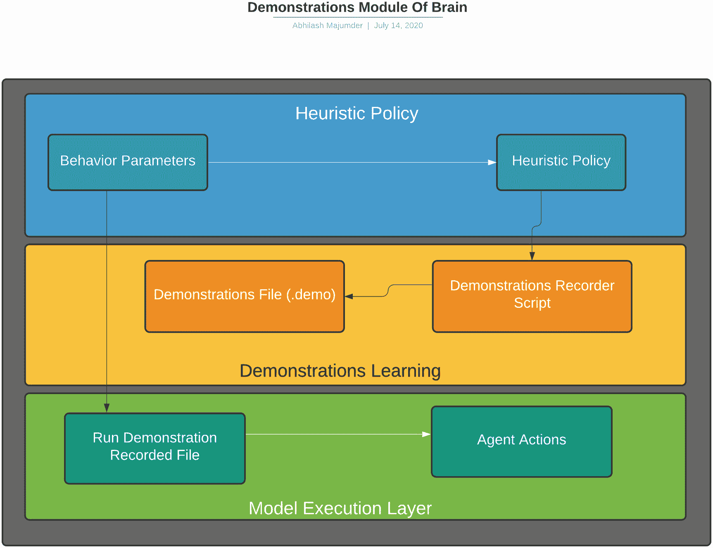

图 4-13

脑部中用于模仿学习的演示模块

### 通信器

通信器模块与将大脑与 Python API 链接相关联。由于此模块对于实时训练非常重要，它可以被认为是学院的一部分。由于此模块控制 C#和 Python API 之间的链接，我们将查看 ICommunicator 脚本。

**ICommunicator:** ICommunicator 脚本包含重要的属性，例如连接到 Python 的端口号、Unity 包版本、Unity 通信版本、名称以及 C#框架的 RL 能力。

```py
public int port;
public string name;
public string unityPackageVersion;
public string unityCommunicationVersion;
public UnityRLCapabilities CSharpCapabilities;
```

这些包含重要的结构，如 UnityRLParameters，它包含布尔变量 isTraining，用于检查端口（5004）是否被外部大脑用于运行 Tensorflow 模型。

```py
internal struct UnityRLInputParameters
{
public bool isTraining;
}
```

“QuitCommandHandler”和“ResetCommandHandler”终止并重置通信器发送的事件和参数更新。该脚本还处理来自通信器的“UnityRLInputParameters”更新。

```py
internal delegate void QuitCommandHandler();
internal delegate void ResetCommandHandler();
internal delegate void RLInputReceivedHandler(UnityRLInputParameters inputParams);
```

下一个部分很重要，因为在通信器中有两种类型：Unity 通信器和外部通信器。两个通信器之间的信息（包）流是纯顺序的。一旦建立连接，两个通信器之间就会交换一个初始化消息包。这类似于计算机网络中的握手技术。按照惯例，Unity 输入是从外部到 Unity 的消息，Unity 输出是从 Unity 到外部的消息。消息包按顺序依次发送，每个信息交换都发送一个，除了第一次，外部通信器发送两个消息以建立连接。消息的结构可以表示如下：

```py
UnityMessage
...Header
...UnityOutput
......UnityRLOutput
......UnityRLInitializationOutput
...UnityInput
......UnityRLInput
......UnityRLInitializationInput
```

“ICommunicator”接口包含之前函数的所有声明，如退出/重置接收到的命令。它还通过“Initialize”方法使用通信器发送学院参数：

```py
UnityRLInitParameters Initialize(CommunicatorInitParameters initParameters);
```

“SubscribeBrain”为通信添加了一个新的大脑：

```py
void SubscribeBrain(string name, BrainParameters brainParameters);
```

PutObservation 在每次外部训练的时间步通过通信器将观察结果发送给代理。DecideBatch 向 ICommunicator 发出信号，表示代理已准备好接收动作，如果通信器尚未为其代理接收动作，则它需要在此点获取动作。“GetActions”方法根据批处理程序（键）获取代理动作。

```py
void PutObservations(string brainKey, AgentInfo info, List sensors);
void DecideBatch();
float[] GetActions(string key, int agentId);
```

与通信器相关联的其他脚本包括 rpccommunicator 和 UnityRLCapabilities 脚本，它们内部实现了这个 Icommunicator 接口。通信器最重要的功能涉及通过端口号 5004 在 Unity 大脑和外部通信器之间交换消息包。

这完成了对大脑架构五个主要部分的深入分析：传感器、策略、通信器、推理/鳄鱼和演示。存在于大脑架构中的相关文件夹包括“编辑器”和 Grpc。编辑器文件夹包含继承/实现大脑四个主要部分的脚本，以便在编辑器中显示。Grpc 是一个路由协议，作为通信器的一部分使用。在下一节中，我们将了解学院架构，它涉及三个主要脚本：Agent、Academy 和 DecisionRequester。这些脚本控制和协调代理的训练活动及其与环境的关系。

## 理解学院和代理

现在我们已经了解了大脑架构，我们可以理解学院的不同方面，它与大脑同步工作。学院可以被认为是 Unity 中 RL 环境的一部分，负责控制训练、剧集、时代和代理大脑的环境变量。因此，学院、代理、通信者和 Python API 是大脑的四个主要外围设备，帮助大脑进行决策过程。我们在上一节研究了通信者对象，在这里我们将看到学院如何也与通信者相关。我们将研究与学院架构相关的学院脚本。在后面的章节中，我们将查看“Agent”脚本和 DecisionRequester 脚本。

**学院**：学院，连同学习大脑，是环境的一部分，而通信者用于在之前和 Python API 之间交换消息包。在“FixedUpdate”方法中，调用“Academy.Instance.EnvironmentStep()”方法，用于为每个训练剧集设置环境。

```py
void FixedUpdate()
{
Academy.Instance.EnvironmentStep();
}
```

学院类是一个单例设计模式。实例在第一次访问时初始化。初始化后，学院尝试通过外部通信者连接到 Python API。如果没有任何端口可用或外部通信者和学院之间没有交换消息包，外部大脑将无法工作。在这种情况下，学院将默认环境设置为推理模式或启发式模式。通信者交互非常重要，因为它直接在 Python API 和学院之间进行交互。脚本包含一些重要属性，例如 API 版本，它必须与“UnityEnvironment.API_VERSION”兼容，包版本，训练端口（5004）以及用于指示训练端口的标志（“—mlagents-port”）。

```py
const string k_ApiVersion = "1.0.0"
internal const string k_PackageVersion = "1.0.0-preview";
const int k_EditorTrainingPort = 5004;
const string k_PortCommandLineFlag = "--mlagents-port";
```

学院脚本随后遵循懒惰初始化过程，一旦初始化完成，连接将保持开启状态，以便在通信者和学院之间进行消息交换。然后，它使用布尔变量 IsCommunicatorOn 检查通信者是否开启。

```py
static Lazy s_Lazy = new Lazy(() => new Academy());
public bool IsCommunicatorOn
{
get { return Communicator != null; }
}
```

它控制完成剧集的数量、训练阶段的总剧集数、单个剧集内完成的总步数以及整个模拟期间完成的总步数。它使用“ModelRunner”类（已讨论），在运行时存储训练好的神经网络模型以进行推理。它还有一个用于推理的随机种子值。

```py
int m_EpisodeCount;
int m_StepCount;
int m_TotalStepCount;
internal ICommunicator Communicator;
bool m_Initialized;
List m_ModelRunners = new List();
bool m_HadFirstReset;
int m_InferenceSeed;
public int InferenceSeed
{
set { m_InferenceSeed = value; }
}
```

学院类的重要方面在于，在多智能体环境中，它保持通信的同步。这意味着智能体以一致的方式执行步骤，并且一个智能体在另一个智能体请求决策之前必须基于特定决策采取行动。它还具有诸如 DecideAction、AgentIncrementStep 和 Destroy 方法等变量来控制这种同步。它控制智能体的重置、动作、预步骤和其他决策。

```py
internal event Action DecideAction;
internal event Action DestroyAction;
internal event Action AgentIncrementStep;
public event Action AgentPreStep;
internal event Action AgentSendState;
internal event Action AgentAct;
internal event Action AgentForceReset;
public event Action OnEnvironmentReset;
AcademyFixedUpdateStepper m_FixedUpdateStepper;
GameObject m_StepperObject;
```

然后，它初始化智能体（“Academy” 方法）以确保场景中至少有一个有效的智能体存在。“EnableAutomaticStepping” 涉及使用“Academy/.EnvironmentStep” 方法来控制智能体和训练环境采取的动作和决策。它存在于固定更新方法中，因为它在每一帧都会被调用以使智能体采取行动，并将“AcademyFixedUpdateStepper” 组件附加到智能体上以执行此任务。

```py
void EnableAutomaticStepping()
{
if (m_FixedUpdateStepper != null)
{
return;
}
m_StepperObject = new GameObject("AcademyFixedUpdateStepper");
m_StepperObject.hideFlags = HideFlags.HideInHierarchy;
m_FixedUpdateStepper = m_StepperObject.AddComponent
();
try
{
GameObject.DontDestroyOnLoad(m_StepperObject);
}
catch {}
}
```

“DisableAutomaticStepping” 方法用于手动控制学院训练步骤，而不是在每一帧更新它。与固定更新方法相反，为了利用学院训练，我们必须手动使用“Academy.EnvironmentStep”方法来设置步骤。在在线训练中使用学院时，通常不建议禁用自动更新以获得最佳性能指标。

```py
void DisableAutomaticStepping()
{
if (m_FixedUpdateStepper == null)
{
return;
}
m_FixedUpdateStepper = null;
if (Application.isEditor)
{
UnityEngine.Object.DestroyImmediate(m_StepperObject);
}
else
{
UnityEngine.Object.Destroy(m_StepperObject);
}
m_StepperObject = null;
}
```

“AutomaticSteppingEnabled” 用于在学院训练期间自动执行步骤。它根据训练阶段是否存在固定更新在“DisableAutomaticStepping” 和“EnableAutomaticStepping” 之间进行选择。下一个方法“ReadPortFromArgs” 读取端口和相关的训练标志。“EnvironmentParameters” 在此上下文中非常重要，因为如果使用课程学习（稍后讨论），则可以从训练过程中生成的参数值传递给学院。

```py
public EnvironmentParameters EnvironmentParameters
{
get { return m_EnvironmentParameters; }
}
```

“StatsRecorder” 方法用于记录在 Unity 中训练的特定学院统计数据。“InitializeEnvironment” 方法用于初始化环境和注册用于信息交换的侧通道（通信器的一部分）。当我们在训练模型时看到如何在 Jupyter Notebook 和 Unity 之间传递信息时，侧通道将特别有用。它允许我们注册观察和动作空间，并具有某些属性来控制模拟训练。下一步是启动端口并建立与外部通信器的连接（“rpcCommunicator”）。

```py
TimerStack.Instance.AddMetadata("communication_protocol_version", k_ApiVersion);
TimerStack.Instance.AddMetadata("com.unity.ml-agents_version", k_PackageVersion);
EnableAutomaticStepping();
SideChannelsManager.RegisterSideChannel(new EngineConfigurationChannel());
m_EnvironmentParameters = new EnvironmentParameters();
m_StatsRecorder = new StatsRecorder();
var port = ReadPortFromArgs();
if (port > 0)
{
Communicator = new RpcCommunicator(
new CommunicatorInitParameters
{
port = port
}
);
}
```

如果通信者未连接，将启动一个新的尝试，在 UnityRLParameters 和通信者之间建立连接。根据结果，如果通信者由于没有 Python 进程处于训练状态而无法响应，则学院默认进入“推理”模式进行学习。它还发出警告，说明如果无法通过端口 5004 连接到训练者，并且当前“API_VERSION”的情况下，学院将强制大脑使用推理模块及其相关策略。

```py
if (Communicator != null)
{
try
{
var unityRlInitParameters = Communicator.Initialize(
new CommunicatorInitParameters
{
unityCommunicationVersion = k_ApiVersion,
unityPackageVersion = k_PackageVersion,
name = "AcademySingleton",
CSharpCapabilities = new UnityRLCapabilities()
});
UnityEngine.Random.InitState(unityRlInitParameters.seed);
m_InferenceSeed = unityRlInitParameters.seed;
TrainerCapabilities = unityRlInitParameters.TrainerCapabilities;
TrainerCapabilities.WarnOnPythonMissingBaseRLCapabilities();
}
catch
{
Debug.Log($"" +
$"Couldn't connect to trainer on port {port} using API version {k_ApiVersion}. " +
"Will perform inference instead."
);
Communicator = null;
}
if (Communicator != null)
{
Communicator.QuitCommandReceived += OnQuitCommandReceived;
Communicator.ResetCommandReceived += OnResetCommand;
}
```

接下来的几个代码段与记录训练环境的各种统计数据有关，例如集数、集数数量、重置环境、特定集中的完成步骤，以及其他数据。另一个有趣的方面是，学院脚本使用来自 ModelRunner 类的“GetOrCreateModel”方法，我们之前在推理模块中讨论过。这是必要的，因为如果通信者未连接，学院将回退到推理模块，该模块在 Barracuda 引擎上运行并使用 ModelRunner 脚本。正如我们所研究的，该脚本使用 BrainParameters 脚本根据预训练神经网络、推理策略和推理设备做出决策。“Dispose”方法在通过关闭与通信者的通信和侧通道完成训练后释放连接。一旦训练/推理完成，学院会重置自己，这样当我们想要再次使用内部或外部大脑进行训练时，它应该分别连接到推理或通信模块。

学院的整体工作流程涉及控制软件包版本、端口号、与 Python 的 API 兼容性，以及在训练过程中控制一集的各个步骤。它还在连接通信者与大脑以进行实时训练中扮演着重要角色，并提供启用或禁用环境步骤选项的选择。它还根据通信者是否发送反馈消息包以确保连接建立来控制大脑运行模型的选择。如果建立了连接，则触发在线训练程序，该程序通过 Python API 使用 Tensorflow 训练代理的外部大脑。如果没有建立连接，则将推理模型分配给大脑。总之，该架构控制了大脑训练其策略所需的所有环境属性。这如图 4-14 所示。

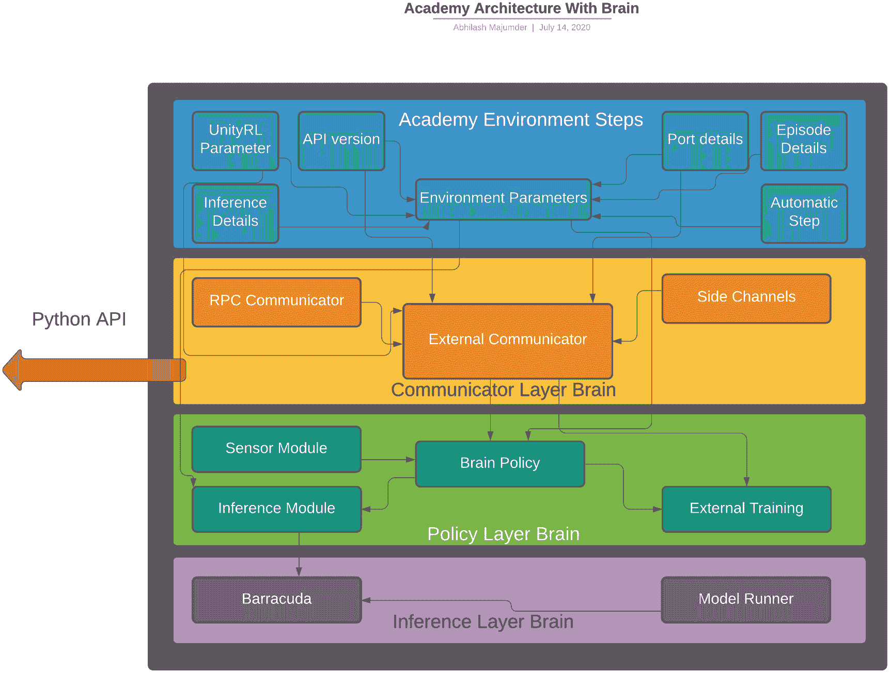

图 4-14

与 ML Agents 中的大脑相连的学院层

**代理**：由于这个脚本特别大，我们将探讨其重要方面。正如所述，代理使用大脑-学院架构来做出决策和相应的动作。它有一些参数来控制动作空间，无论是连续的还是离散的。对于离散空间，DiscreteActionMasks 布尔数组控制代理不会采取的决策分支。它包含奖励、训练模拟期间达到的最大步数以及相应的剧集 ID。AgentActions 结构体包含 float 数组 vectorActions。如前所述，代理通过大脑（射线/球体/相机）的传感器层接收观察输入，并将其传递给大脑策略层中存在的不同策略，以做出相应的决策。根据通信者和相关端口的可用性，学院决定是在外部策略（实时 Tensorflow 训练）还是在推理策略上训练代理。学院然后将此信息传递给大脑的 BehaviorParameters 脚本，并附带一个相关的行为类型（默认，仅推理，仅启发式）。还有一些重要的变量控制累积奖励、完成的剧集、步数、代理信息、请求决策和请求动作。它还包含观察传感器和大脑代理预制件中存在的传感器列表，用于大脑的传感器模块。对于模仿学习，它还包含 DemonstrationWriters 变量，用于在.demo 文件中写入观察（启发式策略），这是我们在大脑的“演示”模块中研究的。 

“OnBeforeSerialize”和“OnAfterDeserialize”方法用于代理参数（决策、步骤、最大步骤、动作）的序列化。 “LazyInitialize”方法使用相关的剧集 ID、代理信息、策略（来自大脑的策略模块，BehaviorParameters）和传感器初始化代理。它还在每个训练剧集（AgentIncrementStep）中初始化步骤增量，确定代理将要采取的决策（DecideAction），代理的动作步骤（AgentAct），代理发送状态（AgentSendState），以及 AgentForceReset，该操作重置代理参数。ResetData、Initialize 和 InitializeSensors 方法对于代理的工作流程非常重要。

```py
if (m_Initialized)
{
return;
}
m_Initialized = true;
m_EpisodeId = EpisodeIdCounter.GetEpisodeId();
m_PolicyFactory = GetComponent();
m_Info = new AgentInfo();
m_Action = new AgentAction();
sensors = new List();
Academy.Instance.AgentIncrementStep += AgentIncrementStep;
Academy.Instance.AgentSendState += SendInfo;
Academy.Instance.DecideAction += DecideAction;
Academy.Instance.AgentAct += AgentStep;
Academy.Instance.AgentForceReset += _AgentReset;
m_Brain = m_PolicyFactory.GeneratePolicy(Heuristic);
ResetData();
Initialize();
InitializeSensors();
if (Academy.Instance.TotalStepCount != 0)
{
OnEpisodeBegin();
}
}
```

“DoneReason”枚举包含诸如 DoneCalled、MaxStepReached 和 Disabled 等详细信息，这些信息向代理发出信号，表明目标已达成或训练已停止，代理达到的最大步数，以及代理是否被禁用。下一个重要的方法是“NotifyAgentDone”，该方法将代理标记为完成；这表示代理已达成目标或训练已被终止。此方法包含代理获得的奖励，完成剧集的剧集 ID，并使用“CollectObservations”方法收集决策。由于我们提到最后一步是由代理在连续的训练步骤中采取的，这是通过“m_Brain?.RequestDecision”方法实现的。在代理做出决策后，使用“ResetSensors”方法重置传感器。现在，除了推理和外部训练之外，我们还有依赖于启发式控制的演示者。为此，代理根据“.demo”文件的内容选择决策，并通过“Record”方法记录新的奖励和动作集。对于每个剧集，奖励与决策一起计算，并在剧集结束时，清除包含该特定剧集详细信息的数组。奖励被设置为 0，请求决策/请求动作变量被设置为 false。此方法实际上在代理通过遵循特定策略达成目标后，向代理发出写入观察的信号。

```py
if (m_Info.done)
{
return;
}
m_Info.episodeId = m_EpisodeId;
m_Info.reward = m_Reward;
m_Info.done = true;
m_Info.maxStepReached = doneReason == DoneReason.MaxStepReached;
if (collectObservationsSensor != null)
{
collectObservationsSensor.Reset();
CollectObservations(collectObservationsSensor);
}
m_Brain?.RequestDecision(m_Info, sensors);
ResetSensors();
foreach (var demoWriter in DemonstrationWriters)
{
demoWriter.Record(m_Info, sensors);
}
if (doneReason != DoneReason.Disabled)
{
m_CompletedEpisodes++;
UpdateRewardStats();
}
m_Reward = 0f;
m_CumulativeReward = 0f;
m_RequestAction = false;
m_RequestDecision = false;
Array.Clear(m_Info.storedVectorActions, 0, m_Info.storedVectorActions.Length);
```

“SetModel”方法类似于 BehaviorParameters，它根据推理、外部训练模型或启发式策略决定使用哪个模型。 “ReloadPolicy”方法在特定剧集开始时重新加载代理正在使用的当前策略。 “SetReward”方法提供了代理在训练期间获得的奖励的实现。重要的是要注意，奖励仅在 RL 的外部大脑训练状态下使用，而不是在推理模式下使用。此方法替换了在当前训练时间步中添加到代理的任何奖励。

```py
public void SetReward(float reward)
{
#if DEBUG
Utilities.DebugCheckNanAndInfinity(reward, nameof(reward), nameof(SetReward));
#endif
m_CumulativeReward += (reward - m_Reward);
m_Reward = reward;
}
It is recommended to use a positive reward to reinforce learning (during training) and a negative reward to penalize mistakes. We will be using this in our scripts. The "AddReward" method is used for adding the Rewards for all the stages of the training (cumulative rewards across episodes).
public void AddReward(float increment)
{
#if DEBUG
Utilities.DebugCheckNanAndInfinity(increment, nameof(increment), nameof(AddReward));
#endif
m_Reward += increment;
m_CumulativeReward += increment;
}
```

“GetCumulativeReward”方法用于获取该场景的累积奖励。 “UpdateRewardStates”方法用于根据智能体使用的策略和 BehaviorType 更新奖励。 “RequestAction”方法用于根据智能体策略的最新决策（最新决策）重复之前采取的动作。在许多情况下，可能不会请求新的决策——例如，智能体可能使用之前的决策来沿一个轴进行平移。在这里，智能体使用“RequestAction”方法保持其航向，当智能体想要改变其航向或其速度/加速度/力时，会调用决策。 “ResetData”方法重置大脑参数、观察/动作空间和向量（离散/连续）。在“Initialize”方法内部，有一个使用“Input.GetAxis”来操纵智能体沿不同轴移动的启发式方法。这基本上是一个使用控制的启发式策略，在演示策略（模仿学习）由大脑触发时使用。

```py
public override void Heuristic(float[] actionsOut)
{
actionsOut[0] = Input.GetAxis("Horizontal");
actionsOut[1] = Input.GetKey(KeyCode.Space) ? 1.0f : 0.0f;
actionsOut[2] = Input.GetAxis("Vertical");
}
```

“IntializeSensors”方法依赖于大脑的传感器模块，并使用其方法，例如获取智能体的子传感器、控制向量的堆叠观察（VectorSensor 和 BrainParameter 脚本）和其他属性。此方法类似于一个接口，向大脑的传感器模块发出信号，记录在向量容器（float 数组）中的观察结果。SendInfoToBrain 将智能体采集的传感器信息发送到大脑，大脑可以处理这些数据。如前所述，这些信息传递到大脑的策略模块。在这里，学院扮演了一个角色——如果通信器连接，则采用外部实时训练策略，并使用该策略训练智能体。如果没有，则信息发送到大脑的推理模块，其中 Barracuda 引擎运行相关的预训练神经网络模型。“RequestDecision”方法（已讨论）然后使用来自传感器的这些观察结果和大脑的策略，让智能体做出特定的决策。

```py
m_Brain.RequestDecision(m_Info, sensors);
```

其他方法，“GetAction”和“ScaleAction”，由智能体用于将那些决策转换为动作。“CollectDiscreteActionMasks()”方法用于屏蔽某些离散动作，智能体将不会执行这些动作。最后，“OnActionReceived”方法表示智能体根据决策策略采取的动作。对于连续情况，返回一个浮点数组，并且应该将其夹紧以增加训练的稳定性；对于离散情况，动作空间由分支组成（例如，向上箭头键表示智能体向前移动，反之亦然）。

总结来说，代理脚本依赖于大脑和学院来选择其决策，并据此采取行动并获得奖励。初始化阶段包括分配大脑参数、代理参数的值，以及为环境设置奖励函数。代理从大脑的传感器模块获取输入信息，并将其传递给大脑进行处理。学院随后根据通信模块建立的连接确认是否使用外部大脑或内部大脑。基于此，相应的策略被应用于代理以使其做出决策。决策方面会调用代理采取行动。行动的结果可以是代理获得正或负奖励的信用。根据是否达到目标或获得奖励，这个过程会继续请求传感器信息，并使用策略进行处理，然后提供行动。在每个场景结束时，代理会被重置，所有代理参数也会重置。

我们将要讨论的最后一个脚本是“DecisionRequester”脚本。

**DecisionRequester** **:** 此脚本会自动为代理请求决策。这是我们场景中需要附加到代理上的脚本。它控制代理请求决策的频率，以学院时间步为单位。例如，值为 5 表示代理将在 5 个学院时间步之后请求决策。它控制代理在学院时间步之间是否采取行动的选择，例如在“agent”脚本中提到的示例。它还初始化代理类。

```py
[Range(1, 20)]
[Tooltip("The frequency with which the agent requests a decision. A DecisionPeriod " +
"of 5 means that the Agent will request a decision every 5 Academy steps.")]
public int DecisionPeriod = 5;
[Tooltip("Indicates whether or not the agent will take an action during the Academy " +
"steps where it does not request a decision. Has no effect when DecisionPeriod " +
"is set to 1.")]
[FormerlySerializedAs("RepeatAction")]
public bool TakeActionsBetweenDecisions = true;
[NonSerialized]
Agent m_Agent;
```

方法“MakeRequests”使用来自学院的决策来通知代理是否应该在决策之间请求决策或采取行动。

```py
void MakeRequests(int academyStepCount)
{
if (academyStepCount % DecisionPeriod == 0)
{
m_Agent?.RequestDecision();
}
if (TakeActionsBetweenDecisions)
{
m_Agent?.RequestAction();
}
}
```

这样就完成了大脑、学院和代理的整个架构的深入探讨。我们现在对大脑/学院部分的不同脚本有了相当的了解，并且也研究了它们之间的交互。大脑、学院和代理不同部分之间的联系可以如图 4-15 所示。

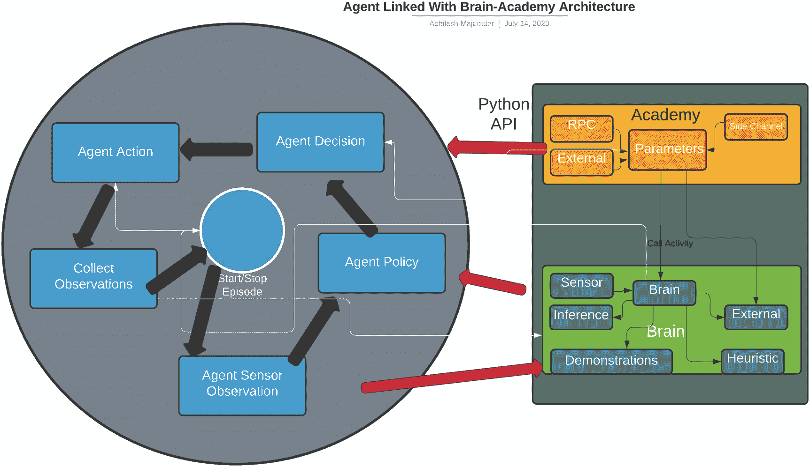

图 4-15

与代理相连的大脑学院架构

在本模块中，某些脚本需要具备深度学习知识，将在稍后讨论，特别是 ModelOverrider 脚本。在下一节中，我们将利用这些知识在 Unity 中构建一个小型深度学习代理，并使用 Unity ML Agents 对其进行训练。

## 使用单个大脑训练 ML 代理

在本节中，我们将创建一个简单的智能体，其任务是找到场景中存在的目标对象。这一次，我们将使用我们自己的智能体脚本实现来使用 Unity ML Agents 进行训练。为此，我们必须导航到 DeepLearning 文件夹下的 Assets 文件夹，并导航到 FindingBlock-PPO 文件夹。我们必须打开 findingblock Unity 场景文件。在这个场景中，蓝色智能体必须在 ML Agents 和传感器的帮助下定位绿色目标。它被包围在一个边界框平台上。场景的样本预览看起来类似于图 4-16。

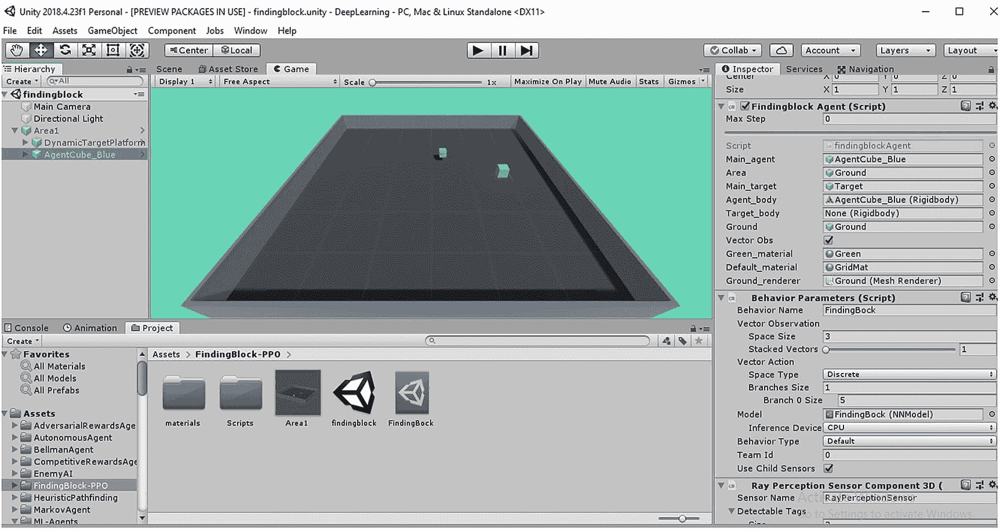

图 4-16

Unity ML Agents 中的寻找方块场景

### 附加行为参数脚本

**行为参数** **:** 在这个案例中，由于我们必须使用外部大脑在 ML Agents 中训练我们的智能体，首要目标是把所有必要的组件附加到蓝色智能体上。为此，最重要的部分是为智能体关联一个大脑，在这种情况下，我们将“BehaviorParameters”脚本附加到蓝色智能体上。正如我们之前提到的，这控制了所有向量观察、堆叠向量、动作空间、推理设备和子传感器。在我们的案例中，我们将保留大部分细节使用默认值，除了向量观察的空间大小。这是因为在我们的案例中，智能体可以在 x 和 z 轴上移动。对于每个轴，智能体可以朝正负方向移动——因此观察的可能空间是一个轴上的两个。对于 x 和 z 轴，总的向量观察空间变为 2*2，即 4。我们知道在向量观察部分内部有一个浮点数组，编号从 0 到 3。

**三维射线感知传感器组件** : 我们将附加此脚本，因为它与大脑的传感器模块相关联，并用于收集场景中的观察数据。我们将保留大部分默认值，例如角度、每个方向上的射线、射线长度等，或者我们可以相应地更改它们。我们必须定义智能体必须观察的可检测标签。在这种情况下，智能体应该只观察目标和平台墙壁边界；相应的可检测标签已列出。图 4-17 显示了在 Unity 中的此设置。

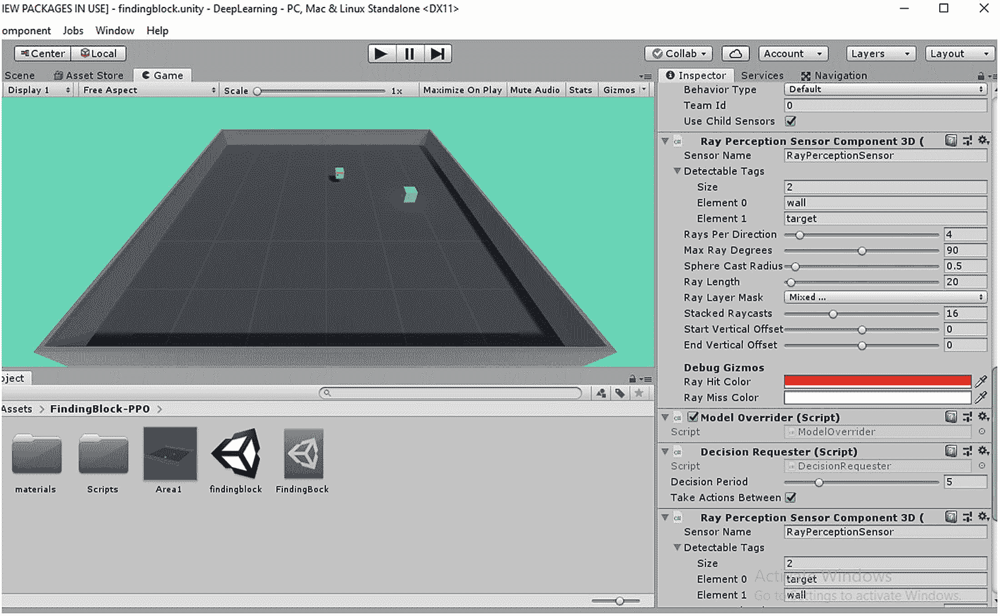

图 4-17

将 RayPerceptionSensorComponent3D 脚本附加到智能体

**决策请求器** **:** 这个脚本也附加到智能体上，因为它有助于决策过程，如前所述。我们将保留这里的默认值。

**模型覆盖器** **:** 我们必须将此脚本附加到在运行时或推理期间覆盖我们的训练模型。我们将在下一章研究此脚本。

那就是我们将要附加到将大脑与智能体关联的所有相关脚本。现在我们必须编写自己的脚本以处理智能体，并且还要为我们的强化学习问题设计一个奖励函数。

### 编写智能体脚本

在此上下文中，我们将打开 findingblockAgent 脚本。由于在这个脚本中我们将使用来自 ML Agents 框架的依赖项，我们必须包含一些库，特别是 Unity.MLAgents 和 Unity.MlAgents.Sensors：

```py
using System.Collections;
using System.Collections.Generic;
using UnityEngine;
using Unity.MLAgents;
using System;
using System.Linq;
using Unity.MLAgents.Sensors;
using Random = UnityEngine.Random;
```

现在这个脚本继承自我们在上一节中讨论的 Agent 脚本，这意味着我们现在可以根据我们的需求修改 Agent 脚本的所有不同属性（阶段、奖励、决策、动作）。我们将在场景中初始化 GameObject，例如智能体和目标，并将刚体关联到它们上，这样我们就可以在智能体的运动方向上对其施加力。除此之外，我们还有控制平台纹理颜色的变量。这是因为一旦智能体达到目标，我们希望平台被绿色照亮。

```py
float rewards = 0f;
public GameObject main_agent;
public GameObject area;
public GameObject main_target;
private int target_hit_count = 0;
private findblockArea my_area;
public Rigidbody agent_body;
public Rigidbody target_body;
public GameObject ground;
public bool vectorObs;
public Material green_material;
public Material default_material;
public Renderer ground_renderer;
```

现在我们将在脚本中使用某些重写的方法。第一个重写的方法是 Initialize。在这个方法中，我们将初始化智能体、目标和平台。

```py
public override void Initialize()
{
agent_body = GetComponent();
my_area = area.GetComponent();
target_body = GetComponent();
}
```

下一个重写的函数是“CollectObservations”，它接受来自“VectorSensor”类的传感器作为输入。由于在我们的案例中，我们将使用大脑的射线传感器模块，布尔变量“vectorObs”结果为 true。 “sensor.AddObservation”方法以浮点向量的形式收集传感器信息。

```py
if (vectorObs == true)
{
sensor.AddObservation(transform.InverseTransformDirection(agent_body.velocity));
}
```

由于我们还需要为我们的大脑提供一个默认的启发式策略，我们重写了 Heuristic 方法。这是一个简单的启发式实现，我们使用 W、A、S 和 D 键来控制我们的智能体。为此，我们使用 Unity 的“Input.GetKey”方法，并填写“actionOut”浮点数组（包含动作空间）。

```py
public override void Heuristic(float[] actionsOut)
{
actionsOut[0] = 0;
if (Input.GetKey(KeyCode.D))
{
actionsOut[0] = 3;
}
else if (Input.GetKey(KeyCode.W))
{
actionsOut[0] = 1;
}
else if (Input.GetKey(KeyCode.A))
{
actionsOut[0] = 4;
}
else if (Input.GetKey(KeyCode.S))
{
actionsOut[0] = 2;
}
}
```

下一个重写的函数是控制智能体运动的 MoveAgent 脚本。由于我们使用的是离散动作空间，智能体可以根据分支做出决策。如前所述，智能体可以在 x 和 z 平面的两个方向上移动，并且对于智能体采取的每个动作，都会对其施加一个力。这有助于智能体沿着动作向量提出的方向和旋转移动。

```py
public void moveAgent(float[] acts)
{
var direction = Vector3.zero;
var rotation = Vector3.zero;
var action = Mathf.FloorToInt(acts[0]);
switch (action)
{
case 1:
direction = transform.forward * 1.0f;
break;
case 2:
direction = transform.forward * (-1.0f);
break;
case 3:
rotation = transform.up * 1.0f;
break;
case 4:
rotation = transform.up * (-1.0f);
break;
}
transform.Rotate(rotation, Time.deltaTime * 100f);
agent_body.AddForce(direction * 1f
, ForceMode.VelocityChange);
}
```

下一个重写的函数是“OnActionReceived”，它根据智能体是否在该训练阶段达到了目标来给智能体分配奖励。相应地，我们在每个阶段的每一步都调用“MoveAgent”方法。 “AddReward”方法添加奖励。我们还可以使用“SetRewards”用一个智能体达到目标时将收到的单个奖励来替换收到的奖励。

```py
public override void OnActionReceived(float[] vectorAction)
{
moveAgent(vectorAction);
AddReward(-0.0001f);
Debug.Log("Choosing action");
rewards += -0.0001f;
Debug.Log(rewards);
}
```

最后一个覆盖方法是“OnEpisodeBegin”，正如其名称所暗示的，它控制特定训练场景开始时所需的事件。它调用 reset()方法，该方法用于将目标位置和蓝色代理设置在平台内的一个随机起始位置。如果在任何情况下蓝色代理低于平台表面，则发出“EndEpisode”方法信号。这指示 ML Agents 架构开始下一个训练场景。

```py
public override void OnEpisodeBegin()
{
Debug.Log("Resetting");
reset();
if (main_agent.transform.position.y = 3.0f)
{
Debug.Log("Down");
reset();
EndEpisode();
}
}
```

这些是在 Unity 中任何基于传统传感器（射线传感器）的 ML Agents 代理中所需的所有覆盖方法。这些方法有关联的函数，例如“OnCollisionEnter”，它检查代理是否到达了绿色目标，并使用“SetReward”方法设置代理奖励，或者如果代理与墙壁发生碰撞，在这种情况下，SetReward 方法会给予一个负奖励以模拟惩罚。

```py
void OnCollisionEnter(Collision collision)
{
if (collision.gameObject.CompareTag("target"))
{
SetReward(5.0f);
target_hit_count++;
rewards += 5.0f;
Debug.Log(rewards);
StartCoroutine(Lightupground());
EndEpisode();
}
else if (collision.gameObject.CompareTag("wall"))
{
SetReward(-0.02f);
rewards += -0.02f;
Debug.Log(rewards);
Debug.Log("Failed");
EndEpisode();
}
}
```

重置方法通过选择（0-360 度）范围内的任意角度来设置其方向，并在 x 和 z 轴上随机选择一个变换位置来重置代理。同样，绿色目标在每个场景开始时也会随机初始化到一个变换位置。

```py
public void reset()
{
var rotate_sample = Random.Range(0, 4);
var rotate_angle = 90f * rotate_sample;
main_agent.transform.Rotate(new Vector3(0f
, rotate_angle, 0f));
var loc_random_x = Random.Range(-30f, 34f);
var loc_random_z = Random.Range(-29f, 50f);
main_agent.transform.position =
new Vector3(loc_random_x, 2.5f, loc_random_z);
agent_body.velocity = Vector3.zero;
agent_body.angularVelocity = Vector3.zero;
target_reset();
}
```

“Lightupground”枚举器通过将地面渲染器的材质更改为绿色来点亮平台表面，这表明代理已经到达了绿色目标。

```py
private IEnumerator Lightupground()
{
ground_renderer.material = green_material;
Debug.Log("Success");
yield return new WaitForSeconds(0.1f);
ground_renderer.material = default_material;
}
```

这就完成了寻找块代理脚本，这是我们的蓝色代理到达绿色目标或找到它所必需的。我们将把这个脚本附加到蓝色代理上，现在我们必须在 Tensorflow 和 Unity ML Agents 中训练这个代理。总结一下，我们只需覆盖“Agent”脚本中的某些方法来创建我们自己的强化学习环境及其中的代理。这是利用 Unity ML 代理的深度学习算法和 OpenAI Gym 包装器创建模拟强化学习环境的便利性。

### 训练我们的代理

到目前为止，我们已经熟悉了使用 Unity ML Agents 中实现的默认 PPO 算法来训练代理。因此，我们将打开我们的 Anaconda 提示符并输入 mlagents learn 命令。我们将使用“trainer_config.yaml”文件（如上一章所述），因为我们尚未为这个“FindingBlock-PPO”Unity 场景创建任何特定的超参数，我们将使用“yaml”文件中存在的默认超参数集。

```py
mlagents-learn  --run-id= "newFindingblockagent" --train
```

在编写此命令时，我们将看到带有 Tensorflow API 版本、Unity 包版本和 Python API 版本的 Unity 标志。当提示时，我们必须在 Unity 编辑器中点击播放按钮以开始训练过程，如图 4-18 所示。

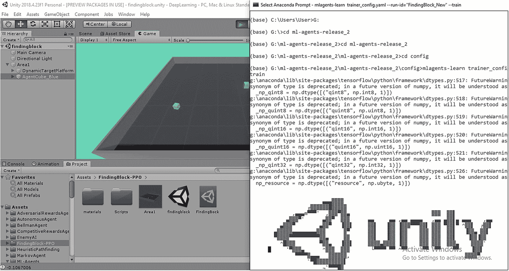

图 4-18

使用 Tensorflow（外部大脑）训练“FindingBlockAgent”

我们还将看到默认超参数的列表以及每个训练阶段的输出。现在我们可以内部连接，学院通过通信器（端口：5004）交换信息包以允许训练过程。我们还可以连接外部大脑现在如何使用附加到智能体的“BehaviorParameters”脚本的默认策略进行训练，如图 4-19 所示。

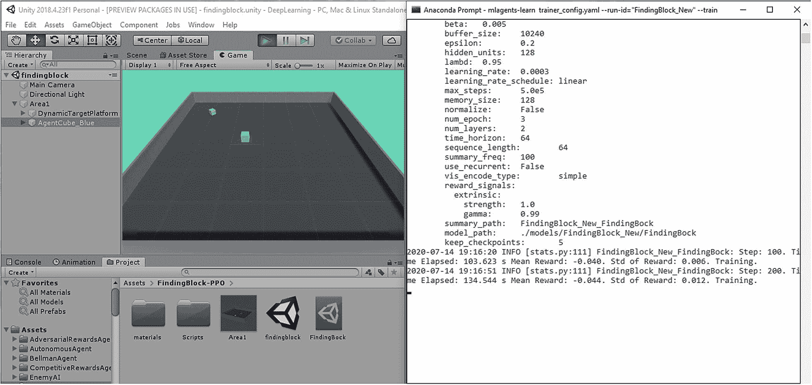

图 4-19

使用 PPO 算法在 ML Agents 中的训练阶段

在训练过程中，我们还可以切换到场景视图，查看射线传感器如何检测场景中的标记对象，如图 4-20 所示。

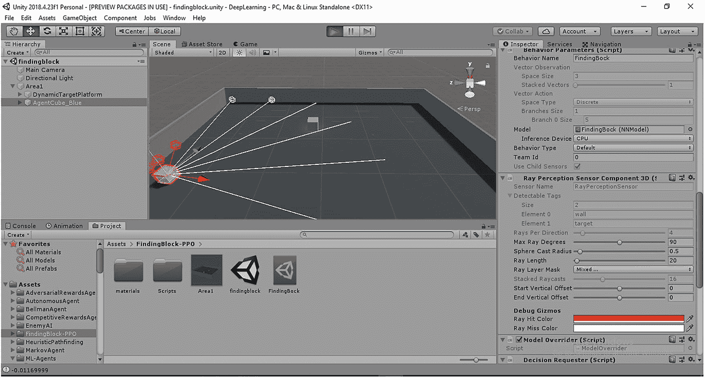

图 4-20

Tensorflow 训练期间检测标记的射线传感器

### 使用 TensorBoard 进行可视化

现在，我们将使用 TensorBoard 可视化这个学习过程。我们已经在上一章中探讨了如何做到这一点。我们必须导航到 ML Agents 的“config”文件夹，然后我们必须输入以下命令：

```py
tensorboard –logdir=summaries
```

这让 TensorBoard 知道训练阶段的日志和细节将被记录在“summaries”文件夹中。连接在端口 6006 上，提供了一个包含我们系统设备名称的相应“http”地址。当我们打开 Tensorboard 时，我们将看到环境的累积奖励和阶段长度，如图 4-21 所示。

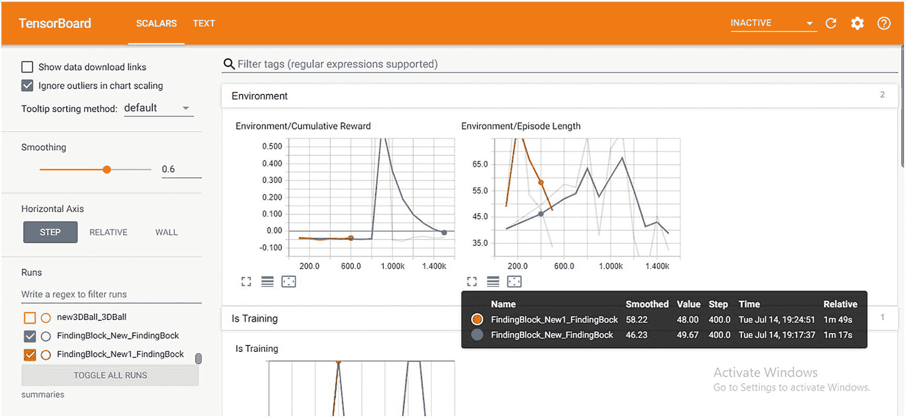

图 4-21

TensorBoard 中的环境参数

我们还将可视化损失、策略熵、策略外部奖励和价值估计细节，这些都是学习的重要指标，如图 4-22 所示。

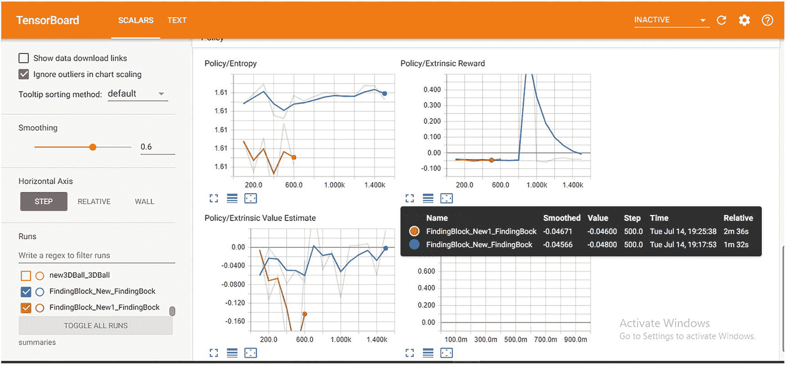

图 4-22

TensorBoard 中的策略参数

### 在推理模式下运行

我们已经在 Unity ML Agents 中构建并训练了我们的智能体。现在我们必须在推理模式下使用这个训练好的模型。我们可以将此模型附加到“BehaviorParameters”脚本的 NNModel 部分，并选择我们想要运行推理的设备。最后，我们可以构建这个 Unity 场景，将训练好的模型作为智能体的内部大脑（用于推理）放置其中，并观察模拟，如图 4-23 所示。


图 4-23

使用 ML Agents 寻找方块智能体模拟

## 通用超参数

由于我们根据“trainer_config.yaml”文件使用了默认的超参数进行训练，因此我们可以相应地调整这些超参数以获得更好的结果。默认的超参数集可以表示为：

```py
default:
trainer: ppo
batch_size: 1024
beta: 5.0e-3
buffer_size: 10240
epsilon: 0.2
hidden_units: 128
lambd: 0.95
learning_rate: 3.0e-4
learning_rate_schedule: linear
max_steps: 5.0e5
memory_size: 128
normalize: false
num_epoch: 3
num_layers: 2
time_horizon: 64
sequence_length: 64
summary_freq: 100
use_recurrent: false
vis_encode_type: simple
reward_signals:
extrinsic:
strength: 1.0
gamma: 0.99
```

这意味着 PPO 算法被用作深度强化学习算法（我们将在下一章学习）。我们可以控制 epoch、episode 和其他属性。如果我们面临与系统内存相关的性能问题，我们可以更改批处理大小属性。更改隐藏单元和学习率也可以帮助更快地收敛到全局最小值。如果我们将“use_recurrent”属性设置为 true，那么我们将使用循环神经网络在代理的内存中保持信息。我们可以增加内存大小属性并检查相应的性能。然而，根据最佳实践，大约 128 个隐藏层深度和 512 个批处理大小在大多数用例中可以表现相当好。然而，根据复杂环境，这些也可以相应地更改。我们可以对这些超参数进行调整，并在 TensorBoard 上可视化。这些参数更改的相关影响将在下一章中更深入地讨论。

## 摘要

我们已经到达了本章的结尾，本章详细介绍了 ML 代理的整个架构。本章的一些关键要点包括：

+   我们了解了 ML 代理的大脑基本架构。我们研究了用于收集信息的不同类型传感器以及训练这些观察结果所需的政策。然后我们学习了大脑的推理模块，该模块使用 Barracuda 引擎。我们理解了对于模仿学习很重要的演示模块。最后，我们参观了通信者，它们也是学院框架的一部分，控制着实时 Python API 训练过程。

+   下一个部分围绕理解学院架构展开，我们看到了环境参数是如何由学院控制的。根据通信者的响应，学院为代理选择大脑的类型（推理、外部、启发式）。

+   我们探索了代理脚本，这是我们用于训练自己的“FindingBlock”代理的脚本。我们了解了代理如何将自己与大脑和学院链接起来，并根据它们提供的决策采取行动。我们观察了离散动作空间和连续动作空间之间的区别。

+   探索了决策请求器脚本，该脚本控制代理的决策过程。我们还深入研究了行为参数脚本，这是大脑的基本部分。

+   在下一阶段，我们创建了一个基于 PPO 算法的模拟，其中智能体需要在受限环境中找到目标。我们使用了 RayPerceptionsensorComponent3D、行为参数、决策请求器和模型覆盖脚本，为我们的智能体设置了大脑-学院架构。然后，我们编写了智能体脚本的覆盖方法，以创建我们自己的奖励函数、观察和动作空间。

+   我们使用 mlagents-learn 命令训练了我们的智能体，这在上一章中我们已经探讨过，并通过 Python API 实时可视化外部训练中的射线传感器、奖励和动作。

+   我们在 Tensorboard 中进行了可视化，涉及策略奖励、累积奖励和损失，然后我们使用训练好的大脑进行推理，并构建了一个包含训练后内部大脑的 Unity 可执行文件。

+   最后，我们简要研究了“trainer_config.yaml”文件中存在的默认超参数。我们将在下一章讨论如何更改超参数可能会影响学习过程。

有了这些，我们就结束了这一章。在下一章中，我们将了解 Unity ML 智能体中制作的不同的深度强化学习算法，以及如何使用 Gym Wrapper 创建我们自己的深度学习模型。我们还将探讨 ML Agents 的 Python 方面，并为我们的智能体创建基于视觉的神经网络。
