# 6. 为 AI 代理的竞争网络

在上一章中，我们研究了深度强化学习（RL）的不同部分，并学习了 Python API 的交互性以构建自定义模型。由于 RL 内部存在各种范式，我们将探索对抗学习和合作学习，以及课程学习。鉴于我们已经了解了 actor critic 类算法，包括近端策略操作（PPO），我们还将探讨上一章中提到的离策略对应物：深度确定性策略梯度（DDPG）。本章的重要方面包括理解在应用课程学习以及策略梯度变体时训练的显著改进。这允许代理在置于新的动态环境中时以增量步骤进行学习。在本节中，我们将探索更多机器学习（ML）代理的样本，以获得对抗自我游戏的概述，其中代理必须与对手竞争以获得奖励。在涵盖基本主题之后，我们还将查看使用 ML 代理的某些模拟，包括我们在上一章中提到的卡丁车游戏。让我们从课程学习开始，然后我们将探索竞争网络。

## 课程学习

课程学习是一种涉及逐步增加学习环境复杂性的方法。在实际情况下，代理在实现其目标后获得标量奖励，在复杂环境中，代理可能难以完成该任务。这种方法在每一步提供增量奖励以稳定代理的学习。这可以被视为代理在每一步以递增的难度级别进行训练。在课程学习中考虑的两个主要策略包括：

+   设计一个度量标准来量化任务的难度，以便相应地对排序任务进行排序

+   在训练期间向代理提供一系列难度递增的任务，并增加稳定性

存在几种依赖于不同策略的课程学习变体。其中一些变体包括：

+   **特定任务的课程学习**：这涉及逐步增加代理要执行的任务的复杂性。由此形式的学习产生的某些泛化包括：

    +   更简洁的示例，有助于更好的泛化

    +   逐步引入更困难的示例以加快训练速度

如果我们将等级复杂度的增量增加作为主要指标，就需要量化等级的难度（复杂度）。这可以通过在训练过程中使用与另一个网络的最小损失深度网络来解决。这允许代理随着等级复杂度的增加而按顺序使用改进的网络进行学习。在本节中，我们将使用 PPO 政策通过 ML Agents 探索这种课程学习类别。特定任务的课程学习使用程序内容生成，用于随机化游戏中的特定等级或环境。我们可以在下一章学习关于障碍塔挑战中的 PCG 时了解这一点，因为我们将了解等级如何使用课程学习来增加环境的复杂度。我们还可以从之前关于不同深度强化学习算法的课中修改一些特征，使其成为特定任务或奖励特定的课程学习。由于我们使用 OpenAI Gym 环境如 CartPole 和 MountainCar 进行实现，我们无法修改固有的环境。然而，我们可以在每次训练步骤后增加或减少奖励。这间接地影响了深度网络的梯度收敛。在训练的每一步连续减少奖励的情况下，我们将代理置于奖励实际上减少的严酷条件下；因此，在 A2C 策略梯度算法中的梯度上升步骤将减少。当每一步增加奖励时，情况相反，这标志着增量课程学习方法的实现。在 PPO-A2C Curriculum Reward Specific.ipynb 笔记本中，我们可以看到两种情况下每个训练迭代的奖励对比；在第一种情况下，我们有算法的原始实现，而在第二种情况下，我们有一个增量奖励策略，其中奖励在每次连续迭代后翻倍。变化发生在“agent.run”方法中，我们不是直接将奖励分配给下一步，而是将奖励乘以二，然后传递。

```py
action, prob=agent.act(state)
state_1, reward, done,_=env.step(action)
reward*=2
score+=reward
agent.memory(state, action, prob, reward)
state=state_1
```

或者，“discount_reward”方法也可以更改，通过提供增量折扣来定义下一步的奖励。结果可以用 Tensorboard 训练来可视化。如图 6-1 所示，可以看到奖励的对比。

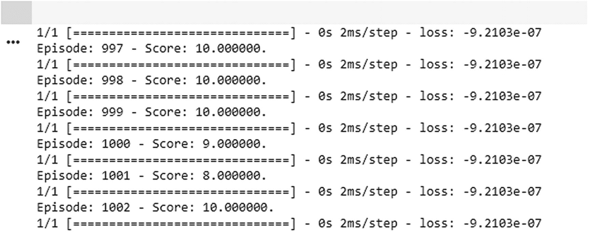

图 6-1

在 CartPole 环境上使用原始 PPO-A2C 的奖励

第二种情况显示了奖励的增加，这也意味着策略函数的梯度上升增加，如图 6-2 所示。

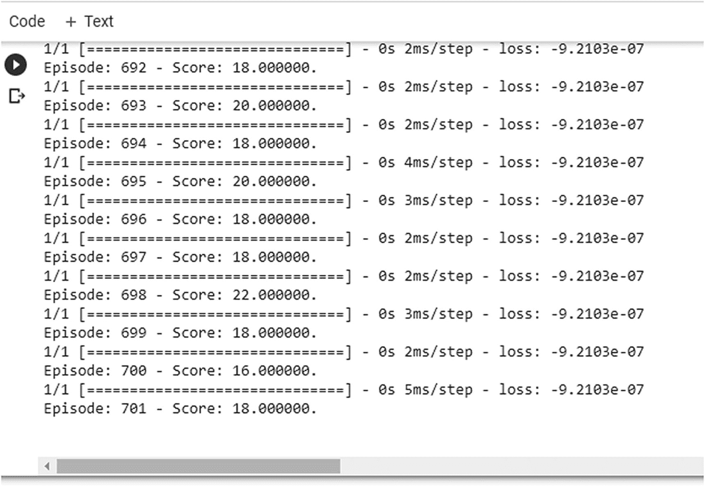

图 6-2

在 CartPole 上的 PPO-A2C 基于奖励的课程

现在为了获得更好的效果，损失函数内部的超参数（“trpo_ppo_penalty_loss”）也可以进行更改。超参数的逐渐增加或减少会影响智能体的学习，这类似于增加或减少任务的难度。通过在“trpo_ppo_penalty_loss”中更改“prob”超参数，我们可以通过 Tensorboard 可视化地看到损失函数随迭代周期的变化，如图 6-3 所示。

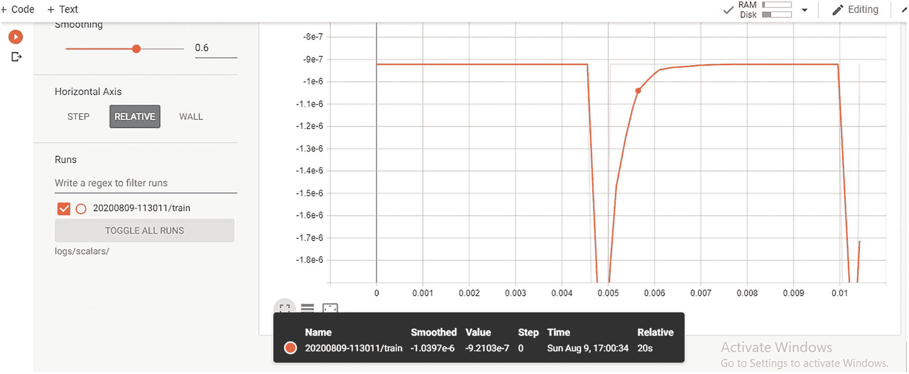

图 6-3

通过逐渐改变超参数来改变迭代周期的损失

+   **师生课程学习法**：在这个背景下，智能体通过一个 N 任务课程和自适应策略进行学习。这种课程学习形式的概念涉及两种策略：

    +   损失函数在学习的每次迭代前后都会发生变化，这有助于智能体优化每个级别的奖励。在这种情况下，损失函数的变化触发了奖励信号的变化，这也改变了特定策略的梯度上升。

    +   在像 PPO 这样的策略梯度算法中，两个网络——教师网络和学生网络——之间的 KL 散度有助于智能体朝着增加难度的方向学习。当模型适度泛化训练样本并稳定网络以允许智能体学习时，模型复杂性会增加。

在这种课程学习形式中，教师网络为学生网络提供学习策略。学生随后可以通过遵循教师的策略来学习复杂任务。通常这会导致学习速度更快，但由于损失函数的持续变化，学生可能会忘记之前的训练。为了简化，教师和学生都是深度学习网络，其中教师网络的任务是提出一组学生网络可以执行的活动。这种课程学习形式有离散和连续空间变体。教师网络还可以使用 Epsilon-Greedy 和 Thompson 抽样以及其他探索-利用算法来增加任务集的难度。在这种情况下，我们将通过“PPO-A2C Teacher Student Curriculum Learning.ipynb”笔记本来研究师生课程学习法。我们将使用原始的 A2C 算法作为我们的学生网络，我们将有一个具有变化损失函数的替代 A2C 算法作为教师网络。由于学生网络与上一章相同，我们将重点关注教师网络。为此，我们为教师网络分别有保留奖励、标签、状态和概率的数组，如此处所述。

```py
self.teacher_labels=[]
self.teacher_states=[]
self.teacher_rewards=[]
self.teacher_prob=[]
self.Teacher_Actor=self.build_teacher_actor_model(True)
self.Teacher_Critic=self.build_teacher_critic_model()
```

在下一节中，我们将探讨“build_teacher_actor_model”方法，该方法与“build_actor_model”（学生网络）类似。在这个案例中的区别在于，我们通过参数传递一个布尔值，在两种不同的损失函数之间交替：裁剪的 PPO 损失和 KL 散度 PPO 损失。我们还在这个方法中更改了一些超参数值——即 epsilon、prob 和 clip_loss 值。代码段的其他部分与之前编写的 PPO 算法类似。改变损失函数的要求是优化奖励信号，如下所述：

```py
def build_teacher_actor_model(self, loss_fn):
logdir= "logs/scalars/" + datetime.now().
strftime("%Y%m%d-%H%M%S")
tensorboard_callback=keras.callbacks.
TensorBoard(log_dir=logdir)
Actor=Sequential()
Actor.add(Dense(64, input_dim=self.state_size,
activation='relu', kernel_initializer="glorot_uniform"))
Actor.add(Dense(64, activation="relu", kernel_initializer
='glorot_uniform'))
Actor.add(Dense(self.action_size, activation="softmax"))
def trpo_ppo_clip_loss(y_true, y_pred):
entropy=2e-4
clip_loss=0.3
old_log= k.sum(y_true)
print(old_log)
pred_log=k.sum(y_pred)
print(pred_log)
r=pred_log/(old_log + 1e-8)
advantage=pred_log-old_log
p1=r*advantage
p2=k.clip(r, min_value=
1-clip_loss, max_value=1+clip_loss)*advantage
prob=1e-3
loss=-k.mean(k.minimum(p1, p2) +
entropy*(-(prob*k.log(prob+1e-9))))
return loss
def trpo_ppo_penalty_loss(y_true, y_pred):
entropy=2e-4
clip_loss=0.3
old_log= k.sum(y_true)
print(old_log)
pred_log=k.sum(y_pred)
print(pred_log)
r=pred_log/(old_log + 1e-8)
kl_divergence= k.sum(old_log* k.log(old_log/pred_log))
advantage=kl_divergence
p1=r*advantage
p2=k.clip(r, min_value=
1-clip_loss, max_value=1+clip_loss)*advantage
prob=1e-3
loss=-k.mean(k.minimum(p1, p2) +
entropy*(-(prob*k.log(prob+1e-9))))
return loss
if loss_fn==True:
Actor.compile(optimizer=Adam
(learning_rate=self.learning_rate),
loss=trpo_ppo_penalty_loss)
loss_fn=False
else:
Actor.compile(optimizer=Adam
(learning_rate=self.learning_rate),
loss=trpo_ppo_clip_loss)
loss_fn=True
return Actor
```

“teacher_memory”方法用于对动作进行 one-hot 编码以及存储奖励、标签和概率，类似于 A2C 中的“memory”方法。“teacher_act”方法用于选择概率最高的动作，类似于原始 A2C 中的“act”方法。在教师网络中，我们有与 A2C 代码（学生网络）类似的方法，我们看到这些方法都是以“teacher_<方法名>”为前缀。在主方法中，初始化学生和教师网络的状态、动作和奖励后，我们分别对它们进行训练。如果教师网络的奖励超过学生网络，它将分配奖励并在新的策略中对其进行训练。在每个训练阶段的交替策略也优化了奖励信号。在没有教师网络监督的正常 A2C 算法中，Tensorboard 图表显示了时代损失（用红色部分表示的价值估计误差减少）和奖励（蓝色部分），如图 6-4 所示。

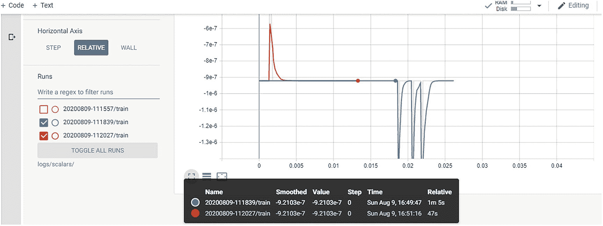

图 6-4

无教师-学生课程学习的原始 PPO-A2C

在教师网络就位的情况下，我们可以看到由于梯度上升策略以及策略的变化，奖励值出现了峰值。这个案例的奖励可以用图 6-5 中显示的橙色部分来表示。

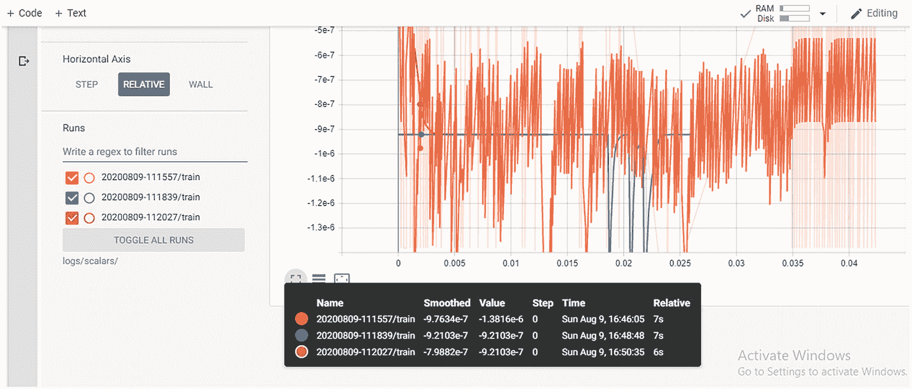

图 6-5

带有教师-学生课程学习的 PPO-A2C

+   **通过自我对弈进行课程学习**：在这种情况下，代理通过自我对弈来学习，这使用了一种类似于课程学习的教师-学生类型，但有一些变化。与教师-学生框架的不同之处在于，这里使用了一种对抗性方法来训练代理。我们有两个不同的网络。第一个网络的任务是从环境中检索奖励，通过从 S[0]获得状态 S[1]并设置获得该奖励的初始基准。第二个网络必须在更短的时间内达到状态 S[1]并检索相同的奖励。因此，这两个网络在相互之间处于对抗位置；第一个网络必须覆盖最大奖励并设置适当的基准，而第二个网络必须在比第一个网络更短的时间内达到这一点。在这种情况下，我们对第二个网络有两种不同的方法。

    +   在自我对弈模式下，第一个网络将状态从 S[0]更改为 S[1]，然后第二个网络的任务是将环境重置回初始状态 S[0]。

    +   在目标任务模式下，如果第二个网络在更短的时间内达到特定的新的状态，它将收到奖励信号。

    在这个例子中，我们将第一个网络代表为教师，第二个网络代表为学生。教师网络的任务是提高学生网络的效率。为此，教师试图选择一个需要学生花费相当长时间才能完成的任务。当学生网络比教师更快地完成任务时，它会收到奖励，随着任务难度的增加，教师应该减少任务完成时间戳之间的差异，以便学生能够学习。在自我对弈中，这是通过训练一个与当前网络具有相同参数集的网络来实现的，以提高第一个网络的训练效率。现在让我们通过在我们 PPO 算法中的一些修改来理解这个概念。我们将使用教师-学生课程学习代码段作为我们的基础，并且只修改“main”方法。打开“PPO-A2C Self Play Curriculum Learning.ipynb”笔记本。在“main”方法中，我们有一个奖励列表，这些奖励将由“reward_level”数组表示的三个时间步提供。

```py
reward_level=[800.0,900.0,1000.0]
```

然后，我们遍历这个数组，并在完成新任务后给予教师网络其奖励。学生网络随后有一个任务，在更短的时间内完成活动，这由“min_time”变量控制。一旦学生完成了教师奖励的任务，该特定级别的学生网络就会继续。我们可以看到学生和教师奖励之间的值有明显的对比。如果差异太大，这表明学生网络无法获得足够的奖励或比教师网络更快地执行。尽管这个系统的累积奖励在增加，但两个网络之间有足够的差距。这可以通过更改超参数以及定义替代损失函数来解决，如果奖励之间的差异超过某个阈值，则会对教师网络进行惩罚。这通过以下几行代码实现：

```py
if teacher_score>reward_level[l]:
teacher_score=reward_level[l]
#Train the Student to get that score in minimum time
counter+=1
if(counter<min_time):
min_time=counter
if(teacher_score<score):
agent.rewards[-1]=teacher_score
```

图 6-6 提供了这种课程学习形式的 Tensorboard 阶段损失可视化。

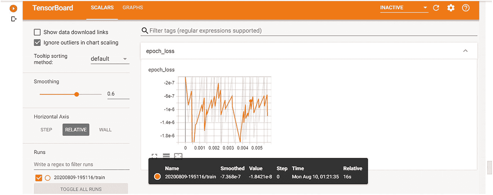

图 6-6

PPO-A2C 与自玩课程学习

现在如果我们将这个（橙色部分）与教师学生课程学习的阶段损失（蓝色部分）进行比较，我们会看到与自玩相比，后者的损失梯度更低，而奖励更高。这是由于自玩中教师和学生网络的对抗性质，这导致了这种情况下的更多奖励。这也意味着比普通的教师学生课程学习有更快的收敛速度。在初始阶段，由于学生网络无法与教师竞争，自玩有更深的损失梯度，但随着级别的增加，这种梯度会减少。这由 Tensorboard 图像展示，如图 6-7 所示。

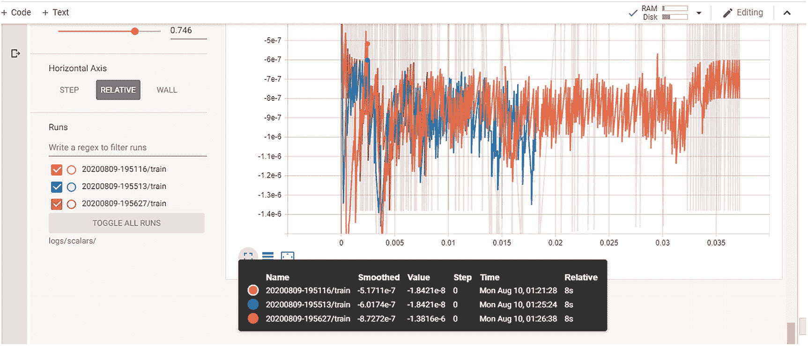

图 6-7

教师学生与自玩（CL）之间的阶段损失比较

对抗自玩是我们将在本章详细分析的，当我们在 ML Agents 中分析足球环境时，将看到的主要学习形式。除了这些主要的学习形式外，还有其他变体。

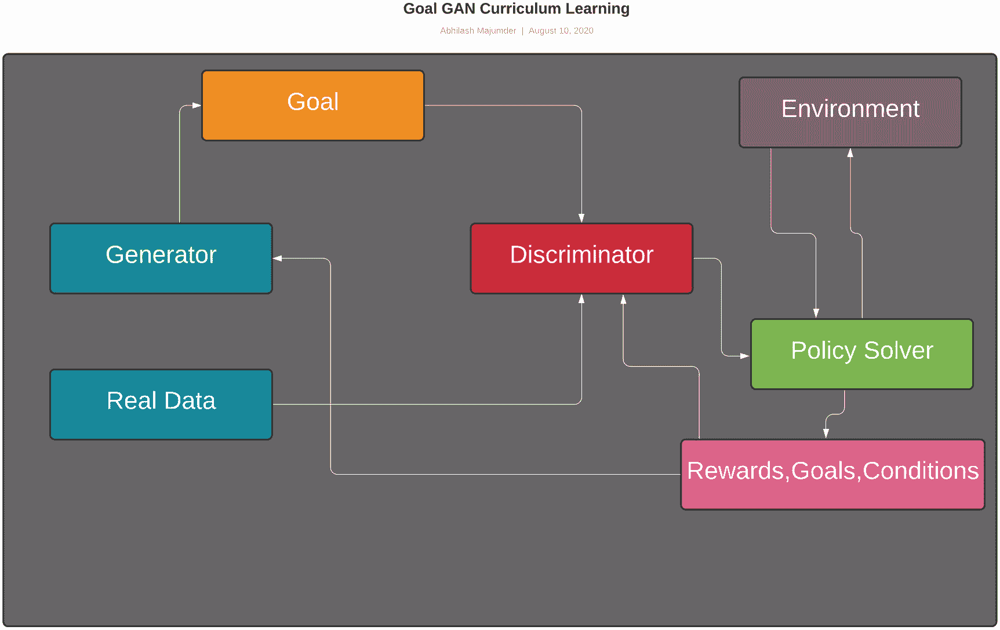

图 6-8

目标 GAN 用于自动目标生成课程学习

+   **自动目标生成** **：** 这种课程学习方法依赖于生成的目标，并选择一个代理能够用当前策略解决的问题可行的目标。这是课程学习的一个有趣方面，因为目标是随机生成的，以便代理实现。这是通过对抗网络或 GAN 实现的，我们在上一章中在无模型 GAIL 算法的背景下研究了它。由于我们知道 GAN 有一个生成器和判别器，它们相互竞争，我们可以使用这个概念来训练代理。生成器的目标是产生代理必须实现的中级目标。这些被称为“GOID”，意味着中级难度的目标。然后，生成器网络必须被训练以产生这样的中级目标，并具有相关的最小和最大值，分别用 R[min] 和 R[max] 表示，这控制了代理在 T 个时间步内达到目标的最大和最小概率。判别器的作用是确定代理是否能够在提供的时间段内实现目标，并验证目标是否来自 GOID 集合。在这种情况下，可以使用策略梯度函数，如下所示：

    π* (a[t]|s[t], g)=arg max[π] E[R^g(π)],

    其中 R^g(π) 是达到目标 g 的成功概率，a 和 s 分别是动作和状态。使用 GAN 进行学习的这种原理被称为目标 GAN。目标 GAN 课程学习的生成器和判别器函数可以定义为以下：

    LGoalGAN =(½) E[z][ (D(G(Z))- c)²]

    LGoalGAN = (½) E[g][ (D(g)- b)² + (1-y[g]) (D(g)- a)²] + (½) E[z][ (D(G(Z))- a)²],

    其中 a 是伪造数据的标签，b 是真实数据的标签，c 是生成器 G 想要判别器 D 相信的伪造数据的值。y[g] 是一个布尔变量，表示目标是否真实（1）或不是（0）。这种形式的学习课程有三个主要组成部分，包括：

    +   策略求解器：策略求解器获得一个目标 g，并在目标达成时接收奖励信号 R^g(π)。

    +   判别器 D：这预测代理是否能够实现目标，通常使用分类模型。

    +   生成器 G：生成器负责在可行的分数限制内生成目标 g。

    这种使用 GAN 作为内部架构的课程学习方法用于以递增难度级别系统地训练代理。这在图 6-8 中得到了说明。

我们将使用“AGG.ipynb”来确定目标 GAN 在课程学习中的影响，这得益于自定义的生成器和判别器模型。`build_generator_model`方法负责创建生成器网络，而`build_discriminator_model`负责创建判别器网络。我们将研究生成器模型，它与评论家模型几乎相同，只是在内核大小和内核初始化器上有所不同。

```py
def build_generator_model(self):
logdir= "logs/scalars/" + datetime.now()
.strftime("%Y%m%d-%H%M%S")
tensorboard_callback=keras.callbacks.
TensorBoard(log_dir=logdir)
generator=Sequential()
generator.add(Dense(128, input_dim=self.state_size,
activation='relu', kernel_initializer="he_uniform"))
generator.add(Dense(64, activation="relu",
kernel_initializer='he_uniform'))
generator.add(Dense(self.action_size,
activation='softmax'))
generator.compile(optimizer=Adam(learning_rate=
self.learning_rate), loss="categorical_crossentropy")
return generator
```

判别器网络在正常的密集神经网络模型架构上有一个额外的“LeakyReLU”。这有助于网络区分原始目标（奖励）和假目标（奖励）。这是以下几行代码所表示的：

```py
def build_discriminator_model(self):
logdir= "logs/scalars/" + datetime.now()
.strftime("%Y%m%d-%H%M%S")
tensorboard_callback=keras.callbacks.
TensorBoard(log_dir=logdir)
discriminator=Sequential()
discriminator.add(Dense(128, input_dim=self.state_size,
activation='relu', kernel_initializer="he_uniform"))
discriminator.add(Dense(64, activation="relu",
kernel_initializer='he_uniform'))
discriminator.add(keras.layers.LeakyReLU(alpha=0.1))
discriminator.add(Dense(self.action_size,
activation='softmax'))
discriminator.compile(optimizer=Adam(learning_rate=
self.learning_rate), loss="categorical_crossentropy")
return discriminator
```

下一个部分是“训练”方法，其中我们使用原始状态和标签的五样本来让生成器网络生成假样本。然后我们用这些样本来训练生成器。同样，我们用判别器模型来训练整个状态和标签。演员-评论家模型也存在，在这种情况下，它是策略求解器。这是通过以下几行代码实现的：

```py
labels=np.vstack(self.labels)
rewards=np.vstack(self.rewards)
rewards=self.discount_rewards(rewards)
rewards=(rewards-np.mean(rewards))/np.std(rewards)
labels*=-rewards
x=np.squeeze(np.vstack([self.states]))
y=np.squeeze(np.vstack([self.labels]))
#tensorboard.set_model(self.Actor)
#Assign a small part of the input to the generator
print("Generator Sampling")
x_g, y_g=np.squeeze(np.vstack([self.states[:5]]))
,np.squeeze(np.vstack
([self.labels[:5]]))
self.generator.fit(x_g, y_g, callbacks=
[tensorboard_callback])
#Train Discriminator network
print("Discriminator Sampling")
self.discriminator.fit(x, y, callbacks
=[tensorboard_callback])
#Solver Network training
print("A2C-PPO policy solver")
self.Actor.fit(x, y, callbacks=[tensorboard_callback])
self.Critic.train_on_batch(x, y)
self.states, self.probs, self.labels, self.rewards=[],
[],[],[]
```

如果我们在 PPO-A2C 策略上训练这个 GAN，那么我们可以清楚地可视化生成器和判别器生成的奖励以及策略求解器（代理）的损失。这如图 6-9 所示。

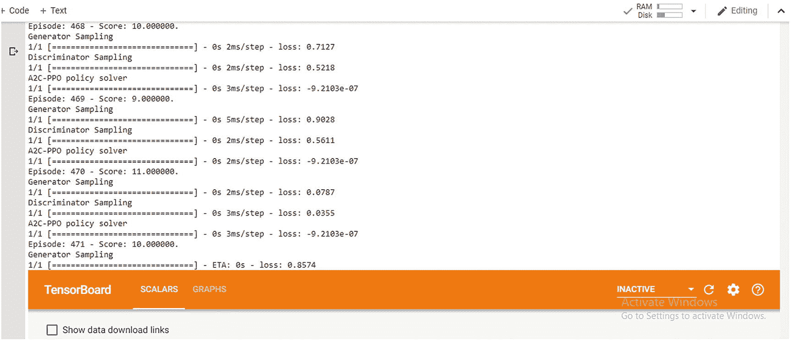

图 6-9

目标 GAN 课程学习的分数和损失

现在我们已经涵盖了课程学习不同方面的细节，还有一些其他方法，例如基于技能的课程学习和通过蒸馏的课程学习。

+   **基于技能的课程学习**：这依赖于同时分析不同的任务以确定哪些任务提供更好的奖励信号。这是通过期望最大化或变分 EM 方法实现的，有助于代理以无监督的方式学习。这也与元强化学习相关，其中代理试图找到合适的策略以获得最佳奖励。

+   **通过蒸馏的课程学习**：这涉及到使用迁移学习来生成不同的技能，并防止灾难性遗忘。渐进神经网络和基于长短期记忆（LSTM）的记忆网络在训练代理使用迁移学习方法学习时发挥着重要作用。

### 机器学习代理中的课程学习

我们将借助 Unity 中的 Wall Jump 场景来考虑机器学习代理的课程学习。在这种情况下，蓝色代理的目标是通过穿越墙壁到达绿色目标区域。这个墙壁可以通过黄色块进行缩放，黄色块作为一个平台，代理可以跳到墙壁另一侧的目标。根据墙壁的高度，代理必须移动黄色块以缩放墙壁。如果代理最初在一个有大墙壁的环境中训练，它将需要更多的时间通过 PPO 或 SAC 算法来找出这一点。因此，课程学习概念在这里起着重要作用。墙壁的初始高度为 0，然后逐渐增加，这给代理一个原始绿色目标位置的概念。因此，在连续的训练迭代中，随着墙壁高度的增加，代理必须使用黄色平台来穿越它。在初始阶段没有墙壁，在这种情况下，代理必须跳过黄色平台以到达目标；随着级别的提高，墙壁的高度系统地增加。这增加了每个连续级别的累积奖励。两个训练级别的比较如图 6-10(a, b) 所示。

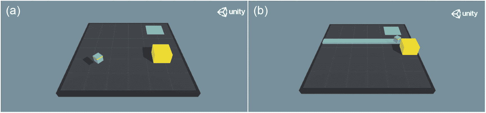

图 6-10

(a & b). 将墙壁高度更改为模拟课程学习

让我们首先通过脚本了解 Wall Jump 环境，然后我们将通过课程学习来训练这个环境。为此，我们将查看控制代理运动的 WallJumpAgent C# 脚本。除了这个脚本外，还有行为参数、模型覆盖者和决策请求者脚本附加到代理上，就像我们之前的案例一样。蓝色代理还使用 RayPerceptionSensorComponent3D 来收集观察结果。在第一部分，有三种不同类型的神经网络大脑用于推理：noWallBrain、smallWallBrain 和 bigWallBrain。根据墙壁的高度，这些分别用于课程学习。然后有控制代理、地面材料、跳跃属性（高度、时间、起始位置和结束位置）的变量。这些变量还控制出生区域、出生区域的边界、碰撞体、目标区域和黄色平台。

```py
int m_Configuration;
public NNModel noWallBrain;
public NNModel smallWallBrain;
public NNModel bigWallBrain;
public GameObject ground;
public GameObject spawnArea;
Bounds m_SpawnAreaBounds;
public GameObject goal;
public GameObject shortBlock;
public GameObject wall;
Rigidbody m_ShortBlockRb;
Rigidbody m_AgentRb;
Material m_GroundMaterial;
Renderer m_GroundRenderer;
WallJumpSettings m_WallJumpSettings;
public float jumpingTime;
public float jumpTime;
public float fallingForce;
public Collider[] hitGroundColliders = new Collider[3];
Vector3 m_JumpTargetPos;
Vector3 m_JumpStartingPos;
EnvironmentParameters m_ResetParams;
```

“初始化”方法用于初始化在之前步骤中声明的变量。这个方法是之前示例中使用的重写方法。

```py
m_WallJumpSettings
= FindObjectOfType();
m_Configuration = Random.Range(0, 5);
m_AgentRb = GetComponent();
m_ShortBlockRb = shortBlock.GetComponent();
m_SpawnAreaBounds
= spawnArea.GetComponent().bounds;
m_GroundRenderer = ground.GetComponent();
m_GroundMaterial = m_GroundRenderer.material;
spawnArea.SetActive(false);
m_ResetParams
= Academy.Instance.EnvironmentParameters;
```

然后我们有“跳跃”方法，该方法用于通过跳转时间浮点变量表示的频率值来触发跳跃。这也允许蓝色代理从当前位置跳跃。

```py
public void Jump()
{
jumpingTime = 0.2f;
m_JumpStartingPos = m_AgentRb.position;
}
```

“DoGroundCheck”方法用于根据智能体是否接地来评估智能体的当前位置。它通过碰撞器来完成此操作。 “Physics.OverlapBoxNonAlloc”方法用于在给定的盒子内存储碰撞器。此方法由布尔变量 smallCheck 控制，根据此值，它确定智能体的碰撞器是否与平台、墙壁和地面发生碰撞。通过检查不同的碰撞标签，这为智能体提供了有关当前环境的信息。

```py
if (!smallCheck)
{
hitGroundColliders = new Collider[3];
var o = gameObject;
Physics.OverlapBoxNonAlloc(
o.transform.position +
new Vector3(0, -0.05f, 0),
new Vector3(0.95f / 2f, 0.5f, 0.95f / 2f),
hitGroundColliders,
o.transform.rotation);
var grounded = false;
foreach (var col in hitGroundColliders)
{
if (col != null && col.transform !=
transform &&
(col.CompareTag("walkableSurface") ||
col.CompareTag("block") ||
col.CompareTag("wall")))
{
grounded = true; //then we're grounded
break;
}
}
return grounded;
}
else
{
RaycastHit hit;
Physics.Raycast(transform.position
+ new Vector3(0, -0.05f, 0), -Vector3.up, out hit,
1f);
if (hit.collider != null &&
(hit.collider.CompareTag("walkableSurface") ||
hit.collider.CompareTag("block") ||
hit.collider.CompareTag("wall"))
&& hit.normal.y > 0.95f)
{
return true;
}
return false;
}
```

“MoveTowards”方法用于使智能体朝着目标方向移动。这是通过“Vector3.MoveTowards”方法完成的，该方法根据智能体的速度和位置控制运动。

```py
void MoveTowards(
Vector3 targetPos, Rigidbody rb,
float targetVel, float maxVel)
{
var moveToPos = targetPos - rb.worldCenterOfMass;
var velocityTarget = Time.fixedDeltaTime *
targetVel * moveToPos;
if (float.IsNaN(velocityTarget.x) == false)
{
rb.velocity = Vector3.MoveTowards(
rb.velocity, velocityTarget, maxVel);
}
}
```

然后我们有重写的方法“CollectObservations”，类似于我们之前的项目，它通过射线传感器收集观察数据。传感器检查智能体和目标之间的距离，以及与地面的距离，并使用“DoGroundCheck”来检查环境中的碰撞器。

```py
public override void CollectObservations(VectorSensor sensor)
{
var agentPos = m_AgentRb.position
- ground.transform.position;
sensor.AddObservation(agentPos / 20f);
sensor.AddObservation(DoGroundCheck(true) ? 1 : 0);
}
```

“GetRandomSpawnPos”是一个方法，智能体和黄色平台使用它来在地面平台的边界内随机生成位置。这是通过“Random.Range”方法完成的。

```py
public Vector3 GetRandomSpawnPos()
{
var randomPosX = Random.
Range(-m_SpawnAreaBounds.extents.x,
m_SpawnAreaBounds.extents.x);
var randomPosZ = Random.
Range(-m_SpawnAreaBounds.extents.z,
m_SpawnAreaBounds.extents.z);
var randomSpawnPos = spawnArea.transform.position +
new Vector3(randomPosX, 0.45f, randomPosZ);
return randomSpawnPos;
}
```

“Moveagent”方法用于通过分析来自射线传感器的矢量观察空间来控制智能体的运动。它使用“DoGroundCheck”来验证当前位置和碰撞器，并根据观察数组，智能体可以向前、向上或向右移动。智能体使用“AddForce”方法在特定方向上触发跳跃。

```py
public void MoveAgent(float[] act)
{
AddReward(-0.0005f);
var smallGrounded = DoGroundCheck(true);
var largeGrounded = DoGroundCheck(false);
var dirToGo = Vector3.zero;
var rotateDir = Vector3.zero;
var dirToGoForwardAction = (int)act[0];
var rotateDirAction = (int)act[1];
var dirToGoSideAction = (int)act[2];
var jumpAction = (int)act[3];
if (dirToGoForwardAction == 1)
dirToGo = (largeGrounded ? 1f : 0.5f)
* 1f * transform.forward;
else if (dirToGoForwardAction == 2)
dirToGo = (largeGrounded ? 1f : 0.5f)
* -1f * transform.forward;
if (rotateDirAction == 1)
rotateDir = transform.up * -1f;
else if (rotateDirAction == 2)
rotateDir = transform.up * 1f;
if (dirToGoSideAction == 1)
dirToGo = (largeGrounded ? 1f : 0.5f)
* -0.6f * transform.right;
else if (dirToGoSideAction == 2)
dirToGo = (largeGrounded ? 1f : 0.5f)
* 0.6f * transform.right;
if (jumpAction == 1)
if ((jumpingTime  0f)
{
m_JumpTargetPos =
new Vector3(m_AgentRb.position.x,
m_JumpStartingPos.
y + m_WallJumpSettings.agentJumpHeight,
m_AgentRb.position.z) + dirToGo;
MoveTowards(m_JumpTargetPos,
m_AgentRb, m_WallJumpSettings.agentJumpVelocity,
m_WallJumpSettings.agentJumpVelocityMaxChange);
}
if (!(jumpingTime > 0f) && !largeGrounded)
{
m_AgentRb.AddForce(
Vector3.down *
fallingForce, ForceMode.Acceleration);
}
jumpingTime -= Time.fixedDeltaTime;
}
```

“OnActionReceived”方法是一个重写的方法，它使用射线（射线传感器）来提供观察空间。然后它使用“SetReward”方法在智能体无法达到目标时提供负奖励，并终止该训练周期。它还通过触发地面材料的变化来触发奖励阶段。

```py
public override void OnActionReceived(float[] vectorAction)
{
MoveAgent(vectorAction);
if ((!Physics.Raycast
(m_AgentRb.position, Vector3.down, 20))
|| (!Physics.Raycast(m_ShortBlockRb.
position, Vector3.down, 20)))
{
SetReward(-1f);
EndEpisode();
ResetBlock(m_ShortBlockRb);
StartCoroutine(
GoalScoredSwapGroundMaterial
(m_WallJumpSettings.failMaterial, .5f));
}
}
```

“Heuristic”方法用于智能体的启发式控制。这依赖于启发式大脑，并在没有训练的推理模型或外部大脑时使用。

```py
public override void OnActionReceived(float[] vectorAction)
{
MoveAgent(vectorAction);
if ((!Physics.Raycast
(m_AgentRb.position, Vector3.down, 20))
|| (!Physics.Raycast(m_ShortBlockRb
.position, Vector3.down, 20)))
{
SetReward(-1f);
EndEpisode();
ResetBlock(m_ShortBlockRb);
StartCoroutine(
GoalScoredSwapGroundMaterial
(m_WallJumpSettings.failMaterial, .5f));
}
}
```

“OnTriggerStay”方法检查智能体是否已达到目标，然后它使用“SetReward”方法在智能体成功时提供正奖励。智能体通过检查是否如代码段中所述具有“goal”标签的碰撞器来完成此操作：

```py
void OnTriggerStay(Collider col)
{
if (col.gameObject.CompareTag("goal")
&& DoGroundCheck(true))
{
SetReward(1f);
EndEpisode();
StartCoroutine(
GoalScoredSwapGroundMaterial
(m_WallJumpSettings.goalScoredMaterial, 2));
}
}
```

“ResetBlock”方法用于在每个训练周期的开始时重置场景中黄色方块的位置。

```py
void ResetBlock(Rigidbody blockRb)
{
blockRb.transform.position = GetRandomSpawnPos();
blockRb.velocity = Vector3.zero;
blockRb.angularVelocity = Vector3.zero;
}
```

“OnEpisodeBegin”方法是一个重写的方法，它使用“ResetBlock”方法重置智能体的位置、速度和方向。 “FixedUpdate”方法控制实际的游戏逻辑，并按如下方式调用“ConfigureAgent”方法：

```py
public override void OnEpisodeBegin()
{
ResetBlock(m_ShortBlockRb);
transform.localPosition = new Vector3(
18 * (Random.value - 0.5f), 1, -12);
m_Configuration = Random.Range(0, 5);
m_AgentRb.velocity = default(Vector3);
}
void FixedUpdate()
{
if (m_Configuration != -1)
{
ConfigureAgent(m_Configuration);
m_Configuration = -1;
}
}
```

“ConfigureAgent”方法根据墙壁的高度控制要使用的推理神经网络，并且与课程学习部分相关联。如果“config”的值为 0，则表示没有墙壁（高度为 0 的墙壁），代理使用 noWallBrain 大脑进行推理。这是通过使用“SetModel”方法实现的。如果墙壁的高度为 1 单位，那么代理使用“smallWallBrain”作为推理大脑。对于大于 1 单位的墙壁高度值，代理使用 bigWallBrain 进行推理。代理在接收到来自射线传感器的输入后，通过局部缩放变量帮助计算墙壁的高度。这由以下代码行所示：

```py
void ConfigureAgent(int config)
{
var localScale = wall.transform.localScale;
if (config == 0)
{
localScale = new Vector3(
localScale.x,
m_ResetParams.GetWithDefault("no_wall_height", 0),
localScale.z);
wall.transform.localScale = localScale;
SetModel("SmallWallJump", noWallBrain);
}
else if (config == 1)
{
localScale = new Vector3(
localScale.x,
m_ResetParams.GetWithDefault("small_wall_height", 4),
localScale.z);
wall.transform.localScale = localScale;
SetModel("SmallWallJump", smallWallBrain);
}
else
{
var min = m_ResetParams.GetWithDefault("big_wall_min_height", 8);
var max = m_ResetParams.GetWithDefault("big_wall_max_height", 8);
var height = min + Random.value * (max - min);
localScale = new Vector3(
localScale.x,
height,
localScale.z);
wall.transform.localScale = localScale;
SetModel("BigWallJump", bigWallBrain);
}
}
```

这是控制蓝色代理的脚本，在这种情况下，我们可以看到根据墙壁的高度，代理相应地推动黄色平台以进行缩放。此外，代理根据墙壁的高度使用不同的推理大脑。还有一个相关的脚本，WallJumpSettings，它控制环境的各种属性，例如地面材料颜色、速度、跳跃高度和代理的跳跃速度。

```py
using UnityEngine;
public class WallJumpSettings : MonoBehaviour
{
[Header("Specific to WallJump")]
public float agentRunSpeed;
public float agentJumpHeight;
public Material goalScoredMaterial;
public Material failMaterial;
[HideInInspector]
public float agentJumpVelocity = 777;
[HideInInspector]
public float agentJumpVelocityMaxChange = 10;
}
```

既然我们已经了解了控制环境中代理的脚本，那么在我们使用“mlagents-train”方法训练代理之前，让我们先了解另一个独特的脚本。

由于我们将使用课程学习来训练我们的代理，我们必须使用一个不同的“yaml”脚本，该脚本控制超参数，以系统地增加奖励级别和墙壁的高度。这可以在 Config 文件夹内的 Curricula 文件夹中找到。在 Curricula 文件夹中，我们有 Wall_Jump.yaml 脚本。在这里我们可以看到，我们有大 WallJump 和小 WallJump 作为两种推理模式的课程学习参数。min_lesson_length 和 signal_smoothing 对两者都是相同的。在大 WallJump 的课程学习中，我们观察到奖励阈值从 0.1 增加到 0.3，然后增加到 0.5。这又是任务（奖励）特定的课程学习，这是我们研究过的。我们还有大 _wall_min_height，它以 2 个单位的步长逐渐从 0.0 增加到 8.0。我们有 big_wall_max_height，它确定特定剧集墙壁应限制的最大高度。在这种情况下，对于第一个剧集，最大墙壁高度为 4 单位，最小为 0 单位，并且随着高度的逐渐增加，奖励也随之增加，这种模式会依次延续。

```py
BigWallJump:
measure: progress
thresholds: [0.1, 0.3, 0.5]
min_lesson_length: 100
signal_smoothing: true
parameters:
big_wall_min_height: [0.0, 4.0, 6.0, 8.0]
big_wall_max_height: [4.0, 7.0, 8.0, 8.0]
```

在 SmallWallJump 案例中，我们为每个级别设置了奖励阈值。这个阈值以 2 个单位的步长从 1.0 增加到 5.0。同样，“small_wall_height”也从 1.5 单位增加到 4.0 单位，步长为 0.5 单位。

```py
SmallWallJump:
measure: progress
thresholds: [0.1, 0.3, 0.5]
min_lesson_length: 100
signal_smoothing: true
parameters:
small_wall_height: [1.5, 2.0, 2.5, 4.0]
```

这是需要添加到我们的原始 trainer_config.yaml 文件（PPO 策略）中的脚本，以在课程学习中训练代理。PPO 网络的超参数和属性与之前的情况相同。现在，为了训练代理，我们必须从 config 文件夹中编写以下命令：

```py
mlagents-learn trainer_config.yaml --curriculum=curricula/wall_jump.yaml --run-id=NewWallJump --train
```

为了泛化这个语法：

```py
mlagents-learn  --curriculum= --run-id= --train
```

运行此命令后，我们可以可视化训练，在这种情况下，我们将使用 BigWallJump 参数进行课程学习，如图 6-11a 所示。

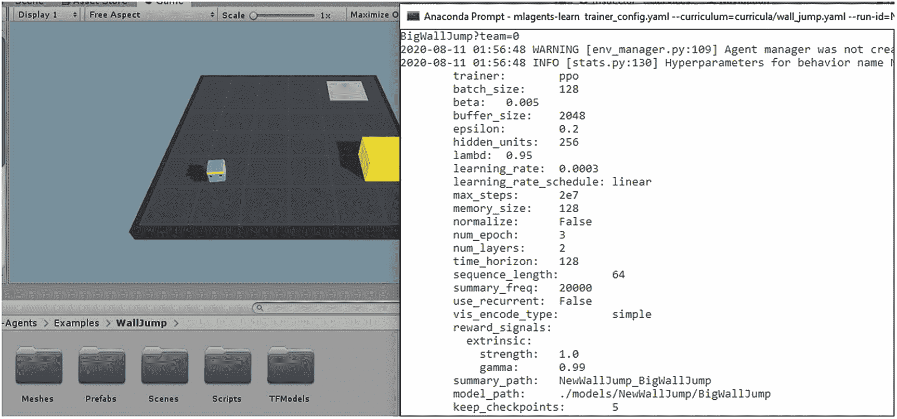

图 6-11a

无墙壁的墙跳课程训练

在这种情况下，我们可以看到随着墙壁高度的增加，如图 6-11b 所示的训练。

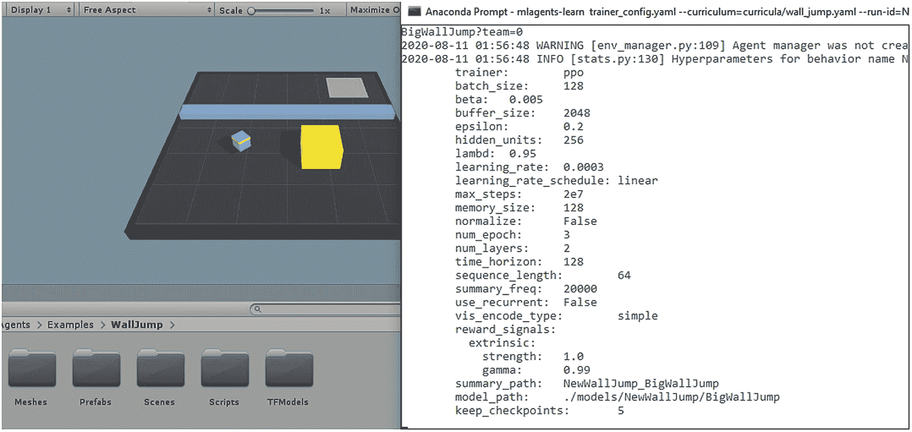

图 6-11b

带有墙壁高度的墙跳课程训练

现在我们知道了如何使用 Tensorboard 可视化这个训练，让我们再次写下启动 tensorboard 的命令如下：

```py
tensorboard --logdir=summaries
```

这是从 config 文件夹中运行的，并在端口 6006 上启动。然后我们可以评估奖励（累积）、回合长度和纪元损失。使用课程学习提供的训练预览如图 6-12 所示。

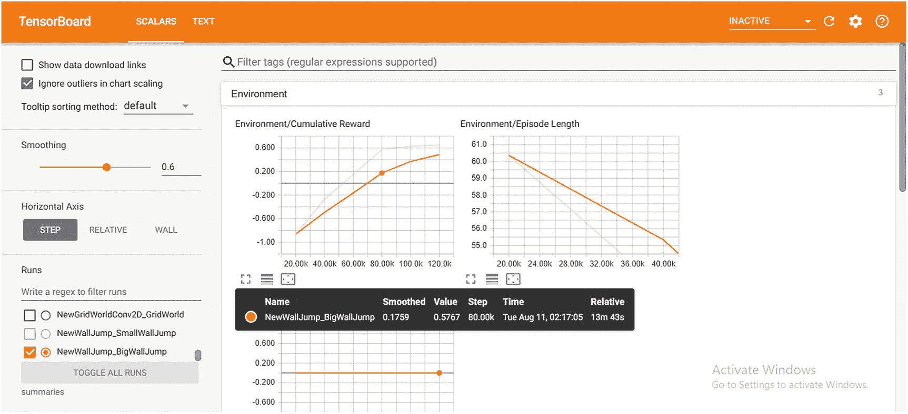

图 6-12

墙跳中的课程学习 Tensorboard 可视化

我们已经观察到如何在 Unity 中使用 Curricula 文件夹中的额外 yaml 文件来触发课程学习。对于任何我们使用 ML Agents 创建的新模拟或游戏，我们可以添加自己的 yaml 参数脚本，用于课程学习，使用之前提到的相同模式。还有额外的课程学习脚本，用于足球和测试，可以阅读以获得更好的理解。在下一节中，我们将专注于另一个深度强化学习算法，即 DDPG，然后再继续到对抗性自我博弈和合作网络。

## 扩展深度强化学习算法

### 深度确定性策略梯度

在这个背景下，我们将研究 DDPG 算法，它是一个离线策略演员评论变体。该算法将连续动作空间的深度 Q 网络（DQN）与传统的演员评论策略相结合。它与原始的 Q 学习算法密切相关，除了只在连续空间中发生贝尔曼更新之外。算法中连续性的需求来自于，对于离散空间，计算最大的 Q 值（奖励）是可行的。然而，在连续动作空间的情况下，在达到最大值之前需要进行不可计数的计算。我们可以从上一节回忆起，在原始的 DQN 算法中，有一个重放缓冲区，它存储过去的动作/观察空间，以及一个冻结的目标网络，其权重不能更改。这里也应用了相同的方法，但动作空间是连续的，这就是梯度出现的地方。在 DDPG 框架中有两个不同的属性：

+   **深度 Q 学习** **:** DDPG 的这一部分依赖于使用贝尔曼方程计算 Q 值误差的传统 DQN。这个误差被称为平均平方贝尔曼误差（MSBE），是二次损失函数，算法必须通过梯度下降来最小化。方程可以写成如下：

    Y(s,a,r,s**`**) = r + y max[a] Qθ

    L(θ) = E[θ] (Y(s,a,r,s**`**) - Q[θ)²],

    其中 y(gamma)是探索-利用因子。这构成了 DDPG 算法的初始部分，由于算法依赖于连续动作空间，梯度是通过二次损失函数的偏微分来计算的。修改后的损失函数可以表示为：

    L(θ) = E[θ]  ( Q[θ –( r + Y(1-d) max[a`] (Qθ) )²],

    其中(1-d)的值决定了代理是在训练过程的终端步骤还是非终端步骤。关于 Q 值的梯度计算可以通过偏导数来计算：

    ∂L(θ)/∂Q θ =∂ E[θ]  ( Q[θ –( r + Y(1-d)max[a`] (Qθ) )²] /∂Q θ.

    现在我们从之前对 DQN 的概念中了解到，重放缓冲区和目标网络训练是一个离线策略网络最重要的两个特性。重放缓冲区允许 DDPG 算法在最近使用过的样本和较老的样本之间进行选择，以防止过拟合。因为在 DDPG 中，我们必须在连续空间中确定最大的 Q 值，这是通过目标网络来实现的。目标网络被训练以最大化 Qθ的值，这用μθ来表示。在许多情况下，为了提高效率，还会添加额外的噪声。此外，训练后的目标网络在二次 MSBE 损失函数上工作以更新 Q 值：

    Q θ = Q θ - α ∂L(θ)/∂Q θ,

    其中α是算法的学习率。

+   **策略网络**：DDPG 的策略涉及使用策略梯度算法来最大化策略的价值估计。这是基于梯度上升策略优化的最简单形式，我们在上一章中已经研究过，可以表示为：

    ∆[θ] J(θ) = max EQ [θ)]

这完成了这个离线策略算法的数学方面。现在我们将借助稳定基线在 MountainCarContinuous 环境上查看其实施的细节。在 Google Colab 中打开 DDPG_Baselines.ipynb Python 笔记本。由于大多数库和框架与之前的用例相似，我们将专注于核心实现。我们从 Gym 环境获取动作空间，然后对动作应用噪声（之前提到过）。这种噪声是为了增加训练 DQN 的稳定性，被称为 OrnsteinUhlenbeckActionNoise。然后我们调用 Baselines 中的 DDPG 策略，并通过动作和参数噪声传递所需参数。这是通过以下行完成的：

```py
env = gym.make('MountainCarContinuous-v0')
# the noise objects for DDPG
n_actions = env.action_space.shape[-1]
param_noise = None
action_noise = OrnsteinUhlenbeckActionNoise(mean=np.zeros(n_actions), sigma=float(0.5) * np.ones(n_actions))
model = DDPG(MlpPolicy, env, verbose=1, param_noise=param_noise, action_noise=action_noise)
model.learn(total_timesteps=4000)
model.save("ddpg_mountain")
del model
model = DDPG.load("ddpg_mountain")
```

然后我们运行一个循环，在 DDPG 策略上对代理进行 4000 次迭代训练，模型预测每个训练阶段的奖励。借助“ipythondisplay”库，训练的可视化也在屏幕上更新。

```py
obs = env.reset()
while True:
action, _states = model.predict(obs)
obs, rewards, dones, info = env.step(action)
screen = env.render(mode='rgb_array')
plt.imshow(screen)
ipythondisplay.clear_output(wait=True)
ipythondisplay.display(plt.gcf())
```

运行此代码后，我们将看到不同的属性，例如参考 Q 均值、滚动 Q 均值，以及训练阶段长度、持续时间、时代、步骤、评论家和演员损失，如图 6-13 所示。

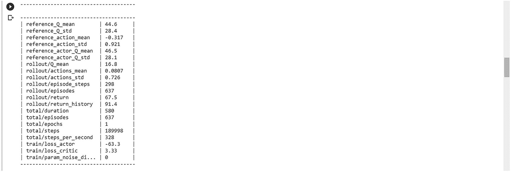

图 6-13

在 MountainCarContinuous 环境上训练 DDPG 的输出

我们还可以看到汽车试图爬上悬崖以到达旗帜，如图 6-14 所示。

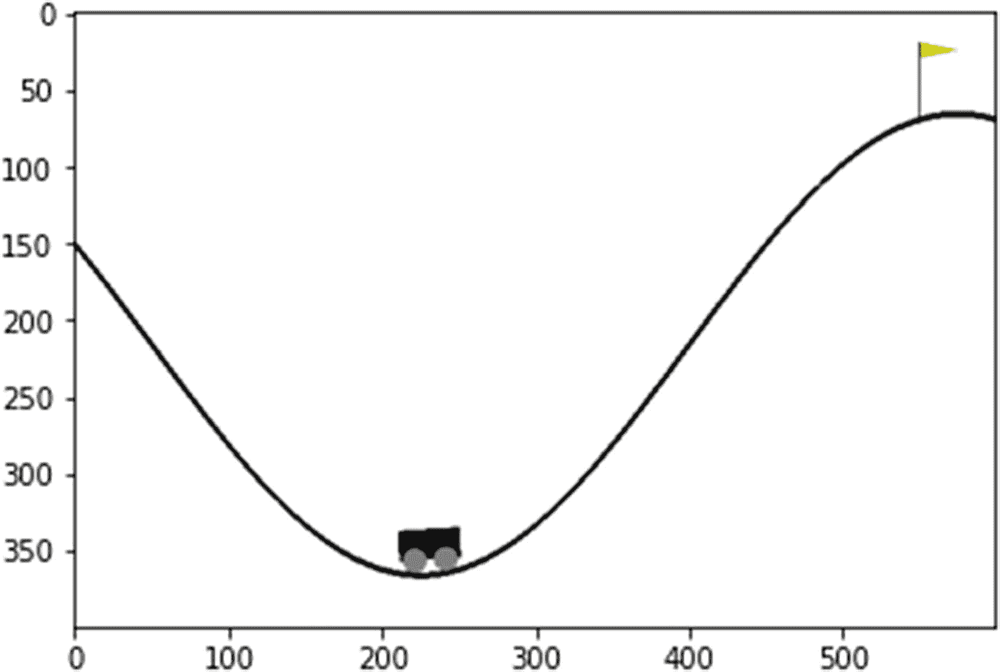

图 6-14

山地车训练可视化

此算法是一种经典的离线策略算法，也可以用于在 Unity ML Agents 中训练 Reacher 环境。在这种情况下，我们可以使用算法的基线实现。正如我们在第三章节中关于不同环境的阅读中提到的，Reacher 是一个复杂的机器人臂模拟环境，如果机器人保持手臂在绿色球形球内，则机器人会获得奖励。解决此问题的最佳实现之一需要使用 PPO 和 DDPG 进行连续空间的训练。由于 DDPG 使用演员评论机制作为策略网络，PPO 在训练中提供了良好的稳定性。正如上一章所述，我们可以使用 Python API 来接口和运行我们的基线 Gym 模型在 Unity ML Agents 上进行训练。这留给热情的读者尝试使用 DDPG 训练 Reacher 代理。图 6-15 展示了使用 DDPG 训练环境的预览。


图 6-15

基于 PPO-DDPG 的离线策略训练的 Reacher 环境

现在我们将简要探讨 DDPG 算法的某些变体。

### 双延迟 DDPG

这是一种 DDPG 算法的变体，通过使用策略更新的剪切，类似于剪切 PPO，并使用延迟策略更新来防止其高估 Q 值。双延迟 DDPG (TD3) 几乎与 DDPG 相似，但有一些修改：

+   **目标策略平滑** **:** 如 DDPG 的情况所述，我们有一个使用 MSBE 损失作为度量指标的目标网络。在 TD3 算法中，通过剪切添加到目标网络的噪声进行了修改。这被限制在范围 a[low]≤ a ≤ a[high] 内。在这种情况下，目标动作的计算如下：

    a`(s`) = clip( μθ + clip(ε,-c,c), a[low], a[high] ),

    其中 (-c, c) 是超参数。剪切因子在算法的正则化中起着重要作用，并消除了 DDPG 的缺点。DDPG 利用曲线上的尖锐点，这在许多情况下会导致脆弱和不稳定的奖励。使用 TD3 平滑曲线在稳定它方面起着重要作用。

+   **剪切双 Q 学习**：这种技术作为最小化目标，试图最小化双 DQN 中来自两个网络的 Q 值。我们的公式如下：

    R (y,s`,d)=r + y(1-d) min[`] (Qθ1, Qθ2),

    其中符号具有其通常的含义。基于此奖励值，两个 DQN 使用其相应的 MSBE 损失进行训练，如下所示：

    L1 = E[θ1] (Q[θ1 - R(y,s`,d)) ²]

    L2 = E[θ2] (Q[θ2 - R(y,s`,d)) ²]

    目标网络的 Q 值较小有助于防止高估并稳定训练过程。

+   **延迟策略控制** **:** TD3 以延迟方式更新策略，并使用策略梯度的基本最大化作为核心功能：

    ∆[θ] J(θ) = max EQ [θ)]

    建议在每次两个 Q 函数（值）更新后更新策略。

这完成了双延迟 DDPG 算法。这可以在 TD3-Baselines.ipynb 笔记本中可视化，其中包含 OpenAI 对该算法的实现。大部分代码段与 DDPG 相同，唯一的区别在于算法的策略。

```py
n_actions = env.action_space.shape[-1]
action_noise = NormalActionNoise(mean=np.zeros(n_actions), sigma=0.1 * np.ones(n_actions))
model = TD3(MlpPolicy, env, action_noise=action_noise, verbose=1)
model.learn(total_timesteps=50000, log_interval=10)
model.save("td3_pendulum")
```

在这种情况下，我们使用摆锤环境来训练此算法，如图 6-16 所示。

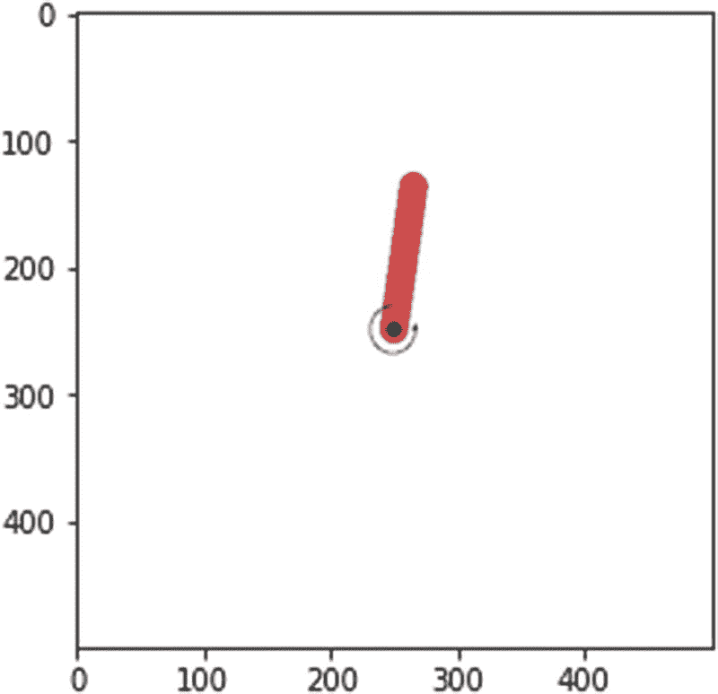

图 6-16

摆锤环境中的 TD3 训练

其他一些变体包括：

+   **分布式深度确定性策略梯度（D4PG）** **:** 这使用分布式评论家作为核心功能。这允许使用优先经验回放来分布式训练 DDPG 网络。D4PG 使用多个并行工作的分布式演员，并将数据输入到相同的回放缓冲区中。

+   **多智能体深度确定性策略梯度（MADDPG）** **:** 这是 DDPG 算法的多智能体版本，其中环境根据场景中所有工作的智能体进行变化。这可以与多智能体马尔可夫决策过程（MDP）相比较。在这种情况下，评论家从特定智能体的集中式动作价值函数中学习。这可能导致冲突的奖励函数和竞争性环境。在这种情况下，每个智能体都有多个演员存在，用于更新策略梯度。

我们已经完成了关于在线和离线深度强化学习相关算法的大部分学习。DDPG 是连续向量空间的重要离线算法，可以在 ML Agents 中使用，其中行为参数脚本中的模式为连续类型。在下一节中，我们将重点关注对抗性自我博弈和合作网络。

## 对抗性自我博弈与合作学习

### 对抗性自我博弈

这是训练智能体在动态环境中进行游戏的一个重要方面。除了环境中存在的障碍物外，还有一个与玩家智能体奖励信号相反的智能体。这个对抗性智能体控制着玩家。当智能体也把另一个智能体视为环境中的障碍时，就会使用对抗性自我博弈。自我博弈涉及玩家智能体试图赢得过去的状态，这是对抗性游戏的情况。对抗性智能体迫使玩家智能体改变其策略，并取得比之前状态更好的 Q 值估计。然而，在大多数情况下，应该适当地控制难度级别，以防止玩家智能体受到惩罚。这在网球环境中可以观察到，玩家智能体必须与对抗性智能体竞争以获得分数。根据对手的游戏水平，玩家智能体必须相应地调整其策略。在游戏开始时，如果提供了强大的对手，那么玩家智能体可能无法显著学习。相反，如果对手随着训练的进行而变得较弱，这可能会导致玩家智能体学习的不稳定。对于上述两种情况使用相同的策略可能会对玩家造成问题，因为它可能无法显著学习。这使得对抗性游戏非常难以估计。在自我博弈中，如前所述，智能体通过改变其策略来尝试与其过去自我竞争，如果当前自我比过去自我更好，则会获得奖励。智能体的这种改进只能来自游戏难度的提高，包括对手的强度。课程学习在这里起着重要的作用，以调节和控制游戏过程中难度的级别。借助课程学习（特定任务），玩家利用对抗性自我博弈有系统地更新其策略，以达到特定的目标，如图 6-17 所示。

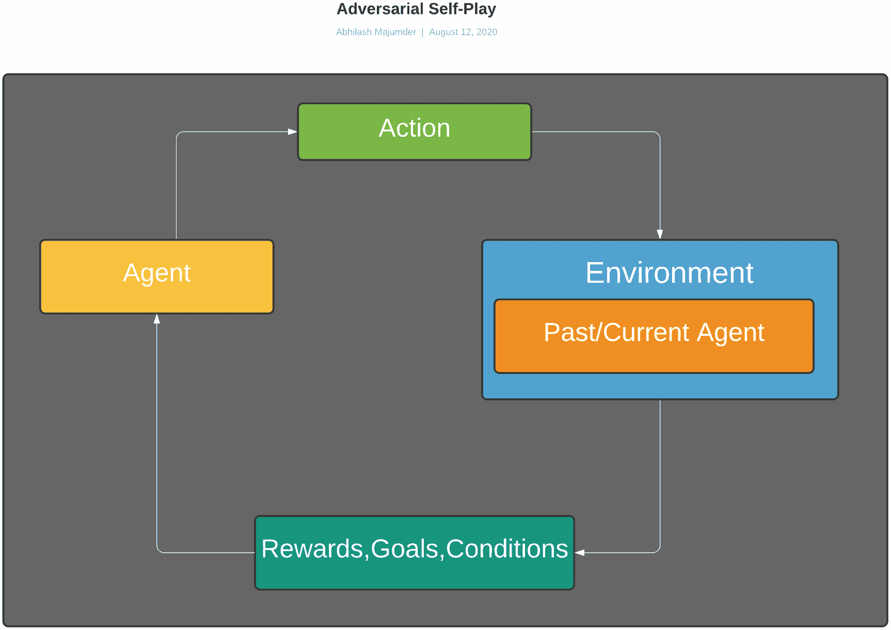

图 6-17

对抗性自我博弈环境中的智能体

### 协作学习

在多智能体环境中，合作网络被用于多个智能体在特定组内相互竞争，对抗不同组中的对抗性智能体。组可以超过两个，在这种情况下，我们有一个由具有相同策略和奖励估计的智能体集群，它们被训练以达到相同的目标。在对抗性游戏中，我们有两个或更多的深度强化学习（RL）神经网络，它们相互竞争以实现价值最大化。在合作游戏中，我们有两个或更多的深度强化学习（RL）神经网络，它们的架构、策略和损失函数相似，并且用相同的动机进行训练。然而，在合作智能体之间可以进行修改，以便通过观察对方来学习改变它们的策略。这是另一个重要的指标，其中一个智能体使用 A2C 作为策略梯度技术，而另一个合作智能体可以使用 GAIL 来模仿它。这种基于合作网络的智能体通常出现在基于团队的游戏中，如足球。在足球环境（两名玩家）中，我们有两个不同的队伍，每个队伍都有两名球员。在特定队伍的球员中，其中一名是守门员，而另一名是前锋。这两名球员（智能体）必须相互合作，以击败对方队伍，对方队伍也包含守门员和前锋。这个环境被精心设计，以展示同一队伍中的智能体之间的合作学习，以及不同队伍中的智能体之间的对抗性自我游戏。图 6-18 展示了环境的预览。

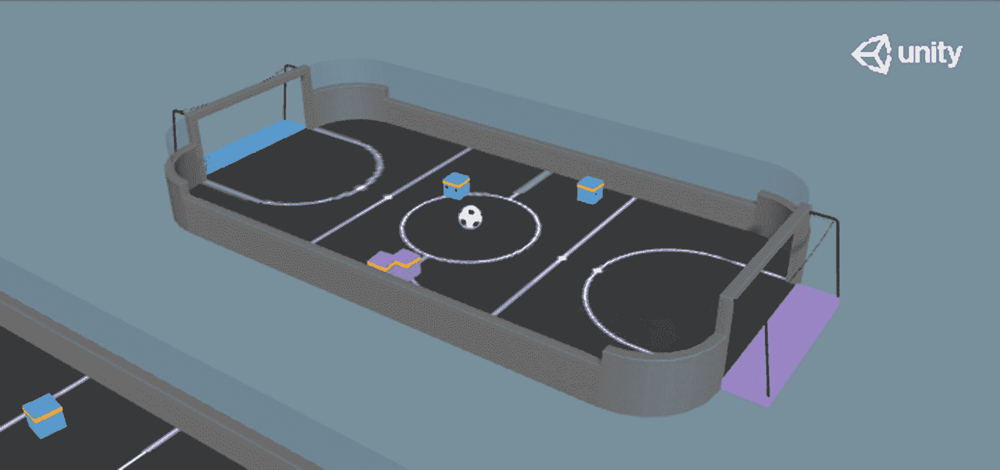

图 6-18

足球环境中的对抗性和合作学习

在本节中，让我们详细了解足球环境。

### 用于对抗性和合作学习的足球环境

我们可能玩过基于 AI 的足球或足球游戏，如 FIFA，我们在这些游戏中看到了智能 AI 代理（玩家）与我们并肩作战，也与我们对抗。这是一个对抗性和合作网络都扮演重要角色的经典例子。在 Unity 场景中，我们有两个不同的队伍：蓝色和紫色。每个队伍由两名球员组成，这些球员实际上是智能体。每个智能体都包含附加在其上的行为参数和模型覆盖者脚本以及决策请求者脚本。此外，我们还有 RayPerceptionSensorComponent3D 脚本，它控制智能体的离散观察空间。在这种情况下，我们将首先研究“AgentSoccer 脚本。在脚本的开始处，我们有队伍的类型——0 和 1，分别代表蓝色和紫色队伍。它还包含基于球员在平台上的位置的球员类型；如果智能体放置在靠近球门的位置，它就变成守门员，而对于其他位置，它就变成前锋。

```py
public enum Team
{
Blue = 0,
Purple = 1
}
public enum Position
{
Striker,
Goalie,
Generic
}
```

然后我们有不同的变量，用于控制代理的位置、ID、踢球力量、代理的速度（横向、存在、前向），以及控制团队和代理刚体的参数。

```py
[HideInInspector]
public Team team;
float m_KickPower;
int m_PlayerIndex;
public SoccerFieldArea area;
// The coefficient for the reward for colliding with a ball. Set using curriculum.
float m_BallTouch;
public Position position;
const float k_Power = 2000f;
float m_Existential;
float m_LateralSpeed;
float m_ForwardSpeed;
[HideInInspector]
public float timePenalty;
[HideInInspector]
public Rigidbody agentRb;
SoccerSettings m_SoccerSettings;
BehaviorParameters m_BehaviorParameters;
Vector3 m_Transform;
EnvironmentParameters m_ResetParams;
```

覆盖的“Initialize”方法用于将不同的代理分配到各自的队伍中，并分别分配它们的 ID。根据代理的位置，它被分配一个横向和前向速度，我们可以看到守门员和前锋的不同值。它还分配代理的刚体和最大角速度。

```py
m_Existential = 1f / MaxStep;
m_BehaviorParameters = gameObject.GetComponent
();
if (m_BehaviorParameters.TeamId == (int)Team.Blue)
{
team = Team.Blue;
m_Transform = new Vector3(transform.
position.x - 4f, .5f, transform.position.z);
}
else
{
team = Team.Purple;
m_Transform = new Vector3(transform.position.x
+ 4f, .5f, transform.position.z);
}
if (position == Position.Goalie)
{
m_LateralSpeed = 1.0f;
m_ForwardSpeed = 1.0f;
}
else if (position == Position.Striker)
{
m_LateralSpeed = 0.3f;
m_ForwardSpeed = 1.3f;
}
else
{
m_LateralSpeed = 0.3f;
m_ForwardSpeed = 1.0f;
}
m_SoccerSettings = FindObjectOfType();
agentRb = GetComponent();
agentRb.maxAngularVelocity = 500;
var playerState = new PlayerState
{
agentRb = agentRb,
startingPos = transform.position,
agentScript = this,
};
area.playerStates.Add(playerState);
m_PlayerIndex
= area.playerStates.IndexOf(playerState);
playerState.playerIndex = m_PlayerIndex;
m_ResetParams
= Academy.Instance.EnvironmentParameters;
```

“MoveAgent”方法在接收到射线观察后移动代理。根据接收到的动作，switch 代码块将代理沿特定轴（前进和横向运动）移动，并允许它旋转。然后它使用“AddForce”方法触发代理沿特定方向的移动。

```py
var dirToGo = Vector3.zero;
var rotateDir = Vector3.zero;
m_KickPower = 0f;
var forwardAxis = (int)act[0];
var rightAxis = (int)act[1];
var rotateAxis = (int)act[2];
switch (forwardAxis)
{
case 1:
dirToGo = transform.forward * m_ForwardSpeed;
m_KickPower = 1f;
break;
case 2:
dirToGo = transform.forward * -m_ForwardSpeed;
break;
}
switch (rightAxis)
{
case 1:
dirToGo = transform.right * m_LateralSpeed;
break;
case 2:
dirToGo = transform.right * -m_LateralSpeed;
break;
}
switch (rotateAxis)
{
case 1:
rotateDir = transform.up * -1f;
break;
case 2:
rotateDir = transform.up * 1f;
break;
}
transform.Rotate(rotateDir, Time.deltaTime * 100f);
agentRb.AddForce(dirToGo
* m_SoccerSettings.agentRunSpeed,
ForceMode.VelocityChange);
```

覆盖的“OnActionReceived”方法根据代理的位置控制代理收到的奖励。如果位置是守门员的位置，则提供正奖励。如果位置是前锋的位置，则提供负的存在奖励。对于所有其他通用情况，向代理提供小的负奖励。

```py
if (position == Position.Goalie)
{
// Existential bonus for Goalies.
AddReward(m_Existential);
}
else if (position == Position.Striker)
{
// Existential penalty for Strikers
AddReward(-m_Existential);
}
else
{
// Existential penalty cumulant for Generic
timePenalty -= m_Existential;
}
MoveAgent(vectorAction);
```

我们有“启发式”方法，这是所有机器学习代理脚本的通用方法，并使用不同的键（W、A [前进]、S、D [旋转]、E、Q [右]）来控制代理。主要用于玩家大脑和模仿学习。

```py
if (Input.GetKey(KeyCode.W))
{
actionsOut[0] = 1f;
}
if (Input.GetKey(KeyCode.S))
{
actionsOut[0] = 2f;
}
//rotate
if (Input.GetKey(KeyCode.A))
{
actionsOut[2] = 1f;
}
if (Input.GetKey(KeyCode.D))
{
actionsOut[2] = 2f;
}
//right
if (Input.GetKey(KeyCode.E))
{
actionsOut[1] = 1f;
}
if (Input.GetKey(KeyCode.Q))
{
actionsOut[1] = 2f;
}
```

“OnCollisionEnter”方法在球进入对手球门时对代理和团队进行奖励非常重要。如果代理处于守门员位置，它踢球的力也会增加。通常，对于每个进球，代理获得+1.0 的奖励，对于每个失球，收到-1.0 的负分。在其他所有情况下，收到-0.0003 单位的负分。

```py
var force = k_Power * m_KickPower;
if (position == Position.Goalie)
{
force = k_Power;
}
if (c.gameObject.CompareTag("ball"))
{
AddReward(.2f * m_BallTouch);
var dir = c.contacts[0].point
- transform.position;
dir = dir.normalized;
c.gameObject.GetComponent
().AddForce(dir * force);
}
```

“OnEpisodeBegin”方法用于重置代理，以及场景中不同代理的位置。它还重置速度、力和环境的处罚时间。

```py
timePenalty = 0;
m_BallTouch = m_ResetParams.GetWithDefault
("ball_touch", 0);
if (team == Team.Purple)
{
transform.rotation = Quaternion.Euler
(0f, -90f, 0f);
}
else
{
transform.rotation = Quaternion.Euler
(0f, 90f, 0f);
}
transform.position = m_Transform;
agentRb.velocity = Vector3.zero;
agentRb.angularVelocity = Vector3.zero;
SetResetParameters();
```

这完成了代理脚本。此脚本被添加到两队球员中。对于特定的队伍，相应的属性被触发（基于枚举）。还有其他辅助脚本，如 SoccerBallController 脚本。它控制与不同游戏对象的碰撞，特别是球接触了哪个游戏对象（蓝色队伍球员、紫色队伍球员、球门）。

```py
void OnCollisionEnter(Collision col)
{
if (col.gameObject.CompareTag(purpleGoalTag))
//ball touched purple goal
{
area.GoalTouched(AgentSoccer.Team.Blue);
}
if (col.gameObject.CompareTag(blueGoalTag))
//ball touched blue goal
{
area.GoalTouched(AgentSoccer.Team.Purple);
}
}
```

足球场区域控制游戏正在进行的平台或地面。这包括在进球时照亮平台，以及为进球的代理添加+1.0 单位的奖励，并为失球的代理分配负奖励。

```py
foreach (var ps in playerStates)
{
if (ps.agentScript.team == scoredTeam)
{
ps.agentScript.AddReward(1
+ ps.agentScript.timePenalty);
}
else
{
ps.agentScript.AddReward(-1);
}
ps.agentScript.EndEpisode();
//all agents need to be reset
if (goalTextUI)
{
StartCoroutine(ShowGoalUI());
}
}
```

在每个场景开始时，Socceragent 脚本中还会调用一个名为“ResetBall”的方法。这个方法会将球重置到平台的中间，并重置其旋转、缩放和方向。

```py
ball.transform.position = ballStartingPos;
ballRb.velocity = Vector3.zero;
ballRb.angularVelocity = Vector3.zero;
var ballScale
= m_ResetParams.GetWithDefault("ball_scale", 0.015f);
ballRb.transform.localScale = new Vector3
(ballScale, ballScale, ballScale);
```

在这个上下文中，最后一个脚本是 SoccerSettings 脚本，它包含控制蓝队和紫队材料、代理速度以及用于在训练期间随机化代理的布尔变量的变量。

```py
public Material purpleMaterial;
public Material blueMaterial;
public bool randomizePlayersTeamForTraining = true;
public float agentRunSpeed;
```

现在，我们将使用基于 PPO 的课程学习来训练这个场景，以观察对抗自我学习和合作学习的效果。

### 训练足球环境

我们将使用课程学习，因为对于任何一支队伍（玩家代理）来说，训练的难度应该逐渐增加。这允许两支队伍的代理使用稳定的策略来获得最佳奖励。类似于上一节中训练 Wall Jump 环境，我们将使用以下代码从 Anaconda 命令提示符（命令提示符）终端开始训练过程：

```py
mlagents-learn trainer_config.yaml --curriculum=curricula/soccer.yaml –run-id=NewSoccer --train
```

运行此命令后，我们可以看到 PPO 算法使用了我们在前几章中看到的超参数。此外，我们还在 Soccer.yaml 课程学习脚本中使用了参数。我们可以观察到奖励阈值从 0.05 单位开始增加，并且球触球参数从 1.0 逐渐减少到 0.0。这意味着随着难度的增加，特定队伍的代理保留球的时间变得更长变得困难。在初始级别，代理可以拥有球更长的时间段，随着级别的增加，这个时间段会减少。在实际的足球或足球比赛中，可以观察到如果两支队伍非常竞争，两队的球权比例都会下降。

```py
SoccerTwos:
measure: progress
thresholds: [0.05, 0.1]
min_lesson_length: 100
signal_smoothing: true
parameters:
ball_touch: [1.0, 0.5, 0.0]
```

训练场景如图 6-19 所示。

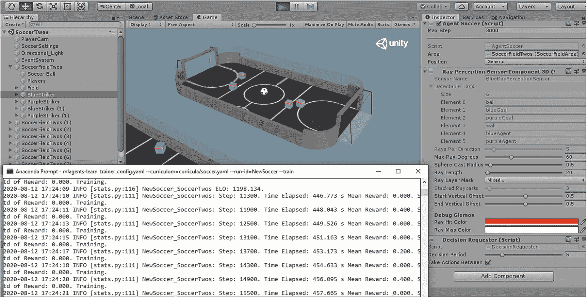

图 6-19

使用对抗-合作学习训练足球环境

### Tensorboard 可视化

让我们在 Tensorboard 中也可视化这个训练过程。我们将使用以下命令：

```py
tensorboard --logdir=summaries
```

这个命令需要从 ML Agents 存储库中的 config 文件夹中调用。我们可以可视化累积奖励、损失和其他训练参数。图 6-20 展示了 Tensorboard 可视化的预览。

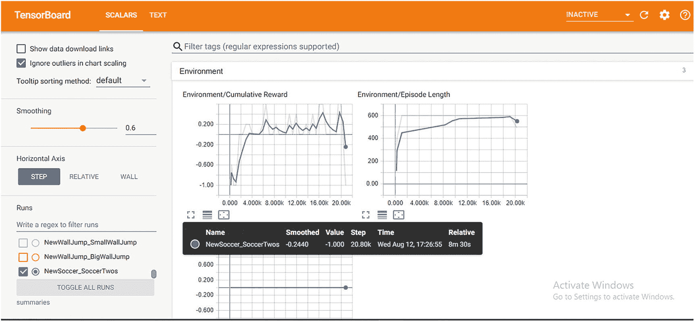

图 6-20

Tensorboard 训练可视化

我们可以更改超参数以可视化它如何影响训练、损失和奖励。经过相当长一段时间的训练后，我们可以看到代理们表现得很出色。我们已经看到了对抗性（不同团队）和合作性（同一团队）学习模式如何影响代理应对环境的能力。我们可以使用除了 PPO 之外的不同算法，例如 SAC（或其他软 Q 学习技术）来观察训练过程中的差异。虽然网球环境是一个基于纯粹竞争（对抗性）学习的环境，但在足球环境中，我们既有对抗性也有合作性学习的味道。我们必须记住，我们还可以更改超参数属性，包括我们在上一章中提到的 Model.py 脚本中存在的神经网络参数，并观察输出的变化。值得注意的是，我们可以观察到改变循环网络属性（LSTM 网络属性）如何改变代理的学习。

## 为迷你卡丁车游戏构建一个自主人工智能代理

我们现在将使用 ML Agents 构建一个微型卡丁车游戏的自主驾驶代理。我们还将使用 PPO 策略进行训练，但也可以使用其他策略。在这个场景中，代理必须沿着一个小赛道移动以到达目的地。难点在于赛道是弯曲的，代理应该能够无缝地通过它。随着路径长度的增加，训练阶段的长度也会增加。由于我们不会使用视觉观察传感器（没有 CNN），我们将主要关注使用射线感知传感器从代理的当前位置、目标距离以及当前方向获取信息。为此，我们将打开 Tinyagent Unity 场景。这是一个迷你版的赛道卡丁车游戏，其中只有一个代理。如果我们能让代理学会到达目标的轨迹，我们甚至可以扩展它，使用更多这样的竞争性代理（以及课程学习）来创建一个完整的游戏。场景如图 6-21 所示。

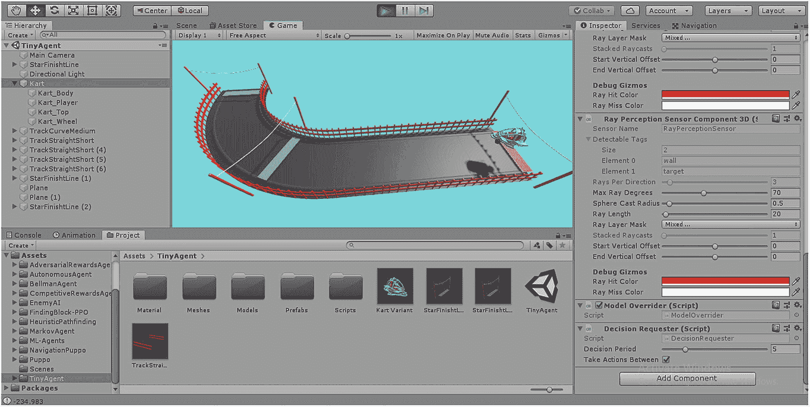

图 6-21

在微型代理 Unity 场景中的自主人工智能代理

我们有一个位于卡车内部的代理（蓝色）。代理有一个 RayPerceptionSensorComponent3D 脚本来收集观察结果。它还附带了行为参数、模型覆盖器和决策请求器脚本。对于这种情况，我们使用离散分布，让我们来探索 Tinyagent 脚本。设计背后的主要思想是代理计算目标与其当前位置之间的距离。对于沿目标方向的任何移动，代理都会逐渐获得奖励。如果代理撞到极地的边界，则它将获得负面奖励。达到目标所需的时间也是决定奖励的一个因素——所需时间越长，代理收到的惩罚就越大。随着我们的进展，我们将看到我们不仅计算了代理（卡车）与目的地之间的方向，还计算了相对距离。如果代理向与目标相反的方向移动，它也会获得负面奖励。有了这个概念，让我们来理解这个脚本。脚本包含诸如游戏对象、目标以及代理相对于目标的当前位置等变量。它还控制着当与赛道边界（红色）碰撞或达到目的地时（绿色）用于着色的材料。为了计算相对距离，我们将使用三个变量：prev_spawn_dist、prev_target_dist 和 prev_dist。这些用于调整每个训练周期的开始时代理的位置，以及计算从目标到代理的距离。

```py
float rewards = 0f;
public GameObject main_agent;
public GameObject target;
Transform target_pos;
Transform agent_pos;
Rigidbody agent_body;
float prev_dist = 0f;
float prev_spawn_dist = 0f;
float prev_target_dist = 0f;
public GameObject ground;
public bool vectorObs;
public Material green_material;
public Material default_material;
public Renderer ground_renderer;
Vector3 previous_position = new Vector3
(28.88f, 1.9f, -34.5f);
```

然后，我们有“Initialize”覆盖方法，它初始化目标位置，并将 Kart 代理位置分配给其刚体组件。

```py
agent_pos = GetComponent();
target_pos = GetComponent();
agent_body = GetComponent();
```

接下来，我们有“CollectObservations”方法，用于收集离散向量观察结果。它计算卡车与目的地之间的相对距离，并将其用作观察结果。代理（卡车）的速度也被视为观察结果。

```py
if (vectorObs == true)
{
var relative_position
= target_pos.position - agent_pos.position;
sensor.AddObservation(transform.
InverseTransformDirection(agent_body.velocity));
sensor.AddObservation(relative_position);
}
```

然后我们有 MoveAgent 脚本，它根据从传感器接收到的观察结果来控制卡车的运动。由于代理可以向前和向上移动，并且还可以沿着特定轴旋转，因此动作空间中总共有 6 个向量，每个 x 轴和 z 轴有 -2 个用于直线运动（正负），以及沿着旋转轴有 2 个。然后我们使用 AddForce 组件向 Kart 代理添加力。

```py
var direction = Vector3.zero;
var rotation = Vector3.zero;
// var velocity = Vector3.zero;
var action = Mathf.FloorToInt(acts[0]);
switch (action)
{
case 1:
direction = transform.forward * 1.0f;
break;
case 2:
direction = transform.forward * (-1.0f);
break;
case 3:
rotation = transform.up * 1.0f;
break;
case 4:
rotation = transform.up * (-1.0f);
break;
}
transform.Rotate(rotation, Time.deltaTime * 100f);
agent_body.AddForce(direction * 0.1f, ForceMode.VelocityChange);
```

然后我们有“OnActionReceived”重写方法，它控制赛车与起始位置以及目标之间的距离。这是必需的，因为如果智能体的距离从起始位置增加，它将获得奖励。对于每个朝向目标的正向移动，智能体获得 0.009 单位的奖励，并且在到达目标时获得 5 单位的奖励。对于每个智能体没有到达目标附近的时间步，它获得 -0.005 单位的负奖励。为了防止智能体沿着 y 轴移动，每次赛车翻倒时都会增加 -2 单位的负奖励。我们可以根据我们的意愿创建更多此类条件来改变环境奖励信号。

```py
float dist_target = Vector3.Distance
(agent_pos.position, target_pos.position);
float dist_spawn = Vector3.Distance
(new Vector3(2.88f, 2.35f, -43.5f), agent_pos.position);
float dist_prev = Vector3.Distance
(previous_position, agent_pos.position);
// if (dist_target  prev_dist)
{
Debug.Log("Going forward");
AddReward(0.009f);
rewards += 0.009f;
}
if (agent_pos.position.y  5f)
{
Debug.Log("Going Down");
AddReward(-2.0f);
rewards -= 2.0f;
reset();
}
// if (agent_pos.rotation.x != 0f
|| agent_pos.rotation.z != 0f)
// {
//     //agent_pos.rotation.x=0f;
//     //agent_pos.rotation.z=0f;
//     Debug.Log("Rotating");
//     AddReward(-1.0f);
//     rewards -= 1.0f;
//     reset();
// }
AddReward(-0.005f);
rewards += -0.005f;
Debug.Log(rewards);
//prev_dist_target = dist_target;
//prev_dist_spawn = dist_spawn;
//prev_dist = dist_prev;
prev_spawn_dist = dist_spawn;
prev_target_dist = dist_target;
previous_position = agent_pos.position;
moveAgent(vect);
```

“OnCollisionEnter”方法用于检查赛车是否与赛道边界发生碰撞或已到达目的地。对于前者，会获得 -0.5 单位的负奖励，并终止该集，这与在赛车游戏中碰撞边界并被淘汰的情况非常相似。对于后者，我们再次获得 3 单位的正奖励，地面颜色变为（绿色），这表示智能体已达到目标。

```py
if (collision.gameObject.CompareTag("wall"))
{
Debug.Log("Collided with Wall");
SetReward(-0.5f);
rewards += -0.5f;
Debug.Log(rewards);
EndEpisode();
}
else if (collision.gameObject.CompareTag("target"))
{
Debug.Log("Reached Target");
SetReward(3f);
rewards += 3f;
StartCoroutine(Lightupground());
Debug.Log(rewards);
//gameObject.SetActive(false);
EndEpisode();
}
```

然后我们有“OnEpisodeBegin”方法，该方法在每集开始时调用“Reset”方法来重置场景。它将赛车放置在起始位置，并重置其速度、角速度以及旋转。

```py
// var rotate_sample = Random.Range(0, 4);
// var rotate_angle = 90f * rotate_sample;
agent_pos.transform.Rotate(new Vector3(0f, 0f, 0f));
//agent.Rotate(new Vector3(0f, -90f, 0f));
agent_pos.position = new Vector3
(28.88f, 1.9f, -33.5f);
agent_body.velocity = Vector3.zero;
agent_body.angularVelocity = Vector3.zero;
```

这样就完成了智能体脚本的编写。我们已经创建了一个将使用射线传感器收集观察结果以到达目标的自主智能体。现在我们必须训练这个智能体。

### 使用 PPO 策略训练小型智能体

我们将使用 PPO 的默认超参数来训练这个智能体，但必须指出的是，在这种情况下，我们并没有使用课程学习。读者可以根据前几节的内容创建一个 yaml 脚本，以课程学习（任务特定）的方式训练这个智能体。由于这是一个实际操作具有挑战性的环境，这需要在 CPU 上训练数小时（甚至数天）。因此，建议通过创建一个控制 Kart 智能体起始位置的 yaml 脚本来使用课程学习方法进行训练。在初始阶段，我们可以将智能体放置得更靠近目标，以便它能够直接看到目标，并且智能体可以获得奖励。对于后续的训练级别，可以通过将智能体移动到远离目标位置来改变位置。我们使用的命令是：

```py
mlagents-learn --trainer_config.yaml --run-id=NewTinyAgent --train
```

调整超参数也可以用来找到影响智能体的不同特征参数。如图 6-22 所示，Kart 智能体的训练过程如下。

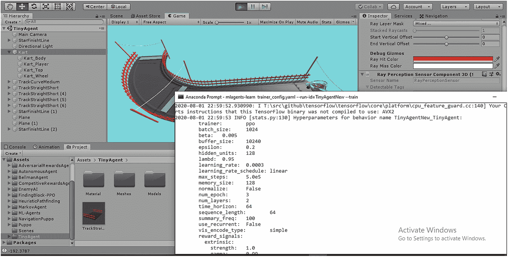

图 6-22

在 ML Agents 中使用 PPO 策略训练小型智能体

### 可视化和未来工作

让我们在 Tensorboard 中可视化这个训练过程。这可以通过以下命令完成：

```py
tensorboard –logdir=summaries
```

可视化提供了 Kart 代理的累积奖励和 epoch 损失的估计。典型的可视化如图 6-23 所示。

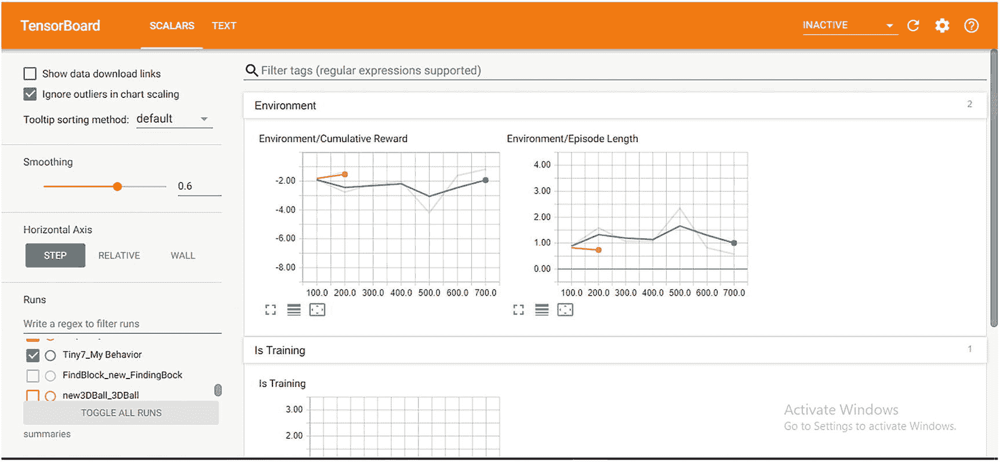

图 6-23

Tensorboard 中微型代理的可视化

这个项目是读者进一步发展的起点。模板提供了构建一个能够在环境中导航特定地形的自主 AI 代理的样本。如果我们场景中放置几个这样的 Kart 代理，并使用 PPO/SAC 策略同时训练所有这些代理，我们可以构建一个基于 AI 的赛车游戏。然而，训练这些代理需要大量的时间（可能需要多天来训练多个代理）。我们还可以创建包含对抗性组件的课程学习脚本，以应对多智能体 Kart 游戏的情况。所有代理训练完成后，我们可以与这些训练过的代理进行比赛，看看谁先到达。

## 摘要

这完成了对课程学习、对抗性学习以及创建模拟和游戏的不同方面的描述性投影。总结如下：

+   我们研究了课程学习及其不同分支，包括任务特定学习、教师-学生课程学习和使用目标 GAN 算法自动生成目标。

+   我们在 ML Agents 中利用基于 PPO 的课程学习，可视化了训练 Wall Jump 环境的步骤。

+   下一个部分是基于扩展的深度强化学习算法，包括离策略 DDPG 算法。我们还涵盖了 DDPG 的变体，包括 TD3、D4PG、MADDPG 算法。我们使用 OpenAI Gym Stable Baselines 实现这些算法来训练环境。

+   接下来，我们学习了对抗性自玩和协作学习，这在基于多智能体的游戏和模拟的背景下非常重要。我们对比了两种学习形式，并理解了自玩的重要性。然后，我们使用足球环境可视化了这一过程，并使用 PPO 策略进行训练。

+   最后一个部分是基于构建微型 Kart 游戏的自主 AI 代理。代理必须从给定的起始位置到达目标，而不与赛道边界相撞。我们使用 ML Agents 的 PPO 策略训练了这个代理，并使用 Tensorboard 可视化了训练过程。在这个模板的基础上，我们可以进一步构建更多基于自主代理的赛车游戏。

在下一章和最后一章中，我们将关注额外的算法、Unity Technologies 的一些案例研究以及不同的深度强化学习平台。
