# 7. 机器学习代理的案例研究

在这个阶段，我们对机器学习代理工具包的灵活性有了相当的了解。我们还学习了与深度强化学习相关的一系列复杂算法。如果我们分析，我们可以可视化出任何强化学习算法的主要思想是提供一组决策，代理可以遵循这些决策来实现特定的目标。尽管我们已经涵盖了大多数深度学习算法，但仍有一组算法不遵循传统的反向传播和梯度上升/下降方法。在本章中，我们将探讨进化算法，这些算法已经实践了相当长的时间。这些算法遵循达尔文主义的原则——只有最适应的后代才能生存下来，以产生下一代。我们还将研究 Unity 机器学习代理最著名的案例研究：障碍塔挑战。这个挑战是由 Unity Technologies 创建的，旨在通过提供一个“对代理性能具有挑战性的新基准”来促进人工智能社区的研究。障碍塔是一个通过程序生成的环境，代理需要借助计算机视觉、运动和泛化来解决问题。代理的目标是通过到达每个级别的楼梯台阶来达到连续的楼层。每个楼层都有其独特的挑战，包括谜题、布局和视觉外观，形成一个传统强化学习算法往往无法使代理进一步进步的环境。我们还将研究由 Unity 组织的 Unity 机器学习代理挑战。由于这些都是案例研究，我们将简要探讨那些算法被用于性能基准测试的参与者的建议和步骤。我们还将探索某些其他深度强化学习平台——即 Google Dopamine 平台。在本章中，我们还将更多地关注我们在这些挑战中学到的算法的应用性。

## 进化算法

在整本书中，我们学习了各种复杂的算法，这些算法使智能体能够做出决策。我们探讨了需要深度学习和神经网络的大量算法。在本节中，我们将探讨另一组使用自然进化生物概念的算法。在人类进化的历史长河中，我们见证了基因的重要作用。从尼安德特人到智人，这种转变是由于我们的 DNA 中连续的变化，其中包含等位基因（基因）。DNA 是一种分子，包含两条双螺旋取向的多核苷酸链（沃森和克里克模型），包含腺嘌呤、胞嘧啶、胸腺嘧啶和鸟嘌呤碱基。人类的繁殖过程是我们系统中这些 DNA 链的转换、分裂和重新组合的过程，这些过程本质上会改变或突变下一代的基因。在有性生殖生物中，细胞通过减数分裂过程进行分裂。在这个八步程序中，染色体（基因的基本部分）经过多次分裂和组合，产生新的染色体排列组合，并将其传递给下一代。在这个过程中，两个最重要的阶段是染色体的交叉和突变。新组合的染色体（突变染色体）的生存能力取决于达尔文提出的自然选择理论。根据达尔文的观点，最适应的后代生存下来，为下一代产生更多的后代。将达尔文的理论（自然选择原理）与染色体转换步骤相结合，进化算法应运而生。进化算法集是一组算法，旨在为每一代生成更强的样本以完成给定任务。特定后代的适应性取决于其优化任务的得分——也就是说，新后代与老一代相比表现得多好。这些任务可以是优化数学函数，匹配模式，甚至使智能体做出最大化返回值的决策。进化算法与强化学习（RL）的结合产生了大量被称为进化策略（ES）的算法。大多数这些算法是随机的，不依赖于神经网络或反向传播进行权重更新，就像传统深度强化学习算法那样。然而，这些算法可以扩展到包含神经网络，通过损失函数和梯度下降优化器来训练交叉和突变步骤。让我们首先形式化进化算法的步骤，然后我们将探讨这些算法的两种最简单的形式，以便更好地理解。

以下为进化算法的步骤。

+   **初始化** **:** 这是算法的第一个步骤，其中初始化了一个初始种群（样本）以及染色体集（可能的变量），这可能包括用于模式匹配的字符、用于优化函数的浮点数或整数，等等。这还包含目标基因组，即优化过程中需要达到的目标值。

+   **选择** **:** 这个过程涉及根据某些逻辑从新一代中选择最适应的后代。根据适应性，选择过程可以交配新的后代或变异它。

+   **交叉** **:** 这个过程是通过分割染色体的不同部分并在不同位置重新组合它们来实现的，有效地在各个位置交换了基因序列。交叉会产生变异，因为会生成新的序列组合。同样，在我们的上下文中，交叉是通过使用随机函数来创建后代解决方案的新组合来实现的。

+   **变异** **:** 然后将新的后代种群进行变异，这同样是由随机函数控制的。随机函数根据交叉后的解决方案变异解决方案的部分，以优化目标值。这引入了种群中的变异。

+   **终止** **:** 一旦达到目标函数或值，过程即终止，就像在这个例子中，我们已经产生了最适应的一代。

这个过程可以在图 7-1 中可视化。

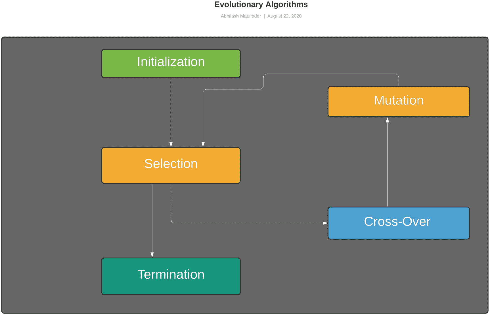

图 7-1

进化算法步骤

在本节中，我们将关注两种不同的算法：遗传算法和进化策略。

### 遗传算法

最为原始的进化算法形式是遗传算法。正如其名所示，它遵循了上一节中提到的传统进化算法流程，包括变异和选择。该算法的目的是通过调整每次训练期间的随机生成结果来优化函数。训练的这些阶段被称为代，这些阶段的成果被称为后代。我们将构建一个遗传算法，通过变异和选择来尝试匹配一个短语。打开 Genetic Algorithm.ipynb 笔记本。在我们的案例中，我们有一个目标字符串作为算法需要匹配的短语。初始种群是通过从“基因池”（字符集）中选择字符随机产生的。

初始时，我们开始声明“GA”类并包含“parameters”方法。这控制着变量，如种群，它表示每一代生成的后代字符串的长度；染色体，它是基因池或构建种群的所有字符（字母、数字、标点符号、空格和特殊字符）；以及 target_genome，它指定要匹配的目标字符串。

```py
def parameters(self,population_size,chromosomes,
target_genome):
self.population=population_size
self.chromosomes=chromosomes
self.target_genome=target_genome
```

“mutation”方法用于从称为基因池的字符集中随机选择一个特定的字符。实际上，变异是在基因组序列中随机改变一个特定基因的过程，在这种情况下，该方法从集合中随机选择一个特定的字符。

```py
def mutation(self,chromosomes):
gene_chromosome= random.choice(self.chromosomes)
return gene_chromosome
```

“create_sequence”方法使用“mutation”方法为每一代的新后代创建基因组序列。它返回一个字符序列的列表。

```py
def create_sequence(self,target_genome,chromosomes):
sequence=[]
for _ in range(len(self.target_genome)):
sequence.append(self.mutation(self.chromosomes))
return sequence
```

然后我们有“offspring”方法，这是交配过程中基因交叉的简化版本。我们取两个不同的父字符串或字符序列作为父基因组，并根据随机函数的输出，我们或者将父母的基因组固定到孩子身上，或者使用“mutation”方法对其进行变异。 “random”方法提供一个输出概率，如果这个值在 0 到 0.35 之间，孩子的基因组将采用第一个父母的基因组；如果它在 0.35 到 0.70 之间，孩子的基因组将采用第二个父母的基因组。对于 0.70 到 1.0 之间的概率，我们使用变异算法为孩子产生一个新的基因组序列。

```py
def offspring(self,seq1,seq2):
child_sequence=[]
for s1,s2 in zip(seq1,seq2):
if(random.random()<0.35):
child_sequence.append(s1)
elif(random.random()<0.7):
child_sequence.append(s2)
else:
child_sequence.append(self.mutation(self.chromosomes))
return child_sequence
```

“fitness”方法计算每个后代的递减适应度值。由于我们必须匹配一个短语或字符串，因此孩子的基因组序列的适应度计算为目标基因组序列中不匹配的字符数。随着训练的进行，我们会看到适应度会降低，这意味着后代序列（字符串）几乎或完全匹配目标序列（字符串）。

```py
def fitness(self,child_seq,target):
fitness=0
for i,j in zip(child_seq,target):
if i!=j:
fitness+=1
return fitness
```

我们有“main”方法，其中我们初始化类。我们分配一个初始种群大小为 100 个随机创建的基因组。目标基因组序列是短语“遗传算法”，算法必须匹配这个短语。然后我们有一个“while”循环，只要目标基因组没有达到，它就会运行。内部，我们根据适应度值对新的一代后代序列进行排序，并使用其中的 10%（最适应的后代）用于下一代。然后，剩余的 90%的种群使用“offspring”方法进行配对（50-50 的比例）。这个过程通过以下行来完成：

```py
if __name__=='__main__':
ga=GA()
gene_pool='''abcdefghijklmnopqrstuvwxyzABCDEFGHIJKLMNOPQRS
TUVWXYZ 1234567890, .-;:_!"#%&/()=?@${[]}'''
target_gene='Genetic Algorithm'
ga.parameters(100,gene_pool,target_gene)
generation=0
gene_match=False
fitness_array=[]
gen_array=[]
pop=[]
for i in range(ga.population):
ind_gene=ga.create_sequence(ga.chromosomes,
ga.target_genome)
pop.append(ind_gene)
while not gene_match:
pop = sorted(pop, key = lambda x:ga.fitness(x,
ga.target_genome))
z=pop[0]
if ga.fitness(z,ga.target_genome) <= 0 :
gene_match = True
break
new_generation=[]
sample=int((10*ga.population)/100)
new_generation.extend(pop[:sample])
mate_sample=int((90*ga.population)/100)
for j in range(mate_sample):
parent1=random.choice(pop[:50])
parent2=random.choice(pop[:50])
child=ga.offspring(parent1,parent2)
new_generation.append(child)
pop=new_generation
w=ga.fitness(pop[0],ga.target_genome)
fitness_array.append(w)
gen_array.append(generation)
print("Generation: {}\tString: {}\tFitness:
{}". format(generation, "".join(pop[0]),w))
generation += 1
```

然后，我们使用“matplotlib”库来可视化适应度分数随新代数下降的趋势。必须指出的是，在这种情况下，我们考虑最适应的是那些具有最低适应度分数的个体——也就是说，几乎完全匹配目标基因组或短语。然而，这种逻辑也可以反转，我们可以根据需要最大化或最小化。

```py
plt.plot(gen_array,fitness_array)
plt.title('Genetic Fitness Curve')
plt.xlabel('Generations')
plt.ylabel('Fitness')
plt.show()
```

运行此程序后，我们可以可视化算法生成的代数和相应的适应度分数，如图 7-2 所示。

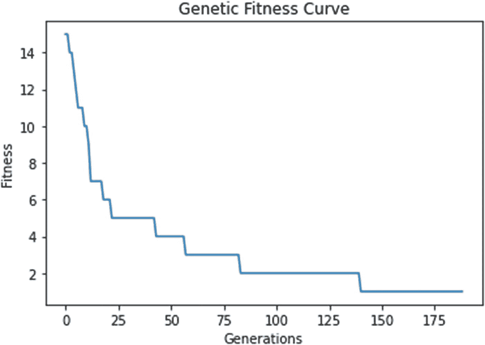

图 7-2

遗传算法中的适应度与代数曲线

算法内部的参数，如 target_genome、种群大小和产生新代的比例，也可以更改，以分析每个参数对训练的影响。

### 进化策略

这是一组依赖于交叉和变异步骤来生成新后代的算法。在遗传算法的情况下，我们试图匹配来自基因池的值，在我们的例子中，这是 ASCII 字符集的一个子集。如果我们必须使用遗传算法优化给定的数学函数，我们会使用二进制集 {0,1} 来生成适应的后代。在 ES 的情况下，对于相同的问题，我们将使用实数来生成新的一代。ES 是一组基于特定概率分布的确定算法。由于这些算法的确定性，可以避免对梯度计算的依赖。这种最简单的形式包括简单的高斯进化策略，在我们进入这个实现的细节之前，让我们总结一下 ES 的步骤。

我们必须使用参数集 θ 优化给定的函数 f(x) 到一个优化的变体 pθ。以下步骤是必需的：

+   生成初始种群 D = {(x[i],f(x[i]))} 其中 x[i]~ pθ

+   评估 D 的适应度

+   使用达尔文的最佳适应策略来选择子集后代以更新 θ 并产生下一代后代。

这个集合内部有各种算法，我们将实现高斯进化策略。

#### 高斯进化策略

我们提到 ES 中的随机性是由于分布。当我们对变异和后代生成过程应用高斯核时，我们创建了这种策略。我们创建一个以 μ 为均值、σ 为标准差的正态分布，它由 θ 跟踪如下：

θ = (μ,σ), 且 pθ ~ N(μ,σ²I) = μ + σN(0,I),

其中 N(μ,σ²I) 是正态分布。此过程的步骤可以数学上简化如下：

+   **初始化**：初始化 θ= θ[0] 和计数器 t=0

+   **后代生成:** 通过使用交叉和变异，我们使用以下形式创建下一代的种群：

D^((t+1)) = { x^((t+1)) | x^((t+1)) = μ^((t)) + σ^((t)) y^((t+1)) 其中 y^((t+1)) ~ N(x|0,I) }

+   **适者生存:** 根据其适应度分数，从新种群中采样最精英的后代。设 λ 为最适应的后代代数样本：

D^((t+1))[精英] = { x[i]^((t+1)) | x[i]^((t+1)) ∈ D^((t+1)) 且 i=1,….,λ }

+   **更新 μ 和 θ:** 使用最适应的后代集来更新均值和标准差：

μ^((t+1)) = avg(D^((t+1))[精英]) = (1/ λ) (∑[i=1..λ] x[i]^((t+1))) 

σ^((t+1)²) = var(D^((t+1))[精英]) = (1/ λ) (∑[i=1..λ] x[i]^((t+1)) - μ^((t)))²

现在，我们将创建一个简化版本的算法，用于在曲线上找到最大值。在我们的案例中，我们将使用一个一般的叠加谐振子作为我们的函数，尽管我们可以根据需要更改函数。打开 Evolutionary Algorithm.ipynb 笔记本。我们创建了一个名为“EA”的类，并声明了“parameters”方法，它控制“chrom_size”（因为我们想找到方程的最大浮点值，所以是 1）；“chrom_bound”，它指定了寻找最大值范围；“generations”，它表示要产生的代数数量；“population”，它控制每代的种群大小；“n_offspring”，它控制产生的后代数量；以及一个布尔变量“mutation”，它控制是否发生变异。

```py
def parameters(self,chrom_size,chrom_bound,n_generations,
population_size,
n_offspring,mutation):
self.chrom_size=chrom_size
self.chrom_bound=chrom_bound
self.generations=n_generations
self.population=population_size
self.n_offspring=n_offspring
self.mutation=mutation
```

然后我们有“谐波”、“S 形”和“函数”这三种方法，它们是我们希望在给定范围内优化（最大化）的不同函数。这些是在“chrom_bound”变量界定的实平面上的正常代数函数。在我们的案例中，我们将使用“谐波”方法：

```py
def sigmoid(self,x):
return 1/(1+np.exp(-x))
def function(self,x):
return 2*x*x - np.cos(2*x)
def harmonic(self,x):
return np.cos(2*x) + np.sin(2*x)
```

使用“fitness”方法将输入扁平化为列表，以便稍后可以使用“survival_of_fittest”方法。添加了一个小的偏差 1e-3 以避免 0：

```py
def fitness(self,z):
return z.flatten() + 1e-3
```

“offspring”方法用于配对两个父母以产生一个后代，并执行交叉和变异（如果“mutation”设置为 True）。我们创建一个包含后代编号及其对应染色体（浮点值）的字典。种群中的每个生物体由一个值和一个产生具有另一个浮点值的相似后代的值组成，随着训练的进行，后代试图为函数产生最大的浮点值。字典跟踪每个后代的浮点值或染色体。在交叉方法中，我们选取两个随机父母（每个都包含一个浮点值），并生成一个新的后代。由于我们使用变异，我们还创建了一个包含每个后代变异浮点值（随机化）的数组。然后在更新变异基因时，我们使用均值为 0.2 的正态分布。最后，我们返回包含其自身染色体（浮点值）的新生成的后代。

```py
def offspring(self,population,n_offspring):
children=dict({"chromosome":np.zeros((n_offspring,
self.chrom_size))})
if self.mutation==True:
children['mutate']=np.zeros_like(children['chromosome'])
for i,j in zip(children['chromosome'],
children['mutate']):
sample1,sample2=np.random.choice
(np.arange(self.population),size=2)
crossover=np.random.randint
(0,2,self.chrom_size,dtype=np.bool)
i[crossover]=population['chromosome']
[sample1,crossover]
i[~crossover]=population['chromosome']
[sample2,~crossover]
j[crossover]=population['mutate']
[sample1,crossover]
j[~crossover]=population['mutate']
[sample2,~crossover]
j[:]=np.maximum((j + np.random.rand(*j.shape)-0.2),0)
i+=j*np.random.rand(*i.shape)
i[:]=np.clip(i,*self.chrom_bound)
return children
```

然后我们有“survival_of_fittest”方法，在这种情况下，我们也在使用变异数组。我们将包含浮点值（染色体）和变异输出值（浮点值）的字典堆叠起来，然后展开这个容器并将其传递给“harmonic”函数以生成浮点值。然后对结果输出进行排序，并将最高值传递给下一代的后代。这可以通过以下代码行来说明：

```py
def survival_of_fittest(self,pop, kids):
if self.mutation==False:
pass
for key in ['chromosome', 'mutate']:
pop[key] = np.vstack((pop[key], kids[key]))
fit = self.fitness(self.harmonic(pop['chromosome']))
# calculate global fitness
idx = np.arange(pop['chromosome'].shape[0])
good_idx = idx[fit.argsort()][-self.population:]
for key in ['chromosome', 'mutate']:
pop[key] = pop[key][good_idx]
#print(pop)
return pop
```

在“main”方法中，我们初始化参数的值。我们提供了一个边界 –[0,5]，用于确定函数（“chrom_size”）的最大值，种群大小为 100（“population”），迭代次数为 200（“generations”），每一代有 50 个后代（“n_offspring”），并且将“mutation”设置为“True”。我们使用正态分布初始化种群。对于每次训练循环，我们使用“offspring”方法创建一个新的后代，并根据“survival_of_fittest”方法的输出生成一个新的种群。使用“matplotlib”创建的散点图用于可视化函数最大值的最终位置。

```py
if __name__=='__main__':
ea=EA()
ea.parameters(1,[0,5],200,100,50,True)
population=dict(chromosome=5*np.random.rand
(1,ea.chrom_size).repeat(ea.population,axis=0),
mutate=np.random.rand(ea.population,ea.chrom_size))
ea.plot()
for m in range(ea.generations):
child = ea.offspring(population, ea.n_offspring)
#print(child)
population = ea.survival_of_fittest(population, child)
print("Generation",m)
#print("Population",population)
scatter_pl = plt.scatter(population['chromosome']
, ea.harmonic(population['chromosome']), s=200,
lw=0, c="orange", alpha=0.5); plt.pause(0.05)
plt.show()
```

在运行此代码后，我们可以通过图 7-3 观察到黄色-橙色光芒所指出的最大值。由于我们使用的是叠加的正弦曲线，最大值可能位于范围 [0,5] 中的任意一个峰值。算法显示的结果是右侧的那个。

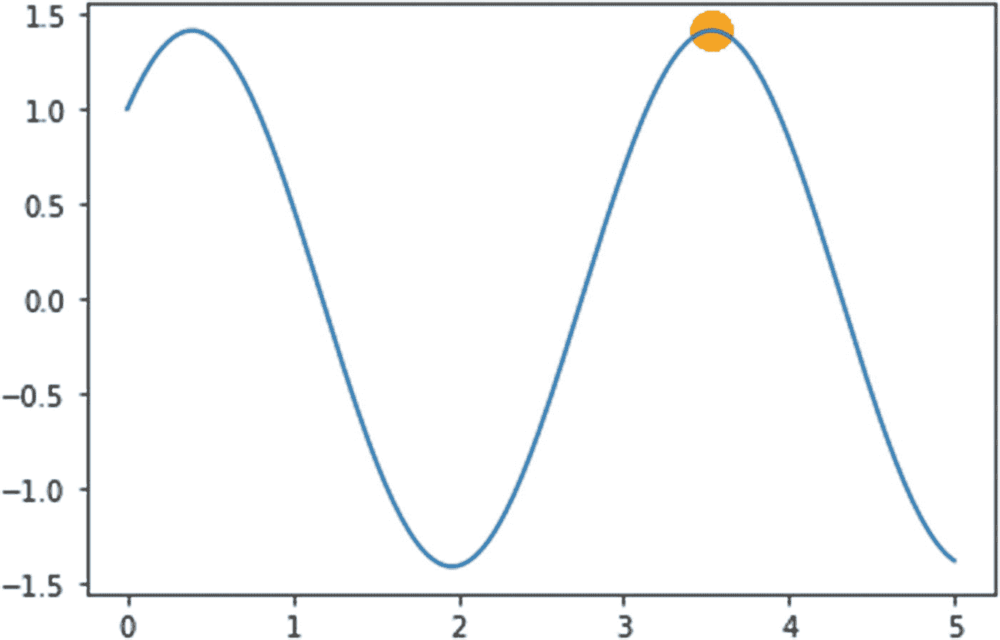

图 7-3

使用高斯进化策略最大化谐波函数

我们可以将函数更改为检查它们的最大值。本节中还有其他算法，如协方差矩阵适应（CMA）-ES 和自然进化策略（NES），我们将简要讨论。

#### 协方差矩阵适应进化策略

这是一个使用协方差矩阵来更新后代每一周期均值和标准差的随机进化策略。我们使用高斯分布，就像我们在前面的部分中使用的那样，用协方差矩阵代替普通的浮点数和整数。这表示为以下形式：

θ = (μ,σ), 且 pθ ~ N(μ,σ²C) = μ + σN(0,C),

其中 C 是协方差矩阵。高斯分布上的协方差矩阵具有非负特征值，相应的向量形成一个正交归一基。大部分过程与之前相同，只是均值和标准差更新不同。均值使用以下形式更新：

μ^((t+1)) = avg(D^((t+1))[elite]) = α(1/ λ) (∑[i=1..λ] x[i]^((t+1)) ),

其中α是学习率。最重要的方面是产生新样本的步长。没有协方差矩阵，下一代的样本将由上一节中提到的标准差σ控制。较大的值使用大步长更新参数，为了控制这一点，我们使用协方差矩阵的进化策略。因此，在每一步，参数通过将新的一代沿着进化路径移动来更新。这是通过根据以下关系更新 y 来实现的：

(1/ λ) (∑[i=1..λ] y[i]^((t+1)) ) ~ (1/ √λ)C^((t)0.5) N(0,I)

C^((t)0.5) 可以很容易地计算，因为矩阵形成了一个正交归一基。我们可以通过 Polyak 平均分配给最近的后代更高的权重。协方差矩阵的适应性是通过排名最小化来实现的。CMA-ES 算法比 vanilla ES 算法（简单高斯）更稳定，因为它通过排名最小化更新来控制探索率，并利用协方差矩阵的适应性来更新标准差。它结合了高斯分布在协方差矩阵上的步长调制效果，并使用自适应策略更新标准差。

#### 自然进化策略

NES 与策略梯度更新方法相关，用于优化一个函数。它使用了在 vanilla 策略梯度和强化算法中使用的对数似然方法，表示为：

∆[θ] J [θ] = E [x~pθ] [f(x) ∆[θ] log pθ]

该算法的基本部分如下列出。

+   NES 使用基于排名的适应度。这意味着 NES 使用排名来确定单调递增的适应度。

+   NES 使用适应性采样来调整超参数。在这种情况下，自然梯度下降被应用于更新权重，这些权重表示为前一代后代适应度与当前适应度的比率。

w`[i] = pθ/ pθ**`**

+   它还使用 Kullback-Leiblar (KL) 散度作为度量，在采样阶段寻找概率分布之间的差异，并且在自然梯度下降中，算法试图确定沿着小步的最陡方向。

这些是 ES 下的一些重要算法。还有其他一些算法使用不同的指标来控制和更新种群的方差和均值。OpenAI ES 是 NES 的无梯度黑盒优化器变体，它使用高斯噪声，然后使用对数似然（类似于策略梯度）。这类梯度算法被称为进化策略梯度 ES 算法。因此，在传统的深度强化学习之外，使用这类算法有很大的发展空间。我们将在下一节看到，这些算法已被顶级参赛者在障碍塔挑战中使用。

## 案例研究：障碍塔挑战

障碍塔挑战（2019 年 2 月 - 8 月）旨在在深度强化学习的背景下提供即兴基准。挑战的目的是促进开发者和科学家之间的研究，以超越当时的最先进（SOTA）算法。我们将从客观的角度审视这个挑战，并也将查看一些挑战中获胜者提交的最成功的方案。障碍塔挑战旨在让 SOTA 算法在当时难以解决。虽然 AI 泛化是挑战的主要目标，但该挑战因其程序化关卡生成的特性而闻名。障碍塔挑战包含一个 AI 代理，其任务是移动从 0 级到 100 级，在每个级别，代理都必须在给定的房间里完成一系列任务。挑战包含 100 个不同的程序化生成环境，每个环境都包含一个起点和一个终点。每个特定的房间（级别）由谜题、敌人、障碍物和开启下一个房间（级别）的钥匙组成。该项目背后的研究归功于 Unity Technologies 的 ML Agents 团队。相关论文是 Juliani 等人撰写的“障碍塔：视觉、控制和规划中的泛化挑战”，该论文发表在以下链接：[`https://arxiv.org/abs/1902.01378`](https://arxiv.org/abs/1902.01378)。

图 7-4 展示了从 Unity Technologies 博客（[`https://blogs.unity3d.com/2019/01/28/obstacle-tower-challenge-test-the-limits-of-intelligence-systems/`](https://blogs.unity3d.com/2019/01/28/obstacle-tower-challenge-test-the-limits-of-intelligence-systems/)）中拍摄的障碍塔挑战的视图。

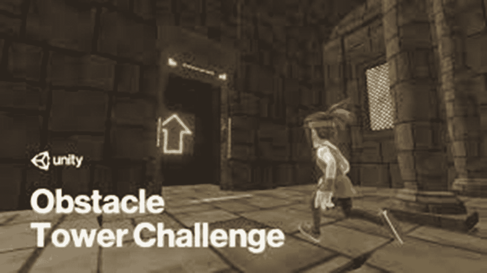

图 7-4

Unity ML Agents 中的障碍塔挑战

### 障碍塔的细节

使用 Unity 引擎和 ML Agents 创建的障碍塔挑战可以在 Windows、Linux 和 Mac OS 上运行。它还使用了 OpenAI Gym 包装器，以便与现有的深度强化学习算法轻松集成。它包含以下提到的功能。

#### 情节动力学

根据论文的详细内容，最有趣的部分是每个房间或级别的程序化内容生成。每个级别都有一组要完成的任务，这可能包括躲避障碍、击败敌人、收集钥匙以解锁通往下一级的门，以及避免掉入坑和陷阱。每个级别都包含“球体”，这些球体会增加智能体到达上层的时间。这是探索-利用策略的一种变体，迫使智能体决定是收集球体以增加时间还是快速完成级别。这种级别的程序化生成允许智能体在特定任务课程学习模式中进行训练。我们将在接下来的章节中探讨这一点。

#### 观察空间

这包括智能体做出决策所需的视觉以及非视觉辅助信息。视觉观察空间由一个 168 X 168 的 RGB 像素图像组成，可以下采样到 84 X 84 维度。非视觉空间由一个包含辅助属性（如智能体拥有的钥匙数量和剩余时间）的向量组成。

#### 行动空间

行动空间是多元离散的，这意味着它由更小的离散行动空间组成。智能体可以使用以下子空间进行移动：前进、后退、无操作、左、右无操作、顺时针旋转相机、逆时针旋转相机、无操作和跳跃无操作。行动空间也可以展平为一个包含 54 个可能选择的列表。

#### 奖励空间

这包含稀疏和密集的奖励。当智能体完成特定级别时，会获得稀疏奖励。在这种情况下，奖励为+1 单位。在密集配置中，智能体打开门、解决谜题和收集钥匙时，会获得+0.1 单位的奖励。这个挑战的一个目标就是创建内部奖励信号，这些信号可以被不同的深度强化学习算法用来激发智能体的好奇心和自主性。

### 程序化级别生成：图语法

程序化生成是设计这个挑战级别的一个重要方面。它包括照明、纹理、房间布局和地板布局，使智能体能够使用基于课程的方法进行学习。这种生成还允许智能体通过泛化在新房间中表现良好。

+   **视觉外观**：这包括障碍塔的五种不同主题，这些主题通过使用不同的照明、纹理、强度和实时全局光照的方向进行程序化生成。这些变体包括古代、摩尔式、工业、现代和未来。

+   **楼层布局:** 楼层布局是通过图语法生成的。这种布局生成包括任务图和布局网格。任务图建议代理需要执行的操作以到达下一个房间，例如用钥匙解锁门或解决谜题。论文深入概述了如何使用图语法技术生成连续的级别。论文还使用字母和符号来提供每个语法节点与下一个节点之间关系的概念。语法配方涉及将一系列语法规则连接起来，以程序化地生成新的任务图。这是通过在生成过程中包含随机性来实现的。生成的任务图随后被转换为房间的二维网格，即布局网格。这是通过形状语法实现的，并用于生成虚拟场景。

+   **房间布局** **:** 一旦完成楼层布局，就使用模板生成房间布局。论文使用了两个模板的描述：谜题和钥匙。在前者模板中，代理必须将一个方块从起点推到终点，并避开中间障碍物以解锁不同的级别。在钥匙模板中，代理必须找到并收集钥匙，并避开障碍物。使用概率方法，创建了这些模板的新样本，以控制特定房间中不同 GameObject 的位置。每个房间可以有 3 X 3、4 X 4 和 5 X 5 的尺寸。

这就是障碍塔环境是如何创建的，主要使用图配方、形状语法和模板采样来程序化地生成新级别。每个级别的难度也系统地增加，以便代理可以通过课程学习进行学习。由于使用有限数量的初始级别生成了许多这样的级别（100 个），因此对代理的泛化能力有显著要求。图 7-5 展示了不同的主题及其视觉外观，这些信息来自论文。

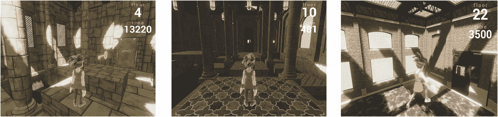

图 7-5

障碍塔中的古代、摩尔和工业主题

### 泛化

根据论文的详细内容，障碍塔包含三个不同的泛化环境。这些环境测试代理泛化新级别的能力，以及改进或改变算法以产生基准性能。

+   **无泛化:** 这涉及在固定的障碍塔环境中训练代理。在这种情况下，需要使用五个随机种子作为性能的衡量标准。

+   **弱泛化**：这也被称为分布内泛化，要求智能体在固定的一组 100 个环境配置种子上进行训练。然后，泛化测试需要在五个随机选择的塔配置种子上进行五次，每次使用不同的种子来控制智能体的动态。这是挑战的主要焦点，如 Unity 博客中提到的（[`https://blogs.unity3d.com/2019/08/07/announcing-the-obstacle-tower-challenge-winners-and-open-source-release/`](https://blogs.unity3d.com/2019/08/07/announcing-the-obstacle-tower-challenge-winners-and-open-source-release/))。

+   **强泛化**：除了弱泛化测试策略外，智能体还需要在多样化的外部视觉条件下进行测试，例如不同的光照、纹理和几何形状。由于测试环境使用与训练环境不同的语法规则创建，因此使用当代最先进的深度学习算法训练智能体很困难。挑战还强调，更强的泛化形式是智能体学习任何复杂环境的更好策略。

Unity 团队最初对该挑战进行了基准测试，并将结果与人类玩家玩游戏的结果进行了比较。团队使用了近端策略优化（PPO）和彩虹算法作为算法，发现在没有泛化策略的情况下，智能体只能达到不到 10 级。彩虹算法作为更通用的算法，其性能优于 PPO。对于弱泛化和强泛化，使用不同彩虹算法达到的最大级别分别是 3.4 和 0.8。彩虹算法是 N 步双打斗深度 Q 网络（DQN）的变体，具有优先级经验回放和分布式强化学习。相比之下，人类平均能解决 15 级，最高达到 22 级。Unity 在他们的博客中通过图 7-6 展示了智能体与人类对手在灾难性学习上的鲜明对比。

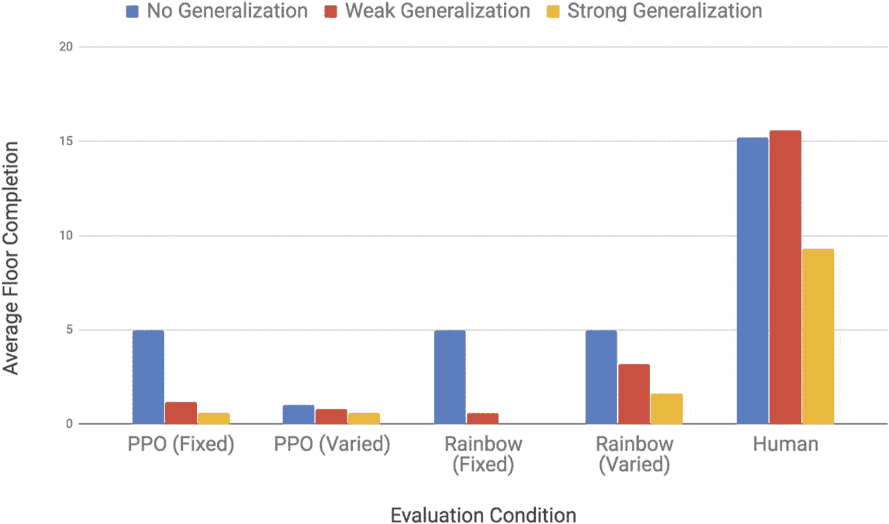

图 7-6

PPO、彩虹与人类在障碍塔挑战中的控制性能

现在我们已经涵盖了障碍塔挑战的基础知识，我们将探讨一些通过提供非凡基准而取得突破的解决方案。我们还将介绍安装障碍塔环境的步骤，因为挑战结束后，它以 Apache 2.0 许可证开源。

### 挑战赛获奖者和提出的算法

挑战赛获胜者是亚历克斯·尼古尔，他的算法能够解决平均 19.4 个级别。获胜策略的基本部分是首先包括行为克隆算法以监督方式训练代理。尼古尔使用了经过微调的定制 PPO 实现 GAIL。使用了具有 KL 散度的 PPO 策略（预优先级）。然而，行为克隆开始过度拟合解决方案，亚历克斯设计了一个 IMPALA 卷积神经网络（CNN）视觉分类器来检测房间中的不同物体（门、钥匙、障碍物）。为了避免使用循环神经网络（RNNs）作为记忆时代理的灾难性遗忘，他构建了一个包含 50 个时间步长的观察堆栈作为输入的一部分。他还尝试了各种 CMA-ES 进化算法进行探索；然而，视觉分类器（分布式 IMPALA）以及经过微调的 PPO、行为克隆和堆叠观察提供了更好的输出。代理能够达到平均 35.86 个单位的奖励。关于该方法的详细描述可在亚历克斯·尼古尔的博客上找到（[`https://blog.aqnichol.com/2019/07/24/competing-in-the-obstacle-tower-challenge/`](https://blog.aqnichol.com/2019/07/24/competing-in-the-obstacle-tower-challenge/))，挑战的代码库位于（[`https://github.com/unixpickle/obs-tower2`](https://github.com/unixpickle/obs-tower2))。

第二名由庞培法布拉大学的计算科学实验室 Compscience.org 获得（[`https://www.compscience.org`](https://www.compscience.org)）。该团队由吉安尼和米哈组成。他们达到了平均 16 个级别的成绩，最初尝试了具有 KL 散度项的 PPO，但后来转向了广泛的采样方法。后来，该团队使用了世界模型，这包括使用基于长短期记忆（LSTM）的 RNNs 的自动编码器（编码器-解码器变体）创建观察的压缩表示，并使用 ES 构建策略。

第三名由来自首尔的宋彬·崔获得，他的代理达到了平均 13.2 层的成绩。他使用了带有门控循环单元（GRU）的 ML Agents 中的 PPO 策略，这是 LSTM 和 RNNs 的改进版本，以获得更好的性能。为了减少过拟合，他添加了 dropout 层，并在图像分类（数据增强）中添加了左右翻转。数据增强是一种标准程序，用于从输入图像生成具有不同方向的图像样本。然后，他使用经验缓冲区收集最相关的观察，并使用整个 100 个种子作为训练集。

除了获奖者之外，还有对 Joe Booth、Doug Meng 和 UEFDL 团队的荣誉提及。Booth 使用带有演示的 PPO 来训练智能体，并使用具有 RNN 架构的压缩网络来存储记忆。关于该方法的更多细节可以在以下链接中找到：[`https://towardsdatascience.com/i-placed-4th-in-my-first-ai-competition-takeaways-from-the-unity-obstacle-tower-competition-794d3e6d3310`](https://towardsdatascience.com/i-placed-4th-in-my-first-ai-competition-takeaways-from-the-unity-obstacle-tower-competition-794d3e6d3310)，以及存储库在：[`https://github.com/Sohojoe/ppo-dash`](https://github.com/Sohojoe/ppo-dash)。

Booth 能够使用他的策略达到 10.8 个级别。Meng 使用了一种深度的 IMPALA 变体，具有批量推理和自定义重放。在尝试了 PPO 和 rainbow 之后，由于它相对于前者来说更少地偏离策略，他转向了 IMPALA。UEFDL 团队使用来自稳定基线的优势演员评论员（A2C）和 LSTM 来训练智能体，后来使用 A2C 和好奇心以及 PPO 来获得更好的性能。Meng 和 UEFDL 团队的平均级别达到了 10 个。关于这些方法的更多信息可以在 Unity 博客中找到（[`https://blogs.unity3d.com/2019/08/07/announcing-the-obstacle-tower-challenge-winners-and-open-source-release/`](https://blogs.unity3d.com/2019/08/07/announcing-the-obstacle-tower-challenge-winners-and-open-source-release/)）。

### 安装和资源

Obstacle Tower 的源代码自挑战在 github 上完成以来已经开源：[`https://github.com/Unity-Technologies/obstacle-tower-source`](https://github.com/Unity-Technologies/obstacle-tower-source)。

为了使用存储库，需要安装 Unity 版本 2019.4（从 Unity Hub 中安装）以及 ML Agents Release 4（根据文档的最新版本）。该版本可以在以下链接中找到：[`https://github.com/Unity-Technologies/ml-agents/tree/release_4`](https://github.com/Unity-Technologies/ml-agents/tree/release_4)。

存储库可以以 zip 格式下载或使用命令行。

```py
git clone https://github.com/Unity-Technologies/obstacle-tower-source
```

安装完成后，我们可以在 Unity 编辑器中打开它。我们需要从 Assets/ObstacleTower/Scenes 文件夹中加载 Procedural 场景。然后我们可以在编辑器中点击 Play 以使用人类控制进行交互。存储库中控制级别生成过程的一些重要方面。

+   当环境启动或重置时，使用位于 Assets/ObstacleTower/Scripts/FloorLogic 文件夹中的 FloorBuilder 脚本来预先生成地板和房间布局的定义。内部生成一个 FloorLayout 对象列表，每个对象都填充了一个 2D 网格的 RoomDefinition 对象和其他元数据。FloorGenerator 和 RoomGenerator 脚本分别负责生成 FloorLayout 和 RoomDefinition，分别借助图食谱和形状语法。

+   当智能体从指定的楼层开始时，FloorLayout 用于在运行时生成特定的楼层（场景）。FloorBuilder 和 RoomBuilder 脚本用于在场景中实例化 GameObject，并借助提供的定义。

为了修改和尝试五种不同的视觉主题，我们需要导航到 Assets/ObstacleTower/Resources/Prefabs，那里存放着每个主题的预制件。动画、网格和纹理位于 Assets/WorldBuilding 文件夹中。五种主题在图 7-7 中展示。

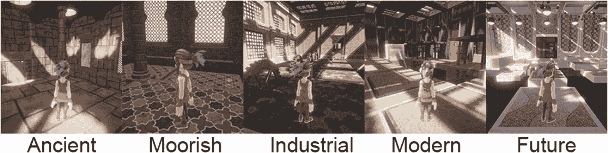

图 7-7

Obstacle Tower Challenge 的五种视觉主题

#### 用于程序化关卡生成的资源

如我们从论文中了解到的那样，每个房间的楼层是通过使用图语法的一组规则生成的。FloorGeneration 用于生成 FloorLayout，它返回一个包含 RoomDefinitions 的 2D 数组。九种不同的房间类型是：

+   **普通：** 没有任何特殊属性的普通房间

+   **锁：** 包含“钥匙锁”门的房间，需要钥匙才能打开

+   **钥匙：** 包含“钥匙”物品的房间

+   **杠杆：** 包含“杠杆锁”陷阱门的房间

+   **谜题：** 至少包含一个“PuzzleLock”门，需要解决谜题才能打开

+   **开始：** 包含“开始”门的房间

+   **结束：** 包含“结束”门的房间

+   **地下室：** 包含“开始”和“结束”门（仅限楼层 0）的房间

+   **连接：** 包含单向门的房间

基于带有图语法的“input.txt”和“output.txt”文件创建新房间类型的步骤在文档链接中解释[`https://github.com/Unity-Technologies/obstacle-tower-source/blob/master/Assets/ObstacleTower/Resources/FloorGeneration/AddRoomType.md`](https://github.com/Unity-Technologies/obstacle-tower-source/blob/master/Assets/ObstacleTower/Resources/FloorGeneration/AddRoomType.md)。

根据这份文档，为了创建新的房间类型，我们首先修改 NodeType.cs 脚本以包含一个新节点。然后，我们必须修改 EnvironmentParameters.cs 脚本以添加新的房间类型。文档使用了一个名为“Hazard”的新房间类型，EnvironmentParameters.cs 脚本更新如下：

```py
public enum AllowedRoomTypes
{
Normal,
PlusKey,
PlusPuzzle
PlusPuzzle,
Hazard
}
```

TemplateRoomGenerator 脚本用于修改用于生成房间的模板。以下更改应按照文档中的说明进行。

```py
public class TemplateRoomGenerator : RoomGenerator
private List endTemplates;
private List keyTemplates;
private List basementTemplates;
private List hazardTemplates;
public TemplateRoomGenerator()
{
public class TemplateRoomGenerator : RoomGenerator
case NodeType.Connection:
normalTemplates = LoadTemplates($”Templates/
{roomSize - 2}/{targetDifficulty}/normals”);
return normalTemplates[Random.Range
(0, normalTemplates.Count)];
case NodeType.Hazard:
hazardTemplates = LoadTemplates($”Templates/
{roomSize - 2}/{targetDifficulty}/hazards”);
return hazardTemplates[Random.Range
(0, hazardTemplates.Count)];
default:
normalTemplates = LoadTemplates($”Templates/
{roomSize - 2}/{targetDifficulty}/normals”);
return normalTemplates[Random.Range
(0, normalTemplates.Count)];
```

然后，我们必须创建自己的配方来修改 FloorGenerator.cs 脚本

```py
public class FloorGenerator
return "graphRecipeNormal";
case AllowedRoomTypes.PlusKey:
return "graphRecipeKey";
case AllowedRoomTypes.Hazard:
return "graphRecipeHazard";
case AllowedRoomTypes.PlusPuzzle:
switch (environmentParameters.allowedFloorLayouts)
{
```

在此之后，我们必须在 Unity 中打开程序化场景，并在层次结构中选择 ObstacleTower-v3.0 GameObject。然后，我们导航到 ObstacleTower Academy 组件，并将重置参数中名为“allowed-rooms”的行更改为枚举的序数值。在这种情况下，我们将“Hazard”房间类型的值设置为 3。这如图 7-8 所示，来自 GitHub 页面。

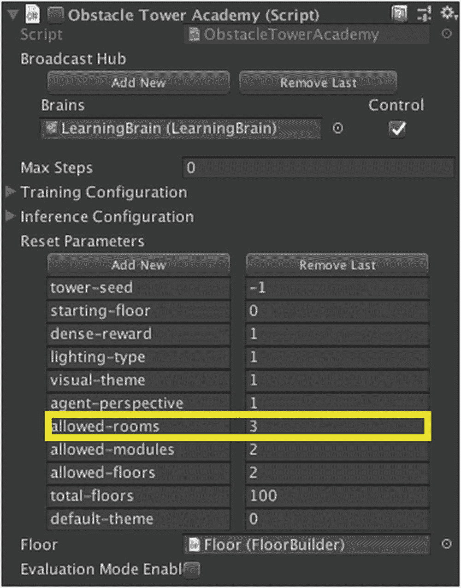

图 7-8

向障碍塔环境添加房间类型

除了不同的房间外，场景中还有不同的门，包括：

+   **开启：** 代理可以自由移动

+   **钥匙锁定：** 需要钥匙才能打开

+   **杠杆锁定：** 代理通过后，门会从后面锁定代理

+   **谜题锁定：** 代理解决谜题后解锁的门

+   **开始：** 游戏开始时代理生成的门

+   **出口：** 将代理带到下一层的门

+   **单向：** 这些门只能从单一方向自由打开

在 [`github.com/Unity-Technologies/obstacle-tower-source/blob/master/extending.md`](https://github.com/Unity-Technologies/obstacle-tower-source/blob/master/extending.md) 的 Github 文档中提供了如何程序化添加新房间的概述。这里提供的示例展示了如何添加地下室类型的房间：

```py
// Create a 1x1 empty floor grid
Cell[,] cellGrid = new Cell[1, 1];
// Create a Basement room node
Node node = new Node(0, 0, NodeType.Basement);
// Pick walls for the entry and exit doors
List possibleDoors = new List {0, 1, 2, 3};
int doorStart = possibleDoors[Random.Range(0, possibleDoors.Count)];
possibleDoors.Remove(doorStart);
int doorEnd = possibleDoors[Random.Range(0, possibleDoors.Count)];
// Add the basement room to the floor grid
cellGrid[0, 0] = new Cell(0, 0, CellType.Normal, node);
// Set the entry and exit doors on the walls of the cellGrid
cellGrid[0, 0].doorTypes[doorStart] = DoorType.Start;
cellGrid[0, 0].doorTypes[doorEnd] = DoorType.Exit;
// Create a floor layout with the grid.
var layout = new FloorLayout
{
floorRoomSize = 5,
floorLayout = new RoomDefinition[1, 1],
cellLayout = cellGrid
};
```

因此，我们已经观察到了如何使用文本节点声明和更新 EnvironmentParameters 脚本以及程序化地添加新的房间配置。

#### 生成房间布局的资源

为了为房间生成新的布局，我们必须指定前面章节中提到的模板。我们还了解到，模板是通过使用基于文本的输入和输出文件创建的。每个 RoomDefinition 包含两个 2D 数组——一个定义房间中的模块放置，另一个定义房间中的物品位置。模板位于 Assets/ObstacleTower/Resources/Templates 文件夹中。为了访问 5 X 5 谜题房间中的三级难度，我们必须导航到 Assets/ObstacleTower/Resources/Templates/5/3/puzzles。每个模板文件（文本）包含一个字符网格，它控制房间中不同物品的位置。第一个物品指定模块，第二个指定物品。大写字母代表特定值，而小写字母表示概率值。模板在 TemplateRoomGenerator 脚本中被解释，该脚本包含一组规则，用于解释每个字符以生成房间布局。以下是一个包含钥匙的 3 X 3 房间的简单示例。

```py
Go GK Go
GX GX GX
GX Go Go
```

G 代表 PlatformLarge 预制模块，o 代表有 50% 的几率放置一个球体，X 代表没有物品。一个典型的在摩尔主题中解释此模板的示例（来自 Github 文档）如图 7-9 所示。

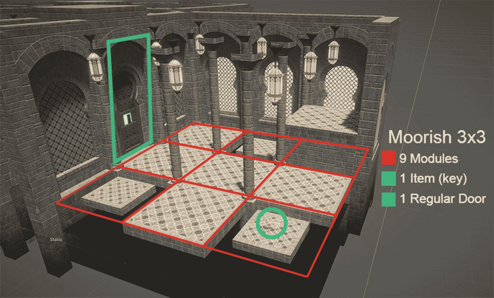

图 7-9

模板解释后的房间布局生成

Github 文档还包含了存储库中可用的不同类型的预制模块和项目。现在我们已经了解了障碍塔中的程序内容生成，我们可以创建一个简单的 Python 脚本来运行预存在的算法（PPO、软演员评论员[SAC]）。

### 与 Gym 包装器交互

我们现在将使用来自[`https://github.com/Unity-Technologies/obstacle-tower-env`](https://github.com/Unity-Technologies/obstacle-tower-env)的 obstacle-tower-env 存储库来创建与 OpenAI Gym 包装器的交互。我们将使用障碍塔挑战的现有设置，通过 Python API 创建 Gym 和环境之间的接口，我们在第五章中学习了该 API。我们必须首先通过命令或 Anaconda 提示符在我们的本地机器或虚拟机上安装 Gym 接口，通过克隆存储库并使用“pip install –e.”命令运行安装。我们在第三章中遵循了相同的方法来安装 ML Agents。

```py
git clone
git@github.com:Unity-Technologies/obstacle-tower-env.git
cd obstacle-tower-env
pip install -e.
```

一旦我们安装了所需的组件，我们就可以开始与障碍塔环境的 Gym 环境进行交互。Unity 提供了一个用于此交互的简介笔记本，网址为[`https://github.com/Unity-Technologies/obstacle-tower-env/blob/master/examples/basic_usage.ipynb`](https://github.com/Unity-Technologies/obstacle-tower-env/blob/master/examples/basic_usage.ipynb)，这也在“入门-障碍塔挑战”笔记本中提供作为参考。我们首先在我们的笔记本中导入 obstacle-tower-env 以及 matplotlib 进行绘图。

```py
from obstacle_tower_env import ObstacleTowerEnv
%matplotlib inline
from matplotlib import pyplot as plt
```

然后，我们开始以非复古模式分析环境。我们将查看环境的观察空间和动作空间，我们在前面的章节中详细讨论了这些内容。由于障碍塔环境可以使用 Gym 包装器，我们将使用“env.action_space”、“env.reset”、“env.close”以及我们在整本书中使用的其他 Gym 方法。

```py
#Launching the Environment
env = ObstacleTowerEnv(retro=False, realtime_mode=False)
print(env.action_space)
print(env.observation_space)
```

下一步是与环境交互并观察相关的奖励。在这种情况下，使用“env.step”方法来提供每个回合的观察和奖励概述。

```py
#Interacting with the Environment
obs = env.reset()
plt.imshow(obs[0])
obs, reward, done, info = env.step(env.action_space.sample())
plt.imshow(obs[0])
```

在下一步中，我们设置环境参数。我们设置种子值以控制房间和楼层，根据论文，在弱泛化策略中，我们可以在 0 到 100 范围内选择任何有效的种子。我们还选择一个楼层进行分析。配置控制代理的视角，在这种情况下，我们将其设置为第一人称模式。然后我们有 Gym 的“env.reset”方法，它用于重置当前参数。

```py
env.seed(5)
env.floor(15)
config = {'agent-perspective': 0}
obs = env.reset(config=config)
plt.imshow(obs[0])
```

我们也可以使用复古模式。要启动复古模式，我们必须将布尔变量“retro”设置为 True。

```py
env = ObstacleTowerEnv(retro=True)
print(env.action_space)
print(env.observation_space)
We can  interact with this retro Environment as follows:
#Interacting with the Environment in Retro mode
obs = env.reset()
print(obs.shape)
obs, reward, done, info = env.step(env.action_space.sample())
plt.imshow(obs)
For closing the Environment, we have to use the "env.close" method from Gym
#Close Environment retro mode
env.close()
```

现在，如果我们想扩展 Gym 基线算法以用于 Obstacle Tower 代理的初始训练，那么我们必须遵循第五章中提供的步骤，其中我们提到了使用 Gym 包装器和 Python API 通过基线训练代理的步骤。在我们审查的提交中，我们发现 PPO 仍然是训练代理的默认首选算法。获胜者使用了 PPO 的修改版本（使用 KL 散度变体-1），以及一系列与行为克隆、用于图像分类的 CNN 以及用于记忆的 LSTM/GRU/RNN 相关的算法。PPO 的简单性和鲁棒性使其非常易于使用，并且与基于记忆的网络如 GRU 和 LSTM 一起，性能显著提高。有一些可以在“env.reset”方法中使用的重置参数，由 GitHub 文档在链接[`github.com/Unity-Technologies/obstacle-tower-env/blob/master/reset-parameters.md`](https://github.com/Unity-Technologies/obstacle-tower-env/blob/master/reset-parameters.md)提供。此外，Unity 还提供了一个带有预定义种子和随机策略评估的 Obstacle Tower 环境的示例实现。这可以在链接[`github.com/Unity-Technologies/obstacle-tower-env/blob/master/examples/evaluation.py`](https://github.com/Unity-Technologies/obstacle-tower-env/blob/master/examples/evaluation.py)找到，并且也存在于 Obstacle_Tower_Predefined_Seeds-Unity.ipynb 笔记本中。

这完成了这个案例研究，正如我们所学的，研究和开发的前景非常广阔。Obstacle Tower 为传统深度强化学习算法提供了一个具有挑战性的环境。随着强化学习领域，尤其是元学习领域的更多研究和进步，改进的算法可能会允许代理完成更多关卡。

## 案例研究：Unity ML Agents 挑战 I

这是在 2017 年 12 月左右 Obstacle Tower 挑战之前由 Unity 的 ML Agents 团队组织的一项挑战。目标是重新定义 Unity ML Agents 训练代理执行不同任务的可能性。挑战的详细信息可以在 Unity Connect 网站上找到（[`connect.unity.com/discover/challenges/ml-agents-1`](https://connect.unity.com/discover/challenges/ml-agents-1)）。

我们将简要地查看前三名提交的作品，而感兴趣的读者可以阅读整个博客以获取更多详细信息。第一名由 Christine Barron 获得，提交了“煎饼机器人”。项目的目标是训练一个机械臂来制作煎饼——也就是说，让机械臂将煎饼抛到盘子上。创建者使用了课程学习进行训练，并包括了三个可配置关节的刚体臂。所有组件都受到重力和扭矩的影响。初始奖励信号被创建出来，以帮助代理（机器人）将煎饼在其臂上保持更长时间。修改后的奖励信号包括了煎饼与盘子中心（机械臂）的距离，如果煎饼碰到地面，则结束这一幕。为了减少噪声，在关节处应用了运动学和旋转运动。当得分超过 60 分时，这一幕结束，目标再次放置在随机位置。课程学习有助于泛化手臂的学习。基于课程学习，手臂（代理）可以依次从 0.4 单位移动到 0.8 和 1.2 单位（沿 x 和 z 轴）。“传递黄油”是另一个使用射线传感器设计的机器人，用于将“黄油”移动到目标位置。它使用头部“相机”发出的九个射线，如果击中障碍物则返回 1。奖励信号包括完成任务成功时的 +2 单位奖励，如果机器人碰到地板则 -2 单位。机器人根据其接近目标的位置获得 +0.075 单位的少量奖励，并且每帧提供 -0.05 的惩罚。如果机器人碰到障碍物，则获得 -0.15 单位的奖励。图 7-10 展示了博客的预览。更多关于这些机器人的详细信息可以在链接 [`https://connect.unity.com/p/pancake-bot?_ga=2.240054851.151262200.1598121566-630897211.1596987781`](https://connect.unity.com/p/pancake-bot%253F_ga%253D2.240054851.151262200.1598121566-630897211.1596987781) 中找到。

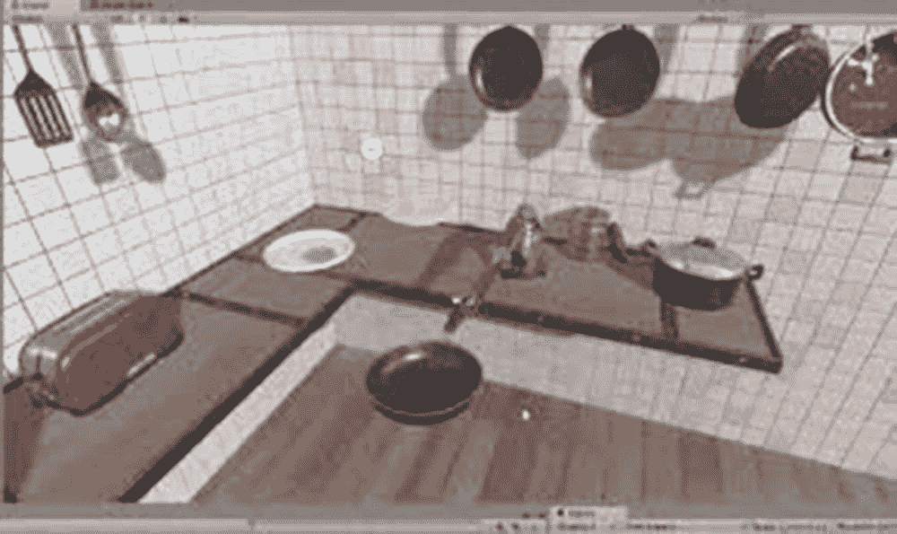

图 7-10

Christine Barron 在 ML Agents Challenge 中的煎饼机器人

第二名由周志天凭借项目“金属战争”（Metal Warfare）获得。这是一款实时策略（RTS）游戏，创作者希望通过 Unity ML Agents 创建用于发射和射击导弹的 AI 代理，如图 7-11 所示。提到的某些细节是，ML Agents 被用来为发射导弹的代理进行信用评分。根据导弹是否击中目标，给予正或负的奖励。创作者根据导弹是否击中敌方的建筑或目标，为每次成功的操作分配了几个奖励信号，每次成功操作奖励+1 单位。状态数组由五个部分组成：动作 ID、先前动作的奖励（延迟奖励）、是否空闲、可用的动作和学习状态。更多关于使用 ML Agents 创建的这款 RTS 游戏的信息，可以在以下链接中找到：[`https://connect.unity.com/p/metal-warfare-real-time-strategy-game-special-edition-for-ai-ml-challenging?_ga=2.96402396.151262200.1598121566-630897211.1596987781`](https://connect.unity.com/p/metal-warfare-real-time-strategy-game-special-edition-for-ai-ml-challenging%253F_ga%253D2.96402396.151262200.1598121566-630897211.1596987781)。

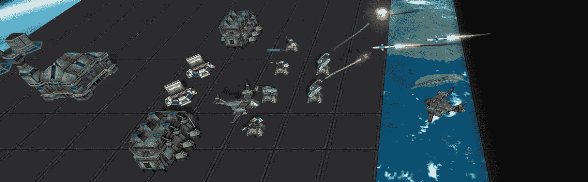

图 7-11

在 ML Agents 挑战赛中，周志天（Chau Chi Thien）的《金属战争》（Metal Warfare）

第三名由大卫·布斯在提交的《隐藏/逃脱：躲避追击敌人》项目中获得。这个项目的目的是创建一个智能 AI 来躲避巡逻代理。在创建奖励信号后，创作者调整了超参数以分析不同参数对代理训练的影响。为了避免游戏无限期地进行，创作者为逃脱代理分配了一个“胜利区域”，逃脱代理必须到达该区域才能获胜。结合广泛的超参数优化和课程学习，产生了能够躲避并从巡逻代理那里逃脱的智能 AI 代理，如图 7-12 所示。关于这个项目的详细信息可以在以下链接中找到：[`https://connect.unity.com/p/hide-escape-avoidance-of-pursuing-enemies?_ga=2.61152876.151262200.1598121566-630897211.1596987781`](https://connect.unity.com/p/hide-escape-avoidance-of-pursuing-enemies%253F_ga%253D2.61152876.151262200.1598121566-630897211.1596987781)。

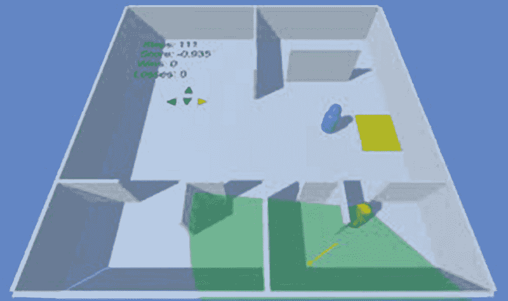

图 7-12

在 ML Agents 挑战赛中，大卫·布斯（David Busch）的《隐藏/逃脱》（Hide escape）

除了这些，博客中还提到了其他几个提交的作品。所有这些作品都是使用早期版本的 ML Agents 设计的，并为我们所了解的障碍塔挑战赛铺平了道路。

在这个阶段，我们几乎涵盖了所有与 ML Agents 相关的主题，这将使读者能够清晰地了解这个工具包的能力。我们将简要地探讨另一个深度强化学习平台——即 Google Dopamine，因为它也可以与 ML Agents 集成。

## Google Dopamine 和 ML Agents

我们在整个书籍过程中广泛学习了使用 Gym 环境。现在我们将探讨 Google Dopamine 与 ML Agents 的集成。Dopamine 是 Google 为深度强化学习研究提供的开源框架，可以通过 GitHub 链接访问（[`https://github.com/google/dopamine`](https://github.com/google/dopamine)）。Dopamine 有自己的 DQN、rainbow、C51 变体的 Rainbow 以及其他实现。使用 Gym 包装器，我们可以使用 Dopamine 运行 ML Agents，为此我们首先需要克隆 Dopamine 仓库。

```py
git clone https://github.com/google/dopamine
```

Dopamine 建议使用虚拟环境进行代理训练。以下命令是激活虚拟环境所需的：

```py
python3 -m venv ./dopamine-venv
source dopamine-venv/bin/activate
```

然后我们必须设置环境，最后安装 Dopamine 的依赖项。

```py
pip install -U pip
pip install -r dopamine/requirements.txt
```

然后我们可以使用以下命令测试安装是否成功：

```py
cd dopamine
export PYTHONPATH=$PYTHONPATH:$PWD
python -m tests.dopamine.atari_init_test
```

我们必须将 atari 文件夹的内容复制到一个新的文件夹中（例如，unity）。在下一步中，我们必须打开 dopamine/Atari/run_experiment.py，并添加以下行以导入此处提到的 ML Agents 依赖项：

```py
from mlagents_envs.environment import UnityEnvironment
from gym_unity.envs import UnityToGymWrapper
```

然后我们导航到同一文件中的“create_atari_environment”方法，然后我们必须使用以下代码实例化一个 Unity 环境：

```py
game_version = 'v0' if sticky_actions else 'v4'
full_game_name = '{}NoFrameskip-{}'.format(game_name, game_version)
unity_env = UnityEnvironment('./envs/GridWorld')
env = UnityToGymWrapper(unity_env, use_visual=True, uint8_visual=True)
return env
```

我们使用 GridWorld 环境。Dopamine 只有针对 Atari 的特定调用，这就是为什么我们必须修改它以使用我们的 Unity ML Agents。由于 Dopamine 提供了使用经验回放算法的 DQN 变体，它与离散动作空间（Gym）兼容。对于分支离散动作空间，我们必须在“UnityToGymWrapper”中启用“flatten_branched”参数，将每个分支动作的组合视为单独的动作。对于视觉观察，Dopamine 不会自动适应多个通道，因此建议提供尺寸为 84 X 84 的灰度图像作为输入。由于 Dopamine 针对 Atari 环境，我们必须修改超参数。已知 dopamine/agents/rainbow/config/rainbow.gin 文件与 GridWorld 配合良好。以下超参数来自官方的 GitHub 文档：

```py
import dopamine.agents.rainbow.rainbow_agent
import dopamine.unity.run_experiment
import dopamine.replay_memory.prioritized_replay_buffer
import gin.tf.external_configurables
RainbowAgent.num_atoms = 51
RainbowAgent.stack_size = 1
RainbowAgent.vmax = 10.
RainbowAgent.gamma = 0.99
RainbowAgent.update_horizon = 3
RainbowAgent.min_replay_history = 20000  # agent steps
RainbowAgent.update_period = 5
RainbowAgent.target_update_period = 50  # agent steps
RainbowAgent.epsilon_train = 0.1
RainbowAgent.epsilon_eval = 0.01
RainbowAgent.epsilon_decay_period = 50000  # agent steps
RainbowAgent.replay_scheme = 'prioritized'
RainbowAgent.tf_device = '/cpu:0'  # use '/cpu:*' for non-GPU version
RainbowAgent.optimizer = @tf.train.AdamOptimizer()
tf.train.AdamOptimizer.learning_rate = 0.00025
tf.train.AdamOptimizer.epsilon = 0.0003125
Runner.game_name = "Unity" # any name can be used here
Runner.sticky_actions = False
Runner.num_iterations = 200
Runner.training_steps = 10000  # agent steps
Runner.evaluation_steps = 500  # agent steps
Runner.max_steps_per_episode = 27000  # agent steps
WrappedPrioritizedReplayBuffer.replay_capacity = 1000000
WrappedPrioritizedReplayBuffer.batch_size = 32
```

我们可以通过运行以下命令来运行 GridWorld 代理的 Dopamine 变体：

```py
python -um dopamine.unity.train \
--agent_name=rainbow \
--base_dir=/tmp/dopamine \
--gin_files='dopamine/agents/rainbow/configs/rainbow.gin'
```

在此上下文中，建议将 atari 的内容复制到一个名为任何名称的新文件夹中（例如，unity）。然后我们必须将“import dopamine.unity.run_experiment”代码中的“unity”替换为我们已复制 run_experiment.py 和 trainer.py 文件的文件夹。

这完成了使用 Gym 包装器将 Google Dopamine 与 ML Agents 集成的介绍。这也标志着本书主要内容的结束。

## 摘要

我们来到了本章以及本书的最后一节。我们将总结本章所学的内容。

+   我们了解了进化算法，并学习了它与生物遗传理论以及达尔文的进化理论的联系。

+   我们分析了两种进化算法的变体——即遗传算法和 ES 的广泛类别。在遗传算法中，我们创建了一个进化网络，通过交叉和变异的遗传过程来匹配短语。

+   在 ES 的范围内，我们了解了遗传算法和 ES 之间的区别，后者使用实数代替二进制值来优化函数。然后我们创建了一个简单的高斯 ES，以在指定范围内找到谐波振荡器的最大值。

+   我们将 ES 算法的学习扩展到了 CMA-ES 和 NES 算法。在 CMA-ES 中，我们看到了高斯分布对协方差矩阵的重要性，这对于更新后代种群的平均值和标准差至关重要。在 NES 中，我们看到了自然梯度下降与进化采样策略之间的关系，以提出一种用于训练代理的进化策略梯度形式。

+   在下一节中，我们对障碍塔挑战进行了描述性概述。在本案例研究中，我们对提供的挑战、要求以及复杂环境有了深入的了解。这个挑战旨在构建代理的泛化（弱/强）特征，并提高模型性能的基准。我们还探讨了如何使用图语法进行程序内容生成，广泛用于设计楼层布局和房间布局。

+   然后，我们讨论了比赛中获胜者所采用的策略和算法。我们看到 PPO 在传统深度强化学习背景下仍然是首选算法，同时也看到了行为克隆/GAIL 与 ES 和世界模型的混合组合成为获胜者采用的主要策略。LSTM/GRU 与 PPO 保持为大多数提交的核心方法。

+   障碍塔的目标是促进研究和提高基准。在下一节中，我们看到了下载开源存储库的步骤，其中包含了创建新房间布局和楼层的代码。我们还看到了图语法的泛化作为生成复杂级别的主要策略。

+   我们看到了创建一个脚本的步骤，该脚本将使障碍塔环境与 Gym 包装器交互，并观察与之相关的不同 Gym 参数。

+   然后，我们分析了另一个案例研究——ML Agents Challenge I，它使用的是较老版本的 ML Agents。我们审查了前三名提交的作品及其项目，这些项目涉及机器人臂、RTS 游戏和逃离的 AI 代理。

+   在最后一节中，我们介绍了将 ML Agents 与 Google Dopamine 集成的步骤。Google Dopamine 是一个使用 DQN 算法变体（rainbow）的深度强化学习研究框架。在这个阶段，我们可以与最流行的深度强化学习平台集成，包括 Gym（OpenAI）和 Dopamine（Google）。

我们来到了这本书的结尾。在创建自主人工智能代理方面，深度强化学习（deep RL）的重要性是巨大的。正如我们从机器人仿真、敌方 AI、路径寻找到自动驾驶代理等方面所看到的那样——可能性是无穷无尽的。我们已经涵盖了大多数传统的深度强化学习算法，以及一些进化算法，并使用 ML Agents 展示了它们的应用。ML Agents 存储库正在不断进行研究和开发，它是一个出色的工具。无论职业如何，这个工具不仅可以用于自动化游戏，还可以用于创建智能 AI 代理和复杂环境，以及进行广泛的研究。与 OpenAI Gym 包装器的兼容性使得它更加稳健，并且使用任何算法训练 AI 代理变得更加简单。通过这本书，我们希望激发读者对使用这个工具包所能实现的无限可能性的热情。
