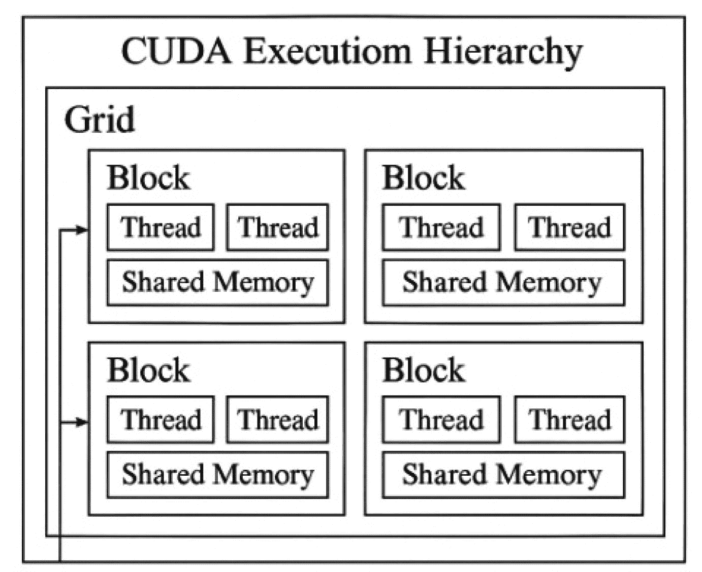
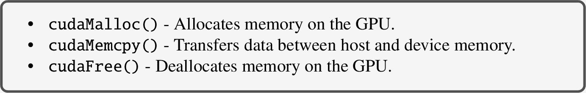
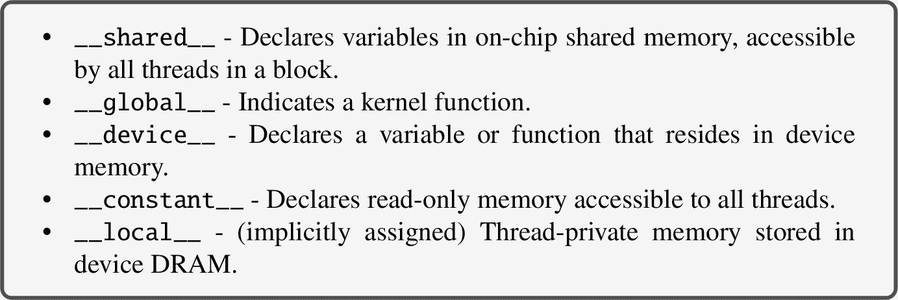
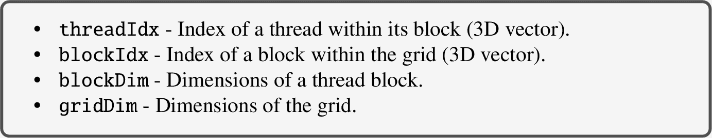
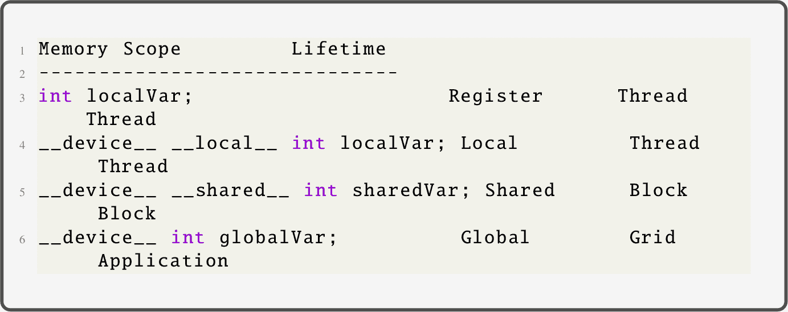
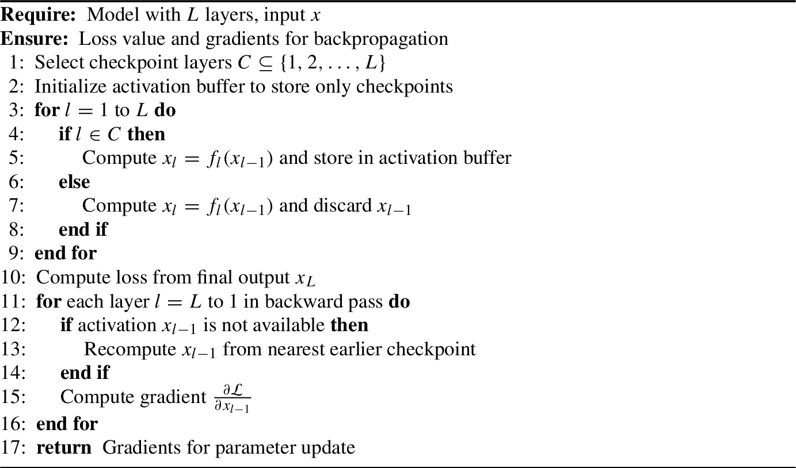
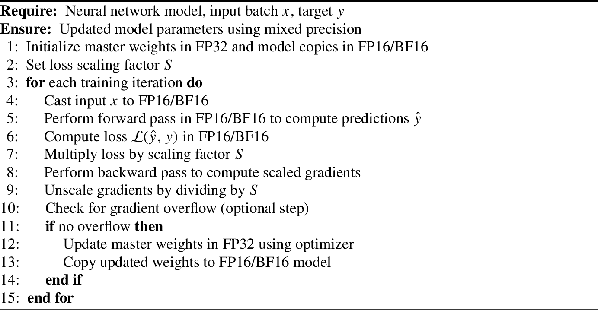

# 4. 高级 GPU 编程用于深度学习

## 4.1 CUDA 编程模型

### 4.1.1 什么是 CUDA？

CUDA（统一计算设备架构）是由 NVIDIA 开发的一个并行计算平台和编程模型，旨在利用其 GPU 的强大处理能力进行通用计算。通过使计算密集型算法能够直接在 GPU 上而不是 CPU 上运行，CUDA 为可以有效地并行化的任务提供了显著的性能提升。CUDA 与 NVIDIA Tesla GPU 架构一起于 2007 年推出，此后已发展成为高性能计算的一个基石。由于其能够解锁加速处理和高效资源利用的能力，CUDA 现在在各个领域得到广泛应用，包括科学计算、深度学习、图像和信号处理以及大规模模拟。

使用 CUDA 进行编程通常是通过扩展标准编程语言（如 C、C++和 Fortran）来完成的。此外，像 PyCUDA 这样的高级接口允许 Python 开发者使用 Python 语法编写 GPU 加速代码。

CUDA 围绕三个基本抽象构建，这些抽象使开发者能够表达并行性并有效地管理硬件资源：

1.  **线程组层次结构**：CUDA 使用线程的层次结构来组织并行计算。线程被分组到块中，而块进一步组织成网格。这种层次结构有助于表达数据级和任务级的并行性。

1.  **共享内存**：每个线程块都可以访问一个快速、片上共享内存空间。这种内存可以使得同一块内的线程之间进行通信和数据共享，从而实现显著的性能优化。

1.  **屏障同步**：CUDA 提供了同步块内线程的机制。线程同步确保在继续执行程序之前，块中的所有线程都达到程序中的某个特定点，这在处理共享数据时避免竞态条件是必不可少的。

这些抽象使 CUDA 成为利用现代计算问题中细粒度并行性的强大模型。

### 4.1.2 CUDA 编程模型

CUDA 编程模型旨在高效地表达和执行在 NVIDIA GPU 上的并行算法。它提供了一个实现细粒度数据并行性和线程级并行性的结构，这些并行性嵌套在粗粒度数据并行性和任务并行性之中。这种多级并行性使 CUDA 能够扩展到数千个 GPU 核心，并有效地利用 GPU 架构。

CUDA 模型遵循一个三步设计模式来处理并行问题：

1.  **将问题划分为粗粒度子问题：** 设计基于 CUDA 的解决方案的第一步是将问题划分为多个独立的子问题。这些子问题足够大，可以独立于彼此计算。每个粗粒度单元通常对应于可以并行处理的数据块或计算部分。

1.  **将子问题分配给线程块：** 一旦问题被分割，每个子问题就被分配给一组线程，称为*块*。线程块是 CUDA 中的一个逻辑执行单元，并由 GPU 独立调度。多个块可以在 GPU 的不同多处理器上并行运行。这一级别在块层面上引入了粗粒度并行性。

1.  **将每个子问题分解为细粒度任务：** 分配的子问题在每个块内进一步分解成更小的作业项。各个线程在块内执行这些任务。块中的所有线程都可以使用快速的片上共享内存共享数据，并可以同步它们的执行以协调计算。这种在线程级别的细粒度并行性允许高效地计算子任务。

图 4.1 展示了包含网格到块再到线程的层次模型，该模型在将复杂的计算任务映射到 GPU 架构时提供了灵活性。它允许开发者利用块间并行性和块内并行性，从而实现高效且可扩展的并行执行。

图 4.1

CUDA 执行层次结构突出了线程如何组织成 warp、块和网格，以有效地利用 GPU 的并行架构。

### 4.1.3 异构计算

异构计算是一种计算范式，其中系统利用多个处理器或计算单元来执行任务。目标是利用不同类型处理器的优势，以提高性能、功率效率或可扩展性。在 CUDA 和 GPU 计算中，异构系统通常结合 CPU（中央处理单元）和 GPU（图形处理单元），共同解决计算问题。

在这样的系统中，我们区分两个主要组件。

#### 4.1.3.1 主机

**主机**指的是 CPU 及其相关内存，通常称为*主机内存*。CPU 负责通用计算任务，包括程序控制流、任务调度和内存管理。它初始化程序，准备数据，并在 GPU 上启动计算。主机管理自身与 GPU 设备之间的通信和数据传输。

#### 4.1.3.2 设备

**设备**指的是 GPU 及其专用内存，称为*设备内存*。GPU 在高度并行任务方面表现出色，并针对同时执行数千个线程进行了优化。它非常适合数据并行和计算密集型工作负载，如矩阵运算、图像处理和深度学习。

#### 4.1.3.3 主机和设备之间的交互

在基于 CUDA 的异构计算中，典型的流程包括以下步骤：

1.  在主机（CPU）和设备（GPU）上分配内存。

1.  将输入数据从主机内存传输到设备内存。

1.  从主机启动一个或多个内核（GPU 函数）以在设备上执行。

1.  将设备内存中的结果复制回主机内存。

1.  在主机和设备上释放内存资源。

在异构系统中实现最佳性能，主机和设备之间的有效数据传输和同步至关重要。CUDA 提供了用于内存管理和内核执行的 API，以促进这种交互。

### 4.1.4 CUDA 对 C/C++的扩展

CUDA（计算统一设备架构）通过为通用 GPU 编程设计特定功能来扩展 C/C++编程语言。这些扩展允许开发者编写可以在 NVIDIA GPU 上高效执行的并行程序。CUDA 模型引入了新的语法、关键字和 API 函数来支持基于内核的并行性、内存管理和线程组织。

#### 4.1.4.1 函数启动和内核执行

在 CUDA 中，旨在在 GPU 上运行的函数被称为**内核**。这些内核通过主机（CPU）使用特殊语法（涉及三个尖括号）启动：

此语法表示 GPU 将使用`gridDim`个块执行内核，每个块包含`blockDim`个线程。每个线程执行相同的代码，但可以操作不同的数据，从而实现数据并行执行。

#### 4.1.4.2 在 GPU 上调用函数

CUDA 允许函数在主机或设备上执行，或者从一个设备函数调用另一个设备函数。这是通过修饰符来指定的。

#### 4.1.4.3 内存管理

CUDA 通过引入设备内存管理例程来扩展标准 C/C++的内存控制。这些包括

这些函数是必要的，因为主机和设备有独立的内存空间。适当的内存管理确保了高效的数据传输和整体性能。

#### 4.1.4.4 内存声明修饰符

CUDA 通过引入用于声明不同内存空间变量的修饰符来扩展内存控制：

这些限定符有助于优化内存访问模式，并允许对变量存储进行显式控制。

#### 4.1.4.5 特殊指令

CUDA 提供同步和内存一致性原语以确保并行线程的正确执行：

当多个线程在执行过程中协作并共享数据时，这些标识符至关重要。

#### 4.1.4.6 线程和块标识符

CUDA 提供内置变量以确定线程在执行网格中的唯一位置：

这些标识符用于将数据或任务分配给单个线程。它们提供了对程序如何并行化以及数据如何访问的精细控制。

#### 4.1.4.7 CUDA 中的函数声明

在 CUDA 编程中，函数限定符指定函数将在何处执行（主机或设备）以及可以从哪里调用。这些限定符对于确定代码如何与 CPU（主机）和 GPU（设备）内存以及执行线程交互至关重要。CUDA 定义了三个主要函数限定符：`__device__`、`__global__`和`__host__`。理解它们的行为是编写高效和正确 CUDA 程序的关键。

#### 4.1.4.8 CUDA 函数限定符概述

表 4.1 提供了函数描述、执行模式和可调用的基本语法。

表 4.1

CUDA 函数限定符及其执行/调用上下文

| 函数声明 | 执行于 | 可从 |
| --- | --- | --- |
| `__device__ float deviceFunc()` | 设备 | 设备 |
| `__global__ void kernelFunc()` | 设备 | 主机 |
| `__host__ float hostFunc()` | 主机 | 主机 |

#### 4.1.4.9 函数限定符描述

+   `__device__`: 声明一个在 GPU 上运行的函数，并且只能从设备或全局函数中调用。这些函数不能直接从 CPU 访问。

+   `__global__`：声明一个在 GPU 上执行但使用内核启动语法（例如`<<<...>>>`）从主机调用的内核函数。

+   `__host__`：声明一个在 CPU 上执行并可从其他主机函数调用的函数。默认情况下，所有 C++函数都被视为主机函数，除非另有指定。

#### 4.1.4.10 示例：CUDA 函数声明在实际中的应用

## 4.2 CUDA 中的变量类型限定符

在 CUDA 编程中，变量的存储取决于它们的声明和限定符。理解这些内存类型对于优化性能、减少内存延迟以及确保线程和块之间正确的数据访问模式至关重要。以下是一些关于 CUDA 中变量内存限定符的重要要点：

+   **无限定符的自动变量**存储在寄存器中，这是最快的内存形式，其生命周期限制在单个线程内。

+   **局部数组**（即，在函数内部声明的没有特殊限定符的数组）存储在*局部内存*中，该内存位于全局内存中，但对每个线程是私有的。这是因为数组通常超过寄存器容量。

+   `__shared__`变量位于*共享内存*中，该内存对所有块内的线程都是可见的。这种内存对于块内线程间的通信很有用，并且与全局内存相比具有更低的延迟。

+   在文件作用域（即，在函数外部）声明的`__device__`变量（没有其他限定符）被放置在*全局内存*中。这种内存可以被所有线程访问，并且在整个应用程序的生命周期中持续存在。

+   在 CUDA 中，**指针**只能引用全局空间中的内存。它们不能指向寄存器或其他线程的局部内存。这种限制确保了 GPU 线程之间正确的内存访问和一致性。

这些内存类型中的每一种在 GPU 计算中都扮演着特定的角色，并且它们的正确使用对于实现最佳吞吐量和最小化瓶颈至关重要。

### 4.2.1 SIMT 架构

SIMT（单指令多线程）架构是现代 GPU 编程框架（如 CUDA）的基本设计原则。SIMT 允许多个线程在不同的数据元素上并发执行相同的指令，从而利用 GPU 硬件固有的并行性。虽然 SIMT 在结构上类似于 SIMD（单指令多数据），但它通过多线程增加了一层灵活性。与 SIMD 不同，开发者必须经常了解向量宽度并在代码中显式管理它，SIMT 抽象了这些硬件细节，使得编程模型更简单、更可扩展。在 SIMT 中，一组线程（称为 warp，通常是 32 个线程）以锁步方式执行指令，但每个线程都保持其程序计数器和寄存器状态，允许不同的控制流。这种多线程执行模型将使开发者能够编写类似标量的代码，该代码可以自动扩展到数千个核心。因此，了解确切核心数量的需求在很大程度上被消除，开发者可以专注于他们问题的数据并行特性，而不是特定的执行单元。

#### 4.2.1.1 映射块和线程

在 CUDA 中，当从主机（CPU）启动内核函数时，它定义了一个线程块网格，该网格必须映射到 GPU 的硬件资源。这个过程对于实现高效执行和最大化并行吞吐量至关重要。每个块被分配到一个流式多处理器（SM），这是 GPU 中的基本计算单元。一旦分配，线程块中的所有线程将在单个 SM 上并发执行。每个线程块都可以访问共享内存并能够内部同步，从而实现高效的块内协作。如果可用足够的资源，如寄存器和共享内存，多个线程块也可以在单个 SM 上同时运行。随着线程块完成执行，CUDA 运行时系统会动态地将新的块调度到释放的 SM 上。这个过程会一直持续到所有线程块都完成，确保在整个内核执行过程中 GPU 资源的高占用率和有效利用。

#### 4.2.1.2 GPU 中的线程生命周期

在 GPU 上的线程生命周期从内核函数的启动开始，这触发了由多个线程块组成的网格的创建。然后，这些线程块被顺序分配给可用的流多处理器（SM）。根据计算资源的可用性，单个 SM 可能同时托管多个线程块。在每个线程块内，线程进一步组织成 warp，通常是 32 个线程的组。这种分层调度支持两个级别的并行性：块间并行性，其中不同的线程块在不同的 SM 上运行，以及块内并行性，其中多个 warp 在单个 SM 内执行。SM 的调度器动态选择准备好运行的 warp，特别是那些操作数已经可用的 warp。

### 4.2.2 设备内存管理

在 CUDA 编程中，设备端的内存管理对于高效利用 GPU 至关重要。设备内存可以以两种主要形式分配：线性内存和 CUDA 数组。虽然两者都受到支持，但由于其直观的接口，线性内存在通用 GPU 计算中更常用。线性设备内存的分配通常使用`cudaMalloc()`函数执行，相应的释放操作使用`cudaFree()`完成。主机（CPU）和设备（GPU）之间的数据传输通过`cudaMemcpy()`函数管理，该函数允许双向复制数据。此外，CUDA 提供了共享内存，它使用`__shared__`内存空间指定符进行分配。共享内存位于芯片上，当正确使用时，其速度比全局内存快得多，这使得它适合块内通信和临时存储。理解如何管理这些内存类型对于优化 CUDA 应用程序至关重要。

### 4.2.3 内存层次结构

CUDA 的内存架构具有分层层次结构，旨在根据访问模式和范围优化性能。除了全局和共享内存之外，CUDA 还包括两个所有线程都可以访问的只读内存空间：常量内存和纹理内存。这些内存空间源自 GPU 图形管道和着色语言，并已适应通用计算。每种内存类型都服务于不同的访问模型和优化策略。例如，常量内存非常适合高效地向所有线程广播值，而纹理内存提供了诸如缓存和空间局部性等好处，这在图像处理任务中特别有用。重要的是，全局、常量和纹理内存空间在同一个应用程序的多个内核调用中持续存在，允许在不重新分配的情况下重复使用数据存储，从而提高性能并减少主机-设备通信开销。

### 4.2.4 GPU 内存管理

高效的 GPU 内存管理对于高性能计算至关重要，尤其是在基于 CUDA 的编程中。CUDA 向开发者暴露了多个内存层级，每个层级都有不同的特性、性能和作用域。理解内存的分配、访问和同步有助于优化应用程序以实现速度和资源效率。

#### 4.2.4.1 GPU 内存类型（全局、共享、常量、纹理）

CUDA 支持丰富的内存层次结构，每个层级都旨在支持不同的访问范围和性能权衡。

**全局内存**是最常用的内存空间，所有块的所有线程都可以访问。它是离芯片的，意味着它位于 DRAM 中，因此比片上内存有更高的访问延迟。尽管有延迟，但它跨内核调用持久存在，非常适合存储大型数据集。

**共享内存**，另一方面，是一个低延迟、高带宽的内存区域，每个线程块分配一个。同一块内的线程可以通过从共享内存中读取和写入来协作。它使用`__shared__`关键字声明，如果内存访问管理得当，可以显著提高性能。

**常量内存**是一个小的只读内存空间，优化了在所有线程间广播相同数据。由于它被缓存，当所有线程访问确切位置时，访问常量内存更快，这使得它非常适合查找表和连续参数。

**纹理内存**是另一种来自 GPU 图形遗产的只读内存。它优化了 2D 空间局部性，并提供了硬件插值，这使得它在图像处理任务中很有用。像常量内存一样，纹理内存被缓存，所有线程都可以访问。

这些内存空间——全局、共享、常量和纹理——在访问延迟、带宽和作用域方面提供了不同的权衡。它们的有效利用是高性能 GPU 编程的基石。

#### 4.2.4.2 内存增长、垃圾回收和分层内存复用

在大规模深度学习应用中，由于模型尺寸和批量处理需求的增加，管理 GPU 内存的增长和复用至关重要。处理不当可能导致碎片化和性能下降。

CUDA 不提供自动垃圾回收。然而，开发者可以实现自定义内存池以高效地分配和复用内存缓冲区——避免昂贵的重复分配和释放。

一种广泛采用的战略是**分层内存复用**，尤其是在神经网络中。在正向和反向传播过程中仅使用的中间激活，当不是同时访问时，可以在层之间重新分配用途。像 PyTorch 和 TensorFlow 这样的深度学习框架通过内存规划器内部应用此类技术。

为了在线程之间协调内存访问，使用 `__syncthreads()` 等构造来同步共享内存操作，而原子指令如 `atomicAdd()` 则有助于防止并发更新时的竞态条件。

最后，主机-设备同步确保在主机访问结果之前，GPU 上的计算已完成。这种同步通常在内核执行结束时隐式进行，尽管在高级用例中异步流可能需要显式管理。

#### 4.2.4.3 高效内存访问和归约策略

高效的内存访问对于在 GPU 编程中实现高性能至关重要。CUDA 允许 warp（通常是 32 个线程）内的线程以归约方式访问全局内存——即相邻线程访问连续的内存地址——允许单个内存事务服务于整个 warp。这显著降低了延迟并利用了 GPU 的高内存带宽。相反，非归约或分散的内存访问会触发多个内存事务，导致性能大幅下降。

共享内存访问也必须优化，以避免银行冲突，当多个线程同时尝试访问相同的内存银行时会发生银行冲突。这些冲突可以通过仔细的索引策略和填充来缓解，确保访问是并行化的且无冲突的。

可以使用 `cudaMalloc()` 和 `cudaFree()` 在设备上处理动态内存分配和释放。主机和设备之间的数据传输由 `cudaMemcpy()` 管理，应尽量减少或通过异步流与计算重叠，以减少空闲时间并提高整体吞吐量。

此外，利用只读内存空间，如常量和纹理内存，可以进一步优化内存访问。这些内存类型提供缓存的访问，并且对于广播或空间局部访问模式非常理想，通过降低延迟和改进缓存利用率来提高性能。

#### 4.2.4.4 内存增长、垃圾回收和逐层内存重用

在大规模应用中，密集的学习工作负载、管理 GPU 内存增长和重用变得既复杂又至关重要。随着模型大小和批量处理需求的增加，内存消耗可能会迅速增长。因此，必须仔细处理内存分配和释放，以避免碎片化和过度使用。

虽然 CUDA 不提供自动垃圾回收，但开发者可以实施自定义内存池以高效地管理分配。这有助于重用内存缓冲区，而不是反复分配和释放内存，后者在计算上代价高昂。

一种实际的方法是**层间内存重用**，尤其是在神经网络中。由于中间激活只在正向和反向传播期间使用，因此当不需要同时使用时，它们的内存可以在层之间重用。像 PyTorch 和 TensorFlow 这样的框架通过内存规划器内部应用此类优化。

高效的同步构造，如`__syncthreads()`，有助于管理块内共享内存的时间共享。同样，原子操作，如`atomicAdd()`，确保在没有竞争条件的情况下安全地并发访问内存位置。

最后，主机-设备同步确保在主机访问结果之前 GPU 计算已完成。这通常通过内核完成时的隐式同步来处理，确保正确性而无需开发者的显式干预，除非使用异步流。

## 4.3 GPU 上的优化技术

图形处理单元（GPU）被设计成高效处理大量并行工作负载。然而，必须采用特定的优化策略来充分利用其计算能力。这些技术旨在最小化延迟，最大化吞吐量，并确保高效使用硬件资源。本节详细介绍了适用于 GPU 编程的关键优化技术，特别是使用 CUDA。

### 4.3.1 内存访问优化

高效的内存访问是 GPU 性能的基本要素。全局内存访问相对较慢，优化访问模式至关重要。

#### 4.3.1.1 内存归约

GPU 允许 warp 中的线程以归约方式访问全局内存，即相邻线程访问相邻的内存位置。适当的归约最小化内存事务并提高带宽利用率。

为了优化 GPU 上的内存访问，必须遵循关键的最佳实践，例如以数组结构（SoA）格式而不是结构数组（AoS）格式组织数据，确保线程索引与内存地址线性对应，并将数据结构对齐到 32 位、64 位或 128 位边界以启用内存归约。此外，有效地利用共享内存——这是块内线程之间共享的片上、低延迟内存——可以显著提高性能。这包括将频繁访问的数据加载到共享内存中，通过确保线程访问不同的内存银行来最小化银行冲突，并引入填充以避免多个线程争夺同一银行。

### 4.3.2 线程级优化

线程级控制有助于确保 warp 内和线程块间的代码高效执行。

#### 4.3.2.1 占用优化

占用率是指每个流多处理器（SM）中活跃 warp 的数量与 SM 可以支持的最大 warp 数量的比率。高占用率有助于隐藏内存延迟。最大化占用率——即每个流多处理器（SM）中活跃 warp 的数量与最大支持的 warp 数量的比率——对于在 GPU 上实现高性能至关重要。高效的占用率确保更好的延迟隐藏和资源利用率。一个关键策略是仔细调整每个块中的线程数量，理想情况下使用 32 的倍数值，因为 warp 是以 32 个线程为一组执行的。选择合适的块大小有助于确保每个 SM 上调度足够的 warp 以保持执行流水线忙碌。

另一个重要的考虑因素是管理寄存器和共享内存的使用。单个线程或块对这些有限资源的过度使用会减少并发启动的线程数量，从而降低占用率。开发者应努力编写内存和寄存器高效的内核，以允许更多的块同时驻留在 SM 上。

`cudaOccupancyMaxPotentialBlockSize()` 和 NVIDIA 的占用计算器等工具可以帮助做出明智的决策。这些工具分析内核的资源使用情况，并提供最优的块大小和启动配置，以最大化占用率，帮助开发者通过实证和自动化分析微调性能。

#### 4.3.2.2 避免线程发散

当同一 warp 内的线程由于条件语句而遵循不同的执行路径时，会导致 GPU 执行中的发散，从而引起串行执行和性能下降。为了减轻这种情况，建议尽量减少 warp 内条件语句的使用，并确保线程以遵循类似控制流路径的方式分组。此外，可以采用 warp 投票和条件执行等技术来更有效地处理常见条件，使 warp 中的所有线程保持活跃，并减少发散对内核整体性能的影响。

### 4.3.3 指令级优化

指令级并行性（ILP）通过在单个线程内同时执行多个独立指令来增强 GPU 性能。为了有效地利用 ILP，开发者应该重构代码以最小化指令间的依赖。实现这一目标的一种方法是通过重新排序指令，使得一个指令的执行不依赖于另一个指令的结果。循环展开是另一种有用的技术，因为它增加了暴露给调度器的操作数量，同时减少了循环控制的开销。将复杂任务组合成更小、更独立的单元可以提高流水线利用率，并确保 GPU 上更平滑、更高效的执行。

### 4.3.4 异步执行和重叠

现代 GPU 支持异步执行，允许使用 CUDA 流在内存传输和内核执行之间并发发生。这种能力通过减少空闲时间并最大化 GPU 资源利用率显著提高了性能。通过利用多个 CUDA 流，开发者可以在主机和设备之间重叠数据移动与 GPU 上的计算，从而提高吞吐量。使用 `cudaMemcpyAsync()` 允许非阻塞的内存传输，使得应用程序可以在启动内核之前启动数据复制操作，而不必等待它们完成。此外，使用固定（页锁定）内存通过允许 GPU 直接访问进一步加速数据传输，避免了可分页内存的开销。这些技术共同形成了一种强大的策略，用于在 GPU 加速的深度学习工作负载中实现高效率。

### 4.3.5 性能分析与分析工具

在 GPU 编程中进行性能调整必须由有效的性能分析来指导，以识别和解决计算瓶颈。有几种工具可用于支持此过程。`Nsight Compute` 提供了内核级别的性能分析，提供了对单个 CUDA 内核执行的洞察。`Nsight Systems` 用于系统级别的性能分析，允许开发者分析 CPU-GPU 交互和基于时间线的行为。像 `nvprof` 和 `CUDA Profiler API` 这样的工具提供了对性能计数器和内存吞吐量数据的访问。在性能分析期间需要分析的关键指标包括内存吞吐量、占用率、warp 执行效率和内存访问模式——包括全局和共享。这些指标有助于了解 GPU 资源的有效利用程度，并指导开发者优化内核性能以用于深度学习应用。

### 4.3.6 必要的 GPU 优化指南

在深度学习中最大化 GPU 效率需要遵循几个必要的优化实践。开发者应减少对全局内存的依赖，转而使用共享内存，这提供了更低的延迟和更高的吞吐量。确保内存访问模式合并可以显著提高带宽利用率。使用占用率计算器有助于微调线程和块配置，以实现最佳硬件利用率。为了保持 warp 执行效率，控制流应精心设计，以避免 warp 内部出现分歧。利用异步流可以实现计算和内存传输的重叠，这有助于最小化 GPU 空闲时间。最后，持续的性能分析对于识别和解决性能瓶颈至关重要，它可以在整个开发周期中提供信息化的调整。

## 4.4 GPU 优化技术

为 GPU 优化应用程序需要深入了解硬件架构和并行算法的本质。虽然 GPU 在高效的高吞吐量并行执行方面表现出色，但高效的利用需要定制的编程方法。本节探讨了特别适用于大规模矩阵计算和深度学习工作负载的高级 GPU 优化技术。所讨论的方法对于在科学计算、人工智能和图形应用中实现最先进性能至关重要。表 4.2 给出了各种 GPU 优化技术的比较。

### 4.4.1 分块矩阵乘法和并行算法

矩阵乘法在许多领域都是基础，从计算机图形学到机器学习。在 GPU 上，简单的实现往往由于过多的全局内存访问而导致性能瓶颈。*分块矩阵乘法*通过将计算划分为子块（分块）来解决这一问题，从而有效地利用快速的共享内存。

此方法通过块中的合作线程将输入矩阵的部分加载到共享内存中。每个线程计算一个分块的局部结果，并将其累加到寄存器中。这显著减少了冗余的全局内存访问次数，并利用了共享内存的高带宽。

算法 1 中给出的分块矩阵乘法算法是一种并行策略，旨在在 GPU 或类似并行架构上有效地乘以两个大矩阵。关键思想是将输入矩阵划分为较小的子矩阵或*分块*，这些分块可以加载到快速的片上共享内存中。每个线程块负责计算输出矩阵的一个分块。在块内，线程协作从全局内存中加载对应输入矩阵的分块到共享内存中。

表 4.2

关键 GPU 优化技术比较

| **技术** | **方法** | **性能影响** |
| --- | --- | --- |
| **分块矩阵乘法** | 将大矩阵划分为较小的分块并将它们加载到共享内存中，以减少全局内存访问。 | 相比简单实现，速度可提升 2–5 倍。 |
| **梯度检查点（重新计算）** | 在正向传播过程中只保存一部分激活；在反向传播过程中重新计算其余部分以减少内存使用。 | 内存使用量减少 50–80%；计算开销小。 |
| **使用张量核心进行混合精度训练** | 在 FP16/BF16 中进行计算，同时保留 FP32 主权重；使用损失缩放以保持稳定性。 | 训练速度提高 2–3 倍，内存节省 50%。 |
| **循环展开** | 将循环展开以最小化循环控制开销并暴露更多指令级并行性。 | 依据循环深度和依赖关系，速度提升可达 10–30%。 |
| **内核融合** | 通过减少全局内存传输和内核启动开销来合并多个 GPU 内核。 | 在内存受限的工作负载中，性能可提高 20–40%。 |
| **内存归约** | 确保 warp 中的线程访问连续的内存地址，以最小化内存事务。 | 对于带宽效率至关重要；在最坏到最好的情况下，速度可提高 10$$$\times$$$。 |
| **避免 warp 发散** | 通过将具有相似执行路径的线程分组或使用预测来最小化控制流发散。 | 提高 warp 执行效率；避免串行化。 |
| **异步执行和流** | 使用 CUDA 流来重叠内核执行与内存传输。 | 实现计算-通信重叠；速度可提高 1.5–2$$$\times $$$。 |

一旦加载了瓷砖，每个线程通过执行共享内存瓷砖中相关行和列的内积来计算一个部分乘积。这些部分结果在所有所需的阶段（基于内维*K*）中累积，以生成单个输出元素。所有阶段完成后，最终结果被写回全局内存。

这种分块方法极大地减少了全局内存访问次数，从而提高了内存吞吐量和整体性能。该算法确保在共享内存中数据重用，并允许在并行硬件上实现可扩展和可预测的执行。它在 cuBLAS 等 GPU 库中得到了广泛应用，并且是图形、科学计算和深度学习中许多高性能计算任务的基础。

算法 1 GPU 上的分块矩阵乘法

![使用分块方法进行矩阵乘法的伪代码。它需要大小为 M 乘以 K 的矩阵 A，大小为 K 乘以的矩阵 B，以及一个瓷砖大小 TILE_WIDTH。输出是大小为 M 乘以的矩阵 C。该过程涉及迭代瓷砖对索引，初始化 C_{sub}为零，将 A_{tile}和 B_{tile}加载到共享内存中，同步线程，并执行乘法和累积。最后，C_{sub}被写入 C[i][j] 。](../images/641715_1_En_4_Chapter/641715_1_En_4_Figaan_HTML.png)

### 4.4.2 梯度检查点和重新计算

在大规模深度学习模型中，内存通常是限制因素，尤其是在反向传播期间，此时必须存储每一层的激活。*梯度检查点*（也称为*激活重新计算*）在内存使用和计算之间提供了一个权衡。

梯度检查点是一种在训练深度神经网络时广泛使用的内存优化技术，尤其是在具有许多层或大型参数大小（如变换器）的神经网络中。在反向传播的前向传递中，传统实现存储所有中间激活以在反向传递中重用。然而，当处理深度模型或大型批量时，这种存储可以迅速耗尽 GPU 内存。

梯度检查点通过在正向传播过程中仅保存激活的子集，称为“检查点”，来解决这一限制。它不是存储每个中间输出，而是有选择地在特定间隔存储输出。在反向传播过程中需要时，缺失的激活将从最近的存储检查点重新计算，从而以额外的计算换取减少的内存使用。

此方法允许训练更深或更内存密集的模型而不会耗尽内存，对于容量有限的 GPU 尤其有用。它被支持在主要的深度学习框架中，如 PyTorch（通过 `torch.utils.checkpoint`）和 TensorFlow。尽管它引入了额外的计算时间，但获得的内存效率在实践上通常至关重要，并使模型训练可扩展。详细的步骤总结在算法 2 中。

算法 2 带重新计算的梯度检查点

在正向传播过程中，不是存储所有中间激活，而是只保存选定的检查点。在反向传播过程中，缺失的激活将实时从最近的检查点重新计算。这显著减少了内存使用，允许更大的批量大小或更深的模型在 GPU 约束内进行拟合。

此优化特别有益于内存有限或训练大型基于 Transformer 的模型时。PyTorch 和 TensorFlow 等框架通过库如 `torch.utils.checkpoint` 内置了对检查点的支持。虽然它由于重新计算而增加了计算开销，但内存效率的提升在实践上至关重要，并且通常超过性能权衡。

### 4.4.3 混合精度训练和 Tensor Core 使用

现代 GPU，如 NVIDIA 的 Volta、Ampere 和 Hopper 架构，集成了称为“Tensor Core”的专用硬件单元，这些单元旨在以高吞吐量执行矩阵运算，特别是使用低精度格式如 FP16 或 BF16。*混合精度训练*是一种利用这些单元来加速深度学习模型训练并减少内存使用的技巧。

在混合精度训练中，模型权重以 FP32（单精度）格式维护以确保数值稳定性，但正向和反向计算以 FP16 或 BF16 格式进行。这种方法大大降低了内存带宽和存储需求。然而，在降低精度下操作可能会引入数值下溢，尤其是在梯度计算期间。为了解决这个问题，采用了一种称为 *梯度缩放* 的技术，在梯度被缩减之前对其进行缩放，然后在更新过程中进行反缩放。

框架如 PyTorch 和 TensorFlow 通过 NVIDIA 的自动混合精度 (AMP) 和 Apex 等工具支持混合精度训练。这些框架自动管理精度转换、缩放和内存处理。混合精度训练提供了双重好处：与仅使用 FP32 的训练相比，吞吐量通常提高 2-3 倍，并且能够在相同的内存占用下拟合更大的模型或批量大小，这使得它成为最先进深度学习系统的标准实践。步骤总结在算法 3 中。

算法 3 使用 Tensor 核进行混合精度训练

### 4.4.4 矩阵乘法内核的实现

矩阵乘法是科学计算、机器学习和图形学中的核心操作。在 GPU 上，一个有效的实现利用线程级并行性和共享内存来减少全局内存访问并提高数据重用。内核将线程块分配给结果矩阵的瓦片，其中每个线程通过执行行和列的点积来计算一个元素。

下面是使用共享内存进行瓦片矩阵乘法的高级 CUDA 风格伪代码。

算法 4 瓦片矩阵乘法内核（CUDA 风格）

![该图像是并行计算中使用共享内存进行矩阵乘法的伪代码。它涉及输入矩阵 A[M][K] 和 B[K][]，并输出矩阵 C[M][]。关键步骤包括定义 `TILE_WIDTH`、计算行和列索引、将 `Cvalue` 初始化为零，并在 K 维度上迭代瓦片。使用共享内存数组 A_s 和 B_s 来加载子矩阵。代码包括与 `__syncthreads()` 的同步，并使用 A_s 和 B_s 的元素乘积更新 `Cvalue`。最后，将 C[row][col] 设置为 `Cvalue`。](../images/641715_1_En_4_Chapter/641715_1_En_4_Figaaq_HTML.png)

该实现通过共享内存缓冲区减少全局内存访问，从而实现高内存效率。线程同步确保了当多个线程操作共享数据时的正确性。

## 4.5 摘要

本章全面概述了 GPU 计算原理和深度学习的先进优化技术。它介绍了 CUDA 编程模型，强调异构计算，其中 CPU 和 GPU 协作，并讨论了 CUDA 对 C/C++的扩展、SIMT 架构和 GPU 内存层次结构以实现高效数据处理。本章进一步探讨了关键性能优化策略，如内存访问、线程和指令级并行性、异步执行和性能分析工具。还涵盖了高级主题，如分块矩阵乘法、梯度检查点、使用张量核心的混合精度训练和优化内核实现。本章为读者提供了构建高效、GPU 加速的深度学习应用所需的理论和实践知识。

练习

1.  使用 CUDA 编程模型进行深度学习应用有哪些优势？

1.  解释异构计算的概念及其在基于 GPU 的系统中的重要性。

1.  描述 CUDA 特定函数限定符（如`__global__`、`__device__`和`__host__`）的目的和用法。

1.  比较 SIMT（单指令，多线程）与 SIMD（单指令，多数据）架构。

1.  讨论 CUDA 中不同类型的设备内存及其在内核执行中的作用。

1.  解释 CUDA 内存的层次结构，并确定哪种内存类型提供最快的访问。

1.  如何通过有效的 GPU 内存管理来提高深度学习模型的性能？

1.  什么是归一化内存访问，它们如何有助于内存访问优化？

1.  描述线程发散的概念，并提出在 CUDA 编程中减少其影响的方法。

1.  在 CUDA 的背景下讨论指令级并行性。如有适用，提供示例。

1.  解释异步执行和内存传输与计算的叠加如何提高性能。

1.  列出三种在 CUDA 开发中使用的分析工具，并描述其功能。

1.  总结优化 GPU 内核时应遵循的关键指南。

1.  使用 CUDA 说明分块矩阵乘法的实现。为什么这种技术更受欢迎？

1.  什么是混合精度训练？张量核心如何帮助加速此类训练？
