# 11. 自编码器

## 简介

自编码器可以被视为实现恒等函数的网络。它以数据样本作为输入，同时也将相同的样本作为输出，因此表现为一个自监督模型。尽管网络旨在复制其输入的想法看似毫无意义，但它可以用于许多目的，例如

+   创建输入数据的嵌入，如图像和音频数据

+   数据压缩

+   生成与输入数据类似的新数据等

本章解释了自编码器的基础知识，然后转向实现一个复制 MNIST 数据集的基本自编码器。这种复制需要仔细的考虑和超参数的谨慎选择，如下一个程序所示，它使用 CIFAR-10 数据集完成相同的任务。然后我们转向自编码器的不同变体，并讨论稀疏、去噪和变分自编码器。最后一节总结。

## 概念和类型

考虑一个在输入层和输出层之间有多个隐藏层的网络。这些层以这种方式排列，即第二层的神经元数量与倒数第二层相同；第三层的神经元数量与倒数第三层相同；依此类推。此外，假设此类网络的层数为奇数，则中间层可以用来提取输入的潜在表示，因此被认为是最重要的。

自编码器由两个子网络组成：编码器和解码器。编码器将输入数据转换为紧凑的表示，解码器再将这种紧凑的表示转换回输出，该输出与输入相同。

### 数学

考虑一个可以作为恒等函数但通过中间层重新生成输入的网络。也就是说，如果输入是 x，那么中间层的输出将是

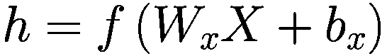

其中 f 是激活函数，*W*[*x*] 和 *b*[*x*] 分别是权重和偏差。然后中间层的输出乘以权重 *W*[*h*]，并通过激活函数 g 传递以产生 ：

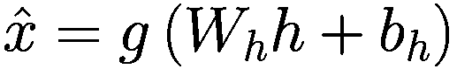

网络的目的是减少 *x* 和  之间的差异，即最小化损失。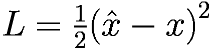，在输入为实数的情况下。

如果输入是二进制，则损失取为

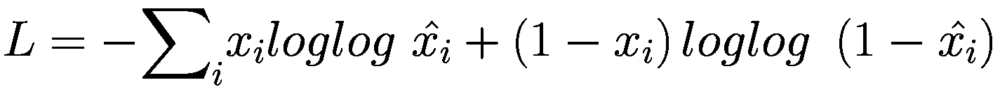

因此，网络将输入 *x* 编码为潜在表示 *h*，并将 *h* 解码回  以使  与 *x* 相同。该模型训练以最小化与参数 *W*[*x*]，*b*[*x*]，*W*[*h*]，和 *b*[*h*] 相关的损失。

### 自编码器类型

根据隐藏层的大小，自编码器可以分为两种类型：欠完备和过完备。

#### 欠完备自编码器

欠完备自编码器的隐藏层单元数少于输入层。这种自编码器的例子如图 11-1 所示。训练后，如果网络能够精确地重建输入 *x*[*i*]，则意味着嵌入包含了对输入足够好的潜在表示。这被称为无损嵌入。

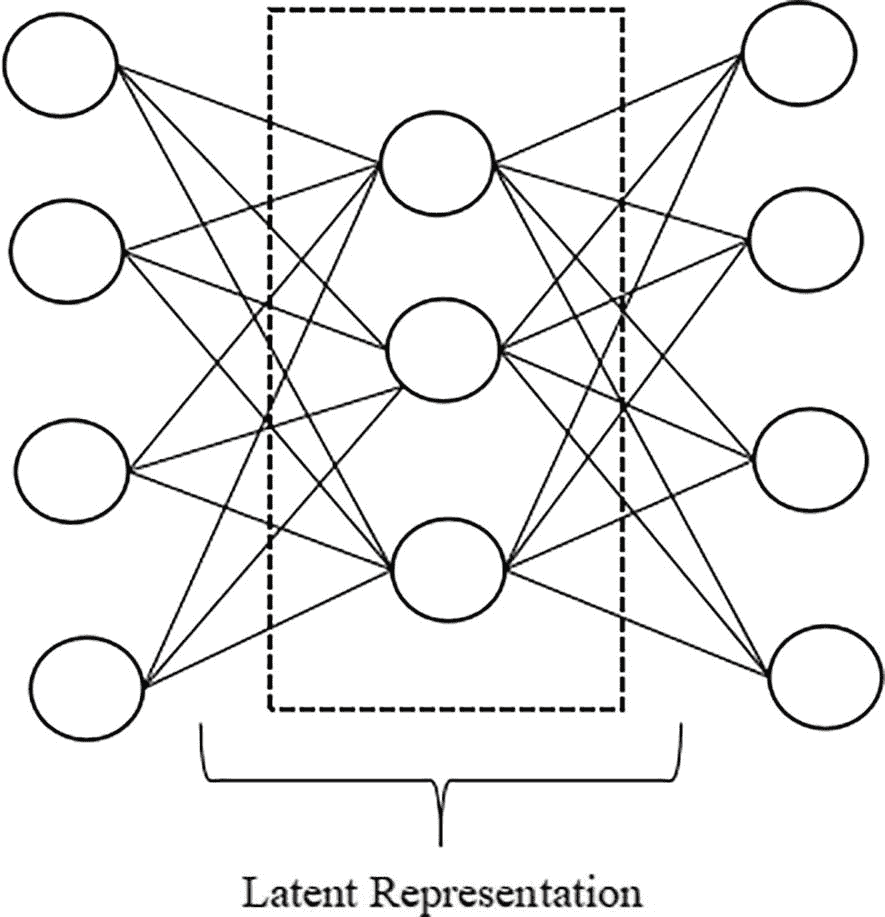

图 11-1

欠完备自编码器

#### 过完备自编码器

过完备自编码器的编码部分隐藏层单元数多于输入层。这种网络的例子如图 11-2 所示。这类编码器通常执行正则化并引入稀疏性。在过完备自编码器中，我们可能会简单地复制隐藏层前几个单元的 *x* 值，然后用于重建。过完备自编码器必须确保这种情况不会发生。

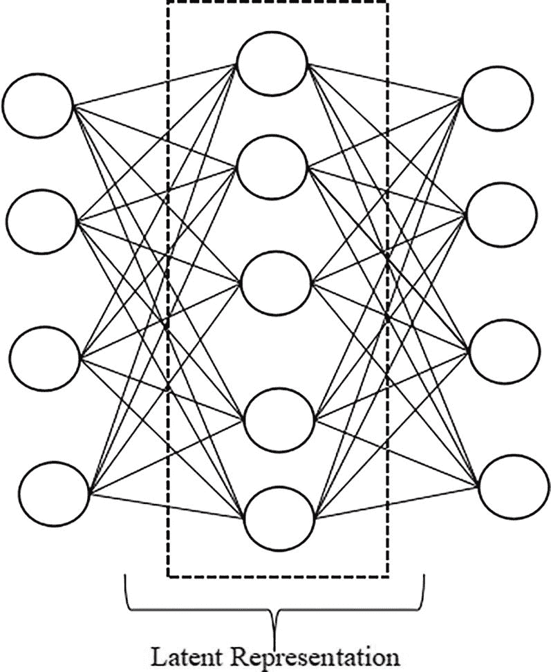

图 11-2

过完备自编码器

这些自编码器可以执行类似于主成分分析（PCA）的数据压缩。让我们探讨这两种数据压缩方法的相似之处和不同之处。

## 自编码器和主成分分析（PCA）

主成分分析（PCA）将具有各种特征的原数据转换成一组新的特征，称为主成分。它们在较少的维度或特征中捕获数据中的最大方差。这对于降维特别有用。我们可以使用以下方法找到给定数据的 PCA：

1.  对于输入数据 X，我们找到平均偏差 (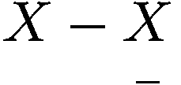)，然后通过将平均偏差与其转置相乘来形成散点矩阵：

    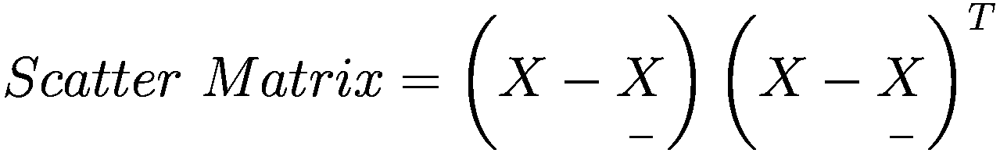

1.  然后获得所形成的散点矩阵的特征值。

1.  按照递减顺序找到第一个“d”特征值，并将相应的向量连接起来。

1.  这样形成的转换矩阵随后与原始矩阵相乘，以获得转换后的特征。

注意，转换后的特征是这样的，第一个特征捕捉最大方差，后续特征捕捉剩余的方差。如前所述，PCA 和自动编码器都可以用于降维；然而，两者之间有明显的区别。

主成分分析（PCA）是一种线性降维方法。如前所述，它找到方差最大的方向。然而，这种方法对于变量之间关系非线性的数据集效果不佳。除了上述内容之外，PCA 的主成分易于解释。另一方面，自动编码器是一种非线性数据降维技术。这使得它非常强大，因为它甚至可以处理变量之间关系非线性的数据集。然而，自动编码器创建的潜在表示难以解释。与 PCA 相比，自动编码器的计算复杂度更高，但它们可以生成非常优秀的原始数据重建。

## 自动编码器的训练

在训练自动编码器时，我们取编码器部分的第一隐藏层以及输入，输入与输出相同，并创建一个新的网络，如图 11-3(a) 所示。

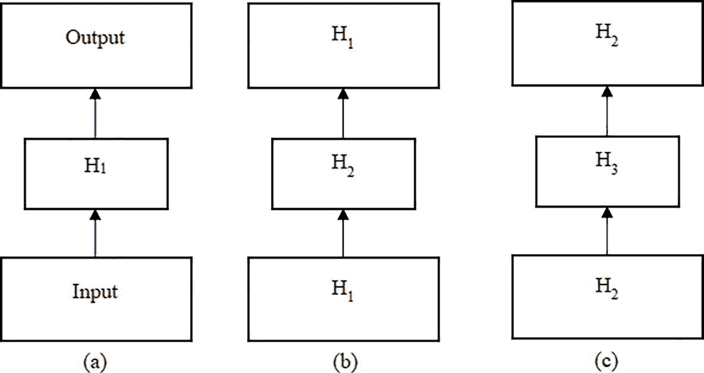

图 11-3

学习第一、第二和第三隐藏层的权重

在训练这个网络之后，我们获得了 H[1] 的权重。一旦获得了 H[1] 的权重，我们将 H[1] 作为新网络的输入和输出，并如图 11-3(b) 所示学习 H[2]。

同样，我们可以学习 H[3] 的权重（图 11-3(c)）以及如此等等，然后构建整个网络（图 11-4）。

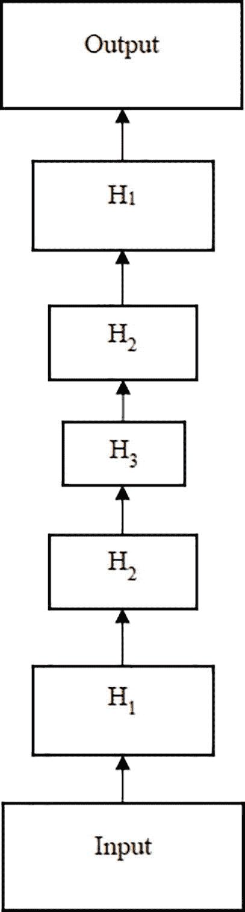

图 11-4

包含三个隐藏层的自动编码器

H[1]、H[2] 和 H[3] 的权重是分别学习的。现在让我们看看自动编码器的一些有趣的应用。

## 使用自动编码器进行潜在表示

### 实验 1

如前所述，自动编码器可以用来找到一个给定输入的有效编码。我们通常使用欠完备自动编码器来完成这个任务。例如，以下程序使用自动编码器在（列表 11-1）中重建 MNIST 数据集。为了完成这个任务，我们执行以下步骤。

```py
Code:
We import the requisite libraries to a) create the model b) Plot the performance and loss curves c) Plot the images d) Carry out low-level numeric tasks.
import tensorflow as tf
from tensorflow.keras import datasets, layers, models
import matplotlib.pyplot as plt
import numpy as np
from tensorflow.keras import optimizers
We then split the dataset into train and test.
mnist_data=tf.keras.datasets.mnist
(X_train,y_train),(X_test,y_test)=mnist_data.load_data()
You will notice that there are 60000 samples consisting of images of size 28 × 28\. We converted the dataset into 50,000 arrays of size 784\. Also, we normalize the dataset by dividing each pixel by 255.
X_train= np.reshape(X_train, (X_train.shape[0], X_train.shape[1]*X_train.shape[2]))
X_test= np.reshape(X_test, (X_test.shape[0], X_test.shape[1]*X_test.shape[2]))
X_train=X_train/255
X_test=X_test/255
X_train = X_train.astype('float32')
X_test = X_test.astype('float32')
Now we create a model having an input layer of size 784, a hidden layer having 512 units, and an output layer of 784 units. We use mean squared loss and Adam optimizer to train the model.
model = tf.keras.Sequential()
model.add(tf.keras.layers.Dense(units=512,activation='sigmoid',input_shape=(784,)))
model.add(tf.keras.layers.Dense(units=784, activation='sigmoid'))
model.compile(loss='MeanSquaredError',optimizer='adam',metrics=['MeanSquaredError'])
It can be observed that there are 804112 trainable parameters.
Model: "sequential_4"
_________________________________________________________________
Layer (type)                Output Shape              Param #
=================================================================
dense_6 (Dense)             (None, 512)               401920
dense_7 (Dense)             (None, 784)               402192
=================================================================
Total params: 804112 (3.07 MB)
Trainable params: 804112 (3.07 MB)
Non-trainable params: 0 (0.00 Byte)
Now we train the network through 100 epochs with a batch size of 128.
epochs = 100
history = model.fit(X_train, X_train,epochs=epochs,validation_data=(X_test, X_test),batch_size=128,verbose=2)
Output:
Listing 11-1
Reconstructing the MNIST dataset using an autoencoder
```

训练和验证损失曲线如图 11-5 所示。同时，一些重建的图像如图 11-6 所示。相应的测试图像如图 11-7 所示。


图 11-7

原始测试图像

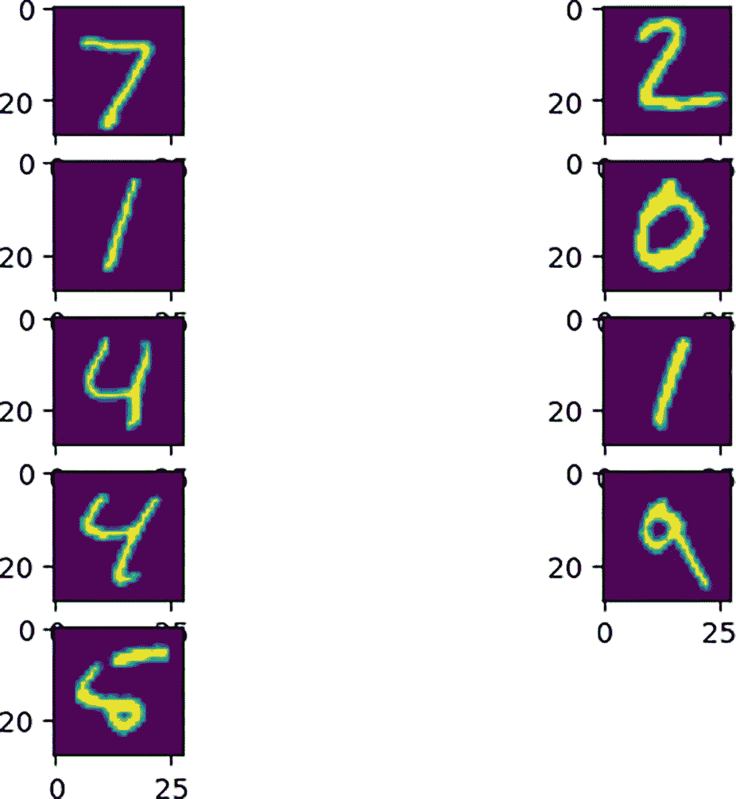

图 11-6

重建图像

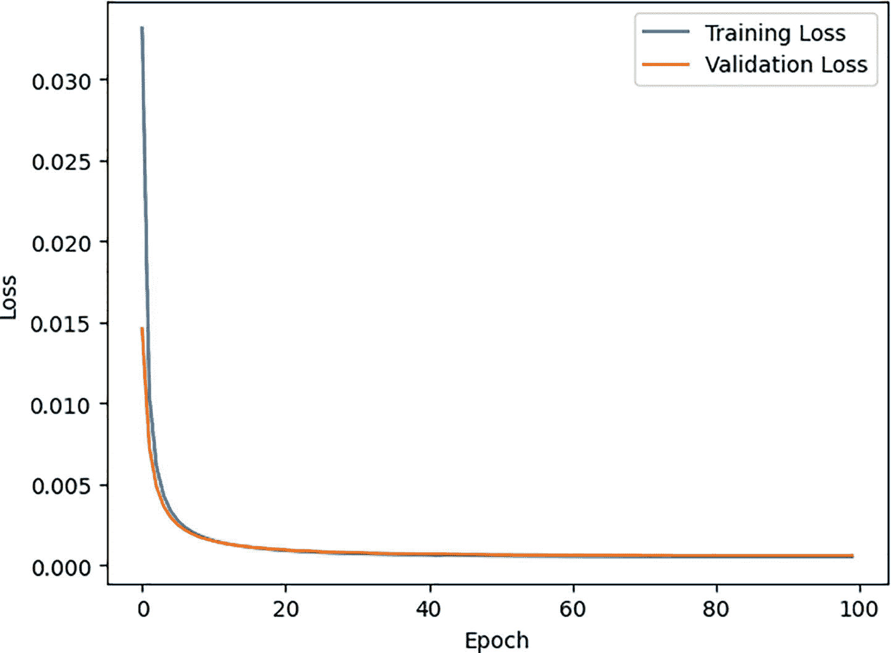

图 11-5

训练和验证损失曲线与训练轮数

训练和验证损失曲线如图所示

就 MNIST 数据集而言，使用大小为 512 的潜在表示可以获得非常好的重建效果。

### 实验 2

MNIST 数据集由于只包含十个数字，因此重建稍微容易一些。我们使用具有十个类别的 CIFAR-10 数据集重复了实验，这些类别分别是：

+   飞机

+   汽车

+   鸟

+   猫

+   鹿

+   狗

+   青蛙

+   马

+   船

+   卡车

本数据集的一些图像如图 11-8 所示。

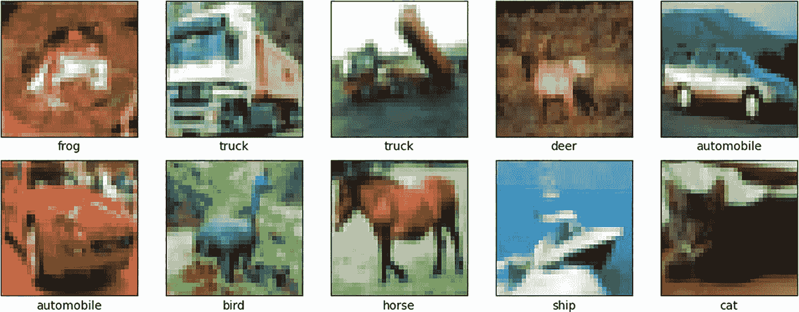

图 11-8

CIFAR-10 数据集的图像

可以观察到图像是复杂的。使用潜在表示重建图像稍微困难一些。以下实验使用 512 个潜在表示和一个隐藏层重建图像。为了使网络学习隐藏表示，已经做了一些修改（列表 11-2）。

```py
Code:
First of all, the images (50,000 train and 10,000 test) have been converted into grayscale using the following function.
def oneDtotwoD(X):
X1 = []
for i in range(X.shape[0]):
img1 = X[i,:,:,:]
img_gray = 0.2989 * img1[:,:,0] + 0.5870 * img1[:,:,1] + 0.1140 * img1[:,:,2]
X1.append(img_gray)
print(len(X1))
return X1
All the images have been flattened and normalized using the following code.
X_train= np.reshape(X_train, (X_train.shape[0], X_train.shape[1]*X_train.shape[2]))
X_test= np.reshape(X_test, (X_test.shape[0], X_test.shape[1]*X_test.shape[2]))
X_train=X_train/255
X_test=X_test/255
X_train = X_train.astype('float32')
X_test = X_test.astype('float32')
This is followed by the creation of the model having 512 units in the hidden layer and 1024 units in the input and output layer.
model = tf.keras.Sequential()
model.add(tf.keras.layers.Dense(units=512,activation='sigmoid',input_shape=(1024,)))
model.add(tf.keras.layers.Dense(units=1024, activation='sigmoid'))
model.compile(loss='MeanSquaredError',optimizer='adam',metrics=['MeanSquaredError'])
Output:
Listing 11-2
Reconstructing the CIFAR-10 dataset using an autoencoder
```

训练和验证损失曲线如图 11-9 所示。这里的重建效果不如上一个案例，可以通过观察损失值（MNIST 数据集为 6.02×10^(-4)，CIFAR-10 数据集为 0.001）来推断。

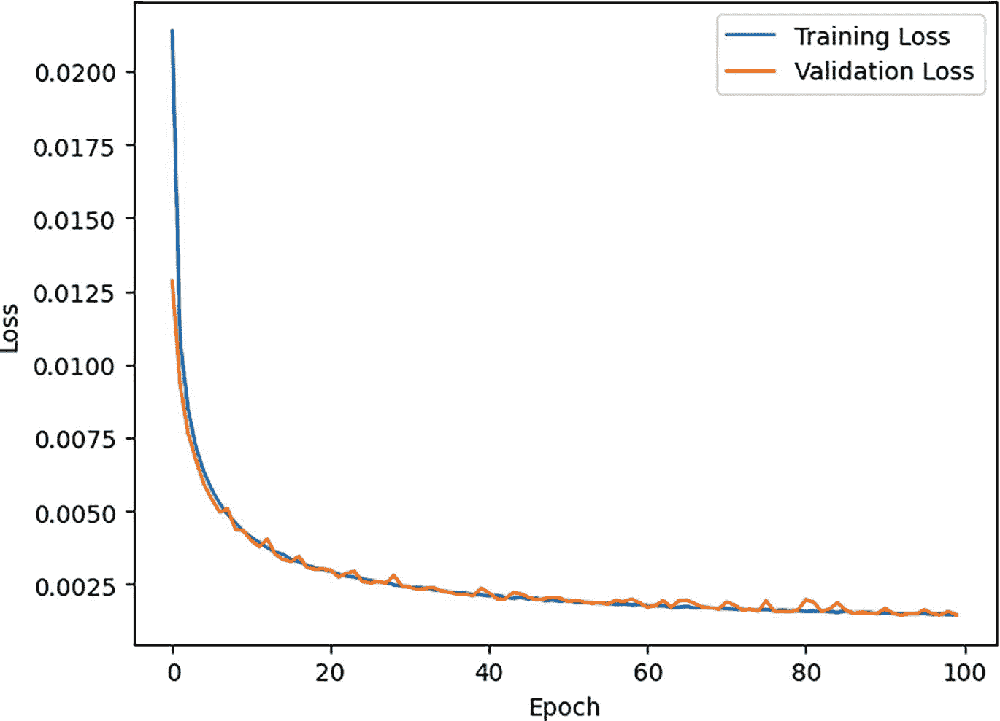

图 11-9

训练和验证损失曲线与训练轮数

The

## 使用多层寻找潜在表示

在上一节中提到，对于具有多层结构的自编码器，权重的学习过程与正常密集网络相比略有不同。以下代码（列表 11-3）实现了使用多层找到图像的潜在表示。

```py
Code:
First of all, we import the necessary libraries to create the model
import cv2
import numpy as np
from tensorflow import keras
from tensorflow.keras import layers
We then create a function to build autoencoder
def build_autoencoder(input_dim, hidden_dim):
input_layer = layers.Input(shape=(input_dim,))
encoded = layers.Dense(hidden_dim,activation='relu',name='encoder')(input_layer)
decoded = layers.Dense(input_dim, activation='sigmoid')(encoded)
autoencoder = keras.Model(input_layer, decoded)
autoencoder.compile(optimizer='adam', loss='mse')
autoencoder.summary()
return autoencoder
This is followed by loading the imaging dataset
data = np.load('/content/drive/MyDrive/Emotion Detection/X_test_Happy.npy')
print(data.shape)
All the imagesare then flattened
data = data.reshape((len(data), np.prod(data.shape[1:])))
data.shape
We then choose the size of hidden dimensions and train the model
hidden_dims = [1024, 512]
encoder_model = None
for i, hidden_dim in enumerate(hidden_dims):
if i == 0:
autoencoder = build_autoencoder(data.shape[1], hidden_dim)
else:
autoencoder = build_autoencoder(encoder_model.output_shape[1], hidden_dim)
autoencoder.fit(data, data, epochs=10, batch_size=32)
encoder_model = keras.Model(autoencoder.input, autoencoder.get_layer('encoder').output)
data = encoder_model.predict(data)
final_encoder = encoder_model
print(data.shape)
Output:
Shape of original data having 296 grayscale images of size 224 × 224
(296, 224, 224)
Shape of data after flattening the 296 grayscale images of size 224 × 224
(296, 50176)
Summary of Model 1
_________________________________________________________________
Layer (type)                Output Shape              Param #
=================================================================
input_3 (InputLayer)        [(None, 50176)]           0
encoder (Dense)             (None, 1024)              51381248
dense_2 (Dense)             (None, 50176)             51430400
=================================================================
Total params: 102811648 (392.20 MB)
Trainable params: 102811648 (392.20 MB)
Non-trainable params: 0 (0.00 Byte)
Summary of Model 2
_______________________________________________________________
Layer (type)                Output Shape              Param #
=================================================================
input_4 (InputLayer)        [(None, 1024)]            0
encoder (Dense)             (None, 512)               524800
dense_3 (Dense)             (None, 1024)              525312
=================================================================
Total params: 1050112 (4.01 MB)
Trainable params: 1050112 (4.01 MB)
Non-trainable params: 0 (0.00 Byte)
Shape of the encoded representation
(296, 512)
Listing 11-3
Latent representation using multiple layers
```

现在我们已经看到了如何在堆叠自编码器中找到隐藏层的嵌入，让我们转向其他自编码器的变体。

## 自编码器的变体

本节讨论了一些其他自编码器的变体，例如稀疏、去噪和变分自编码器。

### 稀疏自编码器

稀疏自编码器是一种特殊的自编码器，它在训练过程中引入了稀疏性。在“自编码器类型”一节中，我们介绍了过完备自编码器，其中隐藏层包含比输入层更多的单元。这导致只有少数神经元被激活。我们可以通过向隐藏层添加一个惩罚激活的额外项来实现这种稀疏性。可以使用 KL 散度来完成这个任务。

损失 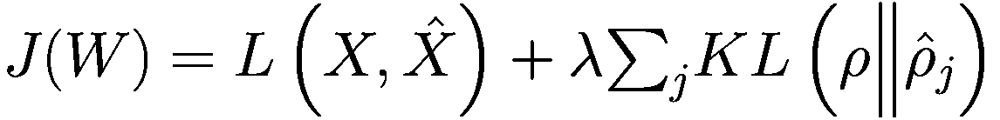

其中！[$$ {\sum}_j KL\left(\rho \Big\Vert {\hat{\rho}}_j\right)={\sum}_j\left[\rho loglog\ \frac{\rho }{{\hat{\rho}}_j}+1-\rho\ loglog\ \frac{1-\rho }{1-{\hat{\rho}}_j}\ \right] $$](../images/611710_1_En_11_Chapter/611710_1_En_11_Chapter_TeX_IEq8.png)

以及！$$ {\hat{\rho}}_j=\frac{1}{m}{\sum}_{i=1}^m{a}_j^h\left({x}_i\right) $$

这里，！$$ {a}_j^h= 隐藏层 h 中第 j 个神经元的激活。 $$

在约束条件下：！$$ {\hat{\rho}}_j=\rho $$

稀疏自编码器的特点如下：

+   稀疏自编码器在训练过程中实现稀疏性。

+   即使隐藏层中的神经元比输入层多，它们也能学习特征。

+   在隐藏层中引入稀疏约束可以确保只有一小部分神经元被激活。

+   在损失函数中增加一个项来惩罚隐藏层激活，推动它们趋向于零。如前所述，这可以通过 L1 正则化或 KL 散度来实现。

+   通过强制稀疏性，网络学会捕捉最重要的特征。

### 去噪自编码器

去噪自编码器是一种特殊的自编码器，能够从数据中去除噪声。它们的架构与常规自编码器类似，包括一个编码器和一个解码器。编码器处理输入数据的噪声版本，并将其转换为低维表示。这种压缩表示捕捉了数据的本质、无噪声特征。然后，解码器接收这种编码表示，并尝试重建原始输入的无损版本。这个过程增强了网络捕捉数据潜在模式的能力，从而使其对噪声更加鲁棒，并提高模型的性能。去噪自编码器被用于各种应用，如图像、信号和文本去噪。

### 变分自编码器

变分自编码器（VAE）是一种自编码器，因为它被设计用来将高维输入数据压缩成更小的表示。而典型的自编码器将输入数据映射到潜在向量，而 VAE 则相反，将输入映射到概率分布的参数，即（a）均值和（b）方差。它在图像生成方面特别有效。

## 结论

本章简要介绍了自动编码器。自动编码涉及训练一个网络来复制其输入作为其输出，从而学习输入的潜在表示。这个过程对于开发有助于信息检索的嵌入非常重要。自动编码器可以被视为一种有损压缩，其中网络识别输入的基本属性。根据隐藏层的大小，自动编码器可以是欠完备的，隐藏层大小小于输入层，或者过完备的，隐藏层更大。堆叠自动编码器包括多个隐藏层。此外，这些网络可以通过使用损坏的实例作为输入来训练，以去噪输入。本章还简要介绍了变分自动编码器，它作为一个生成模型，可以从学习的潜在空间生成样本。

## 练习

### 多项选择题

1.  自动编码器的首要目的是什么？

    1.  使用最大边缘分类器对输入数据进行分类

    1.  将其输入复制到其输出

    1.  使用序列建模来预测未来的数据点

    1.  为了聚类相似的数据点

1.  自动编码器如何支持信息检索？

    1.  通过生成新的数据点

    1.  通过学习嵌入

    1.  通过聚类数据

    1.  通过减少数据中的噪声

1.  自动编码器训练来学习的是什么？

    1.  将输入映射到自身的函数

    1.  输入和输出的区别

    1.  分类边界

    1.  回归函数

1.  自动编码器可以被认为是以下哪种？

    1.  输入的无损压缩

    1.  输入的有损压缩

    1.  生成模型

    1.  预测建模

1.  自动编码器必须识别什么才能使输入的复制更接近？

    1.  数据中的噪声

    1.  输入的重要属性

    1.  数据的未来值

    1.  聚类结构

1.  欠完备自动编码器的特征是什么？

    1.  隐藏层大小大于输入层大小

    1.  隐藏层大小等于输入层大小

    1.  隐藏层大小小于输入层大小

    1.  没有隐藏层

1.  什么是过完备自动编码器？

    1.  隐藏层大小远大于输入层

    1.  隐藏层大小等于输入层大小

    1.  隐藏层大小小于输入层大小

    1.  没有隐藏层

1.  什么是堆叠自动编码器？

    1.  单个隐藏层的自动编码器

    1.  有多个隐藏层的自动编码器

    1.  没有隐藏层的自动编码器

    1.  输入层大的自动编码器

1.  如何训练自动编码器来学习去噪输入？

    1.  只使用干净的数据作为输入

    1.  通过给出输入和一个损坏的实例，并针对未损坏的实例

    1.  通过使用更大的隐藏层大小

    1.  通过聚类输入数据

1.  什么是变分自动编码器（VAE）？

    1.  没有隐藏层的自动编码器

    1.  同时也是生成模型的自动编码器

    1.  输入层大小更大的自动编码器

    1.  使用监督学习的自动编码器

### 理论

1.  什么是自动编码器？多层自动编码器是如何学习的？

1.  什么是去噪自动编码器？请编写一个算法，使用这个网络从特定分布的一组图像中去除噪声。

1.  什么是变分自动编码器？请写出变分自动编码器（VAE）的目标函数并解释其重要性。

1.  比较自动编码器和主成分分析。

### 应用

+   哈里想开发一个可以识别德里所有主要纪念碑的纪念碑识别应用程序。想法是，如果游客使用该应用程序点击纪念碑的图片，应用程序应该能够分类纪念碑并显示其详细信息。为了开发这样的应用程序，他从互联网上收集了每个纪念碑的 3000 张图片。

+   他尝试使用传统的特征提取方法，但并没有取得很大的成功。你能帮助他使用自动编码器来完成这个任务吗？

+   自动编码器能帮助他去除他员工用手机拍摄的同一座纪念碑的一些图像的噪声吗？解释一下如何做到这一点。

+   最后，他想使用该应用程序生成新型纪念碑的图片。你能帮助他使用 VAE 来完成这个任务吗？
