# 2. 使用 TensorFlow 的监督学习

在本章中，我们将解释监督机器学习的概念。接下来，我们将深入研究如线性回归、逻辑回归和提升树等监督机器学习技术。最后，我们将使用 TensorFlow 2.0 演示所有上述技术。

## 什么是监督机器学习？

首先，让我们快速回顾一下机器学习的概念，然后通过一个例子来看一下什么是监督机器学习。

如亚瑟·萨缪尔在 1959 年所定义的，机器学习是研究计算机在没有明确编程的情况下获得学习能力的一个领域。机器学习的目标是构建程序，这些程序的性能会随着一些输入参数（如数据、性能标准等）的自动改进而提高。从做出决策或预测的角度来看，这些程序变得更加数据驱动。我们可能没有意识到，但机器学习已经渗透到我们的日常生活中，从在线门户上的产品推荐到无需我们驾驶或雇佣司机的自动驾驶汽车。

机器学习是人工智能（AI）的一部分，主要由以下三种类型组成：

1.  监督机器学习

1.  无监督机器学习

1.  强化学习

让我们通过一个例子来探索监督机器学习，然后使用 TensorFlow 2.0 实现不同的技术。请注意，无监督机器学习和强化学习超出了本书的范围。

想象一个三岁的孩子第一次看到小猫。孩子会如何反应？孩子不知道他/她看到的是什么。他/她可能会最初体验到好奇、恐惧或快乐的感受。只有在父母抚摸小猫之后，孩子才会意识到这只动物可能不会伤害他/她。后来，孩子可能足够舒服，可以抱着小猫玩耍。现在，下次孩子看到小猫时，他/她可能会立刻认出它并开始玩耍，而不会像之前那样对小猫有恐惧或好奇。孩子已经*学习*到小猫无害，而且他/她可以和小猫一起玩耍。这就是现实生活中监督学习的工作方式。

在机器世界中，监督学习是通过提供机器输入和标签并要求它从中学习来完成的。例如，使用前面的例子，我们可以向机器提供小猫的图片，以及相应的标签（小猫），并要求它学习小猫的内在特征，以便它能很好地泛化。后来，如果我们提供一张没有标签的另一只小猫的图片，机器将能够预测这张图片是只小猫。

监督学习通常包括两个阶段：训练和测试/预测。在训练阶段，提供一组总数据，称为训练集，给机器学习算法，由输入数据（特征）和输出数据（标签）组成。训练阶段的目标是确保算法尽可能多地从输入数据中学习，并在输入和输出之间形成一个映射，以便它可以用于预测。在测试/预测阶段，提供剩余的数据集，称为测试集，给算法，只包含输入数据（特征）而不包含标签。测试/预测阶段的目标是检查模型学习能力和泛化能力的好坏。如果训练集和测试集的准确度差异太大，我们可以推断模型可能将训练数据的输入和输出映射得太紧密，因此它无法很好地泛化未见过的数据（测试集）。这通常被称为过拟合。

典型的监督机器学习架构如图 2-1 所示。

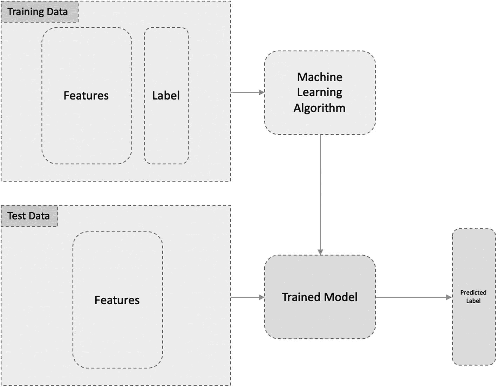

图 2-1

监督机器学习架构

在监督学习中，如果我们预测数值，这被称为回归，而如果我们预测类别或分类变量，我们称之为分类。例如，如果目标是预测公司将要赚取的销售（美元）数值，这属于回归。如果目标是确定客户是否会从在线商店购买产品，或者检查员工是否会流失（分类的“是”或“否”），这是一个分类问题。

分类可以进一步分为二分类和多分类。二分类处理对两个结果进行分类，即要么是，要么否。多分类产生多个结果。例如，客户被分类为热线索、温线索或冷线索等。

## 使用 TensorFlow 2.0 进行线性回归

在线性回归中，就像任何其他回归问题一样，我们试图将输入和输出映射，以便我们能够预测数值输出。我们试图形成一个简单的线性回归方程：

y = mx + b

在这个方程中，`y` 是我们感兴趣的数值输出，而 `x` 是输入变量，即特征集的一部分。`m` 是直线的斜率，`b` 是截距。对于多元输入特征（多元线性回归），我们可以将方程推广如下：

y = m[1]x[1 +] m[2]x[2] + m[3]x[3] + …… + m[n]x[n] + b

其中 `x`[`1`], `x`[`2`], `x`[`3`], ………, `xn` 是不同的输入特征，`m`[`1`], `m`[`2`], `m`[`3`], ……… m`[`n`] 是不同特征的斜率，`b` 是截距

该方程也可以用图形表示，如图 2-2（在二维空间中）所示。

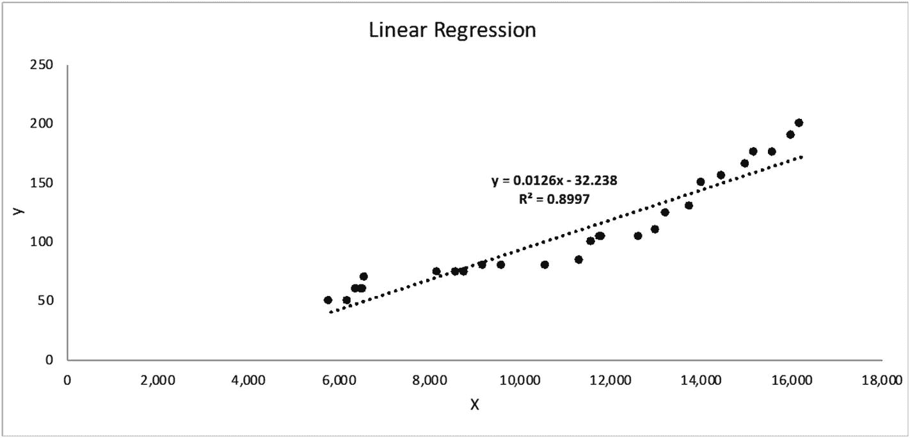

图 2-2

线性回归图

在这里，我们可以清楚地看到标签 y 和特征输入 X 之间存在线性关系。

## 使用 TensorFlow 和 Keras 实现线性回归模型

我们将在 TensorFlow 2.0 中实现线性回归方法，使用 Boston 房屋数据集和 TensorFlow 包内可用的 `LinearRegressor` 估算器。

1.  导入所需的模块。

    ```py
    [In]: from __future__ import absolute_import, division, print_function, unicode_literals
    [In]: import numpy as np
    [In]: import pandas as pd
    [In]: import seaborn as sb
    [In]: import tensorflow as tf
    [In]: from tensorflow import keras as ks
    [In]: from tensorflow.estimator import LinearRegressor
    [In]: from sklearn import datasets
    [In]: from sklearn.model_selection import train_test_split
    [In]: from sklearn.metrics import mean_squared_error, r2_score
    [In]: print(tf.__version__)
    [Out]: 2.0.0-rc1
    ```

1.  加载并配置 Boston 房屋数据集。

    ```py
    [In]: boston_load = datasets.load_boston()
    [In]: feature_columns = boston_load.feature_names
    [In]: target_column = boston_load.target
    [In]: boston_data = pd.DataFrame(boston_load.data, columns=feature_columns).astype(np.float32)
    [In]: boston_data['MEDV'] = target_column.astype(np.float32)
    [In]: boston_data.head()
    ```

```py
[Out]:
```

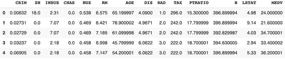

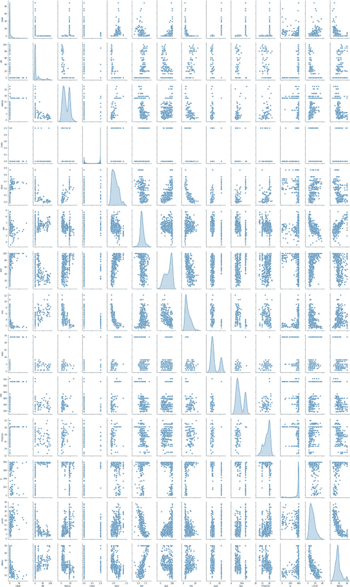

1.  使用 `pairplot` 和相关图检查变量之间的关系。

    ```py
    [In]: sb.pairplot(boston_data, diag_kind="kde")
    [Out]:
    ```

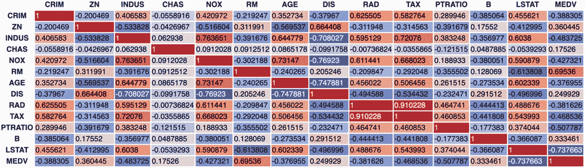

```py
[In]: correlation_data = boston_data.corr()
[In]: correlation_data.style.background_gradient(cmap='coolwarm', axis=None)
[Out]:
```

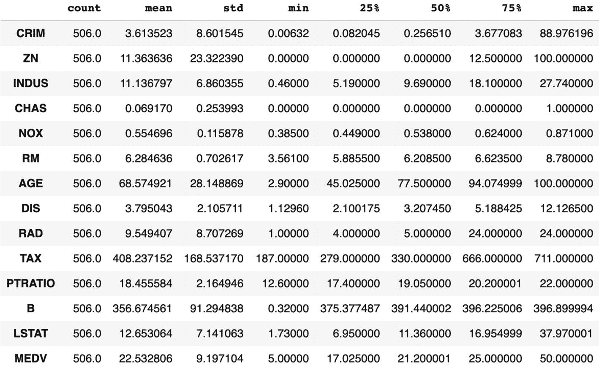

1.  描述性统计——集中趋势和离散度

    ```py
    [In]:  stats = boston_data.describe()
    [In]: boston_stats = stats.transpose()
    [In]: boston_stats
    [Out]:
    ```

1.  选择所需的列。

    ```py
    [In]:  X_data = boston_data[[i for i in boston_data.columns if i not in ['MEDV']]]
    [In]:  Y_data = boston_data[['MEDV']]
    ```

1.  训练测试分割。

    ```py
    [In]:  training_features , test_features ,training_labels, test_labels = train_test_split(X_data , Y_data , test_size=0.2)
    [In]:  print('No. of rows in Training Features: ', training_features.shape[0])
    [In]:  print('No. of rows in Test Features: ', test_features.shape[0])
    [In]:  print('No. of columns in Training Features: ', training_features.shape[1])
    [In]:  print('No. of columns in Test Features: ', test_features.shape[1])
    [In]:  print('No. of rows in Training Label: ', training_labels.shape[0])
    [In]:  print('No. of rows in Test Label: ', test_labels.shape[0])
    [In]:  print('No. of columns in Training Label: ', training_labels.shape[1])
    [In]:  print('No. of columns in Test Label: ', test_labels.shape[1])
    [Out]:
    ```

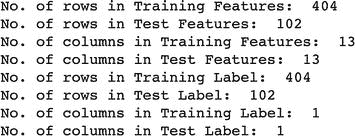

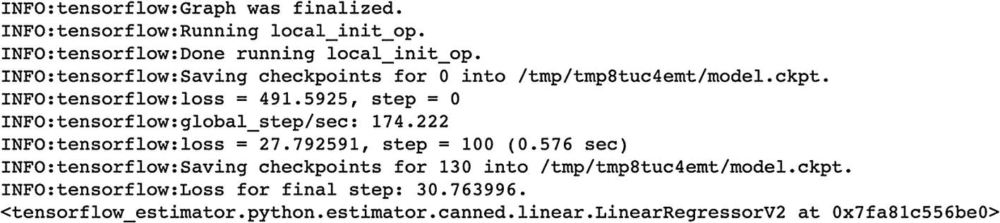

1.  标准化数据。

    ```py
    [In]: def norm(x):
    stats = x.describe()
    stats = stats.transpose()
    return (x - stats['mean']) / stats['std']
    [In]: normed_train_features = norm(training_features)
    [In]: normed_test_features = norm(test_features)
    ```

1.  为 TensorFlow 模型构建输入管道。

    ```py
    [In]: def feed_input(features_dataframe, target_dataframe, num_of_epochs=10, shuffle=True, batch_size=32):
    def input_feed_function():
    dataset = tf.data.Dataset.from_tensor_slices((dict(features_dataframe), target_dataframe))
    if shuffle:
    dataset = dataset.shuffle(2000)
    dataset = dataset.batch(batch_size).repeat(num_of_epochs)
    return dataset
    return input_feed_function
    [In]: train_feed_input = feed_input(normed_train_features, training_labels)
    [In]: train_feed_input_testing = feed_input(normed_train_features,
    [In]: training_labels, num_of_epochs=1, shuffle=False)
    [In]: test_feed_input = feed_input(normed_test_features, test_labels, num_of_epochs=1, shuffle=False)
    ```

1.  模型训练

    ```py
    [In]: feature_columns_numeric = [tf.feature_column.numeric_column(m) for m in training_features.columns]
    [In]: linear_model = LinearRegressor(feature_columns=feature_columns_numeric, optimizer="RMSProp")
    [In]: linear_model.train(train_feed_input)
    [Out]:
    ```

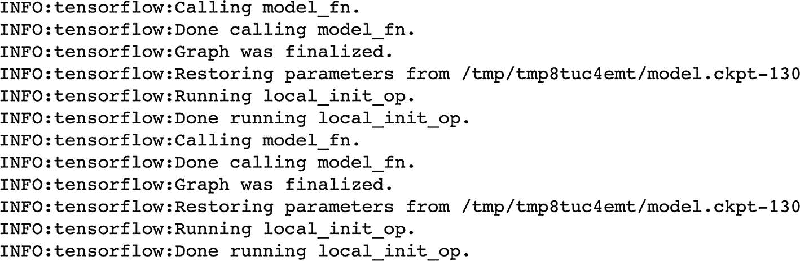

1.  预测

    ```py
    [In]: train_predictions = linear_model.predict(train_feed_input_testing)
    [In]: test_predictions = linear_model.predict(test_feed_input)
    [In]: train_predictions_series = pd.Series([p['predictions'][0] for p in train_predictions])
    [In]: test_predictions_series = pd.Series([p['predictions'][0] for p in test_predictions])
    [Out]:
    ```

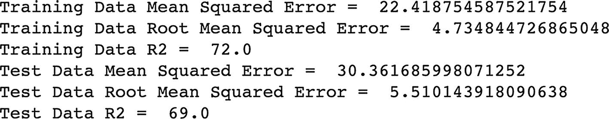

1.  验证

    ```py
    [In]: def calculate_errors_and_r2(y_true, y_pred):
    mean_squared_err = (mean_squared_error(y_true, y_pred))
    root_mean_squared_err = np.sqrt(mean_squared_err)
    r2 = round(r2_score(y_true, y_pred)*100,0)
    return mean_squared_err, root_mean_squared_err, r2
    [In]: train_mean_squared_error, train_root_mean_squared_error, train_r2_score_percentage = calculate_errors_and_r2(training_labels, train_predictions_series)
    [In]: test_mean_squared_error, test_root_mean_squared_error, test_r2_score_percentage = calculate_errors_and_r2(test_labels, test_predictions_series)
    [In]: print('Training Data Mean Squared Error = ', train_mean_squared_error)
    [In]: print('Training Data Root Mean Squared Error = ', train_root_mean_squared_error)
    [In]: print('Training Data R2 = ', train_r2_score_percentage)
    [In]: print('Test Data Mean Squared Error = ', test_mean_squared_error)
    [In]: print('Test Data Root Mean Squared Error = ', test_root_mean_squared_error)
    [In]: print('Test Data R2 = ', test_r2_score_percentage)
    [Out]:
    ```

```py
[In]: train_predictions_df = pd.DataFrame(train_predictions_series, columns=['predictions'])
[In]: test_predictions_df = pd.DataFrame(test_predictions_series, columns=['predictions'])
[In]: training_labels.reset_index(drop=True, inplace=True)
[In]: train_predictions_df.reset_index(drop=True, inplace=True)
[In]: test_labels.reset_index(drop=True, inplace=True)
[In]: test_predictions_df.reset_index(drop=True, inplace=True)
[In]: train_labels_with_predictions_df = pd.concat([training_labels, train_predictions_df], axis=1)
[In]: test_labels_with_predictions_df = pd.concat([test_labels, test_predictions_df], axis=1)
```

使用 TensorFlow 2.0 实现线性回归的代码可以在以下位置找到：[`http://bit.ly/LinRegTF2`](http://bit.ly/LinRegTF2)。您可以保存代码副本，在 Google Colab 环境中运行它，并尝试调整不同的参数，以查看结果。

## TensorFlow 2.0 中的逻辑回归

逻辑回归是最受欢迎的分类方法之一。尽管其名称包含 *回归*，且其底层方法与线性回归相同，但它并不是回归方法。也就是说，它不用于预测连续（数值）值。逻辑回归方法的目的在于预测结果，这是一个分类问题。

如前所述，逻辑回归的底层方法与线性回归相同。假设我们采用多类线性方程，如下所示：

y = m[1]x[1] + m[2]x[2] + m[3]x[3] + ……… + m[n]x[n] + b

其中 `x`[1], `x`[2], `x`[3], `………`, `xn` 是不同的输入特征，`m`[1], `m`[2], `m`[3], `……… mn` 是不同特征的斜率，而 **b** 是截距。

我们将对线性方程应用逻辑函数，如下所示：

p(y=1) = 1/(1 + e^(–(m)[1]^x[1] ^(+ m)[2]^x[2] ^(+ m)[3]^x[3] ^(+ ……… + m)[n]^x[n] ^(+ b)))

其中 `p(y=1)` 是 y=1 的概率值。

如果我们绘制这个函数，它看起来像字母 *S*，因此它被称为 sigmoid 函数（图 2-3）。

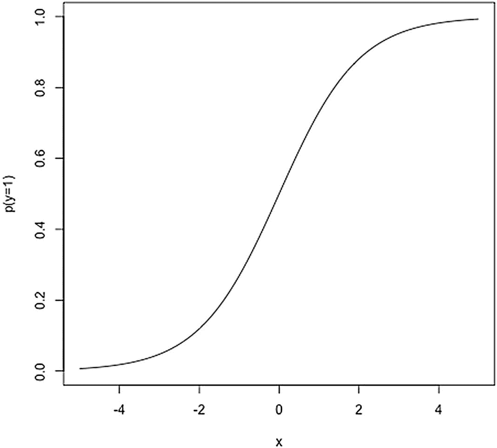

图 2-3

Sigmoid 函数表示

我们将在 TensorFlow 2.0 中实现逻辑回归方法，使用 TensorFlow 包内可用的 `LinearClassifier` 估算器和鸢尾花数据集。

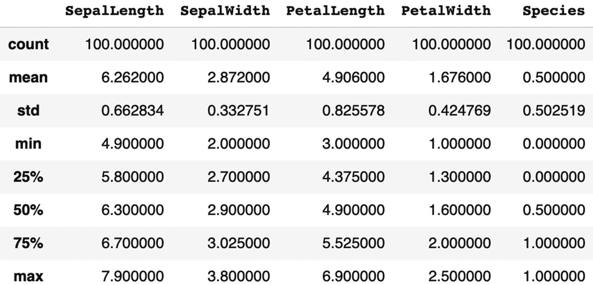

1.  导入所需的模块。

    ```py
    [In]: from __future__ import absolute_import, division, print_function, unicode_literals
    [In]: import pandas as pd
    [In]: import seaborn as sb
    [In]: import tensorflow as tf
    [In]: from tensorflow import keras
    [In]: from tensorflow.estimator import LinearClassifier
    [In]: from sklearn.model_selection import train_test_split
    [In]: from sklearn.metrics import accuracy_score, precision_score, recall_score
    [In]: print(tf.__version__)
    [Out]: 2.0.0-rc1
    ```

1.  加载并配置鸢尾花数据集。

    ```py
    [In]: col_names = ['SepalLength', 'SepalWidth', 'PetalLength', 'PetalWidth', 'Species']
    [In]: target_dimensions = ['Setosa', 'Versicolor', 'Virginica']
    [In]: training_data_path = tf.keras.utils.get_file("iris_training.csv", "https://storage.googleapis.com/download.tensorflow.org/data/iris_training.csv")
    [In]: test_data_path = tf.keras.utils.get_file("iris_test.csv", "https://storage.googleapis.com/download.tensorflow.org/data/iris_test.csv")
    [In]: training = pd.read_csv(training_data_path, names=col_names, header=0)
    [In]: training = training[training['Species'] >= 1]
    [In]: training['Species'] = training['Species'].replace([1,2], [0,1])
    [In]: test = pd.read_csv(test_data_path, names=col_names, header=0)
    [In]: test = test[test['Species'] >= 1]
    [In]: test['Species'] = test['Species'].replace([1,2], [0,1])
    [In]: training.reset_index(drop=True, inplace=True)
    [In]: test.reset_index(drop=True, inplace=True)
    [In]: iris_dataset = pd.concat([training, test], axis=0)
    [In]: iris_dataset.describe()
    [Out]:
    ```

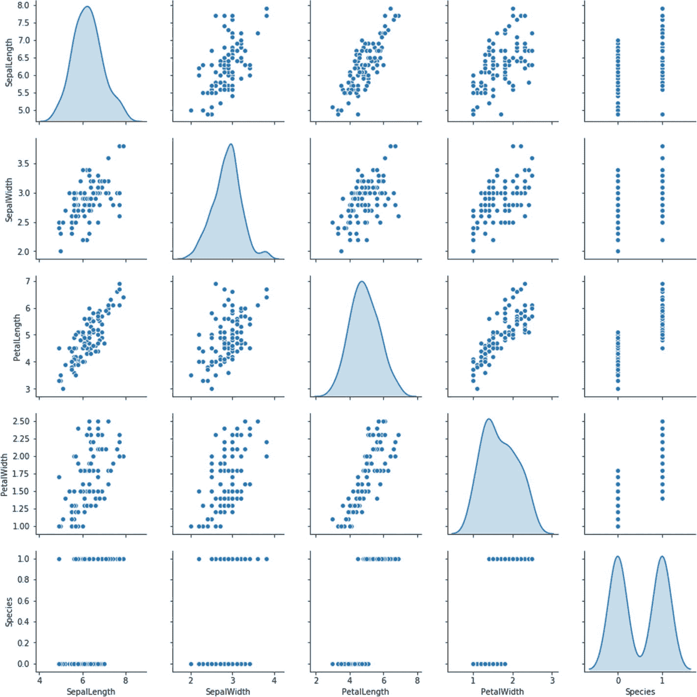

1.  使用 `pairplot` 和相关图检查变量之间的关系。

    ```py
    [In]: sb.pairplot(iris_dataset, diag_kind="kde")
    [Out]:
    ```

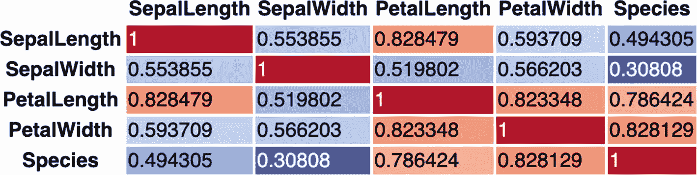

```py
[In]: correlation_data = iris_dataset.corr()
[In]: correlation_data.style.background_gradient(cmap='coolwarm', axis=None)
[Out]:
```

1.  描述性统计——集中趋势和离散程度

    ```py
    [In]:  stats = iris_dataset.describe()
    [In]: iris_stats = stats.transpose()
    [In]: iris_stats
    [Out]:
    ```

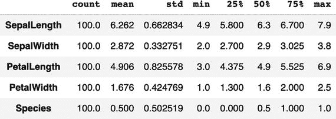

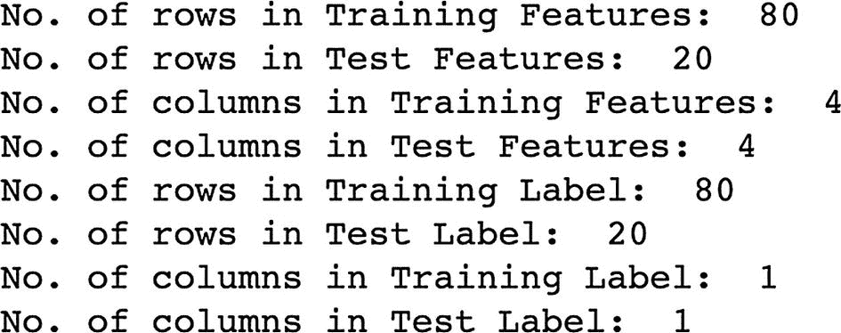

1.  选择所需的列。

    ```py
    [In]: X_data = iris_dataset[[i for i in iris_dataset.columns if i not in ['Species']]]
    [In]:  Y_data = iris_dataset[['Species']]
    ```

1.  训练测试分割。

    ```py
    [In]:  training_features , test_features , training_labels, test_labels = train_test_split(X_data , Y_data , test_size=0.2)
    [In]: print('No. of rows in Training Features: ', training_features.shape[0])
    [In]: print('No. of rows in Test Features: ', test_features.shape[0])
    [In]: print('No. of columns in Training Features: ', training_features.shape[1])
    [In]: print('No. of columns in Test Features: ', test_features.shape[1])
    [In]: print('No. of rows in Training Label: ', training_labels.shape[0])
    [In]: print('No. of rows in Test Label: ', test_labels.shape[0])
    [In]: print('No. of columns in Training Label: ', training_labels.shape[1])
    [In]: print('No. of columns in Test Label: ', test_labels.shape[1])
    [Out]:
    ```

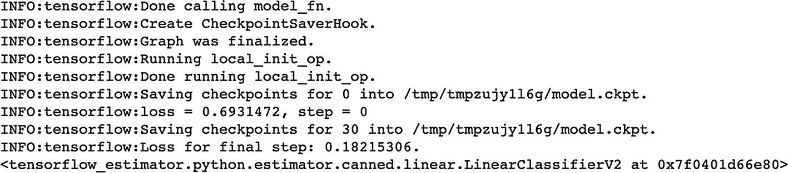

1.  标准化数据。

    ```py
    [In]: def norm(x):
    stats = x.describe()
    stats = stats.transpose()
    return (x - stats['mean']) / stats['std']
    [In]: normed_train_features = norm(training_features)
    [In]: normed_test_features = norm(test_features)
    ```

1.  构建 TensorFlow 模型的输入管道。

    ```py
    [In]: def feed_input(features_dataframe, target_dataframe, num_of_epochs=10, shuffle=True, batch_size=32):
    def input_feed_function():
    dataset = tf.data.Dataset.from_tensor_slices((dict(features_dataframe), target_dataframe))
    if shuffle:
    dataset = dataset.shuffle(2000)
    dataset = dataset.batch(batch_size).repeat(num_of_epochs)
    return dataset
    return input_feed_function
    [In]: train_feed_input = feed_input(normed_train_features, training_labels)
    [In]: train_feed_input_testing = feed_input(normed_train_features,
    training_labels, num_of_epochs=1, shuffle=False)
    [In]: test_feed_input = feed_input(normed_test_features, test_labels, num_of_epochs=1, shuffle=False)
    ```

1.  模型训练

    ```py
    [In]: feature_columns_numeric = [tf.feature_column.numeric_column(m) for m in training_features.columns]
    [In]:logistic_model = LinearClassifier (feature_columns=feature_columns_numeric)
    [In]: logistic_model.train(train_feed_input)
    [Out]:
    ```

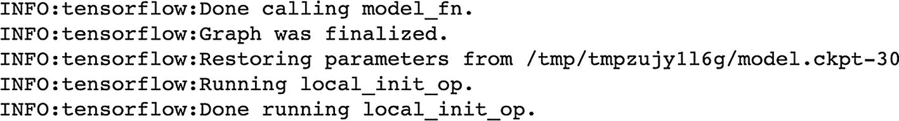

1.  预测

    ```py
    [In]: train_predictions = logistic_model.predict(train_feed_input_testing)
    [In]: test_predictions = logistic_model.predict(test_feed_input)
    [In]: train_predictions_series = pd.Series([p['classes'][0].decode("utf-8")   for p in train_predictions])
    [In]: test_predictions_series = pd.Series([p['classes'][0].decode("utf-8")   for p in test_predictions])
    [Out]:
    ```

1.  验证

    ```py
    [In]: def calculate_binary_class_scores(y_true, y_pred):
    accuracy = accuracy_score(y_true, y_pred.astype('int64'))
    precision = precision_score(y_true, y_pred.astype('int64'))
    recall = recall_score(y_true, y_pred.astype('int64'))
    return accuracy, precision, recall
    [In]: train_accuracy_score, train_precision_score, train_recall_score = calculate_binary_class_scores(training_labels, train_predictions_series)
    [In]: test_accuracy_score, test_precision_score, test_recall_score = calculate_binary_class_scores(test_labels, test_predictions_series)
    [In]: print('Training Data Accuracy (%) = ', round(train_accuracy_score*100,2))
    [In]: print('Training Data Precision (%) = ', round(train_precision_score*100,2))
    [In]: print('Training Data Recall (%) = ', round(train_recall_score*100,2))
    [In]: print('-'*50)
    [In]: print('Test Data Accuracy (%) = ', round(test_accuracy_score*100,2))
    [In]: print('Test Data Precision (%) = ', round(test_precision_score*100,2))
    [In]: print('Test Data Recall (%) = ', round(test_recall_score*100,2))
    [Out]:
    ```

```py
[In]: train_predictions_df = pd.DataFrame(train_predictions_series, columns=['predictions'])
[In]: test_predictions_df = pd.DataFrame(test_predictions_series, columns=['predictions'])
[In]: training_labels.reset_index(drop=True, inplace=True)
[In]: train_predictions_df.reset_index(drop=True, inplace=True)
[In]: test_labels.reset_index(drop=True, inplace=True)
[In]: test_predictions_df.reset_index(drop=True, inplace=True)
[In]: train_labels_with_predictions_df = pd.concat([training_labels, train_predictions_df], axis=1)
[In]: test_labels_with_predictions_df = pd.concat([test_labels, test_predictions_df], axis=1)
```

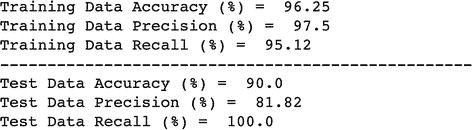

使用 TensorFlow 2.0 实现逻辑回归的代码可以在[`bit.ly/LogRegTF2`](http://bit.ly/LogRegTF2)找到。您可以保存代码的副本并在 Google Colab 环境中运行它。尝试使用不同的参数进行实验并记录结果。

## TensorFlow 2.0 中的提升树

在我们实现 TensorFlow 2.0 中的提升树方法之前，我们想快速强调相关关键词。

### 集成技术

集成是一组预测器。例如，对于分类问题，我们不是使用单个模型（例如，逻辑回归）进行预测，而是可以使用多个模型（例如，逻辑回归 + 决策树等）进行预测。预测器的输出通过不同的平均方法（如加权平均、普通平均或投票）进行组合，并得出最终的预测值。集成方法已被证明比单个方法更有效，因此被广泛用于构建机器学习模型。集成方法可以通过 Bagging 或 Boosting 来实现。

#### Bagging

Bagging 是一种技术，其中我们为每个模型/预测器使用数据的随机子样本/自助样本来构建独立的模型/预测器。然后从不同的预测器中取平均（加权、普通或投票）的分数来获得最终的分数/预测。最著名的 Bagging 方法是随机森林。

图 2-4 展示了一个典型的 Bagging 技术法。

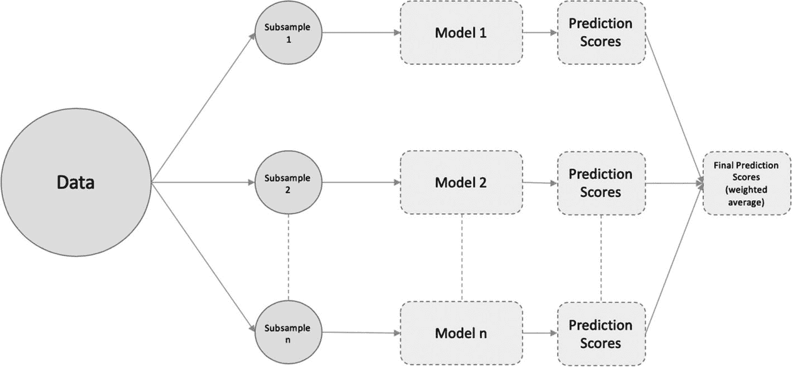

图 2-4

Bagging 技术法

#### 提升

Boosting 是一种不同的集成技术，其中预测器不是独立训练的，而是以顺序方式进行训练。例如，我们在原始训练数据集的子样本/自助样本上构建逻辑回归模型。然后我们将该模型的输出输入到决策树中，以获得预测，依此类推。这种顺序训练的目的是让后续模型从先前模型的错误中学习。梯度提升是提升方法的一个例子。

图 2-5 展示了一个典型的提升技术。

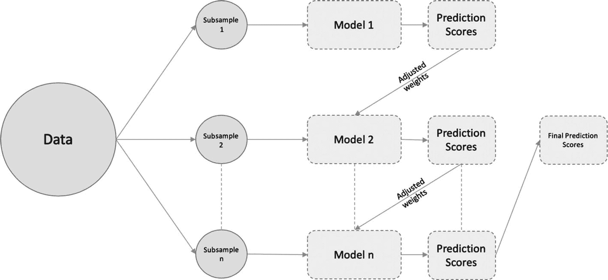

图 2-5

提升（Boosting）技术

### 梯度提升

与其他提升方法相比，梯度提升的主要区别在于，我们不是将前一个学习器中错误分类的输出的权重增量传递给下一个学习器，而是优化前一个学习器的损失函数。

我们将构建一个使用梯度提升方法作为底层技术的提升树分类器。我们将使用鸢尾花数据集进行分类。因为我们已经在上一节中使用了相同的数据集来实现逻辑回归，所以我们将保持预处理相同（即，直到从上一个示例中的“为 TensorFlow 模型构建输入管道”步骤）。我们将直接进行模型训练步骤，如下所示：

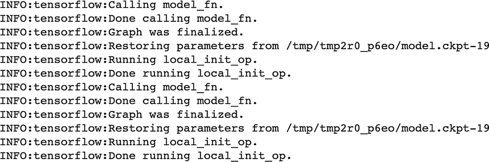

1.  模型训练

    ```py
    [In]: from tensorflow.estimator import BoostedTreesClassifier
    [In]: btree_model = BoostedTreesClassifier(feature_columns=feature_columns_numeric, n_batches_per_layer=1)
    [In]: btree_model.train(train_feed_input)
    ```

1.  预测

    ```py
    [In]: train_predictions = btree_model.predict(train_feed_input_testing)
    [In]: test_predictions = btree_model.predict(test_feed_input)
    [In]: train_predictions_series = pd.Series([p['classes'][0].decode("utf-8")   for p in train_predictions])
    [In]: test_predictions_series = pd.Series([p['classes'][0].decode("utf-8")   for p in test_predictions])
    [Out]:
    ```

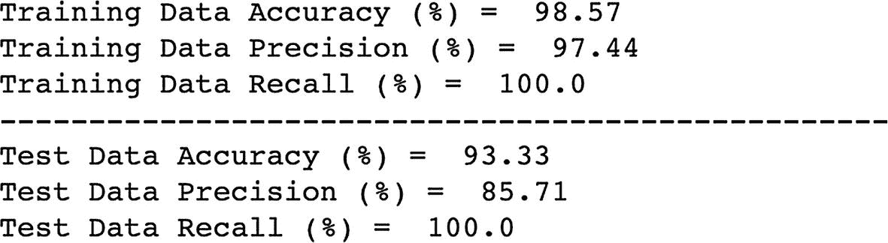

1.  验证

    ```py
    [In]: def calculate_binary_class_scores(y_true, y_pred):
    accuracy = accuracy_score(y_true, y_pred.astype('int64'))
    precision = precision_score(y_true, y_pred.astype('int64'))
    recall = recall_score(y_true, y_pred.astype('int64'))
    return accuracy, precision, recall
    [In]: train_accuracy_score, train_precision_score, train_recall_score = calculate_binary_class_scores(training_labels, train_predictions_series)
    [In]: test_accuracy_score, test_precision_score, test_recall_score = calculate_binary_class_scores(test_labels, test_predictions_series)
    [In]: print('Training Data Accuracy (%) = ', round(train_accuracy_score*100,2))
    [In]: print('Training Data Precision (%) = ', round(train_precision_score*100,2))
    [In]: print('Training Data Recall (%) = ', round(train_recall_score*100,2))
    [In]: print('-'*50)
    [In]: print('Test Data Accuracy (%) = ', round(test_accuracy_score*100,2))
    [In]: print('Test Data Precision (%) = ', round(test_precision_score*100,2))
    [In]: print('Test Data Recall (%) = ', round(test_recall_score*100,2))
    [Out]:
    ```

```py
[In]: train_predictions_df = pd.DataFrame(train_predictions_series, columns=['predictions'])
[In]: test_predictions_df = pd.DataFrame(test_predictions_series, columns=['predictions'])
[In]: training_labels.reset_index(drop=True, inplace=True)
[In]: train_predictions_df.reset_index(drop=True, inplace=True)
[In]: test_labels.reset_index(drop=True, inplace=True)
[In]: test_predictions_df.reset_index(drop=True, inplace=True)
[In]: train_labels_with_predictions_df = pd.concat([train_labels, train_predictions_df], axis=1)
[In]: test_labels_with_predictions_df = pd.concat([test_labels, test_predictions_df], axis=1)
```

使用 TensorFlow 2.0 实现提升树代码可以在[`bit.ly/GBTF2`](http://bit.ly/GBTF2)找到。你可以保存代码的副本并在 Google Colab 环境中运行它。尝试用不同的参数进行实验并记录结果。

## 结论

你刚刚看到了在 TensorFlow 2.0 中实现监督式机器学习算法变得多么简单。你可以像使用 `scikit-learn` 包一样构建模型。TensorFlow 内置的 Keras 也使得构建神经网络模型变得容易，这将在第三章中进行讨论。
