# 3. 使用 TensorFlow 进行神经网络和深度学习

本章重点介绍神经网络以及我们如何通过紧密模拟人脑来构建它们以执行机器学习。我们将首先确定神经网络是什么以及它们与人类神经网络的结构相似之处。然后，我们将深入探讨神经网络的结构，探索其中的不同层。我们将解释如何构建一个简单的神经网络，并深入探讨前向传播和反向传播的概念。稍后，我们将使用 TensorFlow 和 Keras 构建一个简单的神经网络。在本章的最后部分，我们将讨论深度神经网络，它们与简单神经网络的不同之处，以及如何使用 TensorFlow 和 Keras 实现深度神经网络，并与简单神经网络进行性能比较。

## 什么是神经网络？

神经网络是一种试图模拟人脑的机器学习算法。与人类相比，计算机在执行复杂计算方面一直表现得更好。它们可以在瞬间完成计算，而人类甚至进行最简单的手动操作也需要一段时间。那么，为什么我们需要机器来模拟人脑呢？原因在于人类拥有常识和想象力。他们可以从计算机无法激发的事物中受到启发。如果将计算机的计算能力与人类 365 天不间断的常识和想象力相结合，会创造出什么？超人？对这些问题的回答定义了人工智能（AI）的整个目的。

### 神经元

人体由神经元组成，它们是神经系统的基本构建块。一个神经元由细胞体或称胞体、单个轴突和树突（见图 3-1）组成。神经元通过树突和轴突末端相互连接。一个神经元的信号传递到另一个连接神经元的轴突末端和树突，该神经元接收信号并通过胞体、轴突和末端传递，依此类推。

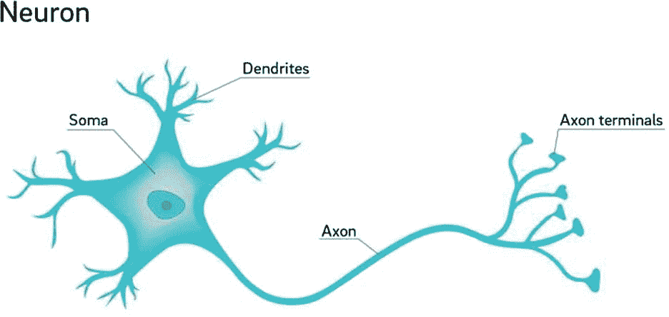

图 3-1

神经元的结构（来源：[`bit.ly/2zOekEL`](https://bit.ly/2zOekEL)）

神经元以不同的方式相互连接，从而具有不同的功能，例如感觉神经元，它们对声音、触摸或光等刺激做出反应；运动神经元，它们控制身体内的肌肉运动；以及 interneurons，它们是大脑或脊髓同一区域内的连接神经元。

### 人工神经网络（ANNs）

人工神经网络试图在最基本的层面上模拟大脑，即神经元。人工神经元的结构与人类神经元相似，并包括以下部分（见图 3-2）：

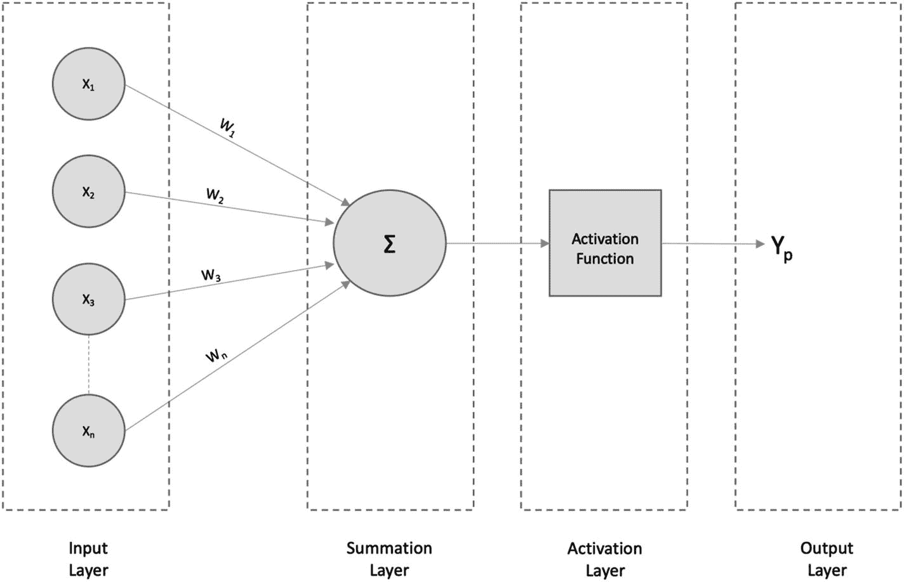

图 3-2

人工神经网络

+   *输入层*：这一层类似于树突，并从其他网络/神经元接收输入。

+   *求和* *层*：这一层的作用类似于神经元细胞体。它汇总接收到的输入信号。

+   *激活* *层*：这一层也类似于细胞体，它只在前聚合输入超过某个阈值时才会发出信号。否则，它不会发出信号。

+   *输出层*：这一层类似于轴突末梢，它可能连接到其他神经元/网络或作为最终输出层（用于预测）。

在前面的图中，`X`[`1`], `X`[`2`], `X`[`3`],………`X`[`n`] 是输入到神经网络中的输入。`W`[`1`], `W`[`2`], `W`[`3`],**…………**`W`[`n`] 是与输入相关联的权重，而 `Y` 是最终的预测。

激活层可以使用许多激活函数，以将输入层产生的所有线性细节转换为非线性。这有助于用户获取更多关于输入数据的细节，而这些细节在如果是线性函数的情况下是不可能的。因此，激活层在预测中起着重要作用。一些最熟悉的激活函数类型是 sigmoid、ReLU 和 softmax。

### 简单神经网络架构

如图 3-3 所示，典型的神经网络架构由以下部分组成

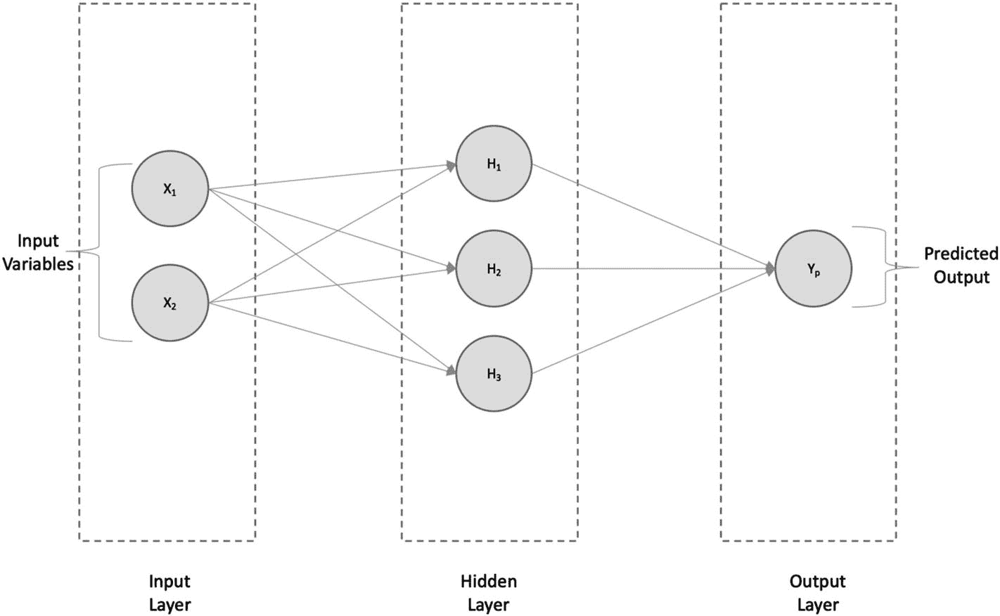

图 3-3

简单神经网络架构—回归

+   输入层

+   隐藏层

+   输出层

每个输入都与隐藏层的每个神经元相连，并进一步连接到输出层。如果我们解决回归问题，架构将类似于图 3-3 中所示，其中我们有一个输出`Y`[`p`**,**]，如果预测在输出层，它是连续的。如果我们解决分类（在这种情况下为二分类），我们将有输出`Y`[`class1`]和`Y`[`class2`]，它们是输出层每个二进制类别 1 和 2 的概率值，如图 3-4 所示。

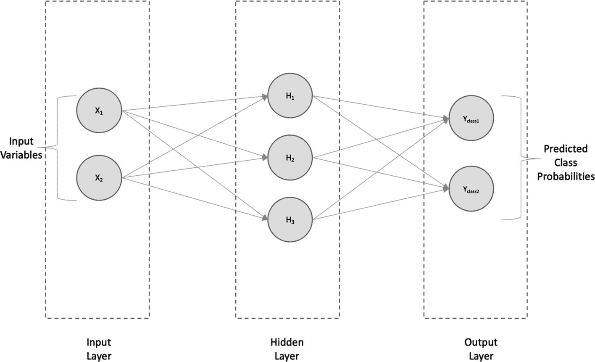

图 3-4

简单神经网络架构—分类

## 前向和反向传播

在全连接神经网络中，当输入通过神经元（从隐藏层到输出层）传递，并在输出层计算最终值时，我们说输入已经*前向传播*（图 3-5）。例如，考虑一个有两个输入`X`[`1`]和`X`[`2`], 一个有三个神经元和一个输出层，输出层有一个输出`Y`[`p`]（数值）的全连接神经网络。

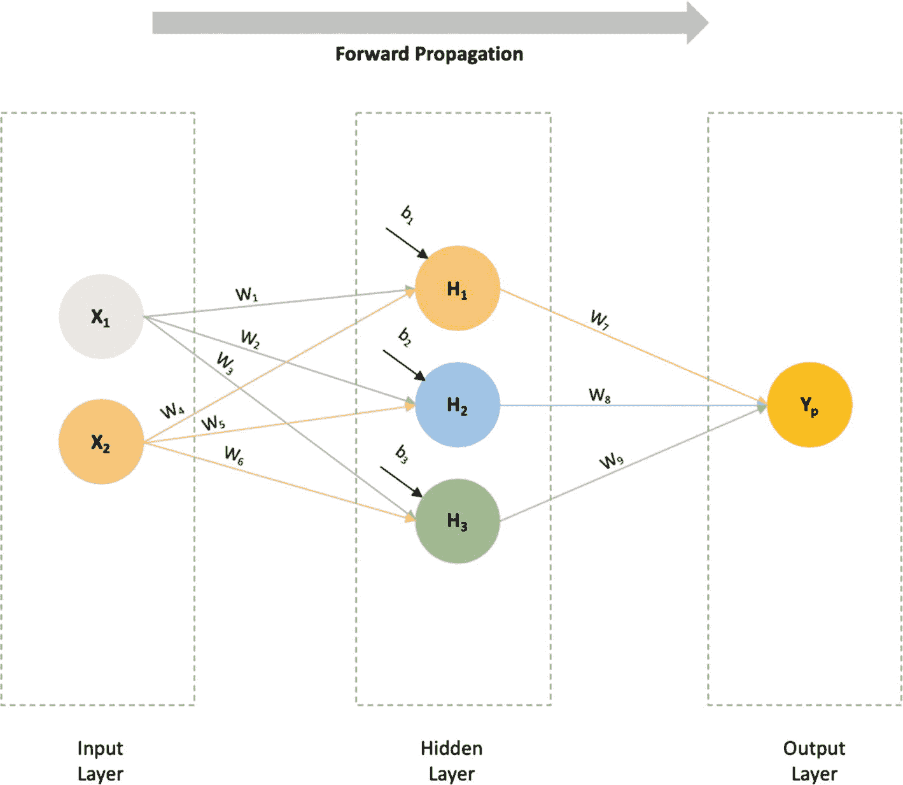

图 3-5

正向传播

输入将通过将每个输入值乘以一个权重（`W`）并与一个偏差值（`b`）相加，传递到每个隐藏层神经元。因此，神经元隐藏层的方程如下：

```py
H1 = W1*X1 + W4*X2 + b1
H2 = W2*X1 + W5*X2 + b2
H3 = W3*X1 + W6*X2 + b3
```

值 `H`[`1`], `H`[`2`], 和 `H`[`3`] 将分别通过权重 `W`[`7`], `W`[`8`], 和 `W`[`9`] 传递到输出层。输出层将产生最终的预测值 `Y`[`p`]]。

```py
Yp = W7*H1 + W8*H2 + W9*H3
```

由于网络中的输入数据（`X`[`1`] 和 `X`[`2`]）以正向方向流动以产生最终结果 `Y`[`p`]，因此它被称为前馈网络，或者，因为数据是以正向方式传播的，所以称为 *正向传播*。

现在，假设已知的输出值（表示为 `Y`）已知。在这种情况下，我们可以计算实际值与预测值之间的差异，即 `L = (Y - Y`[`p`]`)`^(`2`), 其中 `L` 是损失值。

为了最小化损失值，我们将尝试相应地优化权重，通过将损失函数对前一个权重求导，如图 3-6 所示。

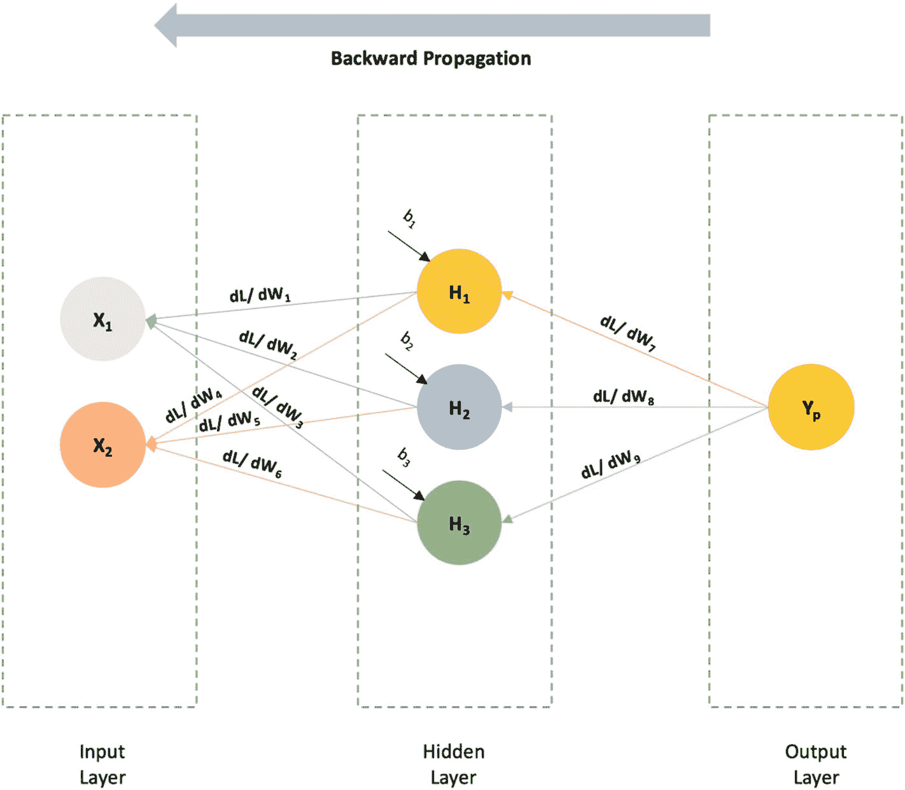

图 3-6

反向传播

例如，如果我们必须找到损失函数相对于 `W`[`7`] 的变化率，我们将对 `Loss` 函数相对于 `W`[`7`] 求导（dL/dW`[`7`]`），依此类推。从前面的图中可以看出，求导的过程是向反向移动的，即发生反向传播。有多个优化器可用于执行反向传播，例如随机梯度下降（SGD）、AdaGrad 等。

## 使用 TensorFlow 2.0 构建神经网络

使用 TensorFlow 的 Keras API，我们将构建一个只有一个隐藏层的简单神经网络。

### 关于数据集

让我们使用 TensorFlow 2.0 实现一个简单的神经网络。为此，我们将使用 Zalando 的 Fashion-MNIST 数据集（MIT 许可证 [MIT] 版权 © [2017] Zalando SE，[`tech.zalando.com`](https://tech.zalando.com)），该数据集包含 70,000 张图像（灰度），分为 10 个不同的类别。这些图像是 28 `×` 28 像素的单个服装物品，值范围从 0 到 255，如图 3-7 所示。

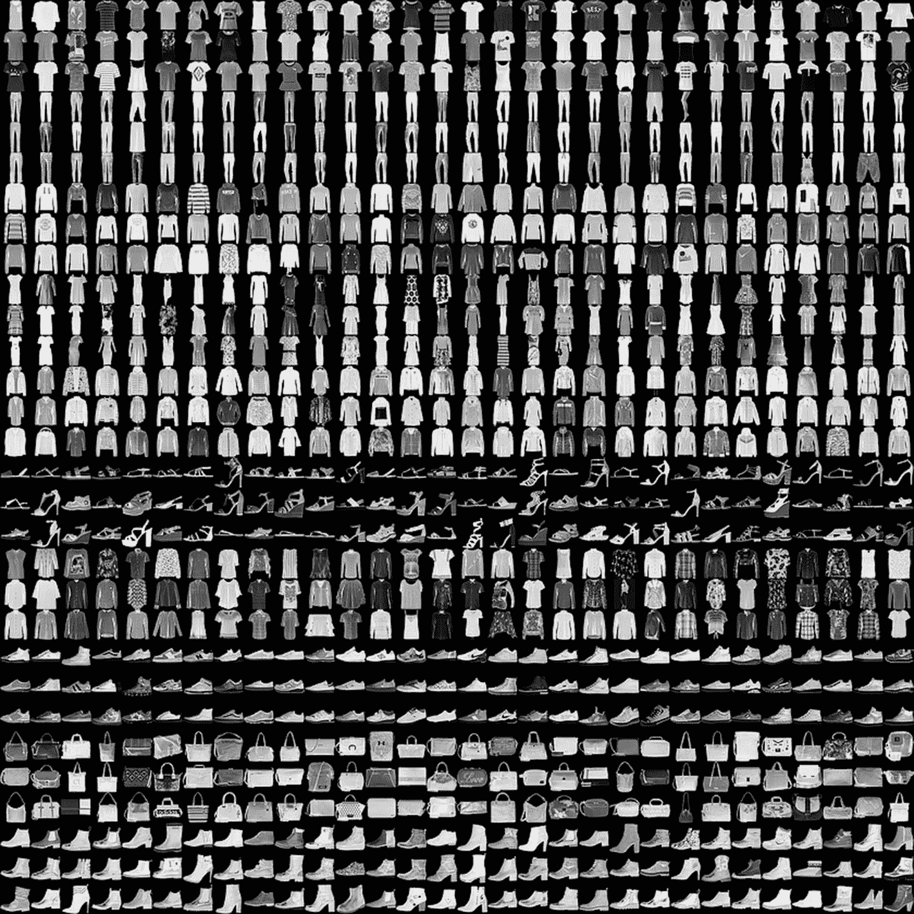

图 3-7

Fashion-MNIST 数据集的样本（来源：[`bit.ly/2xqIwCH`](https://bit.ly/2xqIwCH))

在总共 70,000 张图片中，有 60,000 张用于训练，剩余的 10,000 张图片用于测试。标签是范围从 0 到 9 的整数数组。类名不是数据集的一部分；因此，我们必须包括以下映射用于训练/预测：

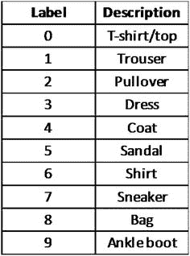

*(来源：[`bit.ly/2xqIwCH`](https://bit.ly/2xqIwCH)*)*

让我们先加载必要的模块，如下所示：

```py
[In]: from __future__ import absolute_import, division, print_function, unicode_literals
[In]: import numpy as np
[In]: import tensorflow as tf
[In]: from tensorflow import keras as ks
[In]: print(tf.__version__)
[Out]: 2.0.0-rc1
```

现在，加载 Fashion-MNIST 数据集。

```py
[In]: (training_images, training_labels), (test_images, test_labels) = ks.datasets.fashion_mnist.load_data()
```

让我们进行一点数据探索，如下所示：

```py
[In]: print('Training Images Dataset Shape: {}'.format(training_images.shape))
[In]: print('No. of Training Images Dataset Labels: {}'.format(len(training_labels)))
[In]: print('Test Images Dataset Shape: {}'.format(test_images.shape))
[In]: print('No. of Test Images Dataset Labels: {}'.format(len(test_labels)))
[Out]: Training Images Dataset Shape: (60000, 28, 28)
[Out]: No. of Training Images Dataset Labels: 60000
[Out]: Test Images Dataset Shape: (10000, 28, 28)
[Out]: No. of Test Images Dataset Labels: 10000
```

由于像素值范围从 0 到 255，我们必须在将它们推送到模型之前将这些值重新缩放到 0 到 1 的范围内。我们可以通过除以 255 来缩放这些值（对于训练和测试数据集）。

```py
[In]: training_images = training_images / 255.0
[In]: test_images = test_images / 255.0
```

我们将使用 Keras 实现来构建神经网络的不同层。我们将保持简单，只使用一个隐藏层。

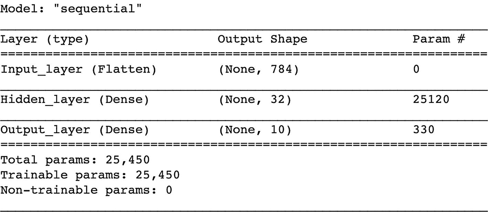

```py
[In]: input_data_shape = (28, 28)
[In]: hidden_activation_function = 'relu'
[In]: output_activation_function = 'softmax'
[In]: nn_model = models.Sequential()
[In]: nn_model.add(ks.layers.Flatten(input_shape=input_data_shape, name="Input_layer"))
[In]: nn_model.add(ks.layers.Dense(32, activation=hidden_activation_function, name="Hidden_layer"))
[In]: nn_model.add(ks.layers.Dense(10, activation=output_activation_function, name="Output_layer"))
[In]: nn_model.summary()
[Out]:
```

现在，我们将使用`compile`方法来使用优化函数。可以构建一个 Adam 优化器，其目标函数为`sparse_categorical_crossentropy`，该函数优化准确率指标，如下所示：

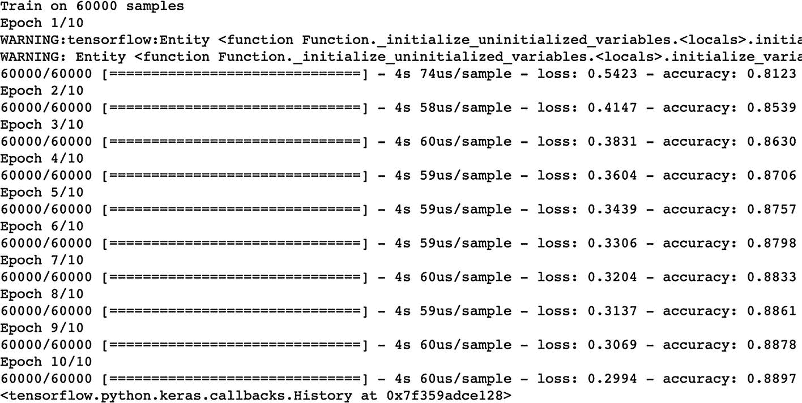

```py
[In]: optimizer = 'adam'
[In]: loss_function = 'sparse_categorical_crossentropy'
[In]: metric = ['accuracy']
[In]: nn_model.compile(optimizer=optimizer, loss=loss_function, metrics=metric)
[In]: nn_model.fit(training_images, training_labels, epochs=10)
[Out]:
```

以下是对模型的评估：

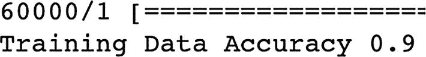

1.  训练评估

    ```py
    [In]: training_loss, training_accuracy = nn_model.evaluate(training_images, training_labels)
    [In]: print('Training Data Accuracy {}'.format(round(float(training_accuracy),2)))
    [Out]:
    ```

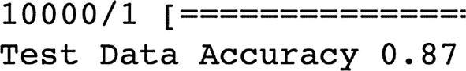

1.  测试评估

    ```py
    [In]: test_loss, test_accuracy = nn_model.evaluate(test_images, test_labels)
    [In]: print('Test Data Accuracy {}'.format(round(float(test_accuracy),2))) [Out]:
    ```

使用 TensorFlow 2.0 实现的简单神经网络代码可以在[`bit.ly/NNetTF2`](http://bit.ly/NNetTF2)找到。您可以保存代码的副本并在 Google Colab 环境中运行它。尝试使用不同的参数进行实验并记录结果。

## 深度神经网络（DNNs）

当一个简单的神经网络有多个隐藏层时，它被称为深度神经网络（DNN）。图 3-8 显示了典型 DNN 的架构。

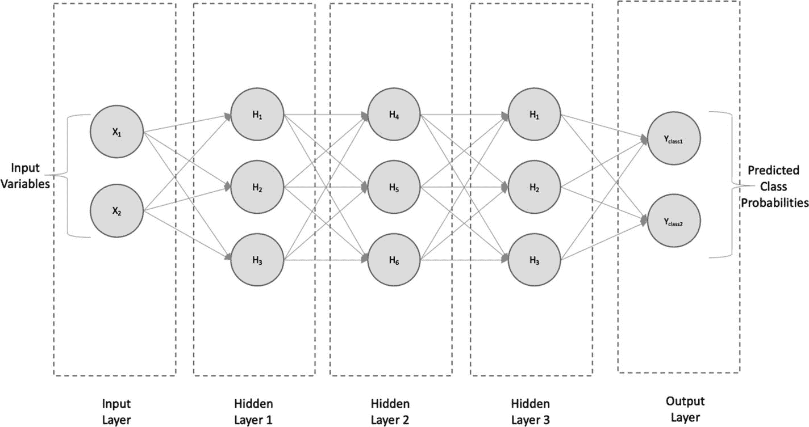

图 3-8

具有三个隐藏层的深度神经网络

它由一个包含两个输入变量的输入层、每个隐藏层有三个神经元的三个隐藏层和一个输出层（输出层可以是单个输出用于回归或多个输出用于分类）组成。隐藏层越多，神经元就越多。因此，神经网络能够学习输入和输出之间的非线性（非凸）关系。然而，拥有更多的隐藏层会增加计算成本，因此必须考虑计算成本和准确率之间的权衡。

## 使用 TensorFlow 2.0 构建深度神经网络

我们将使用 Keras 实现来构建一个具有三个隐藏层的深度神经网络。在先前的简单神经网络实现中，直到缩放部分，构建深度神经网络的过程是相同的。因此，我们将跳过这些步骤，直接开始构建深度神经网络的输入层、隐藏层和输出层，如下所示：

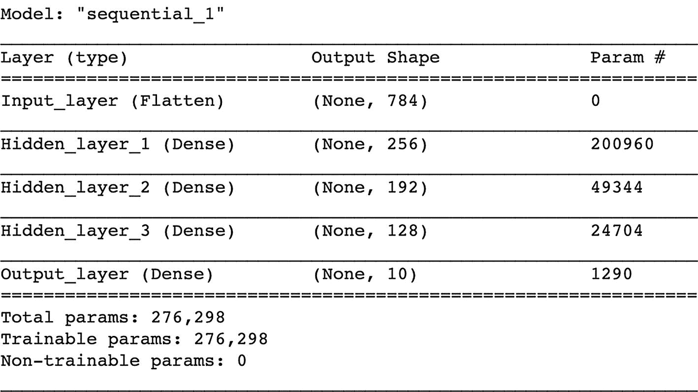

```py
[In]: input_data_shape = (28, 28)
[In]: hidden_activation_function = 'relu'
[In]: output_activation_function = 'softmax'
[In]: dnn_model = models.Sequential()
[In]: dnn_model.add(ks.layers.Flatten(input_shape=input_data_shape, name="Input_layer"))
[In]: dnn_model.add(ks.layers.Dense(256, activation=hidden_activation_function, name="Hidden_layer_1"))
[In]: dnn_model.add(ks.layers.Dense(192, activation=hidden_activation_function, name="Hidden_layer_2"))
[In]: dnn_model.add(ks.layers.Dense(128, activation=hidden_activation_function, name="Hidden_layer_3"))
[In]: dnn_model.add(ks.layers.Dense(10, activation=output_activation_function, name="Output_layer"))
[In]: dnn_model.summary()
[Out]:
```

现在，我们将使用 `compile` 方法来帮助使用优化函数。可以构建一个 Adam 优化器，其目标函数为 `sparse_categorical_crossentropy`，该函数优化准确度指标，如下所示：

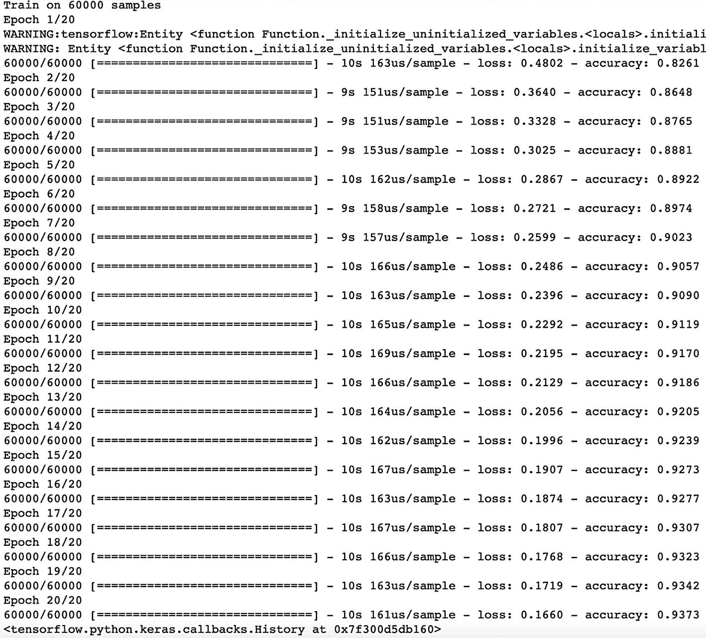

```py
[In]: optimizer = 'adam'
[In]: loss_function = 'sparse_categorical_crossentropy'
metric = ['accuracy']
[In]: dnn_model.compile(optimizer=optimizer, loss=loss_function, metrics=metric)
[In]: dnn_model.fit(training_images, training_labels, epochs=20)
[Out]:
```

以下是对模型的评估：

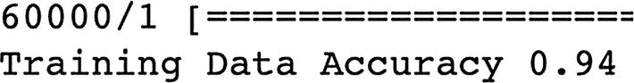

1.  训练评估

    ```py
    [In]: training_loss, training_accuracy = dnn_model.evaluate(training_images, training_labels)
    [In]: print('Training Data Accuracy {}'.format(round(float(training_accuracy),2)))
    [Out]:
    ```

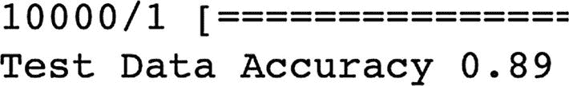

1.  测试评估

    ```py
    [In]: test_loss, test_accuracy = dnn_model.evaluate(test_images, test_labels)
    [In]: print('Test Data Accuracy {}'.format(round(float(test_accuracy),2)))
    [Out]:
    ```

使用 TensorFlow 2.0 实现深度神经网络的代码可以在[`bit.ly/DNNTF2`](http://bit.ly/DNNTF2)找到。您可以保存代码的副本并在 Google Colab 环境中运行它。尝试使用不同的参数进行实验并记录结果。

如观察所示，简单神经网络的训练准确率约为 90%，而深度神经网络的准确率约为 94%，简单神经网络的测试准确率约为 87%，而深度神经网络的准确率约为 89%。这表明，通过向神经网络架构中添加更多隐藏层，我们能够实现更高的准确率。

## 使用 Keras 模型进行估计

在第二章中，我们构建了各种机器学习模型，使用了预制的估计器。然而，TensorFlow API 也为我们提供了足够的灵活性来构建自定义估计器。在本节中，您将看到我们如何使用 Keras 模型创建一个自定义估计器。实现如下。

让我们先加载必要的模块。

```py
[In]: from __future__ import absolute_import, division, print_function, unicode_literals
[In]: import numpy as np
[In]: import pandas as pd
[In]: import tensorflow as tf
[In]: from tensorflow import keras as ks
[In]: import tensorflow_datasets as tf_ds
[In]: print(tf.__version__)
[Out]: 2.0.0-rc1
```

现在，创建一个函数来加载鸢尾花数据集。

```py
[In]: def data_input():
train_test_split = tf_ds.Split.TRAIN
iris_dataset = tf_ds.load('iris', split=train_test_split, as_supervised=True)
iris_dataset = iris_dataset.map(lambda features, labels: ({'dense_input':features}, labels))
iris_dataset = iris_dataset.batch(32).repeat()
return iris_dataset
```

构建一个简单的 Keras 模型。

```py
[In]: activation_function = 'relu'
[In]: input_shape = (4,)
[In]: dropout = 0.2
[In]: output_activation_function = 'sigmoid'
[In]: keras_model = ks.models.Sequential([ks.layers.Dense(16, activation=activation_function, input_shape=input_shape), ks.layers.Dropout(dropout), ks.layers.Dense(1, activation=output_activation_function)])
```

现在，我们将使用 `compile` 方法来帮助使用优化函数。可以构建一个 Adam 优化器，其损失函数为 `categorical_crossentropy`，如下所示：

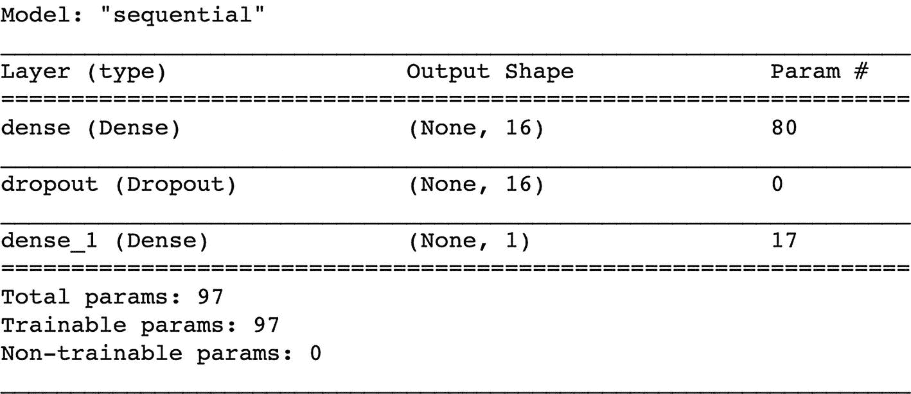

```py
[In]: loss_function = 'categorical_crossentropy'
[In]: optimizer = 'adam'
[In]: keras_model.compile(loss=loss_function, optimizer=optimizer)
[In]: keras_model.summary()
[Out]:
```

使用 `tf.keras.estimator.model_to_estimator` 构建估计器：

```py
[In]: model_path = "/keras_estimator/"
[In]: estimator_keras_model = ks.estimator.model_to_estimator(keras_model=keras_model, model_dir=model_path)
```

训练和评估模型。

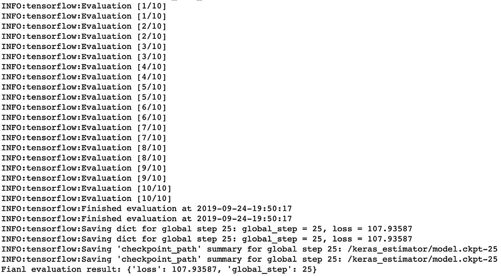

```py
[In]: estimator_keras_model.train(input_fn=data_input, steps=25)
[In]: evaluation_result = estimator_keras_model.evaluate(input_fn=data_input, steps=10)
[In]: print('Final evaluation result: {}'.format(evaluation_result))
[Out]:
```

使用 TensorFlow 2.0 实现的 DNN 代码可以在[`http://bit.ly/KerasEstTF2`](http://bit.ly/KerasEstTF2)找到。您可以保存代码的副本并在 Google Colab 环境中运行它。尝试调整不同的参数并记录结果。

## 结论

在本章中，您已经看到在 TensorFlow 2.0 中构建神经网络是多么容易，以及如何利用 Keras 模型来构建自定义 TensorFlow 估算器。
