# 4. 使用 TensorFlow 处理图像

本章重点介绍如何利用 TensorFlow 2.0 进行计算机视觉。得益于深度学习，计算机视觉领域已经取得了许多突破性的研究和发展。在本章中，我们将从图像处理的基本概述开始，然后转向计算机视觉中最成功的算法之一，即卷积神经网络（CNNs）或 ConvNets。我们将通过介绍来接近 CNNs，并用一个简单的例子解释它们的基本架构。在本章的后面部分，我们将使用 TensorFlow 2.0 实现一个 CNN。我们将继续讨论生成网络，这些网络是为了用机器生成图像而开发的。我们将涵盖自动编码器和变分自动编码器（VAEs），它们是一种生成网络的形式。接下来，我们将使用 TensorFlow 2.0 实现 VAEs，并生成一些新的图像。在最后一节中，我们将讨论迁移学习概念——它在计算机视觉中的应用以及典型机器学习过程与迁移学习之间的区别。最后，我们讨论迁移学习应用及其优势。

## 图像处理

从 20 世纪 60 年代到 2000 年代，在计算机视觉领域进行了许多开创性的研究，主要集中在目标检测、识别和分割等方面。这项工作部分分为两类：一类是专注于执行图像识别的技术，始于 20 世纪 60 年代，另一类是在 2000 年之后开始，专注于收集图像数据作为基准来评估技术。

与图像识别技术相关的一些显著研究包括 1963 年由拉里·罗伯茨撰写的“Blocks World”，这被认为是计算机视觉的第一个博士论文。在论文中，视觉世界被简化为简单的几何形状，目标是识别和重建它们。

用于基准测试的图像数据收集工作始于 2006 年，始于 PASCAL 视觉对象类别挑战赛，该挑战赛包含 20 个对象类别，每个类别有几千到大约 1 万个标记的对象。许多团队开始使用这个数据集来测试他们的技术，因此发生了一次新的范式转变。大约在同一时间，普林斯顿大学和斯坦福大学的一组学者开始考虑我们是否准备好识别大多数对象或所有对象，这导致了名为 ImageNet 的项目。这是一个包含超过 1400 万张图片的集合，分布在 22K 个类别中。在当时，这是最大的与人工智能（AI）相关的数据集。ImageNet 大规模视觉识别挑战赛产生了许多开创性的算法，其中之一是 AlexNet（CNN），它在 2012 年赢得了 ImageNet 挑战赛，击败了所有其他算法。

## 卷积神经网络

卷积神经网络，简称 CNN 或 ConvNets，是一类专门处理网格拓扑数据（如图像）的特殊神经网络。它们由三个不同的层组成：

+   卷积

+   池化

+   全连接

### 卷积层

在 CNN 中，卷积层基本上负责将一个或多个滤波器应用于输入。这是区分卷积神经网络和其他神经网络的层。每个卷积层包含一个或多个滤波器，称为卷积核。滤波器基本上是一个整数矩阵，用于输入图像的子集，其大小与滤波器相同。子集中的每个像素与核中相应的值相乘，然后将结果相加得到一个单一值。这会重复进行，直到滤波器“滑动”整个图像，从而创建一个输出特征图。滤波器应用于输入图像之间的移动幅度称为步长，它通常是高度和宽度的对称。

例如，假设我们有一个 9 × 9 像素的灰度图像，它有一个通道（一个二维矩阵）和一个 3 × 3 的卷积核。如果我们选择步长为（1,1），即在整个图像上水平移动 1 像素和垂直移动 1 像素，我们将得到一个 7 × 7 的输出特征图。

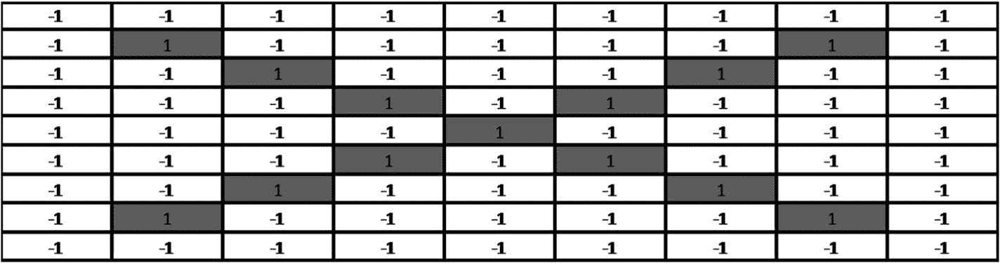

*输入* *灰度图像* *字母 X（9 × 9 像素）*

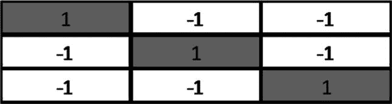

*卷积核（3 × 3 像素）*

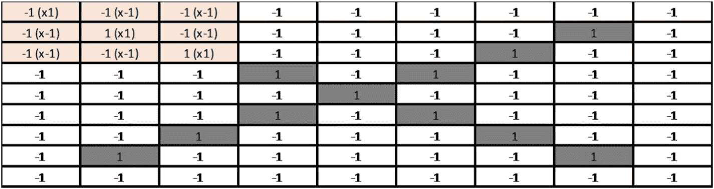

*输入图像子集与核的* *第一次点积*

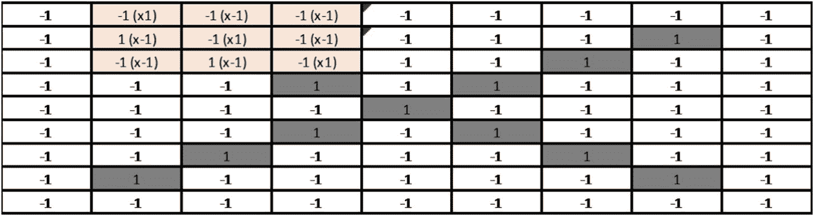

*输入图像子集与核的* *第二次点积（步长（1,1））*

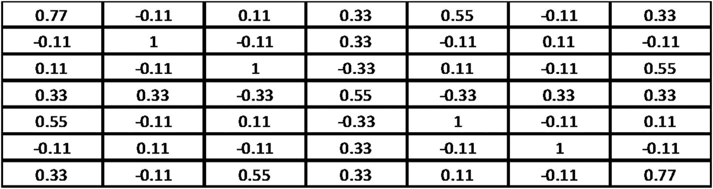

*最终* *特征图* *在核通过整个输入图像后变为 7 × 7*

通常，对于最终的输出特征，会应用一个激活函数（例如，ReLU [修正线性单元]）。ReLU 基本上确保特征输出矩阵中没有负值，通过将这些（负值）强制设为零（图 4-1）。

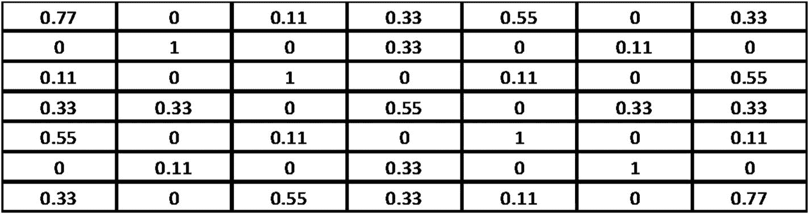

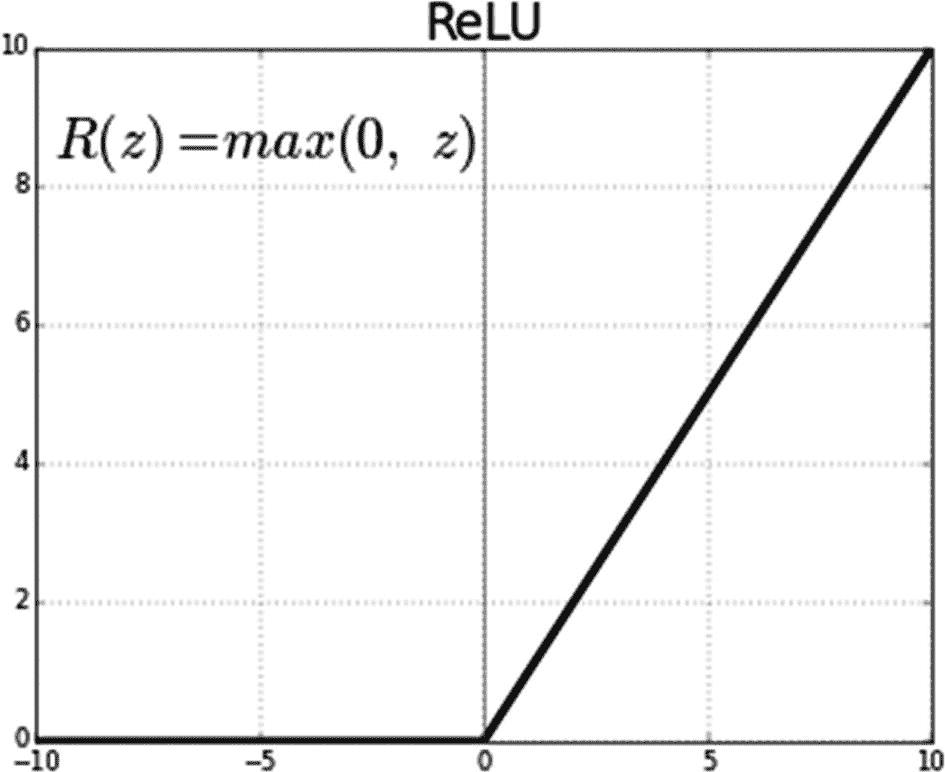

图 4-1

ReLU 函数

*ReLU 函数的* *输出*

### 池化层

池化层有助于减少输入特征的维度，从而减少模型的参数总数和复杂性。最广泛使用的池化技术之一是最大池化。正如其名所示，这种技术只取池中的最大值。例如，让我们以前面得到的 ReLU 输出为例，使用窗口大小为 2 和步长为 2 进行池化。

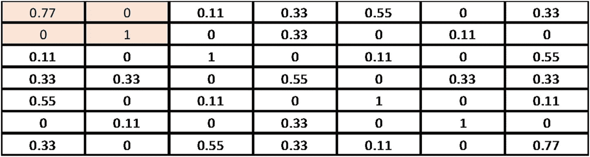

在这种情况下，我们取(0.77, 0, 0, 1.0)中的最大值，即第一个池中的 1.0。

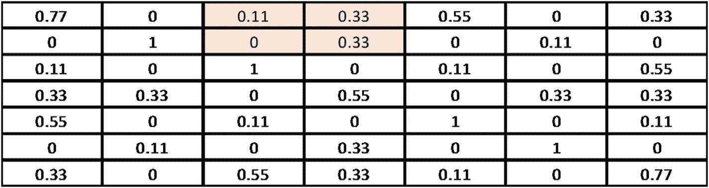

我们取(0.11, 0.33, 0, 0.33)中的最大值，即第二个池中的 0.33。

最后，当我们完成所有步长后，我们得到以下输出：

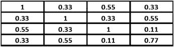

### 完全连接层

这一层与任何具有神经元与前一层的所有激活完全连接的人工神经网络（ANN）系统相同（见图 4-2）。

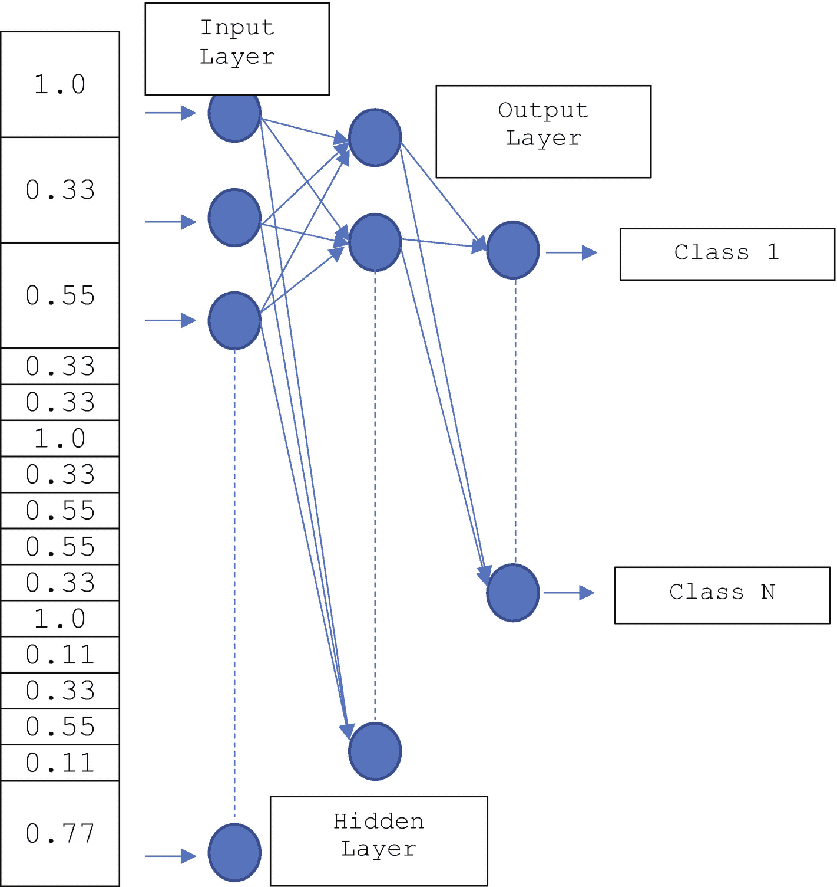

图 4-2

完全连接层的输入（池化层的展开输出）

## 使用 TensorFlow 2.0 的卷积神经网络

让我们使用 TensorFlow 2.0 实现一个简单的卷积神经网络。为此，我们将使用 Zalando 的 Fashion-MNIST 数据集（MIT 许可 [MIT] 版权 © [2017] Zalando SE，[`https://tech.zalando.com`](https://tech.zalando.com)），该数据集包含 70,000 张图片（灰度），分为 10 个不同的类别。这些图片是 28 × 28 像素的单独服装物品，值范围从 0 到 255，如图 4-3 所示。


图 4-3

Zalando 的 Fashion-MNIST 数据集中的图片（来源：[`https://bit.ly/2xqIwCH`](https://bit.ly/2xqIwCH)）

在总共 70,000 张图片中，60,000 张用于训练，剩余的 10,000 张用于测试。标签是范围从 0 到 9 的整数数组。类别名称不是数据集的一部分。因此，我们必须包括以下映射用于训练/预测：

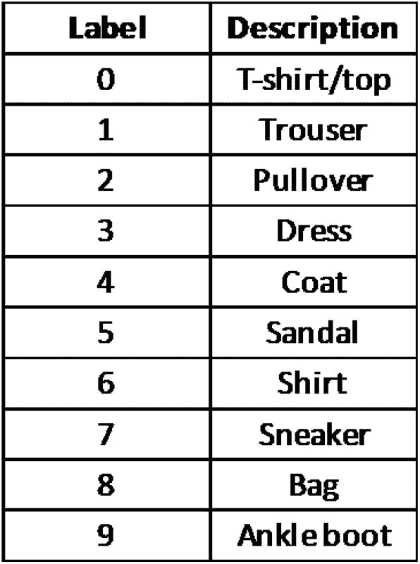

*(来源*：[`https://bit.ly/2xqIwCH`](https://bit.ly/2xqIwCH)*)*

让我们先加载必要的模块。

```py
[In]: from __future__ import absolute_import, division, print_function, unicode_literals
[In]: import numpy as np
[In]: import tensorflow as tf
[In]: from tensorflow import keras as ks
[In]: print(tf.__version__)
[Out]: 2.0.0-rc1
```

现在，加载 Fashion-MNIST 数据集。

```py
[In]: mnist_fashion = ks.datasets.fashion_mnist
[In]: (training_images, training_labels), (test_images, test_labels) = mnist_fashion.load_data()
```

让我们进行一点数据探索。

```py
[In]: print('Training Dataset Shape: {}'.format(training_images.shape))
[In]: print('No. of Training Dataset Labels: {}'.format(len(training_labels)))
[In]: print('Test Dataset Shape: {}'.format(test_images.shape))
[In]: print('No. of Test Dataset Labels: {}'.format(len(test_labels)))
[Out]: Training Dataset Shape: (60000, 28, 28)
[Out]: No. of Training Dataset Labels: 60000
[Out]: Test Dataset Shape: (10000, 28, 28)
[Out]: No. of Test Dataset Labels: 10000
```

由于像素值范围从 0 到 255，我们在将值推送到模型之前，将这些值缩放到 0 到 1 的范围内。我们可以通过除以 255 来缩放这些值（对于训练和测试数据集）。

```py
[In]: training_images = training_images / 255.0
[In]: test_images = test_images / 255.0
```

我们可以通过将矩阵重塑为 28 × 28 × 1 数组来重塑训练和测试数据集，如下所示：

```py
[In]: training_images = training_images.reshape((60000, 28, 28, 1))
[In]: test_images = test_images.reshape((10000, 28, 28, 1))
[In]: print('Training Dataset Shape: {}'.format(training_images.shape))
[In]: print('No. of Training Dataset Labels: {}'.format(len(training_labels)))
[In]: print('Test Dataset Shape: {}'.format(test_images.shape))
[In]: print('No. of Test Dataset Labels: {}'.format(len(test_labels)))
[Out]: Training Dataset Shape: (60000, 28, 28, 1)
[Out]: No. of Training Dataset Labels: 60000
[Out]: Test Dataset Shape: (10000, 28, 28, 1)
[Out]: No. of Test Dataset Labels: 10000
```

现在，让我们构建模型的各个层。我们将使用 Keras 实现来构建 CNN 的不同层。我们将保持简单，只使用三个层。

+   *第一层——具有* *ReLU 激活函数* 的卷积层*：这一层以 2D 数组（28 × 28 像素）作为输入。我们将使用 50 个形状为 3 × 3 像素的卷积核（过滤器）。其输出将通过 ReLU 激活函数传递给下一层，然后再传递给下一层。

+   *第二层——池化层*：这一层以 50 个 26 × 26 的 2D 数组作为输入，并将它们转换成相同数量的数组，其尺寸是原始尺寸的一半（即从 26 × 26 到 13 × 13 像素）。

```py
[In]: cnn_model = ks.models.Sequential()
[In]: cnn_model.add(ks.layers.Conv2D(50, (3, 3), activation="relu", input_shape=(28, 28, 1), name="Conv2D_layer"))
```

+   *第三层——全连接层*：这一层以 50 个 13 × 13 的 2D 数组作为输入，并将它们转换成一个包含 8450 个元素（50 × 13 × 13）的 1D 数组。这 8450 个输入元素将通过一个全连接神经网络传递，该神经网络为每个 10 个输出标签（在输出层）提供概率分数。

```py
[In]: cnn_model.add(ks.layers.MaxPooling2D((2, 2), name="Maxpooling_2D"))
```

```py
[In]: cnn_model.add(ks.layers.Flatten(name='Flatten'))
[In]: cnn_model.add(ks.layers.Dense(50, activation="relu", name="Hidden_layer"))
[In]: cnn_model.add(ks.layers.Dense(10, activation="softmax", name="Output_layer"))
```

我们可以通过使用以下所示的方法来检查 CNN 模型中构建的不同层的详细信息：

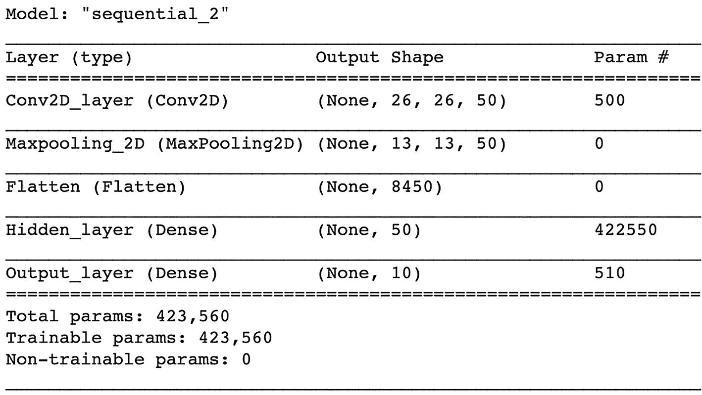

```py
[In]: cnn_model.summary()
[Out]:
```

现在，我们将使用`compile`方法来使用优化函数。可以通过以下方式构建一个 Adam 优化器，其目标函数为`sparse_categorical_crossentropy`，该函数优化准确率指标：

```py
[In]: cnn_model.compile(optimizer='adam', loss="sparse_categorical_crossentropy", metrics=['accuracy'])
```

模型训练：

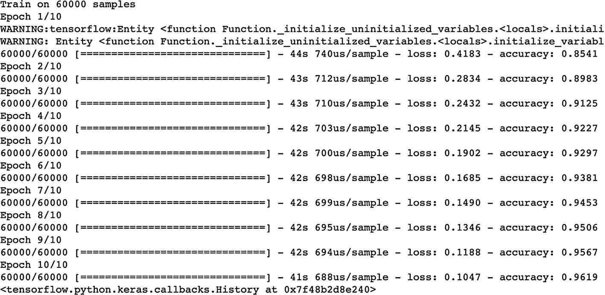

```py
[In]: cnn_model.fit(training_images, training_labels, epochs=10)
[Out]:
```

**模型评估：**

1.  训练评估

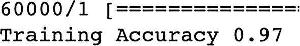

```py
[In]: training_loss, training_accuracy = cnn_model.evaluate(training_images, training_labels)
[In]: print('Training Accuracy {}'.format(round(float(training_accuracy), 2)))
[Out]:
```

1.  测试评估

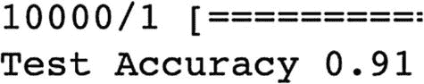

```py
[In]: test_loss, test_accuracy = cnn_model.evaluate(test_images, test_labels)
[In]: print('Test Accuracy {}'.format(round(float(test_accuracy), 2))) [Out]:
```

从前面的评估中，我们看到我们能够在训练数据集中达到大约 97%的准确率，在测试数据集中达到大约 91%的准确率，而只使用了简单的 CNN 架构。这证明了 CNN 是强大的图像识别算法。

使用 TensorFlow 2.0 实现的 CNN 代码可以在[`bit.ly/CNNTF2`](http://bit.ly/CNNTF2)找到。您可以保存代码的副本并在 Google Colab 环境中运行它。尝试调整不同的参数并记录结果。

## 高级卷积神经网络架构

自从 20 世纪 90 年代首次引入以来，卷积神经网络（CNNs）已经取得了长足的进步。让我们来看看一些最近进入公众视野的基于 CNN 的架构。

1.  VGG-16。这个卷积神经网络是由牛津大学的 K. Simonyan 和 A. Zisserman 提出的，在论文“用于大规模图像识别的超深卷积神经网络”中介绍。与 AlexNet 相比，VGG-16 使用多个 3 × 3 的核作为滤波器，而不是 AlexNet 中使用的较大滤波器（第一层卷积有 11 个滤波器，第二层有 5 个滤波器）。这导致了 92.7% 的准确率——在 ImageNet 挑战赛的前五名中——并且这个模型也被提交到了 ILSVRC-2014，当时它是亚军。图 4-4 展示了典型的 VGG-16 架构。

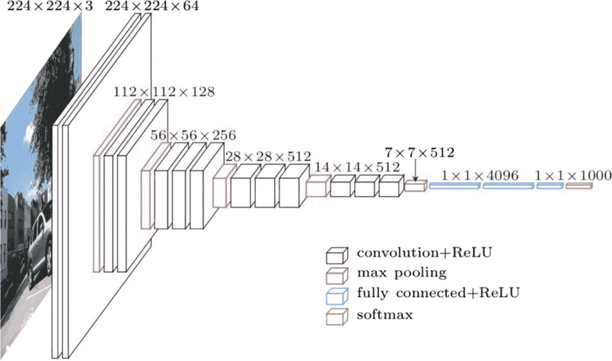

图 4-4

VGG-16 架构

1.  Inception(GoogleNet)。这是由谷歌开发的，并在 ILSVRC-2014 竞赛中获胜，其中它实现了 6.67% 的顶级错误率。使用了 Inception 模块和较小的卷积，使得参数数量减少到仅 400 万。图 4-5 展示了 GoogleNet 架构。

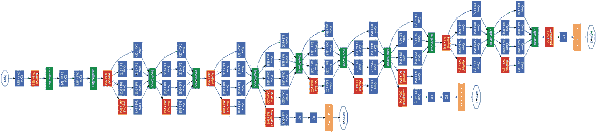

图 4-5

GoogleNet 架构

1.  ResNet。这个架构是由 Kaiming He、Xiangyu Zhang、Shaoqing Ren 和 Jian Sun 在 2015 年开发的。它在 ILSVRC-2015 竞赛中获胜，顶级错误率为 3.57%，低于人类顶级错误率。图 4-6 展示了 ResNet 架构。

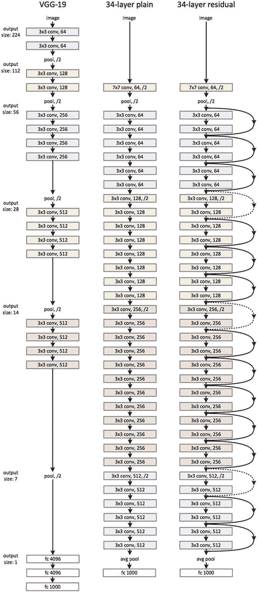

图 4-6

ResNet 架构

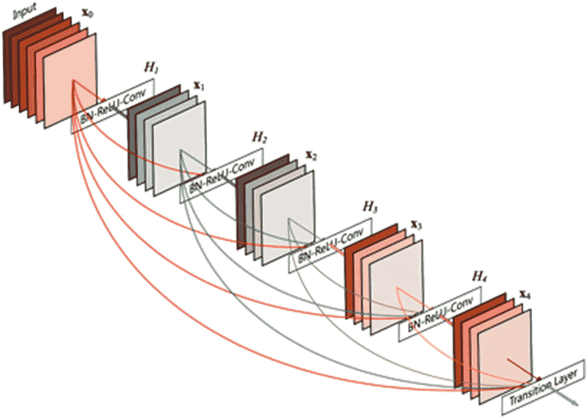

图 4-7

DenseNet 架构

1.  DenseNet。这个架构是由 Gao Huang、Zhuang Liu、Laurens van der Maaten 和 Kilian Q. Weinberger 在 2016 年开发的。DenseNet 与 ResNet 相比，据报道在更少的复杂度下实现了更好的性能。典型的 DenseNet 架构如图 4-7 所示。

## 迁移学习

想象有两个朋友，A 和 B，他们最近计划学习开车，以便一旦他们完成学习，他们就可以为通勤买一辆车。假设 A 以前乘坐公共交通工具通勤，而 B 使用变速自行车。现在，当他们都开始学习开车时，假设 A 和 B 智力水平相同，谁将更快地学会？是的，你是对的；将是 B。因为 B 一直在骑自行车，他将把控制自行车的知识应用到控制汽车上，这需要结合离合器、变速器、油门和刹车。他唯一需要学习的新技能是调整他的驾驶以适应汽车，这比自行车大得多。对于 A 来说，开车需要一套全新的技能，因为他从未骑过自行车/汽车。因此，他将需要更多的时间和精力来学习开车。这个例子说明了通过执行某个任务的过去经验获得的人类典型行为如何应用于一个新但相似或相关的任务。这有助于人类更快地进化，并在学习新任务上花费更少的时间和精力。

将同样的事情应用到机器学习中，被称为迁移学习。根据 Ian Goodfellow、Aaron Courville 和 Yoshua Bengio 所著的《深度学习》（MIT Press，2016）一书，迁移学习的定义是“在一个设置中学习到的知识被用来改善另一个设置中的泛化。”

让我们通过之前提到的学习开车的例子推导出一个支持上述定义的数学公式。首先，让我们了解在迁移学习方面，**域** 和 **任务** 是什么。 

一个域 **D** 包含一个特征空间 **S** 和一个边缘概率分布（mpd）**P(X**)，其中 **S = s**[**1**]**,…,s**[**n**] **∈ S**. 给定一个特定的域，**D = {S , P(S)}**，一个任务包括一个标签空间 **Y** 和一个目标预测函数 **f(·**)（用 **T = {P, f(·)}** 表示），该函数未观察到，但可以从训练数据中学习，训练数据由对 **{s**[**i**]**, p**[**i**]**}** 组成，其中 **s**[**i**] **∈ S** 和 **p**[**i**] **∈ P**. 函数 **f(·**) 可以用来预测新实例 **s** 的对应标签 **f(s**)。从概率上讲，**f(s**) 可以表示为 **P(p|s**)。假设我们将骑自行车的活动表示为 **D**[**S**] 并将其称为源域。现在让我们将开车的活动称为 **D**[**T**] 并将其称为目标域。假设在繁忙的街道上骑自行车是域 **D**[**S**] 的一个任务 **T**[**S**]，而在繁忙的街道上开车是域 **D**[**T**] 的一个任务 **T**[**T**]。

从数学上讲，给定源域 **D**[**S**] 和学习任务 **T**[**S**]，目标域 **D**[**T**] 和学习任务 **T**[**T**]，迁移学习的目的是通过利用 **D**[**S**] 和 **T**[**S**] 中的知识，帮助提高在 **D**[**T**] 中的（目标）预测函数 **f**[**T**]**(·)** 的学习，其中 **D**[**S**] **≠ D**[**T**] 或 **T**[**S**] **≠ T**[**T**]。简单来说，迁移学习是利用 B 在繁忙街道上骑自行车获得的知识，应用于另一条繁忙街道上开车。 

### 迁移学习与机器学习

在前面的例子中，如果目标和源域相同，即如果开车是源域以及目标域（**D**[**S**] **= D**[**T**]），并且学习任务相同或相似，即在不同繁忙街道上开车（**T**[**S**] **= T**[**T**]），学习问题就变成了传统的机器学习问题。然而，应该注意的是，迁移学习是将研究问题应用于机器学习问题的一种应用，而不是算法或技术。迁移学习与传统的机器学习不同，因为它使用了一些任务 **T**[**S**] 作为输入构建的预训练模型，用于另一个任务 **T**[**T**]，以帮助启动任务 **T**[**T**] 的发展过程。

图 4-8 描述了一个典型的机器学习系统。我们可以看到，对于给定域的特定任务，机器学习模型能够很好地学习和泛化。然而，如果有一个来自不同域的新任务，它必须构建一个全新的模型，才能为该任务/域进行泛化。

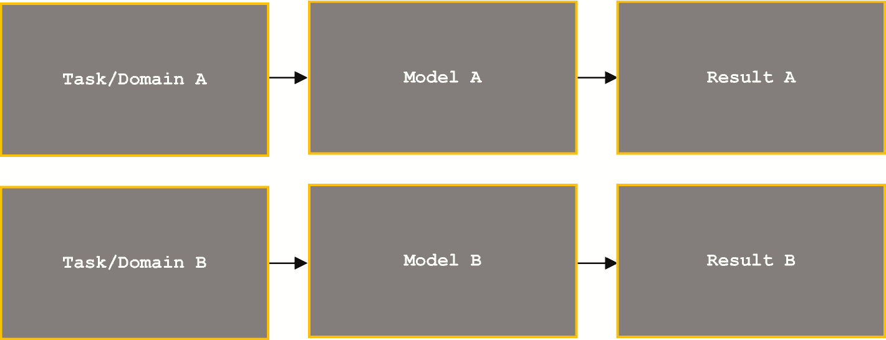

图 4-8

机器学习方法

图 4-9 描述了一个典型的迁移学习方法。我们可以看到，对于任务/域 A，机器学习模型能够很好地学习和泛化。现在，我们提取从任务/域 A 获得的“通用”知识，并将其应用于类似的任务/域 B。

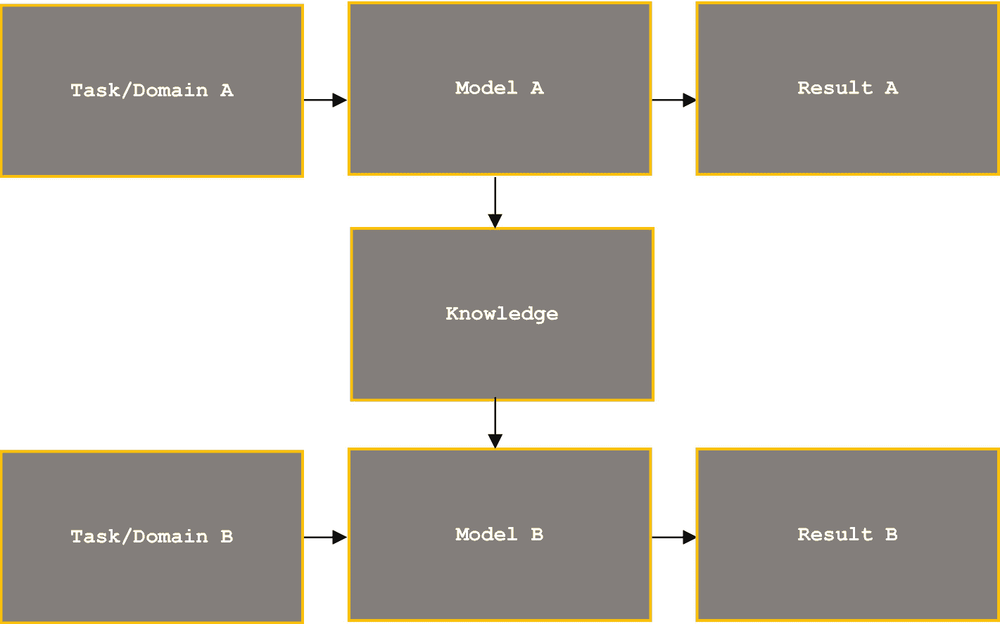

图 4-9

迁移学习方法

以下是一些迁移学习的应用：

1.  深度学习/图像识别：使用 Word2vec 和 fastText 模型对特定主题的 Twitter 数据进行情感分析

1.  自然语言处理：使用 AlexNet 和 Inceptions 模型进行目标检测

以下是迁移学习的优势：

1.  通过使用已开发模型的一些模块来构建新的模型，减少了训练时间

1.  在没有足够数据来训练模型以获得所需结果的情况下，迁移学习具有实用性

## 使用 TensorFlow 2.0 的变分自编码器

要理解变分自动编码器是什么，你必须首先了解自动编码器是什么，它们在哪里使用，以及 VAE 与其他自动编码器形式之间的区别。

### 自动编码器

自动编码器是一种用于以与输入数据相同的方式无监督地生成输出数据的 ANN。自动编码器本质上包含两个主要部分：编码器和解码器。编码器将输入数据压缩为其低维表示，解码器将表示解压缩为原始输入数据。图 4-10 展示了应用于图像的简单自动编码器。

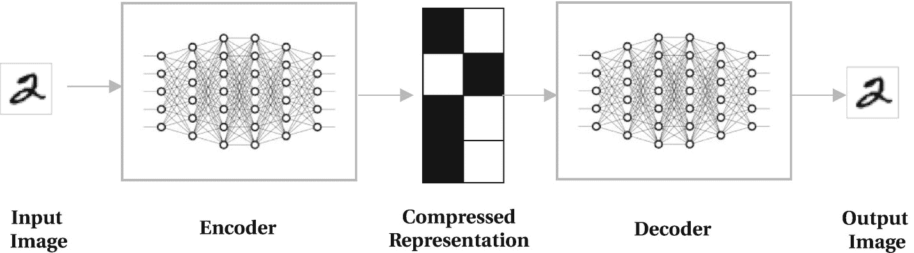

图 4-10

基本自动编码器

### 自动编码器的应用

自动编码器的一个局限性是，它们只能用于重建编码器部分在训练期间看到的自动编码器数据。它们不能用于生成新数据。这就是变分自动编码器发挥作用的地方。

以下是自动编码器的两个应用：

1.  作为一种降维技术，用于将高维数据观察/可视化到低维

1.  作为一种压缩技术，用于节省内存和网络成本

### 变分自动编码器

VAE 是一种生成模型，结合了通用自动编码器，允许我们从模型中采样以生成数据。大多数 VAE 架构与通用自动编码器相同，除了 VAE 强制输入数据的压缩表示遵循零均值和单位方差的高斯分布。一个简单的 VAE 架构如图 4-11 所示。

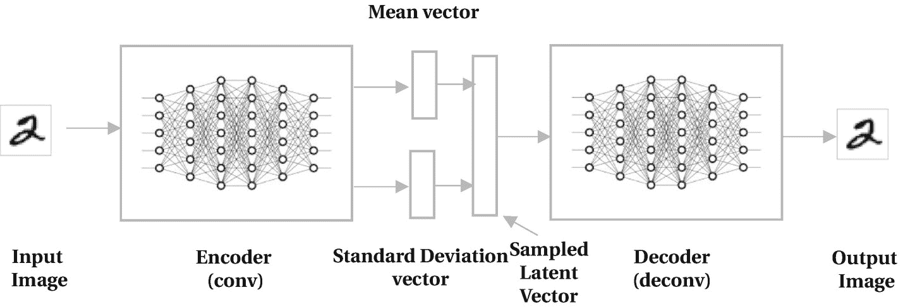

图 4-11

基本 VAE 架构

### 使用 TensorFlow 2.0 实现变分自动编码器

让我们构建一个 VAE 模型，使用 Fashion-MNIST 数据集来帮助我们生成新的手写数字。这个数据集包含 70,000 张手写数字（黑白）图像，从 0 到 9，其中 60,000 张用于训练，剩下的 10,000 张用于测试。每个灰度图像被归一化以适应 28 × 28 像素的边界框。

1.  加载所需的 Python 模块。

1.  使用训练-测试拆分、归一化和二值化加载 Fashion-MNIST 数据集。

```py
[In]: import time
[In]: import PIL as pil
[In]: import numpy as np
[In]: import tensorflow as tf
[In]: from IPython import display
[In]: import matplotlib.pyplot as mpy
[In]: from tensorflow import keras as ks
[In]: from tensorflow.keras.datasets import mnist
```

1.  批处理和打乱数据集

```py
[In]: (training_data, _), (test_data, _) = mnist.load_data()
[In]: training_data = training_data.reshape(training_data.shape[0], 28, 28, 1).astype('float32')
[In]: test_data = test_data.reshape(test_data.shape[0], 28, 28, 1).astype('float32')
[In]: training_data = training_data/255.0
[In]: test_data = test_data/255.0
[In]: training_data[training_data >= 0.5] = 1.0
[In]: training_data[training_data = 0.5] = 1.0
[In]: test_data[test_data < 0.5] = 0.0
```

1.  使用`tf.keras.Sequential`构建编码器和解码器。

```py
[In]: training_batch = tf.data.Dataset.from_tensor_slices(training_data).shuffle(60000).batch(50)
test_batch = tf.data.Dataset.from_tensor_slices(test_data).shuffle(10000).batch(50)
```

我们将使用`tf.keras.Sequential`构建两个卷积神经网络，用于编码器和解码器的封装。

1.  构建优化器函数。

```py
[In]: kernel_size = 3
[In]: strides_2_2 = (2, 2)
[In]: strides_1_1 = (1, 1)
[In]: activation = 'relu'
[In]: padding = 'SAME'
[In]: class CONV_VAE(ks.Model):
#Initialization
def __init__(self, latent_dimension):
super(CONV_VAE, self).__init__()
self.latent_vector = latent_vector
#Build Encoder Model with two Convolutional Layers
self.encoder_model = ks.Sequential(
[
ks.layers.InputLayer(input_shape=(28, 28, 1)),
ks.layers.Conv2D(filters=25, kernel_size=kernel_size, strides=strides_2_2, activation=activation),
ks.layers.Conv2D(filters=50, kernel_size=kernel_size, strides=strides_2_2, activation=activation),
ks.layers.Flatten(),
ks.layers.Dense(latent_vector + latent_vector),
]
)
#Build Decoder Model
self.decoder_model = ks.Sequential(
[
ks.layers.InputLayer
(input_shape=(latent_vector,)),
ks.layers.Dense(units=7*7*25, activation=activation),
ks.layers.Reshape(target_shape=(7, 7, 25)),
ks.layers.Conv2DTranspose(filters=50, kernel_size=kernel_size, strides=strides_2_2, padding=padding, activation=activation),
ks.layers.Conv2DTranspose(filters=25, kernel_size=kernel_size, strides=strides_2_2, padding=padding, activation=activation),
ks.layers.Conv2DTranspose(filters=1, kernel_size=kernel_size, strides=strides_1_1, padding=padding),
]
)
@tf.function
#Sampling Function for taking samples out of encoder output
def sampling(self, sam=None):
if sam is None:
sam = tf.random.normal(shape=(50, self.latent_vector))
return self.decoder(sam, apply_sigmoid=True)
#Encoder Function
def encoder(self, inp):
mean, logd = tf.split(self.encoder_model(inp), num_or_size_splits=2, axis=1)
return mean, logd
#Reparameterization Function
def reparameterization(self, mean, logd):
sam = tf.random.normal(shape=mean.shape)
return sam * tf.exp(logd * 0.5) + mean
#Decoder Function
def decoder(self, out, apply_sigmoid=False):
logout = self.decoder_model(out)
if apply_sigmoid:
probabs = tf.sigmoid(logout)
return probabs
return logout
```

1.  训练

```py
[In]: optimizer_func = tf.keras.optimizers.Adam(0.0001)
def log_normal_prob_dist_func(sampling, mean_value, logd, raxis=1):
log_2_pi = tf.math.log(2.0 * np.pi)
return tf.reduce_sum(-0.5 * ((sampling - mean_value) ** 2.0 * tf.exp(-logd) + logd + log_2_pi), axis=raxis)
@tf.function
def loss_func(model_object, inp):
mean_value, logd = model_object.encoder(inp)
out = model_object.reparameterization(mean_value, logd)
log_inp = model_object.decoder(out)
cross_entropy = tf.nn.sigmoid_cross_entropy_with_logits(logits=log_inp, labels=inp)
logp_inp_out = -tf.reduce_sum(cross_entropy, axis=[1, 2, 3])
logp_out = log_normal_prob_dist_func(out, 0.0, 0.0)
logq_out_inp = log_normal_prob_dist_func(out, mean_value, logd)
return -tf.reduce_mean(logp_inp_out + logp_out - logq_out_inp)
@tf.function
def gradient_func(model_object, inp, optimizer_func):
with tf.GradientTape() as tape:
loss = loss_func(vae_model, inp)
gradients = tape.gradient(loss, model_object.trainable_variables)
optimizer_func.apply_gradients(zip(gradients, model_object.trainable_variables))
```

1.  使用训练好的模型生成图像。

```py
[In]: epochs = 100
[In]: latent_vector = 8
[In]: examples = 8
[In]: rand_vec = tf.random.normal(shape=[examples, latent_vector])
[In]: vae_model = CONV_VAE(latent_vector)
```

```py
[In]: def generate_and_save_images(vae_model, epochs, input_data):
preds = vae_model.sampling(input_data)
fig = mpy.figure(figsize=(4,4))
for i in range(preds.shape[0]):
mpy.subplot(4, 4, i+1)
mpy.imshow(preds[i, :, :, 0], cmap="gray")
mpy.axis('off')
mpy.savefig('img_at_epoch{:04d}.png'.format(epochs))
mpy.show()
[In]: generate_and_save_images(vae_model, 0, rand_vec)
[In]: for epoch in range(1, epochs + 1):
start_time = time.time()
for x in training_batch:
gradient_func(vae_model, x, optimizer_func)
end_time = time.time()
if epoch % 1 == 0:
loss = ks.metrics.Mean()
for y in test_batch:
loss(loss_func(vae_model, y))
elbo = -loss.result()
display.clear_output(wait=False)
print('Epoch no.: {}, Test batch ELBO: {}, '
'elapsed time for current epoch {}'.format(epochs, elbo, end_time - start_time))
generate_and_save_images(vae_model, epochs, rand_vec)
[Out]:
```

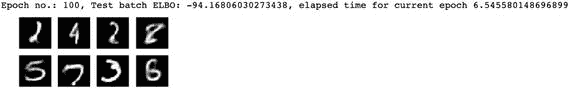

如前所述，我们能够使用 Fashion-MNIST 数据集进行训练，生成新的手写数字图像。

使用 TensorFlow 2.0 实现的 VAE 代码可以在[`bit.ly/CNNVAETF2`](http://bit.ly/CNNVAETF2)找到。你可以保存代码副本并在 Google Colab 环境中运行它。尝试调整不同的参数并记录结果。

## 结论

在本章中，我们探讨了图像处理和生成中各种著名的架构。此外，我们还考虑了迁移学习概念，以及它是如何帮助加速机器学习发展并提高训练数据不足的模型的准确性的。最后，你看到了我们如何利用 TensorFlow 和 Keras API 来构建这些架构。
