# 6. TensorFlow 模型在生产环境中的应用

在本书的最后一章中，你将应用之前章节中学到的知识，并在生产环境中部署在 TensorFlow 2.0 中构建的模型。我们认为使用机器学习的两个主要方面是：第一个方面是能够构建任何类型的机器学习模型，而不将其与任何应用程序集成（独立模型）；第二个方面，影响更大的方面，涉及将训练好的机器学习模型与一个应用程序嵌入在一起。与第一个方面相比，第二个方面可能会变得更加复杂，因为我们必须暴露训练好的模型端点，以便应用程序能够消费和使用它们的预测结果以进行激活或其他目的。本章介绍了我们可以用来部署机器学习模型的一些技术。我们不会构建一个完整的基于 TensorFlow 的应用程序。相反，我们将探讨不同的框架来保存模型、重新加载它进行预测以及部署它。在章节的第一部分，我们回顾了模型部署的内部结构和它们的挑战。在章节的第二部分，我们演示了如何使用 Flask（Web 框架）部署一个基于 Python 的机器学习模型。在章节的最后部分，我们讨论了构建基于 TensorFlow 2.0 的模型的过程。

## 模型部署

> *令人悲哀的现实：目前机器学习最常见的方式是 PowerPoint 幻灯片。*
> 
> “大规模部署机器学习”，Algorithmia，[`info.algorithmia.com/deploying-machine-learning-at-scale-1`](https://info.algorithmia.com/deploying-machine-learning-at-scale-1)，2018 年 5 月 29 日。

根据一项调查，不到 5% 的商业数据科学项目能够进入生产阶段。对于以前从未进行过任何形式的软件或机器学习部署的读者，让我们解释一下模型部署的一些基本特征。它更与应用程序的可扩展性方面相关，可以服务更多的请求。例如，几乎每个人都可以为自己或家人在家做饭。另一方面，要成功地为餐厅或在线食品服务做饭，则需要不同的要求、技能和资源。前者可以轻松完成，而后者可能需要大量的规划、实施和测试才能顺利运营。模型部署也是如此。在机器学习模型必须部署在应用程序系统中的场景中，集成和维护成为关键组成部分。在应用程序平台成熟到能够自我维持预测的水平之前，模型的成功部署需要大量的规划和测试。

对于这样一个事实，即机器学习的真正价值只有在部署到应用或系统中时才能解锁或获得，几乎没有疑问或争议。没有部署，机器学习在当今的商业世界中只能取得有限的成功和影响。部署为机器学习能力提供了一个令人兴奋的维度。假设我们对机器学习模型有相当的了解，我们可以安全地转向其部署方面。为了设定正确的期望，让我们一开始就做一个大胆的声明。与部署相比，机器学习相对容易。原因是部署带来了一系列必须考虑的其他参数，以便构建一个端到端的基于机器学习的应用程序，这并不总是容易实现的。因此，让我们回顾一下在将模型部署到应用或系统时可能会遇到的一些挑战。

### 隔离

机器学习模型可以独立构建。实际上，我们构建机器学习模型所需的所有东西就是合理规模的训练数据。然而，机器学习模型的部署并不是孤立的。图 6-1（摘自 Sculley 等人，“机器学习系统中的隐藏技术债务”，2015 年）描绘了机器学习模型部署带来的挑战。实际上，机器学习模型代码在整体设置中似乎只是一个非常小的组成部分。其余的元素需要与机器学习模型保持持续的参与和沟通。

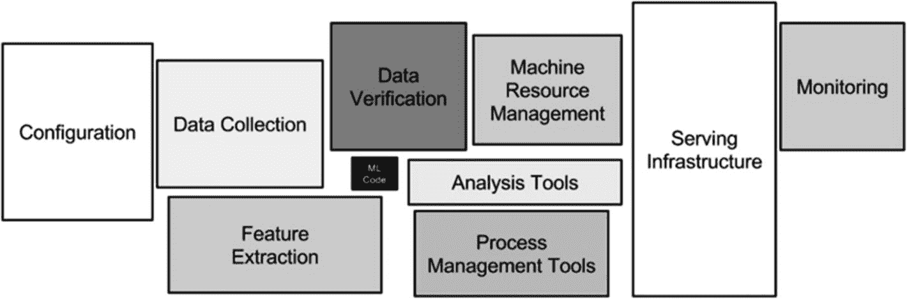

图 6-1

应用管理

### 协作

我们中的大多数人意识到，是团队构建产品或执行项目。因此，构建或部署一个成功的产品需要大量的协作和参与。在机器学习领域也是如此，应用开发者可能需要与数据科学家协调，以在系统中部署模型。例如，当模型是用一种语言构建的，而 DevOps 或应用人员使用另一种语言时，就会产生问题。

### 模型更新

我们周围的事物几乎不会保持不变。然而，有一些事物变化如此之快，以至于技术还没有能够跟上用户行为的变化。同样，机器学习模型也必须定期更新，以保持相关性和高效性。对于独立模型来说，这更容易保证，但在生产环境中实时更新模型需要很多步骤。

### 模型性能

在应用中使用机器学习的整个想法是能够很好地泛化并帮助客户做出合适的决策。这完全取决于模型底层的性能。因此，对生产中的模型进行跟踪和监控成为整体应用的一个关键部分。

### 负载均衡器

模型部署的最终挑战是处理大规模请求的能力。每个应用程序或平台都应该设计成能够在高流量情况下无缝工作。

现在我们已经回顾了模型部署中面临的挑战，我们可以回顾一些基本的到中级步骤来部署基于 Python 的模型。再次强调，本章的重点是介绍一些可用的工具和技术来部署机器学习模型，而不是构建一个完整的应用程序。

## 基于 Python 的模型部署

机器学习模型在生产中的部署有多种方式。所有这些方式都取决于模型预期要服务的需求和负载。在本节中，我们将介绍几种方法，以了解我们如何创建、保存和恢复基于 Python 的机器学习模型以进行预测。然后我们在最后一节中转向在生产中部署基于 TensorFlow 的模型。

### 保存和恢复机器学习模型

从根本上说，机器学习模型只是几个分数的组合，这些分数对应于在训练模型时使用的每个输入特征，以最佳方式描述了给定输入与输出之间的关系。保存任何机器学习模型（无论是否在 Python、R 或 TensorFlow 中构建）都允许我们在任何时间点使用它来对新数据进行预测，以及与其他用户共享。保存任何模型也称为序列化。这也可以以不同的方式完成，因为 Python 有其自己的模型持久化方式，称为*pickle*。Pickle 可以用于序列化机器学习模型以及任何其他转换器。另一种方法具有 sklearn 内置的功能，允许保存和恢复基于 Python 的机器学习模型。在本节中，我们将重点介绍使用`joblib`函数保存和持久化 sklearn 模型。一旦模型在磁盘或任何其他位置保存，我们就可以重新加载或恢复它，以对新数据进行预测。

在下面的示例中，我们考虑构建线性回归模型的标准数据集。输入数据有五个输入列和一个输出列。所有变量都是数值型的，因此需要的特征工程很少。然而，这里的想法不是构建一个完美的模型，而是构建一个基线模型，保存它，然后恢复它。在第一步中，我们加载数据并创建输入和输出特征变量（`X,y`）。

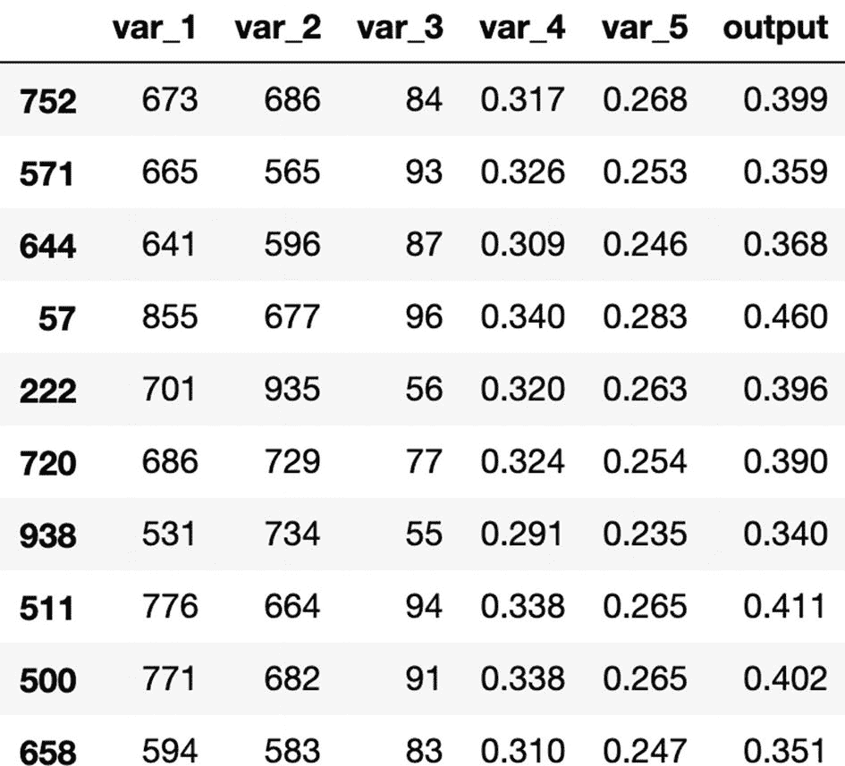

```py
[In]: import pandas as pd
[In]: import numpy as np
[In]: from sklearn.linear_model import LinearRegression
[In]: df=pd.read_csv('Linear_regression_dataset.csv',header='infer')
[In]: df
[Out]:
```

```py
[In]: X=df.loc[:,df.columns !='output']
[In]: y=df['output']
```

下一步是将数据分为训练集和测试集。然后我们在训练数据上构建线性回归模型，并访问所有输入变量的系数值。

```py
[In]: from sklearn.model_selection import train_test_split
[In]: X_train, X_test, y_train, y_test = train_test_split(X, y, test_size=0.25)
[In]: lr = LinearRegression().fit(X_train, y_train)
[In]: lr.coef_
[Out]: array([[ 3.40323422e-04,  5.78491342e-05,  2.24450972e-04,
-6.65195539e-01,  5.01534474e-01]])
```

该基线模型的性能似乎合理，在训练集上的 R-squared 值为 87%，在测试集上的值为 85%。

```py
[In]: model.score(X_train,y_train)
[Out]: 0.8735114024937244
[In]: model.score(X_test,y_test)
[Out]: 0.8551517840207584
```

现在我们已经有了可用的训练模型，我们可以使用`joblib`或`pickle`在任何位置或磁盘上保存它。我们命名导出的模型为`linear_regression_model.pkl`。

```py
[In]: import joblib
[In]: joblib.dump(lr,'linear_regression_model.pkl')
```

现在，我们创建一个随机的输入特征集，并使用我们刚刚保存的训练模型来预测输出。

```py
[In]: test_data=[600,588,90,0.358,0.333]
[In]: pred_arr=np.array(test_data)
[In]: print(pred_arr)
[Out]: [6.00e+02 5.88e+02 9.00e+01 3.58e-01 3.33e-01]
[In]: preds=pred_arr.reshape(1,-1)
[In]: print(preds)
[Out]: [[6.00e+02 5.88e+02 9.00e+01 3.58e-01 3.33e-01]]
```

为了使用相同的模型预测输出，我们首先必须使用`joblib.load`导入或加载保存的模型。一旦模型被加载，我们就可以简单地使用`predict`函数，对新数据点进行预测。

```py
[In]: model=open("linear_regression_model.pkl","rb")
[In]: lr_model=joblib.load(model)
[In]: model_prediction=lr_model.predict(preds)
[In]: print(model_prediction)
[Out]: [0.36901871]
```

这显然是在本地磁盘空间中完成的，而不是在任何云位置，但在一定程度上，这种方法在生产环境中仍然可以工作，因为模型的可序列化文件可以保存在生产环境中的某个位置。由于几个原因，这并不是在生产环境中部署模型的最佳方式。

1.  访问限制。只有有权访问生产环境的用户才能使用机器学习模型，因为它限制在特定环境中。

1.  可扩展性。一旦负载或对输出的需求增加，仅有一个模型预测实例可能会导致严重的挑战。

### 将机器学习模型作为 REST 服务部署

为了克服之前提到的限制，我们可以将模型部署为一个 REST（表示状态传输）服务，以便将其暴露给外部用户。这允许他们使用模型输出或预测，而无需访问底层模型。在本节中，我们将使用 Flask 将模型部署为 REST 服务。Flask 是一个轻量级的 Python 构建的 Web 框架，用于在服务器上部署应用程序。本书不会详细介绍 Flask，但对于那些从未使用过它的读者，以下代码片段提供了一个简要的介绍。

我们创建一个简单的`.py`文件，并编写随后的代码行，以运行一个简单的基于 Flask 的应用程序。我们首先导入 Flask 并创建 Flask 应用程序。然后，我们使用`app.route`装饰我们的主函数，这是一个简单的 Hello World！，它为访问应用程序提供了路径（在这种情况下是一个简单的`/`）。最后一步是通过调用主文件来运行应用程序。

```py
[In]: pip install Flask
[In]: from flask import Flask
[In]: app = Flask(__name__)
[In]: @app.route("/")
[In]: def hello():
return "Hello World!"
[In]: if __name__ == '__main__':
app.run(debug=True)
```

现在，我们可以访问 localhost:5000，并见证 Flask 服务器正在运行并显示“Hello World！”

接下来，我们将使用我们之前构建的模型，并使用 Flask 服务器进行部署。为了做到这一点，我们必须创建一个新的文件夹（`web_app`）并保存`model.pkl`文件。我们将使用我们在上一节中构建的相同模型。我们可以手动将`model.pkl`文件移动到`web_app`文件夹，或者使用之前的脚本在新位置重新保存模型，如下所示：

```py
[In]: joblib.dump(lr,'web_app/linear_regression_model.pkl')
```

让我们开始创建主要的`app.py`文件，该文件将启动 Flask 服务器以运行应用程序。

```py
[In]: import pandas as pd
[In]: import numpy as np
[In]: import sklearn
[In]: import joblib
[In]: from flask import Flask,render_template,request
[In]: app=Flask(__name__)
[In]: @app.route('/')
[In]: def home():
return render_template('home.html')
[In]: @app.route('/predict',methods=['GET','POST'])
[In]: def predict():
if request.method =='POST':
print(request.form.get('var_1'))
print(request.form.get('var_2'))
print(request.form.get('var_3'))
print(request.form.get('var_4'))
print(request.form.get('var_5'))
try:
var_1=float(request.form['var_1'])
var_2=float(request.form['var_2'])
var_3=float(request.form['var_3'])
var_4=float(request.form['var_4'])
var_5=float(request.form['var_5'])
pred_args=[var_1,var_2,var_3,var_4,var_5]
pred_arr=np.array(pred_args)
preds=pred_arr.reshape(1,-1)
model=open("linear_regression_model.pkl","rb")
lr_model=joblib.load(model)
model_prediction=lr_model.predict(preds)
model_prediction=round(float(model_prediction),2)
except ValueError:
return "Please Enter valid values"
return render_template('predict.html',prediction=model_prediction)
[In]: if __name__=='__main__':
app.run(host='0.0.0.0')
```

让我们回顾一下步骤，以便了解`app.py`文件的细节。首先，我们从 Python 导入所有必需的库。接下来，我们创建第一个函数，这是一个主页，它渲染 HTML 模板以允许用户填写输入值。下一个函数是将模型对用户提供的输入值进行的预测发布出来。我们将输入值保存到来自用户的五个不同变量中，并创建一个列表（`pred_args`）。然后我们将它转换成一个 numpy 数组。我们将其重塑成所需的形式，以便能够以相同的方式进行预测。下一步是加载训练好的模型（`linear_regression_model.pkl`）并进行预测。我们将最终输出保存到一个变量（`model_prediction`）中。然后我们通过另一个 HTML 模板（`predict.html`）发布这些结果。如果我们现在在终端中运行主文件（`app.py`），我们将看到图 6-2 所示的页面，要求用户填写值。输出显示在图 6-3 中。

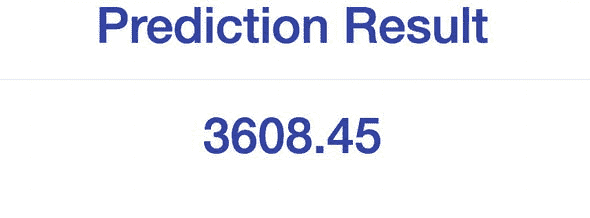

图 6-3

预测输出

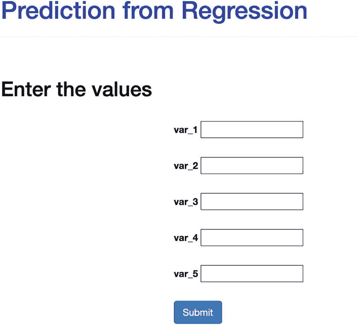

图 6-2。

模型的输入

### 模板

我们需要设计两个网页，以便向服务器发送请求并接收响应消息，这是针对特定请求的机器学习模型的预测结果。由于本书不专注于 HTML，您可以简单地使用这些文件，无需对其进行任何修改。但对于好奇的读者，我们正在创建一个表单，用于请求五个不同变量的五个值。我们使用了一个标准的 CSS 模板，包含非常基本的字段（图 6-4）。了解 HTML 的用户可以自由地根据他们的需求重新设计主页（图 6-5）。

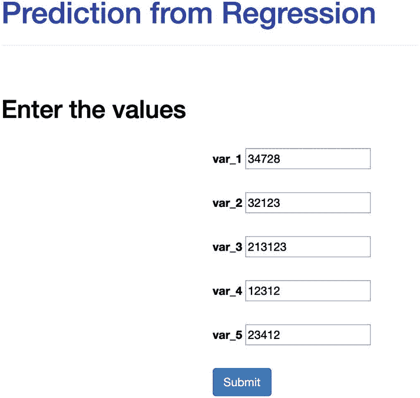

图 6-5

输入网页

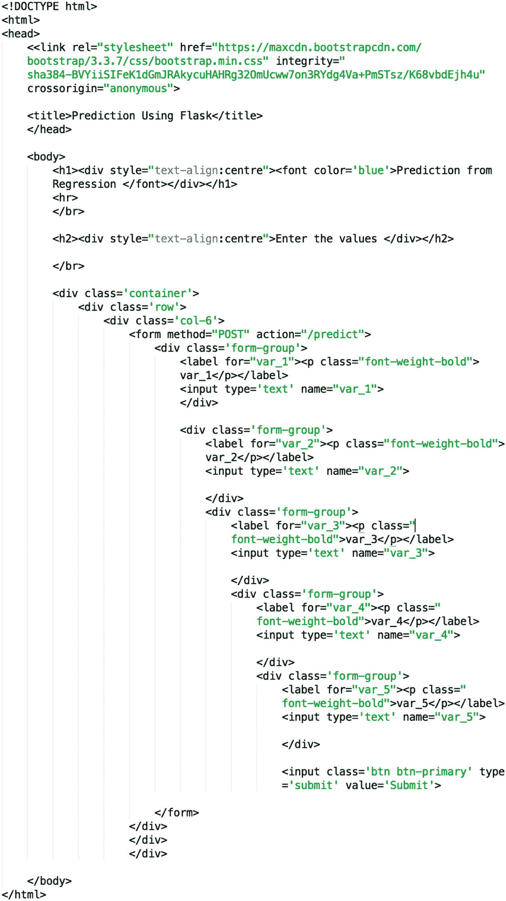

图 6-4

用户输入的 HTML

下一个模板是将模型预测结果返回给用户（图 6-6）。与第一个模板相比，它更简单，因为我们只需要将一个值返回给用户（图 6-7）。


图 6-7

模型的输出

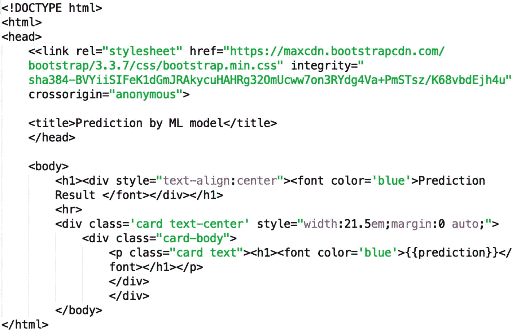

图 6-6

模型的输出 HTML

现在我们已经看到了如何使用 Web 框架部署模型，我们可以继续本章的最后一部分，该部分专注于部署 TensorFlow 2.0 模型。本节分为两部分。在第一部分，我们将使用`tf.keras`构建一个标准的深度学习网络，用于分类图像。一旦神经网络训练完成，我们将保存它并重新加载，以便在测试数据上进行预测。在本节的第二部分，我们将介绍使用 TensorFlow 服务器平台部署模型的流程。

### 使用 Flask 的挑战

虽然 Flask 适合作为服务部署模型，但当应用程序拥有众多用户时，它就会遇到瓶颈。对于小型应用程序，Flask 可以很好地处理负载。Flask 的替代方案可以是使用容器，例如 Docker。对于从未使用过 Docker 的读者来说，它仅仅是一种将应用程序容器化的技术，以便在不受平台限制的情况下运行。与手动方法相比，它解决了所有应用程序依赖性问题，运行速度更快，更简单。如今，在生产环境中部署任何应用程序的常见流程是使用 Docker 进行容器化，然后在 Kubernetes 或其他任何云平台上运行服务。其中一项挑战是处理对应用程序发出的请求数量。因此，Docker 和 Kubernetes 可以通过内置的负载均衡器管理任何数量的增加请求。如果请求较少，它会减少容器数量；如果负载增加，它会运行应用程序的另一个实例。在下一节中，我们将看到如何构建 TensorFlow 模型并在 TensorFlow 中进行预测。

## 基于 Keras TensorFlow 的模型构建

我们将用于构建这个深度神经网络的数据集是之前使用的标准 Fashion-MNIST 集。我们首先导入所需的库，并确保我们拥有 TensorFlow 的最新版本。

```py
[In]: import tensorflow as tf
[In]: tf.__version__
[Out]: '2.0.0-rc0'
[In]: from tensorflow import keras
[In]: import matplotlib.pyplot as plt
[In]: import numpy as np
[In]: from keras.preprocessing import image
```

下一步是加载数据集并将其分为训练集和测试集。我们在训练集中有 60,000 张图像，将在其上训练网络。在训练模型之前，我们必须执行几个步骤。

1.  标记目标类别，以便更好地识别图像。

1.  标准化每张图像的大小。

    ```py
    [In]: df = keras.datasets.fashion_mnist
    [In]: (X_train, y_train), (X_test, y_test) = df.load_data()
    [In]: X_train.shape
    [Out]: (60000, 28, 28)
    [In]: y_train.shape
    [Out]: (60000,)
    [In]: labels=['T-shirts','Trouser','Pullover','Dress','Coat','Sandal','Shirt','Sneaker','Bag','Ankle boot']
    [In]: X_train=X_train[:50000]
    [In]: X_val=X_train[50000:]
    [In]: y_train=y_train[:50000]
    [In]: y_val=y_train[50000:]
    [In]: X_train=X_train/255
    [In]: X_val=X_val/255
    ```

要查看示例图像，我们可以使用`imshow`函数并传递特定的图像，如下面的几个示例所示：

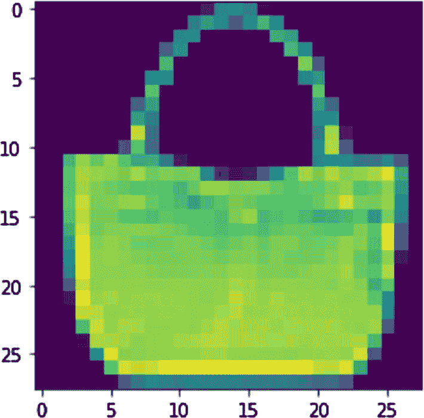

```py
[In]: plt.imshow(X_train[100])
[Out]:
```

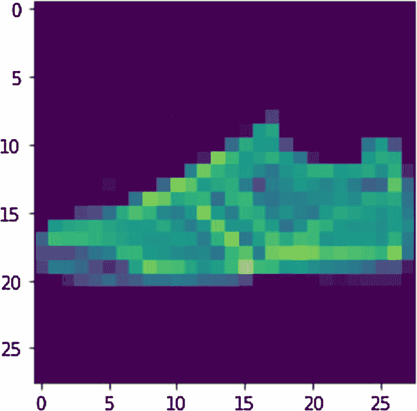

```py
[In]: print(labels[y_train[100]])
[Out]: Bag
[In]: plt.imshow(X_train[1055])
[Out]:
```

```py
[In]: print(labels[y_train[1055]])
[Out]: Sneaker
```

下一步是实际定义和构建模型。我们使用一个传统的顺序模型，包含三个层，第一层包含 200 个单元，第二层包含 100 个单元，最后一层包含具有 10 个神经元的预测层。

```py
[In]: keras_model = keras.models.Sequential()
[In]: keras_model.add(keras.layers.Flatten(input_shape=[28, 28]))
[In]: keras_model.add(keras.layers.Dense(200, activation="relu"))
[In]: keras_model.add(keras.layers.Dense(100, activation="relu"))
[In]: keras_model.add(keras.layers.Dense(10, activation="softmax"))
[In]: keras_model.compile(optimizer="sgd",loss=keras.losses.sparse_categorical_crossentropy,metrics=["accuracy"])
```

我们现在在训练集上训练模型，并将 epoch 数设置为 10。

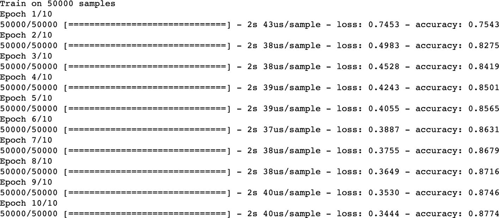

```py
[In]: history = keras_model.fit(X_train, y_train,epochs=10)
[Out]:
```

一旦模型训练完成，我们就可以在测试数据上测试其准确性。它似乎接近 85%。我们可以通过改变网络或使用更适合图像分类的 CNN（卷积神经网络）来改进模型，但这个练习的目的是保存一个模型并在以后进行预测。

```py
[In]: X_test=X_test/255
[In]: test_accuracy=keras_model.evaluate(X_test,y_test)
[Out]: 0.8498
```

现在，我们将模型保存为 Keras 模型，并使用`load_model`进行预测来加载它。

```py
[In]: keras_model.save("keras_model.h5")
[In]: loaded_model = keras.models.load_model("keras_model.h5")
```

在以下示例中，我们加载一张测试图像（`100`），它是一条裙子，然后我们将使用我们保存的模型对这张图像进行预测。

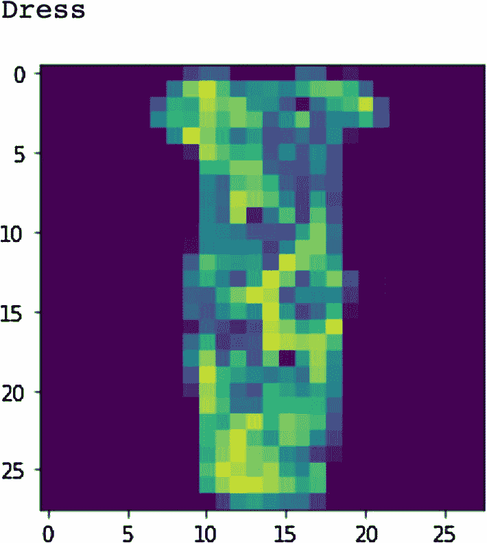

```py
[In]: plt.imshow(X_test[100])
[In]: print(labels[y_test[100]])
[Out]:
```

我们创建一个新的变量（`new_image`）并将其重塑为模型预测所需的形式。模型正确地将图像分类为“Dress。”

```py
[In]: new_image= X_test[100]
[In]: new_image = image.img_to_array(new_image)
[In]: new_image = np.expand_dims(new_image, axis=0)
[In]: new_image = new_image.reshape(1,28,28)
[In]: prediction=labels[loaded_model.predict_classes(new_image)[0]]
[In]: print(prediction)
[Out]: Dress
```

另一个例子：我们可以选择另一张图像（`500`）并使用保存的模型进行预测。

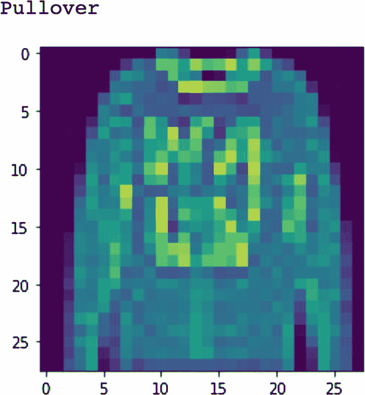

```py
[In]: plt.imshow(X_test[500])
[In]: print(labels[y_test[500]])
[Out]:
```

```py
[In]: new_image= X_test[500]
[In]: new_image = image.img_to_array(new_image)
[In]: new_image = np.expand_dims(new_image, axis=0)
[In]: new_image = new_image.reshape(1,28,28)
[In]: prediction=labels[loaded_model.predict_classes(new_image)[0]]
[In]: print(prediction)
[Out]: Pullover
```

## TF ind 部署

将机器学习模型投入生产的另一种方式是使用 Kubeflow 平台。Kubeflow 是用于在 Kubernetes 上管理和部署机器学习模型的原生工具。由于 Kubernetes 超出了本书的范围，我们不会深入探讨其细节。然而，Kubernetes 可以被定义为一个容器编排平台，它允许运行、部署和管理容器化应用程序（在我们的案例中是机器学习模型）。

在本节中，我们将复制之前构建的相同模型，并在云中（通过 Google Cloud Platform）运行它，使用 Kubeflow。我们还将使用 Kubeflow UI，在云中导航和运行 Jupyter Notebook。由于我们将使用 Google Cloud Platform（GCP），我们必须有一个 Google 账户，这样我们才能利用 Google 为 GCP 组件提供的免费信用额度。前往`https://console.cloud.google.com/`并创建一个 Google 用户账户，如果您还没有的话。您将需要提供一些额外的详细信息，以及信用卡信息，如图 6-8 所示。

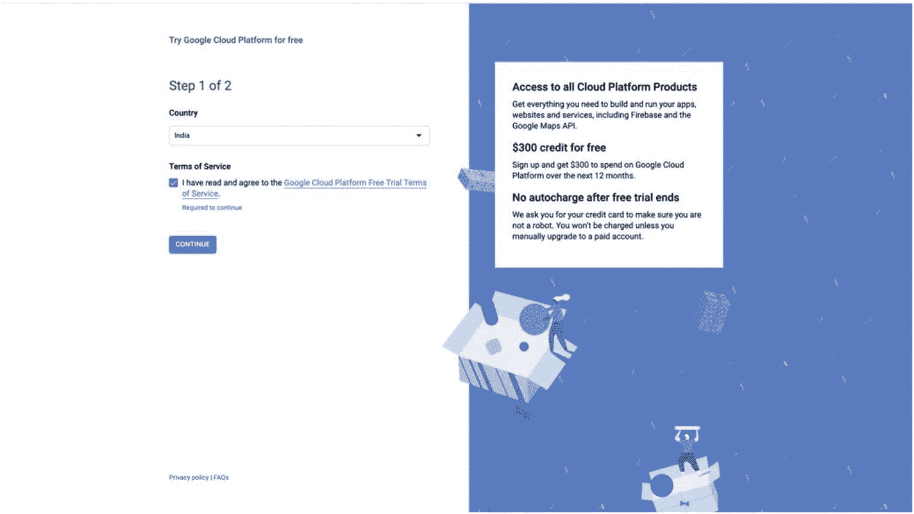

图 6-8

Google 用户账户

一旦我们登录到 Google 控制台，有许多选项可以探索，但首先，我们必须启用 Google 提供的免费信用额度，以便免费访问云服务（最高$300）。接下来，我们必须创建一个新的项目或选择一个现有的项目，对于已经拥有 Google 账户的用户，如图 6-9 所示。

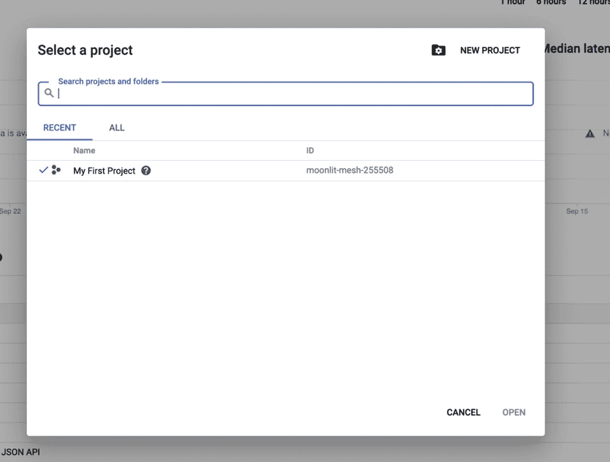

图 6-9

Google 项目

要使用 Kubeflow，最后一步是启用 Kubernetes Engine API。为了启用 Kubernetes Engine API，我们必须前往 API & 服务仪表板（图 6-10）并搜索 Kubernetes Engine API。一旦它在库中显示出来，我们必须启用它，如图 6-11 所示。

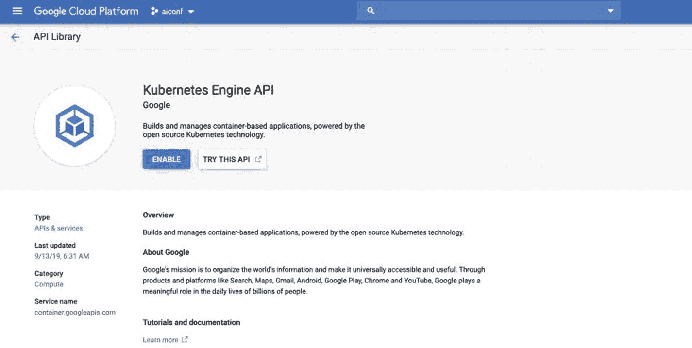

图 6-11

启用 Kubernetes API


图 6-10

API 仪表板

下一步是在 GCP 上使用 Kubeflow 部署 Kubernetes 集群。有多种方法可以做到这一点，但我们将通过使用 UI 来部署集群。前往 `https://deploy.kubeflow.cloud/#/` 并提供所需的详细信息，如图 6-12 所示。

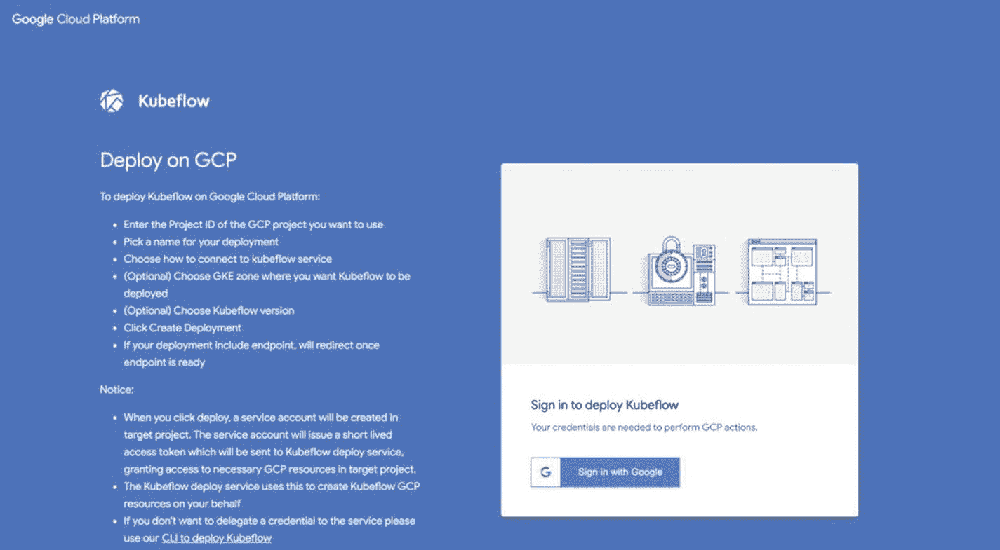

图 6-12

Kubeflow 部署

我们必须输入项目 ID（在 GCP 控制台的“项目”选项卡下查看项目详情），选择所需的部署名称，并选择使用用户名和密码登录的选项，以保持简单。接下来，我们再次输入我们选择的用户名和密码（我们还需要它们来登录到 Kubeflow UI）。我们可以根据可用的区域再次选择 Google Kubernetes Engine 区域，并选择 Kubeflow 版本 0.62。点击创建部署确保所有必需的资源将在大约 30 分钟内启动并运行。我们还可以通过返回 Google 控制台仪表板并选择 Kubernetes Engine 和集群选项来检查 Kubernetes 集群是否启动并运行。在我们可以看到 Kubernetes Engine 集群启动并运行之前可能需要几分钟。现在，Kubeflow 部署已经设置好，我们可以简单地点击 Kubeflow 服务端点按钮，就会有一个新的 UI 页面可用。我们必须使用在部署阶段提供的相同用户名和密码，如图 6-13 所示。


图 6-13

Kubeflow 登录

一旦我们登录到 Kubeflow UI，我们可以看到 Kubeflow 仪表板，其中包含多个选项，如管道、笔记本服务器等，如图 6-14 所示。

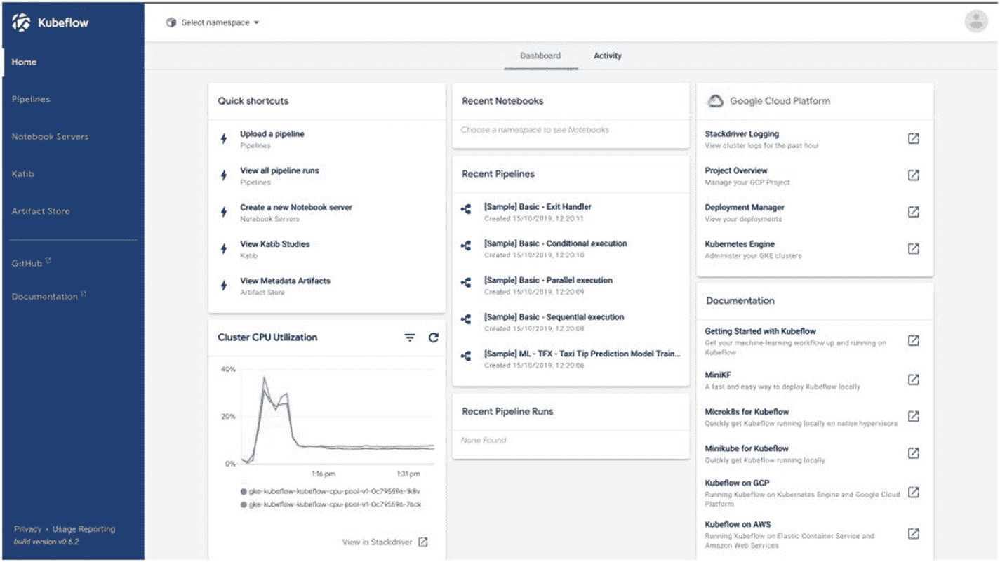

图 6-14

Kubeflow 仪表板

我们必须选择笔记本服务器，以启动一个新的笔记本服务器。对于一个新的笔记本服务器，我们必须提供一些有关所需配置的详细信息，如图 6-15 所示。

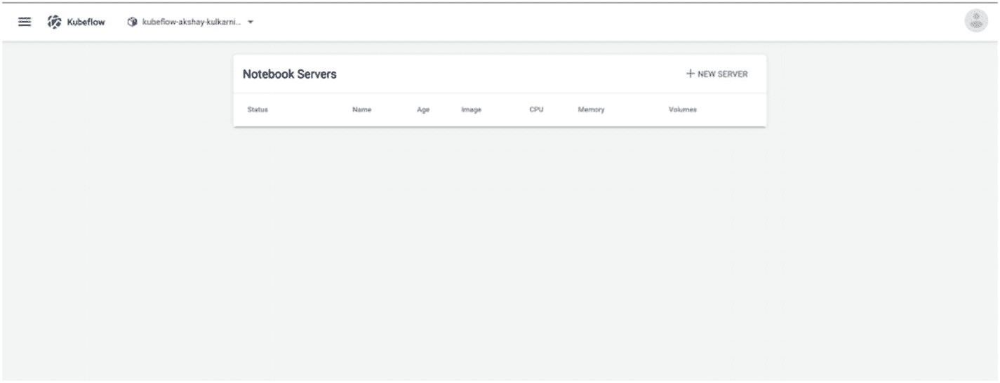

图 6-15

Kubeflow 笔记本服务器

现在，我们必须提供一些配置细节来启动服务器，例如基础镜像（带有预安装的库和依赖项）、CPU/GPU 的大小以及总内存（5 个 CPU 和 5GB 内存足以满足我们的模型需求）。我们可以选择带有 TensorFlow 2.0 版本的镜像，因为我们是用这个版本构建模型的。我们还必须添加 GCP 凭据，以防我们想要将模型保存到 GCP 的存储桶中并用于服务目的。过了一会儿，笔记本服务器就会启动并运行，我们可以点击连接，打开在 Kubeflow 服务器上运行的 Jupyter Notebook，如图 6-16 所示。

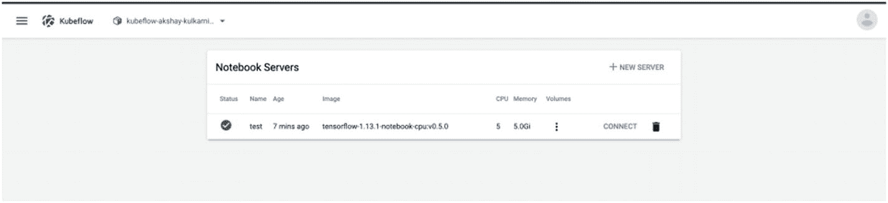

图 6-16

从笔记本服务器打开 Jupyter Notebook 服务器

一旦 Jupyter Notebook 启动，我们可以选择创建一个新的 Python 3 笔记本，或者简单地进入其终端并从 Git 克隆所需的仓库，将所有模型文件下载到这个笔记本中。在我们的案例中，因为我们是从头开始构建模型，我们将创建一个新的 Python 3 笔记本并复制本章中早期构建的相同模型。它应该和之前一样工作，唯一的区别是我们现在使用 Kubeflow 来构建和提供模型。如果任何库不可用，我们只需简单地使用 pip3 install 安装库并在笔记本中使用它。

一旦模型构建完成并且我们使用了 Kubeflow 的服务，我们必须终止并删除所有资源，以避免任何额外费用。我们必须回到 Google 控制台，在 Kubernetes 集群列表下删除 Kubeflow 服务器。

## 结论

在本章中，我们探讨了将机器学习模型投入生产时面临的常见挑战以及如何克服它们。我们还回顾了保存机器学习模型（基于 Python 和 TensorFlow）并将其部署到生产环境的过程，使用了不同的框架。
