# 4. 实际部署中的模型压缩

> *我的雄心是只用 10 句话来表达其他人用一本书来说明的内容。*
> 
> ——弗里德里希·尼采，哲学家和作家^(1)

在深度学习在过去几十年中迅速发展的过程中，模型压缩相对较晚才成为突出的重点。不要误解——模型压缩方法已经存在并且被记录了几十年，但深度学习最近许多演变的主要焦点是扩展和增加深度学习模型的大小，以增加其预测能力。今天许多现代卷积网络包含数亿个参数，自然语言处理模型已经达到数百亿*个参数（并且还在增加）*。

尽管这些庞大的架构推动了深度学习所能达到的边界，但它们的可用性和可行性通常仅限于拥有硬件和计算能力来支持此类大型操作的研究实验室和其他组织的高能部门。*模型压缩*关注的是在尽可能保持性能的同时推进模型的“成本”。由于模型压缩主要旨在最大化效率而不是性能，因此它是将深度学习进步从研究实验室转移到实际应用（如卫星和移动电话）的关键。

模型压缩通常是许多深度学习指南中缺失的一章，但重要的是要记住，深度学习模型越来越多地被用于对深度学习模型设计自由度施加限制的实际应用中。通过研究模型压缩，你可以将深度学习设计的艺术建立在部署的实际框架之上，并超越它。

## 模型压缩简介

当我们进行模型压缩时，我们试图在尽可能保持性能的同时减少模型所承担的“成本”。这里使用的“成本”一词是有意模糊的，因为它涵盖了多个属性。存储和操作神经网络的最直接成本是它所持有的参数数量。如果一个神经网络包含数百亿个参数，它将比包含数十万个参数的网络需要更多的存储空间。对于存储能力较低的应用程序，如移动电话，甚至可能无法在实际的深度学习设计中存储和运行模型。然而，还有许多其他因素——所有这些因素都相互关联——它们都会影响运行深度学习模型的成本：

注意

由于模型压缩主要是一个部署问题，我们将使用相应的语言：“服务器端”和“客户端”。大致来说，就本书的目的而言，“服务器端”指的是在服务于客户端的服务器上执行的计算，而“客户端”指的是在客户端的本地资源上执行的计算。

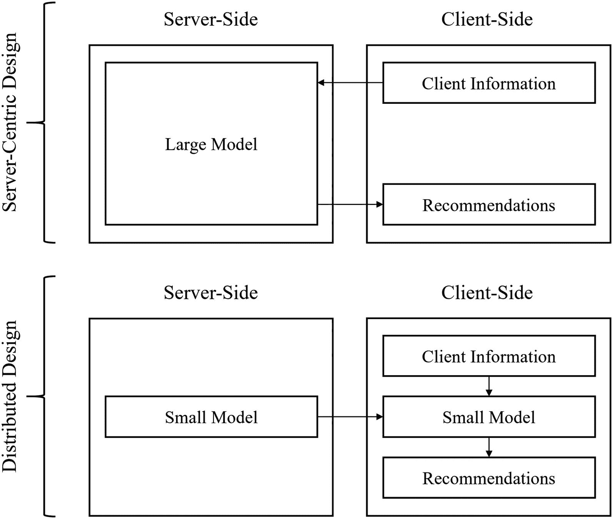

图 4-1

隐私需要一个小型模型。虽然它可能不完全可量化，但它是一个模型成本的重要方面。

+   *延迟*：深度学习模型的延迟是指处理一个数据单元所需的时间。延迟通常关注的是部署的深度学习模型进行预测所需的时间。例如，如果你使用深度学习算法来推荐搜索结果或其他项目，高延迟意味着结果缓慢。缓慢的结果会驱走用户。延迟通常与模型的大小相关，因为较大的模型需要更多的时间。然而，模型的延迟也可能由其他因素复杂化，例如计算的复杂性（例如，某个层可能没有很多参数，但执行复杂、密集的计算或高度非线性的拓扑）。

+   *服务器端计算和电力成本*：计算就是金钱！在许多情况下，深度学习模型存储在服务器端，它不断地进行预测计算并将这些预测发送到客户端。如果你的模型计算成本高昂，它将在服务器端产生沉重的直接成本。

+   *隐私*：这是一个抽象但日益重要的因素，在当今的技术环境中。遵循先前模型将所有用户信息发送到集中服务器进行预测的服务（例如，将你的视频浏览历史发送到中央服务器以推荐新视频，这些视频被发送回并显示在你的设备上）越来越受到隐私问题的关注，因为所有用户信息都存储在集中位置的某个点上。越来越多地使用新的分布式系统（例如，联邦学习），其中模型的版本被发送到每个用户的个人设备上，并为用户的数据生成预测，而无需将用户的数据发送到集中位置。当然，这要求模型足够小，以便在用户的设备上合理运行。因此，无法用于分布式部署的大型模型可以被认为是缺乏隐私的成本（图 4-1）。

这些都是在部署模型时必须考虑的模型成本因素，与模型的实际性能并列。一个成本较低但性能不佳的模型在实用应用中无法部署，就像一个性能良好但成本较高的模型一样。神经网络的研究表明，神经网络包含一定量的冗余——对于特定问题来说，根本不需要的额外空间。这是有道理的：一组小的架构设计可以适应大多数深度学习问题，但并非所有深度学习问题在难度上都是相同的，因此我们不应期望每个问题“使用”每个架构的程度相同。去除冗余不会对性能造成任何或可忽略的成本。然而，超过这个冗余，我们面临着性能和成本之间的权衡。随着我们降低模型承担的成本，我们也降低了模型的性能（见图 4-2）。

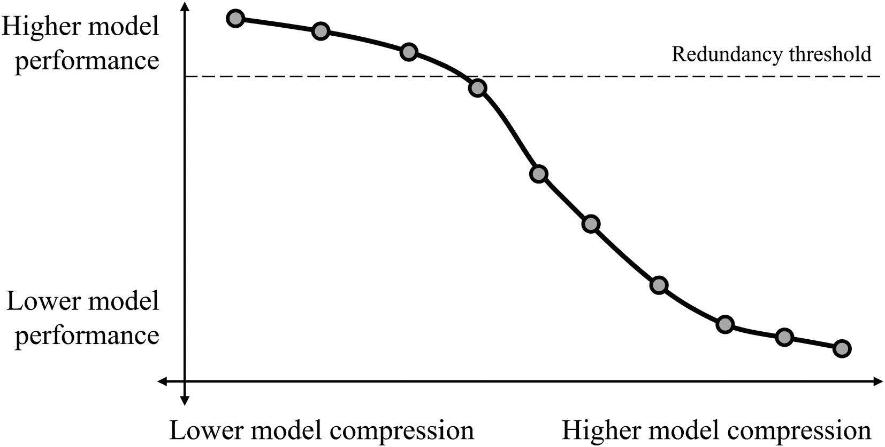

图 4-2

模型性能与模型压缩之间的假设关系，以及冗余阈值——在持续模型压缩导致模型性能大幅下降之前的阈值——已标出。实际关系可能因上下文和模型压缩类型而异

最佳组合取决于您的特定任务和资源可用性。有时，性能与成本属性相比不是首要考虑的因素。例如，考虑一个在移动应用程序上运行的深度学习模型，其任务是推荐应用程序或其他项目打开——在这种情况下，模型是否完美并不那么重要，重要的是模型不要消耗太多手机的存储和计算资源。如果这样的应用程序消耗了用户手机的大量资源，即使应用程序表现良好，用户也可能感到不满意。（实际上，在这种情况下，深度学习可能也不是正确的解决方案——一个更简单的机器学习或统计模型可能就足够了。）另一方面，考虑一个集成到医疗设备中的深度学习模型，该设备旨在快速诊断并推荐医疗措施。在这种情况下，模型完美准确可能比模型快几秒钟更重要。

模型压缩令人着迷，因为它展示了解决深度学习问题所需的真实问题解决广度。深度学习不仅关注通过指标提高模型性能，还关注开发可用于实际应用的实用深度学习。

它在推进深度学习的理论理解方面也很有价值，因为它迫使我们提出关于神经网络和深度学习本质的关键问题：如果模型压缩可以通过对性能的微小下降来有效地从网络中移除大量信息，那么最初被压缩“移除”的网络原始组件最初有什么作用？神经网络训练从根本上说是一个通过调整权重来*改进*解决方案的过程，还是一个*发现*过程——在众多不良解决方案中找到一个好的解决方案？网络对微小变化的鲁棒性有多强？我们将探讨这些问题，并讨论它们对实际部署的益处。

在本章中，我们将讨论三种关键的深度学习模型压缩算法：剪枝、量化和权重聚类。其他深度学习模型压缩/缩小方法也存在——特别是神经架构搜索（NAS）。然而，本章没有讨论它，因为它更适合在下一章中讨论。

## 剪枝

当你想到神经网络中的参数数量时，你可能会将参数与全连接密集网络中每一层的节点之间的连接联系起来，或者可能是卷积神经网络中的滤波器值。当你调用`model.summary()`并看到八位或九位的参数计数时，你可能会问：所有这些参数对于预测问题都是必要的吗？

如前所述，通过简单的推理，你可以合理地预期，你很可能没有构建一个具有“完美”参数数量的神经网络架构以成功完成其任务，因此，如果网络没有表现不佳，它很可能使用了比真正需要的更多参数。剪枝是一种直接的方法，通过明确地移除这些“冗余”参数来解决这个问题。此外，它在各种架构中的成功也提出了理论深度学习中的重要问题。

### 剪枝理论与直觉

假设你想在你的居住空间中减少舒适度——你认为可能比你需要的多，而且保留所有这些舒适度正在使你的生活成本超过可能。你已经对你的居住空间进行了改变，目的是最大限度地减少对你工作能力的影响——你仍然保留你的电脑、良好的 Wi-Fi 和稳定的电力。然而，你已经减少了可能有助于你的工作但本质上属于辅助性的舒适度，比如取消电视订阅、购买一张舒适的沙发或购买当地交响乐的门票。

只要你有足够的韧性，这种生活空间的改变在理论上不应影响你的工作——你的心理能力没有被明确地损害到，以至于会妨碍你执行工作职能（可能它影响了你的舒适度，但这不是讨论的因素）。同时，你已经设法减少了生活的总体成本。

然而，你有些迷茫：你本能地伸手去拿角落里已经被移除的灯。你发现自己失望地发现不能再无限制地看电视了。对这些空间进行这些改变需要你重新适应它。这可能需要几个小时（甚至几天）的探索和适应，以适应这些新的变化。一旦你完成了适应，你应该准备好在这个新修改的空间中像以前一样高效地工作。

然而，需要注意的是，如果你的先前生活空间和当前生活空间之间的差异太大，你可能永远无法恢复——例如，移除你的运动设备、所有娱乐来源以及其他非常接近但仍然不直接影响你工作的事物。如果你通过削减用水和用电来进一步削减生活成本，你的工作能力将直接受到影响。

让我们回顾一下：你后退一步，环顾你的生活空间，并决定它有太多不必要的舒适设施，你想要削减这些舒适设施。你可以一次性拿走所有舒适设施，但你决定立即的、绝对的不同可能对你来说过于鲜明，难以应对。相反，你决定开始一段*迭代*之旅，每周移除一两个最不重要的东西，并在你觉得再移除任何物品会损害你的核心工作设施时停止。这样，你有时间适应一系列的小变化。

在生活空间中削减舒适度的逻辑与修剪的逻辑是平行的——当探索如何进行修剪活动时，它提供了一个有用的直观模型。

修剪最初是在 Yann LeCun 1990 年的作品《最优脑损伤》中提出的——不是所有参数都对输出有显著贡献，因此这些参数可以在最优化形式的“大脑”（神经网络）损伤中剪除。

剪枝通常在网络的训练基本完成之后进行，这样评估参数的重要性才有意义，而不是仅仅基于随机的初始化或训练早期阶段中的值。为了确定哪些神经网络实体（节点、连接、层等）对输出的贡献最大或最小，必须根据某些重要性标准评估每个实体。最不重要的实体被移除（见图 4-3）。在实践中，移除只是将参数设置为零，这比存储要便宜得多。

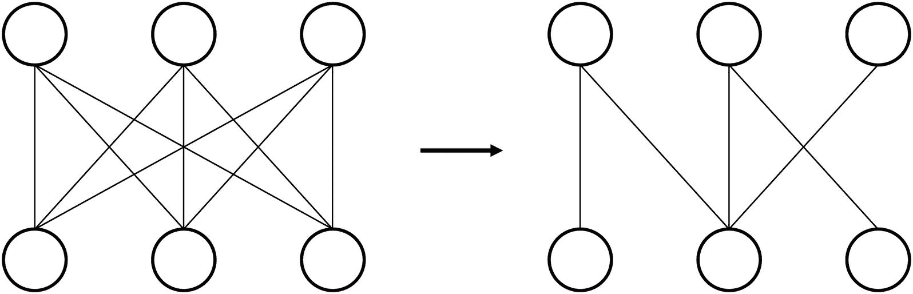

图 4-3

非结构化剪枝的可视化

这种剪枝操作，即移除整个连接、节点和其他神经网络实体，可以被视为一种架构修改。为了实现最佳性能，模型需要通过微调重新调整到其新的架构。这种微调可以通过在更多数据上训练新的架构来简单地完成。

因此，剪枝遵循以下一般的迭代过程（见图 4-4）。

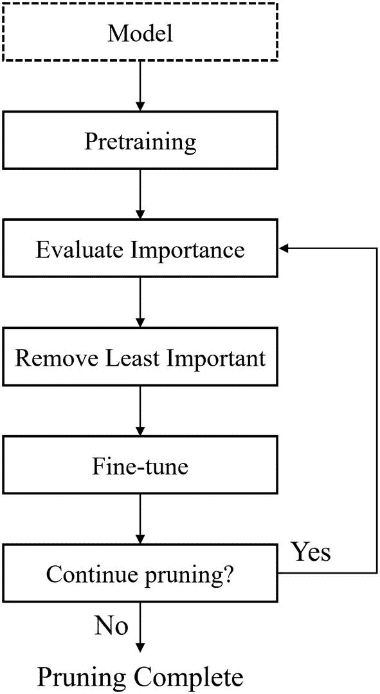

图 4-4

剪枝过程

在这种意义上，你可以将剪枝视为一种“定向”的 dropout，其中连接不是随机丢弃，而是根据重要性标准进行剪枝。由于剪枝是定向的而不是随机的，因此可以剪枝更多的权重，同时与 dropout 中合理比例的权重丢弃相比，性能仍然合理。

在实现剪枝时，你可以指定要剪枝的初始参数百分比和最终参数百分比；TensorFlow 将为你计算出每一步需要移除多少。

已提出了许多评估参数重要性的方法：

+   *幅度剪枝*：这是最简单的剪枝形式：如果一个权重具有更高的权重，则认为它更重要。较小的权重不太重要，并且可以在对模型性能影响很小的情况下进行剪枝，前提是有足够的微调。尽管已经提出了许多更复杂的方法，但它们通常未能实现比幅度剪枝显著更高的性能。本书中将使用基于幅度的剪枝方法。

+   *滤波器剪枝*：剪枝卷积神经网络需要额外的考虑，因为剪枝一个滤波器需要移除所有后续的输入通道，这些通道已经不存在了。在卷积网络中使用基于幅度的剪枝方法（滤波器中的平均权重值）效果很好。

+   *对性能影响最小*：一种更复杂的压缩方法是在权重或其他网络实体中选择那些最能减少神经网络成本变化的权重或实体。

仅连接的剪枝操作被称为无结构剪枝。无结构剪枝可能导致稀疏矩阵，这在许多情况下可能导致计算困难和效率低下。通过剪枝其他更大的神经网络实体，你可能会以降低精度（以及可能降低性能）为代价，实现更好的压缩。

+   **剪枝** **神经元**：取神经元的输入和输出权重的平均值，并使用基于幅度的方法完全去除冗余神经元。还可以使用其他更复杂的标准来剪枝整个神经元。这些方法允许更快地去除权重组，这在大型架构中可能很有帮助。

+   **剪枝** **块**：块稀疏格式在内存中连续存储块以减少不规则内存访问。剪枝整个内存块类似于剪枝神经元作为网络部分的簇，但更注重硬件中的性能和能源效率。

+   **剪枝** **层**：层可以通过基于规则的剪枝方法进行剪枝——例如，在训练过程中每剪除三层，这样模型在训练过程中会逐渐缩小，但会适应并压缩信息。层的重要性也可以通过其他分析确定，这些分析确定了其对模型输出的影响。

每个神经网络和每个任务都需要不同的剪枝策略；一些神经网络已经相对轻量级，进一步剪枝可能会严重损害网络的关键处理设施。另一方面，在简单任务上训练的大型网络可能不需要其大多数参数。

使用剪枝，90%到 95%的网络参数可以可靠地剪除，而对性能的影响很小。

### 剪枝实现

为了实现剪枝（以及其他模型压缩方法），我们需要其他库的帮助。TensorFlow 模型优化库与 Keras/TensorFlow 模型一起工作，但需要单独安装（`pip install tensorflow-model-optimization`）。需要注意的是，TensorFlow 模型优化库相对较新，因此不如大型库发达；你可能会遇到一个相对较小的论坛社区来处理警告和错误。然而，TensorFlow 模型优化库的文档编写得很好，并包含额外的示例，如有必要可以参考。我们还需要`os`、`zipfile`和`tempfile`库（Python 默认应包含），这些库允许我们了解运行深度学习模型的成本。

尽管 TensorFlow 模型优化在实现修剪所需的代码方面提供了很大的帮助，但它涉及多个步骤，需要有条不紊地处理。此外，请注意，由于修剪和模型压缩的广泛工作相对较新，在本书编写时，TensorFlow 模型优化不支持广泛的修剪准则和调度。然而，它当前提供的功能应该能够满足大多数压缩需求。

#### 设置数据和基准模型

为了本节的方便，我们将训练（并修剪）一个基于 MNIST 数据表格版本的馈送前向模型。尽管逻辑同样适用于其他更复杂的架构，如卷积或循环神经网络。

您可以直接从 `keras.datasets` 加载 MNIST 数据，并使用 numpy 和 `keras.utils` 进行必要的调整（见列表 4-1）。

```py
# import keras
import keras
# load mnist data
mnist = keras.datasets.mnist
(x_train, y_train), (x_test, y_test) = mnist.load_data()
# reshape from image data (28,28) into flat data (784,)
x_train = x_train.reshape((len(x_train), 28*28))
x_test = x_test.reshape((len(x_test), 28*28))
# one-hot encode labels
y_train = keras.utils.to_categorical(y_train)
y_test = keras.utils.to_categorical(y_test)
Listing 4-1
Loading MNIST data
```

MNIST 数据集是一个相对简单的数据集，但为了我们的基准模型，我们将故意构建一个冗余模型，其神经元和层数远多于所需。这个模型（见列表 4-2）将包含十个隐藏层，每组两个层包含相同依次递减的 2 的幂（从 512 到 32），使得隐藏层中的神经元数量为 512-512-256-256-128-128-…。

```py
# import layers
import keras.layers as L
# construct Sequential model
model = keras.Sequential()
# construct Input
model.add(L.Input((784,)))
# construct processing layers
for i in list(range(5,10))[::-1]:
model.add(L.Dense(2**i, activation='relu'))
model.add(L.Dense(2**i, activation='relu'))
# construct output layer
model.add(L.Dense(10, activation='softmax'))
Listing 4-2
Constructing a simple and redundant baseline model
```

我们可以相应地编译和调整模型以适当的参数（见列表 4-3）。

```py
model.compile(optimizer='adam',
loss='categorical_crossentropy',
metrics=['accuracy'])
model.fit(x_train, y_train, epochs=15)
Listing 4-3
Compiling and fitting baseline model
```

#### 创建成本指标

如引言中所述，模型压缩是一个权衡。为了理解压缩的好处，我们需要创建一些成本指标进行比较，以便更好地理解存储空间、参数数量和延迟等因素。这些指标不仅适用于修剪模型，也适用于一般的压缩模型；它们在导航压缩权衡中充当指南针。

##### 存储大小

为了获取存储压缩模型的文件大小，我们需要遵循以下过程：

1.  创建一个临时文件以存储模型权重。

1.  将模型权重存储在创建的临时文件中。

1.  创建一个临时文件以存储压缩模型权重文件。

1.  获取并返回压缩文件的尺寸。

让我们从导入必要的库开始（见列表 4-4）——`zipfile` 提供了压缩功能，`tempfile` 允许创建临时文件，而 `os` 允许获取特定文件的大小。

```py
import zipfile as zf, tempfile, os
Listing 4-4
Importing necessary libraries for storage size
```

`tempfile.mkstemp('.ending')` 函数允许我们创建一个具有特定文件扩展名的临时文件。该函数返回一个元组，其中第一个元素是打开文件的操作系统级别的句柄，第二个是文件的路径名。因为我们只关心文件的路径，所以我们忽略了第一个元素。

在我们获得创建的路径后，我们可以将模型的权重保存到该路径。Keras/TensorFlow 提供了许多其他保存模型的方法，您可以根据应用选择使用。使用 `model.save_weights()` 只保存模型的权重，但不保存其他属性，如可重载的架构。您可以使用 `keras.models.save_weights(model, path)` 保存整个模型，以便它可以完全重载用于推理或进一步训练。如果不需要优化器（模型仅用于推理，不用于进一步训练），则将 `include_optimizer` 设置为 `False`。

函数可以使用以下组件定义如下（见列表 4-5）。

```py
def get_size(model):
# create file for weights
_, weightsfile = tempfile.mkstemp(".h5")
# save weights to file
model.save_weights(weightsfile)
# create file for zipped weights file
_, zippedfile = tempfile.mkstemp(".zip")
# zip weights file
with zf.ZipFile(zippedfile, "w",
compression=zf.ZIP_DEFLATED) as f:
f.write(weightsfile)
# return size of model, in megabytes
return str(os.path.getsize(zippedfile)/float(2**20))+' MB'
Listing 4-5
Writing function to get the size to store a model
```

要获取模型的存储需求，我们只需将模型对象作为参数传递给 `get_size` 函数。

我们可以将未剪枝模型的压缩存储所需的兆字节与剪枝模型的压缩存储所需的兆字节进行比较。由于存储需求固定以及不同模型架构和其他属性存储方式的不同，剪枝对存储需求的影响可能会有所不同。

##### 延迟

尽管可以通过许多方式计算延迟，并且针对特定应用有许多适应性调整，但在此情况下，网络的延迟简单地指的是网络在预测先前未见样本时平均所需的时间（见列表 4-6）。

```py
import time
def get_latency(model):
start = time.time()
res = model.predict(x_test)
end = time.time()
return (end-start)/(len(x_test))
Listing 4-6
Writing function to get the latency of a model
```

虽然在某些情况下可能无关紧要，但区分训练和部署是一个好的实践。在这种情况下，延迟是一个旨在了解模型在部署环境中推理速度的指标，这意味着它将在之前未见过的数据上进行推理。这些决策有助于提高心理清晰度。

##### 参数指标

参数数量并不是一个以结果为导向的指标，这意味着参数数量不能精确地指示存储或运行模型的实际成本。然而，它在测量剪枝对模型中参数数量影响方面是有用的。请注意，虽然存储和延迟适用于所有压缩方法，但与原始模型中的参数数量相比，剪枝参数数量的计数仅适用于剪枝。

您可以使用 `model.get_weights()` 获取一个模型的权重列表。对于序列模型，索引第 *i* 层对应于第 *i* 层的权重。对一个层的权重调用 `np.count_nonzero()` 返回该层中非零参数的数量。计数非零参数的数量而不是参数总数是很重要的；回想一下，在实践中，剪枝的权重被简单地设置为 0。

我们可以使用列表推导来找到模型中的总参数数：`sum([np.count_nonzero(l) for l in orig_model.get_weights()])`。使用原始模型和剪枝模型的参数计数，我们可以获得剪枝到原始权重的比率，表示在剪枝中保留了原始权重的多少部分，以及压缩率，表示剪枝掉了原始权重的多少部分（列表 4-7）。

```py
from numpy import count_nonzero as nz
def get_param_metrics(orig_model, pruned_model):
orig_model_weights = orig_model.get_weights()
om_params = sum([np.nz(l) for l in orig_model_weights])
p_model_weights = pruned_model.get_weights()
p_params = sum([np.nz(l).size for l in p_model_weights])
return {'Original Model Parameter Count:': om_params,
'Pruned Model Parameter Count': p_params,
'Pruned to Original Weights Ratio': p_params/om_params,
'Compression Ratio': 1 - p_params/om_params}
Listing 4-7
Writing function to get parameter metrics
```

此函数提供了一种简单快捷的方法来比较剪枝前后的参数数量。

#### 剪枝整个模型

让我们先导入 TensorFlow 模型优化库，使用其常用缩写`tfmot`（列表 4-8）。

```py
import tensorflow_model_optimization as tfmot
Listing 4-8
Importing TensorFlow Model Optimization
```

首先，我们需要为剪枝提供几个参数：

+   *初始稀疏度*: 开始时的初始稀疏度。例如，初始稀疏度`0.50`表示网络开始时剪枝了 50%的参数。

+   *最终稀疏度*: 剪枝完成后要达到的最终稀疏度。例如，最终稀疏度为`0.95`表示剪枝完成后，网络中有 95%被剪枝。

+   *开始步骤*: 开始的步骤。这通常是从 0 开始剪枝整个数据集。

+   *结束步骤*: 训练数据的步骤数。

+   *频率*: 执行剪枝的频率（即网络每`[frequency]`步进行剪枝）。

在这里，一个步骤表示一个批次，因为网络通常在每个批次之后进行更新。鉴于开始步骤是 0，结束步骤表示网络在训练期间应该运行的总批次数量。我们可以将其计算为 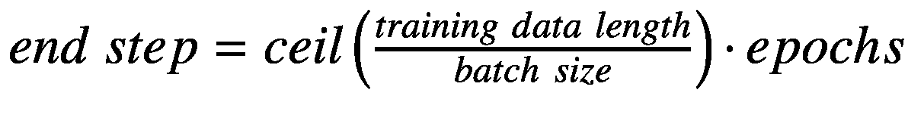。 (注意，Keras 中的默认批次大小为 32。)

这些参数将被传递到一个剪枝计划中（列表 4-9）。在这种情况下，我们使用多项式衰减，其中权重以多项式方式依次剪枝，使得剪枝权重的百分比从初始稀疏度增加到最终稀疏度。更新频率应该足够小，以便剪枝过程中稀疏度的每次增加都不太大，但足够大，以便网络有时间适应剪枝操作。在这种情况下，我们从 50%的稀疏度开始，目标是剪枝掉网络中的 95%的参数。

```py
from tfmot.sparsity.keras import PolynomialDecay as PD
schedule = PD(initial_sparsity=0.50,
final_sparsity=0.95,
begin_step=0,
end_step=end_step,
frequency=128)
Listing 4-9
Creating a polynomial decay schedule for pruning
```

TensorFlow 模型优化还提供了`ConstantSparsity`计划（`tfmot.sparsity.keras.ConstantSparsity`），在整个训练过程中保持恒定的稀疏度。与缓慢增加剪枝参数的百分比不同，恒定稀疏度在整个训练过程中保持相同的稀疏度。这可能更适合简单的任务，尽管多项式衰减通常更受欢迎，因为它允许网络适应剪枝参数。

这个计划可以传递到一个参数字典中（见列表 4-10）。这个参数字典被展开并使用，连同要剪枝的模型一起，作为 `sparsity.prune_low_magnitude` 函数的参数，该函数自动剪除低幅度的权重。

```py
pruning_params = {
'pruning_schedule': schedule
}
pruned_model = tfmot.sparsity.keras.prune_low_magnitude(model, **pruning_params)
Listing 4-10
Creating a pruned model with pruning parameters. If you are unfamiliar, the ** kwargs syntax in Python passes the dictionary keys and values as parameter inputs to a function
```

回想一下，在剪枝之前，模型应该在大数据集上充分训练。然而，我们的剪枝模型基于已经预训练的原始未剪枝模型，权重已经转移。如果你不进行预训练，剪枝可能不会得到更好的结果。

这个模型可以像标准的 Keras 模型一样处理。在训练之前，它需要像任何 Keras 模型一样进行编译（见列表 4-11）。

```py
pruned_model.compile(loss='categorical_crossentropy',
optimizer='adam',
metrics=['accuracy'])
Listing 4-11
Compiling a pruned model
```

要执行剪枝步骤，我们需要使用 `UpdatePruningStep()` 回调。这个回调可以在拟合过程中使用（见列表 4-12）。

```py
update_pruning = tfmot.sparsity.keras.UpdatePruningStep()
pruned_model.fit(x_train, y_train,
epochs=15,
callbacks=[update_pruning])
Listing 4-12
Fitting a pruned model with the Update Pruning Step callback
```

在剪枝过程中，TensorFlow 模型优化自动添加参数以协助剪枝——每个参数都被屏蔽。如果你在这个阶段计算模型的参数数量，你会注意到它比原始参数数量显著更多。

要获得剪枝的成果，请使用 `tfmot.keras.sparsity.strip_pruning` 来移除剪枝训练过程的副作用：`pruned_model = tfmot.keras.sparsity.strip_pruning(pruned_model)`。这，连同标准的压缩算法，是体现压缩优势所必需的。

剪枝完成后，最好通过重新编译并在数据上再次拟合模型来微调模型（见列表 4-13）。

```py
pruned_model.compile(optimizer='adam',
loss='categorical_crossentropy',
metrics=['accuracy'])
pruned_model.fit(x_train, y_train, epochs=10)
Listing 4-13
Fine-tuning after a model has been pruned
```

在微调后，你可以评估 `pruned_model` 的性能，以了解性能的下降和压缩以及成本的改善。

如果你想保存模型，请调用 `pruned_model.save(filepath)`。在重新加载时，确保你在 `tfmot.sparsity.keras.prune_scope` 范围内重新加载模型，这允许反序列化保存的模型（见列表 4-14）。

```py
with tfmot.sparsity.keras.prune_scope():
pruned_model = keras.models.load_model(filepath)
Listing 4-14
Fine-tuning after a model has been pruned
```

如果你只保存权重（`model.save_weights()`），读取通过模型检查点回调剪枝的模型，或使用保存的模型（`tf.saved_model.save(model, filepath)`），在剪枝范围内进行反序列化是不必要的。

#### 剪枝单个层

回想一下，当剪枝整个模型时，我们在整个模型上调用 tfmot.keras.`sparsity.prune_low_magnitude()`。剪枝单个层的一种方法是在编译单个层时调用 tfmot.keras.`sparsity.prune_low_magnitude()`。这与功能 API 和顺序 API 中的层对象兼容。

在这个示例神经网络中，我们在输入层之后和输出层之前剪除了除了第一个和最后一个 Dense 层之外的所有层（见列表 4-15）。在选择要剪枝的层时，应避免大胆地剪枝负责特征提取的初始层和对于模型知识构建能力至关重要的层。

```py
from tfmot.sparsity.keras import prune_low_magnitude as plm
pruned_model = keras.Sequential()
pruned_model.add(L.Input((784,)))
pruned_model.add(L.Dense(2**9))
pruned_model.add(plm(L.Dense(2**8), **pruning_params))
pruned_model.add(plm(L.Dense(2**7), **pruning_params))
pruned_model.add(plm(L.Dense(2**6), **pruning_params))
pruned_model.add(plm(L.Dense(2**5)))
pruned_model.add(L.Dense(10, activation='softmax'))
Listing 4-15
Pruning individual layers by adding wrappers around layers. Activations are left out for the purpose of brevity
```

独立剪枝层的优点在于你可以为不同的层使用不同的剪枝计划，例如，通过不那么雄心勃勃地剪枝那些初始参数较少的层。然后，你可以像之前讨论的那样使用 `UpdatePruningStep()` 回调来编译和拟合模型，并在之后进行微调。

然而，这种方法选择要剪枝的层的缺点是，在剪枝之前你不能进行任何预训练，因为层从定义时起就被包裹在剪枝包装器中。这导致的结果比模型在剪枝前在数据上预训练的要差。为了在已经训练好的模型上选择特定的层进行剪枝，我们需要使用 `keras.models.clone_model(model)` 和一个克隆函数来 *克隆* 模型。克隆函数将每个层映射到另一个层；在这种情况下，我们可以将我们要剪枝的层映射到该层的剪枝版本（见图 4-5）。

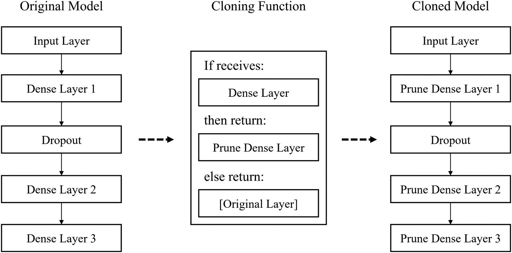

图 4-5

选择要剪枝的层的克隆函数方法

让我们构建一个克隆函数，该函数要么将一个层映射到其剪枝版本，要么如果我们不希望对其执行剪枝，则返回原始层（见列表 4-16）。你可以有很多种方式来选择要量化的层；你可以剪枝某些类型的层，按名称剪枝，按其在网络中的位置等。如果一个层满足剪枝的条件，我们返回被剪枝包装器包裹的层。否则，我们返回未受影响的原始层。

```py
def cloning_func(layer):
# is it a Dense layer?
if isinstance(layer, keras.layers.Dense):
return plm(layer)
# does it have a certain name?
if layer.name == 'dense5':
return plm(layer)
# if does not meet any conditions for pruning
return layer
Listing 4-16
Defining a cloning function to map a layer to the desired state
```

使用此函数，我们可以在克隆原始模型时将其作为克隆函数传递来注释模型（见列表 4-17）。

```py
pruned_model = keras.models.clone_model(
model,
clone_function = cloning_func
)
Listing 4-17
Using the cloning function with Keras’ clone_model function
```

然后，像往常一样编译和拟合（使用 Update Pruning Step 回调）。

### 理论深度学习中的剪枝：彩票假设

剪枝不仅对于模型压缩的目的非常重要，而且在推进深度学习的理论理解方面也非常重要。Jonathan Frankle 和 Michael Carbin 2019 年的论文“彩票假设：寻找稀疏、可训练的神经网络”^(2) 建立在剪枝的实证成功之上，提出了彩票假设，这是一个理论假设，重新定义了我们看待神经网络知识表示和学习的方式。

剪枝已经证明，神经网络的参数数量可以减少 90%以上，而对性能指标的影响很小。然而，剪枝的一个先决条件是必须在大型模型上执行剪枝；与剪枝网络大小相同的小型训练网络仍然不会像剪枝网络那样表现良好。观察到的剪枝的一个关键组成部分是*减少*的元素；知识必须首先由大型模型学习，然后迭代地减少到更少的参数。不能从一个模仿剪枝模型架构的架构开始，并期望得到与剪枝模型相当的结果。这些发现是抽签假设的经验动机。

抽签假设（Lottery Ticket Hypothesis）表明，初始化的网络中包含子网络，当单独训练时，可以达到与原始网络相似的训练量下的性能。这些获胜的子网络被称为“中奖彩票”。在 Frankle 和 Carbin 的论文中正式提出如下：

> *一个随机初始化的密集神经网络包含一个子网络，其初始化方式使得——当单独训练时——它可以在最多相同数量的迭代后匹配原始网络的测试精度.*

抽签假设的主要贡献在于解释了权重初始化在神经网络发展中的作用：以方便的初始化值开始的权重被优化器“选中”并“发展”成在最终训练网络中扮演有意义角色的作用。随着优化器确定如何更新某些权重，神经网络中的某些子网络被委派承担大部分信息流，仅仅是因为它们的初始化权重是正确的值，可以激发增长。另一方面，以较差的初始化值开始的权重被降低为不便和多余的权重；这些是“输掉彩票”的，在剪枝中被剪掉。剪枝揭示了包含“中奖彩票”的架构。神经网络正在进行巨大的抽奖；获胜者被放大，失败者被削弱。

你可以从这个角度将神经网络想象成一个巨大的包裹，里面有一个微小的有价值的产品和很多填充物。大部分的价值在于实际包裹中一小部分，但首先你需要这个包裹来找到里面的产品。一旦你有了产品，就不再需要盒子了。相应地，鉴于初始化值对于网络的成功至关重要，你可以用相同的相应初始化值重新训练剪枝后的模型架构，并获得与原始网络相似的性能。

这个假设重新定义了我们看待神经网络训练过程的方式。机器学习模型的传统观点一直是，模型从一组“坏”参数（“初始猜测”）开始，通过找到使损失函数最大程度减少的更新来迭代地改进。然而，随着现代神经网络的大规模和可能的“过参数化”，彩票抽签假设暗示了一种新的理解训练的逻辑：学习主要是一个不仅包括 *改进* 而且包括 *搜索* 的过程。通过交替寻找有希望的子网络和改进有希望的子网络以使其更有希望，开发出有希望的子网络。这种理解参数更新的新视角，在现代深度学习的广阔背景下，可能会推动理论理解和实践发展的进一步创新。例如，我们现在理解到权重的初始化在子网络的成功中起着关键作用，这可能会引导进一步的研究，以了解权重初始化如何与训练好的子网络性能相互作用。

彩票抽签假设解释了深度学习中的许多观察到的现象，而不仅仅是剪枝的成功和动态。

+   经常观察到，增加神经网络的参数化会导致性能提升。彩票抽签假设告诉我们，过参数化并不一定与更强的预测能力内在地相关联，但具有更多参数的网络能够运行更大的彩票，从而产生更好和更多的中奖彩票。如果彩票抽签假设是正确的，它可能为我们如何提高中奖彩票的质量提供了一个指南，而不是通过 brute-force 增加彩票操作的大小。

+   观察到，将所有权重初始化为 0 的表现远不如其他随机化权重的初始化方法。彩票抽签假设告诉我们，网络依赖于多样化的初始随机权重来选择某些中奖彩票。如果所有权重都是 0，网络就无法从一开始就区分有希望的子网络。

因为剪枝去除了“失去的彩票”，Frankle 和 Carbin 提出了一种基于剪枝的方法来识别中奖彩票：

1.  随机初始化一个神经网络。

1.  训练神经网络直到收敛。

1.  在训练好的神经网络中剪除 *p*% 的参数。

1.  将未剪枝的参数重置为其原始初始化值。

彩票抽签假设以及无疑将指导我们对神经网络的理解进一步的理论进步，基于模型压缩中观察到的现象，将继续作为加速我们模型构建方法改进的垫脚石。

## 量化

虽然剪枝减少了参数的数量，但量化降低了每个参数的精度。因为每个经过量化的参数都变得不那么精确，整个模型所需的存储空间减少，并且延迟降低。使用 TensorFlow 模型优化实现量化的过程与实现剪枝的过程非常相似。

### 量子化理论与直觉

传统上，神经网络使用 32 位来表示参数；虽然这在现代深度学习环境中是可行的，因为它们有足够的计算能力来使用这种精度，但在需要较低存储和更快预测的应用中则不可行。在量化中，参数从 32 位表示减少到 8 位整数表示，导致内存需求减少四倍。

在数学中，量化是将连续值集映射到较小离散值集的过程（见图 4-6）。在深度学习中，量化是指通过类似方法可以用来降低参数精度的广泛方法。通常，这是通过将值分离到信息桶中实现的。在二进制量化中，值被量化到两个桶中；在三元量化中，值被量化到三个桶中。然而，二进制和三元量化可能过于极端，这就是为什么大多数部署的模型采用多比特到多比特的量化方法。这些桶如何放置，每个桶有多大，以及其他执行此映射的参数，取决于所使用的量化策略。

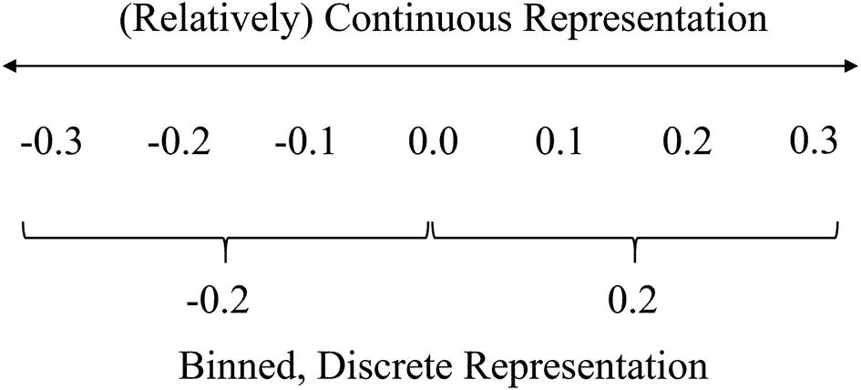

图 4-6

连续与离散（分箱）表示

（你可以将基于幅度的剪枝视为一种选择性的量化形式，其中幅度小于某个阈值的权重被“量化为 0”，而其他权重则被分箱到它们自己。）

回想一下剪枝的居住空间类比。与其直接从你的居住空间中移除某些物品，不如想象通过稍微降低每个物品的维护成本。你决定将电视订阅降级到较低等级，减少灯光的电力消耗，每周点外卖一次而不是两次或三次，以及其他将你的体验成本“四舍五入”的调整。

后处理量化是在模型训练后对其进行的量化过程。虽然这种方法通过降低延迟的优势实现了良好的压缩率，但通过量化在每个权重中执行的小近似所积累的错误会导致性能显著下降。

就像剪枝的迭代方法一样，量化通常不会一次性在整个网络上执行——这种变化太剧烈，就像一次性剪掉网络 95% 的参数一样，不利于恢复。相反，在模型预训练后——理想情况下，预训练会开发出有意义的、鲁棒的表示，这些表示可以帮助模型从压缩中恢复——模型会经历量化感知训练，或 QAT（图 4-7）。

在整个量化感知训练过程中，模型本身保持未量化，用标准的 32 位表示其所有参数。然而，引入了量化误差以供考虑：在网络的前馈阶段，网络的输出与网络已经量化的输出相同。也就是说，在做出任何预测之前，网络会经历“模拟量化”——为了预测，其参数被量化。这种模拟量化输出用于更新模型参数，这些参数仍然是未量化的。因此，尽管在量化感知训练过程中模型本身保持未量化，但它学会了开发在模型量化时将成功的参数。模型保持未量化，因为使用更精确的参数更新模型参数要容易得多。

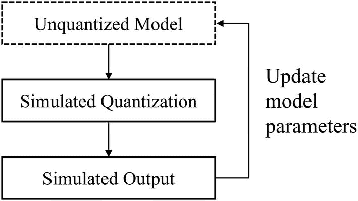

图 4-7

量化感知训练

在量化感知训练之后，模型正式进行量化——其参数被分类，并使用 8 位整数表示（或根据实现方式的其他表示）。由于量化感知训练的准备，模型应该已经开发出在量化时鲁棒且成功的参数（图 4-8）。

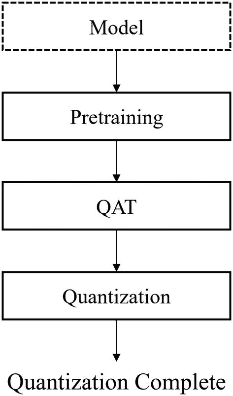

图 4-8

量化过程

通过量化，可以显著降低模型存储需求和延迟，而对性能的影响很小。

### 量化实现

就像在剪枝中一样，你可以量化整个模型或独立量化层。

#### 量化整个模型

量化需要预训练以获得最佳性能。让我们首先在 MNIST 数据上对一个大型的基模型进行 15 个周期的拟合（代码列表 4-18）。

```py
import keras
import keras.layers as L
model = keras.Sequential()
model.add(L.Input((784,)))
for i in list(range(5,10))[::-1]:
model.add(L.Dense(2**i, activation='relu'))
model.add(L.Dense(2**i, activation='relu'))
model.add(L.Dense(10, activation='softmax'))
model.compile(optimizer='adam',
loss='categorical_crossentropy',
metrics=['accuracy'])
model.fit(x_train, y_train, epochs=15)
Listing 4-18
Base model for MNIST data; this will be used for applying quantization
```

这个特定的模型在训练中获得了 0.0387 的训练损失和 0.9918 的训练准确率。在评估中，它得到了 0.1513 的损失和 0.9720 的准确率。这种训练和测试性能之间的差异表明，某种压缩方法可能适用于此处。

要在整个模型上执行量化感知训练，从`tfmot.quantization.keras`导入`quantize_model`函数并将其应用于模型（见列表 4-19）；这会对每个层执行“量化标注”，允许进行量化感知训练。因为这将优化器从模型中移除，所以我们需要重新编译它。

```py
from tfmot.quantization.keras import quantize_model
qat_model = quantize_model(model)
qat_model.compile(optimizer='adam',
loss='categorical_crossentropy',
metrics=['accuracy'])
Listing 4-19
Setting up Quantization Aware Training
```

调用`quantized_model.evaluate(x_test, y_test)`，您会发现模型的性能不佳。就像适应新的居住空间一样，我们需要在量化模型上进行一些额外的训练。在进行这种额外的微调时，请确保您有一个高批量大，并且训练少量 epoch（见列表 4-20）。在低精度训练中，小批量大导致权重更新过于激进，损失值无法恢复。几轮大批量训练应该足以使模型指向良好的性能。

```py
qat_model.fit(x_train, y_train,
batch_size=512,
epochs=3)
Listing 4-20
Performing Quantization Aware Training
```

现在，模型是**量化感知**的，这意味着它拥有量化的必要设施，但技术上并未量化。为了获得量化的好处，我们需要将模型转换为 TFLite 模型，这是 TensorFlow 为轻量级应用提供的解决方案（见列表 4-21）。

```py
converter = tf.lite.TFLiteConverter.from_keras_model(
qat_model)
converter.optimizations = [tf.lite.Optimize.DEFAULT]
quantized_tflite_model = converter.convert()
Listing 4-21
Converting to TFLite model to actually quantize model
```

然后，我们可以保存并压缩我们的 TFLite 模型以查看存储优势（见列表 4-22）。

```py
# store TFLite model
with open('model.tflite', 'wb') as f:
f.write(quantized_tflite_model)
# zip the file the model is stored in
_, zippedfile = tempfile.mkstemp(".zip")
with zf.ZipFile(zippedfile, "w",
compression=zf.ZIP_DEFLATED) as f:
f.write('model.tflite')
# output size of model
str(os.path.getsize(zippedfile) / float(2 ** 20)) + ' MB'
Listing 4-22
Realizing storage benefits from TFLite model
```

就像剪枝模型一样，您可以通过各种模型保存和权重保存方法将模型存储到文件路径。如果您通过直接保存整个模型来加载权重，请确保在`tfmot.quantization.keras.quantize_scope`的作用域下重新加载模型。

#### 量化单个层

就像在剪枝中一样，量化单个层具有特异性的优势，因此性能下降较小，但代价是压缩效果可能不如完全量化的模型。

在选择哪些层可以量化时，您可以使用`tfmot.quantization.keras.quantize_annotate_layer`，您可以在使用 Sequential 或 Functional API 时将其包装在层周围，就像`prune_low_magnitude()`一样。在量化单个层时，尽量量化较晚的层而不是初始层。

如果您正在部署量化模型，请记住，某些后端可能只支持完全量化的模型。在这种情况下，您可能希望量化整个模型而不是选择某些层进行量化（见列表 4-23）。

```py
from tfmot.quantization.keras import quantize_annotate_layer as qal
annotated_model = keras.Sequential()
annotated_model.add(L.Input((784,)))
annotated_model.add(qal(L.Dense(2**9)))
annotated_model.add(L.Activation('relu'))
annotated_model.add(qal(L.Dense(2**8)))
annotated_model.add(L.Activation('relu'))
annotated_model.add(qal(L.Dense(2**7)))
annotated_model.add(L.Activation('relu'))
annotated_model.add(L.Dense(2**6, activation='relu'))
annotated_model.add(L.Dense(2**5, activation='relu'))
annotated_model.add(L.Dense(10, activation='softmax'))
Listing 4-23
Quantizing individual layers by wrapping quantization annotations to individual layers while defining them
```

注意，到目前为止，您应用了`quantize_annotate_layer`的层只是进行了标注。要将它们转换为实际量化的层，我们需要使用`quantize_apply`（见列表 4-24）。

```py
from tfmot.quantization.keras import quantize_apply
quantized_model = quantize_apply(annotated_model)
Listing 4-24
Applying quantization to the annotated layers
```

当使用`quantize_model`对整个模型进行量化时，不需要`quantize_apply`函数，因为`quantize_model`函数充当一个“快捷方式”，自动标注并应用于通用情况下的量化（即不需要通过量化特定层进行定制）。

该模型可以使用之前讨论过的相同训练原则进行编译和拟合——即少量 epoch，大批次大小。

就像在剪枝中一样，选择要量化的层的首选方法是定义一个克隆函数并使用`keras.models.clone_model(model)`（列表 4-25）。

```py
def cloning_func(layer):
# is it a Dense layer?
if isinstance(layer, keras.layers.Dense):
return qal(layer)
# does it have a certain name?
if layer.name == 'dense5':
return qal(layer)
# if does not meet any conditions for quantization
return layer
Listing 4-25
Defining a quantization annotation cloning function
```

使用此函数，我们可以在克隆原始模型时将其作为克隆函数传递来注释模型（列表 4-26）。

```py
annotated_model = keras.models.clone_model(
model,
clone_function = cloning_func
)
Listing 4-26
Applying the cloning function to a (pretrained) base model
```

然后，将`quantize_apply`函数应用于已注释的模型，并像平常一样进行编译和拟合。

## 权重聚类

权重聚类是一种虽然不太流行但仍然极其有价值且简单的模型压缩方法（图 4-9）。

### 权重聚类理论与直觉

权重聚类在特性上结合了剪枝和量化——它通过略微调整每个权重值来减少*唯一*权重的数量。给定用户指定的聚类数量*n*，权重聚类算法将每个权重值分配到一个聚类，并将权重值设置为该权重值的质心（图 4-9）。

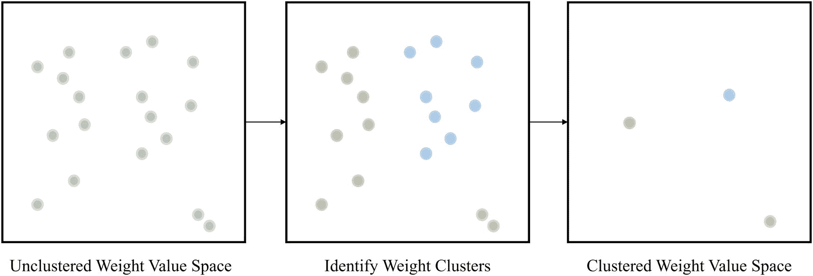

图 4-9

权重聚类

属于同一聚类的权重都共享相同的值，从而允许更有效的存储方式。类似于量化，存储需求的减少是一个精度问题；每个参数的精确值可以被关联的质心值的索引所替代。这些精确值可以存储在一个可索引的质心值列表中（图 4-10）。（注意，即使不使用这种质心索引方法，压缩算法也能利用重复值。）

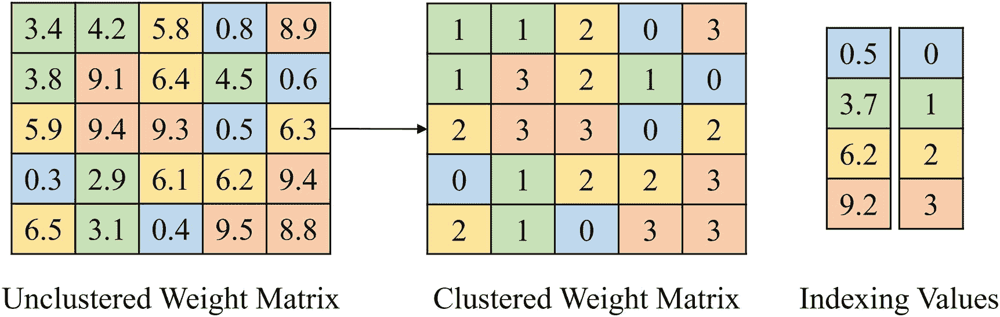

图 4-10

通过索引进行权重聚类

权重聚类中的关键参数是确定聚类数量。就像剪枝参数的百分比一样，这是一个在性能和压缩之间的权衡。如果聚类数量非常高，每个参数从其原始值到分配给质心的值的改变非常小，这允许有更高的精度和更容易从压缩操作中恢复。然而，它通过增加存储需求来减少压缩结果，包括存储质心值和可能索引本身。另一方面，如果聚类数量太小，模型的性能可能会受到严重影响，以至于无法恢复——可能根本不可能让一个模型在一定的固定参数集下合理地运行。

### 权重聚类实现

就像剪枝和量化一样，你可以对整个模型的权重或单个层的权重进行聚类。

#### 整个模型上的权重聚类

就像剪枝和量化一样，权重聚类需要一个预训练的`model`。为了在模型上执行权重聚类，我们首先需要提供聚类参数。有两个关键参数需要提供：簇的数量和质心初始化方法。尽管在这个例子中选择的初始化方法是基于密度的采样，但您也可以使用`CentroidInit.LINEAR`，其中簇质心在最小值和最大值之间均匀分布；`CentroidInit.RANDOM`，其中质心从最小值和最大值之间的均匀分布中随机采样；以及`CentroidInit.KMEANS_PLUS_PLUS`，它使用 K-means++算法（见列表 4-27）。

```py
CentroidInit = tfmot.clustering.keras.CentroidInitialization
clustering_params = {
'number_of_clusters': 30,
'cluster_centroids_init': CentroidInit.DENSITY_BASED
}
Listing 4-27
Defining clustering parameters
```

要对整个模型进行聚类，请使用`tfmot.clustering.keras`中的`cluster_weights()`函数并指定参数（见列表 4-28）。

```py
from tfmot.clustering.keras import cluster_weights
clustered_model = cluster_weights(model, **clustering_params)
Listing 4-28
Creating a weight-clustered model with the specified clustering parameters
```

然后，可以将权重聚类的模型编译并在原始数据上拟合以进行微调。

为了实现聚类的压缩优势，使用`strip_clustering()`清除模型中任何来自权重聚类的痕迹（见列表 4-29）。

```py
from tfmot.clustering.keras import strip_clustering
final_model = strip_clustering(clustered_model)
Listing 4-29
Stripping clustering artifacts to realize compression benefits after fitting
```

然后，将代码转换为 TFLite 模型，并评估压缩后的 TFLite 模型的大小以查看存储大小的减少。您还可以通过使用我们在剪枝部分定义的函数来评估模型的延迟，但请确保通过编译重新附加一个优化器。

就像经过剪枝和量化的模型一样，您可以通过多种模型保存和权重保存方法将权重聚类的模型存储到文件路径。如果您通过直接保存整个模型来加载权重，请确保在`tfmot.clustering.keras.cluster_scope`的作用域下重新加载模型。

#### 单个层的权重聚类

单个层的权重聚类遵循与单个层的剪枝和量化相同的语法，但使用`tfmot.clustering.keras.cluster_weights`而不是`tfmot.quantization.keras.quantize_apply`或`tfmot.sparsity.prune_low_magnitude`。像这些其他压缩方法一样，您可以在架构构建过程中对每个层应用权重聚类，或者作为克隆现有模型时的克隆函数。后一种将压缩方法应用于单个层的过程更受欢迎，因为它允许方便地进行预训练和微调。

## 协同优化

通常，使用压缩方法单独使用可以获得良好的结果。然而，当这些压缩方法结合使用时，可以实现更好的性能和更高的压缩率：协同优化的基本思想是压缩方法可以串联起来，这样每种方法都可以以独特的方式压缩模型，从而实现比仅应用一个（按比例缩放）压缩方法更成功的整体压缩（图 4-11）。深度学习的实际部署几乎总是采用协同优化，而不是单独使用一种压缩方法。

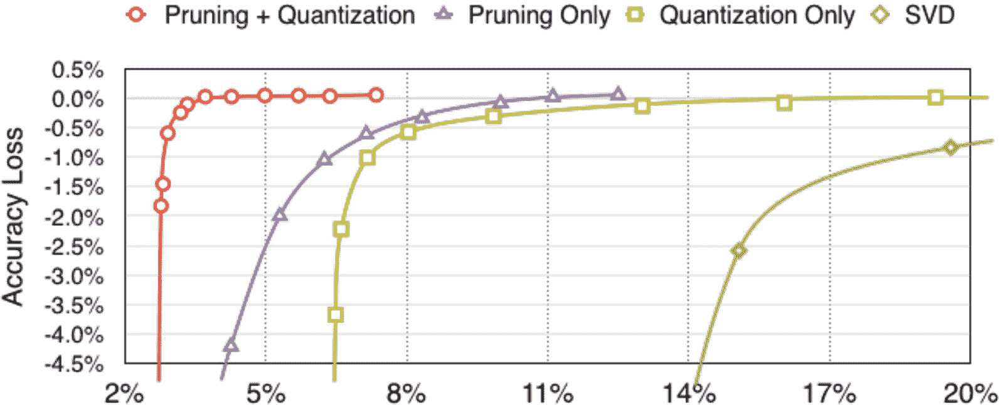

图 4-11

压缩后模型大小比与压缩方法引起的精度损失之间的关系。对于一定的精度损失，剪枝+量化能够在压缩后实现比仅剪枝或仅量化更小的模型大小比。奇异值分解（SVD）是另一种模型压缩技术，其成功程度不如剪枝和量化

在讨论过的三种压缩方法中，存在三种两种方法的组合：

+   量化与权重聚类，或聚类保持量化

+   量化与剪枝，或稀疏性保持量化

+   剪枝和权重聚类，或稀疏性保持聚类

这些方法的命名具有重要意义，因为它暗示了这些操作应用的特定顺序。例如，如果我们应用权重聚类和量化，那么首先应用权重聚类然后是量化，而不是相反，将是最佳选择。在使用协同优化时，通常存在一个“操作顺序”：

```py
pruning, weight clustering, quantization
```

这些顺序排列得尽可能减少每种压缩方法对其他压缩方法的干扰。例如，剪枝和权重聚类需要相对高精度的信息，如果首先进行量化，将会严重破坏这个过程。剪枝依赖于存在一个广泛、多样化的参数集来排名和选择；如果在剪枝之前进行权重聚类，将会显著减少值的多样性，从而破坏剪枝的有效性（图 4-12）。

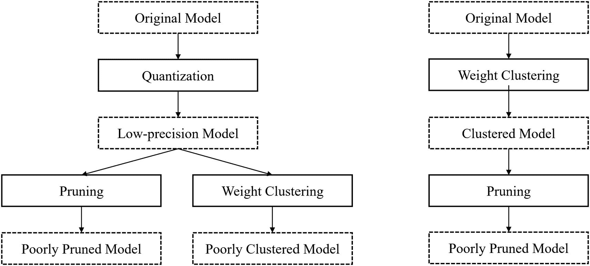

图 4-12

模型压缩方法应用顺序对协同优化模型性能的影响。在剪枝或权重聚类之前进行量化，以及在剪枝之前进行权重聚类，会削弱第二种压缩方法的效果，因此是一个低效的过程

然而，在应用协同优化时，你不能简单地逐个应用方法。即使我们有“操作顺序”来优化链式方法的性能，在实践中添加一个额外的压缩方法会严重削弱前一个方法的效果（图 4-13）。例如，考虑权重聚类和剪枝——剪枝将剪枝参数设置为零，但权重聚类将参数设置为它们的质心值。因此，如果在剪枝之后进行权重聚类，许多被剪枝的参数将“未剪枝”，因为它们被设置为非零质心值。

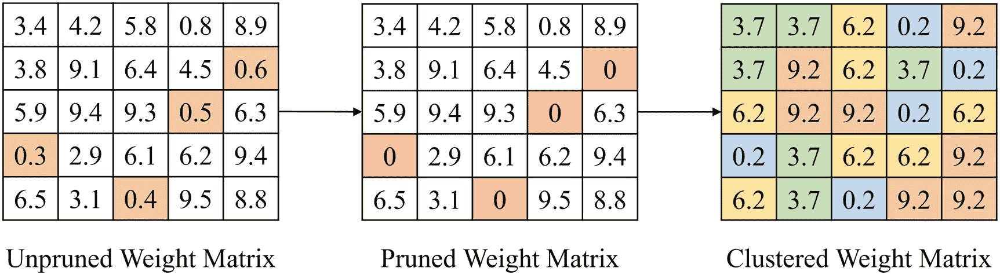

图 4-13

在剪枝后不使用稀疏性保留聚类进行权重聚类的撤销效果。尽管在这种情况下差异很小，但它可以显著放大每个权重矩阵的差异，从而对剪枝效果造成巨大损害。

因此，需要专门的量化聚类版本来执行各自的压缩方法，同时保持前一个方法的压缩效果（图 4-14）。

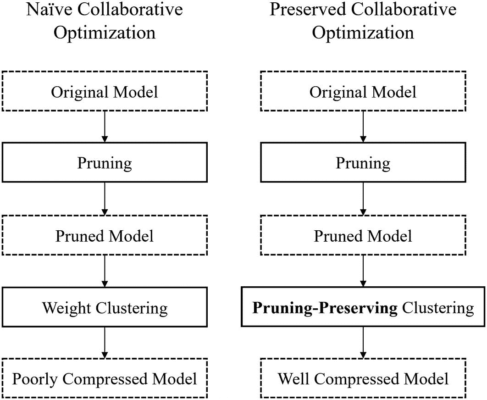

图 4-14

在协同优化中保持模型压缩的重要性

### 保留稀疏性的量化

在保留稀疏性的量化中，剪枝后跟量化（图 4-15）。

使用在剪枝部分之前讨论的代码和方法，获得一个`pruned_model`。你可以使用之前定义的测量指标来验证剪枝过程是否成功。使用`strip_pruning`函数（`tfmot.sparsity.keras.strip_pruning`）从剪枝过程中移除痕迹；这是进行量化的必要条件。

记住，为了对模型进行量化感知训练，你使用了`quantize_model()`函数，然后编译和拟合了模型。然而，进行剪枝保留的量化感知训练需要额外的步骤。`quantize_annotate_model()`函数不是真正量化模型，而是提供注释，表明整个模型应该进行量化。`quantize_annotate_model()`用于对量化过程进行更具体的定制，而`quantize_model()`可以被视为“默认”量化方法。（你可能还同样记得，`quantize_annotate_layer()`用于另一种特定的定制——层特定量化。）

在整个模型完成注释后，我们使用`quantize_apply()`函数对注释的模型进行实际量化。在此函数中，我们可以指定保留另一种压缩方法——在这种情况下，剪枝。这是通过传递一个`tfmot.experimental.combine`对象来指定的，该对象表示在“组合”或“协同”时需要保留的压缩方法。然后，可以像往常一样编译和拟合剪枝保留的量化感知训练模型。


图 4-15

与稀疏性保持量化协同优化

完整的代码如下（代码列表 4-30）。

```py
# removing pruning artifacts for quantization
from tfmot.pruning.keras import strip_pruning
pruned_model = strip_pruning(pruned_model)
# annotate entire model
from tfmot.quantization.keras import quantize_annotate_model
annot_quant_model = quantize_annotate_model(pruned_model)
# specify combining method (pruning)
from tfmot.experimental.combine import Default8BitClusterPreserveQuantizeScheme as preserve_pruning
# apply quantization to annotated model
from tfmot.quantization.keras import quantize_apply
pqat_model = quantize_apply(annot_quant_model,
preserve_pruning())
# compile and fit
pqat_model.compile(...)
pqat_model.fit(...)
Listing 4-30
Performing sparsity preserving quantization after pruning
```

### 保持聚类量化

在保持聚类量化中，权重聚类后跟随量化（图 4-16）。

使用在“权重聚类”部分之前讨论的代码和方法，获取一个`clustered_model`。从这里开始，过程几乎与稀疏性保持量化相同：在从`clustered_model`中去除聚类痕迹后，注释模型并使用`quantize_apply`对注释的层进行量化。在指定`quantize_apply`中要保留的压缩方法时，使用`Default8BitClusterPreserveQuantizeScheme`而不是`Default8BitPrunePreserveQuantizeScheme`。

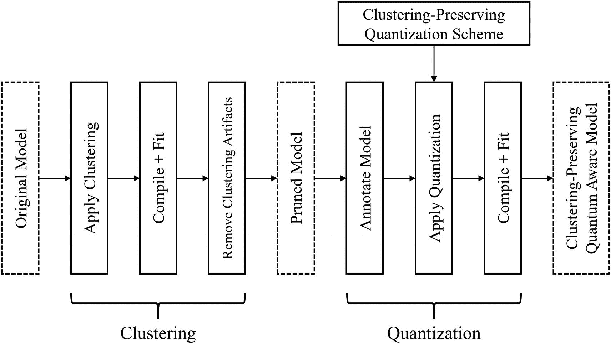

图 4-16

与保持聚类量化的协同优化

### 稀疏性保持聚类

在稀疏性保持聚类中，剪枝后跟随权重聚类（图 4-17）。

稀疏性保持聚类过程与保持聚类量化和稀疏性保持量化略有不同。

使用在剪枝部分之前讨论的代码和方法，获取一个`pruned_model`。使用`strip_pruning`去除剪枝痕迹。

我们需要导入`cluster_weights`函数以执行权重聚类；之前，我们从`tfmot.clustering.keras.cluster_weights`中导入它。然而，为了使用稀疏性保持聚类，我们需要从不同的地方导入该函数：从`tensorflow_model_optimization.python.core.clustering.keras.experimental.cluster`导入`cluster_weights`。

现在，我们可以提供权重聚类参数，就像之前一样，增加一个额外的“`preserve_sparsity`”参数（代码列表 4-31）。

```py
# specify centroid initialization style
from tfmot.clustering.keras import CentroidInitialization
CentroidInit = CentroidInitialization.DENSITY_BASED
# put clustering parameters into dictionary
clustering_params = {'number_of_clusters': 8,
'cluster_centroids_init': CentroidInit,
'preserve_sparsity': True}
Listing 4-31
Defining clustering parameters with sparsity preservation marked
```

然后，将`cluster_weights`函数应用于去除了剪枝痕迹的模型，并带有聚类参数，然后编译和拟合（代码列表 4-32）。

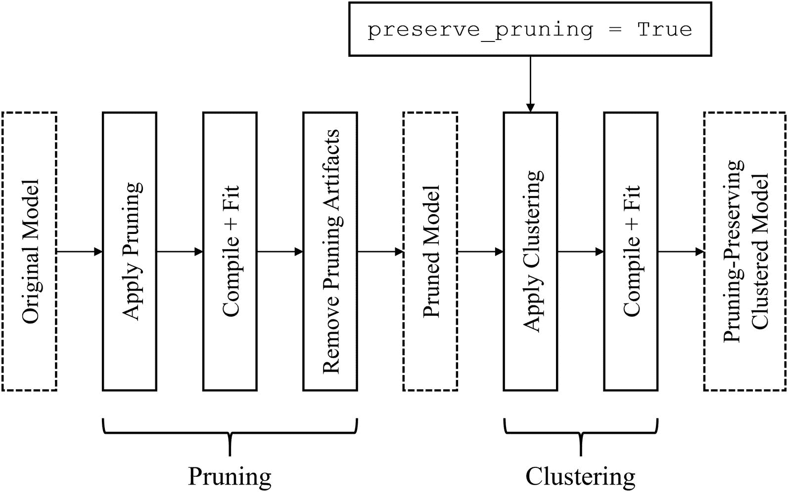

图 4-17

与稀疏性保持聚类协同优化

```py
# create sparsity preserving clustering model
spc = cluster_weights(pruned_model, **clustering_params)
# compile and fit
spc.compile(...)
spc.fit(...)
Listing 4-32
Performing sparsity preserving clustering after pruning
```

## 案例研究

在这些案例研究中，我们将介绍对这些压缩方法以及所提出方法的变体进行实验的研究，以进一步具体探索模型压缩。

### 极端协作优化

2016 年由 Song Han、Huizi Mao 和 William J. Dally 发表的论文“深度压缩：使用剪枝、训练量化 Huffman 编码压缩深度神经网络”^(3）在协作优化方面是一个重要的飞跃。

论文提出了一种三阶段压缩管道：剪枝、权重聚类和量化（作为一个方法组合在一起），以及 Huffman 编码（图 4-18）。此压缩管道逐步压缩了像 AlexNet 和 VGG-16 这样的大型模型，在 ImageNet 数据集上压缩了 35 到 49 倍，而没有损失任何准确度。此外，延迟降低了三到四倍，能效提高了三到七倍。通过按此顺序链式连接压缩方法，压缩方法之间相互干扰最小，从而实现了令人惊讶的大压缩：

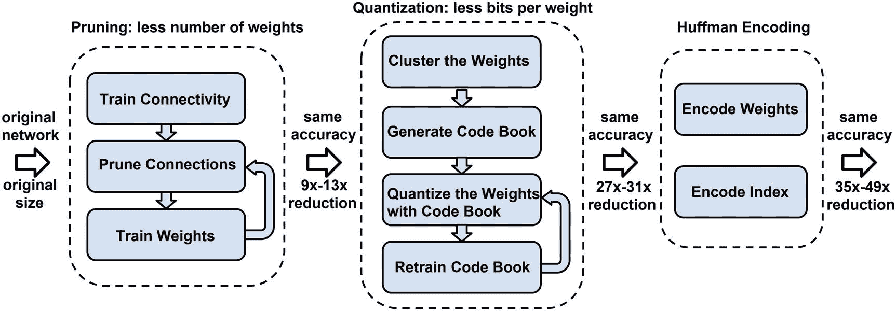

图 4-18

剪枝、权重聚类、量化和 Huffman 编码之间的协作优化

1.  请记住，剪枝最好作为一个迭代过程来执行，在这个过程中，会剪断连接，并在这些剪断的连接上微调网络。在这篇论文中，剪枝将模型大小减少了 9 到 13 倍，而没有降低准确度。

1.  请记住，权重聚类是通过聚类具有相似值的权重并将权重设置为各自的质心值来执行的，而量化是通过训练模型以适应更低精度的权重来执行的。剪枝后的权重聚类与量化相结合，将原始模型大小减少了 27 到 31 倍。

1.  Huffman 编码是一种由计算机科学家 David A. Huffman 在 1952 年提出的压缩技术。它允许进行无损数据压缩，用更少的位表示更常见的符号。Huffman 编码与之前讨论的模型压缩方法不同，因为它是一个训练后压缩方案；也就是说，该方案要成功工作不需要对模型进行微调。Huffman 编码允许进行进一步的压缩——最终模型压缩到其原始大小的 35 到 49 倍。

此压缩管道成功地将大型架构压缩了数十倍，对错误率的影响很小，这是一个令人难以置信的成就（表 4-1）。

表 4-1

在 MNIST 上对 LeNet 和 AlexNet 以及在 ImageNet 上对 VGG-16 模型的协作优化压缩模型的性能

| 网络 | Top 1 错误率 | Top 5 错误率 | 参数 | 压缩率 |
| --- | --- | --- | --- | --- |
| LeNet-300-100Compressed | 1.64%1.58% | – | 1070 KB27 KB | 40 times |
| LeNet-5 压缩版 | 0.80%0.74% | – | 1720 KB44 KB | 39 倍 |
| AlexNet 压缩版 | 42.78%42.78% | 19.73%19.70% | 240 MB6.9 MB | 35 倍 |
| VGG-16 压缩版 | 31.50%31.17% | 11.32%10.91% | 552 MB11.3 MB | 49 倍 |

Han、Mao 和 Dally 对协作优化的动态提供了重要的见解。例如，在量化之前进行剪枝并不会损害量化——经过剪枝和量化的模型性能几乎与仅经过量化的模型（当然，剪枝和量化的模型参数更少）相同（见图 4-19）。这展示了理想协作优化的一项关键特性：在多样化的压缩攻击中找到力量。通过链式连接一系列多样化的压缩方法，每种方法攻击不同的表示冗余，模型从所有“角度”去除了低效的表示，因此实现了更高的压缩率，同时仍然保持了良好性能所必需的基本设施。

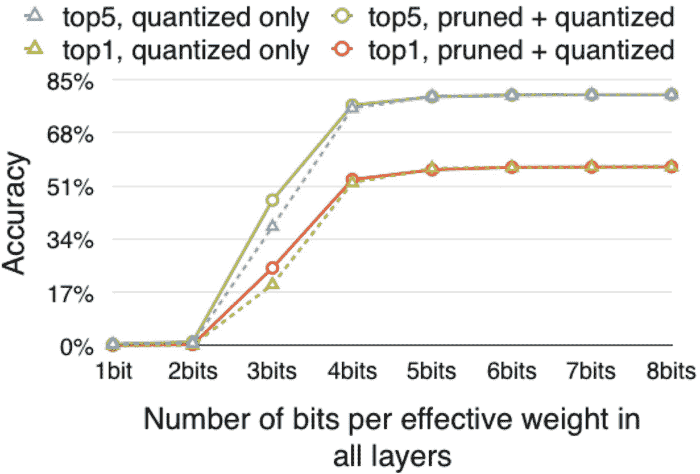

图 4-19

应用了各种压缩方法的模型性能

### 重新思考用于更深压缩的量化

回想一下，在进行量化时，使用量化感知训练来引导模型学习对量化具有鲁棒性的权重。这是通过在模型进行预测时模拟量化环境来实现的。

然而，量化感知训练提出了一个关键问题：因为量化有效地“离散化”或“分箱”了一个功能上“连续”的权重值，相对于输入的导数几乎在所有地方都是零，这给梯度更新计算带来了问题。为了解决这个问题，在实践中使用了一个直接通过估计器。正如其名称所暗示的，直接通过估计器估计离散化层的输出梯度为其输入梯度，而不考虑实际离散化层的实际导数。直接通过估计器适用于相对温和的量化（即之前实现的 8 位整数量化），但无法为更严重的压缩（例如 4 位整数）提供足够的估计。

为了解决这个问题，Angela Fan 和 Pierre Stock，以及 Benjamin Graham、Edouard Grave、Remi Gribonval、Herve Jegou 和 Armand Joulin 在他们题为“使用量化噪声进行极端模型压缩训练”的论文中提出了量化噪声^(4)，这是一种将压缩模型导向开发量化鲁棒权重的创新方法。

与在量化感知训练中模拟整个模型的量化不同，量化噪声模拟了*模型的一部分*的量化——在每个前向传递过程中，随机选择的一组权重被模拟量化（图 4-20）。这意味着大多数权重都使用更干净的梯度进行更新。

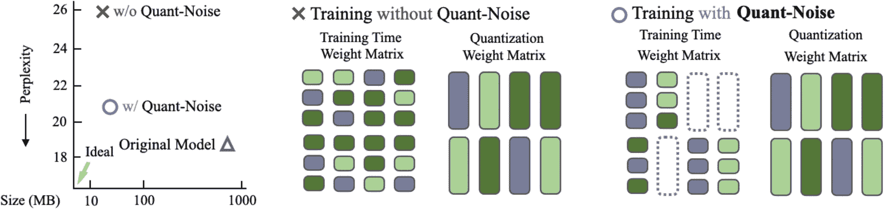

图 4-20

无量化噪声与有量化噪声的训练演示

量化噪声在量化感知训练中显著提高了低精度压缩方法在语言建模和图像分类领域的性能（表 4-2）。

表 4-2

语言建模任务：WikiText-103 上的 16 层 Transformer。图像分类：ImageNet 1k 上的 EfficientNetB3。“比较”指的是“压缩”。“PPL”指的是困惑度，它是 NLP 任务的指标（越低越好）。QAT 指的是量化感知训练；QN 指的是量化噪声。

| 量化方法 | 语言建模 | 图像分类 |
| --- | --- |
| 大小 | 比较 | PPL | 大小 | 比较 | Top 1 |
| --- | --- | --- | --- | --- | --- |
| 未压缩方法 | 942 | 1x | 18.3 | 46.7 | 1x | 81.5 |
| 4 位整数量化– 使用 QAT 训练– 使用 QN 训练 | 118118118 | 8x8x8x | 39.434.121.8 | 5.85.85.8 | 8x8x8x | 45.359.467.8 |
| 8 位整数量化– 使用 QAT 训练– 使用 QN 训练 | 236236236 | 4x4x4x | 19.621.018.7 | 11.711.711.7 | 4x4x4x | 80.780.880.9 |

虽然本章引入的定点标量量化方法，如`int8`量化，通过“舍入”降低了参数值的精度，但存在其他量化方法。Fan 和 Stock 还探讨了*乘积量化*上的量化噪声，这是一种将高维向量空间分解为几个分别量化的子空间的方法。与量化感知训练和迭代剪枝的原理类似，乘积量化最好迭代进行。这种迭代乘积量化（iPQ）方法通常比舍入到某些位精度获得更高的压缩率（表 4-3）。

表 4-3

带量化噪声的 iPQ 与未压缩模型的性能比较

| 量化方法 | 语言建模 | 图像分类 |
| --- | --- |
| 大小 | 比较 | PPL | 大小 | 比较 | Top 1 |
| --- | --- | --- | --- | --- | --- |
| 未压缩方法 | 942 | 1x | 18.3 | 46.7 | 1x | 81.5 |
| iPQ– 使用 QAT 训练– 使用 QN 训练 | 383838 | 25x25x25x | 25.241.220.7 | 3.33.33.3 | 14x14x14x | 79.055.780.0 |

### 负责任压缩：压缩模型忘记了什么？

当我们谈论压缩时，我们考虑的两个关键指标是模型性能和压缩因子。这两个指标通常平衡使用，以确定模型压缩操作的成功。我们经常看到压缩的增加伴随着性能的下降——但你是否想知道压缩过程牺牲了哪些*类型*的数据输入？泛化性能指标之下隐藏着什么？

在“压缩深度神经网络会忘记什么？”^(5)一文中，Sara Hooker 与 Aaron Courville、Gregory Clark、Yann Dauphin 和 Andrea Frome 一起调查了这个问题：压缩方法如何影响压缩模型被迫“忘记”的知识？Hooker 等人的发现表明，仅仅查看标准性能指标，如测试集准确率，可能不足以揭示压缩对模型真实泛化能力的影响。

修剪识别的示例（PIEs）是模型中修剪模型和未修剪模型预测之间高度不一致的输入定义。Hooker 等人发现，像测试集准确率这样的通用指标隐藏了有关修剪对模型泛化能力影响的重要信息；模型压缩方法如修剪*并不均匀地影响模型处理数据实例的能力，这些数据实例分布在数据集的分布中*。相反，一小部分数据受到不成比例的影响（见图 4-21）。

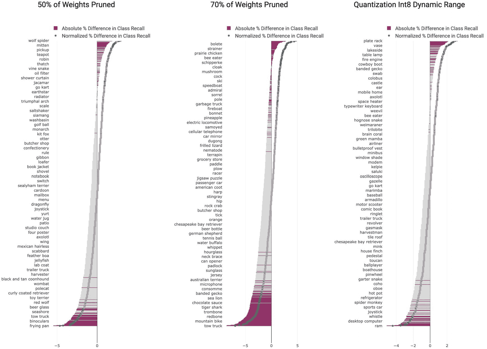

图 4-21

某些 ImageNet 类别在压缩模型召回率中的增加或减少。彩色条表示压缩影响在统计上显著的类别。随着修剪的权重百分比增加，受压缩影响统计上显著的类别也越来越多。值得注意的是，量化比修剪受到的泛化脆弱性影响较小

来自数据集分布长尾的数据实例——即不太常见或更复杂的数据实例——在模型压缩中更常“被牺牲”。Hooker 等人要求受试者对修剪识别的示例的组件进行标记，并发现这些 PIEs 对于人类和模型来说都更难分类；PIEs 通常更复杂，由多个对象、较低质量或模糊性组成（见图 4-22）。修剪迫使压缩模型牺牲对这些特定实例的理解，暴露了压缩模型泛化的脆弱性。

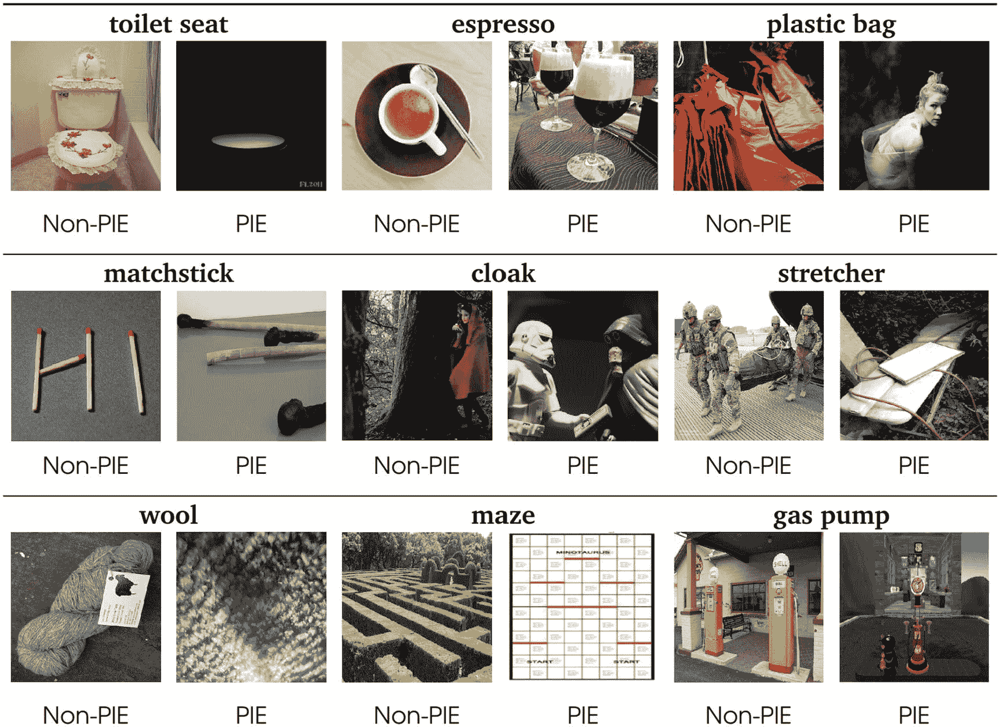

图 4-22

修剪识别的示例更难分类，且代表性较低

此外，压缩模型更容易受到人类能够抵抗的小变化的影响。压缩程度越高，模型对亮度、对比度、模糊、缩放和 JPEG 噪声等变化的不变性越低。这也增加了部署中使用的压缩模型对对抗攻击的脆弱性，或者通过使小而累积的变化对人类不可检测来颠覆模型输出的攻击（参见第二章，案例研究 1，关于利用迁移学习特性的对抗攻击）。

除了对模型鲁棒性和安全性提出担忧之外，这些发现也对模型压缩在提高公平性讨论中的作用提出了疑问。鉴于模型压缩不成比例地影响模型处理类别中较少表示的项目的能力，模型压缩可能会放大数据集中表示的现有差异。

霍克等人的工作提醒我们，神经网络是复杂的实体，可能需要比广泛使用的指标所暗示的更多探索和考虑，并为未来关于模型压缩的工作留下了重要的问题待解答。

## 关键点

在本章中，我们讨论了三种关键模型压缩方法——剪枝、量化和权重聚类——的直觉和实现，以及将这些压缩方法串联在一起的协同优化技术——稀疏性保留量化、聚类保留量化和稀疏性保留聚类：

+   模型压缩的目标是在尽可能保持模型性能的同时降低模型所承担的“成本”。模型的“成本”包括许多因素，包括存储、延迟、服务器端计算和电力成本以及隐私。模型压缩是实际部署的核心要素，也是深化对深度学习理论理解的关键。

+   在剪枝中，不重要的参数或其他更结构化的网络元素通过将其设置为 0 来“移除”。这允许更有效地存储网络。剪枝遵循一个迭代过程——首先评估网络元素的重要性，然后移除最不重要的网络元素。然后，模型在数据上微调以适应剪枝元素。这个过程重复进行，直到移除所需百分比的参数。一个流行的参数重要性标准是按大小（基于大小的剪枝），其中较小的参数被认为对模型输出的贡献较小，并设置为 0。

+   在量化过程中，参数以较低的精度（通常为 8 位整数形式）存储。这显著降低了量化模型的存储和延迟。然而，进行后处理量化会导致累积的不准确性，从而大幅降低模型性能。为了解决这个问题，量化模型首先进行量化感知训练，其中模型处于模拟的量化环境中，并学习对量化具有鲁棒性的权重。

+   在权重聚类中，将分配给簇的权重设置为该簇的重心值，使得值相似的权重（即同一簇的一部分）进行轻微调整以保持相同。这种值的冗余允许更有效的存储。权重聚类的结果高度依赖于选择的簇数量。

+   在协同优化中，将几种模型压缩方法串联在一起。通过将模型压缩方法串联起来，我们可以利用每种方法独特的压缩优势。然而，这些方法必须按照顺序连接，并特别考虑以保留前一种方法的压缩效果。

可以使用 TensorFlow 模型优化库来实现模型压缩方法。要实现模型压缩方法，请使用适当的 TensorFlow 模型优化函数将现有的 Keras 模型包装在“可剪枝”、“可量化”或“可聚类”层中。模型压缩完成后，从这些层中移除压缩包装器。通常，您需要应用压缩算法（例如，GZIP）并将模型转换为 TFLite 以查看剩余的压缩。

+   模型压缩（主要是剪枝）迫使模型牺牲对数据分布长尾端的理解，缩小模型泛化能力。它还增加了压缩模型对对抗攻击的脆弱性，并提出了公平性的问题。

在下一章中，我们将讨论使用元优化自动化的深度学习设计。
