# 5. 使用元优化自动化模型设计

> *学习如何学习是生活中最重要的技能*。
> 
> ——托尼·布赞，作家和教育顾问

随着我们发现需要学习的内容在一生中不断变化，我们发现对我们有效的新学习方法。通过你的教育，你可能已经考虑过通过 brute-force 解决数十个重复性、变化最小的问题来帮助掌握代数的基本原理，使用荧光笔进行积极阅读并手写笔记以帮助你在更高级的英语课程中取得成功，以及后来在更高级的主题中，理解概念框架和直觉比机械地解决一系列问题更有帮助。

最终，学习的任务不仅仅是优化你在特定学习条件下的内容掌握，还包括优化那些学习条件本身。为了成为高效的学习过程代理和设计师，我们必须认识到学习是多层次的，不仅受我们目前在某个代理可能运行的框架中的学习进展所控制，还受学习框架本身所控制。

这种必要性适用于神经网络设计。设计神经网络涉及到做出许多选择，其中许多选择常常感觉是任意的，因此可能未优化或可优化。虽然直觉在构建模型架构时确实是一个有价值的指导，但神经网络设计中有许多方面是人类设计师无法通过手工有效调整的，尤其是在涉及多个变量时。

*元优化*，也在此背景下称为元学习或自动机器学习（auto-ML），是“学习如何学习”的过程——一个元模型（或“*控制器*模型”）找到受控模型验证性能的最佳参数。凭借其工具和对其底层动态和最佳用例的了解，元优化是一套有价值的方法，可以帮助你开发出更有结构、更高效的模型。

## 元优化简介

深度学习模型本身就是一个学习者，它会优化其指定的权重，以最大化其在给定训练数据上的性能。*元优化*涉及在更高层次上另一个模型优化第一个模型中的“固定”参数，使得第一个模型在那些固定参数的条件下进行训练时，将学习到最大化其在测试数据集上性能的权重（图 5-1）。在机器学习——一个经常应用元优化的领域——这些固定参数可能包括支持向量机分类器中的伽马参数、*k*-最近邻算法中的*k*值，或者在梯度提升模型中的树的数量。在深度学习——本书的重点，因此本章中元优化的应用——这些包括模型的架构和其训练过程中的元素，如优化器的选择或学习率。

注意

在这里，我们为了清晰起见，有选择性地使用“参数”和“权重”这两个术语，尽管这两个术语在某种程度上是同义的。“参数”将指模型基本结构中在训练过程中保持不变的更广泛的因素，这些因素影响学习到的知识的输出。“权重”指的是可变、可训练的值，用于表示模型学习到的知识。

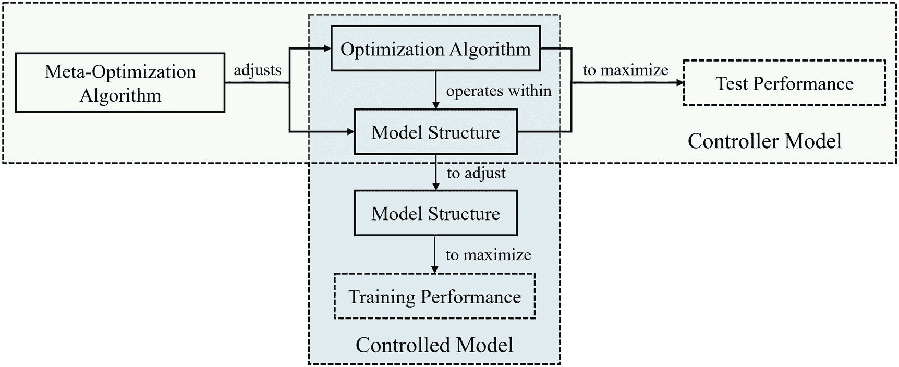

图 5-1

元优化中控制器模型与受控模型之间的关系

所说的“天真”元优化算法采用以下一般结构：

1.  为一个提议的受控模型选择结构参数。

1.  在所选的结构参数下训练受控模型，获取其性能。

1.  重复。

有两种通常认可的“天真”元优化算法被用作更复杂元优化方法的基准：

+   *网格搜索*：在网格搜索中，尝试并评估每个参数用户指定列表中值的每一种组合。考虑一个假设的模型，我们希望优化两个结构参数*A*和*B*。用户可能指定*A*的搜索空间为[1, 2, 3]，而*B*的搜索空间为[0.5, 1.2]。在这里，“搜索空间”表示将测试的每个参数的值。网格搜索将为这些参数的每一种组合训练六个模型——*A* = 1 和 *B* = 0.5，*A* = 1 和 *B* = 1.2，*A* = 2 和 *B* = 0.5，等等。

+   *随机搜索*：在随机搜索中，用户提供有关每个结构参数可能取值的可行分布的信息。例如，*A*的搜索空间可能是一个均值为 2、标准差为 1 的正态分布，而*B*的搜索空间可能是一个从值列表[0.5, 1.2]中均匀选择的选项。然后随机搜索将随机采样参数值并返回表现最好的值集。

网格搜索和随机搜索被认为是简单的搜索算法，因为它们没有将先前所选结构参数的结果纳入如何选择下一组结构参数的方法中；它们只是盲目地反复“查询”结构参数并返回表现最好的集合。虽然网格搜索和随机搜索在某些元优化问题中有其位置——网格搜索对于小型的元优化问题足够，而随机搜索对于相对较便宜训练的模型来说证明是一种出人意料的强大策略——但它们不能为更复杂的模型，如神经网络，产生一致的良好结果。问题不在于这些简单方法本质上不能产生好的参数集，而在于它们需要太长时间才能做到这一点。

元优化独特的特点之一，使其区别于其他优化问题领域的是评估步骤对元优化系统中任何低效的影响。通常，为了量化某些所选结构参数的好坏，模型将在这些结构参数下进行完全训练，并在测试集上的表现作为评估标准。（参见“神经架构搜索”部分，了解代理评估以了解更快的替代方案）。在神经网络的情况下，这一评估步骤可能需要数小时。因此，一个有效的元优化系统应尽量减少在找到良好解决方案之前需要构建和训练的模型数量。（与标准神经网络优化相比，在数小时内，模型可能查询损失函数并相应地更新其权重数百上千次。）

为了防止在评估新结构参数选择时的低效，用于神经网络等模型的成功元优化方法包括另一个步骤——将先前“实验”中的知识纳入确定下一次最佳参数集的选择中：

1.  为一个拟议的受控模型选择结构参数。

1.  获取在所选结构参数下训练的受控模型的表现。

1.  将关于所选结构参数与在相应参数下训练的模型性能之间关系的信息纳入下一次选择中。

1.  重复。

即使有这些调整，元优化方法对计算和时间资源的要求很高。元优化活动成功的一个主要因素是如何定义*搜索空间*——元优化算法可以从中抽取值的可行分布。选择搜索空间是另一个权衡。显然，如果你指定了太大的搜索空间，元优化算法将需要选择和评估更多的结构参数，以到达一个好的解决方案。每个额外的参数都会将现有的搜索空间扩大一个很大的因子，因此，让太多的参数由元优化算法进行优化可能会比用户指定的值或随机搜索表现得更差，因为随机搜索不需要处理导航一个极其稀疏空间的复杂性。

这就是元优化设计中一个重要的原则：*尽可能保守地确定元优化要优化的参数*。例如，如果你知道批量归一化将有助于网络性能，那么使用元优化来确定是否应该将批量归一化包含在网络架构中可能并不值得。此外，如果你决定某个参数应该通过元优化进行优化，尝试减小其“大小”。例如，这可能是一个参数可以取的可能值或范围的数目，或者可能值的范围。

另一方面，如果你定义的搜索空间太小，你应该问自己另一个问题——*元优化是否从一开始就值得进行*？例如，元优化算法可能会非常高效地找到一个搜索空间的最优参数集，该搜索空间定义为{*A*: 均值为 1 和标准差为 0.001 的正态分布和 *B*: 从 3.2 到 3.3 的均匀分布}，但这并不有用。用户可能已经将*A*=1 和*B*=3.25 设置好了，这对最终模型性能没有明显影响。

注意

“小”或“大”的范围取决于参数的性质以及为了在模型性能中产生明显变化所需的变化量。从均值为 0.005 和标准差为 0.001 的正态分布中采样的参数，如果该参数是支持向量机中的 C 参数，则可能产生一个非常相似的模型。然而，如果该参数是深度学习模型的学习率，那么这种分布很可能会在模型测试性能中产生明显的差异。

因此，元优化中的关键平衡是在设计搜索空间时既要保守，以免冗余，又要足够自由和“开放”，以产生显著的结果。

本章将讨论适用于深度学习的两种元优化形式：一般超参数优化和神经架构搜索（NAS），以及 Hyperopt、Hyperas 和 Auto-Keras 库。

## 一般超参数优化

通用超参数优化是元优化中的一个广泛领域，涉及优化各种模型参数的通用方法。这些方法并非专门为神经网络设计构建，因此需要额外的工作才能获得有效结果。

在本节中，我们将讨论贝叶斯优化——机器学习和深度学习中最领先的通用超参数优化方法，以及使用流行的元优化库 Hyperopt 及其配套的 Keras 包装器 Hyperas 来优化神经网络设计。

### 贝叶斯优化直觉与理论

这里有一个函数：*f*(*x*)。你只能访问其给定输入的输出，并且知道计算它很昂贵。你的任务是找到一组输入，尽可能最小化该函数的输出。

这种设置被称为黑盒优化问题，因为试图找到问题解决方案的算法或实体对函数的了解非常有限（见图 5-2）。你只能访问传递给函数的任何输入的输出，但不能访问导数，除非使用在神经网络领域证明成功的基于梯度的方法。此外，由于*f*(*x*)的评估成本很高（即，获取输入的输出需要花费大量时间），我们不能使用从简单的网格搜索到更复杂的模拟退火等大量非梯度优化方法。这些方法需要大量查询黑盒函数以发现表现良好的结果。

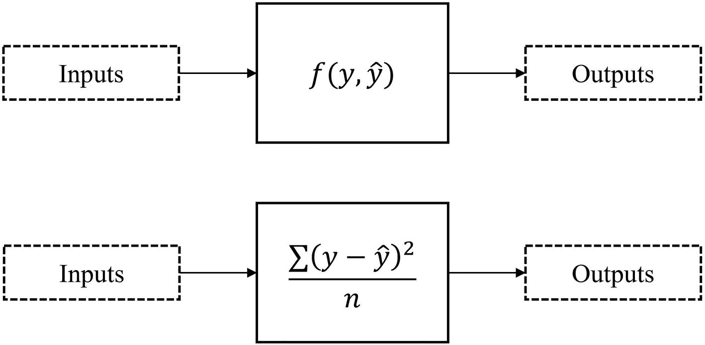

图 5-2

要最小化的目标函数。顶部 – 黑盒函数；底部 – 显式定义的损失函数（在这种情况下为均方误差 MSE）

贝叶斯优化常用于这类黑盒优化问题，因为它能够在对目标函数*f*(*x*)进行相对较少的查询的情况下获得可靠的良好结果。Hyperopt 除了许多其他库之外，还使用基于贝叶斯优化基本模型的优化算法。贝叶斯建模的精神是从一组*先验*信念开始，并不断用新信息更新这组信念以形成后验信念。正是这种持续更新的精神——在需要的地方寻找新信息——使得贝叶斯优化在黑盒优化问题中成为一个强大而通用的工具。

考虑这个假设的目标函数，*c*(*x*)（见图 5-3）。在元学习/元优化的背景下，*c*(*x*)代表某种模型的损失或成本，而*x*代表模型中用于优化的参数集合。

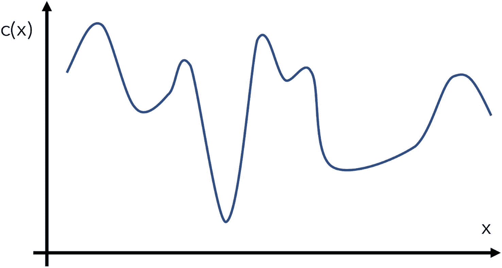

图 5-3

假设成本函数 – 某些参数 x 的模型产生的损失。为了可视化，在这种情况下，我们只优化一个参数

因为这是一个黑盒函数，贝叶斯优化算法“不知道”其完整的形状，它通过一个 *代理函数*（图 5-4）来发展它“认为”目标函数看起来如何的自身表示。代理函数近似目标函数，并代表对目标函数行为的当前信念集合。

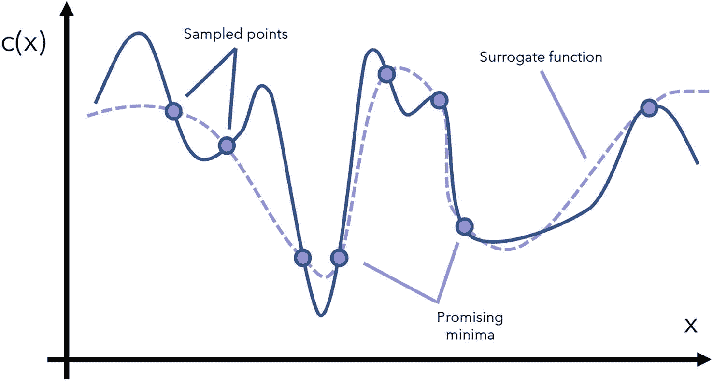

图 5-4

代理函数示例以及代理函数如何告知目标函数中新的采样点的采样

注意，这里的代理模型表示是确定性的，但在实践中它是一个概率模型，返回 *p*(*y*| *x*) 或在输入 *x* 给定的情况下，目标函数输出为 *y* 的概率。概率代理模型在贝叶斯函数中更容易且更自然地更新。

基于代理函数，算法可以识别哪些点看起来“有希望”，以及哪些区域需要更多的探索和从这些有希望的区域内采集样本（图 5-5）。请注意，这里存在一个探索-利用的权衡动态：如果算法只从被立即建议为最小值的区域采样（纯粹利用），它将完全忽略第一轮采样中未捕获的其他有希望的极小值。同样，如果算法纯粹是探索性的，它将不会考虑先前的发现，其行为与随机搜索几乎没有区别。*获取函数*负责确定如何更新代理函数。

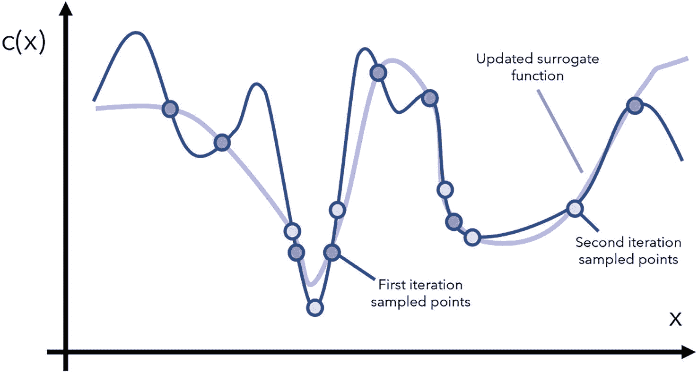

图 5-5

使用新的、第二次迭代的采样点更新代理函数

经过几次迭代后，贝叶斯优化算法获得黑盒函数内最小值的相对准确表示的概率非常高。

由于随机搜索或网格搜索在确定下一个参数集时没有考虑任何先前结果，这些“天真”的算法在计算下一个参数集时节省了时间。然而，贝叶斯优化算法用于确定下一个采样点的额外计算被用来更智能地构建代理函数，从而减少查询次数。总的来说，减少对目标函数的必要查询次数超过了确定下一个采样点所需时间的增加，这使得贝叶斯优化方法更加高效。

这种优化过程更抽象地被称为 *序列模型优化（SMBO）*。它作为一个核心概念或模板，各种模型优化策略可以据此制定和比较，并包含一个关键特性：一个用于目标函数的代理函数，该函数会根据新信息进行更新，并用于确定新的采样点。在各种 SMBO 方法中，主要区别在于获取函数的设计和构建代理模型的方法。Hyperopt 使用树结构帕累托估计器（TPE）代理模型和获取策略。

预期改进测量量化了相对于要优化的参数集 *x* 的预期改进。例如，如果代理模型 *p*(*y*| *x*) 对于所有小于某个阈值值 *y*^∗ 的 *y* 值都评估为零——也就是说，输入参数集 *x* 产生目标函数输出小于 *y*^∗ 的概率为零——那么很可能是改进很小。

树结构帕累托估计器（图 5-6）旨在寻找一组参数 *x*，以最大化预期改进。像贝叶斯优化中使用的所有代理函数一样，它返回 *p*(*y*| *x*)——给定输入 *x*，目标函数输出的概率。它不是直接获得这个概率，而是使用贝叶斯定理：

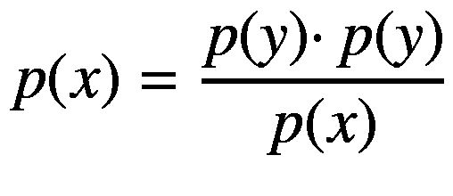

*p*(*x*| *y*)项表示在给定输出 *y* 的情况下，目标函数的输入为 *x* 的概率。为了计算这个概率，使用了两个分布函数：*l*(*x*)，如果输出 *y* 小于某个阈值 *y*^∗，以及 *g*(*x*)，如果输出 *y* 小于某个阈值 *y*^∗。为了采样那些使得目标函数输出小于阈值的 *x* 值，策略是从 *l*(*x*) 中抽取，而不是从 *g*(*x*) 中抽取。（其他项，如 *p*(*y*) 和 *p*(*x*)，可以很容易地计算，因为它们不涉及条件。）具有最高预期改进的采样值将通过目标函数进行评估。得到的值用于更新概率分布 *l*(*x*) 和 *g*(*x*)，以实现更好的预测。

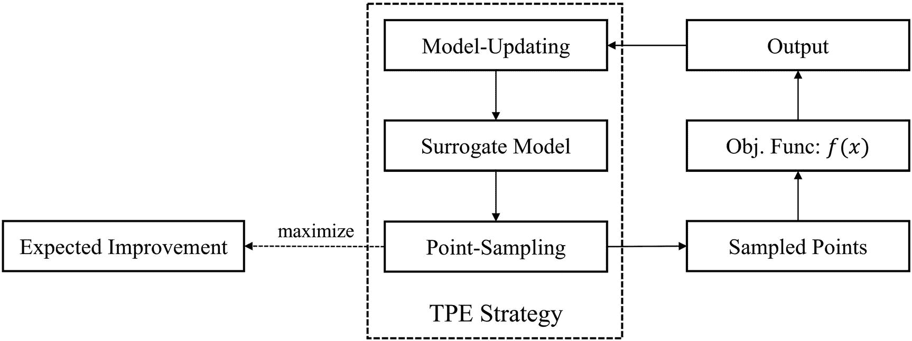

图 5-6

可视化树结构帕尔森估计器策略相对于基于序列模型优化过程的位置

这需要一点数学知识，但最终树结构帕尔森估计器策略试图通过不断更新其两个内部概率分布来最大化预测质量，以找到最佳的目标函数输入。

注意

你可能想知道——树结构帕尔森估计器策略中的“树”指的是什么？在原始的 TPE 论文中，作者建议算法名称中的“树”部分来源于超参数空间的树状特性：一个超参数的值决定了其他参数可能值的集合。例如，如果我们正在优化神经网络架构，我们首先确定层数，然后再确定第三层的节点数。

### Hyperopt 语法、概念和用法

Hyperopt 是一个流行的贝叶斯优化框架。其灵活的语法允许你在任何框架和任何目的上测试超参数调整。使用 Hyperopt 需要三个关键元素（图 5-7）：

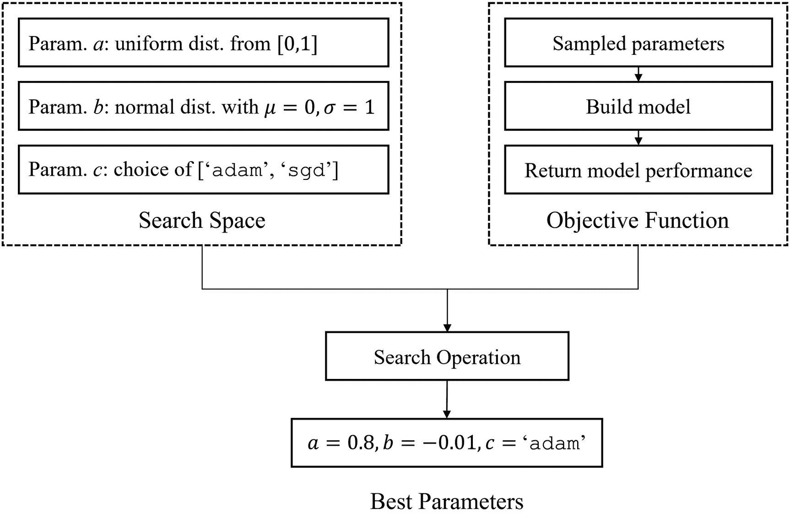

图 5-7

Hyperopt 框架中搜索空间、目标函数和搜索操作之间的关系

+   *目标函数*：这是一个接收超参数字典（目标函数的输入）并输出这些超参数“良好度”的函数（目标函数的输出）。在这个元学习的上下文中，目标函数接收超参数，使用超参数构建模型，训练模型，并返回模型在验证/测试数据上的性能。“更好”在 Hyperopt 中等同于“更少”，所以请确保像准确度这样的指标是取反的。

+   *搜索空间*：这是 Hyperopt 将搜索的参数空间。它实现为一个参数的字典，其中键是参数的名称（供你以后参考），相应的值是 Hyperopt 搜索空间目标，定义了从该参数中采样值的范围和类型。

+   *搜索*：一旦你定义了目标函数和搜索空间，你就可以启动实际的搜索函数，它将返回搜索中最佳的一组参数。

使用 `pip install hyperopt` 安装 Hyperopt，并使用 `import hyperopt` 导入。

#### Hyperopt 语法概述：寻找简单目标函数的最小值

为了说明 Hyperopt 中的基本语法和概念，我们将使用 Hyperopt 解决一个非常简单的问题：找到函数 *f*(*x*) = (*x* − 1)² 的最小值。让我们首先使用 `hyperopt.hp` 定义搜索空间（见列表 5-1）。

```py
from hyperopt import hp
space = {'x':hp.uniform('x',-1000,1000)}
Listing 5-1
Importing the Hyperopt library and defining the search space for a single parameter using hyperopt.hp
```

在这种情况下，我们告诉 Hyperopt 搜索空间由一个标签为“`x`”的参数组成，这个参数可以从 -1000 到 1000 的均匀分布中合理地找到。然而，从领域知识我们知道，`x` 的最优值，即最小化目标函数的最优值，更有可能接近零，而不是从 -1000 到 1000 的任何值具有同等可能性。理想情况下，我们希望优化器更频繁地采样接近零的 `x` 值，而不是接近 1000 或 -1000 的值。我们可以通过使用其他空间来制定关于最优值接近某个值的概率的领域知识（见图 5-8）：

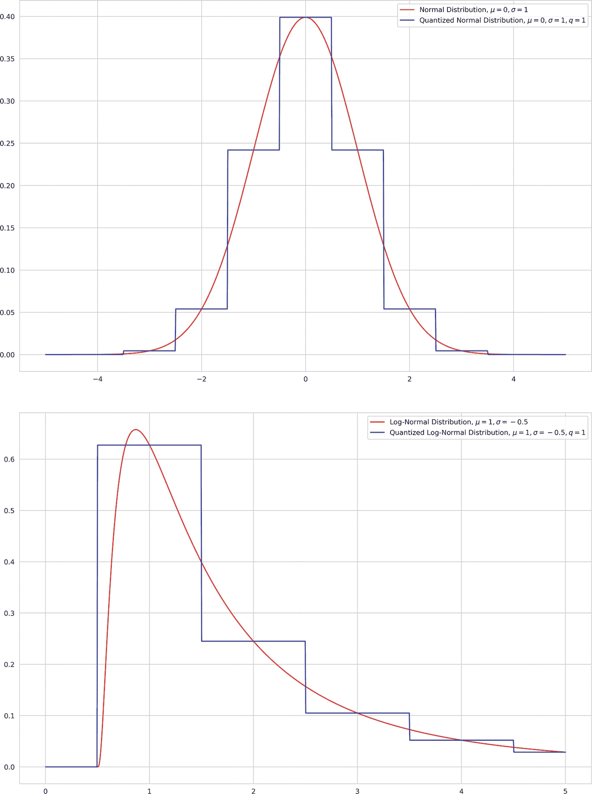

图 5-8

正态和量化正态分布（顶部）以及对数正态和量化对数正态分布（底部）的可视化。量化分布的可视化并不完全忠实——落入采样“段”中的值被赋予相同的值

+   `hp.normal(label, mu, sigma)`：此参数的搜索空间分布是一个均值为 `mu` 和标准差 `sigma` 的正态分布。

+   `hp.lognormal(label, mu, sigma)`：此参数的搜索空间分布是一个均值为 `mu` 和标准差 `sigma` 的对数正态分布。它作为 `hp.normal` 的修改版，只返回正值。这对于像神经网络的学习率这样的参数很有用，这些参数是连续的，并在某一点上具有概率集中，但需要正值。

+   `hp.qnormal(label, mu, sigma, q)` 和 `hp.qlognormal(label, mu, sigma, q)`：这些函数作为准连续参数的分布，例如神经网络中的层数或每层中的节点数——虽然这些不是连续的（3.5 层的网络是无效的），但它们包含传递的相对关系（4 层的网络比 3 层的网络长）。相应地，我们可能希望制定某些关系，例如希望层数比更长的层数短。`hp.qnormal` 和 `hp.qlognormal` 通过执行以下操作将 `hp.normal` 和 `hp.lognormal` 的输出“量化”：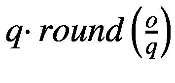，其中 *o* 是“未量化”操作的输出，*q* 是量化因子。例如，`hp.qnormal('x', 5, 3, 1)` 定义了一个具有均值 5 和标准差 3 的“正态分布”整数搜索空间（`q = 1`）。

如果搜索空间不是连续或准连续的，而是一系列离散、不可比较的选择，请使用`hp.choice()`，它接受一个可能的选项列表。

在这种情况下，我们可以使用标准正态分布来更准确地描述我们认为参数最佳位置在哪里（列表 5-2）。

```py
from hyperopt import hp
space = {'x':hp.normal('x', mu=0, sigma=10)}
Listing 5-2
Defining a simple Hyperopt space
```

我们现在可以定义目标函数，它只是简单地从`x`中减去 1 并平方：`obj_func = lambda params: (params['x']-1)**2`。

如果目标函数始终返回有效的输出或者你已经配置了搜索空间，使得任何无效的输入都不可能传递到目标函数，那么只返回目标函数的相关输出是完全可以的。如果不这样做，Hyperopt 提供了一个可能有助于某些参数组合可能无效的额外功能：状态。例如，如果我们试图找到函数 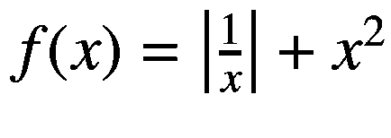 的最小值，输入 *x* = 0 将是无效的。然而，没有简单的方法来限制搜索空间以排除 *x* = 0。如果 *x* ≠ 0，目标函数的输出是 `{'loss':value, 'status':'ok'}`。如果输入参数等于 0，那么目标函数返回 `{'status':'fail'}`。

在建模的上下文中，某些参数构造可能无效。鉴于限制搜索空间是不可能的或过于困难，你可以使用 try/except 捕获机制来构建你的目标函数，这样 Keras 在构建图时抛出的任何错误都会以失败状态的形式传达给 Hyperopt（列表 5-3）。

```py
def obj_func(params):
try:
model = build_model().train(data)
loss = evaluate(model)
return {'loss':loss, 'status':'ok'}
except:
return {'status':'fail'}
Listing 5-3
An objective function with ok/fail status
```

现在搜索空间和目标函数已经定义，我们可以启动搜索以找到搜索空间中指定的参数值，这些参数值将最小化目标函数（列表 5-4）。

```py
from hyperopt import fmin, tpe
best = fmin(obj_func, space, algo=tpe.suggest, max_evals=500)
Listing 5-4
Hyperopt minimization procedure
```

在这里，`algo=tpe.suggest`使用树结构帕累托估计器优化算法，`max_evals=500`让 Hyperopt 知道代码可以容忍最多 500 次目标函数的评估。在建模的上下文中，`max_evals`表示将构建和训练的最大模型数量，因为每次评估目标函数都需要构建一个新的模型架构，训练它，评估它，并返回其性能。

搜索完成后，`best`是一个包含找到的最佳参数的字典。`best['x']`应该包含一个非常接近 1（真实最小值）的值。

#### 使用 Hyperopt 优化训练过程

涉及到模型训练过程的参数包括学习率、优化器的选择、回调以及其他与模型如何训练而不是模型架构相关的参数。让我们使用 Hyperopt 来确定训练的最佳优化器和学习率。我们需要为这两个参数定义特定的搜索空间类型：

+   `hp.choice('optimizer', ['adam', 'rmsprop', 'sgd'])`用于优化器：这将找到训练网络的最佳优化器。

+   `hp.lognormal('lr', mu=0.005, sigma=0.001)`用于优化器的学习率：这里使用对数正态分布是因为学习率必须是正数。

我们可以在字典中定义这两个空间（见列表 5-5）。请注意，我们导入优化器对象时并没有实际实例化它们（即使用`keras.optimizers.Adam`而不是`keras.optimizers.Adam()`）。这是因为我们需要在参数对象的实例化过程中传递学习率作为参数，我们将在构建模型时在目标函数中这样做。

```py
from keras.optimizers import Adam, RMSprop, SGD
optimizers = [Adam, RMSprop, SGD]
space = {'optimizer':hp.choice('optimizer',optimizers),
'lr':hp.lognormal('lr', mu=0.005, sigma=0.001)}
Listing 5-5
Defining a search space for model optimizer and learning rate
```

目标函数将接受从搜索空间中采样的参数字典，并使用它们来训练模型架构（见列表 5-6）。在这种情况下，我们将通过模型在测试数据集上的准确率来衡量模型性能。在目标函数中，我们执行以下操作：

1.  *构建模型*：我们将使用一个简单的序列模型，包含卷积和全连接组件。由于我们不需要调整影响架构构建的超参数，因此可以不访问`params`字典来构建它。

1.  *编译*：这是模型构建和训练的相关组件，因为我们正在调整的参数（优化器和学习率）在这个步骤中被明确使用。我们将使用采样学习率实例化采样优化器，然后将带有该学习率的优化器对象传递给`model.compile()`。我们还将传递`metrics=['accuracy']`到编译中，这样我们就可以在评估时作为目标函数的输出访问测试数据上的模型准确率。

1.  *拟合模型*：我们将像通常一样，对模型进行一定数量的 epoch 拟合。

1.  *评估准确率*：我们可以调用`model.evaluate()`来返回在测试数据上计算的损失和指标列表。第一个元素是损失，第二个是准确率；我们根据评估输出的索引来评估准确率。

1.  *返回验证集的否定准确率*：准确率被否定，使得较小的值表示“更好”。

```py
from keras.models import Sequential
import keras.layers as L
def objective(params):
# build model
model = Sequential()
model.add(L.Input((32,32,3)))
for i in range(4):
model.add(L.Conv2D(32, (3,3), activation='relu'))
model.add(L.Flatten())
model.add(L.Dense(64, activation='relu'))
model.add(L.Dense(1, activation='sigmoid'))
# compile
optimizer = params'optimizer'
model.compile(loss='binary_crossentropy',
optimizer=optimizer,
metrics=['accuracy'])
# fit
model.fit(x_train, y_train, epochs=20, verbose=0)
# evaluate accuracy (second elem. w/ .evaluate())
acc = model.evaluate(x_test, y_test, verbose=0)[1]
# return negative of acc such that smaller = better
return -acc
Listing 5-6
Defining the objective function of a training procedure-optimizing operation
```

注意，我们在`model.fit()`和`model.evaluate()`中都指定了`verbose=0`，这阻止了 Keras 在训练过程中打印进度条和指标。虽然这些进度条在单独训练 Keras 模型时很有帮助，但在 Hyperopt 的参数优化上下文中，它们会干扰 Hyperopt 自己的进度条打印。

我们可以将目标函数、搜索空间以及树结构帕累托估计器和最大评估次数一起传递给`fmin`函数：best = fmin(objective, space, algo=tpe.suggest, max_evals=30)。

搜索完成后，`best`应包含一个字典，其中包含搜索空间中每个参数的最佳性能值。为了在你的模型中使用这些最佳参数，你可以按照目标函数中构建模型的方式重建模型，并将`params`字典替换为`best`字典。

为了获得更好的性能，应进行两项调整：

+   *早期停止回调*: 这会在性能停滞后停止训练，以尽可能多地节省资源（计算和时间），因为元优化本质上是一项昂贵的操作。这通常可以与高数量的 epoch 结合使用，使得每个模型设计都能充分训练——尽可能多地提取其潜力，并在似乎没有更多潜力可提取时停止训练。

+   *在评估前使用带权重重载的模型检查点回调*: 与在神经网络完成训练后评估其状态相比，评估该神经网络的“最佳版本”更为理想。这可以通过模型检查点回调来实现，该回调保存了表现最佳模型的权重。在评估模型性能之前，重新加载这些权重。

这两个措施将进一步提高搜索效率。

#### 使用 Hyperopt 优化模型架构

虽然 Hyperopt 通常用于调整模型训练过程中的参数，但你也可以用它来对模型架构进行微调优化。不过，重要的是要考虑你是否应该使用像 Hyperopt 这样的通用元优化方法，还是使用像神经架构搜索这样的更专业的架构优化方法。如果你想优化模型架构的大幅变化，最好通过 Auto-Keras 进行神经架构搜索（这将在本章后面介绍）。另一方面，如果你想优化小的变化，Auto-Keras 可能无法提供你想要的精度水平，因此 Hyperopt 可能是更好的解决方案。请注意，如果你打算优化的架构变化非常小（比如找到一个层的最优神经元数量），即使设置了合理的默认参数，优化也可能没有成效。

适合使用像 Hyperopt 这样的通用优化框架进行优化的良好架构组件，这些组件既不是太大以至于无法使用更专业的神经架构搜索方法进行优化，也不是太小以至于对模型性能来说微不足道，包括

+   *特定块/组件中的层数*（假设范围足够长）：层数是模型架构中的一个相当重要的因素，尤其是如果它是通过基于块/单元的设计复合的。

+   *批归一化的存在*: 批归一化是一个重要的层，有助于平滑损失空间。然而，只有在其被用于特定位置并以特定频率使用时才能成功。

+   *dropout 层的存在率和率*：与批量归一化一样，dropout 可以是一个非常强大的正则化方法。成功使用 dropout 需要放置在特定的位置，以一定的频率，以及一个良好的 dropout 率。

对于这个例子，我们将调整模型架构的三个一般因素：卷积组件中的层数，密集组件中的层数，以及插入到每层之间的 dropout 层的 dropout 率。（您也可以调整所有 dropout 层的 dropout 率，这提供了更少的可定制性，但在某些情况下可能更成功。）

由于我们正在跟踪多个 dropout 层的 dropout 率，我们不能仅仅将其定义为搜索空间中的单个参数。相反，我们需要自动化存储和组织搜索空间中与每个 dropout 层对应的多个参数。

让我们从定义一些关键变量开始，这些变量我们稍后需要反复使用（见列表 5-7）。我们愿意接受从 3 层到 8 层的任意数量的卷积层，以及从 2 层到 5 层的任意数量的密集层。（当然，您可以根据您的问题进行调整。）

```py
min_num_convs = 3
max_num_convs = 8
min_num_dense = 2
max_num_dense = 5
Listing 5-7
Defining key parameters
```

使用这些信息，我们将生成两个列表，`conv_drs`和`dense_drs`，分别包含卷积和密集组件中每层的 dropout 率的 Hyperopt 搜索空间对象（见列表 5-8）。这使我们能够有效地存储多个相关但不同的搜索参数；这些参数在构建模型时可以通过索引轻松访问。我们使用字符串格式化来为 Hyperopt 搜索空间提供唯一的字符串名称。请注意，虽然您提供的每个搜索空间参数的名称是任意的（用户通过其他方式访问每个参数），但 Hyperopt 需要（a）字符串名称和（b）唯一的名称（即，两个参数不能有相同的名称）。

```py
conv_drs, dense_drs = [], []
for layer in range(max_num_convs):
conv_drs.append(hp.normal(f'c{layer}', 0.15, 0.1))
for layer in range(max_num_dense):
dense_drs.append(hp.normal(f'd{layer}', 0.2, 0.1))
Listing 5-8
Creating an organized list of dropout rates
```

注意，我们在构建卷积和全连接组件的最大层数那么多搜索空间变量，这意味着如果采样的层数少于最大层数，将会有冗余（即，某些 dropout 率将不会被使用）。这是可以的；Hyperopt 会处理它并适应这些关系。此外，我们还在定义一个正常的搜索空间，用于 dropout 率，理论上可以采样小于 0 或大于 1 的值（即，无效的 dropout 率）。我们将在目标函数中调整这些值，以展示当 Hyperopt 没有提供适合您特定需求的功能时（在这种情况下，两端有界的一般形状分布），如何自定义搜索空间。

我们可以使用这些参数来创建搜索空间（见列表 5-9）。在定义卷积和密集组件中的层数时，我们使用 `q=1` 的量化均匀分布来采样从 `min_num_convs/dense` 到 `max_num_convs/dense`（包括）的所有整数。此外，请注意，我们为 `'conv_dr'` 和 `'dense_dr'` 参数传递了列表。Hyperopt 将其（或任何包含多个 Hyperopt 搜索空间对象的任何数据类型）解释为参数的子类，这些参数将像任何其他参数一样进行调整。

```py
space = {'#convs':hp.quniform('#convs',
min_num_convs,
max_num_convs,
q=1),
'#dense':hp.quniform('#dense',
min_num_dense,
max_num_dense,
q=1),
'conv_dr':conv_drs,
'dense_dr':dense_drs}
Listing 5-9
Defining the search space for optimizing neural network architecture
```

在此上下文中构建目标函数是一个复杂的过程，因此我们将分多个部分构建它。

回想一下，Hyperopt 为丢弃率定义的搜索空间是正态分布的，这意味着可能采样到无效的丢弃率（小于 0 或大于 1）。我们可以在目标函数的开始处处理采样到的无效参数（见列表 5-10）。

如果丢弃率大于 0.9，我们将其设置为 0.9（Keras 不接受等于 1 的丢弃率，并且任何大于 90%的丢弃率成功的可能性也很低）。另一方面，如果丢弃率小于 0，我们将其设置为 0。考虑到搜索空间中定义的均值和标准差参数，这两种情况都不太可能被采样，但定义这些捕获机制以防止中断优化过程的错误是很重要的。请注意，另一种选择是将 `{'status':'fail'}` 返回以指示无效的参数。贝叶斯优化算法将适应这些措施中的任何一种。

```py
def objective(params):
# convert set of params to list for mutability
conv_drs = list(params['conv_dr'])
dense_drs = list(params['dense_dr'])
# make sure dropout rate is 0  0.9:
conv_drs[ind] = 0.9
if conv_drs[ind]  0.9:
dense_drs[ind] = 0.9
if dense_drs[ind] < 0:
dense_drs[ind] = 0
...
Listing 5-10
Beginning to define the objective function – correcting for dropout rates sampled in an invalid domain
```

然后，我们可以构建模型“模板”（Sequential 基本模型）并将其附加到它上（见列表 5-11）。

```py
...
# build model template + input
model = Sequential()
model.add(L.Input((32,32,3)))
...
Listing 5-11
Defining the model template and input in the objective function
```

在构建卷积组件时，我们通过一个循环（见列表 5-12）添加输入参数中指定的任意多个卷积层。请注意，我们将采样到的卷积层数量 `params['#convs']` 包裹在一个 `int()` 函数中；量化值的输出在技术上不会是一个整数（例如，`3.0`，`4.0`），而 Python 要求 `range()` 函数的输入是一个整数对象。在每个卷积层之后，我们添加一个具有通过索引先前定义的 `conv_drs` 列表中的丢弃率来访问的丢弃率层的 dropout 层。通过将丢弃率组织成易于访问和存储的列表格式，我们能够将多个参数集成到优化过程中。

```py
...
# build convolutional component
for ind in range(int(params['#convs'])):
# add convolutional layer
model.add(L.Conv2D(32, (3,3), activation='relu'))
# add corresponding dropout rate
model.add(L.Dropout(conv_drs[ind]))
# add flattening for dense component
model.add(L.Flatten())
...
Listing 5-12
Building the convolutional component in the objective function
```

构建密集组件遵循相同的逻辑（见列表 5-13）。

```py
...
# build dense component
for ind in range(int(params['#dense'])):
# add dense layer
model.add(L.Dense(32, activation='relu'))
# add corresponding dropout rate
model.add(L.Dropout(dense_drs[ind]))
...
Listing 5-13
Building the dense component in the objective function
```

之后，附加模型输出并执行之前讨论的剩余步骤，包括编译、拟合、评估和返回目标函数的输出。

如您所见，Hyperopt 允许对模型的具体元素进行大量的控制，即使这需要一点更多的工作——您的想象力（以及您的组织能力）是极限！

### Hyperas 语法、概念和用法

Hyperopt 提供了大量的可定制性和适应性，以满足您特定的优化需求，但这也意味着需要做很多工作，尤其是在相对简单的任务中。Hyperas 是一个包装器，它运行在 Hyperopt 之上，专门用于元优化 Keras 模型的语法。Hyperas 的主要优势是，您可以使用比 Hyperopt 语法所需的代码少得多来定义要优化的参数。

注意

虽然 Hyperas 是一个有用的资源，但了解如何使用 Hyperopt 很重要，因为（a）首先需要元优化的问题通常足够复杂，值得使用 Hyperopt；（b）Hyperas 是一个不太发达且不稳定的包（它目前已被所有者存档）。此外，请注意，在 Kaggle 或 Colab 等环境中使用 Hyperas 与 Jupyter Notebooks 一起使用可能会出现一些问题——如果您在这些情况下工作，可能更容易使用 Hyperopt。

使用`pip install hyperas`安装 Hyperas，并使用`import hyperas`导入。

#### 使用 Hyperas 优化训练过程

让我们使用 Hyperas 的语法来执行相同的模型训练过程优化，通过找到最佳优化器和学习率的组合。Hyperas 有三个主要组件（图 5-9）：

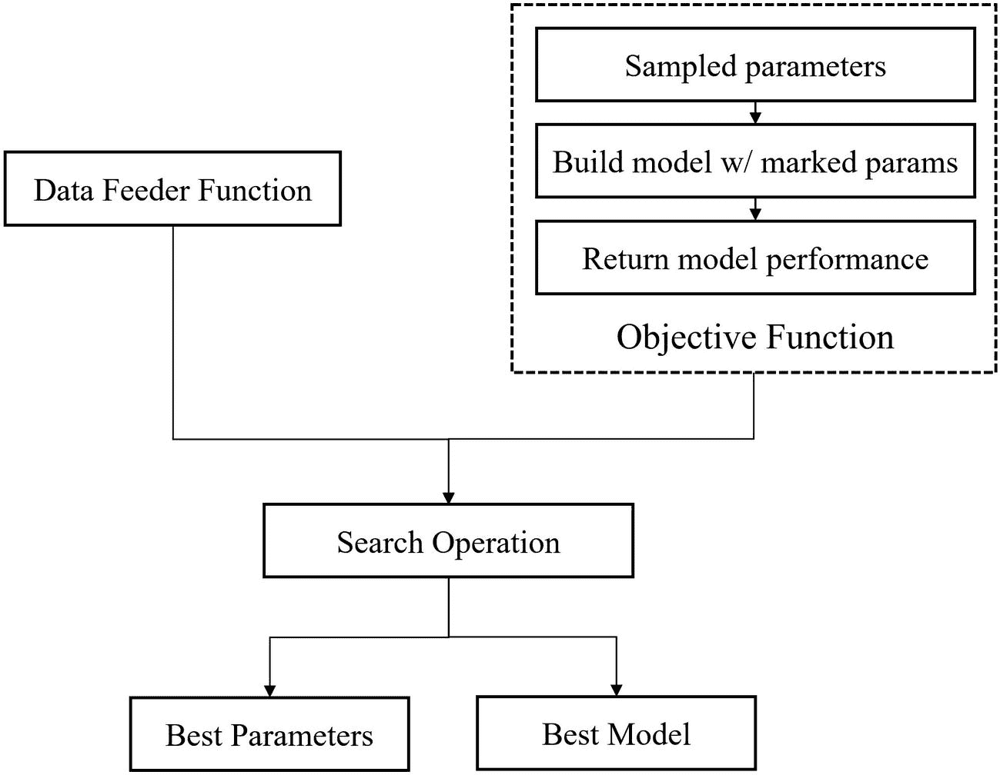

图 5-9

Hyperas 框架的关键组件——数据提供者、目标函数和搜索操作

+   *数据提供函数*：必须定义一个函数来加载数据，执行任何预处理，并返回四组数据：*x* 训练、*y* 训练、*x* 测试和 *y* 测试（按此顺序）。通过将数据提供过程定义为函数，Hyperas 可以在训练模型时避免数据加载的冗余。

+   *目标函数*：这个函数接受数据提供函数的四组数据。它使用独特的标记参数构建模型，在训练数据上拟合，并返回用于评估的任何损失。目标函数应返回一个包含三个键值对的字典：损失、状态以及评估损失的模型。

+   *最小化*：这个函数接受目标函数（模型创建函数）、数据提供函数，以及来自 Hyperopt 的树结构 Parzen 估计器算法和一个`max_evals`参数。由于 Hyperas 实现了大量的记录，最小化过程需要一个`hyperopt.Trials()`对象，它作为一个额外的文档/记录对象。（您也可以将其传递给 Hyperopt 的`fmin()`，尽管这不是必需的。）

假设数据提供函数已经创建，我们将创建目标函数（代码清单 5-14）。它与 Hyperopt 中的目标函数几乎相同，有两个关键区别：目标函数接收四组数据而不是参数字典，并且可优化参数完全在目标函数内定义，并且尽可能减少用户依赖和处理。

要指定一个可优化参数，将双大括号放在 `hyperas.distributions` 搜索空间分布对象周围（例如，`{{hyperas.distributions.choice(['a','b','c'])}}`）。Hyperas 包含了 Hyperopt 中实现的所有分布。请注意，不需要标签，这允许轻松定义多个可优化参数。双大括号语法只能在目标函数的上下文中使用，Hyperas 使用 Jinja 风格进行模板替换和临时文件。请注意，由于 Hyperas 在单独的“环境”中创建这些模型，您可能需要在目标函数中重新导入某些模型或层。在这种情况下，我们导入了 `Sequential` 模型和 Keras 层。

```py
from hyperas.distributions import choice, lognormal
from keras.optimizers import Adam, RMSprop, SGD
def obj_func(x_train, y_train, x_test, y_test):
# import keras layers and sequential model
from keras.models import Sequential
import keras.layers as L
# define model
model = Sequential()
model.add(L.Input((32,32,3)))
for i in range(4):
model.add(L.Conv2D(32, (3,3), activation='relu'))
model.add(L.Flatten())
model.add(L.Dense(64, activation='relu'))
model.add(L.Dense(1, activation='sigmoid'))
# sample lr and optimizer (not instantiated yet)
lr = {{lognormal(mu=0.005, sigma=0.001)}}
optimizer_obj = {{choice([Adam, RMSprop, SGD])}}
# instantiate sampled optimizer with sampled lr
optimizer = optimizer_obj(lr=lr)
# compile with sampled parameters
model.compile(loss='binary_crossentropy',
optimizer=optimizer,
metrics=['accuracy'])
# fit and evaluate
model.fit(x_train, y_train, epochs=1, verbose=0)
acc = model.evaluate(x_test, y_test, verbose=0)[1]
# return loss, OK status, and trained candidate model
return {'loss':-acc, 'status':'ok', 'model':model}
Listing 5-14
Objective function for optimizing training procedure in Hyperas
```

要执行优化，使用 `hyperas.optim.minimize` 函数（代码清单 5-15），它方便地返回优化过程中的最佳参数和最佳模型。（回想一下，Hyperopt 只返回最佳参数集，您需要将其存储到重建的模型中。）`optim.minimize()` 接收用户指定的目标函数和数据提供函数，以及来自 Hyperopt 的 `tpe.suggest` 和 `Trials()` 实体。如果您在 Jupyter Notebooks 中工作，`optim.minimize()` 还需要您笔记本的名称。

```py
from hyperas import optim
from hyperopt import tpe, Trials
best_pms, best_model = optim.minimize(model=obj_func,
data=data,
algo=tpe.suggest,
max_evals=5,
trials=Trials(),
notebook_name='name')
Listing 5-15
Optimizing in Hyperas
```

训练后，您可以保存模型和参数以供以后使用。

#### 使用 Hyperas 优化模型架构

当应用于像之前优化大量参数这样的任务时，Hyperas 的真正便利性才显现出来。我们不需要为搜索空间创建复杂的列表和组织结构，我们可以在函数本身中定义要优化的参数（代码清单 5-16）。为了防止从 dropout 率中采样的参数超过 0.9 或低于 0，我们可以实现一个自定义舍入函数 `r`，它接收一个参数 `x_`（添加下划线以区分 Hyperas 内部使用的 `x`，这可能会引起问题）并调整它（如果它无效）或让它通过。我们将 `r` 包裹在所有采样的速率周围。

```py
def obj_func(x_train, y_train, x_test, y_test):
# create rounding function
import keras.layers as L
r = lambda x_: 0 if x_0.9 else x_)
# import keras layers and sequential model
from keras.models import Sequential
import keras.layers as L
# create model template and input
model = keras.models.Sequential()
model.add(L.Input((32,32,3)))
# build convolutional component
for ind in range(int({{quniform(3,8,1)}})):
model.add(L.Conv2D(32, (3,3), activation='relu'))
model.add(L.Dropout(r({{normal(0.2,0.1)}})))
# add flattening layer for FC component
model.add(L.Flatten())
# build FC component
for ind in range(int({{quniform(2,5,1)}})):
model.add(L.Dense(32, activation='relu'))
model.add(L.Dropout(r({{normal(0.2,0.1)}})))
# add output layer
model.add(L.Dense(1, activation='sigmoid'))
# compile, fit, evaluate, and return
model.compile(loss='binary_crossentropy',
optimizer='adam',
metrics=['accuracy'])
model.fit(x_train, y_train, epochs=1, verbose=0)
acc = model.evaluate(x_test, y_test, verbose=0)[1]
return {'loss':-acc, 'status':'ok', 'model':model}
Listing 5-16
Objective function for optimizing architecture in Hyperas
```

这个目标函数可以像往常一样用在 `hyperas.optim.minimize()` 中。

进行调整也很简单——如果您想为每个组件有一个 dropout 率，例如，只需在循环外部采样 dropout 率，这样整个组件就只创建一个参数（代码清单 5-17）。

```py
conv_comp_rate = r({{normal(0.2,0.1)}})
for ind in range(int({{quniform(3,8,1)}})):
model.add(L.Conv2D(32, (3,3), activation='relu'))
model.add(L.Dropout(conv_comp_rate))
Listing 5-17
The same dropout rate is used in every added layer by defining only one dropout rate that is repeatedly used in each dropout layer
```

## 神经架构搜索

在我们之前关于元优化方法的讨论中，我们使用了适用于各种上下文中参数优化的通用框架，这些框架也适用于神经网络架构和训练过程优化。虽然贝叶斯优化对于一些相对详细或非架构参数优化来说是足够的，但在其他情况下，我们希望有一个专门为优化神经网络架构的任务设计的元优化方法。

神经架构搜索（Neural Architecture Search，简称 NAS）是自动化神经网络架构工程的过程。由于 NAS 方法是为搜索架构的任务专门设计的，因此它们在寻找高性能架构方面通常比贝叶斯优化等更通用的优化方法更有效率。此外，由于神经架构搜索通常需要寻找实用、高效的架构，许多人认为 NAS 是一种模型压缩的形式——构建一个能够更有效地表示与更大架构相同知识的架构。

### NAS 直觉与理论

许多知名的深度学习架构——例如 ResNet 和 Inception——都是用极其复杂的结构构建的，这需要一支深度学习工程师团队来构思和实验。构建此类结构的过程也从未完全是一门精确的科学，而是一个不断跟随直觉/直觉和实验的持续过程。深度学习是一个发展如此迅速的领域，以至于一个方法成功的原因的理论解释几乎总是紧随经验证据之后，而不是相反。

神经架构搜索是深度学习的一个新兴子领域，试图为最优化神经网络架构开发结构化和高效的搜索方法。尽管神经架构搜索的早期工作（2010 年代早期及之前）主要使用基于贝叶斯的方法，但现代 NAS 工作涉及使用深度学习结构来优化深度学习架构。也就是说，一个神经网络系统被训练来“设计”最佳的神经网络架构。

现代神经架构搜索方法包含三个关键组件：搜索空间、搜索策略和评估策略（见图 5-10）。

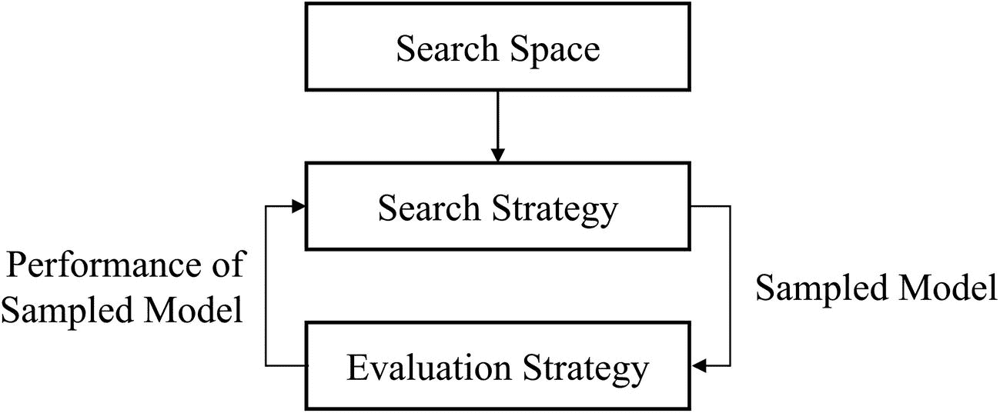

图 5-10

神经架构搜索三个关键组件之间的关系——搜索空间、搜索策略和评估策略

这与贝叶斯优化框架执行优化的结构类似。然而，NAS 系统与通用优化框架的区别在于，它们不是将神经网络架构优化视为一个黑盒问题。神经网络架构搜索方法通过将其构建到所有三个组件的设计中，利用了关于神经网络架构表示和优化的领域知识。

表示神经网络架构的搜索空间是一个有趣的问题。搜索空间必须能够表示一系列广泛的神经网络架构，并且必须以某种方式设置，以便搜索策略能够在搜索空间中导航以采样新的有希望的架构——必须有一些距离的概念（即，某些架构比其他架构“更接近”，见图 5-11)。

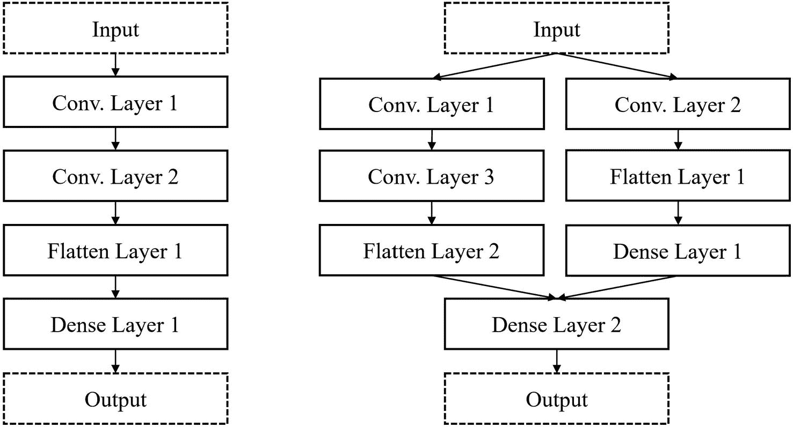

图 5-11

左边 - 顺序拓扑；右边 - 更复杂的非线性拓扑

此外，搜索空间必须能够表示线性和非线性神经网络拓扑，这进一步复杂化了这种搜索空间的组织。

注意，神经网络架构搜索系统为了主要服务于 *搜索策略* 组件，在表示神经网络时付出了巨大的努力，这种表示方式看似人为设计，但并非针对搜索空间本身。如果搜索空间组件的唯一目的是表示模型，当前的图网络实现已经足够。然而，创建一个能够以那种确切格式有效地输出和操作神经网络架构的搜索策略是非常困难的。搜索空间表示的中介允许搜索策略输出一个 *表示*，该表示可以用来构建和评估相应的模型。此外，将搜索空间限制在只有可能成功的某些架构设计，迫使搜索策略从更多高潜力架构中进行采样和探索。

神经网络拓扑的最简单表示可能是将它们表示为具有许多编码和解码表示规则的有序结构信息字符串（见图 5-12)。例如，如果一个“信息块”表示存在一个卷积层，那么其他块必须跟随，包含有关卷积层参数的信息，如内核大小和滤波器数量。

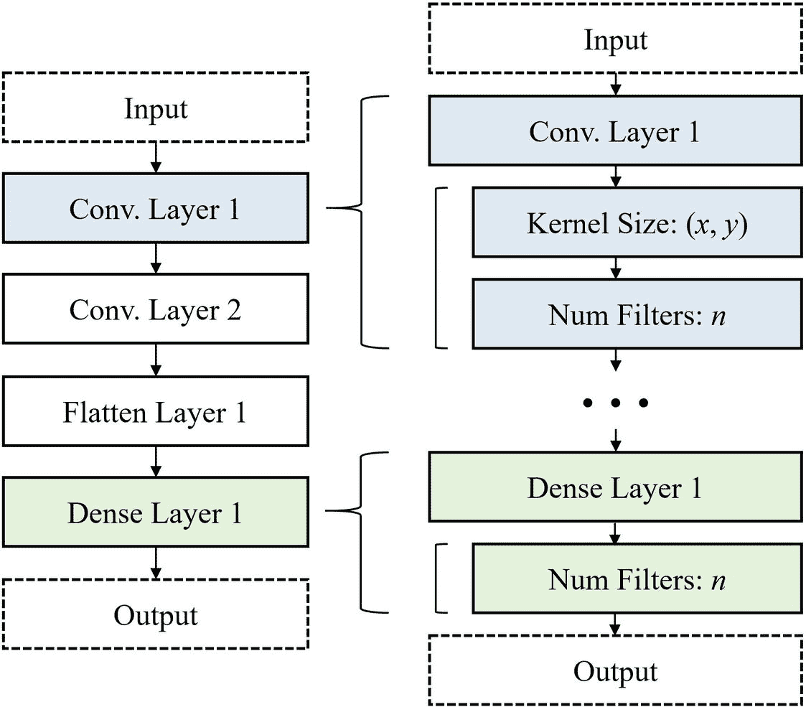

图 5-12

线性神经网络拓扑的顺序表示

可以通过将索引和“锚点”纳入信息序列字符串中，来对表示更复杂非线性拓扑和循环神经网络进行额外的调整。跳过连接可以通过一种注意力机制来建模，其中建模代理可以在任何两个锚点之间添加跳过连接。序列字符串表示非常强大，因为任何神经网络架构——无论多么复杂——都可以用这种格式表示并重建，即使它需要非常长的信息序列。

这种类型的序列表示被用于在 2017 年由 Barret Zoph 和 Quoc V. Le 在早期 NAS 工作中表示搜索空间。尽管这种搜索空间的序列表示非常强大（即，它可以建模许多神经网络架构），但它证明效率不高。然而，由于搜索空间如此之大，神经网络序列表示在导航上证明是低效的。

架构搜索空间的基于细胞的表示（图 5-13）降低了表示能力（即，它们不能表示像序列表示那样多的架构），但它们已被证明在导航上更有效。神经网络架构搜索算法通过选择操作来填充空白“模板细胞”来学习细胞结构的架构。然后，这种细胞结构在最终的神经网络架构中重复。可以使用多种不同的细胞类型，并且细胞可以以非线性方式堆叠在一起。

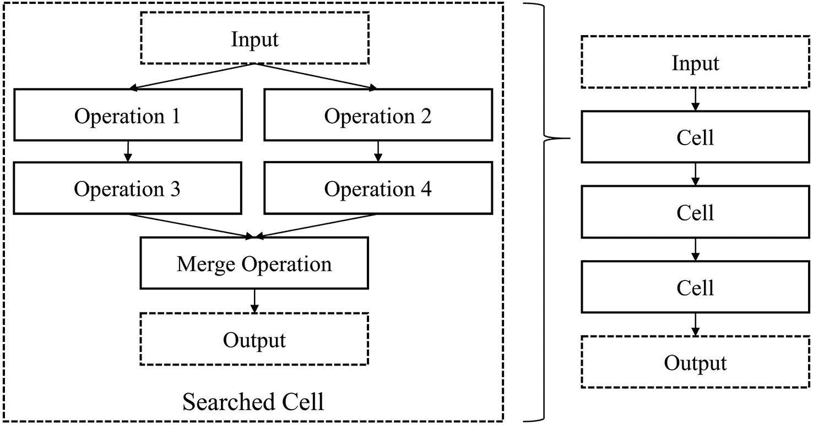

图 5-13

基于细胞的神经网络架构表示。参见 NASNet，了解基于细胞的空间的示例

尽管基于细胞的搜索空间的表示能力显著小于序列表示（必须使用重复段构建网络才能有效地以细胞为单位表示），但它产生了性能更好的架构，并且资源投资更少。此外，这些学习到的细胞可以被重新排列、选择性选择，并转移到其他数据上下文和任务中。

搜索策略在搜索空间内运行，以找到神经网络的最优表示。如前所述，采用的搜索策略取决于搜索空间表示的设计。例如，可以使用基于循环的神经网络来模拟序列表示，该网络接受网络的先前元素并预测下一个相应的信息片段（图 5-14）。

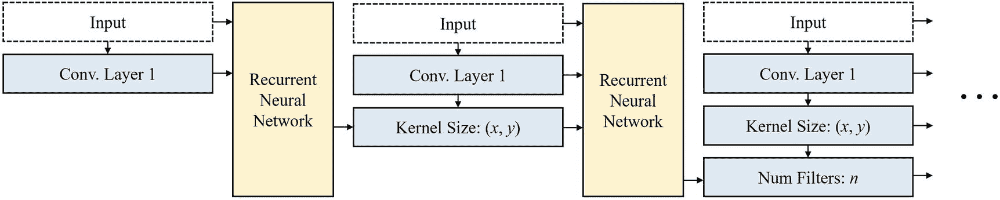

图 5-14

基于序列信息搜索空间的示例循环神经网络搜索策略。这种设计在 2017 年早期 Barret Zoph 和 Quoc. V. Le 的神经网络架构搜索工作中被使用。

强化学习是神经网络架构搜索中常用的一种搜索策略。例如，在前面的例子中，基于循环的神经网络充当**代理**，其参数充当**策略**。代理的策略会迭代更新，以最大化生成架构的预期性能。

大多数搜索策略方法面临一个问题：搜索空间表示是离散的，而不是连续的，但基于梯度的搜索策略不能在纯离散问题上操作。因此，试图利用梯度的搜索策略涉及一些对离散操作进行微分操作的运算。

例如，可微架构搜索（DARTS）的搜索策略使用**连续松弛**。每个可能的操作（例如，卷积、池化、激活等）都可以用来将一个“块”连接到另一个（将这些视为不是层的块，而是网络“锚点”）。每个操作都与一个权重相关联。具有最高权重的两个块之间的操作被构建到最终模型中，并使用基于梯度的方法来找到导致所选模型性能最佳的权重关联。

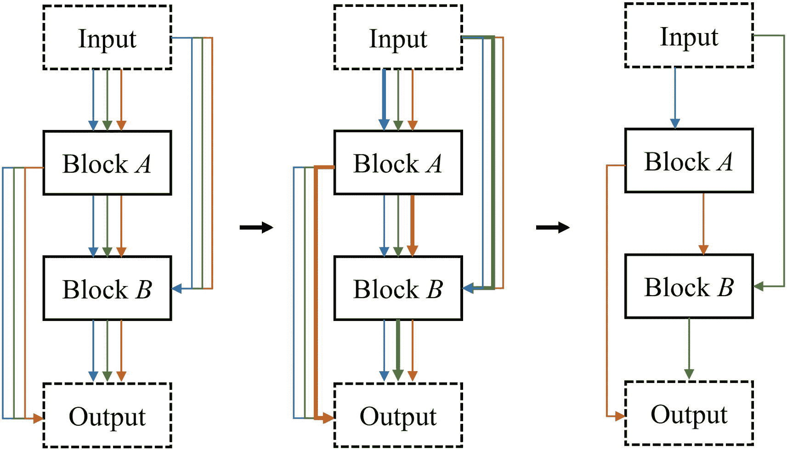

图 5-15

DARTS 中连续松弛的可视化。蓝色、绿色和黄色连接表示可以在块上执行的可能操作，例如使用 5x5 滤波器大小和 56 个滤波器的卷积

进化搜索策略方法不需要这种离散到连续的映射机制。进化算法反复变异、评估和选择模型以获得最佳性能的设计。虽然进化搜索是 2000 年代初最早提出的神经网络架构搜索设计之一，但基于遗传的 NAS 方法在现代背景下仍然产生有希望的结果。现代进化搜索策略通常使用更专业的搜索空间和变异策略，以减少与基于进化方法相关联的效率低下。

评估搜索策略性能的最简单方法是训练所提出的网络架构并将其性能评估到完成。这种直接的网络评估方法足够精确，但计算和时间资源成本高昂。除非搜索策略需要相对较少的模型来找到好的解决方案，否则通常无法直接评估所有提出的架构。

代理评估方法是一种用于指示直接评估性能的方法。存在几种技术：

+   *在较小的样本数据集上训练*：而不是在整个数据集上训练模型，而是在较小的、样本化的数据集上训练所提出的架构。数据集可以随机选择，或者代表数据的不同“组件”（例如，每个标签或数据簇的相等/成比例的数量）。

+   *训练架构的较小*-*缩放*版本：对于涉及预测基于单元格的架构的搜索策略，用于评估的所提出架构可以被缩小（即，更少的重复次数或更低的复杂性）。

+   *预测测试性能曲线*：所提出的架构经过几个 epoch 的训练，并训练一个时间序列回归模型来预测预期的未来性能。预测性能的最大值被认为是所提出架构的预测性能。

在图 5-16 中可视地映射了针对神经网络架构搜索三个组成部分的不同方法。

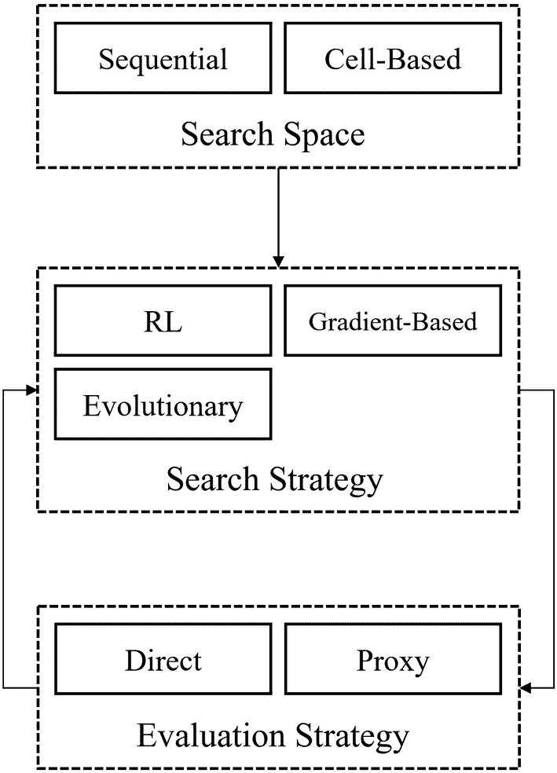

图 5-16

NAS 的搜索空间、搜索策略和评估策略组件中讨论的方法的演示。请注意，所讨论的方法当然只覆盖了现代 NAS 研究的一部分。

关于 NAS 的进展，请参阅本章的案例研究，其中详细介绍了神经网络架构搜索的三个关键进展。

神经网络架构搜索目前是深度学习研究的一个相当前沿的领域。许多讨论的 NAS 方法仍然需要大量的时间和计算资源，并且与卷积神经网络等架构一样，不适合通用使用。我们将使用 Auto-Keras——一个库，它有效地将基于序列模型的优化框架用于架构优化——来进行 NAS。

### Auto-Keras

有许多自动机器学习库，如 PyCaret、H2O 和 Azure；为了本书的目的，我们使用 Auto-Keras，这是一个在 Keras 原生构建的自动机器学习库。Auto-Keras 展示了复杂性的渐进披露原则，这意味着用户既可以构建极其简单的搜索，也可以运行更复杂的操作。

安装时，使用`pip install auto-keras`。

#### Auto-Keras 系统

截至本书编写时，Auto-Keras 神经网络架构搜索系统是少数几个易于访问的 NAS 库之一——即使是当前最先进的 NAS 设计，由于计算成本过高且复杂，也难以实际写入易于接触的包中。

Auto-Keras 使用基于模型的优化（SMBO），这之前被提出作为一个理解贝叶斯优化的正式框架。1。然而，虽然广义 SMBO 被设计用来解决黑盒问题，如 Hyperopt 中使用的 Tree-structured Parzen Estimator 策略，但 Auto-Keras 利用关于问题域（神经网络架构）的领域知识来开发更有效的 SMBO 组件。

虽然 Tree-structured Parzen Estimator 策略采用 TPE 代理模型，但 Auto-Keras 使用了另一个常用的模型，即高斯过程。与所有用于 SMBO 的代理模型一样，高斯过程以概率形式表示关于真实函数的知识。然而，与 TPE 不同的是，高斯过程通过学习可以合理地表示采样数据的函数的概率分布来实现这一点（图 5-17）。拟合采样数据良好的函数将与高概率相关联，而拟合数据不佳的函数将与低概率相关联。这个概率分布的均值是最具代表性的函数。（请注意，存在无限数量的现有函数，因此只有少数函数具有显著的概率。）

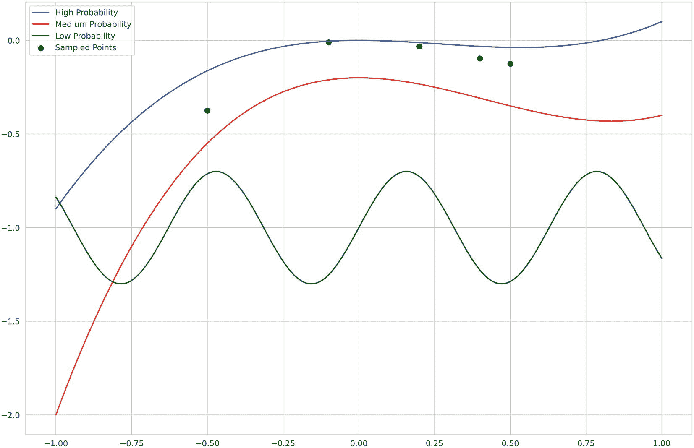

图 5-17

高斯过程背后的思想的简化表示——在采样点上的不同拟合函数及其相关概率。在实践中，你可能在同一个高斯过程操作中不会看到多项式拟合和正弦拟合并排，但这是为了概念上的可视化

高斯过程需要欧几里得空间中函数的概率分布，但将神经网络架构映射到欧几里得空间中的向量是非常困难的。为了解决这个问题，Auto-Keras 使用了 *编辑距离神经网络核*（图 5-18），它量化了将某些网络 *f*[*a*] 变形成另一个网络 *f*[*b*] 所需的最小编辑次数。

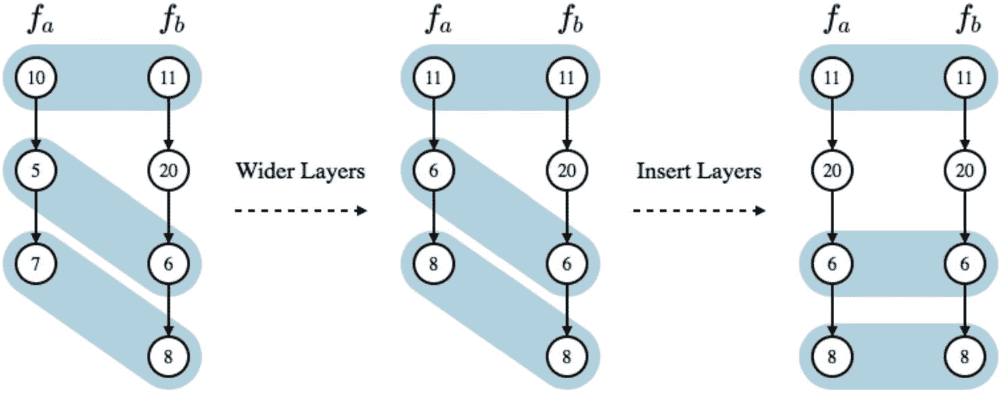

图 5-18

展示了在编辑距离神经网络核中使用的变形过程。首先，将 *f*[*a*] 中的第二和第三层扩展，以包含与 *f*[*b*] 中相应层相同数量的神经元。然后，向 *f*[*a*] 中添加另一个层。由 Auto-Keras 作者创建

编辑距离神经网络核允许对神经网络结构之间的相似性进行量化，这——粗略地说——提供了从离散的神经网络架构搜索空间到高斯过程欧几里得空间的必要联系。使用编辑距离核和相应设计的获取函数，Auto-Keras NAS 算法能够控制关键的利用/探索动态——它采样与成功网络具有低编辑距离的网络架构以进行利用，并采样与表现较差的网络具有高编辑距离的网络架构以进行探索。

Auto-Keras 为每个模型训练指定数量的用户定义的 epoch（即，它使用直接评估方法而不是代理方法），但它的贝叶斯特性需要较少的网络进行采样和训练，前提是搜索空间定义良好。在 Auto-Keras 作者进行的实验中，Auto-Keras 在基准 MNIST、CIFAR-10 和 Fashion 数据集上实现了比最先进的网络形态和基于贝叶斯的方法更低的分类错误。

Auto-Keras API 进一步利用 CPU 和 GPU 之间的并行性；GPU 用于训练生成的模型架构，而 CPU 用于执行搜索和更新（图 5-19）。此外，Auto-Keras 利用内存估计函数以实现高效的 GPU 使用并防止 GPU 内存崩溃（图 5-20）。

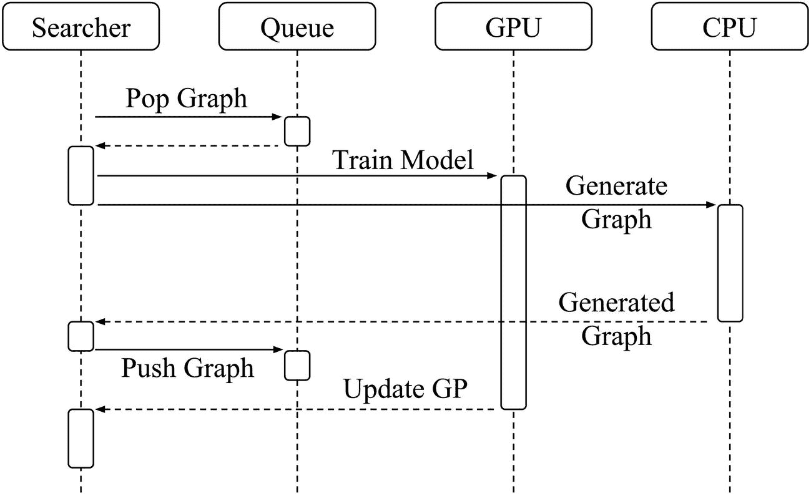

图 5-20

Auto-Keras 的系统设计 – 搜索器、队列、GPU 和 CPU 使用之间的关系。提出的图在 CPU 上生成，保存在队列中，并在 GPU 上训练

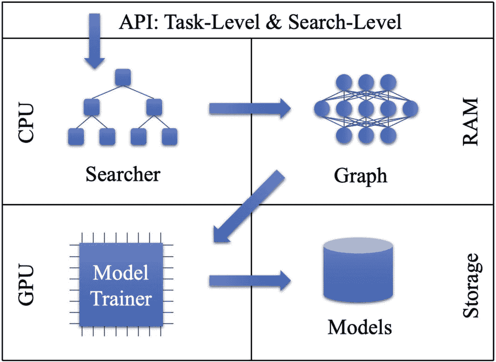

图 5-19

Auto-Keras API 的任务级和搜索级操作在硬件上。由 Auto-Keras 作者创建

在其设计和实现中，Auto-Keras 是使神经架构搜索算法更高效和易于访问的关键库。

#### 简单的 NAS

神经架构搜索的最简单形式是定义输入和输出，并允许 NAS 算法自动确定所有处理层以“连接”输入到输出。让我们考虑构建一个用于图像分类任务的神经网络。Auto-Keras 遵循与 Keras Functional API 非常相似的语法。对于这个特定任务，我们需要定义三个关键元素，通过函数表示法相互连接：

1.  *输入节点*：在这种情况下，输入是一个图像输入，所以我们使用 `ak.ImageInput()`，它接受 numpy 数组和 TensorFlow 数据集。对于其他输入数据类型，使用 `ak.StructuredDataInput()` 处理表格数据（除了 numpy 数组和 TensorFlow 数据集外，还接受 pandas DataFrame），使用 `ak.TextInput()` 处理文本数据（必须是字符串的 numpy 数组或 TensorFlow 数据集；Auto-Keras 会自动进行向量化），或者使用 `ak.Input()` 作为通用输入方法，接受来自所有上下文的 numpy 数组或 TensorFlow 数据集的张量数据。使用最后一种方法会牺牲 Auto-Keras 在指定特定上下文数据输入时自动执行的有助于预处理和链接的功能。这些在 Auto-Keras 术语中被称为 *节点* 对象。无需指定输入形状；Auto-Keras 会自动从传递的数据中推断它，并构建与输入数据形状有效的架构。

1.  *处理块*：你可以将 Auto-Keras 中的块想象成经过强化的 Keras 层的集合——它们执行与层组相似的功能，但被集成到 Auto-Keras NAS 框架中，使得关键参数（例如，块中的层数量、块中的层、每层的参数）可以留空未指定，并自动调整。例如，`ak.ConvBlock()` 块由标准的“vanilla”系列卷积、最大池化、dropout 和激活层组成——具体的层数、序列和类型可以留给 NAS 算法决定。其他块，如 `ak.ResNetBlock()`，生成 ResNet 模型；NAS 算法调整因素，例如使用 ResNet 模型的哪个版本以及是否启用预训练的 ImageNet 权重。块代表神经网络的主要组成部分；Auto-Keras 的设计围绕操作块展开，这允许对神经网络结构进行更高级别的操作。如果你想更加通用，可以使用特定上下文的块，如 `ak.ImageBlock()`，它将自动选择使用哪种基于图像的块（例如，vanilla 卷积块、ResNet 块等）。

1.  *头部/输出块*：与输入节点定义了 Auto-Keras 应期望传递到架构输入中的内容不同，头部块通过确定两个关键因素来定义架构应参与哪种预测任务：输出层的激活函数和损失函数。例如，在分类任务中，使用 `ak.ClassificationHead()`；此块自动推断分类头部（二分类或多分类分类）的性质，并相应地对架构施加限制（二分类使用 sigmoid 和二元交叉熵，多分类使用 softmax 和分类交叉熵）。如果检测到“原始”标签（即，未经过预处理的标签），Auto-Keras 将自动执行二进制编码、独热编码或其他任何必要的编码过程，以使数据符合推断的预测任务。然而，出于预防措施，通常最好确保 Auto-Keras 不需要根据其对您意图的推断进行任何重大更改。同样，对于回归问题，使用 `ak.RegressionHead()`。

为了构建一个极其简单且通用的图像分类模型，我们可以从导入 Auto-Keras 并定义神经网络架构的三个关键组件开始，这些组件以功能关系相互关联（见列表 5-18）。

```py
import autokeras as ak
inp = ak.ImageInput()
imageblock = ak.ImageBlock()(inp)
output = ak.ClassificationHead()(imageblock)
Listing 5-18
Simple input-block-head Auto-Keras architecture
```

注意

对于文本数据，使用 `ak.TextBlock()`，它可以从纯文本、转换器或 n-gram 文本处理块中选择。Auto-Keras 将根据所使用的处理块自动选择一个向量器。对于表格/结构化数据，使用 `ak.StructuredDataBlock()`；Auto-Keras 将自动执行分类编码和归一化。这之后需要跟随一个处理块，如 `ak.DenseBlock()`，它将堆叠全连接层。

正如在 Keras 功能 API 中一样，可以通过指定输入和输出层将这些层聚合到一个“模型”中（见列表 5-19）。`max_trials` 参数表示要尝试的不同 Keras 模型的最大数量，尽管搜索可能在达到该数量之前就结束了。“模型”然后可以在数据上拟合；`epochs` 参数表示在每个候选 Keras 模型上训练的轮数。

```py
search = ak.AutoModel(
inputs=inp, outputs=output, max_trials=30
)
search.fit(x_train, y_train, epochs=10)
Listing 5-19
Aggregating defined components into an Auto-Model and fitting
```

在搜索过程中，Auto-Keras 不仅会自动确定选择哪种类型的图像块，还会确定各种归一化和增强方法以优化模型性能。

在使用 Auto-Keras 进行调试时，您可能会看到一些错误信息打印出来——只要代码继续运行，通常可以忽略警告。

重要的是要认识到这个“模型”实际上并不是一个模型，而是一个搜索对象，它作为一个模板，在之上创建和评估各种模型候选者。为了在训练后提取最佳模型，请调用`best_model = search.export_model()`。然后你可以使用`best_model.summary()`或`plot_model(best_model)`来列出或可视化搜索中最佳模型的架构（图 5-21）。

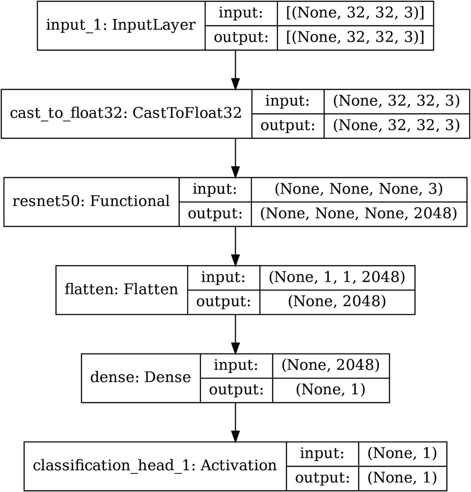

图 5-21

Auto-Keras 模型搜索的示例采样架构

不幸的是，这种简单定义输入和输出，让神经架构搜索（Neural Architecture Search）自行解决其余部分的方法，在可行的时间内不太可能产生好的结果。回想一下，你未调整的每一个参数都是 NAS 算法在优化过程中必须考虑的另一个参数，这增加了它所需的试验次数。

#### NAS with Custom Search Space

通过使用我们知道有效的策略对搜索空间施加某些限制，我们可以设计一个在达到良好解决方案的时间和计算负担方面更加实用的架构。

回想一下，使用 Auto-Keras 意味着玩转更高层次的块或组件。我们知道以下图像识别流程是成功的（参见关于迁移学习和预训练模型的第二章，图 5-22）。

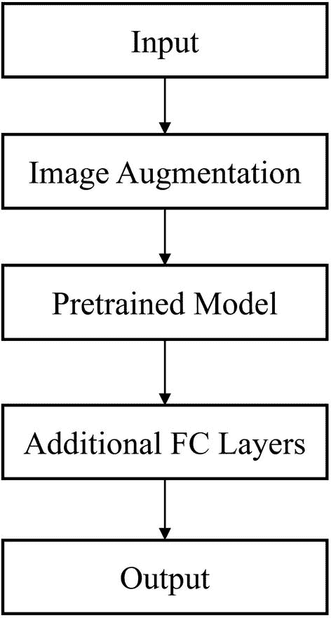

图 5-22

图像识别模型的通用组件级设计

我们可以使用 Auto-Keras 块构建这些模块：

1.  `ak.ImageInput()`，如前所述，是输入节点。

1.  `ak.ImageAugmentation()`是一个执行各种图像增强过程的增强块，如随机翻转、缩放和旋转。如果未指定，增强参数，如是否随机执行水平翻转或选择缩放或旋转因子的范围，将由 Auto-Keras 自动调整。

1.  `ak.ResNetBlock()`，如前所述，是一个只有两个参数的 ResNet 架构——要使用哪个版本的 ResNet（v1 或 v2）以及是否使用 ImageNet 预训练权重进行初始化。这作为我们图像模型设计中的预训练模型组件。

1.  `ak.DenseBlock()`是一个由全连接层组成的块。如果未指定，Auto-Keras 调整四个参数：层的数量、是否在层之间使用批归一化、每层的单元数以及要使用的 dropout 率（0 表示不使用 dropout）。

1.  `ak.ClassificationHead()`，如前所述，是头部块，指定要使用的损失函数和最后一个输出层的激活函数。

让我们定义这些功能之间的关系，并指定我们对其有良好了解的参数（见列表 5-20）。例如，在增强中，我们可能知道我们不想垂直或水平翻转（例如，在 MNIST 数据集中，翻转一些数字将需要更改它们的标签）。我们还知道我们想要一个翻译因子为图像宽度的 10% – 不太大也不小。然而，我们并不完全确定哪个缩放或对比度因子最好；这些参数可以留为 `None`，并将由 Auto-Keras 自动调整。同样，我们希望 ResNet 块使用预训练的权重 – 足够进一步处理 ResNet 块的输出，但不足以导致网络长度和过拟合问题。

```py
inp = ak.ImageInput()
aug = ak.ImageAugmentation(translation_factor=0.1,
vertical_flip=False,
horizontal_flip=False,
rotation_factor=None,
zoom_factor=None,
contrast_factor=None)(inp)
resnetblock = ak.ResNetBlock(pretrained=True,
version=None)(aug)
denseblock = ak.DenseBlock(num_layers=None,
use_bn=None,
num_units=None,
dropout=None)(resnetblock)
output = ak.ClassificationHead()(xceptionblock)
Listing 5-20
Defining an architecture with more complex custom search space, with all parameters specified
```

由于 Auto-Keras 默认将所有参数设置为 `None`，我们可以通过删除所有显式设置为 `None` 的参数来更紧凑地表示相同的指定参数（见列表 5-21）。

```py
inp = ak.ImageInput()
aug = ak.ImageAugmentation(translation_factor=0.1,
vertical_flip=False,
horizontal_flip=True)(inp)
resnetblock = ak.ResNetBlock(pretrained=True,
version=None)(aug)
denseblock = ak.DenseBlock()(resnetblock)
output = ak.ClassificationHead()(xceptionblock)
Listing 5-21
Defining an architecture with more complex custom search space, with only relevant parameters specified
```

然后，可以将这些层聚合到一个 `ak.AutoModel` 中（如图 5-23 所示）并相应地进行拟合。通过指定自定义搜索空间，您可以显著增加在更少的尝试中找到满意解决方案的机会。

注意

对于文本数据，使用 `ak.TextBlock()`，使用 `ak.Embedding()` 进行嵌入（可以使用预训练的 GloVe、fastText 或 word2vec 嵌入作为预训练），并使用 `ak.RNNBlock()` 作为循环层。对于表格/结构化数据，除了标准处理块（如 `ak.DenseBlock()`）外，还使用 `ak.CategoricalToNumerical()` 对分类特征进行数值编码。

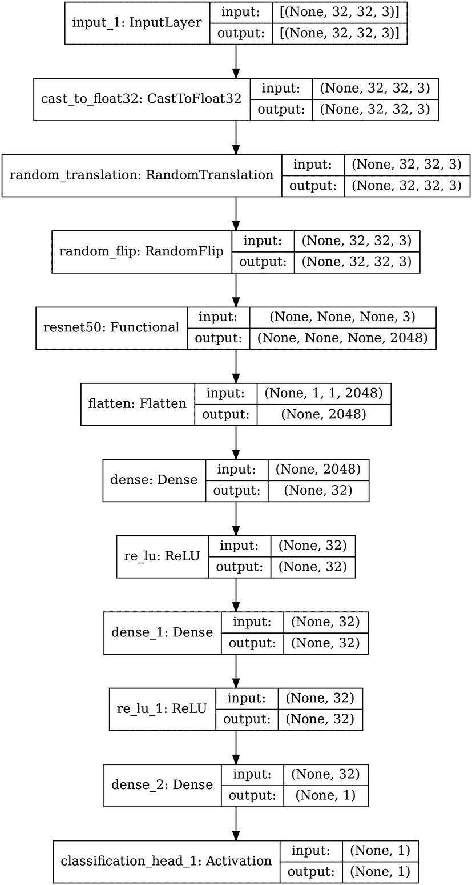

图 5-23

Auto-Keras 模型搜索的示例采样架构

#### 基于非线性拓扑的 NAS

因为 Auto-Keras 是使用类似 Functional API 的语法构建的，我们也可以使用组件定义广泛的非线性拓扑。例如，我们不仅可以通过一个预训练模型块传递输入，还可以通过两个预训练模型传递输入，以获得它们对输入的“见解”/“观点”，然后合并并共同处理这两个模型（见图 5-24）。

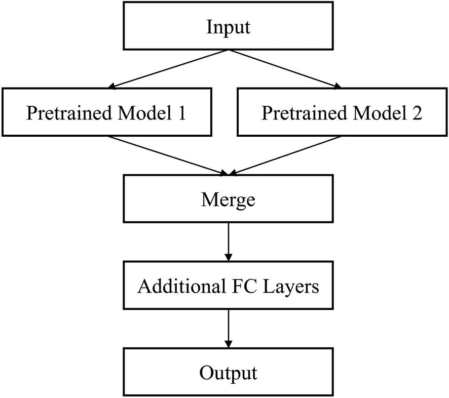

图 5-24

在 Auto-Keras 中实现非线性拓扑的分量式计划

我们可以使用类似 Function API 的语法来表达这个想法，并在之后进行聚合和拟合（见列表 5-22，图 5-25）。

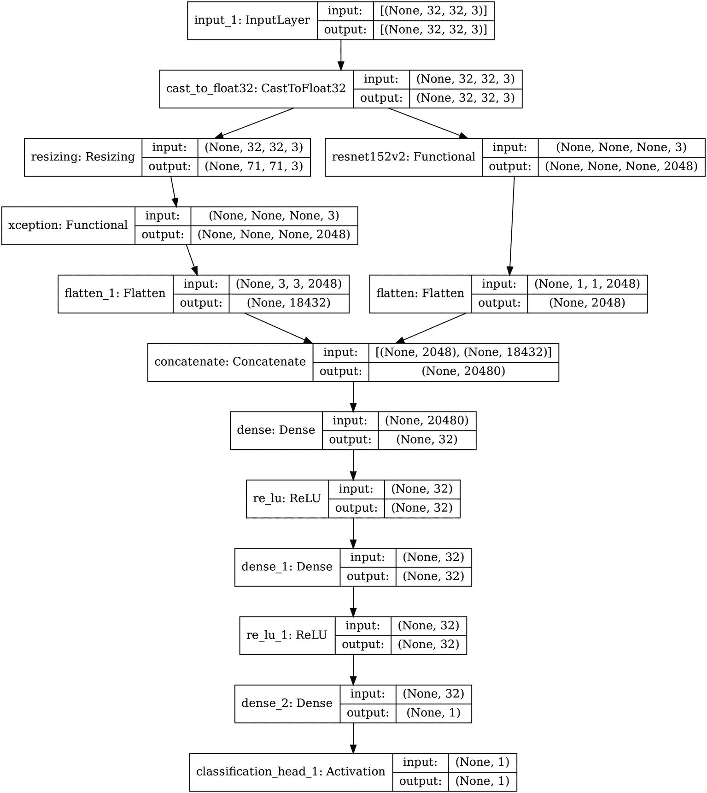

图 5-25

Auto-Keras 模型搜索的示例采样架构

```py
inp = ak.ImageInput()
resnetblock = ak.ResNetBlock(pretrained=True)(inp)
xceptionblock = ak.XceptionBlock(pretrained=True)(inp)
merge = ak.Merge()([resnetblock, xceptionblock])
denseblock = ak.DenseBlock()(merge)
output = ak.ClassificationHead()(denseblock)
Listing 5-22
Building component-wise topologically nonlinear Auto-Keras designs
```

## 案例研究

这三个案例研究讨论了三种不同的方法来开发更成功、更高效的神经架构搜索系统，这些方法基于本章中 NAS 和贝叶斯优化部分讨论的主题。作为快速发展的神经架构搜索研究前沿的支柱，这些案例研究本身将成为未来在自动化更强大的神经网络架构方面工作的基础。

### NASNet

NASNet 搜索空间，由 Barret Zoph、Vijay Vasudevan、Jonathon Shlens 和 Quoc V. Le 提出，是基于细胞的。NAS 算法学习两种类型的细胞：普通细胞和缩减细胞。普通细胞不会改变特征图的形状（即，输入和输出特征图具有相同的形状），而缩减细胞将输入特征图的高度和宽度减半。

细胞被构建为复杂的拓扑组合块，这些块是小型、预先定义的“模板”，包含几个由 NAS 算法学习的“空白操作槽”，这些槽位一起排列成一个网络细胞。一个细胞被定义为一定数量的这些块*B*。(*B=5 在作者的实验中。)然后，这些细胞可以依次堆叠形成神经网络（图 5-26）。

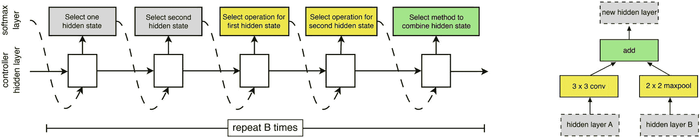

图 5-26

通过循环模型生成架构，该模型输出隐藏状态、操作以及合并方法以在细胞设计中选择

使用循环神经网络通过选择两个用于组合的操作中的隐藏状态、对两个隐藏状态分别应用的两个操作以及一个合并方法来迭代生成这些块。操作包括恒等操作、标准平方核卷积、矩形核卷积、膨胀卷积（核宽度变宽或“膨胀”并在核权重之间留有空隙）、可分离卷积（不仅应用于空间维度，也应用于深度维度）、池化等。两个分支可以通过加法或连接合并。该网络通过强化学习方法训练，以最大化最终神经网络架构提案的测试性能（图 5-27）。

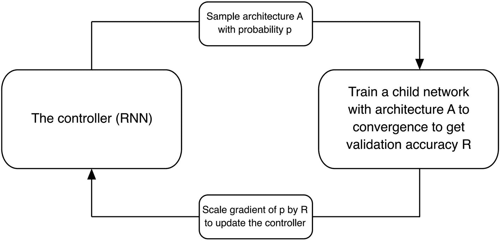

图 5-27

基于循环的控制器与所提出的架构（子网络）之间的关系。控制器被更新以最大化子网络的验证性能。由 NASNet 作者创建

此外，由于循环神经网络能够选择先前构建的单元输出的两个输出来进行单元操作，因此它能够以优雅、递归的方式构建极其复杂的架构（图 5-28 和 5-29）。

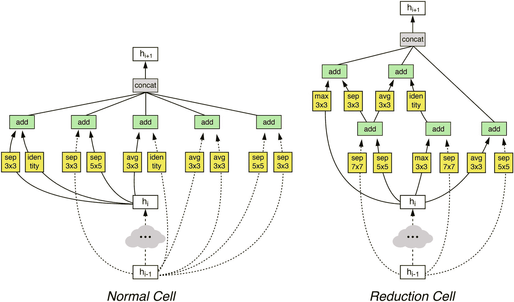

图 5-29

在 ImageNet 上的高性能 NASNet 常规和缩减单元架构。由 NASNet 作者创建

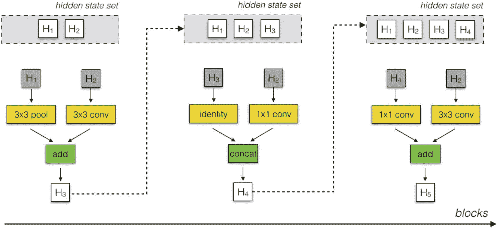

图 5-28

通过循环风格生成选择隐藏状态和操作的示例。由 NASNet 作者创建

派生的常规和缩减单元可以堆叠成不同长度，以适应不同的数据集（图 5-30）。例如，为 CIFAR-10 数据集构建的网络，其令人难以置信的 32x32 分辨率，比为 ImageNet 架构构建的网络使用的缩减单元更少。这种将密集的神经架构搜索的结果转移到各种不同环境中的便利性大大增加了其实用性。

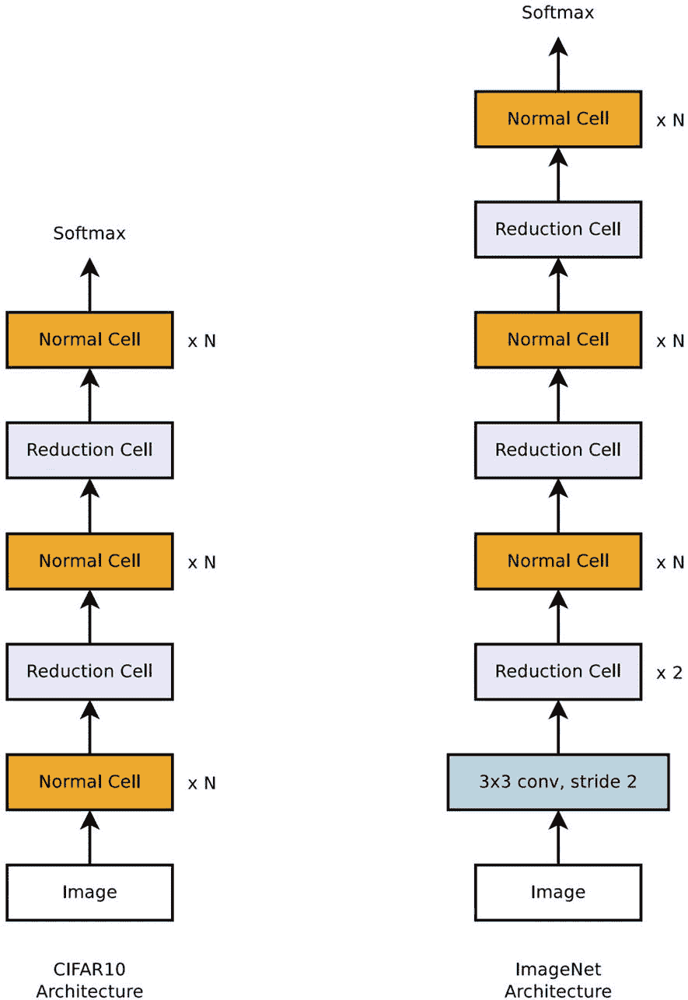

图 5-30

将常规和缩减单元堆叠以适应特定数据集图像大小。由 NASNet 作者创建

NASNet 架构家族由最佳性能的常规和缩减单元构建。它设法在 ImageNet 分类中获得了比 Inception 等之前的架构巨头以及最近提出的参数更少的架构更好的 top 1 和 top 5 准确率（表 5-1）。

表 5-1

不同尺寸的 NASNet（尺寸由常规和缩减单元的不同组合和长度堆叠确定）与类似尺寸模型的性能对比

| 模型 | # 参数 | 性能 |
| --- | --- | --- |
| 排名 1 准确率 | 排名 5 准确率 |
| --- | --- |
| 小型模型– InceptionV2– *Small NASNet* | 11.2 M*10.9 M* | 74.8%*78.6%* | 92.2%*94.2%* |
| 中型模型– InceptionV3– Xception– Inception ResNetV2– *Medium NASNet* | 23.8 M22.8 M55.8 M*22.6 M* | 78.8%79.0%80.1%*80.8%* | 94.%94.5%95.1%*95.3%* |
| 大型模型– ResNeXt– PolyNet– DPN– *Large NASNet* | 83.6 M92 M79.5 M*88.9 M* | 80.9%81.3%81.5%*82.7%* | 95.6%95.8%95.8%*96.2%* |

NASNet 架构（而非搜索过程）带有 ImageNet 权重，在 Keras 中可用。它有两个版本，NASNet Large 和 NASNet Mobile，它们是 NASNet 搜索空间中性能最佳的学习单元架构的缩放版本。这些架构在 `keras.applications` 中可用。

+   `keras.applications.nasnet.NASNetMobile`: 23 MB 存储大小，包含 5.3 m 个参数。

+   `keras.applications.nasnet.NASNetLarge`：343 MB 存储大小，拥有 88.9 m 个参数。（截至本书编写时，NASNet Large 在所有报告了此类指标的`keras.applications`模型中，拥有最高的 ImageNet top 1 和 top 5 准确率。）

请参阅第二章，了解预训练模型的使用。

即使在 NASNet 在开发高性能细胞架构方面取得了进展，这样的结果也需要数百个 GPU 和 3-4 天在谷歌强大实验室的训练时间。其他进展旨在构建更易于计算访问的搜索操作。

### 渐进式神经网络架构搜索

刘晨曦，与约翰霍普金斯大学、谷歌 AI 和斯坦福大学的其他合著者一起，提出了**渐进式神经网络架构搜索**（PNAS）。^(3) 如其命名所示，PNAS 采用了一种从简单到复杂的渐进式方法来构建神经网络架构。此外，PNAS 巧妙地将许多先前讨论过的神经网络架构搜索方法结合成一个统一、高效的方法：基于细胞的搜索空间、基于序列模型优化的搜索策略和代理评估。

渐进式神经网络架构搜索所使用的搜索空间与 NASNet 设计非常相似，但有一个关键的区别：PNAS 不是学习两种不同的细胞（一个普通细胞和一个缩减细胞），而是只学习一种“普通细胞”（见图 5-31)。通过使用步长为 2 的普通细胞，可以形成一个“缩减细胞”。这略微减少了相对于 NASNet 的搜索空间大小。

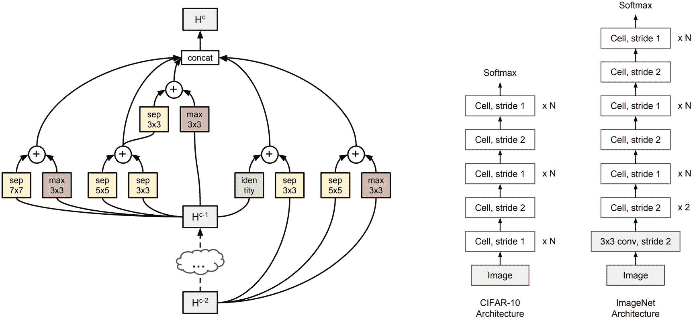

图 5-31

渐进式神经网络架构搜索的细胞设计。左 - 高性能 PNAS 细胞设计。右 - PNAS 细胞架构如何通过不同的步长堆叠以适应不同大小的数据集。由 PNAS 作者创建

PNAS 使用了基于序列模型优化的搜索策略，其中选择最“有希望”的模型提案进行评估，并配合一个代理评估器。

代理评估器，一个 LSTM，被训练去读取表示提议模型架构的信息序列，并预测提议模型的表现。由于处理可变长度输入的能力，选择了基于循环的模型。请注意，代理评估器在一个非常小的数据集上进行了训练（标签 - 提议模型的表现 - 获得成本高昂），因此使用在数据集子集上训练的 LSTM 集合来支持泛化并减少变化。基于 RNN 的方法预测的候选模型架构的性能可以达到与真实性能排名高达 0.996 的 Spearman 等级相关系数。

渐进式神经网络架构搜索（Progressive Neural Architecture Search，图 5-32）首先从最简单的细胞架构开始，这些架构仅包含一个模块。然后，通过向细胞架构中添加另一个模块来扩展每个细胞。随着细胞架构中模块数量的增加，候选数量和训练所需的资源呈指数增长，因此这些候选模型不能全部进行训练。这就是代理评估器发挥作用的地方——代理评估器在可忽略的时间内评估数十万个提出的架构，并从中采样出最具有潜力的 *K* 个架构（根据代理评估器的性能最高）进行直接评估。这些架构的结果反过来又用作额外的训练数据来更新代理评估器。这个过程会重复进行，直到达到每个细胞中模块数量的满意数量。

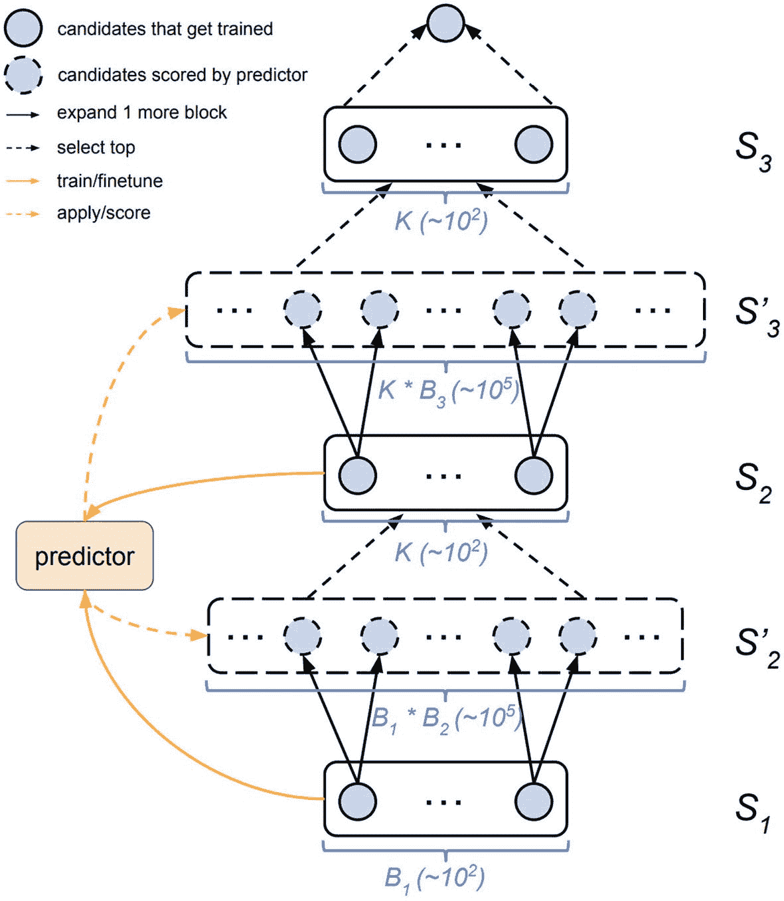

图 5-32

PNAS 搜索和评估过程的可视化。从 *S*[1] 到 *S*′[2] 训练的细胞架构通过增加一个模块进行扩展。这些生成的细胞架构通过代理评估器（在可视化中标记为“预测器”）进行评估，并从中选择几个进行 *S*[2] 的训练。由 PNAS 作者创建。生成的架构的性能用于更新代理评估器。这个过程会重复进行。

代理评估器在基于序列模型优化的代理函数中充当代理函数，用于执行采样，并通过使用采样结果进行更新以提高准确性。其渐进式设计允许计算效率——如果每个细胞中模块数量较少就能获得良好的性能，我们就可以避免运行每个细胞中模块数量较多的架构；即使每个细胞中模块数量较少不能产生良好的结果，它也作为代理评估器的实时训练。

这种设计使得渐进式神经网络架构搜索（Progressive Neural Architecture Search）在速度上比之前的 NAS 方法有显著提升，在达到相同准确率的同时，减少了需要训练的模型数量数千个。此外，其基于细胞的架构设计，类似于 NASNet，允许细胞设计在不同数据集之间进行迁移（见表 5-2）。

表 5-2

PNAS 与 2017 年 Barret 和 Zoph 的早期工作的性能对比，其中使用强化学习来优化 RNN 以生成 CNN 架构的顺序表示。请注意，这与 2018 年 Zoph、Vasudevan、Shlens 和 Le 的密切相关的工作不同，后者在 NASNet 中使用基于细胞的表示。“<方法>上训练的 # 模型”表示该方法训练的模型数量以达到所列的对应性能。PNAS 可以将训练的模型数量减少近五倍。

| 每块细胞数 | 前 | 准确率 | PNAS 训练的模型数 | NAS 训练的模型数 |
| --- | --- | --- | --- | --- |
| 5 | 1 | 0.9183 | 1160 | 5808 |
| 5 | 5 | 0.9161 | 1160 | 4100 |
| 5 | 25 | 0.9136 | 1160 | 3654 |

### 高效神经架构搜索

虽然渐进式神经架构搜索中的代理评估允许快速预测所提出模型架构的潜力，从而减少了需要训练以获得良好性能的模型数量，但过程中的计算和时间瓶颈仍然存在于训练阶段。Hieu Pham 和 Melody Y. Guan，以及 Barret Zoph、Quoc V. Le 和 Jeff Dean 提出了 *高效神经架构搜索*（ENAS）^(4）方法，该方法试图通过在训练期间强制所有候选架构之间进行 *权重共享* 来减少获得候选模型性能准确度所需的时间。

ENAS 使用与 NASNet 创作者使用的类似的基于强化学习和循环的架构生成模型，但有一个关键区别：ENAS 中控制器模型不仅识别要选择的操作，还识别操作如何连接，而不是预先定义单元的“模板”或“槽位”，并训练架构生成模型来识别哪些操作要“填充”到“槽位”中。

候选网络架构可以用有向无环图（DAG）或具有方向但没有环的图（即，通过跟随节点之间的有向连接，你不会陷入循环）来表示。一个具有 *N* 个节点的 DAG（图 5-33，*N*=4）被初始化，其中每个节点都连接到其他所有节点。这个“完全连接”的 DAG 代表了该块的搜索空间，架构可以通过在完整的 DAG 内选择 *子图* 来采样。包含在采样子图中的节点连接到操作，并且所有图的“死胡同”都被平均并被认为是单元的输出。

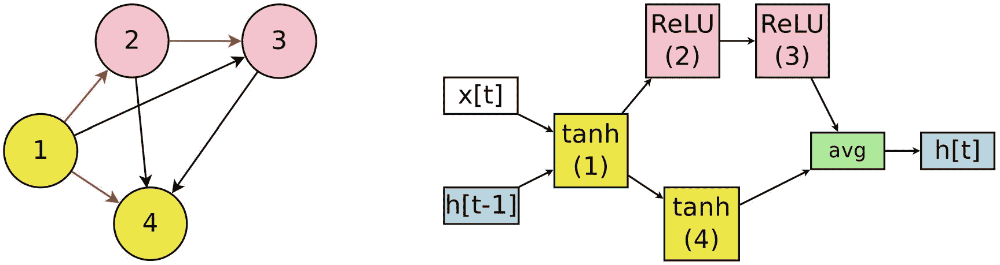

图 5-33

左：红色显示的“完全连接”DAG 及其选定的子图。右：基于采样子图的示例架构

这些架构是通过使用强化学习方法训练的 LSTM 生成的，以最大化生成架构的验证性能（图 5-34）。LSTM 通过输出当前生成节点将要连接到的节点的索引来选择子图。这种生成过程可以应用于生成将被堆叠到完整架构中的单元，也可以单独生成整个架构。

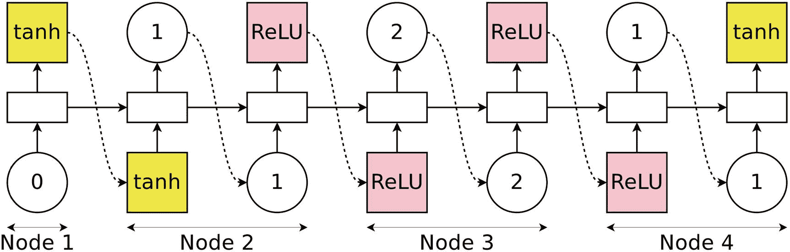

图 5-34

对图 5-30 中所示示例模型的“完全连接”DAG 中的子图进行循环模型选择

所有采样架构作为“超级图”、“全连接”DAG 的子图的概念理解至关重要，这是 ENAS 使用权重共享的基础。这个“全连接”DAG 代表节点之间的一系列基于知识的关系；为了最大效率，存储在“全连接”DAG 连接中的知识应转移到选定的子图中。因此，所有包含相同连接的提出的子图将共享该连接的相同值。对一个提出的架构的连接进行的梯度更新也将在具有相同对应连接的其他提出的架构上以相同的方式进行。

通过共享权重，提出的模型可以通过更新它们共有的权重来“相互学习”，这些权重是通过另一个模型架构的见解得出的。此外，它还提供了一个粗略的近似，即具有相似架构的模型在相同条件下会如何发展。

这种激进的权重共享“近似”允许大量提出的模型架构在较小的计算和时间消耗下进行训练。一旦子模型被训练，它们将在一小批验证数据上评估，并且从零开始训练最有希望的子模型。

通过额外的正则化，高效的神经架构搜索可以从几天加速到一天的小部分，使用非常少的 GPU（见表 5-3）。ENAS 是将神经架构搜索变为现实，走出高计算实验室的一大步。

表 5-3

ENAS 与其他神经架构搜索方法结果的性能对比。CutOut 是一种用于正则化的图像增强方法，在训练过程中随机遮蔽输入的方形区域。CutOut 应用于 NASNet 和 ENAS 以提高最终架构的性能

| 方法 | GPUs | 时间（天） | 参数 | 错误 |
| --- | --- | --- | --- | --- |
| 层次 NAS | 200 | 1.5 | 61.3 m | 3.63% |
| 基于 Q 学习的微 NAS | 32 | 3 | – | 3.60% |
| 进阶 NAS | 100 | 1.5 | 3.2 m | 3.63% |
| NASNet-A | 450 | 3–4 | 3.3 m | 3.41% |
| NASNet-A + CutOut | 450 | 3–4 | 3.3 m | 2.65% |
| ENAS | 1 | 0.45 | 4.6 m | 3.54% |
| ENAS + CutOut | 1 | 0.45 | 4.6 m | 2.89% |

## 关键点

在本章中，我们讨论了通用超参数优化和神经架构搜索的直觉、理论和实现，以及它们在 Hyperopt、Hyperas 和 Auto-Keras 中的实现：

+   在元优化中，控制器模型优化受控模型的架构参数，以最大化受控模型的表现。它允许进行更有结构的搜索，以找到最佳的“类型”模型进行训练。实际中使用的元优化方法会重复选择受控模型的架构参数并评估其性能。与网格搜索或随机搜索等天真方法不同，实际中使用的元优化算法会结合先前选择的架构参数的性能信息，以指导下一组参数的选择。

+   元优化中的一个关键平衡是搜索空间的大小。将搜索空间定义得比实际需要的大，会显著增加获得良好解决方案所需的计算资源和时间，而将搜索空间定义得太窄，很可能会得到与用户指定的参数没有区别的结果（即元优化不是必要的）。在确定元优化要优化的参数时，要尽可能保守（即不要在搜索空间中过度冗余），但确保分配给元优化的参数“足够宽”，以产生显著的结果。

+   贝叶斯优化是一种元优化方法，用于解决黑盒问题，其中关于目标函数的唯一信息是输入（即“查询”）的对应输出，并且查询函数的成本很高。贝叶斯优化利用代理函数，这是目标函数的概率表示。代理函数决定了如何对目标函数的新输入进行采样。这些样本的结果反过来又影响代理函数的更新。随着时间的推移，代理函数会发展出对目标函数的准确表示，从而可以轻松地推导出最优参数集。

    +   基于模型的序列优化（SMBO）是贝叶斯优化的形式化，它作为一个核心组件或模板，各种模型优化策略都可以据此制定和比较。

    +   树结构帕泽恩估计器（TPE）策略被 Hyperopt 使用，它通过贝叶斯规则和基于双分布阈值的方案来表示代理函数。TPE 从目标函数输出较低的位置进行采样。

    +   Hyperopt 的使用包括三个关键组件：目标函数、搜索空间和搜索操作。在元优化的背景下，模型是在目标函数内部通过采样参数构建的。搜索空间通过包含 `hyperopt.hp` 分布（正态分布、对数正态分布、量化正态分布、选择等）的字典来定义。Hyperopt 可以用于优化训练过程，以及对模型架构进行精细调整的优化。Hyperas 是一个 Hyperopt 包装器，通过消除为每个参数定义单独搜索空间和独立标签的需求，使得使用 Hyperopt 优化神经网络设计的各个组件变得更加方便。

+   神经架构搜索（NAS）是自动化神经网络架构工程的过程。NAS 包含三个关键组件：搜索空间、搜索策略和评估策略。神经网络的搜索空间可以最简单地表示为一系列操作的顺序序列，但这并不如基于单元的设计高效。搜索策略包括强化学习方法（训练一个控制器模型以找到最优策略——受控模型的参数）和进化设计。像 DARTS 这样的方法将神经网络的离散搜索空间映射到一个连续且可微分的空间。对采样参数的评估可以采取直接评估或代理评估的形式，其中通过牺牲精度，以更少的资源估计参数的性能。

    +   Auto-Keras 系统使用基于序列模型的优化，结合基于高斯过程代理模型设计和编辑距离神经网络核来量化网络结构之间的相似性。此外，Auto-Keras 通过 GPU-CPU 并行构建，以实现最佳效率。在用户使用方面，Auto-Keras 采用渐进式复杂性披露原则，使用少量代码即可构建极其简单和更复杂的架构。此外，因为它遵循类似 Functional API 的语法，用户可以构建具有非线性拓扑的可搜索架构。

在下一章中，我们将讨论成功神经网络架构设计中的模式和概念。
