# 6. 成功的神经网络架构设计

> *设计既是寻找问题也是解决问题的过程。*
> 
> ——布莱恩·劳森，作者和建筑师

上一章关于元优化讨论了神经网络设计的自动化，包括神经网络架构的自动化设计。在自动化神经网络架构设计的章节之后紧接着讨论成功的（隐含的，手动）神经网络架构设计可能看起来有些奇怪，但事实是深度学习不会很快（或根本不会）达到一个设计状态，可以完全摒弃对神经网络架构设计中的关键原则和概念的理解。首先，你已经看到，尽管神经架构搜索（NAS）取得了快速进展，但它仍然在许多方面受到计算可访问性和问题域范围的限制。此外，神经架构搜索算法本身需要做出隐含的架构设计决策，以便使搜索空间更易于搜索，这需要人类 NAS 设计师理解和编码。架构的设计根本不能完全自动化。

迁移学习的成功是早期且强有力的证据，表明神经网络架构的设计是一项研究，普通深度学习工程师不必进行研究。毕竟，如果 TensorFlow 和 PyTorch 中内置的预训练模型库不能满足你问题的需求，那么像 TensorFlow 模型库、GitHub 和 pypi 这样的平台托管了大量的易于访问的模型，这些模型可以转移，通过最小的架构修改稍作调整以适应你问题的数据形状和目标，并在你的特定数据集上进行微调。

这部分是正确的——公开共享的模型架构和权重的可用性减少了从头开始设计大型架构的需求。然而，在实践中，你选择的模型架构很可能不完全符合你问题的上下文。除非架构是专门为你的问题域设计的（即使是这样），通常还需要进行更重大的架构修改（见图 6-1）。

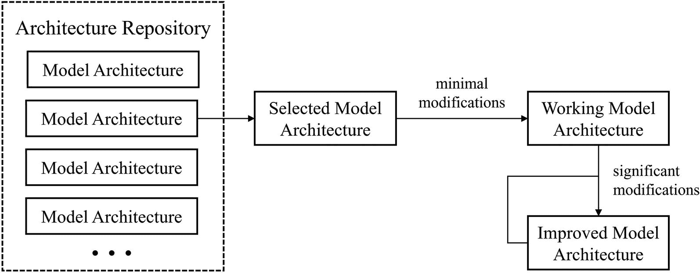

图 6-1

架构通常仍然需要重大修改以适应你特定的问题域

对架构进行这些重大修改以适应你问题域中的成功是一个持续的过程；在设计你的网络时，你应该反复试验架构，并根据先前实验和出现的问题的反馈信号进行架构调整。

构建成功的修改并将其成功集成到通用模型架构中需要了解成功的架构构建模式和技巧。本章将讨论神经网络架构构建中的三个关键思想——非线性和平行表示、基于单元的设计和网络扩展。了解这些概念后，你不仅能够成功修改通用架构，还能够分析性地分解和理解架构，并从头开始构建成功的模型架构——这种工具的价值不仅限于网络架构的构建，还扩展到如 NAS 等前沿领域。

为了实现这些目标，我们需要更复杂地使用 Keras。随着我们寻求实现的神经网络架构变得更加复杂，实现的模糊性越来越大——也就是说，有许多“正确答案”。为了更有效地导航这种实现的模糊性，我们将开始*模块化*、*自动化*和*参数化*网络架构的定义：

+   *模块化*：这个概念在第三章 3“自编码器”中引入，其中大型模型被定义为一系列相互连接的子模型。虽然我们不会为每个组件定义模型，但我们需要定义能够自动为我们创建网络新组件的函数。

+   *自动化*：我们将定义构建神经网络的方法，这些方法可以构建比我们在代码中明确定义的更多架构部分，使我们能够更容易地扩展网络并开发复杂的拓扑模式。

+   *参数化*：明确定义关键架构参数（如宽度和深度）的网络不够稳健也不可扩展。为了模块化和自动化神经网络设计，我们需要定义相对于其他参数的参数，而不是作为绝对、静态的值。

你会发现本章讨论的内容可能比前几章更抽象。这是开发更复杂架构和更深入感受神经网络动态过程的一部分：而不是将架构仅仅视为按某种格式排列的层集合，这些层以某种任意和神奇的方式形成一个成功的预测函数，你开始识别和使用模式、残差、并行分支、基数、单元、缩放因子和其他架构模式和工具。这种设计视角在开发更专业、成功和通用的网络架构设计中将非常有价值。

## 非线性和平行表示

仅仅线性神经网络架构拓扑结构表现良好但并不足够好的认识，推动了——或多或少——每个成功的现代神经网络设计中拓扑的非线性。当我们想要将其扩展以获得更大的建模能力时，神经网络拓扑中的线性就变成了负担。

理解非线性架构拓扑设计成功和原则的良好概念模型是，将每一层视为一个参与更大对话的“思维者”——大型连接网络的一部分。将输入传递到网络中就像向这些思维者呈现一个未回答的问题供他们考虑。每个思维者都会以他们独特的方式照亮输入，对其进行某种形式的转换——可能是重新定义问题或在其回答中添加一些进步，然后将他们思考的结果传递给下一个思维者。你希望设计这些思维者的排列——即某些思维者获取和传递信息——使得对话的输出（即对输入问题的回答）尽可能多地利用每个思维者的观点。

让我们考虑一个假设性的思维者网络如何处理古老的问题，“生命的意义是什么？”（图 6-2）。第一个思维者将意义的问题重新定义为价值问题，并关注那些拥有生命——生物——作为问题的主体，进而问道：“生物在其生活中最重视什么？”下一个思维者从人类中心主义的角度解释这个问题，将其与人类如何重视生命相关联。最后一个思维者回答人类最重视幸福，这个网络的输出是共同的答案“幸福”。

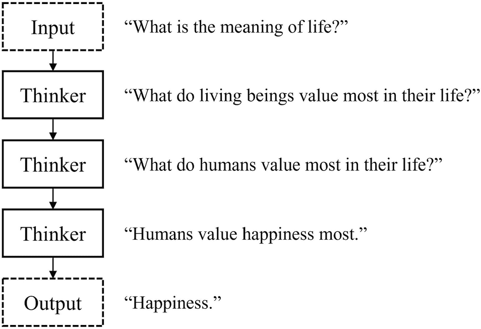

图 6-2

假设性对话：线性排列的思维者链——对古老问题“生命的意义是什么？”的回答

由于这些思维者的线性拓扑结构，每个思维者只能通过前一个思维者提供的信息进行思考。所有在第一个思维者之后的思维者都无法直接访问原始输入问题；例如，第三个思维者被迫回答第二个思维者对第一个思维者对原始问题的解释。虽然增加网络的深度可以非常强大，但它也可能导致我们面前看到的问题，即后来的“思维者”或层逐渐脱离输入的原始上下文。

通过将非线性添加到我们的思维者排列中，网络能够通过更直接地将“思维者”与对话“链”中各个位置的多个思维者的进展相连接，从而生成更复杂的表示。在这个思维者的非线性排列示例中，我们从第一个思维者添加了一个额外的连接到第三个思维者，使得第三个思维者能够吸收第一个和第二个思维者的想法。它不仅仅是对第二个思维者的解释做出反应，而是能够考虑多个思维者的进展和想法。

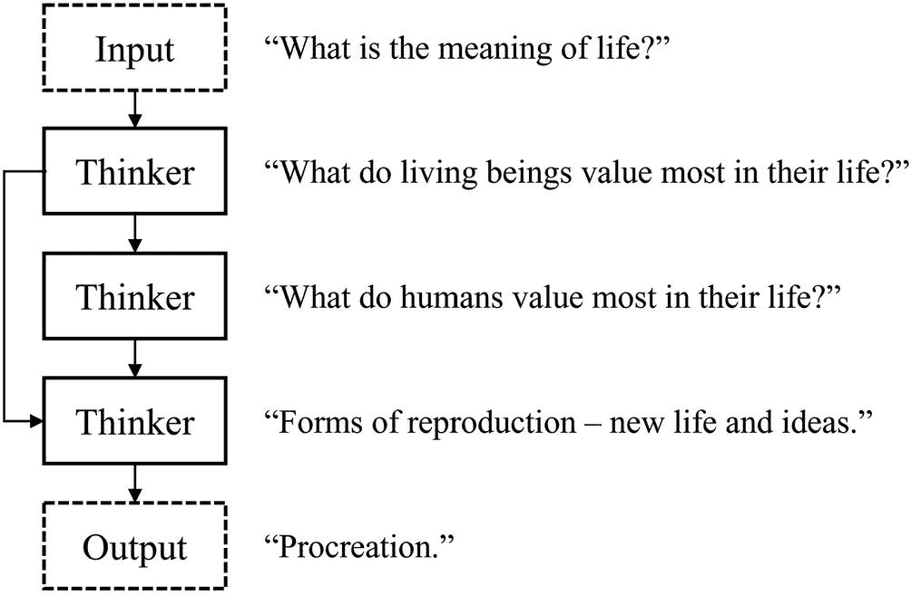

图 6-3

在思维者的排列中添加非线性，显著改变了对话的输出

在这个示例中，第三个思维者概括了第一个和第二个思维者的进展——“生物体在其生活中最重视什么？”和“人类在其生活中最重视什么？”——在纯粹从生命的价值角度和更深入的人文视角之间。第三个思维者回答：“繁殖形式——新的生命和思想”，这指的是繁殖在生物进化以及人类文明中个体、代际和社会的思想传播中的作用。为了总结第三个思维者的想法，因此网络的输出是“繁殖”。

通过从第一个思维者到第三个思维者添加一个连接，网络的输出已经从“幸福”——一个更简单、更本能的回答——转变为“繁殖”的概念，这是一个更深层次、更深刻的回应。这里的关键区别在于考虑中融合不同观点和想法的元素。

大多数人都会同意，更多的对话而不是更少的对话有利于伟大思想和洞察力的出现。同样，将每个连接视为一个“单向对话”。当我们增加思维者之间的更多连接时，我们就在我们的思维者网络中增加了更多的对话。有了足够数量和非线性连接，我们的网络将爆发出一阵活动、讨论和对话，其表现将优于线性排列的网络。

### 残差连接

残差连接是非线性的第一步——这些是在非相邻层之间放置的简单连接。它们通常被表示为“跳过”一个或多个层，这就是为什么它们也经常被称为“跳过连接”（图 6-4）。

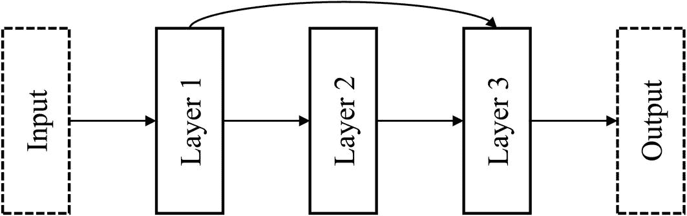

图 6-4

残差连接

注意，由于 Keras 功能 API 不能将多个层定义为另一层的输入，在实现中，连接首先通过添加或连接等方法合并。然后，合并的组件被传递到下一层（见图 6-5）。这是所有残差连接图示的隐含假设。

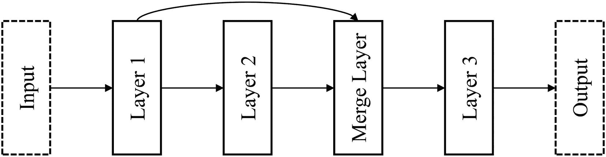

图 6-5

技术上正确的合并层残差连接

尽管残差连接是极其通用的工具，但根据各自开创了残差连接使用的 ResNet 和 DenseNet 架构，通常有两种残差连接的使用方法。所谓的“ResNet 风格”的残差连接在整个网络中采用一系列短残差连接，这些连接被常规地重复使用（见图 6-6）。

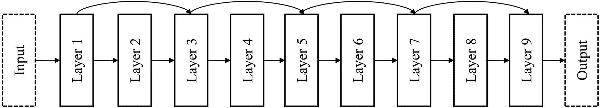

图 6-6

ResNet 风格的残差连接使用

相反，“DenseNet 风格”的残差连接将残差连接放置在有效层之间（即，被指定为可以附加残差连接的层，也称为“锚点”或“锚层”）（见图 6-7）。由于这种残差连接的使用方式——正如人们可以想象的那样——会导致大量残差连接，DenseNet 风格的架构很少将所有层都视为残差连接。在这种风格中，长残差连接和短残差连接都被用来在架构的不同部分之间提供信息路径。因为每个锚点都与之前的每个锚点相连，所以它被网络处理和特征提取的各个阶段所告知。

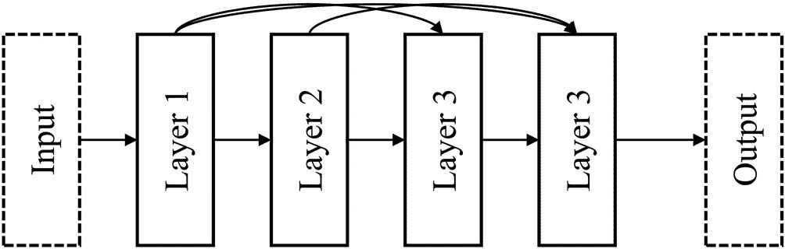

图 6-7

“DenseNet 风格”的残差连接使用

这种残差连接的表示（见图 6-4）可能是对残差连接实现目的的最方便的解释。它将残差连接可视化为主序列层（即线性“骨干”层）上添加的非线性。在 Keras 功能 API 中，理解残差连接作为“跳过”主序列层是最容易的。一般来说，在考虑到线性骨干的概念下实现非线性是最为合适的，因为代码是以线性格式编写的，这可能会使非线性难以转换。

然而，对于什么是残差连接，还有其他架构上的解释，这些解释在概念上可能与神经网络架构中的一般非线性类更一致。而不是依赖于线性骨干，你可以将残差连接理解为将其前面的层分成两个分支，每个分支以它们独特的方式处理前一层的输出。一个分支（图 6-8 中的层 1 到层 2 到层 3）使用专用函数处理前一层的输出，而另一个分支（层 1 到恒等函数到层 3）使用恒等函数处理层的输出——也就是说，它只是允许前一层的输出通过，这是“最简单”的处理形式（图 6-8）。

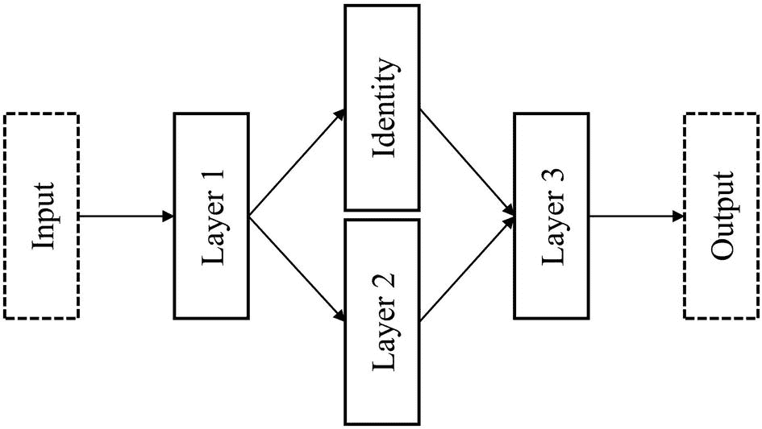

图 6-8

将残差连接作为分支操作的另一种解释

这种概念上理解残差连接的方法更容易让你将它们分类为一般非线性架构的子类，这可以理解为一系列分支结构（图 6-9）。我们将在探索并行分支和基数时看到这种解释如何有所帮助。

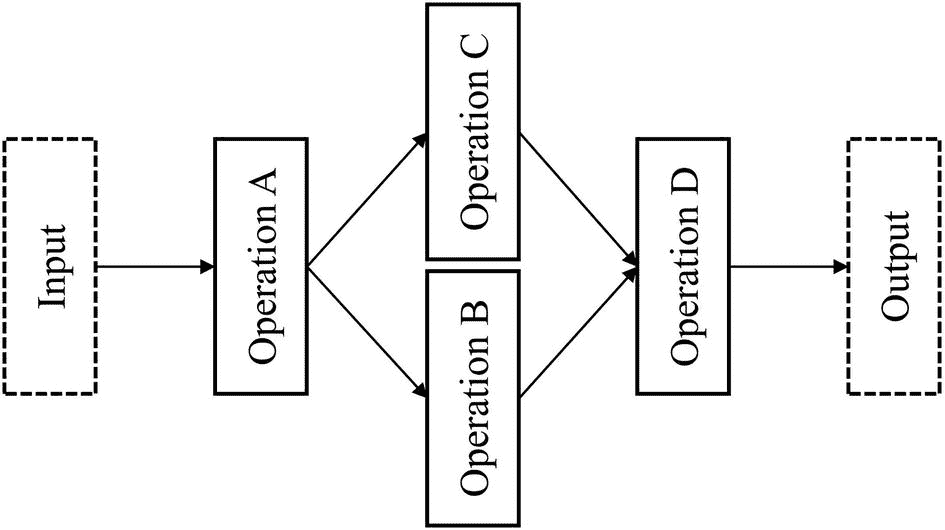

图 6-9

广义非线性形式

残差连接通常被用作*梯度消失问题*（图 6-10）的技术理由，这个问题与之前讨论的线性排列问题有许多相似之处：为了访问某些层，我们需要先通过几个其他层，从而稀释信息信号。在梯度消失问题中，用于更新权重的非常深神经网络中的反向传播信号会逐渐变弱，以至于前层几乎未被利用。

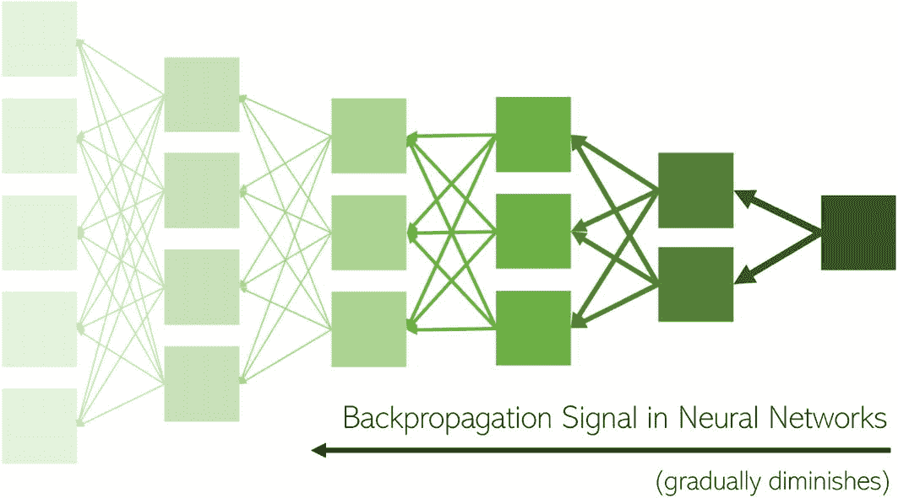

图 6-10

梯度消失问题

然而，使用残差连接，反向传播信号通过较少的平均层到达特定层的权重以进行更新。这使得反向传播信号更强，能够更好地利用整个模型架构。

对于残差连接也有其他的解释。例如，随机森林算法由许多在数据集的一部分上训练的小决策树模型组成，一个具有足够数量残差连接的神经网络可以被视为由较少层数构建的较小序列模型的“集成”（如图 6-11 所示）。

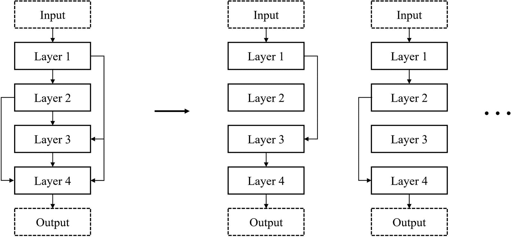

图 6-11

将 DenseNet 风格的网络分解为一系列线性拓扑

残差连接也可以被视为性能不佳层的“安全网”。如果我们从层 A 到层 C 添加一个残差连接（假设层 A 连接到层 B，层 B 再连接到层 C），网络可以“选择”忽略层 B，通过学习接近零的权重来从 A 到 B 和从 B 到 C 的连接，同时信息通过残差连接直接从层 A 传输到层 C。然而，在实践中，残差连接更多地充当了数据的额外表示，用于考虑，而不是作为安全网机制。

利用我们对于功能 API 的知识，实现单个残差连接相当简单。我们将使用第一个提出的残差连接架构的解释，其中残差连接在线性架构骨干的非相邻层之间充当“跳过机制”。为了简化，让我们将这个线性架构骨干定义为一系列 Dense 层（清单 6-1，图 6-12）。

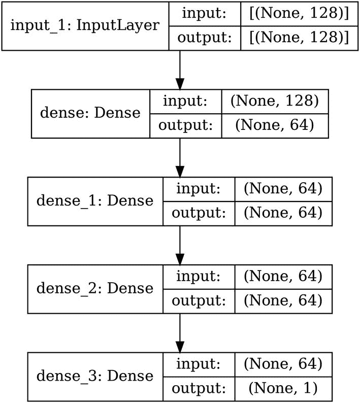

图 6-12

样本线性骨干模型的架构

```py
inp = L.Input((128,))
layer1 = L.Dense(64, activation='relu')(inp)
layer2 = L.Dense(64, activation='relu')(layer1)
layer3 = L.Dense(64, activation='relu')(layer2)
output = L.Dense(1, activation='sigmoid')(layer3)
model = keras.models.Model(inputs=inp, outputs=output)
Listing 6-1
Creating a linear architecture using the Functional API to serve as the linear backbone for residual connections
```

假设我们想要从 `layer1` 到 `layer3` 添加一个残差连接。为了做到这一点，我们需要将 `layer1` 与当前是 `layer3` 输入的任何层合并（这是 `layer2`）。合并的结果随后作为 `layer3` 的输入传递（清单 6-2，图 6-13）。

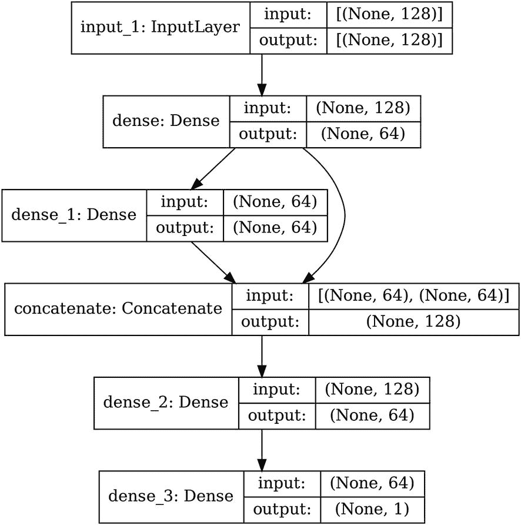

图 6-13

跳过处理层 `dense_1` 的线性骨干架构

```py
inp = L.Input((128,))
layer1 = L.Dense(64, activation='relu')(inp)
layer2 = L.Dense(64, activation='relu')(layer1)
concat = L.Concatenate()([layer1, layer2])
layer3 = L.Dense(64, activation='relu')(concat)
output = L.Dense(1, activation='sigmoid')(layer3)
model = keras.models.Model(inputs=inp, outputs=output)
Listing 6-2
Building a residual connection by adding a merging layer
```

然而，通过显式定义合并和输入流来手动创建残差连接的方法效率低下，且不具有可扩展性（即，如果你想要定义数十个或数百个残差连接，它会变得过于无序且难以管理）。让我们创建一个函数，`make_rc()`（清单 6-3），它接受一个连接分割层（这是“分割”的层，有两个连接从中产生）和一个连接合并头（这是残差连接和“线性主序列”合并之前的层）作为输入，并输出这两个层的合并版本，该版本可以用作下一层的输入（图 6-14）。当我们尝试构建更复杂的 ResNet 和 DensNet 风格残差连接时，我们将很快看到自动化创建残差连接将非常有帮助。

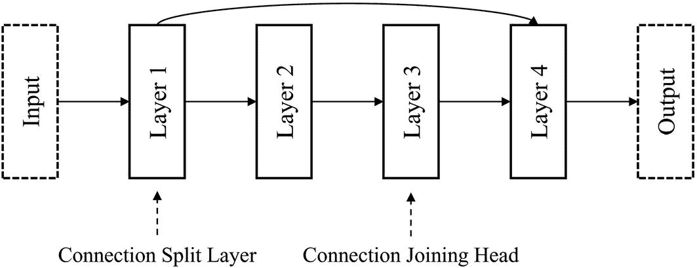

图 6-14

在自动化构建残差连接时，某些层之间关系的术语

我们还可以添加另一个参数，`merge_method`，它允许函数用户指定用于合并连接分割层和连接合并头的具体方法。该参数接受一个字符串，通过字典映射到相应的合并层。

```py
def make_rc(split_layer, joining_head,
merge_method='concat'):
method_dic = {'concat':L.Concatenate(),
'add':L.Add(),
'avg':L.Average(),
'max':L.Maximum()}
merge = method_dic[merge_method]
conn_output = merge([split_layer, joining_head])
return conn_output
Listing 6-3
Automating the creation of a residual connection by defining a function to create a residual connection
```

因此，我们可以通过将适当的参数作为输入传递给`make_rc`函数，并将其作为接收合并结果的层的输入，非常容易地构建一个残差连接（见列表 6-4）。

```py
inp = L.Input((128,))
layer1 = L.Dense(64)(inp)
layer2 = L.Dense(64)(layer1)
layer3 = L.Dense(64)(make_rc(layer1, layer2))
output = L.Dense(1)(layer3)
model = keras.models.Model(inputs=inp, outputs=output)
Listing 6-4
Using the residual-connection-making function in a model architecture. (Activation functions may not be present in many listings due to space.)
```

我们可以通过自动化使用此函数来创建一个 ResNet 风格的架构，其中包含具有短残差连接的层块重复多次（图 6-15）。为了自动化架构的构建，我们将使用占位符变量`x`、`x1`和`x2`。我们将按顺序构建`x1`从`x`和`x2`从`x1`，并将`x`与`x2`合并以构建残差连接（见列表 6-5）。

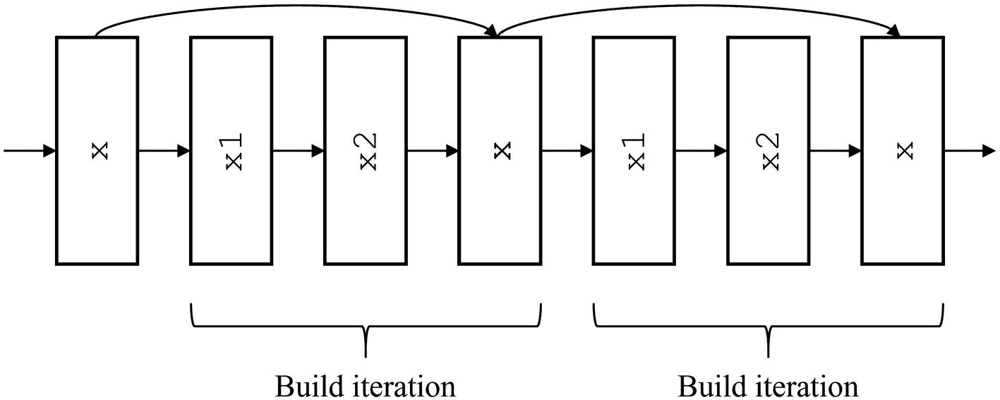

图 6-15

通过在整个构建迭代/块中构建残差连接来自动化构建过程

小贴士

在概念上自动化构建这些非线性拓扑可能比较困难。绘制图表并使用模板变量进行标注可以使你更轻松地实现复杂的残差连接模式。

```py
# number of residual connections
num_rcs = 3
# define input + first dense layer
inp = L.Input((128,))
x = L.Dense(64)(inp)
# create residual connections
for i in range(num_rcs):
# build two layers to skip over
x1 = L.Dense(64)(x)
x2 = L.Dense(64)(x1)
# define x as merging of x and x2
x = L.Dense(64)(make_rc(x,x2))
Listing 6-5
Building ResNet-style residual connections
```

由于在构建迭代结束时`x`是最后一个连接层，我们将`x`连接到输出层，并将架构聚合为模型（见列表 6-6，图 6-16）。

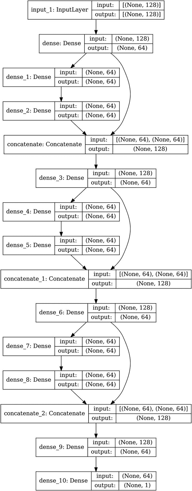

图 6-16

自动化 ResNet 风格的残差连接使用

```py
# build output
output = L.Dense(1, activation='sigmoid')(x)
# aggregate into model
model = keras.models.Model(inputs=inp, outputs=output)
Listing 6-6
Building output and aggregating ResNet-style architecture into a model
```

一个 DenseNet 风格的残差连接模式（图 6-17），其中每个“锚点”都与其他“锚点”相连，这需要更多的规划。（请注意，为了简化，我们将构建每个 Dense 层之间的残差连接，而不是构建额外的未连接层。我们将在下一节讨论基于细胞的架构的残差连接。）我们将保留一个先前层的列表`x`。在每一步构建中，我们添加一个新的层`x[i]`，该层与每个先前层的合并相连。请注意，层`x[i-1]`是直接连接，而`x[i-2]`、`x[i-3]`……与`x[i]`之间的连接是残差连接。

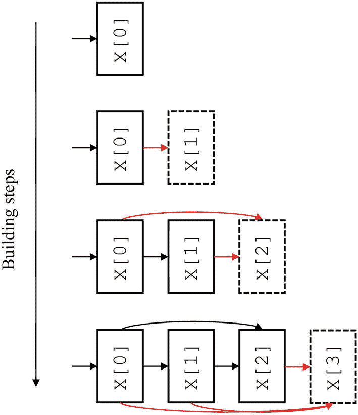

图 6-17

自动化构建 DenseNet 风格残差连接使用的概念图

第一步是调整 `make_rc` 函数，使其接收一个要连接的 *层列表* 而不仅仅是两个。这是因为 DenseNet 架构是构建得许多残差连接连接到同一层。除了接收层列表外，我们还将指定如果连接的层数为 1（即，没有残差连接地将 `x[0]` 连接到 `x[1]`），我们只需返回 `join_layers` 列表中的一个元素——也就是说，如果合并层的列表中只有一个项目，我们将该层与一个“空”层“合并”（见列表 6-7）。

```py
def make_rc(join_layers=[],
merge_method='concat'):
if len(join_layers) == 1:
return join_layers[0]
method_dic = {'concat':L.Concatenate(),
'add':L.Add(),
'avg':L.Average(),
'max':L.Maximum()}
merge = method_dic[merge_method]
conn_output = merge(join_layers)
return conn_output
Listing 6-7
Adjusting the residual-connection-making function for DenseNet-style residual connections
```

我们可以从定义一个初始层 `x` 和一个已创建的层列表 `layers` 开始。在创建初始层之后，我们通过重新定义模板变量 `x` 为一个接收所有其他已创建层的合并版本的 Dense 层来循环添加剩余的层。然后，我们将 `x` 添加到 `layers` 中，这样下一个创建的层将接收这个刚刚创建的层（见列表 6-8，图 6-18）。之后，我们将 `x` 添加到 `layers` 中，以便下一个创建的层将接收这个刚刚创建的层。

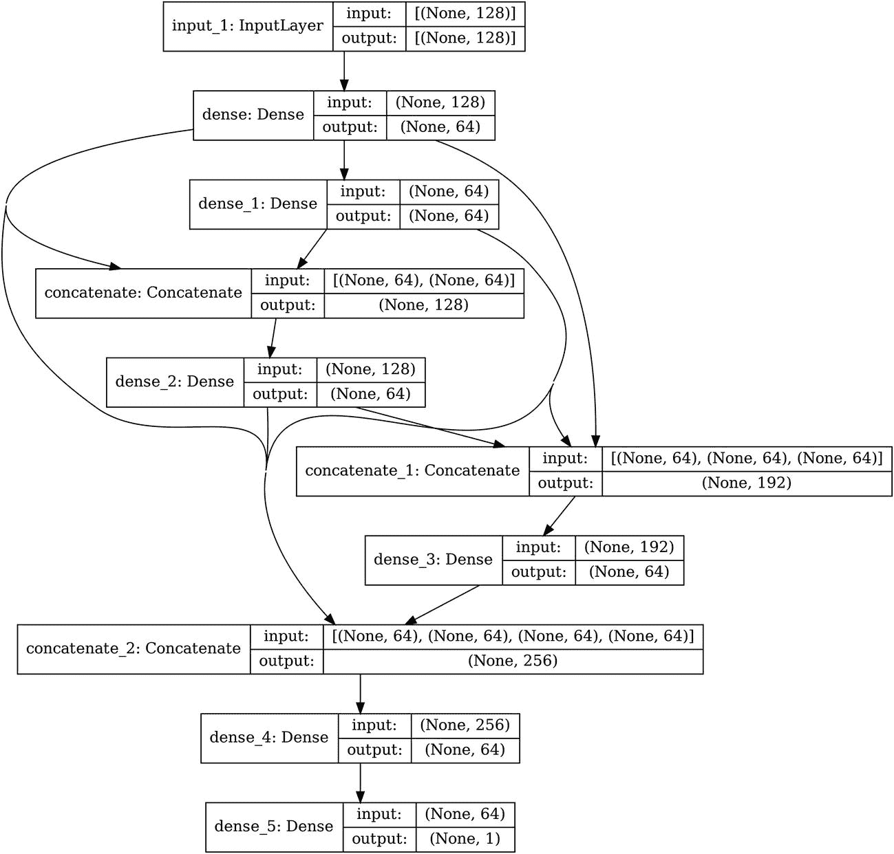

图 6-18

Keras 对 DenseNet 风格残差连接的可视化

```py
# define number of Dense layers
num_layers = 5
# create input layer
inp = L.Input((128,))
x = L.Dense(64, activation='relu')(inp)
# set layers list
layers = [x]
# loop through remaining layers
for i in range(num_layers-1):
# define new layer
x = L.Dense(64)(make_rc(layers))
# add layer to list of layers
layers.append(x)
# add output
output = L.Dense(1, activation='sigmoid')(x)
# build model
model = keras.models.Model(inputs=inp, outputs=output)
Listing 6-8
Using the augmented residual-connection-making function to create DenseNet-style residual connections
```

这是一个很好的例子，说明了如何通过结合使用预定义函数、存储和内置可伸缩性来快速高效地构建复杂拓扑。

正如你所见，当我们开始构建更复杂的网络设计时，Keras 的可视化工具开始力不从心，难以产生与我们对拓扑概念理解相一致的建筑可视化。尽管如此，可视化仍然是一个理智检查工具，以确保你的复杂残差连接关系的自动化运行正常。

### 分支和集合度

集合度（cardinality）的概念是非线性的核心框架，也是残差连接的泛化。一个网络部分（network section）的宽度指的是相应层（层组）中的神经元数量，而网络架构的集合度指的是在神经网络架构的某个位置的非线性空间中的“分支”（也称为并行塔）的数量。

集合度在 *并行分支* 中最为明显——这是一种将层“分割”成多个层，每个层都线性处理，最终合并回一起的架构设计。采用并行分支的网络部分的集合度简单地就是分支的数量（见图 6-19）。

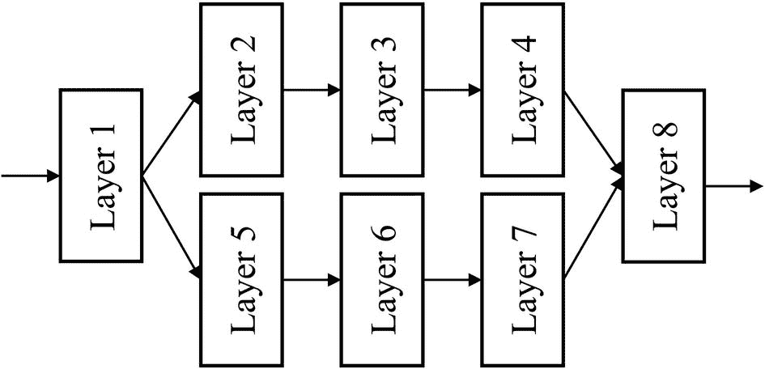

图 6-19

一个具有两个集合度的神经网络架构的示例组件。层的编号是任意的

如前文在残差连接章节中所述，可以将残差连接泛化为一个具有两个基数的基本分支机制，其中一个分支是残差连接“跳过”的层序列，另一个分支是恒等函数。

然而，需要注意的是，网络某一部分的基数可能或多或少是模糊的。例如，某些拓扑可能在子分支内构建分支，并以复杂的方式将某些子分支连接在一起（例如，图 6-20）。在这里，网络的具体基数并不重要；重要的是信息正在以非线性方式建模，这鼓励了表示的多样性（基数的一般概念）以及更大的复杂性和建模能力。

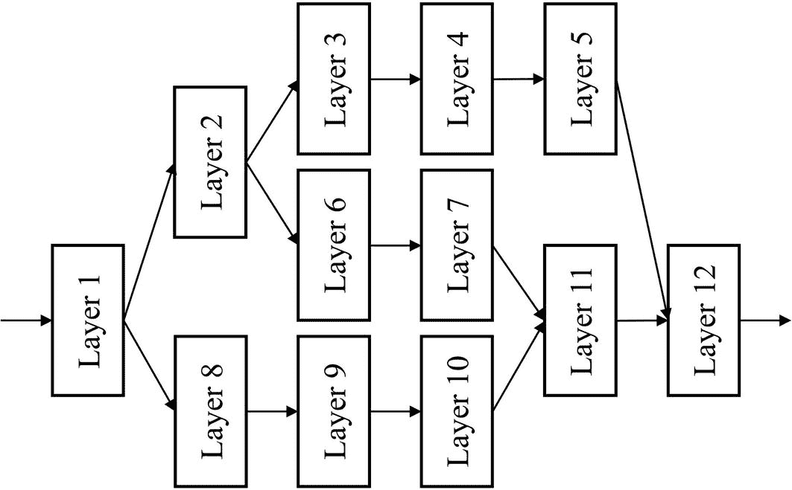

图 6-20

神经网络的一个架构组件，它展示了更极端的非线性（即，分支和合并）

然而，需要注意的是，非线性不应随意构建。为了非线性的目的而构建复杂的非线性拓扑可能很容易，但你应该对拓扑所服务的目的有所了解。同样，网络设计的关键组成部分不仅仅是层所在的架构，还包括选择哪些层和参数以适应非线性架构。例如，你可以分配不同的分支使用不同的核大小或执行不同的操作，以鼓励表示的多样性。参见下一节关于基于细胞的设计的案例研究，以了解更复杂非线性（例如，Inception 单元）的良好目的性设计的例子。

架构设计中的分支表示和基数逻辑与残差连接非常相似。这种表示是残差连接泛化后的自然架构发展——而不是通过恒等函数传递通过残差连接的信息（即，“跳过”操作），它可以与其他网络组件分开处理。

在我们将网络比作一组参与对话的思考者，其净输出取决于他们排列的类比中，分支表示不仅允许思考者考虑多个视角，而且还能在相互对话中产生整个“思想学派”（图 6-21）。分支分别处理信息（即，并行），允许不同的特征提取模式在与其他分支合并考虑之前“成熟”（由几层处理完全形成）。

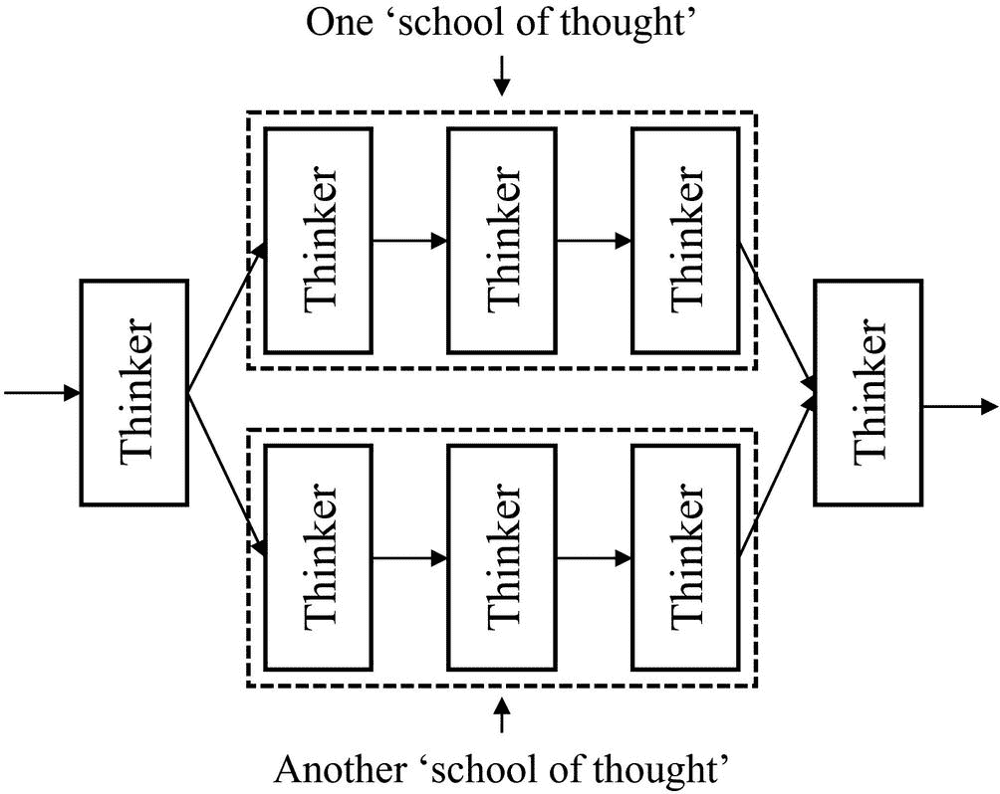

图 6-21

并行分支作为概念上组织“思想家”为“思想学派”

让我们从显式/手动创建一个多分支非线性拓扑开始（列表 6-9）。我们将创建两个从层开始的分支；每个分支，它持有数据的一个特定表示，将独立处理并在之后合并（图 6-22）。

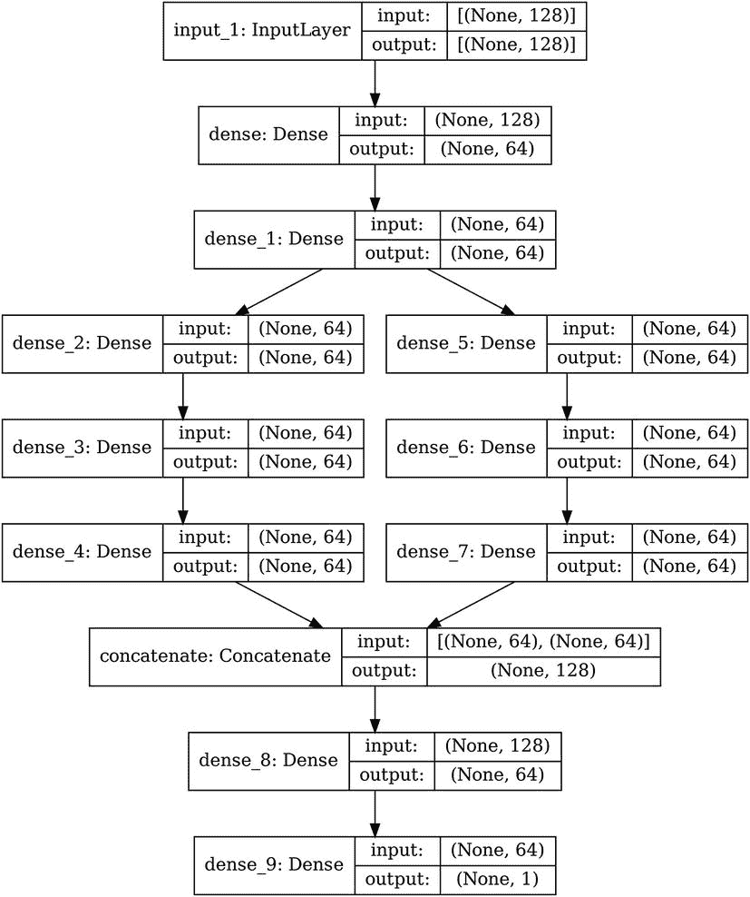

图 6-22

构建并行分支的架构

```py
inp = L.Input((128,))
layer1 = L.Dense(64)(inp)
layer2 = L.Dense(64)(layer1)
branch1a = L.Dense(64)(layer2)
branch1b = L.Dense(64)(branch1a)
branch1c = L.Dense(64)(branch1b)
branch2a = L.Dense(64)(layer2)
branch2b = L.Dense(64)(branch2a)
branch2c = L.Dense(64)(branch2b)
concat = L.Concatenate()([branch1c, branch2c])
layer3 = L.Dense(64, activation='relu')(concat)
output = L.Dense(1, activation='sigmoid')(layer3)
model = keras.models.Model(inputs=inp, outputs=output)
Listing 6-9
Creating parallel branches manually
```

为了自动化构建多个分支，我们考虑两个维度：每个分支的层数和并行分支的数量（列表 6-10）。我们可以通过两个函数以有组织的方式完成这项工作——`build_branch()`，它接受一个输入层以开始分支，并输出分支中的最后一层，以及`build_branches()`，它接受一个要分割成几个分支的层（使用`build_branch()`函数）。我们可以简单地将分支的构建定义为一系列线性连接的密集层，尽管分支也可以构建为非线性拓扑。

```py
def build_branch(inp_layer, num_layers=5):
x = L.Dense(64)(inp_layer)
for i in range(num_layers-1):
x = L.Dense(64)(x)
return x
Listing 6-10
Automating the building of an individual branch
```

为了将一层分割成一系列并行分支，我们使用从起始层开始的`build_branch`函数多次（这个数字是基数，作为参数传递给`build_branches`函数）。`build_branch`函数输出分支的最后一层，我们将它追加到分支最后一层的列表`outputs`中。在所有分支构建完成后，我们通过添加（而不是在这种情况下连接，这将产生一个非常大的连接向量）将输出合并在一起，并返回合并后的输出（列表 6-11）。

```py
def build_branches(splitting_head, cardinality=4):
outputs = []
for i in range(cardinality):
branch_output = build_branch(splitting_head)
outputs.append(branch_output)
merge = L.Add()(outputs)
return merge
Listing 6-11
Automating the building of a series of parallel branches
```

在神经网络架构中构建一系列并行分支现在变得极其简单（列表 6-12，图 6-23）。

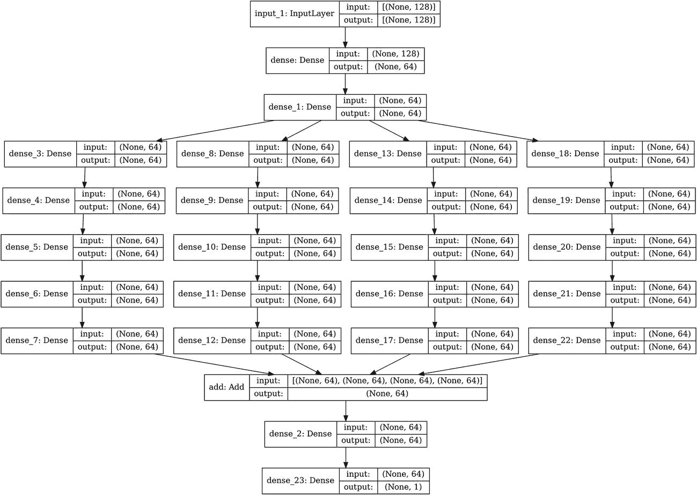

图 6-23

自动化构建任意大小的并行分支

```py
inp = L.Input((128,))
layer1 = L.Dense(64)(inp)
layer2 = L.Dense(64)(layer1)
layer3 = L.Dense(64)(build_branches(layer2))
output = L.Dense(1)(layer3)
model = keras.models.Model(inputs=inp, outputs=output)
Listing 6-12
Building parallel branches into a complete model architecture
```

这种方法被 ResNeXt 架构所采用，该架构将并行分支作为从残差连接的泛化和“下一步”。

### 案例研究：U-Net

语义分割的目标是将图像中的各种项目分割或分离成不同的类别。语义分割可用于识别图片中的项目，例如城市图片中的汽车、人和建筑物。语义分割与图像识别等任务的区别在于，语义分割是一个**图像到图像**的任务，而图像识别是一个**图像到向量**的任务。图像识别告诉你图像中是否存在某个对象；语义分割通过标记每个像素是否属于相应的类别来告诉你对象在图像中的位置。语义分割的输出被称为**分割图**。

语义分割在生物学中有许多应用，可用于自动化识别细胞、器官、神经元连接和其他生物实体（图 6-24）。因此，许多关于语义分割架构的研究都是基于这些生物应用而开发的。

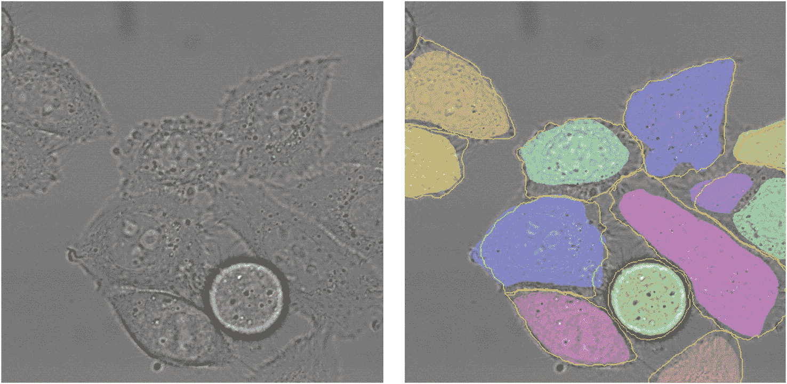

图 6-24

左侧：分割模型的输入图像。右侧：图像中细胞的分割示例。图片来自 Ronneberger 等人撰写的 U-Net 论文。

Olaf Ronneberger、Philipp Fischer 和 Thomas Brox 于 2015 年提出了**U-Net**架构^(1)，该架构自那时起已成为语义分割发展的支柱（图 6-25）。U-Net 架构的线性骨干组件类似于自编码器 – 它依次降低图像的维度，直到达到某个最小表示大小，然后通过上采样和上卷积依次增加图像的维度。U-Net 架构采用非常大的残差连接，这些连接将网络的大部分连接在一起，将第一块层连接到最后一块层，第二块层连接到倒数第二块层，等等。当残差连接在架构图中排列成相互平行时，线性骨干被迫形成“U”形状，因此得名。

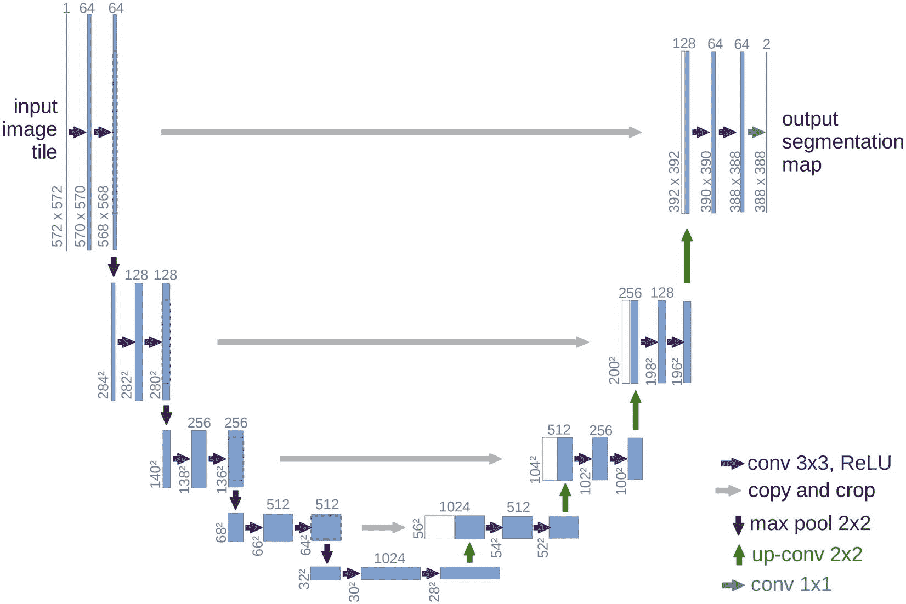

图 6-25

U-Net 架构。图片来自 Ronneberger 等人撰写的 U-Net 论文。

架构的左侧被称为 *收缩路径*；它逐步发展出数据的小型表示。另一方面，右侧被称为 *扩张路径*，它逐步增加数据表示的大小。残差连接允许网络将先前处理过的表示纳入表示大小的扩展中。这种架构允许同时进行 *定位*（关注数据输入的局部区域）和利用更广泛的 *上下文*（来自更远、非局部区域的图像信息，这些信息仍然提供有用的数据）。

最终的 U-Net 架构在当时的各种生物分割挑战中，其表现显著优于其他架构（见表 6-1）。

表 6-1

在 2015 年 ISBI 细胞追踪挑战的两个关键数据集上，U-Net 与其他分割模型的表现。结果以 IOU（交集与并集）衡量，这是一个分割指标，衡量预测和真实分割区域重叠的程度。IOU 越高越好。U-Net 在 IOU 方面以很大的优势击败了当时的方法。

| 模型 | PhC-U373 数据集 | DIC-HeLa 数据集 |
| --- | --- | --- |
| IMCB-SG (2014) | 0.2669 | 0.2935 |
| KTH-SE (2014) | 0.7953 | 0.4607 |
| HOUS-US (2014) | 0.5323 | – |
| 第二名 (2015) | 0.83 | 0.46 |
| U-Net (2015) | 0.9203 | 0.7756 |

虽然 U-Net 架构在技术上适用于所有图像大小，因为它仅使用不需要固定输入的卷积层构建，但 Ronneberger 等人最初实现时，需要就信息通过网络时的形状进行大量规划。因为所提出的 U-Net 架构不使用填充，空间分辨率会逐步减少和增加（通过最大池化）和累加（通过卷积）。这意味着残差连接必须包括裁剪功能，以便正确合并早期表示和具有较小空间大小的后期表示。此外，输入形状必须仔细规划，以具有特定的输入大小，这将不匹配输出。

因此，在我们对 U-Net 架构的实现中，我们将略微调整卷积层以使用填充，从而使合并和跟踪数据形状变得简单。虽然实现 U-Net 相对简单，但跟踪变量很重要。我们将使用适当的变量名来命名我们的层，以便它们可以在之前讨论的 `make_rc()` 函数中使用，作为残差连接的一部分。

构建收缩路径（列表 6-13）相当简单；在这种情况下，我们在每个池化减少之前实现一个卷积，尽管您可以添加更多。我们使用三个池化减少；conv4 是自动编码器的“瓶颈”，携带具有最小空间表示尺寸的数据。请注意，我们增加每个卷积层的滤波器数量，以适应分辨率减少，避免实际构建一个代表性的瓶颈，这将与该模型的目标相悖。

```py
inp = L.Input((256,256,3))
# contracting path
conv1 = L.Conv2D(16, (3,3), padding='same')(inp)
pool1 = L.MaxPooling2D((2,2))(conv1)
conv2 = L.Conv2D(32, (3,3), padding='same')(pool1)
pool2 = L.MaxPooling2D((2,2))(conv2)
conv3 = L.Conv2D(64, (3,3), padding='same')(pool2)
pool3 = L.MaxPooling2D((2,2))(conv3)
conv4 = L.Conv2D(128, (3,3), padding='same')(pool3)
Listing 6-13
Building the contracting path of the U-Net architecture
```

构建扩展路径（列表 6-14）需要更多的谨慎。我们首先对最后一层，`conv4`进行上采样，使其具有与`conv3`层相同的空间维度。在上采样后，我们应用另一个卷积来处理结果，并确保`upsamp4`具有与`upsamp3`相同的深度（即通道数）。然后，它们可以通过添加来合并以保留深度。

```py
# expanding path
upsamp4 = L.UpSampling2D((2,2))(conv4)
upsamp4 = L.Conv2D(64, (3,3), padding='same')(upsamp4)
merge3 = make_rc([conv3, upsamp4], merge_method='add')
Listing 6-14
Building one component of the expanding path in the U-Net architecture
```

同样，我们可以构建扩展路径的其余部分（列表 6-15）。

```py
upsamp3 = L.UpSampling2D((2,2))(merge3)
upsamp3 = L.Conv2D(32, (3,3), padding='same')(upsamp3)
merge2 = make_rc([conv2, upsamp3])
upsamp2 = L.UpSampling2D((2,2))(merge2)
upsamp2 = L.Conv2D(16, (3,3), padding='same')(upsamp2)
merge1 = make_rc([conv1, upsamp2])
Listing 6-15
Building the remaining components of the expanding path in the U-Net architecture
```

为了确保输入数据和 U-Net 架构的输出具有相同的通道数，我们添加了一个 (1,1) 的卷积层，它不会改变空间维度，但将通道数折叠到几乎所有图像数据中使用的标准三个通道（列表 6-16）。

```py
out = L.Conv2D(3, (1,1))(merge1)
model = keras.models.Model(inputs=inp, outputs=out)
Listing 6-16
Adding an output layer to collapse channels and aggregating layers into a model
```

如前所述，您可以更改输入形状，只要输入的空间维度是 2 的倍数，代码就会产生有效结果。您可以使用 plot_model 来绘制模型，以揭示模型的建筑名称（见图 6-26）。

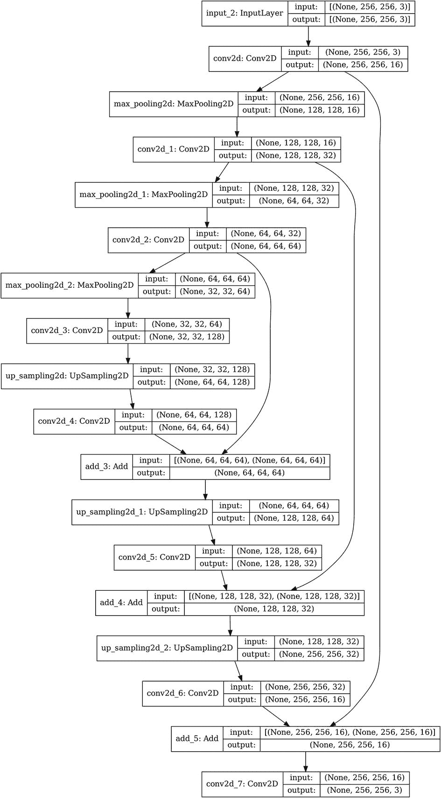

图 6-26

Keras 中的 U-Net 风格架构实现。您能看到“U”吗？

## 区块/单元设计

回想一下用于介绍非线性概念的思考者网络。通过添加非线性，思考者能够考虑来自多个发展阶段和处理的观点，从而扩展他们的世界观，产生更有洞察力的输出。

深刻的智力工作最好是通过多个思考者之间的对话来完成，而不是单个思考者的处理能力（见图 6-27）。因此，将思考的关键智力单元视为一个**结构化的思考者安排**，而不是仅仅一个个体思考者是有意义的。这些“单元”是新的单元对象，可以像之前堆叠单个思考者一样堆叠在一起——我们可以线性地堆叠这些思考者单元，在分支中堆叠，添加残留连接等。通过用更强大的单元替换信息处理的基本单元，我们系统地提高了整个系统的建模能力。

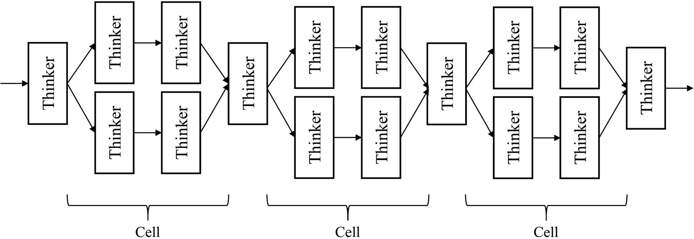

图 6-27

将思想家排列成单元格

同样，通过将神经网络层排列成单元格，我们形成了一个新的单元，我们可以用它来操作架构——单元格，它比单个层具有更多的处理能力。单元格可以被视为一个“微型网络”。

在基于块/单元格的设计中，神经网络由几个重复的“单元格”组成，每个单元格都包含预设的层排列（见图 6-28）。单元格已被证明是增加网络深度的一种简单而有效的方法。这些单元格形成“模式”，即在某些层排列中的重复主题或模式。像深度学习中观察到的许多现象一样，基于单元格的设计在神经科学中也有相似之处——观察到的神经网络电路会组装成重复的模式。基于单元格的设计允许进行建立和标准化的特征提取；表现最好的神经网络架构包括大量精心设计的基于单元格的神经网络架构。

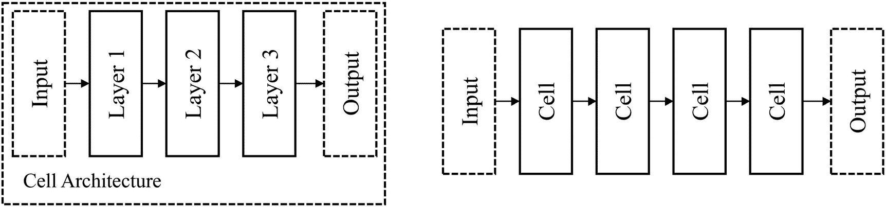

图 6-28

基于单元格设计的用法

从设计角度来看，单元格减少了神经网络设计者面临的设计空间。 (您可能还记得，这是在第五章节中讨论的用于单元格架构的 NASNet 风格搜索空间的合理性。) 设计者能够对单元格的架构进行精细控制，该架构被反复堆叠，因此放大了架构变化的影响。与此相对比的是，在非基于单元格的网络中更改一个层——做出一个改变不太可能足够显著，以至于会产生有意义的差异（假设存在其他类似的层）。

在基于单元格的设计中，有两个关键因素需要考虑：单元格本身的架构和堆叠方法。本节将讨论跨顺序和非线性单元格设计的堆叠方法。

### 顺序单元格设计

顺序单元格设计——正如其名称所暗示的——是遵循顺序或线性拓扑的单元格架构。虽然顺序单元格设计通常不如非线性单元格设计表现得好，但它们可以作为说明非线性单元格设计中将要用到的关键概念的起点。

我们将从构建一个**静态密集单元格**开始——一个主要处理层是全连接层且不改变其层以适应输入形状的单元格（见代码列表 6-17）。使用之前建立的相同逻辑，定义了一个函数，该函数接受一个输入层，单元格将在此基础上构建。然后，单元格的最后一层被返回作为下一个单元格（或输出层）的输入。

```py
def build_static_dense_cell(inp_layer):
dense_1 = L.Dense(64)(inp_layer)
dense_2 = L.Dense(64)(dense_1)
batchnorm = L.BatchNormalization()(dense_2)
dropout = L.Dropout(0.1)(batchnorm)
return dropout
Listing 6-17
Building a static dense cell
```

这些细胞可以通过迭代地将先前构建的细胞输出作为下一个细胞的输入来反复堆叠（见列表 6-18）。这种细胞设计和堆叠的组合——线性细胞设计以线性方式堆叠——可能是最简单的基于细胞的架构设计（见图 6-29）。

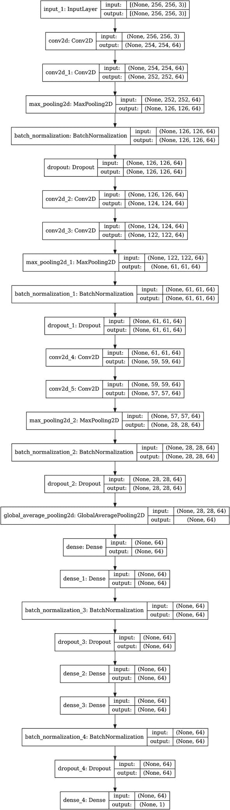

图 6-30

架构堆叠卷积和密集细胞的可视化

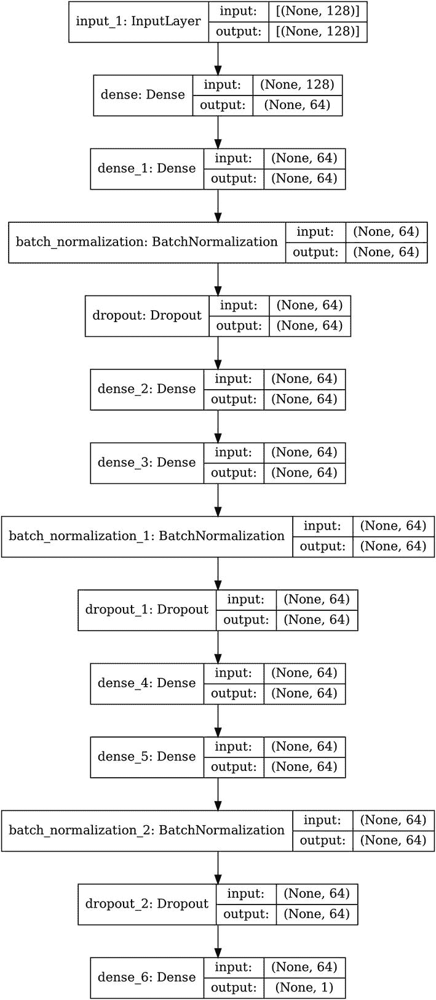

图 6-29

基于细胞的架构设计可视化

```py
num_cells = 3
inp = L.Input((128,))
x = build_static_dense_cell(inp)
for i in range(num_cells-1):
x = build_static_dense_cell(x)
output = L.Dense(1, activation='sigmoid')(x)
model = keras.models.Model(inputs=inp, outputs=output)
Listing 6-18
Stacking static dense cells together
```

注意，当我们构建基于细胞的架构时，我们并没有使用*模块化设计*（在第三章关于自编码器中介绍）。也就是说，虽然从概念上我们理解模型是按照重复的块段构建的，但我们并没有通过将每个细胞定义为单独的模型来实现这一点。在这种情况下，由于我们不需要访问任何特定细胞的输出，因此不需要模块化设计。此外，定义构建函数应该足以在代码级别上组织网络构建的概念。使用模块化设计在基于细胞的结构中的主要负担是需要以自动化的方式跟踪前一个细胞输出的输入形状，这在定义单独的模型时是必需的。然而，实现模块化设计将通过可视化细胞而不是整个层序列，使 Keras 的架构可视化与我们对基于细胞模型的概念理解更加一致。

我们可以通过使用一系列卷积层后跟一个池化层，并添加批量归一化和 dropout 来创建一个静态的卷积细胞（见列表 6-19）。

```py
def build_static_conv_cell(inp_layer):
conv_1 = L.Conv2D(64,(3,3))(inp_layer)
conv_2 = L.Conv2D(64,(3,3))(conv_1)
pool = L.MaxPooling2D((2,2))(conv_2)
batchnorm = L.BatchNormalization()(pool)
dropout = L.Dropout(0.1)(batchnorm)
return dropout
Listing 6-19
Building a static convolutional cell
```

我们可以将卷积细胞和密集细胞结合起来（见列表 6-20，图 6-30）。在卷积组件完成后，我们使用 2D 全局平均池化（展开层也适用）将基于图像的信息流折叠成一个向量形状，该形状可以由全连接组件处理。

```py
num_conv_cells = 3
num_dense_cells = 2
inp = L.Input((256,256,3))
conv_cell = build_static_conv_cell(inp)
for i in range(num_conv_cells-1):
conv_cell = build_static_conv_cell(conv_cell)
collapse = L.GlobalAveragePooling2D()(conv_cell)
dense_cell = build_static_dense_cell(collapse)
for i in range(num_dense_cells-1):
dense_cell = build_static_dense_cell(dense_cell)
output = L.Dense(1, activation='sigmoid')(dense_cell)
model = keras.models.Model(inputs=inp, outputs=output)
Listing 6-20
Stacking convolutional and dense cells together in a linear fashion
```

注意，静态密集和静态卷积细胞对它们应用到的数据输入形状有不同的影响。静态密集细胞始终输出相同的数据输出形状，因为当在 Keras 中定义 Dense 层时，用户指定了输入将被投影到的节点数。另一方面，静态卷积细胞根据它们接收到的数据输入形状输出不同的数据输出形状。（这将在第二章节中更详细地讨论，该章节讨论了迁移学习。）由于细胞设计中不同的主要层类型可以对数据形状产生不同的影响，因此通常的惯例是不构建静态细胞。

相反，细胞通常是通过它们对输出形状的影响来构建的，这样它们可以更容易地堆叠在一起。这在非线性堆叠模式中特别有用，在这种模式中，细胞输出必须匹配才能以有效的方式合并。通常，细胞可以分为减少细胞或正常细胞。正常细胞保持输出形状与输入形状相同，而减少细胞将输出形状从输入形状减小。许多现代架构在模型中反复堆叠使用多个正常和减少细胞的多种设计。

为了构建这些基于形状的细胞（清单 6-21），我们需要一个额外的参数来跟踪——输入形状。对于一个处理表格数据的网络，我们只关心输入层的宽度。在正常细胞中，输出宽度与输入相同；我们定义减少细胞以将输入大小减半，尽管你可以根据你的问题类型采用不同的设计。每个细胞构建函数返回细胞输出层的宽度，以及输出层的宽度。这些信息将被用于构建下一个细胞。

```py
def build_normal_cell(inp_layer, width):
dense_1 = L.Dense(width)(inp_layer)
dense_2 = L.Dense(width)(dense_1)
return dense_2, width
def build_reduce_cell(inp_layer, width):
new_width = round(width/2)
dense_1 = L.Dense(new_width)(inp_layer)
dense_2 = L.Dense(new_width)(dense_1)
return dense_2, new_width
Listing 6-21
Building normal and reduction cells
```

我们可以简单地以交替模式依次堆叠这两个细胞（清单 6-22，图 6-31）。我们使用持有变量 `cell_out` 和 `w` 来跟踪细胞的输出和相应的宽度。每个细胞构建函数要么保持形状 `w` 不变，要么修改它以反映细胞输出层形状的变化。正如之前提到的，这些信息将被传递到下一个细胞构建函数。

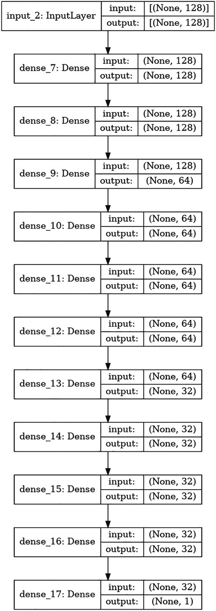

图 6-31

细胞交替堆叠的架构

```py
num_repeats = 2
w = 128
inp = L.Input((w,))
cell_out, w = build_normal_cell(inp, w)
for repeat in range(num_repeats):
cell_out, w = build_reduce_cell(cell_out, w)
cell_out, w = build_normal_cell(cell_out, w)
output = L.Dense(1, activation='sigmoid')(cell_out)
model = keras.models.Model(inputs=inp, outputs=output)
Listing 6-22
Stacking reduction and normal cells linearly
```

构建卷积正常和减少细胞类似，但我们需要跟踪三个形状元素而不是一个。就像在自动编码器和其他形状敏感的上下文中一样，最好使用 `padding='same'` 来保持输入和输出形状相同。

正常单元使用两个带有`'same'`填充的卷积单元（列表 6-23）。如果你想在正常单元中使用池化，也可以使用带有`padding='same'`的池化层。请注意，输入的深度作为卷积层的过滤器数量传递，以保留输入形状。

```py
def build_normal_cell(inp_layer, shape):
h,w,d = shape
conv_1 = L.Conv2D(d,(3,3),padding='same')(inp_layer)
conv_2 = L.Conv2D(d,(3,3),padding='same')(conv_1)
return conv_2, shape
Listing 6-23
Building a convolutional normal cell
```

减少单元（列表 6-24）也使用两个带有`'same'`填充的卷积单元，但增加了一个池化层，将高度和宽度减半。我们返回新的形状，将高度和宽度减半。如果输入形状的高度或宽度是奇数，并且除法的结果不是整数，则执行向上取整操作。如果你使用不同的填充模式进行最大池化，你需要相应地调整新形状的计算方式。

```py
def build_reduce_cell(inp_layer, shape):
h,w,d = shape
conv_1 = L.Conv2D(d,(3,3),padding='same')(inp_layer)
conv_2 = L.Conv2D(d,(3,3),padding='same')(conv_1)
pool = L.MaxPooling2D((2,2))(conv_2)
new_shape = (np.ceil(h/2),np.ceil(w/2),d)
return pool, new_shape
Listing 6-24
Building a convolutional reduction cell
```

这两个单元可以像之前演示的那样线性堆叠。或者，这些单元可以以非线性格式堆叠。为此，我们将使用从非线性和平行表示部分发展出来的方法和想法。

要合并两个单元的输出，它们需要具有相同的形状。多亏了基于形状的设计，我们可以相应地安排正常和减少单元以形成有效的合并操作。例如，我们可以从一个正常单元“跨越”另一个正常单元绘制残差连接，合并这两个连接，并将合并后的结果传递到如图 6-32 所示的减少单元中。

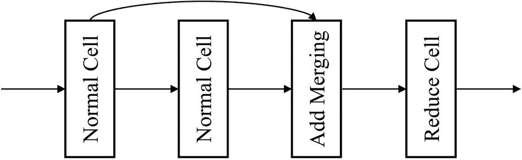

图 6-32

单元非线性堆叠

然而，减少单元形成“边界”，连接无法跨越（除非你使用重塑机制），因为减少单元两边的输入形状不匹配（图 6-33）。

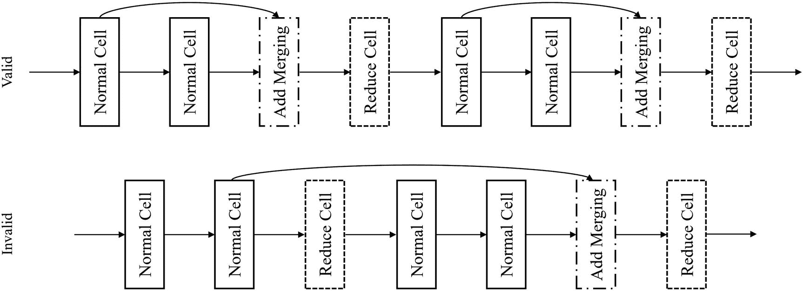

图 6-33

单元间残差连接使用演示

我们可以以非常类似的方式构建非线性细胞堆叠架构，就像我们在网络架构中构建非线性性和层之间的并行表示一样。我们将使用上一节中定义的`make_rc`函数来合并`norm_1`和`norm_2`的输出，并将合并后的结果作为减少单元的输入（列表 6-25，图 6-34）。形状在输入之后定义，深度为 64，这样卷积层就可以使用 64 个过滤器处理数据（而不是 3 个）。如果需要，你可以操作减少单元来改变图像深度。请注意，我们在这个情况下使用的合并操作是加法而不是连接。加法的输出形状与任何一个输入的输入形状相同，而深度连接会改变形状。这可以适应，但需要确保形状相应地更新。

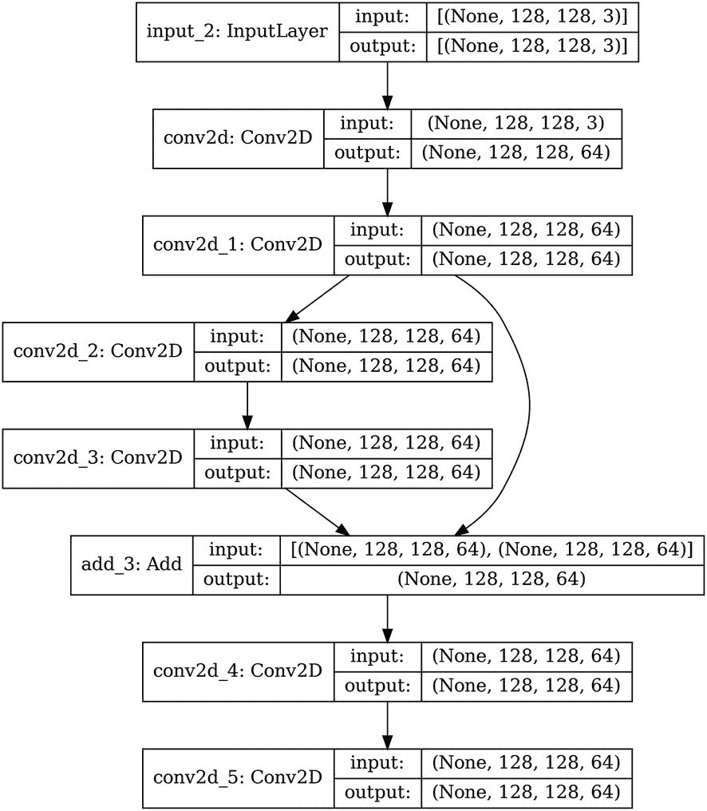

图 6-34

正常细胞之间的残差连接

```py
inp = L.Input((128,128,3))
shape = (128,128,64)
norm_1, shape = build_normal_cell(inp, shape)
norm_2, shape = build_normal_cell(norm_1, shape)
merged = make_rc([norm_1,norm_2],'add')
reduce, shape = build_reduce_cell(merged, shape)
Listing 6-25
Stacking convolutional normal and reduction cells together in nonlinear fashion with residual connections
```

细胞可以类似地以 DenseNet 风格堆叠，并具有并行分支以实现更复杂的表示。如果你使用线性细胞设计，建议使用非线性堆叠方法向网络拓扑结构中添加非线性。

### 非线性细胞设计

非线性细胞设计只有一个输入和一个输出，但使用非线性拓扑结构来开发多个并行表示和处理机制，这些机制被组合成一个输出。非线性细胞设计通常更成功（因此更受欢迎），因为它们允许构建更强大的细胞。

在了解非线性表示和顺序细胞设计的基础上，构建非线性细胞设计相对简单。非线性细胞的设计紧密遵循之前关于非线性和并行表示的讨论。非线性细胞形成有组织的、高度有效的特征提取模块，可以串联在一起，以强大、易于扩展的方式连续处理信息。

基于分支的设计在非线性细胞架构的设计中特别强大。它能够在一个紧凑、可堆叠的细胞中有效地提取和合并数据的不同并行表示。

让我们构建一个用于图像数据的正常细胞，保持数据的空间维度和深度不变（见代码清单 6-26，图 6-35）。像之前的设计一样，它将接受输入层以连接细胞，以及数据的形状。图像的深度将从形状中提取并用于整个细胞。通过使用适当的填充，数据的空间维度也保持不变。三个分支分别以不同的滤波器大小并行提取和处理特征；然后通过连接（深度方向，意味着它们是“堆叠在一起”）合并这些表示。这种合并产生形状为 (*h*, *w*, *d* · 3) 的数据，因为我们正在堆叠三个分支的输出；为了确保输出形状与输入形状相同，我们添加了一个具有滤波器 `(1, 1)` 的另一个卷积层，将通道数从 *d* · 3 减少到 *d*。

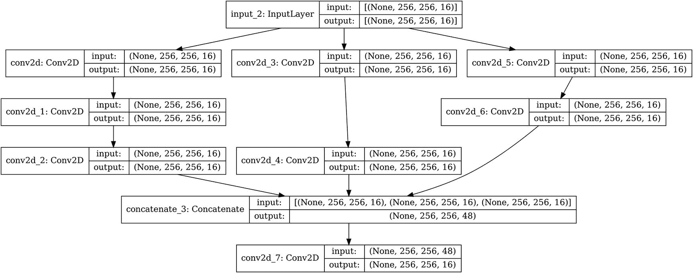

图 6-35

非线性正常细胞的假设架构

```py
def build_normal_cell(inp_layer, shape):
h,w,d = shape
branch1a = L.Conv2D(d,(5,5),padding='same')(inp_layer)
branch1b = L.Conv2D(d,(3,3),padding='same')(branch1a)
branch1c = L.Conv2D(d,(1,1))(branch1b)
branch2a = L.Conv2D(d,(3,3),padding='same')(inp_layer)
branch2b = L.Conv2D(d,(3,3),padding='same')(branch2a)
branch3a = L.Conv2D(d,(3,3),padding='same')(inp_layer)
branch3b = L.Conv2D(d,(1,1))(branch3a)
merge = L.Concatenate()([branch1c, branch2b, branch3b])
out = L.Conv2D(d, (1,1))(merge)
return out, shape
Listing 6-26
Build a convolutional nonlinear normal cell
```

我们可以通过构建多个分支来构建一个减少细胞，这些分支减少了输入的空间维度（清单 6-27，图 6-36）。在这种情况下，一个分支执行步长为`(2, 2)`的卷积操作——减半空间维度。另一个使用标准的最大池化减少。两者之后都跟着一个具有`(1,1)`滤波器的卷积层，分别处理合并之前的输出。当两者合并时，深度加倍。在这种情况下这是可以的；因为我们想通过增加滤波器的数量来补偿分辨率降低，因此在合并后不需要像正常细胞设计中那样减少滤波器的数量。相应地，我们放置一个具有`(1,1)`滤波器的卷积层来进一步处理合并的结果，并将该层用作输出。相应地计算新的数据形状并将其作为第二个输出传递给细胞构建函数。

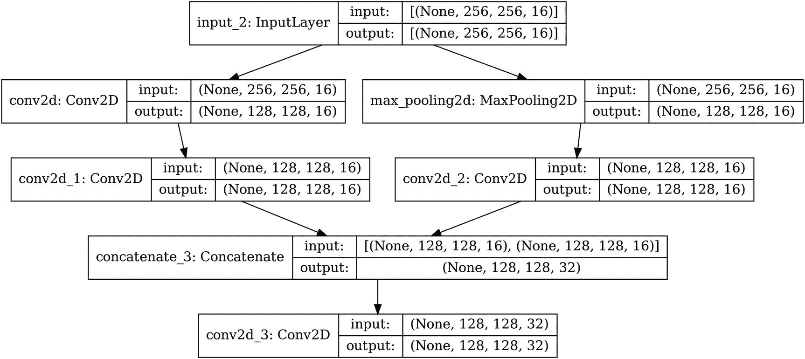

图 6-36

非线性减少细胞的假设架构

```py
def build_reduction_cell(inp_layer, shape):
h,w,d = shape
branch1a = L.Conv2D(d,(3,3), strides=(2,2), padding=’same’)(inp_layer)
branch1b = L.Conv2D(d,(1,1))(branch1a)
branch2a = L.MaxPooling2D((2,2),padding='same')(inp_layer)
branch2b = L.Conv2D(d,(1,1))(branch2a)
merge = L.Concatenate()([branch1b, branch2b])
out = L.Conv2D(d*2, (1,1))(merge)
new_shape = (np.ceil(h/2), np.ceil(w/2), d*2)
return out, new_shape
Listing 6-27
Building a convolutional nonlinear reduction cell
```

这两个细胞（以及为正常或减少细胞设计的任何其他附加设计）可以线性堆叠。由于非线性设计的细胞包含足够的非线性，因此在非线性堆叠中不需要过于激进。按顺序堆叠非线性细胞是一个经过验证的公式。在线性堆叠中可能出现的一个问题是，如果你堆叠了如此多的细胞，以至于网络的深度对跨网络信息流造成问题。使用跨细胞残差连接可以帮助解决这个问题。在本节的案例研究中，我们将探讨著名的 InceptionV3 模型，并探索基于非线性细胞架构设计的具体实例。

### 案例研究：InceptionV3

著名的 InceptionV3 架构，作为 Inception 模型系列的一部分，已经成为图像识别的支柱，由 Christian Szegedy、Vincent Vanhoucke、Sergey Ioffe、Jonathon Shlens 和 Zbigniew Wojna 在 2015 年的论文“Rethinking the Inception Architecture for Computer Vision.”中提出。在许多方面，InceptionV3 架构为未来几年的卷积神经网络设计奠定了关键原则。与此背景最相关的是其基于细胞的架构设计。

InceptionV3 模型试图在之前的 InceptionV2 和原始 Inception 模型的设计上取得进步。原始 Inception 模型由一系列重复的细胞（在论文中称为“模块”）组成，这些细胞遵循多分支非线性架构（见图 6-37）。四个分支从模块的输入开始；两个分支由一个 1x1 卷积后跟一个更大的卷积组成，一个分支定义为池化操作后跟一个 1x1 卷积，另一个分支只是一个 1x1 卷积。在这些模块的所有操作中提供填充，以保持滤波器的大小不变，这样并行分支表示的结果就可以在深度方向上拼接回一起。

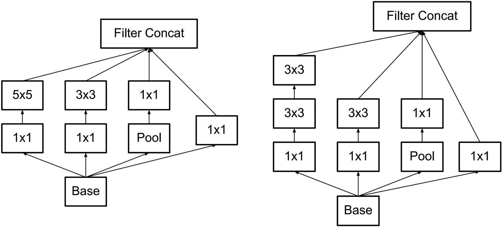

图 6-37

左：原始 Inception 细胞。右：InceptionV3 细胞架构之一

InceptionV3 模块设计中一个关键的架构变化是将大型滤波器尺寸，如 5x5，分解为更小的滤波器尺寸的组合。例如，5x5 滤波器的影响可以被“分解”为一系列两个 3x3 滤波器；在特征图上应用 5x5 滤波器（没有填充）会产生与两个 3x3 滤波器相同的输出形状：(w-4, h-4, d)。同样，7x7 滤波器可以被“分解”为三个 3x3 滤波器。Szegedy 等人指出，这种分解不会降低表示能力，同时促进了更快的学习。这个模块将被称为**对称分解模块**，尽管在 InceptionV3 架构的实现中，它被称为**模块 A**。

实际上，3x3 和 2x2 滤波器也可以分解为更小滤波器尺寸的卷积序列。一个 n x n 的卷积可以表示为一个 1 x n 卷积后跟一个 n x 1 卷积（或反之）。具有不同长度的核高度和宽度的卷积被称为**非对称卷积**，并且可以作为有价值的细粒度特征检测器（见图 6-38）。在 InceptionV3 模块架构中，n 被选为 7。这个模块将被称为**非对称分解模块**（也称为**模块 B**）。Szegedy 等人发现，这个模块在早期层表现不佳，但在中等大小的特征图上表现良好；因此，它相应地放置在 InceptionV3 细胞堆栈中的对称分解模块之后。

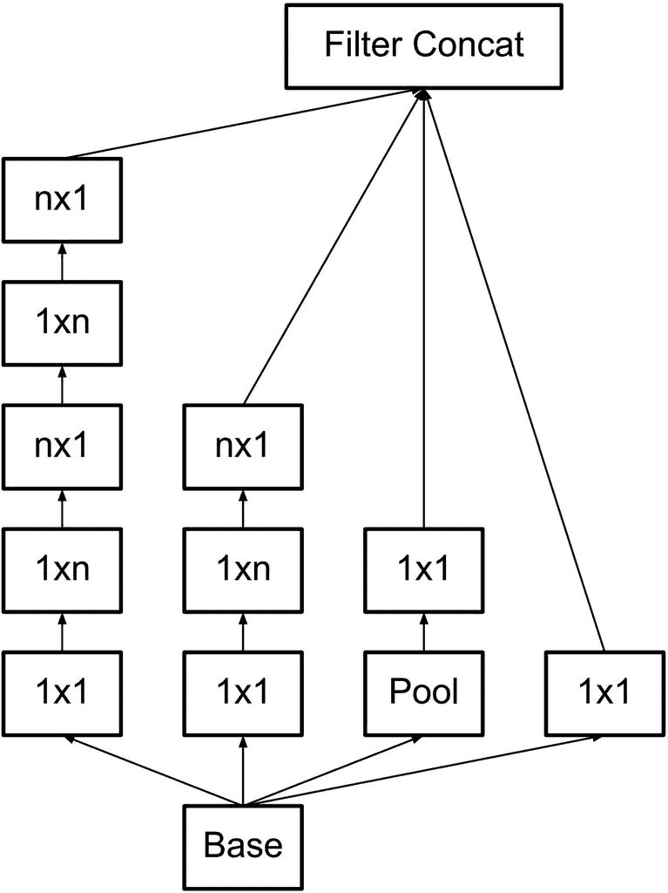

图 6-38

将 n x n 滤波器分解为较小滤波器的操作

对于极其**粗糙**（即尺寸小的）输入，使用具有**扩展滤波器银行输出**的不同模块。这种模型架构通过使用树状拓扑结构来鼓励发展高维表示 - 对称分解模块中的两个左侧分支进一步“分裂”成“子节点”，这些子节点与滤波器末端的输出一起在滤波器末尾进行连接（图 6-39）。这种类型的模块放置在 InceptionV3 架构的末尾，以处理当特征图在空间上变得很小时的情况。这个模块将被称为**扩展滤波器银行模块**（或**模块 C**）。

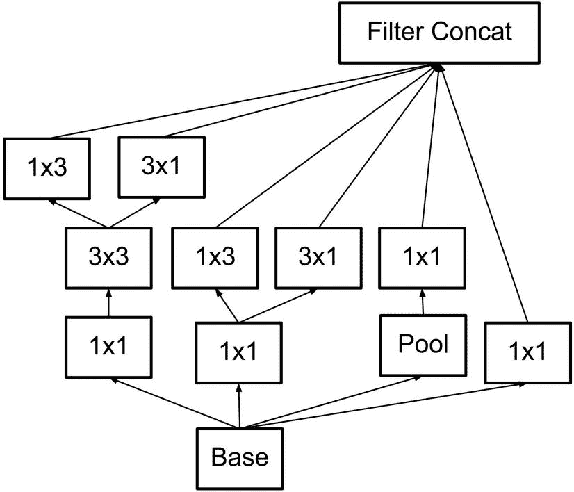

图 6-39

扩展的滤波器银行单元 - 单元内的块通过分支到其他滤波器大小进一步扩展。

另一个设计为高效减少滤波器尺寸的减少式 Inception 模块（图 6-40）。减少式模块使用三个并行分支；其中两个使用步长为 2 的卷积，另一个使用池化操作。这三个分支产生相同的输出形状，可以在深度上进行连接。请注意，Inception 模块被设计成当尺寸减少时，滤波器数量相应增加。

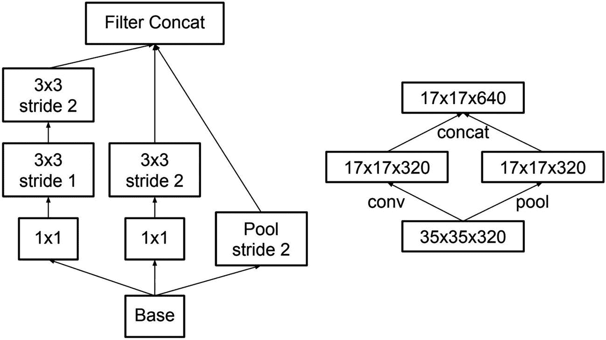

图 6-40

减少单元的设计

InceptionV3 架构是通过以线性方式堆叠这些模块类型形成的，按顺序排列，使得每个模块都放置在一个它将接收特征图输入形状并成功处理的位置。使用的模块序列如下：

1.  一系列卷积和池化层用于执行初始特征提取（这些不属于任何模块）。

1.  对称卷积模块/模块 A 的重复三次。

1.  减少模块。

1.  非对称卷积模块/模块 B 的重复四次。

1.  减少模块。

1.  扩展滤波器银行模块/模块 C 的重复两次。

1.  池化、密集层和 softmax 输出。

Inception 架构系列的一个重要但常被忽视的特征是 1x1 卷积，它在每个 Inception 单元设计中都存在，通常是架构中最常出现的元素。正如前几章所讨论的，当需要减少通道数时，使用大小为 (1,1) 的卷积在构建如自编码器等架构时很方便。然而，在模型性能方面，1x1 卷积在 Inception 架构中发挥着关键作用：在应用昂贵的大尺寸卷积核到特征图表示之前，计算廉价的滤波器减少。例如，假设在架构的某个位置有 256 个滤波器通过一个 1x1 卷积层；1x1 卷积层可以通过学习每个像素从所有 256 个滤波器中可选的值组合来将滤波器数量减少到 64 或甚至 16。由于 1x1 卷积核不包含任何空间信息（即，它不考虑相邻的像素），因此计算成本低。此外，它隔离了后续更大（因此更昂贵）的卷积操作中最重要的特征，这些操作包含空间信息。

通过精心设计的模块架构和有目的地规划的模块排列，InceptionV3 架构在那年的 ILSVRC（ImageNet 竞赛）中表现出色，并已成为图像识别架构中的主流（见表 6-2 和 6-3）。

表 6-3

与其他架构模型集成相比，InceptionV3 架构集成的性能

| 架构 | # 模型 | Top 5 错误 | Top 1 错误 |
| --- | --- | --- | --- |
| VGGNet | 2 | 23.7% | 6.8% |
| GoogLeNet | 7 | – | 6.67% |
| PReLU | – | – | 4.94% |
| Inception | 6 | 20.1% | 4.9% |
| InceptionV3 | 4 | 17.2% | 3.58% |

表 6-2

InceptionV3 架构在 ImageNet 中的性能与其他模型对比

| 架构 | Top 5 错误 | Top 1 错误 |
| --- | --- | --- |
| GoogLeNet | – | 9.15% |
| VGG | – | 7.89% |
| Inception | 22% | 5.82% |
| PReLU | 24.27% | 7.38% |
| InceptionV3 | 18.77% | 4.2% |

全部 InceptionV3 架构可在 `keras.applications.InceptionV3` 找到，其中包含可用于迁移学习或仅作为强大架构（使用随机权重初始化）的 ImageNet 权重，用于图像识别和建模。

构建一个 InceptionV3 模块本身相当简单，并且由于每个单元的设计相对较小，因此无需自动化其构建。我们可以并行构建四个分支，这些分支是连接在一起的。请注意，我们在最大池化层中除了指定 `padding='same'` 之外，还指定了 `strides=(1,1)` 以保持输入和输出层相同。如果我们只指定后者，则 strides 参数将设置为输入池的大小。然后，这些单元可以以顺序格式与其他单元堆叠，形成一个 InceptionV3 风格的架构（见列表 6-28，图 6-41）。

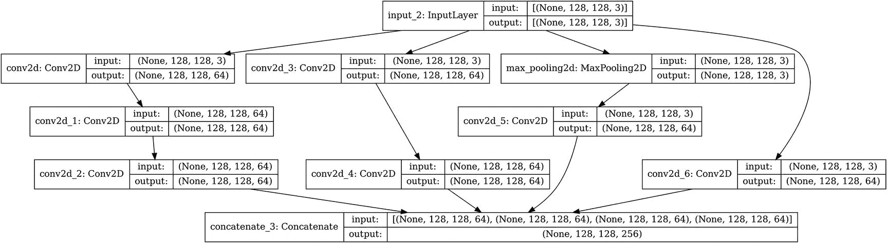

图 6-41

Keras InceptionV3 单元的可视化

```py
def build_iv3_module_a(inp, shape):
w, h, d = shape
branch1a = L.Conv2D(d, (1,1))(inp)
branch1b = L.Conv2D(d, (3,3), padding='same')(branch1a)
branch1c = L.Conv2D(d, (3,3), padding='same')(branch1b)
branch2a = L.Conv2D(d, (1,1))(inp)
branch2b = L.Conv2D(d, (3,3), padding='same')(branch2a)
branch3a = L.MaxPooling2D((2,2), strides=(1, 1),
padding='same')(inp)
branch3b = L.Conv2D(d, (1,1), padding='same')(branch3a)
branch4a = L.Conv2D(d, (1,1))(inp)
concat = L.Concatenate()([branch1c, branch2b,
branch3b, branch4a])
return concat, shape
Listing 6-28
Building a simple InceptionV3 Module A architecture
```

除了能够直接处理大型神经网络架构之外，从零开始实现这些架构的另一个好处是可定制性。你可以插入自己的单元设计，在单元之间添加非线性（InceptionV3 默认不实现），或者增加或减少堆叠的单元数量以调整网络深度。此外，基于单元的结构非常简单且易于实现，因此这几乎不会带来任何成本。

## 神经网络缩放

成功的神经网络架构通常不是为固定尺寸而构建的。通过某种机制，这些网络架构可以 *缩放* 到不同的问题集。例如，在前一章中，我们探讨了 NASNet 风格的神经网络架构搜索设计如何允许开发出可以通过堆叠不同长度和组合的发现单元进行缩放的成功的单元架构。确实，基于单元的设计的一个大优势是其固有的可缩放性。在本节中，我们将讨论适用于所有类型架构的缩放原则——无论是基于单元的还是不是基于单元的。

扩缩的基本思想是，在将网络的实际尺寸缩放到更小或更大的同时，可以保留网络的“特征”（图 6-42）。想象一下 RV 模型飞机——任何尺寸只有几英尺大的可飞飞机。通过保留其设计和一般功能，它们捕捉到了飞机的本质，但通过减小每个组件的尺寸来使用更少的资源。当然，由于它们使用了更少的资源，它们在应对某些情况（如强烈的风暴）方面不如真正的飞机，但这是缩放所必需的牺牲。

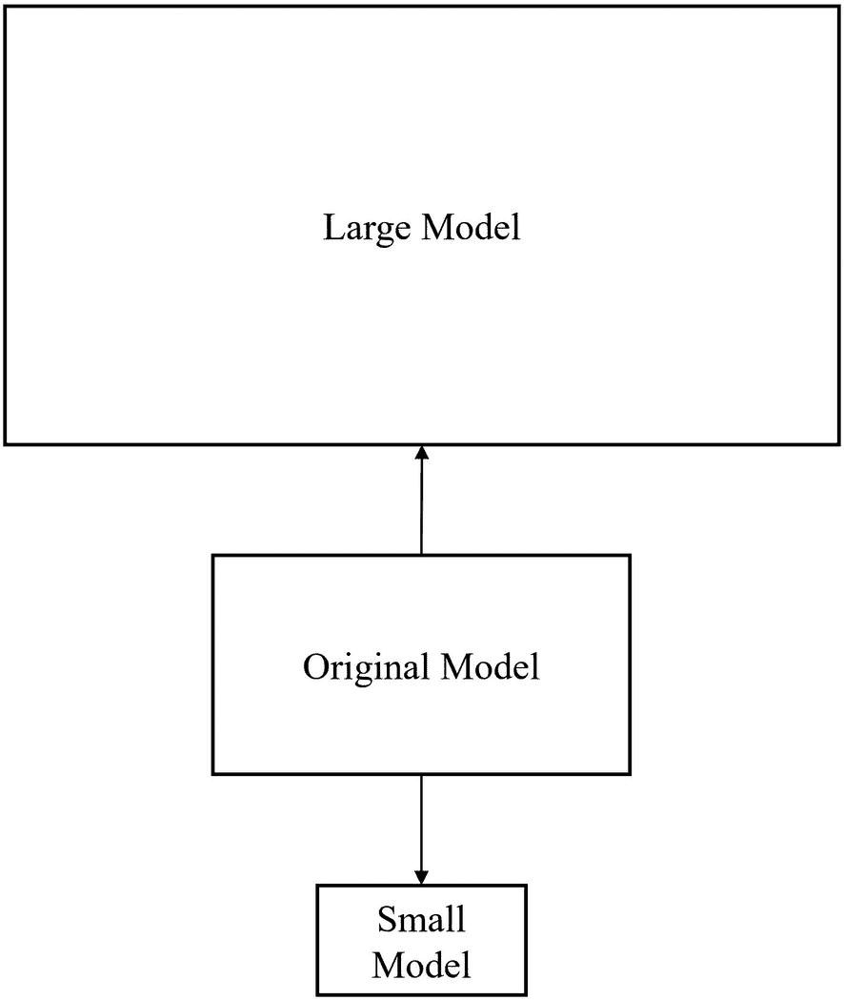

图 6-42

将模型扩展到不同尺寸

通常有两个维度可以缩放——网络的宽度（即每层的节点数、滤波器等）和长度（即层数）。这两个维度在线性拓扑中容易定义，但在非线性拓扑中则更加模糊。为了简化缩放，通常有两种处理非线性的路径。如果非线性的复杂程度足够简单，以至于有一个容易识别的线性主干（例如，基于残差连接的架构或简单的分支架构），则线性主干本身进行缩放。如果非线性的复杂程度太高，则将其安排成可以线性堆叠和深度缩放的细胞。我们将在更详细地讨论这些想法。

假设你手头有一个神经网络架构——可能是从模型存储库中获取的，或者是你自己设计的。让我们考虑三种一般场景，在这些场景中缩放可以帮助：

+   你发现它在你的数据集上表现不足，即使训练到完全成熟。你怀疑模型的最高预测能力不足以模拟你的数据集。

+   你发现模型本身表现良好，但你想以系统化的方式减小其大小，使其更便携，同时不损害对模型性能有贡献的关键属性。

+   你发现模型本身表现良好，但你想开源模型供社区使用，或者希望在其他某些环境中使用它，这些环境中它将被应用于各种问题领域。

神经网络缩放的原则提供了增加或减少你神经网络大小的关键概念，以系统化和结构化的方式。在你构建了一个候选模型架构之后，将其设计中的可扩展性纳入考虑，使其能够适用于各种问题。

### 输入形状可适应设计

缩放的一种方法是将神经网络适应输入形状大小。这是一种直接的方法，根据数据集的复杂性缩放架构，其中使用输入形状的相对分辨率来近似处理它所需分配的预测能力水平。当然，输入形状的大小并不总是指示数据集的复杂性。输入形状可适应设计的主要思想是，较大的输入形状表示更复杂的结构，因此相对于较小的输入需要更多的预测能力（反之亦然）。因此，一个成功的输入形状可适应设计能够根据输入形状的变化来修改网络。

这种缩放方式是实用的，因为输入形状是使用和迁移模型架构的关键重要组成部分（即，如果设置不正确，代码将无法运行）。它允许你直接构建能够响应不同分辨率、大小、词汇长度等，并相应地分配更多或更少预测资源的模型架构。

对输入形状的最简单适应方式不是修改架构本身，而是通过调整形状层（列表 6-29）来修改输入的形状。在 Keras 语法中，输入形状参数的维度中的`None`表示网络接受该维度的任意值。

```py
inp = L.Input((None,None,3))
resize = L.experimental.preprocessing.Resizing(
height=128, width=128
)(inp)
dense1 = L.Dense(64)(resize)
...
Listing 6-29
Adding a resizing layer with an adaptable input layer
```

这种调整大小设计在部署时具有*便携性*的好处；通过传递任何大小的图像（或经过适当代码修改的其他数据形式）到网络中，无需任何预处理即可轻松做出有效预测。然而，这并不完全算作*缩放*，因为计算资源并没有分配来适应输入形状。如果我们向网络传递一个具有非常高分辨率的图像——例如（1024, 1024, 3）——它将通过天真地调整到某个高度或宽度而丢失大量的信息。

让我们考虑一个简单的例子，这是一个深度固定的全连接网络，但其宽度可以调整。它假设包含将输入宽度从 32 变为 21、14、10、10、5 到 1（输出）的层。我们需要识别一个可扩展的模式——一个可以推广的*架构策略*。在这种情况下，每个宽度大约是前一个宽度的三分之二。我们可以通过定义基于这种通用策略的五个层宽度并存储在层宽度列表中来实现这种递归的架构策略（列表 6-30）。

```py
inp_width = 64
num_layers = 5
widths = [inp_width]
next_width = lambda w:round(w*2/3)
for i in range(num_layers):
widths.append(next_width(widths[-1]))
Listing 6-30
Creating a list of widths via a recursive architectural policy
```

我们可以将这种方法应用于构建我们的简单神经网络（列表 6-31）。

```py
model = keras.models.Sequential()
model.add(L.Input((inp_width,)))
for i in range(num_layers):
model.add(L.Dense(widths[i+1]))
model.add(L.Dense(1, activation='sigmoid'))
Listing 6-31
Building a model with the scalable architectural policy to determine network widths. We begin reading from the i+1th index because the first index contains the input width
```

尽管这个模型很简单，但现在它能够转移到不同输入大小的数据集上。

我们可以将这些想法类似地应用于卷积神经网络。请注意，卷积层可以接受任意大小的输入，但我们仍然可以通过在现有架构中找到并应用通用的规则来改变每一层使用的过滤器数量。在卷积神经网络中，我们希望增加过滤器的数量来补偿图像分辨率的降低。因此，过滤器的数量应该随着时间的推移相对于原始输入形状增加，以正确执行这种资源补偿。

我们可以将我们想要的第一卷积层和最后一卷积层的过滤器数量定义为输入形状的分辨率相关（见列表 6-32）。在这种情况下，我们将其定义为`2^round(log2(w)-4)`，其中*w*是原始宽度（表达式有意保持未简化形式）。因此，128x128 的图像将开始于 8 个过滤器，而 256x256 的图像将开始于 16 个过滤器。网络拥有的过滤器数量相对于输入图像的大小进行缩放。我们简单地定义最后一卷积层的过滤器数量为 2³ = 8 倍原始过滤器数量。

```py
inp_shape = (128,128,3)
num_layers = 10
w, h, d = inp_shape
start_num_filters = 2**(round(np.log2(w))-4)
end_num_filters = 8*start_num_filters
Listing 6-32
Setting important parameters for convolutional scalable models
```

我们的目标是从起始过滤器数量到结束过滤器数量，在整个我们定义的网络深度中逐步推进。为了做到这一点，我们将层数分为四个部分。要从一部分转到下一部分，我们将过滤器数量乘以 2。我们通过测量已经占用的层分数来确定何时移动到下一部分（见列表 6-33）。

```py
filters = []
for i in range(num_layers):
progress = i/num_layers
if progress < 1/4:
f = start_num_filters
elif progress < 2/4:
f = start_num_filters*2
elif progress < 3/4:
f = start_num_filters*4
else:
f = start_num_filters*8
filters.append(f)
Listing 6-33
Architectural policy to determine the number of filters at each convolutional layer
```

根据这种方法，对于(128,128,3)图像的过滤器序列是[8, 8, 8, 16, 16, 32, 32, 32, 64, 64]。对于(256,256,3)图像的过滤器序列是[16, 16, 16, 32, 32, 64, 64, 64, 128, 128]。注意，在这种情况下，我们没有递归地定义架构策略。

通过测量*进度*而不是确定性层（即，如果当前层已经超过第 3 层），此脚本也可以在*深度*上扩展。通过调整`num_layers`参数，你可以“缩小”或“拉伸”这个序列到任何所需的深度。因为高分辨率通常需要更长的深度，所以你也可以将`num_layers`参数概括为输入分辨率的函数，如`num_layers = round(np.log2(128)*3)`。注意，在这种情况下，我们使用对数来防止缩放算法对高分辨率输入构建深度过高的网络。然后可以使用过滤器的列表和长度来自动构建一个根据图像适当缩放的神经网络架构。

注意，这些操作应该在首先获得一个要缩放的模型之后进行。我们可以将这个过程概括为三个步骤：

1.  识别可以用于缩放的通用架构模式，如网络的深度或层宽度在网络的长度上的变化。

1.  将架构模式概括为一个*架构策略*，该策略可以在缩放维度上扩展。

1.  使用架构策略根据输入形状（或缩放的其它决定因素）生成网络架构的具体元素。

对输入形状的适应对于像自编码器这样的架构最为相关，其中输入形状是整个架构中的关键影响因素。我们将结合基于单元的设计和第三章中讨论的自编码器知识，创建一个 *可扩展* 的自编码器，其长度和滤波器大小可以自动缩放到应用到的任何输入大小。

为了使构建过程更容易，让我们定义一个“编码器单元”和一个“解码器单元”（见代码清单 6-34）。这些不是编码器和解码器 *子模型* 或组件，而是代表可以堆叠在一起形成编码器和解码器的单元。编码器单元将两个卷积层和一个最大池化层附加到传递给单元构建函数的任何层，而解码器单元附加“逆”操作——一个上采样层后跟两个转置卷积层。两者都返回单元的输出/最后一层，这可以用作下一个单元的输入。请注意，这两个单元分别将图像输入的分辨率减半和加倍。

```py
def encoder_cell(inp_layer, filters):
x = L.Conv2D(filters, (3,3), padding='same')(inp_layer)
x = L.Conv2D(filters, (3,3), padding='same')(x)
x = L.MaxPooling2D((2,2))(x)
return x
def decoder_cell(inp_layer, filters):
x = L.UpSampling2D((2,2))(inp_layer)
x = L.Conv2DTranspose(filters, (3,3), padding='same')(x)
x = L.Conv2DTranspose(filters, (3,3), padding='same')(x)
return x
Listing 6-34
Encoder and decoder cells, for example, autoencoder-like structure
```

我们将从三个关键变量开始：`i` 将表示用于确定第一和最后一层卷积层应有多少个滤波器的 2 的幂（`i=4` 表示将使用 2⁴ = 16 个滤波器）；`w`、`h` 和 `d` 将用于存储输入形状的宽度、高度和深度；而 `curr_shape` 将用于跟踪数据在网络中传递时的形状（见代码清单 6-35）。

```py
i = 4
w, h, d = (256,256,3)
curr_shape = np.array([w, h])
Listing 6-35
Defining key factors in building the scalable autoencoder-like architecture
```

我们必须考虑两个关键的尺度维度：宽度和深度。

如果分辨率减半，则一个块中的滤波器数量将加倍；如果分辨率加倍，则滤波器数量将减半。这种关系确保了整个网络中近似的 *表示平衡* – 我们不会创建过于严重的表示瓶颈，这是 Szegedy 等人在 Inception 架构中概述的网络设计原则。假设这个网络用于预训练或去噪等目的，在这些目的中，瓶颈可以更自由地构建（在其他上下文中，我们 *希望* 构建更严重的表示瓶颈）。我们可以在编码器单元附加后通过增加 `i` 1，在解码器单元附加后通过减少 `i` 1 来跟踪这种关系。

在这个例子中，我们将构建我们的神经网络，而不是使用特定的预指定深度，而是使用必要的任何深度以获得一定的瓶颈大小。也就是说，我们将继续堆叠编码器块，直到数据形状等于（或低于）一定的期望瓶颈大小。在此之后，我们将堆叠 *解码器* 块，逐步增加数据的大小，直到它达到原始大小。

我们可以构建输入层和第一个编码器单元（见 6-36）。在添加编码器单元后，我们通过减半来适当地更新数据的当前形状。此外，我们增加`i`，使得下一个编码器单元使用两倍的过滤器。一个无限循环继续堆叠编码器单元，直到单元的输出形状（即潜在瓶颈）等于或小于 16 个神经元（所需的单元）。

```py
inp = L.Input((w,h,d))
x = encoder_cell(inp, 2**i)
curr_shape = curr_shape/2
i += 1
# build encoder
while True:
x = encoder_cell(x, 2**i)
curr_shape = curr_shape/2
if curr_shape[0] <= 16: break
i += 1
Listing 6-36
Building the encoder component of the scalable autoencoder-like architecture
```

在编码器构建完成后，我们可以相应地构建解码器，解码器反复堆叠解码器单元并减少`i`，使得下一个单元使用一半数量的过滤器（见 6-37）。虽然你可以继续跟踪形状并在当前形状等于原始形状时停止，但另一种使用更少代码的方法是利用我们对`i`的使用，并将`i=4`视为达到初始状态的一个指示。

```py
# build decoder
while True:
x = decoder_cell(x, 2**i)
if i == 4: break
i -= 1
Listing 6-37
Building the decoder component of the scalable autoencoder-like architecture
```

完整的模型可以聚合为 `ae = keras.models.Model(inputs=inp, outputs=x)`。这种简单的自动编码器设计——使用两个卷积操作后跟一个池化操作——已经扩展到能够模拟任何输入大小分辨率（只要它是 2 的幂，因为池化会做出近似，而这些近似在反池化中不会被捕捉到，如果边长不能被池化因子干净地整除——有关更多信息，请参阅第三章）。将模型扩展以适应不同的输入大小可能需要更多的工作，正如我们所看到的，但这使得你的模型在实验和部署中更加灵活和可访问。

### 网络维度参数化

在前面的章节中，我们关注的是针对必要级参数的扩展：模型的输入形状。在本节中，我们将讨论网络维度的广泛参数化。将网络架构适应输入形状需要我们泛化模型架构，从而制定可能成功或可能不成功的隐式和显式架构策略。这里的目的是为了*参数化*网络维度，以便适应不同的问题和进行*实验*。

如本章引言所述，通常一轮模型构建不足以满足部署需求。通过参数化网络架构的维度，我们能够更轻松、更快速地尝试不同的规模和大小，以便网络能够最佳地适应数据集。

将模型参数化以进行实验和内在可扩展性以及将模型参数化以适应输入形状之间的关键区别在于，决定参数化的因素是用户指定的，而不是依赖于输入形状。我们不是编程架构策略（例如，网络宽度从输入形状扩展的图案），而是使用*乘数系数*。这些是用户指定的参数，它们与网络的当前维度相乘。小于 1 的乘数系数会缩小该维度，而大于 1 的乘数系数会扩大该维度。

考虑这个简单的顺序模型架构，它通过四个全连接层和一个输出处理 64 维输入（见列表 6-38）。

```py
model = keras.models.Sequential()
model.add(L.Input(64,))
model.add(L.Dense(32, activation='relu'))
model.add(L.Dense(32, activation='relu'))
model.add(L.BatchNormalization())
model.add(L.Dense(16, activation='relu'))
model.add(L.Dense(16, activation='relu'))
model.add(L.Dense(1, activation='sigmoid'))
Listing 6-38
Building a simple sequential model to be parametrized
```

让我们通过将每个层的节点数乘以某个宽度系数来参数化宽度（见列表 6-39）。因为结果可能是一个分数，所以我们四舍五入缩放的结果。

```py
width_coef = 1.0
w = lambda width: round(width*width_coef)
model = keras.models.Sequential()
model.add(L.Input(64,))
model.add(L.Dense(w(32), activation='relu'))
model.add(L.Dense(w(32), activation='relu'))
model.add(L.BatchNormalization())
model.add(L.Dense(w(16), activation='relu'))
model.add(L.Dense(w(16), activation='relu'))
model.add(L.Dense(1, activation='sigmoid'))
Listing 6-39
Parametrizing the width of a network
```

参数化深度稍微有点复杂，因为我们需要操作实际的层对象，而不是固定层集内的参数。一种成功的方法是识别由多个相似层组成的架构的关键块，这些层可以通过深度系数进行拉伸或收缩（见列表 6-40）。在我们的简单模型中，有两个容易识别的块：一个位于输入之后和批量归一化之前，由两个具有 32 个节点的层组成，另一个位于批量归一化层之后，由另外两个具有 16 个节点的层组成。默认情况下，这两个块由一种类型的层组成，数量为 2。因此，我们可以通过将这个数量乘以深度系数来参数化网络。与宽度一样，在非整数结果的情况下，我们进行四舍五入。

```py
depth_coef = 1.0
d = lambda depth: round(depth*depth_coef)
model = keras.models.Sequential()
model.add(L.Input(64,))
for i in range(d(2)):
model.add(L.Dense(w(32), activation='relu'))
model.add(L.BatchNormalization())
for i in range(d(2)):
model.add(L.Dense(w(16), activation='relu'))
model.add(L.Dense(1, activation='sigmoid'))
Listing 6-40
Parametrizing the depth of a network
```

在这个情况下，我们将`2`传递给`d()`函数，因为 2 是我们模型架构中默认的层数。此外，请注意，我们并不是对网络的*整个深度*进行缩放；例如，我们保留像批量归一化这样的层，不依赖于深度系数。深度缩放应该适当地应用于处理层，而不是像批量归一化或 dropout 这样的层，这些层只改变或正则化数据流。

用户现在可以调整`width_coef`和`depth_coef`以进行快速实验和便携性。您如何**优化**网络维度参数化取决于您。一种可能成功的方法是使用 Hyperopt 或 Hyperas 通过贝叶斯优化来调整宽度缩放因子`width_coef`和深度缩放因子`depth_coef`。或者，人们可以转向最近日益增长的研究领域，这些研究领域围绕缩放的一般最佳实践，如成功 EfficientNet 架构中引入的**复合缩放方法**。我们将在本节的案例研究中探讨这种方法。

这种逻辑适用于具有非线性的架构，只要可以识别出一个清晰的骨干（见列表 6-41）。例如，考虑用于构建 DenseNet 风格残差连接的代码（见列表 6-8）。我们可以使用我们的`d`和`w`函数从它们的原始“默认”维度值扩展网络深度和宽度。

```py
num_layers = d(5)
inp = L.Input((128,))
x = L.Dense(64, activation='relu')(inp)
layers = [x]
for i in range(num_layers-1):
x = L.Dense(w(64))(make_rc(layers))
layers.append(x)
output = L.Dense(1, activation='sigmoid')(x)
Listing 6-41
Parametrizing nonlinear architectures (in this case, DenseNet-style model) by relying upon a linear backbone. Complete code is not shown. Please refer to relevant DenseNet-style residual connection listing for full context
```

类似地，您可以对没有非线性主干、简单如并行分支的非线性架构的维度进行参数化。如果一个架构过于非线性，无法使用前面介绍的分块方法来扩展深度维度，另一种方法是将这些高度非线性的拓扑结构分组为可以堆叠不同数量块进行扩展的块。

通过参数化网络维度，您可以让自己和他人能够更快、更轻松地实验和调整网络架构，从而在解决问题上提高性能。

### 案例研究：EfficientNet

卷积神经网络在历史上相对任意地进行了缩放，沿着之前讨论的两个维度——高度和宽度，以及（最近）分辨率。这种“任意”缩放意味着调整网络维度时没有太多关于调整如何进行的理由；在确定缩放维度的大小方面存在模糊性。在卷积神经网络设计中占据主导地位的“越大越好”范式，在与其他更注重开发高效机制和设计的方案竞争时正达到其竞争力的极限。因此，需要一种**系统方法**来跨多个维度缩放神经网络架构，以实现最高的预期成功（见图 6-43）。

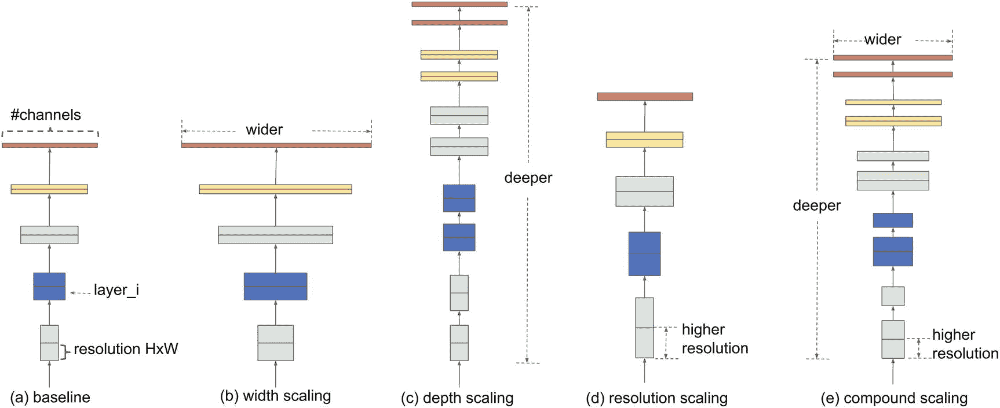

图 6-43

与复合缩放方法相比，可以缩放的神经网络维度

Mingxing Tan 和 Quoc V. Le 在他们发表的论文“EfficientNet：重新思考卷积神经网络模型缩放”中提出了**复合缩放方法**。3 复合缩放方法是一种简单但成功的缩放方法，其中每个维度都按一个常数比例进行缩放。

使用一组固定的缩放常数来统一缩放神经网络架构使用的宽度、深度和分辨率。这些常数 – *α*, *β*, *γ* – 通过一个复合系数 *ϕ* 进行缩放，使得深度为 *d* = *α*^(*ϕ*)，宽度为 *w* = *β*^(*ϕ*)，分辨率是 *r* = *γ*^(*ϕ*)。*ϕ* 由用户定义，取决于他们愿意为特定问题分配多少计算资源/预测能力。

常数的值可以通过一个小网格搜索找到，其中 *ϕ* 设置为 1，并选择产生最佳准确率的参数集。由于搜索空间较小，这既可行又成功。对常数施加了两个约束：

+   *α* ≥ 1, *β* ≥ 1, *γ* ≥ 1：这确保了当这些常数被复合系数 *ϕ* 升幂时，它们的值不会减小，从而较大的复合系数值会产生更大的深度、宽度和分辨率大小。

+   *α* · *β*² · *γ*² ≈ 2：一系列卷积操作的 FLOPS（每秒浮点运算数）与深度、宽度的平方和分辨率的平方成正比。这是因为深度通过堆叠更多层进行线性操作，而宽度和分辨率作用于二维滤波器表示。为了确保计算可解释性，此约束确保任何 *ϕ* 值都将总 FLOPS 数提升到大约 (*α* · *β*² · *γ*²)^(*ϕ*) = 2^(*ϕ*)。

使用这种方法进行缩放在应用于之前成功的架构（如 MobileNet 和 ResNet）时非常成功（见表 6-4）。通过复合缩放方法，我们能够以结构化和非任意的方式扩展网络的大小和计算能力，从而优化缩放模型的最终性能。

表 6-4

MobileNetV1、MobileNetV2 和 ResNet50 架构上复合缩放方法的性能

| 模型 | FLOPS | Top 1 准确率 |
| --- | --- | --- |
| 基准 MobileNetV1 | 0.6 B | 70.6% |
| 通过宽度缩放 MobileNetV1 (*w* = 2) | 2.2 B | 74.2% |
| 通过分辨率缩放 MobileNetV1 (*r* = 2) | 2.2 B | 74.2% |
| **通过复合缩放缩放 MobileNetV1** | **2.3 B** | **75.6%** |
| 基准 MobileNetV2 | 0.3 B | 72.0% |
| 通过深度缩放 MobileNetV2 (*d* = 4) | 1.2 B | 76.8% |
| 通过宽度缩放 MobileNetV2 (*w* = 2) | 1.1 B | 76.4% |
| 通过分辨率缩放 MobileNetV2 (*r* = 2) | 1.2 B | 74.8% |
| **通过复合缩放缩放 MobileNetV2** | **1.3 B** | **77.4%** |
| 基准 ResNet50 | 4.1 B | 76.0% |
| 通过深度缩放 ResNet50 (*d* = 4) | 16.2 B | 76.0% |
| 通过宽度缩放 ResNet50 (*w* = 2) | 14.7 B | 77.7% |
| 通过分辨率缩放 ResNet50 (*r* = 2) | 16.4 B | 77.5% |
| **通过复合缩放缩放 ResNet50** | **16.7 B** | **78.8%** |

Tan 和 Le 提出了关于复合缩放成功原因的解释，这与我们在根据输入大小调整神经网络架构时发展出的先验直觉相似。直观上，当输入图像较大时，所有维度——而不仅仅是单个维度——都需要相应增加以适应信息量的增加。处理增加的复杂层需要更深的深度，而捕获更多信息量则需要更宽的宽度。Tan 和 Le 的工作在定量表达网络维度之间的关系方面是新颖的。

Tan 和 Le 的论文提出了 *EfficientNet* 模型系列，这是一个由复合缩放方法构建的不同尺寸的模型系列。EfficientNet 系列中有八个模型——EfficientNetB0, EfficientNetB1, …, 到 EfficientNetB7，按从小到大的顺序排列。EfficientNetB0 架构是通过神经架构搜索发现的。为了确保导出的模型在性能和 FLOPS 方面都得到优化，搜索的目标不仅仅是最大化准确率，而是最大化性能和 FLOPS 的组合。然后使用不同的 *ϕ* 值对结果架构进行缩放，以形成其他七个 EfficientNet 模型。

注意

实际开源的 EfficientNet 模型略微调整了它们的纯缩放版本。正如你可能想象的那样，复合缩放是一个成功但仍然近似的方法，正如大多数缩放技术所预期的那样——这些是在架构大小范围内的泛化。为了真正最大化性能，在缩放后仍需要对架构进行一些微调。EfficientNet 模型系列的公开版本在复合缩放后包含了一些额外的架构更改，以进一步提高性能。

EfficientNet 模型系列在 ImageNet、CIFAR-100、Flowers 等基准数据集上取得了比同样大小的模型——无论是人工设计还是 NAS 发现的架构——更高的性能——（图 6-44）。虽然核心的 EfficientNetB0 模型是作为神经架构搜索的产品创建的，但 EfficientNet 系列的其他成员是通过缩放构建的。

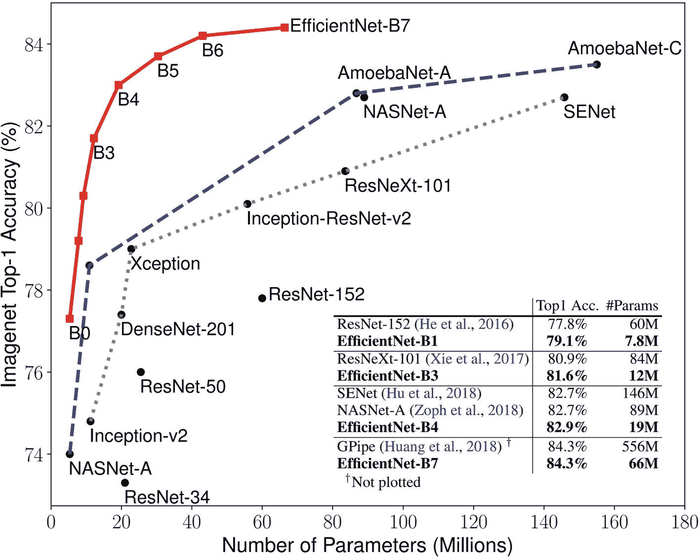

图 6-44

不同大小的 EfficientNet 模型与其他重要模型架构在参数数量和 ImageNet Top 1 准确率上的对比图

EfficientNet 模型家族在 Keras 应用程序中可用，位于 `keras.applications.EfficientNetBx`（将 `x` 替换为从 0 到 7 的任何数字）。Keras 应用程序中的 EfficientNet 实现的大小从 29 MB（B0）到 256 MB（B7）不等，参数数量从 5,330,571（B0）到 66,658,687（B7）不等。请注意，EfficientNet 家族不同成员的输入形状不同。EfficientNetB0 预期图像的空间维度为（224，224）；B4 预期（380，380）；B7 预期（600，600）。你可以在 Keras/TensorFlow 应用程序文档中找到预期的输入形状信息。

在 Keras 中查看 EfficientNet 的源代码是一种非常有价值的方法，可以让你感受到在专业水平上如何实现缩放。源代码可在[`github.com/keras-team/keras-applications/blob/master/keras_applications/efficientnet.py`](https://github.com/keras-team/keras-applications/blob/master/keras_applications/efficientnet.py)找到。因为这个实现是为最广泛使用的深度学习库之一编写的，所以大部分相关代码都是用来泛化/参数化模型，以便在各种平台和目的上使用。尽管如此，其组织结构的通用模式可以模仿用于你的深度学习目的和设计。

Keras 中的 EfficientNet 实现包括三种关键类型的函数：

+   `block()`，它根据一系列参数构建一个标准的 EfficientNet 风格的块，包括 dropout 率、输入滤波器数量、输出滤波器数量等。`expand_ratio` 和 `se_ratio` 参数指的是“扩展阶段”和“压缩和激励阶段”的“严重性”或“强度”，这些阶段（大致来说）增加和减少数据的表示大小。

+   `EfficientNet()`，它根据两个关键参数——`width_coefficient`（宽度系数）和`depth_coefficient`（深度系数）——构建一个 EfficientNet 模型。其他参数包括 dropout 率和深度除数（用于网络宽度的一个单位）。

+   `EfficientNetBx()`，它只是用适当的参数调用 `EfficientNet()` 架构构建函数，这些参数适用于被调用的 EfficientNet 结构。例如，`EfficientNetB4()` 函数返回宽度系数为 1.4、深度系数为 1.8 的 `EfficientNet()` 函数。未缩放的 EfficientNetB0 模型使用宽度系数和深度系数为 1。

关键的 `EfficientNet()` 函数在其内部定义了两个函数，`round_filters` 和 `round_repeats`，它们接受“默认”的滤波器数量和重复次数，并根据提供的宽度系数和深度系数适当地进行缩放。

`round_filters` 函数（见代码清单 6-42）接收默认的过滤器数量，并返回缩放后的新过滤器数量。新过滤器数量 *f*[*n*] 的公式大致为 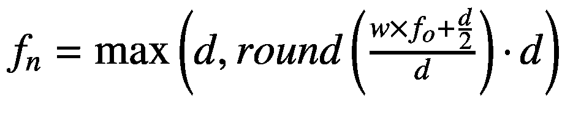，其中 *d* 是深度除数，*w* 是宽度缩放系数，而 *f*[*o*] 是原始过滤器数量。由于 *max*(…) 机制，新过滤器数量永远不会低于除数值。右侧的表达式简单地将原始过滤器数量乘以宽度缩放系数，然后应用 *深度除数*。深度除数可以被视为第五章中量化的“桶大小”；它是参数缩放的基本单位。EfficientNet 的默认除数为 8，这意味着宽度以 8 的倍数表示。这种“量化”可以通过 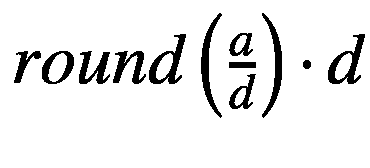（Python 中通过 `a//d` 执行整数除法）轻松完成。这种实现通过添加 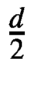 来“平衡”缩放后的过滤器数量，在“量化”/“四舍五入”之前。

```py
def round_filters(filters, divisor=depth_divisor):
filters *= width_coefficient
new_filters = max(divisor, int(filters + divisor / 2) // divisor * divisor)
if new_filters < 0.9 * filters:
new_filters += divisor
return int(new_filters)
Listing 6-42
Keras EfficientNet implementation of the function used to return the scaled width of a layer
```

深度缩放方法更简单；默认的块重复次数乘以深度系数，并应用上限函数以得到非整数的缩放深度（见代码清单 6-43）。

```py
def round_repeats(repeats):
return int(math.ceil(depth_coefficient * repeats))
Listing 6-43
Keras EfficientNet implementation of the function used to return the scaled depth of the network
```

这些函数用于构建参数化的 EfficientNet 基础模型，从而实现易于缩放。

## 关键点

在本章中，我们讨论了成功神经网络架构设计中的三个关键主题：非线性和平行表示、基于单元格的设计和架构缩放：

+   在复杂架构的高效和高级实现中，有三个关键概念——模块化、自动化和参数化。

+   非线性和平行表示允许层在架构的各个组件之间传递信息信号，而不会因为必须通过许多其他组件而受到限制。这允许网络以考虑更多视角和表示的方式处理信息。

    +   残差连接是一种“跳过”或“跳跃”其他层的连接。ResNet 风格的残差连接被反复用来跳过小堆叠的层。另一方面，DenseNet 风格的残差连接在每对锚点之间放置残差连接，使得信息可以通过网络跨越更长的和更短的距离。残差连接是解决梯度消失问题的一种方法。这些可以通过通过功能 API 简单地通过合并残差连接的“根”与残差连接“末端”的输入来实现。

    +   分支结构和基数是残差连接向更广泛非线性的一般化。虽然宽度衡量一个层有多宽（例如，节点或滤波器的数量），*基数*衡量网络在某个点有多宽——因此有多少并行表示存在并被处理——。

+   块/单元设计包括将层排列成包装拓扑，这些拓扑作为细胞使用，可以堆叠在一起形成基于细胞的架构。通过将层排列成细胞并操作细胞而不是层，我们用更强大的一个——由层聚集而成的——替换了建筑构造的基本单元——层。细胞可以被看作是“微型网络”，可以采用各种内部拓扑，线性或非线性。在实现上，块/单元设计可以通过构建一个函数来实现，该函数接受一个层来构建细胞，并输出细胞的最后一层（其他细胞或其他处理层可以堆叠在其上）。

+   神经网络扩展允许网络架构针对不同的数据集、问题和实验进行扩展。你可以通过识别神经网络架构中的模式并将它们推广到*架构策略*中来调整架构的宽度和维度以适应输入形状。你还可以通过参数化宽度和深度来扩展架构；这些可以通过贝叶斯优化或手动扩展策略（如复合扩展）来优化。

在下一章中，我们将使用我们在多个章节中构建的工具来讨论深度学习问题解决方法。
