# 4. 将卷积结构应用于表格数据

> 有已知的事物，有未知的事物，而在两者之间是感知的门。
> 
> ——奥尔德斯·赫胥黎，作家和哲学家

在上一章中，你探索了标准前馈/人工神经网络模型在表格数据中的应用。在本章中，我们将从已广泛记录的“传统”方法跳跃到新的、相对未知的领域，通过探索将*卷积结构*应用于表格数据。虽然传统上应用于图像数据，但卷积层和卷积神经网络可以为表格数据提供独特的视角，这是经典机器学习算法所缺乏的，并且人工神经网络无法可靠地替代的。

本章将从卷积神经网络理论的概述开始，探讨关键卷积和池化操作背后的直觉和理论，如何将卷积和池化层组织到其他层中形成卷积神经网络（CNNs），以及可访问和成功的 CNN 模型架构的简要调查。前半部分的目标是为“自然”图像环境中的 CNN 模型奠定理论和实践基础。后半部分将展示它们在表格数据中的应用：首先，你将了解多模态网络设计——构建同时包含图像*和*表格数据以产生决策的模型，使用卷积层处理图像输入，使用前馈层处理表格输入。之后，本章将展示将一维和二维卷积直接和间接应用于表格数据的技术。

## 卷积神经网络理论

在本节中，我们将理解卷积存在的合理性，卷积操作是如何工作的，以及池化操作是如何工作的。你将结合这些知识来实现用于标准图像分类任务的卷积神经网络。

### 我们为什么需要卷积？

让我们想象一下，如果卷积层尚未被发明，我们作为神经网络“构建块”所拥有的全部就是全连接层。我们希望构建一个能够处理图像的神经网络。作为一个示例任务，让我们考虑著名的 MNIST 数字数据集，它包含了几千张 0 到 9 的手写数字的 28x28 像素灰度图像。

MNIST 是一个相对较小的数据集，可以通过 Keras 数据集子模块轻松加载（列表 4-1）。

```py
from keras.datasets.mnist import load_data as load_mnist
(x_train, y_val), (x_test, y_val) = load_mnist()
Listing 4-1
Loading the MNIST dataset
```

让我们可视化数据集中的 25 个数字（列表 4-2，图 4-1）。我们将使用 seaborn `heatmap(array)`而不是更标准的`plt.imshow(img)`来明确显示像素值。

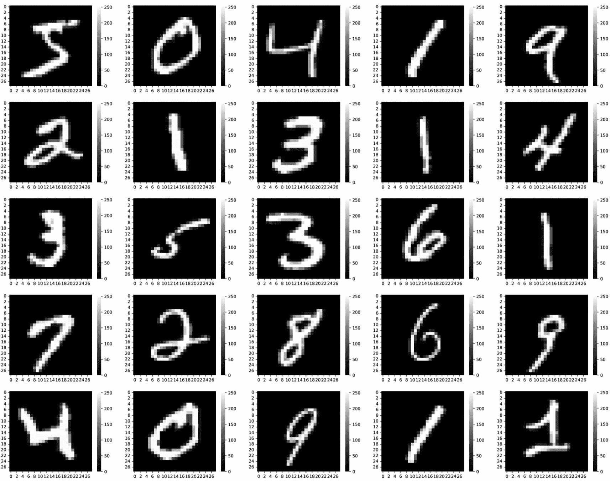

25 个热图在 x 轴和 y 轴上从 0 到 26，在垂直灰度上从 0 到 250。每个热图都包含一个从 0 到 9 的手写数字图像。

图 4-1

MNIST 数据集的样本项目，以热图形式展示

```py
plt.figure(figsize=(25, 20), dpi=400)
for i in range(5):
for j in range(5):
plt.subplot(5, 5, i*5 + j + 1)
sns.heatmap(x_train[i*5 + j], cmap='gray')
plt.yticks(rotation=0)
plt.show()
Listing 4-2
Displaying heatmap representations of sample digits from the MNIST dataset
```

每个 28-by-28 像素的图像包含 784 个值。我们需要将`x_train`和`x_val`展平，它们的形状分别是(60000, 28, 28)和(10000, 28, 28)，以便使它们能够被标准的全连接神经网络接受。所需的形状是(60000, 784)和(10000, 784)。我们可以通过重塑数组来实现这一点（见列表 4-3）。

```py
x_train = x_train.reshape(60000, 784)
x_val = x_val.reshape(10000, 784)
Listing 4-3
Reshaping the MNIST dataset into “flattened” form
```

直接引用数据集的变量属性而不是硬编码这些属性的值是一种良好的实践。如果有人在其数据集中有 60,001 个元素并想使用你的代码，他们将会得到一个错误。一个更健壮的展平方法，适用于可变数据集和图像大小，在列表 4-4 中展示。注意，将-1 作为轴维度值相当于请求 NumPy 推断剩余的维度。（如果你不熟悉这一点，请参阅附录。）

```py
flattened_shape = x_train.shape[1] * x_train.shape[2])
x_train = x_train.reshape(-1, flattened_shape)
x_val = x_val.reshape(-1, flattened_shape)
Listing 4-4
A more robust alternative to the reshaping operation performed in Listing 4-3
```

让我们使用简单的顺序模型构建一个前馈神经网络（见图 4-2），其逻辑如下：我们从一个有 784 个节点的输入层开始；每个密集层包含比前一个层少一半的节点；当神经元数量达到 10 或更少时，我们停止添加层（见列表 4-5）。

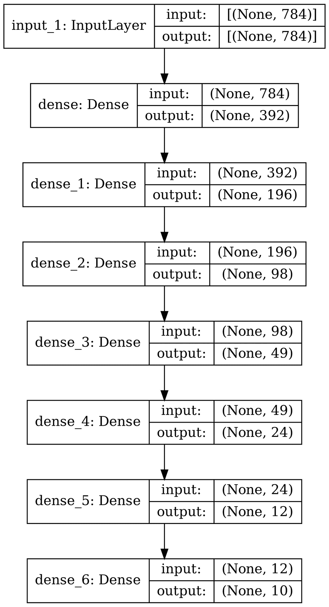

输入层、密集层、密集层 1 到 6 的流程图，没有逗号值。

图 4-2

在列表 4-5 中构建的模型架构上调用 keras.utils.plot_model 的结果

```py
model = keras.models.Sequential()
curr_nodes = 28 * 28
model.add(L.Input((curr_nodes,)))
while curr_nodes > 10:
curr_nodes = round(1/2 * curr_nodes)
model.add(L.Dense(curr_nodes,
activation='relu'))
model.add(L.Dense(10, activation='softmax'))
Listing 4-5
Programmatically generating a model to fit the “flattened” MNIST dataset
```

调用`model.summary()`会打印出关于模型架构和参数的信息（见列表 4-6）。我们看到第一层学习 784 维向量与 392 维向量之间的映射，需要 784 ⋅ 392 = 307,720 个参数。第二层学习 392 维向量与 196 维向量之间的映射，需要 392 ⋅ 196 = 77,028 个参数。总共，在六层中，模型架构需要 410.5k 个参数。

```py
Model: "sequential"
_________________________________________________________________
Layer (type)                 Output Shape              Param #
=================================================================
dense (Dense)                (None, 392)               307720
_________________________________________________________________
dense_1 (Dense)              (None, 196)               77028
_________________________________________________________________
dense_2 (Dense)              (None, 98)                19306
_________________________________________________________________
dense_3 (Dense)              (None, 49)                4851
_________________________________________________________________
dense_4 (Dense)              (None, 24)                1200
_________________________________________________________________
dense_5 (Dense)              (None, 12)                300
_________________________________________________________________
dense_6 (Dense)              (None, 10)                130
=================================================================
Total params: 410,535
Trainable params: 410,535
Non-trainable params: 0
_________________________________________________________________
Listing 4-6
Parameter and shape summary for the architecture written in Listing 4-5
```

我们可以使用标准元参数（见列表 4-7，图 4-3）来训练模型。

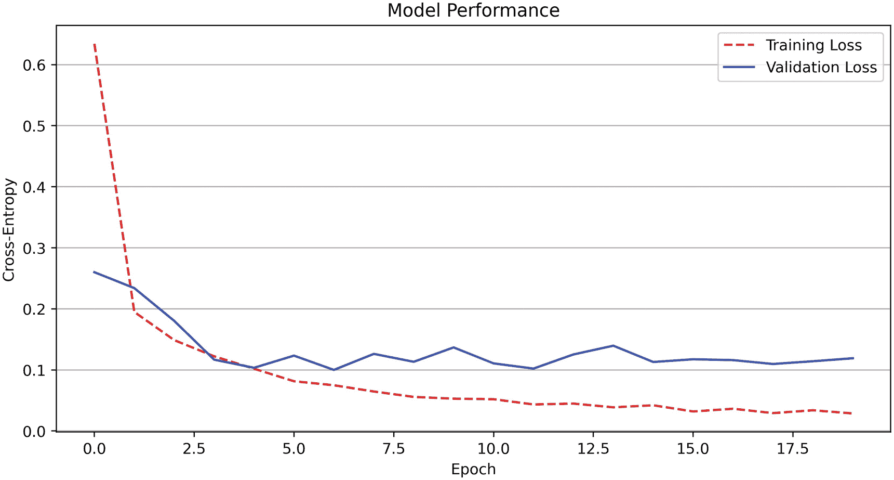

模型性能的双线图显示了交叉熵与时代的关系。训练损失从 0.62 到 0.03。验证损失从 0.26 到 0.12。

图 4-3

在 20 个时代中模拟 MNIST 数据集的训练和验证性能

```py
model.compile(optimizer='adam',
loss='sparse_categorical_crossentropy',
metrics=['accuracy'])
model.fit(x_train, y_train,
validation_data=(x_val, y_val),
epochs=10)
Listing 4-7
Compiling and fitting
```

我们的模式获得了近 0.975 的验证准确率——相当不错的性能。

然而，模糊的 28-by-28 灰度手写数字图像并不能代表当今高分辨率图像时代使用的图像。让我们假设一个“现代”的 MNIST 数据集由 200-by-200 像素的手写数字图像组成，并且我们希望将我们的模型扩展以适应这种图像大小。（如果你希望，可以使用`cv2.resize(img, (200, 200))`和锐化过滤器来改变数据集，以解决数字模糊问题。我们假设这样的数据集存在，以分析参数化如何扩展。）

为了参考，图 4-4 在原始图片分辨率为 1000-by-750 像素。200-by-200 像素与今天的图像分辨率标准相比是一个相对较小的图像尺寸。


在日落时放置在沙滩上的镜头球的超高分辨率照片。

图 4-4

样本 1000-by-750 像素分辨率的图片，由 Unsplash 的 Error 420 提供

让我们构建一个架构来处理这类图像，使用与之前相同的逻辑：每一层的节点数应该是前一层的二分之一，当节点数降至 20 以下时，我们停止并添加最终的十个类别输出（见代码列表 4-8）。

```py
model = keras.models.Sequential()
curr_nodes = 200 * 200
model.add(L.Input((curr_nodes,)))
while curr_nodes > 20:
curr_nodes = round(1/2 * curr_nodes)
model.add(L.Dense(curr_nodes,
activation='relu'))
model.add(L.Dense(10, activation='softmax'))
Listing 4-8
Programmatically generating an architecture (like in Listing 4-5) for a sample dataset with an input of shape (200, 200, 1)
```

让我们看看这里涉及了多少参数：*超过一兆参数*，参数数量几乎增加了 2.5k 倍，而图像分辨率维度的增加约为七倍（与之前为 28-by-28 像素图像构建的网络相比）（见代码列表 4-9）。这里的模型大小类似于大规模现代自然语言处理应用的参数化，这些应用可以翻译语言并生成文本（你将在下一两章中了解到这些内容）——与简单图像识别的预期应用相去甚远。

```py
Model: "sequential"
_________________________________________________________________
Layer (type)                 Output Shape              Param #
=================================================================
dense (Dense)                (None, 20000)             800020000
_________________________________________________________________
dense_1 (Dense)              (None, 10000)             200010000
_________________________________________________________________
dense_2 (Dense)              (None, 5000)              50005000
_________________________________________________________________
dense_3 (Dense)              (None, 2500)              12502500
_________________________________________________________________
dense_4 (Dense)              (None, 1250)              3126250
_________________________________________________________________
dense_5 (Dense)              (None, 625)               781875
_________________________________________________________________
dense_6 (Dense)              (None, 312)               195312
_________________________________________________________________
dense_7 (Dense)              (None, 156)               48828
_________________________________________________________________
dense_8 (Dense)              (None, 78)                12246
_________________________________________________________________
dense_9 (Dense)              (None, 39)                3081
_________________________________________________________________
dense_10 (Dense)             (None, 20)                800
_________________________________________________________________
dense_11 (Dense)             (None, 10)                210
=================================================================
Total params: 1,066,706,102
Trainable params: 1,066,706,102
Non-trainable params: 0
_________________________________________________________________
Listing 4-9
Parameter and shape summary for the architecture written in Listing 4-8
```

从这个实验中可以看出，在图像数据上使用密集的前馈神经网络架构的问题在于，它们无法与图像大小成比例地扩展。300-by-300 图像与 350-by-350 图像之间的差异对人类眼睛来说并不非常显著（见图 4-5），但对于神经网络来说，350-by-350 图像的输入空间比 300-by-300 图像多出 32,500 个维度。这种增加在每个后续层中都会成倍增加。


在两种不同分辨率下拍摄的钢桁架的低角度照片。

图 4-5

两个样本图像，一个 300 × 300，另一个 350 × 350（顺序未公开）。对人类来说，视觉差异微乎其微，但对于神经网络架构来说，表示差异巨大。图片来自 Unsplash 并经过修改

在这种情况下，我们甚至没有考虑颜色。如果你考虑了颜色通道，并将`curr_nodes = 200 * 200 * 3`设置到清单 4-8 中概述的神经网络架构构建逻辑中（或以其他方式增加图像的分辨率），你甚至可能会遇到错误：“尝试分配[存储大小]时分配器耗尽内存。”架构如此之大，Keras 实际上无法在内存中分配足够的空间来存储所有参数！

我们需要一个可行的方法来扩展神经网络架构，以处理反映视觉工作方式的部分图像。建模略微更高分辨率图像所需的额外参数或空间不应显著增加，因为略微更高分辨率的图像不会影响图像的实际内容意义/语义。

此外，从哲学的角度讲，我们不能将每个单独的像素视为始终代表相同的概念——例如，两张狗的图片上的相同像素位置可能代表两个完全不同的值和意义，尽管聚合的像素对相同的标签做出了贡献（图 4-6）。图像应该以某种方式在整个图像中保持一致性，同时能够捕捉到深层和有用的信息。使用标准的 ANN 不能保证任何这种一致性。


一只狗在海滩上玩耍的照片，使用了两种不同的像素。

图 4-6

两张代表相同语义信息但像素值非常不同的图像。请注意，一个像素坐标可能是一张狗图片的一部分，但在另一张图片中可能是海洋或天空的一部分。处理图像数据的神经网络必须对这些改变像素值但不改变图像语义内容的变化保持不变性。图片由 Oscar Sutton 来自 Unsplash 提供。

### 卷积操作

卷积层改变了图像识别和通用深度学习图像任务及应用的格局。它很好地解决了之前描述的所有问题，并且仍然是几乎所有深度学习计算机视觉模型的基础——尽管它已经使用了数十年（在深度学习历史背景下相对较长时间）。

图像处理中卷积的概念本身已经存在了很长时间。给定一个特殊的滤波器，描述了如何根据周围像素修改某些像素，我们可以将滤波器应用于图像以获得修改后的图像。我们可以设计核，使像素与其他像素建立特定的关系，从而产生模糊、锐化或增强图像边缘（尖锐变化）的效果。

考虑一个假设的 3x3 核*k*：

![k= [0 0.5 0 0.5 1 0.5 0 0.5 0] ](../images/525591_1_En_4_Chapter/525591_1_En_4_Chapter_TeX_Equa.png)

让我们构建一个示例 4x4 矩阵*I*来应用核：

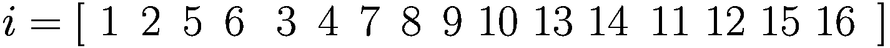

最后，让 *R* 表示卷积的结果。正如我们将看到的，它具有形状 (2, 2)：

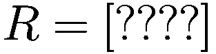

我们将首先填写 *R* 的左上角元素。这对应于 *I* 中的左上角 3×3 窗口（加粗）：


我们在核 *k* 的每个元素和 *I* 中相关的 3×3 窗口中的每个元素之间执行逐元素乘法：

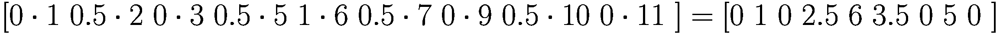

最终结果是结果乘积矩阵中元素的总和：0 + 1 + 0 + 2.5 + 6 + 3.5 + 0 + 5 + 0 = 18。*R*的第一个值已经被推导出来：

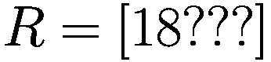

我们可以对右上角的 *R* 值应用类似的操作来获得其值。*I* 的相关子区域如下（加粗）

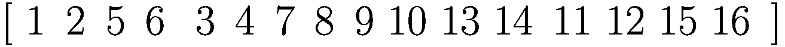

计算可以按照以下方式进行：

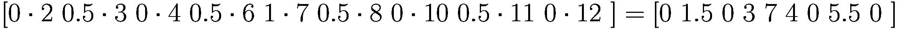

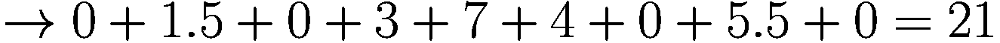

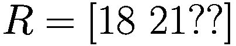

如果你计算出 *R* 的其他两个值，你应该得到以下矩阵

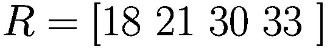

因此，给定一个形状为 *a* × *b* 的原始矩阵和一个形状为 *x* × *y* 的核（卷积可以在非方形矩阵和非方形核上执行！），结果卷积矩阵的形状为 (*a* - *x* + 1, *b* - *y* + 1)。每个值代表核在该空间维度上可以占据的“槽位”数量。

好吧，这个卷积结果究竟意味着什么呢？为了解释卷积的结果，我们首先需要了解核的设计。这个特定的核将中间的值赋予最高权重，随着距离中心的增加，影响逐渐减弱。因此，我们可以预期核会稍微“平均”每个像素附近的值；卷积后的特征反映了原始矩阵中元素的*一般性/平均性*。

例如，我们看到元素顺序遵循 *A* < *B* < *C* < *D*，其中

![$$ R=\left[A\ B\ C\ D\ \right] $$](../images/525591_1_En_4_Chapter/525591_1_En_4_Chapter_TeX_Equl.png)

这反映了原始矩阵 *I* 中元素的一般组织结构。我们还可以观察到 *B* - *A* = *D* - *C*，这反映了原始矩阵 *I* 底部右区域的元素与底部左区域的元素大致距离相同，而顶部右区域的元素与顶部左区域的元素距离也大致相同。

让我们看看一个稍微复杂一点的例子，使用一个 10x10 的图像（列表 4-10，图 4-7）。这个图像将包含一个由“1”组成的加号，背景为渐变。


在 x 和 y 轴上为 0 到 9，在垂直灰度上为 0 到 1 的热图中，有一个值为 1 的白色加号，背景为小于 1 的渐变值。

图 4-7

自定义“图像”的热图表示——一个加号叠加在渐变背景上

```py
# initialize 'canvas' of zeros
img = np.zeros((10, 10))
# draw background gradient
for i in range(10):
for j in range(10):
img[i][j] = i * j / 100
# draw vertical stripe
for i in range(2, 8):
for j in range(4, 6):
img[i][j] = 1
# draw horizontal stripe
for i in range(4, 6):
for j in range(2, 8):
img[i][j] = 1
# display figure with values
plt.figure(figsize=(10, 8), dpi=400)
sns.heatmap(img, cmap='gray', annot = True)
plt.show()
Listing 4-10
Generating a sample low-dimensional “image”
```

我们可以使用 `cv2` 的 `filter2D` 函数将核应用于图像。因为 `cv2.filter2D` 是针对图像进行优化的，所以 `cv2` 在边缘进行了填充，使得卷积后的图像与原始图像具有相同的形状。这涉及到在矩阵的边缘添加缓冲值（最常见的是 0）并对填充后的矩阵进行卷积。让我们编写一个函数，该函数接受一个核，将其应用于矩阵，并将矩阵显示为热图（列表 4-11）。

```py
def applyKernel(kernel, img):
altered = cv2.filter2D(img, -1, kernel)
plt.figure(figsize=(10, 8), dpi=400)
sns.heatmap(altered, cmap='gray', annot = True)
plt.show()
Listing 4-11
A function to apply an inputted kernel on the inputted image
```

*单位核*定义为矩阵中心的 1 和其他位置的 0（列表 4-12，图 4-8）。卷积矩阵中的每个像素只受原始矩阵中一个像素的影响，从而得到与原始矩阵相同的卷积矩阵：

![$$ identity\ kernel=\left[0\ 0\ 0\ 0\ 1\ 0\ 0\ 0\ 0\ \right] $$](../images/525591_1_En_4_Chapter/525591_1_En_4_Chapter_TeX_Equm.png)

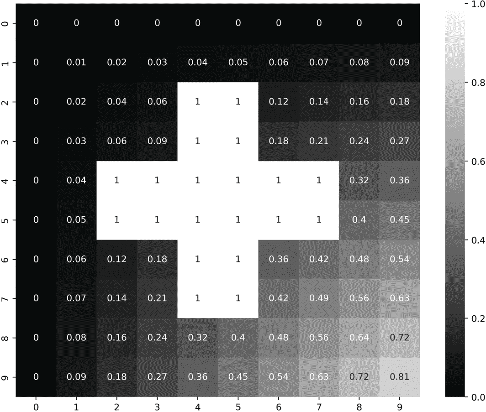

在 x 和 y 轴上为 0 到 9，在垂直灰度上为 0 到 1 的热图中，有一个值为 1 的白色加号，背景为小于 1 的渐变值。

图 4-8

将单位核应用于图 4-7 中的“图像”的卷积结果（注意没有差异）。

```py
kernel = np.array([[0, 0, 0],
[0, 1, 0],
[0, 0, 0]])
applyKernel(kernel, img)
Listing 4-12
Using the identity kernel
```

为了给图像应用模糊效果，我们可以定义一个权重所有相邻像素相同的核（列表 4-13，图 4-9）：

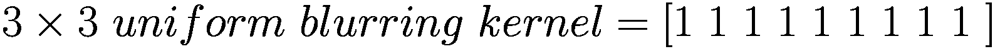

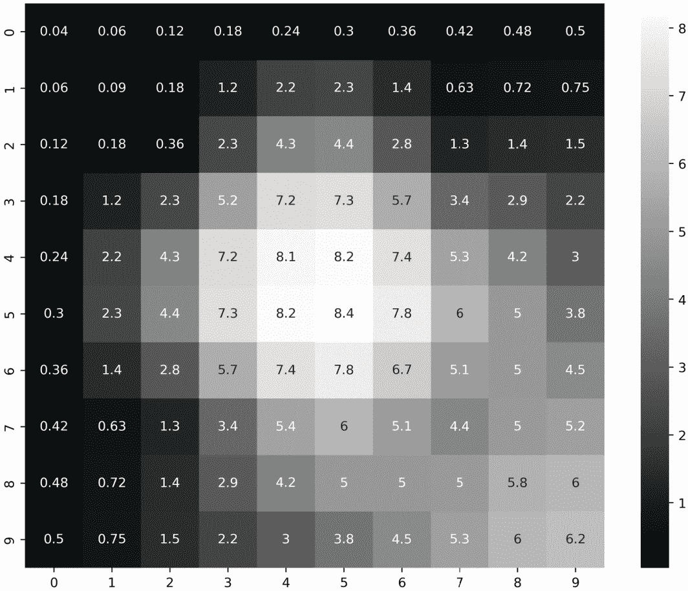

在 x 和 y 轴上为 0 到 9，垂直灰度上为 0 到 8 的模糊热图在低值渐变背景上有白色加号表示高值。

图 4-9

将 3x3 均匀模糊核应用于图 4-7 中“图像”的结果

```py
kernel = np.ones((3, 3))
applyKernel(kernel, img)
Listing 4-13
Using the 3 × 3 blurring kernel
```

`cv2`在应用卷积之前在图像外部应用*填充*（添加额外的零），以确保结果矩阵具有相同的大小。我们将在卷积的上下文中进一步讨论填充。

我们可以通过改变核的大小来调整模糊的强度和范围，这会影响在计算卷积图像中的像素时考虑的邻近像素的数量。考虑 2x2 模糊核的结果（代码列表 4-14，图 4-10）：

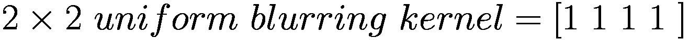

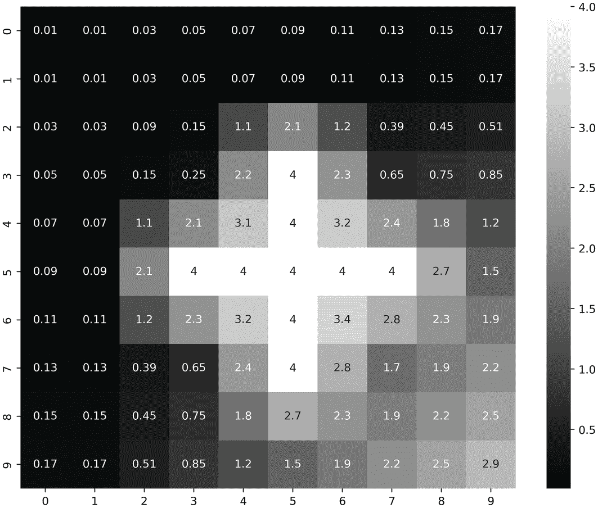

在 x 和 y 轴上为 0 到 9，垂直灰度上为 0 到 4 的模糊热图在小于 4 的值渐变背景上有值为 4 的白色加号。

图 4-10

将 2x2 均匀模糊核应用于图 4-7 中“图像”的结果

```py
kernel = np.ones((2, 2))
applyKernel(kernel, img)
Listing 4-14
Using the 2-by-2 uniform blurring kernel
```

使用 8x8 模糊核，中间的加号与背景完全融合，变得不明显（代码列表 4-15，图 4-11）：

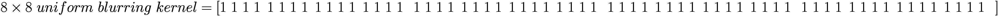

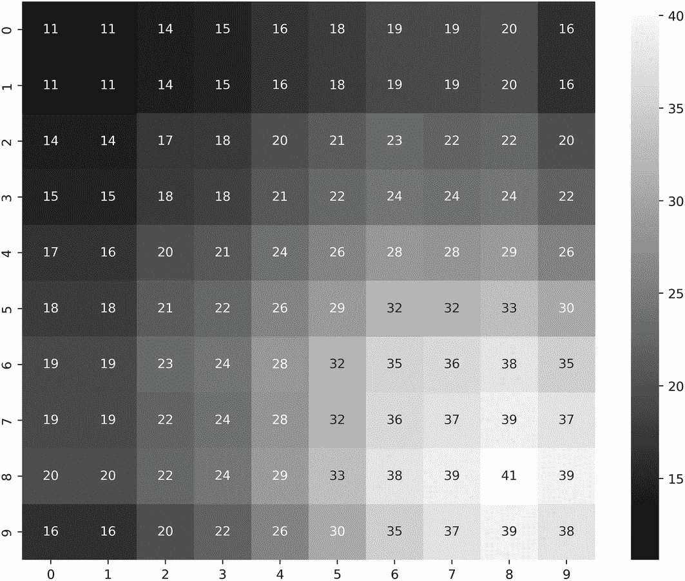

在 x 和 y 轴上为 0 到 9，垂直灰度上为 0 到 40 的模糊热图具有顶部和左侧低值单元格，底部和右侧高值单元格。

图 4-11

将 8x8 均匀模糊核应用于图 4-7 中“图像”的结果

```py
kernel = np.ones((8, 8))
applyKernel(kernel, img)
Listing 4-15
Using the 8-by-8 uniform blurring kernel
```

另一个操作是锐化效果，它使边缘和值之间的对比更加鲜明（代码列表 4-16，图 4-12）。核对中心像素赋予很高的权重，对周围的邻居赋予很低的权重；这会使得卷积特征中相邻像素之间的差异增加：

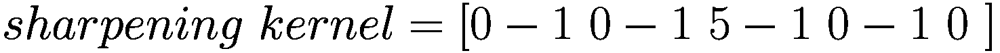

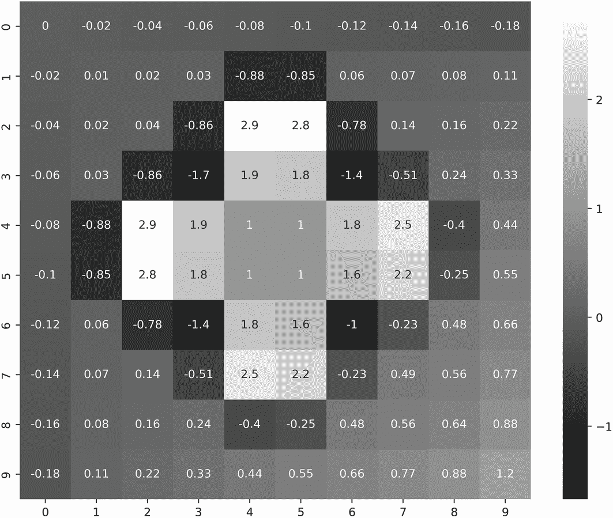

在 x 和 y 轴上从 0 到 9，以及从-2 到 3 的垂直灰度上，有一个白色加号表示高值，背景是低值渐变。

图 4-12

将 3x3 锐化核应用于图 4-7 中“图像”的结果

```py
kernel = np.array([[0, -1, 0],
[-1, 5, -1],
[0, -1, 0]])
applyKernel(kernel, img)
Listing 4-16
Using the sharpening kernel
```

有许多其他核可以完成对图像矩阵的广泛效果。自己尝试自定义核并查看卷积图像的结果是一个很好的练习。

考虑以下***逐像素***的狗图像，如下所示（代码 4-17，图 4-13）。


一张海滩上玩耍的狗的黑白照片。

图 4-13

狗的样本图像

```py
from skimage import io
url = 'https://images.unsplash.com/photo-1530281700549-e82e7bf110d6?ixlib=rb-1.2.1&ixid=MnwxMjA3fDB8MHxwaG90by1wYWdlfHx8fGVufDB8fHx8&auto=format&fit=crop&w=988&q=80'
image = io.imread(url)
image = cv2.cvtColor(image, cv2.COLOR_BGR2GRAY)
image = image[450:450+400, 250:250+400]
plt.figure(figsize=(10, 10), dpi=400)
plt.imshow(image, cmap='gray')
plt.axis('off')
plt.show()
Listing 4-17
Loading and displaying an image of a dog from Unsplash
```

让我们修改我们的`applyKernel`函数，将卷积矩阵显示为图像而不是热图（代码 4-18）。

```py
def applyKernel(kernel, img):
altered = cv2.filter2D(img, -1, kernel)
plt.figure(figsize=(8, 8), dpi=400)
plt.imshow(altered, cmap='gray')
plt.axis('off')
plt.show()
Listing 4-18
A function to apply and display a kernel to an image
```

应用之前讨论过的 3x3 模糊核的结果如下（代码 4-19，图 4-14）。

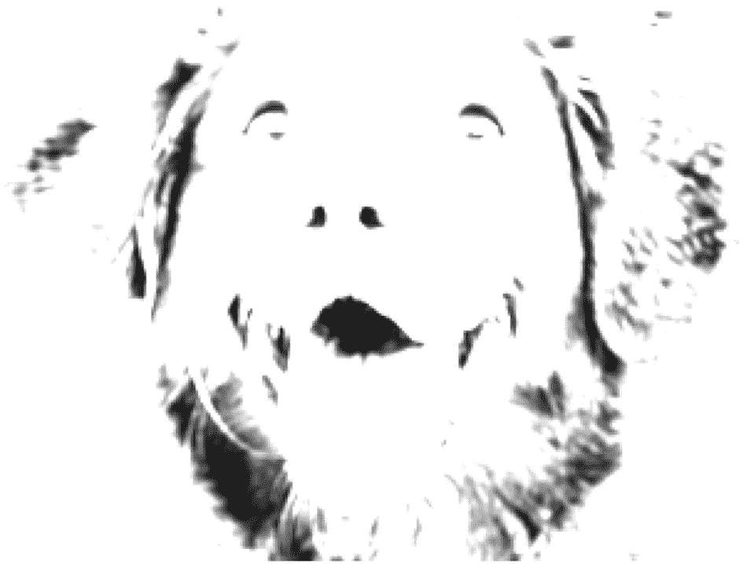

一张黑白、模糊的狗的图像。

图 4-14

将 3x3 均匀模糊核错误地应用于图 4-13 中的样本狗图像的结果

```py
kernel = np.ones((3, 3))
applyKernel(kernel, image)
Listing 4-19
Applying an (erroneous) 3-by-3 uniform blurring kernel
```

这很奇怪！这里发生了什么？

让我们绘制图像中像素值的分布（代码 4-20，图 4-15）。

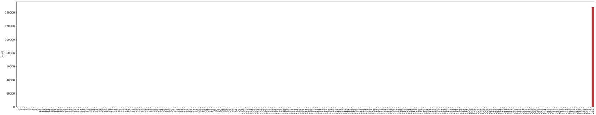

一个从 0 到 140,000 的计数条形图，与从 0 到 255 的像素值相对应。一个计数值为 140,000 的条形在 255 处。

图 4-15

将 3x3 均匀模糊核错误地应用于图 4-13 中的样本狗图像后的像素值分布

```py
plt.figure(figsize=(40, 7.5), dpi = 400)
sns.countplot(x=cv2.filter2D(image, -1, kernel).flatten(), color='red')
plt.xticks(rotation=90)
plt.show()
Listing 4-20
Displaying the distribution of pixel values across the (erroneously) convolved/blurred image
```

看起来图像中的几乎所有值都被推到了 255。这是因为卷积特征的效果是改变可能值的域。如果一个卷积区域的九个值都是 255，那么卷积结果就是 255×9=2295，这远远超出了无符号 int-8 图像像素值的有效域。在这些情况下，`cv2.filter2D`将最大值限制为 255。实际上，任何平均值大于 255/9 的区域，其卷积结果都将被限制在 255。

因此，我们需要修改核，使得卷积结果的值域不超出原始域。我们可以通过定义模糊核来解决此问题

![$$ 3\times 3\  uniform\ blurring\ kernel=\left[1/9\ 1/9\ 1/9\ 1/9\ 1/9\ 1/9\ 1/9\ 1/9\ 1/9\ \right] $$](../images/525591_1_En_4_Chapter/525591_1_En_4_Chapter_TeX_Equr.png)

用*M*表示最大像素值（在此上下文中为 255）。即使在所有像素都填充了*M*的区域中，应用此核的最大结果为 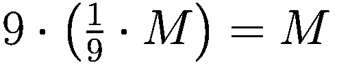。因此，我们保留了像素值的比例。

应用此修改后的核后，我们看到得到的卷积分布与原始分布非常相似，并且保持在有效范围内（图 4-16 和 4-17）。

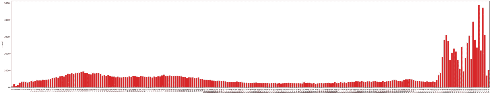

一个从 0 到 5000 的计数柱状图，与从 0 到 248 的像素值相对应。计数在 0 到 220 之间低于 1000，从 220 到 248 之间从 1000 到 5000。

图 4-17

正确应用 3×3 均匀模糊核于图 4-13 中样本狗图像后的像素值分布

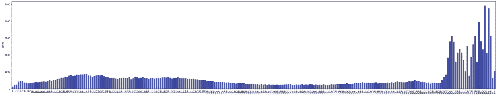

一个从 0 到 5000 的计数柱状图，与从 0 到 248 的像素值相对应。计数在 0 到 220 之间低于 1000，从 220 到 248 之间从 1000 到 5000。

图 4-16

图 4-13 中样本狗图像的原始像素值分布

结果图像略微模糊且显示正确，符合预期（图 4-18）。


一张沙滩上玩耍的狗的略微模糊的黑白照片。

图 4-18

将 3×3 均匀模糊核正确应用于图 4-13 中样本狗图像的结果

应用 8×8 模糊核，定义为填充值为 1/64 的 8×8 矩阵，得到更模糊的图像（图 4-19）。


一张沙滩上玩耍的狗的相当模糊的黑白照片。

图 4-19

将 8×8 均匀模糊核正确应用于图 4-13 中样本狗图像的结果

类似地，应用锐化核会产生以下效果（图 4-20）。


沙滩上玩耍的狗的锐化黑白照片。

图 4-20

将 3×3 锐化核正确应用于图 4-13 中样本狗图像的结果

卷积可以构建来从图像和矩阵中提取有意义的特征。例如，模糊图像可能有助于最小化相邻像素之间的距离，从而最小化图像中的方差，并执行受噪声变化最小影响的图像的一般、广泛的分析。或者，锐化可能有助于放大重要的特征和边缘，这些特征和边缘作为图像内容的标志和特征。

*卷积神经网络* (CNN) 的基本思想与之前在第三章中介绍的标准前馈全连接神经网络类似。标准的人工神经网络可以通过安排大量简单的提取单元——感知器——来展示复杂的行为。通过提供参数的架构/排列，网络可以学习提取所需信息的最佳值以执行预期任务。同样，CNN 可以通过堆叠卷积操作来很好地模拟图像数据；神经网络学习卷积中每个核的值，以从图像中提取最佳特征。优化仍然通过梯度下降进行。

*卷积层* 是一系列卷积的组合，就像全连接层是一系列感知器的组合。卷积层有几个重要的属性，这些属性定义了其特定的实现方式：

+   *过滤器数量，n*：这是层中存在的“卷积操作”的数量。网络将学习该层的*n*个不同的核。

+   *核形状* (*a, b*)：这定义了学习到的核的大小。

+   *输入或有效填充*：这确定是否使用填充。如果使用输入填充，则任何传入的矩阵都将填充，使得结果卷积矩阵的形状与填充前的传入矩阵相同。否则，将不应用填充，卷积矩阵的形状将为(*x* – *a* + 1, *y* – *b* + 1)，其中(*x*, *y*)是原始矩阵的形状。

一层必须在每个前一层和当前层的每个特征图之间的连接上学习一个过滤器。例如，如果层 A 生成了 8 个特征图（因为它有 8 个过滤器）并且层 B 生成了 16 个特征图（因为它有 16 个过滤器），那么层 B 学习 8 × 16 = 128 个过滤器。如果所有过滤器都是 3-by-3 的矩阵，那么层 B 将使用 128 × (3 × 3) = 1152 个参数。

让我们以简单的顺序语法开始构建一个简单的卷积神经网络。 (当使用顺序 API 变得困难或不可能时，我们将使用功能 API 来处理更复杂的情况。) 我们将构建一个处理 MNIST 数据集中的 28-by-28 图像的卷积神经网络，并将它们分类为十个数字之一。

我们从输入层开始（见列表 4-21）。所有图像数据都必须有三个指定的空间维度：宽度、高度和深度。灰度图像的深度为 1，而彩色图像通常具有深度为 3（其中深度层对应于红色、绿色和蓝色）。在这种情况下，我们的输入数据形状为(28, 28, 1)。

```py
import keras.layers as L
from keras.models import Sequential
model = Sequential()
model.add(L.Input((28, 28, 1)))
Listing 4-21
Building the base and input to a convolutional network
```

在输入之后，我们应该添加卷积层来处理图像（见列表 4-22）。在 Keras 中，可以通过`keras.layers.Conv2D(num_filters, kernel_size = (a, b), activation = 'activation_name', padding = 'padding_type')`实例化卷积层。默认激活函数是线性（即 y = x，不对数据进行非线性转换），默认填充类型是 valid。

```py
model.add(L.Conv2D(8, (5, 5), activation='relu'))
model.add(L.Conv2D(8, (3, 3), activation='relu'))
model.add(L.Conv2D(16, (3, 3), activation='relu'))
model.add(L.Conv2D(16, (2, 2), activation='relu'))
Listing 4-22
Stacking convolutional layers
```

值得理解每一层如何改变输入的形状：

1.  原始输入层接收形状为（28, 28, 1）的数据。

1.  第一卷积层使用 8 个过滤器并应用一个 5x5 的核，得到形状为（24, 24, 8）的输出。

1.  第二卷积层使用 8 个过滤器并应用一个 3x3 的核，得到形状为（22, 22, 8）的输出。

1.  第三卷积层使用 16 个过滤器并应用一个 5x5 的核，得到形状为（20, 20, 16）的输出。

1.  第四卷积层使用 16 个过滤器并应用一个 1x1 的核，得到形状为（19, 19, 16）的输出。

为了确认这一点，我们可以通过`keras.utils.plot_model(model, show_shapes=True)`（图 4-21）绘制模型来理解每个层如何转换输入数据的形状。

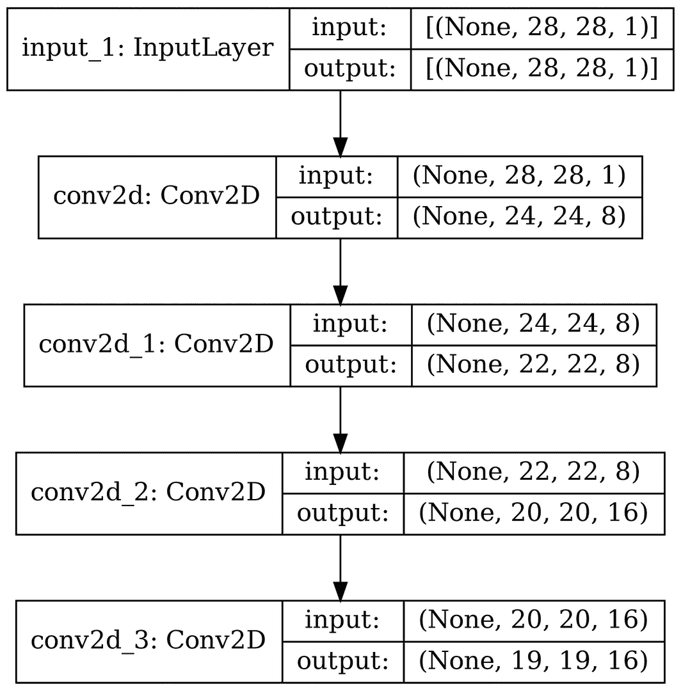

列表 4-21 和 4-22 的架构模型流程图。

图 4-21

列表 4-21 和 4-22 中定义的模型架构的可视表示

此外，我们可以看到卷积操作需要的参数非常少（见列表 4-23）。

```py
Model: "sequential"
_________________________________________________________________
Layer (type)                 Output Shape              Param #
=================================================================
conv2d (Conv2D)              (None, 24, 24, 8)         208
_________________________________________________________________
conv2d_1 (Conv2D)            (None, 22, 22, 8)         584
_________________________________________________________________
conv2d_2 (Conv2D)            (None, 20, 20, 16)        1168
_________________________________________________________________
conv2d_3 (Conv2D)            (None, 19, 19, 16)        1040
=================================================================
Total params: 3,000
Trainable params: 3,000
Non-trainable params: 0
_________________________________________________________________
Listing 4-23
Parameter counts for the convolutional neural network
```

然而，我们的模型还没有完成！分类任务的目标是将形状为（28, 28, 1）的输入图像映射到长度为 10 的输出向量。无论我们添加多少卷积层，我们始终会沿着三个空间维度排列数据。我们需要一种方法来强制将三维空间的数据压缩到一维。

展平可能是将具有三个空间维度的数据映射到一维的最明显方法：我们只需将高维排列中的单个元素展开并沿一维轴排列。这与 NumPy 中的标准重塑操作类似，如`arr.reshape`：所有值都保留，只是以不同的格式排列。

让我们添加一个展平层，然后是一系列全连接层，最终映射到所需的十个类别输出（见列表 4-24）。

```py
model.add(L.Flatten())
model.add(L.Dense(32, activation='relu'))
model.add(L.Dense(16, activation='relu'))
model.add(L.Dense(10, activation='softmax'))
Listing 4-24
Adding a flattening layer and an output
```

现在，网络架构正确地将输入映射到所需的输出形状（图 4-22）。

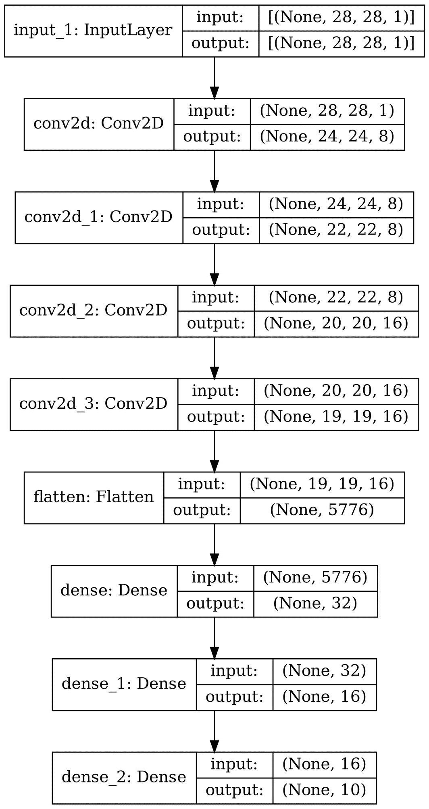

流程图没有 None，输入和输出中的输入 1 的值是 InputLayer，conv2d 1 到 3 是 Conv2D，flatten 是 Flatten，dense 1 到 2 是 Dense。

图 4-22

列表 4-21、4-22 和 4-24 中定义的模型架构的可视表示

我们最终的网络有几十万个参数，大约是我们之前仅使用全连接层进行网络架构设计时参数数量的一半。

当我们将图像大小缩放到 200x200，同时使用相同的架构时，使用的模型参数数量为 18,682,002——与之前讨论的假设的 200x200 图像全连接网络使用的 1,066,706,102 个参数相比。

注意

你可能会注意到，卷积神经网络的参数数量并不多。特别是在展平层，参数数量会急剧增加。我们将探讨卷积神经网络中使用的另一组层，即*池化层*，这些层有助于我们解决这个问题，并进一步改善卷积神经网络的参数缩放。

为了方便参考，将卷积神经网络从三维空间转换为一维空间之前的部分通常称为“卷积组件”，之后的部分称为“全连接组件”。另一个名称分别是“底部”和“顶部”——这可能会造成混淆，因为模型的最后部分（全连接组件）被称为“顶部”。

卷积组件可以通过识别和增强输入的最相关/重要特性来被视为起到一种*提取*作用。相比之下，全连接组件通过处理所有提取的特征并解释它们如何与输出相关来执行*聚合*/*编译*/*解释*作用。

例如，我们为 MNIST 数据构建的示例网络的卷积组件可能会检测并增强角点，如“5”的左上角或“4”的左上角。全连接组件可能能够聚合检测到的各种角点属性，并将它们解释为属于某一类别的支持。如果有许多尖锐的角点，图像可能是“4”或“5”。如果尖锐角点的数量较少，图像可能是“1”、“2”、“3”或“7”。如果没有尖锐角点，图像可能是“0”、“6”、“8”或“9”。将此信息与其他提取的特征结合起来，允许全连接组件精确地确定图像是哪个数字。

让我们使用熟悉的语法编译和训练模型（见列表 4-25）。

```py
model.compile(optimizer = 'adam',
loss = 'sparse_categorical_crossentropy',
metrics = ['accuracy'])
history = model.fit(X_train, y_train, epochs = 100,
validation_data = (X_val, y_val))
Listing 4-25
Compilation and training of a sample convolutional neural network. Assumes that the training and validation sets from the MNIST dataset have already been loaded into X_train, y_train, X_val, and y_val
```

模型很快就能获得良好的训练和验证性能（见列表 4-26，图 4-23）。

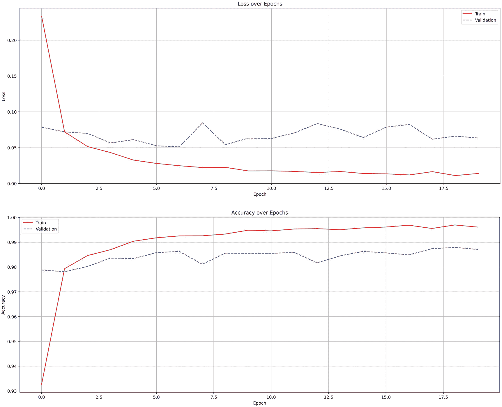

两条线图显示了损失和准确率随迭代次数的变化。训练和验证的损失急剧下降，准确率略有上升。

图 4-23

在 MNIST 数据集上训练 20 次迭代之前定义的卷积神经网络架构的损失和准确率历史记录

```py
plt.figure(figsize=(20, 7.5), dpi=400)
plt.plot(history.history['loss'], color='red',
label='Train')
plt.plot(history.history['val_loss'],
color='blue', linestyle='--',
label='Validation')
plt.xlabel('Epoch')
plt.ylabel('Loss')
plt.title('Loss over Epochs')
plt.legend()
plt.grid()
plt.show()
plt.figure(figsize=(20, 7.5), dpi=400)
plt.plot(history.history['accuracy'], color='red',
label='Train')
plt.plot(history.history['val_accuracy'],
color='blue', linestyle='--',
label='Validation')
plt.xlabel('Epoch')
plt.ylabel('Accuracy')
plt.title('Accuracy over Epochs')
plt.legend()
plt.grid()
plt.show()
Listing 4-26
Plotting model training history
```

为了更好地理解卷积神经网络在空间提取特征方面的实际操作，让我们仅通过训练网络的**第一卷积层**来传递一个输入图像。这使我们能够直观地识别网络学习到的、对分类最优化的一些变换类型。

为了“窥视”网络中某一层的输入输出流，我们可以创建一个由原始网络中相同层对象构成的新模型。这使我们能够隔离该特定层中的权重（见列表 4-27）。

```py
peek = Sequential()
peek.add(L.Input((28, 28, 1)))
peek.add(model.layers[0])
Listing 4-27
Building a model to “peek” into the learned weights within each layer of the model
```

我们可以使用`peek.predict`来获取传递样本输入后的结果。回想一下，第一层将形状为 (28, 28, 1) 的输入映射到形状为 (24, 24, 8) 的输出——这意味着第一层输出 8 个形状为 (24, 24) 的特征图。我们可以可视化一个样本输入和第一层的特征图输出样本（见列表 4-28，图 4-24）。

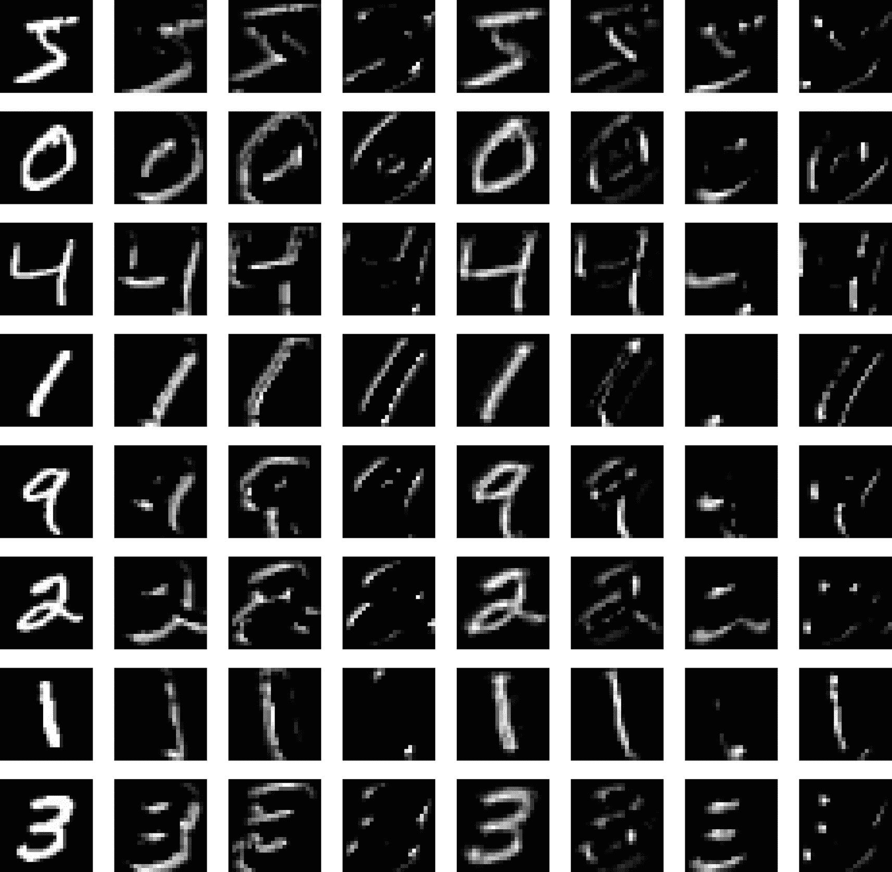

一个 8x8 的 64 个图像集合，每个单元格中都有一个从 0 到 9 的手写数字。模糊程度从左到右逐渐增加。

图 4-24

表示学习到的第一层卷积核（除最左边列外的所有列）对输入图像（最左边列）的影响

```py
NUM_IMAGES = 8
GRAPHIC_WIDTH = 8
plt.figure(figsize=(40, 40), dpi=400)
for index in range(NUM_IMAGES):
peek_out = peek.predict(x_train[index].reshape((1, 28, 28, 1)))[0]
plt.subplot(NUM_IMAGES, GRAPHIC_WIDTH, index*GRAPHIC_WIDTH+1)
plt.imshow(x_train[index], cmap='gray')
plt.axis('off')
for i in range(GRAPHIC_WIDTH - 1):
plt.subplot(NUM_IMAGES, GRAPHIC_WIDTH, index*GRAPHIC_WIDTH+i+2)
plt.imshow(peek_out[:,:,i], cmap='gray')
plt.axis('off')
plt.show()
Listing 4-28
Plotting the result of applying learned convolutions through the first convolutional layer
```

左列包含输入到层的原始图像；右侧的每张图像显示一个特征图输出。仅通过第一层，你就可以开始观察到各种变换：反转、平移、边缘检测、角点检测和线检测等，仅举几例。

我们可以修改`peek`模型以包括第二层，并查看通过第一层和第二层传递输入所获得的特征图（见列表 4-29，图 4-25）。

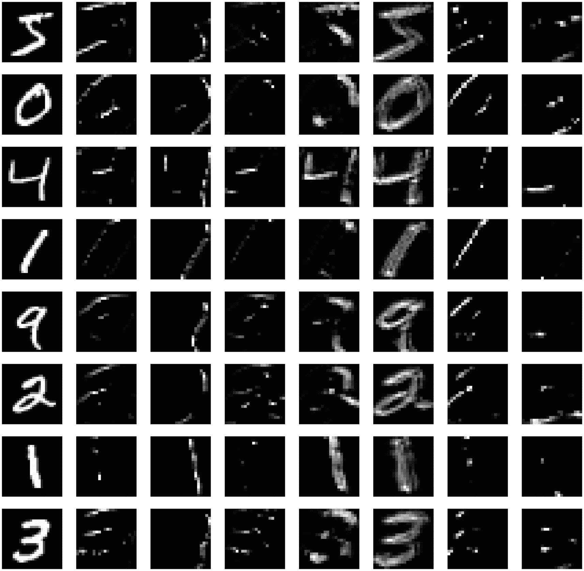

一个 8x8 的 64 个图像集合，每个单元格中都有一个从 0 到 9 的手写数字。模糊程度从左到右逐渐增加。

图 4-25

表示学习到的第一层和第二层卷积核（除最左边列外的所有列）对输入图像（最左边列）的影响

```py
peek = Sequential()
peek.add(L.Input((28, 28, 1)))
peek.add(model.layers[0])
peek.add(model.layers[1])
Listing 4-29
Plotting the result of applying learned convolutions through the second convolutional layer
```

第二层能够捕捉到每个数字的更具体成分。如果你仔细观察，你会看到每个特征图“寻找”越来越专业的特征。例如，图 4-26 中从左数第二列显示的特征图似乎“寻找”数字中的水平线：数字 3 有三条水平线，数字 2 有两条，数字 5 也有两条等。由于与输入的距离越来越远，第三层的输出变得难以解释。

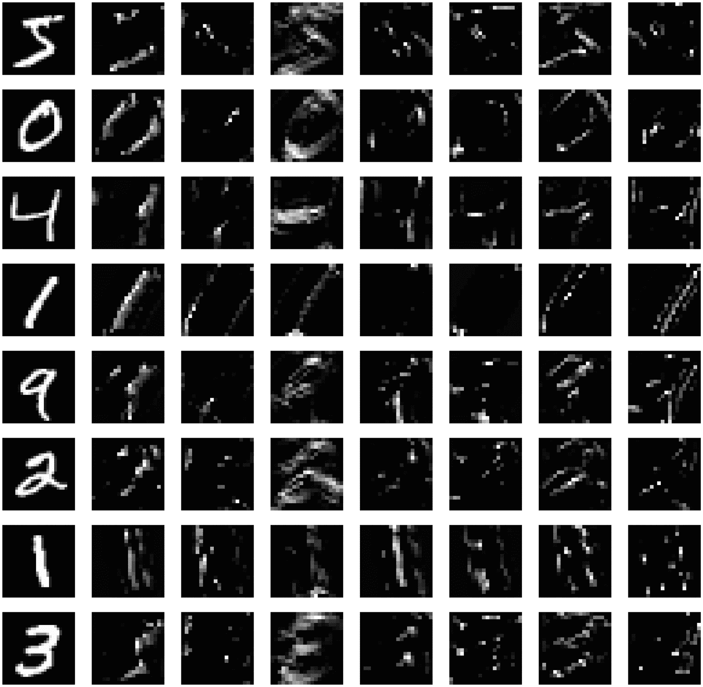

一个 8x8 的 64 个图像集合，每个单元格中都有一个从 0 到 9 的手写数字。模糊程度从左到右逐渐增加。

图 4-26

表示第一、第二和第三层卷积核（除左列外的所有列）对输入图像的影响（左列）

第四层是输出展平并传递到全连接组件之前的最后一个卷积层（见图 4-27）。

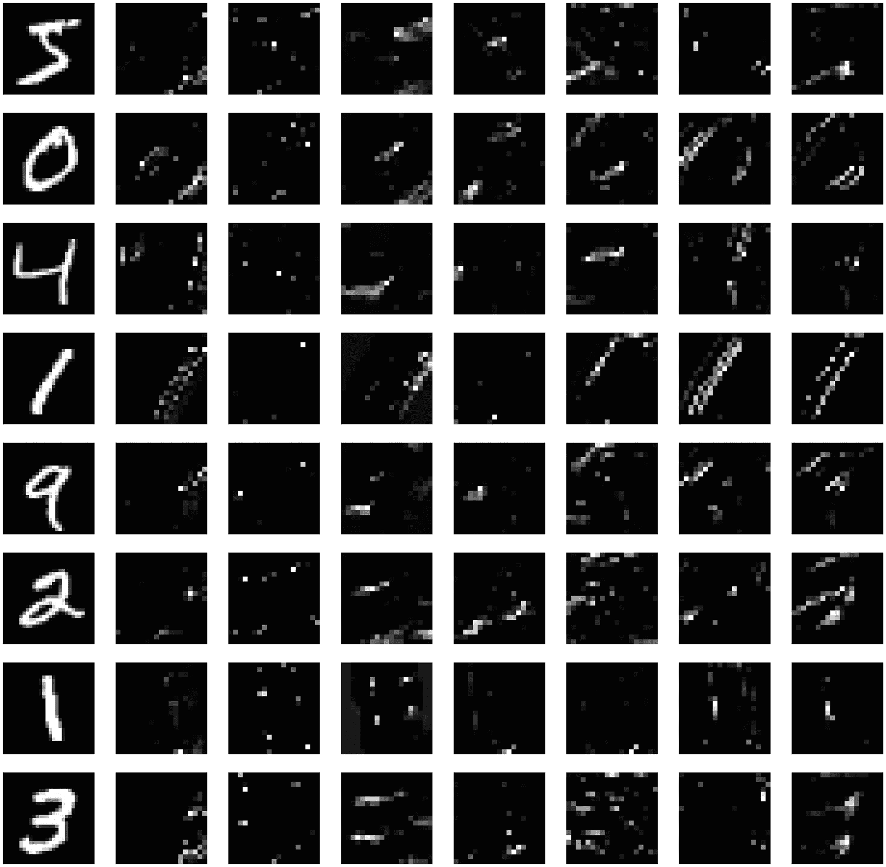

一个 8x8 的图像集包含 64 个图像，每个单元格中都有一个从 0 到 9 的手写数字。模糊程度从左到右逐渐增加。

图 4-27

表示第一层到第四层卷积核（除左列外的所有列）对输入图像的影响（左列）

### 池化操作

卷积非常有帮助——它们允许神经网络以系统化、低参数和有效的方式从图像中提取特征。然而，它们在改变图像形状方面相对不显著。我们可能称之为“信息压缩因子”——卷积并没有做很多“压缩”。如前所述，对形状为(*a, a*)的图像执行大小为*n*的卷积会产生形状为(*a – n + 1, a – n + 1*)的输出——这对于标准单数字大小的*n*来说相当小。

由于卷积相对较低的信息压缩因子，在展平层之后的全连接组件必须处理一个非常大的参数数量。对于像 MNIST 这样的小分辨率数据集，参数数量是可以接受的，但对于更大（且更实用）的数据集和应用来说，这是不可行的。

让我们使用与上一节相同的架构，并探讨参数数量（可以通过`model.count_params()`访问）如何随着广泛图像尺寸的变化而变化（列表 4-30，图 4-28）。

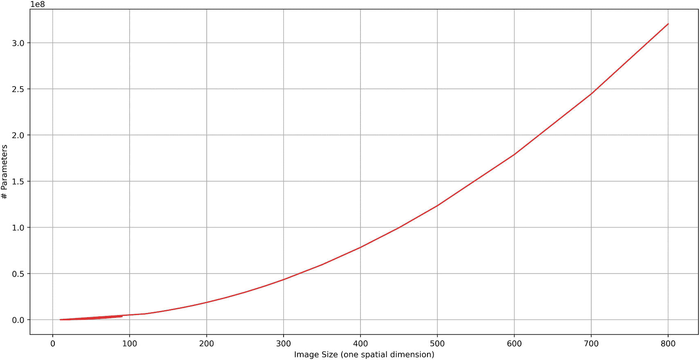

一条从 0.0 增加到 3.3 的线性图，表示图像尺寸在 0 到 800 的空间维度上逐渐增加的参数增加。

图 4-28

随着图像输入维度的增加，演示卷积神经网络的参数化缩放

```py
def build_model(img_size):
model = Sequential()
model.add(L.Input((img_size, img_size, 1)))
model.add(L.Conv2D(8, (5, 5), activation='relu'))
model.add(L.Conv2D(8, (3, 3), activation='relu'))
model.add(L.Conv2D(16, (3, 3), activation='relu'))
model.add(L.Conv2D(16, (2, 2), activation='relu'))
model.add(L.Flatten())
model.add(L.Dense(32, activation='relu'))
model.add(L.Dense(16, activation='relu'))
model.add(L.Dense(10, activation='softmax'))
paramCount = model.count_params()
del model
return paramCount
x = [10, 15, 20, 25, 30, 35, 40, 45, 50,
60, 70, 80, 90, 100, 120, 130, 140, 150,
170, 180, 190, 200, 225, 250, 275, 300,
350, 400, 450, 500, 600, 700, 800]
y = [build_model(i) for i in tqdm(x)]
plt.figure(figsize=(15, 7.5), dpi=400)
plt.plot(x, y, color='red')
plt.xlabel('Image Size (one spatial dimension)')
plt.ylabel('# Parameters')
plt.grid()
plt.show()
Listing 4-30
Plotting the scaling capability of a model with only convolutions
```

参数数量与全连接网络的缩放比例要好得多，但仍然相当差。300x300 的图像输入需要近 5000 万个参数；600x600 的图像输入需要近 1.75 亿个参数；800x800 的图像输入需要超过 8 亿个参数。

我们需要一种方法来解决这一问题。你会注意到参数的主要来源是在展平层之后的全连接组件，因为卷积没有足够快地减少特征图表示的大小。我们可以将构建具有可行参数数量的网络的问题简化为构建一个能够有效减少特征图大小的网络的问题。

我们如何解决这个问题？卷积是我们工具箱中唯一当前的操作，可以以合理的参数数量减少图像的维度。让我们构建一个架构定义程序，不断堆叠卷积层，直到特征图总共包含 2048 个元素或更少（列表 4-31，图 4-29）。我们跟踪特征图大小的空间维度（我们只需要跟踪一个，而不是两个，因为我们假设特征图是正方形的）并计算表示大小为*s*²⋅16，其中*s*是特征图大小，16 是从特征图数量推导出来的。

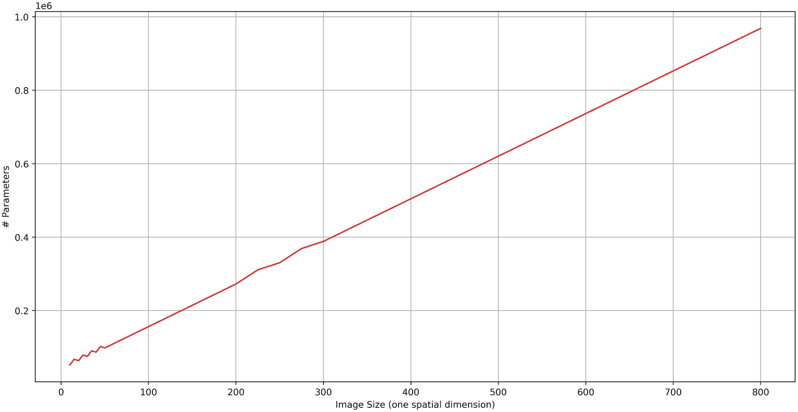

参数从 0.2 到 0.95 的稳定增长线图，图像尺寸在空间维度上从 0 到 800 的增加。

图 4-29

随着图像输入维度的增加，展示一个专门的“自扩展”卷积神经网络设计的参数化缩放。

```py
def build_model(img_size):
model = Sequential()
model.add(L.Input((img_size, img_size, 1)))
model.add(L.Conv2D(16, (1, 1), activation='relu'))
featureMapSize = img_size
while (featureMapSize ** 2) * 16 > 2048:
model.add(L.Conv2D(16, (3, 3),
activation='relu'))
featureMapSize -= 2
model.add(L.Flatten())
model.add(L.Dense(32, activation='relu'))
model.add(L.Dense(16, activation='relu'))
model.add(L.Dense(10, activation='softmax'))
paramCount = model.count_params()
del model
return paramCount
x = [10, 15, 20, 25, 30, 35, 40, 45, 50,
60, 70, 80, 90, 100, 120, 130, 140, 150,
170, 180, 190, 200, 225, 250, 275, 300,
350, 400, 450, 500, 600, 700, 800]
y = [build_model(i) for i in tqdm(x)]
plt.figure(figsize=(15, 7.5), dpi=400)
plt.plot(x, y, color='red')
plt.xlabel('Image Size (one spatial dimension)')
plt.ylabel('# Parameters')
plt.grid()
plt.show()
Listing 4-31
Plotting the scaling capability of a model with “continual convolution stacking”
```

这种技术缩放得更好：它是线性的而不是指数的，导致参数数量比之前的卷积神经网络设计少两个数量级。

然而，我们遇到了另一个问题：随着图像尺寸的增加，网络的*长度*也显著增加。例如，看看仅针对 75x75 图像输入的架构长度（图 4-30）。

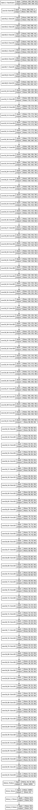

输入层、密集层、卷积 2D、扁平化等输入和输出中的无逗号值的长流程图。

图 4-30

仅使用“自扩展”卷积神经网络设计，为 75x75 像素输入图像生成的（非常长）架构。

虽然这是一个*有效*且*可行*的神经网络，但它不是一个好的设计。这样堆叠这么多层会导致整个网络中的信号传播出现问题，而且——最重要的是——既不必要也不有效。这是最手动、最蛮力的方法。

我们可以将之前代码中返回的参数计数缩放图替换为图像尺寸（由`len(model.layers)`给出）的参数数量，以查看这种方法中层数如何随图像尺寸缩放（图 4-31）。

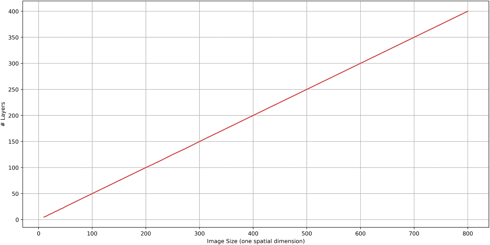

层次从 0 到 400 的线性增长线图，图像尺寸在空间维度上从 0 到 800 的增加。

图 4-31

随着图像维度的增加，“自扩展”卷积神经网络架构设计的层需求缩放。

为了更有效地降低图像的维度（并相应地提高参数数量缩放），我们需要使用更有效的机制：池化。为了将池化应用于大小为(*a*, *b*)的矩阵*i*，我们将*i*划分为形状为(*a*, *b*)的非重叠块，聚合每个块中的所有值，并将聚合值填充到与这些块位置相对应的池化矩阵*j*中。例如，考虑以下矩阵的(2, 2)池化：

![$$ i=\left[\ 1\kern0.5em 2\kern0.5em 5\kern0.5em 6\kern0.75em 3\kern0.5em 4\kern0.5em 7\kern0.5em 8\kern0.5em 9\ 10\ 13\ 14\kern0.5em 11\ 12\ 15\ 16\kern0.5em \right] $$](../images/525591_1_En_4_Chapter/525591_1_En_4_Chapter_TeX_Equs.png)

在*i*中有四个形状为(2, 2)的非重叠块。池化矩阵*j*的形状为 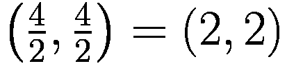。一般来说，对于一个形状为(*m*, *n*)的矩阵和一个池化大小为(*a*, *b*)，得到的池化矩阵的形状为 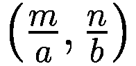。

![$$ j=\left[????\right] $$](../images/525591_1_En_4_Chapter/525591_1_En_4_Chapter_TeX_Equt.png)

让我们填充*j*的左上角。因为我们使用的是(2, 2)的池化，这对应于*i*中的以下粗体子区域：

![$$ i=\left[\ 1\kern0.5em 2\kern0.5em 5\kern0.5em 6\kern0.75em 3\kern0.5em 4\kern0.5em 7\kern0.5em 8\kern0.5em 9\ 10\ 13\ 14\kern0.5em 11\ 12\ 15\ 16\kern0.5em \right] $$](../images/525591_1_En_4_Chapter/525591_1_En_4_Chapter_TeX_Equu.png)

为了保持简单，我们将使用最大池化而不是平均池化。粗体子区域中的最大值是 6。我们可以将其填充到*j*中对应的元素槽位：

![$$ j=\left[6???\right] $$](../images/525591_1_En_4_Chapter/525591_1_En_4_Chapter_TeX_Equv.png)

我们可以用类似的方式填充剩余的元素：

![$$ j=\left[6\ 8\ 14\ 16\ \right] $$](../images/525591_1_En_4_Chapter/525591_1_En_4_Chapter_TeX_Equw.png)

与卷积类似，得到的池化矩阵反映了原始矩阵的“大意”或“主要思想”。然而，卷积和池化之间存在一个关键区别，只有通过更高维度的矩阵才能实现。

让我们回到在列表 4-10 中创建的“图像”，一个在渐变背景上的加号（图 4-32）。

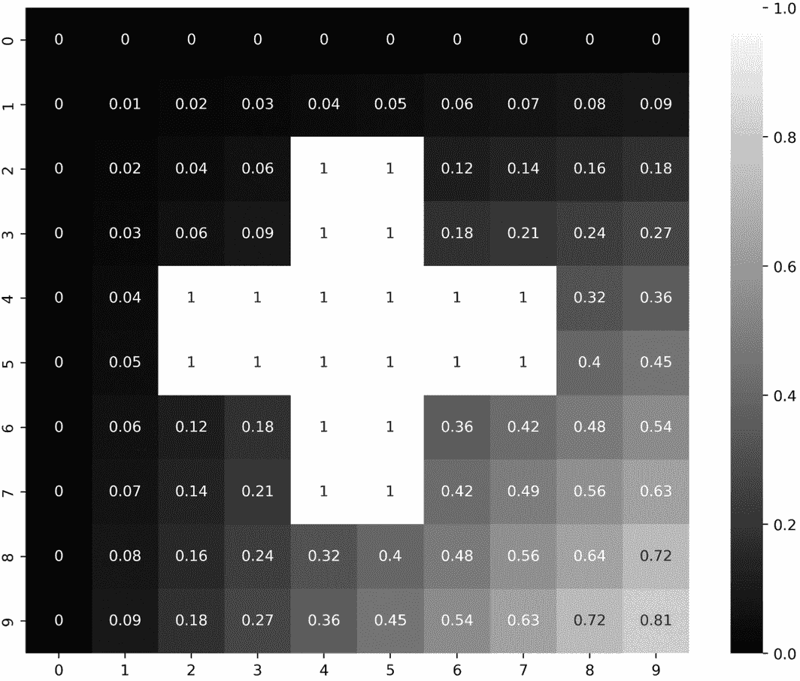

在 x 轴和 y 轴上为 0 到 9，在垂直灰度上为 0 到 1 的热图有一个值为 1 的白色加号，背景值小于 1。

图 4-32

回顾在列表 4-10 中创建的合成图

我们可以使用 `skimage.measure` 的 `block_reduce` 函数来模拟图像上的池化。该函数接受一个表示输入的数组，池化形状，以及应用于每个池化子区域所有元素的函数。

列表 4-32 生成图 4-33，显示了使用平均池化对图 4-32 中显示的矩阵进行池化的结果。

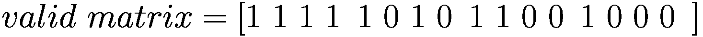

在 x 和 y 轴上为 0 到 4，在垂直灰度上为 0 到 1 的合并热图，在小于 1 的渐变背景上有一个值为 1 的白色加号。

图 4-33

对图 4-32 应用 2 × 2 均值池化的结果

```py
pooled = skimage.measure.block_reduce(img, (2,2), np.mean)
plt.figure(figsize=(10, 8), dpi=400)
sns.heatmap(pooled, cmap='gray', annot = True)
plt.show()
Listing 4-32
Applying two-dimensional average pooling to an image and displaying the result
```

列表 4-33 和图 4-34 展示了使用最大池化进行池化的效果。


在 x 和 y 轴上为 0 到 4，在垂直灰度上为 0 到 1 的合并热图，在小于 1 的渐变背景上有一个值为 1 的白色加号。

图 4-34

对图 4-32 应用 2 × 2 最大池化的结果

```py
pooled = skimage.measure.block_reduce(img, (2,2), np.max)
plt.figure(figsize=(10, 8), dpi=400)
sns.heatmap(pooled, cmap='gray', annot = True)
plt.show()
Listing 4-33
Applying two-dimensional max pooling to an image and displaying the result
```

平均池化和最大池化的结果看起来几乎相同。在这种情况下，这是因为中间的加号被干净地排列成 2x2 的块，无论使用哪种聚合函数，都会产生池化结果为 1。

让我们在图像上再进行一轮池化，以查看多次池化操作对矩阵的影响。请注意，当前矩阵的形状为 (5, 5)，但池化大小为 (2, 2)：我们之前描述池化对形状影响的公式会暗示结果数组具有分数形状 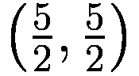，这显然是不准确的。为了处理无法被池化大小干净整除的数组大小，池化层自动使用填充函数，用“默认值”（通常是 0 或某种平均数）填充数组，直到它是一个有效的大小。

当我们希望应用形状为 (2, 2) 的池化时，考虑以下形状为 (3, 3) 的矩阵：

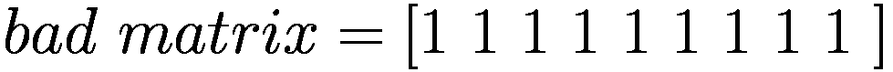

我们可以这样填充矩阵：


如果我们应用最大池化，零填充或多或少是不相关的，因为它总是该区域中最小的值。填充方法是一种作弊技巧，以获得分数大小的池化区域（如果使用最大池化），因为所有输出都小于零的可能性不存在（除非网络行为非常异常或使用奇特的激活函数）。前一个示例中的三个相关池化区域是

![$$ \left[1\ 1\ 1\ 1\kern0.5em ----\kern0.5em ----\kern0.5em ----\kern0.5em \right],\left[----\kern0.5em 1-1-\kern0.5em ----\kern0.5em ----\kern0.5em \right],\left[----\kern0.5em ----\kern0.5em 1\ 1--\kern0.5em ----\kern0.5em \right] $$](../images/525591_1_En_4_Chapter/525591_1_En_4_Chapter_TeX_Equz.png)

让我们再次应用池化，使用均值池化（列表 4-34，图 4-35）和最大池化（列表 4-35，图 4-36）。

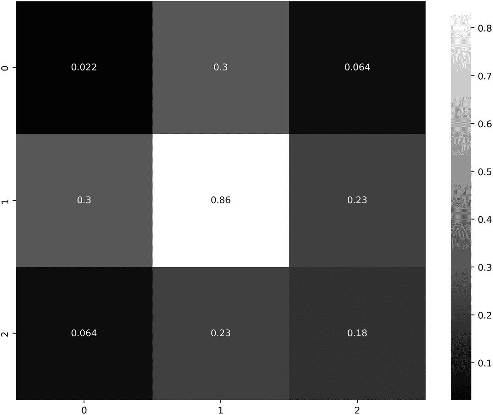

在 x 和 y 轴上为 0 到 2，在垂直灰度上为 0 到 1 的池化热图中，中间有一个值为 0.86 的白色单元格，背景是较低值的渐变。

图 4-35

在图 4-32 上应用 2 × 2 均值池化两次的结果

```py
pooled = skimage.measure.block_reduce(img, (2,2), np.mean)
pooled2 = skimage.measure.block_reduce(pooled, (2,2), np.mean)
plt.figure(figsize=(10, 8), dpi=400)
sns.heatmap(pooled2, cmap='gray', annot = True)
plt.show()
Listing 4-34
Applying mean pooling two times
```

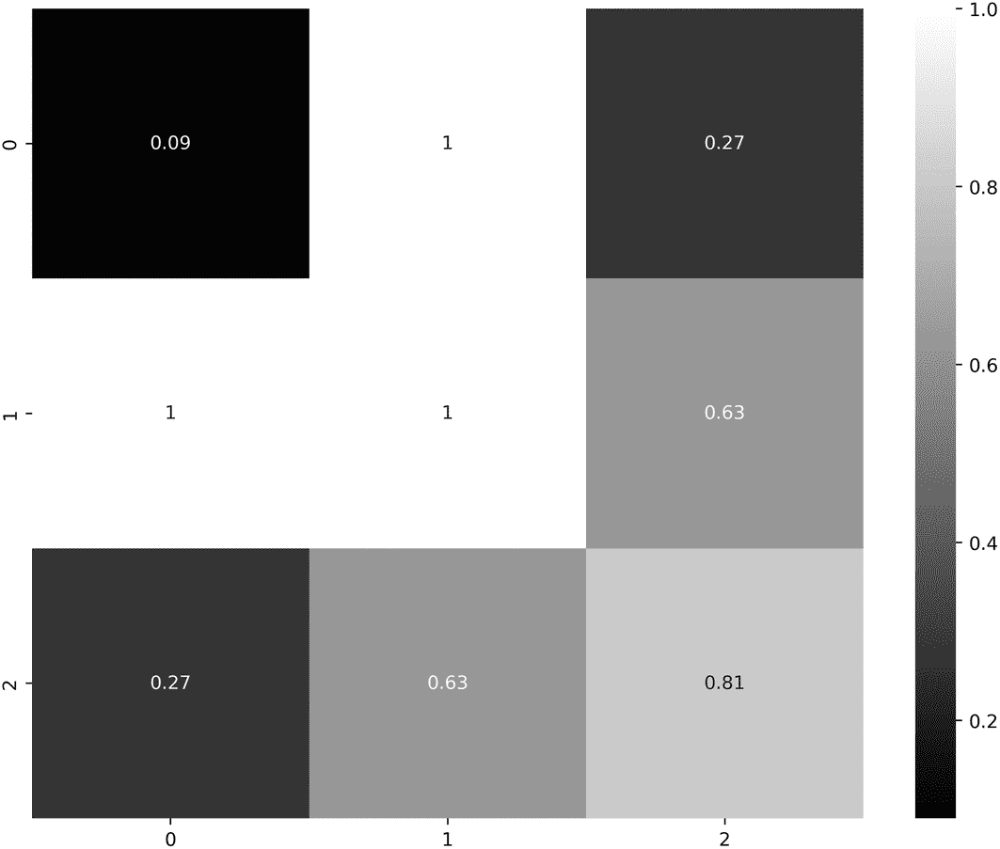

在 x 和 y 轴上为 0 到 2，在垂直灰度上为 0 到 1 的池化热图中，有一个值为 1 的白色单元格，背景是较低值的渐变。

图 4-36

在图 4-32 上应用 2 × 2 最大池化的结果

```py
pooled = skimage.measure.block_reduce(img, (2,2), np.max)
pooled2 = skimage.measure.block_reduce(pooled, (2,2), np.max)
plt.figure(figsize=(10, 8), dpi=400)
sns.heatmap(pooled2, cmap='gray', annot = True)
plt.show()
Listing 4-35
Applying max pooling two times
```

在这里，平均池化和最大池化之间的差异变得更加清晰。我们看到在最大池化中，最强的信号是唯一被传播到网络下一个组件的信号，而平均池化则考虑了所有信号。一般来说，最大池化更常用，因为它允许神经网络轻松地形成 if/else 风格的切换点，而不是通过操作一个相对复杂的平均游戏来将重要信号传播到网络的下一个组件。

卷积在神经网络中扮演着*提取角色*，而池化则扮演着*聚合角色*。请注意，虽然神经网络需要学习和优化卷积层中核的参数值，但池化层操作时没有任何可训练的参数。池化显著减少了特征图集的表示大小，这使得我们能够构建更高效和可持续的神经网络架构。

让我们构建一个示例神经网络架构，改进我们之前仅使用卷积层的网络设计（列表 4-36）。我们将使用相同的架构，但在第二和第三卷积层之间插入一个最大池化层。

```py
import keras.layers as L
from keras.models import Sequential
model = Sequential()
model.add(L.Input((28, 28, 1)))
model.add(L.Conv2D(8, (5, 5), activation='relu'))
model.add(L.Conv2D(8, (3, 3), activation='relu'))
model.add(L.MaxPooling((2, 2)))
model.add(L.Conv2D(16, (3, 3), activation='relu'))
model.add(L.Conv2D(16, (2, 2), activation='relu'))
model.add(L.Flatten())
model.add(L.Dense(32, activation='relu'))
model.add(L.Dense(16, activation='relu'))
model.add(L.Dense(10, activation='softmax'))
Listing 4-36
Building a convolutional neural network with a pooling layer
```

让我们比较不同图像尺寸下池化对神经网络参数化的影响，以了解其益处如何扩展（列表 4-37）。

```py
def build_model(img_size):
inp = L.Input((img_size, img_size, 1))
x = L.Conv2D(8, (5, 5), activation='relu')(inp)
prev = L.Conv2D(8, (3, 3), activation='relu')(x)
pool = L.MaxPooling2D((2, 2))(prev)
after = L.Conv2D(16, (3, 3), activation='relu')(pool)
x = L.Conv2D(16, (2, 2), activation='relu')(after)
x = L.Flatten()(x)
x = L.Dense(32, activation='relu')(x)
x = L.Dense(16, activation='relu')(x)
x = L.Dense(10, activation='softmax')(x)
model = keras.models.Model(inputs = inp, outputs = x)
yesPoolingParamCount = model.count_params()
after = L.Conv2D(16, (3, 3), activation='relu')(prev)
x = L.Conv2D(16, (2, 2), activation='relu')(after)
x = L.Flatten()(x)
x = L.Dense(32, activation='relu')(x)
x = L.Dense(16, activation='relu')(x)
x = L.Dense(10, activation='softmax')(x)
model = keras.models.Model(inputs = inp, outputs = x)
noPoolingParamCount = model.count_params()
del model
return noPoolingParamCount, yesPoolingParamCount
Listing 4-37
Comparing parameter scaling of an architecture with and without pooling
```

现在，让我们绘制出差异（列表 4-38，图 4-37）。

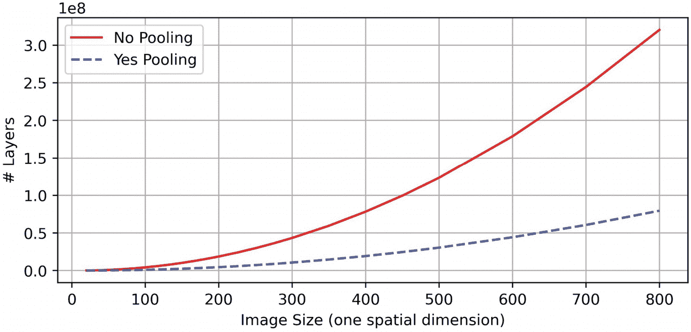

一维空间中层数与图像大小的线图显示了没有池化时从 0 增加到 3.3，有池化时从 0 增加到 0.8。

图 4-37

比较有无池化层的卷积神经网络的参数化缩放

```py
x = [20, 25, 30, 35, 40, 45, 50,
60, 70, 80, 90, 100, 120, 130, 140, 150,
170, 180, 190, 200, 225, 250, 275, 300,
350, 400, 450, 500, 600, 700, 800]
y = [build_model(i) for i in tqdm(x)]
plt.figure(figsize=(7.5, 3.25), dpi=400)
plt.plot(x, [i for i, j in y], color='red', label='No Pooling')
plt.plot(x, [j for i, j in y], color='blue', label='Yes Pooling', linestyle='--')
plt.xlabel('Image Size (one spatial dimension)')
plt.ylabel('# Layers')
plt.grid()
plt.legend()
plt.show()
Listing 4-38
Plotting parameter scaling of an architecture with and without pooling
```

注意，尽管添加池化层不会增加任何参数，但它强制减少了表示大小，这会对下游产生影响，因为*每个*池化之后的层都在使用更小的层。

实际上，通过堆叠更多的池化层，我们甚至可以观察到参数化方面的更大改进。

注意

我们通常使用`padding = 'same'`进行卷积，这会自动计算并应用所需的填充，以保持与输入相同的图像形状，因为池化的效果微不足道，实际上可能有助于检测边缘特征。此外，在许多情况下，我们不想为了形状管理的方便而混合未填充的卷积和池化层：我们可能有一个尺寸合适的图像（例如，256x256 像素），我们只想通过可除的因子（例如，2x2 的最大池化操作）来减小其尺寸。

许多深度学习专家并不是池化机制的粉丝。尽管它在参数化缩放方面有所帮助，但它本身是无参数的（不可学习的），因此可以被视为一种混乱的、强制的减少信息大小的方法。池化的反对者通常会主张在卷积中使用*步长*，这一点我们稍后将会讨论。步长可以达到与池化相同的功能图大小缩减效果。

我们已经看到，池化层可以显著减少学习到的特征图的大小——但池化还可以以不同的形式帮助我们。

注意，尽管展平层直观且保留了所有信息，但在参数化可行性方面是一个瓶颈。“小”数据在三个空间维度上整齐排列时可以变得非常大，当展平到一维空间时。使用池化，我们可以推导出一种更有效的机制来将一组特征图折叠成一个向量。这源于一个简单的认识，即应用与所应用的特征图大小相等的池化核会产生一个单一的聚合值。例如，一个形状为（5, 5, 32）的特征图集合（即有 32 个 5x5 特征表示的“版本”），通过大小为（5, 5）的池化操作，将为每个输出产生一个值，或者形状为（32）的聚合数据。

当池化形状等于输入特征图形状的特殊池化情况被命名为*全局池化*。与标准池化一样，它有两种常见的类型：全局平均池化和全局最大池化。全局平均池化对每个特征图中的所有值进行平均，而全局最大池化则找到每个特征图中的最大值。虽然最大池化通常比平均池化更受神经网络提取组件的青睐，但*全局平均池化通常比全局最大池化更受欢迎*，用于从三维空间维度折叠到一维。全局最大池化是一个急剧减少的操作，因为在 n×n 特征图中只有*1 个*²个元素“计数”；也就是说，通过最大池化，很少的学习信号被传播到网络的下一部分。另一方面，在全局平均池化中，所有*1 个*²个元素“都有发言权”来决定输出信号。因为全局池化在网络的提取（卷积）和解释（全连接）组件之间执行关键的开/关操作，所以我们通常不希望引入任何新的信号瓶颈。

让我们演示如何用全局最大池化替换展平来进一步帮助我们改进参数化如何随着输入大小的变化而变化。列表 4-39 演示了一个我们可以构建的函数，用于计算使用卷积和全局池化的卷积神经网络的参数计数，以及与前面两个模型（没有池化或池化但没有全局池化）相比的参数化缩放，如图 4-38 所示。

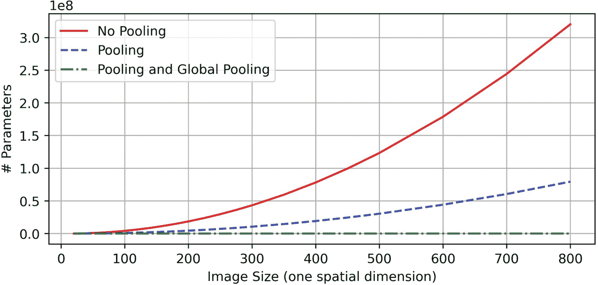

参数与单维图像大小的线图显示了在没有池化时从 0 增加到 3.3，在池化时从 0 增加到 0.8，在池化和全局池化时从 0 增加到 0。

图 4-38

比较没有池化层的卷积神经网络、有池化但没有全局池化，以及有池化和全局池化的参数化缩放

```py
def build_pooling_model(img_size):
inp = L.Input((img_size, img_size, 1))
x = L.Conv2D(8, (5, 5), activation='relu')(inp)
prev = L.Conv2D(8, (3, 3), activation='relu')(x)
pool = L.MaxPooling2D((2, 2))(prev)
after = L.Conv2D(16, (3, 3), activation='relu')(pool)
x = L.Conv2D(16, (2, 2), activation='relu')(after)
x = L.GlobalAveragePooling2D()(x)
x = L.Dense(32, activation='relu')(x)
x = L.Dense(16, activation='relu')(x)
x = L.Dense(10, activation='softmax')(x)
model = keras.models.Model(inputs = inp, outputs = x)
paramCounts = model.count_params()
del model
return paramCounts
Listing 4-39
Parameter scaling of an architecture with global max pooling in replacement of flattening
```

差异极其显著。具有池化和全局池化的卷积神经网络的参数化似乎功能上呈平坦状。通过仅比较具有池化但全局池化可变的 CNN 设计（图 4-39），我们观察到具有池化和全局池化的模型的参数化缩放确实是平坦的。如果你观察原始值，你会发现对于这个特定的模型，参数数量始终是 4242 - 我们已经实现了*参数缩放恒定*，这是可以获得的最佳缩放类型（因为随着输入复杂性的增加，参数数量减少通常没有意义）。

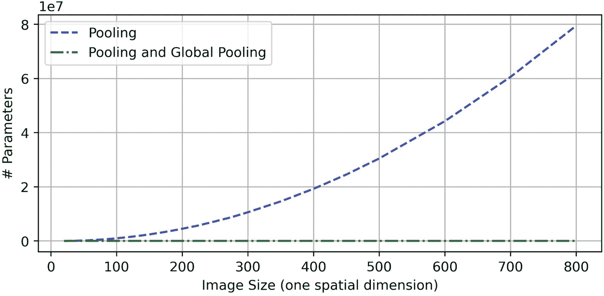

一维图像大小的参数与参数缩放关系的线图显示了池化从 0 到 8 的增加，以及池化和全局池化从 0 到 0 的增加。

图 4-39

“放大”图 4-38，仅关注具有池化但没有全局池化的卷积神经网络的参数缩放，以及具有池化和全局池化的卷积神经网络的参数缩放。

值得思考的是，全局池化机制如何使我们获得恒定的参数缩放。卷积本身具有恒定的参数化，因为它们仅仅学习一定大小的卷积核的值，而不管输入大小如何。回想一下，卷积对于处理图像的神经网络来说是一个很好的选择，因为它们具有固有的可扩展滑动窗口/核设计。然而，从特征图到向量（即从提取/卷积和解释/全连接组件之间）的切换是参数数量可变的。如果卷积组件的最后一层输出形状为 (*a*, *b*) 的 *k* 个特征图，而全连接组件的第一层包含 *d* 个节点，那么使用展平层的参数数量是 (*k* ⋅ *a* ⋅ *b*) × *d*。虽然 *k* 和 *d* 在我们的实验中是常数，因为它们与输入大小无关，但请注意 *a* 和 *b* 的值是可变的。因此，随着输入大小的增加，我们预计参数缩放将大致呈二次增长，使用展平层。

然而，如果我们使用最大池化，形状为 (*a*, *b*) 的 *k* 个特征图将被池化成一个形状为 *k* 的向量。所需的参数数量是 *k* ⋅ *d*，这两个都是常数！因此，无论输入大小如何，采用池化和最大池化的卷积神经网络都将始终具有恒定的参数数量（假设架构保持不变）。请注意，这并不一定意味着模型在输入复杂度增加时仍能表现良好；本质上更复杂的任务可能需要更多的参数来表示和建模它，这可能需要修改架构（例如，更多层，每层有大量节点/滤波器等）。

可以将展平和全局池化视为互补方法：一个方法缺乏的地方，另一个方法提供。当使用展平时，我们保留了所有信息，但失去了对特征图分离的认识（任何值属于哪个特征图无关紧要；所有值都被无差别地并排放置在同一向量中）。当使用全局池化时，我们获得了对特征图分离的认识，但失去了信息。一般来说，较大的卷积神经网络倾向于使用全局池化，而较小的网络倾向于使用展平。大型 CNN 产生的大型输出特征图，如果展平，将无法扩展以进行处理。全局池化通常是一个足够好的机制来捕捉提取特征的主要思想。另一方面，小型 CNN 通常产生较小的特征图，其中每个元素包含更高的信息比例。使用展平而不是全局池化可以帮助显式地保留原始提取的特征，并且通常是可行的。然而，在大多数“标准”建模问题中，足够大的神经网络应该使用展平或全局池化获得大致相似的性能（尽管在不同的训练条件和要求下）。

现在我们已经掌握了卷积神经网络的两个关键构建块，让我们在 Keras 中逐层实现稍作修改的*AleNet 架构*。AlexNet 是计算机视觉中的一个重要模型。2012 年由 Alex Krizhevsky 与 Ilya Sutskever 和 Geoffrey Hinton 合作在论文“使用深度卷积神经网络进行 ImageNet 分类”中发布，^(1) AlexNet 为随后几年卷积神经网络架构的快速研究发展奠定了基础。截至本书编写时，该论文已被引用超过 80,000 次。

AlexNet 遵循一个相对简单的架构（图 4-40）。

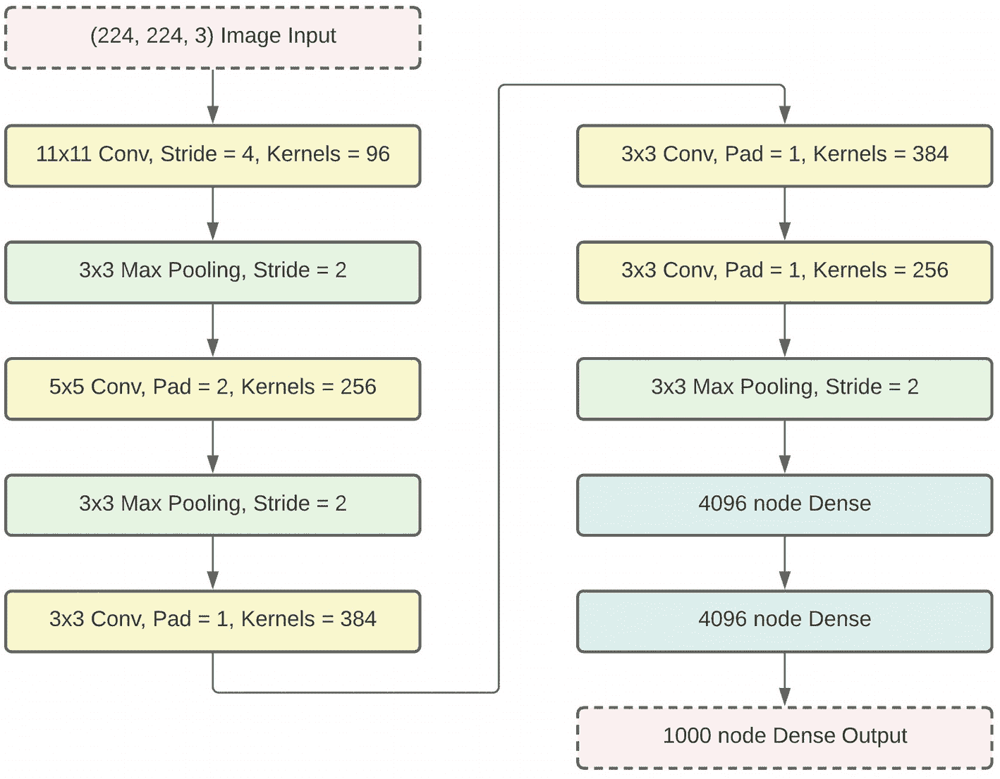

: (224, 224, 3)图像输入；不同卷积和最大池化的填充数、步长和核数；4096 节点的 Dense；1000 节点的 Dense 输出。

图 4-40

AlexNet 架构的视觉表示

注意，这个架构利用了*步长*。步长指定每次核在卷积或池化过程中移动时“跳过”的元素数量。卷积通常以步长 1 引入，但将步长为 2 的卷积应用于(5, 5)矩阵会影响相关的加粗子部分：

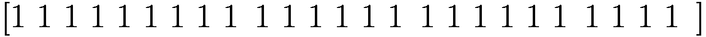

步长是一个有用的工具，通过分配在特征图中不传播到网络其余部分的部分区域，为特征提取层提供更多的“灵活性”。请注意，虽然步长不会减少应用到的单个卷积层的参数数量，但它们确实减少了输出特征图的大小，这具有下游参数化影响（即，网络的其余部分使用更少的参数）。步长是减少图像处理神经网络参数化的另一种重要方法。

构建 AlexNet 层的代码相当直接（列表 4-40）。

```py
model = Sequential()
model.add(L.Input((224, 224, 3)))
model.add(L.Conv2D(96, (11, 11), strides=4))
model.add(L.MaxPooling2D((3, 3), strides=2))
model.add(L.Conv2D(256, (5, 5)))
model.add(L.MaxPooling2D((3, 3), strides=2))
model.add(L.Conv2D(384, (3, 3)))
model.add(L.Conv2D(384, (3, 3)))
model.add(L.Conv2D(256, (3, 3)))
model.add(L.MaxPooling2D((3, 3), strides=2))
model.add(L.Flatten())
model.add(L.Dense(4096, activation='relu'))
model.add(L.Dense(4096, activation='relu'))
model.add(L.Dense(1000, activation='softmax'))
Listing 4-40
Building a sample AlexNet architecture
```

绘制模型确认了我们的期望架构（图 4-41）。注意一个有趣的现象——特定的内核形状和池化以及卷积层的排列设计得使得提取/卷积组件的最后一层输出形状为（1，1，256）的特征图：这意味着 256 个特征图中的每一个都被压缩成仅一个值！在这个独特的情况下，注意展平和全局池化在功能上没有区别。

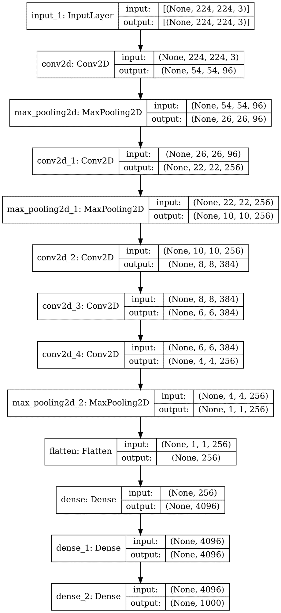

输入层、2D 卷积、2D 最大池化、展平和全连接层的输入和输出中的 None 逗号值的流程图。

图 4-41

实现后的 AlexNet 架构的 Keras 风格可视化表示

我们可以观察到，AlexNet 模型使用了一个精心设计的信流。当我们构建卷积神经网络（以及神经网络一般）时，我们希望仔细监控网络长度中每个部分的*表示*大小如何变化。表示大小简单地是层持有的元素总数；具有*n*个节点的全连接层具有*n*个元素的表示大小，输出形状为(*a*，*b*，*c*)的特征图的卷积层具有*a*⋅*b*⋅*c*的表示大小。假设在架构的任何一点上表示大小的变化急剧减少（即，瓶颈）。在这种情况下，网络被迫将大量信息压缩到很小的空间中。另一方面，如果在架构的任何一点上表示大小的变化急剧增加（即，*膨胀*），那么网络被迫将少量信息扩展到大量空间中。根据数据的“固有复杂性”，瓶颈可能是限制性的，而膨胀可能导致冗余计算。

分析成功的卷积神经网络架构的设计，使我们深入了解卷积和池化层的工作原理。在下一节中，我们将继续分析其他更现代的架构。

### 基础卷积神经网络架构

在本节之前讨论的所有内容都集中在卷积神经网络的低级构建块上。然而，目前很少有人通过手动排列层来构建自己的卷积神经网络架构，以解决图像分类等标准问题。相反，研究人员发现了一套有效的通用架构，可以作为卷积神经网络的基础，在此基础上可以进行一些小的定制，以“专门化”基础模型以适应你想要的任务。在本节中，我们将讨论三种关键的基础 CNN 架构，并展示如何实例化和使用它们进行快速定制建模。

#### ResNet

如其名所示，ResNet 架构以其拓扑设计中的剩余连接为主要元素。

剩余连接是向架构非线性迈出的“第一步”——这些是在非相邻层之间放置的简单连接。它们通常被描述为“跳过”一个或多个层，这就是为什么它们也经常被称为“跳过连接”（图 4-42）。

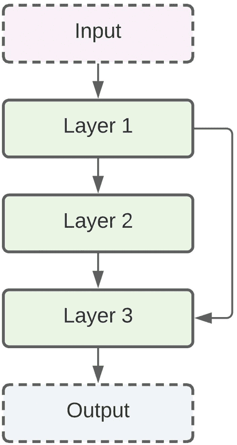

输入、第 1 层、第 2 层、第 3 层和输出的流程图。第 1 层可能直接连接到第 3 层。

图 4-42

剩余连接

注意，在实际实现中，连接首先通过添加或连接等方法合并。然后，合并的组件被传递到下一层（图 4-43）。这是所有未明确展示合并的剩余连接图的隐含假设。

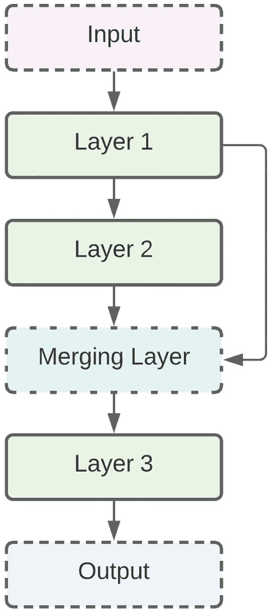

输入；第 1 层；第 2 层；合并层；第 3 层；输出的流程图。第 1 层可能直接连接到合并层。

图 4-43

技术上正确的带有合并层的剩余连接

添加剩余连接可以减少输入信号的*退化*，其中原始输入在长堆的网络层中饱和或丢失。剩余连接允许信息流动更加顺畅，这使得网络能够通过结合不同阶段或推理区域的信息来进行更非线性的推理。

“ResNet 风格”的剩余连接设计在整个网络中重复使用一系列短剩余连接（图 4-44）。

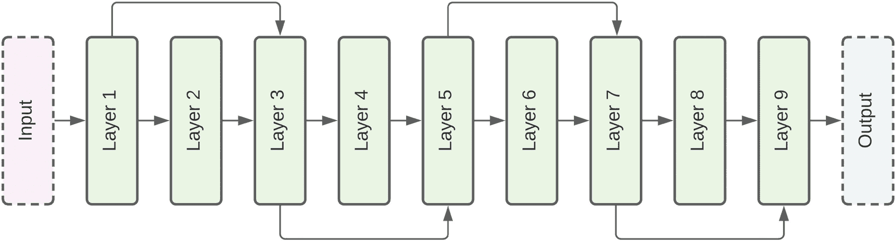

流程图读取：输入；第 1 层；第 2 层；合并层；第 3 层；输出。第 1 层可能直接连接到后续的奇数层。

图 4-44

ResNet 风格的剩余连接设计

ResNet 架构最初由 Kaiming He、Xiangyu Zhang、Shaoqing Ren 和 Jian Sun 在 2015 年的论文“Deep Residual Learning for Image Recognition”中提出，该架构由 34 层带有跳过每两层残差连接的层组成。图 4-45 比较了 ResNet 与一个普通的“等价”架构和更经典的 VGG-19 架构。

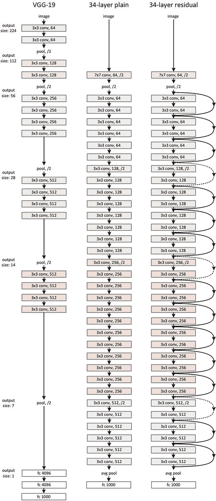

三个 VGG 19、34 层普通、34 层残差流程图描述了图像处理步骤，输出大小为 224、112、56、28、14、7 和 1。

图 4-45

ResNet 架构（右侧），与“普通”架构等价（即没有残差连接，中间）和 VGG-19 架构

注意，还有其他关于残差连接的架构解释。而不是依赖于线性骨干，您可以将残差连接解释为将其前面的层分成两个分支，每个分支以它们独特的方式处理前一层的输出。一个分支（以下图中层 1 到层 2 到层 3）使用专用函数处理前一层的输出，而另一个分支（层 1 到恒等到层 3）使用恒等函数处理层的输出——也就是说，它只是允许前一层的输出通过，这是“最简单”的处理形式（图 4-46）。

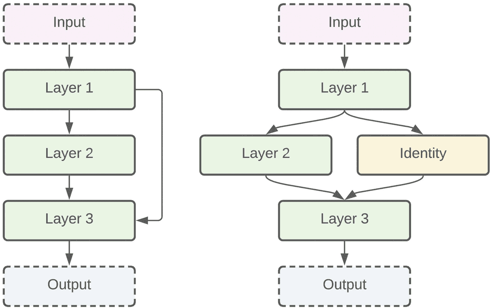

流程图-1 读取：输入；层 1；层 2；层 3；输出。流程图-2 读取：输入；层 1；层 2 和恒等；层 3；输出。

图 4-46

对残差连接作为分支操作的另一种解释

这种从概念上理解残差连接的方法使您可以将它们分类为一般非线性架构的子类，这可以理解为一系列分支结构。

残差连接通常被提出作为解决*梯度消失问题*（图 4-47）的方案：为了访问某些层，我们需要先通过几个其他层，从而稀释信息信号。在梯度消失问题中，用于更新权重的非常深神经网络中的反向传播信号会逐渐减弱，以至于前层几乎未被利用。（注意，在许多情况下，使用 ReLU 激活函数而不是像 sigmoid 这样的有界函数可以解决这个问题——但残差连接是另一种方法。）

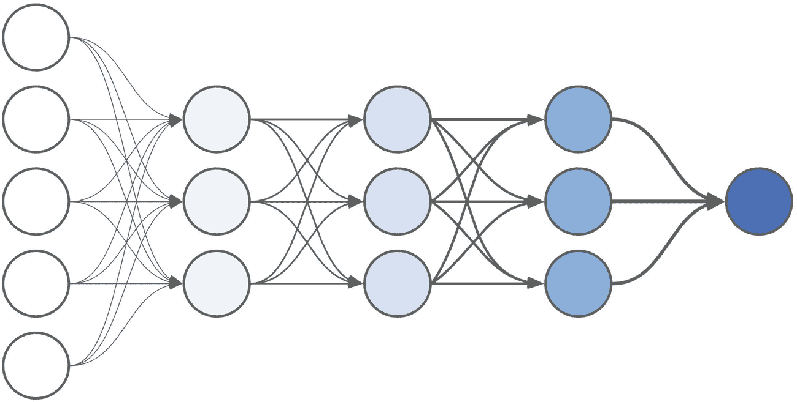

一系列由 5 个白色圆圈、3 个非常浅的蓝色圆圈、3 个浅蓝色圆圈、3 个浅蓝色圆圈和 1 个深蓝色圆圈组成的流程图。

图 4-47

梯度消失问题的可视化：当网络变得过长时，反向传播过程中的信息信号“消失”或“减弱”

然而，使用残差连接时，反向传播信号通过更少的平均层到达特定层的权重以进行更新。这使反向传播信号更强，能够更好地利用整个模型架构。

残差连接也可以被视为性能不佳层的“安全措施”。如果我们从层 A 到层 C 添加一个残差连接（假设层 A 连接到层 B，层 B 连接到层 C），网络可以“选择”忽略层 B，通过学习接近零的权重来从 A 到 B 和从 B 到 C 的连接，同时信息通过残差连接直接从层 A 到层 C 传递。然而，在实践中，残差连接更多地作为数据的额外表示来考虑，而不是作为安全措施机制。

在 Keras 中，ResNet 架构以几种不同的版本实现：ResNet50、ResNet101 和 ResNet152（每个版本都有两个版本）。附加在每个 ResNet 架构上的数字是网络深度的大致指标（尽管由于某些技术细节，如果你计算，你不会得到一个确切的数字）。ResNet50 是提供的 ResNet 最小版本，而 ResNet 152 是最深的。

你可以通过调用模型对象并指定输入形状和类别数量来实例化和训练一个 ResNet 模型（列表 4-41）。Keras 中的大多数模型架构都带有在 ImageNet 数据集上预训练的权重，但输出类别的数量必须是 1000，因为 ImageNet 数据集包含 1000 个输出类别。

```py
from tensorflow.keras.applications import ResNet50
model = ResNet50(input_shape = (a, b, 3),
classes = c,
weights = None)
model.compile(...)
model.fit(...)
Listing 4-41
Boilerplate code to train a ResNet50 model on an image classification task with input shape (a, b, 3) and c output classes
```

你也可以将任何模型（包括 ResNets、其他 Keras 应用模型以及你自己的顺序或功能模型）视为更大模型的一个子模型或组件。例如，考虑一个假设的架构，其中输入独立地通过 ResNet50 和 ResNet121 架构，然后合并并处理成列表 4-42 中实现的输出（如图 4-48 所示）。我们首先实例化 ResNet50 和 ResNet121 模型，然后使用 `result = model(inp_layer)` 语法。

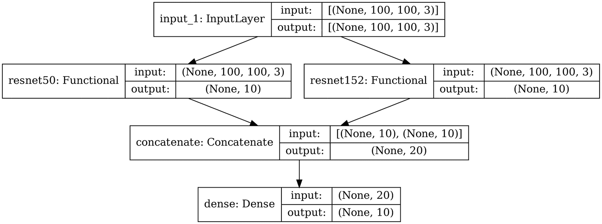

输入 1 输入-输出中的 None 值流程图：输入层，ResNet 50 和 152：功能，连接：连接，密集：密集。

图 4-48

列表 4-42 中生成的架构的 Keras 可视化

```py
from tensorflow.keras.applications import ResNet50, ResNet152
inp = L.Input((a, b, 3))
resnet50 = ResNet50(input_shape = (a, b, 3),
classes = c,
weights = None)
resnet50out = resnet50(inp)
resnet121 = ResNet152(input_shape = (a, b, 3),
classes = c,
weights = None)
resnet121out = resnet121(inp)
concat = L.Concatenate()([resnet50out, resnet121out])
out = L.Dense(c, activation='softmax')(concat)
model = keras.models.Model(inputs = inp,
outputs = out)
Listing 4-42
Constructing a “hybrid” ResNet architecture by instantiating ResNet50 and ResNet121 architectures as components/submodels
```

我们将在“多模态图像和表格模型”部分看到这个模型分区的示例用法。

另一种架构，DenseNet，由 Gao Huang、Zhuang Liu 和 Killian Q. Weinberger 在 2016 年的论文“Densely Connected Convolutional Networks”中提出，它以更极端或“密集”的方式使用残差连接。DenseNet 架构具有均匀分布的“锚点”；残差连接放置在每个锚点集之间（见图 4-49)。与 ResNet 类似，DenseNet 在 Keras 中实现了多种版本：DenseNet121、DenseNet169 和 DenseNet201。所有这些模型都包含在 `keras.applications.DenseNetx` 下。

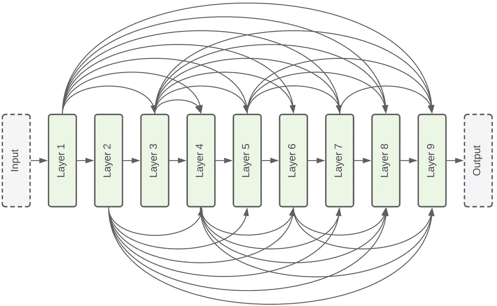

流程图读作：输入；层 1；层 2；层 3；层 4；层 5；层 6；层 7；层 8；层 9；输出。这些层导致后续层。

图 4-49

DenseNet 风格残差连接的示例，其中每个层都有一个锚点

#### Inception v3

Christian Szegedy、Vincent Vanhoucke、Sergey Ioffe、Jonathon Shlens 和 Zbigniew Wojna 在他们的 2015 年论文“Rethinking the Inception Architecture for Computer Vision”中介绍了 Inception v3 架构，这是 Inception 模型家族的一个改进版本，已成为图像识别的支柱。在许多方面，Inception v3 架构为未来几年的卷积神经网络设计奠定了关键原则。与此背景最相关的是其基于单元的设计。

Inception v3 模型试图在之前的 Inception v2 和原始 Inception 模型的设计上进行改进。原始 Inception 模型采用了一系列重复的单元（在论文中称为“模块”），这些单元遵循一个多分支非线性架构（见图 4-50)。从模块的输入到输出有四个分支；其中两个分支由一个 1 × 1 卷积后跟一个更大的卷积组成，一个分支定义为池化操作后跟一个 1 × 1 卷积，另一个分支只是一个 1 × 1 卷积。在这些模块的所有操作中都提供了填充，以确保滤波器的大小保持不变，这样并行分支表示的结果就可以在深度方向上拼接回一起。

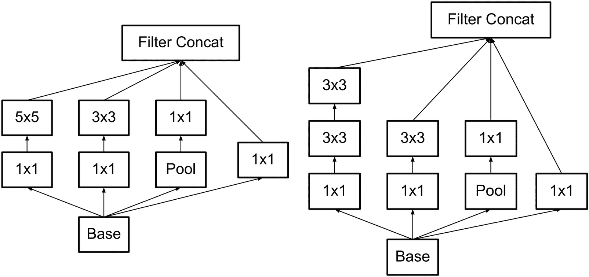

流程图-1 读作：基础；1x1、3x3、5x5 和池化网络；滤波器拼接。流程图-2 读作：基础；1x1、3x3 和池化网络；滤波器拼接。

图 4-50

左：原始 Inception 单元。右：Inception v3 单元架构之一。来自 Szegedy 等人。

Inception v3 模块设计中的一个关键架构变化是将大型滤波器尺寸（如 5x5）分解为较小滤波器尺寸的组合。例如，5x5 滤波器的形状效应可以被“分解”为一系列两个 3x3 滤波器；在特征图上应用 5x5 滤波器（没有填充）会产生与两个 3x3 滤波器相同的输出形状：(w-4, h-4, d)。同样，7x7 滤波器可以被“分解”为三个 3x3 滤波器。Szegedy 等人指出，这种分解促进了更快的学习，同时不会阻碍表示能力。这个模块将被称作**对称分解模块**，尽管在 Inception v3 架构的实现中，它被称为**模块 A**。

实际上，3x3 和 2x2 的滤波器也可以分解成一系列具有较小滤波器尺寸的卷积。一个 n x n 的卷积可以表示为一个 1 x n 的卷积后跟一个 n x 1 的卷积（或反之）。具有不同长度高度的核宽度的卷积被称为**非对称卷积**，并且可以作为有价值的细粒度特征检测器（见图 4-51）。在 Inception v3 模块架构中，n 被选为 7。这个模块将被称作**非对称分解模块**（也称为**模块 B**）。Szegedy 等人发现，这个模块在早期层表现不佳，但在中等大小的特征图上表现良好。相应地，它被放置在 Inception v3 单元堆栈中的对称分解模块之后。

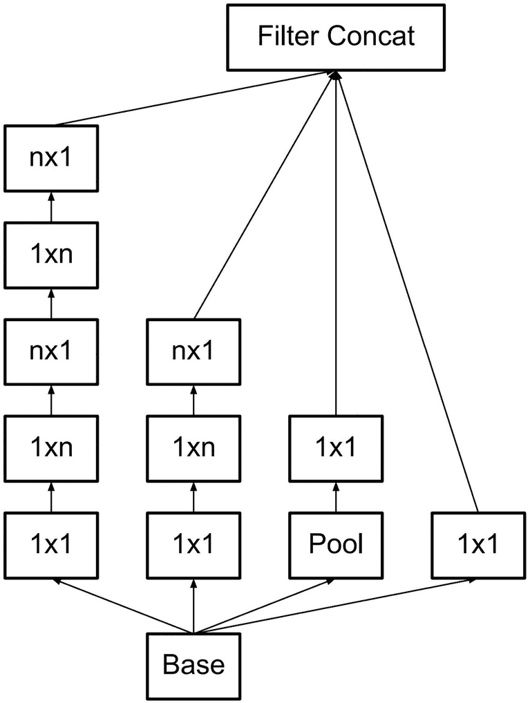

基础流程图；1x1、1xn、nx1 和池化；滤波器连接。

图 4-51

将 n x n 滤波器分解为较小滤波器的操作。来自 Szegedy 等人。

对于极其**粗糙**（即尺寸较小的）输入，使用具有**扩展滤波器组输出**的不同模块。这种模型架构通过使用树状拓扑结构——对称分解模块中的两个左侧分支进一步“分裂”成“子节点”，并在滤波器末尾与其它分支的输出连接（见图 4-52）——来辅助高度专业化的处理。这种类型的模块被放置在 Inception v3 架构的末尾，以处理当特征图变得空间较小时的特征图。这个模块将被称作**扩展滤波器组模块**（或**模块 C**）。

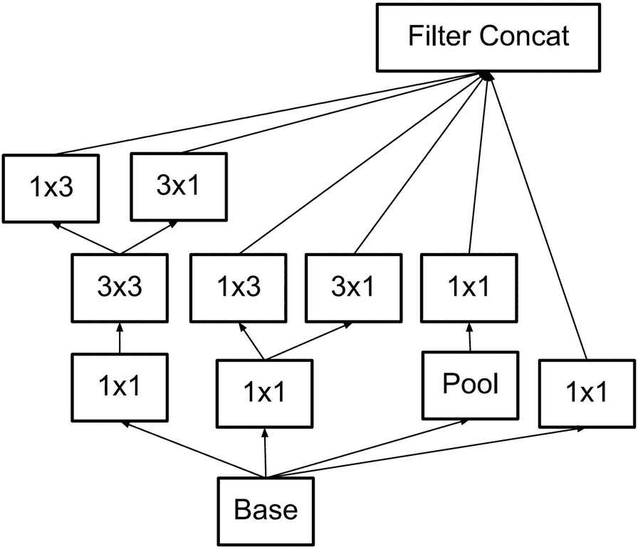

基础流程图；1x1、3x3、1x3、3x1 和池化；滤波器连接。

图 4-52

将 n x n 滤波器分解为较小滤波器的操作。来自 Szegedy 等人。

另一个用于高效减少滤波器大小的 Inception 模块被设计出来（见图 4-53）。这种减少风格的模块使用三个并行分支；其中两个使用步长为 2 的卷积，另一个使用池化操作。这三个分支产生相同的输出形状，可以在深度方向上进行连接。请注意，Inception 模块被设计成当尺寸减少时，相应地通过增加滤波器的数量来抵消。

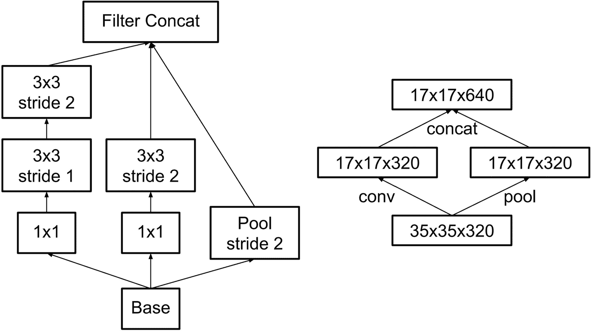

流程图-1 读作：基础；1x1、3x3 步长为 1 和 2 以及池化步长为 2 的网络；滤波器连接。流程图-2 读作：35x35x320；17x17x320 的卷积池化；连接 17x17x640。

图 4-53

Inception v3 减少单元的设计。来自 Szegedy 等人。

Inception v3 架构是通过线性堆叠这些模块类型形成的，按照顺序排列，使得每个模块都放置在一个它将接收特征图输入形状并成功处理的位置。以下模块序列被使用：

1.  一系列卷积和池化层用于执行初始特征提取（这些不属于任何模块）

1.  对称卷积模块/模块 A 的三次重复

1.  减少模块

1.  非对称卷积模块/模块 B 的四次重复

1.  减少模块

1.  扩展滤波器库模块/模块 C 的两次重复

1.  池化、密集层和 softmax 输出

Inception 架构系列中另一个经常被忽视但重要的特性是 1x1 卷积，它在每个 Inception 单元设计中都存在——通常作为单元架构中最频繁出现的元素。在模型性能方面，1x1 卷积在 Inception 架构中发挥着关键作用：在应用昂贵的较大内核到特征图表示之前，计算廉价的滤波器减少。例如，假设在架构的某个位置有 256 个滤波器通过一个 1x1 卷积层；1x1 卷积层可以通过学习每个像素从所有 256 个滤波器中可选的值组合来将滤波器数量减少到 64 或甚至 16。由于 1x1 内核不包含任何空间信息（即，它不考虑相邻的像素），因此计算成本低。此外，它隔离了后续较大（因此更昂贵）的卷积操作中最重要的特征，这些操作包含空间信息。

Inception v3 架构在 2015 年 ILSVRC（ImageNet 竞赛）中表现非常出色，并已成为图像识别架构中的主流（见表 4-1 和 4-2）。

表 4-2

与其他架构模型集成相比，Inception v3 架构集成的性能。来自 Szegedy 等人。

| 架构 | # 模型 | Top-5 错误率 | Top-1 错误率 |
| --- | --- | --- | --- |
| VGGNet | 2 | 23.7% | 6.8% |
| GoogLeNet | 7 | - | 6.67% |
| PReLU | - | - | 4.94% |
| Inception | 6 | 20.1% | 4.9% |
| Inception v3 | 4 | 17.2% | 3.58% |

表 4-1

Inception v3 架构与其他模型在 ImageNet 中的性能对比。来自 Szegedy 等人。

| 架构 | Top-5 错误率 | Top-1 错误率 |
| --- | --- | --- |
| GoogLeNet | - | 9.15% |
| VGG | - | 7.89% |
| Inception | 22% | 5.82% |
| PReLU | 24.27% | 7.38% |
| Inception v3 | 18.77% | 4.2% |

Inception v3 的完整架构可在 `keras.applications.InceptionV3` 中找到，其中包含可用于迁移学习或仅作为强大架构（使用随机权重初始化）的 ImageNet 权重，用于图像识别和建模。

使用 Keras（以及一个好的练习）构建 Inception v3 模块本身相对简单。我们可以构建四个相互平行的分支，这些分支是连接在一起的。注意，我们在最大池化层中除了指定 `padding='same'` 之外，还指定了 `strides=(1,1)` 以保持输入和输出层相同。如果我们只指定填充，则 strides 参数设置为输入池的大小。然后，这些单元可以与其他单元以顺序格式堆叠，形成 Inception v3 风格的架构（列表 4-43，图 4-54）。

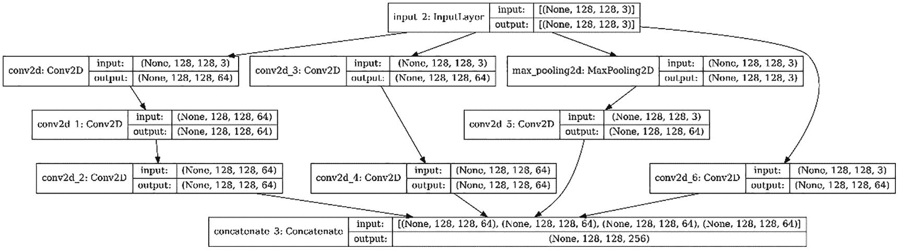

流程图描述了输入 2 的输入和输出中的 None 值，冒号后为 InputLayer，conv 2 d，max pooling 2 d，concatenate 3：连接。

图 4-54

Keras Inception v3 单元在列表 4-43 中构建的可视化。

```py
def build_iv3_module_a(inp, shape):
w, h, d = shape
branch1a = L.Conv2D(d, (1,1))(inp)
branch1b = L.Conv2D(d, (3,3), padding='same')(branch1a)
branch1c = L.Conv2D(d, (3,3), padding='same')(branch1b)
branch2a = L.Conv2D(d, (1,1))(inp)
branch2b = L.Conv2D(d, (3,3), padding='same')(branch2a)
branch3a = L.MaxPooling2D((2,2), strides=(1, 1),
padding='same')(inp)
branch3b = L.Conv2D(d, (1,1), padding='same')(branch3a)
branch4a = L.Conv2D(d, (1,1))(inp)
concat = L.Concatenate()([branch1c, branch2b,
branch3b, branch4a])
return concat, shape
Listing 4-43
Building a simple Inception v3 Module A architecture
```

除了可以直接处理大型神经网络架构之外，从零开始实现这些架构的另一个好处是可定制性。您可以插入自己的单元设计，在单元之间添加非线性（例如，ResNet-/DenseNet 风格的单元连接），或增加或减少堆叠的单元数量以调整网络深度。此外，基于单元的结构非常简单且快速实现，因此成本很低。

#### EfficientNet

卷积神经网络在历史上相对任意地进行扩展。“任意”扩展意味着在没有太多理由的情况下调整网络的这些维度；在确定如何扩展神经网络维度以适应更复杂任务时存在模糊性。例如，ResNet 模型系列（ResNet50、ResNet 101 等）是主要通过网络 *深度*，即架构中的层数进行扩展的例子。然而，为了解决网络扩展的任意性，我们需要一种 *系统性的方法来扩展神经网络架构，跨越多个架构维度*，以实现最高的预期成功率（图 4-55）。

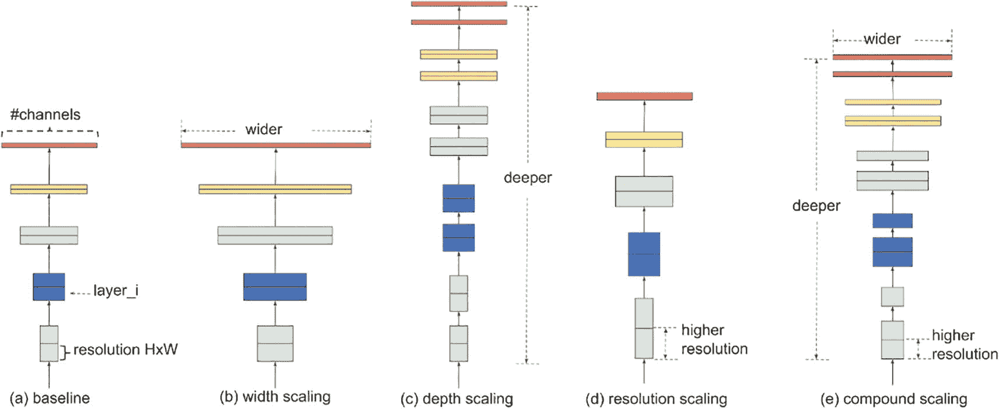

图像比较了具有深或宽通道、层低或高分辨率的神经网络的基线、宽度缩放、深度缩放、分辨率缩放和复合缩放。

图 4-55

可以缩放的神经网络维度，与复合缩放方法进行比较。来自 Tan 和 Le

Mingxing Tan 和 Quoc V. Le 在他们 2019 年的论文“EfficientNet: Rethinking Model Scaling for Convolutional Neural Networks.”^(5) 中提出了 *复合缩放方法*。复合缩放方法是一种简单但成功的缩放方法，其中每个维度都通过一个常数比例缩放。

使用一组固定的缩放常数来统一缩放神经网络架构使用的宽度、深度和分辨率。这些常数 – *α*，*β*，*γ* – 通过复合系数 *ϕ* 缩放，使得深度 *d* = *α*^(*ϕ*)，宽度 *w* = *β*^(*ϕ*)，分辨率 *r* = *γ*^(*ϕ*)。*ϕ* 由用户定义，取决于他们愿意为特定问题分配多少计算资源/预测能力。

常数的值可以通过简单的网格搜索找到。鉴于搜索空间很小，这种方法既可行又成功。对常数施加了两个约束：

+   *a* ≥ 1, *β* ≥ 1, *γ* ≥ 1\. 这确保了当它们被复合系数提升到幂时，常数不会减小其值，因此更大的复合系数值会导致更大的深度、宽度和分辨率大小。

+   *a* · *β*² · *γ*² ≈ 2\. 一系列卷积操作的 FLOPS（每秒浮点运算数）与深度、宽度平方和分辨率平方成正比。这是因为深度通过堆叠更多层进行线性操作，而宽度和分辨率作用于二维滤波器表示。为了确保计算可解释性，此约束确保任何值都将总 FLOPS 数量增加约 (*α* · *β*² · *γ*²)^(*ϕ*) = 2^(*ϕ*)。

这种缩放方法在应用于之前成功的架构（如 MobileNet 和 ResNet）时非常成功（见表 4-3）。通过复合缩放方法，我们可以以结构化和非任意的方式扩展网络的大小和计算能力，从而优化缩放模型的最终性能。

表 4-3

复合缩放方法在 MobileNetV1、MobileNetV2 和 ResNet50 架构上的性能。来自 Tan 和 Le

| 模型 | FLOPS | Top-1 准确率 |
| --- | --- | --- |
| 基准 MobileNetV1 | 0.6B | 70.6% |
| 通过宽度 (w=2) 缩放 MobileNetV1 | 2.2B | 74.2% |
| 通过分辨率 (r=2) 缩放 MobileNetV1 | 2.2B | 74.2% |
| 通过复合缩放扩展 MobileNetV1 | **2.3B** | **75.6%** |
| 基准 MobileNetV2 | 0.3B | 72.0% |
| 通过深度 (d=4) 缩放 MobileNetV2 | 1.2B | 76.8% |
| 通过宽度 (w=2) 缩放 MobileNetV2 | 1.1B | 76.4% |
| 通过分辨率 (r=2) 缩放 MobileNetV2 | 1.2B | 74.8% |
| 通过复合缩放扩展 MobileNetV2 | **1.3B** | **77.4%** |
| 基准 ResNet50 | 4.1B | 76.0% |
| 通过深度 (d=4) 缩放 ResNet50 | 16.2B | 76.0% |
| 通过宽度 (w=2) 缩放 ResNet50 | 14.7B | 77.7% |
| 通过分辨率（r=2）缩放 ResNet50 | 16.4B | 77.5% |
| **通过复合缩放缩放 ResNet50** | **16.7B** | **78.8%** |

从直观上看，当输入图像更大时，所有维度——而不仅仅是单个维度——都需要相应增加以适应信息量的增加。处理增加的复杂层需要更深的深度，而捕获更多信息量则需要更宽的宽度。Tan 和 Le 的工作在定量表达网络维度缩放之间的关系方面是新颖的。

Tan 和 Le 的论文提出了*EfficientNet*模型系列，这是一个通过复合缩放方法构建的不同尺寸模型的系列。EfficientNet 系列中有八个模型——EfficientNetB0、EfficientNetB1、...到 EfficientNetB7，按从小到大的顺序排列。EfficientNetB0 架构是通过神经架构搜索发现的，这是本书范围之外的子领域，其中神经网络的最佳架构是通过“元”或“控制器”机器学习模型推导出来的。（然而，我们在第十章中简要讨论了神经架构搜索。）为了确保推导出的模型在性能和 FLOPS 方面都得到优化，搜索的目标不仅仅是最大化准确率，而是最大化性能和 FLOPS 的组合。然后使用不同的缩放值对结果架构进行缩放，形成其他七个 EfficientNet 模型。

注意

实际的开源 EfficientNet 模型与通过“纯”复合缩放获得的模型略有不同。正如你可能想象的那样，复合缩放是一种成功但近似的方 法，正如大多数缩放技术所预期的那样。为了更全面地最大化性能，在缩放后仍需要对架构进行一些微调。在 Keras 应用中公开可用的 EfficientNet 模型系列在复合缩放后包含了一些额外的架构更改，以进一步提高性能。

EfficientNet 模型系列在 ImageNet、CIFAR-100、Flowers 等基准数据集上，相较于同样大小的模型（无论是人工设计的还是通过 NAS 发现的架构）取得了令人印象深刻的更高性能（如图 4-56）。虽然 EfficientNetB0 核心模型是通过神经架构搜索创建的，但 EfficientNet 系列的其他成员是通过相对简单的复合缩放范式构建的。

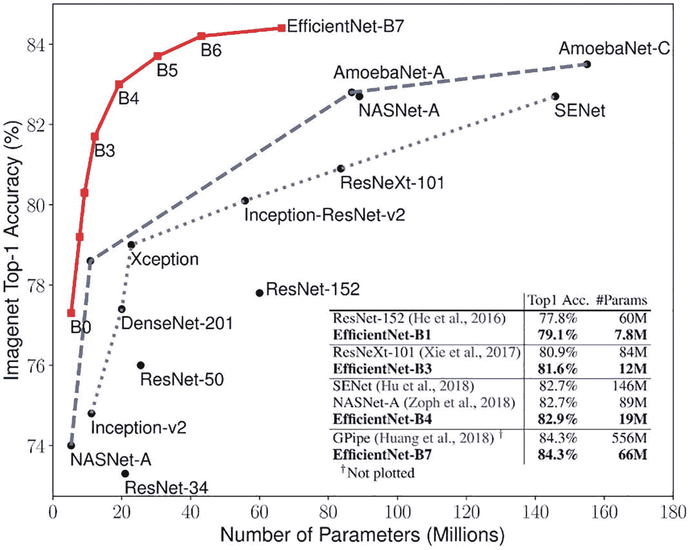

Efficient 和其它 Nets 的折线图显示了随着参数数量（以百万为单位）的增加，ImageNet Top-1 准确率百分比的增加。

图 4-56

不同 EfficientNet 模型与其他重要模型架构在参数数量和 ImageNet Top-1 准确率上的对比图。来自 Tan 和 Le

EfficientNet 模型家族在 Keras 应用中可用，地址为`keras.applications.EfficientNetBx`（将`x`替换为从 0 到 7 的任何数字）。Keras 应用中的 EfficientNet 实现大小从 29 MB（B0）到 256 MB（B7），参数数量从 5,330,571 个（B0）到 66,658,687 个（B7）。请注意，EfficientNet 家族不同成员所需的输入形状不同。EfficientNetB0 期望图像的空间维度为（224,224）；B4 期望（380,380）；B7 期望（600,600）。请注意，这些是输入尺寸的建议——如果您认为有必要，您可以使用 EfficientNetB0 模型处理 600x600 的图像。您可以在 Keras/TensorFlow 应用文档中找到所需输入形状的完整列表。

## 多模态图像和表格模型

在本节中，我们将探讨卷积神经网络在*多模态模型*中的应用，这些模型考虑图像和表格数据以生成预测。“多模态”指的是多种（*multi*）数据形式（*-modal*）。基于图像的多模态模型可以应用于图像与表格/结构化数据集的行相关联的数据集。（在下一章中，我们将看到序列多模态模型的另一种应用，这些模型处理序列——如文本——和表格数据以生成联合信息输出）。

多模态应用特别有趣，因为——至少在原则上——它们在一定程度上反映了人类感知世界的方式。我们不是仅基于单一输入模态做出判断或决策，而是考虑多种数据输入类型并将它们结合起来，以形成更稳健和更全面的信息结论。换句话说，我们不是独立处理不同的输入模态（例如，视觉、听觉、触觉等），而是联合处理。

这些类型的模型必须是*多头*；也就是说，它们接受多个输入。这些输入中的每一个都是独立处理的，并塑造成“通用神经网络计算形式”（即向量）。图像输入头将使用卷积层（卷积、池化层等）进行处理，并通过展平或全局池化将其转换为向量。标准的表格/向量输入头已经是向量形式，但它可以通过一系列全连接层进一步处理以提取和增强相关特征。一旦所有图像都经过处理并转换为向量形式，我们就可以应用合并技术，如连接、相加或相乘。这具有从所有输入头汇总观察结果的效果。然后，聚合可以通过一系列全连接层处理成输出。这种多模态模型的通用蓝图结构在图 4-57 中进行了可视化。

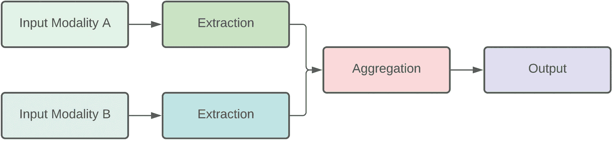

流程图读取：输入模态 A 和输入模态 B；分别提取；聚合；然后输出。

图 4-57

多模态模型的一般结构

在这种网络设计中，不同的数据模态首先独立处理以提取相关特征，并以向量表示形式表达信息；之后，这些表示形式被组合并联合考虑以产生输出。接下来，我们将展示如何构建更高级的网络拓扑结构以捕捉更复杂的知识流。

多模态模型是卷积神经网络技术的强大扩展。

我们将构建一个多模态模型来预测房价，该模型将使用 Kaggle 上的 SoCal 房价和图像数据集，由 Kaggle 用户 ted8080 汇编和维护。6 该数据集包含一个.csv 文件，存储表格数据；每一行代表一栋房屋，包括其街道、所在城市、卧室数量、浴室数量、面积、房价和一个图像标识符。每个图像标识符都与图像目录中的一个图像相关联；对应于图像 ID 为 0 的行的图像标题为“0.jpg”，对应于图像 ID 为 123 的图像标题为“123.jpg”，依此类推（图 4-58）。

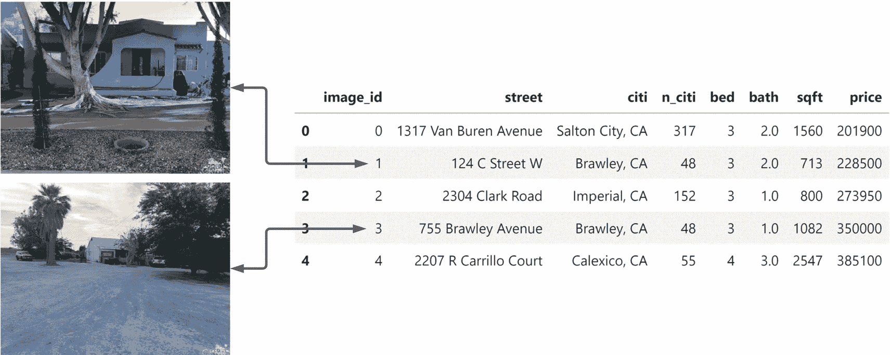

两座独立房屋的照片。一张表格描述了五座不同房屋的图像 ID、街道、城市、城市数量、卧室数量、浴室数量、面积和价格详情。

图 4-58

SoCal 房价数据集的视觉探索

我们将从基线（即表现不佳的方法）开始，展示向更优模型过渡的过程。

在基线方法中，我们可能考虑以下多模态模型排列：将`image_id`列标识的图像输入到图像头部，将`['n_citi', 'bed', 'bath', 'sqft']`列输入到表格头部，并使用`'price'`列作为期望的目标值。

为了管理数据，我们将使用 TensorFlow 序列数据集。请参考第二章，了解 TensorFlow 序列数据集的构建和模型使用的基础信息。简单来说，它允许我们以任何我们喜欢的方式定义数据流——只要我们在模型请求时提供输入和期望的目标值。这为我们提供了很大的灵活性，并使生活变得更加容易：我们不需要追查 TensorFlow 异常或警告，试图将整个数据集提前加载到 TensorFlow 数据集中。这可能会带来轻微的低效（由请求时重新加载数据引起），但在这个案例中，我们将为了易于实现而做出这个决定。

我们的多模态数据集将包含三组内部数据：图像 ID 数组、包含相关特征的 DataFrame 和目标房价数组。我们将存储训练和验证索引，这些索引指示每个内部数据集中哪些索引对应于训练集，哪些对应于验证集。当模型通过执行`.__getitem__(index)`调用请求数据时，我们将执行以下步骤：

1.  确定从训练集中使用的索引批次间隔。

1.  使用所选索引的 ID 加载图像。

1.  从所选索引中获取表格特征。

1.  从所选索引中获取目标。

1.  将图像和表格特征输入捆绑在一起形成一个列表。

1.  返回捆绑的输入和目标。

然后 Keras 模型将读取、处理并利用给定的数据集（图 4-59）。

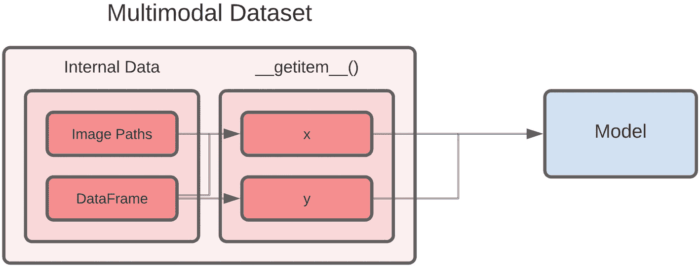

多模态数据集的流程图描述了图像路径和内部数据的数据帧，这些数据帧导致获取项目中的 x 和 y，进而导致模型。

图 4-59

我们 TensorFlow Sequence 多模态数据集的结构

虽然我们使用这个数据集来完成我们的特定多模态房价建模任务，但它可以用于任何有相关图像-表格对用于预测回归或分类输出的数据集。该数据集的一个实现如列表 4-44 所示。

```py
class MultiModalData(tf.keras.utils.Sequence):
def __init__(self,
imageCol, targetCol,
tabularFeatures, oneHotFeatures,
imageDir, csvDir,
batchSize = 8, train_size = 0.8,
targetScale = 1000):
self.batchSize = batchSize
self.imageDir = imageDir
df = pd.read_csv(csvDir)
self.imagePaths = df[imageCol]
self.targetCol = df[targetCol] / targetScale
self.tabular = df.drop([imageCol, targetCol],
axis = 1)[tabularFeatures]
for feature in oneHotFeatures:
self.tabular = self.tabular.join(pd.get_dummies(self.tabular[feature]))
self.tabular.drop(feature, axis=1, inplace=True)
self.dataSize = len(df)
self.trainSize = round(self.dataSize * train_size)
dataIndices = np.array(df.index)
self.trainInd = np.random.choice(dataIndices,
size = self.trainSize)
self.validInd = np.array([i for i in dataIndices if i not in self.trainInd])
def __len__(self):
return self.trainSize // self.batchSize
def __getitem__(self, index):
images, tabulars, y = [], [], []
for i in range(self.batchSize):
currIndex = index * self.batchSize + i
imagePath = f'{self.imageDir}/{self.imagePaths[currIndex]}.jpg'
image = cv2.resize(cv2.imread(imagePath), (400, 400))
tabular = np.array(self.tabular.loc[currIndex])
target = self.targetCol[currIndex]
images.append(image)
tabulars.append(tabular)
y.append(target)
return [np.stack(images), np.stack(tabulars)], np.stack(y)
Listing 4-44
Implementing our custom TensorFlow Sequence dataset to handle multimodal data flows
```

注意，该数据集接受一个参数`target_scale`，该参数确定要除以的常数。我们这样做是为了将输出从单个美元的规模减少到千美元的规模。虽然理论上神经网络可以处理任何规模的输出，但通常回归目标应保持在接近 0 的位置，以便更快地训练，尤其是在缩放过程中不会消除任何关键精度的情况下。我们不期望我们的模型能够精确地模拟房价到美元，因为许多其他因素不受模型输入的影响，它们会影响房屋财产的最终定价。在这种情况下，这种缩放是合理的。

列表 4-45 演示了多模态数据集对象的实例化，它为我们的房价数据集提供了自定义参数。

```py
data = MultiModalData(imageCol = 'image_id',
targetCol = 'price',
tabularFeatures = ['n_citi', 'bed', 'bath', 'sqft'],
oneHotFeatures = ['n_citi'],
imageDir = '../input/house-prices-and-images-socal/socal2/socal_pics',
csvDir = '../input/house-prices-and-images-socal/socal2.csv',)
Listing 4-45
Instantiating the multimodal dataset with relevant information from the dataset
```

为了验证我们已经正确实现了数据馈送过程，我们可以调用`x, y = data.__getitem__(0)`来测试数据馈送模式。回想一下，`x`是一个包含图像和表格输入的两个元素列表；我们有`x[0].shape`为`(8, 400, 400, 3)`和`x[1].shape`为`(8, 418)`。目标形状`y.shape`是`(8,)`。我们的数据集表现如预期。

现在，我们可以设计神经网络。从高层次来看，模型必须有两个头部来接收两种模态——图像和表格——进行独立处理，然后合并并联合处理到一个节点输出，该输出具有修正线性单元输出。

注意

对于回归问题，通常的惯例是使用线性输出激活函数，但在这个特定领域，没有目标值会是负数。因此，使用修正线性单元在功能上是相同的，并且还有额外的优点，即施加一个合理的界限。如果你想的话，你也可以使用具有标准下限*y* = 0 和*y* = *α*的修正线性单元，其中*α*是使用领域知识设置的一些值，代表可能的最大输出。这可以通过定义一个自定义 ReLU 对象来实现：`crelu = lambda x: keras.backend.relu(x, max_value = alpha)`。另一个替代选择是使用乘以*α*的 sigmoid 函数（也许与标准 sigmoid 函数*σ*(*x*)相比，水平拉伸*σ*(*αx*)），这样上限就是*y* = *α*。

注意，表格数据集不包含许多特征——如果将`n_citi`列通过独热编码创建的所有特征视为一个特征，那么只有几十个特征，甚至不到十个。因此，只需要几个具有少量节点的全连接层就足够了。在这个特定的实现中，我们应用了三个具有 16 个节点的密集层。

另一方面，卷积头需要更密集的处理。我们可以构建一个重复的非线性块式设计，其中不同的分支使用不同核大小的卷积处理输入，然后进行合并和池化。由于最大池化减少了空间维度，我们增加了滤波器的数量。经过几次这种简单的非线性拓扑迭代后，我们将输出展平，并使用三个密集层将提取的特征图压缩成一个 16 元素的向量。然后，通过连接将来自图像输入和表格输入的 16 元素向量合并，并进一步处理成一个单节点预测输出。完整的架构在列表 4-46 中实现，并在图 4-60 中可视化。请注意，这个架构遵循图 4-59 中多模态模型的标准组件（参见图 4-59）。

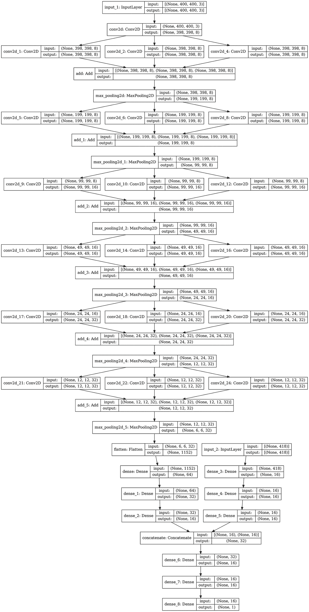

流程图描述了输入层 1、卷积 2D、添加、最大池化 2D、展平、密集和连接操作中的无逗号值。

图 4-60

列表 4-46 中构建的自定义多模态架构的 Keras 可视化

```py
imgInput = L.Input((400, 400, 3))
x = L.Conv2D(8, (3, 3), activation='relu', padding='valid')(imgInput)
for filters in [8, 8, 16, 16, 32, 32]:
x1 = L.Conv2D(filters, (1, 1), activation='relu', padding='same')(x)
x2 = L.Conv2D(filters, (3, 3), activation='relu', padding='same')(x)
x3a = L.Conv2D(filters, (5, 5), activation='relu', padding='same')(x)
x3b = L.Conv2D(filters, (3, 3), activation='relu', padding='same')(x)
add = L.Add()([x1, x2, x3b])
x = L.MaxPooling2D((2, 2))(add)
flatten = L.Flatten()(x)
imgDense1 = L.Dense(64, activation='relu')(flatten)
imgDense2 = L.Dense(32, activation='relu')(imgDense1)
imgOut = L.Dense(16, activation='relu')(imgDense2)
tabularInput = L.Input((418,))
tabDense1 = L.Dense(16, activation='relu')(tabularInput)
tabDense2 = L.Dense(16, activation='relu')(tabDense1)
tabOut = L.Dense(16, activation='relu')(tabDense2)
concat = L.Concatenate()([imgOut, tabOut])
dense1 = L.Dense(16, activation='relu')(concat)
dense2 = L.Dense(16, activation='relu')(dense1)
out = L.Dense(1, activation='relu')(dense2)
model = keras.models.Model(inputs = [imgInput, tabularInput],
outputs = out)
Listing 4-46
Defining a custom two-head architecture to process our multimodal data
```

这个特定的自定义模型有 123,937 个参数——这并不坏。正如预期的那样，这些参数的大部分来自处理高维度的图像输入。我们可以使用标准的超参数编译和拟合模型（列表 4-47，图 4-61）。

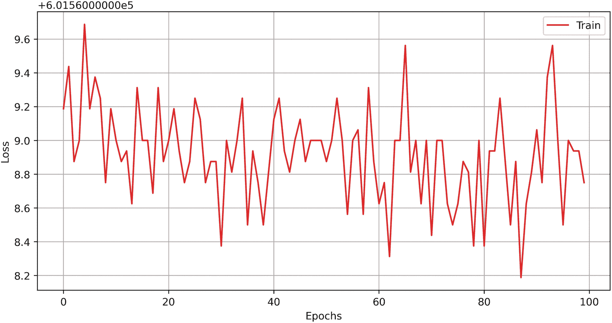

一条线图显示了从 8.2 到 9.6 的损失与从 0 到 100 个 epoch 的关系。训练的线在整个过程中波动很大。

图 4-61

我们第一次多模态建模尝试的训练历史

```py
model.compile(optimizer='adam',
loss='mse',
metrics=['mae'])
history = model.fit(data, epochs = 100)
plt.figure(figsize=(10, 5), dpi=400)
plt.plot(history.history['loss'], color='red', label='Train')
plt.xlabel('Epochs')
plt.ylabel('Loss')
plt.legend()
plt.grid()
plt.show()
Listing 4-47
Compiling and fitting our custom two-head architecture.
```

模型性能非常差。在整个 100 个训练周期中，模型仅略微提高了训练损失，并表现出极其不稳定的行为。这种波动性和没有任何进展是信号，表明我们的模型根本无法解决该问题。

我们可以对我们的模型进行两项改进：

+   *使用更好的图像处理组件*。在本章早期，我们讨论了各种“基础模型”成功架构，这些架构可以通过 Keras 应用或其他平台轻松访问。研究人员投入了巨大的努力来开发一系列成功的模型架构——而不是试图构建自己的，我们可以简单地使用“预构建”的架构。我们将用 EfficientNet 模型替换我们的自定义卷积组件，该模型已被证明是一个在广泛问题领域内普遍稳健、性能高的架构。

+   *明确地构建所需的数据解释*。尽管有理论上的通用逼近属性，但在实践中，神经网络无法成功模拟任何向其投掷的东西。有时，我们可以通过将数据或数据的一部分的解释直接构建到模型或系统的设计中来，来引导模型向正确的方向前进。在这种情况下，我们观察到 `n_citi` 特征包含极其有价值的数据——房子所在的城市可能是房价最可靠的预测因素之一——但标准的独热扩展形式可能不利于有意义地利用这些数据。我们可以使用 *嵌入* 机制来更明确地传达如何解释和利用城市特征数据。

回想一下在第三章节中讨论的嵌入机制。嵌入机制接收一个特定的标记——例如，一个特定的单词或符号——并将其映射到一组学习到的特征或属性。这被处理为一个标准的参数化层（与每个标记关联的特征被优化）（图 4-62）。我们可以使用这个逻辑来反映我们希望神经网络如何解释和利用城市数据：对于每个城市，我们希望嵌入学习一组最优的有用属性。尽管我们不在乎网络如何推导出相关的特征或它们代表什么，但我们确实希望网络以这种方式解释城市特征；使用嵌入机制实现了我们的目标。

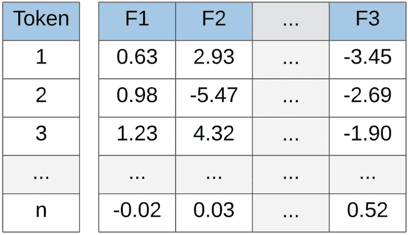

表格展示了标记、F1、F2 和 F3 的值，如下所示。1：0.63，2.93；负值 3.45。2：0.98；负值 5.47；负值 2.69。3：1.23；4.32；负值 1.90。n：负值 0.02；0.03；0.52。

图 4-62

嵌入的可视化。请注意，在 Keras 中实现嵌入时，第一个标记应从 0 开始——如果否则，你可能会收到错误。

让我们从重写数据集类开始，这是我们对建模的第二次尝试。因为我们想使用嵌入来处理房屋所在的具体城市，我们需要*三个头*：一个接受图像输入的图像头，一个接受表格输入的表格头，以及一个接受表示样本城市（即`n_citi`列）的单个整数的嵌入头。因此，我们的数据集需要捆绑三个输入（图 4-63）。

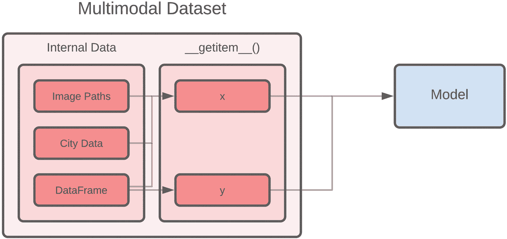

多模态数据集的流程图描述了图像路径、城市数据和内部数据的数据帧，这些数据导致 get item 的 x 和 y，进而导致模型。

图 4-63

我们更新后的多模态数据集结构

修改后的数据集在列表 4-48 中实现。

```py
class MultiModalData(tf.keras.utils.Sequence):
def __init__(self,
imageCol, targetCol,
tabularFeatures, embeddingFeature,
imageDir, csvDir,
batchSize = 8, train_size = 0.8,
targetScale = 1000):
self.batchSize = batchSize
self.imageDir = imageDir
df = pd.read_csv(csvDir)
self.imagePaths = df[imageCol]
self.targetCol = df[targetCol] / targetScale
self.tabular = df.drop([imageCol, targetCol],
axis = 1)[tabularFeatures]
self.onehotData = self.tabular[embeddingFeature]
self.tabular.drop(embeddingFeature, axis=1, inplace=True)
self.dataSize = len(df)
self.trainSize = round(self.dataSize * train_size)
dataIndices = np.array(df.index)
self.trainInd = np.random.choice(dataIndices,
size = self.trainSize)
self.validInd = np.array([i for i in dataIndices if i not in self.trainInd])
def __len__(self):
return self.trainSize // self.batchSize
def __getitem__(self, index):
images, embeddingInps, tabulars, y = [], [], [], []
for i in range(self.batchSize):
currIndex = index * self.batchSize + i
imagePath = f'{self.imageDir}/{self.imagePaths[currIndex]}.jpg'
image = cv2.resize(cv2.imread(imagePath), (400, 400))
embeddingInp = np.array(self.onehotData.loc[currIndex])
tabular = np.array(self.tabular.loc[currIndex])
target = self.targetCol[currIndex]
images.append(image)
embeddingInps.append(embeddingInp)
tabulars.append(tabular)
y.append(target)
return [np.stack(images), np.stack(embeddingInps), np.stack(tabulars)], np.stack(y)
Listing 4-48
Implementing an updated TensorFlow Sequence dataset to separate the embedding data from the tabular dataset component
```

我们还需要调整我们的模型（列表 4-49）。首先，我们不再构建一个定制的卷积（子）网络来处理图像头，而是可以使用 EfficientNetB1 模型，这是八个系列中第二小的架构。使用功能 API，Keras 中的模型可以像层一样处理；为了“连接”它们与其他层，我们使用语法`after_layer = buildModel(params)(prev_layer)`。其次，我们构建了一个额外的嵌入头，它接受一个表示 415 个城市之一（在这里，415 是“词汇量”）的单个整数，并将其映射到具有八个元素的向量。嵌入的结果与图像和表格输入处理的结果连接起来。然后，结果通过几个密集层传递到一个单节点回归输出。

```py
from keras.applications import EfficientNetB1
imgInput = L.Input((400, 400, 3))
effnet = EfficientNetB1(input_shape = (400, 400, 3),
weights = None,
classes = 16)(imgInput)
imgOut = L.Dense(16, activation='relu')(effnet)
embeddingInput = L.Input((1,))
embedding = L.Embedding(415, 8)(embeddingInput)
reshape = L.Reshape((8,))(embedding)
tabularInput = L.Input((3,))
tabDense1 = L.Dense(4, activation='relu')(tabularInput)
tabDense2 = L.Dense(4, activation='relu')(tabDense1)
tabOut = L.Dense(4, activation='relu')(tabDense2)
concat = L.Concatenate()([imgOut, tabOut, reshape])
dense1 = L.Dense(16, activation='relu')(concat)
dense2 = L.Dense(16, activation='relu')(dense1)
out = L.Dense(1, activation='relu')(dense2)
model = keras.models.Model(inputs = [imgInput, embeddingInput, tabularInput], outputs = out)
Listing 4-49
Defining a novel multimodal architecture, using the EfficientNetB1 model architecture to process the image component
```

我们的三头模型在图 4-64 中进行了可视化。

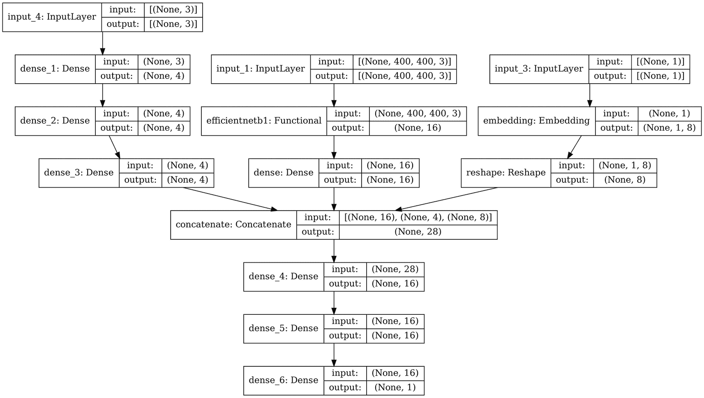

输入层、密集层、EfficientNetB1、嵌入、重塑和拼接的输入和输出中的无逗号值的流程图。

图 4-64

Keras 对我们重新设计的三头网络的视觉表示

此模型有 6,538,081 个可训练参数，其中大多数参数来自 EfficientNetB1 模型。当在更新的数据集（图 4-65）上训练此更新后的模型时，我们获得了显著改进的性能。经过近 60 个 epoch 的训练后，模型收敛到均方误差 83584 和均方绝对误差 192 – 比先前模型的性能有显著改进。回想一下，我们的目标是千美元单位，这意味着模型在房价估计上平均偏离 192k。虽然这当然不是令人难以置信的性能，但考虑到这个多模态模型中没有包含的许多其他房价因素，这是可以理解的。

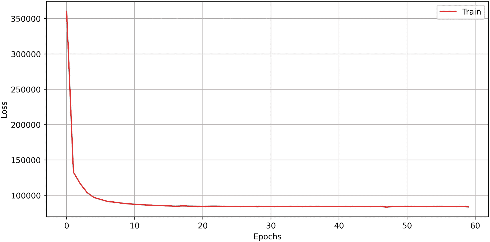

线形图显示了从 100,000 到 350,000 的损失与从 0 到 60 个 epoch 的关系。训练线的损失最初从 350,000 下降到 100,000，然后保持在约 70,000。

图 4-65

更新后的三头模型的训练性能

如果我们将 EfficientNetB1 模型替换为更大、更强大的 EfficientNetB3 模型（列表 4-50），我们可以获得更好的性能（图 4-66）。扩展模型有 10,725,225 个参数，收敛到 38739.26 MSE 和 124.4208 MAE。

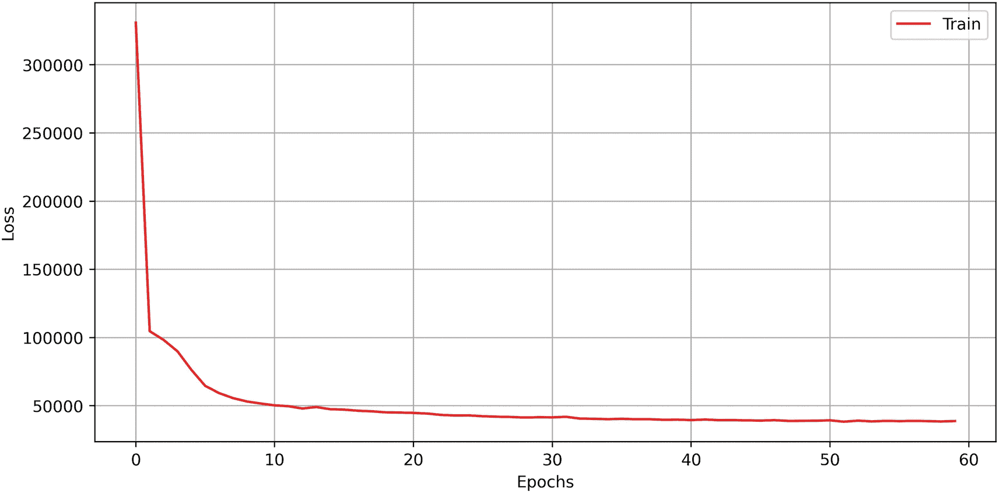

线形图从 50,000 到 300,000 显示损失，与从 0 到 60 的时期数进行比较。训练线的损失最初从 300,000 下降到 50,000，然后保持在约 30,000。

图 4-66

使用 EfficientNetB3 而不是 EfficientNetB1 训练的三头模型的历史记录

```py
imgInput = L.Input((400, 400, 3))
effnet = EfficientNetB3(input_shape = (400, 400, 3),
weights = None,
classes = 16)(imgInput)
imgOut = L.Dense(16, activation='relu')(effnet)
embeddingInput = L.Input((1,))
embedding = L.Embedding(415, 8)(embeddingInput)
reshape = L.Reshape((8,))(embedding)
tabularInput = L.Input((3,))
tabDense1 = L.Dense(4, activation='relu')(tabularInput)
tabDense2 = L.Dense(4, activation='relu')(tabDense1)
tabOut = L.Dense(4, activation='relu')(tabDense2)
concat = L.Concatenate()([imgOut, tabOut, reshape])
dense1 = L.Dense(16, activation='relu')(concat)
dense2 = L.Dense(16, activation='relu')(dense1)
out = L.Dense(1, activation='relu')(dense2)
model = keras.models.Model(inputs = [imgInput, embeddingInput, tabularInput],
outputs = out)
Listing 4-50
Defining a novel multimodal architecture, using the EfficientNetB3 model architecture to process the image component
```

尽管如此，系统改进还有很多领域，例如优化精确的非线性架构、输入维度、图像处理架构（例如尝试 NASNet、ResNet 或另一种设计）、训练元参数等。这个模型的改进留给你作为一个开放练习。

## 表格数据的一维卷积

我们已经做了很多工作来设置卷积神经网络在图像数据上的使用，无论是纯图像数据集还是包含图像和相关表格/结构化数据组件的多模态数据集。现在，我们将直接在表格数据集上展示卷积的使用。

卷积在表格数据上的最“自然”应用是**一维卷积**。图像有两个空间维度（忽略深度/颜色通道），因此我们可以对它们应用二维卷积。另一方面，标准表格数据只有一个“空间维度”，因此我们可以应用一维卷积。

一维卷积按照与二维卷积相同的逻辑操作，只是使用一维核在轴上滑动，而不是二维核在两个空间轴上滑动。

考虑一个假设的长度为 3 的核 *k*：

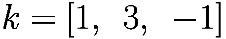

我们将尝试将 *k* 应用到“单行数据”或一维矩阵/向量 *i*：

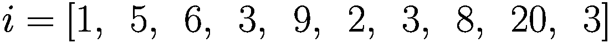

特征 *i* 包含十个特征；我们可以拟合 *特征大小* - *核大小* + 1 = 10 - 3 + 1 = 8 个卷积，这意味着结果卷积特征 *R* 包含八个元素：

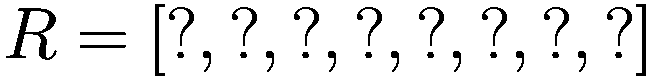

要确定矩阵 *R* 的第一个元素的值，我们将卷积核 *k* 应用到特征 *i*（粗体）上的第一个连续值集：


将核应用于这三个元素得到输出 1·1+3·5+（-1）·6=1+15-6=10。因此，*R*的第一个值是 10：

![$$ R=\left[10,?,?,?,?,?,?,?\right] $$](../images/525591_1_En_4_Chapter/525591_1_En_4_Chapter_TeX_Equaf.png)

我们可以通过将相同的核应用于特征上的第二组连续值来找到*R*的第二个值（加粗）：

![$$ i=\left[1,\kern0.5em 5,\kern0.5em 6,\kern0.5em 3,\kern0.5em 9,\kern0.5em 2,\kern0.5em 3,\kern0.5em 8,\kern0.5em 20,\kern0.5em 3\right] $$](../images/525591_1_En_4_Chapter/525591_1_En_4_Chapter_TeX_Equag.png)

这得到 1·5+3·6+（-1）·3=5+18-3=20。因此，*R*的第二个值是 20：

![$$ R=\left[10,20,?,?,?,?,?,?\right] $$](../images/525591_1_En_4_Chapter/525591_1_En_4_Chapter_TeX_Equah.png)

通过继续此程序，可以填充卷积矩阵的其余部分。一维卷积与二维卷积具有类似的作用：它们可以作为“滤波器”，根据核值放大或减弱数据中某些属性或特征的存在。

神经网络可以学习一维卷积神经网络在特定任务中的最佳核值。

为了演示这一点，让我们考虑一个序列建模任务：给定从有噪声的函数*f*中按顺序采样的点[*f*(*x*[1]), *f*(*x*[2]), ..., *f*(*x*[*n*])]，其中*x*[*n*]−*x*[*n*−1]=*x*[*n*−1]−*x*[*n*−2]（即函数的输入是等间距的），一维卷积神经网络必须将*f*分类为线性、二次或周期函数。

列表 4-51 生成了这样一个数据集，给定`numElements`（*n*的值，决定从*f*中采样多少个点）和`numTriSamples`（为三个类别中的每个样本生成的次数）。`baseRange`代表集合*x*；它从-5 到 5 均匀分布，有`numElements`个元素。每次我们生成线性、二次或周期函数时，我们选择随机参数（例如，周期函数*a sin sin*（*bx*−*c*）+*d*中的{*a*, *b*, *c*, *d*}）。均匀随机分布的极限已被选择，使得函数通常占据相同的矩形区域，这样函数的类别理想情况下不能通过其高度来预测。

```py
numElements = 400
numTriSamples = 2000
x, y = [], []
baseRange = np.linspace(-5, 5, numElements)
for i in range(numTriSamples):
# get random linear sample
slope = np.random.uniform(-3, 3)
intercept = np.random.uniform(-10, 10)
x.append(baseRange * slope + intercept)
y.append(0)
# get random quadratic sample
a = np.random.choice([np.random.uniform(0.2, 1),
np.random.uniform(-0.2, -1)])
b = np.random.uniform(-1, 1)
c = np.random.uniform(-1, 1)
x.append(a * baseRange**2 + b * baseRange + c)
y.append(1)
# get random sinusoidal sample
a = np.random.uniform(1, 10)
b = np.random.uniform(1, 3)
c = np.random.uniform(-np.pi, np.pi)
d = np.random.uniform(-20, 20)
x.append(a * np.sin(b * baseRange - c) + d)
y.append(2)
x = np.array(x)
x += np.random.normal(loc = 0, scale = 1,
size = x.shape)
y = np.array(y)
Listing 4-51
Generating our custom function identification synthetic dataset
```

此外，请注意我们添加随机噪声以使问题更有趣。在这种情况下，我们将均值为 0、标准差为 1 的正态分布噪声添加到`x`上。

为了评估真实模型性能，我们需要将数据集分为训练集和验证集（列表 4-52）。

```py
import sklearn
from sklearn.model_selection import train_test_split as tts
X_train, X_val, y_train, y_val = tts(x, y, train_size = 0.8)
Listing 4-52
Splitting the dataset into training and validation sets
```

图 4-67 显示了每个类别的三个样本。虽然存在适度噪声，但每个函数的整体轨迹仍然可以清楚地识别。

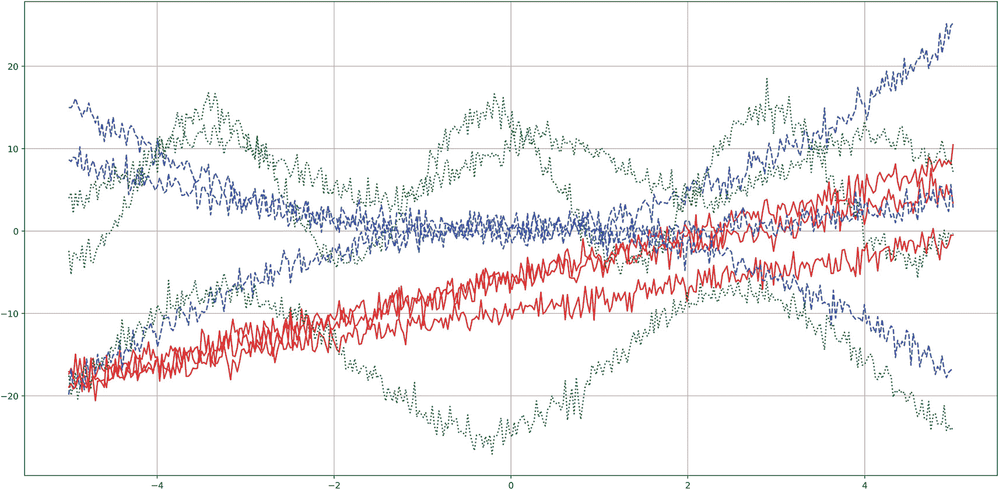

多行图在 x 轴上绘制从-4 到 4，在 y 轴上绘制从-20 到 20。三对波浪线描绘了增加、减少或波动。

图 4-67

我们的自定义数据集中每个类别的三个采样函数——线性、二次和周期性

我们可以构建一个简单的模型，该模型使用一维卷积和一维池化层来处理输入（见列表 4-53）。在 Keras 中，一维卷积通过`L.Conv1D(...)`实例化。请注意，虽然输入是一个形状为(*a*)的单个向量，但我们需要将其重塑为形状(*a*, 1)以应用一维卷积，这与形状为(*a*, *b*)的灰度图像需要重塑为形状(*a*, *b*, 1)以使用二维卷积的原因相同。经过三次卷积-卷积-池化块的迭代后，输入被展平回一个空间维度，并通过两个额外的全连接层处理，输出形状为 3（这样每个类别都与一个概率相关联）。因为这是一个多类问题，所有输出概率的总和应该为 1，所以我们使用 softmax 激活输出。

```py
model = Sequential()
model.add(L.Input(numElements))
model.add(L.Reshape((numElements, 1)))
for i in range(3):
model.add(L.Conv1D(8, 3, padding='same',
activation='relu'))
model.add(L.Conv1D(8, 3, padding='same',
activation='relu'))
model.add(L.MaxPooling1D(2))
model.add(L.Flatten())
model.add(L.Dense(16, activation='relu'))
model.add(L.Dense(3, activation='softmax'))
Listing 4-53
Constructing a 1D CNN model architecture for our function identification synthetic dataset
```

我们可以使用标准的元参数编译和训练模型（见列表 4-54 和图 4-68）。

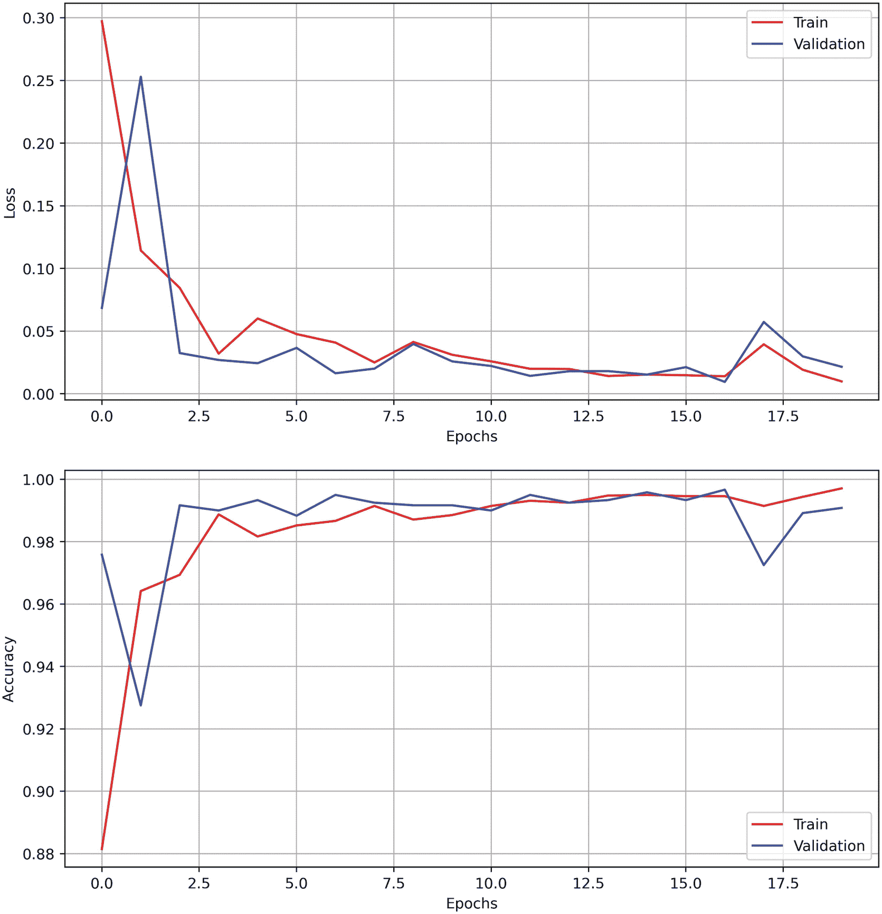

双行图绘制损失和准确率随 epoch 的变化。训练和验证损失急剧下降，准确率略有上升。

图 4-68

1D CNN 模型在函数识别任务上的损失和准确率

```py
model.compile(loss='sparse_categorical_crossentropy',
optimizer='adam',
metrics=['accuracy'])
history = model.fit(X_train, y_train,
epochs = 20,
validation_data = (X_val, y_val))
plt.figure(figsize=(10, 5), dpi=400)
plt.plot(history.history['loss'], color='red', label='Train')
plt.plot(history.history['val_loss'], color='blue', label='Validation')
plt.xlabel('Epochs')
plt.ylabel('Loss')
plt.legend()
plt.grid()
plt.show()
plt.figure(figsize=(10, 5), dpi=400)
plt.plot(history.history['accuracy'], color='red', label='Train')
plt.plot(history.history['val_accuracy'], color='blue', label='Validation')
plt.xlabel('Epochs')
plt.ylabel('Accuracy')
plt.legend()
plt.grid()
plt.show()
Listing 4-54
Compiling, training, and plotting performance history
```

模型很快就能获得良好的性能：0.0098 的训练损失，0.9971 的训练准确率，0.0215 的验证损失，和 0.9908 的验证准确率。现在，让我们通过将噪声的标准差从 1 增加到 2 来使问题更难。现在，数据集看起来如下（见图 4-69）。

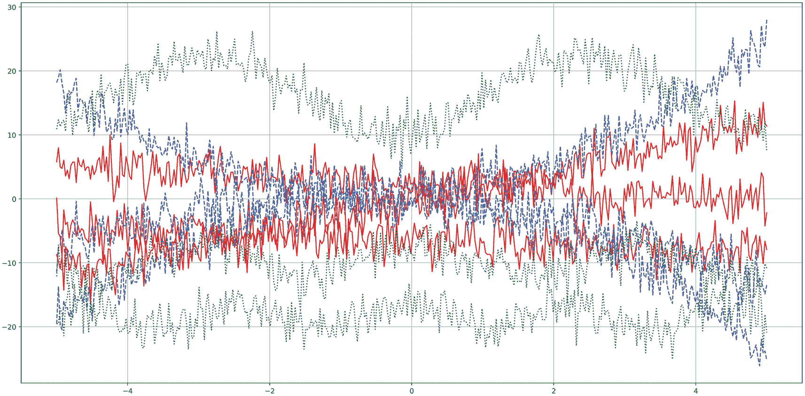

多行图在 x 轴上绘制从-4 到 4，在 y 轴上绘制从-20 到 20。三对波浪线描绘了增加、减少或波动。

图 4-69

我们的自定义数据集中每个类别的三个采样函数，噪声标准差增加到 2

经过两个 epoch 后，模型达到了 0.0140 的验证损失和 0.9958 的验证准确率——功能上等同于（实际上略优于）从标准差为 1 的分布中抽取噪声的数据集上的性能。

让我们进一步增加噪声，标准差达到 3（见图 4-70）。神经网络获得了 0.0934 的验证损失和 0.9717 的验证准确率，性能相对显著下降——但仍然不错。

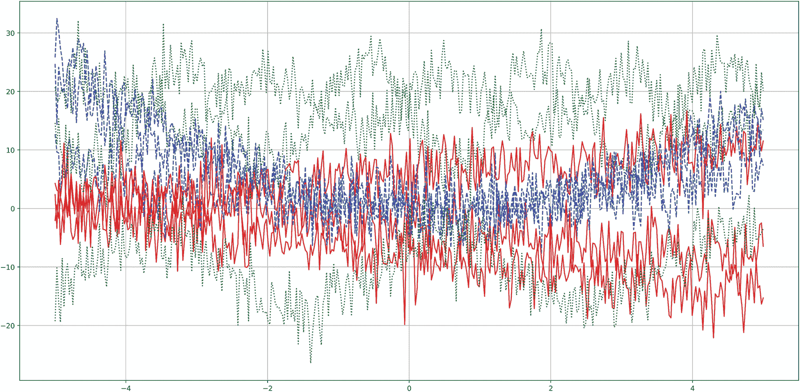

一个多行图在 x 轴上从-4 到 4，在 y 轴上从-20 到 20。三对波浪线描绘了增加、减少或波动。

图 4-70

从我们自定义数据集的每个类别中采样了三个函数，噪声标准差增加了 3

当我们将噪声标准差增加到 10 时，数据集变得相当难以分离（见图 4-71）——但模型仍然表现相当不错（见图 4-72），验证损失为 0.2230，验证准确率为 0.9300。

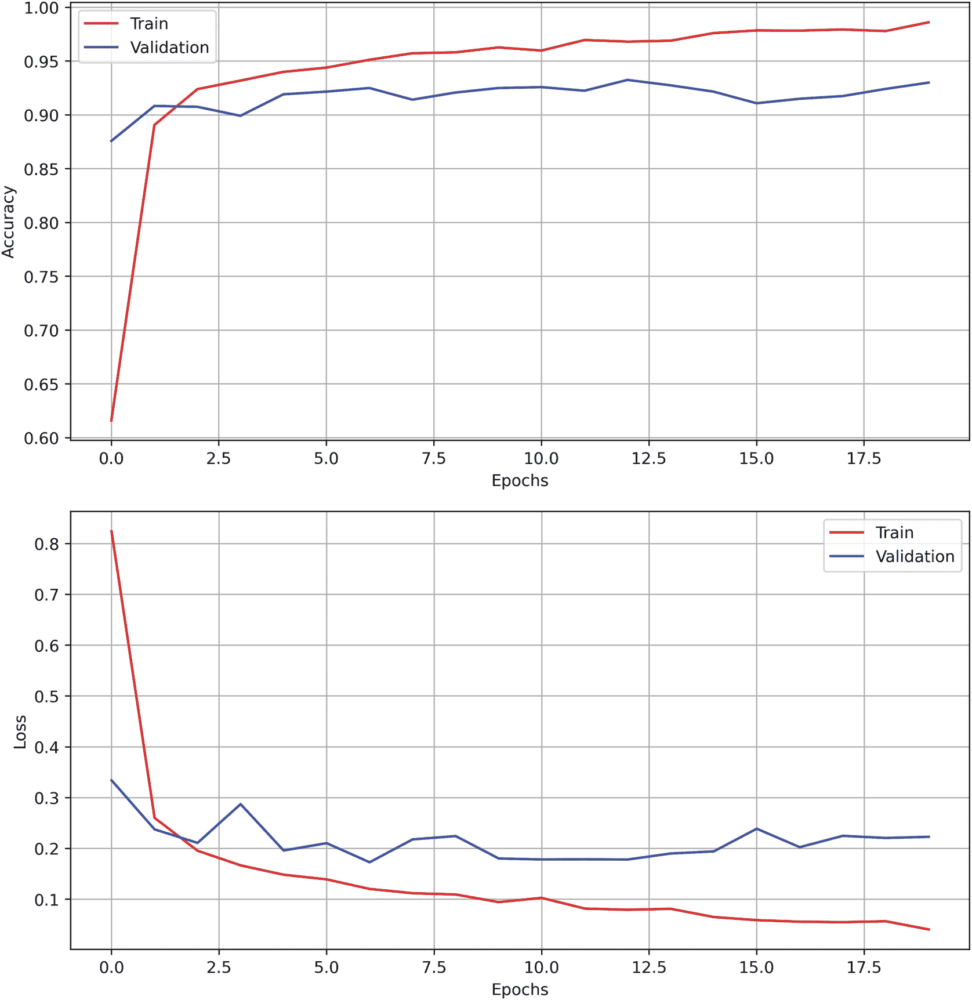

双行图显示了准确率和损失与历元的关系。训练和验证在准确率上都有显著和轻微的增加，而在损失上则相似地减少。

图 4-72

在函数识别合成数据集的噪声版本上，1D CNN 的准确率和验证性能

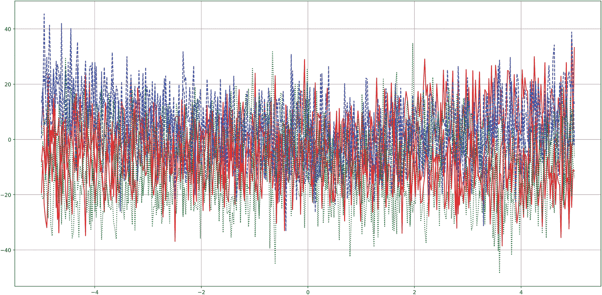

一个多行图在 x 轴上从-4 到 4，在 y 轴上从-40 到 20。三对线条描绘了重叠的高频波。

图 4-71

从我们自定义数据集的每个类别中采样了三个函数，噪声标准差增加了 10

这些实验的主要思想是这样的：我们能够使用一个简单的神经网络构建一个稳健且强大的信号处理模型，该神经网络由一维卷积和池化操作组成。为了进一步提高网络建模能力，你可以添加更复杂的卷积结构，如残差连接和其他拓扑非线性。

注意，你可以使用一维卷积来处理像音频信号或时间序列这样的数据，它们以原始或自然的形式存在。例如，考虑使用一维卷积进行说话人分割——在时间序列的某个时刻分类哪个说话人在说话。我们可以通过使用一维卷积处理输入信号，将其“展平”成一个向量，并使用密集层将学习到的特征形成输出向量（这与二维 CNN 非常相似的模式）。如果你有一个与表格数据关联的信号数据集，你可以构建多模态模型，如前节所述，但使用一维卷积头而不是二维卷积头。（我们将在下一章中看到一个将卷积应用于模型音频信号的例子，除了循环层之外。）

然而，我们直接将一维卷积神经网络应用于**表格数据**不太可能取得成功。我们的示例任务以及一维 CNN 的自然应用，如音频和时间序列，都包含一个基本属性：它们沿着一个序列轴是有序的。也就是说，存在一个明确的*x*[*i*]和*x*[*i* + 1]之间的关系。表格数据集通常包含相互独立的特征，这些特征在顺序上并不相互关联。没有理由认为某一列必须“在”另一列“之前”、“之后”或“旁边”——这些关系概念不适用于表格数据。

我们可以给这个属性起个名字：**连续语义**。**连续**意味着“相邻”或“相邻的”（例如，一个连续的内存块），而**语义**指的是由符号或句法表示所暗示的“含义”或“概念”。如果一个特征或数据集具有连续语义，那么直接在数据集上应用一维卷积是有意义的（图 4-73）。

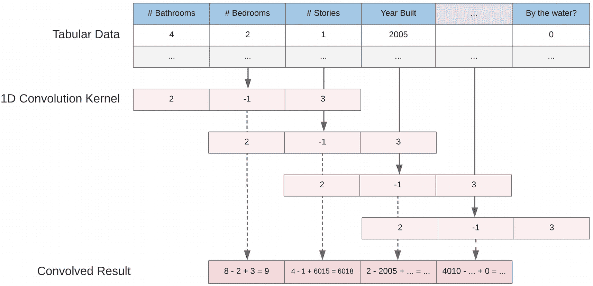

表格数据、1D 卷积核和卷积结果的流程图，包括浴室数量、卧室数量、楼层数、建造年份和靠近水域。

图 4-73

将需要连续语义的操作（例如卷积）应用于不具有连续语义的数据集的示例演示，以及我们尝试这样做时得到的奇特结果

我们可以尝试使用一个巧妙的技巧来解决这个问题：**软排序**。尽管每个样本*x*包含无序的列，但我们可以想象存在一个包含与*x*相同信息的**有序表示*q*；也就是说，它“重新排列”和“塑造”了原始无序特征的语义（信息内容，含义），使其成为一个连续的语义。这并不一定难以相信：在机器学习中，我们经常将数据空间变形和重塑，以具有新的属性（例如，不同的距离、不同的维度、不同的模态、不同的统计属性），同时保留它们的“信息内容”。

我们难以想象或设计一个从*x*到*q*的转换，但如果*q*存在——我们认为是存在的——那么*x* → *q*的映射也应该存在。我们可以让一个神经网络，已被证明是理论上的“通用函数逼近器”，通过提取和重新排列我们的表格数据，以一个有序序列的形式，最优地读取一维卷积（图 4-74），来学习这个映射。

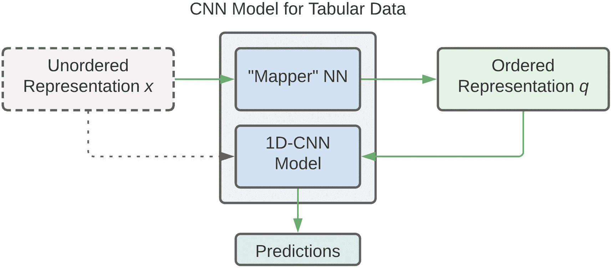

表格数据的 CNN 模型描述了一个无序表示*x*、有序表示*q*、映射器 NN 和 1D CNN 模型，这些模型导致预测。

图 4-74

使用软排序将 1D CNN 应用于表格数据的蓝图

一种简单的方法是在卷积之前引入一个全连接组件，或称为*编码组件*。希望全连接组件能够从原始输入数据*x*学习到最优排序表示*q*，然后由网络的其他部分进一步以卷积方式处理。

因此，在实践中，“映射 NN”和 1D CNN 模型可以合并成一个单一的神经网络过程，其中映射组件的输出直接馈入 1D CNN 模型的输入。

这个概念起源于一个 Kaggle 比赛，由用户“tmp”在哈佛实验室创新科学机制动作预测竞赛的第二名解决方案中使用这种方法而流行起来。正如 tmp 在一个论坛帖子^(7)中概述他们的解决方案时写道

+   在表格数据中使用这种结构基于以下想法：[a] CNN 结构在特征提取方面表现良好，但由于正确的特征排序未知，它很少在表格数据中使用。一个简单的想法是将数据直接重塑为多通道图像格式，并通过使用 FC 层通过反向传播来学习正确的排序。

让我们拿我们之前用于函数分类任务的架构，并稍作修改以包括一个软排序组件（见清单 4-55）。这样一个组件的简单例子就是一系列密集层。

```py
model = Sequential()
model.add(L.Input(numElements))
model.add(L.Dense(numElements, activation='relu'))
model.add(L.Dense(numElements, activation='relu'))
model.add(L.Dense(numElements, activation='relu'))
model.add(L.Reshape((numElements, 1)))
for i in range(5):
model.add(L.Conv1D(8, 3, padding='same',
activation='relu'))
model.add(L.Conv1D(8, 3, padding='same',
activation='relu'))
model.add(L.MaxPooling1D(2))
model.add(L.Flatten())
model.add(L.Dense(16, activation='relu'))
model.add(L.Dense(3, activation='softmax'))
Listing 4-55
Defining a 1D CNN model with a fully connected soft ordering component
```

让我们在一个样本表格数据集上应用这个方法。加州大学欧文分校的 Forest Cover 数据集——这是加州大学欧文分校数据仓库中许多已建立的基准数据集之一——包含了罗斯福国家公园几个地区的树木观测数据。这个数据集包含了几十个特征和超过五十万次的测量，使其成为应用神经网络的好数据集。

下面的表格显示了数据集的特征。目标是根据测量值预测区域的覆盖类型：

```py
['Elevation', 'Aspect', 'Slope', 'Horizontal_Distance_To_Hydrology',
'Vertical_Distance_To_Hydrology', 'Horizontal_Distance_To_Roadways',
'Hillshade_9am', 'Hillshade_Noon', 'Hillshade_3pm',
'Horizontal_Distance_To_Fire_Points', 'Wilderness_Area1', ... ,
'Wilderness_Area4',
'Soil_Type1', 'Soil_Type2', ... 'Soil_Type39', 'Soil_Type40',
'Cover_Type'])
```

当我们将之前讨论的架构应用于这个数据集，并通过自定义输入节点数量以匹配数据集中的特征数量时，我们得到了以下模型（见清单 4-56）。

```py
Model: "sequential"
_________________________________________________________________
Layer (type)                 Output Shape              Param #
=================================================================
dense (Dense)                (None, 108)               5940
_________________________________________________________________
dense_1 (Dense)              (None, 864)               94176
_________________________________________________________________
reshape (Reshape)            (None, 54, 16)            0
_________________________________________________________________
conv1d (Conv1D)              (None, 54, 16)            784
_________________________________________________________________
conv1d_1 (Conv1D)            (None, 54, 16)            784
_________________________________________________________________
average_pooling1d (AveragePo (None, 27, 16)            0
_________________________________________________________________
conv1d_2 (Conv1D)            (None, 27, 16)            784
_________________________________________________________________
conv1d_3 (Conv1D)            (None, 27, 16)            784
_________________________________________________________________
average_pooling1d_1 (Average (None, 13, 16)            0
_________________________________________________________________
conv1d_4 (Conv1D)            (None, 13, 16)            784
_________________________________________________________________
conv1d_5 (Conv1D)            (None, 13, 16)            784
_________________________________________________________________
average_pooling1d_2 (Average (None, 6, 16)             0
_________________________________________________________________
conv1d_6 (Conv1D)            (None, 6, 16)             784
_________________________________________________________________
conv1d_7 (Conv1D)            (None, 6, 16)             784
_________________________________________________________________
average_pooling1d_3 (Average (None, 3, 16)             0
_________________________________________________________________
conv1d_8 (Conv1D)            (None, 3, 16)             784
_________________________________________________________________
conv1d_9 (Conv1D)            (None, 3, 16)             784
_________________________________________________________________
average_pooling1d_4 (Average (None, 1, 16)             0
_________________________________________________________________
flatten (Flatten)            (None, 16)                0
_________________________________________________________________
dense_2 (Dense)              (None, 16)                272
_________________________________________________________________
dense_3 (Dense)              (None, 16)                272
_________________________________________________________________
dense_4 (Dense)              (None, 7)                 119
=================================================================
Total params: 108,619
Trainable params: 108,619
Non-trainable params: 0
_________________________________________________________________
Listing 4-56
Layers and parameter summary of a 1D soft ordering CNN
```

该模型可以使用标准元参数在数据集上训练（该数据集已加载到`X_train`和`y_train`数据集中）（见清单 4-57）。

```py
model.compile(optimizer='adam',
loss='sparse_categorical_crossentropy',
metrics=['accuracy'])
history = model.fit(X_train, y_train, epochs=100,
validation_data = (X_val, y_val),
batch_size = 256)
Listing 4-57
Compiling and fitting
```

模型收敛到一个略低于 0.2 的训练损失，并获得了 0.90 的验证准确率（见图 4-75）。

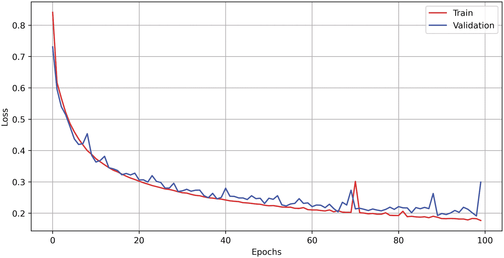

一条线图显示了从 0.2 到 0.8 的损失与从 0 到 100 个 epoch 的关系。训练和验证的线条从 0.8 下降到大约 0.2。

图 4-75

初始软排序 1D CNN 模型在 Forest Cover 数据集上的性能历史

虽然这个性能是合理的，但并不出色——我们可以非常容易地通过纯全连接网络或传统的机器学习应用获得相当或更高的性能。我们可以尝试构建一个更复杂的神经网络结构（在列表 4-58 中实现）。关键架构组件如下：

+   *软排序扩展*：与之前架构中仅将一个向量转换为另一个向量不同，我们在软排序组件中开发多个“向量特征图”。这可以被视为图像中深度通道的数量。

+   *非线性卷积单元*：在合并和池化之前，应用了三个不同核大小的差异分支到输入。

+   *使用 SELU 激活函数*：我们允许使用替代的 SELU 激活函数，而不是使用标准的 ReLU 激活函数。回想一下第三章中讨论的 SELU 函数。

```py
numElements = len(data.columns) - 1
inp = L.Input(numElements)
d1 = L.Dense(numElements*4, activation='selu')(inp)
d2 = L.Dense(numElements*8, activation='selu')(d1)
d3 = L.Dense(numElements*16, activation='selu')(d2)
x = L.Reshape((numElements, 16))(d3)
for i in [16, 8, 4]:
x1a = L.Conv1D(i, 3, padding='same', activation='selu')(x)
x1b = L.Conv1D(i, 3, padding='same', activation='selu')(x1a)
x2a = L.Conv1D(i, 5, padding='same', activation='selu')(x)
x2b = L.Conv1D(i, 3, padding='same', activation='selu')(x2a)
x3 = L.Conv1D(i, 2, padding='same', activation='selu')(x)
add = L.Add()([x1b, x2b, x3])
x = L.AveragePooling1D(2)(add)
x = L.Conv1D(i, 3, padding='same', activation='selu')(x)
flatten = L.Flatten()(x)
d3 = L.Dense(16, activation='selu')(flatten)
d4 = L.Dense(16, activation='selu')(d3)
out = L.Dense(7, activation='softmax')(d4)
model = keras.models.Model(inputs = inp, outputs = out)
Listing 4-58
Designing a more powerful/sophisticated soft ordering 1D CNN
```

此模型使用了 487,879 个参数（图 4-76）。

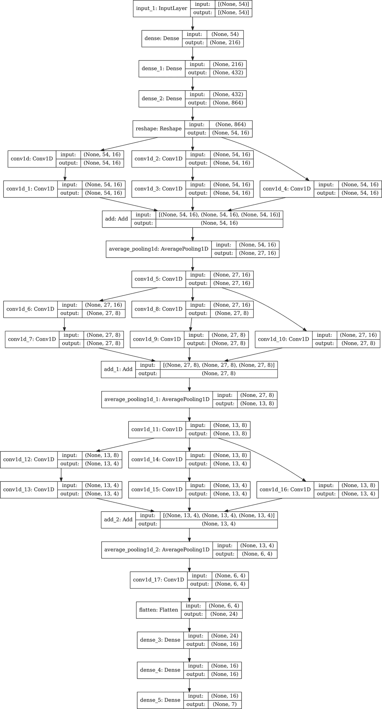

输入层输入 1 的输入和输出中的 None comma 值流程图，包括 dense、reshape、conv 1 d、add、average pooling 1 d 和 flatten。

图 4-76

Keras 对我们更新的软排序 1D CNN 架构的可视化

这种改进的架构表现更佳，在数据集上获得了近 96% 的验证准确率——考虑到只有两次架构尝试和相对简单的训练技术，这是一个非常好的结果（图 4-77）。

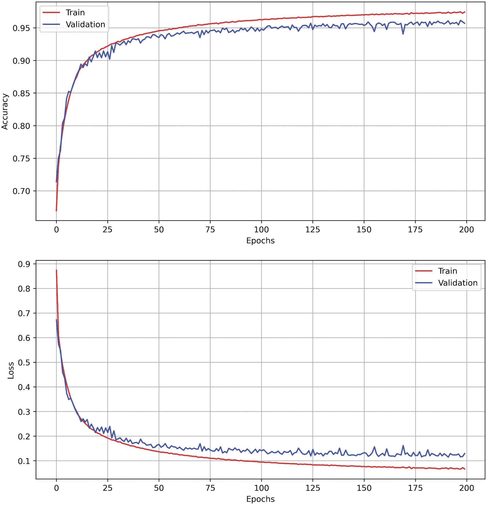

双线图绘制了准确率和损失与训练轮数的关系。训练和验证的线条显示准确率急剧增加，损失相似地减少。

图 4-77

我们更新的软排序 1D CNN 设计在 Forest Cover 数据集上的性能历史（准确率和损失）

在几个方面，你可以尝试改进模型。你可能注意到数据集中有两个可以经过“多模态图像和表格模型”部分中讨论的多头嵌入方法处理的 one-hot 编码列。在该方法中，每个可能的唯一值都与一组学习的嵌入/特征相关联。另一个研究方向是探索更复杂的训练过程，如学习率调整和选择另一个优化器。尝试架构的具体大小或规模也可能是有益的。最后一个研究方向可以使用元优化来实现，这在第六章关于高级神经网络方法中进行了讨论。

关于一维卷积神经网络应用的进一步阅读，请参阅 Minsoo Yeo 等人于 2018 年发表的“基于流的恶意软件检测使用卷积神经网络”^(8)，他们将一维 CNN 直接应用于网络安全领域的表格数据，以及 Kaggle 用户 tmp 的论坛帖子^(9)，该帖子讨论了哈佛大学创新科学实验室的机制预测竞赛的第二名解决方案，该方案除了 TabNet 模型^(10) 和传统 DNN 外，还使用了一维 CNN。在整个集成中，1D CNN 被赋予了最高的权重（输出中的 65%）。

## 表格数据的二维卷积

在上一节中，我们看到了一维卷积对于某种类型的数据是有意义的——具有顺序或有序特征的数据，即——以及神经网络如何被用来学习卷积以及从无序到有序数据的映射（即满足卷积的先决条件）。

使用类似的逻辑，我们可以确定可行地应用二维卷积的数据先决条件：输入必须具有形状(*width*, *height*, *depth*)，像素必须彼此具有空间关系。如果这个后者的要求没有得到满足，那么应用卷积就没有意义。卷积将邻近的像素组合在一起，因此标准二维卷积的任何输入都应该以某种方式排列，使得值之间存在空间关系。

就像我们*可以*直接将无序的表格数据集传递给一系列一维卷积一样，我们*可以*将重塑为形式(*width*, *height*, *depth*)的无序表格数据集传递给一系列二维卷积：

![$$ \left[a,b,c,d,e,f,g,h,i\right]\to \left[a\ b\ c\ d\ e\ f\ g\ h\ i\ \right] $$](../images/525591_1_En_4_Chapter/525591_1_En_4_Chapter_TeX_Equai.png)

然而，这并不奏效，因为这个原始数据集并不满足二维卷积的数据先决条件：没有连续的语义；相同的数据可以重新排列/表达为完全不同的顺序，如下所示：

![$$ \left[a,b,c,d,e,f,g,h,i\right]\to \left[b\ g\ a\ d\ h\ e\ c\ f\ i\ \right] $$](../images/525591_1_En_4_Chapter/525591_1_En_4_Chapter_TeX_Equaj.png)

这种连续组织的不确定性表明，数据在其原始形式中不具有连续的语义。

然而，我们可以*想象*，对于每个原始的表格输入*x*，都存在一个包含相同信息但具有关键属性*连续语义*的图像表示*p*——也就是说，每个数据点（像素）以某种方式与空间邻近的数据点（相邻像素）相关。正如之前所断言的，如果*x*和*p*都存在，那么就必须存在某种映射*x* → *p*，我们可以要求神经网络发现并近似。

存在许多成功且复杂的卷积神经网络架构，它们以图像形式接受输入。其中一些在本章中已讨论过，如 Inception 和 EfficientNet。当我们获得另一个可以学习关键映射 *x* → *p* 的神经“子网络”时，我们可以在“图像表示” *p* 上直接训练 CNN 架构（图 4-78）。

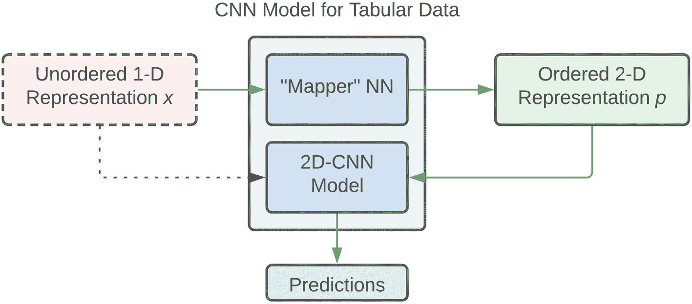

表格数据的 CNN 模型描述了一个无序的 1-D 表示 x、有序的 2-D 表示 p、映射器 NN 和 2D-CNN 模型，最终用于预测。

图 4-78

使用“mapper”从无序 1D 表示到有序 2D 表示应用标准二维 CNN 于表格数据的蓝图

与上一节类似，我们可以通过简单地堆叠几个全连接层来使用“vanilla soft ordering”，将生成的向量重塑成图像形式，然后将形成的图像传递给标准的卷积神经网络（代码列表 4-59）。

```py
inp = L.Input((q,))
x = L.Dense(A, activation='relu')(inp)
x = L.Dense(B, activation='relu')(x)
...
x = L.Dense(X, activation='relu')(x)
x = EfficientNetB0(params, classes=n)(x)
model = keras.models.Model(inputs = inp, outputs = x)
Listing 4-59
Boilerplate code to use standard soft ordering for two-dimensional convolutional components
```

然而，在许多情况下，学习从无序表示 *x* 到有序表示 *p* 的关键映射可能很困难，尤其是当 *p* 是二维的时候（尽管通常很容易设置，因此值得一试）。这项任务可能过于复杂，无法使用“vanilla”软排序方法有效地学习。在这些情况下，使用从 *x* → *p* 的人类引导机器学习映射可能更成功——即，在人类构建的管道/框架中使用机器学习技术（如主成分分析）进行映射，但不使用通用的全连接层来近似映射。

我们将介绍两篇提出类似新颖方法将表格数据转换为图像以应用于传统卷积神经网络的论文：DeepInsight 和 IGTD（表格数据图像生成）。这些并不是该领域唯一的成果；对于更多阅读材料，请参考以下作品作为示例：

+   Bazgir, O., Zhang, R., Dhruba, S.R., Rahman, R., Ghosh, S., & Pal, R. (2020). Representation of features as images with neighborhood dependencies for compatibility with convolutional neural networks. *《自然通讯》第 11 卷*.

+   Ma, S., & Zhang, Z. (2018). OmicsMapNet: Transforming omics data to take advantage of Deep Convolutional Neural Network for discovery. *《ArXiv》abs/1804.05283*.

此外，值得注意的是，该领域的工作几乎总是应用于医学、生物学或物理学问题，因为卷积仅在同质尺度、标准化的特征上才有意义——例如数百个基因特征。这并不一定阻止其在其他上下文中的应用，但请注意，此类应用可能需要在卷积之前人工插入重新排序组件（如几个密集层）以帮助支持自动转换为所述每像素同质性。

### DeepInsight

Alok Sharma、Edwin Vans、Daichi Schigemizu、Keith A. Boroevich 和 Tatsuhiko Tsunoda 在 2019 年的论文“DeepInsight：一种将非图像数据转换为卷积神经网络架构图像的方法”中描述了这样的*x* → *p*映射^(11)。DeepInsight 方法是一个将结构化/表格数据（这并不一定排除序列或基于文本的数据，只要它是以结构化数据格式呈现的）转换为图像形式数据的管道，这种数据可以用于训练标准的卷积神经网络。

DeepInsight 的第一步是获取一个特征矩阵，用于将结构化数据中的单个特征映射到相应图像中的空间坐标。这个特征密度矩阵被用作“模板”，以生成每个向量的单个图像。每个特征都与“模板”矩阵中的一个像素相关联。这本质上是在学习结构化数据集中特征的最佳“坐标”对应关系。

考虑以下将九个特征最优转换为 4×4 模板矩阵的示例。此方案将产生 4×4“图像”：

![$$ \left[a\ b\ c\ d\ e\ f\ g\ h\ i\ \right]\to \left[a--c\kern0.5em b\ h-e\kern0.5em d\ e-f\kern0.5em i\ g--\kern0.5em \right] $$](../images/525591_1_En_4_Chapter/525591_1_En_4_Chapter_TeX_Equak.png)

这种关联是通过一种巧妙的方法实现的，即通过数据转置并使用核 PCA 或 t 分布随机邻域嵌入（t-SNE）等方法进行降维（回忆第二章）。传统上，在包含*n*个样本和*d*个特征的样本集中，降维到两个空间维度会产生一个包含*n*个样本和两个特征的样本集。然而，如果我们对这样一个数据集的转置应用降维——也就是说，我们将每个*d*个特征视为一个样本，每个*n*个样本视为一个特征——这将产生一个包含*d*个样本和两个特征的降维数据集。因此，每个*d*个特征都被映射到“模板”矩阵中的二维点上。

使用像核 PCA 和 t-SNE 这样的保持局部关系的变换方法，我们可以将行为相似的特征映射到特征矩阵中物理上更近的位置（图 4-79）。这使得生成的图像中的相似特征可以通过卷积更有效地处理。

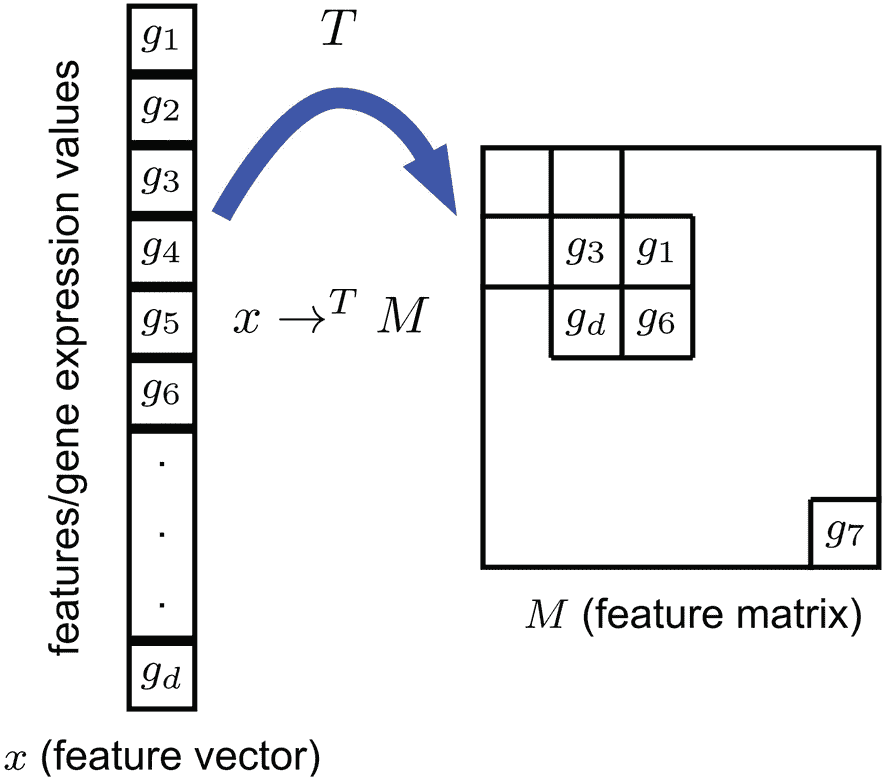

一个将具有 g1 到 g-d 特征或基因表达值的 x 特征向量转换为 g3、g1、g-d、g6 和 g7 的 M 特征矩阵的转换图像。

图 4-79

使用 DeepInsight 方法将表格数据集中的特征映射到有序 2D 表示（模板矩阵）中的像素坐标的可视化。来自 Sharma 等人。

一旦建立了“模板”特征矩阵，我们就可以通过在图像中为该特定特征分配的位置建立点来为输入向量创建一个图像（见图 4-80）。（你可以从这个图中观察到 DeepInsight 是为高维数据设计的；需要大量的特征来填充图像，因为图像中的每个点都是一个特征。）为了防止图像表示中的冗余，使用了凸包算法来选择包含所有数据的最小矩形，裁剪掉不必要的空白边缘。数据相应地旋转，并将空间映射到基于像素的图像格式，然后可以通过标准的卷积神经网络传递。

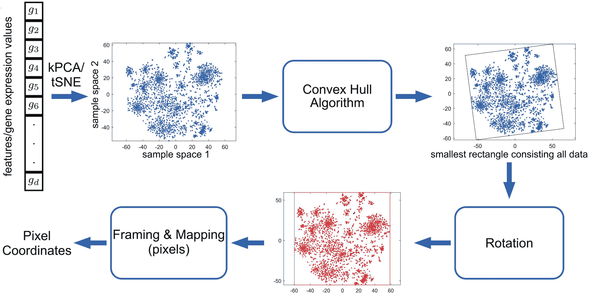

流程图说明：特征或基因表达值 g1 到 g-d；样本空间的散点图；凸包算法；包含所有数据的最大矩形散点图；旋转；像素坐标中的框架和映射。

图 4-80

DeepInsight 管道：将向量映射到像素坐标。来自 DeepInsight 论文（见脚注#2）。来自 Sharma 等人。

结果显示，DeepInsight 管道在遗传数据集上表现良好，这些数据集是模型最初设计的，并且在其他高维数据环境中也表现良好。Sharma 等人对五个基准数据集进行了方法评估：RNA-seq，来自 NIH TCGA 数据集的生物 RNA 序列数据集；TIMIT 语料库的子集，一个语音数据集；Relathe 数据集，来自新闻文档；Madelon 数据集，这是一个合成的二元分类问题；以及 ringnorm-DELVE，另一个合成的二元分类问题。这五个数据集代表了一系列的问题环境和数据空间；DeepInsight 方法的表现优于其他已成为建模结构化/表格数据集成功标准方法的算法（表 4-4）。见图 4-81 以了解 DeepInsight 如何在这些数据集中生成有意义的可视化表示。

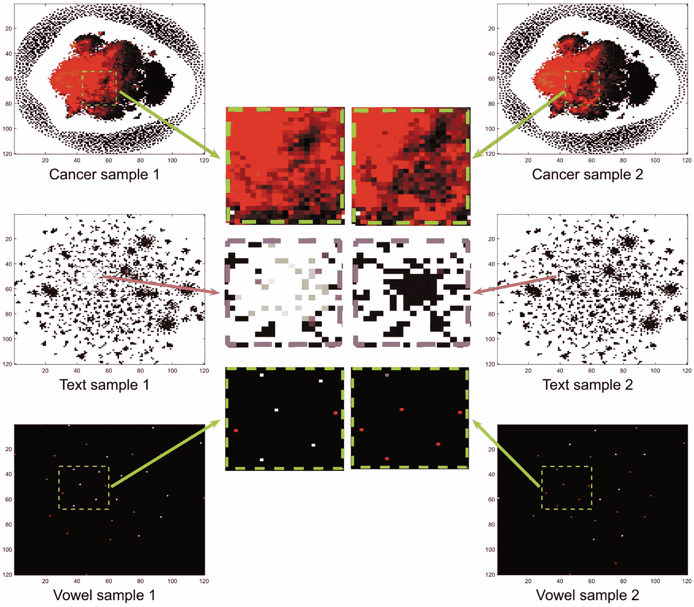

图像比较了癌症样本 1 和 2、文本样本 1 和 2 以及元音样本 1 和 2 的散点图映射和过滤的结果。

图 4-81

DeepInsight 映射的图像模式可视化。癌症、文本和元音数据集样本之间的差异显示在中间列的小块中。这些差异通过卷积滤波器提取，以实现比另一种方法更有效的分类。来自 Sharma 等人。

表 4-4

DeepInsight 与其他常见结构化数据方法的性能对比，使用各种数据集。来自 Sharma 等人。

| 数据集 | 决策树 | AdaBoost | 随机森林 | DeepInsight |
| --- | --- | --- | --- | --- |
| RNA-seq | 85% | 84% | 96% | 99% |
| Vowels | 75% | 45% | 90% | 97% |
| Text | 87% | 85% | 90% | 92% |
| Madelon | 65% | 60% | 62% | 88% |
| Ringnorm-DELVE | 90% | 93% | 94% | 98% |

我们可以反思 DeepInsight 的关键优势：

+   CNNs（在理论上以及在实践中通常）不需要任何额外的特征提取技术，这些技术通常用于结构化数据。它们通过一系列卷积和池化自动从原始输入数据中推导出高级且信息丰富的特征，无需预处理。用于处理图像的模型的非线性架构有助于开发高级且丰富的表示。

+   卷积在局部子区域内处理图像数据。这允许网络具有更大的深度，同时参数量相对较小，这促进了网络的健康理解和泛化。如果使用全连接网络，这种性能会更难实现，因为增加模型的深度以增强建模能力会导致参数的快速增加，从而增加过拟合的风险，而基于结构化数据训练的神经网络尤其容易过拟合。

+   CNN 的独特结构允许它在利用最近的硬件进步（如 GPU 利用）的情况下非常高效地运行。

+   CNNs 和 DeepInsight 管道在可定制性和可优化性方面比传统的基于树的算法（这些算法在建模结构化数据方面传统上取得了成功）要强得多。除了调整模型架构、向量到模板矩阵映射和学习率等超参数之外，还可以轻松使用图像增强方法来生成“新”图像数据。这种数据增强在表格数据中难以实现，因为与图像相比，其表示空间的低维性不包含固有的鲁棒性；也就是说，旋转图像不应影响其代表的现象，而改变结构化数据可能会。

在实践中，DeepInsight 应该是其他决策模型集合中的一个贡献成员。将 DeepInsight 的局部特性与其他建模方法的更全局方法相结合，可能会产生一个更明智的预测集合。

Sharma 等人提供了预包装的代码，用于在 Python 中使用 DeepInsight，该代码可以从 GitHub 仓库（列表 4-60）中安装。

```py
!python3 -m pip -q install git+https://github.com/alok-ai-lab/pyDeepInsight.git#egg=pyDeepInsight
Listing 4-60
Installing code provided by Sharma et al. for DeepInsight. At the time of this book’s writing, the authors of pyDeepInsight are making active changes that make this installation command erroneous. If you encounter errors, check the GitHub repository for the most up-to-date information on installation
```

我们将使用的数据集是来自臭名昭著的加州大学欧文分校机器学习库的“小鼠蛋白质表达数据集”，这是一个包含 1080 个实例和 80 个特征的分类数据集，用于模拟受到情境恐惧条件刺激的小鼠大脑皮层中 77 种蛋白质的表达。该数据集的清洗版本可在本书的源代码中下载。

假设数据已作为 Pandas DataFrame 载入变量 `data`，第一步是将数据分为训练集和测试集，这是机器学习中的标准程序（列表 4-61）。我们还需要将标签转换为 one-hot 格式，在它们的原始组织结构中是表示类别的整数。这可以通过使用 `keras.util` 的 `to_categorical` 函数轻松完成。

```py
import pandas as pd
# download csv from online source files
data = pd.read_csv('mouse-protein-expression.csv')
from sklearn.model_selection import train_test_split
X_train, X_test, y_train, y_test = train_test_split(data.drop('class',axis=1),
data['class'],
train_size=0.8)
y_train = keras.utils.to_categorical(y_train)
y_test = keras.utils.to_categorical(y_test)
Listing 4-61
Selecting a subset of data and converting to one-hot form as necessary
```

我们需要使用 DeepInsight 库中的 `LogScaler` 对象来使用 L2 范数将数据缩放到 0 到 1 之间（列表 4-62）。我们转换训练集和测试集，仅在训练集上拟合缩放器。所有用于 DeepInsight 模型预测的新数据都应该首先通过这个缩放器。

```py
from pyDeepInsight import LogScaler
ln = LogScaler()
X_train_norm = ln.fit_transform(X_train)
X_test_norm = ln.transform(X_test)
Listing 4-62
Scaling data
```

`ImageTransformer` 对象通过首先通过传递给 `feature_extractor` 的降维方法生成“模板”矩阵来执行图像转换，`feature_extractor` 接受 `'tsne'`、`'pca'` 或 `'kpca'`。此方法用于确定输入向量中特征到 `pixels` 维度图像的映射。我们可以使用核主成分分析（kernel-PCA）降维方法实例化一个 ImageTransformer 来生成 32x32 的图像（`feature_extractor='kpca', pixels=32`）（列表 4-63）。

```py
from pyDeepInsight import ImageTransformer
it = ImageTransformer(feature_extractor='kpca',
pixels=32)
tf_train_x = it.fit_transform(X_train_norm)
tf_test_x = it.transform(X_test_norm)
Listing 4-63
Training and transforming with the ImageTransformer
```

由于数据相对低维和数量较少，我们使用核-PCA 而不是 t-SNE。由于 PCA 的线性限制其捕捉的细微差别，因此没有使用 PCA。选择 32 像素的图像长度是为了在生成的图像过于稀疏（图像长度过高）和过于小（图像长度过低）以有意义和准确地表示特征之间的空间关系之间取得平衡。随着图像大小的减小，DeepInsight 管道中距离的概念——即根据它们的相似性将特征放置得更远或更近作为像素——变得更加近似，以至于变得任意。

我们可以使用 `matplotlib.pyplot.imshow()` 函数轻松可视化 ImageTransformer 生成的图像，以了解降维方法和图像大小如何影响特征排列和成功的可能性（图 4-82）。图像之间的差异微妙，但通过一系列卷积操作识别并放大了区分因素。请注意，32x32 像素的空间允许相似特征进行聚类，并将不太相关的特征在角落处距离得更远。

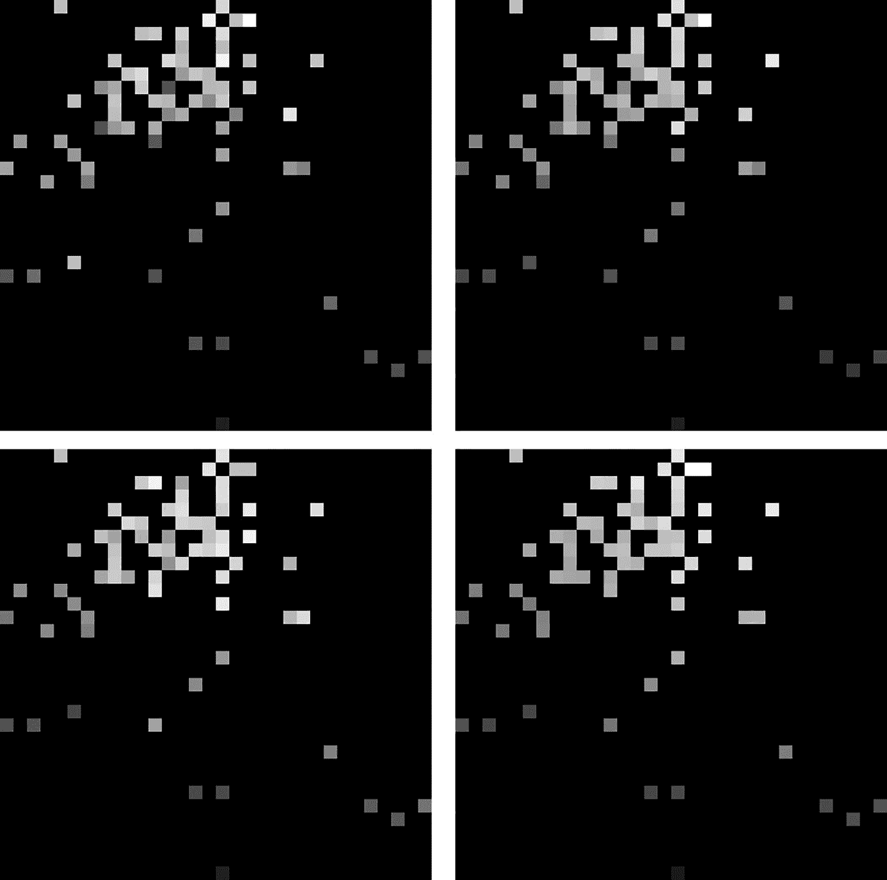

从特定的非图像数据集中获取的具有不同模式的四幅图像。

图 4-82

使用 DeepInsight 方法从我们的 Mice Protein Expression 数据集中生成的四个示例图像

我们将构建一个类似于 DeepInsight 论文中使用的双分支细胞设计的架构，并进行三个关键改进：Inception v3 风格的滤波器分解/扩展、细胞中的 dropout 以及更长的全连接组件（列表 4-64，图 4-83）。这些改进有助于开发具有较小区域的更具体滤波器，以更好地解析密集特征，通过防止过拟合进一步帮助泛化，并更好地处理派生特征。一个分支使用大小为(2,2)的核处理图像，另一个分支使用大小为(5,5)的核（例如，额外的分解，如 5×1 和 1×5）。

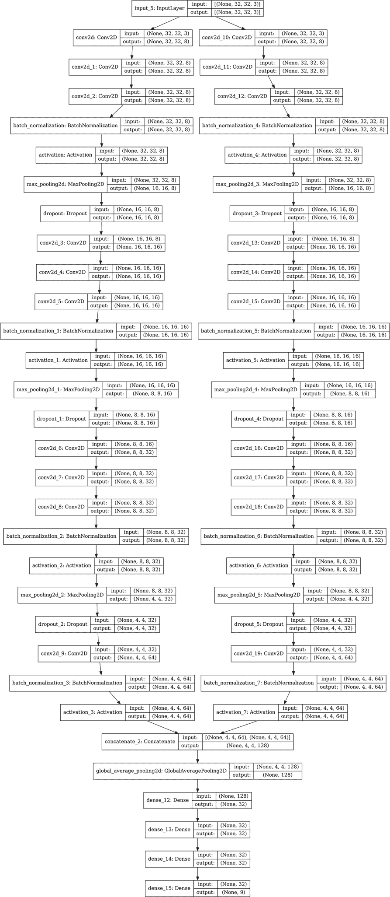

输入层 5 的输入输出中无逗号值的流程图，包括卷积 2D、批量归一化、激活、最大池化、dropout、连接、全局平均池化 2D 和密集层。

图 4-83

DeepInsight 模型架构的可视化

```py
# input
inp = L.Input((32,32,3))
# branch 1
x = inp
for i in range(3):
x = L.Conv2D(2**(i+3), (2,1), padding='same')(x)
x = L.Conv2D(2**(i+3), (1,2), padding='same')(x)
x = L.Conv2D(2**(i+3), (2,2), padding='same')(x)
x = L.BatchNormalization()(x)
x = L.Activation('relu')(x)
x = L.MaxPooling2D((2,2))(x)
x = L.Dropout(0.3)(x)
x = L.Conv2D(64, (2,2), padding='same')(x)
x = L.BatchNormalization()(x)
branch_1 = L.Activation('relu')(x)
# branch 2
x = inp
for i in range(3):
x = L.Conv2D(2**(i+3), (5,1), padding='same')(x)
x = L.Conv2D(2**(i+3), (1,5), padding='same')(x)
x = L.Conv2D(2**(i+3), (5,5), padding='same')(x)
x = L.BatchNormalization()(x)
x = L.Activation('relu')(x)
x = L.MaxPooling2D((2,2))(x)
x = L.Dropout(0.3)(x)
x = L.Conv2D(64, (5,5), padding='same')(x)
x = L.BatchNormalization()(x)
branch_2 = L.Activation('relu')(x)
# concatenate + output
concat = L.Concatenate()([branch_1, branch_2])
global_pool = L.GlobalAveragePooling2D()(concat)
fc1 = L.Dense(32, activation='relu')(global_pool)
fc2 = L.Dense(32, activation='relu')(fc1)
fc3 = L.Dense(32, activation='relu')(fc2)
out = L.Dense(9, activation='softmax')(fc3)
# aggregate into model
model = keras.models.Model(inputs=inp, outputs=out)
Listing 4-64
Sample implemented architecture in Keras
```

当在数据上编译和训练数十个 epoch 后，该模型几乎达到完美的训练准确率和验证准确率（列表 4-65）。

```py
model.compile(optimizer='adam',
loss='categorical_crossentropy',
metrics=['accuracy'])
model.fit(tf_train_x, y_train, epochs=100,
validation_data=(tf_test_x, y_test))
Listing 4-65
Compiling and fitting the model
```

DeepInsight 也可以通过其他方式进行修改。因为 DeepInsight 倾向于产生稀疏映射——也就是说，图像中的大多数像素都是空的，并且没有与特征相关联——最近提出的一种技术显示特别成功，即在生成图像后对其进行模糊处理.^(12) 这可以通过预先计算相邻像素之间的交互/插值来增强定位效果，并有助于将填充像素的“影响”传播到附近的空像素。

DeepInsight 已成功应用于许多其他领域，是成功将*x* → *q* 1D 无序映射到 2D 有序映射的一个例子。

### IGTD（表格数据的图像生成）

由 Yitan Zhu、Thomas Brettin、Fangfang Xia、Alexander Partin、Maulik Shukla、Hyunseung Yoo、Yvonne A. Evrard、James H. Doroshow 和 Rick L.Stevens 在论文“使用卷积神经网络将表格数据转换为图像进行深度学习”中提出，IGTD（表格数据的图像生成）是将标准表格数据转换为图像形式的另一种方法.^(13)。

IGTD 论文是在 DeepInsight 论文之后撰写的。作者认为，IGTD 相对于 DeepInsight 方法的主要优势是降低了稀疏度（即提高了紧凑性）；DeepInsight 生成的图像中留有许多空白像素，可能相对效率较低。

让 *c* 代表数据集中的列数，*X* 代表数据集矩阵。我们的目标是把 *X* 中的每个 *c* 个特征转换成我们将表示为 *I* 的图像，其形状为 *n* × *n*（我们将假设它是正方形以简化，但该方法也推广到矩形图像）。为了确保特征密度，我们希望每个特征都映射到一个像素，每个像素都映射到一个特征 – 没有冗余像素。因此，*n*² = *c*；图像中的像素数等于特征数.^(14)

我们可以生成一个形状为 *c* × *c* 的矩阵，记为 *R*。*R*[*i*, *j*] – 即 *R* 的第 *i* 行和第 *j* 列 – 是数据集 *X* 中第 *i* 个和第 *j* 个特征的欧几里得距离。（也可以使用其他距离度量；关键是测量特征对之间的相似性。）这种结构系统地组织了每对特征之间的相似性。图 4-84 在一个 2,500 个特征 (*c* = 2500) 的基因表达数据集上可视化了这样的矩阵。

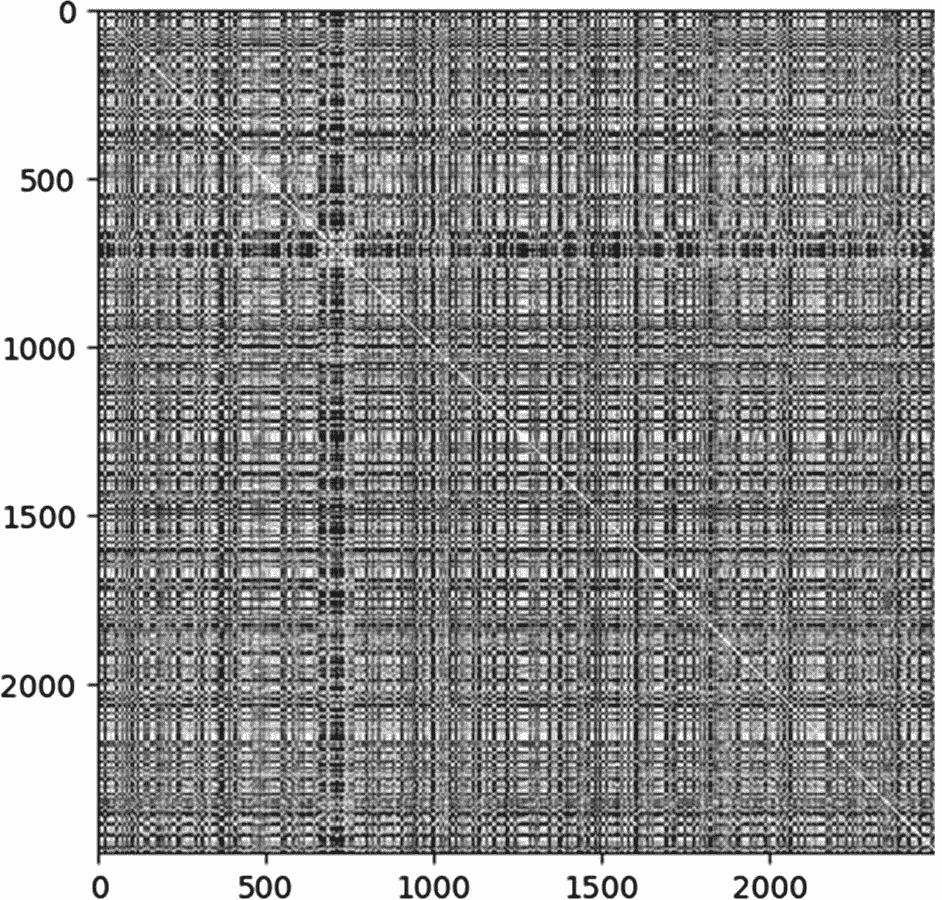

*R* 矩阵的 x 轴和 y 轴从 0 到 2,000。

图 4-84

*R* 矩阵的可视化。来自朱等人。

让 *Q* 也是一个形状为 *c* × *c* 的矩阵。这表示 *I* 中每个像素之间的成对空间距离 – 所有 *n*² = *c* 个像素。像素 (3, 9) 和像素 (6, 13) 之间的距离是 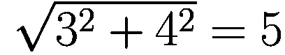。*Q* 的主对角线全为零，因为这表示像素与其自身的距离。

图 4-85 在相同的 2,500 个特征基因表达数据集上展示了这样的矩阵。由于 *n* = 50，我们观察到一种“马赛克”模式，其中小的 50×50 块重复（每个维度重复 50 次），这是由于 *I* 中像素的端到端连接/展平。左下角和右上角最暗，表明第 2,500 个特征（占据位置 (50,50) 的像素）与第 1 个特征（占据位置 (1,1) 的像素）相距最远。

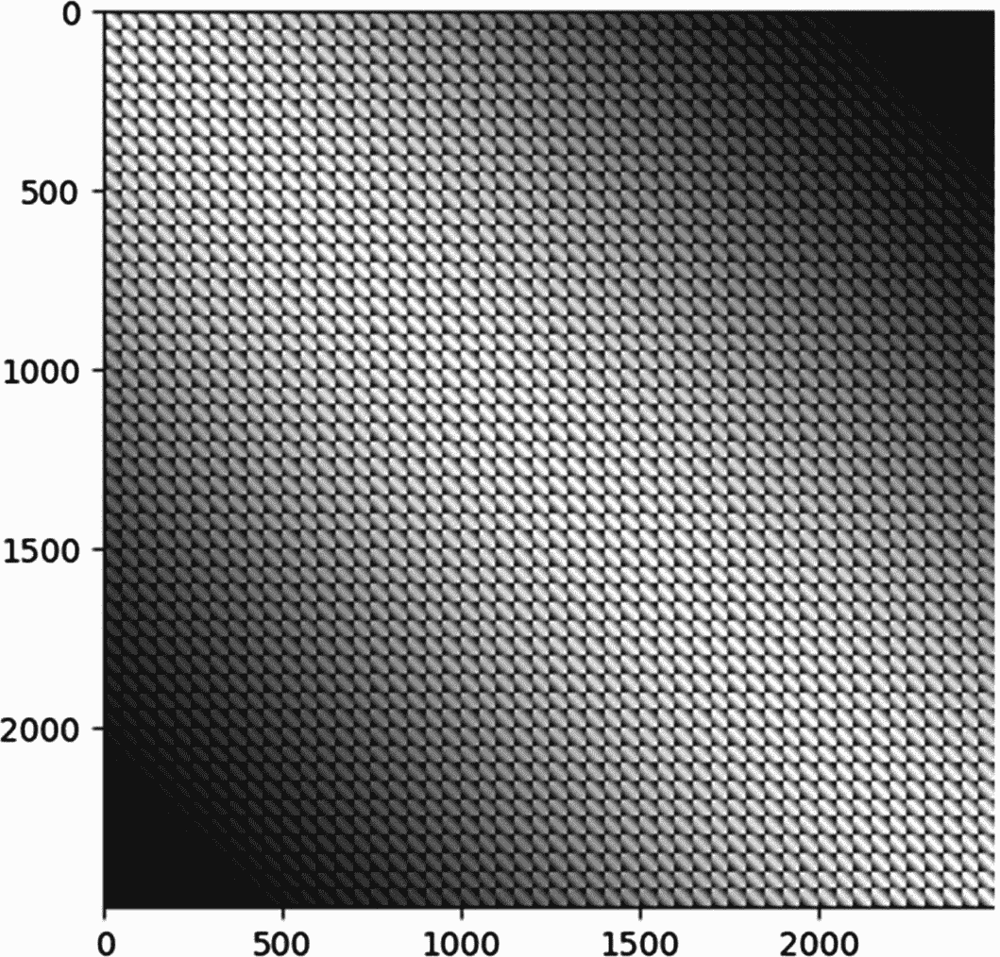

*Q* 矩阵的 x 轴和 y 轴从 0 到 2,000。

图 4-85

*Q* 矩阵的可视化。来自朱等人。

这里是 IGTD 范式中的巧妙之处：我们希望将数据集映射到图像上，所以我们找到了一种方法，直接将包含从数据集中计算出的成对特征距离的 *R* 映射到包含从图像中计算出的成对距离的 *Q*。

为了做到这一点，我们重新排列 *R* 中的列。列的初始排序是任意的，但我们可以将其排列得使得列的成对距离与像素的成对距离相匹配。也就是说，我们*校准列与像素，使得更相似的特征映射到空间上更接近的像素*。

我们通过尝试最小化 *R* 的重新排列与某些距离度量（L1 或 L2）的成对像素差异矩阵 *Q* 之间的误差来引导这个过程。

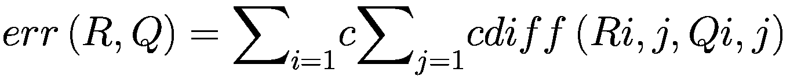

对于实际计算目的，我们只需要计算 *R* 和 *Q* 的左下角 90 度“半三角形”之间的差异，因为这两个矩阵在主对角线上是对称的：

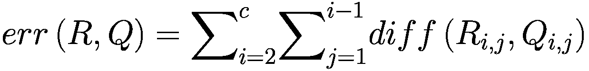

事实上，在将 *R* 的列优化排列以最小化误差函数后，得到的矩阵在视觉上与 *Q*（图 4-86）非常相似。

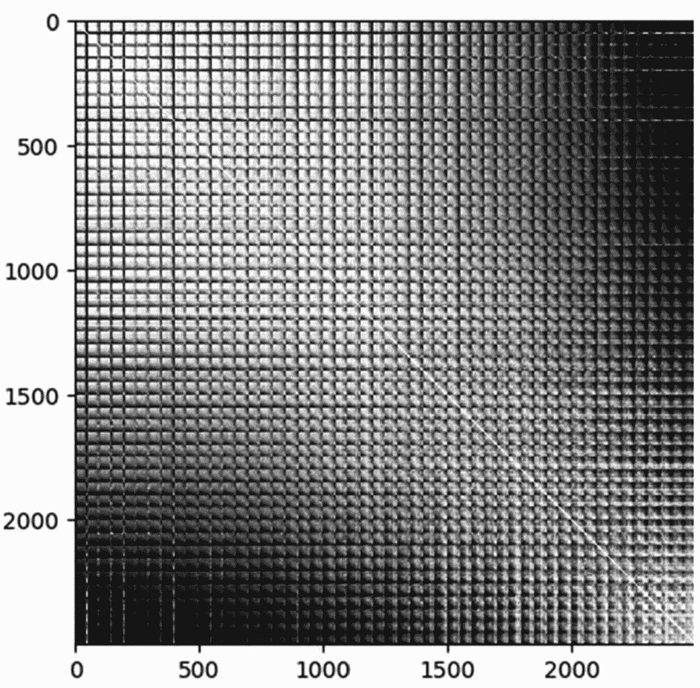

沿 x 和 y 轴从 0 到 2,000 的 Trans positioned R 矩阵。

图 4-86

重新排列后的 *R* 矩阵的可视化。来自 Zhu 等人

注意，这种在 *R* 和 *Q* 之间的校准已经将数据集 *X*（来自 *R*）中的每个特征映射到图像 *I*（来自 *Q*）中的每个像素。

算法运行多次迭代，尝试不同的交换操作以最小化误差。算法的描述将不会在此处描述，但可以在原始论文中查看。

这在高度维度和符号抽象中可能难以理解。让我们通过使用一个包含 9 个特征的样本数据集（图 4-87）来展示这个逻辑。

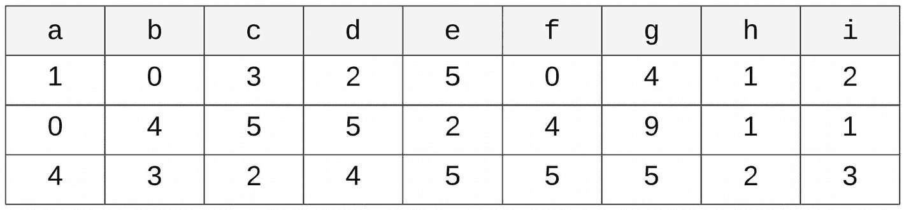

a, b, c, d, e, f, g, h, 和 i 的 3 组值表，如下：1, 0, 3, 2, 5, 0, 4, 1, 和 2。0, 4, 5, 5, 2, 4, 9, 1, 和 1。4, 3, 2, 4, 5, 5, 5, 2, 和 3。

图 4-87

一个样本数据集

如果我们计算这些特征之间的距离，我们得到以下成对距离矩阵 ***Q***（图 4-88）。

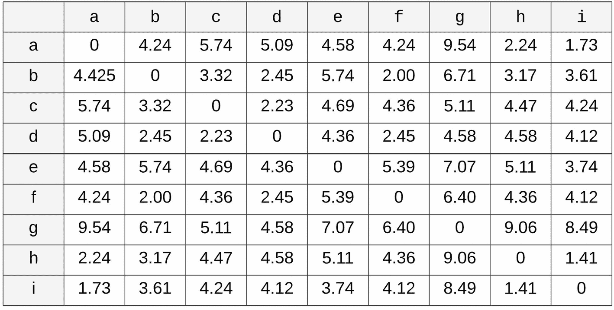

一个由 a, b, c, d, e, f, g, h, 和 i 组成的 9x9 矩阵在主对角线上显示值为 0；其他单元格中的值介于 1 和 10 之间。

图 4-88

使用欧几里得距离计算特征间的成对特征距离矩阵

由于 *c* = 9，我们得到 *n* = 3；我们将有一个 3x3 的图像。我们可以计算每个像素之间的成对像素距离以生成 *R*（图 4-89）。

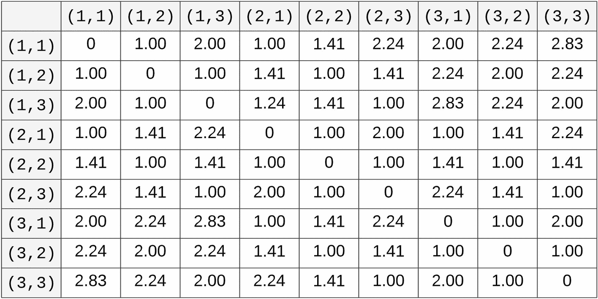

一个由 (1,1), (1,2), (1,3), (2,1), (2,2), (2,3), (3,1), (3,2), 和 (3,3) 组成的 9x9 矩阵在主对角线上显示值为 0；其他单元格中的值介于 1 和 3 之间。

图 4-89

使用欧几里得距离计算像素间的成对特征距离矩阵

现在，我们希望通过反复交换不同的特征并找到最小化两个矩阵之间差异的配置来将 *Q* 映射到 *R*。图 4-90 和 4-91 展示了如何交换特征 `d` 和 `g`。

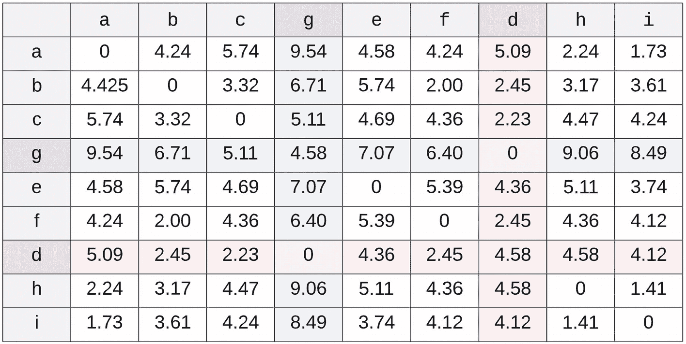

一个从 a 到 i 的 9x9 矩阵在对角线上表示值为 0；其他单元格中的值在 1 到 10 之间。d 和 g 行和列被互换。

图 4-91

要交换的两个特征的输出结果

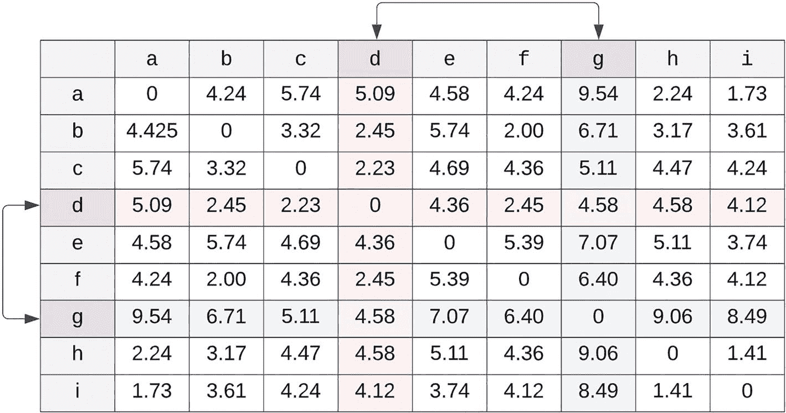

一个从 a 到 i 的 9x9 矩阵在对角线上表示值为 0；其他单元格中的值在 1 到 10 之间。d 和 g 行和列被突出显示。

图 4-90

识别要交换的两个特征

假设我们运行算法后，我们获得了以下修改后的 *Q*（图 4-92）。

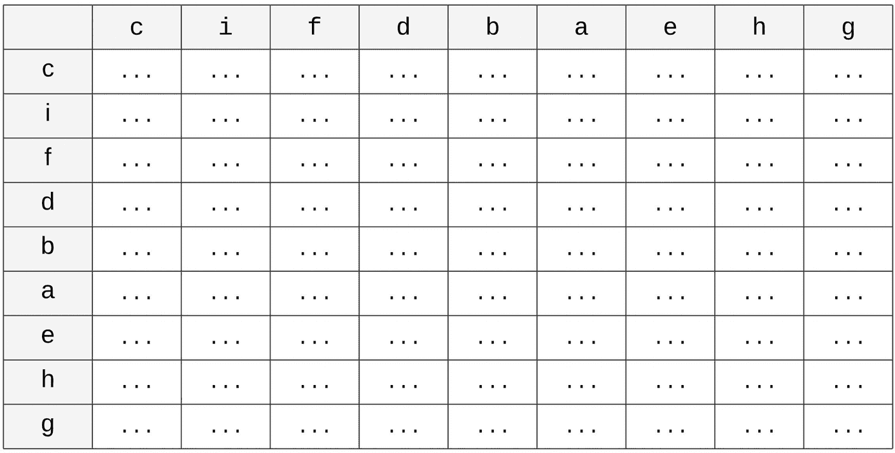

一个由 c, i, f, d, b, a, e, h 和 g 组成的 9x9 矩阵。所有单元格中的值都用省略号表示。

图 4-92

优化交换后的假设结果矩阵

我们可以将每个特征映射到 *R* 中的相应像素：

+   *c* → (1, 1)

+   *i* → (1, 2)

+   *f* → (1, 3)

+   *d* → (2, 1)

+   *b* → (2, 2)

+   *a* → (2, 3)

+   *e* → (3, 1)

+   *h* → (3, 2)

+   *g* → (3, 3)

从这个结果中，我们可以推断出列 *c* 和 *g* 之间非常不同，因为（a）*c* 被映射到像素 (1, 1)，（b）*g* 被映射到像素 (3, 3)，（c）这两个像素之间的距离相对于其他像素内的距离非常大，并且（d）IGTD 算法将高距离（高不相似性）特征放入高距离像素。

图 4-93 展示了使用 IGTD（左）从 2,500 特征的基因组数据集中提取的图像，另一种表格到图像的方法 REFINED^(15）（中间），以及 DeepInsight（右）。请注意，与 DeepInsight 相比，IGTD 生成的图像表示更加紧凑。

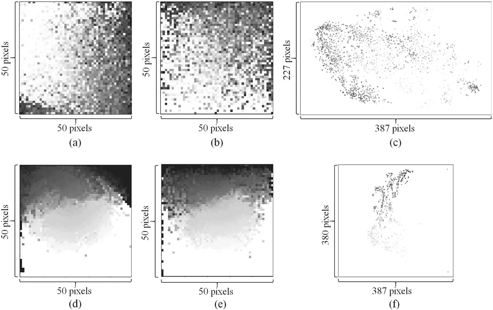

六个不同尺寸的图像（50x50, 50x50, 387x227, 50x50, 50x50, 和 387x380 像素）描绘了变化。

图 4-93

使用不同方法生成的图像样本结果。来自 Zhu 等人

表 4-5 报告了 IGTD 与其他模型和表格到图像生成方法在两个基因组数据集（癌症治疗反应门户 CTRP 和癌症药物敏感性基因组学 GDSC）上的性能。

表 4-5

在两个数据集上与其他方法相比 IGTD 的性能。来自 Zhu 等人

| -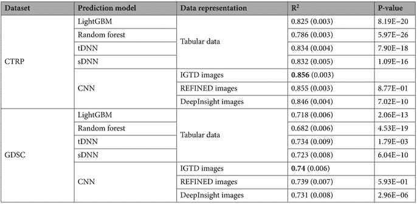一个表格列出了预测模型、数据表示、R 平方和 P 值的详细信息，针对 C T R P 和 G D S C 数据集。 |
| --- |

作者提供了一个软件包以使用 IGTD。可以从论文存储库中的 `IGTD_Functions.py` 文件加载（列表 4-66）。

```py
!wget -O IGTD_Functions.py https://raw.githubusercontent.com/zhuyitan/IGTD/With_CNN_Prediction/Scripts/IGTD_Functions.py
import IGTD_Functions
import importlib
importlib.reload(IGTD_Functions)
Listing 4-66
Loading the IGTD library from GitHub
```

我们需要缩放数据集，使其位于一个常数尺度内，并在特征之间展示同质性（列表 4-67）。在将数据转换为图像的上下文中，只有同质域特征才有意义。

```py
from IGTD_Functions import min_max_transform
norm_data = min_max_transform(data.drop('class', axis=1).values)
Listing 4-67
Scaling the dataset to ensure feature homogeneity
```

要生成图像，指定生成图像的行数和列数（它们的乘积是特征的数量），生成样本图像的宽度（只是样本和信息图；实际数据可以以原始形式收集），IGTD 算法终止前的最大步数，用于确定收敛的验证步数，用于确定特征之间相似性/距离的距离方法，用于计算像素之间距离的距离方法，用于确定 *Q* 和 *R* 之间误差的度量（平方或绝对），以及存储数据结果的目录。

列表 4-68 展示了这样的配置，从 80 个特征的数据库生成 8x10 像素的图像，使用皮尔逊相关系数计算特征距离，使用欧几里得距离计算成对像素差异。

```py
num_row = 8
num_col = 10
num = num_row * num_col
save_image_size = 10
max_step = 10000
val_step = 300
from IGTD_Functions import table_to_image
fea_dist_method = 'Pearson'
image_dist_method = 'Euclidean'
error = 'squared'
result_dir = 'images'
os.makedirs(name=result_dir, exist_ok=True)
table_to_image(norm_data,
[num_row, num_col],
fea_dist_method,
image_dist_method,
save_image_size,
max_step,
val_step,
result_dir,
error)
Listing 4-68
Running the tabular-to-image conversion
```

运行 `table_to_image` 函数后（根据数据集的大小，可能需要几分钟）——结果存储在提供的输出目录中。

在我们对 Mice 蛋白表达数据集的样本运行中，原始特征相似性矩阵 *R* 在图 4-94 中的外观如下。请注意，与图 4-86 中 *Q* 的模式没有相似性。

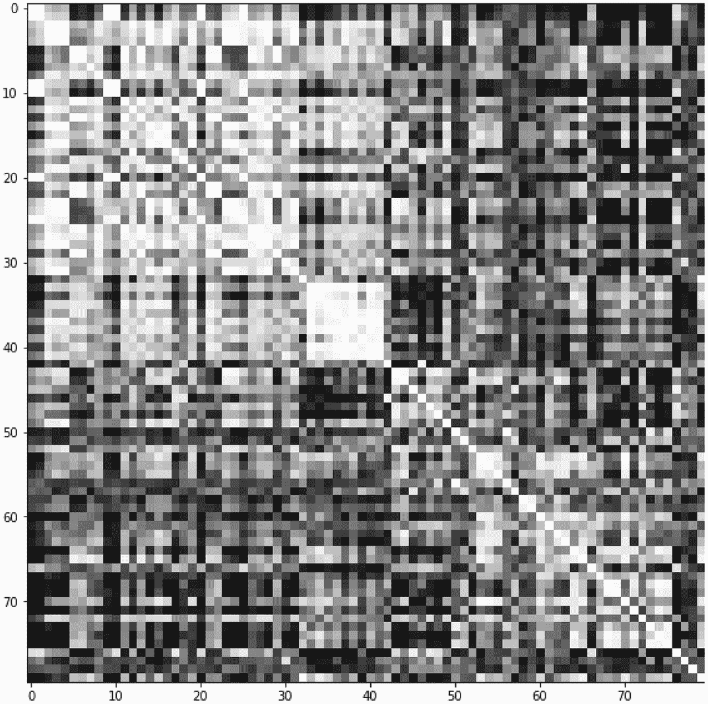

一个无序的 R 矩阵，x 轴和 y 轴上的值为 0 到 70。

图 4-94

排序前的 *R* 矩阵

使用 IGTD 算法对特征进行排序后，*R*（图 4-95）模仿了类似马赛克的像素距离网格，其中“单元格”（回忆——由端到端行连接引起）叠加在整体梯度上，底部左侧和顶部右侧的距离较大，而主对角线方向上的距离较短。

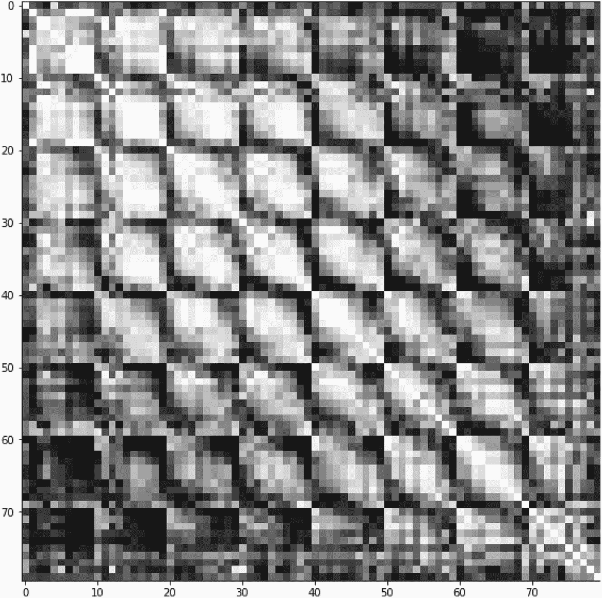

一个有序的 R 矩阵，x 轴和 y 轴上的值为 0 到 70。

图 4-95

排序后的 *R* 矩阵

图 4-96 可视化了使用 IGTD 算法生成的两个样本。

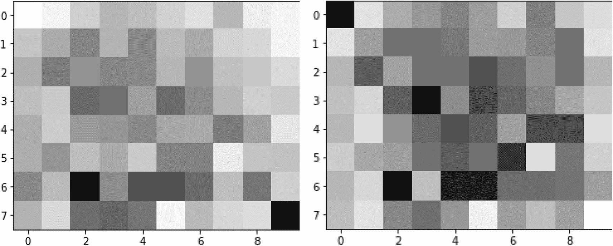

两个图像，x 轴的缩放范围为 0 到 8，y 轴的缩放范围为 0 到 7，其单元格描绘了不同的灰度梯度模式。

图 4-96

使用 IGTD 生成的两个样本图像

IGTD、DeepInsight 以及其他提出的表格到图像方法，都是高特征同质性数据集的强劲竞争者。

## 关键点

在本章中，我们讨论了卷积神经网络的理论和实现，以及如何将它们应用于表格数据集。

+   卷积由一组“扫过”图像空间轴的核组成，提取并增强相关特征。在卷积神经网络中，卷积/提取组件学习最优核以识别视觉信息，而全连接/解释组件学习如何根据预测任务安排和理解提取的特征。

+   在参数化方面，粗略的关系是正确的：*池化和全局池化* < *池化和无全局池化* < *卷积* < *只有全连接*。在卷积神经网络设计中同时使用池化和全局池化，随着输入大小的增加，可以获得最佳的参数化缩放。

+   基础或基础模型可以直接用于训练，或作为更大整体模型中的模块化子模型。

    +   ResNet 架构广泛使用残差连接，跳过某些层。DenseNet 架构使用更密集的残差连接排列。

    +   Inception v3 模型使用基于单元格的结构，重点在于优化滤波器大小和单元格设计中层的高度非线性排列。

    +   EfficientNet 模型被设计为在网络的各个维度（宽度、高度、深度）上均匀地扩展 NAS 优化的“小型模型”。

+   能够同时处理图像和表格输入的多模态模型有两个头部。图像头部通过卷积处理，输出为向量，可以与处理过的表格输入结合，以产生一个联合信息输出。

+   将一维卷积直接应用于表格数据是可能的，但不太可能成功，因为表格数据通常不具有连续的语义。我们可以在一维卷积组件之前添加一个软排序组件，以学习从无序到有序表示的最优映射。

+   虽然软排序技术对于二维卷积（其中输入通过密集层处理并重塑为图像形式）可能足够，但图像数据的复杂性使得这种方法通常不成功。DeepInsight 和 IGTD 方法都是人为设计的、机器学习辅助的从表格到图像数据的映射，在广泛的问题中成功工作。这两种方法都旨在以将相似特征在空间上更靠近的方式将特征映射到图像上。

在下一章中，我们将采用类似的方法来理解专门为非表格输入设计的神经网络结构在具有循环层的表格输入中的应用。
