# 7. 基于树的深度学习方法

> *模仿是最真诚的恭维方式*。
> 
> ——奥斯卡·王尔德，爱尔兰诗人，以及其他许多人

在本卷第二部分的最后一章中，我们探讨了借鉴基于树模型成功经验的深度模型，以指导其架构和训练过程。与基于注意力的模型一起，这构成了当前表格深度学习研究的大部分。由于基于树的模型具有尖锐且严格分层形状切割结构，并在集成中复合，因此它们非常适合许多表格数据领域。通过创建模拟这些特性的神经网络模型，我们有望在新规模和效率级别上实现这些优势。

本章分为三个部分，每个部分从该领域的不同主导方法中采样方法。我们将首先讨论树结构神经网络，它明确地将类似树的逻辑构建到架构的结构单元中，然后是提升和堆叠神经网络，它们模仿成功的树集成范例。最后，我们将探讨蒸馏，其中树的知识被转移到神经网络中。本章采用以研究为主导的方法，展示精选论文的相关组件，并在可能的情况下提供实现。

## 树结构神经网络

许多深度模型通过模仿决策树的结构，使用可微分的“神经”等效物从树中获取结构解释。本节讨论了采用此方法的五个样本研究论文：

+   *“**深度神经决策树**”由 Yongxin Yang 等人撰写*：通过软分箱网络训练决策树。

+   *“SDTR：表格数据的软决策树回归器”由 Haoran Luo 等人撰写*：从感知器节点构建软决策树（SDT）架构。

+   *“用于表格数据的神经 oblivious 决策集成”由 Sergei Popov 等人撰写*：一个由简单的神经决策树组成的集成，其中每个树的层级具有相同的分割条件。

+   *“使用决策树的深度神经网络初始化”由 Kelli Humbird 等人撰写*：巧妙地将决策树的结构映射到神经网络中，作为训练的预热启动。

+   *“DNF-Net：表格数据的神经网络架构”由 Ami Abutbul 撰写*：构建了可微分的 AND 和 OR 门的类似物，以使用“软”逻辑表达式表示树。

### 深度神经决策树

基于树的模型由于使用了贪婪函数逼近而高度可解释.^(1) 它们基于训练阈值分割数据的独特机制，使得在表格数据上能够达到最先进的性能。通常使用随机森林和梯度提升机等集成树方法进行表格数据基准测试，因为它们具有竞争力，甚至优于深度学习方法。此外，基于树的模型可以轻松可视化，从而有助于了解某些特征如何以及为什么对某些决策有贡献。可解释性对于商业、法律等领域许多现实世界的应用至关重要。这并不是说神经网络在实用上没有比经典机器学习方法提供任何优势。在神经网络中，参数是同时更新的。相比之下，基于树的模型通过遍历分支和叶子顺序单独更新它们的参数；这种优化方法与神经网络中的同时参数更新相比可能不是最优的。通过结合两者的优势，理论上我们可以构建一个可微分的基于树的模型，该模型能够在表格数据预测任务中表现出色。

杨永新、伊雷内·加西亚·莫里洛和蒂莫西·M·霍斯佩达莱斯提出了一种介于基于树的模型和神经网络之间的混合模型，称为“深度神经网络决策树”（DNDTs).^(2) 深度神经网络决策树使用梯度下降同时优化它们的参数。从技术角度来看，DNDT 可以在任何深度学习框架中实现；因此，它能够利用 GPU 或 TPU 等加速器的计算能力。由于模型的参数可以通过梯度下降进行优化，因此该模型也可以被视为更大端到端建模方案的一个构建块。

我们可以将决策树训练表述为调整各种离散分箱函数的值。更具体地说，我们将决策节点的每个分割视为将样本分箱到从节点延伸出的两个分支之一（在分箱函数的上下文中，这可以看作是分箱）。训练可以看作是优化分箱阈值以实现最小损失。然而，在标准的决策树中，由于它们的离散性质，那些比喻性的“分箱”函数是不可微分的。杨等人提出了一种软逼近方法，作为非可微分分箱过程的替代。他们的分箱函数是连续的，允许通过基于梯度的方法进行优化。

考虑一个非二叉决策树，其中每个分支节点的决策由可微分的分箱函数建模。值得注意的是，每个分箱函数包含*n* + 1 个可用的分箱，其中每个分箱代表决策树中的一个分支。拥有*n* + 1 个可用的分箱相当于需要*n*个“截止”点或阈值。使用从原始论文中采用的符号，截止点可以表示为一个列表：[*β*[1], *β*[2], *β*[3], *β*[4], …, *β*[*n*]]。这些值的角色将在我们扩展分箱函数优化方法时发挥作用。

单层神经网络，*f*，参数化每个分箱函数。我们可以构建网络如下：

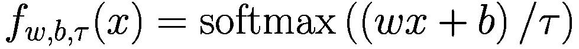

让我们分解这个方程并定义*f*中的每个参数：

+   网络的权重，*w*，是不可训练的，并在开始训练之前被设定为一个常数。其值将始终设置为*w* = [1, 2, …, *n* + 1]，无论外部条件如何。

+   网络的偏置，*b*，在训练之前也被预初始化为一个设定值，但其值可以通过梯度下降进行调整。对于每一次训练迭代，偏置被构建为*b* = [0, −*β*[1], −*β*[1] − *β*[2], −*β*[1] − *β*[2] − *β*[3], …, −*β*[1] − *β*[2] − … − *β*[*n*]]，其中每个唯一的*β*值都可以通过反向传播进行训练。

+   softmax 激活函数将输出向量限制在 0 和 1 之间，同时保持所有值的总和为 1。我们可以将这个输出解释为一个概率列表，定义输入属于*n* + 1 个分支中的哪一个。温度因子*τ*控制输出稀疏度。当*τ* → 0 时，输出趋向于一个独热向量，指示输入属于哪个分支的索引。

为了展示温度*τ*对输出向量的影响，考虑一个例子，其中*wx* + *b*被计算为[1 6 9]，温度被设置为 10：

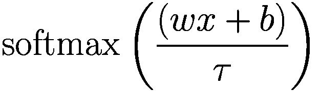

![softmax([1 6 9]/10) ≈ [0.205 0.338 0.456]公式](../images/525591_1_En_7_Chapter/525591_1_En_7_Chapter_TeX_Equc.png)

通过将*τ*调整到 1，我们观察到输出更加稀疏：

![softmax([1 6 9]/1) ≈ [0.000 0.047 0.952]公式](../images/525591_1_En_7_Chapter/525591_1_En_7_Chapter_TeX_Equd.png)

将温度值进一步降低到 0.1，输出往往会成为一个完整的独热编码向量：

![softmax([1 6 9]/0.1) ≈ [0.000 0.000 0.999]公式](../images/525591_1_En_7_Chapter/525591_1_En_7_Chapter_TeX_Eque.png)

通常，决策树是从上到下以贪婪的方式构建的，每个决策节点都是单独定义和优化后再进行下一步。这种方法不仅优化不足，而且在树非二叉时资源消耗很大。相反，Yang 等人利用神经网络同时更新其参数的能力，在构建树之前为每个特征训练一个单独的分箱网络。然后我们可以按以下步骤递归地构建树：

1.  将每个分箱网络视为一个决策节点，从该节点分出的分支数量由可用的分箱数量或输出向量的长度决定。重新使用之前引入的符号，每个决策节点应该有 *n* + 1 个分支。

1.  选择任何决策节点（分箱网络）作为根节点。无论选择哪个决策节点，结果都将相同。添加关于结果将相同的说明。

1.  从这里，每个树级别将分配一个单独的决策节点，它将成为从上一级每个分支的子节点。换句话说，它与前一个决策节点相连。本质上，每个级别将包含 *n*^(*l*) 个相同的决策节点，其中 *l* 是树级别。

1.  假设有 *D* 个特征，树的最底层将有 *n*^(*D*) 个叶节点。与标准决策树不同，其中叶节点直接表示模型预测，DNDT 中的叶节点仅是表示样本根据其特征值所属的“簇”的指标。需要进一步处理步骤以获得最终预测。通常，使用线性模型对到达叶节点的样本进行分类。

从数学上讲，我们可以通过克罗内克积穷举找到由一个样本导致的最终叶节点。对于那些不熟悉的人来说，克罗内克积通常表示为 ⨂，是一种特殊的矩阵/向量乘法形式。对于两个矩阵 *A ∈ ℝ*^(*m* × *n*) 和 *B ∈ ℝ*^(*p* × *q*)，克罗内克积定义为

![A⊗B=[a11B&cdots& a1nB&vdots&ddots&vdots& a m1B&cdots& a mnB]](../images/525591_1_En_7_Chapter/525591_1_En_7_Chapter_TeX_Equf.png)

最终得到的矩阵将具有 *mp* × *nq* 的形状。我们用 *D* 表示数据集中存在的特征数量，用 *f*[*i*] 表示第 i 个分箱网络。克罗内克积被反复应用以产生一个几乎是一维编码的向量（对于低温值 *τ*），表示输入 *x* 将导致的叶节点索引：

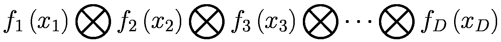

如果每个分箱网络/决策节点都有 *n* 个可用的分箱/分支，则生成的“叶节点”向量长度将为 *n*^(*D*)。请注意，*n* 的值对于每个分箱网络可能不同。最终的线性模型将接收“叶节点”向量作为输入，并产生与数据集类别（或回归中的连续值）相关的预测。

DNDT 通过训练神经网络并优化其参数，而不依赖于彼此，巧妙地避免了基于树的模型的次优训练方案。DNDT 提供了可扩展性的优势；然而，这仅适用于样本的大小，而不是特征的大小。由于使用了克罗内克积，当特征数量增加时，计算变得非常昂贵。因此，作者建议使用类似随机森林的训练方法，其中多个弱学习器分别在每个特征子集上训练。图 7-1 是 DNDT 及其等效决策树的表示。为了说明目的，图中只选择了来自 Iris 花数据集的两个特征。

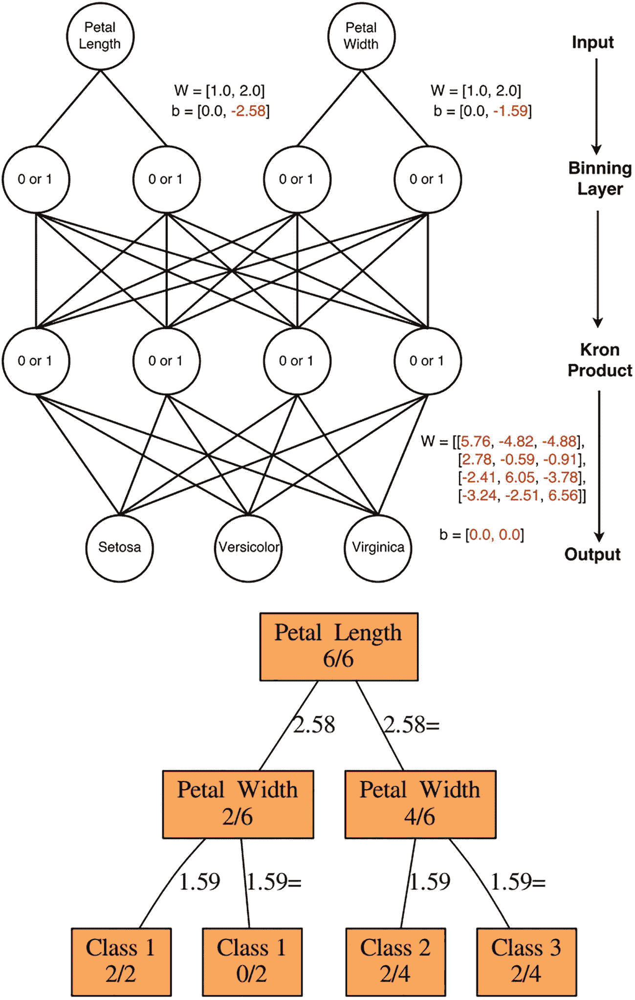

2 个图表。一个是 D N D T，它从上到下相互连接输入、分箱层、克罗内克积和输出。另一个是决策树，其中根是花瓣长度，叶节点是类别 1、类别 2 和类别 3。

图 7-1

杨等人对 DNDT 的表示

论文作者将 DNDT 与决策树基线和具有每个隐藏层 50 个神经元的浅层双层神经网络进行了比较。DNDT 中每个特征的分割点数量都设置为 1，这意味着每个节点只有两个分支。总共从 Kaggle 和 UCI 获取了 14 个数据集。对于具有超过 12 个特征的数据集，为 DNDT 采用了类似随机森林的训练方法，每个弱学习器随机从十个特征中学习，总共有十个弱学习器。以下图表显示了比较结果（表 7-1）。

表 7-1

DNDT 与各种其他算法的比较。带有 * 的数据集表示使用了 DNDT 的集成版本。来自杨等人的比较。

| 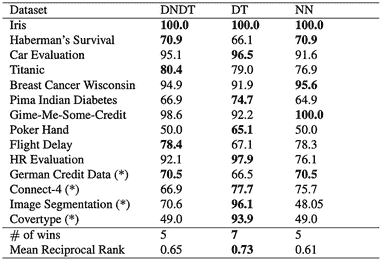一个包含 4 列和 16 行的表格。列标签为数据集、D N D T、D T 和 N N。最后两行给出的胜利次数分别为 5、7 和 5，而平均倒数排名分别为 0.65、0.73 和 0.61。 |
| --- |

尽管在所选的基准数据集上，决策树（Decision Trees）在经验上仍然优于 DNDT，但 DNDT 仍然可以在大多数场景下匹配决策树（Decision Trees）的性能。DNDT 还提供了灵活性，因为每个特征的数量分割点都可以改变。研究表明，增加分割点可以显著提高模型性能。

DNDT 可以用 PyTorch 或 TensorFlow 实现，大约需要 20 行代码，这是由论文作者完成的官方实现。由于 TensorFlow 的自定义训练循环可能相当复杂，我们将使用 PyTorch 实现。我们将使用 Iris 花卉数据集作为示例。我们可以从导入 PyTorch 和加载数据集开始（列表 7-1）。

```py
from sklearn.datasets import load_iris
import torch
# used for implementation later
from functools import reduce
data = load_iris()
X = np.array(data.data)
X = torch.from_numpy(X.astype(np.float32))
y = torch.from_numpy(np.array(data.target))
Listing 7-1
Imports
```

接下来，我们可以为 DNDT 的每个组件定义自定义函数，如列表 7-2 所示。

```py
def torch_kron_prod(a, b):
res = torch.einsum('ij,ik->ijk', [a, b])
res = torch.reshape(res, [-1, np.prod(res.shape[1:])])
return res
def torch_bin(x, cut_points, temperature=0.1):
# x is a N-by-1 matrix (column vector)
# cut_points is a D-dim vector (D is the number of cut-points)
# this function produces a N-by-(D+1) matrix, each row has only one element being one and the rest are all zeros
D = cut_points.shape[0]
W = torch.reshape(torch.linspace(1.0, D + 1.0, D + 1), [1, -1])
cut_points, _ = torch.sort(cut_points)  # make sure cut_points is monotonically increasing
b = torch.cumsum(torch.cat([torch.zeros([1]), -cut_points], 0),0)
h = torch.matmul(x, W) + b
res = torch.exp(h-torch.max(h))
res = res/torch.sum(res, dim=-1, keepdim=True)
return h
def nn_decision_tree(x, cut_points_list, leaf_score, temperature=0.1):
# cut_points_list contains the cut_points for each dimension of feature
leaf = reduce(torch_kron_prod,
map(lambda z: torch_bin(x[:, z[0]:z[0] + 1], z[1], temperature), enumerate(cut_points_list)))
return torch.matmul(leaf, leaf_score)
Listing 7-2
Custom implementation of DNDT components
```

在训练之前，将定义模型的一些超参数（列表 7-3）。

```py
num_cut = [2]*4  # 4 features with 2 cut points each
num_leaf = np.prod(np.array(num_cut) + 1) # number of leaf node
num_class = 3
# randomly initialize cutpoints
cut_points_list = [torch.rand([i], requires_grad=True) for i in num_cut]
leaf_score = torch.rand([num_leaf, num_class], requires_grad=True)
loss_function = torch.nn.CrossEntropyLoss()
optimizer = torch.optim.Adam(cut_points_list + [leaf_score], lr=0.001)
Listing 7-3
Defining parameters for training
```

最后，我们可以使用 PyTorch 的自定义训练循环开始训练过程（列表 7-4）。

```py
from sklearn.metrics import accuracy_score
for i in range(2000):
optimizer.zero_grad()
y_pred = nn_decision_tree(X, cut_points_list, leaf_score, temperature=0.05)
loss = loss_function(y_pred, y)
loss.backward()
optimizer.step()
if (i+1) % 100 == 0:
print(f"EPOCH {i} RESULTS")
print(accuracy_score(np.array(y), np.argmax(y_pred.detach().numpy(), axis=1)))
Listing 7-4
Training DNDT with PyTorch
```

三个主要因素可以改善或恶化训练结果：每个特征的分割数量、温度和学习率。这些值应根据领域知识或通过超参数调整仔细选择，因为细微的变化可能会显著影响训练结果。

DNDT 的核心在于能够在具有基于树的架构的同时通过梯度下降同时更新参数。DNDT 的可扩展性也提供了大多数基于树的模型所不具备的便利性。尽管 DNDT 可能需要一些超参数调整以匹配当前最先进的模型性能，但它仍然作为深度学习和基于树模型之间的替代品或混合体。最后，DNDT 为构建更好的神经网络打开了大门，这些神经网络模仿基于树模型逻辑，正如我们将在后面的章节中看到的那样。

### 软决策树回归器

记住，在标准的决策树中，每个节点代表一个特定特征的二进制决策阈值，该阈值针对输入样本执行，并用于确定样本最终采取的路径（左或右）。在 2021 年的论文“SDTR: Tabular 数据的软决策树回归器”中，Haoran Luo、Fan Cheng、Heng Yu 和 Yuqi Yi 提出了一种针对回归问题的此类决策树的软模拟，可以使用梯度下降进行训练。^(3)

考虑一个由其索引*i*表示的满二叉树节点。在软决策树模型中，每个节点不输出二进制左或右决策，而是使用感知器输出一个软概率。我们定义在*i*节点处给定输入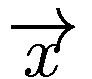选择左分支的概率如下，对于某些学习的权重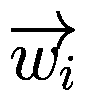和偏差*b*[*i*]：

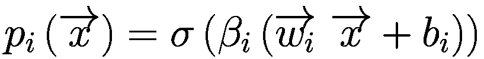

注意，无论节点有多深，决策总是通过访问完整的特征集来进行的。参数 *β*[*i*] 是一个缩放系数，用于防止“过于软的决策”——也就是说，将加权求和推向零，并趋向于产生接近零和一的软决策的更极端端。

每个叶节点都与一个标量 *R*[*l*] 相关联；这是样本沿着树向下移动到该特定叶节点时的预测输出。用 *P*[*l*] 表示选择叶 *l* 的概率。然后我们可以按以下方式计算 *P*[*l*]，其中 *i* 根据在通向 *l* 的路径上是否采取左或右步骤而取 1 或 0：

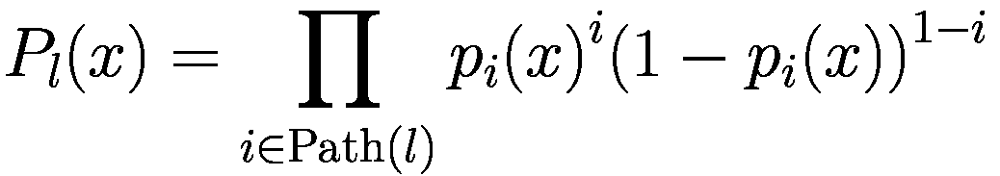

我们不仅评估与具有最高概率的叶节点相关联的值与真实值之间的差异，我们还定义损失为每个叶节点与真实值之间差异的总和，并按叶节点概率加权：

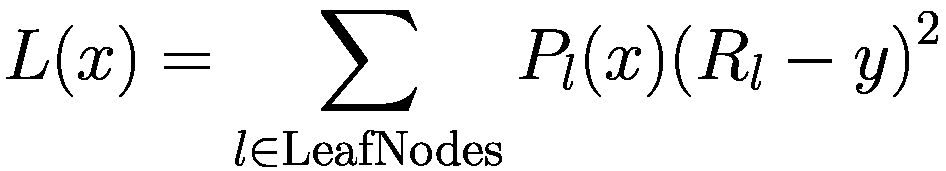

虽然树的结构在技术上来说是固定的——有一个指定的深度和静态的二叉结构——但填充每个节点的条件可以通过模型通过权重和偏差来学习，优化以最小化损失（图 7-2）。

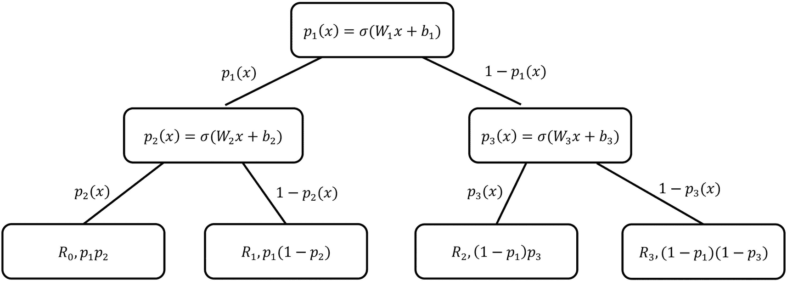

一个二叉树有一个根节点，标记为 p 下标 1 的 x 等于 W 下标 1 x 加 b 下标 1。根节点的子节点和从子节点延伸出的 4 个叶节点被描绘出来。每个节点与其父节点之间的连接被标记。

Figure 7-2

叶节点与连接关系的图。来自罗等人。

论文描述了强制正确学习的附加机制。然而，为了理解架构的关键元素，我们将构建一个非常简单、骨架版本的模型。这个特定模型设计有趣的地方在于，该模型本质上是一个多输出架构，每个节点从输入延伸出一个密集层（列表 7-5）。树状架构是通过如何将不同的全连接层相互关联来计算损失来实现的。

```py
MAX_DEPTH = 5
inp = L.Input((INPUT_DIM,))
outputs = []
for node in range(sum([2**i for i in range(MAX_DEPTH + 1)])):
outputs.append(L.Dense(1, activation='sigmoid')(inp))
model = keras.models.Model(inputs=inp, outputs=outputs)
Listing 7-5
Generating all nodes in the tree
```

注意，在这种情况下，我们假设软决策树模型是在二元预测任务上训练的，因此模型中的所有层（包括输出层和中间概率树节点）都使用 sigmoid 激活函数，以简化。

我们希望将这些层与二叉树结构中的特定位置相关联。有许多巧妙的方法可以做到这一点，但我们将坚持使用标准的面向对象方法，这种方法的好处是可解释性和易于导航。每个 `Node` 对象对应于 `outputs` 列表中的一个索引。请注意，哪个节点对应哪个索引并不重要，只要每个索引只有一个节点，反之亦然。我们可以通过以二叉树的方式递归构建链接节点，并在创建 `Node` 实例时增加全局 `index` 变量来实现这一点（见列表 7-6）。

```py
index = 0
class Node():
def __init__(self):
global index
self.index = index
self.left = None
self.right = None
index += 1
def add_nodes(depths_left):
curr = Node()
if depths_left != 0:
curr.left = add_nodes(depths_left - 1)
curr.right = add_nodes(depths_left - 1)
return curr
root = add_nodes(MAX_DEPTH)
Listing 7-6
Defining a node class and generating a binary tree with a specified depth
```

为了计算损失，我们需要将每个叶子节点乘以所有指向该叶子节点的节点概率。我们可以通过遍历我们的树结构递归地创建一个输出集合（见列表 7-7）。

```py
def get_outs(root, y_pred):
if not root.left and not root.right: # is a leaf
return [y_pred[root.index]]
lefts = get_outs(root.left, y_pred)
lefts = [y_pred[root.index] * prob for prob in lefts]
rights = get_outs(root.right, y_pred)
rights = [(1-y_pred[root.index]) * prob for prob in rights]
return lefts + rights
Listing 7-7
Getting all the leaf nodes
```

我们需要定义一个自定义损失，该损失评估真实值与每个叶子节点值乘以概率序列之间的平均损失（见列表 7-8）。

```py
from tensorflow.keras.losses import binary_crossentropy as bce
NUM_OUT = tf.constant(2**MAX_DEPTH, dtype=tf.float32)
def custom_loss(y_true, y_pred):
outputs = get_outs(root, y_pred)
return tf.math.divide(tf.add_n([bce(y_true, out) for out in outputs]), NUM_OUT)
Listing 7-8
Defining the loss function
```

由于这个损失函数聚合多个输出而不是独立作用于单个模型输出，因此对我们来说定义一个具有特定拟合方法的自定义模型更为方便（见列表 7-9）。（使用默认的编译和拟合步骤，我们只能指定作用于输出的损失，或者在多模态模型的情况下，指定作用于单个输出的多个损失。没有简单的方法来定义接受多个输出的损失。）我们可以通过重写默认的 `train_step` 方法来实现这一点。

```py
import tensorflow as tf
avg_loss = tf.keras.metrics.Mean('loss', dtype=tf.float32)
class custom_fit(tf.keras.Model):
def train_step(self, data):
images, labels = data
with tf.GradientTape() as tape:
outputs = self(images, training=True) # forward pass
total_loss = custom_loss(labels, outputs)
gradients = tape.gradient(total_loss, self.trainable_variables)
self.optimizer.apply_gradients(zip(gradients, self.trainable_variables))
avg_loss.update_state(total_loss)
return {"loss": avg_loss.result()}
Listing 7-9
Writing a custom training function
```

实例化后，模型可以进行训练（见列表 7-10）。

```py
model = custom_fit(inputs=inp, outputs=outputs)
model.compile(optimizer='adam')
history = model.fit(x, y, epochs=20)
Listing 7-10
Compiling and fitting the model
```

再次，这个模型本身表现并不出色，但它说明了基本的思想。

作者提供了一个用 PyTorch 实现的模型。开始使用该模型只需要最少的 PyTorch。我们首先从官方仓库加载软决策树模型（见列表 7-11）。

```py
!wget -O SDT.py https://raw.githubusercontent.com/xuyxu/Soft-Decision-Tree/master/SDT.py
import SDT
import importlib
importlib.reload(SDT)
Listing 7-11
Obtaining the SDT from the official repository
```

第一步是定义一个 PyTorch 数据集（见列表 7-12）。PyTorch 数据集的格式几乎与 TensorFlow 自定义数据集的语法完全相同（回想第二章）：我们需要定义一个 `__len__` 和一个 `__getitem__` 方法。

```py
import torch
from torch.utils.data import Dataset, DataLoader
from sklearn.model_selection import train_test_split as tts
class dataset(Dataset):
def __init__(self, data, seed = 42):
X_train, X_valid, y_train, y_valid = tts(data.drop('Cover_Type', axis=1),
data['Cover_Type'],
random_state = seed)
self.x_train=torch.tensor(X_train.values,
dtype=torch.float32)
self.y_train=torch.tensor(pd.get_dummies(y_train).values,
dtype=torch.float32)
def __len__(self):
return len(self.y_train)
def __getitem__(self,idx):
return self.x_train[idx],self.y_train[idx]
Listing 7-12
Writing a PyTorch dataset
```

我们可以在森林覆盖数据集上实例化数据集，例如。`DataLoader` 包围了 `Dataset` 并为向模型提供数据提供了额外的训练级工具（见列表 7-13）。

```py
import pandas as pd, numpy as np
df = pd.read_csv('../input/forest-cover-type-dataset/covtype.csv')
data = dataset(df.astype(np.float32))
dataloader = DataLoader(data, batch_size=64, shuffle=True)
Listing 7-13
Reading a CSV file into a PyTorch dataset and converting into a DataLoader
```

软决策树可以按以下方式实例化和训练（见列表 7-14）。

```py
from SDT import SDT
model = SDT(input_dim = len(X_train.columns),
output_dim = len(np.unique(y_train)))
import torch.optim as optim
import torch.nn as nn
criterion = nn.CrossEntropyLoss()
optimizer = optim.SGD(model.parameters(), lr=0.001, momentum=0.9)
for epoch in range(10):
running_loss = 0.0
for i, data in enumerate(dataloader, 0):
inputs, labels = data
optimizer.zero_grad()
outputs = model(inputs)
loss = criterion(outputs, labels)
loss.backward()
optimizer.step()
print(f'[Epoch: {epoch + 1}; Minibatch: {i + 1:5d}]. Loss: {loss.item():.3f}',
end='\r')
print('\n')
print('Finished Training')
Listing 7-14
Training the SDT
```

这里使用的语法与在 TensorFlow 中编写自定义循环的语法类似。主要区别是需要在损失和优化器对象中显式调用正向传播和反向传播阶段发生的步骤。

### NODE

考虑“拖沓”20 个问题的游戏。为了猜测玩家 A 所想的物体，玩家 B 提出一系列问题，玩家 A 回答“是”或“否”。转折在于，玩家 B 只有在他们完成所有问题的提问后才能收到他们问题的答案，而不是在每个问题之后立即收到。

这是一个*无意识决策树*的例子——其中每个级别都有相同的分割标准，而不是在不同级别使用不同的标准。例如，以下“3 个问题”决策树是无意识的：

+   它是动物吗？

    +   *如果答案是肯定的*：它会飞吗？

        +   *如果答案是肯定的*：它跑得快吗？

            +   *如果答案是肯定的*：鹰

            +   *如果答案是否定的*：鹧鸪

        +   *如果答案是否定的*：它跑得快吗？

            +   *如果答案是肯定的*：猎豹

            +   *如果答案是否定的*：乌龟

    +   *如果答案是否定的*：它会飞吗？

        +   *如果答案是肯定的*：它跑得快吗？

            +   *如果答案是肯定的*：飞机

            +   *如果答案是否定的*：滑翔伞

        +   *如果答案是否定的*：它跑得快吗？

            +   *如果答案是肯定的*：赛车

            +   *如果答案是否定的*：岩石

相比之下，以下表示如何玩更标准的 20 个问题的决策树不是无意识的：

+   它是动物吗？

    +   *如果答案是肯定的*：它生活在水中吗？

        +   *如果答案是肯定的*：它是一种捕食者吗？

            +   *如果答案是肯定的*：鲨鱼

            +   *如果答案是否定的*：沙丁鱼

        +   *如果答案是否定的*：它有四条腿吗？

            +   *如果答案是肯定的*：狮子

            +   *如果答案是否定的*：火烈鸟

    +   *如果答案是否定的*：它是交通工具吗？

        +   *如果答案是肯定的*：它有四个轮子吗？

            +   如果答案是肯定的：汽车

            +   *如果答案是否定的*：自行车

        +   *如果答案是否定的*：它会飞吗？

            +   *如果答案是肯定的*：飞机

            +   *如果答案是否定的*：番茄酱

注意，标准非无意识决策树比无意识决策树更具表现力，因为它不受每个级别必须操作相同分割条件的要求的约束。这意味着我们可以构建下游分割条件，这些条件受先前已知信息的影响；例如，在知道它是一种动物后，我们询问物体是否生活在水中。然而，无意识决策树的优势在于计算和复杂度简单。事实上，无意识决策树与其说是树，不如说是大型二进制查找表。在无意识决策树中，同一棵树可以用每个级别上分割条件的不同排列来表示，因为没有任何条件依赖于另一个条件。

Sergei Popov 等人将 NODE 模型引入论文“用于表格数据的深度学习的神经无意识决策集成”（Neural Oblivious Decision Ensembles for Deep Learning on Tabular Data）^(4)；它与之前基于树的神经网络的模仿类似，但使用了一组朴素的无意识决策树，而不是优化单个复杂的决策树。

它也直接选择特征进行选择，而不是使用像软决策树回归器这样的抽象学习线性组合。*F*[*i*] 表示在 *i* 层上用于分割的数据 *χ* 的特征，而 *b*[*i*] 表示在 *i* 层上特征 *F*[*i*] 所需的阈值。因此，如果特征超过阈值，*F*[*i*] − *b*[*i*] 将为正数，如果没有超过，则为负数。

*α*entmax 函数被应用于“二值化”这个结果（即，有效地做出决策）。回想一下，第六章中提到的*α*entmax 函数是 softmax 函数的修改版，它更稀疏并鼓励更极端的值。因此，每个节点都拥有更明确的决策。软决策树回归器在这方面有困难，需要额外的机制，如预激活缩放系数来调和它（图 7-3）。

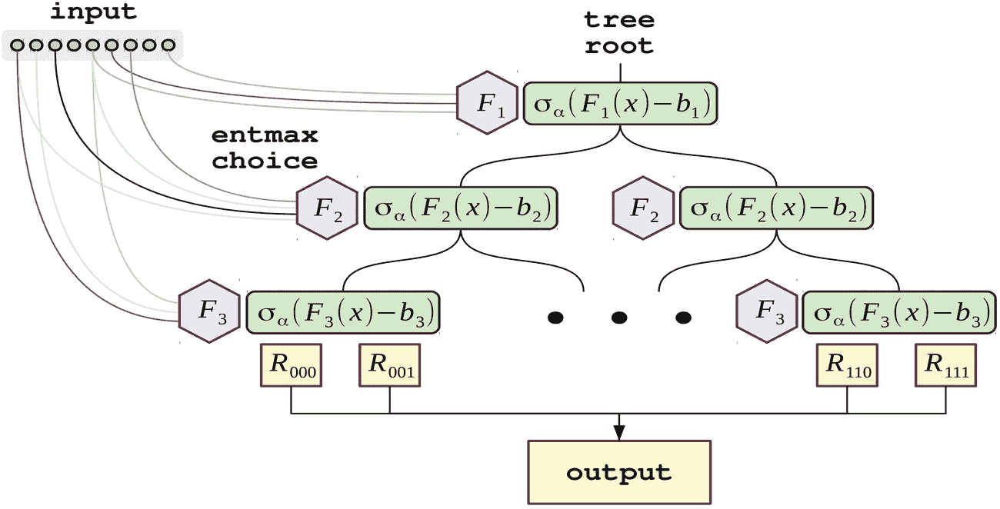

单个节点树的示意图展示了以下标签。输入、树根、entmax 选择和中间的输出值。

图 7-3

单个 NODE 层/树的示意图。来自 Popov 等人。

否则，NODE 的优化与 SDTR 非常相似：损失被表示为所有叶节点加权路径概率的总和。这形成了一个单独的 NODE 层——一个可微分的神经无意识决策树，因此可以使用反向传播技术进行训练。

NODE 的力量来自于将多个单独的 NODE 层堆叠成一个联合集成。作者提出了一个 DenseNet 风格的堆叠（参见第四章关于 DenseNet），其中每一层都连接到其他每一层（图 7-4）。

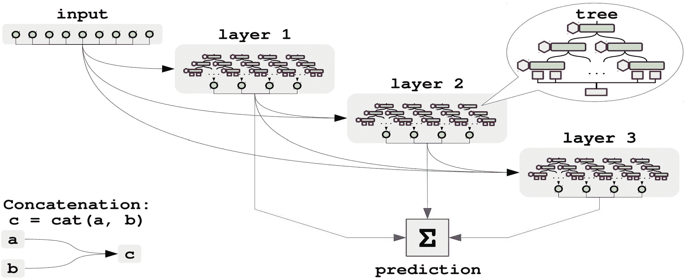

多层模型的示意图展示了输入和第 1、2、3 层。每一层都是由输入和前一层的输出组成。所有层被组合起来进行预测。在左下角展示了将 a 和 b 连接得到 c 的拼接。

图 7-4

NODE 在多层模型中的排列。来自 Popov 等人。

作者发现，NODE 在几个基准表格数据集上优于 CatBoost 和 XGBoost（表 7-2 和 7-3）。当这些竞争对手进行超参数优化时，NODE 在一些数据集上的表现略逊于它们，但在评估的数据集中仍然保持了整体优势。

表 7-3

NODE 与具有调整超参数的竞争对手的性能比较。来自 Popov 等人。

| 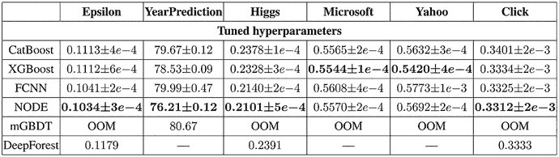一个 6 列 7 行的表格。第 1 行显示调整超参数。列标签是 Epsilon、年预测、Higgs、Microsoft、Yahoo 和点击。第 2 行的行标签是 cat boost、X G boost、F C N N、node、m G B D T 和 deep forest。 |
| --- |

表 7-2

NODE 与 CatBoost 和 XGBoost 在默认超参数下的性能比较。来自 Popov 等人。

| -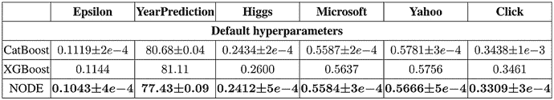一个 6 列 4 行的表格。第 1 行显示默认超参数。列标签是 Epsilon、年预测、Higgs、Microsoft、Yahoo 和点击。第 2 行的行标签是 cat boost、X G boost 和 node。 |
| --- |

NODE 是提出的最直接树状神经网络架构之一，并在许多通用表格建模问题中取得了成功。请参阅官方仓库中编写良好且易于理解的补充代码笔记本演示：[`https://github.com/Qwicen/node`](https://github.com/Qwicen/node)。

### 基于树的神经网络初始化

神经网络以其灵活性而闻名，允许用户设计和创建满足他们需求的架构。毫无疑问，已经投入了大量的工作来开发方法和技术，以搜索和获取最优或次优的网络架构，而不需要人类的试错；这类算法通常被称为神经网络架构搜索（NAS）。有关 NAS 的详细解释和实现，请参阅第十章。NAS 过程通常耗时较长，算法不考虑具体问题类型，无论是图像识别、文本分析还是本书背景下的表格数据。另一方面，基于树的模型的结构使它们在结构化数据任务中表现出色。我们不必试图将基于树的模型适应基于梯度的训练，而是可以将我们的目标转向为神经网络设计树状架构。K. D. Humbird、J. L. Peterson 和 Rand. G. McClarren 在他们题为“使用决策树初始化深度神经网络”的论文中，^(5)正是寻求实现这一点。

与神经网络不同，基于树的模型在训练过程中逐步构建其节点和分支；这消除了在训练之前手动设计模型架构的需求。由于复杂的数学计算始终影响着基于树的模型的结构和形式，它们的架构设计几乎总是优于人类的试错。人们可以将设计用于表格数据的神经网络架构视为手动设计决策树中每个分支的位置。毫无疑问，这显示了人类设计的网络架构要持续优于基于树的模型是多么困难。K. D. Humbird 等人试图将基于树的模型的核心结构“映射”到深度神经网络中。根据作者的说法，这种映射将为神经网络的结构和权重初始化提供一个“加速起点”，以实现更好的训练结果。通过映射算法产生的网络被称为“深度联合信息神经网络（DJINN）”。

DJINN 的构建和训练过程可以分为以下三个一般步骤，如下所述：

1.  在选定的数据集上训练任何基于树的模型。请注意，为了简洁的解释，决策树将被用作目标基于树的模型。然而，任何类型的基于树的集成算法都可以工作。算法对集成中的每个 *n* 个弱学习器重复 *n* 次，本质上映射出 *n* 个神经网络。

1.  我们递归遍历训练好的决策树，将其结构映射到神经网络。这是通过遵循 DJINN 映射算法定义的特定规则来完成的。

1.  映射网络像任何其他人工神经网络一样进行训练。论文建议使用 Adam 作为优化器，ReLU 作为隐藏层的激活函数。

为了将决策树映射到 DJINN 的算法形式化，我们采用了原始论文中作者使用的符号：

+   将 *l* 表示为决策树的层级索引和神经网络的层索引，其中 *l* = 0 代表神经网络的第 1 层和决策树的第一层。

+   *l* 的值位于区间 [0, *D*[*t*]] 内，其中 *D*[*t*] 是决策树的最大深度。这间接地告诉我们映射的神经网络将具有 *D*[*t*] + 1 个总层（包括输入和输出层）。

+   将 *D*[*b*] 表示为分支节点存在的最大层级。换句话说，*D*[*b*] 是决策树中节点仍可以进一步分割数据的最低层级。这间接地告诉我们 *D*[*t*] 和 *D*[*b*] 之间的关系：*D*[*b*] = *D*[*t*] - 1。

+   让 *N**b* 返回层 *l* 的决策树中的分支数量。网络中任何隐藏层的神经元数量可以计算为 *n*(*l*) = *n*(*l* - 1) + *N**b*。

+   让  是一个包含每个特征作为分支节点出现的最远层级的列表。为了澄清，假设“特征 1”被树选择在树层级 2、4 和 5 处分割数据。那么“特征 1”的 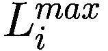 将是 5，因为这是特征在树中出现的最深层级。

+   用 *W*^(*l*) 表示层 *l* 的权重矩阵。对于数据集中每个独特的特征，*i* = 0, 1, 2, …, 特征数量 - 1，我们将 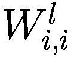 设置为 1^(6)，对于每个 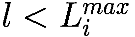 的值。为了更好地理解，图 7-5 中的以下视觉演示了对于 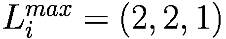 初始化为 1 的神经元。

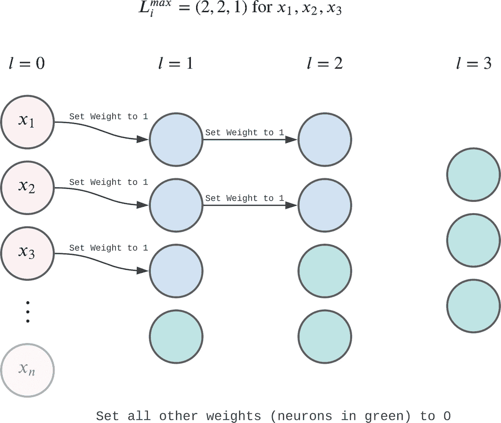

权重初始化图展示了在 l 等于 0、1、2 和 3 时下的 4 组神经元。一些链接上的标签显示将权重设置为 1。不同颜色的神经元上的权重被设置为 0。

图 7-5

网络的权重初始化

目前，除了之前提到的预初始化的统一权重外，映射网络的每个权重和偏差都被设置为 0。在应用 DJINN 映射算法后，最终的网络架构将通过剪枝权重仍为 0 的神经元来确定。在解释映射算法之后将详细讨论移除零权重神经元的过程，因为那时这个过程将更加相关。映射算法的核心思想是通过遍历决策树并“重新初始化”与树中节点和分支位置相对应的神经元。我们可以将零权重的神经元解释为“断开连接的神经元”，因为它们在没有偏差的情况下无法传递信息。另一方面，通过映射算法“重新初始化”的神经元将具有非零值，因此可以解释为“连接的神经元”，因为它们可以在没有偏差的情况下传递信息。请注意，算法不会“重新初始化”网络中的每个神经元。那些没有被映射算法“重新初始化”的神经元将根据它们的偏差值进行选择性剪枝。网络中的所有偏差都将从正态分布中随机初始化，并且具有负偏差值和零权重的神经元将被丢弃。选择性剪枝将随机性注入网络架构，提供比原始预训练的基于树的模型更好的灵活性和更大的潜力。

我们从*l* = 1 开始，因为在*l* = 0 时，网络是输入层，其中每个权重事先都设置为 1，神经元的数量限制为特征的数量。当神经元重新初始化时，它们的权重将从分布（0，*σ*²）中随机选择。其中

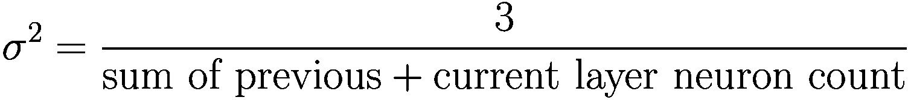

当我们递归地遍历决策树时，对于每个在每级*l ϵ* [1, *D*[*t*]]中的节点，我们表示当前节点为*c*。*c*可能有两种情况：

+   节点 *c* 是一个分支节点，意味着该节点进一步分为分支或决策树的当前级别 < *D*[*t*]。在这种情况下，我们初始化一个新的神经元，将其从断开连接变为在层 *l* 上连接。然后，我们记录用于分支节点进一步分割数据的特征，并找到与该特征相关的输入神经元。我们可以暂时将输入神经元表示为 *n* sub *f* *e* *a*. *t*。通过使用我们之前初始化为 1 的神经元，从 *n*[*feat*]，我们将输入神经元一直连接到 *c*。最后，我们将 *c* 连接到其等效的“父节点”，或者说是为 *c* 的父节点初始化的神经元。

+   节点 *c* 是一个叶子节点。在回归任务的情况下，我们只需将输出神经元连接到其等效的“父节点”，或者说是根据决策树的上下文为 *c* 的父节点初始化的神经元。在分类的情况下，我们将输出与叶子 *c* 同类的输出神经元连接到其等效的“父节点”神经元。

我们可以从原始论文中图 7-6 所示的例子中可视化这个过程。

通过检查左侧训练好的决策树，我们看到对于 *x*[1]、*x*[2]、*x*[3]，有 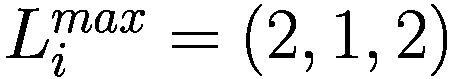。神经元上标记有蓝色十字的是根据每个特征的  初始化为 1 的（图 7-6）。请注意，神经元可以被初始化为 1，但在将树映射到网络时永远不会连接；因此，一些神经元上标记有蓝色十字，但被阴影覆盖。

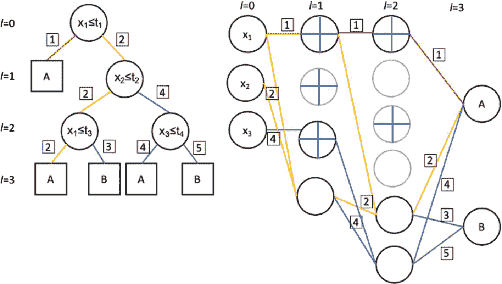

决策树和神经网络的示意图。4 层的决策树从根节点 I 等于 0 到叶子节点 I 等于 3。右侧映射的神经网络中，神经元通过不同颜色的线条连接，其中一些神经元上标记了彩色十字。

图 7-6

将决策树映射到神经网络，构建 DJINN 的可视化。来自 K. D. Humbird 等人，略有修改

我们遍历每一棵树的每一层，将那一层的每个节点映射到网络中的相应神经元，从左到右进行。在决策树的 *l* = 1 层，我们遍历的第一个节点是类别 A 的叶子节点，我们将其表示为 *c*。*c* 的父节点是决策树的输入节点，其中特征 *x*[1] 被选中来分割数据。为了将输入神经元一直连接到类别 A 的输出神经元（对应于 *c*），我们利用初始化为 1 的神经元。红色路径标记为“1”表示这种连接，将叶子 *c* 映射到网络中。

我们正在树中向右移动到在 *x*[2] 上分割的节点。我们在网络的相应层（层 *l* = 1）实例化一个新神经元。我们首先将新神经元连接到其父节点，或从树的输入节点映射的神经元。然后，我们将对应于当前节点使用的特征的输入神经元，即 *x*[1] 输入神经元连接到输入神经元。这两个连接都显示在黄色路径上，标记为“2”。

向下移动到决策树的 *l* = 2，第一个要映射的节点是在特征 *x*[1] 上分割的节点。同样，我们在相应的网络层（*l* = 2）实例化一个新神经元。然后，我们将新神经元连接到上一层的神经元，这是当前节点的父节点映射的。为了澄清，那就是我们初始化并连接用于在 *x*[2] 上分割节点的神经元。最后，使用我们在开始时初始化为 1 的神经元，我们可以将 *x*[1] 的输入神经元一直连接到我们刚刚初始化的新神经元。这两个连接都由层 1 和层 2 之间的黄色路径绘制，标记为“2”。

对于最后一个分支节点，树选择在特征 *x*[3] 上分割。在这个节点上重复映射网络的过程：将当前节点父分支创建的神经元连接到当前节点，并使用权重为 1 的神经元将当前节点连接到 *x*[3] 输入神经元。这两个连接都显示在蓝色路径上，标记为“4”。

最后，移动到树的最后一层，总共有四个叶子节点，其中两个指向类别 A，而另外两个指向类别 B。对于左侧的叶子节点，将类别 A 输出神经元连接到为其父节点创建的神经元。这显示在黄色路径上，标记为“2”。转向右侧，对于具有相同父分支的叶子节点，我们只需将类别 B 的输出神经元连接到上一层的相同神经元，这由绿色路径表示，标记为“3”。最后两个叶子节点都是分支节点的子节点，该分支节点在 *x*[3] 上分割；我们将相应的输出神经元连接到该分支节点映射的神经元。这两个连接分别由蓝色“4”路径和紫色“5”路径绘制。映射算法的完整伪代码显示在图 7-7 中。

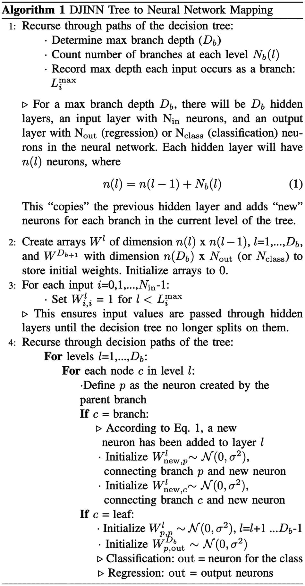

算法包含了将 DJINN 树映射到神经网络的步骤。代码包含 4 个步骤，通过递归遍历决策树的路径来创建神经元并输出一个神经网络。

图 7-7

决策树映射到神经网络的伪代码。来自 K. D. Humbird 等人。

如前所述，那些未连接的神经元将被随机选择以包含在由它们的偏差初始化决定的最终架构中。所有神经元的偏差将从高斯分布中随机选择。DJINN 本质上利用了由训练决策树创建的最佳结构，同时允许一定程度的自由度以考虑不准确性。这种方法巧妙地避免了 NAS 的耗时过程，同时创建了一种动态的方法来设计/生产针对表格数据的 ANN 架构。此外，决策树的解释性也部分地转移到 DJINN 上。人们可以通过图 7-8 中展示的用于逻辑操作的训练决策树的示例观察到高度可解释的网络结构。请注意，灰色神经元是用架构初始化的，但根据它们的偏差值随机选择以包含在最终网络中。

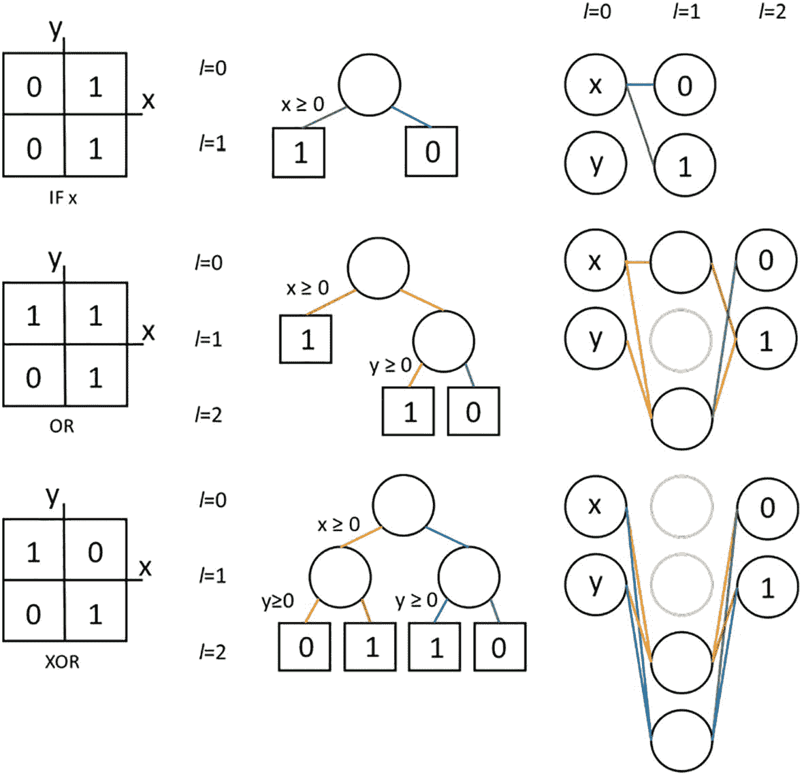

逻辑操作、决策树和神经网络的示意图。在左侧是 if x、O R 和 X O R 的 3 个逻辑操作。中间是逻辑操作的 3 个决策树。右侧是从决策树映射过来的 3 个神经网络。

图 7-8

用于逻辑操作的训练决策树随后映射到神经网络，提供了高度的结构可解释性。来自 K. D. Humbird 等人。

作者对 DJINN 进行了一系列的测试和比较。以下是他们发现的一个总结：

1.  使用预训练的基于树的集成模型作为基线模型，在性能上始终优于单树模型。例如，Bagging 方法如随机森林可以映射到多个弱神经网络。最终的预测只是所有映射网络的平均值。图 7-9 显示了在四个不同的表格数据集（波士顿住房、糖尿病进展、加利福尼亚住房和惯性约束核聚变冲击模拟）上训练的 DJINN 的结果，这些数据集的集成树数量不同。经验表明，集成中的树的数量增加比减少更好。以下图表显示了均方误差作为集成中树数量的函数（图 7-9）。

    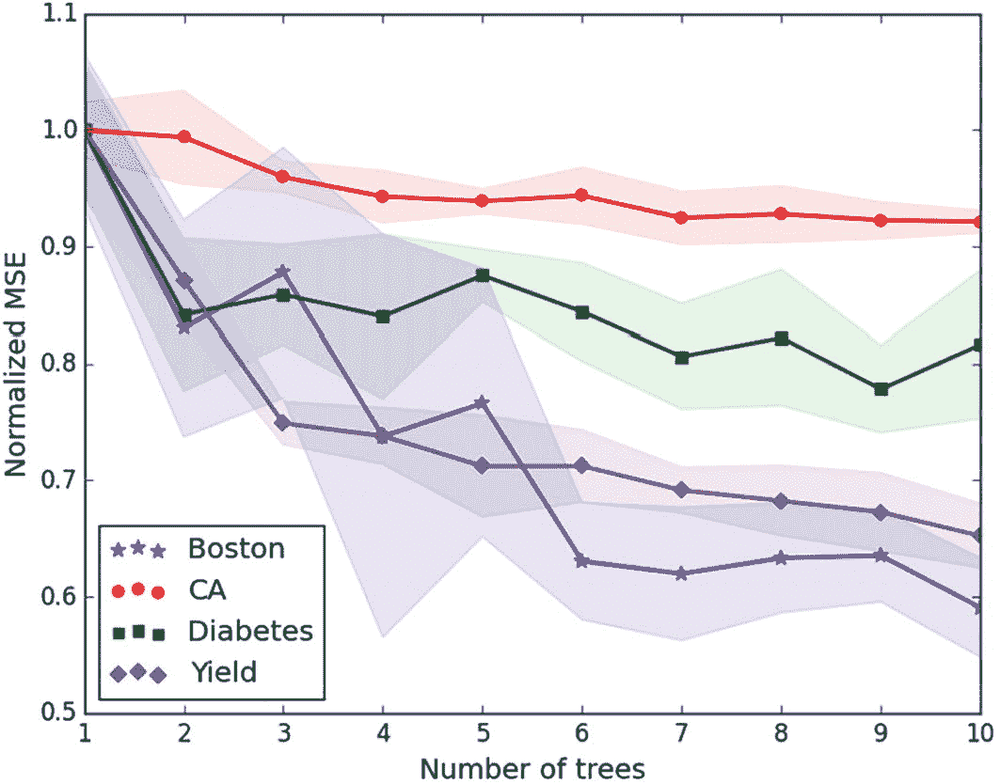

    一条线图显示了标准化均方误差与树的数量之间的关系。它显示了波士顿、C A、糖尿病和产量的趋势呈下降趋势，但有一些波动。

    图 7-9

    DJINN 在四个不同的表格数据集上的性能与集成中使用的树的数量进行比较。来自 K. D. Humbird 等人。

1.  DJINN 的基于树的结构可以被视为模型训练的预热启动。两个独特的特性将 DJINN 作为预热启动技术与其他技术区分开来：其非零权重的稀疏性和它们的放置。这些优势在与其他权重初始化方法的比较中显示出来，包括密集连接的 Xavier 初始化权重、^(7)随机初始化每层相同数量的非零权重并随机放置，以及最后是一个标准的两层隐藏层 ANN。再次，MSE 指标与训练轮次数量相对应（见图 7-10）。

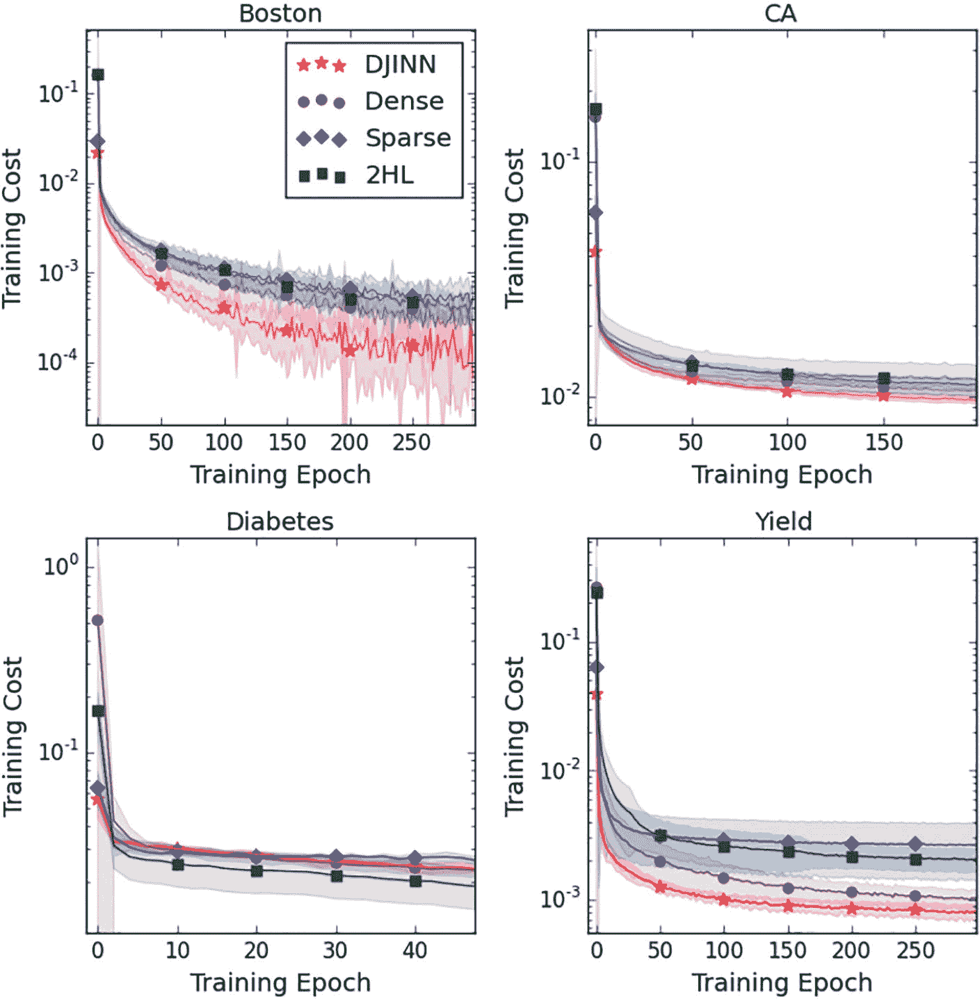

4 张训练成本与训练轮次对比图。在标记为波士顿、加州、糖尿病和产量的图中，D J I N N、密集、稀疏和 2 H L 的曲线呈现下降趋势。

图 7-10

不同权重初始化方法的性能比较。来自 K. D. Humbird 等人。

DJINN 的实现可以在 GitHub 上找到，地址为[`https://github.com/LLNL/DJINN`](https://github.com/LLNL/DJINN)，适用于 TensorFlow。要安装，我们可以将仓库克隆到当前目录，并下载`requirement.txt`中提到的包（见列表 7-15）。

```py
git clone https://github.com/LLNL/DJINN.git
cd DJINN
pip install -r requirements.txt
pip install .
from djinn import djinn
Listing 7-15
Installing DJINN and importing the package
```

为了说明该包提供的用于选择各种超参数和训练的简单流程，我们将使用乳腺癌数据集作为模型的输入数据（见列表 7-16）。

```py
breast_cancer_data = load_breast_cancer()
X = breast_cancer_data.data
y = breast_cancer_data.target
X_train,X_test,y_train,y_test=train_test_split(X, y, test_size=0.25)
Listing 7-16
Importing the dataset and performing train-test split
```

接下来，我们将创建一个`DJINN_Classifier`对象，并指定树的超参数。基于这些超参数，库将搜索映射网络的最佳训练参数（见列表 7-17）。

```py
# dropout keep is the probability of keeping a neuron in dropout layers
djinn_model = djinn.DJINN_Classifier(ntrees=1, maxdepth=6, dropout_keep=0.9)
# automatically search for optimal hyperparameters
optimal_params = djinn_model.get_hyperparameters(X_train, y_train)
batch_size = optimal_params['batch_size']
lr = optimal_params['learn_rate']
num_epochs = optimal_params['epochs']
Listing 7-17
Instantiating a DJINN classifier object and getting the optimal hyperparameters for the mapped network
```

一旦获得训练参数，我们只需在模型上调用`train`方法并填写最优超参数（见列表 7-18）。

```py
model.train(X_train, y_train,epochs=num_epochs,learn_rate=lr, batch_size=batch_size, display_step=1,)
Listing 7-18
Training DJINN using the train method
```

通过调用模型的预测方法可以生成预测结果（见列表 7-19）。

```py
from sklearn.metrics import auc
preds = djinn_model.predict(X_test)
print(auc(preds, y_test))
Listing 7-19
Predicting using DJINN
```

DJINN 可以被视为表格数据任务的优化网络架构，以及一种全新的建模技术，用于优化结构化数据集上的深度学习性能。它在操作和利用基于树的模型架构方面的巧妙性也增加了另一层结构互操作性；换句话说，我们知道为什么网络架构是这样的结构。

### Net-DNF

在经典二进制逻辑中，*析取范式*（DNF）是一个逻辑表达式，其中两个或多个文字的合取由主范围内的析取连接。为了提供理解 DNF 的相关词汇

+   *变量*持有两个真值之一（真或假），通常用大写字母表示，如*A*、*B*或*C*（等等）。

+   *否定*等同于逻辑*非*运算符，在逻辑中用¬表示。例如，¬*A*表示“非*A*”或“A*的否定。”如果*A*为真，则¬*A*评估为假。

+   **文字**要么是一个变量，要么是变量的否定。例如，以下都是文字：*A*，¬*B*，¬*C*，*F*。

+   **合取**等同于逻辑**与**运算符，在逻辑中用⋀表示。例如，*A* ⋀ *B*表示“*A* 和 *B*”；如果*A*为真且*B*为假，则*A* ⋀ *B*评估为假。或者，*A* ⋀ ¬*B*评估为真。合取不是一个文字。

+   **析取**等同于逻辑**或**运算符，在逻辑中用⋁表示。例如，*A* ⋁ *B*表示“*A* 或 *B*”；如果*A*为真且*B*为假，则*A* ⋁ *B*评估为真。或者，¬*A* ⋁ *B*评估为假。析取不是一个文字。

+   如果合取或析取没有被任何其他运算符“包裹”，则认为它在**广泛范围**内。例如，在表达式(*A* ⋁ ¬*B*)⋀*C*中，合取⋀是“最外层”的运算符；没有东西包裹它。另一方面，在表达式(*A*⋀¬*B*)⋁*C*中，合取不是广泛范围的，因为它被析取⋁包裹。在这种情况下，析取是广泛范围的。

将所有这些放在一起，析取范式具有所有都是广泛范围的析取；析取的每个论点（即，被析取的表达式）必须是文字或文字的合取.^(8)以下是在 DNF 中的表达式示例：

+   (¬*A* ⋀ ¬*B* ⋀ *C*) ⋁ *D*

+   *A* ⋁ (¬*B* ⋀ ¬*C* ⋀ *D*)

+   *A* ⋁ (¬*B* ⋀ ¬*C* ⋀ *D*) ⋁ *E*

+   *A* ⋁ (¬*B* ⋀ ¬*C* ⋀ *D*) ⋁ *E* ⋁ (*A* ⋀ ¬*F*)

+   *A* ⋁ *B*

以下是不在 DNF 中的表达式示例：

+   *A* ⋀ *B*; 合取而不是析取是广泛范围的。

+   *A* ⋁ (*A* ⋀ (¬*B* ⋁ *C*)); 析取不是广泛范围的。

+   ¬(*A* ⋁ *B*); 否定而不是析取具有广泛的范围。

为什么 DNF 如此相关？决策树可以用特征分割条件上的 DNF 公式表示。例如，考虑以下以嵌套形式表示的决策树逻辑^(9)：

+   如果温度大于 80 度

    +   携带防晒霜。

+   如果温度不超过 80 度

    +   如果前往阴影区域

        +   不要携带防晒霜。

    +   如果不去阴影区域

        +   携带防晒霜。

让*A*代表一个布尔变量，表示陈述“温度是否大于 80 度”的真值。让*B*代表陈述“你将去阴影区域”的真值。我们可以如下直观地用析取范式表达决策树：


真值表示我们是否应该携带防晒霜（真）或不应携带（假）。假设温度不超过 80 度（*A* = 假）并且我们不打算去阴影区域（*B* = 假）。那么，*A* ∨ ¬*B* = 假 ∨ ¬假 = 真。根据我们的树形图，我们将携带防晒霜。

以色列理工学院和谷歌的 Ami Abutbul、Gal Elidan、Liran Katzir 和 Ran El-Yaniv 在 2020 年 ICLR 论文“DNF-Net：表格数据的神经网络架构”中提出，使用析取正常形式的“构建块”构建深度学习网络来模拟表格数据。作者提出，使用理论上能够表达决策树逻辑的 DNF 单元可以帮助开发表格数据问题中成功的决策树模型的神经网络模拟：^(10)

> …森林方法在处理各种表格数据方面的“通用性”表明，使用神经网络来模拟树集成表示和算法中的重要元素可能是有益的。

然而，为了将自定义单元设计集成到神经网络架构中，它必须是可微分的。传统的析取和合取运算符不可微分。Abutbul 等人提出了*析取正常神经形式*（DNNF）块，它使用“软”且因此可微分的这些逻辑门的推广。

DNNF 使用一个两层隐藏层神经网络实现，并复制了析取正常形式公式的结构。第一层推导出“文字”，这些文字被传递到一系列软合取中。然后这些软合取被传递到析取门。

软析取和合取门定义为以下：

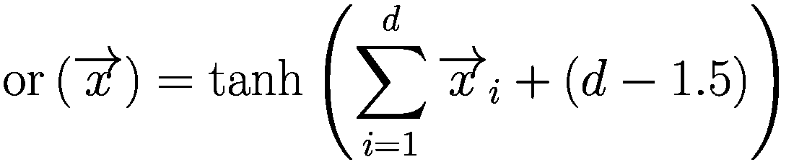

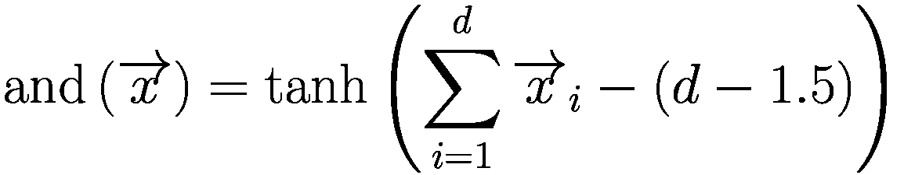

让我们考虑输入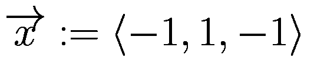。这代表了 False、True 和 False 的输入。如果我们对输入应用析取（或）运算，我们正在计算 False ∨ True ∨ False 的表示。我们可以如下计算这个输入的析取和合取：

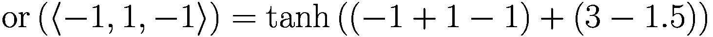

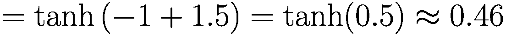

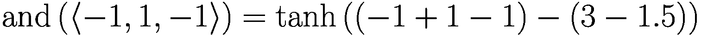

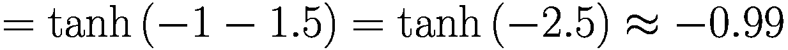

事实上，False ∨ True ∨ False = True（0.46 更接近“True” +1 而不是“False” −1）和 False ∧ True ∧ False = False（−0.99 更接近“False” −1 而不是“True” +1）。

然而，需要注意的是，这些软神经网络门也进行了一点“真假程度”的量化。False ∨ True ∨ False 可以被认为是“弱真”，因为只有一个论点使析取为真。另一方面，or(⟨1, 1, 1⟩)获得一个更高的结果 0.9998，因为 True ∨ True ∨ True 是“强真”。

作者使用修改版的连接词版本来选择某些文字，而不是被迫接受所有文字。回想一下，在 DNF 中，文字是通过连接词连接的；我们希望给网络提供一个机制，以便只选择要连接的文字子集。否则，给定一些假设的文字集合 *A*，*B*，*C*，…，唯一可能的 DNF 表达式使用以下模式（其中析取的论点是任意次数重复的）：

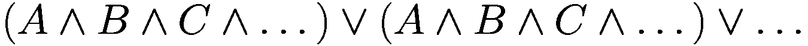

这并不很有信息量。但如果我们根据连接词的论点“掩码”变量以形成一个更具有表达力的公式：

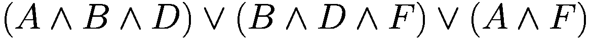

作为一项技术细节，作者将其限制为每个文字只能属于 *一个* 连接词，例如：

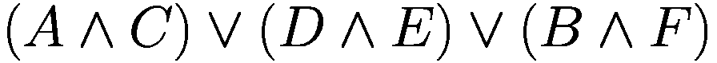

为了启用这种掩码，我们使用一个 *投影连接词门*，它接受一些掩码向量 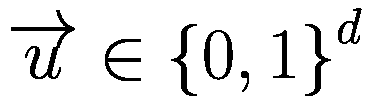 来选择输入  中的变量：

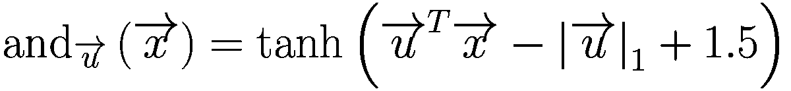

注意，这是对最初引入的软连接词公式的推广。我们只对选定的变量求和，减去选定变量的数量（由掩码向量的 L1 范数给出，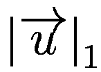，因为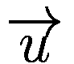是二进制的），并添加一个偏置 1.5。

我们可以正式定义析取正常神经网络块如下：

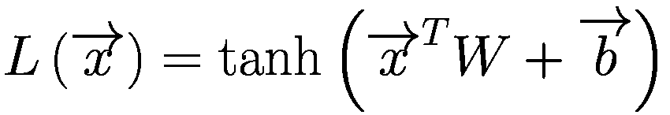

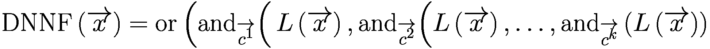

注意，*c*^(*i*) 表示一个 *d*-长度掩码向量，它决定了在宽范围析取的 *i* 个论点中哪些变量被选中进行合取。这些是可学习的，但如何实现这一技术的具体细节在章节中省略，可以在论文中找到。作者使用梯度技巧来克服在连续优化环境中学习二进制掩码时产生的梯度问题。

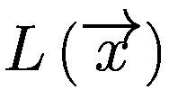 帮助生成“文字”，这些文字在后续层中通过软析取范式表达式进行处理，而不需要任何学习参数。这个过程可以被视为在树形上下文中创建分割条件的神经等效。

一个 *DNF-Net* 是通过堆叠 *n* 个 DNNF 块形成的，其输出通过标准密集层进行线性变换并求和：

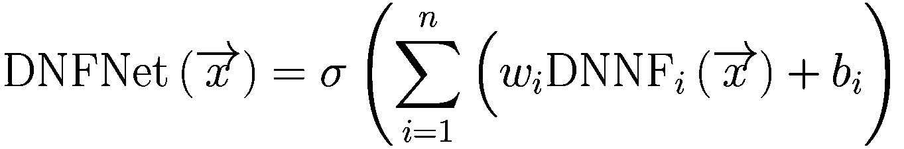

DNF-Net 在各种表格数据集上与 XGBoost 具有竞争力，并且比标准全连接网络表现更优（见表 7-4）。虽然 DNF-Net 并不是 XGBoost 的绝对优势竞争者，但它以软神经形式对树形逻辑结构的可微分模拟具有前景，并可能成为改进研究的基础。

表 7-4

与 XGBoost 和全连接神经网络相比，DNF-Net 在几个数据集上的性能。来自 Abutbul 等人。

| 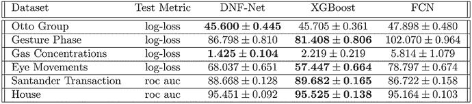一个包含 5 列和 6 行的表格。列标签是数据集、测试指标、DNF 网络结构、XGBoost 和 FCN。行标签是 Otto 组、手势阶段、气体浓度、眼动、Santander 交易和房屋，并给出了它们的值。 |
| --- |

我们将实现一个非常简单且不完整的 Net-DNF 修改版本，以具体说明之前讨论的理论。论文的作者添加了额外的机制以提高性能和功能；仓库可以在此查看：[`https://github.com/amramabutbul/DisjunctiveNormalFormNet`](https://github.com/amramabutbul/DisjunctiveNormalFormNet)。

我们将首先定义以下网络配置（见列表 7-20）：

+   *由生成的文字数量*：这构成了每个 DNNF 块可用的“词汇”。

+   *析取的参数数量*：这是我们为每个 DNNF 块生成的合取表达式数量，并将其传递到析取中。

+   *平均合取文字数量*：这是从所有可用的合取文字中选取的平均文字数量。

+   DNNF 块的数量

```py
NUM_LITERALS = 64
NUM_DISJ_ARGS = 32
AVG_NUM_CONJ_LITS = 16
NUM_DNNF_BLOCKS = 8
Listing 7-20
Setting relevant constants
```

让我们先定义神经析取门。我们将析取参数的数量（这是析取输入向量的长度）设为一个常数，并在神经析取计算中使用它（见列表 7-21）。

```py
NUM_DISJ_ARGS_const = tf.constant(NUM_DISJ_ARGS, dtype=tf.float32)
def neural_or(x):
return K.tanh(K.sum(x, axis=1) + NUM_DISJ_ARGS_const - 1.5)
neural_or = L.Lambda(neural_or)
Listing 7-21
Defining a neural OR function
```

我们将输入和掩码向量传递到神经门中，并使用给定的计算（见列表 7-22）。

```py
def neural_and(inputs):
x, u = inputs
u = tf.reshape(u, (NUM_LITERALS,1))
return K.tanh(K.dot(x, u) - K.sum(u) + 1.5)
neural_and = L.Lambda(neural_and)
Listing 7-22
Defining a neural AND function
```

为了简化问题，我们将按照以下方式选择合取的文字：在创建每个 DNNF 块时，我们选择一个随机比例的文字（具有指定的平均比例），这是固定的——它成为层的一个内在部分。

我们可以通过定义一个“刺激”张量来实现这一点，该张量具有形状（析取参数数量，文字数量），并用从均匀分布[0, 1)中随机抽取的样本填充。如果小于平均合取文字数量/文字数量，则张量的所有元素都设置为 1，否则为 0。这创建了一个随机的固定掩码来选择合取的文字。

然后，对于每个析取参数，我们通过传递完整的文字集（`literals`）和相应的掩码向量（`masks[i]`）来对选定的文字执行合取操作。输出被连接在一起，生成一个单一的向量输出，该输出被传递到神经析取输出。

DNNF 函数（见列表 7-23）接受一个输入并将其连接到输出层，然后返回。

```py
def DNNF(inp_layer):
stimulus = tf.random.uniform((NUM_DISJ_ARGS, NUM_LITERALS))
ratio = tf.constant(AVG_NUM_CONJ_LITS / NUM_LITERALS)
masks = tf.cast(tf.math.less(stimulus, ratio), np.float32)
literals = L.Dense(NUM_LITERALS, activation='tanh')(inp_layer)
disj_args = []
for i in range(NUM_DISJ_ARGS):
disj_args.append(neural_and([literals, masks[i]]))
disj_inp = L.Concatenate()(disj_args)
disj = neural_or(disj_inp)
return L.Reshape((1,))(disj)
Listing 7-23
Defining a DNNF layer
```

DNF-Net 可以按照以下方式构建（见列表 7-24）。

```py
def DNF_Net(input_dim, output_dim):
inp = L.Input((input_dim,))
dnnf_block_outs = []
for i in range(NUM_DNNF_BLOCKS):
dnnf_block_outs.append(DNNF(inp))
concat = L.Concatenate()(dnnf_block_outs)
out = L.Dense(output_dim, activation='softmax')(concat)
return keras.models.Model(inputs=inp, outputs=out)
Listing 7-24
Defining the DNF-Network
```

然后，模型可以在数据集上实例化、编译和拟合。

## 提升和堆叠神经网络

其他模型通过将提升技术应用于神经网络领域来模仿树集成的成功，使用提升和堆叠。本节讨论了采用此方法的两个样本研究论文：

+   *“Sarkan Badirli 等人提出的‘GrowNet’*：通过梯度提升方法训练多个弱神经网络学习器的集成。

+   *“Tushar Sarkar 提出的‘XBNet’*：通过 XGBoost 算法训练网络集成。

注意，第十一章讨论了多模型排列技术，这是 GrowNet 和 XBNet 的建模方法的一个广泛类别。

### GrowNet

GrowNet（梯度提升神经网络）完美地符合“提升和堆叠神经网络”的范畴——它模仿了一个由 S. Badirli、X. Liu、Z. Xing、A. Bhowmik 和 S.S. Keerthi 在 2020 年提出的梯度提升机，其中每个弱学习器都是一个浅层人工神经网络。GrowNet 利用梯度提升框架的强大结构优势，同时让神经网络发现梯度提升机无法理解的复杂关系。11

直观上，所提出的神经网络训练方法似乎会比标准人工神经网络表现得更好。早在 1990 年代，就提出了简单的集成技术，如加权平均和多数投票。由于它们可以结合来自不同角度的学习结果，集成模型几乎总是优于单一模型。回顾第一章，梯度提升被认为是一种集成技术，属于提升类别。Badirli 等人改编了 GBM 的结构和他们的学习方法；他们将那些关键特性应用于神经网络。目前，GBM 沿与其他基于树的模型一起，主导着表格数据人工智能领域。设计在结构化数据上持续表现良好的神经网络仍然是一个巨大的挑战。然而，梯度提升机的典型弱学习器无法发现可能定义特征与目标之间相关性的复杂、非线性关系。GrowNet 用浅层人工神经网络替换了梯度提升机通常使用的基于树的弱学习器，希望它能利用独特的提升概念，同时拥有神经网络的学习能力。

按照作者使用的符号，假设一个包含 *n* 个样本的 *d*-维特征空间的 *D* 数据集：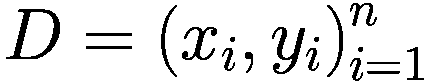。GrowNet 使用 *K* 个加性函数，或称为弱学习器，来预测输出：

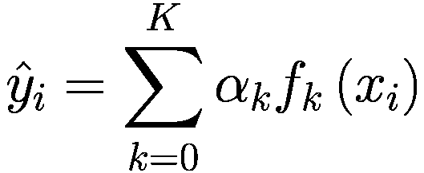

在 GBM 的语言中，*α*[*k*]代表提升率，它控制每个弱学习器对最终预测的贡献程度。回顾第一章，弱学习器的目标是逐步纠正前一个学习器的错误，通过预测伪残差来实现。在 GrowNet 中，不是使用基于树的模型作为弱学习器，而是浅层神经网络*f*[*k*]被分配预测伪残差的任务。我们定义损失函数为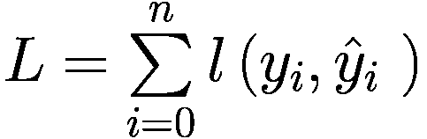。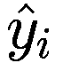的值在提升的每个阶段都是通过加法计算的，因为每个学习器都是贪婪地寻求的，其预测是通过前一个阶段的输出计算的。在阶段*t*，损失可以计算为：


采用二阶优化技术，因为它们可以导致更快地收敛，并且在当前情况下优于一阶优化方法。GrowNet 中的神经网络使用牛顿-拉夫森步骤进行训练。此外，使用损失函数的二阶泰勒展开来简化计算复杂度。展开后，损失函数可以简化为：


其中与*g*[*i*]和*h*[*i*]分别是损失函数在*x*[*i*]关于的一阶和二阶梯度。有关详细的数学解释，请参阅原始论文。GrowNet 的一般架构可以在图 7-11 中看到。


Grow Net 架构图展示了从 1 到 K 的一系列模型。每个模型包含输入、隐藏特征和最终特征，分别对应 W 下标 in、W 下标 hidden 和 W 下标 out。

图 7-11

GrowNet 的架构表示。来源：Badirli 等人。

与神经网络相比，基于树的模型的一个显著缺点是它们无法同时更新它们的参数（更多细节，请参阅“深度神经网络决策树”部分）。相反，它们只能一次优化一个参数，在移动到下一个参数之前找到该参数的最优值。尽管 GrowNet 算法依赖于几个小的神经网络作为其基础，但这些“弱学习器”无法在其训练阶段之后进一步更新它们的参数。为了解决这个问题，论文的作者在每一个阶段之后实施了一个校正步骤。在校正步骤期间，所有弱学习器的参数都相对于整个 GrowNet 进行更新。此外，每个阶段的提升率在校正步骤期间通过反向传播动态调整。校正步骤的细节如图 7-12 所示。


Grow Net 校正步骤的算法。它包括以下循环中的步骤。计算增长网络输出，计算损失，更新模型 f 的下标 m 参数，并更新步长大小。

图 7-12

GrowNet 校正步骤的算法细节。来自 Badirli 等人。

考虑一个回归示例，其中采用均方误差（MSE），表示为*l*，作为损失函数。GrowNet 的一般训练过程可以概述如下：

1.  实例化一个浅层神经网络。这将是 GrowNet 中总共*K*个阶段中的第一个训练阶段。该网络在完整的数据集{*x*,  *y*}上训练，其中*x*代表特征，*y*代表目标。

1.  从第二个训练阶段到最后一个训练阶段*K*，模型将在上进行训练。让我们逐个分析每个变量。特征结合了原始数据集特征和从前一个弱学习器*K* - 1 获得的次级特征。在这里，次级特征是从最终隐藏层（不是输出层）的原始输出中获得的。的维度将始终是数据集特征的数量加上弱学习器最终隐藏层中的神经元数量。这将在训练阶段保持不变，因为每个弱学习器都有相同的网络架构。回想一下前面修改后的损失函数，是计算损失函数关于的一阶和二阶导数的负商。我们可以这样计算 MSE 损失函数的相应梯度：

    

简化后，我们得到的表达式。


我们发现这是 GBM 中伪残差的精确计算。

1.  修正步骤已实施。我们将 GrowNet 视为一个巨大的神经网络，并通过计算其输出，通过计算其损失。接下来，对于每个实例化的弱学习器*f*，其参数通过反向传播和每个阶段的提升率*α*[*k*]进行更新。这个修正步骤会重复进行一定数量的时代。

1.  步骤 2 和 3 在每个训练阶段重复*K*次。

GrowNet 的完整技术算法，包括修正步骤，在作者的伪代码（图 7-13）中展示。


全部 GrowNet 训练算法有输入、输出和步骤。步骤包括第一部分，单个模型训练，和第二部分，在循环中的修正步骤。

图 7-13

GrowNet 的完整算法。来自 Badirli 等人。

GrowNet 可以适应分类、回归和排序学习。实验结果表明，GrowNet 在经验上优于 XGBoost 和另一个结构类似的模型 AdaNet。每个弱学习器都采用两个标准密集层，神经元数量等于输入特征维度的一半。提升率最初设置为 1，然后由模型自动调整。对于分类，模型在希格斯玻色子数据集上训练，而计算机断层扫描（在轴向轴上检索 CT 切片的位置）和年度预测 MSD（百万歌曲数据集的一个子集）数据集用于回归。实验结果显示在表 7-5 和 7-6 中。

表 7-6

回归实验结果。来自 Badirli 等人。

| -一个 2 列 3 行的表格。列标签是音乐年份预测 p r e d dot 和切片局部 z dot。行标签是 X G boost，A d a net，以及 grow net，它们的值给出。 |
| --- |

表 7-5

分类实验结果。来自 Badirli 等人。

| -一个 2 列 4 行的表格，数据如下。X G Boost，0.8304。Grow net 全数据，0.8510。Grow net 数据采样等于 10%，0.8439。Grow net 数据采样等于 1%，0.8180。 |
| --- |

实验结果确实表明，GrowNet 在性能上优于 XGBoost 及其竞争对手 AdaNet，后者采用类似的方式构建神经网络。可以在 Yam Peleg 编写的以下 GitHub gist 中找到 GrowNet 的实现，[`https://gist.github.com/ypeleg/576c9c6470e7013ae4b4b7d16736947f,`](https://gist.github.com/ypeleg/576c9c6470e7013ae4b4b7d16736947f)，我们可以通过克隆 gist 来下载它。

列表 7-25 中的以下代码行将下载并导入 gist。

```py
!git clone https://gist.github.com/576c9c6470e7013ae4b4b7d16736947f.git grow_net
import grow_net
Listing 7-25
Downloading and importing the GrowNet package
```

我们可以使用 Keras 创建一个架构，并用 `GradientBoost` 对象包装它。调用 `fit` 将网络训练为 GrowNet 模型。以下示例（列表 7-26）将使用加利福尼亚住房数据集。

```py
from sklearn.datasets import fetch_california_housing
from sklearn.model_selection import train_test_split
import tensorflow as tf
import tensorflow.keras.callbacks as C
import tensorflow.keras.layers as L
import tensorflow.keras.models as M
data = fetch_california_housing()
X = data.data
y = data.target
X_train, X_test, y_train, y_test = train_test_split(X, y, test_size=0.25)
inp = L.Input(X.shape[1])
x = L.BatchNormalization()(inp)
x = L.Dense(64, activation="swish")(x)
x = L.Dense(128, activation="swish")(x)
x = L.BatchNormalization()(x)
x = L.Dropout(0.25)(x)
x = L.Dense(32, activation="swish")(x)
x = L.BatchNormalization()(x)
out = L.Dense(1, activation='linear')(x)
model = M.Model(inp, out)
model.compile(tf.keras.optimizers.Adam(learning_rate=1e-3), 'mse')
model = GradientBoost(model, batch_size=4096, n_boosting_rounds=15, boost_rate = 1, epochs_per_stage=2)
Listing 7-26
Defining and compiling the GrowNet model
```

最后，我们可以像往常一样调用 train 和 predict 方法（列表 7-27）。

```py
model.fit(X_train, y_train,batch_size=4096)
from sklearn.metrics import mean_squared_error
mean_squared_error(y_test, model.predict(X_test))
Listing 7-27
Training and predicting using GrowNet
```

与大多数基于树的集成模型一样，GrowNet 需要进行大量的超参数调整，以榨取其性能的每一分。GrowNet 为神经网络和基于树的两种方法都提供了许多改进；它是两种方法的混合结果。其性能可以接近甚至超越之前已知在结构化数据任务中表现优异的模型。

### XBNet

由 Tushar Sarkar 于 2021 年提出的 XBNet，通过一种简单而有效的方法结合了 XGBoost 和神经网络的强大功能，而对两个模型都没有进行太多修改。12 回想一下第一章中提到的 XGBoost，即极端梯度提升。XGBoost 是一种高度优化的梯度提升算法，将效率、速度、正则化和性能结合到一个模型中。XGBoost 不仅使用自定义定义的分割标准，而且在创建每个树之后对其进行修剪，以引入正则化并提高训练速度。大多数基于树的模型和 GBM，包括 XGBoost，可以轻松计算数据集的特征重要性值。每个特征产生一个数值，它告知相对其他特征，该特征对模型预测的相对有益程度。大多数深度学习模型缺乏解释每个单独特征如何对模型预测做出贡献的能力。因此，特征重要性是常用的工具，用于更好地理解某些特征与标签之间的关系，并用作特征选择的度量，以改善模型性能。

与本章讨论的大多数其他网络一样，XBNet 试图结合深度学习方法和基于树的模型的优势。像 GrowNet 一样，XBNet 使用神经网络作为其基础模型，并修改其训练过程以包含梯度提升机的特征。具体来说，这些修改可以总结为两个主要思想：(a)基于 GBM 特征重要性值的智能权重初始化和(b)修改反向传播以允许通过 GBM 特征重要性值进行权重更新。在不大幅修改网络结构和参数更新过程的情况下，我们可以保持神经网络提供的优势，同时注入 XGBoost 对数据的见解（图 7-14）。


一张图展示了通过箭头连接的密集层 1、2 和 3。输入在层 1 给出，层 3 提供损失计算。每一层都与对应层的特征重要性相连，该层获取输出。从损失计算到的一个箭头被标记为带有增强梯度的反向传播。

图 7-14

XBNet 的架构。由 Tushar Sarkar 提供

除了包含特征重要性之外，Tushar Sarkar 还提出了调整损失函数以包含一个 L2 正则化参数来防止过拟合。XBNet 可能比标准的 ANN 更容易过拟合，因为它包含了 GBM 特征重要性值的信息。由于加入了 XGBoost 的信息，它可能比训练常规网络更为严重。

在某些预测任务中，神经网络可能被初始化为预训练或预计算的权重，以便更好地适应问题情况，本质上给网络一个“加速启动”（是的，这在某些方面与 DJINN 相似！）的想法！通常，使用预训练权重来提高特定领域任务的性能的想法应用于非结构化数据集，如图像、音频或文本数据。对于表格数据，很少看到有预训练权重，因为表格数据集的多样性很大。找到一个可以用于预训练特定网络架构并且能够轻松泛化到其他数据集的表格数据集是一项相当艰巨的任务。

Tushar Sarkar 提出的智能权重初始化方法涉及使用 GBMs，特别是 XGBoost 模型。在初始化 XBNet 之前，XGBoost 模型在整个数据集上训练。在初始化网络之后，我们将每个输入神经元的权重设置为 XGBoost 计算出的相应特征重要性值。13 在一定程度上，我们为每个输入神经元分配了一个权重，表示每个输入神经元或数据集中的每个特征可能对网络训练/预测的贡献程度。由于这些预分配的值是从 XGBoost 中获得的见解，而 XGBoost 是一个与神经网络完全不同的训练方案的模型，因此这些值可能不是网络的最优值。尽管如此，“加速启动”的 XGBoost 可以为 XBNet 提供的优势超过了随机权重初始化所能达到的。

如同往常一样，为了详细解释和演示 XBNet 算法，我们可以按以下步骤概述 XBNet 的训练过程：

1.  初始化一个 XGBoost 模型并在整个数据集上拟合它。然后我们可以获得数据集的特征重要性值。存储数据集特征重要性值的向量长度应等于 XBNet 的输入神经元数量。

1.  初始化 XBNet。XBNet 的架构应该看起来像任何其他标准人工神经网络：神经元的数量、隐藏层和激活函数都是用户的选择。输入神经元的权重设置为从步骤 1 中获得的特征重要性值。每个输入神经元应对应于数据集中的某个特征；该特征的特征重要性值将是输入神经元的初始权重值。

1.  我们将通过从每一层的前馈输出中训练一个单独的 XGBoost 模型来执行神经网络中修改版的前馈操作。令 *w*^((*l*)) 和 *b*^((*l*)) 分别表示层 *l* 的权重和偏置。用 *z*^((*l*)) 表示层 *l* 的原始输出，即在应用层的激活函数 *g*^((*l*))(*x*) 之前。最后，我们将让 *A*^((*l*)) 表示应用激活函数后的最终层输出。以下方程可以执行层 *l* 的前馈操作：

    


我们将为层 *l* 实例化一个新的 XGBoost 模型，并将其表示为 xgb^((*l*)); 这与步骤 1 中使用的模型不同。该模型将基于层 *l* 的原始输出与当前批次的真实值 *y*^((*i*)) 进行训练，其特征重要性值（在这里，我们将 *A*^((*l*)) 中的每个神经元输出视为一个特征）将存储在 *f*^((*l*)) 中：


在训练过程中，这一步会重复应用于网络的每一层。为每一层实例化的 XGBoost 模型将具有相同的超参数。从技术角度来看，这允许我们只在内存中存储一个 XGBoost 模型，并在每一层重置其训练历史。

1.  我们将使用 *f*^((*l*)) 实现一个修改后的反向传播算法。首先，使用 L2 正则化（更多详细信息，请参阅第一章）计算损失，其中  表示损失函数，*λ* 是正则化强度超参数：

    

接下来，我们可以使用标准的梯度下降更新规则（或根据使用的优化器选择的其他更新规则）来更新权重和偏置：


通过利用我们为初始化输入层权重所推导出的相同直觉，我们可以将 *f*^((*l*)) 纳入更新规则：


通过添加特征重要性值，我们实际上通过使用 XGBoost 的度量来改变层 *l* 中每个权重对网络的贡献程度。然而，我们不能简单地将 *f*^((*l*)) 添加到权重矩阵中，因为我们不能保证它们在每个 epoch 中都会保持相同的顺序。特征重要性值的规模将由于其定义在 XGBoost 的上下文中而保持不变，这与神经网络无关。由于基于梯度的更新，网络权重不会保持与 *f* ^((*l*)) 相同的顺序；因此，我们在使用它来更新 *w* ^((*l*)) 之前将其乘以一个标量。我们可以用  替换之前显示的更新规则 *w*^((*l*)) ≔ *w*^((*l*)) + *f*^((*l*))。整个权重矩阵 *w*^((*l*)) 中的最小值用作缩放因子，以确保 *f*^((*l*)) 的每个值都会与 *w*^((*l*)) 保持相同的顺序。

再次，这一步骤会重复应用于网络的每一层（正如反向传播应该做的那样）。

1.  XBNet 的推理与其他任何 ANN 一样，通过正向传播来完成。

为了参考，图 7-15 中是 XBNet 的伪代码。


使用增强梯度下降训练 X B net 的步骤算法。输出是最小化成本函数。步骤包括正向传播、成本计算和 for 循环内的反向传播。

图 7-15

Tushar Sarkar 提供的 XBNet 增强梯度下降的完整算法/伪代码

作者提到，让每一层都通过 XGBoost 进行“增强”并不总是有帮助。在大多数情况下，拥有几个未被 XGBoost 增强的隐藏层可以达到最佳性能。此外，为了减少训练成本，所有训练的 XGBoost 模型的 `n_estimator` 参数通常固定为 100。设计 XBNet 架构的另一个经验法则是与传统的 ANNs 相比，拥有更少的层和神经元，并将增强层推向网络的前部而不是后部。

XBNet 与一些知名的表格数据集进行了基准测试；尽管没有提到具体的超参数，但在大多数情况下，XBNet 可以略微超越 XGBoost 的性能（见表 7-7）。

表 7-7

与 Tushar Sarkar 比较的基准数据集上的结果

| -一个包含 3 列和 7 行的表格。列标签是数据集、X B net 和 X G boost。行标签是 Iris、乳腺癌、酒、糖尿病、泰坦尼克号、德国信用和数字补全。 |
| --- |

虽然 XBNet 的官方实现是用 PyTorch 编写的，但使用这个实现并不需要了解 PyTorch。代码可以在以下 GitHub 仓库中找到：[`https://github.com/tusharsarkar3/XBNet`](https://github.com/tusharsarkar3/XBNet)。该库目前不在 PyPI 上；要安装它，我们需要使用以下`pip`命令直接从网络下载相关代码：`pip install --upgrade git+`[`https://github.com/tusharsarkar3/XBNet.git`](https://github.com/tusharsarkar3/XBNet.git)`.` 值得注意的是，在官方 XBNet 实现中无法调整提升树的超参数。对于那些好奇的人，XBNet 中的每个 XGBoost 模型都设置为有 100 个估计器，而其他所有参数都保持为 XGBoost 库设置的默认参数。

安装完成后，我们可以导入一些东西来帮助我们训练和实例化模型以及进行预测（见列表 7-28）。

```py
from XBNet.training_utils import training,predict
from XBNet.models import XBNETClassifier
from XBNet.run import run_XBNET
Listing 7-28
Imports needed for XBNet
```

由于该库仍然基于 PyTorch，我们还需要安装 PyTorch 并导入 Torch，如列表 7-29 所示。

```py
!pip install torch
import torch
Listing 7-29
Installing and importing PyTorch
```

该库包含用于分类和回归的独立模型。这两个模型类的工作方式相同，唯一的区别是预测任务类型。我们将使用 Iris 花数据集来训练一个 XBNet 模型（见列表 7-30）以进行演示。

```py
# example dataset using sklearn's iris flower
# dataset
from sklearn.datasets import load_iris
raw_data = load_iris()
X, y = raw_data["data"], raw_data["target"]
from sklearn.model_selection import train_test_split
X_train, X_test, y_train, y_test = train_test_split(X, y, test_size=0.25)
Listing 7-30
Loading the dataset from sklearn and performing train-test split
```

实例化时传入的前两个参数是`X`和`y`数据。接下来，我们可以指定层数和提升层数。如前所述，该库在提升树本身上没有提供太多灵活性。实例化确实使用了一个命令提示窗口，它会询问每层的神经元数量和输出层的激活函数。再次强调，网络的自定义缺乏灵活性，但它提供了无需学习 PyTorch 语法的简单用法（见列表 7-31）。

```py
xbnet_model = XBNETClassifier(X_train,y_train, num_layers=3, num_layers_boosted=2,)
Listing 7-31
Instantiating an XBNet classifier
```

要训练模型，我们需要使用 PyTorch 语法定义我们的损失函数和优化器。PyTorch 中所有预定义损失函数的选项都可以在`torch.nn`下找到，或者通过它们的官方文档：[`https://pytorch.org/docs/stable/nn.xhtml#loss-functions`](https://pytorch.org/docs/stable/nn.xhtml%2523loss-functions)。优化器可以在`torch.optim`下找到，或者查看 PyTorch 优化器文档以获取完整列表：[`https://pytorch.org/docs/stable/optim.xhtml`](https://pytorch.org/docs/stable/optim.xhtml)。在以下代码中，使用了交叉熵损失函数和 Adam 优化器，学习率设置为 0.01，这是原始论文中建议的（见列表 7-32）。

```py
criterion = torch.nn.CrossEntropyLoss()
optimizer = torch.optim.Adam(xbnet_model.parameters(), lr=0.01)
Listing 7-32
Defining loss function and the optimizer
```

为了开始训练，我们使用 `XBNet.run` 中的函数 `run_XBNet`。此函数按照以下顺序接受十个参数：特征（`X_train`）、验证特征（`X_test`）、目标（`y_train`）、验证目标（`y_test`）、模型对象、准则或损失函数、优化器、批大小（默认为 16）、训练轮数，以及是否在训练后保存模型。`run_XBNet` 返回模型对象本身、训练准确率和损失，以及验证准确率和损失，顺序如下。在列表 7-33 中是一个运行 XBNet 模型的示例。

```py
xbnet_model, accuracy, loss, val_acc, val_loss = run_XBNET(X_train,X_test,y_train,y_test,
xbnet_model,criterion,optimizer,batch_size=16,
epochs=100, save=False)
Listing 7-33
Training XBNet
```

`XBNetRegressor` 可以以完全相同的方式使用。对于推理，我们调用之前从 `training_utils` 导入的预测函数，并将我们的模型以及我们想要预测的特征传递给它（见列表 7-34）。

```py
predict(xbnet_model, X_test)
Listing 7-34
Inference using XBNet
```

总体而言，XBNet 在结构上相对简单，对标准人工神经网络（ANNs）的修改最小。然而，它的含义和它试图实现的目标为它自身提供了相对于许多其他方法巨大的优势。通过结合人工神经网络和 XGBoost 的训练和理解能力，基于表格数据的网络可以从两个模型中获取洞察。

## 蒸馏

模型或知识蒸馏描述了将学习从一个模型转移到另一个模型的过程。通常，蒸馏用于将大型模型降级以更好地适应情况。以下论文提出了一种类似蒸馏的方法来训练用于表格数据的深度学习模型。

### DeepGBM

近年来，随着机器学习的普及，对各种模型结构的需求也随之增加，这些结构可以适应各种场景。本章之前介绍的一些算法只考虑了表格数据类别作为一个整体，而忽略了可能存在的不同类型的结构化数据。稀疏分类数据，或主要是零的分类数据，已被证明对传统的 GBM 和深度学习方法具有挑战性。对于大多数梯度提升方法（除了 CatBoost），输入经过 one-hot 编码的稀疏分类数据在节点分裂期间产生的信息增益最小，从而可能错过这些特征可能对预测目标做出的关键贡献。

DeepGBM 是由微软研究团队的 Guolin Ke、Zhenhui Xu、Jia Zhang、Jiang Bian 和 Tie-Yan Liu 提出的，可以处理稀疏分类数据和非稀疏数据的混合，并通过蒸馏结合梯度提升和深度学习的力量。14 虽然这不是本书的重点，但 DeepGBM 具有通过实时更新模型参数进行在线学习的能力。在商业预测、趋势预测和医疗行业的诊断中，涉及大量的表格数据学习，这些都可能涉及在线学习。GBM 基于贪婪的学习方法使得在实时预测过程中无法连续更新其参数。尽管它可能是一般表格数据的优秀选择，但 GBM 在现实世界的应用中仍然缺乏实用性。

DeepGBM 有两个主要组件，CatNN 和 GBDT2NN，它们处理稀疏分类数据和密集数值数据。CatNN 是一个基于神经网络的模型，通过嵌入有效地学习稀疏数据。训练好的嵌入可以将高维稀疏向量转换为密集的数值数据，从而降低模型的难度。除了嵌入之外，作者还提出了使用 FM，即因子分解机。FM 在推荐系统中常见，用于确定 *n* 方特征交互。FM 可以处理高维稀疏数据，将计算成本从多项式规模降低到线性规模。使用论文中定义的符号，我们可以获得第 *i* 个特征的嵌入如下：


其中 *x*[*i*] 是第 *i* 个特征的值，而 *V*[*i*] 存储了 *x*[*i*] 的所有嵌入。与神经网络中使用的多数嵌入类似，它可以通过反向传播来学习，从而产生对稀疏特征的准确描述。一旦我们获得了稀疏特征的密集数值表示，FM 组件就可以学习线性（一阶）和成对（二阶）特征交互，如下所示：


其中 〈***∙***, ***∙***〉 表示点积。全局偏置 *w*[0] 和权重 *w* 可以使用诸如 SGD 或 Adam 优化器等常用方法进行优化。FM 能够高效地学习低阶特征交互，但对于高阶特征关系，则采用多层神经网络，可以用以下方程描述：

![$$ {y}_{Deep}(x)=\mathcal{N}\left({\left[{E}_{V_1}{\left({x}_1\right)}^T,{E}_{V_2}{\left({x}_2\right)}^T,\dots, {E}_{V_d}{\left({x}_2\right)}^T\right]}^T;\theta \right) $$](../images/525591_1_En_7_Chapter/525591_1_En_7_Chapter_TeX_Equao.png)

其中是一个具有参数*θ*和输入*x*的多层神经网络。我们可以将特征的数量表示为*d*，样本的数量表示为*n*。注意，每个提取的维度为 1×*n*的嵌入被转置为一个大小为*n*×1 的列向量，水平堆叠在一起以产生一个大小为*n*×*d*的矩阵，然后再次转置为一个大小为*d*×*n*的矩阵。通过一系列的转置操作，嵌入维度被纠正，以便网络输入具有适当的大小。图 7-16 可视化了 CatNN 的*y**Deep*组件（为了清晰起见，省略了矩阵转置的繁琐过程）。


猫 N N 的 y 深度 x 组件的示意图。从 x 的下标 1 到 x 的下标 n 的原始、稀疏的类别数据输出从 x 的下标 1 的 E 的下标 v 1 到 x 的下标 n 的 E 的下标 v n 的密集、嵌入数据，这形成了一个多层神经网络。

图 7-16

CatNN 的*y**Deep*组件

两个组件的输出结合以产生 CatNN 的最终预测：


DeepGBM 的第二部分，GBDT2NN，利用蒸馏技术在基于树的模型和神经网络之间传递知识。典型的模型蒸馏是指将知识或学习到的关系从一个模型传递到另一个模型。蒸馏通常用于缩小模型大小，同时与较大的模型相比保持近似的性能。基于树的模型和神经网络本质上是不同的模型。因此，标准的蒸馏技术不能在这里应用。

决策树可以解释为聚类函数，因为它们将数据划分为不同的簇，簇的数量等于树的叶节点数。可以为任何决策树定义一个任意的聚类函数，其中该函数为输入所属的簇（叶节点）产生一个索引。由于神经网络理论上可以逼近任何函数（参见第三章中的通用逼近定理），因此我们可以反过来让 NN 逼近基于树的模型的结构函数。此外，基于树的模型在训练过程中自然执行特征选择，因为并非所有特征都可能用于分割；模型将丢弃那些信息增益较小的特征。因此，我们的蒸馏网络将只使用基于树的模型选择的特征。

从这里，我们可以定义一些符号：

+   将  表示为基于树的模型 *t* 使用的索引。然后我们可以推导出网络的输入特征：![$$ x\left[{\mathbbm{I}}^t\right] $$](../images/525591_1_En_7_Chapter/525591_1_En_7_Chapter_TeX_IEq36.png)，其中 *x* 是包含整个特征集的输入数据。

+   将训练好的树形模型的结构函数表示为 *C*^(*t*)(*x*)，其中输出返回输入所属的叶索引。请注意，输出也可以解释为输入适合的簇索引。

+   将近似 *C*^(*t*)(*x*) 的网络表示为 。

+   将来自 *C*^(*t*)(*x*) 或单热编码的叶/簇索引表示为 *L*^(*t*, *i*)。

+   将网络的损失函数表示为 。

从基于树的模型到网络的总体蒸馏过程可以写成如下：

![$$ \underset{\theta }{\min}\frac{1}{n}\sum \limits_{i=1}^n{\mathcal{L}}^{\prime}\left(\mathcal{N}\left({x}^i\left[{\mathbbm{I}}^t\right];\theta \right),{L}^{t,i}\right) $$](../images/525591_1_En_7_Chapter/525591_1_En_7_Chapter_TeX_Equaq.png)

从指示输入最终将落在哪个叶索引的单热编码输出中，我们可以将输出映射到实际基于树的模型中相应的叶值（即在分类中，该叶的对应类别）。从数学上讲，我们可以表示为 *L*^(*t*) × *q*^(*t*)，其中 *q*^(*t*) 是包含从训练的树模型中所有叶节点值的向量。换句话说，*q*^(*t*) 的第 *i* 个值是训练树模型 *t* 中第 *i* 个叶节点的值。最后，蒸馏网络的输出可以用以下乘积表示：

![$$ {y}^t(x)=\mathcal{N}\left({x}^i\left[{\mathbbm{I}}^t\right];\theta \right)\times {q}^t $$](../images/525591_1_En_7_Chapter/525591_1_En_7_Chapter_TeX_Equar.png)

图 7-17 展示了之前描述的蒸馏过程的表示。请注意，到目前为止，只有一个树被蒸馏到网络中；因此，还不能称之为 GBDT2NN。


树和神经网络的示意图。树通过结构蒸馏形成神经网络。树和神经网络中标注了叶索引和叶输出。

图 7-17

将单个树蒸馏到网络中的表示。来自 G. Ke 等人。

GBDT（梯度提升决策树）中的树数量通常可以达到数百。将如此数量的决策树映射到神经网络中不仅会因为训练的神经网络数量庞大而变得困难，而且也因为*L*^(*t*)的大小。作者提出了两种将 GBDT 映射到神经网络时减少计算和时间复杂度的解决方案：叶嵌入蒸馏以减少*L*^(*t*)的大小和树分组，减少训练的神经网络数量。

再次使用嵌入机制来减少单热编码的叶索引的维度，同时仍然保留其中包含的信息。通过利用叶索引和实际叶值之间的双射关系，学习的嵌入可以映射到与原始叶索引相对应的期望输出。更具体地说，通过一层全连接网络将单热编码的叶索引*L*^(*t*)转换为密集嵌入表示*H*^(*t*)的转换可以表示为 ，其中*ω*^(*t*)是网络参数。随后，从嵌入到实际叶值的映射可以表示为


其中  是与树模型中使用的相同损失函数，*p*^(*t*, *i*) 是输入*x*^(*i*)的实际叶节点值。权重项*w*^(*T*)和偏置项*w*[0]被训练以将嵌入*H*^(*t*, *i*)映射到*p*^(*t*, *i*)。由于我们减少了稀疏单热编码表示*L*^(*t*)的维度，在蒸馏学习过程中，它可以被*H*^(*t*)替换：

![$$ \underset{\theta }{\min}\frac{1}{n}\sum \limits_{i=1}^n{\mathcal{L}}^{\prime}\left(\mathcal{N}\left({x}^i\left[{\mathbbm{I}}^t\right];\theta \right),{H}^{t,i}\right) $$](../images/525591_1_En_7_Chapter/525591_1_En_7_Chapter_TeX_Equat.png)

从单个决策树到神经网络的蒸馏输出可以用以下方程描述：

![$$ y(x)={w}^T\times \mathcal{N}\left({x}^i\left[{\mathbbm{I}}^t\right];\theta \right)+{w}_0 $$](../images/525591_1_En_7_Chapter/525591_1_En_7_Chapter_TeX_Equau.png)

图 7-18 展示了用于从单个决策树到神经网络进行嵌入蒸馏的所有组件。图中省略了索引上标*i*，因为它只显示了单个样本的蒸馏过程。


单个决策树和蒸馏神经网络的示意图。在蒸馏过程中，网络只使用决策树使用的特征。H 下标 t 和 p 上标 t 在决策树和蒸馏 NN 下给出。

图 7-18

通过嵌入到神经网络的单树蒸馏

为了减少神经网络的数量，作者提出将多个树随机分组并将它们的学学习成果提炼到一个神经网络中。将叶索引转换为嵌入的学习过程也可以扩展到一次性处理多个树的输出。在由树组产生的一组每个独热编码向量之间执行连接操作。GBDT 模型中的树被随机分割成*k*组，每组有*s* = ⌈*m*/*k*⌉棵树，其中*m*表示 GBDT 中存在的树的总数。我们将包含*s*棵总树的整个组表示为。直观上，我们可以修改从独热编码向量学习嵌入的方程，以从由*s*棵树产生的多热编码向量中学习：


其中‖(∙)表示连接操作。从，生成的嵌入可以替换蒸馏方程中映射多个树到单个网络中的*H*(t, i)：


其中代表由树组使用的每个独特特征。最后，对*i*^(*th*)树组的预测是

![y_(T_i)(x) = w^T × N(x^i[I];θ) + w_0](../images/525591_1_En_7_Chapter/525591_1_En_7_Chapter_TeX_Equax.png)

然后，GBDT2NN 的最终输出变为


CatNN 和 GBDT2NN 可以结合用于端到端学习，其中每个组件的输出都被分配一个可训练的权重来调整每个模型对最终预测的贡献程度。以下方程表示 DeepGBM 的最终输出：


其中 *σ*^′ 可以取为神经网络的最后一层激活（对于二分类是 sigmoid，对于回归是线性等）。DeepGBM 端到端训练所使用的损失函数是当前任务损失（分类或回归）和具有两个超参数 *α* 和 *β* 的树组嵌入损失的混合，这两个超参数指定每个损失对最终损失值的贡献程度。DeepGBM 的合并损失可以计算如下：


 是当前任务的损失， 表示树组  的嵌入损失。尽管 DeepGBM 也设计用于有效的在线学习，但由于这超出了当前章节的范围，因此只展示离线训练的比较结果。总共比较了六个模型——GBDT、逻辑回归、带有线性模型的 FM、Wide and Deep、DeepFM 和 PNN——与 DeepGBM 的三个变体进行比较——用标准 GBDT 替换 GBDT2NN 的 DeepGBM（表中 D1），没有 CatNN 的 DeepGBM（表中 D2），以及最终的 DeepGBM 完整版本（表 7-8）。

表 7-8

DeepGBM 与其他模型的训练结果比较

| -一个 3 列 9 行的表格。列标签是模型、二分类和回归。第二列细分为 6 列。行标签是 L R、F M、wide and deep、deep F M、P N N、G B D T、deep G B M of D 1、deep G B M of D 2 和 deep G B M。 |
| --- |

除了其独特的训练方法和结构之外，DeepGBM 在性能上的主导地位还可以从其多模型特性中得到解释。DeepGBM 可以被认为是一个结合了 CatNN 和 GBDT2NN 强大功能的集成算法。

要使用 DeepGBM，可以从 GitHub 克隆官方存储库：[`github.com/motefly/DeepGBM`](https://github.com/motefly/DeepGBM)。为了训练 DeepGBM，项目内必须存在三个主要文件夹：数据文件夹包含数据集，预处理文件夹包含特征编码和操作的辅助函数，模型文件夹包含实际 DeepGBM 模型的代码。后两个文件夹已包含在存储库中，而数据文件夹需要用户自行创建。在运行模型之前，所有数据都必须通过预处理文件夹中定义的编码器进行预处理，然后转换为`.npy`格式。在`main.py`文件中，数据将通过`dh.load_data`加载，通过`argparse`指定的指针指定所需的数据集。最后，可以通过`train_DEEPGBM`实例化训练，其中通过`argparse`的`parse_args()`传递参数。

对于更详细的训练说明，请参考存储库，因为训练过程可能因数据集而异，整个操作跨越多个文件。

## 关键点

在本章中，我们讨论了几种基于树的深度学习模型。

+   基于树的深度学习方法试图将深度学习组件纳入基于树的模型。以下方法要么提出某种形式的可微树，要么是树状神经网络。

    +   深度神经网络决策树通过利用软分箱函数和通过克罗内克积强制最终叶节点来承担通过反向传播训练基于树的模型的任务。该模型在较小维度的数据集上表现良好，但随着数据集中特征数量的增加，成本显著增加。

    +   软决策树回归器通过连接到输入的全连接层学习具有“软”概率决策节点的决策树。该模型被训练以优化真实值与每个叶节点输出之间的损失，该损失乘以导致该节点的概率序列。

    +   神经 oblivious 决策集成模型使用神经 oblivious 树的集成，其中每一层的条件相同。

    +   基于树的神经网络初始化将决策树结构映射到神经网络，并基于映射初始化其权重。

    +   决策树可以用析取范式（DNF）中的逻辑语句表示，节点条件作为变量。DNF-Net 通过使用软的 OR 和 AND 门模拟来模仿 DNF 表达式。

+   提升和堆叠网络利用梯度提升机的独特而有效的结构，并尝试将其应用于人工神经网络（ANNs）。

    +   GrowNet 以梯度提升风格构建和训练一组神经网络。

    +   XBNet 模仿 XGBoost 的训练技术，并将其适应到神经网络中。

+   蒸馏方法将知识从一个模型转移到另一个模型。在当前上下文中，由于 DeepGBM 是该类别下的唯一方法，蒸馏指的是从梯度提升机蒸馏到神经网络。

    +   DeepGBM 包含几个组件，可以处理稀疏分类特征和密集数值特征。它具有通过蒸馏结合 GBDT 元素进行在线学习的能力。

这标志着第二部分的最后一章。在这一部分，我们扩展了对深度学习的知识。在最后一部分，我们将探讨不同的方法来提升深度学习建模。在下一章，我们将讨论如何利用自动编码器架构进行预训练、加速、“稀疏化”和去噪神经网络。
