# 8. 自动编码器

> *弱编码意味着错误，弱解码意味着文盲*。
> 
> —拉杰什·瓦莱查，作者

自动编码器是一个非常简单的模型：一个预测其自身输入的模型。实际上，它可能看起来简单到令人难以置信，以至于毫无价值。（毕竟，预测我们已知信息的模型有什么用呢？）自动编码器之所以非常宝贵且多功能，并不是因为它们能够复制输入，而是因为为了获得这种功能而发展出的内部能力。自动编码器可以被切割成可取的部分，并粘附到其他神经网络上，就像玩乐高或进行手术（任选类比），取得了惊人的成功，或者可以用于执行其他有用的任务，例如降噪。

本章首先解释了自动编码器概念的直觉，然后演示了如何实现一个简单的“香草”自动编码器。之后，讨论并实现了自动编码器的四个应用——预训练、降噪、用于鲁棒表示的稀疏学习以及降噪。

## 自动编码器的概念

编码和解码的操作是信息的基本操作。一些假设所有信息的转换和演变都源于这两种抽象的编码和解码动作（图 8-1 和 8-2）。假设爱丽丝看到 Humpty Dumpty 在做一些危险的墙坐之后头部撞到地上，并告诉鲍勃，“Humpty Dumpty 头部重重地撞到了地上！”听到这个信息后，鲍勃*编码*了从语言表示到思想和观点的信息——我们可能称之为*潜在*表示。

假设鲍勃是一位厨师，因此他的编码“专门化”于与食物相关的特征。鲍勃在告诉卡罗尔，“Humpty Dumpty 打碎了它的壳！我们可以用里面的东西做煎蛋卷。”时，*解码*了这些潜在表示成语言表示。卡罗尔随后编码了这些信息。

假设卡罗尔是一位鸡蛋活动家，她非常关心 Humpty Dumpty 的福祉。她的潜在表示将以反映她作为思考者的优先级和兴趣的方式编码信息。当她将她的潜在表示解码成语言时，她告诉德鲁，“人们在 Humpty Dumpty 遭受严重伤害后试图吃掉它！这是可怕的。”

以此类推。对话继续并发展，信息从思考者传递并转换给其他思考者。因为每个思考者都会根据他们的经验、优先级和兴趣，在语义系统中*编码*语言中表示的信息，他们相应地以这些视角*解码*信息。

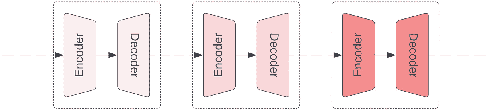

流程图突出了编码和解码转换的结果。它展示了从抽象动作中信息的发展。

图 8-2

信息作为一系列编码和解码操作的过程转换

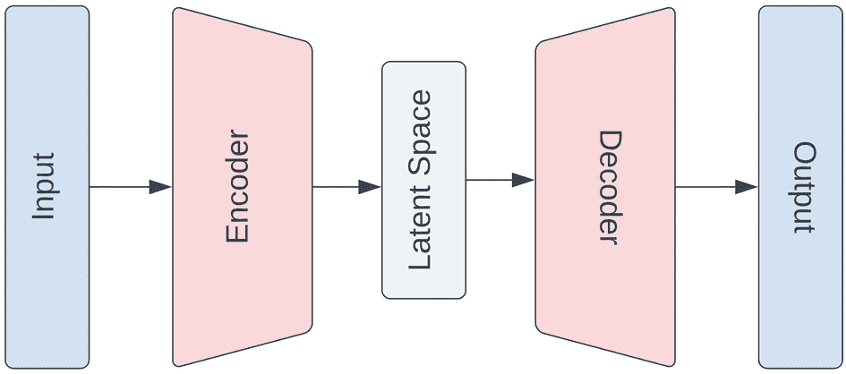

流程图展示了编码和解码的抽象操作。标签包括输入、编码器、潜在空间、解码器和输出。

图 8-1

高级自编码器架构

当然，这种对编码和解码的解释非常广泛，更多的是心理层面的。在计算机科学的严格语境中，编码是将某些信息以另一种形式表示的操作，通常具有更小的信息内容（编码技术使存储大小增大的应用很少）。解码则相反，它“撤销”编码操作以恢复原始信息。编码和解码在压缩的语境中是常用术语（见图 8-3）。几十年来，许多计算机科学家提出了非常巧妙的算法，将信息映射到更小的存储大小，以实现原始信息的无损和有损重建，使得在有限的信息传输连接上传输大型数据（如长文本、图像和视频）成为可能。

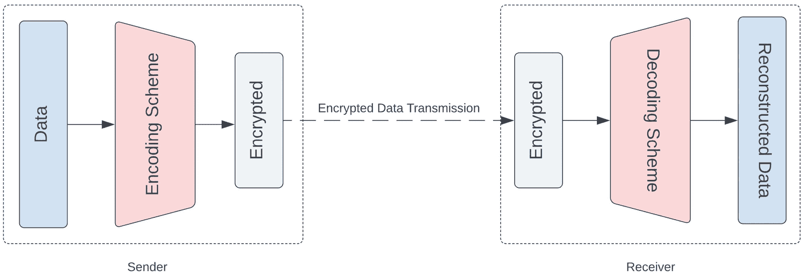

流程图展示了发送者和接收者。发送者的标签是数据、编码方案和加密，而接收者的标签是加密、解码方案和重建数据。

图 8-3

将自编码器解释为发送和接收加密数据

深度学习中的编码和解码是这两种理解的融合。*自编码器*是一种多功能的神经网络结构，由编码器和解码器组件组成。编码器将输入映射到一个更小的潜在/编码空间，解码器将编码表示映射回原始输入。自编码器的目标是尽可能忠实地重建原始输入，即最小化*重建损失*。为了做到这一点，编码器和解码器需要“协同工作”来开发编码和解码方案。

自动编码器减少了原始输入信息的表示大小，这可以被视为一种有损压缩形式。然而，许多研究表明，与人类设计的压缩方案相比，自动编码器在压缩方面通常相当糟糕。相反，当我们构建自动编码器时，几乎总是为了在数据的“核心”处*提取有意义的特征*。与原始输入相比，潜在空间的较小表示大小仅是因为我们需要施加信息瓶颈，迫使网络学习有意义的潜在特征。图 8-4 和 8-5 中的架构与输入相比展示了恒定和扩展的信息表示；自动编码器可以轻易地学习权重，这些权重只是简单地从输入传递到输出。另一方面，图 8-6 中的架构必须学习非平凡的模式来压缩和重建原始输入。因此，信息瓶颈和信息压缩是自动编码器的手段，而不是目的。

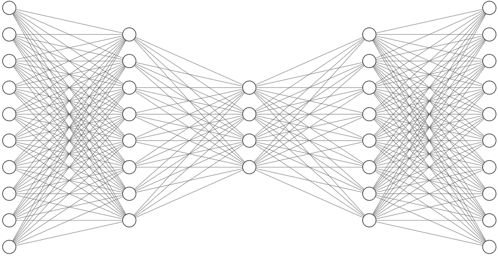

网络图展示了原始输入的压缩和重建过程。

图 8-6

一个好的自动编码器架构（潜在空间表示大小小于输入表示大小）

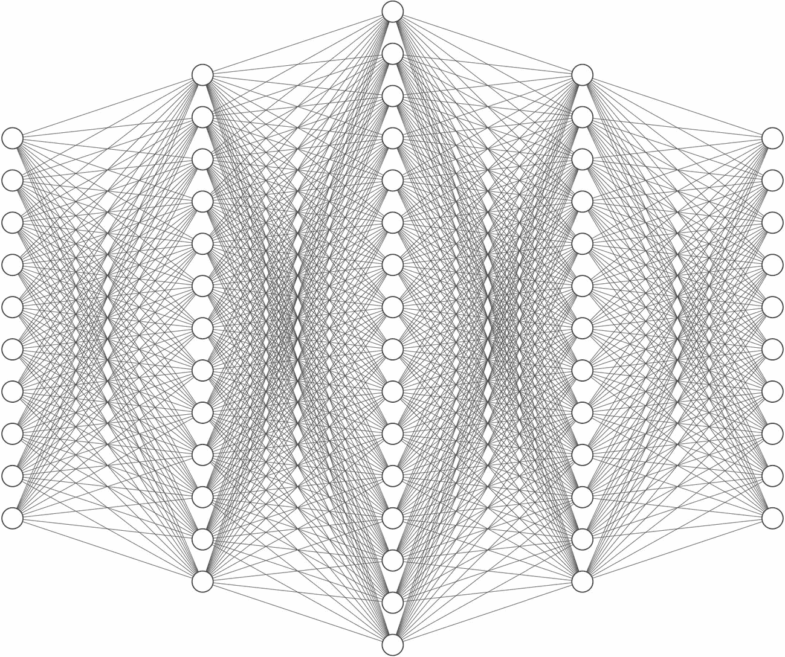

网络架构表示与输入相比的扩展数据。

图 8-5

一个更糟糕的自动编码器架构（潜在空间表示大小大于输入表示大小）

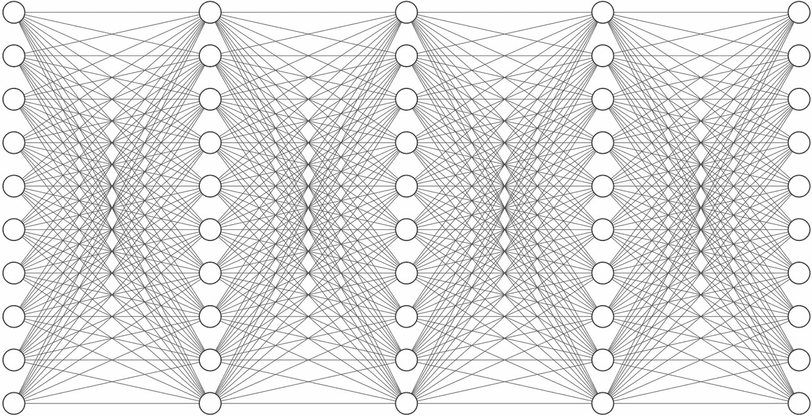

网络架构突出了与输入相关的恒定数据表示。

图 8-4

一个糟糕的自动编码器架构（潜在空间表示大小等于输入表示大小）

自动编码器在寻找高级抽象和特征方面非常出色。为了从远小于潜在空间表示的原始输入中可靠地重建，编码器和解码器必须开发一个映射系统，该系统最有意义地描述和区分每个输入或输入集与其他输入。这绝非易事！

考虑以下针对人类设计的自动编码器设计方案（图 8-7）：A 是编码器，试图将草图的高分辨率图像“编码”为自然语言描述，限制在 *N* 个词或更少；B 是解码器，试图通过根据 A 的自然语言描述绘制重建图像来“解码”A 看到的原始图像。A 和 B 必须共同努力开发一个系统，以可靠地重建原始图像。

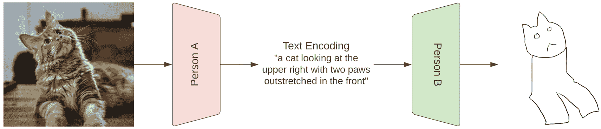

流程图展示了两张图片，左边是一张猫的摄影照片，右边是一张图表。

图 8-7

图像到文本编码猜测游戏

假设你是 B，你被 A 提供了以下自然语言描述：“一只穿着黑白围巾的黑斗牛犬，在橙色背景中看向相机的右上角。”为了直觉起见，尝试实际扮演 B 的角色在这个游戏中，通过草图/“解码”原始输入是一个值得做的练习。

图 8-8 显示了 A 将给定的自然语言描述编码成（假设的）图像。很可能会发现你的草图与实际图像非常不同。通过这个练习，你将亲身体验到自动编码的两个关键的低级挑战：从相对简单的编码中重建复杂的输出需要大量的思考和关于编码的概念推理，并且编码方案本身需要有效地传达关键概念和精确/定位信息。


一张狗的照片。

图 8-8

当 A 提供自然语言编码时，他们假设性地在看什么人。由 Charles Deluvio 拍摄

在这个例子中，潜在空间的形式是语言——它是离散的、序列的，并且是可变长度的。大多数用于表格数据的自动编码器使用的潜在空间都不满足这些属性：它们是（准）连续的，一次性读取和生成，而不是按顺序，并且是固定长度的。这些通用自动编码器可以在放宽限制的情况下可靠地找到有效的编码和解码方案，但两人游戏对于思考与自动编码器训练相关的挑战仍然是一个很好的直觉。

尽管自动编码器是相对简单的神经网络架构，但它们的用途非常广泛。在本节中，我们将从简单的“香草”自动编码器开始，然后转向更复杂的形式和自动编码器的应用。

## 香草自动编码器

让我们从对自动编码器的传统理解开始，它仅仅由一个编码器和一个解码器组件组成，它们一起工作将输入转换为潜在表示，然后再转换回原始形式。自动编码器的价值将在接下来的章节中变得更加清晰，我们将使用自动编码器实质性地改进模型训练。

本小节的目标不仅在于演示和实现自动编码器架构，而且还在于理解实现最佳实践，并执行关于自动编码器如何以及为什么能工作的技术调查和探索。

自动编码器传统上应用于图像和基于文本的数据集，因为这类数据通常包含语义概念，这些概念在原始形式中使用的空间应该更小。例如，考虑以下大约 3000×3000 像素的直线图像（图 8-9）。

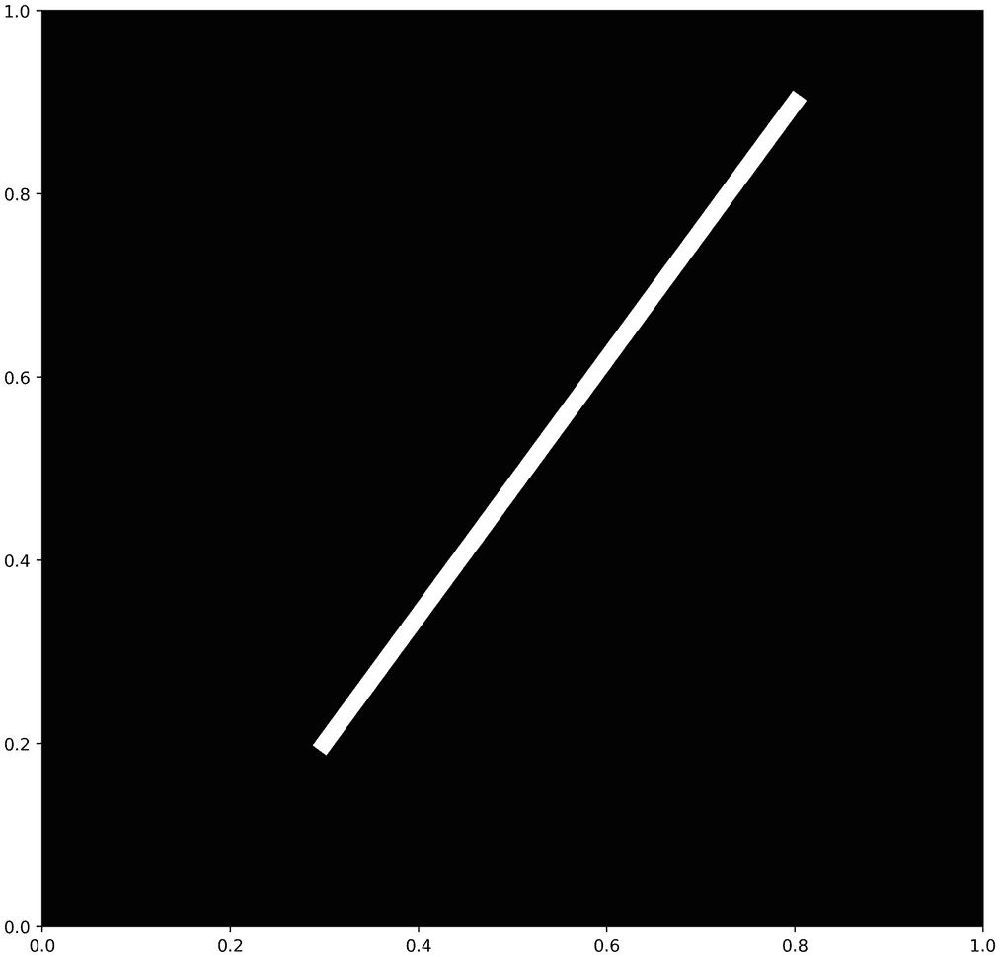

一个嵌入在正方形中的线条图像。

图 8-9

一条线的图像

这张图像包含九百万个像素，这意味着我们用九百万个数据值来表示这条线的概念。然而，实际上我们只需用四个数字就能表达任何一条线：斜率、*y*轴截距、下限*x*和上限*x*（或起始*x*点、起始*y*点、结束*x*点和结束*y*点）。如果我们设计一套编码和解码方案，编码器将识别这四个参数——产生一个非常紧凑的四维潜在空间——解码器将根据这四个参数重新绘制线条。通过从图像中语义表示的更高层次抽象*潜在*特征中收集信息，我们能够更紧凑地表示数据集。我们将在子节中稍后重新审视这个例子。

注意，然而，自动编码器的重建能力取决于数据集中存在的结构相似性（以及差异性）。例如，自动编码器无法可靠地重建随机噪声的图像。

MNIST 数据集是自动编码器的一个非常有用的演示。它在技术上基于视觉/图像，这对于理解各种自动编码器形式和应用很有用（因为自动编码器在图像方面发展得最好）。然而，它包含的特征数量足够少，结构足够简单，以至于我们可以不使用任何卷积层来对其进行建模。因此，MNIST 数据集在图像和表格数据世界之间提供了一个很好的联系。在本节中，我们将在展示“真实”的表格/结构化数据集应用之前，使用 MNIST 数据集作为自动编码器技术的介绍。

让我们从加载 Keras 数据集中的 MNIST 数据集开始（列表 8-1）。

```py
from keras.datasets.mnist import load_data
(x_train, y_train), (x_valid, y_valid) = load_data()
x_train = x_train.reshape(len(x_train),784)/255
x_valid = x_valid.reshape(len(x_valid),784)/255
Listing 8-1
Loading the MNIST dataset
```

回想一下，自动编码器的关键特性是一个信息瓶颈。我们希望从原始表示大小开始，逐步将信息流强制进入更小的向量大小，然后逐步将信息重新强制回原始大小。这种设计在 Keras 中很容易快速实现，我们可以连续减少和增加一系列全连接层中的节点数（列表 8-2）。

```py
import keras.layers as L
from keras.models import Sequential
# define architecture
model = Sequential()
model.add(L.Input((784,)))
model.add(L.Dense(256, activation='relu'))
model.add(L.Dense(64, activation='relu'))
model.add(L.Dense(32, activation='relu'))
model.add(L.Dense(64, activation='relu'))
model.add(L.Dense(256, activation='relu'))
model.add(L.Dense(784, activation='sigmoid'))
# compile
model.compile(optimizer='adam',
loss='binary_crossentropy')
# fit
model.fit(x_train, x_train, epochs=1,
validation_data=(x_valid, x_valid))
Listing 8-2
Building an autoencoder sequentially
```

架构在图 8-10 中可视化。

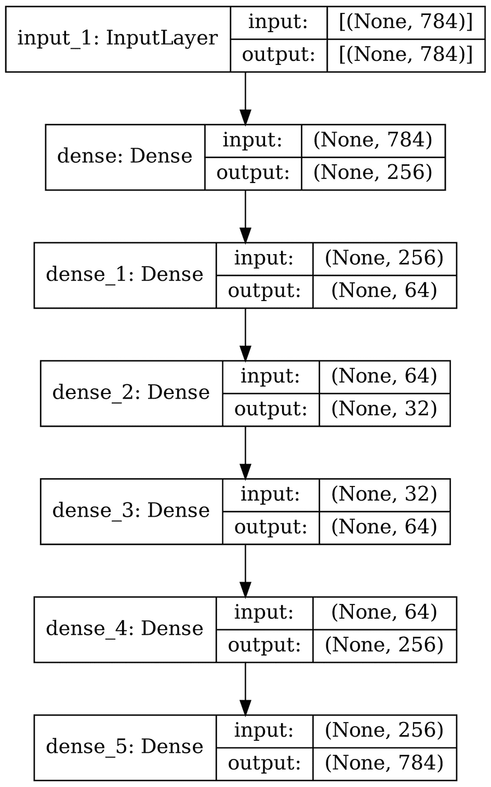

框架架构可视化自动编码器的特征和层。

图 8-10

顺序自动编码器架构

这个自动编码器架构有几个特点需要注意。首先，自动编码器的输出激活函数是 Sigmoid 函数，但这仅仅是因为输入向量的值在 0 到 1 之间（回想一下，我们在列表 8-1 中加载数据集时对数据集进行了缩放）。如果我们没有以这种方式缩放数据集，我们就需要更改激活函数，以便网络能够在整个可能的值域中合理地预测。如果输入值包含大于 0 的值，ReLU 可能是一个好的激活输出选择。如果输入包含正负值，使用普通的线性激活可能是最简单可行的选项。此外，选择的损失函数必须反映输出激活。由于我们的特定示例包含介于 0 到 1 之间的输出，且值的分布几乎是二元的（即，大多数值都非常接近 0 或 1，如图 8-11 所示），因此二元交叉熵是一个合适的损失函数来应用。我们可以将重建视为一系列针对原始输入中每个像素的二元分类问题。

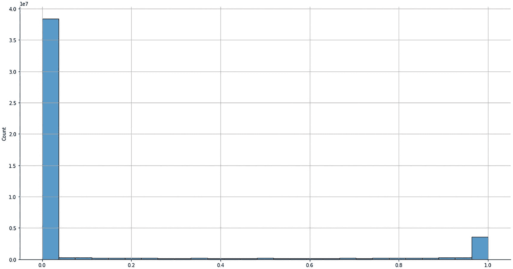

柱状图表示原始输入中像素的二元分类构建。它描绘了最大值接近 0 或 1。

图 8-11

MNIST 数据集中像素值的分布（缩放到 0 到 1 之间）

然而，在其他情况下，重建更像是回归问题，其中可能值的分布不是在域的末端二值化，而是更分散。这在更复杂的图像数据集（如图 8-12 所示）和许多表格数据集（如图 8-13 所示）中很常见。

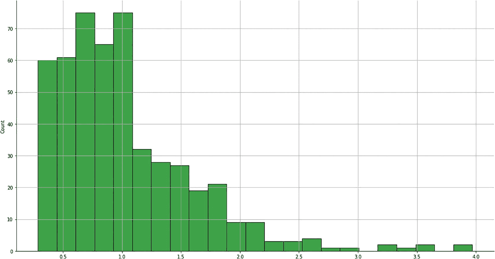

柱状图表示表格数据集中的值分布。

图 8-13

Higgs 玻色子数据集中一个特征的值分布（我们将在本章后面使用这个数据集）

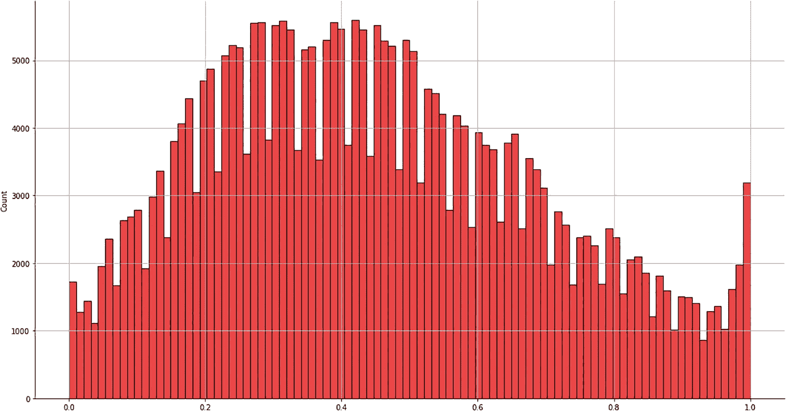

频率分布表示在复杂图像数据集中未二值化的可能值。

图 8-12

CIFAR-10 图像集中像素值（缩放到 0 到 1 之间）的分布

在这些情况下，更适合使用回归损失，如通用的均方误差或更专业的替代方案（例如，Huber）。请参阅第一章以回顾回归损失。

当以模块化形式实现时，自动编码器通常更容易处理。我们不是简单地构建一个带有瓶颈的连续层堆叠的自动编码器，而是可以构建编码器和解码器模型/组件，并将它们连接起来形成一个完整的自动编码器（见列表 8-3）。

```py
from keras.models import Model
# define architecture components
encoder = Sequential(name='encoder')
encoder.add(L.Input((784,)))
encoder.add(L.Dense(256, activation='relu'))
encoder.add(L.Dense(64, activation='relu'))
encoder.add(L.Dense(32, activation='relu'))
decoder = Sequential(name='decoder')
decoder.add(L.Input((32,)))
decoder.add(L.Dense(64, activation='relu'))
decoder.add(L.Dense(256, activation='relu'))
decoder.add(L.Dense(784, activation='sigmoid'))
# define model architecture from components
ae_input = L.Input((784,), name='input')
ae_encoder = encoder(ae_input)
ae_decoder = decoder(ae_encoder)
ae = Model(inputs = ae_input,
outputs = ae_decoder)
# compile
ae.compile(optimizer='adam',
loss='binary_crossentropy') # note that in other situations other losses may be more suitable
Listing 8-3
Building an autoencoder with compartmentalized design
```

这种构建方法在哲学上更受欢迎，因为它反映了我们对自动编码器结构的理解，即有意义地由独立的编码和解码组件组成。当我们可视化我们的架构时，我们获得了自动编码器模型的一个更干净的高级别分解（图 8-14）。

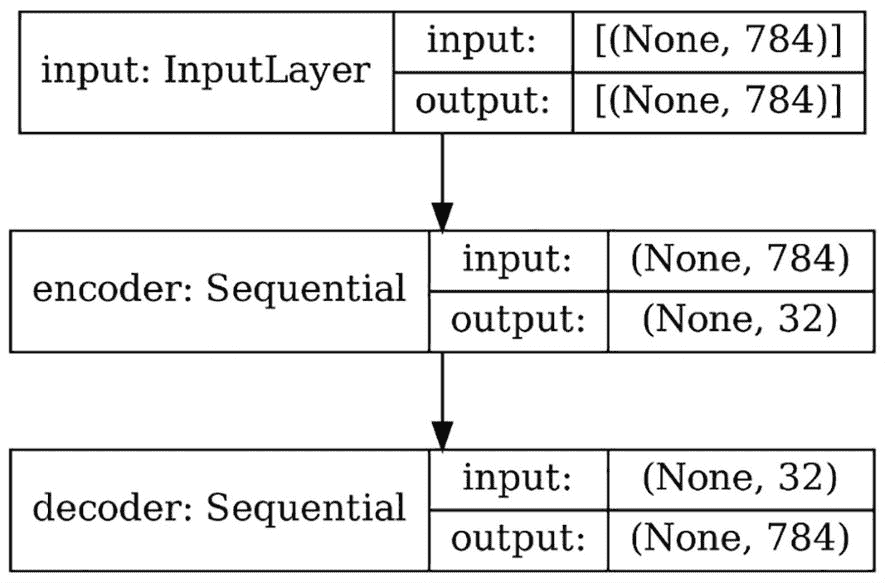

一个可视化的架构模型图代表了自动编码器模型的更高级别的分解。它有标签，即输入、编码器顺序层和解码器顺序层。

图 8-14

部分化模型的可视化

然而，使用部分化设计非常有帮助，因为我们可以单独从自动编码器中引用编码器和解码器组件。例如，如果我们想要获取输入的编码表示，我们可以在输入上简单地调用`encoder.predict(…)`。编码器和解码器用于构建自动编码器；在自动编码器训练后，编码器和解码器仍然作为该（现在已训练的）自动编码器组件的引用。另一种方法是寻找模型的潜在空间层并创建一个临时模型来运行预测，这与第四章中用于可视化 CNN 中学习到的卷积变换的演示方法类似。同样，如果我们想要解码潜在空间向量，我们可以在我们的样本潜在向量上简单地调用`decoder.predict(…)`。

例如，列表 8-4 展示了在列表 8-3 创建的自动编码器训练后的内部状态和重建的可视化（图 8-15 至图 8-18）。

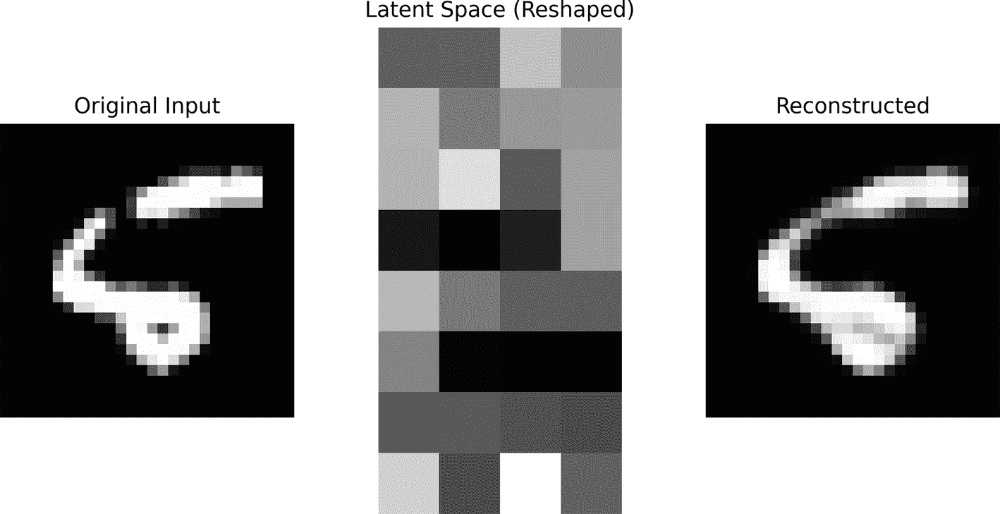

一张图像描绘了根据列表训练后形成的编码器的重建。它展示了原始输入、潜在空间和重建的结果。

图 8-18

数字“5”的样本潜在形状和重建

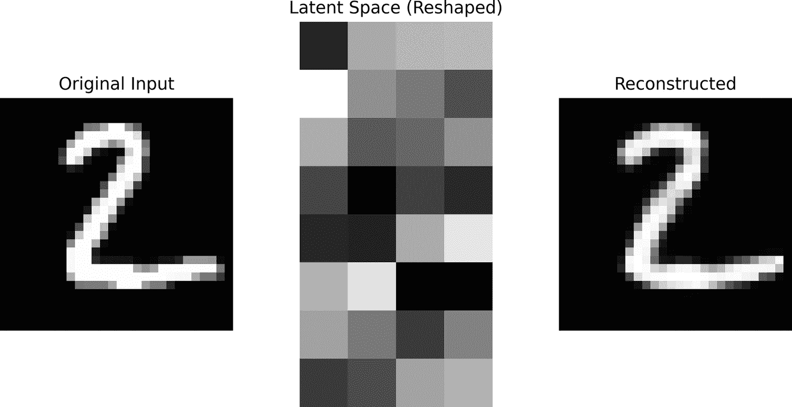

一张图像代表了在潜在空间和重建阶段的第二个样本形状的解码。它展示了原始输入、潜在空间和重建的结果。

图 8-17

数字“2”的样本潜在形状和重建

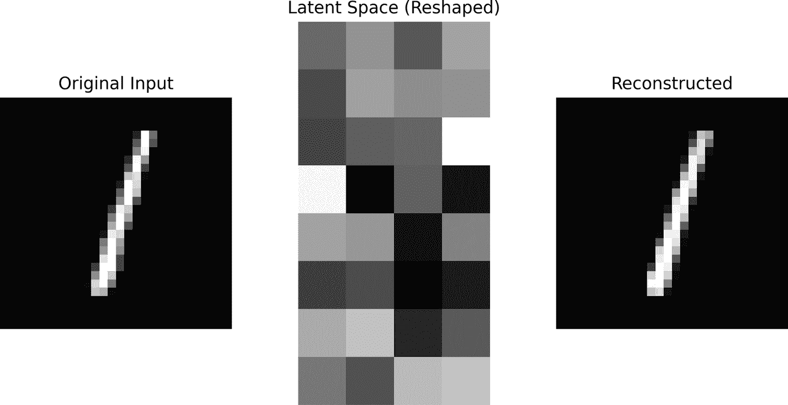

训练阶段后创建的数字 1 重建的可视化表示。

图 8-16

数字“1”的样本潜在形状和重建

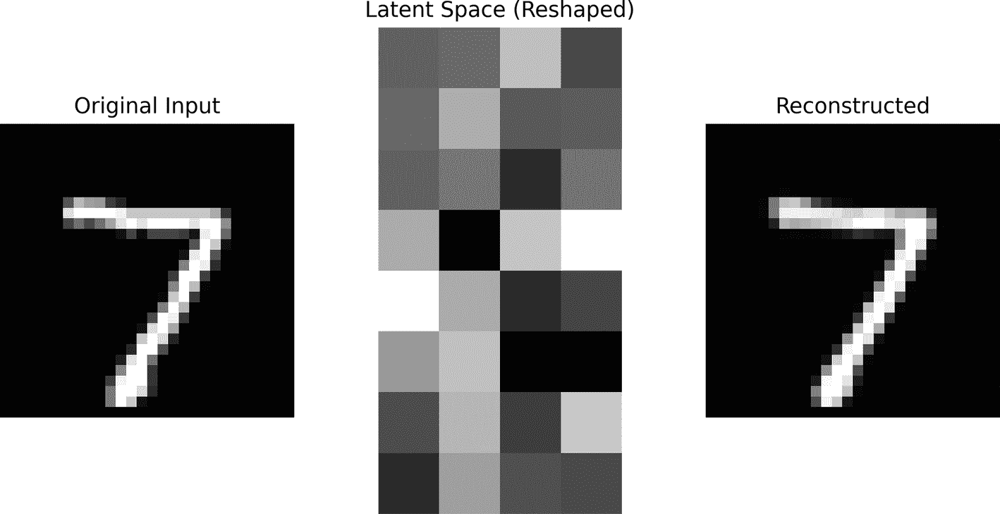

图像的可视化代表了编码器内部状态的形式。它展示了原始输入、潜在空间和重建的结果。

图 8-15

数字“7”的样本潜在形状和重建

```py
for i in range(10):
plt.figure(figsize=(10, 5), dpi=400)
plt.subplot(1, 3, 1)
plt.imshow(x_valid[i].reshape((28, 28)))
plt.axis('off')
plt.title('Original Input')
plt.subplot(1, 3, 2)
plt.imshow(encoder.predict(x_valid[i:i+1]).reshape((8, 4)))
plt.axis('off')
plt.title('Latent Space (Reshaped)')
plt.subplot(1, 3, 3)
plt.imshow(ae.predict(x_valid[i:i+1]).reshape((28, 28)))
plt.axis('off')
plt.title('Reconstructed')
plt.show()
Listing 8-4
Visualizing the input, latent space, and reconstruction of an autoencoder
```

当我们构建标准神经网络，我们可能希望有多个具有微小差异的模型时，创建一个“构建器”或“构造器”通常很有用。神经网络的两个关键参数是输入大小和潜在空间大小。给定这两个关键“决定”参数，我们可以推断出我们通常希望信息如何流动。例如，在每个随后的编码器层中减半信息空间（在解码器中加倍）是一个很好的通用更新规则。

设输入大小为 *I*，潜在空间大小为 *L*。为了保持这个规则，我们希望所有中间层都使用 *L* 的倍数作为节点。考虑 *I* = 4*L* 的情况，例如（见图 8-19）。

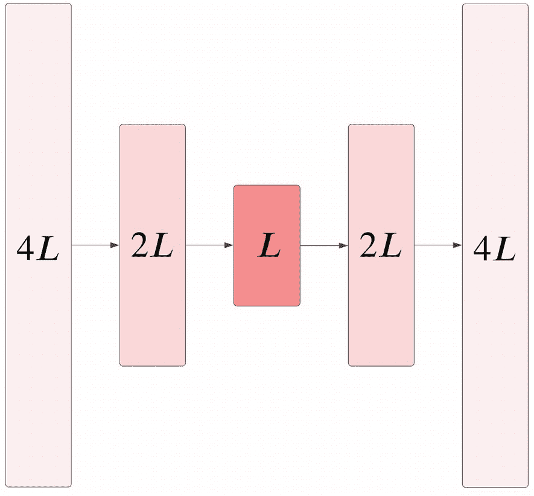

一个信息图表示了中间层，用于表示节点是 L 的倍数。

图 8-19

“减半”自动编码器架构逻辑的可视化

我们可以看到，无论是将输入减少到潜在空间，还是将潜在空间扩展到输出，所需的层数是

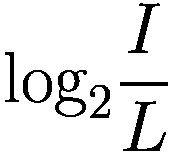

这个简单的表达式衡量了我们需要将 *L* 乘以多少次才能达到 *I*。

然而，通常情况下 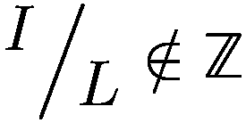（即，*I* 不能被 *L* 整除），在这种情况下，我们之前对数表达式将不是整数。在这些情况下，我们有一个简单的解决方案：我们可以将输入转换为具有 *N* 个节点的层，其中 *N* = 2^(*k*) · *L*，*k* 是最大的整数，使得 *N* < *I*。例如，如果 *I* = 4*L* + 8，我们首先将输入“降低”到 4*L*，然后从该点执行我们的标准减半策略（见图 8-20）。

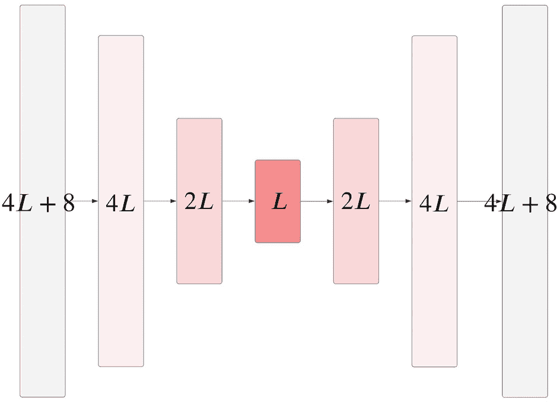

流程图展示了从点 4 L 开始执行减半策略的过程。

图 8-20

将减半自动编码器逻辑应用于不是 2 的幂的输入

为了适应那些 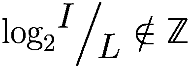（即，我们无法将输入大小与层大小之间的关系表示为 2 的幂）的情况，我们可以通过使用取整函数来修改我们对于所需层数的表达式：

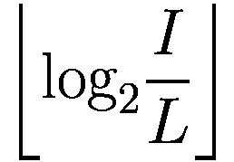

使用这种减半/加倍信息流逻辑，我们可以创建一个通用的 `buildAutoencoder` 函数，该函数根据输入大小和潜在大小构建一个前馈自动编码器（见列表 8-5）。

```py
def buildAutoencoder(inputSize=784, latentSize=32,
outActivation='sigmoid'):
# define architecture components
encoder = Sequential(name='encoder')
encoder.add(L.Input((inputSize,)))
for i in range(int(np.floor(np.log2(inputSize/latentSize))), -1, -1):
encoder.add(L.Dense(latentSize * 2**i, activation='relu'))
decoder = Sequential(name='decoder')
decoder.add(L.Input((latentSize,)))
for i in range(1,int(np.floor(np.log2(inputSize/latentSize)))+1):
decoder.add(L.Dense(latentSize * 2**i, activation='relu'))
decoder.add(L.Dense(inputSize, activation=outActivation))
# define model architecture from components
ae_input = L.Input((inputSize,), name='input')
ae_encoder = encoder(ae_input)
ae_decoder = decoder(ae_encoder)
ae = Model(inputs = ae_input,
outputs = ae_decoder)
return {'model': ae, 'encoder': encoder, 'decoder': decoder}
Listing 8-5
A general function to construct an autoencoder architecture given an input size and a desired latent space, constructed using halving/doubling architectural logic. Note this implementation also has an outActivation parameter in cases where our output is not between 0 and 1
```

我们不仅返回模型，还返回编码器和解码器。回想一下之前关于模块化设计的讨论，保留对自动编码器编码器和解码器组件的引用可能会有所帮助。如果不返回，这些引用——在函数内部创建的——将会丢失，无法恢复。

拥有一个通用的自动编码器创建函数使我们能够进行更大规模的自动编码器实验。一个特别需要理解的现象是模型性能与潜在大小之间的权衡。如前所述，潜在大小必须配置得当，以便任务足够具有挑战性，迫使自动编码器发展有意义的非平凡表示，同时也要足够可行，使自动编码器能够解决问题（而不是因为重建问题的难度而停滞不前，根本无法学习任何东西）。让我们在瓶颈大小为 2^(*n*) 的 MNIST 数据集上训练几个自动编码器，其中 *n* ∈ [1, 2, …, ⌊log[2]*I*⌋]（*n* 的最后一个值是小于原始输入大小的最大 2 的幂）并获取每个的验证性能（列表 8-6，图 8-21）。

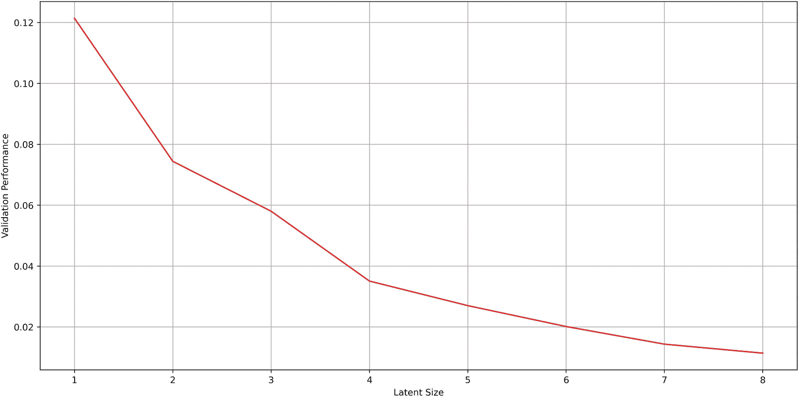

验证性能与潜在大小之间的线形图表示为一条斜线。

图 8-21

表格型自动编码器的潜在大小（2^(*x*) 神经元）与验证性能之间的关系。注意收益递减

```py
inputSize = 784
earlyStopping = keras.callbacks.EarlyStopping(monitor='loss',
patience=5)
latentSizes = list(range(1, int(np.floor(np.log2(inputSize)))))
validPerf = []
for latentSize in tqdm(latentSizes):
model = buildAutoencoder(inputSize, 2**latentSize)['model']
model.compile(optimizer='adam', loss='binary_crossentropy')
history = model.fit(x_train, x_train, epochs=50,
callbacks=[earlyStopping], verbose=0)
score = keras.metrics.MeanAbsoluteError()
score.update_state(model.predict(x_valid), x_valid)
validPerf.append(score.result().numpy())
plt.figure(figsize=(15, 7.5), dpi=400)
plt.plot(latentSizes, validPerf, color='red')
plt.ylabel('Validation Performance')
plt.xlabel('Latent Size (power of 2)')
plt.grid()
plt.show()
Listing 8-6
Training autoencoders with varying latent space sizes and observing the performance trend
```

较大潜在大小带来的收益递减现象非常明显。随着潜在大小的增加，我们可以从中获得的收益会减少。这种现象在深度学习模型中普遍存在（回想第一章节中的“深度双重下降”，它以类似的方式比较了监督域中 CNN 的模型大小与性能）。

我们可以做得更好，可视化不同瓶颈大小下学习到的潜在表示之间的差异。在自动编码器训练后，可以通过 `encoder.predict(x_train)` 获取训练集的潜在表示。当然，每个自动编码器的潜在表示将具有不同的维度。我们可以使用 t-SNE 方法（在第二章节中介绍）来可视化这些潜在空间（列表 8-7，图 8-22 至 8-30）。

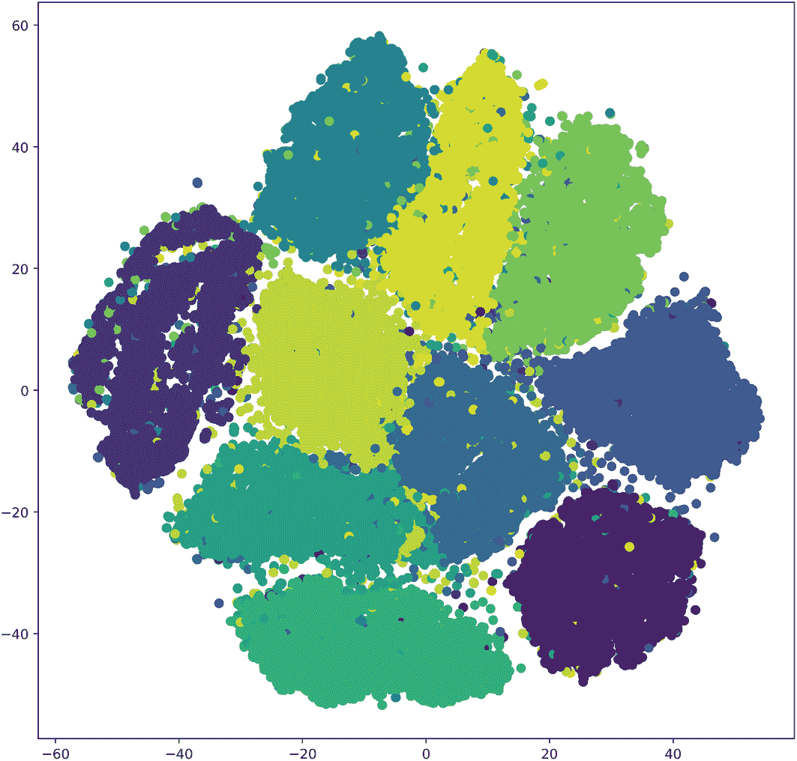

一个瓶颈大小为 516 个节点的自动编码器的 S N E 投影的视觉表示。

图 8-30

在 MNIST 数据集上训练的瓶颈大小为 512 个节点的自动编码器的潜在空间的 t-SNE 投影。

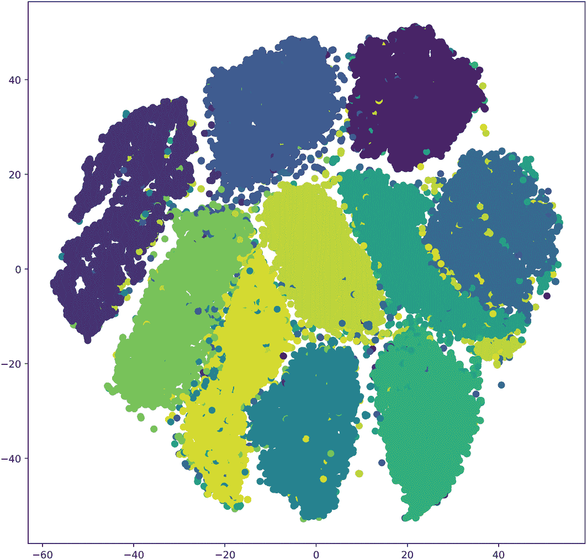

一张图像展示了由 t S N E 投影得到的 256 个节点大小的不同形状。

图 8-29

在 MNIST 上训练的瓶颈大小为 256 个节点的自动编码器的潜在空间 t-SNE 投影

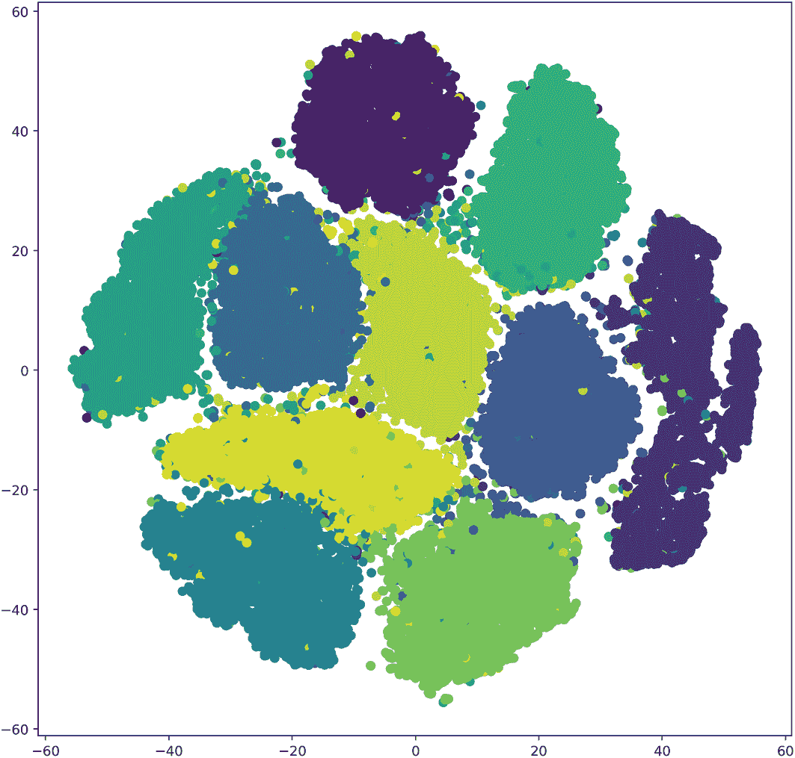

投影图像显示了由自动编码器产生的 128 个节点的训练集。

图 8-28

在 MNIST 上训练的瓶颈大小为 128 个节点的自动编码器的潜在空间 t-SNE 投影

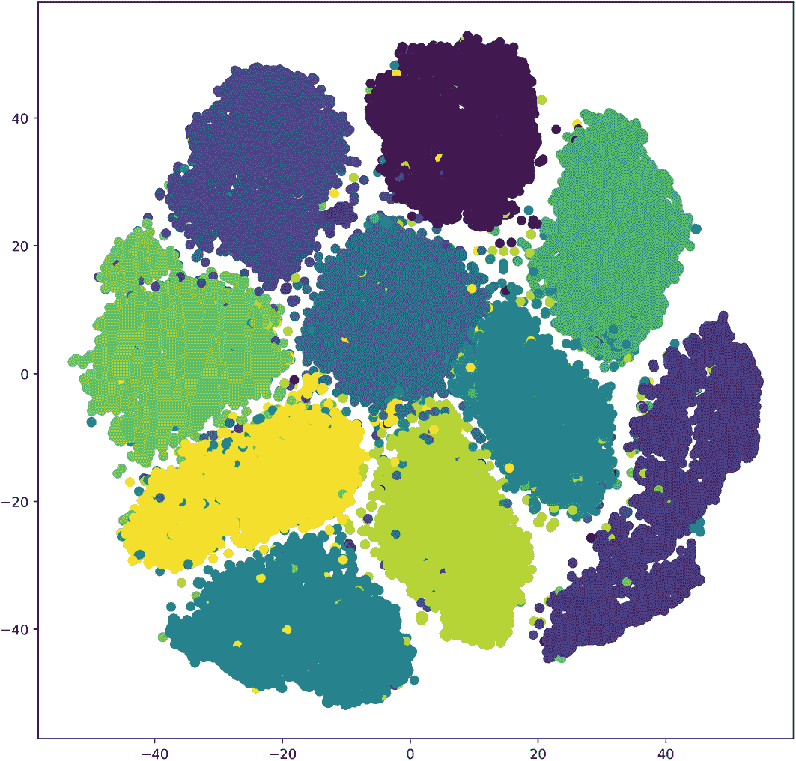

训练集后的 64 个节点瓶颈大小的 t-SNE 投影图像。

图 8-27

在 MNIST 上训练的瓶颈大小为 64 个节点的自动编码器的潜在空间 t-SNE 投影

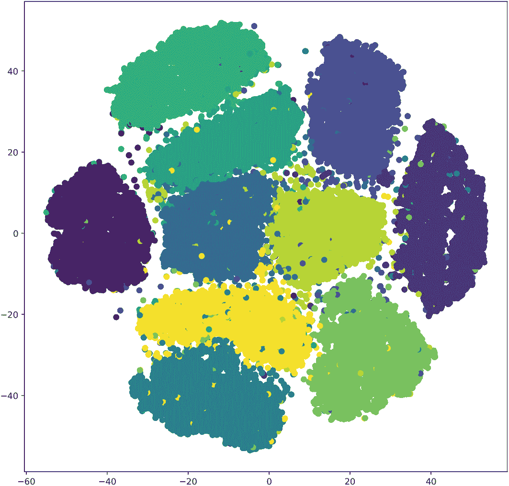

一张图像表示了 32 个节点的瓶颈大小的潜在空间。

图 8-26

在 MNIST 上训练的瓶颈大小为 32 个节点的自动编码器的潜在空间 t-SNE 投影

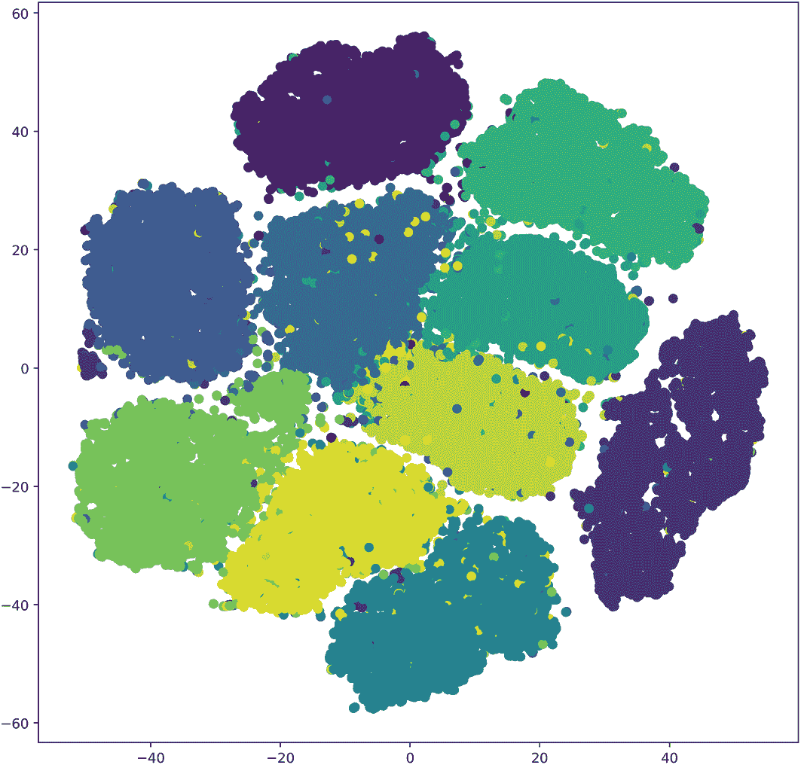

一个方形内的图像表示了十六个节点的瓶颈大小。

图 8-25

在 MNIST 上训练的瓶颈大小为 16 个节点的自动编码器的潜在空间 t-SNE 投影

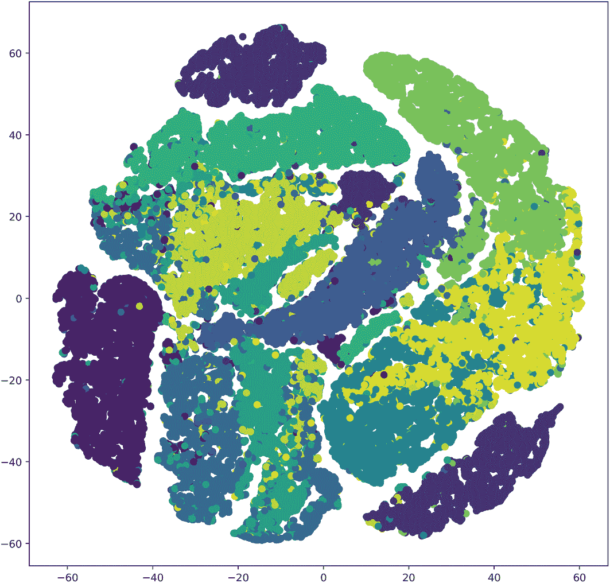

一张与 t-SNE 和八个节点大小的自动编码器潜在空间相对的图像。

图 8-24

在 MNIST 上训练的瓶颈大小为八个节点的自动编码器的潜在空间 t-SNE 投影

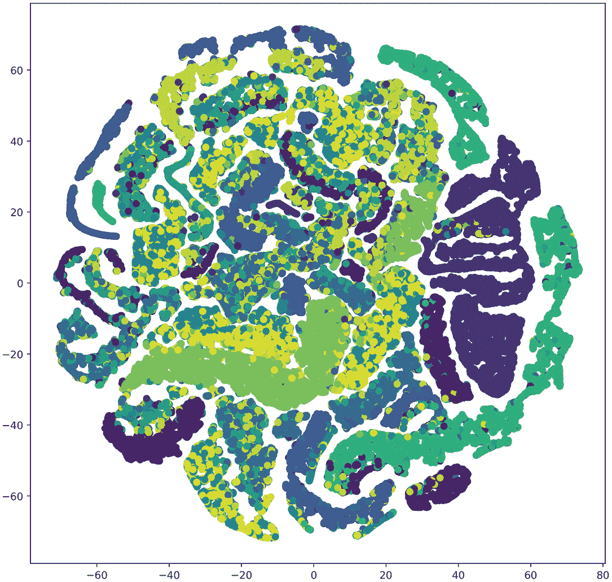

一张图像表示了与算法相关的瓶颈大小。

图 8-23

在 MNIST 上训练的瓶颈大小为四个节点的自动编码器的潜在空间 t-SNE 投影

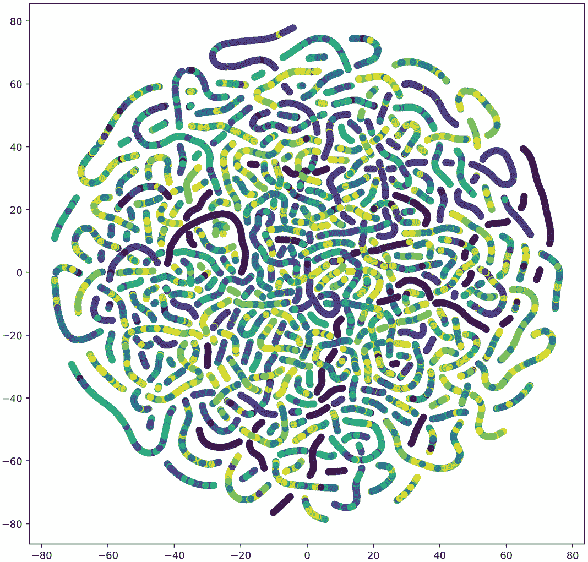

给定训练集潜在表示变化的可视化。

图 8-22

在 MNIST 上训练的瓶颈大小为两个节点的自动编码器的潜在空间 t-SNE 投影。注意，在这种情况下，我们投影到与原始数据集维度（2）相等的维度数（2），因此形成了漂亮的蛇形排列

```py
from sklearn.manifold import TSNE
inputSize = 784
earlyStopping = keras.callbacks.EarlyStopping(monitor='loss',
patience=5)
latentSizes = list(range(1, int(np.floor(np.log2(inputSize))) + 1))
for latentSize in tqdm(latentSizes):
modelSet = buildAutoencoder(inputSize, 2**latentSize)
model = modelSet['model']
encoder = modelSet['encoder']
model.compile(optimizer='adam', loss='binary_crossentropy')
model.fit(x_train, x_train, epochs=50,
callbacks=[earlyStopping], verbose=0)
transformed = encoder.predict(x_train)
tsne_ = TSNE(n_components=2).fit_transform(transformed)
plt.figure(figsize=(10, 10), dpi=400)
plt.scatter(tsne_[:,0], tsne_[:,1], c=y_train)
plt.show()
plt.close()
Listing 8-7
Plotting a t-SNE representation of the latent space of autoencoders with varying latent space sizes
```

注意

如果我们以 `model = buildAutoencoder(784, 32)['model']` 和 `encoder = buildAutoencoder(784, 32)['encoder']` 的方式加载模型，我们确实会获得一个模型架构和一个编码器架构——但它们不会“链接”。存储的模型将与一个我们没有捕获的编码器相关联，存储的编码器将是我们没有捕获的总体模型的一部分。因此，我们确保首先将整个模型组件集存储到 `modelSet` 中。

每个单独的点都根据目标标签（即与数据点相关的数字）着色，目的是为了探索自动编码器隐式地将相同数字的点“聚类”在一起或将它们分开的能力，尽管自动编码器从未接触过标签。观察随着潜在空间维度的增加，不同数字的数据样本之间的重叠减少，直到不同类别的数字之间有功能上的完全分离。

如果我们构建一个架构，其中输入是扩展而不是压缩的，并可视化潜在空间的降维（见 8-8），我们会发现学习到的表示意义显著降低（见图 8-31）——尽管这个架构获得了非常高的性能（即低训练误差）。

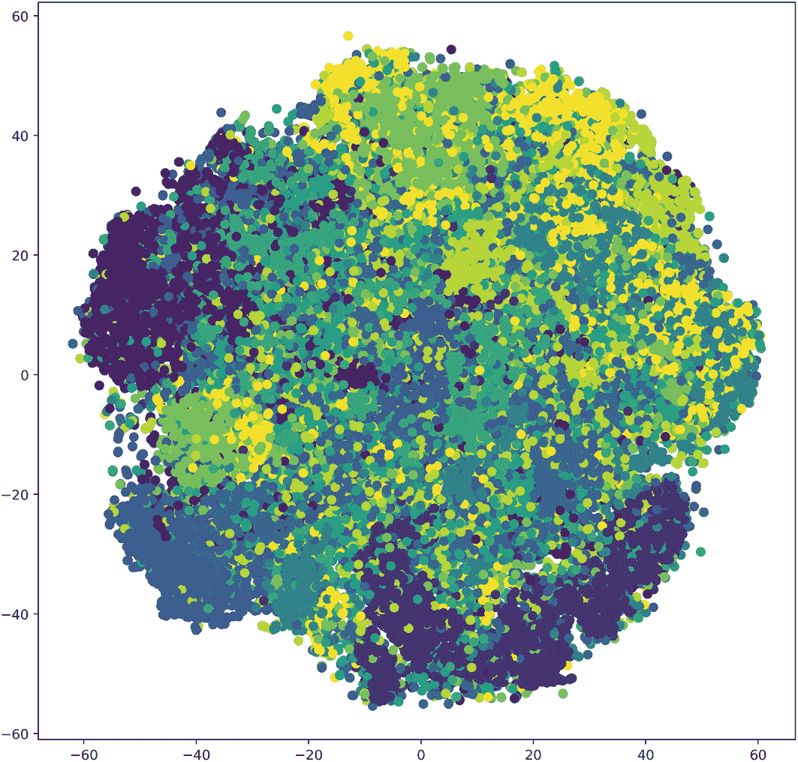

一张图像展示了压缩的潜在空间降维。它表明了高性能和低训练误差。

图 8-31

t-SNE 投影显示了一个在 MNIST 上训练的、瓶颈大小为 2048 的过完备自动编码器的潜在空间

```py
model = Sequential()
model.add(L.Input((784,)))
model.add(L.Dense(1024, activation='relu'))
model.add(L.Dense(2048, activation='relu'))
model.add(L.Dense(1024, activation='relu'))
model.add(L.Dense(784, activation='sigmoid'))
model.compile(optimizer='adam', loss='binary_crossentropy')
model.fit(x_train, x_train, epochs=50)
transformed = encoder.predict(x_train)
tsne_ = TSNE(n_components=2).fit_transform(transformed)
plt.figure(figsize=(10, 10), dpi=400)
plt.scatter(tsne_[:,0], tsne_[:,1], c=y_train)
plt.show()
Listing 8-8
Training and visualizing the latent space of an overcomplete, architecturally redundant autoencoder architecture. This particular architecture has slightly over 5.8 million parameters!
```

让我们回顾一下本小节开头给出的例子：线条图像的重建。列表 8-9 使用图像处理库`cv2`生成一个包含随机放置线段的 50x50 图像数据集（见 8-9）。

```py
x = np.zeros((1024, 50, 50))
for i in range(1024):
start = [np.random.randint(0, 50), np.random.randint(0, 50)]
end = [np.random.randint(0, 50), np.random.randint(0, 50)]
x[i,:,:] = cv2.line(x[i,:,:], start, end, color=1, thickness=4)
x = x.reshape((1024, 50 * 50))
Listing 8-9
Generating a dataset of 50-by-50 images of lines
```

由于理论上我们可以直观地用四个值来表示每个线段，因此我们将在潜在空间中有四个神经元的自动编码器上构建和训练数据集（见 8-10）。

```py
modelSet = buildAutoencoder(50 * 50, 4)
model = modelSet['model']
encoder = modelSet['encoder']
model.compile(optimizer='adam', loss='binary_crossentropy')
model.fit(x, x, epochs=400, validation_split=0.2)
Listing 8-10
Fitting a simple autoencoder on the synthetic toy line dataset
```

模型达到近 0.03 的二进制交叉熵，这相当不错。它的重建非常准确（见图 8-32）。

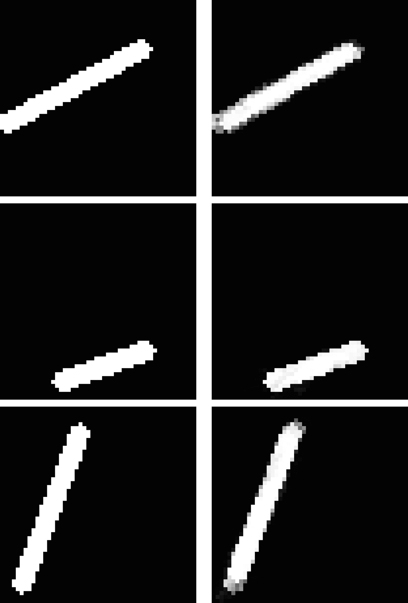

一张图像展示了导致准确重建的二进制交叉熵。它描绘了不同维度中的一条线。

图 8-32

左列：原始输入图像的线条。右列：通过具有 4 维潜在空间的自动编码器重建的图像

实际上，仅用两个神经元训练的自动编码器在识别输入中标记的线条的一般形状方面做得相当不错（见图 8-33）。如果你仔细观察，你会识别出其他线条的轮廓。有许多假设可以解释它们的存在。一种可能性是自动编码器“记忆”/“内化”了一组通常有用的“地标”样本，然后在预测期间映射到这些样本上，并且随着潜在空间变大，可以传递更多精确放置的信息。

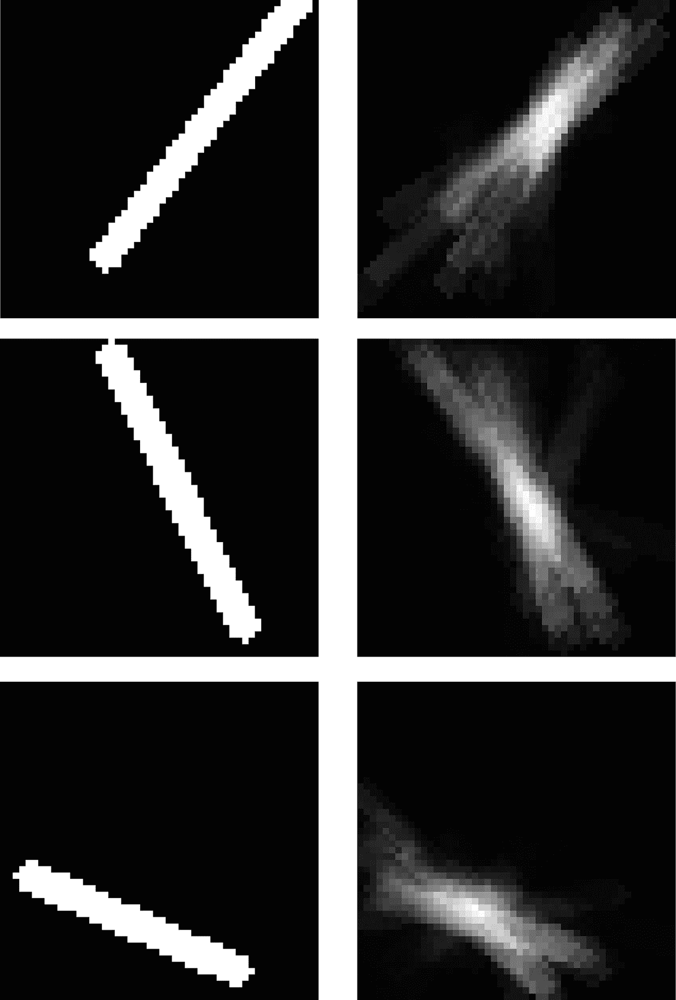

一张图像展示了从训练集自动编码器接收到的作为直线输入的图像。

图 8-33

左列：原始输入图像的线条。右列：通过具有 2 维潜在空间的自动编码器重建的图像

最后，让我们探讨如何将自动编码器应用于一个严格表格数据集——小鼠蛋白质表达数据集，该数据集在之前的章节中使用过（列表 8-11）。

```py
from sklearn.model_selection import train_test_split as tts
mpe_x = df.drop('class', axis=1)
mpe_y = df['class']
mpe_x_train, mpe_x_valid, mpe_y_train, mpe_y_vaid = tts(mpe_x, mpe_y,
train_size=0.8,
random_state=42)
Listing 8-11
Splitting the dataset into training and validation sets
```

回想一下，我们需要查看输入数据，以便评估如何处理自动编码器的模型输出。如果我们调用 `mpe_x_train.min()`，Pandas 返回每列的最小值序列。

```py
DYRK1A_N     0.156849
ITSN1_N      0.261185
BDNF_N       0.115181
NR1_N        1.330831
NR2A_N       1.737540
...
H3MeK4_N     0.101787
CaNA_N       0.586479
Genotype     1.000000
Treatment    1.000000
Behavior     1.000000
Length: 80, dtype: float64
```

再次调用 `.min()` 会取跨列的最小值的最小值。我们发现整个数据集中最小的值是 -0.062007874，而最大值是 8.482553422。由于理论上值可以是负数，我们将使用线性输出激活而不是 ReLU，并使用标准的均方误差损失函数进行回归问题的优化（列表 8-12）。

```py
modelSet = buildAutoencoder(len(mpe_x.columns), 8,
outActivation='linear')
model = modelSet['model']
encoder = modelSet['encoder']
model.compile(optimizer='adam', loss='mse', metrics=['mae'])
history = model.fit(mpe_x_train, mpe_x_train, epochs=150)
Listing 8-12
Fitting an autoencoder on the Mice Protein Expression dataset
```

经过 150 个周期的训练后，进展非常快（这是一个相对较小的数据集），自动编码器获得了良好的训练和验证性能（表 8-1，图 8-34）。

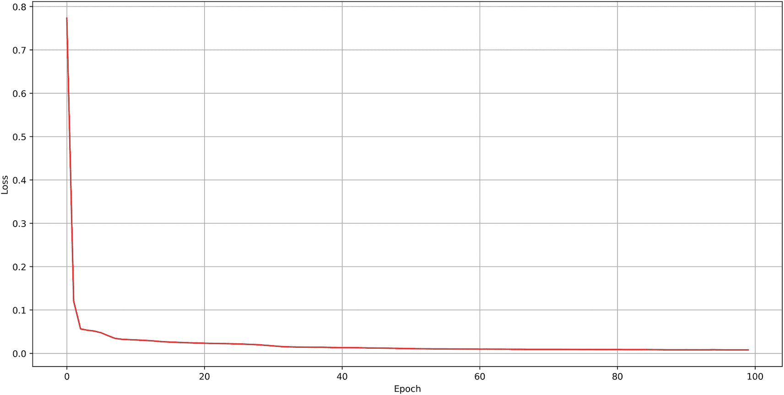

一张图表示了在 150 个周期的训练集之后获得的验证和训练性能。它展示了一个 L 形曲线。

图 8-34

在小鼠蛋白质表达数据集上训练的自动编码器的训练历史

表 8-1

在小鼠蛋白质表达数据集上训练的自动编码器的性能

|   | 训练 | 验证 |
| --- | --- | --- |
| 均方误差 | 0.0117 | 0.0118 |
| 均方误差 | 0.0626 | 0.0625 |

图 8-35 展示了我们自动编码器创建的一些样本潜在向量和重建，输入和重建向量被重塑成 8x10 的网格，以便更方便地查看。

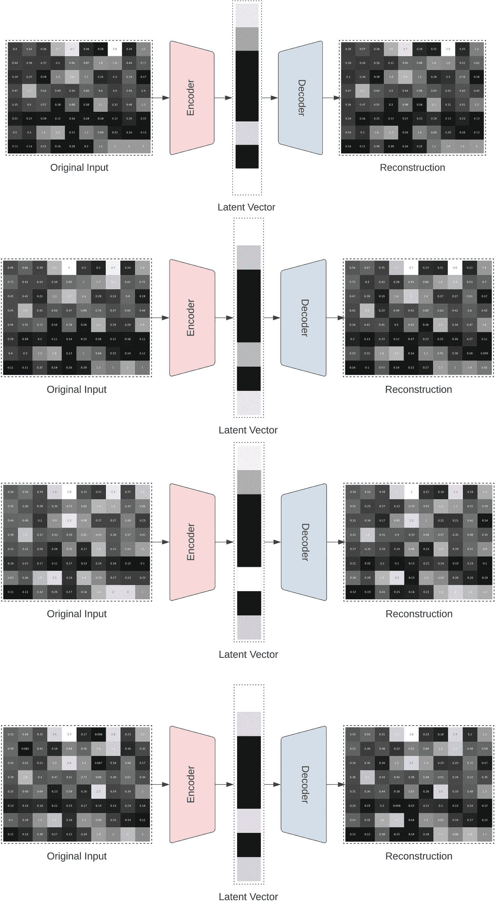

一幅图像模式突出了自动编码器创建的潜在向量样本和重建。它将向量展示在 8x10 的网格中。

图 8-35

由在小鼠蛋白质表达数据集上训练的自动编码器生成的样本及其相关的潜在向量和重建。为了便于查看，样本和重建以两个空间维度表示

我们可以采用与之前在 MNIST 数据集上使用过的类似技术——使用 t-SNE 可视化自动编码器的潜在空间。图 8-36 中的每个数据点都根据小鼠蛋白质表达数据集中每一行所属的八个类别之一进行着色。这个表格自动编码器在没有任何标签暴露的情况下，在类别之间获得了相当好的分离。

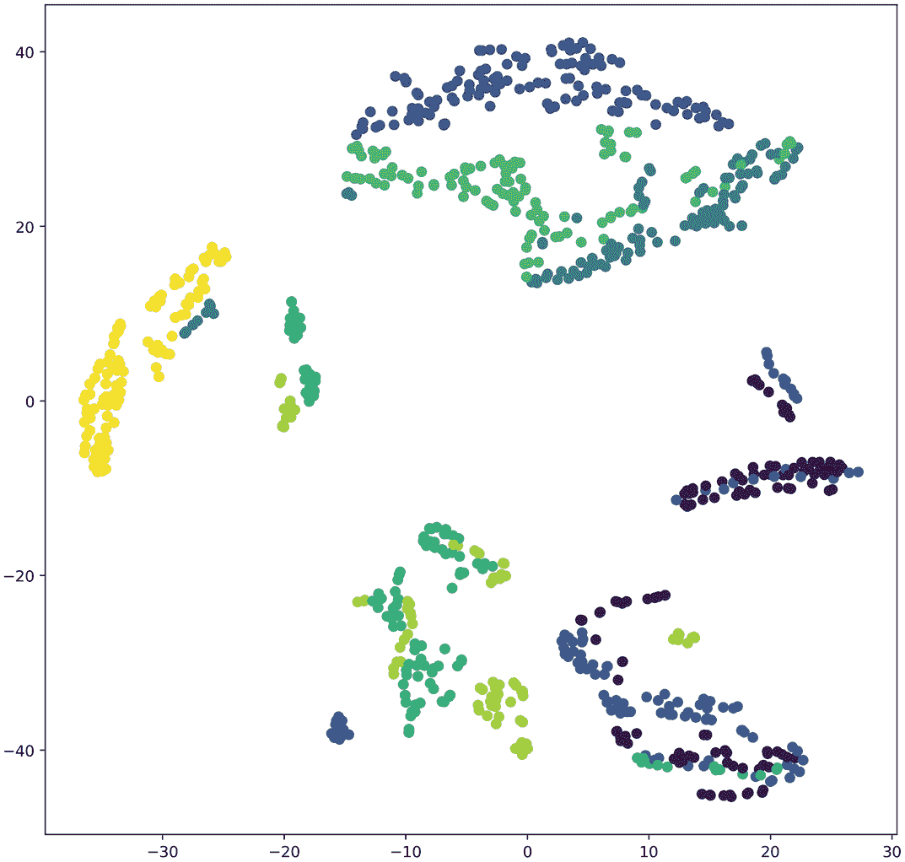

散点图可视化表格自动编码器获得的数据点

图 8-36

在小鼠蛋白质表达数据集上训练的自动编码器的潜在空间的 t-SNE 投影

注意，一个更正式/严格的表格自动编码器设计将需要我们将所有列标准化或归一化到相同的域内。表格数据集通常包含在不同尺度上操作的特性；例如，假设特性 A 代表一个比例（即介于 0 和 1 之间，包括 1），而特性 B 测量年份（即可能大于 1000）。回归损失只是简单地取所有列的平均误差，这意味着正确重建 A 的奖励与重建特性 B 相比可以忽略不计。然而，在这种情况下，所有列都在大致相同的范围内，因此跳过这一步是可以容忍的。

在下一小节中，我们将探讨自动编码器直接应用于具体提高监督模型性能的直接应用。

## 预训练自动编码器

如我们所见，普通的自动编码器可以做些相当酷的事情。我们看到，在各个数据集上训练的普通自动编码器可以执行隐式聚类和数字分类，而无需接触到标签本身。相反，由于标签差异导致的输入的自然差异被自动编码器独立观察到并隐式识别。

这种令人印象深刻的特征提取能力在训练神经网络执行监督任务时非常有价值。比如说，我们希望一个神经网络能够从 MNIST 数据集中对数字进行分类。如果我们从头开始，我们就是在要求神经网络一次性学习如何提取最优特征集以及如何解释这些特征——没有任何先验信息。然而，我们发现，在 MNIST 数据集上训练的自动编码器的编码器已经开发出一种令人印象深刻的特征提取和分类方案。我们可以将自动编码器的编码器用作 *预训练* 工具；而不是从头开始构建和训练一个新网络，该网络学习从零开始提取和解释，我们只需将一个模型组件附加到编码器的输出，以解释已经学习到的特征提取器（即编码器）（图 8-37）。

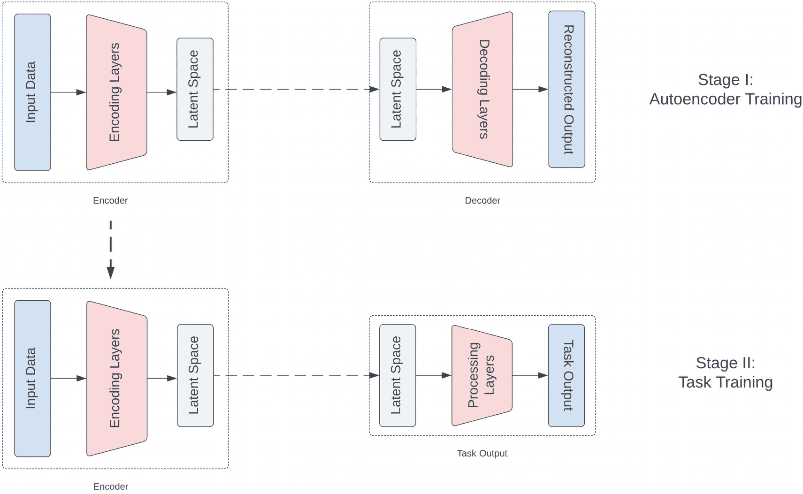

一张信息图表展示了自动编码器和任务训练集。它描述了提取器的特征。

图 8-37

多阶段预训练示意图

在训练的第一阶段，我们在标准输入重建任务上训练自动编码器。经过足够的训练后，我们可以提取编码器并附加一个“解释”为重点的模型组件，将编码器提取的特征组装并排列成所需的输出。

在第 2 阶段，我们对编码器实施*层冻结*，这意味着我们阻止其权重被训练。这是为了保留编码器学习到的结构。我们投入了大量努力来获得一个好的特征提取器；如果我们不实施层冻结，我们会发现将一个好的特征提取器连接到一个非常差的（随机初始化的）特征解释器会降低特征提取器的性能。

然而，一旦在冻结特征提取器和可训练特征解释器上进行训练后获得良好的性能，整个模型可以训练几个周期，用于微调（见图 8-38）。这里的想法是特征解释器已经与静态特征提取器建立了良好的关系，但现在两者可以共同优化以改善关系。（就像处于关系中的伴侣一样，如果一方总是静态的，这对健康是不利的！）

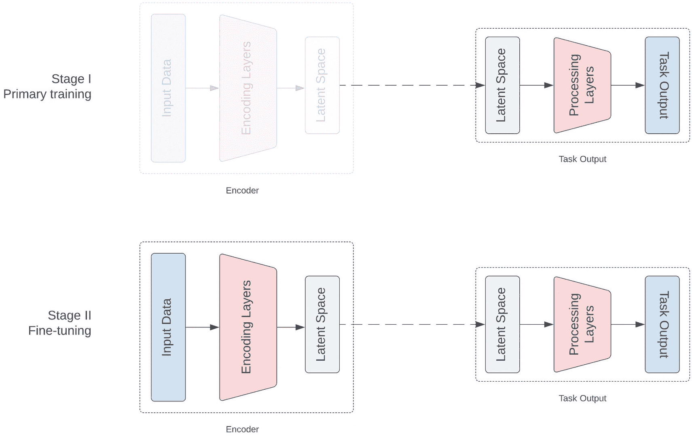

流程图描述了由于特征解释器而达到的性能。它有标签，即主要训练和微调。

图 8-38

冻结后微调可以是一种有效的自动编码器预训练方法。

让我们从在 MNIST 上展示自动编码器预训练开始。我们将使用之前定义的`buildAutoencoder`函数来拟合一个自动编码器，确保保留对原始模型和编码器的引用（见列表 8-13）。

```py
modelSet = buildAutoencoder(784, 32)
model = modelSet['model']
encoder = modelSet['encoder']
model.compile(optimizer='adam', loss='binary_crossentropy')
model.fit(x_train, x_train, epochs=20)
Listing 8-13
Training an autoencoder on MNIST
```

在模型经过足够的训练后，我们可以提取编码器并将其堆叠为我们的任务模型的特征提取单元/组件（见列表 8-14）。编码器的输出（在以下脚本中命名为 encoded）通过几个全连接层进一步解释。编码器被设置为不可训练（即，层冻结）。任务模型在原始监督任务上进行训练。

```py
inp = L.Input((784,))
encoded = encoder(inp)
dense1 = L.Dense(16, activation='relu')(encoded)
dense2 = L.Dense(16, activation='relu')(dense1)
dense3 = L.Dense(10, activation='softmax')(dense2)
encoded.trainable = False
task_model = Model(inputs=inp, outputs=dense3)
task_model.compile(optimizer='adam',
loss='sparse_categorical_crossentropy')
task_model.fit(x_train, y_train, epochs=50)
Listing 8-14
Repurposing the encoder of the autoencoder as the frozen encoder/feature extractor of a supervised network
```

在经过足够的训练后，通常的做法是将编码器再次设置为可训练，并以端到端的方式微调整个架构（见列表 8-15）。

```py
encoded.trainable = True
task_model.fit(x_train, y_train, epochs=5)
Listing 8-15
Fine-tuning the whole supervised network by unfreezing the encoder
```

在微调任务中，我们通常降低学习率，以防止在预训练过程中学习到的信息被破坏/“覆盖”。这可以通过在预训练后使用配置了不同初始学习率的优化器重新编译模型来实现。

我们可以将这个模型的性能与没有预训练的模型进行比较（即，从头开始以监督方式学习）（见列表 8-16，图 8-39）。

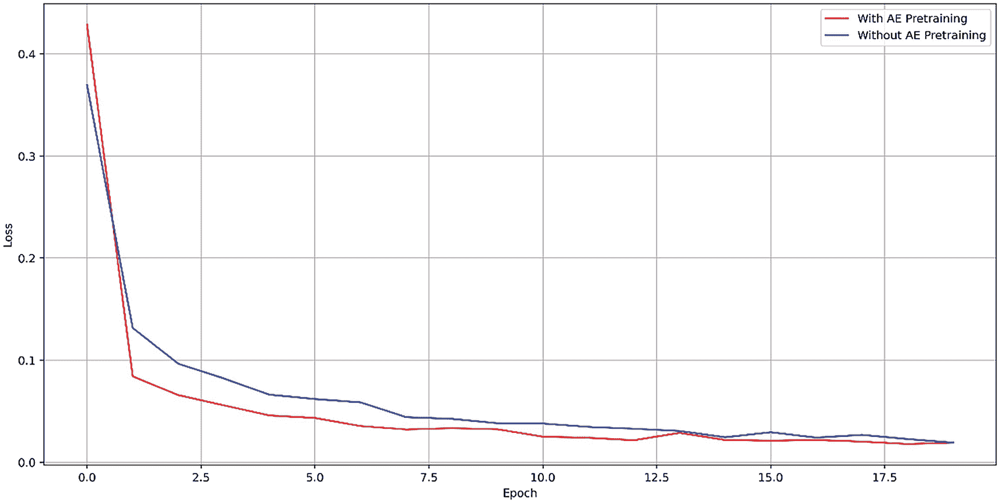

线形图表示了在预训练阶段给定模型的比较。

图 8-39

比较在 MNIST 数据集上训练的具有和没有自动编码器预训练的分类器的训练曲线

```py
modelSet = buildAutoencoder(784, 32)
model = modelSet['model']
encoder = modelSet['encoder']
inp = L.Input((784,))
encoded = encoder(inp)
dense1 = L.Dense(16, activation='relu')(encoded)
dense2 = L.Dense(16, activation='relu')(dense1)
dense3 = L.Dense(10, activation='softmax')(dense2)
task_model = Model(inputs=inp, outputs=dense3)
model.compile(optimizer='adam', loss='sparse_categorical_crossentropy')
history2 = model.fit(x_train, y_train, epochs=20)
plt.figure(figsize=(15, 7.5), dpi=400)
plt.plot(history.history['loss'], color='red',
label='With AE Pretraining')
plt.plot(history2.history['loss'], color='blue',
label='Without AE Pretraining')
plt.grid()
plt.xlabel('Epoch')
plt.ylabel('Loss')
plt.legend()
plt.show()
Listing 8-16
Training a supervised model with the same architecture as the model with pretraining, but without pretraining the encoder via an autoencoding task
```

MNIST 数据集相对简单，因此两个模型都相对快速地收敛到良好的权重。然而，具有预训练的模型在性能上明显“领先”于其他模型。通过计算具有和没有预训练的模型在获得某些性能值时的 epoch 差异，我们可以估计具有自动编码器预训练的模型“领先”了多少。对于任何损失 *p*（至少一个 epoch 的训练），具有预训练的模型在无预训练的模型之前两到四个 epoch 达到 *p*。

在 MNIST 数据集上，这个过程似乎和实际上是多余的，因为该数据集在相对较小的维度上具有相对简单的规则集。然而，对于更复杂的数据集，这种优势更为显著，正如更先进的计算机视觉和自然语言处理任务所展示的那样。例如，训练用于执行大规模图像分类（如 ImageNet）的神经网络，可以从执行自动编码器预训练任务中受益，该任务学习有用的潜在特征，这些特征随后被解释和微调。同样，已经证明，语言模型通过执行重构任务学习语言的重要基本结构，这些任务可以后来用作文本分类或生成等监督任务的基础（图 8-40）。

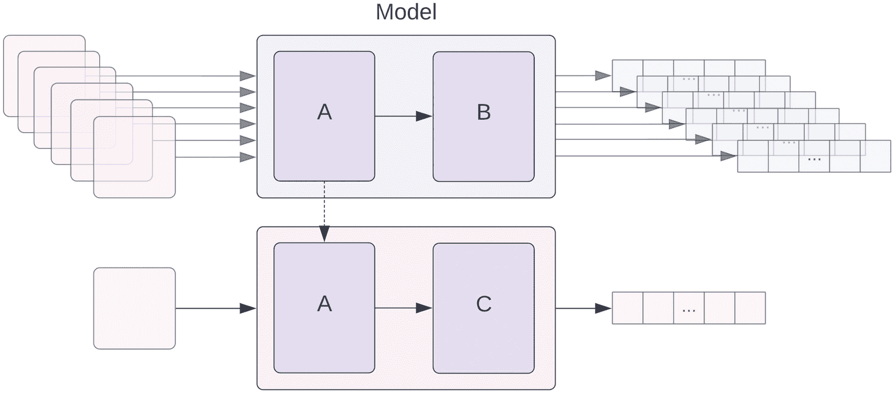

模型图表示可以用于生成和文本分类的基础的重构任务。

图 8-40

在计算机视觉中，普遍使用通用迁移学习/预训练设计

例如，回想一下在第四章节中讨论的 Inception 和 EfficientNet 模型。Keras 允许用户从在 ImageNet 上训练的模型中加载权重，因为执行像 ImageNet 这样广泛任务所需的特征提取“技能”是有价值的或可以适应成为大多数计算机视觉任务中的有价值技能。

然而，正如我们在第四章节和第五章节中之前看到的，深度学习方法在复杂图像和自然语言数据上的成功并不一定阻止它在表格数据应用中也变得有用。

让我们考虑小鼠蛋白质表达数据集。我们可以从实例化和训练一个示例自动编码器（列表 8-17）开始。

```py
modelSet = buildAutoencoder(len(mpe_x_train.columns), 32,
outActivation='linear')
model = modelSet['model']
encoder = modelSet['encoder']
model.compile(optimizer='adam', loss='mse')
history = model.fit(mpe_x_train, mpe_x_train, epochs=50)
Listing 8-17
Building and training an autoencoder on the Mice Protein Expression dataset
```

现在，我们可以使用训练编码器在两个阶段创建和拟合任务模型，第一个阶段中编码器被冻结，第二个阶段中编码器是可训练的（列表 8-18，图 8-41）。

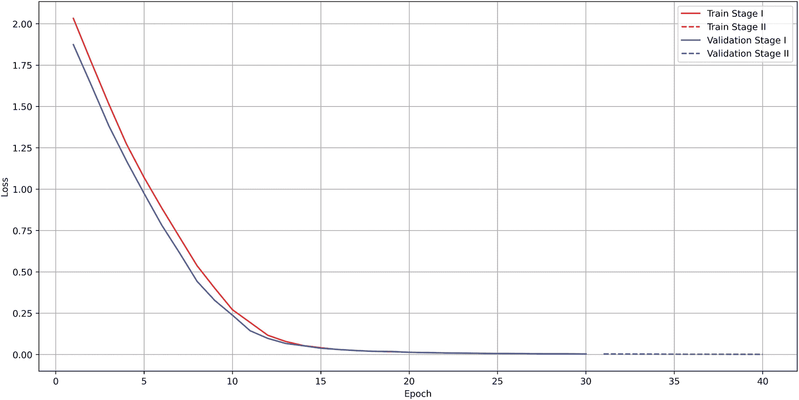

线图表示在冻结和训练阶段利用训练编码器的任务模型。

图 8-41

阶段 1 和 2 的验证和训练曲线

```py
inp = L.Input((len(mpe_x_train.columns),))
encoded = encoder(inp)
dense1 = L.Dense(32, activation='relu')(encoded)
dense2 = L.Dense(32, activation='relu')(dense1)
dense3 = L.Dense(32, activation='relu')(dense2)
dense4 = L.Dense(8, activation='softmax')(dense2)
encoded.trainable = False
task_model = Model(inputs=inp, outputs=dense4)
task_model.compile(optimizer='adam', loss='sparse_categorical_crossentropy',
metrics=['accuracy'])
history_i = task_model.fit(mpe_x_train, mpe_y_train-1, epochs=30,
validation_data=(mpe_x_valid, mpe_y_valid-1))
encoded.trainable = True
history_ii = task_model.fit(mpe_x_train, mpe_y_train-1, epochs=10,
validation_data=(mpe_x_valid,
mpe_y_valid-1))
Listing 8-18
Using the pretrained encoder in a supervised task
```

或者，考虑希格斯玻色子数据集。这个数据集只有 28 个特征。如果我们使用我们的标准自动编码器逻辑，即每个编码器层节点数减半，每个解码器层节点数加倍，我们可能需要非常少的层来使用合理的潜在空间大小，或者使用非常小的潜在空间来使用合理的层数。例如，如果我们的潜在空间只有八个特征，自动编码器逻辑将只构建两层（28 → 16 → 8）。另一方面，如果我们想要更多的层（例如，五层），我们需要一个非常小的潜在空间（例如，一个 28 → 16 → 8 → 4 → 2 → 1 的自动编码器）。在这种情况下，设计一个具有足够大的潜在空间和足够层数的定制自动编码器最有益。例如，我们可以设计一个编码器和解码器各有六层，潜在空间为 16 维度的自动编码器（见列表 8-19）。

```py
encoder = Sequential()
encoder.add(L.Input((len(X_train.columns),)))
encoder.add(L.Dense(28, activation='relu'))
encoder.add(L.Dense(28, activation='relu'))
encoder.add(L.Dense(28, activation='relu'))
encoder.add(L.Dense(16, activation='relu'))
encoder.add(L.Dense(16, activation='relu'))
encoder.add(L.Dense(16, activation='relu'))
decoder = Sequential()
decoder.add(L.Input((16,)))
decoder.add(L.Dense(16, activation='relu'))
decoder.add(L.Dense(16, activation='relu'))
decoder.add(L.Dense(16, activation='relu'))
decoder.add(L.Dense(28, activation='relu'))
decoder.add(L.Dense(28, activation='relu'))
decoder.add(L.Dense(28, activation='linear'))
inp = L.Input((28,))
encoded = encoder(inp)
decoded = decoder(encoded)
ae = keras.models.Model(inputs=inp, outputs=decoded)
ae.compile(optimizer='adam', loss='mse', metrics=['mae'])
history = ae.fit(X_train, X_train, epochs=100,
validation_data=(X_valid, X_valid))
Listing 8-19
Defining a custom autoencoder architecture for the Higgs Boson dataset
```

我们可以将静态编码器视为我们的任务模型的特征提取器（见列表 8-20、图 8-42 和图 8-43）。

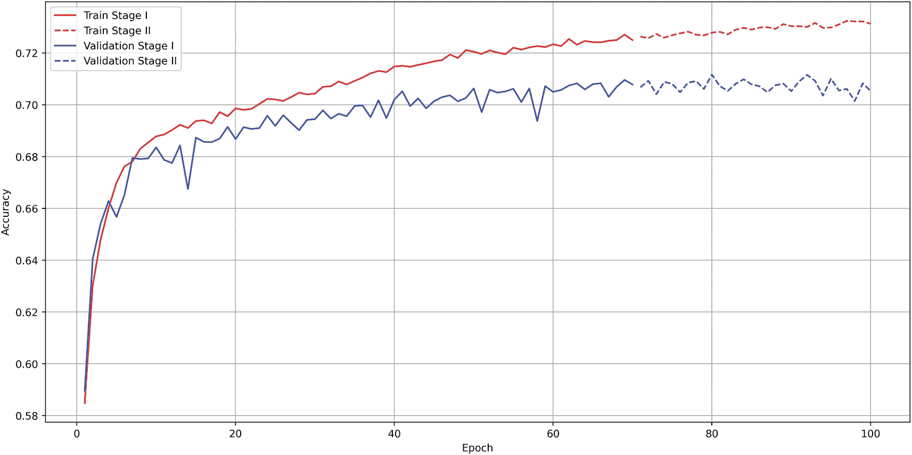

线形图表示上升且不规则的曲线，这使得静态编码器成为特征提取器。

图 8-43

阶段 1 和 2 的验证和训练准确率曲线

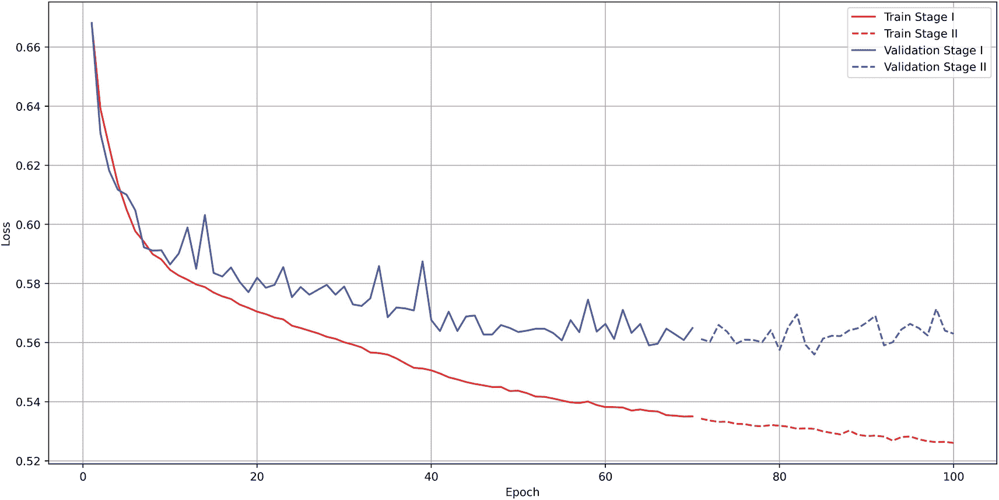

线形图表示向下倾斜且不规则的曲线。它展示了作为特征提取器的预训练编码器。

图 8-42

阶段 1 和 2 的验证和训练损失曲线

```py
inp = L.Input((len(X_train.columns),))
encoded = encoder(inp)
dense1 = L.Dense(16, activation='relu')(encoded)
dense2 = L.Dense(16, activation='relu')(dense1)
dense3 = L.Dense(16, activation='relu')(dense2)
dense4 = L.Dense(1, activation='sigmoid')(dense3)
encoded.trainable = False
task_model = keras.models.Model(inputs=inp, outputs=dense4)
task_model.compile(optimizer='adam', loss='binary_crossentropy',
metrics=['accuracy'])
history_i = task_model.fit(X_train, y_train, epochs=70,
validation_data=(X_valid, y_valid))
encoded.trainable = True
history_ii = task_model.fit(X_train, y_train, epochs=30,
validation_data=(X_valid, y_valid))
Listing 8-20
Using the pretrained encoder as a feature extractor for a supervised task
```

我们可以观察到在这个特定情况下有大量的过拟合。我们可以尝试通过采用最佳实践，如添加 dropout 或批量归一化，来提高泛化能力。

最后，需要注意的是，使用自动编码器进行预训练是一种很好的**半监督**方法。半监督方法利用带标签和无标签的数据（最常用于带标签数据稀缺而未标记数据丰富的情况）。比如说，你拥有三组数据：*X*[未标记]，*X*[标记]和*y*（对应于*X*[标记]）。你可以训练一个自动编码器来重建*X*[未标记]，然后使用冻结的编码器作为任务模型中的特征提取器来预测*y*从*X*[标记]。这种技术在*X*[未标记]的大小显著大于*X*[标记]的大小时仍然有效；自动编码任务学习到有意义的表示，这些表示应该比从初始化开始与监督目标关联得更容易。

## 多任务自动编码器

使用自动编码器进行预训练通常是一种有效的策略，可以充分利用学习到的质量良好的潜在特征。然而，对系统的批评之一是它按**顺序**进行——自动编码器训练与任务训练在不同的阶段进行。多任务自动编码器在自动编码器任务和预期任务**同时**训练网络（因此得名多任务）。这些自动编码器接受一个输入，该输入由编码器编码到潜在空间中。这一组潜在特征由两个“解码器”分别解码成两个输出；一个输出专门用于自动编码器任务，而另一个输出则专门用于预期任务。网络在训练期间同时学习这两个任务（图 8-44 和 8-45）。

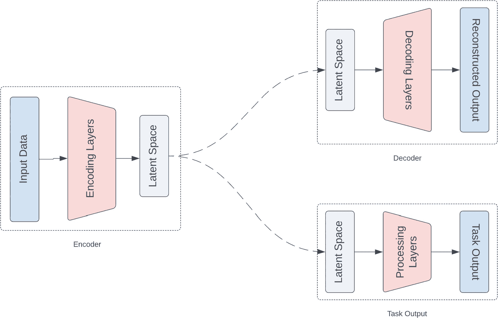

一个流程图描述了专门用于预期任务的潜在特征。它有标签，即输入数据、编码层和潜在空间。

图 8-45

多任务学习

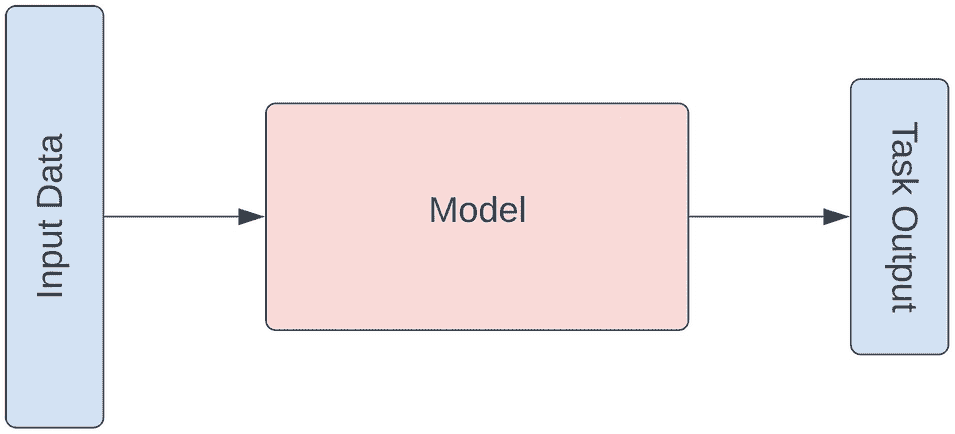

一个模型表示专门用于自动编码器任务的输出。它有标签，即输入数据、模型和任务输出。

图 8-44

原始任务模型

通过在任务网络中同时训练自动编码器，我们可以从理论上以动态的方式体验到自动编码器的益处。假设编码器在以与任务输出相关的特征进行编码时遇到“困难”，这可能很难。然而，模型中的编码器组件仍然可以通过学习与自动编码器重建任务相关的特征来降低整体损失。这些特征可能通过为优化器提供一条可行的损失最小化路径，为任务输出提供持续的支持——可以说是“另一条出路”。使用多任务自动编码器通常是一种有效的技术，可以避免或最小化困难的地方最小值问题，在这种问题中，模型在训练的前几分钟内进展平庸到微不足道，然后停滞不前（即，陷入一个较差的地方最小值）。

为了构建一个多任务自动编码器，我们首先初始化一个自动编码器并提取编码器和解码器组件。我们创建了一个“任务器”模型，该模型接受潜在特征（即编码器输出的形状的数据）并将它们处理成任务输出（例如，在 MNIST 的情况下，是十个数字之一）。这些组件中的每一个都可以使用功能 API 语法链接起来，形成一个完整的多任务自动编码器架构（清单 8-21，图 8-46）。

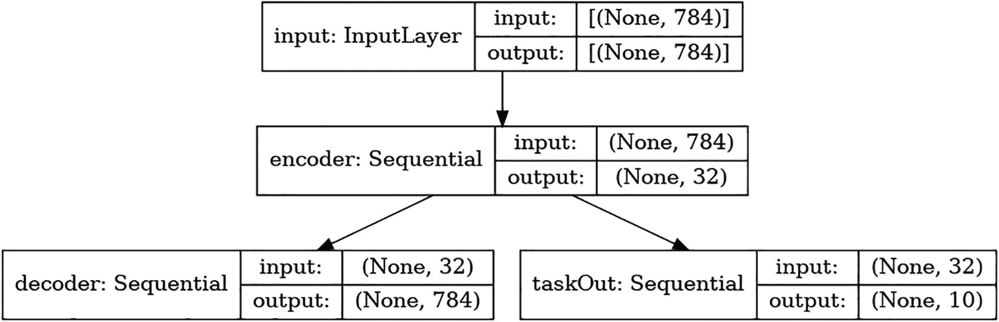

一个网络架构描述了使用功能 API 语法相互连接以创建完整的多任务自动编码器。

图 8-46

多任务自动编码器架构的可视化

```py
modelSet = buildAutoencoder(784, 32)
model = modelSet['model']
encoder = modelSet['encoder']
decoder = modelSet['decoder']
tasker = keras.models.Sequential(name='taskOut')
tasker.add(L.Input((32,)))
for i in range(3):
tasker.add(L.Dense(16, activation='relu'))
tasker.add(L.Dense(10, activation='softmax'))
inp = L.Input((784,), name='input')
encoded = encoder(inp)
decoded = decoder(encoded)
taskOut = tasker(encoded)
taskModel = Model(inputs=inp, outputs=[decoded, taskOut])
Listing 8-21
Building a multitask autoencoder for the MNIST dataset
```

由于多任务自动编码器有多个输出，我们需要通过引用特定输出的名称来为每个输出指定损失和标签。在这种情况下，两个输出已被命名为“decoder”和“taskOut”。解码器输出将给出原始输入（即 `x_train`）并使用二元交叉熵进行优化，因为其目标是进行像素级重建。任务输出将给出图像标签（即 `y_train`）并使用分类交叉熵进行优化，因为其目标是进行多类分类（列表 8-22）。

```py
taskModel.compile(optimizer='adam',
loss = {'decoder':'binary_crossentropy',
'taskOut':'sparse_categorical_crossentropy'})
history = taskModel.fit(x_train, {'decoder':x_train,
'taskOut': y_train},
epochs=100)
Listing 8-22
Compiling and fitting the task model
```

我们可以从训练历史中观察到，模型只需几十个时期就能达到相当好的任务损失和重建损失（列表 8-23，图 8-47）。

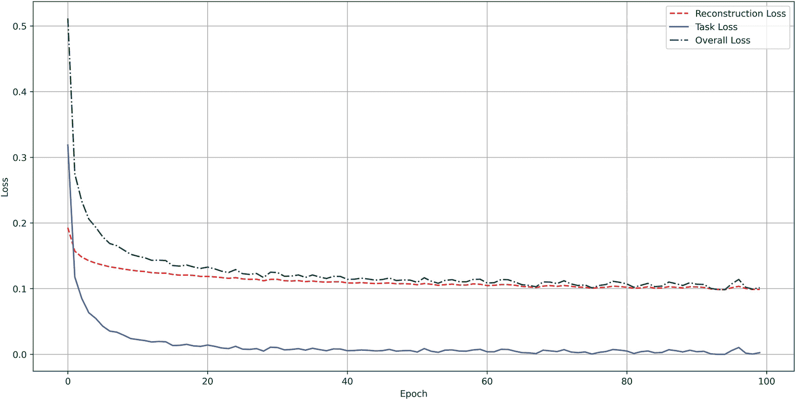

一条线图描绘了三条不同的曲线。它显示出相似的图案。

图 8-47

不同的性能维度（重建损失、任务损失、总体损失）

```py
plt.figure(figsize=(15, 7.5), dpi=400)
plt.plot(history.history['decoder_loss'], color='red', linestyle='--', label='Reconstruction Loss')
plt.plot(history.history['taskOut_loss'], color='blue', label='Task Loss')
plt.plot(history.history['loss'], color='green', linestyle='-.', label='Overall Loss')
plt.grid()
plt.xlabel('Epoch')
plt.ylabel('Loss')
plt.legend()
plt.show()
Listing 8-23
Plotting out different dimensions of the performance over time
```

图 8-48 至 8-51 展示了多任务自动编码器在每个时期的状态进展情况。

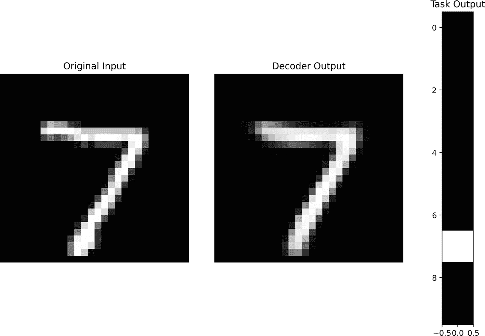

一个输出图像表示了多任务编码器在几个更多时期的发展。

图 8-51

几个更多的时期

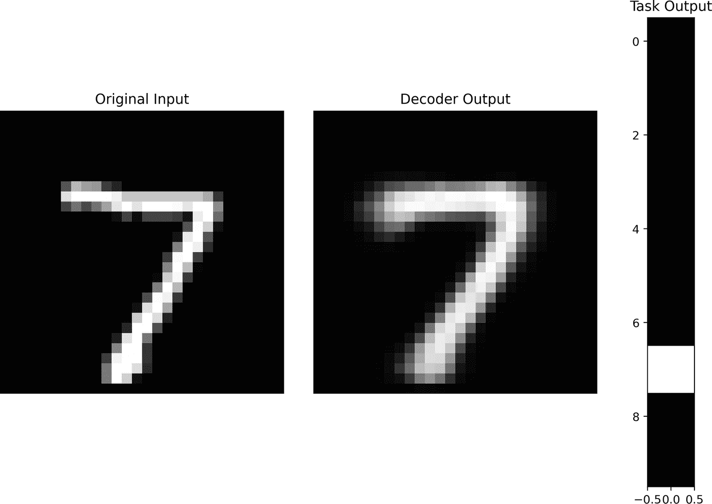

在两个时期的一个数字七形状的图像。

图 8-50

两个时期的任务自动编码器

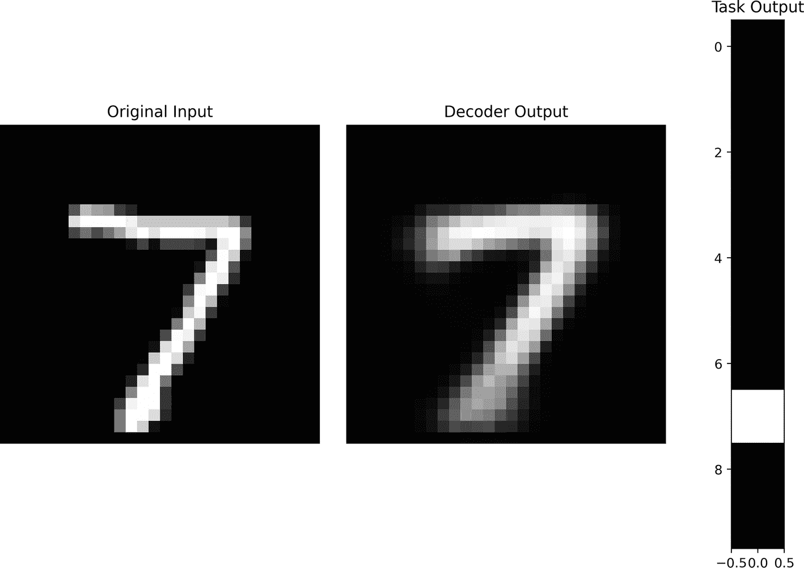

一个正方形图像代表一个时期的自动编码器。

图 8-49

一个时期的任务自动编码器

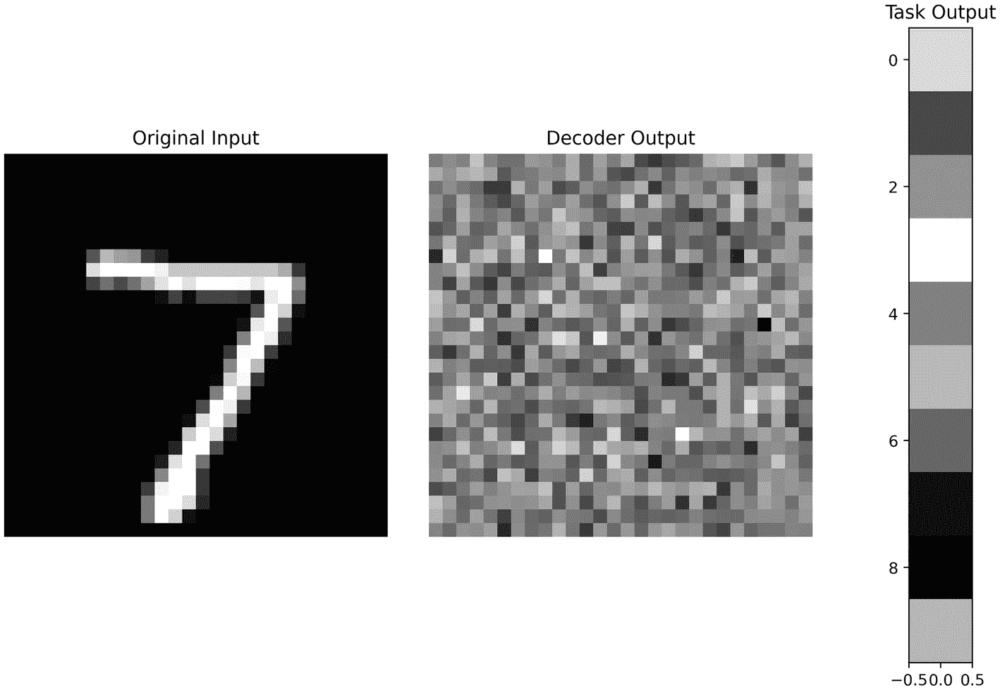

一张图像解释了编码器在每个时期的性能。

图 8-48

零时期的任务自动编码器

从这些可视化和训练历史中，我们看到多任务自动编码器在任务上的性能优于旨在辅助任务性能的自动编码任务！在这种情况下，MNIST 数据集的任务输出比自动编码任务更直接，这是有道理的。在这种情况下，使用多任务自动编码器并不有利。当多任务自动编码器表现不佳时，可能直接训练或使用自动编码器进行预训练更有利。

我们可以在小鼠蛋白质表达数据集上使用一种改进的方法，其中我们看到自动编码比分类任务本身更容易接近，这从训练历史（图 8-52）和输出状态进展可视化（图 8-53 至 8-56）中都可以看出。

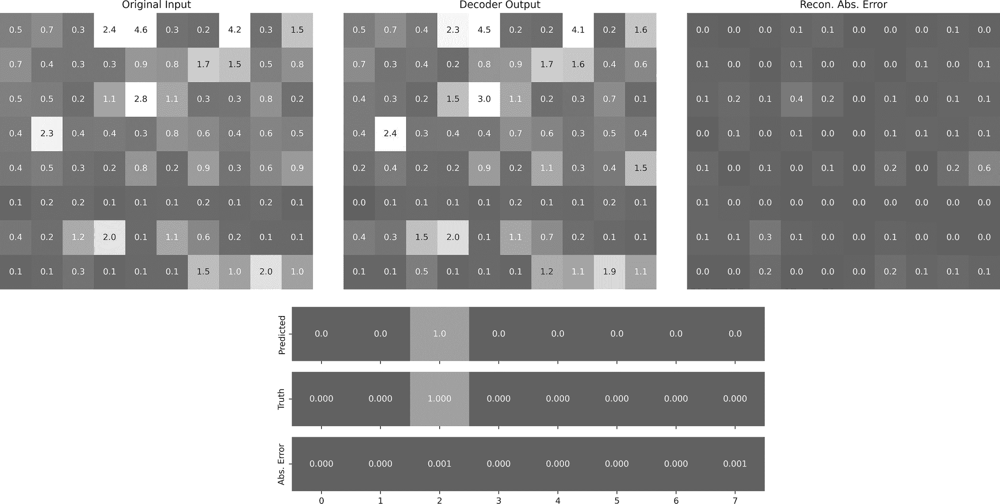

四张图像。3 个网格图像显示原始输入、解码器输出和其他阶段的编码特征，一张图表绘制了绝对误差、真实值和预测值。

图 8-56

多任务自动编码器在 50 个 epoch 后的状态

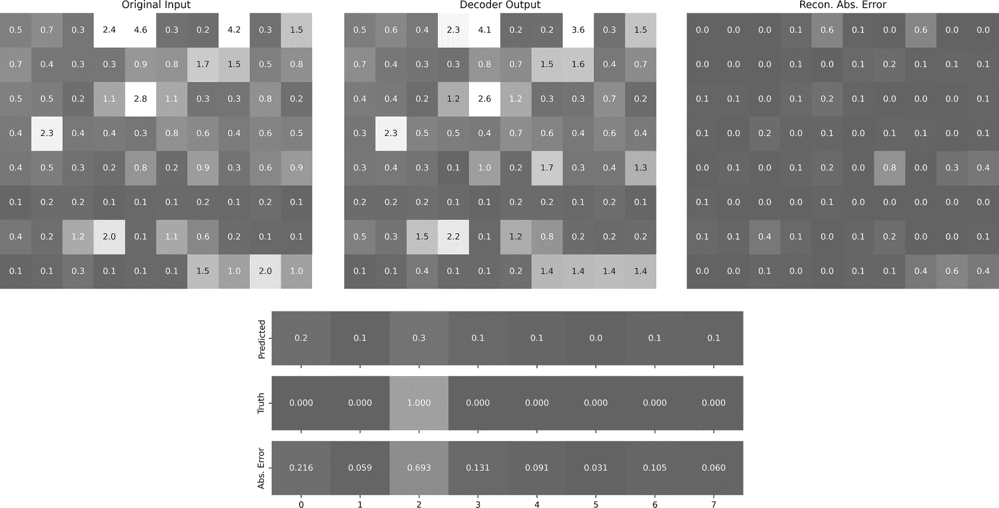

四幅图像。3 个网格图像说明了多任务编码器输出的变化，一个图表绘制绝对误差、真实值和预测值。

图 8-55

多任务自动编码器在五个 epoch 后的状态

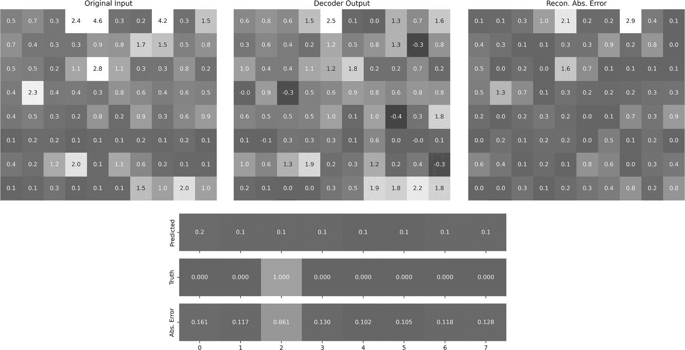

四幅图像。3 个网格图像展示了在一个 epoch 后获得的各种输出，一个图表绘制绝对误差、真实值和预测值。

图 8-54

多任务自动编码器在一个 epoch 后的状态

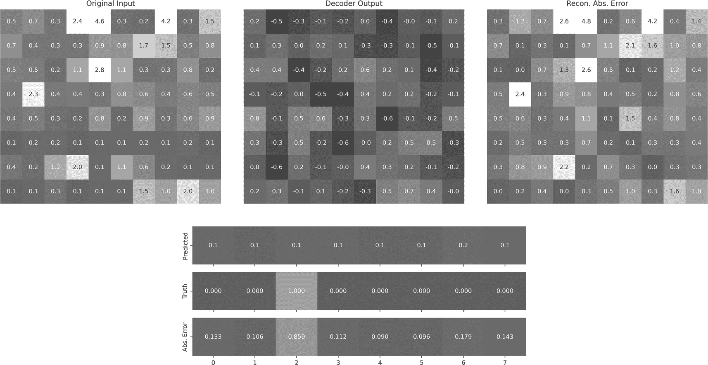

四幅图像。3 个网格图像可视化 80 个特征集的各种输出状态进展值，一个图表绘制绝对误差、真实值和预测值。

图 8-53

多任务自动编码器在零个 epoch（即初始化后）的状态。顶部：显示 Mice Protein Expression 数据集中的原始 80 个特征集（以网格形式排列，以便更方便地视觉查看），解码器的输出（其目标是重建输入），以及重建的绝对误差。底部：预测和真实类别（总共八个）和绝对概率误差

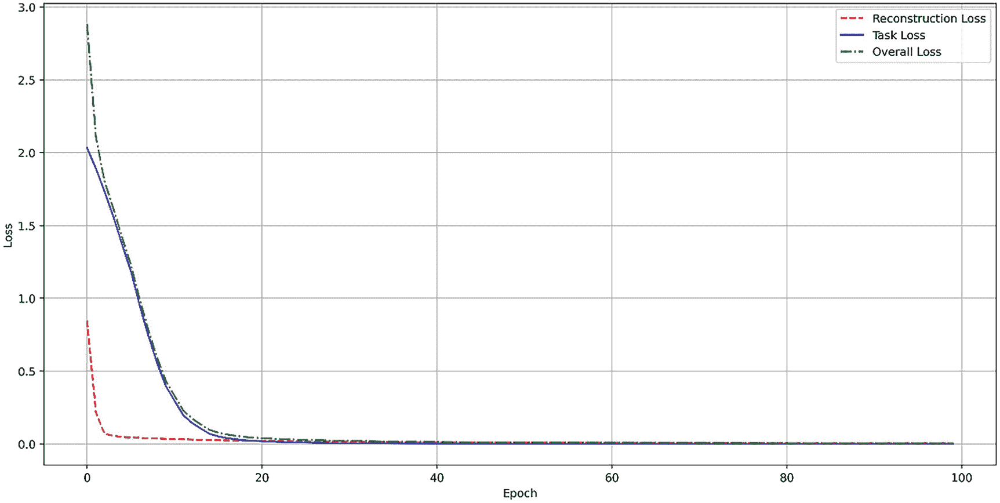

一条线图展示了在 Mice 保护表达数据集上的方法训练历史中的自动编码过程。

图 8-52

Mice Protein Expression 数据集上性能的不同维度

图 8-53 至 8-56 展示了在训练的各个阶段，重建任务与分类任务的性能。请注意，重建误差迅速收敛到接近零，并有助于“拉动”/“引导”任务误差随时间趋于零。

在许多情况下，同时执行自动编码器任务和原始期望任务可以帮助为“推动”期望任务的进展提供刺激。然而，你可能会提出一个合理的反对意见，即一旦期望任务达到足够好的性能，它就会受到自动编码器任务的限制。

一种解决这个问题的方法就是通过创建一个新的模型，将输入连接到任务输出，并在数据集上进行微调，从而将自动编码器的输出从模型中分离出来。

另一种更复杂的技术是改变原始期望任务和自动编码任务之间的损失权重。虽然 Keras 默认将多个损失权重均等，但我们可以提供不同的权重来反映分配给每个任务的优先级或重要性的不同水平。在训练开始时，我们可以给自动编码任务一个高权重，因为我们希望模型通过一个（理想情况下稍微容易一些的）自动编码任务来发展有用的表示。在整个训练过程中，原始任务模型损失的权重可以逐步增加，自动编码器模型损失的权重可以逐步减少。为了正式化这一点，让α代表任务输出损失的权重，让 1-α代表解码器输出损失的权重（其中 0<α<1）。

sigmoid 方程 ![σ(x) = 1/(1+e^(-x))] 是从接近某个最小界限的值到另一个接近上限的值的一个很好的方法。在 100 个 epoch 的范围内，我们可以对 sigmoid 函数进行简单的（任意设置但有效的）变换，以获得α从低值到高值的平滑过渡（如图 8-57 中的列表 8-24 所示），其中 t 代表 epoch 编号：

![α = σ((t-50)/10) = 1/(1+e^(-(t-50)/10))] (../images/525591_1_En_8_Chapter/525591_1_En_8_Chapter_TeX_Equc.png)

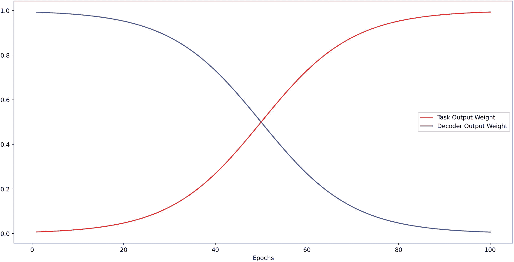

一条线图表示 sigmoid 函数从低值到高值的平滑过渡。它绘制了输出权重和解码器输出权重。

图 8-57

每个 epoch 中任务输出损失权重和解码器权重的图示

```py
plt.figure(figsize=(15, 7.5), dpi=400)
epochs = np.linspace(1, 100, 100)
alpha = 1/(1 + np.exp(-(epochs-50)/10))
plt.plot(epochs, alpha, color='red', label='Task Output Weight')
plt.plot(epochs, 1-alpha, color='blue', label='Decoder Output Weight')
plt.xlabel('Epochs')
plt.legend()
plt.show()
Listing 8-24
Plotting out our custom α-adjusting curve
```

一个通用的方程，通过 sigmoid 函数的变换来缩放α通过 t[max]如下：

![α = σ((t-t_max/2)/(t_max/10)) = 1/(1+e^(-(t-t_max/2)/(t_max/10)))] (../images/525591_1_En_8_Chapter/525591_1_En_8_Chapter_TeX_Equd.png)

在初始条件下，α的值非常小。（为了计算简便，我们在此计算中使用 t=1。）

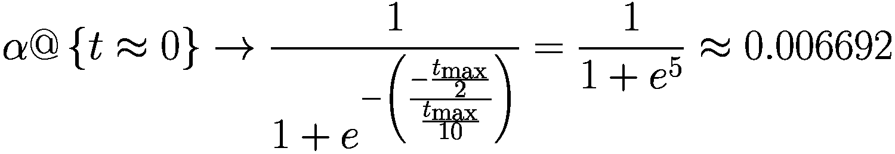

训练过程在 t=t[max]时完成，此时α非常接近 1：

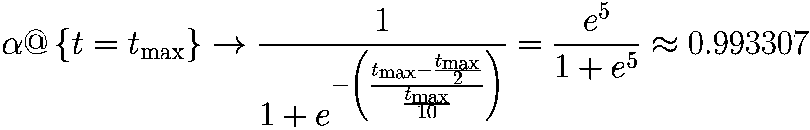

此外，通过求导并求解最大值，我们发现某些 *t*[max] 的最大变化为 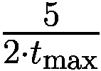。随着 *t*[max] 的增加，对导数的分析显示整体变化变得更加均匀分布。对于较大的 *t*[max] 值，这个函数实际上变成了一条水平线（即导数接近 0）。在大多数情况下，如果 *t*[max] 比较大，对 *α* 进行简单的线性变换也足够了。

损失加权是在编译阶段传达的。这意味着我们不得不重新编译和调整每个时代。这并不困难；我们可以编写一个循环，遍历每个时代，计算那个时代的 *α* 值，用那个损失加权编译模型，并调整一个时代。收集训练历史稍微有些手动；我们需要收集单个时代的指标，并将它们附加到用户创建的列表（列表 8-25）中。

```py
total_epochs = 100
lossParams = {'decoder':'binary_crossentropy',
'taskOut':'sparse_categorical_crossentropy'}
loss, decoderLoss, taskOutLoss = [], [], []
for epoch in range(1, total_epochs+1):
alpha = 1/(1 + np.exp(-(epoch-50)/10))
taskModel.compile(optimizer='adam',
loss = lossParams,
loss_weights = {'taskOut': alpha,
'decoder': 1-alpha})
history = taskModel.fit(x_train, {'decoder':x_train,
'taskOut': y_train},
epochs = 1)
loss.extend(history.history['loss'])
decoderLoss.extend(history.history['decoder_loss'])
taskOutLoss.extend(history.history['taskOut_loss'])
Listing 8-25
Recompiling and fitting a multitask autoencoder with varied loss weighting
```

对于另一种更高代码但可能更平滑的动态调整多输出模型损失计算权重的方案，该方案不需要重复调整，请参阅 Anuj Arora 在 Keras 中使用回调进行自适应损失加权的出色文章：[`medium.com/dive-into-ml-ai/adaptive-weighing-of-loss-functions-for-multiple-output-keras-models-71a1b0aca66e`](https://medium.com/dive-into-ml-ai/adaptive-weighing-of-loss-functions-for-multiple-output-keras-models-71a1b0aca66e)。

图 8-58 展示了多任务自动编码器训练过程中重建、任务和整体损失的历史，背景以该时代使用的 *α* 值着色。请注意，重建任务比原始任务更简单（因此损失下降更快），以及在 40-60 个时代中 *α* 发生重大变化，从重建任务“切换”到原始任务损失的整体损失函数的物流形状。

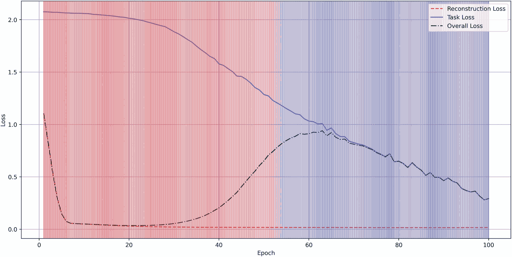

一张图解释了重建任务以及在整个多任务自动编码器训练过程中产生的总损失。

图 8-58

重建损失、任务损失和整体损失（现在是一个动态加权的总和）的图，背景中着色了加权梯度。

多任务自动编码器在困难的监督分类任务中表现最佳，这些任务可以从自动编码器很好地学习的丰富潜在特征中受益。

## 稀疏自动编码器

标准自编码器受到大小表示的限制——自编码器架构通过一个“物理”瓶颈构建，信息必须通过该瓶颈进行压缩。自编码器试图通过显著压缩的潜在空间来最大化可以压缩的信息量，以便信息可以可靠地解码成原始输出（图 8-59）。

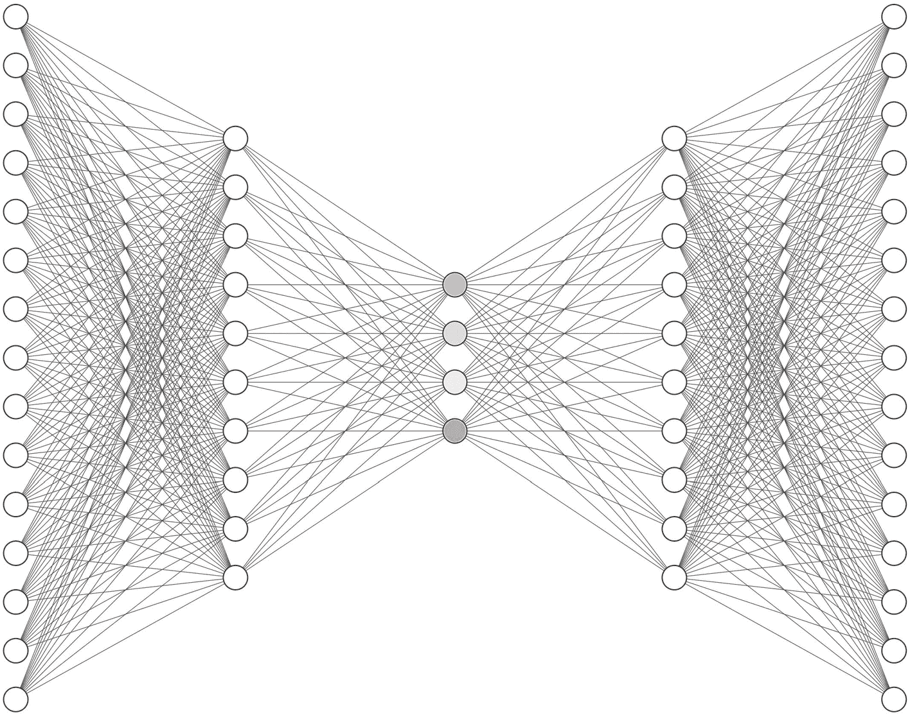

网络架构表现出压缩的潜在空间。这表明数据可以可靠地解码成原始输出。

图 8-59

标准自编码器，将信息编码到密集且准连续的潜在空间中

然而，这并非我们能够施加的唯一限制。另一个信息瓶颈工具是*稀疏性*。我们可以使瓶颈层非常大，但在任何一次传递中只强制激活少数节点。虽然这仍然限制了可以通过瓶颈层的信息量，但网络获得了更多的自由和控制来“选择”哪些节点信息通过，这本身是信息表达的一种额外媒介（图 8-60）。

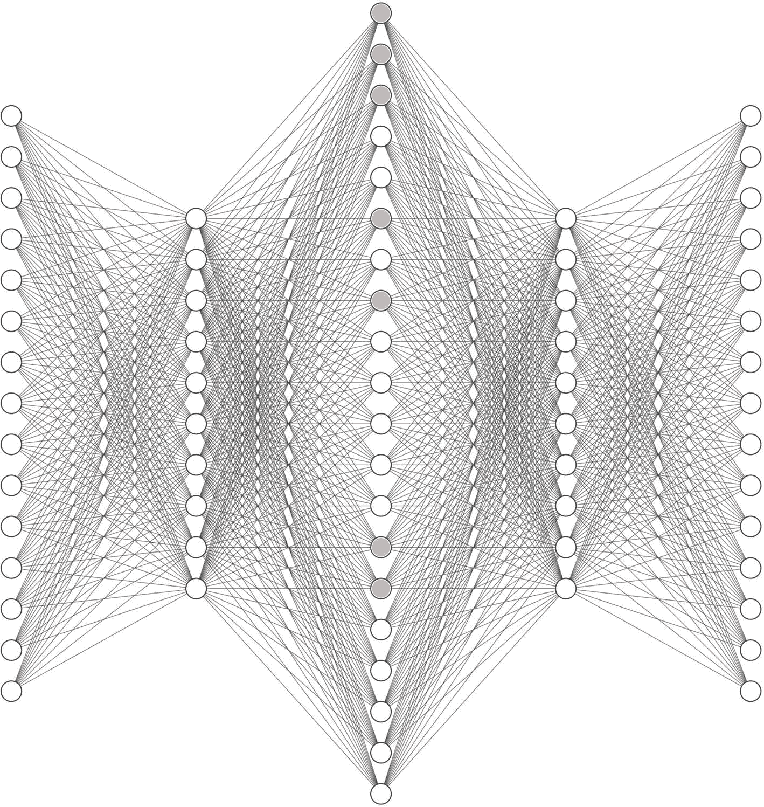

网络图表现出一种自由模式，能够选择节点的数据。

图 8-60

稀疏自编码器，其中可以访问更大的潜在大小，但任何时刻只能使用少数节点

为了保持稀疏性，我们通常对层的活动施加 L1 正则化。（回想一下第三章“正则化学习网络”中关于正则化的讨论。）L1 正则化通过使瓶颈层的输出活动过大来惩罚。假设网络使用二元交叉熵损失来最小化任务输出，而*λ*代表瓶颈层的整体活动/输出，L1 正则化网络的联合损失如下：

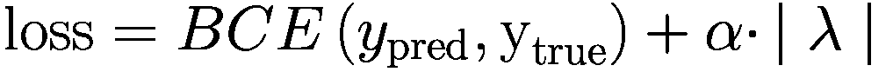

参数*α*由用户定义，并控制 L1 正则化项相对于任务损失的“重要性”。设置正确的*α*值对于正确的行为很重要。如果*α*太小，网络会忽略稀疏性限制，优先完成任务，现在由于过完备的瓶颈层而变得近乎平凡。如果*α*太大，网络会忽略任务，通过学习“终极稀疏性”——在瓶颈层预测所有零，这完全最小化了*λ*，但在我们想要它学习的实际任务上表现不佳。

常用的另一种惩罚方法是 L2 正则化，其中惩罚的是平方而不是绝对值：

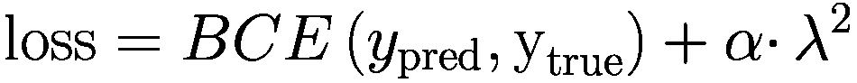

这是一个常见的机器学习范式。L2 正则化倾向于产生一组接近零但不在零处的值，而 L1 正则化倾向于产生值完全为零。一个直观的解释是，L2 正则化显著降低了减少已经接近零的值的必要性。例如，从 3 减少到 2 的减少会得到 3² − 2² = 5 的惩罚减少。另一方面，从 1 减少到 0 的减少只会得到微不足道的惩罚减少 1² − 0² = 1。另一方面，L1 正则化对从 3 减少到 2 和从 1 减少到 0 的减少给予相同的奖励。我们通常使用 L1 正则化来施加稀疏约束，因为这个特性。

要实现这一点，我们需要对我们的原始 `buildAutoencoder` 函数进行轻微的修改。我们可以构建自动编码器，就像我们正在引导到一个特定的*隐式*潜在大小并从中返回一样，但将*隐式*潜在大小替换为*实际*（扩展的）潜在大小。例如，考虑一个输入维度为 64，隐式潜在空间为 8 维度的自动编码器。使用我们预构建的自动编码器逻辑的标准自动编码器每层的节点数量递增将是 64 → 32 → 16 → 8 → 16 → 32 → 64。然而，因为我们计划在瓶颈层施加稀疏约束，我们需要提供一个扩展的节点集来传递信息。假设实际的瓶颈大小是 128 个节点。这个稀疏自动编码器每层的节点数量递增将是 64 → 32 → 16 → 128 → 16 → 32 → 64。

要实际实现稀疏约束，请注意，Keras 中几乎所有的层都有一个在初始化时设置的 `activity_regularizer` 参数。该参数惩罚层的*活动*或输出（见列表 8-26）。请注意，如果您想惩罚学习到的权重或偏差，也可以设置 `weight_regularizer` 或 `bias_regularizer` 参数。在这种情况下，我们并不关心编码器*如何*到达稀疏编码，而只是编码器*创建*稀疏编码。因此，我们在层活动上执行正则化。这些参数接受一个 `keras.regularizers` 对象。我们将使用接受特定惩罚权重的 L1 正则化对象。设置权重很重要，应该经过深思熟虑和实验，考虑到模型能力、自动编码的难度和潜在空间的大小。如前所述，在任一方向上设置不适当的权重（过大或过小）都会产生不良后果。

```py
from keras.regularizers import L1
def buildSparseAutoencoder(inputSize=784,
impLatentSize=32,
realLatentSize=128,
outActivation='sigmoid'):
# define architecture components
encoder = Sequential(name='encoder')
encoder.add(L.Input((inputSize,)))
for i in range(int(np.floor(np.log2(inputSize/impLatentSize))), -1, -1):
encoder.add(L.Dense(impLatentSize * 2**i, activation='relu'))
encoder.add(L.Dense(impLatentSize * 2**i, activation='relu'))
encoder.add(L.Dense(realLatentSize, activation='relu',
activity_regularizer = L1(0.001)))
decoder = Sequential(name='decoder')
decoder.add(L.Input((realLatentSize,)))
for i in range(1,int(np.floor(np.log2(inputSize/impLatentSize)))+1):
decoder.add(L.Dense(impLatentSize * 2**i, activation='relu'))
decoder.add(L.Dense(impLatentSize * 2**i, activation='relu'))
decoder.add(L.Dense(inputSize, activation=outActivation))
# define model architecture from components
ae_input = L.Input((inputSize,), name='input')
ae_encoder = encoder(ae_input)
ae_decoder = decoder(ae_encoder)
ae = Model(inputs = ae_input,
outputs = ae_decoder)
return {'model': ae, 'encoder': encoder, 'decoder': decoder}
Listing 8-26
Defining a sparse autoencoder with L1 regularization
```

图 8-61 展示了稀疏自动编码器在 MNIST 数据集上的性能，其中 64 维潜在空间向量被重新排列成一个 8x8 的网格以方便查看。重建在可见性上并不比没有稀疏度约束的标准自动编码器差。注意，在任何一次传递中只有两个到五个的 64 个节点是活跃的（并且活跃的节点对于每张图像都是不同的）。即使瓶颈层有五个节点（没有稀疏度要求）的标准自动编码器在重建上也会获得较差的性能，这证明了“选择”哪些节点活跃的信息丰富性。

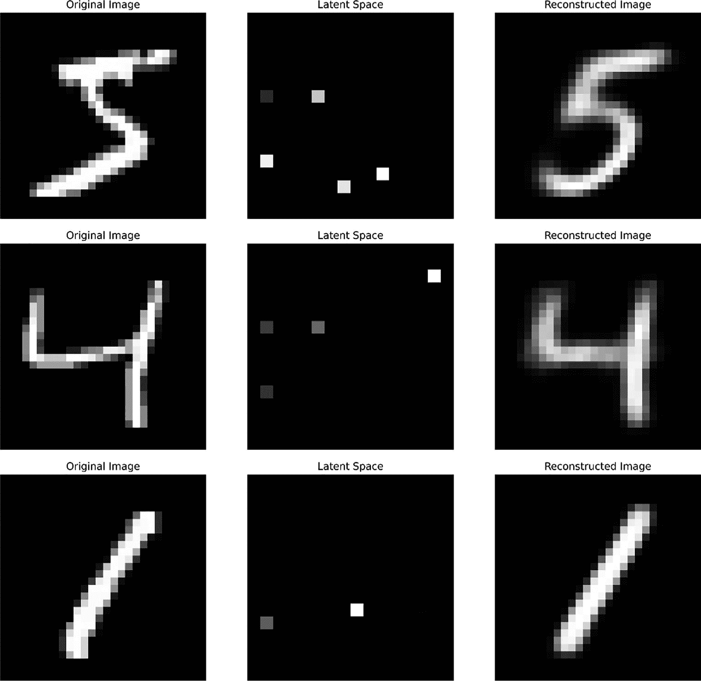

解释器图像表示稀疏编码器在 MNIST 数据集上的性能。

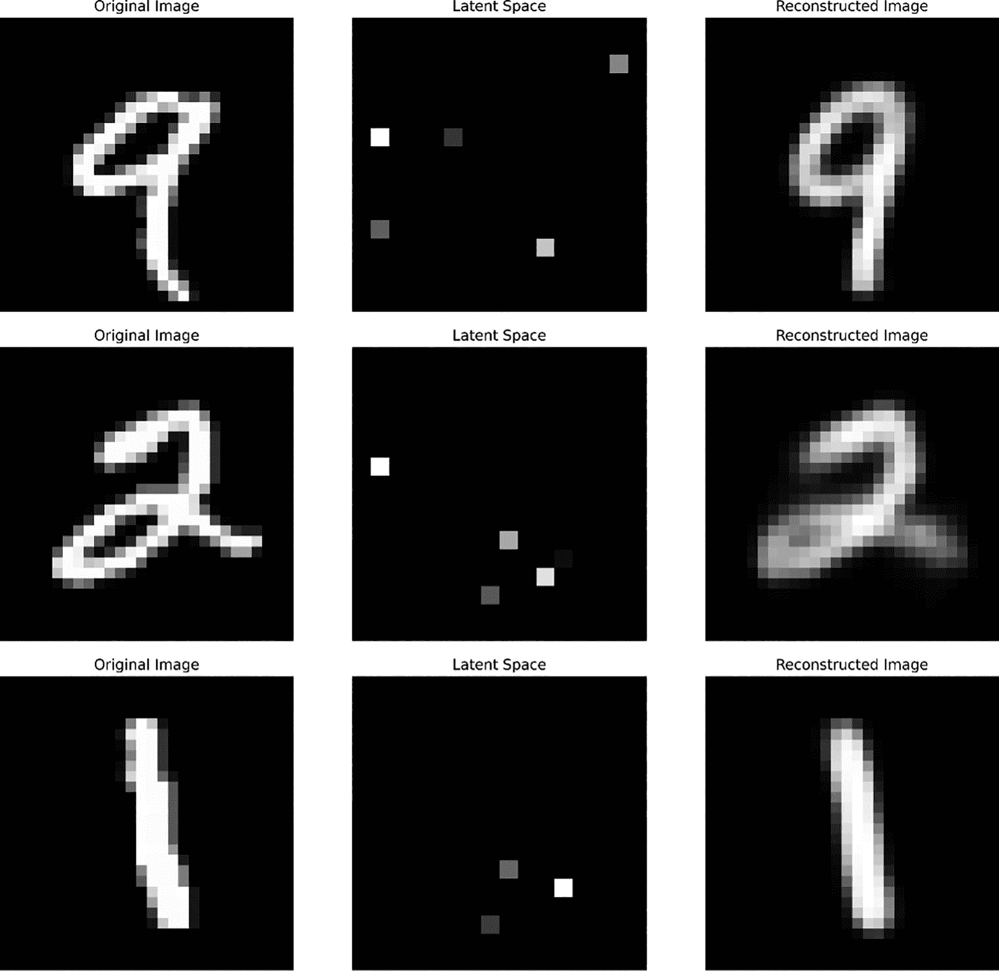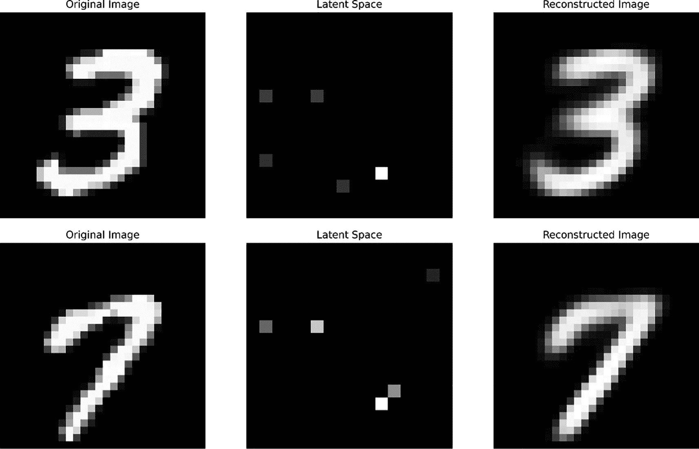

图 8-61

在 MNIST 数据集上训练的稀疏自动编码器的采样原始输入（左侧）、潜在空间（中间）和重建（右侧）。潜在空间由 256 个神经元重新排列成一个 16x16 的网格以供查看。实际的潜在空间并不是按两个空间方向排列的

如果我们降低正则化 alpha 值（即相对于损失的 L1 惩罚权重会降低），网络将获得更好的整体损失，但代价是稀疏度（即在任何一次传递中会有更多节点活跃）。如果我们增加正则化 alpha，网络将获得更差的总体损失，但有利于增加稀疏度（即在任何一次传递中会有更少的节点活跃）。

我们可以将相同的稀疏自动编码方案应用于 Higgs 玻色子数据集，将 28 维输入向量编码成 64 维潜在空间。在每次传递中，大约有四分之一到三分之一潜在空间是活跃的，尽管许多瓶颈节点是“准活跃”的——它们不是零，但非常接近。图 8-62 展示了稀疏自动编码器在不同输入上的内部状态和重建，28 维输入向量重新排列成 7x4 的网格以方便查看。

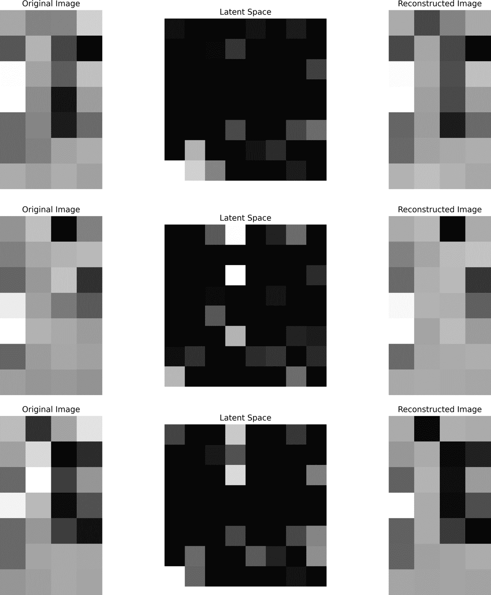

12 幅图像描绘了具有 16x16 网格潜在空间的稀疏自动编码器的重塑。

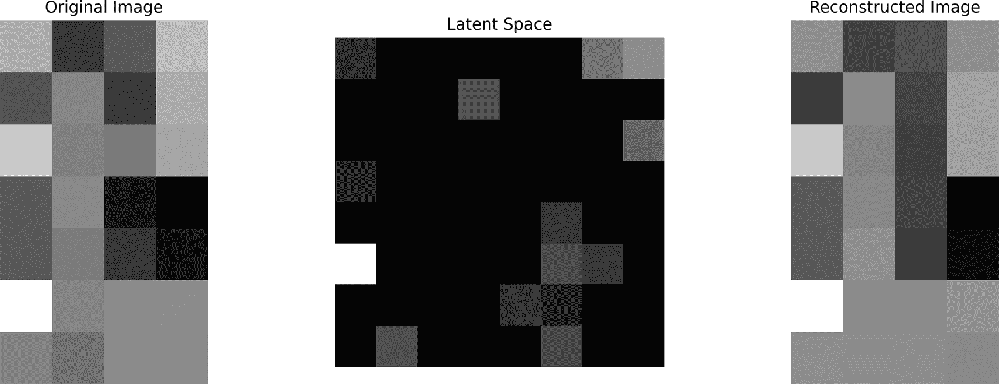

图 8-62

在 Higgs 玻色子数据集上训练的稀疏自动编码器的采样原始输入（左侧）、潜在空间（中间）和重建（右侧）；潜在空间由 256 个神经元重新排列成一个 16x16 的网格以供查看；输入和重建是 28 维度的，排列成 7x4 的网格

类似地，图 8-63 展示了训练好的稀疏自动编码器在 Mice 蛋白质表达数据集的各种元素中的应用。

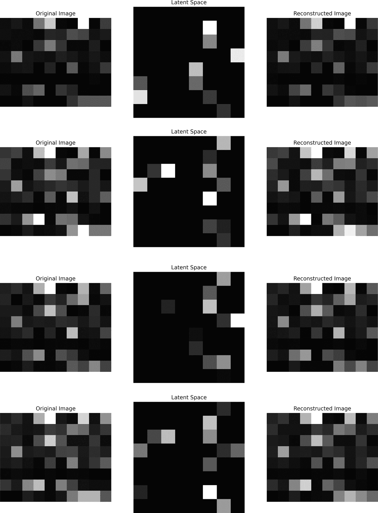

12 幅图像代表了稀疏自编码器在给定数据集的不同元素中的应用。

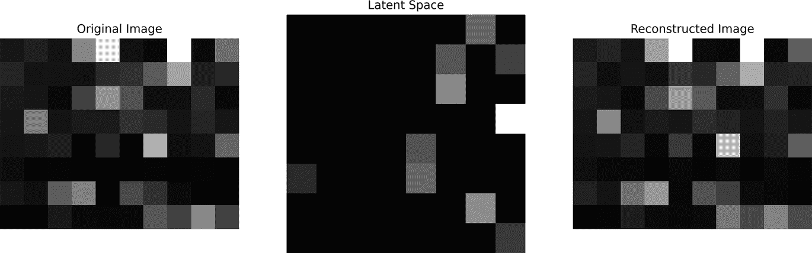

图 8-63

在 Mice Protein Expression 数据集上训练的稀疏自编码器的原始输入（左）、潜在空间（中）和重建（右）示例。潜在空间由 256 个神经元重新排列成一个 16x16 的网格以供查看；输入和重建是 80 维，排列成 8x10 的网格

为什么你想使用稀疏自编码器？主要原因是利用稀疏编码器的鲁棒性特性。对抗样本是故意生成以欺骗神经网络将原本正确分类为类别*A*的图像以高置信度错误地分类为类别*B*的实例，只需对输入进行微小的、几乎看不见的改变。该领域的经典例子是 Ian Goodfellow 等人在其论文“解释和利用对抗样本”中创建的图表。快速符号梯度法（FSGM）生成一个排列矩阵，以调整输入中的每个像素，从而显著改变网络的最终预测（图 8-64）。

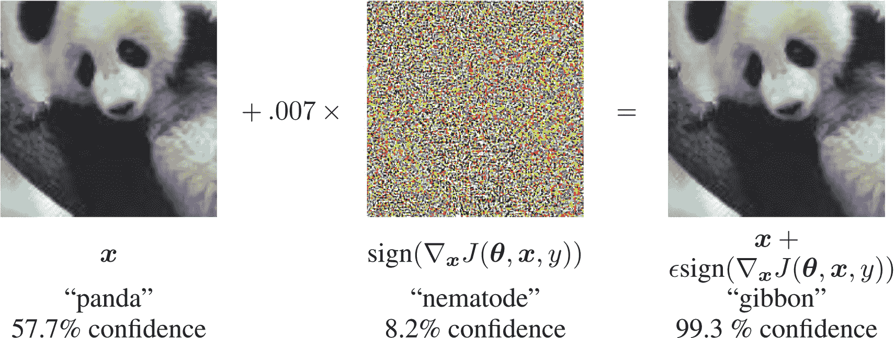

一个数学表达式。第一个输入是熊猫的照片，第二个是线虫，输出是长臂猿，由熊猫描绘。

图 8-64

FSGM 方法的演示。来自“解释和利用对抗样本”，Goodfellow 等人。

对抗样本查找器受益于连续性和梯度。由于神经网络在非常大的连续空间中运行，可以通过“偷偷”穿过景观表面的平滑通道和脊来找到对抗样本。对抗样本可以是安全威胁（例如，某些自然发生的对抗样本实例，如将胶带以特定方向贴在交通标志上，导致严重的误识别），以及泛化不良的潜在症状。1 然而，稀疏编码器在编码空间上施加了离散性。当使用冻结的编码器作为网络的特征提取器时，生成成功的对抗样本变得显著困难。

稀疏自编码器在可解释性方面也可能很有用。我们将在本章后面更详细地讨论专门的解释性技术，但稀疏自编码器可以很容易地被解释，而无需额外的复杂理论工具。因为任何时刻只有少数神经元是活跃的，理解哪个神经元对任何输入被激活相对简单，尤其是与标准自编码器生成的潜在向量相比。

## 去噪和修复自编码器

到目前为止，我们只考虑了自动编码器训练的应用，其中期望输出与输入相同。然而，自动编码器可以执行另一个功能：修复或恢复损坏或噪声输入。

这里是我们巧妙处理的方法——我们人为地向“纯净”/“干净”的数据集中添加真实的噪声或损坏，然后训练模型从其人为损坏的版本中恢复清洗后的图像（见图 8-65）。

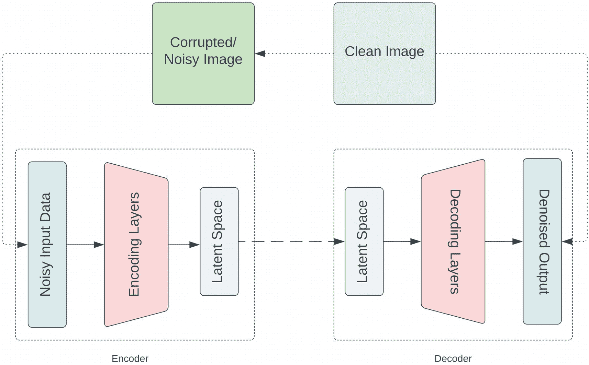

流程图表示从人为损坏的图像中恢复干净图像的训练数据集。

图 8-65

从噪声图像作为输入和原始干净图像作为去噪自动编码器的期望输出

这种模型有许多应用。最明显的是，我们可以用它来去噪噪声输入；清洗后的输入可以用于其他目的。或者，如果我们正在开发一个我们知道将在具有大量噪声数据的领域中运行的模型，我们可以使用去噪自动编码器的编码器作为鲁棒或弹性的特征提取器（类似于自动编码器预训练），利用编码器的“去噪”潜在表示（见图 8-66）。

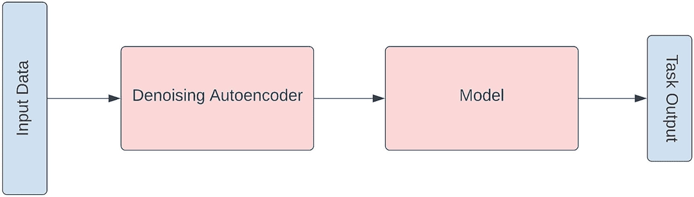

流程图描述了去噪自动编码器的功能。它有输入数据、去噪自动编码器、模型和任务输出的标签。

图 8-66

去噪自动编码器作为学习在模型用于任务之前清理输入的结构的一种潜在应用

这些修复模型在智能或深度图形处理方面有特别令人兴奋的应用。许多图形操作并不是**双向可逆的**，即从一个状态到另一个状态是简单的，但在相反方向上则不是。例如，如果我将彩色图像或电影转换为灰度（例如，使用第二章中图像案例研究涵盖的像素级方法），就没有简单的方法将其反转回彩色。或者，如果你在一张旧的家庭照片上洒了咖啡，就没有简单的过程来“擦除”污渍。

然而，自动编码器通过在纯数据上人为地施加损坏并迫使强大的自动编码器架构学习“撤销”来利用从“纯净”到“损坏”状态的简单性。研究人员已经使用去噪自动编码器架构来生成历史黑白电影的彩色版本，以及修复被撕裂、染色或划痕的照片。另一个应用是在生物/医学成像中，成像操作可能会受到环境条件的影响；通过人工复制这种噪声/图像损坏并训练自动编码器使其对它具有鲁棒性，可以使模型对噪声更具弹性。

我们将首先通过逐步增加图像中的噪声量，并观察去噪自编码器的表现来演示去噪自编码器在 MNIST 数据集上的应用（类似于第四章的练习）。

我们可以使用一种简单但有效的方法向图像中引入噪声：添加从均值为 0 和指定标准差的正态分布中采样的随机噪声。结果被截断以确保结果值仍然在 0 和 1 之间，这是像素值的可行域。代码清单 8-27 实现并可视化了一个给定标准差 `std` 的人工噪声。

```py
modified = x_train + np.random.normal(0, std, size=x_train.shape)
modified_clipped = np.clip(modified, 0, 1)
plt.set_cmap('gray')
plt.figure(figsize=(20, 20), dpi=400)
for i in range(25):
plt.subplot(5, 5, i+1)
plt.imshow(modified_clipped[i].reshape((28, 28)))
plt.axis('off')
plt.show()
Listing 8-27
Displaying data corrupted by random noise
```

图 8-67 展示了一个没有添加人工噪声的样本图像网格，作为比较的参考。

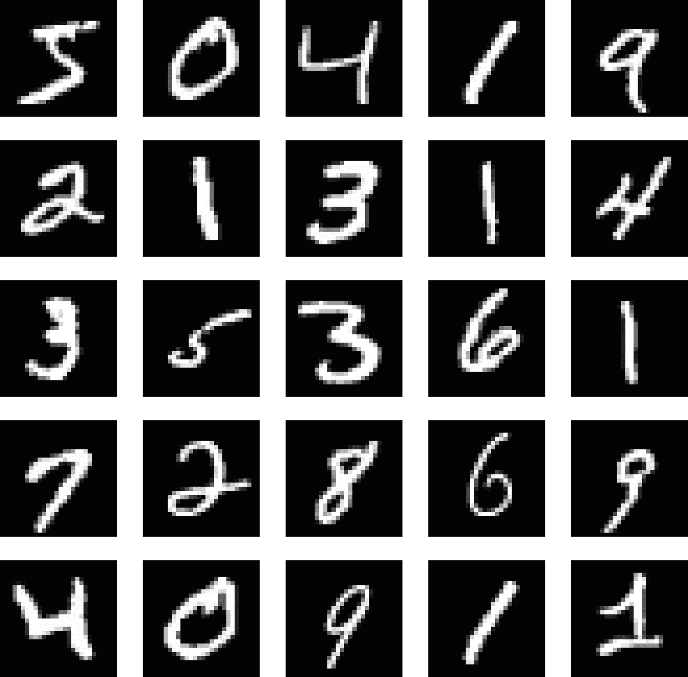

一个数值网格表示没有添加人工噪声的各种样本图像，作为比较参考。

图 8-67

MNIST 的未修改的干净图像网格作为参考。

图 8-68 展示了从标准差为 0.1 的正态分布中采样的随机噪声的相同图像集。我们可以观察到边缘噪声，尤其是在影响数字轮廓的一致性方面。

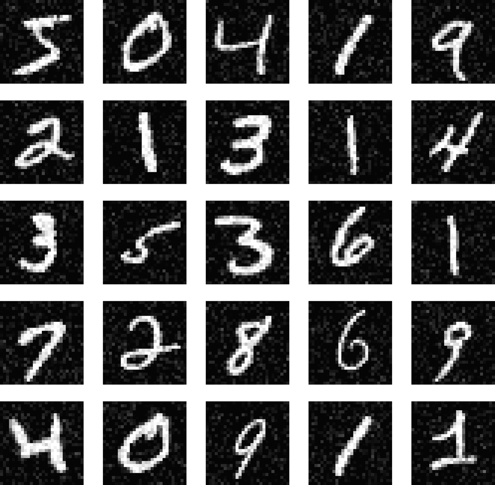

一个 6x6 的数值网格显示了从具有标准差的正态分布中采样的随机噪声获得的图像。

图 8-68

使用标准差 0.1 添加的正态分布随机噪声的 MNIST 图像样本。

让我们构建一个自编码器来去噪这些数据（代码清单 8-28）。这里使用的自编码器架构与之前的应用没有区别；区别在于我们传递的数据（即，输入应该应用人工噪声）。在这个实现中，我们在每个 epoch 计算新的噪声。这是所希望的，因为它提供了“新鲜”的噪声，去噪自编码器必须学习去噪，而不是“接受”/“记忆”。

```py
models = buildAutoencoder(784, 32)
model = models['model']
encoder = models['encoder']
model.compile(optimizer='adam', loss='mse')
TOTAL_EPOCHS = 100
loss = []
for i in tqdm(range(TOTAL_EPOCHS)):
modified = x_train + np.random.normal(0, std, size=x_train.shape)
modified_clipped = np.clip(modified, 0, 1)
history = model.fit(modified_clipped, x_train, epochs=1, verbose=0)
loss.append(history.history['loss'])
Listing 8-28
Training the denoising autoencoder on novel corrupted MNIST data each epoch
```

训练后，我们可以对一组新的噪声图像验证集上的平均绝对误差进行评估（代码清单 8-29）。

```py
modified = x_valid + np.random.normal(0, std, size=x_valid.shape)
modified_clipped = np.clip(modified, 0, 1)
from sklearn.metrics import mean_absolute_error as mae
mae(model.predict(modified_clipped), x_valid)
Listing 8-29
Evaluating the performance of the denoising autoencoder on a fresh set of noisy images
```

代码清单 8-30 和图 8-69 分别实现并演示了使用标准差为 0.1 的正态分布随机噪声的图像采样。使用此过程生成的噪声图像训练的去噪自编码器恢复原始版本，获得验证均方误差为 0.0266。

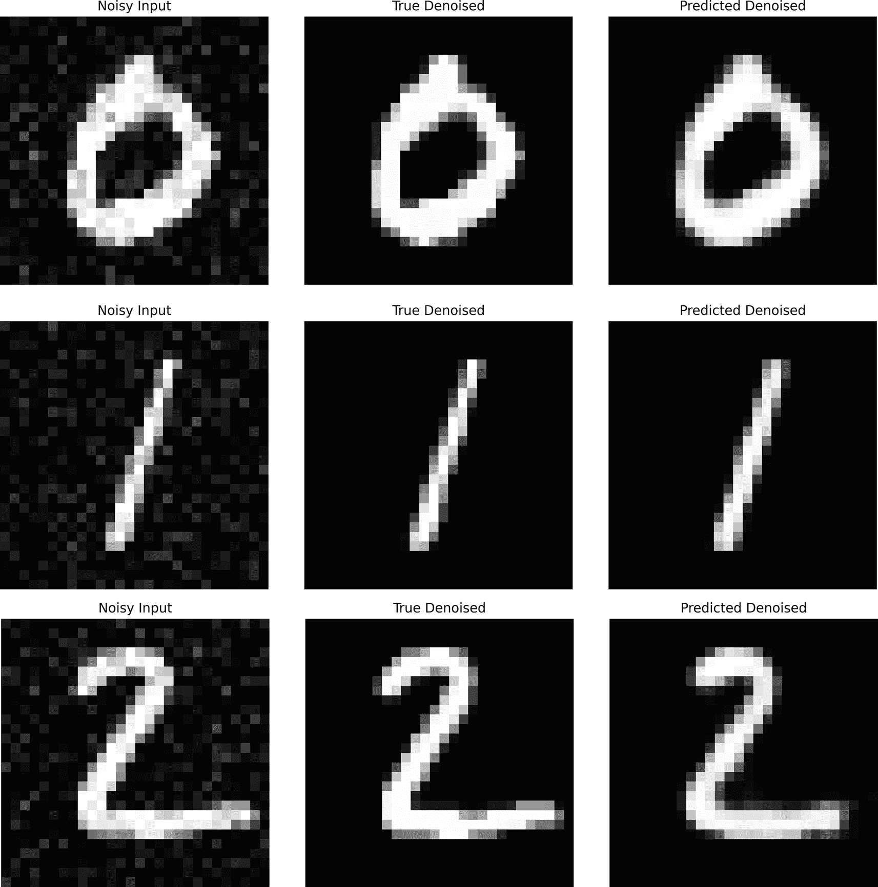

一个 3x3 的网格表示使用标准差分布的随机噪声的损坏图像。

图 8-69

对于在 MNIST 上训练的去噪自编码器，其输入为具有标准差为 0.1 的噪声正态分布，其噪声/扰动输入（左侧），未扰动的期望输出（中间）和预测输出（右侧）。

```py
plt.set_cmap('gray')
for i in range(3):
plt.figure(figsize=(15, 5), dpi=400)
plt.subplot(1, 3, 1)
plt.imshow(modified_clipped[i].reshape((28, 28)))
plt.axis('off')
plt.title('Noisy Input')
plt.subplot(1, 3, 2)
plt.imshow(x_valid[i].reshape((28, 28)))
plt.axis('off')
plt.title('True Denoised')
plt.subplot(1, 3, 3)
plt.imshow(model.predict(x_valid[i:i+1]).reshape((28, 28)))
plt.axis('off')
plt.title('Predicted Denoised')
plt.show()
Listing 8-30
Displaying the corrupted image, the reconstruction, and the desired reconstruction (i.e., the original uncorrupted image)
```

让我们增加标准差到 0.2。图 8-70 展示了噪声对图像的影响，而图 8-71 展示了在图像上重建性能。去噪自动编码器获得了 0.0289 的验证平均绝对误差，略高于在标准差为 0.1 的正态分布噪声上训练的去噪自动编码器。

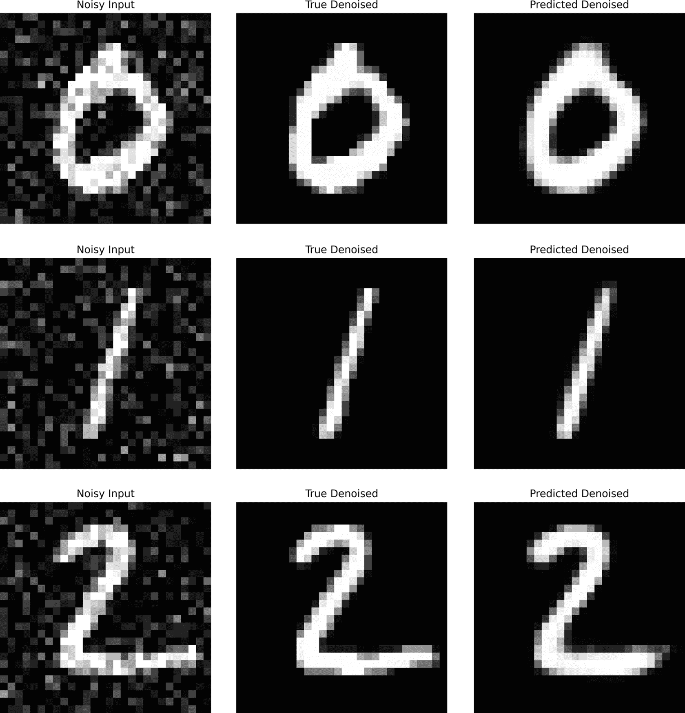

一个 3x3 网格表示一组显示重建性能的图像。

图 8-71

在 MNIST 上使用标准差为 0.2 的噪声正态分布训练的去噪自动编码器的噪声/扰动输入（左），未扰动的期望输出（中），和预测输出（右）

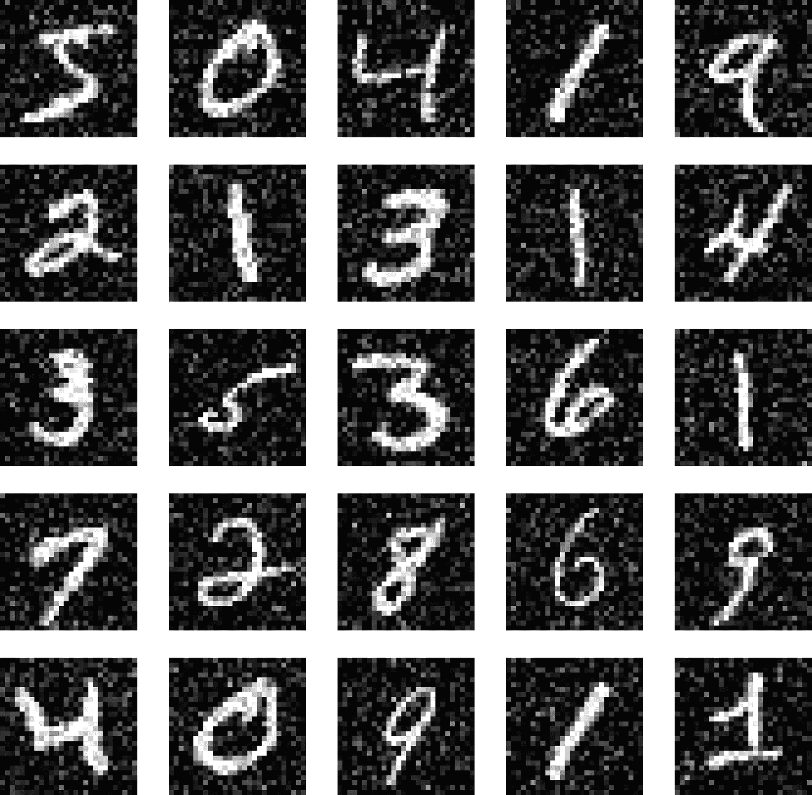

一个 6x6 网格突出了随着标准差增加到零点二，噪声对图像的影响。

图 8-70

使用标准差为 0.2 添加正态分布随机噪声的 MNIST 图像样本

图 8-72 和 8-73 展示了使用标准差为 0.3 的正态分布噪声损坏的图像样本和去噪自动编码器在图像上的性能。去噪自动编码器获得了大约 0.0343 的验证平均绝对误差。

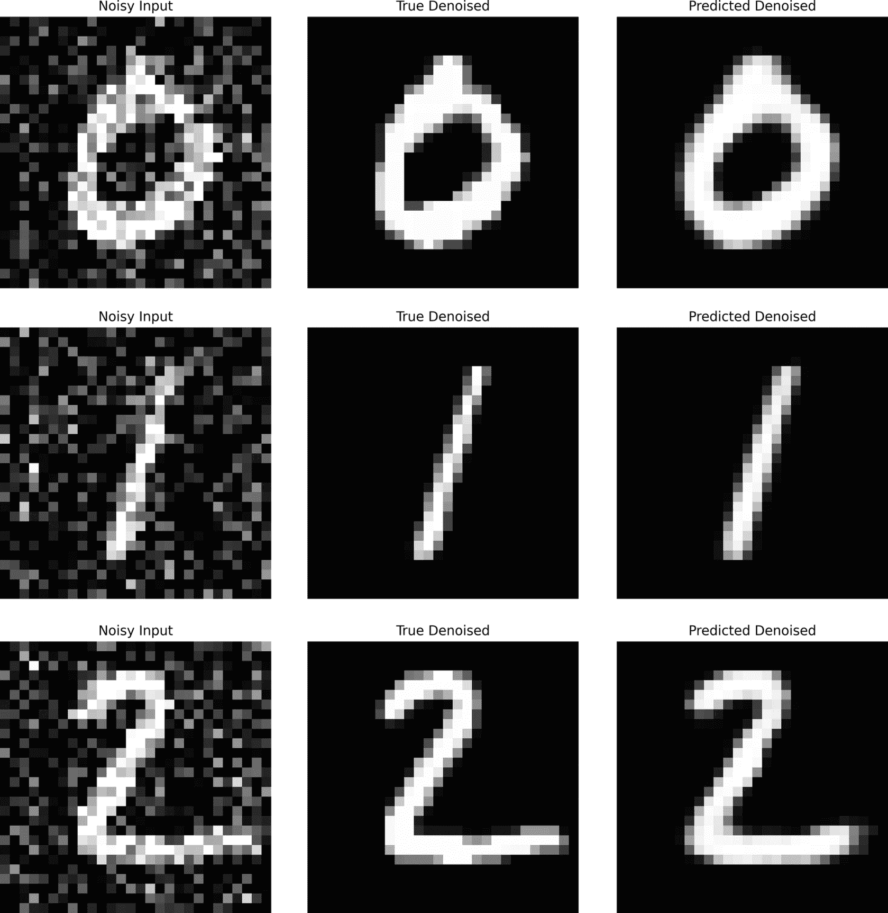

一个 3x3 数字网格解释了通过去噪自动编码器性能获得的图像，该自动编码器获得了验证平均绝对误差。

图 8-73

在 MNIST 上使用标准差为 0.3 的噪声正态分布训练的去噪自动编码器的噪声/扰动输入（左），未扰动的期望输出（中），和预测输出（右）

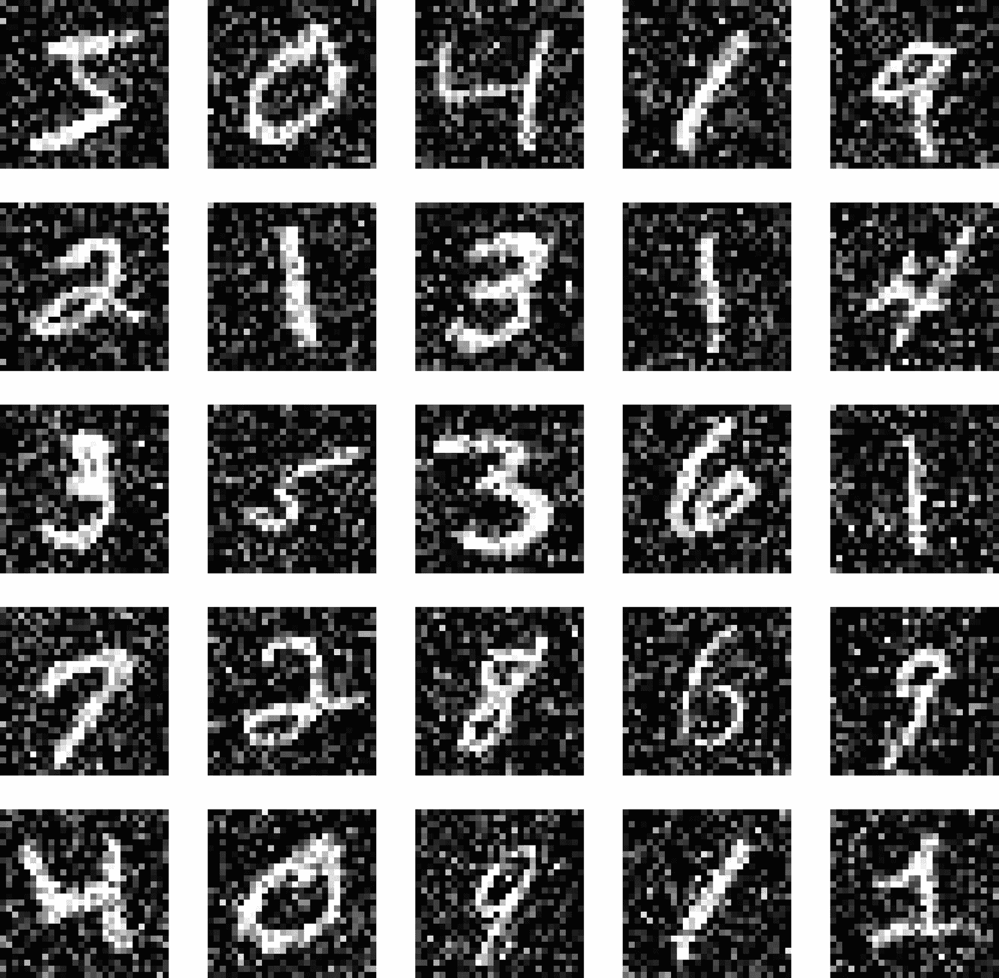

一个 6x6 数字网格网络展示了解释正态分布的图像样本。

图 8-72

使用标准差 0.3 添加正态分布随机噪声的 MNIST 图像样本

图 8-74 和 8-75 展示了使用标准差为 0.5 的正态分布噪声损坏的图像样本和去噪自动编码器在图像上的性能。去噪自动编码器获得了大约 0.0427 的验证平均绝对误差。

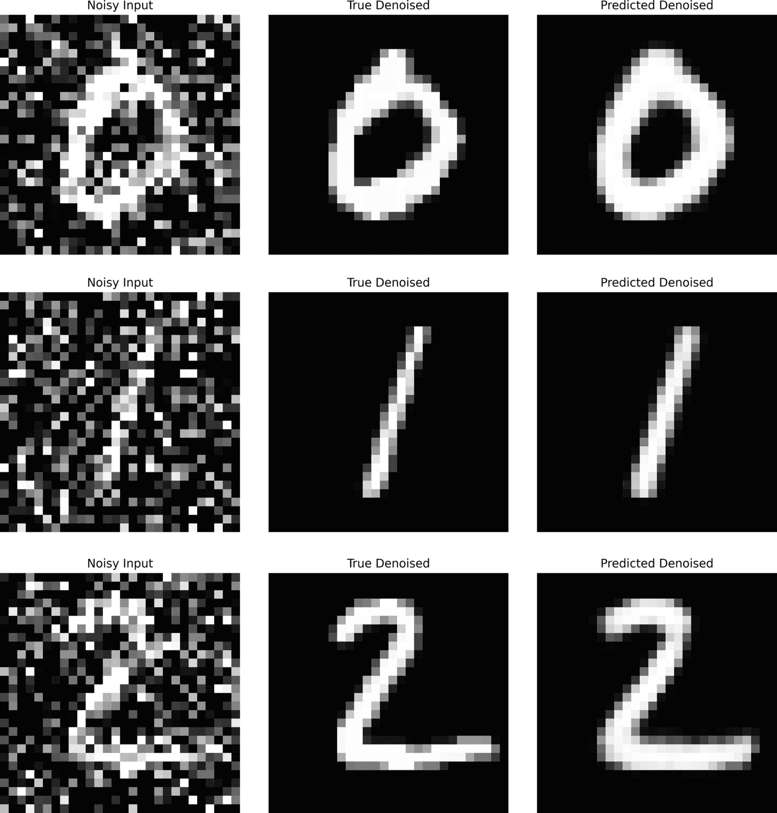

一个 3x3 数字网格框架表示使用去噪自动编码器性能的噪声输入和期望输出。

图 8-75

在 MNIST 上使用标准差为 0.5 的噪声正态分布训练的去噪自动编码器的噪声/扰动输入（左），未扰动的期望输出（中），和预测输出（右）

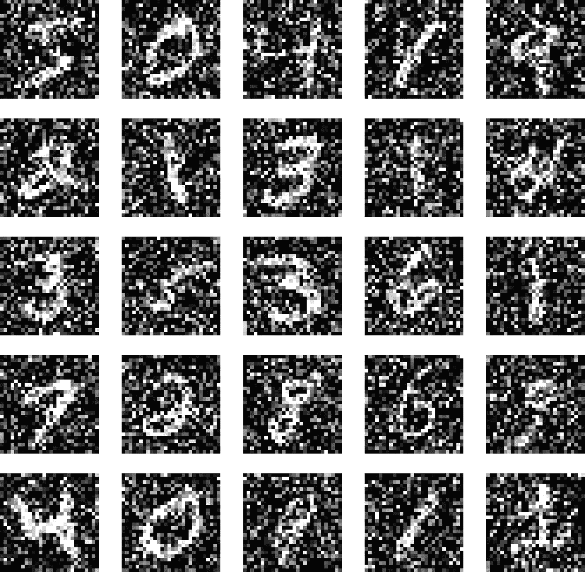

一个 6x6 网格框架表示从标准差为零点五的正态分布中抽取的图像。

图 8-74

使用标准差为 0.5 的正态分布随机噪声添加到 MNIST 图像中的样本。

图 8-76 和 8-77 展示了使用从标准差为 0.9 的正态分布中抽取的噪声损坏的图像的样本，以及去噪自编码器在图像上的性能。去噪自编码器获得了大约 0.0683 的验证平均绝对误差。请注意，这是一个极其复杂的任务——即使是人类在去噪许多显示的样本时也会遇到一些困难！自编码器的重建更加抽象——由于信息损坏量很大，没有物理方法可以精确地重建所有细节，因此自编码器执行隐式数字识别，并以具有特定位置和方向特性的“泛化”数字重建图像。

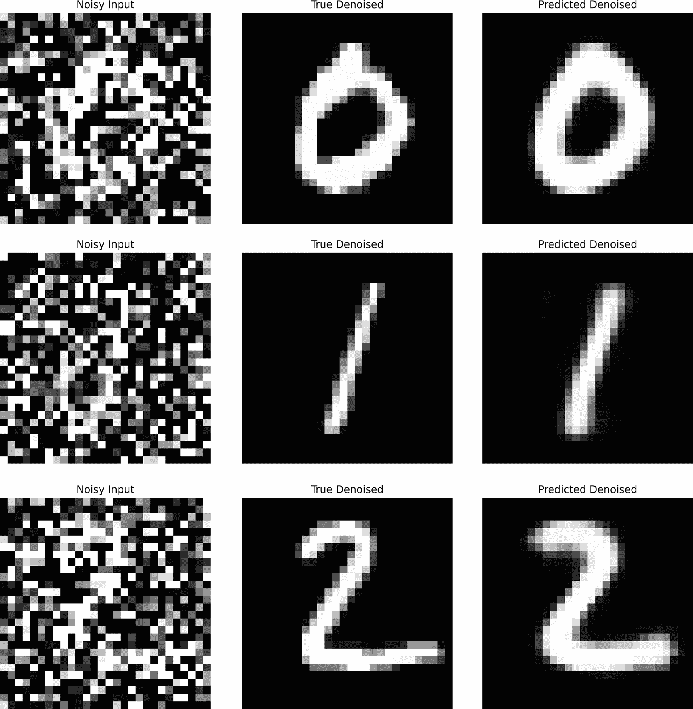

一个表示噪声输入、真实和预测去噪输出的图像网格。它描绘了标准差为 0.9 的去噪自编码器的性能。

图 8-77

对于在 MNIST 上使用标准差为 0.9 的噪声正态分布训练的去噪自编码器，其噪声/扰动输入（左），未扰动的期望输出（中），以及预测输出（右）。

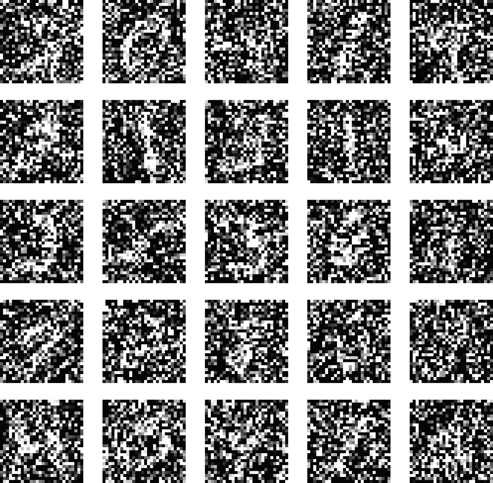

通过具有去噪功能的自编码器性能获得的 6x6 数字网格的各种图像模式。

图 8-76

使用标准差为 0.9 的正态分布随机噪声添加到 MNIST 图像中的样本。

我们可以看到，去噪自编码器可以以相当令人印象深刻的程度进行重建。然而，在实践中，我们希望保持噪声水平相对较低；提高噪声水平可能会破坏信息，并导致网络发展出错误和/或过度简化的决策表示。

类似的逻辑可以应用于表格数据。有许多情况下，你会发现表格数据集特别嘈杂。这在记录变量物理活动的科学数据集中尤为常见，如低级物理动力学或生物系统数据。

让我们为 Mice Protein Expression 数据集构建一个去噪自编码器。列表 8-31 加载数据集并将其分为训练集和验证集。

```py
data = pd.read_csv('../input/mpempe/mouse-protein-expression.csv').drop(['Unnamed: 0', 'class'], axis=1)
train_indices = np.random.choice(data.index, replace=False,
size = round(0.8 * len(data)))
valid_indices = np.array([ind for ind in data.index if ind\
not in train_indices])
x_train, x_valid = data.loc[train_indices], data.loc[valid_indices]
Listing 8-31
Loading and splitting the Mice Protein Expression dataset
```

列表 8-32 构建了一个标准的自编码器架构。

```py
models = buildAutoencoder(len(data.columns), 16)
model = models['model']
encoder = models['encoder']
model.compile(optimizer='adam', loss='mse')
Listing 8-32
Building an autoencoder architecture to fit the Mice Protein Expression dataset
```

为了训练，我们向输入生成噪声，并训练模型从噪声输入中重建原始输入。在表格数据集中，我们通常不能以统一的方式向整个数据集添加随机分布的噪声，因为不同的特征在不同的尺度上操作。相反，噪声应该依赖于每个特征本身的标准差。在本实现中，我们添加了从标准差等于实际特征标准差五分之一的正态分布中随机采样的噪声（列表 8-33）。

```py
TOTAL_EPOCHS = 100
loss = []
stds = x_train.std()
for i in tqdm(range(TOTAL_EPOCHS)):
noise = pd.DataFrame(index=x_train.index, columns=x_train.columns)
for col in noise.columns:
noise[col] = np.random.normal(0, stds[col]/5,
size=(len(x_train),))
history = model.fit(x_train + noise, x_train, epochs=1, verbose=0)
loss.append(history.history['loss'])
Listing 8-33
Adding noise to each column of the Mice Protein Expression dataset with a reflective standard deviation
```

列表 8-34 展示了在新的验证噪声数据上对该模型进行评估。

```py
noise = pd.DataFrame(index=x_valid.index, columns=x_valid.columns)
for col in noise.columns:
noise[col] = np.random.normal(0, np.sqrt(stds[col]),
size=(len(x_valid),))
from sklearn.metrics import mean_absolute_error as mae
mae(model.predict(x_valid + noise), x_valid)
Listing 8-34
Evaluating the performance of the denoising tabular autoencoder on novel noisy data
```

训练完成后，去噪自动编码器的编码器可用于预训练或其他之前描述的应用。

## 关键点

在本章中，我们讨论了自动编码器架构及其在四个不同场景中的应用——预训练、多任务训练、稀疏自动编码器和去噪自动编码器。

+   自动编码器是经过训练的神经网络架构，用于将输入编码到比原始输入小的潜在空间中，然后从潜在空间中重建输入。由于这种强加的信息瓶颈，自动编码器被迫学习数据的具有意义的潜在表示。

+   训练好的自动编码器的编码器可以分离出来，并作为监督网络的特征提取器构建；也就是说，自动编码器起到了预训练的作用。

+   在监督学习难以开始的情况下，创建一个能够通过执行监督任务和辅助自动编码任务来优化其损失的多任务自动编码器可以帮助克服初始学习障碍。

+   稀疏自动编码器使用显著扩大的潜在空间大小，但在训练时对潜在空间活动施加限制，使得在任何一次传递中只有少数节点/神经元可以活跃。人们认为稀疏自动编码器更稳健。

+   去噪自动编码器被训练从人工损坏、噪声数据中重建干净数据。在这个过程中，编码器学会寻找关键模式并对数据进行“去噪”，这可以是有用的监督模型组件。

在下一章中，我们将探讨深度生成模型——包括一种特殊的自动编码器，即变分自动编码器（VAE）——它可以显著用于解决不平衡数据集、提高模型鲁棒性，以及在敏感/私人数据上训练模型，以及其他应用。
