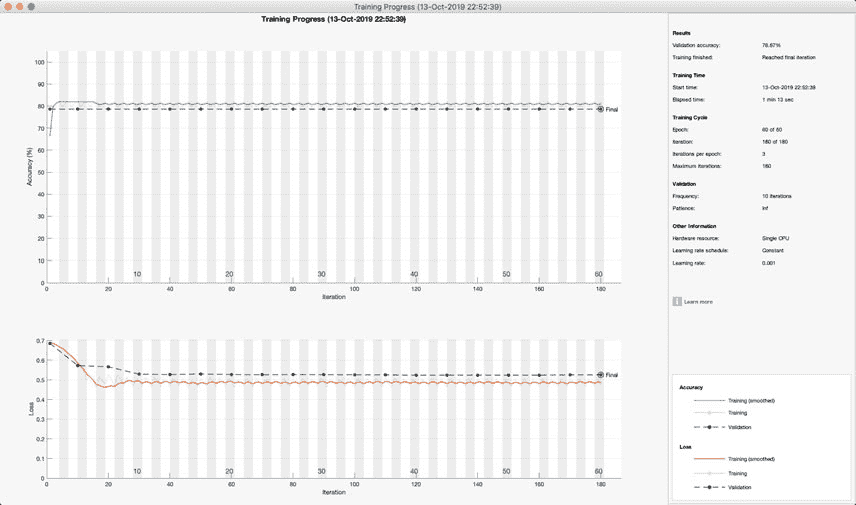
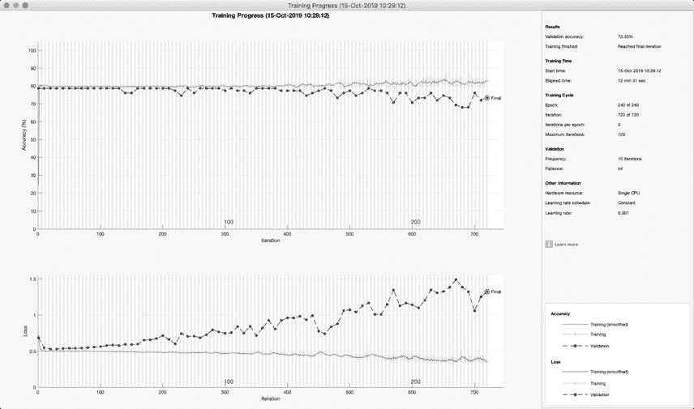
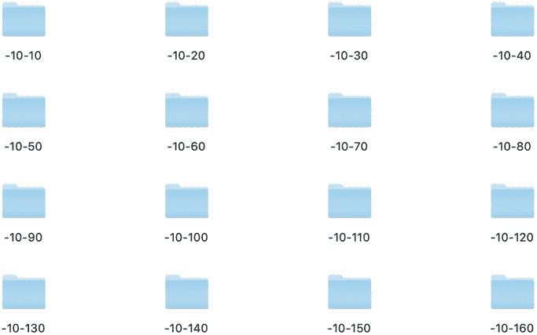
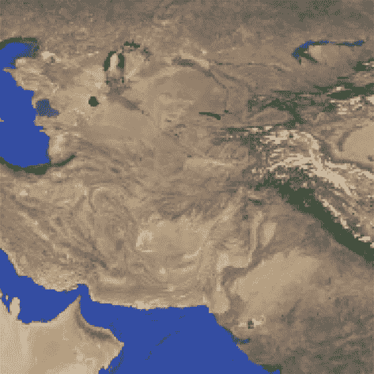
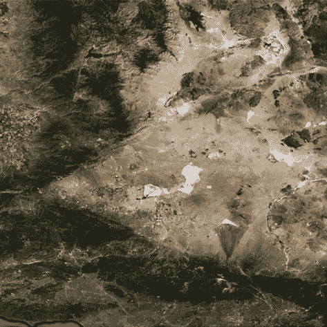
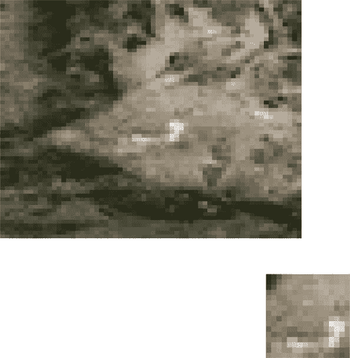

159

第八章

COMPLETING SENTENCES

**8.3**

**创建数字字典**

**8.3.1 问题**

我们希望创建一个数字字典以加快神经网络训练的速度。这消除了在训练过程中进行字符串匹配的需要。将句子表示为数字序列，而不是字符数组（单词）的序列，本质上为我们提供了一种更有效的方式来表示句子。这将在我们稍后对句子数据库执行机器学习以学习有效和无效序列时变得有用。

**8.3.2 解决方案**

编写一个 MATLAB 函数来搜索文本并找到唯一的单词。

**8.3.3 工作原理**

该函数使用 erase 在以下代码行中移除标点符号。

***DistinctWords.m***

16

**function** [d,n] = DistinctWords( w )

17

18

% 示例

19

**if**( **nargin** < 1 )

20

Demo;

21

**return**

22

**end**

23

24

% 移除标点符号

25

w = erase(w,';');

26

w = erase(w,',');

27

w = erase(w,'.');

它随后使用 split 来分割字符串，并使用 unique 找到唯一的字符串。

29

% 查找唯一的单词

30

s = split(w)';

31

d = unique(s);

32

33

**if**( **nargout** > 1 )

34

% 找到单词的数字

35

n = **zeros**(1, **length**(s));

36

**for** k = 1:**length**(s)

37

**for** j = 1:**length**(d)

38

**if**( d(j) == s(k) )

39

n(k) = j;

40

**break**;

41

**end**

42

**end**

43

**end**

44

**end**

160

第八章

COMPLETING SENTENCES

这是内置的示例。它找到了 38 个唯一的单词。

>> DistinctWords

w =

"当时没有人知道，但她被软禁在家中，税务当局正在彻底调查她作为演员的漫长而有利可图的职业生涯，"

她作为演员的漫长而有利可图的职业生涯记录，

红地毯上的名人，奢华的面孔

"一个品牌和一位成功的女商人。"

d =

1x38 字符串数组

列 1 至 12

"没有"

"一个"

"知道"

"它"

"当时"

"但是"

"她"

"是"

"存在"

"被拘留"

"下面"

"类型"

列 13 至 22

"房子"

"拘留"

"而"

"税务"

"当局"

"搜索"

"记录"

"她"

"长"

"有利可图的"

列 23 至 33

"职业"

"作为"

"一个"

"演员"

"名人"

"那"

"红色"

"地毯"

"面孔"

"的"

"奢华"

列 34 至 38

"品牌"

"和"

"一个"

"成功的"

"女商人"

n =

列 1 至 20

1

2

3

4

5

6

7

8

9

10

11

36

12

32

13

14

15

28

16

17

列 21 至 40

18

28

19

32

20

21

35

22

23

24

25

26

36

27

32

28

29

30

36

31

列 41 至 47

32

33

34

35

36

37

38

d 是一个字符串数组，映射到数组 n。

**8.4**

**将句子映射到数字**

**8.4.1 问题**

我们希望将句子中的单词映射到唯一的数字。

**8.4.2 解决方案**

编写一个 MATLAB 函数，用于搜索文本并为每个单词分配一个唯一的数字。

这种方法将会有同音异义词的问题。

161

第八章

**完成句子**

**8.4.3 它是如何工作的**

该函数将字符串拆分并使用 d 进行搜索。最后一行删除了不在字典中的任何单词（在这种情况下，仅指标点符号）。

***MapToNumbers.m***

18

**函数** n = MapToNumbers( w, d )

19

20

% 演示

21

**如果**(**nargin** < 1)

22

演示；

23

**返回**

24

**结束**

25

26

w = erase(w,';');

27

w = erase(w,',');

28

w = erase(w,'.');

29

s = split(w)';

% 字符串数组

30

31

n = **zeros**(1, **length**(s));

32

**对于** k = 1:**length**(s)

33

ids = **find**(**strcmp**(s(k),d));

34

**如果** ˜**isempty**(ids)

35

n(k) = ids;

36

**结束**

37

38

**结束**

39

40

n(n==0) = [];

"这是内置的演示。"

>> MapToNumbers

w =

"那时没有人知道，但她被软禁在家中，税务当局正在审查她作为演员、红毯明星、奢侈品牌形象和成功商人的漫长而有利可图的职业生涯的记录。"

n =

列 1 到 19

1

2

3

4

0

6

7

8

9

10

11

36

12

32

13

14

15

28

16

列 20 到 38

17

18

28

19

32

20

21

35

22

23

24

25

0

36

27

32

28

29

0

列 39 到 46

36

31

32

33

34

35

36

37

162

第八章

补全句子

**8.5**

**转换句子**

**8.5.1 问题**

我们希望将句子转换为数字序列。

**8.5.2 解决方案**

编写一个 MATLAB 脚本来读取数据库中的每个句子，添加单词，并创建一个序列。每个句子都被分类为正确或错误。

**8.5.3 如何工作**

脚本读取数据库。它为所有句子创建一个数字字典，然后将它们转换为数字。然后将数字数据保存到 mat 文件中，以便以后方便访问。脚本的第一部分创建了 5200 个句子。每个句子都被分类为正确或错误。注意我们如何初始化一个字符串数组。

***PrepareSequences.m***

1

%% 创建所有句子和标签的脚本

5

6

[s,u,v,a] = ReadDatabase;

7

8

%

s {1040,1} 句子

9

%

u (1040,2) 句子中下划线的范围

10

%

v {1040,5} 包含 4 个冒名顶替者的可能单词

11

%

a (1040,1) 哪五个单词是正确的

13

14

% 在训练中添加你想要的任何内容，例如 100 或 length(s)。

15

nSentences = **length**(s);

16

17

i = 1;

18

c = **zeros**(**size**(v,2)*nSentences,1);

19

z = **strings**(**size**(v,2)*nSentences,1);

20

% 提取下划线部分前后句子的部分

21

% 然后创建包含所有可能单词的句子

22

**for** k = 1:nSentences

23

q1

= extractBefore(s(k),u(k,1));

24

q2

= extractAfter(s(k),u(k,2));

25

**for** j = 1:**size**(v,2)

26

z(i)

= q1 + v(k,j) + q2;

27

**if**( j == a(k,1) )

28

c(i) = 1;

29

**else**

30

c(i) = 0;

31

**end**

32

i = i + 1;

33

**end**

34

**end**

163

第八章

完成句子

下一节将所有句子连接成一个巨大的字符串并创建一个字典。

37

r = z(1);

38

**for** k = 2:**length**(z)

39

r = r + " " + z(k); % 将所有句子连接成一个字符串

**end**

最后一部分创建数字句子并保存它们。

这一部分使用 MapTo

来自上一道菜谱的数字。打印行的循环显示了使用 fprintf 打印数组的一个方便方法。

42

d = DistinctWords( r ); % 找到不同的单词

43

44

nZ = **cell**(**length**(z),1);

45

**for** k = 1:**length**(z)

46

nZ{k} = MapToNumbers( z(k), d );

47

**end**

如预期，每组五个句子中只有一个单词不同。

>> PrepareSequences

分类：0

1 428 538 541 553 103

6 535 149

10

7 170

8 546 544

9 546

10

2

12 404

分类：0

1 428 538 541 553 103

6 535 149

10

7 170

8 546 544

9 546

10

3

12 404

分类：1

1 428 538 541 553 103

6 535 149

10

7 170

8 546 544

9 546

10

4

12 404

分类：0

1 428 538 541 553 103

6 535 149

10

7 170

8 546 544

9 546

10

5

12 404

分类：0

1 428 538 541 553 103

6 535 149

10

7 170

8 546 544

9 546

10

11

12 404

分类：1 323 481 378

19 465 544

18 546

19 465 544

20 549

21

22

14 404

24

25 546

分类：0 323 481 378

19 465 544

18 546

19 465 544

20 549

21

22

15 404

24

25 546

分类：0 323 481 378

19 465 544

18 546

19 465 544

20 549

21

22

16 404

24

25 546

分类：0 323 481 378

19 465 544

18 546

19 465 544

20 549

21

22

17 404

24

25 546

分类：0 323 481 378

19 465 544

18 546

19 465 544

20 549

21

22

23 404

24

25 546

**8.6**

**训练和测试**

**8.6.1 问题**

我们希望构建一个深度学习系统来完成句子。想法是完整的正确和错误句子数据库为神经网络提供了足够的信息来确定句子中哪个单词是正确的。

**8.6.2 解决方案**

编写一个 MATLAB 脚本来实现一个 LSTM 以将句子分类为正确或错误。

LSTM 将使用完整的句子进行训练。不会使用关于单词的信息，例如一个单词是否是名词、动词或形容词，也不会使用任何语法结构的信息。

164

第八章

完成句子

**8.6.3 它是如何工作的**

我们将产生最简单的可能设计。它将读取句子，分类为正确或错误，并尝试仅从学习到的模式中确定新句子是否正确或错误。这是一个非常简单且粗略的方法。我们没有利用我们对语法、词性（动词、名词等）或上下文的知识来帮助预测。

语言模型是一个巨大的领域，我们没有使用该领域的工作成果。当然，应用所有语法规则并不一定保证成功；否则，SAT 语言测试中会有更多的 800 分。我们将展示两组不同的层。第一组将产生良好的拟合，第二组将过拟合。

我们使用与上一个菜谱相同的代码来确保序列有效。我们使用 clear all 以确保句子始终相同。

***SentenceCompletionNNFitted.m***

7

**clear all**

8

9

%% 加载数据

10

s = **load**('Sentences');

11

n = **length**(s.c);

% 句子数量

12

13

% 确保序列有效。每五个中有一个是完整的。

14

**for** k = 1:10

15

**fprintf**('类别: %d',s.c(k));

16

**fprintf**('%5d',s.nZ{k})

17

**fprintf**('\n')

18

**if**( mod(k,5) == 0 )

19

**fprintf**('\n')

20

**结束**

层的设计是为了获得良好的训练效果。如图所示，验证误差与训练误差相同。因为我们可以在预测时访问完整的序列，所以我们使用网络中的双向 LSTM 层。双向 LSTM 层在每个步骤中都从完整的序列中学习。我们使用三个 BiLSTM 层，层间有全连接层和 dropout。

***SentenceCompletionNNFitted.m***

22

23

%% 设置网络

24

numFeatures = 1;

25

numClasses = 2;

26

27

%

28

layers =  ...

29

sequenceInputLayer(numFeatures)

30

bilstmLayer(80,'OutputMode','sequence')

31

fullyConnectedLayer(numClasses)

32

dropoutLayer(0.4)

165

第八章

完成句子

33

bilstmLayer(60,'OutputMode','sequence')

34

fullyConnectedLayer(numClasses)

35

dropoutLayer(0.2) % 0.2 效果相当不错

36

bilstmLayer(20,'OutputMode','last')

37

fullyConnectedLayer(numClasses)

38

softmaxLayer

39

classificationLayer];

40

**disp**(layers)

41

42

%% 训练网络

43

kTrain

= **randperm**(n,0.85*n);

44

xTrain

= s.nZ(kTrain);

% 句子索引，按顺序

45

yTrain

= categorical(s.c(kTrain)); % 完成？

46

47

% 测试这个网络

48

kTest

= setdiff(1:n,kTrain);

49

xTest

= s.nZ(kTest);

50

yTest

= categorical(s.c(kTest));

51

52

options = trainingOptions('adam', ...

53

'MaxEpochs',60, ...

54

'GradientThreshold',1, ...

55

'ValidationData',{xTest,yTest}, ...

56

'ValidationFrequency',10, ...

57

'Verbose',0, ...

58

'Plots','training-progress');

59

60

**disp**(options)

61

62

net

= trainNetwork(xTrain,yTrain,layers,options);

63

yPred

= classify(net,xTest);

64

65

% 计算预测的分类准确率。

66

acc

= **sum**(yPred == yTest)./numel(yTest);

67

**disp**('All')

68

**disp**(acc);

69

70

j

= **find**(yTest == '1');

第二次测试只测试正确的句子。它从未将任何句子识别为正确。

本节输出的结果是

>> SentenceCompletionNNFitted

分类类别: 0

17

480

551

429

985

845

924

984 1123

91

165

79

713

81

47

116

81

91

286

76

524

23

分类类别: 0

17

480

551

429

985

845

924

984 1123

91

165

79

713

81

47

116

81

91

539

76

524

23

分类类别: 1

17

480

551

429

985

845

924

984 1123

91

165

79

713

81

47

116

81

91

817

76

524

23

分类类别: 0

17

480

551

429

985

845

924

984 1123

91

165

79

713

81

47

116

81

91

621

76

524

23

分类类别: 0

17

480

551

429

985

845

924

984 1123

91

165

79

713

81

47

116

81

91 1066

76

524

23

166

第八章

完成句子

Category: 1

19 1070

436

740

99

47

898

81

740

99

47

133 1103

410

95

291

524

371

679

81

264

Category: 0

19 1070

436

740

99

47

898

81

740

99

47

133 1103

410

95

776

524

371

679

81

264

Category: 0

19 1070

436

740

99

47

898

81

740

99

47

133 1103

410

95

525

524

371

679

81

264

Category: 0

19 1070

436

740

99

47

898

81

740

99

47

133 1103

410

95

644

524

371

679

81

264

Category: 0

19 1070

436

740

99

47

898

81

740

99

47

133 1103

410

95

236

524

371

679

81

264

11x1 层数组，包含以下层：

1

''

序列输入

序列输入，具有 1 个维度

2

''

BiLSTM

具有隐藏单元的 BiLSTM

3

''

全连接

2 个全连接层

4

''

Dropout

40% dropout

5

''

BiLSTM

具有隐藏单元的 BiLSTM

6

''

全连接

2 个全连接层

7

''

Dropout

20% dropout

8

''

BiLSTM

具有隐藏单元的 BiLSTM

9

''

全连接

2 个全连接层

10

''

Softmax

softmax

11

''

分类输出

crossentropyex

TrainingOptionsADAM，具有以下属性：

GradientDecayFactor: 0.9000

SquaredGradientDecayFactor: 0.9990

Epsilon: 1.0000e-08

InitialLearnRate: 1.0000e-03

LearnRateScheduleSettings: [1x1 结构]

L2 正则化: 1.0000e-04

GradientThresholdMethod: 'l2norm'

GradientThreshold: 1

MaxEpochs: 60

MiniBatchSize: 128

Verbose: 0

VerboseFrequency: 50

ValidationData: {{75x1 cell}

[75x1 分类]}

ValidationFrequency: 10

ValidationPatience: 无穷

Shuffle: 'once'

CheckpointPath: ''

执行环境: 'auto'

WorkerLoad: []

OutputFcn: []

图表: 'training-progress'

SequenceLength: 'longest'

SequencePaddingValue: 0

DispatchInBackground: 0

All

0.7867

正确

0

第一层表示输入是一维序列。第二层是双向 LSTM。下一层是一个神经元的全连接层。这会重复使用 dropout

第八章

完成句子

**图 8.1:** *训练进度*

层之间。图 8.1 展示了训练进度。随后是一个 softmax 层，然后是分类层。标准的 softmax 是

*ezi*

*σk* = *K*

(8.1)

*j*=1 *ezj*

这实际上是一个归一化输出。

测试代码是

53

'Verbose',0, ...

54

'Plots','training-progress');

55

56

**disp**(options)

57

58

net

= trainNetwork(xTrain,yTrain,layers,options);

59

yPred

= classify(net,xTest);

60

61

% Calculate the classification accuracy of the predictions.

62

acc

= **sum**(yPred == yTest)./numel(yTest);

The results are not as good as just guessing all the sentences are wrong. When we test the neural net, it never thinks any sentences are correct. This really doesn’t solve our problem.

Given that only 20% sentences are correct, the neural net scores 80% by saying they are all incorrect.

168

CHAPTER 8

COMPLETING SENTENCES

我们的第二个神经网络结构不同。我们有两个 BiLSTM 层，中间没有全连接层。两个 BiLSTM 层具有相同数量的隐藏单元。这是在尝试了许多不同的组合后发现的。

训练代码如下。我们将类别 0 和 1 转换为分类变量。

***SentenceCompletionNN.m***

21

%% Set up the network

22

numFeatures = 1;

23

numHiddenUnits = 200;

24

25

numClasses = 2;

26

27

% Good results with validation frequency of 10 and 200 hidden units 28

layers = [ ...

29

sequenceInputLayer(numFeatures)

30

bilstmLayer(numHiddenUnits,'OutputMode','sequence')

31

dropoutLayer(0.2)

32

bilstmLayer(numHiddenUnits,'OutputMode','last')

33

fullyConnectedLayer(numClasses)

34

softmaxLayer

35

classificationLayer];

36

**disp**(layers)

37

38

%% Train the network

39

kTrain

= **randperm**(n,0.85*n);

40

xTrain

= s.nZ(kTrain);

% sentence indices, in order

41

yTrain

= categorical(s.c(kTrain)); % complete or not?

42

43

% Test this network - results show overfitting

44

kTest

= setdiff(1:n,kTrain);

45

xTest

= s.nZ(kTest);

46

yTest

= categorical(s.c(kTest));

47

48

options = trainingOptions('adam', ...

49

'MaxEpochs',240, ...

50

'GradientThreshold',1, ...

51

'ValidationData',{xTest,yTest}, ...

52

'ValidationFrequency',10, ...

53

'Verbose',0, ...

54

'Plots','training-progress');

55

56

**disp**(options)

57

58

net

= trainNetwork(xTrain,yTrain,layers,options);

59

yPred

= classify(net,xTest);

60

61

% 计算预测的分类准确率。

62

acc

= **sum**(yPred == yTest)./numel(yTest);

63

**disp**('All')

64

**disp**(acc);

169

第八章

COMPLETING SENTENCES

输出为

>> SentenceCompletionNN

分类：0

17

480

551

429

985

845

924

984 1123

91

165

79

713

81

47

116

81

91

286

76

524

23

分类：0

17

480

551

429

985

845

924

984 1123

91

165

79

713

81

47

116

81

91

539

76

524

23

分类：1

17

480

551

429

985

845

924

984 1123

91

165

79

713

81

47

116

81

91

817

76

524

23

分类：0

17

480

551

429

985

845

924

984 1123

91

165

79

713

81

47

116

81

91

621

76

524

23

分类：0

17

480

551

429

985

845

924

984 1123

91

165

79

713

81

47

116

81

91 1066

76

524

23

分类：1

19 1070

436

740

99

47

898

81

740

99

47

133 1103

410

95

291

524

371

679

81

264

分类：0

19 1070

436

740

99

47

898

81

740

99

47

133 1103

410

95

776

524

371

679

81

264

分类：0

19 1070

436

740

99

47

898

81

740

99

47

133 1103

410

95

525

524

371

679

81

264

分类：0

19 1070

436

740

99

47

898

81

740

99

47

133 1103

410

95

644

524

371

679

81

264

分类：0

19 1070

436

740

99

47

898

81

740

99

47

133 1103

410

95

236

524

371

679

81

264

7x1 层数组，包含层：

1

''

序列输入

序列输入，1 维

2

''

BiLSTM

BiLSTM with 200 hidden units

3

''

Dropout

20% dropout

4

''

BiLSTM

BiLSTM with 200 hidden units

5

''

Fully Connected

2 fully connected layer

6

''

Softmax

softmax

7

''

分类输出

crossentropyex

TrainingOptionsADAM with properties:

GradientDecayFactor: 0.9000

SquaredGradientDecayFactor: 0.9990

Epsilon：1.0000e-08

初始学习率：1.0000e-03

学习率调度设置：[1x1 结构体]

L2 正则化：1.0000e-04

梯度阈值方法：'l2norm'

梯度阈值：1

最大迭代次数：240

小批量大小：128

详细模式：0

详细模式频率：50

验证数据：{{75x1 单元}}

[75x1 分类]}

验证频率：10

验证耐心度：Inf

打乱：'一次'

检查点路径：''

执行环境：'自动'

工作负载：[]

输出函数：[]

图表：'训练进度'

序列长度：'最长'

序列填充值：0

背景调度：0

170

第八章

COMPLETING SENTENCES

所有

0.7333

正确

0.1250

测试代码如下所示：

66

j

= **find**(yTest == '1');

67

yPredC

= classify(net,xTest(j));

68

accC

= **sum**(yPredC == yTest(j))./numel(yTest(j));

69

**disp**('正确')

70

**disp**(accC);

73

74

%% 版权

75

%

版权（c）2019 普林斯顿卫星系统公司

图 8.2 8.2 显示了训练过程。随着训练的进行，验证损失持续。因为它高于训练损失，所以我们看到我们过拟合了，也就是说，我们有很多神经元。我们的训练准确率超过 73%。训练损失持续改善，而验证准确率变差。准确率比拟合良好的情况更差。

然而，这个网络将句子分类为正确，而不是简单地声明它们全部错误并得到默认的 80%准确率。尽管如此，这仍然是一种改进，但你仍然不想将其用作 SAT 辅助工具。

**图 8.2：** *训练进度。*

171

第八章

COMPLETING SENTENCES

尽管存在过拟合，这个网络比之前的网络表现更好。它认为一些句子是正确的，并且有 12.5%的时间是正确的。这可能表明我们没有足够的数据让神经网络形成语法。糟糕的表现也有助于展示 NLP 是一个具有许多研究方面的困难问题。如果你试图利用句子的语法结构，将单词分类到不同的类型等，你可能会做得更好。

我们已经展示了我们可以让神经网络在句子补全方面取得一定的成功。训练面临的问题是，它可以通过说没有正确匹配来达到 80%的成功率。如果我们有一个更大的句子数据库，这种简单的方法可能会更好。

我们没有使用书中所有可用的句子，所以你可以尝试扩展这个集合。有了足够的例子，网络可能会开始学习语法。尝试用不同的语言做这个实验也会很有趣。

172

**第九章**

**基于地形的导航**

**9.1**

**引言**

在 GPS、洛兰和其他电子导航辅助设备广泛可用之前，飞行员使用地形视觉线索进行导航。现在每个人都使用 GPS。我们希望回到基于地形的导航的黄金时代。我们将设计一个能够将地形与数据库匹配的系统。然后它将使用这些信息来确定它正在飞行的位置。

**9.2**

**建模我们的飞机**

**9.2.1 问题**

我们需要一个可以改变方向的三个维度的飞机模型。

**9.2.2 解决方案**

写出三维飞行的运动方程。

**9.2.3 工作原理**

点质量在三维空间中的运动有三个自由度。

因此，我们的飞机模型被赋予了三个空间自由度。速度矢量以风向量（ *V*）表示，具有航向（ *ψ*）和飞行路径角（ *γ*）的方向分量。位置是速度的直接积分，表示为 *y* =

北，*x* = 东，*h* = 垂直坐标。此外，发动机推力被建模为一阶系统，其中时间常数可以改变以近似不同飞机的发动机响应时间。

图 9.1 显示了北东上坐标系中速度矢量的示意图。

在此坐标系中取时间导数。这不是一个纯惯性坐标系，因为它随着地球旋转。然而，地球的旋转速率与飞机的转弯速率相比足够小，因此可以安全地忽略。

© Michael Paluszek, Stephanie Thomas, Eric Ham 2022

173

M. Paluszek 等人，*《实用的 MATLAB 深度学习》*，

`doi.org/10.1007/978-1-4842-7912-0 9`

**第九章**

基于地形的导航

**图 9.1：** *北东上坐标系中的速度。*

点质量飞机的运动方程是

˙ *v* = ( *T* cos *α − D − mg* sin *γ*) */m − fv* (9.1)

1

˙ *γ* =

(( *L* + *T* sin *α*) cos *φ − mg* cos *γ* + *f* *mv*

*γ*)

(9.2)

˙

1

*ψ* =

(( *L* + *T* sin *α*) sin *φ − f*

*mv* cos *γ*

*ψ*)

(9.3)

˙ *xe* = *v* cos *γ* sin *ψ* + *Wx* (9.4)

˙ *yn* = *v* cos *γ* cos *ψ* + *Wy* (9.5)

˙ *h* = *v* sin *γ* + *Wh*

(9.6)

*T*

˙ *m* = *−u*

(9.7)

*e*

174

第九章

基于地形的导航

**图 9.2：** *显示升力、阻力和重力的飞机模型。*

其中 *v* 是真实空速，*T* 是推力，*L* 是升力，*g* 是重力加速度，*γ* 是空气相对飞行路径角，*ψ* 是空气相对航向（从北开始顺时针测量），*φ*

是偏航角，*x* 和 *y* 分别是东向和北向位置，*h* 是高度。

质量是干重和燃料重的总和。术语 *{fv, fγ, fψ}* 代表由于建模不确定性产生的附加力，而术语 *{Wx, Wy, Wh}* 是风速分量。

如果垂直风速为零，则 *γ* = 0 产生平飞。*α*、*φ* 和 *T* 是控制。

图 9.2 展示了飞机的纵向符号。*γ* 是速度矢量和局部水平之间的角度。*α* 是攻角，即飞机机头和速度矢量之间的角度。机翼可以定向，或者有提供升力的空气 foil，在零攻角时也能产生升力。阻力与速度相反，升力与阻力垂直。升力必须平衡重力以及任何向下的阻力分量；否则，飞机将下降。

我们正在使用一个非常简单的空气动力学模型。升力系数定义为 *cL* = *cL α*

*α*

(9.8)

升力系数是攻角的非线性函数。它有一个最大攻角，超过这个攻角，机翼将失速，所有升力都会消失。对于平板，*cL* = 2 *π*

*α*

. 阻力

系数是

*c* 2

*c*

*L*

*D* = *cD* +

0

*πAR*

(9.9)

其中 *AR* 是翼展比，也是奥西效率因子，通常在 0.8

到 0.95。效率因子是升力与阻力耦合的效率。如果它小于一，这意味着升力产生的诱导阻力比理想状态更多。翼展比是翼展（从离机身最近的点到翼尖的距离）与弦长（从翼尖到翼根的长度）的比值。

175

第九章

基于地形的导航

动压，由于飞机运动产生的压力，是 1

*q* = *ρv* 2

2

(9.10)

其中 *v* 是速度，*ρ* 是大气密度。这是如果你将手伸出移动汽车的车窗时手上的压力。升力和阻力是 *L* = *qcLs*

(9.11)

*D* = *qcDs*

(9.12)

其中 *s* 是湿面积。湿面积是产生升力和阻力的飞机表面。我们将其设置为升力和阻力相同，但在真实飞机中，一些飞机部分（如机头）会产生阻力但不会产生任何升力。本质上，我们假设飞机全部是机翼。

我们为模型创建一个右手边函数。这将由数值积分函数调用。以下有动力学模型。

***RHSPointMassAircraft.m***

17

18

**if**( **nargin** < 1 )

19

xDot = DefaultDataStructure;

20

**return**

21

**end**

22

23

v

= x(1);

24

**gamma**

= x(2);

25

psi

= x(3);

26

h

= x(6);

27

cA

= **cos**(d.alpha);

28

sA

= **sin**(d.alpha);

29

cG

= **cos**(**gamma**);

30

sG

= **sin**(**gamma**);

31

cPsi

= **cos**(psi);

32

sPsi

= **sin**(psi);

33

cPhi

= **cos**(d.phi);

34

sPhi

= **sin**(d.phi);

35

36

mG

= d.m*d.g;

37

qS

= 0.5*d.s*Density( 0.001*h )*vˆ2;

38

cL

= d.cLAlpha*d.alpha;

39

cD

= d.cD0 + cLˆ2/(**pi***d.aR*d. **eps**);

40

lift

= qS*cL;

41

drag

= qS*cD;

42

vDot

= (d.thrust*cA - drag - mG*sG)/d.m + d.f(1);

43

fN

= lift + d.thrust*sA;

44

gammaDot

= (fN*cPhi - mG*cG + d.f(2))/(d.m*v);

45

psiDot

= (fN*sPhi - d.f(3))/(d.m*v*cG);

46

xDot

= [vDot;gammaDot;psiDot;v*cG*sPsi;v*cG*cPsi;v*sG];

176

第九章

基于地形的导航

默认数据结构在子函数 DefaultDataStructure 中定义。数据结构包括常数参数和控制输入。

50

51

d = struct('cD0',0.01,'aR',2.67,'eps',0.95,'cLAlpha',2***pi**,'s',64.52,...

52

'g',9.806,'alpha',0,'phi',0,'thrust',0,'m',19368.00,...

53

'f', **zeros**(3,1),'W', **zeros**(3,1));

我们使用一个修改后的指数大气密度模型：

56

**function** rho = Density( h )

57

58

rho = 1.225***exp**(-0.0817*hˆ1.15);

我们希望保持力平衡，以便飞机的速度保持恒定，飞机不改变其飞行路径角度。例如，在平飞时，飞机不会上升或下降。我们需要控制飞机在平飞中，使速度保持恒定，*γ* = 0 对于任何 *φ*。相关方程是 0 = *T* cos *α − D*

(9.13)

0 = ( *L* + *T* sin *α*) cos *φ − mg*

(9.14)

我们需要根据 *φ* 找到 *T* 和 *α*。

一种简单的方法是使用 fminsearch。它将调用 RHSPointMassAircraft 并数值地找到控制量，对于给定的 *ψ*，*h* 和 *v*，使时间导数为零。以下代码找到平衡攻角和推力。RHS 由 fminsearch 调用。它返回一个标量成本，它是加速度（速度的时间导数）和飞行路径角度的导数的二次函数。我们的初始猜测是平衡阻力的推力值。即使攻角猜测为零，它也会使用默认参数集 opt =

optimset(’fminsearch’).

***EquilibriumControls.m***

14

**function** d = EquilibriumControls( x, d )

15

16

**if**( **nargin** < 1 )

17

Demo

18

**return**

19

**end**

20

21

[˜,˜,drag]

= RHSPointMassAircraft( 0, x, d );

22

u0

= [drag;0];

23

opt

= optimset('fminsearch');

24

u

= fminsearch( @RHS, u0, opt, x, d );

177

第九章

基于地形的导航

25

d.thrust

= u(1);

26

d.alpha

= u(2);

27

28

%% EquilibriumControls>RHS

29

**function** c = RHS( u, x, d )

30

31

d.thrust

= u(1);

32

d.alpha

= u(2);

33

xDot

= RHSPointMassAircraft( 0, x, d );

34

c

= xDot(1)ˆ2 + xDot(2)ˆ2;

演示适用于在 250 m/s 和 10 km 高度飞行的 Gulfstream 350。

37

**function** Demo

38

39

d

= RHSPointMassAircraft;

40

d.phi = 0.4;

41

x

= [250;0;0.02;0;0;10000];

42

d

= EquilibriumControls( x, d );

43

r

= x(1)ˆ2/(d.g***tan**(d.phi));

44

45

**fprintf**('推力

%8.2f N\n',d.thrust);

46

**fprintf**('高度

%8.2f km\n',x(6)/1000);

47

**fprintf**('攻角 %8.2f deg\n',d.alpha*180/**pi**); 48

**fprintf**('横滚角

%8.2f deg\n',d.phi*180/**pi**);

49

**fprintf**('转弯半径

%8.2f km\n',r/1000);

下面的演示结果相当合理。

>> EquilibriumControls

推力

7614.63 N

高度

10.00 km

攻角为 2.41 度

横滚角

22.92 度

转弯半径

15.08 km

使用这些值，飞机将转弯而不会改变高度或空速。我们在脚本 AircraftSim.m 中模拟了 Gulfstream。脚本的第一部分运行我们的平衡计算演示。

***AircraftSim.m***

1

%% 模拟一架湾流 350 的银行转弯脚本

2

3

n

= 500;

4

dT

= 1;

5

rTD = 180/**pi**;

178

第九章

基于地形的导航

7

8

%% 首先找到平衡控制

9

d

= RHSPointMassAircraft;

10

d.phi = 0.4;

11

x

= [250;0;0.02;0;0;10000];

12

d

= EquilibriumControls( x, d );

13

r

= x(1)ˆ2/(d.g***tan**(d.phi));

14

15

**fprintf**('推力

%8.2f N\n',d.thrust);

16

**fprintf**('高度

%8.2f km\n',x(6)/1000);

17

**fprintf**('攻角 %8.2f deg\n',d.alpha*180/**pi**); 18

**fprintf**('倾斜角

%8.2f km\n',x(6)/1000);

19

**fprintf**('转弯半径

%8.2f km\n',r/1000);

下一个部分进行模拟。如果飞机高度小于零，即发生碰撞，则中断循环。我们调用一次 RHSPointMassAircraft 来获取用于绘图的升力和阻力值。然后通过 RungeKutta 进行数值积分。@表示函数的指针。

21

%% 模拟

22

xPlot = **zeros**(**length**(x)+5,n);

23

24

**for** k = 1:n

25

26

% 获取用于绘图的升力和阻力

27

[˜,L,D]

= RHSPointMassAircraft( 0, x, d );

28

29

% 绘图存储

30

xPlot(:,k)

= [x;L;D;d.alpha*rTD;d.thrust;d.phi*rTD];

31

32

% 积分

33

x

= RungeKutta( @RHSPointMassAircraft, 0, x, dT, d );

34

35

% 碰撞

36

**if**( x(6) <= 0 )

37

**break**;

38

**end**

39

**end**

剩余部分生成三个图表。第一个图表是数值积分的状态。

下一个部分给出了控制、升力和阻力。最后的图表显示了平面轨迹。我们进行单位转换，因为度和千米更清晰。

179

第九章

基于地形的导航

41

%% 绘制结果

42

xPlot

= xPlot(:,1:k);

43

xPlot(2,:)

= xPlot(2,:)*rTD;

44

xPlot(4:6,:)

= xPlot(4:6,:)/1000;

45

yL

= {'v (m/s)' '\gamma (deg)' '\psi (deg)' 'x_e (km)'

'y_n

(km)'...

46

'h (km)' 'L (N)' 'D (N)' '\alpha (deg)' 'T (N)' '\phi

(deg)'};

47

[t,tL]

= TimeLabel(dT*(0:(k-1)));

48

49

PlotSet( t, xPlot(1:6,:), 'x label', tL, 'y label', yL(1:6),...

50

'figure title', '飞机状态', 'ylim',{[249 251] [1.45

1.46],[],[],[],[]} );

51

PlotSet( t, xPlot(7:11,:), 'x label', tL, 'y label', yL(7:11),...

52

'figure title', '飞机升力、阻力和控制', 'ylim',{[2e5 2.1

e5] [1.45e6 1.46e6],[],[],[],[]} );

正如你在图 9.3 中看到的，转弯半径为 15 公里，正如预期的那样。阻力和升力保持不变。在实际应用中，我们会有一个速度和飞行路径角控制系统来处理干扰或参数变化。对于我们的深度学习示例，我们只使用理想动力学。图 9.4 显示了模拟输出。

图 9.3 将为我们的深度学习示例提供一个很好的轨迹。你可以改变飞机模拟以产生其他轨迹。

15

10

5

0

(km) ny -5

-10

-15

-20 -5

0

5

10

15

20

25

30

35

x (km)

e

**图 9.3:** *飞机轨迹。*

180

第九章

基于地形导航

251

250

v (m/s) 249 0

1

2

3

4

5

6

7

8

9

时间 (min)

1.46

1.455

(deg)

1.45

0

0.1

0.2

0.3

0.4

0.5

0.6

0.7

0.8

0.9

1

时间 (min)

10

5

(deg)

0

0

1

2

3

4

5

6

7

8

9

时间 (min)

30

20

(km) 10

e

0

x

0

1

2

3

4

5

6

7

8

9

时间 (min)

20

0

(km) n -20

y

0

1

2

3

4

5

6

7

8

9

时间 (min)

10

h (km) 9.999999995

0

1

2

3

4

5

6

7

8

9

时间 (min)

105

2.1

2.05

L (N)

2

0

1

2

3

4

5

6

7

8

9

时间 (min)

106

1.46

1.455

D (N)

1.45

0

0.1

0.2

0.3

0.4

0.5

0.6

0.7

0.8

0.9

1

时间 (min)

3

(deg) 2

0

1

2

3

4

5

6

7

8

9

时间 (min)

104

1.4612

1.4611

T (N)

1.461

0

1

2

3

4

5

6

7

8

9

时间 (min)

24

23

(deg) 22

0

1

2

3

4

5

6

7

8

9

时间 (min)

**图 9.4:** *模拟输出。状态（积分量）在上部。升力、阻力和控制φ、α和 T 在下部。*

181

第九章

基于地形导航

**9.3**

**生成地形**

**9.3.1 问题**

我们希望从一组地形“瓦片”中创建一个人工地形模型。瓦片是从更大图片中截取的地形片段，就像浴室瓷砖组成浴室墙壁一样，除非，当然，你有一个现代的玻璃纤维淋浴间。

**9.3.2 解答**

寻找地形图像并将它们拼接在一起。有许多地形瓦片来源。谷歌地球是其中之一。

**9.3.3 工作原理**

我们首先编译一个地形瓦片数据库。我们在 MATLAB 软件包的 terrain 文件夹中拥有它们。地形文件夹的一部分如图 9.5 所示。这只是获取地形瓦片的一种方式。还有在线资源可以下载瓦片。此外，许多飞行模拟器游戏都有广泛的地面库。文件夹的名称是纬度经度。

例如，-10-10 是*−* 10 度纬度和*−* 10 度经度。我们的数据库只扩展到*±* 60 度纬度。第一个代码块创建了一个地形文件夹列表。这个代码的一个重要特点是，你的脚本需要位于正确的目录中。我们不做任何复杂的目录搜索。

**图 9.5：** *地形文件夹的一段。*

182

第九章

基于地形的导航

***CreateTerrain.m***

15

**function** CreateTerrain( lat, lon, scale )

16

17

% 示例

18

**if**( **nargin** < 1 )

19

Demo;

20

**return**

21

**end**

22

23

d

= **dir**('terrain');

24

latA

= **zeros**(1,468);

25

lonA

= **zeros**(1,468);

26

folderName

= **cell**(1,468);

27

**for** k = 1:468

28

q

= d(k).name;

29

folderName{k}

= q;

30

**if**( q(2) == '0' )

31

latA(k) = str2double(q(1:2));

32

lonA(k) = str2double(q(3:**end**));

33

**else**

34

latA(k) = str2double(q(1:3));

35

lonA(k) = str2double(q(4:**end**));

36

**end**

37

**end**

下一个代码块找到所需瓦片的索引。

39

% 中心左下角是起点

40

latF

= **floor**(lat);

41

lonF

= **floor**(lon);

42

latI

= **zeros**(1,9);

43

lonI

= **zeros**(1,9);

44

lon0

= lonF - 10;

45

latJK = latF - 10;

46

lonJK = lon0;

47

i

= 1;

48

**for** j = 1:3

49

**for** k = 1:3

50

lonI(i) = lonJK;

51

latI(i) = latJK;

52

lonJK

= lonJK + 10;

53

i

= i + 1;

54

**end**

55

lonJK = lon0;

56

latJK = latJK + 10;

57

**end**

58

59

fldr = **zeros**(1,9);

183

第九章

基于地形导航

60

**for** k = 1:9

61

j

= **find**(latI(k)==latA);

62

i

= lonI(k)==lonA(j);

63

fldr(k) = j(i);

64

**end**

以下代码根据我们的纬度和经度创建文件名。我们只是创建正确格式的字符串。这显示了创建字符串的一种方法。注意我们使用 %d 来创建整数。它会自动使它们具有正确的长度。我们需要检查正负，以确保加号和减号是正确的。

66

% 生成文件名

67

imageSet

= **cell**(1,9);

68

**for** k = 1:9

69

j = fldr(k);

70

**if**( latA(j) >= 0

)

71

**if**( lonA(j) >= 0 )

72

imageSet{k} = **sprintf**('grid10x10+%d+%d',latA(j)*100,lonA(j)*100); 73

**else**

74

imageSet{k} = **sprintf**('grid10x10+%d-%d',latA(j)*100,lonA(j)*100); 75

**end**

76

**else**

77

**if**( lonA(j) >= 0 )

78

imageSet{k} = **sprintf**('grid10x10-%d+%d',latA(j)*100,lonA(j)*100); 79

**else**

80

imageSet{k} = **sprintf**('grid10x10-%d-%d',latA(j)*100,lonA(j)*100); 81

**end**

82

**end**

83

**end**

下一个代码块读取图像，将其翻转过来，并缩放图像。这些图像实际上是北在下，南在上。我们首先更改目录到 terrain，然后 cd 进入每个文件夹。cd .. 将目录改回 terrain。

85

% 假设我们位于一个目录之上

86

**cd** terrain

87

88

im

= **cell**(1,9);

89

**for** k = 1:9

90

j = fldr(k);

91

**cd**(folderName{j})

92

im{k} = ScaleImage(**flipud**(imread([imageSet{k},'.jpg'])),scale); 93

**cd** ..

94

**end**

下一个代码块调用 image 在 3x3 铺砖图上正确位置绘制每个图像。

184

第九章

基于地形的导航

96

del

= **size**(im{1},1);

97

lX

= 3*del;

98

99

% 绘制图像

100

x

= 0;

101

y

= 0;

102

**for** k = 1:9

103

**image**('xdata',[x;x+del],'ydata',[y;y+del],'cdata', im{k} ); 104

**hold** on

105

x = x + del;

106

**if** ( x == lX )

107

x = 0;

108

y = y + del;

109

**end**

110

**end**

111

**axis** off

112

**axis image**

113

114

**cd** ..

子函数 ScaleImage 通过取缩小到单个像素的像素的平均值来缩放图像。最后，我们 cd ..，回到原始目录。

116

%% CreateTerrain>ScaleImage

117

**function** s2 = ScaleImage( s1, q )

118

119

n = 2ˆq;

120

121

[mR,˜,mD] = **size**(s1);

122

123

m = mR/n;

124

125

s2 = **zeros**(m,m,mD,'uint8');

126

127

**for** i = 1:mD

128

**for** j = 1:m

129

r = (j-1)*n+1:j*n;

130

**for** k = 1:m

131

c

= (k-1)*n+1:k*n;

132

s2(j,k,i) = **mean**(**mean**(s1(r,c,i)));

133

**end**

134

**end**

135

**end**

185

第九章

基于地形的导航

**图 9.6:** *中东地区地形拼接图像。*

演示函数选择中东地区的经纬度。结果是 3x3

拼接图像如图 9.6 所示。由于分辨率非常低，我们无法使用此图像进行神经网络。

137

%% CreateTerrain>Demo

138

**function** Demo

139

140

新建图形('EarthSegment');

141

创建地形( 30,60,1 )

**9.4**

**近距离地形**

**9.4.1 问题**

我们想要更高分辨率的地图。

**9.4.2 解**

将地形代码专门化以生成适合商业无人机实验的高分辨率地形小段。

186

第九章

基于地形的导航

**9.4.3 工作原理**

之前的地形代码对于轨道卫星来说效果很好，但对于无人机来说则不太理想。

根据美国联邦航空管理局（FAA）的规定，小型无人机的最大飞行高度为 400 英尺或约 122 米

米。低地球轨道（LEO）中的卫星通常高度为 300-500 公里。因此，无人机通常比卫星更接近地面约 2500-4000 倍！我们取代码并专门化以只读取四张图像。它比 CreateTerrain 简单得多，而且灵活性较低。如果您想修改它，您需要修改文件中的代码。

***CreateTerrainClose.m***

8

**函数** CreateTerrainClose

9

10

% 生成文件名

11

imageSet

= {'grid1x1+3400-11800','grid1x1+3400-11900',...

12

'grid1x1+3500-11800','grid1x1+3500-11900'};

13

p = [2 1 4 3];

14

15

% 假设我们位于一个目录之上

16

**cd** terrainclose

17

18

im = **cell**(1,4);

19

**for** k = 1:4

20

im{k} = **flipud**(imread([imageSet{k},'.jpg']));

21

**end**

22

23

del = **size**(im{1},1);

24

25

% 绘制图像

26

x

= 0;

27

y

= 0;

28

i

= 0;

29

**for** k = 1:2

30

**for** j = 1:2

31

i = i + 1;

32

**image**('xdata',[x;x+del],'ydata',[y;y+del],'cdata', im{p(i)} ); 33

**hold** on

34

x = x + del;

35

**end**

36

x = 0;

37

y = y + del;

38

**end**

39

**axis** off

40

**axis image**

41

42

**cd** ..

187

第九章

基于地形的导航

**图 9.7：** *近距离地形.*

我们没有缩放选项。这会运行函数：

>> NewFigure('EarthSegmentClose');

>> CreateTerrainClose

图 9.7 展示了地形。它的大小是 2 度乘以 2 度。

**9.5**

**构建相机模型**

**9.5.1 问题**

我们希望为我们的深度学习系统构建一个相机模型。我们希望这个模型能够模拟无人机搭载相机的功能。最终，我们将使用这个相机模型作为地形导航系统的一部分，并应用深度学习技术进行地形导航。

**9.5.2 解决方案**

我们将模拟一个针孔相机并创建一个高空飞机。针孔相机是真实光学系统的最低阶近似。然后我们将构建模拟并展示相机。

188

第九章

基于地形的导航

**9.5.3 工作原理**

我们已经在菜谱 9.2\. 中创建了一个飞机模拟。新增的内容将是地形模型和相机模型。针孔相机在图 9.8\. 中展示。针孔相机具有无限深的景深，图像是直线的。

点 *P* ( *x, y, z*) 通过关系 *f x* 被映射到成像平面上

*u* = *h*

(9.15)

*f y*

*v* = *h*

(9.16)

其中*u*和*v*是焦平面内的坐标，*f*是焦距，*h*是从针孔到焦平面法线方向的点的距离。这假设坐标系的*z*轴与相机的瞄准线对齐。成像芯片看到的角是

*w*

*θ* = tan *−* 1/2 *f*

(9.17)

其中*f*是焦距。焦距越短，图像越大。针孔相机没有景深，但对于这个远场成像问题来说并不重要。

针孔相机的视场仅受传感元件的限制。大多数相机都有镜头，图像在整个成像阵列上并不完美。这给实际机器视觉系统带来了需要解决的问题。

我们希望我们的相机能够从图 9.7 中的地形图像中看到 16 像素 x16 像素。我们将假设飞行高度为 10 公里。图 9.9 给出了尺寸。

我们并不是在模拟特定的相机。相反，我们的相机模型根据一个位置输入生成 16x16 像素的地图。输出是一个包含*x*和*y*的数据结构，**图 9.8**：*针孔相机*。

189

**第九章**

基于地形的导航

**图 9.9**：*具有尺寸的针孔相机*。

坐标和一个图像。如果没有提供输入，它将创建图像的平铺地图。我们在 GraphicConverter 应用程序（Lemke Software GMBH）中缩放了图像，使其正好是 672

672

3

并将其保存到文件 TerrainClose.jpg 中。数字是*x*像素，*y*像素，以及红色、绿色和蓝色的三个层次。第三个索引是红色、蓝色和绿色矩阵。这是一个三维矩阵，对于彩色图像来说是典型的。

代码如下所示。我们将所有内容转换为像素，使用

[˜,˜,i] = getimage(h),并获取该段。

代码的第一部分是为用户提供默认值。

***TerrainCamera.m***

15

**函数** d = TerrainCamera( r, h, nBits, w, nP )

16

17

% 示例

18

**if**( **nargin** < 1 )

19

Demo;

20

**return**

21

**end**

22

23

**if**( **nargin** < 3 )

24

nBits = [];

25

**end**

26

190

第九章

基于地形的导航

27

**if**( **nargin** < 4 )

28

w = [];

29

**end**

30

31

**if**( **nargin** < 5 )

32

nP = 64;

33

**end**

34

35

**if**( **isempty**(w) )

36

w = 4000;

37

**end**

38

39

**if**( **isempty**(nBits) )

40

nBits = 16;

41

**end**

下一个部分计算像素。

***TerrainCamera.m***

43

dW = w/nP;

44

45

x0 = -w/2 + (nBits/2)*dW;

46

y0 =

w/2 - (nBits/2)*dW;

47

k

= **floor**((r(1) - x0)/dW) + 1;

48

j

= **floor**((y0 - r(2))/dW) + 1;

剩余部分显示图像。

***TerrainCamera.m***

51

kR = k:(k-1 + nBits);

52

kJ = j:(j-1 + nBits);

53

54

[˜,˜,i] = getimage(h);

55

56

d.p

= i(kR,kJ,:);

示例绘制源图像然后是相机图像。

两者都在

图 9.10.

58

59

**if**( **nargout** < 1 )

60

**image**(d.p)

61

**关闭轴** 

62

**轴图像**

63

**清除** p

64

**end**

191

第九章

基于地形的导航

10

20

30

40

50

60

10

20

30

40

50

60

**图 9.10：** *地形相机源图像和相机视图。相机视图为 16 × 16 像素。*

65

66

%% CreateTerrain>Demo

67

**函数** Demo

68

69

h = NewFigure('Earth Segment');

70

i = imread('TerrainClose64.jpg');

71

**图像**(i);

72

**网格**

来自摄像头的地形图像因为像素很少而模糊。

**9.6**

**绘制轨迹**

**9.6.1 问题**

我们想在图像上绘制我们的轨迹。

192

第九章

基于地形的导航

**9.6.2 解决方案**

创建一个函数来绘制图像并在其上方绘制轨迹。

**9.6.3 工作原理**

我们编写一个函数，读取图像并在其上方绘制轨迹。我们使用 image 函数缩放图像。*x* 维度被设置，而 *y* 维度被缩放以匹配。

***PlotXYTrajectory.m***

1

%% PLOTXYTRAJECTORY 在图像上绘制 xy 轨迹

2

% 可以绘制多组数据。输入 PlotXYTrajectory 查看演示。

3

%% 输入

4

% x

(:,:) X 坐标 (m)

5

% y

(:,:) Y 坐标 (m)

6

% i

(n,m) 图像

7

% w

(1,1) 图像的 x 维度

8

% xScale

(1,1) x 维度的缩放比例

9

% 名称

(1,:) 图像名称

10

11

**函数** PlotXYTrajectory( x, y, i, xScale, name )

12

13

**如果**( **nargin** < 1 )

14

演示

15
