**return**

16

**end**

17

18

s

= **size**(i);

19

xI

= [-xScale xScale];

20

yI

= [-xScale xScale]*s(2)/s(1);

21

22

NewFigure(name);

23

**image**(xI,yI, **flipud**(i));

24

**hold** on

25

n = **size**(x,1);

26

**for** k = 1:n

27

**plot**(x(k,:),y(k,:),'linewidth',2)

28

**end**

29

**set**(**gca**,'xlim',xI,'ylim',yI);

30

**grid** on

31

**axis image**

32

**xlabel**('x (m)')

33

**ylabel**('y (m)')

193

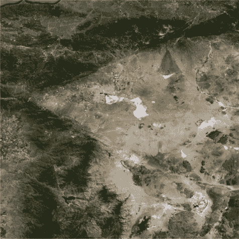

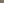

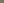

**第九章**

**基于地形的导航**

-100

-80

-60

-40

-20

0

y (km)

20

40

60

80

100

-100

-80

-60

-40

-20

0

20

40

60

80

100

x (km)

**图 9.11：** *轨迹图.*

The demo draws a circle over our terrain image. This is shown in Figure 9.11.

36

%% PlotXYTrajectory>Demo

37

**函数** Demo

38

39

i = imread('TerrainClose.jpg');

40

a = **linspace**(0,2***pi**);

41

x = [30***cos**(a);35***cos**(a)];

42

y = [30***sin**(a);35***sin**(a)];

43

PlotXYTrajectory( x, y, i, 111, 'Trajectory' )

While the deep learning system will analyze all of the pixels in the image, it is interesting to see how the mean values of the pixel colors vary across an image. This is shown in Figure 9.12\.

横轴是图像编号，按 y 值恒定的行排列。如所见，即使是相邻的图像也存在相当大的变化。这表明每个图像中都有足够的信息，使我们的深度学习系统能够找到位置。它还表明，可能只需要使用平均值来识别位置。记住，每个图像与上一个图像的差异仅为 16 像素。

194

**第九章**

**基于地形的导航**

150

100

50

0

500

1000

1500

2000

2500

150

100

50

0

500

1000

1500

2000

2500

150

100

50

0

500

1000

1500

2000

2500

**图 9.12：** *图像的平均红、绿、蓝值.*

**9.7**

**创建训练图像**

**9.7.1 问题**

我们希望为我们的地形模型创建训练图像。

**9.7.2 解决方案**

我们编写了一个脚本，用于读取 64x64 位图像并创建训练图像。

**9.7.3 工作原理**

我们首先使用任何图像处理应用程序创建我们地形的 64 位版本。我们已经完成了这项工作，并将其保存为 TerrainClose64.jpg。以下脚本读取图像并通过逐像素移动索引生成训练图像。我们将图像保存在 TerrainImages 文件夹中。我们还创建了标签。每个图像都是不同的标签。对于每个地形片段，我们创建 nN 个带噪声的副本。因此，将有 nN 个带有标签 l 的图像。我们使用以下代码添加噪声

uint8(floor(sig*rand(nBits,nBits,3)))

195

第九章

基于地形的导航

由于噪声必须与图像一样是 uint8 类型。如果您不将其转换为 uint8，您将得到错误。您还可以选择不同的步长，即移动图像超过一个像素。

The first code sets up the image processing. We choose 16-bit images because (after the next step of training) there is enough information in each image to classify each one. We tried 8 bits but it didn’t converge.

***CreateTerrainImages.m***

13

im

= **flipud**(imread('TerrainClose64.jpg')); % 读取图像 14

wIm

= 4000; % m

15

nBits = 16;

16

dN

= 1; % 增量位是 1

17

nBM1

= nBits-1;

18

[n,m] = **size**(im); % 图像的大小

19

nI

= (n-nBits)/dN + 1; % 每侧图像的数量

20

nN

= 10;

% 我们想要每个图像的副本数量

21

sig

= 3;

% 设置为 > 0 以向图像添加噪声

22

dW

= wIm/64; % 每个图像的增量位置（m）

23

x0

= -wIm/2+(nBits/2)*dW;

% 上左角的起始位置

corner

24

y0

=

wIm/2-(nBits/2)*dW;

% 上左角的起始位置

corner

这行代码非常重要。它确保名称对应于不同的图像。我们将为每个图像创建副本以用于训练。

***CreateTerrainImages.m***

26

% 创建一个图像序列号，以确保它们按顺序排列

imageDatastore

27

kAdd = 10ˆ**ceil**(**log10**(nI*nI*nN));

在这里我们进行一些目录操作。

***CreateTerrainImages.m***

29

% 设置目录

30

**if** ˜**exist**('TerrainImages','dir')

31

warning('Are you in the right folder? No TerrainImages')

32

[success,msg] = mkdir('./','TerrainImages')

33

**end**

34

**cd** TerrainImages

35

**delete** *.jpg % 从头开始，因此删除现有图像。图像分割在此代码中完成。如果需要，我们添加噪声。

196

第九章

基于地形的导航

***CreateTerrainImages.m***

37

kCheck = **randperm**(nI-1,2);

38

39

i

= 1;

40

l

= 1;

41

t

= **zeros**(1,nI*nI*nN); % The label for each image

42

x

= x0; % Initial location

43

y

= y0; % Initial location

44

r

= **zeros**(2,nI*nI); % 每个图像的 x 和 y 坐标 45

id

= **zeros**(1,nI*nI);

46

iMI

= **zeros**(1,nI*nI);

47

rgbs

= [];

48

hW

= **waitbar**(0,'Processing Terrain Images');

49

50

**for** k = 1:nI

51

**waitbar**(k/nI,hW);

52

kR = dN*(k-1)+1:dN*(k-1) + nBits;

53

**for** j = 1:nI

54

kJ

= dN*(j-1)+1:dN*(j-1) + nBits;

55

thisImg

= im(kR,kJ,:);

56

rgbs(**end**+1,:) = [**mean**(**mean**(thisImg(:,:,1))) **mean**(**mean**(thisImg (:,:,2))) **mean**(**mean**(thisImg(:,:,3)))];

57

**for** p = 1:nN

58

s

= im(kR,kJ,:) + uint8(**floor**(sig***rand**(nBits,nBits,3))); 59

q

= s > 256;

60

s(q)

= 256;

61

q

= s < 0;

62

s(q)

= 0;

63

imwrite(s, **sprintf**('TerrainImage%d.jpg',i+kAdd));

64

t(i)

= l;

65

i

= i + 1;

66

**end**

% 每个位置的图像数量

67

**if** (k==kCheck(1) && j==kCheck(2))

68

imgCheck = thisImg;

69

rCheck = [x;y];

70

**end**

71

r(:,l)

= [x;y];

图 9.13 显示了图像覆盖了区域。我们还验证了每个图像的 R、G 和 B 的总和是不同的。这表明有足够的信息供机器学习算法使用。

197

第九章

基于地形的导航

**Image Locations**

1500

1000

500

y

0

-500

-1000

-1500

-1500

-1000

-500

0

500

1000

1500

x

**Figure 9.13:** *This figure shows that the images cover the landscape.*

**9.8**

**训练和测试**

**9.8.1 问题**

我们希望创建和测试一个卷积神经网络。神经网络将被训练以将图像与一个 *x* 和 *y* 位置相关联。

**9.8.2 解决方案**

我们在 TerrainNeuralNet.m 中创建并测试了一个卷积神经网络。它将在之前创建的图像上训练，并能够返回 *x* 和 *y* 坐标。

卷积神经网络在图像识别中得到了广泛应用。

**9.8.3 它是如何工作的**

这个例子与第三章中的例子非常相似。不同之处在于每个图像都是一个单独的类别。这就像人脸识别，每个类别代表不同的人。

198

CHAPTER 9

TERRAIN-BASED NAVIGATION

***TerrainNeuralNet.m***

1

%% 实现地形神经网络的脚本

2

% 您必须在 TerrainImages 中创建图像

CreateTerrainImages

3

% 在运行此脚本之前。

4

5

%% 获取图像

6

**cd** TerrainImages

7

label = **load**('Label');

8

**cd** ..

9

10

t

= categorical(label.t);

11

nClasses

= **max**(label.t);

12

imds

= imageDatastore('TerrainImages','labels',t);

13

labelCount = countEachLabel(imds);

14

15

% 显示一些快照

16

NewFigure('Terrain Snapshots');

17

n = 4;

18

m = 5;

19

ks = **sort**(randi(**length**(label.t),1,n*m)); % 随机选择 20

**for** i = 1:n*m

21

**subplot**(n,m,i);

22

imshow(imds.Files{ks(i)});

23

**title**(**sprintf**('Image %d: %d',ks(i),label.t(ks(i)))) 24

**end**

25

26

% 我们需要输入层的图像大小

27

img = readimage(imds,1);

28

29

% 分割为训练集和测试集

30

fracTraining = 0.8;

31

[imdsTrain,imdsTest] = splitEachLabel(imds,fracTraining,'randomized'); 32

33

%% 训练

34

% 这给出了卷积神经网络的架构

35

layers = 

36

imageInputLayer(**size**(img))

37

38

convolution2dLayer(3,8,'Padding','same')

39

batchNormalizationLayer

40

reluLayer

41

42

maxPooling2dLayer(2,'Stride',2)

% 池化大小和步长大小

43

44

convolution2dLayer(3,32,'Padding','same')

45

batchNormalizationLayer

46

reluLayer

47

48

maxPooling2dLayer(2,'Stride',2)

49

199

第九章

基于地形的导航

50

fullyConnectedLayer(nClasses)

51

softmaxLayer

52

classificationLayer

53

];

54

**disp**(layers)

55

56

options = trainingOptions('sgdm', ...

57

'InitialLearnRate',0.01, ...

58

'MaxEpochs',6, ...

59

'MiniBatchSize',100,...

60

'ValidationData',imdsTest, ...

61

'ValidationFrequency',10, ...

62

'ValidationPatience',inf,...

63

'Shuffle','every-epoch', ...

64

'Verbose',false, ...

65

'Plots','training-progress');

66

**disp**(options)

67

**fprintf**('训练分数为 %8.2f%%\n',fracTraining*100); 69

70

terrainNet = trainNetwork(imdsTrain,layers,options);

71

72

%% 测试神经网络

73

predLabels

= classify(terrainNet,imdsTest);

74

testLabels

= imdsTest.Labels;

75

76

准确率 = **sum**(predLabels == testLabels)/numel(testLabels); 77

**fprintf**('准确率为 %8.2f%%\n',accuracy*100)

78

79

**save**('TerrainNet','terrainNet')

我们有一个图像层来读取每个图像。接下来，我们使用过滤器对它们进行卷积。过滤器的权重在训练过程中确定。我们规范化输出并通过 ReLU 激活函数。池化压缩数据。填充设置输出大小等于输入大小。从层的打印输出中可以看出，不需要填充，因为所有图像都是相同的大小。第一层有八个 3x3 像素的过滤器。第二层有 32 个 3x3 像素的过滤器。最后一组层用于对图像进行分类。正如前一小节所述，每个图像都有一个独特的“类别”，它与它的位置相关联。我们使用恒定的学习率。批处理大小小于默认值。

图 9.14 展示了一些图像。图 9.15 展示了训练窗口。它可以在七个 epoch 后对图像进行分类。相邻图像之间的差异仅为 16 像素。数据量不是很大，但神经网络可以以 100%的准确率对每个图像进行分类。

accuracy.

200

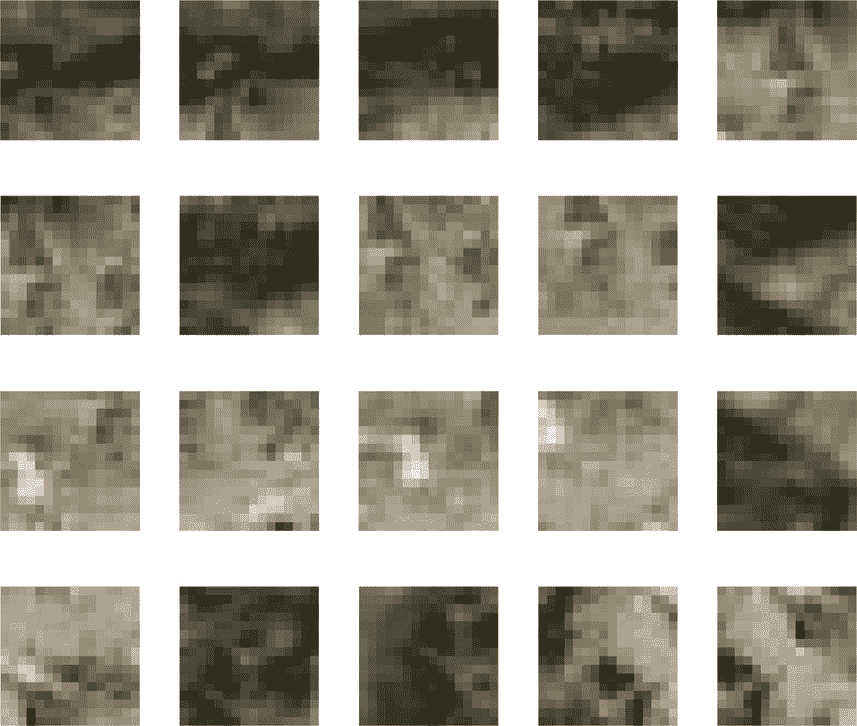

第九章

基于地形的导航

**图像 446: 45**

**图像 899: 90**

**图像 1740: 174**

**图像 4962: 497**

**图像 5761: 577**

**图像 5813: 582**

**图像 5909: 591**

**图像 7283: 729**

**图像 8250: 825**

**图像 8394: 840**

**图像 9654: 966**

**图像 10269: 1027**

**图像 10607: 1061**

**图像 12620: 1262**

**图像 13336: 1334**

**图像 16508: 1651**

**图像 18217: 1822**

**图像 20628: 2063**

**图像 20789: 2079**

**图像 21341: 2135**

**图 9.14:** *这些选定的地形图像显示了神经网络正在分类的内容*。

在图 9.15 的每个时代，它正在处理所有训练数据。

>> 地形神经网络

12x1 层数组，包含以下层：

1

''

图像输入

16x16x3 图像，使用 'zerocenter'

归一化

2

''

卷积

8 个 3x3 卷积，步长 [1

1] 并使用 'same' 填充

3

''

批标准化

批标准化

4

''

ReLU

ReLU

5

''

最大池化

2x2 最大池化，步长 [2

2]

并填充 [0

0

0

0]

6

''

卷积

32 个 3x3 卷积，步长 [1

1] 并使用 'same' 填充

201

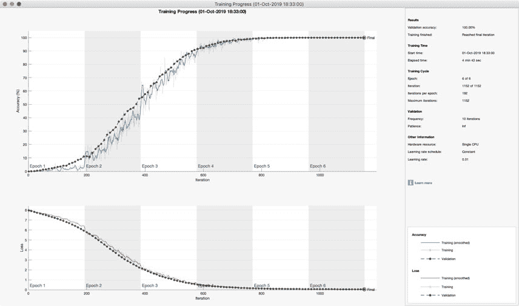

第九章

基于地形的导航

**图 9.15:** *训练窗口*。

7

''

批标准化

批标准化

8

''

ReLU

ReLU

9

''

最大池化

2x2 最大池化，步长 [2

2]

并填充 [0

0

0

0]

10

''

全连接

2401 个全连接层

11

''

Softmax

softmax

12

''

分类输出

crossentropyex

TrainingOptionsSGDM 具有以下属性：

Momentum: 0.9000

InitialLearnRate: 0.0100

LearnRateScheduleSettings: [1x1 struct]

L2Regularization: 1.0000e-04

GradientThresholdMethod: 'l2norm'

GradientThreshold: Inf

MaxEpochs: 6

MiniBatchSize: 100

Verbose: 0

VerboseFrequency: 50

ValidationData: [1x1 matlab.io.datastore.ImageDatastore]

ValidationFrequency: 10

ValidationPatience: Inf

Shuffle: 'every-epoch'

CheckpointPath: ''

ExecutionEnvironment: 'auto'

WorkerLoad: []

202

第九章

基于地形的导航

OutputFcn: []

图表: '训练进度'

序列长度: '最长'

SequencePaddingValue: 0

DispatchInBackground: 0

训练分数

80.00%

准确率是

100.00%

我们获得了 100%的准确率。您可以探索更改层数和尝试不同的激活函数。训练需要几分钟。

**9.9**

**模拟**

**9.9.1 问题**

我们想使用我们的地形模型来测试我们的深度学习算法。

**9.9.2 解决方案**

我们使用训练好的神经网络构建一个模拟。

**9.9.3 工作原理**

我们重现了上一节的模拟，并删除了一些不必要的输出，以便我们可以专注于神经网络。我们读取训练好的神经网络。

***AircraftNNSim.m***

10

%% 加载神经网络

11

nN

= **load**('TerrainNet');

12

rI

= **load**('Loc');

神经网络将相机获取的图像进行分类。我们使用 int32 将类别转换为整数。子图显示神经网络识别为与相机图像匹配的图像和相机图像。如果您的海拔，x(6)，小于 1，则模拟循环停止。

14

%% 首先找到平衡控制

15

d

= RHSPointMassAircraft;

16

v

= 120;

17

d.phi = **atan**(vˆ2/(r*d.g));

18

x

= [v;0;0;-r;0;10000];

19

d

= EquilibriumControls( x, d );

20

21

%% 模拟

22

xPlot = **zeros**(**length**(x)+3,n);

23

24

% 将图像放入图形中以便我们阅读

25

h = NewFigure('地球段');

26

i = **flipud**(imread('TerrainClose64.jpg'));

203

第九章

基于地形的导航

27

**image**(i);

28

**axis image**

29

30

NewFigure('相机');

31

32

**for** k = 1:n

33

34

% 获取神经网络所需的图像

35

im

= TerrainCamera( x(4:5), h, nBits );

36

**subplot**(1,2,1)

37

**image**(im.p)

38

**axis image**

39

40

% 运行神经网络

41

l

= classify(nN.terrainNet,im.p);

42

**subplot**(1,2,2)

43

q = imread(**sprintf**('TerrainImages/TerrainImage%d.jpg',rI.iMI(l))); 44

**image**(q);

45

**axis image**

46

47

% 绘制存储

48

i

= int32(l);

49

xPlot(:,k)

= [x;rI.r(:,i);i];

50

51

% 积分

52

x

= RungeKutta( @RHSPointMassAircraft, 0, x, dT, d );

53

54

% 碰撞

55

**if**( x(6) <= 0 )

56

**break**;

57

**结束**

58

**结束**

图 9.16 显示了轨迹和相机视图。我们模拟了一整圈。

根据神经网络定位，图 9.17 显示了识别的地形段和路径。神经网络对它所看到的地面进行分类。读取每个图像的位置并用于绘制轨迹。

在图 9.18 中显示了圆形路径的二维轨迹。我们确保我们处于每个图像都代表一个像素变化的区域。在边缘，有一个图像边界。如果我们处于那个区域，分辨率会低于。从图像得到的轨迹与实际轨迹相当接近。更好的结果需要更高的分辨率。在实践中，测量的位置将作为输入输入到卡尔曼滤波器[42]，该滤波器在本章中之前建模了飞机动力学。卡尔曼滤波器的输入可以是三轴加速度计（见第七章）。这将平滑轨迹并提高精度。

204

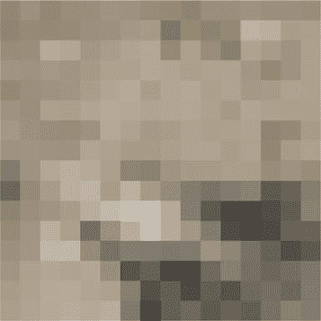

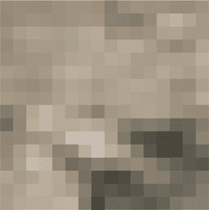

第九章

基于地形的导航

2

2

4

4

6

6

8

8

10

10

12

12

14

14

16

16

5

10

15

5

10

15

121

120

119

v（米/秒）

0

5

10

15

20

25

30

35

40

45

50

时间（秒）

1

0

（度）-1

0

5

10

15

20

25

30

35

40

45

50

时间（秒）

10

5

（度）

0

0

5

10

15

20

25

30

35

40

45

50

时间（秒）

500

0

-500

x（米）

0

5

10

15

20

25

30

35

40

45

50

时间（秒）

500

0

-500

y（米）

0

5

10

15

20

25

30

35

40

45

50

时间（秒）

104

1.0001

1

0.9999

h（米）

0

5

10

15

20

25

30

35

40

45

50

时间（秒）

**图 9.16：** *相机视图和轨迹。这是一整圈。两张图片仅相差一个像素。*

205

第九章

基于地形的导航

500

0

x（米）

-500

0

5

10

15

20

25

30

35

40

45

50

时间（秒）

500

0

y（米）

-500

0

5

10

15

20

25

30

35

40

45

50

时间（秒）

500

0

（米）cx -500

0

5

10

15

20

25

30

35

40

45

50

时间（秒）

500

（米）

0

c

y

-500

0

5

10

15

20

25

30

35

40

45

50

时间（秒）

1700

1600

1500

1400

1300

1200

图像

1100

1000

900

800

700

0

5

10

15

20

25

30

35

40

45

50

时间（秒）

**图 9.17：** *飞机路径和识别的地形段。“图像”在底部图中指的是* *图像索引。*

206

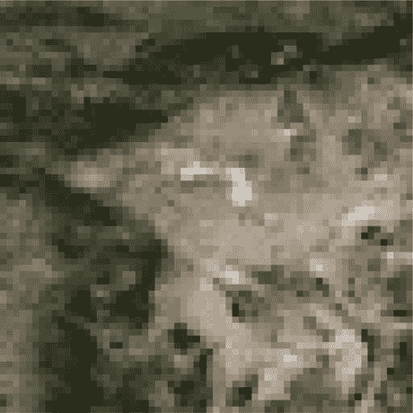

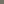

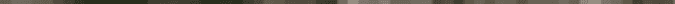

**第九章**

**基于地形的导航**

-2000

-1500

-1000

-500

0

y (m)

500

1000

1500

2000

-2000

-1500

-1000

-500

0

500

1000

1500

2000

x (m)

**图 9.18：** *蓝色为飞机路径，红色为识别的地形段。*

本章展示了如何使用神经网络来识别飞机导航的地形。我们通过在恒定高度飞行、使用具有固定图像方向的针孔相机模型以及忽略云层和其他复杂因素来简化问题。我们使用卷积神经网络训练神经网络，并取得了良好的效果。正如所提到的，更高分辨率的图像和卡尔曼滤波器将产生更平滑的轨迹。

207

**第十章**

**股票预测**

**10.1**

**引言**

股票预测算法的目标是推荐一个股票组合，以最大化投资者的回报。投资者有有限的钱，并希望创建一个组合以最大化其投资回报。本章中的神经网络将根据其历史预测股票组合的行为。这可以用来选择具有对未来表现一定预期的股票组合。本章使用的股市模型基于几何布朗运动。鉴于这一点，我们可以进行统计分析，以帮助我们挑选股票。我们将展示一个神经网络，它对模型没有任何了解，在建模股票方面也能做得同样好。

**10.2**

**生成股票市场**

**10.2.1 问题**

我们希望创建一个模拟真实股票的人工股票市场。

**10.2.2 解决方案**

实现几何布朗运动。这是由保罗·萨缪尔森，诺贝尔奖获得者 [36] 发明的。

**10.2.3 工作原理**

保罗·萨缪尔森 [11] 基于几何布朗运动创建了一个股票模型。这种方法产生的数字是现实的，不会变成负数。这实际上是在对数空间中的随机游走。随机微分方程是

*dS*( *t*) = *rSdt* + *σSdW* ( *t*) (10.1)

© Michael Paluszek, Stephanie Thomas, Eric Ham 2022

209

M. Paluszek 等人，*《实用的 MATLAB 深度学习》*，

`doi.org/10.1007/978-1-4842-7912-0 10`

第十章

股票预测

*S* 是股票价格。*W* ( *t*) 是布朗运动，随机游走过程。*t* 是时间，*dt* 是时间微分。*r* 是漂移，*σ* 是股市的波动性。两者范围均为零到一。也可以用微分方程形式表示为

*dS* =

*dW* ( *t*)

*r* + *σ*

*S*

(10.2)

*dt*

*dt*

解是

*S*( *t*) = *S*(0) *e*[( *r−* 12 *σ* 2) *t*+ *σW* ( *t*)]

(10.3)

下面的代码显示了生成股票趋势所使用的代码。我们使用 cumsum 对随机游走中的随机数进行求和。我们使用由 randn 产生的高斯或正态分布来创建随机数。该函数可以创建多个股票。

***StockPrice.m***

27

**函数** [s, t] = StockPrice( s0, r, sigma, tEnd, nInt ) 28

29

**如果**( **nargin** < 1 )

30

Demo

31

**返回**

32

**结束**

33

34

delta

= tEnd/nInt;

35

sDelta

= **sqrt**(delta);

36

t

= **linspace**(0,tEnd,nInt+1);

37

m

= **length**(s0);

38

w

= [**zeros**(m,1) **cumsum**(sDelta.***randn**(m,nInt))]; 39

s

= **zeros**(1,nInt+1);

40

f

= r - 0.5*sigma.ˆ2;

41

**对于** k = 1:m

42

s(k,:) = s0(k)***exp**(f(k)*t + sigma(k)*w(k,:));

43

**结束**

该演示基于 Wilshire 5000 统计数据。它是一个涵盖所有美国股票的指数。如果您运行它，由于输入是随机的，您将得到不同的值。

51

%% StockPrice>Demo

52

**函数** Demo

53

54

tEnd

= 5.75;

55

n

= 1448;

56

s0

= 8242.38;

57

r

= 0.1682262;

58

sigma = 0.1722922;

59

StockPrice( s0, r, sigma, tEnd, n );

60

61

%% 版权

62

%

版权所有 (c) 2019 普林斯顿卫星系统公司

63

%

All rights reserved.

210

第十章

股票预测

结果显示在图 10.1。它们看起来像真实的股票。改变漂移或波动性将改变整体形状。例如，如果您将波动性设置为*σ* = 0，您将得到红色线条显示的非常漂亮的股票。增加*r*会使股票增长更快。这给我们一个一般规则，我们希望*r*高而*σ*低。见图 10.2。

我们的模式基于两个系数。我们可以通过仅拟合股票价格曲线并计算*r*和*σ*来制作一个股票选择算法。然而，我们想看看深度学习如何做到这一点。22000

Wilshire 5000

零波动性

20000

18000

16000

14000

股票价格 12000

10000

8000

6000

0

1

2

3

4

5

6

年份

**图 10.1:** *基于 Wilshire 5000 统计数据的随机股票与零波动性股票的比较。*

*如果您多次运行* StockPrice *函数，您将得到不同的结果。*

20000

18000

16000

14000

12000

10000

股票价格

8000

6000

4000

2000 0

1

2

3

4

5

6

年份

**图 10.2:** *具有高波动性和低漂移的股票，使得 r − 12σ 2 < 1。在这种情况下，r = 0.1 和 σ = 0.6。*

211

![index-225_31.png]

![index-225_32.png]

![index-225_33.png]

![index-225_34.png]

![index-225_35.png]

![index-225_36.png]

![index-225_37.png]

![index-225_38.png]

第十章

股票预测

学习所做的。记住，这是一个简单的股票价格模型。*σ*和*r*也可以是时间或随机变量的函数。当然，还有其他的股票模型！这里的想法是，深度学习在没有被告知观察数据背后的模型的情况下创建其内部模型。

The function PlotStock.m plots the stock price. Notice that we format the *y* tick labels ourselves to get rid of the exponential format that MATLAB would normally employ. gca returns the current axes handle.

***PlotStock.m***

12

**函数** PlotStock(t,s,symb)

13

14

**如果**(**nargin** < 1 )

15

Demo;

16

**返回**

17

**结束**

18

19

m = **size**(s,1);

20

21

PlotSet(t,s,'x label','Year','y label','Stock Price','figure title',...

22

'Stocks','Plot Set',{1:m},'legend',{symb});

23

24

% 格式化刻度

25

yT

= **获取**(**gca**,'YTick');

26

yTL = **cell**(1, **length**(yT));

27

**for** k = 1:**length**(yT)

28

yTL{k} = **sprintf**('%5.0f',yT(k));

29

**结束**

30

**设置**(**gca**,'YTickLabel', yTL)

内置演示与 StockPrice 相同。

34

**函数** Demo

35

36

tEnd

= 5.75;

% 年份

37

nInt

= 1448;

% 间隔

38

s0

= 8242.38;

% 初始价格

39

r

= 0.1682262; % 漂移

40

sigma = 0.1722922;

41

[s,t] = StockPrice( s0, r, sigma, tEnd, nInt );

42

PlotStock(t,s,{})

**10.3**

**创建股票市场**

**10.3.1 问题**

我们想要创建一个股票市场。

212

![index-226_1.png]

![index-226_2.png]

![index-226_3.png]

![index-226_4.png]

![index-226_5.png]

![index-226_6.png]

![index-226_7.png]

![index-226_8.png]

![index-226_9.png]

![index-226_10.png]

![index-226_11.png]

![index-226_12.png]

![index-226_13.png]

![index-226_14.png]

![index-226_15.png]

![index-226_16.png]

![index-226_17.png]

![index-226_18.png]

![index-226_19.png]

![index-226_20.png]

![index-226_21.png]

![index-226_22.png]

![index-226_23.png]

![index-226_24.png]

![index-226_25.png]

![index-226_26.png]

![index-226_27.png]

![index-226_28.png]

![index-226_29.png]

![index-226_30.png]

![index-226_31.png]

![index-226_32.png]

![index-226_33.png]

![index-226_34.png]

![index-226_35.png]

![index-226_36.png]

![index-226_37.png]

![index-226_38.png]

![index-226_39.png]

![index-226_40.png]

![index-226_41.png]

![index-226_42.png]

![index-226_43.png]

![index-226_44.png]

![index-226_45.png]

第十章

股票预测

**10.3.2 解决方案**

Use the stock price function to create 100 stocks with randomly chosen parameters.

**10.3.3 工作原理**

我们编写了一个函数，该函数随机选择股票的起始价格、波动性和漂移。它还创建了随机的三位股票名称。我们使用半正态分布来表示股票价格。此代码生成随机市场。我们将漂移限制在 0 到 0.5 之间。这创建了更多（对于小型市场）向下走的股票。

***StockMarket.m***

19

**function** d = StockMarket(

nStocks, s0Mean, s0Sigma, tEnd, nInt )

20

21

**if**( **nargin** < 1 )

22

Demo

23

**return**

24

**end**

25

26

d.s0

= **abs**(s0Mean + s0Sigma***randn**(1,nStocks));

27

d.r

= 0.5***rand**(1,nStocks);

28

d.sigma = **rand**(1,nStocks);

29

s

= 'A':'Z';

30

**for** k = 1:nStocks

31

j

= randi(26,1,3);

32

d.symb(k,:)

= s(j);

33

**end**

以下代码在一个图中绘制了所有股票。我们创建了一个图例，并使用 PlotStock 将 y 标签设置为整数。

35

% 输出

36

**if**( **nargout** < 1 )

37

s = StockPrice( d.s0, d.r, d.sigma, tEnd, nInt );

38

t

= **linspace**(0,tEnd,nInt+1);

39

PlotStock(t,s,d.symb);

40

**clear** d

41

**end**

演示如下所示：

43

%% StockPrice>Demo

44

**function** Demo

45

46

nStocks = 15;

% 股票数量

47

s0Mean

= 8000;

% 平均股票价格

48

s0Sigma = 3000;

% Standard

价格的偏差

49

tEnd

= 5.75;

% 市场持续时间

50

nInt

= 1448;

% 间隔数量

51

StockMarket( nStocks, s0Mean, s0Sigma, tEnd, nInt );

213

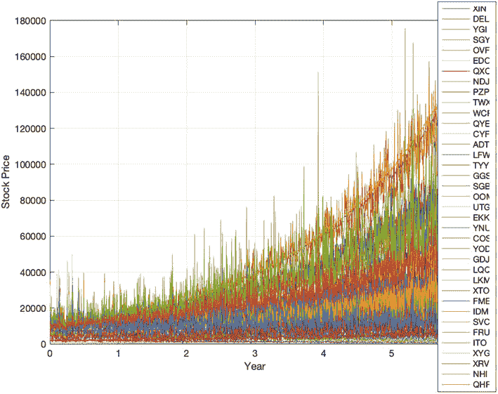

第十章

股票预测

两次运行如图 10.3 所示。

一个包含一百个股票的股票市场如图 10.4 所示。

45000

50000

SWO

JGA

BEH

EOC

40000

45000

BLE

FHL

CGM

DFG

ANP

40000

OVH

35000

35000

30000

30000

25000

25000

20000

Stock Price

Stock Price 20000

15000

15000

10000

10000

5000

5000

0

0

0

1

2

3

4

5

6

0

1

2

3

4

5

6

年份

年份

**图 10.3：** *随机五股票市场的两次运行.*

**图 10.4：** *一百个股票市场.*

214

第十章

股票预测

**10.4**

**训练和测试**

**10.4.1 问题**

我们希望构建一个深度学习系统来预测股票的表现。这可以应用于之前创建的股票市场，以预测投资组合的表现。

**10.4.2 Solution**

股票的历史是一组时间序列。我们将使用长短期记忆（LSTM）网络根据历史数据预测股票的未来表现。过去的表现并不一定预示着未来的结果。所有投资都存在一定的风险。在做出任何投资决策之前，我们鼓励您咨询认证的财务规划师。

这利用了 Deep Learning Toolbox 的 lstmLayer 层。我们将使用部分时间序列来测试结果。

**10.4.3 工作原理**

LSTM 层学习时间序列中时间步之间的长期依赖关系。它自动降低过去数据的重要性。在许多应用中，LSTM 已经取代了递归神经网络（RNN）。

StockMarketNeuralNet.m 脚本实现了神经网络。第一部分创建了一个包含单一股票的市场。我们将随机数生成器设置为默认值，rng('default')，这样每次运行脚本时都会得到相同的结果。如果您删除这一行，每次运行都会得到不同的结果。神经网络训练数据是时间序列，时间序列通过一次步长进行平移。

***StockMarketNeuralNet.m***

1

%% 使用 LSTM 预测股票价格脚本

2

%% 参见：

3

% lstmLayer, sequenceInputLayer, fullyConnectedLayer, regressionLayer, 4

% trainingOptions, trainNetwork, predictAndUpdateState

5

6

% 重置随机数生成器，以确保我们总是得到相同的情况 7

rng('default')

8

9

layerSet = 'two lstm'; % 'lstm' 'bilstm' 和 'two lstm' 可用 10

11

%% 生成股票市场示例

12

n

= 1448;

13

tEnd

= 5.75;

14

d

= StockMarket( 1, 8000, 3000, tEnd, n );

15

s

= StockPrice( d.s0, d.r, d.sigma, tEnd, n );

16

t

= **linspace**(0,tEnd,n+1);

17

18

PlotStock(t,s,d.symb);

215

第十章

股票预测

股票价格显示在图 10.5 中。我们将输出数据分为训练数据和测试数据，使用数据的前 80%进行训练。当数据范围较大时，对数据进行归一化可以产生更好的结果。为了简化本例，我们使用相同的数据进行验证和测试，尽管在生产系统中这些应该是不同的。

***StockMarketNeuralNet.m***

20

%% 将数据分为训练和测试数据

21

n

= **length**(s);

22

nTrain

= **floor**(0.8*n);

23

sTrain

= s(1:nTrain);

24

sTest

= s(nTrain+1:n);

25

sVal

= sTest;

26

27

% 归一化训练数据

28

mu

= **mean**(sTrain);

29

sigma

= **std**(sTrain);

30

31

sTrainNorm

= (sTrain-mu)/sigma; % 将数据归一化到零均值

32

33

% 标准化测试数据

34

sTestNorm

= (sTest - mu) / sigma;

35

sTest

= sTestNorm(1:**end**-1);

脚本的下一部分设置并训练网络。我们使用“Adam”方法

[20]. Adam 是一种基于一阶梯度的随机目标函数优化。它计算效率高，适用于具有噪声或稀疏梯度的问题。有关更多详细信息，请参阅参考文献。我们有一个包含 LSTM 层的四层网络。

150000

XQC

100000

股票价格

50000

0 0

1

2

3

4

5

6

年份

**图 10.5：** *股票价格.*

216

第十章

股票预测

37

%% 设置和训练神经网络

38

39

% 我们使用前一步训练 LSTM

40

xTrain

= sTrainNorm(1:**end**-1);

41

yTrain

= sTrainNorm(2:**end**);

42

43

% 验证数据

44

muVal

= **mean**(sVal); % 必须仅对这组数据进行标准化

45

sigmaVal

= **std**(sVal);

46

sValNorm

= (sVal-muVal)/sigmaVal;

47

48

xVal = sValNorm(1:**end**-1);

49

yVal = sValNorm(2:**end**);

50

51

numFeatures

= 1;

52

numResponses

= 1;

53

numHiddenUnits = 200;

54

55

switch layerSet

56

case 'lstm'

57

layers = [sequenceInputLayer(numFeatures)

58

lstmLayer(numHiddenUnits)

59

fullyConnectedLayer(numResponses)

60

regressionLayer];

61

case 'bilstm'

62

layers = [sequenceInputLayer(numFeatures)

63

bilstmLayer(numHiddenUnits)

64

fullyConnectedLayer(numResponses)

65

regressionLayer];

66

case 'two lstm'

67

layers = [sequenceInputLayer(numFeatures)

68

lstmLayer(numHiddenUnits)

69

reluLayer

70

lstmLayer(numHiddenUnits)

71

fullyConnectedLayer(numResponses)

72

regressionLayer];

73

otherwise

74

**错误**('只有 3 组层可用');

75

**end**

76

77

analyzeNetwork(layers);

78

79

options = trainingOptions('adam', ...

80

'MaxEpochs',300, ...

81

'ExecutionEnvironment','gpu',...

82

'GradientThreshold',1, ...

83

'InitialLearnRate',0.005, ...

84

'LearnRateSchedule','piecewise', ...

85

'LearnRateDropPeriod',125, ...

86

'LearnRateDropFactor',0.2, ...

87

'Shuffle','every-epoch', ...

217

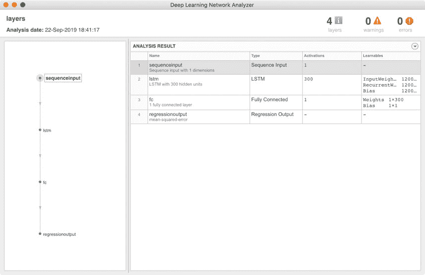

第十章

股票预测

88

'ValidationData',{xVal,yVal}, ...

89

'ValidationFrequency',5, ...

90

'Verbose',0, ...

91

'Plots','training-progress');

92

93

net = trainNetwork(xTrain,yTrain,layers,options);

使用 LSTM 神经网络时，最小层数为四个，如下所示：

layers = [**序列输入层**(numFeatures)

**lstmLayer**(numHiddenUnits)

**全连接层**(numResponses)

**回归层**];

层结构如图 10.6 所示，由 analyzeNetwork 分析。对于如此简单的结构，analyzeNetwork 并不是特别有趣。当你有数十或数百层时，它才更有趣。脚本还提供了尝试 bilstm 层和两个 lstm 层的选项：

**图 10.6**：*LSTM 层结构*。

218

第十章

股票预测

1. sequenceInputLayer(inputSize) 定义一个序列输入层。inputSize 是每个时间步输入序列的大小。在我们的问题中，序列只是时间序列中的最后一个值，因此 inputSize 为 1。你也可以有更长的序列。

2. lstmLayer(numHiddenUnits) 创建一个长短期记忆层。numHiddenUnits 是该层中的隐藏单元数。隐藏单元数是该层中的神经元数。

3. fullyConnectedLayer(outputSize) 创建一个具有指定输出大小的全连接层。

4. regressionLayer 为神经网络创建一个回归输出层。回归是数据拟合。

学习率从 0.005 开始。使用这些选项以分段方式每 125 个周期减少 0.2 倍：

'InitialLearnRate',0.005, ...

'LearnRateSchedule','piecewise', ...

'LearnRateDropPeriod',125, ...

'LearnRateDropFactor',0.2, ...

我们将“耐心”设置为无穷大。这意味着即使没有进展，学习也会继续到最后一个时期。训练窗口显示在图 10.7\. 上。上面的图显示了从数据计算出的均方根误差 (RMSE) 和下面的图显示了损失。我们还使用测试数据进行验证。请注意，验证数据需要使用其自己的平均值和标准差进行归一化。

最后部分使用 predictAndUpdateState 测试了网络。我们需要对输出进行反归一化以进行绘图。

95

%% 展示神经网络

96

yPred

= predict(net,sTest);

97

yPred(1) = yTrain(**end**-1);

98

yPred(2) = yTrain(**end**);

99

yPred

= sigma*yPred + mu;

100

101

%% 绘制预测图

102

NewFigure('Stock prediction')

103

**plot**(t(1:nTrain-1),sTrain(1:**end**-1));

104

**hold** on

105

**plot**(t,s,'--g');

106

**grid** on

107

**hold** on

108

k = nTrain+1:n;

219

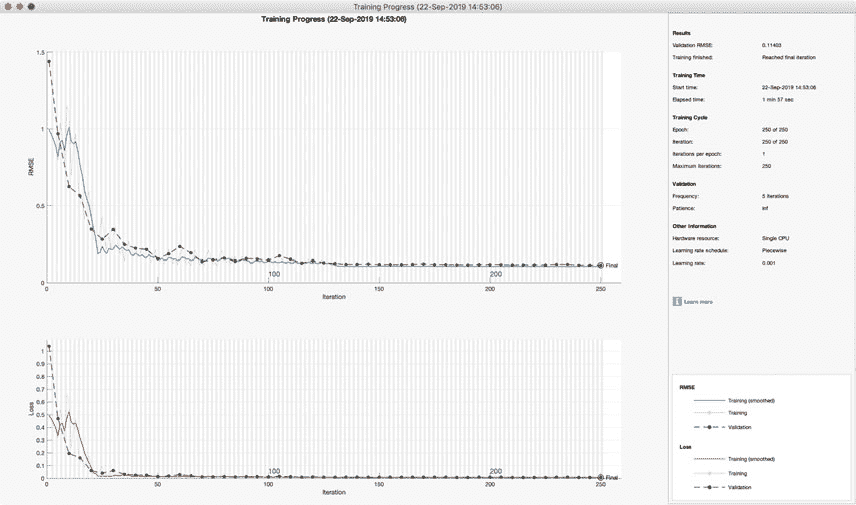

第十章

股票预测

**图 10.7**：*具有 250 次迭代的 LSTM 训练窗口。*

109

**plot**(t(k),[s(nTrain) yPred],'-')

110

**xlabel**("年份")

111

**ylabel**("股票价格")

112

**title**("预测")

113

**legend**(["观测值" "真实值" "预测值"]) 114

115

% 格式化刻度

116

yT

= **get**(**gca**,'YTick');

117

yTL = **cell**(1, **length**(yT));

118

**for** k = 1:**length**(yT)

119

yTL{k} = **sprintf**('%5.0f',yT(k));

120

**end**

121

**set**(**gca**,'YTickLabel', yTL)

将图 10.8 与图 10.5\. 进行比较。红色表示预测结果。预测结果再现了股票的趋势。这让你对它的表现有一个大致的了解。神经网络不能预测确切的股票历史，但它确实再现了预期的整体表现。

220

第十章

股票预测

**预测**

150000

观测值

True

预测

100000

股票价格

50000

0 0

1

2

3

4

5

6

年份

**图 10.8**：*单层 LSTM 的预测结果。*

双向长短期记忆层和两个长短期记忆层的结果分别显示在图 10.9 和图 10.10\. 中。所有这些都产生了可接受的模型。双向长短期记忆层看起来在预测趋势方面表现更好。

本章展示了 LSTM 可以产生一个内部模型，该模型仅通过观察过程的行为来复制系统的行为。在这种情况下，我们有一个模型，但在许多系统中，模型可能不存在或其形式存在相当大的不确定性。因此，当与动态系统一起工作时，神经网络可以成为一个强大的工具。我们还没有尝试用真实的股票进行这项实验。

221

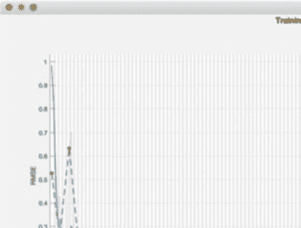

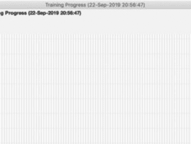

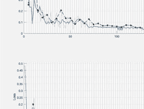

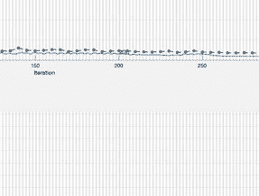

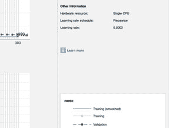

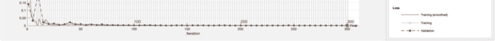

**第十章**

股票预测

**预测**

150000

观测

True

预测

100000

股票价格

50000

0 0

1

2

3

4

5

6

年份

**图 10.9：** *BiLSTM 集的结果*

222

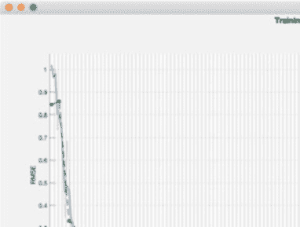

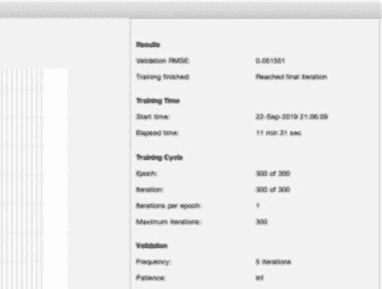

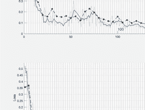

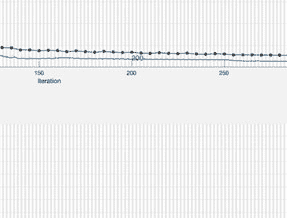

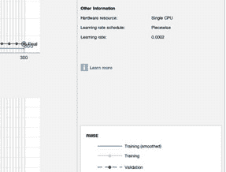

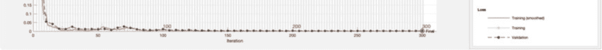

**第十章**

股票预测

**预测**

150000

观测

True

预测

100000

股票价格

50000

0 0

1

2

3

4

5

6

年份

**图 10.10：** *两个 LSTM 层集的结果*

223

**第十一章**

**图像分类**

**11.1**

**简介**

可以使用预训练网络进行图像分类。MATLAB 使得访问和使用这些网络变得容易。本章展示了两个示例。首先，我们将使用 AlexNet，然后是 GoogLeNet。

**11.2**

**使用 AlexNet**

**11.2.1 问题**

我们想使用预训练网络 AlexNet 进行图像分类。

**11.2.2 解决方案**

根据你的 MATLAB 版本，从 Add-On Explorer 安装 AlexNet 或下载 GoogLeNet 的支持包。加载一些图像并测试。这些是分类网络，因此我们将使用 classify 来运行它们。

**11.2.3 它是如何工作的**

首先，我们需要使用 Add-On Explorer 下载支持包。如果你尝试在没有安装它们的情况下运行 alexnet 或 googlenet，你将直接在 Add-On Explorer 中获取到包的链接。你需要你的 MathWorks 密码。

AlexNet 是一个在 ImageNet 数据集（`image-net.org/`）上大约训练了 120 万张图像的预训练卷积神经网络（CNN）。 

[索引).](http://image-net.org/index) 该模型有 25 层，可以将图像分类到 1000 个对象类别。它可以用于各种对象分类。然而，如果对象不在训练集中，它将无法识别该对象。如果香蕉在训练集中，你可以期望 CNN 正确识别一张香蕉的新图片。但如果你给它一张芭蕉的图片，而芭蕉不在 CNN 中，那么它可能找不到匹配项，或者更有可能的是，它可能会错误地将它分类为香蕉。

© Michael Paluszek, Stephanie Thomas, Eric Ham 2022

225

M. Paluszek 等人，《实用 MATLAB 深度学习》，

`doi.org/10.1007/978-1-4842-7912-0 11`

第十一章

图像分类

***AlexNetTest.m***

8

%% 加载网络

9

% 访问训练好的模型。这是一个 SeriesNetwork。

10

net = alexnet;

11

net

12

13

% 查看架构的详细信息

14

net.Layers

网络层打印输出如下所示：

>> AlexNetTest

ans =

25x1 层数组，包含以下层：

1

'data'

图像输入

227x227x3 图像，使用 'zerocenter' 归一化

2

'conv1'

卷积

96 11x11x3 卷积，步长 [4

4] 和填充 [0

0

0

0]

3

'relu1'

ReLU

ReLU

4

'norm1'

交叉通道归一化

每个元素有 5 个通道的交叉通道归一化

5

'pool1'

最大池化

3x3 最大池化，步长 [2

2] 和填充 [0

0

0

0]

6

'conv2'

分组卷积

2 组 128 5x5x48 卷积，步长 [1

1] 和

填充 [2

2

2

2]

7

'relu2'

ReLU

ReLU

8

'norm2'

交叉通道归一化

每个元素有 5 个通道的交叉通道归一化

9

'pool2'

最大池化

3x3 最大池化，步长 [2

2] 和填充 [0

0

0

0]

10

'conv3'

卷积

384 3x3x256 卷积，步长 [1

1] 和填充 [1

1

1

1]

11

'relu3'

ReLU

ReLU

12

'conv4'

分组卷积

2 组 192 3x3x192 卷积，步长 [1

1] 和

填充 [1

1

1

1]

13

'relu4'

ReLU

ReLU

14

'conv5'

分组卷积

2 组 128 3x3x192 卷积，步长 [1

1] 和

填充 [1

1

1

1]

15

'relu5'

ReLU

ReLU

16

'pool5'

最大池化

3x3 最大池化，步长 [2

2] 和填充 [0

0

0

0]

17

'fc6'

完全连接

4096 个完全连接层

18

'relu6'

ReLU

ReLU

19

'drop6'

Dropout

50% dropout

20

'fc7'

完全连接

4096 个完全连接层

21

'relu7'

ReLU

ReLU

22

'drop7'

Dropout

50% dropout

23

'fc8'

完全连接

1000 个完全连接层

24

'prob'

Softmax

softmax

25

'output'

分类输出

使用 'tench' 和 999 个其他类别的 crossentropyex

这个卷积网络有很多层。ReLU 和 softmax 是激活函数。在第一层中，使用“零中心”归一化。这意味着图像被归一化，使其均值为零，标准差为 1。两层是新的，跨通道归一化和分组卷积。滤波器组，也称为分组卷积，是在 2012 年 AlexNet 中引入的。你可以把每个滤波器的输出看作是一个通道，滤波器组看作是一组通道。滤波器组允许在 GPU 之间更有效地并行化。它们也提高了性能。跨通道归一化是在通道之间进行归一化，而不是逐个通道。我们在第三章讨论了卷积。

每个滤波器的权重在训练期间确定。Dropout 是一个在训练权重时随机忽略节点的层。这防止了节点之间的相互依赖。

对于我们的第一个示例，我们加载 MATLAB 附带的一组辣椒的图像。这个图像比网络的输入大小要大，所以我们使用图像的左上角。

226

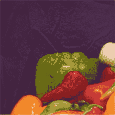

第十一章

图像分类

注意，每个预训练网络都有一个固定的输入图像大小，我们可以从第一层确定它。

***AlexNetTest.m***

16

%% 加载测试图像并进行分类

17

% 读取图像以进行分类

18

I = imread('peppers.png');

% 随 MATLAB 一起提供

19

20

% 调整图像大小以适应网络的输入层

21

sz = net.Layers(1).InputSize;

22

I = I(1:sz(1),1:sz(2),1:sz(3));

23

24

% 使用 AlexNet 对图像进行分类

25

[label, scorePeppers] = classify(net, I);

26

27

%

显示图像和分类结果

28

NewFigure('Pepper'); ax = **gca**;

29

imshow(I);

30

**标题**(ax,label);

31

32

PlotSet(1:**length**(scorePeppers),scorePeppers,'x label','类别',...

33

'y 轴标签','得分','绘图标题','辣椒');

AlexNet 示例的图像和结果如图 11.1 所示。辣椒得分紧密聚集。

**Peppers**

0.8

0.7

0.6

**甜椒**

0.5

0.4

得分

0.3

0.2

0.1

0 0

100

200

300

400

500

600

700

800

900

1000

类别

**图 11.1:** *标记了分类和得分的测试图像。该图像被分类为“甜椒”。*

227

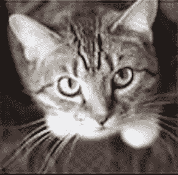

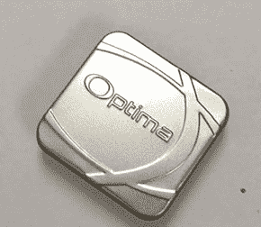

第十一章

图像分类

为了娱乐和学习更多关于这个网络的信息，我们打印出得分次之的类别，从高到低排序。这些类别存储在网络最后一层的 Classes 中。

***AlexNetTest.m***

35

% 其他哪些类别相似？

36

**disp**('Peppers 的最高分类别：')

37

kPos = **find**(scorePeppers>0.01);

38

[vals,kSort] = **sort**(scorePeppers(kPos),'descend');

39

**for** k = 1:**length**(kSort)

40

**fprintf**('%13s:\t%g\n',net.Layers(**end**).Classes(kPos(kSort(k))),vals(k)

);

41

**end**

结果显示，网络正在考虑所有水果和蔬菜。Granny Smith 的得分次之，其次是黄瓜，而无花果和柠檬的得分要小得多。这很合理，因为 Granny Smith 和无花果通常也是绿色的。

Peppers 的最高分类别：

bell pepper:

0.700013

Granny Smith:

0.180637

cucumber:

0.0435253

fig:

0.0144056

lemon:

0.0100655

我们还有两张我们的测试图像。一张是猫的图像，另一张是金属箱的图像，如图 11.2 所示。

**图 11.2:** *原始测试图像 Cat.png 和 Box.jpg.*

228

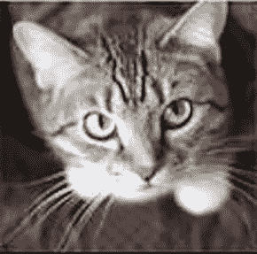

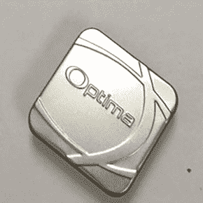

第十一章

图像分类

猫的分类得分如下所示：

Cat 的最高分类别：

tabby:

0.805644

Egyptian cat:

0.15372

tiger cat:

0.0338047

选定的标签是*虎斑猫*。网络可以识别出照片是一只猫，因为其他得分最高的类别也都是猫的种类。尽管我们可以区分虎斑猫和虎猫，但我们不能说……

金属箱对网络来说是最具挑战性的。得分高于 0.05 的类别如下所示，带有标签的图像显示在图 11.3 中。

Box 的最高分类别：

hard disc:

0.291533

loupe:

0.0731844

modem:

0.0702888

pick:

0.0610284

iPod:

0.0595867

CD player:

0.0508571

在这种情况下，硬盘的得分最高，但得分远低于虎斑猫的得分——大约是 0.3 比 0.8。得分的总结是 AlexNet 结果总结：

Pepper

0.7000

Cat

0.8056

Box

0.2915

**tabby**

**硬盘**

**图 11.3:** *测试图像和 AlexNet 的分类。它们被分类为“虎斑猫”和“硬盘* *盘”。*

229

第十一章

图像分类

**11.3**

**使用 GoogLeNet**

**11.3.1 问题**

现在我们将这些结果与 GoogLeNet 进行比较。GoogLeNet 是一个预训练模型，它也在 ImageNet 大规模视觉识别挑战（ILSVRC）中使用的 ImageNet 数据库的子集上进行了训练。该模型在超过一百万张图像上进行了训练，有 144 层（比 AlexNet 多得多），并且可以将图像分类到 1000 个对象类别中。

**11.3.2 解决方案**

从附加组件探索器中安装 GoogLeNet（尝试从命令行运行以获取安装链接）。加载一些图像并使用 classify 进行测试。

**11.3.3 它是如何工作的**

首先，我们像上一个配方中那样加载预训练网络。

***GoogleNetTest.m***

10

%% 加载预训练网络

11

net = googlenet;

12

net

% 显示 144 层网络

网络显示如下。它与 AlexNet 不同，是一个 DAGNetwork。

这个网络将层排列为一个有向无环图；层从多个层接收输入并输出到多个层。

net =

具有属性的 DAGNetwork：

层：[144x1 nnet.cnn.layer.Layer]

连接：[170x2 表格]

接下来，我们在辣椒的图像上测试它。

***GoogleNetTest.m***

14

%% 辣椒

15

% 读取要分类的图像

16

I = imread('peppers.png');

17

sz = net.Layers(1).InputSize;

18

I = I(1:sz(1),1:sz(2),1:sz(3));

19

[label, scorePeppers] = classify(net, I);

20

NewFigure('Pepper');

21

imshow(I);

22

**title**(label);

23

% 其他哪些类别相似？

24

**disp**('辣椒的最高分数类别：')

25

kPos = **find**(scorePeppers>0.01);

230

第十一章

图像分类

26

[vals,kSort] = **sort**(scorePeppers(kPos),'descend');

27

**for** k = 1:**length**(kSort)

28

**fprintf**('%13s:\t%g\n',net.Layers(**结束**).Classes(kPos(kSort(k))),vals(k)

);

29

**结束**

如前所述，图像被正确识别为甜椒，得分与 AlexNet 相似。然而，剩余的类别略有不同。在这种情况下，黄瓜和某种原因，马拉卡得分高于 Granny Smith。马拉卡也是圆形和长形的。最高得分类别如下：

红椒最高得分类别：

甜椒：

0.708213

黄瓜：

0.0955994

马拉卡：

0.0503938

Granny Smith:

0.0278589

我们还在猫和盒子的图像上测试了这个网络。这个网络图像的大小是 224 *×* 224。猫的类别相同，增加了猞猁，并且请注意，暹罗猫的得分显著低于 AlexNet。

猫类最高得分类别：

暹罗猫：

0.532261

埃及猫：

0.373229

猫虎：

0.0790764

猞猁：

0.0135277

盒子得分证明最为有趣，虽然硬盘在得分中名列前茅，但在此情况下，网络识别结果为*iPod*。这次还增加了一部手机。网络识别出它是一个矩形金属物体，但除此之外，没有明确的证据表明它属于某一类别。

盒子最高得分类别：

iPod：

0.443666

硬盘：

0.212672

手机：

0.0787301

调制解调器：

0.0766429

拾取：

0.0545631

开关：

0.0169888

比例尺：

0.0165957

遥控器：

0.0154203

GoogLeNet 对 Cat.png 和 Box.png 的得分数组如图[11.4]所示。盒子得分在图中分布广泛。这再次证实了“iPod”的选择不如辣椒或猫那么确定。这表明，即使是非常训练有素的网络，如果输入与测试集相差太远，也不一定是可靠的。

231

第十一章

图像分类

**盒子与暹罗猫**

0.6

盒子

猫

0.5

0.4

0.3

得分

0.2

0.1

0

0

100

200

300

400

500

600

700

800

900

1000

类别

**图 11.4：** *GoogLeNet 对 Cat.png 和 Box.png 的得分.png.*

GoogleNet 结果摘要如下：

GoogleNet 结果摘要：

胡椒

0.7082

猫

0.5323

盒子

0.4437

我们还可以从互联网上抓取随机图像。网站 picsum.photos 自称提供“Lorem Ipsum”样式的照片，并且每次调用 URL 时都会提供一张随机照片。例如：

“Lorem Ipsum”用于照片，并且每次调用 URL 时都会提供一张随机照片。例如：

>> I = **imread**('https://picsum.photos/224/224');

>> **figure**, **imshow**(I);

>> **title**(classify(net,I))

我们使用这个网站得到了一些有趣的结果。对于一些风景照片，它产生了很好的结果，但有时也会看到不存在的物体。图 11.5 显示了四个例子。

一张火车场日落过度曝光的图像被识别为“火山”。两个景观被适当地标记为“湖边”和“海边”。然而，在最后一张图像中，一个坐在长椅上凝视海滩或沙漠景观的人不可思议地被识别为“间歇泉”。这可能与其天空或云的形状有关。

这些网络没有在人类身上进行训练；然而，测试它们在人类图像上可能很有趣。我们在我们的作者头像上测试了 GoogLeNet，如图 11.6 所示。在两种情况下，它都相当准确地识别了我们的服装！

232

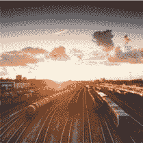

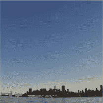

**第十一章**

**图像分类**

**火山**

**湖边**

**海边**

**间歇泉**

**图 11.5：** *从 picsum.photos 随机图像中 GoogLeNet 的识别结果。*

**运动衫**

**西装**

**图 11.6：** *带有 GoogLeNet 标签的作者头像。*

虽然这些网络在数据库中存在的图像上表现非常好，从狮子到景观，但重要的是要记住它们的局限性。结果可能出乎意料，甚至有些愚蠢。

233

**第十二章**

**轨道确定**

**12.1**

**引言**

从测量中确定轨道已经进行了数百年。一般的方法是在不同时间从地面进行一系列的物体测量。

可能的测量包括从观测点测量的距离和距离变化率，或者从测量点到物体的角度。给定在地球上进行测量的位置和这组数据，可以重建轨道。理想的轨道假设地球的重力由地球中心的点质量表示，是圆锥曲线。

那些靠近地球的轨道是椭圆。这些可以定义为一系列轨道元素。

在本章中，我们将设计一个神经网络来找到两个元素的价值。我们的模型将比天文学家必须使用的模型简单。我们将假设所有轨道都在地球的赤道平面内，观测者在地球的中心。

本章的目的是表明神经网络可以进行轨道确定。为了与传统方法进行比较，请参阅 Escobal 于 1965 年出版的经典教科书[12]。

**12.2**

**生成轨道**

**12.2.1 问题**

我们想创建一组轨道来测试和训练神经网络。

**12.2.2 解决方案**

使用元素的开普勒传播实现一个随机轨道生成器。

**12.2.3 工作原理**

一个轨道至少涉及两个物体，例如，一个行星和一艘航天器。在理想的双体情况下，两个物体围绕它们的共同质心旋转，这个质心被称为质心。

对于所有实际航天器案例，航天器的质量本身可以忽略不计，这意味着

© Michael Paluszek, Stephanie Thomas, Eric Ham 2022

235

M. Paluszek et al., *Practical MATLAB Deep Learning*,

`doi.org/10.1007/978-1-4842-7912-0 12`

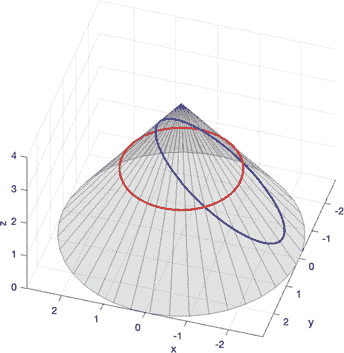

第十二章

轨道确定

卫星围绕主天体的质心遵循圆锥曲线路径。圆锥曲线是适合在圆锥上的曲线，如图 12.1 所示。绘制了两个圆锥曲线、一个圆和一个椭圆。双曲线和抛物线也是圆锥曲线，但本章我们将只研究椭圆轨道。

绘制此图的代码位于以下脚本中。它调用了两个函数，Cone 和 ConicSectionEllipse。r0 和 h 仅用于绘制圆锥。算法只关注 theta，即半圆锥角。

***ConicSection.m***

1

%% 创建一个圆锥曲线

2

3

theta = **pi**/4;

4

h

= 4;

5

r0

= h***sin**(theta);

6

7

ang

= **linspace**(0,2***pi**);

8

a

= 2;

9

b

= 1;

10

cA

= **cos**(ang);

11

sA

= **sin**(ang);

12

n

= **length**(cA);

13

c

= 0.5*h***sin**(theta)*[cA;sA; **ones**(1,n)];

14

e

= [a*cA;b*sA; **zeros**(1,n)];

15

16

% 显示平面表示

17

新图('Orbits');

18

**plot**(c(1,:),c(2,:),'r','linewidth',2)

19

**hold** on

20

**plot**(e(1,:),e(2,:),'b','linewidth',2)

圆

椭圆

1

0.5

y

0

-0.5

-1

-1.5

-1

-0.5

0

0.5

1

1.5

2

x

**图 12.1:** *圆锥上的椭圆和圆，以及它们的法线方向视图。*

236

第十二章

轨道确定

21

**grid** on

22

**xlabel**('x')

23

**ylabel**('y')

24

**axis image**

25

**legend**('Circle','Ellipse');

26

27

[z,phi,x] = ConicSectionEllipse(a,b,theta);

28

ang

= **pi**/2 + phi;

29

e

= [**cos**(ang) 0 **sin**(ang);0 1 0; -**sin**(ang) 0 **cos**(ang)]*e; 30

e(1,:)

= e(1,:) + x;

31

e(3,:)

= e(3,:) + h - z;

32

33

Cone(r0,h,40);

34

**hold** on

35

**plot3**(c(1,:),c(2,:),2***ones**(1,n),'r','linewidth',2); 36

**plot3**(e(1,:),e(2,:),e(3,:),'b','linewidth',2);

37

**view**([0 1 0])

视图设置为沿着 *y*-轴，这是椭圆的旋转轴。Cone 函数绘制了圆锥。line 绘制了沿着短轴的旋转轴。

用于绘制圆锥曲线的解在本书的最后一节推导得出。轨道可能是椭圆形的，离心率小于一，抛物线，离心率等于一，或双曲线，离心率大于一。图 12.2 展示了椭圆形轨道的几何形状。这是一个平面轨道，其中轨道运动是二维的。

半长轴 *a* 是

*r*

*a* = *a* + *rp*

2

(12.1)

*r*

远地点

*E M*

近地点

a

引力中心

**图 12.2:** *椭圆形轨道.*

237

第十二章

轨道确定

其中 *ra* 是远地点（地球的远地点）半径，或最远离中心行星的点，*rp* 是近地点半径（地球的近地点），或最接近行星的点。轨道的离心率 *e* 是

*r*

*e* = *a − rp*

*r*

(12.2)

*a* + *rp*

当 *ra* = *rp* 时，轨道是圆形的，*e* = 0。这个公式对抛物线或双曲线轨道没有意义。图 12.2 展示了三个角度测量值，*M* 平均近点角，*E*

离心率，和 *ν* 真近点角。所有这些都是从近地点测量的。平均近点角通过时间的简单函数与平均轨道速率 *n* 相关：*M* = *M* 0 + *n*( *t − t* 0)

(12.3)

离心率是当前位置投影到椭圆的周长圆上的角度，用蓝色绘制。它与平均近点角通过开普勒方程相关：*M* = *E − e* sin *E*

(12.4)

这个方程通常需要数值求解，但对于小的 *e* 值，*e <* 0 *.* 1，可以使用这个近似：

1

*E ≈ M* + *e* sin *M* + *e* 2 sin 2 *M*

2

(12.5)

这是因为对于非常小的 *e*，远地点没有很好地定义。也可以找到更高阶的公式。真近点角通过以下方程与离心率相关

*ν*

1 + *e*

*E*

tan =

tan

2

1 *− e*

2

(12.6)

最后，轨道半径是

*a*(1 *− e*)(1 + *e*)

*r* =

1 + *e* cos *ν*

(12.7)

如果这个方程中的 *e >* 1，*r* 将趋向于 *∞*，正如抛物线或双曲线轨道所预期的那样。

定义绕球形对称体运行的航天器轨道需要七个参数。其中一个参数是引力参数，通常用符号 *μ* 表示。引力参数是

*μ* = *G*( *m* 1 + *m* 2)

(12.8)

其中 *m* 1 是中心天体的质量，*m* 2 是轨道天体的质量。*G* 是引力常数，单位为 m3/kg/s2。对于地球，*G* = 6 *.* 6774 *×* 10 *−* 11 m3/kg/s2。地球的 *μ* 是 3.98600436 *×* 108 m3/s2。表示其他六个元素的方法有很多。最流行的两种集合是位置和速度（ *r* 和 *v*）向量以及开普勒轨道元素。

238

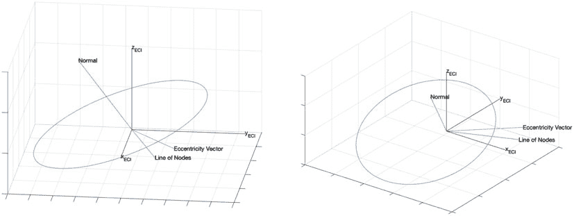

CHAPTER 12

ORBIT DETERMINATION

每种表示法都使用六个独立变量来描述轨道，加上 *μ*。两者都在图 12.3 中显示。

开普勒元素的定义如下：两个元素定义椭圆轨道。

轨道的大小由半长轴 *a* 决定，它是近地点半径和远地点半径的平均值。轨道的大小和形状由偏心率，*e* 定义。

两个元素定义轨道平面。Ω 是经度，即升交点的赤经，或参考系中 +xECI 轴到轨道平面与 *xy*-平面相交线的角度。*i* 是倾角，是 xECIyECI 平面与轨道平面之间的角度。*ω* 是近地点角距，是轨道平面内升交点线与近地点（轨道最接近中心天体处）之间的角度。*ν* 是真近点角，是近地点与航天器之间的角度。

平均偏差 *M* 可以用来代替 *ν*。*M* 或 *ν* 告诉我们航天器在其轨道上的位置。总之，开普勒元素是

⎡

⎤

*a*

⎢

⎢ *i* ⎥

⎢

⎥

⎥

*x* = ⎢ Ω

⎢

⎥

(12.9)

⎢ *ω* ⎥

⎣

⎥

*e* ⎦

*M*

轨道周期，以秒为单位，是

*a* 3

*P* = 2 *π*

*μ*

(12.10)

轨道参数，以距离单位（通常为公里）表示，是 *p* = *a*(1 *− e*)(1 + *e*)

(12.11)

**图 12.3：** 从两个视角的轨道元素。

*The underlying plot was drawn using*

DrawEllipticOrbit *.*

239

CHAPTER 12

ORBIT DETERMINATION

平面内的位置和速度是

⎡

⎤

*p*

cos *ν*

*rp* =

⎣ sin *ν* ⎦

1 + *e* cos *ν*

(12.12)

0

⎡

⎤

*μ*

*−* sin *ν*

*vp* =

⎣ *e* + cos *ν* ⎦

*p*

(12.13)

0

从平面到三维坐标的变换矩阵是

⎡

⎤

cos Ω cos *ω −* sin Ω sin *ω* cos *i −* cos Ω sin *ω −* sin Ω cos *ω* cos *i* sin Ω sin *i*

*c* = ⎣ sin Ω cos *ω* + cos Ω sin *ω* cos *i −* sin Ω sin *ω* + cos Ω cos *ω* cos *i −* cos Ω sin *i* ⎦

sin *ω* sin *i*

cos *ω* sin *i*

cos *i*

(12.14)

那就是说

*r* = *crp*

(12.15)

*v* = *cvp*

(12.16)

为了创建神经网络，我们将查看倾角，*i* = 0，和升交点，Ω = 0 的轨道。变换矩阵简化为绕 *z* 轴的旋转。

⎡

⎤

cos *ω −* sin *ω* 0

*c* = ⎣ sin *ω*

cos *ω* 0 ⎦

(12.17)

0

0 1

我们现在想要将轨道向前传播。有两种不同的方法可以实现这一点。一种方法是使用开普勒传播，其中我们保持五个元素不变，并以恒定的速率 *n* = 

*μ/a* 3\.

在每个时间点，我们可以将六个轨道元素集转换为新的位置和速度。这种方法虽然有限，因为它假设轨道遵循开普勒轨道。第二种方法，它为我们提供了更多的灵活性，用于处理如推力和阻力等外部力，是对运动方程的动态方程进行数值积分。轨道传播的状态方程是

*r*

˙ *v* = *−μ*

+ *a*

*|r|* 3

(12.18)

˙ *r* = *v*

(12.19)
