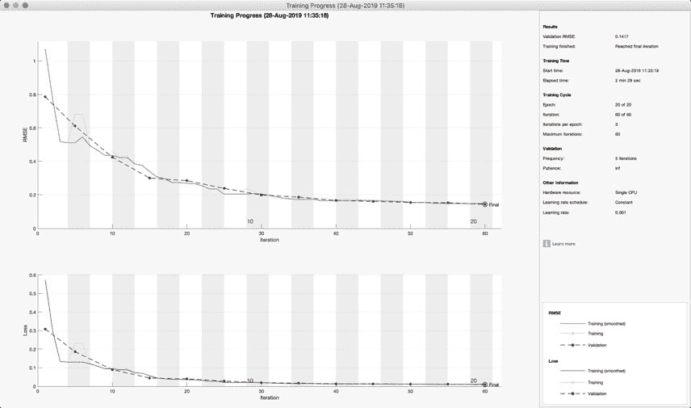
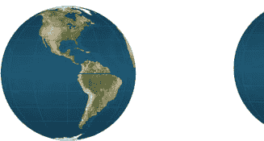
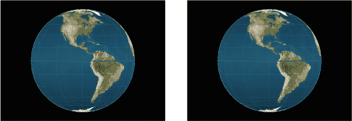
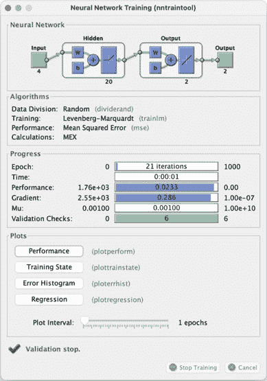
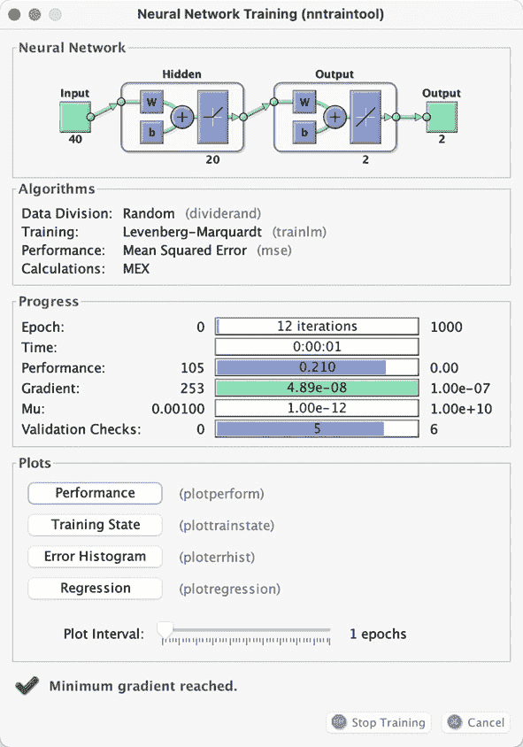
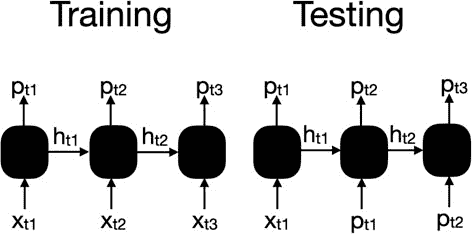
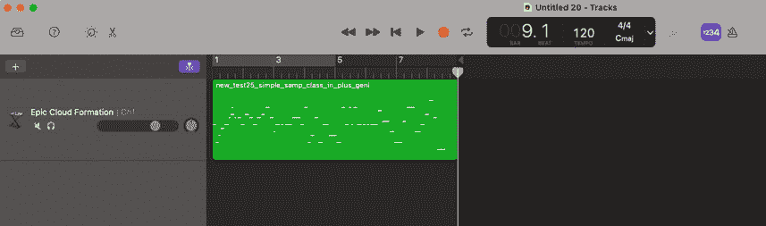
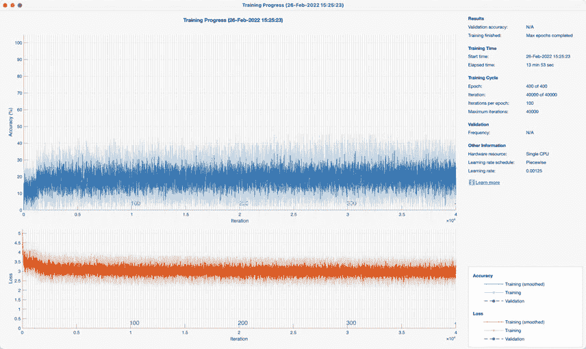
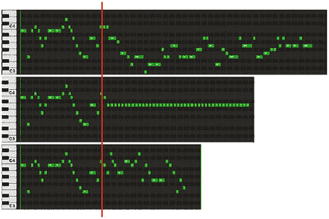

速度导数方程右侧的项是点质量重力加速度以及额外的加速度 *a*。这已在 RHSOrbit 中实现。

240

第十二章

轨道确定

***RHSOrbit.m***

16

**函数** xDot = RHSOrbit(˜,x,d)

17

18

r

= x(1:2);

19

v

= x(3:4);

20

xDot

= [v;-d.mu*r/(r'*r)ˆ1.5 + d.a];

我们将创建一个脚本，模拟多个轨道。模拟将使用 RHSOrbit。

轨道生成脚本的第一个部分设置随机轨道元素。

***Orbits.m***

1

%% 生成仅角度元素估计的轨道

2

% 保存名为 OrbitData 的 mat 文件。

5

6

nEl

= 500;

% 数据集数量

7

d

= struct;

% 初始化

8

d.mu

= 3.98600436e5; % 引力参数，kmˆ3/sˆ2

9

d.a

= [0;0];

% 扰动加速度

10

11

% 随机元素

12

e

= 0.6***rand**(1,nEl);

% 偏心率

13

a

= 8000 + 1000***randn**(1,nEl); % 半长轴

14

M

= 0.25***pi*****rand**(1,nEl);

% 平均经度

下一个部分运行模拟并保存角度。每个模拟有 2000 步，每步两秒。我们只使用每十个点中的一个来进行轨道确定。

我们保存轨道元素以测试神经网络。我们没有应用任何外部加速度。我们本可以使用开普勒传播，但通过模拟轨道，我们有研究神经网络在扰动下表现如何的选项。

16

% 设置模拟

17

nSim

= 2000; % 模拟步数

18

dT

= 2; % 时间步长

19

20

% 只使用一些模拟步骤

21

jUse

= 1:10:nSim;

22

23

% 深度学习数据

24

data

= **cell**(nEl,1);

25

26

%% 模拟每个轨道

27

x

= **zeros**(4,nSim);

28

t

= (0:(nSim-1))*dT;

29

el(nEl) = struct('a',7000,'e',0); % 初始化结构体数组

30

31

**for** k = 1:nEl

32

[r,v] = El2RV([a(k) 0 0 0 e(k) M(k)]);

33

x

= [r(1:2);v(1:2)];

34

xP

= **zeros**(4,nSim);

241

第十二章

轨道确定

35

**for** j = 1:nSim

36

xP(:,j) = x;

37

x

= RungeKutta( @RHSOrbit, 0, x, dT, d );

38

**end**

39

data{k} = **atan2**(xP(2,jUse),xP(1,jUse));

40

el(k).a = a(k);

41

el(k).e = e(k);

42

**end**

最后部分绘制了轨道并将数据保存到文件中。

44

%% 保存深度学习算法

45

**save**('OrbitData','data','el');

46

47

%% 绘图

48

[t, tL] = TimeLabel(t(jUse));

49

**angle**

= data{k}(1,:);

50

PlotSet(t, **angle**,'x label', tL,'y label','角度 (rad)','figure title','

Angle');

51

PlotSet(xP(1,:),xP(2,:),'x label', 'x (km)','y label','y (km)','figure title','Orbit');

最后一个轨道显示在图 12.4 中。角度的跳跃是由于角度是从 *−π* 到 + *π* 定义的。我们可以使用 unwrap 来消除这个跳跃。我们只测量轨道的一部分。我们可以设置模拟来测量轨道的任何部分，甚至多个轨道。

2000

4

3

0

2

-2000

1

-4000

0

y (km)

-6000

角度 (rad) -1

-8000

-2

-10000

-3

-12000

-40

5

10

15

20

25

30

35

-8000

-7500

-7000

-6500

-6000

-5500

-5000

-4500

x (km)

时间 (min)

**图 12.4:** *最后一个测试轨道。测量的角度在右侧。这些仅显示用于轨道确定的* *数据* *。

242

第十二章

轨道确定

**12.3**

**训练和测试**

**12.3.1 问题**

我们希望构建一个深度学习系统，从角度测量中计算轨道的偏心率和半长轴。近地点的经度将被假定为零。

**12.3.2 解决方案**

轨道历史是一系列角度的时间序列。我们将以均匀的时间间隔取角度。我们将使用 fitnet 来拟合数据，这会创建一个具有指定隐藏层大小和训练函数的函数拟合神经网络。

**12.3.3 它是如何工作的**

我们从 mat 文件中加载数据并将其分为训练集和测试集。

***OrbitNeuralNet.m***

1

%% 训练和测试轨道神经网络

4

5

s

= **加载**('OrbitData');

6

n

= **长度***(s.data);

7

nTrain

= **向下取整***(0.9*n);

8

9

%% 设置训练集和测试集

10

kTrain

= **随机排列***(n,nTrain);

11

sTrain

= s.data(kTrain);

12

nSamp

= **尺寸***(sTrain{1},2);

13

xTrain

= **零矩阵***(nSamp,nTrain);

14

aMean

= **均值***([s.el(:).a]);

15

16

**for** k = 1:nTrain

17

xTrain(:,k) = sTrain{k}(1,:);

18

**end**

19

20

elTrain

= s.el(kTrain);

21

yTrain

= [elTrain.a;elTrain.e];

22

yTrain(1,:) = yTrain(1,:)/aMean; % 数据归一化

23

kTest

= setdiff(1:n,kTrain);

24

sTest

= s.data(kTest);

25

nTest

= n-nTrain;

26

xTest

= **零矩阵***(nSamp,nTest);

27

**for** k = 1:nTest

28

xTest(:,k) = sTest{k}(1,:);

29

**end**

30

31

elTest

= s.el(kTest);

32

yTest

= [elTest.a;elTest.e];

33

yTest(1,:) = yTest(1,:)/aMean;

243

章节十二

ORBIT DETERMINATION

神经网络将使用角度序列及其相关时间作为输入。输出将是两个轨道元素：半长轴和偏心率。一般来说，如果我们知道轨道上某点的位置和速度，我们总能计算出轨道元素。

这是在 El2RV 函数中完成的。实际上，神经网络将仅从角度推断位置和速度。

我们使用 fitnet 训练网络，并在脚本中将其与 cascadeforw ardnet 和 feedforwardnet 进行比较。请注意，我们归一化了半长轴，使其大小与偏心率相同。这提高了拟合效果。

35

%% 训练网络

36

net

= fitnet(10);

37

38

net

= configure(net, xTrain, yTrain);

39

net.name

= 'Orbit';

40

net

= train(net,xTrain,yTrain);

我们使用测试数据来测试网络。

42

%% 测试网络

43

yPred

= sim(net,xTest);

44

yPred(1,:) = yPred(1,:)*aMean;

45

yTest(1,:) = yTest(1,:)*aMean;

46

yM

= **mean**(yPred-yTest,2);

47

yTM

= **mean**(yTest,2);

48

**fprintf**('\nFit Net\n');

49

**fprintf**('平均半长轴误差 %12.4f (km) %12.2f %%\n',yM(1),100*

**abs**(yM(1))/yTM(1));

50

**fprintf**('平均偏心率

error %12.4f

%12.2f %%\n',yM(2),100*

**abs**(yM(2))/yTM(2));

51

52

%% 绘制结果

53

新图('使用 Fitnet 的预测')

54

**subplot**(2,1,1)

55

**bar**(1:nTest,[yPred(1,:);yTest(1,:)]);

56

**ylabel**('a')

57

**legend**('Predicted','True')

58

**subplot**(2,1,2)

59

**bar**(1:nTest,[yPred(2,:);yTest(2,:)]);

60

**ylabel**('e')

61

**legend**('Predicted','True')

结果对于 fitnet 最佳。然而，每次运行的结果可能会有所不同。

>> OrbitNeuralNet

Fit Net

平均半长轴误差

31.9872 (km)

0.41 %

平均偏心率

error

0.0067

2.48 %

244

第十二章

轨道确定

级联前馈网络

平均半长轴误差

-89.8603 (km)

1.15 %

平均偏心率

error

-0.0100

3.74 %

前馈网络

平均半长轴误差

40.2986 (km)

0.52 %

平均偏心率

error

0.0001

0.03 %

图 12.5,、图 12.6,和图 12.7 展示了测试结果。半长轴和偏心率的结果都相当不错。您可以尝试不同的数据范围和不同的采样间隔进行实验。

我们随后使用 cascadeforwardnet 训练网络。代码除了函数名之外没有变化。

64

%% 训练级联前馈网络

65

net

= cascadeforwardnet(10);

66

net

= configure(net, xTrain, yTrain);

67

net.name

= 'Orbit';

68

net

= train(net,xTrain,yTrain);

我们最终使用前馈网络进行训练。

92

%% 训练前馈网络

93

net

= feedforwardnet(10);

94

net

= configure(net, xTrain, yTrain);

95

net.name = 'Orbit';

96

net

= train(net,xTrain,yTrain);

12000

预测值

10000

True

8000

a 6000

4000

2000

0

5

10

15

20

25

30

35

40

45

50

0.6

预测值

0.5

True

0.4

e 0.3

0.2

0.1

0

5

10

15

20

25

30

35

40

45

50

**图 12.5：** *使用 fitnet 的测试结果。*

245

第十二章

轨道确定

12000

预测值

10000

True

8000

a 6000

4000

2000

0

5

10

15

20

25

30

35

40

45

50

0.6

预测值

True

0.4

e 0.2

0

-0.2

5

10

15

20

25

30

35

40

45

50

**图 12.6：** *使用级联前馈网络* cascadeforwardnet *的测试结果。*

12000

预测值

10000

True

8000

a 6000

4000

2000

0

5

10

15

20

25

30

35

40

45

50

0.6

预测值

True

0.4

e 0.2

0

-0.2

5

10

15

20

25

30

35

40

45

50

**图 12.7：** *使用 feedforwardnet*的测试结果。

246

**第十二章**

轨道确定

当真实偏心率接近零时，前馈网络和级联前馈网络都会产生负偏心率。

**12.4**

**实现 LSTM**

**12.4.1 问题**

我们希望构建一个长短期记忆神经网络（LSTM）来估计轨道元素。LSTM 在之前的章节中已经演示过。LSTM 可以从测量序列中学习，这应该有利于轨道确定。它们是之前显示的函数的替代方案。

**12.4.2 解决方案**

轨道历史是角度的时间序列。我们将使用双向 LSTM 来拟合数据。我们将以均匀的时间间隔取角度。

**12.4.3 如何工作**

脚本是 OrbitLSTM.m。我们从 mat 文件中加载数据，并将其分为训练集和测试集。数据格式与前馈网络不同。xTrain 是一个单元数组，但 yTrain 是一个矩阵，其中每一行对应于 xTrain 中的每个单元数组。

***OrbitLSTM.m***

1

%% 训练和测试轨道 LSTM 的脚本

2

% 它将从 3 个角度测量中估计轨道半长轴和偏心率。

% 角度测量的时间序列。

8

s

= **load**('OrbitData');

9

n

= **length**(s.data);

10

nTrain

= **floor**(0.9*n);

11

12

%% 设置训练和测试集

13

kTrain

= **randperm**(n,nTrain);

14

aMean

= **mean**([s.el(:).a]);

15

xTrain

= s.data(kTrain);

16

nTest

= n-nTrain;

17

18

elTrain

= s.el(kTrain);

19

yTrain

= [elTrain.a;elTrain.e]';

20

yTrain(:,1) = yTrain(:,1)/aMean;

21

kTest

= setdiff(1:n,kTrain);

22

xTest

= s.data(kTest);

23

24

elTest

= s.el(kTest);

25

yTest

= [elTest.a;elTest.e]';

26

yTest(:,1)

= yTest(:,1)/aMean;

247

第十二章

轨道确定

我们使用 trainNetwork 函数来训练网络。

28

%% 使用验证数据训练网络

29

numFeatures

= 1;

30

numHiddenUnits1 = 100;

31

numHiddenUnits2 = 100;

32

numClasses

= 2;

33

34

layers = [ ...

35

sequenceInputLayer(numFeatures)

36

bilstmLayer(numHiddenUnits1,'OutputMode','sequence')

37

dropoutLayer(0.2)

38

bilstmLayer(numHiddenUnits2,'OutputMode','last')

39

fullyConnectedLayer(numClasses)

40

regressionLayer]

41

42

maxEpochs = 20;

43

44

options = trainingOptions('adam', ...

45

'ExecutionEnvironment','cpu', ...

46

'GradientThreshold',1, ...

47

'MaxEpochs',maxEpochs, ...

48

'Shuffle','every-epoch', ...

49

'ValidationData',{xTest,yTest}, ...

50

'ValidationFrequency',5, ...

51

'Verbose',0, ...

52

'Plots','training-progress');

53

54

net = trainNetwork(xTrain,yTrain,layers,options);

options 提供了验证数据（在这个例子中与测试数据相同，为了简化）。注意验证数据所需的单元数组。

'ValidationData',{xTest,yTest}, ...

'ValidationFrequency',5, ...

我们对数据进行打乱。这通常可以提高结果，因为学习算法在每个 epoch 中看到的数据顺序不同。我们使用测试数据来测试网络。predict 显示了由测试数据产生的结果。这是学习过程中用于验证的相同数据。

56

%% 测试网络

57

yPred

= predict(net,xTest);

58

yPred(:,1) = yPred(:,1)*aMean;

59

yTest(:,1) = yTest(:,1)*aMean;

60

yM

= **mean**(yPred-yTest,1);

61

**fprintf**('\nbiLSTM\n');

62

**fprintf**('平均半长轴误差 %12.4f (km)\n',yM(1)); 63

**fprintf**('平均偏心率

error %12.4f\n',yM(2));

248

第十二章

轨道确定

结果如下所示：

>> OrbitLSTM

layers =

带有如下层的 6x1 层数组：

1

''

序列输入

带有 1 个维度的序列输入

2

''

BiLSTM

带有 100 个隐藏单元的 BiLSTM

3

''

Dropout

20% dropout

4

''

BiLSTM

带有 100 个隐藏单元的 BiLSTM

5

''

全连接

2 fully connected layer

6

''

回归输出

mean-squared-error

biLSTM

平均半长轴误差

-63.4780 (km)

平均偏心率

error

0.0024

我们使用两个 BiLSTM 层，层间有 20%的 dropout。dropout 移除神经元，有助于防止过拟合。过拟合是指结果与特定数据集过于接近。这使得训练好的网络难以在新数据中识别模式。第一个 BiLSTM 层产生一个序列作为其输出。第二个 BiLSTM 层的

‘OutputMode’设置为‘last’。numClasses 是 2，因为我们正在估计两个参数。全连接层将两个 BiLSTM 输出连接到回归层中我们想要识别的两个参数。训练窗口如图 12.8 所示。**图 12.8：** *训练窗口.*

249

**第十二章**

**轨道确定**

可以继续训练更多的轮次，因为均方根误差（RMSE）仍在改善。

这组特定的层是为了向您展示如何构建一个神经网络。这绝对不是这个问题的“最佳”架构。我们确实尝试了一个单一的 LSTM 层，但发现一个单一的 BiLSTM 层效果更好。

图 12.9 显示了测试结果。结果并不像之前给出的前馈网络那样好。我们只使用了两层。从第十一章中，您可以看到在实际应用中部署的网络可以有数十层，甚至数百层。这种差异是由于 LSTM 中的神经元数量较少。您可以尝试调整这个网络以改善结果。

在本章中，我们比较了两种解决轨道确定问题的方法。使用 MATLAB 前馈网络比我们实现的 LSTM 网络效果略好。我们固定了近地点的偏心角以使问题更容易。下一步将是尝试找到完整的轨道元素集，然后尝试设计一个从地球上的固定点工作的系统。在后一种情况下，我们需要考虑地球的旋转。另一个改进是取不同时间步长的测量值。对于椭圆轨道，在近地点进行多次测量比在远地点更有成效，因为航天器移动得更快。可以编写一个预处理程序，根据相对于时间的变化角选择我们神经网络输入。使用算法方法的轨道确定系统也可以计算观测者位置的误差。您还可以尝试其他测量，例如距离和距离率。这些测量用于深空和地球同步轨道航天器。

12000

预测值

10000

True

8000

a 6000

4000

2000

0

5

10

15

20

25

30

35

40

45

50

0.6

预测值

0.5

True

0.4

e 0.3

0.2

0.1

0

5

10

15

20

25

30

35

40

45

50

**图 12.9：** *使用双向 LSTM 的测试结果.*

250

**第十三章**

**地球传感器**

**13.1**

**引言**

地球传感器是早期航天器传感器之一。许多早期卫星用于通信或地球观测，因此最重要的是将卫星指向地球，即消除滚转和俯仰误差。在许多情况下，偏航误差并不重要或可以通过卫星的动量来控制。地球传感器要么是静态的，没有运动部件，要么是扫描式的。扫描是通过旋转卫星、旋转带有电机的镜子或旋转带有扭力杆的镜子来完成的。大多数传感器在红外波长范围内工作，因为在该波长范围内的辐射比可见光波段更均匀，且不受日食的影响。许多 CubeSats 使用静态地球传感器，因为它们简单、紧凑且成本低。有各种各样的型号可供选择。

本章将探讨如何使用神经网络从任何静态地球传感器生成滚转和俯仰角度。图 13.1 显示了从理想地球指向的小角度姿态（也称为方向）几何形状。滚转是关于 x 轴，俯仰是关于 y 轴。

图 13.2 显示了静态地球传感器的工作原理。左侧的图像显示了地球传感器元件，由围绕地球边缘的圆圈表示。滚转和俯仰角度为零。每个元件都看到地球的一部分和空间的一部分，因此它们都会产生相同的信号。右侧的图片显示了具有滚转和俯仰角度的传感器。一些元件只看到空间，一些只看到地球，一些同时看到地球和空间，但它们的输出将与零角度情况不同。通过比较传感器的输出，我们得到滚转和俯仰的测量值。传感器在二氧化碳波段看到光，波长约为 14 微米，因此地球看起来是均匀的。元件产生的电压与它们的温度成正比。

20 世纪 60 年代的静态地球传感器具有从传感器输出到滚转和俯仰的逻辑。考虑到硬件限制，算法相当简单。我们将开发一个能够完成这项工作的神经网络。

© Michael Paluszek, Stephanie Thomas, Eric Ham 2022

251

M. Paluszek 等人，*《实用的 MATLAB 深度学习》*，

[`doi.org/10.1007/978-1-4842-7912-0 13`](https://doi.org/10.1007/978-1-4842-7912-0 13)

第十三章

地球传感器

**滚转**

**俯仰**

Z

Z

滚转

俯仰

Z

Z

X

X

X

X

旋转轴

Y

Y

Y

旋转轴

Y

瞄准线

瞄准线

X

X

Y

Y

**图 13.1：** *显示滚转和俯仰的姿态几何形状。*

**图 13.2：** *静态地球传感器操作。圆圈代表传感器元件。左侧显示了* *零滚转和俯仰的几何形状。右侧显示了非零滚转和俯仰角度的几何形状。*

*当角度变化时，看到地球的传感器部分会发生变化。*

252

第十三章

地球传感器

**13.2**

**线性输出地球传感器**

**13.2.1 问题**

我们想要模拟一个线性输出、多元素地球传感器的输出。该传感器有多个热传感器，根据它们的温度产生输出。最大值是当传感器只看到地球时。最小值是当传感器看到太空时。

**13.2.2 解决方案**

使用 MATLAB 的 polyshape 和 intersect 函数来模拟元素。

**13.2.3 它是如何工作的**

我们创建的函数是 StaticEarthSensor。如果没有输入，函数的前一部分要么运行内置的示例，要么返回默认的数据结构。如果没有请求输出，它会运行示例。

***StaticEarthSensor.m***

1

%% STATICEARTHSENSOR 静态地球传感器模型

30

**函数** y = StaticEarthSensor(q,r,d)

31

32

% 示例

33

**如果**（ **nargin** < 1 ）

34

**如果**（ **nargout** == 0 ）

35

示例

36

**否则**

37

y = DefaultDataStructure;

38

**结束**

39

**返回**

40

**结束**

代码将地球的位置转换到传感器的焦平面。它假设一个针孔相机。代码接受一个输入姿态四元数并将其转换为传感器元素的位置。四元数是一个四元素集，它定义了一个参考系相对于另一个参考系的取向。四元数只是表示取向的一种方式。三乘三（3 *×* 3）旋转矩阵和欧拉角是表示姿态的其他方式。第七章提供了关于四元数的更多信息。

***StaticEarthSensor.m***

42

% 从 ECI 到传感器框架的四元数

43

qECIToSensor

= QMult(q,d.qBodyToSensor);

44

45

uNadir

= QForm(qECIToSensor,Unit(r));

46

cEarth

= d.fL*uNadir(1:2);

47

48

% 行星角宽度

253

CHAPTER 13

EARTH SENSORS

49

ang

= **asin**(d.rPlanet/Mag(r));

50

r

= d.fL***sin**(ang);

51

52

% Cycle through all the elements

53

nP

= **length**(d.az);

54

poly

= **cell**(1,nP);

55

a

= **zeros**(1,nP);

56

57

**if**( d.pAng(1) == 0 )

58

p

= d.p;

59

**else**

60

p

= d.fL*SinD(d.pAng);

61

**end**

62

63

**for** k = 1:nP

64

az

= d.az(k);

65

el

= d.el(k);

66

rP

= d.fL*[**cos**(az); **sin**(az)]***sin**(el);

67

c

= [**cos**(az) -**sin**(az); **sin**(az) **cos**(az)]; 68

pK

= rP + c*p;

69

[a(k), poly{k}] = EarthSensorElement(r,d.n,pK,cEarth);

70

**end**

71

72

% Convert from area to output (linear model)

73

y = a/d.scale;

The last line scales the area, producing the output that is linear to the illuminated area.

If no outputs are requested, it draws the sensor. The center circle is the planet, and the sensor elements are superimposed. The sensor elements can be any polygon.

***StaticEarthSensor.m***

75

% Default output

76

**if**( **nargout** < 1 )

77

r

= Mag(r);

78

a

= **linspace**(0,2***pi**-2***pi**/d.n,d.n);

79

x

= r***cos**(a) + cEarth(1);

80

y

= r***sin**(a) + cEarth(2);

81

planet = polyshape(x,y);

82

83

NewFig('Earth Sensor')

84

**plot**(planet)

85

**hold** on

86

**for** k = 1:nP

87

**plot**(**poly**{k})

88

**end**

89

**grid** on

90

**axis image**

91

**end**

254

CHAPTER 13

EARTH SENSORS

The function has a default data structure to help the user. It is for an eight-element sensor.

***StaticEarthSensor.m***

99

%% StaticEarthSensor>DefaultDataStructure

100

**function** d = DefaultDataStructure

101

102

d.n

= 40;

103

d.p

= [1 1 -1 -1;1 -1 -1 1];

104

d.pAng

= **zeros**(2,4);

105

d.az

= 0:**pi**/4:2***pi**-**pi**/4;

106

d.el

= (**pi**/20)***ones**(1,8);

107

d.rPlanet

= 6378.165;

108

d.fL

= 50;

109

d.qBodyToSensor = [1;0;0;0];

110

d.scale

= 1;

生成输出的代码位于子函数 EarthSensorElement 中。它使用 polyshape 和 intersect。多边形类是表示多边形的一种非常有用的方式。MATLAB 有许多用于多边形的功能。

***StaticEarthSensor.m***

112

%% StaticEarthSensor>EarthSensorElement

113

**function** [a,poly1] = EarthSensorElement(r,n,p,c)

114

115

poly1 = polyshape(p(1,:),p(2,:));

116

a

= **linspace**(0,2***pi**-2***pi**/n,n);

117

118

x

= r***cos**(a) + c(1);

119

y

= r***sin**(a) + c(2);

120

121

poly2 = polyshape(x,y);

122

poly3 = intersect(poly1,poly2);

123

124

a

= area(poly3);

内置演示产生了一个八元素静态地球传感器，如默认数据中的 az 和 el 字段中的元素数量所示。

***StaticEarthSensor.m***

93

%% StaticEarthSensor>Demo

94

**function** Demo

95

d

= StaticEarthSensor;

96

r

= [0;0;42167];

97

StaticEarthSensor([1;0;0;0],r,d);

地球传感器如图 13.3 所示。

255

CHAPTER 13

EARTH SENSORS

8

6

4

2

0

-2

-4

-6

-8

-8

-6

-4

-2

0

2

4

6

8

**Figure 13.3:** *Static Earth sensor from the built-in demo.*

**13.3**

**Segmented Earth Sensor**

**13.3.1 Problem**

我们想要模拟分段多元素地球传感器的输出。如图 13.4 所示，

这意味着每个边缘测量传感元件是一个数组，而不是像之前食谱中那样是一个单独的传感器；这允许地球的边缘与数组一起定位。

**13.3.2 Solution**

使用 MATLAB 的 polyshape 和 intersect 函数来模拟元素。

**13.3.3 How It Works**

用于多元素传感器的函数，SegmentedEarthSensor，与线性传感器模型非常相似。我们仍然会描述所有的代码。函数的前一部分要么运行一个内置的演示，要么返回默认的数据结构。

***SegmentedEarthSensor.m***

1

%% SEGMENTEDEARTHSENSOR Earth sensor model

28

**function** y = SegmentedEarthSensor(q,r,d)

29

30

% Demo

31

**if**( **nargin** < 1 )

32

**if**( **nargout** == 0 )

33

Demo

256

CHAPTER 13

EARTH SENSORS

50

40

30

20

10

0

-10

-20

-30

-40

-50

-50

0

50

**Figure 13.4:** *Segmented Earth sensor from the built-in demo.*

34

**else**

35

y = DefaultDataStructure;

36

**end**

37

**return**

38

**end**

函数体将地球的位置转换到传感器的焦平面。

它假设了一个针孔相机。代码接受一个输入姿态四元数并将其转换为传感器元件的位置。如果某个部分被照亮，则返回该元件的一个值。否则，返回零。

***SegmentedEarthSensor.m***

40

qECIToSensor

= QMult(q,d.qBodyToSensor);

41

42

uNadir

= QForm(qECIToSensor,Unit(r));

43

cEarth

= d.fL*uNadir(1:2);

44

45

% 行星角宽度

46

ang

= **asin**(d.rPlanet/Mag(r));

47

r

= d.fL***sin**(ang);

48

49

% 遍历所有元件

50

nP

= **length**(d.az);

51

**poly**

= **cell**(1,nP);

52

y

= **zeros**(1,nP);

257

第十三章

地球传感器

53

54

**for** k = 1:nP

55

az

= d.az(k);

56

el

= d.el(k);

57

rP

= [**cos**(az); **sin**(az)]*el;

58

c

= [**cos**(az) -**sin**(az); **sin**(az) **cos**(az)]; 59

pK

= rP + c*d.p;

60

[y(k), **poly**{k}] = EarthSensorElement(r,d.n,pK,cEarth);

61

**end**

62

63

y(y > 0) = 1;

如果没有请求输出，它将绘制传感器。

***SegmentedEarthSensor.m***

65

% 默认输出

66

**if**( **nargout** < 1 )

67

r

= Mag(r);

68

a

= **linspace**(0,2***pi**-2***pi**/d.n,d.n);

69

x

= r***cos**(a) + cEarth(1);

70

y

= r***sin**(a) + cEarth(2);

71

行星

= polyshape(x,y);

72

73

NewFig('Earth Sensor')

74

**plot**(planet)

75

**hold** on

76

**for** k = 1:nP

77

**plot**(**poly**{k})

78

**end**

79

**grid** on

80

**axis image**

81

**end**

该函数有一个默认的数据结构来帮助用户。它是为四个十元素传感器设计的。

***SegmentedEarthSensor.m***

90

**function** d = DefaultDataStructure

91

92

d.n

= 40;

93

d.nSeg

= 10;

94

d.p

= [

1

1

-1

-1

95

1

-1

-1

1];

96

d.az

= [**zeros**(1,10) (**pi**/2)***ones**(1,10) **pi*****ones**(1,10), (3***pi**

/2)***ones**(1,10)];

97

d.fL

= 50;

98

el

= (0:2:18) + d.fL - 12;

99

d.el

= [el el el el];

100

d.rPlanet

= 6378.165;

101

d.qBodyToSensor = [1;0;0;0];

258

CHAPTER 13

EARTH SENSORS

再次，生成输出的核心代码位于子函数 EarthSensorElement 中。该函数使用 polyshape 和 intersect。

***SegmentedEarthSensor.m***

103

%% StaticEarthSensor>EarthSensorElement

104

**函数** [a,poly1] = EarthSensorElement(r,n,p,c)

105

106

poly1 = polyshape(p(1,:),p(2,:));

107

108

a

= **linspace**(0,2**pi**-2**pi**/n,n);

109

x

= r**cos**(a) + c(1);

110

y

= r**sin**(a) + c(2);

111

112

poly2 = polyshape(x,y);

113

poly3 = intersect(poly1,poly2);

114

115

a

= area(poly3);

内置演示生成了一个包含四个集合、十个元素的分段地球传感器。

***SegmentedEarthSensor.m***

83

%% StaticEarthSensor>Demo

84

**函数** Demo

85

d

= SegmentedEarthSensor;

86

r

= [0;0;6700];

87

SegmentedEarthSensor([1;0;0;0],r,d);

分段地球传感器如图 13.4. 所示

**13.4**

**线性输出传感器神经网络**

**13.4.1 问题**

我们希望有一个模型，可以将多个探测器输出的线性传感器信号转换为俯仰和横滚测量值。这些传感器是能够看到地球边缘的辐射探测器。

**13.4.2 解决方案**

使用前馈神经网络。

**13.4.3 工作原理**

脚本的第一部分，NNEarthSensor.m，生成训练数据。它调用 ISS

通过轨道获取国际空间站（ISS）的凯普勒轨道元素。然后从 StaticEarthSensor 获取默认数据结构。脚本然后将轨道元素转换为位置和速度矢量，使用 RVOrbGen 计算，并从地球中心惯性坐标系（ECI）到局部垂直局部水平（LVLH）的欧拉角，这是正常的地球指向姿态。

259

CHAPTER 13

EARTH SENSORS

***NNEarthSensor.m***

1

%% 使用神经网络演示 LEO 静态地球传感器。

2

% The neural network is trained using known roll and pitch.

3

4

degToRad

= **pi**/180;

5

rE

= Constant('equatorial radius earth');

6

[el,jD0]

= ISSOrbit;

7

d

= StaticEarthSensor;

8

[r,v,t]

= RVOrbGen(el);

9

rMean

= **mean**(Mag(r));

10

qECIToLVLH

= QLVLH(r,v);

11

d.el

= 64**ones**(1,4)*degToRad;

12

d.az

= [0 **pi**/2 **pi** 3**pi**/2] + **pi**/4;

13

d.pAng

= 4*[

1

1

-1

-1

14

1

-1

-1

1];

15

16

n

= 20;

17

roll

= **linspace**(-6,6,n);

18

pitch

= **linspace**(-6,6,n);

19

i

= 1;

20

y

= **zeros**(4,n*n);

21

x

= **zeros**(2,n*n);

22

23

StaticEarthSensor(qECIToLVLH(:,1),r(:,1),d)

24

25

**for** j = 1:n

26

**for** k = 1:n

27

rJ

= roll(j);

28

pK

= pitch(k);

29

mRoll

= [1 0 0;0 CosD(rJ) -SinD(rJ);0 SinD(rJ) CosD(rJ)];

30

mPitch

= [CosD(pK) 0 -SinD(pK);0 1 0;SinD(pK) 0 CosD(pK)];

31

qLVLHToBody = Mat2Q(mRoll*mPitch);

32

qECIToBody

= QMult(qECIToLVLH(:,1),qLVLHToBody);

33

34

y(:,i)

= StaticEarthSensor(qECIToBody,r(:,1),d);

35

x(:,i)

= [roll(j);pitch(k)];

36

i

= i + 1;

37

**end**

38

**end**

我们随后创建一个四元素地球传感器模型，用默认字段替换 d 中的字段。这一行代码绘制了传感器：

***NNEarthSensor.m***

23

StaticEarthSensor(qECIToLVLH(:,1),r(:,1),d)

260

CHAPTER 13

EARTH SENSORS

剩余的代码通过输入不同的翻滚和俯仰角度，并将结果传感器元素值保存到 y 中来创建训练数据。第二部分训练前馈神经网络。首先创建神经网络数据结构。然后通过传递输入和输出配置它。train 训练网络。sim 模拟神经网络。变量 net 在每次函数调用时都会更新。

***NNEarthSensor.m***

40

% 神经网络训练

41

net = feedforwardnet(20); % 生成神经网络结构

42

net = configure( net, y, x ); % 根据输入和输出配置

44

net.layers{1}.transferFcn = 'poslin'; % 设置为 purelin

45

net.name

= 'Earth Sensor';

46

net

= train(net,y,x); % 训练网络

47

c

= sim(net,y); % 模拟神经网络

接下来的几行绘制输入和模拟输出。

***NNEarthSensor.m***

48

leg

= {'True' 'Neural Net'};

49

50

PlotSet(1:**size**(c,2),[x;c],'x label','Set',...

51

'y 标签',{'Roll' 'Pitch'},'figure title','Neural Network',...

52

'plot set',{[1 3],[2 4]}' **图例**',{leg leg});

53

54

yL = {'Roll' 'Pitch' 'y_1' 'y_2' 'y_3' 'y_4'};

55

PlotSet(1:**size**(c,2),[x;y],'x label','Set','y label',yL,'神经网络数据')

最后的部分测试神经网络。

***NNEarthSensor.m***

57

%% 测试

58

n

= **length**(t);

59

roll

= 2;

60

pitch = 0;

61

c

= **zeros**(2,n);

62

**for** k = 1:n

63

rJ

= roll;

64

pK

= pitch;

65

mRoll

= [1 0 0;0 CosD(rJ) -SinD(rJ);0 SinD(rJ) CosD(rJ)];

66

mPitch

= [CosD(pK) 0 -SinD(pK);0 1 0;SinD(pK) 0 CosD(pK)];

67

qLVLHToBody = Mat2Q(mRoll*mPitch);

68

qECIToBody

= QMult(qECIToLVLH(:,k),qLVLHToBody);

261

第十三章

地球传感器

隐藏层大小为 20，激活函数为

4 个元素输入

poslin 激活函数

输出层大小为 2

线性激活函数

翻滚和俯仰输出

随机划分数据

进入训练和验证

性能指标

绘图选项。随时点击。

**图 13.5**：*训练窗口。此窗口提供有关训练过程的信息。我们已突出显示元素。*

69

y

= StaticEarthSensor(qECIToBody,r(:,k),d);

70

c(:,k)

= sim(net,y');

71

**end**

72

73

[t,tL]

= TimeLabl(t);

74

s

= **sprintf**('Roll = %8.2f deg Pitch = %8.2f deg',roll,pitch); 75

76

PlotSet(t,c,'x label',tL,'y label', {'Roll' 'Pitch'},'figure title',s) 图 13.5 显示了前馈训练 GUI。

网络的输出包含用于训练神经网络的全部参数。您可以通过编辑 net 来自定义所有内容，该 net 是由 feedforwardnet 创建的。

图 13.6 展示了神经网络的成果。左上角的图像是传感器。左下角显示了训练数据。右上角的图表显示了性能。

第十三章

地球传感器

**神经网络**

6

50

True

4

神经网络

40

2

0

30

滚转 -2

20

-4

10

-6

0

50

100

150

200

250

300

350

400

0

-10

6

4

-20

2

True

-30

神经网络

0

俯仰

-40

-2

-50

-4

-6

-50

0

50

0

50

100

150

200

250

300

350

400

普林斯顿卫星系统

设置

**神经网络数据**

5

2.1

0

滚转 -5

2.095

0

50

100

150

200

250

300

350

400

2.09

5

0

2.085

俯仰 -5

滚转

0

50

100

150

200

250

300

350

400

2.08

2.075

50

1

y

2.07

0

0

50

100

150

200

250

300

350

400

0

10

20

30

40

50

60

70

80

90

100

50

时间 (分钟)

2

y

0

0.032

0

50

100

150

200

250

300

350

400

0.03

50

0.028

3

y

0

0

50

100

150

200

250

300

350

400

0.026

俯仰 0.024

50

4

y

0

0.022

0

50

100

150

200

250

300

350

400

0.02

设置

0

10

20

30

40

50

60

70

80

90

100

普林斯顿卫星系统

时间 (分钟)

**图 13.6：** *地球传感器的结果。*

对于所有滚转和俯仰角度的组合。俯仰测量对于所有集合都非常干净。滚转在高滚转角度时退化，但在低滚转角度时也会根据俯仰的值显示错误。

**13.5**

**分段传感器神经网络**

**13.5.1 问题**

现在我们将把来自多个探测器的分段传感器输入转换为滚转和俯仰测量。

263

第十三章

地球传感器

**13.5.2 解决方案**

使用前馈神经网络。

**13.5.3 它是如何工作的**

代码与之前的方法非常相似。脚本的第一个部分，NN

SegmentedEarthSensor.m, 生成训练数据。

***NNSegmentedEarthSensor.m***

1

%% 使用神经网络演示 LEO 静态分段地球传感器

.

2

% 使用已知的滚转和俯仰进行神经网络训练。

3

4

degToRad

= **pi**/180;

5

rE

= Constant('equatorial radius earth');

6

[el,jD0]

= ISSOrbit;

7

d

= SegmentedEarthSensor;

8

[r,v,t]

= RVOrbGen(el);

9

rMean

= **mean**(Mag(r));

10

qECIToLVLH

= QLVLH(r,v);

11

n

= 20;

12

滚转

= **linspace**(-6,6,n);

13

音高

= **linspace**(-6,6,n);

14

i

= 1;

15

y

= **zeros**(40,n*n);

16

x

= **zeros**(2,n*n);

17

18

SegmentedEarthSensor(qECIToLVLH(:,1),r(:,1),d)

19

20

**for** j = 1:n

21

**for** k = 1:n

22

rJ

= roll(j);

23

pK

= pitch(k);

24

mRoll

= [1 0 0;0 CosD(rJ) -SinD(rJ);0 SinD(rJ) CosD(rJ)];

25

mPitch

= [CosD(pK) 0 -SinD(pK);0 1 0;SinD(pK) 0 CosD(pK)];

26

qLVLHToBody = Mat2Q(mRoll*mPitch);

27

qECIToBody

= QMult(qECIToLVLH(:,1),qLVLHToBody);

28

29

y(:,i)

= SegmentedEarthSensor(qECIToBody,r(:,1),d);

30

x(:,i)

= [roll(j);pitch(k)];

31

i

= i + 1;

32

**end**

33

**end**

264

第十三章

EARTH SENSORS

第二部分训练前馈神经网络。

***NNSegmentedEarthSensor.m***

35

% 神经网络训练数据

36

37

net

= feedforwardnet(20);

38

39

net

= configure( net, y, x );

40

net.layers{1}.transferFcn = 'poslin'; % purelin

41

net.name

= '地球传感器';

42

网络层

= train(net,y,x);

最后部分测试了神经网络。

***NNSegmentedEarthSensor.m***

44

%% 测试

45

c

= sim(net,y);

46

leg

= {'真' '神经网络'};

47

48

PlotSet(1:**size**(c,2),[x;c],'x 标签','集合',...

49

'y 标签',{'翻滚' '音高'},'图形标题','神经网络',...

50

'plot set',{[1 3],[2 4]},'legend',{leg leg});

51

52

yS = **zeros**(4, **size**(y,2));

53

**for** k = 1:4

54

j = 10*k-9:10*k;

55

yS(k,:) = **mean**(y(j,:));

56

**end**

57

yL = {'翻滚' '音高' 'y_1' 'y_2' 'y_3' 'y_4'};

58

PlotSet(1:**size**(c,2),[x;yS],'x 标签','集合','y 标签',yL,...

59

'figure title','Neural Network Data')

图 13.7 显示了前馈训练的 GUI。现在有 40 个输入而不是 4 个。我们仍然使用相同的激活函数来处理隐藏层。

265

第十三章

地球传感器

**图 13.7：** *分段传感器的训练窗口。*

图 13.8 展示了分割传感器的结果。该传感器的精度低于前一个示例中给出的线性传感器。对于线性传感器，四个元素中的每一个都具有无限分辨率。在这个传感器中，每个聚合元素只有十个元素来表示地球的边缘。因此，它只知道其相对于一个段的角度分辨率的方向。俯仰和偏航在整个角度范围内都显示有误差。尽管如此，该传感器的精度仍然在约一度以内。

266

**第十三章**

地球传感器

**神经网络**

6

50

4

40

2

0

30

偏航

是

-2

神经网络

20

-4

10

-6

0

50

100

150

200

250

300

350

400

0

-10

6

4

-20

2

-30

0

俯仰

是

-40

-2

神经网络

-50

-4

-6

-50

0

50

0

50

100

150

200

250

300

350

400

普林斯顿卫星系统

设置

5

0

偏航 -5

0

50

100

150

200

250

300

350

400

集合

5

0

俯仰 -5

0

50

100

150

200

250

300

350

400

集合

0.8

1 0.6

y 0.4

0

50

100

150

200

250

300

350

400

设置

0.8

2 0.6

y 0.4

0

50

100

150

200

250

300

350

400

设置

0.8

3 0.6

y 0.4

0

50

100

150

200

250

300

350

400

设置

0.8

4 0.6

y 0.4

0

50

100

150

200

250

300

350

400

设置

**图 13.8：** 地球传感器的结果。

267

**第十四章**

**音乐生成模型**

**14.1**

**引言**

生成机器学习（ML）模型是一类允许您通过建模数据生成分布来创建新数据的模型。例如，在人类面部图像上训练的生成模型将学习构成逼真人类面部特征以及如何组合它们以生成新颖的人类面部图像。为了展示基于 ML 的人脸生成能力的趣味演示，请参阅 [44]。

这与学习一组标签与训练输入之间关联的判别模型形成对比。继续我们的面部示例，判别模型可能会根据一个人的面部图像预测其年龄。在这种情况下，输入是面部图像，标签是年龄的数值。标签也可以用于生成模型，正如我们将在第 14.2 节中简要说明的那样。

生成模型被广泛应用于从药物设计到更智能的聊天机器人和自动完成功能的语言模型的各种应用中。生成模型还用于数据增强，以训练更好的判别模型，尤其是在训练数据难以获取或成本高昂的情况下。最后，艺术家和作曲家广泛使用生成模型来激发或增强他们的作品。在本章中，我们将通过这一艺术视角来研究生成模型，通过实现巴赫合唱曲的简单生成模型。

**14.2**

**生成模型描述**

我们想在接下来的几节之前声明，以下内容并非旨在数学上严谨，即使它使用了数学术语。相反，我们希望捕捉生成模型的直觉。让我们首先假设我们的数据集 *{x* 1 *, x* 2 *, . . . , xN }*

来自概率分布 P(X)，其中 X 是一个随机变量。如果我们能够访问这个分布，我们可以通过从分布中采样获得一个示例 *xi* (*xi ∼* P(X))。

通常，我们不知道这个数据生成分布。

在生成建模中，我们的目标是近似这个分布，以便我们可以从我们的近似中采样并生成新的、类似的数据。相比之下，在判别建模中，我们试图学习从数据集中的项目到一组标签 Y = *{y* 1 *, . . . , yM }* 的映射。

© Michael Paluszek, Stephanie Thomas, Eric Ham 2022

269

M. Paluszek 等人，*实用的 MATLAB 深度学习*，

`doi.org/10.1007/978-1-4842-7912-0 14`

第十四章

音乐的生成建模

在许多生成建模问题实例中，我们并不关心标记的数据集。例如，如果我们的目标是建模生成面孔的分布，我们并不明确关心训练示例中人的年龄或情绪等特征。

然而，在某些情况下，我们可能希望训练一个能够生成满足某些条件的面孔的模型。例如，假设我们想要能够指示模型生成一个 30 岁以下的面孔或一个 30 岁或以上的面孔。我们可以定义 X = *{* 不同年龄的人脸 *}* 和 Y = *{* 如果年龄 *<* 30，则为 1，如果年龄 *>* = 30，则为 0 *}*。然后，我们将要求我们的生成模型学习联合分布 P(X, Y)。

**14.3**

**问题：音乐生成**

我们将使用音乐生成作为示例来阐述生成式深度学习。我们可以将音乐视为一个时间序列，在每一个时间点，一组音乐特征，如音调和音量，从包含其可能值的相应集合中取固定值。为了创建这种类型的生成模型，我们需要模拟生成此类数据的分布。一种方法是假设数据是按顺序生成的，在时间步长 *t* 时，特定音乐特征组合 [ *F1 , . . . , Fp*] 的概率

取值为 [ *f1 , . . . , fp*] 等于 *P*( *F1* = *f1 , . . . , Fp* = *fp|xt , xt−1 , . . . xt−n*)，其中每个 *xi* 是第 *ith* 个时间步的特征值组，*n* 是模型在做出预测时需要考虑的前面输入的数量。请注意，对于一些模型，如时间卷积网络（TCNs）和变换器（两者在 14.6 节中描述得更详细），*n ∈ {* 1 *, . . . , context length}*，其中 *context length* 是一个固定的标量值，而在循环架构中，隐式地 *n ∈ {* 1 *, . . . , ∞}*。我们在这里说隐式，因为循环模型通常每次只接受一个时间步作为输入；然而，它们通过其隐藏状态跟踪前面的输入。换句话说，时间步 *t* 的预测隐式地依赖于这些过去的输入，这与 TCNs 和变换器不同。

从现在开始，我们将把 *xi* 称为音乐“事件”，并指出音乐事件是一组音乐特征值，就像模型输出一样。因此，我们可以将模型输出重写为 *xi*，并将其与先前的概率公式结合起来，形成可能后续音乐事件的概率分布，*P*( *xt*+ *1 |xt , xt−1 , . . . xt−n*).

这个分布告诉我们，特定音乐事件发生的概率仅取决于它之前的事件。这在时间序列建模中是一个常见的公式，因为在实践中，尚未发生的事件信息往往难以获得，而过去的信息通常足以进行准确预测。例如，如果你要训练一个模型来预测明天的天气，使用今天的天气和过去一周的天气可能会给你一个很好的估计，而获取后天天气的信息将是不可能的。

既然我们已经确定我们的数据是按照分布 *P*( *xt*+ *1 |xt , xt−1 , . . . xt−n*) 顺序生成的，我们只需要训练一个模型，该模型以 *xt, xt−* 1 *, . . . xt−n* 作为输入，并输出 *P* ( *xt*+1)，以构建这个数据的生成模型。

270

第十四章

音乐生成建模

**图 14.1：** *这是对我们时间序列建模问题公式中循环神经网络训练和测试阶段的说明。在左侧，我们有一个输入 [xt* 1 *, xt* 2 *,xt* 3 *]，我们一次传递一个。你可以想象在每个 t 和后续数字之间有一个 +，例如，*读 t* 1 *为 t* + 1 *），但我们省略了这些以使图更清晰。在每个时间步 ti，模型做出* *a prediction pt*( *i*+1) *并更新其隐藏状态（水平箭头）。在训练过程中移动到下一个时间步时，模型试图预测的真实值作为输入提供给模型（在这种情况下，xt* 2 *，然后是 xt* 3 *）。然而，在测试中，在右侧，模型在给出 xt* 1 *后使用自己的预测作为输入。这是模型的“生成”模式，其中它可以无限地* *预测*。

这些模型的一个好处是训练它们很简单。在典型情况下，如果你的目标只是预测下一个时间步，你的训练输入将是一组序列，你的输出将是这些相同的序列向前移动一个。这意味着在时间 *t* 的真实输出将是 *xt*+1，在 *t* + 1 的真实输出将是 *xt*+2，依此类推。实际上，这正是如果你使用 TCN 或 transformer 作为模型时如何格式化你的数据。在 LSTM 等循环架构的情况下，模型一次只接收一个时间步，但仍然“隐式”地利用前面讨论过的先前输入。对于这些架构，输出也将是向前移动一个的输入。

第二个优点是这种公式允许无限生成。在“测试”中，你向模型提供一个输入，无论是音乐序列还是某种形式的“开始”标记，然后模型使用这个输入进行预测，直到达到输入的末尾。在这个时候，模型将它的预测作为后续输入。随着每个预测生成一个新的输入，模型可以无限地继续生成。这如图 14.1 所示。

**14.4**

**解决方案**

我们首先简化问题。音乐是一个非常复杂的领域，每个音符都携带着一组复杂的特征，包括音高、音量、音色、起始、持续时间等等。所有这些特征都包含在音乐的原始音频录音中。不幸的是，原始音频也可能包含来自各种来源的非音乐声音和噪音等无关信息。一般来说，这意味着在原始音频上训练的模型需要更多的数据和计算资源来帮助它们学会区分相关信息和无关信息。在 271

**第十四章**

音乐的生成建模

合理的时间范围。有使用原始音频训练模型以生成音乐的方法，我们将在第 14.6 节中稍后讨论，但由于使用它所面临的挑战，我们选择使用 MIDI 数据。MIDI 是一种旨在用于电子音乐记谱的数据格式，可以被各种音乐应用程序如 GarageBand 使用。我们的 MIDI 数据集由 100 首巴赫合唱曲组成，这些合唱曲来源于 [10]。每首合唱曲原本有四个声部，但这里只使用了女高音声部。MIDI 数据记录了许多音乐变量，但为了简单起见，我们将专注于预测音符音高和持续时间。这些变量的集合因此构成了我们之前定义的音乐“事件”。

也可以预测音符的开始，但为了简单起见，每个生成的音符将被视为在先前的音符结束后立即演奏。我们将预测开始作为读者的练习，以允许重叠的音符和没有音符演奏的空间（休止符）。

对于深度学习 (DL) 模型，我们选择了一个具有全连接隐藏和输出层的长短期记忆 (LSTM) 网络。LSTM 细胞的图示可以在图 14.2\. 中看到。我们选择 LSTM 是因为它是一个序列模型，因此适合我们将此问题作为时间序列建模任务的形式化。LSTM 也是一个经过充分研究的模型，并且已经作为 MATLAB 中的一个层实现，这使得它比其他序列模型更容易实现。最后，LSTM 有能力选择记住其输入的哪些方面以及忘记哪些方面，在理论上允许它跟踪从和弦进行到旋律的长期音乐特征。

与 vanilla RNN 类似，这也可以在图 14.2 中看到，LSTM 有一个隐藏状态，这使得它能够为未来的计算传播信息。然而，由于 RNN 在处理需要回忆时间上遥远信息的任务时存在困难，LSTM

通过细胞状态的长期记忆来增强这种短期记忆。细胞状态是通过将输入的当前信息与模型先前隐藏和细胞状态中的过去信息相结合而生成的。将模型的输入包含在细胞状态的计算中允许模型存储其输入的信息，而包含先前状态则允许过去信息向前传播。换句话说，LSTM 在理论上可以回忆其第一个输入，无论它已经看到了多少输入。

区分细胞状态和 RNN 隐藏状态的主要因素是 LSTM 使用“门”来确定传递给计算下一个细胞状态的信息。

实际的闸控是通过将闸门的输入与一组权重相乘并输出结果来实现的。例如，在“忘记”闸门中，闸门决定传输的过去细胞状态中的值会乘以接近一的权重，而决定忘记的值会乘以接近零的权重。这些权重是通过将我们称之为“闸门守护者”的向量与闸门的权重矩阵相乘并传递通过一个将输出映射到特定范围内的值的激活函数来生成的。这个激活函数最常见的选择，也是“忘记”闸门中使用的，是 Sigmoid 函数，它将输出映射到零和一之间的值。在这种情况下，

“忘记”闸门中，闸门守护者是输入与过去隐藏状态的连接。闸门的权重矩阵是在模型训练期间学习的。

272

第十四章

音乐的生成建模

**图 14.2：** *LSTM 和其他循环架构。在这里，我们展示了 RNN、LSTM 和* *GRU 单元的图。闸门以绿色可视化。为了保持一致性，闸门输入与闸门输出对齐，而闸门守护者与闸门输入垂直。GRU 更新闸门是一个值得注意的* *例外。在这种情况下，由闸门生成的因子 zt 应用于 hg,t−* 1 *，这是输入和重置闸门（前一个隐藏状态的门控版本）的组合，而(1-zt)应用于前一个隐藏状态(h t−* 1 *)。这些因子的应用是通过 Hadamard 积来实现的，如图所示。实际上，hg,t−* 1 *和 ht−* 1 *都在被“闸控”，这导致了图中的差异。顺便提一下，请注意 zt 线性参数化了过去隐藏状态或过去隐藏状态/新输入组合在输出中代表的程度。如果 zt* = 0 *，ot* = *ht−* 1 *，如果*zt* = 1 *，ot* = *hg,t−* 1 *，如果* 0 *< zt <* 1 *，ot 是这些值的线性组合。还请注意，对于* *LSTM 和 GRU，下一个隐藏状态也是输出。最后，请注意，我们将模型* *组件分组到闸门中，以最大限度地减少我们图例的复杂性，并省略了偏置向量和一些权重矩阵以产生类似的效果。因此，为了帮助培养对模型的直观理解，我们牺牲了一些准确性。这个图是受[25]中的一个图的启发，并从[30]中受益。

图 14.3 展示了在 LSTMs 中看到的一般门控机制。这种门控机制提高了 LSTMs 在需要回忆特定过去信息的任务上的性能，并使它们对标准循环神经网络（RNNs）的梯度消失问题不那么敏感，在这种问题中，梯度的乘积变得非常小，以至于输出神经元失去了更新其权重的功能。请注意，尽管从理论上讲，LSTM 似乎非常强大，但在实践中，模型只“记住”它被训练去记住的内容。如果模型没有看到回忆过去输入的效用，它就不会这样做。强调这种效用的常见方法是在训练集中构建成功仅当关注长期趋势时才可能的集合，或者在损失函数中惩罚模型不这样做。为了本教程的目的，LSTM 的内部工作原理并不那么重要，我们鼓励读者如果对 LSTM 和其他 RNN 的内部工作原理和理论保证感兴趣，去阅读相关内容。

273

第十四章

音乐生成建模

**图 14.3：** *使用 sigmoid 激活的 LSTM 门控直觉。在这里，我们看到左侧是三维输入，底部是权重矩阵和门控器。权重矩阵和门控器的乘积为每个输入（彩色点）生成一个值，当通过 sigmoid 激活函数时，生成介于零和一之间的权重。请注意，通过使用 sigmoid 激活（例如，与 softmax 相比），这些因素不需要加起来等于一。这意味着门控器是否传输或阻止输入的一个组件不受对另一个组件输入所做的决定的约束。最后，这些因素用于缩放输入以产生门控器的输出。作为一个具体的 LSTM 门控示例，考虑图 14.2 中看到的“遗忘门”。在遗忘门中，输入是前一个细胞状态，门控器是前一个隐藏状态与当前输入的连接。直观地说，这意味着我们使用输入的最新信息，以及短期记忆中的过去状态和输入，来确定哪些细胞状态方面应该传递向前，哪些方面应该被遗忘。*

**14.5**

**实现**

在深入到我们解决方案的实现之前，我们注意到这一章需要一些额外的工具箱：

1. MathWorks 的统计与机器学习工具箱

2. MIDI 工具箱 [43]

一旦下载了这些工具箱，我们就可以开始编码了。正如之前所提到的，MATLAB 已经实现了具有其 lstmLayer 的 LSTM。为了利用这个层，模型必须使用顺序输入层来构建。这种模型表述允许你将输入序列传递给模型，并按正确的时序顺序处理它们。

当批大小为 1 时，不需要填充输入；然而，如果你希望在更新之前让模型观察更多序列，则需要填充或裁剪，因为 MATLAB 要求单个批次的序列长度必须相同。

274

第十四章

音乐的生成建模

另一个实现细节是是否将问题表述为分类或回归。在回归表述中，输出层的全连接层将有两个输出，一个用于时长，一个用于音高。输出将是连续的，允许模型泛化到未见的音高和音符时长。使用回归进行生成建模的一个主要问题是，你失去了手动改变从模型输出分布中采样的方式的能力。正如我们将在本节末尾和第 14.6 节（#p293）的开头所看到的，一些采样程序的性能要好得多，而在选择采样方式上有这样的自由度可以让你极大地提高模型生成的音乐质量。因此，我们选择将问题表述为分类。

在分类中，输出空间被划分为模型必须分配概率的一组类别。这样一个问题的可能表述是一个多输出模型，其中一个输出对应音高，另一个对应时长。这将允许模型输入的共享处理，但在模型输出之前进行单独的音高特定和时长特定处理。在 MATLAB 中实现这种操作更困难，因为它需要一个自定义的训练循环。我们选择的方法是让模型预测音高和时长的联合分布，因为它允许模型预测单个向量输出。我们将这种模型称为“单输出”模型，以区别于我们之前定义的“多输出”模型。我们在这里讨论这两种方法，以突出它们之间的差异。

这两种模型之间的主要区别在于它们如何建模音乐的分布。正如生成建模的介绍中所述，我们在这里的目标是建模生成数据的分布。在这种情况下，这是生成巴赫合唱团女高音的分布。直接建模分布使我们能够从中采样以生成新的示例。在多输出模型中，模型生成一个音高分布和一个持续时间分布，我们将分别从中采样。在单输出模型中，我们从音高和持续时间的联合分布中进行采样。

联合分布本质上包含比边缘分布更多的信息，边缘分布由多输出模型建模，除非分布是独立的。虽然我们并不确信这种依赖性足够显著以至于可以因为这一点而选择单输出模型而不是多输出模型。

然而，多输出模型有一个显著的好处，即输出空间的大小要小得多，并且可以分别对每个输出进行单独处理。当我们增加输出数量时，这一特性变得更加重要。在我们的简化数据集中，有 8 种可能的持续时间和 20 种可能的音高，使得输出空间的大小为 160。如果有第三个变量，比如说大小为 10，我们现在将有一个 1600 大小的输出。在分类问题中，较大的输出空间不可避免地会导致许多低概率输出，从而产生小的梯度。这可能导致梯度消失问题，并且在没有大量数据集和丰富的计算资源的情况下，学习变得困难。

为了对比，在这种情况下，多输出模型将有一个大小为 20 + 8 +

10 = 38，这要容易管理得多。然而，正如之前提到的，我们实现的是 275

第十四章

音乐的生成建模

在这里作为单输出模型，因为它在我们的简化问题中仍然有效，并且在 MATLAB 中更容易实现。

最后，我们想指出，输出大小是固有的任意性。时长和音高实际上都是连续变量，我们为了将问题格式化为分类而将其离散化。应注意的是，当处理古典音乐时，这些假设是合理的。在古典音乐中，有一组可以实现的固定音高（A，Bb，C，等等）。

. . . ，并且时长通常对应于固定的集合 = *{* 16 *th,* 8 *th, quarter . . .*}。当然，这些规则有例外，我们将构建一个考虑这些例外的模型的任务留给读者。我们进一步限制可能的音高和时长为训练集中找到的音高和时长。然而，我们并不限制音高和时长的可能 *组合* 为训练集中的组合，如代码第 53 行所示。

下面的代码来自 Music LSTM.m。它构建并训练用于音乐生成的单输出 LSTM。然后使用训练集示例作为起始种子生成音乐。

***在本节代码中，我们加载并预处理我们的数据集。***

1

% 清除工作空间

2

**clear**

3

4

% 加载数据

5

% 格式：[st, pitch, dur, ks, ts, f]

6

% st = start time（忽略）

7

% dur = duration

8

% ks = key signature（忽略）

9

% ts = time signature（忽略）

10

% f = fermata（忽略）

11

mats = **load**('chorales_testmat.mat');

12

fn = fieldnames(mats);

13

14

% 将我们的数据（音高和时长）存储在单元格数组中。

15

chorale_cell = **cell**(numel(fn),1);

16

**for** k=1:numel(fn)

17

chorale_cell{k} = mats.(fn{k})(:,2:3);

% 获取音高 + 时长

18

**end**

19

20

% 获取唯一音高集合和唯一时长集合

21

big_seq = cat(1, chorale_cell{:});

22

pitch_labels = **sort**(unique(big_seq(:,1)));

23

dur_labels = **sort**(unique(big_seq(:,2)));

24

dl = **length**(dur_labels);

25

np = **length**(pitch_labels);

26

27

% 获取对应于每个音乐事件（音高，时长）的索引

% 标签数组中的位置。

29

% 使用这些索引和 encode_pd 一起生成一个标签

% 每个事件

31

% 标签单元格包含这些“编码”标签

32

label_cell = **cell**(numel(fn, 1));

276

第十四章

音乐生成模型

33

**for** i=1:numel(chorale_cell)

34

seq = chorale_cell{i};

35

**ls** = **length**(seq);

36

chorale_labels = **zeros**(**ls**,1);

37

**for** j = 1:**ls**

38

**pi** = **find**(pitch_labels == seq(j,1));

39

di = **find**(dur_labels == seq(j, 2));

40

chorale_labels(j,1) = encode_pd(**pi**, di, dl);

41

**end**

42

label_cell{i} = chorale_labels;

43

**end**

44

45

% 将数据分为输入（X）和输出（Y），其中 Y 只是

46

% X 向前移动 1。

47

[X, Y] = get_xy(label_cell);

48

49

% 将标签转换为分类数据以进行分类

50

% 注意，我们有一个类对应于每个可能的音高组合

% 和持续时间（20*8 = 160），而不是仅仅为出现的组合

52

% 在数据集中。这可能允许包含更多有趣的作品

53

% 模式未在训练集中看到。

54

Y = cellfun(@(x) categorical(x, 1:np*dl) ,Y,'UniformOutput',false);

***在此代码块中，我们定义了 LSTM，设置了训练参数，并训练了 LSTM。***

57

% 定义 LSTM

58

% 来自 https://www.mathworks.com/help/deeplearning/ug/timeseries-forecasting-using-deep-learning.html 的改编

59

% 定义输入、层和输出大小

60

num_hidden_units = 128;

61

input_shape = 1; % 特征数 = 1，因为我们已经合并了我们的 2

features

62

num_outputs = np*dl;

63

64

% 定义模型层

65

layers = [ ...

66

sequenceInputLayer(input_shape, Name='seq in')

67

lstmLayer(num_hidden_units,'OutputMode','sequence', Name='lstm') 68

softmaxLayer

69

fullyConnectedLayer(num_outputs, Name='fc1')

70

softmaxLayer

71

fullyConnectedLayer(num_outputs, Name='fc2')

72

softmaxLayer

73

classificationLayer(Name='co')];

74

75

% 可选 L2 正则化

76

layers(4) = setL2Factor(layers(4),'Weights',2);

77

layers(6) = setL2Factor(layers(6),'Weights',2);

78

277

第十四章

音乐生成模型

79

% 可视化网络

80

analyzeNetwork(layers)

81

82

% 定义训练参数

83

max_epochs = 400;

84

% 使用 1 个迷你批处理大小以避免填充

85

mini_bs = 1;

86

options = trainingOptions('adam', ...

87

'MaxEpochs',max_epochs, ...

88

'MiniBatchSize', mini_bs, ...

89

'InitialLearnRate',0.01, ...

90

'LearnRateSchedule','piecewise', ...

91

'Shuffle', 'every-epoch',...

92

'Verbose',0, ...

93

'LearnRateDropPeriod',100, ...

94

'LearnRateDropFactor',0.5, ...

95

'Plots','training-progress');

96

97

% 训练 LSTM

98

net = trainNetwork(X,Y,layers,options);

99

**disp**('训练完成')

***在此代码块中，我们使用 LSTM 和常规采样来生成使用不同部分的音乐***

***训练示例作为种子。***

102

generate(net, X{50}, pitch_labels, dur_labels, 'new_test50_simple', 'na

', 2);

103

generate(net, X{25}, pitch_labels, dur_labels, 'new_test25_simple', 'na

', 2);

104

generate(net, X{10}, pitch_labels, dur_labels, 'new_test10_simple', 'na

', 2);

在执行前面的脚本期间，以下函数被调用。第一个函数使用训练好的 LSTM 生成新的音乐。后续的函数用于预处理和保存输出。

***使用训练好的 LSTM 生成新音乐的函数***

106

% 使用训练好的 LSTM 生成新的音乐。将输出保存为 MIDI 文件 107

% 在支持 MIDI 的应用程序中播放和或可视化的音乐

% net: 训练好的 LSTM

109

% test_seq: 用于作为种子从训练集中使用的序列

110

% pitches: 可能的音高

111

% durs: 可能的持续时间

112

% name: 输出名称

113

% samp mode: 'greedy' for 贪婪采样。else: regular.

114

% gen_amt: 根据输入大小设置生成数量。

115

% outputs: 在函数内部注释中描述

116

**function** generate(net, test_seq, pitches, durs, name, samp_mode, gen_amt)

278

第十四章

音乐的生成建模

117

test1 = test_seq;

118

% 种子大小

119

hs = **ceil**(**length**(test1)/2);

120

% 设置要生成的数量

121

num_test = gen_amt*hs;

122

**for** i = 1:num_test

123

**if** i == 1

124

% 使用歌曲的前半部分进行第一次预测

125

history = test1(:,1:hs);

126

% 查看如果只提供种子事件的第一事件会发生什么

127

% history = test1(:,1);

128

**else**

129

% 将过去的历史与最后一次预测连接以继续

130

% 生成

131

history = [history, last_pred];

132

**end**

133

% 进行预测并更新隐藏状态

134

[net,pred] = predictAndUpdateState(net,history,'

执行环境,'cpu');

135

last_preds = pred(:, **end**); % 获取最后一次预测

连接

136

% 在贪婪模式下，你选择概率最高的事件

137

**if strcmp**(samp_mode, 'greedy')

138

[max_v, idx] = **max**(last_preds); % 贪婪

139

last_pred = idx;

140

**else**

141

% 在采样模式下，你根据模型给出的概率分布进行采样

模型给出的概率分布

142

last_pred = randsample(**length**(last_preds),1,true,last_preds

);

143

**end**

144

145

**end**

146

% 连接最后一次预测

147

history = [history, last_pred];

148

149

% 保存整个训练示例

150

[ps,ds] = decode_label(test1, pitches, durs);

151

save_as_midi(ps, ds, strcat(name, '_samp_class_full_test'));

152

% 将示例的前半部分保存以查看生成开始的位置 153

[ps,ds] = decode_label(test1(:,1:hs), pitches, durs);

154

save_as_midi(ps, ds, strcat(name,'_samp_class_in'));

155

% 保存输入和生成的输出

156

[ps,ds] = decode_label(history, pitches, durs);

157

save_as_midi(ps, ds, strcat(name, '_samp_class_in_plus_gen')); 158

**end**

279

第十四章

音乐的生成建模

***数据预处理函数***

160

% 将每个序列转换为输入（x）和输出（y）以供下一步使用 161

% 预测目标。输出是输入向前移动 1。

162

**function** [x, y]= get_xy(序列)

163

x = **cell**(**length**(seqs),1);

164

y = **cell**(**length**(seqs),1);

165

**for** i = 1:**length**(seqs)

166

x{i} = 序列{i}(1:**end**-1,:);

167

y{i} = seqs{i}(2:**end**,:);

168

**end**

169

x = cellfun(@transpose,x,'UniformOutput',false);

170

y = cellfun(@transpose,y,'UniformOutput',false);

171

**end**

172

173

% 为给定的音高和持续时间组合创建标签

174

% i = 音高索引 --> i = 1:length(pitch_labels)

175

% j = 持续时间索引 --> j = 1:length(dur_labels)

176

% dl = 可能的持续时间数量 = length(dur_labels)

177

% i,j 组合的标签 = (i-1)*length(dur_labels) + j

178

**function** 标签 = encode_pd(i,j, dl)

179

标签 = (i-1)*dl + j;

180

**end**

181

182

% 反转 encode_pd 以从标签获取音高和持续时间

183

% 注意，这里的标签是一个向量（来自模型输出）

184

% 音高 = 可能的音高

185

% 持续时间 = 可能的持续时间

186

**function** [音高, 持续时间] = decode_label(标签, 音高, 持续时间) 187

dl = **length**(持续时间);

188

j = mod(标签, dl);

189

% 如果 j = dl，则标签 = i*dl，因此标签%dl = 0。

190

% 为了我们的数学运算，我们希望在这种情况下 j = dl，而不是 0。

191

% 因此将所有 j(p) = 0 的条目设置为 dl。

192

% 由于 MATLAB 索引从 1 开始，我们不必担心 193

% j 实际上等于 0 的情况。

194

j(find(j == 0)) = dl;

195

i = (标签 - j + dl)/dl;

196

音高 = 音高(i);

197

持续时间 = 持续时间(j);

198

**end**

***用于将生成的音乐保存以供以后在类似 Apple 的应用程序中可视化或播放的函数***

***GarageBand***

200

% 将生成的输出转换为 nmat 并保存为 midi

201

% 使用 MIDI Toolbox 的 nmat 功能：

202

% https://www.jyu.fi/hytk/fi/laitokset/mutku/en/research/materials/

miditoolbox

203

%[:, st(b) dur(b) channel pitch velocity st(s) dur(s)] <-- MIDI Toolbox nmat 格式

280

第十四章

音乐生成模型

204

% b：节拍，s：秒

205

% 我们模型生成的音高和持续时间

206

% 名称：输出文件名

207

**函数** save_as_midi(pitches, durs, name)

208

out_s = **length**(pitches);

209

nmat = **zeros**(out_s, 7);

210

nmat(:,2) = durs; % 持续时间

211

nmat(:, 4) = pitches; % 音高

212

213

onsets = **zeros**(out_s,1);

214

onsets(1) = 0; % 在 nmat 格式中，起始时间为 0

215

**for** i = 1:out_s-1

216

通过将前一个持续时间加到前一个上，获取当前起始时间。

起始时间

217

onsets(i+1) = onsets(i) + durs(i);

218

**end**

219

nmat(:,1) = onsets; % 起始时间

220

% 通道范围：1-16，这里的选择是随意的，有一个通道 221

nmat(:,3) = **ones**(out_s,1);

222

velocity = 50; %

1-127

223

% 速度（音量），这里的选择有些随意

224

nmat(:,5) = velocity**ones**(out_s,1);

225

% 这些决定了节奏

226

t_ratio = 15;

227

nmat(:,6) = nmat(:,1)/t_ratio; % 开始时间（秒）

228

nmat(:,7) = nmat(:,2)/t_ratio; % 持续时间（秒）

229

writemidi(nmat, strcat(name,'.midi'));

230

**end**

输出可以在任何兼容 MIDI 的应用程序中播放。图 14.4 显示了在 GarageBand 中一个模型输出的可视化。

在这里，我们将简要讨论我们使用此模型所取得的结果，以便读者能够更好地复制它们。您可以在图 14.5\.中看到我们的损失和准确度曲线。

我们注意到，模型似乎在前 50 个或更多的时期内就学会了它所需的大部分内容。

**图 14.4：** *在 GarageBand 应用程序中，模型生成的 MIDI 文件名为 new test25 simple samp class in plus gen.midi。*

281

第十四章

音乐生成模型

我们还注意到，平均准确度值似乎在训练结束时接近 20%，这比随机概率（1/160 = .625%）大得多。

一旦生成训练好的模型，就有几种方法可以使用它来生成音乐。其中两种包含在我们的生成函数中。第一种是贪婪采样，其中我们选择模型分配的最高概率的（音高，持续时间）组合作为下一个音乐事件。第二种是从模型产生的分布中进行采样。

这意味着我们以概率 *P* ( *i*)，由模型分配，选择输出向量中与索引 *i* 对应的事件。正如你在图 14.6 中可以看到的那样，后一种方法产生了更好的结果。在我们的生成函数中，我们首先向模型提供部分训练示例以启动它，然后再切换到用其自己的预测作为输入。这给了模型一个机会，根据作品的高级特征，如情绪或风格，构建隐藏和细胞状态。如果我们训练的是除了巴赫以外的作曲家，另一个高级特征将是作曲家。通过提供作品的短样本作为种子，我们鼓励模型生成符合其种子风格、情绪等的音乐。在第 14.6 节中，我们讨论了通过探查变分自编码器的特征空间来控制模型生成的内容，这是用 LSTM 实现类似效果的一种方法。

**图 14.5：** *模型训练曲线。准确率在第一个时期内迅速从大约 0% 上升到大约 10%。到第 15 个时期，准确率达到了大约 20%，然后在训练的剩余时间里保持在这个水平。这表明训练可能可以提前停止，而不会牺牲模型性能。还请注意，这些图的 x 轴是“迭代”，但如图中右侧所示，每个时期有 100 次迭代。时期标记也可以在迭代上方以 100 的倍数看到。*

282

第十四章

音乐的生成建模

你可能想知道为什么我们没有计算模型的验证损失。这样做没有问题；然而，通过比较图 14.6 中的真实输出和生成输出，我们可以清楚地看到模型并没有过度拟合训练集。
