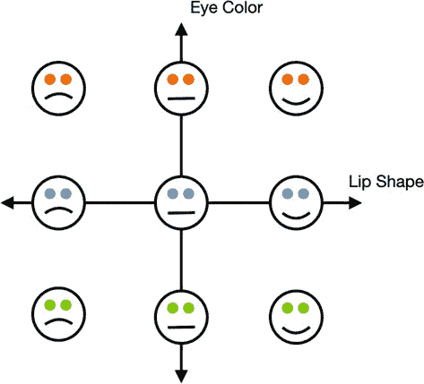
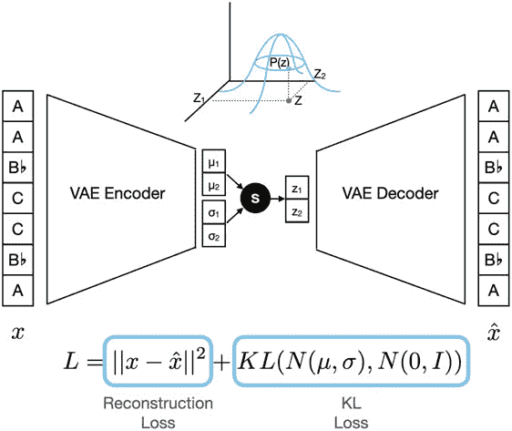
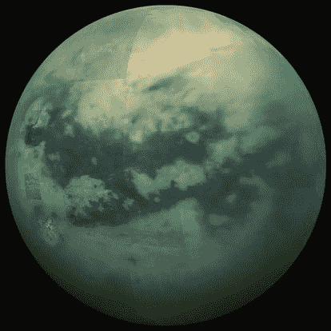
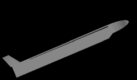
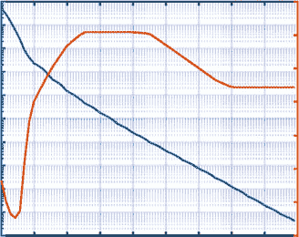
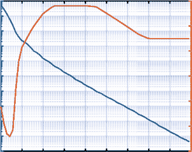
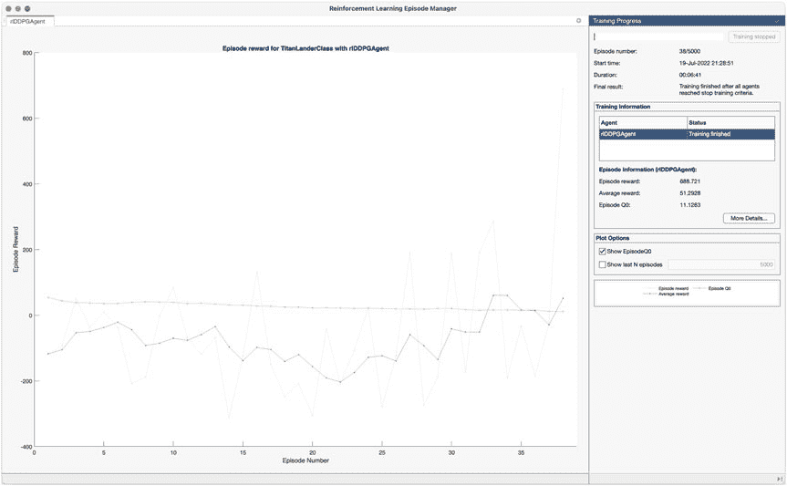

**14.6**

**替代方法**

我们构建的 LSTM 模型肯定可以作为音乐生成模型，因为我们可以从其输出分布中采样以产生新的、相当令人信服的音乐事件序列。尽管如此，它肯定可以改进。在不改变模型本身的情况下改进模型输出的方法之一是在采样过程中添加一个温度参数

[40]. 要做到这一点，我们通过所谓的“冻结函数”将模型分配给每个潜在输出的概率传递过去，正如方程 14.1 中所示。在表 14.1,中，你可以看到不同的温度如何影响一个简单的概率分布，但总体而言，当 *t →* 0 时，概率变得更加倾斜，最大概率接近 1，而其他概率接近 0。当你从这个新的分布中采样时，你实际上是在从模型输出分布中采样，**图 14.6**：*同一圣歌的三种版本（我们训练集中的第十个）。上面两个是由我们的模型生成的。下面一个是歌曲的真实版本。红线表示模型开始生成的地方。上面一个是通过从模型输出分布中采样生成的。中间一个显示了当我们从这个分布中贪婪采样时会发生什么（只取最高概率的音符和持续时间组合）。不仅采样的版本看起来更好，而且听起来* *更可能来自真实的作品*。

**表 14.1**：*温度参数对模型输出概率的影响* **标识符**

**输入概率**

**温度 ( *τ*** **)**

**输出概率**

模型输出

(0.2, 0.8)

1

(0.2, 0.8)

更均匀

(0.2, 0.8)

10

(0.4654, 0.5346)

近似均匀

(0.2, 0.8)

1000

(0.4997, 0.5003)

更贪婪

(0.2, 0.8)

0.5

(0.0588, 0.9412)

近似贪婪

(0.2, 0.8)

0.1

(0.0000, 1.0000)

283

第十四章

音乐生成模型

argmax 或使用“贪婪”采样。当 *t → ∞* 时，新的分布接近均匀分布，每个可能的输出都有相等的概率。在 t=1 时，你根据模型分配的概率从模型中采样。在我们的代码中，我们实际上实现了 *t* = 0（贪婪）和 *t* = 1 的采样。然而，通过显式使用温度来调整输出分布，你可以尝试在从模型输出分布中采样和使用随机和贪婪采样以获得最逼真的音乐之间找到平衡。

*p* 1 */τ*

*p*

*j*

*j,new* = *ffreeze*( *p*) *j* =

(14.1)

*i p* 1 */τ*

*i*

我们模型另一个问题是贪婪采样导致生成的音乐完全不符合现实。似乎模型将最高概率分配给它认为的“安全”选择，即复制相同的音调和持续时间。这告诉我们模型并没有像我们希望的那样学习如何生成音乐。你可以尝试各种方法来改进这一点，包括使用更大的数据集，并使用更多的计算资源进行更长时间的训练。你也可以改变模型超参数，如层数或 LSTM 隐藏状态的大小，或者改变训练超参数，如学习率。

除了改进 LSTM，你还可以尝试通过实现一些替代的机器学习模型来提高这个任务的表现。有几个模型可以轻松替换 LSTM。这些包括简单的 RNN 和门控循环单元（GRU）RNN，如图 14.2 所示。LSTM 和 GRU 模型被认为优于简单的 RNN。LSTMs 和 GRUs 都使用门控来控制网络利用和存储的信息；然而，GRUs 稍微简单一些，这使得它们可以以相似的性能更有效地训练。如图 14.2 所示，这种简单性的一个来源是将 LSTM 的隐藏状态和细胞状态合并为 GRU 中的一个隐藏状态。这种训练效率的提高可能使得 GRU 成为一个改进，因为它可能允许我们以相对较小的训练时间增加来获得使用更大模型（更大的模型可以识别更细微的模式）或更多数据（更多例子来发现模式）的好处。

其他用于时间序列建模的模型，但可能需要更多的工作来实现，包括时间卷积神经网络（TCNs）和转换器。与循环模型不同，这些模型不需要在移动到未来输入之前完成对先前输入的计算。相反，它们一次性获得给定输入大小（也称为上下文长度）内的所有输入，并并行地为输入中的每个时间点生成预测。这使得这些网络可以以更高效、并行的方式训练。

TCNs 基于一维卷积，这种卷积是指卷积核沿着序列输入的序列维度进行平移。TCNs 还使用跳过连接和扩张因果卷积。跳过连接允许在不同深度的层之间传递信息，扩张卷积增加了模型的感受野，使得模型可以使用更早的信息进行预测。最后，因果卷积是指任何在当前时间步之后发生的输入的卷积。

第十四章

音乐的生成建模

被忽略。Wavenet 是使用类似 TCN 特性的音乐生成模型的一个例子[28]。

变压器使用注意力机制作为其基本构建块。注意力的机制超出了本文的范围，但你可以将其视为一种成对比较的方法。

尽管变压器最常用于语言建模和语言理解任务，但它们没有理由不能用于生成音乐建模[16]。与 GRU 的情况一样，TCNs 和变压器的训练效率更高，这使得在更大的数据集上训练更大、更具表现力的模型版本变得更加可行。此外，通过给模型提供它将做出预测的整个输入，模型能够访问每个时间步预测相关的任何过去输入，并将跨多个时间尺度的信息组合成复杂的层次表示。另一方面，循环模型，如 LSTMs，只能访问它们在某个过去时间步决定值得记住的信息，因此对于当前预测的重要信息可能已经被遗忘。尽管如此，像 TCNs 和变压器这样的模型需要定义一个固定的输入大小，这限制了它们在处理过去输入时的能力，而理论上，LSTM 可以使用其第一个输入的信息进行任何未来的预测。

最后，我们想简要讨论变分自编码器（VAEs）。这些模型过于复杂，无法深入探讨，但总体来说，它们就像传统的自编码器一样，将高维输入映射到低维潜在空间，然后再映射回高维输入空间。实际上，VAE 学习输入信号中哪些特征对于重建输入是真正必要的。VAE 与传统自编码器区别在于其潜在空间由多元高斯分布参数化。换句话说，VAE 将数据生成分布近似为多元高斯分布，并通过从这个分布中采样，可以生成新的数据点。

当训练得当，潜在空间被认为是“结构化的”，这一特性对于生成建模可能是有益的。这种结构对应于输入映射，即更接近潜在空间中彼此靠近的点，这可能导致“特征轴”的存在，或与特定特征的变异相对应的线条。这一点可以通过我们来自第 14.1 和 14.2 节的脸部示例更清楚地说明。

因此，我们首先考虑一个用于建模人类面部分布的 VAE（变分自编码器）。人类面部有许多独特的特征，包括嘴唇、眼睛，以及这些和其他特征的相对位置等。作为一个简单的例子，嘴唇的形状可能构成一个特征轴。假设你定位了这个轴，取其上的一个点，并通过 VAE 进行解码

解码器。输出是一个具有中性唇形的面部。你移动到特征轴上的这个点的另一侧，选择一个新的点，并对其进行解码，揭示出一个微笑的面部。你在这个方向上再进一步，微笑几乎变得滑稽地大。现在你决定在原始点的相反方向上走几步，发现解码的面部正在皱眉。需要注意的是，在一个理想结构的潜在空间中，当你穿越唇形轴时，唯一应该改变的是嘴唇的形状。换句话说，不同的特征轴在潜在空间中应该是正交的，这样它们所描述的特征是独立的。用更简单的话说，你应该能够在不改变另一个特征的情况下改变一个特征。这是 285 中的一个极其有利的特性。

第十四章

音乐的生成建模

生成建模因为它给了你对你所生成内容的实质性控制。一旦你通过编码具有特定差异的面部并比较它们的潜在表示来识别一组特征轴，你就可以以任何数量方式扰动给定的面部，而不会导致不希望的变化。我们在图 14.7 中给出了一些关于二维潜在空间的直观理解。我们还应该注意，为了能够在潜在空间中将*N*个特征映射到正交的特征轴上，我们至少需要一个*N*维的潜在空间。

回到我们的音乐例子，如果我们训练一个 VAE 将一组音乐作品映射到潜在空间，我们可能会找到作品情绪或其风格的特征轴。我们可能取莫扎特的作品，对其进行编码，然后沿着其风格轴滑动编码点，使其听起来像爵士乐或现代流行歌曲。作为另一个例子，我们可能能够通过沿着情绪轴移动我们的潜在点，将忧郁的作品变得欢快。

**图 14.7**：*在这里，我们看到一个结构良好的二维潜在空间，用于人脸。图中显示的两个特征是眼睛颜色和唇形。沿着唇形轴从左到右移动对应于将唇形从皱眉变为中性再到微笑。沿着眼睛颜色轴从上到下移动对应于从橙色眼睛过渡到蓝色眼睛，然后是绿色眼睛。这些特征位于正交轴上，因此改变一个不会改变另一个。通过沿着两个轴移动，我们可以生成结合了这些特征的面孔。例如，当我们从中心面孔向上和向右移动时，我们移动到一个有橙色眼睛和微笑的面孔。请注意，在现实中，这些面孔本身并不存在于潜在空间中。训练好的编码器和解码器通过在它们之间创建映射，将二维潜在点赋予意义，这些映射与输入空间中的面孔相关联*。

286

第十四章

音乐的生成建模

正如我们在第 14.5 节中讨论的那样，我们确实有能力通过用不同作曲家的歌曲、不同风格或情绪等来播种其生成，来改变我们 LSTM 生成的结果。然而，使用 VAE 独立地隔离音乐作品中的特定特征并改变它们会更容易。使用 VAE 的一个问题是

仅靠自身生成音乐的问题在于模型的输出大小是固定的。为了生成任意长度的音乐序列，需要反复生成固定长度的音乐序列并将它们连接起来。另一个问题是，VAEs（变分自编码器）在训练时可能非常困难，部分原因是因为你需要在 KL 损失和重建损失之间取得平衡。KL 损失试图将所有输入的编码推向（正态分布），而重建损失则试图将它们分开，以便解码器更容易区分。这些损失可以在图 14.8 中看到。

VAEs 在音乐生成中的另一种用途是作为一种处理原始数据的方法。正如我们之前提到的，原始数据很难使用，因为它包含了许多可能分散我们的模型对音乐建模注意力的无关特征。由于 VAEs 可以用来提取信号中的重要特征，我们可以训练一个 VAE 来提取音乐上的**图 14.8**：*使用音高作为输入的 VAE 训练示例。在这个例子中，我们将潜在空间建模为双变量正态分布，因此编码器生成一个二维均值向量和二维标准差向量。在训练过程中，我们从 N(μ, σ)中采样以获得 z。这由黑色圆圈中的白色圆点表示*。

图中的“s”。在测试中，我们使用 μ 表示 z。解码器随后从 z 中重建原始音高序列* *。在训练中，存在一个重建损失，它惩罚输入序列和输出序列之间的大差异，以及一个 KL 损失，它惩罚 N(μ, σ) 与 N(0, I) 的距离，* *其中* 0 *是零向量，* I *是单位矩阵。这种后者的损失基于 KL 散度，* *它鼓励构建一个结构化的潜在空间。完整的损失是这两个损失的加和，可以在图的下部看到。这个图是受 [33] 中的一个图的启发。*

287

**第十四章**

音乐的生成建模

从原始音频中提取相关特征。然后我们可以使用之前描述的序列模型之一，如 LSTM，来预测未来的音乐事件。这种技术是 Jukebox 作者所做工作的简化 [9]。

希望这一章能让你对基于机器学习的生成建模有一些基础的了解，特别是它应用于音乐的情况。当然，还有很大的探索空间，我们希望这一章的最后部分能让你对这个令人兴奋的领域有所了解。

288

**第十五章**

**强化学习**

**15.1**

**引言**

强化学习是一种机器学习方法，其中智能代理通过采取行动以最大化奖励来学习。我们将将其应用于土卫六着陆控制系统的设计。强化学习是一种近似解决方案的工具，这些解决方案原本可以通过动态规划获得，但其确切解决方案在计算上是不可行的 [3]。

我们将首先对车辆的点质量动力学进行建模。然后我们将构建一个模拟。我们将使用在土卫六轨道上运行的车辆以及水平飞行的车辆来测试这个模拟。然后我们将使用优化来找到一条轨迹。最后，我们将设计一个强化学习算法来找到一条轨迹。

**15.2**

**土卫六着陆器**

我们将使用强化学习解决的问题是在土卫六上进行动力降落。

土卫六是太阳系中第二大卫星，其体积大于水星。

土卫六有一个厚厚的 atmosphere，这使得在 atmosphere 中使用空气动力学力进行飞行成为可能。图 15.1 展示了土卫六及其大气密度的图像。

我们将使用与第九章中类似的模型，即基于地形的导航，但我们将将其简化为平面情况。此外，我们假设车辆的质量不会变化。我们的推进系统使用核聚变驱动的涡轮喷气发动机，消耗的燃料非常少。它使用聚变反应的能量加热进入的大气。与第九章中的点质量车辆运动方程不同，我们考虑月球是圆形的，重力随着车辆下降而变化。这些方程是用圆柱坐标写成的：

˙ *r* = *ur*

(15.1)

*v*²

*μ*

˙ *ur* =

*−*

+ *a*

*r*

*r*²

*r*

(15.2)

*u*

˙ *u*

*tur*

*t*

= *−*

+ *a*

*r*

*t*

(15.3)

其中 *r* 是径向位置，*ur* 是径向速度，*ut* 是切向速度，*μ* 是土卫六的重力参数，*ar* 和 *at* 是那些方向上的加速度。我们

© Michael Paluszek, Stephanie Thomas, Eric Ham 2022

289

M. Paluszek 等人，*实用的 MATLAB 深度学习*，

[`doi.org/10.1007/978-1-4842-7912-0 15`](https://doi.org/10.1007/978-1-4842-7912-0 15) (-149 4985 a -149 4985 a)

第十五章

强化学习

**图 15.1:** *土卫六的合成红外图像由 NASA 提供。*

**图 15.2:** *飞机模型显示升力、阻力和重力。*

不要积分切向位置或角度，因为我们的问题只涉及着陆。如果你想在特定地点着陆，在规划轨迹后，你只需选择一个轨道位置开始下降，以便最终到达正确的地点。在图 15.2, 中可以看到。

速度大小 *v* 是

*v* = *u*² *r* + *u*² *t*

(15.4)

飞行路径角 *γ* 在这个公式中没有被使用。重力加速度出现在方程 15.1 中。

*μ*

*g* = *r*²

(15.5)

290

第十五章

强化学习

我们使用一个非常简单的空气动力学模型。升力系数 *cL* 定义为 *cL* = *cL α*

*α*

(15.6)

升力系数实际上是攻角 *α* 的非线性函数。它有一个最大攻角，超过这个攻角，机翼会失速，所有升力都会消失。这个系数也会随着飞行速度的变化而变化。对于我们的简单模型，我们将假设一个平板，其 *cL* = 2 *π*

*α*

. 拖曳力

系数是

*cD* = *cD* + *kc*²

0

*L*

(15.7)

其中 *k* 是

1

*k* = *πAR*

(15.8)

*AR* 是展弦比，是奥西效率因子，通常在 0.8 到 0.95 之间。

效率因子是升力与阻力耦合的效率。展弦比是翼展（从机身最近点到翼尖）与弦长（从翼前到翼后的长度）的比率。这个方程被称为阻力极。当没有升力时，阻力系数是 *cD* 0\. *cD* 随升力系数的平方变化。对于超音速流动，马赫数超过 4，以下基于牛顿冲击理论的模型是 *L* = *ρSV* 2 sin2 *α* cos *α*

(15.9)

0 *.* 075

*D* = *ρSV* 2 sin3 *α* +

*√*

+ *CD*

*R* 1 */* 5

*π*

*E*

*M*

其中 *CDπ* 大约是 0.001。这需要与之前当马赫数低于四时的模型进行网格化。为了本章的目的，我们将坚持低速模型。升阻比是

*cL*

(15.10)

*cD* + *kc* 2

0

*L*

这是最大值，当

*c*

*c*

*D* 0

*L* =

*k*

(15.11)

这是我们在稳定飞行中希望操作的升力系数，因为在这里我们以最小的阻力获得最大的升力。

动压，由于飞机运动产生的压力，是 1

*q* = *ρ*( *u* 2

2

*r* + *u* 2 *t*)

(15.12)

其中

*u* 2 *r* + *u* 2 *t* 是速度，*ρ* 是大气密度。升力和阻力的量级是

*L* = *qcLs*

(15.13)

*D* = *qcDs*

(15.14)

291

**第十五章**

强化学习

其中 *s* 是湿面积。湿面积是车辆对升力和阻力有贡献的面积。升力力是垂直于速度向量的，阻力力是沿着速度向量的。单位速度向量是

*ur*

*u*

*u* =

*t*

(15.15)

*u* 2 *r* + *u* 2 *t*

我们使用箭头，，来表示一个向量，在 MATLAB 中是一个多元素数组。阻力向量是

*D* = *Du*

(15.16)

升力向量是 90 度旋转，并且是

*L* = *L*

0 1 *u*

*−* 1 0

(15.17)

在这两种情况下，径向分量是顶部元素，底部是切向分量。推力向量是

*T* = *T*

sin *α*

cos *α*

(15.18)

我们从一个圆形轨道开始。为了开始再入，我们增加攻角以增加阻力。记住，我们使用的是一个简单的空气动力学模型。这导致冲压发动机下降。

我们然后调整攻角和推力以达到我们希望着陆的点。在本章中，我们将使用最优控制设计一条轨迹，然后我们将使用强化学习来设计一条轨迹。我们的目标将是以零速度到达泰坦表面。

**15.3**

**模拟泰坦大气**

**15.3.1 问题**

我们想要计算泰坦的大气密度。

**15.3.2 解**

使用泰坦密度和高度数据库并插值。

**15.3.3 它是如何工作的**

TitanAtmosphere 函数计算泰坦大气密度和温度。

292

第十五章

强化学习

***TitanAtmosphere.m***

21

22

% 示例

23

**if**( **nargin** < 1 )

24

TitanAtmosphere(**linspace**(0,1400));

25

**return**

26

**end**

27

28

% 高度

29

hD

= [0:10:100 150:50:900]; % km

30

31

% 密度

32

ρD

= [ 5.270e⁰

3.467e⁰

2.144e⁰

1.233e⁰

6.731e⁻¹ 3.575e⁻¹...

33

1.825e⁻¹ 8.264e⁻² 4.788e⁻² 3.155e⁻² 2.219e⁻² 5.024e⁻³...

34

1.393e⁻³ 4.612e⁻⁴ 1.673e⁻⁴ 6.282e⁻⁵ 2.438e⁻⁵ 9.806e⁻⁶...

35

4.114e⁻⁶ 1.718e⁻⁶ 7.129e⁻⁷ 2.931e⁻⁷ 1.173e⁻⁷ 4.653e⁻⁸...

36

1.868e⁻⁸ 7.934e⁻⁹ 3.404e⁻⁹];

37

38

% 温度

39

tD

= [

92.89

83.29

76.44

72.20

70.51

71.16

76.62 103.46...

40

122.88 133.97 140.80 159.23 173.76 181.72 181.72 181.72...

41

181.72 180.81 173.96 167.06 160.09 153.04 148.62 148.62...

42

148.62 148.62 148.62];

43

44

% 声速

45

aD

= [ 195.6 185.7 177.7 173.1 171.5 172.5 179.2 208.4 227.1...

46

237.1 243.1 258.6 270.1 276.2 276.2 276.2 276.2 275.5...

47

270.2 264.8 259.3 253.5 249.8 249.8 249.8 249.8 249.8];

The altitude is computed through linear interpolation. This means that intermediate values will be returned. If no outputs are requested, it produces a double- *y* plot with this code:

***TitanAtmosphere.m***

49

ρ

= **interp1**(hD,rhoD,h,'linear'); % 密度

50

t

= **interp1**(hD,tD,

h,'linear'); % 温度

51

a

= **interp1**(hD,aD,

h,'linear'); % 声速

The commands yyaxis right and yyaxis left set the axis handles to match the left and right axes with the plot. Typing TitanAtmosphere will result in two plots. The demo plots are shown in Figure 15.3.

293

第十五章

强化学习

**土卫二大气密度和温度**

**土卫二大气密度和声速**

101

200

101

280

100

100

180

260

10⁻¹

10⁻¹

160

10⁻²

)

10⁻²

)

3

3

240

10⁻³

10⁻³

140

10⁻⁴

10⁻⁴

220

120

10⁻⁵

10⁻⁵

密度 (kg/m³)

密度 (kg/m³)

200

10-6

100

10-6

温度 (K)

声速 (m/s)

10-7

10-7

180

80

10-8

10-8

10-9

60

10-9

160

0

100

200

300

400

500

600

700

800

900

0

100

200

300

400

500

600

700

800

900

H (km)

H (km)

**图 15.3：** *泰坦及其大气密度。声速和温度曲线具有相同的形状。*

**15.4**

**模拟飞机**

**15.4.1 问题**

我们希望使用飞机参数和控制来数值积分轨迹。

**15.4.2 解**

编写一个带有内置积分器的函数来积分运动方程。编写第二个函数来返回状态导数。

**15.4.3 工作原理**

RHS2DTitan 函数模拟了车辆的二维动力学。它包括重力和空气动力学。它专门针对泰坦。

***RHS2DTitan.m***

26

**函数** [xDot, q] = RHS2DTitan( ˜, x, d )

27

28

% 常数

29

rTitan = 2575;

30

mu

= 9.142117352579678e+03;

31

kMToM

= 1000;

32

nToKN

= 0.001;

33

34

% 返回默认数据结构

35

**if**( **nargin** < 1 )

36

xDot = DefaultDataStructure;

37

**return**

38

**end**

39

40

% 为了使代码更清晰，使用局部变量

294

第十五章

强化学习

41

r

= x(1);

42

uR

= x(2);

43

uT

= x(3);

44

45

% 大气密度

46

h

= r - rTitan;

47

**if**( h <= 0 )

48

h = 0;

49

**end**

50

[rho,˜] = TitanAtmosphere(h);

51

52

% 力

53

uRM

= uR*kMToM;

54

uTM

= uT*kMToM;

55

w

= uRMˆ2 + uTMˆ2;

56

57

% 升力和阻力

58

cL

= d.cLAlpha*d.alpha;

59

**eps**

= 0.8; % 奥斯瓦尔德效率

60

k

= 1/(**pi***d.aR***eps**);

61

cD

= d.cD0 + k*cLˆ2;

62

63

q

= 0.5*rho*w;

64

65

% 速度向量的方向

66

u

= [uRM;uTM]/**sqrt**(w);

67

drag

= -cD*q*d.s*u;

68

lift

=

cL*q*d.s*[0 1;-1 0]*u;

69

c

= **cos**(d.alpha);

70

s

= **sin**(d.alpha);

71

thrust

= d.thrust*[c -s;s c]*u;

72

a

= nToKN*(thrust + drag + lift)/d.mass;

73

74

% 状态导数

75

uRDot

=

uTˆ2/r - mu/rˆ2 + a(1);

76

uTDot

= -uT*uR/r

+ a(2);

77

xDot

= [uR;uRDot;uTDot];

常量位于函数的开始部分。接下来的代码块返回默认数据结构。由于状态单位是 km，因此将力转换为 kN。随后是动力学代码。子函数返回默认数据结构。如果您运行该函数，它将在命令窗口中打印默认数据结构。

***RHS2DTitan.m***

80

**function** d = DefaultDataStructure

81

82

mu

= 9.142117352579678e+03;

83

r

= 2875;

84

d = struct('aR',1.7,'eps',0.9,'s',10,'cD0',0.006,'cLAlpha',2***pi**,...

85

'质量',2000,'alpha',0,'推力',0,'x0',[r;0; **sqrt**(mu/r)]); 86

d.states = {'r (km)' 'u_r (km/s)', 'u_t (km/s)'};

295

第十五章

强化学习

大多数数据结构都在结构语句中。随后添加了单元数组。如果它在结构中添加，MATLAB 将创建一个包含三个元素的数组，每个单元数组元素一个。默认数据结构为用户提供初始状态和用于绘图的推荐状态名称。默认数据结构将车辆置于圆形轨道上。

第二个函数，Simulation2DTitan，运行模拟。它的输入与 RHS2DTitan 相同，增加了控制输入，这是一个包含攻角和推力的 2×n 矩阵。

***Simulation2DTitan.m***

18

19

**if**( **nargin** < 1 )

20

Demo

21

**return**

22

**end**

23

24

rTitan

= 2575;

25

26

n

= **长度**(t);

27

xP

= **zeros**(3,n);

28

xP(:,1) = x;

29

30

**for** k = 2:n

31

d.alpha

= u(1,k-1);

32

d.thrust

= u(2,k-1);

33

rHS

= @(t,x,d) RHS2DTitan(x,t,d);

34

[˜, x]

= ode113(rHS, [0, t(k)-t(k-1)], x, [], d );

35

x

= x(**end**,:)';

36

37

xP(:,k)

= x;

38

**if**( x(1) - rTitan <= 0 )

39

**break**;

40

**end**

41

**end**

42

43

xP = xP(:,1:k);

44

t

= t(:,1:k);

45

46

**if**( **nargout** < 1 )

47

[t,tL] = TimeLabel(t);

48

绘制集(t,xP,'x 轴标签',tL,'y 轴标签',d.states,'图形标题','土星模拟');

49

**clear** x

50

**end**

296

第十五章

强化学习

我们使用 ode113 内部来提供控制时间步长大小的灵活性。

ode113 确保我们将积分误差保持在一定范围内。在这种情况下，我们使用内置的界限。代码如下

***Simulation2DTitan.m***

33

rHS

= @(t,x,d) RHS2DTitan(x,t,d);

34

[˜, x]

= ode113(rHS, [0, t(k)-t(k-1)], x, [], d );

第一行重新排列了 RHS2DTitan 输入的顺序，以与 ode113 兼容。

ode113 返回一个 n 行三列的数组中的所有中间值，所以我们只抓取最后一组。

内置演示从高攻角圆形轨道开始，这标志着再入过程的开始。

***Simulation2DTitan.m***

52

%% Simulation2DTitan>Demo

53

**函数** Demo

54

55

d = RHS2DTitan;

56

t = **linspace**(0,120000,1000);

57

u = **zeros**(2,1000);

58

u = [0.0001***ones**(1,1000);

59

0.00***ones**(1,1000)];

60

Simulation2DTitan( d.x0, t, d, u );

图 15.4 显示了演示的结果。正如预期的那样，飞机开始再入。

2700

2650

r (km) 2600

2550 0

0.05

0.1

0.15

0.2

0.25

0.3

时间（小时）

0

-0.1

(km/s) ru

-0.20

0.05

0.1

0.15

0.2

0.25

时间（小时）

2

1

(km/s) tu

0

0

0.05

0.1

0.15

0.2

0.25

时间（小时）

**图 15.4:** *使用内置演示的模拟。*

297

第十五章

强化学习

**15.5**

**模拟平飞**

**15.5.1 问题**

我们希望我们的飞机以水平状态飞向土卫六表面。

**15.5.2 解决方案**

编写一个脚本，调用 Simulation2DTitan 函数，以最佳攻角和足够的推力来维持水平飞行。

**15.5.3 工作原理**

对于平飞，我们将以方程 15.11 中给出的最佳攻角运行，并使用足够的推力来克服阻力。速度需要足够快，以便在所需高度产生足够的升力来平衡重力。让我们假设我们想在土卫六表面以上 1 公里处飞行。LevelFlight.m 脚本设置并运行模拟。我们需要平衡推力、速度和攻角。最简单的方法是使用一个搜索，其中成本是加速度向量的模。

我们首先设置模拟。

***LevelFlight.m***

1

%% Simulate level flight above Titan

2

3

%% Constants

4

rTitan

= 2575;

5

mu

= 9.142117352579678e+03;

6

kMToM

= 1000;

7

8

%% Get the default data structure

9

d

= RHS2DAero;

10

11

%% Compute the flight conditions and the controls

12

13

% Aircraft and flight parameters

14

d.mass

= 2000; % kg

15

d.s

= 20; % mˆ2

16

altitude

= 100; % km

We then use fminsearch to find the angle of attack, thrust, and velocity that make the accelerations as small as possible.

298

CHAPTER 15

REINFORCEMENT LEARNING

***LevelFlight.m***

18

% Find the equilibrium velocity and control

19

c

= [400;0.06;0]; % Initial control [thrust;v;alpha]

20

r

= d.rPlanet + altitude;

21

22

% Use a numerical search

23

Options

= optimset;

24

fun

= @(c) Cost(c,d,r);

25

c

= fminsearch( fun, c, Options );

The cost function is

***LevelFlight.m***

45

**function** c = Cost( u, d, r )

46

47

x(1)

= r;

48

d.thrust

= u(1);

49

x(3)

= u(2);

50

d.alpha

= u(3);

51

52

xDot

= RHS2DAero(x,0,d);

53

54

c

= Mag(xDot);

55

56

**end**

It calls RHS2DTitan and computes the state derivative. In equilibrium flight, this should be zero. It computes the magnitude of the acceleration vector and uses this as the cost. We then run the simulation.

***LevelFlight.m***

30

%% Run the simulation

31

n

= 2000;

32

t

= **linspace**(0,3600,n);

33

x

= [r;0;c(2)];

34

u

= [d.alpha***ones**(1,n);d.thrust***ones**(1,n)];

35

Simulation2DAero( x, t, d, u );

36

37

%% Print out the parameters

38

**fprintf**('Angle of attack

%8.2f deg\n',d.alpha*180/**pi**);

39

**fprintf**('Velocity

%8.2f m/s\n',c(2)*kMToM);

40

**fprintf**('Thrust

%8.2f N\n',d.thrust);

41

**fprintf**('Mass

%8.2f kg\n',d.mass);

42

**fprintf**('Wetted area

%8.2f mˆ2\n',d.s);

299

第十五章

强化学习

2576

2675

2674.999998

2575.99999998

r (km)

2674.999996

r (km)

2575.99999996

2674.999994

0

10

20

30

40

50

60

0

10

20

30

40

50

60

时间 (min)

时间 (min)

10-12

10-9

0

0

-1

-10

(km/s) r

(km/s)

-2

r

u -20

u

-3

0

10

20

30

40

50

60

0

10

20

30

40

50

60

时间 (min)

时间 (min)

0.26612426

0.05835473714

0.05835473713

0.26612425

(km/s)

(km/s) t

t 0.05835473712

u

u

0.26612424

0

10

20

30

40

50

60

0

10

20

30

40

50

60

时间 (min)

时间 (min)

**图 15.5：** 水平飞行模拟。由于数值误差，结果并不完美。1 公里和 100 公里

*km 高度结果如下。*

以下在命令窗口中打印出来。它显示了 1 公里高度的重要参数、状态和控制。

>> LevelFlight

攻角

0.43 度

速度

58.35 m/s

推力

373.95 N

质量

2000.00 kg

湿面积

20.00 mˆ2

我们还在 100 公里处运行了它。攻角更低，推力更高。

>> LevelFlight

攻角

1.42 度

速度

266.12 m/s

推力

177.26 N

质量

2000.00 kg

湿面积

20.00 mˆ2

图 15.5 显示了两种情况的结果。车辆保持水平飞行。

**15.6**

**最优轨迹**

**15.6.1 问题**

我们希望生成一个从轨道上的起点到表面的最优轨迹。

300

第十五章

强化学习

**15.6.2 解**

使用 fmincon 编写一个脚本来生成最优轨迹。

**15.6.3 它是如何工作的**

我们将解决约束最优控制问题。约束是最终状态，必须是

⎡

⎤

*r* 泰坦

*x* = ⎣ 0

⎦

(15.19)

0

我们有三个不同的成本计算可以最小化。fmincon 尝试最小化成本。第一个是动压力：

1

*q* = *ρv* 2

2

(15.20)

这是车辆承受的空气动力学载荷。滞止温度是第二个：1

*T* 0 = *Ta*(1 + *f*( *γ −* 1) *M* 2) 2

(15.21)

其中 *Ta* 是环境温度，*γ* 是比热容比，*M* 是马赫数，即速度与声速的比值。最后是加热率 [45]：

*√*

*r ≈ ρv* 3

(15.22)

在所有情况下，成本将是轨迹上这些量的平均值。

第一步是找到一个到达表面的轨迹。我们为此编写了 Landing.m 脚本。

***Landing.m***

1

%% 模拟在泰坦上方的水平飞行

2

3

%% 常数

4

rTitan

= 2575;

5

mu

= 9.142117352579678e+03;

6

kMToM

= 1000;

7

8

%% 获取默认数据结构

9

d

= RHS2DTitan;

10

11

%% 计算飞行条件和控制

12

d.mass

= 2000; % kg

13

d.s

= 20; % mˆ2

14

高度

= 100; % km

15

r

= rTitan + altitude;

16

d.thrust

= 0;

17

d.alpha

= 0.0;

301

第十五章

强化学习

18

tEnd

= 20*60;

19

20

%% 运行模拟

21

n

= 2000;

22

t

= **linspace**(0,tEnd,n);

23

x

= [r;0; **sqrt**(mu/r)];

24

u

= [d.alpha***ones**(1,n);d.thrust***ones**(1,n)];

25

[˜,xP,t]

= Simulation2DTitan( x, t, d, u );

26

[t,tL]

= TimeLabel(t);

27

d.states{1} = 'Altitude (km)';

28

xP(1,:)

= xP(1,:) - rTitan;

29

PlotSet(t,xP,'x 轴标签',tL,'y 轴标签',d.states,'图形标题','再入') 我们从圆形轨道开始，将攻角设置为零和零推力。我们在 15 分钟内以高垂直速度和一些切向速度撞击地面。图 15.6

显示了轨迹。它表明一个好的初始猜测是零攻角，持续时间为 15 分钟。

使用 fmincon 进行优化需要一个约束函数和一个成本函数。成本将是方程[15.20]中给出的平均动态压力。约束将是着陆条件。两者都需要我们模拟直到地面接触。我们不在乎地面接触发生的时间。我们将时间分成等长的段。

控制将在轨迹上分段连续。段的数量将影响解的精度和解的速度。更多的段意味着更高的精度，但可能会减慢收敛速度。

100

50

高度 (km)

0

0

5

10

15

时间 (min)

0

-0.1

(km/s) ru

-0.2

0

5

10

15

时间 (min)

2

1

(km/s) tu

0

0

5

10

15

时间 (min)

**图 15.6：** *无推力和零攻角的轨迹*

302

第十五章

强化学习

以下代码显示了约束函数。它将运动方程积分到车辆触地为止。这两个函数都使用 Simulation2DTitan。

***TitanLandingConst2D.m***

16

**函数** [cIn, cEq] = TitanLandingConst2D( u, d )

17

18

rTitan

= 2575;

19

[˜,xP]

= Simulation2DTitan( d.x, d.t, d, u );

20

21

% 我们没有任何非线性不等式约束

22

cIn = [];

23

24

% 等式约束

25

cEq = [xP(1, **end**)-rTitan;xP(2:3, **end**)];

可以选择三种成本之一：平均滞止温度、平均动态压力和平均加热率。它们是通过在轨迹上积分运动方程来计算的。

***TitanLandingCost2D.m***

14

**函数** cost = TitanLandingCost2D( u, d )

15

16

[˜,xP]

= Simulation2DTitan( d.x, d.t, d, u );

17

cost

= CostCalculation( xP, d.costType );

18

19

%% 动态压力

20

**函数** cost = CostCalculation( x, **类型** )

21

22

h

= x(1,:)- 2575; % 高度 (km)

23

j

= h<0;

24

h(j)

= 0;

25

[rho, t, a] = TitanAtmosphere(h);

26

v

= 1e3***sqrt**(x(2,:).ˆ2 + x(3,:).ˆ2); % m/s

27

28

switch **类型**

29

case 'stagnation temperature'

30

**gamma**

= 1.4;

31

m

= v./a;

32

r

= 0.88;

33

t0

= t.*(1 + 0.5*r*(**gamma** - 1).*m.ˆ2);

34

cost

= **mean**(t0);

35

case 'heating rate' % p 238 Wiesel

36

cost

= **mean**(**sqrt**(rho).*v.ˆ3);

37

case 'dynamic pressure'

38

q

= 0.5*rho.*v.ˆ2;

39

cost

= **mean**(q);

40

otherwise

41

**错误**('%s 不可用', **类型**);

42

**end**

303

第十五章

强化学习

正如您所看到的，这个过程在数值上相当密集，因为我们需要两次积分运动方程。以下代码显示了进行优化的脚本：

***OptimalTitanLanding.m***

1

%% 优化泰坦着陆

2

3

rTitan

= 2575;

4

mu

= 9.142117352579678e+03;

5

h

= 100;

6

dT

= 1;

7

n

= 50;

8

9

d

= RHS2DTitan; % 数据结构

10

d.n

= n; % 决策变量增量数量

11

d.tEnd

= 20*60; % 来自着陆脚本

12

d.t

= NonuniformSequence(d.tEnd,d.n,@ExponentialDT);

13

d.costType

= '加热率';

14

15

% 初始状态

16

r

= rTitan + h;

17

x

= [r;0; **sqrt**(mu/r)];

18

d.x

= x;

19

20

% fmincon 选项

21

opts

= optimset( 'Display','iter-detailed',...

22

'TolFun',1e-4,...

23

'algorithm','interior-point',...

24

'TolCon',1e-4,...

25

'MaxFunEvals',15000);

26

27

% 成本是达到最终状态向量的时间

28

costFun

= @(x) TitanLandingCost2D(x,d);

29

30

% 状态的数值积分在约束函数 31 中

constFun

= @(x) TitanLandingConst2D(x,d);

32

33

% 决策变量是攻角和推力

34

u0

= 0.0001***ones**(2,n);

35

36

% 决策变量的下限和上限

37

oN

= **ones**(n,1);

38

lB

= **zeros**(2,n);

39

uB

= [ (**pi**/12)*oN ;400*oN ];

40

41

% 寻找最优决策变量

42

u

= fmincon(costFun,u0,[],[],[],[],lB,uB,constFun,opts);

43

44

%% 运行模拟

45

x

= [r;0; **sqrt**(mu/r)];

46

[˜,xP,t]

= Simulation2DTitan( x, d.t, d, u );

47

[t,tL]

= TimeLabel(t);

304

第十五章

强化学习

48

u

= u(:,1:**length**(t));

49

d.states{1} = 'Altitude (km)';

50

xP(1,:)

= xP(1,:) - rTitan;

51

yL

= [d.states(:)' {'\alpha (rad)'} {'T (N)'}];

52

PlotSet(t,[xP;u],'x label',tL,'y label',yL,'figure title','最优着陆')

你会注意到我们使用了非均匀的时间分布。这是因为接近地面时，我们预计控制器需要更快地做出决策。该函数默认使用线性递减的步长。

***NonuniformSequence.m***

13

**function** t =

NonuniformSequence(tEnd,n,dTFun)

14

15

**if**( **nargin** < 1 )

16

NonuniformSequence(60*20,50,@Exponential)

17

**return**

18

**end**

19

20

**if**( **nargin** < 3 )

21

dTFun = @Linear;

22

**end**

23

24

dT = dTFun(n);

25

26

% 缩放

27

s

= tEnd/**sum**(dT);

28

29

t

= **zeros**(1,n);

30

**for** k = 2:n

31

t(k) = t(k-1) + s*dT(k-1);

32

**end**

33

34

**if**( **nargout** < 1 )

35

PlotSet(1:n,t,'x label','step','y label','Value','figure title','Nonuniform distribution')

36

**clear** t

37

**end**

38

39

%% NonuniformDistribution>Linear

40

**function** dT = Linear(n)

41

42

dT = **linspace**(1,0.1,n-1);

The sequence is shown in Figure 15.7. Other sequences are possible. We use an exponentially decreasing step size.

305

CHAPTER 15

REINFORCEMENT LEARNING

20

18

16

14

12

10

Value

8

6

4

2

0

0

10

20

30

40

50

60

70

80

90

100

step

**Figure 15.7:** *Exponentially distributed step.*

***ExponentialDT.m***

13

**function** dT = ExponentialDT(n,f)

14

15

**if**( **nargin** < 1 )

16

NonuniformSequence(20,100,@ExponentialDT);

17

**return**

18

**end**

19

20

**if**( **nargin** < 2 )

21

f = 4;

22

**end**

23

24

h

= **linspace**(0,f,n);

25

dT

= **exp**(-h);

When you run the landing script, you will get the following output in the command line.

The first column is the number of iterations. f(x) is the cost, in this case, the heating rate.

The second column is the total function count. The fourth column, Feasibility, is how well it is matching the landing constraint of zero altitude and velocities. Ideally, it is zero when the constraint is matched. The first-order optimality is how close the solution is to the optimal solution. The norm step size is the norm (essentially magnitude) of the control step it is taking.

>> OptimalTitanLanding

First-order

Norm of

Iter F-count

f(x)

Feasibility

optimality

step

0

101

1.832880e+08

1.273e+01

2.429e+10

1

203

1.812246e+08

1.294e+01

4.069e+10

1.402e-04

2

304

1.799248e+08

1.289e+01

5.163e+10

2.207e-04

3

405

1.784495e+08

1.293e+01

4.786e+10

1.534e-03

306

CHAPTER 15

REINFORCEMENT LEARNING

4

511

1.754317e+08

2.184e+01

4.101e+10

3.541e-04

5

612

1.726764e+08

2.254e+01

4.224e+10

1.199e-02

6

713

1.726620e+08

2.254e+01

4.244e+10

9.581e-04

7

814

1.772045e+08

2.420e+00

2.339e+10

9.873e-04

8

921

1.782458e+08

1.265e+00

3.826e+10

4.015e-04

9

1022

1.782643e+08

1.264e+00

3.721e+10

2.822e-03

10

1125

1.783679e+08

1.242e+00

5.748e+10

7.499e-04

结束部分如下所示：

一阶

范数

迭代次数 F-count

f(x)

可行性

优化性

步

31

3306

1.037209e+08

3.961e-02

1.376e+09

1.718e-04

32

3413

1.037058e+08

3.959e-02

9.068e+09

7.366e-07

33

3522

1.037059e+08

3.959e-02

1.063e+10

6.471e-08

34

3625

1.037059e+08

3.959e-02

3.248e+09

1.439e-08

35

3726

1.037059e+08

3.959e-02

3.248e+09

1.473e-08

36

3827

1.037059e+08

3.959e-02

3.248e+09

1.450e-08

37

3928

1.037059e+08

3.959e-02

1.994e+09

1.444e-08

图 15.8 展示了最优解。它在接近结束时改变了攻角。平均加热率下降了三分之一，并且满足了约束条件。

解决方案表明，我们应在接近结束时使时间步长更小。

**图 15.8：** *最优着陆*

307

第十五章

强化学习

**15.7**

**强化学习示例**

**15.7.1 问题**

我们希望生成一条轨迹，从轨道中的起始点到达表面。

**15.7.2 解决方案**

使用强化学习来产生攻角，以最小化平均动态压力，同时以零速度达到零高度。

**15.7.3 它是如何工作的**

图 15.9 展示了强化学习的模式。它本质上是一种试错方法。强化学习算法实现了一个策略，并通过实验来更新它。在我们的问题中，目标是攻角策略，允许着陆器以零速度到达表面。模型与上一节中使用的优化方法相同。与优化方法一样，没有使用先验算法。强化学习算法从多次尝试中创建其算法。

我们将实现一个深度确定性策略梯度（DDPG）算法 [21]。它是一种无模型、在线、离策略的强化学习方法。它适用于连续的观察和动作。离策略智能体创建一个观察缓冲区，并使用它来更新策略。DDPG 智能体是一个演员-评论家强化学习智能体，它寻找最优策略。

第一步是创建一个类来封装环境。属性是常量。

在这里不允许进行计算。奖励尺度是位置和速度误差的缩放。

**智能体**

动作

观察

策略

策略

更新

强化

学习

算法

奖励

环境/

模拟

**图 15.9：** *强化学习*

308

第十五章

强化学习

***TitanLanderClass 类的属性***

1

classdef TitanLanderClass < rl.env.MATLABEnvironment

2

% TITANLANDERCLASS 具有 3 个自由度的着陆器类

3

4

%% 属性（根据属性设置属性属性）

5

属性

6

% 指定并初始化环境的必要属性

7

% 重力加速度，单位为 m/s²

8

9

% 样本时间

10

Ts

= 10;

11

12

% 控制

13

Control = 0;

14

15

% 目标

16

StateTarget = [2575;0;0];

17

18

% 初始状态

19

StateInitial = [2875;0; **sqrt**(9.142117352579678e+03/2875)]; 20

**end**

21

22

属性

23

% 初始化系统状态 [r;v_r;v_t]

24

State = [2875;0; **sqrt**(9.142117352579678e+03/2875)];

25

**end**

26

27

属性(Access = protected)

28

% 初始化内部标志以指示剧集终止

29

IsDone = false

30

**end**

下一个部分是必要的函数。这包括类构造函数、步进方法和初始化观察方法的代码。步进方法执行一个积分时间步。

***TitanLanderClass 类所需的函数***

33

%% 必要的函数

34

方法

35

% 构造函数方法创建环境实例

36

% 根据需要更改类名和构造函数名

37

**函数** this = TitanLanderClass()

38

% 初始化观察设置

39

ObservationInfo = rlNumericSpec([3 1]);

40

ObservationInfo.Name = 'Lander States';

41

ObservationInfo.Description = 'r v_r v_t';

42

43

% 初始化动作设置

44

ActionInfo

= rlNumericSpec([1 1]);

45

ActionInfo.Name

= 'Control';

309

第十五章

强化学习

46

ActionInfo.LowerLimit = 0;

47

ActionInfo.UpperLimit =

**pi**/12;

48

49

% 以下行实现了 RL 的内置函数

env

50

this = this@rl.env.MATLABEnvironment(ObservationInfo,

ActionInfo);

51

52

% 初始化属性值并预先计算必要的

values

53

updateActionInfo(this);

54

**end**

55

56

% 应用系统动力学并使用系统动力学模拟环境 57

% 给定一步的动作。

58

**函数** [Observation,Reward,IsDone,LoggedSignals] = step(this, Action)

59

LoggedSignals = [];

60

61

% 获取动作

62

dRHS

= RHS2DTitan;

63

u

= getControl(this,Action);

64

dRHS.alpha

= u(1);

65

66

rHS

= @(t,x,d) RHS2DTitan(t,x,d);

67

[˜, x]

= ode113(rHS, [0 this.Ts], this.State, [], dRHS

);

68

this.State

= x(**end**,:)';

69

70

% 观测是状态

71

Observation = this.State;

72

73

altitude

= this.State(1) - 2575;

74

IsDone

= altitude <= 0.01;

75

this.IsDone = IsDone;

76

this.Control

= u;

77

78

Reward = newReward(this);

79

80

% 使用 notifyEnvUpdated 来表示环境已更新

been update

81

notifyEnvUpdated(this);

82

**end**

83

84

% 将环境重置到初始状态并输出初始

observation

85

**函数** InitialObservation = **reset**(this)

86

InitialObservation = this.StateInitial;

87

this.State = InitialObservation;

88

89

% (可选) 使用 notifyEnvUpdated 来表示环境已更新

310

第十五章

强化学习

90

% 环境已更新（例如，用于更新

visualization)

91

notifyEnvUpdated(this);

92

**end**

93

**end**

本类剩余的方法是设置类成员和图形成员的方法。一个重要部分是奖励。当着陆器接近地面时，奖励是速率误差幅度的指数函数。否则，它是加热率。

***TitanLanderClass 的奖励***

106

% 奖励函数

107

**function** Reward = newReward(this)

108

h

= this.State(1) - 2575;

109

x

= this.State(2:3);

110

111

% 平均加热率

112

**if**( h < 0 )

113

h = 0;

114

**end**

115

rho

= TitanAtmosphere(h);

116

v

= 1e3***sqrt**(x(1)ˆ2 + x(2)ˆ2); % m/s

117

dP

= **mean**(**sqrt**(rho)*vˆ3)/6e7;

118

119

% 只关注零高度处的速度

120

**if**( h <= 0.01 )

121

m = Mag(x(1:2));

122

c = 1000***exp**(-13*m);

123

**else**

124

c = 0;

125

**end**

126

Reward = -dP + c;

127

**end**

训练在以下脚本中完成。代理在 rlDDPG 调用中创建。

Agent. 代理包括由 rlDDPGAgent 创建的 actor 和 critic。

训练设置了 actor 和 critic 的权重。

***Lander 训练***

1

env

= TitanLanderClass;

2

3

obsInfo = getObservationInfo(env);

4

actInfo = getActionInfo(env);

5

**disp**(obsInfo);

6

**disp**(actInfo);

7

8

initOpts = rlAgentInitializationOptions('NumHiddenUnit',128);

9

agent

= rlDDPGAgent(obsInfo,actInfo,initOpts);

10

agent.AgentOptions.NoiseOptions.StandardDeviationDecayRate = 1e-5; 311

第十五章

强化学习

11

agent.AgentOptions.NoiseOptions.StandardDeviationMin = 0.001*agent.

ActionInfo.UpperLimit;

12

actorNet

= getModel(getActor(agent));

13

criticNet = getModel(getCritic(agent));

14

15

NewFigure('Actor Network')

16

**plot**(layerGraph(actorNet))

17

NewFigure('Critic Network')

18

**plot**(layerGraph(criticNet))

19

**disp**('Critic Network')

20

**disp**(criticNet.Layers)

21

**disp**('Actor Network')

22

**disp**(actorNet.Layers)

23

24

doTraining

= true;

25

maxsteps

= 2520;

26

maxepisodes = 5000;

27

28

trainingOpts = rlTrainingOptions(...

29

'MaxEpisodes',maxepisodes,...

30

'MaxStepsPerEpisode',maxsteps,...

31

'Verbose',true,...

32

'Plots','training-progress',...

33

'StopTrainingCriteria','EpisodeReward',...

34

'StopTrainingValue',595);

35

36

**if**( doTraining )

37

% 训练代理

38

trainingStats = train(agent,env,trainingOpts);

39

**end**

40

41

%% 模拟

42

simOptions = rlSimulationOptions('MaxSteps', 2000);

43

experience = sim(env,agent, simOptions);

44

t = experience.Observation.LanderStates.Time';

45

x = experience.Observation.LanderStates.Data;

46

u = experience.Action.Control.Data;

47

u =[0 **reshape**(u,1, **size**(u,3))]; % 缩放

48

x = **reshape**(x,3, **size**(x,3));

49

xP = [x;u];

50

51

yL = {'H' 'V_R' 'V_T' '\alpha'};

52

xP(1,:) = xP(1,:) - 2575;

53

[t,tL]

= TimeLabel(t*env.Ts);

54

PlotSet(t,xP,'x label',tL,'y label',yL,'figure title','Time history'); 我们打印出观察信息。观察是着陆器状态。我们没有设置任何观察限制。

312

第十五章

强化学习

obsInfo =

rlNumericSpec with properties:

LowerLimit: -Inf

UpperLimit: Inf

Name: "Lander States"

Description: "r v_r v_t"

Dimension: [3 1]

DataType: "double"

观察没有给出任何限制。接下来列出动作信息。动作是攻击角度。

actInfo =

rlNumericSpec with properties:

LowerLimit: [0 0]

UpperLimit: [0.7854 400]

Name: "Control"

Description: [0x0 string]

Dimension: [2 1]

DataType: "double"

攻击角度的限制是 0 度和 45 度。

动作网络如图 15.10 所示，如下列出。特征是三个状态。共有九层。这是默认网络。您可以编写任何您想要的神经网络。动作网络接收状态观察并创建动作，即改变攻击角度。

动作网络

9 x1 Layer array with layers:

1

' i n p u t 1 '

特征

输入

3 features

2

' f c 1 '

完全连接

128 fully connected layer

3

' r e l u b o d y '

ReLU

ReLU

4

' f c b o d y '

完全连接

128 完全连接层

5

'body_output'

ReLU

ReLU

6

'输出'

完全连接

2 完全

连接层

7

'tanh'

Tanh

双曲正切

8

'scale'

缩放层

缩放

层

9

'表示损失'

回归输出

均方误差

第一层是“特征”输入，这是三个测量值。这些值被传递到一个使用 ReLU（修正线性单元）作为激活函数的 128 神经元完全连接层。随后是另一个具有相同激活函数的完全连接层。

输出层是一个具有两个神经元并使用双曲正切激活函数的完全连接层。激活层的输出是攻角的控制向量。

313

第十五章

强化学习

input_1

fc_1

relu_body

fc_body

body_output

输出

tanh

缩放

RepresentationLos

s

**图 15.10：** *演员网络。输入节点是一个数组。*

图 15.11 所示的评论网络将状态和动作作为输入。

评论网络

10 x1 层数组，包含以下层：

1

'concat'

拼接

沿维度 1 拼接 2 个输入

2

'relu_body'

ReLU

ReLU

3

'fcbody'

完全连接

128 完全

连接层

4

'body_output'

ReLU

ReLU

5

'输入 1'

特征

输入

3 特征

6

'fc1'

完全连接

128 完全

连接层

7

'输入 2'

特征

输入

2 特征

8

'fc2'

完全连接

128 完全

连接层

9

'输出'

完全连接

1 完全连接层

10

'表示损失'

回归输出

均方误差

训练报告结果在命令窗口中。每个回合是 50 步。它将着陆轨迹分成 50 部分。最佳奖励为零。

回合：

3 1 / 5 0 0 0 *|* 章节奖励：

*−* 173.49 *|* 章节步数：

820 *|* 平均奖励：

*−* 51.65 *|* 步数：

32419 *|* 章节 Q0：

1 6 . 9 5

章节：

3 2 / 5 0 0 0 *|* 章节奖励：

1 9 2 . 0 6 *|* 章节步数：1225 *|* 平均奖励：

*−* 51.31 *|* 步数：

33644 *|* 章节 Q0：

1 4 . 8 0

章节：

3 3 / 5 0 0 0 *|* 章节奖励：

2 8 5 . 5 5 *|* 章节步数：1172 *|* 平均奖励：60.70 *|* 步数：

34816 *|* 章节 Q0：

1 6 . 0 5

章节：

3 4 / 5 0 0 0 *|* 章节奖励：

*−* 191.11 *|* 章节步数：1092 *|* 平均奖励：60.05 *|* 步数：

35908 *|* 章节 Q0：

1 5 . 9 8

章节：

3 5 / 5 0 0 0 *|* 章节奖励：

*−* 33.37 *|* 章节步数：1332 *|* 平均奖励：15.93 *|* 步数：

37240 *|* 章节 Q0：

1 5 . 0 1

章节：

3 6 / 5 0 0 0 *|* 章节奖励：

*−* 185.27 *|* 章节步数：1020 *|* 平均奖励：13.57 *|* 步数：

38260 *|* 章节 Q0：

1 5 . 4 1

章节：

3 7 / 5 0 0 0 *|* 章节奖励：

*−* 22.50 *|* 章节步数：1404 *|* 平均奖励：

*−* 29.34 *|* 步数：

39664 *|* 章节 Q0：

1 1 . 7 0

章节：

3 8 / 5 0 0 0 *|* 章节奖励：

6 8 8 . 7 2 *|* 章节步数：1468 *|* 平均奖励：51.29 *|* 步数：

41132 *|* 章节 Q0：

1 1 . 1 3

314

第十五章

强化学习

input_1

input_2

fc_1

fc_2

concat

relu_body

fc_body

body_output

output

RepresentationLoss

**图 15.11:** *评价网络。输入节点是两个数组。*

图 15.12 显示了训练窗口。

章节 Q0 是在每个章节开始时，仅使用初始观察估计长期奖励。窗口还显示了当前章节的奖励和平均奖励。在这种情况下，最高奖励为零。

您可以在任何时候停止训练，脚本将完成并运行模拟。sim, experience 的输出给出模拟输出。它是一个相当复杂的数据结构。

>> experience

experience =

具有字段的结构体：

Observation: [1x1 结构体]

Action: [1x1 结构体]

Reward: [1x1 时间序列]

IsDone: [1x1 时间序列]

SimulationInfo: [1x1 结构体]

315

第十五章

强化学习

**图 15.12:** *强化学习训练窗口。您可以在任何时候停止训练。*

experience.Observation.LanderStates 给出模拟的时间序列。

316

第十五章

强化学习

图 15.13 展示了着陆情况。解决方案与最优解不同。

我们不会因为增加半径而给予负面奖励，所以可以自由地飞到更高的高度。

**图 15.13：** *时间历史*。

317

**参考文献**

[1] M.M.M. Al-Husari, B. Hendel, I.M. Jaimoukha, E.M. Kasenally, D.J.N. Limebeer 和 A.Portone. 托卡马克等离子体的垂直稳定。在 *第 30 届决策与控制会议论文集* 中，1992 年 12 月。

[2] Shaojie Bai, J. Zico Kolter 和 Vladlen Koltun。对通用卷积和循环网络在序列建模中的实证评估。*arXiv*，2018 年 4 月。

[3] D. Bertsekas. *强化学习和最优控制*. 阿瑟纳科学出版社，2019 年。

[4] Ilker Birbil 和 Shu-Chering Fang. 一种类似电磁力的全局优化机制。*全局优化杂志*, 25:263–282, 03 2003 年。

[5] Léon Bottou, Frank E. Curtis 和 Jorge Nocedal. 大规模机器学习的优化方法。*SIAM 评论*, 60:223–311, 2016 年。

[6] A. Bryson 和 Y. Ho. *应用最优控制*. 半球出版社，1975 年。

[7] Barbara Cannas, Gabriele Murgia, A Fanni, Piergiorgio Sonato, Augusto Montisci 和 M.K. Zedda。

用于预测托卡马克中破坏的动态神经网络。

*CEUR 研讨会论文集*, 284, 01 2007 年。

[8] Wroblewski D. 等。基于高β极限神经网络模型的托卡马克破坏警报。*核聚变*, 37(725), 11 1997 年。

[9] Prafulla Dhariwal, Heewoo Jun, Christine Payne, Jong Wook Kim, Alec Radford 和 Ilya Sutskever. Jukebox：一种音乐生成模型，2020 年。

[10] Dheeru Dua 和 Casey Graff。UCI 机器学习仓库，2017 年。

[11] S. Dunbar. 随机过程和高级数学金融简史。在 *Semantic Scholar* 中，2015 年。

[12] Pablo Ramon Escobal. *轨道确定方法*. 克里格出版社，1965 年。

[13] David Foster. *生成式深度学习*. 奥莱利媒体公司，2019 年 6 月。

© Michael Paluszek, Stephanie Thomas, Eric Ham 2022

319

M. Paluszek 等，*实用的 MATLAB 深度学习*，

`doi.org/10.1007/978-1-4842-7912-0`

参考文献列表

[14] David E. Goldberg. *搜索、优化和机器学习中的遗传算法*. 

埃迪生·韦斯利，1988 年。

[15] S. Haykin. *神经网络*. 普伦蒂斯·霍尔，1999 年。

[16] Cheng-Zhi Anna Huang, Ashish Vaswani, Jakob Uszkoreit, Noam Shazeer, Ian Simon, Curtis Hawthorne, Andrew M. Dai, Matthew D. Hoffman, Monica Dinculescu 和 Douglas Eck. MUSIC TRANSFORMER：使用长期生成音乐。

结构。*arXiv*, 2019 年。

[17] Guang-Bin Huang, Qin-Yu Zhu 和 Chee-Kheong Siew. 极端学习机：理论与应用。*神经计算*, 70(1):489–501, 2006 年。神经网络。

[18] P. Jackson. *专家系统入门，第三版*. 埃迪生·韦斯利，1999 年。

[19] Julian Kates-Harbeck，Alexey Svyatkovskiy 和 William Tang。通过深度学习预测受控聚变等离子体的破坏性不稳定性。*自然*，568:526–531，2019 年 4 月\.

[20] Diederik P. Kingma 和 Jimmy Lei Ba。ADAM：一种用于随机优化的方法。在*ICLR 2015*，2015\.

[21] Daniel S. Kolosa。航天器轨迹优化的强化学习方法。技术报告，密歇根大学西校区，2019\.

[22] Alex Krizhevsky，Ilya Sutskever 和 Geoffrey E. Hinton。使用深度卷积神经网络进行 ImageNet 分类。*ACM 通讯*，60(6)，2017\.

[23] 李杨和 JET EFDA 贡献者。托卡马克等离子体中边缘局域模态控制的概述。技术报告，融合科学与技术论文预印本，JET-EFDA，2017\.

[24] Alan J Lockett 和 Risto Miikkulainen。用于序列学习的时序卷积机。技术报告 AI-09-04，德克萨斯大学奥斯汀分校计算机科学系，2009\.

[25] Lopez。RNN，LSTM & GRU。*dProgrammer Lopez*，2019 年 4 月\.

[26] Jere Schenck Meserole。《涡轮风扇发动机容错控制的检测滤波器》。

博士学位，麻省理工学院，1981\.

[27] 微软。

句子补全

`drive.google.com/drive/`

[folders/0B5eGOMdyHn2mWDYtQzlQeGNKa2s,](https://drive.google.com/drive/folders/0B5eGOMdyHn2mWDYtQzlQeGNKa2s) 2019\.

320

参考文献目录

[28] Aaron van den Oord，Sander Dieleman，Heiga Zen，Karen Simonyan，Oriol Vinyals，Alex Graves，Nal Kalchbrenner，Andrew Senior 和 Koray Kavukcuoglu。Wavenet：原始音频的生成模型，2016\. 引用 arxiv:1609.03499\.

[29] M. Paluszek，Y. Razin，G. Pajer，J. Mueller 和 S.Thomas。《航天器姿态和轨道控制：第三版》。普林斯顿卫星系统，2019\.

[30] Michael Phi。《LSTM 和 GRU 的图解指南：一步一步的解释》。*数据科学之路*，2018 年 9 月\.

[31] G.A. Ratta，J..Vega，A. Murari，EUROfusion MSTTeam 和 JET 贡献者。AUG-JET 跨托卡马克断电预测器。在*2nd IAEA TM*，2017\.

[32] L.M. Rasdi Rere，Mohamad Ivan Fanany 和 Aniati MurniA rymurthy。深度学习的模拟退火算法。*计算机科学进展*，72:137–144，2015\.

[33] Joseph Rocca。理解变分自编码器（VAEs）。*数据科学之路*，2019 年 9 月\.

[34] Elizabeth Rosenthal。人工智能为聚变能源指明光明未来。*橡树岭国家实验室*，2019\.

[35] S. Russell 和 P. Norvig。

*人工智能：现代方法 第三版*。

普雷蒂斯-霍尔，2010\.

[36] Paul A. Samuelson。投机价格的数学。*SIAM 评论*，15(1):1–42，1973\.

[37] R.O. Sayer，Y.K.M. Peng，J.C. Wesley，S.C. Jardin，CA General Atomics，圣地亚哥，和 NJ 普林斯顿大学。使用 TSC（托卡马克模拟代码）进行 ITER 断电建模。

技术报告，橡树岭国家实验室，1989 年 11 月\.

[38] Luigi. Scibile. *托卡马克中等离子体垂直位置的非线性控制*。博士论文

论文，牛津大学，1997。

[39] Richard Socher. *自然语言处理和计算机视觉的递归深度学习*。博士论文，斯坦福大学，2014 年 8 月。

[40] Russell Stewart. 使用 rnns 的最大似然解码 - 好的、坏的和丑陋的，2016。

[41] Stephanie Thomas 和 Michael Paluszek. *MATLAB 机器学习*。Apress，2017。

[42] Stephanie Thomas 和 Michael Paluszek。

*MATLAB 机器学习食谱：A*

*问题-解决方案方法*。Apress，2019。

321

BIBLIOGRAPHY

[43] P. Toiviainen 和 T. Eerola。

MIDI 工具箱 1.1。

`github.com/`

[miditoolbox/，](https://github.com/miditoolbox/) 2016。

[44] Phillip Wang，2019。

[45] W. E. Wiesel. 《航天动力学》。麦格劳-希尔，1988。

[46] Geoffrey Zweig 和 Chris J.C. Burges. 微软研究句子补全挑战。技术报告 MSR-TR-2011-129，微软，2011 年 12 月。

322

**索引**

**A**

BluetoothTest.m，122–124

激活函数，4–8，10–12，36，44，45，

内置演示，297

87

“Adam”方法，216

**C**

自适应矩估计（ADAM），55

摄像机模型，188–192

风洞模型，175，291，292

cascadeforwardnet，24，245，246

飞机模型，290

中心螺线管场线圈，89，90

AircraftSim.m.，178–179

分类标准，108

飞机模拟，180，294–297

classificationLayer，47–48

空气涡轮，75–79，81–85

分类方法，26

AlexNet，225–231

聚类，26

算法深度学习神经网络

补全句子，*参见* 句子补全

(ADLNN)，22

作用

AirTurbineSim.m，77

计算机视觉工具箱，27

算法滤波器/估计器，78

ConicSection.m，236–237

深度学习系统，75

消耗，89

检测滤波器（*参见* 检测滤波器）

ControlSim.m，104，107

动力学方程，77

卷积神经网络（CNNs），17，

数值模型，76

18，225

压力调节器，75

AlexNet，225，227，229

RHSAirTurbine.m，77

批标准化层，44

训练，75

classificationLayer，47–48

涡轮角速度，78

convolution2dLayer，42–44

亚马逊网络服务（AWS），3

fullyConnectedLayer，46

人工地形模型，182

图像识别，198

imageInputLayer，42

**B**

maxPooling2dLayer，46

反向传播例程，11

reluLayer，44–46

Ballerina.obj 文件，133，136

softmaxLayer，47

重心，235

结构化，48

批标准化层，44

convolution2dLayer，42–44

双向长短期记忆（biL-

CreateEllipses.m，52，53

STM)，106，165，169，222，249

批判网络，314

© Michael Paluszek, Stephanie Thomas, Eric Ham 2022

323

M. Paluszek 等人，*实用的 MATLAB 深度学习*，

`doi.org/10.1007/978-1-4842-7912-0`

INDEX

交叉通道归一化，226，227

前馈网络，86

交叉熵，47

函数签名，80

交叉熵损失，47

MATLAB 脚本，82

偏差，85，86

**D**

比例因子 uF 和 tachF，82

DancerNN.m，141，142

字符串，分类标签，86

舞者方向，136

训练 GUI，87

数据采集 GUI，145–152

varargin，80

数据采集系统，138

抗磁性能量，90

从 IMU 获取数据，121，122

中断，89

数据预处理函数，280

DL 网络

日光检测器，7–9

CNN，18

深度确定性策略梯度 (DDPG)

ELMs，19

算法，308

生成式深度学习，20

深度学习 (DL)，272。*另见* DL 网络

带隐藏层的 GUI，35，36

工作

LSTM，19

应用，20–21

多层，18

数据，16–17

递归深度学习，19

定义，1

递归神经网络，19

历史，2–3

强化学习，20

机器学习，1

RNNs，18

神经网络，1，2，113

堆叠自编码器，19

系统，2

TCM，19

深度学习工具箱，15，22，24，26

领域特定工具箱，25

默认数据结构，177

双旋转，113，129，141

检测滤波器

绘制椭圆轨道，239

函数（*参见* 检测滤波器函数）

DrawTokamak，89

（（tion））

动态模型，75，116

增益矩阵，80

线性模型，79

**E**

低通滤波器，82

地球传感器

非故障，84

姿态几何，251，252

压力调节器和转速表

线性输出，253–256

失败，79

结果，267

时间常数，80

扫描，251

检测滤波器函数

分段地球传感器，256–259

布尔逻辑，84，85

分段传感器神经网络，263–267

代码，81

静态地球传感器，251，253，255，256

数据结构 d，80

260

检测故障，空气涡轮机，81

使用神经网络，259–263

检测滤波器模拟.m 脚本，82

边缘局域化模式 (ELM)，91

故障特征描述，85

EllipsesNeuralNetLeaky.m，58

324

索引

EllipsesNeuralNet.m，54

**H**

EllipsesNeuralNetOneLayer.m，59

手写分析，20

椭圆轨道，237–239，250

赫斯矩阵，37

周期，31，110

隐藏马尔可夫模型，3

欧拉方程，116，118

双曲激活函数，11

极端学习机 (ELM)，19

**I**

**F**

理想轨道，235

面部识别，26，199

图像采集工具箱，27

“特征轴”，285

图像分类，23

滤波器组，226

用于图像分类的 AlexNet，225–231

寻找圆

分类网络，225

分类问题，41

GoogLeNet，230–233

图像数据生成，49–53

网络层打印，226

结构（*参见* 卷积神经网络）

辣椒，227–228

（（CNNs））

测试图像，228–229

训练和测试，54–61

图像输入层，42

fmincon 函数，301，302

ImageNet 数据集，226

fminsearch，177，178，298

ImageNet 大规模视觉识别

“遗忘门”，272，274

挑战（ILSVRC），230

冻结函数，283

图像识别，20

全连接层，46，47

独立系数，15

惯性测量单元 (IMU)，115

**G**

初始学习率，54

GarageBand 应用程序，280–281

初始观察方法，309

门控循环单元 (GRU)，284

仪器控制工具箱，25，26

GenerateEllipses.m，49

国际托卡马克实验反应堆

生成式深度学习，20，157

（ITER），89，111

生成式机器学习（ML）模型，269

生成模型，269–270

**J**

几何布朗运动，209

爵士乐，286

GoogLeNet，230–233

Gouraud，135

**K**

语法，156–157

卡尔曼滤波器，204，207

图形处理单元（GPUs），27

开普勒元素，239

“贪婪”采样，284

开普勒传播，235，240

分组卷积，227

**L**

GUI 算法，29

可学习性，60

GUIPlots，130–133，146，149

水平飞行模拟，298–300

GUI 进度，29

Levenberg-Marquardt 训练算法，37

Gulfstream，178，179

325

索引

升力系数，175

MATLAB 开源工具，27

升阻比，291

MATLAB 的模式识别网络，

线性激活函数，87

patternnet，63

线性输出地球传感器，253–256

maxPooling2dLayer，46

线性输出传感器神经网络，

平均动态压力，302

259–263

平均加热速率，303

线性二次控制器，107

平均滞止温度，303

长短期记忆（LSTM），19，106，

MIDI 数据集，272

272–274

模型输出概率，283

fullyConnectedLayer

模型训练曲线，282

（输出大小），219

现代流行歌曲，286

生成新音乐，278–279

电影数据库生成

层结构，218

CreateMovieDatabase.m，63

ltmLayer (numHiddenUnits)，219

Excel 和文本文件，64

NNEarthSensor.m，259–262

函数演示，65

在轨道确定中，247–250

MPAA 评级，63

regressionLayer，219

randn，64

采样，278

str2double，64

序列输入层

多层神经网络，3，18

（输入大小），219

“多输出”模型，275

设置训练参数，277–278

音乐事件，272

股票预测，215

音乐生成，270–271

训练窗口，220

音乐制作，282

LPMS-B2，115，137，153

**N**

**M**

N 维潜在空间，286

机器学习，1，2，15，25，28，269，289

网络训练直方图，31，33

机器翻译，3，20

网络训练性能，31

磁流体动力学（MHD），90

网络训练回归，31

MathWorks 产品

网络训练状态，32

计算机视觉工具箱，27

神经网络训练，144

深度学习工具箱，26

神经网络

图像采集工具箱，27

激活函数，4–6

仪器控制工具箱，26

白天探测器，7–8

机器学习，25

线性函数，6，7

并行计算工具箱，27

机器智能，4

统计学与机器学习

多层，4

工具箱，26

阈值逻辑，1

文本分析工具箱，27

XOR 问题，8–16

基于 MATLAB 的深度学习工具，3

NNEarthSensor.m，259–262

MATLAB 蓝牙函数，119

NNSegmentedEarthSensor.m，264，265

MATLAB GUI，29

非均匀时间分布，305

326

索引

数值破坏模型

硬件来源，153

控制器，95–97

IMU，115，137–138

干扰，94–95

测量，113

动力学，91–94

方向，124–126

传感器，94

物理，116–118

四元数显示，133–136

**O**

实时绘图，130–133

目标识别，26

阶段，旋转的舞者，113，114

最佳着陆，307

测试，数据采集系统，138–140

最优轨迹，300–307

训练网络，113，115

轨道确定

等离子体动力学模型

算法方法，250

DefaultDataStructure 函数，98

椭圆轨道，237–239，250

一阶滞后，99

理想轨道，235

JET 数字，100

LSTM 实现，247–250

MATLAB 函数，98

轨道生成

RHSTokamak，99

重心，235

警告，99

椭圆截面，236–237

等离子体内部电感，90

开普勒元素，239

带有 ELM 扰动的等离子体

最后测试轨道，242

DisruptionSim.m，101

神经网络，244

特征值，102

RHSOrbit，241

幅值值，102

训练和测试，243–247

开环仿真，101

OrbitLSTM.m.，247，249

tRep，102

OrbitNeuralNet，243，244

PlotSet，13

轨道参数，239

PlotStock.m，212

轨道周期，239

池化层，44

Orbits.m，241

预测并更新状态，219

Oswald 效率因子，175，291

PrepareSequences，163

输出空间，275

推进系统，289

**P**

**Q**

并行计算工具箱，27

二次误差，11

模式识别，157

QuaternionToMatrix，125，126

*感知器*（书籍），2

四元数可视化，134，136，

picsum.photos，232，233

149，151

翻转

分类，140–144

**R**

舞者仿真，126–130

原始音频，271

带有传感器的舞者，138

递归神经网络（RNNs），18，273

数据采集，118–124

递归深度学习，19

数据采集 GUI，145–152

递归/在线训练，111

弹性带制造，137

回归公式，275

327

INDEX

回归方法，26

softmaxLayer，47，48

强化学习，20，289

语音识别，20

批判网络，314

splitEachLabel，54

时间历史，316

堆叠自动编码器，19

训练窗口，315

静态地球传感器，251–256，259，260

reluLayer，44–46

统计神经网络，17

ReLU 问题，45

统计学与机器学习工具箱，26

rgb2gray，51

步进方法，309

RHSDancer，126–128

带动量的随机梯度下降

RHS2DTitan 函数，299

(sgdm)，55

RHS2DTitan 模型，294–297

股票市场模型，209

RHSOrbit，240–242

StockMarketNeuralNet.m，215，216

RHSPointMassAircraft，176–179

股票预测，23

rlDDPGAgent，311

人工股票市场，创建，209–212

均方根误差（RMSE），219

BiLSTM 集，221，222

均方根传播（RMSProp），55

创建股票市场，212–214

LSTM 层，215–221

**S**

PlotStock.m，212

卫星，251

随机微分方程，209

扫描，251

有百种股票的股票市场，214

分段地球传感器，256–259

StockPrice，210–214

分段传感器神经网络，263–267

支持向量机（SVM），3，26

传感器，251

句子补全

**T**

转换，句子，163–164

tansig，33

深度学习系统，155

目标定位，20

语法，156–157

时间卷积机器（TCM），19

将句子映射到数字，161–162

时间卷积神经网络

数字字典，160–161

(TCNs)，284

通过模式识别，157

TensorFlow，3

ReadDatabase.m，158–159

基于地形的导航，23，289

句子生成，157

近景地形，186–188

训练和测试

CNN，训练和测试，198–203

自然语言处理，172

默认数据结构，177

SentenceCompletionNN-

生成地形，182–186

Fitted.m，165–166

升力系数，175

SentenceCompletionNN.m，169–

数值积分函数，176

171

绘制轨迹，192–195

测试代码，168

点质量飞机运动方程，

训练进度，168

173，174

Simulation2DTitan 函数，303

模拟，203–207

“单输出”模型，275

模拟输出，179，180

328

索引

三维飞机模型，173

变换器，285

训练图像，创建，195–198

“真实”数据，49

速度向量，173，174

2D 潜在空间，286

地形瓦片，182，186

文本分析工具箱，27

**U**

三维飞机模型，173

uicontrol，145，149，150

时间历史，317

**V, W**

泰坦大气，292–294

验证数据，54

泰坦着陆控制系统，289

验证频率，54

飞机模型，290

变分自编码器（VAEs），285，287

复合红外图像，290

速度向量，173–175，292

最优轨迹，300–307

观察者数据库生成

强化学习（*参见* 强化学习模型）

内置函数演示，68

ing)

单元数组，66

模拟平飞，298–300

CreateMovieViewers.m，66

模拟飞机，294–297

深度学习算法，68

托卡马克扰动检测，22

高斯/正态概率，67

动力学模型（*参见* 等离子体动力学模型）

循环，66

模型）

电影特征，69

因素，89

patternnet，71–73

MHD 不稳定性，90

预测，74

数值模型（*参见* 数值扰动模型）

概率，66

模型）

script MovieNN.m，68

等离子体控制，104–106

测试集，72

等离子体刺激，101–103，106

火鸡，66

训练和测试，106–111

可视化工具，25

TokamakNeuralNet.m，107

托卡马克，89

**X, Y**

工具箱函数，26

XORDemo.m，13

训练函数，12

XOR 示例，28

训练 GUI，87，88，144

XOR 函数，10

训练进度，54

trainNetwork，23，55，110，143，166，169，

**Z**

248

Zermelo 的问题，38–40

329

# 文档大纲

+   内容

+   关于作者

+   关于技术审稿人

+   致谢

+   第二版序言

+   1 深度学习是什么？

    +   1.1 深度学习

    +   1.2 深度学习的历史

    +   1.3 神经网络

        +   1.3.1 日光探测器

            +   问题

            +   解决方案

            +   如何工作

        +   1.3.2 XOR 神经网络

            +   问题

            +   解决方案

            +   如何工作

    +   1.4 深度学习与数据

    +   1.5 深度学习的类型

        +   1.5.1 多层神经网络

        +   1.5.2 卷积神经网络 (CNN)

        +   1.5.3 循环神经网络 (RNN)

        +   1.5.4 长短期记忆网络 (LSTM)

        +   1.5.5 递归神经网络

        +   1.5.6 时间卷积机 (TCM)

        +   1.5.7 堆叠自编码器

        +   1.5.8 极端学习机 (ELM)

        +   1.5.9 递归深度学习

        +   1.5.10 生成式深度学习

        +   1.5.11 强化学习

    +   1.6 深度学习的应用

    +   1.7 本书组织

+   2 MATLAB 工具箱

    +   2.1 商业 MATLAB 软件

        +   2.1.1 MathWorks 产品

            +   深度学习工具箱

            +   仪器控制工具箱

            +   统计与机器学习工具箱

            +   计算机视觉工具箱

            +   图像采集工具箱

            +   并行计算工具箱

            +   文本分析工具箱

    +   2.2 MATLAB 开源

    +   2.3 XOR 示例

    +   2.4 训练

    +   2.5 泽尔莫洛问题

+   3 查找圆圈

    +   3.1 简介

    +   3.2 结构

        +   3.2.1 图像输入层

        +   3.2.2 卷积 2d 层

        +   3.2.3 批量归一化层

        +   3.2.4 relu 层

        +   3.2.5 maxPooling2d 层

        +   3.2.6 全连接层

        +   3.2.7 softmax 层

        +   3.2.8 分类层

        +   3.2.9 构建层

    +   3.3 生成数据

        +   3.3.1 问题

        +   3.3.2 解决方案

        +   3.3.3 它是如何工作的

    +   3.4 训练与测试

        +   3.4.1 问题

        +   3.4.2 解决方案

        +   3.4.3 它是如何工作的

+   4 分类电影

    +   4.1 简介

    +   4.2 生成电影数据库

        +   4.2.1 问题

        +   4.2.2 解决方案

        +   4.2.3 它是如何工作的

    +   4.3 生成观众数据库

        +   4.3.1 问题

        +   4.3.2 解决方案

        +   4.3.3 它是如何工作的

    +   4.4 训练和测试

        +   4.4.1 问题

        +   4.4.2 解决方案

        +   4.4.3 它是如何工作的

+   5 算法深度学习

    +   5.1 构建滤波器

        +   5.1.1 问题

        +   5.1.2 解决方案

        +   5.1.3 它是如何工作的

    +   5.2 模拟

        +   5.2.1 问题

        +   5.2.2 解决方案

        +   5.2.3 它是如何工作的

    +   5.3 测试和训练

        +   5.3.1 问题

        +   5.3.2 解决方案

        +   5.3.3 它是如何工作的

+   6 托卡马克失稳检测

    +   6.1 简介

    +   6 数值模型

        +   6.2.1 动力学

        +   6.2.2 传感器

        +   6.2.3 干扰

        +   6.2.4 控制器

    +   6.3 动态模型

        +   6.3.1 问题

        +   6.3.2 解决方案

        +   6.3.3 它是如何工作的

    +   6.4 模拟等离子体

        +   6.4.1 问题

        +   6.4.2 解决方案

        +   6.4.3 它是如何工作的

    +   6.5 控制等离子体

        +   6.5.1 问题

        +   6.5.2 解决方案

        +   6.5.3 它是如何工作的

    +   6.6 训练和测试

        +   6.6.1 问题

        +   6.6.2 解决方案

        +   6.6.3 它是如何工作的

+   7 分类旋转

    +   7.1 简介

        +   7.1.1 惯性测量单元

        +   7.1.2 物理学

    +   7.2 数据采集

        +   7.2.1 问题

        +   7.2.2 解决方案

        +   7.2.3 它是如何工作的

    +   7.3 定向

        +   7.3.1 问题

        +   7.3.2 解决方案

        +   7.3.3 它是如何工作的

    +   7.4 舞者模拟

        +   7.4.1 问题

        +   7.4.2 解决方案

        +   7.4.3 它是如何工作的

    +   7.5 实时绘图

        +   7.5.1 问题

        +   7.5.2 解决方案

        +   7.5.3 它是如何工作的

    +   7.6 四元数显示

        +   7.6.1 问题

        +   7.6.2 解决方案

        +   7.6.3 它是如何工作的

    +   7.7 制作 IMU 带

        +   7.7.1 问题

        +   7.7.2 解决方案

        +   7.7.3 它是如何工作的

    +   7.8 测试系统

        +   7.8.1 问题

        +   7.8.2 解决方案

        +   7.8.3 它是如何工作的

    +   7.9 识别旋转

        +   7.9.1 问题

        +   7.9.2 解决方案

        +   7.9.3 它是如何工作的

    +   7.10 数据采集 GUI

        +   7.10.1 问题

        +   7.10.2 解决方案

        +   7.10.3 它是如何工作的

    +   7.11 硬件来源

+   8 完成句子

    +   8.1 简介

        +   8.1.1 句子完成

        +   8.1.2 语法

        +   8.1.3 通过模式识别完成句子

        +   8.1.4 句子生成

    +   8.2 生成数据库

        +   8.2.1 问题

        +   8.2.2 解决方案

        +   8.2.3 它是如何工作的

    +   8.3 创建数字字典

        +   8.3.1 问题

        +   8.3.2 解决方案

        +   8.3.3 它是如何工作的

    +   8.4 将句子映射到数字

        +   8.4.1 问题

        +   8.4.2 解决方案

        +   8.4.3 它是如何工作的

    +   8.5 转换句子

        +   8.5.1 问题

        +   8.5.2 解决方案

        +   8.5.3 它是如何工作的

    +   8.6 训练和测试

        +   8.6.1 问题

        +   8.6.2 解决方案

        +   8.6.3 它是如何工作的

+   9 基于地形的导航

    +   9.1 简介

    +   9.2 模拟我们的飞机

        +   9.2.1 问题

        +   9.2.2 解决方案

        +   9.2.3 它是如何工作的

    +   9.3 生成地形

        +   9.3.1 问题

        +   9.3.2 解决方案

        +   9.3.3 它是如何工作的

    +   9.4 近景地形

        +   9.4.1 问题

        +   9.4.2 解决方案

        +   9.4.3 它是如何工作的

    +   9.5 构建相机模型

        +   9.5.1 问题

        +   9.5.2 解决方案

        +   9.5.3 工作原理

    +   9.6 绘制轨迹

        +   9.6.1 问题

        +   9.6.2 解决方案

        +   9.6.3 工作原理

    +   9.7 创建训练图像

        +   9.7.1 问题

        +   9.7.2 解决方案

        +   9.7.3 工作原理

    +   9.8 训练和测试

        +   9.8.1 问题

        +   9.8.2 解决方案

        +   9.8.3 工作原理

    +   9.9 模拟

        +   9.9.1 问题

        +   9.9.2 解决方案

        +   9.9.3 工作原理

+   10 股票预测

    +   10.1 简介

    +   10.2 生成股票市场

        +   10.2.1 问题

        +   10.2.2 解决方案

        +   10.2.3 工作原理

    +   10.3 创建股票市场

        +   10.3.1 问题

        +   10.3.2 解决方案

        +   10.3.3 工作原理

    +   10.4 训练和测试

        +   10.4.1 问题

        +   10.4.2 解决方案

        +   10.4.3 工作原理

+   11 图像分类

    +   11.1 简介

    +   11.2 使用 AlexNet

        +   11.2.1 问题

        +   11.2.2 解决方案

        +   11.2.3 工作原理

    +   11.3 使用 GoogLeNet

        +   11.3.1 问题

        +   11.3.2 解决方案

        +   11.3.3 工作原理

+   12 轨道确定

    +   12.1 简介

    +   12.2 生成轨道

        +   12.2.1 问题

        +   12.2.2 解决方案

        +   12.2.3 工作原理

    +   12.3 训练和测试

        +   12.3.1 问题

        +   12.3.2 解决方案

        +   12.3.3 工作原理

    +   12.4 实现 LSTM

        +   12.4.1 问题

        +   12.4.2 解决方案

        +   12.4.3 工作原理

+   13 地球传感器

    +   13.1 简介

    +   13.2 线性输出地球传感器

        +   13.2.1 问题

        +   13.2.2 解决方案

        +   13.2.3 工作原理

    +   13.3 分段地球传感器

        +   13.3.1 问题

        +   13.3.2 解决方案

        +   13.3.3 它是如何工作的

    +   13.4 线性输出传感器神经网络

        +   13.4.1 问题

        +   13.4.2 解决方案

        +   13.4.3 它是如何工作的

    +   13.5 分段传感器神经网络

        +   13.5.1 问题

        +   13.5.2 解决方案

        +   13.5.3 它是如何工作的

+   14 音乐的生成式建模

    +   14.1 简介

    +   14.2 生成式建模描述

    +   14.3 问题：音乐生成

    +   14.4 解决方案

    +   14.5 实现

    +   14.6 替代方法

+   15 强化学习

    +   15.1 简介

    +   15.2 泰坦着陆器

    +   15.3 泰坦大气

        +   15.3.1 问题

        +   15.3.2 解决方案

        +   15.3.3 它是如何工作的

    +   15.4 模拟飞机

        +   15.4.1 问题

        +   15.4.2 解决方案

        +   15.4.3 它是如何工作的

    +   15.5 模拟平飞

        +   15.5.1 问题

        +   15.5.2 解决方案

        +   15.5.3 它是如何工作的

    +   15.6 优化轨迹

        +   15.6.1 问题

        +   15.6.2 解决方案

        +   15.6.3 它是如何工作的

    +   15.7 强化学习示例

        +   15.7.1 问题

        +   15.7.2 解决方案

        +   15.7.3 它是如何工作的

+   参考文献

+   索引
