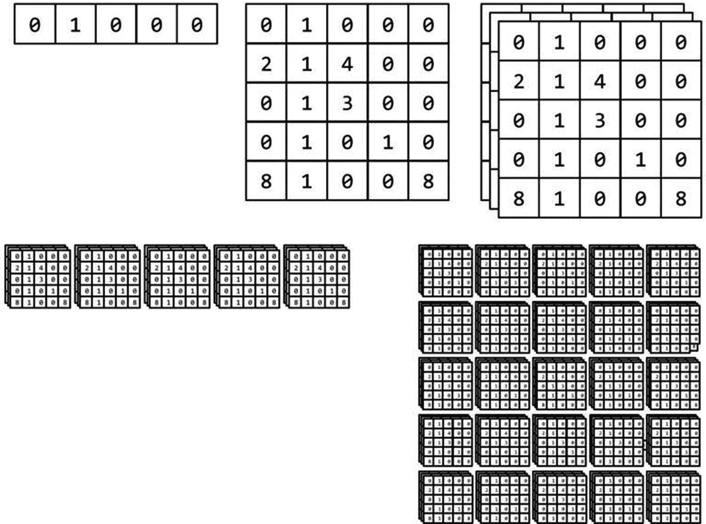
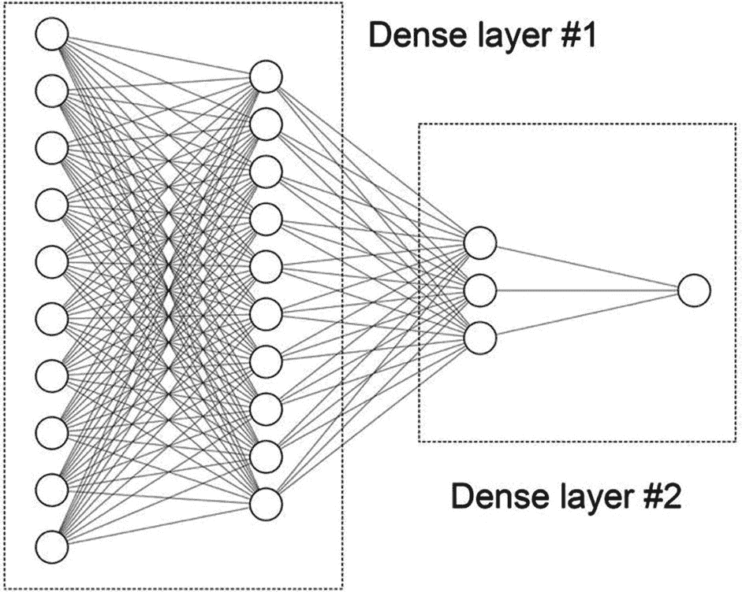

# 1. 欢迎来到 TensorFlow.js

世界正站在一场**人工智能**（AI）革命的边缘。这股创新浪潮以**数据**和**机器学习**（ML）的形式出现，正在迅速改变我们创建软件的方式、行业的运作方式，甚至我们生活的方方面面。随着基于数据和机器学习驱动的应用的需求和采用率的增加，它们的要求、用于开发它们的工具以及我们希望部署它们的平台也在增加。这些平台之一就是**网络浏览器**。

尽管可访问，但长期以来，浏览器并未被视为一种能够利用和提供机器学习力量的潜在媒介。然而，随着该领域的不断发展，我们迈向数据时代，浏览器正逐渐证明自己是一个值得竞争的对手，因为它拥有优势和独特的特性，能够带来机器学习的突破。

TensorFlow 团队为了在 Web 上执行机器学习提供一个可靠且现成的解决方案，于 2018 年 3 月发布了**TensorFlow.js**。这个库是一个高性能的开源框架，用于在浏览器中使用**JavaScript**（JS）训练、执行和部署机器学习模型。

TensorFlow.js 是*deeplearn.js*的后继者，这是一个由 Google Brain 开发的已废弃的机器学习工具，用于在浏览器中构建基于人工神经网络的模型。现在，这个库是 TensorFlow.js 的核心，被称为**TensorFlow.js 核心 API**或简称**tfjs-core**。

根据 2019 年 Smilkov 等人撰写的论文“TensorFlow.js：Web 和超越的机器学习”（Smilkov et al., 2019），TF.js 背后的主要动机之一是将机器学习的力量带给 JavaScript 和 Web 生态系统中的开发者，以及那些有限或没有机器学习经验的人。TF.js 通过其多个抽象级别实现了这一目标，提供了易于使用且干净的体验，同时不牺牲功能。

## 为什么是浏览器？

做和执行机器学习一直主要与*Python*、*R*、*C++*、服务器、云、GPU 和 CPU 相关联——但不是浏览器。或者至少直到第一个机器学习库出现。但为什么是现在？是什么让网络浏览器成为执行机器学习的理想平台？我们可以争论并同意，以下是一些合理的理由：JavaScript、可访问性、隐私、速度和成本效益。

### JavaScript

如同在 GitHub 2019 年发布的报告《Octoverse 状态》（GitHub, 2019）和 StackOverflow 开发者调查（StackOverflow, 2019）中所述，JavaScript（以及至少在过去七年中）一直是世界上最受欢迎的编程语言。它超越了 Python，后者因为其作为“数据科学”事实上的语言而受到几年的关注。作为顶级语言意味着它既有需求也有供应——对更多产品的需求以及提供这些产品的开发者。然而，在 2015 年之前，直到像*ConvNetJS*、*brain.js*和最终 TensorFlow.js 这样的库发布，浏览器上开发执行深度学习的竞争性或生产就绪框架并不存在。因此，鉴于语言的普及，深度学习革命达到这一大群开发者中只是时间问题。

此外，JavaScript 正在逐渐成为一个能够进行生产就绪的机器学习和数据科学的语言。近年来，JavaScript 获得了其他库和框架，如*Apache Arrow*^(1)，这是一个处理列数据的语言无关框架，*Observable*^(2)（笔记本），以及许多帮助我们评估数据的可视化工具。

### 可访问性

当你在电脑或移动设备上时，你最可能使用的应用程序是什么？…正是！网络浏览器，我们的网络门户，一个非常易于访问的工具。现在考虑所有使用浏览器的人，并将他们花费在点击和迷失在万维网错综复杂中的时间相乘。这肯定是一个相当大的数字。拥有如此广泛的受众，网络浏览器似乎是一个部署机器学习应用的理想场所。

但不仅仅是因为网络浏览器是我们大多数人都能访问的媒介。浏览器本身的性质可以访问广泛的组件，例如设备的麦克风、网络摄像头、键盘、位置以及许多传感器（如加速度计），如果计算机支持的话。这些工具是数据来源——方便且丰富的数据，可以为许多机器学习模型提供动力。

### 隐私

尽管上述数据非常伟大和强大，但有些人可能不愿意为了交换，例如，一个可以根据图像预测你今天是否看起来疲倦的服务。但是，有了 TensorFlow.js 及其**设备上**安装的模型，用户不必为此担心。模型部署在浏览器上——而不是在外部服务器上，你将不得不将数据发送到其他地方——提供的数据和模型的预测都留在你的设备上。

这种对用户隐私的保护使得开发者能够创建使用敏感数据的应用程序，例如，为医疗行业提供的服务以及前面提到的“是否疲倦”的应用程序。在这种情况下，你将能够使用该应用程序，知道没有人会看到你那困倦的早晨面孔。

### 速度

在设备上运行的模型进行其计算的优势之一是速度的提升。在客户端托管模型意味着不需要将数据上传到其他地方，这使我们能够降低应用程序的整体延迟和推理时间。当应用程序涉及大型数据集，如图像或音频数据时，这种优势非常有用。例如，假设我们的“是否疲倦”应用程序有一个更好的预测模型，它使用 5 秒的视频剪辑而不是图像。现在想象一下，你需要上传这个视频，等待计算，然后下载结果。这至少需要几秒钟。当然，几秒钟不算什么，但在其他类型的应用程序中，例如实时物体检测，这种延迟无疑是有害的。

### 成本效益

假设我们在 *疲倦人群世界大会* 上展示了我们的“是否疲倦”网络应用程序，并赢得了“最佳展示”奖项。哇，恭喜！因此，应用程序突然变得流行起来，数百万用户正在检查他们是否疲倦。在一个不幸的、在 TensorFlow.js 之前的情况中，如果我们把模型托管在云中的某个地方，我们就必须为涉及的带宽付费。此外，由于我们在不到一个小时的时间里从两个用户增长到数百万用户，服务很可能会崩溃。因此，现在我们需要扩展并启动几台额外的机器，而这并不便宜。

然而，由于我们了解 TensorFlow.js 以及如何在浏览器上部署模型，总成本可能只是之前示例中支付的一小部分。尽管如此，应用程序仍然需要下载模型，但正如我们稍后将要看到的，它们可以小到不到 1 MB。

## 功能

正如我们在本书及其练习中将要发现的那样，TensorFlow.js 是一个广泛且完整的生态系统，具有众多功能。其中，有四个特性使其与众不同，使其成为当前可用的深度学习框架中独特的库。这些特性包括其作为 **推理引擎** 的使用、**预训练模型**、其许多 **后端** 以及与 **TensorFlow** 的兼容性。

### 推理引擎

虽然 TensorFlow.js 是一个完整的深度学习框架，支持构建机器学习模型，但它真正擅长的是作为推理引擎，一个执行预测的工具。与预测引擎相反的是专门用于训练模型的解决方案，例如 *TensorFlow* 或 *PyTorch*。^(3) 通常，在训练好模型后，如果我们希望将其部署到生产环境中，我们必须考虑替代平台，如自定义 API 服务、云解决方案如 *Google 的 AI 平台*，^(4) *TensorFlow Lite*（移动设备的推理引擎），以及当然，TensorFlow.js。使用前者，我们可以快速训练、部署，并在浏览器中直接向用户展示模型，使其成为一个理想的推理引擎。

### 预训练模型

与前一个特性相关联的第二个特性是加载预训练模型是多么简单。TensorFlow.js 内置了几个模型，涵盖了整个范围的用例。例如，如果你需要一个快速的对象检测器来确保使用“是否疲倦”应用的人确实是人，TF.js 提供了一个在 COCO 数据集上训练的模型。要加载并使用它，我们只需要两行代码，例如这个：

```py
// Load the model.
const model = await cocoSsd.load();
// Classify the image.
const predictions = await model.detect(img);
```

同样，如果你需要一种分类器来检测文本是否包含有害内容（侮辱、威胁、淫秽），TF.js 中有一个文本毒性检测模型可供使用（书中的一篇练习展示了这个模型）。表 1-1 展示了 TensorFlow.js 和 ml5.js 提供的一些模型，ml5.js 是一个建立在 TensorFlow.js 之上的高级库，我们将在本书的后续内容中使用它。

表 1-1

一些预训练模型

| 用例 | 描述 |
| --- | --- |
| 身体分割 | 使用 BodyPix 分割人的身体部位 |
| 对象检测 | 使用 COCO 数据集训练的 SSD 模型 |
| 句子编码 | 将文本编码成嵌入向量 |
| k-means (ml5.js) | 使用 k-means 算法聚类数据 |

### 后端

TensorFlow.js 的一个亮点是它支持三种独特的后端，这些后端也决定了它在底层是如何运行的。这些后端是 **WebGL**、**Node.js** 和 **常规** JavaScript。每种解决方案都有其自身的优缺点，这些优缺点主要表现在操作的速度上。

#### WebGL

训练大型神经网络是一项计算密集型任务。除此之外，在最坏的情况下，推断结果也可能需要几秒钟。为了应对这些缺点，开发者们求助于大型且昂贵的机器，这些机器配备了强大且昂贵的图形处理单元（GPU）来训练这些模型。GPU 的特点在于它能够并行执行许多数值计算，这是 CPU 可以做到的，但效果不如 GPU。

TensorFlow.js 的一个后端模式是 **WebGL** 模式，它使用你的计算机的 GPU 来加速和并行化其过程。WebGL 是一个用于在浏览器中渲染高性能交互式图形的 JavaScript API。虽然这个库的原始目的是渲染我们现在在网上看到的那些炫酷的图形，但 TensorFlow.js 的开发者们正在利用它来改进和加速其过程和性能。WebGL 模式是默认模式，只要你的浏览器支持它。

#### Node.js

另一个后端是“节点”模式，它允许在 Node.js 应用程序中运行 TensorFlow.js。Node.js 是一个 JavaScript 服务器端运行时，它在外部环境中执行 JS 代码，而不是在浏览器中。在 Node.js 中运行 TF.js 有许多优点，其中最大的优点是能够在服务器端执行，使我们能够构建不需要直接与用户交互的应用程序。一个例子就是在服务器上部署不同版本的*tired or not*，并通过网络服务公开它。

使用 Node.js 后端的第二个优点是性能的提升。例如，在 Node.js 环境中，TensorFlow.js 使用 TensorFlow C 库，这比 JS 实现要快。此外，Node.js 后端还提供了一个 GPU 变体，通过在 NVIDIA GPU 上使用 CUDA 来加速张量运算。

#### 常规 CPU

然后，还有性能最差的 CPU 后端，它使用 TensorFlow.js 的纯 JS 实现。它的优点是，所有这些模式中它的包大小是最小的。这种模式是后备选项。

### 与 TensorFlow 的兼容性

正如其名所示，TensorFlow.js 是 TensorFlow 生态系统的一部分。因此，它的层 API 和开发模型的整体方式与 TensorFlow 的 Keras 高级 API 相似。多亏了这种一致性，对于熟悉其中一个平台的人来说，从 TF 迁移到 TF.js（或反之）应该会更加顺畅。在下面的代码中，您将找到同一模型在 TensorFlow.js 和 Keras 中的两个示例。

TensorFlow.js：

```py
const model = tf.sequential();
model.add(tf.layers.dense({
inputShape: 1,
units: 1,
activation: 'sigmoid',
}));
model.compile({
optimizer: tf.train.adam(0.1),
loss: 'binaryCrossentropy',
metrics: ['accuracy'],
});
```

TensorFlow 2.0 Keras 顺序模型（Python）：

```py
model = tf.keras.Sequential()
model.add(tf.keras.layers.Dense(units=1,
input_shape=[1]))
model.compile(optimizer='adam',
loss='binary_crossentropy',
metrics=['accuracy'])
```

但除了具有相似的 API 之外，作为 TensorFlow 生态系统的一部分，意味着能够使用名为*TensorFlow.js Converter*的 Python 库将最初在 TensorFlow 中训练的模型甚至来自*TensorFlow Hub*^(5)——TensorFlow 模型的存储库——的模型转换为 TensorFlow.js 模型。^(6) 在这个转换过程中，库确保原始图中的每个操作都与 TensorFlow.js 中可用的操作兼容。此外，该工具提供了各种机制，有助于减小模型的大小，这在网络环境中总是非常好的。尽管如此，这个过程可能会损害模型的预测能力，所以请谨慎行事。

## 架构

TensorFlow.js 库包含两个 API：**操作 API**和**层 API**。前者，操作 API，提供了库所需的必要的基本功能，如数学和张量运算，而后者提供了构建模型所需的基本块。但在到达那里之前，为了更好地理解下一部分，并为“TensorFlow”这个名字提供一些背景，让我们看看什么是张量。

### 张量

张量是 TensorFlow.js 的主要抽象和数据单元。更精确地说，我们可以将它们描述为多维数组，或者如官方文档所说，“一组形状为多维数组的一组值”（Google，2018b）。在 TF.js 中，张量是对象，并且它们具有以下属性来描述它们：**dtype**、**rank**和**shape**。第一个，dtype，定义了张量的数据类型；第二个，rank，描述了张量有多少维度；最后一个，shape，指定了数据维度的尺寸。

例如，以下代码

```py
const a = tf.tensor([[1, 2], [3, 4]]);
console.log(`${a.dtype} | ${a.shape} | ${a.rank}`);
```

输出 `float32 | 2,2 | 2`，这对应于一个元素为浮点数、形状为 2,2（类似于矩阵）和秩为 2 的张量。

为了正确地了解像张量这样抽象的东西看起来像什么，图 1-1 展示了从秩 1 到秩 5 的五个张量。在图像中，我们可以看到秩为 1 的张量是一个向量或数组。秩为 2 的张量是一个矩阵，秩为 3 的张量是一个立方体。然后它变得更加复杂。秩为 4 的张量是一系列立方体，而秩为 5 的张量是一系列立方体的矩阵。作为一个具体的例子，考虑一个彩色图像。当转换为张量时，彩色图像用秩为 3 的张量表示，而图像列表用秩为 4 的张量表示。



图 1-1

一个秩为 1、2、3、4 和 5 的张量示例

但“流动”部分又是怎么回事呢？单词“流动”指的是张量如何在层之间移动。正如我们稍后将会看到的，当我们定义我们的第一个模型时，你会得到这样的印象：定义模型就是指定数据或张量如何通过神经网络层流动。除了这一点，不仅是张量在流动，它们还会改变它们的形状和秩，给“流动”这个词增添了更多的意义。

### 层 API

层 API 是 TensorFlow.js 构建我们将要训练的模型的主要和首选方式。它是一个高级 API，它使用堆叠或连接层的概念，其中数据将流动。如果你之前使用过 Keras，你会意识到它与这个库是多么相似；如前所述，TF.js 旨在与其对应物 TensorFlow 保持一致。

层 API 有两种创建模型的方式。第一种，也是最流行的一种，名为**Sequential**，通过顺序堆叠层来构建模型，使得一个层的输出成为下一个层的输入。想象一下一堆美味的松软煎饼，你在上面加上了大量的糖浆，结果糖浆会传播或*流动*到下一个层。让我们用代码来说明我们如何定义一个由两层组成的小型神经网络：

```py
const model = tf.sequential();
model.add(tf.layers.dense({ inputShape: [10],
activation: 'sigmoid', units: 10 }));
model.add(tf.layers.dense({ activation: 'softmax',
units: 3 }));
```

要定义一个序列模型，首先创建一个 `tf.Sequential` 对象的实例，这里命名为 `model`。然后，使用 `tf.Sequential.add()` 方法添加层。其中第一个是一个具有 `inputShape`（层的输入数据形状）为 10 的密集层。接着是 `units` 值——层的输出形状——也是 10。紧接着这个层，我们添加一个输入形状为 10、输出为 3 的第二个密集层。注意，输入形状必须与上一个层的输出匹配。否则，模型无法编译。图 1-2 是模型架构和密集层的视觉表示。在第一层的左侧是模型的输入，正式称为输入层，随后是“内部”单元，或隐藏层。第二层接收前一层的输出作为输入，并产生输出。这部分输出被称为输出层。



图 1-2

具有两个密集层的模型示意图。图像使用 NN-SVG 软件创建（LeNail，2019）

使用 Layers API 构建模型的第二种方式是使用 **功能** 方法。主要区别在于，与序列方法不同，这种方法允许任意创建网络的图，只要没有循环。此外，没有 `add()` 方法，而是有一个名为 `tf.layers.Layer.apply()` 的方法来连接层。在下面的内容中，您将找到之前使用功能方式定义的相同模型：

```py
const input = tf.input({ shape: [10] });
const dense1 = tf.layers.dense({ units: 10,
activation: 'sigmoid' }).apply(input);
const dense2 = tf.layers.dense({ units: 3,
activation: 'softmax'}).apply(dense1);
const model = tf.model({ inputs: input, outputs:
dense2 });
```

apply 函数返回一个名为 *SymbolicTensor* 的对象实例，这是一种没有具体值的张量类型。将其视为张量的占位符。在煎饼世界中，这种方法相当于将煎饼放在桌子上，并用糖浆的线条连接它们（祝您好运，清理那东西）。

Layers API 不仅限于连接层，它还包括一个庞大的工具集，例如 `tf.Sequential.summary()` 函数，该函数打印模型的架构，如果您需要检查它时非常有用。在练习中，我们将了解这个方法和其他方法。

### 操作 API

第二个 API 组件是操作 API。它包括我们在每次执行涉及层的操作时无意中应用的底层数学运算。这些运算涵盖了整个范围的数学场景，例如逐元素添加两个张量的算术运算，如下所示：

```py
tf.tensor1d([1, 2]).add(tf.tensor1d([3,4])).print();
```

它还支持基本的数学运算，如 `tf.abs()`（绝对值）、矩阵运算、归一化方法和逻辑运算。因为张量是不可变对象，所有运算都返回新的张量。

虽然使用 Layers API 是标准甚至推荐（谷歌，2018a）的方式来构建模型，但我们应知道，使用操作 API 创建模型也是可能的。使用这种方法构建模型使我们能够完全控制系统的每个部分。尽管有这个优势，但使用这种方法，我们仍需手动实现许多 Layers API 为我们提供的功能，例如训练监控和权重初始化。

以下代码展示了我们在本节中使用相同模型，通过操作实现的示例：

```py
function opModel() {
const w1 = tf.variable(tf.randomNormal([10, 10]));
const b1 = tf.variable(tf.randomNormal([10]));
const w2 = tf.variable(tf.randomNormal([10, 3]));
const b2 = tf.variable(tf.randomNormal([3]));
// where x is a tensor of shape [10, 10]
const model = (x) =>
x.matMul(w1).add(b1).sigmoid().matMul(w2)
.add(b2)
.softmax();
}
```

## 如何安装

在讨论了这么多关于 TensorFlow.js 之后，你可能非常兴奋地想要实现世界上下一个大应用。但在到达那里并赢得另一个“最佳展示”奖项之前，我们需要安装这个库。那么，我们该如何做呢？我们需要决定的第一件事是我们将在哪里执行我们的应用。是在浏览器中吗？还是作为一个 Node.js 应用程序？

如果是为了浏览器（这是最常见的情况，也是本书中将使用的情况），那么有两种选择。第一种是通过使用脚本标签通过 *内容分发网络*（CDN）加载 TensorFlow.js。要这样访问，请将以下标签添加到应用程序的主要 HTML 文件中：

当执行应用时，这一小行会下载并加载库，从而让我们免于手动在我们的电脑上安装它。

另一种方法涉及使用包管理器如 *npm* 或 *yarn* 下载 TensorFlow.js 并将其添加到项目中。在以下内容中，你会找到以下命令

```py
yarn add @tensorflow/tfjs
```

或

```py
npm install @tensorflow/tfjs
```

一旦项目设置完成，导入库需要在 JS 脚本中添加以下行：

```py
import * as tf from '@tensorflow/tfjs';
```

或

```py
const tf = require('@tensorflow/tfjs');
```

如果目标平台是 Node.js，那么使用

```py
yarn add @tensorflow/tfjs-node
```

或

```py
npm install @tensorflow/tfjs-node
```

要安装 GPU 变体，使用

```py
yarn add @tensorflow/tfjs-node-gpu
```

或

```py
npm install @tensorflow/tfjs-node-gpu
```

## 回顾

机器学习和其应用范围正在席卷全球。在其影响下，这场人工智能革命带来了一波波智能产品，这些产品正在逐渐塑造我们数字生活的领导方式，甚至开始颠覆“现实世界”。我们已经感受到了它的效果。例如，机器学习正在改善我们的购物方式（尽管没有改善我们的钱包），我们浏览电影的方式，甚至通过匹配我们与“完美”的目标来寻找爱情的方式。此外，机器学习也已经触及了各种平台，例如**移动**，例如 *Google Assistant*、*Siri* 和 *Android 的自适应电池*，以及**嵌入式设备**，例如 *NVIDIA Jetson*。然而，一个尚未像其他平台那样受到影响的是网页浏览器。或者至少在 TensorFlow.js 出现之前是这样的。

TensorFlow.js 是一个深度学习库，旨在将人工智能革命带到 JavaScript 和网页浏览器中。它提供了创建和部署客户端低延迟模型所需的工具，这些模型不需要服务器。

在 GitHub 上拥有超过 12K 个星标，TensorFlow.js 目前是 JavaScript 最受欢迎的机器学习库。当然，我们必须认识到它之前的库以及仍然活跃的其他库。在 TensorFlow.js 之前，有 deeplearn.js，这个包现在构成了 TF.js 的核心。其他过去的库包括 *ConvNetJS* 和 *Keras.js*，而一些仍然活跃的库有 *brain.js*（10.6K 个星标）和 ml5.js（3.4K 个星标）。

那么，接下来是什么？在下一章中，我们将探索 TensorFlow.js 的基本构建块，并使用它们来构建我们的第一个模型。你准备好了吗？
