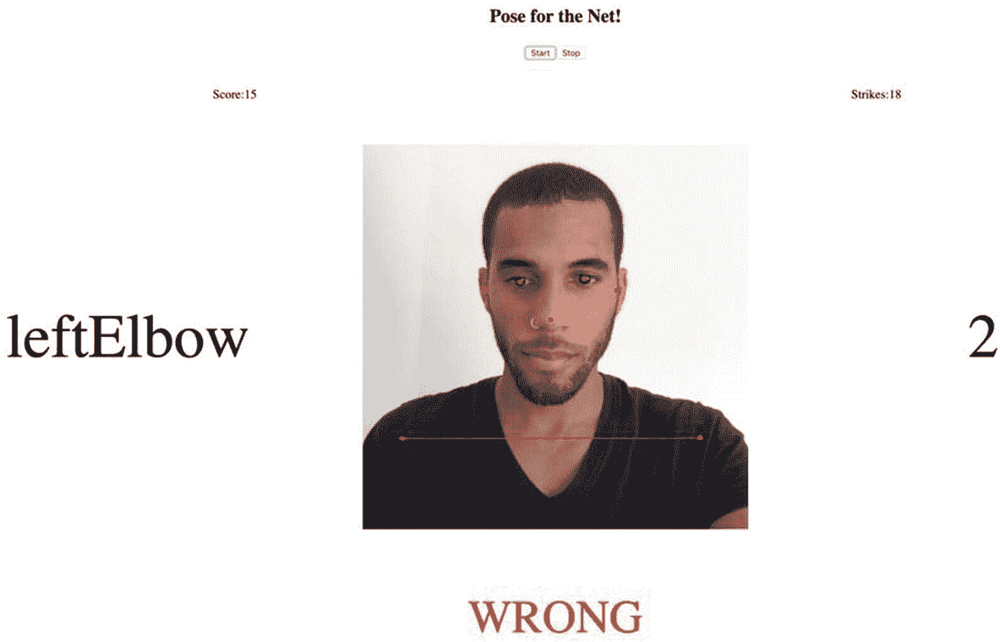
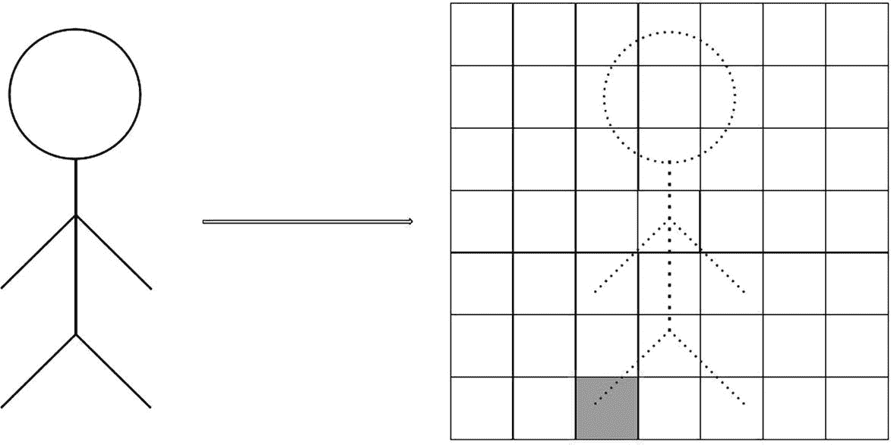
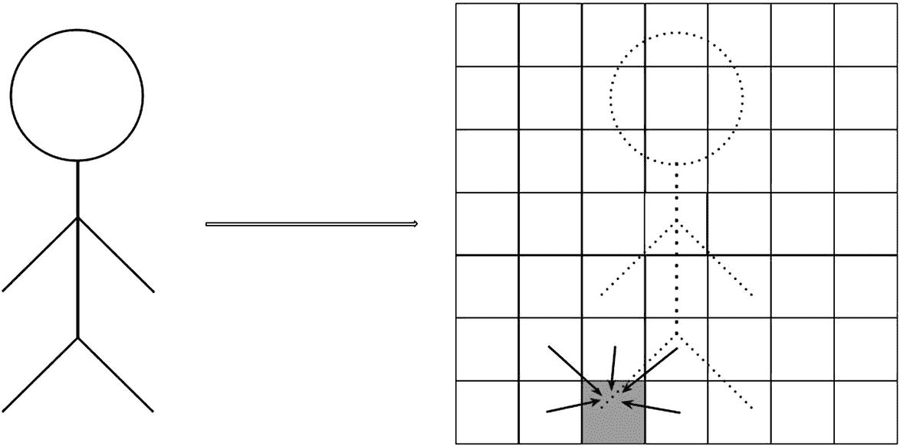
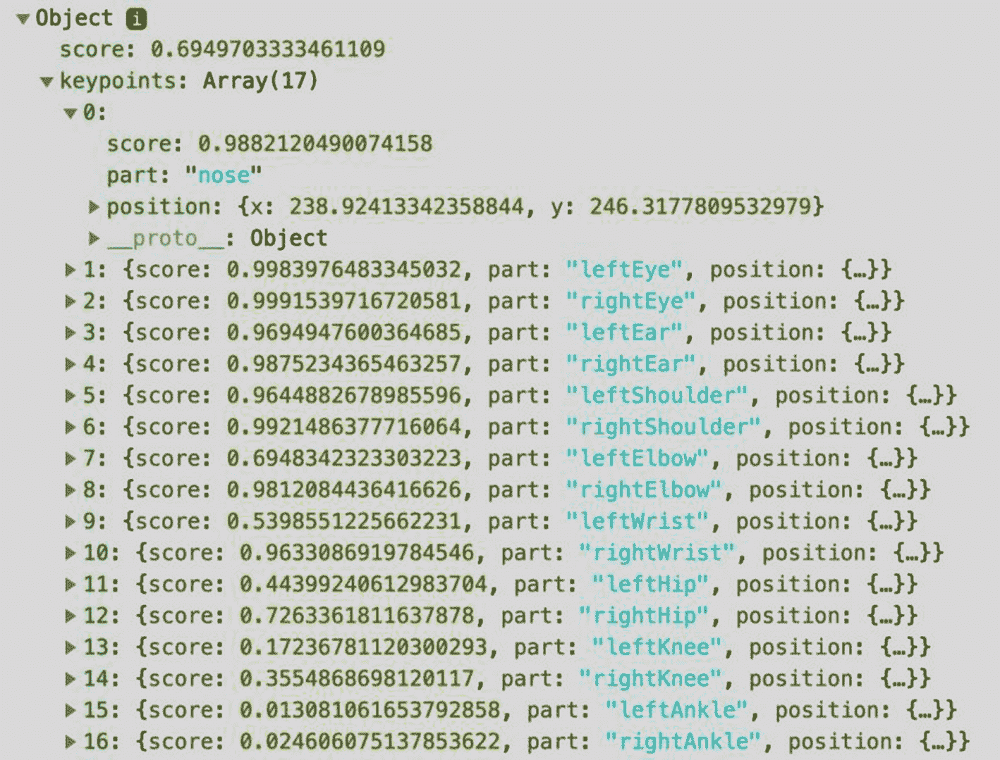

# 5. 使用 PoseNet 制作游戏，姿态估计模型

是时候制作一个有趣的应用了！你准备好摆姿势了吗？我希望如此，因为在这个练习中，你的动作是测试数据集。

在本章中，你将实现一个具有**PoseNet**模型的游戏功能。PoseNet 是一种能够在图像和视频中实时进行人体姿态估计的神经网络。在这个上下文中，估计姿态是指识别一个人体关节和其他部分在画面中出现的任务。例如，图 5-1 是应用程序的截图，在位于中心的画布上，你可以看到算法识别的身体部位骨骼叠加。



图 5-1

游戏的截图。我不是很擅长这个

使用 PoseNet，我们将介绍本书的第一个预训练和内置模型。因此，由于我们不需要训练它，我们的工作就减少到理解算法的输出并围绕它构建游戏。

你将要创建的应用是一款游戏，用户需要在时间耗尽之前，通过设备的摄像头向 PoseNet 展示一系列身体部位。如果 PoseNet 识别出该部位，用户得一分。否则，则扣一分。

## 什么是 PoseNet？

PoseNet 是一种用于估计人体姿态的卷积神经网络模型。这些姿态由 17 个不同且预定义的身体部位组成，被称为**关键点**。这些部位包括双眼、耳朵、肩膀、肘部、手腕、臀部、膝盖、脚踝和鼻子。

该模型有两种解码姿态的方法：*单人姿态估计器*和*多人姿态估计器*。单人姿态估计器速度更快，所需资源更少。但其缺点是，如果画面中存在多个主体，模型可能会从所有主体中估计姿态。例如，在视频中存在两个人的情况下，算法可能会从主体 A 检测到左眼，从主体 B 检测到右眼。多人姿态估计器可以处理这个问题。这种方法可以识别姿态是否来自不同的身体，但代价是比单人姿态估计器慢（Oved，2018）。对于这个游戏，我们将使用单人姿态检测器。

使用 PoseNet 估计姿态涉及两个关键步骤：计算**热图**和**偏移向量**。热图是大小为 RESOLUTION x RESOLUTION x 17 的三维张量（算法自动将图像平方），其中数字 17 代表关键点。热图中的每个值都是对应关键点在该位置存在的置信度或概率。图 5-2 展示了“右膝”关键点热图的简化示例。



图 5-2

“右膝”热图

在第二步中，PoseNet 计算一组偏移向量，这些向量测量像素与关键点位置之间的距离，并产生，正如模型背后的论文之一所引用的，“更精确地估计对应的关键点位置”（Papandreou 等人，2017）。在创建这些张量之后，网络将它们聚合起来，产生高度局部化的激活图，精确地定位关键点的位置（图 5-3)。



图 5-3

“右膝”偏移向量

PoseNet 有两种版本：**MobileNet**和**ResNet**变体。我们将使用基于 MobileNet 的变体。MobileNet（Howard 等人，2017）是一种 CNN 架构，它牺牲了准确性以换取速度和大小，使其非常适合对时间敏感的使用案例，如游戏。我们将在第八章中重新审视并了解更多关于 MobileNet 的内容。第二种变体基于 ResNet（He 等人，2015），这是一种更准确但速度较慢、体积较大的架构。

## COCO 数据集

PoseNet 模型是在**上下文中的常见物体**或 COCO 关键点（Lin 等人，2014）数据集上训练的。这个数据集是为 COCO 关键点检测任务竞赛创建的，包含超过 200,000 张图片，以及超过 250,000 个在不受控制条件下执行日常任务的实例。

## 构建游戏

你即将创建的游戏是一款动作游戏，玩家需要在屏幕上执行显示的姿势。例如，如果游戏提示“左髋”，请在网络摄像头（请小心）上展示你的左髋。但你必须迅速，并在规定时间内完成姿势。否则，你将受到一次扣分，就像每个经典视频游戏一样，你只有三次机会。另一方面，如果你做得很好，像舞者一样掌控这些姿势，游戏难度会加大。难度加大意味着你有更少的时间来完成姿势，并触发“反向”模式，这是一种游戏模式，如果提示的关键点在帧中存在，用户将受到一次扣分。所以，如果你在屏幕上看到“~nose”，请从摄像头中隐藏鼻子。

由于我们使用的是预训练模型并制作游戏，这个练习将与其他练习有所不同。你将首先设置摄像头，然后加载和集成模型，并编写游戏循环。与早期示例不同，这里不涉及数据预处理、训练和可视化任务。

### UI 结构化

游戏 UI 非常简单（图 5-1）。它有一个画布，展示带有关键点和“骨骼”的网络摄像头视频。视频上方有一个开始游戏的按钮和另一个停止游戏的按钮。它们下面是游戏的得分和扣分。画布两侧是姿势的关键点和计时器。底部有一个标签，通知姿势是否正确或错误。

现在开始编写代码。像往常一样，在你的选择位置创建一个新的目录，并在同一位置启动一个网络服务器。接下来，打开代码编辑器，创建一个名为 *index.html* 和 *style.css* 的文件。在文件顶部，使用 `<head>` 标签导入 TensorFlow.js、PoseNet 和 CSS 文件：

在 `<head>` 标签之后，添加 `<body>` 标签。在这个节点内部，为应用编写一个标题，并创建一个具有 `id` 属性 `game-container` 的 `<div>` 用于游戏用户界面。如前所述，游戏用户界面包含一组按钮，你将在具有 `id` 属性 `buttons-menu` 的 `<div>` 中程序化地创建这些按钮。在其下方，定义另一个 `<div>`，用于显示游戏的得分和击打次数：

```py
Pose for the Net!

Score:
0

Strikes:
0

```

在最后一个 `<div>` 下方，创建另一个 `<div>`。这个 `<div>` 包含“匹配姿势”字符串、计时器、用于检索网络摄像头流的 `<video>` 标签以及显示视频和关键点的画布：

```py

-

-

```

在 `<div>` 之后，添加两个 `<script>` 标签以加载 *index.js* 和 *draw.js*，这是一个包含绘制关键点和骨骼的函数的脚本。*draw.js* 脚本（我稍作修改）来自官方 TensorFlow.js 存储库中的 PoseNet 示例:^(1)

为了结束本节，将以下 CSS 代码（用于居中和定位元素）复制到 *style.css* 文件中：

```py
.center {
margin: auto;
width: 50%;
display: flex;
justify-content: center;
}
.game-container {
margin: auto;
}
.game-container h2 {
font-size: 15px;
padding: 10px;
color: white;
border-top-left-radius: 5px;
border-top-right-radius: 5px;
}
.game-ui {
display: flex;
flex-wrap: wrap;
}
.game-ui div {
flex: 1;
padding: 20px;
text-align: center;
}
```

### 设置摄像头

创建 *index.js* 文件。在第一行，添加变量 `SIZE`（画布宽度和高度的尺寸）并将其值设置为 500。接下来，创建新的函数 `setupCamera()`：

```py
const SIZE = 500;
function setupCamera() {
const video = document.getElementById('video');
video.width = SIZE;
video.height = SIZE;
navigator.mediaDevices.getUserMedia({
audio: false,
video: {
width: SIZE,
height: SIZE,
},
}).then((stream) => {
video.srcObject = stream;
});
return new Promise((resolve) => {
video.onloadedmetadata = () => resolve(video);
});
}
```

`setupCamera()` 函数的前几行获取视频元素并设置其大小。它使用 `MediaDevices.getUserMedia()` 函数 ^(2) 生成一个 Promise，其预期值是一个 `MediaStream`（视频）。我们将使用 `then` 语句获取该值。在其中，使用回调将网络摄像头流设置到视频元素。此方法会触发请求权限访问视频的弹出窗口（接受！）。

你还需要第二个函数 `loadVideo()`。该函数调用 `setupCamera()` 并使用其 `play()` 方法播放视频：

```py
async function loadVideo() {
const video = await setupCamera();
video.play();
return video;
}
```

现在，让我们在画布上绘制并展示视频。因此，创建一个新的函数 `detect()`，它接受 `video` 作为参数。在函数中，获取画布元素及其上下文并设置大小。在函数内部，添加第二个（是的，在内部），并命名为 `getPose()`。稍后，你将在这里添加执行预测的代码。现在，让我们专注于在画布上绘制视频。

我们不会像平常一样绘制视频流，而是使用 `ctx.scale()` 和 `ctx.translate()` 来翻转它，使其对我们来说看起来更自然。在准备上下文后，使用 `requestAnimationFrame()`，这是一个 JavaScript 函数，在这种情况下，用于生成视频的下一帧。现在，关闭 `getPose()` 函数，并在下一行（仍在 `detect()` 函数中）调用它。

```py
function detect(video) {
const canvas = document.getElementById('output');
const ctx = canvas.getContext('2d');
canvas.width = SIZE;
canvas.height = SIZE;
async function getPose() {
ctx.clearRect(0, 0, SIZE, SIZE);
ctx.save();
ctx.scale(-1, 1);
ctx.translate(-SIZE, 0);
ctx.drawImage(video, 0, 0, SIZE, SIZE);
ctx.restore();
requestAnimationFrame(getPose);
}
getPose();
}
```

在继续到游戏的精彩部分之前，先暂停一下，检查一切是否按预期运行。因此，创建一个 `init()` 函数，并从其中调用 `loadVideo()` 和 `detect()`。接下来，调用 `init()`：

```py
async function init() {
const video = await loadVideo();
detect(video);
}
init();
```

当网络服务器运行时，打开浏览器并启动应用。立即，一个弹出窗口会出现，请求访问摄像头的权限。接受后，网络摄像头的视频流将出现在应用中间。

### 加载和测试模型

应用程序正在运行，你可以在画布上看到自己。很好。所以，作为下一步，你将加载模型并进行快速测试，以检查其工作情况并更好地理解它返回的预测对象。

回到代码编辑器，创建一个新文件，并将其命名为 *draw.js*。该文件包含在画布上绘制 PoseNet 关键点和骨骼的函数。在到达函数之前，声明一个变量 `COLOR` 并将其设置为“红色”（或任何其他颜色），以便用红色绘制每条线和每个点。然后创建一个绘制点的函数；将其命名为 `drawPoint()`：

```py
const COLOR = 'red';
function drawPoint(ctx, y, x, r) {
ctx.beginPath();
ctx.arc(x, y, r, 0, 2 * Math.PI);
ctx.fillStyle = COLOR;
ctx.fill();
}
```

你可能会意识到一些上下文方法是我们第五章节中看到的。唯一的例外是 `ctx.arc()`，它用于绘制圆形。

在 `drawPoint()` 之后，创建 `drawSegment()`，这是一个绘制关键点之间线条的函数：

```py
function drawSegment([ay, ax], [by, bx], scale, ctx) {
ctx.beginPath();
ctx.moveTo(ax * scale, ay * scale);
ctx.lineTo(bx * scale, by * scale);
ctx.lineWidth = '10px';
ctx.strokeStyle = COLOR;
ctx.stroke();
}
```

接下来是 `drawSkeleton()` 和它的辅助函数 `toTuple()`。`drawSkeleton()` 使用 PoseNet 的 `getAdjacentKeyPoints()` 方法获取接近关键点的点，并使用 `drawSegment()` 来绘制线条：

```py
function toTuple({ y, x }) {
return [y, x];
}
export function drawSkeleton(keypoints, minConfidence, ctx, scale = 1) {
const adjacentKeyPoints = posenet.getAdjacentKeyPoints(keypoints, minConfidence);
adjacentKeyPoints.forEach((keypoints) => {
drawSegment(
toTuple(keypoints[0].position), toTuple(keypoints[1].position), scale, ctx,
);
});
}
```

最后，你需要 `drawKeypoints()` 来绘制关键点。请注意，此函数和 `drawSkeleton()` 会检查检测到的关键点的置信度是否高于某个阈值。如果不是，该方法将不会返回预测：

```py
export function drawKeypoints(keypoints, minConfidence, ctx, scale = 1) {
for (let i = 0; i = minConfidence) {
const { y, x } = keypoint.position;
drawPoint(ctx, y * scale, x * scale, 3);
}
}
}
```

定义了绘图函数后，我们就有了预测关键点和显示它们的所需内容。因此，回到 *index.js* 并导入 *draw.js*：

```py
import { drawKeypoints, drawSkeleton } from './draw.js';
```

现在转到 `init()`。在你调用 `loadVideo()` 的那行之后，使用以下代码加载模型（确保你声明了 `model`）：

```py
let model;
async function init() {
const video = await loadVideo();
model = await posenet.load({
architecture: 'MobileNetV1',
outputStride: 16,
inputResolution: { width: 500, height: 500 },
multiplier: 0.75,
});
detect(video);
}
```

PoseNet 的 `load()` 方法接受一个配置对象作为参数，该对象调整模型的多个方面。其中最重要的是 `architecture`，在这里你指定是否想使用 MobileNet 或 ResNet。第二个属性 `outputStride` 设置输出分辨率。值越小，输出越大，从而在牺牲速度的情况下实现更准确的预测——可能的值是 8、16 或 32。接下来是输入图像的分辨率 (`inputResolution`) 和 `multiplier`，这是一个仅用于 MobileNet 变体的属性，用于控制卷积层的深度。同样，这里也有权衡。值越大，层的尺寸越大，意味着更高的精度，但代价是速度——可能的值是 0.50、0.75、1.0 或 1.01。这是关于模型！现在回到 `getPose()`。

在 `getPose()` 的开头（在你之前写的行之前），使用 `video` 和一个将 `flipHorizontal` 设置为 `true` 的配置对象作为参数调用 `model.estimateSinglePose()`（记住我们正在使用单姿势估计器）。此属性水平镜像姿势。然后在文件顶部声明变量 `lastPose`。此变量保存模型推断出的最后一个姿势，这是游戏用来评估用户是否执行了游戏指令的姿势。此外，创建一个常量 `MIN_CONFIDENCE` 并将其设置为 0.3：

```py
let lastPose;
const MIN_CONFIDENCE = 0.3;
```

再次回到 `getPose()`，将 `estimateSinglePose()` 返回的值设置为 `lastPose`。然后，在涉及 `ctx` 的所有方法之后，但在 `requestAnimationFrame()` 之前，调用 `drawKeypoints()` 和 `drawSkeleton`。`getPose()` 现在应该看起来像这样：

```py
async function getPose() {
const pose = await model.estimateSinglePose(video, {
flipHorizontal: true,
});
lastPose = pose;
ctx.clearRect(0, 0, SIZE, SIZE);
ctx.save();
ctx.scale(-1, 1);
ctx.translate(-SIZE, 0);
ctx.drawImage(video, 0, 0, SIZE, SIZE);
ctx.restore();
drawKeypoints(pose.keypoints, MIN_CONFIDENCE, ctx);
drawSkeleton(pose.keypoints, MIN_CONFIDENCE, ctx);
requestAnimationFrame(getPose);
}
```

只以防万一，确保 `getPose()` 在 `detect()` 函数内。

现在回到应用并重新加载它。和之前一样，你应该在页面中心看到网络摄像头的视频流，但现在它有了 PoseNet 检测到的关键点和骨架。四处移动一下，以便你能感受到检测的效果。如果流看起来很慢，调整参数 `outputStride`。相反，如果图像没有任何延迟，尝试一个更小的值以提高模型的准确性。

在继续教程的下一部分和最后一部分之前，让我们快速回顾一下模型的输出。PoseNet 预测（图 5-4）是一个由两个属性组成的对象 `pose`：`score` 和 `keypoints`。第二个属性 `keypoints` 对应于长度为 17 的数组，其中每个元素都是关键点之一。这些元素包含一个对象，包含关键点置信度分数、部分的名称及其位置。预测的第一个属性 `score` 是关键点置信度的平均值。



图 5-4

PoseNet 预测对象

### 创建游戏循环

摘下你的机器学习开发者帽子，戴上视频游戏开发者帽子，因为在这个练习的部分，你将构建游戏循环。正如介绍中提到的，游戏的目标是在时间耗尽前做出一个随机的姿势。为了让游戏更具挑战性和趣味性，在达到特定分数后，姿势的时间会减少，并且激活“逆”模式。在这个模式下，用户可能需要隐藏而不是显示指令中的关键点。让我们开始吧。

回到全局变量部分，声明以下变量：

```py
let timeToPose = 5;
const MAX_STRIKES = 3;
let gameInterval;
// Game status
let inverseMode = false;
let poseToPerform;
let isInverse;
let score = 0;
let strikes = 0;
const keypointsList = ['nose', 'leftEye', 'rightEye', 'leftEar', 'rightEar', 'leftShoulder', 'rightShoulder', 'leftElbow', 'rightElbow', 'leftWrist', 'rightWrist', 'leftHip', 'rightHip', 'leftKnee', 'rightKnee', 'leftAnkle', 'rightAnkle'];
```

然后创建一个名为 `initGame()` 的函数。在这里，你将初始化 `score` 和 `strike` 变量，使用 `nextPose()`（稍后定义）获取游戏的第一姿势，并在游戏界面上显示要做的姿势：

```py
function initGame() {
score = 0;
strikes = 0;
document.getElementById('score').innerHTML = `${score}`;
document.getElementById('strikes').innerHTML = `${strikes}`;
[poseToPerform] = nextPose();
document.getElementById('pose-to-match').innerHTML = `${poseToPerform}`;
}
```

接下来，定义另一个函数，`nextPose()`，它返回两个值（在一个列表中）：`keypointsList`中的一个随机关键点和一个标志，用于指定如果模式处于活动状态，则这一轮是否应用逆规则。请注意，如果逆模式开启，只有 33%的机会应用其效果：

```py
function nextPose() {
return [keypointsList[getRandomInt(keypointsList.length)], inverseMode && getRandomInt(3) === 0];
}
function getRandomInt(max) {
return Math.floor(Math.random() * Math.floor(max));
}
```

下一个函数是`verifyPose()`。正如其名所示，这个函数检查执行的动作是否正确。它遍历`lastPose`中的关键点，同时检查指示的关键点的置信度是否大于阈值。如果是`true`，则函数返回`true`。相反，如果用户在逆模式开启时显示关键点，则`verifyPose()`返回`false`：

```py
function verifyPose() {
let result = isInverse;
lastPose.keypoints.forEach((element) => {
if (poseToPerform === element.part && element.score >= MIN_CONFIDENCE) {
if (!isInverse) {
result = true;
} else {
result = false;
}
}
});
return result;
}
```

然后是`adjustRules()`。这个函数根据当前分数更改游戏模式。使用默认值，如果游戏分数是 3，`timeToPose`将变为 2，这意味着用户现在有 2 秒钟来做出动作。同样，如果分数是 5，逆模式将被激活：

```py
function adjustRules() {
switch (score) {
case 3:
timeToPose = 2;
break;
case 5:
inverseMode = true;
break;
default:
break;
}
}
```

接下来是`updateState()`，负责在`result`为`true`时增加用户的分数，在`result`为`false`时增加打击次数，并在用户的打击次数达到`MAX_STRIKES`时结束游戏。如果发生这种情况，游戏将重置。此外，`updateState()`在屏幕上显示这一轮的结果：

```py
function updateState(result) {
const p = document.getElementById('result-text');
let text = 'WRONG';
let textColor = 'RED';
let isGameOver = false;
switch (result) {
case true:
score += 1;
document.getElementById('score').innerHTML = `${score}`;
text = 'CORRECT';
textColor = 'GREEN';
adjustRules();
break;
case false:
strikes += 1;
document.getElementById('strikes').innerHTML = `${strikes}`;
if (strikes >= MAX_STRIKES) {
text = 'GAME OVER';
isGameOver = true;
resetGame();
}
break;
default:
break;
}
p.innerHTML = text;
p.style.color = textColor;
return isGameOver;
}
```

现在是重要的函数，`initGameLoop()`：

```py
function initGameLoop() {
let timeleft = timeToPose;
initGame();
gameInterval = setInterval(() => {
if (timeleft < 0) {
timeleft = timeToPose;
const result = verifyPose();
const isGameOver = updateState(result);
if (isGameOver) {
return;
}
[poseToPerform, isInverse] = nextPose();
document.getElementById('pose-to-match').innerHTML = `${isInverse ? '~' : ''}${poseToPerform}`;
}
document.getElementById('countdown').innerHTML = `${timeleft}`;
timeleft -= 1;
}, 1000);
}
```

函数首先将`timeToPose`设置为`timeLeft`，然后调用`initGame()`。接着是`setInterval()`，这是一个 JavaScript 函数，在指定的间隔（以毫秒为单位）执行回调函数——我们的函数每秒执行一次。让我解释一下原因。一个明显的替代方案是每`timeToPose`秒调用函数，因为那是分配的时间。但我们在屏幕上想要展示一个计时器，以便用户可以看到剩余的秒数。因此，UI 需要每秒更新一次。

回调首先检查`timeLeft`（动作时间）是否小于零。如果是，则重置计时器，调用`verifyPose()`，并根据动作结果更新游戏状态。然后，它调用`nextPose()`来计算下一轮的动作，并在 UI 上显示关键点名称。然后，它更新 UI 以反映`timeLeft`的当前值，随后从变量中减去一。

与我们初始化游戏的方式类似，我们需要重置游戏的方法。下面的函数`resetGame()`负责这个任务。它清空文本字段并停止间隔：

```py
function resetGame() {
['pose-to-match', 'countdown', 'result-text', 'score', 'strikes'].forEach((id) => {
document.getElementById(id).innerHTML = '';
});
clearInterval(gameInterval);
}
```

为了结束练习，我们需要创建两个按钮来开始和停止游戏；“开始”调用`initGameLoop()`，“停止”调用`resetGame()`：

```py
function createButton(innerText, selector, id, listener, disabled = false) {
const btn = document.createElement('BUTTON');
btn.innerText = innerText;
btn.id = id;
btn.disabled = disabled;
btn.addEventListener('click', listener);
document.querySelector(selector).appendChild(btn);
}
function prepareButtons() {
createButton('Start', '#buttons-menu', 'start-btn',
() => initGameLoop());
createButton('Stop', '#buttons-menu', 'stop-btn',
() => resetGame());
}
```

最后，回到`init()`并调用`prepareButtons()`，在`posenet.load()`和`detect()`之间：

```py
async function init() {
const video = await loadVideo();
model = await posenet.load({
architecture: 'MobileNetV1',
outputStride: 16,
inputResolution: { width: 500, height: 500 },
multiplier: 0.75,
});
prepareButtons();
detect(video);
}
```

### 测试游戏

是时候开始游戏了！如果你打开应用，你会看到两个按钮，“开始”和“停止”。点击“开始”。但要注意！记住，你只有五秒钟的时间来展示关键点。在完成五个正确姿势后，倒计时将开始，当分数达到 5 时，将激活“反向”模式。

享受游戏吧！如果你设法得到高分，告诉我。我想看看。 :)

## 回顾

好吧，那很有趣。你觉得呢？在本章中，我们展示了一个涉及机器学习模型作为其游戏玩法一部分的游戏示例。我们的游戏，名为*为网络摆姿势*，是一款动作游戏，目标是匹配它展示的姿势。模型，PoseNet，是一个姿态估计器，也是 TensorFlow.js 提供的许多预训练模型之一。作为一个预训练模型，这意味着我们不需要经历训练它或定义它的过程。都不是。我们唯一需要的是一行代码来将其集成到我们的应用中。

练习

1.  扩展应用，使其支持使用`estimateMultiplePoses()`方法的多姿势估计器和两名玩家。

1.  将模型替换为 ResNet。

1.  调整参数，并比较速度和准确度之间的权衡。

1.  将 k-means 模型拟合到关键点的坐标进行聚类。

1.  PoseNet 是一个多功能的模型，适用于许多用例。所以，现在轮到你来构建一些新东西了。如果你需要灵感，可以从跟踪关键点或使用它们的组合来跟踪更复杂的姿势开始，比如坐着或睡觉的姿势。
