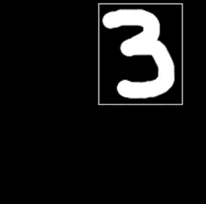
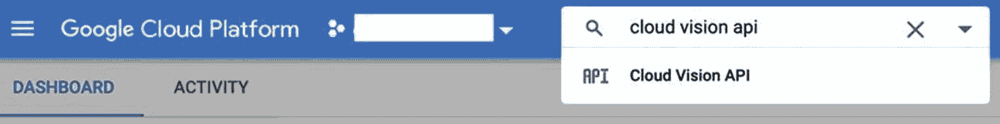
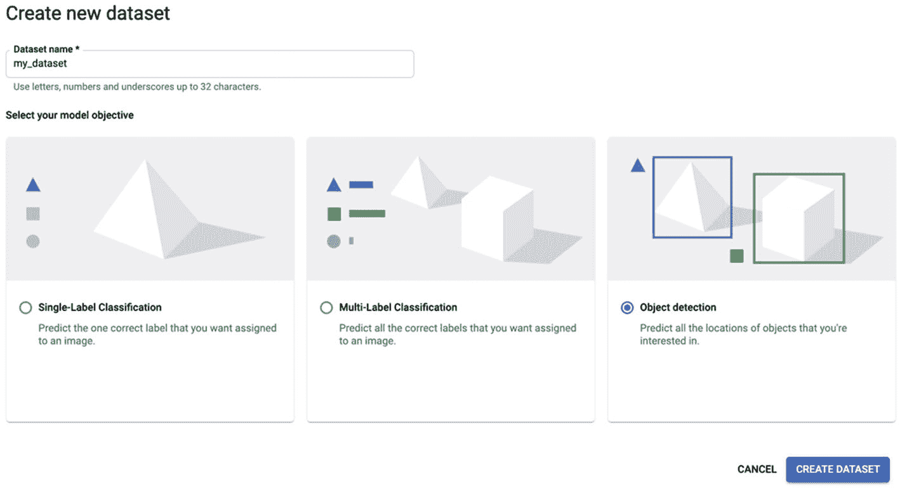
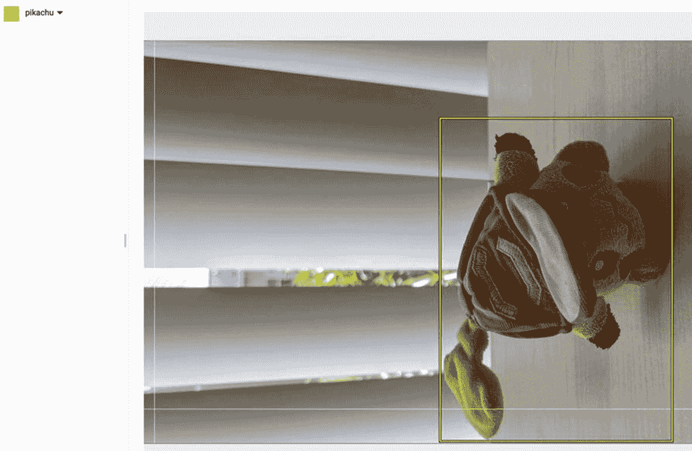
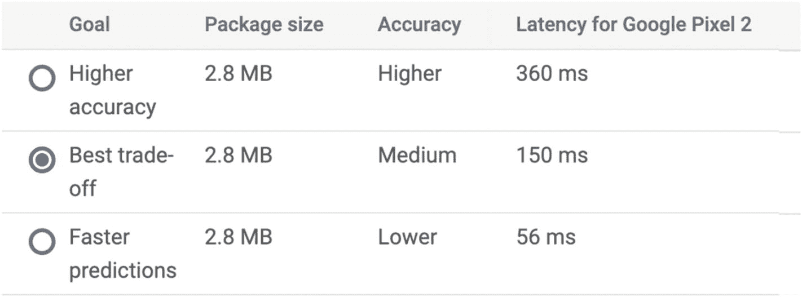
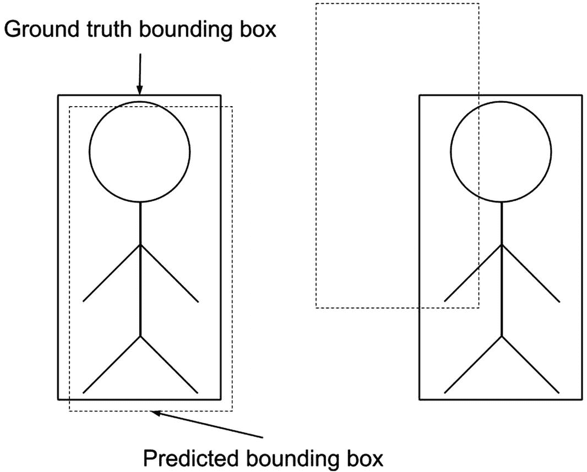
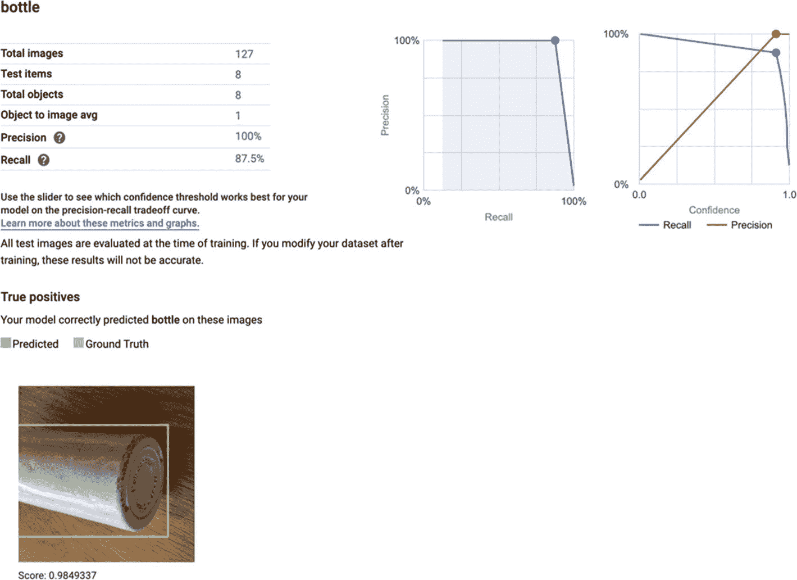
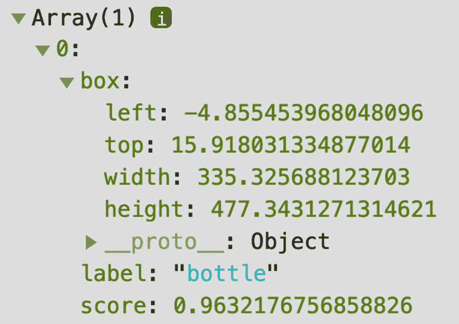

# 7. 使用 Google Cloud AutoML 训练的目标检测模型

计算机视觉的深度学习应用并不仅限于图像分类，这是我们已在第四章中应用的任务。那时，我们的目标是创建一个应用程序，用于识别用户绘制的数字。例如，图 7-1 中的数字是 3。


图 7-1

一个数字 3

是 3，对吧？很好。但它在哪里？它就在图片的右上角。好吧，你这么说很容易。但计算机知道吗？不，它不知道。有了我们拥有的模型，我们可以推断这是一张数字 3 的图片。但它能精确地学习对象的位置吗？多亏了**目标检测**，它可以。

目标检测是机器学习任务，用于识别图像或视频中的对象及其位置。例如，数字检测模型会在图 7-2 显示的区域周围定位数字 3。



图 7-2

数字的位置

在本章中，我们将创建一个目标检测模型，但不是为了检测数字。不，相反，你将检测你想要的任何东西！没错。对于这个练习，我希望你使用两个对象的图片——任何对象——来构建你的数据集。

与你之前创建的模型不同，你不会在 TensorFlow.js 中训练这个模型。在这个场合，你将训练带到云端，具体来说是**Google Cloud**，并使用他们的**AutoML Vision Object Detection**服务来准备数据集并拟合模型。之后，回到现实（你的电脑），你将构建一个使用该模型进行实时对象检测的 Web 应用程序。

为什么我们要在外部平台上进行训练？这是一个好问题。第一个原因是 TensorFlow.js 与 TensorFlow 生态系统的兼容性。在本书的早期，我们提到，成为 TensorFlow 环境的一部分允许 TF.js 重新使用在那里训练的模型，例如，毒性检测器。因此，为了亲身体验这种兼容性概念，理想的做法是通过 TF 相关框架（如 AutoML）进行训练，并在 TF.js 中部署模型。

另一个原因是，在工业界，我们经常遇到我们根本无法在特定平台上训练模型的情况。在这种情况下，通常的替代方案是在一个地方进行训练，在另一个地方部署。

第三个原因是分享（关心）。我们一直在使用的预训练模型是某个与我们一样热衷于机器学习的实体的辛勤工作的结果。因此，作为对他们的感谢，以及对整个社区的感谢，让我们创建一个我们可以与他人分享的模型。

最后，学习新的框架总是很有趣。

## 什么是 AutoML Vision Object Detection

AutoML Vision Object Detection 是 Google Cloud 提供的用于训练和部署自定义目标检测模型的解决方案。它提供了一个图形界面，使用户能够轻松提供自己的训练数据，然后只需几点击（无需代码）即可训练、评估和使用模型，这使得它非常适合各种人群。除了训练之外，该平台还提供了一个工具来标记和注释图像，即围绕目标对象绘制边界框的（不那么有趣）任务。一旦训练完成，Vision Object Detection 支持导出针对“边缘”设备（如移动设备和 TensorFlow.js）优化的模型版本。

该服务不是免费的。然而，Google 提供了 40 个免费的节点小时，这对于创建原型模型来说已经足够了。

## 关于模型

类似于 AutoML 的服务隐藏了系统背后的技术细节和复杂性，通过图形用户界面简化了许多流程；点击，点击，然后 voila！你得到了你的模型（这不是很棒吗？）。然而，这也意味着错过了那些虽然小但有趣的细节，比如模型的规格。在撰写本文时，平台文档并没有精确地描述模型或其架构。它只提到它是一个“低延迟、高精度模型（s）针对边缘设备优化”（Google，n.d.），这个描述与 MobileNet 模型系列相匹配。无论类型如何，要知道这是一个为 TensorFlow.js 和 TensorFlow Lite 等平台量身定制的轻量级快速量化模型，TensorFlow Lite 是用于移动设备推理的框架。

注意

在 TensorFlow 中，模型量化是一种技术，通过减少模型大小来提高其速度，但以精度为代价。更多信息，请访问[`www.tensorflow.org/lite/performance/post_training_quantization`](http://www.tensorflow.org/lite/performance/post_training_quantization)。

## 关于数据

要训练目标检测模型，你需要创建一个包含你选择的两个对象的图像数据集。无论你想要什么。它可以是一朵花、一支铅笔，或者像我案例中那样，是一个皮卡丘毛绒玩具和一个水瓶。

在你拿起相机开始拍摄之前，这里有一些需要考虑的建议。首先，AutoML 建议至少有十个目标实例；对于这样一个玩具项目，我建议每个标签至少有 50 个。但是，作者，50 个不是仍然很少吗？是的，你是对的。深度学习模型是数据饥渴的。但是，AutoML 利用迁移学习，所以你不需要从头开始训练模型。

关于图片，尽量从多个角度捕捉对象（想象你是一个摄影中的摄影师）。考虑从不同的距离拍摄物品。在某些图像中省略对象的部分——我的一些皮卡丘图像只显示了它的尾巴。如果可能的话，尝试不同的光照条件。

## 训练模型

我们将这个练习分为两个主要部分：训练模型和构建应用程序。在这个第一部分，您将准备数据集、训练并导出模型。

### 设置您的 Google Cloud 账户

要使用 AutoML Vision Object Detection，您需要一个 Google Cloud 账户。为了避免分心，我们在这里不讨论“如何做”（您可以在网上找到大量文档）。账户创建后，请访问[`https://console.cloud.google.com/`](https://console.cloud.google.com/)，搜索“cloud vision api”（图 7-3）并选择唯一的结果。然后点击“启用”按钮（图 7-4）以授权账户使用该服务。启用后，搜索“datasets vision”以访问数据集管理屏幕。


图 7-4

启用 API



图 7-3

搜索“cloud vision api”

### 准备数据集

本页关于数据集。在这里，您可以创建新的数据集或更新现有的数据集。要添加一个，请点击页面顶部的“新建数据集”按钮。此操作将创建一个标题为“创建新数据集”的小窗口，您需要指定数据集的名称和模型目标。选择“目标检测”并点击“创建数据集”（图 7-5）。



图 7-5

创建数据集

在下一屏幕上，选择“从您的计算机上传图像”选项，然后点击“选择文件”按钮以选择图像。然后选择一个云存储桶来上传文件。如果您没有存储桶，您可以在同一屏幕上创建一个新的存储桶。现在，按“继续”上传图像，然后点击“图像”标签。您可能需要等待一段时间，直到系统处理并存储它们。

### 标注和注释图像

当图像处理完成后，下一步是标注和注释它们。在“图像”标签下，点击“添加新标签”并定义您图像的标签，例如，“皮卡丘”（图 7-6）。然后，点击第一张照片并在对象周围绘制一个边界框。对数据集中的其余图像重复此操作（享受乐趣！）。



图 7-6

标注图像

### 训练

标注完成了吗？恭喜！这可能是练习中最困难的部分。现在让我们开始训练。首先，转到“TRAIN”标签页，点击“TRAIN NEW MODEL”按钮。在新窗口中，您需要定义关于模型的一些属性。首先是名称。然后是部署目标——选择“Edge”。在第二点，选择“最佳权衡”（图 7-7），以获得既快又好的模型或满足您需求的任何模型。最后，设置节点小时预算。建议的值应该足够。现在点击“START TRAINING”开始。大约 100 张图片，训练可能需要大约两小时。



图 7-7

选择模型类型

### 评估

欢迎回来。让我们看看训练进展如何。回到管理屏幕，转到“EVALUATE”标签页。在训练过程中，AutoML 会自动将数据集的一部分分离出来以评估模型。在这里，您将找到结果。评估指标是在特定置信水平和 **交并比** 或 IoU 阈值水平下的精确度和召回率。

IoU 是一个衡量预测位置与真实位置重叠面积与并集面积之比的分数。图 7-8 展示了良好的 IoU 和不良的 IoU 的例子。左侧的例子是良好的 IoU，因为预测的边界框（虚线）几乎完全与真实框重叠，而右侧的例子是不良的，因为检测到的位置与实际位置相去甚远。



图 7-8

IoU 的例子

点击标签名称会显示真正的阳性（模型正确预测边界框的情况）、假阴性（模型没有预测到准确的边界框的情况）和假阳性（模型预测到错误的边界框的情况），以及预测和真实边界（图 7-9）。训练进展如何？你对结果满意吗？如果不满意，你可以尝试向训练集添加更多图片并选择高精度模型变体。否则，通过点击“TEST & USE”标签页继续。



图 7-9

“evaluate”标签页

### 导出模型

现在是最后一步，也就是导出模型。从这一屏幕，你可以导出不同优化版本的模型，这些模型可以在 TensorFlow.js 和 TFLite 等平台上运行。点击“TensorFlow.js”选项。在弹出的窗口中，选择一个 GCS 存储桶并点击“导出”以在该位置保存模型。要下载文件到你的电脑，可以使用屏幕上显示的命令或点击“在 GCS 中打开”以访问存储桶并从中获取它们。如果你选择第一个选项，在运行命令之前创建本地目标文件夹：

```py
$ mkdir model
$ gsutil cp -r gs://model-bucket model/
```

无论你选择哪种方法，至少应该有三个文件：

1.  一个`dict.txt`（标签）

1.  一个`model.json`（模型的规格）

1.  几个`.bin`文件（模型的权重）

这样，我们就完成了训练阶段。你喜欢这段旅程吗？希望如此！

## 构建应用

关闭云控制台并返回到我们的本地环境。在本节中，你将编写一个应用，导入模型并在摄像头视频上执行实时物体检测。该应用有一个画布显示视频和预测的边界框，以及三个滑块来控制预测率。像往常一样，创建一个新的目录，并创建`index.html`、`index.js`和`style.css`文件，并将模型的目录复制到这里。目录结构应该是这样的：

```py
├── index.html
├── index.js
├── model
│   ├── dict.txt
│   ├── group1-shard1of3.bin
│   ├── group1-shard2of3.bin
│   ├── group1-shard3of3.bin
│   └── model.json
└── style.css
```

### 加载包和准备用户界面

在`index.html`的顶部，使用两个`<script>`标签导入 TensorFlow.js、*AutoML Edge API*^(1)（tfjs-automl）和 CSS 文件。这个 AutoML 库是一组工具，用于加载和执行在 Google Cloud 的 AutoML 中生成的边缘模型：

在`<head>`之后，创建应用的`<body>`，并在其中创建`<video>`、`<canvas>`和三个“滑块”（类型为`<input>`的范围）。这些范围中的第一个，`score-range`，取值在 0 到 1 之间，用于控制预测的最小置信度阈值。范围`iou-range`调整模型的交并比阈值，以忽略 IoU 低于得分的预测框。`topk-range`通过选择具有最高置信度分数的`topk`边界框来处理预测返回的对象数量。然后，使用`<script>`标签调用`index.js`：

```py

Detect your objects!

Score threshold:

IoU threshold:

Top k:

```

最后，将以下 CSS 代码复制到`style.css`中，以对齐元素：

```py
.main-centered-container {
padding-left: 60px;
padding-right: 60px;
margin: 0 auto;
max-width: 1280px;
}
.flex-ui {
display: flex;
flex-wrap: wrap;
}
.flex-ui div {
flex: 1;
padding: 20px;
text-align: center;
}
```

### 导入模型和设置摄像头

关闭`index.html`并转到`index.js`。与 PoseNet 应用类似，这个练习的实现涉及设置一个画布来显示摄像头视频和模型的预测。

首先声明画布上下文（`ctx`）变量和大小：

```py
let ctx;
const SIZE = 500;
```

然后，使用以下两个函数，`setupCamera()`和`loadVideo()`（它们与我们在 PoseNet 应用中使用的是相同的）：

```py
function setupCamera() {
const video = document.getElementById('video');
video.width = SIZE;
video.height = SIZE;
navigator.mediaDevices.getUserMedia({
audio: false,
video: {
width: SIZE,
height: SIZE,
},
}).then((stream) => {
video.srcObject = stream;
});
return new Promise((resolve) => {
video.onloadedmetadata = () => resolve(video);
});
}
async function loadVideo() {
const video = await setupCamera();
video.play();
return video;
}
```

现在是`init()`函数。在第一行，使用`tfjs-automl`中的`loadObjectDetection()`函数，通过传递`model.json`的路径作为参数来加载模型。接下来，调用`loadVideo()`。将这两个返回值作为参数传递给我们将要定义的`detect()`函数：

```py
async function init() {
const model = await tf.automl.loadObjectDetection('model/model.json');
const video = await loadVideo();
detect(model, video);
}
```

### 检测对象

我们接下来要设置的功能是 `detect()`，它执行预测并将摄像头视频添加到画布上：

```py
let scoreThreshold = 0.95;
let iouThreshold = 0.5;
let topkThreshold = 10;
function detect(model, video) {
const canvas = document.getElementById('output');
ctx = canvas.getContext('2d');
canvas.width = SIZE;
canvas.height = SIZE;
async function getBoundingBoxes() {
const predictions = await model.detect(video, {
score: scoreThreshold,
iou: iouThreshold,
topk: topkThreshold,
});
ctx.save();
ctx.scale(-1, 1);
ctx.translate(-SIZE, 0);
ctx.drawImage(video, 0, 0, SIZE, SIZE);
ctx.restore();
predictions.forEach((prediction) => {
drawBoundingBoxes(prediction);
});
requestAnimationFrame(getBoundingBoxes);
}
getBoundingBoxes();
}
```

从获取画布及其上下文并设置宽度和高度为 `SIZE` 开始函数。在函数内部，创建另一个函数并命名为 `getBoundingBoxes()`。在这里，使用视频流和一个配置检测参数 `score`、`iou` 和 `topk` 的选项对象作为参数调用模型的 `detect()` 方法。注意，我们在函数上方声明了选项的默认值；如果你愿意，可以将它们移动到文件顶部，与其他变量放在一起。

`model.detect()` 方法返回一个预测对象列表（图 7-10），其中每个对象都有三个属性：`box`、`label` 和 `score`。`box` 是边界框或识别对象的定位。它有四个值：`left`、`top`、`width` 和 `height`，其中 `left` 和 `top` 是框左上角在 x 轴和 y 轴上的位置，而 `width` 和 `height` 是框的尺寸。`box` 之后是 `label`，即对象的类别，以及预测分数。



图 7-10

预测对象

预测之后，下一步是使用 `ctx` 绘制摄像头视频流。为了叠加边界框，我们必须遍历预测数组并对每个预测调用 `drawBoundingBoxes()`（我们将在下一节中看到它）。最后，从 `detect` 中调用 `requestAnimationFrame()` 和 `getBoundingBoxes()`。

### 绘制边界框

摄像头和预测都准备好了，唯一缺少的部分是将它们可视化在屏幕上。我们接下来要看到的功能是 `drawBoundingBoxes()`，它负责在对象上方叠加预测的边界框。除了框之外，叠加还包括对象的标签和置信度分数。

```py
const BBCOLOR = '#3498eb';
function drawBoundingBoxes(prediction) {
ctx.font = '20px Arial';
const {
left, top, width, height,
} = prediction.box;
ctx.strokeStyle = BBCOLOR;
ctx.lineWidth = 1;
ctx.strokeRect(left, top, width, height);
ctx.fillStyle = BBCOLOR;
const textWidth = ctx.measureText(prediction.label).width;
const textHeight = parseInt(ctx.font, 10);
ctx.fillRect(left, top, textWidth + textHeight, textHeight * 2);
ctx.fillRect(left, top + height - textHeight * 2, textWidth + textHeight, textHeight * 2);
ctx.fillStyle = '#000000';
ctx.fillText(prediction.label, left, top + textHeight);
ctx.fillText(prediction.score.toFixed(2), left, top + height - textHeight);
}
```

### 测试应用

我们几乎完成了。我们唯一缺少的是创建一个处理滑块输入更新的函数：

```py
function updateSliders(metric, updateAttribute) {
const slider = document.getElementById(`${metric}-range`);
const output = document.getElementById(`${metric}-value`);
output.innerHTML = slider.value;
updateAttribute(slider.value);
slider.oninput = function oninputCb() {
output.innerHTML = this.value;
updateAttribute(this.value);
};
}
```

`updateSliders()` 有两个参数。第一个参数（指标）名称对应于我们希望更新的预测属性，例如，`topk`。第二个参数 `updateAttribute` 是一个回调函数，每当用户更改滑块的值时都会执行。该函数的作用是更新给定变量的值。此外，我们还将使用 `updateAttribute` 来设置滑块的初始值。

定义函数后，回到 `init` 并三次使用 `updateSliders()`，每次为一个选项值（`score`、`iou` 和 `topk`）。然后，调用 `init()`：

```py
async function init() {
const model = await tf.automl.loadObjectDetection('model/model.json');
const video = await loadVideo();
detect(model, video);
updateSliders('score', (value) => {
scoreThreshold = parseFloat(value);
});
updateSliders('iou', (value) => {
iouThreshold = parseFloat(value);
});
updateSliders('topk', (value) => {
topkThreshold = parseInt(value, 10);
});
}
init();
```

现在尝试使用该应用。回到终端，使用 *http-server* 启动本地服务器，然后启动应用程序。然后，在几秒钟后（当应用读取模型并设置摄像头时），拿起你的对象，并将它们展示给摄像头。如果一切按计划进行，你应该能看到检测到的结果。

在准确性方面，我们刚刚训练的模型既不是最好的，也不如我们在前几章中看到或训练过的其他模型好。正如我们之前讨论的，作为一个边缘模型，它意味着在速度上获得收益的同时，牺牲了大部分的预测能力，这一特性在这个应用中得到了很好的反响。另一个原因是数据不足。如果您遵循了指示，您的训练集大约有 100 张图片，对于这样一个模型来说是非常低的。但幸运的是，我们总是可以向数据集中添加示例并创建模型的新版本。所以，如果您喜欢标注图片，您会喜欢本章的第二项练习。

作为快速补救措施来处理假阳性（我的模型将我标记为“皮卡丘”，我一点也不介意）和假阴性，尝试调整对象的位置，例如角度。另一个选择是调整预测的属性以控制它们的灵活性。较低的阈值分数会产生更多的预测，但也会引入更多的错误，而较高的阈值分数会减少错误，但也会减少检测。

## 概述

在本章中，我们前往（Google）云中，使用 AutoML Vision Object Detection 服务训练了一个模型，这是一个用于开发和部署机器学习模型的服务。在上面的云中，经过标注和标记数据集的有趣过程后，我们只需几点击就能训练一个对象检测模型。然后，我们构建了一个使用训练模型和摄像头的对象检测 Web 应用，它可以实时检测训练期间呈现的对象。在这个过程中，我们亲身体验了 TensorFlow.js 与其他平台之间的兼容性。

您可以在本书的 GitHub 仓库中找到我的模型。

练习

1.  什么是对象检测？

1.  添加更多的训练示例（每个标签尝试约 500 张图片）。

1.  训练高性能或更快的模型（取决于您使用的是哪一个）并比较它们的速度和预测结果。

1.  通过添加一个从图像中检测对象的模块来扩展 Web 应用。

1.  构建一个使用该应用从在线图像中检测对象的 Chrome 扩展。

1.  对于喜欢冒险的人来说，可以导出模型的 TFLite 版本，并使用以下教程在 Android 设备上部署它：[`https://cloud.google.com/vision/automl/docs/tflite-android-tutorial`](https://cloud.google.com/vision/automl/docs/tflite-android-tutorial)。

1.  在 GitHub 上分享模型，并给我！我很想看看你构建了什么。
