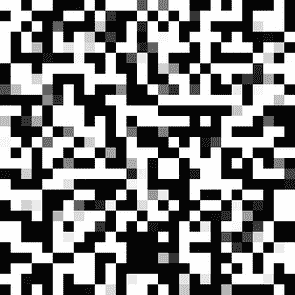
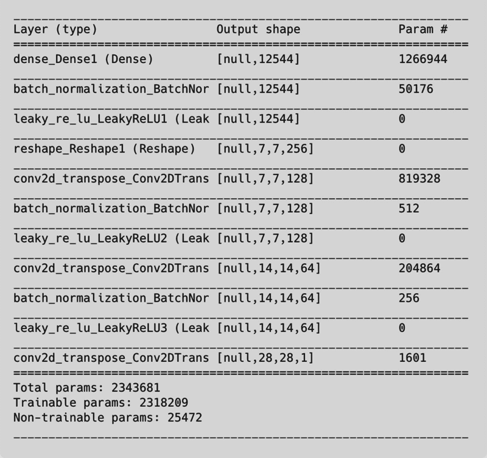
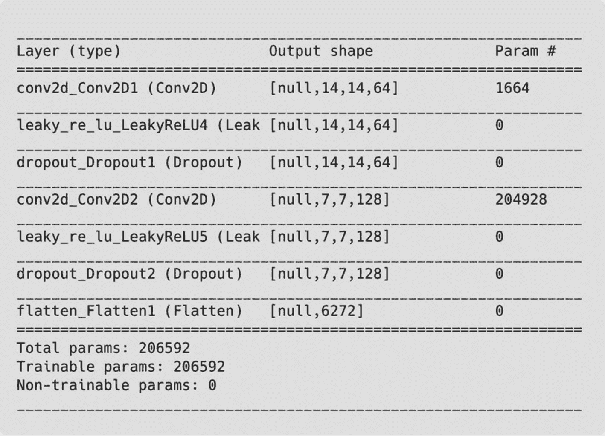
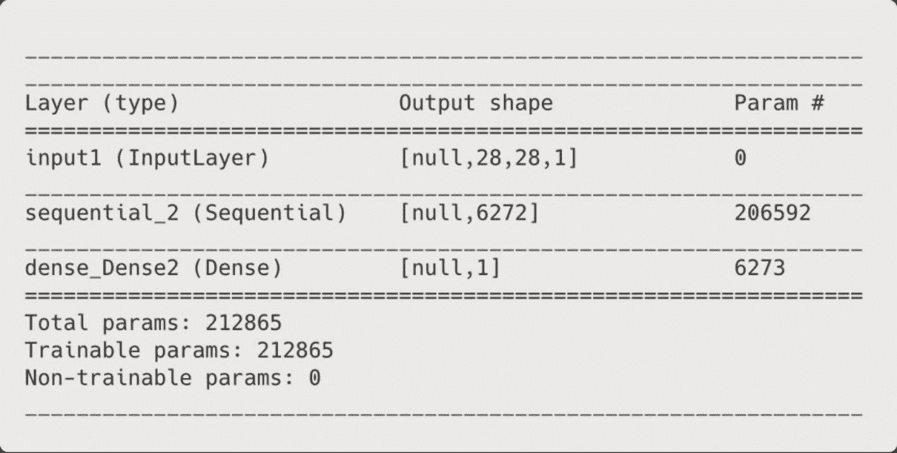
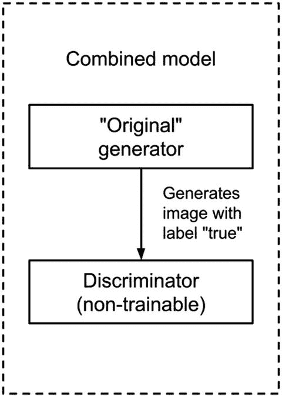
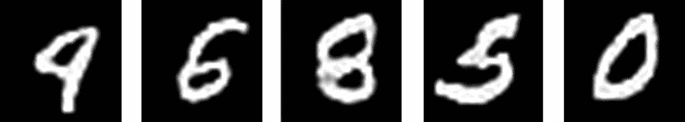
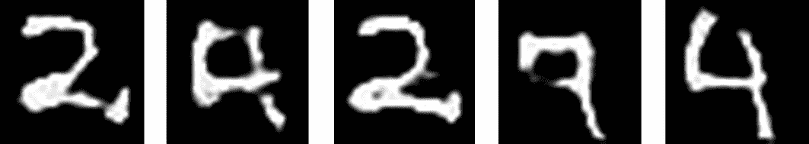
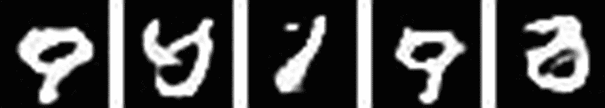
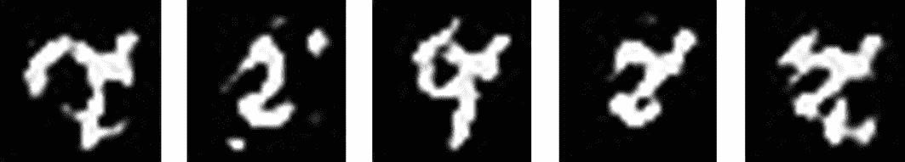
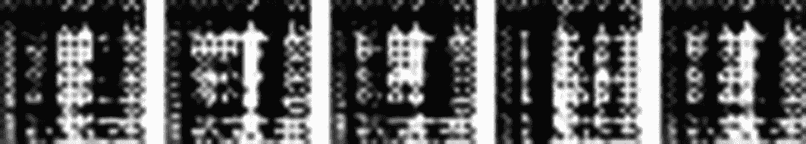

# 10. 使用生成对抗网络生成手写数字

在第九章中，我们深入探讨了深度学习的生成和创造性方面。在那里，我们使用了两个循环神经网络来预测和生成看起来像经典文本的段落。但是，文本数据，或者说更一般地，序列数据，并不是这些神经网络能创建的唯一东西。图像也是可能的。

如果有一个最近且革命性的算法接管了机器学习领域，那一定是**生成对抗网络**（Goodfellow 等人，2014 年），或称为 GANs。GANs——由该领域的领先计算机科学家之一、2018 年图灵奖共同获得者*杨立昆*称为“过去十年中机器学习中最有趣的想法”——是一种能够创建几乎与真实图像难以区分的极其逼真图像的网络架构。像 RNNs 一样，GANs 的应用和用例非常广泛。例如，GANs 可以进行**图像到图像的翻译**（Isola 等人，2017 年），即将图像从领域 X 翻译到 Y 的任务，例如，将一匹马的图片转换成斑马的图片。它们可以提高图像的分辨率，这种用例被称为**超分辨率**（Ledig 等人，2017 年），甚至可以在图像或视频中用一个人的脸替换另一个人的脸，这种技术被称为**深度伪造**。

对于本书的最后一个练习，我们将构建 GANs 的“hello, world”，即使用 MNIST 数据集作为源生成手写数字的 GAN 模型。由于训练时间较长，我们将使用 Node.js 运行训练脚本以获得尽可能多的性能。然后，我们将编写一个应用程序来加载模型并生成图像。我们的模型网络架构基于 MNIST 示例的深度卷积生成对抗网络（DCGAN），使用 Keras（Python）的 Sequential API 实现。

## GANs 的友好介绍

GANs（生成对抗网络）背后的核心概念非常直观。你拥有两个相互竞争的神经网络。其中一个，生成器，试图生成与训练数据集相似的图像，而第二个网络则判断生成的图像是否来自数据集或是由生成器生成的。当生成器的合成图像如此逼真以至于判别器无法区分它们时，系统就会收敛，简单来说，一旦生成器欺骗了判别器。让我们用一个简化的例子来解释它。

生成器从未见过数据集中的任何图像。从未。在我们的案例中，这意味着它不知道 MNIST 数字是什么样的。因此，最初生成的图像只是随机噪声（图 10-1）。不管这种情况如何，生成器都会将图像展示给判别器（“法官”）。但是，判别器知道数据集是什么样的，看到生成器图像后，它会说：“你骗不了我。我知道数据集的样子，而这幅图像与它一点也不像。我敢肯定这是你创造的。”因此，随着训练的进行，生成器开始根据判别器的话来假设真实数据集的样子，因此开始生成更好的图像。然后，在某个时刻，它向判别器展示一幅图像，判别器会说：“哦，这幅图像完美无瑕；我敢肯定它来自数据集。我不认为这是你的。”但是，令人惊讶的是，这幅图像实际上来自生成器。所以，最终，生成器欺骗了判别器，而从未见过数据集的任何实际图像。



图 10-1

一个未训练生成器生成的图像示例

关于网络本身，生成器是一个神经网络，它产生的图像与目标数据集相匹配。它的输入是一个从随机分布（在此称为“潜在空间”）中采样的随机值向量（称为“潜在空间向量”），输出则是它想要生成的图像。因此，它的目标是学习一个将潜在空间映射到图像的函数。判别器是一个解决分类问题的神经网络。在我们的案例中，我们有一个在生成器的伪造数据和训练数据集的真实数据上训练的卷积神经网络。它的输出是图像是真实还是伪造的可能性。

与 CNNs 和例如 MobileNet 一样，存在专门针对特定应用的 GAN 架构。在我们的练习中，我们将使用 **DCGAN**（Radford et al., 2015）架构，这是一种在 2015 年引入的 GAN 类别，证明比原始 GAN 更稳定。该模型使用一种独特的卷积技术以无监督方式学习目标图像的特征。

## 训练 GAN

让我们这样做（最后一次）。模型的训练脚本由五个函数组成：

+   `makeGenerator():` 定义生成器模型。

+   `makeDiscriminator():` 定义判别器模型。

+   `buildCombinedModel():` 构建由生成器和判别器组成的组合模型。

+   `trainDiscriminator():` 在单个数据批次上训练判别器。

+   `trainCombined():` 在单个数据批次上训练组合模型。

我们将为每个函数分配一个部分。

在训练模型之后，下一步是制作一个使用训练好的生成器模型来生成图像并在浏览器上显示的 Web 应用程序。作为旁注，我应该提到，这里看到的代码忽略了我们在整本书中一直在使用的几个 ESLint 规则。这种改变旨在提高代码的可读性——对于不一致性表示歉意。

### 准备环境

由于我们使用 Node.js，首先，我们必须定义包的清单。因此，在项目的根目录中，创建一个名为`package.json`的文件，并将以下 JSON 粘贴到其中：

```py
{
"name": "tfjs-node-mnist-gan",
"version": "0.0.1",
"description": "Train a GAN for generating handwritten digits",
"scripts": {
"train": "node trainer.js"
},
"dependencies": {
"@tensorflow/tfjs-node": "¹.5.2"
}
}
```

然后，执行`npm i`来安装依赖项。

## 获取数据

正如我们在第四章中所做的那样，我们再次将使用来自官方 TensorFlow.js 示例仓库的脚本以下载数据.^(3) 但这个脚本与我们在那里使用的脚本不同。它不是一次性下载整个数据集到一个图像中，而是下载四个文件，这些文件组合起来构成了数据集（副本可在本书的仓库中找到）。由于本章的主要目标是训练 GAN，因此我们将通过这段代码，而不太关注细节。

从项目目录中，创建一个名为`data.js`的新文件。然后，将以下行复制到导入模块和定义与 MNIST 数据集相关的几个变量的地方：

```py
const tf = require('@tensorflow/tfjs-node');
const fs = require('fs');
const https = require('https');
const util = require('util');
const zlib = require('zlib');
const readFile = util.promisify(fs.readFile);
const BASE_URL = 'https://storage.googleapis.com/cvdf-datasets/mnist/';
const TRAIN_IMAGES_FILE = 'train-images-idx3-ubyte';
const TRAIN_LABELS_FILE = 'train-labels-idx1-ubyte';
const IMAGE_HEADER_BYTES = 16;
const IMAGE_HEIGHT = 28;
const IMAGE_WIDTH = 28;
const IMAGE_FLAT_SIZE = IMAGE_HEIGHT * IMAGE_WIDTH;
const LABEL_HEADER_BYTES = 8;
const LABEL_RECORD_BYTE = 1;
const LABEL_FLAT_SIZE = 10;
```

接下来，定义`fetchOnceAndSaveToDiskWithBuffer()`函数以将数据集保存到磁盘。如果文件已存在，该函数将不会再次下载：

```py
function fetchOnceAndSaveToDiskWithBuffer(filename) {
return new Promise((resolve) => {
const url = `${BASE_URL}${filename}.gz`;
if (fs.existsSync(filename)) {
resolve(readFile(filename));
return;
}
const file = fs.createWriteStream(filename);
https.get(url, (response) => {
const unzip = zlib.createGunzip();
response.pipe(unzip).pipe(file);
unzip.on('end', () => {
resolve(readFile(filename));
});
});
});
}
```

下一个函数是`loadImages()`，负责调用`fetchOnceAndSaveToDiskWithBuffer()`并加载图像：

```py
async function loadImages(filename) {
const buffer = await fetchOnceAndSaveToDiskWithBuffer(filename);
const headerBytes = IMAGE_HEADER_BYTES;
const recordBytes = IMAGE_HEIGHT * IMAGE_WIDTH;
const images = [];
let index = headerBytes;
while (index < buffer.byteLength) {
const array = new Float32Array(recordBytes);
for (let i = 0; i < recordBytes; i++) {
// Normalize the pixel values into the 0-1 interval, from
// the original [-1, 1] interval.
array[i] = (buffer.readUInt8(index++) - 127.5) / 127.5;
}
images.push(array);
}
return images;
}
```

类似的还有`loadLabels()`函数，它从文件中加载数据集标签：

```py
async function loadLabels(filename) {
const buffer = await fetchOnceAndSaveToDiskWithBuffer(filename);
const headerBytes = LABEL_HEADER_BYTES;
const recordBytes = LABEL_RECORD_BYTE;
const labels = [];
let index = headerBytes;
while (index < buffer.byteLength) {
const array = new Int32Array(recordBytes);
for (let i = 0; i < recordBytes; i++) {
array[i] = buffer.readUInt8(index++);
}
labels.push(array);
}
return labels;
}
```

然后是处理数据的`MnistClass`类。该类有一个构造函数，用于初始化`this.dataset`和数据集的大小：

```py
class MnistDataset {
constructor() {
this.dataset = null;
this.trainSize = 0;
}
}
```

`MnistClass`的第一个方法是`loadData()`，这是一个使用`loadImages()`和`loadLabels()`读取数据和标签的函数。我们不需要标签；我决定保留它们，以防你对将脚本应用于其他用例感兴趣（此方法和下一个方法都在类内部）：

```py
async loadData() {
this.dataset = await Promise.all([
loadImages(TRAIN_IMAGES_FILE), loadLabels(TRAIN_LABELS_FILE),
]);
this.trainSize = this.dataset[0].length;
}
```

在`loadData()`之后，添加`getData()`。这个函数将数据集转换成一个大的张量，并返回它：

```py
getData() {
const imagesIndex = 0;
const labelsIndex = 1;
const size = this.dataset[imagesIndex].length;
const imagesShape = [size, IMAGE_HEIGHT, IMAGE_WIDTH, 1];
const images = new Float32Array(tf.util.sizeFromShape(imagesShape));
const labels = new Int32Array(tf.util.sizeFromShape([size, 1]));
let imageOffset = 0;
let labelOffset = 0;
for (let i = 0; i < size; ++i) {
images.set(this.dataset[imagesIndex][i], imageOffset);
labels.set(this.dataset[labelsIndex][i], labelOffset);
imageOffset += IMAGE_FLAT_SIZE;
labelOffset += 1;
}
return {
images: tf.tensor4d(images, imagesShape),
labels: tf.oneHot(tf.tensor1d(labels, 'int32'), LABEL_FLAT_SIZE).toFloat(),
};
}
```

最后，关闭类，并在文件末尾添加`module.exports = new MnistDataset();`。

### 制作生成器

现在让我们制作 GAN 模型，从生成器开始。重复我们在引言中讨论的内容，生成器接受从潜在空间中采样的随机值向量作为输入，并生成一个表示生成的手写数字的张量。因此，在整个训练过程中，生成器学习将这个向量投影到图像上。在到达模型之前，创建一个新的`trainer.js`文件，并添加以下导入和常量变量：

```py
const tf = require('@tensorflow/tfjs-node');
const data = require('./data');
const IMAGE_SIZE = 28;
const NUM_EPOCHS = 5;
const BATCH_SIZE = 100;
const LATENT_SIZE = 100;
```

生成器模型由 11 层组成（图 10-2）。第一层是一个输入形状为 100、输出形状为 [12544] 的密集层。第二层是一个**批归一化**层。这个层将前一层激活张量的值进行归一化，这意味着它将其值转换为保持其均值接近 0 和标准差接近 1。归一化之后是一个**漏斗 ReLU**激活层，其输出是一个形状为 [7, 7, 256] 的激活张量。接下来是一个转置卷积层，将深度从 256 减少到 128。接下来是另一个批归一化和漏斗 ReLU。现在事情变得有趣了。下一层，另一个转置卷积，现在用于**上采样**宽度和高度并减少张量的宽度。这一层“智能”地上采样，意味着它在上采样操作期间**学习**如何填充缺失的空间。最后，我们有一组另一个批归一化、漏斗 ReLU 和转置卷积层，将张量转换为 [28, 28, 1]，这是 MNIST 图像的大小。以下定义模型的 `makeGenerator()` 函数：

```py
function makeGenerator() {
const model = tf.sequential();
model.add(tf.layers.dense({
inputShape: [LATENT_SIZE],
units: 7 * 7 * 256,
}));
model.add(tf.layers.batchNormalization());
model.add(tf.layers.leakyReLU());
model.add(tf.layers.reshape({ targetShape: [7, 7, 256] }));
model.add(tf.layers.conv2dTranspose({
filters: 128,
kernelSize: [5, 5],
strides: 1,
padding: 'same',
}));
model.add(tf.layers.batchNormalization());
model.add(tf.layers.leakyReLU());
model.add(tf.layers.conv2dTranspose({
filters: 64,
kernelSize: [5, 5],
strides: 2,
padding: 'same',
}));
model.add(tf.layers.batchNormalization());
model.add(tf.layers.leakyReLU());
model.add(tf.layers.conv2dTranspose({
filters: 1,
kernelSize: [5, 5],
strides: 2,
padding: 'same',
activation: 'tanh',
}));
return model;
}
```

注意

Leaky ReLU 是另一种类似于 ReLU 的整元素激活函数，它将输入张量应用于元素函数 *f* (*x*) = 1 如果 *x* > 0 或 *f* (*x*) = 0.01*x*。

我们在这里看到的最新的超参数是转置卷积的**填充**和**tanh**激活函数。在第三章中，我们使用了具有默认填充“valid”的卷积层。这种填充确保滤波器保持在输入的**有效**维度内（不添加填充），从而使得输出比输入小，例如，如果步长长度为 1，则输出宽度为（输入）宽度 - 1。相比之下，“same”填充确保输出大小保持**相同**，只要步长长度为 1。这就是为什么在第一个转置卷积层之后，前两个维度保持不变。另一方面，在转置卷积层——在某种程度上是逆卷积层——步长为 2 和“same”填充将宽度和高度维度翻倍，因此在第二个和第三个转置层之后，从 [7, 7, …] 增加到 [14, 14, …]，再从 [14, 14, …] 增加到 [28, 28, …]。激活函数 tanh，即双曲正切，将值限制在 (-1, 1) 范围内。

### 制作判别器

接下来是判别器，即将被愚弄的模型。GAN 的这个组件是裁判，负责预测生成器创建的图像是否来自真实数据集——这是一个二元分类问题。我们将使用不同的方法定义此模型。它将更类似于我们如何进行迁移学习模型，使用 `tf.model()` 对象来设置输入和输出。



图 10-2

生成器的层

我们的判别器有八个层（图 10-3）。它从一个输入形状为 [28, 28, 1] 和输出形状为 [14, 14, 64] 的卷积层开始。之后是一个漏斗 ReLU 和一个 dropout 层。这种 conv2D-leakyReLU-dropout 的组合重复一次，产生一个形状为 [7, 7, 128] 的张量。然后这个张量被展平为形状 [6272]，并通过一个具有 sigmoid 激活函数的密集层。这个最后的层输出一个介于 0 和 1 之间的数字，表示图像是真实还是伪造的可能性。以下是这个函数：



图 10-3

判别器的内部层

```py
function makeDiscriminator() {
let model = tf.sequential();
// Hidden layers
model.add(tf.layers.conv2d({
inputShape: [28, 28, 1],
filters: 64,
kernelSize: [5, 5],
strides: 2,
padding: 'same',
}));
model.add(tf.layers.leakyReLU());
model.add(tf.layers.dropout(0.3));
model.add(tf.layers.conv2d({
filters: 128,
kernelSize: [5, 5],
strides: 2,
padding: 'same',
}));
model.add(tf.layers.leakyReLU());
model.add(tf.layers.dropout(0.3));
model.add(tf.layers.flatten());
model.summary();
// Input and output layers
const inputLayer = tf.input({ shape: [IMAGE_SIZE, IMAGE_SIZE, 1] });
const features = model.apply(inputLayer);
const outputLayers = tf.layers.dense({ units: 1, activation: 'sigmoid' }).apply(features);
model = tf.model({ inputs: inputLayer, outputs: outputLayers });
model.compile({
optimizer: tf.train.adam(0.0002, 0.5),
loss: 'binaryCrossentropy',
});
return model;
}
```

函数首先通过多次调用 `model.add()` 定义隐藏层。这些层是前一段中讨论过的层。我称它们为隐藏层，因为它们都不是输入或输出层。这些层是单独创建的。

在最后的 `model.add()` 之后，有一个对 `tf.input()` 的调用，这是一个“实例化一个模型输入”的函数^(4)，其 `shape` 属性设置为图像的大小。为了将其添加到模型中，我们使用 `model.apply()`。为了创建输出，我们使用相同的方法。首先定义密集输出层，并使用 `apply()` 将其附加到其余部分。指定了输入和输出层后，使用 `tf.model()` 并将 `inputs` 设置为 `inputLayer`，将 `outputs` 设置为 `outputLayers` 来创建模型。然后，使用 DCGAN 论文中指定的二元交叉熵损失函数和 Adam 优化器（`learningRate` 0.0002 和 `beta1` 0.5）来编译它。这个第二个参数被称为指数衰减，*衰减*，也就是说，随着时间的推移降低学习率。

图 10-4 展示了新模型的摘要，其中 `sequential_2` 是模型的隐藏层。



图 10-4

判别器

## 合并模型

记得我们说过算法同时训练两个模型吗？那个句子非常直白。在本节中，我们将做一些新的尝试：合并模型。更准确地说，我们将合并生成器和判别器，创建一个新的生成器，其中“原始”生成器位于判别器之前（图 10-5）。当两个模型作为一个整体工作时，生成器的输出在判别器对生成的图像进行分类后，将直接用于更新其权重。



图 10-5

合并后的模型

在这个模型的组合版本中，我们将判别器组件的 *trainable* 属性更改为 **false**，这样在它是这个新组合模型的一部分时，权重就不会更新。因此，这部分模型不会学习；判别器（之前创建的那个）将在另一个函数中单独学习。在训练组合模型时，我们将潜在向量的标签设置为 1（“真实”），这样判别器就会相信生成的图像是真实的。但我们知道它们不是真实的。因此，由于生成器最初创建的是随机噪声图像，训练初期的错误率会很高，迫使它变得更好。

这种配置可能会非常令人困惑，因此我想重复并澄清一些细节。首先，我们仍然使用的是“原始”判别器——在之前章节中定义的学会区分图片的判别器。它的角色没有改变。但它的权重怎么办？我们刚刚将其更改为不可训练。它是如何仍然学习的？这是一个好问题。但再次强调，判别器 **将会学习**，因为我们是在将其权重设置为不可训练之前编译它的。在组合模型中，我们首先将可训练属性更改为 false，然后 **再** 编译它，因此它不会学习。在组合模型中，判别器的目的是评估生成器在“虚假标记”生成的图像上的性能，并产生更新生成器所需的激活张量。

让我们看看这个函数：

```py
function buildCombinedModel(generator, discriminator) {
const generatorInput = tf.input({ shape: [LATENT_SIZE] });
const generatorLayers = generator.apply(generatorInput);
// We want the combined model to only train the generator.
discriminator.trainable = false;
const discriminatorLayers = discriminator.apply(generatorLayers);
const combined = tf.model({ inputs: generatorInput, outputs: discriminatorLayers });
combined.compile({
optimizer: tf.train.adam(0.0002, 0.5),
loss: 'binaryCrossentropy',
});
return combined;
}
```

该模型构建方式与早期的判别器类似。它通过混合使用 `tf.input()`、`model.apply()`、`tf.model()` 以及相同的编译属性来形成模型。注意在 `combined.compile()` 之前的那行 `discriminator.trainable = false`。

### 训练判别器

模型准备就绪后，下一步是训练它们，从判别器和 `trainDiscriminator()` 函数开始。在此场合，我们将采用不同的训练方式。在过去的章节中，我们使用了 `model.fit()` 函数，这是一个“固定次数的周期”来训练模型的函数。^(5) 但我们当前的情况与之前的练习非常不同。现在，我们希望使用一个模型（生成的图像）的输出作为判别器的输入。因此，我们需要在训练过程中有更多的手动控制。为了训练这两个模型，我们将使用 `tf.Sequential.trainOnBatch()` 方法，这是一种在单个数据批次上运行一次训练更新的方法。使用这个函数，我们能够运行一次训练更新，生成图像，将它们作为判别器的输入，然后运行另一次训练更新。稍后，我们将设计训练循环。但现在，让我们看看 `trainDiscriminator()` 函数：

```py
async function trainDiscriminator(discriminator, generator, xTrain, batchNumber) {
const [samples, target] = tf.tidy(() => {
const imageBatch = xTrain.slice(batchNumber * BATCH_SIZE, BATCH_SIZE);
// tf.randomNormal is the latent space
const latentVector = tf.randomNormal([BATCH_SIZE, LATENT_SIZE], -1, 1);
const generatedImages = generator.predict([latentVector], { batchSize: BATCH_SIZE });
// Mix of real and generated images
const x = tf.concat([imageBatch, generatedImages], 0);
// The labels of the imageBatch is 1, and the labels of the generatedImages is 0
const y = tf.tidy(
() => tf.concat(
[tf.ones([BATCH_SIZE, 1]), tf.zeros([BATCH_SIZE, 1])],
),
);
return [x, y];
});
const disLoss = await discriminator.trainOnBatch(samples, target);
tf.dispose([samples, target]);
return disLoss;
}
```

`trainDiscriminator()` 函数接受四个参数。前两个参数是判别器和生成器模型，其余的是训练集和批次数量。在函数内部有一个大的 `tf.tidy()`，其中大部分功能都发生在这里。第一条语句，`xTrain.slice()`，从真实数据集中创建一个图像批次。然后，我们使用 `tf.randomNormal()` 生成潜在向量（噪声）。生成器使用这个向量来创建一个生成图像批次（`generatedImages`）。接下来，这些图像和 `imageBatch` 被连接起来形成一个张量，其中一半的数据是真实的，另一半是生成的。之后，我们构建标签向量，其中对应实际图像的向量是 1（`tf.ones()`），生成图像的标签是 0（`tf.zeros()`）。在 `tf.tidy()` 之外，调用 `model.trainOnBatch()`，使用 `tf.tidy()` 返回的连接数据和标签作为参数来执行一个训练批次。最后，返回损失值。

### 训练组合模型

现在的组合模型：

```py
async function trainCombined(combined) {
const [latent, target] = tf.tidy(() => {
const latentVector = tf.randomNormal([BATCH_SIZE, LATENT_SIZE], -1, 1);
// We want the generator labels to be "true" as in not-fake
// to fool the discriminator
const trueLabel = tf.tidy(() => tf.ones([BATCH_SIZE, 1]));
return [latentVector, trueLabel];
});
const genLoss = await combined.trainOnBatch(latent, target);
tf.dispose([latent, target]);
return genLoss;
}
```

这个函数比 `trainDiscriminator()` 简单，因为它只有一个模型，并且不需要真实数据集。所需做的只是创建潜在向量和标签，在这种情况下，标签是 1，因为我们想欺骗判别器。然后，像之前一样，使用 `combined.trainOnBatch()`，并返回损失值。

### 将所有内容整合在一起

在 `trainCombined()` 之后，创建一个新的函数，并将其命名为 `init()`。在 `init()` 内部，调用 `makeGenerator()` 和 `makeDiscriminator()`，并使用它们返回的值作为 `buildCombinedModel()` 的参数。接下来，使用 `data.loadData()` 和 `data.getTrainData()` 来读取训练集（我们还没有完成这个函数）：

```py
async function init() {
const generator = makeGenerator();
const discriminator = makeDiscriminator();
const combined = buildCombinedModel(generator, discriminator);
await data.loadData();
const { images: xTrain } = data.getData();
}
```

现在是训练循环。我们之前训练的所有模型都使用 `model.fitDataset()` 或 `model.fit()` 来拟合模型。使用它们，你只需指定周期和批次大小，它就会为你完成剩余的工作。在这里，由于 GANs 的多模型特性，以及我们使用 `trainOnBatch()`，使用 `model.fit()` 进行训练是不可能的。因此，我们必须定义训练循环。

重复我们在第二章节中看到的定义，批次数量属性描述了完整数据集通过网络的次数。另一方面，批次是模型在更新其权重之前看到的样本数量。在代码中，这转化为创建一个嵌套循环，外循环迭代 `NUM_EPOCHS` 次，内循环迭代 `numBatches` 次。然后，在内循环的每次迭代中，我们调用训练函数（在 `getData()` 之后添加此操作）：

```py
const numBatches = Math.ceil(xTrain.shape[0] / BATCH_SIZE);
for (let epoch = 0; epoch < NUM_EPOCHS; ++epoch) {
for (let batch = 0; batch < numBatches; ++batch) {
const disLoss = await trainDiscriminator(discriminator, generator, xTrain, batch);
const genLoss = await trainCombined(combined);
if (batch % 30 === 0) {
console.log(
`Epoch: ${epoch + 1}/${NUM_EPOCHS} Batch: ${batch + 1}/${numBatches} - `
+ `Dis. Loss: ${disLoss.toFixed(4)}, Gen. Loss: ${genLoss.toFixed(4)}`,
);
}
}
}
```

在循环之前，我们定义`numBatches`，其值是训练集长度除以`BATCH_SIZE`。然后，从 0 到`NUM_EPOCHS`循环，在内循环中，从`batch`到`numBatches`。在每次（内）迭代中，调用`trainDiscriminator()`和`trainCombined()`，然后每 30 个批次在控制台记录损失值。最后，在关闭循环但关闭`init()`之前，使用以下代码保存生成器模型：

```py
await generator.save('file://model/')
.then(() => console.log('Model saved'));
```

然后调用`init()`。

## 测试应用

我们的模型能否生成类似于 MNIST 数据集的图像？让我们来看看。

但在那之前，我想说几句关于这个程序的话。首先，它需要时间——很多。在我的设置中，每个 epoch 大约需要 12 分钟，所以 30 个 epochs 需要 6 小时。你不必训练那么长时间。相反，我建议从小开始——手动评估生成的图像（我们将会学习如何做）——并根据模型的好坏逐渐增加 epoch 的数量。同样，你不必等到训练结束才能尝试模型。如果你想在训练的同时测试它，将`generator.save()`行移动到外循环内部，以便在每个 epoch 后保存模型的一个版本。

在训练过程中，程序会将判别器和生成器的损失值记录到终端。根据初始权重，这些值可能会波动很大。这种不规律的行为（在某种程度上）是可以接受的。请记住，GAN 是两个模型之间的斗争，一个模型改进的同时，另一个模型会变差。在我的测试中，两个损失值都在 0.5 和 1 之间。

谈得够多了；让我们动手做吧。回到终端，执行`npm run train`以启动脚本。一旦训练结束，你可以在`*model*`目录中找到模型。为了测试它并查看生成的图像，回到代码编辑器，创建一个新的`*index.html*`文件，并添加以下代码：

```py

Generate!

let generator;
const realCanvas = document.getElementById('gen-img-canvas');
async function generate() {
const noise = tf.randomNormal([1, 100]);
let generatedImage = generator.predict(noise).add(1).div(2);
generatedImage = generatedImage.squeeze(0).squeeze(2);
// If dtype is float32, it assumes the values are in
// [0-1] range. If tensor is of rank 2, it draws grayscale.
await tf.browser.toPixels(generatedImage, realCanvas);
}
async function init() {
generator = await tf.loadLayersModel('http://127.0.0.1:8080/model/model.json');
}
init()

```

上述代码是我们的生成器应用，一个由一个`<canvas>`和一个`<button>`组成的程序，点击按钮后，会使用名为`generate()`的函数生成一个图像。创建生成的图片的过程类似于我们在训练循环中使用的过程。首先，我们必须创建一个潜在向量，并将其用作`model.predict()`的参数以输出生成的图像。为了在屏幕上绘制图像，我们使用`tf.browser.toPixels()`函数，该函数接受一个张量并将其显示在`<canvas>`上。因为我们想绘制一个灰度图像，所以张量必须是 2 维的，其值在 0 到 1 之间。但我们的张量并非如此。它的维度是 4，值在[-1, 1]的范围内（记得 tanh 激活函数吗？）。因此，我们需要使用`tf.add()`和`tf.div()`将值限制在[0, 1]的范围内，并使用`tf.squeeze()`去除第一和第四维度。

在`generated()`之后，添加一个`init()`函数，该函数调用`tf.loadLayersModel()`从给定路径读取模型。最后，为了使用该应用，在项目的目录中启动一个本地 Web 服务器并启动它。

为了说明生成的图像是如何演变的，我将展示在不同 epoch 产生的几幅图像。在第 1 个 epoch（图 10-6）时，正如预期的那样，它只是随机噪声。在第 5 个 epoch（图 10-7）后，可以注意到一些基本形状，如曲线和圆圈。在第 10 个 epoch（图 10-8）时，你可以区分出一些数字，如 9，在第 20 个 epoch（图 10-9）和第 30 个 epoch（图 10-10）后，模型生成了最复杂的数字，如 4、5 和 6。



图 10-10

30 个 epoch 后生成的图像



图 10-9

20 个 epoch 后生成的图像



图 10-8

10 个 epoch 后生成的图像



图 10-7

5 个 epoch 后生成的图像



图 10-6

1 个 epoch 后生成的图像

## 概述

正如 Yann LeCun 所说，生成对抗网络确实很有趣，如果我可以这么说的话，它们很酷。它们自动创建内容的能力确实使它们成为最独特和最具革命性的机器学习应用之一。

在本章中，我们成功训练了一个模型来生成类似 MNIST 的手写数字。但这并不是一件容易的事情。尽管 GANs 很有趣，但由于它们的联合训练特性、需要考虑的超参数、模型架构的设计，以及当然，训练它们所需的时间，GANs 可能非常复杂。

你可以在本书的仓库中找到我的生成器模型。

练习

1.  什么是 GAN？你将如何向一个孩子解释它？

1.  通过观察模型的架构，你能分辨出哪个是生成器，哪个是判别器吗？它们的主要区别是什么？

1.  使用不同的 epoch 多次运行训练。图像何时开始看起来像数字？

1.  使用第四章中的 MNIST 分类器来识别生成的数字。

1.  使用第七章中个性化数据集的一个类别来训练 DCGAN。

1.  使用**fashion-MNIST**数据集（Xiao 等，2017）来拟合模型。这个数据集作为原始 MNIST 数据集的替代品。不同之处在于，它不是数字，而是衣服的片段。你可以在这里找到它：[`https://github.com/zalandoresearch/fashion-mnist`](https://github.com/zalandoresearch/fashion-mnist)。
