# 1. 数学基础

深度学习是机器学习的一个分支，它使用许多层人工神经元堆叠在一起，以识别输入数据中的复杂特征和解决复杂的现实世界问题。它可以用于监督学习和无监督机器学习任务。深度学习目前在计算机视觉、视频分析、模式识别、异常检测、文本处理、情感分析和推荐系统等领域得到广泛应用。此外，它在机器人、自动驾驶汽车机制和人工智能系统等领域的应用也非常广泛。

数学是任何机器学习算法的核心。对数学核心概念有深刻的理解，对于选择特定机器学习问题的正确算法，同时考虑到最终目标，大有裨益。此外，它还使人们能够更好地调整机器学习/深度学习模型，并理解算法未能按预期执行的可能原因。深度学习作为机器学习的一个分支，对数学的专长要求，如果不是更多的话，与其他机器学习任务一样。作为一门学科，数学非常广泛，但有一些特定的主题，机器学习或深度学习专业人士和/或爱好者应该了解，以便从机器学习、深度学习和人工智能这个美好的领域中获取最大收益。如图 1-1 所示，是数学的不同分支及其在机器学习和深度学习领域的意义。我们将在本章中讨论每个分支的相关概念：

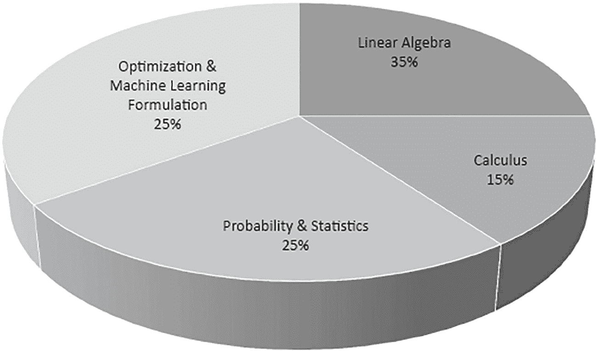

一个饼图，以百分比表示。优化和机器学习公式化，25%。概率和统计学，25%。线性代数，35%。

图 1-1

数学主题对机器学习和数据科学的重要性

+   线性代数

+   微积分

+   概率

+   机器学习算法的优化和公式化

注意

已经熟悉这些主题的读者可以选择跳过本章，或者随意浏览内容。

## 线性代数

线性代数是数学的一个分支，它处理向量和它们从一个向量空间到另一个向量空间的转换。由于在机器学习和深度学习中我们处理多维数据及其操作，线性代数在几乎所有的机器学习和深度学习算法中都起着至关重要的作用。如图 1-2 所示，这是一个三维向量空间，其中 *v*[1]、*v*[2] 和 *v*[3] 是向量，*P* 是三维向量空间内的一个二维平面。

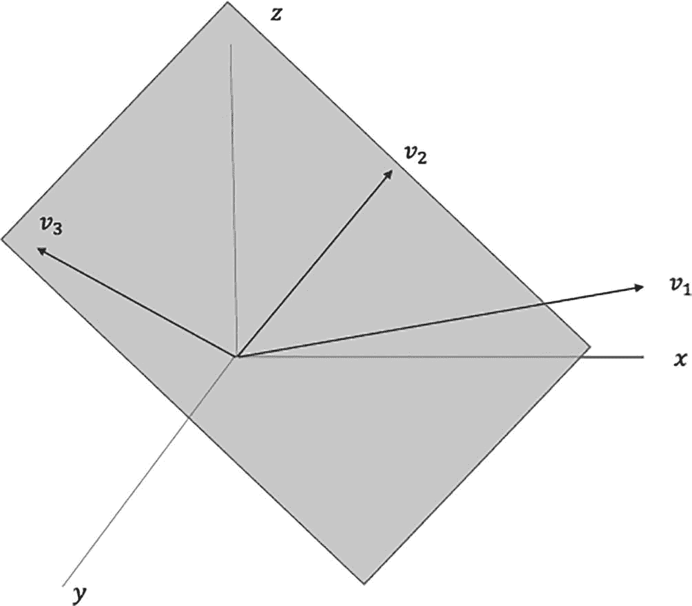

一个具有 X、Y 和 Z 轴的平面表面。中性轴产生了三条线：v 下标 1-3。

图 1-2

包含向量和向量平面的三维向量空间

### 向量

数字的数组，无论是连续的还是离散的，都称为向量，由向量组成的集合称为向量空间。向量空间的维度可以是有限的或无限的，但大多数机器学习或数据科学问题处理的是固定长度的向量，例如，在平面上以速度*Vx*和*Vy*在*x*和*y*方向上移动的汽车的速度（见图 1-3)。

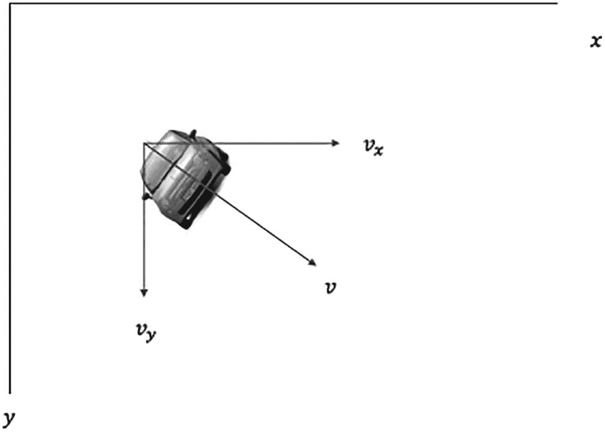

X-Y 平面由在 x-y 向量平面上移动的汽车组成，表示车辆速度的 x 和 y 分量。

图 1-3

在 x-y 向量平面上以速度分量 Vx 和 Vy 移动的汽车

在机器学习中，我们处理多维数据，因此向量变得非常重要。假设我们正在尝试根据房屋面积、卧室数量、浴室数量和地区的 人口密度来预测该地区的房价。所有这些特征构成了房价预测问题的输入特征向量。

### 标量

一维向量是一个标量。正如在高中所学的，标量是一个只有大小没有方向的量。这是因为，由于它只能沿着一个方向移动，其方向无关紧要，我们只关心大小。

例如：孩子的身高，水果的重量等。

### 矩阵

矩阵是一个按行和列排列的数字二维数组。矩阵的大小由其行长度和列长度决定。如果一个矩阵*A*有*m*行和*n*列，它可以表示为一个具有*m*×*n*个元素的矩形对象（见图 1-4a），并且可以表示为*A*[*m* × *n*.]

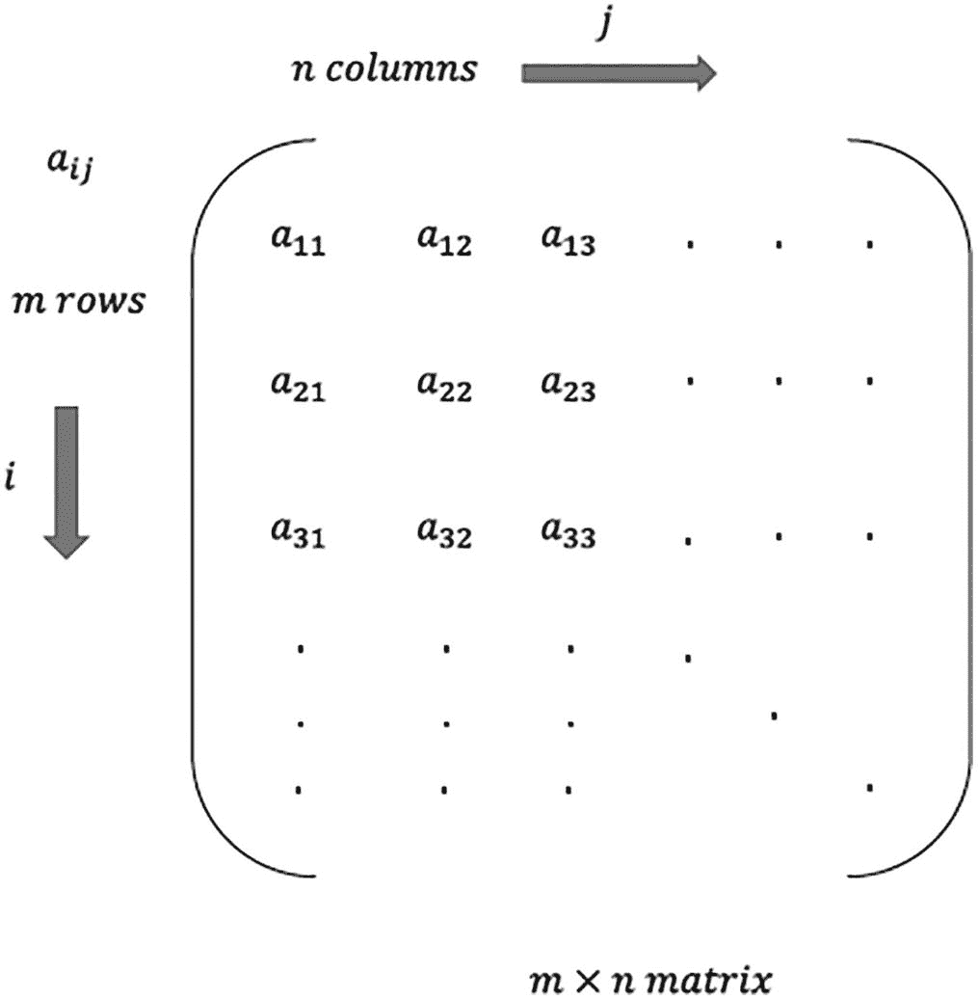

m×n 的矩阵。元素用下标 ij 表示。

图 1-4a

矩阵的结构

属于同一向量空间的一些向量构成一个矩阵。

例如，灰度图像以矩阵形式存储。图像的大小决定了图像矩阵的大小，每个矩阵单元包含一个从 0 到 255 的值，代表像素强度。图 1-4b 展示了灰度图像及其矩阵表示。

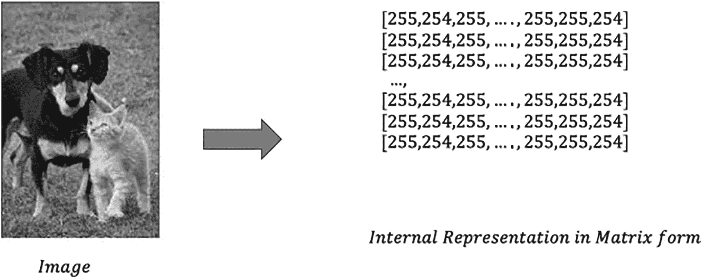

一张狗和猫的照片，以及一个箭头指向其矩阵形式的内部表示。

图 1-4b

矩阵的结构

### 张量

张量是一个多维数组，实际上，向量和矩阵可以被看作是 1 维和 2 维的张量。在深度学习中，张量主要用于存储和处理数据。例如，RGB 格式的图像存储在一个三维张量中，其中沿着一个维度我们有水平轴，沿着另一个维度我们有垂直轴，第三个维度对应于三个颜色通道，即红色、绿色和蓝色。另一个例子是卷积神经网络中通过小批量输入图像所使用的四维张量。沿着第一个维度，我们有批次中的图像数量，沿着第二个维度，我们有颜色通道，第三个和第四个维度对应于水平和垂直方向上的像素位置。

### 矩阵运算和操作

大多数深度学习计算活动都是通过基本的矩阵运算完成的，例如乘法、加法、减法、转置等。因此，回顾基本的矩阵运算是有意义的。

一个有 *m* 行和 *n* 列的矩阵 *A* 可以被视为一个包含 *n* 个维度为 *m* 的列向量并排堆叠的矩阵。我们如下表示矩阵：

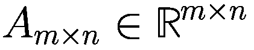

#### 两个矩阵的加法

两个矩阵 *A* 和 *B* 的加法意味着它们的逐元素加法。只有当两个矩阵的维度匹配时，我们才能进行加法操作。如果 *C* 是矩阵 *A* 和 *B* 的和，那么

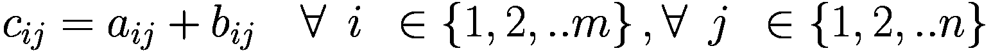

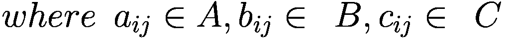

示例： 则 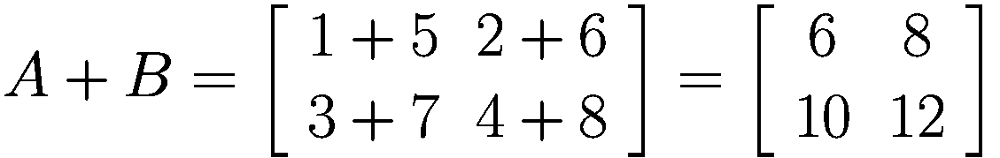

#### 两个矩阵的减法

两个矩阵 *A* 和 *B* 的减法意味着它们的逐元素减法。只有当两个矩阵的维度匹配时，我们才能进行减法操作。

如果 *C* 是表示 *A* - *B* 的矩阵，那么

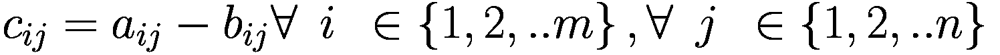

示例：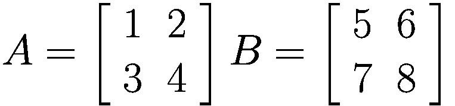 然后 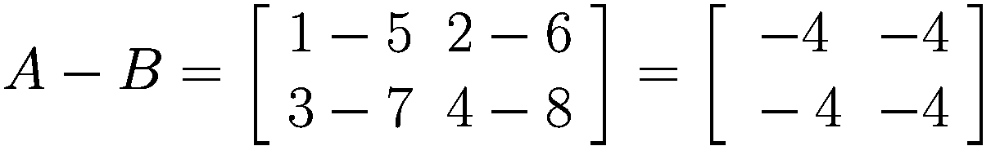

#### 两个矩阵的乘积

对于两个矩阵 *A* ∈ *R*^(*m* × *n*) 和 *B* ∈ *R*^(*p* × *q*) 来说，要能相乘，*n* 应该等于 *p*。结果矩阵是 *C* ∈ *R*^(*m* × *q*)。*C* 的元素可以表示如下：

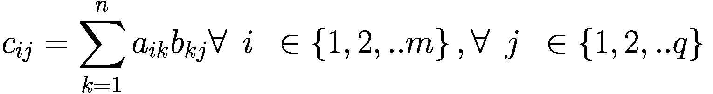

例如，两个矩阵 *A*，*B* ∈ *R*^(2 × 2) 的矩阵乘积可以计算如下：

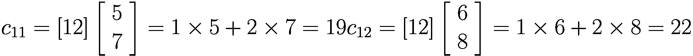

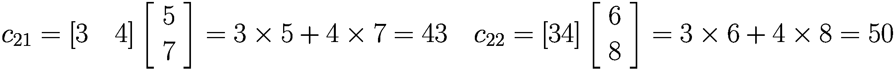

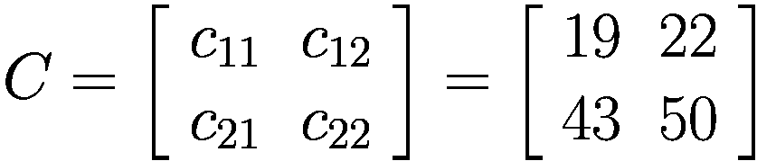

#### 矩阵的转置

矩阵 *A* ∈ *R*^(*m* × *n*) 的转置通常表示为 *A*^(*T*) ∈ *R*^(*n* × *m*)，并且是通过将列向量作为行向量进行转置得到的。

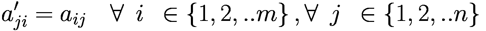

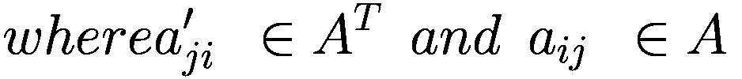

示例：![$$ \textrm{Example}:\kern0.5em A=\left[\begin{array}{cc}1& 2\\ 3& 4\end{array}\right]\textrm{then}\kern0.5em {A}^T=\left[\begin{array}{cc}1& 3\\ 2& 4\end{array}\right] $$](../images/448418_2_En_1_Chapter/448418_2_En_1_Chapter_TeX_IEq5.png)

两个矩阵 *A* 和 *B* 的乘积的转置是矩阵 *A* 和 *B* 的转置的逆序乘积；即，(*AB*)^(*T*) = *B*^(*T*)*A*^(*T*)[.]

例如，如果我们取两个矩阵 ![$$ A=\left[\begin{array}{cc}19& 22\\ 43& 50\end{array}\right] $$](../images/448418_2_En_1_Chapter/448418_2_En_1_Chapter_TeX_IEq6.png) 和 ![$$ B=\left[\begin{array}{cc}5& 6\\ 7& 8\end{array}\right] $$](../images/448418_2_En_1_Chapter/448418_2_En_1_Chapter_TeX_IEq7.png)，那么

![$$ (AB)=\left[\begin{array}{cc}19& 22\\ 43& 50\end{array}\right]\left[\begin{array}{cc}5& 6\\ 7& 8\end{array}\right]=\left[\begin{array}{cc}95& 132\\ 301& 400\end{array}\right] $$](../images/448418_2_En_1_Chapter/448418_2_En_1_Chapter_TeX_IEq8.png) 因此 ![$$ {(AB)}^T=\left[\begin{array}{cc}95& 301\\ 132& 400\end{array}\right] $$](../images/448418_2_En_1_Chapter/448418_2_En_1_Chapter_TeX_IEq9.png)

现在，![$$ {A}^T=\left[\begin{array}{cc}19& 43\\ 22& 50\end{array}\right] $$](../images/448418_2_En_1_Chapter/448418_2_En_1_Chapter_TeX_IEq10.png) 和 ![$$ {B}^T=\left[\begin{array}{cc}5& 7\\ 6& 8\end{array}\right] $$](../images/448418_2_En_1_Chapter/448418_2_En_1_Chapter_TeX_IEq11.png)

![$$ {B}^T{A}^T=\left[\begin{array}{cc}5& 7\\ 6& 8\end{array}\right]\left[\begin{array}{cc}19& 43\\ 22& 50\end{array}\right]=\left[\begin{array}{cc}95& 301\\ 132& 400\end{array}\right] $$](../images/448418_2_En_1_Chapter/448418_2_En_1_Chapter_TeX_Equm.png)

因此，等式 (*AB*)^(*T*) = *B*^(*T*)*A*^(*T*) 成立。

#### 两个向量的点积

任何维度为 *n* 的向量都可以表示为矩阵 *v* ∈ *R*^(*n* × 1)。让我们表示两个 *n*-维向量 *v*[1] ∈ *R*^(*n* × 1) 和 *v*[2] ∈ *R*^(*n* × 1)。

![$$ {v}_1= \left[\begin{array}{c}{v}_{11}\\ {v}_{12}\\ .\\ .\\ .\\ {v}_{1n}\end{array}\right]{v}_2= \left[\begin{array}{c}{v}_{21}\\ {v}_{22}\\ .\\ .\\ .\\ {v}_{2n}\end{array}\right] $$](../images/448418_2_En_1_Chapter/448418_2_En_1_Chapter_TeX_Equn.png)

两个向量的点积是相应分量乘积的和——即，沿同一维度的分量——可以表示如下：

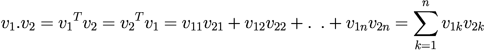

(示例:) 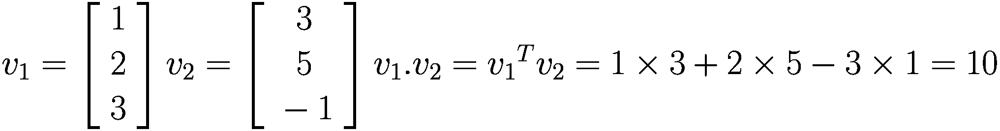

#### 矩阵对向量的操作

当一个矩阵乘以一个向量时，结果是另一个向量。假设 *A* ∈ *R*^(*m* × *n*) 乘以向量 *x* ∈ *R*^(*n* × 1)，结果将产生一个向量 *b* ∈ *R*^(*m* × 1)：

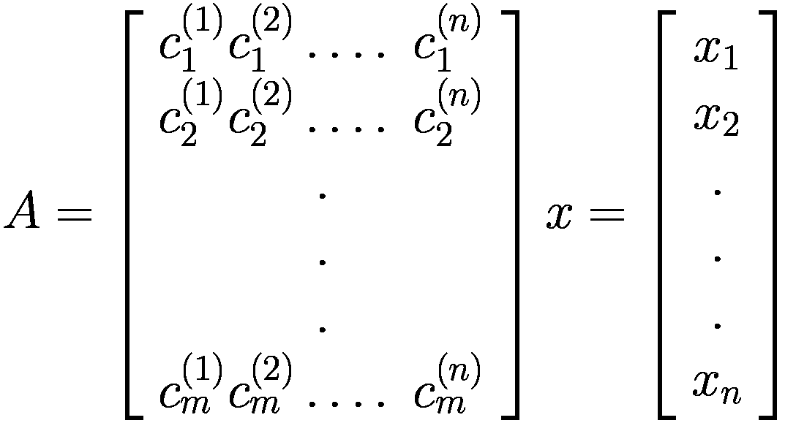

*A* 由 *n* 个列向量 *c*^((*i*)) ∈ *R*^(*m* × 1) 组成，对于所有 *i* ∈ {1, 2, …, *n*}。

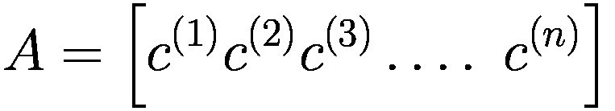

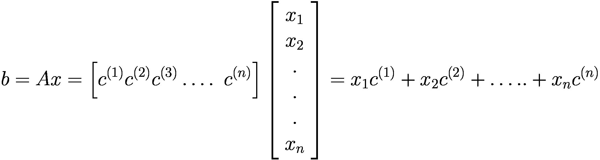

如我们所见，这个乘积不过是矩阵 *A* 的列向量的线性组合，其中向量 *x* 的分量是线性系数。

通过乘法形成的新向量 *b* 与 *A* 的列向量具有相同的维度，并且保持在相同的列空间中。这是一个非常美妙的事实；无论我们如何组合列向量，我们都无法离开由列向量张成的空间。

现在，让我们来看一个例子。

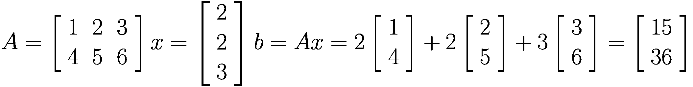

我们可以看到 *A* 和 *b* ∈ *R*^(2 × 1) 的列向量。

### 向量的线性相关性

如果一个向量可以表示为其他向量的线性组合，则称该向量对其他向量线性相关。

如果 *v*[1] = 5*v*[2] + 7*v*[3]，那么 *v*[1]，*v*[2] 和 *v*[3] 不是线性无关的，因为至少有一个可以表示为其他向量的和。一般来说，一组 *n* 个向量 *v*[1]，*v*[2]，…，*v*[*n*]，其中 *v*[*i*] ∈ *R*^(*m* × 1)，对于所有 *i* ∈ {1, 2, .. *n*}，如果且仅当 *a*[1]*v*[1] + *a*[2]*v*[2] + *a*[3]*v*[3] + … + *a*[*n*]*v*[*n*] = 0 则称这些向量是线性无关的，这意味着每个 *a*[*i*] = 0 对于所有 *i* ∈ {1, 2, …*n*}。

如果*a*[1]*v*[1] + *a*[2]*v*[2] + *a*[3]*v*[3] + . . . + *a*[*n*]*v*[*n*] = 0 且不是所有*a*[*i*] = 0，那么这些向量不是线性无关的。

给定一组向量，可以使用以下方法来检查它们是否线性无关。

*a*[1]*v*[1] + *a*[2]*v*[2] + *a*[3]*v*[3] + . . . + *a*[*n*]*v*[*n*] = 0 可以写成以下形式：

![$$ \left[{v}_1\ {v}_2\dots {v}_n\right]\left[\begin{array}{c}{a}_1\\ {}.\\ {}{a}_n\end{array}\right]=0 $$](../images/448418_2_En_1_Chapter/448418_2_En_1_Chapter_TeX_Equt.png)

求解[*a*[1] *a*[2] .... *a*[*n*]]^(*T*)，如果得到的唯一解是零向量，那么向量组*v*[1],*v*[2],…. *v*[*n*]被称为线性无关。

如果一组*n*个向量*v*[*i*] ∈ *R*^(*n* × 1)是线性无关的，那么这些向量张成了整个*n*-维空间。换句话说，通过取*n*个向量的线性组合，可以产生*n*-维空间中所有可能的向量。如果*n*个向量不是线性无关的，它们只张成了*n*-维空间中的一个子空间。

为了说明这一点，让我们在三维空间中取一些向量，如图 1-5 所示。

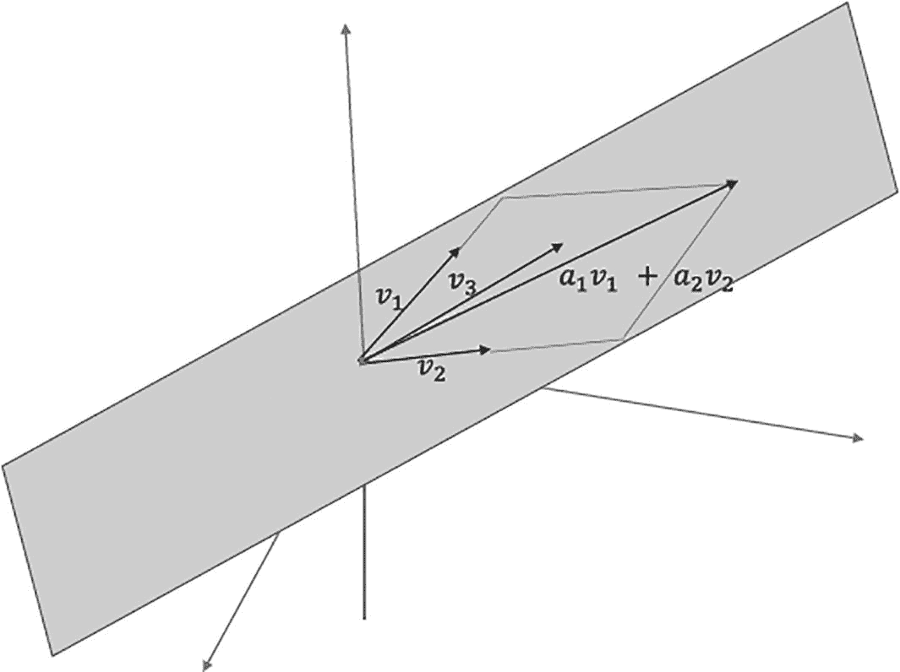

在三维向量空间上的矩形 2 D 结构，有三个向量 v 1, v 2 和 v 3\. v 1 和 v 2 的乘积是 a 1 v 1 + a 2 v 2，形成一个平行四边形。

图 1-5

在三维向量空间中由 v[1]和 v[2]张成的二维子空间

如果我们有一个向量*v*[1] = [1 2 3]^(*T*)，我们只能在三维空间中张成一条维度，因为用这个向量可以形成的所有向量都会与*v*[1]具有相同的方向，其大小由标量乘数决定。换句话说，每个向量都会是形式为*a*[1]*v*[1]的。

现在，让我们再取另一个向量*v*[2] = [ 5 9 7 ]^(*T*)，其方向与*v*[1]不同。因此，这两个向量的张成*Span*(*v*[1], *v*[2])就是*v*[1]和*v*[2]的线性组合。有了这两个向量，我们可以形成任何位于两个向量所在平面上的形式为*av*[1] + *bv*[2]的向量。基本上，我们将在三维空间内张成一个二维子空间。这一点在下面的图中得到了说明。

让我们再向我们的向量集中添加另一个向量*v*[3] = [ 4 8 1]^(*T*)。现在，如果我们考虑*Span*(*v*[1], *v*[2,]*v*[3])，我们可以形成三维平面上的任何向量。你可以取任何三维向量，它可以表示为前面三个向量的线性组合。

这三个向量构成了三维空间的一个基。任何三个线性无关的向量都会构成三维空间的一个基。同样，这可以推广到任何*n*-维空间。

如果我们取一个向量 *v*[3]，它是 *v*[1] 和 *v*[2] 的线性组合，那么它就无法覆盖整个三维空间。我们会被限制在由 *v*[1] 和 *v*[2] 张成的二维子空间内。

### 矩阵的秩

线性代数中最重要的概念之一是矩阵的秩。矩阵的秩是线性无关的列向量或行向量的数量。对于一个矩阵，线性无关的列向量的数量总是等于线性无关的行向量的数量。

示例：考虑矩阵 ![$$ A=\left[\begin{array}{ccc}1& 3& 4\\ 2& 5& 7\\ 3& 7& 10\end{array}\right] $$](../images/448418_2_En_1_Chapter/448418_2_En_1_Chapter_TeX_IEq13.png)

列向量 ![$$ \left[\begin{array}{c}1\\ 2\\ 3\end{array}\right] $$](../images/448418_2_En_1_Chapter/448418_2_En_1_Chapter_TeX_IEq14.png) 和 ![$$ \left[\begin{array}{c}3\\ 5\\ 7\end{array}\right] $$](../images/448418_2_En_1_Chapter/448418_2_En_1_Chapter_TeX_IEq15.png) 是线性无关的。然而，![$$ \left[\begin{array}{c}4\\ 7\\ 10\end{array}\right] $$](../images/448418_2_En_1_Chapter/448418_2_En_1_Chapter_TeX_IEq16.png) 不是线性无关的[因为它是由其他两个列向量的线性组合；即] ![$$ \left[\begin{array}{c}4\\ 7\\ 10\end{array}\right]=\left[\begin{array}{c}1\\ 2\\ 3\end{array}\right]+\left[\begin{array}{c}3\\ 5\\ 7\end{array}\right] $$](../images/448418_2_En_1_Chapter/448418_2_En_1_Chapter_TeX_IEq17.png)[。因此，矩阵的秩是 2，因为它有两个线性无关的列向量。

由于矩阵的秩为 2，矩阵的列向量只能张成三维向量空间内的二维子空间。这个二维子空间可以通过取 ![$$ \left[\begin{array}{c}1\\ 2\\ 3\end{array}\right] $$](../images/448418_2_En_1_Chapter/448418_2_En_1_Chapter_TeX_IEq18.png) 和 ![$$ \left[\begin{array}{c}3\\ 5\\ 7\end{array}\right] $$](../images/448418_2_En_1_Chapter/448418_2_En_1_Chapter_TeX_IEq19.png) 的线性组合来形成。

以下是一些重要的注意事项：

+   如果一个方阵 *A* ∈ *R*^(*n* × *n*) 的秩是 *n*，那么它被称为满秩。秩为 *n* 的方阵意味着所有的 *n* 个列向量，甚至包括 *n* 个行向量都是线性无关的，因此可以通过取矩阵 *A* 的 *n* 个列向量的线性组合来张成整个 *n*-维空间。

+   如果一个方阵 *A* ∈ *R*^(*n* × *n*) 不是满秩的，那么它是一个奇异矩阵；即它的所有列向量或行向量都不是线性无关的。一个奇异矩阵没有定义的矩阵逆和零行列式。

### 单位矩阵或算子

一个矩阵 *I* ∈ *R*^(*n* × *n*) 被称为单位矩阵或算子，如果任何向量或矩阵乘以 *I* 后保持不变。一个 3 × 3 的单位矩阵如下所示

![$$ I=\left[\begin{array}{ccc}1& 0& 0\\ 0& 1& 0\\ 0& 0& 1\end{array}\right] $$](../images/448418_2_En_1_Chapter/448418_2_En_1_Chapter_TeX_Equu.png)

假设我们取向量 *v* = [2 3 4]^(*T*)

![$$ Iv=\left[\begin{array}{ccc}1& 0& 0\\ 0& 1& 0\\ 0& 0& 1\end{array}\right]\left[\begin{array}{c}2\\ 3\\ 4\end{array}\right]=\left[\begin{array}{c}2\\ 3\\ 4\end{array}\right] $$](../images/448418_2_En_1_Chapter/448418_2_En_1_Chapter_TeX_Equv.png)

同样，假设我们有一个矩阵 ![$$ A=\left[\begin{array}{ccc}1& 2& 3\\ 4& 5& 6\\ 7& 8& 9\end{array}\right] $$](../images/448418_2_En_1_Chapter/448418_2_En_1_Chapter_TeX_IEq20.png)

矩阵 *AI* 和 *IA* 都等于矩阵 *A*。因此，当一个矩阵是单位矩阵时，矩阵乘法是可交换的。

### 矩阵的行列式

一个方阵 *A* 的行列式是一个数，用 *det*(*A*) 表示。它可以有多种解释方式。对于一个矩阵 *A* ∈ *R*^(*n* × *n*)，行列式表示矩阵的 *n* 个行向量的 *n* 维体积。为了行列式不为零，矩阵 *A* 的所有列向量或行向量都应该是线性无关的。如果 *n* 个行向量或列向量不是线性无关的，那么它们不能覆盖整个 *n* 维空间，而是一个小于 *n* 维的子空间，因此 *n* 维体积为零。对于一个矩阵 *A* ∈ *R*^(2 × 2)，行列式表示如下：

![$$ A=\left[\begin{array}{cc}{a}_{11}& {a}_{12}\\ {a}_{21}& {a}_{22}\end{array}\right]\in {R}^{2\times 2} $$](../images/448418_2_En_1_Chapter/448418_2_En_1_Chapter_TeX_Equw.png)

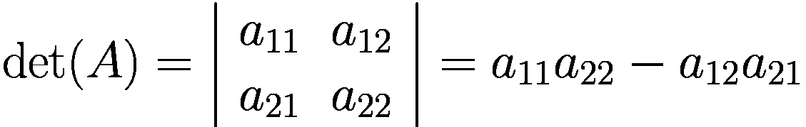

同样，对于一个矩阵 *B* ∈ *R*^(3 × 3)，矩阵的行列式由以下公式给出：

![$$ B=\left[\begin{array}{ccc}{a}_{11}& {a}_{12}& {a}_{13}\\ {a}_{21}& {a}_{22}& {a}_{23}\\ {a}_{31}& {a}_{32}& {a}_{33}\end{array}\right]\kern0.5em \in \kern0.5em {{\mathbb{R}}}^{3\times 3} $$](../images/448418_2_En_1_Chapter/448418_2_En_1_Chapter_TeX_Equy.png)

![$$ B\in \left[\begin{array}{ccc}{a}_{11}& {a}_{12}& {a}_{13}\\ {a}_{21}& {a}_{22}& {a}_{23}\\ {a}_{31}& {a}_{32}& {a}_{33}\end{array}\right]\in {R}^{3\times 3} $$](../images/448418_2_En_1_Chapter/448418_2_En_1_Chapter_TeX_Equz.png)

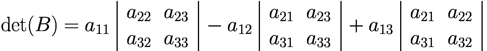 $$ \mathit{\det}(B)={a}_{11}\left|\begin{array}{cc}{a}_{22}&amp; {a}_{23}\\ {}{a}_{32}&amp; {a}_{33}\end{array}\right|-{a}_{12}\left|\begin{array}{cc}{a}_{21}&amp; {a}_{23}\\ {}{a}_{31}&amp; {a}_{33}\end{array}\right|+{a}_{13}\left|\begin{array}{cc}{a}_{21}&amp; {a}_{22}\\ {}{a}_{31}&amp; {a}_{32}\end{array}\right| $$

其中  $$ \mathit{\det}(B)={a}_{11}\left|\begin{array}{cc}{a}_{22}&amp; {a}_{23}\\ {}{a}_{32}&amp; {a}_{33}\end{array}\right|-{a}_{12}\left|\begin{array}{cc}{a}_{21}&amp; {a}_{23}\\ {}{a}_{31}&amp; {a}_{33}\end{array}\right|+{a}_{13}\left|\begin{array}{cc}{a}_{21}&amp; {a}_{22}\\ {}{a}_{31}&amp; {a}_{32}\end{array}\right| $$

行列式计算的方法可以推广到 *R*^(*n* × *n*) 矩阵。将 *B* 作为 *n*-维矩阵处理，其行列式可以表示如下：

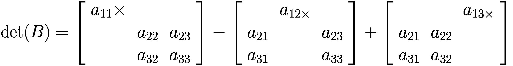 $$ \mathit{\det}(B)=\left[\begin{array}{ccc}{a}_{11}\times &amp; &amp; \\ {}&amp; {a}_{22}&amp; {a}_{23}\\ {}&amp; {a}_{32}&amp; {a}_{33}\end{array}\right]-\left[\begin{array}{ccc}&amp; {a}_{12\times }&amp; \\ {}{a}_{21}&amp; &amp; {a}_{23}\\ {}{a}_{31}&amp; &amp; {a}_{33}\end{array}\right]+\left[\begin{array}{ccc}&amp; &amp; {a}_{13 \times}\\ {}{a}_{21}&amp; {a}_{22}&amp; \\ {}{a}_{31}&amp; {a}_{32}&amp; \end{array}\right] $$

例如，矩阵 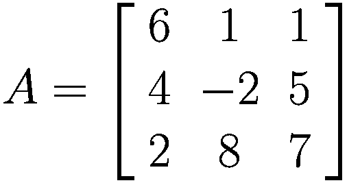 $$ A=\left[\begin{array}{ccc}6&amp; 1&amp; 1\\ {}4&amp; -2&amp; 5\\ {}2&amp; 8&amp; 7\end{array}\right] $$ 的行列式可以按以下方式计算：

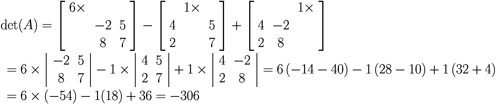 $$ {\displaystyle \begin{array}{l}\mathit{\det}(A)=\left[\begin{array}{ccc}6\times &amp; &amp; \\ {}&amp; -2&amp; 5\\ {}&amp; 8&amp; 7\end{array}\right]-\left[\begin{array}{ccc}&amp; 1\times &amp; \\ {}4&amp; &amp; 5\\ {}2&amp; &amp; 7\end{array}\right]+\left[\begin{array}{ccc}&amp; &amp; 1\times \\ {}4&amp; -2&amp; \\ {}2&amp; 8&amp; \end{array}\right]\\ {} \operatorname{}=6\times \left|\begin{array}{cc}-2&amp; 5\\ {}8&amp; 7\end{array}\right|-1\times \left|\begin{array}{cc}4&amp; 5\\ {}2&amp; 7\end{array}\right|+1\times \left|\begin{array}{cc}4&amp; -2\\ {}2&amp; 8\end{array}\right|=6\left(-14-40\right)-1\left(28-10\right)+1\left(32+4\right)\\ {}\operatorname{}=6\times \left(-54\right)-1(18)+36=-306\end{array}} $$

#### 矩阵行列式的解释

如前所述，矩阵行列式的绝对值决定了作为边的行向量的体积。

对于一个矩阵 *A* ∈ *R*^(2 × 2)，它表示以两行向量作为边的平行四边形的面积。

对于矩阵 ![$$ A=\left[\begin{array}{cc}a& b\\ {}c& d\end{array}\right] $$](../images/448418_2_En_1_Chapter/448418_2_En_1_Chapter_TeX_IEq23.png)，其 *det*(*A*) 等于由向量 *u* = [*a b*]^(*T*) 和 *v* = [ *c d*]^(*T*) 作为边的平行四边形的面积。

平行四边形的面积 = |*u*||*v*| `sin` *θ*，其中 *θ* 是 *u* 和 *v* 之间的角度（见图 1-6）。

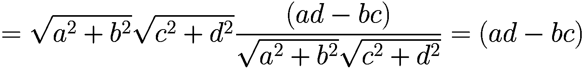

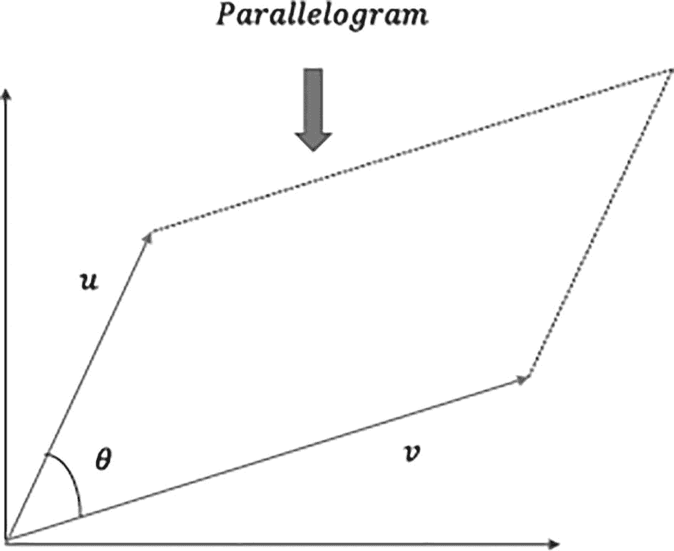

2D 平面显示由 u 和 v 的两个向量形成的平行四边形，以及一个 theta 角度。

图 1-6

由两个向量形成的平行四边形

同样，对于矩阵 *B* ∈ *R*^(3 × 3)，行列式是三个行向量作为边的平行六面体的体积。

### 矩阵的逆

方阵 *A* ∈ *R*^(*n* × *n*) 的逆用 *A*^(−1) 表示，当与 *A* 相乘时产生单位矩阵 *I* ∈ *R*^(*n* × *n*)。

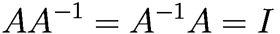

并非所有方阵都有 *A* 的逆。计算 *A* 的逆的公式如下：

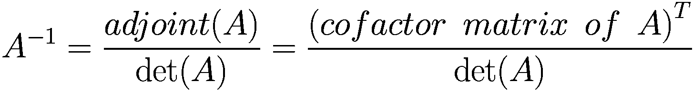

如果一个方阵 *A* ∈ *R*^(*n* × *n*) 是奇异的——即如果 *A* 没有独立的 *n* 列或行向量——那么 *A* 的逆不存在。这是因为对于奇异的矩阵 *det*(*A*) = 0，因此逆变得未定义。

![$$ A=\left[\begin{array}{ccc}a& b& c\\ {}d& e& f\\ {}g& h& i\end{array}\right] $$](../images/448418_2_En_1_Chapter/448418_2_En_1_Chapter_TeX_Equag.png)

设矩阵 *A* 的元素表示为 *a*[*ij*]，其中 *i* 代表元素的行号，*j* 代表元素的列号。

然后，*a*[*ij*] 的余子式 = (−1)^(*i* + *j*)*d*[*ij*]，其中 *d*[*ij*] 是从 A 中删除行 *i* 和列 *j* 形成的矩阵的行列式。

元素 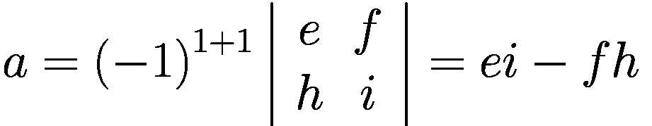 的余子式为。

同样，元素 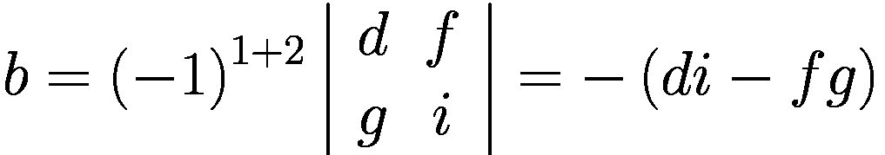 的余子式为。

一旦形成余子式矩阵，余子式矩阵的转置将给出 *adjoint*(*A*)。*adjoint*(*A*) 除以 *det*(*A*) 得到 *A*^(−1)。

例如，矩阵 ![$$ A=\left[\begin{array}{cc}4&amp; 3\\ {}3&amp; 2\end{array}\right] $$](../images/448418_2_En_1_Chapter/448418_2_En_1_Chapter_TeX_IEq26.png) 的逆矩阵可以按以下方式计算：

矩阵 ![$$ A=\left[\begin{array}{cc}1(2)&amp; -1(3)\\ {}-1(3)&amp; 1(4)\end{array}\right] $$](../images/448418_2_En_1_Chapter/448418_2_En_1_Chapter_TeX_IEq26.png) 的余子式矩阵为 ![$$ \left[\begin{array}{cc}2&amp; -3\\ {}-3&amp; 4\end{array}\right] $$](../images/448418_2_En_1_Chapter/448418_2_En_1_Chapter_TeX_IEq27.png)

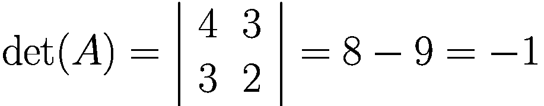 因此，![$$ {A}^{-1}=\frac{{\left( cofactor\kern0.5em matrix\kern0.5em of\kern0.5em A\right)}^T}{\det (A)}= \frac{{\left[\begin{array}{cc}2&amp; -3\\ {}-3&amp; 4\end{array}\right]}^T}{-1}=\left[\begin{array}{cc}-2&amp; 3\\ {}3&amp; -4\end{array}\right] $$](../images/448418_2_En_1_Chapter/448418_2_En_1_Chapter_TeX_IEq29.png).

下面是一些矩阵逆的规则：

+   (*AB*)^(−1) = *B*^(−1)*A*^(−1)

+   *I*^(−1) = *I*，其中*I*是单位矩阵。

### 向量的范数

向量的范数是衡量其大小的一个度量。有几种这样的范数。最熟悉的是欧几里得范数，下面将定义。它也被称为*l*²范数。

对于向量*x* ∈ *R*^(*n* × 1)，*l*²范数如下：

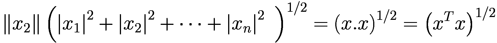

同样，*l*¹范数是向量各分量的绝对值之和。

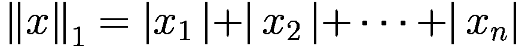

通常情况下，当 1 < p < ∞时，向量的*l*^(*p*)范数可以定义为以下形式：

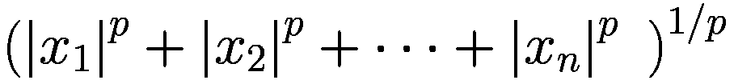

当*p* → ∞时，范数被称为最大范数，其定义如下：

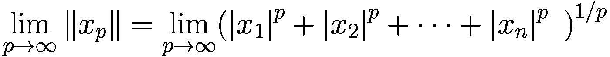

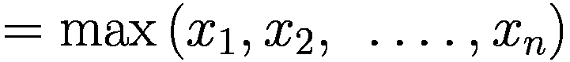

在图 1-7 中，已经绘制了单位范数曲线，包括*l*¹、*l*²和最大范数。

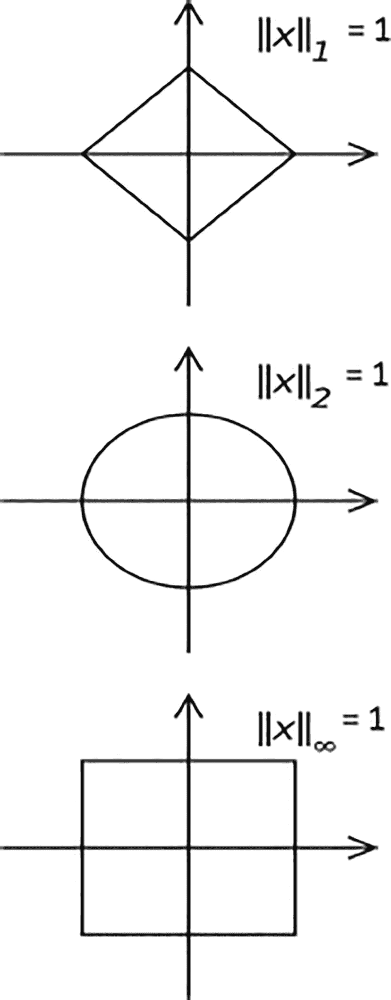

三个象限代表一个菱形，当 x 1 的模等于 1 时，一个圆，当 x 2 的模等于 1 时，一个正方形，当 x 无限的模等于 1 时，所有这些的中心都在中性轴上。

图 1-7

向量 *R*^(2 × 1) 的单位向量 l¹、l² 和上确界范数

通常，对于机器学习，我们为了多个目的同时使用 *l*² 和 *l*¹ 范数。例如，我们在线性回归中使用的最小二乘成本函数是误差向量的 *l*² 范数；即实际目标值向量与预测目标值向量之间的差异。同样，我们经常需要为我们的模型进行正则化，结果模型无法很好地拟合训练数据，并且无法推广到新数据。为了实现正则化，我们通常将模型参数向量的 *l*² 范数或 *l*¹ 范数的平方作为模型成本函数中的惩罚项。当使用参数向量的 *l*² 范数进行正则化时，它通常被称为岭回归正则化，而当我们使用 *l*¹ 范数时，它被称为 Lasso 正则化。

### 矩阵的伪逆

如果我们有一个问题 *Ax* = *b*，其中 *A* ∈ *R*^(*n* × *n*) 和 *b* ∈ *R*^(*n* × 1) 已提供，并且我们需要求解 *x* ∈ *R*^(*n* × 1)，只要 *A* 不是奇异的并且其逆存在，我们就可以求解 *x* 为 *x* = *A*^(−1)*b*。

然而，如果 *A* ∈ *R*^(*m* × *n*)——即，如果 *A* 是一个矩形矩阵且 *m* > *n*——那么 *A*^(−1) 不存在，因此我们无法通过前面的方法求解 *x*。在这种情况下，我们可以得到一个最优解，即 *x*^∗ = (*A*^(*T*)*A*)^(−1)*A*^(*T*)*b*。矩阵 (*A*^(*T*)*A*)^(−1)*A*^(*T*) 被称为伪逆，因为它充当逆矩阵以提供最优解。这种伪逆会在最小二乘技术中出现，例如线性回归。

### 特定向量方向上的单位向量

特定向量方向上的单位向量是该向量除以其大小或范数。对于欧几里得空间，也称为 *l*² 空间，向量 *x* = [3 4]^(*T*) 的单位向量如下：

![$$ \frac{x}{{\left\Vert x\right\Vert}_2}=\frac{x}{{\left({x}^Tx\right)}^{1/2}}=\frac{{\left[3\kern0.5em 4\right]}^T}{5}={\left[0.6\kern0.5em 0.8\right]}^T $$](../images/448418_2_En_1_Chapter/448418_2_En_1_Chapter_TeX_Equam.png)

### 另一向量方向上的向量投影

向量 *v*[1] 在 *v*[2] 方向上的投影是 *v*[1] 与 *v*[2] 方向上的单位向量的点积。‖*v*[12]‖ = *v*[1]^(*T*)*u*[2]，其中 ‖*v*[12]‖ 是 *v*[1] 在 *v*[2] 上的投影，*u*[2] 是 *v*[2] 方向上的单位向量。

根据单位向量的定义，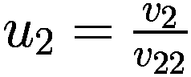，投影也可以表示为 ‖*v*[12]‖ = *v*[1]^(*T*)*u*[2] = 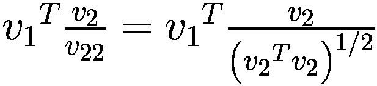

例如，向量[1 1]^(*T*)在向量[3 4]^(*T*)方向上的投影是[1 1]^(*T*)与[3 4]^(*T*)方向上的单位向量的点积，即之前计算出的[0.6 0.8]^(*T*)。

所需的投影 = ![$$ {\left[1\kern0.5em 1\right]}^T\left[\begin{array}{c}0.6\\ {}0.8\end{array}\right]=1\times 0.6+1\times 0.8=1.4 $$](../images/448418_2_En_1_Chapter/448418_2_En_1_Chapter_TeX_IEq32.png).

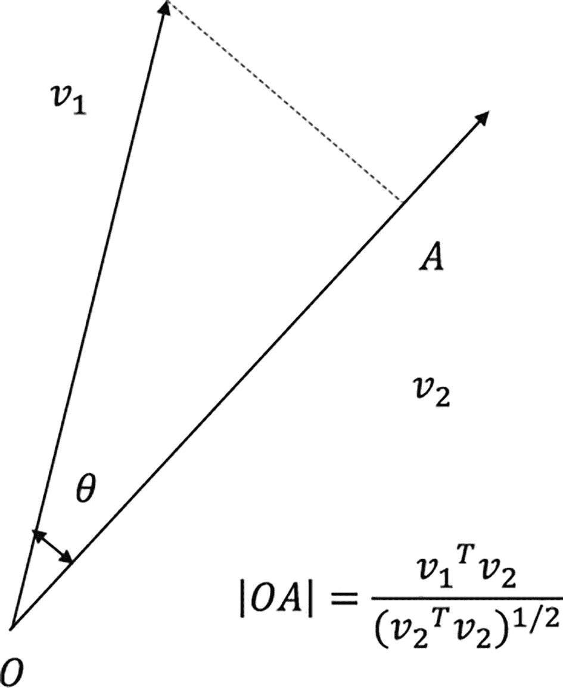

向量 v₁和 v₂的表示，包括θ角度和原点 O。从 v₁向 v₂投射的垂直虚线。给出了计算 OA 长度的公式。

图 1-8

向量 v[1]在 v[2]上的投影长度

在图 1-8 中，线段*OA*的长度给出了向量*v*[1]在*v*[2]上的投影长度。

### 特征向量

这里我们来到了线性代数中最重要的概念之一——特征向量和特征值。特征向量和特征值在机器学习的多个领域都有出现。例如，主成分分析中的主成分是协方差矩阵的特征向量，而特征值是沿着主成分的协方差。同样，在谷歌的页面排名算法中，页面排名得分的向量不过是与 1 的特征值相对应的页面转移概率矩阵的特征向量。

矩阵作为一个算子作用于向量。矩阵对向量的操作是将向量转换成另一个向量，其维度可能与原始向量相同，也可能不同，这取决于矩阵的维度。

当矩阵*A*属于*R*^(n×n)作用于向量*x*属于*R*^(n×1)时，我们再次得到一个向量*A*x*属于*R*^(n×1)。通常，新向量的长度和方向与原始向量不同。如果在这样的场景下，新产生的向量与原始向量的方向相同或正好相反，那么任何这样的方向的向量都称为特征向量。向量被拉伸的量称为特征值（见图 1-9）：

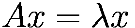

其中*A*是矩阵算子，通过乘法作用于向量*v*，这同样是特征向量，而*λ*是特征值。

两张蒙娜丽莎的画像，一张是直立的，另一张稍微倾斜。

图 1-10

著名的蒙娜丽莎图像对其像素位置的空间进行了变换

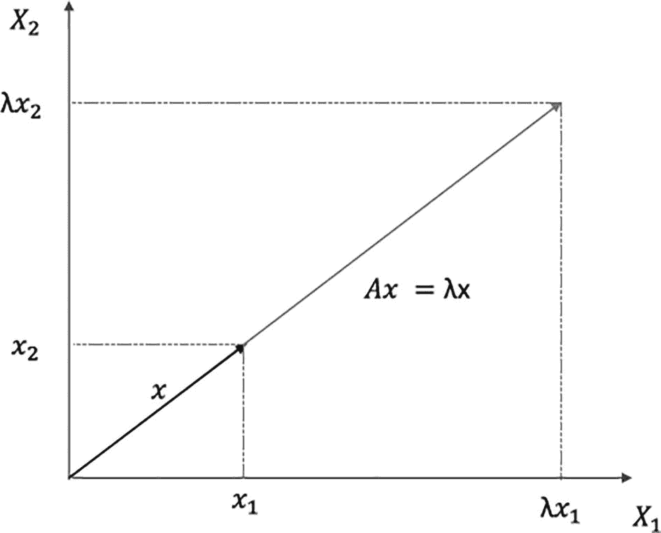

x²与 x₁构成的二维平面表示向量 x 及其特征向量、特征值和特征方程。

图 1-9

特征向量不受矩阵变换 A 的影响

如我们从图 1-10 中可以看到，当对图像空间应用变换时，代表水平轴的像素向量方向发生了改变，而沿水平方向的像素向量方向没有改变。因此，沿水平轴的像素向量是应用于 *Mona Lisa* 图像的矩阵变换的特征向量。

#### 矩阵的特征方程

矩阵 *A* ∈ *R*^(*n* × *n*) 的特征方程的根给出了矩阵的特征值。对于一个阶数为 *n* 的方阵，会有 *n* 个特征值对应于 *n* 个特征向量。

对于一个与特征值 *λ* 对应的特征向量 *v* ∈ *R*^(*n* × 1)，我们有以下内容：

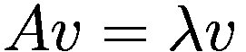

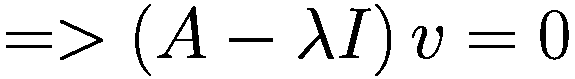

现在，由于 *v* 是一个非零的特征向量，因此 (*A* − *λI*) 必须是奇异的，上述条件才能成立。

为了使 (*A* − *λI*) 成为奇异的，*det*(*A* − *λI*) = 0，这是矩阵 *A* 的特征方程。特征方程的根给出了特征值。将特征值代入 *Av* = *λv* 方程中，然后求解 *v*，可以得到与特征值对应的特征向量。

例如，矩阵的特征值和特征向量可以计算如下。

![$$ A=\left[\begin{array}{cc}0&amp; 1\\ {}-2&amp; -3\end{array}\right] $$](../images/448418_2_En_1_Chapter/448418_2_En_1_Chapter_TeX_Equaq.png)

可以像下面看到的那样计算。

矩阵 *A* 的特征方程是 det(*A* − *λI*) = 0。

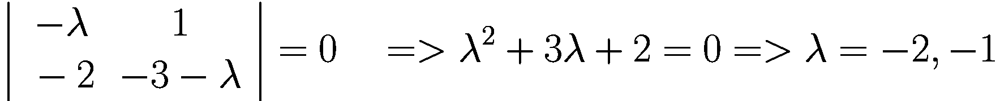

两个特征值是 -2 和 -1。

与特征值为 -2 对应的特征向量是 *u* = [*a b*]^(*T*).

![$$ \left[\begin{array}{cc}0&amp; 1\\ {}-2&amp; -3\end{array}\right]\left[\begin{array}{c}a\\ {}b\end{array}\right]=-2\left[\begin{array}{c}a\\ {}b\end{array}\right] $$](../images/448418_2_En_1_Chapter/448418_2_En_1_Chapter_TeX_Equas.png)

这给我们以下两个方程：

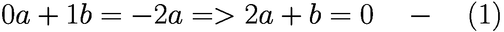

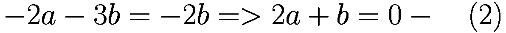

这两个方程是相同的；即 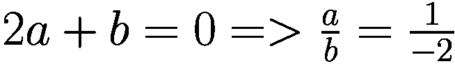.

令 *a* = *k*[1] 和 *b* =  − 2*k*[1]，其中 *k*[1] 是一个常数。

因此，与特征值 -2 对应的特征向量是 ![$$ u={k}_1\left[\begin{array}{c}1\\ {}-2\end{array}\right] $$](../images/448418_2_En_1_Chapter/448418_2_En_1_Chapter_TeX_IEq34.png).

使用相同的过程，对应于特征值 -1 的特征向量 *v* 为 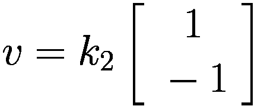。

需要注意的一点是，特征向量（Eigen vectors）和特征值（Eigen values）总是与一个特定的算子（在前面的例子中，矩阵 *A* 是算子）在向量空间上的操作相关联。特征向量和特征值并不特定于任何向量空间。

函数可以被看作向量。假设我们有一个函数 *f*(*x*) = *e*^(*ax*)。

每个 *x* 的无限值将是一个维度，而在这些值上评估的 *f*(*x*) 的值将是该维度的向量分量。因此，我们得到的是一个无限向量空间。

现在，让我们看看不同的微分算子。

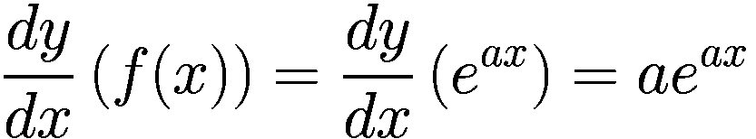

在这里，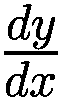 是算子，*e*^(*ax*) 是相对于该算子的特征函数，而 *a* 是相应的特征值。

如前所述，特征向量和特征值的应用在几乎所有领域都是深刻且广泛的，这在机器学习领域也是如此。为了了解特征向量如何影响现代应用，我们将以简化的方式探讨谷歌页面排名算法。

让我们以图 1-11 所示的简单网站为例，该网站有三个页面——A、B 和 C。

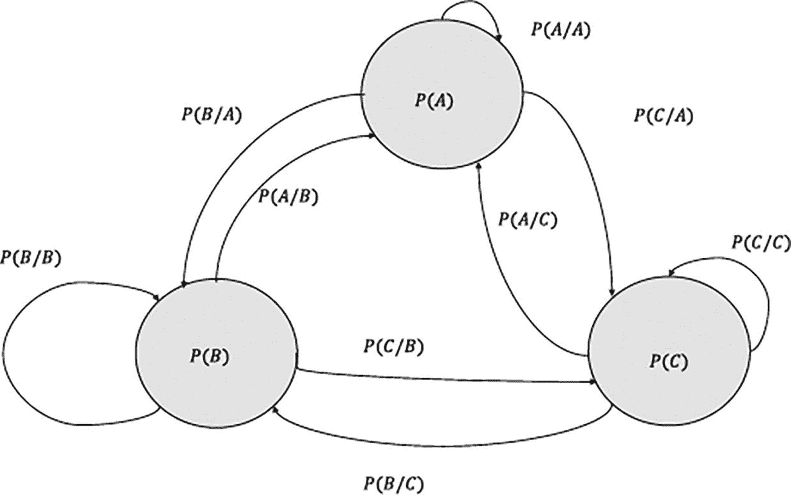

三个节点通过九条曲线相互连接，表示三个页面（标记为 A、B 和 C）的转换概率图。

图 1-11

三个页面 A、B 和 C 的转换概率图

在网络环境中，如果原始页面有指向下一个页面的链接，用户可以从一个页面跳转到另一个页面。此外，一个页面可以自我引用，并指向自身。因此，如果用户从页面 A 跳转到 B，因为页面 A 引用了页面 B，这个事件可以用 *B*/*A. P*(*B*/*A*) 表示。*B*/*A* 可以通过从页面 A 到页面 B 的总访问次数除以页面 A 的总访问次数来计算。所有页面组合的转换概率可以类似地计算。由于概率是通过归一化计数来计算的，因此页面的个别概率将承载页面重要性的本质。

在稳态下，每个页面的概率将变得恒定。我们需要根据转换概率计算每个页面的稳态概率。

对于任何页面在稳态下保持恒定概率的情况，出去的概率质量应该等于进入的概率质量，并且它们各自——当与留在页面的概率质量相加时——应该等于页面的概率。从这一点来看，如果我们考虑围绕页面 A 的平衡方程，从 A 出去的概率质量是 *P*(*B*/*A*)*P*(*A*) + *P*(*C*/*A*)*P*(*A*)，而进入 A 的概率质量是 *P*(*A*/*B*)*P*(*B*) + *P*(*A*/*C*)*P*(*C*)。概率质量 *P*(*A*/*A*)*P*(*A*)保持在 A 本身。因此，在平衡状态下，从外部进入的概率质量之和——即 *P*(*A*/*B*)*P*(*B*) + *P*(*A*/*C*)*P*(*C*)——和留在 A 的概率质量，即 *P*(*A*/*A*)*P*(*A*)，应该等于 *P*(*A*)，如上所示：

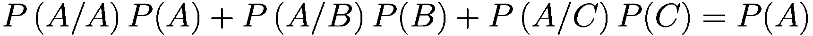

(1)

同样，如果我们考虑围绕页面 B 和 C 的平衡，以下也是成立的：

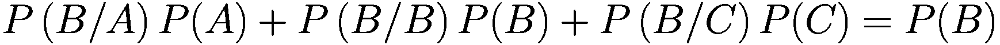

(2)

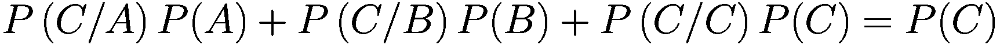

(3)

现在进入线性代数部分。我们可以将这三个方程排列成一个矩阵，对向量进行操作，如下所示：

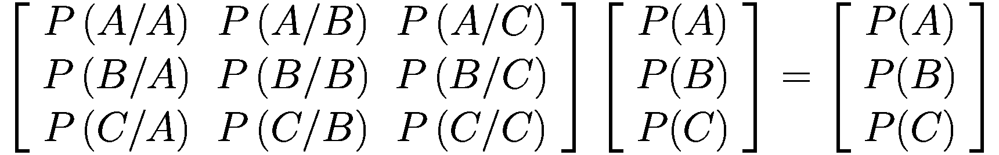

转移概率矩阵作用于页面概率向量，再次产生页面概率向量。正如我们所看到的，页面概率向量实际上就是页面转移概率矩阵的特征向量，对应的特征值是 1。

因此，计算对应于特征值 1 的特征向量将给我们页面概率向量，这反过来又可以用来对页面进行排序。许多知名搜索引擎的页面排序算法都是基于这个原理。当然，搜索引擎的实际算法对这个简单模型进行了许多修改，但基本概念是相同的。概率向量可以通过如功率迭代等方法确定，如下一节所述。

#### 计算特征向量的幂迭代法

幂迭代法是一种迭代技术，用于计算矩阵对应于最大特征值的特征向量。

设 *A* 属于 *R*^(n × n)，然后假设其 *n* 个特征值按大小顺序排列为 *λ*[1] > *λ*[2] > *λ*[3] > ... > *λ*[*n*]，对应的特征向量是 *v*[1] > *v*[2] > *v*[3] > ... > *v*[*n*]。

功迭代法从随机向量 *v* 开始，这个向量应该有指向对应于最大特征值的特征向量的某个分量，即 *v*[1]。

任何迭代中的近似特征向量由以下给出：

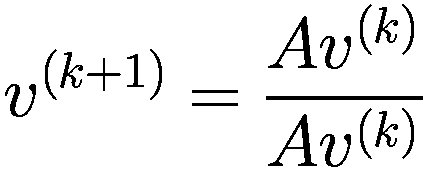

经过足够多的迭代后，*v*^((*k* + 1)) 收敛到 *v*[1]。在每次迭代中，我们将矩阵 *A* 乘以前一步得到的向量。如果我们从迭代方法中去除向量的归一化以将其转换为单位向量，则有 *v*^((*k* + 1)) = *A*^(*k*)*v*。

设初始向量 *v* 表示为特征向量的组合：

*v* = *k*[1]*v*[1] + *k*[2]*v*[2] + ... + *k*[*n*]*v*[*n*]，其中 *k*[i] ∀ *i* ∈ {1, 2, 3, ... *n*} 是常数。

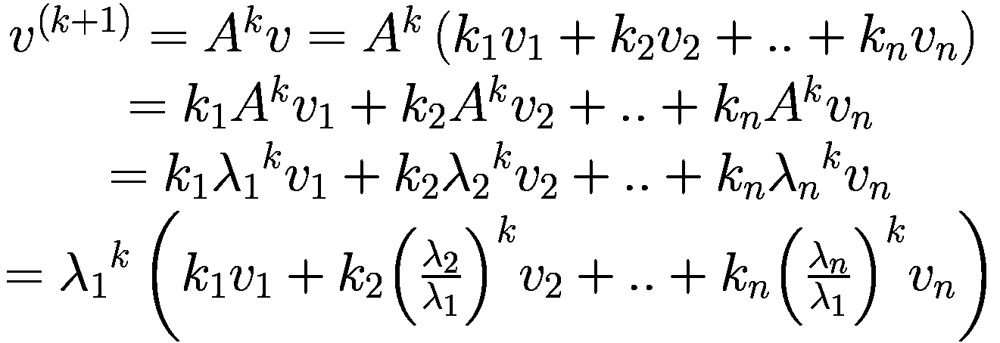

现在，当 *k* 足够大时——即（—除了第一个项之外的所有项都将消失，因为

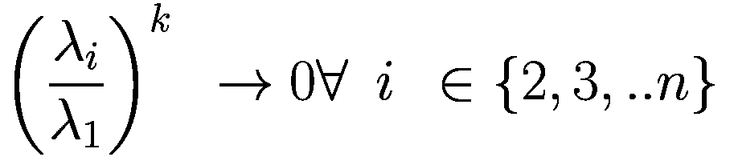

因此，*v*^((*k* + 1)) = *λ*[1]^(*k*)*k*[1]*v*[1]，这给出了对应于最大特征值的特征向量。收敛速度取决于第二大特征值与最大特征值的大小比较。如果第二大特征值在大小上接近最大值，则该方法收敛缓慢。

注意

在本章中，我简要介绍了线性代数的基础知识，以便不熟悉这个主题的读者有一个起点。然而，我建议读者在业余时间更详细地学习线性代数。著名教授吉尔伯特·斯特朗的书籍《线性代数及其应用》是一个很好的入门方式。

## 微积分

在其最简单的形式中，微积分是数学的一个分支，处理函数的微分和积分。对微积分有良好的理解对机器学习来说很重要，原因有几个：

+   不同的机器学习模型被表示为多个变量的函数。

+   构建机器学习模型时，我们通常根据数据和模型参数计算一个成本函数，并通过优化成本函数，推导出最能解释给定数据的模型参数。

### 微分

函数的微分通常意味着一个由函数表示的量的变化率，相对于函数所依赖的另一个量。

假设一个粒子在一维平面上移动——即一条直线，其在任何特定时间的距离由函数 *f*(*t*) = 5*t*² 定义。

在任何特定时间粒子的速度将由该函数对时间 *t* 的导数给出。

函数的导数定义为 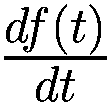，并且通常根据方便的表达方式给出以下公式：

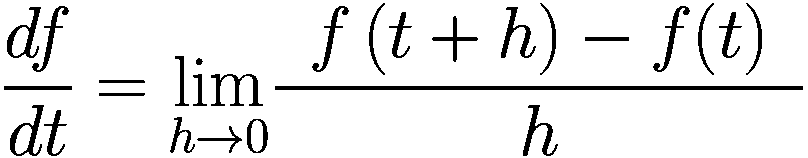

或者

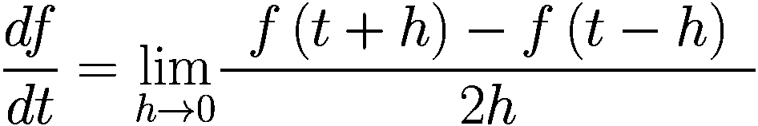

当我们处理一个依赖于多个变量的函数时，保持其他变量不变，对每个变量的导数称为偏导数，而偏导数的向量称为函数的梯度。

假设一栋房子的价格 *z* 依赖于两个变量：房子的平方英尺面积 *x* 和卧室数量 *y*。

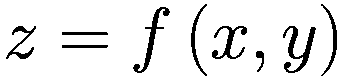

*z* 对 *x* 的偏导数表示如下：

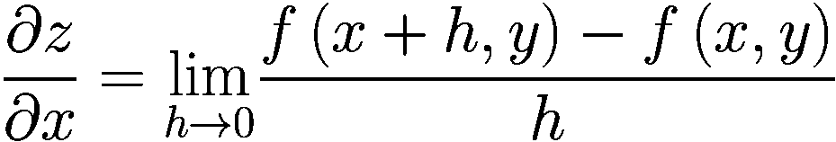

同样，*z* 对 *y* 的偏导数如下：

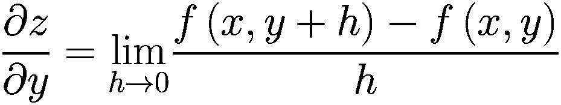

请记住，在偏导数中，除了正在求导的变量外，其他变量都保持不变。

### 函数的梯度

对于一个有两个变量的函数 *z* = *f*(*x*, *y*)，偏导数的向量 ![$$ {\left[\frac{\partial z}{\partial x}\kern0.5em \frac{\partial z}{\partial y}\right]}^T $$](../images/448418_2_En_1_Chapter/448418_2_En_1_Chapter_TeX_IEq38.png) 被称为该函数的梯度，并用 ∇*z* 表示。对于有 *n* 个变量的函数，这也可以推广。一个多元函数 *f*(*x*[1], *x*[2],.., *x*[*n*]) 也可以表示为 *f*(*x*)，其中 *x* = [*x*[1], *x*[2]…. *x*[*n*]]^(*T*) ∈ ℝ^(*n* × 1)。对于多元函数 *f*(*x*) 关于 *x* 的梯度向量可以表示为 ![$$ \nabla f={\left[\frac{\partial f}{\partial {x}_1}\kern0.5em \frac{\partial f}{\partial {x}_2}\dots \dots \frac{\partial f}{\partial {x}_n}\right]}^T $$](../images/448418_2_En_1_Chapter/448418_2_En_1_Chapter_TeX_IEq39.png).

例如，一个有三个变量 *f*(*x*, *y*, *z*) = *x* + *y*² + *z*³ 的函数的梯度如下所示：

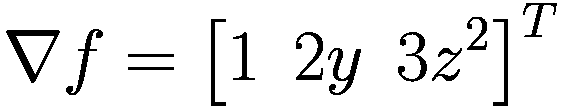

在机器学习算法中，当我们尝试根据模型参数最大化或最小化成本函数时，梯度以及偏导数非常重要，因为在极值点，函数的梯度向量为零。在函数的极值点，函数的梯度向量应该是一个零向量。

### 连续偏导数

我们可以对一个函数关于多个变量的偏导数进行连续求导。例如，对于一个函数 *z* = *f*(*x*, *y*)

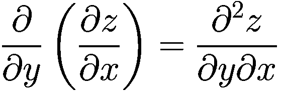

这是关于 *x* 的偏导数，然后是关于 *y* 的偏导数。

同样，

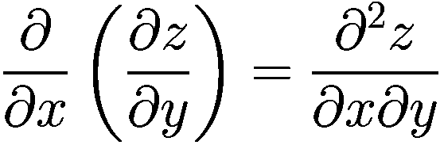

如果二阶导数是连续的，偏导数的顺序并不重要，并且

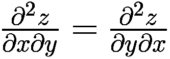.

### 函数的 Hessian 矩阵

多元函数的 Hessian 矩阵是二阶偏导数的矩阵。对于一个函数 *f*(*x*, *y*, *z*)，Hessian 矩阵定义为以下：

![$$ Hf=\left[\begin{array}{ccc}\frac{\delta²f}{\delta {x}²}&amp; \frac{\delta²f}{\delta x\delta y}&amp; \frac{\delta²f}{\delta x\delta z}\\ {}\frac{\delta²f}{\delta y\delta x}&amp; \frac{\delta²f}{\delta {y}²}&amp; \frac{\delta²f}{\delta y\delta z}\\ {}\frac{\delta²f}{\delta z\delta x}&amp; \frac{\delta²f}{\delta z\delta y}&amp; \frac{\delta²f}{\delta {z}²}\end{array}\right] $$](../images/448418_2_En_1_Chapter/448418_2_En_1_Chapter_TeX_Equbi.png)

海森矩阵在机器学习领域遇到的优化问题中非常有用。例如，在最小化成本函数以得到一组模型参数时，海森矩阵用于获取下一组参数值的更好估计，尤其是如果成本函数本质上是非线性的。非线性优化技术，如牛顿法、Broyden-Fletcher-Goldfarb-Shanno (BFGS) 及其变体，使用海森矩阵来最小化成本函数。

### 函数的极大值和极小值

评估函数的极大值和极小值在机器学习中有巨大的应用。构建机器学习模型依赖于在监督学习和无监督学习中最小化成本函数或最大化似然函数、熵等。

#### 单变量函数的极大值和极小值规则

+   函数 *f*(*x*) 关于 *x* 的导数在极大值和极小值处为零。

+   函数 *f*(*x*) 的二阶导数，也就是一阶导数的导数，用 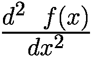 表示，需要在一阶导数为零的点进行研究。如果二阶导数小于零，那么它是一个极大值点；如果大于零，则是一个极小值点。如果二阶导数也恰好为零，那么这个点被称为拐点。

让我们考虑一个非常简单的函数，*y* = *f*(*x*) = *x*²。如果我们对函数关于 *x* 求导并将其设为零，我们得到 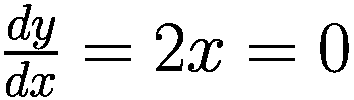，这给出了 *x* = 0。此外，二阶导数 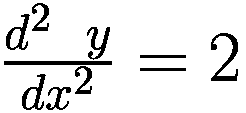。因此，对于所有 *x* 的值，包括 *x* = 0，二阶导数都大于零，因此 *x* = 0 是函数 *f*(*x*) 的极小值点。

让我们尝试相同的练习，对于 *y* = *g*(*x*) = *x*³。

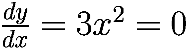 给出 *x* = 0。二阶导数 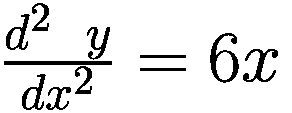，如果我们将其在 *x* = 0 处进行评估，我们得到 0。因此，*x* = 0 既不是函数 *g*(*x*) 的极小值点也不是极大值点。二阶导数为零的点称为拐点。在拐点处，曲率的符号发生变化。

单变量函数的导数为零或多元函数的梯度向量为零向量时的点称为驻点。它们可能是也可能是极大值点或极小值点。

图 1-12 展示了不同种类的驻点，即极大值、极小值和拐点。

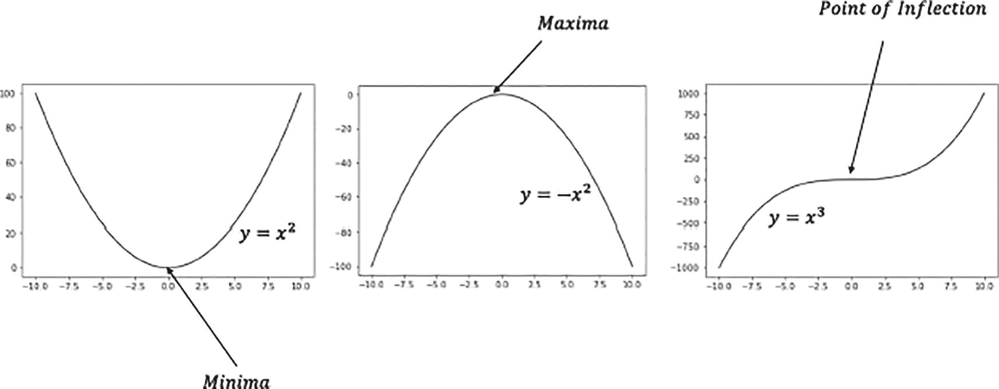

三个不同方程的三个图形说明了极大值、极小值和拐点。这些方程分别是 y 等于 x 的平方，-x 的平方和 x 的立方。

图 1-12

不同类型的驻点——极大值、极小值和拐点

多元函数的极大值和极小值要复杂一些。让我们用一个例子来继续，然后我们将定义规则。我们考虑一个有两个变量的多元函数：

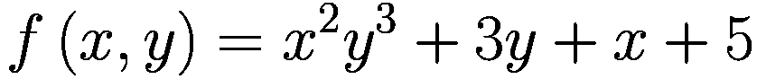

为了确定驻点，梯度向量需要为零。

![$$ {\left[\frac{\partial f}{\partial x}\kern0.5em \frac{\partial f}{\partial y}\right]}^T=\left[\begin{array}{c}0\\ {}0\end{array}\right] $$](../images/448418_2_En_1_Chapter/448418_2_En_1_Chapter_TeX_Equbk.png)

将 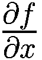 和 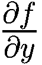 设置为零，我们得到以下结果：

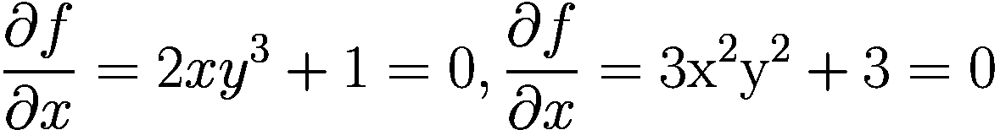

我们还需要计算 Hessian 矩阵：

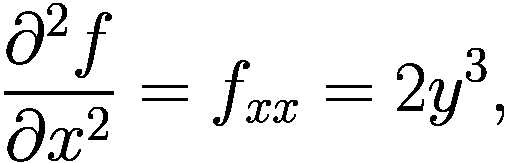

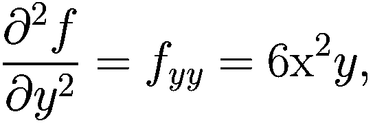

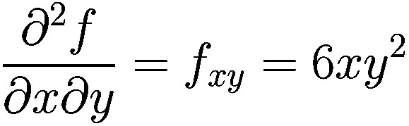

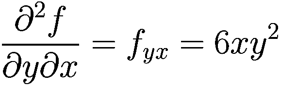

对于具有连续二阶导数的函数，*f*[ *xy*] = *f*[*yx*]。

假设梯度在 (*x* = *a*，*y* = *b*) 处为零：

+   如果 *f*[xx]*f*[yy] - (*f*[xy])² = 0，则需要更高级的方法来正确分类驻点。

+   如果 *f*[xx]*f*[yy] - (*f*[xy])² < 0 在 (*x* = *a*, *y* = *b*) 时，则 (*x* = *a*, *y* = *b*) 是鞍点。

+   如果 *f*[xx]*f*[yy] - (*f*[xy])² > 0 在 (*x* = *a*, *y* = *b*) 时，则 (*x* = *a*, *y* = *b*) 是极值点；即存在极大值或极小值。

    1.  如果 *f*[xx] < 0 且 *f*[yy] < 0 在 (*x* = *a*, *y* = *b*) 时，则 *f*(*x*, *y*) 在 (*x* = *a*, *y* = *b*) 处有最大值。

    1.  如果 *f*[xx] > 0 且 *f*[yy] > 0 在 (*x* = *a*, *y* = *b*) 时，则 *f*(*x*, *y*) 在 (*x* = *a*, *y* = *b*) 处有最小值。

对于具有 *n* 个变量的函数，以下是对检查函数的极大值、极小值和鞍点的指南：

+   计算梯度并将其设置为零向量将给出驻点的列表。

+   对于驻点 *x*[0] ∈ R^(n × 1)，如果函数在 *x*[0] 处的 Hessian 矩阵既有正特征值也有负特征值，则 *x*[0] 是鞍点。如果 Hessian 矩阵的特征值都是正的，则驻点是局部极小值；如果特征值都是负的，则驻点是局部极大值。

### 局部极小值和全局极小值

函数可以在梯度为零的多个极小值处具有多个极小值，每个极小值称为局部极小点。函数在局部极小值处具有最小值的极小值称为全局极小值。对于极大值也是如此。函数的极大值和极小值是通过优化方法得到的。由于闭式解并不总是可用或计算上难以处理，因此极小值和极大值通常通过迭代方法，如梯度下降、梯度上升等得到。在迭代地推导极小值和极大值的过程中，优化方法可能会陷入局部极小值或极大值，无法达到全局极小值或极大值。在迭代方法中，算法利用函数在一点的梯度来达到更优的点。以这种方式遍历一系列点时，一旦遇到梯度为零的点，算法就会停止，假设已达到所需的极小值或极大值。当函数存在全局极小值或极大值时，这种方法很有效。此外，优化也可能在鞍点处陷入。在所有这些情况下，我们都会得到一个次优模型。

图 1-13 展示了函数的全局和局部极小值以及全局和局部极大值。

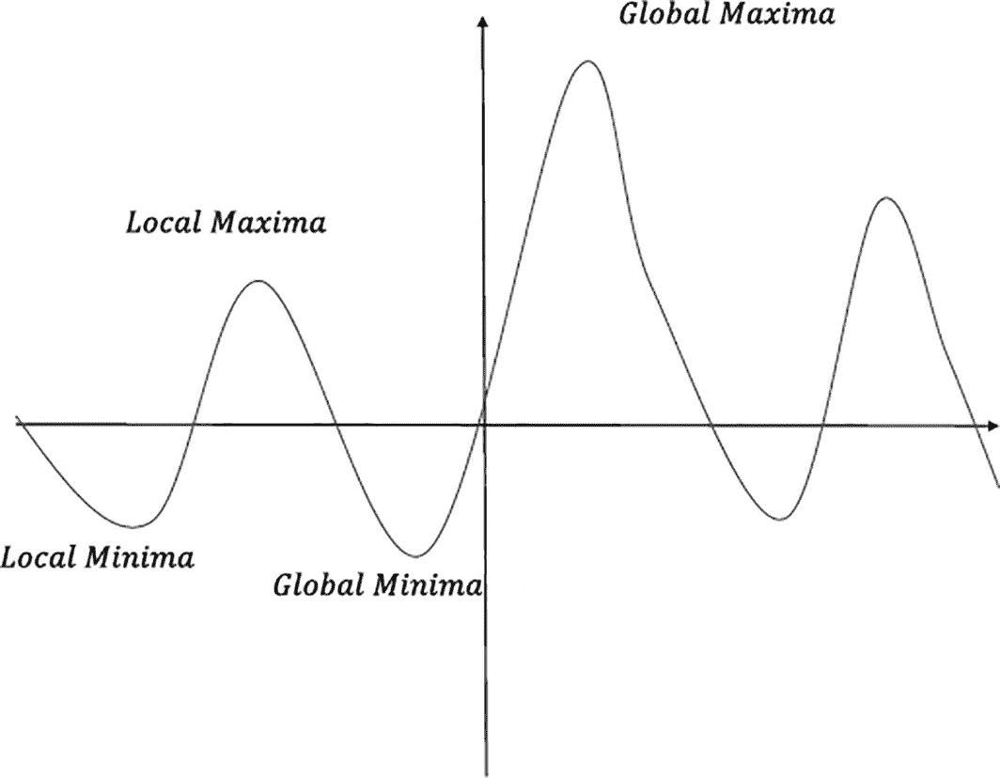

X 轴上的可变曲线的象限图说明了局部极小值、局部极大值、全局极小值和全局极大值。

图 1-13

局部和全局极小值/极大值

### 正半定和正定

一个方阵 *A* ∈ *R*^(*n* × 1) 如果对于任何非零向量 *x* ∈ *R*^(*n* × 1)，表达式 *x*^(*T*)*Ax* > 0[.]，则称为正半定矩阵。如果表达式 *x*^(*T*)*Ax* > 0，则矩阵 *A* 是正定矩阵。正半定矩阵的所有特征值应为非负，而对于正定矩阵，特征值应为正。例如，如果我们考虑 *A* 作为 2 × 2 单位矩阵——即 ![$$ \left[\begin{array}{cc}1& 0\\ {}0& 1\end{array}\right] $$](../images/448418_2_En_1_Chapter/448418_2_En_1_Chapter_TeX_IEq48.png)——那么它是正定的，因为它的两个特征值，即 1,1，都是正的。此外，如果我们计算 *x*^(*T*)*Ax*，其中 *x* = [*x*[1] *x*[2]]^(*T*)，我们得到 *x*^(*T*)*Ax* = *x*[1]² + *x*[2]²，这对于非零向量 *x* 总是大于零的，这证实了 *A* 是一个正定矩阵。

### 凸集

如果给定集合中的任意两点 *x* 和 *y*，连接 *x* 到 *y* 的直线上的所有点也属于该集合，则该点集称为凸集。在图 1-14 中，展示了凸集和非凸集。

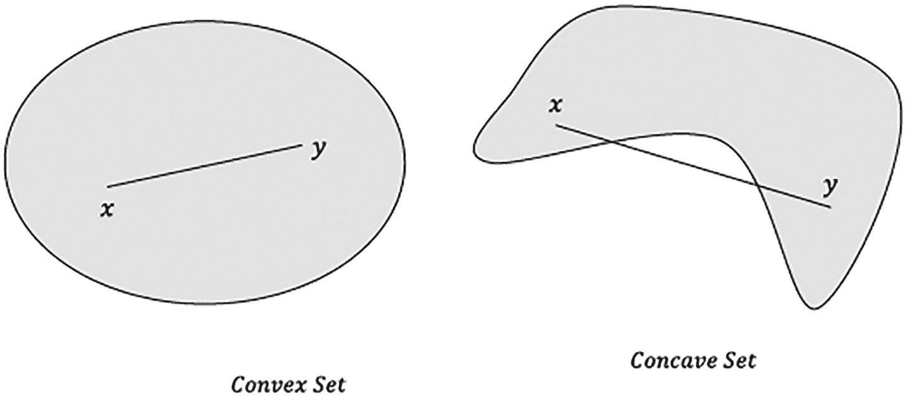

在凸集和凹集中，两点 x 和 y 连接成直线。

图 1-14

凸与非凸集合

### 凸函数

在凸集 *D* 上定义的函数 *f*(*x*)，其中 *x* ∈ ℝ^(*n* × 1) 且 *D* 是定义域，如果连接函数中任意两点的直线位于函数图像之上或在其上，则称为凸函数。数学上，这可以表示为以下形式：

![$$ f\left( tx+\left(1\kern0.5em -\kern0.5em t\right)y\right)\kern0.5em \le \kern0.5em tf(x)+\left(1-t\right)f(y)\forall \kern0.5em x,y \in \kern0.5em D,\kern0.5em \forall \kern0.5em t\kern0.5em \in \kern0.5em \left[0,1\right] $$](../images/448418_2_En_1_Chapter/448418_2_En_1_Chapter_TeX_Equbq.png)

对于一个二阶连续可微的凸函数，函数在定义域 *D* 中每个点的 Hessian 矩阵应该是正半定的；即对于任何向量 *x* ∈ *R*^(*n* × 1)，

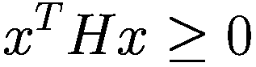

凸函数的局部极小值就是其全局极小值。请注意，可能存在多个全局极小值，但对于凸函数，函数值在每个全局极小值处都是相同的。

在图 1-15 中，展示了凸函数 *f*(*x*)。正如我们所见，*f*(*x*) 明显遵循之前所述的凸函数的性质。

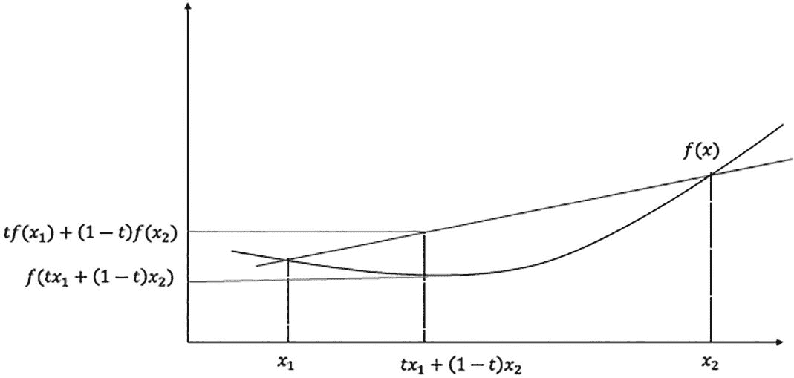

二维平面显示了函数 x 的直线和其下方的曲线线。有三条线从直线投影到 X 轴上，其中两条来自交点。

图 1-15

凸函数示意图

### 非凸函数

非凸函数可以有许多局部极小值，但它们都不是全局极小值。

在任何机器学习模型构建过程中，我们试图通过最小化成本函数来学习模型参数时，我们更喜欢成本函数是凸的，因为使用适当的优化技术，我们肯定能够达到全局最小值。对于非凸成本函数，优化技术可能会陷入局部极小值或鞍点，因此它可能无法达到其全局最小值。

### 多变量凸和非凸函数示例

由于在深度学习中我们将处理高维函数，因此研究具有两个变量的凸和非凸函数是有意义的。

*f*(*x*,  *y*) = 2*x*² + 3*y*² - 5 是一个在 *x* = 0, *y* = 0 处有极小值的凸函数，*f*(*x*, *y*) 在 (*x* = 0, *y* = 0) 处的最小值是 -5。该函数在图 1-16 中进行展示以供参考。

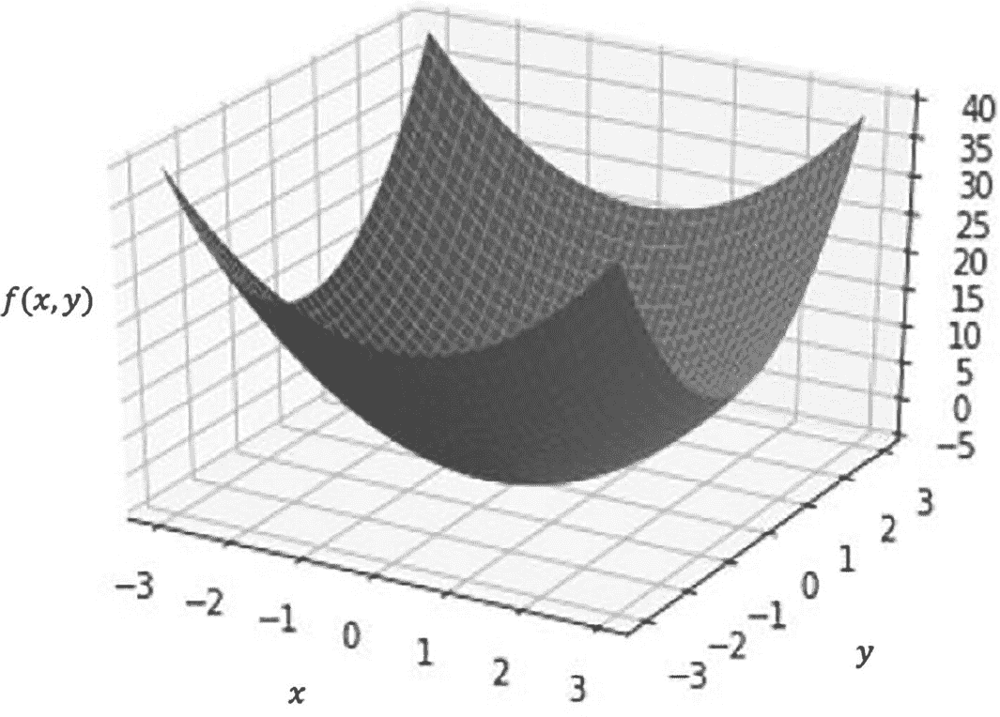

三维坐标轴 x, y 以及 x 和 y 的函数，展示了方程 2 倍 x 平方加 3 倍 y 平方减 5 的凸函数的四个极小点。

图 1-16

凸函数 2*x*² + 3*y*² - 5 的图像

现在，让我们考虑函数 *f*(*x*, *y*) =  log *x*/*y*  ∀ *x* > 0, *y* > 0。

前面是一个非凸函数，验证这一点最简单的方法是查看以下函数的海森矩阵：

![$$ \textrm{Hessian} H=\left[\begin{array}{cc}-\frac{1}{x²}&amp; 0\\ {}0&amp; \frac{1}{y²}\end{array}\right] $$](../images/448418_2_En_1_Chapter/448418_2_En_1_Chapter_TeX_Equbs.png)

海森矩阵的特征值为 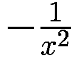 和 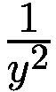。 对于实数 *x* 总是负值。因此，海森矩阵不是正半定，使得该函数非凸。

我们可以在图 1-17 中看到函数 *log*(*x*/*y*) 的图像看起来是非凸的。

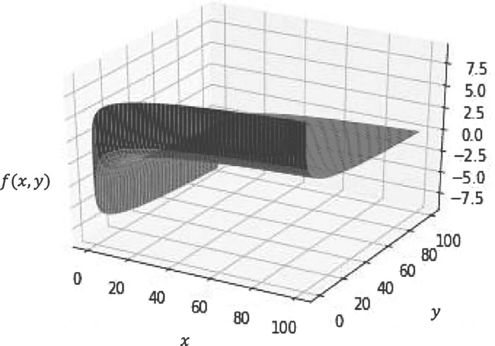

三维坐标轴 x, y 以及 x 和 y 的函数，展示了非凸函数 x/y 的对数函数的网格状结构。

图 1-17

非凸函数 log(x/y) 的图像

通过最小二乘法进行线性回归和通过对数损失成本函数（二元交叉熵）进行逻辑回归都是凸优化问题，因此通过优化学习到的模型参数是全局最小解。同样，在 SVM 中，我们优化的成本函数是凸的。

无论在任何模型中涉及隐藏层或潜在因素，成本函数往往在本质上是非凸的。具有隐藏层的神经网络无论我们是在解决回归问题还是分类问题，都会给出非凸的成本或误差表面。

类似地，在 K-means 中，引入聚类使得成本函数优化成为一个非凸成本函数。对于非凸成本函数，需要采用智能方法，以便在无法达到全局最小值的情况下，达到一些足够好的局部最小值。

当处理非凸问题时，参数初始化变得非常重要。初始化参数越接近全局最小值或某些可接受的局部最小值，效果越好。对于**k**均值，确保解决方案不是次优的一种方法是在不同的随机初始化模型参数（即聚类中心）下多次运行**k**-均值算法。然后我们可以选择那个最能减少簇内方差总和的方案。对于神经网络，需要使用涉及动量参数的高级梯度下降方法来跳出局部最小值并向前移动。本书后面将更详细地介绍基于梯度的神经网络优化方法。

### 泰勒级数

任何函数都可以通过考虑函数及其导数在特定点的值来表示为一个无穷级数。这种函数的展开称为泰勒级数展开。围绕点 *x* 的单变量函数的泰勒级数展开可以表示如下：

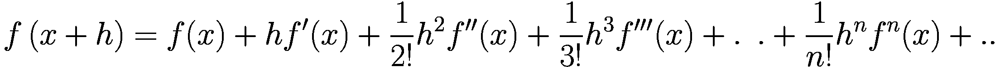

其中 *f* ^(*n*)(*x*) 是函数 *f* (*x*) 的 *nth* 阶导数，*n* `! 表示数字 *n* 的阶乘。项 *h* 与 *x* 具有相同的维度，*h* 和 *x* 都是标量。

+   如果 *f* (*x*) 是一个常数函数，那么所有导数都是零，*f* (*x* + *h*) 和 *f* (*x*) 是相同的。

+   如果函数在**x**的邻域内是线性的，那么对于任何位于线性区域内的点 (*x* + *h*)，

+   如果函数在**x**的邻域内是二次的，那么对于任何位于二次区域的点，有 *f* (*x* + *h*) = *f* (*x*) + *hf* ′(*x*)。

+   泰勒级数展开在迭代方法（如梯度下降法和牛顿法）以及数值积分和微分方法中变得非常重要。

多元函数在点 *x* ∈ *R*^(*n* × 1) 附近的泰勒级数展开可以表示为 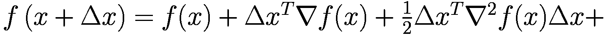 高阶项

其中 ∇*f* (*x*) 是梯度向量，∇²*f* (*x*) 是函数 *f* (*x*) 的 Hessian 矩阵。

通常，出于实际目的，我们在机器学习应用中不会超过二阶泰勒级数展开，因为在数值方法中它们很难计算。即使是二阶展开，计算 Hessian 也是成本高昂的，因此许多二阶优化方法依赖于从梯度中计算近似的 Hessian，而不是直接评估它们。请注意，三阶导数对象 ∇³*f* (*x*) 将是一个三维张量。

## 概率

在我们继续讨论概率之前，了解随机实验和样本空间是什么非常重要。

在许多类型的工作中，无论是研究实验室还是其他地方，在几乎相同条件下重复实验是一种标准做法。例如，医学研究人员可能对即将推出的药物的效果感兴趣，或者农业学家可能想研究化学肥料对特定作物产量的影响。了解这些兴趣的唯一方法是通过实验。有时，我们可能不需要进行实验，因为实验是由自然界进行的，我们只需要收集数据。

每个实验都会产生一个结果。假设实验的结果不能被绝对确定。然而，在我们进行实验之前，假设我们知道所有可能结果集合。如果这些实验可以在几乎相同条件下重复进行，那么这种实验被称为随机实验，所有可能结果的集合被称为样本空间。

请注意，样本空间只是我们感兴趣的结果的集合。掷骰子可能有几种结果。其中一种是关于骰子落地面的结果集合。另一种可能的结果集合可以是骰子击中地板的速度。如果我们只对骰子落地的面感兴趣，那么我们的样本空间是 Ω = {1, 2, 3, 4, 5, 6}，即骰子的面数。

让我们继续进行掷骰子的实验，并记录骰子落地的面作为结果。假设我们进行了 *n* 次实验，面数为 1 出现了 *m* 次。那么，从实验中，我们可以说骰子面数为 1 的事件的概率等于实验中出现 1 的面数的次数除以进行的总实验次数；即 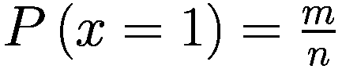，其中 *x* 表示骰子面的数字。

假设我们被告知一个骰子是公平的。出现 1 的概率是多少？

好吧，鉴于骰子是公平的，并且我们没有其他信息，大多数人会相信骰子的近对称性，如果我们掷骰子 600 次，它会产生 100 个面数为 1 的面。这将给出概率为 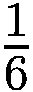。

现在，让我们假设我们已经收集了一些关于骰子头最近滚动次数的 1000 个数据点。以下是统计数据：

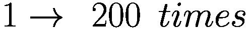

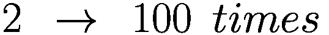

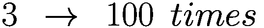

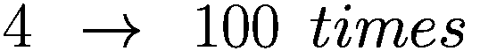

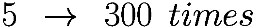

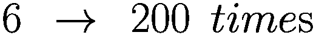

在这种情况下，你会得到骰子面出现 1 的概率为 *P*(x = 1) = 200/1000 = 0.2。这个骰子要么不是对称的，要么是有偏的。

### 并集、交集和条件概率

*P*(A ∪ B) = 事件 A 或事件 B 或两者同时发生的概率

*P*(A ∩ B) = 事件 A 和事件 B 的概率

*P*(A/B*) = 在 B 已经发生的情况下事件 A 的概率。

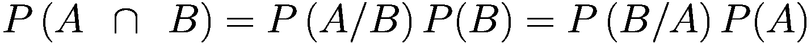

从现在起，我们将不再使用 *A* 交 *B* 的符号表示，而是为了方便表示，将其表示为 *AB*。

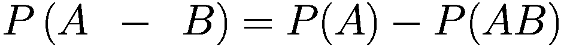

当我们查看图 1-18 中两个事件 A 和 B 的文氏图时，所有前面的证明都变得简单易懂。

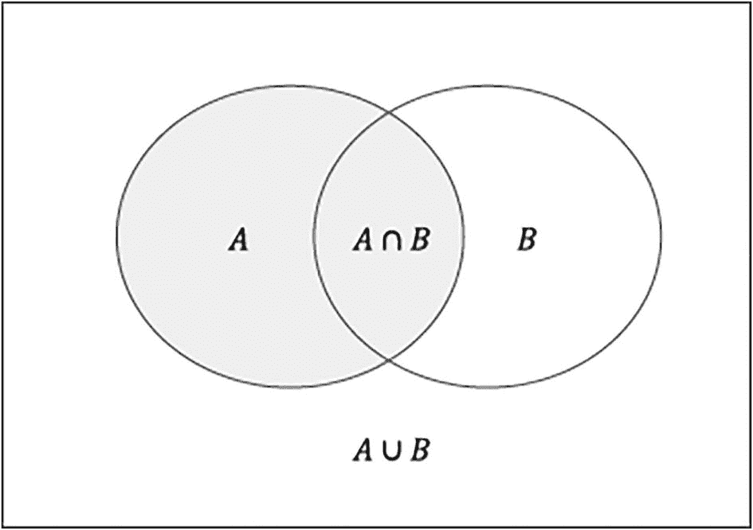

维恩图展示了事件 A 和 B 的并集和交集。事件 A 被阴影覆盖。

图 1-18

两个事件 A 和 B 的维恩图，显示了这两个事件的并集和交集

假设有一个实验发生了 *n* 次，其中 *A* 发生了 *n*[1] 次，*B* 发生了 *n*[2] 次，而 *A* 和 *B* 同时发生 *m* 次。

让我们用维恩图来表示这一点。

*P*(*A* ∪ *B*) 可以表示为三个不相交事件的概率之和：(*A* – *B*), (*B* – *A*), 和 *AB*。

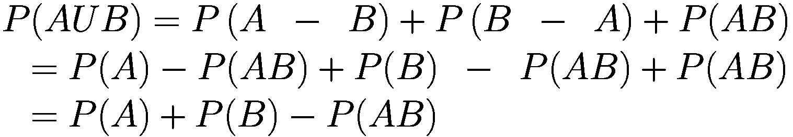

*P*(*A*/*B*) 是在 *B* 已经发生的情况下 *A* 的概率。考虑到 *B* 已经以 *n*[2] 种方式发生，事件 *A* 被限制在可以以 *m* 种不同方式发生的 *AB* 事件中。因此，给定 *B*，*A* 的概率可以表示如下：

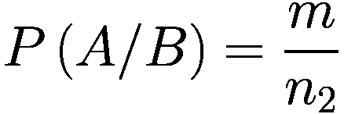

现在，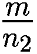 可以写成 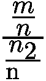 = 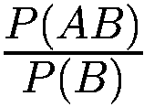。

因此，*P*(*A*/*B*) = *P*(*AB*)/*P*(*B*) =  > *P*(*AB*) = *P*(*B*)*P*(*A*/*B*)。

同样，如果我们考虑 *P*(*B*/*A*), 则关系 *P*(*AB*) = *P*(*A*)*P*(*B*/*A*) 也成立。

### 事件交集的概率链式法则

如前所述，对于两个事件，交集的乘积规则可以扩展到 *n* 个事件。

如果 *A*[1]，*A*[2]，*A*[3]，… *A*[*n*] 是 *n* 个事件的集合，那么这些事件的联合概率可以表示如下：

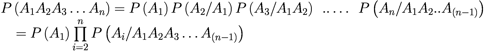

### 互斥事件

如果两个事件 *A* 和 *B* 不能同时发生，则称它们是互斥的。换句话说，如果 *A* 和 *B* 互斥，则 *P*(*AB*) = 0。对于互斥事件，*P*(*A U B*) = *P*(*A*) + *P*(*B*)。

通常，n 个互斥事件的并的概率可以表示为它们概率的和：

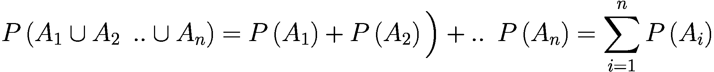

### 事件的独立性

如果两个事件 A 和 B 的交集的概率等于它们各自概率的乘积，则称这两个事件 A 和 B 是独立的，即，

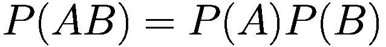

这是可能的，因为 A 在给定 B 的条件概率与 A 的概率相同；即，

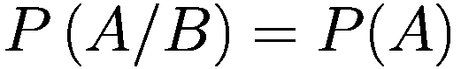

这意味着事件 A 在所有事件集合中发生的可能性与它在事件 B 域中发生的可能性相同。

同样，为了使事件 A 和 B 相互独立，需要满足 *P*(*B*/*A*) = *P*(*B*)。

当两个事件相互独立时，其中一个事件的发生不会影响另一个事件。

### 事件的条件独立性

在给定第三个事件 C 的情况下，如果事件 A 和 B 的联合发生的概率可以表示如下，则称事件 A 和 B 在条件 C 下是条件独立的：

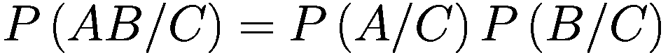

通过因式分解性质，*P*(*AB*/*C*) = *P*(*A*/*C*)*P*(*B*/*AC*）。

通过结合前面的方程，我们可以看到 *P*(*B*/*AC*) = *P*(*B*/*C*)。

注意，事件 A 和 B 的条件独立性并不能保证 A 和 B 本身也是独立的。事件的条件独立性属性在机器学习领域中应用广泛，其中通过条件独立性假设将似然函数分解成更简单的形式。此外，一类称为贝叶斯网络的网络模型将条件独立性作为简化网络的因素之一。

### 贝叶斯定理

现在我们已经对基本概率有了基本的了解，让我们讨论一个非常重要的定理，即贝叶斯定理。我们以两个事件 A 和 B 为例来说明这个定理，但它可以推广到任意数量的事件。

我们从概率的乘法规则中取 *P*(*AB*) = *P*(*A*)*P*(*B*/*A*)。（1）

同样，*P*(*AB*) = *P*(*B*)*P*(*A*/*B*）。(2)

结合(1)和(2)，我们得到

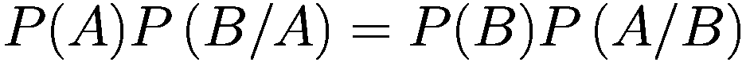

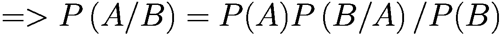

前面推导出的规则被称为贝叶斯定理，它在机器学习的许多领域都很有用，例如在从似然函数计算后验分布、使用马尔可夫链模型、最大化后验算法等方面。

### 概率质量函数

随机变量的概率质量函数（pmf）是一个函数，它给出了随机变量可以取的每个离散值的概率。所有概率的总和必须等于 1。

例如，在一个公平投掷骰子的过程中，让骰子面上的数字作为随机变量 *X*。

那么，pmf 可以定义为以下：

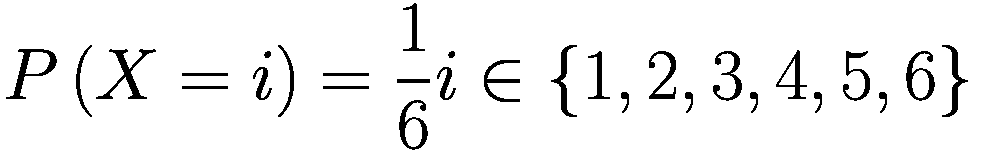

### 概率密度函数

概率密度函数（pdf）给出了连续随机变量在其定义域中每个值的概率密度。由于它是一个连续变量，概率密度函数在其定义域上的积分必须等于 1。

设 *X* 为一个具有定义域 *D* 的随机变量。P*(*x*) 表示它是一个概率密度函数，因此

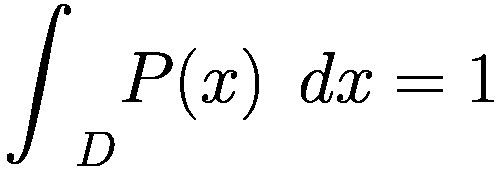

例如，一个可以取值从 0 到 1 的连续随机变量的概率密度函数由 *P*(*x*) = 2*x* 给出，其中 *x* ∈ [0, 1]。让我们验证它是否是一个概率密度函数。

为了使 *P*(*x*) 成为概率密度函数，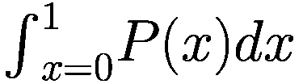 应该等于 1。

![$$ {\int}_{x=0}¹P(x) dx=\kern0.5em {\int}_{x=0}¹² xdx ={\left[{x}²\right]}_0¹=1 $$](../images/448418_2_En_1_Chapter/448418_2_En_1_Chapter_TeX_IEq59.png)。因此，*P*(*x*) 是一个概率密度函数。

需要注意的一点是，积分计算的是曲线下的面积，由于 *P*(*x*) 是概率密度函数（pdf），因此概率曲线下的面积应该等于 1。

### 随机变量的期望

随机变量的期望就是随机变量的均值。假设随机变量 *X* 取 *n* 个离散值，*x*[1]，*x*[2]，…，*x*[*n*]，其概率为 *p*[1]，*p*[2]，`…`，*p*[*n*]。换句话说，*X* 是一个具有 pmf *P*(*X* = *x*[*i*]) = *p*[*i*] 的离散随机变量。那么，随机变量 *X* 的期望值由以下公式给出

![$$ E\left[X\right]={x}_1{p}_1+{x}_2{p}_2+\dots +{x}_n{p}_n =\sum \limits_{i=1}^n{x}_i{p}_i $$](../images/448418_2_En_1_Chapter/448418_2_En_1_Chapter_TeX_Equcn.png)

如果 *X* 是一个具有概率密度函数 *P*(*x*) 的连续随机变量，那么 *X* 的期望值由以下公式给出

![$$ E\left[X\right]={\int}_D xP(x)\kern0.5em dx $$](../images/448418_2_En_1_Chapter/448418_2_En_1_Chapter_TeX_Equco.png)

其中 *D* 是 *P*(*x*) 的定义域。

### 随机变量的方差

随机变量的方差衡量随机变量的变异性。它是随机变量从其均值（期望值）的平方偏差的均值（期望值）。

设 *X* 为一个具有均值 *μ* = *E*[*X*] 的随机变量

*Var*[*X*] = *E*[(*X* - *μ*)²] 其中 *μ* = *E*[*X*]

如果 *X* 是一个取 *n* 个离散值的离散随机变量，其概率质量函数（pmf）由 *P*(*X* = *x*[*i*]) = *p*[*i*] 给出，则 *X* 的方差可以表示如下：

![$$ Var\left[X\right]=E\left[{\left(X-\mu \right)}²\right] $$](../images/448418_2_En_1_Chapter/448418_2_En_1_Chapter_TeX_Equcp.png)

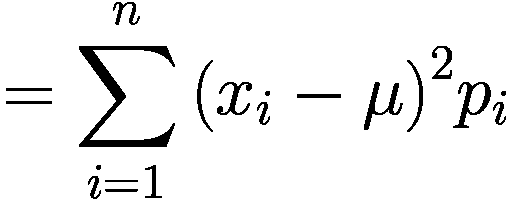

如果 *X* 是一个具有概率密度函数 *P*(*x*) 的连续随机变量，那么 *Var*[*X*] 可以表示如下：

![$$ Var\left[X\right]=\underset{D}{\int }{\left(x-\mu \right)}²\kern0.5em P(x) dx $$](../images/448418_2_En_1_Chapter/448418_2_En_1_Chapter_TeX_Equcr.png)

其中 *D* 是 *P*(*x*) 的定义域。

### 偏度和峰度

偏度和峰度是随机变量的高阶矩统计量。偏度衡量概率分布的对称性，而峰度衡量概率分布的尾部是否厚重。偏度是三阶矩，其表达式如下：

![$$ Skew(X)=\frac{E\Big[\left(X\kern0.5em -\kern0.5em \mu \Big){}³\right]}{{\left( Var\left[X\right]\right)}^{3/2}} $$](../images/448418_2_En_1_Chapter/448418_2_En_1_Chapter_TeX_Equcs.png)

一个完全对称的概率分布具有偏度为 0，如图 1-19 所示。偏度为正值意味着大部分数据向左偏移，如图 1-20 所示，而偏度为负值意味着大部分数据向右偏移，如图 1-21 所示。

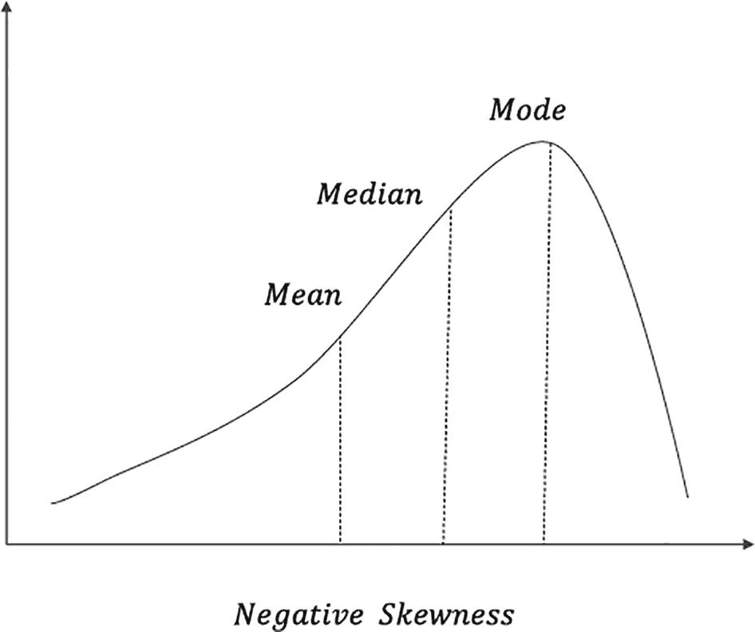

二维平面展示了具有负偏度的对称概率分布曲线。曲线上的均值、中位数和众数被标出。

图 1-21

偏度为负的概率分布

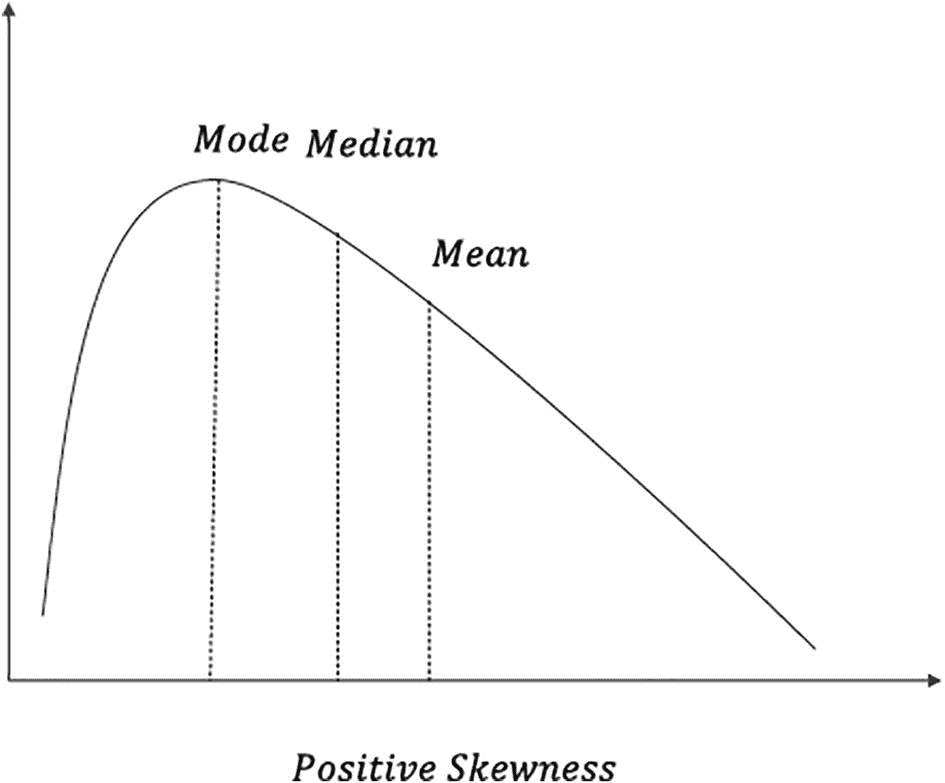

二维平面展示了具有正偏度的对称概率分布曲线。曲线上的均值、中位数和众数被标出。

图 1-20

偏度为正的概率分布

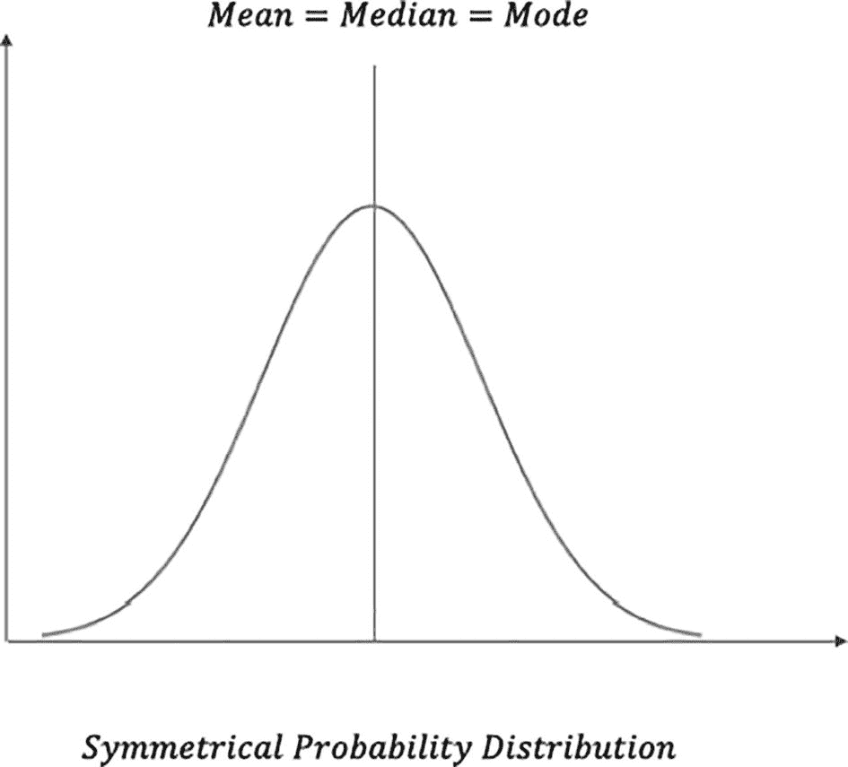

二维平面展示了具有零偏度的对称概率分布曲线。均值等于中位数，等于众数，如曲线所示。

图 1-19

对称概率分布

峰度是四阶统计量，对于一个具有均值 *μ* 的随机变量 *X*，它可以表示如下：

![$$ Kurt(X)=E\left[{\left[X\kern0.5em -\kern0.5em \mu \right]}⁴\right]/{\left( Var\left[X\right]\right)}² $$](../images/448418_2_En_1_Chapter/448418_2_En_1_Chapter_TeX_Equct.png)

峰度越高，概率分布的尾部越厚，如图 1-23 所示。正态分布的峰度为 3（见图 1-22）。然而，为了以正态分布为基准来衡量其他分布的峰度，通常参考超峰度，即实际峰度减去正态分布的峰度——即 3。

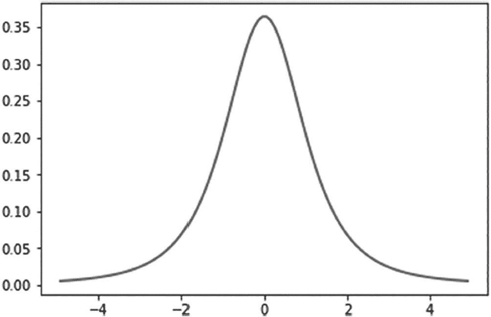

该图显示了学生 t 分布的更厚尾曲线，其峰度等于无穷大。

图 1-23

峰度等于∞的学生 t 分布

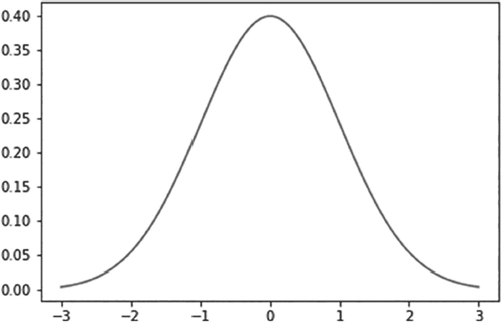

该图显示了峰度为 3 的标准正态分布曲线。

图 1-22

峰度为 3 的标准正态分布

### 协方差

两个随机变量 *X* 和 *Y* 之间的协方差是它们联合变异性的度量。如果 *X* 的较高值对应于 *Y* 的较高值，而 *X* 的较低值对应于 *Y* 的较低值，则协方差为正。另一方面，如果 *X* 的较高值对应于 *Y* 的较低值，而 *X* 的较低值对应于 *Y* 的较高值，则协方差为负。

*X* 和 *Y* 的协方差公式如下：

*cov*(*X*, *Y*) = *E*[*X* − *u*[*x*]][*Y* − *u*[*y*]] 其中 *u*[*x*] = *E*[*X*], *u*[*y*] = *E*[*Y*]

在简化前面的公式后，另一个公式如下：

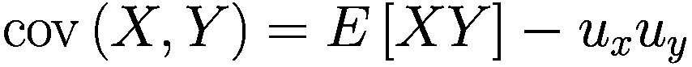

如果两个变量是独立的，它们的协方差为零，因为 *E*[*XY*] = *E*[*X*]*E*[*Y*] = *u*[*x*]*u*[*y*]

### 相关系数

一般而言，协方差并不能提供关于两个变量之间关联程度的太多信息，因为这两个变量可能处于非常不同的尺度上。获取两个变量相关系数的线性依赖性度量，即协方差的一个标准化版本，要更有用。

两个变量 *X* 和 *Y* 之间的相关系数如下所示：

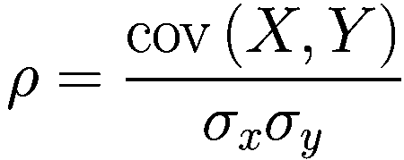

其中 *σ*[*x*] 和 *σ*[*y*] 分别是 *X* 和 *Y* 的标准差。*ρ* 的值介于 -1 和 +1 之间。

图 1-24 展示了两个变量 *X* 和 *Y* 之间的正负相关。

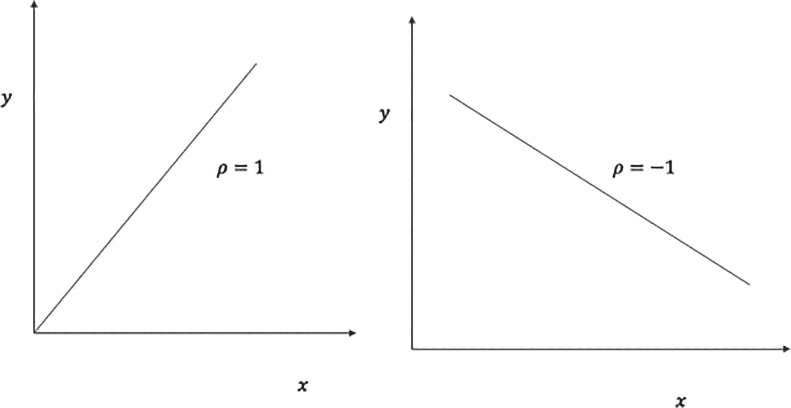

y 与 x 的二维平面。它表示两条直线，一条上升，一条下降，分别对应相关系数为 1 和-1。

图 1-24

相关系数为 +1 和 -1 的变量的图示

### 一些常见的概率分布

在本节中，我们将介绍一些在机器学习和深度学习领域中经常使用的常见概率分布。

#### 均匀分布

均匀分布的概率密度函数是常数。对于在 *a* 和 *b* 之间（*b* > *a*）取值的连续随机变量，其概率密度函数表示如下：

![$$ P\left(X=x\right)=f(x)= \left\{\begin{array}{c}1/\left(b\kern0.5em -\kern0.5em a\right) for x\kern0.5em \in \kern0.5em \left[a,b\right]\\ {} 0 elsewhere \end{array}\right. $$](../images/448418_2_En_1_Chapter/448418_2_En_1_Chapter_TeX_Equcw.png)

图 1-25 展示了均匀分布的概率密度曲线。这里概述了均匀分布的不同统计特性：

![$$ E\left[X\right]=\frac{\left(b+a\right)}{2} $$](../images/448418_2_En_1_Chapter/448418_2_En_1_Chapter_TeX_Equcx.png)

![$$ Median\left[X\right]=\frac{\left(b+a\right)}{2} $$](../images/448418_2_En_1_Chapter/448418_2_En_1_Chapter_TeX_Equcy.png)

![$$ Mode\left[X\right]\kern1em = All\kern0.5em points\kern0.5em in\kern0.5em the\kern0.5em in terval\kern0.5em a\kern0.5em to\kern0.5em b $$](../images/448418_2_En_1_Chapter/448418_2_En_1_Chapter_TeX_Equcz.png)

![$$ Var\left[X\right] ={\left(b\kern0.5em -\kern0.5em a\right)}²/12 $$](../images/448418_2_En_1_Chapter/448418_2_En_1_Chapter_TeX_Equda.png)

![$$ Skew\left[X\right]\kern1em =0 $$](../images/448418_2_En_1_Chapter/448418_2_En_1_Chapter_TeX_Equdb.png)

![$$ Excessive\kern0.5em Kurt\left[X\right]=-6/5 $$](../images/448418_2_En_1_Chapter/448418_2_En_1_Chapter_TeX_Equdc.png)

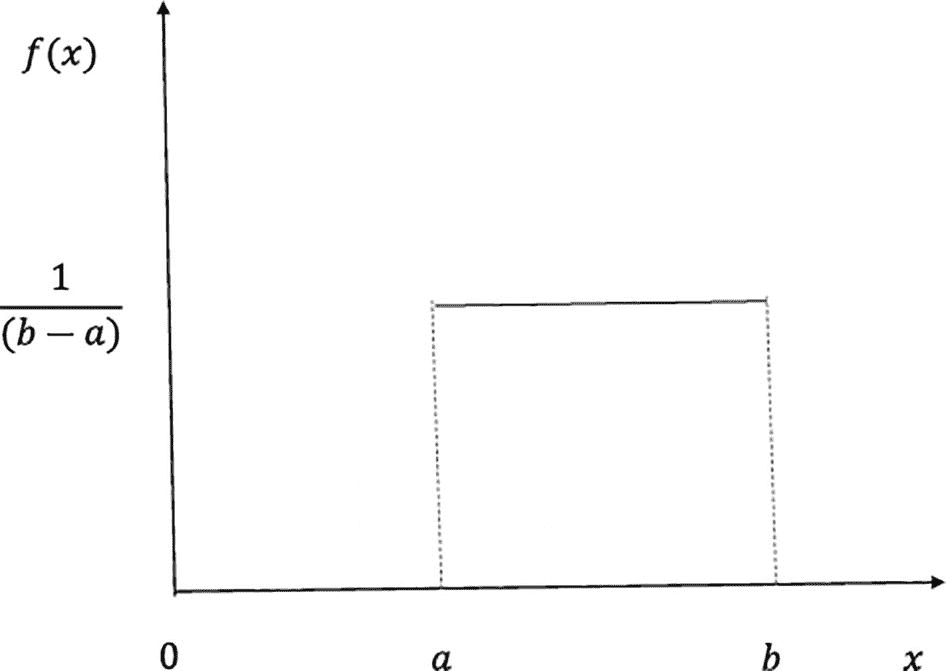

在二维平面上 x 与 x 的函数。它由一条水平直线组成，长度为 1，除以 b 减去 a，两端投影在 X 轴上的 a 和 b 点。

图 1-25

均匀概率分布

请注意，过度的峰度是实际峰度减去 3，3 是正态分布的实际峰度。因此，过度的峰度是相对于正态分布的相对峰度。

#### 正态分布

这可能是现实世界中概率分布最重要的场景。在正态分布中，最大概率密度位于分布的均值处，密度以指数形式对称地下降到均值的平方距离。正态分布的概率密度函数可以表示如下：

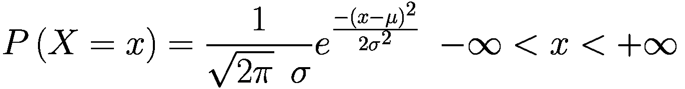

其中 *μ* 是随机变量 *X* 的均值，*σ*² 是其方差。单变量正态分布的概率密度函数如图 1-26 所示。

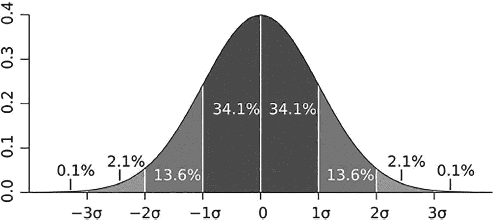

图形展示了具有八个部分的对称正态概率分布。它由 0.1%、2.1%、13.6% 和 34.1% 组成。

图 1-26

正态概率分布

如图 1-26 所示，在正态分布中，68.2% 的数据位于均值一个标准差（+1/-1σ）范围内，预计大约 95.4% 的数据将位于 +2/-2σ 范围内。这里概述了正态分布的重要统计量：

![$$ E\left[X\right]=\mu $$](../images/448418_2_En_1_Chapter/448418_2_En_1_Chapter_TeX_Equde.png)

![$$ Median\left[X\right] = \mu $$](../images/448418_2_En_1_Chapter/448418_2_En_1_Chapter_TeX_Equdf.png)

![$$ Mode\left[X\right]=\mu $$](../images/448418_2_En_1_Chapter/448418_2_En_1_Chapter_TeX_Equdg.png)

![$$ Var\left[X\right]= {\sigma}² $$](../images/448418_2_En_1_Chapter/448418_2_En_1_Chapter_TeX_Equdh.png)

Skew[X] = 0

![$$ Excess\kern0.5em Kurt\left[X\right]=0 $$](../images/448418_2_En_1_Chapter/448418_2_En_1_Chapter_TeX_Equdi.png)

任何正态分布都可以通过以下转换转换为标准正态分布：

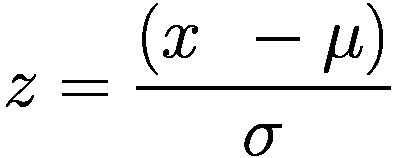

标准正态随机变量 *z* 的均值和标准差分别为 0 和 1。标准正态分布常用于统计推断测试。同样，在线性回归中，假设误差服从正态分布。

#### 多元正态分布

多元正态分布，或称在 *n* 个变量上的高斯分布，表示为向量 *x* ∈ R^(n × 1)，是相关变量的联合概率分布，由均值向量 *μ* ∈ R^(n × 1) 和协方差矩阵 Σ ∈ R^(n × n) 参数化。

多元正态分布的概率密度函数（pdf）如下：

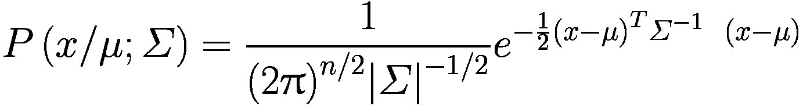

其中 *x* = [*x*[1]*x*[2]…*x*[*n*]]^(*T*)

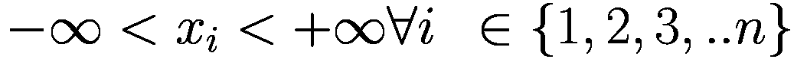

图 1-27 展示了多元正态分布的概率密度函数。多元正态分布，或高斯分布，在机器学习中有多种应用。例如，对于具有相关性的多元输入数据，输入特征通常假设遵循多元正态分布，并且基于概率密度函数，低概率密度的点被标记为异常。此外，多元正态分布广泛用于高斯混合模型中，其中具有多个特征的数据点被认为属于几个具有不同概率的多元正态分布。高斯混合在聚类、异常检测、隐马尔可夫模型等多个领域得到应用。

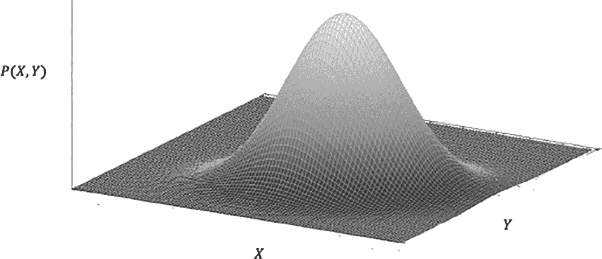

x, y 和 x, y 的函数的三维平面。它在 X-Y 平面上显示了一个网格状结构，沿着第三轴中心有陡峭的上升。

图 1-27

二元变量的多元正态分布

#### 伯努利分布

两个结果相互排斥且穷尽（两个结果的概率之和为 1）的实验称为伯努利试验。

伯努利试验遵循伯努利分布。假设在伯努利试验中，两个结果为成功和失败。如果成功的概率是 *p*，那么由于这两个事件穷尽了样本空间，失败的概率是 1 – *p*。令 *x* = 1 表示成功。因此，成功或失败的概率可以表示如下：

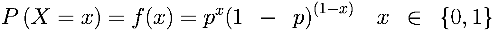

上述表达式 *P(X = x*) 表示伯努利分布的概率质量函数。概率质量函数的期望和方差如下：

![期望值 E[X] = p](../images/448418_2_En_1_Chapter/448418_2_En_1_Chapter_TeX_Equdn.png)

![方差 Var[X] = p(1-p)](../images/448418_2_En_1_Chapter/448418_2_En_1_Chapter_TeX_Equdo.png)

伯努利分布可以扩展到相互排斥且穷尽的多元事件。任何二元分类问题都可以建模为伯努利试验。例如，逻辑回归似然函数基于每个训练数据点的伯努利分布，概率 *p* 由 sigmoid 函数给出。

#### 二项分布

在一系列伯努利试验中，我们通常对成功和失败的总数感兴趣，而不是它们实际发生的顺序。如果在一系列 *n* 次连续的伯努利试验中，*x* 表示成功的次数，那么 *n* 次伯努利试验中 *x* 次成功的概率可以用以下表示的概率质量函数表示：

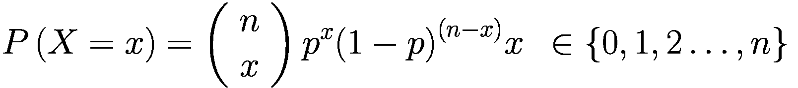

其中 *p* 是成功的概率。

分布的期望和方差如下：

![$$ E\left[X\right]= np $$](../images/448418_2_En_1_Chapter/448418_2_En_1_Chapter_TeX_Equdq.png)

![$$ Var\left[X\right]= np\left(1-p\right) $$](../images/448418_2_En_1_Chapter/448418_2_En_1_Chapter_TeX_Equdr.png)

图 1-28 展示了 n = 4 和 p = 0.3 的二项分布的概率质量函数。

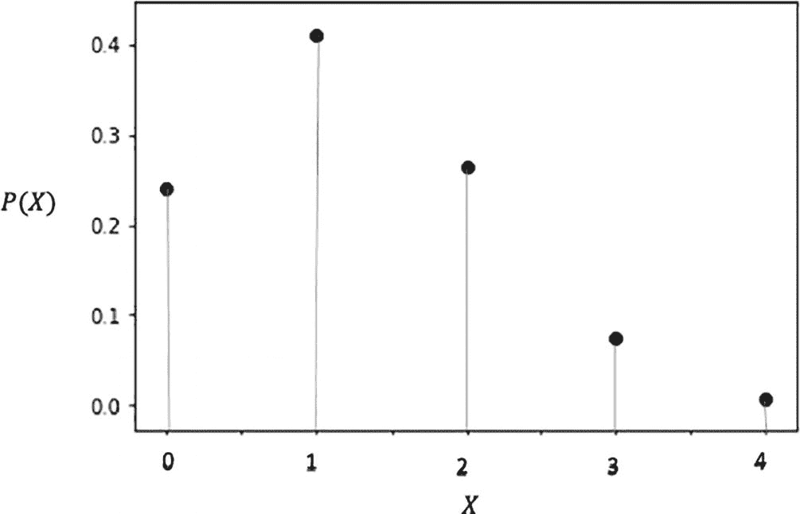

x 与 x 的函数图像。它展示了五个节点并将它们投影到 X 轴上的 0、1、2、3 和 4。

图 1-28

n=4 和 p = 0.3 的二项分布的概率质量函数

#### 泊松分布

当关注某些数量的速率时，例如 1000 个产品批次的缺陷数量，前四小时内放射性物质发射的 α 粒子数量等，泊松分布通常是表示此类现象的最佳方式。泊松分布的概率质量函数如下：

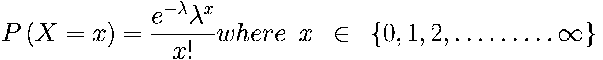

![$$ E\left[X\right]=\lambda $$](../images/448418_2_En_1_Chapter/448418_2_En_1_Chapter_TeX_Equdt.png)

![$$ Var\left[X\right]=\lambda $$](../images/448418_2_En_1_Chapter/448418_2_En_1_Chapter_TeX_Equdu.png)

图 1-29 展示了均值为 *λ* = 15 的泊松分布的概率质量函数。

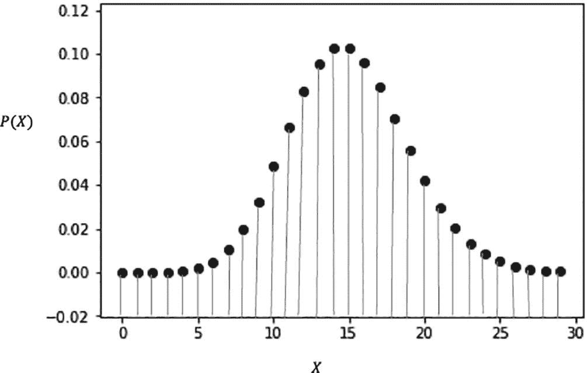

x 与 x 的函数图像。它展示了三十个节点并将它们投影到 X 轴上，并形成一个对称的概率分布曲线。

图 1-29

均值为 15 的泊松分布的概率质量函数

#### 贝塔分布

贝塔分布在学习机器学习，尤其是在定义参数先验的贝叶斯分析中多次出现。它由两个参数 *α* 和 *β* 定义，一个变量 X 遵循伽马分布的概率密度函数可以表示如下：

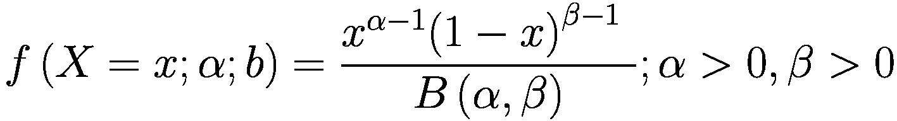

X 的定义域是从 0 到 1，因此它帮助我们定义参数*θ* ∈ [0, 1]上的分布。在贝叶斯分析中，它用于定义概率的分布，因为概率介于 0 和 1 之间。

函数*B*(α, β)是密度函数中的归一化因子，其表达式如下：

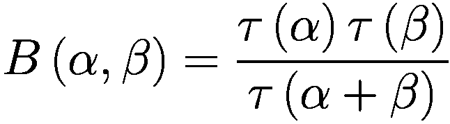

*τ*称为伽马函数，对于任何正整数 n，τ(n) = (n - 1)!

当*α* = 1; *β* = 1 时，贝塔分布表示均匀分布如下：

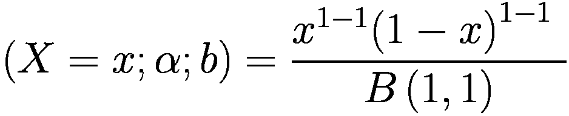

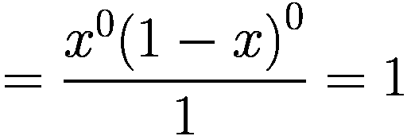

不同*α*, *β*值的概率密度函数如图 1-30 所示。

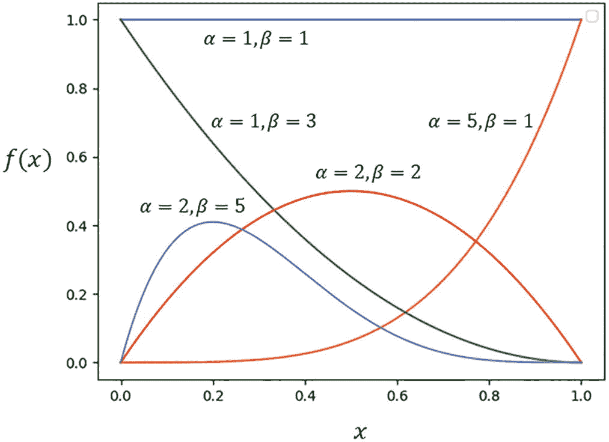

x 与 x 的函数图像。它展示了不同α和β值组合的五条曲线。

图 1-30

不同α和β值的贝塔分布概率密度函数

#### 多项分布

多项分布是贝塔分布的多变量等价物，其特征由参数向量*α* = [*α*[1], *α*[2], …*α*[*k*]]表示，其中 k 是多项分布中涉及的变量数量。

如果*X*[1], *X*[2], …*X*[*k*]是 k 个随机变量，且满足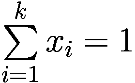，则多项分布定义为以下：

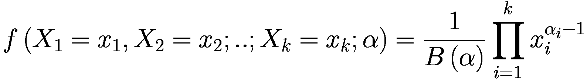

*B*(α)与贝塔分布类似，可以用伽马函数表示如下：

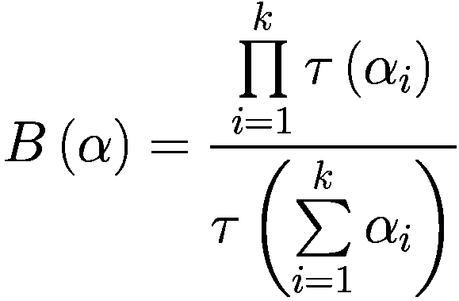

在贝叶斯统计中，Dirichlet 分布通常用于表示多项式分布概率的先验概率分布。正如我们所知，对于多项式分布，不同事件的概率 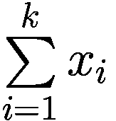 应该加起来为 1，这是 Dirichlet 分布中随机变量的约束条件。

#### Gamma 分布

随机变量 X 的伽马分布由两个参数 *α* 和 *β* 描述。其概率密度函数如下：

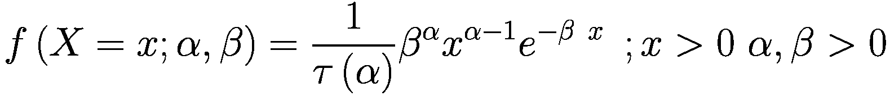

伽马分布常用于建模机器的失效时间、下一次地震的时间以及贷款违约的时间等。

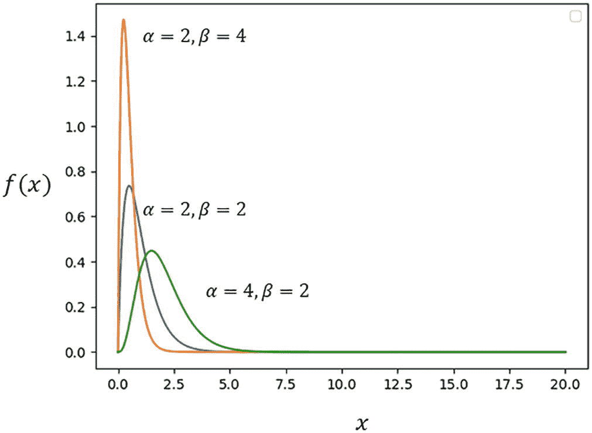

x 与 x 的函数图。它展示了不同 alpha 和 beta 值组合下的三条曲线。曲线突然上升，然后突然下降，然后保持同一水平。

图 1-31

不同 alpha 和 beta 值的伽马分布概率密度函数

不同 *α*，*β* 对的伽马概率密度函数如图 1-31 所示。

### 似然函数

似然性是指在给定生成基础数据的参数的情况下，观察到的数据的概率。假设我们观察到 *n* 个观察值 *x*[1]，*x*[2]，…*x*[*n*]，并假设这些观察值是独立且同分布于均值为 *μ* 和方差 *σ*² 的正态分布。

在这种情况下，似然函数如下：

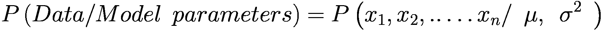

由于观察值是独立的，我们可以将似然分解如下：

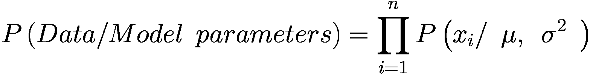

每个 *x*[*i*]~*Normal*(*μ*, *σ*²)；因此，似然可以进一步展开如下：

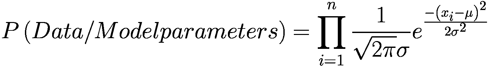

### 最大似然估计

最大似然估计（MLE）是一种用于估计分布或模型参数的技术。这是通过推导出最大化似然函数的参数来实现的——即，在给定模型的参数的情况下，最大化观察数据的概率。让我们通过一个例子来理解最大似然估计。

假设亚当掷硬币十次，观察到七个正面和三个反面。还假设这些投掷是独立且相同的。对于给定硬币，正面概率的最大似然估计是多少？

每次掷硬币都是一个伯努利试验，正面的概率是，比如说，*p*，这是一个我们想要估计的未知参数。同时，让投掷产生正面的事件表示为 1，反面表示为 0。

似然函数可以表示如下：

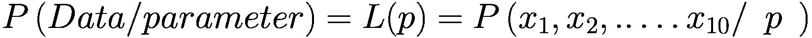

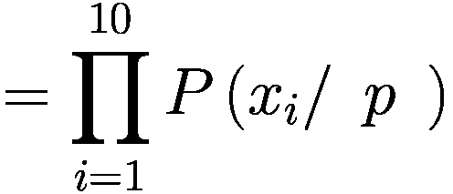

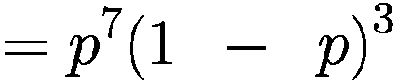

仅为了澄清，让我们看看似然函数 *L* 如何变成 *p*⁷(1 – *p*)³。

对于每个正面，伯努利分布的概率是 *P*(*x*[*i*] = 1/ *p*) = *p*¹(1 − *p*)⁰ = *p*。同样，对于每个反面，概率是 *P*(*x*[*i*] = 0/ *p*) = *p*⁰(1 − *p*)¹ = 1 − *p*。由于我们有七个正面和三个反面，我们得到似然函数 *L*(*p*) 为 *p*⁷(1 – *p*)³。

为了最大化似然函数 *L*，我们需要对 *L* 关于 *p* 求导并令其等于 0。

现在，我们不是最大化似然函数 *L*(*p*)，而是可以最大化似然的对数——即，*logL*(*p*)。由于对数函数是单调递增的，因此最大化 *L*(*p*) 的参数值也会最大化 *logL*(*p*)。对似然的对数求导在数学上比求原始似然函数乘积形式的导数更方便。

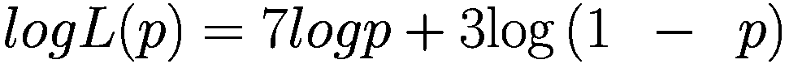

对等式两边求导并令其等于零，如下所示：

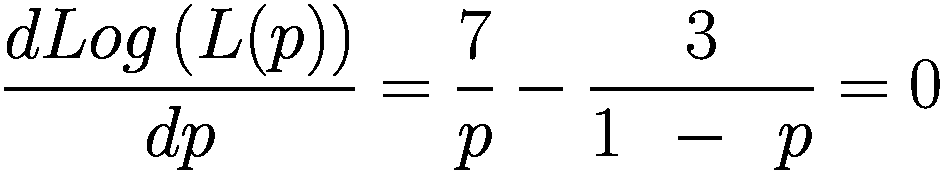

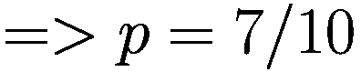

感兴趣的读者可以在 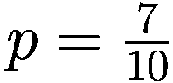 处计算二阶导数 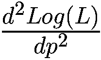；你肯定会得到一个负值，这证实了 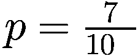 确实是最大值点。

有些人可能已经根据概率的基本定义，在未经最大似然估计的情况下，心中有了 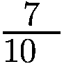 的概念。正如你稍后将会看到的，使用这种方法，在机器学习和深度学习领域，许多复杂的模型参数都可以被估计。

让我们看看另一个可能在优化工作中派上用场的小技巧。计算函数 *f*(*x*) 的最大值与计算函数 −*f*(*x*) 的最小值是相同的。*f*(*x*) 的最大值和 −*f*(*x*) 的最小值会在相同的 *x* 值处发生。同样，*f*(*x*) 的最大值和 1/*f*(*x*) 的最小值也会在相同的 *x* 值处发生。

在机器学习和深度学习应用中，我们经常使用高级优化包，这些包只知道通过最小化成本函数来计算模型参数。在这种情况下，我们可以方便地将最大化问题转换为最小化问题，通过改变符号或取函数的倒数， whichever makes more sense。例如，在前面的问题中，我们可以取对数似然函数的负值——即*LogL*(*p*)——并对其进行最小化；我们会得到相同的概率估计值 0.7。

### 假设检验和 p 值

通常，我们需要根据从总体中收集的样本进行一些假设检验。我们从零假设开始，并根据进行的统计检验，接受或拒绝零假设。

在我们开始假设检验之前，让我们首先考虑统计学中的一个核心基础，即中心极限定理。

设 *x*[1]， *x*[2]， *x*[3]，……， *x*[*n*] 为从具有均值 *μ* 和有限方差 *σ*² 的总体中抽取的样本的 *n* 个独立同分布的观测值。

由样本均值 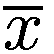 表示的值遵循正态分布，均值为 *μ*，方差为 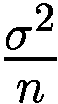；即，

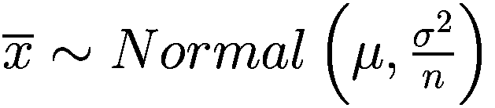 其中 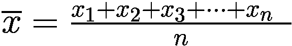

这被称为中心极限定理。随着样本大小 *n* 的增加，样本均值的标准差减少，并随着 *n* 趋向于无穷大而趋于零。

图 1-32 展示了从总体中抽取的固定大小 *n* 的样本均值的分布和总体分布。

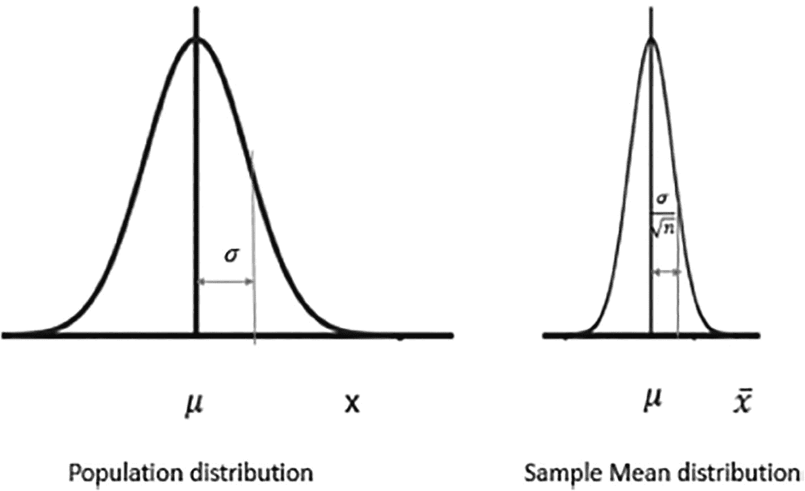

两个概率分布曲线，一个是总体分布，另一个是样本均值分布。均值、标准差和样本均值用符号标记。

图 1-32

总体分布和样本均值分布

请注意，无论总体变量是否服从正态分布，样本均值都遵循正态分布。现在，让我们考虑一个简单的假设检验问题。

已知 10 岁的男孩平均体重为 85 磅，标准差为 11.6。一个县的男孩被检查是否肥胖。为了测试这一点，收集了来自该县 25 名随机男孩的平均体重。平均体重为 89.16 磅。

如果对零假设的证据足够强，我们就必须形成一个零假设，并通过测试来拒绝它。

让我们考虑零假设：*H*[0]。该县的儿童不是肥胖的，即他们来自具有均值 *μ* = 85 的同一总体。

在零假设 *H*[0] 下，样本均值如下：

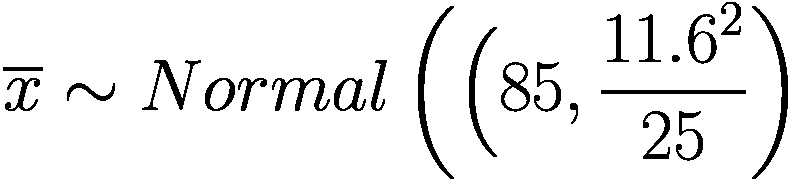

观察到的样本均值越接近总体均值，对零假设为真的证据就越强。另一方面，观察到的样本均值越远离总体均值，对零假设的证据就越强。

标准正态变量 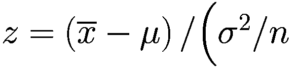 = 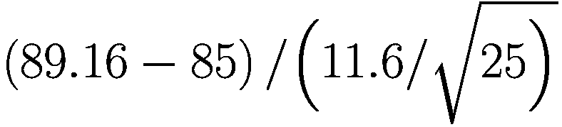 = +1.75

对于每一次假设检验，我们都会确定一个 *p* 值。这次假设检验的 *p* 值是观察到样本均值偏离观察值的概率，即 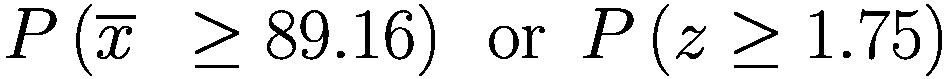。因此，*p* 值越小，对零假设的证据就越强。

当 *p* 值小于一个指定的阈值百分比 *α*，这被称为第一类错误时，零假设被拒绝。

请注意，样本均值与总体之间的偏差可能是纯粹随机性的结果，因为样本均值有有限的方差*σ*²/*n*。*α*为我们提供了一个阈值，超过这个阈值，即使零假设为真，我们也应该拒绝零假设。我们可能会犯错，巨大的偏差可能只是随机性的结果。但是，这种情况发生的概率非常小，尤其是如果我们有较大的样本量，因为样本均值的标准差会显著降低。当我们即使零假设为真也拒绝零假设时，我们犯了第一类错误，因此*α*给出了第一类错误的概率。

该测试的*p*值为*P*(*Z* ≥ 1.75) = 0.04

应该选择的第一类错误*α*取决于对测试所进行的特定领域的了解。第一类错误表示在零假设为真的情况下拒绝零假设的概率。在实践中，*α* = 0.05 是一个足够好的第一类错误设置。基本上，我们只有 5%的机会错误地拒绝零假设。由于计算出的*p*值小于测试指定的第一类错误，我们不能接受零假设。我们说测试具有统计学意义。*p*值已在图 1-33 中说明。

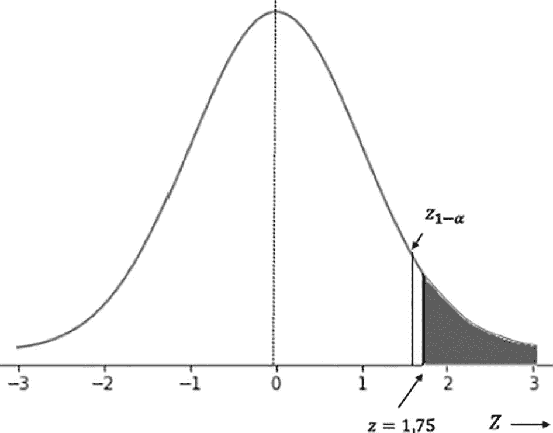

图表显示了对称的概率分布曲线。当 z 等于 1.75 后，区域被阴影覆盖。

图 1-33

显示 p 值的 Z 测试

深色区域对应于*p*值，即*P*(*z* ≥ 1.75)。*Z*[1 − *α*]对应于在零假设为真的情况下我们可能犯第一类错误的*z*值。*z*[1 − *α*]之外的面积，即*P*(*z* ≥ *Z*[1 − *α*])，代表第一类错误的概率。由于*p*值小于测试的第一类错误概率，因此不能认为零假设为真。这种*Z*测试通常随后会进行另一个良好的实践——置信区间测试。

此外，前面提到的测试，通常被称为*Z*测试，并不总是可能的，除非我们得到了提供的总体方差。对于某些问题，我们可能没有总体方差。在这种情况下，学生 T 测试更为方便，因为它使用样本方差而不是总体方差。

鼓励读者进一步探索这些统计测试。

## 机器学习算法的表述和优化技术

建模的目的是通过使用不同的优化技术来最小化模型参数的成本函数，给定数据。有人可能会问，如果我们把成本函数的导数或梯度设为零，我们就会得到模型参数。这并不总是可能的，因为所有解可能没有闭式解，或者闭式解可能计算成本高或难以处理。此外，当数据量很大时，在寻找闭式解时会有内存限制。因此，对于复杂优化问题，通常使用迭代方法。

机器学习可以大致分为两种类型：

+   监督机器学习

+   无监督机器学习

另一种学习范式称为强化学习，在最近几年得到了很多关注。我们将在本章后面讨论其广义公式。

### 监督学习

在监督学习中，每个训练数据点都与几个输入特征相关联——通常是输入特征向量和其对应的标签。构建一个具有多个参数的模型，这些参数试图根据输入特征向量预测输出标签。模型参数是通过优化某种形式的成本函数来得到的，该成本函数基于预测误差，即训练数据点的实际标签和预测标签之间的差异。或者，最大化训练数据的似然性也会给我们提供模型参数。

#### 线性回归作为监督学习方法

我们可能有一个数据集，其中房价作为目标变量或输出标签，而房屋面积、卧室数量、浴室数量等特征则是其输入特征向量。我们可以定义一个函数，该函数可以根据输入特征向量预测房价。

输入特征向量可以用 *x*′ 表示，预测值用 *y*[*p*] 表示。房价的实际值，即输出标签，用 *y* 表示。我们可以定义一个模型，其中输出标签被表示为输入特征向量的函数，如下所示方程所示。该模型由几个常数参数化，我们希望通过训练过程来学习这些参数。

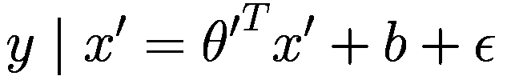

在这里，*ϵ* 是预测中的随机变化，可以建模为从零均值有限方差高斯分布生成的，因此我们可以写出以下方程：

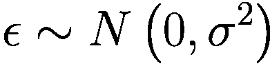

因此，给定输入 *y* 和 *x* 的房价，即 *y* ∣ *x*，是输入向量 *x*′ 的线性组合，加上一个偏差项 *b* 和一个随机成分 *ϵ*，该随机成分服从均值为 0，方差为 *σ*² 的正态分布。

由于 *ϵ* 是一个随机成分，它无法预测，我们最好的预测是给定特征值时的房价均值，即，

预测值 *y*[*p*] ∣ *x* = *E*[*y*| *x*] = *θ′*^(*T*)*x*′ + *b*

在这里，*θ*′ 是线性组合器，*b* 是偏差或截距。*θ*′ 和 *b* 都是我们要学习的模型参数。我们可以表示 *y*[*p*] = *θ*^(*T*)*x*，其中偏差已经添加到对应常数特征 1 的模型参数中。这个小技巧使得表示更简单。

假设我们有 *m* 个样本 (*x*^((1)), *y*^((1))), `(`*x*^((2)), *y*^((2))).... `(`*x*^((*m*)), *y*^((*m*)))。我们可以计算一个成本函数，该函数计算预测房价与实际房价之间差异的平方和，并尝试最小化它以推导出模型参数。

成本函数可以定义为以下：

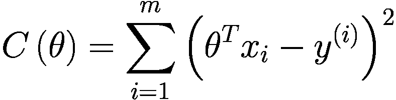

我们可以通过最小化与 *θ* 相关的成本函数来确定模型参数。这是一个输出标签或目标连续的线性回归问题。回归属于监督学习类别。图 1-34 展示了房价与卧室数量之间的关系。

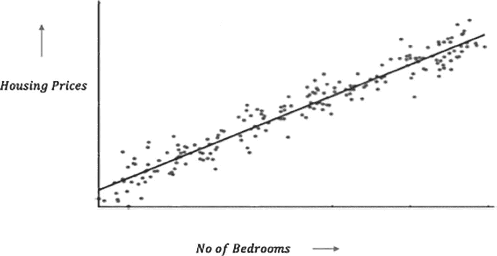

房价与卧室数量的二维平面表示各种点，点之间有递增的直线。

图 1-34

房价与卧室数量数据的回归拟合。红色点表示数据点，蓝色线表示拟合的回归线

设输入向量为 *x*′ = [*x*[1] *x*[2] *x*[3]]^(*T*), 其中

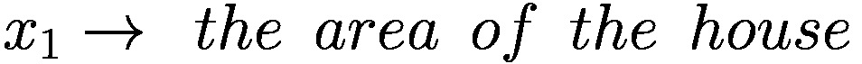

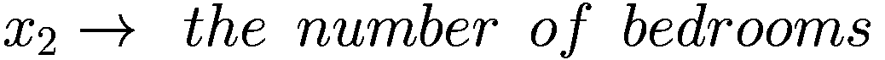

设与输入特征向量对应的参数向量为，其中

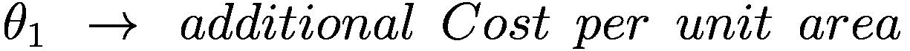

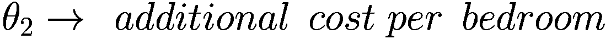

考虑到偏差项后，输入特征向量变为 *x* = [*x*[0] *x*[1] *x*[2] *x*[3]]^(*T*), 其中

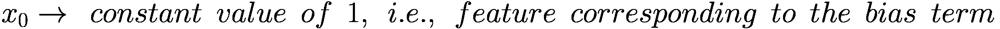

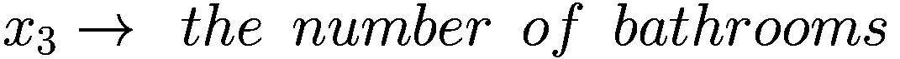

并且 *θ* = [*θ*[0 ]*θ*[1 ]*θ*[2 ]*θ*[3]], 其中

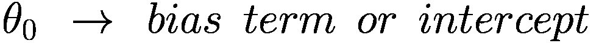

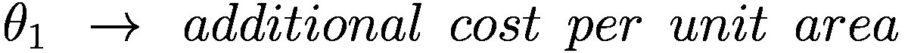

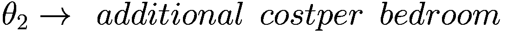

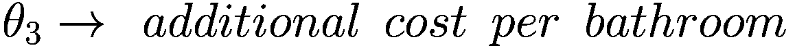

现在我们已经对如何构建回归问题及其相关的成本函数有了些了解，让我们简化问题并继续推导模型参数。

模型参数 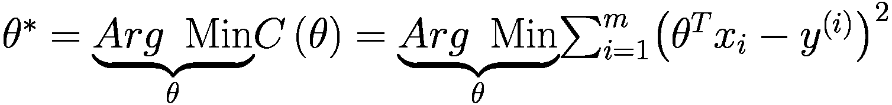

所有样本的输入向量可以组合成一个矩阵 *X*，相应的目标输出可以表示为一个向量 *Y*。

![X=[$$ \begin{array}{c}{x}_0^{(1)}\kern0.5em {x}_1^{(1)}{x}_2^{(1)}{x}_3^{(1)}\\ {}\begin{array}{cc}{x}_0^{(2)}&amp; {x}_1^{(2)}{x}_2^{(2)}{x}_3^{(2)}\end{array}\\ {}\begin{array}{cc}{x}_0^{(3)}&amp; {x}_1^{(3)}{x}_2^{(3)}{x}_3^{(3)}\end{array}\\ {}.\\ {}.\\ {}\begin{array}{cc}{x}_0^{(m)}&amp; {x}_1^{(m)}{x}_2^{(m)}{x}_3^{(m)}\end{array}\end{array}\right]Y=\left[\begin{array}{c}{y}^{(1)}\\ {}{y}^{(2)}\\ {}{y}^{(3)}\\ {}.\\ {}.\\ {}{y}^{(m)}\end{array}\right] $$](../images/448418_2_En_1_Chapter/448418_2_En_1_Chapter_TeX_Equfd.png)

如果我们将预测向量表示为 *Yp*，那么 *Yp* = *Xθ*。因此，预测向量 *e* 的误差可以表示如下：

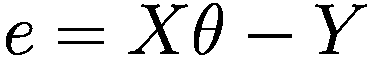

因此，*C(θ)* 可以表示为误差向量 *e* 的 l² 范数的平方，即，

现在我们已经得到了矩阵形式的简化成本函数，应用不同的优化技术将会变得容易。这些技术适用于大多数成本函数，无论是凸成本函数还是非凸成本函数。对于非凸的，有一些额外的事情需要考虑，我们将在考虑神经网络时详细讨论。

我们可以通过计算梯度并将其设置为零向量来直接推导出模型参数。你可以应用我们之前学到的规则来检查最小值条件是否满足。

关于参数向量 *θ* 的成本函数的梯度如下所示：

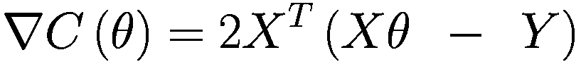

将 ∇*C*(*θ*) = 0，我们得到 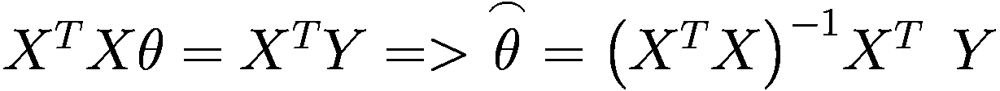。

如果仔细观察这个解，可以观察到 *X* 的伪逆——即 (*X*^(*T*)*X*)^(−1)*X*^(*T*)——进入了线性回归问题的解中。这是因为线性回归参数向量可以看作是方程 *Xθ* = *Y* 的解，其中 X 是一个 *m* × *n* 的矩形矩阵，且 *m* > *n*。

上述关于  的表达式是该模型参数的闭式解。使用这个推导出的  对新的数据点 *x*[*new*] 进行预测，我们可以预测房价为 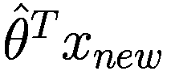。

对于大数据集，计算 (*X*^(*T*)*X*) 的逆既耗时又耗内存。此外，当矩阵 *X*^(*T*)*X* 是奇异的，因此其逆未定义时，也存在这种情况。因此，我们需要考虑替代方法来达到最小值点。

在构建线性回归模型后，需要验证的是训练数据点的残差误差分布。误差应该近似正态分布，均值为 0，并且具有某些有限的方差。可以用来检查残差高斯假设是否满足的*QQ*图是绘制误差分布的实际分位数值与误差分布的理论分位数值。

#### 通过向量空间方法进行线性回归

线性回归问题是要确定参数向量*θ*，使得*Xθ*尽可能接近输出向量*Y*。*X* ∈ *R*^(*m* × *n*)是数据矩阵，可以将其视为*n*个列向量*c[*i*] ∈ *R*^(*m* × 1)依次堆叠，如下所示：

![$$ X=\left[{c}_{1\kern0.5em }{c}_2\dots ..\kern0.5em {c}_n\right] $$](../images/448418_2_En_1_Chapter/448418_2_En_1_Chapter_TeX_Equfh.png)

列空间的维度是*m*，而列向量的数量是*n*。因此，列向量最多可以在*m*-维向量空间中跨越一个维度为*n*的子空间。该子空间在图 1-33 中展示。尽管它看起来像一个二维表面，但我们需要将其想象成一个*n*-维空间。*X*的列与参数的线性组合给出了预测向量，如下所示：

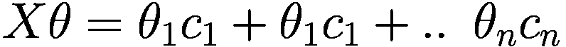

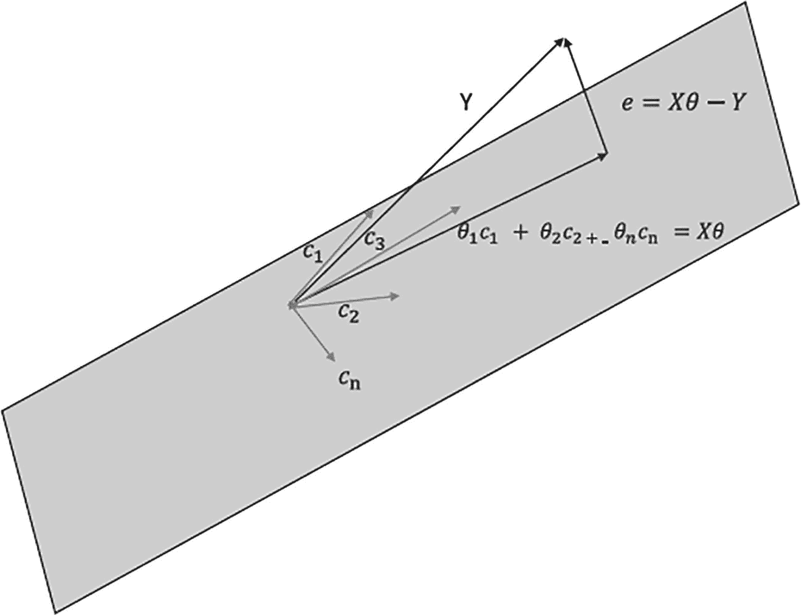

平行四边形平面上有四个向量，分别标记为 c 的下标 1、2、3 和 n。具有偏心率 e 的 X theta 和 Y 向量是可见的。

图 1-35

线性回归作为向量空间问题

由于*Xθ*不过是*X*的列向量的线性组合，*Xθ*保持在由列向量*c[*i*] ∀ *i* = {1, 2, 3…*n*}张成的相同子空间中。

现在实际的目标值向量*Y*位于由*X*的列向量张成的子空间之外；因此，无论我们如何将*θ*与*X*结合，*Xθ*都无法等于或与其方向对齐*Y*。将会有一个非零的误差向量给出，由*e* = *Y* − *Xθ*表示。

现在我们知道我们有一个误差，我们需要研究如何降低误差的*l*²范数。为了使误差向量的*l*²范数达到最小，它应该垂直于预测向量*Xθ*。由于*e* = *Y* − *Xθ*垂直于*Xθ*，它应该垂直于该子空间中的所有向量。

因此，*X*的所有列向量与误差向量*Y* − *Xθ*的点积应该为零，这给我们以下结果：

![$$ {c_1}^T\left[Y- X\theta \right]=0,\kern0.5em {c_2}^T\left[Y- X\theta \right]=0,\dots ..{c_n}^T\left[Y- X\theta \right]=0 $$](../images/448418_2_En_1_Chapter/448418_2_En_1_Chapter_TeX_Equfj.png)

这可以重新排列成以下矩阵形式：

![等式 $$ {\left[{c}_{1\kern0.5em }{c}_2\dots ..\kern0.5em {c}_n\right]}^T\left[Y- X\theta \right]=0 $$](../images/448418_2_En_1_Chapter/448418_2_En_1_Chapter_TeX_Equfk.png)

![等式 $$ =&gt;{X}^T\left[Y- X\theta \right]=0=&gt;\hat{\theta} ={\left({X}^TX\right)}^{-1}{X}^T\kern0.5em Y $$](../images/448418_2_En_1_Chapter/448418_2_En_1_Chapter_TeX_Equfl.png)

此外，请注意，只有当 *Xθ* 是 *Y* 在由 *X* 的列向量张成的子空间中的投影时，错误向量才会垂直于预测向量。本图的唯一目的是强调向量空间在解决机器学习问题中的重要性。

#### 分类

类似地，我们可以考虑分类问题，在这种问题中，我们不是预测连续变量的值，而是预测与输入特征向量相关的类别标签。例如，我们可以尝试根据客户的近期支付历史和交易详情以及其人口统计和就业信息来预测客户是否可能违约。在这种情况下，我们将具有上述提到的特征作为输入数据，并将客户是否违约作为类别标签的目标。基于这些标记数据，我们可以构建一个分类器，该分类器可以预测客户是否会违约的类别标签，或者我们可以提供一个客户违约的概率分数。在这种情况下，问题是一个具有两个类别的二元分类问题——违约类别和非违约类别。在构建这样的分类器时，最小二乘法可能不会给出一个好的成本函数，因为我们试图猜测标签而不是预测连续变量。分类问题的流行成本函数通常是基于最大似然和熵的成本函数，如基尼熵和香农熵。

具有线性决策边界的分类器被称为线性分类器。决策边界是分隔不同类别的超平面或表面。在线性决策边界的情况下，分隔平面是一个超平面。

图 1-36 和 1-37 分别展示了用于两个类别分离的线性和非线性决策边界。

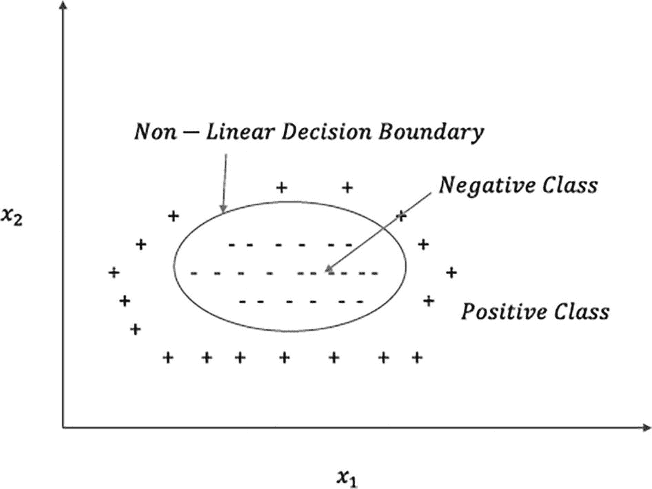

x2 与 x1 构成的二维平面。对于非线性决策边界来说，它由一个椭圆组成。椭圆包含一个负类别，而椭圆的外部包含一个正类别。

图 1-37

非线性决策边界下的分类

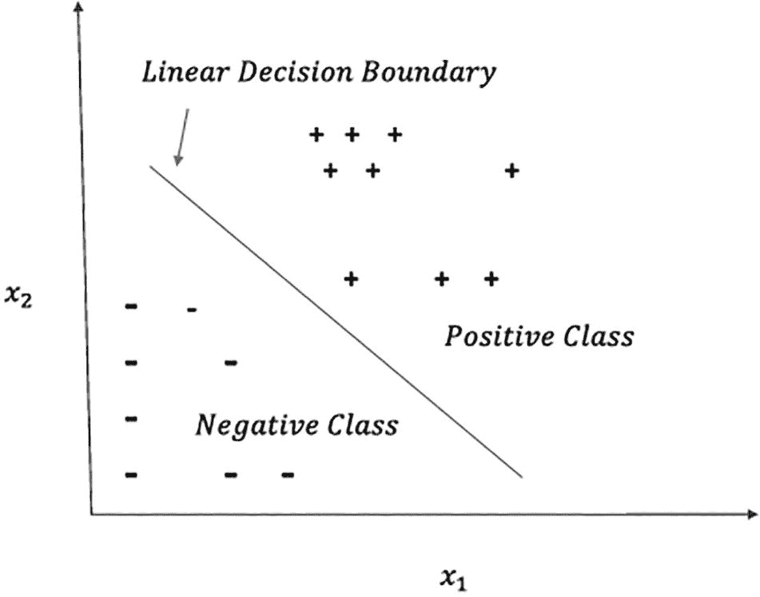

x2 与 x1 构成的二维平面对于线性决策边界来说是一条下降的线。带有负号的负类别和带有正号的正类别被指示出来。

图 1-36

线性决策边界下的分类

我想简要讨论最流行且简单的分类器之一，逻辑回归，以便清楚地了解在分类问题中，通过最大似然方法，如何通过 log-loss 成本函数进入画面。

假设 (*x*^((*i*)), *y*^((*i*))) 是标记数据点，其中 *x*^((*i*)) ∈ *R*^(*n* × 1) ∀ *i* ∈ {1, 2, .. *m*} 是输入向量，它包括常数特征值 1 作为其组成部分，而 *y*^((*i*)) 决定了类别。当数据点对应于违约贷款的客户时，*y*^((*i*)) 的值设为 1，如果客户没有违约，则设为 0。输入向量 *x*^((*i*)) 可以用其分量表示如下：

![$$ {x}^{(i)}=\left[1{x}_0^{(1)}\kern0.5em {x}_1^{(1)}\kern0.5em {x}_2^{(1)}{x}_3^{(1)}\right] $$](../images/448418_2_En_1_Chapter/448418_2_En_1_Chapter_TeX_Equfm.png)

逻辑回归通常是一个线性分类器，并使用压缩函数将线性得分转换为概率。设 *θ* = [*θ*[0] *θ*[1] *θ*[2]…*θ*[*n*]] 为模型参数，其中每个 *θ*[*j*]  ∀ *j*  ∈ {0, 1, 2, …, *n*} 代表输入向量 *x* 的 *jth* 特征 *x*[*j*] 的模型参数分量。

项 *θ*[0] 是偏置项。在线性回归中，偏置就是输出 *y* 轴上的截距。我们将很快探讨这个偏置项对逻辑回归（以及其他线性分类器）的意义。

点积 *θ*^(*T*)*x* 决定了给定数据点是否可能属于正类或负类。对于当前问题，正类是客户违约还款的事件，负类是客户未违约的事件。给定输入和模型，客户违约的概率如下：

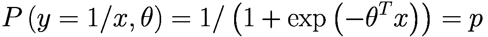

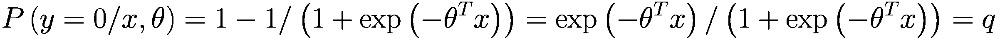

现在，让我们来看一下不同值下的 *θ*^(*T*)*x* 的概率值：

+   当 *θ*^(*T*)*x* = 0 时，正类概率为 1/2。

+   当 *θ*^(*T*)*x* > 0 时，正类概率大于 1/2 且小于 1。

+   当 *θ*^(*T*)*x* < 0 时，正类概率小于 1/2 且大于 0。

+   当 *θ*^(*T*)*x* 足够大且为正时，即 *θ*^(*T*)*x* → ∞，概率 →1。

+   当 *θ*^(*T*)*x* 足够大且为负时，即 *θ*^(*T*)*x* →  − ∞，概率 →0。

这种概率公式的优点是它保持了值在 0 到 1 之间，这在线性回归中是不可能的。此外，它给出的是连续概率，而不是实际的类别。因此，根据具体问题，可以定义截止概率阈值来确定类别。

这个概率模型函数被称为逻辑或 Sigmoid 函数。它具有平滑、连续的梯度，这使得模型训练在数学上很方便。

如果我们仔细观察，我们会看到每个训练样本的客户类别 *y* 遵循伯努利分布，这是我们之前讨论过的。对于每个数据点，类别 *y^((i*)/x^((i*))~Bernoulli*(1, *p*[i*])。基于伯努利分布的概率质量函数，我们可以得出以下结论：

![P(y^(i)/x^(i),θ)=(1-p_i)^(1-y^(i))] (../images/448418_2_En_1_Chapter/448418_2_En_1_Chapter_TeX_IEq79.png) 其中 *p*[i] = 1/(1 + exp(−θ^T*x*))

现在，我们如何定义损失函数？我们计算给定模型参数的数据似然，然后确定最大化计算似然的模型参数。我们用 *L* 来定义似然，它可以表示如下：

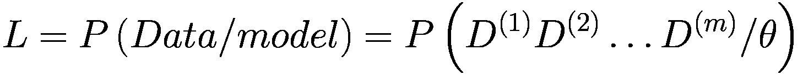

其中 *D^((i*)) 代表第 *i* 个训练样本 (*x^((i*)), *y^((i*)))。

假设训练样本是独立的，给定模型，*L* 可以如下分解：

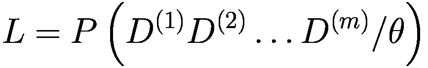

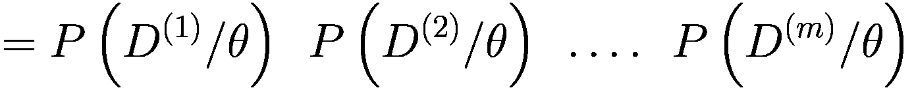

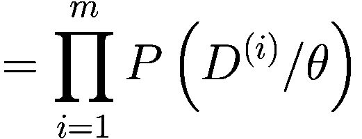

我们可以对两边取对数，将概率的乘积转换为概率对数的和。由于对数是一个单调递增函数，因此优化过程保持不变，因为 *L* 和 *logL* 的最大值点将是相同的。

对两边取对数，我们得到以下结果：

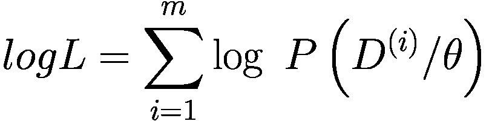

现在，*P*(D^((i*)/θ*) = *P*((*x^((i*)), *y^((i*)))/*θ*) = *P*(x^((i*))/θ*) * P*(y^((i*)/x^((i*)), θ*)。

我们不关心数据点的概率——即 *P*(x^((i))/θ*)——并假设对于给定的模型，训练集中的所有数据点具有相同的可能性。因此，*P*(D^((i))/θ*) = k * P*(y^((i))/x^((i)), θ*)，其中 *k* 是一个常数。

对两边取对数，我们得到以下结果：

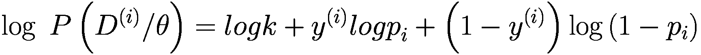

对所有数据点求和，我们得到以下结果：

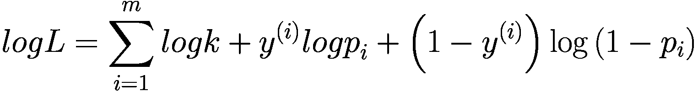

我们需要最大化 *logL* 来获取模型参数 *θ*。最大化 *logL* 等同于最小化 −*logL*，因此我们可以将 −*logL* 作为逻辑回归的成本函数并对其进行最小化。此外，我们可以省略 *logk* 的和，因为它是一个常数，并且无论是否有 *logk* 的和，模型参数在最小值处都会相同。如果我们用 *C*(*θ*) 表示成本函数，它可以表示如下：

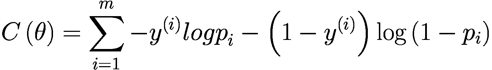

其中 *p*[*i*] = 1/(1 + exp(−*θ*^(*T*)*x*))

*C*(*θ*) 是 *θ* 上的凸函数，读者被鼓励使用在“微积分”部分学到的规则来验证它。*C*(*θ*) 可以通过常见的优化技术来最小化。

#### 超平面和线性分类器

线性分类器以某种方式与超平面相关联，因此研究这种关系是有意义的。从某种意义上说，学习线性分类器就是学习将正类与负类分开的超平面。

在 *n*-维向量空间中的超平面是一个 (*n* - 1) 维的平面，它将 *n*-维向量空间分成两个区域。一个区域由位于超平面之上的向量组成，另一个区域由位于超平面之下的向量组成。对于二维向量空间，直线充当超平面。同样，对于三维向量空间，二维平面充当超平面。

超平面由两个主要参数定义：其与原点的垂直距离由偏置项 *b*′ 表示，以及由垂直于超平面表面的单位向量 *w* 确定的超平面的方向，如图 1-38 所示。

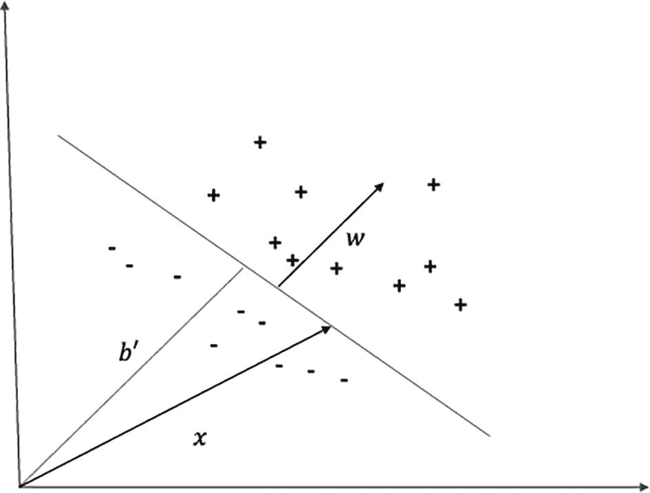

在二维平面上，负类和正类由一条下降的线分开。两个向量，从原点出发的 x 和从下降线出发的 w 被标记出来。

图 1-38

分隔两个类别的超平面

对于一个向量 *x* ∈ R^(n × 1) 要位于超平面上，向量在 *w* 方向上的投影应等于超平面到原点的距离，即 *w*^T*x* = *b*′。因此，位于超平面上的任何点都必须满足 *w*^T*x* - *b*′ = 0。同样，对于位于超平面上的点，必须满足 *w*^T*x* - *b*′ > 0，而对于位于超平面下的点，必须满足 *w*^T*x* - *b*′ < 0。

在线性分类器中，我们学习建模超平面或学习模型参数 *w* 和 *b*。向量 *w* 通常指向正类。感知器和线性 SVM 是线性分类器。当然，SVM 和感知器学习超平面的方式完全不同，因此即使对于相同的训练数据，它们也会得出不同的超平面。

即使查看逻辑回归，我们也会看到它基于线性决策边界。线性决策边界不过是超平面，位于超平面上的点（即 *w*^T*x* - *b*′ = 0）被分配给两个类别的概率为 0.5。再次强调，逻辑回归学习决策边界的方式与 SVM 和感知器模型的方式完全不同。

### 无监督学习

无监督机器学习算法旨在寻找包含无标签或目标输入数据点的数据集中的模式或内部结构。K-均值聚类、高斯混合等是无监督学习的方法。甚至数据降维技术，如主成分分析（PCA）、奇异值分解（SVD）、自动编码器等，也都是无监督学习方法。

### 强化学习

强化学习（RL）涉及训练一个“智能体”，该智能体可以使用“策略”在“环境”的特定“状态”下采取适当的“动作”，以最大化某些长期“奖励”。定义中的每个术语对于理解强化学习都很重要。

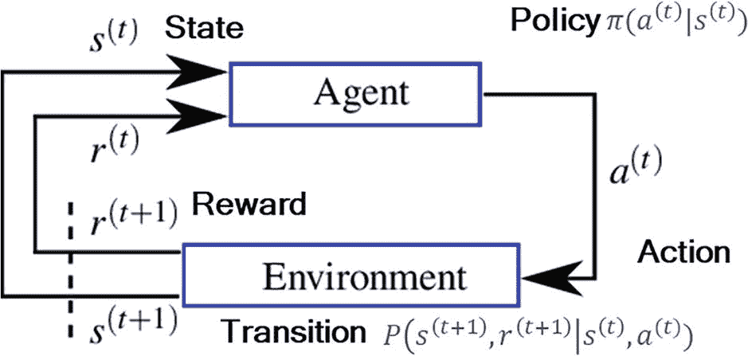

强化学习范式的表示。它有两个矩形块，分别代表智能体和环境，连接它们的线条表示状态、策略、动作和转换。

图 1-39

强化学习范式的高级表示

在强化学习环境中，智能体通过与环境的交互，以最大化某些长期奖励的方式来学习策略。

强化学习中的状态可以是环境的任何条件。例如，当一个人开车时，状态可以由汽车的位置和速度以及相邻汽车的位置和速度来定义。在上面的图中，时间 *t* 时系统的状态定义为 *s*^((t))。

当呈现状态 *s*^((*t*)) 时，强化学习智能体尝试使用学习到的策略 *π*(.) 来确定最优动作 *a*^((*t*))。策略是从状态到动作的映射，可以是概率性的或确定性的。强化学习智能体通过与环境的交互来学习策略。

奖励是环境对每个状态下动作的反馈。在时间 *t*，于状态 *s*^((*t*)) 采取动作 *a*^((*t*)) 所获得的即时奖励由 *r*^((*t*)) 给出。

当智能体在给定状态 *s*^((*t*)) 下采取动作 *a*^((*t*)) 并获得即时奖励 *r*^((*t*)) 时，它会根据环境的转移函数 *P*(*s*^((*t* + 1)), *r*^((*t* + 1))| *s*^((*t*)), *a*^((*t*))) 进入一个新状态 *s*^((*t* + 1))。智能体应以这样的方式学习策略：它不仅最大化即时奖励 *r*^((*t*+))，而且转移到有利于获得高奖励的下一步状态 *s*^((*t* + 1))。本质上，在每个状态下采取的动作应使长期奖励最大化。

为了理解长期奖励，假设智能体遵循策略 *π* 实现了以下状态、动作和奖励序列：

遵循策略 *π* 的状态、动作和奖励序列

*s*^((0)), *a*^((0)), *r*^((1)), *s*^((1)), *a*^((1)), *r*^((2))… … … … . *s*^((*t*)), *a*^((*t*)), ***r***^((***t +*** **1**)), *s*^((*t* + 1)), *a*^((*t* + 1)), *r*^((*t* + 2)), *s*^((*t* + 2))… *         s*^((*t* + *N* − 1)), *a*^((*t* + *N* − 1)), *r*^((*t* + *N*)), *s*^((*t* + *N*))

在时间 *t* 呈现状态 *s*^((*t*)) 时，选择动作 *a*^((*t*)) 所获得的长期奖励

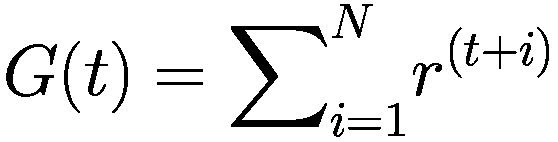

通常，近期奖励比未来奖励更受重视，因此使用折扣因子 *γ* 表示的长期奖励如下：

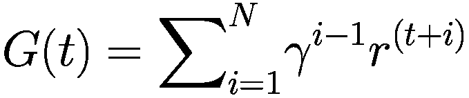

折扣因子 *γ* < 1，这有助于确保在非常长或无限时间范围的问题中，长期奖励不会发散。

### 机器学习的优化技术：梯度下降

梯度下降及其几种变体，可能是机器学习和深度学习中最广泛使用的优化技术。它是一种迭代方法，从随机模型参数开始，利用成本函数相对于模型参数的梯度来确定模型参数的更新方向。

假设我们有一个代价函数 *C*(*θ*)，其中 *θ* 代表模型参数。我们知道代价函数关于 *θ* 的梯度给出了在梯度评估的 *θ* 值处 *C*(*θ*) 在线性意义上的最大增加方向。因此，为了得到 *C*(*θ*) 在线性意义上的最大减少方向，应该使用梯度的负值。

模型参数 *θ* 在迭代 (*t* + 1) 时的更新规则如下：

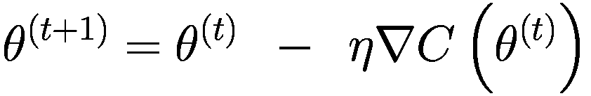

其中 *η* 代表学习率，*θ*^((*t* + 1)) 和 *θ*^((*t*)) 分别代表迭代 (*t* + 1) 和 *t* 时的参数向量。

一旦通过这个迭代过程达到最小值，代价函数在最小值处的梯度在技术上将是零，因此不会有进一步的 *θ* 更新。然而，由于舍入误差和计算机的其他限制，达到真正的最小值可能是不可能的。因此，当我们认为我们已经达到最小值——或者至少足够接近最小值以停止模型训练的迭代过程时，我们必须想出一些其他逻辑来停止迭代过程。通常使用的一种方法是通过检查梯度向量的幅度，如果它小于某个预定义的极小量——比如说，*ε*——则停止迭代过程。另一种可以使用的粗略方法是，在固定次数的迭代后停止参数更新的迭代过程，比如 1000 次。

学习率在梯度下降收敛到最小值点中起着非常关键的作用。如果学习率很大，收敛可能会更快，但可能导致最小值点周围的剧烈振荡。学习率较小可能需要更长的时间才能达到最小值，但通常收敛是振荡无的。

为了了解梯度下降为什么有效，让我们考虑一个只有一个参数和代价函数 *C*(*θ*) = (*θ* - *a*)² + *b* 的模型，并看看为什么这种方法有效。

从图 1-37 可以看出，在点 *θ*[1] 处的梯度（在这种情况下就是导数）是正的，因此如果我们沿着梯度方向移动，代价函数会增加。相反，在 *θ*[1] 处，如果我们沿着梯度的负方向移动，代价会减少。再次，让我们考虑梯度为负的点 *θ*[2]。如果我们在这里取梯度方向来更新 *θ*，代价函数会增加。取梯度的负方向可以确保我们朝着最小值移动。一旦我们达到 *θ* = *a* 的最小值，梯度为 0，因此不会有进一步的 *θ* 更新。

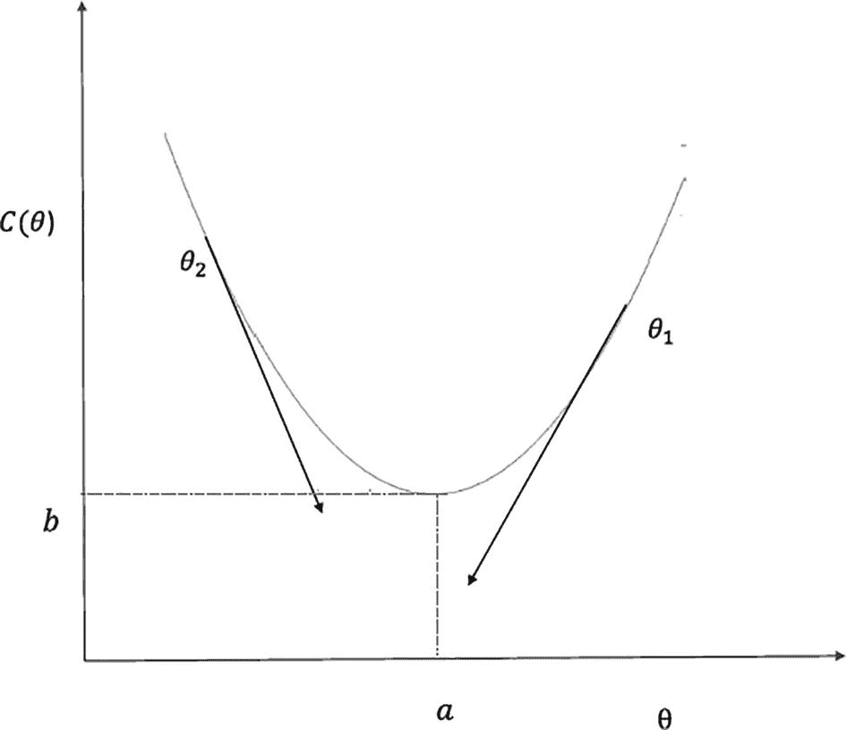

函数的 theta 与 theta 的二维平面。它表示一个下凹曲线，有两个切向量，theta 1 和 theta 2。

图 1-40

单变量简单代价函数的梯度下降直觉

#### 多变量代价函数的梯度下降

现在我们已经从基于一个参数的代价函数中获得了关于梯度下降的一些直觉，让我们看看当代价函数基于多个参数时的梯度下降。

让我们看看一个多变量函数的泰勒级数展开。多个变量可以用向量 *θ* 来表示。让我们考虑一个代价函数 *C*(*θ*)，其中 *θ* ∈ *R*^(*n* × 1) .

如前所述，围绕点 *θ* 的泰勒级数展开可以用矩阵表示法表示，如下所示：

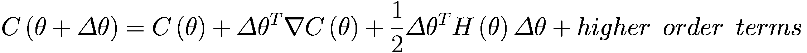

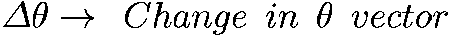

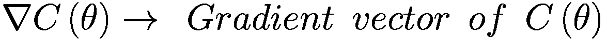

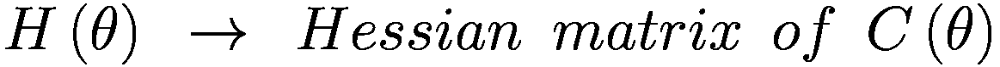

假设梯度下降的迭代 *t* 中模型参数是 *θ*，我们希望通过更新 *Δθ* 来将 *θ* 更新为 (*θ* + *Δθ*)，使得 *C*(*θ* + *Δθ*) 小于 *C*(*θ*).

如果我们假设函数在 *θ* 附近的线性，那么从泰勒级数展开，我们得到以下结果：

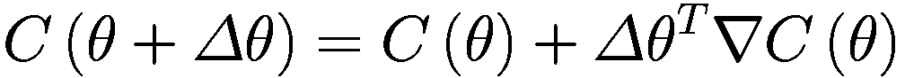

我们希望选择 *Δθ*，使得 *C*(*θ* + *Δθ*) 小于 *C*(*θ*).

对于所有具有相同大小的 *Δθ*，将最大化点积 *Δθ*^(*T*) 𝛻 *C*(*θ*) 的方向应该与 𝛻*C*(*θ*) 的方向相同。但那样会给我们带来最大的 *Δθ*^(*T*) 𝛻 *C*(*θ*)。因此，为了得到点积 *Δθ*^(*T*) 𝛻 *C*(*θ*) 的最小值，*Δθ* 的方向应该与 𝛻*C*(*θ*) 的方向完全相反。换句话说，*Δθ* 应该与梯度向量的负值成比例：

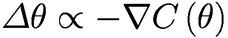

=> *Δθ* =  − *η* 𝛻 *C*(*θ*), 其中 *η* 是学习率

=>*θ* + *Δθ* = *θ* − *η𝛻C*(*θ*)

=>*θ*^((*t* + 1)) = *θ*^((*t*)) − *η* 𝛻 *C*(*θ*)

这是著名的梯度下降方程。为了可视化梯度下降如何达到最小值，我们需要对等高线和等高线图有一些基本了解。

#### 等高线图和等高线

让我们考虑一个函数 *C*(*θ*)，其中 *θ* ∈ *R*^(*n* × 1)。等高线是连接函数 *C*(*θ*)具有相同值的点的向量空间中的线/曲线。对于 *C*(*θ*)的每个唯一值，我们都会有单独的等高线。

让我们绘制函数 *C*(*θ*) = *θ*^(*T*)*Aθ* 的等高线，其中 *θ* = [*θ*[1]*θ*[2]]^(*T*) ∈ *R*^(2 × 1)，

![$$ A=\left[\begin{array}{cc}7& 2\\ 2& 5\end{array}\right] $$](../images/448418_2_En_1_Chapter/448418_2_En_1_Chapter_TeX_Equgg.png)

展开关于 *C*(*θ*)的表达式，我们得到以下结果：

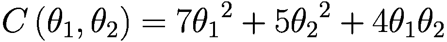

成本函数的等高线图如图 1-38 所示。

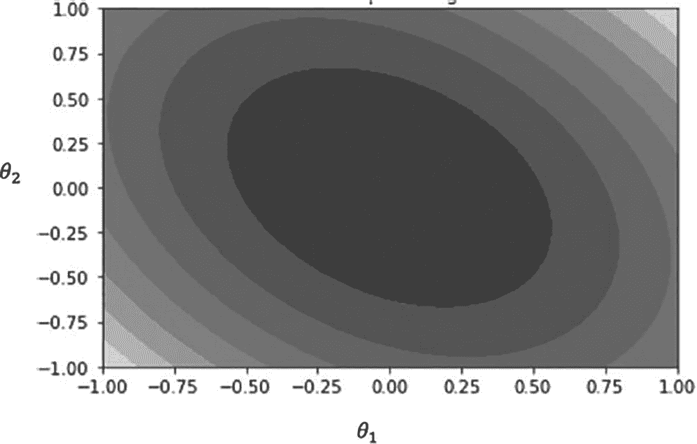

θ2 与θ1 的图形显示了所有阴影区域的倾斜同心椭圆。

图 1-41

等高线图

每个椭圆都是针对函数 *C*(*θ*[1], *θ*[2]) 的固定值特定的等高线。如果 *C*(*θ*[1], *θ*[2]) = *a*，其中 *a* 是一个常数，那么方程

*a* = 7*θ*[1]² + 5*θ*[2]² + 4*θ*[1]*θ*[2] 表示一个椭圆。

对于不同的常数值，我们得到不同的椭圆，如图 1-38 所示。等高线上的所有点都具有函数的相同值。

现在我们已经知道了等高线图是什么，让我们看看成本函数 *C*(*θ*) 的等高线图中的梯度下降过程，其中 *θ* ∈ *R*^(2 × 1)。梯度下降步骤已在图 1-39 中说明。

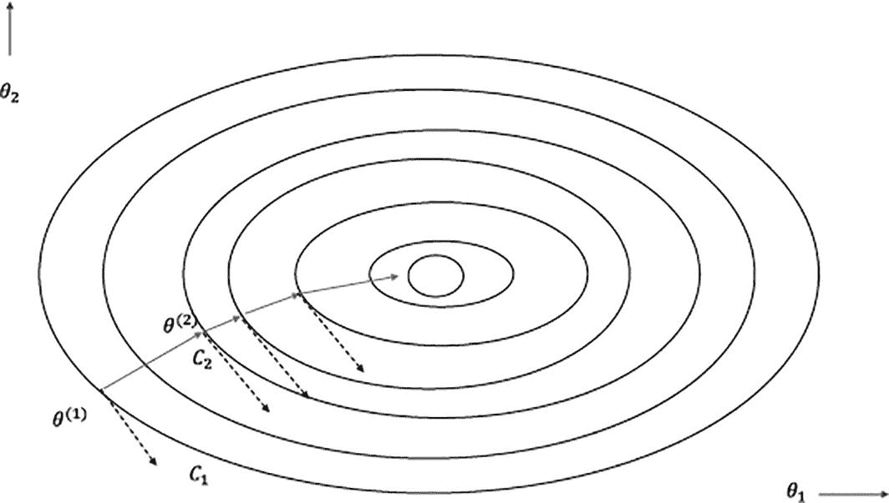

七层同心圆在θ2 与θ1 的二维平面上表示。有四个切向量用虚线标记。

图 1-42

二变量成本函数的梯度下降

让我们取对应于成本 *C*[1] 的最大椭圆，并假设我们的当前 *θ* 位于 *C*[1] 中的点 *θ*^((1))。

假设 *C*(*θ*)关于 *θ* 的线性，成本函数 *C*(*θ*)的变化可以表示如下：

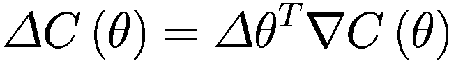

如果我们在同一等高线上的两个非常接近的点之间取成本的小变化，那么 *ΔC*(*θ*) = 0，因为同一等高线上的所有点都具有相同的固定值。此外，应注意，当我们取同一等高线上的两个非常接近的点时，*Δθ* 表示由等高线切向箭头表示的等高线的切线。请勿将此 *Δθ* 与梯度下降中参数的 *Δθ* 更新混淆。

*ΔC*(*θ*) = 0 → *Δθ*^(*T*) ∇ *C*(*θ*) = 0，这基本上意味着梯度在等高线 *C* 上的点 *θ*^((1)) 处垂直于切线。梯度会指向外侧，而梯度的负值指向内侧，如垂直于切线的箭头所示。根据学习率，它将达到由 *C*[2] 表示的不同等高线上的点 *θ*^((2))，其成本函数值将低于 *C*[1]。再次，梯度将在 *θ*^((2)) 处评估，并且相同的步骤将在几个迭代中重复，直到达到极小值点，此时梯度在技术上会下降到 0，之后将不再更新 *θ*。

#### 最速下降法

最速下降法是一种梯度下降的形式，其中学习率不是常数，而是在每次迭代时计算，以确保通过梯度下降进行的参数更新将成本函数带到相对于学习率的极小值。换句话说，在最速下降法中，每次迭代的 learning rate 都被优化，以确保在梯度方向上的移动被最大限度地利用。

让我们以我们常用的成本函数 *C*(*θ*) 为例，看看连续的迭代 *t* 和 (*t* + 1)。与梯度下降一样，我们有以下参数更新规则：

因此，迭代(*t* + 1)的成本函数可以表示如下：

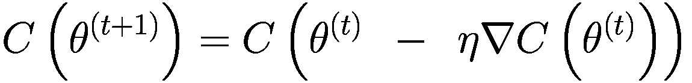

为了在迭代(*t* + 1)中相对于学习率最小化成本函数，请参阅以下内容：

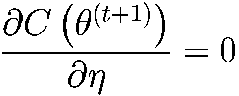

![$$ =&gt;\nabla C\left({\theta}^{\left(t+1\right)}\right)\frac{\partial \left[C\Big({\theta}^{(t)}\kern0.5em -\kern0.5em \eta \nabla C\left({\theta}^{(t)}\right)\right]}{\partial \eta }=0 $$](../images/448418_2_En_1_Chapter/448418_2_En_1_Chapter_TeX_Equgm.png)

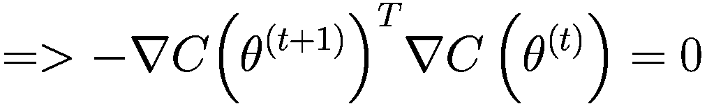

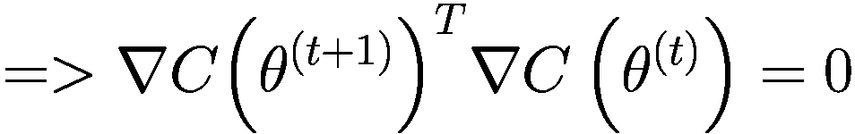

因此，对于最速下降法，梯度在 (*t* + 1) 和 *t* 之间的点积为 0，这意味着在每次迭代中，梯度向量都应该与之前迭代的梯度向量垂直。

#### 随机梯度下降

最速下降法和梯度下降法都是全批量模型；即梯度是基于整个训练数据集计算的。因此，如果数据集很大，梯度计算变得昂贵，内存需求增加。此外，如果数据集具有大量冗余，那么在完整数据集上计算梯度是没有用的，因为可以通过使用称为小批量的更小的批次来计算相似的梯度。克服上述问题的最流行方法是使用一种称为随机梯度下降的优化技术。

随机梯度下降是一种基于梯度下降法来最小化成本函数的技术，其中每一步的梯度不是基于整个数据集，而是基于单个数据点。

设 *C*(*θ*) 为基于 *m* 个训练样本的成本函数。每一步的梯度下降不是基于 *C*(*θ*)，而是基于 *C*^((*i*))(*θ*)，即基于第 *i* 个训练样本的成本函数。因此，如果我们必须将每次迭代的梯度向量与整体成本函数绘制出来，等高线将不会与切线垂直，因为它们是基于 *C*^((*i*))(*θ*) 的梯度，而不是基于整体 C(*θ*)。

在每次迭代中，使用成本函数 *C*^((*i*))(*θ*) 进行梯度计算，并且通过每次迭代的标准梯度下降更新模型参数向量 *θ*，直到我们遍历了整个训练数据集。我们可以对整个数据集进行多次这样的遍历，直到获得合理的收敛。

由于每次迭代的梯度不是基于整个训练数据集，而是基于单个训练样本，因此它们通常非常嘈杂，并且可能迅速改变方向。这可能导致成本函数最小值附近的振荡，因此在学习率收敛到最小值时应减小，以便参数向量的更新尽可能小。梯度计算更便宜且更快，因此梯度下降倾向于更快收敛。

在随机梯度下降中，一个重要的事情是训练样本应该尽可能随机。这将确保在一段时间内对几个训练样本的随机梯度下降提供的模型参数更新与实际梯度下降产生的更新相似，因为随机样本更有可能代表整个训练数据集。如果随机梯度下降的每次迭代的样本有偏差，它们就不代表实际数据集，因此模型参数的更新可能是在导致随机梯度下降收敛需要很长时间的方向上。

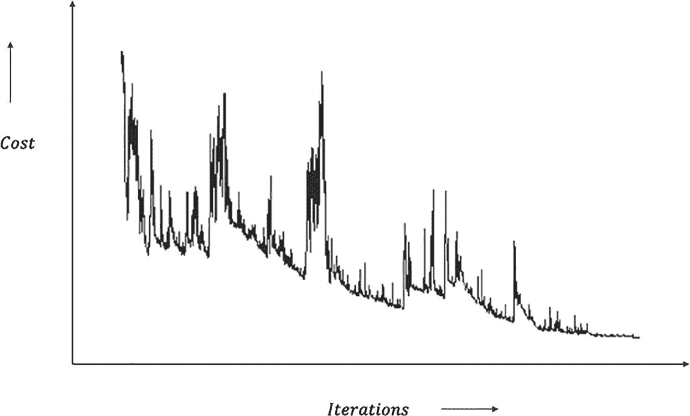

成本与迭代次数的图表显示了总成本函数值的变量波动。

图 1-43

随机梯度下降中总成本函数值迭代的波动

如图 1-44 所示，随机梯度下降在每一步的梯度与等高线的切线不垂直。然而，如果我们绘制单个训练样本的切线，它们将是垂直的。此外，由于梯度的波动，迭代过程中的相关成本降低也是嘈杂的。

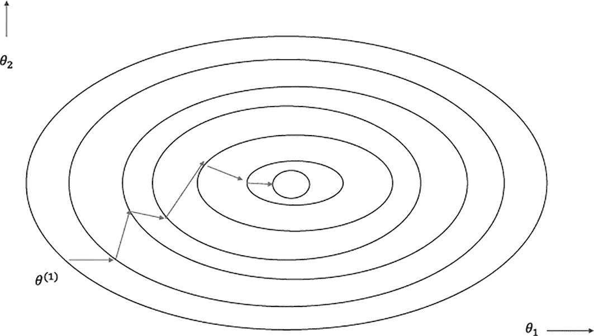

七层同心圆在 theta 2 与 theta 1 的二维平面上表示。在层中标记了六个箭头。

图 1-44

随机梯度下降参数更新

当我们使用单个训练数据点时，梯度计算变得非常便宜。此外，收敛速度相当快，但它也带来了一组自己的缺点，如下所述：

+   由于每迭代的估计梯度是基于单个数据点的成本函数，而不是总成本函数，因此梯度非常嘈杂。这导致最小值处的收敛问题，并可能导致振荡。

+   学习率的调整变得很重要，因为高学习率可能会导致在收敛到最小值时出现振荡。这是因为梯度非常嘈杂，因此如果收敛时的梯度估计值不接近零，高学习率会将更新远远超过最小值点，并且过程可以在最小值点的两侧重复。

+   由于梯度是嘈杂的，每次迭代后的模型参数值也非常嘈杂，因此需要添加启发式方法到随机梯度下降中，以确定要采取的模型参数值。这也带来了另一个问题：何时停止训练。

在全批量模型和随机梯度下降之间的一种折衷方法是迷你批量方法，其中梯度既不是基于整个训练数据集，也不是基于单个数据点。相反，它使用迷你批量的训练数据点来计算成本函数。大多数深度学习算法都使用迷你批量方法进行随机梯度下降。梯度噪声较小，同时不会引起许多内存限制，因为迷你批量的大小是适中的。

我们将在第二章中更详细地讨论迷你批量。

#### 牛顿法

在我们开始使用牛顿法优化成本函数的最小值之前，让我们看看梯度下降技术的局限性。

梯度下降方法依赖于成本函数在连续迭代之间的线性；即，通过跟随梯度，可以从时间 t 的参数值到达迭代(*t* + 1)的参数值，因为成本函数 C(*θ*)从 t 到(*t* + 1)的路径是线性的或可以通过直线连接。这是一个非常简化的假设，如果成本函数高度非线性或具有曲率，则不会给出良好的梯度下降方向。为了更好地理解这一点，让我们看看具有单变量的成本函数的三个不同情况的图。

#### 线性曲线

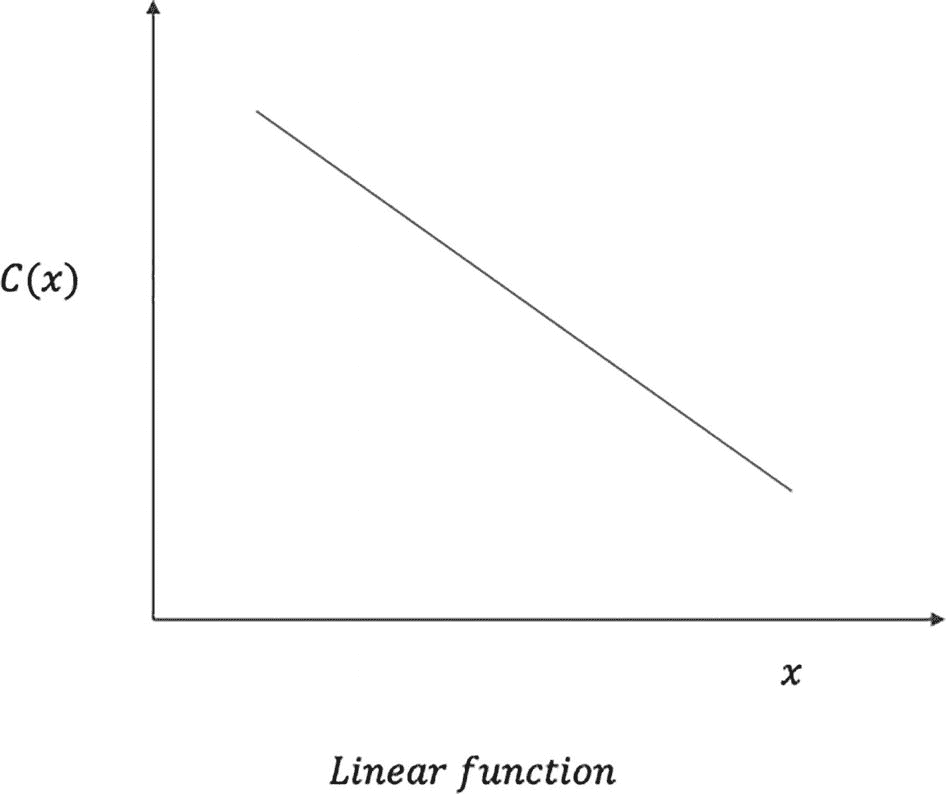

函数 x 与 x 的二维平面显示了一条下降的直线，以说明线性函数。

图 1-45

线性成本函数

#### 负曲率

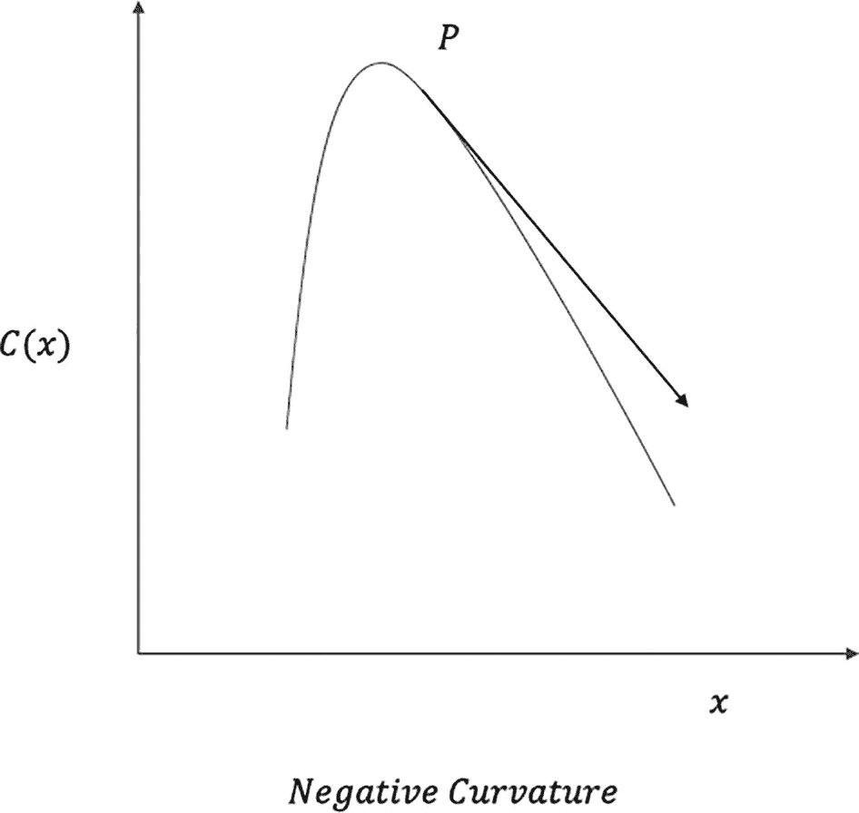

函数 x 与 x 的二维平面显示了一条带有切线 P 的凸曲线，以说明负曲率。

图 1-46

点 P 处的负曲率成本函数

#### 正曲率

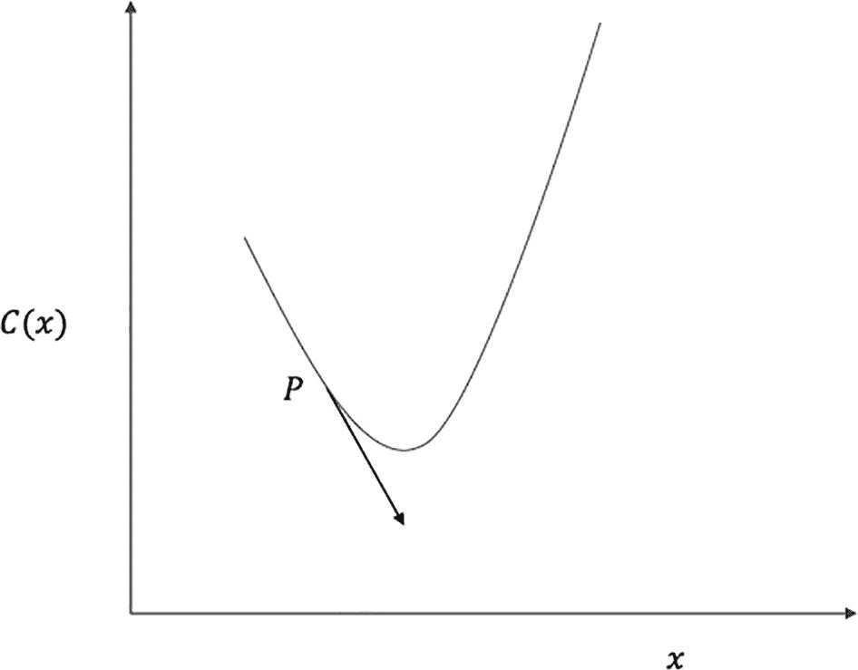

函数 x 与 x 的二维平面显示了一条带有切线 P 的凹曲线，以说明正曲率。

图 1-47

点 P 处的正曲率成本函数

对于线性成本函数，如图 1-45 所示，梯度的负值将给出达到最小值的最优方向，因为函数是线性的，没有曲率。对于具有正负曲率的成本函数，分别如图 1-46 和 1-47 所示，导数不会给出良好的最小值方向，因此为了处理曲率，我们需要使用 Hessian 矩阵以及导数。正如我们所见，Hessian 矩阵不过是二阶导数的矩阵。它们包含了关于曲率的信息，因此与简单的梯度下降相比，会给出更好的参数更新方向。

梯度下降法是优化的一阶近似方法，而牛顿法是使用 Hessian 矩阵和梯度来处理成本函数中的曲率的二阶优化方法。

让我们考虑我们通常的成本函数 *C*(*θ*)，其中 *θ* ∈ *R*^(*n* × 1) 是一个 *n*-维度的模型参数向量。我们可以在 *θ* 的邻域内通过其二阶泰勒级数展开来近似成本函数 *C*(*θ*)，如下所示：

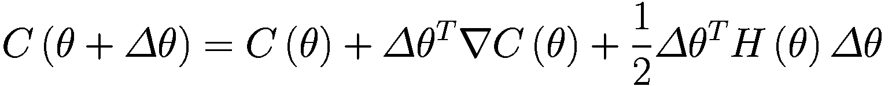

∇*C*(*θ*) 是成本函数 *C*(*θ*) 的梯度，而 *H*(*θ*) 是其 Hessian 矩阵。

现在，如果 *θ* 是迭代 *t* 时模型参数向量的值，而 (*θ* + *Δθ*) 是迭代时模型参数的值，那么

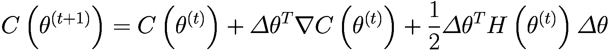

其中 *Δθ* = *θ*^((*t* + 1)) - *θ*^((*t*)).

对 *θ*^((*t* + 1)) 求梯度，我们得到以下结果：

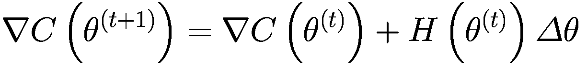

将梯度 ∇*C*(*θ*^((*t* + 1))) 设置为 0，我们得到以下结果：

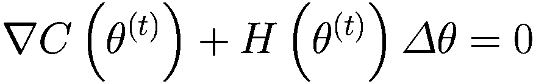

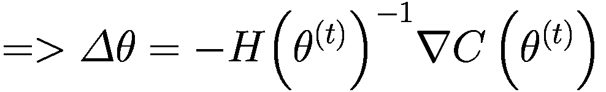

因此，牛顿法的参数更新如下：

=> *θ*^((*t+1*)) = *θ*^((*t*)) - *H*^(-1)*(*θ*^((*t*))) *∇*C*(*θ*^((*t*)))

我们没有为牛顿法指定学习率，但可以选择使用一个学习率，就像梯度下降法一样。由于牛顿法在非线性成本函数的方向上更好，因此与梯度下降法相比，收敛到最小值的迭代次数会更少。需要注意的是，如果我们试图优化的成本函数是一个二次成本函数，例如线性回归中的那个，那么牛顿法在技术上会一步收敛到最小值。

然而，计算 Hessian 矩阵及其逆矩阵在计算上可能非常昂贵或有时难以处理，尤其是在输入特征数量很大时。有时，甚至可能存在 Hessian 矩阵没有正确定义的函数。因此，对于大型机器学习和深度学习应用，使用梯度下降——特别是随机梯度下降——技术，因为它们相对计算量较小，并且在大数据量时具有良好的扩展性。

### 约束优化问题

在约束优化问题中，除了需要优化的成本函数外，我们还需要遵守一系列约束条件。这些约束条件可能是方程或不等式。

每当我们想要最小化一个受等式约束的函数时，我们使用拉格朗日公式。比如说，我们必须在 *g*(*θ*) = 0 的约束下最小化 *f*(*θ*)，其中 *θ* ∈ *R*^(*n* × 1)。对于这样的约束优化问题，我们需要最小化函数 *L*(*θ*,  *λ*) = *f*(*θ*) + *λg*(*θ*)。对 *L* 求梯度，即拉格朗日乘数，相对于组合向量 *θ*, *λ*，并将其设为 0，将给出所需的 *θ*，它将最小化 *f*(*θ*) 并遵守约束。*λ* 被称为拉格朗日乘数。当存在多个约束时，我们需要添加所有这样的约束，并为每个约束使用一个单独的拉格朗日乘数。比如说，我们想要在 *m* 个约束 *g**i* = 0 (对所有 *i* ∈ {1, 2, 3, …*m*}) 下最小化 *f*(*θ*)；拉格朗日乘数可以表示如下：

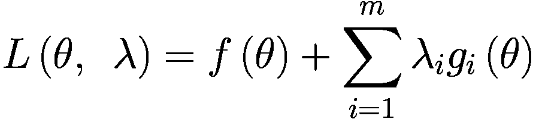

其中 *λ* = [*λ*[1]*λ*[2] . . *λ*[*m*]]^(*T*)

要最小化该函数，需要计算 *L*(*θ*, *λ*) 关于 *θ* 和 *λ* 向量的梯度，使其为零向量，即，

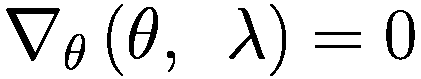

前述方法不能直接用于不等式约束。在这种情况下，可以使用更通用的 Karush-Kuhn-Tucker 方法。

设 *C*(*θ*) 为我们希望最小化的成本函数，其中。同时，设对 *θ* 有 *k* 个约束条件，如下：

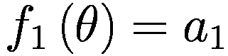

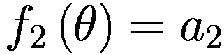

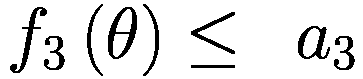

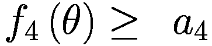

…

…

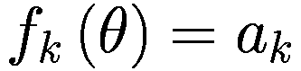

由于存在约束条件，*θ* 应该遵守，这变成了一个有约束的优化问题。每个不等式都可以转换成一种标准形式，其中某个函数小于或等于零。例如，

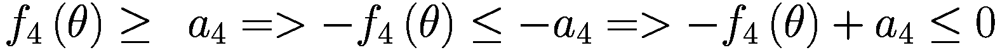

Let each such constraint strictly less than, or less than equal to, zero be represented by *g**i*. Also, let there be some strict equality equations *e**j*. Such minimization problems are solved through the Karush-Kuhn-Tucker version of Lagrangian formulation.

我们不是要最小化 *C*(*θ*)，而是需要最小化一个成本函数 *L*(*θ*, *α*, *β*)，如下所示：

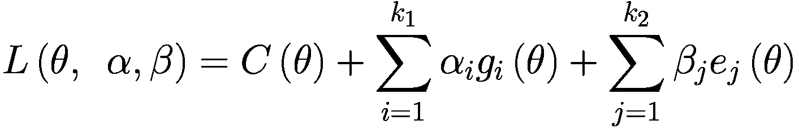

规模因子 *α*[*i*] ∀ *i* ∈ {1, 2, 3, ..*k*[1]} 和 *β*[*j*] ∀ *j* ∈ {1, 2, 3, ..*k*[2]} 被称为拉格朗日乘数，对应于 *k* 个约束条件，因此会有 *k* 个这样的乘数。因此，我们将一个有约束的最小化问题转换成了一个无约束的最小化问题。

To solve the problem, the Karush-Kuhn-Tucker conditions should be met at the minima point as follows:

+   *L*(*θ*, *α*, *β*) 关于 *θ* 的梯度应该是零向量，即，

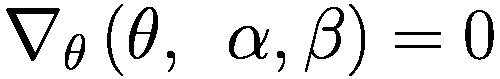

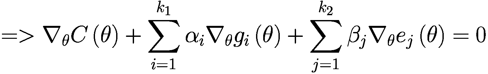

+   The gradient of the *L*(*θ*, *α*, *β*) with respect to *β*, which is the Lagrange multiplier vector corresponding to the equality conditions, should be zero:

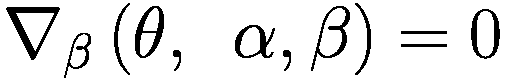

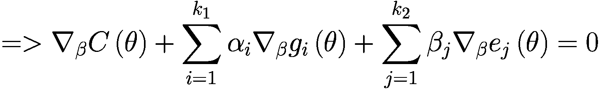

+   在最小值点，不等式条件应变为等式条件。此外，不等式拉格朗日乘数应为非负：

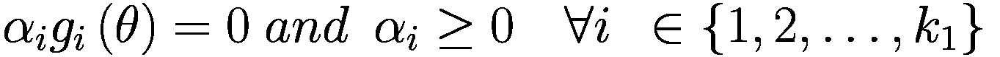

解决前面的条件将提供约束优化问题的最小值。

## 机器学习中的几个重要主题

在本节中，我们将讨论一些与机器学习非常相关的重要主题。它们的潜在数学非常丰富。

### 维度降低方法

主成分分析和奇异值分解是机器学习领域中应用最广泛的维度降低技术。我们将在这里对这些技术进行一定程度的讨论。请注意，这些数据降低技术基于线性相关性，并不能捕捉到如共偏度、共峰度等非线性相关性。我们将在本书的后半部分讨论一些基于人工神经网络的维度降低技术，例如自编码器。

#### 主成分分析

主成分分析是一种维度降低技术，理想情况下应该在“线性代数”部分进行讨论。然而，为了使其数学更容易理解，我故意将其放在约束优化问题之后。让我们看看图 1-45 中的二维数据图。正如我们所见，数据的最大方差既不在*x*方向也不在*y*方向，而是在两者之间的某个方向。因此，如果我们把数据投影到方差最大的方向，它将覆盖数据中的大部分变异性。此外，剩余的方差可以忽略不计，视为噪声。

沿*x*方向和*y*方向的数据高度相关（见图 1-48）。协方差矩阵将提供关于数据以减少冗余所需的信息。我们不必关注*x*和*y*方向，我们可以关注*a*[1]方向，它具有最大的方差。

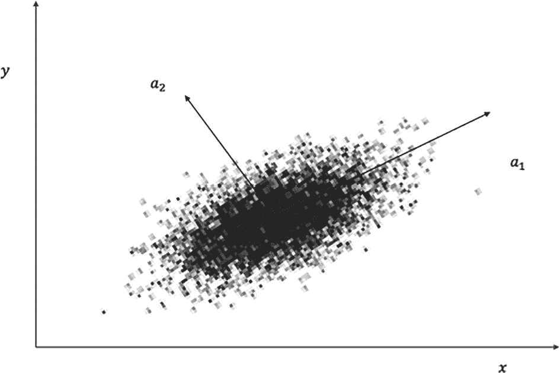

y 与 x 的二维平面显示了密集的散点图，包含两个向量，一个 2 和一个 1。

图 1-48

相关的二维数据。a[1]和 a[2]是数据不相关的方向，是主成分

现在，让我们深入数学，并假设我们没有图表，我们只有*m*个样本的数据*x*^((*i*)) ∈ *R*^(*n* × 1)。

我们希望在 *n*-维平面上找到按方差递减顺序的独立方向。独立方向意味着这些方向之间的协方差应为 0。让 *a*[1] 是方差最大的数据向量的单位向量；即，数据向量 *x* 的均值 *μ*。

(*x* − *μ*) 向量在 *a*[1] 方向上的一个分量是 (*x* − *μ*) 在 *a*[1] 上的投影；用 *z*[1] 表示：

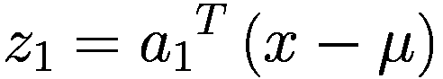

*var* (*z*[1]) =*var* [*a*[1]^(*T*)(*x* − *μ*)] = *a*[1]^(*T*)*cov*(*x*)*a*[1]，其中 *var* 表示方差，*cov*(*x*) 表示协方差矩阵。

对于给定的数据点，方差是 *a*[1] 的函数。因此，我们需要在 *a*[1] 是单位向量的条件下最大化方差：

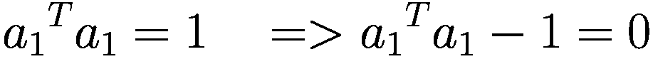

因此，我们可以将待最大化的函数表示为

*L*(*a*[1],  *λ*) = *a*[1]^(*T*) *cov* (*x*)*a*[1] − *λ*(*a*[1]^(*T*)*a*[1] − 1)，其中 *λ* 是拉格朗日乘子。

对于极大值，将 *L* 关于 *a*[1] 的梯度设为 0，我们得到以下：

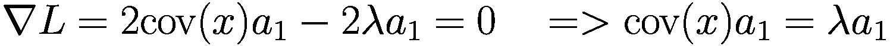

我们可以看到一些我们之前研究过的东西。*a*[1] 向量不过是协方差矩阵的特征向量，而 *λ* 是相应的特征值。

现在将此代入沿着 *a*[1] 的方差表达式，我们得到以下：

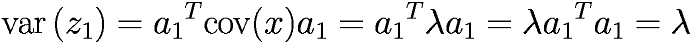

由于沿着 *a*[1] 的方差表达式本身就是特征值，对应于最高特征值的特点向量给出了第一个主成分或数据方差最大的方向。

现在，让我们获取第二个主成分，或者说是 *a*[1] 之后方差最大的方向。

第二个主成分的方向由单位向量 *a*[2] 给出。由于我们正在寻找正交分量，*a*[2] 的方向应该垂直于 *a*[1]。

沿着 *a*[2] 的数据投影可以用变量 *z*[2]= *a*[2]^(*T*)(*x* − *μ*) 来表示。

因此，沿着 *a*[2] 的数据方差是 Var (*z*[2]) = Var [*a*[2]^(*T*)(*x* − *μ*)] = *a*[2]^(*T*)*cov*(*x*)*a*[2]。

由于 *a*[2] 是一个单位向量，我们需要在约束 *a*[2]^(*T*)*a*[2] = 1 下最大化 *Var*(*z*[2])。

*a*[2]^(*T*)*a*[1] = 0 因为 *a*[2] 应该与 *a*[1] 正交。

我们需要最大化以下函数 *L*(*a*[2], *α*, *β*) 关于参数 *a*[2], *α*, *β*：

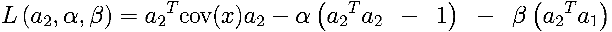

通过对 *a*[2] 求梯度并将其设为零向量，我们得到以下结果：

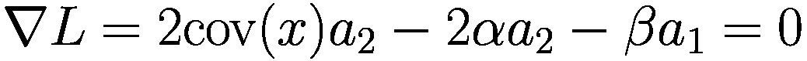

通过将梯度 ∇*L* 与向量 *a*[1,] 进行点积，我们得到以下结果：

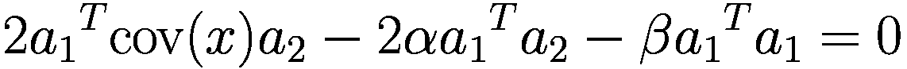

*a*[1]^(*T*)*cov*(*x*)*a*[2] 是一个标量，可以写成 *a*[2]^(*T*)*cov*(*x*)*a*[1]。

简化后，*a*[2]^(*T*)*cov*(*x*)*a*[1] = *a*[2]^(*T*)*λa*[1] = *λa*[2]^(*T*)*a*[1] = 0。此外，项 2*αa*[1]^(*T*)*a*[2] 等于 0，这留下 *βa*[1]^(*T*)*a*[1] = 0。由于 *a*[1]^(*T*)*a*[1] = 1，*β* 必须等于 0。

将 *β* = 0 代入 ∇*L* = 2 *cov* (*x*) *a*[2] - 2*αa*[2] - *βa*[1] = 0 的表达式中，我们得到以下结果：

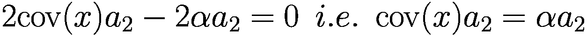

因此，第二个主成分也是协方差矩阵的一个特征向量，特征值 *α* 必须是紧随 *λ* 的第二大特征值。这样，我们就从协方差矩阵 *cov*(*x*) ∈ *R*^(*n* × *n*) 中得到了 *n* 个特征向量，并且数据在每个特征向量方向（或主成分）上的方差将由特征值表示。需要注意的是，协方差矩阵总是对称的，因此特征向量总是相互正交，从而给出独立的方向。

协方差矩阵总是正半定的。

这是因为协方差矩阵的特征值代表方差，而方差不能为负。如果 *cov*(*x*) 是正定的，即 *a*^(*T*) *cov* (*x*) *a* > 0，那么协方差矩阵的所有特征值都是正的。

图 1-49 展示了数据的主成分分析变换。如图所示，PCA 将数据进行了中心化，并消除了 PCA 变量之间的相关性。

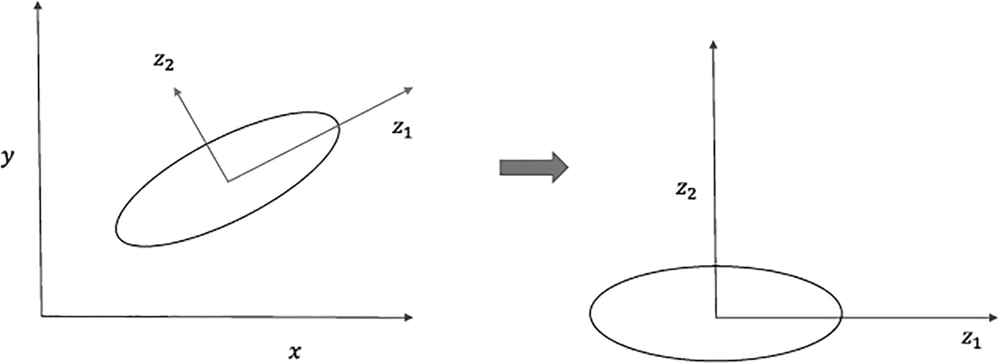

椭圆上有两个向量，z 2 和 z 1 在二维平面上，箭头指向另一个椭圆，该椭圆上有两个向量，z 2 和 z 1。

图 1-49

主成分分析（PCA）首先将数据中心化，然后将数据投影到方差最大的轴上。如果 z[2] 方向上的方差可以忽略不计，则可以忽略 z[2] 方向上的数据。

##### 当 PCA 在数据降维中何时有用？

当输入的不同维度之间存在高度相关性时，数据的高方差将只沿着少数几个独立的方向存在，而沿其他方向方差将微不足道。通过主成分分析（PCA），可以保留数据成分在方差高的少数几个方向上，并对总体方差做出重大贡献，忽略其余数据。

##### 你如何知道选定的主成分保留了多少方差？

如果 *z* 向量表示输入向量 *x* 的变换成分，那么 *cov*(*z*) 将是一个对角矩阵，其对角元素是 *cov*(*x*) 矩阵的特征值。

![ \mathit{\operatorname{cov}}(z)=\left[\begin{array}{ccc}{\lambda}_1 & \cdots & 0\\ \vdots & {\lambda}_2 & \vdots \\ 0 & \cdots & {\lambda}_n\end{array}\right] ](../images/448418_2_En_1_Chapter/448418_2_En_1_Chapter_TeX_Equhs.png)

此外，让我们假设特征值按如下顺序排列：*λ*[1] > *λ*[2] > *λ*[3] . . > *λ*[*n*]。

假设我们选择只保留前 *k* 个主成分；数据中捕获的方差比例如下：

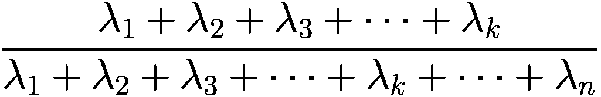

#### 奇异值分解

奇异值分解是一种降维技术，它将矩阵 *A* ∈ ℝ^(*m* × *n*) 分解为三个矩阵的乘积，即 *A* = *USV*^(*T*)，其中

*U* ∈ *R*^(*m* × *m*) 并且由矩阵 *AA*^(*T*)* 的所有特征向量组成。

*V* ∈ *R*^(*n* × *n*) 并且由矩阵 *A*^(*T*)*A* 的所有特征向量组成。

*S* ∈ *R*^(*m* × *n*) 并且由 *A*^(*T*)*A* 和 *AA*^(*T*) 的特征向量的平方根组成，其中 *k* 是矩阵 *A* 的秩。

*U* 的列向量彼此正交，因此形成一个正交基。同样，*V* 的列向量也形成一个正交基：

![U=\left[{u}_1{u}_2 \dots {u}_m\right]](../images/448418_2_En_1_Chapter/448418_2_En_1_Chapter_TeX_Equhu.png)

其中 *u*[*i*] ∈ *R*^(*m* × 1) 是 *U* 的列向量。

![V=\left[{v}_1{v}_2 \dots {v}_m\right]](../images/448418_2_En_1_Chapter/448418_2_En_1_Chapter_TeX_Equhv.png)

其中 *v*[*i*] ∈ *R*^(*n* × 1) 是矩阵 *V* 的列向量。

![S=\left[\begin{array}{ccc}{\sigma}_1 & \cdots & 0\\ \vdots & {\sigma}_2 & \vdots \\ 0 & \cdots & 0\end{array}\right] ](../images/448418_2_En_1_Chapter/448418_2_En_1_Chapter_TeX_Equhw.png)

根据 *A* 的秩，会有 *σ*[1]，*σ*[2,] `… … ….` *σ*[*k*] 个对角线项，对应于矩阵 *A* 的秩 *k*：

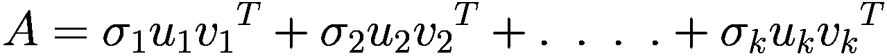

*σ*[*i*]  ∀ *i*  ∈ {1, 2, 3, ..*k*}，也称为奇异值，是 *A*^(*T*)*A* 和 *AA*^(*T*) 的特征值的平方根，因此它们是数据中方差的度量。对于每个 *σ*[*i*]*u*[*i*]*v*[*i*]^(*T*) ∀ *i*  ∈ {1, 2, 3, ..*k*}，都是一个秩一矩阵。我们只能保留那些奇异值显著的秩一矩阵，这些矩阵可以解释数据中相当比例的方差。

如果只取对应于最大奇异值的前 *p* 个秩一矩阵，则保留在数据中的方差由以下公式给出：

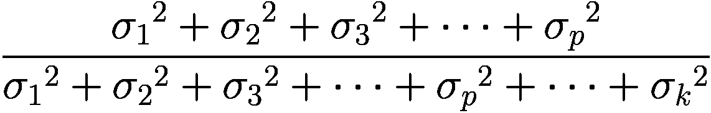

图像可以通过奇异值分解进行压缩。同样，奇异值分解在协同过滤中用于分解用户评分矩阵，得到包含用户向量和项目向量的两个矩阵。矩阵的奇异值分解由 *USV*^(*T*) 给出。用户评分矩阵 *R* 可以分解如下：

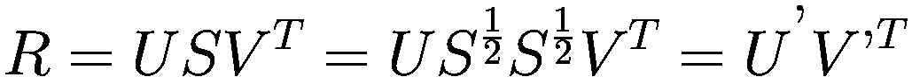

其中 *U*′ 是用户向量矩阵，等于 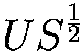，而 *V*′ 是项目向量矩阵，其中 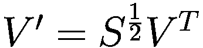。

### 正则化

构建机器学习模型的过程涉及推导出适合训练数据的参数。如果模型简单，那么模型对数据的变异不敏感，并存在高偏差。然而，如果模型过于复杂，它试图尽可能多地模拟变异，在这个过程中模拟了训练数据中的随机噪声。这消除了简单模型产生的偏差，但引入了高方差，即模型对输入的微小变化非常敏感。对于模型来说，高方差不是一个好现象，特别是如果数据中的噪声相当大。在这种情况下，模型在追求在训练数据上表现得太好的过程中，在测试数据集上的表现不佳，因为模型失去了与新数据良好泛化的能力。模型遭受高方差的问题被称为 *过拟合*。

如图 1-50 所示，我们拟合了三个模型到数据上。与水平线平行的模型遭受高偏差，而曲线模型则遭受高方差。位于水平线约 45 度角之间的直线既没有高方差也没有高偏差。

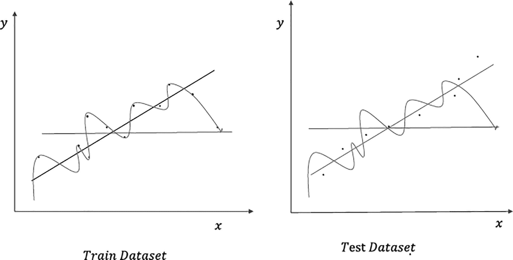

对于训练数据集和测试数据集，y 与 x 的二维平面图。它包括一条水平线和一条带有曲线和点的递增线。

图 1-50

高方差和高偏差模型的示意图

高方差模型在训练数据上表现良好，但在测试数据集上表现不佳，即使数据集的性质没有发生很大变化。用蓝色表示的模型可能无法完美地拟合训练数据，但由于模型没有遭受高方差，它在测试数据上表现更好。关键在于拥有一个既不受高偏差影响，又不会过于复杂以至于将随机噪声也建模在内的模型。

高方差模型通常具有较大的模型参数幅度，因为模型对数据的小变化非常敏感。为了克服由高模型方差引起过拟合的问题，广泛使用了一种称为正则化的流行技术。

为了更清楚地说明问题，让我们看看我们之前看过的线性回归代价函数：

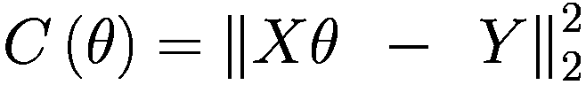

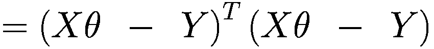

如前所述，高方差模型具有幅度较大的模型参数。我们可以在代价函数*C*(*θ*)中添加一个额外的组件，当模型参数向量的幅度较高时，它会惩罚整体代价函数。

因此，我们可以有一个新的代价函数，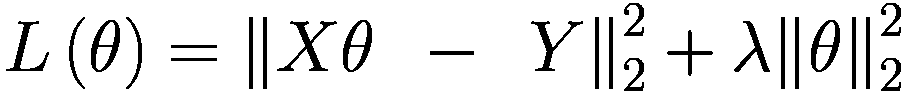，其中‖*θ*‖[2]²是模型参数向量 l²范数的平方。优化问题变为以下形式：

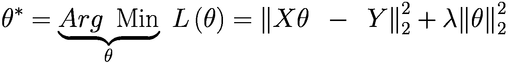

对*θ*求梯度∇*L*并将其设为 0，我们得到*θ*^∗ = (*X*^(*T*)*X* + *λI*)^(−1)*X*^(*T*)*Y*。

现在，正如我们所看到的，由于成本函数中的‖*θ*‖[2]²项，模型参数的幅度不能太大，因为这会惩罚整体成本函数。*λ*决定了正则化项的权重。*λ*的值越高，‖*θ*‖[2]²的值就越小，从而使模型更简单，更容易出现高偏差或欠拟合。一般来说，即使*λ*的值很小，也能在很大程度上减少模型复杂性和模型方差。*λ*通常使用交叉验证进行优化。

当使用**l**²范数的平方作为正则化项时，这种优化方法被称为**l**²正则化。有时，模型参数向量的**l**¹范数被用作正则化项，这种优化方法被称为**l**¹正则化。将**l**²正则化应用于回归问题称为岭回归，而将**l**¹正则化应用于此类回归问题称为 Lasso 回归。

对于**l**¹正则化，前面的回归问题变为以下形式：

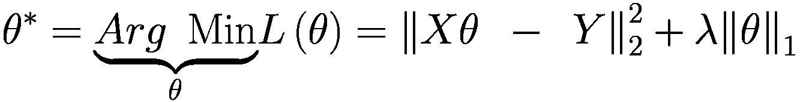

岭回归在数学上更方便，因为它有一个封闭形式的解，而 Lasso 回归没有封闭形式的解。然而，与岭回归相比，Lasso 回归对异常值具有更强的鲁棒性。Lasso 问题给出稀疏解，因此它适用于特征选择，尤其是在输入特征之间存在中等至高相关性时。

### 将正则化视为约束优化问题

我们可以不对模型参数向量的幅度添加惩罚项，而是添加一个约束，使其小于或等于某个常数。这样，我们就可以得到以下优化问题：

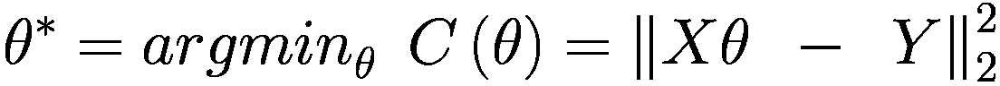

使得 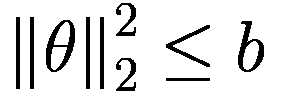

其中 b 是一个常数。

我们可以通过创建一个新的拉格朗日公式，将这个约束最小化问题转换为无约束最小化问题，如下所示：

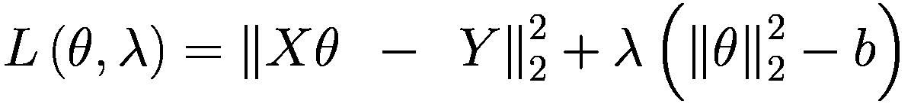

根据 Karush-Kuhn-Tucker 条件最小化拉格朗日成本函数时，以下条件很重要：

+   **L**相对于**θ**的梯度；即，∇[*θ*]*L*(*θ*, *λ*)应该是零向量，简化后得到以下结果：

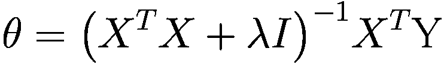

(1)

+   如果我们考虑正则化，即*λ* > 0，那么 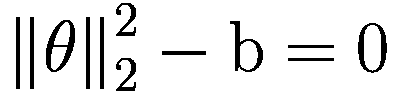 (2)

+   此外，在最优点 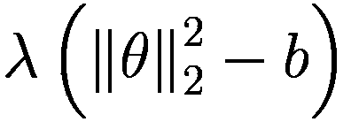 = 0 和 *λ* ≥ 0

从(1)中我们可以看到，*θ*的获得是*λ*的函数。*λ*应该调整到满足(2)中的约束。

(1)中的解*θ* = (*X*^(*T*)*X* + *λI*)^(−1)*X*^(*T*)*Y*与从*l*²正则化得到的相同。在机器学习应用中，拉格朗日乘数通常通过超参数调整或交叉验证来优化，因为我们不知道*b*的好值是什么。当我们取小的*λ*值时，*b*的值增加，*θ*的范数也随之增加，而大的*λ*值提供较小的*b*，因此*θ*的范数更小。

回到正则化，任何惩罚模型复杂性的成本函数中的组件都提供正则化。在基于树的模型中，随着叶节点数量的增加，树的复杂性增加。我们可以在成本函数中添加一个基于树中叶节点数量的项，这将提供正则化。对于树的深度也可以做类似的事情。

即使提前停止模型训练过程也能提供正则化。例如，在梯度下降法中，我们运行的迭代次数越多，模型就越复杂，因为每次迭代，梯度下降都会尝试进一步降低成本函数的值。我们可以根据某些标准，如迭代过程中测试数据集的成本函数值增加，提前停止模型学习过程。每当在训练过程中，训练成本函数值下降而测试成本函数值上升时，这可能表明过拟合的开始，因此停止迭代学习是有意义的。

当训练数据与模型必须学习的参数数量相比较少时，过拟合的可能性很高，因为模型将学习太多规则来适应小数据集，并且可能无法很好地泛化到未见过的数据。如果数据集与参数数量相比是充足的，那么学习的规则覆盖了很大比例的总体数据，因此模型过拟合的可能性降低。

### 偏差和方差权衡

正如我们之前讨论的，与我们试图学习的系统或关系相比过于简单的模型会遭受高偏差。而当我们试图学习的模型与期望的关系相比过于复杂时，它会遭受高方差。

从数学上精确地定义偏差，让我们假设世界模型表示为*y* = *f*(*X*; *θ*)，其中函数*f*由*θ* ∈ *R*^(*n*)参数化，将输入*X* ∈ *R*^(*n*)映射到输出*y* ∈ *R*。

使用 ML 模型，我们将估计*θ*为。如果我们使用不同的数据集，我们通常会得到不同的估计。如果的期望值与世界值或占卜值*θ*有很大差异，则模型被认为具有高偏差。因此，偏差可以表示如下：

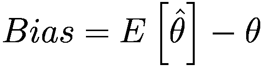

另一方面，模型的方差是参数*θ*的估计的变化性，当*θ*是标量时，可以表示为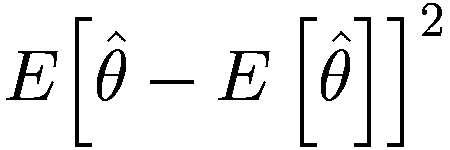。当*θ*是向量时，我们可以研究协方差矩阵来代替模型的方差，如下所示：

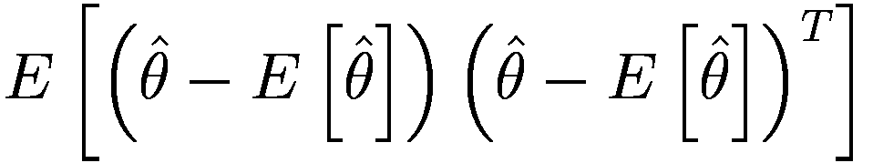

一般情况下，模型误差可以分为模型的方差和模型偏差的平方。为了证明这一点，让我们假设我们有一个只有一个参数的模型，其值为*θ*。我们估计模型的参数*θ*为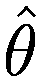。由于在不同的数据样本上训练会产生不同的，在这里是一个具有某些均值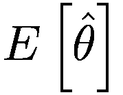和有限方差的随机变量。以下方差的期望值与*θ*之间的差值将给出我们的模型误差。

我们可以将上述表达式展开，如下所示：

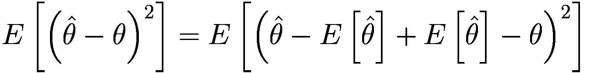

![$$ =E\left[{\left(\hat{\theta}-E\left[\hat{\theta}\right]\right)}²\right]+E\left[{\left(E\left[\hat{\theta}\right]-\theta \right)}²\right]+2\ E\left[\left(\hat{\theta}-E\left[\hat{\theta}\right]\right)\right]\left[E\left[\hat{\theta}\right]-\theta \right] $$](../images/448418_2_En_1_Chapter/448418_2_En_1_Chapter_TeX_Equij.png)

第一个项 ![$$ E\left[{\left(\hat{\theta}-E\left[\hat{\theta}\right]\right)}²\right] $$](../images/448418_2_En_1_Chapter/448418_2_En_1_Chapter_TeX_IEq96.png) 是模型的方差。第二个项中的所有内容都是常数，因此 ![$$ E\left[{\left(E\left[\hat{\theta}\right]-\theta \right)}²\right]={\left(E\left[\hat{\theta}\right]-\theta \right)}² $$](../images/448418_2_En_1_Chapter/448418_2_En_1_Chapter_TeX_IEq97.png)。仔细观察 ![$$ {\left(E\left[\hat{\theta}\right]-\theta \right)}² $$](../images/448418_2_En_1_Chapter/448418_2_En_1_Chapter_TeX_IEq98.png) 可以看出，![$$ {\left(E\left[\hat{\theta}\right]-\theta \right)}² $$](../images/448418_2_En_1_Chapter/448418_2_En_1_Chapter_TeX_IEq99.png) 是偏差的平方。在第三个项 ![$$ E\left[\left(\hat{\theta}-E\left[\hat{\theta}\right]\right)\right]\left[E\left[\hat{\theta}\right]-\theta \right] $$](../images/448418_2_En_1_Chapter/448418_2_En_1_Chapter_TeX_IEq100.png) 中，由于 ![$$ E\left[\hat{\theta}\right] $$](../images/448418_2_En_1_Chapter/448418_2_En_1_Chapter_TeX_IEq101.png) 和 *θ* 是常数，表达式简化为以下形式：

![$$ 2\ E\left[\left(\hat{\theta}-E\left[\hat{\theta}\right]\right)\right]\left[E\left[\hat{\theta}\right]-\theta \right]=2\ast \left[E\left[\hat{\theta}\right]-\theta \right]\ast E\left[\left(\hat{\theta}-E\left[\hat{\theta}\right]\right)\right] $$](../images/448418_2_En_1_Chapter/448418_2_En_1_Chapter_TeX_Equik.png)

由于  的均值是 ![$$ E\left[\hat{\theta}\right] $$](../images/448418_2_En_1_Chapter/448418_2_En_1_Chapter_TeX_IEq103.png)，因此 ![$$ E\left[\left(\hat{\theta}-E\left[\hat{\theta}\right]\right)\right]=0\. $$](../images/448418_2_En_1_Chapter/448418_2_En_1_Chapter_TeX_IEq104.png)

因此，我们可以看到模型误差是模型估计中方差和偏差的组合。所以，对于给定的模型误差，模型的方差和偏差的平方和保持不变——如果我们试图减少其中一个，另一个就会增加。

## 摘要

在本章中，我们已经涉及了进行机器学习和深度学习概念所需的所有数学概念。读者仍建议在空闲时间阅读与这些主题相关的适当教科书，以获得更清晰的了解。然而，本章是一个良好的起点。在下一章中，我们将从人工神经网络和 TensorFlow 的基础开始。
