# 2. 深度学习概念和 TensorFlow 简介

## 深度学习及其演变

深度学习是从 20 世纪 40 年代以来一直存在的人工神经网络演变而来的。神经网络是由称为人工神经元的处理单元组成的互联网络，它们松散地模拟了生物大脑中的轴突。在生物神经元中，树突接收来自各种邻近神经元的输入信号，通常超过 1000 个。这些修改后的信号随后传递到神经元的细胞体或胞体，在这些信号被汇总后，再传递到神经元的轴突。如果接收到的输入信号超过一个特定的阈值，轴突将释放一个信号，该信号将被传递到其他神经元的邻近树突。图 2-1 展示了生物神经元的结构以供参考。

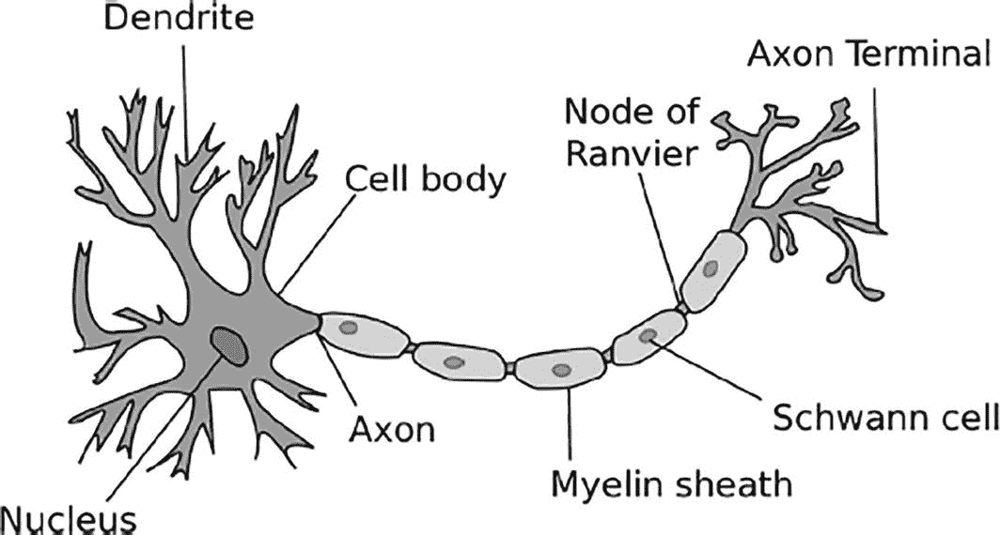

生物神经元的表示。轴突末端、施万细胞、树突、细胞体、轴突、细胞核、朗飞节和髓鞘被突出显示。

图 2-1

生物神经元的结构

人工神经元单元受到生物神经元的启发，为了方便起见进行了一些修改。与树突类似，神经元的输入连接携带来自其他邻近神经元的衰减或放大后的输入信号。这些信号被传递到神经元，在那里输入信号被汇总，然后根据接收到的总输入决定输出什么。例如，对于二元阈值神经元，当总输入超过预定义的阈值时，提供输出值 1；否则，输出保持在 0。人工神经网络中使用了多种其他类型的神经元，它们的实现仅与产生神经元输出的激活函数有关。在图 2-2 中，人工神经元中的不同生物等效物被标记出来，以便于类比和解释。

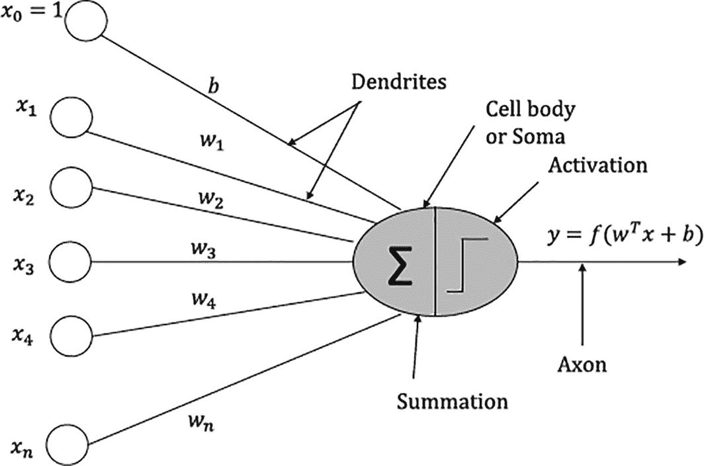

人工神经元的图像包括作为直线的树突、细胞体或胞体、汇总、激活和轴突。

图 2-2

人工神经元的结构

人工神经网络在 20 世纪 40 年代初充满了许多希望。我们将回顾人工神经网络社区中的重大事件的时间顺序，以了解这个学科多年来是如何发展的，以及在这个过程中面临了哪些挑战。

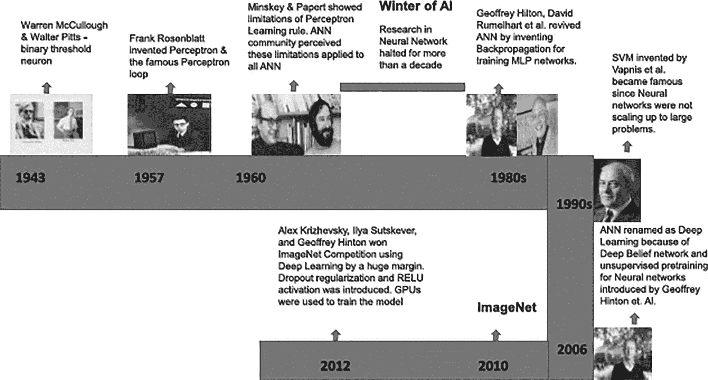

人工神经网络的发展在图中得到了展示。图中展示了科学家们的照片以及每个演变的年份。

图 2-3

人工神经网络的演变

+   两位电气工程师沃伦·麦克库洛奇和沃尔特·皮茨在 1943 年发表了一篇题为“神经活动内在思想的逻辑演算”的论文，与神经网络相关。该论文可在[`www.cs.cmu.edu/%E2%88%BCepxing/Class/10715/reading/McCulloch.and.Pitts.pdf`](http://www.cs.cmu.edu/%25E2%2588%25BCepxing/Class/10715/reading/McCulloch.and.Pitts.pdf)找到。他们的神经元具有二进制输出状态，神经元有两种输入：兴奋性输入和抑制性输入。所有兴奋性输入到神经元的权重都是正的。如果所有输入到神经元的都是兴奋性输入，并且如果总输入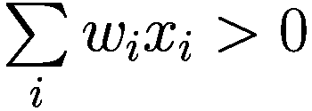，则神经元会输出 1。在抑制性输入中的任何一个活跃或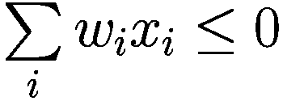的情况下，输出将是 0。使用这种逻辑，所有布尔逻辑函数都可以通过一个或多个这样的神经元实现。这些网络的缺点是它们没有通过训练学习权重的途径。必须手动确定权重并将神经元组合起来以实现所需的计算。

+   下一个重大突破是感知器，它由弗兰克·罗森布拉特在 1957 年发明。他和他的合作者亚历山大·斯蒂贝尔和罗伯特·H·沙茨在一份题为“感知器——一种感知和识别的自动机”的报告中记录了他们的发明，该报告可在[`blogs.umass.edu/brain-wars/files/2016/03/rosenblatt-1957.pdf`](https://blogs.umass.edu/brain-wars/files/2016/03/rosenblatt-1957.pdf)找到。感知器的构建目的是为了二元分类任务。通过感知器学习规则，可以训练神经元到权重和偏差。权重可以是正数也可以是负数。弗兰克·罗森布拉特对感知器模型的能力提出了强烈的声明。不幸的是，其中并非所有都是真实的。

+   马文·明斯基和西摩·A·帕佩特在 1969 年（麻省理工学院出版社）撰写了一本名为《感知器：计算几何导论》的书，展示了感知器学习算法即使在像使用单个感知器开发 XOR 布尔函数这样的简单任务上的局限性。人工神经网络社区的一部分人认为，明斯基和帕佩特展示的这些局限性适用于所有神经网络，因此人工神经网络的研究几乎停滞了十年，直到 20 世纪 80 年代。

+   在 20 世纪 80 年代，杰弗里·希尔顿、大卫·鲁梅尔哈特、罗纳德·威廉姆斯等人重新点燃了对人工神经网络的研究兴趣，这主要是因为多层问题学习的反向传播方法以及神经网络解决非线性分类问题的能力。

+   在 1990 年代，支持向量机（SVM），由 V. Vapnik 和 C. Cortes 发明，由于神经网络无法扩展到大型问题而变得流行。

+   人工神经网络在 2006 年被更名为深度学习，当时 Geoffrey Hinton 和其他人引入了无监督预训练和深度信念网络的想法。他们关于深度信念网络的工作发表在题为“Deep Belief Nets”的论文中。该论文可在[`www.cs.toronto.edu/`∼`hinton/absps/fastnc.pdf`](https://www.cs.toronto.edu/%25E2%2588%25BChinton/absps/fastnc.pdf)找到*.*。

+   ImageNet，一个大型标记图像集合，由斯坦福大学的一个团队在 2010 年创建并发布。

+   在 2012 年，Alex Krizhevsky、[Ilya Sutskever](http://www.cs.toronto.edu/%25E2%2588%25BCilya/) 和 Geoffrey Hinton 凭借 16% 的错误率赢得了 ImageNet 竞赛，而在这前两年，最佳模型的错误率分别约为 28% 和 26%。这是一个巨大的胜利差距。该解决方案的实施具有深度学习在今天的任何深度学习实现中都是标准的几个方面。

    +   图形处理单元（GPU）被用于训练模型。GPU 在执行矩阵运算方面非常出色，并且由于它们有成千上万的内核进行并行计算，因此在计算上非常快速。

    +   Dropout 被用作正则化技术以减少过拟合。

    +   矩形线性单元（ReLU）被用作隐藏层的激活函数。

图 2-3 展示了人工神经网络向深度学习的演变。ANN 代表人工神经网络，MLP 代表多层感知器，AI 代表人工智能。

## 感知器和感知器学习算法

尽管感知器学习算法的功能有限，但它们是今天我们看到的高级深度学习技术的先驱。因此，对感知器和感知器学习算法进行详细研究是值得的。感知器是使用超平面来分隔两个类别的线性二元分类器。只要存在这样的可行权重和偏置集，感知器学习算法就能保证找到一组权重和偏置，以正确分类所有输入。

感知器是一种线性分类器，正如我们在第一章节中看到的，线性分类器通常通过构建一个超平面来区分正类和负类，从而进行二元分类。

超平面由一个单位权重向量 *w*′ ∈ R^(n × 1) 表示，该向量垂直于超平面，以及一个偏置项 *b*，它决定了超平面与原点的距离。向量 *w*′ ∈ R^(n × 1) 被选择指向正类。

如图 2-4 所示，对于任何输入向量 *x*′ ∈ *R*^(*n* × 1)，与单位向量 *w*′ 的负值的点积将给出超平面到原点的距离 *b*，因为 *x*′ 和 *w*′ 在原点的对面。形式上，对于位于超平面上的点，

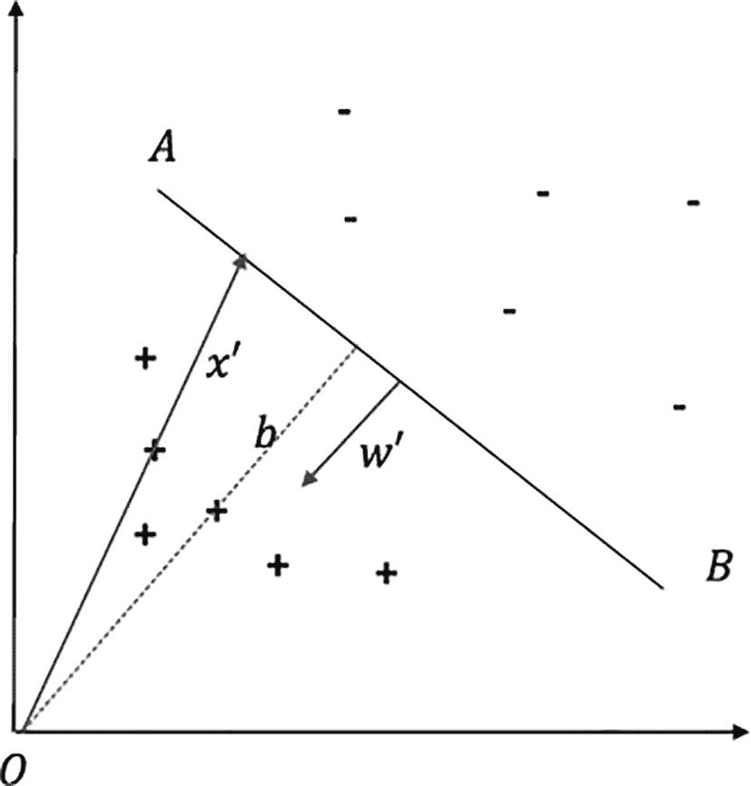

正负图都显示在图表上。从两个图的交点绘制超平面可以分离它们。

图 2-4

分隔两个类的超平面

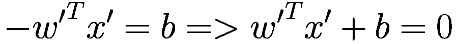

同样，对于位于超平面下的点，即属于正类的输入向量 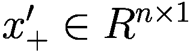，在 w′ 上的投影的负值应该小于 *b*。因此，对于属于正类的点，

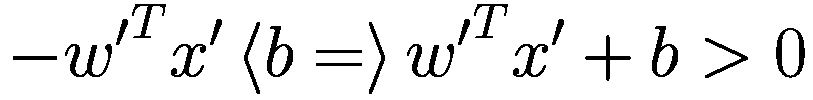

同样，对于位于超平面上的点，即属于负类的输入向量 ，在 w′ 上的投影的负值应该大于 *b*。因此，对于属于负类的点，

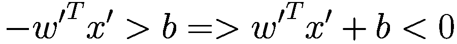

总结前面的推导，我们可以得出以下结论：

+   *w*′^(*T*)*x*′ + *b* = 0 对应于超平面，并且所有位于超平面上的 *x*′ ∈ *R*^(*n* × 1) 都将满足这个条件。通常，位于超平面上的点被认为是属于负类的。

+   *w*′*T**x*′ + *b* > 0 对应于正类中的所有点。

+   *w*′^(*T*)*x*′ + *b* ≤ 0 对应于负类中的所有点。

然而，对于感知机，我们并不将权重向量 *w*′ 保持为单位向量，而是将其保持为任何一般向量。在这种情况下，偏置 *b* 不会对应于超平面到原点的距离，而将是对原点距离的缩放版本，缩放因子是向量 *w*′ 的模或 *l*² 范数，即 *||w′||*[2]。简而言之，如果 *w*′ 是任何与超平面垂直且指向正类的通用向量，那么 *w*′^(*T*)*x* + *b* = 0 仍然代表一个超平面，其中 *b* 代表超平面到原点的距离乘以 *w*′ 的大小。

在机器学习领域，任务是学习超平面的参数（即 *w*′ 和 *b*）。我们通常倾向于简化问题，以消除偏差项，并将其作为参数包含在 *w* 中，对应于我们之前在第一章节中讨论的常数输入特征 1。

在添加偏差后，新的参数向量为 *w* ∈ *R*^((*n* + 1) × 1)，添加常数项 1 后的新输入特征向量为 *x* ∈ *R*^((*n* + 1) × 1)，其中

![x^{\prime }={\left[{x}_1\ {x}_2{x}_3..\kern0.5em {x}_n\right]}^T](../images/448418_2_En_2_Chapter/448418_2_En_2_Chapter_TeX_Equd.png)

![x={\left[1\ {x}_1\ {x}_2{x}_3..\kern0.5em {x}_n\right]}^T](../images/448418_2_En_2_Chapter/448418_2_En_2_Chapter_TeX_Eque.png)

![w^{\hbox{'}}={\left[{w}_1\ {w}_2{w}_3..\kern0.5em {w}_n\right]}^T](../images/448418_2_En_2_Chapter/448418_2_En_2_Chapter_TeX_Equf.png)

![w={\left[b\ {w}_1\ {w}_2{w}_3..\kern0.5em {w}_n\right]}^T](../images/448418_2_En_2_Chapter/448418_2_En_2_Chapter_TeX_Equg.png)

通过进行上述操作，我们使 *R*^(*n*) 中的超平面在原点处通过原点，在 *R*^((*n* + 1)) 向量空间中。现在超平面仅由其权重参数向量 *w* ∈ *R*^((*n* + 1) × 1) 决定，分类规则简化如下：

+   *w*^(*T*)*x* = 0 对应于超平面，并且所有位于超平面上的 *x* ∈ *R*^((*n* + 1) × 1) 都将满足这个条件。

+   *w*^(*T*)*x* > 0 对应于正类中的所有点。这意味着分类现在完全由向量 *w* 和 *x* 之间的角度决定。如果输入向量 *x* 与权重参数向量 *w* 之间的角度在 -90 度到 +90 度之间，则输出类别为正。

+   *w*^(*T*)*x* ≤ 0 对应于负类中的点。不同分类算法中对等式条件有不同的处理方式。对于感知器，超平面上的点被视为属于负类。

现在我们已经拥有了进行感知器学习算法所需的一切。

让 *x*^((*i*)) ∈ *R*^((*n* + 1) × 1) ∀ *i* ∈ {1, 2, …*m*} 表示 *m* 个输入特征向量，*y*^((*i*)) ∈ {0, 1} ∀ *i* = {1, 2, …., *m*} 表示相应的类别标签。

感知器学习问题如下：

+   第 1 步：从一个随机的权重集 *w* ∈ *R*^((*n* + 1) × 1) 开始。

+   第 2 步：评估数据点的预测类别。对于输入数据点 *x*^((*i*))，如果 *w*^(*T*)*x*^((*i*)) > 0，则预测类别 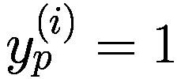，否则 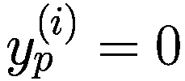。对于感知器分类器，超平面上的点通常被认为是属于负类。

+   第 3 步：按照以下方式更新权重向量 *w*：

+   如果 *y*[*p*]^((*i*)) = 0 且实际类别 *y*^((*i*)) = 1，则更新权重向量为 *w* = *w* + *x*^((*i*)).

+   如果 *y*[*p*]^((*i*)) = 1 且实际类别 *y*^((*i*)) = 0，则更新权重向量为 *w* = *w* - *x*^((*i*)).

+   如果 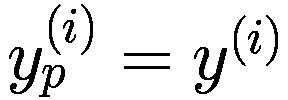 不需要更新 *w*。

+   第 4 步：回到第 2 步并处理下一个数据点。

+   第 5 步：当所有数据点都被正确分类时停止。

如果存在一个可行权重向量 *w* 可以线性分离两个类，则感知机才能正确分类两个类。在这种情况下，感知机收敛定理保证了收敛。

### 感知机学习的几何解释

感知机学习的几何解释有助于阐明表示正负类分离超平面的可行权重向量 *w*。

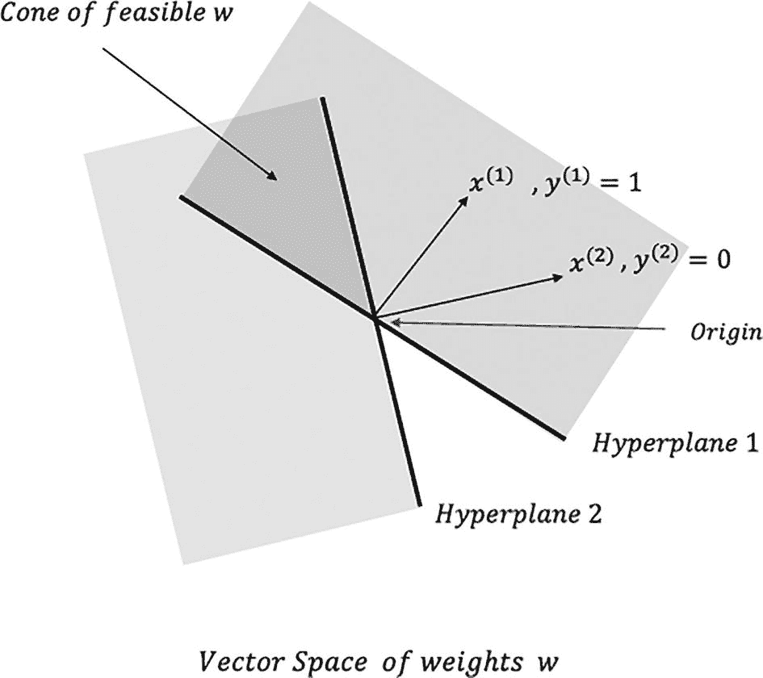

超平面一和二在图像中表现为它们在原点相交，形成可行锥体。

图 2-5

权重空间中的超平面和权重向量的可行集

让我们取两个数据点，(*x*^((1)), *y*^((1))) 和 (*x*^((2)), *y*^((2)))，如图 2-5 所示。进一步，让 *x*^((*i*)) ∈ ℝ^(3 × 1) *x*^((*I*)) ∈ *R*^(3 × 1) 包含截距项的常数特征 1。此外，取 *y*^((1)) = 1 和 *y*^((2)) = 0（即数据点 1 属于正类，而数据点 2 属于负类）。

在输入特征向量空间中，权重向量确定超平面。同样，我们需要考虑单个输入向量作为权重空间中代表超平面的代表，以确定正确分类数据点的可行权重向量集。

在图 2-5 中，超平面 1 由输入向量 *x*^((1)) 确定，该向量垂直于超平面 1。此外，由于偏差项已被消耗为权重向量 *w* 中的参数，该超平面通过原点。对于第一个数据点，*y*^((1)) = 1。如果 *w*^(*T*)*x*^((1)) > 0，则对第一个数据点的预测将是正确的。所有与输入向量 *x*^((1)) 形成角度在-90 到+90 度之间的权重向量 *w* 都将满足条件 *w*^(*T*)*x*^((1)) > 0。它们构成了第一个数据点的可行权重向量集，如图 2-5 中超平面 1 上方的阴影区域所示。

同样，超平面 2 由输入向量 *x*^((2)) 确定，该向量垂直于超平面 2。对于第二个数据点，*y*^((2)) = 0。如果对于第二个数据点的预测 *w*^(*T*)*x*^((2)) ≤ 0，则预测是正确的。所有与输入向量 *x*^((2)) 形成角度在-90 到+90 度之间的权重向量 *w* 都会满足条件 *w*^(*T*)*x*^((2)) ≤ 0。它们构成了第二个数据点的权重向量可行集，如图 2-5 中超平面 2 下方的阴影区域所示。

因此，满足两个数据点的权重向量 *w* 集合是两个阴影区域的交集区域。任何位于交集区域的权重向量 *w* 都能够通过它们在输入向量空间中定义的超平面线性分离两个数据点。

### 感知器学习的局限性

感知器学习规则只能在输入空间中线性可分的情况下分离类别。即使是基本的异或门逻辑也无法通过感知器学习规则实现。

对于异或逻辑，以下为输入及其对应的输出标签或类别：

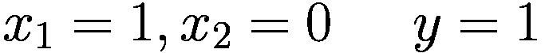

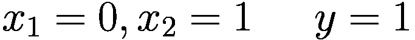

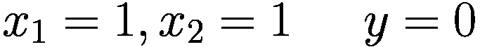

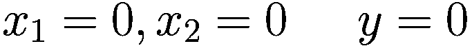

让我们初始化权重向量 *w* → [ 0 0 0]^(*T*)，其中权重向量的第一个分量对应于偏置项。同样，所有输入向量的第一个分量都为 1。

+   对于 *x*[1] = 1, *x*[2] = 0, *y* = 1，预测是 ![$$ {\textrm{w}}^Tx=\left[0\ 0\ 0\right]\left[\begin{array}{c}1\\ {}1\\ {}0\end{array}\right] $$](../images/448418_2_En_2_Chapter/448418_2_En_2_Chapter_TeX_IEq10.png) = 0。由于 w^(*T*)*x* = 0，数据点会被分类为 0，这与实际类别 1 不符。因此，根据感知器规则更新的权重向量应该是 ![$$ w\to w+x=\left[\begin{array}{c}0\\ {}0\\ {}0\end{array}\right]+\left[\begin{array}{c}1\\ {}1\\ {}0\end{array}\right]=\left[\begin{array}{c}1\\ {}1\\ {}0\end{array}\right] $$](../images/448418_2_En_2_Chapter/448418_2_En_2_Chapter_TeX_IEq11.png).

+   对于 *x*[1] = 0, *x*[2] = 1, *y* = 1，预测是 ![$$ {\textrm{w}}^Tx=\left[1\ 1\ 0\right]\left[\begin{array}{c}1\\ {}0\\ {}1\end{array}\right] $$](../images/448418_2_En_2_Chapter/448418_2_En_2_Chapter_TeX_IEq12.png) = 1。由于 w^(*T*)*x* = 1 > 0，数据点会被正确分类为 1。因此，权重向量不会有更新，并保持在 ![$$ \left[\begin{array}{c}1\\ {}1\\ {}0\end{array}\right] $$](../images/448418_2_En_2_Chapter/448418_2_En_2_Chapter_TeX_IEq13.png)

+   对于 *x*[1] = 1, *x*[2] = 1, *y* = 0，预测为 ![$$ {\textrm{w}}^Tx=\left[1\ 1\ 0\right]\left[\begin{array}{c}1\\ {}1\\ {}1\end{array}\right] $$](../images/448418_2_En_2_Chapter/448418_2_En_2_Chapter_TeX_IEq14.png) = 2。由于 w^(*T*)*x* = 2，数据点将被分类为 1，这与实际类别 0 不符。因此，更新的权重向量应该是 ![$$ w\to w-x=\left[\begin{array}{c}1\\ {}1\\ {}0\end{array}\right]-\left[\begin{array}{c}1\\ {}1\\ {}1\end{array}\right]=\left[\begin{array}{c}0\\ {}0\\ {}-1\end{array}\right] $$](../images/448418_2_En_2_Chapter/448418_2_En_2_Chapter_TeX_IEq15.png)。

+   对于 *x*[1] = 0, *x*[2] = 0, *y* = 0，预测为 ![$$ {\textrm{w}}^Tx=\left[0\ 0-1\right]\left[\begin{array}{c}1\\ {}0\\ {}0\end{array}\right] $$](../images/448418_2_En_2_Chapter/448418_2_En_2_Chapter_TeX_IEq16.png) = 0。由于 w^(*T*)*x* = 0，数据点将被正确分类为 0。因此，权重向量 *w* 将不会更新。

因此，在第一次遍历数据点后的权重向量为 *w* = [0 0 − 1]^(*T*). 基于更新的权重向量 *w*，让我们评估这些点被分类得有多好。

+   对于数据点 1，![$$ {\textrm{w}}^Tx=\left[0\ 0-1\right]\left[\begin{array}{c}1\\ {}1\\ {}0\end{array}\right]=0 $$](../images/448418_2_En_2_Chapter/448418_2_En_2_Chapter_TeX_IEq17.png)，因此它被错误地分类为类别 0。

+   对于数据点 2，![$$ {\textrm{w}}^Tx=\left[0\ 0-1\right]\left[\begin{array}{c}1\\ {}0\\ {}1\end{array}\right]=-1 $$](../images/448418_2_En_2_Chapter/448418_2_En_2_Chapter_TeX_IEq18.png)，因此它被错误地分类为类别 0。

+   对于数据点 3，![$$ {\textrm{w}}^Tx=\left[0\ 0-1\right]\left[\begin{array}{c}1\\ {}1\\ {}1\end{array}\right]=-1 $$](../images/448418_2_En_2_Chapter/448418_2_En_2_Chapter_TeX_IEq19.png)，因此它被正确地分类为类别 0。

+   对于数据点 4，![$$ {\textrm{w}}^Tx=\left[0\ 0-1\right]\left[\begin{array}{c}1\\ {}0\\ {}0\end{array}\right]=0 $$](../images/448418_2_En_2_Chapter/448418_2_En_2_Chapter_TeX_IEq20.png)，因此它被正确地分类为类别 0。

根据前面的分类，我们看到在第一次迭代后，感知机算法成功地将负类正确分类。如果我们再次在数据点上应用感知机学习规则，第二次遍历中权重向量 *w* 的更新如下：

+   对于数据点 1，![$$ {\textrm{w}}^Tx=\left[0\ 0-1\right]\left[\begin{array}{c}1\\ {}1\\ {}0\end{array}\right]=0 $$](../images/448418_2_En_2_Chapter/448418_2_En_2_Chapter_TeX_IEq21.png) 因此它被错误地分类为类别 0。因此，根据感知机规则更新的权重为 ![$$ w\to w+x=\kern0.5em \left[\begin{array}{c}0\\ {}0\\ {}-1\end{array}\right]+\left[\begin{array}{c}1\\ {}1\\ {}0\end{array}\right]=\left[\begin{array}{c}1\\ {}1\\ {}-1\end{array}\right] $$](../images/448418_2_En_2_Chapter/448418_2_En_2_Chapter_TeX_IEq22.png)。

+   对于数据点 2，![$$ {\textrm{w}}^Tx=\left[1\ 1-1\right]\left[\begin{array}{c}1\\ {}0\\ {}1\end{array}\right]=0 $$](../images/448418_2_En_2_Chapter/448418_2_En_2_Chapter_TeX_IEq23.png)，因此它被错误地分类为类别 0。因此，根据感知机规则更新的权重为 ![$$ w\to w+x=\kern0.5em \left[\begin{array}{c}1\\ {}1\\ {}-1\end{array}\right]+\left[\begin{array}{c}1\\ {}0\\ {}1\end{array}\right]=\left[\begin{array}{c}2\\ {}1\\ {}0\end{array}\right] $$](../images/448418_2_En_2_Chapter/448418_2_En_2_Chapter_TeX_IEq24.png)。

+   对于数据点 3，![$$ {\textrm{w}}^Tx=\left[2\ 10\right]\left[\begin{array}{c}1\\ {}1\\ {}1\end{array}\right]=3 $$](../images/448418_2_En_2_Chapter/448418_2_En_2_Chapter_TeX_IEq25.png)，因此它被错误地分类为类别 1。因此，根据感知机规则更新的权重为 ![$$ w\to w-x=\kern0.5em \left[\begin{array}{c}2\\ {}1\\ {}0\end{array}\right]-\left[\begin{array}{c}1\\ {}1\\ {}1\end{array}\right]=\left[\begin{array}{c}1\\ {}0\\ {}-1\end{array}\right] $$](../images/448418_2_En_2_Chapter/448418_2_En_2_Chapter_TeX_IEq26.png)。

+   对于数据点 4，![$$ {\textrm{w}}^Tx=\left[1\ 0-1\right]\left[\begin{array}{c}1\\ {}0\\ {}0\end{array}\right]=1 $$](../images/448418_2_En_2_Chapter/448418_2_En_2_Chapter_TeX_IEq27.png)，因此它被错误地分类为类别 1。因此，根据感知机规则更新的权重为 ![$$ w\to w-x=\kern0.5em \left[\begin{array}{c}1\\ {}0\\ {}-1\end{array}\right]-\left[\begin{array}{c}1\\ {}0\\ {}0\end{array}\right]=\left[\begin{array}{c}0\\ {}0\\ {}-1\end{array}\right] $$](../images/448418_2_En_2_Chapter/448418_2_En_2_Chapter_TeX_IEq28.png)。

第二次遍历后的权重向量为 [0 0 − 1]^(*T*)，这与第一次遍历后的权重向量相同。从感知机学习第一次和第二次遍历期间做出的观察来看，很明显，无论我们对数据点进行多少次遍历，我们最终都会得到权重向量 [0 0 − 1]^(*T*)。正如我们之前所看到的，这个权重向量只能正确分类负类，因此我们可以安全地推断，在一般情况下，感知机算法将始终无法模拟 XOR 逻辑。

### 非线性的需求

正如我们所见，感知机算法只能学习线性决策边界进行分类，因此不能解决决策边界非线性是必需的问题。通过 XOR 问题的说明，我们看到了感知机无法正确地线性分离两个类别。

我们需要两个超平面来分离两个类，如图 2-6 所示，而通过感知器算法学习的一个超平面不足以提供所需的分类。在图 2-6 中，两个超平面线之间的数据点属于正类，而其他两个数据点属于负类。需要两个超平面来分离两个类相当于拥有一个非线性分类器。

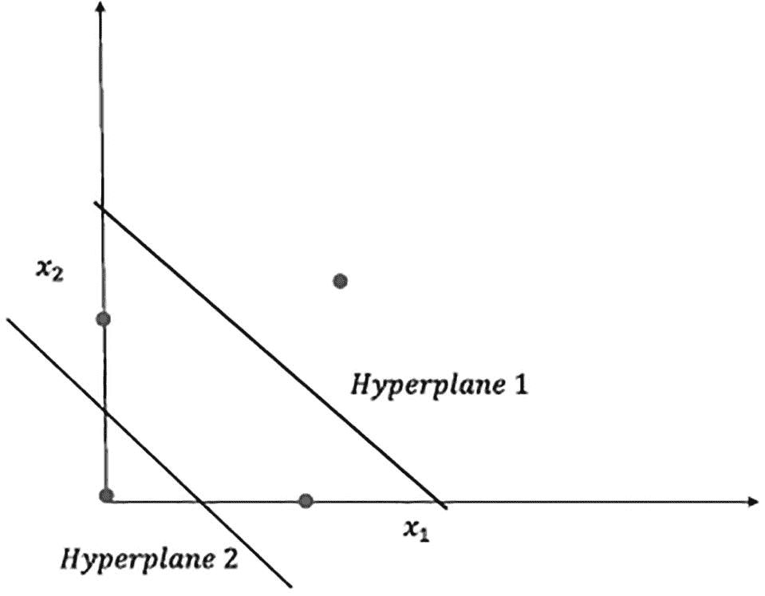

超平面一和二，表示为平行线，显示在 XOR 问题的图表中。

图 2-6

使用两个超平面分离两个类的 XOR 问题

多层感知器（MLP）可以通过在隐藏层中引入非线性来实现类之间的非线性分离。请注意，当感知器根据接收到的总输入输出 0 或 1 时，输出是其输入的非线性函数。在学习多层感知器的权重过程中所说的和所做的一切都不可能通过感知器学习规则来实现。

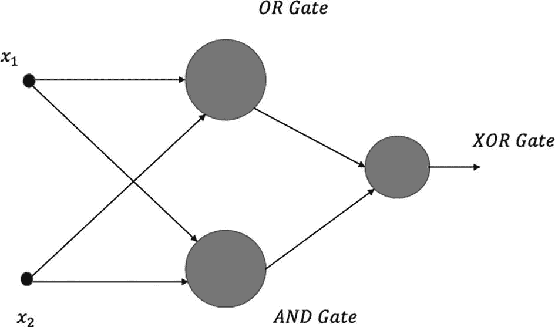

XOR 逻辑实现图像。AND 门、XOR 门和 OR 门是图像中的三个节点。

图 2-7

使用多层感知器网络实现 XOR 逻辑

在图 2-7 中，XOR 逻辑通过多层感知器网络实现。如果我们有一个包含两个感知器的隐藏层，其中一个能够执行 OR 逻辑，而另一个能够执行 AND 逻辑，那么整个网络就能够实现 XOR 逻辑。OR 和 AND 逻辑的感知器可以使用感知器学习规则进行训练。然而，整个网络不能通过感知器学习规则进行训练。如果我们观察 XOR 门的最终输入，它将是其输入的非线性函数，以产生非线性决策边界。

### 隐藏层感知器的非线性激活函数

如果我们将隐藏层的激活函数设为线性，那么最终神经元的输出将是线性的，因此我们将无法学习任何非线性决策边界。为了说明这一点，让我们尝试通过具有线性激活函数的隐藏层单元来实现 XOR 函数。

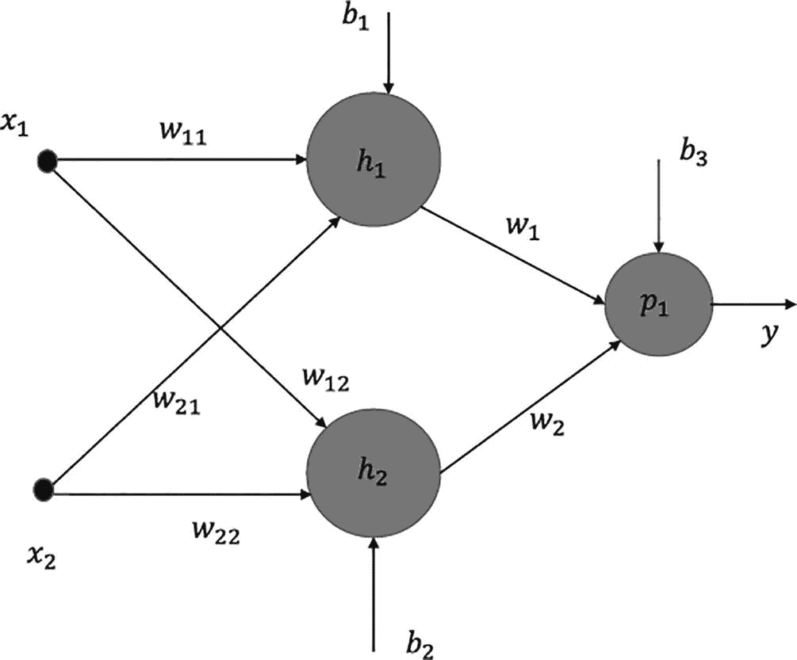

线性输出隐藏层的示意图。节点 h 1、h 2 和 h 3 分别由箭头 b 1、b 2 和 b 3 指示。

图 2-8

两层感知器网络中的线性输出隐藏层

图 2-8 显示了一个具有一个隐藏层的两层感知器网络。隐藏层由两个神经元单元组成。我们观察当隐藏单元的激活是线性时的网络整体输出：

隐藏单元 *h*[1] = *w*[11]*x*[1] + *w*[21]*x*[2] + *b*[1]

隐藏单元 *h*[2] 的输出 = *w*[12]*x*[1] + *w*[22]*x*[2] + *b*[2]

输出单元 *p*[1] 的输出 = *w*1 + *w*2 + *b*[3]

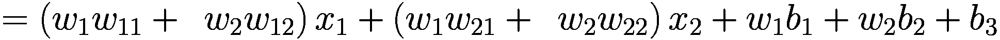

如前所述，网络的最终输出，即单元 *p*[1] 的输出，是其输入的线性函数，因此网络不能在类别之间产生非线性分离。

如果隐藏层产生的不是线性输出，而是引入一个表示为 *f*(*x*) = 1/(1 + *e*^(−*x*)) 的激活函数，那么隐藏单元的输出 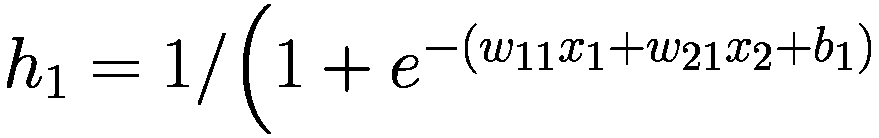)。

同样，隐藏单元的输出 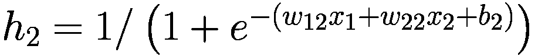。

输出单元的输出 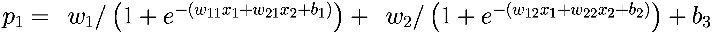。

显然，前面的输出在其输入上是非线性的，因此可以学习更复杂的非线性决策边界，而不是使用线性超平面进行分类问题。隐藏层的激活函数称为 Sigmoid 函数，我们将在后续章节中更详细地讨论它。

### 神经元/感知器的不同激活函数

神经单元有几种激活函数，它们的使用取决于具体问题和神经网络的拓扑结构。在本节中，我们将讨论今天在人工神经网络中使用的所有相关激活函数。

#### 线性激活函数

在线性神经元中，输出与其输入线性相关。如果神经元接收三个输入 *x*[1]、*x*[2] 和 *x*[3]，那么线性神经元的输出 *y* 由 *y* = *w*[1]*x*[1] + *w*[2]*x*[2] + *w*[3]*x*[3] + *b* 给出，其中 *w*[1]、*w*[2] 和 *w*[3] 分别是输入 *x*[1]、*x*[2] 和 *x*[3] 的突触权重，而 *b* 是神经元单元的偏置。

在向量表示法中，我们可以表示输出 *y* = *w*^(*T*)*x* + *b*。

如果我们取 *w*^(*T*)*x* + *b* = *z*，那么相对于网络输入 *z* 的输出将如图 2-9 所示。

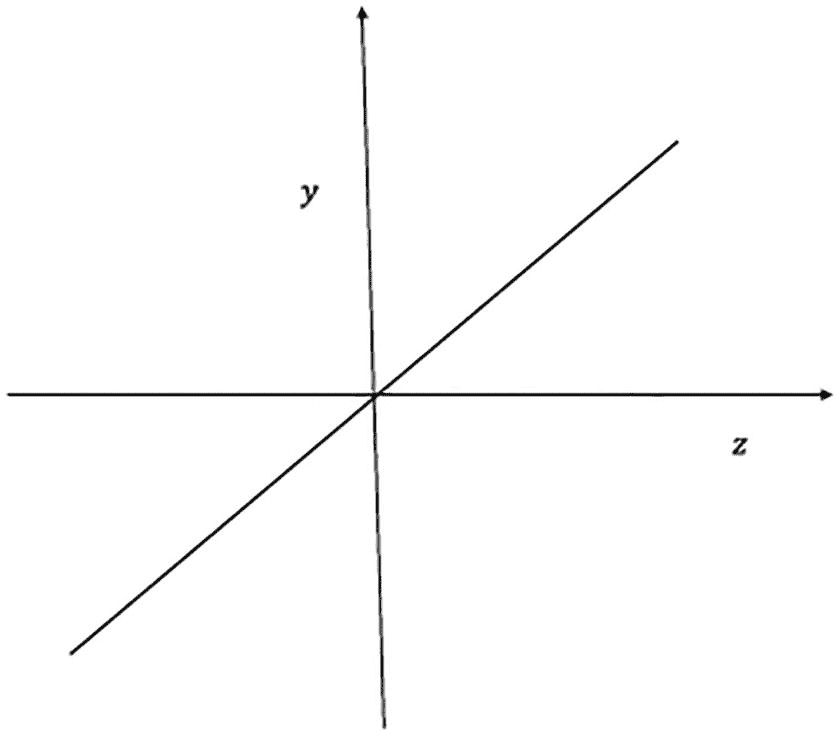

两层感知器网络的图像。水平线表示 z 轴，垂直线表示 y 轴，对角线穿过 z 轴和 y 轴交汇的点。

图 2-9

两层感知器网络中的线性输出隐藏层

#### 二进制阈值激活函数

在二进制阈值神经元（见图 2-10）中，如果神经元的净输入超过一个指定的阈值，那么神经元就会被激活；即输出 1，否则输出 0。如果神经元的净线性输入是 *z* = *w*^(*T*)*x* + *b*，而 *k* 是神经元激活的阈值，那么

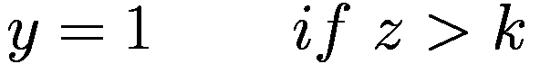

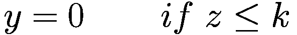

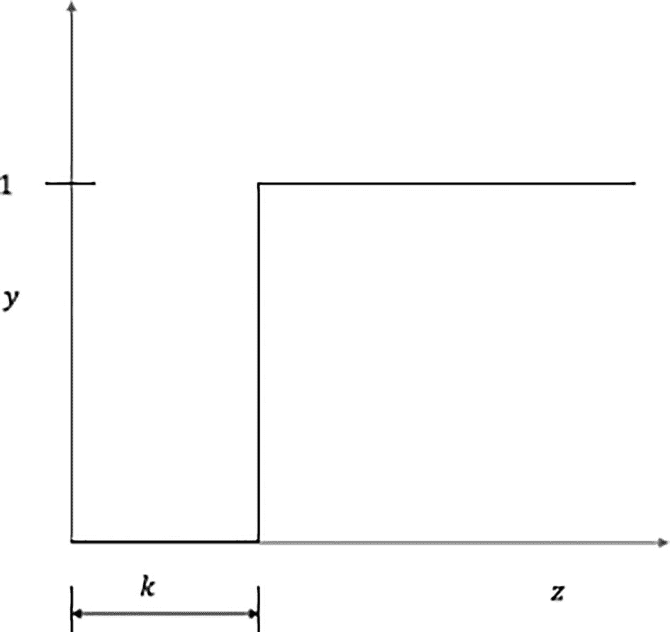

二进制阈值神经元的图像。z 轴的图示距离原点的距离被提及为 k。

图 2-10

二进制阈值神经元

通常，通过调整偏置，将二进制阈值神经元调整到在阈值 0 处激活。当 *w*^(*T*)*x* + *b* > *k* => *w*^(*T*)*x* + (*b* − *k*) > 0 时，神经元被激活。

#### Sigmoid 激活函数

Sigmoid 神经元的输入-输出关系表示如下：

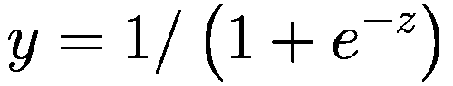

其中 *z* = *w*^(*T*)*x* + *b* 是 *sigmoid* 激活函数的净输入。

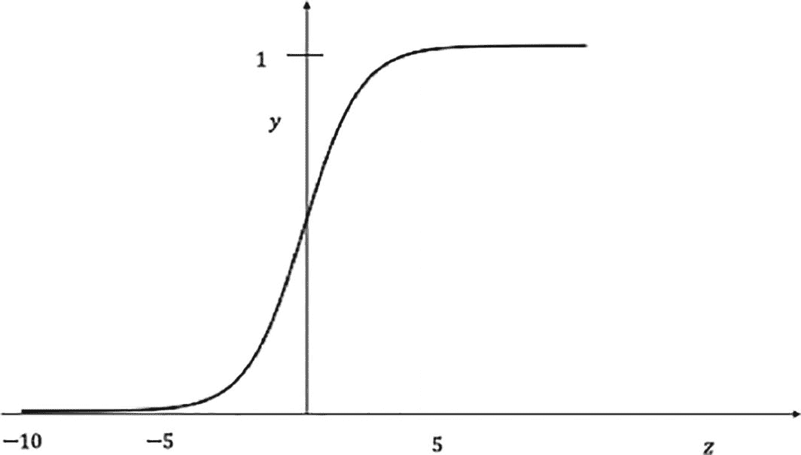

Sigmoid 激活函数的图像。图表上显示的是一条线性曲线图，y 轴上的读数为 1。

图 2-11

Sigmoid 激活函数

+   当 sigmoid 函数的净输入 *z* 为一个正的大数 *e*^(−*z*) ➤ 0，因此 *y* ➤ 1。

+   当 sigmoid 的净输入 *z* 为一个负的大数 *e*^(−*z*) ➤ ∞，因此 *y* ➤ 0。

+   当 sigmoid 函数的净输入 *z* 为 0 时，则 *e*^(−*z*) = 1，因此 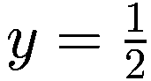。

图 2-11 展示了 sigmoid 激活函数的输入-输出关系。具有 sigmoid 激活函数的神经元的输出非常平滑，并且给出很好的连续导数，这在训练神经网络时效果很好。sigmoid 激活函数的输出范围在 0 到 1 之间。由于其能够在 0 到 1 的范围内提供连续值，sigmoid 函数通常用于输出关于给定类别的概率，用于二进制分类。隐藏层中的 sigmoid 激活函数引入非线性，使得模型能够学习更复杂的特点。

#### SoftMax 激活函数

SoftMax 激活函数是 Sigmoid 函数的推广，最适合多分类问题。如果有 k 个输出类别，第 i 个类别的权重向量为 w(i)，那么给定输入向量*x* ∈ ℝ^(*n* × 1)的第 i 个类别的预测概率如下：

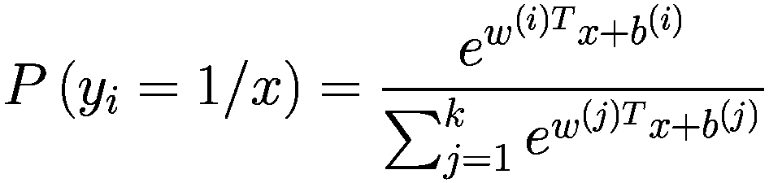

其中 b(i)是 SoftMax 每个输出单元的偏差项。

让我们尝试看看 Sigmoid 函数和二分类 SoftMax 函数之间的联系。

假设有两个类别 y1 和 y2，它们对应的权重向量分别为 w(1)和 w(2)。同时，它们的偏差分别为 b(1)和 b(2)。假设对应于*y*[1] = 1 的类别是正类。

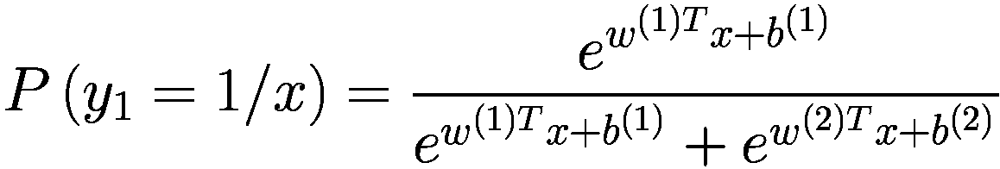

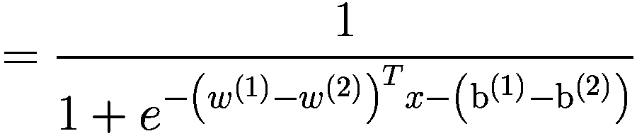

从前面的表达式中我们可以看出，二分类 SoftMax 的正类概率与 Sigmoid 激活函数的表达式相同，唯一的区别在于 Sigmoid 中我们只使用一组权重，而在二分类 SoftMax 中，有两组权重。在 Sigmoid 激活函数中，我们不会为两个不同的类别使用不同的权重集，通常选取的权重集是正类相对于负类的权重。在 SoftMax 激活函数中，我们明确地为不同的类别使用不同的权重集。

软 Max 层的损失函数，如图 2-12 所示，被称为分类交叉熵，其表达式如下：

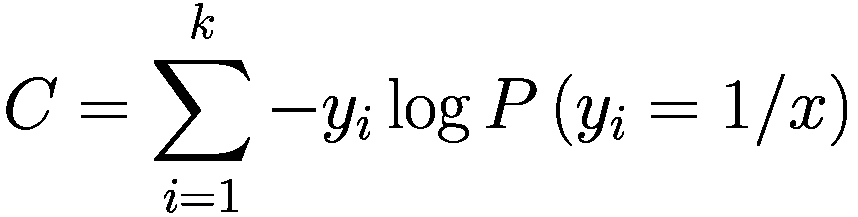

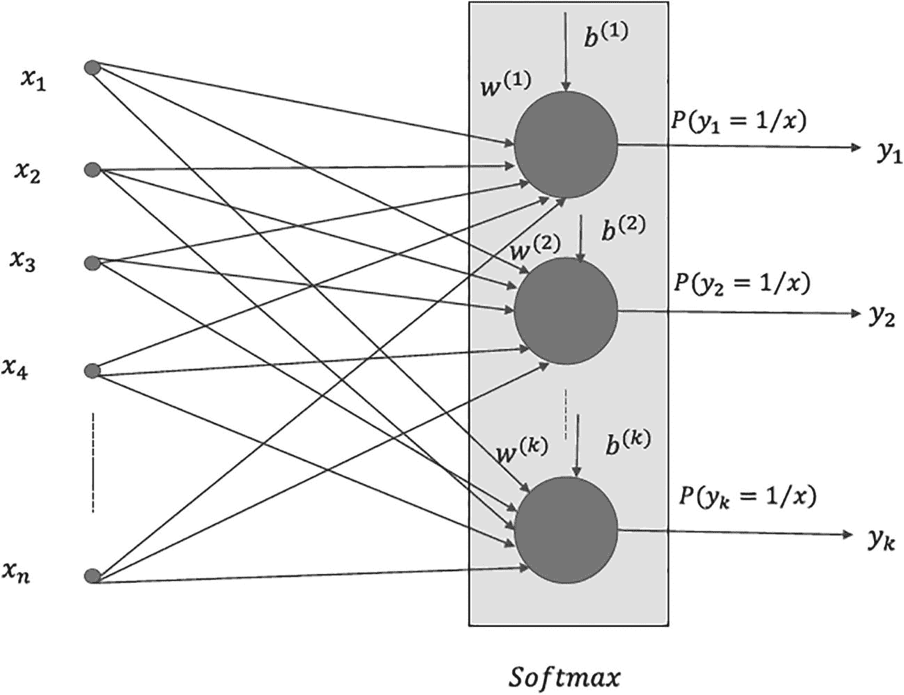

该图像表示 Softmax 激活函数。在图中，矩形垂直方框有三个节点 w，分别为 1、2 和 K。

图 2-12

SoftMax 激活函数

#### 线性整流单元（ReLU）激活函数

在一个 ReLU 单元中，如图 2-13 所示，如果整体输入大于 0，则输出等于神经元的净输入；然而，如果整体输入小于或等于 0，则神经元输出 0。

一个 ReLU 单元的输出可以表示如下：

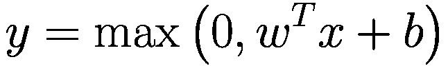

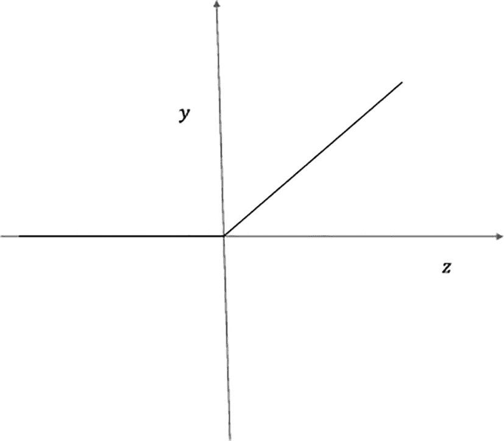

矩形线性单元的图像。从原点出发的第一象限中，画了一条对角线。

图 2-13

矩形线性单元

ReLU 是深度学习革命性的关键元素之一。它们更容易计算。ReLU 结合了两者之长——它们具有恒定的梯度，而净输入为正时其他地方的梯度为零。如果我们以 sigmoid 激活函数为例，对于非常大的正负值，其梯度几乎为零，因此神经网络可能会遭受梯度消失问题。对于正净输入的恒定梯度确保梯度下降算法不会因为梯度消失而停止学习。同时，非正净输入的零输出提供了非线性。

矩形线性单元激活函数有几个版本，如参数化矩形线性单元（PReLU）和漏矩形线性单元。

对于正常的 ReLU 激活函数，对于非正输入值，输出和梯度为零，因此训练可能会因为零梯度而停止。为了使模型即使在输入为负时也有非零梯度，PReLU 可能是有用的。PReLU 激活函数的输入-输出关系如下：

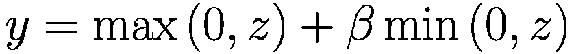

其中 *z* = *w*^(*T*)*x* + *b* 是 PReLU 激活函数的净输入，而 *β* 是通过训练学习到的参数。

当 *β* 设置为 -1 时，则 *y* = |*z*|，激活函数被称为绝对值 ReLU。当 *β* 设置为一些小的正数值，通常约为 0.01 时，则激活函数被称为漏 ReLU。

#### Tanh 激活函数

tanh 激活函数的输入-输出关系（见图 2-14）表示如下：

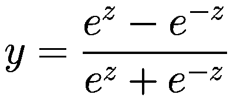

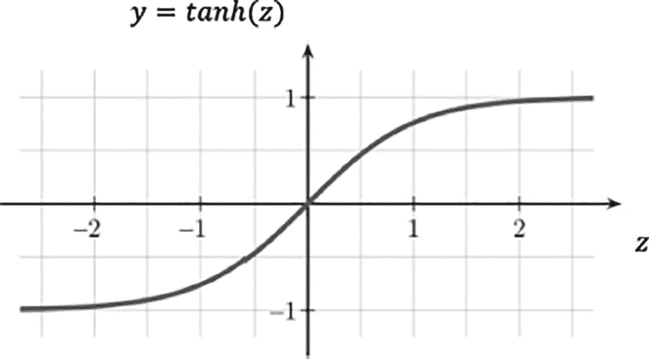

tan h 激活函数的图像。图中提到了 y 等于 z 的 tan h 的方程。

图 2-14

Tanh 激活函数

其中 *z* = *w*^(*T*)*x* + *b* 是 tanh 激活函数的净输入。

+   当网络输入 *z* 是一个正的大数 *e*^(−*z*) ➤ 0，因此 *y* ➤ 1。

+   当网络输入 *z* 是一个负的大数 *e*^(*z*) ➤ 0，因此 *y* ➤ -1。

+   当网络输入 *z* 为 0 时，则 *e*^(−*z*) = 1，因此 *y* = 0。

如我们所见，tanh 激活函数可以输出介于 -1 和 +1 之间的值。

sigmoid 激活函数在输出约为 0 时饱和。在训练网络时，如果层的输出接近零，梯度消失，训练停止。tanh 激活函数在输出为-1 和+1 时饱和，并且在输出约为 0 时具有定义良好的梯度。因此，使用 tanh 激活函数可以避免输出 0 附近的梯度消失问题。

#### SoftPlus 激活函数

SoftPlus 激活函数在输入 z 上的定义如下：

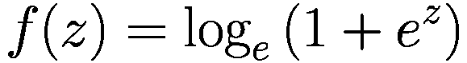

很容易看出，激活函数相对于输入的梯度不过是输入上的 sigmoid 激活，如下所示：

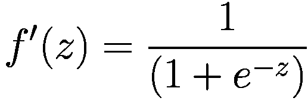

SoftPlus 激活函数可以看作是 ReLU 函数的平滑近似，如图 2-15 所示。

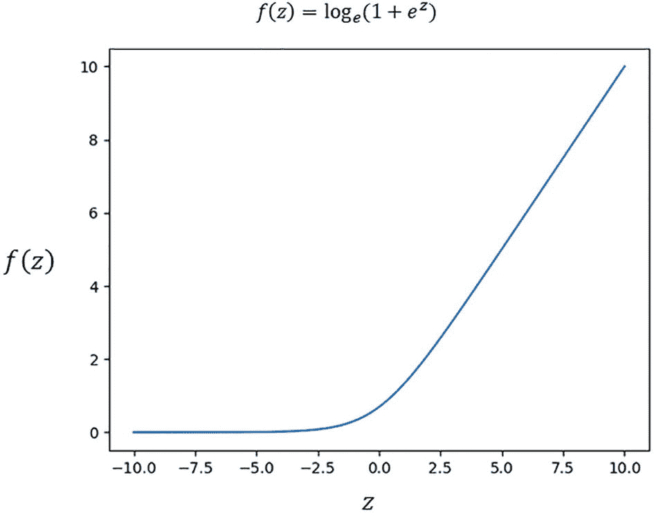

图形表示软加激活函数。图形包括 f(x)的方程。

图 2-15

SoftPlus 激活函数

当 z 接近零或 z 太大时，SoftPlus 函数可能导致不稳定性，因此不常使用。以下所示 SoftPlus 的修改版本有助于避免此类问题。

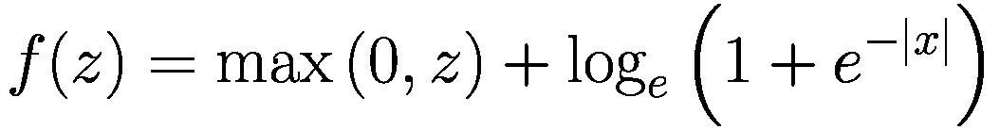

SoftPlus 函数与 ReLU 激活函数类似，提供非负输出。因此，SoftPlus 激活函数常用于神经网络中输出标准差。

#### Swish 激活函数

SoftPlus 激活函数在输入 z 上的定义是输入与输入上的 sigmoid 激活的乘积（见下文）：

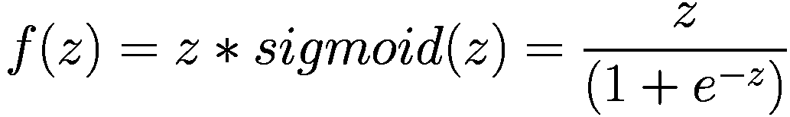

Swish 与现有激活函数的不同之处在于，Swish 本质上是非单调的，如图 2-16 所示。

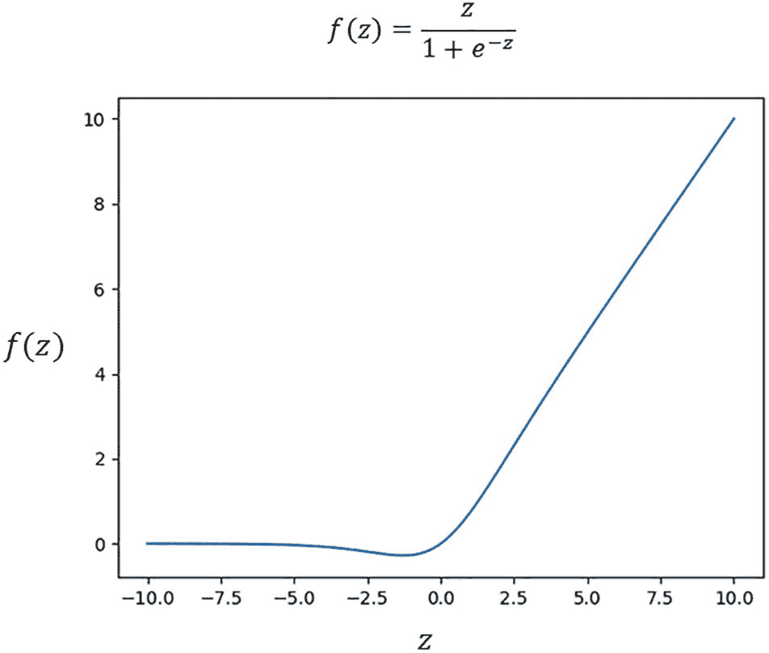

Swish 激活函数的图形。图形最初显示一条相对直的线，然后显示上升趋势。

图 2-16

Swish 激活函数

Swish 的一个潜在优势是，对于负值的 z，它具有非零梯度，这确保了我们不会遇到 ReLU 激活函数所面临的神经元死亡问题。Swish 激活函数中的 sigmoid 就像一个门，当 z < 0 时衰减线性激活 z，同时保持梯度活跃。

Swish 作为 ReLU 的替代品，表明在 ImageNet 上的分类准确率提高了 0.9%，对于 Inception ResNet v2 大约提高了 0.6%。

### 多层感知器网络的学习规则

在前面的章节中，我们了解到感知器学习规则只能学习线性决策边界。非线性复杂决策边界可以通过多层感知器来建模；然而，这样的模型不能通过感知器学习规则来学习。因此，需要一个不同的学习算法。

在感知器学习规则中，目标是不断更新模型的权重，直到所有训练数据点都被正确分类。如果没有这样的可行权重向量可以正确分类所有点，算法就不会收敛。在这种情况下，可以通过预定义训练的迭代次数（遍历次数）或定义正确分类的训练数据点数阈值来停止训练。

对于多层感知器和大多数深度学习训练网络，训练模型的最佳方式是计算基于误分类错误的成本函数，然后根据模型参数最小化成本函数。由于基于成本的学习算法最小化成本函数，对于二分类——通常是对数损失成本函数——使用对数似然函数的负值。为了参考，如何从最大似然方法推导出对数损失成本函数已在“逻辑回归”部分第一章中说明。

多层感知器网络将包含隐藏层，为了学习非线性决策边界，激活函数本身也应该是非线性的，例如 sigmoid、ReLU、tanh 等。对于二分类，输出神经元应该具有 sigmoid 激活函数，以便适应对数损失成本函数并输出类别的概率值。

现在，根据前面的考虑，让我们尝试通过构建对数损失成本函数并最小化模型权重和偏置参数来求解 XOR 函数。网络中的所有神经元都采用 sigmoid 激活函数。

参考图 2-7，设隐藏单元 *h*[1] 的输入和输出分别为 *i*[1] 和 *z*[1]。同样，设隐藏单元 *h*[2] 的输入和输出分别为 *i*[2] 和 *z*[2]。最后，设输出层的输入和输出为 *p*[1] 和 *z*[3]。

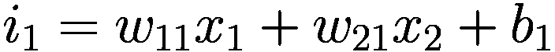

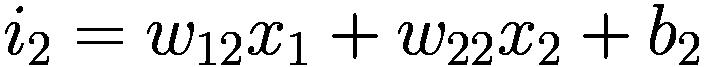

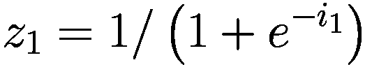

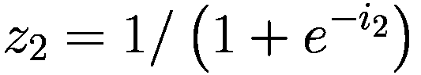

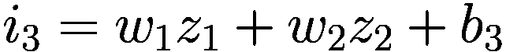

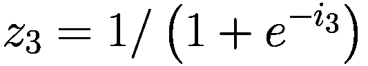

考虑到对数损失成本函数，XOR 问题的总成本函数可以定义为以下：

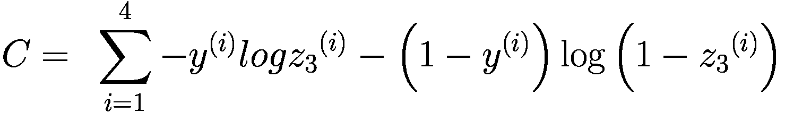

如果所有权重和偏差加在一起可以被视为参数向量 *θ*，我们可以通过最小化成本函数 *C*(*θ*) 来学习模型：

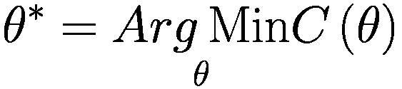

对于最小值，成本函数 *C*(*θ*) 关于 *θ* 的梯度（即，∇*C*(*θ*)）应为零。最小值可以通过梯度下降法达到。梯度下降的更新规则为 *θ*^((*t* + 1)) = *θ*^((*t*)) − η ∇ *C*(*θ*^((*t*))), 其中 η 是学习率，*θ*^((*t* + 1)) 和 *θ*^((*t*)) 分别是迭代 *t* + 1 和 *t* 时的参数向量。

如果我们考虑参数向量中的单个权重，梯度下降的更新规则变为以下：

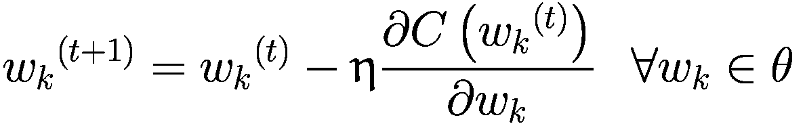

由于在神经网络中权重遵循层次顺序，梯度向量可能不像在线性或逻辑回归中那样容易计算。然而，导数的链式法则为有系统地计算关于权重的偏导数（包括偏差）提供了一些简化。

这种方法被称为 *反向传播*，它在梯度计算中提供了简化。

### 反向传播用于梯度计算

反向传播是一种有用的方法，可以将输出层的错误反向传播，以便可以使用导数的链式法则轻松计算前一层级的梯度。

让我们考虑一个训练示例，并通过考虑 XOR 网络结构来执行反向传播（见图 2-8）。设输入为 *x* = [*x*[1] *x*[2]]^(*T*)，相应的类别为 *y*。因此，单个记录的成本函数变为以下：

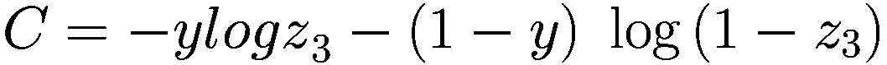

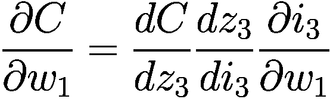

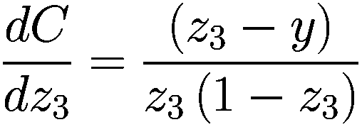

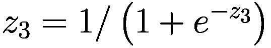

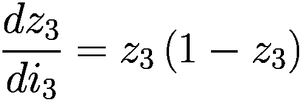

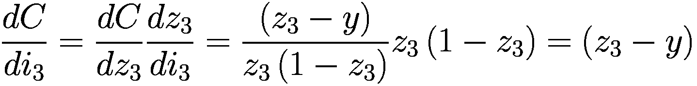

如我们所见，最终层中关于净输入的成本函数的导数不过是估计输出误差（*z*[3] − *y*）：

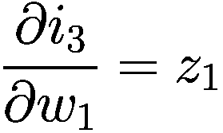

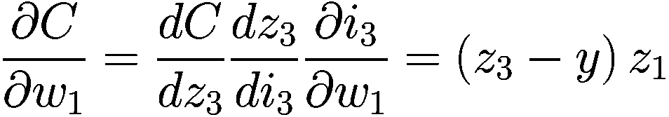

同样地，


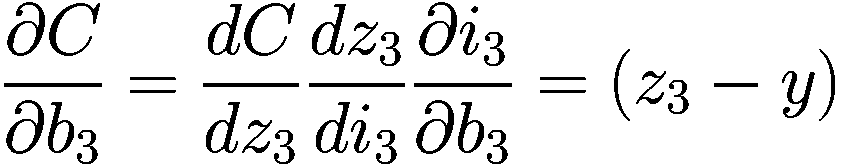

现在，让我们计算成本函数关于前一层权重的偏导数：

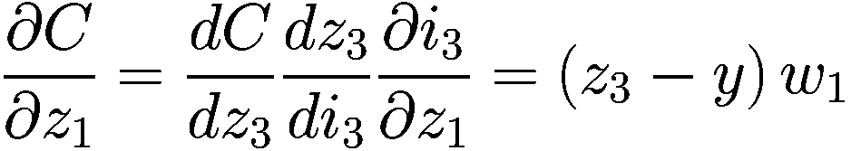

 可以被视为关于隐藏层单元*h*[1]输出的误差。误差会按照连接输出单元和隐藏层单元的权重比例传播。如果有多个输出单元，那么将会有来自每个输出单元的贡献。我们将在下一节中详细看到这一点。

同样地，

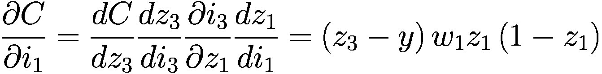

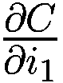 可以被认为是关于隐藏层单元*h*[1]净输入的误差。它可以通过将*z*1 因子乘以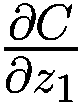来计算：


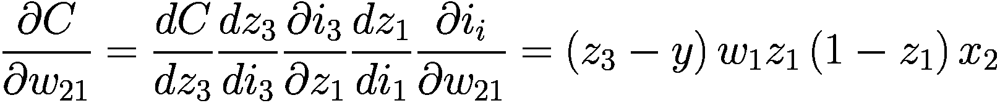

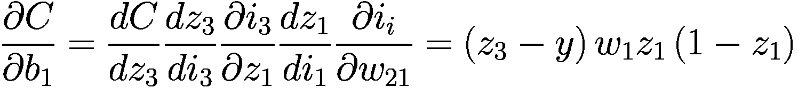

一旦我们得到了每个神经元单元关于输入的成本函数的偏导数，我们就可以计算关于贡献输入的权重的成本函数的偏导数——我们只需乘以通过该权重的输入。

### 推广反向传播方法进行梯度计算

在本节中，我们试图通过一个更复杂的网络推广反向传播方法。我们假设最终输出层由三个独立的 sigmoid 输出单元组成，如图 2-17 所示。此外，我们假设网络只有一个记录，以便于符号表示和简化学习过程。

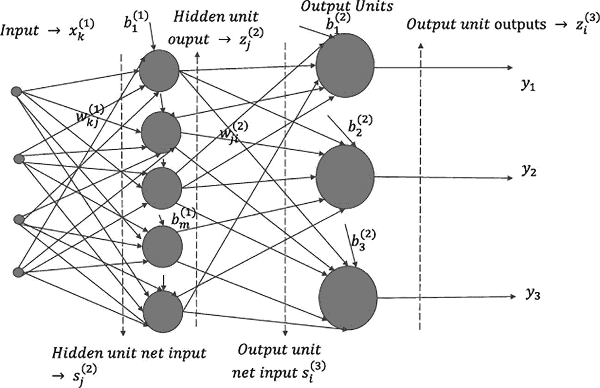

网络模型突出了输入、隐藏单元输出、输出单元以及输出单元输出。

图 2-17

网络图示独立 sigmoid 输出层的反向传播

单个输入记录的成本函数如下所示：

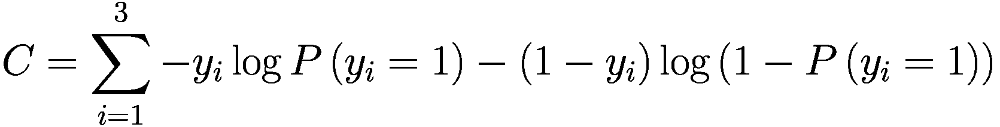

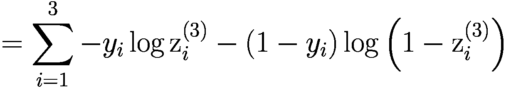

在前面的表达式中，*y*[*i*] ∈ {0, 1}，根据特定于 *y*[*i*] 的事件是否激活而定。

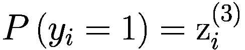 表示第 *ith* 类的预测概率。

让我们计算成本函数关于权重 *w*[*ji*]^((2)) 的偏导数。权重只会影响网络的 *ith* 输出单元的输出。

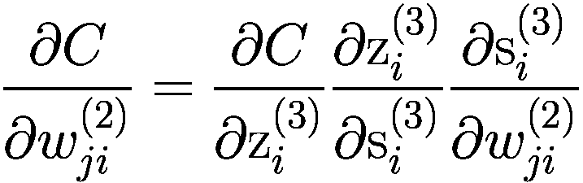

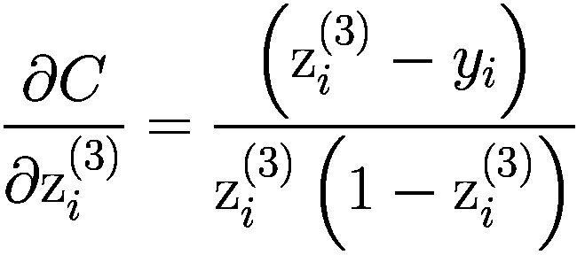

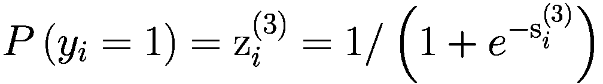

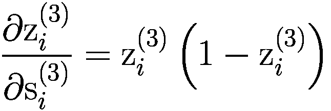

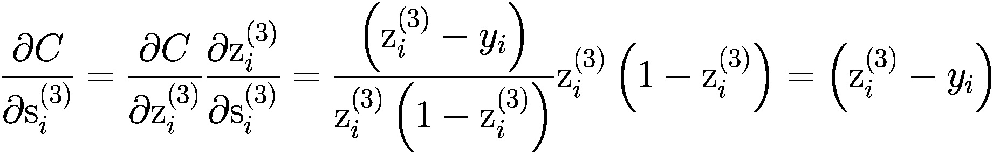

因此，与之前一样，第*i*个输出单元的净输入相对于成本函数的偏导数是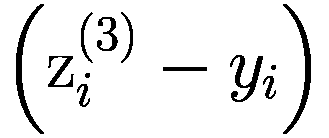，这实际上就是第*i*个输出单元预测误差。

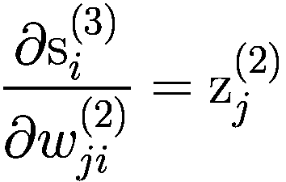

将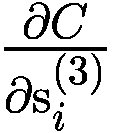和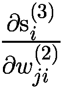结合，我们得到以下结果：

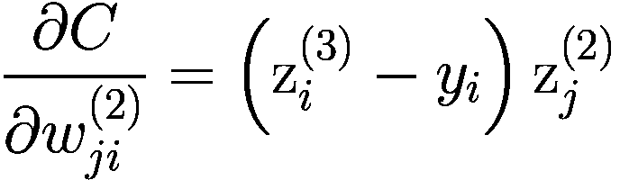

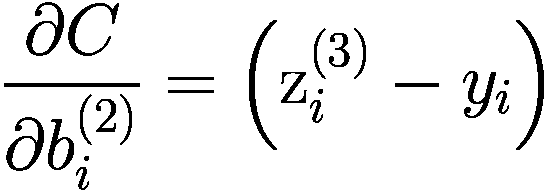

前面的内容给出了关于网络最后一层权重和偏置的代价函数偏导数的通用表达式。接下来，让我们计算下层权重和偏置的偏导数。事情变得稍微复杂一些，但仍然遵循一个通用的趋势。让我们通过链式法则计算代价函数关于权重 *w*[*kj*]^((1)) 的偏导数。这个权重会受到所有三个输出单元错误的 影响。基本上，隐藏层中 *jth* 单元的输出错误会有来自所有输出单元的错误贡献，这些贡献通过连接输出层到 *jth* 隐藏单元的权重进行缩放。让我们通过链式法则进行计算，看看它是否符合我们之前宣称的：

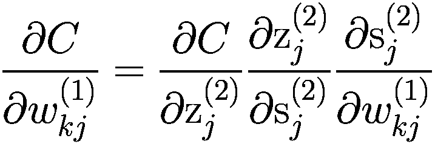

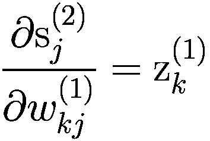

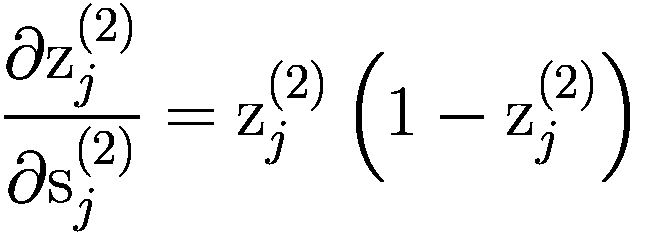

现在， 是一个棘手的计算，因为 z[*j*]^((2)) 影响到所有的三个输出单元：

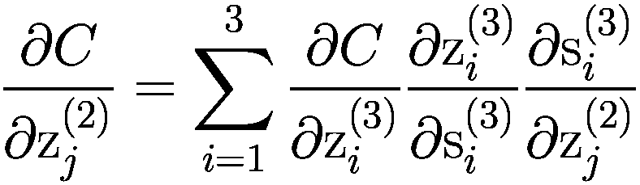

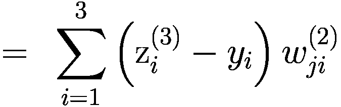

将 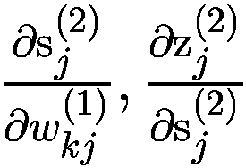 和 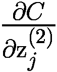 的表达式结合起来，我们得到以下结果：

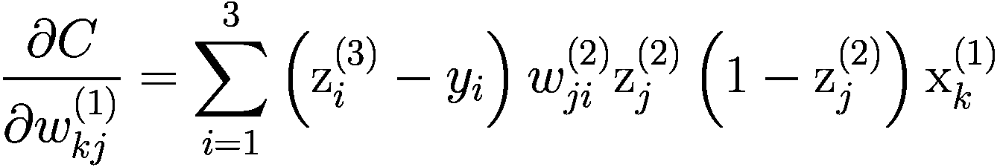

通常，为了计算多层神经网络中成本函数*C*关于特定权重*w*（该权重对神经元单元的净输入*s*有贡献）的偏导数，我们需要计算成本函数关于净输入的偏导数（即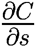），然后乘以与权重*w*相关的输入*x*，如下所示：

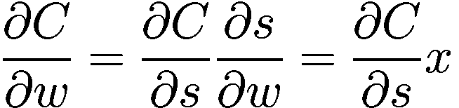

 可以被视为神经单元的错误，可以通过迭代地传递输出层的错误到下层神经单元来计算。另一个需要注意的点是，高层神经单元的错误会按照它们之间的权重连接比例分布到前一层的神经单元输出。此外，成本函数关于 sigmoid 激活神经元的净输入的偏导数可以通过将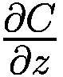乘以*z*(1 − *z*)来从关于神经元输出*z*的偏导数计算得出。对于线性神经元，这个乘数因子变为 1。

所有这些神经网络特性使得计算梯度变得容易。这就是神经网络通过反向传播在每个迭代中学习的方式。

每个迭代由前向传递和反向传递组成，或称为反向传播。在前向传递中，计算每一层中每个神经单元的净输入和输出。基于预测输出和实际目标值，计算输出层的错误。通过将错误与前向传递中计算的神经元输出和现有权重相结合，将错误反向传播。通过反向传播，梯度被迭代地计算。一旦计算了梯度，权重将通过梯度下降方法进行更新。

请注意，所显示的推导适用于 sigmoid 激活函数。对于其他激活函数，虽然方法保持不变，但在实现中需要针对激活函数进行特定的更改。

SoftMax 函数的成本函数与独立的多类分类的成本函数不同。

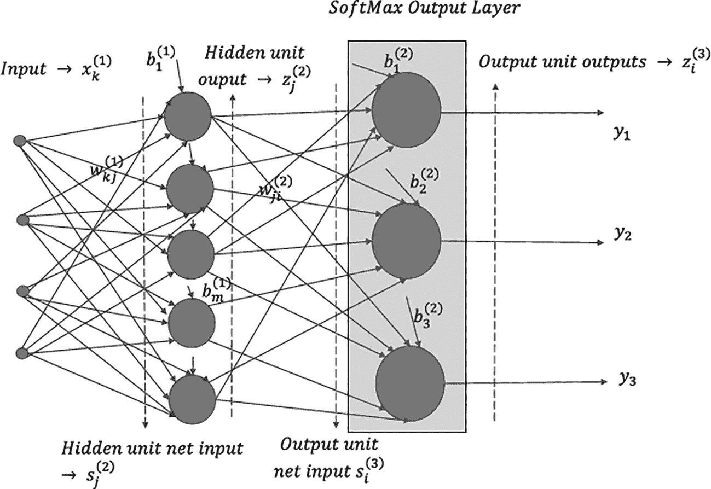

在给定的网络中，输出单元的净输入显示三个节点，而隐藏单元的净输入显示五个节点。

图 2-18

展示 SoftMax 输出层反向传播的神经网络

网络中 SoftMax 激活层的交叉熵成本由以下公式给出：

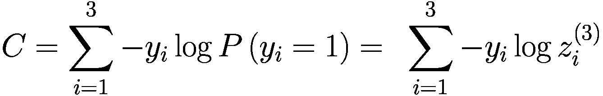

让我们计算成本函数关于权重 *w*[*ji*]^((2)) 的偏导数。现在，这个权重将影响第 *i* 个 SoftMax 单元的净输入 *s*[*i*]^((3))。然而，与早期网络中独立的二元激活不同，这里所有三个 SoftMax 输出单元 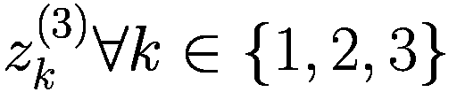 都会受到 *s*[*i*]^((3)) 的影响，因为

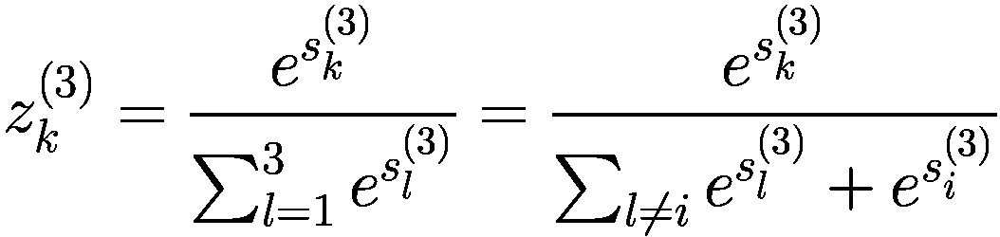

因此，导数 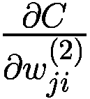 可以表示如下：

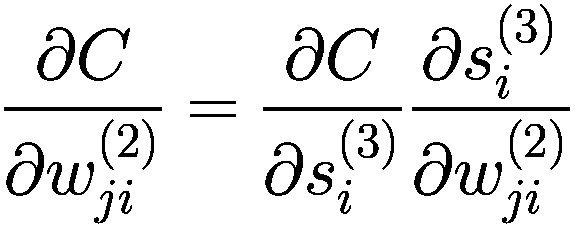

现在，正如刚才所述，由于 *s*[*i*]^((3)) 影响 SoftMax 层中所有输出 *z*[*k*]^((3))，

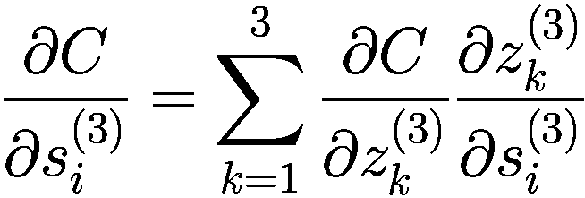

偏导数的各个分量如下：

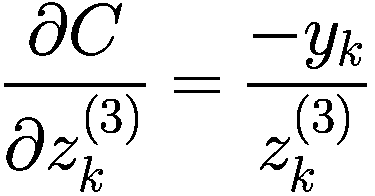

对于 *k* = *i*， 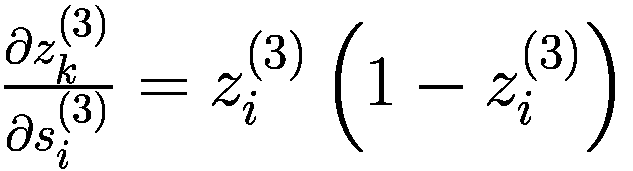

对于 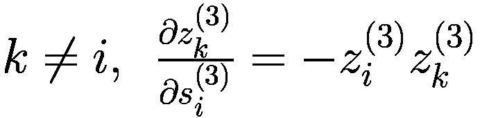

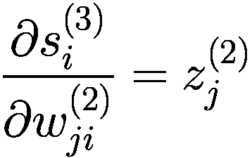

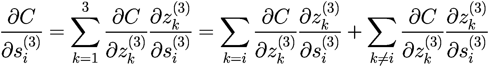

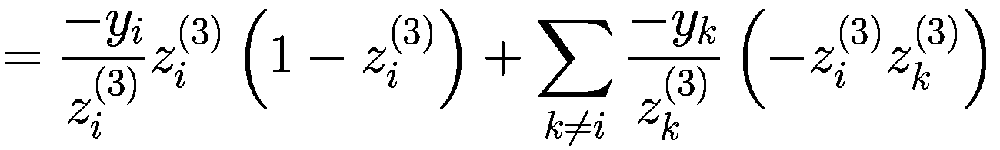

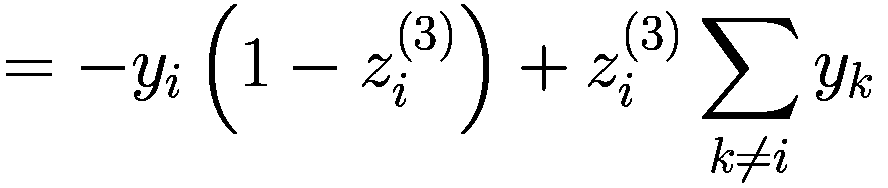

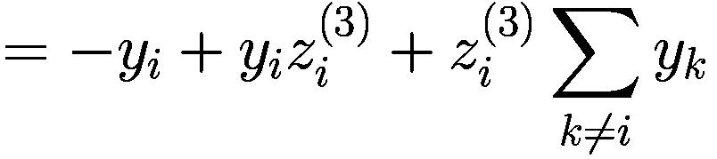

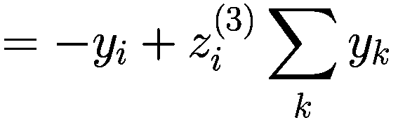

由于 *y*[*k*] = 1 仅对 *k* 的一个值成立，因此 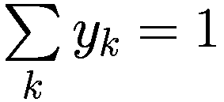。因此，

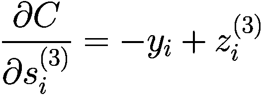

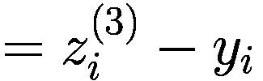

实际上，第 *i* 个 SoftMax 单元的网络输入相对于成本导数是预测第 *i* 个 SoftMax 输出单元输出的误差。结合 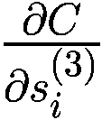 和 ，我们得到以下公式：

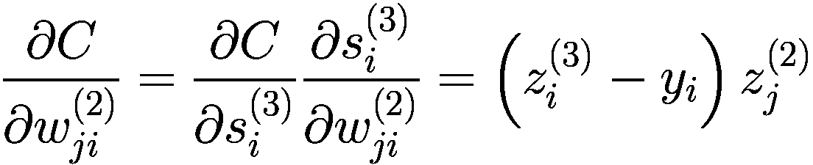

类似地，对于第 *i* 个 SoftMax 输出单元的偏置项，我们有以下公式：


计算关于前一层权重 *w*[*kj*]^((1)) 的成本函数的偏导数，即 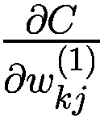，其形式将与具有独立二进制类别的网络中的形式相同。这是显而易见的，因为网络只在输出单元的激活函数方面有所不同，即使如此，我们得到的  和 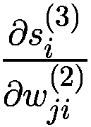 的表达式仍然相同。作为练习，感兴趣的读者可以验证 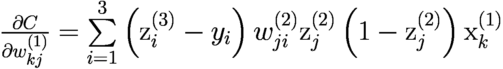 是否仍然成立。

#### 深度学习与传统方法

在这本书中，我们将使用谷歌的 TensorFlow 作为深度学习库，因为它具有几个优点。在继续使用 TensorFlow 之前，让我们看看深度学习的一些关键优点以及如果使用不当的一些缺点。

+   在多个领域，深度学习在性能上远远超过传统的机器学习方法，尤其是在计算机视觉、语音识别、自然语言处理和时间序列领域。

+   深度学习随着深度学习神经网络层数的增加，可以学习到越来越多复杂的特征。正因为这种自动特征学习特性，深度学习减少了特征工程的时间，这在传统的机器学习方法中是一个耗时的工作。

+   深度学习最适合无结构化数据，而以图像、文本、语音、传感器数据等形式存在的无结构化数据非常多，一旦分析，将革命性地改变不同的领域，如医疗保健、制造业、银行业、航空业、电子商务等。

深度学习的一些局限性如下：

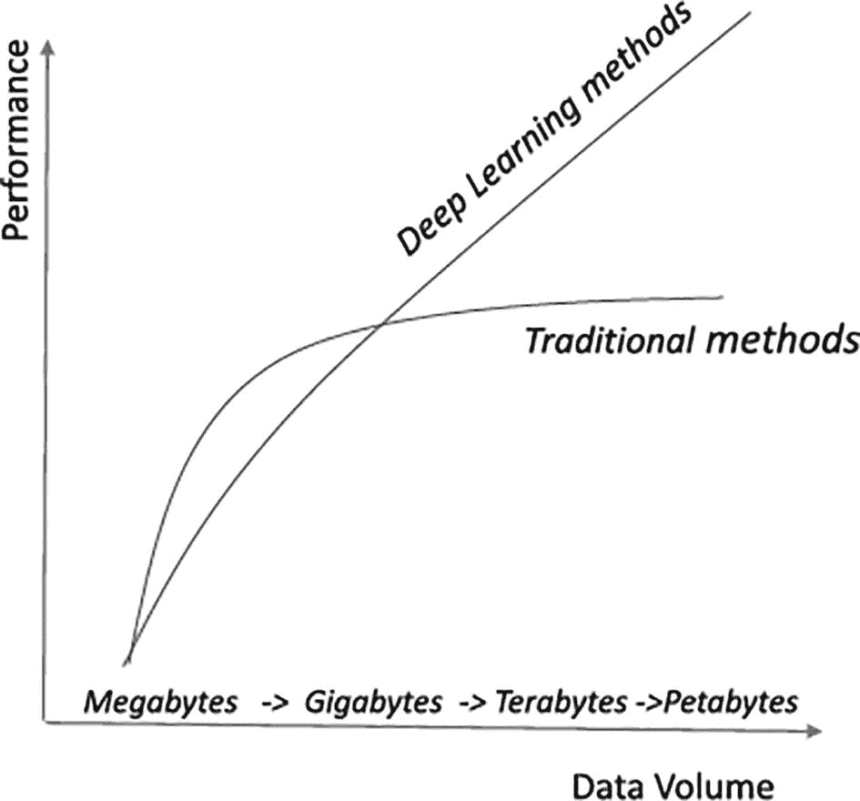

图表展示了性能与数据量之间的关系。图中的两条曲线分别代表了深度学习方法和传统方法。

图 2-19

传统方法与深度学习方法的性能比较

+   深度学习网络通常具有很多参数，对于这样的实现，应该有足够大的数据量来训练。如果没有足够的数据，深度学习方法将不会很好地工作，因为模型将遭受过拟合。

+   深度学习网络学习到的复杂特征通常难以解释。

+   深度学习网络需要大量的计算能力来训练，因为模型中包含大量的权重以及数据量。

当数据量较小时，传统方法往往比深度学习方法表现更好。然而，当数据量巨大时，深度学习方法在性能上远远超过传统方法，这在图 2-19 中大致有所描述。

## TensorFlow

来自 Google 的 TensorFlow 是一个主要关注深度学习的开源库。它使用计算数据流图来表示复杂的神经网络架构。图中的节点表示数学计算，也称为 ops（操作），而边表示它们之间传输的数据张量。此外，相关的梯度存储在每个计算图的节点上，在反向传播过程中，这些梯度被组合以获得每个权重的梯度。张量是多维数据数组，由 TensorFlow 使用。

### 常见深度学习包

常见的深度学习包如下：

+   ***Pytorch***: Pytorch 是一个基于 Torch 库的开源深度学习框架，由 Facebook 提供。它主要构建的目的是加速从研究原型到部署的过程。Pytorch 使用 C++ 前端和 Python 接口。Facebook AI Research 和 IBM 等知名组织使用 Pytorch。Pytorch 可以利用 GPU 进行快速计算。

+   ***Theano***: Theano 是一个主要用于计算密集型研究活动的 Python 深度学习包。它与 Numpy 数组紧密集成，并具有高效的符号微分器。它还提供了对 GPU 的透明使用，以实现更快的计算。

+   ***Caffe***: Caffe 是由伯克利人工智能研究（[BAIR](http://bair.berkeley.edu/)）开发的深度学习框架。速度使 Caffe 成为研究实验和工业部署的完美选择。Caffe 的实现可以非常高效地使用 GPU。

+   ***CuDNN***: CuDNN 代表 CUDA 深度神经网络库。它提供了一组用于在 GPU 上实现深度神经网络的原始库。

+   ***TensorFlow***: TensorFlow 是一个由 Google 启发的开源深度学习框架，灵感来源于 Theano。TensorFlow 正在逐渐成为研究导向工作和生产实现中深度学习的首选库。此外，对于云上的分布式生产实现，TensorFlow 也正在成为首选库。

+   ***MxNet***: MxNet 是一个开源的深度学习框架，可以扩展到多个 GPU 和机器，并得到 AWS 和 Azure 等主要云服务提供商的支持。流行的机器学习库 GraphLab 使用 MxNet 实现了良好的深度学习功能。

+   ***deeplearning4j***: deeplearning4j 是一个用于 Java 虚拟机的开源分布式深度学习框架。

+   **Sonnet**：Sonnet 是一个使用 TensorFlow 作为后端构建复杂神经网络架构的高级库。Sonnet 是在 DeepMind 开发的。

+   **ONNX**：ONNX 代表开放神经网络交换，由微软和 Facebook 共同开发。正如其名所示，ONNX 有助于模型在各个框架之间无缝迁移。例如，在 Pytorch 上训练的模型可以使用 ONNX 在 TensorFlow 中进行无缝的推理设置。

TensorFlow 和 Pytorch 是学术界和工业界最流行且广泛使用的深度学习框架。以下是这两个框架的一些显著特性。

+   Python 是 TensorFlow 和 Pytorch 的首选高级语言。TensorFlow 和 Pytorch 都提供了适当程度的抽象，以加快模型开发。

+   TensorFlow 与 Theano、MxNet 和 Caffe 类似，使用自动微分器，而 Torch 使用 AutoGrad。自动微分器与符号微分和数值微分不同。由于神经网络利用微分链式法则的学习方法，自动微分器在神经网络中使用时非常高效。

+   对于云上的生产实现，TensorFlow 正在成为针对大型分布式系统的应用的首选平台。

+   TensorFlow 在 TensorBoard 的形式下具有更好的可视化能力，这使得人们可以更方便地跟踪和调试训练问题。

### TensorFlow 安装

TensorFlow 可以轻松安装在基于 Linux、Mac OS 和 Windows 的机器上。始终建议为 TensorFlow 创建单独的环境。在这本书中，我们将使用 TensorFlow 2 的功能，这要求您的 Python 版本必须大于或等于 3.7。TensorFlow 2 的安装细节在 TensorFlow 的官方网站上有很好的记录：[www.tensorflow.org/install](http://www.tensorflow.org/install)。

### TensorFlow 开发基础

TensorFlow 有其自己的命令格式来定义和操作张量。TensorFlow 1 基于在激活会话中使用计算图执行逻辑的原则。然而，TensorFlow 2 将即时执行视为默认。我们将在以下内容中详细讨论即时执行和计算图方法，然后比较它们的显著特性。

即时执行

即时执行提供了一个立即执行操作的执行环境。它不基于构建稍后执行的计算图的原则。即时执行简化了 TensorFlow 中的模型开发工作，因为人们可以立即看到操作的结果。即时执行使调试变得更容易，并且是研究和快速原型设计的灵活工具。

基于图的执行

尽管如前所述，急切执行有几个优点，但它通常比图执行慢。急切执行无法利用运行 TensorFlow 操作时存在的加速机会。与急切执行相反，图执行从 Python 中提取 TensorFlow 特定的计算操作，构建一个高效的图，可以利用潜在的加速机会。此外，图提供了跨平台的灵活性，因为图可以在没有原始 Python 代码的情况下运行、存储和恢复。因此，基于图的执行对于在移动设备等设备上的模型来说非常重要，在这些设备上可能没有 Python 代码。

以下是一些急切执行和基于图执行的关键特性。

| 急切执行 | 基于图的执行 |
| --- | --- |
| 非常直观且易于调试，简化了快速模型开发 | 相比急切执行，直观性较低，通常更难调试 |
| 由于逐个执行 TensorFlow 操作，比基于图的执行慢 | 通常比急切执行快，因为可以在执行之前构建图以利用加速机会 |
| 更适合初学者 | 适用于大规模训练 |
| 支持 GPU 和 TPU 加速 | 支持 GPU 和 TPU 加速 |

TensorFlow 2 的最佳策略：急切执行与图执行比较

尽管 TensorFlow 2 优先考虑了急切执行，但人们可以以急切执行的方式构建模型，然后使用图执行来执行它。只需用**tf.function()**包装急切执行操作，就可以在不创建图的情况下，通过在会话中运行**session.run()**来获得基于图的执行的好处。我们可以采用这种混合方案，即在急切执行中采用直观的编码方式，但最终通过用**tf.function()**包装来以最小的方式改变急切执行代码，以基于图的方式执行代码。

列表 2-1 到 2-15 是一些基本的 TensorFlow 命令，用于定义张量和 TensorFlow 变量，并在会话中执行 TensorFlow 计算图。其目的是强调以下代码列表中的急切执行和基于图的执行方法。

```py
a = tf.zeros((2,2))
print('a:',a)
b = tf.ones((2,2))
print('b:',b)
-- output --
a: tf.Tensor(
[[0\. 0.]
[0\. 0.]], shape=(2, 2), dtype=float32)
b: tf.Tensor(
[[1\. 1.]
[1\. 1.]], shape=(2, 2), dtype=float32)
True
Listing 2-2
Defining Zeros and Ones Tensors
```

```py
from platform import python_version
import tensorflow as tf
import numpy as np
import os
print(f"Python version: {python_version()}")
print(f"Tensorflow version: {tf.__version__}")
print("Eager executive active:", tf.executing_eagerly())
-- output --
Python version: 3.9.5
Tensorflow version: 2.4.1
"Eager executive active:", True
Listing 2-1
Import TensorFlow and Numpy Library and to Check if Eager Execution Is Active by Default
```

在默认情况下使用急切执行，我们将能够立即看到张量的值。

```py
import timeit
# Eager function
def func_eager(a,b):
return a*b
# Graph function using tf.function on eager func
@tf.function
def graph_func(a,b):
return a*b
a = tf.constant([2])
b = tf.constant([5])
# Eager execution
print("Eager execution:",timeit.timeit(lambda:func_eager(a,b),number=100))
# Function with graph execution
print("Graph execution:",timeit.timeit(lambda: graph_func(a,b),number=100))
print("For simple operations Graph execution takes more time..")
--output—
Eager execution: 0.0020395979954628274
Graph execution: 0.038001397988409735
Listing 2-9
Execution Time Comparison of Eager Execution vs. Graph Execution in Simple Operation
```

```py
import timeit
# Eager function
def func_eager(a,b):
return a*b
# Graph function using tf.function on eager func
@tf.function
def graph_func(a,b):
return a*b
a = tf.constant([2])
b = tf.constant([5])
# Eager execution
print("Eager execution:",func_eager(a,b))
# Function with graph execution
print("Graph execution:",graph_func(a,b))
--output—
Eager execution: tf.Tensor([10], shape=(1,), dtype=int32)
Graph execution: tf.Tensor([10], shape=(1,), dtype=int32)
Listing 2-8
Illustration of Between Eager Execution and Graph-Based Execution
```

```py
# Tensorflow constants are immutable
a = tf.constant(2)
b = tf.constant(5)
c= a*b
print(c)
--output—
tf.Tensor([10], shape=(1,), dtype=int32)
Listing 2-7
Define TensorFlow Constants
```

```py
ta = a.numpy()
print(ta)
--output—
[[0\. 0.]
[0\. 0.]]
Listing 2-6
Convert a Tensor to Numpy
```

```py
a_ = tf.reshape(a,(1,4))
print(a_)
-- output –
tf.Tensor([[0\. 0\. 0\. 0.]], shape=(1, 4), dtype=float32)
Listing 2-5
Reshaping a Tensor
```

```py
a.get_shape()
-- output --
tf.Tensor([2\. 2.], shape=(2,), dtype=float32)
Listing 2-4
Check the Shape of the Tensor
```

```py
out = tf.math.reduce_sum(b,axis=1)
print(out)
-- output --
tf.Tensor([2\. 2.], shape=(2,), dtype=float32)
Listing 2-3
Sum the Elements of the Matrix (2D Tensor) Across the Horizontal Axis
```

从列表 2-9 我们可以观察到，对于简单操作，图执行比急切执行花费更多时间。接下来我们将看到当模型参数较多时，推理时间是如何表现的。

```py
# TensorFlow imports
from tensorflow.keras import Input, Model
from tensorflow.keras.layers import Flatten, Dense
# Define the model (Inspired by mnist inputs)
model = tf.keras.Sequential()
model.add(tf.keras.Input(shape=(28,28,)))
model.add(Flatten())
model.add(Dense(256,"relu"))
model.add(Dense(128,"relu"))
model.add(Dense(256,"relu"))
model.add(Dense(10,"softmax"))
# Dummy data with MNIST image sizes
X = tf.random.uniform([1000, 28, 28])
# Eager Execution to do inference (Model untrained as we are evaluating speed of inference)
eager_model = model
print("Eager time:", timeit.timeit(lambda: eager_model(X,training=False), number=10000))
#Graph Execution to do inference (Model untrained as we are evaluating speed of inference)
graph_model = tf.function(eager_model) # Wrap the model with tf.function
print("Graph time:", timeit.timeit(lambda: graph_model(X,training=False), number=10000))
--output—
Eager time: 7.980951177989482
Graph time: 1.995524710000609
Listing 2-10
Execution Time Comparison of Eager Execution vs. Graph Execution in a Model Inference
```

从列表 2-10 我们可以看出，在具有多个参数的模型情况下，基于图的执行方法优于急切执行。

```py
w = tf.Variable([5.,10])
print('Intial value of Variable w =', w.numpy())
w.assign([2.,2.])
print('New assigned value of Variable w =', w.numpy())
--output—
Intial value of Variable w = [ 5\. 10.]
New assigned value of Variable w = [2\. 2.]
Listing 2-11
Defining TensorFlow Variables
```

TensorFlow 变量方法 tf.Variable 产生可变的张量，只能使用 assign 来更改。

```py
x = tf.Variable(2.0)
with tf.GradientTape() as tape:
y = x**3
dy_dx = tape.gradient(y,x) # Compute gradient of y wrt to x at x =2.
print(dy_dx.numpy()) # dy/dx = ( 3(x²) at x = 2 ) == 3*(2²) = 12.0
--output—
12.0
Listing 2-13
Computing Gradient
```

```py
nt = np.random.randn(5,3)
nt_tensor = tf.convert_to_tensor(nt)
print(nt_tensor)
--output—
tf.Tensor(
[[ 1.21409834  0.17042089 -0.3132248 ]
[ 0.58964541  0.42423984  1.00614624]
[ 0.9511394   1.80499692  0.36418302]
[ 0.93088843  0.68589623  1.43379157]
[-1.5732957  -0.06314358  1.36723688]], shape=(5, 3), dtype=float64)
Listing 2-12
Converting a Numpy Array to Tensor
```

TensorFlow 需要记住正向传递中的操作顺序，以便在反向传递（反向传播）期间，它可以按相反顺序遍历操作列表来计算梯度。

tf.GradientTape() 正是提供了一种记录其作用域内执行的相关操作的方法，以便可以使用这些信息来计算梯度。

```py
# TensorFlow imports
from tensorflow.keras import Input, Model
from tensorflow.keras.layers import Flatten, Dense
# Define the model
model = tf.keras.Sequential()
model.add(tf.keras.Input(shape=(2,)))
model.add(Dense(5,'relu'))
model.add(Dense(1))
print(model.summary())
X = tf.constant([[2,2],[1,1]])
y = tf.constant([3.4,4.7])
with tf.GradientTape() as tape:
# Forward pass
y_hat = model(X,training=True)
loss = tf.reduce_mean((y- y_hat)**2) # Made up loss
grad_ = tape.gradient(loss,model.trainable_variables)
# Print the gradient tensors shape in each layer
for var, g in zip(model.trainable_variables, grad_):
print(f'{var.name}, shape: {g.shape}')
-- output –
_________________________________________________________________
Layer (type)                 Output Shape              Param #
=================================================================
dense_31 (Dense)             (None, 5)                 15
_________________________________________________________________
dense_32 (Dense)             (None, 1)                 6
=================================================================
Total params: 21
Trainable params: 21
Non-trainable params: 0
_________________________________________________________________
None
dense_31/kernel:0, shape: (2, 5)
dense_31/bias:0, shape: (5,)
dense_32/kernel:0, shape: (5, 1)
dense_32/bias:0, shape: (1,)
Listing 2-14
Gradient with Respect to Model
```

从输出中我们可以看到，TensorFlow 存储了每一层中每个单元相对于损失函数的梯度。TensorFlow 能够这样做，因为它在正向传递中使用 tf.GradientTape() 方法跟踪感兴趣的变量和参数。

### 从深度学习视角看梯度下降优化方法

在我们深入探讨 TensorFlow 优化器之前，了解一些关于全批量梯度下降和随机梯度下降的关键点非常重要，包括它们的缺点，这样人们才能欣赏到提出这些基于梯度的优化器变体的必要性。

#### 椭圆轮廓

对于具有最小二乘误差的线性神经元，其成本函数是二次的。当成本函数是二次的时，全批量梯度下降方法产生的梯度方向在线性意义上给出了成本减少的最佳方向，但它不指向最小值，除非成本函数的不同椭圆轮廓是圆形。在椭圆轮廓较长的情况下，梯度分量可能在需要较小变化的方向上较大，而在需要较大变化才能移动到最小点的方向上较小。

如图 2-20 所示，梯度在 *S* 处并不指向最小值方向，即点 *M*。这种条件的问题在于，如果我们通过减小学习率来采取小步长，那么梯度下降将需要一段时间才能收敛，而如果我们使用大的学习率，梯度将在成本函数曲率方向上迅速改变方向，导致振荡。多层神经网络的成本函数不是二次的，而主要是平滑函数。在局部，这种非二次成本函数可以用二次函数近似，因此对于非二次成本函数，梯度下降固有的椭圆轮廓问题仍然存在。

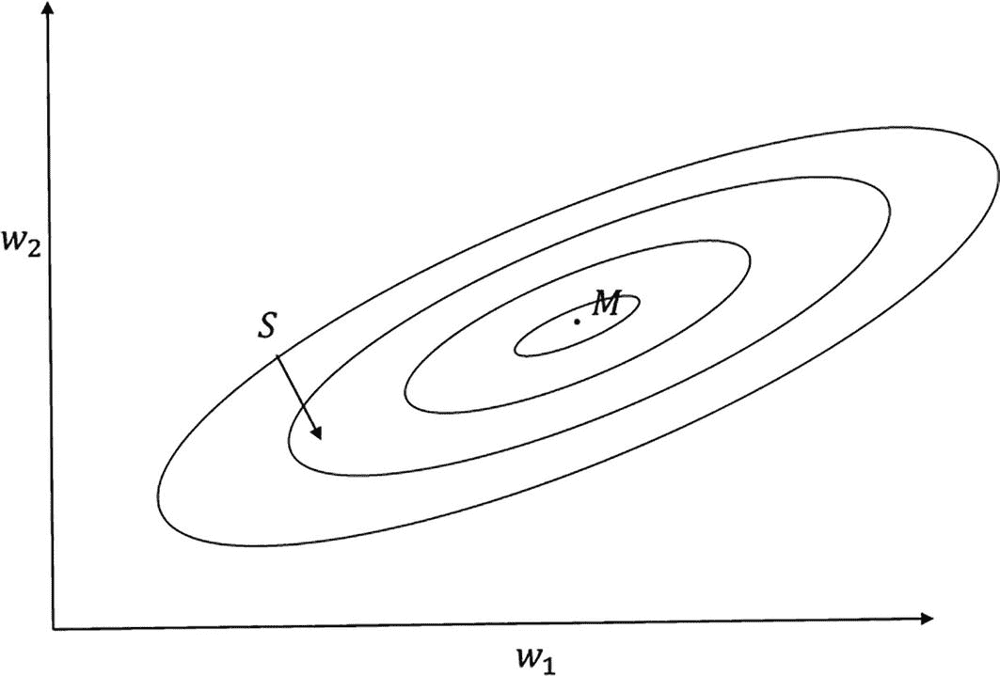

轨道结构图显示了轨道外圈为 s，内圈为 m 的图形，该图显示在计数图上。

图 2-20

二次成本函数的椭圆轮廓等高线图

解决这个问题的最佳方法是在梯度较小但一致的那些方向上采取较大的步长，而在梯度大但不一致的方向上采取较小的步长。如果对于所有维度都有一个固定的学习率，而不是每个维度都有一个单独的学习率，则可以实现这一点。

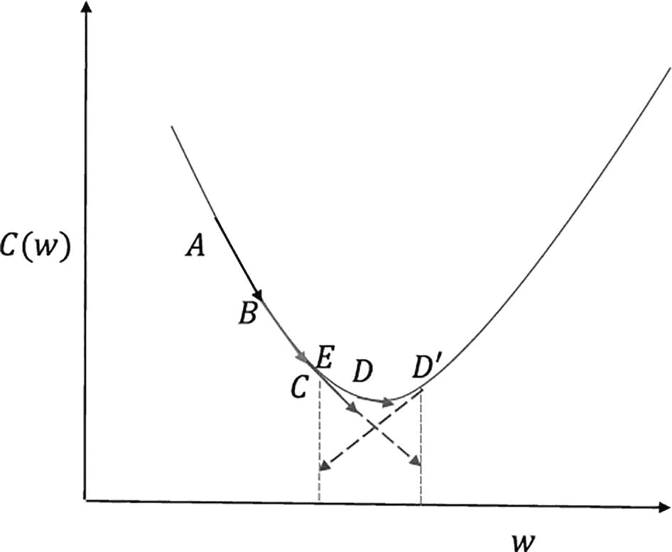

w 与 c 之间的关系图。在图中，两条直线曲线在一点相交形成一个向上的曲线结构。

图 2-21

单变量成本函数的梯度下降

在图 2-21 中，A 和 C 之间的成本函数几乎呈线性，因此梯度下降法效果良好。然而，从点 C 开始，成本函数的曲率占主导地位，因此 C 点的梯度无法跟上成本函数变化的方向。基于梯度，如果我们 C 点取一个小的学习率，最终会到达 D 点，这是合理的，因为它没有超过最小值点。然而，C 点取一个较大的步长将使我们到达 D'点，这是不希望的，因为它位于最小值点的另一侧。再次，D'点的较大步长将使我们到达 E 点，如果学习率没有降低，算法倾向于在最小值点两侧的点之间切换，导致振荡。当这种情况发生时，停止它并实现收敛的一种方法是通过查看连续迭代中梯度的符号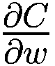或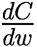，如果它们具有相反的符号，则降低学习率以减少振荡。同样，如果连续的梯度具有相同的符号，则可以相应地增加学习率。当成本函数是多个权重的函数时，成本函数可能在权重的某些维度上有曲率，而在其他维度上可能是线性的。因此，对于多元成本函数，成本函数关于每个权重的偏导数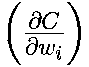可以类似地分析以更新每个权重或成本函数维度的学习率。

#### 成本函数的非凸性

神经网络的其他大问题是其成本函数大多是非凸的，因此梯度下降法可能会陷入局部最小值点，导致次优解。神经网络的非凸性质是由于具有非线性激活函数（如 sigmoid）的隐藏层单元造成的。全批量梯度下降使用整个数据集进行梯度计算。虽然这对于凸成本表面来说是好的，但在非凸成本函数的情况下，它也有其自身的问题。对于具有全批量梯度的非凸成本表面，模型最终会在其吸引域的极小值处结束。如果初始化的参数位于一个局部最小值的吸引域中，而这个局部最小值不能提供良好的泛化，那么全批量梯度将给出一个次优解。

随机梯度下降中计算出的噪声梯度可能会迫使模型摆脱不良局部最小值的吸引域——那种不能提供良好泛化的吸引域——并将其放置在一个更优的区域。使用单个数据点的随机梯度下降会产生非常随机和噪声的梯度。与单个数据点的梯度相比，使用小批量的梯度通常会产生更稳定的梯度估计，但它们仍然比全批量产生的梯度更嘈杂。理想情况下，小批量的大小应该仔细选择，使得梯度足够嘈杂以避免或逃离不良局部最小值点，但足够稳定以收敛到全局最小值或提供良好泛化的局部最小值。

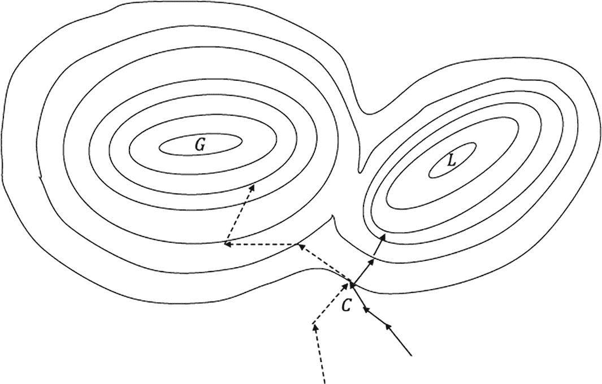

在等高线图说明中，将中心点 G 和 L 的两种轨道结构结合起来。

图 2-22

等高线图显示了全局和局部最小值的吸引域以及梯度下降和随机梯度下降的路径遍历

在图 2-22 中，虚线箭头对应随机梯度下降（SGD）所采取的路径，而实线箭头对应全批量梯度下降所采取的路径。全批量梯度下降在一点上计算实际的梯度，如果它位于一个较差的局部最小值吸引域内，梯度下降几乎可以确保达到局部最小值*L*。然而，在随机梯度下降的情况下，因为梯度仅基于数据的一部分而不是整个批量，所以梯度方向只是一个粗略的估计。由于这个噪声的粗略估计并不总是指向点*C*的实际梯度，随机梯度下降可能会逃离局部最小值的吸引域，并且幸运地落在全局最小值的吸引域中。随机梯度下降也可能逃离全局最小值的吸引域，但通常如果吸引域很大，并且仔细选择小批量大小，使得它产生的梯度适度噪声，随机梯度下降最有可能达到全局最小值*G*（如本例所示）或其他具有大吸引域的其他最优最小值。对于非凸优化，还有其他启发式方法，例如动量，当与随机梯度下降结合使用时，可以增加避免浅局部最小值的机会。动量通常通过速度分量跟踪之前的梯度。因此，如果梯度持续指向一个具有大吸引域的良好局部最小值，则速度分量会在良好局部最小值的方向上很高。如果新的梯度是噪声的，并且指向一个较差的局部最小值，则速度分量将提供动量以继续在同一方向上前进，并且不会过多地受到新梯度的影响。

#### 高维成本函数中的鞍点

优化非凸成本函数的另一个障碍是鞍点的存在。随着成本函数参数空间维度的增加，鞍点的数量呈指数增长。鞍点是驻点（即梯度为零的点），但既不是局部最小点也不是局部最大点。由于鞍点与具有与鞍点相同成本的点的长平台相关联，平台区域的梯度要么为零，要么非常接近零。由于所有方向的梯度都接近于零，基于梯度的优化器很难从这些鞍点中出来。从数学上讲，要确定一个点是否是鞍点，必须在给定点计算成本函数的 Hessian 矩阵的特征值。如果既有正特征值也有负特征值，那么它就是一个鞍点。为了刷新我们对局部和全局最小值测试的记忆，如果在驻点处 Hessian 矩阵的所有特征值都是正的，那么该点是全局最小值，而如果在驻点处 Hessian 矩阵的所有特征值都是负的，那么该点是全局最大值。成本函数的 Hessian 矩阵的特征向量给出了成本函数曲率变化的方向，而特征值表示沿着这些方向曲率变化的幅度。此外，对于具有连续二阶导数的成本函数，Hessian 矩阵是对称的，因此总是产生一组正交的特征向量，从而给出成本曲率变化的相互正交方向。如果在所有由特征向量给出的方向上，曲率变化的值（特征值）都是正的，那么该点必定是局部最小值，而如果所有曲率变化的值都是负的，那么该点是局部最大值。这种推广适用于任何输入维度的成本函数，而确定极值点的行列式规则随着成本函数输入的维度而变化。回到鞍点，由于某些方向的特征值是正的，而其他方向的特征值是负的，因此成本函数的曲率在正特征值的方向上增加，而在具有负系数的特征向量的方向上减少。这种鞍点周围成本表面的性质通常会导致一个具有接近零梯度的长平台区域，这使得梯度下降方法难以逃离这个低梯度的平台。点（0，0）是函数 *f*(*x*, *y*) = *x*² − *y*² 的鞍点，如下所示的评价可以观察到：

∇*f*(*x*, *y*) = 0 => 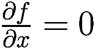 和 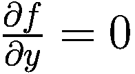

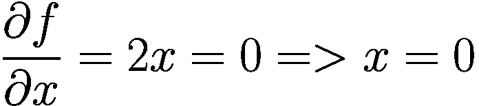

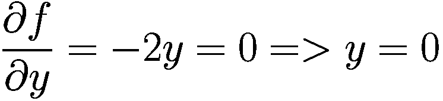

因此，(*x*, *y*) = (0, 0) 是一个驻点。接下来要做的事情是计算 Hessian 矩阵，并在 (*x*, *y*) = (0, 0) 处评估其特征值。Hessian 矩阵 *Hf*(*x*, *y*) 如下所示：

![$$ Hf\left(x,y\right)=\left[\begin{array}{cc}\frac{\partial²f}{\partial {x}²}& \frac{\partial²f}{\partial x\partial y}\\ \frac{\partial²f}{\partial x\partial y}& \frac{\partial²f}{\partial {y}²}\end{array}\right]=\left[\begin{array}{cc}2& 0\\ 0& -2\end{array}\right] $$](../images/448418_2_En_2_Chapter/448418_2_En_2_Chapter_TeX_Equcg.png)

因此，包括 (*x*, *y*) = (0, 0) 在内的所有点的 Hessian 矩阵 *Hf*(*x*, *y*) 是 ![$$ \left[\begin{array}{cc}2& 0\\ 0& -2\end{array}\right]. $$](../images/448418_2_En_2_Chapter/448418_2_En_2_Chapter_TeX_IEq65.png)

*Hf*(*x*, *y*) 的两个特征值是 2 和 -2，对应于特征向量 ![$$ \left[\begin{array}{c}1\\ 0\end{array}\right] $$](../images/448418_2_En_2_Chapter/448418_2_En_2_Chapter_TeX_IEq66.png) 和 ![$$ \left[\begin{array}{c}0\\ 1\end{array}\right] $$](../images/448418_2_En_2_Chapter/448418_2_En_2_Chapter_TeX_IEq67.png)，这不过是沿着 *X* 和 *Y* 轴的方向。由于一个特征值是正的，另一个是负的，所以 (*x*, *y*) = (0, 0) 是一个鞍点。

非凸函数 *f*(*x*, *y*) = *x*² − *y*² 在图 2-23 中绘制，其中 *S* 是鞍点，位于 *x*, *y* = (0, 0) 处。

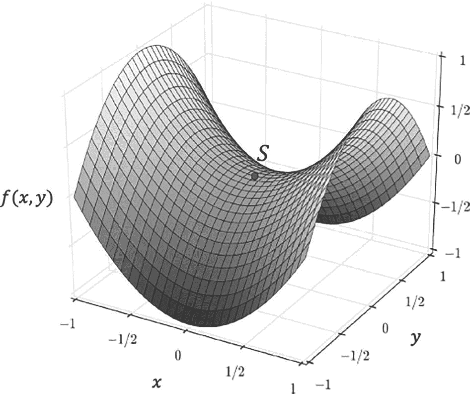

三维图的中心 s 显示在图上，表示 f(x, y) 与 x 和 y 之间的关系。

图 2-23

*f*(*x*, *y*) = *x*² − *y*² 的绘制

### 小批量随机梯度下降法中的学习率

当数据集中存在高度冗余时，对数据点的迷你批次计算出的梯度几乎与对整个数据集计算出的梯度相同，前提是迷你批次是整个数据集的良好表示。在这种情况下，可以避免对整个数据集计算梯度，而是可以使用数据点的迷你批次梯度作为整个数据集的近似梯度。这是梯度下降的迷你批次方法，也称为迷你批次随机梯度下降。当不使用迷你批次，而是通过一个数据点来近似梯度时，它被称为在线学习或随机梯度下降。然而，与在线学习模式相比，由于迷你批次方法的梯度比学习模式中的梯度更少噪声，因此始终最好使用随机梯度下降的迷你批次版本。学习率在迷你批次随机梯度下降的收敛中起着至关重要的作用。以下方法往往能提供良好的收敛：

+   从初始学习率开始。

+   如果错误减少，则增加学习率。

+   如果错误增加，则降低学习率。

+   如果错误不再减少，则停止学习过程。

如我们在下一节中将要看到的，不同的优化器在其实现中采用了自适应学习率的方法。

### TensorFlow 中的优化器

TensorFlow 拥有丰富的优化器库存，用于优化成本函数。所有优化器都是基于梯度的，还有一些特殊的优化器用于处理局部最小值问题。由于我们在第一章中处理了机器学习和深度学习中使用的最常见基于梯度的优化器，因此在这里我们将强调 TensorFlow 对基本算法添加的定制。

#### GradientDescentOptimizer

`GradientDescentOptimizer`实现了基本的完整批次梯度下降算法，并将学习率作为输入。梯度下降算法不会自动循环迭代，因此这种逻辑必须由开发者指定。

##### 用法

```py
optimizer = tf.compat.v1.train.GradientDescentOptimizer(learning_rate=0.001)
```

完整批次梯度下降的优化器对象可以定义为上述内容，其中`learning_rate`是在整个训练期间使用的恒定学习率。

#### AdagradOptimizer

`AdagradOptimizer`是一种类似于梯度下降的一阶优化器，但有一些修改。它没有全局学习率，而是对成本函数依赖的每个维度进行归一化。每个迭代的学习率是全球学习率除以当前迭代前每个维度的先前梯度的 l²范数。

如果我们有一个成本函数 *C*(*θ*)，其中 *θ* = [*θ*[1]*θ*[2]. . *θ*[*n*]]^(*T*) ∈ *R*^(*n* × 1)，那么 *θ*[*i*] 的更新规则如下：

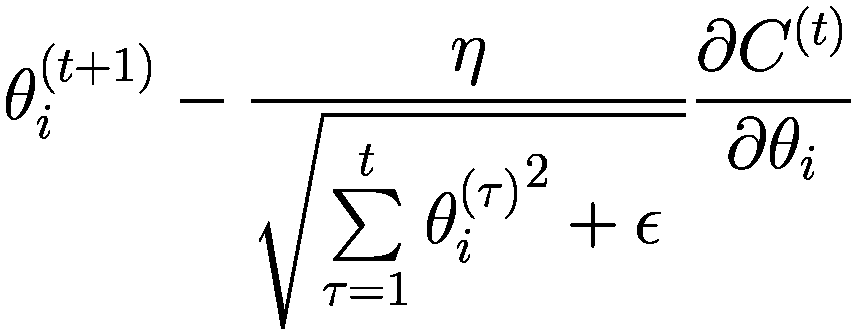

其中 *η* 是学习率，*θ*[*i*]^((*t*)) 和 *θ*[*i*]^((*t* + 1)) 分别是第 *i* 个参数在迭代 *t* 和 *t* + 1 时的值。

在矩阵格式中，向量 *θ* 的参数更新可以表示为以下形式：

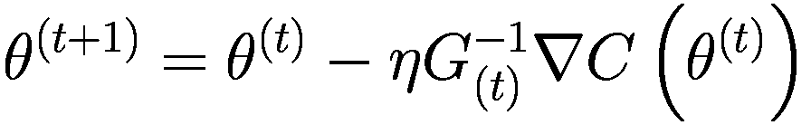

其中 *G*[(*t*)] 是包含每个维度过去梯度到迭代 *t* 的 l² 范数的对角矩阵。矩阵 *G*[(*t*)] 将具有以下形式：

![$$ {G}_{(t)}=\left[\begin{array}{ccc}\sqrt{\sum \limits_{\tau =1}^t{\theta_1^{\left(\tau \right)}}²+\epsilon\ }&amp; \dots &amp; 0\\ {}\dots &amp; \sqrt{\sum \limits_{\tau =1}^t{\theta_i^{\left(\tau \right)}}²+\epsilon\ }&amp; \dots \\ {}0&amp; \dots &amp; \sqrt{\sum \limits_{\tau =1}^t{\theta_n^{\left(\tau \right)}}²+\epsilon\ }\end{array}\right] $$](../images/448418_2_En_2_Chapter/448418_2_En_2_Chapter_TeX_Equcj.png)

有时，在数据中不太显现的稀疏特征对于优化问题可能非常有用。然而，使用基本的梯度下降法或随机梯度下降法时，学习率在每次迭代中对所有特征给予同等的重要性。由于学习率相同，非稀疏特征的整体贡献将远大于稀疏特征。因此，我们最终会丢失稀疏特征中的关键信息。使用`Adagrad`，每个参数都会用不同的学习率进行更新。特征越稀疏，其参数在迭代中的更新就越高。这是因为对于稀疏特征，量 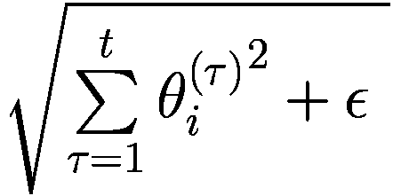 会更小，因此整体学习率会更高。

这是在自然语言处理和图像处理等应用中使用的好优化器，其中数据是稀疏的。

##### 用法

```py
optimizer = tf.keras.optimizers.Adagrad(learning_rate=0.001, initial_accumulator_value=0.1)
```

其中 `learning_rate` 代表 *η*，而 `initial_accumulator_value` 代表每个权重的初始非零归一化因子。

#### RMSprop

`RMSprop` 是 resilient backpropagation (`Rprop`) 优化技术的 mini-batch 版本，最适合全批量学习。`Rprop` 解决了在成本函数等高线呈椭圆形的情况下梯度不指向最小值的问题。正如我们之前讨论的，在这种情况下，使用全局学习规则，而不是为每个权重设置单独的自适应更新规则，将导致更好的收敛。`Rprop` 的特别之处在于，它不使用权重的梯度幅度，而只使用符号来确定如何更新每个权重。以下是 `Rprop` 的工作逻辑：

+   对于所有权重，从相同的权重更新幅度开始，即 *Δ*[*ij*]^((*t* = 0)) = *Δ*[*ij*]^((0)) = *Δ*。同时，将允许的最大和最小权重更新分别设置为 *Δ*[*max*] 和 *Δ*[*min*]。

+   在每次迭代中，检查前一个和当前梯度分量的符号，即成本函数关于不同权重的偏导数。

+   如果一个权重连接的当前和前一个梯度分量的符号相同——即 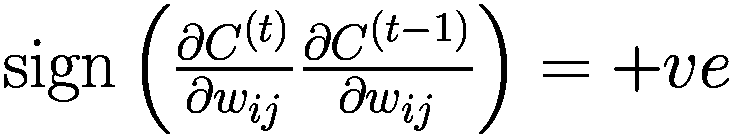——则通过一个因子 *η*[+] = 1.2 增加学习率。更新规则如下：

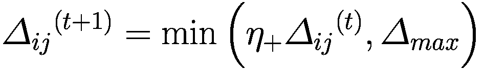


+   如果一个维度的当前和前一个梯度分量的符号不同——即 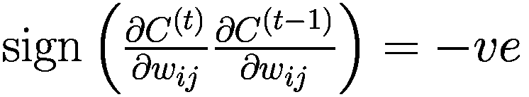——则通过一个因子 *η*[−] = 0.5 减小学习率。更新规则如下：

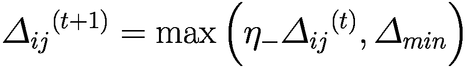


+   如果 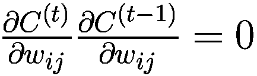，更新规则如下：

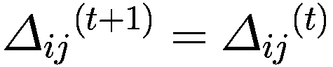

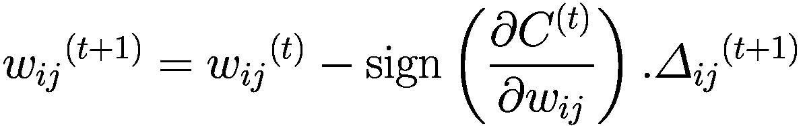

在梯度下降过程中，梯度在特定间隔内不改变符号的维度是权重变化一致的维度。因此，增加学习率会导致这些权重更快地收敛到它们的最终值。

梯度符号变化的维度表明，在这些维度上，权重变化是不一致的，因此通过降低学习率，可以避免振荡并更好地捕捉曲率。对于一个凸函数，梯度符号变化通常发生在损失函数表面有曲率且学习率设置较高时。由于梯度没有曲率信息，较大的学习率会将更新后的参数值带到最小值点之外，这种现象会在最小值点的两侧重复发生。

`Rprop`与完整批次配合得很好，但在涉及随机梯度下降时表现不佳。当学习率非常小的时候，在随机梯度下降的情况下，不同小批次的梯度会平均化。如果通过随机梯度下降对一个损失函数的权重梯度是每个小批次+0.2，而在第十个小批次时为-0.18（学习率小），那么随机梯度下降的有效梯度效应几乎为零，权重几乎保持在相同的位置，这是期望的结果。

然而，在`Rprop`中，学习率将增加大约九次，而减少一次，因此有效权重将远大于零。这是不希望的。

为了结合`Rprop`对每个权重的自适应学习规则的质量和随机梯度下降的效率，`RMSprop`应运而生。在`Rprop`中，我们不是使用梯度的幅度，而是仅使用每个权重的梯度符号。每个权重的梯度符号可以理解为将权重的梯度除以其幅度。随机梯度下降的问题在于，随着每个小批次的到来，损失函数不断变化，因此梯度也随之变化。因此，想法是得到一个权重梯度的幅度，这个幅度在附近的批次中不会波动太大。对于每个权重，在最近的批次中对平方梯度的均方根进行计算将很好地起到归一化梯度的作用。

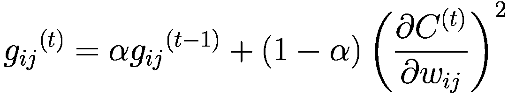

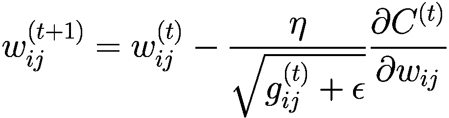

其中 *g*^((*t*)) 是在迭代 *t* 时权重 *w*[*ij*] 的梯度的均方根，而 *α* 是每个权重 *w*[*ij*] 的均方根梯度的衰减率。

##### 使用方法

```py
optimizer = tf.keras.optimizers.RMSprop(learning_rate=0.001, decay=0.9, momentum=0.0,epsilon=1e-10)
```

其中 `decay` 表示 *α*，epsilon 表示 *ϵ*，而 *η* 表示学习率。

#### AdadeltaOptimizer

`AdadeltaOptimizer` 是 `AdagradOptimizer` 的一个变体，它在降低学习率方面不那么激进。对于每个权重连接，`AdagradOptimizer` 通过将学习率常数除以直到该迭代为止的所有过去梯度的均方根来缩放迭代中的学习率常数。因此，每个权重的有效学习率是迭代数的单调递减函数，在相当多的迭代之后，学习率变得极其小。`AdagradOptimizer` 通过对每个权重或维度的指数衰减平方梯度取平均来克服这个问题。因此，`AdadeltaOptimizer` 中的有效学习率更多地是当前梯度的局部估计，并且不会像 `AdagradOptimizer` 方法那样快速收缩。这确保了即使在相当多的迭代或周期之后，学习仍然继续。`Adadelta` 的学习规则可以总结如下：

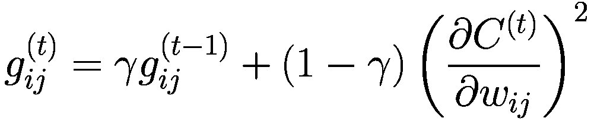

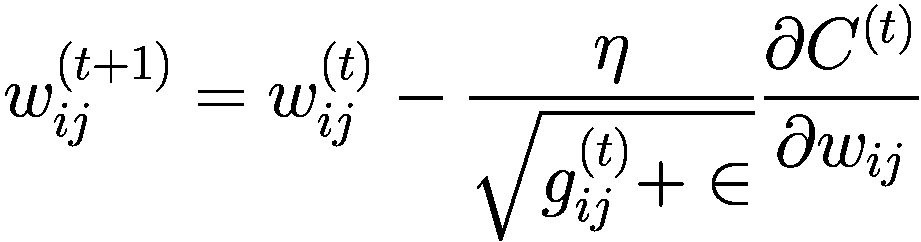

其中 *γ* 是指数衰减常数，*η* 是学习率常数，而 *g*[*ij*]^((*t*)) 表示在迭代 *t* 时的有效均方梯度。我们可以将项 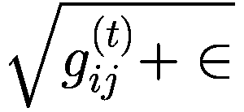 表示为 *RMS*(*g*[*ij*]^((*t*))), 这给出了以下更新规则：

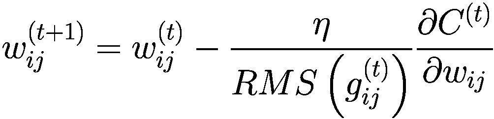

如果我们仔细观察，权重量变的单位并不具有权重的单位。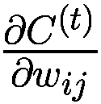 和 *RMS*(*g*[*ij*]^((*t*))) 的单位相同——即梯度的单位（成本函数变化/单位权重变化）——因此它们相互抵消。因此，权重量变的单位是学习率常数的单位。`Adadelta` 通过用当前迭代的指数衰减平方权重更新的均值平方根替换学习率常数 *η* 来解决这个问题。设 *h*[*ij*]^((*t*)) 为迭代 *t* 时权重更新的均值，β 为衰减常数，*Δw*[*ij*]^((*t*)) 为迭代 *t* 时的权重更新。那么，*h*[*ij*]^((*t*)) 的更新规则和 `Adadelta` 的最终权重更新规则可以表示如下：

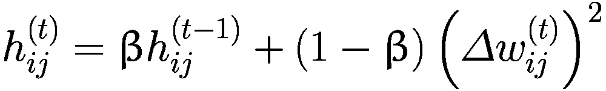

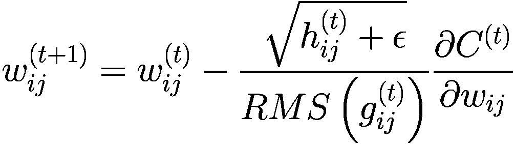

如果我们将 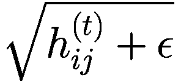 记为 *RMS*(*h*[*ij*]^((*t*)))，那么更新规则变为如下：

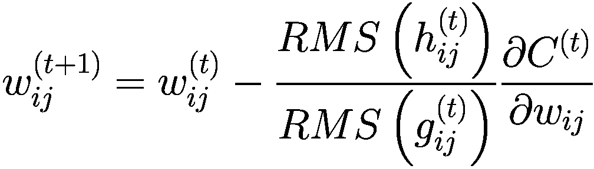

##### 使用方法

```py
optimizer = tf.keras.optimizers.Adadelta(learning_rate=0.001, rho=0.95, epsilon=1e-08)
```

其中 `rho` 代表 γ，`epsilon` 代表 *ϵ*，*η* 代表学习率。

`Adadelta` 的一大优势是它完全消除了学习率常数。如果我们比较 `Adadelta` 和 `RMSprop`，忽略学习率常数的消除，两者是相同的。`Adadelta` 和 `RMSprop` 都是在大约同一时间独立开发的，旨在解决 `Adagrad` 的快速学习率衰减问题。

#### AdamOptimizer

`Adam`，或自适应矩估计器，是另一种优化技术，与 `RMSprop` 或 `Adagrad` 类似，为每个参数或权重具有自适应学习率。`Adam` 不仅保持平方梯度的运行均值，还保持过去梯度的运行均值。

设每个权重 *w*[*ij*] 的梯度均值的衰减率 *m*[*ij*]^((*t*)) 和梯度平方的均值 *v*[*ij*]^((*t*)) 分别为 *β*[1] 和 *β*[2]。同时，设 η 为常数学习率因子。那么，`Adam` 的更新规则如下：

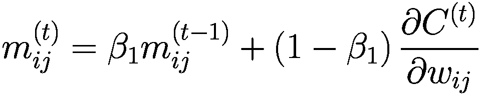

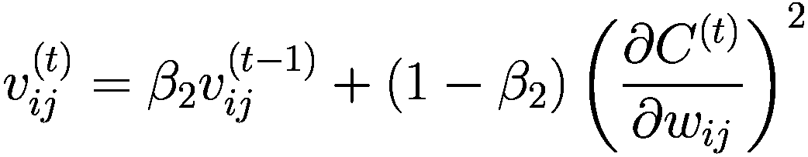

如果我们展开梯度移动平均的表示式 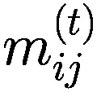 和梯度的平方 ，我们会看到它们的期望是有偏的。例如，梯度迭代 *t* 可以简化如下：


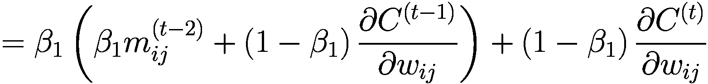

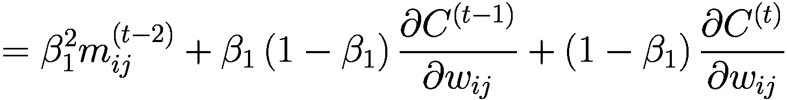

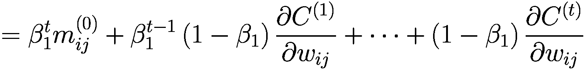

对 ![$$ E\left[{m}_{ij}^{(t)}\right] $$](../images/448418_2_En_2_Chapter/448418_2_En_2_Chapter_TeX_IEq77.png) 求期望，并假设 E![$$ \left[\frac{\partial {C}^{(i)}}{\partial {w}_{ij}}\right]=g $$](../images/448418_2_En_2_Chapter/448418_2_En_2_Chapter_TeX_IEq78.png) 是整个数据集的实际梯度，我们得到以下结果：

![$$ E\left[{m}_{ij}^{(t)}\right]=E\left[{\beta}_1^t{m}_{ij}^{(0)}+{\beta}_1^{t-1}\left(1-{\beta}_1\right)\frac{\partial {C}^{(1)}}{\partial {w}_{ij}}+\dots +\left(1-{\beta}_1\right)\frac{\partial {C}^{(t)}}{\partial {w}_{ij}}\right] $$](../images/448418_2_En_2_Chapter/448418_2_En_2_Chapter_TeX_Equde.png)

![$$ =E\left[{\beta}_1^t{m}_{ij}^{(0)}\right]+\left(1-{\beta}_1\right)g\left[{\beta}_1^{t-1}+\dots +1\right] $$](../images/448418_2_En_2_Chapter/448418_2_En_2_Chapter_TeX_Equdf.png)

![$$ =E\left[{\beta}_1^t{m}_{ij}^{(0)}\right]+\frac{\left(1-{\beta}_1\right)g\left(1-{\beta}_1^t\right)}{\left(1-{\beta}_1\right)} $$](../images/448418_2_En_2_Chapter/448418_2_En_2_Chapter_TeX_Equdg.png)

如果我们将梯度移动平均的初始估计 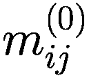 设为零，那么根据上面的公式，我们有：

![$$ E\left[{m}_{ij}^{(t)}\right]=E\left[{\beta}_1{m}_{ij}^{\left(t-1\right)}+\left(1-{\beta}_1\right)\frac{\partial {C}^{(t)}}{\partial {w}_{ij}}\right]=g\left(1-{\beta}_1^t\right) $$](../images/448418_2_En_2_Chapter/448418_2_En_2_Chapter_TeX_Equdh.png)

因此，为了使梯度移动平均成为迭代 *t* 时整个数据集的真实梯度 *g* 的无偏估计，我们定义梯度归一化移动平均为 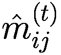，如下所示：

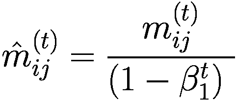

同样，我们定义梯度平方的归一化移动平均为 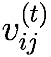，如下所示：

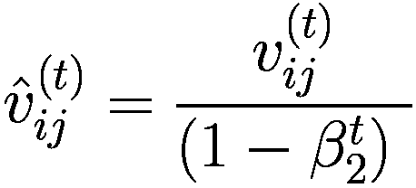

每个权重 *w*[*ij*] 的最终更新规则如下：

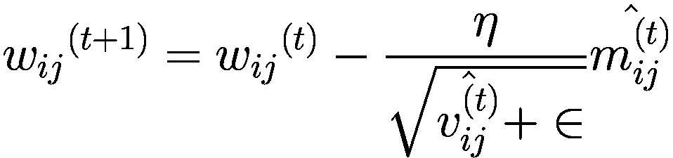

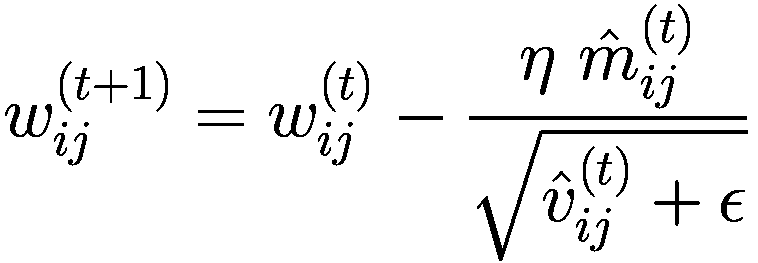

##### 使用方法

```py
optimizer =tf.keras.optimizers.Adam(learning_rate=0.001,beta_1=0.9,beta_2=0.999,epsilon=1e-08)
```

其中，`learning_rate` 是常数学习率 *η*，`cost` *C* 是需要通过 `AdamOptimizer` 最小化的成本函数。参数 `beta1` 和 `beta2` 分别对应 *β*[1] 和 *β*[2]，而 `epsilon` 代表 ∈。

#### 动量优化器和 Nesterov 算法

基于动量的优化器已经发展起来以处理非凸优化。每当我们在处理神经网络时，我们通常得到的成本函数在本质上是非凸的，因此基于梯度的优化方法可能会陷入局部最小值。如前所述，这是非常不希望的，因为在这些情况下，我们得到的优化问题的解是次优的——并且可能是一个次优模型。此外，梯度下降遵循每个点的斜率，并朝着局部最小值进行小步前进，但它可能非常慢。基于动量的方法引入了一个称为速度 *v* 的组件，当计算的梯度改变符号时，它会抑制参数更新，而当梯度与速度方向相同时，它会加速参数更新。这引入了更快的收敛速度以及围绕全局最小值或提供良好泛化的局部最小值的更少振荡。基于动量的优化器的更新规则如下：

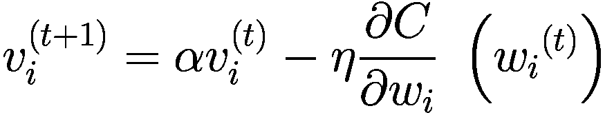

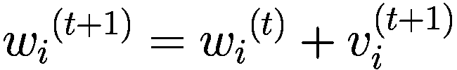

其中 *α* 是动量参数，*η* 是学习率。术语 *v*[*i*]^((*t*)) 和 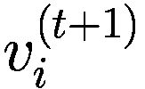 分别表示第 *i* 个参数在迭代 *t* 和 (*t* + 1) 时的速度，同样，*w*[*i*]^((*t*)) 和 *w*[*i*]^((*t* + 1)) 分别表示第 *i* 个参数在迭代 *t* 和 *t* + 1 时的权重。

想象一下，在优化成本函数时，优化算法达到一个局部最小值，其中 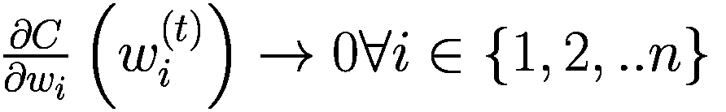。在正常梯度下降方法中，如果不考虑动量，参数更新会在那个局部最小值或鞍点停止。然而，在基于动量的优化中，先前的速度会将算法驱出局部最小值，因为局部最小值具有较小的吸引域，如  由于先前梯度的非零速度而不会为零。此外，如果先前的梯度始终指向全局最小值或具有良好泛化能力和合理大吸引域的局部最小值，则梯度下降的速度或动量将朝那个方向。因此，即使存在具有小吸引域的坏局部最小值，动量分量不仅会驱使算法离开坏局部最小值，还会继续梯度下降以指向全局最小值或好的局部最小值。

如果权重是参数向量 *θ* 的一部分，基于动量的优化器的向量化更新规则如下（参见图 2-24 以了解基于矢量的说明）：

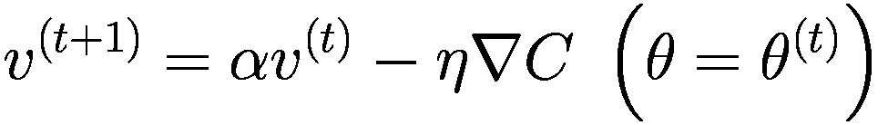

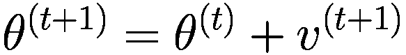

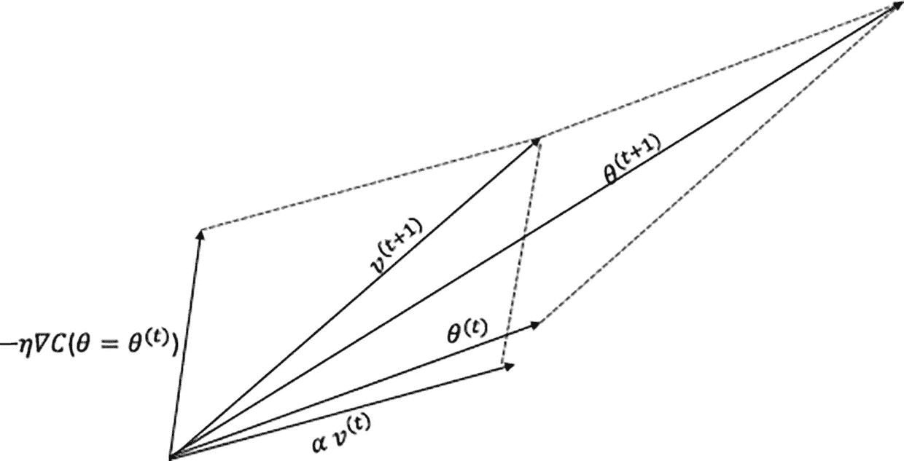

动量参数矢量图上显示了五个箭头，以表示五个不同的方程。

图 2-24

基于动量的梯度下降优化器中的参数向量更新

基于动量的优化器的一个特定变体是 Nesterov 加速梯度技术。这种方法利用现有的速度 *v*^((*t*)) 来更新参数向量。由于它是对参数向量的中间更新，因此方便地用  表示。在 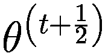 处评估成本函数的梯度，并使用相同的梯度来更新新的速度。最后，新的参数向量是前一次迭代的参数向量和新的速度之和。

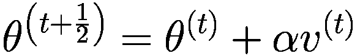

![v^(t+1)=αv^(t)−η∇C(θ=θ^(t+1/2))] (../images/448418_2_En_2_Chapter/448418_2_En_2_Chapter_TeX_Equdr.png)


##### 使用方法

```py
optimizer = tf.keras.optimizers.SGD( learning_rate=0.001, momentum=0.9, nesterov=True)
```

其中 `learning_rate` 代表 *η*，`momentum` 代表 *α*，而 `use_nesterov` 决定是否使用 Nesterov 动量的版本。

#### Epoch、批次数和批大小

深度学习网络，如前所述，通常通过小批量随机梯度下降进行训练。我们需要熟悉的一些术语如下：

+   ***Batch size***：批大小决定了每个小批量中的训练数据点的数量。批大小应选择得足够好，以便对整个训练数据集的梯度给出足够好的估计，同时足够嘈杂，以避免提供不良泛化的坏局部最小值。

+   ***Number of batches***：批次数给出了整个训练数据集中的小批次数量。可以通过将总训练数据点的数量除以批大小来计算。请注意，最后一个 mini-batch 可能比批大小有更少的数据点。

+   ***Epochs***：一个 epoch 包括在整个数据集上的一次完整训练过程。更具体地说，一个 epoch 等同于在整个训练数据集上的前向传播加上一次反向传播。因此，一个 epoch 将包含 *n* 次前向传播 + 反向传播，其中 *n* 表示批次的数量。

### 使用 TensorFlow 实现 XOR

现在我们已经对人工神经网络涉及的组件和训练方法有了相当的了解；我们将使用 sigmoid 激活函数在隐藏层以及输出层实现 XOR 网络。详细的实现已在列表 2-15 中概述。

```py
# Import the required packages
import tensorflow as tf
import numpy as np
from tensorflow.keras import Model, layers
print( 'tensorflow version',tf.__version__ )
# Model with one hidden layer of 2 units with sigmoid activation to render non-linearity
class MLP(Model):
# Set layers.
def __init__(self,n_hidden=2,n_out=1):
super(MLP, self).__init__()
# Fully-connected hidden layer.
self.fc1 = layers.Dense(n_hidden, activation=tf.nn.sigmoid,name="hidden")
# Output layer
self.out = layers.Dense(n_out,activation=tf.nn.sigmoid,name="out")
# Forward pass through the MLP
def call(self, x):
x = self.fc1(x)
x = self.out(x)
return x
# Define Model by instantiating the MLP Class
model = MLP(n_hidden=2,n_out=1)
# Wrap the model with tf.function to create Graph execution for the Model
model_graph = tf.function(model)
# Learning rate
learning_rate = 0.01
# Define Optimizer
optimizer = tf.compat.v1.train.GradientDescentOptimizer(learning_rate)
# Define Crossentropy loss. Since we have set the output layer activation to be sigmoid from_logits is set to False
loss_fn = tf.keras.losses.BinaryCrossentropy(from_logits=False)
# Define the XOR specific datapoints
XOR_X = [[0,0],[0,1],[1,0],[1,1]]
XOR_Y = [[0],[1],[1],[0]]
# Convert the data to Constant Tensors
x_ = tf.constant(np.array(XOR_X))
y_  = tf.constant(np.array(XOR_Y))
num_epochs = 100000
for i in range(num_epochs):
#  Track variables/operations along with their order within the tf.GradientTape scope so as to use them for Gradient
# Computation
with tf.GradientTape() as tape:
y_pred = model_graph(x_)
loss = loss_fn(y_,y_pred)
# Compute gradient
gradients = tape.gradient(loss, model.trainable_variables)
# update the parameters
optimizer.apply_gradients(zip(gradients, model.trainable_variables))
if i % 10000 == 0:
print(f"Epoch: {i}, loss: {loss.numpy()}")
print('Final Prediction:', model_graph(x_).numpy())
--output –
Final Prediction: [[0.02323644]
[0.9814549 ]
[0.9816729 ]
[0.02066191]]
Listing 2-15
XOR Implementation with Hidden Layers That Have Sigmoid Activation Functions
```

在列表 2-15 中，XOR 逻辑已经使用 TensorFlow 2 实现。隐藏层单元使用 sigmoid 激活函数来引入非线性。输出激活函数使用 sigmoid 激活函数以给出概率输出。我们使用学习率为 0.01 且总迭代次数约为 100,000 的梯度下降优化器。如果我们查看最终预测，第一个和第四个训练样本的概率值接近零，而第二个和第四个训练样本的概率值接近 1。因此，网络可以以高精度准确预测与 XOR 标签对应的类别。任何合理的输出概率阈值都可以将数据点正确分类到 XOR 类别中。

#### XOR 网络的 TensorFlow 计算图

在图 2-25 中，展示了之前实现的 XOR 网络的计算图。计算图摘要被写入日志文件中，我们可以在代码中的任何位置定义它，在实际上传或执行感兴趣的函数之前使用 tf.summary.create_file_writer() 函数。在这里，我们选择在 MLP 类实例化之前定义日志。

`stamp = datetime.now().strftime("%Y%m%d-%H%M%S")`

`logdir = 'logs/func1/%s' % stamp`

`writer = tf.summary.create_file_writer(logdir)`

```py
# Define Model by instantiating the MLP Class
```

`model = MLP(n_hidden=2,n_out=1)`

一旦我们定义了日志写入器，我们需要通过使用 tf.summary.trace_on() 函数立即在函数调用或感兴趣的模型训练之前设置摘要跟踪。对于图信息，我们需要设置 **graph=True**，而对于内存和 CPU 时间等配置信息，我们需要在设置摘要跟踪时设置 **profile=True**。此外，我们还需要将 trace_export 功能设置在尝试跟踪的计算逻辑（训练、函数调用等）之后，将跟踪写入日志。

实际上，trace_on 和 trace_export 功能应该覆盖我们计划跟踪的执行逻辑。对于 XOR 示例，我们将 trace_on 和 trace_export 功能放置在以下跟踪模型训练的位置：

```py
tf.summary.trace_on(graph=True, profiler=True)
for i in range(num_epochs):
#  Track variables/operations along with their order within the tf.GradientTape scope so as to use them for Gradient
# Computation
with tf.GradientTape() as tape:
y_pred = model_graph(x_)
loss = loss_fn(y_,y_pred)
# Compute gradient
gradients = tape.gradient(loss, model.trainable_variables)
# update the parameters
optimizer.apply_gradients(zip(gradients, model.trainable_variables))
if i % 10000 == 0:
print(f"Epoch: {i}, loss: {loss.numpy()}")
with writer.as_default():
tf.summary.trace_export(
name="my_func_trace",
step=0,
profiler_outdir=logdir)
print('Final Prediction:', model_graph(x_).numpy())
Once the training has completed and output has been written to the log, we can view the computation graph by loading the log into TensorBoard. The following is the code that can be used in Jupyter notebook for the same.
%load_ext tensorboard
import tensorboard
%tensorboard –logdir logs/func1
```

这将启动 TensorBoard 会话，我们可以在此观察计算图。图 2-25 展示了列表 2-15 中 XOR 网络的计算图。

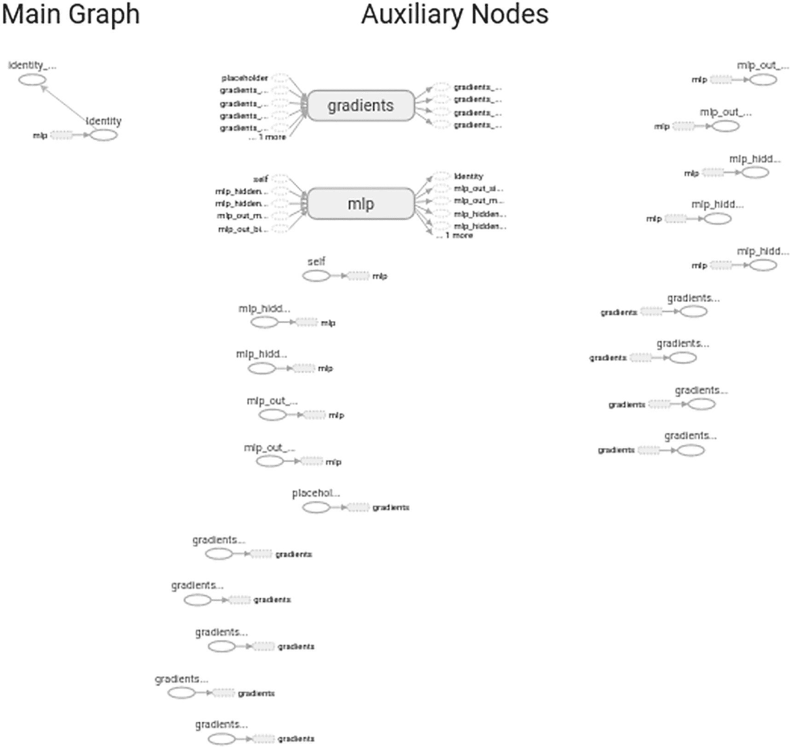

计算图的表示。它包含主图以及梯度、mlp 等辅助节点。

图 2-25

XOR 网络的计算图

现在，我们再次实现 XOR 逻辑，在隐藏层中使用线性激活函数，其余网络保持不变。列表 2-16 展示了 TensorFlow 的实现。

```py
# Import the required packages
import tensorflow as tf
import numpy as np
from tensorflow.keras import Model, layers
print( 'tensorflow version',tf.__version__ )
# Model with one hidden layer of 2 units with linear activation to check if without non linearity we are able to learn # the XOR function
class MLP(Model):
# Set layers.
def __init__(self,n_hidden=2,n_out=1):
super(MLP, self).__init__()
# Fully-connected hidden layer.
self.fc1 = layers.Dense(n_hidden, activation=’linear’)
# Output layer
self.out = layers.Dense(n_out,activation=tf.nn.sigmoid)
# Forward pass through the MLP
def call(self, x):
x = self.fc1(x)
x = self.out(x)
return x
# Define Model by instantiating the MLP Class
model = MLP(n_hidden=2,n_out=1)
# Wrap the model with tf.function to create Graph execution for the Model
model_graph = tf.function(model)
# Learning rate
learning_rate = 0.01
# Define Optimizer
optimizer = tf.compat.v1.train.GradientDescentOptimizer(learning_rate)
# Define Crossentropy loss. Since we have set the output layer activation to be sigmoid from_logits is set to False
loss_fn = tf.keras.losses.BinaryCrossentropy(from_logits=False)
# Define the XOR specific datapoints
XOR_X = [[0,0],[0,1],[1,0],[1,1]]
XOR_Y = [[0],[1],[1],[0]]
# Convert the data to Constant Tensors
x_ = tf.constant(np.array(XOR_X))
y_  = tf.constant(np.array(XOR_Y))
num_epochs = 100000
for i in range(num_epochs):
#  Track variables/operations along with their order within the tf.GradientTape scope so as to use them for Gradient
# Computation
with tf.GradientTape() as tape:
y_pred = model_graph(x_)
loss = loss_fn(y_,y_pred)
# Compute gradient
gradients = tape.gradient(loss, model.trainable_variables)
# update the parameters
optimizer.apply_gradients(zip(gradients, model.trainable_variables))
if i % 10000 == 0:
print(f"Epoch: {i}, loss: {loss.numpy()}")
print('Final Prediction:', model_graph(x_).numpy())
--output –
Final Prediction: [[0.5006326 ]
[0.5000254 ]
[0.49998236]
[0.49937516]]
Listing 2-16
XOR Implementation with Linear Activation Functions in Hidden Layer
```

如列表 2-16 所示的最终预测值都接近 0.5，这意味着实现的 XOR 逻辑无法很好地区分正类和负类。当我们隐藏层中有线性激活函数时，网络主要保持线性，正如我们之前所看到的，因此模型在需要非线性决策边界来分离类时表现不佳。

### TensorFlow 中的线性回归

线性回归可以表示为一个单神经元回归问题。预测误差平方的平均值被用作相对于模型系数的优化成本函数。列表 2-17 展示了使用波士顿房价数据集的 TensorFlow 线性回归实现。

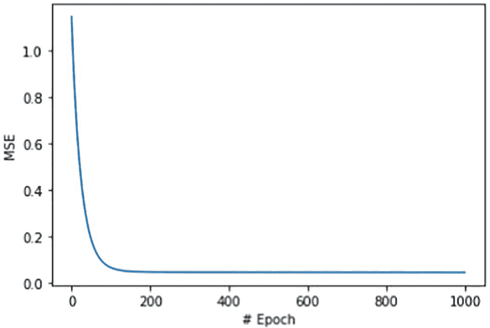

图表上表示了均方误差（MSE）与迭代次数（epoch）之间的关系。它开始时急剧下降，然后转变为直线。

图 2-26

训练过程中的成本（均方误差）与迭代次数对比

```py
import matplotlib.pyplot as plt
%matplotlib inline
plt.plot(cost_trace)
Listing 2-17a
Linear Regression Cost Plot over Epochs or Iterations
```

```py
# Importing TensorFlow, Numpy and the Boston Housing price dataset
import tensorflow as tf
print('tensorflow version',tf.__version__)
import numpy as np
import sklearn
from sklearn.datasets import load_boston
# Function to load the Boston data set
def read_infile():
data = load_boston()
features = np.array(data.data)
target = np.array(data.target)
return features,target
# Normalize the features by Z scaling i.e. subract form each feature value its mean and then divide by its
# standard deviation. Accelerates Gradient Descent.
def feature_normalize(data):
mu = np.mean(data,axis=0)
std = np.std(data,axis=0)
return (data - mu)/std
# Execute the functions to read and normalize  the data
features,target = read_infile()
z_features = feature_normalize(features)
num_features = z_features.shape[1]
X = tf.constant( z_features , dtype=tf.float32 )
Y = tf.constant( target , dtype=tf.float32 )
# Create Tensorflow linear Model
model = tf.keras.models.Sequential()
model.add(tf.keras.Input(shape=(num_features,)))
model.add(tf.keras.layers.Dense(1, use_bias=True,activation='linear'))
#Learning rate
learning_rate = 0.01
# Define optimizer
optimizer = tf.keras.optimizers.SGD(learning_rate)
num_epochs = 1000
cost_trace = []
loss_fn = tf.keras.losses.MeanSquaredError()
# Execute the gradient descent learning
for i in range(num_epochs):
with tf.GradientTape() as tape:
y_pred = model(X, training=True)
loss = loss_fn(Y,y_pred)
# compute gradient
gradients = tape.gradient(loss, model.trainable_variables)
# update the parameters
optimizer.apply_gradients(zip(gradients, model.trainable_variables))
cost_trace.append(loss.numpy())
if i % 100 == 0:
print(f"Epoch: {i}, loss: {loss.numpy()}")
print(f'Final Prediction..\n')
#print(model(X,training=False).numpy())
print('MSE in training:',cost_trace[-1])
-- output --
tensorflow version 2.4.1
Epoch: 0, loss: 596.2260131835938
Epoch: 100, loss: 32.83129119873047
Epoch: 200, loss: 22.925716400146484
Epoch: 300, loss: 22.40866470336914
Epoch: 400, loss: 22.21877670288086
Epoch: 500, loss: 22.1116943359375
Epoch: 600, loss: 22.04631996154785
Epoch: 700, loss: 22.00408935546875
Epoch: 800, loss: 21.975479125976562
Epoch: 900, loss: 21.955341339111328
Final Prediction..
MSE in training: 21.940863
Listing 2-17
Linear Regression Implementation in TensorFlow
```

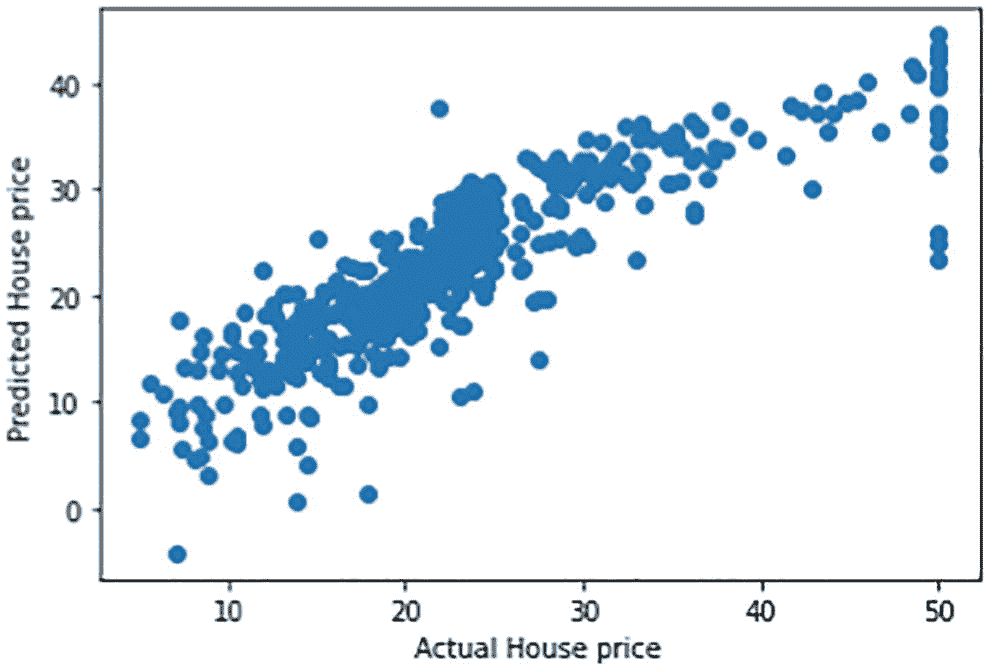

图表显示了一些散点，这些散点随着图表的增加而数量增加。随着图表的增加，散点数量减少。

图 2-27

预测房价与实际房价对比

```py
# Plot the Predicted house Prices vs the Actual House Prices
fig, ax = plt.subplots()
plt.scatter(target,y_pred.numpy())
ax.set_xlabel('Actual House price')
ax.set_ylabel('Predicted House price')
Listing 2-17b
Linear Regression Actual House Price vs. Predicted House Price
```

图 2-26 展示了成本随迭代次数的变化，图 2-27 展示了训练后预测房价与实际房价的对比。正如我们所见，使用 TensorFlow 的线性回归在预测房价方面做得相当不错。

### 使用全批量梯度下降法通过 SoftMax 函数进行的多类分类

在本节中，我们使用全批量梯度下降法来展示一个多类分类问题。MNIST 数据集被选用，因为它有十个输出类别，对应于十个整数。详细的实现已在列表 2-18 中提供。输出层使用了 SoftMax。

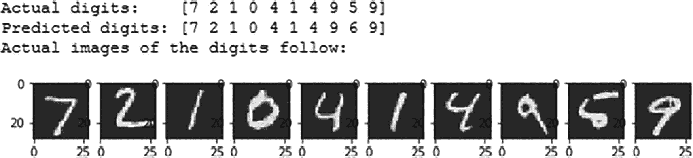

图像中的实际数字是 7 2 1 0 4 1 4 9 5 9，预测的数字是 7 2 1 0 4 1 4 9 6 9。

图 2-28

通过梯度下降法进行 SoftMax 分类的实际数字与预测数字对比

```py
import matplotlib.pyplot as plt
%matplotlib inline
f, a = plt.subplots(1, 10, figsize=(10, 2))
print('Actual digits: ', y_test[0:10].numpy())
print('Predicted digits:',np.argmax(y_pred_test[0:10],axis=1))
print('Actual images of the digits follow:')
for i in range(10):
a[i].imshow(np.reshape(X_test[i],(28, 28)))
-- output --
Listing 2-18a
Display of the Actual Digits vs. the Predicted Digits Along with the Images of the Actual Digits
```

```py
# Load the required packages
import tensorflow as tf
print('tensorflow version', tf.__version__)
import numpy as np
from sklearn import datasets
# Function to Read the MNIST dataset along with the labels
def read_infile():
(train_X, train_Y), (test_X, test_Y) = tf.keras.datasets.mnist.load_data()
train_X = train_X.reshape(-1,28*28)
test_X = test_X.reshape(-1,28*28)
return train_X, train_Y,test_X, test_Y
# Define the Model class to have a MLP architecture with just one hidden layer.
# The model is linear classification Model
class MLP(Model):
# Set layers.
def __init__(self,n_classes=10):
super(MLP, self).__init__()
# Fully-connected hidden layer.
self.out = layers.Dense(n_classes,activation='linear')
# Forward pass.
def call(self, x):
x = self.out(x)
return x
# Define the Categorical Cross Entropy that does a softmax on the final layer output logits
loss_fn = tf.keras.losses.SparseCategoricalCrossentropy(from_logits=True)
#Learning rate
learning_rate = 0.01
# Define optimizer for Full Gradient Descent
optimizer = tf.compat.v1.train.GradientDescentOptimizer(learning_rate)
X_train, y_train, X_test, y_test = read_infile()
num_train_recs, num_test_recs = X_train.shape[0], X_test.shape[0]
# Build the model by instantiating the MLP Class
model = MLP(n_classes=max(y_train) +1)
# Wrap the model with tf.function to create Graph execution for the model
model_graph = tf.function(model)
# Defining the train and test input outputs as tensoflow constants
X_train = tf.constant(X_train, dtype=tf.float32 )
X_test = tf.constant(X_test, dtype=tf.float32 )
y_train = tf.constant(y_train)
y_test = tf.constant(y_test)
epochs = 1000
loss_trace = []
accuracy_trace = []
# Execute the training
for i in range(epochs):
#  Track variables/operations along with their order within the tf.GradientTape scope so as to use them for
# Gradient  Computation
with tf.GradientTape() as tape:
y_pred = model_graph(X_train)
loss = loss_fn(y_train,y_pred)
# compute gradient
gradients = tape.gradient(loss, model.trainable_variables)
# update the parameters
optimizer.apply_gradients(zip(gradients, model.trainable_variables))
# Compute accurcy
accuracy_ = np.mean(y_train.numpy() == np.argmax(y_pred.numpy(),axis=1))
loss_trace.append(loss.numpy()/num_train_recs)
accuracy_trace.append(accuracy_)
if (((i+1) >= 100) and ((i+1) % 100 == 0 )) :
loss_ = np.round((loss.numpy()/num_recs),4)
print(f"Epoch {i+1} : loss: {loss_} ,accuracy:{np.round(accuracy_,4)}\n")
y_pred_test = model_graph(X_test)
loss_test = loss_fn(y_test,y_pred_test).numpy()/num_test_recs
accuracy_test = np.mean(y_test.numpy() == np.argmax(y_pred_test.numpy(),axis=1))
print('Results on Test Dataset:','loss:',np.round(loss_test,4),'accuracy:',np.round(accuracy_test,4))
-- output –
tensorflow version 2.4.1
Epoch 100 : loss: 0.1058 ,accuracy:0.903
Epoch 200 : loss: 0.0965 ,accuracy:0.9086
Epoch 300 : loss: 0.218 ,accuracy:0.8239
Epoch 400 : loss: 0.0984 ,accuracy:0.9154
Epoch 500 : loss: 0.082 ,accuracy:0.921
Epoch 600 : loss: 0.0884 ,accuracy:0.9201
Epoch 700 : loss: 0.0896 ,accuracy:0.9204
Epoch 800 : loss: 0.081 ,accuracy:0.9228
Epoch 900 : loss: 0.1502 ,accuracy:0.8858
Epoch 1000 : loss: 0.0944 ,accuracy:0.8995
Results on Test Dataset: loss: 0.0084 accuracy: 0.861
Listing 2-18
Multiclass Classification with SoftMax Function Using Full-Batch Gradient Descent
```

图 2-28 显示了经过梯度下降全批量学习训练后，验证数据集样本的 SoftMax 分类中实际数字与预测数字的对比。

### 使用随机梯度下降法通过 SoftMax 函数进行的多类分类

我们现在执行相同的分类任务，但不是使用全批量学习，而是使用批量大小为 1000 的随机梯度下降法。详细的实现已在列表 2-19 中概述。


图像中显示了实际数字和预测数字矩阵。在下面的方框中，展示了数字的实际图像。

图 2-29

通过随机梯度下降法进行 SoftMax 分类的实际数字与预测数字对比

```py
import matplotlib.pyplot as plt
%matplotlib inline
f, a = plt.subplots(1, 10, figsize=(10, 2))
print('Actual digits: ', y_test[0:10].numpy())
print('Predicted digits:',np.argmax(y_pred_test[0:10],axis=1))
print('Actual images of the digits follow:')
for i in range(10):
a[i].imshow(np.reshape(X_test[i],(28, 28)))
--output --
Listing 2-19a
Actual Digits vs. Predicted Digits for SoftMax Classification Through Stochastic Gradient Descent
```

```py
# Load the required packages
import tensorflow as tf
print('tensorflow version', tf.__version__)
import numpy as np
from sklearn import datasets
# Function to Read the MNIST dataset along with the labels
def read_infile():
(train_X, train_Y), (test_X, test_Y) = tf.keras.datasets.mnist.load_data()
train_X = train_X.reshape(-1,28*28)
test_X = test_X.reshape(-1,28*28)
return train_X, train_Y,test_X, test_Y
# Define the Model class to have a MLP architecture with just one hidden layer.
# The model is linear classification Model
class MLP(Model):
# Set layers.
def __init__(self,n_classes=10):
super(MLP, self).__init__()
# Fully-connected hidden layer.
self.out = layers.Dense(n_classes,activation='linear')
# Forward pass.
def call(self, x):
x = self.out(x)
return x
# Define the Categorical Cross Entropy that does a softmax on the final layer output logits
loss_fn = tf.keras.losses.SparseCategoricalCrossentropy(from_logits=True)
#Learning rate
learning_rate = 0.01
# Define  the Stochastic Gradient Descent Optimizer for mini-batch based training
optimizer = tf.keras.optimizers.SGD(learning_rate)
X_train, y_train, X_test, y_test = read_infile()
# Build the model by instantiating the MLP class
model = MLP(n_classes=max(y_train) +1)
# Wrap the model with tf.function to create Graph execution for the model
model_graph = tf.function(model)
X_test = tf.constant(X_test, dtype=tf.float32 )
y_test = tf.constant(y_test)
epochs = 1000
loss_trace = []
accuracy_trace = []
batch_size = 1000
num_train_recs,num_test_recs = X_train.shape[0], X_test.shape[0]
num_batches = num_train_recs // batch_size
order_ = np.arange(num_train_recs)
# Invoke the training
for i in range(epochs):
loss, accuracy = 0,0
# Randomize the order of the training data
np.random.shuffle(order_)
X_train,y_train = X_train[order_], y_train[order_]
# Interate of the mini batches
for j in range(num_batches):
X_train_batch = tf.constant(X_train[j*batch_size:(j+1)*batch_size],dtype=tf.float32)
y_train_batch = tf.constant(y_train[j*batch_size:(j+1)*batch_size])
#  Track variables/operations along with their order within the tf.GradientTape scope so as to use them for
# Gradient  Computation
with tf.GradientTape() as tape:
y_pred_batch = model_graph(X_train_batch)
loss_ = loss_fn(y_train_batch,y_pred_batch)
# Compute gradient
gradients = tape.gradient(loss_, model.trainable_variables)
# Update the parameters
optimizer.apply_gradients(zip(gradients, model.trainable_variables))
accuracy += np.sum(y_train_batch.numpy() == np.argmax(y_pred_batch.numpy(),axis=1))
loss += loss_.numpy()
loss /= num_train_recs
accuracy /= num_train_recs
loss_trace.append(loss)
accuracy_trace.append(accuracy)
if (((i+1) >= 100) and ((i+1) % 100 == 0 )) :
print(f"Epoch {i+1} : loss: {np.round(loss,4)} ,accuracy:{np.round(accuracy,4)}\n")
y_pred_test = model_graph(X_test)
loss_test = loss_fn(y_test,y_pred_test).numpy()/num_test_recs
accuracy_test = np.mean(y_test.numpy() == np.argmax(y_pred_test.numpy(),axis=1))
print('Results on Test Dataset:','loss:',np.round(loss_test,4),'accuracy:',np.round(accuracy_test,4))
-- output –
tensorflow version 2.4.1
Epoch 100 : loss: 0.1215 ,accuracy:0.862
Epoch 200 : loss: 0.082 ,accuracy:0.8949
Epoch 300 : loss: 0.0686 ,accuracy:0.9046
Epoch 400 : loss: 0.0774 ,accuracy:0.8947
Epoch 500 : loss: 0.0698 ,accuracy:0.901
Epoch 600 : loss: 0.0628 ,accuracy:0.9081
Epoch 700 : loss: 0.0813 ,accuracy:0.8912
Epoch 800 : loss: 0.0837 ,accuracy:0.8887
Epoch 900 : loss: 0.068 ,accuracy:0.9056
Epoch 1000 : loss: 0.0709 ,accuracy:0.902
Results on Test Dataset: loss: 0.0065 accuracy: 0.9105
Listing 2-19
Multiclass Classification with SoftMax Function Using Stochastic Gradient Descent
```

图 2-29 显示了经过随机梯度下降训练后，验证数据集样本的 SoftMax 分类中实际数字与预测数字的对比。

## GPU

在结束本章之前，我们想简要谈谈 GPU，它彻底改变了深度学习领域。GPU 代表图形处理单元，最初用于游戏目的，以每秒显示更多屏幕来提高游戏分辨率。深度学习网络在正向传播和反向传播过程中都大量使用矩阵乘法，尤其是卷积。GPU 在矩阵到矩阵的乘法方面表现良好；因此，数千个 GPU 核心被用来并行处理数据。这些加速了深度学习的训练过程。

市面上可用的常见 GPU 如下：

+   NVIDIA RTX 30 系列

+   NVIDIA GTX TITAN X

+   NVIDIA GeForce GTX 1080

+   NVIDIA GeForce GTX 1070

+   NVIDIA Tesla V100

GPU 的一个局限性是，它们被设计为通用处理器，可以支持各种应用。在这样做的时候，GPU 必须访问寄存器和共享内存来读取和存储结果。GPU 在访问内存上消耗了大量的能量，这增加了 GPU 的足迹。

## TPU

GPU 的替代品是 Google 的 Tensor Processing Units 或 TPUs，它被设计用于加速深度学习和机器学习应用。与 CPU 和 GPU 这些通用处理器不同，TPUs 被设计为仅作为矩阵处理器，专门用于神经网络工作负载。

在 TPUs 中，一旦数据和模型参数被加载到 TPU 中，整个矩阵计算就会完成，之后在整个大规模计算过程中没有内存访问。因此，在 TPUs 中访问内存所消耗的功率比在 GPU 中少得多。

Google 自 2015 年以来内部使用 TPUs，自 2018 年以来已向公众开放。

## 摘要

在本章中，我们介绍了深度学习是如何从人工神经网络逐年发展而来的。此外，我们还讨论了感知器学习方法、其局限性以及当前训练神经网络的训练方法。详细讨论了与非线性成本函数、椭圆局部成本轮廓和鞍点相关的问题，以及需要不同的优化器来解决此类问题。在章节的后半部分，我们回顾了 TensorFlow 的基础知识以及如何通过 TensorFlow 执行与线性回归、多类 SoftMax 和 XOR 分类相关的简单模型。在下一章中，重点将放在图像的卷积神经网络上。
