# 3. 卷积神经网络

近年来，人工神经网络在处理非结构化数据方面取得了繁荣发展，尤其是图像、文本、音频和语音。卷积神经网络（CNNs）最适合此类非结构化数据。每当数据与拓扑相关联时，卷积神经网络都能很好地从数据中提取重要特征。从架构角度来看，CNNs 受到了多层感知器（Perceptrons）的启发。通过在相邻层的神经元之间施加局部连接约束，CNN 利用了局部空间相关性。

卷积神经网络的核心元素是通过卷积运算处理数据。任何信号与另一个信号的卷积会产生第三个信号，这个信号可能比原始信号本身揭示更多关于信号的信息。在我们深入卷积神经网络之前，让我们先详细了解一下卷积。

## 卷积运算

时间或空间信号与另一个信号的卷积会产生初始信号的修改版本。修改后的信号可能比原始信号更适合特定任务的特征表示。例如，通过将灰度图像作为二维信号与另一个信号（通常称为滤波器或核）卷积，可以得到包含原始图像边缘的输出信号。图像中的边缘可以对应于物体边界、光照变化、材料属性变化、深度不连续性等，这些可能对多个应用有用。了解系统线性时不变性或移不变性属性的知识有助于更好地理解信号的卷积。在我们继续讨论卷积本身之前，我们将首先讨论这一点。

### 线性时不变（LTI）/线性移不变（LSI）系统

系统以某种方式处理输入信号以产生输出信号。如果一个输入信号 \( x(t) \) 产生一个输出 \( y(t) \)，那么 \( y(t) \) 可以表示如下：

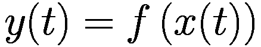

对于系统要具有线性，以下关于缩放和叠加的性质应该成立：

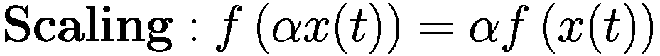

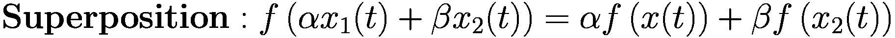

同样，对于系统要具有时不变性或一般移不变性，

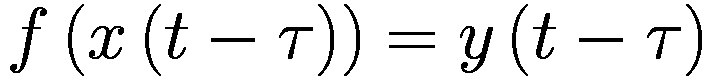

具有线性性和移不变性特性的系统通常被称为线性移不变（LSI）系统。当此类系统作用于时间信号时，它们被称为线性时不变（LTI）系统。在本章的其余部分，我们将不加区分地称此类系统为 LSI 系统。见图 3-1。

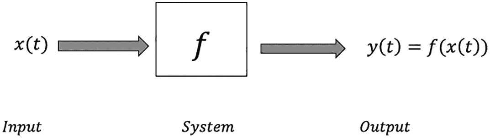

一个三步过程。输入函数，系统 f 在方框中，以及输出函数。

图 3-1

输入-输出系统

LSI 系统的关键特征是，如果知道系统对脉冲响应的输出，那么就可以计算对任何信号的输出响应。

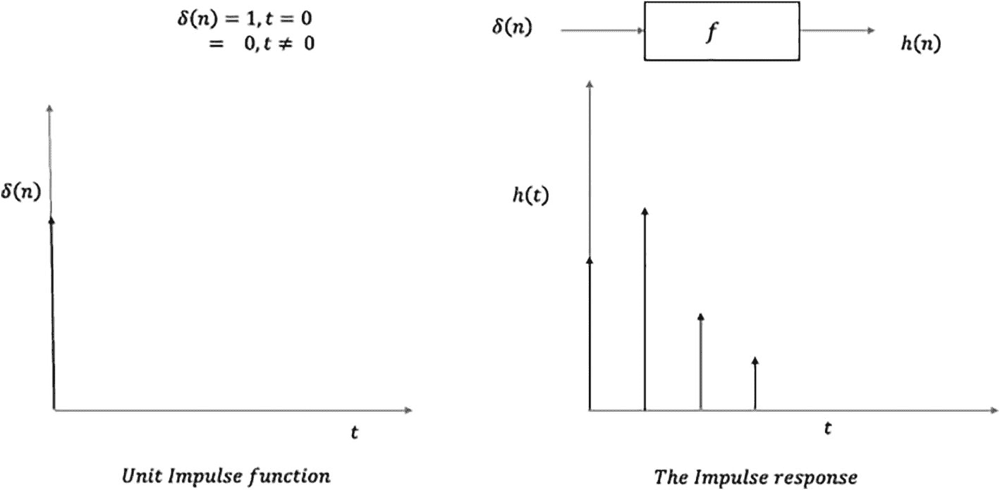

通过绘制 n 的 delta 函数和 t 的 h 函数与 t 的关系，展示了单位脉冲函数及其脉冲响应的两个图形。

图 3-2b

LTI 系统对单位阶跃脉冲的响应

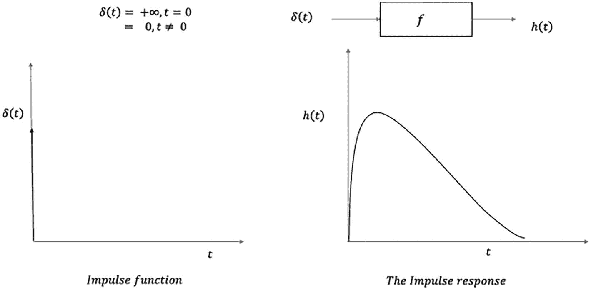

通过绘制 t 的 delta 函数和 t 的 h 函数与 t 的关系，展示了脉冲函数及其脉冲响应的两个图形。

图 3-2a

LSI 系统对脉冲（Dirac Delta）函数的响应

在图 3-2a 和 3-2b 中，我们展示了系统对不同类型脉冲函数的脉冲响应。图 3-2a 显示了系统对 Dirac Delta 脉冲的连续脉冲响应，而图 3-2b 显示了系统对阶跃脉冲函数的离散脉冲响应。图 3-2a 中的系统是一个连续 LTI 系统，因此需要 Dirac Delta 来确定其脉冲响应。另一方面，图 3-2b 中的系统是一个离散 LTI 系统，因此需要单位阶跃脉冲来确定其脉冲响应。

一旦我们知道 LSI 系统对脉冲函数δ(t)的响应 h(t)，我们就可以通过将其与 h(t)卷积来计算 LTI 系统对任何任意输入信号 x(t)的响应 y(t)。从数学上讲，它可以表示为 y(t) = x(t) * h(t)，其中(*)操作表示卷积。

系统的脉冲响应可以是已知的，也可以通过记录系统对脉冲函数的响应来确定。例如，可以通过将哈勃太空望远镜聚焦于暗夜天空中的遥远恒星，然后记录下所记录的图像来找出哈勃太空望远镜的脉冲响应。记录的图像是望远镜的脉冲响应。

### 一维信号中的卷积

直观地说，卷积衡量了一个函数与另一个函数的翻转和平移版本的叠加程度。在离散情况下，

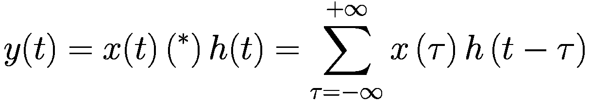

类似地，在连续域中，两个函数的卷积可以表示如下：

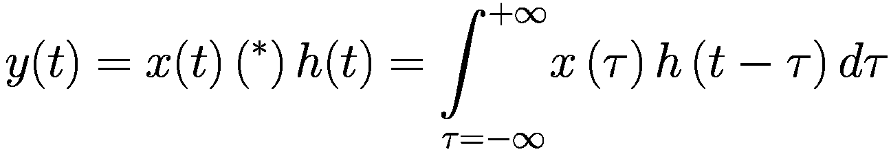

让我们执行两个离散信号的卷积，以更好地解释这个操作。参见图 3-3a 到 3-3c。

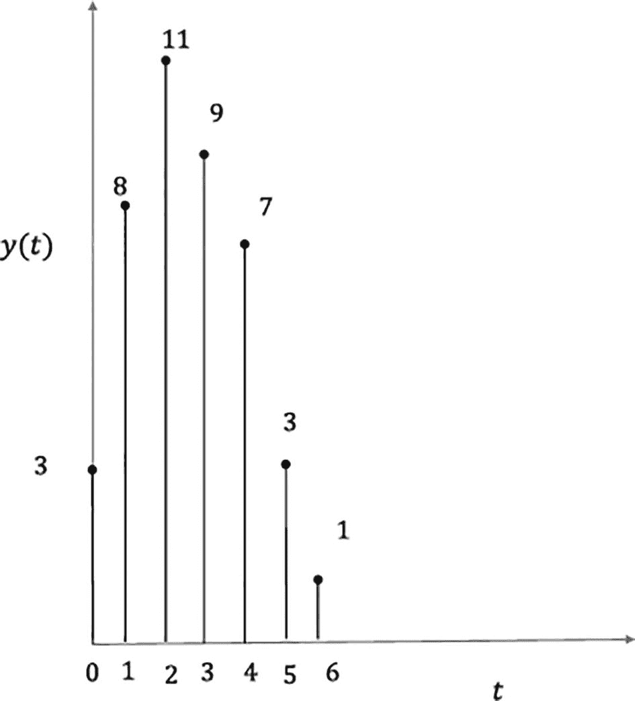

t 函数的二维平面与 t 轴的 y 函数。它表示七个节点及其在 t 轴上的投影，数值函数值为 3、8、11、9、7、3 和 1。

图 3-3c

卷积的输出函数

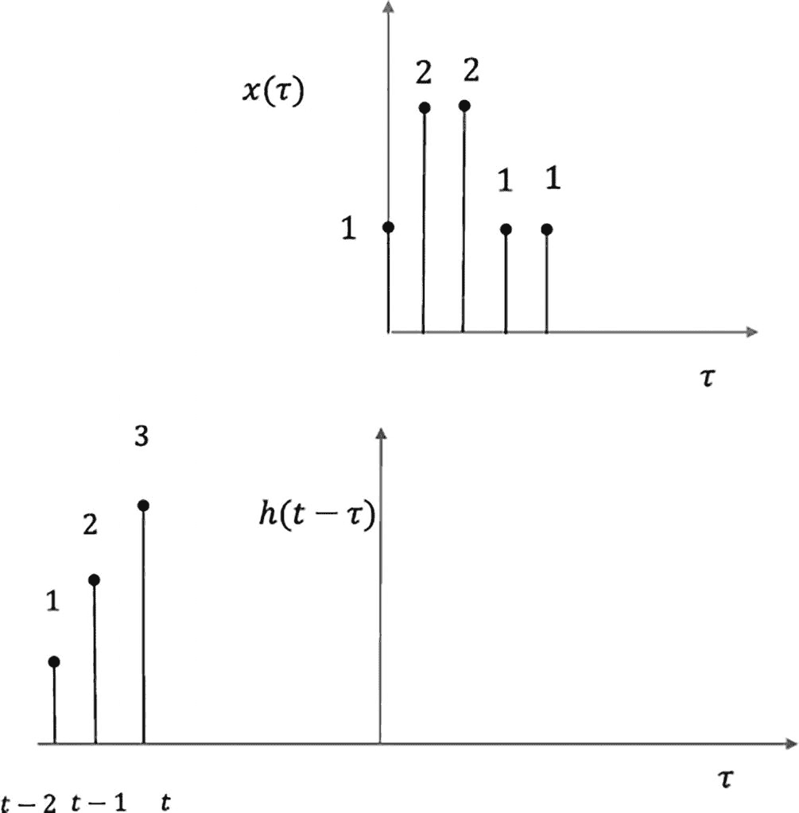

τ函数的 x 函数和 t - τ函数的 h 函数的二维平面。它表示几个节点及其在τ轴上的投影，数值函数值为 1 和 2。

图 3-3b

计算卷积操作的函数

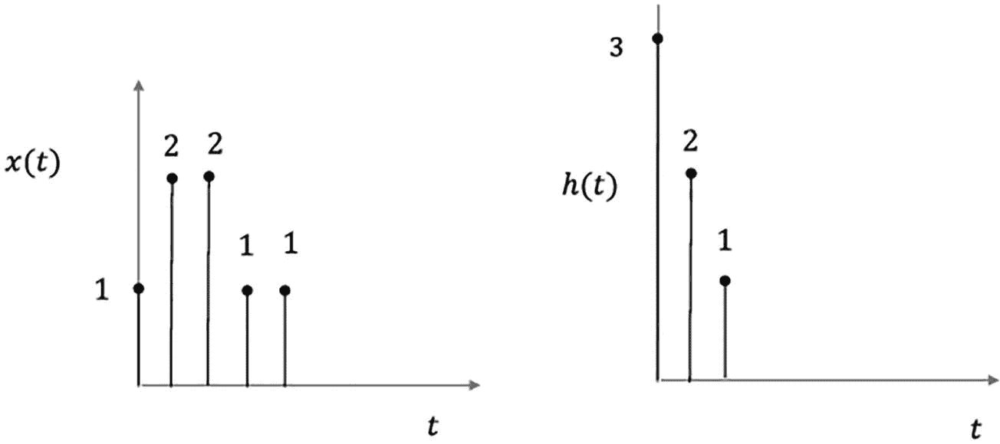

t 函数的 x 函数和 t 函数的 h 函数的二维平面。它表示几个节点及其在 t 轴上的投影，数值函数值为 1、2 和 3。

图 3-3a

输入信号

在图 3-3b 中，需要计算*h*(*t* − *τ*)在不同*t*值下的函数，通过在水平轴上滑动它。在每一个*t*值，需要计算卷积和 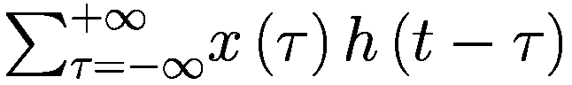。这个和可以看作是*x*(*τ*)的加权平均值，权重由*h*(*t* − *τ*)提供。

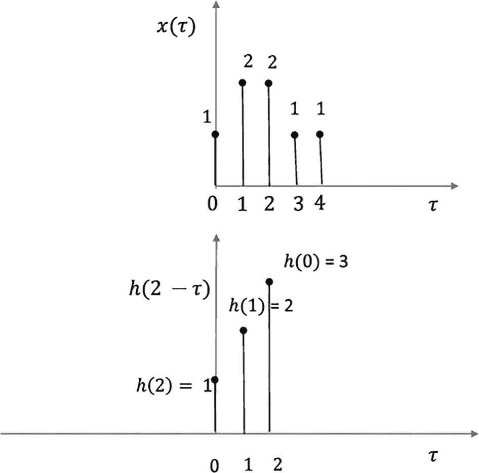

τ函数的 x 函数和 2 - τ函数的 h 函数的二维平面。它表示几个节点及其在τ轴上的投影，数值函数值为 1、2 和 3。

图 3-3d

在 t = 2 时卷积函数的重叠

+   当*t* = -1 时，权重由*h*(1 − *τ*)给出，但权重与*x*(*τ*)不重叠，因此和为 0。

+   当*t* = 0 时，权重由*h*(−*τ*)给出，且*x*(*τ*)与权重重叠的唯一元素是*x*(*τ* = 0)，重叠的权重是*h*( 0)。因此，卷积和为*x*(*τ* = 0) **h*( 0) = 1*3 = 3。因此，*y*(0) = 3。

+   当*t* = 1 时，权重由*h*(1 − *τ*)给出。元素*x*(0)和*x*(1)分别与权重*h*(1)和*h*(0)重叠。因此，卷积和为*x*(0)^∗*h*(1) + *x*(1)^∗*h*(0) = 1^∗2 + 2^∗3 = 8。

+   当*t* = 2 时，权重由*h*(2 − *τ*)给出。元素*x*(0)，*x*(1)和*x*(2)分别与权重*h*(2)，*h*(1)和*h*(0)重叠。因此，卷积和是元素*x*(0)^∗h(2) + *x*(1)^∗h(1) + *x*(2)^∗h(0) = 1^∗1 + 2^∗2 + 2^∗3 = 11。对于*t* = 2 时两个函数的重叠已在图 3-3d 中说明。

## 模拟和数字信号

通常，任何在时间和/或空间上显示变化的感兴趣量都代表一个信号。因此，信号是时间和/或空间的函数。例如，特定股票在一周内的股价代表一个信号。

信号在本质上可以是模拟的或数字的。然而，计算机不能处理模拟的连续信号，因此信号被转换为数字信号以进行处理。例如，语音是时间上的声学信号，其中时间和语音能量的幅度都是连续信号。当语音通过麦克风传输时，这个声学连续信号被转换为电连续信号。如果我们想通过数字计算机处理模拟电信号，我们需要将模拟连续信号转换为离散信号。这是通过模拟信号的采样和量化来完成的。

采样是指仅在固定的空间或时间间隔内取信号的幅度。这已在图 3-4a 中说明。

并非所有可能的信号幅度连续值都通常被标注，但信号幅度通常被量化为一些固定的离散值，如图 3-4b 所示。通过采样和量化，一些信息从模拟连续信号中丢失。

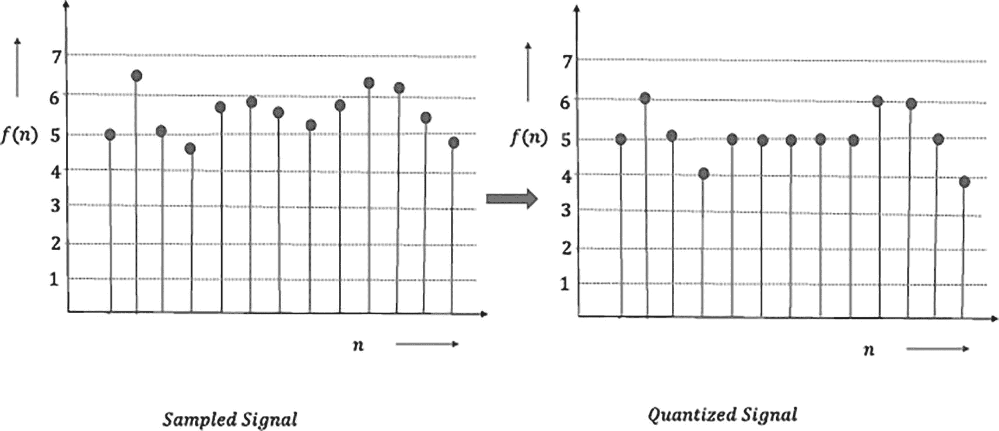

采样信号与 n 对 n 的函数绘制，箭头指向 n 对 n 的函数绘制的量化信号。

图 3-4b

在离散幅度值上的信号量化

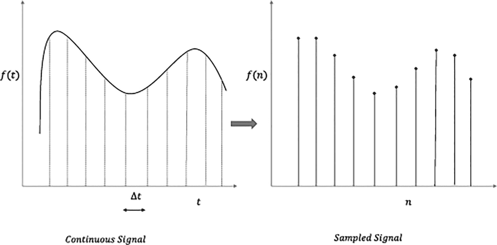

两个图表。一个连续信号与 t 对 t 的函数绘制，箭头指向 n 对 n 的函数绘制的采样信号。

图 3-4a

信号的采样

采样和量化的活动将模拟信号转换为数字信号。

一个数字图像可以在二维空间域中表示为数字信号。彩色 RGB 图像有三个通道：红色、绿色和蓝色。每个通道都可以被视为空间域中的信号，在每一个空间位置，信号由像素强度表示。每个像素可以用 8 位表示，这在二进制中允许从 0 到 255 的 256 个像素强度。任何位置的色彩由该位置三个通道对应的像素强度向量确定。因此，为了表示特定的颜色，使用了 24 位信息。对于灰度图像，只有一个通道，像素强度范围从 0 到 255。255 表示白色，而 0 表示黑色。

一段视频是具有时间维度的图像序列。黑白视频可以表示为空间和时间坐标的信号 (*x*, *y*, *t*)。彩色视频可以表示为三个信号的组合，空间和时间坐标对应于三个颜色通道——红色、绿色和蓝色。

因此，一个 *n* × *m* 的灰度图像可以表示为函数 *I*(*x*, *y*)，其中 *I* 表示 *x*, *y* 坐标处的像素强度。对于数字图像，*x*, *y* 是采样坐标，取离散值。同样，像素强度在 0 到 255 之间量化。

### 二维和三维信号

一个尺寸为 *N* × *M* 的灰度图像可以表示为其空间坐标的标量二维信号。信号可以表示如下：

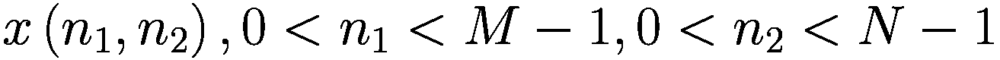

其中 *n*[1] 和 *n*[2] 分别是水平轴和垂直轴上的离散空间坐标，*x*(*n*[1], *n*[2]) 表示空间坐标处的像素强度。像素强度取值范围为 0 到 255。

一张彩色 RGB 图像是一个二维向量信号，因为每个空间坐标都有一个像素强度的向量。对于一个尺寸为 *N* × *M* × 3 的 RGB 图像，信号可以表示如下：

![$$ x\left({n}_1,{n}_2\right)=\left[{x}_R\left({n}_1,{n}_2\right),{x}_G\left({n}_1,{n}_2\right),{x}_B\left({n}_1,{n}_2\right)\right], 0<{n}_1<M-1,0<{n}_2<N-1 $$](../images/448418_2_En_3_Chapter/448418_2_En_3_Chapter_TeX_Equh.png)

其中 *x*[*R*]，*x*[*G*]，和 *x*[*B*] 表示红色、绿色和蓝色颜色通道上的像素强度。参见图 3-5a 和 3-5b。

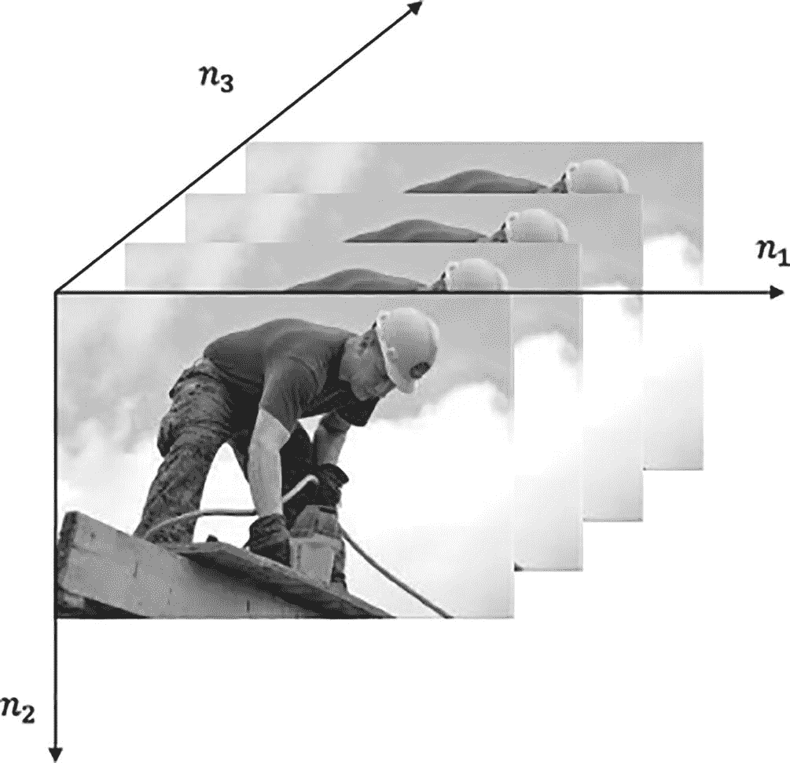

一个三维平面 n1, n2, 和 n3 显示了照片中建筑物屋顶上的人像沿 n3 轴的四个层次。

图 3-5b

视频作为三维对象

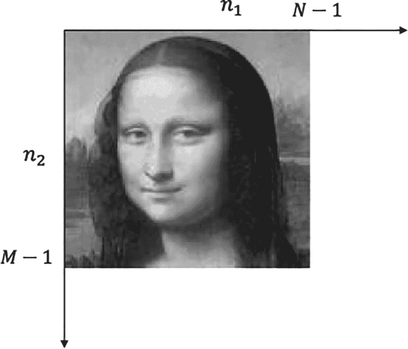

莫娜丽莎在二维平面 n2 与 n1 上的照片。

图 3-5a

灰度图像作为二维离散信号

## 2D 卷积

现在我们已经将灰度图像表示为二维信号，我们希望通过二维卷积来处理这些信号。图像可以通过图像处理系统的脉冲响应进行卷积，以达到不同的目标，如下所示：

+   通过噪声减少滤波器去除图像中的可见噪声。对于白噪声，我们可以使用高斯滤波器。对于盐和胡椒噪声，可以使用中值滤波器。

+   为了检测边缘，我们需要从图像中提取高频成分的滤波器。

图像处理滤波器可以被视为线性且平移不变的图像处理系统。在我们进入图像处理之前，了解不同的脉冲函数是很有价值的。

### 二维单位阶跃函数

一个二维单位阶跃函数 δ(*n*[1], *n*[2])，其中 *n*[1] 和 *n*[2] 是水平和垂直坐标，可以表示如下：

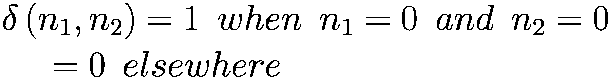

类似地，平移的单位阶跃函数可以表示如下：

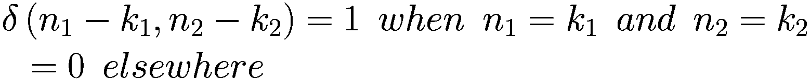

这已在图 3-6 中说明。

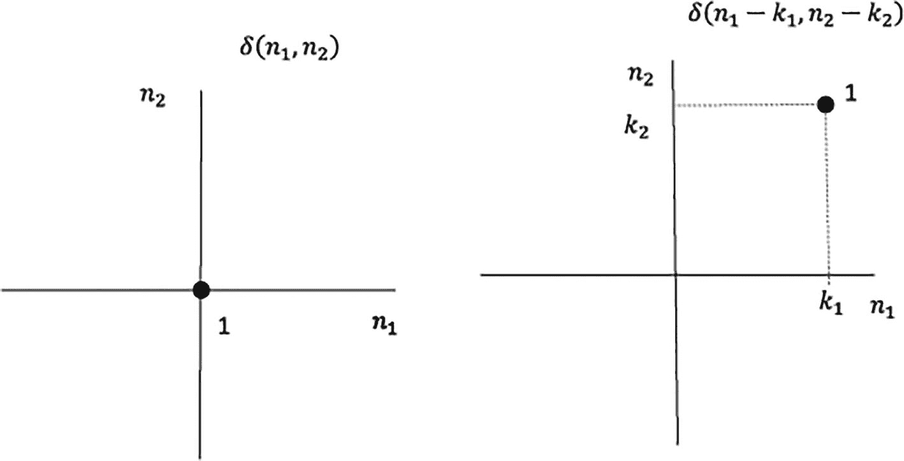

在所有象限中，n2 与 n1 的二维平面图说明了δ函数及其单位函数的投影。

图 3-6

单位阶跃函数

任何离散二维信号都可以表示为不同坐标处单位阶跃函数的加权求和。让我们考虑图 3-7 中所示的信号 *x*(*n*[1], *n*[2])。

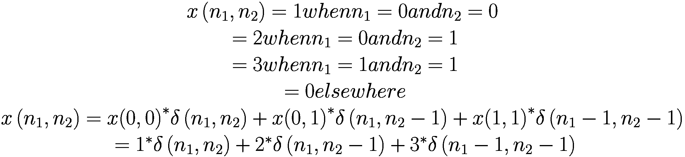

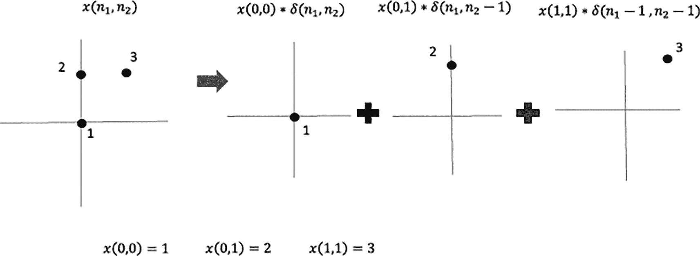

一个离散信号等于单位阶跃函数的和，并在二维平面上以所有象限表示。

图 3-7

将二维离散信号表示为单位阶跃函数的加权求和

因此，一般来说，任何离散的 2D 信号都可以表示如下：

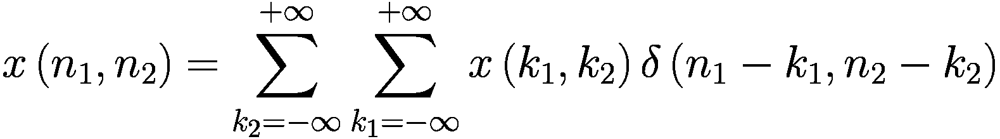

### 信号与 LSI 系统单位阶跃响应的 2D 卷积

当任何离散的 2D 信号，如上述信号，通过具有变换 *f* 的 LSI 系统时，由于 LSI 系统的线性特性，

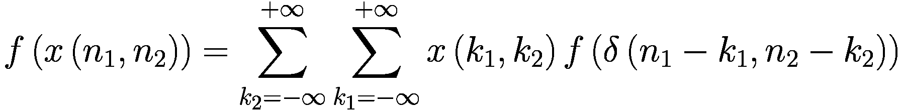

现在，LSI 系统的单位阶跃响应 *f*(*δ*(*n*[1], *n*[2])) = *h*(*n*[1], *n*[2])，由于 LSI 系统是平移不变的，*f*(*δ*(*n*[1] − *k*[1], *n*[2] − *k*[2])) = *h*(*n*[1] − *k*[1], *n*[2] − *k*[2])。

因此，*f* (*x*(*n*[1], *n*[2])) 可以表示如下：

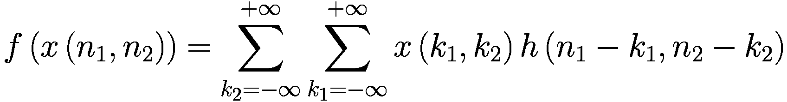

(1)

前面的表达式表示了信号与 LSI 系统单位阶跃响应的 2D 卷积的表达式。为了说明 2D 卷积，让我们通过一个例子来演示，在这个例子中，我们将 *x*(*n*[1], *n*[2]) 与 *h*(*n*[1], *n*[2]) 进行卷积。信号和单位阶跃响应信号如下定义，并在图 3-8 中进行了说明：

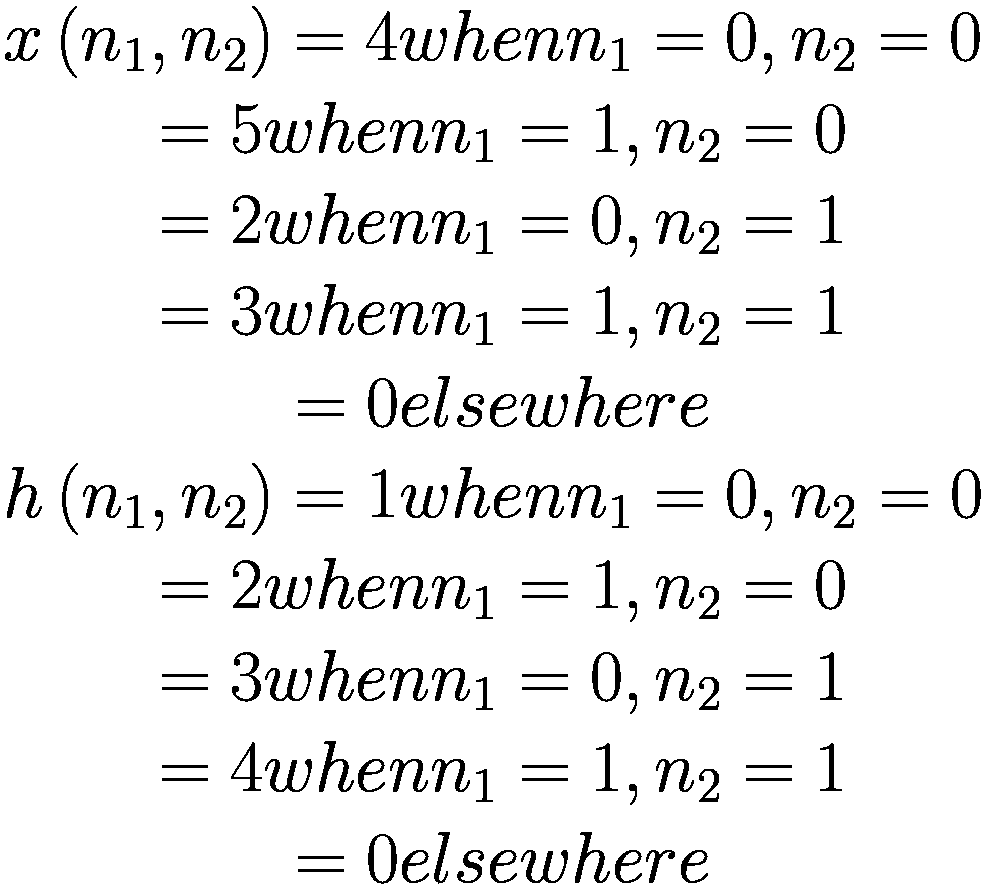

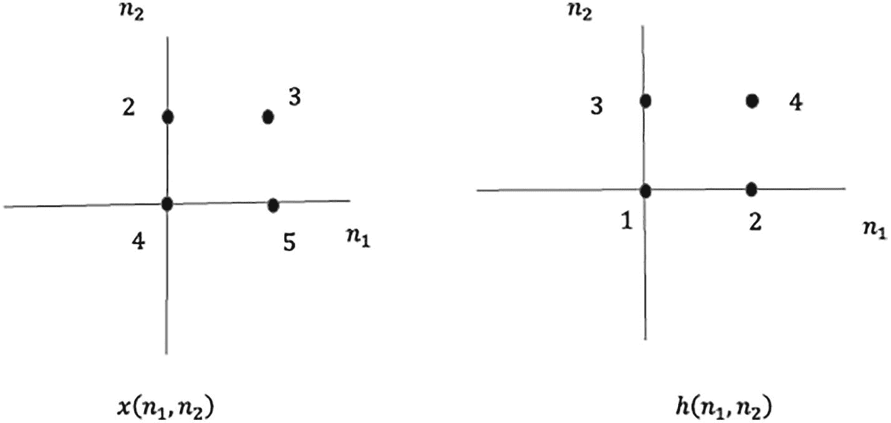

n1 和 n2 的 x 函数以及 n1 和 n2 的 h 函数分别表示在两个独立的二维平面上，n2 相对于 n1。

图 3-8

2D 信号和 LSI 系统的单位阶跃响应

为了计算卷积，我们需要在不同的坐标点上绘制信号。我们分别在横轴和纵轴上选择了*k*[1]和*k*[2]。此外，我们将冲激响应*h*(*k*[1], *k*[2])反转成*h*(−*k*[1], −*k*[2])，如图 3-9b 所示。然后，我们将反转后的函数*h*(−*k*[1], −*k*[2])放置在*n*[1]和*n*[2]的不同偏移值处。广义反转函数可以表示为*h*(*n*[1] − *k*[1], *n*[2] − *k*[2])。为了计算特定值*n*[1]和*n*[2]的卷积输出*y*(*n*[1], *n*[2])，我们观察*h*(*n*[1] − *k*[1], *n*[2] − *k*[2])与*x*(*k*[1], *k*[2])重叠的点，并将信号和冲激响应值的坐标乘积的总和作为输出。

如我们在图 3-9c 中可以看到，对于(*n*[1] = 0, *n*[2] = 0)的偏移，唯一的重叠点是(*k*[1] = 0, *k*[2] = 0)，因此*y*(0, 0) = *x*(0, 0)^∗*h*(0, 0) = 4^∗1 = 4。

同样，对于偏移(*n*[1] = 1, *n*[2] = 0)，重叠点是(*k*[1] = 0, *k*[2] = 0)和(*k*[1] = 1, *k*[2] = 0)，如图 3-9d 所示。


对于偏移(*n*[1] = 1, *n*[2] = 1)，重叠点是(*k*[1] = 1, *k*[2] = 0)，如图 3-9e 所示。

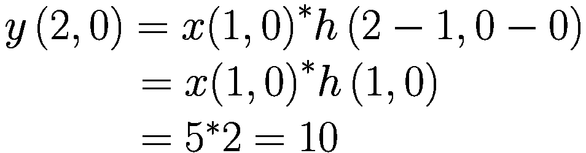

通过改变*n*[1]和*n*[2]来移动单位阶跃响应信号的这种方法，可以计算出整个函数*y*(*n*[1], *n*[2])。

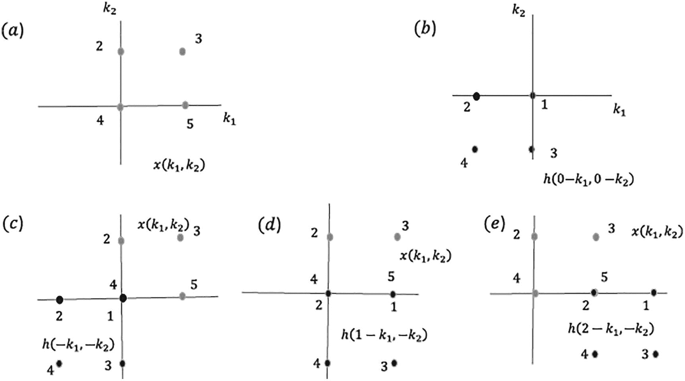

在五个不同的二维平面上，所有象限中不同坐标点的卷积表示。

图 3-9

不同坐标点的卷积

### 图像与不同 LSI 系统响应的二维卷积

任何图像都可以与 LSI 系统的单位阶跃响应卷积。这些 LSI 系统的单位阶跃响应被称为滤波器或核。例如，当我们试图通过相机获取图像时，由于手抖，图像会变得模糊，这种模糊可以被视为具有特定单位阶跃响应的 LSI 系统。这个单位阶跃响应与实际图像卷积，并产生模糊的图像作为输出。通过相机获取的任何图像都会与相机的单位阶跃响应卷积。因此，相机可以被视为具有特定单位阶跃响应的 LSI 系统。

任何数字图像都是一个二维离散信号。一个*N* × *M*二维图像*x*(*n*[1], *n*[2])与一个二维图像处理滤波器*h*(*n*[1], *n*[2])的卷积由以下公式给出：

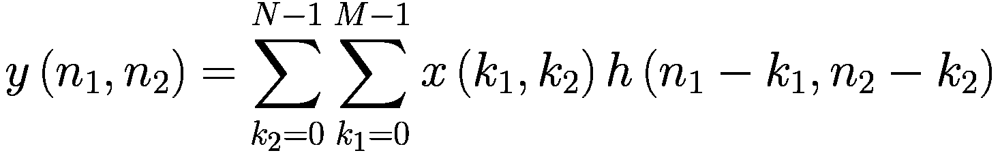

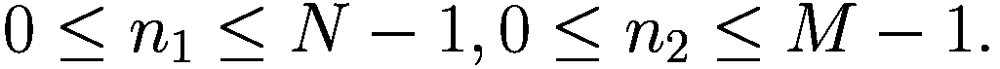

图像处理滤波器在灰度图像的(2D)信号上工作，产生另一个图像(2D 信号)。在多通道图像的情况下，通常使用二维图像处理滤波器进行图像处理，这意味着必须将每个图像通道作为 2D 信号处理，或者将图像转换为灰度图像。

既然我们已经了解了卷积的概念，我们就知道将任何与图像卷积的 LSI 系统的单位阶跃响应称为滤波器或核。

图 3-10a 展示了二维卷积的一个示例。

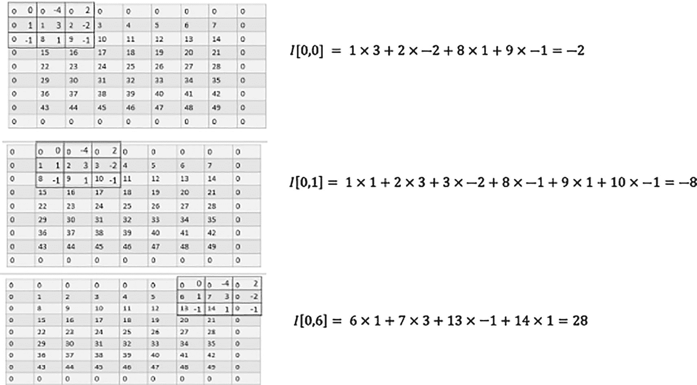

三个 9 x 9 矩阵坐标突出了 3 x 3 矩阵，其中强度分别为 0, 0, 0, 1 和 0, 6。

图 3-10b.

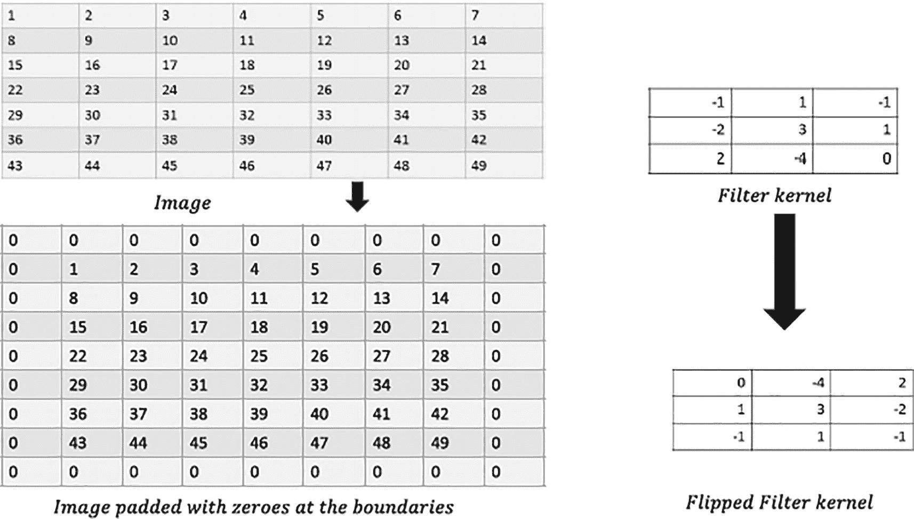

两对表格。第一对有 7 列和 7 行，边界用零填充。第二对有 3 列和 3 行，用于滤波器核及其翻转版本。

图 3-10a

图像二维卷积的示例

为了保持输出图像的长度与输入图像相同，原始图像已被零填充。正如我们所见，翻转的滤波器或核在原始图像的各个区域滑动，并在每个坐标点计算卷积和。请注意，图 3-10b 中提到的强度*I*[*i*, *j*]的索引表示矩阵坐标。相同的示例问题通过 scipy 2D 卷积以及通过列表 3-1 中的基本逻辑来解决。在这两种情况下，结果都是相同的。

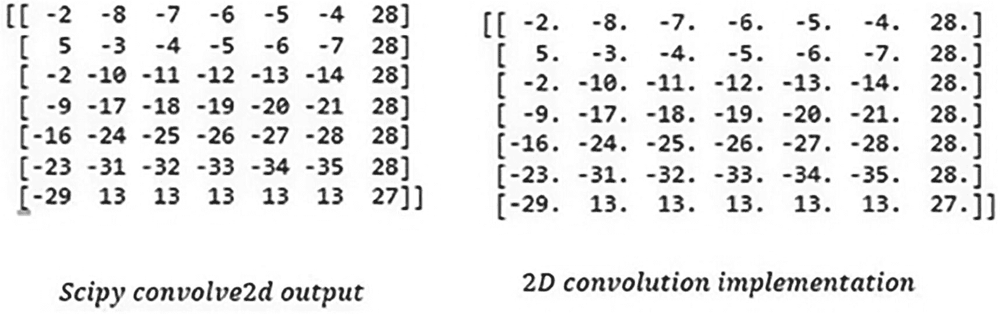

两个 7 x 7 的矩阵用于 Scipy 的二维卷积输出和二维卷积实现。

图 3-11

```py
## Illustrate 2D convolution of Images through a Toy example
import scipy
import scipy.signal
import numpy as np
print(f"scipy version: {scipy.__version__}")
print(f"numpy version: {np.__version__}")
print('\n')
# Take a 7x7 image as example
image = np.array([[1, 2, 3, 4, 5, 6, 7],
[8, 9, 10, 11, 12, 13, 14],
[15, 16, 17, 18, 19, 20, 21],
[22, 23, 24, 25, 26, 27, 28],
[29, 30, 31, 32, 33, 34, 35],
[36, 37, 38, 39, 40, 41, 42],
[43, 44, 45, 46, 47, 48, 49]])
# Defined an image processing kernel
filter_kernel = np.array([[-1, 1, -1],
[-2, 3, 1],
[2, -4, 0]])
# Convolve the image with the filter kernel through scipy 2D convolution to produce an output image of same dimension as that of the input
I = scipy.signal.convolve2d(image, filter_kernel,mode='same', boundary='fill', fillvalue=0)
print(f'Scipy convolve2d output\n')
print(I)
print('\n')
# We replicate the same logic of a Scipy 2D convolution by following the below steps
# a) The boundaries need to be extended in both directions for the image and padded with zeroes.
#    For convolving the 7x7 image by 3x3 kernel the dimensions needs to be extended by (3-1)/2 i.e 1
#    on either size for each dimension. So a skeleton image of 9x9 image would be created
#    in which the boundaries of 1 pixel are pre-filled with zero.
# b) The kernel needs to be flipped i.e rotated by 180 degrees
# c) The flipped kernel needs to placed at each cordinate location for the image and then the sum of
#    cordinatewise product with the image intensities need to be computed. These sum for each co-ordinate would give
#    the intensities for the output image.
row,col=7,7
## Rotate the filter kernel twice by 90 degree to get 180 rotation
filter_kernel_flipped = np.rot90(filter_kernel,2)
## Pad the boundaries of the image with zeroes and fill the rest from the original image
image1 = np.zeros((9,9))
for i in range(row):
for j in range(col):
image1[i+1,j+1] = image[i,j]
#print(image1)
## Define the output image
image_out = np.zeros((row,col))
## Dynamic shifting of the flipped filter at each image cordinate and then computing the convolved sum.
for i in range(1,1+row):
for j in range(1,1+col):
arr_chunk = np.zeros((3,3))
for k,k1 in zip(range(i-1,i+2),range(3)):
for l,l1 in zip(range(j-1,j+2),range(3)):
arr_chunk[k1,l1] = image1[k,l]
image_out[i-1,j-1] = np.sum(np.multiply(arr_chunk,filter_kernel_flipped))
print(f"2D convolution implementation\n")
print(image_out)
Listing 3-1
Illustrate 2D convolution of Images through a Toy example¶
```

如图 3-11 所示，基于 scipy 的卷积输出与列表 3-1 中实现的 2D 卷积相匹配。

根据图像处理滤波器的选择，输出图像的性质将有所不同。例如，高斯滤波器会创建一个输出图像，该图像是输入图像的模糊版本，而 Sobel 滤波器会检测图像中的边缘，并产生一个包含输入图像边缘的输出图像。

## 常见图像处理滤波器

让我们讨论在二维图像上常用的图像处理滤波器。确保对符号清晰，因为自然索引图像的方式与定义*x*和*y*轴的方式不太一致。当我们代表坐标空间中的图像处理滤波器或图像时，*n*[1]和*n*[2]是*x*和*y*方向的离散坐标。图像在 Numpy 矩阵形式中的列索引与*x*轴很好地对应，而行索引则与*y*轴相反的方向移动。此外，在进行卷积时，选择哪个像素位置作为图像信号的起点并不重要。根据是否使用零填充，可以相应地处理边缘。由于滤波器核较小，我们通常翻转滤波器核，然后将其在图像上滑动，而不是相反。

### 均值滤波器

均值滤波器或平均滤波器是一种低通滤波器，它计算任何特定点的像素强度的局部平均值。均值滤波器的脉冲响应可以是这里看到的形式之一（见图 3-12）：

![$$ \left[\begin{array}{ccc}1/9 & 1/9 & 1/9\\ 1/9 & 1/9 & 1/9\\ 1/9 & 1/9 & 1/9\end{array}\right] $$](../images/448418_2_En_3_Chapter/448418_2_En_3_Chapter_TeX_Equs.png)

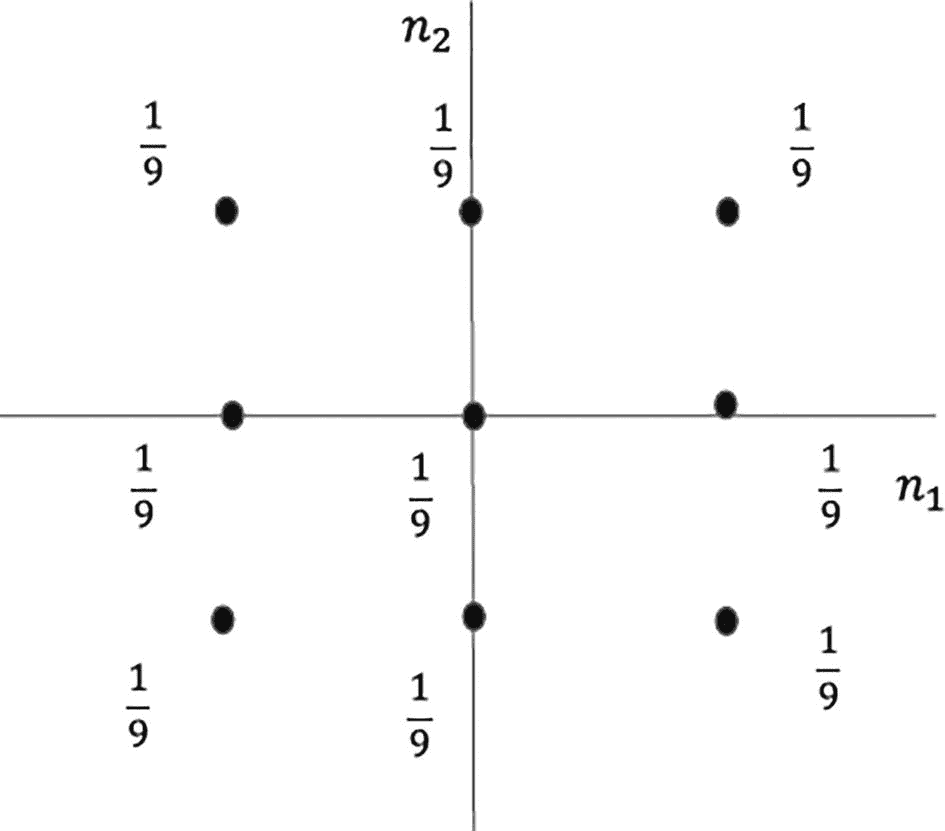

n²与 n¹的二维平面，包含所有四个象限。它表示了九个节点，以等间隔的 1 到 9 的值，以及位于中性轴上的中心节点。

图 3-12

均值滤波器的脉冲响应

在这里，矩阵条目*h*[22]对应于原点处的条目。因此，在任意给定点，卷积将表示该点的像素强度平均值。列表 3-2 中的代码说明了如何使用图像处理滤波器（如均值滤波器）对图像进行卷积。

请注意，在许多 Python 实现中，我们会使用 OpenCV 来执行图像的基本操作，例如读取图像、将图像从 RGB 格式转换为灰度格式等。OpenCV 是一个开源的图像处理包，它拥有丰富的图像处理方法。建议读者探索 OpenCV 或任何其他图像处理工具箱，以熟悉基本的图像处理函数。

```py
import cv2
print("Opencv version",cv2.__version__)
import matplotlib.pyplot as plt
from scipy.signal import convolve2d
%matplotlib inline
img = cv2.imread('monalisa.jpeg')
gray = cv2.cvtColor(img, cv2.COLOR_BGR2GRAY)
plt.imshow(gray,cmap='gray')
mean = 0
var = 100
sigma = var**0.5
row,col = np.shape(gray)
gauss = np.random.normal(mean,sigma,(row,col))
gauss = gauss.reshape(row,col)
gray_noisy = gray + gauss
print(f"Image after applying Gaussian Noise")
plt.imshow(gray_noisy,cmap='gray')
Listing 3-2
Convolution of an Image with Mean Filter
```

在列表 3-2 中，我们读取了蒙娜丽莎的图像，并向图像中引入了一些高斯白噪声。高斯噪声的平均值为 0，方差为 100。然后我们使用均值滤波器与噪声图像卷积以减少白噪声。噪声图像和卷积后的图像已绘制在图 3-13 中。

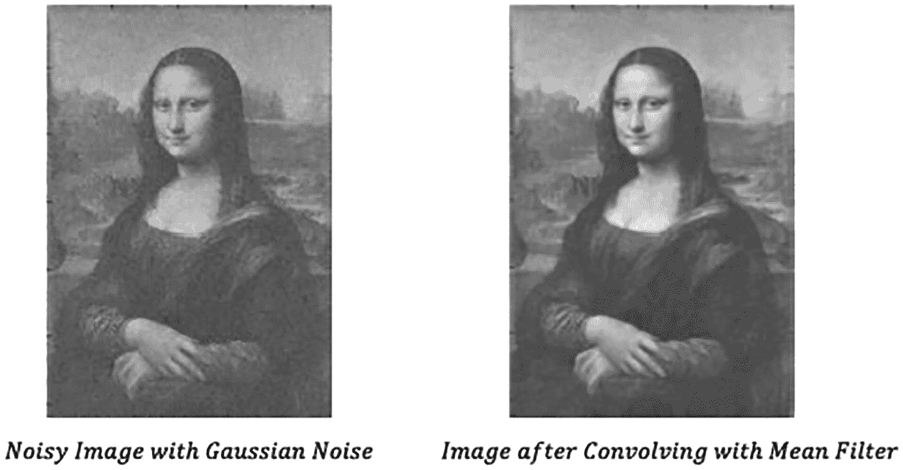

两张蒙娜丽莎的照片，分别标注了带有高斯噪声的噪声图像和与均值滤波器卷积后的图像。

图 3-13

蒙娜丽莎图像上的均值滤波器处理

均值滤波器主要用于减少图像中的噪声。如果图像中存在一些白色高斯噪声，那么均值滤波器将减少噪声，因为它对其邻域进行平均，因此零均值的高斯噪声将被抑制。如图 3-13 所示，一旦图像与均值滤波器卷积，高斯白噪声就会减少。新图像具有较少的高频成分，因此相对于卷积前的图像来说相对较不锐利，但滤波器在减少白噪声方面做得很好。

### 中值滤波器

一个二维中值滤波器根据滤波器的大小，将邻域中的每个像素替换为该邻域的中值像素强度。中值滤波器适用于去除盐和胡椒噪声。这种噪声以黑白像素的形式出现在图像中，通常是由于在捕获图像时突然的干扰造成的。列表 3-3 说明了如何向图像中添加盐和胡椒噪声，然后如何使用中值滤波器抑制噪声。

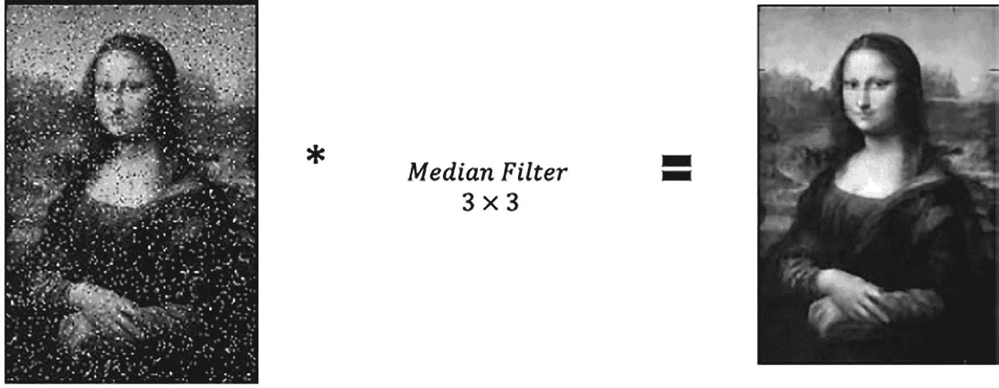

将蒙娜丽莎的模糊图像通过一个 3 x 3 的大小中值滤波器处理，以获得蒙娜丽莎的清晰图像。

图 3-14

中值滤波器处理

```py
#--------------------------------------------------------------------------
# First create an image with Salt and Pepper Noise
#--------------------------------------------------------------------------
# Generate random integers from 0 to 20
# If the value is zero we will replace the image pixel with a low value of 0 that corresponds to a black pixel
# If the value is 20 we will replace the image pixel with a high value of 255 that correspondsa to a white pixel
# Since we have taken 20 intergers and out of which we will only tag integers 1 and 20 as salt and pepper noise
# hence we would have approximately 10% of the overall pixels as salt and pepper noise. If we want to reduce it
# to 5 % we can taken integers from 0 to 40 and then treat 0 as indicator for black pixel and 40 as an indicator
# for white pixel.
np.random.seed(0)
gray_sp = gray*1
sp_indices = np.random.randint(0,21,[row,col])
for i in range(row):
for j in range(col):
if sp_indices[i,j] == 0:
gray_sp[i,j] = 0
if sp_indices[i,j] == 20:
gray_sp[i,j] = 255
print(f"Image after applying Salt and Pepper Noise\n")
plt.imshow(gray_sp,cmap='gray')
#------------------------------------------------------------------
# Remove the Salt and Pepper Noise
#------------------------------------------------------------------
# Now we want to remove the salt and pepper noise through a median filter.
# Using the opencv Median Filter for the same
gray_sp_removed = cv2.medianBlur(gray_sp,3)
print(f"Removing Salt and Pepper Noise with OpenCV Median Filter\n")
plt.imshow(gray_sp_removed,cmap='gray')
# Implementation of the 3x3 Median Filter without using openc
gray_sp_removed_exp = gray*1
for i in range(row):
for j in range(col):
local_arr = []
for k in range(np.max([0,i-1]),np.min([i+2,row])):
for l in range(np.max([0,j-1]),np.min([j+2,col])):
local_arr.append(gray_sp[k,l])
gray_sp_removed_exp[i,j] = np.median(local_arr)
print(f"Image produced by applying Median Filter Logic\n")
plt.imshow(gray_sp_removed_exp,cmap='gray')
Listing 3-3
Median Filter Illustration
```

如图 3-14 所示，盐和胡椒噪声已被中值滤波器移除。

### 高斯滤波器

高斯滤波器是均值滤波器的一个修改版本，其中脉冲函数的权重在原点周围呈正态分布。权重在滤波器的中心最高，并从中心正常衰减。可以使用列表 3-4 中的代码创建高斯滤波器。如图所示，强度以高斯方式从原点衰减。当高斯滤波器以图像形式显示时，原点处的强度最高，然后随着远离中心的像素而减弱。高斯滤波器通过抑制高频成分来减少噪声。然而，在追求抑制高频成分的过程中，它最终产生了一个模糊的图像，称为高斯模糊。

在图 3-15 中，原始图像与高斯滤波器卷积，生成具有高斯模糊的图像。然后我们从原始图像中减去模糊图像，以获得图像的高频分量。将高频图像的一小部分添加到原始图像中，以提高图像的清晰度。

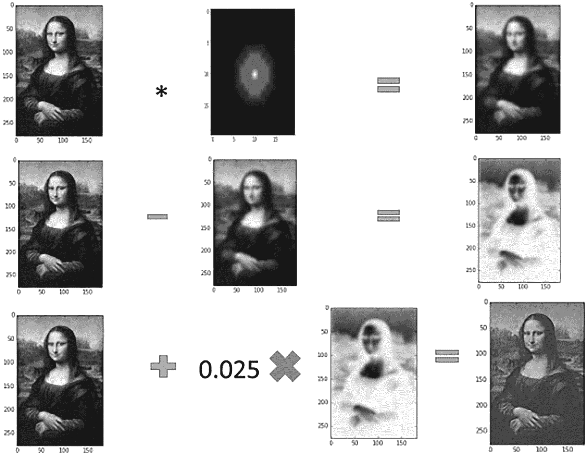

使用不同形式的九幅蒙娜丽莎画像来满足乘法、减法和加法操作。

图 3-15

使用高斯滤波器核的各种活动

```py
# Creating the Gaussian Filter
Hg = np.zeros((20,20))
for i in range(20):
for j in range(20):
Hg[i,j] = np.exp(-((i-10)**2 + (j-10)**2)/10)
print(f"Gaussian Blur Filter\n")
plt.imshow(Hg,cmap='gray')
gray_blur = convolve2d(gray,Hg,mode='same')
print(f"Image after convolving with  Gaussian Blur Filter Created above\n")
plt.imshow(gray_blur,cmap='gray')
gray_high = gray - gray_blur
print(f"High Frequency Component of Image\n")
plt.imshow(gray_high,cmap='gray')
gray_enhanced = gray + 0.025*gray_high
print(f"Enhanced Image with some portion of High Frequency Component added\n")
plt.imshow(gray_enhanced,cmap='gray')
Listing 3-4
Illustration of Gaussian Filter
```

### 基于梯度的滤波器

为了回顾，二维函数 *I*(*x*, *y*) 的梯度由以下给出：

![$$ \nabla I\left(x,y\right)={\left[\frac{\partial I\left(x,y\right)}{\partial x}\frac{\partial I\left(x,y\right)}{\partial y}\right]}^T $$](../images/448418_2_En_3_Chapter/448418_2_En_3_Chapter_TeX_Equt.png)

其中，水平方向的梯度由以下给出 - 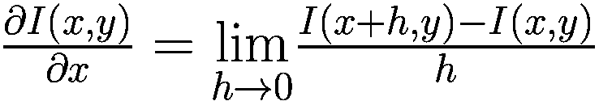 或 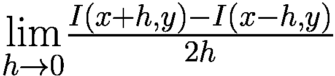，根据方便性和具体问题而定。

对于离散坐标，我们可以取 *h* = 1 并近似水平方向的梯度如下：

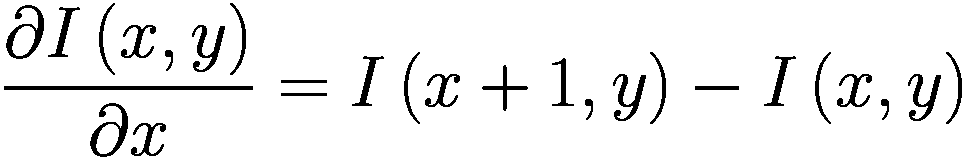

通过将信号与滤波器核 ![$$ \left[\begin{array}{ccc}0& 0& 0\\ {}0& 1& -1\\ {}0& 0& 0\end{array}\right] $$](../images/448418_2_En_3_Chapter/448418_2_En_3_Chapter_TeX_IEq4.png) 卷积，可以实现信号的这种导数。

同样地，

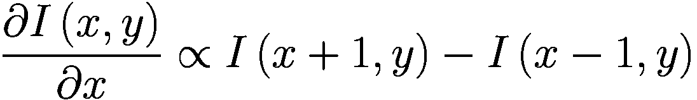

从第二种表示形式开始。

这种导数形式可以通过将信号与滤波器核 ![$$ \left[\begin{array}{ccc}0& 0& 0\\ {}1& 0& -1\\ {}0& 0& 0\end{array}\right] $$](../images/448418_2_En_3_Chapter/448418_2_En_3_Chapter_TeX_IEq5.png) 卷积来实现。

对于垂直方向，离散情况下的梯度分量可以表示如下：

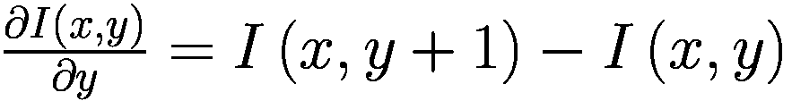 或者通过 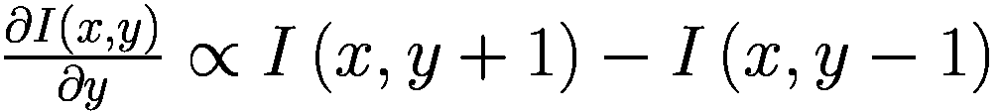

通过卷积计算梯度的相应滤波器核分别是 ![$$ \left[\begin{array}{ccc}0& -1& 0\\ 0& 1& 0\\ 0& 0& 0\end{array}\right] $$](../images/448418_2_En_3_Chapter/448418_2_En_3_Chapter_TeX_IEq8.png) 和 ![$$ \left[\begin{array}{ccc}0& -1& 0\\ 0& 0& 0\\ 0& 1& 0\end{array}\right] $$](../images/448418_2_En_3_Chapter/448418_2_En_3_Chapter_TeX_IEq9.png)。

注意，这些滤波器考虑了 *x* 轴和 *y* 轴的方向，如图 3-16 所示。*x* 轴的方向与矩阵索引 *n*[2] 的增量一致，而 *y* 轴的方向与矩阵索引 *n*[1] 的增量相反。

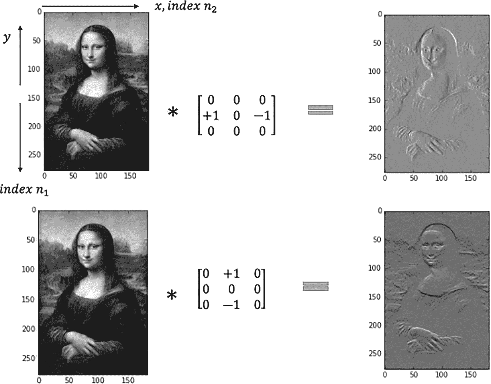

将两幅 *蒙娜丽莎* 的照片与两个不同的矩阵相乘，得到两幅不同的低对比度 *蒙娜丽莎* 图像。

图 3-16

垂直和水平梯度滤波器

图 3-16 展示了将 *蒙娜丽莎* 图像与水平和垂直梯度滤波器进行卷积的过程。

### Sobel 边缘检测滤波器

Sobel 边缘检测器沿水平和垂直轴的脉冲响应可以用以下 *H*[*x*] 和 *H*[*y*] 矩阵分别表示。Sobel 检测器是前面展示的水平方向和垂直方向梯度滤波器的扩展。它不仅考虑了点的梯度，还考虑了该点两侧点的梯度之和。它还对感兴趣点的梯度给予双倍权重。见图 3-17。

![$$ Hx=\left[\begin{array}{ccc}1& 0& -1\\ 2& 0& -2\\ 1& 0& -1\end{array}\right] =\left[\begin{array}{c}1\\ 2\\ 1\end{array}\right]\left[1\kern0.5em 0\kern0.5em -1\right] $$](../images/448418_2_En_3_Chapter/448418_2_En_3_Chapter_TeX_Equw.png)

![$$ Hy=\left[\begin{array}{ccc}-1& -2& -1\\ 0& 0& 0\\ 1& 2& 1\end{array}\right] $$](../images/448418_2_En_3_Chapter/448418_2_En_3_Chapter_TeX_Equx.png)

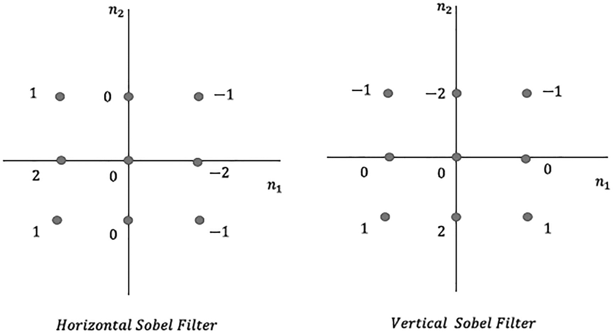

n2 与 n1 的两个二维平面，包含所有四个象限。它表示每个平面上等间隔的九个节点和中轴上的中心节点。

图 3-17

Sobel 滤波器脉冲响应

图像与 Sobel 滤波器卷积的过程在列表 3-5 中展示。

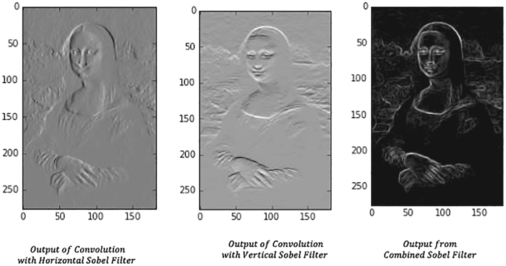

在图形轴上有三幅 *蒙娜丽莎* 的图像。分别标记为与水平 Sobel 滤波器、垂直 Sobel 滤波器和组合 Sobel 滤波器卷积的输出。

图 3-18

各种 Sobel 滤波器的输出

```py
Hx = np.array([[ 1,0, -1],[2,0,-2],[1,0,-1]],dtype=np.float32)
Gx = convolve2d(gray,Hx,mode='same')
print(f"Image after convolving with Horizontal Sobel Filter\n")
plt.imshow(Gx,cmap='gray')
Hy = np.array([[ -1,-2, -1],[0,0,0],[1,2,1]],dtype=np.float32)
Gy = convolve2d(gray,Hy,mode='same')
print(f"Image after convolving with Vertical Sobel Filter\n")
plt.imshow(Gy,cmap='gray')
G = (Gx*Gx + Gy*Gy)**0.5
print(f'Image after combining outputs from both Horizontal and Vertical Sobel Filters')
plt.imshow(G,cmap='gray')
Listing 3-5
Convolution Using a Sobel Filter
```

列表 3-5 包含了用于对图像进行 Sobel 滤波卷积所需的逻辑。水平 Sobel 滤波检测图像中的水平边缘，而垂直 Sobel 滤波检测图像中的垂直边缘。两者都是高通滤波器，因为它们衰减信号中的低频成分，只捕获图像中的高频成分。边缘是图像的重要特征，有助于检测图像中的局部变化。边缘通常出现在图像中两个区域的边界上，并且通常是提取图像信息的第一步。我们在图 3-18 中看到了列表 3-5 的输出。对于每个位置的水平和垂直 Sobel 滤波图像获得的像素值可以被视为一个向量 *I*ʹ(*x*, *y*) = *I*[*x**I**y*]^(*T*)，其中 *I**x* 表示通过水平 Sobel 滤波获得的图像像素强度，*I**y* 表示通过垂直 Sobel 滤波获得的图像像素强度。向量 *I*ʹ (*x*, *y*) 的大小可以用作组合 Sobel 滤波器的像素强度。

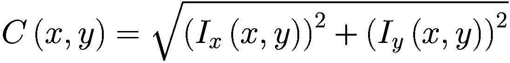，其中 *C*(*x*, *y*) 表示组合 Sobel 滤波器的像素强度函数。

### 标准变换

通过卷积进行标准变换的滤波器如下：

![$$ \left[\begin{array}{ccc}0& 0& 0\\ {}0& 1& 0\\ {}0& 0& 0\end{array}\right] $$](../images/448418_2_En_3_Chapter/448418_2_En_3_Chapter_TeX_Equy.png)

图 3-19 展示了通过卷积进行单位变换。

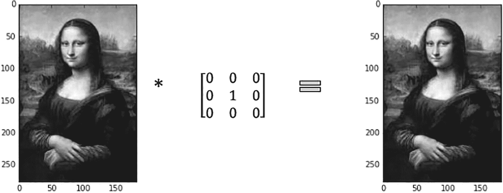

使用 3 x 3 矩阵拍摄蒙娜丽莎的照片以生成另一张蒙娜丽莎的照片。

图 3-19

通过卷积进行标准变换

表 3-1 列出了几个有用的图像处理滤波器及其用途。

表 3-1

图像处理滤波器及其用途

| 滤波器 | 用途 |
| --- | --- |
| 均值滤波器 | 降低高斯噪声；上采样后平滑图像 |
| 中值滤波器 | 降低椒盐噪声 |
| Sobel 滤波器 | 检测图像中的边缘 |
| 高斯滤波器 | 降低图像噪声 |
| Canny 滤波器 | 检测图像中的边缘 |
| 维纳滤波器 | 降低加性噪声和模糊 |

## 卷积神经网络

卷积神经网络（CNN）基于图像的卷积，并基于 CNN 通过训练学习到的过滤器检测特征。例如，我们不会应用任何已知的过滤器，例如用于检测边缘或去除高斯噪声的过滤器，而是通过卷积神经网络的训练，算法会自行学习图像处理过滤器，这些过滤器可能与常规图像处理过滤器非常不同。对于监督训练，过滤器是以一种方式学习的，即尽可能减少整体成本函数。通常，第一层卷积学习检测边缘，而第二层可能学习检测由不同边缘组合而成的更复杂的形状，例如圆形和矩形等。第三层及以后的层基于前一层的特征生成更复杂的功能。

卷积神经网络的优点是权重共享导致的稀疏连接，这大大减少了需要学习的参数数量。相同的过滤器可以通过其等变性属性学习检测图像任何部分的相同边缘，这是卷积在特征检测中非常有用的一个属性。

## 卷积神经网络组件

以下是一个卷积神经网络的典型组件：

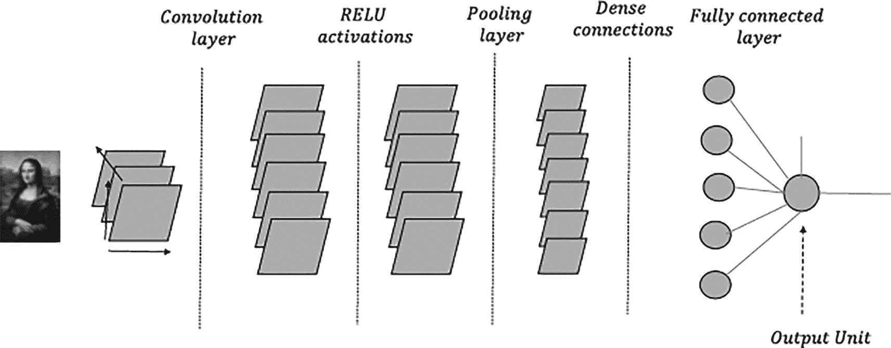

一个网络包含卷积层、R E L U 激活、池化层、密集连接和全连接层。

图 3-20

卷积神经网络的基本流程图

+   ***输入层*** 将保存图像的像素强度。例如，一个宽度为 64，高度为 64，深度为 3（红、绿、蓝颜色通道，RGB）的输入图像将具有 64 × 64 × 3 的输入维度。

+   ***卷积层*** 将从前一层获取图像，并使用指定的过滤器与它们进行卷积，以创建称为 *输出特征图* 的图像。输出特征图的数量等于指定的过滤器数量。到目前为止，TensorFlow 中的 CNN 主要使用 2D 过滤器；然而，最近已经引入了 3D 卷积过滤器。

+   CNN 的 ***激活函数*** 通常使用 ReLUs，我们在第 [2](http://dx.doi.org/10.1007/978-1-4842-3096-1_2) 章节中讨论过。通过 ReLU 激活层后，输出维度与输入相同。ReLU 层在网络中添加非线性，同时为正网络输入提供非饱和梯度。

+   ***池化层*** 将沿着高度和宽度维度对 2D 激活图进行下采样。深度或激活图的数量不受影响，保持不变。

+   **全连接层** 包含传统的神经元，这些神经元从前一层的不同权重集中接收输入；与卷积操作中典型的权重共享不同，它们之间没有权重共享。这个层中的每个神经元将连接到前一层的所有神经元，或者通过单独的权重连接到输出图中的所有坐标输出。对于分类，类别输出神经元接收来自最终全连接层的输入。

图 3-20 展示了一个基本的卷积神经网络 (CNN)，它使用一个卷积层、一个 ReLU 层和一个池化层，随后是一个全连接层，最后是输出分类层。该网络试图区分 *蒙娜丽莎* 图像和非 *蒙娜丽莎* 图像。输出单元可以采用 sigmoid 激活函数，因为对于图像来说，它是一个二分类问题。通常，对于大多数 CNN 架构，几个到几个卷积层-ReLU 层-池化层组合会依次堆叠在全连接层之前。我们将在稍后的时间讨论不同的架构。现在，让我们更详细地看看不同的层。

### 输入层

该层的输入是图像。通常，图像以四维张量的形式批量输入，其中第一个维度是特定于图像索引的，第二和第三维度是特定于图像的高度和宽度，第四维度对应于不同的通道。对于彩色图像，通常我们有红色 (R)、绿色 (G) 和蓝色 (B) 通道，而对于灰度图像，我们只有一个通道。批处理中图像的数量将由为小批量随机梯度下降选择的小批量大小决定。对于随机梯度下降，批处理大小为 1。

输入通过小批量馈送到输入层。

### 卷积层

卷积是任何 CNN 网络的核心。TensorFlow 支持 2D 和 3D 卷积。然而，2D 卷积更为常见，因为 3D 卷积在计算上对内存的需求更大。输入图像或以输出特征图形式存在的中间图像将与指定的 2D 滤波器进行 2D 卷积。2D 卷积沿着空间维度发生，而在图像体积的深度通道上没有卷积。对于每个深度通道，生成相同数量的特征图，然后在它们通过 ReLU 激活函数之前，沿着深度维度将它们相加。这些滤波器有助于检测图像中的特征。卷积层在网络中的深度越深，它学习的特征就越复杂。例如，初始卷积层可能学会检测图像中的边缘，而第二个卷积层可能学会将边缘连接成几何形状，如圆形和矩形。更深的卷积层可能学会检测更复杂的特征；例如，在猫与狗的分类中，它可能学会检测动物的眼睛、鼻子或其他身体部位。

在卷积神经网络（CNN）中，只指定了滤波器的大小；在训练开始之前，权重被初始化为任意值。滤波器的权重通过 CNN 的训练过程学习，因此它们可能不代表传统的图像处理滤波器，如 Sobel、高斯、均值、中值或其他类型的滤波器。相反，学习的滤波器将使得定义的整体损失函数最小化或基于验证实现良好的泛化。尽管它可能不会学习传统的边缘检测滤波器，但它会学习几种以某种形式检测边缘的滤波器，因为边缘是图像的良好特征检测器。

在定义卷积层时，应该熟悉的一些术语如下：

+   ***滤波器大小***：滤波器大小定义了滤波器核的高度和宽度。一个 3×3 大小的滤波器核将包含九个权重。通常，这些滤波器在初始化后会在输入图像上滑动进行卷积，而不翻转这些滤波器。技术上，当不翻转滤波器核进行卷积时，这被称为交叉相关而不是卷积。然而，这并不重要，因为我们可以将学习的滤波器视为图像处理滤波器的翻转版本。

+   **步长**: 步长决定了在执行卷积时在每个空间方向上移动的像素数。在正常信号卷积中，我们通常不会跳过任何像素，而是在每个像素位置计算卷积和，因此对于二维信号，我们在两个空间方向上都有一个步长为 1。然而，在卷积时可以选择跳过每个交替的像素位置，从而选择步长为 2。如果在图像的高度和宽度方向上选择步长为 2，那么在卷积后，输出图像将大约是输入图像大小的。为什么它是*近似*的而不是*精确*的原始图像或特征图大小，将在我们接下来讨论的主题中涵盖。

+   **填充**: 当我们使用一个特定大小的滤波器卷积一个图像时，得到的图像通常比原始图像小。例如，如果我们使用一个 3 × 3 大小的滤波器卷积一个 5 × 5 的 2D 图像，得到的图像是 3 × 3。

填充是一种在图像边界添加零的方法，用于控制卷积输出的尺寸。沿特定空间维度的卷积输出图像长度 *L*ʹ 由以下公式给出：

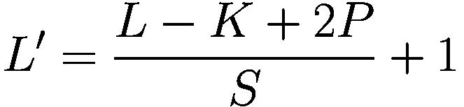

其中

*L*→ 在特定维度上输入图像的长度

*K*→ 在特定维度上核/滤波器的长度

*P*→ 在两端沿一个维度填充的零

*S*→ 卷积的步长

通常情况下，对于步长为 1，图像在每个维度上的尺寸在每个端点都会减少(*K* - 1)/2，其中*K*是该维度上滤波器核的长度。因此，为了保持输出图像与输入图像相同，需要添加一个长度为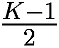的填充。

是否存在特定的步长大小可以通过沿特定方向的输出图像长度来确定。例如，如果 *L* = 12，*K* = 3，且 *P* = 0，步长 *S* = 2 是不可能的，因为它会在空间维度上产生一个输出长度为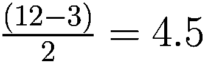，这不是一个整数值。

在 TensorFlow 中，填充可以选择为 `"VALID"` 或 `"SAME"`***。*** `"SAME"` 确保在步长为 1 的情况下，图像的输出空间维度与输入空间维度相同。它使用零填充来实现这一点。它试图在维度的两侧保持零填充长度均匀，但如果该维度的总填充长度是奇数，则额外的长度将添加到水平维度的右侧和垂直维度的底部。

`"VALID"` 不使用零填充，因此输出图像的维度将小于输入图像的维度，即使步长为 1 也是如此。

#### TensorFlow 使用

```py
def conv2d(num_filters,kernel_size=3,strides=1,padding='SAME',activation='relu'):
conv_layer = layers.Conv2D(num_filters,kernel_size,strides=(strides,strides),padding=padding,activation='relu')
return conv_layer
```

在定义 TensorFlow 卷积层时，我们使用 `tf.keras.layers.Conv2D`，其中需要定义卷积的输出滤波器数量、每个卷积滤波器的大小、步长大小和填充类型。此外，我们为每个输出特征图添加一个偏置。最后，我们使用修正线性单元（ReLUs）作为激活函数，向系统中添加非线性。

### 池化层

对图像进行池化操作通常概括了图像的局部性，局部性由滤波器核的大小给出，也称为感受野。这种概括通常以最大池化或平均池化的形式发生。在最大池化中，局部性的最大像素强度被用作该局部性的代表。在平均池化中，局部周围像素强度的平均值被用作该局部性的代表。池化减少了图像的空间维度。确定局部性的核大小通常选择为 2 x 2，而步长选择为 2。这使图像大小减少到原始图像大小的一半左右。

#### TensorFlow 使用

```py
""" P O O L I N G L A Y E R """
def maxpool2d(ksize=2,strides=2,padding='SAME'):
return layers.MaxPool2D(pool_size=(ksize, ksize),strides=strides,padding=padding)
```

使用 tf.keras.layers.MaxPool2D 定义来定义最大池化层，而 tf.keras.layers.AveragePooling2D 用于定义平均池化层。除了输入之外，我们还需要通过 ksize 参数输入最大池化的感受野或核大小。此外，我们需要提供用于最大池化的步长。为了确保池化输出特征图中的每个空间位置的值来自输入中的独立邻域，每个空间维度的步长应选择与相应空间维度的核大小相等。

## 通过卷积层的反向传播

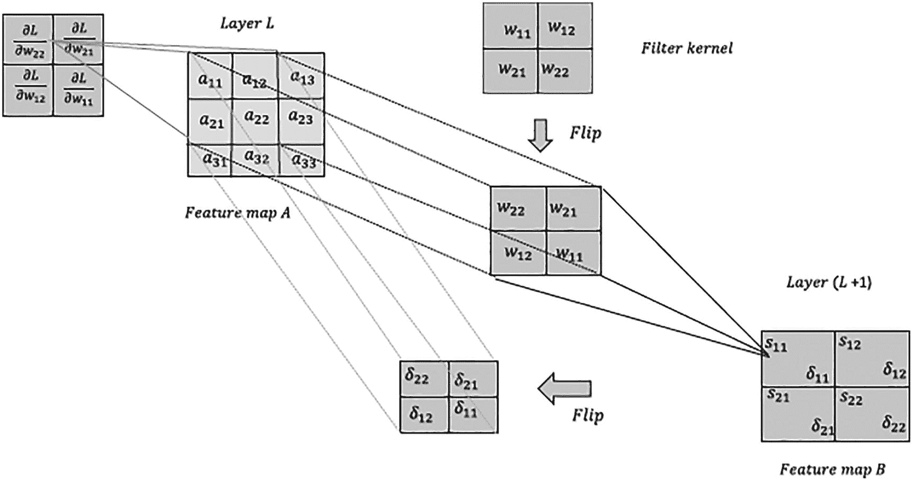

通过卷积层的反向传播表示包含五个 2 x 2 矩阵和一个 3 x 3 矩阵。两个独立的箭头表示一个翻转。

图 3-21

通过卷积层的反向传播

通过卷积层的反向传播与多层感知器网络的反向传播类似。唯一的区别是权重连接是稀疏的，因为相同的权重被不同的输入邻域共享以创建输出特征图。每个输出特征图是图像或前一层特征图与一个滤波器核的卷积结果，该滤波器核的值是我们需要通过反向传播学习到的权重。滤波器核中的权重对于特定的输入-输出特征图组合是共享的。

在图 3-21 中，层 *L* 中的特征图 *A* 与一个滤波器核卷积，产生层 (*L* + 1) 中的输出特征图 *B*。

输出特征图的值是卷积的结果，可以表示为 *s*[*ij*]，其中 *i*，*j* ∈ {1, 2}：


以通用方式，

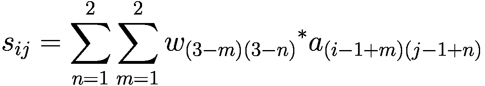

现在，设成本函数 *L* 对网络输入 *s*[*ij*] 的梯度表示如下：

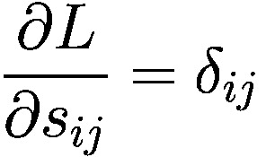

让我们计算成本函数对权重 *w*[22] 的梯度。该权重与所有 *s*[*ij*] 相关联，因此会有来自所有 *δ*[*ij*] 的梯度分量：

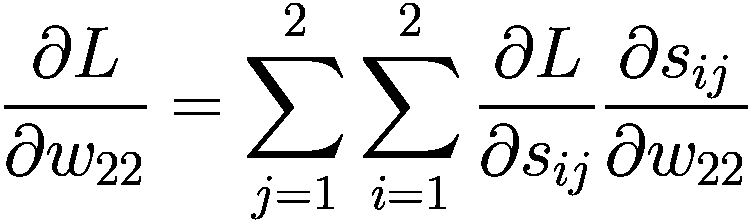

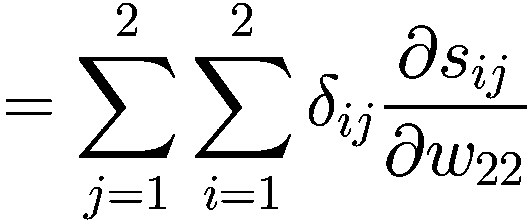

此外，从先前的不同 *s*[*ij*] 的方程中，可以推导出以下结果：

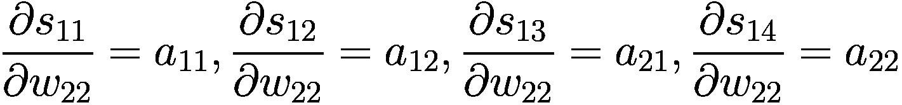

因此，

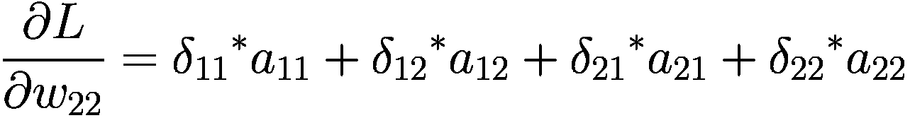

同样地，


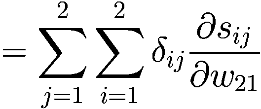

再次，，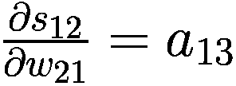，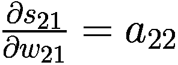，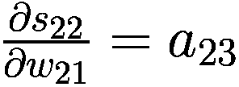

因此，


采用相同的方法对其他两个权重进行计算，我们得到以下结果：

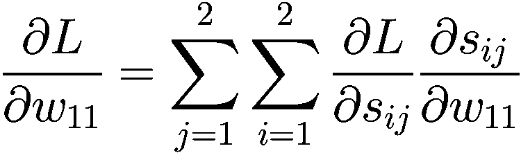

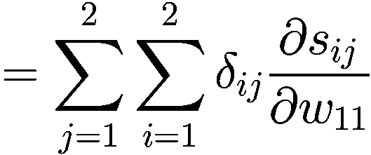

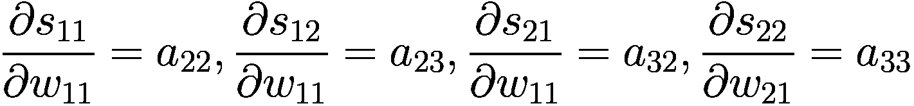


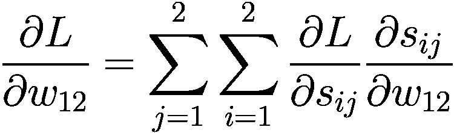

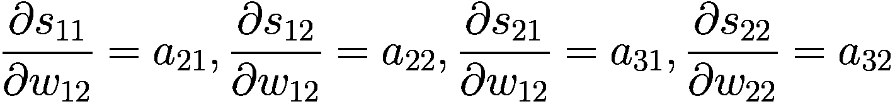


基于成本函数 *L* 对滤波器核四个权重的先前梯度，我们得到以下关系：

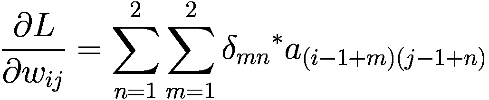

当以矩阵形式排列时，我们得到以下关系；（x）表示交叉相关：

![$$ \left[\begin{array}{cc}\frac{\partial L}{\partial {w}_{22}}& \frac{\partial L}{\partial {w}_{21}}\\ \frac{\partial L}{\partial {w}_{12}}& \frac{\partial L}{\partial {w}_{11}}\end{array}\right]=\left[\begin{array}{ccc}{a}_{11}& {a}_{12}& {a}_{13}\\ {a}_{21}& {a}_{22}& {a}_{23}\\ {a}_{31}& {a}_{32}& {a}_{33}\end{array}\right]\left(\textrm{x}\right)\left[\begin{array}{cc}{\delta}_{11}& {\delta}_{12}\\ {\delta}_{21}& {\delta}_{22}\end{array}\right] $$](../images/448418_2_En_3_Chapter/448418_2_En_3_Chapter_TeX_Equas.png)

![$$ \left[\begin{array}{ccc}{a}_{11}& {a}_{12}& {a}_{13}\\ {}{a}_{21}& {a}_{22}& {a}_{23}\\ {}{a}_{31}& {a}_{32}& {a}_{33}\end{array}\right] $$](../images/448418_2_En_3_Chapter/448418_2_En_3_Chapter_TeX_IEq20.png) 与 ![$$ \left[\begin{array}{cc}{\delta}_{11}& {a}_{12}\\ {}{a}_{21}& {a}_{22}\end{array}\right] $$](../images/448418_2_En_3_Chapter/448418_2_En_3_Chapter_TeX_IEq21.png) 的交叉相关也可以看作是 ![$$ \left[\begin{array}{ccc}{a}_{11}& {a}_{12}& {a}_{13}\\ {}{a}_{21}& {a}_{22}& {a}_{23}\\ {}{a}_{31}& {a}_{32}& {a}_{33}\end{array}\right] $$](../images/448418_2_En_3_Chapter/448418_2_En_3_Chapter_TeX_IEq22.png) 与翻转后的 ![$$ \left[\begin{array}{cc}{\delta}_{11}& {a}_{12}\\ {}{a}_{21}& {a}_{22}\end{array}\right] $$](../images/448418_2_En_3_Chapter/448418_2_En_3_Chapter_TeX_IEq23.png) 的卷积；即，![$$ \left[\begin{array}{cc}{\delta}_{22}& {\delta}_{21}\\ {}{\delta}_{12}& {\delta}_{11}\end{array}\right] $$](../images/448418_2_En_3_Chapter/448418_2_En_3_Chapter_TeX_IEq24.png)

因此，梯度矩阵的转置是 ![$$ \left[\begin{array}{ccc}{a}_{11}& {a}_{12}& {a}_{13}\\ {}{a}_{21}& {a}_{22}& {a}_{23}\\ {}{a}_{31}& {a}_{32}& {a}_{33}\end{array}\right] $$](../images/448418_2_En_3_Chapter/448418_2_En_3_Chapter_TeX_IEq25.png) 与 ![$$ \left[\begin{array}{cc}{\delta}_{22}& {\delta}_{21}\\ {}{\delta}_{12}& {\delta}_{11}\end{array}\right] $$](../images/448418_2_En_3_Chapter/448418_2_En_3_Chapter_TeX_IEq26.png) 的卷积；即，

![$$ \left[\begin{array}{cc}\frac{\partial L}{\partial {w}_{22}}&amp; \frac{\partial L}{\partial {w}_{21}}\\ {}\frac{\partial L}{\partial {w}_{12}}&amp; \frac{\partial L}{\partial {w}_{11}}\end{array}\right]=\left[\begin{array}{ccc}{a}_{11}&amp; {a}_{12}&amp; {a}_{13}\\ {}{a}_{21}&amp; {a}_{22}&amp; {a}_{23}\\ {}{a}_{31}&amp; {a}_{32}&amp; {a}_{33}\end{array}\right]\left({}^{\ast}\right)\left[\begin{array}{cc}{\delta}_{22}&amp; {\delta}_{12}\\ {}{\delta}_{21}&amp; {\delta}_{11}\end{array}\right] $$](../images/448418_2_En_3_Chapter/448418_2_En_3_Chapter_TeX_Equat.png)

在层的意义上，可以说梯度矩阵的翻转实际上是(*L* + 1)层梯度与层*L*的特征图输出的互相关。同样，等价地，梯度矩阵的翻转实际上是(*L* + 1)层梯度矩阵翻转与层*L*的特征图输出的卷积。

## 通过池化层的反向传播

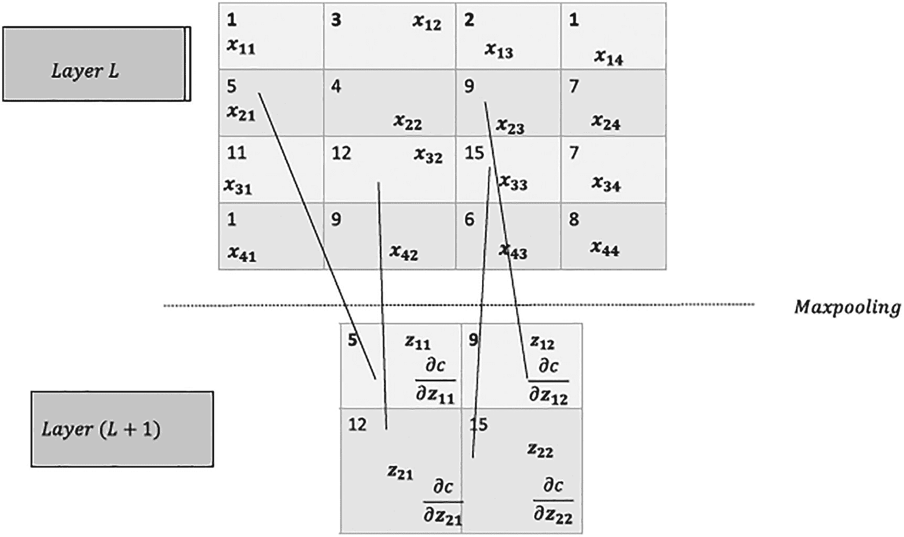

一个 4 x 4 矩阵和一个 2 x 2 矩阵的最大池化层反向传播的表示，分别对应层 L 和层 L + 1。

图 3-22

通过最大池化层的反向传播

图 3-22 说明了最大池化操作。让一个特征图在层*L*经过卷积和 ReLU 激活后，在层(*L* + 1)进行最大池化操作以产生输出特征图。最大池化的核或感受野大小为 2 x 2，步长大小为 2。最大池化层的输出是输入特征图大小的 1/4，其输出值由*z*[ij]，∀i, j ∈ {1, 2}表示。

我们可以看到*z*[11]获得了 5 的值，因为 2 x 2 块中的最大值是 5。如果*z*[11]处的误差导数是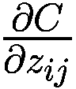，那么整个梯度以 5 的值传递到*x*[21]，而其块中的其余元素—*x*[11]、*x*[12]和*x*[22]—从*z*[11]接收零梯度。

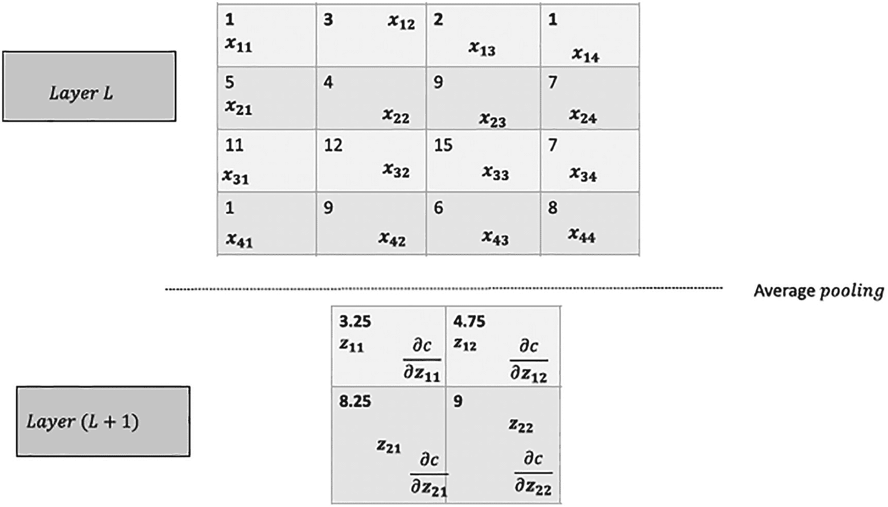

通过平均池化层的反向传播的表示由一个 4 x 4 矩阵和一个 2 x 2 矩阵组成，分别对应层 L 和层 L + 1。

图 3-23

通过平均池化层的反向传播

要使用平均池化处理相同的示例，输出是输入 2 x 2 块中值的平均值。因此*z*[11]获得了*x*[11]、*x*[12]、*x*[21]和*x*[22]的值的平均值。在这里，*z*[11]处的误差梯度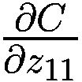将平均分配给*x*[11]、*x*[12]、*x*[21]和*x*[22]。因此，

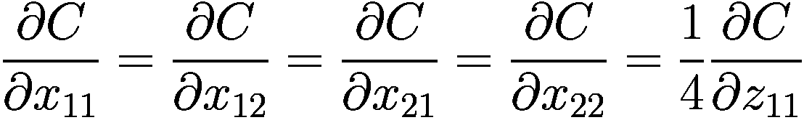

## 通过卷积实现的权重共享及其优势

通过卷积实现的权重共享大大减少了卷积神经网络中的参数数量。想象一下，如果我们从大小为 *n* × *n* 的图像中创建一个大小为 *k* × *k* 的特征图，而不是使用卷积，那么仅针对该特征图就会有 *k*²*n*² 个权重，这需要学习很多权重。相反，由于在卷积中，相同的权重在由滤波器核大小定义的位置之间共享，因此学习参数的数量通过一个巨大的因子减少。在这种情况下，例如，我们只需要学习特定滤波器核的权重。由于滤波器的大小相对于图像来说相对较小，因此权重的数量显著减少。对于任何图像，我们都会生成几个与不同滤波器核相对应的特征图。每个滤波器核都学会检测不同类型的特点。创建的特征图再次与其它滤波器核卷积，以在后续层中学习更复杂的特点。

## 平移等变性

卷积操作提供了平移等变性。也就是说，如果一个输入中的特征 A 在输出中产生特定的特征 B，那么即使特征 A 在图像中移动，特征 B 也会在输出的不同位置继续生成。

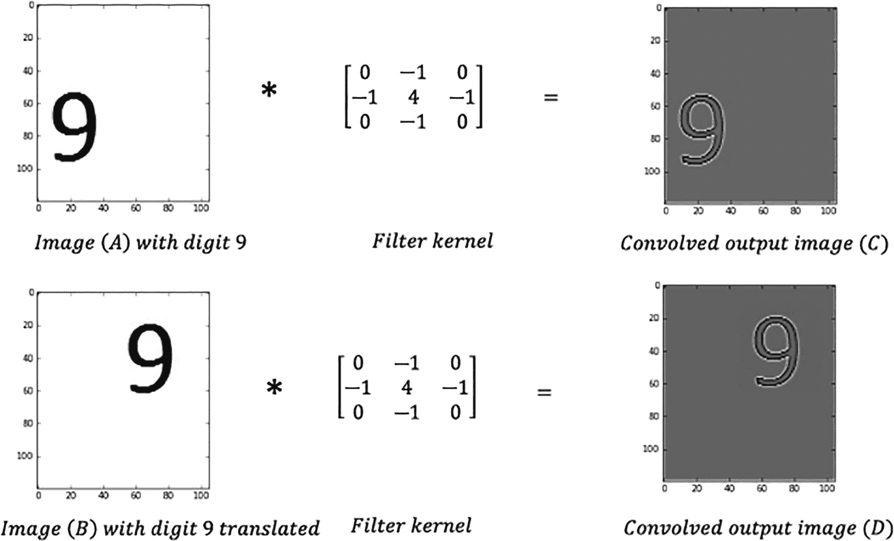

两个数字 9 的图形图像及其平移形式，都使用相同的 3 x 3 矩阵进行操作以产生卷积输出图像。

图 3-24

平移等变性说明

在图 3-24 中，我们可以看到数字 9 在图像 (B) 中已经从图像 (A) 的位置进行了平移。输入图像 (A) 和 (B) 都与相同的滤波器核进行了卷积，并且基于其在输入中的位置，在输出图像 (C) 和 (D) 的不同位置检测到了相同的数字 9 的特征。无论平移与否，卷积仍然为数字产生了相同的特征。这种卷积的性质被称为 *平移等变性*。实际上，如果数字由一组像素强度 *x* 表示，而 *f* 是对 *x* 的平移操作，而 *g* 是与滤波器核的卷积操作，那么对于卷积，以下等式成立：

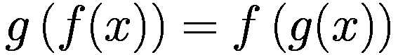

在我们的例子中，*f* (*x*) 生成图像（B）中的翻译后的数字 9，这个翻译后的 9 通过 *g* 卷积产生数字 9 的激活特征，如图像（D）所示。图像（D）中数字 9 的激活特征（即 *g*( *f* (*x*) ))也可以通过将图像（C）中激活的 9（即 *g*(*x*))通过相同的翻译 *f* 进行翻译而获得。

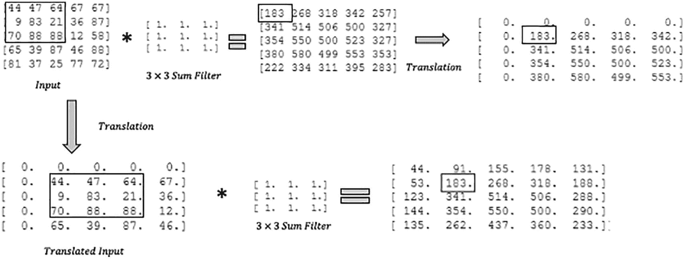

等变性的一个示例展示了五个 5 x 5 矩阵和两个 3 x 3 矩阵的和滤波器。箭头用于表示平移。

图 3-25

等变性的示例说明

通过一个小例子，我们可以更容易地看到等变性，如图 3-25 所示。我们感兴趣的输入图像或 2D 信号的部分是左上角的块，即![$$ \left[\begin{array}{ccc}44& 47& 64\\ {}9& 83& 21\\ {}70& 88& 88\end{array}\right] $$](../images/448418_2_En_3_Chapter/448418_2_En_3_Chapter_TeX_IEq30.png)。为了便于参考，让我们将这个块命名为 A。

当输入与和滤波器卷积时——即![$$ \left[\begin{array}{ccc}1& 1& 1\\ {}1& 1& 1\\ {}1& 1& 1\end{array}\right] $$](../images/448418_2_En_3_Chapter/448418_2_En_3_Chapter_TeX_IEq31.png)—块 A 将对应于 183 的输出值，这可以被视为 A 的特征检测器。

当将相同的和滤波器与平移后的图像卷积时，移动后的块 A 仍然会产生 183 的输出值。我们还可以看到，如果我们将对原始卷积图像输出应用相同的平移，183 的值将出现在与平移后卷积图像输出相同的位置。

## 由于池化引起的平移不变性

池化提供了一种基于池化核大小的受体场核的平移不变性。让我们以最大池化为例，如图 3-26 所示。图像*A*中特定位置的数字是通过输出特征图*P*中的值 100 和 80 的卷积滤波器*H*检测到的。同样，相同的数字出现在另一个图像*B*中，相对于图像*A*的位置略有平移。当将图像*B*与滤波器*H*卷积时，数字 9 以特征图*P* '中相同的值 100 和 80 的形式被检测到，但位置略有偏移。当这些特征图通过具有 2 x 2 大小的受体场核和步长 2 的最大池化时，100 和 80 的值在输出 M 和 M′中的位置相同。这样，最大池化在平移距离相对于受体场或最大池化核的大小不是非常高的情况下，为特征检测提供了一些平移不变性。

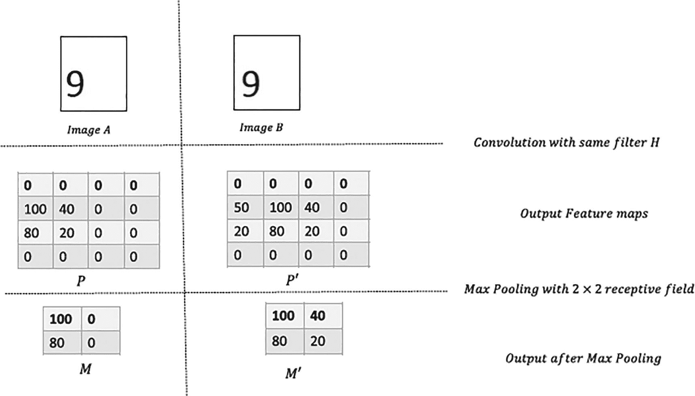

通过最大池化实现平移不变性的一个示例包括两个数字 9 的正方形框、两个 4 x 4 矩阵和两个 2 x 2 矩阵。

图 3-26

通过最大池化实现平移不变性

同样，平均池化基于感受野核的大小，对特征图局部区域的值进行平均。因此，如果特定特征在其特征图的一个局部区域（比如边缘区域）通过高值被检测到，那么即使图像略有平移，平均值也会继续很高。

## Dropout 层和正则化

Dropout 是一种在卷积神经网络的全连接层中正则化权重以避免过拟合的活动。然而，它不仅限于卷积神经网络，而是适用于所有前馈神经网络。在训练时，对于每个小批量中的每个训练样本，随机丢弃一定比例的神经网络单元，包括隐藏的和可见的，以便剩余的神经元可以自己学习重要特征，而不依赖于其他神经元的合作。当神经元随机丢弃时，这些神经元的所有传入和传出连接也会被丢弃。神经元之间过多的合作使得神经元相互依赖，它们无法学习到独特的特征。这种高合作导致过拟合，因为它在训练数据集上表现良好，而如果测试数据集与训练数据集略有不同，测试数据集上的预测就会出错。

当随机丢弃神经元单元时，每个剩余可用神经元的设置都会产生一个不同的网络。假设我们有一个包含 *N* 个神经单元的网络；可能的神经网络配置数量是 *N*²。对于小批量中的每个训练样本，根据丢弃概率随机选择一组神经元。因此，使用 Dropout 训练神经网络相当于训练一组不同的神经网络，其中每个网络很少得到训练，如果有的话。

如我们所推测，从许多不同的模型中平均预测可以减少集成模型的方差并减少过拟合，因此我们通常得到更好、更稳定的预测。

对于二分类问题，在两个不同的模型 *M*[1] 和 *M*[2] 上进行训练，如果一个数据点的类别概率对于模型 *M*[1] 是 *p*[11] 和 *p*[12]，对于模型 *M*[2] 是 *p*[21] 和 *p*[22]，那么我们取 *M*[1] 和 *M*[2] 的集成模型的平均概率。集成模型对于类别 1 的概率为 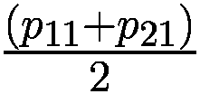，对于类别 2 的概率为 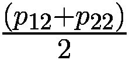。

另一种平均方法是将不同模型的预测结果取几何平均值。在这种情况下，我们需要对几何平均值进行归一化，以得到新的概率之和为 1。

对于前面示例的集成模型，新的概率分别为 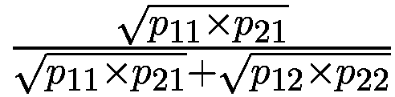 和 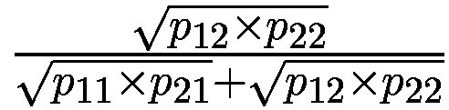。

在测试时，不可能计算所有可能的网络的预测结果并对其进行平均。相反，使用具有所有权重和连接的单个神经网络——但进行权重调整。如果在训练过程中以概率*p*保留了神经网络单元，那么该单元的输出权重将通过将权重乘以概率*p*来缩小。一般来说，这种在测试数据集上的预测近似效果良好。可以证明，对于具有 SoftMax 输出层的模型，上述安排等同于从那些由 dropout 产生的单个模型中取出预测结果，然后计算它们的几何平均值。

在图 3-27 中，展示了随机删除了三个单元的神经网络。正如我们所见，被删除单元的所有输入和输出连接也已被删除。

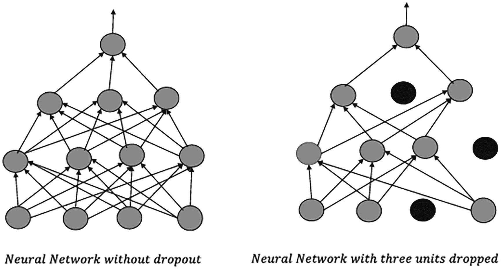

两个具有 12 个节点和不同连接线的神经网络。在第二个网络中，三个节点没有连接到线上。

图 3-27

随机删除三个单元的神经网络

对于卷积神经网络，全连接层中的单元及其相应的输入和输出连接通常会被删除。因此，在预测测试数据集时，不同的滤波器核权重不需要任何调整。

## MNIST 数据集上的数字识别卷积神经网络

现在我们已经了解了卷积神经网络的基本构建块，让我们看看 CNN 在分类 MNIST 数据集方面的表现如何。TensorFlow 中基本实现的详细逻辑已在列表 3-6 中记录。CNN 接受高度为 28、宽度为 28、深度为 3 的图像，对应 RGB 通道。这些图像经过两次卷积、ReLU 激活和最大池化操作，然后输入到全连接层，最终到达输出层。第一层卷积产生 64 个特征图，第二层卷积提供 128 个特征图，全连接层有 1024 个单元。最大池化层被选用来将特征图大小减少到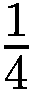。特征图可以被视为二维图像。

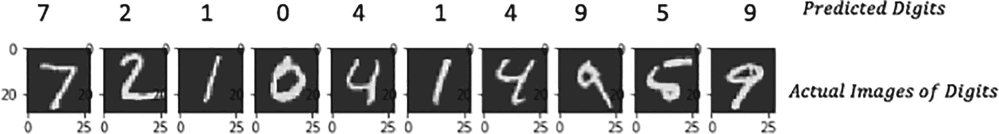

实际图像中的数字位于方形框内，以及其上方的 10 个预测数字。这些数字是 7、2、1、0、4、1、4、9、5 和 9。

图 3-28

CNN 模型预测的数字与实际数字对比

```py
# Load the packages
import tensorflow as tf
print('tensorflow version', tf.__version__)
import numpy as np
from sklearn import datasets
from tensorflow.keras import Model, layers
import matplotlib.pyplot as plt
%matplotlib inline
import time
# Function to Read the MNIST dataset along with the labels
def read_infile():
(train_X, train_Y), (test_X, test_Y) = tf.keras.datasets.mnist.load_data()
train_X,test_X = np.expand_dims(train_X, -1), np.expand_dims(test_X,-1)
#print(train_X.shape,test_X.shape)
return train_X, train_Y,test_X, test_Y
# Normalize the images
def normalize(train_X):
return train_X/255.0
# Convolution Layer function
def conv2d(num_filters,kernel_size=3,strides=1,padding='SAME',activation='relu'):
conv_layer = layers.Conv2D(num_filters,kernel_size,strides=(strides,strides),
padding=padding, activation='relu')
return conv_layer
#Pooling Layer function
def maxpool2d(ksize=2,strides=2,padding='SAME'):
return layers.MaxPool2D(pool_size=(ksize, ksize),strides=strides,padding=padding)
# Convolution Model class
class conv_model(Model):
def __init__(self,input_size=28,filters=[64,128],fc_units=1024,kernel_size=3,strides=1,
padding='SAME',ksize=2,n_classes=10):
super(conv_model, self).__init__()
self.conv1 = conv2d(num_filters=filters[0],kernel_size=kernel_size,strides=strides,
padding=padding,activation='relu')
self.conv2 = conv2d(num_filters=filters[1],kernel_size=kernel_size,strides=strides,
padding=padding,activation='relu')
self.maxpool1 = maxpool2d(ksize=ksize,strides=ksize,padding='SAME')
self.maxpool2 = maxpool2d(ksize=ksize,strides=ksize,padding='SAME')
self.fc = layers.Dense(fc_units,activation='relu')
self.out = layers.Dense(n_classes)
# Forward pass for the Model
def call(self, x):
x = self.conv1(x)
x = self.maxpool1(x)
x = self.conv2(x)
x = self.maxpool2(x)
x = tf.reshape(x,(tf.shape(x)[0],-1))
x = self.fc(x)
x = self.out(x)
return x
# Define the loss to be Categorical CrossEntropy to work with the Softmax logits
loss_fn = tf.keras.losses.SparseCategoricalCrossentropy(from_logits=True,reduction=tf.keras.losses.Reduction.SUM)
#Learning rate
learning_rate = 0.01
# Define optimizer
optimizer = tf.keras.optimizers.Adam(learning_rate)
# Process the training and test data
X_train, y_train, X_test, y_test = read_infile()
X_train, X_test = normalize(X_train), normalize(X_test)
num_train_recs, num_test_recs = X_train.shape[0], X_test.shape[0]
print(X_train.shape,y_train.shape)
# build the model
model = conv_model(input_size=28,filters=[64,128],fc_units=1024,kernel_size=3,strides=1,
padding='SAME',ksize=2,n_classes=10)
# Construct a  Tensorflow graph for the Model
model_graph = tf.function(model)
epochs = 20
batch_size = 256
loss_trace = []
accuracy_trace = []
num_train_recs,num_test_recs = X_train.shape[0], X_test.shape[0]
num_batches = num_train_recs // batch_size
order_ = np.arange(num_train_recs)
start_time = time.time()
for i in range(epochs):
loss, accuracy = 0,0
np.random.shuffle(order_)
X_train,y_train = X_train[order_], y_train[order_]
for j in range(num_batches):
X_train_batch = tf.constant(X_train[j*batch_size:(j+1)*batch_size],dtype=tf.float32)
y_train_batch = tf.constant(y_train[j*batch_size:(j+1)*batch_size])
#print(X_train_batch,y_train_batch)
with tf.GradientTape() as tape:
y_pred_batch = model_graph(X_train_batch)
loss_ = loss_fn(y_train_batch,y_pred_batch)
# compute gradient
gradients = tape.gradient(loss_, model.trainable_variables)
# update the parameters
optimizer.apply_gradients(zip(gradients, model.trainable_variables))
accuracy += np.sum(y_train_batch.numpy() == np.argmax(y_pred_batch.numpy(),axis=1))
loss += loss_.numpy()
loss /= num_train_recs
accuracy /= num_train_recs
loss_trace.append(loss)
accuracy_trace.append(accuracy)
print(f"Epoch {i+1} : loss: {np.round(loss,4)} ,accuracy:{np.round(accuracy,4)}\n")
X_test, y_test = tf.constant(X_test), tf.constant(y_test)
y_pred_test = model(X_test)
loss_test = loss_fn(y_test,y_pred_test).numpy()/num_test_recs
accuracy_test = np.mean(y_test.numpy() == np.argmax(y_pred_test.numpy(),axis=1))
print('Results on Test Dataset:','loss:',np.round(loss_test,4),'accuracy:',np.round(accuracy_test,4))
f, a = plt.subplots(1, 10, figsize=(10, 2))
for i in range(10):
a[i].imshow(X_test.numpy()[i,:])
print(y_test.numpy()[i])
print(f"Total processing time: {time.time() - start_time} secs")
Listing 3-6
Convolutional Neural Network for Digit Recognition on the MNIST Dataset
```

在前面的基本卷积神经网络中，该网络包含两个卷积-最大池化-ReLU 对，以及一个在最终输出 SoftMax 单元之前的全连接层，我们只需 20 个 epoch 就能在测试集上达到 0.9867 的准确率。正如我们在第二章[2](http://dx.doi.org/10.1007/978-1-4842-3096-1_2)中通过多层感知器方法所看到的那样，使用那种方法我们只能在大约 1000 个 epoch 后达到大约 90%的准确率。这证明了对于图像识别问题，卷积神经网络效果最佳。

我还想强调一点，即使用正确的超参数和先验信息调整模型的重要性。由于神经网络的代价函数通常是非凸的，因此像学习率选择这样的参数可能非常棘手。较大的学习率可能导致更快地收敛到局部最小值，但可能会引入振荡，而较低的学习率则可能导致收敛非常缓慢。理想情况下，学习率应该足够低，以便网络参数可以收敛到一个有意义的局部最小值，同时它应该足够高，以便模型可以更快地达到最小值。通常，对于前面的神经网络，学习率为 0.01 稍微有点高，但鉴于我们只训练了 20 个 epoch，它效果很好。较低的学习率在仅 20 个 epoch 的情况下不会达到如此高的准确率。同样，为随机梯度下降的迷你批处理版本选择批大小也会影响训练过程的收敛。较大的批大小可能更好，因为梯度估计的噪声更少；然而，这可能会以增加计算成本为代价。还需要尝试不同的滤波器大小，以及在每个卷积层中实验不同的特征图数量。我们选择的那种模型架构作为网络的先验知识。

## 用于解决现实世界问题的卷积神经网络

我们现在将简要讨论如何通过解决 Kaggle 上英特尔托管的一个问题来处理现实世界的图像分析问题，该问题涉及对不同类型的宫颈癌进行分类。该问题的数据集可以在[`www.kaggle.com/c/intel-mobileodt-cervical-cancer-screening`](http://www.kaggle.com/c/intel-mobileodt-cervical-cancer-screening)找到。在这个比赛中，需要构建一个模型，根据图像识别女性的宫颈类型。这样做将允许对病人进行有效的治疗。为比赛提供了针对三种癌症类型的特定图像。因此，商业问题归结为成为一个三类的图像分类问题。该问题的基本解决方案在列表 3-7 中提供。

```py
# Load the relevant libraries
import glob
import cv2
import time
import os
from pathlib import Path
import tensorflow as tf
print('tensorflow version', tf.__version__)
import numpy as np
from tensorflow.keras import Model, layers
import matplotlib.pyplot as plt
import time
from elapsedtimer import ElapsedTimer
!pip install pandas
import pandas as pd
# Create functions for different layer
""" C O N V O L U T I O N  L A Y E R """
def conv2d(num_filters, kernel_size=3, strides=1, padding='SAME', activation='relu'):
conv_layer = layers.Conv2D(num_filters, kernel_size, strides=(strides, strides), padding=padding, activation='relu')
return conv_layer
""" P O O L I N G  L A Y E R """
def maxpool2d(ksize=2, strides=2, padding='SAME'):
return layers.MaxPool2D(pool_size=(ksize, ksize), strides=strides, padding=padding)
# Convolution Model class
class conv_model(Model):
# Set layers.
def __init__(self, filters=[64, 128,256], fc_units=[512,512],
kernel_size=3, strides=1, padding='SAME',
ksize=2, n_classes=3,dropout=0.5):
super(conv_model, self).__init__()
self.conv1 = conv2d(num_filters=filters[0], kernel_size=kernel_size, strides=strides, padding=padding,
activation='relu')
self.conv2 = conv2d(num_filters=filters[1], kernel_size=kernel_size, strides=strides, padding=padding,
activation='relu')
self.conv3 = conv2d(num_filters=filters[2], kernel_size=kernel_size, strides=strides, padding=padding,
activation='relu')
self.maxpool1 = maxpool2d(ksize=ksize, strides=ksize, padding='SAME')
self.maxpool2 = maxpool2d(ksize=ksize, strides=ksize, padding='SAME')
self.maxpool3 = maxpool2d(ksize=ksize, strides=ksize, padding='SAME')
self.fc1 = layers.Dense(fc_units[0], activation='relu')
self.fc2 = layers.Dense(fc_units[1], activation='relu')
self.out = layers.Dense(n_classes)
self.dropout1 = layers.Dropout(rate=dropout)
self.dropout2 = layers.Dropout(rate=dropout)
# Forward pass.
def call(self, x):
x = self.conv1(x)
x = self.maxpool1(x)
x = self.conv2(x)
x = self.maxpool2(x)
x = self.conv3(x)
x = self.maxpool3(x)
x = tf.reshape(x, (tf.shape(x)[0], -1))
x = self.fc1(x)
x = self.dropout1(x)
x = self.fc2(x)
x = self.dropout2(x)
x = self.out(x)
probs = tf.nn.softmax(x,axis=1)
return x,probs
# Utility to read an image to numpy
def get_im_cv2(path,input_size):
"""
:param path: Image path
:return: np.ndarray
"""
img = cv2.imread(path)
resized = cv2.resize(img, (input_size, input_size), cv2.INTER_LINEAR)
return resized
# Utility to process all training images and store as numpy arrays
def load_train(path,input_size):
"""
:param path: Training images path
:return: train and test labels in np.array
"""
assert Path(path).exists()
X_train = []
X_train_id = []
y_train = []
start_time = time.time()
folders = ['Type_1', 'Type_2', 'Type_3']
for fld in folders:
index = folders.index(fld)
path_glob = f"{Path(path)}/train/{fld}/*.jpg"
files = glob.glob(path_glob)
for fl in files:
flbase = os.path.basename(fl)
img = get_im_cv2(fl,input_size=input_size)
X_train.append(img)
X_train_id.append(flbase)
y_train.append(index)
for fld in folders:
index = folders.index(fld)
path_glob = f"{Path(path)}/Additional/{fld}/*.jpg"
files = glob.glob(path_glob)
for fl in files:
flbase = os.path.basename(fl)
# print fl
img = get_im_cv2(fl,input_size=input_size)
X_train.append(img)
X_train_id.append(flbase)
y_train.append(index)
return X_train,  y_train,  X_train_id
# Utility to process all test images and store as numpy arrays
def load_test(path,input_size):
path_glob = os.path.join(f'{Path(path)}/test/*.jpg')
files = sorted(glob.glob(path_glob))
X_test = []
X_test_id = []
for fl in files:
flbase = os.path.basename(fl)
img = get_im_cv2(fl,input_size)
X_test.append(img)
X_test_id.append(flbase)
path_glob = os.path.join(f'{Path(path)}/test_stg2/*.jpg')
files = sorted(glob.glob(path_glob))
for fl in files:
flbase = os.path.basename(fl)
img = get_im_cv2(fl,input_size)
X_test.append(img)
return X_test, X_test_id
# Data Processing pipeline for train data
def read_and_normalize_train_data(train_path,input_size):
train_data, train_target, train_id = load_train(train_path,input_size)
print('Convert to numpy...')
train_data = np.array(train_data, dtype=np.uint8)
train_target = np.array(train_target, dtype=np.uint8)
print('Reshape...')
train_data = train_data.transpose((0, 2, 3, 1))
train_data = train_data.transpose((0, 1, 3, 2))
print('Convert to float...')
train_data = train_data.astype('float32')
train_data = train_data / 255
#train_target = np_utils.to_categorical(train_target, 3)
print('Train shape:', train_data.shape)
print(train_data.shape[0], 'train samples')
return train_data, train_target, train_id
# Data Processing pipeline for test data
def read_and_normalize_test_data(test_path,input_size):
test_data, test_id = load_test(test_path,input_size)
test_data = np.array(test_data, dtype=np.uint8)
print("test data shape",test_data.shape)
test_data = test_data.transpose((0, 2, 3, 1))
test_data = test_data.transpose((0, 1, 3, 2))
test_data = test_data.astype('float32')
test_data = test_data / 255
print('Test shape:', test_data.shape)
print(test_data.shape[0], 'test samples')
return test_data, test_id
# Shuffle the input training data to aid Stochastic gradient descent
def shuffle_train(X_train,y_train):
num_recs_train = X_train.shape[0]
indices = np.arange(num_recs_train)
np.random.shuffle(indices)
return X_train[indices],y_train[indices]
# train routine
def train(X_train, y_train, train_id,lr=0.01,epochs=200,batch_size=128, \
n_classes=3,display_step=1,in_channels=3,filter_size=3,strides=1, maxpool_ksize=2,\
filters=[64, 128,256],fc_units=[512,512],dropout=0.5):
# Define the model
model = conv_model(filters=filters, fc_units=fc_units, kernel_size=filter_size, \
strides=strides, padding='SAME', ksize=maxpool_ksize, n_classes=n_classes,dropout=dropout)
model_graph = tf.function(model)
# Define the loss
loss_fn = tf.keras.losses.SparseCategoricalCrossentropy(from_logits=True,
reduction=tf.keras.losses.Reduction.SUM)
# Define the optimizer
optimizer = tf.keras.optimizers.Adam(lr)
num_train_recs, num_test_recs = X_train.shape[0], X_test.shape[0]
num_batches = num_train_recs // batch_size
loss_trace , accuracy_trace = [],[]
start_time = time.time()
for i in range(epochs):
loss, accuracy = 0, 0
X_train, y_train = shuffle_train(X_train,y_train)
for j in range(num_batches):
X_train_batch = tf.constant(X_train[j * batch_size:(j + 1) * batch_size], dtype=tf.float32)
y_train_batch = tf.constant(y_train[j * batch_size:(j + 1) * batch_size])
with tf.GradientTape() as tape:
y_pred_batch,_ = model_graph(X_train_batch,training=True)
loss_ = loss_fn(y_train_batch, y_pred_batch)
# compute gradient
gradients = tape.gradient(loss_, model.trainable_variables)
# update the parameters
optimizer.apply_gradients(zip(gradients, model.trainable_variables))
accuracy += np.sum(y_train_batch.numpy() == np.argmax(y_pred_batch.numpy(), axis=1))
loss += loss_.numpy()
loss /= num_train_recs
accuracy /= num_train_recs
loss_trace.append(loss)
accuracy_trace.append(accuracy)
print(f"-------------------------------------------------------\n")
print(f"Epoch {i + 1} : loss: {np.round(loss, 4)} ,accuracy:{np.round(accuracy, 4)}\n")
print(f"-------------------------------------------------------\n")
return model_graph
# Prediction routine
def prediction(model,X_test,test_id,batch_size=32):
batches = X_test.shape[0]//batch_size
probs_array = []
for i in range(batches):
X_batch = tf.constant(X_test[(i+1)*batch_size: i*batch_size])
_,probs = model(X_batch,training=False)
probs = list(probs.numpy().tolist())
probs_array += probs
probs_array = np.array(probs_array)
def main(train_path, test_path,input_size=64,  \
lr=0.01,epochs=200,batch_size=128,\
n_classes=3,display_step=1,in_channels=3,\
filter_size=3,strides=1, maxpool_ksize=2,\
filters=[64, 128,256],fc_units=[512,512],dropout=0.5):
with ElapsedTimer(f'Training data processing..\n'):
X_train, y_train, train_id = read_and_normalize_train_data(train_path,input_size)
with ElapsedTimer(f'Test data processing..\n'):
X_test, test_id = read_and_normalize_test_data(test_path, input_size)
with ElapsedTimer("Training...\n"):
model = train(X_train, y_train, train_id,\
lr=lr, epochs=epochs, batch_size=batch_size,\
n_classes=n_classes, display_step=1, in_channels=in_channels,\
filter_size=filter_size, strides=strides, maxpool_ksize=maxpool_ksize,\
filters=filters, fc_units=fc_units, dropout=dropout)
with ElapsedTimer(f"Predictions on test data.."):
out = prediction(model,X_test,test_id,batch_size=32)
df = pd.DataFrame(out, columns=['Type_1','Type_2','Type_3'])
df['image_name'] = test_id
df.to_csv('results.csv',index=False)
main(train_path='/media/santanu/9eb9b6dc-b380-486e-b4fd-c424a325b976/Kaggle Competitions/Intel',
test_path='/media/santanu/9eb9b6dc-b380-486e-b4fd-c424a325b976/Kaggle Competitions/Intel',epochs=200)
Readers need to update the train_path with the data location accordingly before running the training and prediction for this problem.
-- output --
Epoch 186 : loss: 1.0009 ,accuracy:0.5284
Epoch 187 : loss: 1.0007 ,accuracy:0.5285
Epoch 188 : loss: 1.0007 ,accuracy:0.5283
Epoch 189 : loss: 1.0004 ,accuracy:0.5285
Epoch 190 : loss: 1.0006 ,accuracy:0.5286
Epoch 191 : loss: 1.0007 ,accuracy:0.5284
Epoch 192 : loss: 1.0002 ,accuracy:0.5289
Epoch 193 : loss: 1.0001 ,accuracy:0.5292
Epoch 194 : loss: 1.0003 ,accuracy:0.5285
Epoch 195 : loss: 1.0007 ,accuracy:0.5286
Epoch 196 : loss: 1.0005 ,accuracy:0.5284
Epoch 197 : loss: 1.0006 ,accuracy:0.5284
Epoch 198 : loss: 1.0006 ,accuracy:0.5286
Epoch 199 : loss: 1.0006 ,accuracy:0.5286
Epoch 200 : loss: 1.0007 ,accuracy:0.5283
Listing 3-7
Real-World Use of Convolutional Neural Network
```

该模型在比赛排行榜上实现了大约 1.0007 的对数损失，而该比赛的最好模型实现了大约 0.78 的对数损失。这是因为该模型是一个基本的实现，没有考虑图像处理中的其他高级概念。我们将在本书的后面研究一种称为迁移学习的高级技术，当提供的图像数量较少时，这种技术效果很好。以下是一些可能对读者有意义的实现要点：

+   图像已被读取为三维 Numpy 数组，并通过 OpenCV 调整大小，然后添加到列表中。该列表随后被转换为 Numpy 数组，因此我们得到了一个四维 Numpy 数组或张量，用于训练和测试数据集。训练和测试图像张量已经转置，以便按图像编号、图像高度方向的位置、图像宽度方向的位置和图像通道的顺序排列。

+   图像已被归一化，以使值介于 0 和 1 之间，通过除以像素强度最大值；即，255。这有助于基于梯度的优化。

+   图像已被随机打乱，以便小批量中的图像以三种类别的随机排列。

+   网络实现的其余部分类似于 MNIST 分类问题，但增加了三层卷积-ReLU-最大池化组合，以及两个全连接层，最后是最终的 SoftMax 输出层。

+   涉及预测和提交的代码在此省略。

## 批标准化

批标准化是由 Sergey Ioffe 和 Christian Szegedy 发明的，是深度学习领域中的先驱元素之一。批标准化的原始论文标题为“Batch Normalization: Accelerating Deep Network Training by Reducing Internal Covariate Shift”，可以在[`https://arxiv.org/abs/1502.03167`](https://arxiv.org/abs/1502.03167)找到。

当通过随机梯度下降训练神经网络时，由于前一层的权重更新，每一层的输入分布会发生变化。这会减慢训练过程，并使得训练非常深的神经网络变得困难。神经网络训练过程复杂的原因在于，任何层的输入都依赖于所有前一层的参数，因此即使是微小的参数变化，随着网络的增长也可能产生放大效应。这导致层中的输入分布发生变化。

现在，让我们尝试理解当由于前一层的权重变化而导致激活函数的输入分布发生变化时可能会出现什么问题。

Sigmoid 或 tanh 激活函数仅在输入的指定范围内具有良好的线性梯度，并且当输入增大时，梯度降至零。

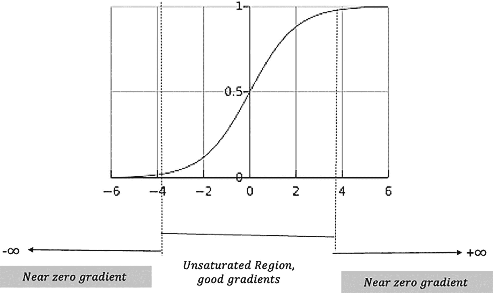

Sigmoid 函数具有未饱和区域，底部从-4 到 4 具有良好的梯度，也标出了接近零的梯度。

图 3-29

带有微小未饱和区域的 Sigmoid 函数

前一层参数的变化可能会改变 sigmoid 单元层的输入概率分布，使得大部分输入属于饱和区，从而产生接近零的梯度，如图 3-29 所示。由于这些零或接近零的梯度，学习变得非常缓慢或完全停止。避免这种问题的一种方法是有修正线性单元（ReLUs）。另一种避免这种问题的方法是保持 sigmoid 单元输入的分布稳定在非饱和区，这样随机梯度下降就不会陷入饱和区。

这种内部网络单元输入分布变化的现象被批归一化过程的发明者称为*内部协变量偏移*。

批标准化通过将层的输入归一化到具有零均值和单位标准差来减少内部协变量偏移。在训练过程中，均值和标准差是从每个层的迷你批量样本中估计的，而在测试预测时间，通常使用总体方差和均值。

如果一个层从前一层接收一个输入激活向量*x* = [*x*[1]*x*[2]…*x*[*n*]]^(*T*) ∈ *R*^(*n* × 1)，那么在包含*m*个数据点的每个小批量中，输入激活按以下方式归一化：

![x_i^帽=x_i-E[x_i]/(sqrt(Var[x_i]+in ])](../images/448418_2_En_3_Chapter/448418_2_En_3_Chapter_TeX_Equaw.png)

位置

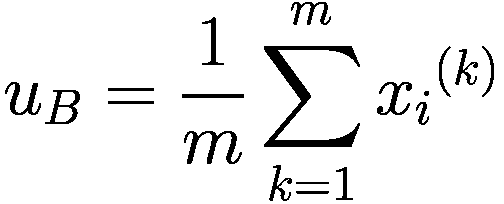

![B 方差=1/m 求和(1 到 m 的(x_i^(k)-E[x_i]))²](../images/448418_2_En_3_Chapter/448418_2_En_3_Chapter_TeX_Equay.png)

从统计学的角度看，*u*[B]和σ[B]²不过是样本均值和有偏样本标准差。

一旦完成归一化，不是直接输入到激活函数，而是通过引入参数*γ*和*β*进行缩放和偏移，然后再输入到激活函数。如果我们限制输入激活为归一化值，它们可能会改变层所能表示的内容。因此，想法是通过以下转换对归一化值应用线性变换，这样如果网络在训练过程中感觉到任何转换前的原始值对网络是有益的，它就可以恢复原始值。实际输入到激活函数的转换输入激活*y*[i]由以下给出：

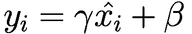

参数 *u*[*B*]，σ[*B*]²，*γ*和*β*将通过反向传播学习，就像其他参数一样。正如之前所述，如果模型认为网络中的原始值更可取，它可能会学习*γ* = *Var*[*x*[*i*]]和*β* = *E*[*x*[*i*]]。

一个可能出现的非常自然的问题是，为什么我们要将迷你批均值 *u*[*B*]和方差 σ[*B*]²作为通过批传播学习的参数，而不是将它们作为归一化目的的迷你批运行平均值来估计。这是不行的，因为 *u*[*B*]和 σ[*B*]²通过 *x*[*i*]依赖于模型的其它参数，当我们直接将它们估计为运行平均值时，这种依赖性在优化过程中没有得到考虑。为了保持这些依赖性完整，*u*[*B*]和 σ[*B*]²应该作为参数参与优化过程，因为 *u*[*B*]和 σ[*B*]²相对于 *x*[*i*]所依赖的其他参数的梯度对于学习过程至关重要。这种优化的总体效果是以这种方式修改模型，使得输入 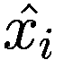 保持零均值和单位标准差。

在推理或测试时间，使用总体统计量 *E*[*x*[*i*]]和*Var*[*x*[*i*]]进行归一化，同时保持迷你批统计量的运行平均值。

![$$ E\left[{x}_i\right]=E\left[{u}_B\right] $$](../images/448418_2_En_3_Chapter/448418_2_En_3_Chapter_TeX_Equba.png)

![$$ Var\left[{x}_i\right]=\left(\frac{m}{m-1}\right)E\left[{\sigma}_B²\right] $$](../images/448418_2_En_3_Chapter/448418_2_En_3_Chapter_TeX_Equbb.png)

这个校正因子是获得总体方差的非偏估计所必需的。

批标准化的几个优点如下：

+   由于消除了或减少了内部协变量偏移，模型可以更快地训练。为了获得良好的模型参数，所需的训练迭代次数会更少。

+   批标准化具有一定的正则化能力，有时可以消除 dropout 的需求。

+   批标准化与卷积神经网络配合得很好，其中每个输出特征图都有一个*γ*和*β*。

## 卷积神经网络中的不同架构

在本节中，我们将介绍今天广泛使用的几种卷积神经网络架构。这些网络架构不仅用于分类，而且经过轻微修改后，也用于分割、定位和检测。此外，每个网络都有预训练版本，使社区能够进行迁移学习或微调模型。除了 LeNet 之外，几乎所有 CNN 模型都赢得了千类图像 Net 分类竞赛。

### LeNet

第一个成功的卷积神经网络是由 Yann LeCun 在 1990 年开发的，用于成功地对基于 OCR 的活动（如读取 ZIP 代码、支票等）进行手写数字分类。LeNet5 是 Yann LeCun 及其同事的最新作品。它接受 32×32 大小的图像作为输入，并通过卷积层产生六个 28×28 大小的特征图。这六个特征图随后进行子采样，产生六个 14×14 大小的输出图像。子采样可以看作是池化操作。第二个卷积层有 16 个 28×28 大小的特征图，而第二个子采样层将特征图的大小减少到 14×14。这之后是两个分别有 120 和 84 个单元的全连接层，然后是十个类别的输出层，对应十个数字。图 3-30 表示了 LeNet5 的架构图。

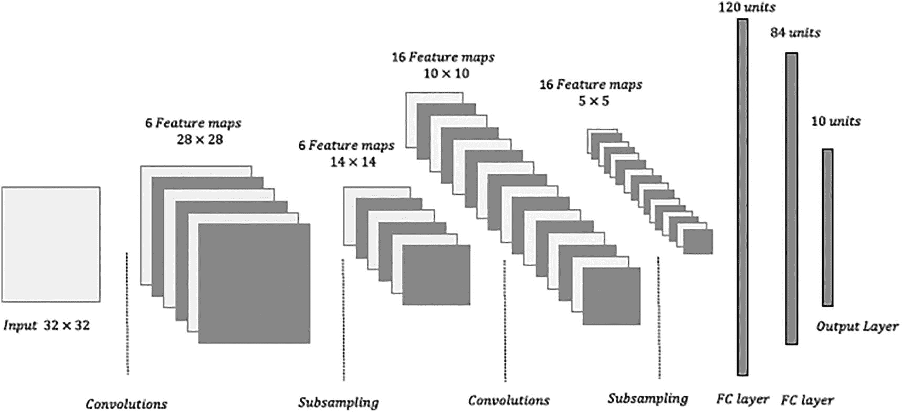

LeNet 5 网络有一个 32×32 大小的输入块，卷积，子采样，卷积，子采样，两个全连接层，以及一个输出层。

图 3-30

LeNet5 架构图

LeNet5 网络的显著特点如下：

+   通过子采样进行的池化操作选取 2×2 邻域的像素块，并将四个像素强度的值相加。这个和通过一个可训练的权重和偏置进行缩放，然后通过 sigmoid 激活函数。这与最大池化和平均池化所做的方法略有不同。

+   用于卷积的滤波器核大小为 5×5。输出单元是径向基函数（RBF）单元，而不是我们通常使用的 SoftMax 函数。全连接层的 84 个单元每个类别都有 84 个连接，因此有 84 个相应的权重。84 个权重/类别代表每个类别的特征。如果输入到这 84 个单元的输入非常接近对应类别的权重，那么输入更有可能属于该类别。在 SoftMax 中，我们查看每个类别的权重向量的输入点积，而在 RBF 单元中，我们查看输入和输出类别代表权重向量之间的欧几里得距离。欧几里得距离越大，输入属于该类别的可能性越小。这可以通过对距离的负数进行指数化，然后对不同的类别进行归一化来转换为概率。对于输入记录的所有类别的欧几里得距离将作为该输入的损失函数。设 *x* = [*x*[1] *x*[2] ... *x*[84]]^(*T*) 为全连接层的输出向量。对于每个类别，都会有 84 个权重连接。如果第 *i* 类的代表权重向量为 *w*[*i*] ∈ *R*^(84×1)，那么第 *i* 类单元的输出可以表示为以下公式：

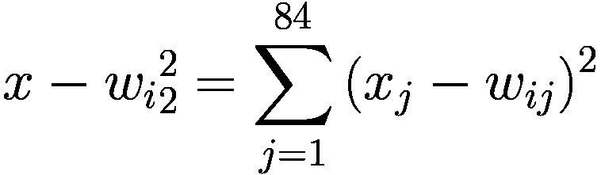

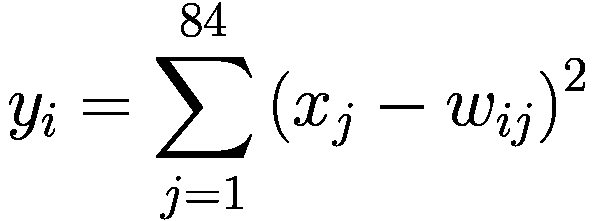

+   每个类别的代表性权重在事先是固定的，而不是学习得到的权重。

### AlexNet

AlexNet 卷积神经网络架构由 Alex Krizhevsky、Ilya Sutskever 和 Geoffrey Hinton 于 2012 年开发，用以赢得 2012 年 ImageNet ILSVRC（ImageNet 大规模视觉识别挑战赛）。关于 AlexNet 的原始论文标题为“ImageNet 分类与深度卷积神经网络”，可以在[`papers.nips.cc/paper/4824-imagenet-classification-with-deep-convolutional-neural-networks.pdf`](https://papers.nips.cc/paper/4824-imagenet-classification-with-deep-convolutional-neural-networks.pdf)找到。

这是 CNN 架构第一次以巨大的优势击败其他方法。他们的网络在最高 5 个预测上的错误率为 15.4%，而第二好的参赛者的错误率为 26.2%。AlexNet 的架构图如图 3-31 所示。

AlexNet 由五个卷积层、最大池化层和 dropout 层以及一千个类别的输入和输出层组成，另外还有三个全连接层。网络的输入是 224×224×3 大小的图像。第一个卷积层产生 96 个特征图，对应于 96 个 11×11×3 大小的滤波器核，步长为四个像素单位。第二个卷积层产生 256 个特征图，对应于 5×5×48 大小的滤波器核。前两个卷积层后面跟着最大池化层，而接下来的三个卷积层一个接一个地放置，没有中间的最大池化层。第五个卷积层后面跟着一个最大池化层，两个 4096 个单位的全连接层，最后是一个 1000 个类别的 SoftMax 输出层。第三个卷积层有 384 个 3×3×256 大小的滤波器核，而第四和第五个卷积层各有 384 和 256 个 3×3×192 大小的滤波器核。最后两个全连接层使用了 0.5 的 dropout。你会注意到，除了第三个卷积层外，所有卷积层的滤波器核深度是前一层的特征图数量的一半。这是因为当时的 AlexNet 在计算上非常昂贵，因此训练不得不在两个独立的 GPU 之间分割。然而，如果你仔细观察，对于第三个卷积活动，存在卷积的交叉连接，因此滤波器核的维度是 3×3×256，而不是 3×3×128。同样的交叉连接也适用于全连接层，因此它们表现为具有 4096 个单位的普通全连接层。

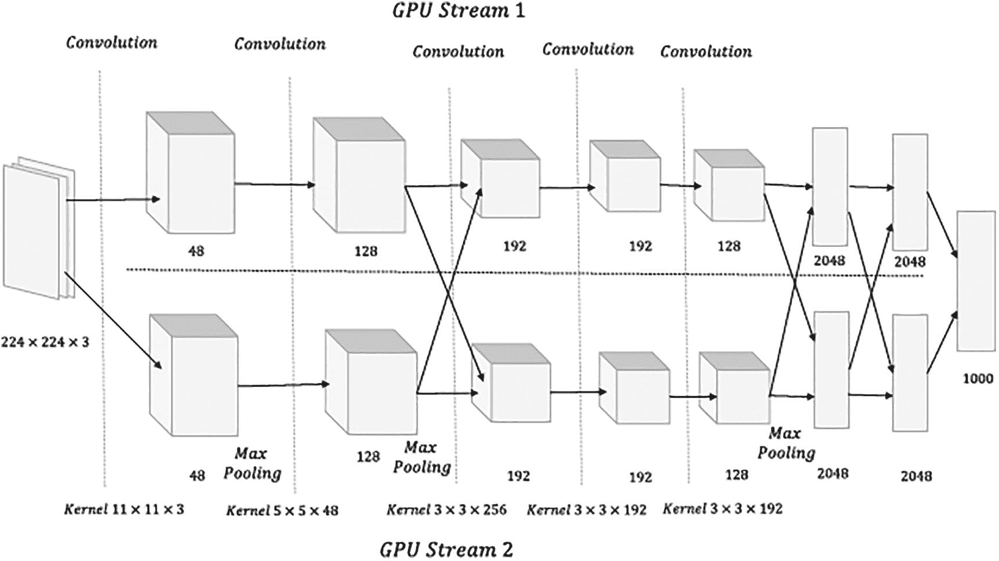

两个 GPU 流量的 Alex Net 架构，网络由三维立方体和矩形块组成，它们通过箭头连接。

图 3-31

AlexNet 架构

AlexNet 的关键特性如下：

+   使用 ReLU 激活函数来实现非线性。它们产生了巨大影响，因为与 sigmoid 和 tanh 激活函数相比，ReLU 的计算要简单得多，并且具有恒定的非饱和梯度，而 sigmoid 和 tanh 的梯度在输入值非常高或非常低时趋于零。

+   使用 Dropout 来减少模型过拟合。

+   使用重叠池化而不是非重叠池化。

+   该模型在两个 GPU GTX 580 上训练了大约五天，以实现快速计算。

+   通过数据增强技术，如图像平移、水平反射和补丁提取，增加了数据集的大小。

### VGG16

2014 年的 VGG 小组在 ILSVRC-2014 竞赛中获得了亚军，其 16 层架构被命名为 VGG16。它使用了一种深度且简单的架构，自那时起就受到了很多关注。关于 VGG 网络的论文标题为“用于大规模图像识别的超深度卷积神经网络”，由[Karen Simonyan](https://arxiv.org/find/cs/1/au:%252BSimonyan_K/0/1/0/all/0/1)和[Andrew Zisserman](https://arxiv.org/find/cs/1/au:%252BZisserman_A/0/1/0/all/0/1)共同撰写。该论文可在[`https://arxiv.org/abs/1409.1556`](https://arxiv.org/abs/1409.1556)找到。

与使用大滤波器核大小进行卷积不同，VGG16 架构使用了 3×3 的滤波器，并随后使用 ReLU 激活和具有 2×2 感受野的最大池化。发明者的推理是，使用两个 3×3 卷积层相当于一个 5×5 卷积，同时保留了较小核滤波器大小的优势，即实现参数数量的减少，并通过两个卷积-ReLU 对而不是一个，实现更多的非线性。这个网络的一个特殊性质是，由于卷积和最大池化导致输入体积的空间维度减小，随着我们深入网络，滤波器数量的增加导致特征图数量的增加。

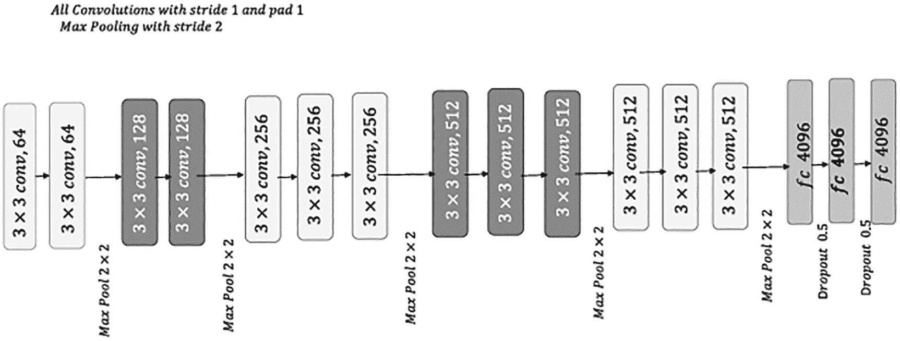

VGG 16 架构由 16 个矩形块组成，并通过箭头连接以说明流程图。

图 3-32

VGG16 架构

图 3-32 表示了 VGG16 的架构。网络的输入是 224 × 224 × 3 大小的图像。前两个卷积层产生 64 个特征图，每个特征图后面都跟着一个最大池化层。卷积的过滤器空间大小为 3 × 3，步长为 1，填充为 1。整个网络的最大池化层大小为 2 × 2，步长为 2。第三和第四个卷积层产生 128 个特征图，每个特征图后面都跟着一个最大池化层。网络的其余部分以类似的方式继续，如图 3-32 所示。在网络末尾，有三个 4096 个单位的完全连接层，每个层后面都跟着一个输出 SoftMax 层，用于一千个类别的输出。完全连接层的 Dropout 设置为 0.5。网络中的所有单元都使用 ReLU 激活。

### ResNet

ResNet 是微软开发的一个 152 层深的卷积神经网络，它在 2015 年 ILSVRC 竞赛中以仅 3.6% 的错误率获胜，这被认为比人类的 5-10% 错误率要好。关于 ResNet 的论文，由 [Kaiming He](https://arxiv.org/find/cs/1/au:%252BHe_K/0/1/0/all/0/1)、[Xiangyu Zhang](https://arxiv.org/find/cs/1/au:%252BZhang_X/0/1/0/all/0/1)、[Shaoqing Ren](https://arxiv.org/find/cs/1/au:%252BRen_S/0/1/0/all/0/1) 和 [Jian Sun](https://arxiv.org/find/cs/1/au:%252BSun_J/0/1/0/all/0/1) 撰写，标题为“用于图像识别的深度残差学习”，可在[`https://arxiv.org/abs/1512.03385`](https://arxiv.org/abs/1512.03385)找到。除了深度之外，ResNet 实现了残差块的独特想法。在每一系列的卷积-ReLU-卷积操作之后，将操作的输入反馈到操作的输出。在传统方法中，在进行卷积和其他变换时，我们试图将底层映射拟合到原始数据以解决分类任务。然而，在 ResNet 的残差块概念中，我们试图学习残差映射而不是从输入到输出的直接映射。形式上，在每个小的活动块中，我们将块的输入加到块的输出上。这如图 3-33 所示。这个概念基于这样的假设：拟合残差映射比拟合从输入到输出的原始映射更容易。

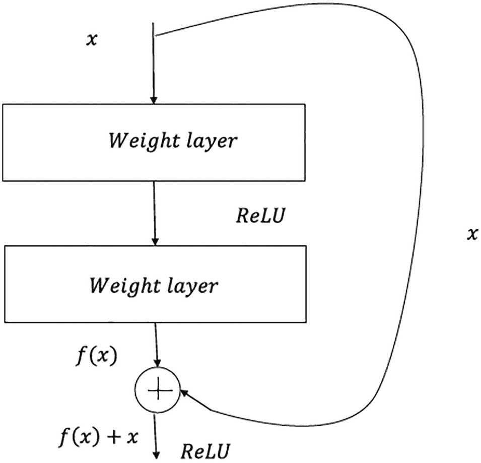

一个残差块的示意图由两个重量层的矩形块组成，并通过箭头连接。还标记了两种不同的函数。

图 3-33

残差块

## 迁移学习

广义上的迁移学习是指存储在解决一个问题时获得的知识，并在类似领域中的不同问题上使用这些知识。由于各种原因，迁移学习在深度学习领域取得了巨大的成功。

深度学习模型通常具有大量的参数，这是由于隐藏层的性质以及不同单元之间的连接方案。要训练如此大的模型，需要大量的数据，否则模型将遭受过拟合问题。在许多问题中，训练模型所需的大量数据可能不可用，但问题的性质需要深度学习解决方案以产生合理的影响。例如，在图像处理和目标识别中，深度学习模型已知可以提供最先进的解决方案。在这种情况下，迁移学习可以用来从预训练的深度学习模型中生成通用特征，然后使用这些特征构建一个简单的模型来解决该问题。因此，这个问题的唯一参数是用于构建简单模型的参数。预训练模型通常在大量数据语料库上训练，因此具有可靠的参数。

当我们通过几层卷积处理图像时，初始层学会检测非常通用的特征，例如卷曲和边缘。随着网络的深度增加，更深层的卷积层学会检测与特定数据集相关的更复杂特征。例如，在分类任务中，更深层的网络会学会检测眼睛、鼻子、面部等特征。

假设我们有一个在 ImageNet 数据集的 1000 个类别上训练的 VGG16 架构模型。现在，如果我们得到一个包含比 VGG16 预训练模型数据集更少类别的图像的小数据集，那么我们可以使用相同的 VGG16 模型直到全连接层，然后替换输出层以适应新的类别。此外，我们保持网络直到全连接层的权重不变，只训练模型从全连接层到输出层学习权重。这是因为数据集的性质与较小的数据集相同，因此预训练模型通过不同参数学习到的特征对于新的分类问题已经足够好，我们只需要学习从全连接层到输出层的权重。这大大减少了需要学习的参数数量，并将减少过拟合。如果我们使用 VGG16 架构训练小数据集，它可能会因为在小数据集上学习大量参数而严重过拟合。

当数据集的性质与预训练模型使用的数据集性质非常不同时，你会怎么做？

好吧，在这种情况下，我们可以使用相同的预训练模型，但只需固定前几层卷积-ReLU-最大池化层的参数，然后添加几层卷积-ReLU-最大池化层，这些层将学会检测新数据集固有的特征。最后，我们还需要一个全连接层，接着是输出层。由于我们使用了预训练的 VGG16 网络中初始卷积-ReLU-最大池化层的权重，因此这些层的参数无需再学习。如前所述，卷积的早期层学习非常通用的特征，例如边缘和曲线，这些特征适用于所有类型的图像。网络的其余部分需要训练以学习特定于特定问题数据集的特征。

### 迁移学习使用指南

以下是一些关于何时以及如何使用预训练模型进行迁移学习的指南：

+   问题数据集的大小较大，且数据集类似于用于预训练模型的那个——这是理想的情况。我们可以保留整个模型架构，除非输出层的类别与预训练模型不同。然后，我们可以使用预训练模型的权重作为模型初始权重来训练模型。

+   问题数据集的大小较大，但与用于预训练模型的数据集不同——在这种情况下，由于数据集较大，我们可以从头开始训练模型。预训练模型在这里不会带来任何优势，因为数据集的性质非常不同，并且由于我们有一个大型数据集，我们可以承担从头开始训练整个网络而不至于在大数据集上训练的小型网络中过度拟合。

+   问题数据集的大小较小，且数据集类似于用于预训练模型的那个——这就是我们之前讨论过的情况。由于数据集内容相似，我们可以重用模型的大部分现有权重，只需根据问题数据集中的类别更改输出层。然后，我们只需训练最后一层的权重。例如，如果我们只获取像 ImageNet 这样的狗和猫的图像，我们可以选择在 ImageNet 上预训练的 VGG16 模型，只需修改输出层使其有两大类而不是一千类。对于新的网络模型，我们只需训练特定于最终输出层的权重，保持所有其他权重与预训练的 VGG16 模型相同。

+   问题数据集的大小较小，且数据集与预训练模型中使用的数据集不同——这种情况并不理想。如前所述，我们可以冻结预训练网络的一些初始层的权重，然后在问题数据集上训练模型的其余部分。通常，输出层需要根据问题数据集中类别的数量进行更改。由于我们没有大量数据集，我们正在尝试通过重用预训练模型初始层的权重来尽可能减少参数数量。由于 CNN 的前几层学习的是任何图像固有的通用特征，这是可能的。

### 使用 Google 的 InceptionV3 进行迁移学习

InceptionV3 是谷歌最先进的卷积神经网络之一。它是 GoogLeNet 的改进版本，凭借其即插即用的卷积神经网络架构赢得了 ImageNetILSVRC-2014 竞赛。该网络的详细信息记录在由[Christian Szegedy](https://arxiv.org/find/cs/1/au:%252BSzegedy_C/0/1/0/all/0/1)及其合作者撰写的论文《Rethinking the Inception Architecture for Computer Vision》中。该论文可在[`https://arxiv.org/abs/1512.00567`](https://arxiv.org/abs/1512.00567)找到。GoogLeNet 及其修改版本的核心元素是引入了 inception 模块来进行卷积和池化。在传统的卷积神经网络中，在卷积层之后，我们要么进行另一个卷积，要么进行最大池化，而在 inception 模块中，每个层都并行地执行一系列卷积和最大池化，然后合并特征图。此外，在每个层中，卷积不是使用一个核滤波器大小，而是使用多个核滤波器大小。图 3-34 展示了 inception 模块。如图所示，有一系列并行卷积和最大池化，最后所有输出特征图在滤波器拼接块中合并。1×1 卷积进行降维并执行类似平均池化的操作。例如，假设我们有一个输入体积为 224×224×160，其中 160 是特征图的数量。使用 1×1×20 的滤波器核进行卷积将创建一个输出体积为 224×224×20。

这种类型的网络效果很好，因为不同的核大小根据滤波器感受野的大小提取不同粒度的特征信息。3×3 的感受野将提取比 5×5 感受野更多的粒度信息。

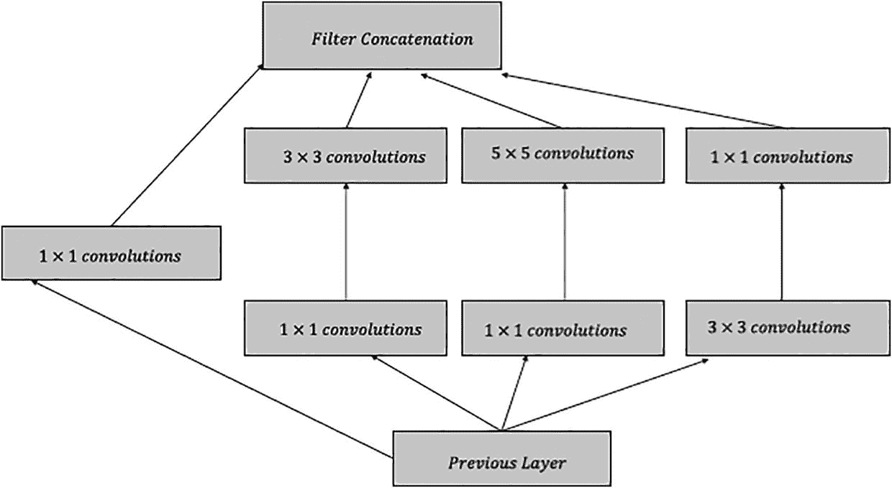

网络图由 9 个矩形块组成，这些块通过箭头连接。前一层有 4 个卷积块，滤波器拼接由 4 个卷积块连接。

图 3-34

Inception 模块

Google 的 TensorFlow 提供了一个在 ImageNet 数据上训练的预训练模型。它可以用于迁移学习。我们使用 Google 的预训练模型，并在从[`www.kaggle.com/c/dogs-vs-cats/data`](http://www.kaggle.com/c/dogs-vs-cats/data)提取的猫与狗图像集上重新训练。`train.zip`数据集包含 25,000 张图像，其中猫和狗各有 12,500 张。

### 使用预训练的 VGG16 进行迁移学习

在本节中，我们将使用在 ImageNet 数据集的千个类别上预训练的 VGG16 网络，通过 Kaggle 的猫与狗数据集进行分类。数据集的链接是[`https://www.kaggle.com/c/dogs-vs-cats/data`](https://www.kaggle.com/c/dogs-vs-cats/data)。首先，我们将从*TensorFlow Slim*导入 VGG16 模型，然后加载 VGG16 网络中的预训练权重。这些权重来自在 ImageNet 数据集的千个类别上训练的 VGG16。由于我们的问题只有两个类别，我们将从最后一个全连接层取出输出，并将其与一组新的权重结合，从而得到一个只有一个神经元的输出层，用于对 Kaggle 的猫与狗数据集进行二分类。想法是使用预训练的权重来生成特征，最后我们只学习一组权重，从而得到输出。这样，我们学习了一个相对较小的权重集，并且可以在更少的数据上训练模型。请参阅列表 3-8 中的详细实现。

```py
# Load packages
import sys
from sklearn.model_selection import train_test_split
import cv2
import os
import tensorflow as tf
from pathlib import Path
from glob import glob
print('tensorflow version', tf.__version__)
import numpy as np
from tensorflow.keras import Model, layers
import matplotlib.pyplot as plt
import time
from elapsedtimer import ElapsedTimer
import pandas as pd
from tensorflow.keras.applications.vgg16 import VGG16
from tensorflow.keras.applications.vgg16 import preprocess_input
from tensorflow.keras import layers, Model
# Mean value for image normalization
MEAN_VALUE = np.array([103.939, 116.779, 123.68])
# Model class
class vgg16_customized(Model):
def __init__(self,activation='relu', n_classes=2, input_size=224):
super(vgg16_customized,self).__init__()
self.base_model = VGG16(weights='imagenet', include_top=False, input_shape=(input_size, input_size, 3))
self.base_model.trainable = False
self.flatten = layers.Flatten()
self.out = layers.Dense(n_classes-1)
# Forward pass function
def call(self, x):
x = self.base_model(x)
x = self.flatten(x)
#x = self.fc1(x)
#x = self.fc2(x)
out = self.out(x)
probs = tf.nn.sigmoid(out)
return out, probs
# Routine to read the Images and also do mean correction
def image_preprocess(img_path, width, height):
img = cv2.imread(img_path)
img = cv2.resize(img, (width, height))
img = img - MEAN_VALUE
return img
# Create generator for Image batches so that only the processed batch is in memory
def data_gen_batch(images, batch_size, width, height):
while True:
ix = np.random.choice(np.arange(len(images)), batch_size)
imgs = []
labels = []
for i in ix:
if images[i].split('/')[-1].split('.')[0] == 'cat':
labels.append(1)
else:
if images[i].split('/')[-1].split('.')[0] == 'dog':
labels.append(0)
img_path = f"{Path(images[i])}"
array_img = image_preprocess(img_path, width, height)
imgs.append(array_img)
imgs = np.array(imgs)
labels = np.array(labels)
labels = np.reshape(labels, (batch_size, 1))
yield imgs, labels
# Train function
def train(train_data_dir, lr=0.01, input_size=224,n_classes=2, batch_size=32, output_dir=None,epochs=10):
if output_dir is None:
output_dir = os.getcwd()
else:
if not Path(output_dir).exists():
os.makedirs(output_dir)
all_images = glob(f"{train_data_dir}/*/*")
train_images, val_images = train_test_split(all_images, train_size=0.8, test_size=0.2)
print(f"Number of training images: {len(train_images)}")
print(f"Number of validation images: {len(val_images)}")
# Define the train and val batch generator
train_gen = data_gen_batch(train_images, batch_size, 224, 224)
val_gen = data_gen_batch(val_images, batch_size, 224, 224)
# Build the model
model = vgg16_customized(activation='relu', n_classes=n_classes, input_size=input_size)
model_graph = tf.function(model)
# Define the loss function
loss_fn = tf.keras.losses.BinaryCrossentropy(from_logits=True,reduction=tf.keras.losses.Reduction.SUM)
# Define the optimizer
optimizer = tf.keras.optimizers.Adam(lr)
batches = len(train_images)//batch_size
batches_val = len(val_images) // batch_size
loss_trace, accuracy_trace = [], []
for epoch in range(epochs):
loss, accuracy = 0, 0
num_train_recs = 0
for batch in range(batches):
x_train_batch, y_train_batch = next(train_gen)
x_train_batch, y_train_batch = tf.constant(x_train_batch), tf.constant(y_train_batch)
num_train_recs += x_train_batch.shape[0]
with tf.GradientTape() as tape:
y_pred_batch,y_pred_probs = model_graph(x_train_batch, training=True)
loss_ = loss_fn(y_train_batch, y_pred_batch)
# compute gradient
gradients = tape.gradient(loss_, model.trainable_variables)
# update the parameters
optimizer.apply_gradients(zip(gradients, model.trainable_variables))
y_pred_probs, y_train_batch = y_pred_probs.numpy() , y_train_batch.numpy()
y_pred_probs[y_pred_probs >= 0.5] = 1.0
accuracy += np.sum(y_train_batch == y_pred_probs)
loss += loss_.numpy()
#print(f"Loss for Epoch {epoch} Batch {batch}: {loss_.numpy()}")
loss /= num_train_recs
accuracy /= num_train_recs
loss_trace.append(loss)
accuracy_trace.append(accuracy)
print(f"-------------------------------------------------------\n")
print(f"Epoch {epoch} : loss: {np.round(loss, 4)} ,accuracy:{np.round(accuracy, 4)}\n")
print(f"-------------------------------------------------------\n")
accuracy_val, num_val_recs = 0, 0
for batch in range(batches_val):
X_val_batch, y_val_batch = next(val_gen)
X_val_batch = tf.constant(X_val_batch)
num_val_recs += X_val_batch.shape[0]
_,y_probs = model_graph(X_val_batch,training=False)
y_probs = y_probs.numpy()
y_probs[y_probs >= 0.5] = 1.0
#print(y_probs.shape,y_val_batch.shape)
accuracy_val += np.sum(y_val_batch == y_probs)
accuracy_val /= num_val_recs
print(f"Validation Accuracy at Epoch {epoch}: {accuracy_val}")
return model_graph, X_val_batch, y_val_batch, y_probs
model_graph, X_val_batch, y_val_batch, y_probs = train(train_data_dir='/media/santanu/9eb9b6dc-b380-486e-b4fd-c424a325b976/CatvsDog/train',batch_size=32,epochs=1)
Listing 3-8
Transfer Learning with Pre-trained VGG16
```

读者应根据数据的位置在调用`train`函数时相应地更改`train_data_dir`。

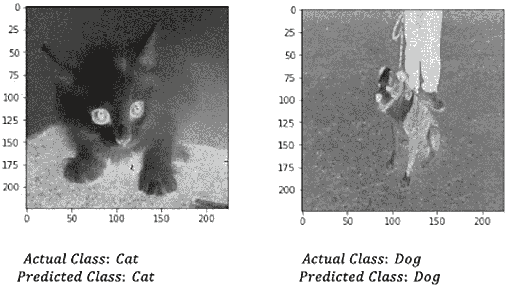

两张带有图形坐标轴的照片分别表示猫和狗的实际和预测类别。

图 3-35

验证集图像及其实际与预测类别

```py
--output--
Epoch 0 : loss: 5.692 ,accuracy:0.9669
---------------------------------------------------------------------------
Validation Accuracy at Epoch 0: 0.9769
```

我们看到，在随机批次大小为 32 的情况下，经过大约一个 epoch 的训练后，验证准确率为 98%。这里的 epoch 并不一定意味着对训练记录的完整遍历，因为批次是随机生成的。因此，在这个内容中，一个 epoch 可以包含多个被采样多次的图像和多个甚至一次都没有被采样的样本。在图 3-35 中，一些验证集图像及其实际和预测类别已被绘制出来，以说明预测的正确性。因此，正确利用迁移学习可以帮助我们重用为解决一个问题而学习到的特征检测器来解决新问题。迁移学习大大减少了需要学习的参数数量，从而减轻了网络的计算负担。此外，由于参数较少，训练数据大小的限制也减少了。

## 扩展卷积

扩张卷积作为一种替代常规卷积的方法，首次在论文“使用深度卷积网络和全连接 CRFs 进行语义图像分割”中提出（[`https://arxiv.org/abs/1412.7062`](https://arxiv.org/abs/1412.7062)）。扩张卷积背后的核心思想是将滤波器核权重应用于可能不是彼此直接邻居的像素。

在一般卷积中，3x3 滤波器应用于图像的 3x3 邻域，而在扩张卷积中，3x3 滤波器将应用于 5x5 邻域，其中每隔一个像素被跳过。后者被称为单扩张卷积，因为我们跳过了每隔一个像素。使用扩张卷积可以在不增加参数的情况下增加核的感受野。例如，一般卷积中的 3x3 滤波器核具有 3x3 的感受野，而相同核的单扩张卷积具有 5x5 的感受野。

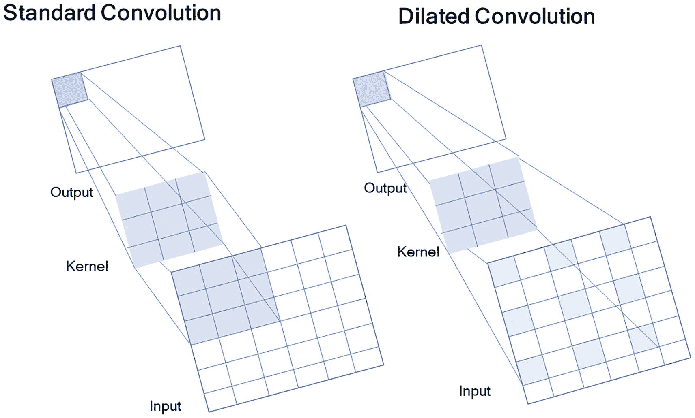

标准卷积和扩张卷积的示意图包括输入、滤波器和输出层。

图 3-36

标准卷积与扩张卷积示意图

标准卷积与扩张卷积之间的区别已在图 3-36 中说明。我们可以看到，标准卷积中的 3x3 滤波器核作用于 3x3 图像块以产生 1x1 输出。在扩张卷积中，3x3 滤波器核作用于 5x5 块以产生 1x1 输出。

## 深度可分离卷积

深度可分离卷积是一个两步卷积过程，它大大减少了卷积层中的参数数量。在第一步中，执行深度卷积，其中每个输入通道与一个滤波器进行卷积。因此，如果有*m*个输入通道，那么在深度卷积步骤中就会有*m*个卷积滤波器，这将产生*m*个输出特征图。在第二步中，对每个输出通道应用点卷积，以创建深度卷积输出特征图的线性组合。这里的点卷积实际上意味着在每个给定位置对输出特征图激活的加权平均。如果有*n*个输出通道，每个输出通道将是深度卷积步骤中*m*个输出特征图的线性总和。线性总和将基于每个输出通道对应的*m*个参数。从*m*个输入特征图到*n*个输出特征图的点卷积步骤可以看作是具有*m*×*n*×1×1 个参数的 1×1 滤波器的标准卷积。

如果我们将每个滤波核的宽度和高度分别视为 *w* 和 *h*，那么对于深度卷积，我们将有 *m* × *w* × *h* 个参数，而对于逐点卷积，我们将有 *m* × *n* 个参数。深度可分离卷积的总参数数 *N*[*d*] 如下所示：

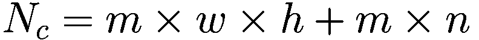

在标准卷积层中，对于每个输出通道，有 *m* 个输入通道和 *n* 个输出通道，对于每个输出通道，有 *m* 个滤波器对应于 *m* 个输入通道。从 *m* 个卷积中得到的输出特征图被平均，以产生对应于每个输出通道的输出特征图。因此，如果有 *n* 个输出通道，将有 *m* × *n* 个滤波器。

因此，标准卷积中的参数数 *N*[*s*] 如下所示：

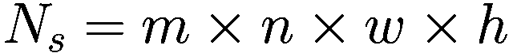

通常，*N*[*s*] ≫ *N*[*d*]，因此深度可分离卷积有助于减少每个卷积层的参数数量。通常，使用深度可分离卷积的模型性能与标准卷积相当。

图 3-37 中展示了具有三个输入通道和四个输出通道的卷积层的深度可分离卷积步骤。

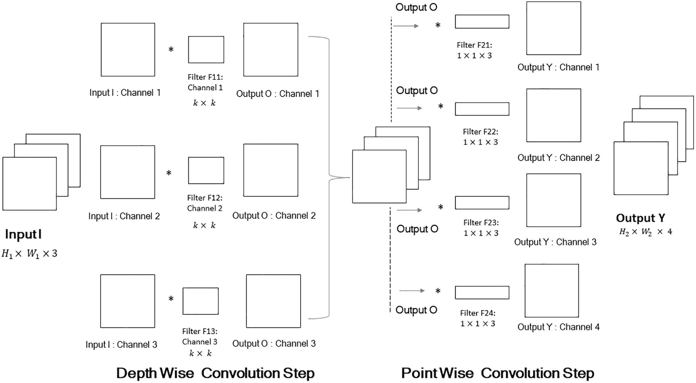

使用不同数量的输入和输出正方形纸片来表示深度卷积步骤和逐点卷积步骤的示意图。

图 3-37

深度可分离卷积

为了说明使用深度可分离卷积的模型与使用标准卷积的模型具有可比的性能，我们使用标准卷积和深度可分离卷积层训练和验证基于 MNIST 的模型。列表 3-9a 到 3-9c 展示了相同的内容。在这个练习中，我们使用了 TensorFlow 2 中的所有 Keras 功能。

```py
train(conv_type='depth_wise')
—output—
Test loss: 0.04192721098661423 / Test accuracy: 0.9858999848365784
Listing 3-9c
Run Depthwise Separable Convolution
```

```py
train(conv_type='standard')
—output—
Test loss: 0.028370419517159462 / Test accuracy: 0.9904999732971191
Listing 3-9b
Run Standard Convolution
```

```py
# Load Packages
import tensorflow
from tensorflow.keras.models import Sequential
from tensorflow.keras.datasets import mnist
from tensorflow.keras.layers import Dense, Dropout, Flatten
from tensorflow.keras.layers import Conv2D, SeparableConv2D, MaxPooling2D
# Conv Model definition
def conv_model(kernel_size=3, pool_ksize=2, num_filters=[32, 64], hidden_units=[256], activation='relu',
input_shape=(28, 28, 1), n_classes=10, conv_type='standard', dropout=0.25):
# Create the model
model = Sequential()
if conv_type == 'depth_wise':
model.add(SeparableConv2D(num_filters[0], kernel_size=(kernel_size, kernel_size),
activation=activation, input_shape=input_shape))
else:
model.add(Conv2D(num_filters[0], kernel_size=(kernel_size, kernel_size),
activation=activation, input_shape=input_shape))
model.add(MaxPooling2D(pool_size=(pool_ksize, pool_ksize)))
model.add(Dropout(dropout))
if conv_type == 'depth_wise':
model.add(SeparableConv2D(num_filters[1], kernel_size=(kernel_size, kernel_size), activation=activation))
else:
model.add(Conv2D(num_filters[1], kernel_size=(kernel_size, kernel_size), activation=activation))
model.add(MaxPooling2D(pool_size=(2, 2)))
model.add(Dropout(dropout))
model.add(Flatten())
model.add(Dense(hidden_units[0], activation=activation))
model.add(Dense(n_classes, activation='softmax'))
return model
# Train Routine
def train(input_size=28, input_channels=1, epochs=10, n_classes=10,
val_ratio=0.3, kernel_size=3, pool_ksize=2, num_filters=[32, 64],
hidden_units=[256], activation='relu',
dropout=0.25, lr=0.01, batch_size=128, conv_type='standard'):
# Load MNIST dataset and format
(input_train, target_train), (input_test, target_test) = mnist.load_data()
# Reshape the data
input_train = input_train.reshape(input_train.shape[0], input_size, input_size, 1)
input_test = input_test.reshape(input_test.shape[0], input_size, input_size, 1)
input_shape = (input_size, input_size, input_channels)
input_train = input_train.astype('float32')
input_test = input_test.astype('float32')
print(f"Normalize the input..\n")
input_train = input_train / 255
input_test = input_test / 255
# Convert target vectors to categorical targets
target_train = tensorflow.keras.utils.to_categorical(target_train, n_classes)
target_test = tensorflow.keras.utils.to_categorical(target_test, n_classes)
# Build Model
model = conv_model(kernel_size=kernel_size, pool_ksize=pool_ksize, num_filters=num_filters,
hidden_units=hidden_units, activation=activation, input_shape=input_shape,
n_classes=n_classes, conv_type=conv_type, dropout=dropout)
# Compile the model
model.compile(loss=tensorflow.keras.losses.categorical_crossentropy,
optimizer=tensorflow.keras.optimizers.Adam(),
metrics=['accuracy'])
# Train Model
model.fit(input_train, target_train,
batch_size=batch_size,
epochs=epochs,
verbose=1,
validation_split=val_ratio)
print(f"Evaluation test data..\n")
score = model.evaluate(input_test, target_test, verbose=0)
print(f'Test loss: {score[0]} / Test accuracy: {score[1]}')
Listing 3-9a
Model Definition and Training Routine for Depthwise Separable Convolution-Based and Standard Convolution-Based Models
```

从列表 3-9b 和 3-9c 的输出日志中可以看出，这两个模型在 MNIST 数据集上的测试准确率约为 ~99%。

## 摘要

在本章中，我们学习了卷积操作及其在构建卷积神经网络中的应用。此外，我们还学习了 CNN 的各种关键组件，以及训练卷积层和池化层的反向传播方法。我们讨论了 CNN 在图像处理中取得成功的关键概念——卷积提供的等变性属性和池化操作提供的平移不变性。进一步地，我们讨论了几种已建立的 CNN 架构以及如何使用这些 CNN 的预训练版本进行迁移学习。在下一章中，我们将讨论自然语言处理领域中的循环神经网络及其变体。
