# 5. 使用 Python 进行合成数据生成

在本章中，我们将探讨如何使用 Python 生成用于回归、分类和聚类问题的合成数据。首先，我们将讨论如何从已知分布生成合成数据。接下来，我们将对回归模型应用高斯噪声。然后，我们将讨论如何使用弗里德曼函数和符号回归生成用于分类和聚类问题的合成数据。最后，我们将使用生成对抗网络（GANs）生成用于表格数据的合成数据。

## 使用已知分布进行数据生成

这些合成数据是由遵循一组特定规则或条件的计算机程序生成的。这些规则旨在创建具有与原始数据集相同统计特性的数据，但不会包含任何有关原始数据集的实际信息。生成的数据集将用于测试各种数据分析方法，而不会泄露任何机密信息。

我们可以通过几种方式生成符合已知分布的合成数据。一种方式是使用参数模型，该模型指定了底层分布的函数形式，例如正态分布。然后，我们可以从这个参数模型生成数据点，这些数据点将具有与底层数据相同的分布。

另一种生成具有已知分布的合成数据的方法是使用非参数模型，例如核密度估计。这种方法不需要我们指定底层分布的函数形式，而是从数据本身估计它。当底层分布不太清楚或我们没有足够的数据来准确指定参数模型时，这可能很有用。

一旦我们生成了我们的合成数据，我们就可以将其用于任何我们本可以使用真实数据的目的，例如训练机器学习模型或执行统计分析。

所有样本都将基于给定的参数分布生成。我们有不同的分布，如正态、均匀、三角、二项、卡方、拉普拉斯，以及它们的参数。

```py
import numpy as np # calling the numpy library
import matplotlib.colors # calling the numpy matplotlib.colors library
import matplotlib.pyplot as plt# calling the matplotlib.pyplot library
d_list = ['normal','uniform','triangular','binomial','chisquare','laplace'] # define which distribution to be used
p_list = ['0,1','-1,1','-3,0,8','10,0.5','2','5,4'] # each distribution parameters
c_list = ['red','limegreen','gold','purple','blue','magenta'] # Each graph colors
fig, axs = plt.subplots(nrows=2, ncols=3, dpi=800,figsize=(7,6))
k=0
for i in range(2):
for j in range(3):
datas=eval("np.random."+d_list[k]+"("+p_list[k]+",5000)")
axs[i][j].hist(datas, bins=50,color=c_list[k])
axs[i][j].set_title(d_list[k]+" dist( "+p_list[k]+")",size=8)
k+=1
plt.suptitle('Samples from Different Distributions',fontsize=15)
fig.savefig("Dist Histogram.png")
plt.close(fig)
```

您将看到图 5-1 所示的图形。

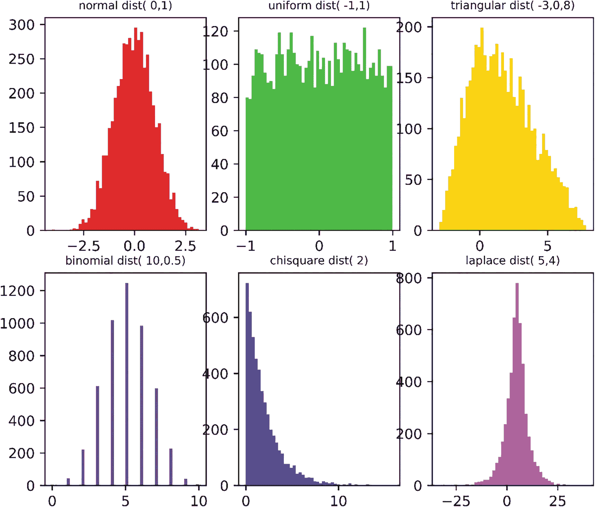

六个来自正态、均匀、三角、二项、卡方和拉普拉斯分布的图形。所有图形都是连续的，但二项图形是离散的。

图 5-1

来自不同分布的样本

此外，有时我们需要伪造文本数据来填充或完成任何数据库。Faker 是一个 Python 库，用于生成伪造的文本数据。

```py
from faker import Faker # calling the library
```

`fake_data=Faker()`

默认是美国数据库，但您可以将其更改为任何国籍。

我们所有的伪造数据都来自 Faker 类，因此在这个类中有太多不同的信息。

要创建土耳其数据配置文件，我们可以在 Faker()函数中轻松确定“tr_TR”国籍。

姓名、工作、地址、电话号码和电子邮件数据可以很容易地通过 Faker()函数调用。

```py
from faker import Faker # Starting with installing the Faker library
fake_data=Faker()# This is the American data base
fake_data=Faker("tr_TR") # Created Turkish databased, so all the results come from Turkish databsed
print (fake_data.name())
print (fake_data.job())
print (fake_data.address())
print (fake_data.phone_number())
print (fake_data.email())
Output:
Deha Çamurcuoğlu Akça
Laboratuvar işçisi
82750 Arslan Mews
Akgüneşport, MI 04351
+90(526)8817713
nurmelek56@example.net
```

在 Faker 函数中，有使用加权功能，它安排现实世界值的频率。

```py
fake_data=Faker("tr_TR", use_weighting=True)
for i in range(10):
print (fake_data.name())
Output:
Bayan Zubeyde Şemsinisa Soylu
Ulu Göksev Durmuş
Uçan Eraslan
Ozansü Ertün Demir
Sanur Döner Şensoy
Tekiner Akçay
Nalân Gülen
Vildane Duran
Dr. Aydınbey Sunel Türk
Dr. Hasbek İntihap Akçay
```

我们可以通过使用或不使用 use_weighting 函数来轻松比较结果。

### 包含日期信息的数据

定义一个虚假的出生日期或日期。

```py
print (fake_data.date_of_birth())
print (fake_data.date())Output:
1949-12-22
1995-04-09
```

### 包含互联网信息的数据

```py
print (fake_data.hostname())
print (fake_data.ipv4())
Output:
db-88.turk.com
181.228.175.188
```

### 一个更复杂和全面的例子

我们将使用 Faker()函数创建一个新的 csv 文档，该文档涵盖国际医院的病人记录。

```py
from faker import Faker # Calling Faker library
import pandas as pnd # Calling panda library
import numpy as np # Calling numpy library
fake_data=Faker(["en_US","fr_FR","tr_TR"], use_weighting=True) # More than one different language database is defined
symptoms_list=["anxiety","depression","back_pain","diarrhea","fever","dizzy","cough","apnea"] # List of specified symptoms
patients={}
for k in range(0,1000):# 1000 patients are created in total
patients[k]={} # Creating patient list and id, name, address, phone number, date of birth is assigned to each patient.
patients[k]['id']=k+1
patients[k]['name']=fake_data.name()
patients[k]['address']=fake_data.address()
patients[k]['phone_number']=fake_data.phone_number()
patients[k]['Date of Birth']=fake_data.date()    patients[k]['symptoms']=np.random.choice(symptoms_list) # Random assignment of symptoms from a list of specified symptoms
data_frame=pnd.DataFrame(patients).T
print (data_frame)
data_frame.to_csv("Patinets_data.csv", index=False) # Generated dataset is saved in cvs file
Output:
id                name  ... Date of Birth  symptoms
0       1       Chad Webster  ...    1990-03-24  diarrhea
1       2       Amanda Watts  ...    2005-01-19    dizzy
2       3       Craig Decker  ...    2003-08-29    apnea
3       4       Aurore Boyer  ...    1989-09-03    fever
4       5       Lisa Edwards  ...    2016-09-25    cough
..    ...                ...  ...          ...      ...
995   996      April Pollard  ...   2013-03-24   anxiety
996   997        Yazgül Çetin  ...   1996-07-02     apnea
997   998  Rémy Julien-Texier  ...   2015-06-24  diarrhea
998   999     Robin Blanchard  ...   2016-08-03     apnea
999  1000    Martine Schmitt  ...    1999-10-17    apnea
[1000 rows x 6 columns]
```

## 回归问题中的合成数据生成

在回归分析中，合成数据生成是创建与现有数据相似但又不完全相同的新数据的过程。这些新数据可以用于训练模型或测试假设。你可能有很多原因想要生成合成数据。例如，你可能想要创建一个比现有数据集更大的数据集，或者你可能想要创建一个比现有数据集具有更多样化数据的数据集。合成数据还可以用于填充数据集中的缺失值。有各种方法可以用来生成合成数据。有些方法比其他方法更复杂，有些则比其他方法更准确。你选择的方法将取决于你正在处理的数据类型以及你试图实现的目标。

Python 库中的 sklearn.dataset 包生成一个随机的回归数据集。该包中的 make_regression()函数主要由 n_samples、n_features 和一个目标变量组成。n_sample 指的是要生成的样本数量，n_features 创建尽可能多的独立*x*变量，而目标变量则扮演我们的因变量角色。

```py
from faker import Faker
import pandas as pnd
import numpy as np
import matplotlib.pyplot as plt # Required for drawing graphics
from sklearn.datasets import make_regression # Required for generating a random regression data set
c_mapp=plt.cm.get_cmap("YlGnBu") # Color of the graph
data_reg=make_regression(n_samples=1000, n_features=2, noise=0.0) # 1000 samples are created with two features
print (data_reg[0])
data_frame1= pnd.DataFrame(data_reg[0],columns=['x'+str(i) for i in range(1,3)])
data_frame1['y'] = data_reg[1]
print (data_frame1)
Output:
x1        x2           y
0    0.451775  1.126216  105.637343
1   -1.153118  2.894067  173.656334
2   -0.963961  1.377513   65.112484
3   -1.460770 -1.414778 -170.456499
4   -1.225991 -1.876402 -196.006796
..        ...       ...         ...
995 -0.629005 -1.539042 -144.851247
996 -1.281187 -1.064484 -135.948385
997  0.438089  0.611139   65.478204
998  1.513318 -1.033047  -15.423906
999 -0.770491 -0.248904  -51.691303
```

```py
fig, axs = plt.subplots(figsize=(9,5)) # Define figure size
axs.scatter(data_frame1.x1,data_frame1.x2, cmap=c_mapp,c=data_frame1.y,vmin=min(data_frame1.y), vmax=max(data_frame1.y))
axs.set_title('noise=0') # set title
plt.show()
Output:
```

你将看到图 5-2 中所示图形。

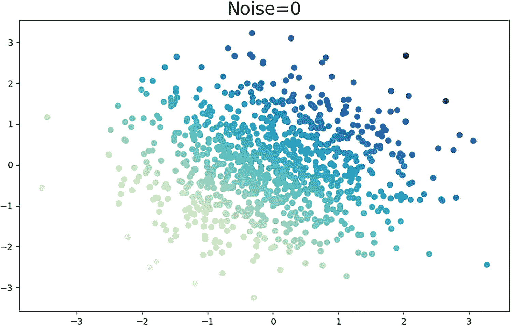

随机回归数据集的虚线图。

图 5-2

*无噪声的随机回归数据集*

我们还可以为每个 x 数据集绘制带有拟合回归线的回归图。

```py
data_reg=make_regression(n_samples=30, n_features=2,
noise=0.0) ) # 30 samples are created with two features
data_frame1= pnd.DataFrame(data_reg[0],columns=['x'+str(i) for i in range(1,3)])
data_frame1['y'] = data_reg[1]
fig, ax = plt.subplots(2,figsize=(9,5)) # Two feature will be displayed on two figures
reg_fit_x1=np.polyfit(data_frame1.x1,data_frame1.y,1) # First feature
fit_function1=np.poly1d(reg_fit_x1) # Regression fit line
reg_fit_x2=np.polyfit(data_frame1.x2,data_frame1.y,1) # Second feature
fit_function2=np.poly1d(reg_fit_x2) # Regression fit line
# Adjusting the figure's properties, such that color, size
ax[0].scatter(data_frame1.x1,data_frame1.y, s=100,c="red", edgecolor="black")
ax[0].plot(data_frame1.x1,fit_function1(data_frame1.x1),':b', lw=2)
ax[1].scatter(data_frame1.x2,data_frame1.y, s=100,c="red", edgecolor="black")
ax[1].plot(data_frame1.x2,fit_function2(data_frame1.x2), ':b', lw=2)
plt.show()
Output:
```

你将看到图 5-3 中所示的图形。

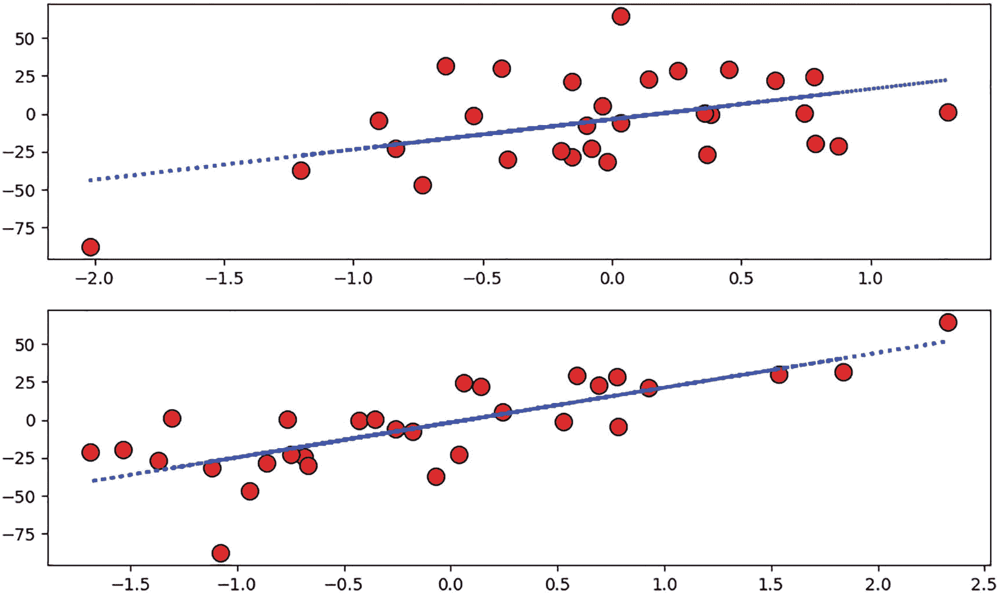

两个带有拟合回归线的虚线图形。两个图形都遵循增长趋势。

图 5-3

拟合回归线

### 高斯噪声应用于回归模型

回归模型用于预测连续值。它们通常用于预测价格或需求等事物。

向数据添加噪声是模拟现实世界条件的一种常见方式。这有助于确保模型不会过度拟合训练数据。

在这个例子中，我们将向合成数据添加高斯噪声，并观察它如何影响回归模型。我们将生成两个数据集。一个将用于训练模型，另一个将用于测试模型。

训练数据将添加噪声。测试数据将不添加任何噪声。这将使我们能够看到模型如何泛化到新的数据。

在这个例子中，我们将使用简单的线性回归模型。该模型将有一个输入变量和一个输出变量。输入变量将是数据点的 *x* 值，输出变量将是数据点的 *y* 值。

我们将在训练数据上添加均值为 0 和标准差为 1 的高斯噪声。这将创建一个 *x* 值随机分布在 *y* 值周围的数据集。

该模型将在训练数据上训练，然后在测试数据上测试。我们将比较预测值与实际值，以查看模型的性能如何。高斯噪声有助于提高我们模型的准确性。

在回归模型中，我们可以实现噪声效应，以查看创建的数据是如何变化的。

```py
fig, ax = plt.subplots(3,2,figsize=(9,5)) # Generating figures for 6 different noise values consisting of 3 rows and 2 columns for each noise value
a=231
for noise_data in [1,10,50,100,500,1000,]:
data_reg2=make_regression(n_samples=1000, n_features=2,
noise= noise_data) # A regression data set is created according to different noise values.
data_frame1= pnd.DataFrame(data_reg2[0],columns=['x'+str(i) for i in range(1,3)])
data_frame1['y'] = data_reg2[1]
plt.subplot(a)
plt.scatter(data_frame1.x1,data_frame1.x2, cmap=c_mapp,c=data_frame1.y,vmin=min(data_frame1.y), vmax=max(data_frame1.y))
plt.title('Noise='+ str(noise_data), size=10)
a+=1
plt.show()
```

您将看到图 5-4 中所示的图形。

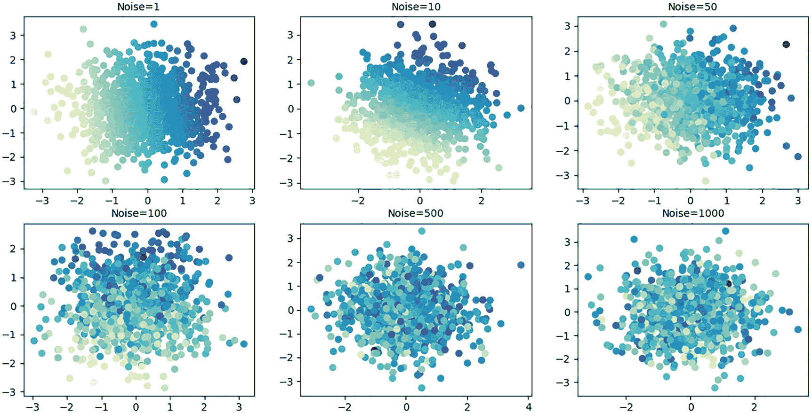

噪声为 0、10、50、100、500 和 1000 的六个点回归数据图。

图 5-4

带有高斯噪声的回归数据集

x 数据集的回归模型是用 6 个变量产生的，噪声变量为 500 个图以下，

```py
fig, ax = plt.subplots(3,2,figsize=(9,5)) # Generating figures for 6 features values consisting of 3 rows and 2 columns
a=231
noise_data=500
data_reg3=make_regression(n_samples=30, n_features=6,
noise=noise_data) # 30 samples are created with 6 features
data_frame1= pnd.DataFrame(data_reg3[0],columns=['x'+str(k) for k in range(1,7)])
data_frame1['y'] = data_reg3[1]
for i in range(6):
reg_fit=np.polyfit(data_frame1[data_frame1.columns[i]],data_frame1.y,1)
fit_function1=np.poly1d(reg_fit) # Regression fit line
plt.subplot(a)
plt.scatter(data_frame1[data_frame1.columns[i]],data_frame1.y, s=100,c="red", edgecolor="black") # Scatter plot
plt.plot(data_frame1[data_frame1.columns[i]],fit_function1(data_frame1[data_frame1.columns[i]]),':b', lw=2) # Line plot
plt.title('X'+str(i)+" with Noise=500", size=10)
plt.grid(True)
a+=1
plt.show()
Output:
```

您将看到图 5-5 中所示的图形。

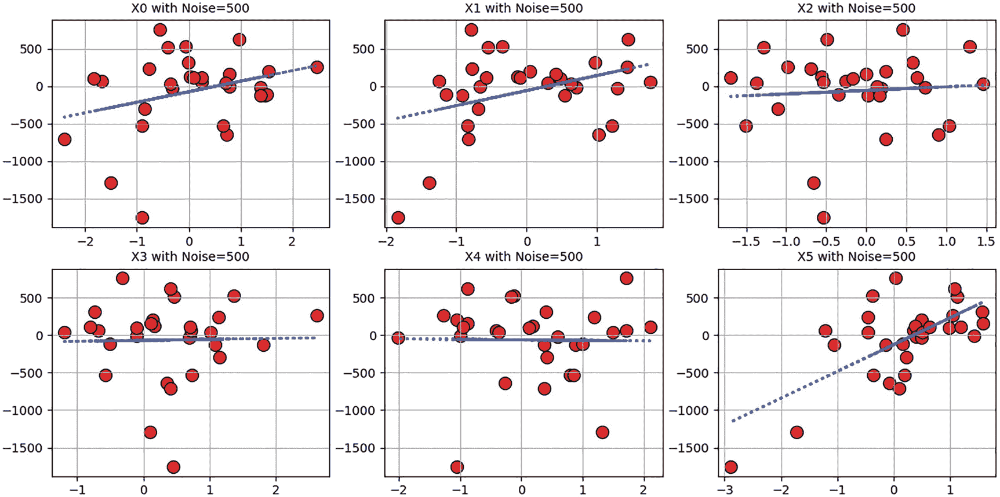

对于噪声等于 500 的 x0 到 x1 的六个点，拟合回归线是恒定的，其他点的回归线则缓慢增加。

图 5-5

带有相同高斯噪声的拟合回归线

我们可以绘制不同噪声程度的数据集

```py
fig, ax = plt.subplots(3,2,figsize=(9,5))
data_frame=pnd.DataFrame(data=np.zeros((30,1)))
a=231
noise_data=[1,10,50,100,500,1000,] # Noise values
for i in range(6):
data_reg4=make_regression(n_samples=30, n_features=1,
noise=noise_data[i]) # 30 samples are created with 1 features and certain noise values
data_frame["x"+str(i+1)]=data_reg4[0]
data_frame["y"+str(i+1)]=data_reg4[1]
for i in range(6):
reg_fit=np.polyfit(data_frame["x"+str(i+1)],data_frame["y"+str(i+1)],1)
fit_function1=np.poly1d(reg_fit) # Regression fit line
plt.subplot(a)
plt.scatter(data_frame["x"+str(i+1)],data_frame["y"+str(i+1)], s=100,c="red", edgecolor="black") # Scatter plot
plt.plot(data_frame["x"+str(i+1)],fit_function1(data_frame["x"+str(i+1)]),':b', lw=2) # Regression line
plt.title('Noise='+ str(noise_data[i]), size=10)
plt.grid(True)
a+=1
plt.show() #
Output:
```

您将看到图 5-6 中所示的图形。

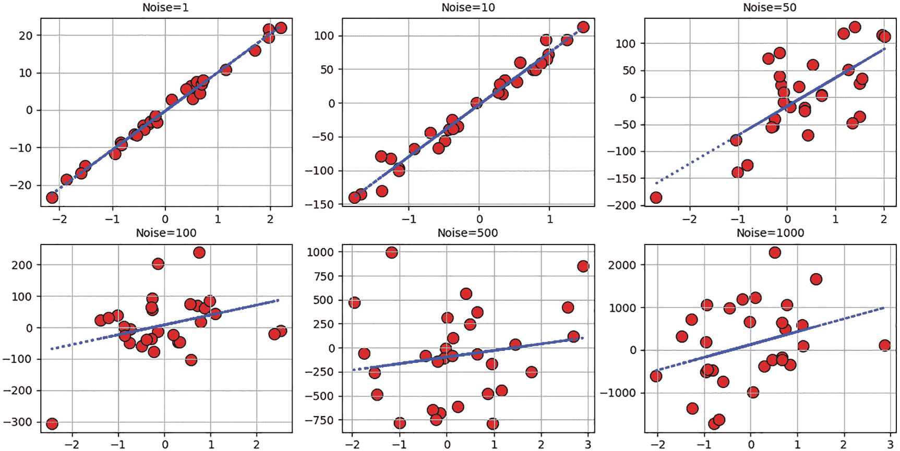

对于噪声等于 500 的 x0 到 x1 的六个点，拟合回归线是恒定的，x0、x1 和 x2 的回归线线性增加，其他点的回归线则缓慢增加。

图 5-6

带有不同高斯噪声的拟合回归线

## 弗里德曼函数与符号回归

弗里德曼函数是一种在统计学和回归分析中使用的数学函数。它们以统计学家米尔顿·弗里德曼的名字命名，他在非线性回归的研究中引入了它们。

弗里德曼函数用于模拟非线性相关的数据。也就是说，数据不能使用直线进行模拟。相反，数据使用曲线进行模拟。弗里德曼函数常用于符号回归。符号回归是一种机器学习方法，它自动找到最佳描述数据集的数学方程。弗里德曼函数非常适合符号回归，因为它们可以模拟非线性相关的数据。这很重要，因为许多现实世界的数据集是非线性相关的。

在符号回归中使用 Friedman 函数在合成数据集中非常有效。Friedman 函数也用于其他类型的机器学习，例如支持向量机和人工神经网络。此外，Friedman 函数在机器学习中的应用是一个活跃的研究领域。

Friedman 函数特别适合于“噪声”或具有许多异常值的数据。这是因为与其他函数（如多项式）相比，它们对数据中的微小变化不太敏感。Friedman 函数可以用来模拟各种类型的数据，包括金融数据、科学数据，甚至社交媒体数据。

我们何时可以使用 know 函数生成 Friedman 数据集？有 3 种不同的 Friedman 数据生成公式。它们是：

make_friedman1() 函数是生成至少具有 5 个输入参数的数据。

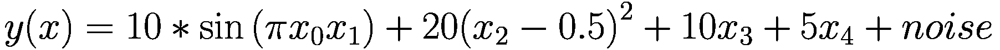

make_friedman2() 函数是生成具有 4 个输入维度的数据。

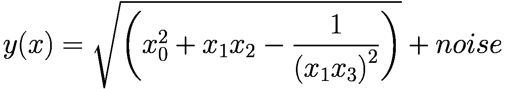

make_friedman3() 函数是生成具有 4 维度的数据。

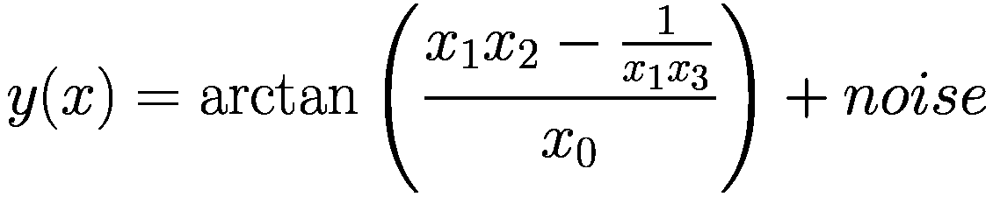

已使用这些函数创建了数据集。

```py
from faker import Faker # Required libraries faker, pandas, numpy, matplotlib.pyplot, sklearn.datasets
import pandas as pnd
import numpy as np
import matplotlib.pyplot as plt
import sklearn.datasets as skl_dataset
c_map=plt.cm.get_cmap("YlGnBu") # Color of the figure
x_variables,y = skl_dataset.make_friedman1(n_samples=1500,n_features=6, noise=0.0) # 1500 samples are created with 6 features and without any noise
data_frame1=pnd.DataFrame(x_variables,columns=['x'+str(i) for i in range(1,7)])
data_frame1['y'] = y
print (data_frame1)
Output:
x1        x2        x3        x4        x5        x6          y
0     0.548814  0.715189  0.602763  0.544883  0.423655  0.645894  17.213492
1     0.437587  0.891773  0.963663  0.383442  0.791725  0.528895  21.503940
2     0.568045  0.925597  0.071036  0.087129  0.020218  0.832620  14.619807
3     0.778157  0.870012  0.978618  0.799159  0.461479  0.780529  23.373800
4     0.118274  0.639921  0.143353  0.944669  0.521848  0.414662  16.955281
...        ...       ...       ...       ...       ...       ...        ...
1495  0.672339  0.941159  0.690350  0.559549  0.157171  0.921106  16.248550
1496  0.996720  0.842478  0.093479  0.111422  0.364915  0.696023  11.069381
1497  0.826904  0.180815  0.625240  0.159566  0.112104  0.470972   6.996266
1498  0.861044  0.627706  0.681544  0.393166  0.266880  0.932096  15.844463
1499  0.411408  0.513405  0.072222  0.069151  0.758064  0.932006  14.300998
[1500 rows x 7 columns]
```

### 制作 3D 图

```py
matplotlib.pyplot, sklearn.datasets
import pandas as pnd
import numpy as np
import matplotlib.pyplot as plt
import sklearn.datasets as skl_dataset
c_map=plt.cm.get_cmap("YlGnBu")
x_variables,y = skl_dataset.make_friedman1(n_samples=1500,n_features=6,random_state=0, noise=0.0) # With the make_friedman1 function, 1500 samples are created without any noise
data_frame=pnd.DataFrame(x_variables,columns=['x'+str(i) for i in range(1,7)])
data_frame['y'] = y
fig = plt.figure(figsize=(7,7)) # Figure size
ax = fig.add_subplot(111, projection='3d')
ax.scatter(data_frame.iloc[:,0], data_frame.iloc[:,1],data_frame.iloc[:,2],c=data_frame.y, cmap=c_map)# A 3D graph was drawn using the first three features of the data set created with the help of the function
plt.title('Function: Friedman1') # Title of the graph
plt.show()
Output:
```

你将看到图 5-7 中所示的图形。

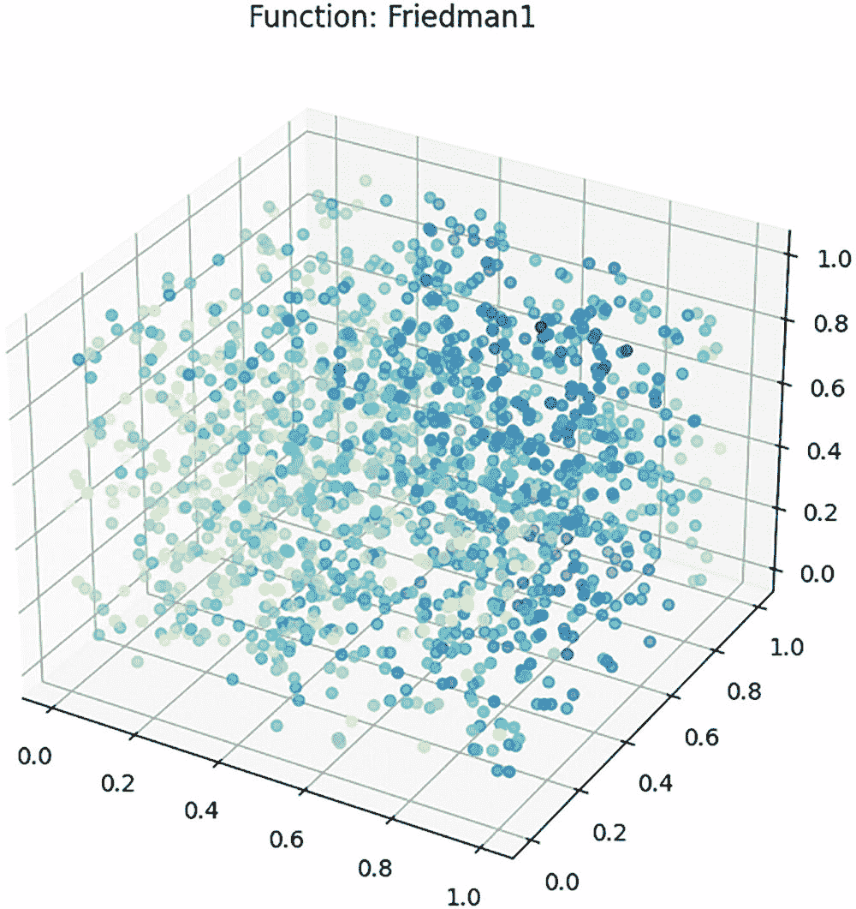

Friedman 1 函数的三维散点图。它在整个空间中分布。

图 5-7

Friedman 1 样本

make_friedman2() 函数：make_friedman2() 具有四个输入维度和一个目标变量。

```py
x_variables,y = skl_dataset.make_friedman2(n_samples=1500,random_state=0, noise=0.0) # With the make_friedman2 function, 1500 samples are created without any noise
data_frame2=pnd.DataFrame(x_variables,columns=['x'+str(i) for i in range(1,5)])
data_frame2['y'] = y
print (data_frame2)
Output:
x1          x2          x3        x4                y
0     54.881350  1294.017209  0.602763  6.448832   781.914458
1     42.365480  1180.814530  0.437587  9.917730   518.443136
2     96.366276   752.064577  0.791725  6.288949   603.175873
3     56.804456  1637.744458  0.071036  1.871293   129.465874
4      2.021840  1485.854949  0.778157  9.700121  1156.229758
...         ...         ...       ...       ...         ...
1495  90.761456  1282.735004  0.528287  7.393068  683.702753
1496  73.083957  1315.726634  0.484977  3.814760  642.268770
1497  20.617459  1626.337223  0.058247  4.370731   96.946340
1498  69.005014  1105.953379  0.433219  2.042329  484.062842
1499  13.952805  1263.523099  0.483697  4.395507  611.320916
[1500 rows x 5 columns]
fig = plt.figure(figsize=(7,7)) # Figure size
ax = fig.add_subplot(111, projection='3d') # 3D figure definition
ax.scatter(data_frame2.iloc[:,0], data_frame2.iloc[:,1],data_frame2.iloc[:,2],c=data_frame2.y, cmap=c_map) # A 3D graph was drawn using the first three features of the data set created with the help of the functionplt.title('Function: Friedman2') # Title of the graph
plt.show()
```

你将看到图 5-8 中所示的图形。

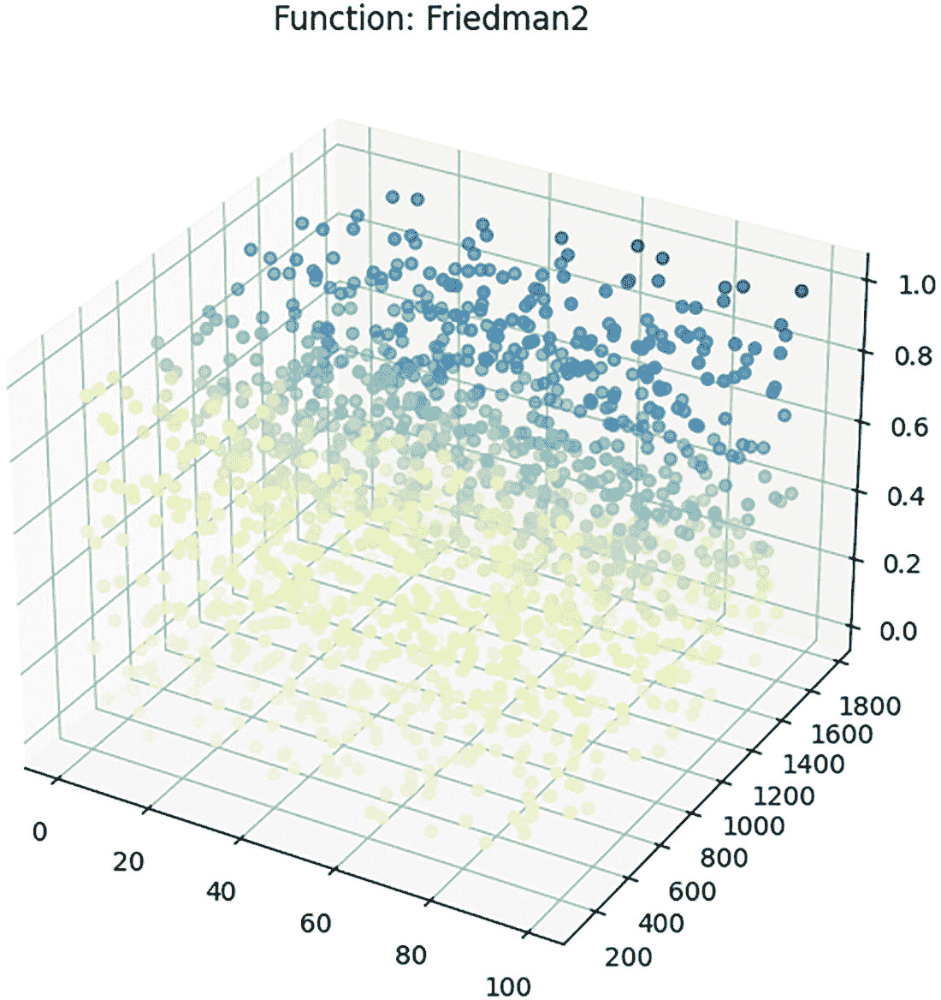

Friedman 2 函数的三维散点图。它在整个空间中分布。不同颜色的点层层叠加。

图 5-8

Friedman 2 样本

make_friedman3() 函数：make_friedman3() 也具有 4 个输入维度和一个目标变量。

```py
x_variables,y = skl_dataset.make_friedman3(n_samples=1500,random_state=0, noise=0.0) # With the make_friedman3 function, 1500 samples are created without any noise
data_frame3=pnd.DataFrame(x_variables,columns=['x'+str(i) for i in range(1,5)])
data_frame3['y'] = y
print (data_frame3)
Output:
x1          x2          x3        x4          y
0     54.881350  1294.017209  0.602763  6.448832  1.500550
1     42.365480  1180.814530  0.437587  9.917730  1.488988
2     96.366276   752.064577  0.791725  6.288949  1.410344
3     56.804456  1637.744458  0.071036  1.871293  1.116578
4      2.021840  1485.854949  0.778157  9.700121  1.569048
...         ...         ...       ...       ...       ...
1495  90.761456  1282.735004  0.528287  7.393068  1.437653
1496  73.083957  1315.726634  0.484977  3.814760  1.456759
1497  20.617459  1626.337223  0.058247  4.370731  1.356491
1498  69.005014  1105.953379  0.433219  2.042329  1.427755
1499  13.952805  1263.523099  0.483697  4.395507  1.547970
[1500 rows x 5 columns]
```

### Make3d Plot

```py
fig = plt.figure(figsize=(7,7)) # Figure size
ax = fig.add_subplot(111, projection='3d') # 3D figure definition
ax.scatter(data_frame3.iloc[:,0], data_frame3.iloc[:,1],data_frame3.iloc[:,2],c=data_frame3.y, cmap=c_map) # A 3D graph was drawn using the first three features of the data set created with the help of the function
plt.title('Function: Friedman3') # Title of the graph
plt.show()
```

你将看到图 5-9 中所示的图形。

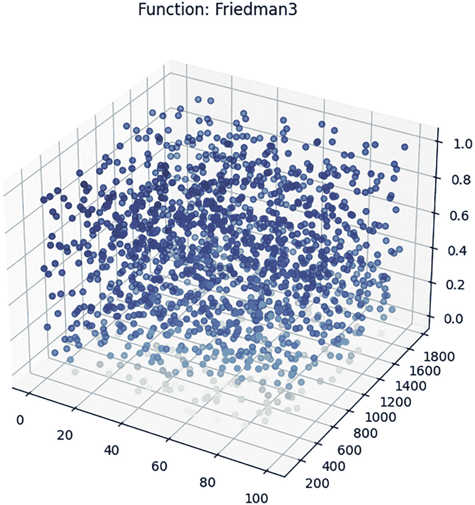

Friedman 3 函数的三维散点图。它在整个空间中分布。不同颜色的点层层叠加。

图 5-9

Friedman 3 样本

由于这些函数，如 `make_friedman` 和方程是预定的，因此无法在方程中进行更改。那么，当我们有我们的方程时，我们如何生成数据？在这种情况下，我们使用符号回归库。在符号回归库中，可以确定数据的任何方程，然后可以轻松地生成合成数据。

使用 `gen_regression_symbolic()` 函数创建合成数据。

我们的表达式是：

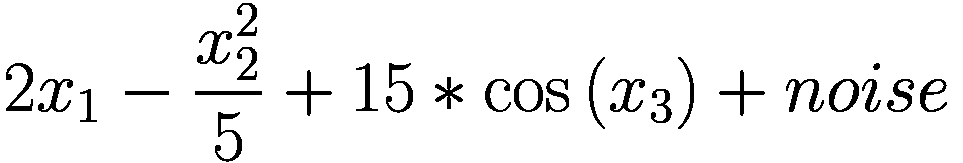

`gen_regression_symbolic()` 是在 SymPy 库下运行的一个函数。您也可以使用直接代码，代码如下所示：[`https://github.com/tirthajyoti/Synthetic-data-gen/blob/master/Notebooks/Symbolic%20regression%20classification%20generator.ipynb`](https://github.com/tirthajyoti/Synthetic-data-gen/blob/master/Notebooks/Symbolic%2520regression%2520classification%2520generator.ipynb)。

```py
sym_reg = gen_regression_symbolic(m='(2*x1-(x2²)/5+15*cos(x3))',n_samples=100,noise=0.001) # Generates 100 samples according to any given function with small noise value
data_frame=pnd.DataFrame(sym_reg, columns=['x'+str(i) for i in range(1,4)]+['y'])
print (data_frame)
Output:
x1        x2        x3        y
0    4.01501 -7.82078  -3.28809  -19.0413221727414
1   -2.87236  4.67456   2.15993  -18.4489373520397
2   0.583208 -3.63311   1.89078  -6.19090192508419
3   -1.83245  1.34786   3.11348  -19.0215795562634
4    6.07163  4.08164 -0.555099   21.5589808291341
..       ...      ...       ...              ...
95   6.82835 -9.05487  -7.16284   6.82160246144781
96 -0.182998 -2.88295   7.12683   7.94190040809628
97   1.90985  2.00882  -6.91558   15.1138855856051
98  -11.8337 -5.63271  0.291907  -15.6480137151175
99  -4.86859 -6.69322    10.473  -26.1853405176567
[100 rows x 4 columns]
sym_reg = gen_regression_symbolic(m='(2*x1-(x2²)/5+15*cos(x3))',n_samples=100,noise=0.001) # Generates 100 samples according to any given function with small noise value
data_frame=pnd.DataFrame(sym_reg, columns=['x'+str(i) for i in range(1,4)]+['y'])
fig, ax = plt.subplots(1,3,figsize=(10,6))
a=131
for i in range(3):
plt.subplot(a)
plt.scatter(data_frame[data_frame.columns[i]],data_frame.y, s=100,c="red", edgecolor="black")
plt.title("Symbolic Regression value of x"+str(i+1), size=10)
plt.grid(True)
a+=1
plt.show()
Output:
```

您将看到图 5-10 中所示的图形。

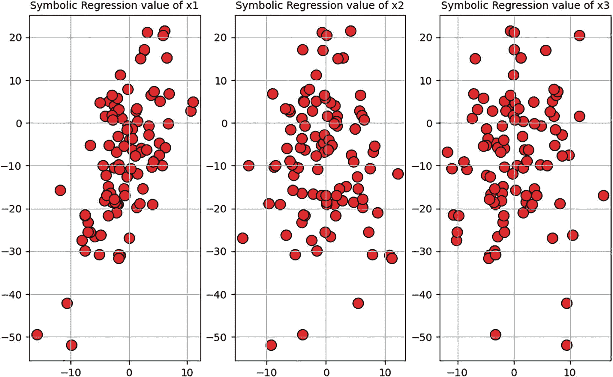

用于符号回归 x1, x2 和 x3 的二维三个散点图。点密度在 0 值周围最大。

图 5-10

符号回归样本

当噪声值增加时，相同函数的新数据集绘图如下：

```py
sym_reg = gen_regression_symbolic(m='(2*x1-(x2²)/5+15*cos(x3))',n_samples=100,noise=100) # Generates 100 samples according to any given function with noise value=100
data_frame=pnd.DataFrame(sym_reg, columns=['x'+str(i) for i in range(1,4)]+['y'])
print (data_frame)
Output:
x1         x2       x3         y
0  -3.46277  -5.51495  3.98618  -57.4350979414258
1   5.43253  -4.04728  9.11698   9.37138073808718
2  -6.31532    2.5455  9.62771  -160.316068073531
3   1.82535   1.91883  7.87547  -72.6741141566774
4  -4.58646  3.08036 -1.98984  10.6154364431634
..      ...      ...      ...            ...
95  6.22184  -3.52058 -3.46112   27.1446124999385
96 -9.17476  -1.60239  4.05507  -237.823167918562
97  9.55225 -0.942542    5.795   32.2341630424007
98  3.43748  7.74819  4.16235    5.50366250210477
99 -5.28268   2.22154  3.60838   100.090605544604
[100 rows x 4 columns]
sym_reg = gen_regression_symbolic(m='(2*x1-(x2²)/5+15*cos(x3))',n_samples=100,noise=100) # Generates 100 samples according to any given function with noise value=100
data_frame=pnd.DataFrame(sym_reg, columns=['x'+str(i) for i in range(1,4)]+['y'])
fig, ax = plt.subplots(1,3,figsize=(10,6)) # Generating figures for 3 parameters values consisting of 1 rows 3columns
a=131
for i in range(3):
plt.subplot(a)
plt.scatter(data_frame[data_frame.columns[i]],data_frame.y, s=100,c="red", edgecolor="black")
plt.title("Symbolic Regression value of x"+str(i+1), size=10)
plt.grid(True)
a+=1
plt.show()
Output:
```

您将看到图 5-11 中所示的图形。

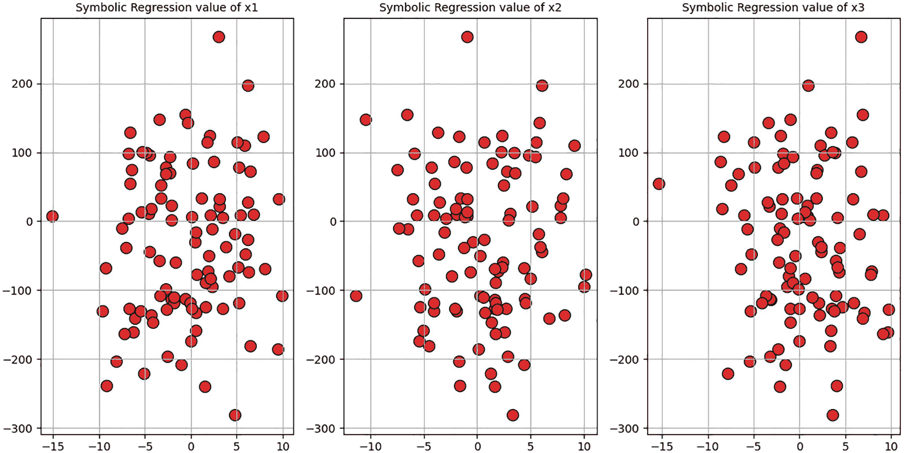

用于符号回归 x1, x2 和 x3 的二维三个散点图。点密度在 0 值周围最大。x2 的散点图密度最低。

图 5-11

带噪声的符号回归样本

## 用于分类和聚类问题的合成数据生成

生成用于分类和聚类问题的合成数据有许多方法。一种流行的方法是使用生成模型，例如高斯混合模型，从已知分布生成数据。另一种常见的方法是使用自助法，这涉及到从数据集中有放回地采样数据，然后对生成的数据进行建模。

自助法是生成合成数据的一种强大方法，可用于分类和聚类问题。使用自助法的关键优势是它允许您生成代表数据潜在分布的数据。这很重要，因为这意味着生成的数据将有助于训练和测试模型。

高斯混合模型是生成合成数据的另一种流行方法。这些模型可以生成既真实又符合已知分布的数据。高斯混合模型在生成用于聚类问题的数据时特别有用。

生成合成数据有许多其他方法，例如使用随机森林或支持向量机。无论你使用哪种方法，重要的是生成数据要能代表真实数据。这将确保你训练的模型将有效，并且能很好地推广到新数据。

### 分类问题

Scikit-learn 是 Python 库之一，用于创建和分析数据。分类、回归、聚类、降维、模型选择和预处理是该 Python 库的主要功能。

本部分将讨论分类问题。

“make_classification”函数与“make_regression”函数类似。该函数具有许多参数，包括样本、特征、分类数量、每类中的聚类数、flip_y 等，仅举几例。

现在，通过改变分类特征和样本参数的数量，将生成数据。生成的数据的组合将用三维图表示。

```py
import pandas as pnd
import numpy as np
import matplotlib.pyplot as plt
from sklearn.datasets import make_classification
from itertools import combinations
from math import ceil
# Many libraries are required for the code
data_class = make_classification(n_samples=150, n_features=4) # 150 samples with 4 features were generated with the make_classification function.
d_fr = pnd.DataFrame(data_class[0], columns=["x1","x2","x3","x4"]) # Generate data frame
d_fr['y'] = data_class[1]
print (d_fr.head())
Output:
x1        x2        x3        x4    y
0  0.281367  0.347271 -0.006246  0.440627  1
1 -0.411207 -0.855647  0.715458  0.714364  0
2 -0.488541 -0.350263 -0.501890 -1.751094  0
3  0.594585  0.745571 -0.036975  0.885411  1
4  0.963687  1.234084 -0.112037  1.334840  1
comb_var=list(combinations(d_fr.columns[:-1],3)) # Creating 3-combination sets from 4-features data set.
print (comb_var)
Output:
[('x1', 'x2', 'x3'), ('x1', 'x2', 'x4'), ('x1', 'x3', 'x4'), ('x2', 'x3', 'x4')]
lenght_comb = len(comb_var)
fig = plt.figure(figsize=(11,7))
a=221
for ii in range(lenght_comb):
ax = fig.add_subplot(a+ii, projection='3d') # 3D figure definition
x1 = comb_var[ii][0]
x2 = comb_var[ii][1]
x3 = comb_var[ii][2]
ax.scatter3D(d_fr[x1],d_fr[x2],d_fr[x3],c=d_fr['y'],edgecolor='b', s=100) # 3D Scatter plot
plt.title('Variables'+str(comb_var[ii]))
plt.grid(True)
plt.show()
Output:
```

你将看到图 5-12 所示的图形。

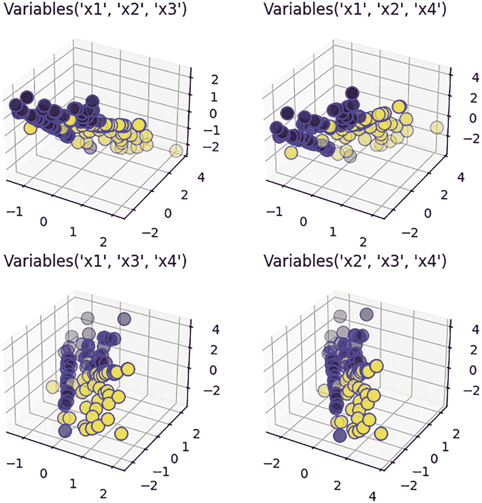

对于 x1、x2、x3 和 x4 的不同组合，每次取三个变量，具有不同分离度的分类函数的三维图。

图 5-12

分类函数样本

我们可以通过使用“make_classification”函数的“class_sep”特征轻松定义类的分离度。

```py
data_class = make_classification(n_samples=200, n_features=4, class_sep=5.0)
d_fr = pnd.DataFrame(data_class[0], columns=["x1","x2","x3","x4"])
d_fr['y'] = data_class[1]
print (d_fr.head())
Output:
x1        x2        x3        x4  y
0  4.770371 -3.957778 -4.727696  2.055952  0
1  6.520983 -5.950567 -4.329821  2.218751  0
2 -5.875455  5.061547  5.085108 -2.327549  1
3 -4.863805  6.492111 -4.876516  0.593860  1
4  5.955333 -4.964671 -5.808199  2.540613  0
comb_var=list(combinations(d_fr.columns[:-1],3))
print (comb_var)
lenght_comb = len(comb_var)
fig = plt.figure(figsize=(11,7))
a=221
for ii in range(lenght_comb):
ax = fig.add_subplot(a+ii, projection='3d') # 3D figure definition
x1 = comb_var[ii][0]
x2 = comb_var[ii][1]
x3 = comb_var[ii][2]
ax.scatter3D(d_fr[x1],d_fr[x2],d_fr[x3],c=d_fr['y'],edgecolor='b', s=100) # 3D Scatter plot
plt.title('Variables'+str(comb_var[ii]))
plt.grid(True)
plt.show()
Output:
```

你将看到图 5-13 所示的图形。

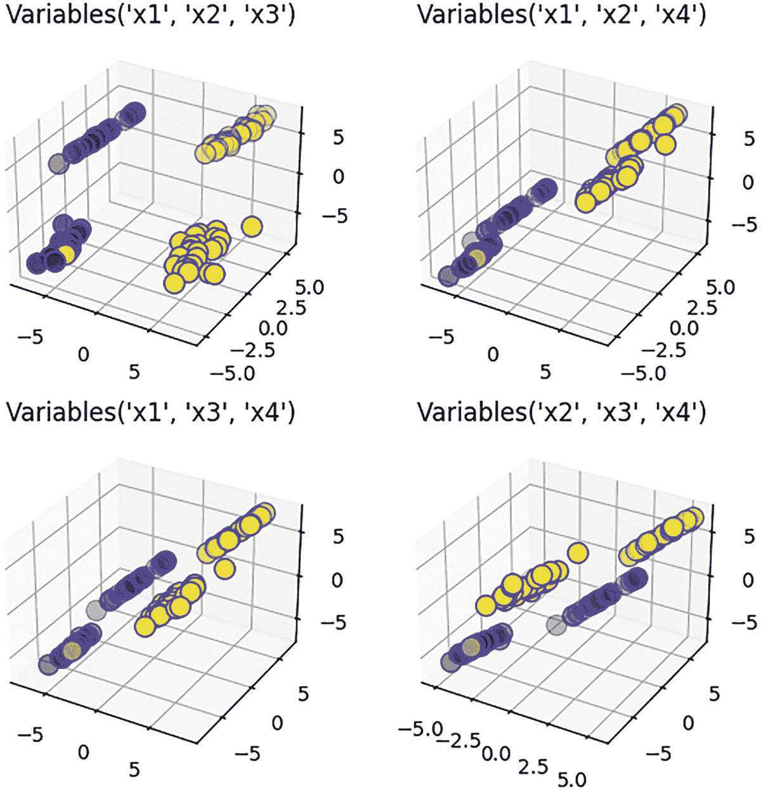

对于 x1、x2、x3 和 x4 的不同组合，每次取三个变量，具有 5.0 分离度的分类函数的三维图。

图 5-13

具有分离度为 5.0 的分类函数

默认的类分离值是 1。通过减少 class_sep 值，可以使类分离变得困难。因此，我们可以控制类分离的难度程度。

```py
data_class = make_classification(n_samples=200, n_features=4, class_sep=0.01)
d_fr = pnd.DataFrame(data_class[0],columns=["x1","x2","x3","x4"])
d_fr['y'] = data_class[1]
print (d_fr.head())
Output:
x1        x2        x3        x4  y
0 -1.088551  0.149864 -1.166086  0.635055  1
1  0.582877 -0.523155  1.048317 -0.695005  0
2 -0.637509 -0.384611 -0.230787 -0.006657  0
3  0.246752 -0.653592  0.857389 -0.640534  1
4  0.809663 -0.228885  0.979717 -0.566453  0
comb_var=list(combinations(d_fr.columns[:-1],3)) # Creating 3-combination sets from 4-features data set.print (comb_var)
lenght_comb = len(comb_var)
fig = plt.figure(figsize=(11,7))
a=221
for ii in range(lenght_comb):
ax = fig.add_subplot(a+ii, projection='3d')
x1 = comb_var[ii][0]
x2 = comb_var[ii][1]
x3 = comb_var[ii][2]
ax.scatter3D(d_fr[x1],d_fr[x2],d_fr[x3],c=d_fr['y'],edgecolor='b', s=100) #3D scatter plot
plt.title('Variables'+str(comb_var[ii]))
plt.grid(True)
plt.show()
Output:
```

你将看到图 5-14 所示的图形。

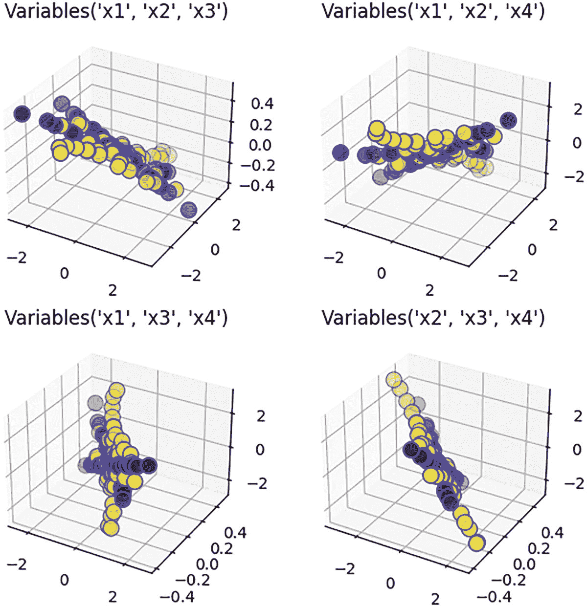

对于 x1、x2、x3 和 x4 的不同组合，每次取三个变量，具有 0.01 分离度的分类函数的三维图。

图 5-14

具有 0.01 分离度的分类函数

根据不同的 class_separation 参数准备图表。

```py
c_map=plt.cm.get_cmap("YlGnBu") # Colur of the figure
fig, ax = plt.subplots(3,2,figsize=(11,6))
a=221
sep_par=[0.5,1,5,10] # Different separation parameters
for i in range(4):
data_class = make_classification(n_samples=100,class_sep=sep_par[i],n_features=3,n_informative=1,n_clusters_per_class=1,n_redundant=0, random_state=99) # Creates a data set for each separation parameter.
d_fr = pnd.DataFrame(data_class[0], columns=["x1","x2","x3"])
d_fr['y'] = data_class[1]
print (d_fr.head())
Output:
x1        x2        x3  y
0 -0.719888  0.488592 -0.838072  0
1 -0.641575  0.755223 -3.079455  0
2 -0.240191  0.997332  1.006110  0
3 -0.542860  0.667894 -0.131717  0
4  0.551964 -1.310447 -0.186156  1
x1        x2        x3  y
0 -1.219888  0.488592 -0.838072  0
1 -1.141575  0.755223 -3.079455  0
2 -0.740191  0.997332  1.006110  0
3 -1.042860  0.667894 -0.131717  0
4  1.051964 -1.310447 -0.186156  1
x1        x2        x3  y
0 -5.219888  0.488592 -0.838072  0
1 -5.141575  0.755223 -3.079455  0
2 -4.740191  0.997332  1.006110  0
3 -5.042860  0.667894 -0.131717  0
4  5.051964 -1.310447 -0.186156  1
x1        x2        x3  y
0 -10.219888  0.488592 -0.838072  0
1 -10.141575  0.755223 -3.079455  0
2  -9.740191  0.997332  1.006110  0
3 -10.042860  0.667894 -0.131717  0
4  10.051964 -1.310447 -0.186156  1
plt.subplot(a)
plt.scatter(d_fr["x1"],d_fr['x2'],c=d_fr['y'], s=100) # Scatter plot for each separation parameter.
plt.title('Class Separation='+ str(sep_par[i]), size=10)
plt.grid(True)
a+=1
plt.show()
Output:
```

你将看到图 5-15 所示的图形。

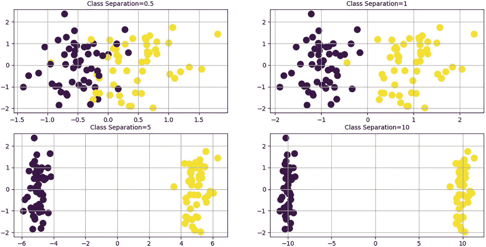

四张用于 0.5、1、5 和 10 类操作散点图的示例。5 和 10 类之间形成两组，彼此之间有一定的距离进行类分离。

图 5-15

具有不同分离度的分类函数

此外，我们可能还想通过 flip_y 特征来控制数据中的噪声。其默认值为 0.01，通过增加此值，我们可以生成更嘈杂的数据。

```py
c_map=plt.cm.get_cmap("YlGnBu") # Color of the figure
fig, ax = plt.subplots(3,2,figsize=(11,6)) # Figure definition with 3 rows and 2 columns for 6 different noise parametersa=231
noise_data=[0.01,0.1,0.3,0.5,0.75,1]
for i in range(6):
data_class = make_classification(n_samples=100,flip_y=noise_data[i],n_features=3,n_informative=1,n_clusters_per_class=1,n_redundant=0, random_state=99) # 100 samples with 3 features were generated with the make_classification function.
d_fr = pnd.DataFrame(data_class[0], columns=["x1","x2","x3"])
d_fr['y'] = data_class[1]
print (d_fr.head())
Output:
x1        x2        x3  y
0 -1.219888  0.488592 -0.838072  0
1 -1.141575  0.755223 -3.079455  0
2 -0.740191  0.997332  1.006110  0
3 -1.042860  0.667894 -0.131717  0
4  1.051964 -1.310447 -0.186156  1
x1        x2        x3  y
0 -1.219888  0.488592 -0.838072  0
1 -1.141575  0.755223 -3.079455  0
2 -0.740191  0.997332  1.006110  0
3 -1.042860  0.667894 -0.131717  0
4  1.051964 -1.310447 -0.186156  1
x1        x2        x3  y
0  1.186402  0.221004  1.188059  0
1  0.529890 -1.200443  0.036284  1
2 -0.402620 -1.277329 -1.244909  1
3 -0.212651 -1.324401  1.160567  0
4  1.006110 -0.740191  0.997332  1
x1        x2        x3  y
0 -1.739733  0.718727  0.558044  1
1 -1.849785 -1.309492  0.739926  1
2  0.362326  0.493240  1.443892  1
3 -0.486586 -1.811083 -2.157206  0
4 -1.282523  0.299280  1.804544  1
x1        x2        x3  y
0 -0.962169 -1.451818  0.044653  1
1 -0.733295 -0.827071  0.512437  0
2 -0.661349  1.568567  1.743235  0
3 -0.444609 -0.980022 -0.923461  0
4 -0.210006 -1.425160 -0.865028  1
x1        x2        x3  y
0 -1.277345 -1.006062  0.953027  1
1  1.165405  2.233999  0.529370  0
2  1.169992  0.013460  1.126487  1
3 -1.901419  1.020386  0.852078  0
4  1.435830  0.801733  2.311340  1
plt.subplot(a)
plt.scatter(d_fr["x1"],d_fr['x2'],c=d_fr['y'], s=100)
plt.title('Noise='+ str(noise_data[i]), size=10)
plt.grid(True)
a+=1
plt.show() #
```

你将看到图 5-16 中所示的图形。

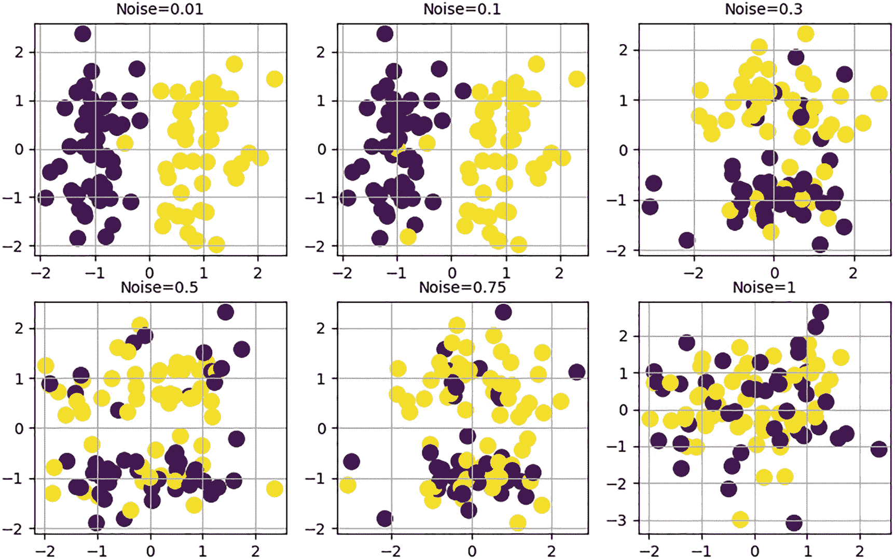

0.01、0.1、0.3、0.5 和 1 的噪声的六个散点图。

图 5-16

不同噪声水平的分类函数

多标签分类是一种建模技术，旨在预测具有零个或多个共同标签的类别的标签。

```py
from sklearn.datasets import make_multilabel_classification
c_map=plt.cm.get_cmap("YlGnBu")
fig, ax = plt.subplots(2,2)
a=221
number_labels=[2,5, 7, 10]
for ii in range(4):
plt.subplot(a)
x_class, y_class= make_multilabel_classification(n_samples=500, n_features=4,random_state=99, n_classes=3,n_labels=number_labels[ii]) # 500 samples with 4 features were generated based on the labels number
new_y=np.sum(y_class*[4,2,1], axis=1)
plt.scatter(x_class[:,2],x_class[:,3],c=new_y, s=100, cmap=c_map) # The scatter plot created using the data in the 3rd and 4th features
plt.title('Number of Labels='+str(number_labels[ii]))
a+=1
plt.show()
Output:
```

你将看到图 5-17 中所示的图形。

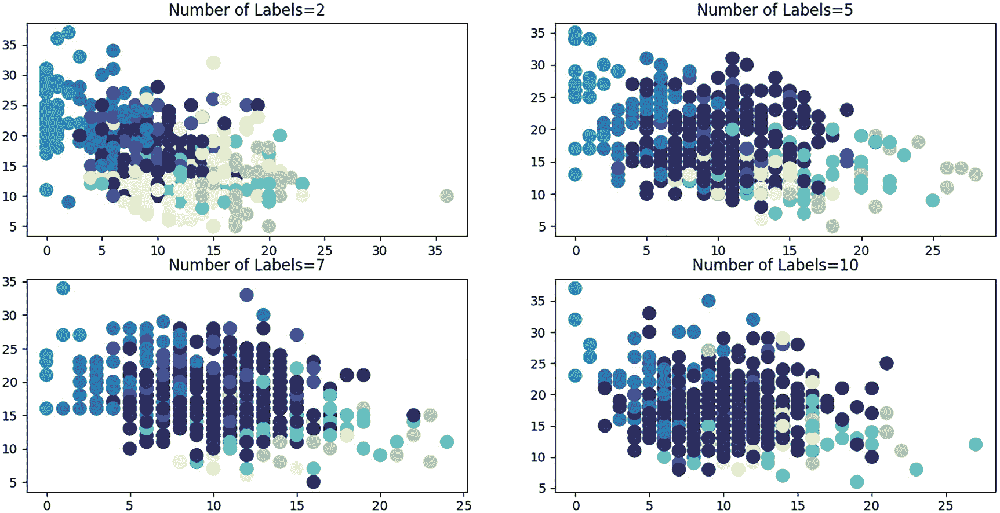

对于标签数量等于 2、5、7 和 10 的多标签分类，有四个散点图。

图 5-17

多标签分类样本

### 聚类问题

当生成合成数据时，可能会出现几种不同的聚类问题。其中一种问题是数据在聚类之间分布不均匀。如果数据是随机生成的，没有考虑数据的潜在结构，这种情况就会发生。另一种问题是聚类彼此过于接近并相互重叠。如果使用少量聚类生成数据或聚类定义不明确，这种情况就会发生。最后，第三种问题可能发生在聚类彼此过于遥远且不共享任何数据点的情况下。如果使用大量聚类生成数据或聚类定义不明确，这种情况就会发生。

当生成合成数据时，可能会出现许多不同的聚类问题。其中一些最常见的问题包括：

+   **重叠的聚类** - 当两个或更多聚类生成的聚类相互重叠时，这种情况会发生。在尝试分析数据时可能会引起问题，因为可能难以确定哪些数据点属于哪个聚类。

+   **不一致的聚类边界** - 当聚类之间的边界不一致时，这种情况会发生。这同样可能使得分析数据变得困难，因为可能难以确定哪些数据点属于哪个聚类。

+   **不均匀的聚类大小** - 当聚类的大小分布不均匀时，这种情况会发生。这可能会使得比较不同聚类的结果变得困难。

+   **非均匀聚类形状** - 当聚类的形状不均匀时，这种情况会发生。这可能会使得比较不同聚类的结果变得困难。

使用 sklearn.datasets 库创建类似于团块的数据组件来生成数据。make_blobs() 函数用于生成聚类的高斯团块。

数据集以不同的中心数量进行绘制；默认中心数量为 3。

```py
import sklearn.datasets as skl_dt
c_map=plt.cm.get_cmap("YlGnBu")
fig, ax = plt.subplots(2,2)
a=221
for ii in range(3,7):
plt.subplot(a)
x_data, y = skl_dt.make_blobs(n_samples=500,centers=ii,random_state=99) # 500 samples were generated based on the centers number
plt.scatter(x_data[:,0],x_data[:,1],c=y, s=50, cmap=c_map)
plt.title('Number of Centers='+str(ii))
a+=1
plt.show()
Output:
```

你将看到图 5-18 中所示的图形。

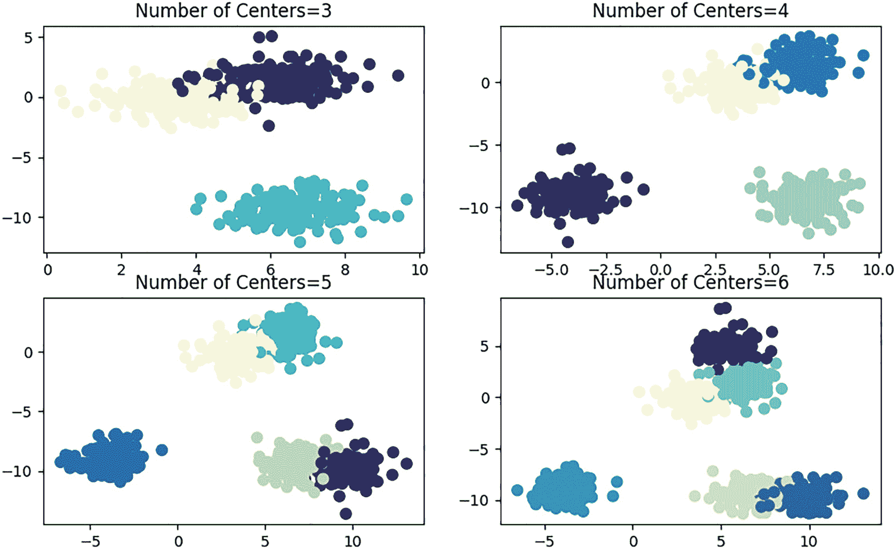

对于几个中心 3、4、5 和 6 的聚类，有四个散点图表示高斯团块。

图 5-18

不同中心数量的聚类高斯团块

使用 3 个中心，我们可以生成具有 4 个特征的数据。

```py
from itertools import combinations
from math import ceil
c_map=plt.cm.get_cmap("YlGnBu")
fig, ax = plt.subplots(3,2)
data_clust = skl_dt.make_blobs(n_samples=500, n_features=4, centers=3) # 500 samples with 4 features were generated based on the 3 centers.
d_fr = pnd.DataFrame(data_clust[0], columns=["x1","x2","x3","x4"]) # Having 4 features
d_fr['y'] = data_clust[1]
print (d_fr.head())
Output:
x1         x2       x3         x4       y
0 -0.330098 -3.499526 -3.932461   1.291953  0
1 -1.096365 -3.965669  2.006255  -6.935994  2
2 -0.888992 -4.453931  2.988597 -10.777764  1
3  0.145460 -3.183180 -3.375980   1.226803  0
4 -1.046599 -4.729893  2.528782  -5.336201  2
comb_var=list(combinations(d_fr.columns[:-1],2)) )) # Creating 2-combination sets from 4-features data set.
print (comb_var)
[('x1', 'x2'), ('x1', 'x3'), ('x1', 'x4'), ('x2', 'x3'), ('x2', 'x4'), ('x3',x4')]
lenght_comb = len(comb_var)
a=321
for i in range(lenght_comb):
plt.subplot(a)
x1 = comb_var[i][0]
x2 = comb_var[i][1]
plt.scatter(d_fr[x1],d_fr[x2],c=d_fr['y'],edgecolor='b', s=150)
plt.xlabel(comb_var[i][0])
plt.ylabel(comb_var[i][1])
plt.grid(True)
a+=1
plt.show()
Output:
```

图 5-19

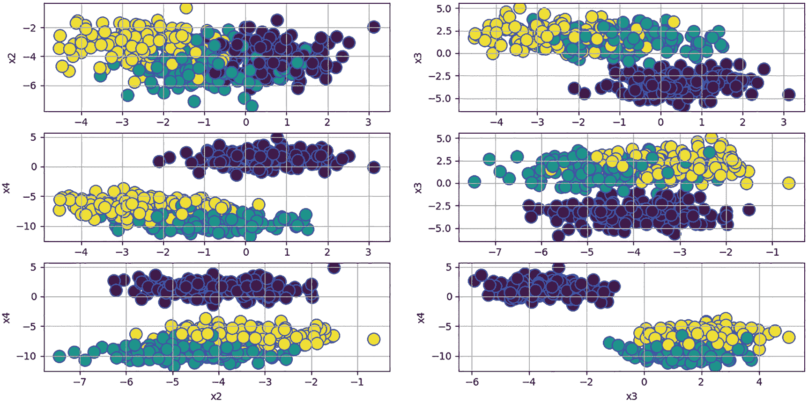

六个散点图，用于三个中心的 Gaussian 团块聚类。这是从 x2 到 x4 的变量。

图 5-19

使用不同特征组合进行聚类的高斯团块

通过使用 cluster_std 特征，我们可以轻松地分离我们的聚类。默认值是 1。

```py
import pandas as pnd
import numpy as np
import matplotlib.pyplot as plt
from sklearn.datasets import make_blobs
from itertools import combinations
from math import ceil
c_map=plt.cm.get_cmap("YlGnBu")
fig, ax = plt.subplots(2,2)
cluster_st=[0.3,1,5,10]
a=221
for i in range(4):
data_clust = make_blobs(n_samples=500, n_features=4, centers=3,cluster_std=cluster_st[i]) # 500 samples with 4 features were generated based on the 3 centers and specified cluster_st.
d_fr = pnd.DataFrame(data_clust[0], columns=["x1","x2","x3","x4"])
d_fr['y'] = data_clust[1]
plt.subplot(a)
plt.scatter(d_fr["x1"],d_fr["x2"],c=d_fr['y'],edgecolor='b', s=150) # Scatter plot
plt.xlabel("x1")
plt.ylabel("x2")
plt.title('Cluster sdt='+str(cluster_st[i]))
plt.grid(True)
a+=1
plt.show()
Output:
```

您将看到图 5-20 中所示的图形。

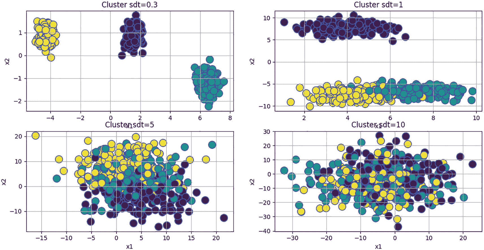

四个散点图，用于三个中心的 Gaussian 团块聚类。聚类分离为 0.3、1、5 和 10。对于 0.3 的聚类分离，三个聚类是分离的。

图 5-20

使用不同聚类分离进行聚类的 Gaussian 团块

在这个 sklearn.datasets 库中，也可以生成具有特定形状的数据。下面提到了圆形和半圆形形状。

make_circles() 函数为机器学习的分类问题生成两个圆形类别的数据。样本数量和数据噪声水平是该函数的两个重要参数。

```py
import sklearn.datasets as skl_dt
c_map=plt.cm.get_cmap("YlGnBu")
data_circle=skl_dt.make_circles(n_samples=200) # Generating data to form a circle with 200 samples and without any noise
df_circle = pnd.DataFrame(data_circle[0],columns=["x1", "x2"]) # Data set has 2 features
df_circle['y'] =data_circle[1]
plt.figure()
plt.scatter(df_circle['x1'],df_circle['x2'],c=df_circle['y'],s=100,edgecolors='k') # Scatter plot for each feature
plt.xlabel('x1')
plt.ylabel('x2')
plt.grid(True)
plt.show()
Output:
```

您将看到图 5-21 中所示的图形。

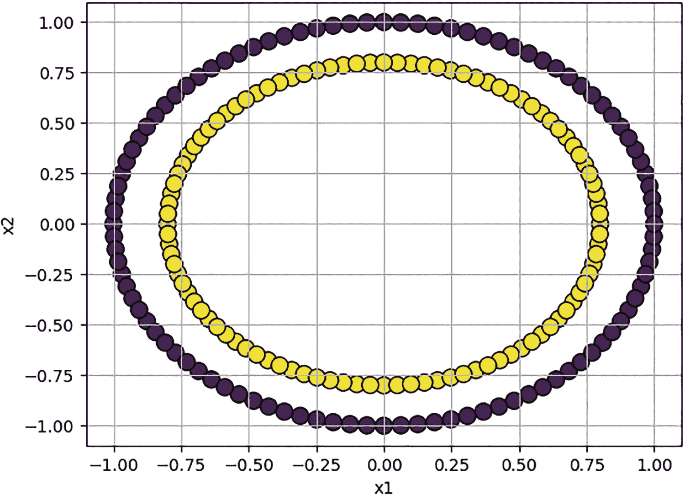

在 x1 和 x2 之间形成两个无噪声同心圆的散点图。

图 5-21

无噪声的圆形

使用 GANs 生成表格合成数据

```py
import sklearn.datasets as skl_dt
fig, ax = plt.subplots(2,2)
a=221
for noise_ in [0,0.05,0.1,0.5]: #noise parameter
plt.subplot(a)
data_circle=skl_dt.make_circles(n_samples=200, noise=noise_) # Generates the data with the noise parameter.
df_circle = pnd.DataFrame(data_circle[0],columns=["x1", "x2"])
df_circle['y'] =data_circle[1]
plt.scatter(df_circle['x1'],df_circle['x2'],c=df_circle['y'],s=100,edgecolors='k')
plt.title('Noise value= '+str(noise_))
a+=1
plt.show()
Output:
```

您将看到图 5-22 中所示的图形。

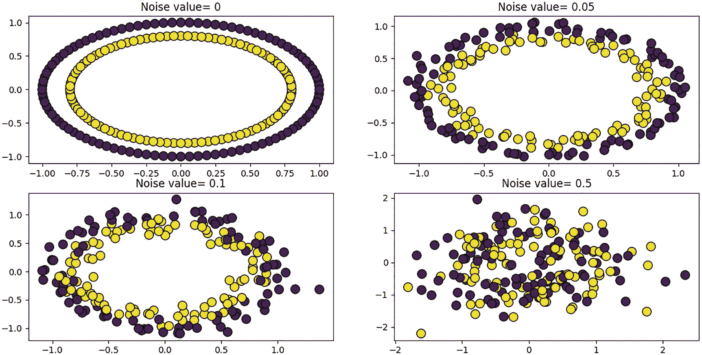

在 x1 和 x2 之间形成两个无噪声同心圆的散点图。

图 5-22

不同噪声的圆形

还可以使用 make_moons() 函数创建半圆形。

```py
import sklearn.datasets as skl_dt
data_moon=skl_dt.make_moons(n_samples=200) # Generating data to form a half circle with 200 samples and without any noise
df_moon = pnd.DataFrame(data_moon[0],columns=["x1", "x2"]) # Data set has 2 features
df_moon['y'] =data_moon[1]
plt.figure()
plt.scatter(df_moon['x1'],df_moon['x2'],c=df_moon['y'],s=100,edgecolors='k') #scatter plor for each feature
plt.xlabel('x1')
plt.ylabel('x2')
plt.grid(True)
plt.show()
Output:
```

您将看到图 5-23 中所示的图形。

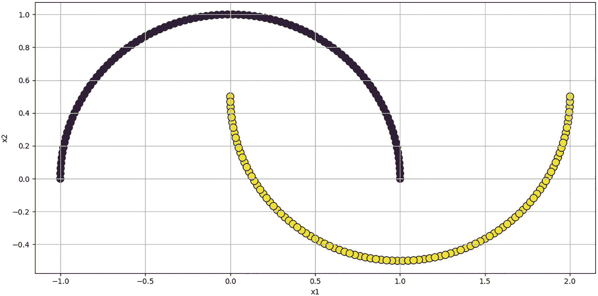

在 x1 和 x2 之间形成两个无噪声半圆形的散点图。

图 5-23

无噪声的半圆形

使用不同的噪声水平：

```py
import sklearn.datasets as skl_dt
fig, ax = plt.subplots(2,2)
a=221
for noise_ in [0,0.05,0.1,0.5]: # Noise parameter
plt.subplot(a)
data_moon=skl_dt.make_moons(n_samples=200, noise=noise_) # Generates the half circle data with the noise parameter.
df_moon = pnd.DataFrame(data_moon[0],columns=["x1", "x2"])
df_moon ['y'] =data_moon [1]
plt.scatter(df_moon['x1'],df_moon ['x2'],c=df_moon ['y'],s=100,edgecolors='k')
plt.title('Noise value= '+str(noise_))
a+=1
plt.show()
Output:
```

您将看到图 5-24 中所示的图形。

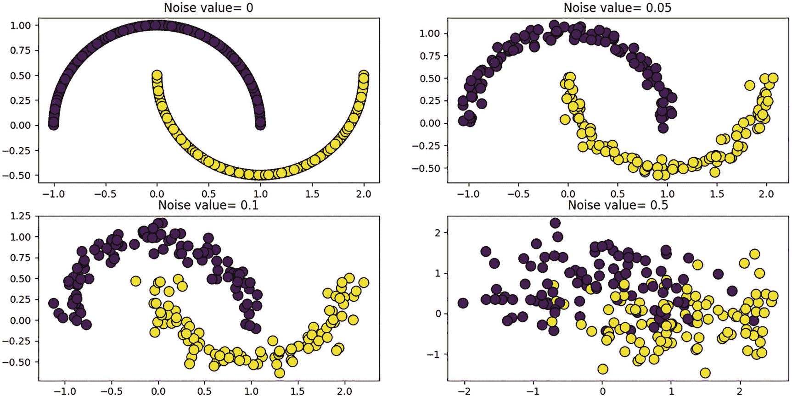

四个散点图，表示具有噪声等于 0、0.05、0.1 和 0.5 的 x1 和 x2 值的圆形。对于 0 噪声的圆形是完美的，随着噪声的增加而变形。

图 5-24

不同噪声的半圆形

## 通过应用 GANs 生成表格合成数据

GANs 可以用于生成任何类型的数据的合成数据，包括图像、文本和表格数据。在生成合成数据时，GANs 可以用于控制各种因素，例如类别不平衡，使合成数据更加真实。

使用 GAN 生成合成数据的一个优点是可以用来创建不可获得的数据。例如，如果有一个猫和狗的图像数据集，但没有兔子的图像，可以使用 GAN 生成兔子的合成图像。使用 GAN 生成合成数据的另一个优点是可以用来保护真实数据的隐私。例如，如果数据集包含敏感信息，如医疗记录，可以使用 GAN 生成与真实数据相似但不含任何敏感信息的合成数据。

使用 GAN 生成合成数据也有一些缺点。使用 GAN 生成合成数据有几个缺点。首先，GAN 可能难以训练。其次，GAN 生成数据可能较慢。第三，GAN 有时会生成看起来不真实的数据。尽管有这些缺点，GAN 仍然是生成合成数据的有力工具。GAN 是生成合成数据用于各种应用的很有前景的方法。

表格合成数据是通过应用 GAN 生成的。葡萄酒质量数据集来自 Kaggle 公共数据集。然而，“质量”数据集在两组 0 和 1 下进行分析，其中质量值是 3、4 或 5，则“质量”变为 0；如果质量值是 6 或 7，则“质量”变为 1。首先，通过应用随机森林分类方法对真实数据集进行检查准确率。

除了 Numpy、pandas 和 matplotlib 库之外，还添加了以下库。

```py
import sklearn.model_selection as sms
from sklearn import ensemble
from sklearn import metrics
from tensorflow import keras
wine_data = pnd.read_csv('C:/..../WineQTNew.csv')# Path shows place that where the WineQTNew file is located
x_var_name=['fixed_acidity', 'volatile_acidity', 'citric_acid',
'residua_ sugar', 'chlorides', 'free_sulfur_dioxide', 'total_sulfur_dioxide',
'density', 'pH', 'sulphates', 'alcohol']
y_var_name=['quality']
x_wine =wine_data[x_var_name]
y_wine =wine_data[y_var_name]
x_r_trn, x_r_tst, y_r_trn, y_r_tst=sms.train_test_split(x_wine, y_wine,random_state=40)
random_forest=ensemble.RandomForestClassifier(n_estimators=200)
random_forest.fit(x_r_trn, y_r_trn.values.ravel())
y_r_prd=random_forest.predict(x_r_tst)
print ("Acurracy: ", metrics.accuracy_score(y_r_tst, y_r_prd))
print ("Classification Result : ",metrics.classification_report(y_r_tst, y_r_prd))
Output:
Accuracy:  0.7692307692307693
Classification Result :                precision    recall  f1-score  support
0       0.71      0.76      0.73       119
1       0.82      0.78      0.80       167
accuracy                           0.77       286
macro avg       0.76      0.77      0.76       286
weighted avg       0.77      0.77      0.77       286
```

基于随机森林分类的葡萄酒质量模型准确率为 0.76。这个结果将在以下部分与从生成伪造数据中训练的模型进行比较。

### 合成数据生成

GAN 的训练过程涉及生成器和判别器网络相互竞争以生成真实数据样本。生成器网络试图生成足够真实的数据样本以欺骗判别器网络，而判别器网络则试图区分真实和生成数据样本。两个网络之间的竞争推动了训练过程，并最终导致生成器网络能够生成真实数据样本。

GAN 有许多应用，如图像生成、视频生成和文本生成。GAN 还被用于更实际的应用，例如生成逼真的面部图像、生成合成医学图像以及创建新产品。

GAN 有两个主要部分，一个是生成，另一个是判别。以下函数用于 GAN 的伪造数据生成 [1]。

```py
def hidden_genset(hidden_size, number_s):
ent_x = npy.random.randn(hidden_size * number_s)
ent_x = ent_x .reshape(number_s, hidden_size)
return ent_x
def fake_generate(genset, hidden_size, number_s):
ent_x = hidden_genset(hidden_size, number_s)
fake_x = genset.predict(ent_x)
fake_y = npy.zeros((number_s, 1))
return fake_x, fake_y
def real_generate(s_number):
real_x = wine_data.sample(s_number)
real_y = npy.ones((s_number, 1))
return real_x, real_y
def gan_genset(hidden_size, n_outputs=12):
gan_mdl = keras.models.Sequential()
gan_mdl.add(keras.layers.Dense(16, activation='selu',  kernel_initializer='random_normal', input_dim=hidden_size))
gan_mdl.add(keras.layers.Dense(32, activation='selu'))
gan_mdl.add(keras.layers.Dense(n_outputs, activation='softmax'))
return gan_mdl
genset1 = gan_genset(13, 12)
genset1.summary()
Output:
Model: "sequential"
_________________________________________________________________
Layer (type)                Output Shape              Param #
=================================================================
dense (Dense)               (None, 16)                224
dense_1 (Dense)             (None, 32)                544
dense_2 (Dense)             (None, 12)                396
=================================================================
Total params: 1,164
Trainable params: 1,164
Non-trainable params: 0
```

判别函数的定义如下。

```py
def gan_sorter(in_number=12):
gan_mdl = keras.models.Sequential()
gan_mdl.add(keras.layers.Dense(30, activation='selu', kernel_initializer='random_normal', input_dim=in_number))
gan_mdl.add(keras.layers.Dense(60, activation='selu'))
gan_mdl.add(keras.layers.Dense(1, activation='sigmoid'))
gan_mdl.compile(loss='binary_crossentropy', optimizer='adam', metrics=['accuracy'])
return gan_mdl
sorter1 = gan_sorter(12)
sorter1.summary()
Model: "sequential_1"
_________________________________________________________________
Layer (type)                Output Shape              Param #
=================================================================
dense_3 (Dense)             (None, 30)                390
dense_4 (Dense)             (None, 60)                1860
dense_5 (Dense)             (None, 1)                 61
=================================================================
Total params: 2,311
Trainable params: 2,311
Non-trainable params: 0
```

运行生成器和判别器函数后，可以创建由这些函数组成的 GANs。生成 GAN 模型每次根据批处理函数重新计算。

```py
def gan_model(genset, sorter):
sorter.trainable = False
gan_mdl = keras.models.Sequential()
gan_mdl.add(genset)
gan_mdl.add(sorter)
gan_mdl.compile(loss='binary_crossentropy', optimizer='adam')
return gan_mdl
def plot_history(sorter_graph, genset_graph):
plt.plot(sorter_graph, label='Sorter')
plt.plot(genset_graph, label='Genset')
plt.show()
plt.close()
def data_train(genset_mdl,sorter_model, model_gan, hidden_dim, n_epochs=1000, n_batch=140, n_eval=250):
b_size = int(n_batch / 2)
sorter_hist= []
genset_hist= []
for i in range(n_epochs):
x_r, y_r = real_generate(b_size)
x_f, y_f = fake_generate(genset_mdl, hidden_dim,b_size)
r_loss_d, acc_real_d= sorter_model.train_on_batch(x_r, y_r)
f_loss_d, acc_fake_d= sorter_model.train_on_batch(x_f, y_f)
loss_value_d = 0.5 * npy.add(r_loss_d,f_loss_d)
x_g_values = hidden_genset(hidden_dim, n_batch)
y_g_values = npy.ones((n_batch, 1))
fake_g_loss = model_gan.train_on_batch(x_g_values, y_g_values)
print('>%d_value, d1_value=%.4f, d2_value=%.4f d_value=%.4f g_value=%.4f' % (i+1, r_loss_d, f_loss_d, loss_value_d, fake_g_loss))        sorter_hist.append(loss_value_d)
genset_hist.append(fake_g_loss )
plot_history(sorter_hist, genset_hist)
genset_mdl.save('generated model of trained data.h5') # This is where we save the data that we use later
hidden_dim = 13
sorter = gan_sorter() # gan_sorter function is running
genset = gan_genset(hidden_dim) # gan_genset function is running
new_g_model = gan_model(genset, sorter) # gan_model function is running
data_train(genset, sorter, new_g_model, hidden_dim) # Data train function is running
Output:
....
>995_value, d1_value=0.0000, d2_value=0.0001 d_value=0.0000 g_value=9.3510
>996_value, d1_value=0.0000, d2_value=0.0001 d_value=0.0000 g_value=9.3403
>997_value, d1_value=0.0000, d2_value=0.0001 d_value=0.0000 g_value=9.3636
>998_value, d1_value=0.0000, d2_value=0.0001 d_value=0.0000 g_value=9.3703
>999_value, d1_value=0.0000, d2_value=0.0001 d_value=0.0000 g_value=9.3455
>1000_value, d1_value=0.0000, d2_value=0.0001 d_value=0.0000 g_value=9.4020
```

训练好的 GAN 模型被保存以供以后使用。

排序器和 Genset 函数的图在图 5-25 中给出。

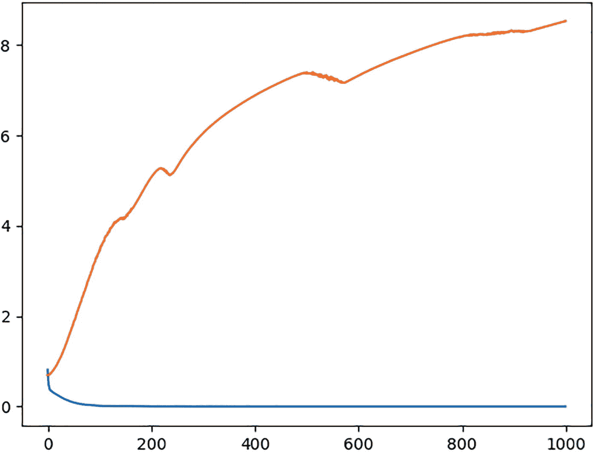

排序器和 Genset 函数的线图。

图 5-25

排序器和 Genset 图

```py
Genset and sorter functions plot.
gan_model_trained =keras.models.load_model('C:/........./generated model of trained data.h5') # We read our data once file from wherever we saved it. We have to have specific path.
hidden_dots = hidden_genset(13, 800)
x_predict = gan_model_trained.predict(hidden_dots)
trained_fake_data= pnd.DataFrame(data=x_predict,  columns=['fixed_acidity',        'volatile_acidity', 'citric_acid', 'residua_ sugar','chlorides',
'free_sulfur_dioxide', 'total_sulfur_dioxide', 'density', 'pH',
'sulphates', 'alcohol','quality' ]) trained_fake_data .head()
quality_mean = trained_fake_data .quality.mean()
trained_fake_data['quality'] = trained_fake_data ['quality'] > quality_mean
trained_fake_data["quality"] = trained_fake_data ["quality"].astype(int)
features = ['fixed_acidity', 'volatile_acidity', 'citric_acid',
'residua_ sugar', 'chlorides', 'free_sulfur_dioxide', 'total_sulfur_
dioxide', 'density', 'pH', 'sulphates', 'alcohol']
label = ['quality']
x_f_predicted =trained_fake_data [features]
y_f_predicted =trained_fake_data [label]
x_f_trn, x_f_tst, y_f_trn, y_f_tst = sms.train_test_split(x_f_predicted, y_f_predicted, random_state=99)
random_forest_fake = ensemble.RandomForestClassifier(n_estimators=200)
random_forest_fake.fit(x_f_trn,y_f_trn.values.ravel())
y_f_pred=random_forest_fake.predict(x_f_tst)
print("Fake data Accuracy ",metrics.accuracy_score(y_f_tst, y_f_pred))
print("Fake data Classification Result:",metrics.classification_report(y_f_tst, y_f_pred))
Output:
Fake data Accuracy  0.965
Fake data Classification Result:               precision    recall  f1-score  support
0       0.97      0.98      0.97       135
1       0.95      0.94      0.95        65
accuracy                           0.96       200
macro avg       0.96      0.96      0.96       200
weighted avg       0.96      0.96      0.96       200
```

当我们将我们的真实训练数据（准确率为 0.76）与伪造数据（准确率为 0.96）进行比较时，看起来我们的伪造数据表现出更好的性能。

```py
from table_evaluator import load_data, TableEvaluator # Table_evalutor needs to be add to library.
evaluation_table = TableEvaluator(wine_data,trained_fake_data)
evaluation_table.evaluate(target_col='quality')
evaluation_table.visual_evaluation()
Output:
Mean Correlation between fake and real columns 0.8129
```

真实和伪造数据的绝对对数平均值和 STDs 在图 5-26 中给出。

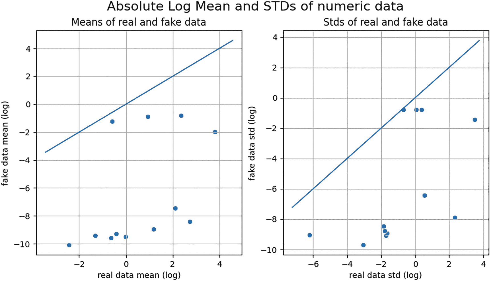

两个绝对对数平均值和 STDs 的图，用于数值真实和伪造数据。两个图都是线性增加的。

图 5-26

绝对对数平均值和 STDs

合成列与真实列之间的相关系数为 0.8129。看起来我们的合成数据表现出更好的性能。

根据变量的特征给出的累积和在图 5-27 中。

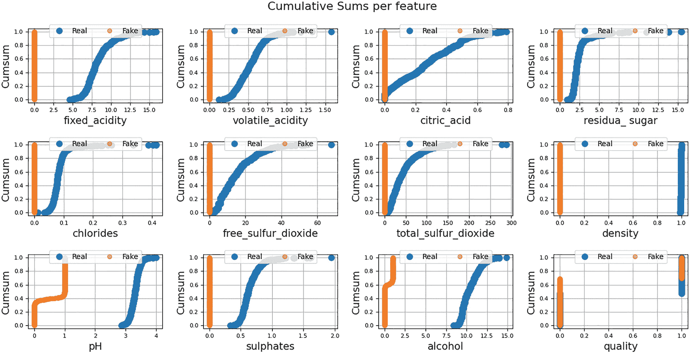

每个特征的真实和伪造数据的累积和的十二个图。在质量方面，真实和伪造数据几乎相同，但在其他特征方面差异很大。

图 5-27

每个特征的累积和

每个特征的分布图在图 5-28 中给出。

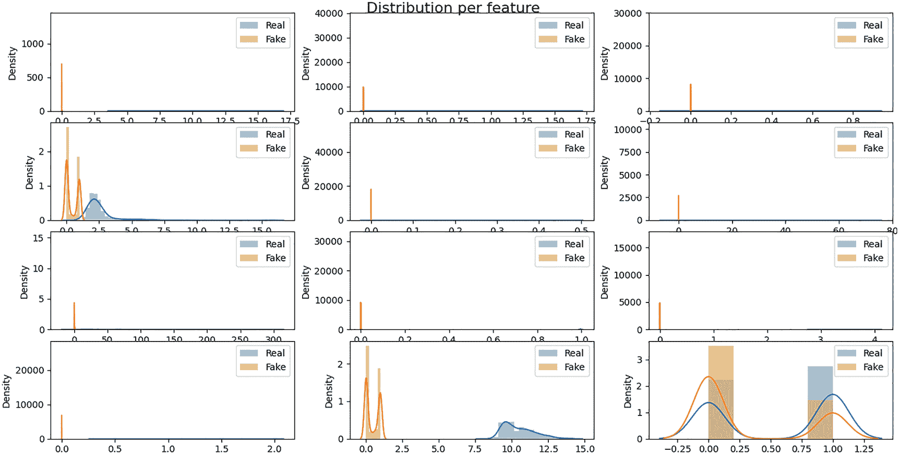

真实和伪造数据每个特征的分布的十二个图。在质量方面，真实和伪造数据重叠，但在其他特征方面差异很大。

图 5-28

每个特征的分布

图 5-29 展示了真实、伪造和差异数据的相关性。

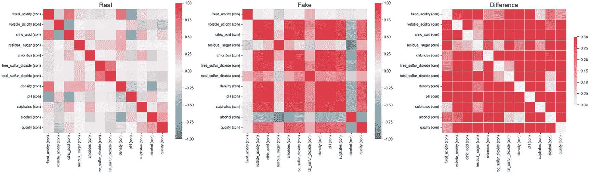

真实和伪造数据中特征如酸度、残余糖、密度、pH 值、硫酸盐和酒精的相关性的三个棋盘状图。

图 5-29

真实、伪造和差异数据的相关性

图 5-30 展示了 PCA 的前两个成分。

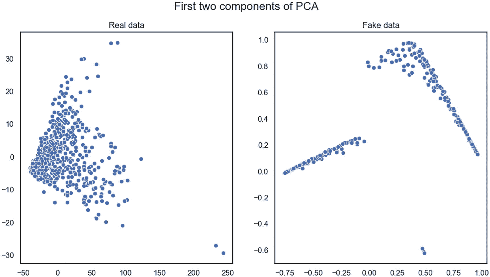

真实和伪造数据的前两个成分的两个散点图。一个区域用于真实数据，为伪造数据形成两个区域。

图 5-30

PCA 的前两个成分

## 摘要

在本章中，你学习了如何使用 Python 生成合成数据。你还学习了如何使用高斯噪声为回归问题生成合成数据。此外，你学习了如何使用弗里德曼函数和符号回归为分类和聚类问题生成合成数据。最后，你学习了如何使用 GANs 生成表格合成数据。

## 参考

1.  Fzhurd，“使用 GANs 生成表格合成数据集的逐步指南”，Analytics Vidhya，2021。[`medium.com/analytics-vidhya/a-step-by-step-guide-to-generate-tabular-synthetic-dataset-with-gans-d55fc373c8db`](https://medium.com/analytics-vidhya/a-step-by-step-guide-to-generate-tabular-synthetic-dataset-with-gans-d55fc373c8db).
